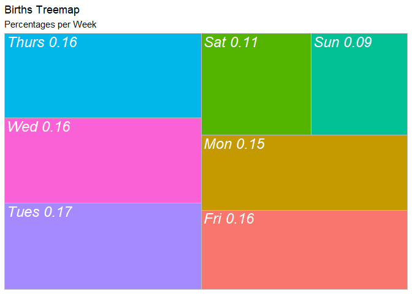
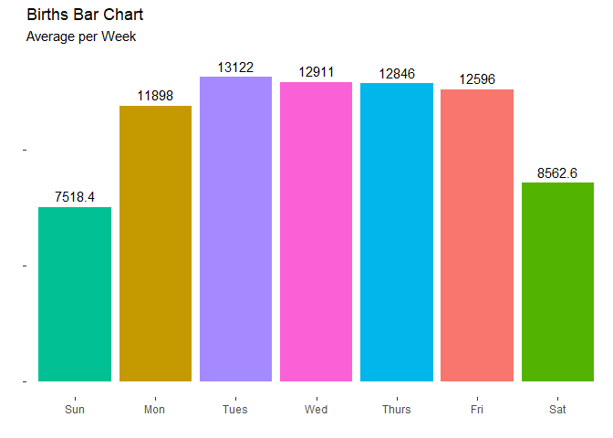
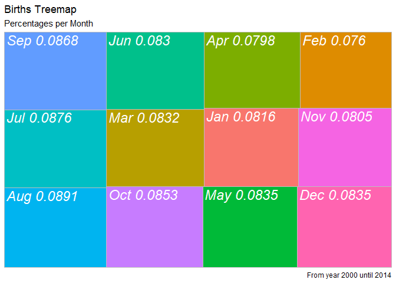
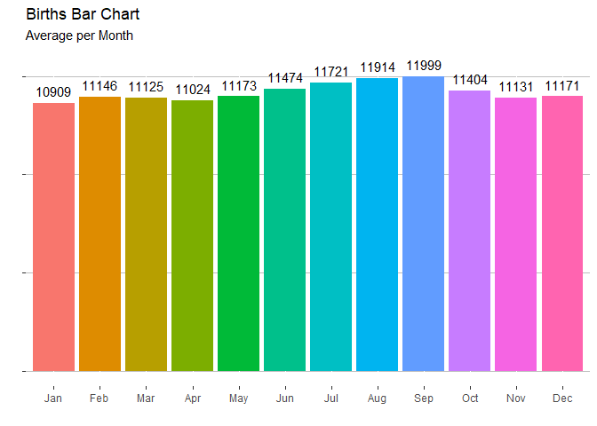
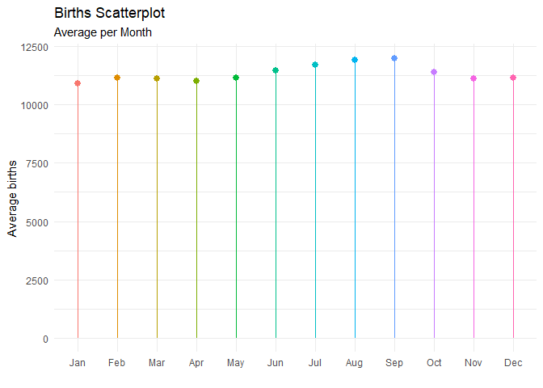
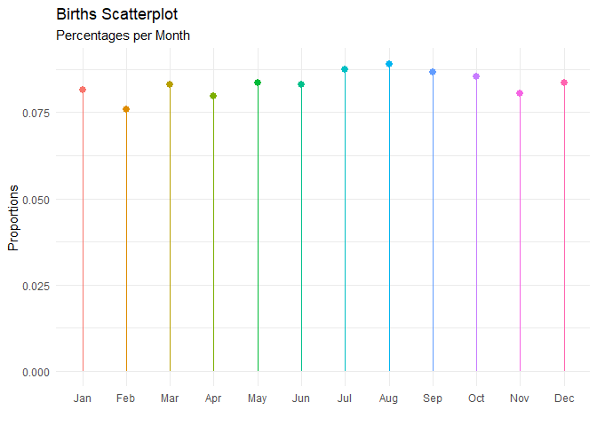

# Data Visualization Project 01

# Introduction

For this Mini-Project 1, I'm going to be exploring some interesting facts about birth tendencies through time, using the U.S. birth data from 2000 until 2014. For this analysis, I'm going to employ the knowledge I had gain the Data Visualization class, regarding Data Exploration and Grammar and Glamour of Graphics. 

Basically what we would like to explore is if there is a tendency of childbirth through a certain period of time. In this case, we are going to look at:

- **Births per week:** births are supposed to occur randomly on any day, however it would be interesting to see if there a tendency related to weekdays.

- **Births per month:** we are going to explore if there is a tendency of births through months, and speculate or deduct if there are parents planning and yearly-seasonal factors related to child conceiving.

The steps of the analysis and the conclusions are described below.


# Analysis Process & Results Report

## 1. Load Libraries

First, I loaded in RStudio the tool packages I used to work with data and graphs, with are the libraries described below.


```r
library(tidyverse)
library(treemapify)
library(ggfittext)
library(scales)
library(expss)
```

## 2. Import the data

Second, I loaded the data into my environment. I worked with the data us_births_00_14.csv, obtained from Github (Link: https://raw.githubusercontent.com/reisanar/datasets/master/us_births_00_14.csv).	


```r
us_birth_data <- read_csv("../data/us_births_00_14.csv")
view(us_birth_data)
```

## 3. Per week births Analysis

In this third step, I'm going to analyse the U.S. Births per Week. The idea is to look on the proportions of children born per day of the week and average data per day of the week, to see if both statistical analysis gives us a general tendency.

### 3.1 Summarize the data

Before plotting my visuals, I'm going to group and arrange the data per day of the week, and put them in terms of average and proportion.


```r
prop_per_week <- us_birth_data %>%
  group_by(day_of_week) %>%
  summarize(total = sum(births)) %>%
  mutate(prop = round(total / sum(total), 2))
prop_per_week 
```

```
## # A tibble: 7 x 3
##   day_of_week    total  prop
##   <chr>          <dbl> <dbl>
## 1 Fri          9850199  0.16
## 2 Mon          9316001  0.15
## 3 Sat          6704495  0.11
## 4 Sun          5886889  0.09
## 5 Thurs       10045436  0.16
## 6 Tues        10274874  0.17
## 7 Wed         10109130  0.16
```

```r
average_per_week <- us_birth_data %>%
  group_by(day_of_week) %>%
  summarize(avg = mean(births))
week_levels <- c("Sun", "Mon", "Tues", "Wed", "Thurs", "Fri", "Sat")
day_of_week <- factor(prop_per_week$day_of_week, levels = week_levels, ordered = F)
average_per_week
```

```
## # A tibble: 7 x 2
##   day_of_week    avg
##   <chr>        <dbl>
## 1 Fri         12596.
## 2 Mon         11898.
## 3 Sat          8563.
## 4 Sun          7518.
## 5 Thurs       12846.
## 6 Tues        13122.
## 7 Wed         12911.
```

### 3.2 Plot the graphs

After obtaining the tables with data arranged, I'm going to plot the visuals. For analyzing the information, I'm plotting two graphs:

- **Treemap of the Births Percentage per day of the week:** as humans are very good visualizing lines and lengths, I decided to use this type of graph to emphasize the proportional differences.
- **Barchart of the Averages per Day of the week:** as the averages intend to express births amounts, I want to use Bar charts in a plain format that can express how big the average numbers are and at the same time, reflect the differences between days.


```r
ggplot(prop_per_week, aes(area = total, fill = day_of_week, label = paste(day_of_week, prop, sep = " "))) + 
  geom_treemap(show.legend = FALSE) +
  geom_treemap_text(fontface = "italic", colour = "white", place = "topleft", grow = FALSE) +
  labs(title = "Births Treemap", subtitle = "Percentages per Week")
```

<!-- -->

```r
ggplot(average_per_week, aes(x = fct_relevel(day_of_week, "Sun", "Mon", "Tues", "Wed", "Thurs", "Fri", "Sat"), y = avg, fill = day_of_week)) +
  geom_col() +
  geom_text(aes(label = signif(avg, digits = 5)), nudge_y = 500) +
  labs(title = "Births Bar Chart", subtitle = "Average per Week", x = "", y = "") +
  theme(legend.position = "none", axis.text.y = element_blank(), panel.background = element_blank())
```

<!-- -->

### 3.3 Visual Analysis and Conclusions

After plotting the graphs, both show a clear tendency: births tend to occur more in the middle of the weekdays and less during weekends.
This data shows that births between Tuesday, Wednesday and Thursday have percentages 16.52%, 16.25% and 16.15% respectively, and on Saturday and Sunday have percentages of 10.78% and 9.46%. Is good to notice that the difference between weekdays are not big. We can relate highs and lows variations of weekdays vs. weekends due to the following factors: 

- There are more medical personnel and equipment available and ready to attend child births during weekdays. 

- People tend to go out less during weekends, and do more dilligences during weekdays. That might psicologically condition parents mind to give birth.


## 4. Monthly births Analysis

In this fourth step, I'm going to analyse the U.S. Births, but per month. Here I'm to explore the proportions of children born per month and average data per month, to see if both statistical analysis gives us a general tendency.


### 4.1 Summarize the data

Before plotting my visuals, I'm going to group and arrange the data per month, and put them in terms of average and proportion.


```r
prop_per_month <- us_birth_data %>%
  group_by(month) %>%
  summarize(total = sum(births)) %>%
  mutate(prop = round(total / sum(total), 4))
prop_per_month$month <- factor(prop_per_month$month, levels = c(1:12),labels = c("Jan", "Feb", "Mar", "Apr", "May", "Jun", "Jul", "Aug", "Sep", "Oct", "Nov", "Dec"))
prop_per_month 
```

```
## # A tibble: 12 x 3
##    month   total   prop
##    <fct>   <dbl>  <dbl>
##  1 Jan   5072588 0.0816
##  2 Feb   4725693 0.076 
##  3 Mar   5172961 0.0832
##  4 Apr   4960750 0.0798
##  5 May   5195445 0.0835
##  6 Jun   5163360 0.083 
##  7 Jul   5450418 0.0876
##  8 Aug   5540170 0.0891
##  9 Sep   5399592 0.0868
## 10 Oct   5302865 0.0853
## 11 Nov   5008750 0.0805
## 12 Dec   5194432 0.0835
```

```r
average_per_month <- us_birth_data %>%
  group_by(month) %>%
  summarize(avg = mean(births))
average_per_month$month <- factor(average_per_month$month, levels = c(1:12),labels = c("Jan", "Feb", "Mar", "Apr", "May", "Jun", "Jul", "Aug", "Sep", "Oct", "Nov", "Dec"))
average_per_month
```

```
## # A tibble: 12 x 2
##    month    avg
##    <fct>  <dbl>
##  1 Jan   10909.
##  2 Feb   11146.
##  3 Mar   11125.
##  4 Apr   11024.
##  5 May   11173 
##  6 Jun   11474.
##  7 Jul   11721.
##  8 Aug   11914.
##  9 Sep   11999.
## 10 Oct   11404.
## 11 Nov   11131.
## 12 Dec   11171.
```

### 4.2 Plotting the the graphs

After obtaining the tables with data arranged, I'm going to plot the visuals. For analyzing the information, I'm plotting a **Treemap of the Births Percentage per month** and a **Barchart of the Averages per Month**, for the same reasons I described in the previous step.


```r
ggplot(prop_per_month, aes(area = total, fill = month, label = paste(month, prop, sep = " "))) + 
  geom_treemap(show.legend = FALSE) +
  geom_treemap_text(fontface = "italic", colour = "white", place = "topleft", grow = FALSE) +
  labs(title = "Births Treemap", subtitle = "Percentages per Month", caption = "From year 2000 until 2014")
```

<!-- -->

```r
ggplot(average_per_month, aes(x = month, y = avg, fill = month)) +
  geom_col() +
  geom_text(aes(label = signif(avg, digits = 5)), nudge_y = 500) +
  labs(title = "Births Bar Chart", subtitle = "Average per Month", x = "", y = "") +
  theme(legend.position = "none", axis.text.y = element_blank(), panel.background = element_blank(), panel.grid.major.y = element_line(color = "gray"))
```

<!-- -->

### 4.3 Visual Analysis

According to the treemap grpahic, it can be seen that percentage of births bewteen months are very similar. The variation between months almost umnoticiable, as the rectangles are almost the same size. 

A similar behaviour can be seen on the barchart: average births between months are very similar. For this reason, I wanted to include some horizontal gridlines to have a differences reference, and have a better sight of the differences between months. But this graph have a visual problem: the bars seems to saturate the chart. This is because on each bar, the area that goes horizontally from 10909 down to 0 is unnecesary for comparison purposes.

For the reasons described above, I decided to graph the data on a scatterplot, to be able to see better the variations between months.


### 4.4 Plot Lollipop Charts

For the Lollipop charts, the range of the vertical axis will comprehend only the area in between the points lie, as I only want to focus the differences between months. Also, the default theme with gray background and white grid is used, and points are colored to add contrast to observations.


```r
ggplot(average_per_month, aes(x = month, y = avg, color = month)) +
  geom_pointrange(aes(ymin = 0, ymax = average_per_month$avg), show.legend = FALSE) +
  labs(title = "Births Scatterplot", subtitle = "Average per Month", x = "", y = "Average births") +
  theme_minimal()
```

```
## Warning: Use of `average_per_month$avg` is discouraged. Use `avg` instead.
```

<!-- -->

```r
ggplot(prop_per_month, aes(x = month, y = prop, color = month)) + 
  geom_pointrange(aes(ymin = 0, ymax = prop_per_month$prop), show.legend = FALSE) +
  labs(title = "Births Scatterplot", subtitle = "Percentages per Month", x = "", y = "Proportions") +
  theme_minimal()
```

```
## Warning: Use of `prop_per_month$prop` is discouraged. Use `prop` instead.
```

<!-- -->


### 4.5 Visual Analysis and Conclusions

In the average births scatterplot, it can be seen that the amount of children births tend to rise from April, until rising a high peak of 12,000 in September, and then it falls down on October, where averages Oscilates below 11,400 and reach a low peak in January and another one on April. Taking in cosideration the mothers 9-months pregnancy period, the slighly peak variation can be attributed by parents who plan having their babies during end and start of the year.

But, as average numbers can have deviations and outliers that can bias the result of the analysis, for a more accurate comparison between months, I plotted the scatterplot of the percentages per months. In this one, it is noticable that differences between months are more fluctuating, but the higher proportions are between July and September, which reinforces the deduction previously made. Also, the fact that higher proportions occur during summer can be related to a better weather conditions to take care of the new born babies.

As seen in the graphs I planned to plot in the first instance, values are very similar (specially in proportions between months). Therefore, the conclusions made from the scatterplots are only justifiying the small variations between points, and are not absolute and conclusive facts.


## Future work improvements

On the next mini-project, I would like to customize better the graphs, taking more advantage of contrast, repetitions and alignment to highlight the important findings. For example, I would like to highlight high and low peaks observations and the data around them, using diverging palettes colors, instead of coloring the points randomly.

Also, I would like to get more familiar with data grouping and summarizing. This would allow me to zoom in into different aspects, and  to be able to explore deeper and find interesting information, to sustain better the conclusions.
