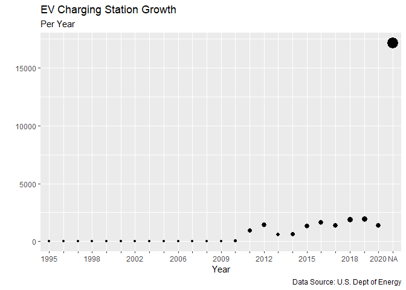
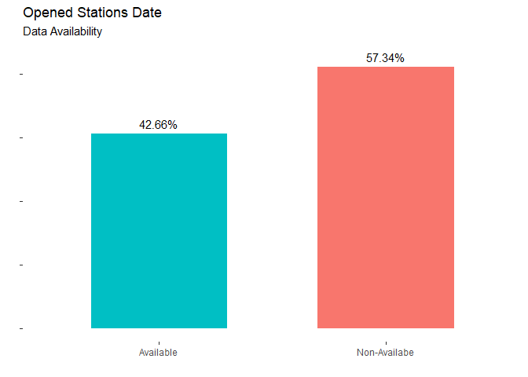
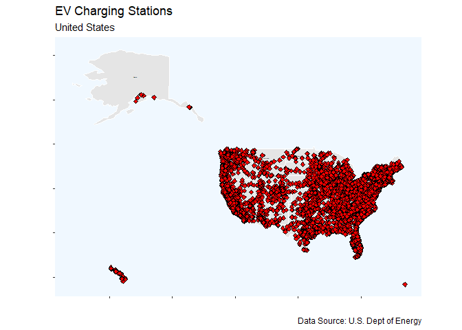
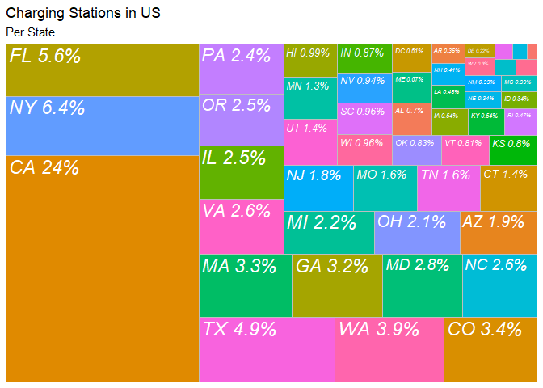
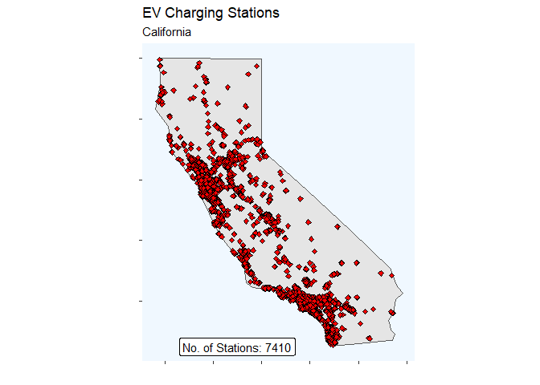
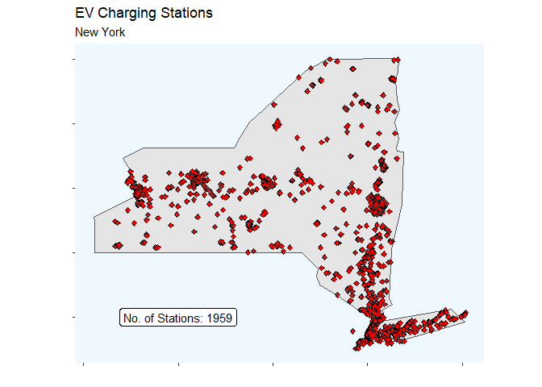
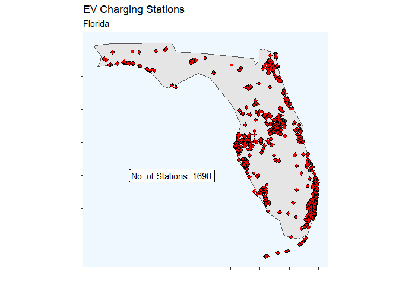

# Data Visualization Project 02

# 1. Introduction

Although commercially the most popular fuels for the past 70+ years had been gasoline and diesel, during the last 20 years cars manufacturers and technicians had incorporated other type of fuels which are cheaper and cleaner to produce and to run. As those benefits are directly transfered to final consumers, the use of those fuels had grown. As an example we have Ethanol (E85), Hydrogen (Fuel Cell) and in other countries, Propane Gas (LPG) and Natural Gas.

But the is another alternative "fuel" that had been chatching up the attention of people, and it is Electric-powered vehicles. As electric vehicles are cheaper to run and have a simpler propulsion system, people are seeing that it is feasible to  use those cars.

This type of propulsion system had been developed and used from the 90s decade, as a support to run gasoline and diesel cars with more fuel economy, as Hybrid Cars. But batteries development in terms of energy density, charging cycles and speed, cooling and reliability, had led to put them as the only (or main) source of energy for cars and it had been a success during the 2010s decade.

In this project, we are going to focus on one of the main concerns of Electric Vehicles (EVs): where to charge them. For this reason, we are going to explore the locations, growth and development of EVs charging stations, through visualizations.


# 2. Analysis

## 2.1 Importing the Data

In this step, the main source of data is going to be loaded in the environment.


```r
library(tidyverse)
```

```
## -- Attaching packages ----------------------- tidyverse 1.3.0 --
```

```
## v ggplot2 3.3.2     v purrr   0.3.4
## v tibble  3.0.3     v dplyr   1.0.2
## v tidyr   1.1.2     v stringr 1.4.0
## v readr   1.3.1     v forcats 0.5.0
```

```
## -- Conflicts -------------------------- tidyverse_conflicts() --
## x dplyr::filter() masks stats::filter()
## x dplyr::lag()    masks stats::lag()
```

```r
alt_fuel_stations <- read_csv("../data/alt_fuel_stations (Nov 5 2020).csv")
```

```
## Parsed with column specification:
## cols(
##   .default = col_character(),
##   ZIP = col_double(),
##   Plus4 = col_logical(),
##   `Expected Date` = col_logical(),
##   `EV Level1 EVSE Num` = col_double(),
##   `EV Level2 EVSE Num` = col_double(),
##   `EV DC Fast Count` = col_double(),
##   Latitude = col_double(),
##   Longitude = col_double(),
##   ID = col_double(),
##   `Federal Agency ID` = col_double(),
##   `LPG Primary` = col_logical(),
##   `E85 Blender Pump` = col_logical(),
##   `Intersection Directions (French)` = col_logical(),
##   `Access Days Time (French)` = col_logical(),
##   `BD Blends (French)` = col_logical(),
##   `Hydrogen Is Retail` = col_logical(),
##   `CNG Dispenser Num` = col_double(),
##   `CNG On-Site Renewable Source` = col_logical(),
##   `CNG Total Compression Capacity` = col_double(),
##   `CNG Storage Capacity` = col_double()
##   # ... with 2 more columns
## )
```

```
## See spec(...) for full column specifications.
```

```
## Warning: 13571 parsing failures.
##  row                          col           expected    actual                                         file
## 2269 CNG On-Site Renewable Source 1/0/T/F/TRUE/FALSE LANDFILL  '../data/alt_fuel_stations (Nov 5 2020).csv'
## 3133 CNG On-Site Renewable Source 1/0/T/F/TRUE/FALSE LANDFILL  '../data/alt_fuel_stations (Nov 5 2020).csv'
## 4439 CNG On-Site Renewable Source 1/0/T/F/TRUE/FALSE LIVESTOCK '../data/alt_fuel_stations (Nov 5 2020).csv'
## 5145 CNG On-Site Renewable Source 1/0/T/F/TRUE/FALSE LANDFILL  '../data/alt_fuel_stations (Nov 5 2020).csv'
## 7402 CNG On-Site Renewable Source 1/0/T/F/TRUE/FALSE SOLAR     '../data/alt_fuel_stations (Nov 5 2020).csv'
## .... ............................ .................. ......... ............................................
## See problems(...) for more details.
```


## 2.2 Growth of EV Stations

In this section the growth of Electric Stations is going to be explored. This information will be reflected through visualizations as barplot, scatterplot and interactive maps that reflects how many electric stations were installed, in year periods.

### Preparing the Data

For getting only the Electric Vehicles Charging stations, a dataframe will be created called "ev_charging_stations" with the desired information filtered. After that, as we want to explore the data per year, the month, day and year will be separated in new columns, so the year can be taken independently.


```r
## Filter only EV Stations

ev_charging_stations <- alt_fuel_stations %>%
  filter(alt_fuel_stations["Fuel Type Code"] == "ELEC" & Country != "CA")

## Separate Day, Month and Year

ev_charging_stations <- ev_charging_stations %>%
  separate(Open_Date, sep="/", into = c("Open_Month", "Open_Day", "Open_Year"), remove = FALSE)
```

After this, a new dataframe will be created, counting how many stations were opened, per year.


```r
# Number of EV chargers installed per year

ev_charging_stations_per_year <- ev_charging_stations %>%
  group_by(Open_Year) %>%
  summarize(Count = n())
```

```
## `summarise()` ungrouping output (override with `.groups` argument)
```

From the latest dataframe, the of the EV charging stations can be created. For this case, a scatterplot will be used.


```r
ggplot(ev_charging_stations_per_year, aes(x = Open_Year, y = Count, size = Count)) +
  geom_point() +
  labs(title = "EV Charging Station Growth", subtitle = "Per Year", x = "Year", y = "", caption = "Data Source: U.S. Dept of Energy") +
  scale_x_discrete(guide = guide_axis(check.overlap = TRUE)) +
  theme(legend.title = element_blank(), legend.position = "none")
```

<!-- -->

As seen, there is a high ammount of data of the date when stations were opened that is missing. Therefore, it would be good to explore how much information is missing and if it is feasible to get a conclusion from there. 

For this purpose, a percentage of the data we have and the one that is missing will be computed and imported as a new dataset to the environment.


```r
# Proportion data

Open_Date_Availability <- read_csv("../data/Open_Date_Availability.csv")
```

```
## Parsed with column specification:
## cols(
##   Open_Year_Availability = col_character(),
##   Total = col_double(),
##   Prop = col_double()
## )
```

For this case, a barplot that reflect proportions will be created.


```r
# Barplot

ggplot(Open_Date_Availability, mapping = aes(x = Open_Year_Availability, y = Total)) + 
  geom_bar(stat = 'identity', width = 0.6, aes(fill = c("red", "green"))) + 
  geom_text(aes(label = paste(signif(Prop*100, 4), "%", sep = "")), nudge_y = 800) +
  labs(title = "Opened Stations Date", subtitle = "Data Availability", x = "", y = "") +
  theme(legend.position = "none", axis.text.y = element_blank(), panel.background = element_blank())
```

<!-- -->

As seen in the graph, 57% of the Opened Station Date data is missing,  therefore is not fasible to use that information and drive conclusions from it. In this way, it is going to be explored how Chargers Stations are distributed along the United States and around the states.


## 2.3 Electric Vehicles Charging Stations in US

The chargers around United States are going to be shown in an interactive map of United States.


```r
library(sf)
```

```
## Warning: package 'sf' was built under R version 4.0.3
```

```
## Linking to GEOS 3.8.0, GDAL 3.0.4, PROJ 6.3.1
```

```r
library(plotly)
```

```
## Warning: package 'plotly' was built under R version 4.0.3
```

```
## 
## Attaching package: 'plotly'
```

```
## The following object is masked from 'package:ggplot2':
## 
##     last_plot
```

```
## The following object is masked from 'package:stats':
## 
##     filter
```

```
## The following object is masked from 'package:graphics':
## 
##     layout
```

```r
library(ggrepel)
```

```
## Warning: package 'ggrepel' was built under R version 4.0.3
```

```r
# Load map shapefile

states_provinces <- read_sf("../data/ne_110m_admin_1_states_provinces/ne_110m_admin_1_states_provinces.shp")


ggplot() +
  geom_sf(data = states_provinces, col = "white") +
  geom_text(data = states_provinces, aes(x = longitude, y = latitude, label = woe_name), size = 0.1) +
  geom_point(data = ev_charging_stations, 
             aes(x = Longitude, y = Latitude, label = `Station Name`), shape = 23, fill = "red") +
  labs(title = "EV Charging Stations", subtitle = "United States", caption = "Data Source: U.S. Dept of Energy", x = "", y = "") +
  theme(panel.background = element_rect(fill = "aliceblue"), panel.grid.major = element_blank(), panel.grid.minor = element_blank(), axis.text.x = element_blank(), axis.text.y = element_blank())
```

```
## Warning: Ignoring unknown aesthetics: label
```

<!-- -->

```r
ggplotly()
```

<!--html_preserve--><div id="htmlwidget-3222e7b94d39774b6b54" style="width:672px;height:480px;" class="plotly html-widget"></div>
<script type="application/json" data-for="htmlwidget-3222e7b94d39774b6b54">{"x":{"data":[{"x":[-160,-160,-160,-160,-160,-160,-160,-160,-160,-160,-160,-160,-160,-160,-160,-160,-160,-160,-160,-160,-160,-160,-160,-160,-160,-160,-160,-160,-160,-160,-160,-160,-160,-160,-160,-160,-160,-160,-160,-160,-160,-160,-160,-160,-160,-160,-160,-160,-160,-160,-160,-160,-160,-160,-160,-160,-160,-160,-160,-160,-160,-160,-160,-160,-160,-160,-160,-160,-160,-160,-160,-160,-160,-160,-160,-160,-160,-160,-160,-160,-160,-160,-160,-160,null,-140,-140,-140,-140,-140,-140,-140,-140,-140,-140,-140,-140,-140,-140,-140,-140,-140,-140,-140,-140,-140,-140,-140,-140,-140,-140,-140,-140,-140,-140,-140,-140,-140,-140,-140,-140,-140,-140,-140,-140,-140,-140,-140,-140,-140,-140,-140,-140,-140,-140,-140,-140,-140,-140,-140,-140,-140,-140,-140,-140,-140,-140,-140,-140,-140,-140,-140,-140,-140,-140,-140,-140,-140,-140,-140,-140,-140,-140,-140,-140,-140,-140,-140,-140,null,-120,-120,-120,-120,-120,-120,-120,-120,-120,-120,-120,-120,-120,-120,-120,-120,-120,-120,-120,-120,-120,-120,-120,-120,-120,-120,-120,-120,-120,-120,-120,-120,-120,-120,-120,-120,-120,-120,-120,-120,-120,-120,-120,-120,-120,-120,-120,-120,-120,-120,-120,-120,-120,-120,-120,-120,-120,-120,-120,-120,-120,-120,-120,-120,-120,-120,-120,-120,-120,-120,-120,-120,-120,-120,-120,-120,-120,-120,-120,-120,-120,-120,-120,-120,null,-100,-100,-100,-100,-100,-100,-100,-100,-100,-100,-100,-100,-100,-100,-100,-100,-100,-100,-100,-100,-100,-100,-100,-100,-100,-100,-100,-100,-100,-100,-100,-100,-100,-100,-100,-100,-100,-100,-100,-100,-100,-100,-100,-100,-100,-100,-100,-100,-100,-100,-100,-100,-100,-100,-100,-100,-100,-100,-100,-100,-100,-100,-100,-100,-100,-100,-100,-100,-100,-100,-100,-100,-100,-100,-100,-100,-100,-100,-100,-100,-100,-100,-100,-100,null,-80,-80,-80,-80,-80,-80,-80,-80,-80,-80,-80,-80,-80,-80,-80,-80,-80,-80,-80,-80,-80,-80,-80,-80,-80,-80,-80,-80,-80,-80,-80,-80,-80,-80,-80,-80,-80,-80,-80,-80,-80,-80,-80,-80,-80,-80,-80,-80,-80,-80,-80,-80,-80,-80,-80,-80,-80,-80,-80,-80,-80,-80,-80,-80,-80,-80,-80,-80,-80,-80,-80,-80,-80,-80,-80,-80,-80,-80,-80,-80,-80,-80,-80,-80,null,-177.081984492536,-176.363636363636,-175.151515151515,-173.939393939394,-172.727272727273,-171.515151515152,-170.30303030303,-169.090909090909,-167.878787878788,-166.666666666667,-165.454545454545,-164.242424242424,-163.030303030303,-161.818181818182,-160.606060606061,-159.393939393939,-158.181818181818,-156.969696969697,-155.757575757576,-154.545454545455,-153.333333333333,-152.121212121212,-150.909090909091,-149.69696969697,-148.484848484848,-147.272727272727,-146.060606060606,-144.848484848485,-143.636363636364,-142.424242424242,-141.212121212121,-140,-138.787878787879,-137.575757575758,-136.363636363636,-135.151515151515,-133.939393939394,-132.727272727273,-131.515151515152,-130.30303030303,-129.090909090909,-127.878787878788,-126.666666666667,-125.454545454545,-124.242424242424,-123.030303030303,-121.818181818182,-120.606060606061,-119.393939393939,-118.181818181818,-116.969696969697,-115.757575757576,-114.545454545455,-113.333333333333,-112.121212121212,-110.909090909091,-109.69696969697,-108.484848484848,-107.272727272727,-106.060606060606,-104.848484848485,-103.636363636364,-102.424242424242,-101.212121212121,-100,-98.7878787878788,-97.5757575757576,-96.3636363636364,-95.1515151515152,-93.9393939393939,-92.7272727272727,-91.5151515151515,-90.3030303030303,-89.0909090909091,-87.8787878787879,-86.6666666666667,-85.4545454545454,-84.2424242424242,-83.030303030303,-81.8181818181818,-80.6060606060606,-79.3939393939394,-78.1818181818182,-76.969696969697,-75.7575757575758,-74.5454545454545,-73.3333333333333,-72.1212121212121,-70.9090909090909,-69.6969696969697,-68.4848484848485,-67.2727272727273,-66.060606060606,-64.8484848484848,-63.6363636363636,-62.4242424242424,-61.2121212121212,-60.6827589203554,null,-177.081984492536,-176.363636363636,-175.151515151515,-173.939393939394,-172.727272727273,-171.515151515152,-170.30303030303,-169.090909090909,-167.878787878788,-166.666666666667,-165.454545454545,-164.242424242424,-163.030303030303,-161.818181818182,-160.606060606061,-159.393939393939,-158.181818181818,-156.969696969697,-155.757575757576,-154.545454545455,-153.333333333333,-152.121212121212,-150.909090909091,-149.69696969697,-148.484848484848,-147.272727272727,-146.060606060606,-144.848484848485,-143.636363636364,-142.424242424242,-141.212121212121,-140,-138.787878787879,-137.575757575758,-136.363636363636,-135.151515151515,-133.939393939394,-132.727272727273,-131.515151515152,-130.30303030303,-129.090909090909,-127.878787878788,-126.666666666667,-125.454545454545,-124.242424242424,-123.030303030303,-121.818181818182,-120.606060606061,-119.393939393939,-118.181818181818,-116.969696969697,-115.757575757576,-114.545454545455,-113.333333333333,-112.121212121212,-110.909090909091,-109.69696969697,-108.484848484848,-107.272727272727,-106.060606060606,-104.848484848485,-103.636363636364,-102.424242424242,-101.212121212121,-100,-98.7878787878788,-97.5757575757576,-96.3636363636364,-95.1515151515152,-93.9393939393939,-92.7272727272727,-91.5151515151515,-90.3030303030303,-89.0909090909091,-87.8787878787879,-86.6666666666667,-85.4545454545454,-84.2424242424242,-83.030303030303,-81.8181818181818,-80.6060606060606,-79.3939393939394,-78.1818181818182,-76.969696969697,-75.7575757575758,-74.5454545454545,-73.3333333333333,-72.1212121212121,-70.9090909090909,-69.6969696969697,-68.4848484848485,-67.2727272727273,-66.060606060606,-64.8484848484848,-63.6363636363636,-62.4242424242424,-61.2121212121212,-60.6827589203554,null,-177.081984492536,-176.363636363636,-175.151515151515,-173.939393939394,-172.727272727273,-171.515151515152,-170.30303030303,-169.090909090909,-167.878787878788,-166.666666666667,-165.454545454545,-164.242424242424,-163.030303030303,-161.818181818182,-160.606060606061,-159.393939393939,-158.181818181818,-156.969696969697,-155.757575757576,-154.545454545455,-153.333333333333,-152.121212121212,-150.909090909091,-149.69696969697,-148.484848484848,-147.272727272727,-146.060606060606,-144.848484848485,-143.636363636364,-142.424242424242,-141.212121212121,-140,-138.787878787879,-137.575757575758,-136.363636363636,-135.151515151515,-133.939393939394,-132.727272727273,-131.515151515152,-130.30303030303,-129.090909090909,-127.878787878788,-126.666666666667,-125.454545454545,-124.242424242424,-123.030303030303,-121.818181818182,-120.606060606061,-119.393939393939,-118.181818181818,-116.969696969697,-115.757575757576,-114.545454545455,-113.333333333333,-112.121212121212,-110.909090909091,-109.69696969697,-108.484848484848,-107.272727272727,-106.060606060606,-104.848484848485,-103.636363636364,-102.424242424242,-101.212121212121,-100,-98.7878787878788,-97.5757575757576,-96.3636363636364,-95.1515151515152,-93.9393939393939,-92.7272727272727,-91.5151515151515,-90.3030303030303,-89.0909090909091,-87.8787878787879,-86.6666666666667,-85.4545454545454,-84.2424242424242,-83.030303030303,-81.8181818181818,-80.6060606060606,-79.3939393939394,-78.1818181818182,-76.969696969697,-75.7575757575758,-74.5454545454545,-73.3333333333333,-72.1212121212121,-70.9090909090909,-69.6969696969697,-68.4848484848485,-67.2727272727273,-66.060606060606,-64.8484848484848,-63.6363636363636,-62.4242424242424,-61.2121212121212,-60.6827589203554,null,-177.081984492536,-176.363636363636,-175.151515151515,-173.939393939394,-172.727272727273,-171.515151515152,-170.30303030303,-169.090909090909,-167.878787878788,-166.666666666667,-165.454545454545,-164.242424242424,-163.030303030303,-161.818181818182,-160.606060606061,-159.393939393939,-158.181818181818,-156.969696969697,-155.757575757576,-154.545454545455,-153.333333333333,-152.121212121212,-150.909090909091,-149.69696969697,-148.484848484848,-147.272727272727,-146.060606060606,-144.848484848485,-143.636363636364,-142.424242424242,-141.212121212121,-140,-138.787878787879,-137.575757575758,-136.363636363636,-135.151515151515,-133.939393939394,-132.727272727273,-131.515151515152,-130.30303030303,-129.090909090909,-127.878787878788,-126.666666666667,-125.454545454545,-124.242424242424,-123.030303030303,-121.818181818182,-120.606060606061,-119.393939393939,-118.181818181818,-116.969696969697,-115.757575757576,-114.545454545455,-113.333333333333,-112.121212121212,-110.909090909091,-109.69696969697,-108.484848484848,-107.272727272727,-106.060606060606,-104.848484848485,-103.636363636364,-102.424242424242,-101.212121212121,-100,-98.7878787878788,-97.5757575757576,-96.3636363636364,-95.1515151515152,-93.9393939393939,-92.7272727272727,-91.5151515151515,-90.3030303030303,-89.0909090909091,-87.8787878787879,-86.6666666666667,-85.4545454545454,-84.2424242424242,-83.030303030303,-81.8181818181818,-80.6060606060606,-79.3939393939394,-78.1818181818182,-76.969696969697,-75.7575757575758,-74.5454545454545,-73.3333333333333,-72.1212121212121,-70.9090909090909,-69.6969696969697,-68.4848484848485,-67.2727272727273,-66.060606060606,-64.8484848484848,-63.6363636363636,-62.4242424242424,-61.2121212121212,-60.6827589203554,null,-177.081984492536,-176.363636363636,-175.151515151515,-173.939393939394,-172.727272727273,-171.515151515152,-170.30303030303,-169.090909090909,-167.878787878788,-166.666666666667,-165.454545454545,-164.242424242424,-163.030303030303,-161.818181818182,-160.606060606061,-159.393939393939,-158.181818181818,-156.969696969697,-155.757575757576,-154.545454545455,-153.333333333333,-152.121212121212,-150.909090909091,-149.69696969697,-148.484848484848,-147.272727272727,-146.060606060606,-144.848484848485,-143.636363636364,-142.424242424242,-141.212121212121,-140,-138.787878787879,-137.575757575758,-136.363636363636,-135.151515151515,-133.939393939394,-132.727272727273,-131.515151515152,-130.30303030303,-129.090909090909,-127.878787878788,-126.666666666667,-125.454545454545,-124.242424242424,-123.030303030303,-121.818181818182,-120.606060606061,-119.393939393939,-118.181818181818,-116.969696969697,-115.757575757576,-114.545454545455,-113.333333333333,-112.121212121212,-110.909090909091,-109.69696969697,-108.484848484848,-107.272727272727,-106.060606060606,-104.848484848485,-103.636363636364,-102.424242424242,-101.212121212121,-100,-98.7878787878788,-97.5757575757576,-96.3636363636364,-95.1515151515152,-93.9393939393939,-92.7272727272727,-91.5151515151515,-90.3030303030303,-89.0909090909091,-87.8787878787879,-86.6666666666667,-85.4545454545454,-84.2424242424242,-83.030303030303,-81.8181818181818,-80.6060606060606,-79.3939393939394,-78.1818181818182,-76.969696969697,-75.7575757575758,-74.5454545454545,-73.3333333333333,-72.1212121212121,-70.9090909090909,-69.6969696969697,-68.4848484848485,-67.2727272727273,-66.060606060606,-64.8484848484848,-63.6363636363636,-62.4242424242424,-61.2121212121212,-60.6827589203554,null,-177.081984492536,-176.363636363636,-175.151515151515,-173.939393939394,-172.727272727273,-171.515151515152,-170.30303030303,-169.090909090909,-167.878787878788,-166.666666666667,-165.454545454545,-164.242424242424,-163.030303030303,-161.818181818182,-160.606060606061,-159.393939393939,-158.181818181818,-156.969696969697,-155.757575757576,-154.545454545455,-153.333333333333,-152.121212121212,-150.909090909091,-149.69696969697,-148.484848484848,-147.272727272727,-146.060606060606,-144.848484848485,-143.636363636364,-142.424242424242,-141.212121212121,-140,-138.787878787879,-137.575757575758,-136.363636363636,-135.151515151515,-133.939393939394,-132.727272727273,-131.515151515152,-130.30303030303,-129.090909090909,-127.878787878788,-126.666666666667,-125.454545454545,-124.242424242424,-123.030303030303,-121.818181818182,-120.606060606061,-119.393939393939,-118.181818181818,-116.969696969697,-115.757575757576,-114.545454545455,-113.333333333333,-112.121212121212,-110.909090909091,-109.69696969697,-108.484848484848,-107.272727272727,-106.060606060606,-104.848484848485,-103.636363636364,-102.424242424242,-101.212121212121,-100,-98.7878787878788,-97.5757575757576,-96.3636363636364,-95.1515151515152,-93.9393939393939,-92.7272727272727,-91.5151515151515,-90.3030303030303,-89.0909090909091,-87.8787878787879,-86.6666666666667,-85.4545454545454,-84.2424242424242,-83.030303030303,-81.8181818181818,-80.6060606060606,-79.3939393939394,-78.1818181818182,-76.969696969697,-75.7575757575758,-74.5454545454545,-73.3333333333333,-72.1212121212121,-70.9090909090909,-69.6969696969697,-68.4848484848485,-67.2727272727273,-66.060606060606,-64.8484848484848,-63.6363636363636,-62.4242424242424,-61.2121212121212,-60.6827589203554],"y":[15.7261902716529,16.3636363636364,17.0707070707071,17.7777777777778,18.4848484848485,19.1919191919192,19.8989898989899,20.6060606060606,21.3131313131313,22.020202020202,22.7272727272727,23.4343434343434,24.1414141414141,24.8484848484848,25.5555555555556,26.2626262626263,26.969696969697,27.6767676767677,28.3838383838384,29.0909090909091,29.7979797979798,30.5050505050505,31.2121212121212,31.9191919191919,32.6262626262626,33.3333333333333,34.040404040404,34.7474747474747,35.4545454545455,36.1616161616162,36.8686868686869,37.5757575757576,38.2828282828283,38.989898989899,39.6969696969697,40.4040404040404,41.1111111111111,41.8181818181818,42.5252525252525,43.2323232323232,43.9393939393939,44.6464646464646,45.3535353535354,46.0606060606061,46.7676767676768,47.4747474747475,48.1818181818182,48.8888888888889,49.5959595959596,50.3030303030303,51.010101010101,51.7171717171717,52.4242424242424,53.1313131313131,53.8383838383838,54.5454545454545,55.2525252525253,55.959595959596,56.6666666666667,57.3737373737374,58.0808080808081,58.7878787878788,59.4949494949495,60.2020202020202,60.9090909090909,61.6161616161616,62.3232323232323,63.030303030303,63.7373737373737,64.4444444444444,65.1515151515152,65.8585858585859,66.5656565656566,67.2727272727273,67.979797979798,68.6868686868687,69.3939393939394,70.1010101010101,70.8080808080808,71.5151515151515,72.2222222222222,72.9292929292929,73.6363636363636,74.0068861152888,null,15.7261902716529,16.3636363636364,17.0707070707071,17.7777777777778,18.4848484848485,19.1919191919192,19.8989898989899,20.6060606060606,21.3131313131313,22.020202020202,22.7272727272727,23.4343434343434,24.1414141414141,24.8484848484848,25.5555555555556,26.2626262626263,26.969696969697,27.6767676767677,28.3838383838384,29.0909090909091,29.7979797979798,30.5050505050505,31.2121212121212,31.9191919191919,32.6262626262626,33.3333333333333,34.040404040404,34.7474747474747,35.4545454545455,36.1616161616162,36.8686868686869,37.5757575757576,38.2828282828283,38.989898989899,39.6969696969697,40.4040404040404,41.1111111111111,41.8181818181818,42.5252525252525,43.2323232323232,43.9393939393939,44.6464646464646,45.3535353535354,46.0606060606061,46.7676767676768,47.4747474747475,48.1818181818182,48.8888888888889,49.5959595959596,50.3030303030303,51.010101010101,51.7171717171717,52.4242424242424,53.1313131313131,53.8383838383838,54.5454545454545,55.2525252525253,55.959595959596,56.6666666666667,57.3737373737374,58.0808080808081,58.7878787878788,59.4949494949495,60.2020202020202,60.9090909090909,61.6161616161616,62.3232323232323,63.030303030303,63.7373737373737,64.4444444444444,65.1515151515152,65.8585858585859,66.5656565656566,67.2727272727273,67.979797979798,68.6868686868687,69.3939393939394,70.1010101010101,70.8080808080808,71.5151515151515,72.2222222222222,72.9292929292929,73.6363636363636,74.0068861152888,null,15.7261902716529,16.3636363636364,17.0707070707071,17.7777777777778,18.4848484848485,19.1919191919192,19.8989898989899,20.6060606060606,21.3131313131313,22.020202020202,22.7272727272727,23.4343434343434,24.1414141414141,24.8484848484848,25.5555555555556,26.2626262626263,26.969696969697,27.6767676767677,28.3838383838384,29.0909090909091,29.7979797979798,30.5050505050505,31.2121212121212,31.9191919191919,32.6262626262626,33.3333333333333,34.040404040404,34.7474747474747,35.4545454545455,36.1616161616162,36.8686868686869,37.5757575757576,38.2828282828283,38.989898989899,39.6969696969697,40.4040404040404,41.1111111111111,41.8181818181818,42.5252525252525,43.2323232323232,43.9393939393939,44.6464646464646,45.3535353535354,46.0606060606061,46.7676767676768,47.4747474747475,48.1818181818182,48.8888888888889,49.5959595959596,50.3030303030303,51.010101010101,51.7171717171717,52.4242424242424,53.1313131313131,53.8383838383838,54.5454545454545,55.2525252525253,55.959595959596,56.6666666666667,57.3737373737374,58.0808080808081,58.7878787878788,59.4949494949495,60.2020202020202,60.9090909090909,61.6161616161616,62.3232323232323,63.030303030303,63.7373737373737,64.4444444444444,65.1515151515152,65.8585858585859,66.5656565656566,67.2727272727273,67.979797979798,68.6868686868687,69.3939393939394,70.1010101010101,70.8080808080808,71.5151515151515,72.2222222222222,72.9292929292929,73.6363636363636,74.0068861152888,null,15.7261902716529,16.3636363636364,17.0707070707071,17.7777777777778,18.4848484848485,19.1919191919192,19.8989898989899,20.6060606060606,21.3131313131313,22.020202020202,22.7272727272727,23.4343434343434,24.1414141414141,24.8484848484848,25.5555555555556,26.2626262626263,26.969696969697,27.6767676767677,28.3838383838384,29.0909090909091,29.7979797979798,30.5050505050505,31.2121212121212,31.9191919191919,32.6262626262626,33.3333333333333,34.040404040404,34.7474747474747,35.4545454545455,36.1616161616162,36.8686868686869,37.5757575757576,38.2828282828283,38.989898989899,39.6969696969697,40.4040404040404,41.1111111111111,41.8181818181818,42.5252525252525,43.2323232323232,43.9393939393939,44.6464646464646,45.3535353535354,46.0606060606061,46.7676767676768,47.4747474747475,48.1818181818182,48.8888888888889,49.5959595959596,50.3030303030303,51.010101010101,51.7171717171717,52.4242424242424,53.1313131313131,53.8383838383838,54.5454545454545,55.2525252525253,55.959595959596,56.6666666666667,57.3737373737374,58.0808080808081,58.7878787878788,59.4949494949495,60.2020202020202,60.9090909090909,61.6161616161616,62.3232323232323,63.030303030303,63.7373737373737,64.4444444444444,65.1515151515152,65.8585858585859,66.5656565656566,67.2727272727273,67.979797979798,68.6868686868687,69.3939393939394,70.1010101010101,70.8080808080808,71.5151515151515,72.2222222222222,72.9292929292929,73.6363636363636,74.0068861152888,null,15.7261902716529,16.3636363636364,17.0707070707071,17.7777777777778,18.4848484848485,19.1919191919192,19.8989898989899,20.6060606060606,21.3131313131313,22.020202020202,22.7272727272727,23.4343434343434,24.1414141414141,24.8484848484848,25.5555555555556,26.2626262626263,26.969696969697,27.6767676767677,28.3838383838384,29.0909090909091,29.7979797979798,30.5050505050505,31.2121212121212,31.9191919191919,32.6262626262626,33.3333333333333,34.040404040404,34.7474747474747,35.4545454545455,36.1616161616162,36.8686868686869,37.5757575757576,38.2828282828283,38.989898989899,39.6969696969697,40.4040404040404,41.1111111111111,41.8181818181818,42.5252525252525,43.2323232323232,43.9393939393939,44.6464646464646,45.3535353535354,46.0606060606061,46.7676767676768,47.4747474747475,48.1818181818182,48.8888888888889,49.5959595959596,50.3030303030303,51.010101010101,51.7171717171717,52.4242424242424,53.1313131313131,53.8383838383838,54.5454545454545,55.2525252525253,55.959595959596,56.6666666666667,57.3737373737374,58.0808080808081,58.7878787878788,59.4949494949495,60.2020202020202,60.9090909090909,61.6161616161616,62.3232323232323,63.030303030303,63.7373737373737,64.4444444444444,65.1515151515152,65.8585858585859,66.5656565656566,67.2727272727273,67.979797979798,68.6868686868687,69.3939393939394,70.1010101010101,70.8080808080808,71.5151515151515,72.2222222222222,72.9292929292929,73.6363636363636,74.0068861152888,null,20,20,20,20,20,20,20,20,20,20,20,20,20,20,20,20,20,20,20,20,20,20,20,20,20,20,20,20,20,20,20,20,20,20,20,20,20,20,20,20,20,20,20,20,20,20,20,20,20,20,20,20,20,20,20,20,20,20,20,20,20,20,20,20,20,20,20,20,20,20,20,20,20,20,20,20,20,20,20,20,20,20,20,20,20,20,20,20,20,20,20,20,20,20,20,20,20,20,null,30,30,30,30,30,30,30,30,30,30,30,30,30,30,30,30,30,30,30,30,30,30,30,30,30,30,30,30,30,30,30,30,30,30,30,30,30,30,30,30,30,30,30,30,30,30,30,30,30,30,30,30,30,30,30,30,30,30,30,30,30,30,30,30,30,30,30,30,30,30,30,30,30,30,30,30,30,30,30,30,30,30,30,30,30,30,30,30,30,30,30,30,30,30,30,30,30,30,null,40,40,40,40,40,40,40,40,40,40,40,40,40,40,40,40,40,40,40,40,40,40,40,40,40,40,40,40,40,40,40,40,40,40,40,40,40,40,40,40,40,40,40,40,40,40,40,40,40,40,40,40,40,40,40,40,40,40,40,40,40,40,40,40,40,40,40,40,40,40,40,40,40,40,40,40,40,40,40,40,40,40,40,40,40,40,40,40,40,40,40,40,40,40,40,40,40,40,null,50,50,50,50,50,50,50,50,50,50,50,50,50,50,50,50,50,50,50,50,50,50,50,50,50,50,50,50,50,50,50,50,50,50,50,50,50,50,50,50,50,50,50,50,50,50,50,50,50,50,50,50,50,50,50,50,50,50,50,50,50,50,50,50,50,50,50,50,50,50,50,50,50,50,50,50,50,50,50,50,50,50,50,50,50,50,50,50,50,50,50,50,50,50,50,50,50,50,null,60,60,60,60,60,60,60,60,60,60,60,60,60,60,60,60,60,60,60,60,60,60,60,60,60,60,60,60,60,60,60,60,60,60,60,60,60,60,60,60,60,60,60,60,60,60,60,60,60,60,60,60,60,60,60,60,60,60,60,60,60,60,60,60,60,60,60,60,60,60,60,60,60,60,60,60,60,60,60,60,60,60,60,60,60,60,60,60,60,60,60,60,60,60,60,60,60,60,null,70,70,70,70,70,70,70,70,70,70,70,70,70,70,70,70,70,70,70,70,70,70,70,70,70,70,70,70,70,70,70,70,70,70,70,70,70,70,70,70,70,70,70,70,70,70,70,70,70,70,70,70,70,70,70,70,70,70,70,70,70,70,70,70,70,70,70,70,70,70,70,70,70,70,70,70,70,70,70,70,70,70,70,70,70,70,70,70,70,70,70,70,70,70,70,70,70,70],"type":"scatter","mode":"lines","line":{"width":null,"color":"transparent","dash":null},"hoveron":"points","hoverinfo":"none","showlegend":false,"_isGraticule":true,"xaxis":"x","yaxis":"y","frame":null},{"x":[-89.9576560127201,-90.1317539131114,-90.3058518135028,-90.4799497138941,-90.6540476142854,-90.8577819485961,-91.0609736803678,-91.2647080146785,-91.4684423489892,-91.5922590807605,-91.7166184150709,-91.8409777493813,-91.9647944811526,-92.0118975491867,-92.27487891312,-92.2648278470392,-92.2965830146826,-92.5436997139023,-92.7569683499709,-92.8998278470418,-92.6892205472363,-92.7654174466506,-92.7664768135126,-92.796655849971,-92.5050715807642,-92.3854923164408,-92.0621528795905,-91.949989183301,-91.8796058825195,-91.6277091133127,-91.289590216827,-91.2572924466446,-91.2546569485977,-91.2281986152643,-92.5400048489935,-94.0010267809655,-95.3599360827287,-96.4526600817565,-96.4394309150898,-96.5606121488142,-96.7357694160675,-96.8347039456903,-96.7807279121615,-96.5568914456892,-96.5394506497908,-96.5389080472517,-96.6013590156764,-96.6854882474476,-96.7336506823436,-96.7458204821483,-96.7796943835156,-96.8204154121617,-96.8246528796096,-96.8442382474482,-96.8939768135291,-97.0151580472535,-97.1310424466681,-97.1485090807827,-97.1612214831265,-97.1273475817592,-97.1204746162644,-97.2141381497934,-97.228943447645,-95.1588372464648,-95.1562017484179,-94.8175402493932,-94.6402642484159,-94.3291204495865,-93.6306101142973,-92.6098455472359,-91.6398789131175,-90.8302642484006,-89.5999517483958,-89.5994091458567,-89.4900319346622,-89.5226954821193,-89.6136976793854,-89.728005947615,-89.8428309801675,-89.9576560127201,-89.9576560127201,null,-117.028251715953,-114.034222581827,-114.030527716918,-114.023628913207,-114.066494513793,-114.132640347127,-114.269169481242,-114.460734015748,-114.671341315553,-114.739605882611,-114.65017981653,-114.650696580853,-114.630051846152,-114.58085588261,-114.642221645957,-116.320749681445,-118.114619513809,-120.000034953423,-119.998975586561,-117.028251715953,-117.028251715953,-117.028251715953,null,-109.043672810217,-109.045224779073,-107.479971483168,-105.899861212979,-104.200197516683,-103.003216315507,-103.001614346106,-103.001614346106,-103.001614346106,-103.9297747465,-105.730000780036,-106.630126715912,-106.619533047292,-106.507343512786,-108.24,-108.241966315528,-109.043672810217,-109.043672810217,null,-116.915002814586,-116.678996548309,-116.511254849089,-116.457795579883,-116.558874681446,-116.693285081837,-116.836144578908,-117.051531948701,-117.192298550264,-117.194391445772,-117.007606981253,-116.926655850068,-117.013963182425,-117.028251715953,-117.028251715953,-119.998975586561,-124.21380875715,-124.53284,-124.14214,-123.89893,-123.998676326784,-123.77670365461,-123.471373454413,-123.228494222641,-122.937969320296,-122.752244222639,-122.725785889306,-122.651707723615,-122.420455689109,-122.174915121074,-121.788091187154,-121.561076620095,-121.203889120094,-121.046741089495,-120.837193156551,-120.609635986954,-120.1582681891,-119.787308919893,-119.592049520478,-119.336999681457,-118.978236050271,-116.915002814586,-116.915002814586,null,-114.034222581827,-111.050244513781,-111.054481981229,-109.053182949645,-109.045224779073,-110.49622148318,-112.417602912224,-114.030527716918,-114.034222581827,-114.034222581827,null,-111.08517778201,-111.067194383573,-111.071406012805,-109.102378913187,-107.546634080824,-105.745891282966,-104.077956916097,-104.052557949625,-104.045142381592,-105.046864183353,-107.049739346122,-108.050944383561,-109.053182949645,-111.054481981229,-111.050244513781,-111.049727749458,-111.08517778201,-111.08517778201,null,-89.6629194811434,-89.6735131497633,-89.7751090156491,-89.9502662829024,-89.9888944160406,-90.1471018135021,-90.1349320136974,-90.249240281927,-90.2682830472266,-90.4466184150658,-90.4503132799747,-90.5842069160429,-90.6995487129184,-90.8763079495727,-90.9821412829065,-91.2006809150688,-91.2234443834934,-91.1080767484018,-91.1562391832978,-92.0013038805669,-93.0940278795946,-94.0597570462652,-94.0020861478274,-94.2333381823336,-94.4275382148865,-94.4799122790143,-94.451361050173,-94.4301737129333,-94.6286112129341,-93.4125872464579,-92.3071766833024,-91.2514788480117,-90.112194383489,-90.0290986803636,-90.1418049791922,-90.2539945136979,-90.3153861152606,-89.6629194811434,-89.6629194811434,null,-96.4526600817565,-95.3599360827287,-94.0010267809655,-92.5400048489935,-91.2281986152643,-91.2139100817355,-91.0837371487923,-91.1731632148734,-91.1699851142875,-91.1292382474253,-91.0646943834928,-90.7381768460566,-90.6408184476187,-90.5826049466419,-90.4646018135034,-90.4169819811464,-90.2598081123307,-90.15663611526,-90.2100695462498,-90.3952778795838,-90.4619663154565,-90.6905570136996,-91.0339985827114,-91.1234246487925,-90.9990653144821,-90.9567423164351,-91.0874320137012,-91.1541204495739,-91.4102288480124,-91.4303309801739,-91.5674027168281,-91.758424648795,-92.8516654121458,-94.0020861478274,-94.8984913805784,-95.7964985827305,-95.862101813525,-95.8340673490066,-95.8557456123531,-95.958426683317,-96.0250892809736,-96.09704871294,-96.1044642809739,-96.1674320137215,-96.3489454821467,-96.3468267484228,-96.4103112454933,-96.4552955798034,-96.4537194486185,-96.6156475492051,-96.5352131823428,-96.4833558825379,-96.4595330472513,-96.5870704821477,-96.5860111152857,-96.4526600817565,-96.4526600817565,null,-102.041182013745,-102.040122646883,-102.050173712964,-102.04805497924,-100.300228848048,-99.0000756498006,-96.6997767809763,-95.3228840807754,-95.0853016833135,-94.9551029121542,-94.9265516833129,-95.0672924466598,-94.9910955472455,-94.867795579797,-94.6048142158637,-94.6153820462674,-94.6227976143013,-95.5001600817527,-97.2998435127495,-99.1000695462853,-100.100215216862,-101.099792446684,-102.041182013745,-102.041182013745,null,-89.6629194811434,-90.3153861152606,-90.2539945136979,-90.1418049791922,-90.0290986803636,-90.112194383489,-91.2514788480117,-92.3071766833024,-93.4125872464579,-94.6286112129341,-94.6175007799914,-94.6227976143013,-94.6153820462674,-94.6048142158637,-94.867795579797,-94.9910955472455,-95.0672924466598,-94.9265516833129,-94.9551029121542,-95.0853016833135,-95.3228840807754,-95.4525402493958,-95.6081121488104,-95.7763706123528,-95.7964985827305,-94.8984913805784,-94.0020861478274,-92.8516654121458,-91.758424648795,-91.5674027168281,-91.4303309801739,-91.517638312531,-91.42821224645,-91.2625892809545,-91.0715673489876,-90.8413746813434,-90.7492872789993,-90.6657006497672,-90.6498101468375,-90.535527716824,-90.3465986803649,-90.1560935127209,-90.2127308825128,-90.3053350491798,-90.3698789131124,-90.2280787829035,-90.0301580472256,-89.916909145858,-89.6549871487866,-89.5539080472237,-89.4792872789942,-89.5163392809475,-89.3882850817283,-89.2803330146705,-89.1030570136933,-89.1342695787976,-89.115226813498,-89.2739768134986,-89.4983558825099,-89.5242716133043,-89.585120612328,-89.6629194811434,-89.6629194811434,null,-102.050173712964,-102.050173712964,-102.04805497924,-104.045142381592,-104.052557949625,-102.099912279045,-100.599745449612,-98.594183112364,-98.3359559802015,-97.9682006497964,-97.8819268460852,-97.6443444486233,-97.2871569486218,-97.0283872139203,-96.754269578828,-96.708768480195,-96.6230372790228,-96.4552955798034,-96.4103112454933,-96.3468267484228,-96.3489454821467,-96.1674320137215,-96.1044642809739,-96.09704871294,-96.0250892809736,-95.958426683317,-95.8557456123531,-95.8340673490066,-95.862101813525,-95.7964985827305,-95.7763706123528,-95.6081121488104,-95.4525402493958,-95.3228840807754,-96.6997767809763,-99.0000756498006,-100.300228848048,-102.04805497924,-102.050173712964,-102.050173712964,null,-116.048234015754,-113.059501715938,-110.070769416121,-107.082037116304,-104.092762213949,-104.077414313558,-104.026616380615,-104.077956916097,-105.745891282966,-107.546634080824,-109.102378913187,-111.071406012805,-111.067194383573,-111.08517778201,-111.19418921593,-111.291547614368,-111.400016445749,-111.542385016713,-111.771492479279,-112.336135016716,-112.362593350049,-112.690144416131,-112.874810146926,-113.052086147904,-113.174843512813,-113.378577847124,-113.439426846147,-113.502937181434,-113.680213182411,-113.794495612425,-113.914100714964,-114.035798713012,-114.137937181437,-114.335315314575,-114.513650682415,-114.523701748495,-114.407274746542,-114.491429816529,-114.394045579875,-114.284517381633,-114.585610114381,-114.843320482221,-115.121649746545,-115.288332078902,-115.519067349085,-115.704792446742,-115.704275682419,-115.967799648892,-116.048234015754,-116.048234015754,null,-103.003216315507,-102.041182013745,-101.099792446684,-100.100215216862,-99.1000695462853,-97.2998435127495,-95.5001600817527,-94.6227976143013,-94.6175007799914,-94.6286112129341,-94.4301737129333,-94.451361050173,-94.4799122790143,-94.9101444160602,-95.1905924141082,-95.4181237454894,-95.769497646858,-95.9774694486166,-96.1489060127449,-96.3161309476414,-96.4627111478373,-96.7966184150912,-96.947952847058,-97.1040673490117,-97.3765830147029,-97.6570310127509,-97.9570902168537,-98.0883225166589,-98.553978848041,-98.8518934802036,-99.1874027168586,-99.3360758125623,-99.5990830147118,-99.7615278796213,-100.000195482161,-100.000195482161,-100.000195482161,-101.000832078845,-102.001494513745,-103.001614346106,-103.003216315507,-103.003216315507,null,-96.5394506497908,-96.5568914456892,-96.7807279121615,-96.8347039456903,-96.7357694160675,-96.5606121488142,-96.4394309150898,-96.4526600817565,-96.5860111152857,-96.5870704821477,-96.4595330472513,-96.4833558825379,-96.5352131823428,-96.6156475492051,-96.4537194486185,-96.4552955798034,-96.6230372790228,-96.708768480195,-96.754269578828,-97.0283872139203,-97.2871569486218,-97.6443444486233,-97.8819268460852,-97.9682006497964,-98.3359559802015,-98.594183112364,-100.599745449612,-102.099912279045,-104.052557949625,-104.077956916097,-104.026616380615,-102.116862148836,-100.066858079818,-98.4417893135353,-96.5394506497908,-96.5394506497908,null,-94.0597570462652,-93.0940278795946,-92.0013038805669,-91.1562391832978,-91.0847965156543,-91.1757987129203,-91.0308204821255,-91.0720841133105,-90.9429705472292,-91.0816184150684,-91.1281788805633,-91.3213195462542,-91.4112882148743,-91.5022904121404,-91.6245310127268,-91.5837841458646,-90.7016674466423,-89.7592185127193,-89.7877955797767,-89.8539414131103,-89.7904569160397,-89.6586820136955,-89.6232319811432,-89.6047059801666,-89.5939291390298,-89.5938311784197,-89.5937021273564,-89.4137349999999,-89.43,-89.21767,-89.4083872138898,-89.7792799999999,-90.1546299999999,-90.880225,-91.6267849999999,-92.49906,-93.22637,-93.84842,-93.9184736803791,-93.8168778144934,-93.6671195137116,-93.6644840156646,-93.737502814493,-93.6501954821359,-93.5861683825263,-93.4898435127342,-93.5782360501694,-93.694120449584,-93.7793090482171,-93.8348612129309,-93.9989080472414,-94.0597570462652,-94.0597570462652,null,-106.507343512786,-106.619533047292,-106.630126715912,-105.730000780036,-103.9297747465,-103.001614346106,-103.001614346106,-103.001614346106,-102.001494513745,-101.000832078845,-100.000195482161,-100.000195482161,-100.000195482161,-99.7615278796213,-99.5990830147118,-99.3360758125623,-99.1874027168586,-98.8518934802036,-98.553978848041,-98.0883225166589,-97.9570902168537,-97.6570310127509,-97.3765830147029,-97.1040673490117,-96.947952847058,-96.7966184150912,-96.4627111478373,-96.3161309476414,-96.1489060127449,-95.9774694486166,-95.769497646858,-95.4181237454894,-95.1905924141082,-94.9101444160602,-94.4799122790143,-94.4275382148865,-94.2333381823336,-94.0020861478274,-94.0597570462652,-93.9989080472414,-93.8348612129309,-93.7793090482171,-93.694120449584,-93.5782360501694,-93.4898435127342,-93.5861683825263,-93.6501954821359,-93.737502814493,-93.6644840156646,-93.6671195137116,-93.8168778144934,-93.9184736803791,-93.84842,-94.6900028144969,-95.6001798164536,-96.5939434476424,-97.1400341458869,-97.370226813531,-97.3797611152888,-97.3300225492079,-97.1400341458869,-97.5300361803936,-98.2401737129485,-99.0201777819621,-99.3001090156872,-99.5202247790344,-100.110266282943,-100.455800747463,-100.957449713936,-101.662290412181,-102.479863247471,-103.110109015702,-103.939825812581,-104.456822679445,-104.705541348066,-105.037329881596,-105.631583014736,-106.142766282967,-106.507343512786,-106.507343512786,null,-73.4979371812741,-72.7322216457892,-71.8009089830251,-71.7929508124521,-71.853825649692,-72.2951423814645,-72.8761663479382,-73.6478865317872,-73.6482692171426,-73.6478865317872,-73.6566871812747,-73.692679816366,-73.4751737128494,-73.5534893459878,-73.4979371812741,-73.4979371812741,null,-71.8009089830251,-72.7322216457892,-73.4979371812741,-73.2820330471586,-72.4570704820512,-71.2489788479318,-71.1457810126449,-70.9335975816544,-70.8150518459769,-70.8251029120576,-70.4949163479287,-70.0800579494896,-70.1848319159613,-69.8847985500747,-69.9652070787209,-70.6398945787236,-71.1203820461734,-71.1478997463688,-71.3050736151846,-71.379151780875,-71.8009089830251,-71.8009089830251,null,-70.8150518459769,-70.9335975816544,-71.1457810126449,-71.2489788479318,-72.4570704820512,-72.5375048489134,-72.4586466132361,-72.4343070136266,-72.4036112128452,-72.369763149694,-72.2602091132352,-72.1781986151881,-72.0591361151876,-72.036372646763,-72.0030413479348,-71.8099006822439,-71.5855216132326,-71.5463767157715,-71.6204548814619,-71.5035111151853,-71.5050872463703,-71.4050933498854,-71.08482,-70.9441654120581,-70.9817600165504,-70.7976110500783,-70.7510247463672,-70.6457340155725,-70.8150518459769,-70.8150518459769,null,-71.853825649692,-71.7929508124521,-71.8009089830251,-71.379151780875,-71.3050736151846,-71.1478997463688,-71.1203820461734,-71.853825649692,-71.853825649692,null,-72.4570704820512,-73.2820330471586,-73.2397100491116,-73.3831121487215,-73.4016381496982,-73.3381278144115,-73.4296726142165,-73.3291361151927,-73.3841715155835,-73.4079685126539,-73.3682810126538,-73.3476621161693,-71.5050872463703,-71.5035111151853,-71.6204548814619,-71.5463767157715,-71.5855216132326,-71.8099006822439,-72.0030413479348,-72.036372646763,-72.0591361151876,-72.1781986151881,-72.2602091132352,-72.369763149694,-72.4036112128452,-72.4343070136266,-72.4586466132361,-72.5375048489134,-72.4570704820512,-72.4570704820512,null,-88.1669642809421,-86.9096766832808,-85.6253881497471,-85.3655590481835,-85.1295527819065,-84.9861506822966,-84.8988433499395,-85.0639237128958,-85.1195017158258,-85.0655256822969,-85.0903820462293,-85.1178997464247,-85.0544152493542,-85.0051934475961,-87.0456632148569,-87.6171528795727,-87.6330433825025,-87.4049694485823,-87.4578861152492,-87.5303881497547,-88.4178016832869,-88.4495310127141,-88.2733402168149,-88.0955216132986,-88.1669642809421,-88.1669642809421,null,-97.228943447645,-97.2141381497934,-97.1204746162644,-97.1273475817592,-97.1612214831265,-97.1485090807827,-97.1310424466681,-97.0151580472535,-96.8939768135291,-96.8442382474482,-96.8246528796096,-96.8204154121617,-96.7796943835156,-96.7458204821483,-96.7336506823436,-96.6854882474476,-96.6013590156764,-96.5389080472517,-96.5394506497908,-98.4417893135353,-100.066858079818,-102.116862148836,-104.026616380615,-104.077414313558,-104.092762213949,-100.629898647854,-97.228943447645,-97.228943447645,null,-87.5303881497547,-87.4578861152492,-87.4049694485823,-87.6330433825025,-87.6171528795727,-87.0456632148569,-85.0051934475961,-84.8533164130902,-83.8478997464197,-82.226009080723,-82.1519309150326,-82.0228173489513,-82.0201560126883,-81.8995173815029,-81.7015966458251,-81.4904725816966,-81.31371,-80.9798319160045,-80.535585,-80.530040249336,-80.0565392849776,-80.088015,-80.1315599999999,-80.38103,-80.6797985501179,-81.1719132148334,-81.330120612295,-81.710071580721,-82.2397808499288,-82.7051499999999,-82.85526,-82.6498850165971,-82.9299999999999,-83.7095899999999,-84.0997965156264,-85.10882,-85.28784,-85.7731,-86.4000695462345,-87.5303881497547,-87.5303881497547,null,-85.0051934475961,-85.0544152493542,-85.1178997464247,-85.0903820462293,-85.0655256822969,-85.1195017158258,-85.0639237128958,-84.8988433499395,-84.9861506822966,-85.1295527819065,-85.3655590481835,-85.6253881497471,-84.8543757799523,-84.3209716458356,-83.076370612302,-83.1859246487608,-83.3462507799463,-83.076370612302,-82.9028153144497,-82.7165476142536,-82.5974851142532,-82.2492893134705,-82.18050798209,-81.943442348951,-81.8270153469974,-81.5073966132722,-81.4359539456287,-81.3767069160061,-81.4110975816963,-81.2248298815002,-81.1264121162004,-81.1279882473853,-81.0364434475803,-80.8650068834519,-81.33629,-81.4904725816966,-81.7015966458251,-81.8995173815029,-82.0201560126883,-82.0228173489513,-82.1519309150326,-82.226009080723,-83.8478997464197,-84.8533164130902,-85.0051934475961,-85.0051934475961,null,-91.1562391832978,-91.1080767484018,-91.2234443834934,-91.2006809150688,-90.9821412829065,-90.8763079495727,-90.6995487129184,-90.5842069160429,-90.4503132799747,-90.4466184150658,-90.2682830472266,-90.249240281927,-89.2639257474179,-88.1669642809421,-88.0955216132986,-88.2733402168149,-88.4495310127141,-88.4178016832869,-89.1804899999999,-89.5937021273564,-89.5938311784197,-89.5939291390298,-89.6047059801666,-89.6232319811432,-89.6586820136955,-89.7904569160397,-89.8539414131103,-89.7877955797767,-89.7592185127193,-90.7016674466423,-91.5837841458646,-91.6245310127268,-91.5022904121404,-91.4112882148743,-91.3213195462542,-91.1281788805633,-91.0816184150684,-90.9429705472292,-91.0720841133105,-91.0308204821255,-91.1757987129203,-91.0847965156543,-91.1562391832978,-91.1562391832978,null,-80.8650068834519,-81.0364434475803,-81.1279882473853,-81.1264121162004,-81.2248298815002,-81.4110975816963,-81.3767069160061,-81.4359539456287,-81.5073966132722,-81.8270153469974,-81.943442348951,-82.18050798209,-82.2492893134705,-82.5974851142532,-82.7165476142536,-82.9028153144497,-83.076370612302,-83.3462507799463,-83.1859246487608,-83.076370612302,-82.9763767158172,-82.4366163805285,-81.5142695787671,-81.0459777493381,-81.0380195787651,-80.9374830797413,-80.7808518134647,-80.7835131497277,-79.6727799140461,-78.5541143460079,-79.06067,-79.20357,-80.301325,-80.8650068834519,-80.8650068834519,null,-91.4303309801739,-91.4102288480124,-91.1541204495739,-91.0874320137012,-90.9567423164351,-90.9990653144821,-91.1234246487925,-91.0339985827114,-90.6905570136996,-90.4619663154565,-90.3952778795838,-90.2100695462498,-90.15663611526,-90.2598081123307,-90.4169819811464,-90.4646018135034,-90.5826049466419,-90.6408184476187,-89.6200538805573,-88.5765516832875,-87.8065986803547,-87.8065986803547,-87.4896412828925,-87.039307013685,-87.084808112318,-87.1303350491671,-87.1758361478002,-87.2213372464331,-87.371638149754,-87.5208538479968,-87.5213706123197,-87.5261506823067,-87.5272100491687,-87.5282694160307,-87.6420350817213,-87.5599987454579,-87.507082078791,-87.515040249364,-87.5986527168122,-87.6711289131016,-87.8785581123212,-88.0188079495613,-88.0510798815276,-88.0442069160328,-88.1574299791843,-88.0717246162282,-88.2473986478044,-88.4738706123236,-88.4352424791854,-88.5664747789906,-88.8077778795775,-89.0739631823129,-89.1416851468314,-89.1030570136933,-89.2803330146705,-89.3882850817283,-89.5163392809475,-89.4792872789942,-89.5539080472237,-89.6549871487866,-89.916909145858,-90.0301580472256,-90.2280787829035,-90.3698789131124,-90.3053350491798,-90.2127308825128,-90.1560935127209,-90.3465986803649,-90.535527716824,-90.6498101468375,-90.6657006497672,-90.7492872789993,-90.8413746813434,-91.0715673489876,-91.2625892809545,-91.42821224645,-91.517638312531,-91.4303309801739,-91.4303309801739,null,-88.0510798815276,-88.0188079495613,-87.8785581123212,-87.6711289131016,-87.5986527168122,-87.515040249364,-87.507082078791,-87.5599987454579,-87.6420350817213,-87.5282694160307,-87.5272100491687,-87.5261506823067,-87.5213706123197,-87.5208538479968,-87.371638149754,-87.2213372464331,-86.9181257799606,-86.8244622464316,-86.8244622464316,-85.7481455146564,-84.8072985501344,-84.8067559475953,-84.8099340481813,-84.8178663805381,-84.8236799791709,-84.8813767158248,-84.7998829821005,-84.8432653470095,-85.011549648768,-85.1676383125056,-85.4041871813217,-85.4258912828843,-85.5666320462312,-85.6984069485755,-85.8396903144614,-86.0598319160248,-86.2625068834736,-86.3254746162212,-86.4995725166125,-86.6101600817171,-86.8255216132935,-87.0557142809377,-87.1313944160291,-87.4393601142725,-87.6536622789869,-87.9113726468265,-87.9214237129073,-88.0510798815276,-88.0510798815276,null,-89.4983558825099,-89.2739768134986,-89.115226813498,-89.1342695787976,-89.1030570136933,-89.1416851468314,-89.0739631823129,-88.8077778795775,-88.5664747789906,-88.4352424791854,-88.4738706123236,-88.2473986478044,-88.0717246162282,-88.1574299791843,-88.0442069160328,-88.0510798815276,-87.9214237129073,-87.9113726468265,-87.6536622789869,-87.4393601142725,-87.1313944160291,-87.0557142809377,-86.8255216132935,-86.6101600817171,-86.4995725166125,-86.3254746162212,-86.2625068834736,-86.0598319160248,-85.8396903144614,-85.6984069485755,-85.5666320462312,-85.4258912828843,-85.4041871813217,-85.1676383125056,-85.011549648768,-84.8432653470095,-84.7998829821005,-84.8813767158248,-84.8236799791709,-84.4813236152373,-84.3045902167991,-84.0389475166027,-83.8267382473961,-83.6727424791663,-83.4346174791654,-83.2589434475892,-83.0446412828747,-82.8551954820927,-82.7752778795534,-82.5890101793573,-82.5699674140577,-82.5805610826776,-82.4614985826771,-82.4133361477811,-82.2672985501243,-82.1672788154233,-81.9725361803314,-82.0753898620748,-82.3725891113281,-82.6847915649414,-82.6847921315205,-82.6847924466103,-82.7091317698415,-82.8155078887939,-83.0733530067755,-83.0890830146458,-83.0994831368373,-83.1785087585449,-83.3305924392278,-83.3843621487615,-83.6732850817054,-84.3500913154321,-85.2311486477924,-85.5190122138742,-86.092620612314,-86.6778820462357,-87.2165830146623,-87.842048712907,-87.8743464830894,-88.0727839830902,-88.0696058825042,-89.4983558825099,-89.4983558825099,null,-83.076370612302,-84.3209716458356,-84.2987507799501,-84.0870841132826,-84.017760179363,-83.8759600491541,-83.6732850817054,-83.4383381822904,-83.2097216458311,-83.1107871162084,-82.9202819485644,-82.9255787828743,-82.6742246162066,-82.5932476468053,-82.2238903469991,-82.0513944160088,-81.897398647779,-81.6936643134683,-81.7047747464111,-81.6793757799396,-82.069901386905,-81.6793746948242,-79.9923973083496,-77.999547958374,-76.9412155151367,-75.9932472577945,-75.8680767483408,-75.8680767149363,-75.7273101467778,-76.3633695136422,-77.397635,-78.0549599999999,-78.5541143460079,-79.6727799140461,-80.7835131497277,-80.7808518134647,-80.9374830797413,-81.0380195787651,-81.0459777493381,-81.5142695787671,-82.4366163805285,-82.9763767158172,-83.076370612302,-83.076370612302,null,-84.8236799791709,-84.8178663805381,-84.8099340481813,-84.8067559475953,-84.2950559150412,-83.8399674140628,-83.4626777818999,-83.1419996813127,-83.1218975491511,-83.029810146807,-82.8663059150355,-82.6900892809202,-82.4392777167916,-82.2133225165954,-81.9741381497325,-81.7608695136639,-81.5073966132722,-81.2777465481672,-81.0279685126844,-80.6824340481648,-80.5205059475782,-80.5162684801303,-80.5162684801303,-80.5189298163933,-80.6575518460162,-80.6152288479692,-80.6617893134642,-80.7649871487511,-80.861828782866,-80.8787528144416,-81.1507517158099,-81.2660935126853,-81.4010465156156,-81.52222774934,-81.7450048489503,-81.7857517158124,-81.8169642809167,-81.9058735826749,-81.9185601468025,-82.0540299140557,-82.1947965156187,-82.2106611803324,-82.3408341132756,-82.5890101793573,-82.7752778795534,-82.8551954820927,-83.0446412828747,-83.2589434475892,-83.4346174791654,-83.6727424791663,-83.8267382473961,-84.0389475166027,-84.3045902167991,-84.4813236152373,-84.8236799791709,-84.8236799791709,null,-90.249240281927,-90.1349320136974,-90.1471018135021,-89.9888944160406,-89.9502662829024,-89.7751090156491,-89.6735131497633,-89.6629194811434,-89.585120612328,-89.5242716133043,-89.4983558825099,-88.0696058825042,-88.0727839830902,-87.8743464830894,-87.842048712907,-87.2165830146623,-86.6778820462357,-86.092620612314,-85.5190122138742,-85.2311486477924,-84.3500913154321,-83.6732850817054,-83.3843621487615,-83.3305924392278,-83.3843612670898,-83.6732842089271,-82.1863215807229,-82.069901386905,-81.6793757799396,-81.7047747464111,-81.6936643134683,-81.897398647779,-82.0513944160088,-82.2238903469991,-82.5932476468053,-82.6742246162066,-82.9255787828743,-82.9202819485644,-83.1107871162084,-83.2097216458311,-83.4383381822904,-83.6732850817054,-83.8759600491541,-84.017760179363,-84.0870841132826,-84.2987507799501,-84.3209716458356,-84.8543757799523,-85.6253881497471,-86.9096766832808,-88.1669642809421,-89.2639257474179,-90.249240281927,-90.249240281927,null,-155.93665,-155.90806,-156.07347,-156.02368,-155.85008,-155.91907,-155.86108,-155.78505,-155.40214,-155.22452,-155.06226,-154.80741,-154.83147,-155.22217,-155.54211,-155.68817,-155.93665,-155.93665,null,-83.3305924392278,-83.1785087585449,-83.0994831368373,-83.0890830146458,-83.0733530067755,-82.8155078887939,-82.7091317698415,-82.6847924466103,-82.6847921315205,-82.6847915649414,-82.3725891113281,-82.0753898620748,-81.9725361803314,-81.9280944485604,-81.8387417132461,-81.8153877258301,-81.6635112762451,-81.4334336004213,-81.3481298489487,-81.3481292729979,-81.3481292724609,-81.2280082702637,-80.9153181324384,-80.8549299791551,-80.8416699698438,-80.833251953125,-80.7200031280518,-80.6029411139919,-80.5961860826696,-80.5961859173229,-80.5961856842041,-80.456995010376,-80.2982453332133,-80.2857791161193,-80.2765675567773,-80.2929746161971,-80.2929744253362,-80.2929744720459,-80.1575050354004,-79.9643634840136,-79.915142381495,-79.8189191425167,-79.7436792640007,-79.6479235501138,-79.6479234820381,-79.6479225158691,-79.5150890350342,-79.3663902282715,-79.2229881286621,-79.174825668335,-79.0764083862305,-79.0073546948545,-78.9652778795381,-78.9652774466384,-78.9652767181396,-78.89280128479,-78.7446193695068,-78.6299356254404,-78.5488433499141,-78.5135498544429,-78.4244842529297,-78.3623139115974,-78.3456257799263,-78.345625604744,-78.3456249237061,-77.881075040849,-77.8349851142341,-77.7227955797285,-77.6958298728264,-77.5762157440186,-77.4434070587158,-77.4434080412748,-77.4434069485425,-77.5008816399025,-77.5169677734375,-77.3058185577393,-77.1195507049561,-77.1195498648595,-77.0364799499512,-77.0412349700928,-77.0412350157543,-77.0592174530029,-77.0980703333748,-77.229621548151,-77.3433869943174,-77.210578918457,-77.0481071472168,-77.0022531973479,-76.9898948669434,-76.3016185760498,-76.2587394714355,-75.9717998504639,-75.8680763244629,-75.8680767149363,-75.8680767483408,-75.9932472577945,-76.9412155151367,-77.999547958374,-79.9923973083496,-81.6793746948242,-82.069901386905,-82.1863215807229,-83.6732842089271,-83.3843612670898,-83.3305924392278,-83.3305924392278,null,-91.2281986152643,-91.2546569485977,-91.2572924466446,-91.289590216827,-91.6277091133127,-91.8796058825195,-91.949989183301,-92.0621528795905,-92.3854923164408,-92.5050715807642,-92.796655849971,-92.7664768135126,-92.7654174466506,-92.6892205472363,-92.8998278470418,-92.7569683499709,-92.5436997139023,-92.2965830146826,-92.2648278470392,-92.27487891312,-92.0118975491867,-91.9647944811526,-91.8409777493813,-91.7166184150709,-91.5922590807605,-91.4684423489892,-91.2647080146785,-91.0609736803678,-90.8577819485961,-90.6540476142854,-90.4799497138941,-90.3058518135028,-90.1317539131114,-89.9576560127201,-90.0148101468349,-90.0714475166268,-90.1280590482026,-90.1852131823174,-90.2418247138932,-90.2989788480079,-90.3555903795837,-90.3952778795838,-90.4106257799746,-90.3968798489849,-90.3349714830992,-90.3339121162372,-90.1767382474215,-90.0963038805592,-89.2210601468317,-88.644273647806,-88.3617069160341,-88.1669642809421,-88.1119288805513,-87.8754058499514,-87.7870133125161,-87.8478881497559,-87.8933892483889,-87.6732476468256,-87.747325812516,-87.6139747789868,-87.6129154121248,-87.4594622464341,-87.4197747464339,-87.2446174791806,-87.1155039130994,-86.94246537957,-86.7742069160277,-86.4815632799588,-86.2645997789814,-86.4016715156356,-86.5360819160267,-86.7149340481889,-86.8223435127076,-86.9186683824996,-87.0324340481902,-87.0832319811331,-87.1419622464328,-87.1451403470188,-87.1551914130995,-87.1139277819145,-87.0795371162242,-87.039307013685,-87.4896412828925,-87.8065986803547,-87.8065986803547,-88.5765516832875,-89.6200538805573,-90.6408184476187,-90.7381768460566,-91.0646943834928,-91.1292382474253,-91.1699851142875,-91.1731632148734,-91.0837371487923,-91.2139100817355,-91.2281986152643,-91.2281986152643,null,-81.9725361803314,-82.1672788154233,-82.2672985501243,-82.4133361477811,-82.4614985826771,-82.5805610826776,-82.5699674140577,-82.5890101793573,-82.3408341132756,-82.2106611803324,-82.1947965156187,-82.0540299140557,-81.9185601468025,-81.9058735826749,-81.8169642809167,-81.7857517158124,-81.7450048489503,-81.52222774934,-81.4010465156156,-81.2660935126853,-81.1507517158099,-80.8787528144416,-80.861828782866,-80.7649871487511,-80.6617893134642,-80.6152288479692,-80.6575518460162,-80.5189298163933,-80.5189298163933,-79.4775205146314,-79.4859954495272,-79.3325164456203,-79.161079881492,-78.9631591458142,-78.8292913479621,-78.5340122138463,-78.4250007799266,-78.2324027167748,-77.9233518134532,-77.8016538154059,-77.7227955797285,-77.8349851142341,-77.881075040849,-78.3456249237061,-78.345625604744,-78.3456257799263,-78.3623139115974,-78.4244842529297,-78.5135498544429,-78.5488433499141,-78.6299356254404,-78.7446193695068,-78.89280128479,-78.9652767181396,-78.9652774466384,-78.9652778795381,-79.0073546948545,-79.0764083862305,-79.174825668335,-79.2229881286621,-79.3663902282715,-79.5150890350342,-79.6479225158691,-79.6479234820381,-79.6479235501138,-79.7436792640007,-79.8189191425167,-79.915142381495,-79.9643634840136,-80.1575050354004,-80.2929744720459,-80.2929744253362,-80.2929746161971,-80.2765675567773,-80.2857791161193,-80.2982453332133,-80.456995010376,-80.5961856842041,-80.5961859173229,-80.5961860826696,-80.6029411139919,-80.7200031280518,-80.833251953125,-80.8416699698438,-80.8549299791551,-80.9153181324384,-81.2280082702637,-81.3481292724609,-81.3481292729979,-81.3481298489487,-81.4334336004213,-81.6635112762451,-81.8153877258301,-81.8387417132461,-81.9280944485604,-81.9725361803314,-81.9725361803314,null,-75.0483851793271,-75.7146235826501,-75.7876423814785,-75.710902879525,-75.620960049121,-75.4055726793285,-75.5542716132484,-75.527813279915,-75.3198673163725,-75.0718347647899,-75.0483851793271,-75.0483851793271,null,-77.0412350157543,-77.0412349700928,-77.0364799499512,-77.1195498648595,-77.0385996161841,-76.9115789456106,-77.0412350157543,-77.0412350157543,null,-75.3775406341468,-75.3775386810303,-75.6098499298096,-75.7220497131348,-75.7220503868644,-76.23287,-76.35,-76.542725,-76.32933,-76.9898945787489,-77.0022531973479,-77.0481071472168,-77.210578918457,-77.3433869943174,-77.229621548151,-77.0980703333748,-77.0592174530029,-77.0412350157543,-76.9115789456106,-77.0385996161841,-77.1195498648595,-77.1195507049561,-77.3058185577393,-77.5169677734375,-77.5008816399025,-77.4434069485425,-77.4434080412748,-77.4434070587158,-77.5762157440186,-77.6958298728264,-77.7227955797285,-77.8016538154059,-77.9233518134532,-78.2324027167748,-78.4250007799266,-78.5340122138463,-78.8292913479621,-78.9631591458142,-79.161079881492,-79.3325164456203,-79.4859954495272,-79.4775205146314,-78.549902716776,-78.2329194810977,-77.5232987128656,-76.6681829495159,-75.7876423814785,-75.7146235826501,-75.0483851793271,-75.05673,-75.3775382148102,-75.3775406341468,-75.3775406341468,null,-75.527813279915,-75.5542716132484,-75.4055726793285,-75.200804816372,-75.1288195461894,-74.8917539130505,-74.7631829495082,-75.0780216132464,-75.0954882473611,-75.2039570787418,-75.1992028469709,-75.0822590806945,-75.1357183499004,-74.9759089830378,-74.8012684801074,-74.679027879521,-73.9127955797132,-73.9523249999999,-74.2567539130479,-73.96244,-74.1784382799095,-74.9060424465791,-74.9806632148086,-75.2002622138329,-75.527813279915,-75.527813279915,null,-73.4979371812741,-73.5534893459878,-73.4751737128494,-73.692679816366,-73.6566871812747,-73.6478865317872,-73.6482692171426,-73.71,-72.2411663479357,-71.9448278469579,-73.3450007799063,-73.9821195136328,-73.9523249999999,-73.9127955797132,-74.679027879521,-74.8404392157846,-75.010816413051,-75.0753861151995,-75.0489277818662,-75.1679902818666,-75.385470547167,-76.7438372463911,-78.2006475491314,-79.7600872464033,-79.7600872464033,-79.7730396132049,-79.7732565725863,-78.9393621487437,-78.9197767809051,-79.0099999999999,-79.1716735501118,-79.0023298814914,-78.8456986152146,-78.7202799140424,-76.8200341458056,-76.6967600165733,-76.5861466132525,-76.4999999999999,-76.3749999999999,-75.3182653469714,-74.8668975491181,-73.3476621161693,-73.3682810126538,-73.4079685126539,-73.3841715155835,-73.3291361151927,-73.4296726142165,-73.3381278144115,-73.4016381496982,-73.3831121487215,-73.2397100491116,-73.2820330471586,-73.4979371812741,-73.4979371812741,null,-80.5189298163933,-80.5162684801303,-80.5162684801303,-80.2474476793479,-79.7730396132049,-79.7600872464033,-79.7600872464033,-78.2006475491314,-76.7438372463911,-75.385470547167,-75.1679902818666,-75.0489277818662,-75.0753861151995,-75.010816413051,-74.8404392157846,-74.679027879521,-74.8012684801074,-74.9759089830378,-75.1357183499004,-75.0822590806945,-75.1992028469709,-75.2039570787418,-75.0954882473611,-75.0780216132464,-74.7631829495082,-74.8917539130505,-75.1288195461894,-75.200804816372,-75.4055726793285,-75.620960049121,-75.710902879525,-75.7876423814785,-76.6681829495159,-77.5232987128656,-78.2329194810977,-78.549902716776,-79.4775205146314,-80.5189298163933,-80.5189298163933,-80.5189298163933,null,-70.6457340155725,-70.7510247463672,-70.7976110500783,-70.9817600165504,-70.9441654120581,-71.08482,-70.6600225491012,-70.3049537828238,-70.0001403469502,-69.2370861477283,-68.9047808498755,-68.2343049791045,-67.7903527492851,-67.7914121161471,-67.1373435126288,-66.96466,-68.0325199999999,-69.0599999999999,-70.11617,-70.6457340155725,-70.6457340155725,null,-116.048234015754,-115.967799648892,-115.704275682419,-115.704792446742,-115.519067349085,-115.288332078902,-115.121649746545,-114.843320482221,-114.585610114381,-114.284517381633,-114.394045579875,-114.491429816529,-114.407274746542,-114.523701748495,-114.513650682415,-114.335315314575,-114.137937181437,-114.035798713012,-113.914100714964,-113.794495612425,-113.680213182411,-113.502937181434,-113.439426846147,-113.378577847124,-113.174843512813,-113.052086147904,-112.874810146926,-112.690144416131,-112.362593350049,-112.336135016716,-111.771492479279,-111.542385016713,-111.400016445749,-111.291547614368,-111.19418921593,-111.08517778201,-111.049727749458,-111.050244513781,-114.034222581827,-117.028251715953,-117.013963182425,-116.926655850068,-117.007606981253,-117.194391445772,-117.192298550264,-117.051531948701,-116.836144578908,-116.693285081837,-116.558874681446,-116.457795579883,-116.511254849089,-116.678996548309,-116.915002814586,-116.90652787969,-116.998072679495,-117.026649746552,-117.031429816539,-116.048234015754,-116.048234015754,null,-89.9576560127201,-89.8428309801675,-89.728005947615,-89.6136976793854,-89.5226954821193,-89.4900319346622,-89.488884557221,-89.2729174466367,-89.1856101142795,-88.3781141832867,-87.4943955146634,-87.2081080797664,-86.9218464830855,-86.6720684476028,-86.4953350491646,-86.4286466132918,-86.2344465807391,-86.0402465481862,-85.8465632799563,-85.6523632474034,-85.4581632148505,-85.2639631822977,-85.0702799140678,-84.8760798815148,-84.8268580797569,-84.7792382473999,-84.5437487454458,-84.543231981123,-84.6049,-84.3367,-84.1421195136734,-84.1283735826837,-84.1151444160171,-84.0918512641614,-83.8907653470058,-83.7632279121094,-83.6690476142574,-83.6161309475906,-83.4695507473947,-83.5928507148431,-83.3970487128892,-83.1790516832658,-82.9192225817023,-82.7604725817017,-82.5509246487582,-82.5154746162059,-82.4852955797475,-82.4466674466094,-82.4075225491482,-82.368351813471,-82.3265455797469,-82.2810444811138,-82.2408402167908,-82.1963726468036,-82.137642381504,-82.1905590481708,-82.41703101269,-82.4297434150337,-82.9001798164028,-83.1197788154271,-83.1287705146459,-83.1419996813127,-83.4626777818999,-83.8399674140628,-84.2950559150412,-84.8067559475953,-84.8072985501344,-85.7481455146564,-86.8244622464316,-86.8244622464316,-86.9181257799606,-87.2213372464331,-87.1758361478002,-87.1303350491671,-87.084808112318,-87.039307013685,-87.0795371162242,-87.1139277819145,-87.1551914130995,-87.1451403470188,-87.1419622464328,-87.0832319811331,-87.0324340481902,-86.9186683824996,-86.8223435127076,-86.7149340481889,-86.5360819160267,-86.4016715156356,-86.2645997789814,-86.4815632799588,-86.7742069160277,-86.94246537957,-87.1155039130994,-87.2446174791806,-87.4197747464339,-87.4594622464341,-87.6129154121248,-87.6139747789868,-87.747325812516,-87.6732476468256,-87.8933892483889,-87.8478881497559,-87.7870133125161,-87.8754058499514,-88.1119288805513,-88.1669642809421,-88.3617069160341,-88.644273647806,-89.2210601468317,-90.0963038805592,-90.1767382474215,-90.3339121162372,-90.3349714830992,-90.3968798489849,-90.4106257799746,-90.3952778795838,-90.3555903795837,-90.2989788480079,-90.2418247138932,-90.1852131823174,-90.1280590482026,-90.0714475166268,-90.0148101468349,-89.9576560127201,-89.9576560127201,null,-153.228729417921,-152.564790615835,-152.141147223906,-153.006314053337,-154.005090298458,-154.51640275777,-154.670992804971,-153.762779507441,-153.228729417921,-153.228729417921,null,-117.031429816539,-117.026649746552,-116.998072679495,-116.90652787969,-116.915002814586,-118.978236050271,-119.336999681457,-119.592049520478,-119.787308919893,-120.1582681891,-120.609635986954,-120.837193156551,-121.046741089495,-121.203889120094,-121.561076620095,-121.788091187154,-122.174915121074,-122.420455689109,-122.651707723615,-122.725785889306,-122.752244222639,-122.937969320296,-123.228494222641,-123.471373454413,-123.77670365461,-123.998676326784,-124.079635,-124.39567,-124.687210083008,-124.566101074219,-123.12,-122.587138021467,-122.340021322247,-122.49983068911,-122.84,-120.002696289686,-117.031429816539,-117.031429816539,null,-109.045224779073,-109.043672810217,-111.023786180448,-113.305016445756,-114.814743415163,-114.72139,-114.589847581829,-114.479776781047,-114.655993415163,-114.691443447715,-114.74330074752,-114.548558112428,-114.469183112428,-114.165971645955,-114.354900682414,-114.484531012818,-114.567084113404,-114.622119513795,-114.642221645957,-114.58085588261,-114.630051846152,-114.650696580853,-114.65017981653,-114.739605882611,-114.671341315553,-114.460734015748,-114.269169481242,-114.132640347127,-114.066494513793,-114.023628913207,-114.030527716918,-112.417602912224,-110.49622148318,-109.045224779073,-109.045224779073,null,-114.642221645957,-114.622119513795,-114.567084113404,-114.484531012818,-114.354900682414,-114.165971645955,-114.469183112428,-114.548558112428,-114.74330074752,-114.691443447715,-114.655993415163,-114.479776781047,-114.589847581829,-114.72139,-115.991079881639,-117.127728848115,-117.295937691274,-117.944,-118.410602275898,-118.5198948228,-119.081,-119.438840642017,-120.367816122044,-120.62286515362,-120.744588989884,-121.714555624002,-122.547450521467,-122.512000488914,-122.953317220687,-123.726965088529,-123.865070353829,-124.397957723622,-124.178875488921,-124.21380875715,-119.998975586561,-120.000034953423,-118.114619513809,-116.320749681445,-114.642221645957,-114.642221645957,null,-102.050173712964,-102.040122646883,-102.041182013745,-103.003216315507,-104.200197516683,-105.899861212979,-107.479971483168,-109.045224779073,-109.053182949645,-108.050944383561,-107.049739346122,-105.046864183353,-104.045142381592,-102.04805497924,-102.050173712964,-102.050173712964,-102.050173712964,null,-155.99566,-156.07926,-156.41445,-156.58673,-156.70167,-156.71055,-156.61258,-156.25711,-155.99566,-155.99566,null,-75.3775406341468,-75.940034866333,-76.031063079834,-75.7220503868644,-75.7220497131348,-75.6098499298096,-75.3775386810303,-75.3775406341468,-75.3775406341468,null,-166.467792121425,-165.674429694664,-165.579164191734,-166.192770148767,-166.848337368822,-167.45527706609,-166.467792121425,-166.467792121425,null,-156.75824,-156.78933,-157.32521,-157.25027,-156.75824,-156.75824,null,-171.731656867539,-171.114433560245,-170.491112433941,-169.682505459654,-168.689439460301,-168.771940884455,-169.529439867205,-170.290556200216,-170.671385667991,-171.553063117539,-171.791110602891,-171.731656867539,-171.731656867539,null,-158.12667,-158.2538,-158.29265,-158.0252,-157.94161,-157.65283,-157.70703,-157.7786,-158.12667,-158.12667,null,-140.985988329005,-140.985987521561,-140.992498752029,-140.997769748123,-140.012997816153,-139.039000420316,-138.340877658269,-137.452508110739,-136.479725111061,-135.475832899143,-134.944986748425,-134.271100233122,-133.355548882207,-132.730420695661,-131.707821615253,-130.007770345715,-129.979994263358,-130.536110189467,-131.085818237972,-131.967211467142,-132.25001074286,-133.539181084356,-134.078062920296,-135.038211032279,-136.628062309955,-137.800006279686,-139.867787041413,-140.825273817133,-142.574443535564,-143.95888099488,-145.925556816828,-147.114373949147,-148.224306200128,-148.018065558851,-148.570822516861,-149.727857835876,-150.608243374616,-151.716392788683,-151.859433153267,-151.409719001247,-150.346941494733,-150.621110806257,-151.895839199817,-152.578329841096,-154.019172126258,-153.287511359653,-154.232492438758,-155.30749142151,-156.308334723923,-156.556097378546,-158.117216559868,-158.433321296197,-159.603327399717,-160.289719611634,-161.223047655258,-162.237766079741,-163.069446581046,-164.785569221027,-164.94222632552,-163.848339606766,-162.870001390616,-161.804174974596,-160.563604702781,-160.070559862284,-158.68444291892,-158.461097378554,-157.722770352184,-157.550274421194,-157.041674974577,-158.194731208306,-158.517217984023,-159.058606126929,-159.711667040017,-159.9812888255,-160.355271165996,-161.355003425115,-161.968893602526,-162.054986538725,-161.874170702135,-162.518059048492,-163.81834143782,-164.662217577147,-165.346387702475,-165.350831875652,-166.121379157556,-165.734451870771,-164.919178636718,-164.562507901039,-163.753332485997,-163.067224494458,-162.260555386382,-161.534449836249,-160.772506680321,-160.958335130843,-161.518068407212,-160.777777676415,-161.391926235988,-162.453050096669,-162.757786017894,-163.546394212884,-164.960829841145,-166.425288255865,-166.845004238939,-168.110560065767,-166.705271166022,-164.474709642576,-163.652511766596,-163.788601651036,-161.67777442121,-162.48971452538,-163.719716966791,-164.430991380857,-165.390286831707,-166.764440680996,-166.204707404627,-164.430810513344,-163.168613654615,-162.930566169262,-161.908897264635,-160.934796515934,-159.039175788387,-158.119722866834,-156.580824551398,-155.067790290324,-154.344165208941,-153.900006273393,-152.210006069935,-152.270002407826,-150.739992438745,-149.720003018168,-147.613361579357,-145.689989800225,-144.920010959076,-143.589446180425,-142.072510348714,-140.985988329005,-140.985988329005,null,-159.80051,-159.74877,-159.5962,-159.36569,-159.34512,-159.46372,-159.80051,-159.80051],"y":[47.2869072536032,47.2927466904522,47.2980176865459,47.3038571233949,47.3091281194887,47.2128290879128,47.1170468206598,47.0212645534068,46.9249655218309,46.8762604843959,46.827607123393,46.778385321635,46.729706122416,46.7117227239785,46.6561447210486,46.0952228867364,46.0962822535984,45.9856946884938,45.8899124212408,45.7057634547687,45.5184363877107,45.267082221043,44.9961426865367,44.7760269231895,44.5839197861444,44.5749280869257,44.4325853541777,44.364837551443,44.2574280869244,44.085448920257,43.9372925888763,43.85473948829,43.6139789902421,43.5012468531974,43.5197728541741,43.5134166530021,43.5001874863354,43.5017894557365,44.4357634547637,45.3930176865384,45.4708165553537,45.6253290879064,45.7607988551596,45.8724457871262,46.0179666204602,46.1994800888854,46.3513571233911,46.5132852239777,46.7164769557493,46.9445250514533,46.9990436875213,47.2922040879131,47.4266144883043,47.5461937526277,47.7488687200764,47.9542050237881,48.1372946233982,48.3187822536073,48.5145842555612,48.6421216904576,48.758522854195,48.9024417181279,49.0008853216439,48.9998259547819,49.3840143906559,49.3892853867497,48.8400165879193,48.6706729192988,48.609281317736,48.4500145534125,48.1399301214452,48.2701030543884,48.0102739528248,48.0102739528248,48.013406022891,47.9605353867439,47.819252020858,47.6419760198806,47.4647258571195,47.2869072536032,47.2869072536032,null,42.0000206569023,41.9931218531914,36.9940988225724,36.1897551539494,36.1564238551211,36.0040042180763,36.0436917180764,36.114617621397,36.114617621397,35.9913176539486,35.8542717555106,35.6389102239342,35.4452269557042,35.2494249537505,35.0531061874735,36.3220468206166,37.6444208847496,38.9953978541559,41.9926050888685,41.9973593206393,42.0000206569023,42.0000206569023,null,31.3418991373154,36.9999124212052,36.9999124212053,36.9972769231585,36.9961917180802,36.9951581894344,36.4993228215939,33.8799478215834,31.9992874211853,31.9992874211853,31.9992874211853,31.9992874211853,31.9140988225521,31.7542894556895,31.7548537181664,31.3420665552973,31.3418991373154,31.3418991373154,null,45.9999832220225,45.8073593206546,45.7264081894693,45.5745311549635,45.4443582220203,45.1866478541807,44.8638510198695,44.6659561224079,44.4389415553496,44.279132188487,44.2114102239685,44.0812114528092,43.7970685898522,42.0000206569023,41.9973593206393,41.9926050888685,41.9994780543634,42.7659900000001,43.7083800000001,45.5234100000001,46.2830694871044,46.2820331894716,46.2772531194847,46.1862509222186,46.1290967881039,45.9380748561368,45.7703331569176,45.6300833196773,45.5919977890782,45.5951500514479,45.7009833847818,45.7327643906413,45.6898987900552,45.6374988877111,45.6729489202634,45.7539000514486,45.7406708847819,45.8507675237798,45.9322354192879,45.8883362900559,45.9925676539887,45.9999832220225,45.9999832220225,null,41.9931218531914,42.0015967880872,41.0279352890599,41.0019937200494,36.9999124212052,37.0073279892391,37.009420884747,36.9940988225724,41.9931218531914,41.9931218531914,null,44.5061467555452,44.5415967880974,45.0496019557427,45.0570175237766,45.0458812526176,45.0511780869276,45.0406102565239,43.0001404892631,41.0041124537734,41.0035956894504,41.0025363225885,41.0025363225885,41.0019937200494,41.0279352890599,42.0015967880872,44.4881633571076,44.5061467555452,44.5061467555452,null,36.023072821592,35.9400029566828,35.7992363551197,35.7018779566818,35.5362291529702,35.404996853165,35.1139551864972,35.0208342555072,34.9414592555069,34.8668384872774,34.7218602564826,34.4540988225623,34.3974614527704,34.2614749211943,34.0551050888367,33.7063925237311,33.4693268905922,33.2068364527656,33.0100009221659,33.0438748235331,33.0105176864888,33.0121196558898,33.5799144556968,33.5836093206056,33.5703801539389,33.6359833847335,34.510710354138,35.4833124863033,36.5405864527789,36.5262979192502,36.5236624212034,36.5231456568804,36.4617540553177,36.3379373235464,36.2305020208116,36.1225499537538,36.023072821592,36.023072821592,36.023072821592,null,43.5017894557365,43.5001874863354,43.5134166530021,43.5197728541741,43.5012468531974,43.4467540553456,43.288004055345,43.2123239202535,43.0022333847709,42.912833156906,42.7540831569054,42.6582750514362,42.5053644882846,42.4291675888702,42.3783696559273,42.2704175888696,42.1899832220073,42.1037352565121,41.8349144557298,41.6084166529945,41.5364572210281,41.4787863225904,41.4295645208323,41.257585354165,41.1798123235657,41.024757188474,40.8517186549446,40.6998416204388,40.5511426865189,40.3685956894479,40.4522081568961,40.6141104192666,40.5924321559202,40.5850165878863,40.5834404567014,40.5839572210243,40.7649280869104,40.9438060572887,41.116301988279,41.4047081569,41.5242874212233,41.5565593531896,41.7878113876958,41.9534343531912,42.1418207871112,42.2243738876975,42.38948008887,42.4889572210319,42.580502020837,42.6916321884806,42.8556790227912,43.0160051539767,43.1244998235735,43.2573082545636,43.5012468531974,43.5017894557365,43.5017894557365,null,36.9919800888485,38.4598749863153,40.0008145208266,40.0008145208266,40.0008145208266,40.0008145208266,40.0013571233657,40.0013571233657,39.8680060898365,39.8701248235605,39.7251207545495,39.5399124212154,39.4446727565015,39.2345822210189,39.1398593206279,38.0688394231627,36.9999124212053,36.9988530543433,36.9972769231584,36.9951581894344,36.9940988225724,36.9930394557104,36.9919800888485,36.9919800888485,null,36.023072821592,36.023072821592,36.1225499537538,36.2305020208116,36.3379373235464,36.4617540553177,36.5231456568804,36.5236624212034,36.5262979192502,36.5405864527789,36.9999124212053,36.9999124212053,38.0688394231627,39.1398593206279,39.2345822210189,39.4446727565015,39.5399124212154,39.7251207545495,39.8701248235605,39.8680060898365,40.0013571233657,40.2151425237572,40.3431708847603,40.501404120438,40.5839572210243,40.5834404567014,40.5850165878863,40.5924321559202,40.6141104192666,40.4522081568961,40.3685956894479,40.1198770208271,39.8209030218025,39.6150499537678,39.4451895208244,39.3107791204333,39.2652780218003,39.0747728541563,38.9075479192598,38.8657675237518,38.9303113876843,38.7694426539597,38.5847769231647,38.4392560898308,38.2635562200384,38.1132811549337,37.9719977890477,37.9682770859227,37.7486780868984,37.719041652979,37.4772217880691,37.3269208847482,37.0814061549295,37.1073477239401,36.9522925888483,36.8517560898244,36.6945822210087,36.6115123560995,36.5061957870887,36.4093541529737,36.2670114202258,36.023072821592,36.023072821592,null,40.0008145208266,40.0330864527929,41.0041124537734,41.0041124537734,43.0001404892631,43.0001404892631,43.0001404892631,43.0001404892631,42.8736624212288,42.7942874212284,42.8397885198614,42.8360936549526,42.8461447210333,42.717547919275,42.6339612900429,42.5508655869176,42.5027289902377,42.4889572210319,42.38948008887,42.2243738876975,42.1418207871112,41.9534343531912,41.7878113876958,41.5565593531896,41.5242874212233,41.4047081569,41.116301988279,40.9438060572887,40.7649280869104,40.5839572210243,40.501404120438,40.3431708847603,40.2151425237572,40.0013571233657,40.0013571233657,40.0008145208266,40.0008145208266,40.0008145208266,40.0008145208266,40.0008145208266,null,49.000368557321,49.0014020859668,49.0030040553679,49.0045801865528,49.0056395534147,47.1715654567277,45.9566008571135,45.0406102565239,45.0511780869276,45.0458812526176,45.0570175237766,45.0496019557427,44.5415967880974,44.5061467555452,44.5611563177199,44.70140615496,44.7289238551554,44.5304863551547,44.4982144231884,44.560639553397,44.4622217880971,44.4987311875113,44.3600833196722,44.6199124212357,44.7654332545697,44.7897728541791,44.8627916530075,45.1242227239721,45.2490729843893,45.5649968532057,45.7025853541828,45.7301030543782,45.5893364528151,45.4702739528147,45.5692343206536,45.8253685573083,45.8899124212408,46.1470801865413,46.4100873886908,46.6318051214391,46.641339423197,46.7863176539918,47.0953685573133,47.250397854189,47.34512075458,47.5049301214426,47.6848416204667,47.9504843206631,49.000368557321,49.000368557321,null,36.9951581894344,36.9919800888485,36.9930394557104,36.9940988225724,36.9951581894344,36.9972769231584,36.9988530543433,36.9999124212053,36.9999124212053,36.5405864527789,35.4833124863033,34.510710354138,33.6359833847335,33.8317853866875,33.9381613225602,33.8704135198255,33.8810071884454,33.8794310572605,33.7979373235362,33.7561310898121,33.805327053354,33.7513510198251,33.9180591903987,33.7735977239267,33.8381415878593,33.993713487274,33.893693752573,34.134480088837,34.1106572535505,34.1646332870793,34.2355591904,34.4429625514034,34.3762999537468,34.4577936874712,34.5652289902059,35.5198477239337,36.4993228215939,36.4993228215939,36.499322821594,36.4993228215939,36.9951581894344,36.9951581894344,null,46.0179666204602,45.8724457871262,45.7607988551596,45.6253290879064,45.4708165553537,45.3930176865384,44.4357634547637,43.5017894557365,43.5012468531974,43.2573082545636,43.1244998235735,43.0160051539767,42.8556790227912,42.6916321884806,42.580502020837,42.4889572210319,42.5027289902377,42.5508655869176,42.6339612900429,42.717547919275,42.8461447210333,42.8360936549526,42.8397885198614,42.7942874212284,42.8736624212288,43.0001404892631,43.0001404892631,43.0001404892631,43.0001404892631,45.0406102565239,45.9566008571135,45.9613550888843,45.9655667181161,45.9634479843921,46.0179666204602,46.0179666204602,null,33.0121196558898,33.0105176864888,33.0438748235331,33.0100009221659,32.952846788051,32.8083853215792,32.6025322535444,32.4787155217732,32.3067363551057,32.2045978866809,32.0156946884379,31.8595801864843,31.6500322535407,31.4087291529538,31.2970822209871,31.0473300237205,31.0155748560772,31.0134561223533,30.8472905543186,30.6832437200081,30.5567914901899,30.4408812525593,30.2752582870638,30.1762979192249,30.1603780541948,30.1599940048368,30.160042705909,29.89419,29.48864,29.2910800000001,29.1597708196114,29.30714,29.1174300000001,29.148535,29.6770000000001,29.5523000000001,29.7837500000001,29.7136300000001,29.8217717554866,29.9683519556824,30.1006436223497,30.3001404892123,30.3668030868688,30.6054706894089,30.7139395207896,31.0796019556869,31.2161310898019,31.443662421183,31.6754312200122,31.8299437525648,31.9426500513933,33.0121196558898,33.0121196558898,null,31.7542894556895,31.9140988225521,31.9992874211853,31.9992874211853,31.9992874211853,31.9992874211853,33.8799478215834,36.4993228215939,36.499322821594,36.4993228215939,36.4993228215939,35.5198477239337,34.5652289902059,34.4577936874712,34.3762999537468,34.4429625514034,34.2355591904,34.1646332870793,34.1106572535505,34.134480088837,33.893693752573,33.993713487274,33.8381415878593,33.7735977239267,33.9180591903987,33.7513510198251,33.805327053354,33.7561310898121,33.7979373235362,33.8794310572605,33.8810071884454,33.8704135198255,33.9381613225602,33.8317853866875,33.6359833847335,33.5703801539389,33.5836093206056,33.5799144556968,33.0121196558898,31.9426500513933,31.8299437525648,31.6754312200122,31.443662421183,31.2161310898019,31.0796019556869,30.7139395207896,30.6054706894089,30.3668030868688,30.3001404892123,30.1006436223497,29.9683519556824,29.8217717554866,29.7136300000001,29.4799321558757,28.7385562200004,28.3072905543086,27.8299811874447,27.3801895207762,26.6901541203828,26.2102092554719,25.8699457870463,25.839792588804,26.0599341903674,26.3700186223347,26.8399124211647,27.5399988876388,28.1099124211697,28.6962332219534,29.3809717880367,29.7794229192232,29.7598633896008,28.9698082545065,29.2698416203931,29.5719937200038,30.1218051213731,30.6440988225471,31.0838394231347,31.399737453735,31.7542894556895,31.7542894556895,null,42.0545134547541,42.0359874537775,42.0132498235691,41.4666165227856,41.3200363225898,41.2697551539698,41.220559190428,40.9532393609495,40.9546234633635,40.9547692769199,40.9850696884738,41.1073102890604,41.2046686874981,41.2898572861313,42.0545134547541,42.0545134547541,null,42.0132498235691,42.0359874537775,42.0545134547541,42.7434894882855,42.7270822210329,42.7180905218141,42.816508287114,42.8842560898486,42.8651874863329,42.3349614528021,41.8047354192714,41.779879055339,42.1449988876972,41.922764390626,41.6369937200519,41.4750656194653,41.494650987304,41.6475873886718,41.7624124212243,42.0243602565118,42.0132498235691,42.0132498235691,null,42.8651874863329,42.8842560898486,42.816508287114,42.7180905218141,42.7270822210329,42.8307968206426,42.960452989263,43.2229175888734,43.2853685572981,43.521891587898,43.7213884547608,43.8086957871179,44.045761420257,44.2066301539815,44.3040143906355,44.3521509873155,44.4680353867299,44.5923947210403,44.7357968206503,45.0077957220185,45.0083124863414,45.2549124212383,45.30524,43.4663394231843,43.3678958196683,43.2197394882875,43.0800322535864,43.0900833196671,42.8651874863329,42.8651874863329,null,41.3200363225898,41.4666165227856,42.0132498235691,42.0243602565118,41.7624124212243,41.6475873886718,41.494650987304,41.3200363225898,41.3200363225898,null,42.7270822210329,42.7434894882855,43.56793528907,43.5753508571039,43.6134363877031,43.7584404567141,44.0198456894625,44.226732286143,44.3791519231879,44.6760071884886,44.8046039902469,45.0072531194795,45.0083124863414,45.0077957220185,44.7357968206503,44.5923947210403,44.4680353867299,44.3521509873155,44.3040143906355,44.2066301539815,44.045761420257,43.8086957871179,43.7213884547608,43.521891587898,43.2853685572981,43.2229175888734,42.960452989263,42.8307968206426,42.7270822210329,42.7270822210329,null,34.9996727564837,34.9991301539446,34.9859009872779,33.7444780543303,32.7507144231414,32.437968654911,32.2591165227488,32.0834166529564,31.7653998886322,31.5770134547122,31.4002800562741,31.2362332219634,31.1086957870671,30.9906926539286,30.9848790552958,30.927724921181,30.8515280217667,30.6086487899948,30.411270656856,30.2741989202018,30.3848123235225,31.9119800888281,33.5100479192382,34.8059894882538,34.9996727564837,34.9996727564837,null,49.0008853216439,48.9024417181279,48.758522854195,48.6421216904576,48.5145842555612,48.3187822536073,48.1372946233982,47.9542050237881,47.7488687200764,47.5461937526277,47.4266144883043,47.2922040879131,46.9990436875213,46.9445250514533,46.7164769557493,46.5132852239777,46.3513571233911,46.1994800888854,46.0179666204602,45.9634479843921,45.9655667181161,45.9613550888843,45.9566008571135,47.1715654567277,49.0056395534147,49.0030040553679,49.0008853216439,49.0008853216439,null,30.2741989202018,30.411270656856,30.6086487899948,30.8515280217667,30.927724921181,30.9848790552958,30.9906926539286,30.7213550888235,30.6753113876513,30.5255530868695,30.3509384221551,30.4403644882364,30.7880176864799,30.8218915878473,30.7483301864798,30.7298300237192,30.0355200000001,29.1798987899891,28.47213,28.0400717229273,26.88,26.205765,25.8167750000001,25.20616,25.079916490168,25.2010977238924,25.6397531194021,25.8699457870463,26.729841620383,27.4950400000001,27.88624,28.5501697860803,29.1000000000001,29.9365600000001,30.0900499537298,29.6361500000001,29.6861200000001,30.1526099999999,30.4001602239134,30.2741989202018,30.2741989202018,null,30.9906926539286,31.1086957870671,31.2362332219634,31.4002800562741,31.5770134547122,31.7653998886322,32.0834166529564,32.2591165227488,32.437968654911,32.7507144231414,33.7444780543303,34.9859009872779,34.9769092880591,34.9869603541399,34.9790280217831,34.895958156874,34.7065123560919,34.5403467880574,34.4794977890337,34.1630571558945,33.9857811549172,33.7487155217782,33.6243561874679,33.4613687200192,33.2232437200184,33.0216281194315,32.7930374211884,32.6824498560838,32.6088884547164,32.4993602564738,32.3120331894157,32.1215280217717,32.0844760198184,32.0331613225526,31.4404900000001,30.7298300237192,30.7483301864798,30.8218915878473,30.7880176864799,30.4403644882364,30.3509384221551,30.5255530868695,30.6753113876513,30.7213550888235,30.9906926539286,30.9906926539286,null,33.0100009221659,33.2068364527656,33.4693268905922,33.7063925237311,34.0551050888367,34.2614749211943,34.3974614527704,34.4540988225623,34.7218602564826,34.8668384872774,34.9414592555069,35.0208342555072,35.0213510198301,34.9996727564837,34.8059894882538,33.5100479192382,31.9119800888281,30.3848123235225,30.3159800000001,30.160042705909,30.1599940048368,30.1603780541948,30.1762979192249,30.2752582870638,30.4408812525593,30.5567914901899,30.6832437200081,30.8472905543186,31.0134561223533,31.0155748560772,31.0473300237205,31.2970822209871,31.4087291529538,31.6500322535407,31.8595801864843,32.0156946884379,32.2045978866809,32.3067363551057,32.4787155217732,32.6025322535444,32.8083853215792,32.952846788051,33.0100009221659,33.0100009221659,null,32.0331613225526,32.0844760198184,32.1215280217717,32.3120331894157,32.4993602564738,32.6088884547164,32.6824498560838,32.7930374211884,33.0216281194315,33.2232437200184,33.4613687200192,33.6243561874679,33.7487155217782,33.9857811549172,34.1630571558945,34.4794977890337,34.5403467880574,34.7065123560919,34.895958156874,34.9790280217831,35.0086644557025,35.1801010198309,35.171651923151,35.1256082219791,35.0372415227599,35.1033873560936,34.9340436874731,34.8176425237356,34.8075656194387,33.8614218206069,33.49395,33.1583900000001,32.5093550000001,32.0331613225526,32.0331613225526,null,40.3685956894479,40.5511426865189,40.6998416204388,40.8517186549446,41.024757188474,41.1798123235657,41.257585354165,41.4295645208323,41.4787863225904,41.5364572210281,41.6084166529945,41.8349144557298,42.1037352565121,42.1899832220073,42.2704175888696,42.3783696559273,42.4291675888702,42.5053644882846,42.5053644882846,42.5032457545606,42.4942540553418,42.4968895533887,42.4953134222038,42.4926520859409,42.3095624863307,42.1270154892596,41.9439000514335,41.7608362900394,41.7608362900394,41.7608362900394,41.7084363876954,41.7084363876954,40.550083319657,39.3922728541575,39.1139435898335,39.040382188466,38.8694623886607,38.7350519882695,38.6742029892458,38.5085800237504,38.2905571559109,38.0217363551286,37.819603990219,37.7449832219895,37.6058185898275,37.5116124537594,37.438593654931,37.3549811874827,37.1364415553204,37.0538884547341,37.1464926214012,37.20046865493,37.103627020815,36.9522925888483,37.1073477239401,37.0814061549295,37.3269208847482,37.4772217880691,37.719041652979,37.7486780868984,37.9682770859227,37.9719977890477,38.1132811549337,38.2635562200384,38.4392560898308,38.5847769231647,38.7694426539597,38.9303113876843,38.8657675237518,38.9075479192598,39.0747728541563,39.2652780218003,39.3107791204333,39.4451895208244,39.6150499537678,39.8209030218025,40.1198770208271,40.3685956894479,40.3685956894479,null,37.819603990219,38.0217363551286,38.2905571559109,38.5085800237504,38.6742029892458,38.7350519882695,38.8694623886607,39.040382188466,39.1139435898335,39.3922728541575,40.550083319657,41.7084363876954,41.7084363876954,41.7608362900394,41.7608362900394,41.7608362900394,41.7608362900395,41.7608362900394,41.7560562200524,41.7513019882816,41.7560562200524,41.6777405869141,40.7728604192672,39.799741522779,39.1065280217996,39.0594249537656,38.855173855132,38.7810956894415,38.7794937200405,38.6911270208214,38.7271196559127,38.5350383570838,38.4619937200392,38.2900145533719,38.2588019882676,37.9608873561049,38.0466185572772,38.1693759221865,37.9698790553237,37.8587488876801,37.9762352564956,37.8809697535656,37.7836113551277,37.9360051539564,37.8264769557138,37.904249986313,37.7936624212084,37.819603990219,37.819603990219,null,36.5061957870887,36.6115123560995,36.6945822210087,36.8517560898244,36.9522925888483,37.103627020815,37.20046865493,37.1464926214012,37.0538884547341,37.1364415553204,37.3549811874827,37.438593654931,37.5116124537594,37.6058185898275,37.7449832219895,37.819603990219,37.7936624212084,37.904249986313,37.8264769557138,37.9360051539564,37.7836113551277,37.8809697535656,37.9762352564956,37.8587488876801,37.9698790553237,38.1693759221865,38.0466185572772,37.9608873561049,38.2588019882676,38.2900145533719,38.4619937200392,38.5350383570838,38.7271196559127,38.6911270208214,38.7794937200405,38.7810956894415,38.855173855132,39.0594249537656,39.1065280217996,39.0832477890521,38.9869229192601,38.76099355728,38.6900676539594,38.6091165227742,38.6371509872925,38.5794800888548,38.6345154892456,38.6514395208212,38.5112155217972,38.4154332545443,38.3201935898303,38.1132811549337,37.9571666529799,37.8053154566903,37.6756592880699,37.5544780543455,37.5359520533689,37.4593581794102,37.2380390167236,37.1210956573486,37.1210937729547,37.1210936549297,37.0401434429517,36.9348278045654,36.8226093062883,36.8157634547332,36.80443780881,36.7183818817139,36.6726606736321,36.6564966904096,36.5998593206177,36.5670447861124,36.6099103866985,36.5977405868937,36.6257750514121,36.633733221985,36.6390042180788,36.6109697535605,36.6564966904096,36.6543779566856,36.4972040878699,36.5061957870887,36.5061957870887,null,34.9790280217831,34.9869603541399,35.1986270208074,35.2615947535551,35.3690042180737,35.4902112900143,35.5166696233478,35.5626874863037,35.648961290015,35.7373279892341,35.8172197535573,35.8897217880628,36.0251915553159,35.9373416204199,36.1257280543398,36.1061426865012,36.2739102239367,36.3172925888457,36.4601520859166,36.585570787089,36.5704832024774,36.5855731964111,36.5421886444092,36.5374355316162,36.5458850860596,36.5505623005229,36.5511801213988,36.5511798839377,35.550517686499,34.8086249863006,34.51201,33.9254700000001,33.8614218206069,34.8075656194387,34.8176425237356,34.9340436874731,35.1033873560936,35.0372415227599,35.1256082219791,35.171651923151,35.1801010198309,35.0086644557025,34.9790280217831,34.9790280217831,null,39.1065280217996,39.799741522779,40.7728604192672,41.6777405869141,41.685156154948,41.685156154948,41.6941478541667,41.9756810572928,41.9497394882823,41.8327957220058,41.7528781194665,41.6751050888672,41.6751050888672,41.778819688477,41.8888904892587,41.9867914902356,42.1037352565121,42.2090259873068,42.2471373561221,42.2995114202499,42.3243936223984,42.3249103867215,42.3243936223984,40.6411113551391,40.5908301865191,40.4638353541618,40.2336426865177,39.9732968206312,39.7573926865158,39.654220689445,39.4261467555249,39.3774417180898,39.3494072535714,39.3716281194569,39.1996489527896,39.0192206894425,38.9218364527885,38.8821489527883,38.9937958847549,39.0181613225805,38.8011978216031,38.5794800888548,38.4408322210157,38.4154332545443,38.5112155217972,38.6514395208212,38.6345154892456,38.5794800888548,38.6371509872925,38.6091165227742,38.6900676539594,38.76099355728,38.9869229192601,39.0832477890521,39.1065280217996,39.1065280217996,null,35.0208342555072,35.1139551864972,35.404996853165,35.5362291529702,35.7018779566818,35.7992363551197,35.9400029566828,36.023072821592,36.2670114202258,36.4093541529737,36.5061957870887,36.4972040878699,36.6543779566856,36.6564966904096,36.6109697535605,36.6390042180788,36.633733221985,36.6257750514121,36.5977405868937,36.6099103866985,36.5670447861124,36.5998593206177,36.6564966904096,36.6726606736321,36.6564960479736,36.5998593007353,36.5659854192504,36.5704832024774,36.585570787089,36.4601520859166,36.3172925888457,36.2739102239367,36.1061426865012,36.1257280543398,35.9373416204199,36.0251915553159,35.8897217880628,35.8172197535573,35.7373279892341,35.648961290015,35.5626874863037,35.5166696233478,35.4902112900143,35.3690042180737,35.2615947535551,35.1986270208074,34.9869603541399,34.9769092880591,34.9859009872779,34.9991301539446,34.9996727564837,35.0213510198301,35.0208342555072,35.0208342555072,null,19.0593900000001,19.33888,19.7029399999999,19.81422,19.97729,20.17395,20.26721,20.2487,20.0797499999999,19.9930200000002,19.8591,19.5087100000001,19.45328,19.2397200000001,19.08348,18.9161900000001,19.0593900000001,19.0593900000001,null,36.6726606736321,36.7183818817139,36.80443780881,36.8157634547332,36.8226093062883,36.9348278045654,37.0401434429517,37.1210936549297,37.1210937729547,37.1210956573486,37.2380390167236,37.4593581794102,37.5359520533689,37.3660916204255,37.2943554262323,37.2756061553955,37.1951732635498,37.2831991837315,37.3158362900216,37.3158359525533,37.3158359527588,37.245454788208,37.3155315510145,37.3290654566883,37.3837649706647,37.418493270874,37.3830432891846,37.4520766249144,37.4560602890456,37.456060272072,37.4560604095459,37.4417743682861,37.5190292003054,37.5716725938265,37.6105743098124,37.7280591904139,37.7280594342047,37.7280597686768,37.9010982513428,38.0317895185607,38.1794269882673,38.2792027729885,38.3572213779959,38.5747258570839,38.574725817478,38.574728012085,38.4974460601807,38.4260272979736,38.4646320343018,38.5556583404541,38.6800174713135,38.7681274452542,38.8218167180875,38.8218164685336,38.8218173980713,38.7800388336182,38.9091510772705,38.9857067194083,39.039839585927,39.0680714491233,39.1393184661865,39.3491713745347,39.4055020208243,39.4055019278747,39.4055042266846,39.1590172234775,39.134562486318,39.3224321559151,39.3162005250762,39.2885608673096,39.2134227752686,39.2134213402183,39.2134207219955,39.1294798134338,39.1059856414795,39.0456790924072,38.9340076446533,38.9340067776485,38.8482761383057,38.7895450592041,38.7895448536498,38.7085933685303,38.687120586479,38.6144133570842,38.3916108491819,38.3371181488037,38.3805027008057,38.2696178739341,38.2397327423096,37.917947769165,36.966402053833,36.8972606658936,36.5511798858643,36.5511798839377,36.5511801213988,36.5505623005229,36.5458850860596,36.5374355316162,36.5421886444092,36.5855731964111,36.5704832024774,36.5659854192504,36.5998593007353,36.6564960479736,36.6726606736321,36.6726606736321,null,43.5012468531974,43.6139789902421,43.85473948829,43.9372925888763,44.085448920257,44.2574280869244,44.364837551443,44.4325853541777,44.5749280869257,44.5839197861444,44.7760269231895,44.9961426865367,45.267082221043,45.5184363877107,45.7057634547687,45.8899124212408,45.9856946884938,46.0962822535984,46.0952228867364,46.6561447210486,46.7117227239785,46.729706122416,46.778385321635,46.827607123393,46.8762604843959,46.9249655218309,47.0212645534068,47.1170468206598,47.2128290879128,47.3091281194887,47.3038571233949,47.2980176865459,47.2927466904522,47.2869072536032,47.1995999212461,47.1117499863499,47.0239000514537,46.9360759547736,46.8482260198775,46.7609186875203,46.6730687526241,46.6116771510614,46.5841852890821,46.5762529567253,46.5968718532098,46.5936937526238,46.5608792181185,46.3809935573105,46.2021155869322,46.0222040879081,46.0206279567232,46.0079155543795,45.8433519557458,45.7798416204591,45.6396176214351,45.5591832545728,45.3967125514472,45.3877466904445,45.2268779567199,45.1088748235814,45.1104509547663,45.0681279567193,45.1840123561338,45.2898456894677,45.4522905543771,45.4522905543771,45.4522905543772,45.3231769882958,45.2268779567199,45.1332144231909,45.0416696233859,44.846410223971,44.5913353541783,44.3616852890733,44.091288357106,43.8901895208423,43.6578781194741,43.5710875514399,43.3266321884832,43.0302936875054,42.7821176214237,42.4926520859409,42.4953134222038,42.4968895533887,42.4942540553418,42.5032457545606,42.5053644882846,42.5053644882846,42.6582750514362,42.7540831569054,42.912833156906,43.0022333847709,43.2123239202535,43.288004055345,43.4467540553456,43.5012468531974,43.5012468531974,null,37.5359520533689,37.5544780543455,37.6756592880699,37.8053154566903,37.9571666529799,38.1132811549337,38.3201935898303,38.4154332545443,38.4408322210157,38.5794800888548,38.8011978216031,39.0181613225805,38.9937958847549,38.8821489527883,38.9218364527885,39.0192206894425,39.1996489527896,39.3716281194569,39.3494072535714,39.3774417180898,39.4261467555249,39.654220689445,39.7573926865158,39.9732968206312,40.2336426865177,40.4638353541618,40.5908301865191,40.6411113551391,39.7208832871016,39.7208832871017,39.2134207219955,39.3028467880765,39.4182144231681,39.4579019231683,39.5626500514238,39.5224457871008,39.5965239527912,39.6722040878827,39.5928290878823,39.4499437525953,39.3224321559151,39.134562486318,39.1590172234775,39.4055042266846,39.4055019278747,39.4055020208243,39.3491713745347,39.1393184661865,39.0680714491233,39.039839585927,38.9857067194083,38.9091510772705,38.7800388336182,38.8218173980713,38.8218164685336,38.8218167180875,38.7681274452542,38.6800174713135,38.5556583404541,38.4646320343018,38.4260272979736,38.4974460601807,38.574728012085,38.574725817478,38.5747258570839,38.3572213779959,38.2792027729885,38.1794269882673,38.0317895185607,37.9010982513428,37.7280597686768,37.7280594342047,37.7280591904139,37.6105743098124,37.5716725938265,37.5190292003054,37.4417743682861,37.4560604095459,37.456060272072,37.4560602890456,37.4520766249144,37.3830432891846,37.418493270874,37.3837649706647,37.3290654566883,37.3155315510145,37.245454788208,37.3158359527588,37.3158359525533,37.3158362900216,37.2831991837315,37.1951732635498,37.2756061553955,37.2943554262323,37.3660916204255,37.5359520533689,37.5359520533689,null,38.4487645533725,38.4493071559116,39.7235446233647,39.8023770208259,39.8473613551359,39.7955040553311,39.6912468531823,39.4986487900304,38.9599478216037,38.7820322301793,38.4487645533725,38.4487645533725,null,38.7895448536498,38.7895450592041,38.8482761383057,38.9340067776485,38.9821686874892,38.8784540878794,38.7895448536498,38.7895448536498,null,38.0153799941208,38.0153827667236,38.0000324249268,37.9370517730713,37.937050289429,38.319215,39.15,38.7176150000001,38.0832600000001,38.2397333847519,38.2696178739341,38.3805027008057,38.3371181488037,38.3916108491819,38.6144133570842,38.687120586479,38.7085933685303,38.7895448536498,38.8784540878794,38.9821686874892,38.9340067776485,38.9340076446533,39.0456790924072,39.1059856414795,39.1294798134338,39.2134207219955,39.2134213402183,39.2134227752686,39.2885608673096,39.3162005250762,39.3224321559151,39.4499437525953,39.5928290878823,39.6722040878827,39.5965239527912,39.5224457871008,39.5626500514238,39.4579019231683,39.4182144231681,39.3028467880765,39.2134207219955,39.7208832871017,39.7198239202397,39.7214000514246,39.7256633570886,39.7208832871017,39.7235446233647,38.4493071559116,38.4487645533725,38.4041200000001,38.0153801539568,38.0153799941208,38.0153799941208,null,39.4986487900304,39.6912468531823,39.7955040553311,39.8870488551361,39.9494998235608,40.0817914902281,40.1907770859316,40.4495468206333,40.5553801539669,40.5866185572874,40.7474614527957,40.8697020533823,40.9998749863255,41.0877249212215,41.3115613876939,41.3554863551419,40.9601874863254,40.75075,40.4733696559197,40.42763,39.7092560898359,38.9393030869031,39.1964966904198,39.2483539902247,39.4986487900304,39.4986487900304,null,42.0545134547541,41.2898572861313,41.2046686874981,41.1073102890604,40.9850696884738,40.9547692769199,40.9546234633635,40.9311023516545,41.1194800888651,40.930034288083,40.6300009221965,40.6278821884724,40.75075,40.9601874863254,41.3554863551419,41.4263864202463,41.4957103541661,41.6412311874999,41.7513019882816,41.8417874212246,41.9989612900404,42.0005374212253,42.0000206569024,42.0000206569024,42.5000676539747,42.5461222984768,42.5468937395066,42.8636113551481,42.9652072210339,43.27,43.4663394231843,43.527188422208,43.5832831894609,43.625089423185,43.6287842880938,43.7848987900476,43.9240634222096,44.0184588937586,44.09631,44.8162311875126,45.0003801539848,45.0072531194795,44.8046039902469,44.6760071884886,44.3791519231879,44.226732286143,44.0198456894625,43.7584404567141,43.6134363877031,43.5753508571039,43.56793528907,42.7434894882855,42.0545134547541,42.0545134547541,null,40.6411113551391,42.3243936223984,42.3249103867215,42.3661998561225,42.5461222984768,42.5000676539747,42.0000206569024,42.0000206569024,42.0005374212253,41.9989612900404,41.8417874212246,41.7513019882816,41.6412311874999,41.4957103541661,41.4263864202463,41.3554863551419,41.3115613876939,41.0877249212215,40.9998749863255,40.8697020533823,40.7474614527957,40.5866185572874,40.5553801539669,40.4495468206333,40.1907770859316,40.0817914902281,39.9494998235608,39.8870488551361,39.7955040553311,39.8473613551359,39.8023770208259,39.7235446233647,39.7208832871017,39.7256633570886,39.7214000514246,39.7198239202397,39.7208832871017,39.7208832871016,40.6411113551391,40.6411113551391,null,43.0900833196671,43.0800322535864,43.2197394882875,43.3678958196683,43.4663394231843,45.30524,45.460222886734,45.9147946233894,46.6931708847857,47.4477759873279,47.1847946233944,47.3546292181218,47.066248887717,45.7025853541828,45.1374518906389,44.8097,44.3252000000001,43.9800000000001,43.68405,43.0900833196671,43.0900833196671,null,49.000368557321,47.9504843206631,47.6848416204667,47.5049301214426,47.34512075458,47.250397854189,47.0953685573133,46.7863176539918,46.641339423197,46.6318051214391,46.4100873886908,46.1470801865413,45.8899124212408,45.8253685573083,45.5692343206536,45.4702739528147,45.5893364528151,45.7301030543782,45.7025853541828,45.5649968532057,45.2490729843893,45.1242227239721,44.8627916530075,44.7897728541791,44.7654332545697,44.6199124212357,44.3600833196722,44.4987311875113,44.4622217880971,44.560639553397,44.4982144231884,44.5304863551547,44.7289238551554,44.70140615496,44.5611563177199,44.5061467555452,44.4881633571076,42.0015967880872,41.9931218531914,42.0000206569023,43.7970685898522,44.0812114528092,44.2114102239685,44.279132188487,44.4389415553496,44.6659561224079,44.8638510198695,45.1866478541807,45.4443582220203,45.5745311549635,45.7264081894693,45.8073593206546,45.9999832220225,46.1777759873228,46.3301697861514,47.7229271510659,48.999309190459,49.000368557321,49.000368557321,null,47.2869072536032,47.4647258571195,47.6419760198806,47.819252020858,47.9605353867439,48.013406022891,48.0152632178358,48.0198082545827,48.0473259547782,48.3029175888938,47.9615947536059,47.8483716904544,47.7351227890869,47.6361624212479,47.5668384873283,47.5398375514558,47.4599457871325,47.3800540228093,47.30013642027,47.2202188177305,47.1398102890844,47.059892686545,46.9800009222218,46.9000833196824,46.7667322861533,46.6371019557491,46.5386841904493,46.5386841904493,46.4396,46.4087700000001,46.5122258571158,46.4836487900583,46.3709166530136,46.2754186061383,46.1169269882992,46.1089688177261,46.1227405869319,46.1169269882992,45.9946863877126,45.8168936224124,45.7290436875163,45.6327188177242,45.5179196233879,45.4475104843902,45.3475165879053,45.2041144882954,45.083992621433,44.9157083196744,44.7437291530071,44.5728093532018,44.3912958847766,44.1923416204529,44.0156082220146,43.8224417181077,43.5710875514398,43.4742717555412,43.0176071233778,42.9800383571016,42.4302269557322,42.0799124212256,42.0688019882829,41.9756810572928,41.6941478541667,41.685156154948,41.685156154948,41.6777405869141,41.7560562200524,41.7513019882816,41.7560562200524,41.7608362900394,41.7608362900395,41.7608362900394,41.9439000514335,42.1270154892596,42.3095624863307,42.4926520859409,42.7821176214237,43.0302936875054,43.3266321884832,43.5710875514399,43.6578781194741,43.8901895208423,44.091288357106,44.3616852890733,44.5913353541783,44.846410223971,45.0416696233859,45.1332144231909,45.2268779567199,45.3231769882958,45.4522905543772,45.4522905543771,45.4522905543771,45.2898456894677,45.1840123561338,45.0681279567193,45.1104509547663,45.1088748235814,45.2268779567199,45.3877466904445,45.3967125514472,45.5591832545728,45.6396176214351,45.7798416204591,45.8433519557458,46.0079155543795,46.0206279567232,46.0222040879081,46.2021155869322,46.3809935573105,46.5608792181185,46.5936937526238,46.5968718532098,46.5762529567253,46.5841852890821,46.6116771510614,46.6730687526241,46.7609186875203,46.8482260198775,46.9360759547736,47.0239000514537,47.1117499863499,47.1995999212461,47.2869072536032,47.2869072536032,null,57.9689684108724,57.9014273138671,57.591058661522,57.115842190166,56.7346768255811,56.9927489284468,57.4611957871725,57.8165746120438,57.9689684108724,57.9689684108724,null,48.999309190459,47.7229271510659,46.3301697861514,46.1777759873228,45.9999832220225,45.9925676539887,45.8883362900559,45.9322354192879,45.8507675237798,45.7406708847819,45.7539000514486,45.6729489202634,45.6374988877111,45.6898987900552,45.7327643906413,45.7009833847818,45.5951500514479,45.5919977890782,45.6300833196773,45.7703331569176,45.9380748561368,46.1290967881039,46.1862509222186,46.2772531194847,46.2820331894716,46.2830694871044,46.8647500000001,47.7201700000001,48.1844329833984,48.3797149658204,48.0400000000001,47.0958853216364,47.3599518906478,48.1801602239844,49.0000000000001,49.0008853216439,48.999309190459,48.999309190459,null,36.9999124212052,31.3418991373154,31.3346509872633,32.0389749211855,32.5252759872681,32.72083,32.7162979192351,32.9163373886369,33.0539000513979,33.2036841903958,33.379874986295,33.6095250514,34.0672748886415,34.2725853541372,34.464666652966,34.6530530868861,34.8282103541393,34.9636801213925,35.0531061874735,35.2494249537505,35.4452269557042,35.6389102239342,35.8542717555106,35.9913176539486,36.114617621397,36.114617621397,36.0436917180764,36.0040042180763,36.1564238551211,36.1897551539494,36.9940988225724,37.009420884747,37.0073279892391,36.9999124212052,36.9999124212052,null,35.0531061874735,34.9636801213925,34.8282103541393,34.6530530868861,34.464666652966,34.2725853541372,34.0672748886415,33.6095250514,33.379874986295,33.2036841903958,33.0539000513979,32.9163373886369,32.7162979192351,32.72083,32.6125833196252,32.535327053349,33.0462246152038,33.6212364312012,33.7409092231245,34.0277815775758,34.078,34.3484771782842,34.4472258570675,34.608611355115,35.1568207870833,36.1617206894311,37.5518167180824,37.7836113551276,38.1137979192567,38.9514728867078,39.7669269882736,40.313017686518,41.1422435572896,41.9994780543634,41.9926050888685,38.9953978541559,37.6444208847496,36.3220468206166,35.0531061874735,35.0531061874735,null,40.0008145208266,38.4598749863153,36.9919800888485,36.9951581894344,36.9961917180802,36.9972769231585,36.9999124212053,36.9999124212052,41.0019937200494,41.0025363225885,41.0025363225885,41.0035956894504,41.0041124537734,41.0041124537734,40.0330864527929,40.0008145208266,40.0008145208266,null,20.76404,20.64397,20.57241,20.7830000000001,20.8643000000001,20.9267599999999,21.0124900000001,20.9174500000001,20.76404,20.76404,null,38.0153799941208,37.2168750762939,37.2565631866455,37.937050289429,37.9370517730713,38.0000324249268,38.0153827667236,38.0153799941208,38.0153799941208,null,60.3841698268977,60.2936068793063,59.9099868841877,59.7544408229889,59.9414061550211,60.2130691595794,60.3841698268977,60.3841698268977,null,21.1768400000001,21.0687299999999,21.09777,21.2195799999999,21.1768400000001,21.1768400000001,null,63.782515367276,63.592191067145,63.6949754909735,63.4311156276913,63.2975062120006,63.1885981309455,62.976931464278,63.1944375677944,63.375821845139,63.3177892116751,63.4058458523005,63.782515367276,63.782515367276,null,21.3124400000001,21.53919,21.5791200000001,21.7169599999999,21.6527200000001,21.3221699999999,21.2644200000001,21.27729,21.3124400000001,21.3124400000001,null,69.7119983995262,69.7119983995262,66.0000285915687,60.3063967962986,60.2768378770276,60.0000072292401,59.5621011419987,58.9049836289752,59.4638642442118,59.7877721218173,59.270542711008,58.8611103379594,58.4102851426452,57.6928870713531,56.5521039902939,55.9158120794842,55.2849978704973,54.8027534043494,55.1789061550019,55.4977755804591,56.3699962428975,57.1788874375621,58.1230675319669,58.1877147487639,58.2122093776703,58.4999954291038,59.5377615423891,59.7275174017649,60.084446519605,59.9991804063234,60.4586097276143,60.8846560736446,60.672989406977,59.9783289658936,59.9141726752031,59.7056582709056,59.3682111680395,59.15582103132,59.7449840358796,60.7258027207794,61.0335875515099,61.2844249538545,60.7271979844513,60.0616572129643,59.3502794460343,58.8647276882198,58.1463736029306,57.7277945013664,57.4227743597637,56.9799848496706,56.463608099994,55.9941535508386,55.5666861029201,55.6435806341704,55.3647346055235,55.0241869167201,54.6897370469272,54.4041730820822,54.5722248398953,55.0394314642461,55.3480431178932,55.8949864772704,56.0080545111251,56.4180553249288,57.0166751165979,57.2169212917289,57.5700005153631,58.3283263210303,58.9188845892617,58.6158023138698,58.7877814805373,58.4241861029317,58.9313902858764,58.5725491400416,59.0711233587937,58.6708377142608,58.6716645371774,59.2669253607475,59.6336213242906,59.9897236192139,59.7980557318434,60.2674844427827,60.5074956325624,61.0738951686975,61.5000190293762,62.0749968532718,62.6330764838079,63.1463784857631,63.2194489610236,63.059458726648,63.5419357367412,63.4558169623268,63.7661081000233,64.2227985704028,64.4027875840753,64.7886038275664,64.7772350124621,64.5594446885681,64.3386054551688,64.5591604681905,64.4469450954687,64.6866720648707,65.0888955756146,65.6699970567367,66.0883177761394,66.5766600612975,66.5766600612975,66.0772073431965,66.1161196967124,66.7355650905951,67.1163945583701,67.6163382025778,68.0427721218502,68.3588768581797,68.8830309109162,68.9155353868277,69.3711148139129,69.8580618353993,70.3333299831876,70.4476899278496,70.891642157669,70.8247211778511,71.3577635769417,71.1477763943237,70.6964085964702,70.8899885118357,70.8299921739447,70.6000062120299,70.4300165880057,70.5300104844904,70.2140349392418,70.1200096706868,69.9899917670403,70.1525141465983,69.8519381781726,69.7119983995262,69.7119983995262,null,22.0653300000001,22.1381999999999,22.2361800000001,22.21494,21.9820000000001,21.8829900000001,22.0653300000001,22.0653300000001],"text":"","type":"scatter","mode":"lines","line":{"width":1.88976377952756,"color":"rgba(255,255,255,1)","dash":"solid"},"fill":"toself","fillcolor":"rgba(229,229,229,1)","hoveron":"points","showlegend":false,"xaxis":"x","yaxis":"y","hoverinfo":"text","frame":null},{"x":[-93.364,-110.044,-100.302,-157.999,-114.133,-120.361,-111.935,-119.591,-105.543,-117.02,-106.024,-120.386,-111.544,-107.552,-92.1428,-93.3891,-98.3309,-92.446,-99.6855,-97.1309,-100.255,-91.9991,-98.7607,-72.7594,-71.9993,-71.6301,-71.5082,-72.7317,-86.7184,-81.6228,-83.4078,-89.7189,-80.6471,-89.1991,-86.1396,-85.5729,-78.866,-82.6719,-86.3415,-78.2431,-89.5831,-80.7128,-75.4112,-77.0113,-77.0454,-74.4653,-75.3242,-77.6094,-69.1973,-84.9479,-151.604],"y":[46.0592,46.9965,47.4675,21.4919,43.7825,47.4865,34.3046,36.7496,38.9998,39.4299,34.5002,43.8333,39.5007,42.9999,34.7563,42.0423,38.5,38.5487,41.5002,35.452,44.4711,30.5274,31.131,41.6486,42.3739,43.5993,41.6242,44.0886,32.8551,28.1568,32.8547,32.8657,33.8578,39.946,39.8874,37.3994,35.6152,40.0924,35.7514,37.7403,44.3709,38.6422,38.8657,38.8922,39.3874,40.0449,43.1988,40.8601,45.148,43.4343,65.3609],"text":["Minnesota","Montana","North Dakota","Hawaii","Idaho","Washington","Arizona","California","Colorado","Nevada","New Mexico","Oregon","Utah","Wyoming","Arkansas","Iowa","Kansas","Missouri","Nebraska","Oklahoma","South Dakota","Louisiana","Texas","Connecticut","Massachusetts","New Hampshire","Rhode Island","Vermont","Alabama","Florida","Georgia","Mississippi","South Carolina","Illinois","Indiana","Kentucky","North Carolina","Ohio","Tennessee","Virginia","Wisconsin","West Virginia","Delaware","District of Columbia","Maryland","New Jersey","New York","Pennsylvania","Maine","Michigan","Alaska"],"hovertext":["longitude:  -93.3640<br />latitude: 46.0592<br />woe_name: Minnesota","longitude: -110.0440<br />latitude: 46.9965<br />woe_name: Montana","longitude: -100.3020<br />latitude: 47.4675<br />woe_name: North Dakota","longitude: -157.9990<br />latitude: 21.4919<br />woe_name: Hawaii","longitude: -114.1330<br />latitude: 43.7825<br />woe_name: Idaho","longitude: -120.3610<br />latitude: 47.4865<br />woe_name: Washington","longitude: -111.9350<br />latitude: 34.3046<br />woe_name: Arizona","longitude: -119.5910<br />latitude: 36.7496<br />woe_name: California","longitude: -105.5430<br />latitude: 38.9998<br />woe_name: Colorado","longitude: -117.0200<br />latitude: 39.4299<br />woe_name: Nevada","longitude: -106.0240<br />latitude: 34.5002<br />woe_name: New Mexico","longitude: -120.3860<br />latitude: 43.8333<br />woe_name: Oregon","longitude: -111.5440<br />latitude: 39.5007<br />woe_name: Utah","longitude: -107.5520<br />latitude: 42.9999<br />woe_name: Wyoming","longitude:  -92.1428<br />latitude: 34.7563<br />woe_name: Arkansas","longitude:  -93.3891<br />latitude: 42.0423<br />woe_name: Iowa","longitude:  -98.3309<br />latitude: 38.5000<br />woe_name: Kansas","longitude:  -92.4460<br />latitude: 38.5487<br />woe_name: Missouri","longitude:  -99.6855<br />latitude: 41.5002<br />woe_name: Nebraska","longitude:  -97.1309<br />latitude: 35.4520<br />woe_name: Oklahoma","longitude: -100.2550<br />latitude: 44.4711<br />woe_name: South Dakota","longitude:  -91.9991<br />latitude: 30.5274<br />woe_name: Louisiana","longitude:  -98.7607<br />latitude: 31.1310<br />woe_name: Texas","longitude:  -72.7594<br />latitude: 41.6486<br />woe_name: Connecticut","longitude:  -71.9993<br />latitude: 42.3739<br />woe_name: Massachusetts","longitude:  -71.6301<br />latitude: 43.5993<br />woe_name: New Hampshire","longitude:  -71.5082<br />latitude: 41.6242<br />woe_name: Rhode Island","longitude:  -72.7317<br />latitude: 44.0886<br />woe_name: Vermont","longitude:  -86.7184<br />latitude: 32.8551<br />woe_name: Alabama","longitude:  -81.6228<br />latitude: 28.1568<br />woe_name: Florida","longitude:  -83.4078<br />latitude: 32.8547<br />woe_name: Georgia","longitude:  -89.7189<br />latitude: 32.8657<br />woe_name: Mississippi","longitude:  -80.6471<br />latitude: 33.8578<br />woe_name: South Carolina","longitude:  -89.1991<br />latitude: 39.9460<br />woe_name: Illinois","longitude:  -86.1396<br />latitude: 39.8874<br />woe_name: Indiana","longitude:  -85.5729<br />latitude: 37.3994<br />woe_name: Kentucky","longitude:  -78.8660<br />latitude: 35.6152<br />woe_name: North Carolina","longitude:  -82.6719<br />latitude: 40.0924<br />woe_name: Ohio","longitude:  -86.3415<br />latitude: 35.7514<br />woe_name: Tennessee","longitude:  -78.2431<br />latitude: 37.7403<br />woe_name: Virginia","longitude:  -89.5831<br />latitude: 44.3709<br />woe_name: Wisconsin","longitude:  -80.7128<br />latitude: 38.6422<br />woe_name: West Virginia","longitude:  -75.4112<br />latitude: 38.8657<br />woe_name: Delaware","longitude:  -77.0113<br />latitude: 38.8922<br />woe_name: District of Columbia","longitude:  -77.0454<br />latitude: 39.3874<br />woe_name: Maryland","longitude:  -74.4653<br />latitude: 40.0449<br />woe_name: New Jersey","longitude:  -75.3242<br />latitude: 43.1988<br />woe_name: New York","longitude:  -77.6094<br />latitude: 40.8601<br />woe_name: Pennsylvania","longitude:  -69.1973<br />latitude: 45.1480<br />woe_name: Maine","longitude:  -84.9479<br />latitude: 43.4343<br />woe_name: Michigan","longitude: -151.6040<br />latitude: 65.3609<br />woe_name: Alaska"],"textfont":{"size":0.377952755905512,"color":"rgba(0,0,0,1)"},"type":"scatter","mode":"text","hoveron":"points","showlegend":false,"xaxis":"x","yaxis":"y","hoverinfo":"text","frame":null},{"x":[-118.3879714,-118.081014,-118.271387,-118.248589,-118.334758,-118.096665,-121.495022,-118.265628,-118.480505,-118.227605,-118.368841,-118.064,-118.236065,-117.243,-117.004433,-118.468371,-117.459053,-118.147111,-118.152223,-118.150015,-118.140553,-118.192,-118.403342,-118.556708,-117.575,-119.170865,-116.543589,-121.876172,-117.38,-121.58889,-118.44704,-118.49583,-118.434454,-117.152,-118.448704,-118.153806,-118.145218,-122.4152,-121.427045,-122.401,-122.411265,-122.407088,-118.377527,-118.24789,-118.497212,-118.331,-118.523887,-118.528543,-118.532588,-118.544827,-118.28192,-118.29187,-118.4497914,-118.474585,-118.051275,-117.864,-118.3966,-118.385231,-117.870566,-119.0458547,-117.898618,-118.934393,-119.3368,-117.807471,-118.136897,-118.0841599,-119.2124,-119.2154,-119.2492,-118.425334,-117.95463,-118.175758,-121.732015,-120.64492,-122.024849,-118.265821,-121.2634,-121.467902,-121.365,-121.517263,-121.4487,-121.5112,-120.78962,-121.9628,-121.967,-121.987,-122.001886,-121.9862,-121.994475,-121.297614,-120.828,-121.067,-121.391,-121.17,-121.334337,-121.69,-122.044229,-122.123,-118.399767,-121.491058,-73.154972,-118.256812,-118.256673,-118.21713,-118.257977,-118.444358,-118.390147,-122.664667,-123.2091,-121.961192,-121.1054805,-121.7388,-121.738,-121.75014,-121.6947,-121.721373,-118.13889,-122.5096,-122.2087,-88.244185,-116.197968,-122.8249,-122.0678,-122.418,-86.769396,-124.015938,-95.060588,-81.379014,-89.3630909,-121.6673,-83.057273,-123.1153894,-124.0114594,-122.663354,-120.689683,-120.676,-73.857693,-117.388933,-117.425025,-93.57875,-93.698315,-92.28119659,-110.7817917,-72.579985,-74.807516,-123.033213,-71.5001144,-95.372854,-119.829553,-87.626578,-87.634438,-87.635081,-87.627044,-87.6337509,-87.626092,-81.93279,-81.931714,-81.624616,-73.240315,-72.927405,-72.934141,-72.928369,-72.926722,-72.093784,-73.369266,-72.663078,-83.20793,-86.075654,-85.622106,-83.0488281,-87.915847,-89.5288403,-80.939041,-81.639054,-82.456866,-81.4417478,-81.3776322,-81.4589377,-81.4477401,-81.3519187,-87.629911,-90.4218,-122.98884,-122.978105,-122.1931623,-84.3828,-122.666392,-111.876,-111.883924,-122.976675,-122.904856,-72.687141,-72.729919,-94.732554,-83.3866606,-83.432592,-72.5395,-80.07219,-122.019598,-122.091237,-72.671569,-71.041742,-81.0348006,-81.035693,-81.041802,-81.040219,-82.387269,-82.400667,-82.397797,-82.393113,-81.036161,-82.396195,-82.394826,-82.399901,-81.028444,-81.648482,-81.494433,-121.092282,-118.49151,-122.408991,-122.419488,-118.4898,-104.771138,-105.166116,-71.122882,-106.6495667,-85.256679,-87.522819,-85.659019,-81.662719,-74.9537735,-119.7933197,-95.0595016,-87.69982,-87.71321,-88.982897,-88.984985,-89.6504,-86.3894,-93.2123184,-85.3407593,-93.0914612,-92.9952,-122.190581,-122.1299498,-122.0990339,-122.146893,-89.4591116,-122.656006,-89.5000082,-78.64347,-78.642287,-91.779289,-97.759109,-71.467911,-123.198497,-82.279741,-80.31736,-105.181918,-77.45233,-77.42953,-84.268049,-86.448276,-99.771463,-101.938937,-97.087169,-97.731445,-94.97383365,-94.133511,-97.160994,-96.30671,-97.416019,-96.863492,-96.58308,-106.417267,-106.302211,-97.478539,-97.09448,-97.734663,-95.611942,-95.422537,-95.22531,-95.60022,-95.423096,-95.275606,-96.914294,-95.817237,-97.692745,-97.84753,-99.458211,-95.10255,-96.988337,-94.727241,-101.958266,-96.644662,-96.629967,-102.151567,-94.0071,-96.719803,-95.772812,-97.69265,-100.496244,-98.57544,-98.467365,-98.625324,-98.34469,-97.6809454,-94.18396,-95.57612,-97.410328,-95.34249986,-96.997881,-97.160226,-97.705239,-98.545953,-77.122192,-77.460168,-78.474663,-77.324803,-76.388316,-77.459274,-77.466198,-79.961768,-77.438399,-77.240836,-78.147297,-122.221114,-122.454132,-122.684286,-122.333257,-122.344838,-122.2469884,-122.930247,-119.128998,-123.342273,-122.294997,-122.2188,-117.409937,-117.312518,-122.48576,-122.597954,-118.353406,-85.308376,-87.268667,-85.496453,-87.340223,-89.379485,-86.80853,-86.494932,-82.372119,-82.487762,-84.067881,-83.969451,-86.7051,-86.041805,-88.849653,-89.795859,-89.895533,-83.382387,-86.394979,-86.743585,-86.794023,-122.81107,-121.277279,-123.258425,-123.0813975,-122.603899,-123.180863,-122.858192,-122.537403,-123.006236,-121.20996,-122.770853,-81.128164,-81.222504,-83.974822,-89.791337,-82.2354,-85.190515,-86.807186,-87.858464,-86.972193,-86.208559,-112.284168,-111.791107,-114.35287,-111.695062,-111.872266,-112.253682,-112.054162,-112.420442,-112.107983,-111.915739,-111.967793,-110.985646,-110.881798,-121.832042,-119.035324,-117.995215,-118.245675,-116.471,-118.100471,-121.843715,-117.928216,-119.717629,-122.463541,-122.050128,-117.615292,-117.918684,-121.691555,-118.151166,-117.97749,-116.976156,-118.026911,-121.385527,-117.106837,-124.164405,-121.204871,-117.445732,-121.9576,-119.789796,-117.968337,-118.307028,-121.558573,-118.25536,-119.820934,-122.075178,-117.031718,-117.989861,-117.723298,-116.283712,-118.273229,-118.356601,-120.502428,-118.466606,-120.99471,-117.694876,-117.212007,-122.277767,-117.100836,-117.298334,-117.864434,-119.149771,-118.138184,-122.665068,-117.025943,-122.36654,-122.227322,-122.32124,-117.297603,-117.419673,-121.256452,-121.396604,-121.662519,-117.298,-117.147384,-117.215269,-122.022783,-121.877656,-117.676142,-122.162746,-120.68455,-121.988027,-122.714089,-121.849899,-118.449059,-118.778957,-121.275339,-117.155039,-121.4632052,-117.799302,-121.941218,-118.557774,-122.255493,-117.3219,-119.27569,-117.890899,-82.578036,-82.57947,-81.300079,-80.072333,-80.137099,-81.730832,-81.736209,-82.702224,-80.366772,-80.292105,-80.250516,-80.348241,-80.263072,-81.481603,-80.217708,-82.506186,-82.458596,-80.376442,-80.05421,-81.676059,-83.98366,-84.283186,-84.146036,-83.905677,-84.612737,-84.50889,-84.344405,-84.327529,-84.521117,-83.66552,-157.88225,-156.458605,-157.799326,-157.998343,-76.610539,-76.382317,-76.730918,-77.407835,-77.249773,-76.923233,-77.161016,-76.947933,-93.1564102,-93.145304,-93.095535,-93.088226,-93.282508,-93.084458,-93.156808,-93.127742,-93.1683197,-93.0962,-80.622777,-78.956747,-79.996012,-78.997134,-78.6412,-78.6412,-117.12114,-77.48754,-74.091629,-119.782453,-97.749317,-96.7990454,-80.4203,-77.61949,-122.196881,-122.194486,-89.3099022,-89.5096396,-117.1471252,-81.8752037,-80.45629,-86.101511,-85.5814362,-85.5895004,-85.3374939,-83.468264,-83.0796967,-93.0005,-82.401211,-82.383799,-77.409238,-82.400037,-82.433164,-72.583384,-77.024385,-80.1027,-83.220931,-83.074263,-83.056903,-83.05662,-83.128128,-83.0608,-83.1366,-83.132684,-83.193236,-83.780162,-81.7638,-85.991356,-76.525253,-75.588988,-77.489409,-83.131111,-78.637705,-78.638502,-78.641492,-78.638203,-122.689496,-122.759692,-122.206369,-122.776517,-122.570132,-84.2914,-87.90328,-87.864217,-70.839264,-71.53656,-78.921405,-122.840126,-122.8388367,-81.0593033,-94.177871,-81.445089,-81.396861,-81.4493703,-81.457176,-93.735902,-91.981752,-93.769432,-77.0868983,-76.9603887,-83.178699,-90.683128,-80.085371,-122.740005,-80.196621,-80.102645,-80.118594,-80.10151,-80.264645,-80.313867,-77.476715,-82.322852,-81.208515,-70.88959,-76.548901,-115.227924,-82.215666,-82.215505,-97.691536,-97.80118,-97.714785,-97.739133,-77.266897,-122.0827,-121.976831,-121.970806,-78.870744,-94.107832,-82.56179,-89.42434,-89.3972671,-89.407881,-120.6609,-78.599883,-122.332907,-77.793511,-76.140932,-122.8255612,-86.5991898,-97.683616,-77.08499,-77.516581,-122.2731834,-122.478493,-122.4851,-81.8691324,-81.4614189,-81.4226513,-81.4386004,-82.4517808,-88.2264629,-83.749477,-83.281933,-82.4850616,-82.4888916,-83.147041,-90.209564,-80.933936,-74.6627316,-98.436931,-157.860031,-157.857725,-157.857848,-157.861322,-157.83013,-157.823246,-76.5996,-111.900552,-71.494611,-84.251109,-73.549133,-122.44172,-122.4342402,-122.439616,-82.5694425,-81.475116,-81.3038971,-81.353407,-81.3587016,-82.737544,-87.703163,-71.020008,-85.6781387,-85.6819916,-83.510372,-83.4393387,-84.50933838,-95.33138,-122.145621,-122.135279,-122.2068063,-122.202069,-122.037974,-88.0101471,-82.573101,-157.831689,-158.02111,-157.825052,-78.641779,-78.639281,-78.625345,-78.643641,-78.663445,-78.573106,-78.563464,-78.563464,-71.347614,-105.225428,-88.994211,-89.004735,-88.986429,-90.117642,-90.120883,-89.013791,-105.0684,-87.324948,-105.277478,-105.206804,-105.232194,-105.2792,-82.823727,-82.998458,-88.5242613,-87.928747,-72.063684,-81.406797,-81.4041046,-81.3897714,-156.439752,-89.011493,-85.6704574,-85.670993,-83.745565,-85.6687371,-87.034614,-71.428289,-74.216585,-80.846273,-86.407098,-80.200182,-78.821443,-78.69278,-105.078041,-97.531082,-96.36308,-78.642,-72.820633,-81.9542449,-80.29307556,-71.7133459,-71.41896,-71.79487,-76.622039,-76.6243896,-76.624966,-76.6226786,-83.444131,-83.324374,-83.057424,-83.056126,-83.0566,-83.1364,-93.114653,-75.0299911,-97.657045,-77.085973,-77.049408,-122.2566188,-122.214247,-122.214529,-89.3211484,-78.6864,-85.585342,-87.865268,-79.180591,-77.3969641,-82.7212493,-81.4562772,-81.2829404,-81.2797741,-76.6818006,-76.4957251,-93.237039,-93.084209,-81.032931,-81.035726,-118.686393,-122.449461,-82.392164,-80.198072,-72.261825,-71.428289,-86.821182,-86.813764,-86.298021,-86.446636,-122.170748,-122.204976,-122.4374289,-122.4339797,-122.469105,-122.446141,-104.991416,-72.681825,-77.042744,-83.85946,-84.577162,-71.055089,-70.8471332,-71.3119144,-79.503697,-79.503697,-78.684667,-80.102668,-73.165412,-121.948969,-122.344838,-122.2469884,-122.930247,-119.128998,-122.294997,-122.2188,-122.332664,-122.317179,-122.340924,-122.330278,-122.323106,-122.347124,-122.341922,-122.330911,-122.321401,-122.353024,-122.48576,-74.068916,-74.068916,-75.100333,-75.100333,-78.76558,-78.76558,-73.00827,-73.00827,-73.444894,-73.444894,-73.669405,-73.669405,-72.704532,-72.704532,-77.641934,-77.641934,-73.162067,-73.162067,-73.88522,-73.88522,-73.507761,-73.717206,-73.717206,-73.507761,-76.003703,-76.003703,-73.908392,-73.908392,-77.478237,-77.478237,-73.561974,-73.561974,-78.691132,-73.835547,-73.835547,-122.81107,-123.258425,-123.0813975,-122.603899,-123.180863,-122.858192,-122.537403,-123.006236,-122.770853,-122.684286,-122.333257,-70.224225,-83.749329,-83.747496,-83.733542,-83.742596,-83.747741,-83.80855,-83.80855,-85.618662,-85.618662,-85.628348,-85.558232,-85.558232,-83.973864,-83.973864,-85.594781,-85.594781,-83.175063,-83.175063,-78.543695,-78.650239,-71.497717,-71.497717,-71.498971,-70.785285,-70.785285,-71.222512,-71.222512,-70.900583,-70.900583,-72.233177,-72.233177,-71.573167,-71.573167,-73.787334,-73.787334,-78.797346,-76.535879,-73.776954,-73.776954,-73.950866,-73.950866,-74.019228,-74.019228,-73.960707,-73.960707,-76.114274,-76.114274,-77.481422,-77.481422,-73.742699,-73.742699,-76.5088,-76.5088,-73.803844,-73.803844,-74.358103,-74.358103,-73.630152,-73.630152,-76.867435,-76.867435,-73.379693,-73.379693,-74.032033,-78.696197,-78.696197,-71.44115,-71.44115,-74.413372,-74.413372,-73.776645,-73.776645,-90.532572,-90.532572,-92.334399,-92.334399,-94.666038,-94.666038,-94.34927,-94.34927,-94.800709,-94.800709,-90.343967,-90.343967,-90.598753,-90.598753,-82.560582,-82.549206,-82.522586,-94.182742,-94.182742,-92.4223,-92.4223,-94.144548,-94.144548,-94.397408,-94.397408,-93.066286,-93.066286,-90.67099,-92.404311,-92.404311,-92.205719,-92.205719,-92.006625,-92.006625,-117.7238445,-73.166282,-72.574713,-72.574713,-73.233711,-72.656681,-72.656681,-72.507845,-72.507845,-73.098764,-73.098764,-72.676141,-72.676141,-73.083686,-73.083686,-72.870997,-72.870997,-72.188445,-72.383105,-73.106051,-73.100275,-72.817586,-72.817586,-72.968506,-72.968506,-72.869319,-72.869319,-73.435546,-73.435546,-80.361864,-72.188445,-82.688497,-93.610192,-92.440119,-92.440119,-91.68081742,-91.68081742,-90.578545,-96.359313,-96.359313,-122.597954,-120.500687,-120.500687,-90.577025,-83.67309,-88.56942,-87.65041351,-95.280474,-94.8042374,-70.9968911,-70.9169947,-78.880384,-81.154509,-81.384134,-81.380554,-81.3073256,-88.0661654,-77.0641594,-77.470247,-77.4718323,-77.4603653,-77.4719849,-121.987449,-122.138672,-122.8688,-121.918269,-84.273733,-84.079467,-84.441827,-84.784008,-90.16093,-91.545962,-121.261467,-81.185243,-81.185243,-79.9276,-79.9276,-96.187831,-96.187831,-73.997447,-74.193494,-74.347338,-74.347338,-75.011984,-75.011984,-74.371329,-74.86328,-74.86328,-74.292408,-74.292408,-74.808764,-74.672155,-74.075092,-74.075092,-74.219681,-74.192387,-74.192387,-74.271282,-74.506017,-74.506017,-74.068718,-74.068718,-74.433373,-74.433373,-74.71888,-74.71888,-74.180868,-74.180868,-74.232511,-74.232511,-74.120288,-74.120288,-75.043179,-75.043179,-75.1581,-75.1581,-81.494254,-81.494254,-84.026292,-84.026292,-81.552724,-81.552724,-80.662082,-80.662082,-83.651786,-83.651786,-84.447192,-84.447192,-84.588623,-84.588623,-84.311517,-84.311517,-82.885518,-82.885518,-83.02872,-81.48296,-81.48296,-84.221675,-84.221675,-81.489388,-81.489388,-84.517152,-84.517152,-83.614262,-83.125728,-83.125728,-84.146368,-82.567985,-82.567985,-81.461226,-81.461226,-81.793566,-81.793566,-81.339516,-81.339516,-81.938059,-81.938059,-82.088115,-81.362879,-81.362879,-83.684803,-83.684803,-84.218465,-84.218465,-80.782876,-80.105109,-79.930037,-79.933619,-79.938,-79.01138,-79.051177,-81.646791,-78.937739,-80.9771,-81.02889,-81.927953,-81.933288,-81.93733,-81.933172,-81.909739,-81.621094,-79.048195,-81.060145,-77.493368,-158.002668,-89.623657,-92.516114,-92.516114,-91.085484,-91.085484,-93.724758,-72.626476,-72.626476,-71.594009,-82.88299,-83.057153,-90.032108,-90.032108,-90.463742,-90.463742,-88.362801,-88.362801,-91.008332,-91.008332,-90.207653,-89.852801,-89.852801,-89.091508,-89.3946827,-89.3946827,-90.194078,-90.194078,-90.144432,-90.144432,-88.539909,-88.539909,-89.663644,-90.866422,-90.866422,-78.8080444,-80.839351,-80.773292,-90.083166,-90.48208,-92.083374,-90.165986,-90.165986,-92.07881,-92.07881,-89.95182,-92.070331,-71.850396,-71.850396,-70.586069,-70.586069,-71.058186,-71.058186,-72.575914,-72.606213,-72.606213,-70.299233,-70.299233,-70.7127,-71.70099,-71.70099,-71.008978,-71.008978,-71.500717,-71.500717,-71.106619,-71.106619,-71.342187,-71.342187,-70.887748,-70.887748,-71.18462,-71.18462,-73.256216,-73.256216,-70.991361,-70.991361,-71.017203,-71.017203,-157.941842,-157.839362,-157.87072,-157.860698,-158.027542,-157.8417,-157.84001,-157.83639,-157.786459,-157.807802,-157.895,-158.09059,-157.86082,-157.917527,-157.828268,-157.825031,-157.832725,-157.822152,-157.8408,-158.016044,-157.86377,-157.86213,-157.828812,-157.830594,-156.67797,-157.99679,-156.458605,-155.99168,-156.00357,-157.799326,-156.452204,-155.82305,-155.8247,-159.456719,-156.69357,-159.367732,-159.357212,-159.357009,-159.357009,-157.92861,-159.476393,-159.46862,-156.44165,-156.488527,-157.99713,-83.220974,-120.807672,-87.756383,-87.729414,-87.8337901,-82.42344,-97.9380347,-95.505905,-96.7937,-77.049194,-77.050345,-122.6482236,-90.3889595,-80.76768107,-78.8902,-78.95684759,-84.301826,-81.462403,-81.462403,-79.916494,-82.831936,-80.896093,-80.896093,-80.402858,-80.402858,-103.189869,-86.812603,-122.468341,-122.406901,-121.900751,-81.13254,-81.13254,-81.791801,-83.950487,-83.950487,-83.524911,-83.524911,-83.269586,-83.269586,-82.391607,-157.913447,-157.8539185,-157.821849,-118.798832,-104.865298,-104.865298,-105.258915,-104.872435,-104.872435,-104.756795,-104.756795,-104.811075,-104.811075,-107.907728,-107.907728,-104.736034,-105.163711,-105.163711,-105.1288004,-105.090506,-105.090506,-105.108644,-105.108644,-104.640891,-104.640891,-72.894672,-72.639362,-72.871663,-72.678633,-72.928583,-73.541625,-75.527155,-75.605014,-75.605014,-75.740488,-75.740488,-82.076851,-82.076851,-82.728797,-82.728797,-82.738817,-82.738817,-80.251886,-80.251886,-81.10534,-81.10534,-81.870692,-81.870692,-80.326861,-80.326861,-82.318596,-82.318596,-81.524719,-81.524719,-81.544583,-81.544583,-81.949333,-81.949333,-81.787457,-81.787457,-81.316637,-81.316637,-85.245729,-80.614492,-80.614492,-81.744746,-82.739071,-82.739071,-82.161506,-82.161506,-81.4537093,-81.424557,-81.424557,-81.27715,-81.27715,-81.403658,-81.403658,-81.656096,-81.656096,-85.656853,-87.249675,-87.249675,-80.10699,-80.10699,-81.744746,-80.09792,-80.09792,-80.198008,-80.198008,-81.323289,-81.323289,-82.678474,-82.678474,-82.499125,-82.499125,-84.221215,-84.221215,-80.808957,-80.808957,-82.433092,-82.344239,-82.344239,-84.125568,-84.125568,-84.4639319,-82.067573,-82.067573,-83.49648,-83.49648,-85.053239,-85.053239,-84.965676,-84.965676,-84.03435213,-84.03435213,-83.70634,-83.70634,-83.257757,-83.257757,-86.244855,-86.244855,-86.45545,-86.45545,-85.50088,-85.50088,-87.007652,-87.007652,-86.816519,-86.816519,-86.686454,-86.686454,-86.622664,-86.622664,-85.447945,-85.447945,-85.819992,-85.819992,-87.628871,-87.628871,-86.007245,-86.007245,-86.690944,-86.690944,-88.12657,-88.12657,-85.876568,-85.876568,-122.341931,-122.341931,-121.946655,-121.911087,-121.911087,-117.11955,-122.079181,-122.079181,-116.324409,-118.1488717,-118.35808,-117.547161,-117.547161,-117.161533,-82.8774643,-157.846302,-157.900139,-157.853161,-157.8606356,-158.086621,-159.44208,-159.369044,-158.085721,-91.6870579,-90.5713513,-116.29091,-116.29091,-112.000182,-112.000182,-87.996655,-87.996655,-88.966191,-88.966191,-87.851483,-89.172979,-87.739697,-87.739697,-87.8685,-87.8685,-88.306745,-88.306745,-88.959111,-88.959111,-89.489398,-88.024848,-88.024848,-88.255193,-88.255193,-87.680149,-87.680149,-90.383695,-88.3092395,-88.068043,-88.068043,-88.37177,-88.37177,-89.956489,-89.956489,-88.284011,-88.284011,-86.099395,-86.9162607,-86.9103211,-86.9120266,-94.8306274,-94.746998,-94.746998,-84.784008,-84.441827,-84.079467,-85.7548686,-90.127308,-70.90188,-71.0579565,-68.369482,-69.963454,-117.593952,-117.576,-117.54918,-117.611,-117.607446,-87.62598419,-84.387453,-88.991628,-81.892822,-81.892822,-81.139708,-81.139708,-78.014743,-79.876505,-79.876505,-77.408327,-77.408327,-82.461565,-82.440374,-82.440374,-81.321182,-81.321182,-79.996012,-77.381386,-77.381386,-82.296916,-77.014397,-77.014397,-79.686657,-79.686657,-77.635287,-79.744733,-80.616003,-80.616003,-79.744733,-80.488272,-80.488272,-79.1282,-79.1282,-79.421191,-79.421191,-80.858363,-78.539171,-78.539171,-81.202184,-81.202184,-77.865815,-77.865815,-77.9753,-77.9753,-80.275364,-80.275364,-97.487255,-97.487255,-97.670511,-97.670511,-97.509251,-97.509251,-95.887791,-95.887791,-122.698892,-82.674669,-81.931813,-81.931813,-80.017363,-80.017363,-82.5649691,-82.5649691,-79.812422,-82.341027,-82.18908,-82.18908,-82.210221,-82.210221,-81.222504,-78.965658,-78.965658,-80.039343,-80.039343,-80.834906,-80.834906,-79.157814,-79.157814,-80.969333,-80.969333,-81.936956,-81.936956,-80.385874,-80.385874,-88.471308,-80.742259,-80.742259,-80.881867,-80.881867,-82.927696,-80.622777,-80.872205,-80.872205,-78.895,-78.9014,-78.9135,-78.8883,-76.244936,-76.244936,-78.956747,-87.757895,-87.757895,-87.5824,-87.5824,-89.740821,-89.740821,-87.110979,-87.110979,-86.011996,-86.011996,-87.499701,-87.499701,-86.004756,-86.004756,-85.154261,-85.154261,-86.046058,-86.046058,-86.131954,-86.837951,-86.837951,-87.284303,-87.284303,-86.186717,-86.186717,-87.470113,-87.470113,-85.852782,-85.852782,-95.261724,-96.600023,-96.600023,-97.614166,-97.614166,-95.68261,-95.68261,-97.217163,-97.217163,-82.626259,-86.131954,-84.654074,-84.654074,-85.642223,-85.642223,-70.699124,-77.178757,-79.781748,-79.781748,-82.599474,-82.599474,-82.320192,-81.63402,-81.63402,-78.8138134,-78.8138134,-76.992381,-88.097379,-88.097379,-88.12682,-88.12682,-87.949478,-87.949478,-88.98865,-88.985731,-87.748285,-87.748285,-88.376824,-88.376824,-87.854085,-87.854085,-90.504579,-90.504579,-88.187306,-88.187306,-87.771151,-87.771151,-87.728594,-87.728594,-87.827796,-87.827796,-89.630469,-89.124734,-89.124734,-90.067243,-91.67738,-81.6535,-84.383549,-85.672363,-82.8793411,-94.362841,-94.36067,-79.063354,-79.06344,-79.09323,-75.5600052,-81.463427,-93.688213,-86.23619,-86.23471,-86.23823,-86.24535,-86.23619,-83.0025,-111.947378,-111.911084,-90.184847,-83.006367,-87.866382,-121.962228,-119.584,-70.09553,-96.628439,-96.781018,-97.345615,-96.102177,-98.202844,-111.889147,-111.889147,-111.902958,-111.902958,-76.41758,-76.41758,-76.232032,-76.232032,-77.392372,-77.392372,-79.397367,-79.397367,-79.243911,-79.243911,-77.4976,-77.4976,-78.838899,-78.838899,-77.335825,-77.335825,-76.531052,-76.531052,-76.2106,-76.2106,-77.609022,-77.609022,-79.860071,-79.860071,-77.400162,-77.400162,-79.068162,-79.068162,-76.102433,-76.102433,-77.274272,-121.832042,-119.035324,-117.995215,-118.245675,-116.471,-118.100471,-121.843715,-117.928216,-119.717629,-122.463541,-122.050128,-117.615292,-117.918684,-121.691555,-118.151166,-117.97749,-116.976156,-117.106837,-124.164405,-121.4632052,-81.377753,-82.578036,-81.300079,-80.072333,-80.137099,-82.707812,-82.57947,-81.736209,-81.730832,-82.702224,-81.3459,-80.366772,-80.292105,-80.250516,-81.473436,-80.348241,-80.263072,-82.7475,-81.481603,-80.217708,-82.340532,-82.506186,-82.458596,-80.376442,-81.676059,-76.734569,-76.734569,-76.509019,-76.509019,-76.718428,-76.718428,-76.944457,-76.944457,-76.929772,-76.929772,-76.808584,-76.808584,-76.619758,-76.619758,-77.687979,-77.687979,-76.82296929,-76.82296929,-76.802793,-76.802793,-75.575846,-76.625866,-76.625866,-76.9056,-93.343806,-93.343806,-93.050669,-93.050669,-78.7646,-77.8315,-73.625869,-73.625869,-75.503287,-75.503287,-78.401324,-78.401324,-75.280533,-75.280533,-80.390267,-80.390267,-77.620844,-77.620844,-75.308253,-75.308253,-75.433254,-75.433254,-75.13824,-75.13824,-76.347247,-76.347247,-80.062158,-80.062158,-75.633967,-75.633967,-74.86217,-74.86217,-75.006859,-79.503192,-79.503192,-76.820183,-76.820183,-80.451653,-79.160508,-75.12416154,-75.12416154,-76.447073,-76.447073,-75.548137,-75.548137,-75.232603,-75.232603,-76.833589,-76.833589,-79.814633,-79.814633,-79.941664,-79.941664,-77.876218,-75.105638,-75.105638,-80.213311,-80.213311,-76.09201986,-76.09201986,-80.053089,-80.053089,-75.847205,-75.847205,-76.699213,-80.114043,-80.114043,-71.49459,-96.777236,-96.777236,-83.974822,-89.791337,-82.2354,-85.308376,-87.268667,-85.496453,-87.340223,-86.80853,-86.494932,-88.84297,-82.372119,-82.487762,-84.067881,-83.969451,-86.7051,-86.041805,-89.795859,-89.895533,-83.382387,-86.394979,-86.743585,-86.794023,-84.268049,-88.224729,-95.466768,-95.466768,-77.274272,-81.066941,-81.066941,-122.504,-91.461683,-91.461683,-87.916343,-87.965722,-87.965722,-88.048579,-88.048579,-91.252894,-91.252894,-87.949983,-87.949983,-88.584394,-88.584394,-87.758052,-87.758052,-88.207716,-88.207716,-89.6622,-121.8745,-95.674347,-95.723478,-95.645101,-97.334925,-97.313754,-95.226631,-96.177263,-96.612271,-95.683942,-94.85996454,-96.852057,-97.349011,-97.884172,-97.040242,-95.6886,-97.522657,-80.313691,-80.243828,-84.280091,-84.299393,-76.6523393,-82.63133,-83.31624,-82.432913,-82.4926243,-80.814033,-80.094615,-88.4386978,-117.799302,-121.941218,-122.255493,-118.449059,-117.3219,-119.27569,-117.890899,-77.023723,-80.588573,-80.061316,-80.688863,-80.31083,-80.196475,-80.36521,-80.328586,-80.166241,-81.3793857,-75.172718,-90.811724,-118.356601,-120.502428,-118.466606,-120.99471,-117.694876,-118.273229,-122.277767,-121.877656,-121.988027,-120.420639,-118.778957,-117.100836,-119.149771,-118.138184,-117.025943,-122.36654,-117.212007,-122.227322,-122.32124,-117.297603,-121.396604,-117.298,-117.147384,-117.215269,-117.419673,-121.256452,-122.708157,-117.445732,-119.789796,-118.307028,-118.25536,-117.031718,-117.989861,-97.09448,-97.734663,-95.611942,-95.422537,-95.22531,-95.60022,-95.423096,-95.275606,-95.817237,-97.692745,-95.10255,-96.988337,-94.727241,-101.958266,-96.629967,-94.0071,-96.719803,-96.644662,-97.69265,-100.496244,-98.467365,-98.625324,-98.34469,-97.6809454,-95.57612,-97.410328,-95.34249986,-98.57544,-97.160226,-97.705239,-77.122192,-77.460168,-78.474663,-80.4203,-76.388316,-77.459274,-77.61949,-79.961768,-77.438399,-78.147297,-96.58308,-106.417267,-97.478539,-79.758458,-79.948765,-101.938937,-97.087169,-97.759109,-97.731445,-94.133511,-97.160994,-96.30671,-97.416019,-96.863492,-86.807186,-87.858464,-86.972193,-86.208559,-112.284168,-111.791107,-114.35287,-111.695062,-111.872266,-112.253682,-112.420442,-112.107983,-111.915739,-111.967793,-112.054162,-110.881798,-117.9095,-117.9183,-118.2778,-118.385,-116.361,-120.6862,-105.078041,-83.940478,-81.495562,-83.98366,-84.146036,-83.85946,-83.905677,-84.612737,-84.50889,-84.344405,-84.521117,-83.66552,-76.382317,-77.407835,-77.249773,-77.161016,-76.947933,-76.923233,-74.53968,-83.041787,-81.204259,-81.02549,-95.101315,-77.267097,-122.3087234,-88.460533,-118.0818714,-118.0841599,-104.9873,-72.436701,-80.65277,-79.64167686,-81.062436,-81.025669,-81.034805,-81.029594,-81.027736,-80.680786,-78.958897,-80.407834,-81.95753,-81.3831762,-82.1212503,-87.569702,-87.570076,-87.570711,-76.845822,-82.94761,-89.62905,-82.630535,-82.421425,-74.219513,-118.710358,-81.854476,-118.485814,-118.354006,-119.110417,-122.059908,-118.148995,-120.847,-117.889,-120.657,-121.987,-83.6276,-86.154005,-86.165824,-70.962101,-79.967315,-105.948,-117.938109,-117.559,-80.194224,-157.940099,-155.03839,-155.081706,-157.835614,-157.919905,-157.823158,-157.830786,-156.462986,-157.742142,-157.742664,-156.039669,-156.446058,-156.685975,-156.896039,-159.349042,-156.504489,-88.0309753,-71.4661753,-83.100004,-74.26042,-81.5444717,-83.623149,-83.642274,-83.644407,-83.649802,-83.649364,-83.651523,-82.9048996,-83.0614395,-95.88371,-95.88371,-123.081515,-86.7150726,-96.80339,-120.331437,-88.042088,-119.7881,-121.2884,-117.9869,-118.964733,-118.965356,-117.5935,-117.82341,-121.4561,-117.3256,-72.054118,-71.908102,-73.472615,-73.537286,-73.540733,-73.542499,-73.121223,-72.744596,-72.740521,-73.43124,-80.732116,-84.3962,-89.96433,-83.25019,-83.09264,-83.24981,-79.870581,-79.935137,-84.142112,-85.776576,-122.330837,-120.956,-121.7461,-121.7279,-118.689023,-121.668457,-121.9288,-122.261,-94.6911469,-93.151562,-84.240629,-96.69669,-96.92226,-96.97775,-97.15894,-77.21246,-77.67363,-77.67368,-77.67361,-77.67365,-77.67366,-73.21038,-73.05818,-73.212692,-73.211998,-78.026848,-79.962199,-79.961653,-86.394251,-87.934065,-86.263254,-93.105642,-118.393,-81.4420166,-82.9242935,-101.4955,-96.93279,-97.3284,-102.0964,-102.342,-102.3563,-78.906929,-89.4500427,-90.725753,-91.550231,-91.550231,-93.698688,-93.698688,-91.168671,-88.010142,-86.245326,-86.245326,-86.100509,-86.100509,-87.512497,-87.512497,-77.73619,-73.840117,-73.840117,-84.254883,-84.254883,-82.888083,-82.888083,-95.800458,-95.800458,-97.427777,-97.427777,-95.775372,-95.775372,-97.498821,-97.498821,-75.223483,-75.223483,-75.1600295,-80.040469,-80.040469,-75.354763,-75.354763,-71.348906,-71.348906,-71.290753,-71.494611,-71.500169,-71.500169,-79.83634,-80.07357,-98.428906,-98.428906,-103.172358,-103.172358,-86.7684631,-97.315322,-97.315322,-95.602006,-95.602006,-111.834442,-111.834442,-111.994029,-111.994029,-113.588156,-113.588156,-111.893299,-111.893299,-77.309705,-73.2108,-73.2108,-122.1882,-89.42127,-89.42127,-89.288694,-89.288694,-88.052176,-88.052176,-81.135206,-81.135206,-77.863391,-82.3413032,-82.3413032,-81.833105,-80.5921883,-80.5921883,-94.790275,-94.790275,-85.878895,-84.816658,-87.47366083,-85.808767,-85.642866,-85.642866,-84.618089,-90.948797,-90.948797,-90.088522,-90.088522,-93.720713,-93.720713,-89.766851,-71.139068,-69.822225,-69.822225,-68.745394,-68.745394,-70.219791,-70.421699,-70.421699,-70.748236,-70.335424,-70.335424,-69.96565,-69.96565,-83.735166,-83.7477646,-83.7178192,-83.57998,-86.07055,-83.412031,-83.412031,-86.198923,-86.198923,-84.411549,-82.917703,-82.917703,-83.286209,-83.286209,-93.076039,-93.076039,-86.07055,-93.9549949,-93.9549949,-92.499454,-92.499454,-94.194363,-94.194363,-90.366384,-90.366384,-94.602574,-94.602574,-93.296691,-93.296691,-114.023339,-78.778715,-78.309597,-78.309597,-78.701254,-78.706233,-79.390553,-77.948353,-77.860838,-96.843214,-97.046446,-97.046446,-95.926542,-71.195457,-70.920851,-74.290584,-74.571677,-74.571677,-74.50632,-74.50632,-74.09634,-74.09634,-74.068682,-95.926542,-74.068682,-74.31859,-74.31859,-75.031104,-75.031104,-105.966558,-105.966558,-115.22173,-106.562003,-106.562003,-106.655819,-106.655819,-115.22173,-119.800608,-79.253776,-79.253776,-73.845621,-73.845621,-77.465214,-81.534004,-81.469851,-81.503816,-82.687838,-82.704026,-82.728033,-82.63193,-82.634781,-82.72972,-82.68064,-82.79603,-82.953347,-82.953347,-81.158721,-81.158721,-95.858111,-95.858111,-87.503003,-87.503003,-118.158913,-122.0531,-122.024212,-108.572597,-108.572597,-72.097938,-72.097938,-81.35819,-82.4012559,-81.30658,-81.30456,-122.404764,-82.3343183,-122.418,-104.988403,-104.998075,-157.862308,-157.839119,-157.862084,-87.896197,-72.6061544,-92.894412,-106.66282,-118.142129,-118.141776,-119.748892,-117.789218,-104.779764,-73.230597,-73.230597,-72.631695,-72.635918,-84.66348,-82.555258,-79.948937,-111.900552,-122.3254938,-82.546527,-79.100586,-84.248677,-76.8866196,-82.348108,-86.809204,-111.843316,-118.598675,-72.786298,-72.673634,-81.476792,-82.767246,-90.183944,-87.950908,-89.0892487,-87.6291122,-87.840442,-90.226814,-90.226814,-72.6447471,-70.291855,-89.926405,-96.5827872,-94.7995987,-76.497598,-76.434291,-85.6206893,-85.7023647,-93.12387955,-78.752235,-78.751668,-80.841769,-80.834507,-80.840749,-80.84119,-81.878889,-81.878889,-81.182459,-78.868315,-78.868551,-78.86407,-95.889069,-122.680882,-122.75364,-77.033055,-73.2449964,-122.2145,-121.624692,-81.308269,-119.697,-117.146,-71.906607,-72.602704,-72.676489,-72.668973,-72.699468,-72.662214,-72.80552,-73.499459,-73.4924,-72.656507,-72.671417,-72.242231,-71.49534,-70.70744,-84.483322,-84.483726,-84.62145,-84.653049,-84.493961,-84.55468,-84.630759,-122.418185,-122.422143,-122.422143,-121.771,-121.4573054,-72.243355,-93.858593,-76.5631215,-83.04920831,-115.0822309,-73.849689,-84.161878,-84.16025,-72.520904,-117.61613,-88.855049,-121.31234,-117.322499,-117.321885,-121.299343,-121.179577,-122.862269,-121.492654,-121.50238,-117.1436773,-120.169783,-91.680381,-88.993139,-94.8081613,-82.961499,-97.0855058,-73.212692,-122.3341629,-120.845475,-116.38184,-117.605249,-84.38028,-157.868865,-157.868093,-157.705945,-157.851209,-155.859109,-158.119334,-159.355782,-159.351011,-71.750743,-90.34091,-90.608208,-77.443475,-78.887175,-84.399726,-85.877722,-84.453377,-83.1637094,-78.781262,-101.715413,-82.877042,-82.970293,-82.8859,-82.8859,-82.647696,-84.217381,-122.596795,-86.412702,-86.877477,-77.072442,-122.3295076,-122.3305049,-116.379108,-76.989468,-80.14382,-80.1654922,-90.179128,-121.905304,-82.545767,-104.837326,-76.380595,-79.933227,-122.063633,-123.105772,-117.899922,-124.175027,-121.276865,-121.280312,-121.288943,-121.27182,-121.275506,-118.409726,-122.147944,-122.112723,-118.333329,-117.323647,-117.81619,-118.302516,-122.554769,-119.69729,-120.422938,-120.093694,-120.086464,-73.042576,-80.085095,-82.529513,-80.339035,-81.734334,-93.578842,-88.306088,-72.64216,-77.46074,-76.68518,-76.891367,-84.0183716,-83.53068,-83.27467,-74.073959,-115.027733,-115.3919871,-119.812518,-81.519084,-81.380359,-81.380359,-86.6906571,-72.602897,-72.601296,-94.8802778,-90.272512,-78.864062,-78.487298,-72.43726,-89.19403,-118.781459,-107.211389,-81.398009,-84.465875,-72.374511,-72.017402,-122.1774112,-71.402936,-77.481579,-78.307944,-85.09966,-86.34919,-71.594009,-83.0319,-98.0040019,-156.69178,-155.882057,-90.556045,-94.161371,-119.15709,-86.238341,-81.0210277,-78.579543,-78.696855,-122.914031,-116.713878,-118.4529,-117.2326963,-76.943531,-116.512914,-116.521241,-116.511192,-116.51192,-116.536722,-80.210401,-86.107108,-86.107108,-76.865896,-84.54427432,-83.424174,-93.309692,-77.072562,-78.506591,-73.239601,-93.945987,-93.319332,-93.282628,-93.186395,-93.038002,-71.340689,-71.241091,-71.413992,-71.41687,-71.524399,-71.4925078,-85.852605,-116.529304,-116.545883,-116.515654,-116.51006,-116.552297,-116.526678,-116.547468,-116.558122,-116.540856,-105.063519,-72.789844,-120.236254,-105.070159,-105.05171,-105.115875,-72.742309,-72.770648,-72.211435,-72.091456,-88.984814,-86.005158,-86.813354,-71.224619,-71.189755,-118.711535,-122.041825,-122.477023,-104.822417,-91.1110191,-80.767057,-80.8221338,-97.69280209,-71.3541159,-71.4783706,-71.4729713,-71.4667538,-71.436907,-89.834205,-86.799577,-97.6922303,-95.410813,-77.147233,-93.254269,-117.290022,-84.522281,-116.808373,-97.522657,-96.073995,-94.706851,-95.429144,-95.269499,-95.226631,-94.914886,-96.120005,-97.595897,-95.568062,-95.674347,-95.723478,-97.411948,-97.334925,-97.313754,-85.26003253,-84.208885,-121.5166805,-71.3673727,-71.5174834,-80.045203,-121.500627,-106.048007,-116.222068,-88.1218468,-71.1186338,-71.2598863,-83.427189,-92.101962,-93.0256785,-93.090524,-79.0452047,-76.869633,-94.145867,-121.077081,-121.084575,-121.7600026,-120.623728,-121.503857,-72.501947,-75.604857,-80.627127,-120.101372,-118.350231,-87.8631672,-90.195222,-87.3532486,-87.4966647,-87.0283042,-72.6357673,-77.143072,-75.580663,-92.998105,-93.211253,-93.228019,-93.1111595,-97.0199157,-73.659717,-84.171038,-84.18528,-84.191229,-71.6077228,-71.473189,-79.284353,-97.7101529,-72.552974,-73.492605,-117.543902,-118.148914,-117.300572,-87.799718,-89.594112,-87.7479383,-71.452006,-83.047551,-124.079315,-78.468836,-72.6875437,-120.406494,-91.25224,-120.993895,-117.838402,-122.253088,-85.8947,-93.286034,-93.286034,-88.470562,-88.470562,-116.507727,-87.67926,-87.677496,-87.833913,-86.113539,-76.551098,-76.818271,-77.76681,-76.86259,-84.7589758,-93.277738,-93.14523688,-95.043571,-78.739497,-80.834215,-82.5758,-70.927969,-74.172823,-119.770034,-73.383459,-119.040014,-117.999036,-118.393094,-117.10593,-124.114418,-117.030106,-117.029181,-116.327495,-117.842978,-118.25136,-117.030389,-117.820001,-121.253984,-121.258828,-117.218255,-122.171053,-122.16108,-120.419361,-120.423064,-117.15432,-118.8282546,-121.975962,-118.448808,-118.449689,-117.250815,-118.606363,-105.239377,-105.21202,-104.952506,-104.997556,-104.994018,-105.001949,-81.515615,-80.07295,-81.503731,-77.592621,-76.474858,-76.525986,-76.235477,-77.629638,-77.435268,-77.222241,-76.027886,-77.312023,-122.604007,-77.476722,-75.293478,-82.217186,-82.085607,-124.21869,-87.314186,-89.799194,-97.481258,-95.552599,-96.955357,-96.453575,-77.069977,-77.069702,-77.469528,-80.411162,-80.411408,-80.429844,-80.419887,-77.45958,-76.406357,-77.414228,-76.384783,-104.676519,-104.898181,-105.089737,-83.376296,-122.8953042,-76.904101,-71.091792,-87.8418486,-87.7859592,-87.7871752,-87.80361,-84.3869194,-118.258193,-88.1775269,-122.3394055,-93.086583,-74.0385689,-98.6169884,-77.043986,-82.5731751,-97.9423801,-106.64953,-83.162681,-122.67118,-87.6340256,-87.6317978,-122.3306259,-87.626632,-86.8112841,-122.8389893,-85.5815201,-85.1026278,-77.059919,-90.2457897,-93.263957,-78.905162,-115.192332,-115.148342,-115.0054954,-85.621048,-83.5580345,-96.4143081,-77.0427637,-119.9408875,-86.692363,-77.044233,-88.3431137,-79.0462787,-88.9142847,-84.7528622,-119.820627,-90.1601862,-73.216529,-86.3646528,-73.5405387,-87.632785,-119.8159442,-119.8009157,-88.059806,-119.755909,-93.4799991,-119.8159871,-87.678149,-87.630028,-115.2895966,-119.7608219,-87.6311337,-124.2149934,-115.1672099,-120.0199,-120.180796,-119.504089,-120.742416,-119.901506,-83.3742383,-119.7577344,-106.590478,-115.166792,-115.173199,-117.918567,-118.444049,-118.444801,-118.444801,-118.445041,-87.6851274,-119.7635117,-121.254379,-117.102032,-112.043746,-117.107647,-84.529864,-124.168152,-119.747987,-96.829234,-122.7176867,-119.729574,-122.662816,-118.099976,-122.1924689,-78.750329,-93.454042,-93.46274,-93.354029,-75.5626398,-122.213095,-122.665068,-111.701159,-111.701159,-90.084792,-115.1742613,-73.1897466,-80.8319098,-88.1942503,-80.008288,-121.697458,-80.066293,-75.2074839,-122.8915832,-106.0230825,-115.172058,-89.479475,-87.638405,-87.6050198,-87.6045178,-115.1763127,-115.175836,-87.472315,-77.0498328,-110.7648608,-72.3116054,-84.3960143,-93.402643,-119.785642,-82.3301111,-121.890599,-86.812843,-87.559866,-88.042744,-85.143411,-86.305641,-87.023444,-86.587813,-85.497642,-85.826141,-86.814196,-87.850309,-80.060159,-122.675335,-80.285248,-117.803689,-88.486672,-84.193995,-73.66414,-80.2581742,-119.915598,-119.9440206,-115.1768269,-73.358893,-72.312334,-72.867973,-72.842319,-73.451059,-82.5356201,-71.120652,-71.687266,-71.683943,-71.684773,-71.202353,-71.496556,-122.301754,-86.879444,-85.63969,-121.434296,-121.434296,-156.4791553,-78.5831355,-72.629513,-97.320982,-73.4764687,-72.383105,-73.233711,-75.575846,-75.321745,-75.321745,-72.552045,-78.886445,-78.886445,-76.834656,-122.675927,-122.3355595,-74.0413593,-122.674781,-92.174053,-93.334482,-80.299608,-80.299608,-93.272468,-87.683346,-123.0059835,-75.1061373,-122.59837,-73.755556,-77.604178,-77.607055,-111.890303,-77.024075,-87.6964409,-88.1201653,-77.6093,-85.1823168,-75.1300339,-89.7968759,-87.636543,-155.0591406,-155.883696,-159.365869,-156.694049,-156.512156,-156.506112,-156.449019,-156.475925,-158.088252,-157.857179,-157.92234,-157.83008,-157.861215,-158.183958,-157.852474,-104.840622,-104.840622,-94.691409,-100.905958,-99.395367,-99.395367,-95.364248,-95.364248,-111.9708821,-111.9710071,-72.228514,-72.581077,-105.077107,-105.069209,-84.327529,-72.5090873,-82.340532,-81.577139,-81.577139,-78.760671,-78.760671,-85.018055,-85.018055,-86.290039,-86.290039,-84.290372,-74.3338976,-88.2797613,-122.2232618,-94.1847405,-94.657239,-122.025107,-87.8675446,-95.887313,-88.987348,-88.988675,-89.000307,-88.996413,-88.992463,-88.945226,-88.989421,-88.914584,-88.960112,-88.949758,-88.99096,-88.99096,-88.960584,-89.024632,-88.985983,-89.016574,-94.145867,-84.505295,-115.1735401,-92.3963326,-79.8777206,-78.842616,-121.145461,-71.468022,-79.176032,-105.078635,-118.818336,-84.219994,-87.8882587,-105.075657,-122.2231555,-87.4933762,-87.7753609,-77.5412319,-70.9184945,-76.9339863,-77.6227774,-76.6166114,-73.216514,-76.7703675,-71.4977634,-78.9468895,-72.113144,-73.215515,-82.9055273,-76.8061478,-89.5191539,-84.1391886,-88.2538,-88.2538,-122.469105,-122.446141,-87.6597083,-79.9476356,-98.705597,-88.0621394,-88.0044773,-74.2078,-73.2109058,-81.0427959,-81.0980338,-73.390319,-72.729203,-72.766102,-72.944576,-77.386788,-91.533981,-121.901589,-122.068751,-80.097869,-73.1796,-117.02529,-117.02529,-79.0579388,-119.718394,-119.741239,-78.851993,-124.4073118,-76.9461107,-79.0092813,-86.6239556,-74.9508512,-122.263905,-93.2961167,-122.283034,-117.60417,-157.75468,-122.625317,-72.595184,-88.1413307,-73.41116,-79.815799,-77.8815899,-119.2808141,-72.6828326,-79.9476782,-105.100625,-105.115572,-105.103499,-98.478361,-98.482361,-122.040397,-122.120894,-110.7618308,-93.437135,-121.753508,-88.433524,-107.214095,-106.050975,-107.745102,-106.290755,-80.328946,-83.8117448,-76.5265942,-84.387468,-122.428903,-122.428183,-122.572748,-122.571976,-157.853834,-115.1738165,-93.2309885,-93.182787,-86.1031341,-77.093006,-122.4432648,-86.2511229,-124.2416547,-81.5368696,-75.1699058,-115.1588439,-81.4234583,-73.4178034,-119.74888,-104.99128,-104.990052,-90.116851,-71.3101491,-115.1684506,-115.1699724,-115.1740467,-87.511353,-97.6642035,-77.238157,-110.7591864,-71.3584688,-83.13738847,-81.2787342,-86.7610327,-91.8080589,-105.20166,-70.25417,-105.071239,-82.54994,-70.887056,-81.940887,-72.559928,-81.427767,-108.050053,-122.773271,-77.591324,-82.63133,-78.898207,-115.2444625,-86.3845109,-71.4124659,-75.0300799,-80.8356783,-76.1624423,-74.194571,-115.1873702,-107.874886,-93.076678,-81.7952962,-83.734857,-74.6138121,-89.4086354,-89.3999892,-83.76175,-73.443485,-73.492801,-73.442053,-73.250024,-72.670165,-72.668833,-72.366742,-73.452539,-70.539497,-70.541103,-77.219153,-89.3739808,-85.742717,-77.336811,-111.88588,-120.307608,-84.384194,-85.6468187,-93.223387,-111.769819,-116.2946166,-87.788679,-89.4122483,-77.962882,-79.954116,-118.360193,-74.6356849,-93.1454098,-70.542028,-94.59658,-70.270768,-122.246067,-122.163,-87.019956,-122.196969,-77.0608064,-91.0439527,-89.4141419,-89.4300338,-85.752242,-81.55696,-87.851241,-86.791675,-68.060289,-122.484131,-84.320996,-84.301018,-84.464232,-75.570481,-122.1960298,-86.6636026,-69.289139,-69.663271,-81.515615,-71.5153422,-87.349204,-122.3314419,-84.627393,-86.7886089,-87.972158,-88.1157329,-121.3053123,-86.7470419,-111.886953,-76.4770304,-80.98145,-80.981719,-80.610927,-72.026147,-105.520449,-70.515542,-83.675675,-122.304802,-87.5523843,-94.657931,-91.2640487,-72.6446905,-87.9826948,-75.69348611,-71.077055,-120.018402,-80.164622,-120.687141,-122.800044,-122.2723743,-122.746448,-122.77554,-120.20343,-123.046231,-70.252164,-89.4019744,-77.2280368,-74.677805,-83.0902484,-72.5207159,-104.80704,-87.353782,-86.813031,-118.714873,-118.149744,-118.149245,-118.586761,-118.1594074,-118.236662,-118.1248,-118.248852,-118.247789,-118.245143,-118.24789,-118.24936,-118.231965,-118.2303811,-118.175097,-118.211604,-118.174908,-118.170353,-118.225363,-118.168137,-118.066813,-117.801681,-118.551259,-118.07594,-117.83428,-118.383963,-118.13838,-118.146478,-78.76124,-78.757042,-78.757352,-122.9401915,-121.771883,-122.1912938,-77.801933,-118.079622,-118.236647,-118.190548,-118.361851,-118.385869,-72.76632788,-73.315136,-72.416634,-111.947378,-106.818009,-124.264839,-80.971258,-105.092829,-122.2188866,-88.3310272,-71.030587,-78.904802,-90.2313062,-97.494486,-105.124506,-71.508498,-71.252825,-97.675415,-97.676351,-76.5365617,-94.8949529,-77.0782369,-78.902515,-78.9062516,-79.0456786,-104.813975,-122.3144085,-122.3185003,-79.0524485,-122.3183925,-77.8859049,-77.429787,-76.285958,-105.004869,-81.680812,-123.7097718,-104.794699,-104.758621,-92.689847,-105.0158,-105.0158,-104.736034,-105.004869,-155.96443,-94.68219,-94.68219,-122.113824,-123.434437,-87.011382,-120.279071,-120.279071,-70.804101,-118.512636,-118.226589,-123.2467089,-78.941072,-78.731633,-86.085342,-84.17748105,-81.27874,-81.071495,-81.779944,-83.848362,-87.522819,-86.099395,-86.113539,-86.092722,-86.108451,-86.092658,-86.350602,-105.076295,-105.076295,-72.7948304,-84.7763055,-110.7619619,-94.158984,-81.508325,-85.305742,-80.327301,-81.455388,-71.411158,-71.024859,-87.951098,-88.971104,-71.430141,-93.080637,-98.500992,-74.379503,-74.811638,-95.999291,-75.952676,-84.373149,-86.008698,-80.9775712,-80.051469,-87.85228796,-117.866315,-78.761212,-96.022059,-122.281716,-83.797918,-97.168747,-85.742455,-83.251925,-118.166578,-120.79411,-97.071252,-122.320369,-87.8507401,-88.0064971,-74.7360313,-104.991004,-72.293971,-88.262156,-71.160537,-75.314275,-75.223375,-83.28388,-83.132983,-83.127736,-81.925101,-123.484338,-72.555587,-90.729088,-90.270262,-118.442785,-118.153406,-118.294546,-118.24458,-118.445513,-118.1335792,-117.200841,-97.239662,-70.256577,-83.367414,-82.89845,-78.8779099,-76.470508,-89.389284,-122.1794546,-122.1793989,-122.1768689,-88.2850603,-89.415143,-83.485851,-70.848472,-83.740207,-94.666648,-83.907611,-83.028484,-121.662804,-72.442533,-73.263962,-72.351019,-73.131808,-76.6254876,-76.6233853,-94.6560793,-94.6557191,-94.6614323,-94.6615107,-94.6614697,-94.6603667,-94.66105,-94.6597033,-94.6614043,-77.1285781,-92.451869,-75.032708,-75.504738,-75.136981,-122.405175,-122.399359,-122.476309,-122.475999,-80.00975,-96.7122772,-96.7122504,-90.140662,-72.5972351,-82.543681,-75.773874,-76.867035,-81.457703,-98.485292,-71.466359,-121.632944,-77.674413,-71.062137,-73.788133,-96.562462,-77.900998,-78.403264,-122.7266589,-122.6009988,-96.805545,-82.085607,-73.808186,-83.582919,-77.361466,-119.162367,-73.083917,-83.525769,-83.543244,-74.194747,-73.051332,-122.3239773,-74.6438192,-111.9236673,-88.0502077,-87.651876,-87.623822,-87.672609,-74.513404,-79.941368,-79.960709,-80.177254,-80.190816,-79.9486675,-80.121711,-79.922289,-79.954536,-79.957768,-79.960253,-80.018355,-80.163933,-79.955521,-79.958779,-79.942404,-79.952992,-79.985191,-79.895769,-80.016518,-79.965079,-79.938253,-79.998255,-79.997254,-79.994574,-107.323692,-81.894526,-94.17816151,-94.212284,-93.110985,-90.730644,-90.791657,-91.251839,-79.938925,-72.208134,-116.196007,-81.176575,-92.957577,-93.237088,-93.220016,-93.193662,-93.263876,-93.342971,-93.372061,-119.0417562,-87.6245204,-85.4818223,-87.726041,-87.692813,-122.286971,-121.968032,-120.0689834,-93.0979315,-88.2198843,-89.5154167,-82.601894,-111.8897892,-88.7421637,-112.9558,-97.871451,-94.710357,-95.262514,-97.346264,-77.0428976,-77.0391036,-86.7674722,-121.801107,-121.074497,-69.330971,-106.827821,-121.084106,-122.218765,-72.562787,-72.582795,-89.3403993,-89.3404567,-83.07117174,-83.07338264,-83.06334372,-83.055206,-83.07384758,-83.06604571,-83.05657441,-83.06416611,-83.07526072,-83.05558828,-74.655162,-74.8618087,-78.677792,-86.125298,-85.749222,-118.378848,-118.256827,-122.402416,-118.246578,-118.326458,-88.7361265,-93.864963,-93.244688,-93.267233,-93.285849,-112.066793,-114.578625,-115.1711611,-115.1689799,-115.172624,-81.657888,-70.36314249,-70.232951,-105.2573919,-86.425908,-77.493145,-72.3825,-72.923177,-72.695702,-71.882323,-73.40565,-72.303231,-72.217506,-73.014176,-91.563174,-74.073851,-74.074,-74.073939,-111.702348,-76.8858333,-71.14972,-87.621371,-122.3258366,-122.129049,-75.0456302,-118.49638,-79.2307442,-122.3319745,-76.5902047,-88.0416907,-89.096871,-87.824353,-88.367282,-89.492612,-76.7962206,-122.3245831,-73.905002,-73.86568629,-73.773508,-73.766241,-73.767674,-73.763727,-76.431694,-73.769946,-73.492162,-73.983205,-73.119813,-73.990558,-74.02565,-73.942642,-73.920914,-74.076912,-79.217718,-73.36399,-73.580924,-92.9762347,-72.5022625,-74.2936439,-82.177873,-82.16554,-97.751995,-115.1683823,-75.132755,-83.202233,-81.723106,-70.522806,-70.540302,-116.390613,-121.841787,-75.118769,-93.4616064,-122.333519,-104.9939488,-70.249832,-74.288675,-74.8739954,-71.484314,-74.0736539,-83.0405914,-80.944417,-81.221638,-82.564542,-117.876763,-79.052478,-88.2699576,-122.3448327,-95.8546343,-97.699409,-77.2177268,-95.9230903,-77.094417,-99.7370647,-118.155046,-118.109466,-118.132994,-84.984168,-93.254538,-71.505224,-74.446529,-74.447516,-77.084739,-77.068861,-72.729866,-76.938549,-77.027031,-73.2090078,-97.1001162,-104.9527429,-83.1477702,-77.0950918,-98.4802455,-111.8897892,-83.040586,-72.689438,-72.796702,-72.253601,-123.11286,-122.900702,-123.355712,-122.668761,-123.395956,-120.31231,-122.669,-122.974224,-122.470706,-123.039829,-122.910167,-122.335866,-122.683594,-124.055347,-122.648343,-121.360495,-122.669,-123.290133,-123.290092,-118.136606,-118.1327,-157.82589,-158.07849,-156.69045,-156.528502,-80.064636,-122.66145,-115.1672021,-122.766691,-122.322015,-87.8877987,-97.9023694,-95.8577938,-88.9506012,-111.974872,-118.078675,-82.840203,-111.8915585,-92.2767486,-94.5837052,-82.552775,-116.251929,-116.20959,-116.3181258,-82.3951,-85.513522,-122.813252,-122.80229,-122.800407,-122.794143,-122.760544,-77.739199,-90.1009202,-97.0983448,-112.986096,-90.067687,-112.98078,-112.989644,-86.4666033,-123.283836,-123.806806,-106.839184,-78.852888,-122.18618,-122.6451064,-92.4068334,-84.28281,-115.1768139,-117.5395602,-116.9459506,-76.625419,-76.618931,-76.617606,-76.616698,-122.1796135,-77.341325,-84.355243,-75.282637,-122.5193398,-78.9059994,-72.6798002,-118.532194,-118.532897,-118.524479,-118.526461,-87.682611,-117.321885,-73.191423,-82.834558,-85.11019,-93.2312024,-84.574845,-82.604791,-112.0704092,-77.226024,-84.511592,-90.683902,-93.092046,-81.46228,-118.484166,-117.243,-76.3099396,-84.803283,-157.93084,-156.694075,-156.4543,-156.00273,-157.86209,-157.8509,-157.86036,-157.84262,-157.85559,-157.86292,-157.75765,-159.38206,-156.43735,-156.45471,-119.574336,-118.332885,-75.1717186,-74.209178,-76.648218,-94.898869,-94.899125,-76.220792,-97.098946,-97.097559,-93.243328,-77.028982,-84.301305,-84.232577,-80.2108053,-123.098996,-80.712971,-83.782904,-85.655605,-69.861111,-72.361177,-92.489816,-83.993444,-76.894341,-76.793717,-77.715766,-76.893532,-76.889953,-77.130584,-72.824043,-84.509952,-73.2727933,-123.1833087,-83.600742,-79.268452,-87.8755854,-74.070044,-72.882637,-81.597278,-81.046837,-82.8273019,-82.737485,-82.800841,-82.632299,-118.273933,-118.173119,-118.230266,-118.172348,-118.208429,-118.294546,-118.44959,-117.974207,-118.291076,-118.289337,-84.535011,-84.562378,-83.27467,-80.8330436,-80.819789,-106.392923,-116.201568,-116.2083349,-116.194051,-108.370846,-70.257818,-76.70634,-75.943771,-71.068898,-73.1977921,-73.193283,-78.957168,-94.44895,-80.016437,-78.770603,-94.641482,-94.645709,-94.5480356,-122.437535,-94.670563,-94.5957089,-94.5777632,-118.353057,-90.636184,-76.956702,-75.892293,-77.154666,-107.614795,-90.47804,-90.950328,-118.466535,-93.264442,-88.2677248,-76.9061233,-88.146,-88.144216,-111.9475445,-95.48137,-88.034712,-95.481683,-77.340928,-122.456246,-121.503723,-105.0840199,-87.053306,-72.924948,-94.756841,-86.232058,-73.106051,-94.743512,-94.7903254,-84.78589,-121.490128,-70.361456,-78.753109,-78.749317,-78.76066,-78.767465,-77.652777,-75.077899,-71.524692,-72.25643,-71.348169,-86.7620437,-84.394841,-94.605503,-94.771527,-122.1815973,-94.581422,-86.626234,-86.259364,-86.775792,-86.010703,-86.277021,-86.312667,-85.364044,-87.274482,-87.310149,-87.74143,-87.780107,-87.49041,-87.618479,-87.825077,-87.894832,-88.189949,-85.000866,-85.842939,-86.819069,-86.7746984,-120.906682,-119.971569,-120.827025,-104.8973918,-94.5959092,-75.1391828,-75.112174,-88.3426381,-122.0653357,-105.785621,-83.569792,-77.0287568,-94.7606477,-94.778065,-76.6332609,-93.1694938,-75.808695,-97.27296,-80.302728,-76.542569,-86.84697,-82.48465,-80.84951,-80.86254,-119.655306,-120.248388,-120.074695,-119.646151,-120.501925,-121.271691,-121.2324,-120.994273,-120.995483,-120.834766,-121.123359,-120.860467,-120.882066,-119.140309,-119.035353,-119.669079,-112.0502,-79.996112,-79.755951,-79.99285,-104.770933,-104.770933,-88.84297,-71.005268,-72.594334,-70.272285,-71.222118,-70.640756,-81.347619,-84.066879,-81.475653,-87.964016,-76.727065,-81.727962,-109.307043,-75.618039,-76.728925,-76.621895,-73.790463,-108.565155,-91.657987,-82.402911,-82.402143,-156.446822,-156.330381,-156.341567,-75.1546254,-94.5980683,-70.336494,-76.5311088,-91.560364,-77.436136,-94.645069,-75.111191,-76.6564737,-115.1710243,-76.6921705,-76.1744795,-119.7342893,-85.671567,-78.7381743,-112.466839,-76.6458939,-119.287843,-80.412794,-84.06375,-98.686483,-70.500415,-81.3180944,-118.481495,-72.8580302,-72.8670213,-72.6724544,-73.075525,-73.297822,-122.326222,-76.4629937,-76.5630476,-111.8869256,-83.682703,-84.00111,-111.7054253,-74.131396,-94.7354282,-77.172607,-84.176013,-92.995996,-72.7214,-92.442632,-70.259227,-70.256314,-118.3855952,-84.307532,-80.055572,-76.758445,-93.277028,-84.521828,-118.358158,-74.2207839,-84.052994,-84.3122,-84.136363,-112.0493508,-83.393739,-87.9591509,-87.946051,-87.9975717,-87.9374317,-88.0162886,-122.5175091,-74.1219759,-75.60263,-92.9916974,-86.8949645,-84.3796445,-74.0417219,-123.100942,-122.364311,-75.58873611,-76.620394,-77.413739,-70.9266983,-123.0183122,-85.12553,-122.343295,-94.5652664,-118.136483,-105.994804,-93.1279758,-74.2604507,-76.598315,-121.7727,-121.7743,-82.1748346,-82.1749526,-119.078333,-121.497045,-118.616811,-118.243988,-117.130306,-118.3819692,-123.718758,-121.394781,-121.394898,-121.944856,-119.826715,-119.828227,-121.305544,-118.216049,-116.967848,-117.253246,-123.768462,-118.267077,-118.267077,-118.4831458,-118.381799,-118.283976,-118.264153,-118.264153,-123.814654,-121.071435,-123.445009,-117.8634,-77.0963056,-122.346696,-80.299403,-80.054493,-80.243812,-80.349986,-119.174557,-119.179146,-118.162618,-121.285008,-121.268335,-117.482104,-121.250657,-121.472785,-121.565487,-121.345496,-121.485754,-121.426936,-121.420606,-121.425722,-122.19188,-122.1907194,-84.1374388,-85.738754,-82.206937,-117.4025938,-76.515045,-76.7349922,-93.1884838,-92.959878,-81.839615,-120.64605,-97.690992,-118.191749,-120.690169,-76.611345,-81.68937,-84.752641,-88.000335,-93.481052,-94.47713,-74.616268,-76.242663,-73.754611,-97.162106,-111.896981,-81.540657,-97.162106,-76.242663,-84.752641,-81.68937,-111.896981,-93.481052,-88.000335,-72.258277,-72.5697849,-73.47251,-72.7788286,-72.78037,-72.721392,-71.9105762,-84.3986742,-97.807482,-77.0290757,-77.0914457,-72.490259,-105.1046104,-111.901715,-76.616977,-116.27613,-116.276756,-116.278943,-94.897064,-94.5873016,-77.0820201,-121.48935,-117.176837,-117.131284,-117.15813,-117.150961,-117.140409,-122.187343,-119.68182,-121.794707,-121.822455,-121.786232,-121.766289,-121.79905,-121.794558,-121.739798,-80.8121696,-73.4145557,-77.0196779,-122.429484,-122.4310408,-122.639414,-76.618742,-93.7755497,-88.1470372,-88.2399715,-86.25175,-86.257139,-86.259229,-104.947547,-104.9411,-117.904768,-120.14823,-118.340521,-94.5477296,-93.2836911,-77.0311792,-77.0487933,-84.273911,-94.7281588,-94.772829,-94.3272062,-94.7414666,-88.287511,-86.8155387,-93.961202,-94.873667,-85.215269,-75.309418,-94.713445,-94.12391,-94.667999,-93.269266,-94.814848,-94.244448,-94.799403,-94.8131669,-94.4444932,-117.778087,-122.514066,-122.513464,-122.514276,-117.893592,-121.535361,-117.249228,-117.217379,-117.129926,-85.642181,-85.6432603,-87.6095976,-84.371484,-73.21022,-73.155891,-74.1534233,-115.1396153,-95.885168,-76.610935,-75.24306,-84.3063004,-76.4784053,-75.0657228,-86.7071961,-88.1813087,-87.7313652,-99.37044,-72.68698,-84.456427,-94.3579613,-71.128865,-84.366626,-73.210235,-105.246682,-76.566117,-76.611444,-117.130446,-95.449404,-75.7537446,-105.080217,-111.8850715,-111.887795,-76.7682586,-118.1555303,-119.238878,-77.003023,-77.0025853,-76.6572815,-76.9302961,-76.6452135,-123.2805607,-89.380518,-71.505901,-94.574435,-76.059804,-75.23246,-122.635603,-121.50487,-121.504537,-121.493562,-118.304449,-121.257382,-121.259655,-87.687407,-96.6978462,-158.03779,-76.642505,-110.701949,-79.791522,-72.573951,-72.8391393,-117.06867,-117.198719,-117.074023,-71.5012624,-75.3192275,-122.069527,-75.1617215,-122.300707,-122.426722,-79.0444841,-78.870909,-78.9220797,-122.855354,-123.3065071,-71.158605,-123.206795,-122.396782,-121.614946,-121.583959,-121.564815,-121.261844,-122.26492,-122.063733,-122.336768,-121.848214,-120.671467,-119.763319,-119.230845,-119.045373,-119.787778,-119.780841,-119.24074,-118.218442,-118.4287891,-117.293499,-117.835493,-121.46453,-120.671516,-118.483348,-118.1319804,-118.243344,-122.172787,-122.409883,-121.774961,-122.06363,-119.827264,-121.43528,-123.368717,-122.1251642,-111.839104,-94.5827266,-76.9349141,-122.8753294,-71.481808,-71.479037,-75.6418992,-94.554617,-82.5242,-71.9523342,-71.9600027,-76.8956035,-77.696524,-71.070124,-118.116119,-118.109671,-121.465454,-71.9600034,-94.397416,-83.703135,-76.6677165,-103.590641,-86.797009,-97.513801,-122.6528221,-123.0762962,-84.3635,-84.3591006,-84.360377,-93.1529792,-84.3646397,-72.631636,-84.1310355,-159.3540703,-93.7551692,-72.5136057,-71.182072,-76.492813,-119.863807,-117.130671,-117.120837,-71.511565,-71.280623,-71.129988,-71.154018,-95.9212514,-88.2244835,-84.396688,-72.5065333,-73.0713034,-93.62775,-77.0450936,-76.609294,-76.5996679,-87.636184,-87.6217565,-87.9087753,-71.4202237,-76.730852,-76.651184,-71.4563374,-87.716323,-84.2406983,-94.6104542,-81.286643,-134.495592,-76.604209,-99.7408917,-70.4269533,-94.649415,-76.3548625,-74.1056101,-73.1564136,-84.120529,-115.168803,-93.0844593,-93.0845585,-74.6249888,-77.3434845,-74.339387,-115.168124,-74.2815365,-74.1825513,-122.322135,-87.6289995,-73.4521865,-78.781277,-81.42551954,-81.42545651,-117.041903,-79.95747813,-71.079376,-117.8509041,-97.15936846,-117.8541911,-83.086589,-76.60939,-78.7811908,-117.8487249,-121.9299645,-83.086689,-121.9638057,-84.456553,-89.37710904,-73.80472579,-96.0955,-117.9894989,-90.38585,-73.0004997,-117.8141196,-121.9624566,-83.0869009,-71.025858,-77.4544254,-77.139999,-121.9624848,-77.139999,-122.1152202,-83.0870009,-89.37695615,-76.663326,-76.663426,-121.9624646,-121.9625169,-89.37703126,-89.37719621,-117.624822,-83.0868009,-117.6165093,-117.6241344,-83.0383158,-122.401169,-122.401369,-97.09128,-122.354922,-83.014194,-97.09131,-97.09134,-97.09137,-83.01584422,-83.00544492,-117.8509042,-97.365351,-121.9648947,-71.4602694,-118.306516,-76.5118112,-117.143055,-96.09555,-121.9638513,-121.9760885,-121.9648505,-84.456553,-77.4543254,-121.9649577,-122.2274333,-121.967192,-121.9673476,-121.9671934,-121.9671893,-121.963728,-121.9760804,-121.9760496,-121.9623909,-77.0088063,-121.9619724,-121.9671974,-121.9671893,-121.9671947,-117.125402,-70.9262142,-76.61093889,-117.8854184,-117.8854184,-118.59117,-122.392618,-117.125502,-117.211,-117.211,-121.9624311,-117.125602,-118.033631,-121.9624083,-121.9651093,-121.9575923,-73.9741155,-117.8563718,-90.6387947,-117.8563718,-73.9710821,-121.9575709,-121.9760979,-81.2565057,-122.3921659,-121.957528,-121.9575561,-122.9625138,-71.4670164,-95.3612484,-122.2237448,-81.2565057,-122.962601,-111.8834006,-81.2565057,-81.25651413,-111.8809555,-88.5492,-117.0921177,-111.9347082,-117.8563718,-73.778328,-117.0921177,-88.5491,-121.9576175,-121.9576031,-121.957583,-117.092757,-111.9346582,-111.9347082,-111.9347782,-117.0921177,-96.7090148,-117.0921177,-117.0921177,-117.0921177,-73.742807,-111.9345365,-111.9352232,-122.218063,-111.9347582,-117.0921177,-117.0921177,-117.0921177,-111.9355236,-73.742848,-87.9545118,-73.9409569,-117.241192,-111.883186,-111.8833255,-111.8826427,-122.9589203,-73.8207,-73.9622283,-156.4918172,-111.883701,-82.93984,-96.70882168,-111.872648,-111.8827139,-73.97610053,-122.911691,-87.9546118,-122.9622336,-122.9590283,-112.0763971,-122.9590712,-82.939909,-73.970226,-122.9623623,-73.938954,-73.9409169,-122.9589703,-73.7954479,-73.9710821,-73.9795327,-73.976181,-73.979542,-73.9622783,-73.7954479,-73.82062,-73.972115,-122.9622979,-73.778228,-73.9808336,-118.4729928,-122.9590095,-73.9609047,-73.95477306,-87.98491,-122.0931594,-88.18643,-122.149113,-73.9886306,-78.7977763,-80.126219,-121.9768789,-118.5752694,-122.1177233,-73.95426076,-87.98491,-73.9609047,-73.98415,-83.21171297,-96.0956,-121.9768389,-81.5388751,-83.2402681,-122.962432,-121.9768589,-81.2565034,-122.9161207,-84.238293,-73.9885306,-73.97065515,-122.2117207,-121.9576339,-73.979512,-73.857186,-122.9140581,-83.23901457,-122.9142579,-122.9141171,-83.23798534,-82.06741045,-73.984122,-88.1864252,-122.2230339,-83.23935492,-83.23908967,-96.09565,-83.2066961,-122.9158739,-83.23803898,-83.23611942,-83.20470663,-83.23617306,-82.99194062,-82.99214984,-83.20470663,-73.757776,-78.84570062,-83.23867661,-83.23869539,-83.24096205,-85.53118202,-87.59173546,-83.23911113,-84.238593,-122.911708,-122.9117137,-72.241315,-73.98434731,-83.23961559,-122.9141976,-122.2115207,-122.149213,-74.00195313,-83.21193023,-73.98412,-73.9808836,-83.21195973,-83.21176662,-89.4217633,-88.1864252,-122.9117041,-122.9117026,-73.972015,-83.23944247,-83.21202947,-72.241254,-122.9139052,-83.23806446,-122.9117262,-73.75777,-84.238393,-118.381471,-122.9139776,-83.23794108,-73.9885628,-122.9116085,-83.22518667,-73.9795827,-83.22513114,-83.19090475,-78.7978763,-83.23952975,-71.2715399,-83.23912454,-83.24112299,-83.24108544,-122.9158096,-122.9138113,-73.426161,-83.04898931,-73.426131,-73.426141,-83.55325975,-83.23582831,-83.23801216,-83.24104789,-78.7979763,-78.7964271,-78.7962271,-73.426171,-73.426171,-122.9163889,-78.7963271,-83.20664344,-88.1865252,-83.21089206,-83.23583367,-84.42323443,-83.23614578,-87.59153831,-88.1865252,-73.426171,-78.8457282,-118.381471,-83.23891801,-83.23897568,-84.3827319,-84.3827319,-83.2361972,-83.55392494,-83.2390548,-73.426151,-88.1865252,-83.23888851,-83.23899311,-122.0932594,-76.54995,-97.709135,-83.23904139,-73.9741155,-83.19084843,-73.857265,-84.238493,-73.95426076,-83.23791024,-83.23788341,-84.3598,-83.23782709,-121.9575421,-121.957514,-92.9293683,-122.202297,-86.80668,-122.338319,-117.5405336,-76.621291,-84.52522,-82.104548,-82.104297,-82.108157,-82.096586,-82.10191,-71.015181,-72.693763,-71.512595,-71.740495,-71.115733,-71.151249,-94.589808,-84.654402,-89.988605,-122.878033,-79.0477124,-115.17078,-75.699022,-75.6978,-116.20959,-116.3181258,-112.442847,-114.460193,-114.328756,-116.610313,-116.928333,-116.610313,-116.928333,-112.442847,-114.460193,-114.328756,-88.039992,-88.038569,-88.03909059,-87.659405,-87.662697,-87.724223,-87.659905,-88.320627,-87.82303,-88.038121,-88.007327,-87.833864,-87.84316,-87.920873,-87.985467,-87.984016,-87.737242,-87.737767,-87.920873,-88.007327,-88.038121,-88.036964,-88.038569,-116.75503,-73.1958828,-123.057072,-123.045188,-123.322942,-122.221159,-121.562018,-121.516401,-122.908081,-120.664684,-122.150001,-121.816597,-123.833328,-122.941716,-123.11286,-124.087455,-122.877316,-123.197763,-122.480022,-121.947981,-124.014111,-121.88823,-124.105434,-123.565872,-121.25056,-124.112514,-123.229619,-121.019582,-123.57813,-121.4113,-123.351922,-123.845554,-123.954666,-124.211286,-123.066374,-121.17681,-123.373559,-121.199696,-121.7733,-87.3327225,-71.400571,-107.221581,-116.941481,-93.372061,-123.320245,-93.211253,-80.857576,-94.6681321,-76.609313,-106.865041,-93.256958,-76.489655,-94.595404,-80.8537544,-80.8539177,-92.4044,-76.694873,-76.61648,-84.5861628,-70.2608532,-73.4948097,-84.6754169,-77.022943,-84.519156,-73.2117309,-86.9360945,-117.862009,-112.198401,-123.020986,-70.227161,-112.450552,-93.285995,-72.247407,-73.065583,-72.967327,-72.8935933,-73.2665157,-72.195701,-73.053647,-71.988657,-72.781161,-72.960178,-71.998608,-72.489406,-72.807124,-72.655754,-71.180554,-70.180674,-73.1949455,-122.65685,-87.619448,-83.2285183,-83.2284183,-83.230569,-83.20268507,-83.2287183,-83.230469,-83.21016666,-83.22510239,-83.436294,-83.230469,-83.2016988,-83.23105924,-83.191908,-83.21022969,-83.21017202,-83.436094,-83.19914025,-83.19119532,-83.230469,-83.21021091,-83.2283183,-83.230519,-83.21017202,-83.21016263,-83.21021494,-83.22506828,-83.1991362,-83.19914293,-83.191808,-83.2018988,-83.23109679,-83.415281,-83.03247961,-83.2102136,-83.2028,-83.2288183,-83.21022164,-83.2212412,-83.17004477,-83.19630596,-83.196214,-83.20974878,-83.19627855,-83.2212412,-83.2281183,-83.2212412,-83.19624578,-83.230469,-83.230669,-83.16983019,-83.436194,-83.2286183,-83.436194,-83.230469,-83.1991362,-83.24170765,-83.23115848,-83.23112898,-83.21096998,-83.39988,-83.2416701,-83.24176666,-83.24173984,-83.21021226,-83.21022567,-83.2102203,-83.21015727,-83.21015727,-83.19116313,-76.588301,-104.980231,-94.1450403,-76.5334073,-86.826441,-75.8684369,-89.506863,-81.070873,-94.3955218,-87.641656,-94.651715,-94.653503,-82.9142179,-73.87699493,-73.87699493,-94.5788562,-98.729985,-105.097595,-71.1533721,-71.185259,-74.0730244,-122.237601,-77.0526084,-121.131472,-90.074295,-82.940283,-83.093302,-84.455676,-73.5318605,-76.9856681,-122.143539,-84.3340804,-74.0777599,-72.425021,-79.2288912,-122.324877,-75.087156,-75.058153,-75.059004,-79.2301452,-74.7562785,-84.463221,-83.7504773,-87.6525005,-71.308038,-94.777726,-94.468468,-76.647197,-76.576047,-76.606356,-89.06841,-89.07255,-155.96443,-94.8443087,-87.9035632,-71.298819,-86.194085,-157.812773,-77.6313574,-77.0253929,-77.0255647,-77.0285847,-77.0999483,-74.2704212,-155.05761,-108.568626,-114.286926,-75.936638,-77.300722,-118.222392,-119.034205,-118.309806,-121.54739,-120.972133,-119.831517,-117.730359,-117.255657,-74.000055,-95.407351,-108.568626,-114.286926,-155.05761,-82.913228,-74.4780201,-74.052805,-122.5612776,-76.946492,-122.69492,-122.1919406,-83.2183927,-83.218658,-83.218658,-83.2183927,-75.9319048,-117.7477762,-83.19610874,-83.2098212,-117.7477534,-83.20978633,-83.20985339,-83.20992044,-83.19609399,-83.20988557,-84.42364403,-120.687792,-122.7184967,-88.249264,-83.2151698,-83.2152698,-81.8205521,-84.08483155,-81.8205521,-84.08490665,-122.1471956,-122.1471456,-94.7596848,-87.5613058,-83.23798234,-76.603415,-86.25018,-79.811402,-120.7420086,-115.176039,-70.282667,-70.31988,-70.279256,-71.108312,-73.284739,-70.924803,-70.925687,-81.468171,-81.355867,-77.8039022,-122.24699,-84.600259,-94.710395,-74.9019419,-94.607033,-94.6068653,-77.038573,-85.789287,-84.3329055,-76.428397,-77.876543,-77.995127,-80.432667,-118.0291811,-118.002699,-117.96568,-117.932122,-117.890195,-84.481211,-106.6191398,-106.6212969,-122.6971123,-122.3337824,-70.279667,-70.259562,-70.41002346,-70.70719,-70.27483,-70.256463,-157.826012,-157.86142,-157.86038,-156.45077,-156.01706,-157.78168,-159.37954,-157.710545,-121.76,-121.775,-118.081014,-94.482354,-84.386883,-82.97426,-118.415287,-117.030544,-80.609688,-80.582282,-117.166005,-122.397626,-119.629736,-86.9086491,-94.2736167,-111.927415,-76.597487,-78.4328091,-85.0041351,-94.581638,-73.1928968,-84.386646,-76.6259743,-70.609685,-70.338641,-90.0860124,-86.31444,-77.465274,-77.484628,-77.349388,-77.34992,-77.439284,-75.121919,-111.681877,-83.901753,-79.400402,-80.370996,-78.186911,-78.182466,-78.487971,-78.193932,-77.832439,-85.31132,-85.306568,-85.3051762,-84.2557316,-72.7346084,-96.3456613,-86.4665955,-86.4668315,-86.467463,-85.3071561,-111.928759,-75.6047401,-118.527753,-117.323997,-120.851941,-120.8554699,-85.328442,-84.471797,-84.2399129,-96.4189581,-121.947071,-121.945688,-121.942438,-122.47265,-122.501372,-93.263876,-110.8398838,-83.13309717,-96.1934431,-120.8593219,-118.426229,-73.070231,-104.99203,-82.2574054,-86.446552,-77.674413,-105.817095,-94.582077,-91.780089,-73.076037,-122.174855,-122.174855,-73.076037,-96.8426748,-93.0987854,-83.076338,-84.2957563,-112.075012,-112.073568,-86.784639,-90.801026,-71.0514157,-86.917213,-86.917619,-94.709738,-94.58777,-94.4721115,-94.575557,-72.640075,-122.89857,-122.182402,-122.323801,-72.10451,-72.928864,-72.684758,-72.907523,-72.87939,-72.877465,-72.211716,-86.229908,-69.83755,-74.218432,-104.99841,-82.831241,-89.669973,-83.0744657,-110.7653801,-110.7654311,-77.0400631,-77.0380976,-77.0399456,-77.343013,-121.366808,-121.351267,-111.897562,-73.1117301,-89.5950271,-121.9674017,-121.9653525,-121.9674366,-121.9625597,-121.964108,-122.3922909,-121.9625818,-121.9639658,-121.9640329,-122.392459,-121.9639873,-79.134278,-93.1741747,-87.6231913,-80.8401334,-71.349126,-77.6408461,-77.6307859,-85.603279,-74.040348,-118.4481874,-84.3972878,-84.49906,-74.433665,-97.693186,-123.031759,-86.487196,-86.45476,-86.754967,-88.113009,-117.889677,-122.165349,-118.277869,-118.259212,-118.448504,-118.552804,-118.373861,-70.848472,-118.290442,-117.98763,-118.24458,-118.445513,-117.753867,-118.172655,-96.2457446,-96.248132,-78.87,-87.41674,-82.599156,-87.41674,-72.7275149,-72.7131072,-112.0793223,-122.2236484,-89.4305628,-89.4299968,-94.5599191,-105.077413,-105.0783784,-72.6959316,-117.1643737,-117.1613929,-71.5101951,-93.2247824,-84.3972,-81.141587,-74.840182,-77.5333313,-76.4203851,-111.657953,-111.656747,-111.6535893,-69.319015,-69.077895,-79.074392,-82.548012,-72.044683,-106.130572,-82.9227317,-72.6849323,-72.7103618,-122.374558,-74.285499,-78.2673137,-84.3355669,-111.8862121,-80.075842,-73.1981257,-76.3581974,-94.581631,-72.7080884,-87.0578987,-87.0619229,-122.4968374,-105.1254433,-84.55754,-84.5523343,-84.5523343,-84.5523343,-84.5523343,-84.6295459,-121.9192407,-77.462707,-76.0838618,-84.04174,-84.04174,-84.4529323,-84.4529323,-76.0838815,-77.462407,-122.1550973,-122.1550973,-122.1550973,-122.1550973,-122.1550973,-122.1550973,-122.1550973,-122.1550973,-86.6695752,-71.954088,-77.493783,-70.7591843,-106.8057452,-84.3868056,-84.16748,-122.717135,-84.3237841,-77.0623841,-84.333046,-76.3581438,-76.643737,-76.6410022,-76.66763,-77.010571,-77.005876,-76.987962,-76.128,-94.515668,-94.458738,-77.201074,-83.1670938,-76.622383,-96.77037,-84.9992867,-122.1991185,-109.8911427,-80.124882,-80.152347,-80.233402,-80.074271,-80.282894,-80.425147,-80.999208,-80.206573,-80.063814,-80.051305,-94.5456005,-94.670104,-94.5868146,-94.560024,-93.7137037,-81.5387468,-121.129054,-124.497018,-122.87629,-124.28892,-85.160777,-85.2381733,-77.236302,-85.3052184,-85.2605251,-85.2805742,-85.1577697,-85.3119105,-84.3798675,-70.18859,-81.675345,-106.848494,-77.412039,-77.417222,-74.280063,-74.274701,-70.514496,-83.044146,-122.8942302,-87.4744762,-84.292947,-77.2234328,-119.8538094,-119.5533731,-83.21103435,-83.21099412,-83.21117383,-83.21131867,-83.21124893,-83.21131867,-83.21124088,-83.21118724,-77.462507,-77.462607,-77.462307,-77.462607,-77.462407,-111.95984,-71.472906,-70.907452,-120.248181,-119.333601,-72.100943,-76.1306656,-122.2389565,-122.2388546,-122.2389806,-122.2388935,-76.835576,-121.7279,-110.968281,-117.184216,-121.398169,-157.953392,-157.9492611,-87.59243,-87.862407,-77.465905,-72.816045,-76.408065,-76.842072,-84.651393,-122.65034,-122.65034,-122.65034,-122.65034,-122.65034,-122.65034,-122.65034,-122.65034,-117.157928,-87.976053,-110.71854,-87.8790542,-120.121376,-81.32847,-81.688693,-80.10438,-81.192473,-80.258184,-80.706816,-80.196621,-81.339906,-115.153361,-117.124015,-121.3323459,-107.3175202,-78.436611,-88.0840955,-105.079708,-93.356613,-69.380469,-87.6180051,-87.6799545,-106.008655,-108.561516,-77.96839,-77.766287,-94.801834,-78.052854,-122.261,-84.414116,-87.6066607,-76.5438163,-91.9942532,-79.943312,-79.950381,-79.945012,-156.6907309,-105.2429944,-105.2455262,-84.395108,-122.31163,-122.3115066,-120.1842954,-93.3462198,-93.0031088,-93.0031231,-92.991928,-111.8337,-70.291173,-70.316168,-70.303409,-75.1669173,-86.677393,-83.924911,-83.9316,-83.93878,-80.8476468,-80.882752,-87.0547401,-85.711472,-76.383423,-70.482252,-70.47525,-68.752991,-68.686907,-70.11331,-85.195703,-80.8376233,-107.209921,-82.53687,-82.5359,-93.205851,-93.218605,-111.9297962,-77.1948509,-77.2165922,-77.1942367,-74.5536967,-85.0504352,-73.130392,-76.7986677,-105.2775274,-105.27878,-87.2085964,-83.0435482,-83.046591,-83.0419686,-83.046123,-83.0447493,-83.0550875,-83.074014,-84.381067,-87.6640152,-81.60522,-81.602392,-81.604661,-76.247688,-73.53779,-111.898885,-93.0748264,-87.6421786,-77.0580945,-88.7666028,-111.9065465,-107.203871,-98.3915768,-72.567863,-76.555135,-72.7160694,-111.808255,-122.2989,-122.2989,-84.3812175,-94.374547,-86.7147868,-86.7201579,-122.225391,-84.380579,-84.3811985,-83.476517,-106.93193,-122.600796,-96.849915,-116.218682,-90.742655,-105.013064,-71.013106,-122.246433,-70.921574,-87.1776357,-88.2717947,-74.8623059,-97.750687,-119.448704,-121.758653,-93.8840795,-122.32451,-77.412797,-86.674694,-74.152344,-91.1016801,-118.439442,-118.5414324,-118.334323,-118.2538307,-118.459616,-118.3691737,-105.0598649,-93.171111,-76.85586,-123.795397,-90.0748,-90.073689,-90.134865,-81.5583208,-122.2336529,-86.004432,-84.4281176,-119.2124,-94.818419,-94.8184203,-111.892108,-84.318681,-82.326987,-82.879631,-105.103101,-87.802433,-93.7273487,-75.6529656,-122.6760813,-86.768346,-95.9449935,-110.915041,-94.5734516,-118.770006,-122.657182,-94.5365919,-157.843532,-157.929279,-155.059967,-157.739871,-83.401586,-97.9386302,-84.4237038,-105.957088,-110.268313,-86.62978,-114.599182,-86.62978,-122.677047,-98.071875,-111.930314,-80.1166353,-118.737542,-70.2596533,-85.135114,-75.86605,-75.279019,-122.6948052,-123.0059817,-82.93335,-83.209526,-120.315228,-77.2324275,-84.365231,-122.2495665,-69.967066,-104.6171225,-104.852293,-104.805627,-83.746518,-105.27745,-105.2824137,-86.0145617,-123.9266044,-86.7288313,-94.513321,-94.355532,-93.6204428,-86.672007,-72.179943,-68.666357,-84.477156,-76.7164261,-82.5758488,-117.0125211,-81.11114,-106.588043,-107.252523,-107.3219,-106.86404,-120.316235,-72.59103611,-73.146064,-73.110755,-89.6146864,-87.79615,-72.3085868,-84.256556,-83.984692,-83.86689129,-72.756902,-72.524041,-72.313767,-72.709138,-72.467484,-72.790618,-72.028928,-72.009806,-72.033489,-72.065994,-72.903596,-72.909054,-72.652406,-72.672842,-72.701271,-72.672545,-72.367191,-72.561988,-72.546017,-72.797226,-72.6824246,-72.648056,-72.681921,-72.647076,-72.711926,-73.060012,-73.062364,-73.487032,-72.24323,-72.345572,-73.146142,-72.489406,-72.289249,-72.290233,-73.544039,-73.038135,-72.214432,-72.670609,-72.672748,-73.011407,-122.2992979,-91.1368753,-91.1364676,-111.977707,-77.361466,-85.59687,-73.4165867,-77.0617115,-122.3308044,-85.7301136,-122.339111,-90.15006742,-70.259039,-76.558482,-76.599243,-76.700634,-76.611912,-76.5285098,-76.752869,-80.416751,-88.0477818,-76.667372,-77.580852,-77.331471,-77.444334,-77.361751,-77.360639,-76.51372,-78.878672,-80.401318,-77.299496,-77.074238,-76.235495,-77.288652,-76.023194,-77.061593,-76.585905,-78.483664,-76.233816,-77.541842,-76.39985,-76.066931,-77.37319,-77.374235,-77.472572,-77.324621,-76.733936,-77.072718,-77.050501,-76.190651,-77.538309,-77.219563,-77.552829,-122.0375524,-83.8860959,-87.030473,-122.295087,-77.626797,-72.809324,-76.635104,-112.08634,-122.335609,-86.787973,-79.4920554,-76.1314646,-93.0670422,-93.0807929,-82.8358412,-112.0311416,-80.890167,-118.43768,-112.092734,-92.9880087,-87.8818889,-78.6619258,-73.2195566,-122.479315,-78.6498506,-83.794192,-116.275855,-116.283167,-110.70782,-122.6379852,-81.950499,-93.476069,-92.267343,-72.7519296,-94.6868651,-80.9734792,-93.17343,-117.1563327,-76.659039,-75.0435147,-85.15158,-80.273313,-110.8268992,-87.8558783,-78.9474211,-78.9472186,-94.5807862,-96.7047738,-96.7089994,-96.7017857,-96.7046674,-96.7034698,-96.7074676,-96.7048574,-96.7114496,-96.7014882,-94.580977,-86.736914,-96.708486,-86.777114,-90.195034,-77.096801,-87.6365143,-94.5820805,-94.586321,-93.881993,-94.73021,-94.6586946,-94.7696706,-94.8426996,-94.746836,-94.649292,-94.6624483,-93.7562259,-94.699782,-94.684841,-94.688905,-94.658037,-94.658023,-94.658008,-94.6933544,-94.7581203,-94.6836238,-94.663459,-94.6735604,-94.72404,-94.595929,-94.532324,-94.532512,-94.589628,-93.883143,-94.668032,-94.69529,-94.667594,-94.69162,-94.772882,-94.5947308,-94.6900674,-94.6585977,-94.6408096,-80.7660689,-91.1744561,-158.0806813,-77.1508045,-94.586009,-73.4722156,-82.570643,-76.6923098,-75.830545,-77.1504532,-94.6693828,-121.795391,-85.7236216,-82.1949616,-85.320141,-115.3344202,-115.3342056,-85.300935,-85.301786,-77.006664,-85.3100261,-76.727065,-82.2618053,-94.5827982,-76.58783514,-76.648655,-76.963787,-76.659878,-76.619604,-76.454271,-77.437813,-76.577788,-76.917061,-76.64846776,-77.292692,-77.53971553,-79.364975,-76.406188,-79.392555,-77.491973,-77.163044,-76.41727067,-77.463175,-77.48773,-83.612592,-83.594175,-83.612506,-83.534785,-83.559497,-82.905333,-82.870525,-82.859474,-82.908986,-81.889705,-82.181588,-83.003724,-83.266434,-81.777673,-81.621528,-81.527274,-81.502173,-81.099218,-80.824945,-81.339073,-81.336106,-81.515883,-81.508228,-81.351347,-81.334706,-84.147239,-84.31646,-84.118916,-84.203347,-84.195391,-84.191703,-84.189753,-84.255402,-82.023716,-83.823754,-84.307241,-84.423588,-84.349902,-84.350649,-84.458869,-84.514744,-81.47703,-84.016663,-84.768817,-82.870808,-82.153002,-84.580372,-84.610397,-84.606639,-83.903053,-83.636078,-84.177682,-84.344267,-84.755016,-84.210831,-84.335161,-84.324009,-84.236183,-84.12267,-84.118944,-82.130384,-84.801024,-84.733838,-84.938555,-84.168919,-92.9973365,-92.9998329,-94.8554584,-105.2517611,-112.069343,-90.4512331,-94.6008525,-82.1656253,-84.317593,-105.2259343,-82.916406,-82.9264755,-83.8293893,-77.661537,-72.4568,-91.187056,-91.18833,-91.189389,-91.185157,-91.189549,-79.8096334,-76.0913822,-93.7355401,-93.7425929,-96.1558033,-75.515937,-84.360485,-94.5906139,-94.5876216,-83.0745272,-94.8477089,-115.1777752,-83.0431017,-105.251075,-72.636166,-82.606464,-82.987681,-84.4976097,-85.7470093,-94.448626,-93.7430425,-122.2012549,-122.201358,-94.582282,-97.8240241,-105.0598826,-81.439539,-121.244711,-120.675803,-118.150361,-80.275497,-80.28836,-86.80339,-82.64363,-84.443467,-84.419237,-84.44262,-84.427512,-84.431299,-69.380508,-121.5918069,-118.2451058,-118.241112,-74.100607,-117.4343555,-83.683956,-84.298138,-83.651199,-84.063072,-123.025572,-76.797454,-104.907087,-86.1481056,-94.5935084,-110.8216268,-86.8063094,-86.798603,-94.58748,-157.95323,-157.984052,-157.869687,-157.800835,-157.80162,-157.81454,-157.861588,-157.83044,-157.8394,-157.86103,-157.852943,-157.87059,-157.74216,-156.4743,-158.087757,-156.670812,-158.00009,-86.816256,-74.2087282,-121.74205,-121.742,-156.48835,-75.417695,-94.8059859,-73.245536,-118.479053,-85.562493,-76.569243,-77.137384,-122.6576193,-105.079549,-84.385272,-70.7609456,-80.9603964,-156.499372,-111.925346,-88.8447715,-88.8447715,-75.400221,-93.37421,-87.7996001,-93.2360271,-93.2339504,-93.2461556,-93.2313499,-93.2245622,-93.2289461,-88.1468423,-105.0177,-105.0179,-80.117375,-96.367045,-81.540631,-93.2362199,-90.0050079,-90.0028192,-123.025697,-116.3181258,-116.3181258,-115.1782086,-115.1787448,-90.2573661,-94.592536,-81.343172,-87.95561,-79.996112,-85.74715358,-85.7453721,-89.3181337,-94.672226,-94.6720315,-85.74237124,-104.9613087,-122.21034,-83.827656,-74.975661,-134.404006,-87.560184,-88.069889,-86.229088,-87.815615,-86.540855,-77.897024,-106.882854,-78.3000307,-80.021939,-81.118689,-79.998858,-79.977323,-111.839288,-105.242005,-77.2033779,-105.0165437,-74.5703447,-84.3881715,-84.3667598,-84.3665236,-115.1313721,-70.601434,-98.720982,-121.950581,-122.358392,-111.6943979,-80.998814,-115.183132,-122.4388691,-74.223698,-77.9120191,-77.9127084,-77.907757,-77.9089326,-97.076828,-117.14921,-117.121827,-117.252451,-77.008022,-122.540217,-122.516388,-122.649657,-157.84119,-158.17161,-94.636131,-90.184062,-78.9412623,-121.95053,-121.95053,-86.6728504,-91.618643,-71.750544,-94.586981,-73.44475,-72.70705,-72.658514,-87.9010958,-75.555564,-122.3442599,-122.684063,-79.6999202,-79.6999524,-156.0402263,-94.579083,-94.9033576,-94.6562424,-80.709108,-84.4660191,-87.4744034,-111.918227,-77.205108,-84.4661869,-124.0535196,-119.940822,-76.572417,-76.70115,-104.609459,-97.32119,-108.570692,-105.066259,-75.724262,-92.143176,-108.744943,-108.390441,-86.054435,-86.052511,-86.132419,-86.025567,-88.4031196,-81.157763,-104.8069767,-85.702581,-76.616256,-72.571693,-83.09442,-77.449906,-77.486954,-77.439577,-134.60309,-120.103577,-84.513701,-83.725311,-77.43936,-71.074211,-93.315041,-84.497387,-122.0373912,-94.7838736,-118.485302,-78.6411604,-78.6410106,-74.218948,-111.9233992,-94.070111,-94.5806222,-76.035907,-115.15906,-112.07414,-112.0739663,-74.6812424,-76.9372898,-118.149744,-117.974207,-118.1678308,-118.1594074,-118.003179,-118.294546,-106.710773,-122.195103,-87.7245934,-120.435187,-80.317874,-86.2957,-76.256973,-84.5521582,-157.862248,-156.003624,-156.45665,-121.311752,-118.399183,-119.672953,-119.438406,-118.385231,-93.2051563,-86.4420765,-104.8340906,-94.592009,-122.798389,-118.379207,-118.375833,-85.596438,-79.497064,-73.113052,-90.154186,-87.93687121,-76.3009912,-84.2746644,-111.9006689,-120.550383,-91.533529,-95.993569,-121.967591,-71.05163,-117.030544,-71.065477,-70.119368,-105.21053,-105.192637,-105.034583,-118.369027,-118.109285,-77.797648,-77.805689,-111.89454,-82.062878,-78.3284104,-104.9998045,-84.4412297,-84.4378209,-78.3343142,-122.1943078,-92.991586,-92.9911139,-74.6594455,-75.60651,-79.1798421,-81.5645214,-157.937861,-157.8507647,-105.1288635,-80.926436,-76.625314,-76.62444,-84.548548,-84.547528,-84.5446104,-84.5448756,-74.6900825,-78.717862,-80.493556,-93.656232,-95.408195,-79.8265585,-94.5082205,-89.4364613,-122.7062787,-80.1874974,-122.0374261,-84.3873279,-72.7788909,-93.147247,-81.444892,-98.127262,-120.331529,-120.300871,-111.956299,-79.0807055,-111.7941177,-81.4303388,-122.7150932,-84.383946,-92.094629,-87.6268746,-119.810276,-73.113792,-72.68,-72.68,-87.886129,-87.886273,-75.6774949,-121.943573,-91.534189,-72.2442218,-89.3348673,-93.214507,-84.393912,-78.3307037,-93.4166153,-91.1803241,-121.956546,-72.68458,-104.725151,-97.874014,-93.8764214,-82.834329,-84.465865,-86.5885696,-94.58511,-81.454564,-107.868718,-116.156791,-122.218765,-84.4646987,-122.232867,-122.237641,-122.2280594,-85.681666,-111.6421077,-84.6532,-122.7991643,-111.92943,-115.158597,-115.157774,-115.158539,-86.5607947,-83.9747691,-122.32205,-122.328735,-122.344155,-122.334822,-122.293403,-121.791179,-94.5274896,-105.02773,-105.0282438,-85.775996,-82.400129,-82.398001,-84.2828363,-82.560446,-88.3295874,-122.654166,-117.862009,-87.7965349,-74.5647194,-95.994862,-157.920425,-82.636862,-85.7658022,-122.204672,-85.71949,-122.334633,-74.6594255,-77.2338036,-120.0617,-119.55285,-120.382469,-120.186373,-119.453595,-119.61008,-119.312389,-119.562194,-120.361843,-119.540641,-119.677688,-134.575083,-120.361843,-120.0617,-120.382469,-119.312389,-119.540641,-119.453595,-120.186373,-119.562194,-119.61008,-119.677688,-119.55285,-74.024563,-78.6426111,-157.8616433,-80.1340094,-85.635937,-88.116023,-84.365919,-91.1853695,-106.534988,-106.394388,-122.063444,-82.038256,-112.0978844,-104.8129096,-80.8587052,-111.859257,-114.4077959,-78.798696,-79.0630284,-158.0348086,-157.80811,-122.680684,-75.286565,-73.990256,-69.78326,-82.824906,-158.05342,-87.8781915,-78.8342085,-93.602388,-105.1826407,-77.456524,-76.590789,-85.74388,-106.586701,-118.1522347,-119.697701,-104.799135,-104.7168233,-93.9906398,-81.2044974,-79.9594295,-80.5221392,-81.4894211,-105.017035,-83.183414,-79.3984632,-93.1647974,-84.3824274,-84.3823845,-94.5167736,-104.8223921,-104.8222072,-77.2046093,-93.2246546,-70.943461,-70.951362,-70.944747,-104.892236,-88.0111241,-94.67189,-120.455057,-73.5370682,-105.1073463,-104.9408269,-77.9667557,-105.2772209,-155.1116331,-85.2776439,-72.693729,-107.0384029,-112.027931,-112.0275682,-112.026135,-96.0149165,-84.357362,-157.832359,-117.4349173,-92.4211769,-92.4577637,-71.417063,-104.991832,-113.487444,-71.496711,-112.345855,-104.988403,-84.464449,-111.895384,-84.45869,-74.823842,-94.1722131,-79.46579,-82.456078,-73.477728,-107.585219,-119.667001,-82.409937,-84.412226,-86.837679,-118.353633,-84.93958,-86.531666,-71.119302,-85.195504,-83.629098,-90.406452,-80.631499,-73.892094,-76.163547,-83.124381,-82.458184,-83.0184409,-75.54461,-75.621324,-80.222775,-98.706212,-97.067483,-96.828116,-96.828691,-87.954312,-80.845423,-121.771809,-121.762089,-121.770332,-121.755586,-121.750085,-121.750085,-121.758149,-121.761823,-122.857196,-122.341952,-87.621985,-73.880754,-122.143364,-80.837508,-105.0014272,-120.455159,-121.020114,-121.578722,-119.046734,-117.9892683,-117.285073,-121.364526,-121.321852,-117.378269,-80.849351,-81.414012,-78.973331,-81.319387,-80.850301,-80.915771,-82.747386,-76.644695,-76.622308,-76.577699,-76.616255,-76.603515,-115.1860045,-97.8611,-80.0835051,-80.0804558,-122.137519,-92.9588531,-87.617471,-78.642624,-82.684789,-82.636936,-81.887435,-81.607838,-81.360761,-82.075434,-82.66976,-82.57589,-81.566998,-80.77296,-79.790864,-78.640402,-78.409358,-77.4468,-78.803281,-78.629588,-78.642369,-78.564544,-79.000328,-79.789642,-82.600756,-88.2567473,-86.7902856,-108.5571682,-104.8599412,-104.9219262,-78.63743,-74.108424,-74.12045,-77.829645,-82.667246,-73.782529,-74.139946,-94.883805,-119.78957,-85.015305,-80.0731947,-71.3868718,-87.6427355,-122.1909467,-82.4584775,-76.6125217,-75.1413569,-95.8993033,-77.804729,-78.957765,-72.611655,-105.147339,-82.458795,-121.081642,-75.134887,-75.137003,-82.8595967,-94.369289,-122.333239,-80.082512,-76.610539,-119.250249,-119.80309,-76.877355,-76.613202,-75.935148,-82.941987,-86.015027,-76.622937,-82.3485561,-90.164856,-78.858417,-94.2582645,-94.2770207,-80.6451072,-86.010641,-94.8462017,-76.626581,-94.8752858,-76.3398971,-83.351692,-76.673296,-71.334515,-93.568336,-81.6041873,-122.680876,-122.680861,-84.4958194,-94.591412,-84.3812746,-111.924837,-119.9440498,-111.3075212,-111.307711,-77.8798428,-122.80809,-92.195922,-80.694832,-79.7857127,-84.3841042,-94.8533924,-124.0115386,-79.0774957,-82.4415169,-76.8105493,-122.1648077,-82.720567,-86.669231,-117.239339,-83.0487509,-89.2717534,-106.614,-94.5885559,-106.5834648,-77.0245742,-80.05421,-105.002133,-105.0022359,-94.5865798,-94.7047984,-94.7789931,-94.7866227,-94.6363016,-94.411862,-94.5857418,-82.551586,-77.109418,-94.8277111,-94.6807034,-93.2694849,-93.2651223,-94.660422,-94.5911205,-94.582547,-94.61159,-94.5906664,-94.592096,-94.5846856,-94.405066,-94.5460794,-94.7997138,-94.4818807,-94.5311043,-94.611732,-94.5906557,-94.4089082,-94.5759852,-94.5790187,-94.6313599,-81.691201,-81.695811,-81.697475,-74.224388,-105.099938,-71.2590628,-79.270486,-74.328798,-111.9013994,-94.8524424,-94.5511087,-94.653236,-94.7024291,-94.5496388,-94.8303497,-94.570858,-94.6509928,-94.424933,-94.6982683,-94.562171,-94.8866858,-94.627879,-94.42424,-94.576939,-94.592598,-94.556743,-94.7792449,-94.7779789,-94.731317,-78.939453,-88.0676802,-88.355951,-73.4569573,-94.8548856,-94.1970339,-94.584423,-94.672242,-94.584906,-94.681515,-94.580602,-94.583674,-94.5827442,-94.572141,-94.5823258,-94.685651,-94.5863272,-94.688096,-94.805153,-94.7014612,-94.6872999,-70.92657296,-68.902341,-110.700269,-110.823834,-110.485299,-82.658267,-81.564921,-78.8255524,-87.794333,-94.5795171,-86.804328,-87.804235,-88.8985097,-89.3757569,-82.632755,-82.632401,-82.667192,-81.463427,-122.2030091,-105.251058,-94.8798046,-77.668047,-95.992027,-95.990117,-111.027843,-85.6918144,-95.958811,-77.219302,-84.585989,-84.581724,-84.584733,-83.826705,-83.85963344,-84.4183009,-78.9025581,-86.428374,-86.205763,-81.3799773,-83.711235,-80.2878921,-76.13028,-85.882293,-79.935725,-79.961673,-89.3185403,-79.0098219,-79.0098058,-71.1363167,-71.118918,-71.112703,-71.118297,-71.114734,-71.115156,-71.115394,-71.124074,-71.131848,-71.128979,-97.0947403,-76.9909492,-82.336061,-82.2522114,-83.9369715,-82.543886,-82.855488,-92.4170682,-87.6601406,-120.470566,-95.471668,-94.8528146,-105.1506071,-82.5757031,-74.309172,-73.316725,-91.666665,-91.663729,-75.6690968,-77.180898,-85.936814,-80.527567,-94.4594973,-82.350386,-82.5402989,-76.643105,-94.4039885,-105.1733544,-105.1661173,-82.45391,-122.228541,-80.883248,-105.181918,-76.8611952,-85.2715317,-120.317166,-94.41017,-105.1666053,-83.224975,-74.046449,-119.762814,-122.94907,-122.9491492,-74.0586448,-81.3636126,-88.4450174,-75.1837232,-87.7380199,-105.07406,-94.4160878,-83.2491378,-122.296325,-104.9900639,-104.990465,-86.2359362,-76.840939,-87.5465726,-97.2029412,-91.418377,-72.9100121,-77.297848,-76.609467,-76.610788,-89.3259209,-78.7782844,-80.8254727,-117.3972138,-73.2847962,-74.0087685,-84.22614,-111.9232334,-83.0484888,-81.3756164,-74.2588904,-81.57127,-82.3686967,-82.343314,-82.3594459,-77.0912085,-74.8425841,-83.391165,-72.719512,-86.500985,-93.614319,-84.306298,-84.146184,-80.3309423,-80.0588845,-82.299321,-81.3520818,-75.4118668,-75.4116199,-75.4101948,-83.1355707,-81.3744585,-83.221108,-83.220974,-83.2207725,-105.0619596,-78.6083708,-111.3298271,-97.711583,-89.3260494,-81.5234179,-122.1984972,-80.8286377,-74.8231029,-86.788375,-86.7883522,-104.978628,-75.859296,-76.601727,-76.833161,-83.000372,-80.334406,-80.353312,-158.0071041,-90.3319847,-72.8231924,-93.5386253,-84.337775,-94.0017553,-81.1545413,-81.1541618,-86.990664,-75.566122,-77.6195771,-77.5744782,-107.877251,-98.409281,-76.887476,-79.4350964,-111.4118707,-121.975739,-76.587403,-70.272115,-77.5827396,-116.3485581,-116.2722214,-116.3185367,-116.314795,-96.3351579,-98.4096376,-106.8160771,-86.1314997,-73.985344,-77.152554,-122.111947,-91.700168,-72.8007814,-76.6953025,-76.6947925,-85.6599465,-84.430031,-84.436167,-117.185047,-111.87429,-122.5789785,-73.2246399,-81.3749852,-73.475576,-107.824945,-83.1857715,-81.464831,-88.320627,-87.69982,-87.71321,-88.0416907,-89.096871,-87.725261,-87.751474,-77.5709112,-80.2582143,-93.2204788,-93.5609332,-88.308461,-149.9111444,-84.6839546,-74.442941,-76.009519,-82.537656,-77.012702,-95.570391,-88.2740511,-87.917352,-87.9183363,-97.5129402,-117.826107,-76.591693,-78.3318927,-85.4454616,-84.2885391,-122.298284,-84.2885123,-76.7854768,-68.2866495,-76.5324643,-78.4039895,-78.4312791,-77.08564,-77.091458,-79.391355,-105.9928071,-82.5538358,-82.5560058,-92.3220347,-122.12541,-87.673608,-87.803441,-72.522577,-87.673839,-81.2035197,-100.922213,-88.007167,-86.0849119,-114.2648603,-122.5903137,-122.2074996,-87.67334,-94.5859255,-122.194842,-121.925174,-122.17957,-122.150214,-122.14088,-122.068703,-122.123978,-122.105797,-122.114855,-122.118056,-122.103339,-122.133439,-122.103178,-122.123237,-122.230201,-121.932236,-121.812688,-122.044162,-122.021539,-121.992397,-104.9965854,-104.9966176,-104.9905864,-86.773256,-87.9121897,-87.909398,-122.038164,-122.111861,-121.909487,-121.994025,-84.074833,-105.000893,-76.615283,-77.006623,-93.89632,-76.959252,-72.802667,-70.882389,-84.907262,-81.2811732,-85.1313486,-85.1335955,-80.137431,-72.674468,-81.145218,-77.1166504,-94.1841546,-88.3089092,-77.2649788,-94.590007,-95.9318273,-94.159732,-75.496866,-84.403453,-121.337716,-98.701226,-98.702518,-109.639602,-83.0055583,-93.51074,-94.334089,-75.532129,-76.508866,-76.511345,-76.490472,-80.702083,-80.742923,-75.838482,-78.417525,-78.789281,-78.859249,-75.97835,-76.2455,-111.546222,-111.399073,-124.175027,-86.445935,-107.755538,-85.602661,-85.579849,-85.518448,-117.931977,-95.434176,-71.135222,-83.004869,-82.581169,-82.426922,-83.032414,-105.069317,-105.079871,-104.979943,-104.867972,-104.795662,-83.696735,-76.980374,-76.619205,-76.596315,-82.412283,-105.513412,-122.146851,-116.202005,-82.460487,-82.460825,-76.942214,-76.570849,-76.60639,-157.869443,-122.818654,-122.661047,-93.652248,-77.061621,-84.17362939,-84.17766344,-122.690383,-122.694003,-84.063072,-122.7177148,-71.9098896,-95.4520659,-70.6695392,-74.651993,-71.100758,-104.9910215,-97.3103716,-73.9552524,-85.4882062,-71.1817316,-94.4137361,-71.1862655,-76.7365926,-122.1593558,-85.6701845,-85.6669707,-81.381037,-71.7461917,-95.4529417,-95.4533122,-94.818449,-105.51231,-92.4618288,-97.5172284,-89.4301978,-82.3373446,-75.3810622,-75.3786135,-96.7756302,-82.7113737,-113.0543987,-84.312949,-76.8568085,-93.168195,-104.9897797,-87.9409862,-106.8282876,-87.7328532,-105.0195938,-87.6332896,-81.3792632,-111.897747,-84.262356,-97.8500678,-84.380364,-104.994166,-111.8418602,-111.8401763,-81.380555,-105.2763403,-81.36743,-105.275296,-105.282444,-105.2813915,-104.9893234,-111.9811914,-111.769675,-83.5278019,-83.518645,-84.8147581,-86.7792966,-122.3394264,-83.0158984,-83.0160423,-84.389648,-83.064158,-81.3644867,-80.0669751,-80.0657838,-80.0654442,-94.577258,-96.807586,-81.3915042,-82.4644734,-84.235473,-111.896136,-77.9013426,-82.4644121,-83.0454133,-78.5100544,-91.178641,-80.5493746,-93.6438534,-112.019454,-80.8065469,-105.1450417,-80.6594445,-81.3547183,-80.146927,-80.4831782,-79.1934142,-77.3623529,-81.1812969,-84.380951,-105.2768523,-111.9181382,-74.0591679,-84.2229438,-122.3228502,-157.826568,-96.7072283,-76.246427,-82.0281601,-122.3457541,-73.2177099,-80.8328612,-74.071207,-111.8744713,-83.4259886,-83.2827067,-122.690383,-86.858286,-117.16391,-122.427109,-117.043331,-119.057778,-117.252453,-122.293828,-122.545062,-122.56547,-118.120897,-119.249713,-122.514723,-117.89181,-117.88644,-116.811297,-76.15831,-118.096201,-117.298811,-76.724281,-122.11018,-117.350142,-122.732241,-122.11681,-118.052039,-118.308251,-121.876892,-119.725278,-121.74073,-122.231754,-74.681724,-119.80552,-119.774767,-121.780939,-121.927308,-122.218585,-117.549227,-118.046952,-122.143066,-71.3517737,-71.837436,-118.389612,-122.14364,-117.148528,-118.34873,-73.507887,-77.076223,-120.614097,-121.661384,-119.178744,-122.40282,-122.463339,-117.668253,-121.984261,-122.075627,-118.1843,-117.987936,-118.101123,-118.471113,-118.886496,-117.247991,-121.84432,-122.12076,-122.302573,-121.99707,-76.73585,-118.401582,-77.174699,-118.3644627,-121.206625,-117.884787,-118.07235,-77.117722,-122.04032,-95.543823,-121.364143,-105.083642,-104.757285,-96.34137,-96.344726,-96.34137,-122.297256,-118.59708,-122.41723,-122.11949,-119.628325,-122.483575,-122.323784,-77.422159,-111.88906,-77.06185,-121.938327,-84.472615,-75.11829,-111.903402,-111.53896,-112.001333,-77.538666,-120.976656,-118.418655,-77.063608,-118.011165,-77.2891,-122.41668,-118.395556,-120.641541,-119.057767,-117.736588,-117.177103,-116.47809,-117.059387,-117.93761,-121.8964984,-121.889595,-117.988956,-118.3268,-117.12867,-121.457164,-122.63272,-117.649785,-119.289444,-122.2618505,-117.540313,-71.476881,-117.194187,-117.223117,-117.288899,-117.9845,-122.015724,-121.81055,-117.816994,-117.964263,-117.963781,-117.192984,-117.052458,-117.671675,-117.82686,-122.32952,-116.967692,-122.016164,-121.12204,-122.43269,-122.75272,-117.319507,-117.09499,-122.71757,-118.168307,-122.503312,-117.689055,-117.126404,-116.801502,-118.612717,-117.18803,-117.520945,-122.260661,-117.080893,-104.865073,-105.078303,-118.537994,-118.460599,-122.057718,-111.884026,-118.365561,-97.675541,-97.734911,-97.823219,-97.789368,-97.979344,-97.688938,-121.078458,-81.450252,-73.171447,-72.132114,-73.083125,-111.887324,-88.03877,-121.840764,-118.392448,-119.725334,-111.92678,-84.342091,-76.546431,-74.406897,-74.096741,-74.524886,-74.724852,-75.145687,-74.95438,-81.487646,-121.055254,-81.49063,-73.058053,-111.89792,-72.584852,-121.307166,-80.312875,-80.337651,-111.800929,-119.747431,-74.281283,-75.053101,-97.807778,-76.728268,-71.17659,-73.114579,-71.212849,-70.941977,-71.613106,-71.023931,-71.230835,-74.125236,-118.139662,-111.680709,-118.400914,-122.01139,-81.003488,-83.918885,-74.09358,-76.924279,-112.225651,-81.30682,-80.894808,-112.02695,-74.355222,-74.0386831,-84.918719,-80.249158,-73.19845,-122.26058,-80.36607,-84.174294,-77.432268,-76.60795,-84.256084,-71.0788307,-72.954544,-83.983211,-96.994271,-97.318056,-95.69178,-95.426704,-97.336922,-80.335975,-95.532367,-84.050306,-95.530048,-84.079015,-118.132406,-77.475057,-118.183942,-95.387235,-95.329611,-97.7105556,-96.585952,-95.402133,-96.80635,-95.18822,-96.995998,-95.62274,-96.823804,-97.063333,-95.247811,-111.92891,-80.264467,-96.633853,-95.445397,-111.74138,-95.113905,-81.335641,-80.286362,-97.097557,-97.289158,-96.819108,-94.98134,-95.247072,-97.185876,-97.420948,-118.039828,-97.132968,-96.471577,-95.432891,-117.926245,-96.697156,-97.2589,-97.3875,-96.808726,-96.76808,-80.13195,-73.977527,-84.455048,-80.287955,-122.070961,-111.96333,-122.454409,-117.352206,-117.850427,-119.028767,-122.39974,-71.026227,-72.576389,-122.789759,-122.423811,-117.679055,-117.10373,-119.247818,-80.254558,-118.552869,-118.2565,-118.374096,-122.234205,-80.13988,-80.473666,-72.560178,-72.123057,-117.82661,-117.986202,-117.27504,-77.0241,-117.98875,-122.47068,-104.802731,-104.939405,-118.448057,-122.1897,-84.417334,-84.33105,-84.38156,-105.17159,-105.097786,-105.135193,-105.07431,-105.254735,-121.79308,-84.314569,-84.164148,-84.460896,-105.063215,-78.961132,-78.673878,-78.795704,-78.739027,-78.89456,-122.009688,-122.014275,-122.32519,-121.56532,-81.479117,-81.362176,-81.820435,-82.067684,-83.738976,-84.317761,-81.389818,-84.598339,-81.860117,-97.041574,-95.807971,-83.43257,-83.031156,-73.87331,-84.377731,-84.309431,-84.404144,-83.227309,-83.269787,-81.544914,-82.601858,-82.55774,-117.61411,-76.70211,-83.055229,-82.817626,-83.156377,-83.015311,-82.862201,-80.84605,-80.96855,-80.661253,-80.78433,-80.731712,-80.800871,-82.379912,-81.952243,-82.416496,-84.279094,-84.649644,-80.987905,-81.710955,-115.1912,-115.1863,-115.20681,-115.100647,-85.156046,-81.038325,-76.727785,-80.962461,-85.307069,-115.036933,-85.380301,-83.436843,-81.966367,-115.086242,-83.088098,-115.16127,-82.25703,-82.91221,-82.388541,-81.18957,-80.099969,-115.251801,-115.31369,-111.68335,-122.77992,-80.656302,-82.016913,-84.889009,-84.393575,-88.003023,-87.891382,-122.321919,-81.842889,-87.91045,-84.066618,-84.2775,-83.995494,-82.67583,-89.327828,-83.48551,-80.02927,-88.000346,-119.806114,-119.741936,-119.795708,-119.949104,-70.269456,-70.668304,-80.280226,-80.069286,-80.031647,-80.174939,-79.833875,-79.619652,-69.978042,-69.811525,-70.328546,-79.948334,-81.411944,-80.049468,-120.209305,-81.67932,-110.92939,-115.329292,-80.83309,-80.050527,-89.212222,-73.934492,-81.641413,-115.264053,-122.20461,-104.799723,-104.861596,-94.171578,-104.725125,-105.078397,-86.769632,-82.505459,-70.928053,-82.303718,-79.86766,-83.488565,-82.680138,-83.78999,-82.099446,-71.434732,-115.242615,-78.96026,-78.53849,-80.512841,-73.672111,-73.790978,-73.923215,-71.391405,-71.492887,-116.407444,-74.757608,-80.986902,-119.77507,-90.372865,-90.408306,-90.345512,-90.432343,-90.700665,-89.928057,-90.241797,-90.455252,-90.626178,-90.87496,-90.514002,-104.853213,-121.07021,-122.42118,-122.76205,-78.56228,-116.98264,-80.81261,-81.68655,-118.6472,-73.049424,-79.786646,-70.921014,-73.648487,-104.781855,-122.69546,-122.6782,-82.476433,-121.073683,-121.26708,-120.1459,-72.747504,-116.38221,-122.23611,-122.273567,-110.92452,-120.24682,-122.301407,-121.75597,-120.578016,-121.188751,-121.41813,-121.96615,-121.820434,-121.87933,-117.966988,-120.075519,-122.102868,-122.840094,-120.95298,-121.244307,-116.5582,-117.26241,-117.15102,-118.126418,-76.542837,-121.97982,-86.690325,-86.820568,-89.50201,-72.948327,-74.444749,-74.48688,-122.57488,-72.555059,-83.514365,-81.390651,-83.874973,-72.718112,-104.773533,-72.619222,-72.633687,-72.9,-72.800084,-120.835113,-86.785691,-76.421765,-76.875027,-118.025345,-121.859425,-121.849696,-121.550955,-122.0363,-122.259155,-86.107093,-87.712832,-88.1108,-87.557561,-87.95552,-88.2764,-85.929042,-87.801018,-87.62899,-87.649988,-87.748603,-87.653054,-88.03671,-87.638211,-97.820102,-78.67387,-78.96117,-122.022448,-118.449234,-122.262753,-121.972129,-117.15522,-118.495547,-117.318729,-117.218316,-72.739046,-72.979543,-72.339186,-119.276219,-72.397015,-120.10132,-86.424578,-84.366198,-119.703028,-86.922935,-86.803601,-86.779399,-121.796369,-122.555669,-121.204591,-86.665438,-87.645444,-87.881867,-87.883825,-87.902631,-87.900153,-87.59882,-87.60026,-88.034787,-87.689259,-87.7943384,-87.660936,-87.692938,-73.117486,-87.881634,-88.034515,-73.314364,-73.684266,-73.83073,-73.686843,-73.756256,-73.667098,-73.41763,-73.819055,-73.862697,-87.666672,-97.019514,-121.397255,-121.921178,-122.469747,-120.832537,-121.844479,-97.470628,-77.161353,-105.010361,-116.956468,-117.008551,-122.253861,-121.763213,-121.551164,-117.167787,-120.678454,-71.364245,-71.429323,-117.718325,-73.274269,-73.274941,-120.444937,-117.228351,-117.454856,-121.774686,-117.428835,-105.091668,-104.989641,-104.989953,-117.758491,-120.004568,-122.020049,-120.147,-117.335383,-117.992498,-121.93781,-117.872551,-121.854372,-122.080143,-118.301336,-117.291319,-106.30729,-105.94909,-117.370627,-118.388499,-92.321124,-80.0554485,-111.925525,-98.6519251,-98.5898377,-105.012391,-105.0121326,-157.8424574,-111.729987,-111.9054883,-123.059289,-157.971632,-71.093021,-90.438794,-123.021351,-123.028884,-123.019311,-123.021001,-123.164341,-122.904798,-122.868418,-122.781015,-122.909571,-122.914874,-93.217902,-94.51447,-76.6256572,-76.8131229,-97.653607,-111.8396903,-76.941858,-76.941801,-82.566569,-82.231733,-104.9904097,-78.5668637,-80.14118,-82.817276,-81.13725,-80.14141,-80.14327,-80.334564,-97.751656,-72.7479436,-82.7224911,-111.9080521,-83.8298178,-83.3053596,-83.7775247,-121.3055272,-77.1333825,-83.8287174,-72.6086744,-119.670556,-76.843353,-78.17046,-78.166102,-96.8492257,-96.8475037,-82.4742726,-77.440851,-80.2063864,-104.997836,-85.7433213,-71.1876957,-105.2509214,-122.4007101,-122.4016275,-97.3444636,-77.04829,-77.086062,-77.085265,-77.459462,-78.00952,-77.50400539,-77.506525,-78.180058,-77.564259,-78.852042,-77.424184,-78.460394,-76.455474,-76.209635,-76.199359,-76.687178,-76.697804,-76.685716,-77.355511,-120.690638,-104.9828561,-104.7481015,-105.2803596,-122.335981,-122.109849,-76.616799,-117.3227394,-117.321689,-118.762487,-124.084301,-117.907734,-119.055895,-117.973954,-117.082191,-118.701718,-119.020048,-118.597035,-118.010703,-118.020766,-118.392951,-118.389852,-118.388292,-122.292424,-121.930661,-121.939969,-119.805436,-119.851431,-119.875212,-122.866009,-118.339828,-117.733618,-117.735106,-122.54915,-118.039334,-118.190005,-118.187832,-118.491118,-118.469622,-118.22932,-118.233078,-118.263,-118.259389,-121.919803,-122.049689,-117.654472,-117.606877,-117.649458,-117.593496,-117.604535,-117.648267,-117.566849,-118.115802,-118.0593205,-118.388292,-118.091434,-118.406543,-122.397217,-118.084029,-118.071406,-121.434747,-121.648408,-121.883533,-121.77861,-117.882008,-121.977888,-120.458939,-120.429788,-122.032329,-118.929966,-118.32928,-118.22871,-117.861236,-118.820918,-118.397222,-105.040134,-105.22152,-77.034291,-77.04111,-77.042721,-77.045323,-77.047703,-77.015436,-84.25667,-84.42923,-82.1124967,-87.977995,-86.535703,-86.533218,-95.757429,-90.058467,-77.273301,-94.349847,-74.005143,-115.147895,-78.939097,-75.912473,-73.624373,-73.900529,-73.949257,-73.975114,-73.444864,-73.857401,-73.92333,-76.698558,-74.447636,-73.204171,-73.528019,-76.178589,-73.816114,-79.242525,-73.988181,-76.34141,-73.423658,-74.02801,-74.06287,-73.779296,-73.911616,-73.932808,-73.789422,-73.672445,-73.78681017,-73.865534,-74.168358,-73.116048,-76.088086,-73.769376,-73.771738,-75.639472,-73.902931,-73.897606,-73.902149,-97.433864,-122.558917,-122.92822,-96.846271,-106.572956,-106.5756863,-95.435001,-77.44045,-77.247004,-76.288239,-122.04991,-122.103591,-122.155194,-118.386525,-118.626372,-72.611655,-121.064742,-81.870528,-104.9972965,-106.8283566,-94.5870662,-104.797017,-96.75233,-81.53642,-118.1036001,-118.152742,-118.371928,-81.695385,-84.0782208,-80.9291687,-80.9291292,-104.286149,-84.324924,-111.8143838,-111.8587575,-111.8617882,-111.8763126,-111.8648217,-111.883972,-111.883626,-111.8894958,-111.9008997,-111.9193426,-111.914369,-77.507868,-87.4909594,-117.183107,-84.08673,-110.939512,-95.397294,-95.571566,-95.276637,-122.232309,-96.847608,-122.554352,-73.959225,-115.170288,-84.064901,-111.927618,-96.8012371,-122.663254,-105.0073,-88.310004,-122.663388,-73.98667,-96.81993,-122.553439,-122.538201,-86.692287,-111.869555,-123.085542,-88.098981,-118.250839,-117.157578,-117.081577,-75.118522,-84.344342,-94.79273,-83.770234,-122.295497,-117.867917,-117.856607,-117.887863,-71.067386,-111.983689,-119.788393,-112.03444,-122.798062,-111.928863,-88.213429,-122.922337,-123.038899,-123.041872,-122.478926,-86.468,-96.805579,-118.442803,-122.760565,-80.131541,-117.278265,-96.6985,-97.3604989,-117.14653,-117.142786,-112.071992,-118.295405,-122.692838,-122.623593,-122.27274,-122.404711,-122.841327,-87.848268,-97.094188,-96.679472,-122.054309,-84.005456,-84.271371,-86.571502,-83.76964,-86.570282,-85.308904,-84.263059,-84.2614012,-84.261197,-84.261873,-85.312828,-89.883286,-86.801361,-83.578239,-74.011183,-111.927226,-112.03132,-97.104647,-117.2048,-84.3529535,-122.409736,-111.912335,-86.802403,-122.4178309,-123.286015,-122.6695565,-112.004931,-112.201538,-86.393032,-110.965274,-95.334818,-96.823266,-81.553216,-112.236187,-117.215141,-75.407867,-122.634233,-96.928106,-74.035726,-122.647204,-96.8235845,-123.28033,-123.2374679,-122.295535,-123.263097,-117.173768,-73.858012,-73.991658,-117.91192,-111.848284,-122.369174,-86.72406,-123.039338,-84.379628,-117.309163,-97.06792685,-95.388319,-112.0750629,-86.622102,-111.838401,-112.120555,-112.06903,-122.756283,-122.693655,-95.276357,-77.111975,-118.231975,-118.127332,-122.888172,-112.112496,-80.235084,-78.65953,-95.37002,-95.565434,-117.2293333,-88.922286,-122.220917,-122.558093,-104.874143,-82.967172,-77.289283,-122.227169,-121.552595,-76.928561,-76.462193,-75.140833,-80.331787,-96.770536,-97.11848,-122.2027667,-121.522868,-112.188538,-96.751225,-118.156295,-122.694367,-111.994636,-81.595494,-77.037701,-85.506657,-120.455036,-94.795441,-111.89384,-80.303556,-122.519601,-118.391419,-110.85774,-110.900326,-110.899261,-96.685045,-122.294316,-122.634668,-111.85883,-123.068227,-111.787279,-111.84052,-112.073412,-110.9189373,-110.96958,-122.407497,-84.36403,-84.336707,-95.276841,-97.086686,-77.0125,-96.871671,-116.951956,-117.225473,-96.709112,-111.544448,-87.839537,-88.2384,-90.053864,-117.085455,-77.074129,-117.2437714,-77.072521,-86.8674099,-86.8699657,-122.224102,-86.8051565,-75.2240669,-122.3088327,-95.275384,-96.9431448,-96.864277,-97.089782,-97.010235,-80.16113,-118.46095,-77.114669,-77.117535,-77.113928,-117.024339,-86.79686,-111.719049,-122.147284,-85.0745,-111.722818,-122.144051,-73.996664,-118.443589,-121.836634,-96.700687,-122.681065,-96.760561,-95.387923,-75.156096,-73.76318,-122.766953,-122.773312,-112.009048,-96.0727,-96.949271,-117.43098,-86.514096,-86.5668968,-117.159027,-121.90053,-80.16027,-73.543864,-122.273068,-121.9148973,-80.8484,-122.881375,-122.337994,-122.695608,-123.034864,-122.39968,-86.110892,-112.149145,-95.331413,-122.846401,-83.00586,-95.329029,-122.667285,-80.838546,-111.9907679,-118.401177,-118.401045,-122.743093,-122.648554,-106.394744,-106.328354,-80.067907,-112.0707662,-122.935973,-79.813598,-112.090209,-84.5699219,-84.5292719,-84.175344,-122.212814,-95.3879,-75.191443,-95.475541,-122.894732,-111.02728,-81.516495,-118.257026,-122.14228,-122.514596,-95.467003,-97.005533,-80.006636,-79.994708,-117.2924134,-122.205106,-111.955698,-87.838277,-79.9631098,-96.778226,-122.25331,-80.140754,-117.9140159,-75.58669,-111.840246,-118.39974,-112.010891,-117.544708,-118.399471,-111.943638,-118.491903,-86.088479,-76.589787,-122.761063,-117.182286,-117.194692,-123.282687,-117.180542,-118.377094,-112.078384,-118.153064,-118.151567,-121.2499479,-122.321639,-111.99428,-112.066308,-112.064103,-122.853696,-112.239573,-84.364774,-122.078098,-122.902605,-86.409926,-122.412623,-118.446647,-122.585212,-81.540744,-95.37,-74.03324,-111.031039,-112.0737094,-122.618159,-83.920606,-122.215347,-122.673361,-122.66054,-118.491261,-117.161218,-123.225812,-89.839327,-122.432229,-85.339767,-96.828489,-111.935054,-117.153944,-117.155684,-86.650268,-117.153121,-111.831447,-83.907603,-112.135061,-86.812951,-73.939432,-86.622811,-112.138214,-111.83475,-117.941801,-86.862558,-121.948899,-121.948535,-106.564541,-123.060235,-111.877703,-96.80626,-117.244244,-77.025527,-75.484314,-86.798058,-122.664243,-96.958203,-122.49887,-111.870388,-110.845892,-122.714424,-84.066754,-122.237313,-122.632974,-123.415521,-122.33888,-110.801624,-95.407485,-86.297284,-118.383143,-118.378373,-86.4481262,-122.084149,-86.443991,-83.026697,-111.045725,-121.751895,-122.37546,-97.0225,-122.936116,-77.185113,-86.7821012,-122.963486,-112.349879,-118.12389,-118.396618,-87.77359,-122.330568,-96.966552,-117.248321,-115.281584,-84.360335,-122.332895,-123.283795,-96.64707,-111.925776,-86.804067,-121.94313,-77.087575,-122.767239,-123.113039,-95.351534,-83.51831,-122.771026,-122.617841,-87.063513,-122.627307,-122.586643,-122.868141,-122.75109,-122.612077,-122.1919353,-96.834891,-111.940061,-96.749733,-86.30695,-118.633389,-122.167006,-86.313528,-122.417239,-112.081972,-96.830819,-123.096968,-123.09438,-117.270627,-111.830484,-111.829575,-84.164617,-118.460143,-118.461522,-123.041753,-110.972385,-74.481397,-122.34112,-111.8415,-95.347925,-112.073321,-122.771299,-122.3947369,-118.403493,-96.956384,-84.062759,-123.170947,-77.2195459,-122.783889,-117.049032,-75.776341,-123.278334,-86.75608,-96.62708,-122.57414,-118.443406,-118.47324,-122.531747,-122.676655,-86.57789,-119.106522,-112.067236,-112.11905,-122.774947,-122.39221,-118.524472,-84.380658,-122.682958,-75.263665,-75.262674,-77.002273,-122.190555,-117.082687,-75.1532359,-111.941612,-123.012592,-119.304035,-122.323427,-84.072247,-111.871711,-84.404108,-117.197953,-110.859564,-112.100952,-96.820495,-117.107457,-117.153793,-95.34385,-110.946598,-117.14881,-117.120996,-75.589872,-112.040864,-121.848602,-122.581079,-123.127006,-118.861562,-112.2695452,-121.5395,-112.115518,-122.13278,-96.7872978,-117.158705,-122.839118,-112.045959,-83.610977,-117.208468,-97.16875,-96.84453,-105.092727,-86.77903,-122.21345,-96.940272,-84.022774,-75.168046,-122.15032,-116.966365,-86.461214,-84.427157,-80.1385,-84.537203,-117.87085,-122.863707,-75.039348,-111.880611,-75.172626,-122.819869,-84.277401,-83.906561,-84.753349,-84.754311,-122.320931,-96.84564,-96.766748,-122.390915,-121.898882,-122.391043,-86.867505,-122.497748,-117.165375,-77.205418,-95.47278,-122.329993,-112.07372,-83.961528,-111.9701824,-122.84707,-122.985476,-87.6240589,-122.312143,-84.3968,-88.028338,-83.9879718,-123.039799,-110.84262,-117.170396,-122.66705,-89.799274,-71.067153,-84.250366,-84.503906,-74.07394,-74.169738,-123.434127,-81.204659,-77.015387,-122.987298,-123.2795026,-122.347816,-110.958238,-75.161954,-75.162264,-84.089956,-122.662811,-122.332845,-121.942255,-122.059919,-117.915916,-117.1263976,-122.292474,-122.138388,-90.054791,-90.046249,-122.065958,-122.334893,-121.736456,-112.140217,-85.156238,-77.39586,-86.788326,-88.85581,-87.067605,-86.787826,-88.03803,-83.928208,-117.997183,-87.030841,-81.6615,-96.939559,-80.189801,-111.973617,-122.686868,-75.370979,-76.015699,-111.75568,-123.175959,-96.822652,-122.15043,-122.905299,-117.140618,-122.663135,-122.183522,-122.751499,-122.641314,-122.826865,-122.292383,-122.103973,-117.338875,-122.017988,-122.771683,-123.274304,-122.205393,-95.463622,-96.789001,-97.3604928,-87.006756,-75.413057,-112.047857,-157.803366,-85.347427,-118.377019,-90.050931,-118.303142,-122.746212,-75.389217,-121.894079,-112.097404,-122.901951,-84.353642,-118.400744,-90.0532075,-86.30188,-96.771829,-96.771829,-117.067237,-83.4205339,-122.761705,-118.44268,-123.110907,-122.339684,-118.368235,-119.708493,-80.157979,-85.289713,-112.048106,-123.272122,-122.659722,-75.1607852,-98.599417,-122.20848,-117.106775,-122.976675,-86.809974,-122.206909,-117.184631,-74.01258,-118.415,-87.623122,-123.13031,-117.158615,-123.026167,-117.239356,-83.575849,-83.988546,-83.982232,-83.982389,-84.088552,-83.613235,-84.0871229,-83.998084,-95.160844,-87.801595,-122.593116,-111.916587,-95.361339,-84.4182,-95.1799,-111.923509,-122.676815,-122.682137,-77.000797,-75.158599,-84.471847,-74.437367,-87.626658,-75.192894,-96.826846,-117.084713,-86.38046,-80.255831,-116.965878,-111.167021,-96.962977,-117.147301,-95.434037,-83.522497,-83.574955,-83.56214,-83.566272,-122.677588,-110.994504,-87.634711,-73.971921,-96.698734,-96.860377,-122.348098,-73.557933,-123.28033,-122.389663,-75.308621,-74.015049,-80.145104,-80.115339,-122.8047,-122.982309,-75.30793,-112.329988,-78.928415,-112.064444,-82.5329668,-74.0697735,-94.9884152,-81.1990943,-80.123318,-96.0148584,-76.307948,-79.765581,-76.3093172,-76.3043192,-76.3020493,-76.3044259,-79.7666882,-70.7540496,-74.857778,-74.030469,-80.133,-81.46158,-80.177648,-79.7857255,-85.6633012,-76.486687,-122.3527083,-77.1492819,-121.929602,-79.96933,-84.480105,-84.481294,-70.335969,-82.868747,-121.8,-121.7,-118.499251,-118.481415,-118.49583,-118.49583,-118.493749,-84.220783,-83.20469247,-119.718483,-71.096006,-97.7614465,-106.0253834,-84.6457581,-86.1050195,-97.722282,-80.1974812,-80.1974942,-80.1975303,-119.655306,-76.620429,-95.5658396,-77.8699707,-104.9397685,-104.6246196,-84.6201559,-122.5135823,-79.8367633,-157.8017897,-104.8231715,-97.7682209,-97.7798709,-97.7960312,-122.3315,-122.668243,-122.669162,-83.1158603,-78.841953,-120.895492,-120.838622,-96.621074,-85.710327,-84.474401,-85.630778,-85.626228,-75.6008499,-97.51194,-93.23938751,-93.24503326,-122.7816795,-76.314141,-111.8984137,-105.1964402,-82.3743573,-122.103668,-122.301609,-71.366211,-78.9056251,-97.751966,-78.8143086,-111.8464695,-70.656953,-122.4487717,-94.8488338,-122.566024,-122.5370511,-122.169997,-97.847609,-86.8246919,-122.3073096,-93.2440563,-84.977419,-84.4840022,-81.463099,-111.9182562,-71.964722,-122.944922,-122.427359,-122.204438,-77.029875,-82.496788,-123.961337,-111.892202,-76.6255669,-80.1949989,-82.3467896,-82.347991,-77.3484972,-83.0421423,-73.762909,-77.262652,-78.4518157,-77.0597687,-77.1570897,-79.830162,-77.313774,-79.973503,-104.964708,-77.768152,-77.2351185,-83.6319503,-74.07268,-105.1150044,-105.1153561,-105.1152386,-105.1257479,-105.1259788,-105.1181528,-72.5817576,-112.2891671,-111.8801738,-70.9091601,-105.0817936,-74.013243,-105.079157,-76.607621,-71.5396095,-96.9604442,-105.163564,-89.022482,-97.8707985,-97.82819,-97.8705601,-105.022291,-70.2152436,-76.595658,-75.088996,-121.227364,-94.494073,-93.729391,-119.436456,-119.483647,-120.154608,-82.436389,-117.55695,-80.982342,-111.880779,-80.84649,-95.371235,-78.3866062,-93.600473,-80.12756,-80.12756,-84.502677,-84.502677,-74.032749,-83.032838,-84.458891,-77.339383,-77.218394,-112.046184,-122.664489,-112.983581,-117.252416,-82.60982,-80.266162,-111.570754,-117.3870303,-117.344939,-117.201705,-76.770271,-75.089836,-116.033391,-121.812778,-84.394258,-105.001596,-74.357705,-74.005143,-71.056588,-122.332012,-77.044604,-78.88564,-117.145881,-117.129364,-117.39062,-117.35279,-117.348289,-117.308906,-117.312352,-117.310352,-117.327898,-117.40968,-117.479857,-117.5805,-117.5138,-73.615008,-121.397377,-77.0329,-77.025459,-77.0039,-117.2027,-96.799435,-87.8329837,-117.369055,-81.0950886,-122.333068,-122.3325727,-122.9395438,-83.3470406,-88.0666486,-111.892022,-111.889853,-122.6952419,-83.355813,-83.3766829,-111.9225495,-87.708212,-87.708212,-80.157714,-80.134977,-71.0668345,-87.626037,-98.2669168,-122.3346258,-82.305679,-91.979015,-81.0000801,-111.914097,-105.26303,-117.4301786,-88.0329346,-71.790786,-81.760419,-106.948923,-71.8035483,-71.4892574,-105.1259655,-76.6146,-78.852481,-75.823956,-85.464056,-71.2388576,-71.5127016,-71.308407,-71.3359163,-71.6610802,-71.3071147,-71.3165814,-71.6929818,-71.4365638,-93.6184338,-93.6095943,-83.3557932,-82.5365297,-76.510697,-105.2816574,-72.024713,-71.4507866,-71.4359281,-71.5262639,-71.4568,-71.428922,-86.0051019,-84.413809,-89.2657536,-117.533423,-71.437643,-82.5166982,-82.5828408,-104.87224,-111.9673538,-115.2217941,-122.5370255,-155.8580933,-74.725542,-74.40713501,-74.40860748,-89.3175946,-117.7566071,-121.8679962,-117.9894028,-118.100853,-122.0579415,-117.1608963,-117.7218933,-122.7135086,-121.9624786,-117.8774872,-93.23018646,-93.44709015,-93.25376129,-93.13072968,-93.9549942,-93.41378021,-82.044342,-121.313073,-93.37779236,-93.16864014,-93.26988983,-93.35407257,-93.46276093,-93.34784698,-93.005867,-93.52249146,-93.80259705,-118.06169,-84.34580231,-84.60201263,-117.352633,-117.302749,-93.74652863,-118.3998795,-84.12768555,-122.2202072,-92.97036743,-118.3263397,-122.2922287,-122.4844208,-117.8903656,-117.3755569,-83.53796387,-72.566352,-83.30658722,-122.252737,-120.181702,-120.185756,-118.1484985,-117.317346,-157.851908,-155.6673279,-156.0009155,-124.1406174,-124.0938797,-124.155766,-123.632403,-105.1643906,-118.401541,-116.8993454,-118.4434662,-118.3464584,-117.181969,-105.1666412,-105.2781982,-121.5008774,-118.1937256,-118.53302,-118.291954,-118.2780609,-118.4546738,-118.2934113,-117.4108429,-74.015909,-117.830482,-97.74029541,-117.412879,-121.472913,-117.419316,-117.0549469,-118.4172974,-74.015585,-121.420264,-122.674972,-97.69107056,-120.2148514,-117.3700638,-71.5929718,-117.3142319,-117.3148956,-117.3113708,-117.32312,-97.41255951,-93.66277313,-117.3231888,-118.256025,-117.1029434,-117.4052353,-117.4718323,-118.2039948,-118.2536545,-118.3876495,-118.3704376,-118.5730286,-118.3143158,-118.4485855,-118.3091888,-118.4431305,-118.4971466,-117.0958176,-121.963499,-117.3644485,-117.416056,-89.40709686,-118.529974,-118.534102,-118.594633,-118.237007,-118.4060059,-118.370961,-118.259599,-118.308616,-118.334348,-118.394053,-118.446538,-118.451511,-118.399241,-118.469053,-118.446719,-118.339438,-118.599544,-118.213554,-118.468619,-118.401335,-118.486662,-117.3540726,-118.446229,-118.32344,-118.2410431,-117.2272568,-117.431889,-117.4774551,-118.327438,-92.78868103,-122.1334381,-117.4014664,-156.322937,-122.8960571,-117.174757,-117.1032562,-122.312333,-117.423395,-155.0397186,-117.4267197,-117.4138565,-117.103083,-155.2195892,-73.940355,-118.283896,-122.179559,-118.021989,-119.184406,-120.548798,-117.363546,-73.23358,-117.460599,-117.1445084,-117.424825,-86.228622,-74.103,-71.877581,-113.993472,-71.4091617,-71.4088775,-71.795509,-71.3971997,-156.44155,-112.0248,-74.0376021,-74.0412538,-74.0330218,-71.414555,-76.605581,-87.842204,-77.0447527,-119.188128,-70.394795,-75.38053,-76.879001,-83.732229,-122.681335,-81.925523,-81.6601608,-83.13932,-85.9732408,-121.959901,-96.0678586,-118.3418274,-74.2145348,-77.2338675,-111.981842,-111.981291,-111.9828851,-111.9828654,-71.4421638,-122.181478,-122.1906808,-80.1147653,-122.201377,-122.200827,-122.2008285,-122.2007507,-74.3799773,-122.318169,-75.127826,-75.07217,-108.563984,-76.614846,-76.955265,-70.916837,-70.945723,-87.940603,-98.4959717,-80.193611,-79.1737335,-77.024483,-71.363072,-71.363072,-71.650352,-71.650352,-87.6532026,-104.9996562,-117.8634186,-86.525675,-93.306586,-94.1883245,-82.9892933,-77.098404,-77.0968374,-77.0234412,-77.0972039,-74.097694,-80.9102,-80.9102,-88.218853,-77.18558,-77.18558,-98.089401,-98.089401,-95.234571,-95.234571,-97.807088,-97.807088,-84.2965261,-84.3034658,-82.989701,-121.9776791,-69.631047,-73.124122,-68.423202,-68.32685117,-72.613826,-85.66139166,-85.703079,-85.739685,-112.229006,-112.0111688,-112.023357,-112.0044364,-76.9003019,-84.5784484,-85.82913,-80.1691015,-97.5667233,-82.4723432,-122.3536061,-85.7694336,-122.3304563,-96.0157917,-96.0122114,-80.389046,-122.439404,-122.4376564,-105.007863,-86.146614,-98.452149,-90.1999975,-84.3863374,-84.3868736,-116.2791558,-106.579531,-77.9480038,-73.7226456,-85.596548,-106.566116,-77.2335042,-86.819726,-87.053169,-71.437425,-71.012308,-72.273738,-71.599456,-76.618086,-76.754634,-111.9237143,-80.1448821,-104.9967543,-80.8616846,-84.38751984,-122.300676,-118.281006,-121.976401,-122.02381,-122.0244467,-118.392551,-77.042789,-70.9157644,-75.159943,-82.716684,-124.158504,-111.84249,-111.8425155,-81.198954,-74.575488,-83.708842,-105.097178,-118.524156,-69.007292,-66.985371,-95.963584,-108.561483,-108.559581,-71.5817923,-71.8715801,-71.8683786,-105.2834876,-78.645687,-71.997637,-81.8620485,-106.818009,-71.4479428,-87.6870857,-115.9247208,-122.6384125,-105.2746582,-123.8449936,-119.434828,-87.922672,-78.9464457,-97.7143293,-93.2771886,-91.139412,-111.045751,-111.897059,-71.5004916,-104.769704,-122.7042194,-86.006843,-78.859447,-77.5912028,-108.1077407,-112.1126494,-84.384705,-98.6704406,-78.8967299,-84.3388212,-105.0714622,-83.1483864,-83.145352,-83.1458274,-74.575608,-104.8300648,-74.071024,-71.7921476,-71.7951686,-71.8202033,-96.65614,-73.4755929,-115.25032,-84.2942615,-120.665578,-119.636116,-70.278596,-76.838332,-76.811526,-105.744106,-100.052525,-100.335949,-79.554133,-72.722829,-76.906358,-78.787751,-78.8825728,-84.3535748,-84.353545,-104.9391033,-71.2598618,-71.6726446,-80.7862566,-86.5063422,-85.6661344,-85.6658173,-97.318036,-124.176307,-121.493583,-118.395935,-122.1556007,-109.5230697,-117.382616,-122.960725,-105.7893587,-122.2054995,-84.332385,-118.3589172,-72.741204,-80.7202049,-122.0089108,-111.88779,-118.5004654,-118.4486389,-118.5712738,-71.260034,-118.4186707,-122.570489,-118.4401474,-118.3640137,-118.4671478,-118.4607315,-118.2526932,-118.2864838,-85.074911,-85.073931,-122.429536,-71.178074,-104.9934212,-74.5396447,-111.714787,-111.7294135,-111.7145162,-111.7094095,-76.7090668,-83.047939,-77.208163,-122.6389133,-84.3617041,-87.632393,-95.878988,-85.774901,-76.811733,-76.61355,-97.7196234,-76.9947019,-71.0751065,-71.4789381,-78.8149251,-115.1283714,-112.104362,-122.2320023,-111.6968357,-98.5529733,-83.901117,-80.113097,-118.2789536,-122.233827,-97.279349,-84.423953,-83.0554579,-84.3061296,-107.9970548,-76.838579,-84.420992,-80.718715,-122.6369159,-105.5196856,-76.3077345,-80.8476618,-80.845875,-122.3025001,-82.427538,-82.427834,-93.476069,-81.485491,-76.207451,-76.2078752,-104.9926,-80.128727,-84.233887,-105.010368,-82.974301,-111.033698,-84.377305,-76.2064216,-79.916069,-76.2066561,-105.2809468,-79.97848,-82.573355,-82.528577,-69.61122449,-76.600847,-83.392158,-83.389547,-82.577065,-82.582147,-120.679764,-75.50135,-85.2157518,-72.869331,-71.2565309,-77.0064257,-122.1020244,-93.1862929,-84.4124139,-71.2113051,-112.06796,-86.15789795,-86.1543808,-86.165824,-105.2357999,-105.2247372,-105.2404748,-70.8399944,-69.6747094,-93.378769,-84.3290451,-88.0743523,-77.9478457,-96.4856395,-97.7786433,-97.776801,-117.328962,-86.9429,-85.4451,-86.8071,-86.6358,-88.1186,-85.7821,-86.1916,-92.4103,-112.5569,-111.6817,-111.6632,-110.1456,-114.0656,-112.1185,-111.468,-112.0268,-112.1209,-114.2418,-111.923,-110.931,-110.8034,-109.846,-114.6191,-120.6664,-116.0807,-119.3316,-117.0855,-120.1884,-118.3117,-119.3978,-116.8201,-120.2379,-122.0586,-122.1984,-124.1944,-118.3902,-122.009,-118.1212,-118.1129,-121.9253,-122.1377,-115.5325,-124.1884,-122.0524,-119.6359,-121.1881,-121.1183,-117.9343,-121.984,-121.9446,-119.9106,-121.5654,-118.2572,-120.232,-118.3301,-121.3804,-116.215,-117.8126,-119.9618,-117.3487,-118.9463,-118.0619,-118.9655,-121.2287,-118.1746,-121.8987,-122.3159,-122.3173,-122.0766,-122.2639,-114.6243,-119.1781,-122.625,-117.5294,-118.3674,-117.3761,-121.2105,-121.2661,-121.4972,-121.654,-117.2994,-122.2454,-117.6269,-117.1937,-117.1595,-117.6631,-120.6762,-122.2901,-122.2843,-117.872,-121.844,-122.0329,-117.1526,-120.1621,-120.2074,-116.051,-123.2086,-121.9581,-118.5541,-116.8355,-106.8585,-105.257,-104.8249,-104.7946,-105.5198,-107.3402,-103.7086,-104.8735,-104.9913,-106.0708,-104.5194,-73.478,-73.4614,-73.5049,-73.6734,-73.6717,-72.6741,-72.5623,-73.0361,-72.7597,-75.1533,-75.6902,-81.3814,-80.143,-82.3235,-80.1904,-80.4743,-81.8099,-81.7871,-81.0479,-80.1946,-81.7888,-82.1939,-81.4661,-82.6781,-80.2524,-81.0346,-80.4067,-82.4644,-81.416,-84.2478,-82.402,-81.5002,-80.6642,-83.453,-84.3971,-82.0445,-81.6636,-83.6258,-81.2129,-91.5915,-95.8356,-90.5135,-93.8063,-93.4628,-90.6641,-116.2794,-116.7943,-112.0521,-112.4352,-114.4552,-88.3702,-88.0374,-88.2598,-88.9789,-87.64,-87.6197,-87.6447,-87.7211,-88.5635,-87.8608,-88.9559,-89.1261,-87.995,-87.7634,-89.6712,-86.1526,-85.0003,-86.0161,-85.1634,-86.0796,-86.8141,-87.3434,-86.1886,-87.3317,-101.0541,-101.7251,-99.3191,-97.6187,-95.7603,-97.3331,-88.1248,-84.4207,-84.1139,-85.6732,-92.4464,-91.1546,-93.2488,-92.0551,-93.7544,-89.7602,-71.8331,-71.0633,-71.081,-71.0762,-71.1783,-71.3942,-72.6093,-73.2392,-71.7442,-71.2318,-70.5403,-72.6214,-76.2309,-77.2023,-76.2209,-77.7333,-78.8457,-76.8583,-76.0088,-75.5649,-69.786,-68.7346,-70.1041,-83.7665,-83.2894,-83.9322,-85.5156,-85.4031,-84.7222,-85.5331,-84.5146,-83.3295,-86.203,-82.4289,-82.9068,-86.4564,-93.3577,-94.2564,-92.1023,-92.9314,-92.9612,-92.4709,-95.5956,-92.2528,-94.3693,-94.4734,-94.6449,-89.534,-92.6057,-91.8017,-93.2655,-90.5329,-89.8496,-88.6712,-90.151,-88.7008,-109.9434,-108.6049,-111.0633,-112.5072,-114.8889,-112.5917,-114.0319,-111.099,-82.6045,-79.5112,-80.7658,-78.8225,-79.9083,-81.2944,-79.0023,-78.643,-77.8468,-77.9477,-77.8292,-100.1706,-98.3798,-96.6799,-101.7094,-102.9497,-71.4751,-71.4778,-71.6675,-70.8693,-72.3259,-74.4869,-74.4447,-74.3341,-74.5626,-74.6414,-74.0405,-74.5045,-74.074,-74.0936,-74.0398,-74.2973,-106.6128,-108.1443,-108.8281,-105.2054,-106.0314,-104.648,-107.2516,-103.7226,-116.7545,-115.7909,-118.6231,-114.9107,-115.1729,-115.1387,-118.4721,-115.388,-119.7942,-117.2322,-114.059,-117.7465,-73.8191,-75.9021,-73.9567,-78.6957,-73.7704,-73.8533,-74.0274,-76.1874,-73.7805,-73.9973,-73.9804,-73.9717,-77.1081,-73.4507,-73.4918,-73.7928,-73.68,-72.427,-73.7251,-73.8365,-75.2069,-77.4401,-76.846,-75.9541,-73.8549,-81.575,-84.6592,-84.277,-83.0634,-84.0719,-81.517,-83.6646,-82.7129,-82.6632,-82.0764,-81.8249,-83.5092,-97.1656,-95.766,-97.3259,-98.6601,-117.8123,-121.3085,-122.152,-123.3241,-121.7564,-124.011,-118.682,-122.2944,-123.9168,-123.0375,-122.8813,-75.5601,-77.7384,-76.4926,-78.2387,-77.1191,-80.1083,-80.0863,-78.7849,-76.8233,-80.4552,-75.6766,-79.0771,-75.3122,-71.4972,-80.9507,-79.8326,-82.307,-78.9252,-80.4758,-103.5943,-98.0445,-100.7169,-99.3834,-103.2126,-96.7906,-103.8911,-82.2612,-85.1959,-85.5152,-87.333,-88.8556,-84.1496,-86.0574,-89.859,-101.9315,-97.0828,-97.7063,-97.1092,-95.1106,-100.2187,-96.5377,-96.4482,-96.7695,-97.1664,-106.5838,-97.1,-95.4215,-95.5659,-96.8988,-99.7746,-99.4942,-95.4505,-98.2598,-102.1411,-94.6796,-101.1959,-96.8196,-97.9797,-100.2484,-97.1338,-95.6032,-100.3925,-94.0772,-98.1858,-104.8614,-96.979,-112.6525,-109.4738,-109.5524,-111.841,-110.8317,-112.0852,-113.6017,-112.269,-112.1986,-78.4931,-77.417,-77.5061,-77.4614,-79.419,-78.6312,-76.2075,-77.3539,-78.1035,-77.1775,-78.3378,-77.2963,-81.0547,-72.5765,-72.5658,-73.1793,-123.8135,-122.1835,-122.3387,-122.9774,-120.5416,-119.1627,-122.2714,-118.3683,-123.0746,-122.6638,-91.4371,-88.0777,-89.3191,-89.3068,-90.0594,-87.9137,-91.1884,-87.9504,-87.747,-89.6622,-81.6428,-82.4871,-77.9568,-79.9534,-81.196,-80.6027,-80.4172,-104.805,-110.9853,-105.5263,-105.6181,-104.4527,-107.2103,-109.2621,-106.9563,-104.9627,-75.3717074,-77.044074,-96.4967867,-104.8973615,-104.897385,-77.009041,-118.291076,-118.1322274,-118.2481775,-118.2481775,-118.24517,-118.379886,-75.158119,-120.6561,-121.4286,-122.231887,-76.326226,-84.3804183,-84.3823744,-89.3472477,-118.361353,-90.802665,-116.6836111,-122.506388,-93.2055,-76.135055,-115.990117,-80.959613,-121.757927,-104.285983,-84.506651,-92.439168,-106.604803,-122.539,-94.920141,-82.778593,-95.218605,-89.865489,-96.565937,-97.6971739,-88.127591,-88.127227,-84.5067946,-75.4673704,-84.345345,-111.9471325,-75.701494,-78.7060333,-118.240515,-80.5820501,-76.225453,-123.111055,-123.116183,-77.147834,-77.0531317,-77.0533732,-77.0536863,-97.068033,-105.2610073,-69.657076,-74.9592411,-92.873784,-92.874586,-82.985083,-76.616222,-90.368712,-90.508368,-76.077623,-89.210034,-89.849643,-84.5066087,-111.9327263,-76.605258,-77.164172,-71.498911,-80.8443,-77.0771819,-83.0746747,-94.3750861,-90.038318,-75.550854,-75.113659,-98.454053,-122.712786,-122.713621,-84.3274917,-84.3254531,-115.3446518,-75.6545394,-118.254348,-93.327033,-77.3094119,-88.3219937,-117.830519,-87.9097036,-79.7875746,-79.995868,-73.1911131,-86.796019,-111.987948,-72.1090832,-77.101127,-93.2606773,-105.1675555,-77.306024,-87.9404146,-115.1857146,-87.8495272,-75.5744494,-71.2547343,-111.9233875,-81.4623859,-105.0908304,-84.4668671,-121.971,-105.0169465,-77.4409018,-77.221856,-77.229325,-123.86338,-123.86338,-81.322125,-81.322125,-80.584091,-80.584091,-112.120389,-112.120389,-112.142343,-69.6589164,-122.32406,-156.4720001,-118.447258,-120.478546,-122.307136,-119.124176,-71.255855,-71.254456,-118.1889954,-118.2915649,-118.3295975,-118.3762054,-118.3952484,-118.3286667,-118.4573441,-118.3686295,-118.3966141,-118.4780197,-118.2745514,-118.4301224,-118.4697571,-118.4484863,-118.3566895,-118.3340225,-118.2540741,-118.3343353,-118.3531265,-118.3106461,-118.5525284,-118.4290848,-117.401944,-70.9162,-72.61100292,-71.490136,-82.017454,-84.303861,-97.859784,-75.158455,-75.3805552,-80.1928,-80.19238,-80.140891,-122.34272,-122.341405,-118.446155,-118.427645,-118.410626,-118.235444,-114.992726,-118.541216,-118.29228,-118.273342,-118.230314,-118.272685,-118.281909,-118.238621,-118.23737,-118.265365,-118.285476,-118.265365,-118.384372,-118.365893,-118.370659,-118.463489,-118.59051,-118.528682,-118.289691,-118.262959,-118.282886,-118.478491,-118.480525,-118.446468,-118.529347,-76.939889,-81.785193,-114.472986,-77.611086,-71.161162,-96.70061,-122.2804609,-81.939838,-86.8111579,-72.7653384,-91.6548661,-80.14463,-77.0045,-111.8404286,-76.721186,-118.5725784,-97.8012337,-97.739607,-97.7434656,-97.743662,-97.7514479,-84.389303,-97.7513581,-97.7088468,-97.7139595,-97.6907884,-97.691536,-121.089984,-121.0900014,-97.7395649,-105.000729,-95.3687864,-85.665007,-115.1720327,-90.200095,-157.9502933,-119.055007,-122.464271,-124.196082,-124.216904,-115.399157,-122.3197,-95.74414,-123.206977,-123.958827,-118.091312,-122.871814,-122.93602,-121.536435,-122.790141,-85.2764405,-85.2764941,-106.9537773,-91.606072,-76.704338,-76.929833,-80.191719,-80.194952,-80.19323,-95.102259,-85.628116,-78.739783,-117.425573,-122.611475,-74.758022,-105.044746,-100.769854,-76.231826,-79.086953,-83.16154,-96.586857,-82.553153,-87.8939989,-104.900672,-71.3459143,-122.3888077,-71.5590196,-71.561071,-104.9520046,-97.723565,-97.723961,-76.9579316,-75.2190644,-112.1091068,-73.1049939,-80.840749,-121.535361,-122.6098,-116.9556753,-71.4661694,-71.1143612,-71.436405,-76.307482,-106.967789,-70.3254393,-81.7397133,-122.2073834,-85.16415,-85.209291,-85.160347,-85.591735,-85.592234,-86.148854,-86.186484,-86.253378,-85.83172,-84.591509,-123.055678,-124.430871,-124.052744,-124.063653,-124.234151,-124.103324,-122.708397,-84.998104,-84.957104,-85.824511,-86.288396,-86.293399,-82.978959,-86.082186,-85.626693,-84.379182,-83.645506,-83.730213,-83.608279,-83.465085,-77.034968,-122.2984152,-122.350639,-119.7945607,-83.046127,-83.046661,-70.839093,-70.840555,-70.841728,-70.935554,-76.616633,-80.850472,-80.851461,-80.855906,-120.993746,-120.848771,-85.6712378,-115.0150041,-82.4515596,-76.613588,-121.286057,-73.8765126,-106.5183362,-75.008789,-97.75561,-95.4011719,-95.4015666,-95.40261,-95.3968494,-111.898699,-122.307574,-90.2882472,-112.1112182,-85.6788976,-122.346877,-105.242722,-107.518338,-71.696617,-83.0461922,-118.394586,-105.024657,-101.294031,-101.295626,-122.13822,-83.5506361,-84.4494342,-117.904578,-118.137824,-78.5050003,-93.3797623,-121.979377,-122.04,-122.472,-121.9792,-121.9037,-97.767534,-122.32426,-112.013469,-71.4100913,-83.0111688,-83.0115799,-79.902895,-99.6249594,-98.6498439,-71.674283,-96.7675863,-77.0236114,-81.586936,-81.1839772,-81.2899196,-84.487257,-97.7185399,-84.4988319,-117.145866,-83.8378205,-91.5290483,-80.852631,-84.508122,-94.597486,-85.3479582,-122.046539,-76.8824744,-73.029277,-121.974016,-83.98941891,-86.774068,-85.30593766,-87.361493,-87.386541,-86.833177,-86.827124,-89.80219,-84.112427,-84.015922,-84.30259448,-84.3036185,-84.262589,-89.98090376,-86.449001,-120.6247443,-118.265704,-107.3237127,-89.3995009,-81.6962601,-74.0477922,-118.5648429,-118.5648536,-72.892525,-118.295058,-78.829562,-77.204474,-118.235199,-86.590469,-107.1664043,-88.4684599,-76.742058,-87.8886463,-72.319808,-96.9868,-76.9320429,-77.118811,-85.5801319,-85.8592356,-83.027077,-73.2162005,-84.4945502,-73.2029178,-118.340168,-82.747989,-78.97480837,-78.874463,-78.87605,-78.876036,-78.879364,-78.875574,-78.873775,-78.728499,-78.88137,-73.963963,-120.155408,-79.838003,-79.792216,-79.715796,-80.058496,-85.6701562,-71.439677,-105.0478743,-81.6134,-82.4459089,-82.45876,-105.116932,-80.1906099,-76.6213542,-81.4139713,-81.362877,-84.381125,-80.056952,-76.9349768,-76.9349527,-84.130733,-82.632969,-82.633659,-82.66766357,-76.622509,-114.0558333,-85.619175,-85.381665,-120.186033,-76.481886,-118.147278,-97.4970612,-96.8234412,-106.8472543,-77.4896705,-82.4567643,-111.8922132,-91.5349813,-91.5329016,-105.2823085,-85.2350751,-88.996011,-108.2882628,-122.40635,-78.637367,-84.32584,-115.312736,-71.160169,-73.166282,-111.925678,-111.9260306,-111.8924159,-97.824902,-96.6378493,-77.4014694,-95.6939949,-112.389482,-92.3246831,-76.894218,-75.780637,-73.674594,-123.012246,-93.343472,-92.533975,-96.76724,-121.785846,-105.0135523,-94.6379762,-71.1586053,-86.625031,-107.8733506,-98.462801,-79.165817,-88.061736,-106.392543,-84.3220225,-85.6425236,-122.669869,-122.563601,-122.490567,-123.843868,-86.81563951,-86.81620813,-86.81565024,-118.395344,-88.2989582,-77.4690869,-95.4051623,-95.4043858,-95.4048313,-78.967766,-76.2398645,-76.2399938,-76.2397254,-122.1586436,-80.118787,-77.112304,-111.937753,-92.4234514,-89.501816,-88.4769036,-95.4369411,-95.4368763,-80.2883301,-111.990211,-71.8252402,-71.8218775,-82.4419023,-84.2747017,-93.7956779,-80.120126,-122.2372058,-72.8415278,-118.3526688,-117.9048004,-98.5456198,-77.0804606,-122.14,-75.404149,-70.7637353,-111.9286089,-111.935476,-77.4072255,-122.343164,-86.8033697,-97.7104311,-80.186272,-76.5925253,-111.1011853,-104.875982,-77.2286152,-94.682305,-85.922247,-85.923094,-78.872406,-76.629666,-79.17745311,-76.776646,-75.825191,-76.599462,-75.862667,-75.864863,-72.50090654,-77.220807,-118.259212,-74.7001049,-122.877785,-85.562259,-84.431263,-97.7270585,-122.204976,-72.8973437,-90.3153788,-90.3532081,-87.932806,-111.8861336,-70.707481,-96.824777,-81.1559828,-82.0295879,-90.4053653,-80.4549873,-111.8850912,-116.072764,-122.564817,-76.068383,-122.7887215,-75.4728229,-88.0414682,-98.1453586,-74.084979,-91.457354,-97.6936524,-104.7414323,-71.20731,-84.354383,-84.31858,-94.6990754,-95.462441,-80.3080005,-84.7769942,-121.664142,-121.73011,-122.935179,-123.205072,-120.481583,-120.336918,-122.876631,-94.1551336,-87.9302408,-86.6671552,-70.770503,-72.966623,-72.965088,-73.34156,-72.550282,-72.54981,-72.554413,-72.741639,-72.854667,-72.58356,-73.06195,-86.1595191,-86.903689,-97.8871797,-81.8002444,-105.0915818,-72.600167,-97.8879216,-76.612577,-80.743108,-82.540303,-74.184556,-80.969036,-86.19018,-84.5138624,-96.8316705,-96.8228875,-75.5990801,-77.157938,-80.1370655,-117.37702,-76.917261,-77.719215,-118.2762833,-118.2591629,-118.5526505,-82.783701,-118.5409012,-84.381725,-76.4579294,-111.6368812,-82.8867096,-71.310457,-87.188548,-74.0826911,-81.4416585,-87.484548,-81.034349,-87.953809,-84.3760953,-83.000676,-83.009414,-83.004853,-83.008107,-80.94669,-88.2308498,-104.9858143,-104.9850593,-81.387737,-97.7537983,-105.2211288,-151.045242,-85.504436,-86.773979,-86.816193,-86.820187,-86.731087,-86.731241,-86.73463,-86.725906,-87.012161,-85.428565,-87.684128,-86.088579,-87.684917,-86.828479,-86.693007,-88.074043,-88.128721,-86.137863,-86.216721,-86.139536,-87.630668,-87.603485,-87.589171,-87.556352,-86.400455,-86.403597,-87.571203,-92.582471,-94.2077,-92.435252,-92.435275,-92.434712,-92.419803,-93.734727,-91.956166,-93.052981,-93.053366,-93.085279,-92.323765,-92.27126,-92.394603,-92.393729,-92.222435,-92.345914,-92.400084,-92.340476,-92.331292,-92.220233,-92.193269,-90.970012,-93.136571,-94.137354,-109.918035,-111.925797,-111.946706,-111.887965,-111.892454,-111.896906,-111.904762,-112.00627,-111.666469,-111.62251,-111.696207,-111.662094,-111.662674,-111.822302,-110.760309,-112.129212,-114.017057,-114.348038,-112.356018,-111.091079,-111.856238,-111.718797,-111.963782,-114.129245,-111.321752,-112.061708,-112.023348,-112.02939,-112.020479,-111.988643,-111.985678,-111.982937,-111.96839,-112.080469,-111.964301,-111.988246,-109.948953,-112.467185,-111.853721,-111.893698,-111.923059,-111.895983,-111.889059,-111.965189,-111.947674,-111.923738,-111.91862,-111.914991,-111.924891,-111.926131,-111.923026,-111.758273,-111.782467,-111.799197,-111.761457,-111.763955,-111.827019,-111.853163,-111.812833,-111.763961,-111.767824,-111.764492,-110.256099,-110.07857,-111.936017,-111.938887,-111.938584,-111.924787,-110.073859,-111.227844,-111.002532,-110.927031,-110.913091,-111.046269,-110.934313,-110.971352,-110.695076,-121.297337,-121.179783,-118.118778,-119.702683,-118.116366,-116.777226,-120.542265,-117.907068,-117.914769,-117.914121,-117.915926,-117.915914,-117.912231,-117.878127,-117.915442,-117.917617,-117.910493,-122.446448,-121.87709,-118.045311,-120.535862,-120.588959,-120.735495,-120.721703,-122.256275,-122.242737,-118.409116,-118.396545,-118.402278,-118.395383,-118.401059,-118.412019,-118.413033,-121.770453,-121.764406,-121.637509,-121.657276,-119.206381,-118.348641,-118.305786,-122.370071,-122.577655,-122.579167,-122.605708,-122.602224,-122.603962,-122.579057,-122.578353,-122.575664,-122.594045,-122.593873,-122.641889,-122.537193,-122.5127,-122.5148071,-122.629709,-122.510567,-122.570928,-122.555725,-121.080446,-121.105392,-121.111824,-121.112099,-121.113373,-121.115468,-121.965169,-117.285907,-117.283607,-121.806639,-121.937239,-121.908437,-121.924572,-121.819756,-121.922482,-121.730362,-121.920932,-119.509709,-116.465538,-120.905677,-120.806161,-121.815452,-121.805557,-117.700634,-117.099805,-117.927112,-122.582891,-119.7005,-122.717767,-117.603758,-117.604583,-117.516653,-117.558635,-117.867538,-117.177563,-117.167041,-117.881832,-117.892763,-117.880706,-117.881359,-124.178139,-120.488018,-122.031433,-122.128625,-117.715296,-117.689368,-117.670657,-121.991158,-122.477148,-117.265995,-117.256068,-116.482451,-116.487266,-117.831144,-120.828154,-122.276779,-118.400741,-123.712525,-121.482246,-122.292929,-124.158473,-124.159501,-124.160963,-121.268727,-124.265826,-124.264839,-121.123609,-122.883695,-123.806806,-123.806309,-124.153129,-124.152549,-117.953549,-121.939643,-121.946385,-122.001015,-119.783671,-119.77969,-122.770196,-122.766605,-122.894179,-122.961505,-122.96543,-122.528768,-122.506305,-119.919778,-120.662982,-120.531937,-121.062901,-120.229326,-119.859107,-122.989094,-122.441135,-118.079004,-118.351184,-118.371544,-122.886756,-122.897357,-122.896985,-122.870589,-122.871343,-122.924521,-122.933014,-122.926631,-122.936069,-122.885307,-122.861282,-122.869165,-122.878608,-122.877048,-117.031481,-117.229147,-119.902266,-123.114542,-123.115458,-117.991102,-117.995841,-116.699764,-116.32632,-116.331292,-116.330079,-116.272553,-122.862521,-117.858698,-117.851352,-117.748729,-120.451832,-120.423307,-116.60202,-122.554771,-120.065176,-117.275498,-116.991648,-116.302672,-116.241675,-116.296968,-116.260875,-116.293199,-117.77372,-117.771479,-117.756997,-117.752795,-117.729669,-117.192334,-120.194346,-117.301465,-119.76709,-122.806317,-123.783661,-123.789149,-123.790524,-121.151878,-121.307349,-120.296983,-118.191749,-118.137078,-118.198497,-120.276817,-122.119174,-118.263554,-118.46865,-118.291312,-118.460458,-118.242258,-118.398536,-118.326458,-118.412287,-118.443821,-118.290423,-118.256518,-118.370021,-118.376872,-118.256975,-118.38161,-118.325867,-118.446351,-118.367702,-118.374506,-118.378446,-118.25796,-118.256855,-118.440894,-118.264075,-121.985689,-121.977124,-121.980231,-118.769612,-118.790659,-118.986311,-118.990843,-118.984255,-118.986394,-118.388614,-121.218935,-118.459902,-118.450318,-119.961303,-123.791342,-123.799239,-123.79936,-123.799248,-122.1766472,-122.62457,-122.401441,-117.626635,-121.026571,-119.623604,-121.900739,-121.858972,-121.895114,-121.894786,-121.893937,-117.274447,-121.701569,-121.632362,-122.513616,-122.092173,-122.074158,-122.309015,-120.494844,-120.461852,-120.464057,-122.259177,-122.311333,-122.339796,-122.283592,-122.265663,-122.283296,-122.286915,-122.324768,-122.293297,-122.287015,-122.284226,-122.282396,-122.363878,-122.327935,-122.320121,-122.248246,-122.388661,-122.326492,-121.999528,-117.889091,-117.914758,-117.843042,-117.929938,-117.874992,-119.646151,-119.64434,-119.660409,-122.198798,-122.208969,-122.389725,-122.402787,-122.4084604,-122.381323,-122.94643,-119.255545,-120.209181,-117.556229,-117.555433,-117.853351,-117.891085,-117.89178,-121.516144,-121.933299,-116.361758,-116.380106,-116.360026,-116.327495,-116.532389,-116.543982,-116.548343,-116.547985,-116.521087,-116.550613,-116.500152,-116.54503,-116.54607,-116.540258,-118.143381,-118.139718,-122.161542,-122.13541,-122.123237,-122.11972,-122.118315,-120.886925,-120.692184,-120.687141,-120.904655,-120.687792,-120.685883,-120.716324,-120.716042,-120.741735,-120.737259,-120.669878,-120.74563,-120.688419,-120.69023,-120.690223,-120.634103,-120.6673,-120.68958,-120.607234,-120.727778,-120.686754,-120.791145,-120.791992,-120.80007,-120.806556,-120.570984,-120.829689,-120.833054,-120.545644,-120.843994,-120.833095,-120.861929,-121.950742,-121.938454,-122.662346,-122.614306,-123.532571,-123.484338,-120.646317,-120.650611,-120.65142,-120.653999,-120.660575,-120.68932,-120.690918,-120.719043,-120.888605,-121.87478,-120.817893,-120.801802,-120.848399,-120.847904,-120.79274,-116.40711,-116.458213,-116.41903,-116.413022,-121.099523,-117.193444,-117.205192,-122.220238,-122.359085,-117.196954,-118.396137,-117.372784,-122.716398,-118.080798,-117.892312,-122.404909,-122.4026117,-121.491085,-121.499471,-121.486553,-120.9000813,-122.412259,-117.163517,-117.243853,-117.082574,-117.199944,-117.238827,-117.240448,-117.230117,-117.260906,-117.172641,-117.161533,-117.164853,-117.16689,-117.208542,-117.217827,-117.197364,-117.143637,-117.159189,-117.256607,-117.258046,-117.171733,-117.275534,-117.244163,-122.399144,-122.398099,-122.399999,-122.42857,-122.430326,-122.400439,-122.410846,-122.408674,-122.403093,-122.40684,-122.404104,-122.410899,-122.410802,-122.5051661,-121.930116,-121.888784,-121.939178,-121.853744,-121.888201,-121.952968,-122.132622,-120.621362,-117.207571,-117.207958,-117.216102,-121.63246,-121.977947,-121.186111,-121.143402,-119.66905,-119.640445,-119.702837,-119.693944,-119.689803,-119.671314,-119.676571,-119.703618,-121.97433,-121.979285,-121.939317,-121.945493,-121.984788,-122.022545,-120.441945,-120.368227,-118.501107,-118.501062,-118.481495,-118.499105,-118.493067,-118.491877,-118.490338,-118.456551,-118.491664,-118.491169,-118.48543,-118.491461,-122.736016,-122.719813,-122.850738,-122.797884,-122.693487,-122.758702,-122.8041936,-120.08222,-120.079067,-122.479424,-122.481156,-123.4286542,-118.071752,-121.812099,-118.781459,-117.25994,-117.270353,-120.146949,-120.140692,-122.483323,-122.450688,-122.404582,-119.943472,-119.9714,-119.934553,-119.942903,-119.946578,-119.949382,-119.944593,-122.475091,-122.478833,-122.47873,-122.431762,-122.495808,-122.499891,-122.4377445,-122.464537,-122.466328,-122.447814,-122.464163,-122.46498,-122.429221,-122.439432,-122.353007,-122.34397,-122.494364,-122.497893,-122.450642,-122.437705,-122.411303,-122.401241,-122.464962,-122.380758,-120.631174,-120.755453,-120.145331,-120.145421,-120.056519,-117.063254,-117.1017211,-117.072695,-120.722023,-120.717762,-120.734066,-120.748471,-120.751017,-120.690231,-118.878913,-122.457576,-118.350232,-124.142723,-120.184234,-120.169783,-120.12754,-120.119807,-119.323426,-120.238494,-120.884405,-120.211021,-123.197382,-123.197539,-123.209385,-118.359033,-122.910465,-118.487033,-119.198193,-117.325725,-117.242058,-118.377336,-118.370972,-118.372589,-118.376664,-118.385329,-118.804506,-118.825327,-123.34894,-122.809057,-122.807484,-121.993057,-122.322931,-117.741086,-119.574149,-122.359225,-122.360392,-122.366826,-106.046842,-106.820969,-106.819614,-106.821449,-106.819064,-106.813328,-106.817637,-104.831396,-104.686841,-106.54137,-106.524734,-106.525345,-106.5329858,-106.515175,-106.518178,-105.508875,-105.482875,-105.259487,-105.204955,-106.066566,-106.066538,-106.050469,-106.052909,-107.207906,-104.848153,-104.808662,-104.864531,-104.722561,-104.825639,-104.862952,-106.967653,-106.967131,-105.173238,-105.177958,-105.175371,-105.18701,-104.997964,-104.991521,-104.894945,-104.77173,-104.807914,-104.900355,-108.0936762,-107.884867,-104.867696,-104.862615,-105.493813,-105.562502,-105.524072,-105.31382,-105.082606,-105.022913,-108.977768,-105.222967,-108.535561,-108.559769,-104.881407,-108.074355,-104.875741,-104.911381,-108.1507185,-108.4927699,-106.331989,-107.851551,-107.846759,-107.848019,-106.16005,-107.670967,-107.614795,-107.668496,-106.824103,-106.823042,-106.804749,-104.891558,-102.606857,-105.784503,-107.846448,-107.817305,-106.379225,-106.377653,-106.376036,-106.372798,-106.372559,-106.36816,-106.389385,-104.994059,-72.781436,-72.812491,-73.491965,-73.245943,-73.271401,-73.566753,-73.634045,-73.623525,-73.709755,-72.025954,-73.389367,-73.201059,-71.961361,-72.932698,-73.411005,-73.453043,-72.351072,-72.38345,-73.004741,-72.679679,-73.422198,-72.556345,-73.225707,-73.230644,-73.535139,-73.543258,-73.540098,-71.906918,-72.086688,-72.815676,-72.737672,-72.43786,-77.031002,-77.026493,-77.031588,-77.051077,-77.036064,-77.0299,-77.032988,-77.009909,-77.036968,-77.039561,-77.045281,-77.045781,-77.023228,-77.047529,-77.047423,-77.053605,-77.072799,-77.055364,-77.057562,-77.011823,-77.010884,-77.031736,-77.026297,-77.019793,-77.024381,-77.036061,-75.074622,-75.137003,-75.136507,-75.313513,-75.082394,-81.460571,-84.987921,-80.123083,-80.124902,-80.122291,-80.085497,-80.075816,-80.078495,-80.071197,-80.073385,-81.836773,-81.803831,-82.446564,-82.697995,-82.700676,-80.612884,-80.614867,-81.960361,-82.1915,-81.541607,-82.728807,-82.828822,-82.827662,-80.608454,-80.608785,-80.602839,-80.255789,-80.265841,-82.579839,-80.160077,-81.658401,-81.062283,-80.995687,-80.993159,-80.985036,-80.075989,-80.071407,-80.061312,-86.512414,-86.446111,-86.431563,-86.326865,-82.453223,-81.458511,-81.464462,-81.443994,-81.444603,-81.458504,-81.458293,-81.124179,-80.104499,-80.122343,-80.114539,-80.113579,-80.104411,-80.104108,-80.16963,-80.103751,-80.14312,-81.813187,-82.011195,-81.843023,-81.955169,-86.596909,-86.597456,-86.595433,-86.649484,-80.139679,-87.137233,-82.708181,-80.137009,-81.032405,-81.027765,-80.210599,-80.116889,-80.564663,-82.844796,-80.631116,-80.636075,-80.631147,-80.638685,-80.635333,-80.55795,-81.538947,-81.651252,-81.44042,-81.678161,-81.707354,-81.598086,-81.555021,-81.599475,-81.389363,-81.400789,-80.194833,-81.80660646,-81.806112,-81.799435,-81.801832,-81.75518,-81.754543,-81.752814,-81.752925,-81.75253,-81.800062,-81.804847,-81.797137,-81.795727,-81.794655,-81.490579,-81.588055,-81.481239,-81.998564,-80.095894,-81.386344,-81.44362,-81.391112,-81.373759,-80.038229,-81.10521,-81.728379,-81.728437,-86.65711,-80.629259,-80.675377,-80.71666,-80.557619,-80.527748,-80.185489,-80.191164,-80.186174,-80.189124,-80.254003,-80.317797,-80.317605,-80.319448,-80.261898,-80.343834,-80.194224,-80.185302,-80.14229,-80.128912,-80.142869,-80.127144,-80.129778,-80.149397,-80.122522,-80.122638,-80.121254,-80.119993,-86.321444,-86.318439,-86.325616,-81.801488,-81.787758,-81.78798,-81.788074,-81.782773,-81.766168,-81.821565,-81.746621,-81.684824,-81.796764,-81.810284,-81.800688,-81.803899,-81.797866,-81.795434,-81.807631,-80.918015,-82.146803,-80.751573,-80.742137,-82.658772,-81.545119,-81.472212,-81.481582,-81.533724,-81.378789,-81.431189,-81.464226,-81.457414,-81.463501,-81.467294,-81.464581,-81.473205,-81.472743,-81.46727,-81.278773,-81.377741,-81.462615,-81.473039,-81.471782,-81.500635,-81.470452,-81.472735,-81.468171,-80.68127308,-81.117864,-82.124175,-80.033985,-80.061403,-80.089771,-80.13962,-81.19313,-85.643416,-85.589479,-85.818694,-85.750325,-87.137273,-87.139076,-83.571694,-80.328946,-82.150705,-80.407413,-82.31147,-82.345753,-86.324285,-82.077655,-86.138387,-82.568537,-82.546183,-82.577741,-82.465113,-82.445701,-82.575103,-82.547339,-82.552424,-86.088699,-81.345669,-81.431419,-81.358154,-82.30097,-81.311175,-81.313143,-81.267606,-82.737235,-82.738812,-81.32072,-81.321693,-81.322142,-81.311283,-81.323659,-81.267667,-81.313391,-82.738711,-82.63519,-82.631942,-81.936386,-80.120845,-80.323989,-84.263442,-84.284576,-84.347788,-84.280121,-80.291859,-82.33335,-82.483337,-82.570448,-82.445217,-82.43515,-82.43124,-82.534859,-82.51828,-82.565938,-80.854496,-80.355521,-80.356705,-80.090429,-80.057742,-80.052002,-80.058054,-80.056052,-81.64566,-81.646425,-84.29148,-83.378546,-83.374506,-83.327388,-83.376296,-84.33872,-84.432258,-84.387149,-84.455411,-84.38837,-84.395708,-84.473607,-84.389615,-84.372763,-84.358623,-84.370122,-84.36806001,-84.366613,-84.36627,-84.365379,-84.373861,-84.359898,-84.403837,-84.3548,-84.385296,-84.382624,-84.35659,-82.10762,-81.967294,-82.010109,-81.958304,-84.325389,-83.81700703,-81.495816,-84.004618,-85.254488,-84.300646,-84.744126,-83.44867,-83.397119,-83.703228,-84.45235,-84.975484,-84.934334,-83.749769,-83.860611,-83.986386,-84.057695,-83.860724,-84.176562,-84.042977,-82.939419,-84.086103,-84.086289,-84.491817,-84.57821,-83.195158,-83.2244,-83.713795,-81.411542,-81.419302,-81.415468,-81.42219,-81.410781,-84.42961928,-84.602086,-84.569351,-84.574695,-84.57574,-81.656437,-85.025149,-85.032574,-84.609537,-84.09938743,-85.350618,-83.636513,-83.638653,-83.70632,-84.179568,-84.215815,-83.265987,-84.76426701,-84.594363,-84.597723,-81.252179,-83.383109,-85.163317,-85.165808,-84.330186,-84.350407,-83.685093,-81.236335,-81.090315,-81.091043,-81.096146,-81.092562,-81.098342,-81.084774,-81.092646,-81.094744,-81.34976,-81.547855,-81.344705,-81.3898917,-81.379211,-84.1393,-83.53399,-83.527237,-83.314943,-83.328134,-83.32881,-83.308763,-83.670365,-83.694679,-83.690069,-83.698697,-84.770869,-83.838137,-157.839017,-157.822152,-155.99027,-158.124761,-156.441994,-156.653646,-155.8872,-156.431878,-93.488403,-93.573254,-90.481488,-91.618643,-90.58126,-93.623737,-90.664337,-94.37891,-92.918723,-91.494521,-93.352462,-92.318216,-93.811195,-111.448094,-114.264906,-116.308827,-113.7942161,-116.783676,-116.870496,-116.809029,-116.604339,-111.111474,-116.128512,-116.352576,-116.510537,-116.943967,-113.898332,-116.544189,-114.354334,-114.36668,-114.460017,-88.041766,-90.132815,-88.312725,-88.308885,-88.367076,-88.247656,-87.961705,-88.967212,-90.035299,-88.296546,-88.237677,-88.247278,-88.243955,-88.230758,-87.622948,-87.623982,-87.61957,-87.667945,-87.620406,-87.620406,-87.752254,-87.625621,-87.633408,-87.624502,-87.886997,-87.949952,-87.960192,-87.95999,-87.935927,-87.956966,-87.674312,-87.680655,-87.804311,-90.4504,-90.426016,-90.393536,-90.425857,-90.338082,-90.396761,-88.303574,-87.864343,-88.365961,-87.667064,-88.036797,-89.020041,-89.21006,-88.947069,-88.150521,-87.787665,-87.813096,-88.347991,-88.350806,-87.937877,-87.938653,-87.832469,-89.590994,-88.97053,-88.968063,-87.863541,-87.857947,-88.970418,-88.051074,-88.058894,-87.882949,-87.862528,-87.795907,-87.8673,-87.8251019,-88.208524,-85.64097,-85.021923,-86.529472,-85.360042,-87.457801,-87.278183,-85.12583,-85.239141,-86.61859,-87.426853,-86.157673,-86.157433,-86.159198,-86.104128,-86.300953,-86.297746,-86.924066,-85.748396,-86.824716,-86.834402,-85.765887,-85.933506,-86.414273,-86.215395,-86.245881,-85.812506,-87.346956,-85.373411,-85.372825,-86.911649,-86.251396,-86.251609,-86.726559,-85.820481,-86.61881,-100.022197,-99.294834,-99.315956,-95.639317,-94.832373,-94.910343,-94.911426,-94.742545,-100.914751,-94.709305,-96.077873,-97.342066,-85.46428,-84.196325,-86.429773,-86.430215,-86.374577,-83.659125,-84.510036,-84.628481,-85.53689,-84.486957,-84.528824,-85.753799,-85.574469,-85.539719,-85.535283,-85.743851,-85.761506,-85.761906,-85.743167,-83.477949,-83.9528,-88.310561,-84.498283,-88.591363,-88.682838,-84.736628,-84.787778,-90.038961,-92.4595,-90.189819,-91.131831,-91.16972,-91.135498,-90.085939,-90.080898,-90.09603,-90.78279,-93.237555,-93.239554,-90.454538,-90.070941,-90.155316,-92.056354,-90.067023,-90.072564,-90.066331,-90.096813,-90.067362,-90.066205,-92.626413,-92.639622,-93.636295,-92.181819,-71.128439,-70.90827,-70.2803,-71.077311,-71.065558,-71.068005,-71.045934,-71.056261,-71.084527,-71.079528,-71.081645,-71.064781,-71.060688,-70.083124,-72.579497,-71.299243,-70.506935,-70.594347,-70.62019,-73.290972,-69.996093,-73.258542,-73.221919,-73.263943,-73.288518,-73.282592,-73.268624,-73.256307,-73.281626,-73.280905,-70.848242,-70.491357,-70.117217,-70.092471,-70.983555,-70.598159,-70.185219,-70.495067,-73.191089,-76.478239,-76.545781,-76.613588,-76.615181,-76.615616,-76.619705,-77.096024,-76.077606,-76.202478,-76.095106,-76.84614,-76.84479,-76.457536,-78.656977,-79.022439,-79.141189,-76.245025,-76.240496,-76.712655,-77.705318,-79.3509,-79.357487,-77.270893,-77.163993,-75.943475,-79.357877,-75.073435,-75.083903,-75.064118,-75.05807,-75.071653,-76.174434,-77.742882,-75.396135,-76.227366,-76.223382,-76.221826,-77.172717,-77.011527,-68.266428,-68.203754,-68.205691,-68.276784,-69.630074,-70.815545,-69.928946,-69.062011,-69.059241,-69.070185,-69.063365,-69.051359,-70.227661,-70.310011,-68.797983,-70.9050409,-69.604131,-70.099816,-70.100032,-70.981408,-69.579889,-69.83755,-70.773545,-70.487434,-70.479482,-70.549475,-70.47227,-70.476778,-70.473039,-70.474503,-70.474582,-70.473876,-70.472851,-69.107209,-69.542521,-70.855974,-70.542229,-70.596857,-70.590005,-70.594631,-70.425637,-70.250216,-70.646421,-69.110372,-69.115948,-68.402748,-70.500613,-70.340285,-70.305588,-68.2984,-68.441176,-69.367194,-70.568719,-69.715849,-70.61562,-70.594516,-70.638018,-85.48692,-83.73488,-85.016213,-83.215309,-83.286912,-84.93167,-85.565494,-82.973824,-83.042709,-83.046282,-83.045186,-83.048796,-86.24104,-85.988063,-85.67362,-84.927204,-84.724766,-83.35295,-84.710293,-85.449722,-85.801644,-85.617083,-83.251063,-82.453041,-85.561825,-86.272343,-86.14044915,-85.636067,-85.990797,-85.540189,-85.609041,-83.160673,-86.347502,-85.48686314,-92.980832,-93.218838,-93.237025,-93.347995,-93.352116,-93.236591,-93.2856,-92.910632,-92.665873,-92.555464,-93.205914,-93.20852,-93.326276,-91.849148,-93.557711,-93.355163,-90.406713,-94.351074,-92.932648,-92.932562,-93.990797,-94.007317,-93.957571,-93.430493,-93.446975,-95.768878,-93.278231,-93.269731,-93.414895,-95.703856,-94.926382,-95.0692731,-93.187191,-93.557987,-93.227235,-93.254405,-92.536317,-92.506607,-92.462871,-93.18537,-93.193032,-93.462087,-94.95565,-93.343472,-93.103122,-94.782775,-92.703221,-90.714236,-91.502683,-91.751326,-92.955088,-93.404656,-93.279408,-93.220115,-93.2553135,-90.615327,-93.770325,-92.328957,-90.471042,-94.480652,-94.591365,-94.532512,-91.942699,-92.579678,-92.490144,-92.637613,-94.775499,-94.357984,-92.397358,-92.565462,-93.27696,-93.253081,-93.254994,-93.227868,-93.26125,-93.26164,-93.291265,-93.25113,-93.371218,-90.492491,-90.49275,-91.620677,-90.330952,-90.192142,-90.184685,-90.359715,-90.368618,-90.434433,-90.405804,-90.338562,-90.186486,-90.261377,-90.346081,-93.547625,-91.86775,-89.360802,-88.989609,-88.867165,-88.892156,-88.89478,-88.424375,-88.42705,-88.426295,-89.103216,-89.102741,-89.973659,-90.179521,-90.169224,-90.147898,-90.176489,-89.449193,-88.667561,-91.41113,-91.395905,-89.51762,-90.149155,-90.149523,-89.988065,-88.805352,-88.8005,-88.719975,-88.700047,-111.400487,-111.315947,-113.434975,-112.020382,-112.01547,-114.317659,-113.878909,-114.015726,-113.508283,-109.247648,-109.247175,-111.100956,-111.105076,-114.341872,-114.33039,-114.340016,-82.549245,-82.560312,-82.541464,-82.541903,-82.54403,-81.771861,-76.662886,-76.630921,-81.037738,-78.542009,-81.677612,-81.673285,-81.676251,-81.67685,-81.665099,-81.654229,-82.729982,-82.729698,-79.502187,-75.569596,-77.066058,-78.764586,-78.780847,-83.09913,-79.041637,-79.054415,-79.060162,-80.842189,-80.844678,-80.930682,-80.931169,-80.840924,-80.914997,-80.939688,-80.840117,-80.888739,-80.851227,-80.842227,-83.316863,-83.183414,-75.756964,-75.770523,-78.903677,-78.912068,-78.99566,-79.50354,-79.959987,-82.488603,-83.201175,-83.197967,-83.197003,-80.5898,-75.659456,-75.670631,-80.857206,-80.856621,-83.99464,-77.011142,-77.036972,-77.042499,-81.223926,-79.473401,-78.663393,-77.631937,-83.943754,-83.920154,-83.893071,-80.48374,-82.334958,-78.295406,-79.424221,-79.372465,-78.051636,-82.234062,-78.542906,-83.084312,-82.559751,-79.569551,-77.826972,-77.817419,-80.289919,-100.6301,-96.882167,-97.996163,-96.708796,-96.18084,-95.931222,-95.960573,-71.750544,-71.508132,-71.997637,-72.522322,-71.54419,-71.122347,-71.326673,-70.8884006,-70.875742,-70.94617,-70.954091,-71.982858,-71.355128,-71.833548,-71.579948,-71.197897,-71.185429,-71.633261,-71.969756,-71.110158,-71.124781,-70.761419,-70.77909,-71.762158,-71.554443,-71.216717,-74.521167,-74.433786,-74.441058,-74.42809535,-74.23924,-74.570497,-74.133424,-74.371351,-74.92545,-74.468935,-74.917559,-73.959475,-74.134055,-74.028155,-74.040291,-74.041091,-74.032378,-74.109052,-74.064638,-74.069134,-74.616496,-74.94537,-74.159129,-74.367204,-74.221662,-74.390013,-74.470227,-74.641026,-74.402975,-74.740585,-74.807437,-74.665479,-74.5977189,-74.709732,-74.978166,-74.981355,-74.366421,-74.241648,-74.349113,-106.660787,-106.624679,-106.568555,-106.689771,-105.660795,-108.199474,-106.779737,-106.778383,-106.734095,-109.034849,-105.676957,-105.676105,-105.983394,-105.938573,-105.928822,-105.936882,-106.071198,-105.945457,-105.941084,-106.893159,-103.716395,-114.784307,-119.77709,-115.748573,-115.750024,-115.089027,-119.94302,-115.333979,-115.163006,-115.155477,-115.15803,-115.168803,-115.17078,-115.171899,-115.17534,-115.154312,-115.176047,-115.174254,-115.173227,-115.174447,-115.202782,-115.152354,-115.181429,-115.150619,-115.172004,-115.168482,-115.290955,-114.57455,-119.490177,-114.064068,-119.763686,-119.808323,-119.740134,-119.814154,-119.77926,-119.779911,-119.813915,-119.814496,-119.719807,-119.815096,-119.789807,-119.763345,-119.78469,-119.80944,-119.888641,-119.758936,-119.757987,-119.722311,-119.734202,-119.765561,-119.943592,-119.65753,-119.650509,-117.741388,-117.742711,-119.943181,-73.791489,-73.515167,-72.60259362,-73.924473,-77.735952,-75.914203,-75.892293,-75.905801,-77.172899,-75.965306,-73.914792,-73.946504,-73.9871,-73.969893,-73.978741,-73.962594,-73.954508,-73.983002,-73.990993,-73.982843,-73.962933,-73.986716,-73.985451,-73.990299,-73.985733,-74.00025,-73.998307,-73.990584,-73.940355,-73.995539,-73.96413,-73.958638,-73.979449,-73.991859,-73.988642,-73.987193,-73.981326,-73.971664,-73.987053,-73.95455,-73.957208,-77.255793,-75.149319,-74.322712,-73.850472,-78.595784,-74.926982,-77.080389,-77.064055,-74.028204,-76.164117,-76.2116752,-72.489904,-78.34496,-78.694835,-76.922429,-78.608141,-73.867659,-73.532489,-73.834158,-73.851406,-74.713261,-73.609459,-74.175388,-73.912428,-73.593885,-72.364242,-77.65315,-73.974846,-73.964807,-73.692718,-77.662418,-76.85612,-76.867318,-76.873535,-73.796003,-76.502908,-76.497375,-76.495362,-72.59730122,-73.989083,-73.985923,-73.716573,-73.983532,-74.010764,-73.759578,-73.959323,-73.942313,-73.955812,-74.300297,-73.986218,-73.960236,-73.964533,-74.415608,-74.368183,-73.955378,-74.105849,-71.992316,-71.932673,-74.235988,-74.067127,-73.95237,-73.985704,-73.959484,-73.993789,-73.978966,-73.989198,-73.989483,-73.971353,-73.989322,-73.996519,-73.971145,-73.988501,-73.98208,-73.978627,-73.997754,-73.99608,-73.961086,-73.958471,-73.966419,-73.98392,-73.951003,-73.9687,-73.99517,-74.009488,-73.967021,-73.995533,-73.989915,-73.974877,-73.97971,-73.979364,-73.977846,-74.009682,-73.9818,-73.979736,-73.97689,-74.009239,-73.96775,-73.95992,-73.997493,-73.980565,-73.978528,-73.963983,-73.981278,-73.993837,-73.985834,-73.959302,-73.987776,-73.97024,-73.982707,-74.00007,-73.987899,-73.960649,-73.986927,-73.981695,-73.995291,-74.012393,-73.978952,-73.963555,-73.961762,-73.961621,-73.949998,-73.981552,-73.967956,-73.965513,-73.968766,-73.97994,-73.983151,-73.992027,-73.968389,-73.98221,-73.972808,-73.987272,-73.995221,-73.999217,-73.977357,-73.982101,-73.95059,-73.982708,-74.016762,-74.004989,-73.963079,-73.950526,-73.971144,-73.999226,-73.971688,-73.989532,-74.006186,-73.980521,-73.946728,-74.007465,-73.961228,-74.011435,-73.962042,-73.985727,-73.984535,-73.969137,-73.981573,-73.966399,-73.964418,-73.957476,-73.955816,-73.965206,-73.961892,-74.011042,-73.98568,-73.974455,-74.003781,-73.980167,-74.010335,-73.969463,-73.984544,-73.984857,-73.96799,-73.972257,-73.983646,-74.007717,-73.972547,-74.016396,-73.946721,-73.946209,-73.952304,-73.963696,-73.963182,-73.951909,-73.991285,-73.950978,-73.970102,-74.010394,-73.974251,-74.004397,-73.964999,-74.010148,-73.95496,-74.00092,-73.989912,-73.972689,-74.015929,-73.960887,-73.961689,-73.992393,-73.959091,-73.987232,-73.95183,-73.963368,-73.955645,-73.963549,-73.963528,-73.951838,-74.001428,-73.961406,-73.959278,-73.965347,-73.942538,-73.996472,-73.947732,-73.963782,-73.94792,-73.988885,-74.018095,-73.961937,-74.001701,-73.973361,-73.992168,-73.952647,-73.95193,-73.96278,-73.948252,-74.002736,-73.944521,-74.009808,-73.989622,-73.969355,-73.965894,-74.006078,-73.99611,-74.005485,-74.002954,-73.976864,-73.974554,-74.008847,-73.976349,-73.99201,-73.956304,-73.946969,-73.970934,-73.998773,-73.991789,-73.993075,-74.005908,-74.00357,-73.945552,-73.992964,-73.992045,-74.000256,-74.016962,-73.982037,-73.975057,-74.007231,-73.96671,-74.004401,-73.989946,-73.966003,-74.008074,-73.968296,-73.980743,-73.963228,-73.97499,-73.990963,-73.960253,-73.966026,-74.016593,-73.986389,-79.063781,-73.986141,-74.859153,-78.42909,-78.46697,-78.47779,-75.086447,-76.48272811,-77.108033,-77.107184,-72.46969,-77.056454,-73.49153,-74.638058,-74.987514,-73.681677,-73.913269,-72.579622,-72.656139,-77.665112,-77.548676,-77.673253,-77.651957,-77.615609,-77.616685,-77.616929,-77.613092,-77.610599,-75.421363,-75.412926,-73.687987,-72.30043,-74.330399,-73.804293,-73.79831,-73.789832,-72.364514,-76.443793,-72.450378,-74.25137,-74.113794,-73.85744,-73.678944,-74.487414,-72.362692,-75.946435,-72.662605,-73.774815,-75.318661,-74.241272,-73.892004,-73.849732,-81.546826,-81.615256,-81.616333,-81.51498,-81.429158,-81.360783,-80.857014,-81.854663,-82.93829,-84.388993,-81.402893,-84.424146,-84.513825,-84.373511,-84.511944,-84.498561,-84.400902,-84.365399,-81.706202,-81.696636,-83.01318,-83.026234,-82.928085,-83.025295,-83.031483,-82.999849,-82.912969,-83.002668,-83.145646,-83.039489,-83.002332,-83.014386,-82.967011,-82.974916,-82.995093,-81.654011,-81.483025,-82.211601,-84.192629,-84.202468,-84.170406,-84.157528,-84.19589079,-81.236136,-82.02291,-82.397658,-83.045298,-84.563239,-82.595222,-82.525318,-83.702737,-81.87144,-81.788796,-81.298506,-82.6208,-81.869776,-81.429441,-81.429163,-83.077347,-82.785667,-82.56044,-82.68145536,-81.46405,-84.228923,-81.351663,-81.463863,-81.725981,-81.703106,-83.69626048,-83.472163,-81.951179,-83.904312,-97.161487,-97.970505,-97.970571,-97.419807,-94.839695,-95.359343,-97.448478,-97.491204,-97.5964,-95.319869,-96.129485,-97.059049,-97.055908,-96.664708,-95.989942,-95.988095,-122.69705,-122.707815,-122.707956,-122.715393,-124.38933,-124.406065,-121.312151,-121.308158,-121.054257,-121.33283,-121.305244,-121.444202,-121.366469,-121.330692,-121.322153,-123.962172,-123.962988,-123.961875,-123.962233,-124.217313,-123.263617,-123.258543,-122.167297,-123.069729,-123.069863,-123.055793,-124.070605,-123.040682,-123.020986,-122.334465,-124.109379,-124.107901,-124.132855,-123.21977,-121.973428,-124.019417,-121.553014,-118.954696,-117.229797,-123.363456,-121.885676,-122.719662,-122.66573,-123.279462,-123.317723,-123.193085,-122.810479,-122.642042,-123.016364,-123.969124,-124.486407,-122.661149,-122.680684,-122.675369,-122.674245,-122.647765,-122.664644,-122.674064,-122.679988,-122.677365,-122.680759,-122.687707,-122.68006,-122.577812,-122.682379,-122.675471,-122.679533,-118.70919,-121.262632,-122.991697,-123.14209,-122.937156,-122.788286,-121.536449,-122.987167,-123.042979,-123.334704,-123.843009,-124.068388,-124.087243,-121.966023,-124.101956,-123.126059,-77.779721,-75.384526,-75.344517,-75.360105,-76.429602,-76.426501,-75.277712,-75.64003,-77.18987,-75.419135,-75.631916,-79.393409,-75.413709,-75.407263,-75.20758,-76.190132,-80.102,-79.554244,-75.012596,-75.579333,-77.262079,-75.171415,-75.183404,-75.172351,-76.690171,-76.668777,-79.160111,-75.739478,-75.685662,-75.58740735,-76.28134,-76.289783,-76.204392,-74.718348,-80.16513,-80.16487,-77.902105,-79.771998,-80.222611,-79.700669,-80.329099,-77.058577,-77.056489,-75.338945,-76.578003,-76.604073,-75.21053,-75.20272,-75.245989,-75.450831,-80.151675,-79.955034,-80.159039,-79.933862,-80.020135,-80.040057,-79.998683,-75.292352,-75.39148,-75.923235,-77.100678,-76.546622,-80.428087,-75.238315,-75.350497,-77.835061,-77.832456,-77.858706,-76.455757,-75.13379,-80.202529,-80.054285,-75.864934,-75.814271,-75.868617,-71.32672,-71.313578,-71.438465,-71.854614,-71.750847,-82.648657,-80.673779,-80.658236,-80.604786,-79.931819,-79.964868,-79.932245,-79.933045,-82.825195,-81.160202,-82.398722,-82.301179,-82.269441,-82.323899,-80.072623,-80.726658,-80.698917,-80.760558,-80.731841,-80.680786,-80.752388,-80.762793,-80.093962,-79.431523,-81.237926,-79.830263,-79.849302,-79.046164,-78.775594,-78.903842,-78.861567,-78.777841,-80.052965,-78.736108,-78.741402,-79.095594,-80.964888,-80.989553,-80.973701,-79.477929,-81.84106,-80.710618,-98.509238,-103.607937,-103.604525,-103.613521,-103.601803,-103.597623,-103.608375,-103.470457,-103.43709,-100.36223,-96.726805,-96.778708,-96.693159,-96.770543,-96.783687,-86.648101,-86.64822,-85.615436,-85.311467,-85.312336,-85.311242,-87.286429,-87.277416,-85.010675,-87.334704,-86.805357,-86.814842,-86.801646,-85.800753,-82.830688,-85.246052,-88.861564,-82.526201,-82.567177,-83.923088,-84.106506,-83.613263,-90.052383,-89.778292,-89.796324,-89.774594,-86.451521,-86.776722,-86.796647,-86.782516,-86.695925,-86.78409,-86.70126,-86.781738,-83.252262,-83.577039,-83.57458,-83.5785,-83.501494,-86.57699646,-83.781359,-86.232452,-83.865346,-86.238086,-86.094222,-99.764881,-96.836121,-96.667268,-96.677024,-101.752247,-101.931076,-101.933418,-97.143113,-97.7263,-97.74838,-97.749385,-97.667455,-97.778969,-97.749667,-97.864996,-97.926845,-97.745432,-97.74689,-97.747298,-97.718582,-97.74838,-97.931339,-97.663268,-97.681083,-97.73921,-97.741973,-97.849318,-97.854022,-97.749937,-97.742735,-97.740385,-95.985881,-95.928483,-94.984893,-94.150126,-97.934398,-95.567041,-96.385924,-96.400869,-95.966863,-96.301949,-96.40448109,-98.555624,-98.233878,-96.930871,-97.817384,-95.411271,-95.411332,-96.333984,-96.266574,-96.323218,-98.907382,-97.22332,-97.442713,-97.393011,-97.372922,-97.349626,-97.453381,-97.453463,-97.304886,-96.769384,-96.897054,-96.796303,-96.801995,-96.803742,-96.847188,-96.80927954,-96.876091,-96.824415,-96.803898,-96.801658,-96.795531,-96.729128,-96.769066,-96.806812,-95.125166,-97.1003,-97.111382,-97.051697,-97.170143,-96.823569,-98.072052,-101.973875,-101.97424,-96.88899,-106.302587,-106.375457,-106.408585,-98.146531,-103.893967,-97.059412,-98.868973,-98.785331,-96.840005,-96.825537,-96.825118,-94.85333,-94.790192,-94.809076,-94.799304,-94.818348,-94.820685,-94.851473,-96.516219,-96.540672,-98.112851,-97.789146,-97.656303,-98.018821,-98.360773,-95.368858,-95.650169,-95.450496,-95.57116,-95.458813,-95.456745,-95.467337,-95.386029,-95.390109,-95.403608,-95.466837,-95.561368,-95.364177,-95.544969,-95.559639,-95.550675,-95.263392,-95.377369,-95.423407,-95.525878,-95.419677,-95.195894,-95.158275,-99.329447,-96.96336594,-96.97531,-97.009803,-94.124673,-98.402599,-95.731341,-95.761621,-95.815279,-97.721107,-97.716157,-97.714756,-95.252008,-95.02785,-95.420335,-98.178567,-98.133416,-96.921999,-94.71472,-104.020604,-98.114038,-94.357051,-98.205776,-98.261781,-98.260723,-98.205244,-102.894648,-95.637871,-98.12181,-96.464479,-95.629399,-95.220224,-95.157862,-95.383664,-103.50563,-96.830928,-96.703006,-96.83147562,-96.817624,-96.806357,-97.109113,-95.401923,-97.042274,-97.040809,-96.445087,-96.480033,-96.479277,-97.686567,-96.564627,-97.499725,-98.493044,-98.489866,-98.488245,-98.480296,-98.620445,-98.492711,-98.481024,-98.462491,-98.485196,-98.613219,-98.489687,-98.681357,-98.489583,-97.95153,-97.940168,-97.94967,-96.207715,-95.447739,-97.161889,-97.170005,-97.170785,-95.431804,-95.428782,-95.429689,-96.868844,-96.885284,-95.634739,-95.323241,-95.340312,-99.768999,-99.310784,-96.988844,-97.161534,-96.247667,-96.850706,-96.119662,-97.554049,-98.090149,-98.100409,-112.859124,-111.612273,-113.07811,-113.083283,-113.07015,-113.068422,-111.609186,-112.1543703,-111.895492,-113.706734,-112.53438,-113.268781,-113.271072,-109.550033,-111.965417,-111.67719,-111.542164,-111.512742,-111.493335,-111.550202,-111.47658,-111.557033,-111.490065,-111.443063,-111.507381,-111.660711,-112.103572,-111.895967,-111.811575,-111.9571574,-112.00243,-111.889663,-111.651537,-111.901757,-112.990049,-112.990952,-112.994074,-113.584407,-113.579513,-113.576247,-113.578135,-113.63848,-111.400314,-112.081594,-81.975349,-78.840003,-77.049018,-77.057001,-77.059544,-77.044205,-77.043915,-79.284575,-77.060565,-77.086711,-77.05113,-79.531793,-79.604532,-80.401173,-78.000778,-78.093152,-77.739199,-78.498465,-78.541985,-78.49355,-78.565905,-78.493415,-77.343141,-75.354117,-80.427109,-79.829408,-76.962341,-78.713843,-78.303804,-77.338684,-80.318421,-78.18774,-77.450629,-77.449584,-78.903977,-78.907409,-77.286172,-77.294712,-76.427731,-78.366846,-77.475708,-77.545776,-79.415862,-79.417954,-79.468386,-78.165492,-78.466708,-78.38108,-79.138106,-79.17337,-77.688329,-77.857529,-77.223696,-77.217191,-80.355422,-77.658297,-77.743036,-77.683403,-78.171122,-78.673606,-76.45919,-76.299592,-76.247688,-75.747375,-78.816614,-80.686128,-76.301819,-76.302322,-77.678116,-79.204304,-78.128549,-77.456355,-77.445303,-77.555544,-77.630548,-77.630963,-77.428959,-77.444085,-77.446262,-77.358923,-77.437449,-77.406618,-77.440932,-77.517395,-77.437601,-77.528225,-77.529231,-79.956481,-79.941017,-79.943717,-79.889374,-80.032974,-76.622701,-78.93092,-79.030807,-79.068349,-79.034782,-77.393329,-77.774229,-79.903625,-79.164283,-75.972698,-76.027431,-76.071835,-76.074183,-75.979755,-76.055714,-76.072211,-75.97687,-75.978019,-75.983505,-76.123042,-76.133397,-76.190285,-75.983011,-75.972681,-77.712871,-78.160941,-78.1597,-78.904554,-76.644064,-76.659244,-76.508866,-72.589744,-72.61577536,-73.21756,-72.93785,-72.849006,-72.892181,-72.6091,-72.500135,-72.756156,-72.8431675,-72.790207,-72.71463,-73.069046,-73.16864,-73.165229,-72.656822,-72.925323,-72.42451944,-72.746215,-72.781145,-72.703605,-73.361825,-72.878311,-72.894632,-72.882637,-72.879295,-72.894928,-72.519319,-72.600724,-72.509662,-122.185718,-121.93684,-122.193105,-122.192893,-122.198017,-122.190562,-122.497055,-122.484001,-122.487733,-119.451533,-122.774463,-121.821302,-123.3842,-120.098116,-121.019582,-122.296989,-122.300511,-124.544883,-122.533294,-122.581125,-122.585569,-122.057884,-119.287621,-119.189388,-122.406285,-122.41057,-120.647931,-120.683708,-120.162695,-120.131355,-124.217009,-119.251047,-122.510619,-124.6635398,-124.6597789,-122.882307,-122.913355,-119.42111,-119.116704,-123.477344,-123.26831,-123.255463,-117.165781,-122.293198,-119.984624,-122.121739,-119.273011,-119.270271,-122.341484,-122.336105,-122.33542,-122.334423,-122.288434,-122.346572,-122.32426,-122.333912,-122.334861,-122.315765,-122.345644,-122.344482,-122.336606,-122.314916,-122.339155,-124.055076,-123.168212,-123.153244,-121.840364,-117.424256,-117.422986,-117.412777,-117.477034,-117.414248,-117.417374,-117.424,-117.537822,-117.206738,-121.905864,-122.43955,-122.426701,-123.067683,-122.591984,-118.278677,-118.369889,-118.226734,-118.385963,-118.341422,-118.278024,-120.376005,-124.107732,-120.255895,-122.141228,-120.494951,-88.449148,-87.059387,-87.123627,-91.516838,-88.163214,-89.745551,-87.987773,-89.407059,-88.610937,-88.405698,-87.29814,-87.278305,-87.16988,-88.475202,-88.577047,-88.012435,-88.052979,-88.949144,-88.394291,-92.72297,-88.405124,-89.390036,-89.390139,-89.380518,-90.181665,-88.544891,-91.928857,-87.922708,-87.910266,-87.917938,-87.905742,-87.91763,-87.758496,-87.345329,-87.399719,-87.36908,-89.17111,-88.19165779,-89.664986,-88.014962,-88.129818,-89.782515,-89.795137,-89.76057496,-81.118209,-82.256704,-78.229095,-78.309589,-78.300008,-81.217121,-79.265639,-77.863191,-79.494375,-79.464931,-77.766491,-82.011105,-82.0377,-81.528707,-78.95807,-81.439588,-80.994,-80.493674,-78.700711,-77.804729,-77.817828,-80.302089,-79.99731,-77.9756,-80.704184,-80.659228,-80.302728,-78.511635,-106.333769,-105.40843,-110.763345,-110.764577,-110.766813,-110.762749,-109.865761,-108.380874,-109.229248,-106.939494,-110.826023,-104.961893,-110.846953,-86.739836,-111.932956,-111.9357028,-111.9216634,-115.159424,-89.5089755,-91.2489578,-71.211128,-71.280771,-111.9298684,-111.9327296,-111.924513,-111.9343484,-111.8325128,-117.1104507,-117.3466873,-157.9546814,-157.0213165,-76.94947,-77.431667,-79.380794,-79.385308,-119.836171,-84.362483,-71.508987,-75.674569,-84.805532,-77.235649,-116.474197,-118.004094,-117.952787,-89.230861,-118.563289,-119.178748,-118.769616,-122.2493,-114.569497,-121.8409,-118.3938,-121.8914,-121.8714,-121.9634,-118.013,-73.0056,-81.5369,-81.5141,-82.4811,-80.0928,-84.3643,-82.1303,-83.9944,-83.6891,-87.866,-76.5989,-94.0157,-94.802,-73.1801,-73.9919,-73.8707,-84.4265,-83.0923,-76.7009,-102.8846,-97.3535,-103.487,-77.6437,-120.9027,-97.188476,-97.19021,-80.8236666,-80.8236888,-82.7916718,-83.1921044,-74.2201833,-83.0064462,-80.2561608,-111.9376624,-88.125241,-87.9731283,-77.1644685,-87.640387,-86.1638,-86.1099787,-86.1099821,-86.064403,-83.0139838,-86.1592124,-85.95934,-86.494988,-87.927746,-84.388252,-111.9812516,-111.981113,-77.05881,-105.0471401,-71.4303577,-84.4843521,-111.9280893,-80.1894101,-82.9948761,-84.4852191,-111.9276638,-111.9281517,-111.9279864,-111.9342449,-106.207027,-76.61231,-76.64864,-77.943321,-77.943679,-74.6139,-118.445278,-81.361875,-75.396983,-89.383072,-78.954178,-105.24964,-96.2300152,-72.611534,-69.107209,-96.802797,-96.806618,-96.837838,-96.836049,-157.8108,-157.939691,-120.8619369,-83.008499,-84.12388,-104.991579,-75.4599273,-75.4669834,-75.4573302,-88.0677786,-83.004523,-105.2209669,-88.292924,-88.2942135,-80.830397,-92.5358187,-84.2742149,-111.8919603,-83.0508243,-84.3544,-78.650239,-76.637428,-73.135076,-78.797632,-78.7948943,-119.787834,-85.670346,-96.8313353,-156.4400497,-95.4516,-75.5473,-121.077158,-123.790334,-123.798062,-123.801947,-120.350417,-120.545315,-120.120219,-120.122318,-119.172029,-122.43808,-122.574535,-122.576045,-122.573184,-122.575586,-122.571979,-122.560403,-122.78268,-122.750834,-122.753419,-122.389411,-75.384347,-122.583487,-71.06855774,-117.131493,-87.6605,-74.042991,-80.8472559,-119.7976898,-79.9329104,-76.627853,-76.6144,-85.3091396,-89.771413,-94.212284,-71.4444754,-77.0342441,-76.856956,-117.20078,-82.412321,-93.303915,-83.0084243,-94.5895829,-94.6731082,-118.626768,-80.086557,-70.223802,-119.8268106,-111.8907211,-70.030898,-75.0396786,-74.9958207,-116.8518075,-116.8640771,-118.140553,-121.987533,-117.805613,-118.402015,-122.186637,-118.232425,-122.403223,-80.107407,-87.617133,-87.616848,-71.262887,-71.254584,-71.057609,-71.254239,-71.255855,-74.711475,-73.988425,-73.435905,-122.67764,-95.466353,-95.364161,-95.590899,-95.363537,-77.064411,-122.041774,-122.192294,-122.333034,-112.120995,-77.14834,-76.896103,-71.7000066,-75.6728791,-93.2700336,-96.682002,-122.1713698,-122.1712732,-122.238129,-76.7605958,-77.768496,-71.099458,-73.509655,-87.865801,-73.696947,-122.911287,-80.882152,-120.2139125,-81.542583,-145.758719,-145.760827,-81.454969,-81.59239644,-81.43195,-134.414943,-134.395039,-134.5139999,-134.5892083,-134.40846,-134.644402,-134.387945,-75.227402,-122.536036,-122.536134,-69.8606738,-84.359708,-93.8651359,-94.608462,-94.6096673,-76.236776,-77.07262,-78.87888,-77.0496,-77.303,-77.454561,-80.0238703,-77.4491326,-77.1157237,-77.0493,-77.119368,-77.08067,-77.236686,-78.871454,-77.332736,-78.152172,-78.188214,-77.179754,-80.431354,-76.709641,-78.850296,-78.157785,-79.036863,-91.9790738,-72.3518219,-71.9692676,-108.0303393,-122.506561,-90.440416,-83.2207044,-84.7313054,-83.133054,-95.3687247,-81.3958385,-82.3911695,-77.637305,-82.5166157,-82.3910515,-82.5210052,-82.5244302,-105.2644968,-71.0677,-112.2350314,-74.4466844,-79.995327,-80.01288,-90.44303,-90.105684,-90.27294,-90.104628,-73.8430625,-75.753275,-95.90466803,-72.36351,-76.977625,-120.573014,-77.674511,-77.147726,-76.31,-80.0537,-86.8550616,-70.8613894,-80.151872,-80.24903,-96.01109,-96.0120289,-106.9889206,-80.2478247,-80.2487226,-80.367325,-81.6797377,-84.367129,-75.0928329,-74.167338,-84.611912,-82.3694743,-83.0139999,-83.0138284,-122.459308,-83.119807,-81.5265204,-84.1221482,-86.6569831,-73.4232598,-97.7506641,-94.5594693,-118.105339,-84.333868,-93.37103,-117.985854,-111.3226,-78.3909,-117.1264,-75.241,-70.4881,-78.7479,-117.1633,-75.1722,-117.740545,-117.742523,-117.874206,-117.830418,-117.826907,-76.477605,-76.804195,-73.806317,-73.802626,-73.806317,-84.251523,-83.130445,-93.3319687,-81.266341,-81.2679322,-81.2658816,-86.778413,-94.695025,-80.9725767,-83.002035,-101.9465417,-101.9464868,-156.4545337,-77.04971,-84.4814679,-84.4697408,-84.4667238,-88.957852,-86.5056486,-81.8269523,-81.8291887,-117.962376,-122.188966,-82.523861,-82.576851,-115.227924,-98.498226,-86.1134277,-83.1728818,-106.5885317,-84.379195,-111.627767,-76.760004,-88.274825,-121.952883,-87.807477,-76.608454,-72.561096,-118.128222,-87.853529,-97.6582507,-89.3345757,-105.249304,-117.706079,-71.108312,-82.9208276,-73.711257,-83.1242187,-87.8923331,-83.0167605,-78.8818608,-71.255855,-82.636629,-73.80925751,-73.80925751,-117.73453,-81.474759,-82.75336456,-82.75360107,-82.755627,-118.3444901,-73.317072,-80.4675324,-111.9478055,-111.947506,-111.9444267,-73.8490789,-157.821677,-77.050057,-73.965166,-73.965166,-71.0127704,-111.873003,-78.864765,-81.752234,-84.3882827,-111.887971,-87.824817,-114.3592886,-116.3327047,-77.034186,-77.01284,-80.1374037,-111.8756207,-81.3430271,-104.860592,-81.339148,-81.3268752,-112.0734862,-82.954855,-119.690809,-105.003977,-120.4730031,-94.878889,-157.998306,-95.3738599,-95.725439,-73.868266,-84.395592,-90.661843,-93.05007911,-81.51904,-94.6898724,-112.0816005,-84.183588,-111.6822578,-78.811109,-108.542435,-82.9977249,-83.0672009,-83.0477211,-86.1495793,-93.46274,-117.206497,-72.604244,-86.3679438,-72.625559,-84.5281729,-91.8025015,-122.641994,-93.082473,-122.682247,-88.310053,-84.512044,-74.9088,-122.5148,-83.0008,-82.3328,-74.1356,-77.0144,-111.9306,-93.4656,-81.199,-118.4936,-122.6675999,-122.6724601,-122.6775456,-70.310097,-71.069615,-67.458431,-76.869517,-75.993864,-72.716903,-76.814808,-80.776713,-73.8467593,-73.6053729,-81.302613,-89.373524,-78.56933,-95.443788,-90.16639,-83.094626,-75.8076277,-122.405625,-73.869725,-104.613306,-83.0511932,-97.713789,-85.7702562,-79.9353453,-74.2907423,-96.1732888,-111.883292,-80.6999791,-80.705009,-94.178477,-81.3028114,-122.155852,-87.8640512,-71.5664434,-105.064011,-94.619894,-94.498042,-111.8175727,-90.2007743,-117.706351,-157.8545128,-74.1971149,-74.2004623,-74.0841081,-85.7797451,-96.6815493,-83.9862537,-77.615117,-111.8154933,-119.246862,-119.202511,-119.201492,-119.226611,-84.246305,-84.894472,-77.328497,-73.30764,-71.22373,-83.0955067,-82.8192322,-82.8308417,-74.0371694,-73.7200522,-83.1609279,-83.0006125,-73.888216,-77.495084,-74.0372434,-88.4358153,-88.9507002,-88.951893,-74.2374455,-85.3505349,-74.240436,-121.73695,-87.4748566,-74.856582,-97.72345,-80.295178,-76.532669,-122.663827,-122.338631,-82.77540588,-155.5862732,-122.512323,-78.689886,-117.503326,-122.664616,-81.541347,-119.0335,-121.911781,-104.486914,-82.44885,-121.2657639,-78.876035,-71.473206,-81.595909,-122.127167,-75.186559,-118.308543,-82.77616119,-82.74440765,-96.5594872,-82.5746018,-83.0903201,-76.741207,-122.484045,-73.788431,-86.9027883,-86.9011728,-71.077988,-73.7921499,-74.3585834,-80.5799139,-83.5797963,-73.754497,-73.7551403,-80.1419726,-73.8464611,-76.2187094,-111.6736344,-84.3848009,-105.1931997,-83.04673,-76.4821734,-97.8707162,-80.2591999,-84.7770034,-97.068033,-85.639482,-79.2998859,-84.5116176,-97.358958,-80.8408062,-119.7938246,-96.4147255,-111.8914649,-85.6407161,-82.82420349,-72.682868,-108.584025,-109.074214,-73.955287,-84.388643,-111.6727699,-76.681919,-115.335107,-111.6814137,-122.9585571,-72.920804,-72.931675,-118.208626,-84.1158711,-71.0762709,-77.9540393,-97.9950141,-74.7230824,-74.7176451,-111.88153,-74.164553,-73.8006358,-73.7972067,-104.7361112,-75.5688061,-119.256709,-73.15552,-93.73311519,-84.710293,-78.848478,-119.676698,-119.786845,-119.728621,-119.794027,-110.485697,-110.403097,-122.4387415,-122.43897,-84.3271265,-83.4357321,-81.988021,-81.3099712,-81.3116879,-82.5338528,-93.73899,-71.4364,-80.1412078,-107.300917,-75.475717,-75.4756484,-75.475011,-75.466464,-75.4695152,-75.4694821,-75.470789,-122.7705553,-97.7230538,-117.5383423,-81.4720609,-81.4720614,-97.3610372,-83.055336,-122.466009,-73.681191,-97.670885,-73.6790385,-104.9999805,-105.0007959,-105.00061,-69.9949738,-110.3073989,-84.514382,-73.6784645,-80.3049933,-84.388388,-81.508674,-78.8823858,-81.5300706,-79.8323216,-84.2959522,-78.898721,-122.041949,-84.1172014,-105.2178389,-96.937452,-96.9399901,-96.9397275,-74.118003,-74.108865,-74.103533,-85.75444,-76.848004,-88.09147,-73.6795786,-80.8714906,-80.870538,-85.2595422,-80.842227,-80.76429419,-80.744669,-80.736847,-80.731393,-80.729776,-80.799739,-80.678455,-80.65983159,-80.632095,-80.766313,-74.703632,-87.616338,-96.847479,-96.846656,-96.847308,-95.975935,-85.724574,-83.1151503,-115.063029,-111.971007,-86.729211,-87.053169,-116.352213,-122.4693919,-83.1338496,-95.4632202,-77.574919,-83.0526187,-82.7511673,-82.81903839,-82.638097,-82.720474,-121.63107,-122.1966019,-117.149884,-88.0931597,-112.162413,-112.1613254,-73.7520151,-80.3870675,-81.578326,-74.216585,-83.147911,-97.5961281,-104.956794,-96.798781,-122.333689,-77.352303,-77.3630208,-117.920023,-74.0731379,-70.8976223,-75.3798435,-158.0768869,-70.696209,-74.946098,-97.0632934,-71.329805,-118.147111,-118.147111,-81.813581,-111.892965,-122.25331,-75.1512,-111.950042,-115.1106084,-111.699936,-111.883931,-122.28698,-118.157645,-96.9197697,-97.0625737,-93.2911616,-112.1118233,-118.327381,-80.01336,-76.187377,-156.67934,-118.409726,-84.291554,-79.95657,-107.8534571,-114.0385161,-97.0516501,-74.4113413,-74.961423,-122.15223,-80.1897,-110.931963,-74.338249,-86.6306966,-77.030035,-122.142595,-74.4486718,-81.2770687,-106.11994,-73.888335,-121.42849,-80.14433289,-93.226369,-71.3816053,-72.603528,-117.190123,-121.793559,-120.543425,-114.040555,-112.61003,-119.322112,-122.660913,-118.05945,-91.428375,-112.700808,-123.049418,-117.268594,-116.28359,-112.050566,-123.33938,-115.668522,-112.4651,-84.673808,-113.730447,-123.302141,-88.978293,-85.588068,-72.572856,-87.814528,-70.657551,-88.038097,-86.190829,-92.009206,-93.852648,-88.141106,-90.157087,-72.150349,-95.846543,-73.122342,-80.721284,-78.738747,-100.759559,-101.718715,-76.411595,-117.743828,-115.790923,-98.379558,-96.749099,-99.741556,-111.897774,-82.509312,-116.943055,-89.041251,-86.82607,-103.771111,-77.163177,-111.640271,-75.388682,-81.575022,-89.640856,-86.084138,-105.148896,-77.732177,-101.046613,-103.061362,-88.571312,-108.583332,-94.370211,-95.763035,-92.740922,-99.319715,-121.972465,-104.78309,-90.017584,-121.468482,-121.418143,-85.758786,-84.53689,-91.155197,-121.840933,-97.244797,-92.664909,-79.837784,-104.522318,-93.825649,-88.689486,-86.374937,-84.17001,-95.141277,-87.289702,-94.151264,-85.507616,-86.727162,-115.168544,-84.061073,-78.703585,-96.395803,-88.853079,-86.079771,-93.45964,-97.493794,-89.793819,-101.940833,-85.06368,-90.794634,-92.376676,-83.45774,-97.145522,-84.572333,-118.341224,-93.615617,-112.55893,-97.168083,-94.96941,-83.941967,-80.689324,-114.607157,-98.792891,-107.746734,-81.486593,-85.548257,-95.569776,-97.691596,-99.753775,-87.224111,-89.097672,-91.912208,-82.63821,-93.326847,-95.457268,-96.504324,-95.57278,-95.384055,-98.408756,-95.090936,-81.113662,-82.138585,-81.687503,-80.357867,-122.025107,-78.541183,-73.988425,-118.050589,-121.987533,-94.787185,-73.9550288,-71.351632,-88.3082547,-157.95,-157.95,-157.95,-157.95,-117.124,-117.122,-117.1299,-117.1229,-117.11,-117.1283,-117.1194,-117.1321,-117.1256,-117.122,-117.126,-117.1194,-119.19,-119.2163,-119.2,-119.21,-119.215,-119.09,-119.11,-119.11,-119.1,-77.035955,-77.030291,-87.831183,-87.849921,-87.837036,-87.83765,-87.835616,-77.018682,-77.018682,-76.992371,-122.675002,-122.712,-122.712,-122.712,-122.712,-122.646326,-122.646465,-122.646362,-122.646238,-122.6957,-122.19,-122.19,-122.64,-87.020606,-87.020606,-85.756663,-81.544147,-89.86969,-89.87,-89.87,-89.87,-89.87,-89.87,-119.84,-119.84,-117.1611,-117.2199,-117.198459,-117.198459,-117.2011,-121.874136,-121.874136,-118.0806,-118.0893,-76.434246,-76.497409,-77.176131,-77.175235,-118.77,-118.77,-118.77,-118.77,-118.77,-86.1099623,-84.388406,-75.2537375,-71.097982,-69.197946,-76.880421,-120.503347,-134.486886,-71.467318,-122.391285,-96.922773,-80.078166,-123.18366,-73.7870036,-104.882859,-82.076837,-74.0720013,-71.666168,-78.898857,-122.316545,-109.7819136,-76.9373515,-97.336458,-81.3208876,-75.2638067,-117.21691,-83.366736,-97.105852,-86.1167,-107.7603,-124.3989,-73.9631,-82.9614,-112.7341,-99.0072,-80.3488,-74.0713,-121.2082,-88.5925,-80.8229,-121.9766,-119.9405,-106.0762,-76.7561,-97.8444,-118.2644,-110.7949,-70.5585,-70.5608,-94.7328,-84.3602,-86.4389,-85.724,-86.3761,-85.644,-108.6043,-121.6478,-87.6468,-97.6514,-121.0176,-84.9641,-110.1405,-74.5574,-95.5378,-95.6953,-121.9491,-121.9486,-81.5449,-79.0435,-80.1001,-79.6714,-90.3291,-83.5322,-86.8042,-111.8887,-117.2663,-94.0549,-111.7639,-118.8909,-118.8236,-71.595,-103.622,-119.5485,-88.9847,-82.6796,-122.7827,-74.7934,-74.3514,-75.4573,-112.7315,-86.646592,-87.6648,-87.6648,-88.051158,-86.155839,-87.93435773,-111.753641,-111.971901,-93.734477,-122.142141,-121.9209043,-116.469577,-121.8386469,-122.031415,-121.865426,-122.766893,-122.9582867,-122.856436,-122.823632,-122.493891,-122.874161,-122.911949,-122.837256,-121.979962,-123.791414,-122.187798,-118.129606,-116.547415,-116.5294,-120.690239,-122.358833,-122.482244,-122.422925,-122.805068,-120.098358,-122.855695,-122.552535,-118.9086235,-120.10589,-119.294561,-119.288346,-122.8006,-122.800153,-105.258026,-73.494706,-75.633325,-80.227438,-86.432398,-82.378398,-80.142455,-81.429302,-80.055763,-81.591529,-82.540081,-80.191003,-87.079254,-87.079254,-82.507138,-84.30270205,-84.3894519,-84.305969,-84.305969,-84.394956,-84.378964,-81.980429,-82.023259,-81.411675,-84.184524,-156.441191,-87.746391,-89.587599,-87.276211,-85.654336,-85.213964,-92.319142,-86.429146,-69.633388,-70.376417,-78.749803,-69.989771,-85.64143,-87.08222,-86.224041,-86.611631,-85.655605,-93.309147,-89.762733,-93.325596,-93.25877,-90.19148,-114.362947,-96.072029,-115.172604,-115.172604,-119.721292,-72.154158,-74.416628,-74.580536,-74.53493,-74.686235,-74.51207792,-75.077512,-105.614219,-73.965421,-73.964599,-73.990389,-73.967572,-73.96265,-73.986284,-73.990135,-73.951805,-73.973753,-73.9601,-74.172565,-73.823616,-73.880211,-73.8267727,-73.710506,-73.712711,-76.238636,-73.935806,-73.941166,-73.949934,-74.008118,-74.008118,-73.690167,-74.448721,-75.230952,-75.911773,-79.032347,-80.844521,-81.694904,-82.908618,-80.966188,-95.924539,-97.747505,-122.338407,-121.593274,-124.224472,-123.961237,-75.384598,-76.228075,-76.311866,-74.801167,-75.177634,-80.009637,-77.6063515,-75.138065,-81.167883,-79.844628,-103.223465,-85.504718,-86.797442,-97.801856,-97.86825,-97.70791,-97.70791,-97.987337,-101.537277,-96.905634,-95.41101,-97.62957,-97.04288366,-97.322093,-98.716889,-94.78911,-97.964406,-101.867263,-97.076412,-97.693815,-97.161201,-111.424489,-111.384158,-111.893445,-73.07045119,-72.655616,-77.636257,-77.225781,-117.99763,-122.333764,-122.251128,-122.148018,-78.9630119,-73.798352,-97.9899134,-75.5796284,-74.005029,-121.504937,-98.68943,-106.341503,-84.4217155,-84.4211884,-119.75853,-97.6843325,-119.757168,-89.4555355,-97.6854412,-74.1836563,-87.335816,-84.393349,-74.153754,-74.039837,-115.119039,-71.0234068,-81.971703,-81.202456,-82.640873,-82.66251373,-83.370376,-97.593746,-106.031915,-100.393829,-109.5526513,-109.5525145,-80.2426653,-80.2406575,-93.4185838,-93.41648042,-122.858369,-87.7999236,-76.4270777,-96.800103,-87.5859392,-82.921631,-104.777017,-104.9857474,-77.054137,-75.9119209,-75.3829157,-90.1728566,-81.6827282,-105.9873282,-105.9922366,-106.008743,-75.2552314,-81.684244,-159.386372,-81.6746129,-71.4606117,-118.008252,-80.403126,-108.568634,-80.19244385,-87.9088305,-98.3818106,-93.2289458,-96.9839219,-115.0610846,-84.3637853,-84.3638423,-121.141278,-68.778904,-96.907501,-103.290526,-88.521352,-76.567828,-76.616381,-83.648025,-73.497601,-119.016002,-83.915176,-123.054738,-71.3685927,-71.3714555,-122.201257,-73.8875003,-112.3595793,-74.1282541,-122.326771,-122.3258661,-81.152246,-122.201954,-75.0905218,-74.0881573,-74.0881255,-74.0883167,-74.0808142,-74.0796606,-74.0801282,-111.892108,-72.870574,-74.01297,-72.084988,-73.671855,-76.452257,-76.96003,-74.871044,-90.508558,-122.320148,-71.547371,-71.4076922,-86.1028098,-82.916306,-80.6100138,-75.2420629,-81.559058,-104.8015709,-72.6809263,-105.281796,-117.5615311,-82.634763,-82.634765,-117.1000595,-82.127622,-80.31489,-122.675761,-159.3798299,-95.303208,-88.0739814,-80.7336061,-121.485732,-122.422925,-122.834388,-89.311529,-118.2303193,-117.9038056,-122.0602279,-75.3781988,-73.8075924,-118.2303193,-117.9038056,-73.8075924,-122.0602279,-106.0989902,-121.715162,-81.103387,-100.457555,-104.628894,-112.05257,-107.212427,-122.522659,-85.385111,-106.098998,-118.224034,-111.928656,-122.2056,-71.0882558,-71.1244041,-73.246076,-123.3416012,-76.5410917,-83.0664944,-94.592727,-94.5251234,-94.5887381,-94.531246,-94.8146317,-94.4858429,-94.682327,-94.4613959,-94.2723111,-94.5392756,-94.51138,-94.2492809,-94.6910126,-94.756547,-94.6505071,-80.037095,-123.096968,-122.2055331,-122.205736,-82.1891392,-81.9413817,-112.0530923,-122.344757,-123.850735,-112.191503,-80.141808,-73.9978143,-104.979496,-93.100212,-81.29169,-71.061897,-71.311179,-94.7594944,-97.0293831,-74.334418,-117.876578,-73.983282,-122.39824,-116.975547,-82.65526581,-105.9370291,-122.199295,-87.861046,-107.824767,-83.762632,-94.012908,-82.53723113,-73.990271,-73.9072956,-73.9975332,-73.8080055,-73.91985,-75.20287921,-74.1893163,-73.7690219,-73.898165,-77.658178,-77.635749,-73.6897308,-77.5870219,-73.7927244,-73.79618,-74.464482,-73.6746031,-76.4819962,-73.974315,-74.1063658,-73.7824427,-73.0959564,-73.7746444,-78.939885,-73.9864873,-73.4085594,-73.4355011,-73.929551,-73.9741415,-77.6166634,-73.8997292,-73.6665266,-74.32767537,-73.49604862,-77.591385,-73.0758191,-79.240661,-73.6560584,-74.1319456,-73.9898898,-72.8076728,-77.00023,-73.9783438,-73.880725,-77.624667,-76.1581464,-73.9306379,-75.3728714,-74.2637521,-75.2738473,-74.6149171,-73.2671393,-73.7522905,-74.4399163,-73.9202355,-73.9603623,-73.926052,-73.6010151,-73.8296968,-73.7567311,-73.9109959,-73.27762909,-73.3445486,-75.4688824,-73.011471,-73.8158194,-73.8864871,-76.4722595,-77.6106064,-77.746443,-75.9714287,-73.826095,-76.5200919,-74.0178139,-76.4788705,-73.9114923,-77.6538094,-73.9309541,-73.806865,-73.45593015,-73.773454,-74.465687,-73.5912867,-77.5891292,-84.513374,-81.515876,-121.297886,-122.7317796,-83.564081,-97.3391658,-77.4512935,-122.18555,-122.5895254,-117.9264566,-118.0450385,-117.8855353,-116.35792,-118.437913,-120.9055552,-119.5526374,-118.1169312,-121.2874904,-118.4102327,-117.89849,-120.4555369,-118.042396,-117.7347791,-119.7598228,-122.4017294,-119.343735,-122.2224445,-117.4455634,-117.4386486,-117.8337983,-121.2724548,-117.850068,-117.9038056,-121.2654085,-117.830179,-119.4773809,-118.2357663,-121.5471556,-120.4812147,-73.7914967,-117.841618,-118.3691471,-120.9644077,-118.156185,-117.724844,-118.456373,-117.2506383,-118.4606536,-121.9482887,-118.6956609,-118.6956609,-118.6956609,-118.0323541,-118.7881052,-122.1493244,-118.3734502,-122.1433709,-117.6690144,-121.9667654,-118.3321318,-118.0311422,-118.120356,-118.4453795,-119.91536,-121.4018466,-118.2704776,-117.4750328,-117.3815015,-118.4922463,-121.4431,-121.95354,-123.2169958,-121.5463449,-116.357293,-116.369234,-118.342395,-122.0673049,-118.3787843,-117.9899935,-118.1212017,-119.4651618,-118.070475,-118.18904,-118.2308693,-117.1878792,-105.1145973,-77.04195426,-77.0452353,-81.778903,-78.640051,-81.220209,-74.2951525,-74.314617,-73.9928679,-74.587104,-74.182259,-74.4128071,-114.9723635,-114.0756987,-119.81217,-73.2329534,-78.8762193,-78.026753,-77.5749322,-73.8060649,-73.6249835,-73.502518,-73.7724041,-72.7086459,-78.638219,-121.7994706,-122.0818803,-73.7652379,-77.3527438,-73.9283585,-87.8889,-72.676125,-83.867317,-122.825486,-122.838215,-122.835414,-122.884475,-122.887873,-122.836737,-122.833766,-122.83386,-122.83386,-122.891197,-122.894591,-122.83681,-122.816365,-122.816365,-122.820105,-122.828867,-122.832771,-122.835197,-76.894341,-105.282074,-73.828718,-73.828373,-73.821903,-122.671957,-84.267034,-74.533022,-104.875995,-76.797206,-84.290245,-73.803069,-121.306264,-111.940571,-74.705362,-74.538576,-117.768965,-117.769515,-74.634952,-84.268797,-76.437368,-81.457827,-84.342039,-74.495763,-77.471198,-80.728887,-104.871589,-122.021938,-73.890564,-86.435147,-77.520545,-122.135431,-71.13499,-121.934072,-96.706981,-76.142027,-97.15626242,-90.674064,-83.13539,-84.278013,-117.535337,-80.158264,-80.836026,-96.951794,-74.646436,-73.996651,-76.088462,-71.038657,-95.904427,-111.96195,-96.953242,-106.713876,-78.791809,-82.281463,-76.729924,-73.604842,-82.370813,-81.356982,-71.325232,-76.992453,-117.916854,-117.202976,-92.302673,-105.019387,-75.406197,-83.534832,-118.642662,-118.615262,-123.07198,-76.98296558,-113.088407,-81.688693,-81.083005,-80.101753,-80.12877,-80.105056,-80.35,-80.373597,-81.083005,-74.1309555,-105.0039902,-73.991539,-74.0843072,-78.1581234,-105.1087667,-81.4275891,-77.4305682,-117.203488,-93.263477,-122.55761,-71.78814,-71.790582,-84.385968,-71.30549,-73.777794,-71.3133306,-71.305203,-73.7734636,-73.774222,-84.1502993,-82.005577,-97.109812,-119.304539,-80.061251,-97.314952,-84.4504088,-102.7492515,-84.450457,-71.1055617,-82.9230323,-108.5685989,-111.4668188,-84.3388559,-71.258091,-122.267332,-121.551083,-112.651554,-82.046871,-89.801697,-108.071852,-77.830072,-106.373118,-71.1055657,-88.103754,-71.3410858,-106.0526656,-73.979303,-111.8887993,-111.8895317,-86.6315493,-122.5685433,-122.77201,-112.116699,-122.571,-110.31471,-104.823968,-75.675077,-74.807293,-74.802941,-111.927304,-96.823687,-112.040877,-111.88712,-117.850216,-122.142151,-80.839631,-81.548752,-117.872057,-75.74402,-71.443447,-117.157895,-96.836984,-81.552397,-81.552397,-81.552397,-77.464818,-80.0138052,-84.3456988,-84.333953,-71.3104564,-71.3104045,-71.3105458,-122.250898,-122.212844,-122.212975,-83.0184795,-73.783743,-73.7823843,-73.1978321,-73.7892203,-83.193779,-157.8533468,-82.8340468,-87.620474,-89.6065029,-95.989818,-72.6501809,-77.143499,-122.337695,-76.33796,-105.037274,-80.1005,-79.869511,-97.79395,-76.8469613,-88.4558069,-93.279819,-94.4087632,-97.164903,-93.2774503,-73.7812192,-105.233578,-84.408599,-76.157208,-73.749037,-89.991615,-72.8552842,-72.819168,-106.519066,-84.3152084,-84.3277959,-84.3261911,-93.2796016,-97.7492817,-87.649771,-92.4621241,-82.989222,-111.964288,-111.8380709,-118.42093,-84.099992,-102.907409,-100.776383,-88.497253,-76.612824,-76.621062,-76.619614,-76.599249,-72.586,-70.742,-70.906,-80.6558,-81.633456,-71.3072,-76.47946,-73.63922,-95.4757475,-118.451708,-111.8962854,-107.9124287,-74.13656,-107.9123536,-94.315765,-95.993029,-122.184619,-85.0458915,-96.805521,-96.806745,-116.1854,-104.613727,-102.072571,-75.592024,-84.967063,-123.068046,-96.711979,-121.539908,-117.416499,-117.372623,-117.371053,-117.384149,-117.298785,-117.412763,-117.400187,-117.1747,-117.175989,-117.175961,-117.103672,-117.327705,-117.300314,-117.193826,-117.155248,-117.175341,-117.241138,-117.565168,-117.65207,-122.343964,-122.110209,-84.406724,-73.967481,-73.984033,-73.991422,-73.975788,-73.991565,-73.9761,-74.00983,-73.98135,-80.140423,-81.202928,-82.812029,-84.985344,-81.376508,-104.707358,-82.36635,-72.608292,-122.525354,-118.3190308,-112.154064,-80.421658,-119.848926,-105.115875,-122.138618,-104.8144102,-88.041306,-105.11233,-105.07704,-105.001456,-73.212364,-82.52405,-104.70775,-105.581738,-103.484981,-104.70775,-96.794503,-122.186896,-122.901263,-82.07973,-95.176436,-73.989479,-118.06382,-123.048647,-88.308329,-90.462794,-73.950295,-122.409766,-79.817469,-105.154583,-101.205709,-105.9450608,-82.83569958,-82.85953098,-111.976452,-119.151838,-95.318592,-117.101887,-118.942081,-122.07444,-122.071424,-121.778869,-122.1144562,-122.0671158,-122.018638,-122.068584,-122.200188,-121.9782867,-80.756552,-106.521957,-106.855747,-107.522293,-69.33001,-106.512372,-104.976869,-105.054767,-119.7796076,-85.479011,-84.22286224,-118.3448563,-81.6583786,-112.086309,-73.779194,-118.240733,-81.2221,-118.326511,-121.343215,-122.733108,-122.937387,-123.201898,-124.189754,-122.3334138,-83.734185,-111.712215,-84.248324,-95.895882,-116.975547,-99.8696,-111.615601,-96.342516,-80.170418,-118.686057,-111.279884,-111.559906,-84.3725,-120.081799,-118.347593,-87.711808,-80.131922,-117.545491,-105.065006,-122.398826,-82.662254,-74.278351,-106.502243,-119.863809,-105.870654,-106.606262,-72.564607,-72.575782,-72.554252,-72.327338,-72.330085,-73.184081,-118.1987318,-117.150602,-117.284561,-80.853389,-101.838158,-96.875904,-96.847245,-74.93117,-93.095392,-122.206369,-82.566669,-122.392945,-82.788253,-82.773199,-84.329528,-96.620116,-82.289013,-95.399876,-95.999291,-104.825677,-118.395947,-81.727005,-117.103961,-76.874243,-75.777369,-75.71589,-81.937255,-121.986211,-105.451014,-77.054137,-118.260033,-80.131956,-122.480252,-113.086767,-110.70177,-97.786373,-117.728472,-83.146742,-112.198401,-73.466318,-122.330486,-120.47924,-119.21622,-78.529625,-97.430689,-97.741089,-97.41331153,-121.499203,-77.109067,-77.025891,-77.025891,-81.348988,-76.937183,-77.525656,-121.784684,-122.864878,-122.865026,-122.756233,-122.749257,-122.581884,-122.584789,-121.548425,-121.548425,-121.759362,-77.050059,-77.037233,-84.815424,-84.325176,-115.163474,-80.103735,-77.059595,-77.083663,-77.094403,-121.765972,-121.699,-85.188229,-122.461854,-83.533731,-97.83926,-110.718579,-75.421415,-110.5077922,-82.498535,-73.414932,-88.044508,-117.039434,-122.125627,-155.0767517,-84.984094,-158.1033936,-81.3716507,-81.766198,-118.379134,-76.445837,-84.98443604,-121.298353,-122.229499,-122.101311,-96.80479,-73.536445,-73.594677,-80.033634,-122.276778,-118.2386551,-118.2535172,-118.2773285,-118.2537918,-70.5584627,-94.63244,-87.9273137,-73.1457705,-117.745224,-80.190956,-94.714919,-105.09991,-70.5606893,-70.5606413,-70.5606026,-119.783225,-116.365893,-80.2925331,-117.74007,-104.9941076,-85.4439096,-110.5580467,-117.1493042,-105.008594,-105.101715,-72.6326879,-105.10492,-88.05403,-80.21274,-78.95002,-73.72521,-104.98843,-77.861467,-75.7115909,-105.11513,-80.094795,-73.72359,-80.71057,-96.82465,-78.63726,-72.699036,-82.84371,-105.204946,-97.3709097,-117.826423,-74.55359,-73.955605,-83.16545,-71.501875,-83.1665895,-73.72753,-94.5250895,-71.498981,-73.682685,-86.743576,-94.7906015,-74.2781772,-122.51769,-92.40553,-73.593701,-85.13038,-80.8108757,-122.310875,-122.39677,-94.5692898,-77.093434,-81.79331,-83.2696242,-76.47077,-76.155655,-73.724144,-93.161865,-73.72433,-71.4394911,-72.630723,-71.149434,-74.47173,-70.867402,-79.88206,-73.727295,-79.85705,-73.72642,-73.727052,-93.6179018,-96.619514,-106.6273658,-73.72669,-71.62793,-79.5853,-81.7967299,-106.8278227,-94.632276,-74.8981643,-94.479492,-122.641266,-88.172849,-71.045673,-88.42999,-73.72825,-71.2923394,-111.814861,-85.752045,-95.392426,-122.2105964,-97.1358535,-105.07804,-105.08594,-84.3300444,-71.16298,-73.741147,-105.08679,-71.145764,-80.871658,-105.143045,-74.20582,-73.5369125,-93.24385,-73.88247,-72.521079,-81.88102,-92.9971124,-94.8342397,-79.959277,-87.777238,-122.15664,-71.333685,-93.2378418,-73.792186,-82.69796,-73.73806,-92.9971219,-92.9971129,-92.9971024,-111.8359802,-111.8427745,-111.850644,-81.57384,-97.6667564,-70.32665,-122.28065,-122.280262,-79.9476053,-75.4710949,-75.469832,-111.90789,-93.8646415,-78.64961,-87.8825549,-96.6121283,-111.874828,-87.9514,-74.042141,-97.7463497,-93.0108676,-94.6387099,-93.0113927,-87.96329,-78.8821192,-73.84082,-72.030396,-71.2048062,-96.71215,-122.339084,-111.8859059,-111.8859307,-88.0084682,-111.8248506,-97.848126,-77.485756,-70.874188,-75.3717886,-86.669375,-104.707883,-111.947178,-115.14012,-115.139811,-73.666275,-77.051223,-122.19936,-82.6608781,-98.0772902,-79.997704,-80.002434,-83.272182,-107.0358242,-123.2836847,-104.977165,-71.01466,-85.185,-104.78546,-122.5040231,-81.79948,-74.63919,-71.26807,-106.500598,-73.389824,-71.4258002,-70.99907,-71.01399,-92.884895,-73.82011,-105.001456,-88.1944,-73.81754,-83.023011,-75.525785,-73.822044,-73.82226,-75.45801,-75.459724,-94.66907,-105.05466,-107.50514,-82.572601,-80.687578,-106.5131966,-98.474236,-98.4739947,-122.5004842,-106.85726,-104.814674,-156.4405945,-157.81244,-73.98686,-80.335573,-122.58062,-97.749334,-97.0668036,-119.9518907,-96.282852,-84.018486,-87.984215,-77.845275,-76.582914,-76.58784,-76.589425,-75.3049405,-73.59424,-95.50789,-77.197645,-96.98113,-96.9824584,-73.91962,-77.577747,-111.835267,-111.876497,-111.916185,-81.13271,-95.134502,-72.645726,-95.134674,-122.307147,-111.908783,-111.85505,-97.63415,-75.471316,-71.33928,-76.7882008,-83.167236,-88.0487535,-88.040908,-88.0426947,-88.0447247,-88.0376348,-71.13755,-88.0407109,-88.0389883,-97.75092,-82.92252,-80.849396,-95.2034391,-115.1540475,-105.234167,-104.82549,-111.398945,-111.28028,-82.3500078,-73.0480678,-71.20706,-72.8189685,-72.8550623,-95.903048,-75.1924319,-81.6845743,-81.684694,-81.6861366,-77.043124,-80.186097,-97.170776,-97.0371294,-84.3490879,-74.1134256,-83.0282022,-83.0251381,-80.158158,-73.74364,-73.743675,-159.3660778,-122.3141185,-97.1592825,-73.669075,-75.472779,-97.0386475,-97.718895,-97.038053,-73.7807571,-80.26304,-96.7994283,-74.0662393,-73.69586,-81.834863,-84.320785,-94.6691841,-83.028626,-98.396017,-88.0408355,-88.0389655,-88.0428329,-94.0731756,-81.3676312,-73.98902,-75.1672765,-87.633797,-77.230033,-82.74929,-82.75121,-71.060745,-104.944789,-76.592479,-94.1861864,-75.5311056,-76.5916872,-111.870771,-77.3128005,-94.64809,-97.3571747,-79.9818478,-77.00885,-105.2828421,-107.0910399,-122.294307,-76.607799,-89.3766154,-73.2564712,-115.175921,-94.253674,-94.6321518,-94.78009,-74.018814,-118.2995224,-118.2984009,-118.2971878,-107.0908952,-81.587076,-96.9318158,-86.189267,-83.032402,-84.34529,-87.916948,-84.598303,-76.59693,-70.9205814,-98.570405,-74.029216,-105.0598385,-73.197598,-120.6412827,-122.945746,-124.264504,-124.130942,-119.783158,-79.818695,-73.930601,-73.452022,-88.220479,-72.750437,-74.648283,-74.446138,-84.231609,-75.712333,-78.826736,-75.373784,-90.387444,-82.374693,-73.696411,-71.496373,-89.626239,-78.799133,-80.835756,-74.417662,-105.093423,-85.7634958,-78.98161,-77.9012353,-86.25564,-83.434235,-95.42991,-83.6331087,-81.509297,-94.6499226,-122.975256,-98.553029,-77.78228,-77.738508,-77.778831,-67.866857,-68.205845,-122.9014,-122.789614,-122.497669,-118.877492,-80.8431955,-81.332298,-73.7613634,-82.6034114,-71.435489,-75.216674,-81.2067241,-117.4063003,-122.411246,-76.507418,-72.608573,-67.839445,-110.736352,-84.738589,-84.405983,-76.65642299,-105.86862,-89.75158,-71.433582,-73.72589,-93.1743089,-112.07257,-112.0727734,-122.4338311,-118.353635,-118.282149,-118.2725983,-118.2209854,-118.2458115,-118.2344894,-118.3089066,-117.4004898,-117.163813,-121.589248,-77.797648,-122.838252,-104.77005,-122.644253,-122.213314,-118.362709,-120.455057,-121.403634,-121.401539,-120.937469,-120.937469,-121.005769,-120.827647,-120.907674,-119.97346,-71.40238,-75.395987,-122.2374825,-122.2650681,-86.807464,-98.452484,-98.452324,-92.8537074,-92.0838108,-80.127106,-98.622111,-77.492905,-115.185839,-75.39701,-81.0733064,-77.492615,-89.7808091,-95.8373098,-71.1448284,-77.49295,-77.492925,-118.2694244,-118.2909317,-118.2775879,-118.289711,-118.3092957,-75.36046,-73.848436,-88.879346,-122.3448322,-94.8533533,-105.0901332,-96.811381,-85.85414,-82.71773,-82.343445,-118.151598,-122.478138,-118.443164,-73.968491,-117.147334,-122.2332768,-73.9574243,-71.0724886,-76.2517194,-71.10144,-118.3094254,-118.2755737,-118.2650528,-117.206497,-70.817099,-76.958812,-74.36233,-75.40406,-121.954894,-88.02885,-76.985564,-83.1834494,-83.0986915,-81.6574776,-82.2998523,-88.1763862,-111.5507,-86.2276488,-96.659189,-88.170906,-87.86849,-98.5496584,-87.86613,-89.99614,-122.78139,-97.862935,-82.3302853,-94.20771,-104.8632214,-92.763661,-104.976393,-105.003889,-88.1831651,-88.1720613,-117.932583,-118.5919647,-118.4306259,-118.449379,-118.4307709,-118.4956055,-117.547529,-117.206497,-121.389833,-97.6661758,-86.668044,-94.6600945,-89.5064682,-76.152817,-111.034768,-111.889684,-111.175523,-73.72597,-75.194181,-110.9511831,-71.4229265,-111.947608,-89.376703,-81.9393454,-81.93933,-86.85275,-96.95633,-91.8006604,-94.5257765,-122.810759,-76.2349874,-149.09761,-110.9530622,-110.9581588,-95.3826911,-73.75766,-80.69647,-118.391427,-122.299448,-103.8170556,-74.155136,-73.872826,-112.029231,-87.902611,-71.5235097,-73.2122641,-119.718439,-80.190636,-91.771911,-76.609322,-88.186571,-73.22175696,-83.0559559,-83.055622,-115.171684,-74.812904,-105.200386,-76.949354,-105.0740435,-81.66983,-77.139257,-115.181546,-115.181546,-122.49572,-80.340706,-80.125084,-89.2982409,-97.8549999,-93.3035143,-75.324425,-93.195645,-95.975134,-119.868082,-122.779991,-95.3917,-112.0120374,-77.101648,-97.348705,-105.360886,-83.914368,-83.916153,-122.3502919,-94.6755169,-94.7743062,-94.3635226,-94.8522152,-94.564962,-94.5311075,-94.4685203,-94.5290953,-94.6007818,-71.15973,-97.721917,-97.708505,-97.702978,-97.809767,-104.79532,-100.7670128,-88.0312938,-73.0575407,-119.801394,-120.872735,-80.14483,-80.140544,-77.3062822,-77.3093863,-78.5081784,-78.5087763,-71.431265,-76.65916,-97.943243,-80.850048,-80.850717,-77.459996,-122.645123,-107.599484,-105.571954,-122.823849,-121.251737,-121.263355,-121.269073,-121.425544,-121.492388,-121.492156,-122.938312,-122.936467,-122.934578,-122.259089,-122.170463,-122.321607,-122.370015,-122.317187,-122.343086,-122.034147,-122.033895,-122.017313,-122.692138,-122.688751,-96.663173,-96.67455,-97.218137,-96.949892,-97.817928,-95.398583,-112.029604,-112.223312,-111.97883,-111.975957,-111.928076,-111.92404,-111.924022,-111.924212,-111.927221,-111.976979,-111.892851,-122.699332,-123.260365,-109.219094,-120.788051,-122.223453,-117.747657,-117.734771,-121.297611,-121.282503,-122.013502,-122.727073,-122.7294,-122.730692,-122.73501,-122.735355,-122.737551,-122.733978,-122.568585,-122.567414,-122.703517,-115.241455,-77.3144179,-77.3048266,-76.56017,-73.6866383,-70.2242882,-92.2597666,-80.218377,-73.7603524,-81.519899,-81.52055,-81.9527,-73.93043,-73.918106,-72.5654705,-97.7387477,-85.82532755,-116.556033,-85.0001,-76.250869,-97.7310801,-71.2464512,-95.5681102,-73.2048092,-75.913506,-74.165663,-83.649258,-119.802139,-103.484656,-121.69741,-112.2273,-110.759752,-110.769414,-88.82991,-88.81409,-93.2807317,-122.333979,-106.3103894,-77.636263,-77.588011,-75.6323725,-83.472597,-70.935554,-72.734727,-117.872612,-80.65259,-117.874328,-71.20313,-77.6140964,-71.428277,-87.95982,-87.960482,-80.21994,-97.678554,-79.071185,-71.013106,-157.85928,-76.2475287,-76.99539,-74.02846,-111.9798941,-95.8624679,-121.95586,-80.834215,-72.740531,-81.73812,-86.5560338,-72.739006,-72.73711,-87.8507,-80.36372,-123.3735742,-81.52087,-76.148255,-81.52183,-97.662947,-105.101929,-105.108015,-112.0291714,-81.3224246,-111.7703272,-95.855878,-109.931145,-111.944439,-158.1207351,-111.887754,-74.691078,-76.2494969,-74.295105,-158.12126,-158.120051,-87.524412,-77.614075,-105.253937,-72.6309192,-74.025314,-86.008698,-70.962101,-82.471016,-85.6714556,-82.35326,-157.85422,-103.146441,-111.9437837,-115.163662,-121.165871,-111.946103,-115.9981276,-88.062996,-118.4663239,-118.3803482,-118.3972321,-118.4068527,-118.4047546,-118.3876572,-118.4412384,-118.3674698,-118.2703323,-122.909382,-122.876974,-123.057275,-122.876394,-122.905876,-122.9909,-115.168266,-117.070856,-104.79937,-111.5779,-91.9771469,-77.617545,-112.0719554,-73.47904,-118.24909,-157.85197,-95.394725,-114.57242,-80.139849,-104.72814,-94.356513,-73.600521,-80.2207098,-111.948136,-117.074389,-92.89834,-122.100638,-121.269113,-121.304392,-121.30426,-121.335736,-73.1735849,-74.19886,-73.2143023,-123.003653,-83.113489,-111.101523,-82.41066,-76.18796,-76.189545,-76.186817,-76.184887,-71.7886205,-91.18,-121.207633,-82.739485,-84.3627,-122.270296,-96.936982,-95.550312,-122.648242,-121.90465,-118.382599,-87.848336,-84.56422,-84.396667,-84.314551,-77.733074,-73.777104,-71.43675,-118.250031,-122.363513,-72.706158,-119.289444,-82.40834,-82.41879,-82.424446,-79.15436,-93.51701,-77.3132988,-111.87019,-111.868835,-73.68572,-111.8955181,-87.5862961,-112.39888,-92.285965,-118.403024,-116.228875,-87.655404,-112.006909,-75.292222,-82.412883,-88.015536,-88.021753,-73.127433,-71.80401,-117.826724,-121.897995,-107.344827,-118.430161,-85.314943,-94.6641685,-123.2879328,-97.71069,-84.1312971,-121.42751,-77.233508,-75.55247,-98.533729,-73.059565,-82.41842,-82.414815,-85.0787806,-111.946182,-71.18351,-85.762831,-117.174165,-97.889872,-97.80102,-97.8016,-97.743816,-122.577333,-116.38184,-151.547325,-92.388733,-117.321689,-116.243226,-96.679341,-97.159353,-118.399486,-81.41256,-75.0653724,-73.2288053,-89.803246,-71.2663854,-72.586925,-98.338079,-76.200411,-121.869583,-96.30192,-75.3526138,-75.3427993,-98.4972338,-71.299549,-69.8270818,-73.78163,-73.78155,-100.5030245,-84.299603,-74.246124,-89.2146383,-122.2196648,-97.6528132,-97.6545915,-76.50351,-119.7636093,-105.256672,-73.836298,-82.5235622,-80.9387252,-85.54223,-89.3340773,-80.18744,-80.187256,-89.6415706,-96.04924,-71.414984,-71.4146509,-112.070358,-112.0704347,-81.397316,-96.8663677,-118.403711,-117.1837921,-118.4200211,-118.3000793,-118.3088455,-118.3957748,-118.4264297,-118.291409,-117.200247,-118.2352753,-118.2268753,-118.3407364,-118.2612534,-90.67434692,-89.69264984,-73.91600037,-81.573671,-118.6044235,-89.03707123,-118.3045959,-118.2464981,-122.083195,-118.3736343,-82.738588,-82.644492,-82.74275,-118.4476624,-118.4281998,-77.005789,-76.50520325,-81.410909,-81.627716,-81.63952637,-113.519687,-122.324887,-86.819453,-83.168075,-121.1065127,-74.01007,-121.1064403,-71.025452,-117.102528,-83.37957,-71.466766,-124.04342,-119.050845,-78.747624,-97.3972,-81.3876558,-93.2154574,-77.601511,-73.73554,-111.89384,-75.36565,-86.951574,-86.9508129,-72.6017593,-95.3630679,-95.9241,-90.153424,-122.134121,-122.1421249,-73.974556,-90.153424,-71.114656,-71.129549,-80.130661,-77.05697,-82.9008501,-74.44111,-76.802792,-83.02558,-117.916354,-122.389731,-76.880501,-122.182197,-78.1403438,-87.614949,-88.3426034,-112.0987,-112.09968,-94.648662,-75.123055,-73.2010799,-75.09824,-71.41653,-71.415695,-84.2252516,-86.8032463,-72.495432,-99.375834,-86.291985,-96.8449745,-122.19517,-122.19693,-122.196106,-75.240601,-95.6833036,-122.1837727,-75.3587856,-77.18924,-77.142683,-112.07215,-81.349714,-122.147944,-104.993913,-71.183539,-71.904659,-71.465756,-79.05543,-79.03734779,-79.03734779,-79.036462,-80.722728,-122.030339,-121.9649577,-77.109276,-77.216444,-83.11977,-101.71496,-86.0152682,-112.072075,-112.072,-89.520938,-118.128014,-122.25738,-121.24808,-121.297808,-80.163204,-117.2406343,-122.452844,-74.6139915,-89.5188893,-71.4632387,-123.182292,-71.024309,-73.26088,-73.256774,-74.841185,-97.678421,-97.745135,-87.6207684,-88.1435133,-94.585819,-94.492417,-111.6835729,-94.574478,-73.870375,-72.762739,-72.766414,-72.769268,-77.51962,-80.201547,-71.289113,-122.70559,-122.052032,-122.191799,-81.9753043,-78.779344,-84.3648701,-84.3648432,-88.279213,-76.071861,-76.070936,-78.637505,-104.817171,-71.97262186,-104.816498,-104.836085,-81.693691,-121.272229,-80.124947,-117.892469,-122.171209,-92.9000548,-75.1958402,-93.277841,-73.68808,-84.399722,-92.9585768,-93.1741532,-92.524321,-93.384053,-91.5200749,-91.5196606,-94.0125423,-89.678262,-88.9506226,-94.3759113,-94.7601288,-99.08638,-96.4058028,-94.7601321,-93.8533828,-93.623172,-95.909589,-93.8547749,-120.668472,-92.083178,-104.990466,-83.0561433,-89.9974755,-70.74195,-111.943054,-86.648308,-79.996215,-83.089184,-122.335481,-81.571689,-81.4729489,-81.472307,-81.5313956,-81.4668763,-119.63377,-70.951362,-106.394388,-106.534988,-111.9287918,-79.99699,-73.959484,-73.752077,-76.713223,-97.727993,-122.233237,-97.749559,-94.5869858,-118.024396,-118.013189,-78.515486,-121.451263,-122.668146,-122.265079,-75.208358,-82.609809,-122.405029,-84.373272,-112.07446,-115.121236,-75.3488249,-74.295099,-73.813015,-81.048839,-81.0395138,-73.779481,-73.7792216,-78.9035743,-78.90265,-78.8982906,-93.2054048,-111.927267,-77.00689,-76.64983,-73.08778,-93.39476,-106.847946,-87.995646,-83.768651,-71.070969,-73.81499,-74.1176,-94.1746227,-73.96582,-95.4132206,-80.250044,-122.178134,-84.42103,-111.895392,-122.200905,-81.58374,-81.65278,-119.703719,-122.178134,-96.818688,-122.178704,-96.818709,-81.425064,-76.747475,-122.13685,-84.4060743,-80.116202,-80.117069,-71.489685,-75.3326342,-75.3330526,-83.706596,-74.0348563,-122.129266,-117.892436,-117.176359,-117.535663,-72.9270641,-85.1714263,-75.5035586,-77.093964,-86.515776,-86.519139,-86.521721,-155.831509,-80.095619,-118.259878,-122.990512,-69.733399,-79.964969,-76.70581,-79.96434,-123.34084,-90.63609,-74.0205851,-77.244152,-90.278436,-111.92113,-112.2891653,-122.717777,-87.965306,-121.973176,-108.741789,-77.085638,-107.5532214,-93.28017771,-93.2675787,-93.354222,-93.3529821,-93.351345,-87.0212209,-87.1697171,-87.400487,-87.7008212,-122.4923624,-122.5060156,-122.4762196,-85.8525608,-122.4807487,-122.4851568,-119.2791367,-122.611842,-122.6152529,-122.6159562,-87.919679,-87.921918,-87.921918,-87.912771,-84.770737,-122.2146431,-122.218396,-122.3062009,-122.2071316,-122.1205486,-122.246153,-122.208706,-122.2116571,-122.181535,-122.3016909,-122.3758246,-122.3758246,-122.3748742,-122.37709,-122.1537852,-122.3735496,-122.3813841,-122.0991426,-122.150315,-122.3134641,-122.2108592,-122.17536,-122.293062,-118.3306351,-123.097497,-122.3179225,-122.3440925,-122.1537017,-122.3558363,-122.3565066,-122.191379,-122.1969022,-122.0205442,-122.195596,-122.0220539,-122.1970162,-122.199362,-122.2021671,-122.3767497,-122.1987223,-122.153989,-122.1564536,-122.1564536,-94.3846475,-122.3847489,-119.269803,-122.2340887,-122.3110069,-122.3418983,-122.341933,-122.334684,-122.3354501,-122.3313731,-122.3322181,-122.3324879,-122.3330877,-122.33892,-122.3350555,-122.3350555,-122.3359895,-122.3359895,-122.3196562,-122.3241094,-122.3344034,-122.3593182,-122.3314401,-122.3495259,-122.359573,-122.3438233,-122.343703,-122.3413016,-122.3360929,-122.3418441,-123.4322999,-122.3338286,-122.336716,-122.3329014,-122.3339101,-122.3276786,-122.328595,-122.3309701,-122.3351902,-122.3347174,-122.3358112,-122.1780214,-122.1642138,-122.3311812,-122.5148321,-122.2162815,-122.3764102,-122.6294686,-122.7238278,-85.6138323,-85.6055922,-122.164824,-122.2953153,-123.800045,-122.1953885,-122.2458311,-122.2134697,-122.200549,-88.2776317,-88.299684,-88.368125,-122.288245,-122.5034184,-122.4407988,-122.516582,-88.26899886,-122.4675536,-122.434402,-122.4340709,-122.5366188,-122.517619,-122.5984377,-122.6260623,-122.6422247,-87.890169,-122.6682861,-122.8280101,-95.93,-87.657365,-87.6336346,-87.6150303,-87.6314343,-87.6215123,-87.6453386,-124.3715566,-87.9609911,-83.100804,-124.0206708,-116.2025376,-116.2029393,-116.2107608,-116.2065179,-116.4269788,-123.3841695,-124.060608,-122.5636326,-122.657682,-122.6039051,-122.4917385,-122.600102,-122.572604,-122.6676833,-122.653615,-122.696163,-122.5791759,-122.5375405,-122.5791604,-122.7027591,-122.6605144,-122.6229541,-122.6601137,-122.6837219,-122.6841263,-122.679476,-122.6852144,-105.0812483,-105.0787343,-105.0566547,-122.9179763,-122.8843415,-122.8849317,-122.6459648,-122.8233365,-122.9347086,-122.8159396,-122.6676371,-122.6512718,-122.6512718,-122.7460196,-105.0929614,-122.6521529,-122.6521529,-122.6521529,-122.688201,-122.917764,-73.164069,-122.591209,-122.7867139,-73.0813375,-73.1835,-73.1799462,-123.047672,-73.1764869,-73.1114157,-73.1136314,-86.361619,-123.961422,-104.788443,-104.9879275,-122.848649,-73.2354142,-122.7734556,-73.1098938,-123.043405,-123.0480541,-86.9325192,-72.7401919,-72.7585963,-72.75389117,-81.6752568,-81.4931529,-123.079714,-81.60611104,-105.1024675,-76.1338979,-76.1302328,-123.2109633,-72.5841557,-72.5755104,-123.135034,-73.16972,-73.1801295,-73.1716718,-72.1327951,-104.8115885,-73.1680785,-105.2021309,-105.2021309,-105.1988929,-72.009422,-122.998486,-72.575546,-105.054722,-84.1490428,-84.1470195,-105.2582581,-105.2813819,-122.9833527,-105.2550319,-105.2539085,-123.0282196,-105.1291261,-104.9854157,-89.7036427,-123.2747417,-104.9363586,-123.05999,-105.146505,-105.0624438,-105.101792,-105.0858542,-105.0250185,-123.0110757,-105.0955086,-112.0258821,-105.006791,-112.0632572,-105.034155,-104.8012671,-105.0813798,-105.1290502,-105.0729157,-105.175143,-111.9385233,-105.0059349,-105.0142387,-105.0171538,-105.0031532,-105.0040775,-104.9944365,-105.0031001,-104.986315,-104.9951224,-104.9937407,-104.9898868,-104.9989392,-104.9845226,-104.8232211,-104.9814185,-104.9868044,-105.0413725,-121.3961626,-94.441887,-73.2665,-104.9749506,-94.497087,-105.142385,-72.1229185,-94.5484498,-104.9930135,-122.8964974,-105.054179,-104.8980532,-104.7548326,-105.0776923,-72.9798181,-104.705455,-104.9001184,-86.0926504,-104.797479,-104.8945002,-72.9699101,-105.1294987,-105.3437979,-94.759833,-104.857775,-104.8823432,-104.8831961,-104.8827781,-104.8827781,-104.873023,-104.76978,-104.912248,-104.99239,-94.5902087,-104.940956,-111.8788899,-111.8884666,-94.5947077,-94.4726889,-72.397789,-106.390608,-72.3397487,-111.889234,-94.5084012,-104.864124,-106.5204009,-111.9388606,-111.8114197,-111.8132838,-104.860623,-111.8905486,-94.8087324,-94.52649783,-111.8319978,-111.8724388,-111.9833171,-111.853705,-73.0572148,-111.938073,-73.0282218,-111.885519,-73.88097717,-73.87421264,-73.87419976,-73.8793366,-123.1318022,-72.4816823,-123.1086961,-123.0923357,-123.0927106,-107.3022063,-123.0912052,-123.0963067,-123.094962,-83.851801,-123.0823984,-123.0804854,-83.131485,-72.6091448,-111.7012595,-73.8049654,-111.668754,-73.197735,-84.0785275,-83.0335737,-83.8875532,-111.6106739,-90.4827735,-72.560528,-72.2819404,-79.9794544,-79.9887455,-79.9535881,-79.87516521,-79.8754111,-78.3990424,-123.3583226,-74.1560166,-123.348339,-106.9284296,-104.6407541,-71.1629541,-71.3971022,-72.59218331,-71.2778623,-107.860518,-71.7991306,-71.141736,-72.7373929,-72.712466,-71.266907,-71.14734,-71.2023118,-71.1855466,-71.1543207,-71.2367138,-71.2350075,-71.2331869,-71.2340509,-71.2321009,-109.5640387,-71.2319148,-71.230289,-109.5511605,-71.0758793,-71.0790258,-71.0810096,-109.5469068,-109.5252832,-71.0709538,-71.0852003,-71.0810685,-71.0554013,-71.0839585,-71.0453368,-71.0430387,-71.0411953,-71.03986749,-71.0432799,-109.4865833,-71.1114403,-74.596386,-75.2774495,-122.8386148,-122.8613265,-78.7157204,-122.8990224,-107.3175959,-72.775522,-74.1973551,-73.9581533,-73.7735956,-72.9217309,-73.35947443,-73.3304754,-73.3613829,-73.370496,-71.4860992,-71.4839661,-73.6476069,-73.1812232,-76.7311183,-73.5419874,-74.0672785,-74.3727678,-74.2340225,-77.7201762,-74.2605826,-74.0960077,-77.22219292,-74.515243,-74.5150386,-74.23581,-74.3812904,-73.9754656,-72.1591426,-74.0381811,-73.6143791,-73.3154628,-75.221883,-73.9777597,-75.6756306,-75.6856438,-74.6516147,-75.3093256,-75.2324363,-75.5588491,-75.5599484,-75.4076875,-74.6239834,-75.3947736,-77.0133356,-77.416746,-74.1568589,-70.5108299,-77.4097442,-75.0022839,-70.0311009,-75.5875972,-75.325529,-77.41222197,-77.412834,-75.0287676,-77.1956491,-75.076654,-75.246311,-76.649015,-76.646339,-75.1731952,-75.1346219,-75.1692673,-75.5435914,-75.1687937,-76.951296,-76.3851175,-76.9340852,-71.9493869,-70.6724173,-70.66713288,-70.29612507,-76.3300768,-76.7787821,-76.3547495,-76.6232796,-76.8000069,-75.0081291,-76.3265292,-76.686881,-76.1895162,-75.668995,-76.756714,-76.5738872,-74.95641984,-74.9564413,-76.309179,-74.95631255,-76.6554704,-75.61769485,-76.247386,-77.2662729,-76.523482,-76.751758,-76.1621383,-76.5873585,-76.3141145,-76.630363,-76.651367,-76.614289,-76.6215812,-77.2428589,-76.619217,-76.941624,-76.941111,-76.827476,-76.4019353,-76.5901802,-76.5897116,-76.5967227,-76.5965132,-76.8684038,-76.6172399,-76.8656661,-76.8673634,-76.8577484,-76.592286,-76.6155026,-76.6139854,-76.6033829,-77.191232,-76.705762,-76.6005015,-76.6016034,-77.1818813,-77.1778822,-76.5508569,-76.588695,-77.190535,-76.60020429,-76.5997877,-76.59919685,-77.1796859,-77.4179548,-77.4240542,-76.5603828,-76.8117983,-76.809329,-77.15094091,-76.9028133,-76.9026864,-76.90562507,-76.9053992,-76.8093038,-76.8048631,-77.153254,-76.7867934,-77.15870193,-77.157087,-76.615116,-76.6983085,-76.6977523,-77.1229774,-76.67759,-76.6776287,-77.1117749,-76.670086,-77.117722,-77.1206027,-76.6135573,-77.374692,-77.004377,-77.209277,-77.1104619,-76.8126149,-76.760309,-77.1372983,-77.1397979,-76.7939661,-77.3594275,-77.3576877,-77.1254072,-77.3590161,-77.3556958,-77.3578354,-77.3563771,-77.3593733,-77.361504,-77.106924,-77.3383017,-77.420465,-77.4515077,-76.636302,-76.60208661,-77.0965435,-77.095252,-77.0958437,-77.0928692,-77.09197,-77.0888179,-77.0878648,-77.09250798,-77.0925202,-77.0257707,-77.0239052,-77.034751,-77.03384835,-77.0304851,-77.0294815,-77.2368881,-77.2189651,-77.2192237,-76.9199206,-77.1809713,-77.2190493,-77.2189972,-77.0903933,-76.629707,-77.0873737,-77.2318533,-77.0842748,-77.2267097,-76.941887,-77.261365,-76.9199156,-76.936775,-77.3122534,-76.9367647,-77.0828442,-76.9246519,-77.2296667,-77.2634002,-76.07830038,-77.228186,-77.1078129,-76.0692262,-76.0692262,-77.231117,-77.0706446,-77.229883,-77.1717924,-77.2100421,-77.1043352,-77.0323174,-77.066729,-77.0860209,-77.078841,-76.993693,-77.0380059,-77.0423311,-77.0430436,-77.0438477,-77.045209,-77.0347353,-77.0387573,-77.06934019,-77.0693058,-77.0387055,-77.044477,-77.043903,-77.0764589,-77.1143324,-77.043825,-77.0405507,-77.0872272,-77.0381339,-77.1097729,-77.0766826,-77.0414244,-77.0339576,-77.0841144,-77.0322943,-76.9839204,-77.107941,-77.1075819,-77.032358,-77.0256307,-76.5167488,-77.0207401,-76.5165644,-76.5165644,-77.0309368,-77.024307,-77.029352,-77.0260068,-77.023752,-77.0071072,-77.0071072,-77.02395767,-77.013021,-77.0131214,-77.0169844,-77.0165323,-77.0180331,-77.0223675,-76.712979,-77.0508501,-77.051204,-77.0874739,-77.0509999,-76.8420572,-76.5435462,-77.01382047,-77.0598434,-76.56005884,-77.1321847,-76.5492764,-76.4993889,-77.038576,-77.043643,-77.0407047,-76.47619,-77.0506936,-77.1876418,-77.0849061,-77.1312586,-76.4645131,-76.464282,-77.082531,-77.3002844,-75.5256442,-84.976586,-76.08221413,-76.93311,-76.9187793,-76.904329,-119.7286212,-76.2214708,-76.983092,-119.763042,-79.442237,-76.584724,-76.1378611,-86.7893509,-86.75477924,-86.7885981,-86.8212755,-86.8199837,-86.79833023,-76.442981,-76.465249,-76.4537911,-75.088252,-124.207966,-79.15707,-79.16,-75.601699,-75.6058571,-75.6058571,-113.5794996,-77.64135048,-77.5499941,-77.4387881,-77.5657692,-90.0525648,-83.584364,-120.83169,-121.2506572,-76.7093882,-112.12043,-121.393137,-121.4298863,-121.4216412,-121.7282179,-76.475128,-76.4710503,-76.4729336,-76.4936074,-121.9380985,-121.949585,-122.3689378,-122.050676,-122.2665265,-122.8024808,-115.1410421,-122.0401293,-122.7512085,-121.2849885,-115.0563724,-122.303226,-122.7174949,-122.1431817,-122.7521321,-115.0240386,-115.0504451,-122.2484432,-122.647842,-122.2623748,-122.0412679,-83.7315675,-122.3605023,-122.5552607,-122.2964514,-82.4076852,-83.9853272,-122.257787,-122.2989698,-121.8938309,-121.9010148,-122.2596203,-121.887412,-121.9217205,-121.9243268,-121.9243172,-121.9214348,-121.8749489,-122.2680492,-122.2652009,-78.79956,-78.770625,-122.3961,-122.190006,-122.3973611,-122.397348,-122.3985003,-122.3985089,-122.3985089,-122.3985089,-122.3996389,-122.3967349,-122.3961165,-122.1651409,-122.3994485,-122.3912756,-122.4221102,-122.437701,-122.4041764,-122.3951795,-122.412238,-122.415426,-122.0885484,-119.6796535,-122.0833985,-121.974401,-122.458093,-122.469811,-122.3824533,-122.4009526,-122.399556,-122.4016102,-122.4036319,-122.4031008,-122.4042951,-87.24101976,-122.4224334,-75.7556629,-121.8915696,-121.8990844,-121.9068563,-96.7161957,-121.919491,-84.7301802,-121.9213809,-121.9529547,-122.2574931,-83.868955,-122.223814,-96.8695503,-121.9136582,-84.5351,-122.0121754,-121.913478,-121.9833958,-122.1584514,-122.1618767,-122.1727157,-84.5322533,-122.1711134,-84.5160718,-121.8909797,-121.8930162,-121.8946745,-121.8917449,-122.1082064,-122.1059893,-122.0822465,-122.0921523,-84.557204,-84.596095,-122.0216952,-96.796747,-84.2659581,-84.2511971,-84.5277728,-84.2970006,-84.56407428,-121.8801996,-121.9951423,-121.8002485,-84.2672409,-84.2895999,-84.2929715,-84.2700786,-84.2697001,-96.8199773,-96.8171805,-121.6318174,-84.4149208,-84.3529196,-97.0145755,-83.986974,-84.1435998,-84.366568,-84.353809,-97.0403352,-97.0403352,-97.0403352,-97.0403352,-96.8022961,-97.03651037,-97.03764226,-84.222191,-84.3599966,-84.0780753,-84.0780753,-84.387905,-84.3466701,-84.5231299,-96.7038743,-84.35489416,-84.33095901,-84.334684,-84.4493872,-84.3536453,-96.9341328,-84.5122174,-84.3494151,-84.0832447,-84.3526715,-84.4645184,-84.4547594,-84.4620583,-84.4655333,-84.4740834,-83.986829,-84.379396,-84.034019,-96.791941,-84.3359225,-119.6456724,-84.383031,-119.6136373,-84.3612288,-84.26712092,-84.348285,-96.8069335,-84.3709066,-119.6621343,-84.059486,-84.3852749,-96.7857078,-96.8309309,-96.8089502,-96.828233,-84.496781,-83.957199,-84.362502,-84.2408418,-84.2408418,-84.3164112,-84.292605,-84.3659703,-84.4031715,-83.4125687,-84.4137063,-84.3882702,-84.059536,-83.37805517,-84.3900752,-84.6689895,-84.2876768,-83.40370412,-84.220303,-83.3579102,-84.3000552,-84.39053,-84.3596662,-84.3885226,-84.04356,-84.3242866,-84.3242866,-122.002095,-84.196069,-84.145194,-83.7125294,-121.7657346,-84.0158748,-84.246751,-121.6407938,-121.7974769,-120.3320423,-121.3272433,-121.8980432,-121.8583144,-121.8980965,-121.9131935,-121.8511036,-111.9647238,-111.9428501,-111.8810324,-119.0181895,-112.07192,-111.9848527,-112.038995,-120.6890891,-77.832522,-77.9188768,-118.1419107,-118.56018,-116.4583123,-117.5295082,-116.527541,-117.4356108,-116.9462461,-117.5553084,-116.252001,-116.390863,-106.3711151,-118.142228,-118.1310515,-118.1330977,-118.4300562,-118.2544909,-117.9964629,-117.9864524,-118.372144,-117.853916,-118.4580871,-118.8672867,-118.3087331,-118.6236876,-118.324681,-118.5897384,-117.540487,-118.3613525,-117.828654,-117.938302,-118.3759001,-116.639948,-118.472812,-118.4426047,-118.5013378,-117.607336,-117.8467694,-89.2908272,-118.4921268,-118.5006266,-118.4327991,-79.939577,-117.9146372,-117.9691074,-117.1693063,-118.0295388,-118.4595994,-117.9158076,-118.3705831,-117.8951818,-117.8968879,-117.924843,-117.9276298,-118.3686569,-118.0347459,-118.306516,-117.6860609,-117.704774,-117.808359,-117.179876,-117.7532247,-117.8430389,-117.7744628,-118.2931289,-118.296708,-117.8653918,-117.8690087,-117.987419,-118.2839378,-117.928144,-117.9346573,-96.3429849,-117.21187,-117.1474015,-117.1208647,-117.0411735,-117.2531751,-117.2578031,-117.2611211,-117.1898976,-117.201469,-97.7599259,-97.7396238,-97.7628877,-117.2392195,-117.2390431,-117.2399178,-117.2386939,-117.2378948,-117.2382781,-117.2368542,-117.2369389,-117.2329798,-117.2380343,-117.2364537,-117.2446315,-116.9462605,-116.9354882,-117.008718,-117.1246357,-117.121603,-117.0951878,-117.132852,-95.4288166,-117.1606582,-92.0223281,-117.15898,-117.1670069,-117.1676758,-117.1532674,-117.068816,-95.4097085,-95.3915627,-95.3676742,-95.3663131,-95.3676617,-95.399746,-95.4993302,-95.39752,-95.499148,-95.4846628,-95.4494436,-95.4491594,-95.4203014,-95.4788036,-95.4153755,-95.5483776,-95.5481932,-95.3892185,-95.4159964,-95.393267,-84.1820039,-84.2837558,-98.4842699,-98.4915353,-81.5250505,-82.392243,-81.1827419,-81.039232,-81.0917041,-81.352918,-81.3392957,-81.366536,-81.1972747,-81.2033461,-81.2033083,-81.2033083,-81.1997506,-81.1953179,-81.1993483,-81.195939,-81.3764722,-81.3886567,-81.3720781,-81.4719685,-81.4788199,-81.1755172,-80.854428,-81.4766649,-81.4777892,-81.4714288,-81.1669049,-81.5916639,-81.4974813,-82.3729523,-82.7897514,-82.8301376,-82.5098227,-82.5255128,-82.5250048,-81.9536431,-82.4465196,-82.4685369,-82.46795891,-82.4527171,-82.4474516,-82.46091,-80.6044805,-80.58769676,-82.6477694,-82.6393129,-82.5281359,-82.5751188,-80.326548,-80.0724779,-80.089809,-80.0515277,-80.0637078,-80.0569964,-80.1897036,-80.112607,-80.0534799,-80.0534706,-80.0758021,-80.1763467,-80.10119005,-80.125528,-80.1202638,-80.1343444,-80.1023478,-80.0864256,-80.0873209,-80.0714822,-80.202068,-80.0916413,-80.1096624,-80.1908194,-80.2558573,-80.2875434,-80.1531805,-80.1312991,-80.13513383,-80.1198279,-80.110014,-80.1403942,-80.1433347,-80.1485639,-80.1418789,-80.135664,-80.1078834,-80.1417679,-80.2253679,-80.2253679,-80.1055477,-80.236675,-80.1558704,-80.309559,-80.33653547,-81.0335436,-80.2989093,-80.3075325,-80.136081,-80.118683,-80.1354575,-80.1359089,-80.1304512,-80.1220584,-80.1519746,-80.139622,-80.1322453,-80.1227819,-80.7653558,-80.121414,-80.33227612,-80.3317117,-80.3323665,-80.3231392,-80.1938407,-80.1916568,-80.3675222,-80.1918219,-80.3743058,-80.37291105,-80.37194545,-80.37958345,-80.37190254,-80.371924,-80.1900112,-80.1900112,-80.1874406,-80.189625,-80.258647,-80.188557,-80.1883265,-80.1867219,-80.1894492,-80.189904,-80.2617674,-80.2597939,-80.262316,-80.1902828,-80.2582703,-80.1902294,-80.1399232,-80.1380329,-80.2580467,-80.1909801,-80.2541866,-80.1975753,-80.1924028,-80.192409,-80.1934818,-80.2608221,-80.2342902,-80.2349188,-80.2352899,-80.2767965,-80.286362,-80.3048106,-80.3247206,-80.419846,-80.4232634,-80.4737557,-80.3347407,-80.5831307,-80.930705,-71.2385389,-75.2205338,-93.273377,-93.27124,-73.94865,-93.2720711,-83.8490867,-71.3594349,-79.896972,-134.561725,-89.407059,-77.575573,-77.086082,-84.225456,-73.54167,-104.822429,-122.480753,-117.101727,-104.9220132,-104.781494,-84.363355,-86.0150108,-86.0090118,-99.10644,-74.46977,-71.9961649,-71.452502,-87.9807925,-123.367805,-81.35878,-77.086696,-117.285598,-76.756847,-76.752314,-76.40943802,-76.641361,-76.71977,-76.641342,-76.497368,-118.849191,-82.9692258,-77.4024166,-80.1495771,-92.313236,-98.3607663,-74.649635,-98.4749845,-77.762202,-122.34434,-122.344193,-106.1224365,-77.236743,-111.966594,-80.191636,-80.336595,-72.0741188,-157.82132,-117.1690861,-82.9862592,-115.187026,-96.4669283,-105.263509,-77.2616,-74.121635,-79.0884711,-118.343706,-118.926263,-118.927456,-118.779174,-118.77803,-118.779709,-118.781459,-93.277383,-93.275095,-72.586925,-105.122664,-115.155083,-96.5857698,-72.9263108,-74.625496,-74.63106,-71.14278,-106.390733,-98.629416,-76.6174835,-76.818187,-75.026439,-71.0985238,-75.0475558,-105.2446,-73.88265,-72.54735,-87.9235,-105.940701,-118.448117,-122.150232,-122.20711,-84.6522,-93.3182,-117.7477,-76.5403,-121.7373,-77.0924,-97.7397,-67.348,-74.2535,-74.5299,-121.7614,-71.0993,-71.022,-73.8288,-73.9743,-74.8215,-81.5325,-121.8028,-84.7667,-117.5155,-74.3799,-87.6835,-122.0651,-117.4714,-82.3768,-73.867,-122.1204,-78.4478,-85.8625,-119.949,-86.1612,-76.5091,-75.6515,-115.2868,-115.1683,-115.2866,-123.4833,-77.5265,-71.0325,-118.6861,-74.9185,-80.1943,-80.1925,-80.1945,-73.0091,-73.0105,-121.8984,-94.6612,-80.6367,-122.0065,-73.5465,-119.2591,-94.7956,-73.8613,-116.5478,-75.1586,-120.788,-121.9082,-82.9889,-116.4098,-122.3486,-76.9374,-93.3258,-74.5954,-122.721,-98.5809,-117.2354,-122.4487,-121.8911,-121.9799,-122.3321,-90.4937,-73.5464,-122.2234,-102.2422,-121.7734,-73.9554,-73.8325,-86.3438,-106.066299,-105.080692,-72.53376,-72.55739,-72.557495,-111.894647,-103.2537162,-74.11515,-75.51653,-80.14409,-96.773179,-117.145866,-96.755776,-122.933603,-87.65494,-85.31352,-123.34469,-77.0548425,-123.2597317,-118.741176,-118.38258,-119.231941,-73.831217,-122.498501,-121.696212,-89.50905,-117.161639,-122.4469825,-122.4481877,-120.1042746,-80.06426,-82.998197,-94.5332949,-70.88276,-119.761484,-97.61957,-121.763541,-118.460438,-112.126635,-122.432211,-77.051688,-76.9965994,-77.049989,-119.265744,-118.3978393,-73.1107105,-80.7994187,-84.1251252,-85.1366731,-94.8119719,-71.119321,-76.496293,-76.4442501,-77.929719,-96.1419954,-73.4148646,-73.2509486,-80.7207645,-88.304458,-72.9659823,-118.3978393,-73.1107105,-84.1251252,-94.8119719,-71.119321,-76.496293,-76.4442501,-77.929719,-96.1419954,-73.4148646,-73.2509486,-80.7207645,-72.9659823,-88.304458,-84.288574,-80.12285,-96.951575,-122.1969419,-122.3230702,-118.4408875,-76.2439139,-73.1049768,-73.1532356,-73.784959,-84.385357,-105.1880401,-106.7637242,-95.5472239,-72.3153504,-73.76392,-81.6182093,-81.1519602,-81.1514123,-86.525702,-86.7212,-118.224034,-74.8631146,-79.96008,-71.398094,-78.7586548,-73.7879985,-73.788345,-83.065519,-83.0657269,-71.46511,-89.802956,-71.4089869,-84.290835,-118.43721,-118.171465,-76.795483,-118.3439941,-118.431076,-118.6061783,-118.334592,-118.3389893,-118.4406281,-118.2511749,-81.23355865,-118.3524857,-81.52807617,-118.2922974,-118.2921982,-81.725857,-81.72705078,-114.5694351,-114.1376495,-122.576499,-82.78543,-81.427309,-82.331819,-82.331297,-71.028689,-82.78851318,-82.750053,-81.625916,-82.84950256,-81.44191742,-81.42372131,-81.43496704,-81.45888519,-81.73094177,-82.74966431,-82.717346,-82.37822723,-82.746859,-122.327878,-117.955783,-117.711032,-87.9161574,-71.104247,-71.440726,-73.9775997,-111.924378,-111.92371,-71.440964,-73.705676,-73.702993,-73.705696,-73.704094,-71.1596277,-71.3506685,-71.351231,-78.638077,-118.707602,-117.606918,-121.884398,-117.176769,-71.322989,-76.4025958,-77.270315,-84.28537,-76.707207,-122.6520568,-123.0259577,-104.996432,-118.195594,-111.9559992,-111.889053,-111.889053,-111.933808,-78.6485555,-75.316904,-75.41089,-87.62598419,-105.112756,-116.964419,-71.1003163,-88.34178,-80.3606597,-77.2154073,-81.7734954,-89.3975718,-80.949965,-80.133267,-80.347235,-80.347235,-88.0468201,-78.843914,-80.1919,-72.60177,-71.3979842,-122.215767,-118.4394836,-122.238816,-122.220265,-122.262787,-122.985356,-117.670676,-77.096633,-84.3410636,-122.566573,-97.8294477,-122.30069,-89.520942,-70.252077,-72.6526688,-71.137399,-87.643521,-104.8604662,-121.131065,-115.1772903,-72.5217582,-81.80902,-91.53376,-76.283247,-111.8284861,-81.80687,-81.807594,-74.13015,-81.807434,-118.2565689,-121.965022,-77.245534,-76.283742,-71.39914,-92.4476036,-83.37243,-118.2389984,-118.2391968,-118.3089981,-121.956854,-74.246326,-72.998271,-122.614195,-105.245846,-73.3269248,-111.8890038,-73.791916,-81.4036464,-92.4615721,-77.0293909,-118.375061,-118.2599258,-106.567687,-76.987284,-119.265577,-117.097733,-96.132975,-95.70001149,-97.485068,-77.071308,-77.071308,-77.071119,-122.3183251,-80.60973,-83.019,-83.01892,-71.0262646,-77.6225924,-72.609474,-72.59453,-72.64312,-86.77552,-73.923935,-71.018814,-71.019885,-82.992195,-82.9921531,-82.991905,-71.026537,-71.029875,-118.2473984,-118.282402,-118.875881,-118.876724,-118.8900546,-118.886426,-118.8439208,-118.831186,-118.833784,-77.071119,-122.4757978,-74.63863,-104.824169,-111.87781,-111.877785,-83.99328,-81.3754931,-77.703881,-97.7770672,-117.21518,-118.026702,-118.1026664,-71.22789,-67.2688245,-71.2254153,-116.057639,-95.3709709,-82.911961,-84.0920535,-74.02255,-93.28768158,-116.688546,-116.685601,-94.97842939,-94.9764982,-94.97877271,-94.97834356,-94.573489,-94.573489,-94.480725,-94.457105,-94.457105,-94.557109,-94.636917,-94.636917,-94.636917,-94.881063,-94.881063,-94.480812,-94.480812,-94.480812,-94.480812,-94.304472,-94.250777,-94.250777,-97.5127897,-97.473418,-97.46402,-94.528524,-96.094646,-97.059049,-97.052292,-94.97348,-94.990706,-95.9846093,-95.989942,-95.916104,-97.75076657,-97.500372,-97.4715368,-97.50800223,-117.8446,-96.907,-122.2485,-112.12739,-88.408,-93.080785,-93.087048,-122.3025,-122.7302,-122.1982,-74.3764,-122.1702,-80.842,-97.1612,-76.4972,-76.7438,-80.0794,-86.7239,-77.4055,-122.2275,-82.0626,-95.122,-117.1741,-78.3254,-98.1968,-84.1732,-70.2695,-68.5229,-74.2125,-121.7164,-122.609298,-111.895122,-77.4393568,-76.6636816,-76.800684,-84.4512006,-117.4696075,-107.5364762,-70.93951,-70.93865,-71.4556,-79.982446,-73.7013347,-73.7013047,-73.7011713,-73.7010987,-73.7010724,-71.0680593,-85.5922762,-95.928398,-81.71107,-80.8478252,-77.085265,-78.178408,-82.553588,-82.553588,-117.992257,-75.28825,-86.944213,-77.0493245,-82.5336529,-122.9131006,-83.082924,-98.5247016,-87.73594,-71.00027,-83.08043,-71.00008,-115.287425,-90.254011,-90.2532236,-80.9800951,-78.6376996,-119.7178116,-117.606653,-72.901288,-72.901588,-112.111905,-79.9959,-118.1288176,-78.7670619,-78.9006516,-73.601121,-81.238914,-77.043636,-86.7876874,-86.78765,-71.31177,-84.500228,-75.1460028,-73.15512,-111.89747,-117.999998,-118.427262,-121.200777,-121.206164,-77.0401315,-77.0267154,-80.8431913,-72.605332,-73.2597,-104.69503,-111.895579,-115.185388,-83.0432441,-120.692098,-118.286191,-118.233787,-121.13824,-74.153626,-74.209175,-74.401576,-74.857248,-74.392276,-73.964381,-74.133391,-74.02708,-74.032907,-74.041989,-74.117609,-74.115194,-74.099658,-74.644999,-74.56111,-74.575798,-74.570998,-74.48698,-74.5874591,-74.055204,-74.917559,-73.97835,-74.714766,-74.479131,-74.086912,-74.747829,-74.071121,-74.297309,-74.745646,-74.728211,-74.659071,-74.688835,-74.732451,-75.052926,-74.565415,-74.040348,-74.050651,-74.02706,-74.77973665,-75.061244,-74.05848,-74.057137,-74.055094,-74.330828,-74.299258,-74.064339,-86.801205,-122.422629,-88.4883656,-122.19576,-77.4011778,-97.7622834,-122.279794,-70.343789,-117.835939,-118.389226,-119.75461,-72.29503,-77.061299,-118.38442,-72.738731,-118.265912,-118.265912,-122.463145,-75.474643,-84.92804,-122.062789,-74.006078,-103.616258,-103.616258,-71.225103,-122.404311,-77.061299,-73.952304,-73.983331,-73.961228,-82.699675,-111.903167,-98.800509,-105.528002,-96.816574,-83.284837,-88.87974,-80.160077,-73.826279,-73.981174,-73.941393,-73.934213,-73.931808,-74.03507,-72.666154,-74.036214,-74.036214,-73.959356,-74.111586,-122.803996,-116.381637,-76.98301,-72.657682,-122.45554,-82.417592,-122.400614,-81.525749,-77.81617,-78.63531,-122.332452,-92.107401,-120.407303,-80.076866,-84.380895,-82.279306,-115.066314,-84.469398,-80.146754,-72.199841,-74.040053,-74.023473,-74.024494,-74.044814,-74.044193,-73.985319,-73.937862,-73.972756,-73.964169,-74.015239,-73.982701,-73.98394,-73.855355,-73.833154,-73.829774,-73.958287,-73.985057,-73.982998,-73.981914,-73.922168,-73.913315,-73.830022,-73.866525,-121.495002,-120.908845,-76.291046,-76.289108,-76.290614,-76.292068,-95.112826,-73.947365,-123.238097,-122.412938,-92.227854,-73.95599,-121.949181,-76.615822,-75.091011,-82.449072,-81.507082,-75.379844,-77.035223,-77.043202,-77.040432,-72.031415,-74.644777,-99.749347,-79.830262,-73.83934,-78.905953,-73.926985,-120.271678,-82.417066,-119.766962,-96.641303,-78.255117,-78.871192,-75.285401,-73.907762,-120.576551,-76.706737,-76.682976,-76.729595,-76.288502,-76.292642,-76.28791,-74.119133,-78.506798,-73.849258,-71.054917,-80.055572,-80.053785,-121.949181,-82.50685,-106.377504,-91.105074,-93.237072,-73.901382,-116.873581,-81.88286,-72.01826,-73.939758,-75.234337,-111.833929,-112.519602,-86.576849,-73.952647,-98.716912,-82.504374,-104.895788,-118.310165,-84.211721,-119.352948,-95.988292,-73.305987,-94.581803,-86.450429,-104.970653,-111.893445,-124.006882,-122.612146,-117.163029,-112.119122,-73.980597,-82.943301,-118.329607,-80.46167,-73.097982,-96.778059,-94.890197,-73.80223,-84.47667,-87.630028,-86.577078,-123.183277,-95.275712,-119.921224,-93.447714,-93.144645,-93.347176,-76.665632,-74.090126,-105.114811,-80.189794,-82.388496,-71.150799,-81.429681,-119.565371,-83.401685,-118.410651,-76.28778,-76.291047,-95.162113,-88.129506,-83.484414,-123.970799,-84.267402,-111.833929,-97.970625,-122.669338,-73.965894,-92.341764,-74.360195,-124.103398,-117.223341,-122.531514,-85.512176,-87.177646,-87.249039,-91.235021,-82.444389,-72.800867,-72.800867,-72.800867,-115.286655,-79.805808,-122.055001,-73.986802,-89.587599,-120.758019,-98.17597,-77.586462,-111.098541,-87.939446,-87.989238,-121.47495,-73.264511,-73.267585,-73.234423,-73.261769,-122.39,-122.162,-118.131,-118.144,-118.174,-121.874,-122.107,-118.133,-121.8745,-122.061438,-80.2267724,-79.941192,-71.09125,-77.05115,-79.998113,-82.875469,-82.968355,-122.289271,-77.02124,-71.2279793,-121.981693,-78.76967,-78.769636,-117.034036,-81.361617,-96.68563,-77.580734,-71.798498,-77.27701,-122.9899563,-120.28131,-83.1521,-74.3977,-122.1493,-77.071236,-82.4539361,-88.1357251,-78.76977,-84.325771,-83.06964,-111.9788737,-111.943016,-121.842436,-118.403865,-117.8862968,-117.8509185,-121.738837,-118.337072,-121.96903,-117.268415,-117.311201,-118.0933218,-118.588847,-116.9678481,-117.0880868,-122.465588,-122.056921,-122.058707,-122.512952,-117.91955,-122.031674,-122.018152,-122.469972,-121.9186185,-116.967142,-122.291447,-122.294713,-117.106756,-122.055144,-117.4320097,-121.9750093,-117.86466,-121.874274,-118.573813,-117.061139,-122.2312823,-117.1539827,-117.111464,-117.232543,-117.2175027,-117.179338,-117.155568,-117.0127416,-122.394233,-122.38978,-122.391854,-122.458221,-122.448826,-121.95053,-121.8137616,-121.942806,-122.126286,-119.699617,-121.974759,-118.5562241,-118.465626,-118.481117,-122.042287,-122.034773,-118.540958,-118.845987,-118.8863906,-118.3528309,-118.331387,-117.827005,-117.69254,-118.469517,-122.0371346,-122.014235,-117.930112,-118.8249372,-73.033472,-77.067931,-84.676044,-84.297096,-84.429068,-84.468107,-84.510387,-84.339423,-84.129777,-84.283784,-84.239229,-84.602816,-84.668179,-84.574765,-84.606545,-84.033077,-84.545908,-84.499189,-157.8480364,-157.85251,-157.826331,-157.861644,-156.464639,-116.350782,-87.991713,-88.214535,-88.040357,-87.913065,-87.640655,-87.646988,-87.658998,-87.62621,-87.647411,-87.6493549,-87.635512,-87.630832,-87.672992,-87.634494,-87.635359,-87.646794,-87.654398,-87.682608,-87.733795,-87.639553,-87.625464,-87.668736,-87.605991,-87.659616,-87.622948,-87.783411,-88.049038,-88.044633,-88.002303,-88.005176,-88.113358,-88.208091,-87.79916,-87.816158,-87.950964,-88.197617,-87.750685,-87.76377,-88.184351,-87.948442,-88.293383,-87.94884,-87.943627,-71.19071,-71.219152,-71.225397,-71.395864,-71.390095,-71.382838,-71.064553,-77.09897,-76.719435,-77.172553,-77.049877,-83.371579,-74.381599,-74.169405,-74.023893,-73.533184,-122.539766,-122.90696,-122.97503,-122.557421,-96.991784,-96.873885,-97.098632,-97.314215,-96.810621,-96.821993,-96.664585,-97.009074,-97.085075,-95.589918,-95.587906,-96.638049,-96.625087,-96.608525,-96.828149,-96.828144,-96.691215,-96.768922,-77.089655,-77.160668,-77.091957,-77.484879,-77.452355,-77.438967,-77.442106,-77.436672,-77.366659,-77.379991,-77.225128,-77.175112,-122.220406,-122.212944,-122.266721,-122.27525,-122.283946,-122.345372,-122.289873,-74.300223,-97.39685,-71.416794,-73.025659,-95.455106,-76.467722,-122.057628,-77.439663,-83.07741,-118.101255,-117.690586,-118.18484,-118.215236,-88.186719,-88.332118,-87.961725,-87.806112,-122.293871,-87.986826,-122.112065,-122.346554,-122.302305,-122.381431,-122.285655,-122.6511,-122.399424,-122.629551,-122.601366,-122.814925,-70.296202,-77.421966,-118.467033,-87.845882,-77.436688,-87.764854,-71.671248,-122.35775,-73.418883,-122.574743,-119.7974054,-83.006,-83.006,-83.006,-83.006,-118.291,-118.145,-87.645463,-118.381275,-91.14355,-91.143053,-84.3654148,-82.8246895,-75.2281492,-82.849167,-82.827035,-119.018495,-119.051864,-119.042385,-119.021061,-119.209843,-119.209843,-73.2556,-73.2571,-117.5623,-119.81612,-112.1442,-70.9933,-76.690895,-84.252629,-106.61016,-106.610641,-93.085324,-75.2257809,-81.3170531,-115.567683,-117.371679,-118.393432,-118.000925,-118.370067,-72.520904,-120.785863,-119.156572,-119.157174,-119.202477,-119.1998811,-118.925015,-119.158156,-119.155973,-119.153882,-119.155973,-119.17993,-119.175604,-118.722897,-118.779525,-119.313973,-80.674573,-74.652764,-94.57669,-85.676626,-85.677933,-106.82388,-75.9800186,-75.980071,-84.560471,-80.05946,-85.5494734,-86.4047,-80.7600187,-118.248589,-118.237458,-122.194719,-79.119602,-75.36011,-99.0724936,-79.92329,-84.420992,-80.023738,-119.74824,-84.366962,-84.3261731,-122.3489912,-83.1348367,-83.1315369,-75.2947249,-90.2082337,-75.30562,-105.054796,-121.56286,-122.218593,-117.99917,-118.241234,-118.29089,-118.589661,-118.587164,-118.448935,-118.466124,-118.42708,-118.388678,-118.274557,-118.281179,-118.28779,-118.287742,-118.369211,-118.454423,-118.308755,-118.569837,-118.57491,-118.197136,-118.462403,-118.296248,-118.59406,-118.593116,-118.583973,-82.747386,-118.205302,-118.252525,-74.2313,-69.7269,-73.026799,-73.02614,-73.023973,-73.036899,-73.038159,-84.341996,-84.339648,-84.340543,-84.340293,-84.46727,-84.467531,-84.468578,-158.05165,-157.844408,-157.845258,-157.846292,-157.846844,-157.846009,-157.843532,-88.214642,-88.041222,-88.042599,-87.674151,-87.814897,-87.815454,-87.81746,-87.818195,-87.948852,-87.952168,-87.951796,-88.293881,-88.00897,-87.951624,-87.952478,-87.952442,-87.955089,-87.95395,-87.951327,-71.39568,-71.381288,-71.385862,-71.386765,-71.382099,-71.613822,-76.466179,-76.4683,-74.299584,-73.532246,-73.531142,-97.817751,-97.328248,-97.683633,-96.803696,-77.439834,-77.4423,-77.441143,-77.446529,-74.975844,-118.291008,-118.291001,-105.111369,-122.574403,-118.2774518,-75.37896,-73.777956,-78.886544,-85.504364,-81.784325,-82.3993864,-73.01223,-104.898558,-122.123247,-122.122271,-122.301971,-77.121057,-122.199398,-78.838,-122.1668,-76.95674,-87.645224,-122.34467,-73.69042,-122.45897,-101.9378276,-75.133457,-73.79083,-71.136457,-73.79479,-73.929504,-73.781404,-115.17348,-97.749704,-76.460451,-78.4716679,-118.2525024,-118.3536987,-86.24757,-115.159804,-94.156622,-94.682102,-95.820999,-116.3991241,-81.962858,-82.826928,-82.84594,-81.524528,-82.826844,-74.443769,-118.290714,-118.290714,-104.9877172,-111.9724417,-74.6192272,-73.719919,-73.72001,-75.6042476,-82.450435,-97.772323,-77.238339,-93.10391,-93.103841,-95.382311,-118.4695587,-89.779719,-87.645374,-77.6328287,-81.845856,-82.939835,-77.6919224,-93.341545,-121.38836,-74.047445,-75.9878135,-94.90904,-94.91584,-95.93784,-95.1347023,-94.205894,-76.8376858,-72.288307,-118.5258026,-118.5765686,-118.5856018,-118.4056015,-118.4502029,-118.3785019,-118.14648,-122.146188,-88.1389561,-77.360576,-77.023468,-80.1949166,-104.882997,-84.4694417,-74.8956886,-80.09171,-74.154854,-74.15482,-85.08598,-122.497865,-84.6524913,-74.5598124,-120.629337,-120.208524,-73.79727,-111.987599,-93.29295,-77.47645,-76.169225,-78.7063203,-78.6810989,-78.6763801,-78.6759183,-78.677132,-78.6756108,-78.6679066,-118.5622253,-81.96154,-74.13629,-80.283333,-122.6602507,-76.774318,-71.18846,-83.001681,-75.051765,-117.320349,-105.22672,-71.02188,-71.019271,-74.13166,-74.13242,-75.2614275,-73.77538,-158.0771179,-73.723241,-77.112563,-124.3944043,-120.670445,-96.8092272,-84.3692552,-74.700236,-73.86069,-86.1995347,-82.3994447,-71.15424,-72.529249,-75.9830253,-81.5273189,-92.720717,-123.030552,-118.3490982,-84.4032127,-77.2098419,-121.4004137,-121.61855,-120.7387165,-74.546585,-122.044883,-111.9462295,-111.9459589,-111.968493,-121.90093,-97.8346,-77.194725,-71.778406,-86.124383,-118.3434372,-92.342133,-95.038391,-117.786087,-76.164358,-117.115141,-112.242049,-84.282843,-72.63758,-75.4050915,-77.07967,-71.06661,-79.1533237,-80.005169,-158.123238,-105.279241,-94.64664,-80.09417,-81.357916,-86.2574573,-118.327438,-72.670032,-82.4183768,-89.95476,-77.38606,-70.150494,-118.079105,-97.5085,-71.02189,-78.6512485,-122.3243279,-119.815096,-71.077823,-81.6048,-70.744,-72.43468,-119.3102,-96.62644,-95.455672,-95.457838,-95.456629,-95.453696,-77.437888,-77.453269,-77.454245,-77.454517,-77.443598,-77.173753,-77.175987,-77.17328,-122.259374,-122.271313,-122.269977,-122.275122,-116.966767,-116.96528,-116.959218,-116.964978,-117.0129,-117.157876,-117.217323,-117.179755,-117.230991,-117.231503,-117.455924,-117.457386,-117.458182,-117.695846,-117.82574,-117.869816,-117.871264,-117.868341,-117.86847,-117.785298,-117.920623,-117.987538,-117.987487,-118.004557,-118.004622,-117.990534,-96.810249,-72.43468,-122.765509,-122.701485,-118.011278,-118.013617,-118.1094,-118.1103,-118.1114,-118.111653,-118.087186,-118.086316,-118.351349,-118.351292,-118.393903,-118.396462,-118.396421,-118.440474,-118.447167,-118.383455,-118.344568,-118.257409,-118.081737,-118.133612,-118.147991,-118.245548,-118.246103,-118.256404,-118.260883,-118.259731,-118.369778,-118.555202,-118.554995,-119.700929,-121.814651,-121.813523,-121.95124,-121.971998,-122.000206,-122.394626,-122.471627,-122.472231,-122.475718,-122.401779,-122.292923,-122.203205,-122.125714,-122.104772,-122.102023,-121.928054,-121.929164,-121.735298,-122.059494,-122.057634,-122.05684,-122.533758,-122.551877,-122.556695,-122.603456,-122.281223,-122.055143,-77.150088,-80.1446,-118.290714,-81.52959,-94.1942255,-78.95024,-97.778842,-78.6528728,-70.792326,-77.5348921,-77.537025,-81.622813,-118.155994,-118.4545819,-118.5097461,-118.4395624,-118.430493,-118.5856419,-118.3088054,-118.2499733,-118.4178074,-118.520876,-118.194635,-118.292999,-118.3747145,-118.2746912,-118.3091309,-118.6449986,-118.2878363,-77.556073,-118.2807575,-118.241175,-118.3055454,-118.420367,-118.3073138,-118.386556,-118.4648495,-118.237956,-118.466391,-118.2913572,-118.307505,-118.4711377,-118.597861,-118.4285007,-118.5884294,-118.4879229,-118.465171,-118.23769,-118.314947,-118.273781,-118.6145418,-118.5481514,-118.249264,-118.5033223,-118.3334385,-118.343901,-118.420978,-118.2726581,-118.4035165,-118.334812,-118.4032188,-118.2271691,-118.5761454,-118.2760877,-118.31125,-118.534513,-118.4314404,-118.3701675,-118.291681,-118.492425,-118.281663,-118.4224126,-118.2305626,-118.636027,-118.256492,-118.29759,-118.4005399,-118.290849,-118.534174,-118.305442,-118.310288,-118.3418078,-118.492409,-118.404509,-118.4056543,-118.417582,-118.389817,-118.5499653,-118.4101228,-118.396628,-118.4554299,-118.2787344,-118.426267,-80.172134,-81.95939,-79.8373,-86.789734,-122.4048611,-77.0264518,-121.914431,-84.2858028,-84.4747049,-95.4411742,-72.67251,-80.74191,-93.2940158,-71.2955719,-90.4250025,-80.003801,-71.3922332,-157.8502278,-76.25122568,-75.222233,-119.789982,-119.793152,-106.386857,-106.531673,-80.1737,-111.990525,-80.1287,-112.1321251,-96.3489274,-81.3673109,-80.143934,-117.860846,-97.86892,-76.6299176,-74.2164161,-89.396379,-74.227514,-71.2278788,-71.218302,-71.2169185,-71.220948,-71.21329,-71.2580018,-122.208416,-80.258975,-82.339802,-73.1049335,-85.924728,-73.64526,-73.82204,-75.2201602,-75.2212608,-75.3723853,-110.9478279,-83.026119,-110.955953,-110.9558876,-110.9563564,-110.955707,-95.5459832,-112.3987761,-120.065421,-120.063147,-77.063009,-77.461716,-121.3041631,-84.3639806,-98.5975556,-105.7870042,-108.57313,-122.2118055,-118.5591591,-118.5012885,-88.0470827,-122.3990296,-122.3990296,-95.426283,-70.8632,-98.4870735,-74.768,-76.6170018,-122.340712,-96.98405,-71.088777,-74.235435,-88.1348153,-71.2290901,-90.636,-75.2058012,-75.206303,-86.818953,-118.2490082,-121.942163,-122.177825,-121.9954,-118.3257446,-118.5099842,-118.2762064,-118.5797251,-118.3588064,-118.4498133,-84.3808994,-83.0047199,-73.987847,-117.706164,-117.855256,-76.140619,-106.77996,-106.7821118,-82.350654,-81.809456,-70.5584206,-97.7713825,-82.63275146,-75.022869,-121.776138,-118.6043621,-81.534162,-77.052326,-122.7827313,-71.042534,-71.040726,-122.154415,-121.981843,-74.2207401,-115.1027414,-74.60765,-73.781791,-83.0135,-71.46139,-74.4174,-118.2153702,-118.3274918,-118.2542191,-74.269891,-122.081561,-122.024161,-118.4580059,-83.2994593,-80.308,-122.1939756,-118.193647,-71.2556308,-83.059019,-73.2071107,-73.2013724,-73.206985,-73.2025913,-96.25266,-73.9782778,-76.886028,-121.26804,-76.837867,-122.7602921,-82.78723907,-118.5969604,-118.5536737,-73.789435,-73.786713,-92.107401,-86.179957,-66.98314,-68.299281,-106.416647,-80.076866,-80.123329,-76.8837771,-71.07005,-78.873877,-71.843521,-89.894207,-119.768321,-73.73436,-80.0798917,-80.0796191,-75.595981,-86.6850787,-71.453161,-71.453161,-97.063679,-72.5066,-119.3006147,-74.233215,-115.1029622,-83.64778,-82.4039791,-82.398208,-86.6658045,-82.8250597,-111.955053,-87.87812,-97.703797,-122.09132,-76.273704,-76.563827,-76.181792,-76.285885,-76.833031,-75.28160858,-118.3614205,-118.5709074,-118.2405845,-118.3964775,-121.6535,-114.522,-122.0619,-73.8298,-120.1445,-90.4713,-112.1277,-77.1168,-118.1467,-77.15,-69.986,-117.8824,-74.0163,-97.2647,-119.8158,-84.2754,-70.2515,-118.3532,-71.1724,-89.382,-117.9956,-78.8864,-122.6677,-99.4041107,-97.5959407,-86.241541,-72.99499,-97.4866345,-121.198541,-95.7442151,-95.915194,-134.639236,-122.323081,-122.212077,-106.548382,-122.4325667,-72.8357908,-81.4602634,-117.787348,-73.64547,-73.645638,-78.891799,-83.16833,-87.4963734,-87.49657,-105.0662746,-75.1050078,-80.7432442,-121.472463,-118.5797126,-79.1906,-75.1049,-80.1569,-74.012196,-97.514404,-119.429143,-72.379063,-97.5080213,-122.4034082,-96.8229379,-81.5873716,-118.029622,-118.3311321,-118.3474688,-73.2029112,-85.5817654,-71.27511,-97.28744,-85.5821415,-105.2307,-71.082172,-104.984895,-84.330766,-122.068587,-118.3946824,-118.2827147,-118.238604,-118.429273,-76.56317902,-75.28160858,-92.46474354,-122.895451,-83.9647833,-82.926125,-118.3020906,-118.32673,-118.3490117,-81.4412764,-96.004745,-91.5521577,-91.5556822,-117.717434,-112.063882,-95.9776,-74.0601057,-118.4320831,-90.384741,-97.47721,-119.785172,-119.303543,-119.284584,-73.264636,-112.097752,-111.693897,-77.0266704,-105.007564,-69.98462,-121.3847,-83.0298809,-73.910758,-71.333684,-83.069305,-97.2805748,-122.49773,-122.526138,-122.550963,-122.519602,-122.489449,-122.513732,-118.3933239,-118.4531084,-80.135758,-85.8341861,-72.55975,-72.55666,-81.3343438,-72.524067,-84.278854,-82.7817689,-86.811888,-71.0317754,-122.384741,-122.187775,-80.2306362,-87.1773321,-76.660585,-157.8502344,-118.265976,-118.5341034,-85.832626,-87.529209,-77.368623,-124.1027905,-122.4171132,-122.417876,-104.93974,-104.940468,-70.96376,-71,-74.6088823,-97.0626161,-93.506751,-122.169765,-72.063516,-80.18842,-92.4600338,-81.4534139,-77.15629,-77.15279,-118.3863831,-86.1574707,-72.59091187,-121.756886,-121.7558751,-105.5183,-78.2865,-78.7622,-72.7735,-75.0487,-91.9929,-77.445237,-88.32425,-95.153644,-95.380189,-96.63389,-88.358911,-88.125206,-88.103892,-88.18637,-87.959203,-88.110945,-122.287666,-117.395962,-117.811065,-118.262775,-118.259055,-118.447557,-118.299232,-118.91087,-110.994504,-111.841933,-117.1683549,-83.8285,-72.5803,-72.579,-122.0279,-119.551998,-95.77026,-95.77026,-76.812615,-86.10915,-84.150892,-86.124732,-81.49337,-104.9968463,-117.2156998,-76.868491,-118.574057,-118.261672,-71.150033,-76.712476,-76.715174,-71.116799,-72.768107,-74.007949,-73.724018,-73.889379,-73.924386,-73.951767,-73.408912,-73.924916,-73.988246,-73.96290108,-73.895976,-73.979928,-73.972272,-73.955054,-73.955553,-73.466919,-73.78819,-73.969649,-73.431049,-117.812621,-121.376698,-118.18774,-122.4014,-95.389,-80.8557,-82.7362,-77.5018,-94.1526,-90.160438,-84.398166,-80.049946,-80.150047,-78.49985,-118.385848,-81.46285248,-122.274823,-119.329209,-118.577145,-83.258417,-72.813257,-80.200026,-112.007148,-112.006986,-112.006989,-118.3568298,-71.3026802,-121.981867,-118.3655379,-80.1837141,-118.4447524,-82.996667,-80.1022013,-111.9034356,-112.266883,-121.406006,-122.260892,-122.06872,-121.939255,-122.149453,-122.1495217,-119.785755,-122.541147,-104.705315,-105.248135,-105.00547,-105.2385226,-77.011708,-76.99957,-84.28231,-82.5765578,-80.327033,-82.4568219,-82.4541761,-83.60671,-116.2002229,-77.40587,-76.8844351,-77.201576,-71.07885,-70.28121,-70.2805114,-70.278483,-70.281774,-70.2803172,-70.2805144,-72.5129976,-71.06232,-86.2573515,-86.2503914,-86.3361466,-83.59999,-83.2885501,-94.2809705,-93.9746982,-74.6266184,-74.35517,-74.9074525,-74.6256423,-106.6795912,-106.6532506,-106.6504642,-106.6503435,-106.5817088,-73.68805,-73.7729,-74.11796,-73.716453,-73.77077,-73.770676,-73.768845,-78.0387229,-78.8053182,-83.5601977,-83.140517,-82.397651,-83.0194169,-80.8189875,-119.0553157,-121.313665,-122.92597,-75.4113781,-77.09225,-71.158414,-103.2678366,-86.807778,-98.3223304,-96.808554,-97.0536373,-97.8025722,-111.7761386,-111.882653,-111.999364,-111.955124,-77.49415,-77.49985,-122.19342,-122.12226,-122.663316,-122.554939,-122.2225295,-89.362612,-89.3628637,-89.317609,-74.36233,-76.992869,-81.42091,-118.371544,-118.2054991,-85.22483585,-72.65395,-72.948514,-82.388707,-82.389091,-77.110867,-77.10995,-75.5023969,-75.0716849,-75.0716849,-80.1022013,-80.1022013,-80.1022013,-118.2041174,-118.1976552,-106.98088,-94.663275,-82.8572578,-86.804792,-86.384214,-86.3833737,-86.3846075,-96.604459,-118.5926815,-73.264399,-122.214835,-121.5497568,-111.3772315,-80.1524,-80.195832,-84.364079,-84.3645355,-91.5449182,-91.5367361,-74.30688,-79.05766,-79.0577129,-82.400843,-82.543402,-97.8247167,-97.824967,-97.8219629,-112.022078,-112.017975,-122.902413,-77.4982189,-124.190249,-121.890245,-84.4479447,-84.4480312,-87.7560623,-77.667425,-74.9702,-121.2636,-117.2827,-86.0998,-80.1194,-86.5791,-77.0202,-73.4062,-94.113566,-97.399422,-97.398931,-117.851606,-80.85429,-122.209,-117.853883,-117.751478,-119.308336,-81.4769,-84.3714311,-84.3703722,-81.47006,-81.47462,-81.476616,-81.47851,-81.4759,-81.475815,-81.46468,-81.46838,-91.5506273,-76.7918486,-76.7928009,-73.7424069,-122.6355261,-71.400159,-71.407709,-71.3964941,-99.1156579,-76.936304,-118.3201685,-118.4116478,-118.4226846,-118.4858167,-118.5020959,-119.815307,-75.218919,-118.102679,-118.123387,-118.334348,-84.305666,-80.12,-122.090331,-84.354845,-74.181279,-73.782775,-118.2799697,-118.3630789,-118.1991655,-118.283741,-118.379772,-97.8411819,-112.048327,-122.206893,-81.468376,-71.38149,-71.381424,-73.7581767,-71.3990494,-81.114864,-98.48087,-77.1970281,-122.8950961,-122.271361,-123.827392,-120.057892,-112.26239,-112.2628494,-112.2628075,-111.896996,-111.8961841,-111.8969948,-117.3663528,-122.30752,-105.22325,-95.327585,-84.5692675,-78.19818,-73.75884,-73.68795,-77.945853,-80.001343,-96.803382,-97.8028744,-87.91375,-122.253132,-118.5717138,-118.3945,-118.395738,-118.035642,-84.4570904,-154.956265,-71.117485,-71.11759,-119.7785422,-74.73008,-78.804684,-78.8730984,-73.988492,-78.8663593,-118.2565613,-72.904945,-81.3764593,-116.956427,-116.387894,-80.1881434,-76.86829,-71.59069,-83.138392,-118.0986328,-87.632899,-118.2834075,-80.282894,-80.282894,-80.264645,-80.588573,-80.79365735,-80.349986,-80.061316,-77.0437,-90.0538061,-119.18541,-105.2545166,-71.33603,-71.036316,-93.265713,-77.6776107,-124.0968986,-75.28599,-71.419624,-121.3358994,-122.2587509,-156.321343,-123.2296514,-80.068148,-118.140126,-117.759661,-73.3124,-77.055283,-84.4684418,-72.8979439,-79.1343254,-71.441128,-118.4025424,-118.5202934,-104.9866,-73.7865,-77.580604,-86.786035,-86.7858,-74.01098,-122.5538548,-119.1802109,-122.124007,-80.322833,-71.06934,-73.837669,-81.4391475,-110.808964,-110.8089095,-76.515203,-118.2339751,-122.3389861,-105.2736137,-75.170925,-77.368,-76.6826354,-98.6128057,-122.6634419,-77.0864703,-118.3859153,-85.301082,-122.3827633,-122.4396442,-122.7310045,-123.033902,-76.839574,-77.1772467,-76.6010004,-77.182107,-117.854893,-80.1206269,-71.315708,-78.86685,-78.86679,-78.86671,-98.6092066,-118.395755,-122.339033,-86.4295255,-76.762934,-111.891143,-122.82908,-122.941124,-122.833936,-74.883051,-72.12423,-71.056578,-73.4222,-118.4693382,-118.5421569,-118.3965749,-81.41508484,-118.33596,-118.4278565,-117.790847,-122.074899,-122.073663,-122.0733433,-107.65556,-84.360306,-93.3693112,-74.065224,-73.515764,-71.400406,-72.598686,-118.4053046,-73.98282,-118.1532507,-117.1561324,-117.1561596,-94.648444,-118.536171,-118.3088226,-118.4067137,-72.55767,-82.5002836,-122.5834788,-78.9268571,-95.771591,-73.138786,-86.179957,-122.10123,-122.117962,-76.2552,-80.5135,-87.8024,-73.975551,-86.250558,-77.0676,-72.1194,-84.38342,-90.333902,-119.391607,-119.565234,-118.23151,-72.360439,-96.05366,-97.477505,-97.476339,-97.481397,-122.533094,-118.102652,-112.1293521,-121.695295,-121.69582,-84.3636303,-84.2971873,-74.41871,-74.2286,-74.35955,-78.595024,-73.77206,-75.2888906,-96.8288,-80.0032855,-117.517689,-121.650524,-118.597606,-118.4136557,-118.2051529,-118.3189684,-76.598431,-86.1724063,-121.695595,-80.3425148,-78.7963,-74.260841,-74.246071,-74.25109,-81.727776,-76.962466,-118.4492459,-118.466265,-118.4663107,-118.4378489,-76.78312,-76.780879,-76.779284,-78.3286182,-96.597706,-75.935778,-87.614945,-111.95012,-77.1845173,-112.2752012,-122.347533,-93.42756,-78.82616,-73.671217,-80.83593,-84.5081765,-83.0499404,-83.024045,-74.9061051,-86.788366,-111.9635782,-111.9632101,-77.2223972,-118.2590748,-118.4384914,-122.9352,-73.8945,-86.8913,-122.5835,-122.583654,-98.6333,-113.9536,-117.668,-95.774563,-95.624794,-95.146791,-95.148851,-95.150884,-96.609763,-96.820052,-88.202933,-88.333096,-85.068699,-117.1895,-117.26538,-104.87218,-80.2610187,-76.589386,-74.828695,-75.2958474,-95.4551501,-111.9765581,-111.9812057,-122.2026507,-121.629528,-85.303169,-105.138515,-77.000066,-97.659219,-116.5724917,-121.3358477,-118.4701573,-117.034991,-117.035303,-117.034641,-116.902416,-122.390854,-80.310311,-80.2610563,-116.993564,-119.703207,-111.9183876,-74.4186522,-73.8444793,-73.0991839,-75.4060556,-73.4053897,-73.3249516,-77.0911894,-78.8943929,-121.9614419,-77.672334,-76.5696388,-73.4053897,-73.935231,-74.1301824,-74.4514296,-73.8604228,-72.7931184,-73.9903259,-73.7138123,-78.8277349,-73.4033794,-73.6538279,-73.923732,-73.927289,-77.5891292,-73.7581261,-118.599412,-118.4863523,-118.4911261,-118.4794636,-121.6457131,-119.824668,-118.472543,-116.9758753,-116.9758234,-118.031874,-122.1074605,-122.0527351,-118.5760594,-122.0753591,-122.1001403,-122.074003,-118.3993775,-117.8849022,-118.3481124,-117.19937,-121.9769418,-121.9789702,-73.939268,-76.695984,-77.5509634,-77.5486417,-73.9238901,-117.7531192,-117.9076233,-117.9876774,-122.109971,-122.0553838,-77.0296848,-156.4902611,-156.4868806,-71.2617141,-78.137984,-73.4033794,-74.1404214,-73.9881965,-73.5540755,-82.105424,-76.049212,-84.560946,-123.051336,-76.70764,-117.29074,-118.125979,-119.764446,-74.0381367,-74.11023,-81.87306,-122.5657394,-122.5643075,-70.338641,-118.339438,-122.920591,-81.473306,-105.04243,-73.96354,-97.745808,-97.74565,-97.74553,-97.746544,-97.78503,-84.384574,-118.4173642,-81.542076,-72.5626236,-72.5617642,-77.4350233,-77.3823368,-79.787618,-76.80651,-82.185145,-111.9436978,-118.4111111,-118.3963624,-70.254433,-70.219791,-70.27483,-122.5517,-122.2955,-105.1541,-124.3852,-122.109849,-82.3081,-121.489101,-122.4047949,-111.9210734,-118.427578,-77.5476365,-77.4049059,-71.470305,-96.7726654,-96.8961151,-96.7495437,-98.6164588,-98.5696512,-117.668005,-118.4672611,-118.5124659,-95.434336,-78.795636,-122.571386,-121.889278,-112.031942,-95.569203,-75.1587593,-84.428529,-99.15182,-96.795768,-111.891655,-113.0177763,-122.797462,-76.187091,-81.471667,-81.59975,-118.143129,-74.006195,-118.2457844,-84.5567436,-73.64629,-73.64638,-73.62728,-73.64867,-73.66255,-77.0358756,-75.4706249,-113.0099201,-118.1186228,-76.866405,-118.2868523,-118.2016653,-121.8271822,-121.922091,-121.9223882,-71.986953,-70.6649943,-73.66531,-122.7708595,-88.1103294,-117.278618,-121.506825,-75.870891,-119.784196,-122.3353408,-70.51560961,-84.2743964,-74.06719,-73.65228,-73.62267,-73.8946681,-73.8946672,-73.844708,-80.606936,-71.421639,-112.0225302,-112.3403751,-111.968564,-111.8341427,-113.065213,-112.182254,-111.9515235,-111.9530762,-112.5606682,-111.470277,-111.9246355,-111.979727,-111.7074259,-111.9831023,-84.4197822,-118.63951,-122.753681,-76.413171,-122.30917,-118.3472,-118.380912,-157.9973356,-87.74217,-69.99376,-74.07823,-83.105264,-111.887685,-112.0837073,-114.868407,-122.236183,-117.384952,-86.424329,-122.3386584,-122.3386584,-122.3394194,-122.3394194,-122.3241159,-122.3241159,-111.8491565,-119.15592,-77.021354,-81.8670092,-121.509136,-97.789427,-98.5599164,-111.8877301,-118.4663241,-74.022247,-73.928978,-80.1772,-84.8873,-117.561147,-117.681671,-118.25709,-116.381684,-81.3358913,-81.54218,-73.641884,-118.2121201,-118.2157364,-118.5917388,-122.260321,-104.8412,-84.1945044,-84.1947284,-119.481832,-71.312256,-71.4804023,-74.180578,-71.38065121,-88.0420109,-117.352954,-117.352492,-107.8696279,-71.1063003,-99.0876891,-78.9691856,-112.0565604,-112.0611388,-112.0584972,-123.045219,-111.9401512,-97.3095674,-73.956269,-84.3926822,-111.47428,-120.3642,-120.100292,-104.82499,-82.5718536,-82.571903,-82.5756031,-76.3029384,-122.3452832,-124.101555,-81.41008759,-81.411237,-81.678559,-118.87927,-80.195574,-80.264461,-74.636829,-76.8752489,-118.1474074,-121.967447,-96.4212375,-73.98467,-105.9448012,-71.49862,-97.733625,-111.8943629,-123.4312744,-84.547212,-71.0002,-121.378041,-118.411118,-118.411547,-118.410509,-118.409563,-118.409123,-118.410028,-118.409733,-118.417927,-118.385664,-117.818795,-121.679284,-122.127432,-84.7290965,-84.469149,-84.471326,-84.4705862,-92.807855,-106.528638,-76.2487125,-86.781334,-86.7815,-97.77565,-97.772125,-111.21706,-122.1271025,-122.1224761,-73.1826831,-75.55452,-71.123726,-71.085853,-79.1566396,-80.8291839,-96.8220402,-96.7885,-96.7885,-111.8891,-104.9126306,-118.3774872,-118.3631821,-118.3629837,-117.93942,-118.3635353,-118.3748859,-118.3802505,-76.182633,-82.44443,-82.44271,-82.66364,-123.078559,-122.977501,-122.97787,-77.23406,-117.307476,-122.279743,-118.4000803,-122.272679,-118.1641998,-76.835975,-118.2154694,-84.446969,-84.4465,-84.442878,-84.443812,-112.0023924,-75.5244855,-77.4290942,-116.835263,-120.64369,-73.11066,-81.672958,-89.3472724,-89.3457292,-77.1836754,-116.509061,-73.3228,-95.390378,-84.402458,-76.701751,-107.51792,-107.22207,-73.932663,-84.510258,-95.7571,-95.83561,-76.22998,-78.48105,-77.924212,-75.716806,-104.9941532,-80.840749,-122.032621,-78.898773,-79.008523,-79.681901,-75.546151,-105.28396,-114.012183,-122.2018642,-77.143721,-117.074839,-84.2633771,-87.9388186,-88.2792423,-94.34916,-94.34901,-77.142787,-77.4144852,-77.645886,-104.966793,-118.130422,-118.291098,-118.452764,-118.353036,-122.095432,-122.074757,-122.086351,-122.083878,-122.068261,-122.109252,-122.086891,-122.017556,-122.093455,-122.096441,-121.141119,-95.38913,-94.158984,-96.078469,-122.64478,-122.733284,-118.142883,-71.38993,-71.376373,-71.38961,-71.3155836,-103.628933,-111.66239,-111.953676,-111.9117679,-77.2362322,-77.51642,-84.967284,-76.352104,-111.81874,-117.14553,-105.239576,-81.5210618,-122.5656433,-77.212059,-73.425082,-75.5544,-81.25,-73.930589,-73.924193,-73.924801,-76.644954,-81.3516345,-80.0957215,-122.1354219,-72.46388,-84.8752,-84.889336,-74.02725,-73.946099,-73.936643,-82.9989667,-82.3306754,-111.767421,-118.3511395,-122.05524,-117.561298,-116.874419,-81.1932976,-71.061622,-74.19871,-74.198906,-74.198814,-123.926918,-123.949451,-71.312651,-111.864482,-77.0509322,-118.4414147,-118.3789346,-118.5536465,-122.0118,-122.404236,-86.475014,-71.152221,-71.323791,-72.596466,-72.596396,-71.57233,-71.31212,-118.5796671,-118.1911809,-79.929478,-80.065532,-76.621094,-76.941805,-75.823919,-72.560456,-80.116068,-84.229873,-117.186302,-81.3794377,-120.640961,-81.70246,-81.2019033,-84.4151912,-80.2565582,-122.6272369,-75.676476,-118.5359738,-117.257254,-118.190815,-84.185961,-83.1884,-84.50842,-122.522659,-82.62850189,-76.097594,-76.095773,-118.2982864,-76.43372,-118.4050522,-76.347189,-118.4346313,-118.3634796,-118.4430466,-77.285483,-85.497691,-118.4170595,-118.4223989,-118.4209967,-75.072092,-98.28,-88,-119.87,-96.8229379,-105.2683448,-81.5532,-80.0667376,-84.269908,-84.34136,-87.7799397,-74.86221,-97.50418,-97.48039,-97.4235543,-123.2805547,-122.294603,-122.2953427,-81.38735962,-119.7902603,-76.735745,-87.62879,-122.392848,-120.764968,-80.0667484,-71.0901216,-71.2855987,-97.6660482,-74.178587,-119.2815857,-74.459385,-75.737198,-76.046307,-76.94158,-77.415839,-76.886637,-76.866263,-76.757801,-76.573607,-76.592719,-76.591176,-90.517144,-90.555205,-90.576366,-90.416615,-90.412852,-90.505384,-76.296417,-122.86456,-95.4474785,-118.5342541,-122.109085,-118.266207,-105.22333,-74.276502,-123.2200035,-118.3513496,-118.3722921,-118.1647753,-118.4150783,-118.2620881,-118.3696018,-118.4211897,-86.3490373,-118.190659,-87.64943,-73.0694497,-83.357414,-76.1354326,-111.62576,-78.2576808,-77.215879,-77.000144,-76.40545305,-76.9035423,-76.537177,-80.7267989,-78.900382,-82.961481,-82.9611932,-82.9520286,-75.308816,-75.308103,-111.836492,-111.8809961,-70.999645,-74.8688,-83.852424,-124.1585593,-124.143185,-124.264466,-117.924459,-80.201126,-78.00246,-78.8879157,-78.8879221,-78.8949536,-80.25699,-78.914313,-97.425089,-76.821811,-76.876536,-97.3419922,-118.2868946,-115.2240277,-84.367,-71.016255,-112.37131,-94.20492,-92.0882113,-121.6657289,-105.0095443,-81.6364,-80.1892897,-71.119893,-70.975339,-70.991108,-82.114768,-103.1786308,-97.931919,-82.3593362,-82.3623325,-82.2051135,-82.402763,-82.4510319,-82.5372038,-82.5735633,-82.4819231,-82.49973,-119.043996,-99.390954,-97.904189,-95.403454,-95.625492,-95.984678,-96.11177,-95.369702,-97.370502,-97.529551,-97.567388,-97.51258,-97.53038,-97.465098,-97.48696,-97.548513,-97.566506,-97.933172,-97.50378,-99.017291,-98.388725,-97.364638,-96.931059,-101.484571,-97.338714,-101.197738,-98.95535,-98.235739,-96.704081,-98.390496,-95.981403,-94.632281,-111.9672,-122.3301695,-95.3746122,-111.88423,-94.2211639,-119.398231,-107.2201927,-71.22888,-71.229034,-81.0521586,-70.295541,-94.967895,-94.970439,-94.968932,-95.048387,-96.354673,-97.441234,-96.446065,-96.70526,-97.45106,-95.607192,-95.322334,-96.357755,-96.379185,-97.922808,-97.079337,-97.17127,-97.402713,-97.37187,-97.47781,-97.601265,-97.56784,-97.47963,-96.378667,-95.949768,-94.984556,-97.078177,-97.493996,-98.233339,-99.384569,-95.114439,-94.807791,-97.066139,-97.06155,-97.056535,-95.838745,-95.84928,-96.669898,-97.745062,-96.387918,-96.860451,-97.059931,-94.521135,-95.780705,-99.379767,-95.888083,-95.825663,-97.14484,-95.397651,-95.93994,-96.666173,-95.93443,-95.983915,-94.857594,-95.904524,-95.937399,-96.1009,-97.601415,-97.3068,-97.177445,-97.145734,-97.247902,-95.792402,-95.789557,-95.792649,-95.885037,-95.961381,-95.419826,-97.888388,-98.409345,-96.8351901,-83.562277,-122.82906,-117.727209,-117.781275,-117.9900405,-104.989506,-87.63568,-87.635735,-73.240509,-71.061885,-115.024506,-77.58572,-77.58572,-74.214351,-118.3840942,-81.508426,-82.181151,-118.3676147,-118.3723373,-118.5581894,-118.5596008,-118.4398575,-118.4472885,-118.30517,-105.1647763,-111.846089,-119.9496886,-119.9492799,-119.9464222,-119.9470621,-71.00033,-70.8526897,-73.89284,-73.928119,-73.806182,-73.808152,-111.853451,-111.862542,-77.5913722,-117.1986053,-97.7697682,-95.592869,-73.8826566,-116.183376,-75.1890916,-118.482467,-88.5635529,-117.2559736,-82.6921044,-82.692168,-82.6913389,-71.75044,-85.657422,-73.9368333,-75.3402804,-75.36861,-98.49789,-77.5414675,-77.186588,-118.4431853,-118.3712654,-81.560077,-122.184571,-117.083233,-117.845945,-106.5908538,-94.60476,-118.2154922,-121.2,-114.48,-78.157209,-78.207766,-77.422364,-77.732626,-76.838615,-76.844582,-76.524565,-75.687998,-76.44597,-80.199718,-80.199718,-80.137934,-122.759914,-79.328576,-79.325406,-79.28285,-78.932165,-78.708146,-78.669294,-78.665211,-78.666638,-78.42396,-78.158051,-78.203921,-77.883046,-77.799795,-78.942932,-77.227276,-76.864653,-76.518884,-104.900964,-104.900964,-74.96,-70.31,-122.2,-76.543471,-76.543471,-77.008235,-80.159761,-117.0672049,-117.382562,-111.985146,-119.064522,-75.567219,-116.798825,-116.7990435,-116.8011908,-116.798509,-116.7984045,-118.481125,-117.07107,-90.2515824,-74.33314,-74.115851,-75.0775904,-87.740075,-87.749467,-87.881443,-87.666226,-87.85026,-87.881668,-88.226594,-88.222374,-88.239863,-88.311422,-88.311422,-88.293768,-88.565834,-88.34533,-88.386345,-89.606847,-89.657204,-89.656367,-89.657248,-89.654267,-88.983546,-88.991532,-88.953914,-88.903209,-89.583822,-89.586583,-89.588879,-89.618674,-90.666856,-93.35,-96.22,-96.88,-96.698376,-79.106383,-97.659749,-117.241089,-96.8035094,-118.580655,-118.5804713,-118.5805326,-83.1123351,-83.0429225,-82.8634951,-71.496185,-86.9550468,-122.611223,-123.184061,-76.8451134,-111.843177,-111.84318,-118.437294,-117.091274,-124.038674,-87.4406247,-72.62522,-72.3806282,-82.395645,-117.172246,-76.7077064,-80.239874,-80.2397193,-81.3139757,-77.1173851,-71.808846,-74.16186,-74.16184,-73.74707,-78.908189,-111.8553271,-118.3228683,-118.543869,-118.2906723,-118.309021,-105.125534,-118.769647,-118.1618788,-107.3228629,-107.3278271,-103.51317,-107.3241406,-80.1369521,-71.17952,-83.746031,-73.759403,-78.914215,-83.12976074,-103.701723,-95.301401,-118.259723,-118.5803985,-84.406725,-89.914782,-87.624626,-84.596296,-71.19404,-74.01095,-75.9103972,-79.944284,-118.5044022,-89.29540253,-118.260755,-86.83019,-106.98239,-82.442075,-80.366196,-70.854324,-84.9643129,-80.8616067,-97.50055,-119.791292,-103.565544,-71.0616963,-71.11523,-71.059654,-83.051188,-96.7960936,-77.481626,-81.41109467,-118.264328,-118.5666351,-118.384964,-118.3733444,-118.3685303,-84.304759,-118.2827188,-80.991091,-74.135275,-71.539309,-93.191218,-84.384574,-117.793916,-70.23443,-75.09654,-80.10503,-95.4568682,-122.584772,-122.624526,-122.610743,-112.014527,-111.833299,-111.833299,-111.81648,-111.810817,-111.811949,-111.814792,-111.871185,-111.946515,-111.942761,-111.941149,-111.960286,-81.28014,-81.28014,-122.9,-122.31,-122.283766,-124.150245,-157.84306,-157.894653,-157.80777,-157.99709,-77.097914,-95.3680127,-85.4761696,-76.4534617,-117.2108493,-117.210822,-117.839637,-116.9673179,-118.364739,-118.3648731,-117.203204,-117.890382,-117.8895246,-121.075036,-118.108579,-117.87211,-120.435049,-118.0906292,-122.383546,-122.200064,-117.92311,-119.198685,-119.1970002,-118.3412915,-121.919936,-117.8025959,-117.3360242,-122.258696,-117.5744775,-121.9197996,-121.6933533,-121.938661,-117.1637923,-118.261378,-117.878192,-117.8777714,-117.870008,-117.628764,-121.489385,-117.6800169,-122.390486,-121.907516,-118.412867,-118.0995598,-118.0996123,-118.0996231,-122.269982,-122.1045327,-122.269844,-122.26991,-122.7000258,-117.2105196,-117.21156,-117.61658,-117.892763,-119.715546,-119.715546,-117.8553802,-117.8552576,-117.7353267,-117.195116,-117.1958924,-117.2060568,-117.408054,-117.706751,-121.944667,-117.225697,-117.2269252,-117.2269125,-117.227231,-121.942995,-118.310496,-118.3458979,-118.3141739,-117.35262,-122.2669288,-121.93323,-121.93243,-118.308962,-122.267282,-122.266864,-117.254108,-122.024106,-119.78852,-117.9895351,-121.9230269,-118.5363697,-118.32623,-118.3236948,-117.302599,-118.195063,-116.2769489,-117.2126053,-118.353313,-118.3109163,-119.7942333,-116.544726,-117.222595,-121.8949769,-117.7438299,-122.392963,-117.6685988,-118.1518628,-119.7006794,-117.9074167,-121.65107,-121.65104,-118.4003042,-118.400556,-122.278373,-119.1043952,-117.833585,-118.0072168,-117.909103,-122.417494,-117.906839,-117.908352,-118.133369,-117.909771,-117.9085429,-121.753414,-122.6689944,-118.1942013,-121.7895541,-121.7909877,-118.1431796,-121.866974,-118.24997,-117.2369153,-122.387549,-119.700988,-119.708501,-115.7206179,-117.4463798,-121.926089,-118.2839941,-118.86318,-118.88585,-118.85433,-118.848237,-117.718714,-118.53395,-118.5335887,-118.531829,-118.53386,-121.9251163,-121.9254006,-122.29375,-122.20276,-122.3366349,-122.3369769,-121.9030554,-121.9030186,-117.1752167,-117.976088,-117.9768997,-118.585467,-122.419574,-118.342665,-117.7424863,-122.497385,-117.077484,-122.305164,-118.489228,-120.7589986,-122.735879,-118.171663,-119.52476,-116.9961913,-118.480118,-122.033125,-122.0361842,-118.947149,-121.925994,-117.827883,-119.23132,-121.166736,-117.607652,-117.958589,-121.954746,-122.153164,-122.1486352,-121.926196,-118.233947,-118.233606,-121.900385,-121.900385,-121.918396,-121.2598972,-117.877152,-117.877205,-117.844375,-122.388852,-122.3883933,-122.5290466,-119.749886,-121.8409477,-120.421457,-118.254616,-117.1570197,-117.1578711,-117.8475674,-119.779644,-117.222444,-122.0632599,-118.164931,-117.908612,-117.877171,-117.28223,-122.39942,-122.394339,-122.4051064,-118.229811,-122.71434,-121.9333798,-121.3908495,-117.9372854,-121.921282,-116.1768854,-121.963231,-121.9628607,-122.0674987,-122.407574,-118.050004,-122.54945,-122.54909,-122.54926,-122.129312,-122.241481,-121.92575,-121.70398,-121.9003785,-117.213675,-117.147514,-117.731017,-121.41997,-121.44319,-117.720255,-117.707521,-118.319156,-120.7584185,-121.895736,-118.0288432,-118.0285913,-118.185413,-121.800778,-119.718593,-120.1363956,-121.8897674,-121.959724,-120.955451,-117.2548415,-122.034075,-121.96021,-117.857775,-122.034302,-121.2851065,-117.101234,-120.1432482,-120.1379805,-122.393161,-117.2183512,-117.57527,-117.739497,-118.0011554,-121.95924,-121.053424,-117.2240833,-117.931149,-119.68331,-121.286684,-117.4122253,-118.4584011,-117.871656,-117.856487,-122.29583,-117.779332,-117.97493,-121.939759,-118.624907,-117.8812109,-118.1605635,-118.1692254,-118.145218,-122.1811812,-117.890219,-117.5742359,-122.266685,-119.691371,-122.260082,-117.88971,-122.200066,-118.352229,-118.1603568,-117.1518196,-121.212295,-117.8711461,-118.5892222,-117.87101,-118.493401,-117.8707779,-118.445114,-118.028905,-118.039833,-118.398286,-119.2801387,-119.292427,-121.8903857,-118.48104,-118.141776,-119.292211,-118.2591472,-118.341202,-118.606504,-118.6067358,-118.4052866,-122.0952,-117.203309,-118.1246743,-121.9976227,-121.99761,-117.839832,-117.9957075,-117.839247,-117.15152,-117.147587,-117.160461,-121.3365838,-118.0523153,-119.660331,-117.096329,-119.684012,-118.266372,-118.189026,-117.206783,-118.392569,-119.799153,-118.1451184,-121.4054963,-117.168672,-122.30825,-117.74606,-118.4650223,-118.100518,-118.1102401,-118.1102819,-118.1309975,-118.136794,-123.483866,-121.4242007,-121.148439,-120.78854,-118.392419,-123.4832916,-121.971362,-118.16331,-120.6496554,-118.21038,-120.6491838,-118.215866,-118.775436,-118.391831,-123.014815,-118.193151,-118.1959608,-118.19536,-118.3760597,-119.7830888,-117.9873414,-117.9123499,-121.495556,-122.4060378,-118.6593094,-117.7495261,-118.391139,-117.750781,-121.4933741,-117.9267867,-117.927025,-117.9276999,-117.9278521,-124.130942,-121.7990478,-119.1639351,-122.8714734,-118.336447,-118.3364939,-118.3363437,-118.336383,-117.2121751,-117.169408,-117.169452,-116.6821925,-121.485802,-118.68572,-117.2558821,-118.4293597,-117.856252,-117.3803059,-118.305537,-121.1896,-117.740341,-118.417879,-117.751017,-121.562861,-118.604766,-118.253826,-118.1912908,-121.142172,-118.392175,-118.6054528,-117.858372,-122.3506374,-118.143348,-120.7702236,-122.337949,-121.761943,-122.3367322,-118.1657239,-118.1657117,-122.3391109,-121.496397,-121.9472951,-122.5782346,-118.799241,-118.799241,-118.322526,-118.455398,-121.21373,-122.168852,-117.855035,-121.924846,-118.7987321,-118.8000887,-118.4060122,-118.2542733,-118.2563139,-122.066337,-117.2682316,-118.245732,-118.3270092,-118.327444,-123.209363,-118.195696,-121.501407,-118.015,-117.748864,-117.856146,-122.044439,-117.8942103,-122.0304645,-117.13434,-119.6285127,-117.7615249,-117.761117,-118.1512259,-117.822182,-118.256497,-122.150699,-122.532424,-117.850383,-117.2109633,-122.4296233,-122.0847837,-117.176558,-119.741793,-117.767076,-119.6827936,-122.027753,-122.517177,-118.0292102,-122.4999146,-122.4998918,-118.249583,-122.499904,-118.493803,-117.242148,-121.1935253,-122.2550628,-121.9599338,-122.0892769,-118.023346,-119.718594,-118.186977,-117.734278,-117.163406,-118.197627,-118.5503685,-121.9782152,-117.850929,-122.4288206,-118.7647814,-122.0079588,-117.744816,-117.7390779,-118.34115,-119.0917937,-117.1675967,-118.023437,-119.8480067,-118.396642,-118.256453,-121.9453016,-117.183021,-122.043876,-118.425389,-121.9506607,-117.7450301,-122.7171753,-119.2055326,-119.628316,-118.833136,-116.163764,-117.7579969,-117.7571168,-118.3391649,-117.2353549,-120.4715547,-118.394196,-117.7305347,-121.374995,-122.133744,-117.9403347,-122.4013357,-118.4834411,-118.376478,-117.223757,-117.1867881,-118.419239,-121.499077,-122.1704475,-122.1702832,-121.9716857,-117.234305,-119.8802041,-117.136724,-121.975041,-121.87876,-122.3832666,-121.8758131,-117.765236,-124.0383529,-124.182004,-121.9745167,-117.0667601,-117.8830887,-120.249229,-117.551394,-118.473761,-118.39779,-122.394382,-122.3433497,-122.0954744,-120.661155,-122.4234746,-119.6962364,-122.37947,-117.127105,-122.3001,-121.816786,-118.2529549,-119.701024,-121.8431549,-121.8431681,-118.000935,-118.413615,-118.0014127,-122.6526,-122.302724,-122.716858,-118.4143651,-117.065761,-120.848866,-117.913772,-117.850813,-117.85154,-122.424557,-122.204079,-122.4734916,-122.4727784,-117.0776372,-117.0776435,-117.8530782,-121.893395,-117.8523603,-117.0686171,-121.954769,-117.8124415,-122.4597549,-122.4516301,-117.8788467,-118.5122843,-118.9342162,-122.727099,-122.3028487,-122.219253,-122.2767007,-118.502121,-117.8580188,-121.8697589,-118.4832411,-121.9438106,-119.20038,-122.3315827,-121.955595,-117.9661792,-118.0318875,-120.370756,-120.372569,-119.7814339,-121.3137697,-120.4442057,-117.753075,-118.601757,-116.419193,-122.388154,-122.4725592,-118.253396,-118.600675,-122.265291,-122.220238,-122.3027137,-118.294502,-119.8803762,-118.139497,-117.904963,-117.233313,-117.2339787,-118.497632,-122.276465,-117.562296,-122.316688,-117.2428579,-121.015259,-122.8033117,-122.822113,-117.9081146,-121.8718403,-120.0058067,-117.202723,-122.178043,-122.4520893,-117.192532,-117.192532,-117.1927644,-118.484928,-122.1782827,-122.1774103,-122.175181,-122.175181,-117.004433,-121.8542012,-121.9406801,-122.258393,-122.644296,-118.524749,-118.5246914,-118.253553,-122.5632206,-118.255336,-121.8648188,-124.202892,-124.2106526,-122.1564251,-118.126024,-122.38007,-117.8498685,-117.2365027,-118.377494,-117.0740225,-121.267804,-117.8505522,-117.58923,-118.497846,-122.431194,-118.193026,-122.054135,-122.0543607,-122.010963,-118.240258,-122.4844253,-117.5925366,-117.5929656,-121.657386,-122.147562,-119.222231,-118.35081,-117.2398866,-117.2536346,-121.2148774,-122.1207884,-122.27653,-123.790078,-118.467345,-122.29061,-122.382574,-121.663404,-122.1982934,-117.7315565,-122.563143,-122.563427,-118.3331863,-117.2365973,-117.181728,-122.034298,-123.3558155,-122.0311965,-122.208975,-122.271838,-117.83689,-117.836457,-117.835008,-121.3381591,-122.277133,-122.2737951,-117.215475,-117.2125289,-122.25009,-122.265745,-117.854478,-117.2159152,-122.153817,-121.2553823,-118.396459,-117.8452474,-117.845507,-117.848139,-117.8535714,-121.3381987,-118.263965,-121.8891715,-122.154442,-118.0617559,-122.033914,-118.1430145,-118.4957851,-118.2637872,-117.210643,-117.2158889,-117.8455771,-117.3303739,-118.258268,-121.8542737,-117.259498,-118.1437266,-118.1441825,-118.1450847,-117.998477,-117.9976999,-118.4977723,-122.0742835,-121.795589,-117.843976,-117.7615173,-117.762434,-117.7597327,-117.7596695,-117.7589759,-122.053392,-121.978304,-117.201282,-122.6309105,-122.530807,-118.168784,-122.874556,-121.973644,-122.0341704,-119.2304277,-123.3558156,-117.8165818,-122.344535,-117.203045,-118.284165,-122.0341717,-117.8398968,-122.0310338,-118.3256483,-122.0317555,-117.173095,-117.933489,-117.938846,-117.127315,-122.3857664,-122.3859531,-119.662655,-117.253694,-117.2542675,-117.256366,-117.2594558,-122.2536967,-119.7843977,-117.342644,-117.89543,-117.9100416,-122.217392,-122.392896,-118.1428785,-117.721924,-121.7614889,-117.760338,-121.786933,-118.312319,-121.489886,-118.192542,-118.19295,-117.9967215,-117.9976814,-123.6928994,-121.9852069,-121.9827475,-121.9777332,-121.9817105,-122.0680023,-118.040481,-122.0849155,-122.0246637,-118.1105013,-117.6908778,-121.4860158,-117.2641046,-119.2927384,-122.203725,-122.191366,-117.7598322,-118.313218,-121.923141,-117.7474316,-122.150583,-118.1485767,-118.368791,-117.2640808,-122.7502961,-122.7191063,-122.7470416,-122.7134682,-122.711703,-122.7108967,-122.8081631,-121.697458,-117.816631,-121.9885616,-117.867222,-122.391172,-119.6902418,-118.4900015,-121.6974663,-121.901009,-118.557655,-119.0322989,-118.383417,-117.2026513,-118.470404,-118.5593416,-122.458312,-122.45816,-121.917322,-121.924141,-118.01082,-121.921282,-117.1998473,-117.156749,-117.165024,-117.157663,-117.166023,-117.282058,-117.157704,-117.1576514,-124.1703945,-119.2922484,-117.1892217,-122.4296822,-118.3834648,-118.402363,-122.4175632,-122.2561783,-122.251962,-118.8261438,-121.907853,-122.5184954,-122.5177677,-117.155005,-118.4626162,-118.4032649,-118.376338,-118.399672,-118.399711,-118.4032989,-118.396637,-121.2884545,-117.8433958,-117.8441829,-117.8362775,-117.6934215,-122.169968,-122.0633094,-122.382565,-122.38116,-122.169884,-117.164939,-117.1652997,-117.8478,-121.92378,-121.925067,-122.24357,-122.32423,-120.429736,-121.9035764,-117.9953701,-117.8737003,-117.865071,-117.8660471,-118.398105,-118.26033,-118.399178,-119.653179,-119.6306899,-119.6403642,-119.6572585,-119.6504755,-121.963406,-122.464268,-117.1659051,-117.1572794,-122.502165,-121.661805,-118.1363195,-121.921823,-121.8886972,-122.1691144,-121.9391659,-117.8569927,-117.8978386,-117.8951459,-122.168688,-116.3707251,-122.15164,-121.960029,-122.2025901,-122.4005432,-122.0632446,-117.856195,-122.061042,-117.260206,-121.9212832,-122.144241,-121.9196567,-122.4007114,-122.1786284,-122.17728,-117.166991,-121.910781,-117.7510139,-121.795589,-118.4418848,-118.4384802,-118.4419903,-118.4390279,-118.4404092,-122.0636015,-117.8941122,-122.146055,-121.5009372,-118.7063245,-122.7982518,-117.731479,-119.7809208,-121.905655,-121.8805246,-121.9298744,-118.7114422,-121.974384,-122.1683256,-122.1120442,-118.414647,-122.114979,-118.1645844,-122.0147025,-122.38279,-117.5007144,-119.767661,-117.1123784,-117.127732,-118.254614,-117.883471,-122.111785,-122.265705,-118.342301,-117.8889951,-121.498689,-118.241305,-121.498792,-117.784158,-117.7830342,-117.093326,-117.86005,-118.418782,-118.418795,-117.158517,-118.704462,-121.888699,-121.4992496,-116.998038,-117.901865,-118.3474229,-117.240658,-122.133514,-122.705863,-117.291404,-120.8180909,-120.9955273,-118.2633758,-117.2412077,-117.25405,-117.2510698,-117.2346776,-117.2391369,-117.2492015,-117.2517779,-117.165918,-117.2427637,-122.4595064,-122.231871,-122.5334235,-122.09321,-122.2037542,-117.6760522,-121.931967,-117.230065,-118.4154945,-120.859207,-122.058582,-117.2393246,-117.2391416,-117.2344837,-122.3995539,-122.093648,-122.093463,-122.0954367,-122.276678,-118.393754,-117.8121986,-122.5157682,-118.106905,-117.1071316,-119.704163,-121.804901,-119.7041544,-117.8933346,-118.3940556,-122.1168778,-118.393039,-122.400374,-118.485179,-116.377609,-117.6759355,-119.2413129,-119.2476285,-121.1287278,-122.4681746,-122.3488234,-121.9470948,-118.4154589,-116.209593,-122.148264,-117.3484842,-122.277412,-118.389959,-122.3983945,-121.9354077,-117.3086912,-118.33889,-121.8939859,-122.132629,-121.8935408,-118.6056045,-117.189626,-117.18883,-117.0291323,-122.172448,-117.7176805,-121.8589295,-123.8073502,-118.377776,-117.92019,-122.824474,-118.331132,-117.866775,-121.815955,-118.430106,-118.3525397,-122.276454,-117.9692928,-120.804607,-117.210045,-117.3207871,-118.0175089,-122.228374,-122.2273621,-122.2353442,-121.8838141,-122.22896,-121.758077,-122.4114091,-122.2584973,-117.856568,-122.058247,-122.0530046,-122.0555209,-122.040617,-122.0585063,-122.0561992,-118.406024,-118.40168,-118.398247,-118.404516,-122.1055556,-117.9965311,-122.105595,-117.8905573,-122.020765,-121.5184235,-122.2288886,-119.86882,-122.299352,-121.289537,-117.8891023,-122.302695,-117.2132196,-117.7170287,-117.829171,-117.924375,-121.980267,-122.0184719,-122.0208137,-117.8485556,-121.7642982,-122.183404,-121.914859,-121.892729,-121.8848789,-121.889654,-121.887791,-121.8906159,-121.886159,-121.888766,-121.885748,-121.885957,-118.473644,-117.7105953,-117.2750228,-117.21524,-122.13541,-117.7105416,-122.27004,-121.929911,-122.3332166,-122.2767304,-122.402884,-122.5221661,-122.226827,-118.470035,-117.795216,-122.111211,-121.854278,-117.753501,-122.1708245,-122.4196766,-117.855813,-117.7432148,-118.384859,-121.929974,-118.255459,-121.806639,-122.0530069,-122.814059,-122.303237,-117.9257133,-118.213572,-122.1458532,-122.26382,-122.465923,-122.4591583,-122.259644,-121.88375,-117.308785,-121.404798,-118.280359,-121.405696,-122.0595154,-117.8278153,-118.191844,-118.413279,-122.275541,-121.90612,-122.8008547,-122.719761,-122.634422,-121.896816,-121.896811,-122.391285,-118.470741,-118.4217512,-122.3290566,-117.858686,-117.702527,-122.195481,-121.3832107,-122.4510235,-122.4515679,-122.4087083,-122.1864646,-118.291312,-122.1915369,-122.1493812,-118.249858,-121.885872,-118.4016699,-122.153817,-118.398887,-121.890386,-118.1052697,-117.85762,-117.854187,-117.906526,-116.235026,-121.924792,-118.3495979,-118.26131,-122.1478096,-122.162067,-122.294022,-118.3948329,-118.3924728,-118.2572861,-116.5009938,-122.250601,-122.5010023,-117.8550154,-121.3501561,-120.42526,-117.8514399,-118.4149423,-122.065246,-122.3290547,-122.5886504,-117.190847,-122.7814323,-119.015319,-116.542037,-116.5431053,-118.3495764,-117.9963451,-122.0647711,-117.8478,-117.160839,-117.8488496,-117.931232,-118.19964,-117.876738,-117.8369219,-117.837202,-118.258866,-122.086734,-121.922907,-117.855261,-118.59311,-122.299916,-118.351291,-117.675825,-118.344388,-121.938468,-118.34365,-118.116339,-121.1184322,-121.1185516,-118.386466,-118.3861325,-118.248151,-118.24999,-118.4476727,-116.8755257,-122.136711,-117.5715803,-117.5716912,-122.232219,-118.157621,-117.768284,-118.1582253,-118.484663,-116.8736879,-118.484891,-119.28687,-118.1580481,-117.922228,-118.315164,-122.710177,-121.94559,-117.210066,-122.173466,-117.543597,-121.936133,-117.506868,-121.9808781,-117.885293,-118.352864,-117.160661,-118.260494,-122.0254867,-121.917833,-118.3261481,-117.850028,-117.85003,-117.850028,-121.905064,-116.3790681,-123.017978,-118.269666,-117.021852,-117.202945,-117.8483036,-121.786496,-121.1175806,-117.2493527,-122.2640272,-117.8502632,-122.2592373,-122.2352144,-116.5462553,-122.0611863,-118.334646,-117.721905,-118.391266,-122.0826398,-122.047375,-119.795378,-121.9085333,-121.521017,-121.5224373,-117.85129,-117.745841,-116.9603856,-116.873771,-122.2426502,-122.0456929,-117.223835,-117.856951,-120.6714064,-118.1996938,-118.44549,-122.153817,-122.1544781,-117.003569,-116.3521082,-117.828296,-117.9230022,-117.8665168,-117.7755475,-122.5114169,-119.2002979,-117.2231219,-119.199872,-117.253206,-118.1997407,-117.9533939,-117.195552,-117.9512235,-121.335373,-122.136623,-118.552403,-118.263341,-118.188654,-118.7192565,-118.7207754,-121.769067,-116.961896,-121.5161122,-121.5161785,-121.3315015,-122.4073094,-119.7033543,-121.498905,-118.2378963,-122.013449,-122.11108,-122.108879,-122.1096016,-121.9830533,-121.9824436,-121.332124,-118.3164007,-121.9842128,-118.2150836,-122.3171465,-117.197543,-122.8217714,-121.9843394,-121.9824879,-121.9840426,-121.9842584,-121.9835684,-121.9827393,-122.408838,-116.409976,-122.2909852,-122.0984531,-122.0539286,-118.142269,-116.674964,-122.1329457,-121.914992,-121.942821,-121.9427827,-117.373321,-121.3175002,-117.374653,-121.8935314,-122.110942,-118.3584337,-118.3447522,-118.3443161,-119.182023,-121.236011,-117.2238789,-117.2540799,-122.0990843,-118.3419628,-118.3592937,-122.162837,-118.360616,-118.3532368,-117.1976548,-117.725262,-117.730764,-122.6763939,-117.372568,-118.1290559,-118.1292169,-118.1542352,-117.840579,-121.9260709,-122.267672,-121.8939677,-118.26331,-117.16599,-118.235429,-122.0252178,-121.946388,-121.944472,-117.852954,-117.985602,-118.827245,-117.1029989,-117.1029023,-121.8939013,-121.9475811,-118.375642,-117.7712647,-121.89482,-122.398346,-118.3856849,-118.3853201,-118.376021,-118.3854024,-118.874821,-121.894328,-122.1205779,-122.3460791,-121.3098283,-122.27244,-118.3838276,-121.795589,-118.261897,-117.1026591,-117.261195,-117.92672,-117.8929256,-121.6884994,-122.5098117,-122.5112923,-121.1310357,-122.6708777,-118.3618383,-117.906617,-117.103236,-122.082088,-117.995832,-121.903752,-117.332551,-117.3245433,-117.1093475,-121.994888,-122.1412426,-122.1411085,-122.000288,-118.0824493,-122.174162,-118.416584,-122.177783,-122.0778823,-118.2439112,-121.876411,-122.016587,-117.369364,-121.8736714,-121.8901122,-121.890127,-118.253273,-122.4224219,-118.399877,-118.641085,-117.927025,-118.604839,-118.601737,-118.605645,-118.6018943,-117.843829,-122.0635567,-117.985665,-122.0634923,-117.8827271,-117.2547585,-119.6471599,-118.002931,-118.1331606,-117.994281,-118.0002509,-117.9992894,-118.40587,-117.963709,-117.9532819,-118.3512377,-118.383861,-122.683897,-122.327548,-122.3488449,-122.0635138,-117.175525,-118.1992611,-121.981357,-121.9826502,-120.6577218,-121.985681,-118.480539,-122.139943,-117.8662583,-122.143944,-118.2538892,-122.2277119,-122.248436,-121.76473,-117.150416,-117.151597,-118.39398,-122.017805,-117.15405,-121.970209,-121.9809936,-117.327053,-122.1412024,-122.1221304,-121.8434476,-117.766337,-117.210022,-118.400332,-117.760983,-118.3511796,-118.2807718,-118.330268,-122.396197,-117.766278,-122.3970185,-121.9816954,-121.969304,-122.0925308,-122.393862,-121.4565508,-122.676452,-122.420544,-117.23786,-122.247098,-117.2117318,-117.798181,-121.9694967,-121.9734212,-118.2569403,-117.86036,-121.9694813,-121.9694813,-119.0215788,-122.396246,-122.392399,-118.0296428,-118.052403,-118.3096494,-119.7336342,-118.029675,-119.7347182,-119.7880704,-119.784014,-119.7880836,-118.4505391,-118.4505438,-119.790092,-117.7671966,-122.0226351,-122.391298,-121.9367251,-117.2256144,-119.5064333,-119.292159,-119.2575014,-118.4501495,-118.3090863,-122.2001062,-119.2575413,-119.522661,-121.9260176,-118.361309,-122.254013,-122.39307,-122.257813,-122.258512,-122.255907,-117.2119831,-117.0104243,-117.229147,-117.01216,-117.214994,-117.117434,-117.86453,-121.917833,-121.919882,-117.2219602,-117.769719,-121.924205,-121.9205592,-121.98179,-119.6454176,-118.133713,-122.0216699,-122.5701594,-121.92311,-121.9262052,-121.9204154,-121.9206854,-118.2842202,-118.2849353,-122.0235768,-117.1530708,-118.258891,-118.820131,-121.9562641,-118.252779,-118.337627,-120.062666,-120.0364815,-117.5734314,-119.7956447,-118.415809,-121.0384991,-118.345815,-118.344958,-118.251831,-118.417321,-117.848787,-118.8201295,-122.2576166,-118.8193362,-117.7667632,-120.0362871,-122.227116,-121.941792,-118.5892344,-117.265487,-117.856229,-118.270298,-118.3236453,-117.754288,-121.8070074,-121.8107217,-118.5530548,-118.190657,-121.9852916,-122.391555,-122.391992,-118.255536,-121.949221,-118.423932,-122.394431,-121.9488666,-117.732936,-117.999164,-118.2705414,-122.075767,-117.923771,-117.923768,-118.4198,-117.730931,-117.737399,-117.2259274,-118.4679107,-118.3621579,-122.2318687,-121.8072613,-121.8107006,-117.6083965,-118.2064219,-122.5284707,-121.8906176,-121.9733305,-117.116789,-118.3237217,-118.2542621,-122.394303,-117.833532,-117.1073001,-117.185746,-117.837971,-117.8418576,-117.846752,-117.8419263,-122.281903,-117.833532,-117.2525079,-121.494576,-121.8185292,-118.151594,-117.6172177,-122.397075,-120.6696525,-117.8667231,-122.707527,-117.8418924,-117.838168,-117.842297,-117.0570714,-117.2429108,-119.103262,-117.774281,-118.404719,-118.416026,-121.951449,-121.8184209,-116.8733114,-118.2542755,-121.8072418,-117.46122,-118.387239,-121.932088,-122.273289,-118.239162,-117.372984,-121.585681,-121.5855347,-117.2025505,-117.627169,-117.2624769,-117.7813828,-120.8505962,-117.2624409,-122.4179725,-121.9778055,-117.2816276,-117.7482976,-118.500055,-121.5841834,-122.288006,-118.200481,-121.973591,-122.2367757,-122.257738,-122.256233,-118.383679,-121.93269,-121.932088,-117.918551,-122.2554263,-122.0887463,-122.3150743,-118.0206303,-122.2578182,-121.8937776,-122.1793225,-121.875515,-121.972156,-117.298451,-117.181131,-121.070366,-117.7476439,-122.059209,-122.031698,-121.276218,-117.2986792,-122.0730978,-122.415848,-122.0639879,-117.076888,-117.137166,-117.3015748,-119.8699627,-117.6114205,-122.3925626,-122.173545,-121.877161,-118.6040886,-122.1760097,-122.182879,-121.7654268,-122.3851667,-122.3931588,-122.296292,-117.8747857,-117.8748287,-121.3634259,-118.324599,-117.5750622,-121.9954667,-118.06438,-119.8405506,-121.2244833,-122.0161176,-122.172448,-118.145934,-121.2612954,-118.413615,-120.188117,-118.353564,-118.335482,-118.317387,-122.014284,-118.1945326,-122.4751067,-118.4751632,-118.343349,-117.742047,-117.8051091,-122.1992657,-122.4595891,-117.7604162,-119.8705093,-122.028503,-122.0423416,-122.0889281,-121.308672,-117.755483,-122.2515899,-121.504222,-122.3447793,-121.4942845,-121.454897,-122.172425,-117.85821,-121.486032,-117.88428,-117.6743753,-118.456431,-117.929593,-122.3849895,-122.40499,-118.343556,-118.344404,-122.1185481,-122.430408,-118.3605745,-117.375941,-118.3584864,-117.44093,-118.255277,-117.121025,-117.460528,-117.4104621,-115.3922556,-117.464524,-117.858269,-122.2798515,-121.8121747,-117.3959224,-116.2248726,-118.2456102,-117.172051,-121.8526526,-117.4669864,-122.395913,-122.5382557,-116.7855224,-116.8683712,-122.3897105,-117.786253,-116.9769787,-117.2950286,-117.123777,-116.9716745,-122.3985221,-116.2247117,-118.24995,-117.789886,-122.5005403,-117.222554,-114.5964973,-117.2251617,-117.8829762,-116.826952,-122.3264529,-117.8597274,-122.2558476,-118.3566062,-117.8639228,-117.2635215,-122.322879,-118.4308394,-118.352489,-118.430052,-118.4017912,-118.402767,-121.631175,-118.2908319,-118.3312359,-117.5769049,-117.826491,-118.3559048,-118.3509547,-117.7021869,-122.688659,-121.933846,-117.130492,-118.199211,-118.3419559,-118.2690791,-122.0104185,-118.381327,-122.387496,-122.6412684,-122.2845345,-117.159444,-117.094125,-122.4991563,-117.1089136,-118.350984,-117.1598404,-117.206298,-121.9563379,-118.2689259,-118.266177,-118.268589,-121.976401,-117.755502,-118.3609205,-118.3416126,-118.333524,-122.2399898,-118.0766317,-118.333172,-122.2161394,-118.4463194,-122.39824,-122.398126,-117.327053,-118.3433417,-121.976419,-122.044934,-121.6628168,-117.882916,-118.231658,-118.228726,-118.1388707,-120.4253147,-121.6513104,-121.662305,-122.148688,-121.897741,-118.46503,-117.74588,-121.874599,-122.1972265,-118.3758995,-118.3808512,-117.23943,-121.995935,-118.315512,-122.163584,-122.1710513,-117.997227,-118.252277,-120.657602,-118.248509,-117.330919,-122.182097,-117.3270209,-120.6871562,-119.9419716,-121.6541047,-121.9545156,-118.2513623,-117.864952,-121.9011486,-122.0879193,-117.3321071,-117.7637646,-121.957488,-117.919043,-122.1711086,-117.1290248,-121.978956,-117.99581,-117.6605918,-121.9748602,-121.1650395,-121.418617,-117.241568,-121.365564,-118.3330004,-118.3951686,-121.1292927,-117.5763231,-118.0232326,-121.372279,-118.0097102,-118.0280324,-117.9745443,-117.9924269,-117.9063783,-119.3114323,-118.299452,-117.9584281,-121.4149023,-121.3101501,-117.6156923,-117.8883956,-117.9608442,-118.326217,-122.076747,-121.9214924,-122.252071,-118.4661797,-122.2762185,-118.3967048,-117.7321177,-118.0293364,-122.2445032,-122.2698498,-118.3574274,-117.7422712,-118.1433081,-122.373812,-117.766343,-121.8154831,-122.7156239,-117.7200479,-122.1376306,-122.071719,-117.862093,-122.873807,-122.8737015,-117.879316,-117.850475,-119.232472,-121.5044678,-117.850878,-122.391835,-117.856923,-122.1814,-122.2856396,-118.495643,-118.337832,-117.206105,-120.6634882,-118.440958,-121.2503393,-118.3396325,-117.3695104,-118.0255351,-118.3085058,-118.306861,-122.2529026,-116.219512,-118.389761,-118.382393,-122.876764,-117.169082,-118.253121,-117.311055,-121.8894894,-117.838927,-117.834435,-118.1161656,-116.4587316,-123.338969,-122.429072,-118.3897716,-117.5434177,-117.7587898,-122.2866496,-122.2527202,-121.986487,-122.2851353,-122.392671,-117.9371531,-122.0953945,-122.3923534,-122.4679362,-122.2647608,-118.4184068,-118.28032,-118.3152438,-122.464268,-122.333402,-121.999532,-122.3381123,-122.000701,-122.0300286,-121.9791985,-122.2581662,-122.3283241,-118.354305,-117.983311,-123.9919286,-121.93293,-123.999246,-121.8221215,-117.8369474,-117.8765923,-118.2588571,-120.6094977,-119.2927458,-122.7342398,-116.216594,-122.3452787,-117.8767023,-121.939169,-116.6881825,-116.6878057,-122.222069,-117.8766459,-121.9346729,-122.5260462,-118.3855286,-118.386285,-117.9179919,-122.264358,-122.398497,-118.391745,-117.416795,-117.5461676,-117.5611311,-122.2786304,-117.864315,-121.9851292,-121.784071,-117.157996,-118.131578,-118.1319739,-122.628895,-122.0381974,-118.413468,-118.837809,-119.8571997,-119.7770845,-120.688065,-121.9858191,-119.2088572,-122.1556,-117.850673,-122.080999,-122.6421234,-122.644157,-117.9865867,-122.2804258,-120.578163,-122.160043,-117.203649,-119.205002,-119.189458,-121.9657128,-120.1956862,-119.0384759,-121.3995036,-117.9338889,-121.8349704,-122.5126319,-117.544995,-121.8040522,-122.2702028,-119.000678,-118.258146,-121.2558646,-117.925031,-118.386751,-122.003104,-117.924574,-117.836173,-117.2964019,-117.1711111,-118.594121,-117.7617522,-118.262151,-122.388425,-118.444167,-118.315063,-122.3440266,-118.352286,-121.960863,-121.9721378,-122.0813889,-117.1494336,-121.9377704,-116.4044089,-116.3878195,-116.3895972,-116.3791564,-116.394493,-116.3532806,-116.3766866,-122.0015949,-118.349862,-117.0986861,-116.353601,-118.3326766,-121.9857394,-122.2908892,-122.157693,-119.1133957,-122.22988,-122.3816357,-117.927112,-118.3866235,-121.9802516,-122.6458715,-121.3963018,-118.391831,-118.004641,-122.280346,-118.2062202,-118.2805344,-118.282162,-118.277174,-119.3962108,-118.388157,-122.170265,-122.098318,-118.593995,-122.096495,-117.8901425,-121.9793734,-120.0489306,-122.153346,-117.709002,-121.9521302,-122.1860561,-121.9490299,-121.982414,-122.1939881,-121.503397,-122.359892,-122.3614806,-122.1493176,-117.746159,-122.3128646,-121.9659353,-118.4756326,-122.121474,-121.9778537,-117.911227,-122.5152275,-118.1356165,-117.16693,-122.042351,-122.3329941,-117.7473405,-122.1859032,-121.8894524,-117.891656,-118.449165,-117.852543,-122.061291,-121.6237995,-122.0626862,-121.4048325,-117.841795,-119.1583523,-119.1555866,-119.171094,-119.2355886,-118.25152,-121.9763515,-119.1610625,-121.8852411,-122.3737555,-117.8893966,-117.67425,-122.1926035,-117.6752426,-119.8571983,-118.3870282,-118.358765,-121.3863889,-122.063683,-122.031658,-117.9269629,-117.5610077,-117.258579,-118.3903783,-119.0759297,-122.0303295,-117.839046,-116.327791,-122.1573751,-118.329313,-117.928079,-121.9142074,-118.7796563,-117.157899,-117.8649478,-122.3453136,-118.2900148,-118.206302,-117.13222,-117.149077,-121.794417,-122.4692824,-121.794417,-122.2647608,-121.794417,-121.794417,-118.2882767,-118.0127395,-122.2718434,-122.075918,-121.7934925,-122.1468996,-122.145879,-121.869505,-118.3303658,-117.2841996,-122.2762824,-118.1456187,-118.397269,-117.9391247,-117.9166783,-121.9745,-117.939012,-121.2954944,-122.1156886,-122.1105315,-122.8857755,-121.8924565,-122.6915704,-121.8512853,-117.881973,-122.2272435,-122.5418581,-121.9223966,-117.874982,-117.8794357,-117.9954288,-117.4459152,-118.0961911,-117.107366,-118.095419,-118.1711312,-117.88322,-117.9113226,-119.8210544,-122.7359895,-118.0126027,-118.4301763,-122.0062201,-121.316827,-118.358402,-122.5286588,-121.954485,-122.26364,-122.265636,-122.270026,-117.7199318,-117.7166765,-121.8514167,-122.3017887,-118.247756,-118.2168957,-122.716916,-117.170249,-121.88902,-122.264711,-121.214991,-117.215675,-120.685079,-117.2140161,-121.2556564,-117.5444112,-121.2680144,-117.756791,-117.8604084,-117.763816,-121.9749602,-116.5045391,-121.2550985,-122.5250093,-122.2540527,-122.2566895,-117.241851,-118.191434,-117.871007,-122.0591553,-122.1749536,-117.924571,-122.058866,-121.895286,-121.893454,-122.0729158,-119.1712067,-117.3716379,-119.0346228,-122.873774,-117.126059,-122.2562778,-119.7297949,-121.3895174,-117.88986,-121.045009,-117.873434,-122.2897794,-121.9847619,-117.3692241,-117.9608302,-117.240389,-117.872458,-117.860576,-122.56868,-122.282396,-122.338389,-116.0591211,-117.167737,-120.0750603,-121.5235079,-121.8887061,-118.3783569,-117.868565,-118.254666,-121.8887079,-122.052686,-123.5143058,-121.880373,-121.879522,-122.391524,-122.3930166,-121.8600773,-117.3245463,-117.3309997,-118.26647,-122.261332,-121.9539402,-117.851501,-121.95144,-122.2646387,-122.4681967,-122.4049949,-122.6422463,-122.310959,-117.211804,-118.1866896,-118.1769049,-122.083844,-122.409362,-122.0861479,-121.9105266,-122.41168,-118.596178,-118.25337,-118.251444,-121.499385,-121.486296,-121.9933726,-121.488113,-121.489142,-121.488965,-117.1914685,-117.20523,-121.899315,-122.4094514,-124.1638778,-121.4870395,-124.0853511,-122.0612849,-119.127941,-122.403527,-122.066143,-122.405926,-117.1526158,-122.405351,-121.6597443,-122.0467768,-121.6654073,-122.5679449,-122.566476,-122.5906981,-122.5777438,-122.2733765,-122.409919,-122.39942,-122.4058287,-121.8486633,-122.4211855,-122.403403,-122.454956,-122.0340043,-122.48349,-122.483963,-122.4809494,-122.4732971,-122.458675,-122.4820404,-122.3987503,-118.037233,-122.163198,-117.3740005,-118.395436,-122.392039,-121.502604,-122.409215,-122.138635,-122.4819717,-122.473877,-122.4836545,-122.4806442,-121.500958,-119.8530749,-122.0331807,-119.8480067,-122.44059,-122.4214379,-122.4977951,-122.404506,-122.7043138,-123.0435421,-119.69205,-119.688812,-119.70228,-122.700861,-121.604187,-117.1526211,-121.8497925,-121.8487015,-121.7973843,-121.1278725,-121.6578541,-121.654726,-121.9365991,-122.419174,-121.399023,-122.7487411,-122.1009276,-122.3759613,-122.1518555,-122.3918304,-122.0281601,-122.403595,-122.4040146,-121.9716339,-121.496062,-121.491642,-121.510851,-117.913204,-122.265465,-122.26548,-122.3916604,-122.4404103,-121.489188,-121.9690675,-121.215927,-122.4605914,-122.058078,-117.846752,-122.4578857,-117.8416138,-117.8369141,-121.8809433,-118.31012,-122.4351425,-122.422703,-122.398474,-122.404839,-122.4200287,-117.4143479,-117.3749316,-117.375317,-122.4068998,-119.3694453,-121.814672,-121.118023,-117.3753357,-122.5286484,-117.4140854,-122.1348572,-122.530624,-122.4177575,-122.21333,-117.3750935,-122.87587,-122.9982527,-122.726468,-117.883687,-118.174103,-118.008359,-118.068117,-118.1895194,-122.1471863,-117.935915,-118.244417,-118.091884,-118.2410431,-118.1253357,-118.1895087,-122.5889432,-119.216013,-122.3102188,-122.7252846,-107.084873,-104.937386,-104.9613496,-105.009292,-104.835022,-104.8685346,-105.2189438,-104.8353372,-104.8245961,-104.9601998,-104.9641587,-105.2416928,-105.130529,-104.8942356,-104.8906523,-104.9867066,-105.0882323,-104.7795525,-105.0866778,-105.0866813,-104.7694577,-104.9424899,-105.2644274,-105.104555,-105.0648847,-104.8971994,-105.0770714,-105.0775144,-104.6852867,-105.0127763,-107.0826428,-108.5616166,-104.8174473,-104.9968007,-105.0807669,-106.8367427,-105.0830058,-106.372474,-105.0446913,-105.0916324,-104.9795699,-106.3726398,-105.0830112,-106.8167718,-105.0038734,-105.2511492,-104.9883424,-104.8960143,-106.848715,-108.3508566,-106.587868,-105.203012,-107.879395,-104.84443,-104.8948523,-104.927324,-105.2222515,-104.9182938,-105.2207777,-105.2181128,-105.1995207,-105.2201293,-105.2259259,-104.9958538,-104.940427,-102.3779237,-105.0814395,-105.122909,-104.9897862,-104.9902491,-104.937643,-104.8148851,-104.984181,-105.0877859,-104.9984684,-105.2763945,-104.987612,-104.7171028,-105.004059,-104.812294,-105.510853,-104.9949223,-105.0019024,-105.0024603,-108.3508958,-104.9822851,-105.1267249,-105.0783859,-105.5170803,-107.883173,-105.1311691,-104.9974677,-106.0986396,-80.18781,-81.4328785,-80.3839588,-80.336096,-81.8109518,-80.1425619,-81.098624,-80.1425654,-80.3098151,-80.1423714,-82.5441555,-81.374059,-81.394222,-80.064224,-81.0974894,-81.3746872,-81.3792273,-81.3776903,-81.3741319,-82.4844612,-82.7243237,-81.4035247,-81.3976882,-81.403935,-81.8009194,-80.146574,-82.643465,-81.2085067,-81.6513471,-80.1465946,-82.1341137,-80.147259,-81.6915184,-80.089455,-81.6003652,-81.6552625,-80.096194,-81.515846,-81.6406164,-81.4947475,-82.456274,-81.675032,-82.4082332,-80.3363364,-81.6435589,-81.6525816,-81.302925,-81.4017659,-81.6593434,-81.6054829,-81.5586728,-81.7013316,-81.6578503,-81.6549672,-81.6650537,-80.6243306,-80.2493532,-81.6229393,-81.5155537,-81.5651195,-81.589202,-81.2506334,-80.1412223,-82.350274,-81.6954215,-81.6517732,-81.5973497,-80.0702857,-80.259121,-80.285239,-80.0538208,-82.520229,-80.1950893,-80.339079,-81.3290754,-81.3488668,-81.5737793,-82.417354,-80.191003,-80.120717,-81.3788089,-82.741671,-80.1265642,-80.0887403,-82.540035,-81.7277135,-80.194306,-81.3270651,-81.383716,-87.3157134,-81.532238,-80.1419461,-80.3690503,-80.2514475,-80.0892898,-81.7960807,-80.1888859,-80.1894438,-82.45603,-82.467559,-81.5496906,-81.378003,-81.3517063,-82.637951,-81.523146,-82.2054441,-81.7390224,-82.4962105,-81.1044129,-81.7277762,-81.664847,-82.4669627,-80.2627386,-80.756049,-80.6059876,-82.3207774,-81.9546145,-82.6452412,-80.183846,-80.345112,-80.0876285,-80.086634,-81.1001921,-80.086397,-80.0899513,-81.8672456,-82.6799844,-81.8011599,-82.7395574,-81.5426986,-80.0987956,-81.4051631,-80.607434,-81.810862,-81.3856689,-81.2119715,-80.3265022,-81.3640594,-80.2551719,-80.2285688,-81.3960127,-81.2149434,-82.1824875,-81.5376284,-80.0519607,-80.6218815,-82.4035159,-81.0608204,-82.6333771,-82.634763,-82.7397614,-82.6400986,-81.356114,-82.6377792,-81.4183273,-81.3524239,-81.3708954,-80.349202,-80.0895004,-82.5018506,-83.818987,-83.653237,-84.7460229,-84.296125,-84.4667097,-84.268744,-84.9748047,-84.1309967,-84.3633792,-84.385858,-84.3913385,-84.306559,-84.279166,-84.352796,-84.3769191,-84.371631,-84.3372525,-84.5208326,-84.002755,-84.2411292,-84.396859,-83.8692506,-84.1474403,-84.355094,-84.3875855,-84.2450615,-84.364,-84.3658647,-84.328494,-84.3859082,-81.2415841,-81.2415221,-84.375383,-84.3784215,-84.3784363,-84.348686,-84.2895398,-84.369939,-84.3268334,-84.2902897,-83.983281,-85.0970986,-84.12314,-84.361379,-84.390067,-84.36857,-84.3096225,-84.3716642,-84.218953,-84.2373796,-84.2998158,-84.2146239,-83.3317084,-83.3691398,-83.3776823,-84.4235447,-84.6112737,-84.5742367,-84.3889018,-84.398971,-84.398859,-84.4004138,-84.3878507,-84.3956004,-84.3802425,-84.4023276,-84.3587213,-84.405917,-84.2209068,-84.1910179,-84.396233,-84.2775271,-84.278213,-84.327813,-84.2752472,-84.1671485,-83.897676,-84.427773,-84.9538765,-84.9939413,-83.373546,-84.3911498,-84.3838174,-84.3838186,-84.2985117,-84.3860466,-84.300965,-83.472017,-84.361931,-84.450175,-81.1328774,-84.3913095,-81.4731205,-84.3936067,-84.2841029,-84.4290895,-84.3939641,-84.392147,-84.9280391,-84.9277065,-84.7802277,-83.3726536,-84.3838769,-84.389621,-84.5226611,-81.1142444,-84.119909,-84.3277231,-84.3953155,-84.39215,-83.7097056,-84.3872416,-71.5439261,-71.075131,-71.104291,-71.3236436,-70.772293,-71.0700483,-71.3600857,-71.0288833,-71.1273816,-71.12389,-71.1182252,-71.045104,-70.968789,-71.0188424,-71.054316,-71.4897086,-71.115383,-71.0054208,-71.2145472,-71.2136881,-71.064476,-70.9756961,-72.3470661,-72.3299583,-71.0774783,-71.105662,-71.0500591,-71.0434926,-71.088687,-71.269277,-71.1053417,-71.225598,-71.129052,-70.1974228,-71.099522,-71.046044,-71.263261,-71.055596,-71.103142,-71.1521041,-71.0565154,-71.7977401,-71.1234222,-71.209726,-71.0314858,-70.9002324,-71.361095,-71.0784256,-71.1822708,-71.1113014,-71.4304342,-72.5168849,-70.836843,-71.1272731,-71.566784,-71.4003351,-71.174646,-71.174812,-71.219685,-71.1017323,-71.3275618,-72.2105715,-71.0605569,-71.809679,-71.1200051,-71.103547,-71.1226883,-71.1673476,-71.070694,-70.967444,-70.586932,-71.1007446,-70.585163,-71.3942974,-71.3527003,-71.1258504,-72.5114322,-71.062306,-71.2532125,-71.1011172,-72.6015639,-71.7631099,-71.33547,-71.1649257,-71.1686638,-71.2815901,-71.8102739,-71.0809045,-72.5191963,-71.0927258,-71.0815889,-71.793526,-71.739438,-71.089487,-71.2775743,-70.9117443,-71.5895673,-71.1046697,-70.7378078,-71.624136,-71.086732,-71.2424738,-71.3245505,-70.877699,-71.6103143,-71.063294,-71.108562,-71.1476045,-71.1182283,-71.1934016,-71.0601936,-71.055247,-72.7477309,-71.030591,-71.157799,-72.5247972,-72.522577,-71.031356,-71.014162,-71.04535,-71.1882536,-71.053601,-71.098236,-70.1859897,-71.2236291,-72.7240393,-71.1408685,-72.5324167,-71.2195601,-70.8713921,-72.5233515,-71.253268,-71.224292,-71.1199548,-71.0981427,-70.301972,-71.6744073,-71.004738,-70.9012603,-71.1819539,-71.1177952,-70.7149872,-71.0948366,-71.335218,-70.928368,-70.906805,-71.1038488,-71.012355,-71.7514019,-71.087581,-71.078577,-71.089348,-70.768228,-71.39228,-71.236344,-71.8424337,-71.062833,-71.129674,-71.0534165,-71.1214994,-71.0527613,-71.1223248,-71.1175058,-71.255857,-71.0427127,-72.747952,-71.15804,-71.0476406,-71.1466507,-71.1954459,-71.0991827,-71.0946969,-71.0994187,-71.0989252,-71.104633,-73.2048566,-71.189583,-72.5185427,-71.0668849,-70.7146653,-70.9998678,-71.9926894,-71.0650763,-70.6269413,-70.6873262,-70.6671574,-70.5548044,-72.8775323,-71.1336047,-71.324512,-71.0436192,-71.082532,-71.2526132,-70.899969,-70.898424,-71.256605,-71.255471,-70.8468851,-71.1963377,-71.2133752,-73.2058333,-71.0982798,-71.194914,-71.1815479,-72.636111,-71.799739,-71.0369552,-71.592704,-70.2928059,-72.6234869,-71.0055945,-71.1721297,-70.271319,-71.0311872,-71.346883,-71.2198814,-71.0878509,-71.083869,-71.09125,-71.0984691,-72.5293396,-71.101413,-71.0905626,-71.6934003,-70.9433372,-71.1884355,-71.0688575,-72.5292109,-71.0805827,-71.043399,-70.3071273,-71.6206705,-70.909495,-72.6183484,-70.893082,-70.889964,-70.8902111,-71.0400925,-71.2589703,-71.100174,-71.0993474,-70.9559355,-71.0434622,-70.881519,-71.0611514,-71.0823359,-71.021424,-73.24015,-71.0824966,-71.0773621,-71.4314855,-71.4292771,-71.053321,-94.565293,-94.543466,-94.5945716,-94.777481,-94.780705,-94.36156,-94.583532,-94.5201908,-94.58262,-94.5800759,-94.5820579,-94.58883,-94.581463,-94.51806,-94.5923195,-94.378771,-94.3810763,-93.229371,-90.198941,-94.531365,-94.5019807,-94.489692,-94.573353,-94.654758,-94.460689,-94.5560565,-94.584259,-94.5818248,-94.3608743,-94.800843,-94.5843819,-94.2709827,-94.5921382,-94.6063198,-94.5712769,-94.5338173,-94.5834842,-94.5305603,-94.5884346,-94.604679,-90.4161765,-90.5983909,-90.4054896,-90.5331533,-90.5174189,-93.2219049,-90.3342878,-90.4453044,-90.334802,-90.3536819,-90.3421807,-94.5766156,-94.5548306,-94.5549727,-94.5773547,-94.582345,-94.5775428,-94.5744247,-94.5815201,-92.3346284,-90.2552156,-94.7692947,-94.5962906,-73.8682505,-73.795567,-73.795553,-74.0105886,-74.396401,-73.697553,-73.724645,-73.6768548,-73.8636613,-78.8791092,-73.698992,-77.64474,-74.9936246,-73.2571828,-73.7729301,-76.1306471,-73.69569,-76.2074131,-75.0627602,-73.9516708,-73.6713319,-78.9841003,-73.3698028,-76.8160733,-75.8171864,-73.0330339,-78.6604888,-73.8811322,-73.3597249,-74.92641,-73.9183809,-78.695433,-73.4473912,-73.8149079,-75.8709048,-73.7864404,-73.8957051,-78.8638308,-78.7442997,-77.6766942,-78.6973909,-74.018603,-74.0206759,-74.0171336,-77.6148954,-73.754699,-77.0498681,-78.787821,-73.7513719,-73.2417349,-78.696681,-78.6964517,-73.909771,-74.1330955,-76.049353,-73.4390196,-76.482788,-73.87644,-75.9758666,-73.7407377,-74.0801228,-74.084258,-73.943511,-73.5454872,-73.8230263,-73.8909425,-73.7466009,-73.790054,-73.8239864,-73.7712852,-73.799419,-73.7726716,-73.814118,-73.8510663,-76.1163108,-75.1639365,-78.8703845,-78.9731916,-78.8209529,-76.1720421,-76.2381941,-78.8686587,-78.8519641,-76.2066475,-78.8219843,-73.7143982,-74.5077922,-73.6493706,-73.7836735,-73.9528751,-73.7526558,-73.688856,-73.8045224,-74.1899012,-73.9345175,-73.7685477,-76.4706011,-78.867112,-72.696524,-73.9331603,-75.90173,-75.4557982,-75.1828763,-79.3358749,-79.2801216,-75.2273421,-78.4279935,-78.8615558,-79.0658425,-75.8997853,-73.8330545,-79.0704271,-73.9677424,-73.6856995,-76.2074545,-78.7907689,-78.9109504,-78.7572193,-78.6630773,-78.7813231,-75.939726,-74.1179923,-74.1181663,-73.735136,-73.9699719,-74.6221597,-73.5945286,-73.777595,-74.002941,-73.771907,-73.9827581,-73.9836714,-76.5008374,-73.6690861,-77.6290515,-77.6277598,-79.2456168,-78.835197,-72.643211,-73.806333,-75.9659579,-77.607583,-73.8615245,-76.1410793,-73.330478,-73.375555,-73.329552,-73.3336626,-73.3962505,-73.7647019,-73.585343,-73.9041863,-73.8749771,-73.376144,-73.8753238,-73.9375052,-76.5101044,-76.2082989,-73.1599226,-74.9721519,-78.2060545,-73.8279249,-76.4861117,-73.8696397,-73.8546919,-73.9641037,-73.7865244,-78.7454514,-73.6962387,-72.1926333,-76.5033538,-74.9746738,-74.3754234,-76.4962137,-73.6880595,-74.5907222,-73.5265684,-75.2355439,-78.7898783,-78.6133153,-76.5000839,-73.6823865,-74.2126695,-74.9889373,-76.3504896,-77.4083598,-73.9377018,-77.9371925,-76.4987443,-74.3323165,-74.8307887,-73.870968,-76.6614353,-76.5964452,-76.3933409,-73.9166624,-74.1965292,-74.8773273,-76.5671865,-73.6826563,-73.7001054,-73.6990734,-73.9510187,-73.7066215,-73.6838308,-73.644729,-73.9085536,-73.9390169,-73.9043358,-73.9458357,-73.644423,-74.6721468,-77.5143981,-73.13578,-73.6312615,-73.995025,-74.0161362,-76.41078,-74.1972709,-77.9362243,-72.3385478,-73.71457,-73.701065,-73.70135,-77.2792585,-76.0124702,-77.8160845,-74.9982413,-73.7313276,-73.9653023,-73.7171708,-75.5424813,-78.1337054,-73.7152375,-77.59788,-73.7864368,-74.0810409,-78.8178585,-74.32651,-73.7299994,-74.0814593,-76.8452635,-77.6691578,-73.9821073,-73.9683267,-76.8452818,-74.0066207,-77.5394752,-73.7885342,-74.354353,-73.774501,-78.7884692,-73.4242481,-74.6672251,-73.8171461,-74.6490751,-74.9178812,-77.6212739,-78.8869733,-73.9746494,-74.4318122,-73.8366303,-77.6737379,-73.8628291,-72.71169,-76.536902,-72.537836,-73.1257418,-73.1292394,-73.30495,-73.8656832,-73.9904641,-73.9959708,-74.8939836,-73.8195746,-73.811791,-74.0161941,-73.373734,-73.9906549,-77.6441716,-76.5174374,-78.695547,-73.9407109,-73.6297496,-73.4158231,-72.6924709,-75.4981107,-78.7958716,-78.6873306,-73.906339,-73.3805699,-73.161838,-74.4278898,-73.852224,-77.598237,-76.035088,-73.8022554,-73.796297,-73.9925407,-76.1130104,-73.735108,-74.1391572,-73.9144437,-73.8142165,-75.5392648,-78.6876536,-74.0358532,-73.5960046,-73.5691342,-73.7972981,-78.6880465,-72.3727883,-73.5345654,-73.12728,-73.1215209,-73.1197384,-73.1250042,-73.1259677,-73.123368,-73.1582711,-73.2831431,-73.8406187,-74.0195767,-74.0282439,-74.0146564,-72.2479362,-73.8745317,-73.9346045,-73.9984964,-73.9520388,-73.9287384,-73.038392,-74.3306078,-73.7433281,-73.4777336,-74.3602289,-75.6415675,-73.5834702,-73.8480895,-74.9804896,-73.860525,-73.8803938,-73.9868238,-74.0161545,-74.0163292,-73.9020369,-76.502064,-74.000728,-73.8346327,-73.8776415,-73.972211,-73.96408,-77.6225871,-76.147524,-76.1700592,-76.170394,-76.0182877,-75.456778,-76.148959,-75.4631882,-75.4469604,-73.9749593,-73.9131319,-73.9834061,-73.8831863,-73.985273,-77.4377915,-73.9927795,-78.5075353,-84.68472,-75.568565,-79.8369897,-82.835075,-96.846044,-97.7399417,-97.734899,-97.734846,-97.7448014,-97.634255,-97.7081,-97.747818,-97.7481682,-97.7599466,-97.681801,-97.7054647,-97.8867695,-97.764488,-97.6658226,-97.796703,-97.70695,-97.71121,-97.7407666,-97.7211071,-97.7538578,-97.729639,-97.751992,-97.706509,-97.8295368,-97.742362,-97.7984376,-96.864253,-97.367915,-97.667827,-97.662154,-97.129159,-96.70443,-96.8175725,-96.7900594,-97.7599861,-97.6622305,-96.762667,-96.763828,-97.6647968,-95.561283,-96.785101,-96.99925,-97.946153,-97.661328,-97.7687473,-95.4239774,-95.3719384,-96.772926,-97.7392513,-95.3991335,-97.8046215,-97.3508919,-98.4758245,-95.339264,-96.7847795,-95.3891008,-95.3563056,-95.3605173,-98.607974,-96.7841192,-98.602226,-97.8070474,-97.844537,-96.8090787,-95.362894,-95.259381,-96.8279933,-97.802557,-97.870644,-97.7545342,-98.4928388,-97.088368,-97.7488913,-97.748924,-96.8651267,-96.8650892,-95.6052071,-97.1554283,-97.8624178,-95.401686,-96.8226228,-96.864489,-97.8008871,-98.4879047,-96.8050128,-97.7869716,-96.8050874,-97.7722847,-96.803461,-97.8064781,-97.657691,-97.785194,-97.663998,-97.753361,-97.66847,-97.9173324,-97.1307941,-97.7826067,-97.754892,-97.7205,-97.7199011,-98.4616545,-95.3724258,-97.719889,-96.801756,-97.724155,-97.722769,-95.731913,-97.7415772,-98.57901,-96.698855,-97.725664,-95.4565346,-97.049492,-97.8754231,-97.0686288,-95.3730585,-97.0622818,-97.8183643,-97.7664347,-97.6913017,-97.96628,-97.747757,-98.4792295,-96.81132,-96.7375747,-97.7739459,-97.7704077,-97.7434332,-97.7837356,-97.7260962,-97.7292002,-97.8564284,-97.7262592,-97.7263264,-97.066808,-96.801848,-97.709399,-97.7294727,-97.715107,-96.8287427,-96.8374654,-97.7517587,-97.8460181,-97.2157534,-96.767279,-96.8528453,-97.7240555,-96.7750705,-97.7272544,-97.7756261,-97.7776165,-97.989209,-96.6416243,-96.627873,-96.6904303,-96.6075942,-96.608749,-96.6058513,-96.637141,-96.6095553,-96.605634,-96.797441,-96.6083044,-97.663249,-96.6352763,-96.6354485,-97.809632,-96.814159,-95.058525,-97.806704,-95.4707797,-95.5006475,-97.7221024,-96.8230042,-97.749005,-96.820839,-98.481319,-94.7720378,-98.473272,-97.7250839,-97.7421936,-97.8281612,-97.6995572,-97.7434046,-95.2784318,-95.6258676,-98.490155,-97.7197883,-102.1557197,-101.8475891,-98.4592857,-98.4909695,-98.4017063,-98.483369,-96.8022113,-98.493963,-97.662235,-97.7459474,-97.095225,-96.8014278,-97.084914,-97.7303727,-97.8187055,-95.4615543,-95.5620195,-95.4615711,-96.5953421,-95.3307943,-96.9558301,-97.6617122,-96.8163635,-95.438596,-97.7243951,-99.9013549,-97.7467678,-95.293817,-96.325963,-96.8164243,-95.4563901,-96.883383,-96.8002314,-106.4068149,-96.8284799,-95.1097428,-96.822066,-95.6591403,-98.2253633,-95.428389,-96.8019686,-96.7711123,-95.626855,-98.5107788,-97.7321552,-97.7207327,-97.7206829,-99.1418551,-97.4071142,-97.7482496,-97.7796813,-97.4067763,-96.8206848,-97.8414142,-97.5634003,-98.5234559,-97.6858292,-97.6021957,-97.817073,-97.7185673,-97.62957,-97.7576429,-97.598485,-97.9338608,-97.883409,-96.6985474,-96.6565774,-122.1932353,-122.1967568,-122.188069,-122.43388,-122.339187,-122.571999,-122.3123444,-122.0200254,-123.1031777,-122.338287,-122.575998,-122.5209427,-122.3275681,-122.327402,-122.319741,-122.3387451,-122.8629684,-122.5795417,-122.3425815,-122.05793,-122.4752808,-122.3347,-122.4975967,-122.366066,-122.3335037,-122.016825,-122.8986776,-122.583252,-81.285156,-120.505128,-72.7018156,-111.653069,-118.1341206,-84.2607092,-84.3428431,-92.4282633,-92.427414,-83.048228,-80.516065,-118.5259018,-118.5929184,-118.3717651,-118.2737427,-122.593406,-87.87607,-104.93742,-117.8492041,-122.691695,-120.63,-118.4,-80.3,-84.73,-77.193187,-70.982977,-84.950518,-84.951209,-85.001581,-84.998015,-85.000933,-84.993544,-85.488177,-85.491209,-85.500976,-85.486737,-86.312503,-86.312241,-86.401469,-86.389596,-86.389596,-88.150871,-87.933654,-87.135719,-117.161811,-117.161754,-115.160757,-80.7585199,-81.428279,-81.409335,-92.180773,-118.146459,-118.883184,-108.645768,-106.5179767,-81.112718,-71.0755569,-89.6365124,-78.04511,-118.4650574,-118.4348526,-121.865866,-112.117639,-121.873494,-83.56607,-111.813976,-118.151042,-119.698618,-81.782322,-87.649049,-87.648861,-74.3641876,-111.901886,-106.504375,-104.8720521,-78.611464,-82.49548,-118.2060897,-108.5552064,-108.54831,-73.200722,-73.100275,-87.729842,-87.729551,-91.5772836,-85.88844,-85.88428,-73.9665734,-124.04715,-124.047104,-123.00375,-84.99596405,-118.4605408,-118.4056702,-78.675316,-73.973678,-88.068491,-71.4293091,-94.6143721,-95.440583,-111.65593,-111.65593,-77.9805431,-118.2193909,-118.2827148,-117.041592,-73.959538,-120.327699,-111.7535907,-72.669693,-71.15045,-73.767234,-73.84187,-82.9325195,-97.454397,-122.901843,-117.9055862,-122.0771942,-118.255746,-104.7384673,-104.88,-81.08,-98.72,-102.79,-105.82,-82.509256,-77.040889,-122.194315,-118.3869759,-121.2659723,-119.2653436,-86.93407,-111.884857,-117.3826101,-105.084057,-77.0076312,-93.132429,-73.78956,-83.071934,-96.791632,-110.161706,-111.853653,-122.13288,-76.070655,-76.19605,-76.292305,-79.937709,-104.899037,-110.965666,-81.278816,-76.852907,-112.2592339,-120.6218175,-120.6294265,-121.2419126,-117.2366349,-90.42891,-97.8928522,-71.043959,-77.61388,-77.58326,-77.6119,-86.5156904,-86.5186706,-118.2828598,-93.39816,-76.649682,-74.967615,-119.8170924,-120.3466322,-119.718594,-105.09868,-84.3429075,-71.197218,-90.228445,-78.8726537,-82.841771,-75.5291369,-80.0007163,-80.0008193,-71.315266,-86.8276908,-96.8268432,-96.9864489,-96.9851867,-96.9851336,-80.5313948,-118.2486649,-118.2588806,-76.816415,-92.327912,-118.3001022,-118.2749176,-118.2643356,-118.3441696,-118.3734894,-77.026786,-121.912367,-111.925588,-84.155125,-96.846817,-76.7078005,-118.449528,-120.2568471,-84.399979,-73.2026187,-71.805696,-93.16988,-74.205,-74.20414,-74.203545,-78.780856,-98.487241,-71.077355,-85.17224884,-77.02158356,-118.4663185,-116.414598,-122.003878,-84.73973,-156.0134255,-93.15916,-119.7426,-77.9470227,-111.989088,-111.871866,-111.884815,-111.8846597,-111.9459771,-111.9482627,-111.8846543,-111.8845468,-111.8844072,-111.88153,-111.8909731,-111.8834026,-111.8832503,-111.9467027,-110.7642617,-84.488875,-118.2731616,-122.899229,-77.3248574,-83.580881,-84.865254,-105.208469,-118.513277,-80.122856,-123.026732,-104.8509185,-111.929139,-94.1876698,-94.1854353,-122.81683,-99.4480994,-96.83239,-111.6352295,-77.118076,-73.80554962,-122.230911,-76.917107,-73.072067,-85.31432,-121.912258,-117.378694,-118.8823988,-116.741139,-118.1332427,-118.1332737,-106.98525,-107.3197326,-80.8226946,-76.8627142,-111.893261,-122.5484675,-76.896799,-77.51235,-117.990308,-118.41547,-117.1860291,-119.2664202,-118.142044,-121.519109,-120.8351556,-105.041269,-105.10418,-105.104736,-105.10482,-105.078445,-105.0727,-105.07992,-105.04675,-94.6380771,-71.1150188,-95.455013,-77.483025,-77.4833,-82.68903351,-87.88105291,-157.71266,-86.913108,-77.1260282,-77.0297293,-80.0906021,-118.388408,-118.409288,-117.2492214,-76.732834,-95.335791,-112.1442324,-122.3830972,-120.57538,-77.1845173,-83.632402,-96.057642,-94.001677,-92.487842,-94.909183,-91.929467,-85.644796,-83.288994,-90.714196,-91.660608,-93.772971,-94.038214,-92.970195,-90.674289,-89.69266,-104.69,-87.71,-100.81,-74.23,-70.8,-78.4,-77.34,-76.975181,-77.358394,-76.096882,-75.309814,-75.174107,-71.94654,-72.142269,-72.172316,-122.078738,-122.914319,-121.648596,-119.728606,-119.780238,-119.67724,-119.249938,-120.694392,-108.561438,-93.587433,-84.444699,-83.2847,-83.13169,-81.428326,-81.049532,-78.638367,-81.220267,-83.5643,-97.543673,-122.627873,-121.97289,-122.004795,-118.383967,-122.600084,-117.354001,-117.401065,-117.405181,-121.91366,-121.884691,-149.866132,-118.468824,-118.417252,-118.401098,-118.069971,-118.259525,-118.247709,-118.335188,-118.610111,-118.762858,-118.787491,-83.632402,-120.312078,-120.323007,-120.322963,-120.322576,-120.323973,-77.145778,-76.44,-112.01,-111.34,-111.31,-85.56,-106.21,-116.95,-76.598001,-76.600889,-76.600159,-76.75303,-77.095962,-74.068144,-74.069484,-117.840818,-117.069856,-118.832618,-118.830197,-104.882949,-75.260853,-80.2782851,-80.2783942,-71.375046,-71.362625,-90.184685,-99.0809628,-73.780558,-78.66661,-82.9745831,-95.542164,-111.692337,-73.200415,-154.9563293,-123.250702,-120.145638,-122.459481,-117.6495136,-118.3483417,-104.56373,-84.395051,-84.3944398,-85.2260137,-85.22569,-93.6431,-77.698842,-74.9785265,-111.964281,-76.083156,-121.401856,-122.908941,-76.8434696,-120.182905,-121.4117539,-121.4122474,-118.190284,-118.191424,-117.688514,-117.690603,-82.7984059,-71.328699,-71.3275494,-70.97684,-71.638726,-70.9546117,-106.663157,-78.907524,-101.2944241,-111.936409,-122.3202797,-82.627501,-118.4485855,-77.358475,-80.122978,-73.418955,-77.079582,-123.0609185,-123.0636059,-118.5311145,-122.031074,-120.62941,-121.4844685,-122.03106,-122.0304994,-122.0304934,-121.4931097,-121.4861897,-121.5029113,-121.5062,-121.49255,-121.49862,-106.5921742,-80.144531,-72.6287836,-83.701388,-91.538971,-73.84772,-79.06157,-79.0584828,-96.8269153,-89.7857552,-118.2565384,-71.086821,-81.35280609,-82.35932,-77.024665,-74.41033581,-74.41577605,-111.9638933,-118.1401547,-86.84446,-112.3897,-118.3857061,-72.0700884,-85.485954,-78.85772,-78.85773,-78.85775,-78.8577,-78.8681178,-78.8680964,-73.696414,-78.8680856,-78.8680642,-78.8680956,-118.36136,-77.29006,-84.598448,-122.936182,-122.3,-87.89,-122.19,-113.79,-74.01,-119.330058,-120.097911,-87.888041,-118.594906,-118.569045,-118.568547,-118.553042,-76.947254,-104.775506,-104.775506,-104.79489,-104.691079,-118.34231,-111.979134,-79.566135,-111.937918,-111.935661,-83.98909,-122.808372,-117.285867,-118.258518,-84.4081144,-76.3479098,-121.2894112,-82.4997619,-82.3755308,-84.5069336,-103.64992,-95.0435037,-97.1266025,-83.437166,-81.65048,-122.591429,-84.058217,-118.228517,-111.97916,-73.931128,-122.7236,-117.925286,-122.141716,-122.1428896,-122.1427808,-106.943651,-104.77099,-82.1878701,-89.9239863,-91.53088,-72.51875,-72.51837,-72.51818,-72.51729,-85.3644696,-82.97797,-75.4651391,-88.7192174,-76.858414,-94.011865,-119.01581,-122.333118,-77.374444,-121.973249,-122.405207,-112.076095,-77.04045,-80.133463,-80.134577,-77.014127,-112.056107,-117.161533,-71.248815,-75.1781076,-111.89342,-80.0970152,-71.43459,-111.30708,-77.73457,-82.9817781,-85.5113806,-111.8476838,-122.109086,-122.75184,-118.3002853,-118.5012054,-121.06,-77.49,-77.27,-85.760207,-85.741739,-85.741684,-85.695433,-85.695412,-85.696353,-115.128863,-71.423932,-116.408325,-121.7195583,-117.21196,-122.397607,-105.0333438,-105.032664,-105.0302898,-105.0305934,-104.631614,-105.0321095,-80.24497,-93.2649981,-106.66299,-73.63685,-86.0307,-111.7197,-111.70653,-111.705536,-111.73241,-122.3247327,-118.3839188,-83.840976,-94.873237,-81.657244,-90.029555,-122.253341,-76.6169469,-77.3390828,-112.1914662,-118.1431111,-118.1450014,-118.1441745,-77.0193303,-80.0790173,-96.2598357,-71.402756,-98.0648329,-73.2498,-118.2484741,-73.794312,-117.883386,-121.497855,-77.2022,-78.2761,-121.9216561,-84.8796517,-70.309314,-71.055596,-71.055786,-71.0561,-71.05615,-71.36326,-72.5537825,-74.73337,-75.169394,-78.595665,-72.97923,-122.4807006,-121.17681,-88.958064,-104.99204,-72.539102,-77.354868,-96.78197,-78.005787,-110.942756,-78.663673,-74.9692,-82.327175,-75.4066116,-110.9673821,-73.230366,-73.2299692,-87.6387251,-93.0933635,-73.838737,-73.83685,-73.83983,-122.6839511,-122.4126145,-76.3919917,-122.554082,-122.429835,-84.083001,-97.389229,-73.992703,-76.959928,-110.957747,-118.189184,-70.976083,-70.97792,-88.80052,-94.5835905,-97.5986847,-73.813416,-117.945662,-119.252961,-80.42473,-78.58702,-79.68097,-80.1282,-77.65112,-78.0569,-77.75439,-78.55522,-122.206519,-122.206519,-122.205254,-122.205254,-84.236811,-80.201131,-80.833319,-80.833713,-117.891531,-117.880137,-78.8337,-80.025082,-121.337916,-117.914499,-76.69399,-73.93644,-78.86816,-82.9817566,-83.022754,-83.15076,-82.86164856,-118.3601913,-106.095246,-81.354309,-96.799263,-111.922769,-119.704831,-119.703849,-119.627851,-84.3359776,-76.6750942,-70.89591,-78.581489,-79.793024,-79.793001,-81.84068,-75.1334203,-75.1345144,-75.140746,-74.98729,-74.98731,-97.697253,-122.29418,-77.172441,-74.173276,-86.646262,-104.638229,-121.87566,-121.873285,-121.873615,-122.084677,-121.910712,-122.01,-121.39,-95.82,-82.994034,-81.669919,-81.683769,-81.878557,-82.187959,-82.828167,-83.568999,-83.483826,-83.972406,-83.993154,-122.302389,-122.310852,-122.313915,-122.311626,-122.309214,-122.309086,-122.315595,-83.052762,-105.007677,-70.983083,-155.962405,-87.27476766,-104.9941988,-118.202089,-105.254987,-106.815772,-106.9162965,-105.16982,-87.64313,-115.0280625,-82.9398799,-75.1509013,-75.172446,-111.7582366,-122.1344305,-117.945339,-117.661183,-121.975845,-122.397041,-72.66644,-82.49738,-78.7183209,-97.2916,-111.954997,-88.9941771,-89.3763153,-90.523802,-71.655412,-121.532587,-83.30660868,-118.886029,-72.437962,-122.031921,-118.3959432,-118.025488,-84.075522,-87.50991,-69.6632658,-69.66318,-71.044017,-84.675407,-93.1923125,-114.2933319,-76.9826044,-123.0607394,-111.9982058,-89.3623275,-89.3807429,-89.3019625,-121.279482,-75.208959,-122.7078005,-122.0027925,-80.0793166,-84.506534,-95.674347,-97.2325815,-95.6741766,-93.3478109,-93.3309997,-83.638993,-97.4984515,-77.04068,-86.9335367,-92.719701,-121.271691,-74.003186,-74.010475,-73.981032,-96.771756,-117.228935,-74.006578,-110.841545,-98.615071,-117.0877137,-86.510301,-121.913252,-90.278611,-110.9612533,-121.970186,-80.101225,-117.90881,-121.973337,-73.972213,-73.968707,-111.88076,-81.470833,-80.11983,-106.485568,-111.7568659,-73.9741155,-73.83651,-122.679482,-74.014948,-73.967719,-111.7935598,-111.968225,-77.059528,-118.877536,-122.29331,-122.299236,-73.542177,-86.483613,-82.4077769,-73.823573,-79.965695,-106.34258,-111.706243,-84.38164,-122.988974,-117.164917,-116.969319,-87.626889,-86.752546,-73.983487,-73.979517,-83.9945,-122.76289,-106.345506,-80.189569,-122.291956,-72.922737,-86.575069,-117.06749,-73.849351,-122.400421,-73.968603,-73.956354,-73.948526,-121.916997,-73.9622283,-80.673946,-75.197093,-80.146171,-87.626889,-80.303537,-84.221783,-122.331858,-122.409755,-77.007855,-122.294966,-95.368787,-87.852274,-122.49078,-76.761549,-93.237578,-122.634641,-96.67759298,-76.998243,-84.2683859,-75.17209,-77.0234,-118.401327,-84.094352,-77.1146,-118.118267,-122.3336405,-104.76008,-87.631728,-75.7512876,-122.4045169,-112.090855,-121.130653,-121.302369,-117.203488,-109.0090122,-106.9119808,-106.9120746,-109.0089862,-104.9113503,-72.940596,-82.47932,-93.7886403,-70.89539,-84.96683,-83.1943613,-85.51251,-75.827403,-103.7211101,-82.2937362,-93.7892572,-96.835714,-115.3102425,-121.903517,-106.92504,-87.9021415,-87.4544177,-76.59516,-85.67987,-81.691315,-96.697774,-93.50837708,-80.14372,-73.8612549,-78.930204,-111.017244,-80.3838569,-121.296512,-75.629102,-75.069847,-74.646282,-87.646719,-118.418169,-74.451819,-74.905141,-75.158329,-74.476339,-74.84953,-87.975283,-84.3828762,-84.3810936,-71.061609,-76.28683,-73.50472,-73.48811,-83.536514,-83.53263,-86.7779574,-83.74484,-122.422034,-105.1432313,-104.6770434,-104.6821782,-105.1415081,-104.9428474,-105.1254816,-105.0798523,-104.807239,-104.993454,-105.200522,-104.8270972,-105.124467,-104.9867615,-105.072728,-105.0839801,-104.9981221,-105.1294663,-104.9960224,-105.1283233,-105.13865,-105.279814,-104.9944704,-105.1888373,-105.214301,-105.2222518,-104.9549378,-105.0859633,-105.1064319,-105.2808193,-105.2832287,-105.2810665,-105.208508,-105.1734672,-105.3816242,-105.2102655,-105.112476,-105.1124632,-105.28396,-105.28019,-105.202994,-104.984025,-105.107297,-104.8910819,-105.089989,-105.25614,-105.1696222,-104.771248,-104.970297,-105.25591,-121.302941,-84.38552,-80.298419,-91.4018,-91.398566,-91.3986,-122.3445775,-105.0788955,-121.49527,-114.606259,-121.458318,-122.0679043,-104.998184,-104.9983,-104.99814,-104.70989,-104.70906,-71.13273,-80.7852553,-111.8745712,-76.96005249,-122.3878536,-105.9838273,-105.9830926,-81.28016,-90.402435,-108.275419,-71.461115,-111.694435,-111.693188,-118.3708938,-93.265344,-73.927527,-119.601316,-119.603151,-119.611343,-119.308784,-83.874036,-149.8626491,-107.736876,-77.3949066,-71.600799,-71.603464,-74.5885246,-74.5863423,-78.769663,-78.8683686,-120.270416,-74.95376587,-108.768952,-121.874907,-73.696173,-75.1,-74.33,-81.348988,-116.97,-80.23,-81.463373,-122.309084,-122.246167,-122.06293,-121.995755,-122.464762,-122.451981,-122.4354,-117.426269,-71.271883,-71.263466,-71.262356,-71.261433,-71.267649,-73.406949,-74.074564,-74.417195,-75.218195,-112.001597,-111.813071,-88.010001,-76.611489,-77.116648,-84.562664,-84.561989,-84.292848,-95.385586,-95.53741,-97.131199,-97.128666,-97.127852,-118.606605,-81.469491,-73.769946,-86.44726,-86.443759,-86.443896,-95.3856342,-112.0990863,-117.74473,-117.744846,-87.632877,-91.174837,-76.180247,-80.8679609,-77.4024681,-71.503937,-122.143141,-122.148459,-82.740757,-71.021892,-122.488667,-86.444148,-81.4995298,-119.7860155,-87.74169,-119.74268,-115.2320836,-76.083041,-78.896174,-77.3619641,-96.374068,-96.3727307,-77.6763042,-77.56804,-78.86815,-71.212428,-121.434197,-118.4016697,-121.5,-121.500983,-96.794601,-81.605625,-112.555725,-122.513035,-121.6914728,-117.2697015,-78.8713,-73.83444,-73.83441,-73.757383,-75.903433,-81.375942,-71.4383823,-85.95863,-86.6669366,-97.2684466,-119.695374,-118.432873,-118.3349767,-118.1756978,-118.3023979,-118.3110839,-118.3704911,-118.5618659,-118.475069,-118.4116105,-118.5355693,-118.5449304,-118.3305829,-118.3069033,-118.3310023,-118.3966566,-118.2807155,-118.3933493,-118.4503652,-118.4385724,-118.246128,-118.2605652,-118.2468473,-80.191605,-156.4489315,-90.285585,-90.2854221,-74.731929,-78.8107679,-73.9220491,-77.0560158,-121.26036,-95.3398186,-111.6931438,-122.184377,-122.1851579,-88.050969,-117.750567,-114.107141,-118.4598532,-73.9714503,-104.971253,-104.975957,-83.42672,-71.308219,-122.3039228,-117.2298889,-93.267502,-118.342207,-110.132524,-117.684406,-111.922812,-121.89932,-107.011241,-105.13191,-72.632706,-73.6578393,-73.6578612,-78.721995,-78.63811,-73.42903,-83.0377135,-89.416451,-156.3424377,-85.834072,-118.3022622,-95.621054,-122.990398,-110.970743,-122.142,-122.136031,-123.9295638,-86.1282656,-77.0032763,-81.4756136,-80.7979861,-122.943794,-88.3143447,-87.880424,-73.74776,-111.9656161,-122.394673,-122.3957347,-87.9610029,-84.36056,-118.3004353,-121.621517,-74.797209,-121.934799,-72.957556,-90.209279,-111.881972,-111.896671,-111.902066,-122.413781,-77.0387906,-122.000433,-106.04821,-104.486404,-105.112495,-105.002951,-82.526642,-71.2067854,-95.337161,-95.337978,-82.632404,-78.442161,-111.9786645,-112.0612046,-121.5641674,-87.68323,-117.2872012,-118.325349,-104.6104974,-104.6093053,-70.89429,-72.29588,-73.84793,-73.848,-73.84992,-73.850716,-73.85,-73.85094,-73.8492426,-73.84867,-73.84676,-73.84738,-82.218605,-98.1849721,-81.351503,-82.40122986,-75.562649,-65.97363281,-71.20843506,-74.136315,-105.2092,-80.192889,-122.3467506,-116.811303,-122.421269,-81.50184,-88.891816,-86.464367,-86.453984,-87.01835,-89.983559,-89.973217,-89.530433,-89.537802,-89.499485,-89.035982,-89.010418,-88.698604,-88.517856,-88.250841,-87.628988,-88.793397,-88.702329,-88.701568,-90.032346,-88.890282,-89.098292,-90.187053,-90.471276,-91.189512,-91.185061,-91.188559,-91.189421,-91.186979,-92.442559,-93.160965,-93.086596,-88.891816,-75.199678,-77.2572672,-118.132994,-119.42636,-122.281378,-122.280979,-122.2810353,-122.2810353,-122.280223,-118.185819,-82.6602628,-83.83886,-114.4119,-77.201617,-71.0744739,-71.083326,-84.959469,-84.96237,-84.9625819,-119.85623,-119.8562412,-74.04246,-73.769368,-77.5661237,-77.1225793,-121.1830921,-84.8904146,-97.1141057,-97.1274792,-97.1553102,-97.1315862,-97.1083005,-97.1082284,-122.242101,-118.442605,-116.900673,-77.425894,-77.275739,-118.448504,-118.46533,-118.443767,-118.23696,-118.282358,-118.368149,-122.50409,-81.978255,-75.154317,-122.333638,-118.64773,-75.588756,-123.155375,-111.922673,-95.418777,-75.185293,-122.651976,-121.271982,-71.099942,-96.803098,-120.545954,-97.4794,-122.5709078,-122.619092,-118.1098282,-81.478138,-83.258638,-71.764373,-119.7432374,-76.5034325,-71.4739884,-71.785904,-122.1944,-122.1959128,-94.20324707,-95.14839935,-74.44664001,-122.667201,-76.06,-74.17,-106.39,-122.11,-158.02342,-123.00327,-77.008711,-122.651285,-117.171787,-156.6903,-122.619273,-122.68583,-122.67656,-77.45464,-122.67896,-68.257973,-118.44939,-122.618888,-118.37144,-106.52974,-117.38737,-85.3181,-89.4196,-157.95995,-83.841445,-118.44497,-105.327739,-122.65749,-121.46106,-121.43475,-104.9418,-155.98842,-122.684165,-122.684165,-116.4266,-84.337694,-72.7911337,-78.8373174,-122.5710129,-121.9511867,-122.394107,-117.59217,-80.353112,-84.4302723,-93.3479956,-95.313854,-73.663402,-73.676853,-73.839629,-73.656517,-71.78584,-97.0721389,-90.527733,-120.625603,-122.256001,-121.384879,-80.793137,-116.081101,-84.234859,-118.329623,-71.640113,-93.446875,-117.429536,-120.67331,-120.67331,-120.541869,-119.553158,-120.070865,-120.659917,-120.644466,-120.64403,-95.280976,-111.7628,-110.965587,-109.700384,-115.533601,-117.199622,-98.616804,-96.842856,-111.9284116,-118.468799,-115.720575,-104.940278,-71.33238,-86.73617,-119.67087,-73.116048,-83.33836,-82.93548,-75.5822922,-97.692831,-111.8889847,-74.570259,-72.6017661,-159.485143,-159.365869,-80.949512,-79.416622,-78.637626,-85.617353,-92.3634,-87.665107,-122.836183,-105.0693181,-72.5128,-96.860369,-96.9078239,-77.432309,-121.217464,-73.3701984,-84.361927,-87.68351,-87.682686,-118.264835,-122.1042523,-116.907519,-89.7355094,-108.1854645,-108.2062172,-108.1799749,-108.1650469,-97.2804972,-87.375435,-110.7649353,-118.2076416,-122.2014,-76.7372062,-117.209085,-117.243576,-117.243083,-117.217317,-117.2429628,-117.236841,-117.194815,-117.23016,-84.4593736,-87.694598,-72.607244,-73.97226,-73.9730513,-73.9308126,-73.8696912,-73.9126896,-73.8699209,-73.942884,-96.0034778,-96.0034423,-121.7832588,-121.7833231,-77.3391963,-77.3389951,-122.902578,-122.2018,-122.334149,-77.3574295,-86.16299,-86.7194383,-121.7122985,-104.6115636,-157.859942,-76.8607781,-72.59213,-72.64458,-72.61766,-72.525049,-72.644806,-74.840355,-73.51782,-122.015713,-122.0184988,-78.7447,-118.1848455,-80.241009,-84.377738,-121.975283,-122.129746,-118.1118884,-118.1101345,-118.1101386,-105.0598805,-83.552986,-119.310925,-76.920965,-122.303938,-122.64402,-122.4984755,-69.7187169,-71.3038611,-74.001,-77.626204,-73.929086,-70.238574,-121.60166,-83.247437,-121.814414,-76.292318,-73.726893,-73.168296,-118.487806,-75.853945,-73.993118,-73.963122,-73.957245,-105.093912,-92.103461,-105.7905176,-119.250008,-73.994662,-73.890483,-73.988368,-73.979688,-118.289875,-117.084178,-79.975606,-80.40195,-76.509798,-75.073079,-91.039589,-91.03594195,-117.289326,-79.240492,-117.301025,-117.036194,-118.174779,-105.101585,-122.685873,-73.806326,-80.871421,-121.798677,-106.9091603,-77.607992,-91.08236311,-73.805273,-73.992107,-74.196692,-73.240926,-74.086919,-122.527622,-77.595994,-78.875488,-84.361606,-75.249586,-117.856317,-117.187549,-77.468051,-82.348228,-73.633428,-74.566695,-149.864213,-76.084686,-77.449247,-117.150088,-74.314475,-120.095338,-77.612181,-117.069789,-118.177524,-77.576023,-76.058449,-76.229083,-101.9126048,-100.226938,-100.874939,-80.975285,-80.911037,-82.365576,-80.503727,-118.7749111,-117.7952297,-118.005318,-118.0387808,-118.088254,-117.896659,-120.7786518,-118.0648043,-118.3869621,-122.0495191,-122.0746325,-121.9614014,-119.846474,-117.7201036,-117.7570179,-117.755209,-117.7487449,-122.5387171,-118.1489693,-118.9036899,-118.134402,-119.121603,-119.8153396,-118.1967832,-118.2407656,-118.2273522,-118.3764977,-118.377057,-118.1798286,-118.0072181,-121.6396292,-122.0976855,-121.39277,-118.1463715,-118.0773344,-118.4432657,-122.3874526,-118.3902447,-117.2899271,-118.0685314,-117.6112574,-121.90382,-121.7991388,-122.135878,-121.9612642,-121.9637969,-121.9683734,-118.4521577,-118.4786843,-118.4876572,-118.4870901,-118.4664823,-118.4661173,-118.4700866,-118.473249,-116.765812,-121.2866871,-121.897301,-118.6067459,-118.2196046,-119.343726,-119.3467775,-121.5643085,-118.0193128,-104.9839288,-104.9838832,-106.8203727,-72.017968,-80.0970088,-80.2058363,-87.941968,-84.509882,-77.0941167,-70.60341,-71.36551094,-70.8221917,-77.2731465,-83.255057,-93.2903146,-93.2452548,-92.9851945,-88.522273,-80.8943285,-74.1962611,-73.9707722,-73.990013,-73.9735675,-89.4093095,-121.7635783,-121.9216577,-158.0832,-82.929474,-115.1191359,-73.958496,-76.320241,-71.47377,-95.5474577,-95.547053,-95.5487841,-85.849367,-121.824793,-121.174422,-116.942111,-122.510433,-81.974745,-120.659927,-95.271331,-95.268901,-95.268946,-96.516146,-97.101485,-97.003861,-122.24255,-122.247622,-122.196081,-122.298891,-122.281963,-88.17208,-88.026543,-88.339377,-88.338214,-88.124041,-87.74536,-87.659351,-71.403833,-74.166262,-74.167812,-74.168466,-74.167932,-75.65261,-75.651662,-75.651206,-75.193739,-76.48699,-76.542316,-76.858822,-76.859204,-76.860525,-76.861337,-76.863927,-76.86278,-76.861564,-77.217848,-77.152407,-77.20931,-77.395551,-77.484603,-77.50155,-84.019,-117.615031,-122.355031,-68.259062,-113.5631,-113.580398,-113.338399,-113.3284,-113.225358,-86.814294,-86.677328,-87.180774,-119.7045853,-121.8744163,-104.831954,-73.8393227,-99.3795661,-89.57385,-89.5689587,-77.08446,-70.864201,-77.402415,-118.365544,-118.366024,-118.368354,-122.1045587,-112.3940759,-117.2246063,-117.2246314,-117.2247238,-121.0754064,-121.0753627,-121.0753725,-108.559769,-87.6969003,-87.697274,-87.6975479,-73.765599,-75.594239,-96.4733482,-118.3092117,-88.122313,-118.2606617,-73.421133,-71.859812,-122.0382433,-84.970078,-88.331017,-79.3423875,-71.08765,-71.08639,-96.047874,-96.8472231,-97.49362,-85.323326,-87.6185936,-77.4546541,-77.533397,-77.49929,-119.721197,-77.895654,-122.914031,-97.325809,-97.3431,-82.012496,-93.38869,-78.9275,-118.367444,-117.170991,-118.215724,-106.860517,-104.825223,-71.195676,-71.24205,-85.2862901,-92.0821864,-92.0875025,-80.854796,-77.343178,-77.3462732,-77.458141,-93.863533,-118.091482,-86.777831,-105.289966,-72.956932,-81.922512,-112.049506,-75.1362044,-77.0286789,-122.286644,-119.020333,-118.240893,-117.2020565,-117.118015,-104.7164156,-104.7164834,-71.034244,-83.739868,-77.7239421,-82.0093054,-112.089891,-77.071232,-77.071225,-84.551523,-117.826639,-117.18472,-84.449886,-74.457441,-74.25626,-97.081087,-122.8295,-71.298182,-111.9624176,-111.960778,-111.9606116,-111.9605955,-111.9610676,-72.208855,-117.883538,-86.958521,-76.722876,-84.415717,-117.126776,-122.1186641,-122.067942,-105.1003647,-81.35131,-78.7313048,-71.08684,-71.229209,-74.0665691,-98.0884212,-72.439255,-122.343164,-122.343164,-73.017784,-122.825987,-121.945122,-118.240269,-82.977307,-115.159179,-77.939058,-77.820044,-79.513461,-79.733643,-83.675434,-96.958696,-111.9248618,-116.974002,-122.917743,-123.227967,-123.8108483,-123.3487053,-118.239981,-105.101849,-104.89875,-85.1839561,-70.304106,-70.305954,-71.993717,-99.3793353,-71.838039,-117.227932,-81.355398,-83.485851,-84.2366416,-122.625946,-77.04772,-77.04772,-76.216407,-80.2813919,-80.2923203,-80.2993729,-80.2820015,-80.2968479,-80.2958543,-80.2806952,-121.3887557,-84.329668,-85.1014656,-119.8989185,-74.087309,-83.3658658,-97.75538,-96.9231286,-78.739225,-78.533981,-111.908966,-75.1487211,-111.880775,-118.5720456,-118.194641,-122.324199,-122.139943,-80.2740911,-76.8370524,-71.13825,-93.1243041,-111.983976,-111.9843676,-111.983976,-111.9837122,-74.991876,-100.802176,-72.56533061,-72.745902,-118.136251,-84.284384,-80.126186,-90.815666,-122.001456,-86.6285131,-121.8619041,-121.8618675,-122.574944,-122.575416,-121.945211,-121.945614,-122.157227,-105.093209,-84.769,-95.4445506,-72.8381885,-77.10874,-122.478353,-117.822227,-78.210616,-77.653313,-104.9828429,-104.8090746,-112.302836,-112.073974,-118.485414,-121.9469,-107.6747306,-72.78685,-80.108824,-80.214745,-81.0914934,-81.0990056,-76.61862,-93.20862,-100.15356,-74.135386,-104.554845,-83.109605,-111.92436,-78.738308,-78.70409,-78.702876,-78.619724,-78.618794,-92.487447,-92.441053,-92.515787,-91.670204,-91.646031,-91.638368,-91.296019,-91.251757,-90.888417,-77.801787,-77.835925,-78.155927,-79.197694,-79.806876,-79.810548,-80.247562,-80.270798,-83.858152,-77.649658,-81.847874,-118.797379,-74.06219,-81.464524,-73.932101,-74.14296,-74.138776,-118.152862,-80.12073,-84.2973138,-84.7873221,-83.147184,-73.653559,-122.4298324,-74.978413,-97.062584,-73.19715,-77.546094,-79.006662,-75.602804,-83.358415,-82.6234,-77.046916,-118.608321,-77.010499,-97.2245697,-78.77882,-78.6471685,-113.59291,-76.4600358,-81.395052,-80.310694,-82.581595,-79.822821,-97.272869,-112.048103,-104.7728734,-80.25771,-118.3531271,-118.353172,-81.36465,-99.07977,-73.4675198,-82.842371,-109.343469,-118.2619247,-76.634297,-78.510451,-117.891609,-76.22362,-80.970904,-117.043496,-105.0054225,-77.0452025,-86.65548,-149.87144,-117.8897928,-122.7198462,-117.7650647,-117.763535,-117.763535,-117.761467,-117.761141,-105.157585,-81.37623,-80.141335,-89.9023472,-76.606525,-76.6064813,-78.315052,-82.536756,-122.34279,-119.282378,-93.3196911,-94.1845895,-117.1137099,-117.29988,-83.767072,-69.589915,-77.592066,-80.7725081,-117.27618,-97.692249,-109.55409,-109.5537,-70.868811,-81.552272,-74.399229,-111.88142,-70.875281,-122.197607,-77.4152472,-117.2011703,-118.5926017,-117.675897,-70.889264,-92.4820201,-105.9407739,-77.50809,-74.645315,-81.7908617,-77.2362347,-96.7386964,-98.5914651,-98.5947743,-118.2843323,-82.78982544,-84.99801636,-82.768328,-76.06235,-81.545369,-81.546321,-79.798187,-74.041933,-80.021119,-80.0225961,-89.757389,-80.12183,-118.3436432,-85.877722,-73.364708,-121.495966,-117.607912,-78.562658,-86.62845,-77.11534,-77.427485,-78.44618,-95.391313,-95.49668,-96.798823,-122.1248,-118.177314,-118.456954,-118.444938,-83.310776,-83.310776,-83.658087,-83.64376,-83.636298,-83.629758,-83.687398,-83.69382,-83.538524,-118.152947,-118.150457,-118.152467,-118.136718,-84.29598,-84.287819,-84.269894,-81.604787,-81.595793,-82.4302,-79.997975,-80.002624,-85.5678226,-85.718402,-85.7415774,-85.4642859,-85.8233534,-85.8237766,-85.9062865,-84.5012195,-84.7964386,-85.4676733,-85.4001646,-88.6547366,-87.4865537,-87.159517,-84.653562,-84.2906293,-84.530861,-105.193246,-84.46153617,-84.4625182,-111.57884,-111.578896,-80.243812,-84.474099,-157.86163,-94.6462589,-72.49349,-72.583111,-115.220612,-119.720773,-77.871666,-82.9939129,-81.35294342,-88.097114,-121.317527,-80.260313,-123.8207908,-112.387858,-112.39092,-116.67141,-118.5983911,-81.9615573,-84.353812,-83.126228,-86.4390149,-93.638932,-111.3120637,-75.33959,-122.1844458,-93.46387482,-71.426427,-80.465367,-71.420017,-84.4635957,-84.4612448,-84.46244082,-117.6760658,-73.8093617,-97.4761624,-95.6455915,-111.9809318,-111.9812254,-111.974958,-104.9758502,-81.336363,-86.841022,-122.5062726,-114.653414,-76.75762,-71.41257,-81.51523,-98.4783841,-80.382,-105.164551,-118.322045,-93.228664,-104.748625,-81.836154,-105.16309,-77.483571,-84.114385,-84.115866,-84.058685,-84.0804,-84.064165,-84.063376,-84.112366,-111.821129,-112.165546,-112.166758,-94.190292,-77.846846,-86.130216,-92.95467,-120.570103,-81.285278,-75.375924,-74.451819,-98.30767,-122.7095343,-121.5213385,-121.5180114,-73.984795,-80.6935543,-122.974525,-75.9685875,-75.7168684,-77.022814,-84.339325,-122.381658,-83.983646,-88.311627,-122.148201,-81.817532,-105.0566547,-117.7262797,-117.7276701,-122.22893,-122.22896,-118.109784,-76.8371302,-75.487946,-84.02547,-122.2712784,-118.4409332,-120.9030991,-118.2012024,-117.7182541,-81.40302277,-80.250477,-121.390948,-77.416558,-88.207743,-81.528047,-121.810704,-122.252496,-81.4597667,-71.324844,-72.595383,-73.843025,-80.25969,-122.988139,-76.927512,-76.1790551,-76.1761516,-76.1722097,-122.1578769,-122.8385948,-118.2491531,-118.8611603,-121.320148,-117.178745,-117.152608,-75.190366,-75.197666,-77.191261,-93.2745915,-77.0299233,-121.48437,-118.3924061,-106.081694,-106.09807,-96.764985,-97.8017629,-118.3259964,-122.489444,-76.120702,-73.995189,-75.353795,-71.445228,-121.4861412,-106.9078911,-72.0965152,-80.24289,-71.533214,-71.063059,-94.583971,-82.195842,-89.42383,-71.902059,-122.104565,-83.320821,-76.563938,-77.198619,-121.302948,-86.773017,-118.367161,-112.012,-122.2082223,-70.93256,-70.933329,-70.926857,-84.7782905,-93.228076,-93.445551,-74.6069416,-75.5342466,-95.454414,-87.9339684,-76.315088,-92.649564,-121.954807,-84.4795637,-77.412834,-117.8871571,-80.1992,-81.539866,-84.4844483,-76.662333,-85.4795953,-85.95927,-123.1612673,-96.9880918,-111.93751,-111.937378,-111.838342,-83.869414,-79.394528,-73.862714,-118.10196,-73.958599,-74.085424,-74.000036,-74.088523,-77.573045,-90.055113,-90.074411,-90.065427,-90.1444635,-90.155756,-96.186111,-76.089197,-78.8117451,-118.492303,-121.788645,-84.137619,-156.0036,-72.059345,-95.1379419,-92.685302,-83.042946,-76.02406,-73.987898,-121.974388,-121.975861,-75.559991,-74.00765,-117.853,-116.3032413,-105.1069671,-106.6247325,-106.9540039,-81.649461,-84.450023,-85.2903726,-97.769319,-96.7996212,-96.7994871,-111.99816,-77.443861,-72.990418,-119.313464,-119.563396,-119.612462,-120.100812,-119.54678,-119.450599,-120.382753,-119.685866,-76.087402,-73.386115,-73.931508,-78.844485,-73.739345,-72.997863,-75.521789,-87.67315,-94.583469,-105.065284,-121.428617,-121.23198,-121.90826,-120.545298,-77.018374,-75.533625,-122.200765,-82.38437,-74.41450134,-75.6156265,-80.161294,-121.508,-80.10455,-80.1597571,-80.160661,-80.1597518,-80.159582,-85.1731679,-85.1731864,-83.817325,-87.6406407,-76.92053,-85.8764533,-74.0431124,-75.5323406,-118.4429626,-118.3087769,-76.85289,-122.297569,-75.4644678,-118.475287,-73.6403215,-74.179551,-71.182767,-71.817132,-70.201253,-71.174001,-71.418156,-73.119298,-80.840688,-118.150688,-79.934178,-73.239529,-118.447506,-118.442876,-118.447749,-118.449654,-93.266654,-93.260065,-93.261163,-93.261344,-93.2234,-93.223801,-93.260373,-93.29752,-93.252853,-93.238206,-93.284333,-93.297528,-93.278124,-93.247945,-88.669188,-76.7859472,-83.8517606,-83.8519112,-157.92865,-74.03256,-74.069485,-75.4646008,-71.417753,-104.706392,-122.385519,-122.385519,-77.0244732,-111.9177625,-118.70074,-118.147823,-71.1242022,-71.1238616,-70.84009,-84.4495143,-85.781769,-74.000185,-72.353065,-75.21652,-85.45841,-117.43163,-87.909164,-73.787087,-78.217188,-79.047163,-83.318048,-87.962429,-122.458696,-74.297753,-71.417634,-71.079372,-88.069583,-96.622859,-96.789406,-95.540615,-95.540175,-95.537393,-122.488908,-122.206015,-118.370924,-76.548123,-105.094249,-105.096956,-77.279322,-77.188428,-77.031975,-77.34959,-80.17505563,-80.3730905,-75.197529,-121.6967438,-117.3730129,-122.12511,-121.8570782,-81.79312,-81.79238,-81.793304,-81.79226,-69.109886,-72.7238,-71.124507,-70.808733,-70.808595,-70.802232,-70.80943,-98.0034803,-97.371307,-96.0840771,-74.56536102,-81.095263,-68.66484,-81.70783,-96.819572,-96.81978,-77.32573,-118.7021467,-118.7012632,-117.3274998,-117.556306,-157.9284303,-88.0551876,-68.7700589,-72.3153221,-73.757532,-97.0360304,-71.2631073,-71.25858,-71.2631073,-71.2631073,-87.683383,-82.906684,-93.709348,-81.078829,-117.990999,-75.469541,-80.015378,-96.88448,-123.105432,-85.781607,-85.759385,-85.697006,-85.664723,-85.66542,-85.605649,-85.523862,-83.615633,-70.736338,-93.737463,-92.46091398,-92.062378,-93.259049,-92.08112773,-92.083933,-92.083749,-91.18389127,-92.04260949,-92.0854776,-96.903916,-73.969557,-73.971786,-91.400807,-91.341143,-111.7925336,-123.193736,-80.0560095,-80.0479,-84.4038341,-71.10837,-81.1027467,-75.219973,-112.0265736,-81.243284,-122.057079,-122.151151,-122.512304,-105.052441,-77.1724663,-97.7541755,-105.0658394,-122.976134,-73.964757,-74.39845776,-121.389402,-116.218183,-121.095789,-106.8191854,-80.7441937,-80.7440902,-93.278309,-82.7255886,-75.1309593,-75.1376964,-80.7285403,-85.812775,-121.973402,-122.385519,-74.41471233,-118.2290462,-96.80799103,-96.809677,-122.19734,-118.399096,-122.128992,-97.0964083,-118.39707,-117.3176426,-117.2530703,-119.776793,-121.80929,-121.41644,-117.2264925,-104.860434,-107.8138705,-157.9294822,-157.9295815,-157.8680466,-87.153922,-92.46763,-76.459119,-71.041575,-85.53346,-86.201902,-94.36979,-106.6294112,-74.175538,-75.5318128,-85.3069484,-97.8092364,-96.397375,-79.080076,-75.182826,-120.386481,-120.386481],"y":[34.24831915,34.050745,34.040539,34.059133,34.102404,33.759802,38.576769,33.770508,34.30309,34.066801,34.036777,34.06872,34.039736,32.89947,33.098589,34.221665,33.909914,34.14762,34.145015,34.144506,34.142973,33.7637,33.94325,34.241116,34.07122,34.228315,33.824004,37.700187,34.0189,38.69005,34.017081,34.010021,34.156839,33.49605,34.21108,33.94756,34.698914,37.80619,38.599693,37.78881,37.791791,37.786061,34.076264,34.057657,34.169242,34.097928,34.248959,34.241687,34.236853,34.229277,33.740758,33.961256,34.2924134,34.077588,34.142727,34.13556,33.9826,34.029971,33.777054,34.16657602,33.919899,34.18997,34.418322,34.105203,34.147697,34.05334473,34.267352,34.268756,34.268,33.917593,34.089085,33.930663,38.539118,35.25939,36.973393,33.773005,38.66292,38.57277,38.7042,38.615468,38.552483,38.524403,38.73323,38.356027,38.36557,38.35172,38.356907,38.355867,38.351758,38.682605,38.72799,38.6476,38.40553,38.74453,38.618066,38.15485,38.25281,38.23723,33.944761,38.578568,44.469281,34.059047,34.033898,34.081998,33.799476,34.208708,34.241928,45.508396,39.15,38.368755,38.9412492,38.54643,38.5443,38.543997,38.55755,38.569412,33.84788,37.94495,37.7136,40.119161,43.608009,45.508795,38.2482,37.77913,36.153331,44.928434,41.589399,28.536513,43.0839795,36.70104,42.333471,44.5861227,44.9760399,45.510465,35.249929,35.25982,42.702424,47.673347,47.654998,41.615759,41.682385,34.74555969,32.2361565,41.982069,40.286518,44.009797,41.6702347,29.7566041,34.44198,41.879396,41.879018,41.8834035,41.884864,41.8852234,41.892777,34.950136,34.951926,34.715982,41.157925,41.305794,41.305265,41.304245,41.297487,41.355486,41.119291,41.951328,42.279038,42.783017,44.760362,42.5090141,42.5924688,43.0912292,34.042116,41.503373,38.417603,28.5605718,28.5568795,28.4290152,28.5280236,28.5124938,41.877804,38.694036,45.522458,45.520375,47.6147445,33.78412,45.509326,40.74686,40.759561,47.071917,46.984193,41.770428,41.879631,38.922177,42.347182,42.419141,42.36262,26.465314,47.545609,47.675897,41.765253,42.349316,34.00741493,34.003323,34.008409,34.002255,34.84709,34.849724,34.849889,34.852754,33.997786,34.852789,34.85335,34.852437,34.925782,34.716556,34.7705,38.930776,34.019875,37.784871,37.806798,34.010528,39.843886,39.953798,42.372442,35.0884705,43.264535,41.492057,42.962078,30.485693,39.8655548,39.4760704,41.5887909,41.94629288,41.75497055,40.507796,40.511172,39.79628,39.70909,30.1987038,42.9334908,44.9466324,44.95121,47.760178,47.6792243,47.6723594,47.733788,43.0114109,45.529023,43.0966358,35.778416,35.77435,37.958953,30.206145,42.999265,39.1458,34.749177,36.910575,39.740236,37.551409,37.543387,36.010279,35.558371,32.408909,35.159354,32.676458,30.374542,29.807253,30.062535,32.839339,30.639201,27.73082,32.646784,33.775328,31.783928,31.724024,32.721585,32.928183,26.186259,29.913418,29.676558,29.625565,29.785494,29.990205,29.990275,32.849437,29.775354,31.078549,27.492086,27.528418,29.484543,33.022937,32.553772,33.535048,33.161606,32.829838,32.024113,29.953433,32.97135,29.534537,30.54205,31.44646,29.543147,29.517253,29.457047,29.556508,30.4963137,30.314894,29.645808,31.079653,32.31165413,28.851423,31.495348,32.7561,33.88049,38.809675,38.899751,38.086121,38.85358,37.042363,38.760854,37.560635,37.344832,39.010459,38.927033,39.156514,47.338754,48.755607,47.562162,47.458466,47.778229,47.90272982,47.031067,46.236607,48.102863,47.207367,47.448354,47.739021,47.657264,47.21978,45.648094,46.047464,35.030251,36.513006,36.137109,36.023934,36.063277,35.957857,36.361376,36.374198,36.551978,35.920587,35.999617,36.29062,35.454702,36.369277,35.0353,35.181031,36.18226,35.854156,36.110606,36.191596,45.491783,44.055213,44.572608,44.05902085,45.378967,45.227394,42.379969,45.531759,44.921582,45.613979,45.326814,34.055164,33.997902,35.830725,35.205818,36.54282,35.056433,33.394903,30.660697,34.563857,32.376832,33.459826,33.286316,34.54217,33.385361,33.434313,33.636921,33.509862,33.605183,33.639324,33.635224,33.346812,32.289823,32.207374,38.007799,35.310723,33.865497,33.824968,33.78414,33.861544,39.756332,33.997621,36.836818,37.671267,37.980192,33.88309,33.675397,38.55252,33.9473,34.134833,32.795896,34.069536,38.402217,33.116492,40.800562,38.634132,34.135345,37.489389,36.818622,33.766376,33.889201,36.996869,34.137054,34.43427,37.662305,33.741163,33.71069,33.632505,33.70711,34.035168,34.133446,37.305891,34.269809,37.705119,34.082404,34.065387,38.292706,32.659001,33.181953,33.80857,34.227773,34.591173,38.267202,32.956772,40.571632,37.495963,37.985253,33.941878,33.925469,38.752198,38.631393,36.720023,34.074378,32.833179,32.802475,37.359362,37.275144,33.47443,37.712609,35.25062,37.323569,38.425537,36.611189,34.168824,34.277324,38.022022,33.516768,37.75990555,33.72484,38.381441,34.420546,38.118088,34.517883,36.32327,34.074227,27.462023,28.848733,28.983689,26.435016,26.109825,30.288306,30.212415,30.18082,25.783121,25.9262,25.76506,25.609391,26.007358,27.485756,27.152729,27.995139,28.049764,27.585356,26.713894,27.982961,34.075281,33.907866,33.967935,33.841932,33.784015,33.92909,33.566938,34.022437,33.565412,32.555572,21.335175,20.8891,21.399116,21.42849,39.291785,39.505659,39.256947,39.391175,39.177414,38.82681,39.113757,39.077447,45.0070534,44.98303,44.946327,44.947042,44.977961,44.947349,44.973838,44.967593,44.9553528,44.948972,35.392063,35.042419,35.937981,34.634487,35.78136,35.78136,32.823912,37.578536,40.9500885,39.468356,30.257278,32.779791,37.1581,37.50418,47.615846,47.614105,43.1218779,43.0946494,32.82408524,28.8117365,25.67973328,42.790376,42.2913094,42.2835312,42.9339523,41.918043,42.4919434,44.96232,34.848783,34.756982,38.951695,34.840912,34.926241,41.997588,38.899392,26.9322,42.6336,42.395383,42.334321,42.33375168,42.344978,42.33476,42.683212,42.678841,42.682914,42.166498,41.36684,44.520371,39.001676,40.397876,37.578775,42.455,35.774619,35.772881,35.772619,35.77937,42.187149,45.317487,47.97725,45.475743,45.430275,33.90999,41.97850582,41.99774,42.677227,43.217311,36.009999,45.3553543,45.3563194,33.9317322,36.379802,28.4248164,28.470548,28.429047,28.4859936,41.607327,41.00709,41.645933,38.6235328,38.369101,42.292146,38.709309,40.453507,42.219548,25.7703,26.769595,26.932602,26.764076,25.770827,25.833883,37.764986,34.850504,35.105398,42.562222,38.890178,36.145231,34.889277,34.889453,30.251138,30.1853009,30.42323,30.268836,38.93844,37.390383,37.397144,37.38237,38.447533,45.256075,36.547921,43.001438,43.0740083,43.06291,35.279705,35.92353,47.604115,38.7566,43.034109,45.475962,36.0521507,30.399901,38.889751,38.803786,47.4340208,47.22213,47.227983,26.6427888,28.4635144,28.5037335,28.4245115,27.9512583,41.7870439,42.277419,42.374558,42.8257179,42.8209915,42.573886,38.622711,35.232643,40.3501176,29.343808,21.303788,21.30703,21.309472,21.302295,21.27871,21.272518,39.26894,40.714413,41.96108,34.138312,41.071157,47.255854,47.2592999,47.254354,27.499076,28.429987,28.4993725,28.5122543,28.5128803,27.709362,42.064195,42.233733,42.9641762,42.9648438,42.518073,42.4990387,39.09971237,29.94917,47.568851,47.582366,47.6784759,47.67567,47.601447,44.5195537,27.493336,21.279142,21.477564,21.277846,35.779082,35.777283,35.760503,35.862603,35.800443,35.788789,35.767483,35.767483,41.823099,39.99244,40.505132,40.496969,40.507954,29.920829,29.9347,40.535456,40.593417,41.463273,40.014732,40.086211,40.024578,40.0148,39.986545,39.960356,42.6667351,42.909432,41.526802,28.294546,28.2914148,28.5657383,20.688309,40.534785,42.9692022,42.9636786,42.278754,42.9628712,35.61323,41.742755,40.663848,35.223874,35.837613,40.492883,42.979363,42.965851,40.505604,35.534285,43.53085,35.83788,43.199508,28.0443302,25.70218849,42.5251215,42.5703001,42.260516,39.289413,39.2907645,39.286345,39.2880795,42.244351,42.615654,42.335279,42.334668,42.334232,42.41423,44.825937,39.9348488,30.561581,38.890392,38.8542404,47.4242217,47.441294,47.44423,43.0547042,35.78214,44.763048,41.955233,35.49416,38.6723912,27.9017321,28.4252977,28.2499666,28.2508883,39.3268344,39.3341563,45.183283,44.956138,34.004883,34.002107,34.035802,37.806099,27.988197,25.7752,41.811817,41.742755,35.922223,35.940203,36.174597,35.843311,47.483635,47.474537,47.2538094,47.2459335,47.228866,47.253668,39.742113,41.769417,38.905268,34.275207,34.010005,42.358449,42.7991628,42.0327505,36.063557,36.063557,35.784037,26.892152,44.016311,37.488952,47.778229,47.90272982,47.031067,46.236607,47.207367,47.448354,47.606684,47.594042,47.721254,47.604906,47.582934,47.622085,47.699613,47.571399,47.57952,47.565149,47.21978,41.504105,41.504105,42.451285,42.451285,42.784867,42.784867,40.792986,40.792986,44.667361,44.667361,40.996358,40.996358,40.924582,40.924582,43.077581,43.077581,40.859886,40.859886,42.764517,42.764517,40.809865,40.670497,40.670497,40.809865,42.095812,42.095812,41.587383,41.587383,43.204065,43.204065,40.753954,40.753954,42.96275,41.289317,41.289317,45.491783,44.572608,44.05902085,45.378967,45.227394,42.379969,45.531759,44.921582,45.326814,47.562162,47.458466,44.129326,42.282617,42.283504,42.274044,42.278668,42.278461,42.284242,42.284242,43.035997,43.035997,42.271617,42.912537,42.912537,43.486749,43.486749,44.743331,44.743331,42.553452,42.553452,35.867552,35.898899,43.187837,43.187837,42.779284,43.077355,43.077355,42.772666,42.772666,43.257348,43.257348,42.878599,42.878599,43.450949,43.450949,42.676971,42.676971,42.979725,42.966894,40.758245,40.758245,41.071072,41.071072,40.636324,40.636324,40.589167,40.589167,43.147147,43.147147,43.100001,43.100001,40.622268,40.622268,42.435042,42.435042,40.707242,40.707242,43.025044,43.025044,40.71693,40.71693,42.16246,42.16246,40.834455,40.834455,41.948965,43.128557,43.128557,42.953204,42.953204,41.40859,41.40859,40.919104,40.919104,38.593551,38.593551,38.967693,38.967693,39.267153,39.267153,38.901254,38.901254,39.780953,39.780953,38.5207,38.5207,38.797781,38.797781,35.597527,35.597377,35.499836,36.34538,36.34538,35.09414,35.09414,36.112917,36.112917,35.320472,35.320472,34.453266,34.453266,35.804632,34.711439,34.711439,34.810013,34.810013,34.203951,34.203951,33.5771028,41.190701,41.997574,41.997574,41.167407,41.791382,41.791382,41.814316,41.814316,41.568122,41.568122,41.59054,41.59054,41.209761,41.209761,41.360892,41.360892,41.728247,41.309276,41.299792,41.253363,41.467376,41.467376,41.307602,41.307602,41.820371,41.820371,41.258992,41.258992,26.073774,41.728247,27.85063,41.997327,42.513038,42.513038,42.04721375,42.04721375,41.558296,42.439756,42.439756,45.648094,46.590246,46.590246,41.509406,42.289937,47.12194,41.87757111,38.94412,38.9157944,42.4107816,42.1321052,35.052493,28.511171,28.538122,28.537761,28.2416228,44.4827262,38.8616439,38.750938,38.7495003,38.7709618,38.7497749,47.868914,47.864699,38.6085938,37.703392,37.761605,37.105179,37.997336,37.657747,30.004818,41.645241,48.673466,37.815464,37.815464,39.644868,39.644868,41.264912,41.264912,40.917338,40.784797,40.991256,40.991256,39.939502,39.939502,40.807195,40.48774,40.48774,40.263381,40.263381,39.982438,40.229274,40.850992,40.850992,40.696469,40.42832,40.42832,39.701442,40.40938,40.40938,40.228608,40.228608,40.630184,40.630184,40.929732,40.929732,39.961373,39.961373,40.894133,40.894133,41.053216,41.053216,39.462013,39.462013,39.83206,39.83206,40.978905,40.978905,39.708775,39.708775,41.402746,41.402746,41.010633,41.010633,41.415799,41.415799,39.285136,39.285136,39.228991,39.228991,39.295523,39.295523,40.057068,40.057068,39.974166,41.11975,41.11975,39.638788,39.638788,40.523001,40.523001,39.329217,39.329217,41.058412,40.031602,40.031602,40.757603,40.759025,40.759025,41.519706,41.519706,41.134139,41.134139,41.68165,41.68165,41.409652,41.409652,41.423584,41.248333,41.248333,41.675335,41.675335,39.888695,39.888695,41.263756,42.054742,32.787311,32.777245,32.790806,33.799792,33.841727,34.761595,33.661672,34.977,34.924189,34.948192,34.949604,34.955945,34.954092,34.94118,34.716959,33.836216,34.987457,38.271867,21.400736,40.784164,31.296699,31.296699,30.439653,30.439653,32.556206,42.119685,42.119685,42.286247,42.613655,42.33466,32.280561,32.280561,31.578085,31.578085,33.520806,33.520806,33.400588,33.400588,33.525183,33.785742,33.785742,30.425992,31.3178137,31.3178137,32.273401,32.273401,32.39278,32.39278,30.374076,30.374076,30.513154,32.325412,32.325412,35.7968864,35.222219,35.324191,30.445288,30.50375,30.165233,30.003547,30.003547,32.500127,32.500127,30.05165,30.512581,42.182748,42.182748,41.738842,41.738842,42.063356,42.063356,42.17889,42.340378,42.340378,41.663549,41.663549,41.976052,42.520224,42.520224,42.509982,42.509982,42.351115,42.351115,42.412492,42.412492,41.960366,41.960366,42.165417,42.165417,42.192051,42.192051,42.445108,42.445108,42.253475,42.253475,41.904046,41.904046,21.384853,21.29029,21.33372,21.307588,21.328272,21.29691,21.28609,21.2839,21.277863,21.286596,21.345833,21.32943,21.3114,21.336826,21.280988,21.278818,21.27858,21.269797,21.294867,21.399297,21.30761,21.31554,21.280349,21.278092,20.97289,21.70444,20.8891,19.82633,19.65101,21.399116,20.73329,19.99483,20.00707,21.874944,20.92587,21.974621,21.965581,21.968189,21.968189,21.34425,22.212721,22.222851,20.67927,20.884721,21.42579,42.670667,38.379983,42.048674,41.647334,41.874415,27.083031,30.307388,29.84499,33.01736,38.850524,38.849578,48.2880655,43.3440922,35.30894179,35.99017,35.97051751,39.283991,40.794689,40.794689,40.457214,34.676047,34.111189,34.111189,33.962204,33.962204,44.076491,36.1542263,37.768766,37.790044,37.361489,31.986772,31.986772,32.423702,30.857666,30.857666,31.441223,31.441223,30.883336,30.883336,32.210564,21.336212,21.3046249,21.275234,34.148413,39.702351,39.702351,40.025019,39.594525,39.594525,38.81233,38.81233,38.931011,38.931011,37.269708,37.269708,40.39443,39.732606,39.732606,39.7171136,39.626641,39.626641,40.151989,40.151989,38.312144,38.312144,41.699374,41.749499,41.277368,41.763294,41.323894,41.054155,39.136284,39.663533,39.663533,39.687222,39.687222,26.966836,26.966836,27.911345,27.911345,28.024503,28.024503,26.23871,26.23871,29.215495,29.215495,26.539388,26.539388,27.377265,27.377265,29.689296,29.689296,30.324014,30.324014,30.172215,30.172215,28.09809,28.09809,28.822813,28.822813,28.724802,28.724802,30.782356,28.101637,28.101637,26.211419,28.21583,28.21583,29.171608,29.171608,28.3984649,28.551681,28.551681,28.5684,28.5684,28.38053,28.38053,29.663189,29.663189,30.188966,30.47414,30.47414,26.21375,26.21375,26.211419,26.782347,26.782347,26.680654,26.680654,29.844721,29.844721,27.818805,27.818805,27.298292,27.298292,30.462438,30.462438,28.602972,28.602972,27.090886,28.23835,28.23835,31.57122,31.57122,33.9064807,33.515068,33.515068,33.940287,33.940287,33.587958,33.587958,32.539843,32.539843,33.66597615,33.66597615,32.915302,32.915302,33.106139,33.106139,34.290864,34.290864,31.318556,31.318556,32.559745,32.559745,33.363169,33.363169,33.512147,33.512147,33.624698,33.624698,32.888783,32.888783,31.231097,31.231097,31.30476,31.30476,34.83473,34.83473,33.981374,33.981374,34.748967,34.748967,30.669173,30.669173,33.594279,33.594279,37.57792,37.57792,37.287614,37.702828,37.702828,33.11587,38.244614,38.244614,33.72323,33.8234522,34.063383,34.049006,34.049006,32.716068,42.5981102,21.301035,21.362292,21.308447,21.3119707,21.329863,21.876457,21.975084,21.326903,41.947533,41.5829247,43.619031,43.619031,43.506418,43.506418,42.139843,42.139843,40.459154,40.459154,41.154031,38.533452,41.953751,41.953751,41.78586,41.78586,42.226647,42.226647,39.876094,39.876094,41.856583,41.807887,41.807887,42.033769,42.033769,42.03616,42.03616,40.973058,41.8865229,41.904021,41.904021,41.798401,41.798401,38.596106,38.596106,41.920486,41.920486,39.929262,40.4277617,40.4244203,40.4296753,38.8876801,39.116404,39.116404,37.657747,37.997336,37.105179,38.2158706,29.937545,42.579607,42.3529541,44.434846,43.937921,34.120214,34.10303,34.100456,34.11787,34.154033,41.83545303,33.787208,40.49813,35.334675,35.334675,35.261109,35.261109,35.400146,36.060613,36.060613,35.571982,35.571982,35.316931,35.301937,35.301937,35.710136,35.710136,35.937981,34.761337,34.761337,35.64569,35.048239,35.048239,36.323241,36.323241,36.42331,34.918104,36.480616,36.480616,34.918104,35.644549,35.644549,35.44411,35.44411,35.161067,35.161067,35.770417,35.948971,35.948971,36.149969,36.149969,34.24769,34.24769,35.756003,35.756003,36.179741,36.179741,35.266483,35.266483,35.570933,35.570933,35.39119,35.39119,36.021596,36.021596,45.464636,34.550557,33.48633,33.48633,32.788017,32.788017,34.8261215,34.8261215,34.187015,34.81781,34.223185,34.223185,34.94677,34.94677,33.997902,33.753917,33.753917,32.934522,32.934522,33.538342,33.538342,33.426264,33.426264,34.945197,34.945197,34.971931,34.971931,33.956113,33.956113,44.291643,35.167774,35.167774,35.111292,35.111292,35.525966,35.392063,35.467117,35.467117,35.99112,35.99289,36.08785,35.90237,36.339936,36.339936,35.042419,42.055712,42.055712,41.598505,41.598505,39.757002,39.757002,41.604651,41.604651,41.686313,41.686313,37.977669,37.977669,39.983623,39.983623,41.12267,41.12267,39.779011,39.779011,39.644452,40.418149,40.418149,41.469628,41.469628,41.707652,41.707652,41.497662,41.497662,41.274967,41.274967,38.929774,39.168346,39.168346,38.770827,38.770827,39.033021,39.033021,37.679034,37.679034,38.472192,39.644452,39.003452,39.003452,38.185647,38.185647,41.963875,38.597411,35.70458,35.70458,35.547866,35.547866,35.619218,36.222859,36.222859,35.7390019,35.7390019,38.874415,42.050116,42.050116,41.548858,41.548858,42.271355,42.271355,42.267854,37.74626,41.505031,41.505031,39.459697,39.459697,41.907344,41.907344,41.473755,41.473755,41.766972,41.766972,42.01155,42.01155,41.720728,41.720728,41.602458,41.602458,40.777601,41.352942,41.352942,38.857818,41.941296,33.547058,33.787,42.968505,42.5981865,38.906512,38.893794,35.950629,35.909907,36.04236,39.1973343,28.521915,41.610882,41.707936,41.706431,41.704758,41.700144,41.707936,39.963572,40.774299,40.749027,44.650858,39.973748,41.936592,36.981884,37.74656,41.280829,32.653718,32.74458,32.826551,33.104846,26.20814,40.672936,40.672936,40.858562,40.858562,36.864845,36.864845,36.693108,36.693108,37.304917,37.304917,36.595903,36.595903,37.385661,37.385661,38.25524,38.25524,38.422471,38.422471,37.613165,37.613165,37.151806,37.151806,36.86564,36.86564,37.650319,37.650319,36.629501,36.629501,38.468791,38.468791,38.117862,38.117862,36.838989,36.838989,38.62956,38.007799,35.310723,33.865497,33.824968,33.78414,33.861544,39.756332,33.997621,36.836818,37.671267,37.980192,33.88309,33.675397,38.55252,33.9473,34.134833,32.795896,33.116492,40.800562,37.75990555,28.666819,27.462023,28.983689,26.435016,26.109825,27.737752,28.848733,30.212415,30.288306,30.18082,28.75658,25.783121,25.9262,25.76506,28.450933,25.609391,26.007358,27.744,27.485756,27.152729,27.947161,27.995139,28.049764,27.585356,27.982961,39.312935,39.312935,39.296284,39.296284,38.919138,38.919138,39.21254,39.21254,39.008053,39.008053,39.282746,39.282746,39.172584,39.172584,39.605636,39.605636,39.10165651,39.10165651,39.438482,39.438482,38.391969,39.440675,39.440675,38.630057,44.857006,44.857006,45.019455,45.019455,35.82973,34.24358,40.816267,40.816267,40.620508,40.620508,40.487078,40.487078,40.002954,40.002954,40.780079,40.780079,39.925539,39.925539,40.102996,40.102996,40.046627,40.046627,40.334144,40.334144,40.090978,40.090978,42.030304,42.030304,40.026519,40.026519,40.182893,40.182893,40.138619,40.302578,40.302578,40.252987,40.252987,41.252329,40.622852,40.1076293,40.1076293,40.338996,40.338996,40.217505,40.217505,40.225361,40.225361,41.247703,41.247703,40.431599,40.431599,40.319868,40.319868,40.758961,40.210564,40.210564,40.189348,40.189348,40.33236522,40.33236522,40.610785,40.610785,41.242652,41.242652,39.981691,40.747335,40.747335,41.582116,43.543947,43.543947,35.830725,35.205818,36.54282,35.030251,36.513006,36.137109,36.023934,35.957857,36.361376,35.668125,36.374198,36.551978,35.920587,35.999617,36.29062,35.454702,35.0353,35.181031,36.18226,35.854156,36.110606,36.191596,36.010279,35.226101,30.303153,30.303153,38.62956,36.949705,36.949705,45.63017,44.786055,44.786055,43.111951,44.482051,44.482051,42.968589,42.968589,43.808128,43.808128,42.943999,42.943999,43.978636,43.978636,43.69316,43.69316,43.024144,43.024144,44.997088,37.24761,39.048,39.076033,39.088891,37.686731,37.695062,38.935654,38.40049,39.192486,37.223118,38.97130639,37.825334,38.043338,38.063975,37.096241,38.23899,37.790387,27.167492,26.124731,30.440215,30.437816,39.368244,35.562735,35.483554,35.294913,28.086753,28.610973,26.679207,41.0961647,33.72484,38.381441,38.118088,34.168824,34.517883,36.32327,34.074227,38.894354,27.067213,26.859829,28.095538,25.829043,25.944823,25.597207,25.829638,26.161916,28.5269986,39.960655,43.9445641,34.133446,37.305891,34.269809,37.705119,34.082404,34.035168,38.292706,37.275144,37.323569,34.931796,34.277324,32.659001,34.227773,34.591173,32.956772,40.571632,34.065387,37.495963,37.985253,33.941878,38.631393,34.074378,32.833179,32.802475,33.925469,38.752198,38.323552,34.135345,36.818622,33.889201,34.137054,33.741163,33.71069,32.928183,26.186259,29.913418,29.676558,29.625565,29.785494,29.990205,29.990275,29.775354,31.078549,29.484543,33.022937,32.553772,33.535048,32.829838,29.953433,32.97135,33.161606,30.54205,31.44646,29.517253,29.457047,29.556508,30.4963137,29.645808,31.079653,32.31165413,29.543147,31.495348,32.7561,38.809675,38.899751,38.086121,37.1581,37.042363,38.760854,37.50418,37.344832,39.010459,39.156514,33.775328,31.783928,32.721585,40.437014,40.454312,35.159354,32.676458,30.206145,30.374542,30.062535,32.839339,30.639201,27.73082,32.646784,33.394903,30.660697,34.563857,32.376832,33.459826,33.286316,34.54217,33.385361,33.434313,33.636921,33.605183,33.639324,33.635224,33.346812,33.509862,32.207374,33.6915,33.69276,34.02828,33.9492,33.75562,35.252287,40.505604,34.874075,31.226652,34.075281,33.967935,34.275207,33.841932,33.784015,33.92909,33.566938,33.565412,32.555572,39.505659,39.391175,39.177414,39.113757,39.077447,38.82681,39.417467,34.664789,34.988393,34.001648,29.567354,38.938433,47.54527283,43.146703,34.0461678,34.05334473,39.621101,41.386805,28.52082,34.5963512,33.982717,33.995092,33.995532,33.992388,33.992298,32.208679,33.631596,34.769584,34.919272,28.5518278,28.017569,37.97128,37.973291,37.970358,38.99791,42.627653,30.358589,35.563115,35.306506,40.82327,39.421819,41.418719,34.029456,33.842487,34.122286,37.416283,34.036123,35.36725,33.91743,35.28059,38.34962,32.83827,39.76266,39.765591,42.55235,36.082073,35.68451,33.869725,34.09177,25.762239,21.382616,19.714462,19.700189,21.289897,21.331652,21.278841,21.279107,20.891645,21.393628,21.393764,19.736875,20.748419,20.952654,20.7422,21.978146,20.885721,41.9250526,42.5436733,42.325286,40.745046,41.0967216,41.375435,41.382179,41.376854,41.375364,41.373994,41.373695,39.9724236,40.0209885,36.121637,36.121637,44.049636,36.2586327,32.7866478,47.44851,43.045726,36.801411,38.13437,34.13867,34.153742,34.152947,34.0616,34.049341,38.553545,34.510833,41.370989,41.916161,41.331117,41.056092,41.052215,41.051637,41.803497,41.759108,41.760873,41.192802,28.349852,33.76202,38.571138,42.57181646,42.484615,42.476386,40.503726,40.456477,35.922002,35.682046,47.59878,39.084259,38.546699,38.54246,34.037227,36.673353,37.38514,38.1022,38.8561249,44.460082,39.567204,32.84368515,32.81494141,32.86954498,31.53120422,38.9242363,37.62753296,37.62747574,37.62755585,37.62751389,37.62749481,44.478,43.1769,44.422172,44.426201,39.348479,40.441085,40.442208,35.847864,44.473743,39.741073,44.9554,34.08983,40.878727,40.1452637,32.24671936,32.72068405,32.7542038,31.98313141,31.85757637,31.84820175,38.4053268,43.0764008,42.492394,41.647118,41.647118,41.647834,41.647834,40.824799,41.796821,39.833399,39.833399,39.926954,39.926954,38.665181,38.665181,43.216099,40.964447,40.964447,39.091419,39.091419,39.891676,39.891676,36.071228,36.071228,35.448786,35.448786,34.894516,34.894516,35.604088,35.604088,39.910283,39.910283,39.953071,40.390722,40.390722,39.888301,39.888301,41.822692,41.822692,41.51931,41.96108,41.671765,41.671765,34.186977,34.373819,45.460117,45.460117,44.102612,44.102612,36.1866379,32.54779,32.54779,30.033375,30.033375,41.737713,41.737713,41.179728,41.179728,37.077643,37.077643,40.75259,40.75259,38.826841,44.438669,44.438669,47.63811493,43.036416,43.036416,43.139334,43.139334,43.145593,43.145593,37.322633,37.322633,39.290455,38.41340365,38.41340365,38.389761,40.0593228,40.0593228,38.890314,38.890314,37.714863,38.183373,36.8193696,38.190377,38.251584,38.251584,37.07541,30.27589,30.27589,29.875812,29.875812,32.421925,32.421925,30.236037,42.715137,44.320704,44.320704,44.827517,44.827517,43.741675,43.538657,43.538657,43.415889,43.639012,43.639012,43.936587,43.936587,42.282443,42.2687492,42.2922859,42.653294,42.799328,41.900072,41.900072,43.15492,43.15492,42.718888,42.523619,42.523619,42.497905,42.497905,44.877212,44.877212,42.799328,44.1661602,44.1661602,44.071507,44.071507,45.547548,45.547548,38.781113,38.781113,38.940097,38.940097,37.15053,37.15053,46.845621,35.790388,34.999456,34.999456,35.817194,35.651689,35.176173,34.235678,34.209021,46.870635,47.888623,47.888623,41.169081,44.413774,43.003547,40.573827,40.575337,40.575337,40.864552,40.864552,40.71696,40.71696,40.338246,41.169081,40.338246,40.687162,40.687162,39.727845,39.727845,35.659801,35.659801,36.145149,35.08766,35.08766,35.193238,35.193238,36.145149,39.541912,42.115661,42.115661,40.68117,40.68117,43.137476,28.354641,28.426859,28.367465,27.839184,27.842669,27.798225,27.772517,27.772514,27.786556,27.789083,27.856111,32.54118,32.54118,32.075164,32.075164,41.228816,41.228816,33.169903,33.169903,33.806192,37.39120483,37.360056,39.074359,39.074359,41.498591,41.498591,28.664583,27.792288,29.027639,29.030056,37.782079,28.8363417,37.77913,39.735935,39.743919,21.307437,21.292036,21.301239,42.432421,42.0957305,47.479994,35.218873,34.144224,34.148186,34.441146,33.723303,39.72887,41.176442,41.176442,42.317003,42.331731,42.7415756,35.593656,40.443069,40.714413,48.437569,35.599429,36.073889,39.144528,40.2629509,34.804194,33.5144998,33.258568,34.253049,41.622765,41.766034,28.386846,27.765635,38.890647,42.26795,37.7511101,41.8807571,41.914391,29.979103,29.979103,42.1698693,41.648435,38.518534,39.1868379,38.9147339,38.987765,38.281938,42.9747246,42.9480475,44.71375369,35.823796,35.817516,35.228923,35.228706,35.226655,35.227616,35.312853,35.312853,35.262936,42.895794,42.896112,42.900444,36.00035,45.518289,45.39645,38.326011,44.1785052,37.7153,36.594595,28.432116,34.40641,33.49353,41.798222,41.784813,41.766656,41.762852,41.77508,41.550883,41.686416,41.145873,41.1464,41.691611,41.766822,41.800421,42.151933,44.379914,42.737068,42.743375,42.745881,42.75629,42.731741,42.741116,42.718333,37.782284,37.788127,37.788127,38.54215,36.8418171,41.804877,41.615062,39.3994779,42.53521351,36.1751241,42.681288,39.613576,39.628552,43.821682,34.136245,42.905777,38.797142,34.071627,34.063087,38.431454,38.676631,38.606405,38.568681,38.578648,32.8234943,39.324006,41.945763,40.478605,38.8841227,42.358549,40.9159327,44.422172,47.8043649,35.366911,33.730812,34.093578,33.767508,21.315891,21.335709,21.276902,21.293852,19.951022,21.331666,21.969076,21.961619,42.447366,38.62563,38.67599,43.100514,38.064853,38.982325,37.720765,38.039218,42.5974492,35.782702,41.1257932,39.954532,40.060736,39.888206,39.888206,39.746087,39.888667,45.333825,35.868733,36.315771,38.893557,47.6168384,47.6164637,33.729855,38.87593,26.11424,25.8880143,38.924175,37.381081,27.333244,41.130047,37.044549,37.280149,47.547047,48.079908,33.663168,40.791885,38.135267,38.132382,38.115528,38.134789,38.137038,33.886925,37.430039,37.419672,33.734966,34.181225,34.077429,33.777672,38.007147,34.409885,34.921309,34.606071,34.610085,41.909753,26.440352,27.329799,26.148054,28.053921,41.698719,36.610234,42.34054,39.421141,39.198978,38.64352,42.3099054,42.779727,42.367851,40.324267,36.048732,35.6103883,39.527772,41.084201,41.151759,41.151759,36.2751743,42.589292,42.587554,47.4736111,38.776287,35.815061,35.802473,41.069942,37.730396,34.283594,39.401918,28.450306,33.645031,44.51551,44.43,47.4847291,41.792385,37.758142,39.471928,41.187579,39.720051,42.286247,42.589877,41.6950567,20.93637,19.915766,41.556981,36.062338,34.227201,39.94158,35.3041747,35.853054,35.862553,46.979315,35.262442,34.053085,32.87520512,38.841082,33.829433,33.819685,33.824715,33.822673,33.825249,25.857351,39.599422,39.599422,38.906566,42.98096946,42.657461,45.22168,38.8947392,38.036315,43.517129,44.173291,44.948039,44.862201,45.016532,45.044102,41.8063519,41.632642,41.8240457,41.8319,41.377485,41.7055251,35.632542,33.843822,33.819689,33.828745,33.821773,33.867738,33.818721,33.820689,33.858372,33.837311,40.589483,41.292505,39.19591,40.394378,40.4134,40.393945,41.631028,41.649365,41.354043,41.491597,40.508628,39.972851,38.165557,44.288822,44.393769,34.104235,38.24922,37.720848,38.831571,30.4317169,35.316239,35.2253801,35.4656185,41.8481421,41.9356663,41.3896595,41.8427145,41.7257512,35.140771,36.148816,30.2164433,29.791864,38.779106,44.975796,33.911161,33.937899,47.697849,37.790387,38.448415,37.843833,37.817103,39.006795,38.935654,39.289808,39.281272,38.832299,39.051538,39.048,39.076033,37.596859,37.686731,37.695062,45.31618885,39.732437,45.7139177,41.7924176,41.8758428,37.294549,38.596758,39.482449,43.570458,41.9280054,42.4086239,42.3643987,42.493902,46.785342,45.032234,44.936238,35.9114865,39.07394,36.112224,38.894693,38.902285,38.5344111,35.136076,38.57894,41.575311,39.302963,27.996617,34.605901,33.835218,42.0789033,38.950131,41.4172613,41.5924998,41.4315549,42.3330195,39.368505,38.389455,44.949919,44.88396,44.87386,44.9487376,42.2317301,41.791563,39.961897,39.958675,39.964435,41.9849543,41.7229854,33.3681656,30.278063,41.795898,41.282264,34.051442,34.148874,34.104101,42.1848249,40.690988,42.0298662,42.4332,40.051822,44.504993,38.022977,44.4632202,48.594482,43.808298,37.709199,33.887622,37.756871,39.183267,44.734058,44.734058,44.291988,44.291988,43.600942,42.04806,42.032575,42.051495,39.927926,39.399825,39.187485,39.628969,38.962977,43.6122065,44.893599,44.94913655,45.103817,35.753616,35.589615,35.7027,42.990091,40.082323,39.133346,43.456212,35.377249,33.871062,33.989331,33.116897,40.807267,33.737588,33.742771,33.720751,33.700072,34.231802,32.744765,34.051634,38.75073,38.751057,32.80377,37.692678,37.711856,34.932131,34.922993,33.512012,34.1629744,38.361235,34.178786,34.17717,33.196108,34.182338,40.077325,39.978486,39.721214,39.742308,39.738477,39.74816,27.610781,26.629628,36.843713,37.506999,37.075503,37.148296,36.912437,37.660063,37.535744,38.915646,36.850535,38.6526,45.650388,43.205714,43.110055,41.289769,41.422576,43.393471,36.583614,35.203552,32.757071,29.782912,32.839105,32.907799,38.89458,38.895272,37.72489,37.201753,37.179806,37.22983,37.197398,38.901685,36.823418,37.355577,37.041065,39.849451,39.614825,39.987396,33.962319,47.0448924,39.149532,42.365148,42.2511516,42.1317468,42.1335706,41.887353,33.7821562,34.155631,41.5042613,47.6138831,44.947983,40.213993,29.5855377,38.907503,27.4990609,30.3092831,35.088272,42.593767,45.494161,41.8829803,41.8859062,47.6055988,41.899336,36.1792063,45.3564644,42.2913895,41.1866862,38.901518,29.9963502,44.977527,35.99384,36.170154,36.114072,36.0591496,42.2814445,42.8222439,42.4738799,38.902212,38.9603668,36.274526,38.901009,41.8856574,35.9007849,43.0924681,42.245925,39.547056,38.7013511,44.407533,43.7019647,41.040838,41.8935938,39.5330773,39.4969597,42.061131,39.414791,44.9720587,39.5331021,42.03007,41.889421,36.1762889,39.1691251,41.9012134,43.3665036,36.1025417,47.8399,48.476543,48.421691,47.758434,48.051825,42.5604478,39.1713217,35.1490981,36.1370972,36.113979,33.664351,34.068005,34.072975,34.072975,34.068375,42.0501714,38.9536037,38.749055,32.661406,43.491339,33.458106,38.038549,40.79961,34.43524,32.834517,38.40322447,36.809433,45.748069,33.861596,47.6207931,35.793985,45.100796,44.856491,43.677197,40.5999325,47.440847,38.267202,40.272987,40.272987,29.967179,36.0903794,41.2020685,35.3686708,41.7639299,32.786158,38.551486,42.0355609,40.134012,47.0408639,35.6318643,36.055168,43.013681,41.89035,41.7887204,41.784474,36.1015351,36.095563,41.494816,40.2396296,43.4779018,43.7032482,39.1791087,37.199194,39.476,34.8071902,37.698933,33.518112,33.20735,30.694703,31.891402,32.376774,32.408643,32.803254,32.573039,33.656551,33.296045,41.150316,26.713304,47.557801,25.669547,34.104444,44.180546,39.75917,40.723006,36.0601753,39.253658,39.2530298,36.1067544,41.140188,41.780058,41.818345,41.676993,41.396042,35.4384307,44.040921,44.032293,43.769319,44.085084,44.098045,43.654324,46.051228,40.861312,38.1857,38.553131,38.553131,20.8916933,35.8633385,42.180922,30.103666,41.072882,41.309276,41.167407,38.391969,39.955612,39.955612,44.2304,40.30054,40.30054,40.836286,45.522601,47.6067371,40.2901386,45.522235,46.812424,43.655954,39.277617,39.277617,43.149348,41.758552,44.9214737,40.2107819,45.648181,42.845022,43.152689,43.154238,40.434205,38.900089,42.0639647,41.9035571,43.2531,35.0150041,40.328096,35.136529,41.88048,19.69859073,19.916712,21.98654,20.924151,20.792801,20.849141,20.75177,20.88831,21.32948,21.321776,21.64741,21.2844,21.319795,21.43554,21.292728,41.127041,41.127041,31.324927,29.391332,35.421186,35.421186,35.758041,35.758041,33.3230115,33.322956,42.594042,44.257026,40.603108,40.578092,34.022437,41.813843,27.947161,31.853303,31.853303,35.896757,35.896757,33.048536,33.048536,33.176389,33.176389,33.304797,40.6845422,41.8722156,47.5724234,36.3458993,38.914131,37.418242,41.7816663,36.0224136,40.509949,40.509305,40.509949,40.477258,40.479431,40.487971,40.489833,40.484088,40.510935,40.513574,40.496332,40.496332,40.466548,40.447926,40.508519,40.473049,36.112224,39.138291,36.1087909,34.768739,36.0604918,35.877097,35.61477,42.991322,35.729727,40.54451,34.148044,39.490006,41.6014124,40.594292,47.5712431,37.9780796,42.1110709,37.6335169,43.0110276,39.2113842,37.5048642,39.4103019,44.479045,39.2899837,41.6992719,35.0800092,41.55775,44.463748,40.0601832,39.2749188,34.3685749,35.9015128,40.136567,40.136567,47.228866,47.253668,41.6052766,40.4545923,29.469014,42.0510046,43.2221403,40.814101,44.4388342,35.2566002,35.2672937,41.126373,41.65514,41.306955,41.306583,43.129935,41.650745,39.796693,37.039479,26.706941,43.6075841,32.595542,32.595542,35.9329982,36.764142,36.810694,35.732341,43.1191336,39.0789921,35.9453628,34.7354945,39.923359,37.810716,44.859897,47.664356,34.06729,21.27852,47.563581,41.280284,41.8670081,41.5785572,34.1883525,40.8046194,46.2601764,44.2943225,32.8096744,40.145145,40.14625,40.170932,29.361448,29.381905,46.761214,46.755816,43.4797126,45.095093,38.679225,43.589996,39.401649,39.513986,39.525883,39.251739,25.653212,42.285775,37.1454987,33.752283,37.804677,37.805045,37.893488,37.892576,21.2998636,36.1234131,44.9740358,44.983428,39.5977474,38.982475,48.7722958,41.7350425,43.4099182,41.0848785,39.956138,36.0133704,40.8748184,41.3762377,39.540402,39.737584,39.740822,29.942525,42.6418155,36.1126928,36.1153633,36.1157244,41.6967329,30.4174108,38.927593,43.4804239,42.8536362,42.46107149,28.367555,36.104589,42.9624816,40.014142,43.656318,40.54235,35.759451,42.559675,40.797315,42.851318,28.405221,39.455231,48.989751,43.16603,35.562735,36.030987,36.1445285,35.9108728,41.8528417,39.7299592,32.2482895,36.8476793,40.7892417,36.1184471,38.479653,44.930648,41.3768817,42.287945,39.4359116,43.0741367,43.0682338,40.360389,41.398492,41.394446,41.39936,41.187855,41.763287,41.764376,41.658572,41.102848,43.383413,43.384922,38.919256,43.2498869,38.1859,42.753957,33.6512174,47.425375,33.75886,44.7274952,44.86432,40.3521972,43.6180162,42.1497074,43.0718991,39.457409,39.630685,33.872549,40.8785042,44.9488625,44.214173,39.043543,43.62305,37.876706,37.46688,30.72405,47.619749,38.8337405,30.3866806,43.0761116,43.0766555,30.173572,30.78285,42.317212,38.83346,44.337133,48.783478,33.793285,33.892288,33.8836,39.754232,47.6198403,33.5203475,44.590314,44.529524,27.610781,42.5428945,36.5328465,47.62313,42.743253,36.137258,42.046208,30.6553646,44.0399406,36.116915,40.7781692,39.0220445,34.215009,34.212375,35.395326,41.365973,40.377588,43.420556,41.675576,37.873525,33.2125558,38.922318,43.8756321,41.7660404,42.141096,39.660766,43.006563,47.840838,25.996214,35.641205,38.040933,37.5335013,45.407373,45.445072,45.7176,44.910615,43.636857,43.0728483,38.930426,40.2608817,42.6281331,43.8225181,38.897629,36.531568,36.155239,34.13805,34.084323,34.085829,34.465239,33.93015942,34.699161,34.706156,34.055505,34.056889,34.055034,34.057657,34.059816,34.059715,34.05870229,34.052588,34.062497,34.050994,34.048249,33.928019,34.060685,33.914865,34.104772,34.416092,34.103035,34.029518,34.084738,34.145235,34.144508,35.823401,35.822242,35.824815,46.1419219,38.542219,47.6382693,43.191311,34.14883,34.055873,33.806006,34.139746,33.916294,41.69388755,41.122442,41.286482,40.774299,39.191258,40.575434,34.095307,40.577949,47.5713056,42.0712147,41.898101,35.994403,30.0064825,35.6138564,40.155594,43.190372,44.257239,38.573884,38.573771,39.35846,38.8386307,38.893742,35.992739,35.9917846,35.9060678,39.923197,47.614911,47.6589611,35.9033304,47.6584089,37.693394,37.533004,36.852443,39.560813,36.211913,38.9143349,38.953666,38.836576,33.208096,39.884399,39.884399,40.39443,39.560813,19.60915,39.015091,39.015091,37.42338,48.120933,35.649166,47.400783,47.400783,43.088051,34.054983,34.070849,38.51597466,43.101378,42.933441,42.751879,39.740504,31.909521,32.044095,32.448106,34.283903,41.492057,39.929262,39.927926,39.926037,39.926194,39.929089,39.946015,40.550079,40.550079,43.6270826,43.6051043,43.4822635,42.501194,41.171588,35.03095,27.36623,41.519266,44.220181,42.456219,41.931594,40.460395,42.441386,44.880515,45.469585,41.237296,39.082387,36.090597,40.309943,42.277271,41.685703,34.0545667,40.605571,42.71811835,33.807603,42.786617,41.291587,45.400895,42.285984,31.498802,42.912785,42.094055,33.950115,38.53691,33.16218,37.984778,42.0382097,41.8187774,41.0807017,39.884699,42.932671,42.694094,42.458421,39.924598,39.913015,42.502907,42.638074,42.45145,34.958109,39.0979,42.884941,38.805132,38.599549,33.978488,34.011408,33.831538,33.92427,34.325912,33.91603733,34.06289,32.839796,43.637525,42.326409,42.466796,35.9198422,38.9955148,43.073352,47.7160562,47.7144349,47.714793,42.0402238,43.065887,42.23113,42.153631,42.185792,38.960921,43.667638,42.487246,36.71552,41.463278,41.142152,41.283487,41.198467,39.2921489,39.2886962,38.9178077,38.918823,38.9135476,38.9159348,38.9144047,38.9183124,38.9175109,38.9199373,38.9150415,38.8082988,42.4087,40.040168,40.119701,40.199827,37.785064,37.788865,37.727859,37.726656,32.783919,40.8150941,40.8148627,38.866724,44.5624972,27.337678,39.992718,42.418993,41.102337,29.551307,42.758949,37.134563,43.08779,42.359957,43.082251,39.1766663,40.809129,40.480442,45.5730163,45.3763171,33.083487,41.422576,42.739746,34.483822,37.183654,46.213233,44.810808,34.512321,34.541644,40.587162,40.91966,47.5940418,40.222952,33.6276155,41.8060295,41.9105079,41.898402,42.017545,40.8905411,40.454654,40.436119,40.463583,40.414055,40.438256,40.316832,40.484758,40.446443,40.440241,40.44246,40.446466,40.278882,40.444874,40.444188,40.454915,40.466049,40.436276,40.491031,40.568235,40.445818,40.455031,40.130288,40.131935,40.44428,39.54647,41.475386,36.19556301,36.077018,35.277594,35.817357,35.23795,35.634389,37.272567,41.7385909,43.618415,35.316002,44.834617,45.514149,45.066177,45.026189,44.980247,44.94674,45.093871,34.16386622,41.9008497,43.699595,41.91096,41.9757,47.890423,38.521374,47.83522282,44.9427303,40.1076676,43.0944646,35.550684,40.7662064,42.8396141,37.251,38.0902,37.386638,37.373189,37.691343,38.9034664,38.9039793,36.1539338,39.717216,38.897882,44.602068,39.652053,38.902046,47.47015,40.968038,40.948819,43.0637637,43.0636984,42.36122182,42.35658403,42.35735464,42.3559279,42.35774542,42.35743177,42.34921801,42.35426348,42.35358833,42.35527377,40.391758,40.5327791,35.774673,40.008044,30.138857,34.033635,33.985116,37.749068,34.110475,34.1049,42.8435743,42.035997,45.007619,44.967773,44.957971,33.63602,35.146057,36.1185347,36.1196444,36.110719,30.329992,43.59033046,43.715981,40.00164871,30.390254,37.590729,41.3102778,41.811022,41.290395,41.80577,41.102079,41.953668,41.71292,41.354138,41.682052,41.031461,41.028112,41.035234,33.342279,38.6480556,42.531956,41.891119,47.6337033,47.872727,39.9237085,34.014299,37.3941934,47.605816,39.1273251,41.9550975,42.234866,41.998597,41.729062,41.841158,39.0948664,47.6344377,41.310139,41.07626119,41.159228,41.034121,41.026867,41.02894,42.948234,41.031464,44.695363,41.505079,40.914818,40.756177,40.62215,40.745358,40.817326,40.63947,42.114535,44.991537,40.656692,43.6693353,44.1966375,40.2755189,34.903751,34.89742,30.259242,35.9652931,40.340097,41.603862,33.558881,44.004448,43.744763,43.59012,47.519113,38.782012,45.2323786,47.61397,39.7379591,43.624936,40.975426,40.0653235,41.442474,40.3254609,42.3282903,35.220714,35.478123,35.480846,33.806007,35.897388,44.2771348,47.7781913,40.6768798,30.302619,39.1593448,36.0308894,38.980734,40.7794287,33.946978,33.929068,33.849737,41.937123,44.135921,43.15747,40.496879,40.494646,38.960472,38.894017,42.39264,38.841751,37.490299,44.4401167,40.9087397,39.7211383,40.0999254,38.9802713,29.4430945,40.7661739,42.3282799,41.745582,41.537218,41.805152,45.61007,42.378367,43.226684,42.185555,42.695946,47.42758,45.77671,46.725274,48.731457,44.084422,46.276122,48.457448,45.817526,44.632443,48.927904,47.711268,45.77671,43.537046,42.940681,34.133435,34.14695,21.27754,21.32899,20.93932,20.871576,36.079558,45.54913,35.9655059,45.334986,47.708347,42.0411755,36.3358252,40.6544761,40.4972994,33.300743,34.052178,34.6773549,40.7676182,34.8196401,39.099225,35.62983,43.563148,43.619523,43.60618722,29.68955,40.896338,48.093634,48.102409,48.102881,48.103061,48.113018,38.784327,38.750344,40.9088909,37.199965,30.028503,37.216389,37.211715,42.1149735,44.5662954,39.460807,40.490191,38.465788,47.611805,45.4302556,34.7494761,34.060268,36.0925104,47.6250925,33.9317483,39.308846,39.31074,39.302352,39.30246,47.7160663,38.9471256,30.458662,40.130208,47.6249212,35.9926581,41.2832367,34.241917,34.242856,34.237626,34.237474,42.047672,34.063087,41.177007,34.6718021,41.095508,45.5673077,33.925418,35.5293,33.447942,38.857615,39.131732,40.470868,44.9505078,28.47399,34.026614,32.89947,36.9431333,33.359198,21.37145,20.922025,20.88712,19.64405,21.2974,21.30176,21.30905,21.29361,21.30141,21.30733,21.38108,21.96832,20.74952,20.88157,37.745956,34.09846,39.8952505,41.017235,40.295586,38.840483,38.817734,40.025364,40.9060986,40.9212738,44.969677,38.901314,33.874961,32.072192,40.2161373,48.079897,35.385521,42.167338,42.631645,43.766889,43.529749,40.034387,42.621469,39.009591,39.406266,39.653116,38.997094,39.060091,39.069543,44.190746,39.142487,40.7964399,44.8652316,39.622187,36.074317,42.3726201,40.349613,44.124263,28.329043,29.19003,27.9827858,28.017407,27.961653,27.7781601,34.026145,34.049091,34.220972,34.049683,34.056904,33.831538,34.207129,34.102754,33.96346,34.017635,42.719852,42.731319,42.367851,32.2469853,32.240791,40.059492,43.60022,43.60529858,43.607216,42.994756,43.679417,37.272891,40.314814,42.336521,42.8774277,42.878851,33.750666,39.24499,32.872876,33.783276,39.211521,39.245136,39.2227877,47.252087,38.8536017,39.0538719,39.1875496,33.845242,43.582448,39.397094,42.103472,39.375442,38.855424,41.484513,30.212222,34.151681,36.645859,44.2761384,38.8042036,41.7704,41.770158,40.6759345,29.73726,42.138919,30.176773,38.9470047,38.509959,38.644404,40.58194721,41.6108245,41.316154,38.910652,41.695566,41.299792,39.015943,39.0000482,33.40016,38.569559,43.530822,35.820801,35.82111,35.827144,35.828483,39.947785,38.722095,43.169099,42.904316,42.865513,36.1761174,42.2501935,38.885154,38.921673,47.6138606,39.129607,31.846603,32.409057,33.174411,34.015812,33.581379,33.211573,33.150755,33.833423,33.853462,31.907396,30.880022,31.022621,34.226524,33.705575,31.523377,30.678628,32.474709,31.320907,33.513962,36.1604528,38.69494,38.933046,38.727588,39.71945506,39.1837858,38.7348276,38.718405,41.8874669,47.5470881,39.917213,35.832932,38.9000285,38.9724557,38.9121857,39.1720218,44.9362147,36.093125,37.557132,37.791409,39.281321,36.12718,27.941456,35.0435,35.208237,36.320443,37.124793,36.977703,37.335923,37.305111,38.018189,37.909462,37.70884,37.7054,37.770686,37.463831,37.522473,37.508226,36.297258,36.080904,37.339096,33.0238,40.434971,40.437359,40.444975,39.548267,39.548267,35.668125,42.206162,42.102585,41.661067,42.272277,42.629952,28.595499,31.551225,31.233945,41.714111,39.310685,33.290189,40.438174,39.322658,38.942487,39.287168,42.664671,39.068851,41.970962,34.84724,34.84879,20.737885,20.820561,20.838856,39.9480332,39.0788875,43.673529,38.9868187,41.682761,39.4189389,39.170869,38.716495,38.7270072,36.1185174,39.2318484,39.6557182,39.5344216,42.811592,35.7950271,34.5460552,39.2144022,47.616684,37.227145,34.055372,30.760105,44.220643,29.9043529,34.030445,41.6659341,41.6717114,41.725002,41.394315,41.251966,47.609162,39.4131829,39.2871823,40.735711,42.317167,33.979556,40.2803159,41.064881,38.971291,38.777197,33.700889,45.050399,41.6972,30.494393,43.655543,43.657334,33.8331228,33.921673,26.714169,39.3202304,45.0023229,33.875333,34.072939,40.5776115,33.972928,34.062411,34.016038,33.0247061,33.961455,42.1030285,42.080603,42.0123099,42.1268747,42.0658412,47.62419,41.0563036,35.913597,45.0136957,41.5844947,33.7639602,40.716861,45.313977,40.571392,38.72345833,39.288504,39.414063,43.1356716,44.9737515,31.215013,47.61675,39.0923208,34.145358,35.641221,44.7864813,40.6417096,39.285366,38.6783,38.6792,34.8896759,34.8897243,35.454891,38.575965,34.491866,33.870986,32.624534,34.0164503,39.130281,38.417314,38.41816,37.479817,36.76084,36.757664,38.264827,34.204535,33.746962,32.851276,39.27641,34.055329,34.055329,34.3105669,34.074538,34.148873,34.053453,34.053453,39.350629,37.70759,39.065732,33.817817,38.9873419,47.619399,26.905786,26.764803,27.346601,25.448512,34.197838,34.199732,34.145098,38.589518,38.598204,33.8965,38.747407,38.564078,38.587558,38.65041,38.519548,38.55991966,38.55997,38.563944,47.761858,47.7578415,39.8773523,38.252876,29.128832,47.6690438,39.263734,39.2510282,44.8939722,44.963518,41.480061,35.1459,30.540789,33.767531,35.164971,39.29195,28.547344,33.395504,42.386748,44.971647,37.064582,39.438013,43.185219,42.76943,34.191851,40.54929,39.264226,34.191851,43.185219,33.395504,28.547344,40.54929,44.971647,42.386748,41.809176,42.0000268,41.727419,41.6643566,41.666879,41.696446,41.914329,33.7556385,30.338488,38.988103,38.9840883,41.766005,40.30339304,40.731465,39.293793,43.601335,43.600934,43.601185,38.830541,39.0760503,38.8918712,38.582059,32.735306,32.825391,32.747691,32.82141,32.82518,37.716241,34.423434,38.658128,38.642231,38.686897,38.676196,38.683943,38.669819,38.671075,35.0533181,41.3703626,38.8855988,37.803955,37.8067536,37.896506,39.289385,38.3669486,41.7821645,40.0977834,41.829209,41.83037,41.830596,40.1023,40.098005,33.823941,39.166653,33.844753,39.2245125,45.0483959,38.9968112,39.0403713,33.885325,38.9582872,39.011965,37.8335201,39.0155106,42.2512928,36.1564467,39.264093,40.330076,41.074435,40.10317295,38.994414,39.014355,38.842696,38.709769,39.807538,39.023331,38.85434,39.809814,39.0453053,33.65408,38.057367,38.058125,38.059185,33.784803,38.618916,32.78254,32.931292,32.826378,38.229168,38.2354979,41.8919806,39.3704403,44.428787,44.496799,40.7098571,36.1700878,36.027467,39.302532,39.88103,33.8465442,39.3531498,42.4694812,34.7515393,41.4510674,41.7216308,40.436606,44.2975,42.718325,38.0962689,44.055222,33.852391,44.429634,40.031121,39.305588,39.288514,32.895052,29.026255,39.6595484,40.570085,33.6529964,33.650082,39.2884264,35.04482746,35.761418,38.795963,38.7942583,39.489302,39.5395073,39.1698838,44.5648756,43.072719,42.821794,39.085092,38.5577405,39.886871,45.429692,38.574402,38.57524,38.581912,33.778534,37.941191,37.94221,42.055814,40.8064381,21.525851,39.309895,44.976458,36.071389,44.255416,43.14583724,32.57687,32.867323,33.0474,41.6795162,39.8692689,38.258821,40.0819893,47.313989,47.238785,35.028946,35.087778,35.069194,42.3138929,42.4351199,42.361614,39.193798,40.589165,39.142006,39.145498,39.10746,38.587084,37.810953,37.919658,37.918214,37.337632,35.267039,36.78019,36.326723,35.412288,36.779877,36.292683,35.750383,34.184983,33.9819128,34.106667,33.7352929,38.56086,35.267603,34.310846,33.9811615,34.052238,37.707918,37.73345,37.239249,38.248979,36.761301,38.55599,43.228342,47.577051,33.265079,39.1516119,39.0476717,42.3682852,42.13547,42.131916,38.4104873,39.092858,27.96,41.4699817,41.4733521,38.8715756,39.48881,42.40477,33.786099,33.786682,38.563247,41.4733358,38.910257,34.615088,39.2527296,43.906174,36.152907,35.469145,45.5319736,44.6312872,33.8512,33.9090628,33.908696,44.98008,33.8513837,42.600428,34.1874851,21.9766581,41.6158304,42.9766244,44.14758,39.300234,34.434273,32.834049,32.713145,42.823814,42.548087,42.207318,42.371893,41.1520163,40.1157201,33.640422,44.2007617,44.8073237,41.5863588,38.897992,39.3713219,39.3123477,41.880906,41.8665713,43.0397186,41.8299687,39.311669,39.292978,41.7563674,41.981183,34.0644514,38.8793569,32.003481,58.353653,39.288678,40.7491932,43.5293319,39.2492822,39.450797,40.0754792,44.4833573,33.963588,36.124654,44.9569751,44.9569898,40.544791,39.3283585,40.51852,36.124257,40.7680198,40.7372381,47.610094,41.8866787,40.7865204,35.782687,28.41957096,28.41956544,32.938852,37.26376554,42.349218,33.7950953,32.98300589,33.7933079,42.4104853,39.291177,35.78292,33.7967625,37.4025009,42.4104853,37.38525689,33.913436,43.07774837,43.05734818,41.236426,33.7237572,38.493566,41.2581913,33.6883989,37.38724659,42.4104853,42.230822,39.0523976,39.0249093,37.38731138,39.0248093,37.3779433,42.4104853,43.07763082,39.490846,39.490846,37.38727672,37.38733248,43.07768567,43.077814,33.52537943,42.4104853,33.52730155,33.52595154,42.3301394,37.7660567,37.7660567,32.74962,47.6232795,40.0060397,32.74955,32.74948,32.74941,39.99315193,39.99424172,33.7950508,32.670903,37.3880087,42.7160623,33.861163,37.1257756,32.822686,41.236426,37.38522423,37.37676415,37.38802941,33.913336,39.0523976,37.38799704,37.4808266,37.38613143,37.38624142,37.38588278,37.38596413,37.38527396,37.37686061,37.37698269,37.38712582,38.8997669,37.38722549,37.38619473,37.38605,37.38625501,32.815285,43.1395071,39.29119444,33.6855996,33.6855496,34.167153,37.7860651,32.815285,32.8762,32.8761269,37.38720288,32.815285,33.808184,37.38715907,37.38795759,37.76707158,40.7440113,33.7900065,40.9127485,33.7900065,40.7884204,37.76703129,37.37663906,35.5891223,37.7860031,37.76696613,37.76700811,45.54134069,42.750444,29.7546132,37.4977052,35.5891223,45.54135854,33.25424823,35.5891223,35.58909297,33.2455926,44.024029,32.9622984,33.3055452,33.7900065,42.865495,32.9621984,44.024029,37.7671043,37.76708988,37.76705309,32.961506,33.3054952,33.31144887,33.31094677,32.9627984,33.0096712,32.9625984,32.9628984,32.9624984,43.102894,33.31094677,33.31116195,37.391028,33.3054952,32.9626984,32.9629984,32.9630984,33.31103643,43.102896,41.8579232,42.8121531,32.949426,33.24122,33.25199624,33.24563474,45.54496114,42.76828,40.7646162,20.8825305,33.24908024,34.6981114,33.00959922,33.245392,33.24728573,40.7646555,45.54600963,41.8579232,45.54135102,45.54507993,33.4436943,45.54511562,34.6981114,40.757807,45.5413529,40.854575,42.8121531,45.54501114,42.724676,40.7884204,40.7667193,40.764623,40.764609,40.7646162,42.724676,42.768177,40.787599,45.54135666,42.865495,40.7813096,33.9923045,45.54505363,40.7790291,42.81036096,41.8462955,47.6634515,43.04955,47.687314,40.67524162,35.8258283,25.826566,37.4123858,34.4168272,37.37722,42.81034308,41.8461955,40.7790291,40.768946,42.32784306,41.236426,37.4123858,30.2441924,42.293215,45.54136229,37.4123858,35.5891355,45.54050882,34.096125,40.6751862,40.75790859,47.7954972,37.76712676,40.764609,42.638663,45.54030874,42.29302504,45.54024769,45.54027587,42.30537959,41.48578284,40.765153,43.0495081,37.4983952,42.29677209,42.29295348,41.236426,42.31830829,45.54056142,42.3053644,42.30038003,42.32094285,42.30039193,42.80362902,42.80362902,42.3204,42.752997,42.7886117,42.29411766,42.29404104,42.29723261,38.29031256,41.50613893,42.29291647,34.096125,45.54578744,45.54601616,41.801976,40.765153,42.29690129,45.54025708,47.7952972,47.687214,40.73431396,42.32794023,40.768946,40.7813096,42.3279898,42.32787876,43.0051641,43.0496081,45.54584628,45.54596289,40.787599,42.29681606,42.32803343,41.801997,45.54033974,42.30535093,45.54603788,42.753012,34.096125,34.021808,45.54031908,42.3053926,40.6753309,45.54595733,42.2947323,40.7667193,42.29474748,42.28857387,35.8258283,42.29685764,42.3952953,42.29288627,42.2970481,42.29708381,45.54059524,45.54038671,41.15014,42.58243456,41.15013,41.15016,42.19865836,42.2995994,42.30537474,42.29710365,35.8258283,35.827017,35.827017,41.15018,41.15017,45.54040362,35.827017,42.31832187,43.0496081,42.31495918,42.29967478,39.27120678,42.30038598,41.50614603,43.0495081,41.15012,42.78876289,34.021808,42.29351726,42.29347461,33.786898,33.786898,42.30040582,42.1993419,42.29297686,41.15015,43.0495581,42.29354306,42.29305486,47.6633515,38.9921099,30.3950637,42.29298848,40.7440113,42.2898958,42.63864,34.096125,42.81034308,42.30539526,42.3053911,34.0228,42.3054029,37.76698712,37.76694512,44.7640227,47.609576,36.152175,47.469463,47.6309889,39.308041,35.322918,39.324106,39.32352,39.329473,39.324213,39.324895,42.095649,42.366221,42.116787,42.518874,42.377123,42.158961,39.0459941,39.073229,34.931617,45.1506,35.9025714,36.12272,39.854772,39.854698,43.619523,43.60618722,42.861836,42.545923,43.543153,43.618849,44.057043,43.618849,44.057043,42.861836,42.545923,43.543153,41.729566,41.719948,41.72988041,41.830491,41.886062,41.828878,41.823239,42.023829,42.18509,41.491716,42.3025,41.875914,41.879329,41.851865,41.845827,41.848091,41.433975,41.432992,41.851865,42.3025,41.491716,41.496209,41.719948,36.912092,44.4745945,44.388672,43.804346,42.461886,44.173131,44.297746,45.710116,46.99353,47.59501,44.733181,47.862157,46.190172,45.30867,45.61007,43.976542,45.741826,45.210788,44.756895,45.344393,44.970156,45.67071,44.312715,43.63635,44.76316,43.697984,44.846196,47.208469,45.060267,47.42094,44.051007,45.474795,45.890201,43.357193,44.556383,44.26766,46.130686,45.606773,45.30191,41.473146,41.828782,39.412498,34.039816,45.093871,42.455987,44.88396,35.413668,38.9035572,39.291205,39.225683,44.986556,37.102615,39.105401,35.2153857,35.2153374,34.714517,39.42522,39.295255,34.0507532,43.6589683,41.070243,34.0649843,38.899618,39.133504,44.4785098,36.0694902,33.871884,35.251115,45.268997,43.567346,42.909627,30.910069,43.650753,41.445481,41.771305,41.5374181,41.1247387,41.768396,41.221934,41.390465,41.666233,41.327848,41.859648,41.983904,41.483774,41.7186625,42.210478,42.055238,44.4757305,45.530679,41.899474,42.2940687,42.2940687,42.293152,42.3010327,42.2940687,42.293152,42.31757067,42.29475144,42.24166,42.293152,42.2940414,42.30115808,42.2948777,42.31769066,42.31763414,42.24166,42.33008938,42.29341204,42.293152,42.31735846,42.2940687,42.293152,42.31769264,42.31749531,42.31741796,42.29475839,42.2972754,42.33013201,42.2948777,42.2940414,42.30116998,42.2777609,42.59645231,42.31744672,42.3009822,42.2940687,42.31756968,42.3238052,42.30210626,42.29202007,42.29199036,42.33510823,42.29200337,42.3236052,42.2940687,42.3237052,42.29199562,42.293152,42.293152,42.302138,42.2415,42.2940687,42.24166,42.293152,42.2973754,42.2943146,42.30119875,42.30118387,42.31492986,42.3699,42.29430072,42.29434536,42.29433147,42.31738821,42.31762918,42.31749233,42.31743482,42.31740184,42.2933952,39.336584,40.434103,36.1132725,39.2529015,36.091731,39.4045363,42.9737299,33.978268,38.9763995,41.882585,39.022864,39.02268,40.0509146,42.82917,42.829136,39.1000265,29.779853,39.878705,42.391193,42.19704,41.0349328,47.906308,38.8563014,44.630769,29.947713,39.958108,39.881378,33.44737,41.0409048,39.264289,38.732886,33.8728283,40.8050306,44.277465,37.3959879,47.66159,38.335516,38.414273,38.430853,37.3947216,40.0782242,33.899862,42.2805401,41.886859,42.646635,38.924877,38.813077,39.318709,39.288621,39.293619,42.283521,42.266938,19.60915,38.8628908,42.0565641,41.5293,43.249336,21.409485,36.4269817,38.9952104,38.9972857,38.9936386,38.9895448,40.9359572,19.726312,45.754983,48.1634,43.932998,42.916433,34.064532,35.394649,33.875663,38.571532,37.598952,36.763773,33.590023,34.074295,40.762442,29.88145,45.754983,48.1634,19.726312,40.048351,40.894258,40.123595,45.5732115,39.07874,45.5238547,47.7669206,42.3206458,42.3203923,42.3203923,42.3206458,39.6115185,33.65832946,42.28921312,42.33510229,33.65833839,42.33510625,42.33510427,42.33510229,42.28923204,42.3351003,39.27118207,35.640982,41.08459429,40.074725,42.262286,42.262286,41.4186396,40.77422818,41.4186396,40.77422865,37.4083923,37.4083923,39.2457692,41.6635406,42.29861494,39.284815,39.834688,36.090729,35.57063226,36.008995,41.651888,41.656126,41.657849,42.340042,42.356314,41.636597,41.633473,28.426947,41.152937,39.4320521,47.902753,33.396171,38.973105,38.9353593,38.939195,38.9392184,38.814214,38.271223,33.8723428,39.379776,38.992487,38.475325,37.234356,34.14247857,34.133902,34.13398,34.128551,34.095736,33.451231,35.0818307,35.0874482,42.1855387,47.6061057,43.733855,43.902299,43.79137356,44.053724,43.660902,43.652428,21.435916,21.30719,21.31005,20.88714,19.68586,21.37907,21.96704,21.2942,38.6528,38.679,34.050745,39.124572,33.775375,42.509012,33.982929,32.593786,35.442484,35.409825,32.684762,37.660128,36.570975,36.0794707,38.7853848,33.44053,39.281345,33.8882577,41.9411659,39.098365,44.4822964,33.780552,39.2864772,43.970783,43.590622,30.3905409,39.675328,39.070946,39.068534,38.951729,38.952396,39.012591,40.105554,40.311431,33.840085,36.595796,36.801673,39.152172,39.162417,38.035961,38.916118,39.110609,35.05385,35.061442,35.0626183,33.653188,44.4710719,41.313118,42.1122514,42.1122753,42.112928,35.0380309,33.634267,39.9617983,34.235503,34.1827,37.524248,37.52251653,35.0095341,33.867498,34.0890856,42.4162807,37.480111,37.481074,37.476026,47.225367,47.231312,44.980247,32.2714404,42.46006802,41.2711215,35.63651846,34.021353,41.7640244,39.732426,34.861213,42.148937,43.08779,40.249878,39.093555,37.951716,44.835216,47.707294,47.707294,44.835216,42.4123395,44.9406753,42.371354,33.9347978,33.448484,33.447919,36.175901,43.727629,42.011169,40.426713,40.421241,38.977015,38.939742,39.0523049,38.988699,41.743194,47.034344,47.677725,47.593875,41.510596,41.305993,41.765434,41.476271,41.606301,41.596225,41.712492,41.703632,44.287626,40.815765,39.75786,34.6753986,39.776656,42.3645048,43.4799043,43.479918,38.9027739,38.902162,38.902275,39.885208,38.04508,38.051545,33.630851,44.4910518,40.6997398,37.38581247,37.38788396,37.38580454,37.38741473,37.38511344,37.785721,37.38748828,37.38518611,37.38515606,37.7861411,37.38518952,36.103194,44.7146825,41.8853604,35.2084586,42.282933,36.3988611,36.4327131,42.2892883,40.721692,34.18993277,33.77113434,33.613733,40.515163,35.471218,44.938184,35.972899,35.521463,35.437726,42.954261,33.879858,37.444686,34.019032,34.057008,34.052542,34.172346,34.142312,42.153631,34.064254,34.132971,33.92427,34.325912,34.052737,34.054045,41.099517,41.1404452,36.007,39.41436,37.537418,39.41436,44.4650914,44.4738707,33.4908719,47.5736408,43.0779115,43.0776,39.1072652,40.570775,40.5707141,44.474297,46.7323937,46.7296753,42.9581039,45.1585516,33.654049,35.27153,40.252324,39.2737759,39.3377603,35.180212,35.188623,35.1877222,44.397929,44.200271,38.155451,35.601009,41.332527,38.8419031,40.2591146,44.4660018,44.473989,47.239188,40.692284,33.9143471,33.874171,33.5556743,26.463485,44.4767738,39.5225575,39.103152,44.4723425,41.4682749,41.4691605,48.3911091,40.0121072,33.771546,42.7199671,42.7198671,42.7200671,42.7197671,42.74305,37.4057,38.879758,43.128761,33.6809967,33.6809967,33.6529992,33.6529992,43.1287394,38.8796543,37.7095999,37.7095999,37.7095999,37.7095999,37.7095999,37.7095999,37.7095999,37.7095999,33.38137641,41.373074,37.591211,43.0774598,40.4580434,33.7802739,33.40676,38.449962,33.8915768,38.8041917,33.9566848,39.5225409,39.315293,39.3223338,39.322918,38.981991,38.978277,38.982318,38.590333,37.084285,37.095358,39.101067,42.5969552,39.279829,32.564896,41.6358689,47.6370392,34.7921305,26.537895,26.358558,26.042539,26.802463,25.916502,25.661899,29.140157,26.697521,26.704923,26.76284,39.0092609,38.934627,39.0739819,39.087203,41.6913764,41.0519282,44.629007,42.74927,45.15136,42.05418,35.0237384,35.1308225,38.91706,35.0358542,35.0438549,35.0437942,35.0356937,35.0057326,33.9234603,43.799685,36.214982,39.191074,39.145806,39.146667,40.611513,40.606383,44.223939,42.330413,45.5378034,41.4975434,33.778136,38.923857,47.2351706,45.3565578,42.31492986,42.31492986,42.31491796,42.31493383,42.31494573,42.31494375,42.3149378,42.3149378,38.879658,38.879758,38.879758,38.879658,38.879758,40.727496,42.942232,43.214826,36.2561,36.225598,45.004475,40.010359,47.4563452,47.4553441,47.4564105,47.455189,38.949705,38.54246,32.181434,32.701602,37.724623,21.34891,21.3470972,40.131808,42.308183,39.647535,40.924144,40.314267,40.208294,36.470898,47.558923,47.558923,47.558923,47.558923,47.558923,47.558923,47.558923,47.558923,46.731746,43.019558,43.653353,42.6104186,48.362102,29.874039,26.2018,26.763911,29.477334,25.829329,28.399012,25.7703,28.811436,36.127014,32.822918,44.0480025,39.50915211,38.518021,41.6821634,40.581824,45.125934,44.787545,41.8925854,41.4823522,38.542959,39.067005,39.461758,39.316635,39.732555,39.361431,38.1022,33.642571,41.8367417,39.3019263,30.2215293,40.443513,40.445941,40.443722,20.9122542,40.0365337,40.0319728,33.763505,47.5955459,47.5953921,45.2341265,44.9600821,44.957044,44.9569995,44.960579,41.7335956,41.650698,41.659542,41.701265,39.9483599,36.1263,35.95953,35.951858,35.946202,35.224011,35.106997,41.6336125,38.233387,37.097728,43.827491,43.366883,44.785297,45.656775,43.848238,35.037923,35.2244982,39.395289,27.982585,27.966583,37.021847,36.644467,33.5084641,39.1337511,39.145447,39.1411516,40.5716545,35.0502779,40.79009,39.0271874,40.0165381,40.016512,41.6226035,42.3336943,42.33389,42.3332387,42.333799,42.3307679,42.3280776,42.3689,33.763442,42.0148476,41.504852,41.50704,41.507086,36.914555,41.050574,33.429776,44.9532454,41.8823684,38.8603912,41.932405,33.431326,39.387753,40.5991763,42.830486,38.331636,44.4766923,33.285402,47.423003,47.423003,33.7575508,39.077496,41.5910917,41.6117255,47.3187106,33.7590383,33.7575686,33.560039,39.220459,38.230909,46.802713,43.622228,42.511499,40.523474,42.407851,37.500518,41.876114,41.6309636,44.2787509,40.4877182,30.258781,35.140839,48.537035,39.185156,47.59366,39.376102,34.715732,40.9693,40.8111014,34.1581031,34.2287165,34.01223,33.9493637,34.0344842,34.0370952,39.7788602,44.834539,39.103783,40.098333,29.948619,29.950924,29.95113,35.8968866,47.3839447,42.827038,33.662898,34.267352,38.8848607,38.8848116,40.575893,34.067085,34.814288,40.020921,40.577692,42.11014,32.4434372,41.4178291,45.5150054,36.041653,36.1535936,32.3071714,39.2197171,39.476726,45.531083,39.2306656,21.291831,21.354468,19.7009475,21.391506,34.880108,30.3077691,33.6538627,35.6691951,31.554201,30.406518,32.670507,30.406518,45.514468,29.717508,33.434834,32.9555002,48.64698,43.658352,41.131265,42.919517,40.180149,45.5190612,44.9385422,32.491282,41.109894,47.429582,39.0838011,33.8214821,47.7312148,43.918764,38.1699112,40.464906,40.02773,42.288951,40.015925,40.0250255,42.8211273,45.9785676,41.6113751,38.812241,39.0000184,41.5816857,36.1107409,44.750507,44.902141,34.677725,39.064941,35.6397768,46.7289992,32.022136,39.645807,39.467595,39.538781,39.223415,47.442921,44.25733056,44.449369,44.338257,40.8146846,42.138973,43.714492,33.843867,34.53018,34.23783972,41.305071,41.276743,41.782923,41.928233,41.903582,41.730405,41.347552,41.341893,41.345816,41.317722,41.384051,41.359826,41.785974,41.762206,41.765034,41.769974,41.65659,41.26449,41.251952,41.536236,41.5871612,41.561647,41.576716,41.541535,41.563917,41.222682,41.226575,41.465514,41.300883,41.312148,41.477151,41.983904,41.956727,41.984164,41.099044,41.555816,41.723169,41.929342,41.918347,41.353582,47.6614707,40.815777,40.815773,33.677792,37.183654,42.2907698,41.0999699,38.8610844,47.5990002,38.2562254,47.469558,32.35503105,43.796019,39.356533,39.29447,39.354424,39.275068,38.3032398,37.33972,37.204556,42.0627435,37.224983,37.646041,38.85492,37.708642,38.945747,38.945341,37.128079,38.472406,37.216302,38.638399,38.895308,36.797184,38.61271,36.794272,38.79201,36.75832,38.031615,36.798927,36.704893,37.062594,36.841628,37.250286,39.016558,37.747902,37.260555,37.350163,38.783668,38.832184,36.855534,37.57794,38.914781,37.636408,47.5349155,42.3306695,34.591756,37.851248,37.427728,41.289894,39.355737,33.448408,47.608732,36.027237,36.0725166,36.8410644,44.9103644,44.684937,34.6767721,46.5983942,37.675296,34.022365,33.449043,44.9543028,41.996814,35.7930757,44.448249,48.750634,35.7863581,42.274108,43.633421,43.607808,45.029727,45.4871662,41.462951,44.739511,34.746977,44.3352221,39.3021689,35.1609571,45.012724,46.7297336,40.2988442,39.7395459,33.69233,39.310211,43.5866822,41.6309104,35.9961304,35.9962676,39.08351,40.813051,40.816672,40.8141225,40.8107889,40.8108466,40.8093865,40.8153559,40.8132375,40.8155739,39.079886,33.446594,32.968617,36.162131,38.62839,38.99949,41.8815973,39.0905225,39.108941,39.184297,38.911609,39.0234108,38.9115159,38.9293865,38.839982,39.014887,38.9114428,38.3813947,38.9889661,38.956409,38.884015,38.923308,38.923262,38.923215,38.9943975,38.8301357,38.8848085,39.020318,38.9146368,38.899642,39.050365,39.0095,39.009582,39.099973,39.185819,38.91547,38.9307295,38.916714,38.92782,38.883917,39.0346518,38.9331934,39.0126589,38.9155245,35.0506418,40.8152878,21.334329,39.0821505,39.102038,41.3305782,35.586702,39.0238963,39.608042,39.0817431,38.9153056,37.709469,38.2390755,34.8933801,35.02268,36.1474568,36.1499021,35.047929,35.0434275,38.871218,35.0440297,39.310685,40.7818456,39.0834511,39.32159779,39.27267,38.967774,39.352944,39.284664,38.318636,39.436193,39.368847,38.937323,39.17788784,38.861765,37.57288838,36.563562,37.037491,36.586347,38.271078,38.799443,36.86667721,37.564133,37.577354,41.654228,41.64404,41.618536,41.653024,41.658295,39.972066,39.985017,41.524539,40.057042,40.797058,41.467235,39.97558,39.944637,41.383685,41.503438,41.47658,41.298814,41.287531,41.283097,41.683993,41.682875,41.08111,41.18485,41.150865,41.14603,39.902871,39.867302,39.781661,39.752881,39.756255,39.6983,39.626837,39.557472,39.990391,40.765407,39.298517,39.327425,39.236407,39.233049,39.212057,39.101037,31.224991,34.099866,33.74498,34.111009,33.549342,34.032637,33.784,33.781867,33.838123,32.833526,33.422762,33.561906,33.39644,33.942436,34.052142,34.059669,33.78954,33.964498,33.964724,33.540097,33.37307,33.517197,32.503115,33.877815,44.9507529,44.9624326,38.9553274,40.024197,33.453744,38.5054647,38.9570844,34.891921,34.067095,40.0231663,40.0508138,40.2597335,34.2959231,43.203546,41.0437,30.444913,30.448265,30.44767,30.451513,30.452364,34.2481311,39.5525807,38.7567912,38.7603688,41.1714245,39.117364,33.741547,39.1052104,39.1004469,43.0250847,39.7540585,36.0926527,42.3304785,40.015114,42.181605,35.530128,35.504331,38.0441882,38.2556425,39.2680914,38.7602324,47.614294,47.614035,39.013406,30.280698,39.7789756,37.637667,48.6735,47.558592,47.652922,36.094603,25.756598,33.51,27.770293,33.643088,33.64137,33.64182,33.624612,33.625719,44.783371,38.6789377,34.04977236,33.9457165,40.818834,47.6789249,41.714389,41.449576,41.088461,39.781158,44.9419755,39.124243,39.624406,39.7603723,39.0555401,43.5876006,33.5022222,33.5020937,39.0865581,21.38849,21.39306,21.320407,21.270274,21.28377,21.27596,21.298706,21.28039,21.29964,21.3114,21.294482,21.318929,21.39363,20.86693,21.327256,20.86967,21.42645,33.502715,40.8400861,37.69435,37.69435,20.887,38.927772,39.8112303,44.5065,34.124839,38.329125,39.315122,38.794947,45.5325034,39.7987524,33.775847,43.0771899,34.1264848,20.8945681,33.482057,33.4495081,33.4495081,38.698883,45.135244,41.8892783,44.9714501,44.9763215,44.9709557,44.9795264,44.9782141,44.9762771,41.7821525,40.5220916,40.5220916,25.996236,41.039103,35.9129122,45.4913389,35.1354694,35.1354694,44.941989,43.606094,43.606094,36.0980832,36.0951421,29.9847394,39.038488,41.14765,42.2861459,40.434971,38.24319675,38.2429489,43.1206143,38.9137842,38.9137571,38.24183063,39.654727,47.577139,40.764974,40.731557,58.298366,33.230496,30.670265,32.40313,32.49964,33.542386,43.099649,39.250348,39.5054637,39.30508,38.122022,40.438052,40.429488,33.298575,40.010295,39.1053548,39.7602357,40.3891296,33.8232901,33.85171,33.852015,36.1825446,43.242596,46.885627,37.411854,37.911944,40.2975197,37.53425,36.067912,47.2442292,40.8147,35.7279906,35.7244287,35.7237721,35.7249616,47.89026,32.74995,32.906906,32.748368,38.853242,47.812524,47.504444,47.760676,21.29208,21.41031,39.168626,35.139033,36.0070201,37.4119287,37.4119287,34.7185854,42.028449,43.459961,39.045944,41.399432,41.772484,41.651179,43.0374968,38.554756,47.778399,45.522444,34.8835144,34.8834264,19.7358916,39.142021,38.8182788,38.9251442,35.3719738,33.8913658,36.8232397,33.414019,38.926781,33.8921351,46.3493393,38.96251,39.277178,39.309277,38.276693,32.732131,45.755756,40.58808,40.260662,37.816226,42.840074,43.023734,44.811093,44.801905,44.723562,44.897219,44.2263042,35.2521075,40.0790838,38.253611,39.262573,44.253135,35.517156,39.63378,39.644424,39.626633,58.367717,36.206049,33.934014,41.674353,43.10187,42.347973,37.159057,33.93384,47.6059528,38.9689424,34.003119,35.7815102,35.7825234,40.812935,33.6269838,38.499378,39.0448612,36.84774,36.144104,33.466021,33.4666785,40.2560557,39.2119847,34.084323,34.102754,33.92364288,33.93015942,34.112368,33.831538,35.138232,47.613535,41.818127,34.925674,26.148811,41.344472,43.181259,33.9545399,21.310543,19.647969,20.87526,38.83928,33.944267,48.009356,48.705586,34.029971,44.9624591,42.1485561,39.7441429,39.099424,38.044253,34.074544,34.070505,33.619247,39.108008,44.920764,44.694385,43.0292239,40.0691075,34.0713394,40.7301776,46.593176,41.655301,36.15384,37.783831,42.342653,32.593786,42.36758,41.655972,39.729753,39.722082,40.159751,34.006112,33.754579,40.836122,40.829495,33.6156339,32.378877,35.530169,39.7504334,33.8228748,33.822996,35.5160824,47.6124681,43.6836859,43.6837014,40.2052461,39.306261,35.4793917,35.7433633,21.383914,21.3023967,40.1559822,35.09108,39.29043,39.2861534,33.953636,33.953537,33.949529,33.9351343,40.6101108,42.891613,38.949497,41.601928,29.77822,36.0577802,38.8778839,43.1900086,42.1936093,25.7856107,47.606215,33.7754511,44.528653,45.050279,40.901194,30.239462,47.463409,47.531819,33.659369,36.0455465,33.5860825,35.7978147,45.4189601,33.773984,46.786615,41.8964068,39.518564,44.44046,41.77,41.77,43.078757,43.075803,41.3625342,37.372156,41.65195,41.8041965,42.0148059,36.644176,33.8135391,35.5018404,38.9779396,30.4185668,37.262755,44.635896,39.718786,30.383636,39.190629,34.671498,34.228875,34.7323361,39.08758,39.321369,38.480552,43.574335,47.47015,34.2280411,47.455854,47.457204,47.5363945,38.388995,33.2486973,42.739692,45.5219071,40.77044,36.117295,36.116072,36.119635,35.9774503,33.9087626,47.565076,47.604394,47.520043,47.702714,47.538387,47.42101,37.0586481,39.8225,39.8234612,38.263846,34.851604,34.847118,34.0598345,27.386427,41.7845246,47.561388,33.871884,42.1861139,40.6192972,36.150263,21.638185,27.767676,38.2576741,47.612639,42.86118,48.417791,40.3512679,38.9226346,36.727657,36.514767,36.753933,36.605946,36.599016,36.566656,36.623959,36.706162,36.138693,36.612177,36.627738,58.363473,36.138693,36.727657,36.753933,36.623959,36.612177,36.599016,36.605946,36.706162,36.566656,36.627738,36.514767,40.75337,35.7749737,21.3078959,42.1074084,38.251662,41.6375386,33.772308,30.4169918,39.637812,39.641089,37.409389,37.899131,33.4499829,39.9228729,35.4824265,40.529191,37.7898595,35.820148,35.950315,21.3897301,21.2867393,45.593738,40.697277,41.980335,44.308179,35.893472,21.334285,42.0639755,35.650398,41.525361,40.023938,38.300424,39.274092,38.332805,39.645781,34.1449545,34.406861,39.993782,40.01074,38.7185101,35.2340256,36.0937682,25.0056172,36.402542,40.526517,35.311874,36.0694244,45.0122198,33.7769657,33.7770905,37.0292221,38.8318073,38.8345986,38.9262126,44.8580241,41.642131,41.663264,41.642692,39.600917,42.3530335,39.290371,36.859284,41.0631099,40.1552317,40.1905199,35.9735666,40.0157054,19.7173389,35.0336671,44.6356625,39.3683514,33.50915,33.5081047,33.508086,41.2479553,33.847083,21.29925,47.6527826,44.0135215,44.0620232,41.831066,39.748906,37.144719,41.699219,38.948219,39.735454,33.648039,40.5364571,33.876105,40.275695,38.8666979,39.02413,35.306469,42.171859,38.869519,36.845195,35.29856,42.71918,34.155465,33.844065,34.761066,39.140744,42.499069,42.318241,42.908435,38.694555,35.060577,40.755072,43.053474,39.926588,40.012238,40.1403474,39.862221,41.432695,40.513712,29.753145,33.157091,32.926739,33.089993,42.559804,35.225802,38.537009,38.537266,38.532421,38.536692,38.532506,38.532506,38.539715,38.543779,42.381273,47.622309,41.891162,41.986926,47.580655,35.154231,39.7511641,37.288531,37.647827,39.126584,35.413211,33.6780929,34.09572,38.382004,37.953754,34.062956,35.225061,35.236976,36.035299,35.73312,35.227182,35.276037,27.977523,39.300619,39.254879,39.363692,39.303044,39.291285,36.0401328,30.0091,35.8823047,35.8834254,47.635347,44.8307695,41.892092,35.835836,28.962215,27.77231,27.796185,27.922127,28.746916,29.151905,28.219015,28.864704,28.576385,34.748122,34.223704,35.774724,36.309215,34.803916,35.773958,35.71922,35.7417,35.884757,36.390045,34.224426,35.511376,42.6729525,36.0331182,39.0613984,40.4176397,39.7809162,35.774838,40.826038,40.844127,34.224815,27.795261,42.678984,41.852574,47.471914,36.733853,32.499111,35.8688836,41.8736214,41.8838676,47.7578379,27.9463403,39.2873671,39.9389821,45.5920276,39.436906,39.082909,41.706856,40.0996057,35.316047,35.565891,38.778332,38.77143,34.6838041,36.8145683,47.608418,26.461119,39.291785,47.103149,36.850303,39.000738,39.276065,42.099763,39.994394,42.826574,39.288562,27.6068511,32.3006994,40.271593,39.0270908,39.0187845,35.326489,42.821997,39.7689563,39.291445,39.7898848,40.068708,42.239321,39.347048,42.440458,45.303389,31.8056415,45.519477,45.519525,33.9287447,39.0994993,33.8395408,33.528609,39.2530281,45.2610002,45.2609008,34.3249376,47.04679,46.836439,32.353269,35.4064008,33.7450638,39.7659965,44.9760008,35.9111602,35.2727122,41.2360623,47.5713857,35.250058,34.640247,32.688114,42.5089807,43.0405096,32.462139,39.0883464,39.6430761,38.9164979,26.713894,39.7479152,39.9112934,39.1038667,38.9705449,39.7559682,39.7559527,39.1701488,38.926579,38.9239224,35.595823,38.997222,39.7378221,39.0011958,38.6988112,38.6975688,38.920672,39.0461836,39.3771498,39.043991,39.0998656,39.046147,39.0978562,38.946501,39.2559838,38.9880806,39.0493715,39.0083274,39.043656,39.1000155,38.947301,39.0844557,39.1033217,38.9485717,38.365311,38.369011,38.369069,40.881081,40.0005182,41.647644,36.074692,40.565072,40.5742058,39.7638907,39.147477,38.921191,39.3123934,39.1496985,38.8529089,39.083697,38.9125322,39.275331,39.3174521,39.108855,40.3517189,38.927353,39.276586,39.102014,39.100771,39.077396,38.9794143,38.9808853,38.927127,36.009416,44.4693272,41.872231,41.089032,39.7666692,39.0193577,39.102078,38.883483,39.108831,38.927746,39.079177,39.080139,39.0994911,39.221688,39.0993672,38.927193,39.099581,38.929978,39.775177,38.93133,38.9292934,42.90722484,44.46541,44.974166,44.458498,44.732811,35.544017,41.462881,35.7813041,41.887488,39.1024286,35.979805,41.889409,30.4508189,43.0775747,27.773239,27.767075,27.771044,28.521915,47.6169712,40.007642,40.3529177,42.821089,36.153987,36.154339,45.688326,38.2546149,41.303687,39.1574655,34.035555,34.042012,34.043732,33.630687,33.61620763,33.780224,35.9954727,32.461286,32.534478,28.5262543,42.303933,25.7090674,38.589324,37.728048,35.893721,35.89954,43.1184276,33.7973381,33.7972969,42.3638794,42.379954,42.374023,42.364162,42.367208,42.368953,42.365629,42.364028,42.362936,42.362247,32.7653066,40.1574594,27.974882,27.8945615,33.0330743,27.335915,39.999047,31.3377123,41.8869885,37.315073,30.170107,39.7682709,39.9299126,27.3177809,40.514261,40.802658,41.979904,41.976826,39.6878899,39.117417,37.837414,40.3919,44.3157302,29.65017,27.3374748,39.275494,38.9212987,39.9549024,39.9535492,27.948431,47.5900574,34.126378,39.740236,39.2141387,35.0571557,47.4175735,38.9228722,40.1695486,35.374319,40.786973,36.811291,45.5518666,45.5518638,40.7990197,28.5521459,44.2550474,39.9520764,41.6256235,39.894825,38.9250898,35.3699824,47.436037,39.740806,39.741013,41.706629,39.193601,33.214671,32.8337305,41.923375,41.3729709,38.85116,39.291217,39.290084,43.1217331,35.9055848,35.1532746,47.6682011,41.4007757,40.2804855,45.357097,33.48433,42.3309331,28.5389747,40.8353066,41.11071,29.6362073,29.645192,29.6484673,38.8413827,40.0485231,42.669627,44.395347,39.171614,41.589077,44.882836,45.004067,25.8097124,26.5262065,29.6723906,28.5945595,40.0946233,40.0921778,40.0976838,40.0669239,28.5392452,42.63344,42.670667,42.633372,40.159432,35.3078824,32.5208999,30.4051747,43.1216798,40.7988876,47.6127543,35.1528416,40.2763722,36.1511327,36.1511749,40.478364,42.929429,39.273755,39.245945,40.088908,25.822094,25.807534,21.4001473,38.6072352,41.4618954,44.7788879,33.829873,44.1466232,28.5086709,28.5092189,37.265157,40.564225,35.2676171,35.2693967,37.277668,30.2749891,39.222503,36.0930468,40.4918943,37.381345,39.319173,43.738735,35.2605226,43.6868436,43.6014826,43.618405,43.6327115,30.6166567,30.2756979,39.1886108,39.9985687,43.69475,39.081293,37.411463,41.889012,41.5394301,35.0241204,35.028864,38.160102,42.680279,42.685194,33.760846,33.542239,47.3292908,41.2286526,28.5459014,41.3777667,37.235225,42.1857934,28.42628,42.023829,41.94629288,41.75497055,41.9550975,42.234866,41.830949,41.661034,35.2331165,36.0598348,37.0229623,45.3228158,41.8792145,61.1693691,38.150374,40.327326,39.612124,35.434874,38.974757,29.7271503,44.2785026,43.0449835,43.0465438,35.4655993,33.696602,39.268278,36.0261361,39.6088386,33.793277,47.6613614,33.7932859,38.5325564,44.2951012,38.708025,36.3273517,36.3354869,38.890455,38.840398,36.58612,35.641388,35.5959224,35.5949108,34.6773912,48.178637,42.059688,41.887604,42.385631,42.051027,28.6566788,46.853367,41.839493,42.7742759,43.4717586,47.3393418,47.6753653,42.050534,39.1020143,37.458145,37.456813,37.479084,37.475121,37.47705,37.358089,37.410461,37.367487,37.450532,37.449726,37.430989,37.40334,37.415444,37.409477,37.49582,37.390356,37.332547,37.370449,37.413113,37.390741,39.7488233,39.7488151,39.7385267,36.159358,42.9450806,42.948668,37.33754,37.379599,37.317246,37.36795,33.995005,39.755651,39.288039,38.978147,40.62238,39.070863,41.539218,42.571684,32.560205,28.2590753,35.0721131,35.0706609,26.118966,41.766676,28.191396,38.8827712,36.3457008,41.8519051,38.9334193,39.121108,41.2618446,30.188091,43.232936,39.157381,38.549209,46.888467,46.91603,43.534538,39.9941778,44.969748,38.9027947,40.067515,37.23833,37.232314,37.194887,32.209768,32.165076,36.11945,33.962722,33.768518,33.76083,36.852662,43.18835,40.724041,40.918173,40.791885,41.337055,38.153119,42.911868,42.910423,42.913853,34.071465,29.018348,42.455926,35.470142,35.672325,35.307808,40.031768,40.544075,40.525902,39.883636,39.595975,38.950347,40.238319,39.585868,39.287914,39.282302,34.84307,40.377816,37.428427,43.614962,28.088298,28.097154,38.952849,39.276811,39.264924,21.317933,48.050029,47.75946,41.604791,43.235555,39.73651918,39.73877975,42.186396,42.186471,39.781158,45.5800059,41.914513,29.7427291,41.963127,40.3633446,42.517667,39.7358641,32.9058112,40.9692692,44.7795711,42.3649909,39.0928856,42.4845372,39.201684,47.587,42.9691755,42.9618952,28.66303,42.2758848,30.2061813,30.206384,38.880379,40.377485,44.0218205,35.4698872,43.076678,29.6458529,40.6233287,40.6109946,32.9132429,28.2546914,37.7308962,33.384088,39.2140434,44.9550364,39.7410262,41.9014071,39.6519907,41.7219221,40.5208202,41.8936241,28.5449729,40.7716,34.0957868,30.404059,33.785083,39.746614,40.7706941,40.7718879,28.543374,40.017086,28.57087,40.018534,40.015701,40.0185483,39.7442715,40.7772077,39.976005,40.3016956,40.294457,33.382299,36.1634101,47.6124068,39.9931378,40.0058403,33.779123,42.360701,28.5959045,26.4083396,26.4092088,26.4071189,39.0056818,32.8079284,28.6322646,27.3876159,33.951517,40.537458,40.7684017,27.3878222,39.986383,35.9781938,30.4093541,34.9804918,41.545214,40.772972,35.2485619,40.1028952,35.4370465,28.6008287,26.123867,35.639123,34.6804353,35.6057685,35.266117,33.934546,40.015303,33.4144342,40.7937521,39.2019319,47.6155533,21.278234,40.8154188,40.061712,33.5110791,47.7811507,44.4542841,32.2468945,40.906216,33.2753717,42.470329,42.5440026,42.186396,40.415705,32.76803,37.768318,32.544659,34.216111,32.981483,37.840178,38.005337,38.1062,33.935345,34.271169,37.928004,33.7803,33.91447,33.926821,38.98238,33.863097,34.084388,39.154206,37.39896,34.472906,38.458165,37.8934,33.716997,33.752822,37.697103,36.839444,38.54059,37.482597,40.289407,36.80978,36.807314,36.91896,37.694576,38.132711,34.071281,33.93773,47.580845,41.9464552,42.202229,33.847739,47.58083,32.913303,33.83393,40.809522,39.102892,37.342027,36.655845,34.234263,37.76443,37.698288,33.557177,37.554615,37.378474,33.81739,33.654832,33.901666,34.415008,34.182093,33.167279,37.69895,37.6654,38.296945,37.534191,38.94522,33.863032,39.09125,34.0974825,38.803914,33.701032,34.08034,39.049144,37.32416,29.781447,38.596634,39.841234,40.390631,30.61308,30.608928,30.61308,37.880634,34.174294,37.80501,47.67137,36.573579,37.699951,37.567503,39.0329,40.768074,38.861479,37.412903,33.652453,40.14368,40.767556,40.722384,40.546977,39.108181,37.594581,33.975524,39.152581,33.747794,38.62988,37.781147,34.021247,35.250038,34.216027,33.872047,33.684351,33.84528,33.997013,33.838356,37.4170654,37.705318,33.678862,33.86545,32.78038,37.759985,45.53475,34.032218,36.329444,37.5036,33.845857,42.954492,34.136741,34.064289,33.049812,34.134525,37.926066,36.66604,33.745458,33.790747,34.07088,33.55325,32.741777,34.082279,34.117031,47.62066,32.63196,37.336232,38.655667,37.46866,45.39338,33.124966,33.143094,38.438985,33.802309,37.593529,34.034237,32.958118,33.922367,34.146927,32.834693,33.886267,37.855762,32.607978,39.702253,40.505695,34.16892,33.999398,37.941415,40.423962,47.118605,30.413018,30.35622,30.232972,30.467935,29.828089,30.564527,37.710035,28.47446,44.012706,44.414825,44.506925,40.767732,42.046533,37.698122,34.024883,36.839426,33.50387,33.91446,39.279759,40.478939,40.907277,40.538711,40.908718,39.927126,39.92861,28.350673,37.687982,28.38891,43.177776,33.29966,44.260688,38.290229,25.691396,25.644627,40.700643,34.438102,40.770262,39.926517,30.259167,39.289273,42.3221,44.44528,42.483159,42.538868,42.354746,42.220952,42.768823,41.313287,33.851328,33.390623,34.067781,37.32514,29.12656,34.08081,40.22641,38.617446,33.641263,28.603686,29.02792,33.51126,40.776232,40.7273791,34.462506,26.242426,42.877301,37.81333,25.78782,34.096918,38.839929,39.40948,33.84882,42.3475563,40.807079,34.066461,32.976834,32.565,29.784075,29.725715,32.749014,25.642255,29.785281,34.355776,29.63769,33.982498,33.921939,39.044952,33.766553,29.58312,29.869579,32.7577778,32.702628,29.736729,32.64059,29.853572,32.757927,29.59922,32.617858,32.77,29.601657,33.6232,25.748977,32.836057,30.126918,33.30945,29.501383,28.79934,25.705662,32.751283,32.86069,32.954462,29.80608,30.06707,32.834808,32.81001,34.077834,32.575087,32.890638,30.053089,33.990347,32.838897,32.89159,32.7397222,32.809635,32.836017,26.362185,40.656459,33.88004,26.134,37.341896,33.38091,37.723957,33.700487,33.674237,35.297742,37.78122,42.461219,44.212778,38.528056,37.789923,34.105887,33.4782,35.745535,26.169602,34.429413,34.144822,33.771758,37.769111,26.15428,25.453656,42.854491,43.984518,34.10746,33.699463,33.9344,38.9017,33.72339,47.21543,39.597351,39.541254,34.154164,48.09264,33.977714,34.04252,33.875021,39.95818,39.98997,39.931631,40.601744,40.018092,47.49132,33.817219,34.067276,34.039806,40.405817,35.900384,35.83511,35.855509,35.789742,35.860412,37.403422,36.978882,47.7033,37.02464,41.165221,41.251701,41.345234,41.350066,42.244709,39.310591,41.35104,39.259897,41.161658,32.964876,29.775703,42.360011,42.581647,41.997812,39.226905,39.071234,39.149041,42.140812,42.278266,30.141035,35.529573,35.48404,33.87964,39.90965,40.063275,39.98107,40.101397,40.109086,40.068476,35.05452,35.16246,35.171108,35.3726,35.084032,35.535514,34.850772,35.008019,34.821646,39.160092,39.011156,35.099375,41.488919,35.983555,36.08579,36.01349,36.03371,35.045063,34.003905,39.962739,35.336799,35.037016,36.064535,35.019854,36.03656,28.080933,36.07134,40.124156,36.17771,34.70515,40.05975,34.727677,34.10715,32.989735,36.195683,36.15857,32.88052,45.44981,35.250797,41.466352,39.079175,39.344641,43.222493,42.993901,47.613457,27.906758,43.089717,35.925154,35.828056,35.731936,34.5485,43.046841,42.222985,32.79271,43.047417,39.506908,38.93832,39.477097,39.250641,43.663877,43.15217,40.604581,40.44012,40.518064,40.262845,40.53862,40.310334,43.939554,44.313406,43.635105,40.511368,29.924822,40.633498,39.318919,30.489761,32.325745,36.22047,35.15402,40.347206,43.1825,42.716216,30.478805,36.272488,47.49845,38.934259,39.405609,36.352514,38.941777,40.592923,36.164227,27.906575,41.655851,27.937947,32.79368,42.320129,28.043597,42.54562,26.986855,41.735569,36.09927,35.9659,35.95034,27.638616,42.788251,42.680658,42.649353,41.818569,41.625766,33.738376,39.054941,35.301669,39.1908,38.445877,38.212327,38.789941,38.601402,38.75955,38.572106,38.601318,38.714869,38.789148,38.813583,38.62419,39.066407,38.65539,45.54172,45.92845,35.8002,32.84026,35.21985,41.313304,34.15205,40.865165,40.434246,41.635905,42.6975,38.768176,45.53389,45.59671,27.94439,38.905643,38.76702,39.16775,42.12411,33.73086,47.58489,47.820568,32.13439,37.12595,38.323631,36.90815,38.762241,38.817727,38.57471,36.97194,38.471044,37.25572,33.915245,36.951501,37.994922,38.407548,39.100635,38.557683,33.85836,33.91499,33.49623,34.059345,38.980894,37.13071,36.20312,36.103882,43.056944,41.268415,40.41595,40.322467,45.57981,41.797073,42.491223,30.289191,42.581568,41.741696,39.7624,42.104722,42.159611,41.294167,40.870427,38.726707,35.995223,40.043402,40.206923,33.884178,37.330593,37.697068,38.587955,38.27838,37.792468,39.914196,42.009991,41.9378,41.598896,42.389763,41.8014,39.99284,42.106689,41.89505,41.948448,41.990657,41.908771,42.04216,41.86809,30.235122,35.83514,35.90027,37.359168,34.169108,37.795402,37.404884,32.81659,34.01236,33.121561,32.805806,44.352557,43.608307,43.644249,36.322836,43.637501,34.60594,35.877898,33.772076,34.425572,36.109196,35.965131,36.134888,39.715767,38.004553,38.799779,36.308634,41.864717,41.949733,41.951373,42.253736,42.252422,41.579983,41.577556,42.110582,41.943222,41.8315278,41.984701,41.974959,41.202742,41.862932,42.138718,41.138478,41.256656,41.289986,41.32539,41.344875,41.412844,41.55735,40.995411,41.143368,41.925583,32.946114,36.852784,37.431463,38.504018,39.187141,36.619787,32.710151,38.872377,39.755826,33.768313,33.726524,38.183008,37.962828,37.008557,32.750204,39.292158,42.311758,42.311905,33.995785,42.297166,42.298432,39.313572,33.806357,33.936227,37.233509,34.105897,39.620364,39.963421,39.963186,34.028893,38.912668,37.356815,38.796189,34.16476,33.768109,37.394653,33.608025,37.275614,37.596393,33.85657,33.241632,35.473229,35.693212,34.075802,34.077342,34.7515015,26.7108952,33.564811,29.4188172,29.5618003,40.5226245,40.5218447,21.3020095,40.309337,40.9835321,44.888818,21.401847,42.278609,35.525986,48.536489,48.514655,48.532963,48.532844,48.561173,48.692979,48.648792,48.641279,48.521863,48.530774,36.64282,37.089221,39.2924908,39.2040096,30.395059,40.7715345,38.951908,38.953701,35.6188,35.435111,39.7377389,33.8896086,25.960264,27.97886,28.646284,26.012901,25.795124,25.823074,30.266215,41.784487,28.2519804,40.983208,34.1189332,42.702539,43.2496727,44.0396958,38.8135861,34.1182364,41.711717,36.319444,39.17297,38.218004,38.218992,32.8432924,32.8413249,27.2657796,43.104278,25.7941029,39.747454,38.3305576,42.3139756,40.0258593,47.0977738,47.0972315,41.4311698,38.906666,38.89641,38.891865,39.015195,38.43679,38.26327201,38.312221,38.97222,37.643994,38.465046,38.957473,38.663811,37.081574,36.904917,36.882116,37.270224,37.269064,37.269286,38.064198,43.237312,39.9424316,39.9716088,40.0165861,47.607547,37.385746,39.291834,34.0717337,34.063046,34.148198,40.901079,34.134151,35.365129,34.069363,34.85571,34.143918,34.228245,34.191637,34.053827,34.093589,33.918849,33.92301,33.925421,37.845051,37.499514,37.510533,36.850111,34.433901,34.4284,38.623462,33.947477,33.649355,33.651367,37.952331,33.859752,33.767357,33.806693,34.04822,34.059905,34.060066,34.03977,34.044251,34.043338,37.445272,37.40006,34.048131,34.06525,34.066028,34.028214,34.021139,34.06479,34.073676,34.576959,34.55648877,33.925421,34.141966,33.979327,40.589951,34.048671,34.083894,38.634754,36.733886,37.39176,37.248338,33.700247,37.413534,34.928195,34.946699,37.419556,34.206326,33.823726,34.005461,34.008686,34.168836,33.916768,39.738655,39.746382,38.904892,38.907016,38.898455,38.904026,38.901985,38.883544,34.090772,33.910268,33.483635,42.034543,39.168363,39.168938,39.040857,29.877074,39.177486,39.036385,40.850926,36.174276,43.09971,42.11978,41.416405,40.863131,40.737171,40.698235,44.983225,40.785772,41.244889,43.319653,42.44229,40.819909,40.76828,42.63465,40.696909,42.097522,40.719051,42.98282,40.76379,41.102018,41.756541,40.911315,40.87121,41.660699,41.656857,40.989535,43.05419501,41.08572,40.630898,40.913685,43.09077,41.031941,41.051099,42.077966,40.763053,40.932276,40.93427,35.590478,45.404067,45.546484,32.808208,31.901312,31.9053257,29.733732,37.535824,38.929739,36.844921,47.54894,47.673951,47.767496,33.916904,38.532475,41.706856,38.672517,26.6397016,40.1845777,39.6519526,39.0828903,38.956796,30.016869,28.3605184,33.9139919,34.033838,34.025701,40.798474,33.9926215,35.1373676,35.1372037,38.441474,34.040795,40.7511769,40.7233512,40.7222643,40.7467241,40.7189134,40.7595375,40.7594278,40.7629439,40.7627132,40.7468562,40.7407493,38.244101,33.1690981,32.851523,36.165857,32.242606,29.794697,29.728572,29.688141,47.919531,32.825889,45.57109,40.742397,36.0046491,35.860623,33.501982,32.7770008,45.629398,40.41227,41.759409,45.526865,40.74709,32.953741,37.977309,45.516346,36.146941,33.298039,44.054978,41.834025,34.0528709,32.704546,32.6407479,39.947498,33.829001,29.308233,36.005686,47.451709,33.782021,33.850868,33.803741,42.378045,33.604665,34.44403,33.382744,45.485607,33.355879,42.078494,47.023179,44.942219,44.93486,45.519694,35.8694,32.788943,34.058304,45.307462,25.78101,34.066012,33.02226,32.7272036,32.912297,32.913828,33.464918,34.098146,45.523689,45.512679,47.84839,45.494909,45.518342,41.509059,32.016334,33.054662,37.971326,35.935669,35.825657,35.971957,36.008159,35.971817,35.0421861,36.010559,36.0106549,36.010312,36.009188,35.05075,35.038872,36.14086,35.821372,40.672247,33.390829,33.379083,33.1452298,32.729,33.7706323,48.039928,33.634113,36.150544,37.80748,44.595571,45.5422579,33.316636,33.711116,35.843997,32.228759,29.986761,33.074034,30.245446,33.631067,32.867698,40.087103,47.575355,32.9342169,40.719801,47.736632,32.9399677,44.564674,44.855379,47.444329,44.570951,32.678213,40.733347,40.717195,33.831767,33.393765,47.660259,36.204651,44.939001,33.85289,33.131337,32.75102082,29.715447,33.4598174,36.019467,33.302825,33.638723,33.445113,45.381549,45.479667,29.687096,39.041786,34.035837,33.918241,46.971813,33.651553,25.732395,35.81717,29.762841,30.217551,32.7115531,35.602863,47.4654,45.530701,39.571778,40.150612,38.642361,47.44299,38.58643,39.020399,39.374848,39.917463,26.121522,32.837337,32.76267,48.0067833,45.704583,33.669655,33.080417,34.007955,47.652505,33.611083,41.400765,38.901401,36.133207,36.859567,29.305557,33.391914,25.751773,37.970785,34.025214,32.227709,32.206302,32.239221,33.089444,45.402972,38.236764,33.276109,44.048152,33.305393,33.304528,33.467302,32.21270808,32.223128,45.517162,33.76616,33.80437,29.655111,33.072767,38.89544,32.836744,32.658512,32.725234,33.023653,33.424795,41.693022,35.0555,35.142218,32.641382,38.893608,32.9015358,38.897605,35.9256575,35.9241797,47.474171,36.0344726,40.268836,48.436423,29.657779,32.8777052,32.680722,32.923323,32.845121,25.698295,33.98864,38.880241,39.062886,39.062824,32.619372,36.151923,33.290896,47.585655,35.0663,33.231868,47.629331,40.741945,34.060727,47.542153,33.017815,45.514061,33.096948,29.583886,39.983693,40.931507,45.422253,47.069827,33.654307,30.098,32.813712,34.073878,36.58077,35.9751026,32.770343,37.682743,25.8526,41.064274,37.805546,37.53048742,35.1631,45.533966,47.617712,45.531168,44.944534,37.791185,39.919198,33.875617,29.9534019,45.367027,39.95449,29.951764,45.531608,35.231197,33.752384,34.01649,34.016338,45.379814,45.720387,31.798056,31.69292,26.387165,33.4765433,46.131351,40.520945,33.482058,34.029232,33.941832,34.067523,47.293216,29.7905,39.954667,30.177346,45.56559,32.34001,30.237405,34.049259,37.46038,47.25914,30.296377,32.927491,40.433856,40.441414,33.0448057,47.998982,33.827298,35.616609,40.4322778,32.836404,47.44897,25.949233,33.834587,40.026387,33.300184,34.019522,33.64139,33.56147,34.018075,33.437434,34.009602,30.305609,39.300804,45.304696,32.776072,32.770631,44.579023,32.774056,34.071196,33.447736,34.603272,34.605389,38.1233609,47.60636,33.43504,33.447637,33.450052,45.533185,33.680109,39.275191,37.69553,45.551203,35.847661,37.791545,34.057525,45.330009,28.542975,29.759035,40.727176,32.35768,33.4487268,45.512037,35.966782,47.477362,45.517469,45.512013,34.008945,32.718288,44.563768,35.16919,45.49912,35.018887,32.814094,33.54093,32.799493,32.7983,35.741285,32.797352,33.420364,35.977993,33.581147,35.944551,40.854693,36.321132,33.479992,33.416179,33.871791,30.383287,37.319988,37.319885,31.834882,44.939611,33.547716,33.10825,32.886682,38.883525,39.683467,36.105597,45.421001,32.88952,45.557495,33.392518,32.249684,38.425135,35.860817,47.203981,45.580585,48.115251,47.619185,32.259582,29.706546,36.218535,33.948826,34.088515,36.387955,37.671483,36.404584,42.507976,32.335613,38.005536,47.769184,32.6898,45.543513,39.112689,36.1640892,46.714641,33.439275,33.93519,33.924881,41.682041,47.604817,32.88996,32.770839,36.068263,33.845744,47.605838,44.56629,33.13232,33.633744,35.966575,37.724427,38.962405,45.427235,45.520381,29.986744,35.70647,45.509742,45.5335,36.27475,45.448879,45.356723,45.533717,45.390767,45.527803,47.6172869,32.901518,33.380309,32.904398,36.21322,34.155972,47.704069,36.218642,37.775819,33.455098,33.048462,44.097908,44.098695,32.983422,33.417273,33.414929,35.94657,34.27922,34.280226,44.943012,32.224307,40.800032,47.502354,33.395901,29.986715,33.46327,45.429512,37.767288,34.015755,32.813932,35.861637,44.063333,39.144455,45.011111,32.601711,40.121937,44.561613,36.157659,32.798202,45.438106,33.984527,34.027125,37.83519,45.484618,35.974455,46.229119,33.449695,33.577867,45.508692,37.790344,34.265556,33.852522,45.511087,39.987133,39.989384,38.958255,47.619989,32.637998,40.005165,33.428027,44.883384,34.280058,47.605477,35.755076,33.435609,33.788726,32.938738,32.235508,33.554009,33.094181,32.754954,32.708963,29.9868,32.40349,32.716087,32.906289,40.110611,33.436935,37.367108,45.459184,44.098813,34.174978,33.6753301,36.844726,33.778027,37.707957,32.8408907,32.707115,45.520532,33.48008,35.985804,32.792266,32.80342,32.94297,39.906012,36.15644,37.500499,32.601856,35.946068,39.952619,37.484198,32.795991,35.483724,39.159715,25.9395,33.566492,33.836534,42.339375,39.784055,33.512383,39.958139,45.493455,34.095762,33.999492,34.010307,33.377098,47.613498,32.99799,33.109989,37.664328,37.683088,37.664203,36.1016352,45.557884,32.804185,38.92376,29.78539,47.626531,33.396006,33.897361,33.3406452,47.052857,46.711338,41.8913113,47.658557,33.761432,41.983917,34.005301,44.938416,32.241871,32.696812,47.56825,35.189322,42.138691,34.144855,34.1412879,40.924184,40.674678,44.865414,28.54725,38.785151,44.949501,44.5590277,47.743364,32.174508,39.959312,39.95908,35.923914,45.593072,47.608875,38.021149,37.95348,33.689958,32.7800402,37.831159,37.460995,35.144379,35.147539,37.909626,47.611102,37.92569,33.699522,35.044827,38.95578,35.994624,35.660425,35.606597,36.032111,41.72738,35.981352,33.659679,35.199802,30.3152,32.866893,25.767087,33.412916,45.604613,40.089817,40.202287,33.36931,45.29437,33.073378,47.58495,46.984616,32.825134,45.720603,47.708482,45.441373,45.495842,47.451373,47.723689,47.670707,34.162581,47.362455,45.301015,44.575237,47.386392,29.669004,32.806099,32.7057585,35.192167,40.04815,33.51053,21.420502,32.569514,34.071163,35.14033,34.174558,45.426932,39.91883,37.333948,33.552501,47.040004,33.826078,33.930574,35.147834,36.180826,32.923514,32.923514,33.031764,34.9274909,45.303012,34.034366,45.518818,47.633992,33.964849,34.455249,25.697788,35.029661,33.509391,44.564954,45.527963,39.948892,29.616355,47.481246,33.148109,47.071917,36.062873,47.245269,32.905825,40.7163,34.062703,41.889559,44.04816,32.71978,44.996524,32.77485,35.808857,35.783947,35.809392,35.811537,35.919789,35.984378,35.9205746,36.051269,29.522391,42.18876,45.335211,33.623098,29.752956,33.9134,29.5844,33.565945,45.517312,45.519651,38.874742,39.94294,34.2455859,40.52835,41.888835,39.948688,32.748761,33.363188,35.886257,25.92015,32.796244,32.243359,33.001124,32.735618,29.6135788,35.7089,35.828707,35.794669,35.796692,45.631384,32.40833,41.889972,40.745096,33.196668,33.151462,47.24198,41.850398,44.564674,37.66515,39.9255069,40.717717,26.012909,26.022405,45.4845,45.522961,40.09417,33.636758,33.701793,33.672417,27.9589464,40.3493391,44.7768881,32.0743005,25.895201,41.2471383,40.039739,35.6304517,40.0414037,40.0370254,40.0380691,40.0410629,35.6272276,43.069418,40.076462,40.730872,25.7828,28.398224,25.776362,35.3565517,42.9709359,42.469059,47.547708,39.0832504,37.466791,37.30881,42.734974,42.734711,43.596579,34.109726,38.675,38.696,34.020221,33.999203,34.02576,34.03,34.013658,39.344103,42.28178327,36.766768,42.33827,30.2004954,35.6327783,39.1778117,42.7921373,30.244398,25.7801201,25.7801353,25.780166,36.320443,39.2906,30.2672189,40.797951,39.732598,38.3321684,34.0217535,47.637692,32.8302124,21.4187174,38.8493848,30.4551074,30.5323986,30.4718626,47.7725,45.533276,45.533276,42.5600653,35.921114,37.058477,37.522258,33.183097,38.220767,38.041961,38.282171,38.220142,39.9543836,35.514833,44.85419464,44.85488892,45.4545916,40.06629,40.4819242,40.0786825,29.6255612,47.359935,47.389484,42.36441,35.9933291,30.2269067,33.750083,33.3366951,41.932808,48.7707002,39.7673195,45.145345,45.5203593,37.480997,30.588849,35.9348607,37.5540763,44.9741855,34.300105,42.726615,28.4312393,33.4146491,42.156111,45.305972,45.530047,47.498575,38.916683,27.298168,45.449914,40.75829,39.2865034,25.7647087,29.6403437,29.6335371,38.9519552,39.9956321,42.858085,38.872676,38.0333263,38.8057289,38.7687738,37.997063,38.945408,37.268602,39.5215612,39.625934,39.11304,42.9736968,39.942391,39.7196935,39.722629,39.7224803,39.7129172,39.7123959,39.7175496,44.2618403,40.6471048,40.780519,42.5700091,40.4314678,40.253723,40.585435,39.188825,41.9197032,32.9081928,40.169518,42.68373,30.0223875,30.29215,30.0215064,39.738491,41.6397167,39.269901,38.328131,44.204363,37.069544,36.975977,48.938283,47.39125,47.883847,34.921944,34.094205,32.311946,40.778202,35.221064,29.757305,33.9741584,45.3041121,26.619472,26.619472,34.183359,34.183359,40.730225,39.997984,33.877316,37.24949,39.140096,43.519585,45.662257,37.199954,34.050282,35.52998,26.0008,35.238961,33.21444166,33.295445,32.743966,39.108994,40.043861,36.885503,46.750241,33.753606,39.751971,40.515384,40.714723,42.357412,47.609095,38.895351,35.877576,32.877149,32.885181,33.222128,33.294343,33.296594,33.302893,33.308726,33.308726,33.342351,33.347545,33.37724,33.3864,33.39309,40.729637,37.723148,38.8937,38.887247,38.8758,32.7421,33.104754,42.3612328,47.658731,32.0678481,47.597953,47.5979633,47.0474918,42.2248054,44.470824,40.480593,40.4813499,45.5327994,42.2074698,42.1942072,33.6941617,41.943587,41.943587,25.694585,25.791987,42.3514767,41.867945,30.6184338,47.6992271,34.826307,43.720517,35.3256253,41.643879,40.00114,47.653614,41.8302671,42.273824,26.71525,39.209304,41.3236331,41.3809049,39.7128692,39.352912,42.746772,38.485086,42.71142,42.0391317,41.3757629,41.4881263,41.4776771,41.6076768,41.496924,41.4823024,41.3728008,41.7336573,42.026168,42.025853,42.2074843,28.2145538,38.3004181,40.0377274,42.140107,41.6067468,41.8233389,41.4887103,41.762048,41.8245511,39.9949377,33.658838,43.1650403,34.112867,41.727738,35.4661613,27.996157,39.594047,33.34607315,36.14541626,38.00314713,19.94111061,40.908215,40.47955322,40.46937943,43.120536,34.03237152,37.27615356,33.68848419,33.86722946,37.9771572,32.83172989,33.63584137,38.42559433,37.32267761,33.80335617,44.97386169,45.23628235,44.97524643,44.94268417,44.16616058,44.9249649,28.838571,38.708447,45.08276749,45.00662231,45.07131577,44.74607468,44.78426743,44.93834305,45.27678299,44.8628006,45.28818893,33.867562,33.55593491,33.76879501,34.072884,34.049035,45.09272385,33.94465256,34.17540359,47.47077179,45.82105637,34.19831848,47.20663834,47.19060898,34.12741852,33.98056412,35.68568039,42.891269,35.51445007,37.776093,39.334499,39.327548,34.14138031,34.070892,21.300198,20.02273369,19.64520645,41.06225586,40.86959457,40.597591,40.939809,39.73337936,34.066741,33.92510986,34.04556656,34.15485001,33.935747,40.17007065,40.01879501,38.58351898,34.10897446,34.20082855,34.02176285,34.02897644,34.04460526,34.0981636,47.75247955,40.713828,34.001326,35.47807312,47.649189,38.564632,47.753088,46.42615509,33.95920563,40.710905,38.409759,45.516195,30.54078102,39.3272934,47.23467255,41.70100403,34.04838181,34.04453659,34.05049515,34.071659,35.72571945,45.24402237,47.67857742,34.149186,47.67155457,47.66191101,47.64268494,34.06693268,34.06007004,34.18883896,34.18587494,34.22006607,34.05475616,34.1850853,34.06317139,34.04045486,34.26465607,47.67480087,37.387705,47.15607834,47.669752,44.50958633,34.166747,34.23498,34.257034,34.06412,34.15096664,34.214925,34.100422,34.014402,34.102397,34.27292,34.185872,34.150602,34.143421,33.985399,34.184048,34.102542,34.22112,34.045031,34.272942,34.194144,34.235457,47.78688049,34.061739,34.075465,34.05132675,47.62818527,47.662197,47.94371033,34.100573,46.37296677,47.61763,47.62604523,20.91372681,47.01108932,46.729729,47.67054367,47.579971,47.659948,19.62226295,47.6463623,47.74051285,47.671092,19.97643089,40.656148,33.802804,47.615406,34.03229,46.181372,46.994109,47.674605,41.163146,47.675721,47.00917816,47.654999,41.693242,40.828,43.649708,46.869524,41.8103468,41.809939,41.927058,41.851778,20.67574,41.3070628,41.0342692,41.0307065,41.0350094,41.8258706,40.967121,41.9145314,38.8525018,46.179735,44.06151,42.930765,39.213753,42.219323,45.514628,34.959191,30.3265351,40.1067909,41.9190415,37.770275,30.3893926,34.09803391,40.3855038,38.9280654,40.7856561,40.786396,40.779384,40.7793341,41.7274446,47.773663,47.7578236,26.4032379,47.614522,47.614288,47.6147523,47.6146492,40.4509113,37.899428,38.588868,38.611547,39.07167,39.353249,38.938966,41.785248,41.642965,42.905464,29.4708208,25.813969,35.7429773,38.996087,42.624289,42.624289,42.281055,42.281055,41.8767996,40.0957918,33.69842148,39.164138,44.8603697,36.300992,42.4801927,38.9881994,38.9813245,38.9943109,38.992092,40.581432,32.288174,32.288174,43.426559,38.776428,38.776428,29.725561,29.725561,29.454112,29.454112,30.484634,30.484634,33.7742796,33.7601155,42.4798406,37.285283,44.668958,40.910066,44.541131,44.27958058,42.59587,37.91837758,38.230145,38.252365,33.466188,33.5800555,33.6840591,33.6395782,38.6013846,34.0102338,40.81897,26.1543038,32.7367963,27.2698238,47.6703323,42.8835767,47.5974463,41.256878,41.2579678,25.784662,47.254322,47.2516554,39.75787,39.957292,29.646036,38.6293059,33.7917504,33.791365,43.6011404,35.1753349,34.756467,41.0983971,42.238031,35.0972255,38.9227668,33.514345,33.632359,42.928003,43.321979,43.675387,43.622137,39.267809,39.3337,33.6933399,25.7703424,40.4346474,35.2117934,33.76478958,37.838165,33.859921,37.411561,37.415094,37.4143426,33.846918,38.901029,42.1288674,39.950786,28.2515215,47.040284,40.764635,40.7646757,32.0742362,39.278656,32.920767,40.54033,34.415081,44.425311,44.905548,36.151891,39.057301,39.067642,42.3401424,42.1793012,42.1810281,40.0176465,35.777964,43.265556,26.5119474,39.191258,42.555013,42.0492638,33.26504135,45.48722458,40.01521301,45.45706177,36.546493,42.167992,36.0111012,30.1926469,45.0005352,40.823522,45.685232,40.571883,42.1509932,38.901624,45.6434293,39.952751,35.8211395,37.6843029,35.3016938,33.7652938,33.786334,29.5514145,35.8576579,33.914857,39.5338789,42.4860134,42.49068,42.4882256,39.2786915,39.6268399,39.944471,42.31371,42.3158824,42.2514985,33.005346,41.3781241,36.217924,33.8812755,35.486247,37.473005,43.614244,42.250834,39.169397,32.958821,48.995057,48.977701,36.217492,41.742975,38.925025,35.9104975,35.8283133,33.9109472,33.9109109,39.6863018,42.619959,42.4544631,36.3930985,42.0735807,42.9666213,42.9657854,32.7314664,40.792351,38.574737,34.187004,47.7548511,40.455916,34.106957,45.506773,39.9278432,47.675309,33.831178,34.09799957,41.758754,35.3755228,47.5450748,40.6697125,34.18687439,34.16062546,34.20286942,42.366884,34.24605179,45.324057,34.05327988,34.14720154,34.26117706,34.0418396,34.04222488,34.0258255,35.066943,35.068252,47.234898,42.365033,39.7513603,40.7306656,40.279795,40.2795054,40.2793412,40.2787774,39.092634,42.3326078,39.119339,47.5373611,33.7602938,41.873326,45.594972,35.682623,39.168759,39.29255,30.2616019,38.9320803,42.0525871,41.7184957,35.7396501,36.0715061,33.737742,47.4715464,33.3521512,29.4921522,40.448403,26.052092,34.01666641,47.47425,32.486284,33.658477,39.9599476,34.0390881,36.8243925,40.303691,33.658633,36.388179,47.7466244,40.3779575,40.0447884,35.5110962,35.508682,47.7989009,27.432432,27.432435,44.739511,41.450027,36.8990073,36.899045,39.748497,25.953351,33.7912878,39.742563,40.147301,45.692092,33.726245,36.8995986,40.4574,36.8997336,40.0328387,40.457368,36.547698,36.522178,44.59331592,39.290886,35.156931,35.160381,35.5568,35.554142,38.596754,39.782079,41.0759626,41.818224,42.3646804,38.876125,47.3866016,44.8771174,33.6404898,42.1462353,33.452497,39.76629257,39.76204681,39.765591,40.0205295,40.0247413,40.0217365,42.5543577,44.5437035,45.0055766,33.8365675,42.07948,34.2359745,41.4522064,30.4768012,30.47697,33.185527,34.7854,32.6278,33.5258,31.856,30.6716,33.6099,33.9338,34.6614,33.443,32.8788,35.1742,34.923,35.1913,34.3275,36.9249,33.5118,33.6671,33.6608,33.6235,32.3256,32.084,32.2701,32.7267,35.4866,35.2627,35.3546,34.8491,34.6146,34.1849,35.4001,33.9313,36.2541,37.9702,39.9265,41.7524,33.9868,37.3244,33.9345,33.9534,37.7032,37.4596,32.7608,40.7789,38.2618,37.4738,38.6423,38.6472,33.7028,37.5443,37.4927,36.8355,37.0245,34.1451,37.8387,33.9211,36.9899,33.7413,35.6465,35.9873,33.6986,34.9874,36.6006,37.6445,37.7826,35.0686,36.5857,41.3103,41.3102,37.4153,38.2356,34.8508,34.2381,38.2427,34.1136,33.8942,33.9815,38.8009,38.7712,38.6378,36.7156,34.0841,37.503,33.4368,32.9022,32.7192,33.4985,35.2651,37.5447,37.5584,33.7759,36.617,37.3734,33.5242,39.3219,39.3274,34.1205,39.1481,38.3666,34.431,34.9073,39.2048,40.0203,38.8376,39.7751,40.3838,39.5527,39.269,39.5627,40.4416,39.6315,37.1342,41.3794,41.0801,41.0673,41.0406,41.0415,41.7665,41.8045,41.2381,41.7227,38.7443,39.6635,28.6651,25.9595,27.9407,26.4556,25.4566,26.6078,26.4856,24.7261,25.8139,26.1445,29.141,28.4498,27.8461,26.1086,29.1086,27.3129,27.3863,29.9243,30.5109,27.9653,28.5149,28.037,33.9171,33.7938,33.515,30.7907,32.8335,32.1359,41.6804,41.2209,41.5759,41.599,42.674,42.4876,43.5923,47.7085,43.4852,42.8996,42.5979,41.8029,41.7222,40.1462,42.2439,41.8691,41.8865,41.9376,41.5852,39.1371,42.0772,38.3163,41.3485,42.0498,42.0089,39.7489,39.9719,41.699,39.9576,41.1385,39.7022,40.4162,41.4687,41.7173,39.4433,39.3613,39.3263,38.9005,38.8773,39.0444,37.6088,37.0734,38.018,37.1492,38.212,31.3124,30.4239,30.1991,32.4965,32.4786,30.2666,42.2037,42.3255,42.3472,42.3685,42.2365,42.3036,42.3387,42.2957,42.5296,42.0137,41.7812,42.1309,39.4979,39.1182,38.9657,39.6059,39.6363,39.0954,39.6122,38.4016,44.3479,44.7758,43.8588,42.2411,42.7069,43.6221,43.6898,44.2825,45.0257,42.9142,42.7665,42.3794,43.1553,42.9988,42.522,42.0564,43.6861,46.3788,46.7845,46.0098,44.9649,44.0063,43.6339,38.9578,39.0408,37.0476,39.2463,36.8936,38.1618,37.9401,37.2518,38.7822,33.7874,32.3578,32.2742,34.3115,45.8363,45.734,45.7001,45.9812,47.1921,44.6325,46.9144,44.6561,35.5314,36.0708,35.3408,35.0095,36.0595,35.7065,34.6676,35.8355,35.9729,34.7563,34.2408,40.9174,40.83,40.8608,41.1165,41.1155,43.1101,43.1091,44.0425,42.8952,43.6235,40.3224,40.4159,40.5446,39.3937,40.1955,40.7216,40.4397,40.9579,40.2264,40.7273,40.5359,35.1085,36.7663,35.5053,35.622,35.6119,34.947,33.1552,35.154,36.9137,40.8363,38.5339,35.9709,36.0707,36.1659,40.1795,35.6107,39.4897,38.0698,40.7384,40.9589,42.7104,42.1455,40.7219,42.9687,41.8254,42.6887,41.9419,43.1024,40.9125,40.7175,40.781,40.7534,42.1708,40.7799,44.7045,40.6618,43.3284,40.8919,40.6641,41.0615,43.1139,43.0287,42.9693,43.9796,40.9634,40.0036,39.1936,39.8587,39.8773,40.7267,41.3137,41.5783,40.494,41.41,41.427,41.3433,41.7216,34.1791,36.1676,36.2893,35.5386,44.7829,44.0356,44.737,42.4609,42.2169,44.9578,45.6466,45.4028,46.001,44.0826,45.1531,40.5881,40.9139,41.0161,39.9998,40.2335,40.6835,42.0496,41.1408,40.2771,41.201,41.362,40.0175,41.0454,41.6605,34.1063,34.1903,34.8259,33.7044,33.4859,43.7672,43.7011,43.8869,43.8032,44.1056,43.5277,44.5206,36.5917,35.0386,36.1558,36.0184,35.6604,35.9013,35.4586,35.0978,35.189,32.7547,30.3293,31.5823,29.7847,34.4324,29.6901,32.0686,32.8811,33.2314,31.8839,29.6979,29.9807,30.7162,32.195,30.5092,27.555,32.4709,26.1984,31.9474,31.6518,30.7067,33.0787,29.8277,35.2268,32.9435,33.1371,32.4506,33.4599,28.5216,31.0343,28.7669,38.2491,37.6256,38.5731,39.6781,39.6008,38.788,37.1265,40.6845,41.71,38.0673,37.3673,38.2259,37.6698,37.797,38.7602,36.8605,37.5298,36.7485,38.7744,39.005,38.6408,36.9457,44.2125,42.8384,44.4629,46.9767,48.2124,48.5097,46.7299,46.9769,46.198,47.8467,47.1163,48.0711,45.7216,44.7708,44.5363,43.1192,43.1267,43.7956,42.9,43.879,42.5187,43.7498,44.9312,38.3547,38.411,39.4853,39.5791,37.8468,40.0608,39.0189,41.1611,41.2632,44.293,41.3251,42.7563,41.7909,41.5808,44.8046,42.0725,40.1021196,38.902898,41.4336253,39.6255713,39.6255739,38.795103,33.96346,33.9164736,34.0565004,34.0565004,33.923359,33.962875,39.95296,47.5985,38.6032,37.727004,39.4987847,33.9247132,33.9247191,43.1354297,34.06175,34.981346,35.2627778,37.782908,31.04649,39.480606,36.659585,33.977864,37.625074,38.433209,38.02926,31.464778,31.97825,47.10579,39.361578,27.81043,35.805622,35.153938,32.657943,32.4699335,30.693642,30.6924539,33.4681294,35.5836421,33.931571,33.4700289,35.2076356,35.6521409,34.051235,35.4102422,38.785157,45.522646,45.517567,38.777927,38.8642126,38.8642411,38.8643649,32.83659,40.0167788,44.556775,40.1205874,40.734452,40.73379,40.103724,39.306655,40.942879,44.018183,38.56896,37.609819,35.072366,33.4673019,33.4928163,39.297285,39.172762,41.438955,35.2303,38.8063217,42.3644227,39.07674,30.47856,40.515165,39.703728,29.518993,42.197279,42.195809,33.8019461,33.8007047,36.1570313,40.0211958,34.152065,45.0191883,38.8301972,42.0204788,34.001519,43.0504914,36.0936683,32.783576,41.1772308,36.036335,40.606888,42.4232173,38.885018,44.9767982,40.150111,38.835388,41.9045206,36.1004165,41.5454966,40.5917464,41.6867226,33.6734442,30.6720745,40.1451583,39.0315663,37.40088,40.0503625,38.8316218,39.812289,39.831783,47.96937,47.96937,25.900807,25.900807,25.395412,25.395412,36.05449,36.05449,36.054079,44.5625336,47.700101,20.88459969,34.18461227,46.677105,37.550565,46.241729,42.393662,42.394876,34.11108017,34.06133652,34.09876633,34.04642487,34.14236832,34.00649261,34.15353012,34.15522385,34.16739655,34.30334854,34.24576187,34.26012802,34.25770187,34.23533249,34.09809113,34.0978508,33.93645477,34.04861832,34.06948853,34.259758,34.18670654,34.0399971,47.768802,42.1307,44.87901527,44.909768,38.438782,39.298491,30.2596413,39.951566,40.6059675,25.768,25.76623,26.12194,47.628786,47.628887,34.061822,34.027978,34.20507,34.040458,35.788775,34.23166,34.034741,34.035847,34.071508,34.036868,34.042355,34.032919,34.043191,33.975437,33.988889,33.976155,34.225334,34.171063,34.139805,34.22845,34.233579,34.228057,33.735855,33.784942,33.993086,34.279341,34.313095,34.179797,34.25707,38.946661,38.377029,42.584107,42.905519,43.972169,40.749142,48.893943,40.7986783,33.51072,41.6356154,41.904794,25.794419,38.8805,40.668016,39.3592149,34.17053223,30.1853009,30.258141,30.263774,30.263674,30.3340305,33.778452,30.3339695,30.2789564,30.2717038,30.2515873,30.251138,47.7463188,47.746482,30.3214817,39.754975,29.7561909,42.267424,36.0479849,38.953293,21.3858303,43.589715,42.122821,47.195359,47.24044,47.38642,41.317502,29.7837814,45.115791,45.900889,45.326761,42.328866,45.380227,44.285827,42.245028,42.3384497,42.3384457,44.8071613,41.721426,38.957733,38.949948,25.766863,25.767284,25.7675,29.482021,38.242402,35.792361,47.700624,45.527677,42.797294,40.586017,46.854194,39.498059,35.821493,40.035508,33.75515,35.430833,43.0534492,39.607646,42.6037635,47.6689554,42.3609557,42.362179,39.7197031,30.260042,30.260198,39.0704416,40.2106468,33.7013838,44.4938521,35.226655,38.618916,38.117115,33.2674604,42.5436932,42.2763551,41.748549,39.466447,38.5255223,41.6557983,28.5473169,47.6755563,40.767954,41.075696,41.127853,41.451089,41.451391,41.692005,41.696118,41.674933,41.236764,40.858477,44.630214,43.095269,44.647644,44.630713,43.390905,43.699725,45.852337,41.675711,41.934846,40.795478,41.642423,41.640661,43.803327,42.789581,43.030838,42.277762,42.941548,42.790601,42.515722,42.477793,38.903916,47.7132239,47.619964,39.4887829,42.333719,42.33363,42.678142,42.675583,42.678707,42.651999,39.287861,36.245222,36.242635,36.247855,37.643351,37.764711,38.2421201,36.2755635,27.9566205,39.289496,44.091444,40.8462055,39.6429554,40.153076,30.2676,29.7066285,29.7067783,29.708412,29.709414,40.661183,47.650328,38.6196407,33.5776427,42.957781,47.622642,40.035483,39.568186,41.959489,42.3328002,33.872054,39.730744,48.197023,48.193828,47.320954,33.0027203,39.1617098,34.134023,34.586501,35.9473226,44.9869619,37.229971,47.5481,37.674,37.2304,37.3396,30.298241,47.661582,33.509606,41.8168705,39.9560394,39.9557168,36.058572,41.4021523,29.4422968,41.963859,32.9018469,38.9006273,28.564126,35.2625105,28.3660936,42.72872,30.2274341,39.1174431,32.8086349,34.1205515,41.6598031,35.5127702,34.192769,38.95806,37.6462541,47.554698,38.9623739,44.352098,37.317837,35.8049767,36.044988,35.02970505,36.525861,36.065339,35.918324,35.936008,35.08896,35.914452,35.933079,35.88315568,35.88578498,35.802582,35.04880295,35.866934,35.23117047,33.872352,39.5453652,31.3183909,41.4607709,40.7999554,34.04590171,34.04584837,44.1371,34.098508,33.742045,39.115519,34.040764,34.713444,38.4631477,44.291538,39.152394,41.9811421,43.646713,32.93076,38.9927158,39.059756,38.2639768,37.6915399,40.014371,44.4606203,38.0434331,44.4731812,34.102244,27.750334,43.01931644,42.889784,42.883926,42.884991,42.885934,42.879878,42.883894,42.93057,42.932067,40.958278,44.566585,40.540543,40.434005,40.432253,40.346252,42.9829368,41.744807,39.862766,28.3414,27.9613386,27.945357,39.966531,40.4541744,39.2998082,28.6871587,28.5979389,33.7535966,26.711639,38.9861413,38.9861371,33.9649151,27.761001,27.770803,27.87998962,39.291633,48.00563889,38.340493,38.736794,48.479357,42.354047,34.602607,35.6041117,32.9300333,38.6648668,37.6014698,27.9461286,40.4282141,41.6579973,41.6582504,40.0577181,35.1020568,42.71621,37.345501,45.519761,35.836089,33.798466,36.183452,42.203498,41.190701,33.648619,33.6504193,40.4290699,30.2830437,33.1925205,35.5705631,29.7842725,33.473962,34.6777153,38.941542,42.020139,43.273451,46.798296,44.969248,44.565955,46.849465,37.988973,40.5219222,39.0367619,42.4925748,34.7359783,37.9472132,29.471045,35.7202824,41.8095031,31.782648,33.7267231,44.7608975,45.447286,45.298048,43.746765,45.483213,36.15223485,36.15232148,36.1522002,33.928568,41.9164221,37.5706844,29.7078495,29.7075525,29.708035,38.3768929,36.7687813,36.7687964,36.7687114,47.5823364,25.984287,38.856754,33.424846,35.0672664,43.048886,44.2446442,30.1037287,30.1034525,25.8137103,33.4806253,42.2499817,42.2523366,27.9591996,34.0708,37.6986021,25.948344,47.5881215,41.4168397,34.19604874,48.54391479,29.3221444,38.9455422,47.636676,39.9882,43.0766827,33.4251987,33.4238105,35.6078747,47.617462,33.5102867,30.4240459,25.771433,39.2738952,45.672387,39.379679,38.8787589,39.01028,39.202425,39.201015,42.887468,39.33563,35.72130458,39.438482,38.486172,39.285911,38.631284,38.632842,41.82187666,38.915838,34.057008,40.6015629,45.155179,38.1704155,33.653399,30.4072863,47.474537,41.618456,38.6341463,38.6552,43.128323,40.7554565,41.950269,33.092599,34.0136009,29.7806797,38.6343599,25.0815276,33.6535485,35.26648,37.981179,39.216351,45.3871568,40.1594064,42.3435458,26.1937603,40.919682,44.815827,30.2675099,38.3247763,42.338129,33.905253,33.793495,38.970384,29.7361899,25.9132709,34.1732869,36.801708,36.81702,46.132245,44.214122,46.604239,47.467463,42.361323,36.2560588,42.1364233,36.1304965,43.069292,43.573814,43.576339,44.147621,44.247089,44.248074,44.232425,44.322348,42.86338,42.848632,43.173793,39.7688796,41.713531,30.2300352,41.4847818,39.9894614,42.586485,30.2312495,39.296698,35.167309,27.342337,40.613685,34.940279,41.71868,33.5593941,32.8296798,32.8250715,39.963759,39.042287,25.9393593,33.981143,38.992364,39.642218,34.0271492,34.05674362,34.17242432,27.914699,34.20119858,33.83515,38.2714819,33.351413,39.9980338,42.643952,37.2266441,40.9226225,41.393501,41.6789494,34.001918,42.564692,33.735702,39.967907,39.967222,39.971205,39.969309,33.96802,41.2399305,39.7657468,39.7659324,28.617034,30.2710042,40.0256507,60.494658,32.5547,33.487888,33.369408,33.456373,33.435176,33.435177,33.436946,33.437773,34.619364,31.255528,30.410928,33.998629,30.280967,33.36304,34.752916,30.684443,30.674569,32.363338,32.361164,32.362987,30.258442,30.265566,30.268109,30.27692,32.455203,32.452053,33.213477,34.579155,36.373932,35.10881,35.109449,35.109465,35.090181,36.41084,35.518625,34.509016,34.516964,34.427958,34.676799,34.747892,34.742085,34.741428,34.715519,34.676376,34.746033,34.749112,34.752447,34.79781,34.825332,36.26203,35.304312,36.210152,31.441501,33.806537,33.324791,33.261207,33.298338,33.297652,33.30529,34.722786,35.18795,35.193069,35.091054,35.179258,35.179459,34.914452,33.387249,35.969594,35.211544,34.470614,33.495483,32.478042,33.387913,33.382944,33.530393,34.263518,34.251069,33.599069,33.523362,33.50866,33.424194,33.509089,33.595922,33.673942,33.504684,33.684022,33.675422,33.448825,34.13494,34.545605,33.732219,33.614215,33.625464,33.638891,33.513888,33.531307,33.504496,33.501912,33.567164,33.550304,33.508648,33.526319,33.496668,34.869404,34.862584,34.864113,34.867027,34.789915,34.851033,34.913576,34.865095,34.786412,34.865888,34.790016,31.53973,34.511671,33.414296,33.426563,33.430236,33.434212,31.723096,36.1189,32.178315,32.321803,32.314864,32.214697,32.125798,32.233944,35.021396,38.207473,38.188259,34.501106,37.364482,34.090082,32.839399,41.48252,33.804699,33.802979,33.798325,33.798162,33.798173,33.836115,33.805588,33.80302,33.799837,33.823532,38.561453,36.950559,34.139232,35.157345,35.12207,35.18009,35.189365,37.867906,37.85782,34.066123,34.067462,34.069033,34.072624,34.06684,34.08166,34.066345,36.231298,36.22908,36.12459,37.923677,38.187779,34.193541,34.178301,37.60182,38.578056,38.575102,38.595644,38.5965,38.607568,38.579729,38.580534,38.583999,38.590246,38.616948,38.598526,38.560197,38.569598,38.56989361,38.559984,38.579841,38.58411,38.566539,35.559694,35.568684,35.572315,35.573586,35.57642,35.57853,36.969855,33.099168,33.097013,36.519746,36.501993,36.539787,36.555646,36.528693,36.559153,36.478332,36.554085,34.392221,33.781195,35.449166,35.49624,39.723681,39.724898,33.978596,32.636651,34.020686,39.029607,37.2618,41.084073,33.87896,33.878783,33.888402,33.986139,33.593691,32.681752,32.694532,33.665479,33.691584,33.69107,33.665254,41.746622,35.510851,37.321391,37.307052,33.483048,33.465904,33.457689,37.810684,38.560079,32.960065,32.978525,33.955693,33.945224,34.00276,39.559661,41.198543,33.930569,39.12713,38.426921,37.839559,40.804029,40.804318,40.803753,38.643756,40.575929,40.575434,38.654551,38.489318,39.460807,39.462913,40.578828,40.578178,33.708751,37.483049,37.489156,37.532664,36.732749,36.809396,38.503061,38.495777,38.718347,38.703678,38.709775,38.366705,38.340213,34.433363,39.723116,39.793212,39.220862,37.839265,37.876236,38.4996,37.434877,33.83256,33.930512,33.900892,38.604647,38.507296,38.631275,38.609063,38.610311,38.653067,38.644333,38.678259,38.655687,38.65968,38.606625,38.520704,38.522641,38.577748,33.734864,34.150481,38.770986,38.967412,38.96006,33.650713,33.654073,33.756093,33.723284,33.724513,33.721324,33.717645,38.107136,33.694659,33.678988,33.656739,37.92922,37.952112,33.080217,38.428301,38.68471,32.844535,32.779659,33.680074,33.663064,33.677282,33.666528,33.703165,33.53032,33.529418,33.515543,33.511463,33.610487,34.250959,41.741817,33.65881,36.239856,40.708435,39.262514,39.271965,39.277864,38.165588,38.145609,34.634794,33.767531,33.811424,33.757129,34.743568,37.404754,34.043011,34.07262,34.093068,34.050187,34.050845,34.055356,34.100309,34.054111,34.127922,34.062171,34.052566,34.14521,34.069941,34.050158,33.946181,34.10063,34.086453,34.098274,34.076335,34.076435,34.043672,34.042055,34.063243,34.045537,37.22122,37.220883,37.22101,34.025178,34.01949,37.651263,37.636019,37.649506,37.649232,33.900592,37.853552,33.98174,33.984245,37.486577,39.300258,39.315819,39.316588,39.305749,37.48238485,38.732702,37.609606,33.654407,37.664546,34.44698,36.58578,36.610893,36.60048,36.599807,36.592629,33.935642,37.192935,37.133827,37.521966,37.389475,37.381451,41.303489,38.142611,38.136964,38.137983,38.224084,38.303485,38.345754,38.304019,38.349444,38.305082,38.355355,38.341888,38.358545,38.292614,38.293086,38.296494,38.454562,38.40575,38.4199,38.310243,38.475782,38.344507,37.521425,33.617446,33.615756,33.586837,33.616935,33.619996,37.335923,37.36109,37.327452,37.726036,37.729336,38.430238,38.437473,38.44447977,38.440913,38.407219,34.437995,39.206535,34.070995,34.070391,33.786338,33.789983,33.789241,39.466293,36.620006,33.760346,33.718817,33.757747,33.720751,33.801611,33.84606,33.821449,33.815869,33.852212,33.823047,33.795307,33.831334,33.832316,33.800669,34.597523,34.614332,37.443595,37.41839,37.409477,37.408262,37.40575,35.665285,35.625599,35.641205,35.658138,35.640982,35.627379,35.590248,35.584362,35.574136,35.584431,35.647373,35.650075,35.644878,35.576583,35.576126,35.643714,35.663491,35.575016,35.634438,35.675597,35.620257,35.570633,35.577629,35.581277,35.649893,35.599381,35.59771,35.598746,35.657425,35.621213,35.648084,35.636004,36.568537,36.582438,38.272435,38.232233,39.131869,39.0979,35.14571,35.14834,35.149305,35.149551,35.152521,35.164547,35.165283,38.746835,38.790487,37.664012,38.521804,38.526251,38.480785,38.480871,38.53674,33.743247,33.766795,33.801057,33.742493,38.491637,32.996541,33.018591,40.181629,40.574272,34.062283,33.849779,33.985977,38.363845,34.037166,33.994878,38.468311,38.47357715,38.577428,38.581384,36.482388,35.9736508,37.621822,32.716458,32.905731,33.021116,32.725455,32.775393,32.765666,32.711586,32.852295,32.730669,32.716075,32.759833,32.717542,32.87458,32.807299,32.938409,32.83364,32.70957,32.79688,32.855049,32.717029,32.847206,32.88381,37.78808,37.792949,37.792364,37.785393,37.786809,37.792602,37.785979,37.787809,37.786525,37.791841,37.785049,37.792307,37.791647,37.73311008,37.357352,37.333145,37.378153,37.296524,37.330123,37.416505,37.685759,35.235912,33.124599,33.124036,33.121012,37.068092,37.777934,35.650849,35.613575,34.417553,34.421101,34.420505,34.408608,34.413143,34.418311,34.416109,34.439276,37.392116,37.383576,37.364636,37.394451,36.998926,36.984303,34.89588,34.865122,34.01711,34.018794,34.030445,34.015445,34.009092,34.008505,34.00845,34.025807,34.014383,34.015042,34.010613,34.007204,38.426058,38.435876,38.468798,38.476738,38.393524,38.495143,38.50946914,34.613461,34.613065,37.837674,37.857075,38.68013544,33.776791,40.511265,34.283594,32.980668,32.982895,34.595569,34.590973,38.31433,38.173182,38.300409,38.955958,38.945142,38.932525,38.957597,38.95945,38.960888,38.96003,38.520076,38.500097,38.509265,38.51174,38.519376,38.556067,38.47816209,38.500112,38.522748,38.484885,38.502538,38.502693,38.47029,38.476174,38.467265,38.463439,38.500385,38.528367,38.488966,38.487438,38.513669,38.486594,38.501547,38.521066,40.406425,38.393217,39.166986,39.161202,39.241795,33.525183,33.45449693,33.532076,35.577156,35.579947,35.573102,35.555173,35.553311,35.575912,34.179051,37.87524,33.835418,41.058645,39.329364,39.324006,39.267356,39.282064,36.211479,37.973467,37.523013,38.043268,39.146923,39.145192,39.159804,34.138517,39.165064,34.200613,34.244476,34.507929,33.14671,34.092197,34.095888,34.095078,34.088983,34.089815,34.151368,34.155251,39.399684,38.486825,38.548871,38.635546,37.438177,33.872461,37.746673,38.400273,38.403189,38.406023,39.270164,39.186587,39.191223,39.189056,39.186379,39.184281,39.186415,39.673809,39.800163,39.623285,39.636473,39.633467,39.63368625,39.604956,39.604097,39.799761,39.798535,40.017908,40.062534,39.480269,39.485924,39.475461,39.475588,39.400333,38.791286,38.991182,38.847534,38.812965,38.833561,38.895299,38.901088,38.90055,38.75132,38.746334,38.74653,38.747008,39.746552,39.749943,39.626225,39.819697,39.772902,39.627148,37.77261371,37.269955,39.567762,39.588321,40.373644,40.390736,40.371444,39.635288,40.566935,40.521759,38.674915,39.756204,39.11517,39.067619,39.595348,37.213179,39.554165,38.857239,39.0693793,37.25880697,38.512438,37.933212,37.935718,37.938809,38.7319,38.026629,38.855424,37.807181,40.469502,40.464736,40.458254,40.474281,39.2972,39.968647,37.934912,37.936463,39.642955,39.641562,39.639871,39.641647,39.640363,39.639253,39.643389,39.956746,41.296212,41.274658,41.370291,41.146162,41.203858,41.046329,41.015276,41.017757,41.094294,41.365919,41.930342,41.697035,41.373562,41.308741,41.580889,41.092037,41.28331,41.292172,41.2645,41.650999,41.98483,41.812203,41.491538,41.465044,41.051614,41.045384,41.04514,41.331744,41.488423,41.45749,41.760566,41.28006,38.906097,38.904404,38.905092,38.906054,38.908203,38.8838,38.90811,38.896299,38.906643,38.913291,38.902082,38.91074,38.918455,38.896319,38.909847,38.903426,38.923247,38.899774,38.904607,38.895416,38.895489,38.9006,38.901726,38.901858,38.903359,38.902005,38.688936,38.77143,38.777089,38.767283,38.714651,30.667437,29.731734,25.899172,25.887275,25.88891,26.347899,26.316084,26.342284,26.338553,26.338931,26.397757,26.332612,27.390279,27.465453,27.472797,28.394939,28.399022,26.563963,26.5254,28.316948,28.001146,27.973108,27.978651,28.338704,28.350402,28.367788,25.752069,26.26189,28.878049,26.049096,28.32129,29.192937,29.202842,29.197705,29.18104,26.314926,26.463896,26.461228,30.394877,30.387886,30.384807,30.378144,29.058805,30.669186,30.670534,30.55553,30.593866,30.670276,30.645892,29.473766,26.123223,26.100989,26.101031,26.136555,26.128544,26.129421,26.193046,26.131543,26.0704,26.606269,26.489317,26.598866,26.454398,30.4004,30.395194,30.395786,30.423077,26.618533,30.334399,27.740376,27.058897,29.237244,29.229301,26.051,26.01837,28.086314,27.855203,24.918756,24.914847,24.924262,24.915998,24.918009,24.971523,30.247877,30.480916,30.261363,30.312228,30.192593,30.249284,30.259887,30.248925,30.289467,30.288445,27.251388,24.56072968,24.561138,24.550549,24.560402,24.571469,24.571234,24.571045,24.57042,24.568794,24.554141,24.561217,24.552607,24.553515,24.553534,28.329517,28.336865,28.336232,28.926305,26.185312,24.6656,28.713514,28.632754,28.6189,26.582798,24.71098,25.92839,25.920498,30.414022,28.105634,28.218611,28.231653,28.067912,28.005563,25.772324,25.762533,25.79158,25.77214,25.799594,25.80822,25.808416,25.80796,25.806719,25.818835,25.762239,25.76533,25.779229,25.790993,25.781987,25.798888,25.796119,25.792368,25.812838,25.819441,25.824683,25.853361,30.379965,30.379551,30.377886,26.281759,26.141521,26.166281,26.270831,26.138487,26.248832,26.251956,26.212748,26.156365,26.142413,26.212023,26.209138,26.216069,26.141837,26.137925,26.156755,29.01724,29.265058,27.289693,27.28835,28.036854,28.402442,28.404328,28.386577,28.352848,28.538882,28.485379,28.480961,28.480085,28.478247,28.467586,28.464275,28.465579,28.466638,28.411804,28.371499,28.554268,28.456616,28.448199,28.447301,28.38674,28.440275,28.439723,28.426947,28.52361169,29.254639,28.914544,26.714903,26.841802,26.847877,26.83195,29.57563,30.187894,30.153923,30.186836,30.153512,30.333564,30.333292,30.088529,25.653212,28.026342,27.309679,27.795939,27.908969,30.385181,26.438596,30.320398,27.322099,27.34155,27.332155,27.270833,27.386483,27.31096,27.393669,27.381658,30.306475,27.455559,27.460502,27.451099,28.007823,29.888016,29.894789,29.848388,27.713448,27.718108,29.904539,29.911401,29.911351,29.894021,29.888156,29.850445,29.891775,27.717792,27.771813,27.777063,27.693302,25.936584,26.144475,30.440657,30.444902,30.397577,30.446239,26.194295,27.941215,27.930635,28.06493,27.960084,27.959882,28.05362,27.981957,27.960322,27.968176,28.552792,27.652062,27.656133,26.687963,26.700322,26.706428,26.705976,26.707611,30.619049,30.619446,34.037224,33.955977,33.963338,33.889794,33.962319,33.926844,33.659606,33.758583,33.644318,33.759425,33.761971,33.882038,33.762526,33.843543,33.845285,33.844904,33.84502875,33.849508,33.847954,33.84842,33.847167,33.847895,33.793399,33.91566,33.786161,33.839846,33.928302,33.490087,33.479147,33.475079,33.472141,34.866335,34.10130632,31.235199,34.169195,34.012502,33.890296,33.528603,34.72074,34.870905,34.616623,33.62787,32.535595,32.549129,31.959831,33.591885,34.533247,34.564068,34.607685,34.430975,34.410296,32.486925,33.991847,33.991306,33.652546,33.54044,33.439712,33.448523,34.708173,31.046057,31.060053,31.036459,31.05942,31.049003,33.5144779,34.0166,34.038109,34.011257,34.01107,30.790597,32.994656,33.039103,33.780792,33.70148055,34.975544,32.841265,32.842062,32.919405,33.424652,33.460147,33.129578,33.38282835,33.405955,33.404232,32.14677,34.93737,34.351883,34.258439,34.022709,33.991647,34.693611,32.139944,32.080121,32.078161,32.078961,32.068148,32.075336,32.079022,32.080899,32.067367,31.18095,30.72199,31.294471,31.16056863,31.140075,33.7983,31.44729,31.450133,34.576243,30.843136,30.841868,30.821863,32.616892,32.615019,32.615672,32.616569,34.24213,34.953043,21.284894,21.269797,19.826461,21.339741,20.680116,21.001129,19.922085,20.677361,41.654907,41.70508,41.529014,42.028449,41.527082,41.590971,42.496357,42.03495,40.87046,41.920833,43.44707,42.463545,41.570479,44.071705,43.471334,48.645277,42.56448275,47.672441,47.51139,47.698003,48.247812,43.747162,45.925484,43.587902,43.606156,47.704316,45.178723,48.274902,43.695009,43.685908,42.578942,41.937366,38.903832,41.770496,41.76047,41.78232,41.745198,41.960722,40.461054,40.557785,42.11037,40.093533,40.092448,40.11799,40.111164,41.882818,41.877597,41.890168,41.970922,41.882106,41.882106,41.779961,41.89334,41.893593,41.896829,42.010461,42.007723,42.023957,42.011337,42.007905,41.870091,42.045699,42.04876,41.858383,42.43626,42.416779,42.318736,42.41892,42.405437,42.333844,41.886464,42.080709,37.581201,41.561297,41.960502,42.369494,37.610173,38.311129,41.770625,42.012218,42.023939,41.816587,41.817455,41.832987,41.832968,41.602623,40.690357,42.27004,42.271572,41.97427,41.980877,38.623,42.041576,42.047387,41.956862,41.954628,41.55705,42.416548,42.3605363,41.921915,40.06821,41.704102,39.16898,41.034263,40.123537,41.010271,41.121992,41.043377,38.552164,41.522509,39.762431,39.766066,39.772336,39.926458,39.828026,39.715279,38.384248,38.270581,40.416335,40.418741,41.339153,39.916263,38.727709,39.186742,39.20147,38.287209,38.001341,40.962285,40.96487,38.122399,41.678013,41.709039,39.286054,41.238147,38.56774,37.754457,37.603575,38.899884,39.670518,39.130994,39.316947,39.318904,38.942714,37.030788,37.343055,39.841901,37.682419,37.820869,37.594741,36.968306,36.968654,37.009584,37.706132,39.083971,39.05283,38.220791,38.092929,37.997354,38.255844,38.26145,38.214073,38.220525,38.190357,38.256924,38.25737,38.191234,38.187011,38.075667,36.634596,39.093067,37.019341,37.086427,38.052711,38.091933,30.479116,31.266558,29.893184,30.423658,30.413599,30.422037,30.438686,30.43862,30.475579,29.68118,30.198031,30.198862,30.083886,29.954837,29.991897,32.492884,29.929752,29.952771,29.949496,29.971379,29.951646,29.948211,32.538592,32.541431,30.151729,32.508715,42.36293,42.847566,41.661139,42.348567,42.350937,42.352269,42.319148,42.360797,42.346202,42.349229,42.348687,42.348863,42.357362,41.761856,42.172273,42.464494,41.393032,41.631265,41.555519,42.55585,41.722628,42.301083,42.304763,42.30095,42.352589,42.355928,42.340328,42.339036,42.363027,42.355164,42.506063,41.616861,41.289226,41.279088,42.556176,41.881215,42.053058,41.757366,42.705408,38.972486,38.981959,39.284945,39.284581,39.293025,39.334462,38.991272,38.56904,39.268803,39.212967,39.175836,39.176861,38.350552,39.700109,39.653651,39.696396,38.968835,38.967268,39.15999,39.445168,39.549641,39.556713,39.346628,39.458816,39.601588,39.471018,38.367805,38.336566,38.388449,38.407641,38.360823,38.69265,39.459414,38.172715,38.797201,38.783662,38.78121,39.65497,39.587069,44.437784,44.387388,44.387018,44.435966,43.850345,44.058996,43.899225,44.214094,44.210492,44.205521,44.212668,44.22466,43.567212,45.053926,44.388436,44.1776756,43.818859,43.861567,43.865605,44.016079,45.491304,44.287626,44.49069,43.362155,43.355442,43.379789,43.349421,43.360327,43.359806,43.359431,43.357471,43.358637,43.352562,44.297738,44.031148,44.473612,44.214204,43.25792,43.233018,43.244372,44.057671,43.657817,44.973667,44.099051,44.108363,44.307662,44.220732,43.632255,43.62039,44.244314,44.152395,44.283353,43.301055,43.944909,43.166557,43.168461,43.134071,44.779797,42.241306,45.368705,42.544818,42.545239,45.16198,42.805065,42.357758,42.334002,42.334348,42.329945,42.330904,44.632804,44.897475,42.96549,45.464323,45.780926,41.92929,43.609156,46.093825,43.418129,45.128789,42.606227,42.993412,42.235145,42.412892,42.40707281,44.933827,44.519084,44.74635,44.76434,42.564414,43.407576,44.80212297,43.682244,45.161522,44.857145,44.855091,44.855763,44.856389,44.725071,44.483338,47.942455,47.898623,44.788687,44.787413,44.876578,47.903456,44.911062,44.972406,48.03553,44.964343,44.951714,44.951642,44.1455,44.162063,44.174691,45.092399,45.09612,44.438435,44.97081,44.976184,44.973181,44.949978,44.485334,44.5313937,45.078272,44.544461,44.086059,44.136885,44.566159,44.068489,43.96025,45.023979,45.022221,44.784288,45.21202,44.969248,44.943718,46.355182,45.487354,47.635835,47.120345,46.972245,44.93878,37.593901,36.638121,36.644497,36.6622445,38.669362,38.391306,38.950851,38.539947,37.044025,39.0397,39.009582,38.93829,40.219084,40.034555,38.198011,39.43227,38.096453,37.751141,38.978708,37.177983,37.135799,37.136894,37.208563,37.241154,37.242619,37.207169,37.13701,37.212885,38.765287,38.767072,38.005522,38.648267,38.630027,38.632734,38.736275,38.737592,38.698739,38.562641,38.654609,38.630089,38.626564,38.731583,37.436785,36.71604,30.312428,30.391766,30.393179,30.393561,30.394738,33.517175,33.51702,33.515932,30.363603,30.361885,34.821138,32.301088,32.302926,32.3833,32.320778,30.376488,32.366471,31.553572,31.564501,34.36883,32.442388,32.440835,34.95605,33.453795,33.458603,34.275807,34.257716,45.283183,47.512057,46.916933,46.611562,46.619754,48.199205,48.617286,46.834158,46.265012,45.190425,45.180651,44.655724,44.658962,48.431252,48.368455,48.411957,35.601593,35.595821,35.618995,35.614681,35.566854,36.207323,34.716455,34.709802,35.241653,35.373044,36.131428,36.13885,36.133262,36.135082,36.119923,36.195534,35.23573,35.237577,36.067976,35.263044,34.690357,35.829902,35.784835,35.110993,35.846975,35.909674,35.911216,35.071141,35.058303,35.13739,35.137179,35.222792,35.188146,35.24295,35.216456,35.159369,35.233623,35.344936,35.482737,35.311874,36.17013,36.223569,36.118217,36.003728,35.94969,36.10476,36.077009,35.279672,35.054647,35.051651,35.052315,35.463999,36.009484,35.907638,35.590989,35.557444,35.115426,35.035162,35.106882,35.106688,35.66267,35.195905,35.786762,36.43215,35.443895,35.466662,35.345092,35.642344,35.229272,35.517803,35.172764,35.194606,33.9524,35.209665,35.976261,35.566952,35.692738,36.061273,34.23614,34.21994,36.119955,46.0869,46.850311,40.858635,40.814478,41.261154,41.261917,41.25932,43.459961,42.955803,43.265556,42.897153,43.20073,44.041641,42.882022,43.1890158,43.195429,42.981085,42.977367,42.973074,44.115748,43.180028,43.730468,44.214217,44.156453,44.056735,43.433639,44.056444,44.05352,43.077985,43.069685,44.231748,43.45955,43.584959,39.439864,39.377911,39.357187,39.37910672,39.56296,40.717995,40.054744,39.399645,38.931054,40.813409,40.628918,40.8613,40.962536,40.738612,40.720209,40.713974,40.716727,40.734408,40.722463,40.717224,40.374455,40.365948,41.096589,40.741125,40.815858,40.91312,40.787736,40.907707,40.699011,41.025425,38.994606,40.349132,40.3663326,40.905327,40.406051,40.409549,40.714804,40.803035,40.64968,35.090529,35.036662,35.110242,35.084248,36.465277,36.731791,32.314586,32.309613,32.325002,31.870339,33.331214,33.331759,35.660863,35.683733,35.796123,35.68531,35.494507,35.682446,35.679759,34.071478,35.172003,36.009901,39.198654,40.854412,40.854041,36.018405,39.24069,36.158689,36.113815,36.135133,36.132111,36.124654,36.12272,36.122106,36.112014,36.169152,36.109823,36.106164,36.092285,36.090599,36.101093,36.14008,36.105999,36.127665,36.047204,36.108919,36.168341,35.158859,39.551646,36.817896,38.953562,39.527608,39.423532,39.522891,39.505609,39.522606,39.528093,39.529446,39.488116,39.53042,39.465837,39.502658,39.464369,39.518128,39.51688,39.440262,39.533449,39.532755,39.534365,39.524659,38.965358,39.292416,39.310618,40.968053,40.966464,38.983915,42.636441,41.855019,40.94872521,40.762763,42.910883,42.101763,42.103472,42.130103,42.591377,43.154875,40.878611,40.679983,40.693317,40.692372,40.689411,40.718794,40.716085,40.696871,40.695115,40.695013,40.719756,40.693216,40.692645,40.677433,40.691652,40.693949,40.691871,40.702769,40.656148,40.702241,40.71955,40.715405,40.68806,40.698807,40.688799,40.692919,40.693208,40.672726,40.702004,40.720014,40.722362,42.878166,44.596265,41.338768,43.625316,42.980201,42.70163,42.153255,42.150849,41.429428,42.606836,42.58651637,41.015587,42.86245,42.911728,42.519115,42.766365,40.767871,40.843546,40.756893,40.726421,41.589244,40.741668,41.687197,41.381167,42.270437,41.101654,43.055362,41.733972,41.720133,41.548637,42.32285,42.15882,42.161972,42.162052,42.253073,42.401806,42.440673,42.441724,40.94866518,41.970001,41.970145,43.400634,44.284065,44.297026,42.728097,40.742713,40.747653,40.74581,44.847758,40.760856,40.763564,40.764174,41.446952,41.462968,41.666684,41.667875,41.015489,41.069404,41.52688,41.740795,40.791232,40.745384,40.782031,40.736754,40.772308,40.734817,40.775704,40.788305,40.736116,40.738352,40.787976,40.775188,40.745497,40.750254,40.737094,40.732257,40.779468,40.777545,40.766174,40.756071,40.787343,40.762806,40.732324,40.716208,40.764767,40.741371,40.748789,40.761051,40.762445,40.76351,40.762653,40.704976,40.775545,40.745236,40.777008,40.733633,40.76161,40.773472,40.740728,40.742968,40.7462,40.768032,40.763,40.737595,40.771561,40.77364,40.721724,40.793528,40.764369,40.7372,40.778397,40.770442,40.715074,40.772436,40.735594,40.716579,40.744029,40.764777,40.767289,40.768244,40.783355,40.775496,40.759764,40.762948,40.797283,40.78168,40.762891,40.73644,40.797961,40.780143,40.752004,40.77975,40.746142,40.729372,40.786371,40.765735,40.782163,40.764693,40.708465,40.70736,40.763562,40.780918,40.751676,40.742179,40.795279,40.773464,40.710628,40.78386,40.784771,40.720215,40.797875,40.715543,40.764758,40.762337,40.744551,40.769386,40.770769,40.756956,40.760421,40.769925,40.771689,40.759484,40.76389,40.717568,40.729871,40.757047,40.721638,40.737362,40.723702,40.751784,40.767194,40.74733,40.75323,40.747123,40.767725,40.735404,40.746891,40.710652,40.781375,40.781961,40.773471,40.773815,40.774308,40.774316,40.758503,40.775208,40.764876,40.719814,40.743382,40.741669,40.751772,40.706109,40.785524,40.721244,40.743961,40.744093,40.716079,40.804007,40.802368,40.728137,40.780305,40.767111,40.772197,40.755371,40.766976,40.755013,40.755679,40.771766,40.746762,40.758766,40.760522,40.752516,40.748762,40.716947,40.775975,40.811206,40.801497,40.740794,40.706643,40.775932,40.751987,40.754735,40.742197,40.766857,40.766741,40.774265,40.771136,40.752558,40.776302,40.714121,40.745449,40.764608,40.804167,40.748931,40.737266,40.749666,40.752693,40.748094,40.742761,40.729474,40.764459,40.717124,40.783085,40.772794,40.788716,40.760809,40.770771,40.730501,40.738222,40.721131,40.772931,40.771431,40.731544,40.762316,40.706976,40.785014,40.76178,40.735165,40.767935,40.709609,40.775054,40.795214,40.740828,40.770385,40.747207,40.794681,40.763888,40.73099,40.776673,40.773173,40.707624,40.751363,43.084562,43.700216,43.758812,42.087509,42.07645,42.080327,42.444012,43.46005493,42.149988,42.171472,41.034704,42.663782,44.69659,41.346021,44.682982,43.32838,41.925496,40.947089,40.918664,43.12756,43.111488,43.204373,43.059322,43.13755,43.10442,43.087417,43.087708,43.086754,43.222098,43.209127,40.983031,41.000092,44.303141,43.057371,43.057104,43.07885,41.073469,42.944626,40.902715,40.51337,41.118791,41.048273,42.721994,44.243737,40.905728,43.976367,40.789543,41.029402,43.095308,42.310435,40.746539,40.954894,41.137718,41.130345,41.130844,41.088525,40.895596,41.287441,41.784068,41.370418,39.958285,39.252391,40.752333,39.15614,39.100777,39.270778,39.103113,39.117719,39.195705,39.143462,41.496795,41.507285,39.986704,39.988922,40.002828,40.023874,40.031897,39.964111,40.048975,39.970589,39.979068,40.079039,39.852042,40.115975,40.141163,40.148309,39.959201,41.129989,41.133585,40.382835,39.736943,39.732437,39.706397,39.656374,39.84309838,40.555136,40.120856,40.376312,39.879726,39.401878,41.404809,39.424946,41.584902,41.138985,41.133502,41.713925,41.329146,40.57279,40.863324,40.911051,40.157206,39.93589,39.52092,41.4428797,41.394694,39.577386,41.241903,40.96089,41.047543,40.287966,40.23807246,38.879023,41.463166,39.803947,34.172035,35.508429,35.508476,35.44493,36.560894,35.660756,35.220799,35.292989,35.447657,36.305026,35.996674,35.380651,36.127464,35.754172,36.149463,36.153979,42.188557,42.197532,42.194127,42.199523,43.186682,43.034574,44.05769,44.066467,44.153848,44.03486,44.08071,43.871284,44.02464,44.042835,44.046772,45.889872,45.890582,45.877155,45.890974,43.377235,44.562057,44.583488,42.867509,45.24117,45.27009,45.265248,44.786899,45.294038,45.268997,45.286178,43.966643,43.967603,44.036758,45.622895,42.684216,44.892644,45.711261,44.416613,45.348876,44.237008,42.276661,45.409642,45.419827,45.179578,45.115299,45.210616,42.296722,45.444467,45.272167,45.459395,42.742786,45.530443,45.593738,45.512928,45.511322,45.530864,45.508376,45.522061,45.525661,45.519888,45.51396,45.520987,45.519997,45.584422,45.518031,45.6128,45.51778,44.463124,44.259464,44.949555,45.024475,45.380444,44.990695,44.285638,44.08368,44.08534,43.387853,45.467253,44.425109,44.396832,45.337998,44.310629,45.343067,40.916067,40.612223,40.68222,40.614533,41.029135,41.025138,40.181098,40.333504,40.198776,40.552281,39.846232,41.180584,40.046562,40.127553,40.702547,40.187425,42.064621,39.802122,40.160212,40.034027,39.842125,41.472258,41.481714,41.471601,40.297596,40.334388,40.611518,40.86291,39.860925,41.02008425,40.039697,39.99564,40.085673,41.354052,41.142829,41.142536,39.82342,40.435727,40.507908,40.427085,41.093142,39.863251,39.864045,41.286241,40.277546,40.294605,40.008054,40.073628,39.889413,40.130901,40.441805,40.454434,40.443767,40.448666,40.551641,40.427759,40.43743,40.109373,41.103495,40.335508,40.693479,41.986923,41.283658,41.228181,39.925973,40.80874,40.810432,40.793635,41.788976,40.265435,40.216964,40.632138,41.236461,41.250822,41.225003,41.491479,41.488219,41.726946,41.310729,41.331086,34.502576,32.43284,32.387984,34.258737,32.781387,32.780513,32.782976,32.782984,34.688293,34.075249,34.847288,34.822409,34.857176,34.825687,34.375426,32.180938,32.197653,32.14163,32.154318,32.208679,32.143857,32.137225,32.601643,34.343992,33.982014,32.829143,32.809004,33.560781,33.769187,33.671805,33.707391,33.767932,32.93922,33.790709,33.797221,33.483323,34.936798,34.978336,34.984891,34.312196,34.991891,32.87911,45.474608,43.764425,43.765463,43.763929,43.765419,43.76604,43.774499,43.425476,43.907636,44.3712,43.548869,43.523813,43.547112,43.490554,43.529239,36.04401,36.044601,36.162557,35.051991,35.051246,35.051148,36.593118,36.596927,35.985163,36.022181,35.955847,35.952903,35.959701,36.256157,36.163879,35.127167,35.662092,36.549877,36.506611,35.962418,35.913349,35.981874,35.142695,35.203252,35.196561,35.204068,35.864983,36.159962,36.150317,36.163737,36.211385,36.152342,36.141968,36.149966,35.920468,35.810027,35.803491,35.820582,35.817985,35.97525194,35.679028,35.385352,35.687301,36.553862,35.20023,32.396197,32.9756,33.116801,33.107552,35.193701,35.190837,35.192758,27.900515,30.395214,30.250097,30.251397,30.408124,30.440399,30.250662,30.443214,30.327349,30.283067,30.265815,30.259159,30.398529,30.357443,30.396393,30.186677,30.478115,30.260104,30.269047,30.410666,30.289977,30.392054,30.262303,30.266525,28.984985,28.989056,29.80628,30.043103,30.309534,29.048864,30.149036,30.140331,29.777455,30.646777,30.65366495,34.077126,29.900649,33.020285,30.52409,29.010416,29.010415,30.629414,30.564171,30.633489,29.966317,27.62841,27.744236,27.71787,27.71127,27.69695,27.802695,27.803045,27.675846,32.887235,32.918521,32.767566,32.786084,32.792433,32.826209,32.77577271,32.765875,32.926698,32.775161,32.926755,32.786678,32.810253,32.880479,32.836217,29.694888,33.18238,33.180435,33.24,33.225812,32.611535,30.290261,35.847279,35.839891,32.641187,31.71969,31.796804,31.787378,29.136118,30.589132,32.824473,30.27529,30.225301,33.088439,33.146253,33.145089,29.272873,29.309516,29.302838,29.305201,29.272695,29.27015,29.253272,29.041794,32.864165,28.319325,32.439663,31.077753,31.958797,30.547148,29.757182,29.784182,29.747364,29.988951,29.744004,29.741554,29.73847,29.747997,29.724268,29.708497,29.783491,29.780192,29.758414,29.92875,29.781731,29.956945,29.649885,29.757371,29.684428,29.785175,29.688476,29.999644,29.99947,30.069727,32.89665422,32.922815,32.913598,31.049361,30.276283,29.788678,29.784371,29.774814,31.092701,31.087385,31.086494,30.047281,29.656454,29.049372,31.054945,31.238805,33.074881,32.450149,30.302371,29.52676,32.495532,26.247595,26.201548,26.198734,26.190502,31.575288,30.396713,29.687713,29.872386,31.733974,29.711789,29.657163,29.578959,31.395874,33.042137,33.045052,33.06268332,33.081111,33.088829,27.77269,29.042108,28.057985,28.058097,32.911874,32.888756,32.892919,30.480039,32.903708,30.922716,29.422815,29.430801,29.425567,29.444053,29.604692,29.417283,29.426655,29.474126,29.420243,29.405837,29.417302,29.463279,29.427392,29.860327,29.885061,29.602236,32.322607,30.176682,26.086074,26.137921,26.138521,30.04395,30.104378,30.105053,33.069641,33.066176,30.086583,32.305346,32.272261,29.216463,34.160904,28.862998,31.492786,30.223456,32.387388,29.32757,30.292935,29.974769,29.994853,37.699676,37.034252,37.656271,37.681442,37.681051,37.681323,37.771301,37.69228349,40.991983,37.184688,37.050397,37.211065,37.211652,38.575547,41.30532,40.273933,40.724657,40.660832,40.663131,40.69064,40.638251,40.682755,40.621897,40.757064,40.618237,40.235112,38.750507,40.755885,40.720124,40.7766713,40.77062,40.75737,40.582857,40.561159,37.199748,37.19696,37.19458,37.088925,37.110614,37.109254,37.080057,37.156948,38.299236,37.62506,36.709522,37.982788,38.804629,38.806238,38.806838,38.804558,38.812849,37.131291,38.862446,38.891098,38.84766,37.325321,37.448103,37.199289,37.073889,39.070732,38.784327,38.033759,38.048554,38.066512,38.103524,38.031853,37.34701,37.924428,37.162259,37.826228,38.240662,38.048401,38.514428,38.853515,36.910204,38.96171,37.673852,37.674682,38.451719,38.405517,37.305847,37.309142,37.664107,38.016529,39.083511,39.106506,37.8044,37.801536,37.796036,37.992137,38.664439,38.592057,37.411965,37.368828,37.637655,38.864765,38.924353,38.926702,36.687822,38.981206,38.97445,37.54305,38.217746,38.639947,37.09369,36.860566,36.914555,37.713928,38.795385,37.31963,36.835007,36.838165,39.180101,37.923765,38.459873,37.546408,37.544282,37.481566,37.657854,37.661046,37.53505,37.5465,37.545335,37.530142,37.542213,37.51252,37.538073,37.604492,37.539371,37.62627,37.625341,37.354919,37.281965,37.273376,36.999825,37.265455,36.98247,36.607679,38.125164,38.150841,38.126007,36.975097,38.861839,37.383483,37.88721,36.84135,36.849143,36.904634,36.911176,36.852661,36.916519,36.761348,36.855879,36.849149,36.869203,36.904511,36.843811,36.802986,36.845573,36.838263,38.651534,38.710473,38.7135,38.042875,37.291553,37.242105,37.23833,43.725257,43.72466534,44.478337,43.729854,42.939525,42.964996,43.172561,44.937225,43.613951,43.6624734,43.657482,43.420749,43.167137,44.014739,44.018421,42.986499,43.216625,43.64479432,44.073711,44.530125,43.09962,44.197148,44.186954,44.136264,44.124263,44.145717,42.923118,43.623951,43.596686,43.626916,48.214506,46.751481,47.617665,47.61273,47.612127,47.607119,48.754134,48.783141,48.788433,46.293791,48.990492,45.729351,46.20249,47.842235,47.208469,47.400631,47.313655,47.915109,48.010776,47.306053,47.318297,47.55146,46.212821,46.177254,48.039217,48.041286,47.767847,47.552479,47.886161,47.895355,47.24085,47.103231,46.544781,48.34003708,48.33322634,47.039005,47.027314,48.98807,46.250777,48.100859,48.115112,48.114711,46.716046,47.177152,47.097647,47.671181,46.281441,46.271502,47.610439,47.605051,47.61002,47.612293,47.436906,47.610669,47.661582,47.622547,47.608017,47.661707,47.623506,47.625122,47.614216,47.627028,47.607379,46.334798,48.062316,48.148748,47.516794,47.656878,47.656255,47.663441,47.637222,47.660571,47.659765,47.65736,47.642939,47.675378,45.685326,47.2499,47.238612,47.347192,45.65327,46.089319,46.012334,46.087373,46.016072,46.067801,46.085975,47.47487,46.860034,48.476863,47.732964,46.604581,44.311889,45.118713,45.066727,45.709382,43.035832,42.519463,43.296473,44.509682,42.627573,42.785663,45.041017,45.057064,45.15513,43.756512,42.546793,44.518518,44.478466,43.835649,43.252064,44.957323,42.610194,43.07931,43.074014,43.072719,44.643266,43.49656,44.90625,43.044575,43.042025,42.993702,43.039441,43.038609,43.714748,44.834366,44.844299,44.867146,45.796347,43.03690569,44.950317,43.016183,43.486083,43.607312,43.622169,43.60200501,38.12082,38.415477,39.625851,39.46744,39.505538,37.254924,38.903718,39.290464,39.107727,39.024323,39.31671,38.43539,37.89816,39.187518,39.082397,37.636805,37.5324,38.948465,39.330123,39.436906,39.427997,39.39605,38.412217,39.241524,38.663926,40.098194,37.791409,39.183612,42.863233,42.760641,43.480699,43.477281,43.481584,43.483169,42.866406,43.045091,41.612602,44.806573,43.589856,42.072339,43.504712,36.141545,33.4237433,33.4163417,33.4234513,36.1614921,43.0943602,43.7937826,42.471968,42.547954,33.4179338,33.4241027,33.4119167,33.4226961,41.7203652,47.66704178,47.66269302,21.38884926,21.09053993,38.824428,43.211389,36.576879,36.584304,36.771567,46.469521,42.814181,39.870837,42.582201,39.819316,33.782964,33.870152,33.766564,40.260478,34.435186,34.239634,34.025293,37.7566,33.606344,37.7003,33.9013,37.4347,37.2585,37.7628,33.7449,41.5371,30.2534,30.0603,27.9371,26.7819,33.8488,33.4817,34.0618,32.8972,41.9753,39.2686,40.2659,39.7686,40.8048,40.7172,40.7351,39.1626,40.0932,39.9104,30.906,32.7584,31.4003,38.8149,47.1893,32.984449,32.981188,36.2796909,36.2795831,39.9389992,42.6843931,40.6973704,39.9672855,35.8213563,33.4205621,30.66518,41.7419677,38.5994897,41.526026,39.76691,39.9153819,39.9151453,39.905534,40.1140606,39.7663056,39.310537,39.164036,41.849613,33.785046,41.2637074,41.2636385,38.861914,40.3932406,42.1437136,33.9021249,33.4205428,25.7622586,39.9620246,33.9015856,33.4171303,33.4205707,33.4206233,33.4151142,37.597348,39.292049,39.288227,43.085186,43.080709,40.5642,34.058056,28.344276,40.085633,43.077382,35.906936,40.023094,41.2646732,42.58622,44.297738,32.89577,32.786912,32.809191,32.806816,21.296765,21.382772,37.52509379,39.960161,33.965548,39.788791,40.0630462,40.0596084,40.0639292,41.8761346,39.967047,39.9926863,42.1665621,42.1656144,35.147235,47.5248837,34.0704429,40.4383896,42.3361946,33.9131,35.898899,39.467881,43.991525,35.82713,35.8264936,39.519178,42.964304,33.0376523,20.6606309,41.5005,39.1953,39.204904,39.278102,39.309359,39.330425,39.336991,39.308641,39.276121,39.276154,38.994392,45.505481,45.43488,45.434527,45.437663,45.436618,45.434927,45.532334,45.45045,45.396968,45.395927,45.542319,40.514382,45.658846,42.36415482,32.58353,41.8698,40.290733,35.5137133,39.5701194,32.7870954,39.273771,39.400162,35.04012,30.232253,36.077018,41.9397126,38.9170658,39.280617,32.896879,28.063828,44.742287,39.9605659,39.0147351,38.8964524,34.440771,32.987455,44.128771,45.5015237,40.7674587,41.938245,41.1034697,41.0964968,36.4501355,36.4552768,34.142973,37.387118,33.715181,33.9831,37.726766,34.045989,37.794124,26.395253,41.894144,41.893379,42.363063,42.365068,42.357009,42.418168,42.393662,40.879619,40.693507,40.75931,45.510792,29.749189,29.76035,29.786396,29.760005,38.803995,47.544345,47.614293,47.616299,36.05499,38.9607,38.995854,42.5192198,40.0685362,44.9802568,33.0917653,47.5782552,47.5787835,47.5885613,39.0199926,39.625954,42.651781,40.766992,41.975314,42.395119,45.553109,35.116514,45.0006041,30.32337,60.547224,60.545612,39.413298,39.27542878,39.409451,58.299387,58.277018,58.2675,58.3778039,58.300164,58.385204,58.273487,40.187935,47.224906,47.2262532,44.3245283,33.846077,41.6161035,39.034599,39.0344233,36.781444,38.893019,38.469859,38.86094,38.65615,39.050926,37.2759744,38.761593,38.8807914,38.85334,38.844318,38.771619,38.924921,38.441081,38.59671,39.167803,38.962599,38.772913,37.23173,37.286687,38.428265,39.167978,38.131118,41.0060953,41.3890729,42.1339915,37.692933,47.17594,38.669982,42.6334598,33.7392152,42.45769,29.7566361,28.4472736,28.1897813,39.136875,40.0681559,28.1903089,40.0713706,40.0716494,40.004451,42.35335,33.6587511,40.8708029,40.445111,40.447848,30.440201,29.918855,30.02322,29.986983,40.7710075,39.669949,36.21362483,44.680358,42.870128,34.969815,37.509413,38.908283,36.81,40.6123,36.1512778,42.8396093,25.914451,26.120759,41.238962,41.2411986,38.8693579,26.0812238,26.0814263,25.803066,36.1329453,33.764462,40.0461291,40.738989,33.786757,28.1334388,39.9614604,39.9614361,37.676942,40.154298,30.2572008,35.9091863,36.0525224,41.4158651,30.2708146,39.0085116,33.979264,39.435316,45.13421,33.755746,34.2422,40.4992,33.02,39.8216,41.6176,42.1533,32.7684,39.9618,33.698861,33.652588,33.617589,33.568737,33.607095,42.480929,42.091802,42.717867,42.428584,42.717867,36.013271,40.072886,44.8626001,28.8117866,28.8119403,28.8119967,36.167389,39.011031,35.1647489,39.96101,33.5714936,33.5714341,20.8834409,38.862465,42.7210994,42.7240233,42.7229447,42.318993,36.3631142,26.6119427,26.6111587,33.84171,37.478278,27.945463,27.319932,36.145231,29.524142,42.7896628,42.5567218,35.1840587,33.920083,40.590728,39.314516,42.341617,37.414851,41.955543,39.291504,42.876202,34.146497,30.661072,30.5617623,43.1192932,39.974888,34.102389,42.340042,40.0491942,41.024512,40.0962616,42.050349,40.0333736,35.0518437,42.393662,27.765279,40.98776627,40.98776627,33.656238,28.429986,28.1500206,28.15455437,28.144251,34.19895554,41.138623,35.6663615,33.4810398,33.480752,33.4805736,40.9075399,21.291377,38.813768,40.754022,40.754022,42.4077915,40.431084,35.925129,26.213427,33.789808,40.669084,42.010576,42.5880919,43.6063199,38.876402,38.892891,25.951931,40.4304258,29.9551488,39.765886,28.6245913,28.5764407,33.4589358,42.46845,36.338405,40.42222,37.3336824,47.471643,21.428293,29.7569279,29.783945,42.6847603,42.2498043,42.50353,44.94386247,41.082616,37.3894716,33.4988924,39.738423,35.1393987,35.737083,39.109676,39.9496036,40.0520828,39.98876,39.9750379,44.856491,32.874661,42.340121,39.7623781,42.1173107,38.0558542,43.312964,45.444094,44.955829,45.518463,36.298253,39.129197,41.9305,37.9282,39.9743,27.7914,40.749,38.785,33.6232,41.6642,28.5553,34.0148,45.45209745,45.44656532,45.45275976,43.64225,42.633064,44.713727,38.890901,40.388303,43.424358,39.251907,35.261309,42.6809837,41.3959906,29.0373045,43.080051,35.88656,29.781164,32.306517,39.882518,41.2576883,47.206448,42.685351,38.265685,40.0065682,30.381221,39.7853584,32.7983323,40.6922878,43.0484773,33.258823,35.3789229,35.363571,36.109194,29.035677,47.626541,41.6109042,42.3681519,39.890511,39.162088,39.049854,33.2784587,38.6189312,34.099758,21.307922,40.8651508,40.8598604,40.7240144,38.16214,32.8953873,34.08169,37.505398,33.279729,34.264356,34.246361,34.243772,34.25379,31.644868,32.548986,39.701108,41.55358,44.289406,40.1929877,40.0952707,39.9418022,41.1072905,42.0909543,40.1052904,40.0323669,42.691644,37.590304,41.1073367,33.54617,40.5042659,40.5033128,39.5696039,34.9738924,39.5631466,37.94317,33.1496228,40.069216,30.261721,25.742578,37.153072,45.533735,47.625116,27.92083359,19.06168175,45.544892,35.814248,47.614304,45.418674,35.29263,34.216469,37.318731,37.174279,35.305269,38.09444889,42.910491,42.08641,28.340155,47.674374,39.945646,34.102018,27.91888237,27.8982029,39.1759195,27.4436081,40.0971812,40.204222,47.228638,43.076363,40.0404268,40.0360938,42.774948,43.0871371,41.2572614,35.4085492,40.3255347,43.093927,43.0935477,26.2070143,42.6832645,36.2987868,33.3062371,33.8066786,39.7211886,42.329082,39.0178824,30.2540745,25.7344493,37.6463561,32.83659,42.912259,36.0634662,38.0349288,32.759325,35.2292981,39.5730976,42.4696905,40.7677857,42.9122799,27.89900017,41.764759,42.905137,44.524239,40.773472,33.797327,33.3091344,39.978117,36.150951,33.3090574,45.50614548,41.315236,41.299756,34.127236,37.1517102,42.7779371,34.5456315,30.3505968,39.0958369,39.0949647,40.759276,40.745121,42.7224474,42.7183217,40.3946009,39.9088766,34.442783,44.470893,36.37430623,43.609156,42.874841,36.736213,36.779342,36.811622,36.808673,44.732371,44.554466,47.1450982,47.145192,33.7896916,38.1828906,41.461052,41.6754985,41.67497,35.4409068,41.629563,42.742308,25.9774622,39.503196,40.6001459,40.600208,40.602708,40.604083,40.6025596,40.6024458,40.604453,45.3315975,30.271103,47.6300236,28.4487657,28.4487098,32.7534082,42.342911,47.274547,42.727553,30.205846,42.729185,39.7549464,39.7542124,39.754479,41.8824309,31.5583297,39.108235,42.7266447,27.1662441,33.786445,28.38175,35.8333973,30.2634464,32.8327186,37.7485151,35.989721,37.95485,37.1520137,40.019967,32.870669,32.8704927,32.8703566,40.843063,40.826184,40.828448,38.2563201,42.346621,42.197709,42.7316443,34.9947998,34.998808,43.9002129,35.344936,35.28959292,35.309767,35.30438,35.302085,35.152137,35.177786,35.086503,35.08615944,35.058525,35.05123,40.43308,41.891466,32.827831,32.827446,32.827989,36.094106,43.019534,40.1012132,36.112295,33.323713,33.435879,33.632359,43.617886,48.7380794,40.1049121,30.1658128,43.202137,42.3435104,27.74454689,27.89154816,27.771473,28.249986,37.876745,47.61230087,32.705788,41.7994192,33.6060097,33.6099399,43.1312423,25.6615597,28.351429,40.663848,40.100545,35.3963275,39.718799,32.786878,47.589583,35.0436537,35.0677504,33.706839,40.8925056,42.5218484,40.6213754,21.3315339,43.890945,40.020901,27.8326974,41.983257,34.14762,34.14762,26.202426,33.617909,47.44897,39.9802,33.429558,36.1733292,40.7503241,40.758685,38.00011,34.162301,32.9655131,33.1527792,37.2169376,33.7665603,33.767856,35.96615,43.130229,20.8792,33.886925,30.435073,32.786682,37.9335796,46.83827,36.0853622,40.6961861,40.085585,37.479348,26.2581,32.234652,40.798286,36.067571,38.886716,37.459239,40.869121,32.0878607,38.841923,42.692239,38.56415373,26.12023926,44.9716016,42.6386056,43.941831,47.665596,47.491288,46.978901,46.884415,46.008622,45.787114,45.687387,45.336579,44.774773,44.725375,44.627009,44.351131,43.591421,43.492621,43.386797,43.135465,42.90954,42.739195,42.572557,42.435787,42.26657,42.21405,42.175672,42.103256,41.932809,41.771506,41.721242,41.690639,41.573999,41.520613,41.432661,41.380138,41.227466,41.198018,41.143642,41.126883,41.120428,41.112934,41.012281,40.956602,40.8401,40.816419,40.814489,40.745952,40.728106,40.690888,40.648077,40.48811,40.414538,40.261444,40.221804,40.124135,40.085526,39.988723,39.745748,39.700202,39.608331,39.600179,39.366425,39.287311,39.138388,39.082439,39.049541,39.038719,38.950106,38.902922,38.882323,38.769091,38.675746,38.564621,38.438976,38.330539,38.23025,38.222201,37.70005,37.683874,37.670722,37.455441,37.137714,37.092734,37.073683,37.003304,36.720563,36.632015,36.595188,36.280779,36.133463,36.109803,36.05657,35.926255,35.857314,35.843234,35.668068,35.474224,35.449803,35.321691,35.201765,35.185169,35.082503,35.029184,34.668684,34.247059,34.193316,34.011,33.790224,33.681719,33.436027,33.231573,33.15124,33.04105,32.933198,32.704112,32.403314,32.269547,31.213517,30.753393,30.714547,30.566381,30.491826,30.488128,30.430544,30.293014,30.238616,30.233577,30.12472,29.708349,29.642828,29.557122,29.552415,29.469384,29.258148,28.666797,26.149076,26.030369,37.418242,35.374281,40.693507,33.895012,37.387118,29.291882,42.0840942,42.5945887,40.0724837,21.34,21.34,21.34,21.34,32.6833,32.6813,32.6854,32.6834,32.67,32.6556,32.6853,32.6871,32.6813,32.6813,32.693,32.6735,34.16,34.1568,34.16,34.17,34.1684,34.12,34.11,34.11,34.11,38.320871,38.323741,42.313411,42.315152,42.308057,42.313597,42.310693,38.843048,38.843048,38.8743,48.343203,47.658,47.658,47.658,47.658,47.563229,47.563313,47.563266,47.56327,48.0553,47.96,47.96,47.55,30.716265,30.716265,30.176628,30.798435,35.338945,35.33,35.33,35.33,35.33,35.33,36.28,36.28,32.6742,32.7255,32.749312,32.699,32.7564,36.597004,36.597004,33.7581,33.7429,38.28191,38.987937,38.597103,38.590097,39.47,39.47,39.47,39.47,39.47,42.7871236,33.775514,40.0860828,42.4023,44.012622,38.938404,46.603762,58.357304,42.997191,37.787815,32.905674,26.315919,44.851535,43.0574074,39.534955,39.33736,41.0275574,42.5301562,35.997667,48.443101,35.0666175,39.2119431,36.811051,29.8928784,40.0947387,38.057804,41.491082,31.60057,30.7207,32.2814,43.1219,40.6699,30.3314,32.9437,32.3743,26.0073,41.4996,45.6119,44.0288,27.6009,47.8626,38.9634,38.5114,35.8506,27.4938,34.0475,43.464,43.4095,43.411,43.6615,33.8465,36.9552,43.0182,43.9571,44.7447,39.0908,39.1479,41.9081,35.4617,37.1094,42.2919,38.9936,40.9085,29.8672,29.5616,37.3219,37.322,39.2631,38.1334,40.6132,40.3141,38.5075,31.4488,35.9696,40.7204,33.0841,45.4119,34.7756,34.1846,34.1583,42.3955,40.2709,38.6964,40.5086,30.1814,45.4502,40.1018,40.8497,39.8175,33.9703,33.598812,34.8114,34.8114,30.684887,32.36104,30.48453046,36.743791,33.377301,36.41052,38.73433,36.55913403,33.780004,39.73109312,39.254406,37.703735,38.497928,38.741824,38.694542,38.693113,37.503309,38.626056,38.650524,38.589746,37.227987,39.276343,37.456322,34.031146,33.823292,33.801734,35.575535,40.580997,38.52672,37.805858,38.509788,34.600971,38.429441,38.526176,36.4795915,39.284709,34.389947,34.27646,38.530226,38.532006,40.001353,41.38756,39.73022,26.089289,30.382881,29.618709,25.974962,30.290113,26.878373,28.402621,28.189293,25.81255,30.34382,30.34382,27.902554,33.88161205,33.7871136,33.876747,33.876747,33.764998,33.837181,33.476926,33.475911,31.045174,33.42783,20.683442,41.797208,40.673081,41.033639,40.41513,41.123921,42.465145,36.944263,43.881211,44.857601,39.658456,41.916958,43.059873,45.771971,44.606589,41.802032,42.631645,45.074259,33.485083,36.548553,36.521606,38.628553,48.011829,41.323086,36.101334,36.101334,39.53351,43.809523,39.36281,40.65242,40.275711,39.395206,39.50442693,39.933545,36.354672,40.67746,40.718763,40.668403,40.711558,40.720475,40.672845,40.677977,40.717801,40.683295,40.698959,42.399652,40.753639,40.755829,40.7119045,43.429712,43.421013,43.183881,40.742875,40.751815,40.776008,40.705042,40.705042,43.348226,44.22469,43.102844,43.971836,35.902408,35.225958,41.497727,40.057801,41.857425,36.093263,35.478675,45.297128,45.520021,43.413011,45.871824,40.51453,40.779123,40.175088,41.323644,39.962418,40.447847,40.6704231,40.215898,34.089966,34.186586,44.086288,36.132916,36.188914,30.475103,30.25596,30.351799,30.351799,30.319833,31.206103,32.940777,30.34581,27.853829,32.89756787,32.684993,30.222687,29.309339,30.32877,33.591903,27.816671,30.536466,26.082636,37.902193,40.509474,40.76426,43.1655433,42.983303,37.659673,38.919583,46.31017,47.609925,47.457313,47.769835,39.08288532,42.72019,29.5770711,40.0346915,40.65877,38.567526,35.523343,31.75124,33.6576692,33.6577225,39.173088,30.368578,39.512967,43.0356028,30.3651611,40.6964128,39.43795,33.646118,41.115126,40.718754,36.245349,42.4323638,33.481076,28.652888,27.772258,27.7637043,41.489609,38.849357,35.618393,32.452939,38.5793297,38.577864,36.0991115,36.0823302,44.89047197,44.88941487,45.479807,41.8893167,40.0621422,33.1062853,40.1294024,40.140443,39.668703,40.1700845,42.152965,42.0977499,40.6219247,35.162953,30.4915954,38.5342627,38.5378357,38.524651,41.5711769,30.491615,21.968412,30.490215,42.9206797,33.89572,27.313993,39.067623,25.7587986,43.0398051,29.5391692,44.9791666,32.9354054,36.2379002,33.7699711,33.7703905,37.462245,44.789149,46.852201,47.799372,34.933347,39.343968,39.290481,41.038695,41.37695,36.070375,35.933369,45.521677,41.7933521,41.7930318,47.611502,41.208506,33.4647875,40.9433633,47.635097,47.6351188,34.075111,47.615324,39.8896626,41.7415006,41.7414836,41.7415849,41.7419842,41.738571,41.7389606,40.575893,41.353572,41.094148,42.1138,40.989586,39.368397,39.061086,39.972132,44.019245,47.603663,42.346884,41.8188605,42.7914572,40.051795,28.3177594,40.0645912,28.354302,38.9872918,41.472228,40.01706,47.58805847,27.770541,27.772509,47.67269897,36.635755,26.157408,45.519169,21.9708628,29.698753,42.0826533,32.2196585,38.576144,37.805858,45.365252,43.110223,34.0335712,33.8056602,37.9012911,40.0807037,41.097414,34.0335712,33.8056602,41.097414,37.9012911,39.5750098,38.655028,24.710321,48.821962,38.276919,33.447961,39.395238,37.973684,39.899767,39.575035,34.123196,33.436704,47.615603,42.372448,42.4306116,40.774401,48.102146,42.9578627,40.2989625,39.101734,39.1076164,39.0878177,38.889834,39.7490658,39.0042742,39.306955,38.9839941,39.0102377,39.0377829,39.129998,39.022064,38.9111388,38.882781,38.8825531,32.935257,44.097908,47.6159912,47.628472,35.1751854,40.7985588,40.7152739,48.44174,47.465555,35.252103,26.125694,41.9361502,39.770896,44.943068,28.454094,42.361297,42.648446,39.347913,32.6829931,40.54438,33.806368,40.759687,37.786325,32.621253,27.76673126,35.6865564,47.497292,41.781508,35.125266,31.96344,30.143099,27.96612625,41.309433,42.0201084,40.7273617,41.2157994,41.090931,44.86338757,41.8141987,41.032924,41.690219,43.165109,43.124109,40.9653522,43.192906,40.7044805,41.184415,44.227526,44.4425278,42.3539913,40.69953,41.8537098,43.0773406,40.7762862,41.1554224,43.101287,41.9948597,40.6835756,44.1858358,41.703439,41.5070254,43.1599752,40.678067,42.8178076,44.84849034,40.59678956,43.16605,40.8817693,42.122334,41.9798228,44.3242414,41.3130514,40.8049229,42.856272,40.7537571,40.882958,43.235635,43.0473835,40.8506642,43.6210097,41.9972466,44.505435,42.1474371,40.8100667,42.6480025,44.2203185,40.7174257,41.739522,41.711943,41.5635129,43.061533,41.3460931,42.0220708,40.62333977,40.7341334,43.285305,40.935053,40.7358738,40.7062312,43.0656545,42.9055199,42.91058,43.0582439,40.714376,42.4582615,42.6541947,42.46947196,42.0589216,43.1744149,41.8426034,43.046328,40.74135514,41.159024,44.224994,40.7307936,42.5553841,39.1087409,41.4503119,44.103177,45.4171421,35.802644,32.7370959,39.0208636,47.77301,48.8529235,34.0700364,34.0364948,33.6719973,33.753082,34.0345678,39.9378583,36.6809329,34.0053311,37.951773,34.1444157,33.8155758,34.9351246,33.7737269,33.6516704,36.808995,37.7681498,35.583857,37.4778671,34.095847,34.0945853,34.6678373,37.8116377,33.724527,33.8056602,37.9503055,33.6686331,34.405005,34.007216,39.5098667,37.307044,41.135753,33.5829813,33.8945979,38.7044512,34.000714,34.0611779,34.0176716,33.1444274,34.0283436,38.3734018,34.0431301,34.0431301,34.0431301,34.0643335,34.1455405,37.4071557,34.0289199,37.4111042,33.4849043,37.782055,33.9312266,34.0717585,34.590648,33.987358,36.7966683,41.0467959,34.142464,34.0026702,33.9711776,34.1642677,36.5115284,37.758469,39.1568971,39.4355743,33.782516,33.762591,34.206773,37.9736221,33.9044255,33.8025617,34.0282283,35.1454561,34.0617127,33.983173,34.0573958,32.8993645,40.1464137,38.90367511,38.904113,28.589844,35.8370151,35.7026686,40.5608763,40.7824002,40.8040911,40.333705,40.737011,40.8574023,41.1137252,40.7364927,39.5264464,40.628685,42.8799392,42.590383,43.1414101,41.086676,40.6861461,40.6011406,41.0534449,41.8346152,35.8379882,37.2517106,37.6405184,41.0327249,38.9633984,40.7765717,41.952171,41.641774,43.417252,45.512116,45.513219,45.495039,45.545415,45.53011,45.497872,45.498513,45.497875,45.497875,45.543685,45.545214,45.511089,45.496228,45.496228,45.493086,45.511653,45.514149,45.496478,39.009591,40.016684,42.688926,42.682053,42.683683,45.525778,34.092857,40.726049,39.552223,39.124269,34.031056,42.68188,38.823327,33.367197,40.555505,40.734474,33.668321,33.666647,40.644406,34.093101,37.025271,41.297583,33.914681,40.544646,39.011209,35.146862,38.897729,37.929658,40.872524,35.843499,37.624726,47.579872,41.954513,37.384096,32.954591,43.001303,32.97209914,38.708492,40.05505,34.056208,34.062845,40.446676,34.11169,32.878416,40.200067,40.764495,43.078242,42.343742,36.254275,33.29182,32.876817,35.077451,35.830871,34.816228,39.186028,40.7411,28.060801,28.782221,42.614762,38.91654,34.138548,32.898004,34.763166,40.415726,40.098082,41.64748,34.17075,34.20513,44.046472,39.03867759,37.691285,26.2018,29.195017,26.768588,26.087339,26.763464,25.4485,26.689075,29.195017,41.8513321,39.7323603,43.678499,41.7367317,42.4234641,40.1520554,28.4372928,37.5459231,32.898767,44.992106,45.527242,42.285124,42.272487,33.785882,42.643031,41.095428,42.6462642,42.644556,42.6544584,42.6537615,40.6927174,39.943921,47.889455,34.282653,40.421252,32.5468083,33.653384,46.8828153,33.6534902,42.4177255,40.014914,39.0660268,40.6841558,33.9151905,42.399849,47.831991,38.588964,38.293764,27.02385,35.205106,38.74204,40.811419,31.753198,42.3659065,42.049325,42.6382008,39.4760094,44.282826,40.7170898,40.7171799,34.8453156,47.1169681,47.059659,39.255538,38.1031,31.969795,31.040115,39.683873,40.302616,40.303354,33.619227,32.967236,33.435308,33.305644,33.915114,37.418102,35.230261,30.258959,33.615882,39.714204,41.93663,32.717523,33.075894,30.195013,30.195013,30.195013,37.63104,39.6590029,33.8873236,33.870659,42.6440116,42.6439454,42.6442501,47.759665,47.444609,47.444965,36.4003174,43.0982008,43.0951943,40.8556963,43.0986531,42.63723,21.308435,39.9278526,41.851083,40.7820813,36.15065,41.5590961,38.869127,47.6239674,40.062336,39.857774,26.1577,36.059267,30.143066,39.2108163,46.7571535,44.7729605,46.7275317,26.0829928,44.7746206,43.0786983,40.016208,41.603049,43.051581,42.652507,34.936387,44.11313869,44.108814,39.642315,33.8615436,33.8968898,33.8750824,44.7745459,30.4507583,41.950489,44.0231049,39.958512,41.2215146,33.2330282,34.245657,39.862795,30.894987,46.824795,44.222702,39.28223,39.320474,39.319613,39.268351,42.159,43.086,43.265,35.203181,28.7896676,42.6432,42.44345,42.38161,30.3179795,33.994213,40.5706673,40.0369346,41.11209,40.0369449,46.600418,36.151342,48.139506,41.6330045,32.789564,32.789187,47.544139,38.318488,31.974518,43.113732,34.768791,45.521506,32.846084,45.711807,33.926203,33.982751,33.979666,33.976313,33.944912,33.927661,33.93044,33.937591,33.936932,33.935891,33.480799,33.667415,33.655275,33.550431,33.684529,33.688581,33.594394,33.884948,33.45898,37.935951,47.360982,41.605985,40.756766,40.768432,40.74528,40.741065,40.7297,40.764655,40.737537,40.758681,26.121164,28.65922,27.883797,29.728504,41.659839,36.010355,28.13091,41.714088,37.902443,34.18896484,33.869814,25.113635,36.809531,40.393945,37.426773,38.93664464,43.045323,40.39398,40.397,40.522089,44.423919,35.50344,38.332833,36.389992,43.898597,38.332833,32.779853,48.095461,46.139875,41.426887,29.769435,40.768211,33.866732,44.950668,41.761821,30.480842,40.775203,37.786467,40.186001,39.733102,30.706702,35.76940585,34.67671704,34.68268594,33.642454,34.287638,29.98594,32.699457,34.985516,37.87065887,37.400968,38.556055,37.38194275,37.86250305,37.365757,37.325814,37.42408,37.42139816,35.295553,39.640512,40.502646,40.510812,44.604492,38.611297,40.520523,38.99612,36.7588707,39.347416,33.97497177,34.19924927,28.27192879,38.747812,40.9114246,34.054367,28.92912,34.188589,43.966035,45.445281,46.089626,46.101361,41.774082,47.6117035,32.807987,32.878687,30.51117,30.956893,32.621253,35.224399,35.199124,32.964816,25.927116,34.037359,40.645269,40.739544,39.273694,36.975269,33.831621,42.009755,26.362774,34.097224,40.495483,37.788554,40.896027,40.732048,39.627988,36.838097,37.706026,35.112741,42.842267,42.879058,42.987289,43.642992,43.643543,44.518112,33.766646,32.765073,34.164588,34.09404,47.370692,46.84639,46.86101,42.69854,44.951181,47.97725,35.702679,37.602235,28.003511,28.037603,39.27275,32.332069,34.824787,29.772613,36.090597,39.703182,34.155583,28.80178261,32.691064,39.17626,38.679196,38.565561,34.957327,37.232617,36.596777,42.152965,34.037662,25.885801,47.239472,37.654787,35.041966,30.196669,33.593144,39.982315,35.251115,41.078282,37.933079,46.60252,39.609795,38.869631,32.754304,35.478088,35.72606176,38.63995,38.880433,38.902895,38.902895,40.856741,38.969371,39.091422,36.912582,45.537316,45.536462,45.383666,45.383292,45.657694,45.657374,45.612052,45.612052,36.911043,38.906136,38.903754,38.178097,37.733305,36.118108,41.166209,38.805076,38.888952,38.888185,36.912242,37.68122,30.826498,48.74393,35.69242,31.12583,43.653422,40.103669,43.8415579,36.386632,41.11803,42.052397,32.958302,37.447926,19.71094322,29.726499,21.58916664,28.29021072,28.555037,33.894972,37.113565,29.72838593,38.037504,47.307249,47.356087,32.80017,44.281549,44.214426,26.791707,37.803258,34.0456543,34.04108429,34.05474472,34.04034424,43.4095771,38.978817,42.1364917,44.4546383,33.645563,25.776974,39.0230857,40.14612,43.4110355,43.4111126,43.4111416,39.515384,43.593274,35.8035862,33.699182,40.4380364,39.6227347,45.6593416,47.6674691,39.743762,40.165096,42.3205906,40.170834,43.1206,27.144936,35.078682,42.732735,39.75909,40.792146,39.8474918,40.146255,26.759964,42.732693,35.364433,32.94605,35.836906,40.925156,39.991074,39.7049757,32.7484293,33.607845,39.4046,40.755314,40.102577,41.829873,40.1004751,42.733753,38.8585382,41.830954,42.741954,36.149097,38.8918541,40.6056698,48.009823,34.665676,40.7253379,35.06164,35.809261,47.828644,47.24293,39.1490453,43.049716,26.541245,42.2041,39.340466,36.84874,42.731922,44.45552,42.73143,42.9586263,42.317272,42.397711,40.84865,42.065405,40.497158,42.733166,40.514175,42.731262,42.732747,41.6512176,43.59552,35.071878,42.732864,42.07499,40.304558,41.1388425,39.6590762,39.0005973,40.1677753,39.2029665,48.309216,42.19319,42.521642,33.494743,42.73454,42.5839432,33.276849,38.22111,29.814508,47.6116369,32.8390962,40.577137,40.577778,37.3831576,42.69552,40.9430744,40.559364,42.687126,35.444036,39.918204,40.04814,40.6659606,44.65735,41.19167,42.342064,30.22206,44.9527949,43.3944984,36.062581,41.879476,47.630585,42.406965,45.1483389,40.8982263,27.964064,42.831394,44.9526387,44.9528301,44.9528914,40.7583196,40.770426,40.761929,30.22175,30.2769087,43.688545,47.155357,47.155625,36.3793914,40.6036252,40.604063,40.98361,41.6165207,35.764973,43.0758692,33.6697085,33.542239,42.583023,40.718495,30.2227738,44.9539415,35.8376083,44.9539713,42.140125,35.833866,43.020405,42.677997,42.6957859,41.83578,47.616833,40.639142,40.6390691,41.8170622,40.6883376,30.405365,43.112972,42.812109,40.6458697,36.131487,38.33289,40.775537,36.111202,36.1119431,43.328762,39.04776,47.677868,40.8821685,29.5396563,40.442662,40.439572,40.123583,39.368859,42.937875,40.52054,42.694263,44.949368,37.633724,47.1531991,41.470684,40.414047,42.093044,39.627619,40.857956,42.4459237,42.66239,42.694622,44.737556,42.756546,40.522089,43.026031,42.761303,39.955711,40.057159,42.762638,42.768475,40.06078,40.060673,38.882668,38.993958,40.511814,27.515858,32.929059,38.6113306,29.444666,29.4446093,45.6093021,40.504814,38.936623,20.6596275,21.409174,41.991154,25.819354,45.383366,30.276682,32.8239268,39.2443409,39.209272,33.65865,43.232365,40.831726,39.240981,39.240517,39.24021,39.9765059,44.215187,39.01963,39.096248,37.766308,37.7658215,41.63666,43.197839,40.577605,40.593111,40.582412,29.339443,39.0202236,42.289265,39.02036,47.315392,40.592476,40.581324,35.46336,40.6037761,42.25655,38.5411354,40.093263,30.6924274,30.6940115,30.6940017,30.6905552,30.6873392,41.954742,30.695141,30.6925018,30.267965,40.014824,35.1668,29.92017,36.1647106,39.776,39.667786,40.918121,40.645176,27.9121978,44.9388151,42.123592,44.1089307,44.1133474,41.301974,40.9845626,28.8523947,28.8542426,28.8540935,38.814127,25.804966,31.499527,32.8551639,33.905101,42.0391122,39.9800319,39.9791214,40.453816,43.093059,43.094795,21.9719802,47.6780547,32.942479,42.731358,40.600523,32.8555504,30.389507,32.855762,43.0662589,36.045711,32.7875914,41.5023939,43.447598,26.36283,33.726998,38.8826749,39.980456,29.509404,30.6899132,30.6923242,30.6927208,30.0463552,28.2963498,40.814667,39.9382615,41.87309,38.921678,40.066634,40.068462,42.325577,39.711223,39.2735795,36.3366863,39.1563308,39.2749886,40.759306,38.9439036,38.96334,32.7595662,40.3033981,38.794743,39.9988683,39.3923095,47.717847,39.260086,43.0775056,41.1399023,36.039673,39.027393,39.0006028,38.9673,40.21054,34.10198975,34.10149384,34.10205841,39.39256755,30.245999,42.7800892,42.659227,40.032792,33.575905,43.031532,33.541155,39.40249,42.6315426,29.3857,40.822746,38.99031712,41.990635,35.1427533,48.599217,40.576303,40.581945,36.809435,38.431796,41.704941,44.69926,41.750979,41.805926,40.593428,40.778977,39.608399,41.479681,40.269569,43.149345,38.492962,28.129832,42.684623,41.678877,42.295844,35.830019,35.055125,40.818598,40.379331,39.871224,36.39612,34.214035,39.82585,42.474014,30.031683,42.8743878,30.324621,38.909495,46.67925,29.493881,40.911456,40.868828,40.910928,45.65917,44.386702,45.536137,45.492637,45.616146,34.285278,35.4570519,28.817856,40.9329172,39.7128777,41.795077,40.0122481,28.6551036,47.6680506,37.656204,37.119593,41.27077,46.141305,43.603551,44.299805,33.773866,39.77008199,37.467426,30.281742,42.486101,42.73302,44.8387592,33.4926665,33.4920914,37.7507383,33.962406,33.765155,34.05051422,34.08512878,34.04764557,34.11697769,34.04942322,47.66310501,32.769261,38.677894,40.836122,45.924568,41.139366,47.092582,47.913486,47.119482,36.859284,38.404991,38.405281,38.666747,38.666747,38.66023,38.729196,38.803763,38.994762,42.46864,39.8655056,47.8834444,37.81267929,33.509726,29.344982,29.34495,44.7440416,46.8168776,25.955269,29.590411,39.005356,36.037548,40.094913,29.1941934,39.00513,43.5729455,40.3925312,42.3614938,39.005455,39.0055703,33.94159698,33.73871994,33.93835449,33.73881149,33.94007111,40.60168,42.69456,39.815646,47.778256,36.8681429,39.9874512,32.797073,30.21448,28.217413,27.945358,34.116707,45.617755,34.064306,40.709168,32.730444,47.5857816,40.7450109,42.3841947,40.0534695,42.287685,33.73357391,33.7795105,33.77921295,32.757008,42.99099,38.896312,40.5405,40.095894,37.355154,42.146645,42.859752,42.5295775,40.1881842,30.3255341,39.8071454,30.6916221,40.7299,43.1553912,33.121697,42.322625,41.9779,29.4940237,41.78081,34.93214,45.442818,30.251065,29.6719425,36.362106,38.8723883,46.452217,39.9214356,39.753558,30.6979535,30.6877607,33.999427,34.25713348,34.22176743,34.21345901,34.21163559,34.20140457,34.074235,32.757008,38.661055,30.4143612,36.135227,39.0191429,42.9729785,43.049766,45.700538,40.707574,45.763722,42.73136,39.94834,32.2335661,41.7738407,40.774657,43.0420749,40.7994294,40.799446,34.639034,32.880814,43.2912847,39.1318104,45.493975,40.0541215,60.97126,32.2282164,32.2305131,29.6516654,43.851345,35.105824,34.027891,47.450258,44.4802922,40.626186,42.6074,41.484969,43.036745,42.2263419,44.4758653,39.534919,25.772024,40.085915,39.286835,41.521922,44.48456568,42.3349725,42.334855,36.083084,40.64508,39.729129,38.984144,39.8927776,36.141733,42.960673,36.111528,36.111528,37.749666,26.123085,25.971415,42.7796191,30.218091,44.8259577,39.735954,44.98344,36.105648,36.808535,48.10697,29.7425,41.2440232,43.060529,32.755284,39.919346,35.955223,35.955376,47.6654703,38.7666309,38.9324042,38.8907465,39.7414557,39.092451,39.1320683,38.9413555,38.8303829,39.244265,42.416,30.271041,30.361342,30.304121,30.230583,39.764977,46.8332737,41.8301853,44.2251925,36.731028,37.50834,25.958276,25.955432,38.8349604,38.8302512,35.9763855,35.97614,41.828856,39.981735,30.386487,35.224454,35.223828,39.013872,41.699378,38.868257,36.408352,45.431671,38.743547,38.77028,38.77552,38.599881,38.46395,38.462303,47.042021,47.04259,47.042849,47.459988,47.578664,47.622046,47.662343,47.682585,47.701879,47.614102,47.583103,47.543753,47.656979,47.658808,33.215724,33.143928,32.999277,32.592598,30.535455,29.813695,33.511543,33.637133,33.584634,33.583246,33.623208,33.623186,33.625327,33.634869,33.654212,33.317569,33.318877,45.258897,44.567409,41.587303,38.730288,38.13132,33.866545,33.873543,38.793077,38.748819,37.32875,45.418449,45.417907,45.417963,45.416957,45.418408,45.417989,45.398308,45.577986,45.479005,45.257059,36.146782,38.8291489,38.8284915,39.26677,41.0150652,44.1292696,34.7459587,25.779731,40.9353445,30.245596,30.24901,28.095829,41.286198,41.29094,44.2506645,30.2585812,41.56575574,43.573635,35.89915,40.0514836,30.2703843,42.4246042,29.6409861,42.7093412,43.97499,40.712865,42.229517,36.838348,31.402787,38.55044,33.64367,43.478221,43.472726,33.44154,33.464867,44.9741803,47.616857,35.8827525,43.148936,43.191611,40.0492008,42.482039,42.651999,42.83852,33.616363,28.032452,33.617232,42.355747,43.1561365,41.80884,43.045975,43.084499,25.779364,38.572416,35.909422,42.407851,21.300406,40.0535215,38.760418,40.29799,40.4816817,40.676447,38.366653,35.589615,44.352703,28.536367,36.6671417,42.604225,42.6047,41.566387,25.584173,44.5401361,30.248747,40.206947,30.247578,30.408655,40.57516,40.576955,41.1900911,28.5946161,41.2618707,32.576905,45.020792,33.46272,21.3316131,40.775543,41.660084,40.0519998,44.84974,21.330809,21.3324366,37.9917884,43.155933,40.020955,42.1993727,41.93765,41.685703,42.55235,36.29695,42.9764385,36.319176,21.306587,44.0970761,40.6704065,36.160251,44.256663,40.77336,43.384572,43.089283,34.18246078,34.19402695,34.19400406,34.19401932,34.19402695,34.19293976,34.17931366,34.22076797,33.95981216,44.551654,45.150671,45.52046,45.540832,44.54766,45.523762,36.116611,33.072863,38.811863,33.41611,38.8240384,43.0679922,33.4562698,41.380158,34.230755,21.307009,29.732176,35.166866,26.119685,38.943054,39.038936,40.739982,25.7768455,40.772256,33.103136,44.945705,47.998233,44.055882,44.039859,44.039381,44.039553,40.8552117,41.019176,44.4759578,44.928355,40.289343,32.374173,28.05861,43.106487,43.10719,43.109913,43.10689,42.5914019,30.41,38.804985,28.063087,33.85219,37.559261,33.221738,29.902603,38.256796,37.33222,33.901501,41.620976,34.018905,33.793611,33.81721,39.609695,40.744854,42.69979,33.88798,37.586596,40.927889,36.329444,28.061815,28.063143,28.066261,40.621773,45.08298,39.7626702,33.54099,33.539963,41.015297,33.6280564,41.799683,33.485954,34.760666,34.012821,33.741427,41.876802,33.435463,40.006667,28.060731,41.8385098,41.989911,43.984928,42.305485,33.608843,37.41336,39.556128,34.053822,35.063227,39.2636944,43.0246734,30.318426,33.9665111,38.549078,38.924595,39.879173,29.358773,42.277438,28.066648,28.057668,33.6055081,40.774611,42.423748,42.878473,33.679633,30.231143,30.34747,30.14773,30.232273,45.574615,33.730812,59.644843,34.785954,34.063046,43.622904,34.787441,34.190818,34.020817,29.923492,40.1999301,44.3799472,35.10303,42.3622551,42.098664,29.566236,36.875264,38.014467,43.993828,40.4496246,40.4783842,29.5160243,41.521566,44.2074174,42.67819,42.678158,28.705665,30.433983,40.832207,43.1831561,47.4463797,30.4119545,30.4133204,38.988663,39.1578022,40.023456,40.756191,35.5824808,35.3305497,38.225014,43.0948079,25.803623,25.803604,43.1114486,41.262524,41.789847,41.790054,33.4537053,33.4537355,30.324142,32.8440255,34.014341,47.66802979,34.01665497,33.96104813,33.99027634,33.95469284,34.02439499,34.050244,34.056055,34.14281845,34.20402527,33.84357071,34.03866577,47.64748383,47.95366287,41.04013824,27.938356,34.23474121,42.50175095,33.95972443,34.04691696,38.235517,34.14232635,28.040757,27.764034,28.078728,34.05212784,34.02771759,38.978067,38.96334457,28.639442,28.557209,28.55532265,37.127299,47.708457,35.940533,40.103466,44.6365575,40.779675,44.6365297,42.360882,33.14723,42.75128,42.983768,44.6041,35.367554,35.81617,42.019466,28.5487599,44.9183954,43.152471,42.22297,40.667625,39.629543,36.079063,36.0808813,43.2642006,29.7615393,36.091686,29.999889,37.438796,37.38814845,40.74793,29.999889,42.366575,42.381773,25.784362,42.663948,41.06582,40.846592,39.173241,39.979906,33.736619,45.542955,39.212347,47.611519,39.2175541,41.863514,41.9103646,33.467415,33.470985,46.341289,39.779728,44.4774003,39.67707,42.27827,42.27887,33.9581948,33.5103515,40.83754,36.424444,34.36104,32.9380595,47.380592,47.38073,47.380135,40.0657481,39.0095652,48.1427337,40.0441925,38.8342,38.867351,33.453148,28.5944318,37.430039,39.737179,42.401902,42.455457,42.759071,43.110202,43.14072971,43.14072971,43.136934,32.182354,37.974925,37.77086739,35.09647,38.913115,38.32262,41.121334,42.81309,33.45328,33.456177,43.1397982,33.923409,47.455711,38.123478,38.039516,26.378041,32.9464065,47.249586,40.5698714,42.9956532,41.7164771,44.8515557,42.471775,41.132277,41.140584,40.103268,30.488787,30.271102,41.8895349,42.0473552,39.10023,39.051703,33.4563787,39.103779,40.73487,41.692973,41.690789,41.692299,43.089355,25.80163,41.520687,42.08118,47.541874,47.618606,36.7022206,35.783204,33.754281,33.7542186,42.031196,39.221151,39.217611,35.777463,38.880782,41.94378281,39.5852,39.595825,38.366526,38.6646,26.100077,33.798769,37.799804,42.0478726,40.0983266,44.978733,42.730713,33.779973,44.8310103,44.7155059,44.065628,45.03418,41.6766085,41.6760022,41.3418926,40.78043,40.4977612,42.0184185,38.8529963,40.72564,42.5180797,38.8530476,41.6169446,41.704886,41.0113726,41.6168824,35.157722,46.800402,39.730592,40.0255153,38.7945789,42.15621,40.719746,30.424237,40.429932,40.580871,47.6225752,28.3627572,31.2291805,31.2363611,35.9348435,31.2302768,36.576925,41.663264,39.641089,39.637812,33.4349288,40.430079,40.758286,42.844604,39.985376,30.261208,47.5858091,30.266679,39.0933318,34.107253,33.745227,35.951814,38.553216,45.531041,37.807846,40.18993,35.52993,37.792629,39.273941,33.44857,36.198977,39.9016721,42.983007,42.715648,33.933965,33.9342729,40.6456591,40.645841,35.9120702,35.913395,35.9103096,44.9162097,33.487094,38.90114,39.37677,40.904465,44.972664,39.189087,42.048793,42.24103,42.3709254,42.715828,41.723953,36.072323,40.682964,29.7288535,25.844272,47.611815,42.2902,40.435244,47.97323,41.57002,41.512554,34.425613,47.611815,32.930157,47.612834,32.927983,28.503736,39.18121,47.584564,42.2502796,26.882788,26.882792,41.81232,40.1426941,40.14212,42.3013754,40.2120266,37.703138,33.780236,47.670907,47.629653,41.297495,42.3142314,35.3469903,38.98532,39.167427,39.172642,39.163376,20.237682,26.282881,34.039923,45.513092,44.786695,40.471123,39.09159,40.47221,43.212844,43.582523,41.932871,37.481297,38.629303,33.62762,40.6470741,38.438608,43.017416,47.865164,32.349365,38.88118,46.1294779,44.99046723,44.9743015,44.8580225,44.8526766,44.852673,45.2920869,45.154464,44.820388,44.0748942,48.791487,48.7885917,48.7472802,43.87968497,48.7470747,48.7391984,47.1293765,48.508154,48.5012896,48.5006578,43.045046,43.043185,43.043185,43.0188463,43.5742293,48.0000028,47.935727,47.9487555,47.8789325,47.8045651,47.848697,47.808371,47.7953945,47.776781,47.8142359,47.8124532,47.8124532,47.8105149,47.8113372,47.7034052,47.8040624,47.8051107,47.6665847,47.688818,47.7562357,47.7047402,47.67881,47.731273,46.0705799,48.07988782,47.7084377,47.7199844,47.6165569,47.7033895,47.703632,47.6176444,47.618317,47.5365604,47.6159842,47.536237,47.613394,47.6141795,47.6110064,47.6906401,47.60692,47.582405,47.5806355,47.5806355,42.0382589,47.6699634,46.3343983,47.5866676,47.6154894,47.6283848,47.6266892,47.6233435,47.6211672,47.6171782,47.6170248,47.6164918,47.6163395,47.61809006,47.6156458,47.6156458,47.6156878,47.6156878,47.6078691,47.6091997,47.6132353,47.6246042,47.61137828,47.6166344,47.619075,47.6114682,47.6113722,47.6098122,47.6072826,47.6091582,48.1197291,47.6048564,47.6060061,47.6035183,47.6034418,47.5975217,47.5975078,47.5980919,47.5987016,47.5974244,47.5892477,47.5025057,47.4884945,47.55761736,47.6357914,47.4778301,47.5454638,47.5944743,47.6356394,42.8851145,42.8830324,47.358799,47.3951507,48.0570862,47.2909636,47.2944668,47.2768641,47.24745539,42.3152904,42.27783,42.258117,47.204923,47.29815874,47.2515929,47.281263,42.22361151,47.22830373,47.20619,47.1809341,47.2136054,47.171582,47.1727264,47.093942,47.0920691,42.0104297,47.0002897,47.0001351,41.25,41.9245874,41.8889472,41.8915069,41.8865153,41.8852827,41.863604,47.6055171,41.7106632,42.524129,46.7250165,43.6154629,43.61430196,43.6161365,43.6142903,43.5946188,46.2025755,46.3455914,45.661573,45.692621,45.6679357,45.6183882,45.643374,45.621549,45.6304919,45.615426,45.57734,45.523361,45.4970647,45.5062284,45.5552659,45.5345148,45.5165409,45.5311331,45.5293196,45.5223977,45.5120099,45.49844836,40.5898562,40.5868461,40.5716484,45.56205,45.5315833,45.531086,45.42556311,45.4991379,45.54438513,45.488822,45.4193963,45.4017232,45.4017232,45.4414591,40.5228075,45.3992465,45.3992465,45.3992465,45.4031666,45.499188,44.4936268,45.336162,45.4192406,44.5075489,44.465249,44.4628534,45.520878,44.439309,44.4567448,44.4459288,40.763244,45.87206,40.3901148,40.4102467,45.3673,44.3614903,45.3029528,44.34450669,45.278379,45.2471771,40.4665821,44.3529229,44.3397556,44.33178931,41.5022777,41.5416734,45.2179069,41.50640047,40.1768864,43.0434753,43.0410322,45.1935579,44.263329,44.2591989,45.1072004,44.015117,44.0096401,44.0127652,44.4146835,40.0315939,43.9998755,40.0746064,40.0746064,40.0716883,44.445572,45.0074688,44.212254,40.035952,40.7627596,40.7493491,40.0282811,40.0162815,44.9287241,40.0105129,40.0103278,44.93227572,39.9810676,39.947938,39.8007924,44.9901034,39.9139194,44.888866,39.9285889,39.9142939,39.916527,39.90092623,39.8849301,44.827453,39.8777387,41.1624308,39.849458,41.1398688,39.813303,39.7784401,39.8135152,39.8129275,39.7985728,39.8107594,41.0382344,39.758634,39.756862,39.7564541,39.7545596,39.7532052,39.7512822,39.7522676,39.7496899,39.7501605,39.7487525,39.7475235,39.7471237,39.74399598,39.7227392,39.742247,39.7365765,39.7418252,43.9962626,39.243954,43.592864,39.7149434,39.2007741,39.6998508,43.9843326,39.1865358,39.653301,44.5165972,39.657547,39.6334112,39.6117234,39.64950056,43.6078669,39.596486,39.6173323,40.0045683,39.59433,39.5973808,43.5838956,39.6247644,39.651324,39.115817,39.581468,39.5814501,39.57934,39.5779353,39.5779353,39.5450637,39.526012,39.541897,39.54982,39.0574448,39.528523,40.7687979,40.769001,38.9920045,38.9946997,43.637917,39.642488,43.6441426,40.6906381,38.9532711,39.413639,39.6414316,40.6686599,40.63342081,40.63319092,39.3707962,40.6205,38.8834724,38.88854188,40.5801429,40.5799279,40.5876453,40.528369,43.1768201,40.521744,43.173882,40.500259,42.83145267,42.82891141,42.82890987,42.8255827,44.1046191,43.2969146,44.0709993,44.0551543,44.052054,39.50295442,44.0488021,44.0499177,44.0485302,39.951075,44.0308172,44.02231845,40.0739666,43.1724777,40.3112412,42.6848335,40.251619,42.8773634,39.7733735,39.9879594,39.8082345,40.1607816,38.7549899,42.8546448,42.9319208,40.4557738,40.4442344,40.4474722,40.40822997,40.40545,40.5182377,43.2490005,41.7682793,43.2264305,38.5452658,38.2186745,42.7083022,42.5744079,42.10238696,42.4853855,38.449131,42.2635902,42.4997595,41.8298475,41.8234945,42.3622222,42.3951097,42.3637738,42.3576011,42.3629031,42.3202787,42.3190557,42.3194599,42.318837,42.3193623,38.5928125,42.3183948,42.3176647,38.5809824,42.3657917,42.363518,42.362296,38.5737262,38.5610771,42.3503774,42.3443398,42.3454541,42.354474,42.3432608,42.3531609,42.3528902,42.347393,42.34752689,42.3460859,38.5316619,42.3027286,40.955915,40.7136071,42.3069163,42.3156876,39.6720991,42.3240773,38.02901552,41.478889,40.9426676,40.9702811,41.0313991,41.3103893,41.14521569,41.1526176,41.1396711,41.119206,41.8097289,41.8085285,41.016928,41.1781223,40.0127391,41.0457112,40.8605497,40.7398117,40.7840653,39.6790139,40.7465526,40.8023357,39.80986681,40.6430734,40.6415378,40.7072601,40.6418403,40.7616221,41.3874871,40.719871,40.8375748,40.9081167,40.2639181,40.6567801,40.069057,40.0627361,40.363678,40.1462627,40.1609437,40.0558748,40.05357769,40.0864531,40.3397648,40.0892616,39.5867228,39.455196,40.4394847,41.7648912,39.4149343,40.1506017,41.9385128,39.9457594,40.0257689,39.39285783,39.3759198,40.1026176,39.431826,40.0232354,39.967681,39.525064,39.5212999,39.9629139,39.9742461,39.9553097,39.8344052,39.9533718,39.4047804,39.5731928,39.3974586,41.0483786,41.527881,41.52608992,41.64694066,39.5416769,39.4058654,39.5270384,39.4307914,39.369864,39.9144794,39.5019452,39.3847962,39.5328597,39.6878859,39.354115,39.4028716,39.89979863,39.89971632,39.476922,39.89973278,39.3700905,39.68322968,39.483421,39.1807395,39.396155,39.325403,39.48913133,39.358132,39.4354502,39.3362515,39.319529,39.329267,39.3259113,39.1255188,39.307469,39.2112679,39.209188,39.236994,39.3606919,39.301179,39.3003743,39.2981563,39.2969395,39.2165937,39.288894,39.2153158,39.214536,39.2171594,39.2949489,39.2879203,39.2838341,39.286911,39.111969,39.253321,39.2836509,39.2825875,39.1102166,39.1108659,39.294324,39.28121,39.1011405,39.26927344,39.2690144,39.26856357,39.0984845,39.0264789,39.0209863,39.2713976,39.188943,39.186544,39.0842791,39.1525773,39.1520206,39.14958699,39.1492926,39.1767653,39.1777314,39.066178,39.1720712,39.06018628,39.0596169,39.216143,39.1890522,39.1871889,39.0595955,39.18806,39.1869346,39.0532634,39.180144,39.0491443,39.047906,39.1938043,38.9699448,39.076167,39.016489,39.0408693,39.1255617,39.140761,39.0294517,39.028173,39.1240872,38.95972241,38.9599591,39.0251526,38.9580643,38.9589315,38.9560719,38.9560074,38.9513071,38.9439795,39.0167159,38.9491404,38.9179052,38.9082871,39.13284,39.14058137,38.9868489,38.9856408,38.9843951,38.9844519,38.9846718,38.9850829,38.9849882,38.98187158,38.9801373,38.998714,38.9981068,38.991846,38.9913212,38.9912205,38.989735,38.9277873,38.9323022,38.9316133,39.0138159,38.9379928,38.9259989,38.9244763,38.9611248,39.095502,38.9611607,38.9171387,38.9593545,38.9164397,38.998001,38.903723,38.9980404,38.986111,38.8753618,38.9804536,38.9348171,38.9770725,38.8812732,38.8715587,39.21859531,38.8786822,38.913048,39.2180241,39.2180241,38.873467,38.9192265,38.872867,38.8862255,38.8746418,38.8970905,38.9163243,38.90518,38.8963801,38.8970405,38.9215664,38.9081864,38.9068836,38.9066664,38.9060995,38.905461,38.9079994,38.9067117,38.89744751,38.897275,38.9057498,38.903492,38.903492,38.8938579,38.8828742,38.903147,38.9039725,38.8904702,38.9030183,38.8820376,38.8915,38.9016687,38.9033169,38.8887467,38.9021614,38.9159761,38.8794876,38.8793867,38.901006,38.9001318,39.0490132,38.9012307,39.0489086,39.0489086,38.897643,38.899413,38.897813,38.895414,38.895425,38.8998373,38.8998373,38.89475995,38.893317,38.8926815,38.8840361,38.8837304,38.8829816,38.8781511,38.962643,38.8609965,38.8518136,38.8398616,38.8493185,38.9091841,38.994233,38.84925429,38.8340242,38.97782908,38.8050663,38.9726981,38.976809,38.814272,38.8124511,38.8108276,38.969882,38.792609,38.747266,38.7748131,38.7575167,38.9360405,38.934479,38.750221,38.6381562,39.1541941,36.8618883,38.95135409,38.619302,38.6232535,38.602321,39.5179879,38.790252,38.538959,39.469347,37.784295,38.536855,38.5849647,36.1925886,36.17645499,36.1597061,36.1504958,36.150654,36.14874591,38.37316,38.336064,38.3194811,38.715967,40.627386,37.407649,37.38,38.3485762,38.3444766,38.3444766,37.0857816,37.66443551,37.6276096,37.5353599,37.4934172,35.143282,35.8941599,38.706341,38.7474074,37.2758523,36.05398931,38.6013834,38.5962618,38.4699104,38.5407029,37.087066,37.0862236,37.0853249,37.0642505,38.3885135,38.3821579,38.4058399,38.275058,38.3492683,38.5261982,36.1645767,38.24164529,38.4661834,37.9528464,36.1079011,38.295981,38.4408838,38.21790548,38.4208996,36.0431745,36.0315532,38.12767,38.253652,38.08778384,37.9117887,34.7014839,37.93712,38.0045709,37.8906857,34.8447991,34.5308689,37.8259611,37.8393639,37.6975804,37.6990727,37.8226947,37.6880079,37.6956321,37.6959775,37.6953563,37.6942662,37.6759476,37.8074352,37.8057657,35.586162,35.581498,37.7952,37.723139,37.7951389,37.7948167,37.7950272,37.794454,37.794454,37.794454,37.7944167,37.7884892,37.7879608,37.7063601,37.7878613,37.7814995,37.7915441,37.79422,37.7819286,37.7786204,37.7783901,37.777522,37.6336778,36.83730317,37.6068873,37.5524244,37.707491,37.7011118,37.6655539,37.6591478,37.65831,37.6577593,37.6561623,37.6555795,37.6496413,33.79081381,37.6271757,36.1749154,37.4327334,37.4329175,37.4327122,33.1336357,37.4225991,34.1134909,37.4078355,37.4165665,37.50933039,34.2361849,37.4893706,33.0740841,37.3681397,34.1025,37.4009562,37.366273,37.3865906,37.4466041,37.4452775,37.4476556,34.0895491,37.44149022,34.0857657,37.3345277,37.3346871,37.335081,37.3287939,37.3986446,37.3964543,37.38804756,37.3899235,34.058345,34.051051,37.3598392,33.015178,34.089799,34.0914703,34.0321289,34.0708553,34.02460081,37.2779489,37.3094612,37.2397615,34.0633653,34.0589787,34.0569951,34.0603291,34.0584993,32.9651005,32.9621342,37.1341181,33.9771355,33.981285,32.9151528,34.035806,34.0006288,33.960692,33.958726,32.8998091,32.8998091,32.8998091,32.8998091,32.8961547,32.89031308,32.88872837,33.9623009,33.9355491,33.9772312,33.9772312,33.9204155,33.9258156,33.893273,32.8642076,33.91719726,33.92102487,33.919997,33.9004254,33.9162454,32.8575983,33.8797682,33.906634,33.9494722,33.902157,33.8788145,33.8800277,33.877835,33.8769502,33.8662251,33.9472809,33.8786,33.937602,32.8167932,33.8705897,36.3426862,33.854784,36.3284486,33.8549733,33.87021417,33.851599,32.7946052,33.8474341,36.3302428,33.887197,33.830907,32.7775987,32.7775001,32.7753462,32.774235,33.8023359,33.893968,33.8224719,33.8416244,33.8416244,33.8222492,33.824257,33.8065737,33.7927068,33.96493888,33.7869122,33.786964,33.841685,33.9586292,33.7800213,33.7325797,33.7905659,33.94533702,33.79949,33.9476519,33.7760731,33.758814,33.7622915,33.7562708,33.803474,33.7507209,33.7507209,36.980867,33.7283392,33.716791,33.791232,36.7606931,33.6680484,33.618196,36.6784847,36.6863361,36.1361379,36.4283071,36.612319,36.5974231,36.58485742,36.5787155,36.5324553,33.6780809,33.6403488,33.6192174,35.3784565,33.481494,33.449571,33.44061577,35.6444288,34.2380943,34.0961969,34.66107924,34.4183,33.8301306,34.11337975,33.845202,34.0727771,33.9296565,34.07638,33.7068299,33.7224622,31.7707749,34.1504,34.1455591,34.1449613,34.2187902,34.1541217,34.0813822,34.0655016,34.1702579,34.0087831,34.1778422,34.283423,34.1018672,34.1882304,34.1013189,34.1709939,33.85759,34.0617496,33.889445,33.918151,34.0383466,33.557681,34.052656,34.036977,34.0497944,34.032612,33.8537367,31.3251612,34.0165244,34.01723524,33.983421,32.7934539,33.8374569,33.84830106,33.6304686,33.8601153,33.9784671,33.8189166,33.94483742,33.8041965,33.8042663,33.8023136,33.802962,33.9007761,33.8012161,33.861163,33.6634861,33.6602861,33.6825175,33.506127,33.6589396,33.6824098,33.6584519,33.790354,33.7867693,33.6632084,33.661883,33.678095,33.7398775,33.62951,33.6248989,30.612257,33.168928,33.1406858,33.1131741,32.9566887,32.99402986,32.99433506,32.9915409,32.9616711,32.959656,30.2572051,30.25602,30.2558811,32.9411774,32.9402292,32.9394268,32.9364517,32.9301152,32.9293696,32.92719602,32.9270604,32.9198255,32.91975391,32.9178452,32.9041197,32.8165009,32.7968411,32.803323,32.8314027,32.830039,32.7913395,32.769709,30.1040762,32.7319608,30.2095746,32.717006,32.7183484,32.7181583,32.7057287,32.613528,29.9323327,29.7639542,29.7610002,29.7592922,29.7591146,29.756767,29.752591,29.753584,29.7511899,29.7467945,29.7440973,29.7432405,29.7406008,29.7385221,29.7382312,29.734509,29.7317943,29.7310028,29.7190425,29.703772,30.4736841,30.4426561,29.4219145,29.4188574,30.2595099,29.6154821,29.55424835,29.2913753,29.2157488,28.7911396,28.6627602,28.6076266,28.6068897,28.5969358,28.5968774,28.5968774,28.5897681,28.5887618,28.5878819,28.5864019,28.5496368,28.5472872,28.5401691,28.4661731,28.4500738,28.4951399,28.549293,28.4256161,28.41605,28.3953931,28.4420373,28.3283343,28.3298139,28.1366663,28.0121053,27.9696567,27.9652945,27.9438302,27.943595,28.0422026,27.9505591,27.9465306,27.94601235,27.9468068,27.9454043,27.9405889,28.1716674,28.16801861,27.7708489,27.7689866,27.3909501,27.3101343,27.447326,26.9339885,26.7603082,26.7175988,26.7092979,26.7073666,26.6236577,26.619532,26.5738939,26.5737934,26.559172,26.4460317,26.40748096,26.3845609,26.3754388,26.3659037,26.3655442,26.3484892,26.3430777,26.3366616,26.3052257,26.2323143,26.208949,26.1849712,26.1696327,26.1351822,26.1605794,26.1574395,26.14258481,26.1391672,26.138652,26.1264097,26.1236856,26.1215874,26.1204958,26.120206,26.1204639,26.1116451,26.09155,26.09155,26.1125822,26.0816483,26.0693956,26.0139964,26.00309267,25.857406,25.9857053,25.9691348,25.99624,25.992033,25.949131,25.9490105,25.9477622,25.9426796,25.9113722,25.9100931,25.8859405,25.8813229,25.7569606,25.8777288,25.82206339,25.8205067,25.81930015,25.8082762,25.8082614,25.8039791,25.7697694,25.8036849,25.7601013,25.76019793,25.76021726,25.7584787,25.75488337,25.75383976,25.7834633,25.7834633,25.7813496,25.7778649,25.7625,25.773902,25.772545,25.7720951,25.7712942,25.766409,25.7523052,25.7525939,25.7514463,25.7651246,25.7504193,25.7626714,25.7715615,25.771909,25.7484754,25.7612034,25.7485675,25.759242,25.7581064,25.758008,25.7563377,25.7293987,25.7326404,25.7322255,25.7267146,25.71774835,25.705662,25.6919969,25.6623151,25.6398949,25.5193187,25.4525812,25.464423,25.3953272,25.1392636,42.5025649,40.0072158,44.982515,44.972432,42.07773,44.9719651,32.987779,42.8512178,40.449042,58.359376,44.509682,43.127059,38.881162,34.110617,42.638393,39.899207,48.727084,32.699574,39.9392776,39.8087177,33.77169,42.8115057,42.8121693,40.693302,40.89466,42.575497,41.660785,41.9061424,43.214733,28.589293,38.742521,33.939719,39.338695,39.33383,39.39468352,39.229653,39.071573,39.474885,38.978183,34.178643,40.1390609,39.4309239,25.9342456,38.969719,30.5461413,40.592308,29.5266607,43.025602,47.616577,47.6163357,38.8468272,38.921778,33.379582,25.769623,25.98204,41.525611,21.271225,46.7300662,42.5229162,36.037707,30.6417648,40.0176132,38.8702,41.066929,35.6232018,34.049668,34.197266,34.186923,34.279371,34.277947,34.279473,34.283594,44.97801,44.981261,42.098664,39.923734,35.982397,39.1874399,41.2974027,41.047607,41.04064,42.16427,39.645766,29.450764,39.4218389,39.196394,39.934783,42.3316454,39.90946,40.016878,42.132595,42.367287,43.013214,35.690757,34.05889,39.155571,47.80832,34.0758,43.6576,33.8668,38.9801,37.9635,38.8874,30.3893,45.1237,39.7594,40.6554,36.2269,42.3449,42.223,40.8632,40.6837,39.0884,28.3313,39.7266,43.8204,33.8265,40.4242,41.7253,38.2566,34.1511,29.6244,40.708,37.6672,36.3291,42.8437,39.2508,39.7654,42.4286,35.9932,36.1685,36.1166,36.1688,39.6893,39.0898,42.5166,34.0373,39.8775,25.7647,25.7677,25.7669,41.2458,41.2462,37.4135,39.0201,36.4589,37.5259,41.1077,34.4419,38.9121,41.144,33.8253,39.9514,38.7304,37.7002,40.1411,33.7415,37.9199,38.9702,45.0196,40.1938,38.3476,29.5491,32.9529,37.7982,37.2446,37.7749,47.61,38.7647,41.0687,38.1312,43.9941,36.9156,41.0947,41.2905,39.9508,39.480692,39.6430529,42.39093,42.067974,42.068,40.483892,44.0184751,44.35082,40.134346,25.79459,33.013451,32.8086349,33.100474,45.308838,41.946796,42.64345,43.20927,38.8624563,44.5752733,34.279336,33.903904,38.255687,40.713705,45.557413,47.854953,34.36203,32.889452,47.2535492,47.25344377,36.1990003,41.78733,39.957023,38.9974454,42.043453,39.438038,30.369535,38.66234,34.213379,35.969741,37.805408,38.959925,38.8669127,38.935967,34.243462,33.9840806,41.8269547,28.3622374,34.1696097,34.2855251,39.1273585,42.4989506,38.2922,39.3734093,35.368612,41.1746442,40.6870902,40.7356438,32.428635,36.279223,43.572515,33.9840806,41.8269547,34.1696097,39.1273585,42.4989506,38.2922,39.3734093,35.368612,41.1746442,40.6870902,40.7356438,32.428635,43.572515,36.279223,34.062912,26.101479,32.592591,47.6188924,47.6065736,34.0595622,40.0528213,41.8750604,44.1261554,42.248767,42.285053,39.6531236,32.3518072,30.7064371,43.7251908,42.25175,28.2603061,36.1485057,36.148705,35.996046,36.0767,34.123196,39.8980746,40.43862,42.464897,42.9598815,42.7418061,42.739933,42.323746,42.3236758,42.98722,35.058727,41.8187908,44.276429,34.049875,34.7012,39.18765,34.09699631,34.30791092,34.25033951,34.011638,34.09514236,34.04846573,34.07341003,28.9440918,34.23474121,28.65559959,33.75510025,33.75510025,28.801981,28.80254555,36.66596603,36.80475616,45.494437,28.013206,28.410623,28.836492,28.837829,42.36728,28.01371384,27.737141,28.10913,27.88249779,41.31266403,41.30271149,41.34137344,41.31972504,28.8027668,27.73867035,27.628469,28.8501606,28.142727,47.571235,33.6704,34.1022,42.9250795,42.338918,41.819293,41.5075676,41.0293003,41.028717,41.821021,42.780881,42.778925,42.78158,42.78051,42.3622412,42.4588507,42.4603247,35.774316,34.126843,34.067355,37.700678,33.554053,42.324421,43.1796981,39.1743818,34.058598,37.274779,45.3993036,44.9387087,39.748088,33.764496,40.6702686,40.760238,40.760238,40.776662,35.7801149,43.092458,40.046276,41.83545303,40.392786,32.805745,42.126316,41.72909,36.2701602,39.1581611,30.3868886,43.0742295,35.158299,25.796827,25.60311,25.60311,42.942197,43.004226,25.783052,43.264206,42.1396054,37.481714,34.15792084,37.460284,37.458113,37.481527,44.965504,33.681115,38.988033,33.5783249,45.496585,30.2877103,47.663497,43.0555026,45.62406,41.7632299,42.452118,41.904207,39.3716136,44.632126,36.1806582,42.3876345,26.600027,41.656815,40.148044,41.756962,26.601599,26.600042,44.326862,26.599218,34.00419998,37.954075,38.930184,40.0875954,42.458023,42.5369365,42.369504,33.94279861,33.94100189,33.93870163,38.367307,40.832564,41.252117,45.528816,40.016309,41.1223426,40.7599881,41.68595,28.4061474,35.0774568,40.2410517,34.14171982,34.04390717,35.10128,39.573258,46.195494,32.675073,34.376107,36.22696697,35.636491,38.896739,38.8969,38.896739,47.613651,28.3206881,40.135864,40.135887,42.3761705,43.1234213,42.053185,42.077496,42.073742,40.7472,42.890347,42.362434,42.365171,39.952328,39.9526473,39.9526369,42.365216,42.370447,34.04790115,33.97389984,34.18318,34.184982,34.18587554,34.18431,34.17522959,34.162769,34.164753,38.8969,45.6040109,41.035442,39.667679,40.41393,40.413967,35.7366966,40.8021055,43.196899,30.1725993,32.75436,33.729773,33.8649519,42.44921,45.186581,42.4475909,35.277386,29.758931,40.054075,33.9891231,42.41591,44.93805695,43.667698,43.665761,39.45123865,39.45236533,39.4513712,39.45064217,39.085471,39.085471,38.679958,38.983285,38.983285,39.123382,38.338223,38.338223,38.338223,39.725468,39.725468,39.131013,39.131013,39.131013,39.131013,38.862734,39.014796,39.014796,35.3629727,35.524472,35.524501,35.40777233,36.137733,35.380651,36.085983,35.903154,35.852374,36.1223882,36.149463,36.090779,35.47813331,35.181523,35.6551273,35.68378484,33.673,30.179,47.298,35.969348,42.6089,44.890399,44.96192,38.2971,38.4594,37.4234,41.4424,37.4417,35.0693,26.0818,37.1145,39.1533,37.2895,36.1105,39.3847,40.1822,32.379,29.5191,33.6796,35.505,33.8005,33.6989,43.6644,45.6095,39.9418,47.468,45.526275,33.583443,39.4327557,39.489744,39.180545,33.9010869,33.9066064,39.5713582,42.567173,42.563423,42.465183,40.454268,43.3592466,43.3592004,43.3590194,43.359015,43.3590149,42.3540239,44.7465721,41.224713,30.093037,35.2238953,38.891865,39.698418,35.481309,35.481309,33.773298,40.649255,38.374924,38.9017929,27.9442101,47.0289237,40.108406,29.3042745,42.10574,42.248367,40.108555,42.24841,36.175381,29.998454,29.9965835,29.1689168,35.7771558,39.53588104,33.454825,44.177628,44.177471,33.639069,39.6451,33.9191528,42.7846579,42.9089534,42.759079,28.656725,38.90704,36.1567663,36.156807,41.784629,33.61145,40.076307,43.055629,40.42992,33.852559,33.996374,38.635842,38.633138,38.9049056,38.9021405,35.2266604,42.096211,42.447865,40.404976,40.485984,36.042245,42.3304361,35.630604,33.809138,34.142443,38.67093,40.969419,40.888281,40.685377,40.522209,40.912676,40.956514,40.962481,41.021155,41.035252,41.031329,40.843298,40.82098,40.820124,39.525179,39.357783,39.278858,40.389258,40.335128,40.37069213,40.884982,40.628918,40.918349,40.608403,40.878626,40.710309,41.065491,40.923957,40.87358,39.940736,39.742519,40.351415,40.609581,40.278832,39.8666,40.286808,40.721692,40.729286,40.742254,40.26683159,39.45803,40.793794,40.788444,40.787845,40.510417,40.552961,40.350599,36.139418,45.504779,44.286329,47.614893,40.1620042,30.2489318,37.788584,43.622945,33.760592,34.073086,39.428364,41.001268,38.903927,33.945783,44.495788,34.045774,34.045774,38.501019,39.900218,45.38627,37.536234,40.748931,43.763479,43.763479,44.289406,37.795144,38.903927,40.773471,40.73591,40.797875,27.467243,33.30359,30.223633,40.380365,33.102241,42.62115,39.816097,26.049096,40.762536,40.68722,40.836425,40.852225,40.848198,40.716144,40.920448,40.7179,40.7179,40.736224,40.629424,38.672439,33.71881,38.915781,41.287164,48.240482,29.661692,37.657348,28.345007,34.274343,35.32125,47.610236,30.232172,46.489666,26.375974,39.3705,34.984135,34.91932,33.867254,41.651377,40.981539,40.716822,40.752989,40.750875,40.73249,40.734628,40.735561,40.847482,40.790289,40.681876,40.709643,40.693194,40.69504,40.729133,40.758745,40.760676,40.773467,40.674253,40.687927,40.683176,40.755508,40.773632,40.762206,40.732184,38.581214,38.694213,36.853363,36.846272,36.851354,36.846527,29.783169,40.816366,45.290796,37.791183,34.721376,40.748121,37.322005,39.291975,38.714461,27.950406,31.243551,40.621381,38.904943,38.902853,38.895936,41.002726,41.661828,32.37315,37.997265,40.71961,33.668942,40.762417,34.744331,28.053327,38.955755,33.176869,38.650853,38.502853,41.428427,40.8799,35.124671,37.272854,37.263408,37.292195,38.977195,36.846713,36.851851,44.314712,38.031941,40.72216,42.360953,26.714169,26.713966,37.322005,27.876641,39.642667,45.465445,44.858547,40.776944,32.939631,31.605148,42.138891,40.749893,39.891354,41.72076,37.046416,35.974553,40.766857,29.777076,27.495908,38.865999,46.014123,38.008492,36.324966,36.138666,41.628601,39.088348,35.862261,39.771007,40.76426,44.993604,48.51854,32.714603,36.054819,44.283189,40.143678,46.070625,25.077001,41.310498,32.79365,38.81068,40.705192,33.62206,41.889421,35.975025,45.415886,29.635292,37.543592,45.096541,45.060898,44.969472,39.224979,40.588001,40.151091,25.772888,28.195992,42.182894,28.410029,36.520536,33.420957,46.022403,36.848217,36.845253,29.804031,41.803319,42.431246,45.216234,33.887188,41.72076,35.511176,45.450404,40.804167,34.742738,43.495979,44.32441,32.880287,37.974839,36.167393,45.147747,45.127735,43.809112,35.103838,43.624246,43.624246,43.624246,36.168459,34.234421,37.96182,44.285832,40.673081,35.559241,26.262162,43.145078,33.293636,41.832949,41.830903,38.480697,41.143125,41.162306,41.185685,41.148757,37.768,37.721,34.151,34.144,34.051,37.669,37.372,34.149,37.24761,37.8957739,25.8697199,40.444141,42.359835,40.239098,40.439511,39.976533,39.396231,40.453456,38.896423,42.4492389,37.299776,42.960133,42.960632,32.580775,28.769634,33.098534,43.091965,42.274697,39.163002,45.5236681,47.399162,40.029427,40.9076,39.1556,38.895493,27.9376337,42.1290884,42.96014,33.835273,42.326576,33.5846402,33.422429,38.002412,34.066359,33.9186685,33.9102702,37.945848,34.154543,36.977083,33.104661,33.101208,33.8595146,34.257463,32.6247117,32.6304071,37.6742103,37.968327,37.973741,37.927996,33.64233,37.319552,37.322132,37.671308,37.7997992,32.806565,37.834303,37.836665,33.148299,38.259248,34.0645489,37.5035543,33.886476,37.698618,34.275995,32.980551,37.4848685,32.7495748,33.020014,32.951181,32.7516039,32.818697,32.775266,32.802549,37.768349,37.768038,37.765837,37.764099,37.798811,37.3004,37.3266379,37.324505,37.701665,34.418004,37.338419,34.4121586,34.022041,34.033624,37.34045,37.373065,34.169861,34.210285,34.1842567,33.8550855,33.792222,33.697396,34.122538,34.001303,37.9179102,37.93075,34.071303,34.1527936,41.23636,38.916133,34.035714,34.048216,33.850108,33.881396,33.657761,33.924893,34.192909,33.792498,33.620027,34.049105,33.735196,33.835703,33.903985,33.825463,34.084453,34.129501,21.2966976,21.295181,21.278947,21.298607,20.891738,43.61834,42.140418,41.759295,41.718312,41.751883,41.86905,41.880228,41.998817,41.867041,41.908369,41.9078745,41.885232,41.885377,41.880685,41.879302,41.853059,41.946799,41.946794,41.958746,41.753994,41.866956,41.891419,41.982502,41.7922971,41.99155,41.898319,41.716534,41.860438,42.159195,41.84006,41.839317,41.750284,41.712897,42.150547,42.149332,41.851764,41.537545,42.059174,42.010901,42.074841,42.242202,42.103073,41.77292,41.759177,42.388323,42.481195,42.486904,42.302506,42.30288,42.299954,42.503076,38.977086,38.937633,39.113259,39.039344,42.746705,40.42419,40.418684,40.760984,40.773414,45.430286,45.535322,45.52018,45.573273,32.988224,32.910789,33.176377,32.906356,33.098539,33.217544,32.868063,32.673519,32.919894,29.737242,30.011604,33.188098,32.807836,33.012948,33.049737,33.051406,33.070621,33.024927,38.827351,38.74333,38.887642,39.066666,39.052171,38.828059,38.877574,39.007173,38.866784,38.857594,38.922934,38.775807,47.320611,47.293477,47.831298,47.830463,47.821996,47.619142,47.682855,40.555129,32.678001,41.829238,41.550922,30.164954,39.376258,37.372762,39.00732,42.363404,34.14541,34.026591,33.82185,34.138765,41.709488,41.897575,42.153673,41.909217,47.905376,42.138564,47.358497,47.470555,47.343242,47.297114,47.474597,45.722387,45.519322,45.444009,45.37554,45.526404,41.668298,39.030477,34.053546,41.91011,38.829068,41.91551,42.290796,47.623493,41.104791,45.436873,36.7388788,39.965,39.965,39.965,39.965,34.098,34.148,41.864589,34.030783,38.819828,38.819089,33.8223359,40.1004188,40.184589,40.059886,40.107708,34.2429,34.232712,34.220184,34.225992,34.268547,34.268547,41.1481,41.1462,47.5905,39.529408,33.9158,43.3109,39.19168,33.772324,35.277256,35.276715,44.947828,40.1884254,28.5953814,32.793268,34.425461,37.373677,33.857251,34.19998,43.821682,37.42645,34.225983,34.227078,34.150817,34.14754916,34.394644,34.216508,34.230152,34.227569,34.230152,34.240008,34.240462,34.286939,34.276683,34.378768,28.220518,40.591161,39.08104,42.889633,42.8904543,39.191784,39.7852487,39.785196,42.749089,34.955772,42.2577881,43.93895,32.13836,34.059133,34.04684,47.711826,35.031364,40.60222,29.7245769,40.459795,42.287647,40.447822,38.94065,33.847697,33.835442,47.6269855,40.0358406,40.0370167,40.652052,35.2084144,40.10183,39.745826,37.024306,39.525492,35.26583,34.063402,33.896679,34.228403,34.237037,34.291096,34.264345,34.158486,34.208263,33.788779,33.734075,33.723761,33.707394,34.155358,34.215908,33.98048,34.169042,34.234279,34.110891,34.178032,34.033412,34.196289,34.248493,34.245466,27.977523,34.015864,34.109854,40.5275,44.7801,41.55022,41.549361,41.549008,41.23608,41.235232,33.924944,33.92279,33.921994,33.922624,33.881047,33.87917,33.879275,21.33347,21.29056,21.290926,21.291368,21.291959,21.292128,21.290206,41.757852,41.720936,41.719985,41.879879,42.149831,42.151211,42.150978,42.149633,42.244197,42.24295,42.241774,42.101703,41.839263,41.851613,41.852932,41.850727,41.850427,41.848348,41.848418,42.300662,42.302443,42.302486,42.301095,42.303319,42.354635,39.374985,39.374492,40.557784,40.77178,40.771828,30.535359,32.754075,30.531374,32.786667,43.100475,43.1006,43.102618,43.098077,39.765232,34.061068,34.061173,39.8976837,38.076397,34.0279149,40.6093,42.866708,43.035848,36.132294,28.826062,34.8464023,40.761692,39.770677,47.622996,47.621913,47.357329,39.059995,47.44118,42.7348,47.35506,39.048904,41.864511,47.51563,42.69757,47.448013,33.5416663,40.158303,42.602394,42.522283,42.97366,42.87302,42.864962,36.037968,30.457712,39.376897,35.9155996,34.03469849,34.04869843,44.642621,37.363883,42.504759,43.111479,43.186712,36.64296722,28.040514,27.980155,27.897866,28.682146,27.955873,40.499499,34.060958,34.060958,39.7477971,33.6846393,40.3606539,42.607573,42.607567,39.9592251,40.047102,30.265746,39.8625322,44.946117,44.9461383,29.758427,34.22151947,35.202501,41.864575,39.9708207,28.816729,34.698559,35.4562191,44.937263,38.65772,40.735438,40.3619018,39.317226,39.31945,41.256012,35.9309513,36.374397,39.1780612,43.700404,34.23559952,34.16905594,34.16650009,34.22159958,34.22900009,34.13999939,34.144708,47.616737,42.155329,38.9457189,38.899515,27.2512337,39.782581,33.7537667,40.1600936,42.13695,40.735935,40.735767,43.519543,47.228927,39.0098963,40.720266,35.136775,39.319594,41.01457,33.496504,37.167417,40.089756,43.076712,35.7976811,35.7725034,35.7711091,35.7754837,35.7704198,35.7873827,35.7821169,34.27591324,28.001517,40.748633,25.779101,45.5273671,39.1243889,42.730225,39.950525,39.931465,34.034288,40.034424,42.36621,42.366151,42.19611,42.195133,41.5742966,41.096363,21.34045792,40.662119,39.064175,47.94656729,35.6502439,33.0840025,33.8259346,40.7030896,42.70535,42.6436625,34.8463931,42.416946,42.4141501,39.7840377,30.2570192,41.717247,44.938442,34.09789276,39.157747,38.8315179,36.893851,36.6507689,35.33146175,40.697132,37.319199,41.2515447,41.2515846,41.219335,37.70654,30.479233,39.105873,42.31788,39.632848,34.04831314,42.498359,40.727478,41.56710815,39.510745,32.804596,33.5742147,33.901011,42.31617,39.9878459,38.889959,42.269527,34.6531006,40.4511,21.339633,40.014494,38.881516,42.134865,28.776349,31.5818358,34.100573,41.767185,36.1495856,38.81058,38.971695,44.650666,33.759374,35.685722,42.366238,35.8972353,47.5419455,39.53042,42.394806,28.3456,41.7745,41.052046,47.1035,32.808292,30.165612,30.16441,30.163516,30.163315,39.005912,39.052275,39.052332,39.051846,38.877001,38.772654,38.774908,38.775488,47.460011,47.828955,47.831134,47.830838,32.625435,32.625659,32.746558,32.805046,32.802594,32.747676,32.751545,32.819329,32.868631,32.868479,33.909367,33.908858,33.912542,34.087291,33.787336,33.77374,33.775413,33.776129,33.774135,33.705103,33.642712,33.676802,33.67584,33.680352,33.680195,33.730844,33.098532,41.052046,45.422242,45.814724,33.747732,33.746237,33.7556,33.7564,33.757,33.75745,33.829292,33.829376,33.832444,33.832221,33.865962,33.883443,33.882866,34.037458,34.061481,34.054167,34.071538,34.046265,34.035451,34.13935,34.138258,34.15127,34.151289,34.146277,34.14505,34.145085,34.165298,34.240633,34.238799,34.418966,37.326553,37.324076,37.30023,37.504638,37.52671,37.603713,37.673325,37.670643,37.728242,37.768272,37.832682,37.752072,37.702127,37.650868,37.651794,37.693257,37.693349,37.944033,37.972626,37.971509,37.971498,38.063395,38.088193,38.09467,38.122402,38.302273,38.261021,39.086547,26.0517,34.060958,35.9339,36.1590455,34.436977,30.476317,35.8975875,42.159226,38.9858641,38.985188,28.261025,35.045355,34.03234548,34.20884905,34.0220774,34.039067,34.20118402,34.01612707,34.03520074,33.95746491,34.264939,34.064144,34.068718,34.03767274,34.02283288,33.95589011,34.21930365,34.00270364,43.118929,34.0751812,34.06336965,34.1012393,34.201179,33.94536994,34.04524,34.03999453,34.0474847,33.990793,33.98996178,33.788715,34.31161914,34.202333,34.201285,34.24932708,34.15799831,34.053909,34.06047003,33.95969079,33.93446566,34.20002964,34.19015938,34.056143,34.16129326,34.14658529,34.054671,33.961997,34.0345439,34.1502771,34.09787491,34.25927409,34.05064928,34.20840456,34.02571103,33.957306,34.190213,34.0649046,34.164058,34.02623963,34.19392,33.865573,34.18744004,34.06786956,34.17198198,34.040228,33.789363,33.98459752,33.930891,34.17208639,34.06378981,33.727015,34.03972618,34.163063,34.021,34.17932161,34.20108832,34.028722,34.18668295,34.2010918,34.17253949,34.04414195,34.24745003,33.96801379,26.366934,27.978539,32.828026,36.16331,47.68080494,38.8967861,37.4092325,34.0561774,33.899331,29.7385734,42.26531,35.16482,37.2096637,42.2954786,38.6738168,40.439739,42.2889859,21.2921804,37.88372527,40.160142,36.620243,36.647612,39.639995,39.635608,26.0868,33.412498,25.8144,33.5257604,30.6187233,28.607677,25.9894641,34.1368562,38.04321,40.2722181,40.8272815,43.036474,40.8215908,42.3070394,42.303875,42.3045244,42.3001887,42.297106,42.4148405,47.954719,26.043528,29.6526104,42.6937088,39.907933,43.55707,42.761402,40.1563045,40.1532791,40.6081329,32.2395091,40.022806,32.239397,32.2388077,32.2388365,32.239871,42.473987,33.4856944,36.725653,36.7351,38.864189,37.558165,38.272715,33.7567769,29.5199854,39.9256945,37.350136,39.523225,34.2747403,34.20754449,43.0569785,37.7930345,37.7930345,29.8115941,42.845966,33.8893531,40.0068,36.0785422,47.617203,32.937695,42.364945,40.68429,42.1342348,42.3049011,42.97616,39.9451747,39.94565,35.9566642,34.05895233,37.510917,37.715282,37.384509,33.98897521,34.22147493,33.79057232,34.26190475,34.16498698,34.27554681,42.2174962,40.105772,41.146584,33.6531191,33.648591,40.039759,34.830956,34.8295622,29.642142,26.599981,43.4096096,30.2644558,27.77331924,39.854095,37.228593,34.24260712,30.139456,38.852599,45.4813964,42.349808,42.348827,47.7045877,37.405502,40.8044295,36.0140172,40.58798,42.867884,39.96016,42.0137,40.663101,34.06656265,34.03271103,33.94451904,40.889748,37.694788,37.567156,34.27909442,35.4698249,25.7485,47.796251,33.760229,42.4024648,39.988655,42.7124064,42.7138458,42.715508,42.714758,41.099617,41.5079371,40.26519,38.77438,39.271218,45.30291748,28.0024395,34.18293129,34.21935557,44.254853,44.19156,30.232172,39.831267,44.86296,44.369126,38.406272,26.375974,25.843737,39.2071996,42.501366,42.8935809,42.267564,35.1136812,36.837124,42.676164,26.4390843,26.4388875,43.117657,36.1503161,41.842753,41.842753,32.825001,44.19937,34.2948656,40.82508,36.0143166,43.018974,40.059195,40.0577796,36.1481624,40.0998669,40.668905,41.77491,30.401695,37.6494,39.970862,40.130743,40.019706,39.991797,40.290692,40.24338913,34.05689377,34.2193456,34.03724967,34.05662185,37.1564,33.602,37.8952,40.7609,39.1677,31.2482,35.9695,39.0505,34.1449,39.0869,41.7967,33.805,40.7142,32.4642,39.5294,34.0714,45.6243,33.9181,42.322,31.3226,33.8604,35.8436,48.9378,35.3867785,34.8354847,41.674648,41.427276,35.2575112,45.615814,34.9098319,45.588471,58.383902,40.595497,37.419364,31.835182,37.7849015,44.1876042,28.6740994,33.717788,43.307865,43.308069,35.989893,40.02919,33.1688555,33.169106,39.8917549,38.3357528,35.1661936,37.753043,34.2541671,37.324741,38.335656,41.143769,40.216571,35.480051,36.604316,44.731202,35.4899483,37.7914175,32.9435587,31.8800952,34.071358,34.1646628,34.1690298,42.7066371,42.9087083,42.40364,37.719994,42.9087218,40.013897,42.366835,39.74926,33.927728,37.604229,33.95862144,33.93535856,34.03287384,34.02850208,40.13059235,40.24338913,42.47135133,47.035713,34.875287,40.264065,34.1800694,34.198357,34.1854932,40.8742226,41.252335,40.9670504,40.9663023,33.651187,33.529812,41.25407,41.0491708,34.20109558,45.664816,35.22115,46.219978,46.266739,47.1269,41.142212,33.68211,33.392036,38.8807429,39.758362,41.84648,38.664005,39.9859762,41.927408,42.6409188,42.326,33.0226018,37.965895,37.965594,37.984977,37.978105,37.974099,37.970202,34.02638051,34.04016503,25.792776,37.7093867,42.6066,42.60953,41.6861415,42.589562,34.0691,27.9267826,35.93685,42.5142301,40.886305,47.63755,26.0639532,41.6033471,40.286721,21.2993092,34.13336182,34.19390106,41.584854,38.677088,39.762889,40.4941408,37.7748462,37.775466,39.67753,39.676982,42.452167,42.248558,40.5689053,32.8311051,41.663554,37.442081,41.527579,25.795709,43.9502936,29.9870958,38.83684,38.87371,34.14090347,39.76610184,42.10194016,36.909733,36.9085142,39.741617,38.346257,42.907291,41.527343,42.447772,30.266467,39.027345,41.791708,29.68047,29.744288,32.814215,41.918107,41.68917,41.748652,41.758158,42.305332,42.212246,47.563916,33.953285,33.748624,33.865497,33.85952,33.989776,34.17419,34.186894,32.40833,33.304455,32.71083,42.967579,41.289946,41.291589,37.047275,36.69491,34.92725,34.92725,39.168437,39.911247,40.766393,40.00555,41.541669,39.7532096,32.7506526,38.961696,34.239231,34.038332,44.09328,39.257426,39.25459,44.025053,41.693501,40.656254,41.789721,40.86095,41.658557,40.740122,40.775923,41.712138,41.319917,41.98027804,42.207496,41.517597,40.700302,40.765378,40.765313,40.858099,42.251731,40.748965,40.77003,33.890109,38.050442,33.954181,37.655161,45.850438,26.174345,28.012997,39.008411,36.255355,29.907909,42.777785,26.703761,26.20046,38.054594,34.171466,28.41482162,37.519298,36.227446,34.444147,42.201597,41.287914,25.800557,33.435631,33.435637,33.435463,46.0459904,41.7363044,37.227931,34.05147879,25.7692838,34.0725052,40.149083,26.3585783,33.5530976,33.534838,38.646324,37.505081,37.37974,37.509221,37.479685,37.4800103,36.732116,38.018978,38.79747,40.02209,39.7332,40.019228,38.900638,38.908953,30.436964,27.3199597,27.3788141,27.942638,27.9424996,32.61957,43.6018628,39.390396,39.0620776,39.0932,42.50682,41.658747,41.6564669,41.6569038,41.656828,41.655424,41.6560409,42.3712929,42.324677,43.2329264,43.2366919,43.2241321,42.591492,42.7005847,46.4031666,40.4654845,40.8228152,40.858585,40.643956,40.5917145,35.0941797,35.0882229,35.0880709,35.0880467,35.1449141,42.73511,41.097433,41.74456,42.77261,42.74551,42.746113,42.745777,35.2751938,35.8964545,41.6578836,40.077354,40.3774813,40.0873888,41.2350418,43.5896463,44.061163,42.382202,40.1004332,40.23242,41.66475,44.1140194,36.152137,29.5469248,32.780339,32.6778392,30.3739912,40.3981238,40.756105,41.092107,41.221035,39.004837,39.002235,47.61903,47.617126,45.630046,45.685203,47.3301442,43.1283056,43.1279975,43.084576,40.5405,39.527998,28.328678,34.044085,34.0995381,41.07366963,41.553597,41.306474,28.111484,28.115091,38.88022,38.880134,39.7812114,38.6128174,38.6128174,26.3585783,26.3585783,26.3585783,34.2052032,34.2048857,38.86956,39.2621471,40.2424917,36.140878,35.910747,35.9107251,35.9103688,33.595089,34.17982981,41.142923,47.301047,37.779004,33.0416024,26.31116,25.779669,33.935524,33.9332843,41.6636169,41.6655819,44.848682,35.913395,35.9133275,40.059422,40.646324,30.5184101,30.5276305,30.4957796,41.48576,41.490481,47.050554,38.9194482,40.776971,37.245315,33.6506563,33.6507103,42.0486759,42.996895,39.937425,38.768137,33.939778,40.475855,26.317576,39.166103,41.232412,40.68872,36.338157,32.678118,32.679474,33.760157,35.481444,47.7133,33.640639,33.660981,36.7926,31.22991,33.8385982,33.8396946,31.237438,31.231201,31.23005,31.238247,31.234446,31.23445,31.246614,31.232887,41.6599077,39.4064839,39.4065543,43.1029722,45.5029033,41.822351,41.821459,41.8326155,30.0677901,39.397415,34.09780349,34.02999006,34.27610647,34.20196403,34.16082228,36.837545,40.156369,34.080011,34.077862,34.102397,39.288584,25.9517,37.592763,33.946289,40.738753,42.856515,34.06773974,34.13377975,34.06820423,34.07240918,34.1722612,30.2215037,33.506501,37.484619,31.232887,42.12292,42.122902,42.7528458,41.8271394,34.042585,29.440235,38.7533201,47.0358387,47.820256,46.18874,36.953984,33.551128,33.5488166,33.5489658,33.296497,33.2963655,33.2965958,33.97896,37.554916,40.025627,38.982924,42.8420085,43.239445,42.658684,42.735077,35.406615,40.441421,32.790687,30.3553784,43.036537,37.799655,34.20091301,33.901608,33.894972,34.076556,33.6412961,19.502536,41.839172,41.837635,39.5052056,41.087894,42.9653283,42.9227433,40.675124,42.9082374,33.98648453,43.113559,28.5495879,33.922513,33.793599,25.7721733,39.16732,42.561314,40.07848,34.03628159,41.886522,34.07244477,25.916502,25.916502,25.770827,27.067213,27.63583195,25.448512,26.859829,38.8598,35.1409419,34.239513,40.0218574,42.640835,42.392735,44.975228,43.0714649,43.7020655,40.121991,41.830007,38.55739594,47.68138123,20.929681,44.92629788,26.387165,33.789651,33.667335,41.628033,38.896064,33.8881572,40.8496141,35.4464229,41.731992,34.02890434,34.16221669,39.914837,43.66446,43.091974,36.155411,36.1552,40.714463,45.6172601,34.2344326,37.408534,25.673542,42.502914,42.680278,41.5981297,39.599544,39.6001929,38.979136,34.04605713,37.9549677,39.9789159,44.595992,39.84022,40.264185,29.4450044,45.6300359,38.7498137,34.04767478,35.051272,47.65588111,47.2464713,45.4384359,44.890664,39.219991,39.1214784,39.2828701,39.111029,33.643022,25.9869681,42.651117,42.98276,42.98276,42.98275,29.4454428,33.898168,37.956059,39.4265236,39.142555,40.58351,45.505208,45.540462,45.513643,40.193534,41.50579,42.377789,43.849277,34.24270771,34.22814728,34.03141814,28.30452538,34.091053,33.971923,33.723424,37.966949,37.9694041,37.9692954,39.54665,34.021935,44.9739178,40.732408,44.6957258,41.862946,43.823089,34.1493212,40.776152,46.2707488,32.7111868,32.7113237,38.918139,34.18161011,33.99384308,34.02727963,42.882079,27.4999692,37.9865181,39.6574985,29.7128444,41.988528,39.831267,37.384776,37.39641,40.052926,27.640197,42.107547,42.087996,39.82468,38.915985,41.370728,39.224641,34.844743,36.325354,36.52008,34.035881,41.102901,36.081991,35.152317,35.146105,35.053911,45.617882,34.079917,33.6835032,38.555937,38.555786,34.0387107,34.0010996,40.41666,40.851303,40.718838,42.82542,42.745613,40.7212304,32.835377,37.3162173,33.890481,36.718854,34.20964644,34.1478942,34.07409108,34.01089874,39.282715,32.3585866,38.555656,25.6870863,42.77185,44.452329,44.435781,44.436237,39.982704,40.197279,33.95851088,34.05432591,34.19708726,34.23204827,39.173343,39.174324,39.175034,39.70410071,33.645381,42.107612,41.891568,33.505319,39.1134145,33.4937726,37.9154063,44.850627,43.02254,42.73862,35.240279,39.1395244,39.8759061,39.986084,40.1831923,36.156631,40.6956659,40.6957107,38.8777453,34.00384309,34.05132487,46.952938,41.52674,41.673831,45.659583,45.659822,29.666298,32.690622,33.557287,29.787349,29.593334,29.541241,29.545388,29.545548,32.951761,32.95072,41.681032,42.179861,35.084169,34.595886,34.4717,39.5916,25.7334336,39.281085,38.980899,40.6614861,30.2136228,40.4806621,40.4810992,39.7500793,39.1418375,35.036387,39.927313,38.873894,30.566306,43.5838811,44.0392553,34.0184674,32.618259,32.617991,32.617273,32.825199,37.781887,25.9816738,25.7340359,34.884139,36.807831,33.4867601,43.9688,42.3569339,40.7717703,43.0497485,40.7591628,40.7475211,43.0264446,42.9755194,37.7718672,43.045175,42.9296283,40.7591628,42.820404,43.9664713,43.9488105,41.1049976,40.913144,43.6863981,43.4185749,42.8737858,40.7586087,43.3064897,42.815708,42.818224,42.5553841,42.6491512,34.251332,34.0282485,34.0481761,34.216253,37.1132172,36.809177,34.024867,32.8192768,32.8203776,34.1284603,37.6375331,37.6804953,34.4107635,37.6377182,37.6246819,37.627011,34.0616151,33.6542907,33.8505282,32.7570326,37.4123602,37.4130571,42.8526498,42.844732,43.1126737,43.1111495,42.8252305,33.6793089,34.1346057,34.1395341,37.65863,39.0087766,38.8967476,20.8867566,20.8874523,42.463385,43.016226,40.759225,41.3126364,40.7193187,40.7647643,28.018998,43.102147,34.013715,44.9484386,38.956517,34.556483,33.885834,36.810244,40.2317216,41.11925,40.573444,47.1811124,47.1772569,43.590622,34.102542,47.027591,28.407818,39.74377,42.826562,30.266578,30.26679,30.266573,30.267609,30.477257,33.841204,34.0610319,30.323774,42.0985772,42.0991086,34.5290708,34.7586396,35.6999074,39.93093,34.8930024,40.6703962,34.27331747,34.15896407,43.656028,43.741675,43.660902,38.089474,37.837493,39.733802,47.942921,37.385746,34.8332,38.580106,47.6807529,33.4969132,33.94099,39.4430149,39.4117903,41.727088,32.9991515,32.9265137,33.1172254,29.600799,29.5094186,33.557264,34.24791428,34.19379881,29.776431,35.704118,45.435227,37.333867,33.508006,29.87778,39.9508908,33.80283,30.043901,33.0677899,40.666233,40.7553661,45.486761,39.531668,27.475679,30.25273,33.783351,40.710636,34.0537703,33.979965,43.30942,43.309433,43.31724,43.303196,43.323772,36.3072088,40.1592265,40.7622347,33.946101,39.637213,34.07115669,34.05420745,39.7612862,37.380604,37.3804035,42.593191,41.9583715,43.32201,47.0616742,43.0294967,33.932004,38.579593,39.81948,36.843425,47.6212213,41.35281532,34.0698136,41.926193,43.292145,43.317207,41.681771,41.6818357,42.678964,35.014538,41.819357,40.507042,38.9542081,41.051949,41.7049955,37.701259,41.724973,41.1925141,41.1847221,39.3497796,40.6882843,40.3881879,40.522038,40.3028456,40.6664174,33.6591253,34.15594,45.432669,41.770824,37.554314,34.090519,34.078793,21.4269129,41.851536,41.78812,40.710438,40.005863,40.763261,38.7822562,39.243924,47.383298,47.672436,35.847488,47.6241877,47.6241877,47.6228746,47.6228746,47.6039634,47.6039634,33.3921081,34.22893,38.903377,26.6438112,45.711153,30.1439136,29.5639693,40.7567564,34.20560476,41.05784,41.029363,26.120873,39.868129,47.642243,47.571657,34.049264,33.72905,28.7541687,30.323095,43.307785,34.1390419,34.13953781,34.25734367,38.100036,39.74854,39.7592347,39.7597997,36.457241,42.64978,42.541546,40.836184,41.84750172,30.6909757,33.177268,33.176587,37.2382093,42.3659627,40.6830066,35.0683064,41.1443469,41.1464186,41.13848,44.071037,40.5424118,32.9266501,40.780678,33.7412423,36.92182,36.142183,36.208386,39.669464,27.4987873,27.497556,27.4992231,40.3752658,47.6121544,40.942952,28.29074478,28.291695,28.356347,34.28477,25.801341,27.223285,40.590103,39.1754317,34.599014,37.388658,42.4632742,40.277546,35.6819705,41.786344,30.26396,40.4297782,48.11968994,39.37528,42.398457,45.688462,33.883937,33.88472,33.885359,33.885928,33.886418,33.888713,33.889226,33.901511,33.88695,34.061071,44.00375,37.62497,33.9343297,33.8913037,33.887392,33.8872561,41.0263213,35.080865,40.0529,36.17146,36.171467,30.170794,30.169432,39.950356,47.6191033,47.6182195,44.5160304,39.749847,42.70284,42.774131,35.7113405,35.2146448,33.100475,32.6960787,32.69616,40.499537,39.6995089,34.16523743,34.07167816,34.05067825,33.836039,34.1648097,34.1669411,34.020981,40.19252,27.197187,27.197506,28.037424,44.058924,45.519995,45.520287,38.77944,34.049259,37.832678,34.2627513,37.802805,34.0723114,39.131986,34.13922501,33.642956,33.638834,33.638427,33.643771,40.7138838,39.7955835,37.4661401,34.907547,35.264782,41.29434,30.330041,43.1354181,43.1311486,38.7808221,33.823017,42.024304,29.774507,33.799653,39.150081,39.568153,39.40946,42.821842,39.110748,36.16614,36.288155,36.775983,38.02968,39.995161,41.559333,39.8917926,35.226655,37.974196,42.916146,43.257291,36.062008,39.745531,40.015478,46.854593,37.7274296,40.197673,32.660171,33.2500068,42.1753483,41.4566067,39.050762,39.050793,38.747934,38.9681612,38.819204,39.926584,34.557279,34.104049,34.044509,34.09784,37.665716,37.63514,37.642837,37.656341,37.641817,37.640593,37.687415,37.652976,37.656622,37.672994,37.754669,45.845476,45.562335,46.283349,45.619627,38.52965,33.758306,42.638927,42.623103,42.60591,42.6223675,48.19884,40.235551,40.677828,40.8356817,38.9239357,38.78392,34.772383,39.9972173,33.280697,33.141132,40.077342,30.2590564,38.1059406,38.92427,40.784051,39.750011,28.95,42.820416,42.819693,42.816642,39.318525,28.7932199,26.8561991,38.0192174,41.888958,38.198303,38.187145,40.171146,42.849649,42.8875821,39.9656808,34.8300108,40.379295,34.0525555,37.38767,33.919557,34.908816,32.1891275,42.38102,40.793087,40.79301,40.792942,45.0324272,45.019003,41.508914,40.762109,38.8538978,34.2511558,34.2007864,34.1999347,36.964806,37.793514,40.076954,42.702318,42.593559,42.105236,42.104812,42.36964,41.508087,34.2325544,34.06351487,40.422266,40.392706,39.279097,38.952683,38.485467,41.263416,26.025623,31.620643,32.772256,28.5399696,35.243218,30.453594,28.6577395,33.7429122,35.783048,45.5041124,40.06876,34.2492972,32.991498,33.766129,39.764538,40.124294,39.105048,37.973684,27.77756691,39.552549,39.549054,34.10198593,39.527285,34.0532074,39.534176,34.15771484,34.22872925,34.16493988,39.229837,32.57185,34.2612107,34.1476564,34.1502776,38.365827,29.6,40.75,34.43,32.9435587,40.2236283,30.17671,26.4592305,33.783709,33.762132,42.1172929,39.89864,35.6649,35.653564,35.6837505,44.56491,47.809773,47.8107,28.34025764,46.21937943,38.944879,41.899409,37.792265,38.3416296,26.4593049,42.0505252,42.3020698,30.4165833,40.837541,47.12852097,40.522336,39.686796,38.561263,39.211209,39.423189,40.290203,40.255513,40.200148,40.301698,40.15127,40.154222,41.570689,41.542219,41.524201,41.512087,41.51124,41.45428,40.04168,42.340327,29.7798946,34.2006821,37.398586,34.06898,39.75693,40.532852,42.3052757,34.0507618,33.9333547,34.0740904,34.0296903,34.0787305,34.1599657,34.1474787,30.7347704,33.766036,41.87916,40.9451341,40.946983,40.2325525,40.161545,37.9220379,38.907968,38.874481,39.3602427,39.1520052,38.994687,28.2420993,35.991396,40.04103,40.0411259,40.082249,40.139378,40.1392696,41.73481,40.4194797,42.248701,40.1886,39.948577,40.8010872,40.782604,40.5764372,33.696954,25.749992,42.717358,35.9020145,35.9019598,35.9910938,35.783165,36.087826,35.637995,39.905267,40.262906,32.7324474,33.9573224,36.174751,33.849,42.063779,33.44902,36.36149,34.8578878,36.6738692,39.7333415,30.32014,25.8136018,41.723,41.974148,42.086409,39.3281,44.1032854,36.391626,26.9611387,26.9627743,27.0753062,27.350064,27.3209953,27.333497,27.3353582,27.3860431,27.253082,36.075856,36.435101,36.390108,35.76755,34.230019,35.441188,36.1346,35.769445,35.444297,35.335101,35.595562,35.37743,35.36258,35.650935,35.234377,35.493431,35.568472,35.032486,35.525704,34.39087,34.6112,35.011598,35.381678,36.698433,36.814537,36.864519,36.167342,35.535955,35.249979,35.293843,35.439387,35.808254,33.4472,47.617462,29.7503537,33.27169,36.356194,35.40086,39.4129654,42.446877,42.447132,34.002666,41.667911,35.915894,35.91092,35.913816,34.752833,33.998175,35.222902,36.284118,36.564756,35.18153,36.325037,34.89962,36.128041,33.993174,35.047381,36.702645,34.505932,35.463982,35.467572,35.350322,35.494074,35.362887,35.23867,33.990336,36.020635,35.914861,36.704273,35.309988,35.082972,36.416818,35.250915,35.439276,36.152608,36.11065,36.126008,36.292855,36.29262,35.751317,35.635041,35.834529,35.710622,36.15244,35.405587,36.063107,35.40817,36.183488,34.907926,33.73573,35.958063,36.12351,34.790858,36.724353,36.145235,36.871725,36.017127,36.118919,36.13725,35.45408,34.826931,34.505305,33.732043,34.705708,36.049423,36.050227,36.072714,36.018176,36.028288,35.852357,35.082534,34.369498,35.72711471,35.794309,45.494872,33.606567,33.545567,33.6989489,39.746615,41.769096,41.7691,42.656599,42.05772,36.0451,43.192753,43.1933396,39.874026,34.07437515,28.672482,28.235358,34.16547775,34.16197205,34.17267227,34.17291641,34.1726799,34.17241669,34.0528108,39.7230516,33.306331,38.9517701,38.9520704,38.9602295,38.9605663,42.24876,42.4969519,42.77616,42.867737,42.840517,42.845426,40.523624,40.524374,37.5063053,32.7568643,30.2748234,30.015392,40.9944451,43.59987,39.9580902,34.023627,39.1306744,33.0273516,27.9061229,27.906942,27.905746,42.22089,44.683075,42.8876109,40.0328311,40.04162,29.527418,37.6339132,39.098721,34.05789294,34.1601313,30.24731,37.4862476,34.84487,33.707794,39.6426804,38.876477,34.07736206,37.8,35.7,42.427058,42.993306,43.227453,42.90966,42.421065,42.07722,42.003208,40.06485,39.367887,40.216234,40.216234,40.303789,45.513606,42.103591,42.102039,42.110155,42.457597,42.157913,42.283144,42.510491,42.507662,42.534763,42.423533,43.004421,43.104011,43.191902,35.898567,42.39883,42.469877,42.422535,39.625845,39.625845,40.13,41.68,37.75,38.992034,38.992034,38.876221,26.011832,32.775729,34.469823,40.7130582,34.217937,39.757177,33.919635,33.9197277,33.920761,33.919601,33.9196142,33.99827,32.778698,38.635726,40.825764,41.119452,39.8665027,41.788349,41.79407,41.99323,41.925715,41.165404,41.125554,40.109651,40.101017,40.088819,40.072306,40.072306,40.133406,40.050206,39.482993,39.418845,39.594543,39.797803,39.807992,39.809445,39.811266,40.507053,40.53328,40.491151,40.501398,40.670944,40.670658,40.689489,40.699071,40.460697,44.94,38.41,46.84,34.774109,36.092325,30.566077,33.387596,32.7901241,34.248626,34.2483577,34.2489527,39.9377034,39.9765188,40.0714571,42.005121,36.0791578,45.512306,44.849101,38.9148413,33.3012932,33.301158,33.995922,34.856666,41.529053,37.9517961,42.1440299,40.8854799,40.375092,32.73,38.9570814,25.729803,25.7296791,29.8898466,39.051767,42.265812,40.734673,40.734657,40.933502,35.993588,40.5795443,34.10587692,34.04807281,33.97472763,33.8648262,39.938837,34.145388,33.8106334,39.5345171,39.5470599,38.039196,39.5455336,26.0953287,42.187717,42.281543,42.637931,35.463818,41.34197617,35.158319,29.869737,33.841533,34.2489527,33.692718,38.734757,41.868618,38.6763262,42.50664,44.294213,41.5522362,37.256749,34.17240143,43.15110016,34.046751,34.197895,38.871147,27.301783,27.487852,42.619762,42.2559987,35.2070045,35.602314,36.305433,37.988564,42.3612114,42.311119,42.162685,40.031321,44.3072394,38.310871,28.29003334,33.9600296,34.25569153,34.18297195,34.21393204,34.21784973,34.038815,33.93682322,34.923072,41.315289,41.883556,44.873526,33.841205,33.724202,44.13478,40.24885,32.7454,30.1987522,47.318046,47.563883,48.517768,41.489502,41.735977,41.735977,41.742536,41.742227,41.744119,41.751946,41.679432,41.193929,41.194178,41.192856,41.218001,28.372469,28.372469,46.14,37.9,37.835118,40.776782,21.292791,21.345846,21.307772,21.425977,38.981849,44.955627,37.8293829,39.3675526,34.1209826,34.120913,33.6709869,32.6117963,33.768693,33.7688689,34.074305,33.784826,33.7854429,38.901409,33.754844,33.750182,34.981569,34.0347666,37.674336,37.732315,33.69178,34.144666,34.1444399,34.1010484,37.705248,34.046069,33.9746768,37.856035,34.1037204,37.7047696,37.9346874,37.400318,33.1391348,34.050084,33.747781,33.7476929,33.615946,33.438288,38.582011,33.6595576,37.669094,37.352128,34.058659,34.0143974,34.0141971,34.0141416,37.870253,37.397164,37.87037,37.870823,38.4166933,33.560393,33.55703,33.5221204,33.691584,36.84009,36.840008,33.6780106,33.6780255,33.5559885,33.910256,33.9113426,34.0758844,33.932441,33.652108,37.287852,34.148148,34.1480395,34.1484183,34.1482906,37.288278,34.1864261,34.1554259,34.1630413,34.470993,37.8639514,37.292156,37.29177,34.1821,37.863779,37.863832,32.864465,37.386508,36.8508,33.6933772,37.4484207,34.4264855,33.930713,33.9308278,33.178368,33.765065,33.7067661,32.8744388,33.916669,34.1811128,36.7369591,33.9027328,32.881688,37.3739955,33.6408163,37.654372,33.6617634,33.9246077,36.8378504,34.1143578,39.648182,39.648148,34.0680783,34.06804,38.284615,34.222638,33.569482,33.7153169,33.803046,37.780232,33.801456,33.803048,34.145557,33.802641,33.8017364,37.67478,38.4499864,33.8462472,36.6519212,36.6524993,33.8787715,37.276215,34.050175,32.8733242,37.767996,36.812897,36.809874,33.6607456,33.9504807,37.697299,34.0197616,34.175076,34.185846,34.199516,34.17555,34.067286,34.171416,34.1709445,34.169977,34.1707646,37.6973678,37.6972723,37.83803,37.486248,37.9686266,37.9687179,37.383362,37.3834038,33.6349349,33.774167,33.7744213,34.423461,37.80652,34.152856,33.6525883,37.606607,32.77265,37.549368,34.025791,37.6390527,38.480398,34.062498,34.401405,32.844994,34.033239,37.978622,37.9774152,34.987854,37.697157,33.648863,34.17488,38.645186,33.450858,33.840373,37.26716,38.052484,37.4800205,37.697445,34.043105,34.042366,37.337764,37.337764,37.317406,38.7499331,33.6147331,33.61477,33.671097,37.767547,37.7681449,37.9981923,36.841086,38.4557784,34.94382,34.04896,33.132192,33.1319156,33.677493,34.442602,32.8762626,36.9991321,33.762687,33.622191,33.678097,33.114513,37.784418,37.787682,37.7548715,34.167085,38.338276,37.4034371,38.6657859,33.7756017,37.435223,33.6790539,37.421149,37.4205529,37.9863454,37.788153,34.041329,37.951067,37.950882,37.950966,37.40101,37.724892,37.696745,37.71589,37.7064783,34.070764,32.767591,33.610358,38.559555,38.605907,34.094433,33.651262,34.08587,35.8313719,36.603839,34.1294985,34.129599,33.8287391,36.637203,36.763919,34.5964615,37.6911868,37.387928,39.085121,34.0650756,37.983078,37.388447,33.851341,37.984662,38.7473826,32.653805,34.5959392,34.5953121,37.777376,34.1510886,34.083522,33.699084,33.7425016,37.388555,39.234919,32.8791424,33.624133,36.83943,37.8321265,33.9235359,33.9764404,33.609331,33.687631,40.454784,33.654222,33.859413,38.27597,34.495552,34.0917537,33.8968096,33.796784,34.698914,37.4544222,33.80433,34.0842153,37.868856,34.4145,37.867469,33.691171,37.73081,33.836059,33.8850314,32.8891272,38.7984121,33.8951319,34.2370687,33.895857,34.018111,33.8953714,33.98724,34.141501,34.075859,34.259396,34.2755246,34.281889,37.6994961,34.0207375,34.148186,34.27974,34.0509669,34.100396,34.24654,34.2464894,34.0173478,37.665497,32.880882,33.9195172,37.820816,37.821175,33.679508,33.8632519,33.676941,33.495871,33.494038,32.717474,38.5467541,34.1330883,37.333524,33.114994,36.828918,34.041841,33.767708,32.883439,34.0252022,36.88632,33.9531849,36.8521696,32.715922,37.553333,33.664386,33.991164,33.935362,33.9306417,33.9306663,33.9202075,33.9524511,39.689032,37.7345939,38.643672,38.730653,33.977036,39.6892481,38.881138,34.680115,35.1484866,34.20889,35.1482395,34.211033,34.14306,33.976454,38.784028,33.76626,33.7656498,34.20209,33.8161627,36.8096354,33.7584427,33.9189343,38.58534,37.7893198,34.1718906,33.6571068,33.975753,33.656521,38.5846418,33.8129491,33.809188,33.8131117,33.8127943,40.581945,39.7288545,34.2868567,38.6095921,34.048499,34.1059112,34.1059023,34.1026736,32.8675016,32.71894,32.719517,35.2720387,38.5748664,34.03827,32.9785018,33.9720017,33.643363,34.0165266,34.060754,38.6451,33.652593,34.055432,33.650355,37.024168,34.190408,34.158031,33.7725619,37.466908,33.901442,34.1987022,33.67732,37.58001,33.758485,35.8502331,37.530782,36.768168,37.5346643,33.7637102,33.7637648,37.9548336,38.575266,37.318183,38.5780646,34.144468,34.144468,34.085671,33.97666,38.732105,37.481406,33.646984,37.38476,34.1582128,34.1582153,33.9790857,34.0524021,34.0511397,37.908529,32.9624138,34.052017,34.0855587,34.085493,39.149786,33.769087,38.578058,34.030403,33.666007,33.646355,37.390406,33.7888027,37.0476234,33.477933,34.4208298,33.6680871,33.670194,34.1343265,34.117893,34.047958,37.484438,37.99824,33.78698,32.7294093,37.4625656,37.3854502,32.767253,36.839191,33.696268,36.6274873,36.974069,37.943646,33.8600458,37.8948074,37.894729,34.051507,37.895499,34.014646,32.890875,37.8039704,37.5216732,38.352253,37.3887394,34.029109,36.764141,34.678002,33.647334,32.753681,33.767025,34.4172176,36.9839341,33.638844,37.4645477,34.1830945,36.9802889,33.648521,33.6478426,34.061844,35.3558576,32.7542929,34.029605,34.417734,34.06662,34.051467,37.2850065,32.852759,37.388881,33.974528,37.2896118,33.6768951,38.4385688,34.2505357,34.420761,34.164298,33.598499,33.6725583,33.6729875,33.8087097,32.952242,34.6428162,34.074586,34.0007547,38.051876,38.019403,33.6990466,37.6356314,34.0210156,34.024139,32.898107,32.9620367,34.202151,38.578756,37.4423857,37.4425254,37.322727,32.953422,37.8121806,32.825315,37.382542,37.658152,37.6487284,37.6618747,33.670461,41.5292416,41.750809,37.384482,32.7719257,33.693636,36.25479,34.076544,34.028829,34.020683,37.662848,37.9156442,37.656345,35.278873,37.6298198,34.4216086,37.656395,33.021391,37.542475,37.703775,34.0427345,36.837037,36.6144511,36.6144581,33.728724,34.055154,33.7296607,38.2573,38.294684,38.404828,34.0541488,32.773063,37.767323,33.834524,33.637818,33.684632,37.627106,37.483039,37.7157048,37.7152335,32.7724542,32.772512,33.6822577,37.331291,33.6820388,32.7729331,38.365729,33.8905147,37.800753,37.7986299,33.6791259,34.0241607,34.2062997,38.45678,37.5389742,37.504462,37.5541854,34.2591,33.7926936,37.243864,34.0210591,37.3953809,34.2447,37.5782793,37.267497,33.9327277,34.0730762,37.9773,37.975682,34.4449788,38.70626,34.8820461,33.655602,34.177429,33.745491,37.769363,37.7138881,34.043631,34.177888,37.800727,40.181629,37.5389516,34.062616,37.8127593,34.59343,33.855077,32.877154,32.8779045,34.0302918,41.222908,34.103748,41.307483,32.8734067,37.104464,38.5099339,38.404645,33.6231175,37.2439772,38.9170997,32.903291,37.454524,37.8014632,32.903693,32.903693,32.9034009,34.157073,37.4832292,37.4828848,37.481738,37.481738,33.098589,37.710398,37.7142111,37.536576,41.700494,34.0477718,34.0474981,34.157082,37.9748734,34.155415,38.0119345,41.95671,40.6267135,37.4498328,33.9747244,41.399269,33.9101694,32.8730972,34.07605,32.7781151,38.7741199,33.6402552,34.136256,34.0301107,37.4615066,33.767581,37.547481,37.5480214,37.396128,34.0476717,37.678723,33.8628011,33.8628038,36.722858,37.483161,34.183332,33.962351,32.8793046,32.8654924,37.794627,38.0779991,37.799351,40.067549,34.021109,37.544828,37.652154,36.654954,37.4253967,33.5834568,37.975263,37.975225,34.1551219,32.8744002,33.565136,37.375824,39.4111894,37.3742823,37.827403,37.800444,33.695224,33.695647,33.697119,38.5517091,37.555716,37.5577214,32.738443,32.7386325,37.518626,37.5278748,33.679168,32.7382037,37.406862,38.7617239,33.930531,34.0097161,34.0085957,34.009556,33.6790372,38.5517078,34.047064,36.5863765,37.481159,33.8697964,37.376205,33.8315087,34.0098924,34.0470189,32.73937,32.7379148,34.0098599,33.9772912,34.051895,37.7103969,33.127753,33.8295881,33.8311642,33.8310014,33.656301,33.6569742,34.0301938,37.967211,37.709495,33.670981,33.6733228,33.672936,33.6731798,33.673243,33.6743927,37.6580826,37.947863,32.903834,38.2364271,37.939067,33.797721,38.613767,37.383561,37.3756414,34.1897287,39.4111135,33.7137926,37.937864,32.879488,34.026603,37.3756856,33.6995957,37.3744936,34.1033202,37.3742517,32.887455,34.069079,34.071383,32.837355,37.6170425,37.615412,34.452425,33.127541,33.1288393,33.127951,32.9972726,37.8260595,34.436693,33.1589673,33.80147,34.0398519,37.799695,37.766583,33.8299236,33.627622,38.5613555,33.674376,38.5494977,34.183504,38.578474,33.766399,33.766117,33.6569642,33.6565443,38.9095065,37.2203986,37.2234674,37.2199909,37.2249493,37.9703806,34.076404,37.3856498,36.9671432,34.1500856,33.9629997,38.6417412,32.9551081,34.2765885,37.484241,37.771432,33.6733347,33.843629,37.439609,33.6498724,37.476873,34.6692505,33.837787,32.955008,38.4417141,38.4383627,38.4409995,38.4382202,38.4398149,38.4378748,38.0695052,38.551486,33.7135231,36.9690875,33.654908,37.654163,34.4226904,34.0117605,38.5513682,36.615878,34.415364,34.2108561,33.9880856,32.7308461,34.018776,34.415564,37.763868,37.763615,37.357818,37.364678,33.843722,37.435223,32.7565496,32.776122,32.719425,32.776061,32.71965,34.061284,32.776541,32.7765025,40.8051737,34.2797635,32.9607726,37.4472379,33.9880511,34.07088,37.7815826,38.277685,38.278113,34.1599695,37.7048216,37.9355313,37.9360128,32.7096,34.0543679,34.0689249,34.062253,34.067936,34.07312,34.068908,34.073655,38.0203167,33.6709471,33.6715718,33.7275393,34.0828294,37.48267,36.9992381,37.650246,37.65335,37.481221,32.71777,32.7190876,33.68554,37.412929,37.413943,37.765196,37.566398,34.922614,37.821349,33.8634448,33.7493327,33.70263,33.7475163,34.070428,34.050086,34.070102,36.3344906,36.3379601,36.332541,36.3181707,36.3501246,37.765906,37.632243,32.7198383,32.7766069,37.884558,36.695888,34.6967853,37.412433,36.5856317,37.4821176,37.4124225,33.7517135,33.7438365,33.7439471,37.482255,33.7614263,37.477037,37.769081,37.4866186,37.7736156,36.999153,33.643364,37.658859,34.471138,36.5524697,37.428216,36.5585089,37.7733744,37.483148,37.482638,32.724144,36.979442,33.8758931,37.709495,34.2816826,34.2804248,34.2840554,34.2841552,34.2825688,37.9006209,33.788794,37.426161,38.5779115,34.0394038,38.5120917,33.583351,34.4426048,36.618499,36.9797395,37.7032613,34.0431556,37.387293,37.4822655,37.3804363,34.06061,37.378992,33.8319911,37.3967717,37.658901,34.0840581,36.689275,32.9044889,32.829404,34.052162,33.877676,37.712737,37.800843,33.799604,33.8845359,38.581357,34.049438,38.58153,33.715609,33.714096,32.963349,33.655264,33.9806,33.9805457,32.774054,34.034898,38.020345,38.5818089,34.8890357,33.664075,34.1416659,33.201693,38.221161,38.352077,33.131464,37.0575792,37.7082342,34.0389991,32.8872499,32.866256,32.8695511,32.8764738,32.8835671,32.8662589,32.8701158,32.753916,32.8840862,38.2918735,37.728485,38.002416,37.658223,37.4836513,34.0215583,37.288313,33.078343,33.9696791,37.506314,37.92896,32.88354,32.8835357,32.8764915,37.6857101,37.657604,37.656277,37.6563001,37.800267,33.978917,33.8904482,37.9697108,33.7398945,33.4799393,34.424594,36.5730299,34.4245458,33.7926948,33.9799178,37.8934358,33.979202,37.793863,34.024058,33.720899,34.020972,34.4482187,34.4450997,36.2020227,37.6308652,40.5862203,37.4899759,33.9692481,33.685655,37.412039,33.1590268,37.800716,33.990537,37.7921892,37.2890968,34.1042786,34.096756,37.331616,38.222194,37.7116879,34.1983928,32.961495,32.962313,32.7716931,37.481634,33.6505642,37.3562133,39.421963,33.928823,33.799701,38.400134,33.887189,33.701254,37.702649,34.284636,33.7836153,37.55818,33.9198789,38.382826,32.873349,33.9787444,33.9050921,37.486378,37.4870084,37.4723387,38.0312908,37.487781,36.910789,37.6204172,37.5381948,33.789815,37.928337,37.6546618,37.6583696,37.911666,37.6592585,37.926103,34.068609,34.069175,34.069179,34.069358,37.6391667,33.6571934,37.641786,33.7860284,37.0466691,38.6222355,37.4876961,34.430793,37.541586,38.7226412,33.8836528,37.539585,32.87049,33.6501756,33.643172,33.86919,37.405504,36.9935593,36.9776681,33.6863571,36.9269313,37.4859125,37.364931,37.336023,37.3379395,37.338456,37.338746,37.3278374,37.33695,37.329084,37.332524,37.337671,34.030616,34.0959289,32.8452953,32.8689583,37.41839,34.0960178,37.870544,37.316103,37.9517033,38.2898371,37.802937,37.8961549,37.380916,34.028287,33.860171,37.404653,36.60937,33.593614,37.4662058,37.7810588,33.790605,33.8663414,33.98806,37.690081,34.143861,36.519746,37.6546444,38.549433,37.539443,33.8690071,34.126773,37.411886,37.532659,37.874587,37.6906275,37.531724,38.0314864,34.1042919,38.406528,34.022348,38.4068098,37.9275334,33.6447635,33.770818,34.059587,37.804813,37.354851,38.522235,38.455299,38.268779,37.374995,37.374934,37.787815,34.029331,33.9676456,37.5874343,33.6724533,33.657602,37.439899,38.6613268,38.1582081,38.157577,38.4409602,37.4633919,34.093068,37.431149,37.4595416,34.053407,37.338646,34.069278,37.406862,34.064358,38.021078,33.7404018,33.7895637,33.793089,33.668651,33.727987,36.985504,34.0904087,33.843826,37.479252,37.44662,37.842625,34.0727183,33.8466079,34.1500962,33.7980368,37.5154928,37.960176,33.7930773,38.693414,34.922275,33.7948086,33.9208385,36.952209,37.5871257,37.9871153,32.900159,38.5278866,36.071417,33.826555,33.8263768,34.0904076,33.8016234,36.9500423,33.68554,33.527773,33.6855306,33.624289,33.926194,33.8137377,33.6777732,33.678277,34.050833,37.988306,37.435411,33.640132,34.173912,37.868356,34.061486,33.559647,34.090898,37.414038,34.093647,33.772708,38.6503732,38.6502915,33.9259036,33.9260068,34.050775,34.04953,34.1818203,32.9395044,37.401119,34.0732267,34.0730661,37.727829,35.056127,33.676461,34.6870567,34.000888,33.0390076,34.001291,36.331076,34.6870686,33.820733,34.175644,38.364723,37.396169,32.8739922,37.436184,33.871524,37.501206,33.812092,37.3830498,33.685982,33.847951,32.718379,34.050673,37.3764722,37.367487,34.0990062,33.794306,33.793429,33.794273,37.353687,33.7868235,38.804293,34.055695,32.763577,32.890938,33.7954205,39.700863,38.6493666,33.141546,37.8214279,33.7937622,37.5309414,37.4722811,33.8154327,37.339571,33.846929,33.631281,34.026249,37.3706361,37.3829959,36.848627,37.319349,38.6219744,38.6211868,33.638665,33.653051,32.6520723,33.0389948,37.7665356,37.9841019,32.875603,33.669285,35.6450731,33.9264374,34.048514,37.406862,37.4064404,34.890741,33.7217929,33.609889,33.6078213,33.5998742,33.5318954,37.8728277,34.1509388,32.8756475,34.1475572,34.06474,33.9263191,33.7251695,33.910255,33.7085488,38.901435,37.889155,34.397649,34.050898,33.768432,34.28725,34.2890937,37.300914,32.796078,38.5767502,38.5767832,38.7679735,37.7859757,34.4257991,38.5808919,34.0647214,37.398129,37.404879,37.40479,37.4047721,37.5521432,37.5529028,38.552089,34.0976973,37.5510128,33.7885757,37.554727,32.928903,38.4017203,37.5508212,37.5531856,37.550897,37.5506555,37.5518677,37.5528704,37.782834,33.781502,37.5450947,37.3954355,37.9259714,34.146227,33.1093231,37.4445737,37.367741,37.3263492,37.3263274,33.978494,38.8395546,33.977163,37.6966419,37.405124,34.1423581,34.1419979,34.1424532,34.243103,36.0061016,32.8755142,34.0643708,37.3953697,34.1426811,34.1425952,37.443509,34.1389984,34.1415793,32.9288039,33.648234,33.647844,38.3388167,33.97913,33.9400402,33.9408035,33.9280354,33.670716,37.7017913,37.86162,37.696289,34.045085,33.140356,34.048058,37.3762521,37.326372,37.323664,35.151633,33.757199,34.156459,33.455559,33.4554583,37.6963848,37.3258958,34.09421,33.6612298,37.689339,37.782688,33.9881097,33.987846,34.094092,33.9879022,34.178279,37.330641,37.8920418,37.934811,37.7883659,37.806067,34.0305307,37.709495,34.047834,33.4550698,33.914626,34.1332075,33.7754771,37.9239484,37.9488821,37.9485327,37.4715185,38.3435447,34.0639392,34.136368,33.4556172,37.390102,33.652961,37.414112,33.975213,33.9760586,33.1160299,37.3499014,37.4203012,37.4205142,37.063666,33.83039,37.425664,34.060319,37.426354,37.3961209,34.0492805,37.700148,37.269753,34.134244,37.3669041,37.410589,37.410832,34.053626,37.8060458,34.072369,34.157299,33.809188,34.190928,34.188458,34.191962,34.1892231,33.670944,37.4091657,33.755826,37.4092935,33.6933775,33.191604,36.3297126,33.6573795,34.1451904,33.7327994,33.6585927,33.6784883,34.05735,33.702368,33.7266952,34.0920501,34.082083,38.324639,37.9244245,40.5861066,37.4092424,32.760176,33.7640967,37.383106,37.3839049,40.4308317,37.384683,34.028649,37.419963,33.6408811,37.424003,34.0554862,37.484251,37.507924,37.325275,32.777597,32.77796,33.985845,37.927416,32.77633,37.501852,37.3829227,34.178964,37.4203991,37.4517387,37.669944,33.669844,32.881841,34.0316,33.665432,34.0920525,34.0226416,34.159569,37.66254,33.669904,37.6624972,37.3825163,37.381541,37.3895526,37.768282,38.583371,38.322128,37.780078,32.8750669,37.5077987,33.5574639,33.719587,37.3810448,37.3839379,34.0514008,33.777313,37.3818286,37.381672,35.3729943,37.60307,37.600576,33.976703,34.1330851,34.1846173,36.8127448,33.9767052,36.8113721,36.8444466,36.8606819,36.8484939,33.9738764,33.9739041,36.8498297,33.6591393,36.9778501,37.600788,37.7034326,32.8802129,34.3900832,34.2797628,34.2730065,33.973377,34.1843079,37.4277198,34.2731808,34.3965,37.7018104,34.137911,37.520434,37.602215,37.524951,37.524951,37.520592,34.147594,32.7830379,34.150481,32.781995,32.873613,32.921949,33.661601,37.367487,37.367233,32.8792137,33.666436,37.37122,37.3672848,37.547914,36.3286162,33.9417476,37.3331249,38.1041492,37.369772,37.3711293,37.3671671,37.3672072,34.015291,34.0152899,37.3208153,32.7122598,34.047623,34.151895,37.3941609,34.052147,34.102855,36.961327,36.9535866,33.8882509,36.7396331,34.058931,37.6613801,34.090951,34.091441,34.052757,33.95631,33.683656,34.1532838,37.5224707,34.1521139,33.6697356,36.9535988,37.491814,37.412942,34.1660546,34.048814,33.642964,34.02818,34.099716,33.661289,37.6832453,37.6816094,34.3971427,33.767441,37.5492054,37.78296,37.787138,34.049653,37.318945,34.020137,37.662633,37.3186708,33.994804,33.731589,34.0283454,37.3961673,33.858174,33.858174,34.06,33.9988441,33.654427,32.8797166,34.0432827,34.0623505,37.7269773,37.6832384,37.6815259,34.0920312,34.2070849,37.9725044,37.654405,37.4148458,33.0036824,34.0997087,34.0568512,37.663627,33.647886,32.9099908,33.558193,33.647944,33.6499465,33.653073,33.6500115,38.283055,33.647886,33.3816089,38.57378,37.6966088,34.133425,33.5191898,37.662741,35.2572119,33.6618106,38.362146,33.6499771,33.6434946,33.642519,32.999687,32.8840514,35.354124,33.662108,33.982955,34.060995,37.411043,37.6966115,33.0398166,34.0568464,36.668131,33.916455,33.904502,37.313686,37.806131,34.029149,33.978439,39.143425,39.1438773,32.7525162,33.556648,32.9946859,33.5409753,37.4762125,32.9945088,37.7811058,37.3444228,34.0627232,33.6543814,34.169215,39.145787,37.555962,34.064349,37.414806,38.0931203,37.534669,37.539704,34.084639,37.315915,37.313686,33.874215,37.5384352,37.6980005,37.5481213,33.8021099,37.5378709,37.3313254,37.4514525,37.34488,37.404927,34.097736,32.727874,38.637669,33.6525541,37.894244,38.01504,38.8689749,34.0966894,37.6577697,37.774948,37.9073958,32.631264,32.771751,33.6600487,34.4187763,34.0631325,37.6156528,37.425961,37.703324,34.184359,37.4267856,37.485718,37.302921,37.6159112,37.6154248,37.842947,33.8145365,33.8145186,38.3833984,33.827444,33.8789284,37.8204696,33.949624,34.4158168,38.7440723,37.3710926,37.481634,33.9980016,38.5876169,34.055154,34.615389,33.805021,33.871646,33.835053,37.322676,33.7708347,38.2940569,34.0314916,34.061897,33.660971,33.7085543,37.4241156,38.291056,33.6594492,34.418767,37.317718,37.3254575,37.6532704,38.751318,33.664822,38.1652894,38.480752,37.9645244,38.5624567,38.5477882,37.4797561,33.66577,38.598119,33.689261,33.6779686,34.03224,33.715774,37.6162574,37.792015,33.837438,33.858495,37.709057,37.784939,34.1389367,33.973846,34.143017,33.90939,34.146269,33.5806331,33.917055,33.9825038,33.7380525,33.916349,33.68447,38.2817812,36.6647368,33.9444201,33.7147872,33.8249547,32.721998,37.7056326,33.9664015,37.784132,38.0062308,33.9166066,33.9114673,37.7662389,33.716988,33.7823663,33.9385145,33.583248,33.7618692,37.7908101,33.714805,34.044985,33.719407,37.8959506,33.7875816,33.6133486,33.7876922,33.6937042,32.786426,37.5624703,33.6859689,38.1689084,34.1381908,33.7754272,33.1174458,37.565011,34.0664628,34.1354601,34.065703,33.9832767,33.981591,37.13362,34.0624616,34.0973636,33.8785246,33.860011,34.1359219,34.1367922,33.6066621,38.451396,37.350579,32.833919,33.7573019,34.1427506,34.0387354,37.3525745,34.091377,37.765919,38.255296,38.2959407,33.135152,32.798167,37.8971486,32.8993895,34.135874,33.1362473,32.873403,37.2669474,34.0389507,34.044677,34.045008,37.411561,33.666434,34.1394678,34.1436785,34.088565,37.4719595,34.0795608,34.088723,37.4875914,35.1315123,37.786325,37.791128,34.178964,33.8384048,37.414968,37.38853,37.1251532,33.688882,34.036021,34.033834,34.1469543,37.366189,37.1283763,37.1257632,37.416879,37.655541,33.99119,33.663356,37.276755,39.9285765,34.0248878,34.0254882,32.904326,37.522935,34.174905,37.43243,37.4235303,33.654281,34.0532427,35.2983562,34.052931,33.977529,37.431697,33.9700013,35.6267962,38.9560937,36.7154342,38.3698018,34.0512543,33.696542,36.5852419,37.991846,33.9732601,33.6735406,37.262407,33.80851,37.4235393,32.8342313,37.404044,33.839066,33.5920482,37.4046039,38.670141,38.424099,32.892366,38.5949893,33.7915297,33.8939946,38.6584751,34.1381981,34.1514243,38.4226339,33.8167675,33.7890404,33.8171399,33.7890007,33.8737138,36.2743333,33.891236,33.8184548,38.5967011,38.6778958,34.1319338,33.8404138,33.8584053,34.0988,37.393536,37.4332998,37.788073,34.2352012,41.2230416,33.920674,33.9832109,33.8467254,37.8098667,37.8705426,33.8064581,34.0630474,33.8610783,37.5969,33.672022,38.016582,38.3630283,33.551332,38.0192133,37.392346,33.669758,38.612647,38.6123155,33.609281,33.677953,34.275638,38.5740874,33.676892,37.772489,33.909572,37.432441,38.3010029,34.158217,34.152413,32.875815,35.3025526,34.036658,37.9930736,33.8235017,34.1370667,34.1076082,33.8175871,33.7981246,37.8728468,33.71301,33.919244,34.083233,38.625944,32.721766,34.050113,33.126177,37.3331081,33.678424,33.6468935,33.83283,33.8018411,38.656604,37.4635547,33.9191526,34.1043679,33.6613422,38.3004312,37.8718178,37.5480061,38.3007672,37.766507,33.6289287,37.4039138,37.7810555,37.6282798,37.448818,34.0325958,34.0194162,33.8374756,37.632243,37.531883,37.8203506,37.5366846,37.8213192,37.9799589,37.3415283,37.5337246,38.4062692,34.062804,33.922922,40.8826445,37.345927,40.885641,37.7034437,33.6474856,33.6211829,34.155619,35.3911329,34.2765745,38.4575879,33.715151,37.5800222,33.6212991,37.472214,35.2523985,35.2548516,37.3746131,33.6212935,37.3497568,37.9739059,33.9042007,33.9041918,33.6447009,38.23656,37.638982,34.067383,33.923093,34.0490319,34.0521665,38.1060999,33.688658,37.5498342,37.238309,32.715481,34.150891,34.1442826,38.253727,37.3704596,34.061458,34.2989985,34.4136283,34.4441755,35.621029,37.5488982,34.2672303,37.725635,33.63842,37.392128,38.2338955,38.232588,34.1371991,38.2975461,35.125454,37.444402,32.881629,34.268766,34.271573,37.5479502,34.6147818,35.2998645,38.5964004,33.9985556,39.7250338,37.9629156,34.056523,37.981732,38.0998947,34.216167,34.127457,38.7505475,33.806146,33.905481,36.98059,34.069121,33.643204,34.0716362,33.5316667,34.1915607,33.6722516,34.04868,37.669887,34.046721,34.087264,37.9363622,33.859954,37.504694,37.3922917,38.2419444,32.8230886,38.3838559,33.7260656,33.7202516,33.73317,33.7207406,33.724164,33.7739981,33.7206769,37.3818549,34.191042,32.6556581,33.7437507,34.0985557,37.5484955,37.8693852,37.449094,34.3082692,37.489512,37.6733629,34.020686,33.9055032,37.3225779,38.0651408,38.5203394,33.976454,33.735547,38.297564,34.0610758,34.0231782,34.022117,34.02,36.3296647,34.02674,37.481001,37.430873,34.174314,37.428686,33.7573633,37.2206849,39.2469487,37.434537,34.095005,37.2884598,37.4518221,37.2881649,37.2244651,37.7149991,38.572757,38.402311,38.4035271,38.0507908,33.649919,37.8645697,37.2488292,34.0319317,37.6628724,37.2249102,33.672543,38.0600888,34.5923027,32.71577,37.3254394,37.5113395,33.6496411,37.4517774,37.3331298,34.091722,34.181587,33.68407,37.943937,36.6515614,37.9476782,36.8522333,33.670994,34.2550647,34.2194684,34.1464678,34.2589096,34.051557,37.5480804,34.1867794,37.3933377,38.4514046,34.0871867,33.678041,37.3982219,33.6772496,34.413645,34.0270654,34.062175,38.4044444,37.9074398,37.377843,33.8725597,34.0521698,33.191091,33.916895,35.4397547,37.3781575,33.67983,33.7210171,37.4384976,34.088295,33.997695,36.5793574,34.2774379,32.71808,33.6982245,37.5800509,34.0209061,34.0610252,32.5813085,32.808427,37.246124,37.6296356,37.246124,37.4487816,37.246124,37.246124,34.0210484,33.9082281,37.7940945,37.3815517,37.2423788,37.4105808,37.4119321,37.359387,34.1520778,33.0390751,37.7768924,33.8089387,33.741889,33.7753068,33.6745338,37.420077,33.7753558,38.5730516,37.9951155,37.994059,38.6593253,37.3845182,38.3316178,37.7033402,33.690208,37.4875504,38.0207475,37.3752214,33.619462,33.6574874,33.865548,34.1354229,33.8834622,32.91001,33.887307,33.8108811,33.879406,33.7884339,34.4337922,38.4607758,33.9079743,33.9745191,37.3000851,38.7962852,34.137037,37.9948504,37.3955095,37.531351,37.53105,37.531303,34.0943513,34.096114,37.3633862,37.8388248,34.107531,34.1393691,38.406292,33.531175,37.327279,37.531206,38.790356,32.873811,35.2504365,34.0725713,38.7513081,34.0495347,37.8960208,33.666937,33.6547388,33.670466,37.4988137,33.7948828,38.7513793,37.9719973,37.5369736,37.5390041,32.9489406,33.768691,33.615364,37.8990883,37.4795431,33.81241,37.927106,37.333439,37.693093,37.9957492,34.1464633,33.9845089,35.3051447,38.626846,32.775602,37.5373803,34.4417929,38.4030745,33.7976457,39.236413,33.61937,38.2968633,37.549882,33.9738226,33.9177568,33.5975131,33.618374,33.6548326,38.10671,38.296494,37.576945,34.136029,32.715178,37.0227576,38.582059,37.709584,34.0927098,33.7792016,34.050843,37.7111468,37.925847,39.1195036,37.33947,37.33833,37.6141331,37.6155991,37.3193251,33.9759192,33.970553,34.142301,37.530788,37.3917974,33.676405,37.3931197,37.4485868,37.6308341,37.782329,38.2340525,37.915673,32.874711,33.9532893,34.7196232,37.3871227,37.798311,37.6709579,37.7533449,37.808128,34.192059,34.057671,34.053576,38.572993,38.575075,37.7714871,38.574792,38.573858,38.5735728,32.7297431,32.7305637,37.656115,37.792368,40.8037929,38.5757555,40.8681742,37.9009829,34.203106,37.794836,37.913038,37.782848,32.711758,37.794835,36.6735893,36.9595736,36.673923,38.1061091,38.106335,37.9851489,38.108345,38.100605,37.788312,37.784418,37.7829829,36.586113,37.7809703,37.794952,37.72398,37.2575888,37.718072,37.7208099,37.7176437,37.7143326,37.763456,37.7177391,37.7855225,34.020554,37.440413,33.9775047,33.863791,37.791218,38.581109,37.7921764,37.444624,37.7189598,37.7165375,37.7203928,37.719017,38.582118,34.4135555,37.2589113,34.4177913,37.785443,37.7818291,37.8652573,37.792013,38.3494401,38.3145253,34.414836,34.411744,34.423495,38.434422,36.6713333,32.7118031,36.5871391,36.5861521,36.6545063,36.2188693,36.6572933,36.677156,36.6174276,37.780929,36.8906402,38.4221115,37.4241574,37.6041374,37.4069672,37.7794724,37.3192291,37.79282,37.7963715,37.2262688,38.574856,38.572907,38.583377,33.834594,37.821006,37.8067169,37.7794895,37.7849718,38.579732,37.501762,38.788771,37.7996929,37.925116,33.653073,37.7635231,33.6496239,33.6474953,37.6521988,34.180832,37.7997284,37.778072,37.795696,37.754333,37.7886429,33.9214073,33.9839761,33.980622,37.7897701,36.3481784,37.328755,38.648861,33.9827232,37.972332,33.9212761,38.0138817,37.972557,37.7803143,37.712381,33.9838782,38.684964,38.5013424,38.464585,33.692541,34.585129,34.56157,34.675616,34.6954731,37.377491,34.572866,34.65998,34.572918,34.6601372,34.7025795,34.695501,37.9872757,34.260522,38.3213387,38.46281,39.3911916,39.703957,39.6797519,39.554816,39.737432,39.5622529,40.0265783,39.7376364,39.6729479,39.6737283,39.6779646,40.022175,40.144965,39.6173525,39.7692927,39.650637,40.1992774,39.6556381,40.5566596,40.5567185,39.6799602,39.5454633,40.0220205,40.1685075,39.8582989,39.7598071,39.8014264,39.8015337,39.6371346,39.6187278,39.3869354,39.066759,39.9790957,39.7604198,39.7086541,40.4876901,40.568283,39.642104,39.913434,39.6235578,39.6963411,39.6421005,40.5682464,40.4560604,39.7497929,40.0249275,39.7300224,39.6030338,39.188264,39.1106337,39.648183,39.663941,37.271122,39.0540535,39.7468486,40.495727,39.7552003,40.4828198,39.7562931,39.7539012,39.7415323,39.755169,39.7564453,39.7448438,39.697617,40.9827278,40.5798152,39.915334,39.7477036,39.7536445,39.699252,38.9129624,39.723374,39.8035714,39.7494081,40.0193074,39.760645,38.8806745,39.751789,39.710181,39.9619391,40.4352455,39.5594817,39.5594176,39.1100922,39.7989545,40.1434992,39.7930492,39.7413484,37.272166,39.9781342,39.7431367,39.5899793,25.785158,28.4848174,25.65559,25.806945,26.3065423,25.9745246,29.2116766,25.974513,25.6947097,26.0519787,27.3414652,28.541806,28.623008,26.713276,29.2159326,28.5470339,28.5388685,28.5401137,28.5470576,27.9493591,27.9961726,28.2937926,28.6230032,28.292512,26.1749039,25.95661,27.769848,29.4858248,28.361181,26.1814794,29.1861411,26.1814877,27.9874946,26.232645,30.2907515,30.305306,26.2320043,28.3699813,30.4818609,30.2614841,27.947183,30.3193482,28.0558168,25.8193784,30.4043788,30.3128133,29.0359302,28.5376719,30.3188995,30.3293088,30.2646208,30.1643893,30.3297911,30.3267666,30.336324,28.0609243,26.0934051,30.1966327,30.2147471,30.423401,28.3521302,28.5495932,25.7810476,29.640627,30.3191232,30.4816027,30.2607367,26.462777,25.750246,25.706569,26.7141425,27.959282,26.1853724,25.687581,28.4687285,28.8040561,28.40767,28.0589631,26.033496,25.937964,28.5379089,28.168013,26.1369101,26.720481,27.335413,25.9286008,25.776571,28.568875,28.4489115,30.5213281,28.342554,26.2093974,25.8036124,26.0973547,26.7213371,30.373286,25.7719764,25.7723857,27.38754,27.269429,28.3779962,28.531693,28.5994875,27.762466,28.369775,29.1303192,30.2246141,27.9836485,29.214701,25.9285909,30.326683,27.2700968,26.0076261,28.3876878,28.0796651,29.6784236,28.0964557,27.865666,26.27413,26.029236,26.7238529,26.7242166,29.2069928,26.7261709,26.7235624,26.519302,27.8069479,26.2766354,28.0574979,30.3219435,26.7072858,28.4145298,28.0862997,26.306555,28.6088149,28.5966703,27.381724,28.5863959,25.7477201,25.7508528,28.5534385,28.5964772,28.3383082,28.3316455,26.7060163,28.0624233,28.09169,29.2840938,27.7658463,27.770541,28.0782948,27.7731094,28.569633,27.7713337,28.4999657,28.5964824,28.5905247,26.0063961,26.4783001,33.5072821,34.097465,32.825991,34.1193323,33.767383,33.8643947,33.987006,33.0413141,34.1874724,33.7570225,33.758844,33.7483326,33.847562,34.082174,33.934354,33.7627706,33.839718,33.8701768,34.1003831,33.97728,33.7765466,33.759743,33.6204982,33.4475053,33.93369,33.7571511,33.7776497,33.8517,33.8516568,33.794851,33.7880601,32.133933,32.1340548,33.850048,33.8389631,33.8389631,33.927523,34.0650029,33.848238,33.5971782,34.0630678,34.5325722,33.5751479,33.351487,33.9179,33.7492378,33.847092,33.7967718,33.8451438,33.800454,33.7736523,33.7742759,33.9793665,34.5787726,33.9377768,33.9452666,33.9631847,33.8403584,33.9256292,33.8210087,33.777453,33.780296,33.7744164,33.8233952,33.7604645,33.8373665,33.7589485,33.7616886,33.779315,33.9635732,33.9160521,33.793805,34.0712452,34.070554,34.058491,34.070161,34.0209909,34.193248,33.8440561,32.517868,32.462458,33.963054,33.7475411,33.756423,33.7533873,34.0455376,33.7878684,34.0479429,34.25078,33.851051,33.897941,32.0311005,33.7616111,31.2436518,33.7542844,33.7940496,33.7085858,33.7643455,33.781721,32.3715717,32.372795,33.9012471,33.9561253,33.7533228,33.775308,33.5673248,32.0136459,33.959922,34.0581726,33.7561803,33.782586,32.9233901,33.7476648,42.2184516,42.349227,42.3969438,42.6141246,42.574866,42.4585238,42.3015637,42.346337,42.3449595,42.3425328,42.3337334,42.351307,42.224347,42.2040271,42.333964,42.2965137,42.332752,42.2066393,42.3121007,42.3122013,42.345178,42.5700158,42.1860242,42.1589106,42.3689922,42.3381787,42.3538741,42.3495148,42.363639,42.300466,42.3670806,42.447287,42.6418802,42.0419855,42.343808,42.352493,42.297168,42.356276,42.338445,42.4158628,42.1386509,42.2671383,42.3953949,42.337086,42.5143673,42.1674368,42.360364,42.3862998,42.3907428,42.3213054,42.3613136,42.3728929,42.6775409,42.4028178,42.3905045,42.3236534,42.396994,42.3971732,42.370708,42.3653519,42.6531453,42.3065199,42.3533492,42.27396,42.3343165,42.358056,42.3438238,42.4615332,42.334869,42.233387,41.708009,42.321228,41.7078139,42.4568638,42.4593425,42.7016386,42.3843271,42.343023,42.0227568,42.129044,42.1368223,42.1906216,42.641148,42.6981106,42.3370873,42.4035984,42.2752748,42.4026432,42.3764428,42.3668291,42.4044674,42.581573,42.539068,42.368014,42.6288058,42.8467272,42.33949,42.3583641,41.9957809,42.5382571,42.36341,42.6356278,42.6498511,42.1564967,42.5392519,42.365955,42.335386,42.1406676,42.3895762,42.4958417,42.3500878,42.355712,42.1122989,42.344337,42.744039,42.384746,42.385631,42.344282,42.7813159,42.351169,42.1809823,42.355197,42.323381,42.0508922,42.4878219,42.1119558,42.3500072,42.3916365,42.3889869,42.8082624,42.3887399,42.406644,42.639947,42.3957976,42.3868524,41.672686,42.2465245,42.0483833,42.1662414,42.232889,42.4046079,41.956789,42.379795,42.0041776,41.655623,42.167835,42.3328014,42.389934,42.5314184,42.365369,42.372826,41.5794446,42.1972527,42.307357,42.039535,42.2683018,42.345169,42.3632817,42.3526764,42.6861501,42.353325,42.3537083,42.3524592,42.405685,42.350046,42.1221983,42.587497,42.3530934,42.3954378,42.4894197,42.3442125,42.3613967,42.3440301,42.3441332,42.354934,42.7096063,42.4948156,42.3753349,42.336015,41.9538489,42.2448707,42.2443039,42.4577311,41.937729,41.979672,41.956185,41.9150145,42.6208195,42.6496894,42.6504366,42.5149219,42.347152,42.4046669,42.1671377,42.1667321,42.40874,42.406908,42.1523313,42.1693668,42.3169287,42.4641667,42.4032088,42.173315,42.3640299,42.336111,42.308704,42.5178903,42.2878927,41.6678868,42.1053857,41.9031422,42.2471053,41.666054,42.227361,42.5985644,42.1397772,42.3670751,42.362031,42.359835,42.3440699,42.3913478,42.344161,42.3618641,42.2772604,42.5456337,42.1810855,42.369861,42.3913795,42.3648053,42.351138,41.6758788,42.5421974,42.569944,42.1368265,42.522629,42.519513,42.520359,42.3477554,42.0743325,42.3601151,42.3614828,42.1717602,42.1651833,42.553942,42.465367,42.3637123,42.39641,42.29615,42.3472748,42.3672562,42.6798549,42.6796981,42.356527,39.039428,39.066891,39.0877852,39.755289,39.753523,38.930072,39.063454,39.0887692,39.070667,39.0862024,39.0822102,39.106174,39.109434,38.816621,39.0343726,38.9408762,38.9398425,38.709802,38.6201945,39.042768,38.8149601,38.812459,39.086857,39.250923,39.241693,38.9690466,39.097544,39.0993136,38.9191232,39.7689548,39.1025447,39.0055997,39.0421137,38.938614,39.0403483,39.0071592,39.0912186,39.0140465,39.1059812,39.0957897,36.7734344,38.7972791,38.6750214,38.5934212,38.5935635,37.1809135,38.6095649,38.6706143,38.647978,38.6586594,38.5880081,39.0325116,39.035226,39.0347749,39.0364842,39.036101,39.0401423,39.0836983,39.0375061,38.9240456,38.6328126,39.7739372,39.081871,42.6847599,43.08762,43.087178,41.9310913,41.7177538,42.3948097,41.196727,42.4155313,42.6292694,42.931359,41.2397246,43.074417,42.079406,40.7346344,42.6462302,43.1352793,43.447617,43.0578323,42.4557333,42.0861793,42.7322091,43.1795816,40.8355373,42.0893253,42.1012676,40.8674757,42.8881702,40.850625,40.8326879,42.700207,41.9263801,43.1693204,44.6830435,42.7432699,43.9817285,43.0844158,40.7262317,42.8453821,42.722323,43.0967211,43.1279538,41.916073,41.9328449,41.9329844,43.1569922,42.648885,42.8607398,42.7871971,42.2810748,40.808219,42.980699,42.9806058,41.926636,41.3096969,43.046615,40.7816839,42.444631,41.994604,44.2948201,42.6405896,41.7389174,41.743938,42.846224,42.3230369,42.6889315,42.6974948,43.097209,42.6033025,42.8696062,42.860939,42.7258439,42.6591666,42.7147306,42.7297408,43.0050404,44.5861699,42.9447402,43.0947367,43.0392727,43.0948333,43.1845482,42.8994681,42.9370714,43.1004995,42.9846477,43.4145284,42.6701434,43.3053081,43.0981867,42.8151758,42.7712976,42.733226,43.0777433,42.9643646,42.8140214,42.8546238,42.4868057,42.901368,40.865293,42.8125934,43.9948098,44.7183031,44.6009042,42.4876817,42.4641982,43.1353291,42.0818852,42.7737076,43.086961,44.0411115,42.6904563,43.0815388,41.7163187,43.3434507,43.1015814,42.9902513,43.0000678,42.9624017,42.2618,42.9985549,43.987562,42.0414809,42.0447985,40.9495831,42.8342695,42.9311816,42.3632585,41.027432,41.9295875,42.8634621,41.9185163,41.917631,42.411718,42.7313864,43.1299518,43.1206966,42.0963877,42.918127,40.811928,41.047563,43.1536459,43.157829,41.0609957,43.0496336,40.728093,40.704729,40.726021,40.6337203,40.6568913,41.0342687,40.592409,42.0314528,40.7731161,40.7036149,40.7730094,41.6988468,42.4390692,43.1870197,40.8538916,43.7108479,43.0086833,41.1666875,42.4421418,41.1560935,41.1916085,41.3725703,43.0818863,42.9619809,42.6526798,40.9630821,42.4482748,41.7604718,43.006616,42.4406668,42.7305221,41.6231687,42.1795569,43.1015541,42.9134781,42.7649349,42.420935,42.7418151,42.2051272,43.0274712,42.3942452,42.9817554,42.8152467,43.2156963,42.4373586,42.9345415,41.6859816,41.6547355,42.5412505,42.5446487,42.3807469,42.0113574,42.2039956,41.6842743,42.930293,41.2591794,41.2373612,41.2398198,42.0907085,41.2341135,41.2598094,41.1970582,42.799875,42.8143479,42.8040761,42.8130771,43.307755,41.6688212,43.0912095,40.903976,40.8643206,41.947224,41.9325906,42.024208,42.9343726,43.2143953,41.0697943,42.791645,42.772415,42.775368,42.8866358,43.0310044,42.7951956,44.6627697,42.74012,40.7581527,43.4313245,42.8269997,42.7406244,43.424217,43.209867,43.096185,41.756382,42.9522945,41.4019504,40.7874242,41.8449543,42.9694856,43.1296643,40.7453718,40.7628984,42.9699663,41.0476995,43.1045023,42.6789924,41.7620125,41.031322,43.0018132,40.7343173,42.3721895,40.7388662,42.1487305,42.2736179,43.1242694,43.0191087,40.7609595,43.8693919,42.6791149,43.0861115,41.0614105,40.922813,43.453772,40.873654,40.9143692,40.9153145,40.764866,40.7703297,40.6909201,40.7546106,44.9317568,40.9584038,42.7126849,40.7163053,40.835792,40.7704109,43.0777176,42.4224255,43.122587,42.8154058,43.3293691,40.6711775,40.9256953,43.2326459,42.981621,42.9398982,41.566517,40.8343941,40.8588738,41.4271057,41.324305,43.209711,42.107059,41.0433142,41.0430009,40.7692913,43.1526109,40.9465679,41.3149057,41.63092,42.766981,42.817555,42.9640836,41.1070505,40.6556167,40.6542078,42.5889722,42.9641386,40.8990924,40.8578576,40.9172489,40.911831,40.9106669,40.9095781,40.9123548,40.9181057,40.8605108,40.7269255,41.1786944,41.9168974,41.9359712,41.9130185,40.9611778,41.0156911,40.6015954,41.9236099,40.7912673,42.7693294,40.8104,43.0717732,42.6415344,40.8022098,43.0224088,42.8967792,40.7202493,42.6824877,44.6676422,40.894881,40.8797184,40.7018205,40.7092248,40.7151023,42.0234362,42.438969,40.730485,40.8468211,40.8214511,40.758462,40.764341,43.1014881,43.044095,43.0664711,43.067538,43.0334778,43.211739,43.048831,43.2188454,43.223629,40.7892181,40.675072,40.7552452,40.8671646,40.761376,43.0267557,40.75147,33.8702957,39.45326,39.908325,32.8294241,36.32513,32.842237,30.3732957,30.275385,30.27396,30.2639605,30.372454,30.301775,30.265568,30.2661816,30.2731406,30.338735,30.4041937,30.3857768,30.274325,30.3440882,30.215936,30.26824,30.322436,30.3084836,30.2992303,30.2386894,30.2765133,30.258713,30.230389,30.2161247,30.288602,30.2322565,32.845663,32.748966,30.210921,30.218336,32.943738,33.0446508,32.9287674,32.7966701,30.2730369,30.3385682,32.842721,32.8419896,30.2104124,29.783022,32.814055,32.924004,30.31339,30.208074,30.3867831,29.6695492,29.757349,32.9126273,30.3300458,29.7811897,30.2460067,32.7520929,29.615224,32.331499,32.814398,29.536707,29.7547833,29.7504378,29.59287,32.8138348,29.608945,30.2064064,30.244108,32.7917303,29.763078,29.65071,32.9550777,30.371941,30.027914,30.3505908,29.4319069,32.940913,30.2658848,30.265882,32.8485227,32.8485182,29.782505,32.8790865,30.2491199,29.774531,32.9713855,32.841906,30.3712148,29.5646621,32.8019688,30.2695252,32.8020109,30.2117271,32.79168,30.3730464,30.2134523,30.4772328,30.212895,30.428523,30.331058,30.2351158,32.9444379,30.2364735,30.432152,30.399682,30.4036314,29.4398404,29.7545795,30.4016188,32.795255,30.401339,30.404742,29.986271,30.2358563,29.582941,32.9976029,30.408048,30.1982178,32.82742,30.0252533,32.8329481,29.7468985,32.8335174,30.2440442,30.4700022,30.3338571,30.34443,30.259172,29.3604897,32.788124,33.0072094,30.2619108,30.2210641,30.3061884,30.2044779,30.2274564,30.3224642,30.1896375,30.2409768,30.228786,32.8342546,32.795283,30.329,30.2317577,30.28544,33.0495235,33.1491282,30.2564747,30.2468341,32.827946,33.023149,33.0323865,30.3987005,32.9143986,30.2339144,30.1915824,30.4365941,29.823468,32.9118759,32.906922,32.9169972,32.9101268,32.910378,32.9062931,32.914672,32.9103227,32.9083946,32.776117,32.9106789,30.20495,32.9139413,32.9138953,30.4736318,32.797622,29.426819,30.336973,30.1688358,29.7523577,30.3962069,32.9408352,30.270564,32.941149,29.438838,29.3299396,29.526453,30.3896017,30.2651989,30.3041819,30.3009633,30.2645717,29.6564617,29.7547046,29.426168,30.2967128,31.9956017,33.5784755,29.6195547,29.4285582,29.5450503,29.4225897,32.7845721,29.446222,26.1923103,30.4095565,32.765479,32.6370401,33.0729558,30.2405269,30.6265548,29.7500072,29.9984805,29.7500165,32.8039764,32.3043793,32.7390247,30.3298891,32.8079547,29.723627,30.3152291,31.9675155,30.2604763,29.985625,30.6638723,32.8044391,30.1987739,33.1339517,33.2746024,31.7875067,32.8344046,29.4980134,33.0662452,29.7839601,26.2329279,30.02429,32.7819816,32.9792161,29.58772,29.6134256,30.3744176,30.4059966,30.4060147,30.0476268,30.3545921,30.3902461,30.265768,30.3537218,32.9533639,30.2201063,30.5408459,29.3555029,30.5585117,30.4549274,30.2763196,30.2599577,30.442531,30.3165756,30.469703,30.3826427,30.231714,32.9480743,33.1310948,47.6114563,47.6141775,47.597293,47.259929,47.613998,47.712571,47.7568957,47.5403588,47.128369,47.619706,47.299454,47.3038902,47.603241,47.602677,47.620091,47.6059837,47.0433044,47.3018999,47.6595352,47.5500374,47.2269249,47.6126,47.2391586,47.7911263,48.3991432,47.544578,47.0479529,47.707951,35.285276,37.316589,41.7587374,35.199566,34.144912,34.0860386,33.9275575,39.4422119,39.44274,39.97348,37.10216,34.0467453,34.20126343,34.16100693,34.05675125,45.649918,30.23142,39.703957,33.9100912,45.470578,35.14,33.87,25.69,45.77,39.422059,44.015789,32.534718,32.535334,32.475154,32.472623,32.468453,32.463269,32.600694,32.598699,32.603082,32.593771,32.379517,32.380375,32.450848,32.459385,32.459385,30.676751,30.484065,30.333469,33.499957,33.49991,36.117738,35.2866123,28.56521,28.4969998,34.743268,34.599264,34.818391,39.1270544,39.6030455,32.013141,42.3470473,34.9761835,34.201645,33.97992325,34.03643036,37.251248,33.671975,37.703683,35.794689,34.862937,34.135099,36.826372,28.7255212,41.881594,41.8806551,43.5023463,40.355404,31.777158,39.5423185,35.816201,28.53336,34.0741618,39.0554485,39.055622,41.166351,41.253363,41.989841,41.989254,40.9665309,42.969211,42.960464,41.1966802,44.621807,44.62184,44.923992,33.02075958,34.06673431,34.27286148,35.841825,40.795783,41.5046517,42.279176,39.1625517,29.78795,40.232055,40.232055,39.1509179,34.08122635,33.88217163,32.545251,40.773528,36.502236,33.3892509,42.265198,42.21271,42.68426,43.320377,39.9990209,29.5185917,47.03505,48.54549408,37.87501907,34.126052,38.937437,39.57,32.27,46.88,46.9,46.39,35.571988,38.906389,47.483486,46.0427838,38.0970271,34.2441679,34.44326,33.576124,33.1958523,39.707002,38.8756456,45.080447,42.865273,39.853809,32.776875,38.99578,38.931443,37.396594,40.179997,40.154596,40.038659,40.487825,39.59773,32.226711,28.646973,39.0975821,33.5403696,35.1208143,35.1212664,38.7449238,32.9508874,42.41449,38.0761531,42.522227,43.123642,43.083538,43.125965,36.1681222,36.1642891,34.05997467,44.926916,39.526732,39.880901,38.771728,35.6751155,36.763644,40.5555,33.9275575,42.690506,38.635661,35.8834983,39.979301,40.0533461,40.441993,40.4421264,41.490719,35.9156239,33.0324126,32.9337998,32.9357329,32.9358275,37.119746,34.1469574,34.07331085,39.192182,42.458725,33.83143616,33.97458649,34.06936264,34.08226013,34.16389465,38.961475,37.528576,33.475302,35.952831,32.827279,38.956993,35.142001,37.1254894,33.769262,42.7101987,42.253881,44.93839,40.8131,40.81276,40.812763,42.779595,29.625289,42.366468,32.85953522,39.30591202,34.1852909,34.122792,37.516369,33.409476,19.739741,44.455242,38.938694,34.2369564,41.091917,40.491899,40.755891,40.7613519,40.757662,40.8159425,40.7613499,40.7557391,40.7560528,40.759276,40.7656911,40.7559211,40.7584656,40.758658,43.477823,33.909112,34.06241,47.0382419,38.8524966,30.117552,29.66152,40.015297,34.024126,25.882087,44.934815,39.7548612,33.4232583,36.3030146,36.3056278,38.466606,27.5572829,33.109043,40.2329938,38.8828058,42.42796326,37.771269,39.517941,44.797119,35.040649,37.52934,33.192667,34.1838704,33.541513,34.148418,34.1466917,38.870388,38.0263824,27.6007353,39.2064111,40.4393086,47.6052258,39.089124,38.293961,33.84785,34.268318,33.8966492,34.2450473,34.698696,38.642847,37.0552905,40.538861,40.168644,40.167932,40.16781,40.588596,40.587685,40.51831,40.562767,38.9142378,42.3893637,29.743072,38.312088,38.312084,27.99189568,41.99426839,21.28331,36.130606,39.0480505,38.9956338,26.3623181,33.904098,34.022408,33.1399214,39.98291,41.485583,36.053482,37.6676844,38.76398,39.1134145,42.900675,46.272278,44.166241,43.851496,47.507079,44.904179,44.726283,42.707012,42.493954,42.030435,41.626694,44.178722,45.820903,47.64749,47.953845,47.13,41.53,46.83,40.24,44.42,37.27,38.95,39.019754,38.950799,40.221004,40.358373,39.950312,41.033512,40.975937,40.969091,38.238356,39.043559,36.732821,36.812146,36.758972,36.736217,35.790725,35.596827,39.057182,44.713147,39.280456,42.427807,42.549105,40.911644,41.760439,35.837729,35.70326,35.802332,35.455127,47.603645,37.385187,37.52473,33.901572,45.707321,47.786697,47.625992,47.661965,37.40347,37.391928,61.120335,34.060114,33.956006,33.863034,34.062343,34.043329,34.074638,34.190378,34.200601,34.148186,34.145698,42.900675,47.427475,47.431945,47.432978,47.406469,47.407649,39.375592,39.37,46.62,47.48,45.26,38.3,42.85,33.92,39.403293,39.404458,39.403248,39.281883,38.945654,40.957216,40.955684,39.414325,39.491226,35.210277,35.210564,40.466091,39.989294,25.7125423,25.7128267,42.287277,42.273003,38.632734,40.6983764,43.085369,35.831833,40.8083045,29.676497,40.274202,44.4759835,19.5025177,43.861815,38.79598,37.8011044,34.0989514,33.8043454,40.3853,33.808511,33.8087484,41.0773977,41.07673,42.00168,43.258824,40.1200988,41.040869,36.844415,38.600368,45.554811,38.913537,39.328869,38.5514158,38.5510886,33.752678,33.749775,34.013541,34.012463,27.9673467,42.592168,42.5931981,42.59146,42.082033,42.1671269,35.078002,43.010323,48.2859763,41.039364,47.616001,27.774028,34.24662399,38.950829,25.817579,41.104278,38.78296,43.7991399,43.7970606,34.1691137,37.373263,35.1212412,38.5203025,37.372855,37.3727192,37.3727027,38.5782605,38.5804228,38.5837012,38.580845,38.580925,38.521896,39.6431378,26.119281,42.5997523,42.197521,40.123929,42.60735,42.658535,35.0259127,33.0862063,43.5877839,33.99112701,42.344497,28.28464508,28.07438,38.919526,40.7728146,40.75636242,33.2794413,34.1440532,34.179787,33.454346,33.9248509,42.6136872,42.954575,42.878456,42.878418,42.878372,42.87853,42.8636794,42.863697,42.614498,42.8637355,42.863697,42.8641341,46.011032,38.656564,33.400419,47.045446,37.9,42,47.77,42.56,44.29,36.181548,36.99628,41.998829,34.428862,34.407973,34.402311,34.419199,39.081139,39.823081,39.823033,39.774837,39.819202,46.062597,33.581299,40.207322,33.621289,33.621211,35.785,45.491017,33.134628,34.051535,39.4409664,39.5368657,38.7286238,27.2698951,29.6254312,33.4702809,41.87539,36.4681516,32.7264446,42.435849,28.235896,45.56223,33.961723,34.033731,33.60391,40.822142,38.4091,33.884243,37.651365,37.6511062,37.6510533,39.639581,39.817905,28.0474623,38.5188163,41.660755,42.376556,42.376522,42.38027,42.377533,44.2515422,40.815575,40.0605795,43.6423748,39.210909,41.538191,36.070233,47.607529,38.960833,37.340793,37.79494,33.466072,38.903332,25.796552,25.795858,38.898971,33.497719,32.716068,42.0279983,39.9586233,33.552807,26.1909259,42.487072,47.498413,43.15314,39.3361688,36.1767654,40.3885489,47.93822,48.995255,34.06465149,34.15975571,37.69,38.91,38.9,38.218466,38.191041,38.191066,38.065615,38.065587,38.061536,36.217296,42.521125,33.73509,37.8969003,32.90076,37.718284,39.6412406,39.6390532,39.6412916,39.6419422,38.290787,39.6416363,25.749851,44.9749433,35.218516,43.295242,36.51925,40.282284,40.280567,40.277863,40.274002,47.605888,34.18051147,42.286141,42.068072,28.243657,35.139481,47.448978,39.276134,38.9487968,35.2520488,33.8293611,33.8298661,33.8310796,38.9672873,26.3506188,43.201224,42.056573,30.191458,44.31019,34.0521965,41.667907,33.654334,38.562896,38.9244,42.8713,36.5524073,38.2017436,43.647801,42.356276,42.356415,42.357006,42.357094,42.317066,42.6086784,40.283215,43.075925,42.715504,43.607216,48.747287,44.26766,38.31026,39.941147,41.806305,42.972609,32.784498,42.978631,32.438011,35.790001,39.902671,27.857819,40.08247,32.2215629,41.1660215,41.1660334,41.875714,44.955891,42.658693,42.65928,42.655716,45.5309678,37.7786972,37.0480173,38.000526,37.462112,33.978923,32.706154,40.759223,39.769337,32.234649,33.765617,42.592572,42.590458,33.460728,39.0883479,41.11378,42.764434,36.04731,35.266528,40.50353,41.75953,41.51544,40.97428,41.03464,40.9122,40.65047,40.65124,47.65753,47.65753,47.655327,47.655327,33.950289,26.287118,35.36764,35.367969,33.799197,34.0744187,35.632,32.916124,38.549207,33.80616,39.19239,41.790836,42.86418,39.3361356,40.161138,39.98454,40.06174088,34.13450241,39.586636,29.855695,33.104737,33.8241129,34.424743,34.424308,34.448665,33.8744162,39.2037233,42.505102,35.86168,36.070089,36.070008,41.479485,40.1731894,40.1661997,40.1671501,40.129883,40.129917,30.302565,47.431501,38.775894,40.662442,31.849957,34.947211,37.686207,37.684095,37.684383,38.242091,37.7527729,36.98,38.41,29.77,39.954114,36.204401,36.219181,36.162028,36.592938,36.163325,35.805676,35.729904,35.961862,35.982641,47.648934,47.650072,47.653047,47.656832,47.658987,47.660311,47.660696,40.006276,40.408929,42.239053,19.571077,36.09897964,39.7128367,33.765794,40.012599,39.664352,39.6397456,39.9676,41.8519605,36.0667893,39.9581176,40.1690351,39.953094,33.2921772,38.0184068,33.931593,33.876997,37.323428,37.772364,41.78213,27.288143,42.9795094,29.09015,40.671893,42.7213839,43.0818005,41.562886,42.284068,38.641633,35.51307899,34.185757,41.281083,37.973353,33.9212998,33.8842703,33.992797,41.52397,44.5685916,44.56858,42.52064,45.02618,44.4741875,48.2107696,42.8674774,44.0576418,41.0926104,43.0932314,43.0766755,43.114662,38.590782,40.135488,45.5375454,37.5594488,26.3506901,33.449606,39.048,37.7564572,39.0485805,44.9112796,44.9137427,41.374521,35.4809286,40.242035,36.0724243,44.95951,38.018189,40.741421,40.719772,40.771626,33.064173,32.725249,40.743832,32.199152,29.560592,32.6294881,35.974178,37.32372,38.648578,32.2697247,37.77588,26.163486,34.131652,37.341008,40.748359,40.769134,33.574827,28.433643,25.953428,31.759841,33.337406,40.7440113,40.718455,45.516192,40.71695,40.793416,33.5857641,33.357672,38.903686,34.184008,47.184778,47.185296,41.046112,30.389641,36.3372,40.753624,40.426903,31.742873,33.383769,35.0367,45.521578,32.769361,32.622234,41.87167,36.115736,40.768721,40.764609,35.7691,47.067908,31.797997,25.763679,47.182515,41.305008,35.974702,33.071079,40.72205,37.786471,40.759299,40.774436,40.784865,37.369347,40.7646162,28.160372,39.947906,26.00981,41.87167,25.749836,31.615686,47.60578,37.79032,38.876829,47.45061,29.760382,30.631182,45.616749,40.196711,37.142066,45.533816,32.88784027,38.900253,33.763221,39.954769,38.883395,34.017255,35.915395,38.8794,33.994733,47.6102369,38.81711,41.892786,39.4381161,37.7919436,33.4475483,36.204561,38.116642,32.898767,40.2451839,39.6399299,39.6399148,40.2451853,39.6375473,41.306166,29.656042,41.4975948,42.81984,42.296717,43.2295803,43.68744,40.070409,44.3850723,36.2990158,41.4973326,33.151268,36.0990845,37.350962,37.846947,41.808755,41.3766132,38.548916,42.956577,41.498203,33.0001078,41.65272141,26.1192726,42.2261127,36.0051218,39.212777,25.791734,38.568428,40.031695,39.927074,40.577997,41.88005,33.97804,40.486216,39.750755,40.197847,40.838976,40.29052,43.2483452,33.7864614,33.9345073,42.3611822,42.49164,44.695385,44.698734,35.812756,35.796936,36.1262043,42.28181,37.742905,39.793446,39.84857243,39.8379461,40.14028287,39.74843249,40.01232382,39.79869007,40.019901,39.739165,40.0138883,39.6727843,40.148255,39.72828486,39.975394,39.98982734,39.7604159,39.57266497,39.6671689,39.9002105,39.7404428,40.01598,39.9618016,40.07824197,40.04714,40.0228844,39.715201,39.70760542,40.1684772,40.0188851,40.0376242,40.02392974,40.067729,40.15418159,39.49713462,40.0209299,39.9176951,39.91771217,40.015478,40.020128,40.066916,39.7523,39.726793,39.6271043,39.9662703,39.693921,39.73412289,39.739526,39.769868,40.023802,38.117022,35.02887,25.762936,39.9375,39.939825,39.9392,47.7348902,39.7699356,38.532417,33.606304,37.757501,37.3236147,39.74517,39.74512,39.757885,39.590473,39.59076,42.386055,36.3951824,40.4301162,38.93442535,47.6743748,38.523451,38.5238627,32.006395,38.21026,32.7701593,41.743799,40.297413,40.297324,34.1603669,44.9750123,41.704628,36.559846,36.5615,36.558185,36.697064,33.805402,61.2213299,37.263428,39.3821515,42.361377,42.360158,40.9178369,40.9157646,42.9575418,42.9004888,46.405155,39.9286499,35.527936,37.675541,42.782625,39.83,40.72,40.856741,32.65,40.19,28.45818,37.784173,37.785814,37.536001,37.520821,38.502957,38.491639,38.482734,47.675571,42.086585,42.094723,42.094916,42.089865,42.090616,41.417075,40.93046,40.66229,40.156822,40.771137,40.750423,41.754692,39.287415,39.050377,34.0188,34.017524,34.04692,29.549346,29.957774,32.678998,32.678097,32.679834,34.184239,28.403626,41.031464,35.860445,35.856787,35.857344,29.7251287,33.4450874,33.649025,33.649389,41.876539,39.329433,43.05175,35.1993448,35.610961,41.674155,47.586031,47.5845555,28.194447,42.222525,37.753967,35.859525,30.254735,36.3021256,41.428513,38.938496,36.0658122,43.01243,35.994746,35.6023515,30.6725655,30.6769639,37.6314853,37.66559,42.891019,42.482978,38.498212,34.19402461,38.597026,38.583732,32.807445,28.291749,33.43784,37.9243844,38.5910417,32.9887211,42.88309,40.942715,40.942543,42.626569,42.141107,40.799918,41.749561,36.266594,36.1332271,33.0252016,34.417878,34.2593469,34.015726,34.0875301,34.2585901,34.0398418,34.1704374,34.2353692,34.1943972,34.2392184,34.2426728,34.1931813,34.0943831,33.7977023,33.97325,34.159136,34.0223689,34.0263569,33.9892952,34.0705506,33.9448116,34.0388841,34.047854,25.809685,20.7282897,38.613233,38.6144286,40.282339,42.9578321,41.0815339,34.6595948,44.055603,29.7252586,40.2974648,47.613244,47.6126613,44.499308,33.877825,36.806892,34.0392664,40.8517854,39.742728,40.5209163,44.307526,41.740815,47.536812,47.68759537,37.14456,34.089131,34.938631,33.971788,33.624398,37.70789,37.265712,39.716915,42.318237,43.557602,43.557552,42.961885,42.5873397,40.72338,40.0110473,43.024403,20.83736992,33.599619,34.06908001,29.771849,45.501359,32.230671,47.5976,47.633041,45.9924065,40.64243,38.9031507,28.4563701,28.3601465,40.666924,41.9124452,37.108166,41.043003,41.304822,47.523025,47.523056,44.5135089,33.844839,34.06277807,45.536521,44.999505,37.360605,43.597433,38.626511,40.432775,40.537655,40.56105,45.518271,38.9034441,37.412575,39.48249,37.178158,39.923122,39.758507,27.886978,42.2850558,29.720663,29.720839,27.76708,36.334674,43.4975257,43.4822042,38.5740474,30.413107,33.9454085,34.1002542,38.2689509,38.2740165,42.518475,41.00328,42.606495,42.606503,42.606556,42.60619,42.607304,42.607437,42.6080728,42.60808,42.609016,42.60918,36.347584,32.2099571,28.599837,27.79251099,39.709324,18.37531281,42.38225937,40.824273,40.01534,25.763741,47.618848,33.926768,37.781807,31.246067,30.413247,36.98099,36.987368,35.589076,34.961838,34.821426,34.367164,34.361748,34.372335,34.495074,34.492862,34.256798,34.936602,35.225049,34.834556,33.473243,32.364696,32.36399,32.280498,30.398556,30.433256,30.629192,30.521868,30.452236,30.451471,30.448464,30.447787,30.444929,30.494682,31.727036,31.763217,30.413247,39.579248,38.6109724,33.849737,36.35407,38.283794,38.2834059,38.2833006,38.2832543,38.283551,33.87505,28.0359009,34.119987,42.545967,39.098093,42.3724459,42.362769,42.270724,42.271711,42.2718899,39.52428,39.5246116,40.87695,42.682652,43.1955333,34.6893315,45.6031973,35.1936553,33.1735169,33.1782269,33.239078,33.2432024,32.7324953,32.7327543,47.459964,34.036977,32.822992,38.97793,38.861694,34.052542,34.179965,34.04515,34.052494,34.09524,34.039648,45.613275,33.486012,39.954017,47.607376,34.152719,43.113421,47.374141,33.62305,29.740878,39.5692,45.516689,38.665374,42.361429,32.794758,46.585064,35.2178,41.8512905,41.738366,33.7554437,28.452095,33.11202,42.231749,39.4247595,42.450688,41.697387,41.45046,47.645007,47.6435845,42.48523712,42.46701813,42.91620255,45.420081,38.76,40.66,40.06,37.4,21.33418,44.92444,38.854214,47.760292,32.716728,20.9419,45.536276,45.51472,45.51349,38.95225,45.51345,44.376518,34.04653,47.536111,33.77149,39.63265,34.02068,35.05308,43.00704,21.38922,36.063584,33.99358,40.01674,45.51859,38.63857,38.63475,39.75119,19.64638,45.523927,45.523927,34.119925,33.837269,41.9305256,35.8582629,41.8512645,37.3285074,37.662642,33.877222,25.80754,42.683767,44.9363783,45.936123,43.329243,43.298436,42.620497,43.35969,41.450382,32.6210303,38.783635,36.637692,47.893501,38.649671,28.361391,35.262261,33.505901,34.100719,43.698058,44.970521,47.662831,47.588981,47.588981,46.976691,47.31711,47.649002,47.595741,47.597602,47.595939,32.28522,34.779026,32.34265,32.833572,32.771198,32.753036,29.6378114,33.025425,33.4229667,34.392735,33.6611229,39.697825,42.303997,41.785183,39.619804,40.913685,40.240543,39.9551,39.9736226,30.300908,40.6726799,40.28283,44.3511865,22.223902,21.98654,35.234528,35.160545,35.775181,44.763367,38.956127,41.874817,47.044572,39.8568545,42.201115,46.8494,46.8525133,37.546217,38.796066,41.1186143,33.7470238,30.413092,30.40515,34.040625,37.3971016,46.4367153,36.233944,36.7332055,36.7299853,36.7490552,36.7445746,29.1528953,44.83456,43.477678,34.05682755,47.9749,39.2105483,32.893942,32.907343,32.90496,32.900595,32.9059366,32.906636,32.899333,32.892771,33.6407824,41.56692,42.094631,40.827263,40.7677219,40.7398918,40.8468661,40.7225224,40.8464162,40.75253,36.1381805,36.1381861,42.2250207,42.2250207,38.9492552,38.9492322,47.044432,47.9752,48.454081,38.9544612,34.200325,34.6850902,38.5534041,38.2639224,21.300938,39.2062832,42.076065,42.089478,42.06061,42.394101,42.07221,40.07963,42.167957,47.5457193,47.5457851,42.909598,34.10497491,36.09908,33.920723,38.344949,37.835532,33.7570829,33.755793,33.7557841,38.9901534,42.238594,45.846588,42.95593,47.616852,45.46428,37.741657,44.7663105,41.6755074,40.713246,43.099095,41.292583,41.65136,36.673877,42.480942,38.014401,40.038581,41.375328,40.856419,34.016869,42.930786,40.733934,40.757099,40.777924,40.175153,46.788245,39.77636258,35.791189,42.844741,40.822935,40.729483,40.736778,33.880459,33.523239,32.88595,27.260424,42.445432,38.362409,41.424165,41.44932932,33.12132784,42.122304,33.887013,33.966499,33.790954,40.16524,45.527917,42.657547,35.223591,36.766656,40.15062966,43.152791,41.43657591,41.012258,40.803185,40.516856,40.725055,40.584259,38.059393,43.151565,42.885188,34.009516,42.97801,33.915767,34.060877,43.04673,27.788769,41.021635,42.277973,61.119854,43.130117,42.893647,32.712809,40.782319,36.994802,43.118611,39.491391,38.504499,43.095016,40.24096,40.029793,33.5318891,34.431399,33.480554,33.99353757,34.102034,34.925226,33.551291,34.1466878,33.8603471,34.1003497,34.1377641,33.870239,33.9328829,37.430038,34.0716093,33.9262762,38.2577334,37.0503602,37.507402,36.74368,33.6416614,33.6776888,33.6763004,33.6588301,37.9523826,33.8302802,35.2579858,34.683403,37.962203,36.3002174,33.7751434,34.0238256,34.14619,33.9306894,34.053858,33.9207882,34.1422834,37.118029,37.4283518,38.481677,34.1429885,34.1523579,33.9570879,40.6303522,33.8421278,33.9108613,34.0886931,33.4272756,37.3696769,37.2522236,37.6861764,37.7753565,37.7742552,37.7687273,34.0265642,34.0236495,34.0158956,34.0056117,34.0241493,34.024441,34.0370762,34.0052457,47.692163,37.9539176,37.5660751,34.4419808,33.9981423,35.584763,35.6066131,38.5871205,34.0324112,39.7267542,39.7522389,40.4619604,41.343027,26.1790303,25.7750169,41.9002646,39.0904,38.9815089,41.746555,42.62408662,42.5903575,39.1769948,42.481789,44.7668358,45.0634358,44.9509795,34.9337474,35.2426308,40.7912267,40.8342582,40.8098702,40.8261712,40.1572459,38.6952495,36.5523254,21.331701,42.55626,36.0390968,42.081234,40.043028,41.697395,30.7123961,30.7123435,30.7116818,30.211432,37.300271,37.466432,44.025648,37.872774,28.097782,35.645534,30.01046,30.010694,30.010054,32.919999,32.882194,32.671013,47.299413,47.297911,47.415041,47.410098,47.455679,42.366282,42.3361,41.986815,41.902694,41.704638,41.975087,41.978845,42.15205,40.58333,40.582763,40.581751,40.581132,39.680982,39.679779,39.679419,38.630925,38.948618,39.372352,39.215082,39.217171,39.217499,39.217824,39.216554,39.215884,39.214283,39.143909,39.092513,39.016895,39.023794,39.068071,39.036548,33.969516,34.134026,37.935798,44.374278,37.111119,37.077204,37.176305,37.177196,37.45364,36.104011,34.738812,33.201262,34.4245944,37.247256,39.7479,42.6204607,27.9530162,44.5266685,44.5290557,38.8635,42.162164,34.789404,33.988491,33.989476,33.98942,37.396388,33.4732739,32.8831686,32.8830427,32.8832216,38.683498,38.683422,38.6832622,39.067619,42.0341525,42.0340833,42.0340751,42.684115,43.122569,32.8983356,34.07063675,41.953892,33.79123812,41.09588,42.116866,37.3703968,32.531483,42.079605,39.5621636,42.44987,42.44965,41.26237,46.8610313,35.63879,36.381214,44.1535736,37.603623,37.59074,37.58226,36.736823,35.97208,46.979315,32.750091,32.731348,35.675106,44.96726,33.699,33.988136,32.698561,33.796297,39.205821,38.824933,41.7489001,41.76485,42.6500666,46.820736,46.8163777,35.410212,37.498985,37.4929345,37.632221,35.523752,33.864443,36.042381,39.544101,43.617738,28.916686,33.436746,40.116947,38.8987388,38.323425,35.384625,34.058372,32.8732381,32.922177,38.9381967,38.9381785,42.29418,43.325352,36.2688794,35.6822816,38.757841,38.895418,38.895331,33.951817,35.015544,32.85273,33.627522,40.466695,40.835106,47.8897554,45.852062,41.73565,40.6962707,40.695006,40.6953642,40.6954212,40.6946484,44.936665,33.914718,34.787369,39.158819,33.679748,32.747565,47.6733025,38.247611,40.1648552,28.592798,39.651682,42.450928,42.7695889,40.3507267,29.9902392,43.26812,47.617462,47.617462,41.251801,47.042001,37.395355,34.033112,39.358351,36.166052,35.970345,35.963018,36.06685,36.053466,34.683384,32.884304,33.3796751,33.929779,39.0190342,39.188204,39.4224116,39.4132851,34.058026,40.173118,39.597725,41.2804262,41.700182,41.700623,42.242931,27.9535179,42.202188,33.136802,28.812489,42.23113,34.1023657,38.243099,38.90394,38.90394,36.787583,25.7833715,25.7806724,25.779223,25.7823143,25.7791454,25.779152,25.7817691,38.6341327,33.8981763,41.1852823,39.5203569,40.704621,40.2354686,30.26742,32.904341,35.7586,35.951539,33.484263,40.1582651,33.298855,34.275535,33.763996,37.981152,37.419963,26.1945267,39.2154371,42.39404,44.7160612,40.785738,40.7828968,40.785738,40.7829251,43.018812,36.410288,42.83730398,44.499366,34.696569,33.796112,25.82683,39.607144,37.336093,34.8405204,38.007439,38.0074197,38.095647,38.096023,37.359071,37.359032,37.42725,40.521838,43.83756,29.7402338,44.1843431,38.87941,37.981926,34.004363,37.979582,37.664416,40.4014981,39.6753179,33.44532,33.482398,34.000813,37.358665,39.5474321,41.902035,26.839222,25.790617,32.0803201,32.0765031,39.272438,44.735012,40.28475,40.693106,33.3950234,40.103591,41.0273461,35.791673,35.816952,35.81987,35.829812,35.822,44.022774,44.019789,44.044087,44.044181,44.047216,44.053621,43.997948,43.814958,43.560758,35.958435,35.939546,36.397918,36.554029,36.071448,36.064629,36.098778,36.089912,34.607257,35.260809,30.307225,34.272058,41.740228,41.394574,41.659072,41.84944,41.852508,34.142266,25.941229,30.4337078,43.6134659,42.563446,43.353067,45.5053804,40.12055,32.83166,44.480485,36.706838,34.665058,38.364682,42.511097,28.059034,40.240739,34.17013,38.866861,37.7589188,35.789215,35.7835338,37.09954,37.0813481,28.448321,25.689126,35.591191,34.192807,32.937025,33.505436,39.777996,25.734697,33.8325433,33.833002,28.589691,40.696487,44.697682,39.997436,37.868981,34.04514694,39.136174,40.053532,33.80387,40.08481,29.011953,48.1817654,39.5520463,38.9030567,34.71172,61.143196,33.7893471,38.3535039,33.6488867,33.642889,33.642889,33.642951,33.642121,39.974163,28.549522,26.123335,39.2593421,39.288186,39.2880561,35.508114,27.338652,47.622505,46.259964,44.872261,36.1717641,34.2075272,33.11922,32.880228,45.449397,43.154246,40.7868797,45.428658,30.217353,37.282913,37.283054,42.894973,30.183374,40.457318,40.76004,43.13147,37.735003,39.4274836,33.5627269,34.1834071,33.560969,42.5159787,43.9152475,35.6884822,43.112196,44.967652,41.4851326,39.8331077,33.0018697,29.5955787,29.5982686,34.14993668,27.91641235,29.71572876,27.766909,39.369093,28.316867,28.325708,36.003147,40.792148,32.804448,32.8033735,33.487418,25.84997,34.08730316,37.720765,42.180961,38.53366,33.463155,35.608424,30.449917,39.055071,38.309351,38.029931,29.553218,29.846336,33.026051,47.838858,34.70247,34.153146,34.150663,30.819147,30.819147,41.37997,41.369501,41.525083,41.558384,41.583299,41.580346,41.642927,34.670745,34.670522,34.668431,34.593507,37.737868,37.571854,30.463368,38.344367,38.369643,38.421938,39.639621,39.645577,38.193682,38.2356086,38.2357844,38.3374167,38.2850725,38.3175644,38.336377,38.0785826,37.6238613,37.8099975,37.6645337,36.7412724,36.863728,37.2297627,37.5394685,37.5717967,37.9776328,39.7167748,33.88673135,33.8848866,35.214912,35.214954,27.346601,33.868052,21.313334,38.9167632,42.125015,42.114899,36.144846,39.539658,34.22257,39.9797357,28.76643562,30.80069,38.191459,25.751374,46.1890941,33.453165,33.455597,33.113457,34.4432437,28.040713,33.617938,34.448006,39.7627544,42.032649,47.5180712,40.362698,47.612419,41.66365433,41.830176,37.769022,41.814823,33.8858946,33.8852842,33.88641601,33.5609464,40.6568877,35.2418957,29.5885035,40.4801571,40.4811655,40.480172,39.7332915,28.670056,36.127888,47.2469268,33.663996,39.33645,42.297848,41.418728,29.4944728,27.416742,39.95489,33.922497,45.004517,39.971975,41.371087,39.955912,39.909008,39.653585,39.654074,39.728241,39.77331,39.7789,39.784259,39.780831,41.775072,41.714247,41.710612,36.31625,35.97332,39.975592,41.40872,37.372484,32.084167,40.443762,40.486216,29.581841,38.3421719,38.6218957,38.6223138,41.92149,40.8866062,45.51441,39.8039985,39.8751657,38.909186,40.843877,47.561705,34.063419,41.700526,37.484926,26.247921,40.5716484,33.6005016,33.5680323,37.48326,37.4833,33.811261,39.2154941,43.78224,40.737595,37.87288666,34.03762817,47.18890381,34.10390091,41.99509048,28.2931118,26.047407,38.411175,38.472339,41.769154,30.252079,36.666334,37.520532,28.4382283,42.6545,42.105232,40.82735,35.78651,45.524766,40.109427,40.1776802,40.1791701,40.1843701,47.7520261,47.0425893,34.05581665,46.6590271,36.415008,34.057128,32.797334,39.948935,39.953788,39.101127,36.6288458,38.8976502,38.5202699,34.1565153,39.571758,39.588703,32.892399,30.3451846,34.09975815,37.73241,43.042078,40.758967,40.048227,41.81637,38.5802554,40.1497821,41.5015715,26.074598,42.017366,42.351641,39.1050242,34.888252,45.609165,42.043146,47.671794,30.81733,39.274713,39.843956,38.86958,36.042394,33.838075,33.58478,37.7463375,42.856938,42.856344,42.856515,43.8207395,45.004609,44.970371,40.3441381,40.0645105,29.74546,43.1252807,39.463403,41.295214,37.355461,39.0264899,39.3759198,33.7878105,25.752644,28.32986,33.9018327,39.358615,44.279563,43.46688,45.2017681,32.9396784,41.03556,41.035332,40.763319,30.54462,41.189474,41.066008,34.079881,42.110368,41.577842,42.013813,41.59215,43.162309,29.966953,29.953174,29.951099,29.9611103,29.98065,41.265,40.640499,35.6137397,34.018963,37.265839,34.20782,19.651197,42.222779,46.4418059,38.09995,34.666115,36.84988,40.739376,37.405454,37.40381,39.197341,40.728704,33.6851,33.7085334,40.0618925,39.6524542,39.2086876,30.78865,33.819556,43.8999305,30.248475,32.7903365,32.7904853,41.092121,38.888474,40.826203,36.623568,36.705728,36.568173,36.207092,36.607815,36.595175,36.754514,36.622109,43.135479,40.858225,40.718053,42.928521,42.667569,40.766924,40.564357,41.867904,39.089303,39.977285,38.598758,37.91246,37.755172,39.308757,38.873977,40.0651593,47.611693,29.620632,40.75295512,39.6827039,26.0543202,38.609833,26.830293,26.0541805,26.0517853,26.0542985,26.052782,34.2544128,34.254365,34.147346,41.8872146,38.617985,44.6592674,40.7437214,40.0623481,34.30203629,33.75268173,39.608471,47.155976,40.0707011,34.02605,40.7478941,40.624733,42.279048,42.236014,41.688787,41.727061,41.79183,42.702147,28.552882,34.606163,40.456354,42.671085,34.06471,34.073943,34.059973,34.073885,37.252113,37.243327,37.24202,37.241588,37.223599,37.223002,37.182235,37.115932,37.136912,37.141264,36.602597,36.518781,36.539654,36.535223,40.870116,39.1695929,34.2447305,34.2453167,21.344427,40.954308,41.105715,40.0690232,41.845166,39.605839,37.71823,37.71823,38.9005843,33.4244822,34.162735,33.99745,42.1360272,42.1364148,42.680096,43.4081431,42.885712,40.902324,40.911797,40.687988,35.746964,47.65593,43.04077,41.032196,39.082164,38.135043,30.826411,41.872871,38.291218,40.555178,41.827487,42.34905,41.767279,32.809095,32.789207,29.960704,29.95991,29.959994,48.784985,47.81004,33.975831,38.990044,39.611477,39.613283,39.159559,39.186471,38.930894,38.519796,26.63446482,27.3029544,39.954332,37.9341399,34.4248237,37.62592,36.5864519,26.147978,26.147863,26.148237,26.14855,44.104633,42.113808,42.136744,42.242408,42.231499,42.239429,42.242104,40.8693523,35.435549,30.4090875,42.28443527,36.959626,44.15621,30.096148,32.823167,32.823774,39.12312,34.1679523,34.1649381,33.128053,33.899212,21.3451869,41.5897677,44.7997865,42.591931,42.850517,32.9745886,42.38816071,42.473565,42.38816071,42.38816071,41.725088,42.522197,32.547233,29.183395,33.863346,39.794707,32.87253,33.070455,45.05878,42.88316,42.913954,42.858766,42.894719,42.81068,42.913281,42.913616,42.244439,43.09041,32.515248,31.26796386,31.106643,30.207296,30.16568815,30.164982,30.160642,30.40968511,30.21670294,30.1625604,32.663303,40.762199,40.758526,39.936274,39.930421,33.270257,39.15135,26.6162593,26.623842,33.7112702,42.38292,35.2562557,40.023503,41.155512,32.142565,37.896612,47.75422,48.789282,39.864348,38.8856981,30.2669089,39.91629095,45.048839,40.764578,40.76038546,36.835345,33.718849,38.942512,39.187277,26.571802,26.5718241,44.983973,41.0553704,40.1714767,40.1709573,32.1819888,35.962,37.780411,37.71823,40.75967318,33.9468086,33.10795975,32.864727,47.61176,34.022031,37.861942,32.6799783,33.92996,34.5180416,33.1431055,36.707284,37.688477,38.6025,32.822133,39.568905,37.5019268,21.3661041,21.3662755,21.3364751,41.608405,42.725555,39.4156771,42.524336,42.913091,43.156577,44.89464,35.0750323,40.612767,40.0630312,35.0461267,30.2280159,42.490031,36.057066,40.991118,36.749094,36.749094],"text":["Longitude: -118.38797<br />Latitude: 34.24832<br />Station Name: LADWP - Truesdale Center","Longitude: -118.08101<br />Latitude: 34.05074<br />Station Name: Southern California Edison - Rosemead Office Building 1","Longitude: -118.27139<br />Latitude: 34.04054<br />Station Name: Los Angeles Convention Center","Longitude: -118.24859<br />Latitude: 34.05913<br />Station Name: LADWP - John Ferraro Building","Longitude: -118.33476<br />Latitude: 34.10240<br />Station Name: Cherokee & Hollywood Parking Garage","Longitude: -118.09667<br />Latitude: 33.75980<br />Station Name: LADWP - Haynes Power Plant","Longitude: -121.49502<br />Latitude: 38.57677<br />Station Name: State Capitol Parking Garage","Longitude: -118.26563<br />Latitude: 33.77051<br />Station Name: LADWP - Harbor Generating Station","Longitude: -118.48050<br />Latitude: 34.30309<br />Station Name: LADWP - Sylmar West","Longitude: -118.22760<br />Latitude: 34.06680<br />Station Name: LADWP - EV Service Center","Longitude: -118.36884<br />Latitude: 34.03678<br />Station Name: LADWP - Fairfax Center","Longitude: -118.06400<br />Latitude: 34.06872<br />Station Name: California Air Resources Board","Longitude: -118.23606<br />Latitude: 34.03974<br />Station Name: LADWP - Palmetto Center","Longitude: -117.24300<br />Latitude: 32.89947<br />Station Name: Scripps Green Hospital","Longitude: -117.00443<br />Latitude: 33.09859<br />Station Name: San Diego Wild Animal Park","Longitude: -118.46837<br />Latitude: 34.22167<br />Station Name: Galpin Motors","Longitude: -117.45905<br />Latitude: 33.90991<br />Station Name: Galleria at Tyler","Longitude: -118.14711<br />Latitude: 34.14762<br />Station Name: City of Pasadena - Holly Street Garage","Longitude: -118.15222<br />Latitude: 34.14502<br />Station Name: City of Pasadena - De Lacey Garage","Longitude: -118.15001<br />Latitude: 34.14451<br />Station Name: City of Pasadena - Schoolhouse Garage","Longitude: -118.14055<br />Latitude: 34.14297<br />Station Name: Pasadena Hilton","Longitude: -118.19200<br />Latitude: 33.76370<br />Station Name: Hyatt Regency Long Beach","Longitude: -118.40334<br />Latitude: 33.94325<br />Station Name: Los Angeles International Airport (LAX) - Lot 6","Longitude: -118.55671<br />Latitude: 34.24112<br />Station Name: Northridge Fashion Center - Yard House","Longitude: -117.57500<br />Latitude: 34.07122<br />Station Name: Ontario Airport Hilton","Longitude: -119.17087<br />Latitude: 34.22832<br />Station Name: Courtyard Marriott - Oxnard Ventura","Longitude: -116.54359<br />Latitude: 33.82400<br />Station Name: Hilton - Palm Springs","Longitude: -121.87617<br />Latitude: 37.70019<br />Station Name: East Bay Mini","Longitude: -117.38000<br />Latitude: 34.01890<br />Station Name: Inland Empire Foods","Longitude: -121.58889<br />Latitude: 38.69005<br />Station Name: Sacramento International Airport - Daily A Lot","Longitude: -118.44704<br />Latitude: 34.01708<br />Station Name: City of Santa Monica - Airport","Longitude: -118.49583<br />Latitude: 34.01002<br />Station Name: City of Santa Monica - Pier","Longitude: -118.43445<br />Latitude: 34.15684<br />Station Name: Westfield Fashion Square","Longitude: -117.15200<br />Latitude: 33.49605<br />Station Name: City of Temecula - 6th Street Lot","Longitude: -118.44870<br />Latitude: 34.21108<br />Station Name: Van Nuys Amtrak/Metrolink Station","Longitude: -118.15381<br />Latitude: 33.94756<br />Station Name: Office Max - Home Depot","Longitude: -118.14522<br />Latitude: 34.69891<br />Station Name: City of Lancaster - City Hall","Longitude: -122.41520<br />Latitude: 37.80619<br />Station Name: Hyatt at Fisherman's Wharf","Longitude: -121.42705<br />Latitude: 38.59969<br />Station Name: Arden Fair Mall","Longitude: -122.40100<br />Latitude: 37.78881<br />Station Name: Palace Hotel","Longitude: -122.41127<br />Latitude: 37.79179<br />Station Name: Mark Hopkins InterContinental Hotel","Longitude: -122.40709<br />Latitude: 37.78606<br />Station Name: Ellis O'Farrell Garage","Longitude: -118.37753<br />Latitude: 34.07626<br />Station Name: Hotel Sofitel","Longitude: -118.24789<br />Latitude: 34.05766<br />Station Name: Music Center Parking - Level 2","Longitude: -118.49721<br />Latitude: 34.16924<br />Station Name: Balboa Golf Course","Longitude: -118.33100<br />Latitude: 34.09793<br />Station Name: Tops Auto Park Garage","Longitude: -118.52389<br />Latitude: 34.24896<br />Station Name: California State University - Northridge","Longitude: -118.52854<br />Latitude: 34.24169<br />Station Name: California State University - Northridge","Longitude: -118.53259<br />Latitude: 34.23685<br />Station Name: California State University - Northridge","Longitude: -118.54483<br />Latitude: 34.22928<br />Station Name: Northridge Metrolink Station","Longitude: -118.28192<br />Latitude: 33.74076<br />Station Name: Los Angeles Harbor Department Headquarters","Longitude: -118.29187<br />Latitude: 33.96126<br />Station Name: City of Los Angeles - Constituent Service Center","Longitude: -118.44979<br />Latitude: 34.29241<br />Station Name: Sylmar Metrolink Station","Longitude: -118.47459<br />Latitude: 34.07759<br />Station Name: Getty Center","Longitude: -118.05128<br />Latitude: 34.14273<br />Station Name: Los Angeles County - Arboretum","Longitude: -117.86400<br />Latitude: 34.13556<br />Station Name: City of Glendora - City Hall","Longitude: -118.39660<br />Latitude: 33.98260<br />Station Name: DoubleTree Hotel - Los Angeles - Westside","Longitude: -118.38523<br />Latitude: 34.02997<br />Station Name: Helms Bakery Building","Longitude: -117.87057<br />Latitude: 33.77705<br />Station Name: Westfield MainPlace Mall","Longitude: -119.04585<br />Latitude: 34.16658<br />Station Name: California State University - Channel Islands","Longitude: -117.89862<br />Latitude: 33.91990<br />Station Name: Brea Downtown Parking","Longitude: -118.93439<br />Latitude: 34.18997<br />Station Name: Home Depot","Longitude: -119.33680<br />Latitude: 34.41832<br />Station Name: Lake Casitas Municipal Water District - Recreational Area","Longitude: -117.80747<br />Latitude: 34.10520<br />Station Name: San Dimas Park & Ride","Longitude: -118.13690<br />Latitude: 34.14770<br />Station Name: City of Pasadena - El Molino Lot","Longitude: -118.08416<br />Latitude: 34.05334<br />Station Name: Southern California Edison - Rosemead Service Center","Longitude: -119.21240<br />Latitude: 34.26735<br />Station Name: Ventura County Government Center","Longitude: -119.21540<br />Latitude: 34.26876<br />Station Name: Ventura County Air Pollution Control District","Longitude: -119.24920<br />Latitude: 34.26800<br />Station Name: Pacific View Mall","Longitude: -118.42533<br />Latitude: 33.91759<br />Station Name: LADWP - Scattergood Generating Facility","Longitude: -117.95463<br />Latitude: 34.08908<br />Station Name: Los Angeles Department of Public Works - Baldwin Park Construction Permit Office","Longitude: -118.17576<br />Latitude: 33.93066<br />Station Name: Los Angeles Department of Public Works - Imperial Maintenance Yard","Longitude: -121.73202<br />Latitude: 38.53912<br />Station Name: University of California - Davis Extension","Longitude: -120.64492<br />Latitude: 35.25939<br />Station Name: San Luis Obispo County Air Pollution Control District","Longitude: -122.02485<br />Latitude: 36.97339<br />Station Name: Soquel & Front Garage","Longitude: -118.26582<br />Latitude: 33.77300<br />Station Name: LADWP - Wilmington District Yard","Longitude: -121.26340<br />Latitude: 38.66292<br />Station Name: Fair Oaks - Orangevale - Community Library","Longitude: -121.46790<br />Latitude: 38.57277<br />Station Name: Sutter Galleria Mall - University of California - Davis Extension","Longitude: -121.36500<br />Latitude: 38.70420<br />Station Name: North Highlands Library","Longitude: -121.51726<br />Latitude: 38.61547<br />Station Name: Gateway Oaks Metro Center","Longitude: -121.44870<br />Latitude: 38.55248<br />Station Name: University of California - Davis - Medical Center","Longitude: -121.51120<br />Latitude: 38.52440<br />Station Name: City of Sacramento - Belle Cooledge Library","Longitude: -120.78962<br />Latitude: 38.73323<br />Station Name: Mosquito Road Park and Ride","Longitude: -121.96280<br />Latitude: 38.35603<br />Station Name: City of Vacaville - Cultural Center","Longitude: -121.96700<br />Latitude: 38.36557<br />Station Name: Stars Recreation Center","Longitude: -121.98700<br />Latitude: 38.35172<br />Station Name: City of Vacaville - Regional Transport Center","Longitude: -122.00189<br />Latitude: 38.35691<br />Station Name: Office of Housing & Redevelopment","Longitude: -121.98620<br />Latitude: 38.35587<br />Station Name: KUIC Radio - Parking Lot","Longitude: -121.99447<br />Latitude: 38.35176<br />Station Name: City of Vacaville - City Hall","Longitude: -121.29761<br />Latitude: 38.68261<br />Station Name: Citrus Heights City Hall","Longitude: -120.82800<br />Latitude: 38.72799<br />Station Name: El Dorado County Government Center","Longitude: -121.06700<br />Latitude: 38.64760<br />Station Name: El Dorado Transit Park & Ride","Longitude: -121.39100<br />Latitude: 38.40553<br />Station Name: Elk Grove Kia","Longitude: -121.17000<br />Latitude: 38.74453<br />Station Name: CVS Pharmacy","Longitude: -121.33434<br />Latitude: 38.61807<br />Station Name: Carmichael Library","Longitude: -121.69000<br />Latitude: 38.15485<br />Station Name: Rio Vista City Hall","Longitude: -122.04423<br />Latitude: 38.25281<br />Station Name: Fairfield City Hall","Longitude: -122.12300<br />Latitude: 38.23723<br />Station Name: Solano Community College","Longitude: -118.39977<br />Latitude: 33.94476<br />Station Name: Los Angeles International Airport (LAX) - Lot 1","Longitude: -121.49106<br />Latitude: 38.57857<br />Station Name: Southern California Edison - Sacramento Office","Longitude:  -73.15497<br />Latitude: 44.46928<br />Station Name: Burlington International Airport","Longitude: -118.25681<br />Latitude: 34.05905<br />Station Name: LADWP - Boylston","Longitude: -118.25667<br />Latitude: 34.03390<br />Station Name: LADWP - Central District","Longitude: -118.21713<br />Latitude: 34.08200<br />Station Name: LADWP - Lincoln Heights District","Longitude: -118.25798<br />Latitude: 33.79948<br />Station Name: LADWP - Receiving Station C","Longitude: -118.44436<br />Latitude: 34.20871<br />Station Name: LADWP - Valley Center Admin Lot","Longitude: -118.39015<br />Latitude: 34.24193<br />Station Name: LADWP - Valley Generating Station","Longitude: -122.66467<br />Latitude: 45.50840<br />Station Name: Oregon Museum of Science and Industry (OMSI) - South Parking Lot","Longitude: -123.20910<br />Latitude: 39.15000<br />Station Name: City of Ukiah - Public Parking Lot","Longitude: -121.96119<br />Latitude: 38.36876<br />Station Name: Nut Tree Village","Longitude: -121.10548<br />Latitude: 38.94125<br />Station Name: Placer County Community Development Resource Center","Longitude: -121.73880<br />Latitude: 38.54643<br />Station Name: 4th and G Plaza Public Parking Garage","Longitude: -121.73800<br />Latitude: 38.54430<br />Station Name: Davis Amtrak Station","Longitude: -121.75014<br />Latitude: 38.54400<br />Station Name: University of California - Davis","Longitude: -121.69470<br />Latitude: 38.55755<br />Station Name: University Covenant Church","Longitude: -121.72137<br />Latitude: 38.56941<br />Station Name: Wildhorse Golf Club","Longitude: -118.13889<br />Latitude: 33.84788<br />Station Name: Lakewood Center Mall","Longitude: -122.50960<br />Latitude: 37.94495<br />Station Name: Golden Gate Ferry Terminal","Longitude: -122.20870<br />Latitude: 37.71360<br />Station Name: Oakland International Airport - Daily Lot","Longitude:  -88.24419<br />Latitude: 40.11916<br />Station Name: City of Champaign - Hill Street Parking Deck","Longitude: -116.19797<br />Latitude: 43.60801<br />Station Name: Discovery Center of Idaho","Longitude: -122.82490<br />Latitude: 45.50879<br />Station Name: Nike - LA Garage","Longitude: -122.06780<br />Latitude: 38.24820<br />Station Name: Fairfield Transportation Center","Longitude: -122.41800<br />Latitude: 37.77913<br />Station Name: San Francisco City Hall","Longitude:  -86.76940<br />Latitude: 36.15333<br />Station Name: METRO NASHVILLE","Longitude: -124.01594<br />Latitude: 44.92843<br />Station Name: LINCOLN CITY","Longitude:  -95.06059<br />Latitude: 41.58940<br />Station Name: IRON EAGLE TECH","Longitude:  -81.37901<br />Latitude: 28.53651<br />Station Name: OUC","Longitude:  -89.36309<br />Latitude: 43.08398<br />Station Name: PUBLIC STATIONS","Longitude: -121.66730<br />Latitude: 36.70104<br />Station Name: Rabobank - Salinas","Longitude:  -83.05727<br />Latitude: 42.33347<br />Station Name: DTE ENERGY","Longitude: -123.11539<br />Latitude: 44.58612<br />Station Name: LBCC","Longitude: -124.01146<br />Latitude: 44.97604<br />Station Name: LINCOLN CITY","Longitude: -122.66335<br />Latitude: 45.51047<br />Station Name: Oregon Electric Group","Longitude: -120.68968<br />Latitude: 35.24993<br />Station Name: Home Depot","Longitude: -120.67600<br />Latitude: 35.25982<br />Station Name: San Luis Obispo Promenade - Bed Bath & Beyond","Longitude:  -73.85769<br />Latitude: 42.70242<br />Station Name: New York State Energy Research Development Authority - Headquarters","Longitude: -117.38893<br />Latitude: 47.67335<br />Station Name: Avista Corp","Longitude: -117.42503<br />Latitude: 47.65500<br />Station Name: Steam Plant Grill","Longitude:  -93.57875<br />Latitude: 41.61576<br />Station Name: Kum & Go #4110","Longitude:  -93.69831<br />Latitude: 41.68238<br />Station Name: Kum & Go #570","Longitude:  -92.28120<br />Latitude: 34.74556<br />Station Name: City of Little Rock","Longitude: -110.78179<br />Latitude: 32.23616<br />Station Name: TUCSON RENTAL","Longitude:  -72.57998<br />Latitude: 41.98207<br />Station Name: Control Module Industries","Longitude:  -74.80752<br />Latitude: 40.28652<br />Station Name: Element Hotels - Ewing","Longitude: -123.03321<br />Latitude: 44.00980<br />Station Name: Lane Community College","Longitude:  -71.50011<br />Latitude: 41.67023<br />Station Name: CARDISFURNITURE","Longitude:  -95.37285<br />Latitude: 29.75660<br />Station Name: BROOKFIELD PROP","Longitude: -119.82955<br />Latitude: 34.44198<br />Station Name: Rabobank - Goleta","Longitude:  -87.62658<br />Latitude: 41.87940<br />Station Name: INTERPARK","Longitude:  -87.63444<br />Latitude: 41.87902<br />Station Name: INTERPARK","Longitude:  -87.63508<br />Latitude: 41.88340<br />Station Name: INTERPARK","Longitude:  -87.62704<br />Latitude: 41.88486<br />Station Name: INTERPARK","Longitude:  -87.63375<br />Latitude: 41.88522<br />Station Name: INTERPARK","Longitude:  -87.62609<br />Latitude: 41.89278<br />Station Name: INTERPARK","Longitude:  -81.93279<br />Latitude: 34.95014<br />Station Name: City of Spartanburg - Municipal Parking Garage","Longitude:  -81.93171<br />Latitude: 34.95193<br />Station Name: City of Spartanburg - Municipal Parking Garage","Longitude:  -81.62462<br />Latitude: 34.71598<br />Station Name: City of Union Town Hall","Longitude:  -73.24031<br />Latitude: 41.15792<br />Station Name: Whole Foods Market","Longitude:  -72.92740<br />Latitude: 41.30579<br />Station Name: Propark America - Omni Hotel Chapel Square Garage","Longitude:  -72.93414<br />Latitude: 41.30526<br />Station Name: City of New Haven - Air Rights Garage","Longitude:  -72.92837<br />Latitude: 41.30425<br />Station Name: City of New Haven - Temple Street Garage","Longitude:  -72.92672<br />Latitude: 41.29749<br />Station Name: City of New Haven - Union Station Garage","Longitude:  -72.09378<br />Latitude: 41.35549<br />Station Name: Propark - Water Street Garage","Longitude:  -73.36927<br />Latitude: 41.11929<br />Station Name: Town of Westport - Westport Metro North","Longitude:  -72.66308<br />Latitude: 41.95133<br />Station Name: Park 'N Fly - Bradley International Airport","Longitude:  -83.20793<br />Latitude: 42.27904<br />Station Name: MEIJER STORES","Longitude:  -86.07565<br />Latitude: 42.78302<br />Station Name: MEIJER STORES","Longitude:  -85.62211<br />Latitude: 44.76036<br />Station Name: OLD TOWN DECK","Longitude:  -83.04883<br />Latitude: 42.50901<br />Station Name: MEIJER STORES","Longitude:  -87.91585<br />Latitude: 42.59247<br />Station Name: GATEWAYKENOSHA","Longitude:  -89.52884<br />Latitude: 43.09123<br />Station Name: PUBLIC STATIONS","Longitude:  -80.93904<br />Latitude: 34.04212<br />Station Name: Spinx #149","Longitude:  -81.63905<br />Latitude: 41.50337<br />Station Name: Baker Electric Building","Longitude:  -82.45687<br />Latitude: 38.41760<br />Station Name: McDonald's","Longitude:  -81.44175<br />Latitude: 28.56057<br />Station Name: OUC","Longitude:  -81.37763<br />Latitude: 28.55688<br />Station Name: OUC","Longitude:  -81.45894<br />Latitude: 28.42902<br />Station Name: OUC","Longitude:  -81.44774<br />Latitude: 28.52802<br />Station Name: OUC","Longitude:  -81.35192<br />Latitude: 28.51249<br />Station Name: OUC","Longitude:  -87.62991<br />Latitude: 41.87780<br />Station Name: INTERPARK","Longitude:  -90.42180<br />Latitude: 38.69404<br />Station Name: French Gerleman","Longitude: -122.98884<br />Latitude: 45.52246<br />Station Name: HILLSBORO OR","Longitude: -122.97810<br />Latitude: 45.52038<br />Station Name: HILLSBORO OR","Longitude: -122.19316<br />Latitude: 47.61474<br />Station Name: BELLEVUE","Longitude:  -84.38280<br />Latitude: 33.78412<br />Station Name: Daniel Corp","Longitude: -122.66639<br />Latitude: 45.50933<br />Station Name: Oregon Museum of Science and Industry (OMSI) - North Parking Lot","Longitude: -111.87600<br />Latitude: 40.74686<br />Station Name: Liberty Park","Longitude: -111.88392<br />Latitude: 40.75956<br />Station Name: Salt Lake City Main Library","Longitude: -122.97668<br />Latitude: 47.07192<br />Station Name: The Evergreen State College","Longitude: -122.90486<br />Latitude: 46.98419<br />Station Name: Washington Department of Labor & Industries - Department of Health - Department of Transportation","Longitude:  -72.68714<br />Latitude: 41.77043<br />Station Name: The Hartford Financial Services Group - Lot 4","Longitude:  -72.72992<br />Latitude: 41.87963<br />Station Name: The Hartford Financial Services Group","Longitude:  -94.73255<br />Latitude: 38.92218<br />Station Name: EVERGY","Longitude:  -83.38666<br />Latitude: 42.34718<br />Station Name: WESTLANDCOLONIA","Longitude:  -83.43259<br />Latitude: 42.41914<br />Station Name: SCHOOLCRAFT EDU","Longitude:  -72.53950<br />Latitude: 42.36262<br />Station Name: Courtyard Marriott - Hadley Amherst","Longitude:  -80.07219<br />Latitude: 26.46531<br />Station Name: City of Delray Beach - Banker's Row Parking Lot","Longitude: -122.01960<br />Latitude: 47.54561<br />Station Name: KING COUNTY DOT","Longitude: -122.09124<br />Latitude: 47.67590<br />Station Name: King County - King County Van Distribution Center","Longitude:  -72.67157<br />Latitude: 41.76525<br />Station Name: Eversource","Longitude:  -71.04174<br />Latitude: 42.34932<br />Station Name: SEAPORT GARAGE","Longitude:  -81.03480<br />Latitude: 34.00741<br />Station Name: City of Columbia - Cannon Garage","Longitude:  -81.03569<br />Latitude: 34.00332<br />Station Name: City of Columbia - Washington Street Garage","Longitude:  -81.04180<br />Latitude: 34.00841<br />Station Name: City of Columbia - Arsenal Hill Garage","Longitude:  -81.04022<br />Latitude: 34.00225<br />Station Name: City of Columbia - Lincoln Street Garage","Longitude:  -82.38727<br />Latitude: 34.84709<br />Station Name: Greenville Zoo","Longitude:  -82.40067<br />Latitude: 34.84972<br />Station Name: City of Greenville - Poinsett Garage","Longitude:  -82.39780<br />Latitude: 34.84989<br />Station Name: City of Greenville - Spring Street Garage","Longitude:  -82.39311<br />Latitude: 34.85275<br />Station Name: City of Greenville - Church Street Garage","Longitude:  -81.03616<br />Latitude: 33.99779<br />Station Name: City of Columbia - Park Street Garage","Longitude:  -82.39620<br />Latitude: 34.85279<br />Station Name: City of Greenville - Commons Garage","Longitude:  -82.39483<br />Latitude: 34.85335<br />Station Name: City of Greenville - Liberty Square Garage","Longitude:  -82.39990<br />Latitude: 34.85244<br />Station Name: City of Greenville - Richardson Garage","Longitude:  -81.02844<br />Latitude: 34.92578<br />Station Name: City of Rock Hill - Municipal Garage","Longitude:  -81.64848<br />Latitude: 34.71656<br />Station Name: Timken Sports Complex","Longitude:  -81.49443<br />Latitude: 34.77050<br />Station Name: Lockhart Power","Longitude: -121.09228<br />Latitude: 38.93078<br />Station Name: ClipperCreek Headquarters","Longitude: -118.49151<br />Latitude: 34.01987<br />Station Name: Toyota of Santa Monica","Longitude: -122.40899<br />Latitude: 37.78487<br />Station Name: Parc 55 Hotel","Longitude: -122.41949<br />Latitude: 37.80680<br />Station Name: Beach & Hyde Garage","Longitude: -118.48980<br />Latitude: 34.01053<br />Station Name: City of Santa Monica - Civic Parking Garage","Longitude: -104.77114<br />Latitude: 39.84389<br />Station Name: Denver International Airport - Canopy Airport Parking","Longitude: -105.16612<br />Latitude: 39.95380<br />Station Name: Town of Superior - Town Hall","Longitude:  -71.12288<br />Latitude: 42.37244<br />Station Name: Charles Hotel - Harvard Square","Longitude: -106.64957<br />Latitude: 35.08847<br />Station Name: DMD PARKING FAC","Longitude:  -85.25668<br />Latitude: 43.26454<br />Station Name: New Turk Lake Market","Longitude:  -87.52282<br />Latitude: 41.49206<br />Station Name: Town of Dyer - Town Hall","Longitude:  -85.65902<br />Latitude: 42.96208<br />Station Name: Peaches Bed & Breakfast","Longitude:  -81.66272<br />Latitude: 30.48569<br />Station Name: GREEN MANGO","Longitude:  -74.95377<br />Latitude: 39.86555<br />Station Name: EVESHAM LEED","Longitude: -119.79332<br />Latitude: 39.47607<br />Station Name: EINSTEIN BAGELS","Longitude:  -95.05950<br />Latitude: 41.58879<br />Station Name: IRON EAGLE TECH","Longitude:  -87.69982<br />Latitude: 41.94629<br />Station Name: ComEd","Longitude:  -87.71321<br />Latitude: 41.75497<br />Station Name: ComEd","Longitude:  -88.98290<br />Latitude: 40.50780<br />Station Name: City Hall Annex - Town of Normal","Longitude:  -88.98498<br />Latitude: 40.51117<br />Station Name: College Avenue Parking Deck","Longitude:  -89.65040<br />Latitude: 39.79628<br />Station Name: State of Illinois - Governor's Mansion","Longitude:  -86.38940<br />Latitude: 39.70909<br />Station Name: Duke Energy","Longitude:  -93.21232<br />Latitude: 30.19870<br />Station Name: MCDONALD SWLA","Longitude:  -85.34076<br />Latitude: 42.93349<br />Station Name: CITY OF LOWELL","Longitude:  -93.09146<br />Latitude: 44.94663<br />Station Name: ECM WEBER ELEC","Longitude:  -92.99520<br />Latitude: 44.95121<br />Station Name: 3M","Longitude: -122.19058<br />Latitude: 47.76018<br />Station Name: UWB CASCADIA CC","Longitude: -122.12995<br />Latitude: 47.67922<br />Station Name: CITY OF REDMOND","Longitude: -122.09903<br />Latitude: 47.67236<br />Station Name: CITY OF REDMOND","Longitude: -122.14689<br />Latitude: 47.73379<br />Station Name: WILLOWS LODGE","Longitude:  -89.45911<br />Latitude: 43.01141<br />Station Name: PUBLIC STATIONS","Longitude: -122.65601<br />Latitude: 45.52902<br />Station Name: Bonneville Power Administration","Longitude:  -89.50001<br />Latitude: 43.09664<br />Station Name: PUBLIC STATIONS","Longitude:  -78.64347<br />Latitude: 35.77842<br />Station Name: City of Raleigh - Municipal Building","Longitude:  -78.64229<br />Latitude: 35.77435<br />Station Name: City of Raleigh - Downtown","Longitude:  -91.77929<br />Latitude: 37.95895<br />Station Name: Missouri University of Science and Technology - E3 Commons","Longitude:  -97.75911<br />Latitude: 30.20614<br />Station Name: Clay Cooley Nissan","Longitude:  -71.46791<br />Latitude: 42.99927<br />Station Name: Eversource Energy Park","Longitude: -123.19850<br />Latitude: 39.14580<br />Station Name: Super 8 - Ukiah","Longitude:  -82.27974<br />Latitude: 34.74918<br />Station Name: KEMET Corp","Longitude:  -80.31736<br />Latitude: 36.91058<br />Station Name: Hotel Floyd","Longitude: -105.18192<br />Latitude: 39.74024<br />Station Name: National Renewable Energy Laboratory - Denver West","Longitude:  -77.45233<br />Latitude: 37.55141<br />Station Name: Virginia Commonwealth University (VCU) - West Broad Street Parking Deck","Longitude:  -77.42953<br />Latitude: 37.54339<br />Station Name: Virginia Commonwealth University (VCU) - N-Deck Parking Deck","Longitude:  -84.26805<br />Latitude: 36.01028<br />Station Name: Oak Ridge Nissan","Longitude:  -86.44828<br />Latitude: 35.55837<br />Station Name: Newton Nissan South","Longitude:  -99.77146<br />Latitude: 32.40891<br />Station Name: McGavock Nissan - Abilene","Longitude: -101.93894<br />Latitude: 35.15935<br />Station Name: McGavock Nissan - Amarillo","Longitude:  -97.08717<br />Latitude: 32.67646<br />Station Name: Don Davis Nissan","Longitude:  -97.73144<br />Latitude: 30.37454<br />Station Name: Town North Nissan","Longitude:  -94.97383<br />Latitude: 29.80725<br />Station Name: Baytown Nissan","Longitude:  -94.13351<br />Latitude: 30.06254<br />Station Name: Mike Smith Nissan","Longitude:  -97.16099<br />Latitude: 32.83934<br />Station Name: Grubbs Nissan","Longitude:  -96.30671<br />Latitude: 30.63920<br />Station Name: Douglass Nissan","Longitude:  -97.41602<br />Latitude: 27.73082<br />Station Name: Ed Hicks Nissan","Longitude:  -96.86349<br />Latitude: 32.64678<br />Station Name: Clay Cooley Nissan","Longitude:  -96.58308<br />Latitude: 33.77533<br />Station Name: Classic Nissan","Longitude: -106.41727<br />Latitude: 31.78393<br />Station Name: Casa Nissan","Longitude: -106.30221<br />Latitude: 31.72402<br />Station Name: Viva Nissan","Longitude:  -97.47854<br />Latitude: 32.72158<br />Station Name: Nissan of Fort Worth","Longitude:  -97.09448<br />Latitude: 32.92818<br />Station Name: Texas Nissan of Grapevine","Longitude:  -97.73466<br />Latitude: 26.18626<br />Station Name: Charlie Clark Nissan","Longitude:  -95.61194<br />Latitude: 29.91342<br />Station Name: Baker Nissan North","Longitude:  -95.42254<br />Latitude: 29.67656<br />Station Name: Central Houston Nissan","Longitude:  -95.22531<br />Latitude: 29.62557<br />Station Name: McDavid Nissan","Longitude:  -95.60022<br />Latitude: 29.78549<br />Station Name: Mossy Nissan","Longitude:  -95.42310<br />Latitude: 29.99020<br />Station Name: Tom Peacock Nissan","Longitude:  -95.27561<br />Latitude: 29.99028<br />Station Name: Robbins Nissan","Longitude:  -96.91429<br />Latitude: 32.84944<br />Station Name: Clay Cooley Nissan","Longitude:  -95.81724<br />Latitude: 29.77535<br />Station Name: Katy Nissan","Longitude:  -97.69275<br />Latitude: 31.07855<br />Station Name: Bates Nissan","Longitude:  -97.84753<br />Latitude: 27.49209<br />Station Name: Sames Kingsville Nissan","Longitude:  -99.45821<br />Latitude: 27.52842<br />Station Name: Family Nissan of Laredo","Longitude:  -95.10255<br />Latitude: 29.48454<br />Station Name: Clear Lake Nissan","Longitude:  -96.98834<br />Latitude: 33.02294<br />Station Name: AutoNation Nissan - Lewisville","Longitude:  -94.72724<br />Latitude: 32.55377<br />Station Name: Patterson Nissan - Longview","Longitude: -101.95827<br />Latitude: 33.53505<br />Station Name: McGavock Nissan","Longitude:  -96.64466<br />Latitude: 33.16161<br />Station Name: Nissan of McKinney","Longitude:  -96.62997<br />Latitude: 32.82984<br />Station Name: Trophy Nissan","Longitude: -102.15157<br />Latitude: 32.02411<br />Station Name: Nissan of Midland","Longitude:  -94.00710<br />Latitude: 29.95343<br />Station Name: Twin City Nissan","Longitude:  -96.71980<br />Latitude: 32.97135<br />Station Name: Courtesy Nissan","Longitude:  -95.77281<br />Latitude: 29.53454<br />Station Name: Gillman Nissan","Longitude:  -97.69265<br />Latitude: 30.54205<br />Station Name: Round Rock Nissan","Longitude: -100.49624<br />Latitude: 31.44646<br />Station Name: Jim Bass Nissan","Longitude:  -98.57544<br />Latitude: 29.54315<br />Station Name: Ancira Nissan","Longitude:  -98.46737<br />Latitude: 29.51725<br />Station Name: Gunn Nissan","Longitude:  -98.62532<br />Latitude: 29.45705<br />Station Name: Ingram Park Nissan","Longitude:  -98.34469<br />Latitude: 29.55651<br />Station Name: World Car Nissan","Longitude:  -97.68095<br />Latitude: 30.49631<br />Station Name: Nissan of San Marcos","Longitude:  -94.18396<br />Latitude: 30.31489<br />Station Name: Nissan of Silsbee","Longitude:  -95.57612<br />Latitude: 29.64581<br />Station Name: Sterling McCall Nissan","Longitude:  -97.41033<br />Latitude: 31.07965<br />Station Name: Garlyn Shelton Nissan","Longitude:  -95.34250<br />Latitude: 32.31165<br />Station Name: Peltier Nissan","Longitude:  -96.99788<br />Latitude: 28.85142<br />Station Name: Victory Nissan","Longitude:  -97.16023<br />Latitude: 31.49535<br />Station Name: Douglas Nissan","Longitude:  -97.70524<br />Latitude: 32.75610<br />Station Name: Southwest Nissan","Longitude:  -98.54595<br />Latitude: 33.88049<br />Station Name: Nissan of Wichita Falls","Longitude:  -77.12219<br />Latitude: 38.80967<br />Station Name: Passport Nissan - Alexandria","Longitude:  -77.46017<br />Latitude: 38.89975<br />Station Name: Priority Nissan - Chantilly","Longitude:  -78.47466<br />Latitude: 38.08612<br />Station Name: Colonial Nissan","Longitude:  -77.32480<br />Latitude: 38.85358<br />Station Name: Brown's Fairfax Nissan","Longitude:  -76.38832<br />Latitude: 37.04236<br />Station Name: Pomoco Nissan - Hampton","Longitude:  -77.45927<br />Latitude: 38.76085<br />Station Name: Sheehy Nissan - Manassas","Longitude:  -77.46620<br />Latitude: 37.56063<br />Station Name: SCIENCE MUSEUM","Longitude:  -79.96177<br />Latitude: 37.34483<br />Station Name: First Team Nissan","Longitude:  -77.43840<br />Latitude: 39.01046<br />Station Name: Brown's Dulles Nissan","Longitude:  -77.24084<br />Latitude: 38.92703<br />Station Name: Priority Nissan","Longitude:  -78.14730<br />Latitude: 39.15651<br />Station Name: Tri-State Nissan","Longitude: -122.22111<br />Latitude: 47.33875<br />Station Name: Rairdon's Nissan - Auburn","Longitude: -122.45413<br />Latitude: 48.75561<br />Station Name: Bellingham Nissan","Longitude: -122.68429<br />Latitude: 47.56216<br />Station Name: Advantage Nissan","Longitude: -122.33326<br />Latitude: 47.45847<br />Station Name: Burien Nissan","Longitude: -122.34484<br />Latitude: 47.77823<br />Station Name: Campbell-Nelson Nissan","Longitude: -122.24699<br />Latitude: 47.90273<br />Station Name: Campbell Nissan - Everett","Longitude: -122.93025<br />Latitude: 47.03107<br />Station Name: Olympia Nissan","Longitude: -119.12900<br />Latitude: 46.23661<br />Station Name: Bill Robertson Nissan","Longitude: -123.34227<br />Latitude: 48.10286<br />Station Name: Dan Wilder Nissan","Longitude: -122.29500<br />Latitude: 47.20737<br />Station Name: Puyallup Nissan","Longitude: -122.21880<br />Latitude: 47.44835<br />Station Name: Younker Nissan","Longitude: -117.40994<br />Latitude: 47.73902<br />Station Name: Wendle Nissan","Longitude: -117.31252<br />Latitude: 47.65726<br />Station Name: Dave Smith Nissan - Spokane","Longitude: -122.48576<br />Latitude: 47.21978<br />Station Name: Tacoma Nissan","Longitude: -122.59795<br />Latitude: 45.64809<br />Station Name: Alan Webb Nissan","Longitude: -118.35341<br />Latitude: 46.04746<br />Station Name: O'Brien Nissan","Longitude:  -85.30838<br />Latitude: 35.03025<br />Station Name: Mountain View Nissan","Longitude:  -87.26867<br />Latitude: 36.51301<br />Station Name: Harold Mathews Nissan","Longitude:  -85.49645<br />Latitude: 36.13711<br />Station Name: Cookeville Nissan","Longitude:  -87.34022<br />Latitude: 36.02393<br />Station Name: Victory Nissan West","Longitude:  -89.37949<br />Latitude: 36.06328<br />Station Name: Rick Hill Nissan","Longitude:  -86.80853<br />Latitude: 35.95786<br />Station Name: Nissan of Cool Springs","Longitude:  -86.49493<br />Latitude: 36.36138<br />Station Name: Newton Nissan of Gallatin","Longitude:  -82.37212<br />Latitude: 36.37420<br />Station Name: Tri-Cities Nissan","Longitude:  -82.48776<br />Latitude: 36.55198<br />Station Name: Wallace Nissan Oldsmobile","Longitude:  -84.06788<br />Latitude: 35.92059<br />Station Name: Ted Russell Nissan","Longitude:  -83.96945<br />Latitude: 35.99962<br />Station Name: Rusty Wallace Nissan","Longitude:  -86.70510<br />Latitude: 36.29062<br />Station Name: Nissan of Rivergate","Longitude:  -86.04180<br />Latitude: 35.45470<br />Station Name: Roberts Nissan","Longitude:  -88.84965<br />Latitude: 36.36928<br />Station Name: Weakley County Motors","Longitude:  -89.79586<br />Latitude: 35.03530<br />Station Name: AutoNation Nissan - Memphis","Longitude:  -89.89553<br />Latitude: 35.18103<br />Station Name: Jim Keras Nissan","Longitude:  -83.38239<br />Latitude: 36.18226<br />Station Name: East Tennessee Nissan","Longitude:  -86.39498<br />Latitude: 35.85416<br />Station Name: Nissan of Murfreesboro","Longitude:  -86.74358<br />Latitude: 36.11061<br />Station Name: Action Nissan","Longitude:  -86.79402<br />Latitude: 36.19160<br />Station Name: Downtown Nashville Nissan","Longitude: -122.81107<br />Latitude: 45.49178<br />Station Name: Carr Nissan","Longitude: -121.27728<br />Latitude: 44.05521<br />Station Name: Lithia Nissan of Bend","Longitude: -123.25843<br />Latitude: 44.57261<br />Station Name: Kiefer Nissan","Longitude: -123.08140<br />Latitude: 44.05902<br />Station Name: Lithia Nissan of Eugene","Longitude: -122.60390<br />Latitude: 45.37897<br />Station Name: Dick Hannah Nissan","Longitude: -123.18086<br />Latitude: 45.22739<br />Station Name: Chuck Colvin Nissan","Longitude: -122.85819<br />Latitude: 42.37997<br />Station Name: Lithia Nissan","Longitude: -122.53740<br />Latitude: 45.53176<br />Station Name: Rustom Nissan - Portland","Longitude: -123.00624<br />Latitude: 44.92158<br />Station Name: Power Nissan - Salem","Longitude: -121.20996<br />Latitude: 45.61398<br />Station Name: Ray Schultens Nissan","Longitude: -122.77085<br />Latitude: 45.32681<br />Station Name: Tonkin Nissan","Longitude:  -81.12816<br />Latitude: 34.05516<br />Station Name: Dick Smith Nissan","Longitude:  -81.22250<br />Latitude: 33.99790<br />Station Name: Dick Smith Nissan","Longitude:  -83.97482<br />Latitude: 35.83073<br />Station Name: Twin City Nissan","Longitude:  -89.79134<br />Latitude: 35.20582<br />Station Name: Wolfchase Nissan","Longitude:  -82.23540<br />Latitude: 36.54282<br />Station Name: Bill Gatton Nissan","Longitude:  -85.19052<br />Latitude: 35.05643<br />Station Name: Nissan of Chattanooga East","Longitude:  -86.80719<br />Latitude: 33.39490<br />Station Name: Benton Nissan - Hoover","Longitude:  -87.85846<br />Latitude: 30.66070<br />Station Name: Matt Bowers Nissan Eastern Shore","Longitude:  -86.97219<br />Latitude: 34.56386<br />Station Name: Lynn Layton Cad-Nissan","Longitude:  -86.20856<br />Latitude: 32.37683<br />Station Name: Jack Ingram Motors","Longitude: -112.28417<br />Latitude: 33.45983<br />Station Name: Avondale Nissan","Longitude: -111.79111<br />Latitude: 33.28632<br />Station Name: AutoNation Nissan - Chandler","Longitude: -114.35287<br />Latitude: 34.54217<br />Station Name: Anderson Nissan","Longitude: -111.69506<br />Latitude: 33.38536<br />Station Name: East Valley Nissan","Longitude: -111.87227<br />Latitude: 33.43431<br />Station Name: Larry H Miller Nissan - Mesa","Longitude: -112.25368<br />Latitude: 33.63692<br />Station Name: Peoria Nissan","Longitude: -112.05416<br />Latitude: 33.50986<br />Station Name: ABC Nissan","Longitude: -112.42044<br />Latitude: 33.60518<br />Station Name: Coulter Nissan","Longitude: -112.10798<br />Latitude: 33.63932<br />Station Name: Midway Nissan","Longitude: -111.91574<br />Latitude: 33.63522<br />Station Name: Pinnacle Nissan","Longitude: -111.96779<br />Latitude: 33.34681<br />Station Name: AutoNation Nissan - Tempe","Longitude: -110.98565<br />Latitude: 32.28982<br />Station Name: Jim Click Nissan","Longitude: -110.88180<br />Latitude: 32.20737<br />Station Name: Thoroughbred Nissan","Longitude: -121.83204<br />Latitude: 38.00780<br />Station Name: Antioch Nissan","Longitude: -119.03532<br />Latitude: 35.31072<br />Station Name: Nissan of Bakersfield","Longitude: -117.99522<br />Latitude: 33.86550<br />Station Name: Buena Park Nissan","Longitude: -118.24568<br />Latitude: 33.82497<br />Station Name: Carson Nissan","Longitude: -116.47100<br />Latitude: 33.78414<br />Station Name: Palm Springs Nissan","Longitude: -118.10047<br />Latitude: 33.86154<br />Station Name: Cerritos Nissan","Longitude: -121.84372<br />Latitude: 39.75633<br />Station Name: Chico Nissan","Longitude: -117.92822<br />Latitude: 33.99762<br />Station Name: Puente Hills Nissan","Longitude: -119.71763<br />Latitude: 36.83682<br />Station Name: Lithia Nissan - Clovis","Longitude: -122.46354<br />Latitude: 37.67127<br />Station Name: Nissan of Serramonte","Longitude: -122.05013<br />Latitude: 37.98019<br />Station Name: Autocom Nissan - Concord","Longitude: -117.61529<br />Latitude: 33.88309<br />Station Name: Larry H Miller Nissan","Longitude: -117.91868<br />Latitude: 33.67540<br />Station Name: Orange Coast Nissan","Longitude: -121.69155<br />Latitude: 38.55252<br />Station Name: Hanlees Nissan","Longitude: -118.15117<br />Latitude: 33.94730<br />Station Name: Downey Nissan","Longitude: -117.97749<br />Latitude: 34.13483<br />Station Name: Nissan of Duarte","Longitude: -116.97616<br />Latitude: 32.79590<br />Station Name: Mossy Nissan - El Cajon","Longitude: -118.02691<br />Latitude: 34.06954<br />Station Name: Ross Nissan of El Monte","Longitude: -121.38553<br />Latitude: 38.40222<br />Station Name: Nissan of Elk Grove","Longitude: -117.10684<br />Latitude: 33.11649<br />Station Name: Mossy Nissan - Escondido","Longitude: -124.16441<br />Latitude: 40.80056<br />Station Name: McCrea Nissan","Longitude: -121.20487<br />Latitude: 38.63413<br />Station Name: Future Nissan of Folsom","Longitude: -117.44573<br />Latitude: 34.13535<br />Station Name: Fontana Nissan","Longitude: -121.95760<br />Latitude: 37.48939<br />Station Name: Premier Nissan of Fremont","Longitude: -119.78980<br />Latitude: 36.81862<br />Station Name: Lithia Nissan - Fresno","Longitude: -117.96834<br />Latitude: 33.76638<br />Station Name: Imperio Nissan of Garden Grove","Longitude: -118.30703<br />Latitude: 33.88920<br />Station Name: Gardena Nissan","Longitude: -121.55857<br />Latitude: 36.99687<br />Station Name: South County Nissan","Longitude: -118.25536<br />Latitude: 34.13705<br />Station Name: Glendale Nissan","Longitude: -119.82093<br />Latitude: 34.43427<br />Station Name: Santa Barbara Nissan","Longitude: -122.07518<br />Latitude: 37.66231<br />Station Name: Hayward Nissan","Longitude: -117.03172<br />Latitude: 33.74116<br />Station Name: Pedder Nissan","Longitude: -117.98986<br />Latitude: 33.71069<br />Station Name: Surf City Nissan","Longitude: -117.72330<br />Latitude: 33.63251<br />Station Name: Nissan of Irvine","Longitude: -116.28371<br />Latitude: 33.70711<br />Station Name: Torre Nissan","Longitude: -118.27323<br />Latitude: 34.03517<br />Station Name: Nissan of Downtown Los Angeles","Longitude: -118.35660<br />Latitude: 34.13345<br />Station Name: Universal City Nissan","Longitude: -120.50243<br />Latitude: 37.30589<br />Station Name: Razzari Nissan","Longitude: -118.46661<br />Latitude: 34.26981<br />Station Name: Nissan of Mission Hills","Longitude: -120.99471<br />Latitude: 37.70512<br />Station Name: Central Valley Nissan","Longitude: -117.69488<br />Latitude: 34.08240<br />Station Name: Metro Nissan of Montclair","Longitude: -117.21201<br />Latitude: 34.06539<br />Station Name: Metro Nissan of Redlands","Longitude: -122.27777<br />Latitude: 38.29271<br />Station Name: Napa Nissan","Longitude: -117.10084<br />Latitude: 32.65900<br />Station Name: Mossy Nissan","Longitude: -117.29833<br />Latitude: 33.18195<br />Station Name: Mossy Nissan - Oceanside","Longitude: -117.86443<br />Latitude: 33.80857<br />Station Name: Stadium Nissan","Longitude: -119.14977<br />Latitude: 34.22777<br />Station Name: Team Nissan","Longitude: -118.13818<br />Latitude: 34.59117<br />Station Name: Antelope Valley Nissan","Longitude: -122.66507<br />Latitude: 38.26720<br />Station Name: North Bay Nissan","Longitude: -117.02594<br />Latitude: 32.95677<br />Station Name: Mossy Nissan - Poway","Longitude: -122.36654<br />Latitude: 40.57163<br />Station Name: Crown Nissan","Longitude: -122.22732<br />Latitude: 37.49596<br />Station Name: Boardwalk Nissan","Longitude: -122.32124<br />Latitude: 37.98525<br />Station Name: Hanlees Hilltop Nissan","Longitude: -117.29760<br />Latitude: 33.94188<br />Station Name: Raceway Nissan","Longitude: -117.41967<br />Latitude: 33.92547<br />Station Name: Riverside Nissan","Longitude: -121.25645<br />Latitude: 38.75220<br />Station Name: Future Nissan","Longitude: -121.39660<br />Latitude: 38.63139<br />Station Name: Nissan of Sacramento","Longitude: -121.66252<br />Latitude: 36.72002<br />Station Name: My Nissan","Longitude: -117.29800<br />Latitude: 34.07438<br />Station Name: Larry H Miller Nissan - San Bernardino","Longitude: -117.14738<br />Latitude: 32.83318<br />Station Name: Mossy Nissan - Kearny Mesa","Longitude: -117.21527<br />Latitude: 32.80248<br />Station Name: Pacific Nissan","Longitude: -122.02278<br />Latitude: 37.35936<br />Station Name: Nissan Sunnyvale","Longitude: -121.87766<br />Latitude: 37.27514<br />Station Name: Premier Nissan","Longitude: -117.67614<br />Latitude: 33.47443<br />Station Name: Nissan - San Juan Capistrano","Longitude: -122.16275<br />Latitude: 37.71261<br />Station Name: San Leandro Nissan","Longitude: -120.68455<br />Latitude: 35.25062<br />Station Name: Coast Nissan","Longitude: -121.98803<br />Latitude: 37.32357<br />Station Name: Stevens Creek Nissan","Longitude: -122.71409<br />Latitude: 38.42554<br />Station Name: Jim Bone Nissan","Longitude: -121.84990<br />Latitude: 36.61119<br />Station Name: Cardinale Nissan","Longitude: -118.44906<br />Latitude: 34.16882<br />Station Name: Nissan of Van Nuys","Longitude: -118.77896<br />Latitude: 34.27732<br />Station Name: First Nissan","Longitude: -121.27534<br />Latitude: 38.02202<br />Station Name: Nissan of Stockton","Longitude: -117.15504<br />Latitude: 33.51677<br />Station Name: Quality Nissan - Temecula","Longitude: -121.46321<br />Latitude: 37.75991<br />Station Name: Tracy Nissan","Longitude: -117.79930<br />Latitude: 33.72484<br />Station Name: Nissan of Tustin","Longitude: -121.94122<br />Latitude: 38.38144<br />Station Name: Nissan of Vacaville","Longitude: -118.55777<br />Latitude: 34.42055<br />Station Name: Champion Nissan","Longitude: -122.25549<br />Latitude: 38.11809<br />Station Name: Vallejo Nissan","Longitude: -117.32190<br />Latitude: 34.51788<br />Station Name: Valley Hi Nissan","Longitude: -119.27569<br />Latitude: 36.32327<br />Station Name: Nissan of Visalia","Longitude: -117.89090<br />Latitude: 34.07423<br />Station Name: West Covina Nissan","Longitude:  -82.57804<br />Latitude: 27.46202<br />Station Name: Firkins Nissan","Longitude:  -82.57947<br />Latitude: 28.84873<br />Station Name: Maus Nissan","Longitude:  -81.30008<br />Latitude: 28.98369<br />Station Name: Deland Nissan","Longitude:  -80.07233<br />Latitude: 26.43502<br />Station Name: Delray Nissan","Longitude:  -80.13710<br />Latitude: 26.10983<br />Station Name: Fort Lauderdale Nissan","Longitude:  -81.73083<br />Latitude: 30.28831<br />Station Name: Westside Nissan","Longitude:  -81.73621<br />Latitude: 30.21242<br />Station Name: Fuccillo Nissan","Longitude:  -82.70222<br />Latitude: 30.18082<br />Station Name: Rountree-Moore Nissan","Longitude:  -80.36677<br />Latitude: 25.78312<br />Station Name: Bill Seidle's Nissan","Longitude:  -80.29211<br />Latitude: 25.92620<br />Station Name: Palmetto 57 Nissan","Longitude:  -80.25052<br />Latitude: 25.76506<br />Station Name: AutoNation Nissan - Miami","Longitude:  -80.34824<br />Latitude: 25.60939<br />Station Name: AutoNation Nissan - Kendall","Longitude:  -80.26307<br />Latitude: 26.00736<br />Station Name: AutoNation Nissan - Pembroke Pines","Longitude:  -81.48160<br />Latitude: 27.48576<br />Station Name: Alan Jay Nissan","Longitude:  -80.21771<br />Latitude: 27.15273<br />Station Name: Wallace Nissan","Longitude:  -82.50619<br />Latitude: 27.99514<br />Station Name: Courtesy Nissan - Tampa","Longitude:  -82.45860<br />Latitude: 28.04976<br />Station Name: Ferman Nissan - North Tampa","Longitude:  -80.37644<br />Latitude: 27.58536<br />Station Name: Sutherlin Nissan","Longitude:  -80.05421<br />Latitude: 26.71389<br />Station Name: City of West Palm Beach - City Center Garage","Longitude:  -81.67606<br />Latitude: 27.98296<br />Station Name: Hill Nissan","Longitude:  -83.98366<br />Latitude: 34.07528<br />Station Name: Sutherlin Nissan - Mall of Georgia","Longitude:  -84.28319<br />Latitude: 33.90787<br />Station Name: Nalley Nissan of Atlanta","Longitude:  -84.14604<br />Latitude: 33.96793<br />Station Name: Gwinnett Place Nissan","Longitude:  -83.90568<br />Latitude: 33.84193<br />Station Name: Stone Mountain Nissan","Longitude:  -84.61274<br />Latitude: 33.78401<br />Station Name: AutoNation Nissan - Thornton Road","Longitude:  -84.50889<br />Latitude: 33.92909<br />Station Name: AutoNation Nissan - Marietta","Longitude:  -84.34440<br />Latitude: 33.56694<br />Station Name: Nissan South","Longitude:  -84.32753<br />Latitude: 34.02244<br />Station Name: Regal Nissan","Longitude:  -84.52112<br />Latitude: 33.56541<br />Station Name: Nissan South Union City","Longitude:  -83.66552<br />Latitude: 32.55557<br />Station Name: Five Star Nissan","Longitude: -157.88225<br />Latitude: 21.33517<br />Station Name: New City Nissan","Longitude: -156.45861<br />Latitude: 20.88910<br />Station Name: Jim Falk Motors - Maui","Longitude: -157.79933<br />Latitude: 21.39912<br />Station Name: King Windward Nissan","Longitude: -157.99834<br />Latitude: 21.42849<br />Station Name: Tony Nissan","Longitude:  -76.61054<br />Latitude: 39.29178<br />Station Name: Municipal Garage","Longitude:  -76.38232<br />Latitude: 39.50566<br />Station Name: Bel Air Nissan","Longitude:  -76.73092<br />Latitude: 39.25695<br />Station Name: Community College of Baltimore County (CCBC)","Longitude:  -77.40784<br />Latitude: 39.39117<br />Station Name: Younger Nissan","Longitude:  -77.24977<br />Latitude: 39.17741<br />Station Name: Criswell Nissan","Longitude:  -76.92323<br />Latitude: 38.82681<br />Station Name: Passport Nissan - Marlow Heights","Longitude:  -77.16102<br />Latitude: 39.11376<br />Station Name: Darcars Nissan","Longitude:  -76.94793<br />Latitude: 39.07745<br />Station Name: Herb Gordon Nissan","Longitude:  -93.15641<br />Latitude: 45.00705<br />Station Name: RAMSEY COUNTY","Longitude:  -93.14530<br />Latitude: 44.98303<br />Station Name: CITY OF ST PAUL","Longitude:  -93.09553<br />Latitude: 44.94633<br />Station Name: Lawson Parking Ramp","Longitude:  -93.08823<br />Latitude: 44.94704<br />Station Name: Lower Town Parking Ramp","Longitude:  -93.28251<br />Latitude: 44.97796<br />Station Name: Currie Maintenance Facility","Longitude:  -93.08446<br />Latitude: 44.94735<br />Station Name: RAMSEY COUNTY","Longitude:  -93.15681<br />Latitude: 44.97384<br />Station Name: St. Paul Natural Resources Department","Longitude:  -93.12774<br />Latitude: 44.96759<br />Station Name: St. Paul Public Works Maintenance Garage","Longitude:  -93.16832<br />Latitude: 44.95535<br />Station Name: CITY OF ST PAUL","Longitude:  -93.09620<br />Latitude: 44.94897<br />Station Name: World Trade Center Parking Ramp","Longitude:  -80.62278<br />Latitude: 35.39206<br />Station Name: Modern Nissan - Concord","Longitude:  -78.95675<br />Latitude: 35.04242<br />Station Name: Fred Anderson Nissan","Longitude:  -79.99601<br />Latitude: 35.93798<br />Station Name: Vann Yorks High Point Nissan","Longitude:  -78.99713<br />Latitude: 34.63449<br />Station Name: Nissan of Lumberton","Longitude:  -78.64120<br />Latitude: 35.78136<br />Station Name: Green Square Public Parking Garage - Level B1","Longitude:  -78.64120<br />Latitude: 35.78136<br />Station Name: Green Square Public Parking Garage - Level P1","Longitude: -117.12114<br />Latitude: 32.82391<br />Station Name: International Brotherhood of Electrical Workers 569 - NECA Electrical Training Center","Longitude:  -77.48754<br />Latitude: 37.57854<br />Station Name: James River Air Conditioning","Longitude:  -74.09163<br />Latitude: 40.95009<br />Station Name: BCC PARAMUS NJ","Longitude: -119.78245<br />Latitude: 39.46836<br />Station Name: NV ENERGY","Longitude:  -97.74932<br />Latitude: 30.25728<br />Station Name: PIE AE","Longitude:  -96.79905<br />Latitude: 32.77979<br />Station Name: AT&T","Longitude:  -80.42030<br />Latitude: 37.15810<br />Station Name: New River Nissan","Longitude:  -77.61949<br />Latitude: 37.50418<br />Station Name: Hyman Brothers Nissan","Longitude: -122.19688<br />Latitude: 47.61585<br />Station Name: KEY CENTER","Longitude: -122.19449<br />Latitude: 47.61411<br />Station Name: KRC SKYLINE","Longitude:  -89.30990<br />Latitude: 43.12188<br />Station Name: PUBLIC STATIONS","Longitude:  -89.50964<br />Latitude: 43.09465<br />Station Name: PUBLIC STATIONS","Longitude: -117.14713<br />Latitude: 32.82409<br />Station Name: Smart Center San Diego","Longitude:  -81.87520<br />Latitude: 28.81174<br />Station Name: LEESBURG FL","Longitude:  -80.45629<br />Latitude: 25.67973<br />Station Name: Baptist Health - West Kendall","Longitude:  -86.10151<br />Latitude: 42.79038<br />Station Name: CITY OF HOLLAND","Longitude:  -85.58144<br />Latitude: 42.29131<br />Station Name: KALAMAZOO RAMP3","Longitude:  -85.58950<br />Latitude: 42.28353<br />Station Name: FOURTH COAST","Longitude:  -85.33749<br />Latitude: 42.93395<br />Station Name: CITY OF LOWELL","Longitude:  -83.46826<br />Latitude: 41.91804<br />Station Name: MONROE CCC","Longitude:  -83.07970<br />Latitude: 42.49194<br />Station Name: DETROIT JATC","Longitude:  -93.00050<br />Latitude: 44.96232<br />Station Name: 3M Customer Innovation Center","Longitude:  -82.40121<br />Latitude: 34.84878<br />Station Name: Harper Corp","Longitude:  -82.38380<br />Latitude: 34.75698<br />Station Name: South Carolina Technology and Aviation Center","Longitude:  -77.40924<br />Latitude: 38.95170<br />Station Name: Stone's Cove Kitbar","Longitude:  -82.40004<br />Latitude: 34.84091<br />Station Name: County of Greenville - County Square","Longitude:  -82.43316<br />Latitude: 34.92624<br />Station Name: Furman University - Admissions Building","Longitude:  -72.58338<br />Latitude: 41.99759<br />Station Name: Figaro Restaurant","Longitude:  -77.02438<br />Latitude: 38.89939<br />Station Name: Victor Building Parking Garage","Longitude:  -80.10270<br />Latitude: 26.93220<br />Station Name: Jupiter Town Hall Complex","Longitude:  -83.22093<br />Latitude: 42.63360<br />Station Name: City of Auburn Hills - Log Cabin Streetside Parking","Longitude:  -83.07426<br />Latitude: 42.39538<br />Station Name: DTE Energy - Caniff Service Center","Longitude:  -83.05690<br />Latitude: 42.33432<br />Station Name: DTE Energy Headquarters - Executive Garage","Longitude:  -83.05662<br />Latitude: 42.33375<br />Station Name: DTE Energy - Headquarters Visitor Lot","Longitude:  -83.12813<br />Latitude: 42.34498<br />Station Name: DTE Energy - Warren Service Center","Longitude:  -83.06080<br />Latitude: 42.33476<br />Station Name: MGM Casino - Public Parking Structure","Longitude:  -83.13660<br />Latitude: 42.68321<br />Station Name: City of Rochester - City Hall & Municipal Park","Longitude:  -83.13268<br />Latitude: 42.67884<br />Station Name: City of Rochester - Huntington Bank","Longitude:  -83.19324<br />Latitude: 42.68291<br />Station Name: Village of Rochester Hills","Longitude:  -83.78016<br />Latitude: 42.16650<br />Station Name: City of Saline - City Parking Lot #2","Longitude:  -81.76380<br />Latitude: 41.36684<br />Station Name: Cuyahoga Community College - Advanced Automotive Technology Center","Longitude:  -85.99136<br />Latitude: 44.52037<br />Station Name: Crystal Mountain Resort & Spa","Longitude:  -76.52525<br />Latitude: 39.00168<br />Station Name: Annapolis Friends Meeting","Longitude:  -75.58899<br />Latitude: 40.39788<br />Station Name: Quigley Chevrolet","Longitude:  -77.48941<br />Latitude: 37.57878<br />Station Name: Richmond Ford Lincoln","Longitude:  -83.13111<br />Latitude: 42.45500<br />Station Name: Emagine Entertainment","Longitude:  -78.63770<br />Latitude: 35.77462<br />Station Name: City of Raleigh - City Center Deck","Longitude:  -78.63850<br />Latitude: 35.77288<br />Station Name: Marriott Hotel Underground Deck","Longitude:  -78.64149<br />Latitude: 35.77262<br />Station Name: City of Raleigh - Performing Arts Center Deck","Longitude:  -78.63820<br />Latitude: 35.77937<br />Station Name: City of Raleigh - Wilmington Station Deck","Longitude: -122.68950<br />Latitude: 42.18715<br />Station Name: Southern Oregon University - Lot 8","Longitude: -122.75969<br />Latitude: 45.31749<br />Station Name: Mentor Graphics","Longitude: -122.20637<br />Latitude: 47.97725<br />Station Name: Snohomish County - Campus Garage","Longitude: -122.77652<br />Latitude: 45.47574<br />Station Name: Atmosera","Longitude: -122.57013<br />Latitude: 45.43028<br />Station Name: Clackamas County Sheriff's Office - Brooks Building","Longitude:  -84.29140<br />Latitude: 33.90999<br />Station Name: Jim Ellis Chevrolet","Longitude:  -87.90328<br />Latitude: 41.97851<br />Station Name: O'Hare Airport - Short Term Parking","Longitude:  -87.86422<br />Latitude: 41.99774<br />Station Name: Rivers Casino","Longitude:  -70.83926<br />Latitude: 42.67723<br />Station Name: EBSCO","Longitude:  -71.53656<br />Latitude: 43.21731<br />Station Name: WATERFORD GROUP","Longitude:  -78.92140<br />Latitude: 36.01000<br />Station Name: Neal's Garage","Longitude: -122.84013<br />Latitude: 45.35535<br />Station Name: SHERWOOD","Longitude: -122.83884<br />Latitude: 45.35632<br />Station Name: SHERWOOD","Longitude:  -81.05930<br />Latitude: 33.93173<br />Station Name: SHEALY-COLUMBIA","Longitude:  -94.17787<br />Latitude: 36.37980<br />Station Name: Kum & Go #408","Longitude:  -81.44509<br />Latitude: 28.42482<br />Station Name: OUC","Longitude:  -81.39686<br />Latitude: 28.47055<br />Station Name: OUC","Longitude:  -81.44937<br />Latitude: 28.42905<br />Station Name: OUC","Longitude:  -81.45718<br />Latitude: 28.48599<br />Station Name: OUC","Longitude:  -93.73590<br />Latitude: 41.60733<br />Station Name: Kum & Go #206","Longitude:  -91.98175<br />Latitude: 41.00709<br />Station Name: Kum & Go #134","Longitude:  -93.76943<br />Latitude: 41.64593<br />Station Name: Kum & Go #572","Longitude:  -77.08690<br />Latitude: 38.62353<br />Station Name: CHARLES COUNTY","Longitude:  -76.96039<br />Latitude: 38.36910<br />Station Name: CHARLES COUNTY","Longitude:  -83.17870<br />Latitude: 42.29215<br />Station Name: DTE Energy - Allen Road Center","Longitude:  -90.68313<br />Latitude: 38.70931<br />Station Name: Novus - Employee Parking","Longitude:  -80.08537<br />Latitude: 40.45351<br />Station Name: Giant Eagle - Warehouse","Longitude: -122.74000<br />Latitude: 42.21955<br />Station Name: TC Chevrolet","Longitude:  -80.19662<br />Latitude: 25.77030<br />Station Name: Florida Power & Light - Central Garage","Longitude:  -80.10264<br />Latitude: 26.76959<br />Station Name: Florida Power & Light - Automotive Engineering Center","Longitude:  -80.11859<br />Latitude: 26.93260<br />Station Name: Florida Power & Light - Jupiter Service Center","Longitude:  -80.10151<br />Latitude: 26.76408<br />Station Name: Florida Power & Light - Customer Service East","Longitude:  -80.26465<br />Latitude: 25.77083<br />Station Name: Florida Power & Light - LeJeune Flagler Office","Longitude:  -80.31387<br />Latitude: 25.83388<br />Station Name: Florida Power & Light - Dade Meters Distribution","Longitude:  -77.47671<br />Latitude: 37.76499<br />Station Name: Randolph-Macon College - Andrews Hall","Longitude:  -82.32285<br />Latitude: 34.85050<br />Station Name: Saint Francis Eastside Hospital - Bon Secours Health System","Longitude:  -81.20852<br />Latitude: 35.10540<br />Station Name: Fred Caldwell Chevrolet","Longitude:  -70.88959<br />Latitude: 42.56222<br />Station Name: Meridian Associates Inc","Longitude:  -76.54890<br />Latitude: 38.89018<br />Station Name: Smithsonian Environmental Research Center (SERC)","Longitude: -115.22792<br />Latitude: 36.14523<br />Station Name: NV ENERGY","Longitude:  -82.21567<br />Latitude: 34.88928<br />Station Name: Greenville-Spartanburg International Airport - National Car Rental","Longitude:  -82.21550<br />Latitude: 34.88945<br />Station Name: Greenville-Spartanburg International Airport - Parking Lot B","Longitude:  -97.69154<br />Latitude: 30.25114<br />Station Name: PIE AE","Longitude:  -97.80118<br />Latitude: 30.18530<br />Station Name: PIE AE","Longitude:  -97.71479<br />Latitude: 30.42323<br />Station Name: PIE AE","Longitude:  -97.73913<br />Latitude: 30.26884<br />Station Name: PIE AE","Longitude:  -77.26690<br />Latitude: 38.93844<br />Station Name: WOLF TRAP","Longitude: -122.08270<br />Latitude: 37.39038<br />Station Name: Mountain View Civic Center Garage","Longitude: -121.97683<br />Latitude: 37.39714<br />Station Name: Towers at Great America","Longitude: -121.97081<br />Latitude: 37.38237<br />Station Name: Advanced Micro Devices Inc","Longitude:  -78.87074<br />Latitude: 38.44753<br />Station Name: Harrisonburg Electric Commission","Longitude:  -94.10783<br />Latitude: 45.25608<br />Station Name: Country Chevrolet","Longitude:  -82.56179<br />Latitude: 36.54792<br />Station Name: City of Kingsport - Parking Garage","Longitude:  -89.42434<br />Latitude: 43.00144<br />Station Name: PUBLIC STATIONS","Longitude:  -89.39727<br />Latitude: 43.07401<br />Station Name: PUBLIC STATIONS","Longitude:  -89.40788<br />Latitude: 43.06291<br />Station Name: PUBLIC STATIONS","Longitude: -120.66090<br />Latitude: 35.27970<br />Station Name: Marsh Street Parking Structure","Longitude:  -78.59988<br />Latitude: 35.92353<br />Station Name: Wilkerson Nature Preserve Park","Longitude: -122.33291<br />Latitude: 47.60412<br />Station Name: Caplan's Rainbow Parking","Longitude:  -77.79351<br />Latitude: 38.75660<br />Station Name: Airlie Center","Longitude:  -76.14093<br />Latitude: 43.03411<br />Station Name: State University of New York - School of Environmental Science and Forestry","Longitude: -122.82556<br />Latitude: 45.47596<br />Station Name: HIGHLANDCHEVRON","Longitude:  -86.59919<br />Latitude: 36.05215<br />Station Name: METRO NASHVILLE","Longitude:  -97.68362<br />Latitude: 30.39990<br />Station Name: PIE AE","Longitude:  -77.08499<br />Latitude: 38.88975<br />Station Name: Arlington County","Longitude:  -77.51658<br />Latitude: 38.80379<br />Station Name: IBEWLOCAL26JATC","Longitude: -122.27318<br />Latitude: 47.43402<br />Station Name: CITY OF SEATAC","Longitude: -122.47849<br />Latitude: 47.22213<br />Station Name: Puget Sound Energy","Longitude: -122.48510<br />Latitude: 47.22798<br />Station Name: TPU","Longitude:  -81.86913<br />Latitude: 26.64279<br />Station Name: LEE COUNTY GOV","Longitude:  -81.46142<br />Latitude: 28.46351<br />Station Name: OUC","Longitude:  -81.42265<br />Latitude: 28.50373<br />Station Name: OUC","Longitude:  -81.43860<br />Latitude: 28.42451<br />Station Name: OUC","Longitude:  -82.45178<br />Latitude: 27.95126<br />Station Name: CITY OF TAMPA","Longitude:  -88.22646<br />Latitude: 41.78704<br />Station Name: ADVANCED DATA","Longitude:  -83.74948<br />Latitude: 42.27742<br />Station Name: DTE Energy - Ann Arbor Ashley Mews Building","Longitude:  -83.28193<br />Latitude: 42.37456<br />Station Name: DTE Energy - Redford Service Center","Longitude:  -82.48506<br />Latitude: 42.82572<br />Station Name: CITY OF STCLAIR","Longitude:  -82.48889<br />Latitude: 42.82099<br />Station Name: CITY OF STCLAIR","Longitude:  -83.14704<br />Latitude: 42.57389<br />Station Name: WALSH COLLEGE T","Longitude:  -90.20956<br />Latitude: 38.62271<br />Station Name: Ameren Missouri","Longitude:  -80.93394<br />Latitude: 35.23264<br />Station Name: CLT AIRPORT","Longitude:  -74.66273<br />Latitude: 40.35012<br />Station Name: PALMER SQUARE","Longitude:  -98.43693<br />Latitude: 29.34381<br />Station Name: Mission Trail Baptist Hospital","Longitude: -157.86003<br />Latitude: 21.30379<br />Station Name: Department of Accounting General Services - Hawaii State Motor Pool","Longitude: -157.85772<br />Latitude: 21.30703<br />Station Name: Hawaii State Capitol Basement Parking Garage","Longitude: -157.85785<br />Latitude: 21.30947<br />Station Name: Hawaii State Office Tower","Longitude: -157.86132<br />Latitude: 21.30230<br />Station Name: Ka'ahumanu Hale First Circuit Court Parking Garage","Longitude: -157.83013<br />Latitude: 21.27871<br />Station Name: Sheraton Waikiki","Longitude: -157.82325<br />Latitude: 21.27252<br />Station Name: Waikiki Beach Marriott","Longitude:  -76.59960<br />Latitude: 39.26894<br />Station Name: McHenry Row - Harris Teeter","Longitude: -111.90055<br />Latitude: 40.71441<br />Station Name: American Bush - Solar Canopy","Longitude:  -71.49461<br />Latitude: 41.96108<br />Station Name: Anchor Nissan","Longitude:  -84.25111<br />Latitude: 34.13831<br />Station Name: Net Zero USA","Longitude:  -73.54913<br />Latitude: 41.07116<br />Station Name: Ashforth","Longitude: -122.44172<br />Latitude: 47.25585<br />Station Name: City of Tacoma - Municipal Building","Longitude: -122.43424<br />Latitude: 47.25930<br />Station Name: ES - S&E","Longitude: -122.43962<br />Latitude: 47.25435<br />Station Name: City of Tacoma - Park Plaza North","Longitude:  -82.56944<br />Latitude: 27.49908<br />Station Name: CITY BRADENTON","Longitude:  -81.47512<br />Latitude: 28.42999<br />Station Name: Orlando Health - Dr. P Phillips Hospital","Longitude:  -81.30390<br />Latitude: 28.49937<br />Station Name: OUC","Longitude:  -81.35341<br />Latitude: 28.51225<br />Station Name: OUC","Longitude:  -81.35870<br />Latitude: 28.51288<br />Station Name: OUC","Longitude:  -82.73754<br />Latitude: 27.70936<br />Station Name: DON CESAR HOTEL","Longitude:  -87.70316<br />Latitude: 42.06419<br />Station Name: ATC","Longitude:  -71.02001<br />Latitude: 42.23373<br />Station Name: HARVARD PILGRIM","Longitude:  -85.67814<br />Latitude: 42.96418<br />Station Name: GVSU CAMPUS","Longitude:  -85.68199<br />Latitude: 42.96484<br />Station Name: GVSU CAMPUS","Longitude:  -83.51037<br />Latitude: 42.51807<br />Station Name: KISTLER TC-AM","Longitude:  -83.43934<br />Latitude: 42.49904<br />Station Name: NEMC GREEN","Longitude:  -84.50934<br />Latitude: 39.09971<br />Station Name: Duke Energy","Longitude:  -95.33138<br />Latitude: 29.94917<br />Station Name: Park 'N Fly","Longitude: -122.14562<br />Latitude: 47.56885<br />Station Name: BELLEVUE","Longitude: -122.13528<br />Latitude: 47.58237<br />Station Name: EASTGATE OFFICE","Longitude: -122.20681<br />Latitude: 47.67848<br />Station Name: KIRKLAND","Longitude: -122.20207<br />Latitude: 47.67567<br />Station Name: KIRKLAND","Longitude: -122.03797<br />Latitude: 47.60145<br />Station Name: SAMMAMISH","Longitude:  -88.01015<br />Latitude: 44.51955<br />Station Name: WPS","Longitude:  -82.57310<br />Latitude: 27.49334<br />Station Name: CITY BRADENTON","Longitude: -157.83169<br />Latitude: 21.27914<br />Station Name: Embassy Suites Hotel - Waikiki Beach Walk","Longitude: -158.02111<br />Latitude: 21.47756<br />Station Name: Time Warner Cable - Mililani Tech Park","Longitude: -157.82505<br />Latitude: 21.27785<br />Station Name: Ohana Waikiki East","Longitude:  -78.64178<br />Latitude: 35.77908<br />Station Name: City Municipal Deck","Longitude:  -78.63928<br />Latitude: 35.77728<br />Station Name: City of Raleigh","Longitude:  -78.62534<br />Latitude: 35.76050<br />Station Name: City of Raleigh - Walnut Creek Wetland Center","Longitude:  -78.64364<br />Latitude: 35.86260<br />Station Name: City of Raleigh - Optimist Park and Community Center","Longitude:  -78.66344<br />Latitude: 35.80044<br />Station Name: City of Raleigh - Jaycee Park and Community Center","Longitude:  -78.57311<br />Latitude: 35.78879<br />Station Name: City of Raleigh - Wilders Grove","Longitude:  -78.56346<br />Latitude: 35.76748<br />Station Name: City of Raleigh - Transit Center","Longitude:  -78.56346<br />Latitude: 35.76748<br />Station Name: City of Raleigh - Transit Center","Longitude:  -71.34761<br />Latitude: 41.82310<br />Station Name: Paul Masse Chevrolet","Longitude: -105.22543<br />Latitude: 39.99244<br />Station Name: City of Boulder - East Boulder Community Center","Longitude:  -88.99421<br />Latitude: 40.50513<br />Station Name: Town of Normal - Fire Department Headquarters","Longitude:  -89.00473<br />Latitude: 40.49697<br />Station Name: Town of Normal - Public Works Department","Longitude:  -88.98643<br />Latitude: 40.50795<br />Station Name: Beaufort Street Parking Deck","Longitude:  -90.11764<br />Latitude: 29.92083<br />Station Name: Whole Foods Market","Longitude:  -90.12088<br />Latitude: 29.93470<br />Station Name: Loyola University - New Orleans","Longitude:  -89.01379<br />Latitude: 40.53546<br />Station Name: Heartland Community College - Workforce Development Center","Longitude: -105.06840<br />Latitude: 40.59342<br />Station Name: New Belgium Brewing","Longitude:  -87.32495<br />Latitude: 41.46327<br />Station Name: NIPSCO","Longitude: -105.27748<br />Latitude: 40.01473<br />Station Name: City of Boulder - Facility Maintenance","Longitude: -105.20680<br />Latitude: 40.08621<br />Station Name: City of Boulder - 63rd Street Water Treatment Plant","Longitude: -105.23219<br />Latitude: 40.02458<br />Station Name: City of Boulder - Municipal Service Center","Longitude: -105.27920<br />Latitude: 40.01480<br />Station Name: City of Boulder - Park Central Building","Longitude:  -82.82373<br />Latitude: 39.98654<br />Station Name: Frito Lay LLC","Longitude:  -82.99846<br />Latitude: 39.96036<br />Station Name: Ohio Statehouse Parking Garage","Longitude:  -88.52426<br />Latitude: 42.66674<br />Station Name: GATEWAY TECH","Longitude:  -87.92875<br />Latitude: 42.90943<br />Station Name: Riteway Bus Service Inc","Longitude:  -72.06368<br />Latitude: 41.52680<br />Station Name: Norwich Public Utilities","Longitude:  -81.40680<br />Latitude: 28.29455<br />Station Name: CITYOFKISSIMMEE","Longitude:  -81.40410<br />Latitude: 28.29141<br />Station Name: CITYOFKISSIMMEE","Longitude:  -81.38977<br />Latitude: 28.56574<br />Station Name: OUC","Longitude: -156.43975<br />Latitude: 20.68831<br />Station Name: Marriott - Wailea Beach","Longitude:  -89.01149<br />Latitude: 40.53478<br />Station Name: Heartland Community College - Astroth Community Education Center","Longitude:  -85.67046<br />Latitude: 42.96920<br />Station Name: CITY OF GR PARK","Longitude:  -85.67099<br />Latitude: 42.96368<br />Station Name: CITY OF GR PARK","Longitude:  -83.74556<br />Latitude: 42.27875<br />Station Name: Ann Arbor Downtown Development Authority - Library Parking Structure","Longitude:  -85.66874<br />Latitude: 42.96287<br />Station Name: CITY OF GR PARK","Longitude:  -87.03461<br />Latitude: 35.61323<br />Station Name: Alexander's Storage","Longitude:  -71.42829<br />Latitude: 41.74276<br />Station Name: Balise Nissan - Warwick","Longitude:  -74.21658<br />Latitude: 40.66385<br />Station Name: Elizabeth Parking Authority - J Christian Bollwage Garage","Longitude:  -80.84627<br />Latitude: 35.22387<br />Station Name: The Green Parking Garage","Longitude:  -86.40710<br />Latitude: 35.83761<br />Station Name: Middle Tennessee Electric Membership Corp - Corporate Headquarters","Longitude:  -80.20018<br />Latitude: 40.49288<br />Station Name: Eaton Corp","Longitude:  -78.82144<br />Latitude: 42.97936<br />Station Name: AAA Car Care Plus","Longitude:  -78.69278<br />Latitude: 42.96585<br />Station Name: AAA Car Care Plus","Longitude: -105.07804<br />Latitude: 40.50560<br />Station Name: Tynan's Nissan","Longitude:  -97.53108<br />Latitude: 35.53428<br />Station Name: WHOLE FOODS MKT","Longitude:  -96.36308<br />Latitude: 43.53085<br />Station Name: J&R Housing","Longitude:  -78.64200<br />Latitude: 35.83788<br />Station Name: North Hills","Longitude:  -72.82063<br />Latitude: 43.19951<br />Station Name: Mountain Energy Market of Vermont","Longitude:  -81.95424<br />Latitude: 28.04433<br />Station Name: COL","Longitude:  -80.29308<br />Latitude: 25.70219<br />Station Name: Baptist Health - South Miami Hospital","Longitude:  -71.71335<br />Latitude: 42.52512<br />Station Name: NATIONAL GRID","Longitude:  -71.41896<br />Latitude: 42.57030<br />Station Name: NATIONAL GRID","Longitude:  -71.79487<br />Latitude: 42.26052<br />Station Name: NATIONAL GRID","Longitude:  -76.62204<br />Latitude: 39.28941<br />Station Name: UM PTS","Longitude:  -76.62439<br />Latitude: 39.29076<br />Station Name: UM PTS","Longitude:  -76.62497<br />Latitude: 39.28634<br />Station Name: UM PTS","Longitude:  -76.62268<br />Latitude: 39.28808<br />Station Name: UM PTS","Longitude:  -83.44413<br />Latitude: 42.24435<br />Station Name: DTE Energy - Western Wayne Center","Longitude:  -83.32437<br />Latitude: 42.61565<br />Station Name: DTE Energy - Pontiac Service Center","Longitude:  -83.05742<br />Latitude: 42.33528<br />Station Name: DTE Energy - Headquarters Cato Substation","Longitude:  -83.05613<br />Latitude: 42.33467<br />Station Name: DTE Energy - Headquarters Directors Lot","Longitude:  -83.05660<br />Latitude: 42.33423<br />Station Name: DTE Energy - Headquarters Employee Lot","Longitude:  -83.13640<br />Latitude: 42.41423<br />Station Name: University of Detroit Mercy","Longitude:  -93.11465<br />Latitude: 44.82594<br />Station Name: THOMSON REUTERS","Longitude:  -75.02999<br />Latitude: 39.93485<br />Station Name: FLASTER","Longitude:  -97.65704<br />Latitude: 30.56158<br />Station Name: ACC","Longitude:  -77.08597<br />Latitude: 38.89039<br />Station Name: JBG SMITH","Longitude:  -77.04941<br />Latitude: 38.85424<br />Station Name: JBG SMITH","Longitude: -122.25662<br />Latitude: 47.42422<br />Station Name: IBEW LOCAL 46","Longitude: -122.21425<br />Latitude: 47.44129<br />Station Name: VALLEY MED CTR","Longitude: -122.21453<br />Latitude: 47.44423<br />Station Name: VALLEY MED CTR","Longitude:  -89.32115<br />Latitude: 43.05470<br />Station Name: PUBLIC STATIONS","Longitude:  -78.68640<br />Latitude: 35.78214<br />Station Name: North Carolina State University - McKimmon Center and Solar House","Longitude:  -85.58534<br />Latitude: 44.76305<br />Station Name: Cambria Suites - Traverse City","Longitude:  -87.86527<br />Latitude: 41.95523<br />Station Name: Great Escape Restaurant","Longitude:  -79.18059<br />Latitude: 35.49416<br />Station Name: Taylor Automotive","Longitude:  -77.39696<br />Latitude: 38.67239<br />Station Name: EVSP WALGREENS","Longitude:  -82.72125<br />Latitude: 27.90173<br />Station Name: ACCESS MAIL","Longitude:  -81.45628<br />Latitude: 28.42530<br />Station Name: OUC","Longitude:  -81.28294<br />Latitude: 28.24997<br />Station Name: OUC","Longitude:  -81.27977<br />Latitude: 28.25089<br />Station Name: OUC","Longitude:  -76.68180<br />Latitude: 39.32683<br />Station Name: EVSP WALGREENS","Longitude:  -76.49573<br />Latitude: 39.33416<br />Station Name: EVSP WALGREENS","Longitude:  -93.23704<br />Latitude: 45.18328<br />Station Name: Goodwill","Longitude:  -93.08421<br />Latitude: 44.95614<br />Station Name: Minnesota Department of Natural Resources","Longitude:  -81.03293<br />Latitude: 34.00488<br />Station Name: City of Columbia - Sumter Street Garage","Longitude:  -81.03573<br />Latitude: 34.00211<br />Station Name: City of Columbia - Lady Street Garage","Longitude: -118.68639<br />Latitude: 34.03580<br />Station Name: Malibu Country Mart","Longitude: -122.44946<br />Latitude: 37.80610<br />Station Name: Golden Gate National Recreation Area - Crissy Field","Longitude:  -82.39216<br />Latitude: 27.98820<br />Station Name: Tampa Area Electrical JATC","Longitude:  -80.19807<br />Latitude: 25.77520<br />Station Name: Miami Dade County Fleet","Longitude:  -72.26183<br />Latitude: 41.81182<br />Station Name: University of Connecticut - Motor Pool","Longitude:  -71.42829<br />Latitude: 41.74276<br />Station Name: Balise Nissan - Warwick","Longitude:  -86.82118<br />Latitude: 35.92222<br />Station Name: Middle Tennessee Electric Membership Corp - District Office","Longitude:  -86.81376<br />Latitude: 35.94020<br />Station Name: Nissan North America","Longitude:  -86.29802<br />Latitude: 36.17460<br />Station Name: Middle Tennessee Electric Membership Corp - District Office","Longitude:  -86.44664<br />Latitude: 35.84331<br />Station Name: Middle Tennessee Electric Membership Corp - District Office","Longitude: -122.17075<br />Latitude: 47.48363<br />Station Name: City of Renton - City Shops","Longitude: -122.20498<br />Latitude: 47.47454<br />Station Name: City of Renton - City Hall","Longitude: -122.43743<br />Latitude: 47.25381<br />Station Name: PW PARKING","Longitude: -122.43398<br />Latitude: 47.24593<br />Station Name: PW PARKING","Longitude: -122.46910<br />Latitude: 47.22887<br />Station Name: Pierce County - Annex Lot","Longitude: -122.44614<br />Latitude: 47.25367<br />Station Name: Pierce County - City Building","Longitude: -104.99142<br />Latitude: 39.74211<br />Station Name: Tremont Street Garage","Longitude:  -72.68183<br />Latitude: 41.76942<br />Station Name: Greater Hartford Transit District - Spruce Street Lot","Longitude:  -77.04274<br />Latitude: 38.90527<br />Station Name: Manulife Building","Longitude:  -83.85946<br />Latitude: 34.27521<br />Station Name: Carriage Nissan","Longitude:  -84.57716<br />Latitude: 34.01000<br />Station Name: Town Center Nissan","Longitude:  -71.05509<br />Latitude: 42.35845<br />Station Name: State Street Garage","Longitude:  -70.84713<br />Latitude: 42.79916<br />Station Name: MASS AUDUBON","Longitude:  -71.31191<br />Latitude: 42.03275<br />Station Name: NATIONAL GRID","Longitude:  -79.50370<br />Latitude: 36.06356<br />Station Name: Carolina Nissan","Longitude:  -79.50370<br />Latitude: 36.06356<br />Station Name: Carolina Nissan","Longitude:  -78.68467<br />Latitude: 35.78404<br />Station Name: North Carolina State University - Joyner Visitor Center","Longitude:  -80.10267<br />Latitude: 26.89215<br />Station Name: Carmine's Coal Fired Pizza","Longitude:  -73.16541<br />Latitude: 44.01631<br />Station Name: AC REG PLANNING","Longitude: -121.94897<br />Latitude: 37.48895<br />Station Name: Delta Electronics","Longitude: -122.34484<br />Latitude: 47.77823<br />Station Name: Campbell-Nelson Nissan","Longitude: -122.24699<br />Latitude: 47.90273<br />Station Name: Campbell Nissan - Everett","Longitude: -122.93025<br />Latitude: 47.03107<br />Station Name: Olympia Nissan","Longitude: -119.12900<br />Latitude: 46.23661<br />Station Name: Bill Robertson Nissan","Longitude: -122.29500<br />Latitude: 47.20737<br />Station Name: Puyallup Nissan","Longitude: -122.21880<br />Latitude: 47.44835<br />Station Name: Younker Nissan","Longitude: -122.33266<br />Latitude: 47.60668<br />Station Name: City of Seattle - Central Library","Longitude: -122.31718<br />Latitude: 47.59404<br />Station Name: City of Seattle - Charles Street","Longitude: -122.34092<br />Latitude: 47.72125<br />Station Name: City of Seattle - Haller Lake","Longitude: -122.33028<br />Latitude: 47.60491<br />Station Name: City of Seattle - Muni Tower","Longitude: -122.32311<br />Latitude: 47.58293<br />Station Name: City of Seattle - Parking Enforcement Division","Longitude: -122.34712<br />Latitude: 47.62208<br />Station Name: City of Seattle - Seattle Center","Longitude: -122.34192<br />Latitude: 47.69961<br />Station Name: City of Seattle - Seattle City Light North Service Center","Longitude: -122.33091<br />Latitude: 47.57140<br />Station Name: City of Seattle - Seattle City Light South Service Center","Longitude: -122.32140<br />Latitude: 47.57952<br />Station Name: City of Seattle - Seattle Water Ops","Longitude: -122.35302<br />Latitude: 47.56515<br />Station Name: City of Seattle - West Bridge","Longitude: -122.48576<br />Latitude: 47.21978<br />Station Name: Tacoma Nissan","Longitude:  -74.06892<br />Latitude: 41.50411<br />Station Name: Thruway Nissan","Longitude:  -74.06892<br />Latitude: 41.50411<br />Station Name: Thruway Nissan","Longitude:  -75.10033<br />Latitude: 42.45128<br />Station Name: Country Club Imports","Longitude:  -75.10033<br />Latitude: 42.45128<br />Station Name: Country Club Imports","Longitude:  -78.76558<br />Latitude: 42.78487<br />Station Name: West-Herr Nissan","Longitude:  -78.76558<br />Latitude: 42.78487<br />Station Name: West-Herr Nissan","Longitude:  -73.00827<br />Latitude: 40.79299<br />Station Name: Nissan 112","Longitude:  -73.00827<br />Latitude: 40.79299<br />Station Name: Nissan 112","Longitude:  -73.44489<br />Latitude: 44.66736<br />Station Name: Huttig Nissan","Longitude:  -73.44489<br />Latitude: 44.66736<br />Station Name: Huttig Nissan","Longitude:  -73.66940<br />Latitude: 40.99636<br />Station Name: Nissan City - Port Chester","Longitude:  -73.66940<br />Latitude: 40.99636<br />Station Name: Nissan City - Port Chester","Longitude:  -72.70453<br />Latitude: 40.92458<br />Station Name: Riverhead Auto Mall","Longitude:  -72.70453<br />Latitude: 40.92458<br />Station Name: Riverhead Auto Mall","Longitude:  -77.64193<br />Latitude: 43.07758<br />Station Name: Dorschel Nissan","Longitude:  -77.64193<br />Latitude: 43.07758<br />Station Name: Dorschel Nissan","Longitude:  -73.16207<br />Latitude: 40.85989<br />Station Name: Smithtown Nissan","Longitude:  -73.16207<br />Latitude: 40.85989<br />Station Name: Smithtown Nissan","Longitude:  -73.88522<br />Latitude: 42.76452<br />Station Name: Lia Nissan","Longitude:  -73.88522<br />Latitude: 42.76452<br />Station Name: Lia Nissan","Longitude:  -73.50776<br />Latitude: 40.80987<br />Station Name: Legend Nissan","Longitude:  -73.71721<br />Latitude: 40.67050<br />Station Name: Gregoris Motors","Longitude:  -73.71721<br />Latitude: 40.67050<br />Station Name: Gregoris Motors","Longitude:  -73.50776<br />Latitude: 40.80987<br />Station Name: Legend Nissan","Longitude:  -76.00370<br />Latitude: 42.09581<br />Station Name: Serafini Nissan-Volvo","Longitude:  -76.00370<br />Latitude: 42.09581<br />Station Name: Serafini Nissan-Volvo","Longitude:  -73.90839<br />Latitude: 41.58738<br />Station Name: Poughkeepsie Nissan","Longitude:  -73.90839<br />Latitude: 41.58738<br />Station Name: Poughkeepsie Nissan","Longitude:  -77.47824<br />Latitude: 43.20406<br />Station Name: Vision Nissan","Longitude:  -77.47824<br />Latitude: 43.20406<br />Station Name: Vision Nissan","Longitude:  -73.56197<br />Latitude: 40.75395<br />Station Name: Nissan of Westbury","Longitude:  -73.56197<br />Latitude: 40.75395<br />Station Name: Nissan of Westbury","Longitude:  -78.69113<br />Latitude: 42.96275<br />Station Name: West Herr Nissan - Williamsville","Longitude:  -73.83555<br />Latitude: 41.28932<br />Station Name: Nissan of Yorktown Heights","Longitude:  -73.83555<br />Latitude: 41.28932<br />Station Name: Nissan of Yorktown Heights","Longitude: -122.81107<br />Latitude: 45.49178<br />Station Name: Carr Nissan","Longitude: -123.25843<br />Latitude: 44.57261<br />Station Name: Kiefer Nissan","Longitude: -123.08140<br />Latitude: 44.05902<br />Station Name: Lithia Nissan of Eugene","Longitude: -122.60390<br />Latitude: 45.37897<br />Station Name: Dick Hannah Nissan","Longitude: -123.18086<br />Latitude: 45.22739<br />Station Name: Chuck Colvin Nissan","Longitude: -122.85819<br />Latitude: 42.37997<br />Station Name: Lithia Nissan","Longitude: -122.53740<br />Latitude: 45.53176<br />Station Name: Rustom Nissan - Portland","Longitude: -123.00624<br />Latitude: 44.92158<br />Station Name: Power Nissan - Salem","Longitude: -122.77085<br />Latitude: 45.32681<br />Station Name: Tonkin Nissan","Longitude: -122.68429<br />Latitude: 47.56216<br />Station Name: Advantage Nissan","Longitude: -122.33326<br />Latitude: 47.45847<br />Station Name: Burien Nissan","Longitude:  -70.22423<br />Latitude: 44.12933<br />Station Name: Lee Nissan - Auburn","Longitude:  -83.74933<br />Latitude: 42.28262<br />Station Name: Ann Arbor Downtown Development Authority - Ann Ashley Parking Structure","Longitude:  -83.74750<br />Latitude: 42.28350<br />Station Name: Ann Arbor Downtown Development Authority - Catherine and Fourth Surface Lot","Longitude:  -83.73354<br />Latitude: 42.27404<br />Station Name: Ann Arbor Downtown Development Authority - Forrest Parking Structure","Longitude:  -83.74260<br />Latitude: 42.27867<br />Station Name: Ann Arbor Downtown Development Authority - Maynard Parking Structure","Longitude:  -83.74774<br />Latitude: 42.27846<br />Station Name: Ann Arbor Downtown Development Authority - William Street Parking Structure","Longitude:  -83.80855<br />Latitude: 42.28424<br />Station Name: Ann Arbor Nissan","Longitude:  -83.80855<br />Latitude: 42.28424<br />Station Name: Ann Arbor Nissan","Longitude:  -85.61866<br />Latitude: 43.03600<br />Station Name: Gezon Motors","Longitude:  -85.61866<br />Latitude: 43.03600<br />Station Name: Gezon Motors","Longitude:  -85.62835<br />Latitude: 42.27162<br />Station Name: Cole Nissan","Longitude:  -85.55823<br />Latitude: 42.91254<br />Station Name: Fox Nissan","Longitude:  -85.55823<br />Latitude: 42.91254<br />Station Name: Fox Nissan","Longitude:  -83.97386<br />Latitude: 43.48675<br />Station Name: Garber Nissan","Longitude:  -83.97386<br />Latitude: 43.48675<br />Station Name: Garber Nissan","Longitude:  -85.59478<br />Latitude: 44.74333<br />Station Name: Traverse City Auto Plaza","Longitude:  -85.59478<br />Latitude: 44.74333<br />Station Name: Traverse City Auto Plaza","Longitude:  -83.17506<br />Latitude: 42.55345<br />Station Name: Suburban Nissan - Troy","Longitude:  -83.17506<br />Latitude: 42.55345<br />Station Name: Suburban Nissan - Troy","Longitude:  -78.54369<br />Latitude: 35.86755<br />Station Name: Northern Wake Tech Community College","Longitude:  -78.65024<br />Latitude: 35.89890<br />Station Name: Whole Foods Market","Longitude:  -71.49772<br />Latitude: 43.18784<br />Station Name: Concord Nissan","Longitude:  -71.49772<br />Latitude: 43.18784<br />Station Name: Concord Nissan","Longitude:  -71.49897<br />Latitude: 42.77928<br />Station Name: Peter's Nissan - Nashua","Longitude:  -70.78529<br />Latitude: 43.07735<br />Station Name: Port City Nissan","Longitude:  -70.78529<br />Latitude: 43.07735<br />Station Name: Port City Nissan","Longitude:  -71.22251<br />Latitude: 42.77267<br />Station Name: Patriot Nissan","Longitude:  -71.22251<br />Latitude: 42.77267<br />Station Name: Patriot Nissan","Longitude:  -70.90058<br />Latitude: 43.25735<br />Station Name: Somersworth Nissan","Longitude:  -70.90058<br />Latitude: 43.25735<br />Station Name: Somersworth Nissan","Longitude:  -72.23318<br />Latitude: 42.87860<br />Station Name: Nissan of Keene","Longitude:  -72.23318<br />Latitude: 42.87860<br />Station Name: Nissan of Keene","Longitude:  -71.57317<br />Latitude: 43.45095<br />Station Name: Autoserv Nissan - Tilton","Longitude:  -71.57317<br />Latitude: 43.45095<br />Station Name: Autoserv Nissan - Tilton","Longitude:  -73.78733<br />Latitude: 42.67697<br />Station Name: Destination Nissan","Longitude:  -73.78733<br />Latitude: 42.67697<br />Station Name: Destination Nissan","Longitude:  -78.79735<br />Latitude: 42.97973<br />Station Name: Mike Barney Nissan","Longitude:  -76.53588<br />Latitude: 42.96689<br />Station Name: Lebrun Nissan","Longitude:  -73.77695<br />Latitude: 40.75825<br />Station Name: Star Nissan","Longitude:  -73.77695<br />Latitude: 40.75825<br />Station Name: Star Nissan","Longitude:  -73.95087<br />Latitude: 41.07107<br />Station Name: Rockland Nissan","Longitude:  -73.95087<br />Latitude: 41.07107<br />Station Name: Rockland Nissan","Longitude:  -74.01923<br />Latitude: 40.63632<br />Station Name: Bay Ridge Nissan","Longitude:  -74.01923<br />Latitude: 40.63632<br />Station Name: Bay Ridge Nissan","Longitude:  -73.96071<br />Latitude: 40.58917<br />Station Name: Kings Nissan","Longitude:  -73.96071<br />Latitude: 40.58917<br />Station Name: Kings Nissan","Longitude:  -76.11427<br />Latitude: 43.14715<br />Station Name: Burdick Nissan","Longitude:  -76.11427<br />Latitude: 43.14715<br />Station Name: Burdick Nissan","Longitude:  -77.48142<br />Latitude: 43.10000<br />Station Name: Hoselton Nissan","Longitude:  -77.48142<br />Latitude: 43.10000<br />Station Name: Hoselton Nissan","Longitude:  -73.74270<br />Latitude: 40.62227<br />Station Name: Rockaway Nissan","Longitude:  -73.74270<br />Latitude: 40.62227<br />Station Name: Rockaway Nissan","Longitude:  -76.50880<br />Latitude: 42.43504<br />Station Name: Maguire Nissan","Longitude:  -76.50880<br />Latitude: 42.43504<br />Station Name: Maguire Nissan","Longitude:  -73.80384<br />Latitude: 40.70724<br />Station Name: Nemet Motors","Longitude:  -73.80384<br />Latitude: 40.70724<br />Station Name: Nemet Motors","Longitude:  -74.35810<br />Latitude: 43.02504<br />Station Name: Treiber Nissan","Longitude:  -74.35810<br />Latitude: 43.02504<br />Station Name: Treiber Nissan","Longitude:  -73.63015<br />Latitude: 40.71693<br />Station Name: Nissan - Garden City","Longitude:  -73.63015<br />Latitude: 40.71693<br />Station Name: Nissan - Garden City","Longitude:  -76.86744<br />Latitude: 42.16246<br />Station Name: Simmons Rockwell Nissan","Longitude:  -76.86744<br />Latitude: 42.16246<br />Station Name: Simmons Rockwell Nissan","Longitude:  -73.37969<br />Latitude: 40.83445<br />Station Name: Nissan - Huntington","Longitude:  -73.37969<br />Latitude: 40.83445<br />Station Name: Nissan - Huntington","Longitude:  -74.03203<br />Latitude: 41.94897<br />Station Name: Kingston Nissan","Longitude:  -78.69620<br />Latitude: 43.12856<br />Station Name: West Herr Nissan","Longitude:  -78.69620<br />Latitude: 43.12856<br />Station Name: West Herr Nissan","Longitude:  -71.44115<br />Latitude: 42.95320<br />Station Name: Team Nissan","Longitude:  -71.44115<br />Latitude: 42.95320<br />Station Name: Team Nissan","Longitude:  -74.41337<br />Latitude: 41.40859<br />Station Name: Nissan Kia - Middletown","Longitude:  -74.41337<br />Latitude: 41.40859<br />Station Name: Nissan Kia - Middletown","Longitude:  -73.77665<br />Latitude: 40.91910<br />Station Name: Nissan of New Rochelle","Longitude:  -73.77665<br />Latitude: 40.91910<br />Station Name: Nissan of New Rochelle","Longitude:  -90.53257<br />Latitude: 38.59355<br />Station Name: Bommarito Nissan - Ballwin","Longitude:  -90.53257<br />Latitude: 38.59355<br />Station Name: Bommarito Nissan - Ballwin","Longitude:  -92.33440<br />Latitude: 38.96769<br />Station Name: Joe Machens Nissan","Longitude:  -92.33440<br />Latitude: 38.96769<br />Station Name: Joe Machens Nissan","Longitude:  -94.66604<br />Latitude: 39.26715<br />Station Name: Fenton Nissan - Tiffany Spring","Longitude:  -94.66604<br />Latitude: 39.26715<br />Station Name: Fenton Nissan - Tiffany Spring","Longitude:  -94.34927<br />Latitude: 38.90125<br />Station Name: Lee's Summit Nissan","Longitude:  -94.34927<br />Latitude: 38.90125<br />Station Name: Lee's Summit Nissan","Longitude:  -94.80071<br />Latitude: 39.78095<br />Station Name: Rolling Hills Nissan","Longitude:  -94.80071<br />Latitude: 39.78095<br />Station Name: Rolling Hills Nissan","Longitude:  -90.34397<br />Latitude: 38.52070<br />Station Name: Suntrup Nissan-Volkswagen","Longitude:  -90.34397<br />Latitude: 38.52070<br />Station Name: Suntrup Nissan-Volkswagen","Longitude:  -90.59875<br />Latitude: 38.79778<br />Station Name: Saint Charles Nissan","Longitude:  -90.59875<br />Latitude: 38.79778<br />Station Name: Saint Charles Nissan","Longitude:  -82.56058<br />Latitude: 35.59753<br />Station Name: Asheville Chamber of Commerce & Visitors Center","Longitude:  -82.54921<br />Latitude: 35.59738<br />Station Name: College Street Parking Deck","Longitude:  -82.52259<br />Latitude: 35.49984<br />Station Name: Ingles Markets - Skyland Plaza","Longitude:  -94.18274<br />Latitude: 36.34538<br />Station Name: McLarty Daniel Nissan","Longitude:  -94.18274<br />Latitude: 36.34538<br />Station Name: McLarty Daniel Nissan","Longitude:  -92.42230<br />Latitude: 35.09414<br />Station Name: Superior Nissan - Conway","Longitude:  -92.42230<br />Latitude: 35.09414<br />Station Name: Superior Nissan - Conway","Longitude:  -94.14455<br />Latitude: 36.11292<br />Station Name: Superior Nissan","Longitude:  -94.14455<br />Latitude: 36.11292<br />Station Name: Superior Nissan","Longitude:  -94.39741<br />Latitude: 35.32047<br />Station Name: Orr Nissan - Fort Smith","Longitude:  -94.39741<br />Latitude: 35.32047<br />Station Name: Orr Nissan - Fort Smith","Longitude:  -93.06629<br />Latitude: 34.45327<br />Station Name: Orr Nissan - Hot Springs","Longitude:  -93.06629<br />Latitude: 34.45327<br />Station Name: Orr Nissan - Hot Springs","Longitude:  -90.67099<br />Latitude: 35.80463<br />Station Name: Central Nissan","Longitude:  -92.40431<br />Latitude: 34.71144<br />Station Name: McLarty Nissan - Little Rock","Longitude:  -92.40431<br />Latitude: 34.71144<br />Station Name: McLarty Nissan - Little Rock","Longitude:  -92.20572<br />Latitude: 34.81001<br />Station Name: McLarty Nissan - North Little Rock","Longitude:  -92.20572<br />Latitude: 34.81001<br />Station Name: McLarty Nissan - North Little Rock","Longitude:  -92.00662<br />Latitude: 34.20395<br />Station Name: Welch Motor Co","Longitude:  -92.00662<br />Latitude: 34.20395<br />Station Name: Welch Motor Co","Longitude: -117.72384<br />Latitude: 33.57710<br />Station Name: EVSP WALGREENS","Longitude:  -73.16628<br />Latitude: 41.19070<br />Station Name: Bridgeport Hospital","Longitude:  -72.57471<br />Latitude: 41.99757<br />Station Name: Lia Nissan - Enfield","Longitude:  -72.57471<br />Latitude: 41.99757<br />Station Name: Lia Nissan - Enfield","Longitude:  -73.23371<br />Latitude: 41.16741<br />Station Name: Paul Miller Nissan","Longitude:  -72.65668<br />Latitude: 41.79138<br />Station Name: Harte Nissan","Longitude:  -72.65668<br />Latitude: 41.79138<br />Station Name: Harte Nissan","Longitude:  -72.50785<br />Latitude: 41.81432<br />Station Name: Manchester City Nissan","Longitude:  -72.50785<br />Latitude: 41.81432<br />Station Name: Manchester City Nissan","Longitude:  -73.09876<br />Latitude: 41.56812<br />Station Name: County Line Buick-Nissan","Longitude:  -73.09876<br />Latitude: 41.56812<br />Station Name: County Line Buick-Nissan","Longitude:  -72.67614<br />Latitude: 41.59054<br />Station Name: Middletown Nissan","Longitude:  -72.67614<br />Latitude: 41.59054<br />Station Name: Middletown Nissan","Longitude:  -73.08369<br />Latitude: 41.20976<br />Station Name: Napoli Nissan","Longitude:  -73.08369<br />Latitude: 41.20976<br />Station Name: Napoli Nissan","Longitude:  -72.87100<br />Latitude: 41.36089<br />Station Name: Executive Nissan","Longitude:  -72.87100<br />Latitude: 41.36089<br />Station Name: Executive Nissan","Longitude:  -72.18845<br />Latitude: 41.72825<br />Station Name: Gates Nissan","Longitude:  -72.38311<br />Latitude: 41.30928<br />Station Name: Grossman Nissan","Longitude:  -73.10605<br />Latitude: 41.29979<br />Station Name: D'Addario Nissan","Longitude:  -73.10027<br />Latitude: 41.25336<br />Station Name: Sikorsky","Longitude:  -72.81759<br />Latitude: 41.46738<br />Station Name: Barberino Nissan","Longitude:  -72.81759<br />Latitude: 41.46738<br />Station Name: Barberino Nissan","Longitude:  -72.96851<br />Latitude: 41.30760<br />Station Name: George Harte Nissan","Longitude:  -72.96851<br />Latitude: 41.30760<br />Station Name: George Harte Nissan","Longitude:  -72.86932<br />Latitude: 41.82037<br />Station Name: Hoffman Nissan","Longitude:  -72.86932<br />Latitude: 41.82037<br />Station Name: Hoffman Nissan","Longitude:  -73.43555<br />Latitude: 41.25899<br />Station Name: Bruce Bennett Nissan","Longitude:  -73.43555<br />Latitude: 41.25899<br />Station Name: Bruce Bennett Nissan","Longitude:  -80.36186<br />Latitude: 26.07377<br />Station Name: Weston Nissan","Longitude:  -72.18845<br />Latitude: 41.72825<br />Station Name: Gates Nissan","Longitude:  -82.68850<br />Latitude: 27.85063<br />Station Name: Tampa Bay Regional Planning Council","Longitude:  -93.61019<br />Latitude: 41.99733<br />Station Name: Lithia Nissan - Ames","Longitude:  -92.44012<br />Latitude: 42.51304<br />Station Name: John Deery Motors","Longitude:  -92.44012<br />Latitude: 42.51304<br />Station Name: John Deery Motors","Longitude:  -91.68082<br />Latitude: 42.04721<br />Station Name: Dave Wright Nissan","Longitude:  -91.68082<br />Latitude: 42.04721<br />Station Name: Dave Wright Nissan","Longitude:  -90.57855<br />Latitude: 41.55830<br />Station Name: Lujack Nissan","Longitude:  -96.35931<br />Latitude: 42.43976<br />Station Name: Billion Auto Nissan Sioux City","Longitude:  -96.35931<br />Latitude: 42.43976<br />Station Name: Billion Auto Nissan Sioux City","Longitude: -122.59795<br />Latitude: 45.64809<br />Station Name: Alan Webb Nissan","Longitude: -120.50069<br />Latitude: 46.59025<br />Station Name: Valley Nissan","Longitude: -120.50069<br />Latitude: 46.59025<br />Station Name: Valley Nissan","Longitude:  -90.57703<br />Latitude: 41.50941<br />Station Name: City of Rock Island Parking Ramp","Longitude:  -83.67309<br />Latitude: 42.28994<br />Station Name: IMRA America","Longitude:  -88.56942<br />Latitude: 47.12194<br />Station Name: City of Houghton","Longitude:  -87.65041<br />Latitude: 41.87757<br />Station Name: Walsh Construction","Longitude:  -95.28047<br />Latitude: 38.94412<br />Station Name: HY VEE","Longitude:  -94.80424<br />Latitude: 38.91579<br />Station Name: JOHNSON COUNTY","Longitude:  -70.99689<br />Latitude: 42.41078<br />Station Name: NATIONAL GRID","Longitude:  -70.91699<br />Latitude: 42.13211<br />Station Name: NATIONAL GRID","Longitude:  -78.88038<br />Latitude: 35.05249<br />Station Name: FAYETTEVILLE NC","Longitude:  -81.15451<br />Latitude: 28.51117<br />Station Name: OUC","Longitude:  -81.38413<br />Latitude: 28.53812<br />Station Name: CITY OF ORLANDO","Longitude:  -81.38055<br />Latitude: 28.53776<br />Station Name: OUC","Longitude:  -81.30733<br />Latitude: 28.24162<br />Station Name: OUC","Longitude:  -88.06617<br />Latitude: 44.48273<br />Station Name: BAY PARK SQUARE","Longitude:  -77.06416<br />Latitude: 38.86164<br />Station Name: WEST HALF 2 & 3","Longitude:  -77.47025<br />Latitude: 38.75094<br />Station Name: CITYOFMANASSAS","Longitude:  -77.47183<br />Latitude: 38.74950<br />Station Name: CITYOFMANASSAS","Longitude:  -77.46037<br />Latitude: 38.77096<br />Station Name: CITYOFMANASSAS","Longitude:  -77.47198<br />Latitude: 38.74977<br />Station Name: CITYOFMANASSAS","Longitude: -121.98745<br />Latitude: 47.86891<br />Station Name: Snohomish County - Evergreen Fairgrounds","Longitude: -122.13867<br />Latitude: 47.86470<br />Station Name: Snohomish County - Willis Tucker Community Park","Longitude: -122.86880<br />Latitude: 38.60859<br />Station Name: E & M Electric","Longitude: -121.91827<br />Latitude: 37.70339<br />Station Name: CITY OF DUBLIN","Longitude:  -84.27373<br />Latitude: 37.76161<br />Station Name: Gates Nissan","Longitude:  -84.07947<br />Latitude: 37.10518<br />Station Name: Legacy Nissan","Longitude:  -84.44183<br />Latitude: 37.99734<br />Station Name: Don Franklin Nissan - Lexington","Longitude:  -84.78401<br />Latitude: 37.65775<br />Station Name: Bob Allen Nissan","Longitude:  -90.16093<br />Latitude: 30.00482<br />Station Name: Bergeron Automotive","Longitude:  -91.54596<br />Latitude: 41.64524<br />Station Name: Van Meter Inc","Longitude: -121.26147<br />Latitude: 48.67347<br />Station Name: Seattle City Light","Longitude:  -81.18524<br />Latitude: 37.81546<br />Station Name: Lewis Nissan","Longitude:  -81.18524<br />Latitude: 37.81546<br />Station Name: Lewis Nissan","Longitude:  -79.92760<br />Latitude: 39.64487<br />Station Name: John Howard Nissan","Longitude:  -79.92760<br />Latitude: 39.64487<br />Station Name: John Howard Nissan","Longitude:  -96.18783<br />Latitude: 41.26491<br />Station Name: Nissan of Omaha","Longitude:  -96.18783<br />Latitude: 41.26491<br />Station Name: Nissan of Omaha","Longitude:  -73.99745<br />Latitude: 40.91734<br />Station Name: Elite Nissan of Bergenfield","Longitude:  -74.19349<br />Latitude: 40.78480<br />Station Name: Lynnes Nissan City","Longitude:  -74.34734<br />Latitude: 40.99126<br />Station Name: Route 23 Nissan","Longitude:  -74.34734<br />Latitude: 40.99126<br />Station Name: Route 23 Nissan","Longitude:  -75.01198<br />Latitude: 39.93950<br />Station Name: Cherry Hill Nissan","Longitude:  -75.01198<br />Latitude: 39.93950<br />Station Name: Cherry Hill Nissan","Longitude:  -74.37133<br />Latitude: 40.80720<br />Station Name: Hilltop Nissan","Longitude:  -74.86328<br />Latitude: 40.48774<br />Station Name: Fred Beans Nissan - Flemington","Longitude:  -74.86328<br />Latitude: 40.48774<br />Station Name: Fred Beans Nissan - Flemington","Longitude:  -74.29241<br />Latitude: 40.26338<br />Station Name: DCH Freehold Nissan","Longitude:  -74.29241<br />Latitude: 40.26338<br />Station Name: DCH Freehold Nissan","Longitude:  -74.80876<br />Latitude: 39.98244<br />Station Name: Mt. Holly Nissan","Longitude:  -74.67216<br />Latitude: 40.22927<br />Station Name: Route 33 Nissan","Longitude:  -74.07509<br />Latitude: 40.85099<br />Station Name: Route 17 Nissan","Longitude:  -74.07509<br />Latitude: 40.85099<br />Station Name: Route 17 Nissan","Longitude:  -74.21968<br />Latitude: 40.69647<br />Station Name: Route 22 Nissan","Longitude:  -74.19239<br />Latitude: 40.42832<br />Station Name: Pine Belt Nissan - Keyport","Longitude:  -74.19239<br />Latitude: 40.42832<br />Station Name: Pine Belt Nissan - Keyport","Longitude:  -74.27128<br />Latitude: 39.70144<br />Station Name: Causeway Nissan","Longitude:  -74.50602<br />Latitude: 40.40938<br />Station Name: Acme Nissan","Longitude:  -74.50602<br />Latitude: 40.40938<br />Station Name: Acme Nissan","Longitude:  -74.06872<br />Latitude: 40.22861<br />Station Name: Sansone Jr's 66 Nissan","Longitude:  -74.06872<br />Latitude: 40.22861<br />Station Name: Sansone Jr's 66 Nissan","Longitude:  -74.43337<br />Latitude: 40.63018<br />Station Name: North Plainfield Nissan","Longitude:  -74.43337<br />Latitude: 40.63018<br />Station Name: North Plainfield Nissan","Longitude:  -74.71888<br />Latitude: 40.92973<br />Station Name: Nissan of Stanhope","Longitude:  -74.71888<br />Latitude: 40.92973<br />Station Name: Nissan of Stanhope","Longitude:  -74.18087<br />Latitude: 39.96137<br />Station Name: Pine Belt Automotive","Longitude:  -74.18087<br />Latitude: 39.96137<br />Station Name: Pine Belt Automotive","Longitude:  -74.23251<br />Latitude: 40.89413<br />Station Name: Nissan 46","Longitude:  -74.23251<br />Latitude: 40.89413<br />Station Name: Nissan 46","Longitude:  -74.12029<br />Latitude: 41.05322<br />Station Name: Ramsey Nissan","Longitude:  -74.12029<br />Latitude: 41.05322<br />Station Name: Ramsey Nissan","Longitude:  -75.04318<br />Latitude: 39.46201<br />Station Name: Team Nissan","Longitude:  -75.04318<br />Latitude: 39.46201<br />Station Name: Team Nissan","Longitude:  -75.15810<br />Latitude: 39.83206<br />Station Name: Woodbury Nissan","Longitude:  -75.15810<br />Latitude: 39.83206<br />Station Name: Woodbury Nissan","Longitude:  -81.49425<br />Latitude: 40.97890<br />Station Name: Fred Martin Nissan","Longitude:  -81.49425<br />Latitude: 40.97890<br />Station Name: Fred Martin Nissan","Longitude:  -84.02629<br />Latitude: 39.70878<br />Station Name: Jeff Schmitt Nissan","Longitude:  -84.02629<br />Latitude: 39.70878<br />Station Name: Jeff Schmitt Nissan","Longitude:  -81.55272<br />Latitude: 41.40275<br />Station Name: Bedford Nissan","Longitude:  -81.55272<br />Latitude: 41.40275<br />Station Name: Bedford Nissan","Longitude:  -80.66208<br />Latitude: 41.01063<br />Station Name: Boardman Nissan","Longitude:  -80.66208<br />Latitude: 41.01063<br />Station Name: Boardman Nissan","Longitude:  -83.65179<br />Latitude: 41.41580<br />Station Name: Thayer Nissan","Longitude:  -83.65179<br />Latitude: 41.41580<br />Station Name: Thayer Nissan","Longitude:  -84.44719<br />Latitude: 39.28514<br />Station Name: Busam Motor Sales","Longitude:  -84.44719<br />Latitude: 39.28514<br />Station Name: Busam Motor Sales","Longitude:  -84.58862<br />Latitude: 39.22899<br />Station Name: Jeff Wyler Nissan - Cincinnati","Longitude:  -84.58862<br />Latitude: 39.22899<br />Station Name: Jeff Wyler Nissan - Cincinnati","Longitude:  -84.31152<br />Latitude: 39.29552<br />Station Name: Kings Nissan","Longitude:  -84.31152<br />Latitude: 39.29552<br />Station Name: Kings Nissan","Longitude:  -82.88552<br />Latitude: 40.05707<br />Station Name: Germain Nissan","Longitude:  -82.88552<br />Latitude: 40.05707<br />Station Name: Germain Nissan","Longitude:  -83.02872<br />Latitude: 39.97417<br />Station Name: The Electrical Trades Center","Longitude:  -81.48296<br />Latitude: 41.11975<br />Station Name: Ron Marhofer Nissan","Longitude:  -81.48296<br />Latitude: 41.11975<br />Station Name: Ron Marhofer Nissan","Longitude:  -84.22168<br />Latitude: 39.63879<br />Station Name: Matt Castrucci Nissan","Longitude:  -84.22168<br />Latitude: 39.63879<br />Station Name: Matt Castrucci Nissan","Longitude:  -81.48939<br />Latitude: 40.52300<br />Station Name: Parkway Nissan Lincoln Mercury","Longitude:  -81.48939<br />Latitude: 40.52300<br />Station Name: Parkway Nissan Lincoln Mercury","Longitude:  -84.51715<br />Latitude: 39.32922<br />Station Name: Jeff Wyler Nissan - Fairfield","Longitude:  -84.51715<br />Latitude: 39.32922<br />Station Name: Jeff Wyler Nissan - Fairfield","Longitude:  -83.61426<br />Latitude: 41.05841<br />Station Name: Warner Nissan","Longitude:  -83.12573<br />Latitude: 40.03160<br />Station Name: Buckeye Nissan","Longitude:  -83.12573<br />Latitude: 40.03160<br />Station Name: Buckeye Nissan","Longitude:  -84.14637<br />Latitude: 40.75760<br />Station Name: Reineke Nissan","Longitude:  -82.56798<br />Latitude: 40.75903<br />Station Name: Nissan of Mansfield","Longitude:  -82.56798<br />Latitude: 40.75903<br />Station Name: Nissan of Mansfield","Longitude:  -81.46123<br />Latitude: 41.51971<br />Station Name: Ganley Nissan","Longitude:  -81.46123<br />Latitude: 41.51971<br />Station Name: Ganley Nissan","Longitude:  -81.79357<br />Latitude: 41.13414<br />Station Name: Ken Ganley Nissan","Longitude:  -81.79357<br />Latitude: 41.13414<br />Station Name: Ken Ganley Nissan","Longitude:  -81.33952<br />Latitude: 41.68165<br />Station Name: Mentor Nissan","Longitude:  -81.33952<br />Latitude: 41.68165<br />Station Name: Mentor Nissan","Longitude:  -81.93806<br />Latitude: 41.40965<br />Station Name: Nissan of North Olmsted","Longitude:  -81.93806<br />Latitude: 41.40965<br />Station Name: Nissan of North Olmsted","Longitude:  -82.08812<br />Latitude: 41.42358<br />Station Name: I-90 Nissan","Longitude:  -81.36288<br />Latitude: 41.24833<br />Station Name: Nissan of Streetsboro","Longitude:  -81.36288<br />Latitude: 41.24833<br />Station Name: Nissan of Streetsboro","Longitude:  -83.68480<br />Latitude: 41.67533<br />Station Name: Yark Nissan","Longitude:  -83.68480<br />Latitude: 41.67533<br />Station Name: Yark Nissan","Longitude:  -84.21846<br />Latitude: 39.88869<br />Station Name: Beau Townsend Nissan","Longitude:  -84.21846<br />Latitude: 39.88869<br />Station Name: Beau Townsend Nissan","Longitude:  -80.78288<br />Latitude: 41.26376<br />Station Name: Sims Buick-GMC-Nissan","Longitude:  -80.10511<br />Latitude: 42.05474<br />Station Name: Interstate Mitsubishi","Longitude:  -79.93004<br />Latitude: 32.78731<br />Station Name: City of Charleston - Gaillard Auditorium","Longitude:  -79.93362<br />Latitude: 32.77725<br />Station Name: City of Charleston - Queen Street Garage","Longitude:  -79.93800<br />Latitude: 32.79081<br />Station Name: City of Charleston - Visitor Center Garage","Longitude:  -79.01138<br />Latitude: 33.79979<br />Station Name: Coastal Carolina University","Longitude:  -79.05118<br />Latitude: 33.84173<br />Station Name: Horry County Library","Longitude:  -81.64679<br />Latitude: 34.76159<br />Station Name: Union County Advanced Technology Center","Longitude:  -78.93774<br />Latitude: 33.66167<br />Station Name: Horry Georgetown Technical College - Speir Building","Longitude:  -80.97710<br />Latitude: 34.97700<br />Station Name: City of Rock Hill - YMCA","Longitude:  -81.02889<br />Latitude: 34.92419<br />Station Name: City of Rock Hill - City Hall","Longitude:  -81.92795<br />Latitude: 34.94819<br />Station Name: City of Spartanburg - Municipal Parking Garage","Longitude:  -81.93329<br />Latitude: 34.94960<br />Station Name: City of Spartanburg - Municipal Parking Garage","Longitude:  -81.93733<br />Latitude: 34.95594<br />Station Name: City of Spartanburg - Administration Building","Longitude:  -81.93317<br />Latitude: 34.95409<br />Station Name: Spartanburg Marriott","Longitude:  -81.90974<br />Latitude: 34.94118<br />Station Name: City of Spartanburg - Public Works Building","Longitude:  -81.62109<br />Latitude: 34.71696<br />Station Name: University of South Carolina - Union","Longitude:  -79.04820<br />Latitude: 33.83622<br />Station Name: City of Conway - Public Parking Lot","Longitude:  -81.06015<br />Latitude: 34.98746<br />Station Name: City of Rock Hill - York County Airport","Longitude:  -77.49337<br />Latitude: 38.27187<br />Station Name: Shirlie Slack Mitsubishi","Longitude: -158.00267<br />Latitude: 21.40074<br />Station Name: Waikele Center","Longitude:  -89.62366<br />Latitude: 40.78416<br />Station Name: Mike Miller Mitsubishi","Longitude:  -92.51611<br />Latitude: 31.29670<br />Station Name: Leglue Nissan","Longitude:  -92.51611<br />Latitude: 31.29670<br />Station Name: Leglue Nissan","Longitude:  -91.08548<br />Latitude: 30.43965<br />Station Name: Royal Nissan","Longitude:  -91.08548<br />Latitude: 30.43965<br />Station Name: Royal Nissan","Longitude:  -93.72476<br />Latitude: 32.55621<br />Station Name: Orr Nissan","Longitude:  -72.62648<br />Latitude: 42.11968<br />Station Name: Jerry Rome Nissan","Longitude:  -72.62648<br />Latitude: 42.11968<br />Station Name: Jerry Rome Nissan","Longitude:  -71.59401<br />Latitude: 42.28625<br />Station Name: Westborough Mitsubishi","Longitude:  -82.88299<br />Latitude: 42.61366<br />Station Name: DTE Energy - Mount Clemens Service Center","Longitude:  -83.05715<br />Latitude: 42.33466<br />Station Name: DTE Energy - Headquarters Mail Room Loading Dock Garage","Longitude:  -90.03211<br />Latitude: 32.28056<br />Station Name: Gray-Daniels Nissan - Brandon","Longitude:  -90.03211<br />Latitude: 32.28056<br />Station Name: Gray-Daniels Nissan - Brandon","Longitude:  -90.46374<br />Latitude: 31.57809<br />Station Name: Paul Barnett Nissan","Longitude:  -90.46374<br />Latitude: 31.57809<br />Station Name: Paul Barnett Nissan","Longitude:  -88.36280<br />Latitude: 33.52081<br />Station Name: Columbus Nissan","Longitude:  -88.36280<br />Latitude: 33.52081<br />Station Name: Columbus Nissan","Longitude:  -91.00833<br />Latitude: 33.40059<br />Station Name: James Ceranti Nissan","Longitude:  -91.00833<br />Latitude: 33.40059<br />Station Name: James Ceranti Nissan","Longitude:  -90.20765<br />Latitude: 33.52518<br />Station Name: Cannon Nissan","Longitude:  -89.85280<br />Latitude: 33.78574<br />Station Name: Grenada Nissan","Longitude:  -89.85280<br />Latitude: 33.78574<br />Station Name: Grenada Nissan","Longitude:  -89.09151<br />Latitude: 30.42599<br />Station Name: Pat Peck Nissan","Longitude:  -89.39468<br />Latitude: 31.31781<br />Station Name: Petro Nissan","Longitude:  -89.39468<br />Latitude: 31.31781<br />Station Name: Petro Nissan","Longitude:  -90.19408<br />Latitude: 32.27340<br />Station Name: Cannon Nissan - Jackson","Longitude:  -90.19408<br />Latitude: 32.27340<br />Station Name: Cannon Nissan - Jackson","Longitude:  -90.14443<br />Latitude: 32.39278<br />Station Name: Gray-Daniels Nissan - Jackson","Longitude:  -90.14443<br />Latitude: 32.39278<br />Station Name: Gray-Daniels Nissan - Jackson","Longitude:  -88.53991<br />Latitude: 30.37408<br />Station Name: Estabrook Motor Co","Longitude:  -88.53991<br />Latitude: 30.37408<br />Station Name: Estabrook Motor Co","Longitude:  -89.66364<br />Latitude: 30.51315<br />Station Name: Nissan of Picayune","Longitude:  -90.86642<br />Latitude: 32.32541<br />Station Name: Blackburn Nissan","Longitude:  -90.86642<br />Latitude: 32.32541<br />Station Name: Blackburn Nissan","Longitude:  -78.80804<br />Latitude: 35.79689<br />Station Name: TOWN OF CARY","Longitude:  -80.83935<br />Latitude: 35.22222<br />Station Name: CHARLOTTE, NC","Longitude:  -80.77329<br />Latitude: 35.32419<br />Station Name: CHARLOTTE, NC","Longitude:  -90.08317<br />Latitude: 30.44529<br />Station Name: Eddie Tourelle's Northpark Nissan","Longitude:  -90.48208<br />Latitude: 30.50375<br />Station Name: Bill Hood Nissan","Longitude:  -92.08337<br />Latitude: 30.16523<br />Station Name: Giles Nissan","Longitude:  -90.16599<br />Latitude: 30.00355<br />Station Name: Premier Nissan - Metairie","Longitude:  -90.16599<br />Latitude: 30.00355<br />Station Name: Premier Nissan - Metairie","Longitude:  -92.07881<br />Latitude: 32.50013<br />Station Name: Sparks Nissan","Longitude:  -92.07881<br />Latitude: 32.50013<br />Station Name: Sparks Nissan","Longitude:  -89.95182<br />Latitude: 30.05165<br />Station Name: Matt Bowers Nissan","Longitude:  -92.07033<br />Latitude: 30.51258<br />Station Name: Nissan of Opelousas","Longitude:  -71.85040<br />Latitude: 42.18275<br />Station Name: Bertera Nissan","Longitude:  -71.85040<br />Latitude: 42.18275<br />Station Name: Bertera Nissan","Longitude:  -70.58607<br />Latitude: 41.73884<br />Station Name: Battles Nissan","Longitude:  -70.58607<br />Latitude: 41.73884<br />Station Name: Battles Nissan","Longitude:  -71.05819<br />Latitude: 42.06336<br />Station Name: Nissan 24","Longitude:  -71.05819<br />Latitude: 42.06336<br />Station Name: Nissan 24","Longitude:  -72.57591<br />Latitude: 42.17889<br />Station Name: Curry Nissan Chicopee","Longitude:  -72.60621<br />Latitude: 42.34038<br />Station Name: Country Nissan","Longitude:  -72.60621<br />Latitude: 42.34038<br />Station Name: Country Nissan","Longitude:  -70.29923<br />Latitude: 41.66355<br />Station Name: Balise Nissan - Cape Cod","Longitude:  -70.29923<br />Latitude: 41.66355<br />Station Name: Balise Nissan - Cape Cod","Longitude:  -70.71270<br />Latitude: 41.97605<br />Station Name: Sullivan Brothers Nissan","Longitude:  -71.70099<br />Latitude: 42.52022<br />Station Name: Ron Bouchard's Nissan","Longitude:  -71.70099<br />Latitude: 42.52022<br />Station Name: Ron Bouchard's Nissan","Longitude:  -71.00898<br />Latitude: 42.50998<br />Station Name: Kelly Nissan - Lynnfield","Longitude:  -71.00898<br />Latitude: 42.50998<br />Station Name: Kelly Nissan - Lynnfield","Longitude:  -71.50072<br />Latitude: 42.35112<br />Station Name: Marlborough Nissan","Longitude:  -71.50072<br />Latitude: 42.35112<br />Station Name: Marlborough Nissan","Longitude:  -71.10662<br />Latitude: 42.41249<br />Station Name: Colonial Nissan - Medford","Longitude:  -71.10662<br />Latitude: 42.41249<br />Station Name: Colonial Nissan - Medford","Longitude:  -71.34219<br />Latitude: 41.96037<br />Station Name: Nissan Village of North Attleboro","Longitude:  -71.34219<br />Latitude: 41.96037<br />Station Name: Nissan Village of North Attleboro","Longitude:  -70.88775<br />Latitude: 42.16542<br />Station Name: Coastal Nissan","Longitude:  -70.88775<br />Latitude: 42.16542<br />Station Name: Coastal Nissan","Longitude:  -71.18462<br />Latitude: 42.19205<br />Station Name: Boch Nissan","Longitude:  -71.18462<br />Latitude: 42.19205<br />Station Name: Boch Nissan","Longitude:  -73.25622<br />Latitude: 42.44511<br />Station Name: Haddad Nissan","Longitude:  -73.25622<br />Latitude: 42.44511<br />Station Name: Haddad Nissan","Longitude:  -70.99136<br />Latitude: 42.25348<br />Station Name: Quirk Nissan","Longitude:  -70.99136<br />Latitude: 42.25348<br />Station Name: Quirk Nissan","Longitude:  -71.01720<br />Latitude: 41.90405<br />Station Name: Mastria Nissan","Longitude:  -71.01720<br />Latitude: 41.90405<br />Station Name: Mastria Nissan","Longitude: -157.94184<br />Latitude: 21.38485<br />Station Name: Pearlridge Shopping Center - Uptown","Longitude: -157.83936<br />Latitude: 21.29029<br />Station Name: Ala Moana Hotel","Longitude: -157.87072<br />Latitude: 21.33372<br />Station Name: Bishop Museum","Longitude: -157.86070<br />Latitude: 21.30759<br />Station Name: Central Pacific Plaza","Longitude: -158.02754<br />Latitude: 21.32827<br />Station Name: Hawaii Prince Golf Club","Longitude: -157.84170<br />Latitude: 21.29691<br />Station Name: HMSA Center","Longitude: -157.84001<br />Latitude: 21.28609<br />Station Name: Hawaii Prince Hotel, Waikiki","Longitude: -157.83639<br />Latitude: 21.28390<br />Station Name: Hilton Hawaiian Village","Longitude: -157.78646<br />Latitude: 21.27786<br />Station Name: Kahala Mall","Longitude: -157.80780<br />Latitude: 21.28660<br />Station Name: Kaimuki Shopping Center","Longitude: -157.89500<br />Latitude: 21.34583<br />Station Name: Kaiser Mapunapuna Clinic Honolulu","Longitude: -158.09059<br />Latitude: 21.32943<br />Station Name: Kapolei Commons","Longitude: -157.86082<br />Latitude: 21.31140<br />Station Name: Mark's Garage Honolulu HI","Longitude: -157.91753<br />Latitude: 21.33683<br />Station Name: Ohana Honolulu Airport Hotel","Longitude: -157.82827<br />Latitude: 21.28099<br />Station Name: Ohana Waikiki Malia","Longitude: -157.82503<br />Latitude: 21.27882<br />Station Name: Ohana Waikiki West","Longitude: -157.83273<br />Latitude: 21.27858<br />Station Name: Outrigger Reef","Longitude: -157.82215<br />Latitude: 21.26980<br />Station Name: Outrigger Waikiki","Longitude: -157.84080<br />Latitude: 21.29487<br />Station Name: Ross","Longitude: -158.01604<br />Latitude: 21.39930<br />Station Name: Stadium Marketplace","Longitude: -157.86377<br />Latitude: 21.30761<br />Station Name: Topa Financial Center","Longitude: -157.86213<br />Latitude: 21.31554<br />Station Name: HawaiiUSA Federal Credit Union","Longitude: -157.82881<br />Latitude: 21.28035<br />Station Name: Waikiki Galleria Tower","Longitude: -157.83059<br />Latitude: 21.27809<br />Station Name: Waikiki Parc Hotel","Longitude: -156.67797<br />Latitude: 20.97289<br />Station Name: Kahana Gateway Retail","Longitude: -157.99679<br />Latitude: 21.70444<br />Station Name: Turtle Bay Resort Hawaii","Longitude: -156.45861<br />Latitude: 20.88910<br />Station Name: Jim Falk Motors - Maui","Longitude: -155.99168<br />Latitude: 19.82633<br />Station Name: Four Seasons Resort Hualalai","Longitude: -156.00357<br />Latitude: 19.65101<br />Station Name: Kona Commons","Longitude: -157.79933<br />Latitude: 21.39912<br />Station Name: King Windward Nissan","Longitude: -156.45220<br />Latitude: 20.73329<br />Station Name: Kihei Town Center","Longitude: -155.82305<br />Latitude: 19.99483<br />Station Name: Hapuna Beach Prince Hotel","Longitude: -155.82470<br />Latitude: 20.00707<br />Station Name: Mauna Kea Beach Hotel","Longitude: -159.45672<br />Latitude: 21.87494<br />Station Name: Marriott - Waiohai Beach Club","Longitude: -156.69357<br />Latitude: 20.92587<br />Station Name: Sheraton Maui Resort & Spa","Longitude: -159.36773<br />Latitude: 21.97462<br />Station Name: Kauai County Building","Longitude: -159.35721<br />Latitude: 21.96558<br />Station Name: Kauai Marriott Resort & Beach Club","Longitude: -159.35701<br />Latitude: 21.96819<br />Station Name: Kuhio Nissan","Longitude: -159.35701<br />Latitude: 21.96819<br />Station Name: Kuhio Nissan","Longitude: -157.92861<br />Latitude: 21.34425<br />Station Name: Moanalua Shopping Center","Longitude: -159.47639<br />Latitude: 22.21272<br />Station Name: Princeville Shopping Center","Longitude: -159.46862<br />Latitude: 22.22285<br />Station Name: Westin Princeville Resort","Longitude: -156.44165<br />Latitude: 20.67927<br />Station Name: Four Seasons Resort, Wailea","Longitude: -156.48853<br />Latitude: 20.88472<br />Station Name: Maui Memorial Medical Center","Longitude: -157.99713<br />Latitude: 21.42579<br />Station Name: Kaiser Waipio Clinic Hawaii","Longitude:  -83.22097<br />Latitude: 42.67067<br />Station Name: City of Auburn Hills - Administrative Campus","Longitude: -120.80767<br />Latitude: 38.37998<br />Station Name: Amador Transit","Longitude:  -87.75638<br />Latitude: 42.04867<br />Station Name: ComEd","Longitude:  -87.72941<br />Latitude: 41.64733<br />Station Name: ComEd","Longitude:  -87.83379<br />Latitude: 41.87441<br />Station Name: ComEd","Longitude:  -82.42344<br />Latitude: 27.08303<br />Station Name: Solar by Harrimans","Longitude:  -97.93803<br />Latitude: 30.30739<br />Station Name: WHOLE FOODS MKT","Longitude:  -95.50590<br />Latitude: 29.84499<br />Station Name: Ontility","Longitude:  -96.79370<br />Latitude: 33.01736<br />Station Name: Courtyard By Marriott - Plano Parkway","Longitude:  -77.04919<br />Latitude: 38.85052<br />Station Name: POTOMAC YARD","Longitude:  -77.05034<br />Latitude: 38.84958<br />Station Name: POTOMAC YARD","Longitude: -122.64822<br />Latitude: 48.28807<br />Station Name: OAK HARBOR","Longitude:  -90.38896<br />Latitude: 43.34409<br />Station Name: Richland County - Community Center","Longitude:  -80.76768<br />Latitude: 35.30894<br />Station Name: BECO South","Longitude:  -78.89020<br />Latitude: 35.99017<br />Station Name: City of Durham - Goldenbelt","Longitude:  -78.95685<br />Latitude: 35.97052<br />Station Name: Michael Jordan Nissan","Longitude:  -84.30183<br />Latitude: 39.28399<br />Station Name: Workhorse","Longitude:  -81.46240<br />Latitude: 40.79469<br />Station Name: Waikem Mitsubishi","Longitude:  -81.46240<br />Latitude: 40.79469<br />Station Name: Waikem Mitsubishi","Longitude:  -79.91649<br />Latitude: 40.45721<br />Station Name: GOOGLE","Longitude:  -82.83194<br />Latitude: 34.67605<br />Station Name: Clemson University - Lot E-1","Longitude:  -80.89609<br />Latitude: 34.11119<br />Station Name: Dick Smith Nissan","Longitude:  -80.89609<br />Latitude: 34.11119<br />Station Name: Dick Smith Nissan","Longitude:  -80.40286<br />Latitude: 33.96220<br />Station Name: Freedom Honda Sumter","Longitude:  -80.40286<br />Latitude: 33.96220<br />Station Name: Freedom Honda Sumter","Longitude: -103.18987<br />Latitude: 44.07649<br />Station Name: Liberty Mitsubishi","Longitude:  -86.81260<br />Latitude: 36.15423<br />Station Name: HCA Corporate Headquarters - Building 1","Longitude: -122.46834<br />Latitude: 37.76877<br />Station Name: Golden Gate Park - Music Concourse Garage","Longitude: -122.40690<br />Latitude: 37.79004<br />Station Name: CCSF SFMTA","Longitude: -121.90075<br />Latitude: 37.36149<br />Station Name: Cupertino Electric","Longitude:  -81.13254<br />Latitude: 31.98677<br />Station Name: Vaden Nissan","Longitude:  -81.13254<br />Latitude: 31.98677<br />Station Name: Vaden Nissan","Longitude:  -81.79180<br />Latitude: 32.42370<br />Station Name: Vaden Nissan of Statesboro","Longitude:  -83.95049<br />Latitude: 30.85767<br />Station Name: Flowers Nissan","Longitude:  -83.95049<br />Latitude: 30.85767<br />Station Name: Flowers Nissan","Longitude:  -83.52491<br />Latitude: 31.44122<br />Station Name: Tenneson Nissan","Longitude:  -83.52491<br />Latitude: 31.44122<br />Station Name: Tenneson Nissan","Longitude:  -83.26959<br />Latitude: 30.88334<br />Station Name: Valdosta Nissan","Longitude:  -83.26959<br />Latitude: 30.88334<br />Station Name: Valdosta Nissan","Longitude:  -82.39161<br />Latitude: 32.21056<br />Station Name: Woody Folsom Nissan","Longitude: -157.91345<br />Latitude: 21.33621<br />Station Name: Best Western - Plaza Hotel","Longitude: -157.85392<br />Latitude: 21.30462<br />Station Name: C&C HONOLULU","Longitude: -157.82185<br />Latitude: 21.27523<br />Station Name: Hilton - Waikiki Beach","Longitude: -118.79883<br />Latitude: 34.14841<br />Station Name: J.D. Power & Associates","Longitude: -104.86530<br />Latitude: 39.70235<br />Station Name: Tynan's Nissan","Longitude: -104.86530<br />Latitude: 39.70235<br />Station Name: Tynan's Nissan","Longitude: -105.25892<br />Latitude: 40.02502<br />Station Name: Boulder Nissan","Longitude: -104.87243<br />Latitude: 39.59452<br />Station Name: Larry H Miller Nissan - Arapahoe","Longitude: -104.87243<br />Latitude: 39.59452<br />Station Name: Larry H Miller Nissan - Arapahoe","Longitude: -104.75679<br />Latitude: 38.81233<br />Station Name: South Colorado Springs Nissan","Longitude: -104.75679<br />Latitude: 38.81233<br />Station Name: South Colorado Springs Nissan","Longitude: -104.81108<br />Latitude: 38.93101<br />Station Name: Woodmen Nissan","Longitude: -104.81108<br />Latitude: 38.93101<br />Station Name: Woodmen Nissan","Longitude: -107.90773<br />Latitude: 37.26971<br />Station Name: Nissan of Durango","Longitude: -107.90773<br />Latitude: 37.26971<br />Station Name: Nissan of Durango","Longitude: -104.73603<br />Latitude: 40.39443<br />Station Name: Greeley Nissan","Longitude: -105.16371<br />Latitude: 39.73261<br />Station Name: Empire Lakewood Nissan","Longitude: -105.16371<br />Latitude: 39.73261<br />Station Name: Empire Lakewood Nissan","Longitude: -105.12880<br />Latitude: 39.71711<br />Station Name: Saint Anthony Hospital","Longitude: -105.09051<br />Latitude: 39.62664<br />Station Name: Empire Littleton Nissan","Longitude: -105.09051<br />Latitude: 39.62664<br />Station Name: Empire Littleton Nissan","Longitude: -105.10864<br />Latitude: 40.15199<br />Station Name: Valley Nissan","Longitude: -105.10864<br />Latitude: 40.15199<br />Station Name: Valley Nissan","Longitude: -104.64089<br />Latitude: 38.31214<br />Station Name: Dave Solon Nissan","Longitude: -104.64089<br />Latitude: 38.31214<br />Station Name: Dave Solon Nissan","Longitude:  -72.89467<br />Latitude: 41.69937<br />Station Name: Crowley Nissan","Longitude:  -72.63936<br />Latitude: 41.74950<br />Station Name: Goodwin University","Longitude:  -72.87166<br />Latitude: 41.27737<br />Station Name: Town of East Haven","Longitude:  -72.67863<br />Latitude: 41.76329<br />Station Name: Connecticut Department of Energy and Environmental Protection","Longitude:  -72.92858<br />Latitude: 41.32389<br />Station Name: Yale University","Longitude:  -73.54162<br />Latitude: 41.05416<br />Station Name: Summer Street Garage","Longitude:  -75.52715<br />Latitude: 39.13628<br />Station Name: Hertrich Nissan JP-Eagle","Longitude:  -75.60501<br />Latitude: 39.66353<br />Station Name: Sheridan Nissan","Longitude:  -75.60501<br />Latitude: 39.66353<br />Station Name: Sheridan Nissan","Longitude:  -75.74049<br />Latitude: 39.68722<br />Station Name: Porter Nissan","Longitude:  -75.74049<br />Latitude: 39.68722<br />Station Name: Porter Nissan","Longitude:  -82.07685<br />Latitude: 26.96684<br />Station Name: Harbor Nissan","Longitude:  -82.07685<br />Latitude: 26.96684<br />Station Name: Harbor Nissan","Longitude:  -82.72880<br />Latitude: 27.91135<br />Station Name: Fuccillo Nissan","Longitude:  -82.72880<br />Latitude: 27.91135<br />Station Name: Fuccillo Nissan","Longitude:  -82.73882<br />Latitude: 28.02450<br />Station Name: Lokey Nissan","Longitude:  -82.73882<br />Latitude: 28.02450<br />Station Name: Lokey Nissan","Longitude:  -80.25189<br />Latitude: 26.23871<br />Station Name: Coral Springs Nissan","Longitude:  -80.25189<br />Latitude: 26.23871<br />Station Name: Coral Springs Nissan","Longitude:  -81.10534<br />Latitude: 29.21550<br />Station Name: Daytona Nissan","Longitude:  -81.10534<br />Latitude: 29.21550<br />Station Name: Daytona Nissan","Longitude:  -81.87069<br />Latitude: 26.53939<br />Station Name: Sutherlin Nissan","Longitude:  -81.87069<br />Latitude: 26.53939<br />Station Name: Sutherlin Nissan","Longitude:  -80.32686<br />Latitude: 27.37727<br />Station Name: Sutherlin Nissan","Longitude:  -80.32686<br />Latitude: 27.37727<br />Station Name: Sutherlin Nissan","Longitude:  -82.31860<br />Latitude: 29.68930<br />Station Name: Gainesville Nissan","Longitude:  -82.31860<br />Latitude: 29.68930<br />Station Name: Gainesville Nissan","Longitude:  -81.52472<br />Latitude: 30.32401<br />Station Name: Coggin Nissan","Longitude:  -81.52472<br />Latitude: 30.32401<br />Station Name: Coggin Nissan","Longitude:  -81.54458<br />Latitude: 30.17222<br />Station Name: Coggin Nissan at the Avenues","Longitude:  -81.54458<br />Latitude: 30.17222<br />Station Name: Coggin Nissan at the Avenues","Longitude:  -81.94933<br />Latitude: 28.09809<br />Station Name: Jenkins Nissan","Longitude:  -81.94933<br />Latitude: 28.09809<br />Station Name: Jenkins Nissan","Longitude:  -81.78746<br />Latitude: 28.82281<br />Station Name: Jenkins Nissan","Longitude:  -81.78746<br />Latitude: 28.82281<br />Station Name: Jenkins Nissan","Longitude:  -81.31664<br />Latitude: 28.72480<br />Station Name: Bill Ray Nissan","Longitude:  -81.31664<br />Latitude: 28.72480<br />Station Name: Bill Ray Nissan","Longitude:  -85.24573<br />Latitude: 30.78236<br />Station Name: Miller & Miller Nissan","Longitude:  -80.61449<br />Latitude: 28.10164<br />Station Name: Nissan of Melbourne","Longitude:  -80.61449<br />Latitude: 28.10164<br />Station Name: Nissan of Melbourne","Longitude:  -81.74475<br />Latitude: 26.21142<br />Station Name: Naples Nissan","Longitude:  -82.73907<br />Latitude: 28.21583<br />Station Name: Maus Nissan","Longitude:  -82.73907<br />Latitude: 28.21583<br />Station Name: Maus Nissan","Longitude:  -82.16151<br />Latitude: 29.17161<br />Station Name: Pearson Nissan of Ocala","Longitude:  -82.16151<br />Latitude: 29.17161<br />Station Name: Pearson Nissan of Ocala","Longitude:  -81.45371<br />Latitude: 28.39846<br />Station Name: Marriott Grand Vista","Longitude:  -81.42456<br />Latitude: 28.55168<br />Station Name: Reed Motors","Longitude:  -81.42456<br />Latitude: 28.55168<br />Station Name: Reed Motors","Longitude:  -81.27715<br />Latitude: 28.56840<br />Station Name: Sutherlin Nissan - Orlando","Longitude:  -81.27715<br />Latitude: 28.56840<br />Station Name: Sutherlin Nissan - Orlando","Longitude:  -81.40366<br />Latitude: 28.38053<br />Station Name: Universal Nissan","Longitude:  -81.40366<br />Latitude: 28.38053<br />Station Name: Universal Nissan","Longitude:  -81.65610<br />Latitude: 29.66319<br />Station Name: Beck Nissan","Longitude:  -81.65610<br />Latitude: 29.66319<br />Station Name: Beck Nissan","Longitude:  -85.65685<br />Latitude: 30.18897<br />Station Name: John Lee Nissan","Longitude:  -87.24967<br />Latitude: 30.47414<br />Station Name: Sandy Sansing Nissan","Longitude:  -87.24967<br />Latitude: 30.47414<br />Station Name: Sandy Sansing Nissan","Longitude:  -80.10699<br />Latitude: 26.21375<br />Station Name: Performance Nissan","Longitude:  -80.10699<br />Latitude: 26.21375<br />Station Name: Performance Nissan","Longitude:  -81.74475<br />Latitude: 26.21142<br />Station Name: Naples Nissan","Longitude:  -80.09792<br />Latitude: 26.78235<br />Station Name: West Palm Beach Nissan","Longitude:  -80.09792<br />Latitude: 26.78235<br />Station Name: West Palm Beach Nissan","Longitude:  -80.19801<br />Latitude: 26.68065<br />Station Name: Southern 441 Nissan","Longitude:  -80.19801<br />Latitude: 26.68065<br />Station Name: Southern 441 Nissan","Longitude:  -81.32329<br />Latitude: 29.84472<br />Station Name: Nissan of Saint Augustine","Longitude:  -81.32329<br />Latitude: 29.84472<br />Station Name: Nissan of Saint Augustine","Longitude:  -82.67847<br />Latitude: 27.81881<br />Station Name: Crown Nissan","Longitude:  -82.67847<br />Latitude: 27.81881<br />Station Name: Crown Nissan","Longitude:  -82.49913<br />Latitude: 27.29829<br />Station Name: Gettel Nissan - Sarasota","Longitude:  -82.49913<br />Latitude: 27.29829<br />Station Name: Gettel Nissan - Sarasota","Longitude:  -84.22122<br />Latitude: 30.46244<br />Station Name: Kraft Nissan","Longitude:  -84.22122<br />Latitude: 30.46244<br />Station Name: Kraft Nissan","Longitude:  -80.80896<br />Latitude: 28.60297<br />Station Name: Pat Fischer Nissan","Longitude:  -80.80896<br />Latitude: 28.60297<br />Station Name: Pat Fischer Nissan","Longitude:  -82.43309<br />Latitude: 27.09089<br />Station Name: Nissan of Venice","Longitude:  -82.34424<br />Latitude: 28.23835<br />Station Name: Wesley Chapel Nissan","Longitude:  -82.34424<br />Latitude: 28.23835<br />Station Name: Wesley Chapel Nissan","Longitude:  -84.12557<br />Latitude: 31.57122<br />Station Name: Five Star Nissan - Albany","Longitude:  -84.12557<br />Latitude: 31.57122<br />Station Name: Five Star Nissan - Albany","Longitude:  -84.46393<br />Latitude: 33.90648<br />Station Name: Hilton Garden Inn - Marietta","Longitude:  -82.06757<br />Latitude: 33.51507<br />Station Name: Nissan of Augusta","Longitude:  -82.06757<br />Latitude: 33.51507<br />Station Name: Nissan of Augusta","Longitude:  -83.49648<br />Latitude: 33.94029<br />Station Name: Nissan of Athens","Longitude:  -83.49648<br />Latitude: 33.94029<br />Station Name: Nissan of Athens","Longitude:  -85.05324<br />Latitude: 33.58796<br />Station Name: Scott Evans Nissan","Longitude:  -85.05324<br />Latitude: 33.58796<br />Station Name: Scott Evans Nissan","Longitude:  -84.96568<br />Latitude: 32.53984<br />Station Name: Nissan Headquarters - Columbus","Longitude:  -84.96568<br />Latitude: 32.53984<br />Station Name: Nissan Headquarters - Columbus","Longitude:  -84.03435<br />Latitude: 33.66598<br />Station Name: Conyers Nissan","Longitude:  -84.03435<br />Latitude: 33.66598<br />Station Name: Conyers Nissan","Longitude:  -83.70634<br />Latitude: 32.91530<br />Station Name: Butler Nissan","Longitude:  -83.70634<br />Latitude: 32.91530<br />Station Name: Butler Nissan","Longitude:  -83.25776<br />Latitude: 33.10614<br />Station Name: Childre Nissan","Longitude:  -83.25776<br />Latitude: 33.10614<br />Station Name: Childre Nissan","Longitude:  -86.24486<br />Latitude: 34.29086<br />Station Name: Nissan of Albertville","Longitude:  -86.24486<br />Latitude: 34.29086<br />Station Name: Nissan of Albertville","Longitude:  -86.45545<br />Latitude: 31.31856<br />Station Name: Massey Automotive","Longitude:  -86.45545<br />Latitude: 31.31856<br />Station Name: Massey Automotive","Longitude:  -85.50088<br />Latitude: 32.55974<br />Station Name: Lynch Nissan - Auburn","Longitude:  -85.50088<br />Latitude: 32.55974<br />Station Name: Lynch Nissan - Auburn","Longitude:  -87.00765<br />Latitude: 33.36317<br />Station Name: Benton Nissan - Bessemer","Longitude:  -87.00765<br />Latitude: 33.36317<br />Station Name: Benton Nissan - Bessemer","Longitude:  -86.81652<br />Latitude: 33.51215<br />Station Name: Jim Burke Nissan","Longitude:  -86.81652<br />Latitude: 33.51215<br />Station Name: Jim Burke Nissan","Longitude:  -86.68645<br />Latitude: 33.62470<br />Station Name: Serra Nissan","Longitude:  -86.68645<br />Latitude: 33.62470<br />Station Name: Serra Nissan","Longitude:  -86.62266<br />Latitude: 32.88878<br />Station Name: McKinnon Nissan","Longitude:  -86.62266<br />Latitude: 32.88878<br />Station Name: McKinnon Nissan","Longitude:  -85.44795<br />Latitude: 31.23110<br />Station Name: Bondy's Nissan","Longitude:  -85.44795<br />Latitude: 31.23110<br />Station Name: Bondy's Nissan","Longitude:  -85.81999<br />Latitude: 31.30476<br />Station Name: Mitchell Nissan","Longitude:  -85.81999<br />Latitude: 31.30476<br />Station Name: Mitchell Nissan","Longitude:  -87.62887<br />Latitude: 34.83473<br />Station Name: University Nissan - Florence","Longitude:  -87.62887<br />Latitude: 34.83473<br />Station Name: University Nissan - Florence","Longitude:  -86.00724<br />Latitude: 33.98137<br />Station Name: Nissan of Gadsden","Longitude:  -86.00724<br />Latitude: 33.98137<br />Station Name: Nissan of Gadsden","Longitude:  -86.69094<br />Latitude: 34.74897<br />Station Name: Landers McLarty Nissan","Longitude:  -86.69094<br />Latitude: 34.74897<br />Station Name: Landers McLarty Nissan","Longitude:  -88.12657<br />Latitude: 30.66917<br />Station Name: Nissan of Mobile","Longitude:  -88.12657<br />Latitude: 30.66917<br />Station Name: Nissan of Mobile","Longitude:  -85.87657<br />Latitude: 33.59428<br />Station Name: Benton Nissan","Longitude:  -85.87657<br />Latitude: 33.59428<br />Station Name: Benton Nissan","Longitude: -122.34193<br />Latitude: 37.57792<br />Station Name: Nissan of Burlingame","Longitude: -122.34193<br />Latitude: 37.57792<br />Station Name: Nissan of Burlingame","Longitude: -121.94666<br />Latitude: 37.28761<br />Station Name: CITYOF CAMPBELL","Longitude: -121.91109<br />Latitude: 37.70283<br />Station Name: Dublin Nissan","Longitude: -121.91109<br />Latitude: 37.70283<br />Station Name: Dublin Nissan","Longitude: -117.11955<br />Latitude: 33.11587<br />Station Name: Stone Brewing World Bistro & Gardens","Longitude: -122.07918<br />Latitude: 38.24461<br />Station Name: Momentum Nissan","Longitude: -122.07918<br />Latitude: 38.24461<br />Station Name: Momentum Nissan","Longitude: -116.32441<br />Latitude: 33.72323<br />Station Name: Renaissance Indian Wells Resort & Spa","Longitude: -118.14887<br />Latitude: 33.82345<br />Station Name: OMP Sanders Rubbercraft","Longitude: -118.35808<br />Latitude: 34.06338<br />Station Name: Los Angeles County - Museum of Art","Longitude: -117.54716<br />Latitude: 34.04901<br />Station Name: Empire Nissan","Longitude: -117.54716<br />Latitude: 34.04901<br />Station Name: Empire Nissan","Longitude: -117.16153<br />Latitude: 32.71607<br />Station Name: US Grant Hotel","Longitude:  -82.87746<br />Latitude: 42.59811<br />Station Name: MT CLEMENS DDA","Longitude: -157.84630<br />Latitude: 21.30103<br />Station Name: Kaiser Honolulu Clinic","Longitude: -157.90014<br />Latitude: 21.36229<br />Station Name: Kaiser Permanente - Moanalua Medical Center","Longitude: -157.85316<br />Latitude: 21.30845<br />Station Name: Queen's Physician Office Building","Longitude: -157.86064<br />Latitude: 21.31197<br />Station Name: C&C HONOLULU","Longitude: -158.08662<br />Latitude: 21.32986<br />Station Name: Ace Hardware","Longitude: -159.44208<br />Latitude: 21.87646<br />Station Name: Grand Hyatt Kauai","Longitude: -159.36904<br />Latitude: 21.97508<br />Station Name: Lihue Civic Center - Piikoi Building - Public Access","Longitude: -158.08572<br />Latitude: 21.32690<br />Station Name: Kapolei Judiciary","Longitude:  -91.68706<br />Latitude: 41.94753<br />Station Name: Paulson Electric","Longitude:  -90.57135<br />Latitude: 41.58292<br />Station Name: Tri-City Electric","Longitude: -116.29091<br />Latitude: 43.61903<br />Station Name: Dennis Dillon Nissan","Longitude: -116.29091<br />Latitude: 43.61903<br />Station Name: Dennis Dillon Nissan","Longitude: -112.00018<br />Latitude: 43.50642<br />Station Name: Ron Sayer Nissan","Longitude: -112.00018<br />Latitude: 43.50642<br />Station Name: Ron Sayer Nissan","Longitude:  -87.99666<br />Latitude: 42.13984<br />Station Name: Arlington Nissan","Longitude:  -87.99666<br />Latitude: 42.13984<br />Station Name: Arlington Nissan","Longitude:  -88.96619<br />Latitude: 40.45915<br />Station Name: O'Brien Nissan","Longitude:  -88.96619<br />Latitude: 40.45915<br />Station Name: O'Brien Nissan","Longitude:  -87.85148<br />Latitude: 41.15403<br />Station Name: Hove Buick-Nissan","Longitude:  -89.17298<br />Latitude: 38.53345<br />Station Name: Monken Nissan - Centralia","Longitude:  -87.73970<br />Latitude: 41.95375<br />Station Name: Berman Nissan - Chicago","Longitude:  -87.73970<br />Latitude: 41.95375<br />Station Name: Berman Nissan - Chicago","Longitude:  -87.86850<br />Latitude: 41.78586<br />Station Name: Continental Nissan","Longitude:  -87.86850<br />Latitude: 41.78586<br />Station Name: Continental Nissan","Longitude:  -88.30675<br />Latitude: 42.22665<br />Station Name: Jim M'Lady Nissan","Longitude:  -88.30675<br />Latitude: 42.22665<br />Station Name: Jim M'Lady Nissan","Longitude:  -88.95911<br />Latitude: 39.87609<br />Station Name: Crown Nissan - Decatur","Longitude:  -88.95911<br />Latitude: 39.87609<br />Station Name: Crown Nissan - Decatur","Longitude:  -89.48940<br />Latitude: 41.85658<br />Station Name: Ken Nelson Auto Plaza","Longitude:  -88.02485<br />Latitude: 41.80789<br />Station Name: Bill Kay's Nissan - Downers Grove","Longitude:  -88.02485<br />Latitude: 41.80789<br />Station Name: Bill Kay's Nissan - Downers Grove","Longitude:  -88.25519<br />Latitude: 42.03377<br />Station Name: McGrath Nissan","Longitude:  -88.25519<br />Latitude: 42.03377<br />Station Name: McGrath Nissan","Longitude:  -87.68015<br />Latitude: 42.03616<br />Station Name: The Autobarn Nissan","Longitude:  -87.68015<br />Latitude: 42.03616<br />Station Name: The Autobarn Nissan","Longitude:  -90.38370<br />Latitude: 40.97306<br />Station Name: Galesburg Nissan","Longitude:  -88.30924<br />Latitude: 41.88652<br />Station Name: KANE COUNTY","Longitude:  -88.06804<br />Latitude: 41.90402<br />Station Name: Glendale Nissan","Longitude:  -88.06804<br />Latitude: 41.90402<br />Station Name: Glendale Nissan","Longitude:  -88.37177<br />Latitude: 41.79840<br />Station Name: Gerald Nissan - North Aurora","Longitude:  -88.37177<br />Latitude: 41.79840<br />Station Name: Gerald Nissan - North Aurora","Longitude:  -89.95649<br />Latitude: 38.59611<br />Station Name: Auffenberg Nissan","Longitude:  -89.95649<br />Latitude: 38.59611<br />Station Name: Auffenberg Nissan","Longitude:  -88.28401<br />Latitude: 41.92049<br />Station Name: Nissan of St Charles","Longitude:  -88.28401<br />Latitude: 41.92049<br />Station Name: Nissan of St Charles","Longitude:  -86.09940<br />Latitude: 39.92926<br />Station Name: Tom Wood Collision Center","Longitude:  -86.91626<br />Latitude: 40.42776<br />Station Name: Purdue University - Armory","Longitude:  -86.91032<br />Latitude: 40.42442<br />Station Name: Purdue University - Grant Street Parking Garage","Longitude:  -86.91203<br />Latitude: 40.42968<br />Station Name: Purdue University - Northwestern Parking Garage","Longitude:  -94.83063<br />Latitude: 38.88768<br />Station Name: JOHNSON COUNTY","Longitude:  -94.74700<br />Latitude: 39.11640<br />Station Name: Oakes Mitsubishi","Longitude:  -94.74700<br />Latitude: 39.11640<br />Station Name: Oakes Mitsubishi","Longitude:  -84.78401<br />Latitude: 37.65775<br />Station Name: Bob Allen Nissan","Longitude:  -84.44183<br />Latitude: 37.99734<br />Station Name: Don Franklin Nissan - Lexington","Longitude:  -84.07947<br />Latitude: 37.10518<br />Station Name: Legacy Nissan","Longitude:  -85.75487<br />Latitude: 38.21587<br />Station Name: University of Louisville - Belknap Parking Garage","Longitude:  -90.12731<br />Latitude: 29.93755<br />Station Name: Loyola University - New Orleans","Longitude:  -70.90188<br />Latitude: 42.57961<br />Station Name: Electric Insurance Co","Longitude:  -71.05796<br />Latitude: 42.35295<br />Station Name: State Street Financial Center Parking","Longitude:  -68.36948<br />Latitude: 44.43485<br />Station Name: Acadia Welcome Center","Longitude:  -69.96345<br />Latitude: 43.93792<br />Station Name: Lee Toyota","Longitude: -117.59395<br />Latitude: 34.12021<br />Station Name: City of Rancho Cucamonga - Archibald Library","Longitude: -117.57600<br />Latitude: 34.10303<br />Station Name: City of Rancho Cucamonga - City Hall","Longitude: -117.54918<br />Latitude: 34.10046<br />Station Name: City of Rancho Cucamonga - Animal Care & Adoption Center","Longitude: -117.61100<br />Latitude: 34.11787<br />Station Name: City of Rancho Cucamonga - Red Hill Community Park","Longitude: -117.60745<br />Latitude: 34.15403<br />Station Name: City of Rancho Cucamonga - Heritage Community Park","Longitude:  -87.62598<br />Latitude: 41.83545<br />Station Name: Illinois Institute of Technology","Longitude:  -84.38745<br />Latitude: 33.78721<br />Station Name: One Atlantic Center","Longitude:  -88.99163<br />Latitude: 40.49813<br />Station Name: Advocate BroMenn Medical Center","Longitude:  -81.89282<br />Latitude: 35.33467<br />Station Name: Friendship Nissan","Longitude:  -81.89282<br />Latitude: 35.33467<br />Station Name: Friendship Nissan","Longitude:  -81.13971<br />Latitude: 35.26111<br />Station Name: Gastonia Nissan","Longitude:  -81.13971<br />Latitude: 35.26111<br />Station Name: Gastonia Nissan","Longitude:  -78.01474<br />Latitude: 35.40015<br />Station Name: Deacon Jones Nissan","Longitude:  -79.87650<br />Latitude: 36.06061<br />Station Name: Crown Nissan","Longitude:  -79.87650<br />Latitude: 36.06061<br />Station Name: Crown Nissan","Longitude:  -77.40833<br />Latitude: 35.57198<br />Station Name: Greenville Nissan","Longitude:  -77.40833<br />Latitude: 35.57198<br />Station Name: Greenville Nissan","Longitude:  -82.46156<br />Latitude: 35.31693<br />Station Name: City of Hendersonville - Dogwood Parking Lot","Longitude:  -82.44037<br />Latitude: 35.30194<br />Station Name: Hunter Nissan","Longitude:  -82.44037<br />Latitude: 35.30194<br />Station Name: Hunter Nissan","Longitude:  -81.32118<br />Latitude: 35.71014<br />Station Name: Modern Nissan - Hickory","Longitude:  -81.32118<br />Latitude: 35.71014<br />Station Name: Modern Nissan - Hickory","Longitude:  -79.99601<br />Latitude: 35.93798<br />Station Name: Vann Yorks High Point Nissan","Longitude:  -77.38139<br />Latitude: 34.76134<br />Station Name: Don Williamson Nissan","Longitude:  -77.38139<br />Latitude: 34.76134<br />Station Name: Don Williamson Nissan","Longitude:  -82.29692<br />Latitude: 35.64569<br />Station Name: Montreat College","Longitude:  -77.01440<br />Latitude: 35.04824<br />Station Name: Eastern Carolina Nissan","Longitude:  -77.01440<br />Latitude: 35.04824<br />Station Name: Eastern Carolina Nissan","Longitude:  -79.68666<br />Latitude: 36.32324<br />Station Name: Reidsville Nissan","Longitude:  -79.68666<br />Latitude: 36.32324<br />Station Name: Reidsville Nissan","Longitude:  -77.63529<br />Latitude: 36.42331<br />Station Name: Nissan of Roanoke Rapids","Longitude:  -79.74473<br />Latitude: 34.91810<br />Station Name: Griffin Nissan","Longitude:  -80.61600<br />Latitude: 36.48062<br />Station Name: Simmons Nissan","Longitude:  -80.61600<br />Latitude: 36.48062<br />Station Name: Simmons Nissan","Longitude:  -79.74473<br />Latitude: 34.91810<br />Station Name: Griffin Nissan","Longitude:  -80.48827<br />Latitude: 35.64455<br />Station Name: Ben Mynatt Nissan","Longitude:  -80.48827<br />Latitude: 35.64455<br />Station Name: Ben Mynatt Nissan","Longitude:  -79.12820<br />Latitude: 35.44411<br />Station Name: Classic Nissan - Sanford","Longitude:  -79.12820<br />Latitude: 35.44411<br />Station Name: Classic Nissan - Sanford","Longitude:  -79.42119<br />Latitude: 35.16107<br />Station Name: Pinehurst Nissan","Longitude:  -79.42119<br />Latitude: 35.16107<br />Station Name: Pinehurst Nissan","Longitude:  -80.85836<br />Latitude: 35.77042<br />Station Name: Classic Nissan - Statesville","Longitude:  -78.53917<br />Latitude: 35.94897<br />Station Name: Crossroads Nissan - Wake Forest","Longitude:  -78.53917<br />Latitude: 35.94897<br />Station Name: Crossroads Nissan - Wake Forest","Longitude:  -81.20218<br />Latitude: 36.14997<br />Station Name: Wilkes Nissan","Longitude:  -81.20218<br />Latitude: 36.14997<br />Station Name: Wilkes Nissan","Longitude:  -77.86581<br />Latitude: 34.24769<br />Station Name: Capital Nissan - Wilmington","Longitude:  -77.86581<br />Latitude: 34.24769<br />Station Name: Capital Nissan - Wilmington","Longitude:  -77.97530<br />Latitude: 35.75600<br />Station Name: Lee Nissan","Longitude:  -77.97530<br />Latitude: 35.75600<br />Station Name: Lee Nissan","Longitude:  -80.27536<br />Latitude: 36.17974<br />Station Name: Modern Nissan","Longitude:  -80.27536<br />Latitude: 36.17974<br />Station Name: Modern Nissan","Longitude:  -97.48726<br />Latitude: 35.26648<br />Station Name: Bob Moore Nissan - Norman","Longitude:  -97.48726<br />Latitude: 35.26648<br />Station Name: Bob Moore Nissan - Norman","Longitude:  -97.67051<br />Latitude: 35.57093<br />Station Name: Orr Nissan - West","Longitude:  -97.67051<br />Latitude: 35.57093<br />Station Name: Orr Nissan - West","Longitude:  -97.50925<br />Latitude: 35.39119<br />Station Name: Orr Nissan - Central","Longitude:  -97.50925<br />Latitude: 35.39119<br />Station Name: Orr Nissan - Central","Longitude:  -95.88779<br />Latitude: 36.02160<br />Station Name: Jackie Cooper Nissan","Longitude:  -95.88779<br />Latitude: 36.02160<br />Station Name: Jackie Cooper Nissan","Longitude: -122.69889<br />Latitude: 45.46464<br />Station Name: West Hills Collision Center","Longitude:  -82.67467<br />Latitude: 34.55056<br />Station Name: Grainger Nissan - Anderson","Longitude:  -81.93181<br />Latitude: 33.48633<br />Station Name: Bob Richards Nissan","Longitude:  -81.93181<br />Latitude: 33.48633<br />Station Name: Bob Richards Nissan","Longitude:  -80.01736<br />Latitude: 32.78802<br />Station Name: Hudson Nissan","Longitude:  -80.01736<br />Latitude: 32.78802<br />Station Name: Hudson Nissan","Longitude:  -82.56497<br />Latitude: 34.82612<br />Station Name: Benson Nissan","Longitude:  -82.56497<br />Latitude: 34.82612<br />Station Name: Benson Nissan","Longitude:  -79.81242<br />Latitude: 34.18702<br />Station Name: Five Star Nissan - Florence","Longitude:  -82.34103<br />Latitude: 34.81781<br />Station Name: Crown Nissan - Greenville","Longitude:  -82.18908<br />Latitude: 34.22319<br />Station Name: Quality Nissan - Greenwood","Longitude:  -82.18908<br />Latitude: 34.22319<br />Station Name: Quality Nissan - Greenwood","Longitude:  -82.21022<br />Latitude: 34.94677<br />Station Name: Nissan of Greer","Longitude:  -82.21022<br />Latitude: 34.94677<br />Station Name: Nissan of Greer","Longitude:  -81.22250<br />Latitude: 33.99790<br />Station Name: Dick Smith Nissan","Longitude:  -78.96566<br />Latitude: 33.75392<br />Station Name: Grand Strand Nissan","Longitude:  -78.96566<br />Latitude: 33.75392<br />Station Name: Grand Strand Nissan","Longitude:  -80.03934<br />Latitude: 32.93452<br />Station Name: Hudson Nissan","Longitude:  -80.03934<br />Latitude: 32.93452<br />Station Name: Hudson Nissan","Longitude:  -80.83491<br />Latitude: 33.53834<br />Station Name: Orangeburg Nissan","Longitude:  -80.83491<br />Latitude: 33.53834<br />Station Name: Orangeburg Nissan","Longitude:  -79.15781<br />Latitude: 33.42626<br />Station Name: Coastal Nissan","Longitude:  -79.15781<br />Latitude: 33.42626<br />Station Name: Coastal Nissan","Longitude:  -80.96933<br />Latitude: 34.94520<br />Station Name: Rock Hill Nissan","Longitude:  -80.96933<br />Latitude: 34.94520<br />Station Name: Rock Hill Nissan","Longitude:  -81.93696<br />Latitude: 34.97193<br />Station Name: Benson Nissan","Longitude:  -81.93696<br />Latitude: 34.97193<br />Station Name: Benson Nissan","Longitude:  -80.38587<br />Latitude: 33.95611<br />Station Name: Nissan of Sumter","Longitude:  -80.38587<br />Latitude: 33.95611<br />Station Name: Nissan of Sumter","Longitude:  -88.47131<br />Latitude: 44.29164<br />Station Name: Bergstrom Victory Lane Imports","Longitude:  -80.74226<br />Latitude: 35.16777<br />Station Name: East Charlotte Nissan","Longitude:  -80.74226<br />Latitude: 35.16777<br />Station Name: East Charlotte Nissan","Longitude:  -80.88187<br />Latitude: 35.11129<br />Station Name: Scott Clark Nissan","Longitude:  -80.88187<br />Latitude: 35.11129<br />Station Name: Scott Clark Nissan","Longitude:  -82.92770<br />Latitude: 35.52597<br />Station Name: Haywood Community College","Longitude:  -80.62278<br />Latitude: 35.39206<br />Station Name: Modern Nissan - Concord","Longitude:  -80.87220<br />Latitude: 35.46712<br />Station Name: Modern Nissan - Lake Norman","Longitude:  -80.87220<br />Latitude: 35.46712<br />Station Name: Modern Nissan - Lake Norman","Longitude:  -78.89500<br />Latitude: 35.99112<br />Station Name: Durham County - Human Services Building Lot","Longitude:  -78.90140<br />Latitude: 35.99289<br />Station Name: Durham County - Justice Center Parking Deck","Longitude:  -78.91350<br />Latitude: 36.08785<br />Station Name: Durham County - North Regional Library","Longitude:  -78.88830<br />Latitude: 35.90237<br />Station Name: Durham County - South Regional Library","Longitude:  -76.24494<br />Latitude: 36.33994<br />Station Name: Nissan of Elizabeth City","Longitude:  -76.24494<br />Latitude: 36.33994<br />Station Name: Nissan of Elizabeth City","Longitude:  -78.95675<br />Latitude: 35.04242<br />Station Name: Fred Anderson Nissan","Longitude:  -87.75790<br />Latitude: 42.05571<br />Station Name: Martin Nissan","Longitude:  -87.75790<br />Latitude: 42.05571<br />Station Name: Martin Nissan","Longitude:  -87.58240<br />Latitude: 41.59851<br />Station Name: Nissan of South Holland","Longitude:  -87.58240<br />Latitude: 41.59851<br />Station Name: Nissan of South Holland","Longitude:  -89.74082<br />Latitude: 39.75700<br />Station Name: Green Nissan","Longitude:  -89.74082<br />Latitude: 39.75700<br />Station Name: Green Nissan","Longitude:  -87.11098<br />Latitude: 41.60465<br />Station Name: Bob Rohrman Nissan","Longitude:  -87.11098<br />Latitude: 41.60465<br />Station Name: Bob Rohrman Nissan","Longitude:  -86.01200<br />Latitude: 41.68631<br />Station Name: Tom Naquin Nissan","Longitude:  -86.01200<br />Latitude: 41.68631<br />Station Name: Tom Naquin Nissan","Longitude:  -87.49970<br />Latitude: 37.97767<br />Station Name: D-Patrick Nissan","Longitude:  -87.49970<br />Latitude: 37.97767<br />Station Name: D-Patrick Nissan","Longitude:  -86.00476<br />Latitude: 39.98362<br />Station Name: Ed Martin Nissan - Fishers","Longitude:  -86.00476<br />Latitude: 39.98362<br />Station Name: Ed Martin Nissan - Fishers","Longitude:  -85.15426<br />Latitude: 41.12267<br />Station Name: Fort Wayne Nissan","Longitude:  -85.15426<br />Latitude: 41.12267<br />Station Name: Fort Wayne Nissan","Longitude:  -86.04606<br />Latitude: 39.77901<br />Station Name: Ed Martin Nissan","Longitude:  -86.04606<br />Latitude: 39.77901<br />Station Name: Ed Martin Nissan","Longitude:  -86.13195<br />Latitude: 39.64445<br />Station Name: Hubler Nissan","Longitude:  -86.83795<br />Latitude: 40.41815<br />Station Name: Nissan of Lafayette","Longitude:  -86.83795<br />Latitude: 40.41815<br />Station Name: Nissan of Lafayette","Longitude:  -87.28430<br />Latitude: 41.46963<br />Station Name: Southlake Nissan","Longitude:  -87.28430<br />Latitude: 41.46963<br />Station Name: Southlake Nissan","Longitude:  -86.18672<br />Latitude: 41.70765<br />Station Name: Gurley Leep Nissan","Longitude:  -86.18672<br />Latitude: 41.70765<br />Station Name: Gurley Leep Nissan","Longitude:  -87.47011<br />Latitude: 41.49766<br />Station Name: Napleton Nissan - Schererville","Longitude:  -87.47011<br />Latitude: 41.49766<br />Station Name: Napleton Nissan - Schererville","Longitude:  -85.85278<br />Latitude: 41.27497<br />Station Name: Sorg Nissan","Longitude:  -85.85278<br />Latitude: 41.27497<br />Station Name: Sorg Nissan","Longitude:  -95.26172<br />Latitude: 38.92977<br />Station Name: Briggs Nissan - Lawrence","Longitude:  -96.60002<br />Latitude: 39.16835<br />Station Name: Briggs Auto Group","Longitude:  -96.60002<br />Latitude: 39.16835<br />Station Name: Briggs Auto Group","Longitude:  -97.61417<br />Latitude: 38.77083<br />Station Name: Marshall Motor Co","Longitude:  -97.61417<br />Latitude: 38.77083<br />Station Name: Marshall Motor Co","Longitude:  -95.68261<br />Latitude: 39.03302<br />Station Name: Capital City Nissan - Topeka","Longitude:  -95.68261<br />Latitude: 39.03302<br />Station Name: Capital City Nissan - Topeka","Longitude:  -97.21716<br />Latitude: 37.67903<br />Station Name: Orr Nissan - Wichita","Longitude:  -97.21716<br />Latitude: 37.67903<br />Station Name: Orr Nissan - Wichita","Longitude:  -82.62626<br />Latitude: 38.47219<br />Station Name: Bill Cole Nissan","Longitude:  -86.13195<br />Latitude: 39.64445<br />Station Name: Hubler Nissan","Longitude:  -84.65407<br />Latitude: 39.00345<br />Station Name: Kerry Nissan","Longitude:  -84.65407<br />Latitude: 39.00345<br />Station Name: Kerry Nissan","Longitude:  -85.64222<br />Latitude: 38.18565<br />Station Name: Collins Nissan","Longitude:  -85.64222<br />Latitude: 38.18565<br />Station Name: Collins Nissan","Longitude:  -70.69912<br />Latitude: 41.96388<br />Station Name: Granite City Electric","Longitude:  -77.17876<br />Latitude: 38.59741<br />Station Name: Indian Head Naval Base","Longitude:  -79.78175<br />Latitude: 35.70458<br />Station Name: Asheboro Nissan","Longitude:  -79.78175<br />Latitude: 35.70458<br />Station Name: Asheboro Nissan","Longitude:  -82.59947<br />Latitude: 35.54787<br />Station Name: Anderson Nissan","Longitude:  -82.59947<br />Latitude: 35.54787<br />Station Name: Anderson Nissan","Longitude:  -82.32019<br />Latitude: 35.61922<br />Station Name: Black Mountain Public Safety Building","Longitude:  -81.63402<br />Latitude: 36.22286<br />Station Name: AutoStar Nissan - Boone","Longitude:  -81.63402<br />Latitude: 36.22286<br />Station Name: AutoStar Nissan - Boone","Longitude:  -78.81381<br />Latitude: 35.73900<br />Station Name: Leith Nissan","Longitude:  -78.81381<br />Latitude: 35.73900<br />Station Name: Leith Nissan","Longitude:  -76.99238<br />Latitude: 38.87441<br />Station Name: Washington Navy Yard","Longitude:  -88.09738<br />Latitude: 42.05012<br />Station Name: Woodfield Nissan","Longitude:  -88.09738<br />Latitude: 42.05012<br />Station Name: Woodfield Nissan","Longitude:  -88.12682<br />Latitude: 41.54886<br />Station Name: Thomas Nissan - Joilet","Longitude:  -88.12682<br />Latitude: 41.54886<br />Station Name: Thomas Nissan - Joilet","Longitude:  -87.94948<br />Latitude: 42.27135<br />Station Name: Liberty Nissan","Longitude:  -87.94948<br />Latitude: 42.27135<br />Station Name: Liberty Nissan","Longitude:  -88.98865<br />Latitude: 42.26785<br />Station Name: Anderson Nissan","Longitude:  -88.98573<br />Latitude: 37.74626<br />Station Name: Nissan of Marian","Longitude:  -87.74828<br />Latitude: 41.50503<br />Station Name: Hawkinson Nissan","Longitude:  -87.74828<br />Latitude: 41.50503<br />Station Name: Hawkinson Nissan","Longitude:  -88.37682<br />Latitude: 39.45970<br />Station Name: KC Summers Nissan","Longitude:  -88.37682<br />Latitude: 39.45970<br />Station Name: KC Summers Nissan","Longitude:  -87.85408<br />Latitude: 41.90734<br />Station Name: Al Piemonte Nissan","Longitude:  -87.85408<br />Latitude: 41.90734<br />Station Name: Al Piemonte Nissan","Longitude:  -90.50458<br />Latitude: 41.47375<br />Station Name: Courtesy Car City","Longitude:  -90.50458<br />Latitude: 41.47375<br />Station Name: Courtesy Car City","Longitude:  -88.18731<br />Latitude: 41.76697<br />Station Name: Gerald Nissan","Longitude:  -88.18731<br />Latitude: 41.76697<br />Station Name: Gerald Nissan","Longitude:  -87.77115<br />Latitude: 42.01155<br />Station Name: Star Nissan","Longitude:  -87.77115<br />Latitude: 42.01155<br />Station Name: Star Nissan","Longitude:  -87.72859<br />Latitude: 41.72073<br />Station Name: Kelly Nissan","Longitude:  -87.72859<br />Latitude: 41.72073<br />Station Name: Kelly Nissan","Longitude:  -87.82780<br />Latitude: 41.60246<br />Station Name: Orland Park Nissan","Longitude:  -87.82780<br />Latitude: 41.60246<br />Station Name: Orland Park Nissan","Longitude:  -89.63047<br />Latitude: 40.77760<br />Station Name: Uftring Nissan","Longitude:  -89.12473<br />Latitude: 41.35294<br />Station Name: JP Motors","Longitude:  -89.12473<br />Latitude: 41.35294<br />Station Name: JP Motors","Longitude:  -90.06724<br />Latitude: 38.85782<br />Station Name: Autocenters Nissan","Longitude:  -91.67738<br />Latitude: 41.94130<br />Station Name: Schneider Electric - Visitor Lot","Longitude:  -81.65350<br />Latitude: 33.54706<br />Station Name: Aiken Electric Co-op","Longitude:  -84.38355<br />Latitude: 33.78700<br />Station Name: 1180 Peachtree Building","Longitude:  -85.67236<br />Latitude: 42.96851<br />Station Name: DEVOS PLACE","Longitude:  -82.87934<br />Latitude: 42.59819<br />Station Name: MT CLEMENS DDA","Longitude:  -94.36284<br />Latitude: 38.90651<br />Station Name: Lee's Summit School District","Longitude:  -94.36067<br />Latitude: 38.89379<br />Station Name: Lee's Summit School District","Longitude:  -79.06335<br />Latitude: 35.95063<br />Station Name: Orange County - Robert and Pearl Seymour Center","Longitude:  -79.06344<br />Latitude: 35.90991<br />Station Name: Orange County - Skills Development Center","Longitude:  -79.09323<br />Latitude: 36.04236<br />Station Name: Orange County - Durham Technical Community College Park & Ride Lot","Longitude:  -75.56001<br />Latitude: 39.19733<br />Station Name: DTCC TERRY","Longitude:  -81.46343<br />Latitude: 28.52191<br />Station Name: OUC","Longitude:  -93.68821<br />Latitude: 41.61088<br />Station Name: DES MOINES","Longitude:  -86.23619<br />Latitude: 41.70794<br />Station Name: Notre Dame - Facilities Building","Longitude:  -86.23471<br />Latitude: 41.70643<br />Station Name: Notre Dame - Hammes Mowbray Hall","Longitude:  -86.23823<br />Latitude: 41.70476<br />Station Name: Notre Dame - Mail Distribution Center","Longitude:  -86.24535<br />Latitude: 41.70014<br />Station Name: Notre Dame - Old Security Building","Longitude:  -86.23619<br />Latitude: 41.70794<br />Station Name: Notre Dame - Transportation Garage","Longitude:  -83.00250<br />Latitude: 39.96357<br />Station Name: City of Columbus - City Hall","Longitude: -111.94738<br />Latitude: 40.77430<br />Station Name: Utah Division of Air Quality","Longitude: -111.91108<br />Latitude: 40.74903<br />Station Name: Utah Paper Box","Longitude:  -90.18485<br />Latitude: 44.65086<br />Station Name: Marshfield Utilities","Longitude:  -83.00637<br />Latitude: 39.97375<br />Station Name: City of Columbus - Goodale Park","Longitude:  -87.86638<br />Latitude: 41.93659<br />Station Name: FRANKLIN PARK","Longitude: -121.96223<br />Latitude: 36.98188<br />Station Name: Toyota of Santa Cruz","Longitude: -119.58400<br />Latitude: 37.74656<br />Station Name: Yosemite Village Store","Longitude:  -70.09553<br />Latitude: 41.28083<br />Station Name: Town of Nantucket - Town Hall Annex","Longitude:  -96.62844<br />Latitude: 32.65372<br />Station Name: City of Dallas","Longitude:  -96.78102<br />Latitude: 32.74458<br />Station Name: City of Dallas","Longitude:  -97.34561<br />Latitude: 32.82655<br />Station Name: Frito Lay LLC","Longitude:  -96.10218<br />Latitude: 33.10485<br />Station Name: Nissan of Greenville","Longitude:  -98.20284<br />Latitude: 26.20814<br />Station Name: Bert Ogden Nissan","Longitude: -111.88915<br />Latitude: 40.67294<br />Station Name: Tim Dahle Nissan","Longitude: -111.88915<br />Latitude: 40.67294<br />Station Name: Tim Dahle Nissan","Longitude: -111.90296<br />Latitude: 40.85856<br />Station Name: Tim Dahle Nissan","Longitude: -111.90296<br />Latitude: 40.85856<br />Station Name: Tim Dahle Nissan","Longitude:  -76.41758<br />Latitude: 36.86485<br />Station Name: Hall Nissan","Longitude:  -76.41758<br />Latitude: 36.86485<br />Station Name: Hall Nissan","Longitude:  -76.23203<br />Latitude: 36.69311<br />Station Name: Nissan of Chesapeake","Longitude:  -76.23203<br />Latitude: 36.69311<br />Station Name: Nissan of Chesapeake","Longitude:  -77.39237<br />Latitude: 37.30492<br />Station Name: Priority Nissan","Longitude:  -77.39237<br />Latitude: 37.30492<br />Station Name: Priority Nissan","Longitude:  -79.39737<br />Latitude: 36.59590<br />Station Name: Robert Woodall Nissan","Longitude:  -79.39737<br />Latitude: 36.59590<br />Station Name: Robert Woodall Nissan","Longitude:  -79.24391<br />Latitude: 37.38566<br />Station Name: Lynchburg Nissan","Longitude:  -79.24391<br />Latitude: 37.38566<br />Station Name: Lynchburg Nissan","Longitude:  -77.49760<br />Latitude: 38.25524<br />Station Name: Pohanka Nissan","Longitude:  -77.49760<br />Latitude: 38.25524<br />Station Name: Pohanka Nissan","Longitude:  -78.83890<br />Latitude: 38.42247<br />Station Name: Harrisonburg Nissan","Longitude:  -78.83890<br />Latitude: 38.42247<br />Station Name: Harrisonburg Nissan","Longitude:  -77.33582<br />Latitude: 37.61317<br />Station Name: Hart Nissan","Longitude:  -77.33582<br />Latitude: 37.61317<br />Station Name: Hart Nissan","Longitude:  -76.53105<br />Latitude: 37.15181<br />Station Name: Priority Nissan - Newport News","Longitude:  -76.53105<br />Latitude: 37.15181<br />Station Name: Priority Nissan - Newport News","Longitude:  -76.21060<br />Latitude: 36.86564<br />Station Name: Nissan of Norfolk","Longitude:  -76.21060<br />Latitude: 36.86564<br />Station Name: Nissan of Norfolk","Longitude:  -77.60902<br />Latitude: 37.65032<br />Station Name: Nissan of Richmond","Longitude:  -77.60902<br />Latitude: 37.65032<br />Station Name: Nissan of Richmond","Longitude:  -79.86007<br />Latitude: 36.62950<br />Station Name: Gunter Nissan","Longitude:  -79.86007<br />Latitude: 36.62950<br />Station Name: Gunter Nissan","Longitude:  -77.40016<br />Latitude: 38.46879<br />Station Name: Leckner Nissan","Longitude:  -77.40016<br />Latitude: 38.46879<br />Station Name: Leckner Nissan","Longitude:  -79.06816<br />Latitude: 38.11786<br />Station Name: Valley Nissan of Staunton","Longitude:  -79.06816<br />Latitude: 38.11786<br />Station Name: Valley Nissan of Staunton","Longitude:  -76.10243<br />Latitude: 36.83899<br />Station Name: Hall Nissan - Virginia Beach","Longitude:  -76.10243<br />Latitude: 36.83899<br />Station Name: Hall Nissan - Virginia Beach","Longitude:  -77.27427<br />Latitude: 38.62956<br />Station Name: Cowles Nissan","Longitude: -121.83204<br />Latitude: 38.00780<br />Station Name: Antioch Nissan","Longitude: -119.03532<br />Latitude: 35.31072<br />Station Name: Nissan of Bakersfield","Longitude: -117.99522<br />Latitude: 33.86550<br />Station Name: Buena Park Nissan","Longitude: -118.24568<br />Latitude: 33.82497<br />Station Name: Carson Nissan","Longitude: -116.47100<br />Latitude: 33.78414<br />Station Name: Palm Springs Nissan","Longitude: -118.10047<br />Latitude: 33.86154<br />Station Name: Cerritos Nissan","Longitude: -121.84372<br />Latitude: 39.75633<br />Station Name: Chico Nissan","Longitude: -117.92822<br />Latitude: 33.99762<br />Station Name: Puente Hills Nissan","Longitude: -119.71763<br />Latitude: 36.83682<br />Station Name: Lithia Nissan - Clovis","Longitude: -122.46354<br />Latitude: 37.67127<br />Station Name: Nissan of Serramonte","Longitude: -122.05013<br />Latitude: 37.98019<br />Station Name: Autocom Nissan - Concord","Longitude: -117.61529<br />Latitude: 33.88309<br />Station Name: Larry H Miller Nissan","Longitude: -117.91868<br />Latitude: 33.67540<br />Station Name: Orange Coast Nissan","Longitude: -121.69155<br />Latitude: 38.55252<br />Station Name: Hanlees Nissan","Longitude: -118.15117<br />Latitude: 33.94730<br />Station Name: Downey Nissan","Longitude: -117.97749<br />Latitude: 34.13483<br />Station Name: Nissan of Duarte","Longitude: -116.97616<br />Latitude: 32.79590<br />Station Name: Mossy Nissan - El Cajon","Longitude: -117.10684<br />Latitude: 33.11649<br />Station Name: Mossy Nissan - Escondido","Longitude: -124.16441<br />Latitude: 40.80056<br />Station Name: McCrea Nissan","Longitude: -121.46321<br />Latitude: 37.75991<br />Station Name: Tracy Nissan","Longitude:  -81.37775<br />Latitude: 28.66682<br />Station Name: Altamonte Mall","Longitude:  -82.57804<br />Latitude: 27.46202<br />Station Name: Firkins Nissan","Longitude:  -81.30008<br />Latitude: 28.98369<br />Station Name: Deland Nissan","Longitude:  -80.07233<br />Latitude: 26.43502<br />Station Name: Delray Nissan","Longitude:  -80.13710<br />Latitude: 26.10983<br />Station Name: Fort Lauderdale Nissan","Longitude:  -82.70781<br />Latitude: 27.73775<br />Station Name: City of Gulfport - Casino","Longitude:  -82.57947<br />Latitude: 28.84873<br />Station Name: Maus Nissan","Longitude:  -81.73621<br />Latitude: 30.21242<br />Station Name: Fuccillo Nissan","Longitude:  -81.73083<br />Latitude: 30.28831<br />Station Name: Westside Nissan","Longitude:  -82.70222<br />Latitude: 30.18082<br />Station Name: Rountree-Moore Nissan","Longitude:  -81.34590<br />Latitude: 28.75658<br />Station Name: City of Lake Mary - Trailhead Park","Longitude:  -80.36677<br />Latitude: 25.78312<br />Station Name: Bill Seidle's Nissan","Longitude:  -80.29211<br />Latitude: 25.92620<br />Station Name: Palmetto 57 Nissan","Longitude:  -80.25052<br />Latitude: 25.76506<br />Station Name: AutoNation Nissan - Miami","Longitude:  -81.47344<br />Latitude: 28.45093<br />Station Name: Rosen Medical Plaza","Longitude:  -80.34824<br />Latitude: 25.60939<br />Station Name: AutoNation Nissan - Kendall","Longitude:  -80.26307<br />Latitude: 26.00736<br />Station Name: AutoNation Nissan - Pembroke Pines","Longitude:  -82.74750<br />Latitude: 27.74400<br />Station Name: St. Pete Beach - City Hall","Longitude:  -81.48160<br />Latitude: 27.48576<br />Station Name: Alan Jay Nissan","Longitude:  -80.21771<br />Latitude: 27.15273<br />Station Name: Wallace Nissan","Longitude:  -82.34053<br />Latitude: 27.94716<br />Station Name: AutoNation Nissan - Brandon","Longitude:  -82.50619<br />Latitude: 27.99514<br />Station Name: Courtesy Nissan - Tampa","Longitude:  -82.45860<br />Latitude: 28.04976<br />Station Name: Ferman Nissan - North Tampa","Longitude:  -80.37644<br />Latitude: 27.58536<br />Station Name: Sutherlin Nissan","Longitude:  -81.67606<br />Latitude: 27.98296<br />Station Name: Hill Nissan","Longitude:  -76.73457<br />Latitude: 39.31294<br />Station Name: Antwerpen Nissan","Longitude:  -76.73457<br />Latitude: 39.31294<br />Station Name: Antwerpen Nissan","Longitude:  -76.50902<br />Latitude: 39.29628<br />Station Name: Bob Bell Nissan","Longitude:  -76.50902<br />Latitude: 39.29628<br />Station Name: Bob Bell Nissan","Longitude:  -76.71843<br />Latitude: 38.91914<br />Station Name: Nissan of Bowie","Longitude:  -76.71843<br />Latitude: 38.91914<br />Station Name: Nissan of Bowie","Longitude:  -76.94446<br />Latitude: 39.21254<br />Station Name: Antwerpen Nissan","Longitude:  -76.94446<br />Latitude: 39.21254<br />Station Name: Antwerpen Nissan","Longitude:  -76.92977<br />Latitude: 39.00805<br />Station Name: Darcars Nissan - College Park","Longitude:  -76.92977<br />Latitude: 39.00805<br />Station Name: Darcars Nissan - College Park","Longitude:  -76.80858<br />Latitude: 39.28275<br />Station Name: Leckner Nissan - Ellicott City","Longitude:  -76.80858<br />Latitude: 39.28275<br />Station Name: Leckner Nissan - Ellicott City","Longitude:  -76.61976<br />Latitude: 39.17258<br />Station Name: Sheehy Nissan","Longitude:  -76.61976<br />Latitude: 39.17258<br />Station Name: Sheehy Nissan","Longitude:  -77.68798<br />Latitude: 39.60564<br />Station Name: Hamilton Nissan","Longitude:  -77.68798<br />Latitude: 39.60564<br />Station Name: Hamilton Nissan","Longitude:  -76.82297<br />Latitude: 39.10166<br />Station Name: Ourisman Nissan","Longitude:  -76.82297<br />Latitude: 39.10166<br />Station Name: Ourisman Nissan","Longitude:  -76.80279<br />Latitude: 39.43848<br />Station Name: Antwerpen Nissan","Longitude:  -76.80279<br />Latitude: 39.43848<br />Station Name: Antwerpen Nissan","Longitude:  -75.57585<br />Latitude: 38.39197<br />Station Name: Pohanka Nissan - Salisbury","Longitude:  -76.62587<br />Latitude: 39.44067<br />Station Name: Nationwide Nissan","Longitude:  -76.62587<br />Latitude: 39.44067<br />Station Name: Nationwide Nissan","Longitude:  -76.90560<br />Latitude: 38.63006<br />Station Name: Sheehy Nissan - Waldorf","Longitude:  -93.34381<br />Latitude: 44.85701<br />Station Name: Eden Prairie Nissan","Longitude:  -93.34381<br />Latitude: 44.85701<br />Station Name: Eden Prairie Nissan","Longitude:  -93.05067<br />Latitude: 45.01946<br />Station Name: Kline Nissan","Longitude:  -93.05067<br />Latitude: 45.01946<br />Station Name: Kline Nissan","Longitude:  -78.76460<br />Latitude: 35.82973<br />Station Name: Umstead Hotel and Spa","Longitude:  -77.83150<br />Latitude: 34.24358<br />Station Name: Mayfair Town Center","Longitude:  -73.62587<br />Latitude: 40.81627<br />Station Name: Baron Nissan","Longitude:  -73.62587<br />Latitude: 40.81627<br />Station Name: Baron Nissan","Longitude:  -75.50329<br />Latitude: 40.62051<br />Station Name: Rothrock Motor Sales","Longitude:  -75.50329<br />Latitude: 40.62051<br />Station Name: Rothrock Motor Sales","Longitude:  -78.40132<br />Latitude: 40.48708<br />Station Name: Courtesy Motor Sales","Longitude:  -78.40132<br />Latitude: 40.48708<br />Station Name: Courtesy Motor Sales","Longitude:  -75.28053<br />Latitude: 40.00295<br />Station Name: Ardmore Nissan","Longitude:  -75.28053<br />Latitude: 40.00295<br />Station Name: Ardmore Nissan","Longitude:  -80.39027<br />Latitude: 40.78008<br />Station Name: Beaver County Nissan","Longitude:  -80.39027<br />Latitude: 40.78008<br />Station Name: Beaver County Nissan","Longitude:  -77.62084<br />Latitude: 39.92554<br />Station Name: Fitzgerald Nissan","Longitude:  -77.62084<br />Latitude: 39.92554<br />Station Name: Fitzgerald Nissan","Longitude:  -75.30825<br />Latitude: 40.10300<br />Station Name: Conicelli Nissan","Longitude:  -75.30825<br />Latitude: 40.10300<br />Station Name: Conicelli Nissan","Longitude:  -75.43325<br />Latitude: 40.04663<br />Station Name: Nissan of Devon","Longitude:  -75.43325<br />Latitude: 40.04663<br />Station Name: Nissan of Devon","Longitude:  -75.13824<br />Latitude: 40.33414<br />Station Name: Fred Beans Nissan - Doylestown","Longitude:  -75.13824<br />Latitude: 40.33414<br />Station Name: Fred Beans Nissan - Doylestown","Longitude:  -76.34725<br />Latitude: 40.09098<br />Station Name: Lancaster Nissan","Longitude:  -76.34725<br />Latitude: 40.09098<br />Station Name: Lancaster Nissan","Longitude:  -80.06216<br />Latitude: 42.03030<br />Station Name: Interstate Nissan","Longitude:  -80.06216<br />Latitude: 42.03030<br />Station Name: Interstate Nissan","Longitude:  -75.63397<br />Latitude: 40.02652<br />Station Name: Exton Nissan","Longitude:  -75.63397<br />Latitude: 40.02652<br />Station Name: Exton Nissan","Longitude:  -74.86217<br />Latitude: 40.18289<br />Station Name: Peruzzi Nissan","Longitude:  -74.86217<br />Latitude: 40.18289<br />Station Name: Peruzzi Nissan","Longitude:  -75.00686<br />Latitude: 40.13862<br />Station Name: Colonial Nissan","Longitude:  -79.50319<br />Latitude: 40.30258<br />Station Name: Star Nissan","Longitude:  -79.50319<br />Latitude: 40.30258<br />Station Name: Star Nissan","Longitude:  -76.82018<br />Latitude: 40.25299<br />Station Name: Faulkner Nissan","Longitude:  -76.82018<br />Latitude: 40.25299<br />Station Name: Faulkner Nissan","Longitude:  -80.45165<br />Latitude: 41.25233<br />Station Name: Montrose Nissan","Longitude:  -79.16051<br />Latitude: 40.62285<br />Station Name: Mark Arbuckle Nissan","Longitude:  -75.12416<br />Latitude: 40.10763<br />Station Name: Faulkner Nissan","Longitude:  -75.12416<br />Latitude: 40.10763<br />Station Name: Faulkner Nissan","Longitude:  -76.44707<br />Latitude: 40.33900<br />Station Name: Maguire's Nissan - Lebanon","Longitude:  -76.44707<br />Latitude: 40.33900<br />Station Name: Maguire's Nissan - Lebanon","Longitude:  -75.54814<br />Latitude: 40.21751<br />Station Name: Nissan 42 - Limerick","Longitude:  -75.54814<br />Latitude: 40.21751<br />Station Name: Nissan 42 - Limerick","Longitude:  -75.23260<br />Latitude: 40.22536<br />Station Name: Montgomeryville Nissan","Longitude:  -75.23260<br />Latitude: 40.22536<br />Station Name: Montgomeryville Nissan","Longitude:  -76.83359<br />Latitude: 41.24770<br />Station Name: Alexander Nissan","Longitude:  -76.83359<br />Latitude: 41.24770<br />Station Name: Alexander Nissan","Longitude:  -79.81463<br />Latitude: 40.43160<br />Station Name: #1 Cochran Nissan","Longitude:  -79.81463<br />Latitude: 40.43160<br />Station Name: #1 Cochran Nissan","Longitude:  -79.94166<br />Latitude: 40.31987<br />Station Name: Bowser Nissan","Longitude:  -79.94166<br />Latitude: 40.31987<br />Station Name: Bowser Nissan","Longitude:  -77.87622<br />Latitude: 40.75896<br />Station Name: Nissan of State College","Longitude:  -75.10564<br />Latitude: 40.21056<br />Station Name: O'Neil Nissan","Longitude:  -75.10564<br />Latitude: 40.21056<br />Station Name: O'Neil Nissan","Longitude:  -80.21331<br />Latitude: 40.18935<br />Station Name: John Sisson Motors","Longitude:  -80.21331<br />Latitude: 40.18935<br />Station Name: John Sisson Motors","Longitude:  -76.09202<br />Latitude: 40.33237<br />Station Name: Moyer Nissan","Longitude:  -76.09202<br />Latitude: 40.33237<br />Station Name: Moyer Nissan","Longitude:  -80.05309<br />Latitude: 40.61078<br />Station Name: Wright Automotive Group","Longitude:  -80.05309<br />Latitude: 40.61078<br />Station Name: Wright Automotive Group","Longitude:  -75.84721<br />Latitude: 41.24265<br />Station Name: Ken Pollock Nissan","Longitude:  -75.84721<br />Latitude: 41.24265<br />Station Name: Ken Pollock Nissan","Longitude:  -76.69921<br />Latitude: 39.98169<br />Station Name: Apple Nissan","Longitude:  -80.11404<br />Latitude: 40.74733<br />Station Name: Kenny Ross Nissan","Longitude:  -80.11404<br />Latitude: 40.74733<br />Station Name: Kenny Ross Nissan","Longitude:  -71.49459<br />Latitude: 41.58212<br />Station Name: Wickford Junction Commuter Rail Station","Longitude:  -96.77724<br />Latitude: 43.54395<br />Station Name: Billion Nissan","Longitude:  -96.77724<br />Latitude: 43.54395<br />Station Name: Billion Nissan","Longitude:  -83.97482<br />Latitude: 35.83073<br />Station Name: Twin City Nissan","Longitude:  -89.79134<br />Latitude: 35.20582<br />Station Name: Wolfchase Nissan","Longitude:  -82.23540<br />Latitude: 36.54282<br />Station Name: Bill Gatton Nissan","Longitude:  -85.30838<br />Latitude: 35.03025<br />Station Name: Mountain View Nissan","Longitude:  -87.26867<br />Latitude: 36.51301<br />Station Name: Harold Mathews Nissan","Longitude:  -85.49645<br />Latitude: 36.13711<br />Station Name: Cookeville Nissan","Longitude:  -87.34022<br />Latitude: 36.02393<br />Station Name: Victory Nissan West","Longitude:  -86.80853<br />Latitude: 35.95786<br />Station Name: Nissan of Cool Springs","Longitude:  -86.49493<br />Latitude: 36.36138<br />Station Name: Newton Nissan of Gallatin","Longitude:  -88.84297<br />Latitude: 35.66813<br />Station Name: Carlock Nissan - Jackson","Longitude:  -82.37212<br />Latitude: 36.37420<br />Station Name: Tri-Cities Nissan","Longitude:  -82.48776<br />Latitude: 36.55198<br />Station Name: Wallace Nissan Oldsmobile","Longitude:  -84.06788<br />Latitude: 35.92059<br />Station Name: Ted Russell Nissan","Longitude:  -83.96945<br />Latitude: 35.99962<br />Station Name: Rusty Wallace Nissan","Longitude:  -86.70510<br />Latitude: 36.29062<br />Station Name: Nissan of Rivergate","Longitude:  -86.04180<br />Latitude: 35.45470<br />Station Name: Roberts Nissan","Longitude:  -89.79586<br />Latitude: 35.03530<br />Station Name: AutoNation Nissan - Memphis","Longitude:  -89.89553<br />Latitude: 35.18103<br />Station Name: Jim Keras Nissan","Longitude:  -83.38239<br />Latitude: 36.18226<br />Station Name: East Tennessee Nissan","Longitude:  -86.39498<br />Latitude: 35.85416<br />Station Name: Nissan of Murfreesboro","Longitude:  -86.74358<br />Latitude: 36.11061<br />Station Name: Action Nissan","Longitude:  -86.79402<br />Latitude: 36.19160<br />Station Name: Downtown Nashville Nissan","Longitude:  -84.26805<br />Latitude: 36.01028<br />Station Name: Oak Ridge Nissan","Longitude:  -88.22473<br />Latitude: 35.22610<br />Station Name: Jones Motor Co","Longitude:  -95.46677<br />Latitude: 30.30315<br />Station Name: Keating Nissan","Longitude:  -95.46677<br />Latitude: 30.30315<br />Station Name: Keating Nissan","Longitude:  -77.27427<br />Latitude: 38.62956<br />Station Name: Cowles Nissan","Longitude:  -81.06694<br />Latitude: 36.94971<br />Station Name: Blue Ridge Nissan","Longitude:  -81.06694<br />Latitude: 36.94971<br />Station Name: Blue Ridge Nissan","Longitude: -122.50400<br />Latitude: 45.63017<br />Station Name: PeaceHealth","Longitude:  -91.46168<br />Latitude: 44.78605<br />Station Name: Eau Claire Nissan","Longitude:  -91.46168<br />Latitude: 44.78605<br />Station Name: Eau Claire Nissan","Longitude:  -87.91634<br />Latitude: 43.11195<br />Station Name: John Amato Nissan","Longitude:  -87.96572<br />Latitude: 44.48205<br />Station Name: Gandrud Nissan","Longitude:  -87.96572<br />Latitude: 44.48205<br />Station Name: Gandrud Nissan","Longitude:  -88.04858<br />Latitude: 42.96859<br />Station Name: Gordie Boucher Nissan","Longitude:  -88.04858<br />Latitude: 42.96859<br />Station Name: Gordie Boucher Nissan","Longitude:  -91.25289<br />Latitude: 43.80813<br />Station Name: Pischke Motors Nissan","Longitude:  -91.25289<br />Latitude: 43.80813<br />Station Name: Pischke Motors Nissan","Longitude:  -87.94998<br />Latitude: 42.94400<br />Station Name: Rosen Nissan","Longitude:  -87.94998<br />Latitude: 42.94400<br />Station Name: Rosen Nissan","Longitude:  -88.58439<br />Latitude: 43.97864<br />Station Name: Bergstrom Nissan","Longitude:  -88.58439<br />Latitude: 43.97864<br />Station Name: Bergstrom Nissan","Longitude:  -87.75805<br />Latitude: 43.69316<br />Station Name: Russ Darrow Nissan - Sheboygan","Longitude:  -87.75805<br />Latitude: 43.69316<br />Station Name: Russ Darrow Nissan - Sheboygan","Longitude:  -88.20772<br />Latitude: 43.02414<br />Station Name: Boucher Nissan - Waukesha","Longitude:  -88.20772<br />Latitude: 43.02414<br />Station Name: Boucher Nissan - Waukesha","Longitude:  -89.66220<br />Latitude: 44.99709<br />Station Name: Kocourek Wausau Imports","Longitude: -121.87450<br />Latitude: 37.24761<br />Station Name: Santa Clara Valley Water District","Longitude:  -95.67435<br />Latitude: 39.04800<br />Station Name: Evergy - Topeka General Office","Longitude:  -95.72348<br />Latitude: 39.07603<br />Station Name: Evergy - Topeka Operations Center","Longitude:  -95.64510<br />Latitude: 39.08889<br />Station Name: Evergy - Professional Development Center","Longitude:  -97.33492<br />Latitude: 37.68673<br />Station Name: Evergy - Wichita General Office","Longitude:  -97.31375<br />Latitude: 37.69506<br />Station Name: Evergy - Wichita Service Building","Longitude:  -95.22663<br />Latitude: 38.93565<br />Station Name: Evergy - Lawrence Service Center","Longitude:  -96.17726<br />Latitude: 38.40049<br />Station Name: Evergy - Emporia District Office","Longitude:  -96.61227<br />Latitude: 39.19249<br />Station Name: Evergy - Manhattan Service Center","Longitude:  -95.68394<br />Latitude: 37.22312<br />Station Name: Evergy - Independence Service Center","Longitude:  -94.85996<br />Latitude: 38.97131<br />Station Name: Evergy - Shawnee Service Center","Longitude:  -96.85206<br />Latitude: 37.82533<br />Station Name: Evergy - El Dorado Service Center","Longitude:  -97.34901<br />Latitude: 38.04334<br />Station Name: Evergy - Newton Service Center","Longitude:  -97.88417<br />Latitude: 38.06397<br />Station Name: Evergy - Hutchinson Electric Service Center","Longitude:  -97.04024<br />Latitude: 37.09624<br />Station Name: Evergy - Arkansas City Service Center","Longitude:  -95.68860<br />Latitude: 38.23899<br />Station Name: Evergy - Wolf Creek - Dwight D Eisenhower Learning Center","Longitude:  -97.52266<br />Latitude: 37.79039<br />Station Name: Evergy - Gordon Evans Energy Center","Longitude:  -80.31369<br />Latitude: 27.16749<br />Station Name: Florida Power & Light - Stuart Service Center","Longitude:  -80.24383<br />Latitude: 26.12473<br />Station Name: Florida Power & Light - Central Broward Area Office","Longitude:  -84.28009<br />Latitude: 30.44021<br />Station Name: Florida Power & Light - Tallahassee Office","Longitude:  -84.29939<br />Latitude: 30.43782<br />Station Name: FSU","Longitude:  -76.65234<br />Latitude: 39.36824<br />Station Name: MTA","Longitude:  -82.63133<br />Latitude: 35.56274<br />Station Name: Fields Auto Group","Longitude:  -83.31624<br />Latitude: 35.48355<br />Station Name: Cherokee Welcome Center","Longitude:  -82.43291<br />Latitude: 35.29491<br />Station Name: Boyd Automotive","Longitude:  -82.49262<br />Latitude: 28.08675<br />Station Name: HILLS COUNTY","Longitude:  -80.81403<br />Latitude: 28.61097<br />Station Name: Florida Power & Light - Titusville Service Center","Longitude:  -80.09462<br />Latitude: 26.67921<br />Station Name: Florida Power & Light - Palm Beach International Airport","Longitude:  -88.43870<br />Latitude: 41.09616<br />Station Name: WELCOME2 DWIGHT","Longitude: -117.79930<br />Latitude: 33.72484<br />Station Name: Nissan of Tustin","Longitude: -121.94122<br />Latitude: 38.38144<br />Station Name: Nissan of Vacaville","Longitude: -122.25549<br />Latitude: 38.11809<br />Station Name: Vallejo Nissan","Longitude: -118.44906<br />Latitude: 34.16882<br />Station Name: Nissan of Van Nuys","Longitude: -117.32190<br />Latitude: 34.51788<br />Station Name: Valley Hi Nissan","Longitude: -119.27569<br />Latitude: 36.32327<br />Station Name: Nissan of Visalia","Longitude: -117.89090<br />Latitude: 34.07423<br />Station Name: West Covina Nissan","Longitude:  -77.02372<br />Latitude: 38.89435<br />Station Name: Florida Power & Light - Washington DC Office","Longitude:  -80.58857<br />Latitude: 27.06721<br />Station Name: Florida Power & Light - Martin Clean Energy Center","Longitude:  -80.06132<br />Latitude: 26.85983<br />Station Name: Florida Power & Light - Juno Beach Headquarters","Longitude:  -80.68886<br />Latitude: 28.09554<br />Station Name: Florida Power & Light - Brevard Service Center","Longitude:  -80.31083<br />Latitude: 25.82904<br />Station Name: Florida Power & Light - Meter Test Center","Longitude:  -80.19648<br />Latitude: 25.94482<br />Station Name: Florida Power & Light - Northeast Service Center","Longitude:  -80.36521<br />Latitude: 25.59721<br />Station Name: Florida Power & Light - Perrine Service Center","Longitude:  -80.32859<br />Latitude: 25.82964<br />Station Name: Florida Power & Light - West Dade Service Center","Longitude:  -80.16624<br />Latitude: 26.16192<br />Station Name: Florida Power & Light - Broward Service Center","Longitude:  -81.37939<br />Latitude: 28.52700<br />Station Name: OUC","Longitude:  -75.17272<br />Latitude: 39.96066<br />Station Name: BARNES","Longitude:  -90.81172<br />Latitude: 43.94456<br />Station Name: CITY OF SPARTA","Longitude: -118.35660<br />Latitude: 34.13345<br />Station Name: Universal City Nissan","Longitude: -120.50243<br />Latitude: 37.30589<br />Station Name: Razzari Nissan","Longitude: -118.46661<br />Latitude: 34.26981<br />Station Name: Nissan of Mission Hills","Longitude: -120.99471<br />Latitude: 37.70512<br />Station Name: Central Valley Nissan","Longitude: -117.69488<br />Latitude: 34.08240<br />Station Name: Metro Nissan of Montclair","Longitude: -118.27323<br />Latitude: 34.03517<br />Station Name: Nissan of Downtown Los Angeles","Longitude: -122.27777<br />Latitude: 38.29271<br />Station Name: Napa Nissan","Longitude: -121.87766<br />Latitude: 37.27514<br />Station Name: Premier Nissan","Longitude: -121.98803<br />Latitude: 37.32357<br />Station Name: Stevens Creek Nissan","Longitude: -120.42064<br />Latitude: 34.93180<br />Station Name: Santa Maria Nissan","Longitude: -118.77896<br />Latitude: 34.27732<br />Station Name: First Nissan","Longitude: -117.10084<br />Latitude: 32.65900<br />Station Name: Mossy Nissan","Longitude: -119.14977<br />Latitude: 34.22777<br />Station Name: Team Nissan","Longitude: -118.13818<br />Latitude: 34.59117<br />Station Name: Antelope Valley Nissan","Longitude: -117.02594<br />Latitude: 32.95677<br />Station Name: Mossy Nissan - Poway","Longitude: -122.36654<br />Latitude: 40.57163<br />Station Name: Crown Nissan","Longitude: -117.21201<br />Latitude: 34.06539<br />Station Name: Metro Nissan of Redlands","Longitude: -122.22732<br />Latitude: 37.49596<br />Station Name: Boardwalk Nissan","Longitude: -122.32124<br />Latitude: 37.98525<br />Station Name: Hanlees Hilltop Nissan","Longitude: -117.29760<br />Latitude: 33.94188<br />Station Name: Raceway Nissan","Longitude: -121.39660<br />Latitude: 38.63139<br />Station Name: Nissan of Sacramento","Longitude: -117.29800<br />Latitude: 34.07438<br />Station Name: Larry H Miller Nissan - San Bernardino","Longitude: -117.14738<br />Latitude: 32.83318<br />Station Name: Mossy Nissan - Kearny Mesa","Longitude: -117.21527<br />Latitude: 32.80248<br />Station Name: Pacific Nissan","Longitude: -117.41967<br />Latitude: 33.92547<br />Station Name: Riverside Nissan","Longitude: -121.25645<br />Latitude: 38.75220<br />Station Name: Future Nissan","Longitude: -122.70816<br />Latitude: 38.32355<br />Station Name: CITY OF COTATI","Longitude: -117.44573<br />Latitude: 34.13535<br />Station Name: Fontana Nissan","Longitude: -119.78980<br />Latitude: 36.81862<br />Station Name: Lithia Nissan - Fresno","Longitude: -118.30703<br />Latitude: 33.88920<br />Station Name: Gardena Nissan","Longitude: -118.25536<br />Latitude: 34.13705<br />Station Name: Glendale Nissan","Longitude: -117.03172<br />Latitude: 33.74116<br />Station Name: Pedder Nissan","Longitude: -117.98986<br />Latitude: 33.71069<br />Station Name: Surf City Nissan","Longitude:  -97.09448<br />Latitude: 32.92818<br />Station Name: Texas Nissan of Grapevine","Longitude:  -97.73466<br />Latitude: 26.18626<br />Station Name: Charlie Clark Nissan","Longitude:  -95.61194<br />Latitude: 29.91342<br />Station Name: Baker Nissan North","Longitude:  -95.42254<br />Latitude: 29.67656<br />Station Name: Central Houston Nissan","Longitude:  -95.22531<br />Latitude: 29.62557<br />Station Name: McDavid Nissan","Longitude:  -95.60022<br />Latitude: 29.78549<br />Station Name: Mossy Nissan","Longitude:  -95.42310<br />Latitude: 29.99020<br />Station Name: Tom Peacock Nissan","Longitude:  -95.27561<br />Latitude: 29.99028<br />Station Name: Robbins Nissan","Longitude:  -95.81724<br />Latitude: 29.77535<br />Station Name: Katy Nissan","Longitude:  -97.69275<br />Latitude: 31.07855<br />Station Name: Bates Nissan","Longitude:  -95.10255<br />Latitude: 29.48454<br />Station Name: Clear Lake Nissan","Longitude:  -96.98834<br />Latitude: 33.02294<br />Station Name: AutoNation Nissan - Lewisville","Longitude:  -94.72724<br />Latitude: 32.55377<br />Station Name: Patterson Nissan - Longview","Longitude: -101.95827<br />Latitude: 33.53505<br />Station Name: McGavock Nissan","Longitude:  -96.62997<br />Latitude: 32.82984<br />Station Name: Trophy Nissan","Longitude:  -94.00710<br />Latitude: 29.95343<br />Station Name: Twin City Nissan","Longitude:  -96.71980<br />Latitude: 32.97135<br />Station Name: Courtesy Nissan","Longitude:  -96.64466<br />Latitude: 33.16161<br />Station Name: Nissan of McKinney","Longitude:  -97.69265<br />Latitude: 30.54205<br />Station Name: Round Rock Nissan","Longitude: -100.49624<br />Latitude: 31.44646<br />Station Name: Jim Bass Nissan","Longitude:  -98.46737<br />Latitude: 29.51725<br />Station Name: Gunn Nissan","Longitude:  -98.62532<br />Latitude: 29.45705<br />Station Name: Ingram Park Nissan","Longitude:  -98.34469<br />Latitude: 29.55651<br />Station Name: World Car Nissan","Longitude:  -97.68095<br />Latitude: 30.49631<br />Station Name: Nissan of San Marcos","Longitude:  -95.57612<br />Latitude: 29.64581<br />Station Name: Sterling McCall Nissan","Longitude:  -97.41033<br />Latitude: 31.07965<br />Station Name: Garlyn Shelton Nissan","Longitude:  -95.34250<br />Latitude: 32.31165<br />Station Name: Peltier Nissan","Longitude:  -98.57544<br />Latitude: 29.54315<br />Station Name: Ancira Nissan","Longitude:  -97.16023<br />Latitude: 31.49535<br />Station Name: Douglas Nissan","Longitude:  -97.70524<br />Latitude: 32.75610<br />Station Name: Southwest Nissan","Longitude:  -77.12219<br />Latitude: 38.80967<br />Station Name: Passport Nissan - Alexandria","Longitude:  -77.46017<br />Latitude: 38.89975<br />Station Name: Priority Nissan - Chantilly","Longitude:  -78.47466<br />Latitude: 38.08612<br />Station Name: Colonial Nissan","Longitude:  -80.42030<br />Latitude: 37.15810<br />Station Name: New River Nissan","Longitude:  -76.38832<br />Latitude: 37.04236<br />Station Name: Pomoco Nissan - Hampton","Longitude:  -77.45927<br />Latitude: 38.76085<br />Station Name: Sheehy Nissan - Manassas","Longitude:  -77.61949<br />Latitude: 37.50418<br />Station Name: Hyman Brothers Nissan","Longitude:  -79.96177<br />Latitude: 37.34483<br />Station Name: First Team Nissan","Longitude:  -77.43840<br />Latitude: 39.01046<br />Station Name: Brown's Dulles Nissan","Longitude:  -78.14730<br />Latitude: 39.15651<br />Station Name: Tri-State Nissan","Longitude:  -96.58308<br />Latitude: 33.77533<br />Station Name: Classic Nissan","Longitude: -106.41727<br />Latitude: 31.78393<br />Station Name: Casa Nissan","Longitude:  -97.47854<br />Latitude: 32.72158<br />Station Name: Nissan of Fort Worth","Longitude:  -79.75846<br />Latitude: 40.43701<br />Station Name: University of Pittsburgh - Medical Center East","Longitude:  -79.94876<br />Latitude: 40.45431<br />Station Name: Baum Blvd Automotive","Longitude: -101.93894<br />Latitude: 35.15935<br />Station Name: McGavock Nissan - Amarillo","Longitude:  -97.08717<br />Latitude: 32.67646<br />Station Name: Don Davis Nissan","Longitude:  -97.75911<br />Latitude: 30.20614<br />Station Name: Clay Cooley Nissan","Longitude:  -97.73144<br />Latitude: 30.37454<br />Station Name: Town North Nissan","Longitude:  -94.13351<br />Latitude: 30.06254<br />Station Name: Mike Smith Nissan","Longitude:  -97.16099<br />Latitude: 32.83934<br />Station Name: Grubbs Nissan","Longitude:  -96.30671<br />Latitude: 30.63920<br />Station Name: Douglass Nissan","Longitude:  -97.41602<br />Latitude: 27.73082<br />Station Name: Ed Hicks Nissan","Longitude:  -96.86349<br />Latitude: 32.64678<br />Station Name: Clay Cooley Nissan","Longitude:  -86.80719<br />Latitude: 33.39490<br />Station Name: Benton Nissan - Hoover","Longitude:  -87.85846<br />Latitude: 30.66070<br />Station Name: Matt Bowers Nissan Eastern Shore","Longitude:  -86.97219<br />Latitude: 34.56386<br />Station Name: Lynn Layton Cad-Nissan","Longitude:  -86.20856<br />Latitude: 32.37683<br />Station Name: Jack Ingram Motors","Longitude: -112.28417<br />Latitude: 33.45983<br />Station Name: Avondale Nissan","Longitude: -111.79111<br />Latitude: 33.28632<br />Station Name: AutoNation Nissan - Chandler","Longitude: -114.35287<br />Latitude: 34.54217<br />Station Name: Anderson Nissan","Longitude: -111.69506<br />Latitude: 33.38536<br />Station Name: East Valley Nissan","Longitude: -111.87227<br />Latitude: 33.43431<br />Station Name: Larry H Miller Nissan - Mesa","Longitude: -112.25368<br />Latitude: 33.63692<br />Station Name: Peoria Nissan","Longitude: -112.42044<br />Latitude: 33.60518<br />Station Name: Coulter Nissan","Longitude: -112.10798<br />Latitude: 33.63932<br />Station Name: Midway Nissan","Longitude: -111.91574<br />Latitude: 33.63522<br />Station Name: Pinnacle Nissan","Longitude: -111.96779<br />Latitude: 33.34681<br />Station Name: AutoNation Nissan - Tempe","Longitude: -112.05416<br />Latitude: 33.50986<br />Station Name: ABC Nissan","Longitude: -110.88180<br />Latitude: 32.20737<br />Station Name: Thoroughbred Nissan","Longitude: -117.90950<br />Latitude: 33.69150<br />Station Name: AAA - Auto Club of Southern California, Administrative Offices","Longitude: -117.91830<br />Latitude: 33.69276<br />Station Name: AAA - Auto Club of Southern California, Costa Mesa Branch","Longitude: -118.27780<br />Latitude: 34.02828<br />Station Name: AAA - Auto Club of Southern California, Los Angeles Branch","Longitude: -118.38500<br />Latitude: 33.94920<br />Station Name: Marriott - Renaissance Los Angeles Airport Hotel","Longitude: -116.36100<br />Latitude: 33.75562<br />Station Name: JW Marriott Desert Springs Resort & Spa","Longitude: -120.68620<br />Latitude: 35.25229<br />Station Name: Target","Longitude: -105.07804<br />Latitude: 40.50560<br />Station Name: Tynan's Nissan","Longitude:  -83.94048<br />Latitude: 34.87407<br />Station Name: Panel Built","Longitude:  -81.49556<br />Latitude: 31.22665<br />Station Name: Jenkins Nissan - Brunswick","Longitude:  -83.98366<br />Latitude: 34.07528<br />Station Name: Sutherlin Nissan - Mall of Georgia","Longitude:  -84.14604<br />Latitude: 33.96793<br />Station Name: Gwinnett Place Nissan","Longitude:  -83.85946<br />Latitude: 34.27521<br />Station Name: Carriage Nissan","Longitude:  -83.90568<br />Latitude: 33.84193<br />Station Name: Stone Mountain Nissan","Longitude:  -84.61274<br />Latitude: 33.78401<br />Station Name: AutoNation Nissan - Thornton Road","Longitude:  -84.50889<br />Latitude: 33.92909<br />Station Name: AutoNation Nissan - Marietta","Longitude:  -84.34440<br />Latitude: 33.56694<br />Station Name: Nissan South","Longitude:  -84.52112<br />Latitude: 33.56541<br />Station Name: Nissan South Union City","Longitude:  -83.66552<br />Latitude: 32.55557<br />Station Name: Five Star Nissan","Longitude:  -76.38232<br />Latitude: 39.50566<br />Station Name: Bel Air Nissan","Longitude:  -77.40784<br />Latitude: 39.39117<br />Station Name: Younger Nissan","Longitude:  -77.24977<br />Latitude: 39.17741<br />Station Name: Criswell Nissan","Longitude:  -77.16102<br />Latitude: 39.11376<br />Station Name: Darcars Nissan","Longitude:  -76.94793<br />Latitude: 39.07745<br />Station Name: Herb Gordon Nissan","Longitude:  -76.92323<br />Latitude: 38.82681<br />Station Name: Passport Nissan - Marlow Heights","Longitude:  -74.53968<br />Latitude: 39.41747<br />Station Name: Atlantic County Utilities Authority","Longitude:  -83.04179<br />Latitude: 34.66479<br />Station Name: Blue Ridge Electric Co-op","Longitude:  -81.20426<br />Latitude: 34.98839<br />Station Name: York Electric Co-op","Longitude:  -81.02549<br />Latitude: 34.00165<br />Station Name: University of South Carolina - Senate Street Garage","Longitude:  -95.10131<br />Latitude: 29.56735<br />Station Name: Johnson Space Center","Longitude:  -77.26710<br />Latitude: 38.93843<br />Station Name: Wolf Trap - Maintenance Yard","Longitude: -122.30872<br />Latitude: 47.54527<br />Station Name: Puget Sound Energy","Longitude:  -88.46053<br />Latitude: 43.14670<br />Station Name: Oconomowoc Transport","Longitude: -118.08187<br />Latitude: 34.04617<br />Station Name: Southern California Edison - Rosemead Office Building 5","Longitude: -118.08416<br />Latitude: 34.05334<br />Station Name: Southern California Edison - Rosemead Service Center","Longitude: -104.98730<br />Latitude: 39.62110<br />Station Name: John Elway Chevrolet","Longitude:  -72.43670<br />Latitude: 41.38681<br />Station Name: Deep River Library","Longitude:  -80.65277<br />Latitude: 28.52082<br />Station Name: Kennedy Space Center","Longitude:  -79.64168<br />Latitude: 34.59635<br />Station Name: Marlboro Electric Co-op","Longitude:  -81.06244<br />Latitude: 33.98272<br />Station Name: South Carolina Electric Co-op","Longitude:  -81.02567<br />Latitude: 33.99509<br />Station Name: University of South Carolina - Bull Street Garage","Longitude:  -81.03481<br />Latitude: 33.99553<br />Station Name: Innovista Discovery Garage","Longitude:  -81.02959<br />Latitude: 33.99239<br />Station Name: University of South Carolina - Horizon Garage","Longitude:  -81.02774<br />Latitude: 33.99230<br />Station Name: University of South Carolina - Sumter Street Garage","Longitude:  -80.68079<br />Latitude: 32.20868<br />Station Name: Westin Hilton Head Resort and Spa","Longitude:  -78.95890<br />Latitude: 33.63160<br />Station Name: Ocean Lakes Family Campground","Longitude:  -80.40783<br />Latitude: 34.76958<br />Station Name: Lynches River Electric Co-op","Longitude:  -81.95753<br />Latitude: 34.91927<br />Station Name: Spartanburg Downtown Airport","Longitude:  -81.38318<br />Latitude: 28.55183<br />Station Name: OUC","Longitude:  -82.12125<br />Latitude: 28.01757<br />Station Name: HILLS COUNTY","Longitude:  -87.56970<br />Latitude: 37.97128<br />Station Name: City of Evansville - Locust Street Parking Garage","Longitude:  -87.57008<br />Latitude: 37.97329<br />Station Name: City of Evansville - Sycamore Street Public Garage","Longitude:  -87.57071<br />Latitude: 37.97036<br />Station Name: City of Evansville - Third Street Parking Garage","Longitude:  -76.84582<br />Latitude: 38.99791<br />Station Name: Goddard Space Flight Center","Longitude:  -82.94761<br />Latitude: 42.62765<br />Station Name: Mall at Partridge Creek","Longitude:  -89.62905<br />Latitude: 30.35859<br />Station Name: Stennis Space Center","Longitude:  -82.63053<br />Latitude: 35.56312<br />Station Name: Asheville Chevrolet","Longitude:  -82.42142<br />Latitude: 35.30651<br />Station Name: Blue Ridge Community College - Spearman Building","Longitude:  -74.21951<br />Latitude: 40.82327<br />Station Name: VALLEY RD PLAZA","Longitude: -118.71036<br />Latitude: 39.42182<br />Station Name: Naval Air Station - Fallon","Longitude:  -81.85448<br />Latitude: 41.41872<br />Station Name: Glenn Research Center","Longitude: -118.48581<br />Latitude: 34.02946<br />Station Name: Enterprise Rent-A-Car, Santa Monica","Longitude: -118.35401<br />Latitude: 33.84249<br />Station Name: Enterprise Rent-A-Car, Torrance","Longitude: -119.11042<br />Latitude: 34.12229<br />Station Name: Naval Base - Ventura Point Mugu","Longitude: -122.05991<br />Latitude: 37.41628<br />Station Name: Ames Research Center","Longitude: -118.14899<br />Latitude: 34.03612<br />Station Name: Camino Real Chevrolet","Longitude: -120.84700<br />Latitude: 35.36725<br />Station Name: City of Morro Bay - Morro Bay Transit","Longitude: -117.88900<br />Latitude: 33.91743<br />Station Name: Brea Civic Center","Longitude: -120.65700<br />Latitude: 35.28059<br />Station Name: Marcum Copp Barbieri DDS","Longitude: -121.98700<br />Latitude: 38.34962<br />Station Name: Bella Vista Road Park & Ride Lot","Longitude:  -83.62760<br />Latitude: 32.83827<br />Station Name: Bibb County Courthouse","Longitude:  -86.15400<br />Latitude: 39.76266<br />Station Name: CityWay","Longitude:  -86.16582<br />Latitude: 39.76559<br />Station Name: Indiana State Garage","Longitude:  -70.96210<br />Latitude: 42.55235<br />Station Name: Michaud Mitsubishi","Longitude:  -79.96731<br />Latitude: 36.08207<br />Station Name: Volvo Group North America","Longitude: -105.94800<br />Latitude: 35.68451<br />Station Name: City of Santa Fe - Railyard Parking Garage","Longitude: -117.93811<br />Latitude: 33.86973<br />Station Name: McCoy Mills Ford","Longitude: -117.55900<br />Latitude: 34.09177<br />Station Name: City of Rancho Cucamonga - Metrolink Station","Longitude:  -80.19422<br />Latitude: 25.76224<br />Station Name: Hampton Inn & Suites","Longitude: -157.94010<br />Latitude: 21.38262<br />Station Name: Pearlridge Shopping Center - Downtown","Longitude: -155.03839<br />Latitude: 19.71446<br />Station Name: Hilo International Airport","Longitude: -155.08171<br />Latitude: 19.70019<br />Station Name: University of Hawaii at Hilo","Longitude: -157.83561<br />Latitude: 21.28990<br />Station Name: Hawaii Convention Center","Longitude: -157.91990<br />Latitude: 21.33165<br />Station Name: Honolulu International Airport","Longitude: -157.82316<br />Latitude: 21.27884<br />Station Name: Waikiki Sand Villa","Longitude: -157.83079<br />Latitude: 21.27911<br />Station Name: Wyndham Hotel","Longitude: -156.46299<br />Latitude: 20.89165<br />Station Name: Enterprise Rent-A-Car","Longitude: -157.74214<br />Latitude: 21.39363<br />Station Name: Longs Drugs","Longitude: -157.74266<br />Latitude: 21.39376<br />Station Name: Whole Foods Market","Longitude: -156.03967<br />Latitude: 19.73688<br />Station Name: Kona International Airport at Keahole","Longitude: -156.44606<br />Latitude: 20.74842<br />Station Name: Maui Nui Golf Club","Longitude: -156.68598<br />Latitude: 20.95265<br />Station Name: Rent-A-Space Business Services Center","Longitude: -156.89604<br />Latitude: 20.74220<br />Station Name: Four Seasons Resort at Manele Bay","Longitude: -159.34904<br />Latitude: 21.97815<br />Station Name: Lihue Airport","Longitude: -156.50449<br />Latitude: 20.88572<br />Station Name: Maui County Building","Longitude:  -88.03098<br />Latitude: 41.92505<br />Station Name: EARTH FRIENDLY","Longitude:  -71.46618<br />Latitude: 42.54367<br />Station Name: LELD","Longitude:  -83.10000<br />Latitude: 42.32529<br />Station Name: Ideal Group","Longitude:  -74.26042<br />Latitude: 40.74505<br />Station Name: Firehouse Lot 3","Longitude:  -81.54447<br />Latitude: 41.09672<br />Station Name: CARCHARGING","Longitude:  -83.62315<br />Latitude: 41.37544<br />Station Name: Bowling Green State University - Parking lot 20","Longitude:  -83.64227<br />Latitude: 41.38218<br />Station Name: Bowling Green State University - Parking lot 8","Longitude:  -83.64441<br />Latitude: 41.37685<br />Station Name: Bowling Green State University - Parking lot E","Longitude:  -83.64980<br />Latitude: 41.37536<br />Station Name: City of Bowling Green - Parking Lot 1","Longitude:  -83.64936<br />Latitude: 41.37399<br />Station Name: City of Bowling Green - Parking Lot 2","Longitude:  -83.65152<br />Latitude: 41.37369<br />Station Name: City of Bowling Green - Parking Lot 3","Longitude:  -82.90490<br />Latitude: 39.97242<br />Station Name: CARCHARGING","Longitude:  -83.06144<br />Latitude: 40.02099<br />Station Name: CARCHARGING","Longitude:  -95.88371<br />Latitude: 36.12164<br />Station Name: Route 66 Nissan - Tulsa","Longitude:  -95.88371<br />Latitude: 36.12164<br />Station Name: Route 66 Nissan - Tulsa","Longitude: -123.08151<br />Latitude: 44.04964<br />Station Name: Cafe Yumm! - On Broadway","Longitude:  -86.71507<br />Latitude: 36.25863<br />Station Name: METRO NASHVILLE","Longitude:  -96.80339<br />Latitude: 32.78665<br />Station Name: Oncor Electric","Longitude: -120.33144<br />Latitude: 47.44851<br />Station Name: Marriott Springhill Suites","Longitude:  -88.04209<br />Latitude: 43.04573<br />Station Name: Milwaukee County","Longitude: -119.78810<br />Latitude: 36.80141<br />Station Name: San Joaquin Valley Air Pollution Control District - Central Regional Office","Longitude: -121.28840<br />Latitude: 38.13437<br />Station Name: Lodi City Hall","Longitude: -117.98690<br />Latitude: 34.13867<br />Station Name: Sierra Chrysler Dodge Jeep Ram","Longitude: -118.96473<br />Latitude: 34.15374<br />Station Name: Rancho Sierra Vista - Administrative Parking Lot","Longitude: -118.96536<br />Latitude: 34.15295<br />Station Name: Rancho Sierra Vista - Public Parking Lot","Longitude: -117.59350<br />Latitude: 34.06160<br />Station Name: Ontario International Airport","Longitude: -117.82341<br />Latitude: 34.04934<br />Station Name: John T Lyle Center for Regenerative Studies","Longitude: -121.45610<br />Latitude: 38.55354<br />Station Name: University of California - Davis Medical Center","Longitude: -117.32560<br />Latitude: 34.51083<br />Station Name: Mojave Desert Air Quality Management District","Longitude:  -72.05412<br />Latitude: 41.37099<br />Station Name: Girard Nissan","Longitude:  -71.90810<br />Latitude: 41.91616<br />Station Name: Cargill Chevrolet","Longitude:  -73.47262<br />Latitude: 41.33112<br />Station Name: Ridgefield BMW","Longitude:  -73.53729<br />Latitude: 41.05609<br />Station Name: Bedford Street Garage","Longitude:  -73.54073<br />Latitude: 41.05221<br />Station Name: Bell Street Garage","Longitude:  -73.54250<br />Latitude: 41.05164<br />Station Name: Stamford Government Center Garage","Longitude:  -73.12122<br />Latitude: 41.80350<br />Station Name: Torrington Town Hall","Longitude:  -72.74460<br />Latitude: 41.75911<br />Station Name: Arapahoe Parking Lot","Longitude:  -72.74052<br />Latitude: 41.76087<br />Station Name: Isham Garage","Longitude:  -73.43124<br />Latitude: 41.19280<br />Station Name: Wilton Public Library","Longitude:  -80.73212<br />Latitude: 28.34985<br />Station Name: Florida Power & Light - Cocoa Service Center","Longitude:  -84.39620<br />Latitude: 33.76202<br />Station Name: Hilton Garden Inn - Parking Garage","Longitude:  -89.96433<br />Latitude: 38.57114<br />Station Name: Vision Care Associates","Longitude:  -83.25019<br />Latitude: 42.57182<br />Station Name: Cranbrook Institute of Science - Parking Deck","Longitude:  -83.09264<br />Latitude: 42.48461<br />Station Name: McNaughton McKay Electric Co","Longitude:  -83.24981<br />Latitude: 42.47639<br />Station Name: Lawrence Technological University","Longitude:  -79.87058<br />Latitude: 40.50373<br />Station Name: Giant Eagle - Alpha Drive","Longitude:  -79.93514<br />Latitude: 40.45648<br />Station Name: Giant Eagle - Shadyside","Longitude:  -84.14211<br />Latitude: 35.92200<br />Station Name: Electric Power Research Institute (EPRI) - Knoxville","Longitude:  -85.77658<br />Latitude: 35.68205<br />Station Name: McMinnville Electric System","Longitude: -122.33084<br />Latitude: 47.59878<br />Station Name: KING COUNTY DOT","Longitude: -120.95600<br />Latitude: 39.08426<br />Station Name: Winner Chevrolet","Longitude: -121.74610<br />Latitude: 38.54670<br />Station Name: City of Davis - City Hall","Longitude: -121.72790<br />Latitude: 38.54246<br />Station Name: Yolo-Solano Air Quality Management District","Longitude: -118.68902<br />Latitude: 34.03723<br />Station Name: Malibu Civic Center","Longitude: -121.66846<br />Latitude: 36.67335<br />Station Name: HARTNELLCOLLEGE","Longitude: -121.92880<br />Latitude: 37.38514<br />Station Name: Homewood Suites - San Jose Airport","Longitude: -122.26100<br />Latitude: 38.10220<br />Station Name: Vallejo City Hall","Longitude:  -94.69115<br />Latitude: 38.85612<br />Station Name: JOHNSON COUNTY","Longitude:  -93.15156<br />Latitude: 44.46008<br />Station Name: CARLETON","Longitude:  -84.24063<br />Latitude: 39.56720<br />Station Name: North Park","Longitude:  -96.69669<br />Latitude: 32.84369<br />Station Name: Oncor Electric","Longitude:  -96.92226<br />Latitude: 32.81494<br />Station Name: Oncor Electric","Longitude:  -96.97775<br />Latitude: 32.86954<br />Station Name: Oncor Electric","Longitude:  -97.15894<br />Latitude: 31.53120<br />Station Name: Oncor Electric","Longitude:  -77.21246<br />Latitude: 38.92424<br />Station Name: Capital One - McLean","Longitude:  -77.67363<br />Latitude: 37.62753<br />Station Name: Capital One - Garage First Floor","Longitude:  -77.67368<br />Latitude: 37.62748<br />Station Name: Capital One - Garage Fourth Floor","Longitude:  -77.67361<br />Latitude: 37.62756<br />Station Name: Capital One - Garage Ground Level","Longitude:  -77.67365<br />Latitude: 37.62751<br />Station Name: Capital One - Garage Second Floor","Longitude:  -77.67366<br />Latitude: 37.62749<br />Station Name: Capital One - Garage Third Floor","Longitude:  -73.21038<br />Latitude: 44.47800<br />Station Name: City Market - Onion River Co-Op","Longitude:  -73.05818<br />Latitude: 43.17690<br />Station Name: Langway Chevrolet of Manchester","Longitude:  -73.21269<br />Latitude: 44.42217<br />Station Name: Burlington Mitsubishi","Longitude:  -73.21200<br />Latitude: 44.42620<br />Station Name: Key Chevrolet Buick GMC Cadillac","Longitude:  -78.02685<br />Latitude: 39.34848<br />Station Name: Dave Piepenbrink - State Farm Insurance Agent","Longitude:  -79.96220<br />Latitude: 40.44109<br />Station Name: University of Pittsburgh Medical Center - Montefiore Hospital Parking Garage","Longitude:  -79.96165<br />Latitude: 40.44221<br />Station Name: University of Pittsburgh Medical Center - Presbyterian Hospital Parking Garage","Longitude:  -86.39425<br />Latitude: 35.84786<br />Station Name: Murfreesboro Electric","Longitude:  -87.93407<br />Latitude: 44.47374<br />Station Name: Green Bay Electrical Workers - International Brotherhood of Electrical Workers Local 158","Longitude:  -86.26325<br />Latitude: 39.74107<br />Station Name: IBEW-NECA Electrical Training Institute","Longitude:  -93.10564<br />Latitude: 44.95540<br />Station Name: State Capitol","Longitude: -118.39300<br />Latitude: 34.08983<br />Station Name: 9200 Sunset - Parking Garage","Longitude:  -81.44202<br />Latitude: 40.87873<br />Station Name: CARCHARGING","Longitude:  -82.92429<br />Latitude: 40.14526<br />Station Name: CARCHARGING","Longitude: -101.49550<br />Latitude: 32.24672<br />Station Name: Oncor Electric","Longitude:  -96.93279<br />Latitude: 32.72068<br />Station Name: Oncor Electric","Longitude:  -97.32840<br />Latitude: 32.75420<br />Station Name: Oncor Electric","Longitude: -102.09640<br />Latitude: 31.98313<br />Station Name: Oncor Electric","Longitude: -102.34200<br />Latitude: 31.85758<br />Station Name: Oncor Electric","Longitude: -102.35630<br />Latitude: 31.84820<br />Station Name: Oncor Electric","Longitude:  -78.90693<br />Latitude: 38.40533<br />Station Name: CARCHARGING","Longitude:  -89.45004<br />Latitude: 43.07640<br />Station Name: CARCHARGING","Longitude:  -90.72575<br />Latitude: 42.49239<br />Station Name: Nissan of Dubuque","Longitude:  -91.55023<br />Latitude: 41.64712<br />Station Name: Carousel Nissan","Longitude:  -91.55023<br />Latitude: 41.64712<br />Station Name: Carousel Nissan","Longitude:  -93.69869<br />Latitude: 41.64783<br />Station Name: Hummel's Nissan","Longitude:  -93.69869<br />Latitude: 41.64783<br />Station Name: Hummel's Nissan","Longitude:  -91.16867<br />Latitude: 40.82480<br />Station Name: Deery Brothers Nissan","Longitude:  -88.01014<br />Latitude: 41.79682<br />Station Name: Lang's Auto Service","Longitude:  -86.24533<br />Latitude: 39.83340<br />Station Name: Andy Mohr Nissan","Longitude:  -86.24533<br />Latitude: 39.83340<br />Station Name: Andy Mohr Nissan","Longitude:  -86.10051<br />Latitude: 39.92695<br />Station Name: Tom Wood Nissan","Longitude:  -86.10051<br />Latitude: 39.92695<br />Station Name: Tom Wood Nissan","Longitude:  -87.51250<br />Latitude: 38.66518<br />Station Name: Memering Motorplex","Longitude:  -87.51250<br />Latitude: 38.66518<br />Station Name: Memering Motorplex","Longitude:  -77.73619<br />Latitude: 43.21610<br />Station Name: Vision Nissan Greece","Longitude:  -73.84012<br />Latitude: 40.96445<br />Station Name: Central Avenue Nissan","Longitude:  -73.84012<br />Latitude: 40.96445<br />Station Name: Central Avenue Nissan","Longitude:  -84.25488<br />Latitude: 39.09142<br />Station Name: Jeff Wyler Nissan","Longitude:  -84.25488<br />Latitude: 39.09142<br />Station Name: Jeff Wyler Nissan","Longitude:  -82.88808<br />Latitude: 39.89168<br />Station Name: Ricart Nissan","Longitude:  -82.88808<br />Latitude: 39.89168<br />Station Name: Ricart Nissan","Longitude:  -95.80046<br />Latitude: 36.07123<br />Station Name: Nelson Nissan","Longitude:  -95.80046<br />Latitude: 36.07123<br />Station Name: Nelson Nissan","Longitude:  -97.42778<br />Latitude: 35.44879<br />Station Name: Orr Nissan East","Longitude:  -97.42778<br />Latitude: 35.44879<br />Station Name: Orr Nissan East","Longitude:  -95.77537<br />Latitude: 34.89452<br />Station Name: Fenton Nissan","Longitude:  -95.77537<br />Latitude: 34.89452<br />Station Name: Fenton Nissan","Longitude:  -97.49882<br />Latitude: 35.60409<br />Station Name: Bob Howard Nissan","Longitude:  -97.49882<br />Latitude: 35.60409<br />Station Name: Bob Howard Nissan","Longitude:  -75.22348<br />Latitude: 39.91028<br />Station Name: Chapman Nissan","Longitude:  -75.22348<br />Latitude: 39.91028<br />Station Name: Chapman Nissan","Longitude:  -75.16003<br />Latitude: 39.95307<br />Station Name: PARKWAY","Longitude:  -80.04047<br />Latitude: 40.39072<br />Station Name: Cochran Nissan","Longitude:  -80.04047<br />Latitude: 40.39072<br />Station Name: Cochran Nissan","Longitude:  -75.35476<br />Latitude: 39.88830<br />Station Name: Loughead Nissan","Longitude:  -75.35476<br />Latitude: 39.88830<br />Station Name: Loughead Nissan","Longitude:  -71.34891<br />Latitude: 41.82269<br />Station Name: Stateline Nissan","Longitude:  -71.34891<br />Latitude: 41.82269<br />Station Name: Stateline Nissan","Longitude:  -71.29075<br />Latitude: 41.51931<br />Station Name: Langway Nissan of Newport","Longitude:  -71.49461<br />Latitude: 41.96108<br />Station Name: Anchor Nissan","Longitude:  -71.50017<br />Latitude: 41.67177<br />Station Name: Speedcraft Nissan","Longitude:  -71.50017<br />Latitude: 41.67177<br />Station Name: Speedcraft Nissan","Longitude:  -79.83634<br />Latitude: 34.18698<br />Station Name: Hilton Garden Inn - Florence","Longitude:  -80.07357<br />Latitude: 34.37382<br />Station Name: City of Hartsville - 5th Street Parking Lot","Longitude:  -98.42891<br />Latitude: 45.46012<br />Station Name: Harr Motors","Longitude:  -98.42891<br />Latitude: 45.46012<br />Station Name: Harr Motors","Longitude: -103.17236<br />Latitude: 44.10261<br />Station Name: Granite Nissan","Longitude: -103.17236<br />Latitude: 44.10261<br />Station Name: Granite Nissan","Longitude:  -86.76846<br />Latitude: 36.18664<br />Station Name: METRO NASHVILLE","Longitude:  -97.31532<br />Latitude: 32.54779<br />Station Name: Nissan of Burleson","Longitude:  -97.31532<br />Latitude: 32.54779<br />Station Name: Nissan of Burleson","Longitude:  -95.60201<br />Latitude: 30.03337<br />Station Name: Fred Haas Nissan","Longitude:  -95.60201<br />Latitude: 30.03337<br />Station Name: Fred Haas Nissan","Longitude: -111.83444<br />Latitude: 41.73771<br />Station Name: Wilson Nissan","Longitude: -111.83444<br />Latitude: 41.73771<br />Station Name: Wilson Nissan","Longitude: -111.99403<br />Latitude: 41.17973<br />Station Name: Ken Garff Nissan - Riverdale","Longitude: -111.99403<br />Latitude: 41.17973<br />Station Name: Ken Garff Nissan - Riverdale","Longitude: -113.58816<br />Latitude: 37.07764<br />Station Name: Stephen Wade Auto Center","Longitude: -113.58816<br />Latitude: 37.07764<br />Station Name: Stephen Wade Auto Center","Longitude: -111.89330<br />Latitude: 40.75259<br />Station Name: Ken Garff Nissan - Salt Lake City","Longitude: -111.89330<br />Latitude: 40.75259<br />Station Name: Ken Garff Nissan - Salt Lake City","Longitude:  -77.30970<br />Latitude: 38.82684<br />Station Name: GEORGE MASON U","Longitude:  -73.21080<br />Latitude: 44.43867<br />Station Name: Freedom Nissan","Longitude:  -73.21080<br />Latitude: 44.43867<br />Station Name: Freedom Nissan","Longitude: -122.18820<br />Latitude: 47.63811<br />Station Name: City of Bellevue - Bellevue Service Center","Longitude:  -89.42127<br />Latitude: 43.03642<br />Station Name: Rosen Nissan","Longitude:  -89.42127<br />Latitude: 43.03642<br />Station Name: Rosen Nissan","Longitude:  -89.28869<br />Latitude: 43.13933<br />Station Name: Zimbrick Nissan","Longitude:  -89.28869<br />Latitude: 43.13933<br />Station Name: Zimbrick Nissan","Longitude:  -88.05218<br />Latitude: 43.14559<br />Station Name: Russ Darrow Nissan","Longitude:  -88.05218<br />Latitude: 43.14559<br />Station Name: Russ Darrow Nissan","Longitude:  -81.13521<br />Latitude: 37.32263<br />Station Name: Cole Nissan","Longitude:  -81.13521<br />Latitude: 37.32263<br />Station Name: Cole Nissan","Longitude:  -77.86339<br />Latitude: 39.29046<br />Station Name: American Public University","Longitude:  -82.34130<br />Latitude: 38.41340<br />Station Name: Moses Nissan","Longitude:  -82.34130<br />Latitude: 38.41340<br />Station Name: Moses Nissan","Longitude:  -81.83311<br />Latitude: 38.38976<br />Station Name: Moses Nissan","Longitude:  -80.59219<br />Latitude: 40.05932<br />Station Name: Straub Nissan","Longitude:  -80.59219<br />Latitude: 40.05932<br />Station Name: Straub Nissan","Longitude:  -94.79027<br />Latitude: 38.89031<br />Station Name: McCarthy Olathe Nissan","Longitude:  -94.79027<br />Latitude: 38.89031<br />Station Name: McCarthy Olathe Nissan","Longitude:  -85.87889<br />Latitude: 37.71486<br />Station Name: Swope Nissan","Longitude:  -84.81666<br />Latitude: 38.18337<br />Station Name: Neil Huffman Nissan - Frankfort","Longitude:  -87.47366<br />Latitude: 36.81937<br />Station Name: Sisk Nissan","Longitude:  -85.80877<br />Latitude: 38.19038<br />Station Name: Byerly Ford Nissan","Longitude:  -85.64287<br />Latitude: 38.25158<br />Station Name: Jeff Wyler Nissan - Louisville","Longitude:  -85.64287<br />Latitude: 38.25158<br />Station Name: Jeff Wyler Nissan - Louisville","Longitude:  -84.61809<br />Latitude: 37.07541<br />Station Name: Don Franklin Nissan - Somerset","Longitude:  -90.94880<br />Latitude: 30.27589<br />Station Name: LeBlanc Nissan","Longitude:  -90.94880<br />Latitude: 30.27589<br />Station Name: LeBlanc Nissan","Longitude:  -90.08852<br />Latitude: 29.87581<br />Station Name: Ray Brandt Nissan","Longitude:  -90.08852<br />Latitude: 29.87581<br />Station Name: Ray Brandt Nissan","Longitude:  -93.72071<br />Latitude: 32.42193<br />Station Name: Orr Nissan South","Longitude:  -93.72071<br />Latitude: 32.42193<br />Station Name: Orr Nissan South","Longitude:  -89.76685<br />Latitude: 30.23604<br />Station Name: Nissan of Slidell","Longitude:  -71.13907<br />Latitude: 42.71514<br />Station Name: Commonwealth Nissan","Longitude:  -69.82223<br />Latitude: 44.32070<br />Station Name: Charlie's Nissan","Longitude:  -69.82223<br />Latitude: 44.32070<br />Station Name: Charlie's Nissan","Longitude:  -68.74539<br />Latitude: 44.82752<br />Station Name: Darling's Nissan","Longitude:  -68.74539<br />Latitude: 44.82752<br />Station Name: Darling's Nissan","Longitude:  -70.21979<br />Latitude: 43.74168<br />Station Name: TideSmart","Longitude:  -70.42170<br />Latitude: 43.53866<br />Station Name: Bill Dodge Nissan - Saco","Longitude:  -70.42170<br />Latitude: 43.53866<br />Station Name: Bill Dodge Nissan - Saco","Longitude:  -70.74824<br />Latitude: 43.41589<br />Station Name: Marc Motors","Longitude:  -70.33542<br />Latitude: 43.63901<br />Station Name: Berlin City Nissan","Longitude:  -70.33542<br />Latitude: 43.63901<br />Station Name: Berlin City Nissan","Longitude:  -69.96565<br />Latitude: 43.93659<br />Station Name: Lee Nissan - Topsham","Longitude:  -69.96565<br />Latitude: 43.93659<br />Station Name: Lee Nissan - Topsham","Longitude:  -83.73517<br />Latitude: 42.28244<br />Station Name: U-M ANN ARBOR","Longitude:  -83.74776<br />Latitude: 42.26875<br />Station Name: U-M ANN ARBOR","Longitude:  -83.71782<br />Latitude: 42.29229<br />Station Name: U-M ANN ARBOR","Longitude:  -83.57998<br />Latitude: 42.65329<br />Station Name: Tony Serra Highland Nissan","Longitude:  -86.07055<br />Latitude: 42.79933<br />Station Name: Elhart Nissan","Longitude:  -83.41203<br />Latitude: 41.90007<br />Station Name: Gerweck Nissan","Longitude:  -83.41203<br />Latitude: 41.90007<br />Station Name: Gerweck Nissan","Longitude:  -86.19892<br />Latitude: 43.15492<br />Station Name: Nissan of Muskegon","Longitude:  -86.19892<br />Latitude: 43.15492<br />Station Name: Nissan of Muskegon","Longitude:  -84.41155<br />Latitude: 42.71889<br />Station Name: Graff Nissan","Longitude:  -82.91770<br />Latitude: 42.52362<br />Station Name: Jeffrey Automotive Group","Longitude:  -82.91770<br />Latitude: 42.52362<br />Station Name: Jeffrey Automotive Group","Longitude:  -83.28621<br />Latitude: 42.49791<br />Station Name: Tamaroff Nissan","Longitude:  -83.28621<br />Latitude: 42.49791<br />Station Name: Tamaroff Nissan","Longitude:  -93.07604<br />Latitude: 44.87721<br />Station Name: Luther Nissan","Longitude:  -93.07604<br />Latitude: 44.87721<br />Station Name: Luther Nissan","Longitude:  -86.07055<br />Latitude: 42.79933<br />Station Name: Elhart Nissan","Longitude:  -93.95499<br />Latitude: 44.16616<br />Station Name: Mankato Nissan","Longitude:  -93.95499<br />Latitude: 44.16616<br />Station Name: Mankato Nissan","Longitude:  -92.49945<br />Latitude: 44.07151<br />Station Name: Lupient Nissan","Longitude:  -92.49945<br />Latitude: 44.07151<br />Station Name: Lupient Nissan","Longitude:  -94.19436<br />Latitude: 45.54755<br />Station Name: Miller Nissan","Longitude:  -94.19436<br />Latitude: 45.54755<br />Station Name: Miller Nissan","Longitude:  -90.36638<br />Latitude: 38.78111<br />Station Name: Bommarito Nissan","Longitude:  -90.36638<br />Latitude: 38.78111<br />Station Name: Bommarito Nissan","Longitude:  -94.60257<br />Latitude: 38.94010<br />Station Name: State Line Nissan","Longitude:  -94.60257<br />Latitude: 38.94010<br />Station Name: State Line Nissan","Longitude:  -93.29669<br />Latitude: 37.15053<br />Station Name: John Youngblood Motors","Longitude:  -93.29669<br />Latitude: 37.15053<br />Station Name: John Youngblood Motors","Longitude: -114.02334<br />Latitude: 46.84562<br />Station Name: Missoula Nissan","Longitude:  -78.77872<br />Latitude: 35.79039<br />Station Name: Town of Cary - Town Hall","Longitude:  -78.30960<br />Latitude: 34.99946<br />Station Name: Nissan of Clinton","Longitude:  -78.30960<br />Latitude: 34.99946<br />Station Name: Nissan of Clinton","Longitude:  -78.70125<br />Latitude: 35.81719<br />Station Name: Rex Hospital","Longitude:  -78.70623<br />Latitude: 35.65169<br />Station Name: Wake Technical Community College","Longitude:  -79.39055<br />Latitude: 35.17617<br />Station Name: Town of Southern Pines - Library","Longitude:  -77.94835<br />Latitude: 34.23568<br />Station Name: City of Wilmington - Market Street Parking Deck","Longitude:  -77.86084<br />Latitude: 34.20902<br />Station Name: Tidal Creek Co-op Food Market","Longitude:  -96.84321<br />Latitude: 46.87064<br />Station Name: Gateway Nissan","Longitude:  -97.04645<br />Latitude: 47.88862<br />Station Name: Nissan of Grand Forks","Longitude:  -97.04645<br />Latitude: 47.88862<br />Station Name: Nissan of Grand Forks","Longitude:  -95.92654<br />Latitude: 41.16908<br />Station Name: Woodhouse Nissan","Longitude:  -71.19546<br />Latitude: 44.41377<br />Station Name: Berlin City Nissan","Longitude:  -70.92085<br />Latitude: 43.00355<br />Station Name: Autofair Nissan","Longitude:  -74.29058<br />Latitude: 40.57383<br />Station Name: Sansone Nissan","Longitude:  -74.57168<br />Latitude: 40.57534<br />Station Name: Bridgewater Nissan","Longitude:  -74.57168<br />Latitude: 40.57534<br />Station Name: Bridgewater Nissan","Longitude:  -74.50632<br />Latitude: 40.86455<br />Station Name: Nissan World of Denville","Longitude:  -74.50632<br />Latitude: 40.86455<br />Station Name: Nissan World of Denville","Longitude:  -74.09634<br />Latitude: 40.71696<br />Station Name: Hudson Nissan","Longitude:  -74.09634<br />Latitude: 40.71696<br />Station Name: Hudson Nissan","Longitude:  -74.06868<br />Latitude: 40.33825<br />Station Name: Nissan World of Red Bank","Longitude:  -95.92654<br />Latitude: 41.16908<br />Station Name: Woodhouse Nissan","Longitude:  -74.06868<br />Latitude: 40.33825<br />Station Name: Nissan World of Red Bank","Longitude:  -74.31859<br />Latitude: 40.68716<br />Station Name: Nissan World of Springfield","Longitude:  -74.31859<br />Latitude: 40.68716<br />Station Name: Nissan World of Springfield","Longitude:  -75.03110<br />Latitude: 39.72785<br />Station Name: Nissan of Turnersville","Longitude:  -75.03110<br />Latitude: 39.72785<br />Station Name: Nissan of Turnersville","Longitude: -105.96656<br />Latitude: 35.65980<br />Station Name: Fiesta Nissan","Longitude: -105.96656<br />Latitude: 35.65980<br />Station Name: Fiesta Nissan","Longitude: -115.22173<br />Latitude: 36.14515<br />Station Name: AutoNation Nissan - Las Vegas","Longitude: -106.56200<br />Latitude: 35.08766<br />Station Name: Melloy Nissan","Longitude: -106.56200<br />Latitude: 35.08766<br />Station Name: Melloy Nissan","Longitude: -106.65582<br />Latitude: 35.19324<br />Station Name: Reliable Nissan","Longitude: -106.65582<br />Latitude: 35.19324<br />Station Name: Reliable Nissan","Longitude: -115.22173<br />Latitude: 36.14515<br />Station Name: AutoNation Nissan - Las Vegas","Longitude: -119.80061<br />Latitude: 39.54191<br />Station Name: WASHOE HEALTH","Longitude:  -79.25378<br />Latitude: 42.11566<br />Station Name: Shults Nissan","Longitude:  -79.25378<br />Latitude: 42.11566<br />Station Name: Shults Nissan","Longitude:  -73.84562<br />Latitude: 40.68117<br />Station Name: Nissan of Queens","Longitude:  -73.84562<br />Latitude: 40.68117<br />Station Name: Nissan of Queens","Longitude:  -77.46521<br />Latitude: 43.13748<br />Station Name: Town of Penfield - Library","Longitude:  -81.53400<br />Latitude: 28.35464<br />Station Name: Hilton Orlando Bonnet Creek","Longitude:  -81.46985<br />Latitude: 28.42686<br />Station Name: Orange County - Convention Center","Longitude:  -81.50382<br />Latitude: 28.36746<br />Station Name: Sheraton Vistana Resort","Longitude:  -82.68784<br />Latitude: 27.83918<br />Station Name: Applebee's","Longitude:  -82.70403<br />Latitude: 27.84267<br />Station Name: Pinellas Park Public Library","Longitude:  -82.72803<br />Latitude: 27.79822<br />Station Name: Applebee's","Longitude:  -82.63193<br />Latitude: 27.77252<br />Station Name: City of St. Petersburg - Bayshore Dr","Longitude:  -82.63478<br />Latitude: 27.77251<br />Station Name: City of St. Petersburg - Mid CoreParking Garage","Longitude:  -82.72972<br />Latitude: 27.78656<br />Station Name: Publix #1199","Longitude:  -82.68064<br />Latitude: 27.78908<br />Station Name: Publix #1394","Longitude:  -82.79603<br />Latitude: 27.85611<br />Station Name: City of Seminole - Recreation Center","Longitude:  -82.95335<br />Latitude: 32.54118<br />Station Name: Dublin Nissan","Longitude:  -82.95335<br />Latitude: 32.54118<br />Station Name: Dublin Nissan","Longitude:  -81.15872<br />Latitude: 32.07516<br />Station Name: Grainger Nissan","Longitude:  -81.15872<br />Latitude: 32.07516<br />Station Name: Grainger Nissan","Longitude:  -95.85811<br />Latitude: 41.22882<br />Station Name: Edwards Nissan","Longitude:  -95.85811<br />Latitude: 41.22882<br />Station Name: Edwards Nissan","Longitude:  -87.50300<br />Latitude: 33.16990<br />Station Name: Townsend Nissan","Longitude:  -87.50300<br />Latitude: 33.16990<br />Station Name: Townsend Nissan","Longitude: -118.15891<br />Latitude: 33.80619<br />Station Name: Long Beach Fleet Services","Longitude: -122.05310<br />Latitude: 37.39120<br />Station Name: Siemens Ultra","Longitude: -122.02421<br />Latitude: 37.36006<br />Station Name: Sunnyvale Ford Lincoln","Longitude: -108.57260<br />Latitude: 39.07436<br />Station Name: Red Rock Nissan","Longitude: -108.57260<br />Latitude: 39.07436<br />Station Name: Red Rock Nissan","Longitude:  -72.09794<br />Latitude: 41.49859<br />Station Name: Nissan - Norwich","Longitude:  -72.09794<br />Latitude: 41.49859<br />Station Name: Nissan - Norwich","Longitude:  -81.35819<br />Latitude: 28.66458<br />Station Name: City of Altamonte Springs - City Hall","Longitude:  -82.40126<br />Latitude: 27.79229<br />Station Name: TECO","Longitude:  -81.30658<br />Latitude: 29.02764<br />Station Name: City of DeLand - City Hall","Longitude:  -81.30456<br />Latitude: 29.03006<br />Station Name: City of DeLand - Parking Lot 11","Longitude: -122.40476<br />Latitude: 37.78208<br />Station Name: InterContinental Hotel - San Francisco","Longitude:  -82.33432<br />Latitude: 28.83634<br />Station Name: City of Inverness - Parking Lot","Longitude: -122.41800<br />Latitude: 37.77913<br />Station Name: San Francisco City Hall","Longitude: -104.98840<br />Latitude: 39.73593<br />Station Name: City of Denver - Cultural Center Complex Garage","Longitude: -104.99808<br />Latitude: 39.74392<br />Station Name: City of Denver - Denver Performing Arts Center Garage","Longitude: -157.86231<br />Latitude: 21.30744<br />Station Name: Davies Pacific Center","Longitude: -157.83912<br />Latitude: 21.29204<br />Station Name: Pan Am Building","Longitude: -157.86208<br />Latitude: 21.30124<br />Station Name: Water Front Plaza","Longitude:  -87.89620<br />Latitude: 42.43242<br />Station Name: Prairie Trail School","Longitude:  -72.60615<br />Latitude: 42.09573<br />Station Name: PEOPLESBANK","Longitude:  -92.89441<br />Latitude: 47.47999<br />Station Name: Minnesota Discovery Center","Longitude: -106.66282<br />Latitude: 35.21887<br />Station Name: Latitudes","Longitude: -118.14213<br />Latitude: 34.14422<br />Station Name: City of Pasadena - Los Robles Garage","Longitude: -118.14178<br />Latitude: 34.14819<br />Station Name: City of Pasadena - Plaza Las Fuentes","Longitude: -119.74889<br />Latitude: 34.44115<br />Station Name: Best Western - Pepper Tree Inn","Longitude: -117.78922<br />Latitude: 33.72330<br />Station Name: The Market Place","Longitude: -104.77976<br />Latitude: 39.72887<br />Station Name: Adolfson & Peterson Construction","Longitude:  -73.23060<br />Latitude: 41.17644<br />Station Name: Fairfield Mitsubishi","Longitude:  -73.23060<br />Latitude: 41.17644<br />Station Name: Fairfield Mitsubishi","Longitude:  -72.63169<br />Latitude: 42.31700<br />Station Name: City of Northampton - Crafts Ave","Longitude:  -72.63592<br />Latitude: 42.33173<br />Station Name: City of Northampton - Fire Department","Longitude:  -84.66348<br />Latitude: 42.74158<br />Station Name: Delta Township Administration Building","Longitude:  -82.55526<br />Latitude: 35.59366<br />Station Name: Buncombe County - Health and Human Services","Longitude:  -79.94894<br />Latitude: 40.44307<br />Station Name: Carnegie Museums of Pittsburgh","Longitude: -111.90055<br />Latitude: 40.71441<br />Station Name: American Bush","Longitude: -122.32549<br />Latitude: 48.43757<br />Station Name: SKAGIT COUNTY","Longitude:  -82.54653<br />Latitude: 35.59943<br />Station Name: Buncombe County Interchange Building","Longitude:  -79.10059<br />Latitude: 36.07389<br />Station Name: Orange County - West Campus Office Building","Longitude:  -84.24868<br />Latitude: 39.14453<br />Station Name: Melink","Longitude:  -76.88662<br />Latitude: 40.26295<br />Station Name: SECOND & STATE","Longitude:  -82.34811<br />Latitude: 34.80419<br />Station Name: PROTERRA","Longitude:  -86.80920<br />Latitude: 33.51450<br />Station Name: MCWANE SCIENCE","Longitude: -111.84332<br />Latitude: 33.25857<br />Station Name: IPA PARTNERS","Longitude: -118.59868<br />Latitude: 34.25305<br />Station Name: Los Angeles Metro - Chatsworth Metrolink Station","Longitude:  -72.78630<br />Latitude: 41.62277<br />Station Name: Eversource","Longitude:  -72.67363<br />Latitude: 41.76603<br />Station Name: Propark - 777 Main","Longitude:  -81.47679<br />Latitude: 28.38685<br />Station Name: Sheraton Vistana Village","Longitude:  -82.76725<br />Latitude: 27.76563<br />Station Name: Publix #1149","Longitude:  -90.18394<br />Latitude: 38.89065<br />Station Name: City of Alton - City Hall","Longitude:  -87.95091<br />Latitude: 42.26795<br />Station Name: Libertyville Mitsubishi","Longitude:  -89.08925<br />Latitude: 37.75111<br />Station Name: JOHN A LOGAN","Longitude:  -87.62911<br />Latitude: 41.88076<br />Station Name: LAZ PARKING LLC","Longitude:  -87.84044<br />Latitude: 41.91439<br />Station Name: TRITON","Longitude:  -90.22681<br />Latitude: 29.97910<br />Station Name: Bryan Chevrolet","Longitude:  -90.22681<br />Latitude: 29.97910<br />Station Name: Bryan Chevrolet","Longitude:  -72.64475<br />Latitude: 42.16987<br />Station Name: PEOPLESBANK","Longitude:  -70.29185<br />Latitude: 41.64843<br />Station Name: Puff the Magic","Longitude:  -89.92641<br />Latitude: 38.51853<br />Station Name: SW IL COLLEGE","Longitude:  -96.58279<br />Latitude: 39.18684<br />Station Name: KSU PARKING GAR","Longitude:  -94.79960<br />Latitude: 38.91473<br />Station Name: JOHNSON COUNTY","Longitude:  -76.49760<br />Latitude: 38.98777<br />Station Name: United States Naval Academy","Longitude:  -76.43429<br />Latitude: 38.28194<br />Station Name: Patuxent River Air Station","Longitude:  -85.62069<br />Latitude: 42.97472<br />Station Name: CITY OF GR PARK","Longitude:  -85.70236<br />Latitude: 42.94805<br />Station Name: CITY OF GR PARK","Longitude:  -93.12388<br />Latitude: 44.71375<br />Station Name: Dakota County - Empire Transportation Facility","Longitude:  -78.75223<br />Latitude: 35.82380<br />Station Name: SAS Institute Inc - T","Longitude:  -78.75167<br />Latitude: 35.81752<br />Station Name: SAS Institute Inc - C","Longitude:  -80.84177<br />Latitude: 35.22892<br />Station Name: Central Parking - Fifth Third Center","Longitude:  -80.83451<br />Latitude: 35.22871<br />Station Name: Levine Properties","Longitude:  -80.84075<br />Latitude: 35.22666<br />Station Name: Secure Parking - BAC Parking Deck","Longitude:  -80.84119<br />Latitude: 35.22762<br />Station Name: Secure Parking - Hearst Tower Deck","Longitude:  -81.87889<br />Latitude: 35.31285<br />Station Name: McCurry Deck Chevrolet","Longitude:  -81.87889<br />Latitude: 35.31285<br />Station Name: McCurry Deck Chevrolet","Longitude:  -81.18246<br />Latitude: 35.26294<br />Station Name: Gastonia Conference Center","Longitude:  -78.86831<br />Latitude: 42.89579<br />Station Name: Buffalo Niagara Medical Campus - Ellicott Street Lot","Longitude:  -78.86855<br />Latitude: 42.89611<br />Station Name: Buffalo Niagara Medical Campus - Ellicott Street Parking","Longitude:  -78.86407<br />Latitude: 42.90044<br />Station Name: Buffalo Niagara Medical Campus - MiGo Garage","Longitude:  -95.88907<br />Latitude: 36.00035<br />Station Name: Reasor's Foods","Longitude: -122.68088<br />Latitude: 45.51829<br />Station Name: Fox Tower Parking Lot","Longitude: -122.75364<br />Latitude: 45.39645<br />Station Name: Bridgeport Village Parking Lot","Longitude:  -77.03306<br />Latitude: 38.32601<br />Station Name: South Potomac Dahlgren","Longitude:  -73.24500<br />Latitude: 44.17851<br />Station Name: DR POWER EQUIP","Longitude: -122.21450<br />Latitude: 37.71530<br />Station Name: Oakland International Airport - Economy Lot","Longitude: -121.62469<br />Latitude: 36.59459<br />Station Name: Monterey Zoo","Longitude:  -81.30827<br />Latitude: 28.43212<br />Station Name: OUC","Longitude: -119.69700<br />Latitude: 34.40641<br />Station Name: Santa Barbara City College - Lot 4D","Longitude: -117.14600<br />Latitude: 33.49353<br />Station Name: City of Temecula - Old Town Parking Garage","Longitude:  -71.90661<br />Latitude: 41.79822<br />Station Name: Premier Chevrolet","Longitude:  -72.60270<br />Latitude: 41.78481<br />Station Name: East Hartford Public Schools - Department of Facilities","Longitude:  -72.67649<br />Latitude: 41.76666<br />Station Name: CityPlace Garage","Longitude:  -72.66897<br />Latitude: 41.76285<br />Station Name: Convention Center - Hartford","Longitude:  -72.69947<br />Latitude: 41.77508<br />Station Name: Saint Francis Hospital","Longitude:  -72.66221<br />Latitude: 41.55088<br />Station Name: Wesleyan University","Longitude:  -72.80552<br />Latitude: 41.68642<br />Station Name: EC Goodwin Vocational Technical School","Longitude:  -73.49946<br />Latitude: 41.14587<br />Station Name: Karl Chevrolet","Longitude:  -73.49240<br />Latitude: 41.14640<br />Station Name: Public Parking Lot","Longitude:  -72.65651<br />Latitude: 41.69161<br />Station Name: Panera Bread","Longitude:  -72.67142<br />Latitude: 41.76682<br />Station Name: State House Square","Longitude:  -72.24223<br />Latitude: 41.80042<br />Station Name: Town of Mansfield - Community Center","Longitude:  -71.49534<br />Latitude: 42.15193<br />Station Name: Milford Nissan","Longitude:  -70.70744<br />Latitude: 44.37991<br />Station Name: Mount Abram Ski Area","Longitude:  -84.48332<br />Latitude: 42.73707<br />Station Name: East Lansing - City Hall","Longitude:  -84.48373<br />Latitude: 42.74338<br />Station Name: East Lansing - Library","Longitude:  -84.62145<br />Latitude: 42.74588<br />Station Name: Delta Township Library","Longitude:  -84.65305<br />Latitude: 42.75629<br />Station Name: Delta Township Wastewater Treatment Plant","Longitude:  -84.49396<br />Latitude: 42.73174<br />Station Name: Kellogg Hotel and Conference Center","Longitude:  -84.55468<br />Latitude: 42.74112<br />Station Name: Lansing Community College - Lot E6","Longitude:  -84.63076<br />Latitude: 42.71833<br />Station Name: Lansing Community College - West Campus","Longitude: -122.41818<br />Latitude: 37.78228<br />Station Name: Wilson Sonsini Goodrich & Rosati","Longitude: -122.42214<br />Latitude: 37.78813<br />Station Name: Nissan of San Francisco","Longitude: -122.42214<br />Latitude: 37.78813<br />Station Name: Nissan of San Francisco","Longitude: -121.77100<br />Latitude: 38.54215<br />Station Name: University of California Davis - Institute of Transportation Studies","Longitude: -121.45731<br />Latitude: 36.84182<br />Station Name: SAN JUAN OAKSGC","Longitude:  -72.24335<br />Latitude: 41.80488<br />Station Name: Mansfield Parking Garage","Longitude:  -93.85859<br />Latitude: 41.61506<br />Station Name: Shottenkirk Chevrolet","Longitude:  -76.56312<br />Latitude: 39.39948<br />Station Name: SHIRLEN BDG","Longitude:  -83.04921<br />Latitude: 42.53521<br />Station Name: Hamilton Chevrolet","Longitude: -115.08223<br />Latitude: 36.17512<br />Station Name: ELECTRICAL JATC","Longitude:  -73.84969<br />Latitude: 42.68129<br />Station Name: TRICITYRENTALS","Longitude:  -84.16188<br />Latitude: 39.61358<br />Station Name: City of Centerville - City Hall","Longitude:  -84.16025<br />Latitude: 39.62855<br />Station Name: Downtown Public Parking","Longitude:  -72.52090<br />Latitude: 43.82168<br />Station Name: Vermont Law School","Longitude: -117.61613<br />Latitude: 34.13625<br />Station Name: City of Rancho Cucamonga - Beryl Park West","Longitude:  -88.85505<br />Latitude: 42.90578<br />Station Name: Griffin Ford Lincoln","Longitude: -121.31234<br />Latitude: 38.79714<br />Station Name: BoardTronics","Longitude: -117.32250<br />Latitude: 34.07163<br />Station Name: City of Colton - City Hall","Longitude: -117.32188<br />Latitude: 34.06309<br />Station Name: City of Colton - Utility Yard","Longitude: -121.29934<br />Latitude: 38.43145<br />Station Name: Sheldon Town Center","Longitude: -121.17958<br />Latitude: 38.67663<br />Station Name: Folsom Historic District Parking Structure","Longitude: -122.86227<br />Latitude: 38.60641<br />Station Name: Hudson Street Wineries","Longitude: -121.49265<br />Latitude: 38.56868<br />Station Name: California Air Resources Board","Longitude: -121.50238<br />Latitude: 38.57865<br />Station Name: Wells Fargo Center","Longitude: -117.14368<br />Latitude: 32.82349<br />Station Name: San Diego Gas and Electric","Longitude: -120.16978<br />Latitude: 39.32401<br />Station Name: The Cedar House Sport Hotel","Longitude:  -91.68038<br />Latitude: 41.94576<br />Station Name: Van Meter Inc","Longitude:  -88.99314<br />Latitude: 40.47861<br />Station Name: City of Bloomington - Lincoln Parking Deck","Longitude:  -94.80816<br />Latitude: 38.88412<br />Station Name: JOHNSON COUNTY","Longitude:  -82.96150<br />Latitude: 42.35855<br />Station Name: DTE Energy - Edison Boat Club","Longitude:  -97.08551<br />Latitude: 40.91593<br />Station Name: SEWARD","Longitude:  -73.21269<br />Latitude: 44.42217<br />Station Name: Burlington Mitsubishi","Longitude: -122.33416<br />Latitude: 47.80436<br />Station Name: SWEDISH EDMONDS","Longitude: -120.84547<br />Latitude: 35.36691<br />Station Name: City of Morro Bay - Chamber of Commerce","Longitude: -116.38184<br />Latitude: 33.73081<br />Station Name: City of Palm Desert - City Hall","Longitude: -117.60525<br />Latitude: 34.09358<br />Station Name: City of Rancho Cucamonga - Public Works Service Center","Longitude:  -84.38028<br />Latitude: 33.76751<br />Station Name: Southface","Longitude: -157.86886<br />Latitude: 21.31589<br />Station Name: Dole Cannery","Longitude: -157.86809<br />Latitude: 21.33571<br />Station Name: Kamehameha Shopping Center","Longitude: -157.70595<br />Latitude: 21.27690<br />Station Name: Koko Marina Shopping Center","Longitude: -157.85121<br />Latitude: 21.29385<br />Station Name: Ward Village","Longitude: -155.85911<br />Latitude: 19.95102<br />Station Name: Fairmont Orchid","Longitude: -158.11933<br />Latitude: 21.33167<br />Station Name: Ko'olina Beach Resort","Longitude: -159.35578<br />Latitude: 21.96908<br />Station Name: Enterprise Rent-A-Car","Longitude: -159.35101<br />Latitude: 21.96162<br />Station Name: Marriott - Kauai Lagoons","Longitude:  -71.75074<br />Latitude: 42.44737<br />Station Name: Kitchen Associates","Longitude:  -90.34091<br />Latitude: 38.62563<br />Station Name: Metro Lighting","Longitude:  -90.60821<br />Latitude: 38.67599<br />Station Name: Metro Lighting","Longitude:  -77.44348<br />Latitude: 43.10051<br />Station Name: Fairport Village Landing","Longitude:  -78.88717<br />Latitude: 38.06485<br />Station Name: Sigora Solar","Longitude:  -84.39973<br />Latitude: 38.98233<br />Station Name: Mike Castrucci Ford Lincoln of Alexandria","Longitude:  -85.87772<br />Latitude: 37.72077<br />Station Name: Bob Swope Ford","Longitude:  -84.45338<br />Latitude: 38.03922<br />Station Name: Paul Miller Ford","Longitude:  -83.16371<br />Latitude: 42.59745<br />Station Name: EMBASSY TROY","Longitude:  -78.78126<br />Latitude: 35.78270<br />Station Name: Town of Cary - Cary Arts Center","Longitude: -101.71541<br />Latitude: 41.12579<br />Station Name: OGALLALA","Longitude:  -82.87704<br />Latitude: 39.95453<br />Station Name: Dick Masheter Ford","Longitude:  -82.97029<br />Latitude: 40.06074<br />Station Name: Krieger Ford","Longitude:  -82.88590<br />Latitude: 39.88821<br />Station Name: Ricart Ford","Longitude:  -82.88590<br />Latitude: 39.88821<br />Station Name: Ricart Ford","Longitude:  -82.64770<br />Latitude: 39.74609<br />Station Name: Bob Boyd Ford","Longitude:  -84.21738<br />Latitude: 39.88867<br />Station Name: Beau Townsend Ford","Longitude: -122.59680<br />Latitude: 45.33382<br />Station Name: Hilltop Collision Center","Longitude:  -86.41270<br />Latitude: 35.86873<br />Station Name: Ford of Murfreesboro","Longitude:  -86.87748<br />Latitude: 36.31577<br />Station Name: METRO NASHVILLE","Longitude:  -77.07244<br />Latitude: 38.89356<br />Station Name: TISHMAN SPEYER","Longitude: -122.32951<br />Latitude: 47.61684<br />Station Name: MET PARK WEST","Longitude: -122.33050<br />Latitude: 47.61646<br />Station Name: MET PARK WEST","Longitude: -116.37911<br />Latitude: 33.72986<br />Station Name: City of Palm Desert - Park View Building","Longitude:  -76.98947<br />Latitude: 38.87593<br />Station Name: Maritime Plaza","Longitude:  -80.14382<br />Latitude: 26.11424<br />Station Name: Publix #850","Longitude:  -80.16549<br />Latitude: 25.88801<br />Station Name: WHOLE FOODS MKT","Longitude:  -90.17913<br />Latitude: 38.92417<br />Station Name: Roberts Motors","Longitude: -121.90530<br />Latitude: 37.38108<br />Station Name: Mission Valley Ford","Longitude:  -82.54577<br />Latitude: 27.33324<br />Station Name: City of Sarasota - Marina Jack's Bayfront Park","Longitude: -104.83733<br />Latitude: 41.13005<br />Station Name: Spradley Barr Motors","Longitude:  -76.38059<br />Latitude: 37.04455<br />Station Name: Wynne Ford","Longitude:  -79.93323<br />Latitude: 37.28015<br />Station Name: Magic City Ford Lincoln Isuzu","Longitude: -122.06363<br />Latitude: 47.54705<br />Station Name: Evergreen Ford","Longitude: -123.10577<br />Latitude: 48.07991<br />Station Name: Nikola Broadband","Longitude: -117.89992<br />Latitude: 33.66317<br />Station Name: Newport Mesa Church","Longitude: -124.17503<br />Latitude: 40.79189<br />Station Name: Caltrans - District Office","Longitude: -121.27687<br />Latitude: 38.13527<br />Station Name: City of Lodi - Finance Department","Longitude: -121.28031<br />Latitude: 38.13238<br />Station Name: Hutchins Street Square Community Center","Longitude: -121.28894<br />Latitude: 38.11553<br />Station Name: Lodi Animals Service and Shelter","Longitude: -121.27182<br />Latitude: 38.13479<br />Station Name: Lodi Downtown Parking Structure","Longitude: -121.27551<br />Latitude: 38.13704<br />Station Name: Lodi Public Library","Longitude: -118.40973<br />Latitude: 33.88692<br />Station Name: City of Manhattan Beach - City Hall Garage","Longitude: -122.14794<br />Latitude: 37.43004<br />Station Name: ProjectGreenHome.org","Longitude: -122.11272<br />Latitude: 37.41967<br />Station Name: Unitarian Universalist Church","Longitude: -118.33333<br />Latitude: 33.73497<br />Station Name: Marymount College at Rancho Palos Verdes","Longitude: -117.32365<br />Latitude: 34.18122<br />Station Name: California State University - San Bernardino","Longitude: -117.81619<br />Latitude: 34.07743<br />Station Name: Via Verde Park & Ride","Longitude: -118.30252<br />Latitude: 33.77767<br />Station Name: Marymount College at San Pedro","Longitude: -122.55477<br />Latitude: 38.00715<br />Station Name: Mark Day School","Longitude: -119.69729<br />Latitude: 34.40989<br />Station Name: Brisas Del Mar Inn at the Beach","Longitude: -120.42294<br />Latitude: 34.92131<br />Station Name: Honda of Santa Maria","Longitude: -120.09369<br />Latitude: 34.60607<br />Station Name: Santa Ynez Band of Chumash Indians","Longitude: -120.08646<br />Latitude: 34.61008<br />Station Name: Chumash Casino Resort","Longitude:  -73.04258<br />Latitude: 41.90975<br />Station Name: Lombard Ford","Longitude:  -80.08509<br />Latitude: 26.44035<br />Station Name: Grieco Chevrolet - Delray Beach","Longitude:  -82.52951<br />Latitude: 27.32980<br />Station Name: Sarasota Ford","Longitude:  -80.33903<br />Latitude: 26.14805<br />Station Name: Sawgrass Ford","Longitude:  -81.73433<br />Latitude: 28.05392<br />Station Name: Jarrett Gordon Ford Lincoln","Longitude:  -93.57884<br />Latitude: 41.69872<br />Station Name: Dewey Ford","Longitude:  -88.30609<br />Latitude: 36.61023<br />Station Name: Parker Ford Lincoln","Longitude:  -72.64216<br />Latitude: 42.34054<br />Station Name: BIG Y FOODS","Longitude:  -77.46074<br />Latitude: 39.42114<br />Station Name: The Frederick Motor Co - Ford","Longitude:  -76.68518<br />Latitude: 39.19898<br />Station Name: FASTPARK","Longitude:  -76.89137<br />Latitude: 38.64352<br />Station Name: Waldorf Ford","Longitude:  -84.01837<br />Latitude: 42.30991<br />Station Name: CHELSEA HOSP","Longitude:  -83.53068<br />Latitude: 42.77973<br />Station Name: Szott Ford","Longitude:  -83.27467<br />Latitude: 42.36785<br />Station Name: Pat Miliken Ford","Longitude:  -74.07396<br />Latitude: 40.32427<br />Station Name: George Wall Ford Lincoln","Longitude: -115.02773<br />Latitude: 36.04873<br />Station Name: Ford Country","Longitude: -115.39199<br />Latitude: 35.61039<br />Station Name: PRIMADONNA COMP","Longitude: -119.81252<br />Latitude: 39.52777<br />Station Name: EV CHARGER","Longitude:  -81.51908<br />Latitude: 41.08420<br />Station Name: Akron Centre Parking Deck","Longitude:  -81.38036<br />Latitude: 41.15176<br />Station Name: Klaben Ford Lincoln","Longitude:  -81.38036<br />Latitude: 41.15176<br />Station Name: Klaben Ford Lincoln","Longitude:  -86.69066<br />Latitude: 36.27517<br />Station Name: NASHVILLE MTA","Longitude:  -72.60290<br />Latitude: 42.58929<br />Station Name: Chapman Davis Parking Lot","Longitude:  -72.60130<br />Latitude: 42.58755<br />Station Name: City Hall","Longitude:  -94.88028<br />Latitude: 47.47361<br />Station Name: Roush","Longitude:  -90.27251<br />Latitude: 38.77629<br />Station Name: Paul Cerame Ford","Longitude:  -78.86406<br />Latitude: 35.81506<br />Station Name: West Regional Library","Longitude:  -78.48730<br />Latitude: 35.80247<br />Station Name: East Regional Library","Longitude:  -72.43726<br />Latitude: 41.06994<br />Station Name: Lucas Ford","Longitude:  -89.19403<br />Latitude: 37.73040<br />Station Name: Vogler Motor Co","Longitude: -118.78146<br />Latitude: 34.28359<br />Station Name: Grand Vista Hotel","Longitude: -107.21139<br />Latitude: 39.40192<br />Station Name: Town of Carbondale - Town Hall","Longitude:  -81.39801<br />Latitude: 28.45031<br />Station Name: Florida Mall Hotel","Longitude:  -84.46587<br />Latitude: 33.64503<br />Station Name: PreFlight Airport Parking","Longitude:  -72.37451<br />Latitude: 44.51551<br />Station Name: Lamoille Valley Ford","Longitude:  -72.01740<br />Latitude: 44.43000<br />Station Name: Twin State Ford","Longitude: -122.17741<br />Latitude: 47.48473<br />Station Name: King County - Roads Maintenance Facility","Longitude:  -71.40294<br />Latitude: 41.79239<br />Station Name: NATIONAL GRID","Longitude:  -77.48158<br />Latitude: 37.75814<br />Station Name: Ashland Town Hall","Longitude:  -78.30794<br />Latitude: 39.47193<br />Station Name: Mountain View Solar","Longitude:  -85.09966<br />Latitude: 41.18758<br />Station Name: PARKVIEW HEALTH","Longitude:  -86.34919<br />Latitude: 39.72005<br />Station Name: Andy Mohr Ford","Longitude:  -71.59401<br />Latitude: 42.28625<br />Station Name: Westborough Mitsubishi","Longitude:  -83.03190<br />Latitude: 42.58988<br />Station Name: Suburban Ford - Sterling Heights","Longitude:  -98.00400<br />Latitude: 41.69506<br />Station Name: WHITE STAR","Longitude: -156.69178<br />Latitude: 20.93637<br />Station Name: Kahekili Beach Park","Longitude: -155.88206<br />Latitude: 19.91577<br />Station Name: King's Shops","Longitude:  -90.55604<br />Latitude: 41.55698<br />Station Name: Dahl Ford","Longitude:  -94.16137<br />Latitude: 36.06234<br />Station Name: City of Fayetteville","Longitude: -119.15709<br />Latitude: 34.22720<br />Station Name: Delivering Customer Happiness - Honda of Oxnard","Longitude:  -86.23834<br />Latitude: 39.94158<br />Station Name: Pearson Ford","Longitude:  -81.02103<br />Latitude: 35.30417<br />Station Name: Woodlawn Funeral Home","Longitude:  -78.57954<br />Latitude: 35.85305<br />Station Name: Capital Ford","Longitude:  -78.69685<br />Latitude: 35.86255<br />Station Name: Capital Ford","Longitude: -122.91403<br />Latitude: 46.97931<br />Station Name: Kitsap Transit - South Base","Longitude: -116.71388<br />Latitude: 35.26244<br />Station Name: Jet Propulsion Lab Goldstone","Longitude: -118.45290<br />Latitude: 34.05309<br />Station Name: West Los Angeles Veterans Affairs Medical Center","Longitude: -117.23270<br />Latitude: 32.87521<br />Station Name: San Diego  Veterans Affairs Medical Center","Longitude:  -76.94353<br />Latitude: 38.84108<br />Station Name: Smithsonian Transportation Repair Shop - Garber Facility","Longitude: -116.51291<br />Latitude: 33.82943<br />Station Name: City of Palm Springs - Accelerator Park","Longitude: -116.52124<br />Latitude: 33.81968<br />Station Name: City of Palm Springs - Camelot Theatre","Longitude: -116.51119<br />Latitude: 33.82471<br />Station Name: City of Palm Springs - City Hall","Longitude: -116.51192<br />Latitude: 33.82267<br />Station Name: City of Palm Springs - Coachella Valley Economic Partnership","Longitude: -116.53672<br />Latitude: 33.82525<br />Station Name: City of Palm Springs - Convention Center","Longitude:  -80.21040<br />Latitude: 25.85735<br />Station Name: Metro Ford","Longitude:  -86.10711<br />Latitude: 39.59942<br />Station Name: Ray Skillman Ford","Longitude:  -86.10711<br />Latitude: 39.59942<br />Station Name: Ray Skillman Ford","Longitude:  -76.86590<br />Latitude: 38.90657<br />Station Name: FedEx Field Convenience Station","Longitude:  -84.54427<br />Latitude: 42.98097<br />Station Name: Pauli Ford","Longitude:  -83.42417<br />Latitude: 42.65746<br />Station Name: Suburban Ford - Waterford","Longitude:  -93.30969<br />Latitude: 45.22168<br />Station Name: Dynamic Sealing Technologies","Longitude:  -77.07256<br />Latitude: 38.89474<br />Station Name: TISHMAN SPEYER","Longitude:  -78.50659<br />Latitude: 38.03632<br />Station Name: University of Virginia","Longitude:  -73.23960<br />Latitude: 43.51713<br />Station Name: Green Mountain College - Dunton Hall","Longitude:  -93.94599<br />Latitude: 44.17329<br />Station Name: Goodwill","Longitude:  -93.31933<br />Latitude: 44.94804<br />Station Name: Calhoun Beach BP","Longitude:  -93.28263<br />Latitude: 44.86220<br />Station Name: Richfield Bloomington Honda","Longitude:  -93.18640<br />Latitude: 45.01653<br />Station Name: Goodwill","Longitude:  -93.03800<br />Latitude: 45.04410<br />Station Name: White Bear Mitsubishi Suzuki","Longitude:  -71.34069<br />Latitude: 41.80635<br />Station Name: NATIONAL GRID","Longitude:  -71.24109<br />Latitude: 41.63264<br />Station Name: NATIONAL GRID","Longitude:  -71.41399<br />Latitude: 41.82405<br />Station Name: NATIONAL GRID","Longitude:  -71.41687<br />Latitude: 41.83190<br />Station Name: NATIONAL GRID","Longitude:  -71.52440<br />Latitude: 41.37749<br />Station Name: NATIONAL GRID","Longitude:  -71.49251<br />Latitude: 41.70553<br />Station Name: NATIONAL GRID","Longitude:  -85.85260<br />Latitude: 35.63254<br />Station Name: Kidd Ford","Longitude: -116.52930<br />Latitude: 33.84382<br />Station Name: City of Palm Springs - Desert AIDS Project","Longitude: -116.54588<br />Latitude: 33.81969<br />Station Name: City of Palm Springs - Downtown Parking Structure","Longitude: -116.51565<br />Latitude: 33.82874<br />Station Name: City of Palm Springs - Fleet Maintenance Yard","Longitude: -116.51006<br />Latitude: 33.82177<br />Station Name: City of Palm Springs - International Airport","Longitude: -116.55230<br />Latitude: 33.86774<br />Station Name: City of Palm Springs - James O Jessie Desert Highland Unity Center","Longitude: -116.52668<br />Latitude: 33.81872<br />Station Name: City of Palm Springs - Library","Longitude: -116.54747<br />Latitude: 33.82069<br />Station Name: City of Palm Springs - Village Green","Longitude: -116.55812<br />Latitude: 33.85837<br />Station Name: City of Palm Springs - Visitors Center","Longitude: -116.54086<br />Latitude: 33.83731<br />Station Name: City of Palm Springs - Wellness Park","Longitude: -105.06352<br />Latitude: 40.58948<br />Station Name: Odell Brewing","Longitude:  -72.78984<br />Latitude: 41.29250<br />Station Name: Ford of Branford","Longitude: -120.23625<br />Latitude: 39.19591<br />Station Name: Resort at Squaw Creek","Longitude: -105.07016<br />Latitude: 40.39438<br />Station Name: City of Loveland - Civic Center","Longitude: -105.05171<br />Latitude: 40.41340<br />Station Name: City of Loveland - McKee Medical Center","Longitude: -105.11588<br />Latitude: 40.39395<br />Station Name: City of Loveland - Service Center","Longitude:  -72.74231<br />Latitude: 41.63103<br />Station Name: Tasca Ford","Longitude:  -72.77065<br />Latitude: 41.64937<br />Station Name: Schaller Insurance","Longitude:  -72.21143<br />Latitude: 41.35404<br />Station Name: Crest Ford","Longitude:  -72.09146<br />Latitude: 41.49160<br />Station Name: Mohegan Sun","Longitude:  -88.98481<br />Latitude: 40.50863<br />Station Name: Uptown Station Parking Deck","Longitude:  -86.00516<br />Latitude: 39.97285<br />Station Name: Don Hinds Ford","Longitude:  -86.81335<br />Latitude: 38.16556<br />Station Name: Saint Meinrad Archabbey","Longitude:  -71.22462<br />Latitude: 44.28882<br />Station Name: Mount Washington Auto Road","Longitude:  -71.18976<br />Latitude: 44.39377<br />Station Name: Top Notch Inn","Longitude: -118.71153<br />Latitude: 34.10424<br />Station Name: Malibu Creek State Park","Longitude: -122.04183<br />Latitude: 38.24922<br />Station Name: Solano County - County Administration Center Parking Structure","Longitude: -122.47702<br />Latitude: 37.72085<br />Station Name: San Francisco State University","Longitude: -104.82242<br />Latitude: 38.83157<br />Station Name: City Administration Building - Parking Garage","Longitude:  -91.11102<br />Latitude: 30.43172<br />Station Name: WHOLE FOODS MKT","Longitude:  -80.76706<br />Latitude: 35.31624<br />Station Name: Electric Power Research Institute (EPRI) - Charlotte","Longitude:  -80.82213<br />Latitude: 35.22538<br />Station Name: CHARLOTTE, NC","Longitude:  -97.69280<br />Latitude: 35.46562<br />Station Name: ATC Drivetrain","Longitude:  -71.35412<br />Latitude: 41.84814<br />Station Name: NATIONAL GRID","Longitude:  -71.47837<br />Latitude: 41.93567<br />Station Name: NATIONAL GRID","Longitude:  -71.47297<br />Latitude: 41.38966<br />Station Name: NATIONAL GRID","Longitude:  -71.46675<br />Latitude: 41.84271<br />Station Name: NATIONAL GRID","Longitude:  -71.43691<br />Latitude: 41.72575<br />Station Name: NATIONAL GRID","Longitude:  -89.83420<br />Latitude: 35.14077<br />Station Name: Shelby Farms Park Conservancy","Longitude:  -86.79958<br />Latitude: 36.14882<br />Station Name: Vanderbilt University - Surface Lot","Longitude:  -97.69223<br />Latitude: 30.21644<br />Station Name: PIE AE","Longitude:  -95.41081<br />Latitude: 29.79186<br />Station Name: Tommie Vaughn Ford","Longitude:  -77.14723<br />Latitude: 38.77911<br />Station Name: BEULAH II","Longitude:  -93.25427<br />Latitude: 44.97580<br />Station Name: Green Rock Apartments - Downtown Lofts","Longitude: -117.29002<br />Latitude: 33.91116<br />Station Name: Western Municipal Water District","Longitude:  -84.52228<br />Latitude: 33.93790<br />Station Name: Kennesaw State University - P60 Parking Deck","Longitude: -116.80837<br />Latitude: 47.69785<br />Station Name: SpringHill Suites","Longitude:  -97.52266<br />Latitude: 37.79039<br />Station Name: Evergy - Gordon Evans Energy Center","Longitude:  -96.07399<br />Latitude: 38.44841<br />Station Name: Evergy - Emporia Energy Center","Longitude:  -94.70685<br />Latitude: 37.84383<br />Station Name: Evergy - Fort Scott Service Center","Longitude:  -95.42914<br />Latitude: 37.81710<br />Station Name: Evergy - Humboldt Service Center","Longitude:  -95.26950<br />Latitude: 39.00679<br />Station Name: Evergy - Lawrence Energy Center","Longitude:  -95.22663<br />Latitude: 38.93565<br />Station Name: Evergy - Lawrence Service Center","Longitude:  -94.91489<br />Latitude: 39.28981<br />Station Name: Evergy - Leavenworth Service Center","Longitude:  -96.12001<br />Latitude: 39.28127<br />Station Name: Evergy - Jeffrey Energy Center","Longitude:  -97.59590<br />Latitude: 38.83230<br />Station Name: Evergy - Salina Service Center","Longitude:  -95.56806<br />Latitude: 39.05154<br />Station Name: Evergy - Tecumseh Energy Center","Longitude:  -95.67435<br />Latitude: 39.04800<br />Station Name: Evergy - Topeka General Office","Longitude:  -95.72348<br />Latitude: 39.07603<br />Station Name: Evergy - Topeka Operations Center","Longitude:  -97.41195<br />Latitude: 37.59686<br />Station Name: Evergy - Murray Gill Energy Center","Longitude:  -97.33492<br />Latitude: 37.68673<br />Station Name: Evergy - Wichita General Office","Longitude:  -97.31375<br />Latitude: 37.69506<br />Station Name: Evergy - Wichita Service Building","Longitude:  -85.26003<br />Latitude: 45.31619<br />Station Name: White Parking Lot","Longitude:  -84.20888<br />Latitude: 39.73244<br />Station Name: BookFactory","Longitude: -121.51668<br />Latitude: 45.71392<br />Station Name: TOFURKY COMPANY","Longitude:  -71.36737<br />Latitude: 41.79242<br />Station Name: NATIONAL GRID","Longitude:  -71.51748<br />Latitude: 41.87584<br />Station Name: NATIONAL GRID","Longitude:  -80.04520<br />Latitude: 37.29455<br />Station Name: Berglund Ford Mazda","Longitude: -121.50063<br />Latitude: 38.59676<br />Station Name: SACRAMENTO","Longitude: -106.04801<br />Latitude: 39.48245<br />Station Name: Town of Breckenridge - Town Hall","Longitude: -116.22207<br />Latitude: 43.57046<br />Station Name: Boise Airport","Longitude:  -88.12185<br />Latitude: 41.92801<br />Station Name: FVRC UNIT 1","Longitude:  -71.11863<br />Latitude: 42.40862<br />Station Name: NATIONAL GRID","Longitude:  -71.25989<br />Latitude: 42.36440<br />Station Name: BRANDEIS","Longitude:  -83.42719<br />Latitude: 42.49390<br />Station Name: Nissan Technical Center","Longitude:  -92.10196<br />Latitude: 46.78534<br />Station Name: HOLIDAY INN!","Longitude:  -93.02568<br />Latitude: 45.03223<br />Station Name: RAMSEY COUNTY","Longitude:  -93.09052<br />Latitude: 44.93624<br />Station Name: RAMSEY COUNTY","Longitude:  -79.04520<br />Latitude: 35.91149<br />Station Name: UNC","Longitude:  -76.86963<br />Latitude: 39.07394<br />Station Name: Academy Ford","Longitude:  -94.14587<br />Latitude: 36.11222<br />Station Name: Lewis Ford","Longitude: -121.07708<br />Latitude: 38.89469<br />Station Name: Courtview","Longitude: -121.08458<br />Latitude: 38.90228<br />Station Name: Creekside Business Park","Longitude: -121.76000<br />Latitude: 38.53441<br />Station Name: University of California - Davis","Longitude: -120.62373<br />Latitude: 35.13608<br />Station Name: El Rancho Market","Longitude: -121.50386<br />Latitude: 38.57894<br />Station Name: Evergreen","Longitude:  -72.50195<br />Latitude: 41.57531<br />Station Name: Village Center","Longitude:  -75.60486<br />Latitude: 39.30296<br />Station Name: Willis Ford","Longitude:  -80.62713<br />Latitude: 27.99662<br />Station Name: Palm Bay Ford","Longitude: -120.10137<br />Latitude: 34.60590<br />Station Name: El Rancho Market","Longitude: -118.35023<br />Latitude: 33.83522<br />Station Name: Torrance Marriott - South Bay","Longitude:  -87.86317<br />Latitude: 42.07890<br />Station Name: ABT ELECTRONICS","Longitude:  -90.19522<br />Latitude: 38.95013<br />Station Name: Lewis & Clark Community College","Longitude:  -87.35325<br />Latitude: 41.41726<br />Station Name: NIPSCO","Longitude:  -87.49666<br />Latitude: 41.59250<br />Station Name: NIPSCO","Longitude:  -87.02830<br />Latitude: 41.43155<br />Station Name: NIPSCO","Longitude:  -72.63577<br />Latitude: 42.33302<br />Station Name: PEOPLESBANK","Longitude:  -77.14307<br />Latitude: 39.36850<br />Station Name: Century Ford","Longitude:  -75.58066<br />Latitude: 38.38945<br />Station Name: Sherwood Ford of Salisbury","Longitude:  -92.99810<br />Latitude: 44.94992<br />Station Name: 3M Center","Longitude:  -93.21125<br />Latitude: 44.88396<br />Station Name: Minneapolis-St. Paul International Airport - Terminal 1 Blue Ramp","Longitude:  -93.22802<br />Latitude: 44.87386<br />Station Name: Minneapolis-St. Paul International Airport - Terminal 2","Longitude:  -93.11116<br />Latitude: 44.94874<br />Station Name: SAINT PAUL","Longitude:  -97.01992<br />Latitude: 42.23173<br />Station Name: WAYNE, NE","Longitude:  -73.65972<br />Latitude: 41.79156<br />Station Name: Ruge's Chevrolet","Longitude:  -84.17104<br />Latitude: 39.96190<br />Station Name: Tipp City - Downtown","Longitude:  -84.18528<br />Latitude: 39.95867<br />Station Name: Tipp City - Government Center","Longitude:  -84.19123<br />Latitude: 39.96444<br />Station Name: Tipp City - Menards","Longitude:  -71.60772<br />Latitude: 41.98495<br />Station Name: NATIONAL GRID","Longitude:  -71.47319<br />Latitude: 41.72299<br />Station Name: NATIONAL GRID","Longitude:  -79.28435<br />Latitude: 33.36817<br />Station Name: GEORGETOWN CITY","Longitude:  -97.71015<br />Latitude: 30.27806<br />Station Name: SUSTAINABLEFOOD","Longitude:  -72.55297<br />Latitude: 41.79590<br />Station Name: Manchester Honda","Longitude:  -73.49260<br />Latitude: 41.28226<br />Station Name: The Ridgefield Playhouse","Longitude: -117.54390<br />Latitude: 34.05144<br />Station Name: FIAT of Ontario","Longitude: -118.14891<br />Latitude: 34.14887<br />Station Name: City of Pasadena - Marriott Garage","Longitude: -117.30057<br />Latitude: 34.10410<br />Station Name: Fairview Ford","Longitude:  -87.79972<br />Latitude: 42.18482<br />Station Name: CITYHPIL","Longitude:  -89.59411<br />Latitude: 40.69099<br />Station Name: Peoria Civic Center","Longitude:  -87.74794<br />Latitude: 42.02987<br />Station Name: VILLAGE STATION","Longitude:  -71.45201<br />Latitude: 42.43320<br />Station Name: Town of Maynard","Longitude:  -83.04755<br />Latitude: 40.05182<br />Station Name: Honest-1 Auto Care","Longitude: -124.07931<br />Latitude: 44.50499<br />Station Name: Ocean Beaches Glassblowing & Gallery","Longitude:  -78.46884<br />Latitude: 38.02298<br />Station Name: Martin Horn","Longitude:  -72.68754<br />Latitude: 44.46322<br />Station Name: STOWE ELECTRIC","Longitude: -120.40649<br />Latitude: 48.59448<br />Station Name: Mazama Country Inn","Longitude:  -91.25224<br />Latitude: 43.80830<br />Station Name: Dahl Honda","Longitude: -120.99389<br />Latitude: 37.70920<br />Station Name: Mistlin Honda","Longitude: -117.83840<br />Latitude: 33.88762<br />Station Name: Fairway Ford","Longitude: -122.25309<br />Latitude: 37.75687<br />Station Name: South Shore Center","Longitude:  -85.89470<br />Latitude: 39.18327<br />Station Name: Immedion","Longitude:  -93.28603<br />Latitude: 44.73406<br />Station Name: Walser Nissan","Longitude:  -93.28603<br />Latitude: 44.73406<br />Station Name: Walser Nissan","Longitude:  -88.47056<br />Latitude: 44.29199<br />Station Name: Bergstrom Nissan - Appleton","Longitude:  -88.47056<br />Latitude: 44.29199<br />Station Name: Bergstrom Nissan - Appleton","Longitude: -116.50773<br />Latitude: 43.60094<br />Station Name: Corwin Ford","Longitude:  -87.67926<br />Latitude: 42.04806<br />Station Name: City of Evanston Municipal Lot #3 - Enterprise","Longitude:  -87.67750<br />Latitude: 42.03258<br />Station Name: City of Evanston Municipal Lot #32 - Enterprise","Longitude:  -87.83391<br />Latitude: 42.05150<br />Station Name: Golf Mill Ford","Longitude:  -86.11354<br />Latitude: 39.92793<br />Station Name: Tom Wood Ford","Longitude:  -76.55110<br />Latitude: 39.39982<br />Station Name: Bob Davidson Ford Lincoln","Longitude:  -76.81827<br />Latitude: 39.18749<br />Station Name: Apple Ford Lincoln","Longitude:  -77.76681<br />Latitude: 39.62897<br />Station Name: Hagerstown Ford","Longitude:  -76.86259<br />Latitude: 38.96298<br />Station Name: DARCARS Ford Kia","Longitude:  -84.75898<br />Latitude: 43.61221<br />Station Name: Krapohl Ford Lincoln","Longitude:  -93.27774<br />Latitude: 44.89360<br />Station Name: Goodwill","Longitude:  -93.14524<br />Latitude: 44.94914<br />Station Name: Jimmy Lee Recreational Center","Longitude:  -95.04357<br />Latitude: 45.10382<br />Station Name: Goodwill","Longitude:  -78.73950<br />Latitude: 35.75362<br />Station Name: CrossRoads Ford","Longitude:  -80.83422<br />Latitude: 35.58962<br />Station Name: Mooresville Ford","Longitude:  -82.57580<br />Latitude: 35.70270<br />Station Name: Steak 'n Shake","Longitude:  -70.92797<br />Latitude: 42.99009<br />Station Name: McFarland Ford","Longitude:  -74.17282<br />Latitude: 40.08232<br />Station Name: Larson Ford","Longitude: -119.77003<br />Latitude: 39.13335<br />Station Name: Michael Hohl Motor Co","Longitude:  -73.38346<br />Latitude: 43.45621<br />Station Name: Autosaver Ford","Longitude: -119.04001<br />Latitude: 35.37725<br />Station Name: Jim Burke Ford","Longitude: -117.99904<br />Latitude: 33.87106<br />Station Name: Ken Grody Ford","Longitude: -118.39309<br />Latitude: 33.98933<br />Station Name: Bunnin Chevrolet","Longitude: -117.10593<br />Latitude: 33.11690<br />Station Name: Honda of Escondido","Longitude: -124.11442<br />Latitude: 40.80727<br />Station Name: Mid-City Motor World","Longitude: -117.03011<br />Latitude: 33.73759<br />Station Name: Gosch Ford","Longitude: -117.02918<br />Latitude: 33.74277<br />Station Name: Gosch Chevrolet","Longitude: -116.32749<br />Latitude: 33.72075<br />Station Name: Indian Wells Resort Hotel","Longitude: -117.84298<br />Latitude: 33.70007<br />Station Name: 16800 Building","Longitude: -118.25136<br />Latitude: 34.23180<br />Station Name: Bob Smith Toyota","Longitude: -117.03039<br />Latitude: 32.74477<br />Station Name: Mossy Honda of Lemon Grove","Longitude: -117.82000<br />Latitude: 34.05163<br />Station Name: California State Polytechnic University - Parking Structure 2","Longitude: -121.25398<br />Latitude: 38.75073<br />Station Name: Roseville Buick GMC Cadillac","Longitude: -121.25883<br />Latitude: 38.75106<br />Station Name: Roseville Toyota","Longitude: -117.21825<br />Latitude: 32.80377<br />Station Name: Mossy Ford","Longitude: -122.17105<br />Latitude: 37.69268<br />Station Name: Alameda County Electrical Joint Apprenticeship Training Committee","Longitude: -122.16108<br />Latitude: 37.71186<br />Station Name: San Leandro Ford","Longitude: -120.41936<br />Latitude: 34.93213<br />Station Name: Santa Maria Ford","Longitude: -120.42306<br />Latitude: 34.92299<br />Station Name: Toyota of Santa Maria","Longitude: -117.15432<br />Latitude: 33.51201<br />Station Name: Gosch Ford","Longitude: -118.82825<br />Latitude: 34.16297<br />Station Name: DCH Ford","Longitude: -121.97596<br />Latitude: 38.36124<br />Station Name: Solano County - Public Health","Longitude: -118.44881<br />Latitude: 34.17879<br />Station Name: Keyes Chevrolet","Longitude: -118.44969<br />Latitude: 34.17717<br />Station Name: Keyes Toyota","Longitude: -117.25082<br />Latitude: 33.19611<br />Station Name: North County Ford","Longitude: -118.60636<br />Latitude: 34.18234<br />Station Name: Woodland Hills Buick GMC Cadillac","Longitude: -105.23938<br />Latitude: 40.07733<br />Station Name: City of Boulder - Boulder Reservoir","Longitude: -105.21202<br />Latitude: 39.97849<br />Station Name: City of Boulder - Open Space Main Office","Longitude: -104.95251<br />Latitude: 39.72121<br />Station Name: City of Denver - Cherry Creek Branch Library Parking Lot","Longitude: -104.99756<br />Latitude: 39.74231<br />Station Name: City of Denver - Colorado Convention Center Garage","Longitude: -104.99402<br />Latitude: 39.73848<br />Station Name: City of Denver - Denver Justice Center Garage","Longitude: -105.00195<br />Latitude: 39.74816<br />Station Name: City of Denver - Firehouse Parking Lot","Longitude:  -81.51561<br />Latitude: 27.61078<br />Station Name: Jarrett Ford","Longitude:  -80.07295<br />Latitude: 26.62963<br />Station Name: Wayne Akers Ford","Longitude:  -81.50373<br />Latitude: 36.84371<br />Station Name: Marion Automotive Group","Longitude:  -77.59262<br />Latitude: 37.50700<br />Station Name: Sheehy Ford Lincoln","Longitude:  -76.47486<br />Latitude: 37.07550<br />Station Name: Casey Chevrolet","Longitude:  -76.52599<br />Latitude: 37.14830<br />Station Name: Hall Ford Lincoln","Longitude:  -76.23548<br />Latitude: 36.91244<br />Station Name: Priority Ford","Longitude:  -77.62964<br />Latitude: 37.66006<br />Station Name: Rick Hendrick Chevrolet Buick GMC","Longitude:  -77.43527<br />Latitude: 37.53574<br />Station Name: Omni - Richmond Hotel","Longitude:  -77.22224<br />Latitude: 38.91565<br />Station Name: Tyson's Corner - Garage C","Longitude:  -76.02789<br />Latitude: 36.85054<br />Station Name: Whole Foods Market","Longitude:  -77.31202<br />Latitude: 38.65260<br />Station Name: Cowles Parkway Ford","Longitude: -122.60401<br />Latitude: 45.65039<br />Station Name: Vancouver Ford","Longitude:  -77.47672<br />Latitude: 43.20571<br />Station Name: Henderson Ford","Longitude:  -75.29348<br />Latitude: 43.11006<br />Station Name: Steet-Ponte Ford Lincoln Mazda","Longitude:  -82.21719<br />Latitude: 41.28977<br />Station Name: City of Oberlin","Longitude:  -82.08561<br />Latitude: 41.42258<br />Station Name: Mike Bass Ford","Longitude: -124.21869<br />Latitude: 43.39347<br />Station Name: The Mill Casino","Longitude:  -87.31419<br />Latitude: 36.58361<br />Station Name: Jenkins and Wynne Ford Lincoln Honda","Longitude:  -89.79919<br />Latitude: 35.20355<br />Station Name: AutoNation Ford Wolfchase","Longitude:  -97.48126<br />Latitude: 32.75707<br />Station Name: David McDavid Ford","Longitude:  -95.55260<br />Latitude: 29.78291<br />Station Name: Mac Haik Ford","Longitude:  -96.95536<br />Latitude: 32.83911<br />Station Name: Westway Ford","Longitude:  -96.45358<br />Latitude: 32.90780<br />Station Name: Rockwall Ford","Longitude:  -77.06998<br />Latitude: 38.89458<br />Station Name: Monday Properties","Longitude:  -77.06970<br />Latitude: 38.89527<br />Station Name: Monday Properties","Longitude:  -77.46953<br />Latitude: 37.72489<br />Station Name: Sheehy Ford","Longitude:  -80.41116<br />Latitude: 37.20175<br />Station Name: Virginia Tech - Corporate Research Center","Longitude:  -80.41141<br />Latitude: 37.17981<br />Station Name: Duncan Ford Lincoln","Longitude:  -80.42984<br />Latitude: 37.22983<br />Station Name: Inn at Virginia Tech","Longitude:  -80.41989<br />Latitude: 37.19740<br />Station Name: Village Center","Longitude:  -77.45958<br />Latitude: 38.90169<br />Station Name: Ted Britt Ford","Longitude:  -76.40636<br />Latitude: 36.82342<br />Station Name: Cavalier Ford at Chesapeake Square","Longitude:  -77.41423<br />Latitude: 37.35558<br />Station Name: CMA's Colonial Chevrolet","Longitude:  -76.38478<br />Latitude: 37.04107<br />Station Name: Hampton Chevrolet","Longitude: -104.67652<br />Latitude: 39.84945<br />Station Name: Denver International Airport - Garage West","Longitude: -104.89818<br />Latitude: 39.61483<br />Station Name: American Lung Association - Denver Clean Cities","Longitude: -105.08974<br />Latitude: 39.98740<br />Station Name: City of Lafayette - City Hall","Longitude:  -83.37630<br />Latitude: 33.96232<br />Station Name: Hotel Indigo","Longitude: -122.89530<br />Latitude: 47.04489<br />Station Name: OLY CITY HALL","Longitude:  -76.90410<br />Latitude: 39.14953<br />Station Name: MAPLE LAWN 6","Longitude:  -71.09179<br />Latitude: 42.36515<br />Station Name: STATION 800","Longitude:  -87.84185<br />Latitude: 42.25115<br />Station Name: LF CITY HALL","Longitude:  -87.78596<br />Latitude: 42.13175<br />Station Name: CORP CENTER 1&2","Longitude:  -87.78718<br />Latitude: 42.13357<br />Station Name: CORP CENTER 1&2","Longitude:  -87.80361<br />Latitude: 41.88735<br />Station Name: ATC","Longitude:  -84.38692<br />Latitude: 33.78216<br />Station Name: TEN10THSTREET","Longitude: -118.25819<br />Latitude: 34.15563<br />Station Name: GLENDALE PLAZA","Longitude:  -88.17753<br />Latitude: 41.50426<br />Station Name: JT JR COLLEGE","Longitude: -122.33941<br />Latitude: 47.61388<br />Station Name: VIA6","Longitude:  -93.08658<br />Latitude: 44.94798<br />Station Name: RAMSEY COUNTY","Longitude:  -74.03857<br />Latitude: 40.21399<br />Station Name: NEPTUNE TWP BOE","Longitude:  -98.61699<br />Latitude: 29.58554<br />Station Name: CPSE-SATX","Longitude:  -77.04399<br />Latitude: 38.90750<br />Station Name: LENKIN CO 1300","Longitude:  -82.57318<br />Latitude: 27.49906<br />Station Name: CITY BRADENTON","Longitude:  -97.94238<br />Latitude: 30.30928<br />Station Name: PIE AE","Longitude: -106.64953<br />Latitude: 35.08827<br />Station Name: DMD PARKING FAC","Longitude:  -83.16268<br />Latitude: 42.59377<br />Station Name: MAGNA ECAR","Longitude: -122.67118<br />Latitude: 45.49416<br />Station Name: MATISSE","Longitude:  -87.63403<br />Latitude: 41.88298<br />Station Name: INTERPARK","Longitude:  -87.63180<br />Latitude: 41.88591<br />Station Name: INTERPARK","Longitude: -122.33063<br />Latitude: 47.60560<br />Station Name: 800 FIFTH AVE","Longitude:  -87.62663<br />Latitude: 41.89934<br />Station Name: 900 SELF PARK","Longitude:  -86.81128<br />Latitude: 36.17921<br />Station Name: METRO NASHVILLE","Longitude: -122.83899<br />Latitude: 45.35646<br />Station Name: SHERWOOD","Longitude:  -85.58152<br />Latitude: 42.29139<br />Station Name: KALAMAZOO RAMP3","Longitude:  -85.10263<br />Latitude: 41.18669<br />Station Name: PARKVIEW HEALTH","Longitude:  -77.05992<br />Latitude: 38.90152<br />Station Name: WASH HARBOUR","Longitude:  -90.24579<br />Latitude: 29.99635<br />Station Name: EZ-PARKER","Longitude:  -93.26396<br />Latitude: 44.97753<br />Station Name: MINNEAPOLIS","Longitude:  -78.90516<br />Latitude: 35.99384<br />Station Name: BSMG","Longitude: -115.19233<br />Latitude: 36.17015<br />Station Name: LVVWD","Longitude: -115.14834<br />Latitude: 36.11407<br />Station Name: DRI","Longitude: -115.00550<br />Latitude: 36.05915<br />Station Name: STATION1","Longitude:  -85.62105<br />Latitude: 42.28144<br />Station Name: WMU","Longitude:  -83.55803<br />Latitude: 42.82224<br />Station Name: CONSUMERSENERGY","Longitude:  -96.41431<br />Latitude: 42.47388<br />Station Name: SO. SIOUX CITY","Longitude:  -77.04276<br />Latitude: 38.90221<br />Station Name: TISHMAN SPEYER","Longitude: -119.94089<br />Latitude: 38.96037<br />Station Name: EV CHARGER","Longitude:  -86.69236<br />Latitude: 36.27453<br />Station Name: METRO NASHVILLE","Longitude:  -77.04423<br />Latitude: 38.90101<br />Station Name: TISHMAN SPEYER","Longitude:  -88.34311<br />Latitude: 41.88566<br />Station Name: DELNOR HOSPITAL","Longitude:  -79.04628<br />Latitude: 35.90078<br />Station Name: UNC","Longitude:  -88.91428<br />Latitude: 43.09247<br />Station Name: LAKEMILLSMARKET","Longitude:  -84.75286<br />Latitude: 42.24592<br />Station Name: STATION 1","Longitude: -119.82063<br />Latitude: 39.54706<br />Station Name: UNR CAMPUS","Longitude:  -90.16019<br />Latitude: 38.70135<br />Station Name: ASF-KEYSTONE","Longitude:  -73.21653<br />Latitude: 44.40753<br />Station Name: AUTOMASTER BMW","Longitude:  -86.36465<br />Latitude: 43.70196<br />Station Name: PARKING LOT #4","Longitude:  -73.54054<br />Latitude: 41.04084<br />Station Name: INFINITYGREEN","Longitude:  -87.63278<br />Latitude: 41.89359<br />Station Name: 640 N LASALLE","Longitude: -119.81594<br />Latitude: 39.53308<br />Station Name: CIRCUSCIRCUSREN","Longitude: -119.80092<br />Latitude: 39.49696<br />Station Name: PEPPERMILL RENO","Longitude:  -88.05981<br />Latitude: 42.06113<br />Station Name: BMW SCHAUMBURG","Longitude: -119.75591<br />Latitude: 39.41479<br />Station Name: SULLYS WEST LOT","Longitude:  -93.48000<br />Latitude: 44.97206<br />Station Name: BMW MINNETONKA","Longitude: -119.81599<br />Latitude: 39.53310<br />Station Name: CIRCUSCIRCUSREN","Longitude:  -87.67815<br />Latitude: 42.03007<br />Station Name: EVSP WALGREENS","Longitude:  -87.63003<br />Latitude: 41.88942<br />Station Name: 3RD FLOOR","Longitude: -115.28960<br />Latitude: 36.17629<br />Station Name: STATION 1","Longitude: -119.76082<br />Latitude: 39.16913<br />Station Name: CARSON CITY","Longitude:  -87.63113<br />Latitude: 41.90121<br />Station Name: PERILLO BMW","Longitude: -124.21499<br />Latitude: 43.36650<br />Station Name: FORD_BLDG","Longitude: -115.16721<br />Latitude: 36.10254<br />Station Name: MGM RESORTS INT","Longitude: -120.01990<br />Latitude: 47.83990<br />Station Name: Campbell's Lake Chelan Resort","Longitude: -120.18080<br />Latitude: 48.47654<br />Station Name: Pine Near RV Park","Longitude: -119.50409<br />Latitude: 48.42169<br />Station Name: Omak Inn","Longitude: -120.74242<br />Latitude: 47.75843<br />Station Name: 59er Diner","Longitude: -119.90151<br />Latitude: 48.05183<br />Station Name: Pateros Lakeshore Inn","Longitude:  -83.37424<br />Latitude: 42.56045<br />Station Name: WEST BLOOMFIELD","Longitude: -119.75773<br />Latitude: 39.17132<br />Station Name: SERRA MEDICAL","Longitude: -106.59048<br />Latitude: 35.14910<br />Station Name: BMW SANDIA","Longitude: -115.16679<br />Latitude: 36.13710<br />Station Name: MGM RESORTS INT","Longitude: -115.17320<br />Latitude: 36.11398<br />Station Name: MGM RESORTS INT","Longitude: -117.91857<br />Latitude: 33.66435<br />Station Name: Orange Coast Fiat","Longitude: -118.44405<br />Latitude: 34.06800<br />Station Name: University of California Los Angeles - Parking Structure 9","Longitude: -118.44480<br />Latitude: 34.07297<br />Station Name: University of California Los Angeles - Parking Structure 4","Longitude: -118.44480<br />Latitude: 34.07297<br />Station Name: University of California Los Angeles - Parking Structure 4","Longitude: -118.44504<br />Latitude: 34.06838<br />Station Name: University of California Los Angeles - Parking Structure 8","Longitude:  -87.68513<br />Latitude: 42.05017<br />Station Name: EVANSTON, IL","Longitude: -119.76351<br />Latitude: 38.95360<br />Station Name: FARMERS BANK","Longitude: -121.25438<br />Latitude: 38.74905<br />Station Name: John L Sullivan Chevrolet","Longitude: -117.10203<br />Latitude: 32.66141<br />Station Name: Frank Toyota","Longitude: -112.04375<br />Latitude: 43.49134<br />Station Name: Idaho Falls Power","Longitude: -117.10765<br />Latitude: 33.45811<br />Station Name: Pechanga Resort and Casino","Longitude:  -84.52986<br />Latitude: 38.03855<br />Station Name: Gay Brewer Jr Golf Course","Longitude: -124.16815<br />Latitude: 40.79961<br />Station Name: Northwood Chevrolet","Longitude: -119.74799<br />Latitude: 34.43524<br />Station Name: Bunnin Chevrolet","Longitude:  -96.82923<br />Latitude: 32.83452<br />Station Name: BMW OF DALLAS","Longitude: -122.71769<br />Latitude: 38.40322<br />Station Name: Hansel Ford Lincoln","Longitude: -119.72957<br />Latitude: 36.80943<br />Station Name: Toyota of Clovis","Longitude: -122.66282<br />Latitude: 45.74807<br />Station Name: Birkenstock","Longitude: -118.09998<br />Latitude: 33.86160<br />Station Name: Penske Chevrolet of Cerritos","Longitude: -122.19247<br />Latitude: 47.62079<br />Station Name: PARKMETRO1","Longitude:  -78.75033<br />Latitude: 35.79398<br />Station Name: Stone's Education Superstore","Longitude:  -93.45404<br />Latitude: 45.10080<br />Station Name: Goodwill","Longitude:  -93.46274<br />Latitude: 44.85649<br />Station Name: Eden Prairie City Center","Longitude:  -93.35403<br />Latitude: 43.67720<br />Station Name: Riverland Community College","Longitude:  -75.56264<br />Latitude: 40.59993<br />Station Name: DANIELS BMW","Longitude: -122.21309<br />Latitude: 47.44085<br />Station Name: VALLEY MED CTR","Longitude: -122.66507<br />Latitude: 38.26720<br />Station Name: North Bay Nissan","Longitude: -111.70116<br />Latitude: 40.27299<br />Station Name: Ken Garff Nissan - Orem","Longitude: -111.70116<br />Latitude: 40.27299<br />Station Name: Ken Garff Nissan - Orem","Longitude:  -90.08479<br />Latitude: 29.96718<br />Station Name: WHOLE FOODS MKT","Longitude: -115.17426<br />Latitude: 36.09038<br />Station Name: MGM RESORTS INT","Longitude:  -73.18975<br />Latitude: 41.20207<br />Station Name: BMW BRIDGEPORT","Longitude:  -80.83191<br />Latitude: 35.36867<br />Station Name: HENDRICK BMW NL","Longitude:  -88.19425<br />Latitude: 41.76393<br />Station Name: BILL JACOBS BMW","Longitude:  -80.00829<br />Latitude: 32.78616<br />Station Name: HENDRICK BMW","Longitude: -121.69746<br />Latitude: 38.55149<br />Station Name: University Honda of Davis","Longitude:  -80.06629<br />Latitude: 42.03556<br />Station Name: NEW MOTORS BMW","Longitude:  -75.20748<br />Latitude: 40.13401<br />Station Name: WEST GERMAN BMW","Longitude: -122.89158<br />Latitude: 47.04086<br />Station Name: OLY CITY HALL","Longitude: -106.02308<br />Latitude: 35.63186<br />Station Name: SANTA FE BMW","Longitude: -115.17206<br />Latitude: 36.05517<br />Station Name: SIMON","Longitude:  -89.47947<br />Latitude: 43.01368<br />Station Name: HY VEE","Longitude:  -87.63841<br />Latitude: 41.89035<br />Station Name: HUBBARD CHARGE","Longitude:  -87.60502<br />Latitude: 41.78872<br />Station Name: PARKING A","Longitude:  -87.60452<br />Latitude: 41.78447<br />Station Name: PARKING A","Longitude: -115.17631<br />Latitude: 36.10154<br />Station Name: MGM RESORTS INT","Longitude: -115.17584<br />Latitude: 36.09556<br />Station Name: MGM RESORTS INT","Longitude:  -87.47231<br />Latitude: 41.49482<br />Station Name: BMW SCHEREVILLE","Longitude:  -77.04983<br />Latitude: 40.23963<br />Station Name: SUN MOTOR CARS","Longitude: -110.76486<br />Latitude: 43.47790<br />Station Name: TOWN OF JACKSON","Longitude:  -72.31161<br />Latitude: 43.70325<br />Station Name: KINGARTHURFLOUR","Longitude:  -84.39601<br />Latitude: 39.17911<br />Station Name: THE BMW STORE","Longitude:  -93.40264<br />Latitude: 37.19919<br />Station Name: Springfield Route 66 KOA","Longitude: -119.78564<br />Latitude: 39.47600<br />Station Name: SIMON","Longitude:  -82.33011<br />Latitude: 34.80719<br />Station Name: CENTURY BMW","Longitude: -121.89060<br />Latitude: 37.69893<br />Station Name: ORACLE PLS","Longitude:  -86.81284<br />Latitude: 33.51811<br />Station Name: Alabama Power - Corporate Headquarters","Longitude:  -87.55987<br />Latitude: 33.20735<br />Station Name: Alabama Power - Western Division Office","Longitude:  -88.04274<br />Latitude: 30.69470<br />Station Name: Alabama Power - Mobile Division Office","Longitude:  -85.14341<br />Latitude: 31.89140<br />Station Name: Alabama Power - Southeastern Division Office","Longitude:  -86.30564<br />Latitude: 32.37677<br />Station Name: Alabama Power - Southern Division Office","Longitude:  -87.02344<br />Latitude: 32.40864<br />Station Name: Alabama Power - Selma","Longitude:  -86.58781<br />Latitude: 32.80325<br />Station Name: Alabama Power - Clanton","Longitude:  -85.49764<br />Latitude: 32.57304<br />Station Name: Alabama Power - Auburn","Longitude:  -85.82614<br />Latitude: 33.65655<br />Station Name: Alabama Power - Eastern Division Office","Longitude:  -86.81420<br />Latitude: 33.29604<br />Station Name: Alabama Power - Pelham","Longitude:  -87.85031<br />Latitude: 41.15032<br />Station Name: Kankakee Community College - North Extension Center","Longitude:  -80.06016<br />Latitude: 26.71330<br />Station Name: Florida Department of Health","Longitude: -122.67534<br />Latitude: 47.55780<br />Station Name: Haselwood Chevrolet Buick GMC","Longitude:  -80.28525<br />Latitude: 25.66955<br />Station Name: Pinecrest Gardens","Longitude: -117.80369<br />Latitude: 34.10444<br />Station Name: City of San Dimas","Longitude:  -88.48667<br />Latitude: 44.18055<br />Station Name: Bergstrom Ford Lincoln","Longitude:  -84.19400<br />Latitude: 39.75917<br />Station Name: City of Dayton - Municipal Garage","Longitude:  -73.66414<br />Latitude: 40.72301<br />Station Name: ADELPHI UNIV","Longitude:  -80.25817<br />Latitude: 36.06018<br />Station Name: FLOW BMW","Longitude: -119.91560<br />Latitude: 39.25366<br />Station Name: IVGID","Longitude: -119.94402<br />Latitude: 39.25303<br />Station Name: IVGID","Longitude: -115.17683<br />Latitude: 36.10675<br />Station Name: MGM RESORTS INT","Longitude:  -73.35889<br />Latitude: 41.14019<br />Station Name: Tri-Town Teachers Federal Credit Union","Longitude:  -72.31233<br />Latitude: 41.78006<br />Station Name: Coventry Town Hall","Longitude:  -72.86797<br />Latitude: 41.81835<br />Station Name: Hoffman Toyota","Longitude:  -72.84232<br />Latitude: 41.67699<br />Station Name: Gengras Ford","Longitude:  -73.45106<br />Latitude: 41.39604<br />Station Name: Danbury Parking Authority","Longitude:  -82.53562<br />Latitude: 35.43843<br />Station Name: BMW  ASHEVILLE","Longitude:  -71.12065<br />Latitude: 44.04092<br />Station Name: Red Jacket Inn","Longitude:  -71.68727<br />Latitude: 44.03229<br />Station Name: Woodstock Inn","Longitude:  -71.68394<br />Latitude: 43.76932<br />Station Name: Common Man Inn","Longitude:  -71.68477<br />Latitude: 44.08508<br />Station Name: Indian Head Resort","Longitude:  -71.20235<br />Latitude: 44.09804<br />Station Name: Bernerhof Inn","Longitude:  -71.49656<br />Latitude: 43.65432<br />Station Name: Church Landing at Mill Falls","Longitude: -122.30175<br />Latitude: 46.05123<br />Station Name: Lakeside 24 Hour Fuel","Longitude:  -86.87944<br />Latitude: 40.86131<br />Station Name: Gutwein Motor Co","Longitude:  -85.63969<br />Latitude: 38.18570<br />Station Name: Bill Collins Ford","Longitude: -121.43430<br />Latitude: 38.55313<br />Station Name: Sacramento Municipal Utility District","Longitude: -121.43430<br />Latitude: 38.55313<br />Station Name: Sacramento Municipal Utility District","Longitude: -156.47916<br />Latitude: 20.89169<br />Station Name: UH MAUI COLLEGE","Longitude:  -78.58314<br />Latitude: 35.86334<br />Station Name: LEITH BMW","Longitude:  -72.62951<br />Latitude: 42.18092<br />Station Name: Marcotte Ford","Longitude:  -97.32098<br />Latitude: 30.10367<br />Station Name: Bastrop KOA","Longitude:  -73.47647<br />Latitude: 41.07288<br />Station Name: BMW OF DARIEN","Longitude:  -72.38311<br />Latitude: 41.30928<br />Station Name: Grossman Nissan","Longitude:  -73.23371<br />Latitude: 41.16741<br />Station Name: Paul Miller Nissan","Longitude:  -75.57585<br />Latitude: 38.39197<br />Station Name: Pohanka Nissan - Salisbury","Longitude:  -75.32175<br />Latitude: 39.95561<br />Station Name: Drexel Hill Nissan","Longitude:  -75.32175<br />Latitude: 39.95561<br />Station Name: Drexel Hill Nissan","Longitude:  -72.55205<br />Latitude: 44.23040<br />Station Name: Formula Nissan","Longitude:  -78.88644<br />Latitude: 40.30054<br />Station Name: Laurel Nissan","Longitude:  -78.88644<br />Latitude: 40.30054<br />Station Name: Laurel Nissan","Longitude:  -76.83466<br />Latitude: 40.83629<br />Station Name: Northwoods Nissan","Longitude: -122.67593<br />Latitude: 45.52260<br />Station Name: US BANCORP","Longitude: -122.33556<br />Latitude: 47.60674<br />Station Name: 1111 THIRD AVE","Longitude:  -74.04136<br />Latitude: 40.29014<br />Station Name: CIRCLE BMW","Longitude: -122.67478<br />Latitude: 45.52224<br />Station Name: US BANCORP","Longitude:  -92.17405<br />Latitude: 46.81242<br />Station Name: Krenzen Nissan","Longitude:  -93.33448<br />Latitude: 43.65595<br />Station Name: Dave Syverson Nissan","Longitude:  -80.29961<br />Latitude: 39.27762<br />Station Name: Harry Green Chevrolet","Longitude:  -80.29961<br />Latitude: 39.27762<br />Station Name: Harry Green Chevrolet","Longitude:  -93.27247<br />Latitude: 43.14935<br />Station Name: Mason City Nissan","Longitude:  -87.68335<br />Latitude: 41.75855<br />Station Name: Western Avenue Nissan","Longitude: -123.00598<br />Latitude: 44.92147<br />Station Name: POWER NISSAN","Longitude:  -75.10614<br />Latitude: 40.21078<br />Station Name: O'NEIL NISSAN","Longitude: -122.59837<br />Latitude: 45.64818<br />Station Name: AWNISSAN","Longitude:  -73.75556<br />Latitude: 42.84502<br />Station Name: Frito Lay","Longitude:  -77.60418<br />Latitude: 43.15269<br />Station Name: ROCHESTER NY","Longitude:  -77.60706<br />Latitude: 43.15424<br />Station Name: ROCHESTER NY","Longitude: -111.89030<br />Latitude: 40.43420<br />Station Name: ADOBE LEI","Longitude:  -77.02407<br />Latitude: 38.90009<br />Station Name: City Center DC","Longitude:  -87.69644<br />Latitude: 42.06396<br />Station Name: RMK MANAGEMENT1","Longitude:  -88.12017<br />Latitude: 41.90356<br />Station Name: CAROL STREAM","Longitude:  -77.60930<br />Latitude: 43.25310<br />Station Name: ROCHESTER NY","Longitude:  -85.18232<br />Latitude: 35.01500<br />Station Name: BMW CHATTANOOGA","Longitude:  -75.13003<br />Latitude: 40.32810<br />Station Name: THOMPSON BMW","Longitude:  -89.79688<br />Latitude: 35.13653<br />Station Name: ROADSHOW BMW","Longitude:  -87.63654<br />Latitude: 41.88048<br />Station Name: PARKING GARAGE","Longitude: -155.05914<br />Latitude: 19.69859<br />Station Name: Home Depot","Longitude: -155.88370<br />Latitude: 19.91671<br />Station Name: Waikoloa Marriott","Longitude: -159.36587<br />Latitude: 21.98654<br />Station Name: Wilcox Memorial Hospital","Longitude: -156.69405<br />Latitude: 20.92415<br />Station Name: Ka'anapali Beach Hotel","Longitude: -156.51216<br />Latitude: 20.79280<br />Station Name: Ma'alaea Triangle","Longitude: -156.50611<br />Latitude: 20.84914<br />Station Name: Maui Tropical Plantation","Longitude: -156.44902<br />Latitude: 20.75177<br />Station Name: Piilani Village Shopping Center","Longitude: -156.47592<br />Latitude: 20.88831<br />Station Name: Queen Ka'ahumanu Center","Longitude: -158.08825<br />Latitude: 21.32948<br />Station Name: Home Depot","Longitude: -157.85718<br />Latitude: 21.32178<br />Station Name: Kuakini Medical Center","Longitude: -157.92234<br />Latitude: 21.64741<br />Station Name: Laie Shopping Center","Longitude: -157.83008<br />Latitude: 21.28440<br />Station Name: Maile Sky Court","Longitude: -157.86121<br />Latitude: 21.31979<br />Station Name: Times Supermarket - Liliha Branch","Longitude: -158.18396<br />Latitude: 21.43554<br />Station Name: Waianae Shopping Center by Hawaiian Electric Co","Longitude: -157.85247<br />Latitude: 21.29273<br />Station Name: Ward Center","Longitude: -104.84062<br />Latitude: 41.12704<br />Station Name: Hallady Nissan","Longitude: -104.84062<br />Latitude: 41.12704<br />Station Name: Hallady Nissan","Longitude:  -94.69141<br />Latitude: 31.32493<br />Station Name: Loving Nissan","Longitude: -100.90596<br />Latitude: 29.39133<br />Station Name: Brown Nissan","Longitude:  -99.39537<br />Latitude: 35.42119<br />Station Name: Smith Family Nissan","Longitude:  -99.39537<br />Latitude: 35.42119<br />Station Name: Smith Family Nissan","Longitude:  -95.36425<br />Latitude: 35.75804<br />Station Name: Nissan of Muskogee","Longitude:  -95.36425<br />Latitude: 35.75804<br />Station Name: Nissan of Muskogee","Longitude: -111.97088<br />Latitude: 33.32301<br />Station Name: CHAPMAN BMW","Longitude: -111.97101<br />Latitude: 33.32296<br />Station Name: CHAPMAN BMW","Longitude:  -72.22851<br />Latitude: 42.59404<br />Station Name: Athol Public Library","Longitude:  -72.58108<br />Latitude: 44.25703<br />Station Name: NLGROUP CHARGE","Longitude: -105.07711<br />Latitude: 40.60311<br />Station Name: Ken's Automotive Repair","Longitude: -105.06921<br />Latitude: 40.57809<br />Station Name: Colorado State University - Rockwell Hall","Longitude:  -84.32753<br />Latitude: 34.02244<br />Station Name: Regal Nissan","Longitude:  -72.50909<br />Latitude: 41.81384<br />Station Name: DECORMIER NISS","Longitude:  -82.34053<br />Latitude: 27.94716<br />Station Name: AutoNation Nissan - Brandon","Longitude:  -81.57714<br />Latitude: 31.85330<br />Station Name: Vaden Nissan","Longitude:  -81.57714<br />Latitude: 31.85330<br />Station Name: Vaden Nissan","Longitude:  -78.76067<br />Latitude: 35.89676<br />Station Name: Fred Anderson Nissan","Longitude:  -78.76067<br />Latitude: 35.89676<br />Station Name: Fred Anderson Nissan","Longitude:  -85.01806<br />Latitude: 33.04854<br />Station Name: Nissan of LaGrange","Longitude:  -85.01806<br />Latitude: 33.04854<br />Station Name: Nissan of LaGrange","Longitude:  -86.29004<br />Latitude: 33.17639<br />Station Name: Serra Nissan - Sylacauga","Longitude:  -86.29004<br />Latitude: 33.17639<br />Station Name: Serra Nissan - Sylacauga","Longitude:  -84.29037<br />Latitude: 33.30480<br />Station Name: Cronic Nissan","Longitude:  -74.33390<br />Latitude: 40.68454<br />Station Name: BMW SPRINGFIELD","Longitude:  -88.27976<br />Latitude: 41.87222<br />Station Name: FVIA","Longitude: -122.22326<br />Latitude: 47.57242<br />Station Name: MI SCHOOLS","Longitude:  -94.18474<br />Latitude: 36.34590<br />Station Name: BMW ARKANSAS","Longitude:  -94.65724<br />Latitude: 38.91413<br />Station Name: CAMPUS","Longitude: -122.02511<br />Latitude: 37.41824<br />Station Name: Yahoo","Longitude:  -87.86754<br />Latitude: 41.78167<br />Station Name: HOOTERS","Longitude:  -95.88731<br />Latitude: 36.02241<br />Station Name: BMW OF TULSA","Longitude:  -88.98735<br />Latitude: 40.50995<br />Station Name: Illinois State University - Science Lab","Longitude:  -88.98868<br />Latitude: 40.50930<br />Station Name: Illinois State University - The Alamo","Longitude:  -89.00031<br />Latitude: 40.50995<br />Station Name: Illinois State University - Nelson Building","Longitude:  -88.99641<br />Latitude: 40.47726<br />Station Name: City of Bloomington - Pepsi Ice Center","Longitude:  -88.99246<br />Latitude: 40.47943<br />Station Name: McLean County","Longitude:  -88.94523<br />Latitude: 40.48797<br />Station Name: McLean County - Chamber of Commerce","Longitude:  -88.98942<br />Latitude: 40.48983<br />Station Name: Illinois Wesleyan University","Longitude:  -88.91458<br />Latitude: 40.48409<br />Station Name: Central Illinois Regional Airport","Longitude:  -88.96011<br />Latitude: 40.51094<br />Station Name: Commerce Bank","Longitude:  -88.94976<br />Latitude: 40.51357<br />Station Name: Holiday Inn Express","Longitude:  -88.99096<br />Latitude: 40.49633<br />Station Name: Advocate BroMenn","Longitude:  -88.99096<br />Latitude: 40.49633<br />Station Name: Advocate BroMenn","Longitude:  -88.96058<br />Latitude: 40.46655<br />Station Name: Westminster Village","Longitude:  -89.02463<br />Latitude: 40.44793<br />Station Name: International Brotherhood of Electrical Workers - IBEW","Longitude:  -88.98598<br />Latitude: 40.50852<br />Station Name: Marriott Hotel and Conference Center","Longitude:  -89.01657<br />Latitude: 40.47305<br />Station Name: Twin City Wood Recycling","Longitude:  -94.14587<br />Latitude: 36.11222<br />Station Name: Lewis Ford","Longitude:  -84.50530<br />Latitude: 39.13829<br />Station Name: University of Cincinnati - Medical Campus","Longitude: -115.17354<br />Latitude: 36.10879<br />Station Name: MGM RESORTS INT","Longitude:  -92.39633<br />Latitude: 34.76874<br />Station Name: BMW LITTLE ROCK","Longitude:  -79.87772<br />Latitude: 36.06049<br />Station Name: CROWN BMW","Longitude:  -78.84262<br />Latitude: 35.87710<br />Station Name: Imperial Center","Longitude: -121.14546<br />Latitude: 35.61477<br />Station Name: San Simeon Lodge","Longitude:  -71.46802<br />Latitude: 42.99132<br />Station Name: DEKA Research and Development Corp","Longitude:  -79.17603<br />Latitude: 35.72973<br />Station Name: Alphainstall.com Building","Longitude: -105.07864<br />Latitude: 40.54451<br />Station Name: Dellenbach Motors","Longitude: -118.81834<br />Latitude: 34.14804<br />Station Name: Stonehaus at Westlake Village Inn","Longitude:  -84.21999<br />Latitude: 39.49001<br />Station Name: Clearcreek Park","Longitude:  -87.88826<br />Latitude: 41.60141<br />Station Name: ORLAND PARK BMW","Longitude: -105.07566<br />Latitude: 40.59429<br />Station Name: Colorado State University - Powerhouse Energy Campus","Longitude: -122.22316<br />Latitude: 47.57124<br />Station Name: MI SCHOOLS","Longitude:  -87.49338<br />Latitude: 37.97808<br />Station Name: D-PATRICK BMW","Longitude:  -87.77536<br />Latitude: 42.11107<br />Station Name: BMW NORTHFIELD","Longitude:  -77.54123<br />Latitude: 37.63352<br />Station Name: C. RICHMOND BMW","Longitude:  -70.91849<br />Latitude: 43.01103<br />Station Name: BMW OF STRATHAM","Longitude:  -76.93399<br />Latitude: 39.21138<br />Station Name: COLUMBIA ASSOC","Longitude:  -77.62278<br />Latitude: 37.50486<br />Station Name: BMW MIDLOTHIAN","Longitude:  -76.61661<br />Latitude: 39.41030<br />Station Name: TOWSON BMW","Longitude:  -73.21651<br />Latitude: 44.47904<br />Station Name: B E CHARGERS","Longitude:  -76.77037<br />Latitude: 39.28998<br />Station Name: BMW CATONSVILLE","Longitude:  -71.49776<br />Latitude: 41.69927<br />Station Name: BMW WARWICK","Longitude:  -78.94689<br />Latitude: 35.08001<br />Station Name: VALLEY BMW","Longitude:  -72.11314<br />Latitude: 41.55775<br />Station Name: Illiano's Restaurant","Longitude:  -73.21551<br />Latitude: 44.46375<br />Station Name: B E CHARGERS","Longitude:  -82.90553<br />Latitude: 40.06018<br />Station Name: KELLY BMW","Longitude:  -76.80615<br />Latitude: 39.27492<br />Station Name: HOWARD COUNTY","Longitude:  -89.51915<br />Latitude: 34.36857<br />Station Name: JEFFERSON AVE.","Longitude:  -84.13919<br />Latitude: 35.90151<br />Station Name: GRAYSON BMW","Longitude:  -88.25380<br />Latitude: 40.13657<br />Station Name: Illini Nissan","Longitude:  -88.25380<br />Latitude: 40.13657<br />Station Name: Illini Nissan","Longitude: -122.46910<br />Latitude: 47.22887<br />Station Name: Pierce County - Annex Lot","Longitude: -122.44614<br />Latitude: 47.25367<br />Station Name: Pierce County - City Building","Longitude:  -87.65971<br />Latitude: 41.60528<br />Station Name: INGALLS HOSP","Longitude:  -79.94764<br />Latitude: 40.45459<br />Station Name: P & W BMW","Longitude:  -98.70560<br />Latitude: 29.46901<br />Station Name: SAN ANTONIO","Longitude:  -88.06214<br />Latitude: 42.05100<br />Station Name: PATRICK BMW","Longitude:  -88.00448<br />Latitude: 43.22214<br />Station Name: EV MEQUON","Longitude:  -74.20780<br />Latitude: 40.81410<br />Station Name: Brassworks on Grove","Longitude:  -73.21091<br />Latitude: 44.43883<br />Station Name: FREEDOM NISSAN","Longitude:  -81.04280<br />Latitude: 35.25660<br />Station Name: GASTON COUNTY","Longitude:  -81.09803<br />Latitude: 35.26729<br />Station Name: GASTON COUNTY","Longitude:  -73.39032<br />Latitude: 41.12637<br />Station Name: Aitoro Appliance","Longitude:  -72.72920<br />Latitude: 41.65514<br />Station Name: Newington Electric","Longitude:  -72.76610<br />Latitude: 41.30696<br />Station Name: Van Wilgen's Garden Center","Longitude:  -72.94458<br />Latitude: 41.30658<br />Station Name: City of New Haven - Orchard Sherman Parking Lot","Longitude:  -77.38679<br />Latitude: 43.12994<br />Station Name: Broccolo Tree and Lawncare Garden Center","Longitude:  -91.53398<br />Latitude: 41.65075<br />Station Name: Johnson County","Longitude: -121.90159<br />Latitude: 39.79669<br />Station Name: SunPower by AES","Longitude: -122.06875<br />Latitude: 37.03948<br />Station Name: Fern River Resort","Longitude:  -80.09787<br />Latitude: 26.70694<br />Station Name: BMW_PALM BEACH","Longitude:  -73.17960<br />Latitude: 43.60758<br />Station Name: CASTLETON","Longitude: -117.02529<br />Latitude: 32.59554<br />Station Name: Mossy Nissan","Longitude: -117.02529<br />Latitude: 32.59554<br />Station Name: Mossy Nissan","Longitude:  -79.05794<br />Latitude: 35.93300<br />Station Name: UNC","Longitude: -119.71839<br />Latitude: 36.76414<br />Station Name: Best Western Plus","Longitude: -119.74124<br />Latitude: 36.81069<br />Station Name: California State University - Fresno","Longitude:  -78.85199<br />Latitude: 35.73234<br />Station Name: Town of Apex - Saunders Street Parking Lot","Longitude: -124.40731<br />Latitude: 43.11913<br />Station Name: CITY OF BANDON","Longitude:  -76.94611<br />Latitude: 39.07899<br />Station Name: S SPRING BMW","Longitude:  -79.00928<br />Latitude: 35.94536<br />Station Name: PERFORMANCE BMW","Longitude:  -86.62396<br />Latitude: 34.73549<br />Station Name: BMW CENTURY","Longitude:  -74.95085<br />Latitude: 39.92336<br />Station Name: BMW MT LAUREL","Longitude: -122.26390<br />Latitude: 37.81072<br />Station Name: Lake Merritt Tower","Longitude:  -93.29612<br />Latitude: 44.85990<br />Station Name: MOTORWERKS BMW","Longitude: -122.28303<br />Latitude: 47.66436<br />Station Name: SCH","Longitude: -117.60417<br />Latitude: 34.06729<br />Station Name: Enterprise Rent-A-Car Ontario","Longitude: -157.75468<br />Latitude: 21.27852<br />Station Name: Aina Haina Shopping Center","Longitude: -122.62532<br />Latitude: 47.56358<br />Station Name: Kitsap Transit WA Harborside Parking Garage","Longitude:  -72.59518<br />Latitude: 41.28028<br />Station Name: TOWN OF MADISON","Longitude:  -88.14133<br />Latitude: 41.86701<br />Station Name: DUPAGE CO","Longitude:  -73.41116<br />Latitude: 41.57856<br />Station Name: LIBRARY KIOSK","Longitude:  -79.81580<br />Latitude: 34.18835<br />Station Name: BMW OF FLORENCE","Longitude:  -77.88159<br />Latitude: 40.80462<br />Station Name: JOEL CONFER BMW","Longitude: -119.28081<br />Latitude: 46.26018<br />Station Name: BMW TRI-CITIES","Longitude:  -72.68283<br />Latitude: 44.29432<br />Station Name: P. MATTERS","Longitude:  -79.94768<br />Latitude: 32.80967<br />Station Name: STATION 1","Longitude: -105.10062<br />Latitude: 40.14514<br />Station Name: City of Longmont - Museum and Cultural Center","Longitude: -105.11557<br />Latitude: 40.14625<br />Station Name: City of Longmont - Longmont Service Center","Longitude: -105.10350<br />Latitude: 40.17093<br />Station Name: City of Longmont - St. Vrain Memorial Building","Longitude:  -98.47836<br />Latitude: 29.36145<br />Station Name: San Antonio Missions National Historical Park","Longitude:  -98.48236<br />Latitude: 29.38190<br />Station Name: San Antonio Missions National Historical Park","Longitude: -122.04040<br />Latitude: 46.76121<br />Station Name: Mount Rainier National Park","Longitude: -122.12089<br />Latitude: 46.75582<br />Station Name: Mount Rainier National Park","Longitude: -110.76183<br />Latitude: 43.47971<br />Station Name: TOWN OF JACKSON","Longitude:  -93.43713<br />Latitude: 45.09509<br />Station Name: GRE CORP CAMPUS","Longitude: -121.75351<br />Latitude: 38.67923<br />Station Name: Trillium - Yolo County Transportation District","Longitude:  -88.43352<br />Latitude: 43.59000<br />Station Name: Van Horn Ford","Longitude: -107.21410<br />Latitude: 39.40165<br />Station Name: Colorado Mountain College - Carbondale","Longitude: -106.05097<br />Latitude: 39.51399<br />Station Name: Colorado Mountain College - Breckenridge","Longitude: -107.74510<br />Latitude: 39.52588<br />Station Name: Colorado Mountain College - Rifle","Longitude: -106.29076<br />Latitude: 39.25174<br />Station Name: Colorado Mountain College - Leadville","Longitude:  -80.32895<br />Latitude: 25.65321<br />Station Name: Village of Pinecrest Municipal Center","Longitude:  -83.81174<br />Latitude: 42.28578<br />Station Name: BMW ANN ARBOR","Longitude:  -76.52659<br />Latitude: 37.14550<br />Station Name: CASEY BMW","Longitude:  -84.38747<br />Latitude: 33.75228<br />Station Name: GEORGIA STATE","Longitude: -122.42890<br />Latitude: 37.80468<br />Station Name: Fort Mason","Longitude: -122.42818<br />Latitude: 37.80504<br />Station Name: Fort Mason","Longitude: -122.57275<br />Latitude: 37.89349<br />Station Name: Muir Woods","Longitude: -122.57198<br />Latitude: 37.89258<br />Station Name: Muir Woods","Longitude: -157.85383<br />Latitude: 21.29986<br />Station Name: BMW OF HAWAII","Longitude: -115.17382<br />Latitude: 36.12341<br />Station Name: MGM RESORTS INT","Longitude:  -93.23099<br />Latitude: 44.97404<br />Station Name: UMN","Longitude:  -93.18279<br />Latitude: 44.98343<br />Station Name: UMN","Longitude:  -86.10313<br />Latitude: 39.59775<br />Station Name: BMW D&R","Longitude:  -77.09301<br />Latitude: 38.98248<br />Station Name: CENTRAL GARAGE","Longitude: -122.44326<br />Latitude: 48.77230<br />Station Name: BARKLEY VILLAGE","Longitude:  -86.25112<br />Latitude: 41.73504<br />Station Name: BASNEY BMW","Longitude: -124.24165<br />Latitude: 43.40992<br />Station Name: SECTOR NB","Longitude:  -81.53687<br />Latitude: 41.08488<br />Station Name: BMW OF AKRON","Longitude:  -75.16991<br />Latitude: 39.95614<br />Station Name: INTERPARK","Longitude: -115.15884<br />Latitude: 36.01337<br />Station Name: WESTCORP","Longitude:  -81.42346<br />Latitude: 40.87482<br />Station Name: CAIN BMW","Longitude:  -73.41780<br />Latitude: 41.37624<br />Station Name: COMM LOT STA 1","Longitude: -119.74888<br />Latitude: 39.54040<br />Station Name: GROUP A","Longitude: -104.99128<br />Latitude: 39.73758<br />Station Name: City of Denver - Waterboard Garage","Longitude: -104.99005<br />Latitude: 39.74082<br />Station Name: City of Denver - Wellington E Webb Municipal Building","Longitude:  -90.11685<br />Latitude: 29.94252<br />Station Name: Tulane University","Longitude:  -71.31015<br />Latitude: 42.64182<br />Station Name: CITY LOWELL MA","Longitude: -115.16845<br />Latitude: 36.11269<br />Station Name: EV CHARGER","Longitude: -115.16997<br />Latitude: 36.11536<br />Station Name: EV CHARGER","Longitude: -115.17405<br />Latitude: 36.11572<br />Station Name: EV CHARGER","Longitude:  -87.51135<br />Latitude: 41.69673<br />Station Name: HAMMOND PORT","Longitude:  -97.66420<br />Latitude: 30.41741<br />Station Name: PIE AE","Longitude:  -77.23816<br />Latitude: 38.92759<br />Station Name: THE ASCENT","Longitude: -110.75919<br />Latitude: 43.48042<br />Station Name: TOWN OF JACKSON","Longitude:  -71.35847<br />Latitude: 42.85364<br />Station Name: LU","Longitude:  -83.13739<br />Latitude: 42.46107<br />Station Name: Ferndale - Withington Lot","Longitude:  -81.27873<br />Latitude: 28.36755<br />Station Name: OUC","Longitude:  -86.76103<br />Latitude: 36.10459<br />Station Name: BMW NASHVILLE","Longitude:  -91.80806<br />Latitude: 42.96248<br />Station Name: CHARGINGSTATION","Longitude: -105.20166<br />Latitude: 40.01414<br />Station Name: Boulder Valley School District - Education Center","Longitude:  -70.25417<br />Latitude: 43.65632<br />Station Name: Fore Street Parking Garage","Longitude: -105.07124<br />Latitude: 40.54235<br />Station Name: Foothills Mall","Longitude:  -82.54994<br />Latitude: 35.75945<br />Station Name: Echoview Fiber Mill","Longitude:  -70.88706<br />Latitude: 42.55967<br />Station Name: Cummings Center","Longitude:  -81.94089<br />Latitude: 40.79731<br />Station Name: Local Roots Market","Longitude:  -72.55993<br />Latitude: 42.85132<br />Station Name: Town of Brattleboro","Longitude:  -81.42777<br />Latitude: 28.40522<br />Station Name: The Ritz-Carlton","Longitude: -108.05005<br />Latitude: 39.45523<br />Station Name: Town of Parachute - Rest Area","Longitude: -122.77327<br />Latitude: 48.98975<br />Station Name: Semiahmoo Resort","Longitude:  -77.59132<br />Latitude: 43.16603<br />Station Name: ROCHESTER NY","Longitude:  -82.63133<br />Latitude: 35.56274<br />Station Name: Fields Auto Group","Longitude:  -78.89821<br />Latitude: 36.03099<br />Station Name: North Carolina Museum of Life and Science","Longitude: -115.24446<br />Latitude: 36.14453<br />Station Name: BMW LAS VEGAS","Longitude:  -86.38451<br />Latitude: 35.91087<br />Station Name: TVHS","Longitude:  -71.41247<br />Latitude: 41.85284<br />Station Name: AAA RI-ROYAL","Longitude:  -75.03008<br />Latitude: 39.72996<br />Station Name: BMW TURNERSVILL","Longitude:  -80.83568<br />Latitude: 32.24829<br />Station Name: HILTON HEAD BMW","Longitude:  -76.16244<br />Latitude: 36.84768<br />Station Name: CF BMW","Longitude:  -74.19457<br />Latitude: 40.78924<br />Station Name: BMW BLOOMFIELD","Longitude: -115.18737<br />Latitude: 36.11845<br />Station Name: EV CHARGER","Longitude: -107.87489<br />Latitude: 38.47965<br />Station Name: City of Montrose - Centennial Plaza","Longitude:  -93.07668<br />Latitude: 44.93065<br />Station Name: CITY OF ST PAUL","Longitude:  -81.79530<br />Latitude: 41.37688<br />Station Name: GANLEY BMW","Longitude:  -83.73486<br />Latitude: 42.28795<br />Station Name: U-M ANN ARBOR","Longitude:  -74.61381<br />Latitude: 39.43591<br />Station Name: ATLANTIC CITY","Longitude:  -89.40864<br />Latitude: 43.07414<br />Station Name: UW","Longitude:  -89.39999<br />Latitude: 43.06823<br />Station Name: UW","Longitude:  -83.76175<br />Latitude: 40.36039<br />Station Name: City of Bellefontaine","Longitude:  -73.44348<br />Latitude: 41.39849<br />Station Name: Western Connecticut State University","Longitude:  -73.49280<br />Latitude: 41.39445<br />Station Name: Western Connecticut State University","Longitude:  -73.44205<br />Latitude: 41.39936<br />Station Name: Western Connecticut State University","Longitude:  -73.25002<br />Latitude: 41.18785<br />Station Name: Fairfield Woods Library","Longitude:  -72.67016<br />Latitude: 41.76329<br />Station Name: Capital Regional Development Authority (CRDA)","Longitude:  -72.66883<br />Latitude: 41.76438<br />Station Name: Connecticut Science Center","Longitude:  -72.36674<br />Latitude: 41.65857<br />Station Name: Town of Hebron","Longitude:  -73.45254<br />Latitude: 41.10285<br />Station Name: Norwalk Community College","Longitude:  -70.53950<br />Latitude: 43.38341<br />Station Name: Kennebunk Light & Power District","Longitude:  -70.54110<br />Latitude: 43.38492<br />Station Name: Arundel Chamber of Commerce","Longitude:  -77.21915<br />Latitude: 38.91926<br />Station Name: TYSONS TOWER","Longitude:  -89.37398<br />Latitude: 43.24989<br />Station Name: DEFOREST","Longitude:  -85.74272<br />Latitude: 38.18590<br />Station Name: Louisville International Airport","Longitude:  -77.33681<br />Latitude: 42.75396<br />Station Name: Bristol Harbour Resort","Longitude: -111.88588<br />Latitude: 33.65122<br />Station Name: FOOTHILLS","Longitude: -120.30761<br />Latitude: 47.42538<br />Station Name: Pybus Public Market","Longitude:  -84.38419<br />Latitude: 33.75886<br />Station Name: Sheraton Hotel","Longitude:  -85.64682<br />Latitude: 44.72750<br />Station Name: TRAVERSE BMW","Longitude:  -93.22339<br />Latitude: 44.86432<br />Station Name: Holiday Stationstore #434","Longitude: -111.76982<br />Latitude: 40.35220<br />Station Name: BMW OF PG","Longitude: -116.29462<br />Latitude: 43.61802<br />Station Name: PETERSON BMW","Longitude:  -87.78868<br />Latitude: 42.14971<br />Station Name: LOT 1 CHARGER","Longitude:  -89.41225<br />Latitude: 43.07190<br />Station Name: UW","Longitude:  -77.96288<br />Latitude: 39.45741<br />Station Name: City of Martinsburg - Main Street","Longitude:  -79.95412<br />Latitude: 39.63068<br />Station Name: City of Morgantown - Farmers Market","Longitude: -118.36019<br />Latitude: 33.87255<br />Station Name: Independent Repair","Longitude:  -74.63568<br />Latitude: 40.87850<br />Station Name: BMW OPEN ROAD","Longitude:  -93.14541<br />Latitude: 44.94886<br />Station Name: CITY OF ST PAUL","Longitude:  -70.54203<br />Latitude: 44.21417<br />Station Name: Deering Street Parking Lot","Longitude:  -94.59658<br />Latitude: 39.04354<br />Station Name: Hampton Inn & Suites - Kansas City Country Club Plaza","Longitude:  -70.27077<br />Latitude: 43.62305<br />Station Name: City of South Portland - Community Center","Longitude: -122.24607<br />Latitude: 37.87671<br />Station Name: Lawrence Berkeley National Laboratory","Longitude: -122.16300<br />Latitude: 37.46688<br />Station Name: Menlo Park Veterans Affairs Medical Center","Longitude:  -87.01996<br />Latitude: 30.72405<br />Station Name: Naval Air Station - Whiting Field","Longitude: -122.19697<br />Latitude: 47.61975<br />Station Name: UDR","Longitude:  -77.06081<br />Latitude: 38.83374<br />Station Name: UDR","Longitude:  -91.04395<br />Latitude: 30.38668<br />Station Name: B. HARRIS BMW","Longitude:  -89.41414<br />Latitude: 43.07611<br />Station Name: UW","Longitude:  -89.43003<br />Latitude: 43.07666<br />Station Name: UW","Longitude:  -85.75224<br />Latitude: 30.17357<br />Station Name: Naval Support Activity - Panama City","Longitude:  -81.55696<br />Latitude: 30.78285<br />Station Name: Naval Submarine Base - Kings Bay - Upper Base","Longitude:  -87.85124<br />Latitude: 42.31721<br />Station Name: Naval Station Great Lakes","Longitude:  -86.79167<br />Latitude: 38.83346<br />Station Name: Naval Support Activity Crane","Longitude:  -68.06029<br />Latitude: 44.33713<br />Station Name: Acadia - Schoodic Site Fuel System","Longitude: -122.48413<br />Latitude: 48.78348<br />Station Name: Best Western Plus - Heritage Inn","Longitude:  -84.32100<br />Latitude: 33.79328<br />Station Name: Children's at Egleston Hospital","Longitude:  -84.30102<br />Latitude: 33.89229<br />Station Name: Southbound Restaurant","Longitude:  -84.46423<br />Latitude: 33.88360<br />Station Name: 600 Galleria Parking Deck","Longitude:  -75.57048<br />Latitude: 39.75423<br />Station Name: UNION PARK BMW","Longitude: -122.19603<br />Latitude: 47.61984<br />Station Name: UDR","Longitude:  -86.66360<br />Latitude: 33.52035<br />Station Name: TW BMW","Longitude:  -69.28914<br />Latitude: 44.59031<br />Station Name: Maine Organic Farmers and Gardeners Association","Longitude:  -69.66327<br />Latitude: 44.52952<br />Station Name: Thomas College","Longitude:  -81.51561<br />Latitude: 27.61078<br />Station Name: Jarrett Ford","Longitude:  -71.51534<br />Latitude: 42.54289<br />Station Name: LELD","Longitude:  -87.34920<br />Latitude: 36.53285<br />Station Name: FORD_STREET","Longitude: -122.33144<br />Latitude: 47.62313<br />Station Name: AMLI SLU","Longitude:  -84.62739<br />Latitude: 42.74325<br />Station Name: Lansing Mall","Longitude:  -86.78861<br />Latitude: 36.13726<br />Station Name: METRO NASHVILLE","Longitude:  -87.97216<br />Latitude: 42.04621<br />Station Name: DISTRICT 214","Longitude:  -88.11573<br />Latitude: 30.65536<br />Station Name: BMW OF MOBILE 1","Longitude: -121.30531<br />Latitude: 44.03994<br />Station Name: BEND BMW","Longitude:  -86.74704<br />Latitude: 36.11691<br />Station Name: METRO NASHVILLE","Longitude: -111.88695<br />Latitude: 40.77817<br />Station Name: CAPITOL","Longitude:  -76.47703<br />Latitude: 39.02204<br />Station Name: BMW ANNAPOLIS","Longitude:  -80.98145<br />Latitude: 34.21501<br />Station Name: Comfort Inn - Blythewood","Longitude:  -80.98172<br />Latitude: 34.21238<br />Station Name: Holiday Inn Express & Suites - Blythewood","Longitude:  -80.61093<br />Latitude: 35.39533<br />Station Name: Ben Mynatt Chevrolet Cadillac","Longitude:  -72.02615<br />Latitude: 41.36597<br />Station Name: Mystic Marriott Hotel and Spa","Longitude: -105.52045<br />Latitude: 40.37759<br />Station Name: Town of Estes Park - Town Hall","Longitude:  -70.51554<br />Latitude: 43.42056<br />Station Name: Arundel Ford","Longitude:  -83.67567<br />Latitude: 41.67558<br />Station Name: Kistler Ford","Longitude: -122.30480<br />Latitude: 37.87353<br />Station Name: Extra Space Storage","Longitude:  -87.55238<br />Latitude: 33.21256<br />Station Name: U OF A","Longitude:  -94.65793<br />Latitude: 38.92232<br />Station Name: BLACK & VEATCH","Longitude:  -91.26405<br />Latitude: 43.87563<br />Station Name: AIRPORT PARKING","Longitude:  -72.64469<br />Latitude: 41.76604<br />Station Name: TOWN HALL LOT","Longitude:  -87.98269<br />Latitude: 42.14110<br />Station Name: DISTRICT 214","Longitude:  -75.69349<br />Latitude: 39.66077<br />Station Name: Delaware Welcome Center and Travel Plaza","Longitude:  -71.07706<br />Latitude: 43.00656<br />Station Name: ReVision Energy","Longitude: -120.01840<br />Latitude: 47.84084<br />Station Name: City of Chelan","Longitude:  -80.16462<br />Latitude: 25.99621<br />Station Name: Hollywood Woodwork Inc","Longitude: -120.68714<br />Latitude: 35.64120<br />Station Name: Best Western Plus - Black Oak","Longitude: -122.80004<br />Latitude: 38.04093<br />Station Name: Point Reyes National Seashore - Bear Valley Visitor Center","Longitude: -122.27237<br />Latitude: 37.53350<br />Station Name: Volkswagen Group of America","Longitude: -122.74645<br />Latitude: 45.40737<br />Station Name: Courtyard Marriott - Tigard Oregon","Longitude: -122.77554<br />Latitude: 45.44507<br />Station Name: Lincoln Center - Gustav's Restaurant","Longitude: -120.20343<br />Latitude: 45.71760<br />Station Name: Arlington Oregon City Hall","Longitude: -123.04623<br />Latitude: 44.91061<br />Station Name: Roth's South Salem Oregon","Longitude:  -70.25216<br />Latitude: 43.63686<br />Station Name: City of South Portland - City Hall","Longitude:  -89.40197<br />Latitude: 43.07285<br />Station Name: UW","Longitude:  -77.22804<br />Latitude: 38.93043<br />Station Name: MONOGRAM RES","Longitude:  -74.67781<br />Latitude: 40.26088<br />Station Name: PRINCETON BMW","Longitude:  -83.09025<br />Latitude: 42.62813<br />Station Name: BMW OF ROCHESTE","Longitude:  -72.52072<br />Latitude: 43.82252<br />Station Name: VLS","Longitude: -104.80704<br />Latitude: 38.89763<br />Station Name: University of Colorado - Colorado Springs - Alpine Parking Garage","Longitude:  -87.35378<br />Latitude: 36.53157<br />Station Name: Austin Peay State University","Longitude:  -86.81303<br />Latitude: 36.15524<br />Station Name: METRO NASHVILLE","Longitude: -118.71487<br />Latitude: 34.13805<br />Station Name: Los Angeles County Sheriff - Lost Hills","Longitude: -118.14974<br />Latitude: 34.08432<br />Station Name: Public Works Headquarters","Longitude: -118.14924<br />Latitude: 34.08583<br />Station Name: Public Works Annex","Longitude: -118.58676<br />Latitude: 34.46524<br />Station Name: Los Angeles County Sheriff - Pitchess Detention Center","Longitude: -118.15941<br />Latitude: 33.93016<br />Station Name: Rancho Los Amigos Hospital","Longitude: -118.23666<br />Latitude: 34.69916<br />Station Name: Los Angeles County - Internal Services Mira Loma Shop","Longitude: -118.12480<br />Latitude: 34.70616<br />Station Name: Los Angeles County - High Desert Regional Health Center","Longitude: -118.24885<br />Latitude: 34.05550<br />Station Name: Walt Disney Concert Hall","Longitude: -118.24779<br />Latitude: 34.05689<br />Station Name: Hall of Administration","Longitude: -118.24514<br />Latitude: 34.05503<br />Station Name: Los Angeles Law Library","Longitude: -118.24789<br />Latitude: 34.05766<br />Station Name: Music Center Parking - Level 3","Longitude: -118.24936<br />Latitude: 34.05982<br />Station Name: Department of Health Services Administration","Longitude: -118.23197<br />Latitude: 34.05971<br />Station Name: Los Angeles County Sheriff - Men's Central Jail","Longitude: -118.23038<br />Latitude: 34.05870<br />Station Name: Los Angeles County Sheriff - Twin Towers Detention Facility","Longitude: -118.17510<br />Latitude: 34.05259<br />Station Name: Los Angeles County Sheriff - Communications Center","Longitude: -118.21160<br />Latitude: 34.06250<br />Station Name: Los Angeles County - University of Southern California Medical Center","Longitude: -118.17491<br />Latitude: 34.05099<br />Station Name: Internal Services Department Headquarters","Longitude: -118.17035<br />Latitude: 34.04825<br />Station Name: Internal Services Department Telecomm","Longitude: -118.22536<br />Latitude: 33.92802<br />Station Name: Los Angeles County Sheriff - Century Station","Longitude: -118.16814<br />Latitude: 34.06068<br />Station Name: Los Angeles County Sheriff - Headquarters","Longitude: -118.06681<br />Latitude: 33.91486<br />Station Name: Los Angeles County Registrar-Recorder - County Clerk","Longitude: -117.80168<br />Latitude: 34.10477<br />Station Name: Los Angeles County Sheriff - San Dimas Station","Longitude: -118.55126<br />Latitude: 34.41609<br />Station Name: Los Angeles County Sheriff - Santa Clarita Station","Longitude: -118.07594<br />Latitude: 34.10303<br />Station Name: Los Angeles County Sheriff - Temple City Station","Longitude: -117.83428<br />Latitude: 34.02952<br />Station Name: Los Angeles County Sheriff - Walnut Station","Longitude: -118.38396<br />Latitude: 34.08474<br />Station Name: Los Angeles County Sheriff - West Hollywood Station","Longitude: -118.13838<br />Latitude: 34.14523<br />Station Name: City of Pasadena - Playhouse Theatre Lot","Longitude: -118.14648<br />Latitude: 34.14451<br />Station Name: City of Pasadena - Marengo Garage","Longitude:  -78.76124<br />Latitude: 35.82340<br />Station Name: SAS Institute Inc - G","Longitude:  -78.75704<br />Latitude: 35.82224<br />Station Name: SAS Institute Inc - S","Longitude:  -78.75735<br />Latitude: 35.82482<br />Station Name: SAS Institute Inc - R","Longitude: -122.94019<br />Latitude: 46.14192<br />Station Name: LCC","Longitude: -121.77188<br />Latitude: 38.54222<br />Station Name: University of California Davis - Institute of Transportation Studies","Longitude: -122.19129<br />Latitude: 47.63827<br />Station Name: UWMC","Longitude:  -77.80193<br />Latitude: 43.19131<br />Station Name: Village of Spencerport - Town Hall","Longitude: -118.07962<br />Latitude: 34.14883<br />Station Name: Los Angeles Metro - Sierra Madre Villa Station","Longitude: -118.23665<br />Latitude: 34.05587<br />Station Name: Los Angeles Metro - Union Station","Longitude: -118.19055<br />Latitude: 33.80601<br />Station Name: Los Angeles Metro - Willow Street Station","Longitude: -118.36185<br />Latitude: 34.13975<br />Station Name: Los Angeles Metro - Universal and Studio City Station","Longitude: -118.38587<br />Latitude: 33.91629<br />Station Name: Los Angeles Metro - El Segundo Station","Longitude:  -72.76633<br />Latitude: 41.69389<br />Station Name: Central Connecticut State University - Student Center Parking Garage","Longitude:  -73.31514<br />Latitude: 41.12244<br />Station Name: Green’s Farms Railroad Station","Longitude:  -72.41663<br />Latitude: 41.28648<br />Station Name: Big Y","Longitude: -111.94738<br />Latitude: 40.77430<br />Station Name: Utah Division of Air Quality","Longitude: -106.81801<br />Latitude: 39.19126<br />Station Name: City of Aspen - Rio Grande Parking Plaza","Longitude: -124.26484<br />Latitude: 40.57543<br />Station Name: Victorian Inn and VI Restaurant","Longitude:  -80.97126<br />Latitude: 34.09531<br />Station Name: Quaker Meeting House","Longitude: -105.09283<br />Latitude: 40.57795<br />Station Name: COLO STATE UNIV","Longitude: -122.21889<br />Latitude: 47.57131<br />Station Name: MI SCHOOLS","Longitude:  -88.33103<br />Latitude: 42.07121<br />Station Name: ADVOCATE","Longitude:  -71.03059<br />Latitude: 41.89810<br />Station Name: DEPUY SYNTHES","Longitude:  -78.90480<br />Latitude: 35.99440<br />Station Name: BSMG","Longitude:  -90.23131<br />Latitude: 30.00648<br />Station Name: PEAKE BMW","Longitude:  -97.49449<br />Latitude: 35.61386<br />Station Name: BMW COOPER","Longitude: -105.12451<br />Latitude: 40.15559<br />Station Name: TinkerMill Longmont Makerspace","Longitude:  -71.50850<br />Latitude: 43.19037<br />Station Name: Lovering Volvo","Longitude:  -71.25283<br />Latitude: 44.25724<br />Station Name: Appalachian Mountain Club - Pinkham Notch Visitor Center","Longitude:  -97.67542<br />Latitude: 38.57388<br />Station Name: Tradhuset","Longitude:  -97.67635<br />Latitude: 38.57377<br />Station Name: Vetehuset","Longitude:  -76.53656<br />Latitude: 39.35846<br />Station Name: OAK CREST","Longitude:  -94.89495<br />Latitude: 38.83863<br />Station Name: JOCTY AIRPORT","Longitude:  -77.07824<br />Latitude: 38.89374<br />Station Name: 777","Longitude:  -78.90251<br />Latitude: 35.99274<br />Station Name: BSMG","Longitude:  -78.90625<br />Latitude: 35.99178<br />Station Name: BSMG","Longitude:  -79.04568<br />Latitude: 35.90607<br />Station Name: UNC","Longitude: -104.81397<br />Latitude: 39.92320<br />Station Name: AC","Longitude: -122.31441<br />Latitude: 47.61491<br />Station Name: REO","Longitude: -122.31850<br />Latitude: 47.65896<br />Station Name: UWMC 4245","Longitude:  -79.05245<br />Latitude: 35.90333<br />Station Name: UNC","Longitude: -122.31839<br />Latitude: 47.65841<br />Station Name: UWMC 4225","Longitude:  -77.88590<br />Latitude: 37.69339<br />Station Name: J Sargeant Reynolds Community College","Longitude:  -77.42979<br />Latitude: 37.53300<br />Station Name: City of Richmond - Main Street Center","Longitude:  -76.28596<br />Latitude: 36.85244<br />Station Name: Scope Arena Parking","Longitude: -105.00487<br />Latitude: 39.56081<br />Station Name: Larry H Miller Nissan","Longitude:  -81.68081<br />Latitude: 36.21191<br />Station Name: Appalachian State University - Rivers Street Parking Deck","Longitude: -123.70977<br />Latitude: 38.91433<br />Station Name: Coast Guard House Historic Inn & Cottages","Longitude: -104.79470<br />Latitude: 38.95367<br />Station Name: Mike Maroone Chevrolet North","Longitude: -104.75862<br />Latitude: 38.83658<br />Station Name: Mike Maroone Chevrolet South","Longitude:  -92.68985<br />Latitude: 33.20810<br />Station Name: Trotter Nissan","Longitude: -105.01580<br />Latitude: 39.88440<br />Station Name: Larry H Miller Nissan - 104","Longitude: -105.01580<br />Latitude: 39.88440<br />Station Name: Larry H Miller Nissan - 104","Longitude: -104.73603<br />Latitude: 40.39443<br />Station Name: Greeley Nissan","Longitude: -105.00487<br />Latitude: 39.56081<br />Station Name: Larry H Miller Nissan","Longitude: -155.96443<br />Latitude: 19.60915<br />Station Name: Kona Nissan","Longitude:  -94.68219<br />Latitude: 39.01509<br />Station Name: Hendrick Nissan","Longitude:  -94.68219<br />Latitude: 39.01509<br />Station Name: Hendrick Nissan","Longitude: -122.11382<br />Latitude: 37.42338<br />Station Name: PALO ALTO CA","Longitude: -123.43444<br />Latitude: 48.12093<br />Station Name: Esplanade Street Parking","Longitude:  -87.01138<br />Latitude: 35.64917<br />Station Name: Benton Nissan - Columbia","Longitude: -120.27907<br />Latitude: 47.40078<br />Station Name: Town Nissan","Longitude: -120.27907<br />Latitude: 47.40078<br />Station Name: Town Nissan","Longitude:  -70.80410<br />Latitude: 43.08805<br />Station Name: Redhook Ale Brewery","Longitude: -118.51264<br />Latitude: 34.05498<br />Station Name: Will Rogers State Historic Park","Longitude: -118.22659<br />Latitude: 34.07085<br />Station Name: Los Angeles State Historic Park","Longitude: -123.24671<br />Latitude: 38.51597<br />Station Name: Fort Ross State Historic Park","Longitude:  -78.94107<br />Latitude: 43.10138<br />Station Name: Niagara Falls International Airport","Longitude:  -78.73163<br />Latitude: 42.93344<br />Station Name: Buffalo Niagara International Airport","Longitude:  -86.08534<br />Latitude: 42.75188<br />Station Name: HAWORTH","Longitude:  -84.17748<br />Latitude: 39.74050<br />Station Name: University of Dayton - B Lot","Longitude:  -81.27874<br />Latitude: 31.90952<br />Station Name: Publix #1154","Longitude:  -81.07149<br />Latitude: 32.04409<br />Station Name: Whole Foods Market","Longitude:  -81.77994<br />Latitude: 32.44811<br />Station Name: Eagle Creek Brewing Co - Tesla","Longitude:  -83.84836<br />Latitude: 34.28390<br />Station Name: Kroger","Longitude:  -87.52282<br />Latitude: 41.49206<br />Station Name: Town of Dyer - Town Hall","Longitude:  -86.09940<br />Latitude: 39.92926<br />Station Name: Tom Wood Collision Center","Longitude:  -86.11354<br />Latitude: 39.92793<br />Station Name: Tom Wood Ford","Longitude:  -86.09272<br />Latitude: 39.92604<br />Station Name: Tom Wood Volkswagen","Longitude:  -86.10845<br />Latitude: 39.92619<br />Station Name: Tom Wood Porsche","Longitude:  -86.09266<br />Latitude: 39.92909<br />Station Name: Tom Wood Volvo","Longitude:  -86.35060<br />Latitude: 39.94602<br />Station Name: Tom Wood Toyota","Longitude: -105.07630<br />Latitude: 40.55008<br />Station Name: Fort Collins Mitsubishi","Longitude: -105.07630<br />Latitude: 40.55008<br />Station Name: Fort Collins Mitsubishi","Longitude:  -72.79483<br />Latitude: 43.62708<br />Station Name: KILLINGTON PICO","Longitude:  -84.77631<br />Latitude: 43.60510<br />Station Name: LOT 2 DOWNTOWN","Longitude: -110.76196<br />Latitude: 43.48226<br />Station Name: TOWN OF JACKSON","Longitude:  -94.15898<br />Latitude: 42.50119<br />Station Name: Fort Dodge Ford Lincoln Toyota","Longitude:  -81.50832<br />Latitude: 41.17159<br />Station Name: Al Spitzer Ford","Longitude:  -85.30574<br />Latitude: 35.03095<br />Station Name: Mountain View Ford Lincoln","Longitude:  -80.32730<br />Latitude: 27.36623<br />Station Name: Sunrise Ford","Longitude:  -81.45539<br />Latitude: 41.51927<br />Station Name: Nick Mayers Ford","Longitude:  -71.41116<br />Latitude: 44.22018<br />Station Name: Appalachian Mountain Club - Highland Center at Crawford Notch","Longitude:  -71.02486<br />Latitude: 42.45622<br />Station Name: York Ford","Longitude:  -87.95110<br />Latitude: 41.93159<br />Station Name: Roesch Ford","Longitude:  -88.97110<br />Latitude: 40.46039<br />Station Name: Sam Leman Ford","Longitude:  -71.43014<br />Latitude: 42.44139<br />Station Name: Acton Ford","Longitude:  -93.08064<br />Latitude: 44.88052<br />Station Name: Inver Grove Ford Lincoln","Longitude:  -98.50099<br />Latitude: 45.46959<br />Station Name: Pierson Ford","Longitude:  -74.37950<br />Latitude: 41.23730<br />Station Name: Leo Kaytes Ford","Longitude:  -74.81164<br />Latitude: 39.08239<br />Station Name: Kindle Auto Plaza","Longitude:  -95.99929<br />Latitude: 36.09060<br />Station Name: Riverside Ford of Tulsa","Longitude:  -75.95268<br />Latitude: 40.30994<br />Station Name: Tom Masano Ford Lincoln","Longitude:  -84.37315<br />Latitude: 42.27727<br />Station Name: Seymour Ford Lincoln","Longitude:  -86.00870<br />Latitude: 41.68570<br />Station Name: Zeigler Ford Lincoln","Longitude:  -80.97757<br />Latitude: 34.05457<br />Station Name: BMW OF COLUMBIA","Longitude:  -80.05147<br />Latitude: 40.60557<br />Station Name: Shults Ford Lincoln","Longitude:  -87.85229<br />Latitude: 42.71812<br />Station Name: Porcaro Ford","Longitude: -117.86632<br />Latitude: 33.80760<br />Station Name: Ford of Orange","Longitude:  -78.76121<br />Latitude: 42.78662<br />Station Name: Towne Ford Lincoln","Longitude:  -96.02206<br />Latitude: 41.29159<br />Station Name: Woodhouse Ford","Longitude: -122.28172<br />Latitude: 45.40089<br />Station Name: Suburban Ford","Longitude:  -83.79792<br />Latitude: 42.28598<br />Station Name: Varsity Ford","Longitude:  -97.16875<br />Latitude: 31.49880<br />Station Name: Bird Kultgen Ford","Longitude:  -85.74246<br />Latitude: 42.91278<br />Station Name: Borgman Ford Mazda","Longitude:  -83.25192<br />Latitude: 42.09405<br />Station Name: Crest Ford","Longitude: -118.16658<br />Latitude: 33.95011<br />Station Name: Central Ford","Longitude: -120.79411<br />Latitude: 38.53691<br />Station Name: Shenandoah Vineyards Winery","Longitude:  -97.07125<br />Latitude: 33.16218<br />Station Name: Bill Utter Ford","Longitude: -122.32037<br />Latitude: 37.98478<br />Station Name: Hilltop Ford Kia","Longitude:  -87.85074<br />Latitude: 42.03821<br />Station Name: ADVOCATE","Longitude:  -88.00650<br />Latitude: 41.81878<br />Station Name: ADVOCATE","Longitude:  -74.73603<br />Latitude: 41.08070<br />Station Name: BMW OPEN ROAD","Longitude: -104.99100<br />Latitude: 39.88470<br />Station Name: O'Meara Ford Center","Longitude:  -72.29397<br />Latitude: 42.93267<br />Station Name: Antioch University New England","Longitude:  -88.26216<br />Latitude: 42.69409<br />Station Name: Miller Motor Sales","Longitude:  -71.16054<br />Latitude: 42.45842<br />Station Name: Bonnell Ford","Longitude:  -75.31427<br />Latitude: 39.92460<br />Station Name: Springfield Ford Lincoln","Longitude:  -75.22338<br />Latitude: 39.91302<br />Station Name: Pacifico Ford","Longitude:  -83.28388<br />Latitude: 42.50291<br />Station Name: Avis Ford","Longitude:  -83.13298<br />Latitude: 42.63807<br />Station Name: Huntington Ford","Longitude:  -83.12774<br />Latitude: 42.45145<br />Station Name: Suburban Ford - Ferndale","Longitude:  -81.92510<br />Latitude: 34.95811<br />Station Name: Vic Bailey Ford Lincoln","Longitude: -123.48434<br />Latitude: 39.09790<br />Station Name: Greenwood Ridge Vineyards","Longitude:  -72.55559<br />Latitude: 42.88494<br />Station Name: Faith's Ford","Longitude:  -90.72909<br />Latitude: 38.80513<br />Station Name: Marshall Ford","Longitude:  -90.27026<br />Latitude: 38.59955<br />Station Name: Schicker Ford","Longitude: -118.44279<br />Latitude: 33.97849<br />Station Name: Los Angeles County - Marina Lot 77","Longitude: -118.15341<br />Latitude: 34.01141<br />Station Name: Los Angeles County - Health Services","Longitude: -118.29455<br />Latitude: 33.83154<br />Station Name: Los Angeles County - Harbor UCLA Medical Center","Longitude: -118.24458<br />Latitude: 33.92427<br />Station Name: Los Angeles County - Martin Luther King Hospital","Longitude: -118.44551<br />Latitude: 34.32591<br />Station Name: Los Angeles County - Olive View UCLA Medical Center","Longitude: -118.13358<br />Latitude: 33.91604<br />Station Name: Los Angeles County - Probation Department","Longitude: -117.20084<br />Latitude: 34.06289<br />Station Name: Redlands Ford","Longitude:  -97.23966<br />Latitude: 32.83980<br />Station Name: Five Star Ford","Longitude:  -70.25658<br />Latitude: 43.63752<br />Station Name: Yankee Ford","Longitude:  -83.36741<br />Latitude: 42.32641<br />Station Name: North Brothers Ford","Longitude:  -82.89845<br />Latitude: 42.46680<br />Station Name: Roy O'Brien Ford","Longitude:  -78.87791<br />Latitude: 35.91984<br />Station Name: RTP","Longitude:  -76.47051<br />Latitude: 38.99551<br />Station Name: NAVY EXCHANGE","Longitude:  -89.38928<br />Latitude: 43.07335<br />Station Name: PUBLIC STATIONS","Longitude: -122.17945<br />Latitude: 47.71606<br />Station Name: MAIN HOSPITAL","Longitude: -122.17940<br />Latitude: 47.71443<br />Station Name: MAIN HOSPITAL","Longitude: -122.17687<br />Latitude: 47.71479<br />Station Name: MAIN HOSPITAL","Longitude:  -88.28506<br />Latitude: 42.04022<br />Station Name: CITY OF ELGIN","Longitude:  -89.41514<br />Latitude: 43.06589<br />Station Name: PUBLIC STATIONS","Longitude:  -83.48585<br />Latitude: 42.23113<br />Station Name: Atchinson Ford","Longitude:  -70.84847<br />Latitude: 42.15363<br />Station Name: Jannell Ford of Hanover","Longitude:  -83.74021<br />Latitude: 42.18579<br />Station Name: Briarwood Ford","Longitude:  -94.66665<br />Latitude: 38.96092<br />Station Name: Bob Allen Ford","Longitude:  -83.90761<br />Latitude: 43.66764<br />Station Name: Bay City - State Recreation Area","Longitude:  -83.02848<br />Latitude: 42.48725<br />Station Name: Crest Ford","Longitude: -121.66280<br />Latitude: 36.71552<br />Station Name: Salinas Valley Ford","Longitude:  -72.44253<br />Latitude: 41.46328<br />Station Name: Shagbark Lumber and Farm Supply","Longitude:  -73.26396<br />Latitude: 41.14215<br />Station Name: Fairfield Parks and Recreation Center","Longitude:  -72.35102<br />Latitude: 41.28349<br />Station Name: Saybrook Point Marina","Longitude:  -73.13181<br />Latitude: 41.19847<br />Station Name: Curran Volkswagen","Longitude:  -76.62549<br />Latitude: 39.29215<br />Station Name: UM PTS","Longitude:  -76.62339<br />Latitude: 39.28870<br />Station Name: UM PTS","Longitude:  -94.65608<br />Latitude: 38.91781<br />Station Name: CAMPUS","Longitude:  -94.65572<br />Latitude: 38.91882<br />Station Name: CAMPUS","Longitude:  -94.66143<br />Latitude: 38.91355<br />Station Name: CAMPUS","Longitude:  -94.66151<br />Latitude: 38.91593<br />Station Name: CAMPUS","Longitude:  -94.66147<br />Latitude: 38.91440<br />Station Name: CAMPUS","Longitude:  -94.66037<br />Latitude: 38.91831<br />Station Name: CAMPUS","Longitude:  -94.66105<br />Latitude: 38.91751<br />Station Name: CAMPUS","Longitude:  -94.65970<br />Latitude: 38.91994<br />Station Name: CAMPUS","Longitude:  -94.66140<br />Latitude: 38.91504<br />Station Name: CAMPUS","Longitude:  -77.12858<br />Latitude: 38.80830<br />Station Name: BMW ALEXANDRIA","Longitude:  -92.45187<br />Latitude: 42.40870<br />Station Name: Bill Colwell Ford","Longitude:  -75.03271<br />Latitude: 40.04017<br />Station Name: Dunphy Motors","Longitude:  -75.50474<br />Latitude: 40.11970<br />Station Name: John Kennedy Ford","Longitude:  -75.13698<br />Latitude: 40.19983<br />Station Name: Chapman Ford of Horsham","Longitude: -122.40517<br />Latitude: 37.78506<br />Station Name: Pacific Place Garage","Longitude: -122.39936<br />Latitude: 37.78887<br />Station Name: Commonwealth Partners Garage","Longitude: -122.47631<br />Latitude: 37.72786<br />Station Name: Stonestown Galleria","Longitude: -122.47600<br />Latitude: 37.72666<br />Station Name: Trader Joe's","Longitude:  -80.00975<br />Latitude: 32.78392<br />Station Name: Palmetto Ford Lincoln","Longitude:  -96.71228<br />Latitude: 40.81509<br />Station Name: HAYMKT GREEN 2","Longitude:  -96.71225<br />Latitude: 40.81486<br />Station Name: HAYMKT GREEN 2","Longitude:  -90.14066<br />Latitude: 38.86672<br />Station Name: National Great Rivers Research and Education Center","Longitude:  -72.59724<br />Latitude: 44.56250<br />Station Name: MUNICIPAL","Longitude:  -82.54368<br />Latitude: 27.33768<br />Station Name: Selby Public Library","Longitude:  -75.77387<br />Latitude: 39.99272<br />Station Name: Brian Hoskins Ford","Longitude:  -76.86704<br />Latitude: 42.41899<br />Station Name: Finger Lakes Waterfall Resort Motel & Cabins","Longitude:  -81.45770<br />Latitude: 41.10234<br />Station Name: Park Ford","Longitude:  -98.48529<br />Latitude: 29.55131<br />Station Name: Northside Ford","Longitude:  -71.46636<br />Latitude: 42.75895<br />Station Name: Elm Street Parking Garage","Longitude: -121.63294<br />Latitude: 37.13456<br />Station Name: The Ford Store","Longitude:  -77.67441<br />Latitude: 43.08779<br />Station Name: Rochester Institute of Technology - Lot T","Longitude:  -71.06214<br />Latitude: 42.35996<br />Station Name: Standard Parking","Longitude:  -73.78813<br />Latitude: 43.08225<br />Station Name: Price Chopper","Longitude:  -96.56246<br />Latitude: 39.17667<br />Station Name: CIVICPLUS","Longitude:  -77.90100<br />Latitude: 40.80913<br />Station Name: Sheetz Store #122","Longitude:  -78.40326<br />Latitude: 40.48044<br />Station Name: Sheetz Store #187","Longitude: -122.72666<br />Latitude: 45.57302<br />Station Name: UOP CHARGE","Longitude: -122.60100<br />Latitude: 45.37632<br />Station Name: ARMSTRONG VW","Longitude:  -96.80554<br />Latitude: 33.08349<br />Station Name: Capital One - Plano","Longitude:  -82.08561<br />Latitude: 41.42258<br />Station Name: Mike Bass Ford","Longitude:  -73.80819<br />Latitude: 42.73975<br />Station Name: Albany International Airport","Longitude:  -83.58292<br />Latitude: 34.48382<br />Station Name: Hayes Chevrolet","Longitude:  -77.36147<br />Latitude: 37.18365<br />Station Name: Southside Regional Medical Center","Longitude: -119.16237<br />Latitude: 46.21323<br />Station Name: Leskovar Mitsubishi","Longitude:  -73.08392<br />Latitude: 44.81081<br />Station Name: City of Saint Albans","Longitude:  -83.52577<br />Latitude: 34.51232<br />Station Name: City of Cornelia - Train Depot","Longitude:  -83.54324<br />Latitude: 34.54164<br />Station Name: City of Cornelia - North Fire Station","Longitude:  -74.19475<br />Latitude: 40.58716<br />Station Name: Dana Ford Lincoln","Longitude:  -73.05133<br />Latitude: 40.91966<br />Station Name: Ramp Ford","Longitude: -122.32398<br />Latitude: 47.59404<br />Station Name: BMW SEATTLE","Longitude:  -74.64382<br />Latitude: 40.22295<br />Station Name: HAMILTON VW","Longitude: -111.92367<br />Latitude: 33.62762<br />Station Name: IPA PARTNERS","Longitude:  -88.05021<br />Latitude: 41.80603<br />Station Name: JNS","Longitude:  -87.65188<br />Latitude: 41.91051<br />Station Name: JNS","Longitude:  -87.62382<br />Latitude: 41.89840<br />Station Name: JNS","Longitude:  -87.67261<br />Latitude: 42.01754<br />Station Name: JNS","Longitude:  -74.51340<br />Latitude: 40.89054<br />Station Name: TREND MOTORS VW","Longitude:  -79.94137<br />Latitude: 40.45465<br />Station Name: University of Pittsburgh Medical Center - Shadyside","Longitude:  -79.96071<br />Latitude: 40.43612<br />Station Name: University of Pittsburgh Medical Center - Magee","Longitude:  -80.17725<br />Latitude: 40.46358<br />Station Name: FedEx","Longitude:  -80.19082<br />Latitude: 40.41405<br />Station Name: Biber's Garage","Longitude:  -79.94867<br />Latitude: 40.43826<br />Station Name: Phipps Conservatory and Botanical Gardens","Longitude:  -80.12171<br />Latitude: 40.31683<br />Station Name: Adam Solar Rides","Longitude:  -79.92229<br />Latitude: 40.48476<br />Station Name: Pittsburgh Zoo","Longitude:  -79.95454<br />Latitude: 40.44644<br />Station Name: University of Pittsburgh Medical Center - University Center","Longitude:  -79.95777<br />Latitude: 40.44024<br />Station Name: University of Pittsburgh Medical Center - Forbes Tower","Longitude:  -79.96025<br />Latitude: 40.44246<br />Station Name: University of Pittsburgh Medical Center - Presbyterian Garage","Longitude:  -80.01835<br />Latitude: 40.44647<br />Station Name: Carnegie Science Center","Longitude:  -80.16393<br />Latitude: 40.27888<br />Station Name: Consol Energy","Longitude:  -79.95552<br />Latitude: 40.44487<br />Station Name: University of Pittsburgh - Soldiers and Sailors Garage","Longitude:  -79.95878<br />Latitude: 40.44419<br />Station Name: University of Pittsburgh - O'Hara Garage","Longitude:  -79.94240<br />Latitude: 40.45491<br />Station Name: University of Pittsburgh Medical Center - Hillman Center","Longitude:  -79.95299<br />Latitude: 40.46605<br />Station Name: University of Pittsburgh Medical Center - Children's Hospital","Longitude:  -79.98519<br />Latitude: 40.43628<br />Station Name: University of Pittsburgh Medical Center - Mercy Hospital","Longitude:  -79.89577<br />Latitude: 40.49103<br />Station Name: University of Pittsburgh Medical Center - St Margaret's Parking Lot","Longitude:  -80.01652<br />Latitude: 40.56824<br />Station Name: University of Pittsburgh Medical Center - Passavant Hospital","Longitude:  -79.96508<br />Latitude: 40.44582<br />Station Name: University of Pittsburgh Medical Center - Towerview Garage","Longitude:  -79.93825<br />Latitude: 40.45503<br />Station Name: University of Pittsburgh Medical Center - Shadyside South Aiken Garage","Longitude:  -79.99826<br />Latitude: 40.13029<br />Station Name: Holiday Inn - Bentleyville","Longitude:  -79.99725<br />Latitude: 40.13193<br />Station Name: Best Western - Bentleyville","Longitude:  -79.99457<br />Latitude: 40.44428<br />Station Name: Westin Convention Center","Longitude: -107.32369<br />Latitude: 39.54647<br />Station Name: Colorado Mountain College - Glenwood Springs","Longitude:  -81.89453<br />Latitude: 41.47539<br />Station Name: GANLEY BMW","Longitude:  -94.17816<br />Latitude: 36.19556<br />Station Name: McLarty Daniel Chevrolet","Longitude:  -94.21228<br />Latitude: 36.07702<br />Station Name: Ozark Electric Co-op","Longitude:  -93.11098<br />Latitude: 35.27759<br />Station Name: Cogswell Motors","Longitude:  -90.73064<br />Latitude: 35.81736<br />Station Name: Arkansas Early Learning - Jonesboro","Longitude:  -90.79166<br />Latitude: 35.23795<br />Station Name: Arkansas Early Learning - Wynne Head Start","Longitude:  -91.25184<br />Latitude: 35.63439<br />Station Name: Arkansas Early Learning - Carlew Templeton","Longitude:  -79.93892<br />Latitude: 37.27257<br />Station Name: City of Roanoke","Longitude:  -72.20813<br />Latitude: 41.73859<br />Station Name: Eastern Connecticut State University - Shakespeare Parking Garage","Longitude: -116.19601<br />Latitude: 43.61841<br />Station Name: Sierra Club","Longitude:  -81.17657<br />Latitude: 35.31600<br />Station Name: Gaston Courthouse Community Center","Longitude:  -92.95758<br />Latitude: 44.83462<br />Station Name: Goodwill","Longitude:  -93.23709<br />Latitude: 45.51415<br />Station Name: Hayford Ford","Longitude:  -93.22002<br />Latitude: 45.06618<br />Station Name: New Brighton Ford","Longitude:  -93.19366<br />Latitude: 45.02619<br />Station Name: Roseville Chevrolet","Longitude:  -93.26388<br />Latitude: 44.98025<br />Station Name: The Depot Renaissance","Longitude:  -93.34297<br />Latitude: 44.94674<br />Station Name: St. Louis Park - City Hall","Longitude:  -93.37206<br />Latitude: 45.09387<br />Station Name: Morrie's Nissan","Longitude: -119.04176<br />Latitude: 34.16387<br />Station Name: California State University - Channel Islands","Longitude:  -87.62452<br />Latitude: 41.90085<br />Station Name: 1000 LAKE SHORE","Longitude:  -85.48182<br />Latitude: 43.69960<br />Station Name: BRCHARGE","Longitude:  -87.72604<br />Latitude: 41.91096<br />Station Name: JNS","Longitude:  -87.69281<br />Latitude: 41.97570<br />Station Name: JNS","Longitude: -122.28697<br />Latitude: 47.89042<br />Station Name: HARBOUR POINT","Longitude: -121.96803<br />Latitude: 38.52137<br />Station Name: City of Winters - Community Center","Longitude: -120.06898<br />Latitude: 47.83522<br />Station Name: Mellisoni Vineyard","Longitude:  -93.09793<br />Latitude: 44.94273<br />Station Name: SMM","Longitude:  -88.21988<br />Latitude: 40.10767<br />Station Name: ILLINI CHARGING","Longitude:  -89.51542<br />Latitude: 43.09446<br />Station Name: SKATE PARK","Longitude:  -82.60189<br />Latitude: 35.55068<br />Station Name: Asheville Ford","Longitude: -111.88979<br />Latitude: 40.76621<br />Station Name: CITY CREEK","Longitude:  -88.74216<br />Latitude: 42.83961<br />Station Name: EVCP 1","Longitude: -112.95580<br />Latitude: 37.25100<br />Station Name: Zion National Park Lodge","Longitude:  -97.87145<br />Latitude: 38.09020<br />Station Name: Evergy - Hutchinson Energy Center","Longitude:  -94.71036<br />Latitude: 37.38664<br />Station Name: Evergy - Pittsburg Service Center","Longitude:  -95.26251<br />Latitude: 37.37319<br />Station Name: Evergy - Parsons Service Center","Longitude:  -97.34626<br />Latitude: 37.69134<br />Station Name: Evergy - Wichita System Control Center","Longitude:  -77.04290<br />Latitude: 38.90347<br />Station Name: TOWER COMPANIES","Longitude:  -77.03910<br />Latitude: 38.90398<br />Station Name: TOWER COMPANIES","Longitude:  -86.76747<br />Latitude: 36.15393<br />Station Name: METRO NASHVILLE","Longitude: -121.80111<br />Latitude: 39.71722<br />Station Name: Butte College - Chico","Longitude: -121.07450<br />Latitude: 38.89788<br />Station Name: City of Auburn","Longitude:  -69.33097<br />Latitude: 44.60207<br />Station Name: Unity College","Longitude: -106.82782<br />Latitude: 39.65205<br />Station Name: Eagle County","Longitude: -121.08411<br />Latitude: 38.90205<br />Station Name: City of Auburn - Train Station","Longitude: -122.21877<br />Latitude: 47.47015<br />Station Name: Sound Ford","Longitude:  -72.56279<br />Latitude: 40.96804<br />Station Name: Cliff's Elbow Too","Longitude:  -72.58280<br />Latitude: 40.94882<br />Station Name: Cliff's Elbow Room","Longitude:  -89.34040<br />Latitude: 43.06376<br />Station Name: PUBLIC STATIONS","Longitude:  -89.34046<br />Latitude: 43.06370<br />Station Name: PUBLIC STATIONS","Longitude:  -83.07117<br />Latitude: 42.36122<br />Station Name: Wayne State University - Parking Structure #1","Longitude:  -83.07338<br />Latitude: 42.35658<br />Station Name: Wayne State University - Parking Structure #2","Longitude:  -83.06334<br />Latitude: 42.35735<br />Station Name: Wayne State University - Parking Structure #3","Longitude:  -83.05521<br />Latitude: 42.35593<br />Station Name: Wayne State University - Parking Structure #4","Longitude:  -83.07385<br />Latitude: 42.35775<br />Station Name: Wayne State University - Parking Structure #5","Longitude:  -83.06605<br />Latitude: 42.35743<br />Station Name: Wayne State University - Parking Structure #6","Longitude:  -83.05657<br />Latitude: 42.34922<br />Station Name: Wayne State University - Parking Structure #7","Longitude:  -83.06417<br />Latitude: 42.35426<br />Station Name: Wayne State University - Parking Structure #8","Longitude:  -83.07526<br />Latitude: 42.35359<br />Station Name: Wayne State University - Lot #50","Longitude:  -83.05559<br />Latitude: 42.35527<br />Station Name: Wayne State University - Lot #75","Longitude:  -74.65516<br />Latitude: 40.39176<br />Station Name: PRINCETON VW","Longitude:  -74.86181<br />Latitude: 40.53278<br />Station Name: HMC 1","Longitude:  -78.67779<br />Latitude: 35.77467<br />Station Name: North Carolina State University - Keystone Science Center","Longitude:  -86.12530<br />Latitude: 40.00804<br />Station Name: Ricker's","Longitude:  -85.74922<br />Latitude: 30.13886<br />Station Name: Moonspinner Condominiums","Longitude: -118.37885<br />Latitude: 34.03363<br />Station Name: Extra Space Storage","Longitude: -118.25683<br />Latitude: 33.98512<br />Station Name: Extra Space Storage","Longitude: -122.40242<br />Latitude: 37.74907<br />Station Name: Extra Space Storage","Longitude: -118.24658<br />Latitude: 34.11048<br />Station Name: Extra Space Storage","Longitude: -118.32646<br />Latitude: 34.10490<br />Station Name: Extra Space Storage","Longitude:  -88.73613<br />Latitude: 42.84357<br />Station Name: EVCP 1","Longitude:  -93.86496<br />Latitude: 42.03600<br />Station Name: Moffitt's Ford Lincoln & RV","Longitude:  -93.24469<br />Latitude: 45.00762<br />Station Name: Green Rock Apartments","Longitude:  -93.26723<br />Latitude: 44.96777<br />Station Name: Green Rock Apartments","Longitude:  -93.28585<br />Latitude: 44.95797<br />Station Name: Green Rock Apartments","Longitude: -112.06679<br />Latitude: 33.63602<br />Station Name: VASEO","Longitude: -114.57863<br />Latitude: 35.14606<br />Station Name: EV CHARGER","Longitude: -115.17116<br />Latitude: 36.11853<br />Station Name: EV CHARGER","Longitude: -115.16898<br />Latitude: 36.11964<br />Station Name: EV CHARGER","Longitude: -115.17262<br />Latitude: 36.11072<br />Station Name: EV CHARGER","Longitude:  -81.65789<br />Latitude: 30.32999<br />Station Name: JEA Parking Garage","Longitude:  -70.36314<br />Latitude: 43.59033<br />Station Name: Horizon Solutions","Longitude:  -70.23295<br />Latitude: 43.71598<br />Station Name: Morong Falmouth Dealership","Longitude: -105.25739<br />Latitude: 40.00165<br />Station Name: Best Western Plus - Boulder Inn","Longitude:  -86.42591<br />Latitude: 30.39025<br />Station Name: Destin Commons Mall","Longitude:  -77.49314<br />Latitude: 37.59073<br />Station Name: LIBBIE MILL","Longitude:  -72.38250<br />Latitude: 41.31028<br />Station Name: OLD SAYBROOK VW","Longitude:  -72.92318<br />Latitude: 41.81102<br />Station Name: Canton Town Hall","Longitude:  -72.69570<br />Latitude: 41.29039<br />Station Name: Bishop's Orchards Farm Market","Longitude:  -71.88232<br />Latitude: 41.80577<br />Station Name: Killingly Town Hall","Longitude:  -73.40565<br />Latitude: 41.10208<br />Station Name: East Norwalk Library","Longitude:  -72.30323<br />Latitude: 41.95367<br />Station Name: Town of Stafford - Town Hall","Longitude:  -72.21751<br />Latitude: 41.71292<br />Station Name: Windham Town Hall","Longitude:  -73.01418<br />Latitude: 41.35414<br />Station Name: Woodbridge Town Hall","Longitude:  -91.56317<br />Latitude: 41.68205<br />Station Name: IRL WEST RAMP","Longitude:  -74.07385<br />Latitude: 41.03146<br />Station Name: BMW-NA","Longitude:  -74.07400<br />Latitude: 41.02811<br />Station Name: BMW-NA","Longitude:  -74.07394<br />Latitude: 41.03523<br />Station Name: BMW-NA","Longitude: -111.70235<br />Latitude: 33.34228<br />Station Name: IPA PARTNERS","Longitude:  -76.88583<br />Latitude: 38.64806<br />Station Name: WALDORF VW","Longitude:  -71.14972<br />Latitude: 42.53196<br />Station Name: RMLD","Longitude:  -87.62137<br />Latitude: 41.89112<br />Station Name: CFP II, LLC","Longitude: -122.32584<br />Latitude: 47.63370<br />Station Name: 1551 EASTLAKE A","Longitude: -122.12905<br />Latitude: 47.87273<br />Station Name: Cathcart Station","Longitude:  -75.04563<br />Latitude: 39.92371<br />Station Name: CHERRY HILL VW","Longitude: -118.49638<br />Latitude: 34.01430<br />Station Name: City of Santa Monica - Garage #6","Longitude:  -79.23074<br />Latitude: 37.39419<br />Station Name: LYNCHBURG BMW","Longitude: -122.33197<br />Latitude: 47.60582<br />Station Name: 901 FIFTH","Longitude:  -76.59020<br />Latitude: 39.12733<br />Station Name: ANTWERPEN VW","Longitude:  -88.04169<br />Latitude: 41.95510<br />Station Name: ComEd","Longitude:  -89.09687<br />Latitude: 42.23487<br />Station Name: ComEd","Longitude:  -87.82435<br />Latitude: 41.99860<br />Station Name: ComEd","Longitude:  -88.36728<br />Latitude: 41.72906<br />Station Name: ComEd","Longitude:  -89.49261<br />Latitude: 41.84116<br />Station Name: ComEd","Longitude:  -76.79622<br />Latitude: 39.09487<br />Station Name: OURISMAN VW","Longitude: -122.32458<br />Latitude: 47.63444<br />Station Name: 1616 EASTLAKE","Longitude:  -73.90500<br />Latitude: 41.31014<br />Station Name: Town of Cortlandt","Longitude:  -73.86569<br />Latitude: 41.07626<br />Station Name: Tarrytown Metro - North Train Station","Longitude:  -73.77351<br />Latitude: 41.15923<br />Station Name: Chappaqua Metro - North Train Station","Longitude:  -73.76624<br />Latitude: 41.03412<br />Station Name: Hamilton Parking Garage","Longitude:  -73.76767<br />Latitude: 41.02687<br />Station Name: Longview Parking Garage","Longitude:  -73.76373<br />Latitude: 41.02894<br />Station Name: Lyons Place Municipal Parking Garage","Longitude:  -76.43169<br />Latitude: 42.94823<br />Station Name: Skaneateles Village Hall","Longitude:  -73.76995<br />Latitude: 41.03146<br />Station Name: Lexington-Grove East Garage","Longitude:  -73.49216<br />Latitude: 44.69536<br />Station Name: Market 32","Longitude:  -73.98320<br />Latitude: 41.50508<br />Station Name: Beacon Metro North Train Station","Longitude:  -73.11981<br />Latitude: 40.91482<br />Station Name: Stony Brook University","Longitude:  -73.99056<br />Latitude: 40.75618<br />Station Name: Port Authority Bus Terminal","Longitude:  -74.02565<br />Latitude: 40.62215<br />Station Name: Bay Ridge Municipal Parking Garage","Longitude:  -73.94264<br />Latitude: 40.74536<br />Station Name: Court Square Municipal Parking Garage","Longitude:  -73.92091<br />Latitude: 40.81733<br />Station Name: East 149th Street Municipal Parking Garage","Longitude:  -74.07691<br />Latitude: 40.63947<br />Station Name: Saint George Courthouse","Longitude:  -79.21772<br />Latitude: 42.11453<br />Station Name: Jamestown Community College","Longitude:  -73.36399<br />Latitude: 44.99154<br />Station Name: Rouses Point","Longitude:  -73.58092<br />Latitude: 40.65669<br />Station Name: Long Island Railroad - Freeport","Longitude:  -92.97623<br />Latitude: 43.66934<br />Station Name: AUSTIN DOWNTOWN","Longitude:  -72.50226<br />Latitude: 44.19664<br />Station Name: CITY OF BARRE","Longitude:  -74.29364<br />Latitude: 40.27552<br />Station Name: FREEHOLD BMW","Longitude:  -82.17787<br />Latitude: 34.90375<br />Station Name: BMW","Longitude:  -82.16554<br />Latitude: 34.89742<br />Station Name: BMW","Longitude:  -97.75199<br />Latitude: 30.25924<br />Station Name: PIE AE","Longitude: -115.16838<br />Latitude: 35.96529<br />Station Name: THE M RESORT","Longitude:  -75.13276<br />Latitude: 40.34010<br />Station Name: Fred Beans Ford","Longitude:  -83.20223<br />Latitude: 41.60386<br />Station Name: Ottawa National Wildlife Refuge","Longitude:  -81.72311<br />Latitude: 33.55888<br />Station Name: Dumpster Depot","Longitude:  -70.52281<br />Latitude: 44.00445<br />Station Name: Casco Community Center","Longitude:  -70.54030<br />Latitude: 43.74476<br />Station Name: Standish Town Hall","Longitude: -116.39061<br />Latitude: 43.59012<br />Station Name: Kendall Ford","Longitude: -121.84179<br />Latitude: 47.51911<br />Station Name: Snoqualmie Casino","Longitude:  -75.11877<br />Latitude: 38.78201<br />Station Name: Cape May - Lewes Ferry Terminal","Longitude:  -93.46161<br />Latitude: 45.23238<br />Station Name: PARKING RAMP","Longitude: -122.33352<br />Latitude: 47.61397<br />Station Name: UDR","Longitude: -104.99395<br />Latitude: 39.73796<br />Station Name: CCD CHARGING","Longitude:  -70.24983<br />Latitude: 43.62494<br />Station Name: City of South Portland - Planning & Development","Longitude:  -74.28867<br />Latitude: 40.97543<br />Station Name: CRESTMONT VW","Longitude:  -74.87400<br />Latitude: 40.06532<br />Station Name: BURLINGTON VW","Longitude:  -71.48431<br />Latitude: 41.44247<br />Station Name: SPEEDCRAFT VW","Longitude:  -74.07365<br />Latitude: 40.32546<br />Station Name: SHREWSBURY VW","Longitude:  -83.04059<br />Latitude: 42.32829<br />Station Name: MILLER PARKING","Longitude:  -80.94442<br />Latitude: 35.22071<br />Station Name: CLT AIRPORT","Longitude:  -81.22164<br />Latitude: 35.47812<br />Station Name: Ingles Market","Longitude:  -82.56454<br />Latitude: 35.48085<br />Station Name: Sunshine Chevrolet","Longitude: -117.87676<br />Latitude: 33.80601<br />Station Name: Anaheim Regional Transit Intermodal Center - Lot A","Longitude:  -79.05248<br />Latitude: 35.89739<br />Station Name: Mills Rentals Office","Longitude:  -88.26996<br />Latitude: 44.27713<br />Station Name: HYDRO PARK","Longitude: -122.34483<br />Latitude: 47.77819<br />Station Name: EDMONDSNISSAN","Longitude:  -95.85463<br />Latitude: 40.67688<br />Station Name: NEBRASKA CITY","Longitude:  -97.69941<br />Latitude: 30.30262<br />Station Name: MUELLER MARKET","Longitude:  -77.21773<br />Latitude: 39.15934<br />Station Name: KING VW","Longitude:  -95.92309<br />Latitude: 36.03089<br />Station Name: WHOLE FOODS MKT","Longitude:  -77.09442<br />Latitude: 38.98073<br />Station Name: MCDOT-PARKING","Longitude:  -99.73706<br />Latitude: 40.77943<br />Station Name: LEXCHARGE01","Longitude: -118.15505<br />Latitude: 33.94698<br />Station Name: LA Fitness","Longitude: -118.10947<br />Latitude: 33.92907<br />Station Name: Champion Fiat","Longitude: -118.13299<br />Latitude: 33.84974<br />Station Name: Lakewood City Hall","Longitude:  -84.98417<br />Latitude: 41.93712<br />Station Name: Cole Ford Lincoln","Longitude:  -93.25454<br />Latitude: 44.13592<br />Station Name: Motel 6 - Owatonna","Longitude:  -71.50522<br />Latitude: 43.15747<br />Station Name: Grappone Toyota","Longitude:  -74.44653<br />Latitude: 40.49688<br />Station Name: New Brunswick Parking Authority","Longitude:  -74.44752<br />Latitude: 40.49465<br />Station Name: New Brunswick Parking Authority","Longitude:  -77.08474<br />Latitude: 38.96047<br />Station Name: Chevy Chase Pavilion","Longitude:  -77.06886<br />Latitude: 38.89402<br />Station Name: Monday Properties","Longitude:  -72.72987<br />Latitude: 42.39264<br />Station Name: Cichy's Garage","Longitude:  -76.93855<br />Latitude: 38.84175<br />Station Name: Smithsonian Museum Support Center","Longitude:  -77.02703<br />Latitude: 37.49030<br />Station Name: New Kent Pit Stop","Longitude:  -73.20901<br />Latitude: 44.44012<br />Station Name: SHEARER VW","Longitude:  -97.10012<br />Latitude: 40.90874<br />Station Name: SEWARD","Longitude: -104.95274<br />Latitude: 39.72114<br />Station Name: CCD CHARGING","Longitude:  -83.14777<br />Latitude: 40.09993<br />Station Name: MAG BMW","Longitude:  -77.09509<br />Latitude: 38.98027<br />Station Name: MCDOT-PARKING","Longitude:  -98.48025<br />Latitude: 29.44309<br />Station Name: PEARL","Longitude: -111.88979<br />Latitude: 40.76617<br />Station Name: CITY CREEK","Longitude:  -83.04059<br />Latitude: 42.32828<br />Station Name: MILLER PARKING","Longitude:  -72.68944<br />Latitude: 41.74558<br />Station Name: Trinity College","Longitude:  -72.79670<br />Latitude: 41.53722<br />Station Name: City of Meriden - Meriden Public Library","Longitude:  -72.25360<br />Latitude: 41.80515<br />Station Name: University of Connecticut - South Parking Garage","Longitude: -123.11286<br />Latitude: 45.61007<br />Station Name: Banks - Jim's Thriftway","Longitude: -122.90070<br />Latitude: 42.37837<br />Station Name: Central Point - Fairground Chevron","Longitude: -123.35571<br />Latitude: 43.22668<br />Station Name: Roseburg - Wagon Wheel Restaurant","Longitude: -122.66876<br />Latitude: 42.18556<br />Station Name: Ashland - Shell","Longitude: -123.39596<br />Latitude: 42.69595<br />Station Name: Wolf Creek - Wolf Creek Inn","Longitude: -120.31231<br />Latitude: 47.42758<br />Station Name: Wenatchee - Wenatchee Convention Center","Longitude: -122.66900<br />Latitude: 45.77671<br />Station Name: I-5 Gee Creek NB Rest Area","Longitude: -122.97422<br />Latitude: 46.72527<br />Station Name: Centralia - Wendy's","Longitude: -122.47071<br />Latitude: 48.73146<br />Station Name: Bellingham - Sehome Village","Longitude: -123.03983<br />Latitude: 44.08442<br />Station Name: Springfield - Gateway Marketplace","Longitude: -122.91017<br />Latitude: 46.27612<br />Station Name: Castle Rock - Cascade Select Market","Longitude: -122.33587<br />Latitude: 48.45745<br />Station Name: Burlington - The Outlet Shoppes","Longitude: -122.68359<br />Latitude: 45.81753<br />Station Name: Ridgefield - Country Café","Longitude: -124.05535<br />Latitude: 44.63244<br />Station Name: Newport - City of Newport Public Parking Lot","Longitude: -122.64834<br />Latitude: 48.92790<br />Station Name: I-5 Custer SB Rest Area","Longitude: -121.36050<br />Latitude: 47.71127<br />Station Name: Skykomish - Sky Deli","Longitude: -122.66900<br />Latitude: 45.77671<br />Station Name: I-5 Gee Creek NB Rest Area","Longitude: -123.29013<br />Latitude: 43.53705<br />Station Name: Oakland - Motel 6","Longitude: -123.29009<br />Latitude: 42.94068<br />Station Name: Canyonville - 7 Feathers Truck and Travel Center","Longitude: -118.13661<br />Latitude: 34.13343<br />Station Name: PR 790 East Colorado, LLC","Longitude: -118.13270<br />Latitude: 34.14695<br />Station Name: PR 35 North Lake, LLC","Longitude: -157.82589<br />Latitude: 21.27754<br />Station Name: Sheraton Princess Kaiulani","Longitude: -158.07849<br />Latitude: 21.32899<br />Station Name: Kapolei Village Center","Longitude: -156.69045<br />Latitude: 20.93932<br />Station Name: Westin Ka’anapali Ocean Resort (KOR) Villas Parking Garage","Longitude: -156.52850<br />Latitude: 20.87158<br />Station Name: Foodland Kehalani, Maui Hawaii","Longitude:  -80.06464<br />Latitude: 36.07956<br />Station Name: Piedmont Triad Regional Council, NC","Longitude: -122.66145<br />Latitude: 45.54913<br />Station Name: NE MLK Boulevard - Portland OR","Longitude: -115.16720<br />Latitude: 35.96551<br />Station Name: THE M RESORT","Longitude: -122.76669<br />Latitude: 45.33499<br />Station Name: Cafe Yumm! - Argyle Square","Longitude: -122.32201<br />Latitude: 47.70835<br />Station Name: 525 NORTHGATE","Longitude:  -87.88780<br />Latitude: 42.04118<br />Station Name: EV STATION 1","Longitude:  -97.90237<br />Latitude: 36.33583<br />Station Name: 401 EN CO DET 1","Longitude:  -95.85779<br />Latitude: 40.65448<br />Station Name: NEBRASKA CITY","Longitude:  -88.95060<br />Latitude: 40.49730<br />Station Name: HY VEE","Longitude: -111.97487<br />Latitude: 33.30074<br />Station Name: IPA PARTNERS","Longitude: -118.07868<br />Latitude: 34.05218<br />Station Name: Southern California Edison - General Office 4","Longitude:  -82.84020<br />Latitude: 34.67735<br />Station Name: STATION","Longitude: -111.89156<br />Latitude: 40.76762<br />Station Name: CITY CREEK","Longitude:  -92.27675<br />Latitude: 34.81964<br />Station Name: STATION1","Longitude:  -94.58371<br />Latitude: 39.09922<br />Station Name: EVERGY","Longitude:  -82.55277<br />Latitude: 35.62983<br />Station Name: Ingles Market","Longitude: -116.25193<br />Latitude: 43.56315<br />Station Name: Idaho Power - Water, Environment, & Cloud Seeding Building","Longitude: -116.20959<br />Latitude: 43.61952<br />Station Name: Idaho Power - Plaza 2 Building","Longitude: -116.31813<br />Latitude: 43.60619<br />Station Name: Idaho Power - Boise Operations Center","Longitude:  -82.39510<br />Latitude: 29.68955<br />Station Name: Magnolia Parke Square","Longitude:  -85.51352<br />Latitude: 40.89634<br />Station Name: Huntington Chevrolet","Longitude: -122.81325<br />Latitude: 48.09363<br />Station Name: Power Trip Energy Corp","Longitude: -122.80229<br />Latitude: 48.10241<br />Station Name: John L Scott Real Estate","Longitude: -122.80041<br />Latitude: 48.10288<br />Station Name: Port Townsend Laundromat & Car Wash","Longitude: -122.79414<br />Latitude: 48.10306<br />Station Name: GreenPod Development","Longitude: -122.76054<br />Latitude: 48.11302<br />Station Name: Windermere Real Estate","Longitude:  -77.73920<br />Latitude: 38.78433<br />Station Name: Pearmund Cellars","Longitude:  -90.10092<br />Latitude: 38.75034<br />Station Name: SW IL COLLEGE","Longitude:  -97.09834<br />Latitude: 40.90889<br />Station Name: SEWARD","Longitude: -112.98610<br />Latitude: 37.19996<br />Station Name: Zion National Park - Zion Canyon Visitor Center","Longitude:  -90.06769<br />Latitude: 30.02850<br />Station Name: University of New Orleans","Longitude: -112.98078<br />Latitude: 37.21639<br />Station Name: Zion National Park - Headquarters Building","Longitude: -112.98964<br />Latitude: 37.21171<br />Station Name: Zion National Park - Maintenance Yard","Longitude:  -86.46660<br />Latitude: 42.11497<br />Station Name: WHIRLPOOL","Longitude: -123.28384<br />Latitude: 44.56630<br />Station Name: OSU","Longitude: -123.80681<br />Latitude: 39.46081<br />Station Name: Beachcomber Motel and Spa","Longitude: -106.83918<br />Latitude: 40.49019<br />Station Name: Colorado Mountain College - Steamboat Springs","Longitude:  -78.85289<br />Latitude: 38.46579<br />Station Name: Virginia Clean Cities - James Madison University","Longitude: -122.18618<br />Latitude: 47.61180<br />Station Name: HAMPTON INN","Longitude: -122.64511<br />Latitude: 45.43026<br />Station Name: WV EV STATION 1","Longitude:  -92.40683<br />Latitude: 34.74948<br />Station Name: WHOLE FOODS MKT","Longitude:  -84.28281<br />Latitude: 34.06027<br />Station Name: NORTHWINDS","Longitude: -115.17681<br />Latitude: 36.09251<br />Station Name: MGM RESORTS INT","Longitude: -117.53956<br />Latitude: 47.62509<br />Station Name: SIA","Longitude: -116.94595<br />Latitude: 33.93175<br />Station Name: San Gorgonio Hospital","Longitude:  -76.62542<br />Latitude: 39.30885<br />Station Name: Maryland Institute College of Art - Commons Hall","Longitude:  -76.61893<br />Latitude: 39.31074<br />Station Name: Maryland Institute College of Art - Lazarus Center","Longitude:  -76.61761<br />Latitude: 39.30235<br />Station Name: University of Baltimore - Maryland Avenue Garage","Longitude:  -76.61670<br />Latitude: 39.30246<br />Station Name: Mayflower Properties","Longitude: -122.17961<br />Latitude: 47.71607<br />Station Name: MAIN HOSPITAL","Longitude:  -77.34132<br />Latitude: 38.94713<br />Station Name: JBG SMITH","Longitude:  -84.35524<br />Latitude: 30.45866<br />Station Name: CAPITAL BMW","Longitude:  -75.28264<br />Latitude: 40.13021<br />Station Name: UNIONSTRONG","Longitude: -122.51934<br />Latitude: 47.62492<br />Station Name: WINSLOW WAY","Longitude:  -78.90600<br />Latitude: 35.99266<br />Station Name: BSMG","Longitude:  -72.67980<br />Latitude: 41.28324<br />Station Name: TOWN HALL","Longitude: -118.53219<br />Latitude: 34.24192<br />Station Name: California State University - Northridge","Longitude: -118.53290<br />Latitude: 34.24286<br />Station Name: California State University - Northridge","Longitude: -118.52448<br />Latitude: 34.23763<br />Station Name: California State University - Northridge","Longitude: -118.52646<br />Latitude: 34.23747<br />Station Name: California State University - Northridge","Longitude:  -87.68261<br />Latitude: 42.04767<br />Station Name: EVANSTON, IL","Longitude: -117.32188<br />Latitude: 34.06309<br />Station Name: City of Colton - Utility Yard","Longitude:  -73.19142<br />Latitude: 41.17701<br />Station Name: Morton Government Center","Longitude:  -82.83456<br />Latitude: 34.67180<br />Station Name: STATION","Longitude:  -85.11019<br />Latitude: 41.09551<br />Station Name: PARKVIEW HEALTH","Longitude:  -93.23120<br />Latitude: 45.56731<br />Station Name: CMC","Longitude:  -84.57484<br />Latitude: 33.92542<br />Station Name: Cobb County - Powder Springs","Longitude:  -82.60479<br />Latitude: 35.52930<br />Station Name: STATION #1","Longitude: -112.07041<br />Latitude: 33.44794<br />Station Name: COLLIER1","Longitude:  -77.22602<br />Latitude: 38.85762<br />Station Name: GREEN GARAGE","Longitude:  -84.51159<br />Latitude: 39.13173<br />Station Name: University of Cincinnati","Longitude:  -90.68390<br />Latitude: 40.47087<br />Station Name: Western Illinois University - Spencer Recreation Center","Longitude:  -93.09205<br />Latitude: 44.95051<br />Station Name: CITY OF ST PAUL","Longitude:  -81.46228<br />Latitude: 28.47399<br />Station Name: Universal Studios","Longitude: -118.48417<br />Latitude: 34.02661<br />Station Name: University of California Los Angeles - Medical Center","Longitude: -117.24300<br />Latitude: 32.89947<br />Station Name: Scripps Green Hospital","Longitude:  -76.30994<br />Latitude: 36.94313<br />Station Name: NEXCOM - Norfolk","Longitude:  -84.80328<br />Latitude: 33.35920<br />Station Name: Carl Miller Park","Longitude: -157.93084<br />Latitude: 21.37145<br />Station Name: Aloha Stadium","Longitude: -156.69407<br />Latitude: 20.92203<br />Station Name: Whaler's Village","Longitude: -156.45430<br />Latitude: 20.88712<br />Station Name: BMW of Maui","Longitude: -156.00273<br />Latitude: 19.64405<br />Station Name: BMW of Kona","Longitude: -157.86209<br />Latitude: 21.29740<br />Station Name: Ala Moana Building","Longitude: -157.85090<br />Latitude: 21.30176<br />Station Name: Honolulu Club Building","Longitude: -157.86036<br />Latitude: 21.30905<br />Station Name: Bishop Square","Longitude: -157.84262<br />Latitude: 21.29361<br />Station Name: Pacific Guardian Tower","Longitude: -157.85559<br />Latitude: 21.30141<br />Station Name: Pacific Park Plaza","Longitude: -157.86292<br />Latitude: 21.30733<br />Station Name: Pacific Guardian Center","Longitude: -157.75765<br />Latitude: 21.38108<br />Station Name: Castle Medical Center","Longitude: -159.38206<br />Latitude: 21.96832<br />Station Name: Home Depot","Longitude: -156.43735<br />Latitude: 20.74952<br />Station Name: Maui Brewing Co","Longitude: -156.45471<br />Latitude: 20.88157<br />Station Name: Maui Marketplace","Longitude: -119.57434<br />Latitude: 37.74596<br />Station Name: The Majestic Yosemite Hotel","Longitude: -118.33289<br />Latitude: 34.09846<br />Station Name: Tops Auto Park Garage","Longitude:  -75.17172<br />Latitude: 39.89525<br />Station Name: NAVY YARD","Longitude:  -74.20918<br />Latitude: 41.01723<br />Station Name: FLKS CAMPUS","Longitude:  -76.64822<br />Latitude: 40.29559<br />Station Name: HERSHEY","Longitude:  -94.89887<br />Latitude: 38.84048<br />Station Name: EVERGY","Longitude:  -94.89912<br />Latitude: 38.81773<br />Station Name: EVERGY","Longitude:  -76.22079<br />Latitude: 40.02536<br />Station Name: TANGER","Longitude:  -97.09895<br />Latitude: 40.90610<br />Station Name: SEWARD","Longitude:  -97.09756<br />Latitude: 40.92127<br />Station Name: SEWARD","Longitude:  -93.24333<br />Latitude: 44.96968<br />Station Name: UMN","Longitude:  -77.02898<br />Latitude: 38.90131<br />Station Name: Electric Drive Transportation Association - MarcParc Garage","Longitude:  -84.30130<br />Latitude: 33.87496<br />Station Name: DeKalb Peachtree Airport","Longitude:  -84.23258<br />Latitude: 32.07219<br />Station Name: City of Americus - Welcome Center","Longitude:  -80.21081<br />Latitude: 40.21614<br />Station Name: WASHINGTON","Longitude: -123.09900<br />Latitude: 48.07990<br />Station Name: The Co-Op Farm and Garden","Longitude:  -80.71297<br />Latitude: 35.38552<br />Station Name: Concord Regional Airport - Hourly Parking Lot","Longitude:  -83.78290<br />Latitude: 42.16734<br />Station Name: McKay Solar","Longitude:  -85.65560<br />Latitude: 42.63164<br />Station Name: Gun Lake Casino","Longitude:  -69.86111<br />Latitude: 43.76689<br />Station Name: Sebasco Harbor Resort","Longitude:  -72.36118<br />Latitude: 43.52975<br />Station Name: Plainfield Country Convenience Store","Longitude:  -92.48982<br />Latitude: 40.03439<br />Station Name: Depot Inn and Suites - La Plata","Longitude:  -83.99344<br />Latitude: 42.62147<br />Station Name: HOWELL","Longitude:  -76.89434<br />Latitude: 39.00959<br />Station Name: Bozzuto & Associates","Longitude:  -76.79372<br />Latitude: 39.40627<br />Station Name: CareFirst BlueCross BlueShield","Longitude:  -77.71577<br />Latitude: 39.65312<br />Station Name: Parkview Business Center","Longitude:  -76.89353<br />Latitude: 38.99709<br />Station Name: Capitol Cadillac","Longitude:  -76.88995<br />Latitude: 39.06009<br />Station Name: Advanced Technology and Research","Longitude:  -77.13058<br />Latitude: 39.06954<br />Station Name: BMW of Rockville","Longitude:  -72.82404<br />Latitude: 44.19075<br />Station Name: Village Grocery","Longitude:  -84.50995<br />Latitude: 39.14249<br />Station Name: Cincinnati Zoo","Longitude:  -73.27279<br />Latitude: 40.79644<br />Station Name: SCCC","Longitude: -123.18331<br />Latitude: 44.86523<br />Station Name: RIVERPLACE","Longitude:  -83.60074<br />Latitude: 39.62219<br />Station Name: JEFFERSONVILLE","Longitude:  -79.26845<br />Latitude: 36.07432<br />Station Name: MEBANE","Longitude:  -87.87559<br />Latitude: 42.37262<br />Station Name: EV PILOT","Longitude:  -74.07004<br />Latitude: 40.34961<br />Station Name: Red Bank Municipal Court","Longitude:  -72.88264<br />Latitude: 44.12426<br />Station Name: West Hill House Bed & Breakfast","Longitude:  -81.59728<br />Latitude: 28.32904<br />Station Name: Westgate Vacation Villas Resort & Spa","Longitude:  -81.04684<br />Latitude: 29.19003<br />Station Name: Embry-Riddle Aeronautical University","Longitude:  -82.82730<br />Latitude: 27.98279<br />Station Name: Sandpearl Resort","Longitude:  -82.73749<br />Latitude: 28.01741<br />Station Name: Whole Foods Market","Longitude:  -82.80084<br />Latitude: 27.96165<br />Station Name: Pinellas County Courthouse","Longitude:  -82.63230<br />Latitude: 27.77816<br />Station Name: Vinoy Renaissance","Longitude: -118.27393<br />Latitude: 34.02614<br />Station Name: Department of Public Social Services - County Auto Park 46","Longitude: -118.17312<br />Latitude: 34.04909<br />Station Name: Internal Services Shop","Longitude: -118.23027<br />Latitude: 34.22097<br />Station Name: Los Angeles County Sheriff - La Crescenta Station","Longitude: -118.17235<br />Latitude: 34.04968<br />Station Name: Los Angeles County Sheriff - Fleet Shop","Longitude: -118.20843<br />Latitude: 34.05690<br />Station Name: Los Angeles County - University of Southern California Medical Center","Longitude: -118.29455<br />Latitude: 33.83154<br />Station Name: Los Angeles County - Harbor UCLA Medical Center","Longitude: -118.44959<br />Latitude: 34.20713<br />Station Name: Los Angeles County - Mid-Valley Comprehensive Health Center","Longitude: -117.97421<br />Latitude: 34.10275<br />Station Name: Department of Public Health","Longitude: -118.29108<br />Latitude: 33.96346<br />Station Name: Department of Children & Family Services","Longitude: -118.28934<br />Latitude: 34.01763<br />Station Name: Natural History Museum","Longitude:  -84.53501<br />Latitude: 42.71985<br />Station Name: Lansing Board of Water & Light","Longitude:  -84.56238<br />Latitude: 42.73132<br />Station Name: Michigan Library and Historical Center","Longitude:  -83.27467<br />Latitude: 42.36785<br />Station Name: Pat Miliken Ford","Longitude:  -80.83304<br />Latitude: 32.24699<br />Station Name: HILTON HEAD","Longitude:  -80.81979<br />Latitude: 32.24079<br />Station Name: HILTON HEAD","Longitude: -106.39292<br />Latitude: 40.05949<br />Station Name: Town of Kremmling - Town Park","Longitude: -116.20157<br />Latitude: 43.60022<br />Station Name: Boise State University - Lincoln Garage","Longitude: -116.20833<br />Latitude: 43.60530<br />Station Name: Boise State University - Brady Garage","Longitude: -116.19405<br />Latitude: 43.60722<br />Station Name: Whole Foods Market","Longitude: -108.37085<br />Latitude: 42.99476<br />Station Name: Northern Arapaho Tribal Industries","Longitude:  -70.25782<br />Latitude: 43.67942<br />Station Name: Greater Portland Council of Governments","Longitude:  -76.70634<br />Latitude: 37.27289<br />Station Name: Prince George - Parking Garage","Longitude:  -75.94377<br />Latitude: 40.31481<br />Station Name: BMWOFREADING","Longitude:  -71.06890<br />Latitude: 42.33652<br />Station Name: TRANSCOMM","Longitude:  -73.19779<br />Latitude: 42.87743<br />Station Name: BENNINGTONVT","Longitude:  -73.19328<br />Latitude: 42.87885<br />Station Name: BENNINGTONVT","Longitude:  -78.95717<br />Latitude: 33.75067<br />Station Name: TANGERMBHWY501","Longitude:  -94.44895<br />Latitude: 39.24499<br />Station Name: EVERGY","Longitude:  -80.01644<br />Latitude: 32.87288<br />Station Name: N CHARLESTON","Longitude:  -78.77060<br />Latitude: 33.78328<br />Station Name: KINGS RD","Longitude:  -94.64148<br />Latitude: 39.21152<br />Station Name: EVERGY","Longitude:  -94.64571<br />Latitude: 39.24514<br />Station Name: EVERGY","Longitude:  -94.54804<br />Latitude: 39.22279<br />Station Name: EVERGY","Longitude: -122.43753<br />Latitude: 47.25209<br />Station Name: VISITOR GARAGE","Longitude:  -94.67056<br />Latitude: 38.85360<br />Station Name: EVERGY","Longitude:  -94.59571<br />Latitude: 39.05387<br />Station Name: EVERGY","Longitude:  -94.57776<br />Latitude: 39.18755<br />Station Name: EVERGY","Longitude: -118.35306<br />Latitude: 33.84524<br />Station Name: Audi Pacific","Longitude:  -90.63618<br />Latitude: 43.58245<br />Station Name: ORGANIC VALLEY","Longitude:  -76.95670<br />Latitude: 39.39709<br />Station Name: Haight Funeral Home & Chapel","Longitude:  -75.89229<br />Latitude: 42.10347<br />Station Name: ScottTech","Longitude:  -77.15467<br />Latitude: 39.37544<br />Station Name: Mount Airy Municipal Parking Lot","Longitude: -107.61480<br />Latitude: 38.85542<br />Station Name: Solar Energy International","Longitude:  -90.47804<br />Latitude: 41.48451<br />Station Name: Genesis HealthPlex","Longitude:  -90.95033<br />Latitude: 30.21222<br />Station Name: GONZALES","Longitude: -118.46653<br />Latitude: 34.15168<br />Station Name: Whole Foods Market","Longitude:  -93.26444<br />Latitude: 36.64586<br />Station Name: BRANSON","Longitude:  -88.26772<br />Latitude: 44.27614<br />Station Name: HYDRO PARK","Longitude:  -76.90612<br />Latitude: 38.80420<br />Station Name: ROYAL FARMS","Longitude:  -88.14600<br />Latitude: 41.77040<br />Station Name: North Central College - Old Main","Longitude:  -88.14422<br />Latitude: 41.77016<br />Station Name: North Central College - Residence Hall and Recreation Center","Longitude: -111.94754<br />Latitude: 40.67593<br />Station Name: EVSLCC","Longitude:  -95.48137<br />Latitude: 29.73726<br />Station Name: Pappas Bros","Longitude:  -88.03471<br />Latitude: 42.13892<br />Station Name: Walgreens","Longitude:  -95.48168<br />Latitude: 30.17677<br />Station Name: Black Forest Ventures","Longitude:  -77.34093<br />Latitude: 38.94700<br />Station Name: JBG SMITH","Longitude: -122.45625<br />Latitude: 38.50996<br />Station Name: Napa Valley Community College","Longitude: -121.50372<br />Latitude: 38.64440<br />Station Name: Coca-Cola","Longitude: -105.08402<br />Latitude: 40.58195<br />Station Name: Mulberry Pool","Longitude:  -87.05331<br />Latitude: 41.61082<br />Station Name: THOMAS PARK","Longitude:  -72.92495<br />Latitude: 41.31615<br />Station Name: Yale University","Longitude:  -94.75684<br />Latitude: 38.91065<br />Station Name: EVERGY","Longitude:  -86.23206<br />Latitude: 41.69557<br />Station Name: Notre Dame - Purcell Pavilion","Longitude:  -73.10605<br />Latitude: 41.29979<br />Station Name: D'Addario Nissan","Longitude:  -94.74351<br />Latitude: 39.01594<br />Station Name: EVERGY","Longitude:  -94.79033<br />Latitude: 39.00005<br />Station Name: EVERGY","Longitude:  -84.78589<br />Latitude: 33.40016<br />Station Name: Newnan Utilities","Longitude: -121.49013<br />Latitude: 38.56956<br />Station Name: R Street Parking Plaza","Longitude:  -70.36146<br />Latitude: 43.53082<br />Station Name: Ocean Walk Hotel","Longitude:  -78.75311<br />Latitude: 35.82080<br />Station Name: SAS Institute Inc - U","Longitude:  -78.74932<br />Latitude: 35.82111<br />Station Name: SAS Institute Inc - Q","Longitude:  -78.76066<br />Latitude: 35.82714<br />Station Name: SAS Institute Inc - H","Longitude:  -78.76747<br />Latitude: 35.82848<br />Station Name: SAS Institute Inc - LW","Longitude:  -77.65278<br />Latitude: 39.94779<br />Station Name: Wilson College - Brooks Science Center","Longitude:  -75.07790<br />Latitude: 38.72210<br />Station Name: Surfside Park","Longitude:  -71.52469<br />Latitude: 43.16910<br />Station Name: Grappone Ford","Longitude:  -72.25643<br />Latitude: 42.90432<br />Station Name: Monadnock Ford","Longitude:  -71.34817<br />Latitude: 42.86551<br />Station Name: Ford of Londonderry","Longitude:  -86.76204<br />Latitude: 36.17612<br />Station Name: METRO NASHVILLE","Longitude:  -84.39484<br />Latitude: 42.25019<br />Station Name: MAIN CAMPUS","Longitude:  -94.60550<br />Latitude: 38.88515<br />Station Name: EVERGY","Longitude:  -94.77153<br />Latitude: 38.92167<br />Station Name: EVERGY","Longitude: -122.18160<br />Latitude: 47.61386<br />Station Name: BEST BUY 498","Longitude:  -94.58142<br />Latitude: 39.12961<br />Station Name: EVERGY","Longitude:  -86.62623<br />Latitude: 31.84660<br />Station Name: Alabama Power - Greenville","Longitude:  -86.25936<br />Latitude: 32.40906<br />Station Name: Alabama Power - Montgomery Garage","Longitude:  -86.77579<br />Latitude: 33.17441<br />Station Name: Alabama Power - General Service Complex","Longitude:  -86.01070<br />Latitude: 34.01581<br />Station Name: Alabama Power - Gadsden","Longitude:  -86.27702<br />Latitude: 33.58138<br />Station Name: Alabama Power - Pell City","Longitude:  -86.31267<br />Latitude: 33.21157<br />Station Name: Alabama Power - Oak Grove","Longitude:  -85.36404<br />Latitude: 33.15075<br />Station Name: Alabama Power - Roanoke","Longitude:  -87.27448<br />Latitude: 33.83342<br />Station Name: Alabama Power - Jasper","Longitude:  -87.31015<br />Latitude: 33.85346<br />Station Name: Alabama Power - Jasper Garage","Longitude:  -87.74143<br />Latitude: 31.90740<br />Station Name: Alabama Power - Thomasville","Longitude:  -87.78011<br />Latitude: 30.88002<br />Station Name: Alabama Power - Bay Minette","Longitude:  -87.49041<br />Latitude: 31.02262<br />Station Name: Alabama Power - Atmore","Longitude:  -87.61848<br />Latitude: 34.22652<br />Station Name: Alabama Power - Haleyville","Longitude:  -87.82508<br />Latitude: 33.70558<br />Station Name: Alabama Power - Fayette","Longitude:  -87.89483<br />Latitude: 31.52338<br />Station Name: Alabama Power - Jackson","Longitude:  -88.18995<br />Latitude: 30.67863<br />Station Name: Alabama Power - Hillcrest","Longitude:  -85.00087<br />Latitude: 32.47471<br />Station Name: Alabama Power - Phoenix City","Longitude:  -85.84294<br />Latitude: 31.32091<br />Station Name: Alabama Power - Enterprise","Longitude:  -86.81907<br />Latitude: 33.51396<br />Station Name: Alabama Power - Birmingham Garage","Longitude:  -86.77470<br />Latitude: 36.16045<br />Station Name: GARAGE RAMP","Longitude: -120.90668<br />Latitude: 38.69494<br />Station Name: Red Hawk Casino","Longitude: -119.97157<br />Latitude: 38.93305<br />Station Name: El Dorado County Government Center","Longitude: -120.82703<br />Latitude: 38.72759<br />Station Name: El Dorado County Government Center","Longitude: -104.89739<br />Latitude: 39.71946<br />Station Name: North County","Longitude:  -94.59591<br />Latitude: 39.18379<br />Station Name: EVERGY","Longitude:  -75.13918<br />Latitude: 38.73483<br />Station Name: REHOBOTH","Longitude:  -75.11217<br />Latitude: 38.71840<br />Station Name: REHOBOTH","Longitude:  -88.34264<br />Latitude: 41.88747<br />Station Name: DELNOR HOSPITAL","Longitude: -122.06534<br />Latitude: 47.54709<br />Station Name: HOMEWOOD SUITES","Longitude: -105.78562<br />Latitude: 39.91721<br />Station Name: Town of Winter Park - Parking Garage","Longitude:  -83.56979<br />Latitude: 35.83293<br />Station Name: SEVIERVILLE","Longitude:  -77.02876<br />Latitude: 38.90003<br />Station Name: 1212 NEW YORK","Longitude:  -94.76065<br />Latitude: 38.97246<br />Station Name: EVERGY","Longitude:  -94.77806<br />Latitude: 38.91219<br />Station Name: EVERGY","Longitude:  -76.63326<br />Latitude: 39.17202<br />Station Name: MTA","Longitude:  -93.16949<br />Latitude: 44.93621<br />Station Name: MACALESTER","Longitude:  -75.80870<br />Latitude: 36.09313<br />Station Name: Beach Ready Auto","Longitude:  -97.27296<br />Latitude: 37.55713<br />Station Name: City of Derby - Aviator Church","Longitude:  -80.30273<br />Latitude: 37.79141<br />Station Name: The Greenbrier","Longitude:  -76.54257<br />Latitude: 39.28132<br />Station Name: First United Evangelical and Reformed Church","Longitude:  -86.84697<br />Latitude: 36.12718<br />Station Name: Publix #1211","Longitude:  -82.48465<br />Latitude: 27.94146<br />Station Name: Publix #1182","Longitude:  -80.84951<br />Latitude: 35.04350<br />Station Name: Publix #1442","Longitude:  -80.86254<br />Latitude: 35.20824<br />Station Name: Publix #1453","Longitude: -119.65531<br />Latitude: 36.32044<br />Station Name: Keller Motors","Longitude: -120.24839<br />Latitude: 37.12479<br />Station Name: Steve Chevrolet of Chowchilla","Longitude: -120.07470<br />Latitude: 36.97770<br />Station Name: Madera Chevrolet","Longitude: -119.64615<br />Latitude: 37.33592<br />Station Name: Best Western Plus - Yosemite Gateway Inn","Longitude: -120.50192<br />Latitude: 37.30511<br />Station Name: Merced Toyota","Longitude: -121.27169<br />Latitude: 38.01819<br />Station Name: Chase Chevrolet","Longitude: -121.23240<br />Latitude: 37.90946<br />Station Name: San Joaquin County Office of Education","Longitude: -120.99427<br />Latitude: 37.70884<br />Station Name: American Chevrolet","Longitude: -120.99548<br />Latitude: 37.70540<br />Station Name: Modesto Toyota","Longitude: -120.83477<br />Latitude: 37.77069<br />Station Name: Steve's Chevrolet Buick","Longitude: -121.12336<br />Latitude: 37.46383<br />Station Name: Thompson Chevrolet Olds Buick","Longitude: -120.86047<br />Latitude: 37.52247<br />Station Name: California State University - Stanislaus","Longitude: -120.88207<br />Latitude: 37.50823<br />Station Name: Smith Chevrolet Cadillac","Longitude: -119.14031<br />Latitude: 36.29726<br />Station Name: Monarch Ford","Longitude: -119.03535<br />Latitude: 36.08090<br />Station Name: Merle Stone Chevrolet Cadillac","Longitude: -119.66908<br />Latitude: 37.33910<br />Station Name: Veterans Affairs Outpatient Clinic","Longitude: -112.05020<br />Latitude: 33.02380<br />Station Name: Harrah's Ak-Chin Casino","Longitude:  -79.99611<br />Latitude: 40.43497<br />Station Name: Pittsburgh Parking Authority - First Avenue Garage","Longitude:  -79.75595<br />Latitude: 40.43736<br />Station Name: Best Western - Monroeville","Longitude:  -79.99285<br />Latitude: 40.44497<br />Station Name: Pittsburgh Parking Authority - Grant Street Transportation Garage","Longitude: -104.77093<br />Latitude: 39.54827<br />Station Name: Parker Adventist Hospital","Longitude: -104.77093<br />Latitude: 39.54827<br />Station Name: Parker Adventist Hospital","Longitude:  -88.84297<br />Latitude: 35.66813<br />Station Name: Carlock Nissan - Jackson","Longitude:  -71.00527<br />Latitude: 42.20616<br />Station Name: Town of Braintree","Longitude:  -72.59433<br />Latitude: 42.10258<br />Station Name: Springfield Parking Authority - I 91 North Garage","Longitude:  -70.27228<br />Latitude: 41.66107<br />Station Name: Town of Barnstable","Longitude:  -71.22212<br />Latitude: 42.27228<br />Station Name: Town of Needham","Longitude:  -70.64076<br />Latitude: 42.62995<br />Station Name: City of Gloucester - City Hall Annex","Longitude:  -81.34762<br />Latitude: 28.59550<br />Station Name: The Alfond Inn","Longitude:  -84.06688<br />Latitude: 31.55122<br />Station Name: Marine Corps Logistic Base - Albany","Longitude:  -81.47565<br />Latitude: 31.23394<br />Station Name: Federal Law Enforcement Training Center","Longitude:  -87.96402<br />Latitude: 41.71411<br />Station Name: Argonne National Laboratory","Longitude:  -76.72706<br />Latitude: 39.31068<br />Station Name: Social Security Administration","Longitude:  -81.72796<br />Latitude: 33.29019<br />Station Name: Savannah River Site SE","Longitude: -109.30704<br />Latitude: 40.43817<br />Station Name: 4-4 GRRC Electrical Charging Station","Longitude:  -75.61804<br />Latitude: 39.32266<br />Station Name: Smyrna Rest Area","Longitude:  -76.72893<br />Latitude: 38.94249<br />Station Name: City of Bowie - City Hall","Longitude:  -76.62189<br />Latitude: 39.28717<br />Station Name: Marriott Garage","Longitude:  -73.79046<br />Latitude: 42.66467<br />Station Name: Price Chopper","Longitude: -108.56516<br />Latitude: 39.06885<br />Station Name: Alpine Bank","Longitude:  -91.65799<br />Latitude: 41.97096<br />Station Name: NewBo City Market","Longitude:  -82.40291<br />Latitude: 34.84724<br />Station Name: City of Greenville - Riverplace Garage","Longitude:  -82.40214<br />Latitude: 34.84879<br />Station Name: City of Greenville - River Street Garage","Longitude: -156.44682<br />Latitude: 20.73788<br />Station Name: Hope Chapel Maui","Longitude: -156.33038<br />Latitude: 20.82056<br />Station Name: Kulamalu Center","Longitude: -156.34157<br />Latitude: 20.83886<br />Station Name: Pukalani Terrace Center","Longitude:  -75.15463<br />Latitude: 39.94803<br />Station Name: PARKWAY","Longitude:  -94.59807<br />Latitude: 39.07889<br />Station Name: EVERGY","Longitude:  -70.33649<br />Latitude: 43.67353<br />Station Name: BMW OF WESTBROO","Longitude:  -76.53111<br />Latitude: 38.98682<br />Station Name: FITZGERALD AUTO","Longitude:  -91.56036<br />Latitude: 41.68276<br />Station Name: IRL WEST RAMP","Longitude:  -77.43614<br />Latitude: 39.41894<br />Station Name: FITZGERALD","Longitude:  -94.64507<br />Latitude: 39.17087<br />Station Name: EVERGY","Longitude:  -75.11119<br />Latitude: 38.71650<br />Station Name: REHOBOTH","Longitude:  -76.65647<br />Latitude: 38.72701<br />Station Name: MTA","Longitude: -115.17102<br />Latitude: 36.11852<br />Station Name: EV CHARGER","Longitude:  -76.69217<br />Latitude: 39.23185<br />Station Name: MTA","Longitude:  -76.17448<br />Latitude: 39.65572<br />Station Name: CONOWINGO DAM","Longitude: -119.73429<br />Latitude: 39.53442<br />Station Name: PEPPERMILL RENO","Longitude:  -85.67157<br />Latitude: 42.81159<br />Station Name: MAIN LOT","Longitude:  -78.73817<br />Latitude: 35.79503<br />Station Name: ASBURYVILLAGE","Longitude: -112.46684<br />Latitude: 34.54606<br />Station Name: SPRINGHILL","Longitude:  -76.64589<br />Latitude: 39.21440<br />Station Name: MTA","Longitude: -119.28784<br />Latitude: 47.61668<br />Station Name: Banks Lake Brew and Bistro","Longitude:  -80.41279<br />Latitude: 37.22715<br />Station Name: Blacksburg Municipal Building","Longitude:  -84.06375<br />Latitude: 34.05537<br />Station Name: City of Suwanee","Longitude:  -98.68648<br />Latitude: 30.76010<br />Station Name: Best Western - Llano","Longitude:  -70.50042<br />Latitude: 44.22064<br />Station Name: Paris Autobarn LLC","Longitude:  -81.31809<br />Latitude: 29.90435<br />Station Name: DoubleTree by Hilton - St. Augustine Historic District","Longitude: -118.48149<br />Latitude: 34.03045<br />Station Name: Ambrose Hotel","Longitude:  -72.85803<br />Latitude: 41.66593<br />Station Name: Plainville High School","Longitude:  -72.86702<br />Latitude: 41.67171<br />Station Name: Plainville Municipal Center","Longitude:  -72.67245<br />Latitude: 41.72500<br />Station Name: Connecticut Department of Corrections","Longitude:  -73.07552<br />Latitude: 41.39431<br />Station Name: Tingue Dam Bypass Channel - Wakeley Street Parking Lot","Longitude:  -73.29782<br />Latitude: 41.25197<br />Station Name: Easton Public Library","Longitude: -122.32622<br />Latitude: 47.60916<br />Station Name: VM CHARGERS","Longitude:  -76.46299<br />Latitude: 39.41318<br />Station Name: EVSP WALGREENS","Longitude:  -76.56305<br />Latitude: 39.28718<br />Station Name: EVSP WALGREENS","Longitude: -111.88693<br />Latitude: 40.73571<br />Station Name: EVSLCC","Longitude:  -83.68270<br />Latitude: 42.31717<br />Station Name: DOMINO'S FARMS","Longitude:  -84.00111<br />Latitude: 33.97956<br />Station Name: GA GWINNETT COL","Longitude: -111.70543<br />Latitude: 40.28032<br />Station Name: UVU","Longitude:  -74.13140<br />Latitude: 41.06488<br />Station Name: PRESTIGE BMW","Longitude:  -94.73543<br />Latitude: 38.97129<br />Station Name: EVERGY","Longitude:  -77.17261<br />Latitude: 38.77720<br />Station Name: SPRINGFIELD TWN","Longitude:  -84.17601<br />Latitude: 33.70089<br />Station Name: GEORGIA POWER","Longitude:  -92.99600<br />Latitude: 45.05040<br />Station Name: beKind Salon and Spa","Longitude:  -72.72140<br />Latitude: 41.69720<br />Station Name: Town of Newington - Market Square","Longitude:  -92.44263<br />Latitude: 30.49439<br />Station Name: Holiday Inn","Longitude:  -70.25923<br />Latitude: 43.65554<br />Station Name: Spring Street Parking Garage","Longitude:  -70.25631<br />Latitude: 43.65733<br />Station Name: Temple Street Parking Garage","Longitude: -118.38560<br />Latitude: 33.83312<br />Station Name: EVSP WALGREENS","Longitude:  -84.30753<br />Latitude: 33.92167<br />Station Name: GEORGIA POWER","Longitude:  -80.05557<br />Latitude: 26.71417<br />Station Name: City of West Palm Beach - Clematis Garage","Longitude:  -76.75844<br />Latitude: 39.32023<br />Station Name: EVSP WALGREENS","Longitude:  -93.27703<br />Latitude: 45.00232<br />Station Name: LIFESOURCE","Longitude:  -84.52183<br />Latitude: 33.87533<br />Station Name: GEORGIA POWER","Longitude: -118.35816<br />Latitude: 34.07294<br />Station Name: The Grove","Longitude:  -74.22078<br />Latitude: 40.57761<br />Station Name: CARTERET 1","Longitude:  -84.05299<br />Latitude: 33.97293<br />Station Name: GEORGIA POWER","Longitude:  -84.31220<br />Latitude: 34.06241<br />Station Name: GEORGIA POWER","Longitude:  -84.13636<br />Latitude: 34.01604<br />Station Name: GEORGIA POWER","Longitude: -112.04935<br />Latitude: 33.02471<br />Station Name: EV CHARGER","Longitude:  -83.39374<br />Latitude: 33.96146<br />Station Name: GEORGIA POWER","Longitude:  -87.95915<br />Latitude: 42.10303<br />Station Name: DISTRICT 214","Longitude:  -87.94605<br />Latitude: 42.08060<br />Station Name: DISTRICT 214","Longitude:  -87.99757<br />Latitude: 42.01231<br />Station Name: DISTRICT 214","Longitude:  -87.93743<br />Latitude: 42.12687<br />Station Name: DISTRICT 214","Longitude:  -88.01629<br />Latitude: 42.06584<br />Station Name: DISTRICT 214","Longitude: -122.51751<br />Latitude: 47.62419<br />Station Name: CHARGEPOINT","Longitude:  -74.12198<br />Latitude: 41.05630<br />Station Name: JOE HEIDT VW","Longitude:  -75.60263<br />Latitude: 35.91360<br />Station Name: EC STATION","Longitude:  -92.99170<br />Latitude: 45.01370<br />Station Name: NORTH ST PAUL","Longitude:  -86.89496<br />Latitude: 41.58449<br />Station Name: PNC","Longitude:  -84.37964<br />Latitude: 33.76396<br />Station Name: METRO DC","Longitude:  -74.04172<br />Latitude: 40.71686<br />Station Name: EDISONPARKFAST","Longitude: -123.10094<br />Latitude: 45.31398<br />Station Name: Laurel Ridge Winery","Longitude: -122.36431<br />Latitude: 40.57139<br />Station Name: Redding Kia","Longitude:  -75.58874<br />Latitude: 38.72346<br />Station Name: Royal Farms - Bridgeville","Longitude:  -76.62039<br />Latitude: 39.28850<br />Station Name: Redwood Garage","Longitude:  -77.41374<br />Latitude: 39.41406<br />Station Name: Annex Garage","Longitude:  -70.92670<br />Latitude: 43.13567<br />Station Name: PETTEE BROOK","Longitude: -123.01831<br />Latitude: 44.97375<br />Station Name: VW OF SALEM","Longitude:  -85.12553<br />Latitude: 31.21501<br />Station Name: Joseph M. Farley Nuclear Plant","Longitude: -122.34329<br />Latitude: 47.61675<br />Station Name: INSIGNIA 953","Longitude:  -94.56527<br />Latitude: 39.09232<br />Station Name: EVERGY","Longitude: -118.13648<br />Latitude: 34.14536<br />Station Name: PLAYHOUSE","Longitude: -105.99480<br />Latitude: 35.64122<br />Station Name: City of Santa Fe - Genoveva Chavez Community Center","Longitude:  -93.12798<br />Latitude: 44.78648<br />Station Name: DAKOTA COUNTY","Longitude:  -74.26045<br />Latitude: 40.64171<br />Station Name: LINDEN VW","Longitude:  -76.59831<br />Latitude: 39.28537<br />Station Name: Fleet & Eden Garage","Longitude: -121.77270<br />Latitude: 38.67830<br />Station Name: City of Woodland - Public Parking","Longitude: -121.77430<br />Latitude: 38.67920<br />Station Name: City of Woodland - Woodland Public Library","Longitude:  -82.17483<br />Latitude: 34.88968<br />Station Name: BMW","Longitude:  -82.17495<br />Latitude: 34.88972<br />Station Name: BMW","Longitude: -119.07833<br />Latitude: 35.45489<br />Station Name: San Joaquin Valley Air Pollution Control District - Bakersfield Regional Office","Longitude: -121.49704<br />Latitude: 38.57596<br />Station Name: California Department of Parks and Recreation","Longitude: -118.61681<br />Latitude: 34.49187<br />Station Name: Castaic Lake RV Park","Longitude: -118.24399<br />Latitude: 33.87099<br />Station Name: Joe Carlson Studio","Longitude: -117.13031<br />Latitude: 32.62453<br />Station Name: Coronado Cays","Longitude: -118.38197<br />Latitude: 34.01645<br />Station Name: Baldwin Hills Overlook State Park","Longitude: -123.71876<br />Latitude: 39.13028<br />Station Name: Greenwood State Beach","Longitude: -121.39478<br />Latitude: 38.41731<br />Station Name: City of Elk Grove - Police Department","Longitude: -121.39490<br />Latitude: 38.41816<br />Station Name: City of Elk Grove - City Hall","Longitude: -121.94486<br />Latitude: 37.47982<br />Station Name: Bayside Business Park","Longitude: -119.82671<br />Latitude: 36.76084<br />Station Name: Caltrans - District 6","Longitude: -119.82823<br />Latitude: 36.75766<br />Station Name: Caltrans - District 6","Longitude: -121.30554<br />Latitude: 38.26483<br />Station Name: City of Galt","Longitude: -118.21605<br />Latitude: 34.20453<br />Station Name: University of Southern California - Verdugo Hills Hospital","Longitude: -116.96785<br />Latitude: 33.74696<br />Station Name: City of Hemet - City Hall","Longitude: -117.25325<br />Latitude: 32.85128<br />Station Name: Hotel La Jolla","Longitude: -123.76846<br />Latitude: 39.27641<br />Station Name: Van Damme State Park","Longitude: -118.26708<br />Latitude: 34.05533<br />Station Name: Good Samaritan Hospital - Level 1","Longitude: -118.26708<br />Latitude: 34.05533<br />Station Name: Good Samaritan Hospital - Level 3","Longitude: -118.48315<br />Latitude: 34.31057<br />Station Name: Caltrans District 7 - Equipment Shop","Longitude: -118.38180<br />Latitude: 34.07454<br />Station Name: Cedars - Sinai Medical Center","Longitude: -118.28398<br />Latitude: 34.14887<br />Station Name: Los Angeles Zoo","Longitude: -118.26415<br />Latitude: 34.05345<br />Station Name: Good Samaritan Hospital - Level 2","Longitude: -118.26415<br />Latitude: 34.05345<br />Station Name: Good Samaritan Hospital - Level 3","Longitude: -123.81465<br />Latitude: 39.35063<br />Station Name: Point Cabrillo Light Station State Historic Park","Longitude: -121.07143<br />Latitude: 37.70759<br />Station Name: San Joaquin Valley Air Pollution Control District - Modesto Regional Office","Longitude: -123.44501<br />Latitude: 39.06573<br />Station Name: Hendy Woods State Park","Longitude: -117.86340<br />Latitude: 33.81782<br />Station Name: Caltrans Batavia Regional Office","Longitude:  -77.09631<br />Latitude: 38.98734<br />Station Name: MCDOT-PARKING","Longitude: -122.34670<br />Latitude: 47.61940<br />Station Name: THE CENTURY","Longitude:  -80.29940<br />Latitude: 26.90579<br />Station Name: Florida Power & Light - Jupiter West Office","Longitude:  -80.05449<br />Latitude: 26.76480<br />Station Name: Florida Power & Light - Riviera Beach Clean Energy Center","Longitude:  -80.24381<br />Latitude: 27.34660<br />Station Name: Florida Power & Light - St. Lucie Clean Energy Center","Longitude:  -80.34999<br />Latitude: 25.44851<br />Station Name: Florida Power & Light - Turkey Point Clean Energy Center","Longitude: -119.17456<br />Latitude: 34.19784<br />Station Name: City of Oxnard - Transportation Center","Longitude: -119.17915<br />Latitude: 34.19973<br />Station Name: City of Oxnard - Downtown Parking","Longitude: -118.16262<br />Latitude: 34.14510<br />Station Name: Richard H. Chambers United States Courthouse","Longitude: -121.28501<br />Latitude: 38.58952<br />Station Name: City of Rancho Cordova - City Hall","Longitude: -121.26833<br />Latitude: 38.59820<br />Station Name: City of Rancho Cordova - Neighborhood Services Building","Longitude: -117.48210<br />Latitude: 33.89650<br />Station Name: Santa Ana Watershed Project Authority","Longitude: -121.25066<br />Latitude: 38.74741<br />Station Name: Kaiser Permanente - Roseville","Longitude: -121.47279<br />Latitude: 38.56408<br />Station Name: Sacramento Natural Foods Co-Op","Longitude: -121.56549<br />Latitude: 38.58756<br />Station Name: California Office of State Publishing","Longitude: -121.34550<br />Latitude: 38.65041<br />Station Name: American River College - Automotive Technology Building","Longitude: -121.48575<br />Latitude: 38.51955<br />Station Name: City of Sacramento - Corporate Yard","Longitude: -121.42694<br />Latitude: 38.55992<br />Station Name: California State University - Sacramento State - Parking Structure 1","Longitude: -121.42061<br />Latitude: 38.55997<br />Station Name: California State University - Sacramento State - Parking Structure 2","Longitude: -121.42572<br />Latitude: 38.56394<br />Station Name: California State University - Sacramento State - Lot 1","Longitude: -122.19188<br />Latitude: 47.76186<br />Station Name: UWB CASCADIA CC","Longitude: -122.19072<br />Latitude: 47.75784<br />Station Name: UWB CASCADIA CC","Longitude:  -84.13744<br />Latitude: 39.87735<br />Station Name: AAA","Longitude:  -85.73875<br />Latitude: 38.25288<br />Station Name: The Green Building","Longitude:  -82.20694<br />Latitude: 29.12883<br />Station Name: Porsche and BMW of Ocala","Longitude: -117.40259<br />Latitude: 47.66904<br />Station Name: COLLEGE HALL","Longitude:  -76.51505<br />Latitude: 39.26373<br />Station Name: CONSTELLATIONMC","Longitude:  -76.73499<br />Latitude: 39.25103<br />Station Name: CONSTELLATIONMC","Longitude:  -93.18848<br />Latitude: 44.89397<br />Station Name: HFS #1","Longitude:  -92.95988<br />Latitude: 44.96352<br />Station Name: HY VEE","Longitude:  -81.83961<br />Latitude: 41.48006<br />Station Name: Whole Foods Market","Longitude: -120.64605<br />Latitude: 35.14590<br />Station Name: Kon Tiki Inn","Longitude:  -97.69099<br />Latitude: 30.54079<br />Station Name: Round Rock Kia","Longitude: -118.19175<br />Latitude: 33.76753<br />Station Name: Renaissance Hotel - Long Beach","Longitude: -120.69017<br />Latitude: 35.16497<br />Station Name: The Cliffs Resort","Longitude:  -76.61135<br />Latitude: 39.29195<br />Station Name: Signet Garage","Longitude:  -81.68937<br />Latitude: 28.54734<br />Station Name: Reed Nissan Clermont","Longitude:  -84.75264<br />Latitude: 33.39550<br />Station Name: Nissan of Newnan","Longitude:  -88.00034<br />Latitude: 42.38675<br />Station Name: Zeigler Nissan","Longitude:  -93.48105<br />Latitude: 44.97165<br />Station Name: Wayzata Nissan","Longitude:  -94.47713<br />Latitude: 37.06458<br />Station Name: Fletcher Nissan","Longitude:  -74.61627<br />Latitude: 39.43801<br />Station Name: Nissan of Atlantic City","Longitude:  -76.24266<br />Latitude: 43.18522<br />Station Name: Fuccillo Nissan","Longitude:  -73.75461<br />Latitude: 42.76943<br />Station Name: Fuccillo Nissan - Latham","Longitude:  -97.16211<br />Latitude: 34.19185<br />Station Name: Fenton Nissan - Ardmore","Longitude: -111.89698<br />Latitude: 40.54929<br />Station Name: Tim Dahle Nissan Southtowne","Longitude:  -81.54066<br />Latitude: 39.26423<br />Station Name: Wharton Nissan","Longitude:  -97.16211<br />Latitude: 34.19185<br />Station Name: Fenton Nissan - Ardmore","Longitude:  -76.24266<br />Latitude: 43.18522<br />Station Name: Fuccillo Nissan","Longitude:  -84.75264<br />Latitude: 33.39550<br />Station Name: Nissan of Newnan","Longitude:  -81.68937<br />Latitude: 28.54734<br />Station Name: Reed Nissan Clermont","Longitude: -111.89698<br />Latitude: 40.54929<br />Station Name: Tim Dahle Nissan Southtowne","Longitude:  -93.48105<br />Latitude: 44.97165<br />Station Name: Wayzata Nissan","Longitude:  -88.00034<br />Latitude: 42.38675<br />Station Name: Zeigler Nissan","Longitude:  -72.25828<br />Latitude: 41.80918<br />Station Name: University of Connecticut - North Parking Garage","Longitude:  -72.56978<br />Latitude: 42.00003<br />Station Name: Asnuntuck Community College","Longitude:  -73.47251<br />Latitude: 41.72742<br />Station Name: Kent Town Hall","Longitude:  -72.77883<br />Latitude: 41.66436<br />Station Name: Blogoslawski Parking Garage","Longitude:  -72.78037<br />Latitude: 41.66688<br />Station Name: Szczesny Parking Garage","Longitude:  -72.72139<br />Latitude: 41.69645<br />Station Name: Newington Town Center - Municipal Parking Lot","Longitude:  -71.91058<br />Latitude: 41.91433<br />Station Name: Putnam Downtown Municipal Parking Lot","Longitude:  -84.39867<br />Latitude: 33.75564<br />Station Name: GWCC","Longitude:  -97.80748<br />Latitude: 30.33849<br />Station Name: HPI 3700","Longitude:  -77.02908<br />Latitude: 38.98810<br />Station Name: MCDOT-PARKING","Longitude:  -77.09145<br />Latitude: 38.98409<br />Station Name: MCDOT-PARKING","Longitude:  -72.49026<br />Latitude: 41.76600<br />Station Name: Highland Park Market","Longitude: -105.10461<br />Latitude: 40.30339<br />Station Name: Trailhead Cafe","Longitude: -111.90171<br />Latitude: 40.73147<br />Station Name: Costco","Longitude:  -76.61698<br />Latitude: 39.29379<br />Station Name: Cathedral Garage","Longitude: -116.27613<br />Latitude: 43.60133<br />Station Name: Mercedes Benz of Boise","Longitude: -116.27676<br />Latitude: 43.60093<br />Station Name: Porsche of Boise","Longitude: -116.27894<br />Latitude: 43.60119<br />Station Name: Lyle Pearson Boise Volvo Cars","Longitude:  -94.89706<br />Latitude: 38.83054<br />Station Name: EVERGY","Longitude:  -94.58730<br />Latitude: 39.07605<br />Station Name: EVERGY","Longitude:  -77.08202<br />Latitude: 38.89187<br />Station Name: 2001 BOULEVARD","Longitude: -121.48935<br />Latitude: 38.58206<br />Station Name: Sacramento Metro Air Quality Management District","Longitude: -117.17684<br />Latitude: 32.73531<br />Station Name: Port of San Diego - Admin Building","Longitude: -117.13128<br />Latitude: 32.82539<br />Station Name: San Diego County Water Authority","Longitude: -117.15813<br />Latitude: 32.74769<br />Station Name: Whole Foods Market","Longitude: -117.15096<br />Latitude: 32.82141<br />Station Name: Enterprise Rent-A-Car","Longitude: -117.14041<br />Latitude: 32.82518<br />Station Name: Sharp","Longitude: -122.18734<br />Latitude: 37.71624<br />Station Name: Water Pollution Control Plant","Longitude: -119.68182<br />Latitude: 34.42343<br />Station Name: Allen Construction","Longitude: -121.79471<br />Latitude: 38.65813<br />Station Name: Woodland Joint Unified School District - Zamora Elementary","Longitude: -121.82246<br />Latitude: 38.64223<br />Station Name: Woodland Joint Unified School District - Plainfield Elementary","Longitude: -121.78623<br />Latitude: 38.68690<br />Station Name: Woodland Joint Unified School District - Woodland High School","Longitude: -121.76629<br />Latitude: 38.67620<br />Station Name: Woodland Joint Unified School District - District Office","Longitude: -121.79905<br />Latitude: 38.68394<br />Station Name: Woodland Joint Unified School District - Rhoda Maxwell Elementary School","Longitude: -121.79456<br />Latitude: 38.66982<br />Station Name: Woodland Joint Unified School District - Whitehead Elementary","Longitude: -121.73980<br />Latitude: 38.67108<br />Station Name: Woodland Joint Unified School District - Tafoya Elementary","Longitude:  -80.81217<br />Latitude: 35.05332<br />Station Name: VRF","Longitude:  -73.41456<br />Latitude: 41.37036<br />Station Name: COMM LOT STA 1","Longitude:  -77.01968<br />Latitude: 38.88560<br />Station Name: CHECK RATES","Longitude: -122.42948<br />Latitude: 37.80396<br />Station Name: Golden Gate National Recreation Area - Fort Mason","Longitude: -122.43104<br />Latitude: 37.80675<br />Station Name: Fort Mason","Longitude: -122.63941<br />Latitude: 37.89651<br />Station Name: Golden Gate National Recreation Area - Stinson Beach","Longitude:  -76.61874<br />Latitude: 39.28939<br />Station Name: Arena Garage","Longitude:  -93.77555<br />Latitude: 38.36695<br />Station Name: EVERGY","Longitude:  -88.14704<br />Latitude: 41.78216<br />Station Name: HIS","Longitude:  -88.23997<br />Latitude: 40.09778<br />Station Name: ILLINI CHARGING","Longitude:  -86.25175<br />Latitude: 41.82921<br />Station Name: City of Niles - District Library","Longitude:  -86.25714<br />Latitude: 41.83037<br />Station Name: City of Niles - Second Street Public Parking","Longitude:  -86.25923<br />Latitude: 41.83060<br />Station Name: City of Niles - Riverfront Park","Longitude: -104.94755<br />Latitude: 40.10230<br />Station Name: Frederick High School","Longitude: -104.94110<br />Latitude: 40.09801<br />Station Name: Town of Frederick","Longitude: -117.90477<br />Latitude: 33.82394<br />Station Name: Anaheim Public Works","Longitude: -120.14823<br />Latitude: 39.16665<br />Station Name: Tahoe City Public Utility District","Longitude: -118.34052<br />Latitude: 33.84475<br />Station Name: US Hybrid Headquarters","Longitude:  -94.54773<br />Latitude: 39.22451<br />Station Name: EVERGY","Longitude:  -93.28369<br />Latitude: 45.04840<br />Station Name: MNRRA STATIONS","Longitude:  -77.03118<br />Latitude: 38.99681<br />Station Name: MCDOT-PARKING","Longitude:  -77.04879<br />Latitude: 39.04037<br />Station Name: MCDOT-PARKING","Longitude:  -84.27391<br />Latitude: 33.88533<br />Station Name: HIGHWOODS","Longitude:  -94.72816<br />Latitude: 38.95829<br />Station Name: EVERGY","Longitude:  -94.77283<br />Latitude: 39.01196<br />Station Name: EVERGY","Longitude:  -94.32721<br />Latitude: 37.83352<br />Station Name: EVERGY","Longitude:  -94.74147<br />Latitude: 39.01551<br />Station Name: EVERGY","Longitude:  -88.28751<br />Latitude: 42.25129<br />Station Name: ANDERSON BMW","Longitude:  -86.81554<br />Latitude: 36.15645<br />Station Name: METRO NASHVILLE","Longitude:  -93.96120<br />Latitude: 39.26409<br />Station Name: EVERGY","Longitude:  -94.87367<br />Latitude: 40.33008<br />Station Name: EVERGY","Longitude:  -85.21527<br />Latitude: 41.07444<br />Station Name: Audi Porsche Fort Wayne","Longitude:  -75.30942<br />Latitude: 40.10317<br />Station Name: Porsche Conshohocken","Longitude:  -94.71344<br />Latitude: 38.99441<br />Station Name: EVERGY","Longitude:  -94.12391<br />Latitude: 39.01436<br />Station Name: EVERGY","Longitude:  -94.66800<br />Latitude: 38.84270<br />Station Name: EVERGY","Longitude:  -93.26927<br />Latitude: 38.70977<br />Station Name: EVERGY","Longitude:  -94.81485<br />Latitude: 39.80754<br />Station Name: EVERGY","Longitude:  -94.24445<br />Latitude: 39.02333<br />Station Name: EVERGY","Longitude:  -94.79940<br />Latitude: 38.85434<br />Station Name: EVERGY","Longitude:  -94.81317<br />Latitude: 39.80981<br />Station Name: EVERGY","Longitude:  -94.44449<br />Latitude: 39.04531<br />Station Name: EVERGY","Longitude: -117.77809<br />Latitude: 33.65408<br />Station Name: Quail Hill Shopping Center","Longitude: -122.51407<br />Latitude: 38.05737<br />Station Name: Hamilton Landing Parking","Longitude: -122.51346<br />Latitude: 38.05812<br />Station Name: Hamilton Landing Parking","Longitude: -122.51428<br />Latitude: 38.05918<br />Station Name: Hamilton Landing Parking","Longitude: -117.89359<br />Latitude: 33.78480<br />Station Name: The Outlets at Orange","Longitude: -121.53536<br />Latitude: 38.61892<br />Station Name: Sacramento Area Electrical Training Center","Longitude: -117.24923<br />Latitude: 32.78254<br />Station Name: Mission Bay Aquatic Center - San Diego","Longitude: -117.21738<br />Latitude: 32.93129<br />Station Name: Ocean Air Rec. Center - San Diego","Longitude: -117.12993<br />Latitude: 32.82638<br />Station Name: Northrup Grumman","Longitude:  -85.64218<br />Latitude: 38.22917<br />Station Name: THE SPRINGS","Longitude:  -85.64326<br />Latitude: 38.23550<br />Station Name: THE SPRINGS","Longitude:  -87.60960<br />Latitude: 41.89198<br />Station Name: NAVY PIER","Longitude:  -84.37148<br />Latitude: 39.37044<br />Station Name: LIBERTY CENTER","Longitude:  -73.21022<br />Latitude: 44.42879<br />Station Name: Heritage Toyota","Longitude:  -73.15589<br />Latitude: 44.49680<br />Station Name: University of Vermont Medical Center - Fanny Allen Campus","Longitude:  -74.15342<br />Latitude: 40.70986<br />Station Name: PARKING LOT","Longitude: -115.13962<br />Latitude: 36.17009<br />Station Name: THE OGDEN","Longitude:  -95.88517<br />Latitude: 36.02747<br />Station Name: Jackie Cooper Imports","Longitude:  -76.61093<br />Latitude: 39.30253<br />Station Name: Ivy Car Barn","Longitude:  -75.24306<br />Latitude: 39.88103<br />Station Name: PPA AIRPORT EV","Longitude:  -84.30630<br />Latitude: 33.84654<br />Station Name: HIGHWOODS","Longitude:  -76.47841<br />Latitude: 39.35315<br />Station Name: CONSTELLATIONMC","Longitude:  -75.06572<br />Latitude: 42.46948<br />Station Name: SUNY ONEONTA","Longitude:  -86.70720<br />Latitude: 34.75154<br />Station Name: CAPITAL PARK","Longitude:  -88.18131<br />Latitude: 41.45107<br />Station Name: HDPARK","Longitude:  -87.73137<br />Latitude: 41.72163<br />Station Name: ADVOCATE","Longitude:  -99.37044<br />Latitude: 40.43661<br />Station Name: 3RD AVE PARKING","Longitude:  -72.68698<br />Latitude: 44.29750<br />Station Name: EXIT 9","Longitude:  -84.45643<br />Latitude: 42.71833<br />Station Name: Residence Inn - East Lansing","Longitude:  -94.35796<br />Latitude: 38.09627<br />Station Name: Roof Power Solar","Longitude:  -71.12887<br />Latitude: 44.05522<br />Station Name: Mount Washington Observatory - Weather Discovery Center","Longitude:  -84.36663<br />Latitude: 33.85239<br />Station Name: ALLIANCE CENTER","Longitude:  -73.21023<br />Latitude: 44.42963<br />Station Name: Heritage Ford","Longitude: -105.24668<br />Latitude: 40.03112<br />Station Name: City of Boulder - Center Green Lease","Longitude:  -76.56612<br />Latitude: 39.30559<br />Station Name: Department of General Services - Parking Lot","Longitude:  -76.61144<br />Latitude: 39.28851<br />Station Name: Water Street Garage","Longitude: -117.13045<br />Latitude: 32.89505<br />Station Name: Porsche of San Diego","Longitude:  -95.44940<br />Latitude: 29.02625<br />Station Name: CNG Energy Partners - Lake Jackson - Public","Longitude:  -75.75374<br />Latitude: 39.65955<br />Station Name: PMHS","Longitude: -105.08022<br />Latitude: 40.57008<br />Station Name: Colorado State University - Facilities Service Center South","Longitude: -111.88507<br />Latitude: 33.65300<br />Station Name: FOOTHILLS","Longitude: -111.88779<br />Latitude: 33.65008<br />Station Name: FOOTHILLS","Longitude:  -76.76826<br />Latitude: 39.28843<br />Station Name: RUSSEL VW","Longitude: -118.15553<br />Latitude: 35.04483<br />Station Name: California Highway Patrol","Longitude: -119.23888<br />Latitude: 35.76142<br />Station Name: Delano Regional Medical Center","Longitude:  -77.00302<br />Latitude: 38.79596<br />Station Name: TONH","Longitude:  -77.00259<br />Latitude: 38.79426<br />Station Name: TONH","Longitude:  -76.65728<br />Latitude: 39.48930<br />Station Name: ROYAL FARMS","Longitude:  -76.93030<br />Latitude: 39.53951<br />Station Name: ROYAL FARMS","Longitude:  -76.64521<br />Latitude: 39.16988<br />Station Name: ROYAL FARMS","Longitude: -123.28056<br />Latitude: 44.56488<br />Station Name: OSU","Longitude:  -89.38052<br />Latitude: 43.07272<br />Station Name: Hilton - Madison Monona Terrace","Longitude:  -71.50590<br />Latitude: 42.82179<br />Station Name: Fidelity","Longitude:  -94.57443<br />Latitude: 39.08509<br />Station Name: EVERGY","Longitude:  -76.05980<br />Latitude: 38.55774<br />Station Name: ROYAL FARMS","Longitude:  -75.23246<br />Latitude: 39.88687<br />Station Name: PPA AIRPORT EV","Longitude: -122.63560<br />Latitude: 45.42969<br />Station Name: Tri-Met Oregon Park Ave Park N Ride","Longitude: -121.50487<br />Latitude: 38.57440<br />Station Name: CalPERS","Longitude: -121.50454<br />Latitude: 38.57524<br />Station Name: CalPERS","Longitude: -121.49356<br />Latitude: 38.58191<br />Station Name: City of Sacramento - City Hall","Longitude: -118.30445<br />Latitude: 33.77853<br />Station Name: Marymount College at San Pedro","Longitude: -121.25738<br />Latitude: 37.94119<br />Station Name: Caltrans - District 10","Longitude: -121.25965<br />Latitude: 37.94221<br />Station Name: Caltrans - District 10","Longitude:  -87.68741<br />Latitude: 42.05581<br />Station Name: EVANSTON, IL","Longitude:  -96.69785<br />Latitude: 40.80644<br />Station Name: FERGUSON HOUSE","Longitude: -158.03779<br />Latitude: 21.52585<br />Station Name: Dole Plantation Wahiawa Provided by Hawaiian Electric","Longitude:  -76.64250<br />Latitude: 39.30989<br />Station Name: Maryland Institute of College and Art","Longitude: -110.70195<br />Latitude: 44.97646<br />Station Name: Yellowstone National Park - Mammoth Hot Springs Hotel","Longitude:  -79.79152<br />Latitude: 36.07139<br />Station Name: Greene St. Parking Deck - Greensboro, NC","Longitude:  -72.57395<br />Latitude: 44.25542<br />Station Name: Institute for Sustainable Communities","Longitude:  -72.83914<br />Latitude: 43.14584<br />Station Name: Rawsonville Marketplace","Longitude: -117.06867<br />Latitude: 32.57687<br />Station Name: Otay Mesa Library - San Diego","Longitude: -117.19872<br />Latitude: 32.86732<br />Station Name: Nobel Rec Center - San Diego","Longitude: -117.07402<br />Latitude: 33.04740<br />Station Name: Rancho Bernardo-Glassman Rec.","Longitude:  -71.50126<br />Latitude: 41.67952<br />Station Name: BALISE VW","Longitude:  -75.31923<br />Latitude: 39.86927<br />Station Name: ROYAL FARMS","Longitude: -122.06953<br />Latitude: 38.25882<br />Station Name: GeoVera Holdings","Longitude:  -75.16172<br />Latitude: 40.08199<br />Station Name: STATION175","Longitude: -122.30071<br />Latitude: 47.31399<br />Station Name: Best Western Plus - Evergreen Inn and Suites","Longitude: -122.42672<br />Latitude: 47.23879<br />Station Name: Best Western Plus - Tacoma Dome Hotel","Longitude:  -79.04448<br />Latitude: 35.02895<br />Station Name: FPWC","Longitude:  -78.87091<br />Latitude: 35.08778<br />Station Name: FPWC","Longitude:  -78.92208<br />Latitude: 35.06919<br />Station Name: FPWC","Longitude: -122.85535<br />Latitude: 42.31389<br />Station Name: FRED MEYER","Longitude: -123.30651<br />Latitude: 42.43512<br />Station Name: FRED MEYER","Longitude:  -71.15860<br />Latitude: 42.36161<br />Station Name: ARSENAL YARDS","Longitude: -123.20679<br />Latitude: 39.19380<br />Station Name: Caltrans - District 1","Longitude: -122.39678<br />Latitude: 40.58917<br />Station Name: Caltrans - District 2","Longitude: -121.61495<br />Latitude: 39.14201<br />Station Name: Caltrans - District 3","Longitude: -121.58396<br />Latitude: 39.14550<br />Station Name: Caltrans - District 3","Longitude: -121.56481<br />Latitude: 39.10746<br />Station Name: Caltrans - District 3","Longitude: -121.26184<br />Latitude: 38.58708<br />Station Name: Caltrans - District 3","Longitude: -122.26492<br />Latitude: 37.81095<br />Station Name: Caltrans - District 4","Longitude: -122.06373<br />Latitude: 37.91966<br />Station Name: Caltrans - District 4","Longitude: -122.33677<br />Latitude: 37.91821<br />Station Name: Caltrans - District 4","Longitude: -121.84821<br />Latitude: 37.33763<br />Station Name: Caltrans - District 4","Longitude: -120.67147<br />Latitude: 35.26704<br />Station Name: Caltrans - District 5","Longitude: -119.76332<br />Latitude: 36.78019<br />Station Name: Caltrans - District 6","Longitude: -119.23085<br />Latitude: 36.32672<br />Station Name: Caltrans - District 6","Longitude: -119.04537<br />Latitude: 35.41229<br />Station Name: Caltrans - District 6","Longitude: -119.78778<br />Latitude: 36.77988<br />Station Name: Caltrans - District 6","Longitude: -119.78084<br />Latitude: 36.29268<br />Station Name: Caltrans - District 6","Longitude: -119.24074<br />Latitude: 35.75038<br />Station Name: Caltrans - District 6","Longitude: -118.21844<br />Latitude: 34.18498<br />Station Name: Caltrans - District 7","Longitude: -118.42879<br />Latitude: 33.98191<br />Station Name: Caltrans - District 7","Longitude: -117.29350<br />Latitude: 34.10667<br />Station Name: Caltrans - District 8","Longitude: -117.83549<br />Latitude: 33.73529<br />Station Name: Caltrans McFadden Construction Office","Longitude: -121.46453<br />Latitude: 38.56086<br />Station Name: Caltrans - District 32","Longitude: -120.67152<br />Latitude: 35.26760<br />Station Name: Caltrans - District 32","Longitude: -118.48335<br />Latitude: 34.31085<br />Station Name: Caltrans - District 32","Longitude: -118.13198<br />Latitude: 33.98116<br />Station Name: Caltrans Bandini Maintenance Station","Longitude: -118.24334<br />Latitude: 34.05224<br />Station Name: Caltrans - District 32","Longitude: -122.17279<br />Latitude: 37.70792<br />Station Name: Caltrans - District 32","Longitude: -122.40988<br />Latitude: 37.73345<br />Station Name: Caltrans - District 32","Longitude: -121.77496<br />Latitude: 37.23925<br />Station Name: Caltrans - District 32","Longitude: -122.06363<br />Latitude: 38.24898<br />Station Name: Caltrans - District 32","Longitude: -119.82726<br />Latitude: 36.76130<br />Station Name: Caltrans - District 32-30","Longitude: -121.43528<br />Latitude: 38.55599<br />Station Name: Caltrans - District 59","Longitude: -123.36872<br />Latitude: 43.22834<br />Station Name: FRED MEYER","Longitude: -122.12516<br />Latitude: 47.57705<br />Station Name: ESSEX","Longitude: -111.83910<br />Latitude: 33.26508<br />Station Name: CHANDLER","Longitude:  -94.58273<br />Latitude: 39.15161<br />Station Name: EVERGY","Longitude:  -76.93491<br />Latitude: 39.04767<br />Station Name: SHERATON","Longitude: -122.87533<br />Latitude: 42.36829<br />Station Name: MFR AIRPORT","Longitude:  -71.48181<br />Latitude: 42.13547<br />Station Name: Waters Corp","Longitude:  -71.47904<br />Latitude: 42.13192<br />Station Name: Waters Corp","Longitude:  -75.64190<br />Latitude: 38.41049<br />Station Name: ROYAL FARMS","Longitude:  -94.55462<br />Latitude: 39.09286<br />Station Name: EVERGY","Longitude:  -82.52420<br />Latitude: 27.96000<br />Station Name: INTL PLAZA","Longitude:  -71.95233<br />Latitude: 41.46998<br />Station Name: FOXWOODS","Longitude:  -71.96000<br />Latitude: 41.47335<br />Station Name: FOXWOODS","Longitude:  -76.89560<br />Latitude: 38.87158<br />Station Name: 1","Longitude:  -77.69652<br />Latitude: 39.48881<br />Station Name: Safety First","Longitude:  -71.07012<br />Latitude: 42.40477<br />Station Name: Bank of New York Mellon","Longitude: -118.11612<br />Latitude: 33.78610<br />Station Name: California State University - Long Beach - Parking Structure 1","Longitude: -118.10967<br />Latitude: 33.78668<br />Station Name: California State University - Long Beach - Parking Structure 2","Longitude: -121.46545<br />Latitude: 38.56325<br />Station Name: Caltrans - Headquarters","Longitude:  -71.96000<br />Latitude: 41.47334<br />Station Name: FOXWOODS","Longitude:  -94.39742<br />Latitude: 38.91026<br />Station Name: EVERGY","Longitude:  -83.70314<br />Latitude: 34.61509<br />Station Name: Yonah Mountain Vineyards","Longitude:  -76.66772<br />Latitude: 39.25273<br />Station Name: ROYAL FARMS","Longitude: -103.59064<br />Latitude: 43.90617<br />Station Name: Powder House Lodge","Longitude:  -86.79701<br />Latitude: 36.15291<br />Station Name: Hutton Hotel","Longitude:  -97.51380<br />Latitude: 35.46914<br />Station Name: The Skirvin Hilton","Longitude: -122.65282<br />Latitude: 45.53197<br />Station Name: LLOYD CENTER","Longitude: -123.07630<br />Latitude: 44.63129<br />Station Name: FRED MEYER","Longitude:  -84.36350<br />Latitude: 33.85120<br />Station Name: MONARCH TOWER G","Longitude:  -84.35910<br />Latitude: 33.90906<br />Station Name: GLENRIDGE PT.","Longitude:  -84.36038<br />Latitude: 33.90870<br />Station Name: GLENRIDGE PT.","Longitude:  -93.15298<br />Latitude: 44.98008<br />Station Name: CITY OF ST PAUL","Longitude:  -84.36464<br />Latitude: 33.85138<br />Station Name: MONARCH TOWER G","Longitude:  -72.63164<br />Latitude: 42.60043<br />Station Name: Greenfield Community College","Longitude:  -84.13104<br />Latitude: 34.18749<br />Station Name: GEORGIA POWER","Longitude: -159.35407<br />Latitude: 21.97666<br />Station Name: 5TH CIRCUIT CRT","Longitude:  -93.75517<br />Latitude: 41.61583<br />Station Name: BMW DES MOINES","Longitude:  -72.51361<br />Latitude: 42.97662<br />Station Name: STATION 1","Longitude:  -71.18207<br />Latitude: 44.14758<br />Station Name: The Wentworth Inn","Longitude:  -76.49281<br />Latitude: 39.30023<br />Station Name: Back River Treatment Plant","Longitude: -119.86381<br />Latitude: 34.43427<br />Station Name: Castilian Technical Center - AppFolio","Longitude: -117.13067<br />Latitude: 32.83405<br />Station Name: San Diego Gas and Electric - Kearny Facility","Longitude: -117.12084<br />Latitude: 32.71314<br />Station Name: San Diego Gas and Electric - Metro","Longitude:  -71.51157<br />Latitude: 42.82381<br />Station Name: Fidelity","Longitude:  -71.28062<br />Latitude: 42.54809<br />Station Name: EMD Serono","Longitude:  -71.12999<br />Latitude: 42.20732<br />Station Name: Dunkin Brands Inc","Longitude:  -71.15402<br />Latitude: 42.37189<br />Station Name: Tufts Health Plan","Longitude:  -95.92125<br />Latitude: 41.15202<br />Station Name: BELLEVUE UNIV","Longitude:  -88.22448<br />Latitude: 40.11572<br />Station Name: ILLINI CHARGING","Longitude:  -84.39669<br />Latitude: 33.64042<br />Station Name: FASTPARK","Longitude:  -72.50653<br />Latitude: 44.20076<br />Station Name: VEIC","Longitude:  -73.07130<br />Latitude: 44.80732<br />Station Name: CONF CENTER","Longitude:  -93.62775<br />Latitude: 41.58636<br />Station Name: DES  MOINES","Longitude:  -77.04509<br />Latitude: 38.89799<br />Station Name: GW UNIVERSITY","Longitude:  -76.60929<br />Latitude: 39.37132<br />Station Name: EVSP WALGREENS","Longitude:  -76.59967<br />Latitude: 39.31235<br />Station Name: EVSP WALGREENS","Longitude:  -87.63618<br />Latitude: 41.88091<br />Station Name: IRVINE  CO  OFC","Longitude:  -87.62176<br />Latitude: 41.86657<br />Station Name: OMPE","Longitude:  -87.90878<br />Latitude: 43.03972<br />Station Name: COMPASS PARKING","Longitude:  -71.42022<br />Latitude: 41.82997<br />Station Name: NATIONAL GRID","Longitude:  -76.73085<br />Latitude: 39.31167<br />Station Name: TRANSPORTATION","Longitude:  -76.65118<br />Latitude: 39.29298<br />Station Name: MTA","Longitude:  -71.45634<br />Latitude: 41.75637<br />Station Name: WHOLE FOODS MKT","Longitude:  -87.71632<br />Latitude: 41.98118<br />Station Name: PARKING GARAGE","Longitude:  -84.24070<br />Latitude: 34.06445<br />Station Name: WOOD BRIDGE 1","Longitude:  -94.61045<br />Latitude: 38.87936<br />Station Name: EVERGY","Longitude:  -81.28664<br />Latitude: 32.00348<br />Station Name: Savannah Harley-Davidson","Longitude: -134.49559<br />Latitude: 58.35365<br />Station Name: Alaska Electric Light & Power","Longitude:  -76.60421<br />Latitude: 39.28868<br />Station Name: Carrollton Inn","Longitude:  -99.74089<br />Latitude: 40.74919<br />Station Name: LEXCHARGE01","Longitude:  -70.42695<br />Latitude: 43.52933<br />Station Name: PRIME VW 1","Longitude:  -94.64942<br />Latitude: 39.24928<br />Station Name: EVERGY","Longitude:  -76.35486<br />Latitude: 39.45080<br />Station Name: ROYAL FARMS","Longitude:  -74.10561<br />Latitude: 40.07548<br />Station Name: PITCREWLUBE","Longitude:  -73.15641<br />Latitude: 44.48336<br />Station Name: CUMMINGS","Longitude:  -84.12053<br />Latitude: 33.96359<br />Station Name: SAT PLACE 300","Longitude: -115.16880<br />Latitude: 36.12465<br />Station Name: LAS VEGAS SANDS","Longitude:  -93.08446<br />Latitude: 44.95698<br />Station Name: MCPA","Longitude:  -93.08456<br />Latitude: 44.95699<br />Station Name: MCPA","Longitude:  -74.62499<br />Latitude: 40.54479<br />Station Name: DUKE FARMS","Longitude:  -77.34348<br />Latitude: 39.32836<br />Station Name: ROYAL FARMS","Longitude:  -74.33939<br />Latitude: 40.51852<br />Station Name: SHERATON EDISON","Longitude: -115.16812<br />Latitude: 36.12426<br />Station Name: LAS VEGAS SANDS","Longitude:  -74.28154<br />Latitude: 40.76802<br />Station Name: ESSEX COUNTY","Longitude:  -74.18255<br />Latitude: 40.73724<br />Station Name: ESSEX COUNTY","Longitude: -122.32214<br />Latitude: 47.61009<br />Station Name: MADISON GARAGE","Longitude:  -87.62900<br />Latitude: 41.88668<br />Station Name: 35 W WACKER","Longitude:  -73.45219<br />Latitude: 40.78652<br />Station Name: Rechler Equity","Longitude:  -78.78128<br />Latitude: 35.78269<br />Station Name: 162781G01001010000","Longitude:  -81.42552<br />Latitude: 28.41957<br />Station Name: 161650G01001010000","Longitude:  -81.42546<br />Latitude: 28.41957<br />Station Name: 161650G01001030000","Longitude: -117.04190<br />Latitude: 32.93885<br />Station Name: CAIG Laboratories, Inc.","Longitude:  -79.95748<br />Latitude: 37.26377<br />Station Name: 163298G01001010000","Longitude:  -71.07938<br />Latitude: 42.34922<br />Station Name: The Lenox Hotel Watt Station","Longitude: -117.85090<br />Latitude: 33.79510<br />Station Name: Lastinger Parking","Longitude:  -97.15937<br />Latitude: 32.98301<br />Station Name: Roof","Longitude: -117.85419<br />Latitude: 33.79331<br />Station Name: Barrera 1","Longitude:  -83.08659<br />Latitude: 42.41049<br />Station Name: GLWAS 4","Longitude:  -76.60939<br />Latitude: 39.29118<br />Station Name: GE WattStation WMPlz East","Longitude:  -78.78119<br />Latitude: 35.78292<br />Station Name: 162781G01001020000","Longitude: -117.84872<br />Latitude: 33.79676<br />Station Name: Miller","Longitude: -121.92996<br />Latitude: 37.40250<br />Station Name: 161650G02002020000","Longitude:  -83.08669<br />Latitude: 42.41049<br />Station Name: GLWAS 5","Longitude: -121.96381<br />Latitude: 37.38526<br />Station Name: SC Garage C Station C","Longitude:  -84.45655<br />Latitude: 33.91344<br />Station Name: GE WattStation","Longitude:  -89.37711<br />Latitude: 43.07775<br />Station Name: MGE Station 3","Longitude:  -73.80473<br />Latitude: 43.05735<br />Station Name: 163325G01001010000","Longitude:  -96.09550<br />Latitude: 41.23643<br />Station Name: GE WattStation 1","Longitude: -117.98950<br />Latitude: 33.72376<br />Station Name: Verizon","Longitude:  -90.38585<br />Latitude: 38.49357<br />Station Name: GE WattStation","Longitude:  -73.00050<br />Latitude: 41.25819<br />Station Name: GE WattStation","Longitude: -117.81412<br />Latitude: 33.68840<br />Station Name: Santa Clara Apartment Homes","Longitude: -121.96246<br />Latitude: 37.38725<br />Station Name: SC Garage A Station E","Longitude:  -83.08690<br />Latitude: 42.41049<br />Station Name: GLWAS 3","Longitude:  -71.02586<br />Latitude: 42.23082<br />Station Name: GE WattStation","Longitude:  -77.45443<br />Latitude: 39.05240<br />Station Name: One Loudoun Town Center","Longitude:  -77.14000<br />Latitude: 39.02491<br />Station Name: GE WattStation","Longitude: -121.96248<br />Latitude: 37.38731<br />Station Name: SC Garage A Station G","Longitude:  -77.14000<br />Latitude: 39.02481<br />Station Name: GE WattStation","Longitude: -122.11522<br />Latitude: 37.37794<br />Station Name: 240 3rd garage","Longitude:  -83.08700<br />Latitude: 42.41049<br />Station Name: GLWAS 1","Longitude:  -89.37696<br />Latitude: 43.07763<br />Station Name: MGE Station 1","Longitude:  -76.66333<br />Latitude: 39.49085<br />Station Name: GE WattStation","Longitude:  -76.66343<br />Latitude: 39.49085<br />Station Name: GE WattStation","Longitude: -121.96246<br />Latitude: 37.38728<br />Station Name: SC Garage A Station F","Longitude: -121.96252<br />Latitude: 37.38733<br />Station Name: SC Garage A Station H","Longitude:  -89.37703<br />Latitude: 43.07769<br />Station Name: MGE Station 2","Longitude:  -89.37720<br />Latitude: 43.07781<br />Station Name: MGE Station 4","Longitude: -117.62482<br />Latitude: 33.52538<br />Station Name: Hacienda","Longitude:  -83.08680<br />Latitude: 42.41049<br />Station Name: GLWAS 2","Longitude: -117.61651<br />Latitude: 33.52730<br />Station Name: The Outpost","Longitude: -117.62413<br />Latitude: 33.52595<br />Station Name: Ranch House","Longitude:  -83.03832<br />Latitude: 42.33014<br />Station Name: GE WattStation","Longitude: -122.40117<br />Latitude: 37.76606<br />Station Name: Fuse Project #1","Longitude: -122.40137<br />Latitude: 37.76606<br />Station Name: Fuse Project #2","Longitude:  -97.09128<br />Latitude: 32.74962<br />Station Name: GE WattStation","Longitude: -122.35492<br />Latitude: 47.62328<br />Station Name: GE WattStation","Longitude:  -83.01419<br />Latitude: 40.00604<br />Station Name: Lane Avenue Parking Garage","Longitude:  -97.09131<br />Latitude: 32.74955<br />Station Name: GE WattStation","Longitude:  -97.09134<br />Latitude: 32.74948<br />Station Name: GE WattStation","Longitude:  -97.09137<br />Latitude: 32.74941<br />Station Name: GE WattStation","Longitude:  -83.01584<br />Latitude: 39.99315<br />Station Name: 9th Avenue Garage - East","Longitude:  -83.00544<br />Latitude: 39.99424<br />Station Name: South Campus Gateway Station","Longitude: -117.85090<br />Latitude: 33.79505<br />Station Name: Lastinger 2","Longitude:  -97.36535<br />Latitude: 32.67090<br />Station Name: GE WattStation","Longitude: -121.96489<br />Latitude: 37.38801<br />Station Name: SCPGB Station B","Longitude:  -71.46027<br />Latitude: 42.71606<br />Station Name: Tara Heights","Longitude: -118.30652<br />Latitude: 33.86116<br />Station Name: Toyota Technical Center","Longitude:  -76.51181<br />Latitude: 37.12578<br />Station Name: Radius Apartments","Longitude: -117.14306<br />Latitude: 32.82269<br />Station Name: SDG&E","Longitude:  -96.09555<br />Latitude: 41.23643<br />Station Name: GE WattStation 2","Longitude: -121.96385<br />Latitude: 37.38522<br />Station Name: SC Garage C Station D","Longitude: -121.97609<br />Latitude: 37.37676<br />Station Name: SC1 - Station C","Longitude: -121.96485<br />Latitude: 37.38803<br />Station Name: SCPGB Station A","Longitude:  -84.45655<br />Latitude: 33.91334<br />Station Name: GE WattStation","Longitude:  -77.45433<br />Latitude: 39.05240<br />Station Name: One Loudoun Town Center","Longitude: -121.96496<br />Latitude: 37.38800<br />Station Name: SCPGB Station C","Longitude: -122.22743<br />Latitude: 37.48083<br />Station Name: GE WattStation","Longitude: -121.96719<br />Latitude: 37.38613<br />Station Name: SCPG D Level 1 Station F","Longitude: -121.96735<br />Latitude: 37.38624<br />Station Name: SCPG D Level 2 Station G","Longitude: -121.96719<br />Latitude: 37.38588<br />Station Name: SCPG D Level 1 - Station A","Longitude: -121.96719<br />Latitude: 37.38596<br />Station Name: SCPG D Level 1 Station B","Longitude: -121.96373<br />Latitude: 37.38527<br />Station Name: SC Garage C Station B","Longitude: -121.97608<br />Latitude: 37.37686<br />Station Name: SC1 - Station B","Longitude: -121.97605<br />Latitude: 37.37698<br />Station Name: SC1 - Station A","Longitude: -121.96239<br />Latitude: 37.38713<br />Station Name: SC Garage A Station B","Longitude:  -77.00881<br />Latitude: 38.89977<br />Station Name: GE WattStation 1","Longitude: -121.96197<br />Latitude: 37.38723<br />Station Name: SC Garage A Station A","Longitude: -121.96720<br />Latitude: 37.38619<br />Station Name: SCPG D Level 1 Station C","Longitude: -121.96719<br />Latitude: 37.38605<br />Station Name: SCPGD Level 1 Station E","Longitude: -121.96719<br />Latitude: 37.38626<br />Station Name: SCPG D Level 1 Station D","Longitude: -117.12540<br />Latitude: 32.81529<br />Station Name: 9325 R ADA","Longitude:  -70.92621<br />Latitude: 43.13951<br />Station Name: GE WattStation","Longitude:  -76.61094<br />Latitude: 39.29119<br />Station Name: GE WattStation Removed","Longitude: -117.88542<br />Latitude: 33.68560<br />Station Name: 3100 ADA B level","Longitude: -117.88542<br />Latitude: 33.68555<br />Station Name: 3100 parking B1 level","Longitude: -118.59117<br />Latitude: 34.16715<br />Station Name: Somerset West Partners LLC","Longitude: -122.39262<br />Latitude: 37.78607<br />Station Name: GE WattStation #2","Longitude: -117.12550<br />Latitude: 32.81529<br />Station Name: 9725 ADA","Longitude: -117.21100<br />Latitude: 32.87620<br />Station Name: 4510 ADA Upper Deck","Longitude: -117.21100<br />Latitude: 32.87613<br />Station Name: 4510 Parking B-1","Longitude: -121.96243<br />Latitude: 37.38720<br />Station Name: SC Garage A Station D","Longitude: -117.12560<br />Latitude: 32.81529<br />Station Name: 9325 L","Longitude: -118.03363<br />Latitude: 33.80818<br />Station Name: GE WattStation - Cavotec","Longitude: -121.96241<br />Latitude: 37.38716<br />Station Name: SC Garage A Station C","Longitude: -121.96511<br />Latitude: 37.38796<br />Station Name: SCPGB Station E","Longitude: -121.95759<br />Latitude: 37.76707<br />Station Name: GE Digital 4 Greg (QR 0001081)","Longitude:  -73.97412<br />Latitude: 40.74401<br />Station Name: Imperial Garage - 340 East 34th St - Station 1","Longitude: -117.85637<br />Latitude: 33.79001<br />Station Name: West Campus","Longitude:  -90.63879<br />Latitude: 40.91275<br />Station Name: Monmouth College","Longitude: -117.85637<br />Latitude: 33.79001<br />Station Name: West Campus","Longitude:  -73.97108<br />Latitude: 40.78842<br />Station Name: The Centra - Imperial Parking - Station 2","Longitude: -121.95757<br />Latitude: 37.76703<br />Station Name: GE Digital 6 Ed (QR 0000153)","Longitude: -121.97610<br />Latitude: 37.37664<br />Station Name: SC1 - Station D","Longitude:  -81.25651<br />Latitude: 35.58912<br />Station Name: GE WattStation #1","Longitude: -122.39217<br />Latitude: 37.78600<br />Station Name: GE WattStation #1","Longitude: -121.95753<br />Latitude: 37.76697<br />Station Name: GE Digital 9 Bob (QR 0000167)","Longitude: -121.95756<br />Latitude: 37.76701<br />Station Name: GE Digital 7 Dave (QR 0000150)","Longitude: -122.96251<br />Latitude: 45.54134<br />Station Name: JF5 Station B","Longitude:  -71.46702<br />Latitude: 42.75044<br />Station Name: GE WattStation KWM1","Longitude:  -95.36125<br />Latitude: 29.75461<br />Station Name: One Park Place","Longitude: -122.22374<br />Latitude: 37.49771<br />Station Name: GE WattStation","Longitude:  -81.25651<br />Latitude: 35.58912<br />Station Name: GE WattStation #5","Longitude: -122.96260<br />Latitude: 45.54136<br />Station Name: JF5 Station A","Longitude: -111.88340<br />Latitude: 33.25425<br />Station Name: OC2 Station C","Longitude:  -81.25651<br />Latitude: 35.58912<br />Station Name: GE WattStation #3","Longitude:  -81.25651<br />Latitude: 35.58909<br />Station Name: GE WattStation #4","Longitude: -111.88096<br />Latitude: 33.24559<br />Station Name: OC2 Station A","Longitude:  -88.54920<br />Latitude: 44.02403<br />Station Name: GE WattStation 3","Longitude: -117.09212<br />Latitude: 32.96230<br />Station Name: GE WattStation 2","Longitude: -111.93471<br />Latitude: 33.30555<br />Station Name: CH3 Station C","Longitude: -117.85637<br />Latitude: 33.79001<br />Station Name: West Campus","Longitude:  -73.77833<br />Latitude: 42.86550<br />Station Name: Hampton Clifton Park 2","Longitude: -117.09212<br />Latitude: 32.96220<br />Station Name: GE WattStation 1","Longitude:  -88.54910<br />Latitude: 44.02403<br />Station Name: GE WattStation 4","Longitude: -121.95762<br />Latitude: 37.76710<br />Station Name: GE Digital 2 Ivy (QR 0001090)","Longitude: -121.95760<br />Latitude: 37.76709<br />Station Name: GE Digital 3 Harry (QR 0001073)","Longitude: -121.95758<br />Latitude: 37.76705<br />Station Name: GE Digital 5 Felicity (QR 0000143)","Longitude: -117.09276<br />Latitude: 32.96151<br />Station Name: GE WattStation 11","Longitude: -111.93466<br />Latitude: 33.30550<br />Station Name: CH3 Station B","Longitude: -111.93471<br />Latitude: 33.31145<br />Station Name: CH7 Station A","Longitude: -111.93478<br />Latitude: 33.31095<br />Station Name: CH6 Station A","Longitude: -117.09212<br />Latitude: 32.96280<br />Station Name: GE WattStation 10","Longitude:  -96.70901<br />Latitude: 33.00967<br />Station Name: AT&T 1 Plano","Longitude: -117.09212<br />Latitude: 32.96260<br />Station Name: GE WattStation 4","Longitude: -117.09212<br />Latitude: 32.96290<br />Station Name: GE WattStation 7","Longitude: -117.09212<br />Latitude: 32.96250<br />Station Name: GE WattStation 3","Longitude:  -73.74281<br />Latitude: 43.10289<br />Station Name: GE WS - Market 32 #039 Wilton Unit 2","Longitude: -111.93454<br />Latitude: 33.31095<br />Station Name: CH7 Station B","Longitude: -111.93522<br />Latitude: 33.31116<br />Station Name: CH6 Station C","Longitude: -122.21806<br />Latitude: 37.39103<br />Station Name: GE WattStation","Longitude: -111.93476<br />Latitude: 33.30550<br />Station Name: CH3 Station A","Longitude: -117.09212<br />Latitude: 32.96270<br />Station Name: GE WattStation 5","Longitude: -117.09212<br />Latitude: 32.96300<br />Station Name: GE WattStation 8","Longitude: -117.09212<br />Latitude: 32.96310<br />Station Name: GE WattStation 9","Longitude: -111.93552<br />Latitude: 33.31104<br />Station Name: CH6 Station B","Longitude:  -73.74285<br />Latitude: 43.10290<br />Station Name: GE WS - Market 32 #039 Wilton Unit 1","Longitude:  -87.95451<br />Latitude: 41.85792<br />Station Name: oakbrook terrace tower 1","Longitude:  -73.94096<br />Latitude: 42.81215<br />Station Name: Hampton Schenectady 2","Longitude: -117.24119<br />Latitude: 32.94943<br />Station Name: 12730 Level -1","Longitude: -111.88319<br />Latitude: 33.24122<br />Station Name: OC2 Station G","Longitude: -111.88333<br />Latitude: 33.25200<br />Station Name: OC2 Station D","Longitude: -111.88264<br />Latitude: 33.24563<br />Station Name: OC2 Station F","Longitude: -122.95892<br />Latitude: 45.54496<br />Station Name: JF3 Station A","Longitude:  -73.82070<br />Latitude: 42.76828<br />Station Name: Hampton Alb Airport 2","Longitude:  -73.96223<br />Latitude: 40.76462<br />Station Name: Central Parking - 222 E 65th St- Station 1","Longitude: -156.49182<br />Latitude: 20.88253<br />Station Name: Safeway","Longitude: -111.88370<br />Latitude: 33.24908<br />Station Name: OC2 Station E","Longitude:  -82.93984<br />Latitude: 34.69811<br />Station Name: GE WattStation","Longitude:  -96.70882<br />Latitude: 33.00960<br />Station Name: AT&T 2 Plano","Longitude: -111.87265<br />Latitude: 33.24539<br />Station Name: OC2 Station B","Longitude: -111.88271<br />Latitude: 33.24729<br />Station Name: OC2 Station H","Longitude:  -73.97610<br />Latitude: 40.76466<br />Station Name: Central Parking - 58 West 58th St- Station 2","Longitude: -122.91169<br />Latitude: 45.54601<br />Station Name: RA2 Station G","Longitude:  -87.95461<br />Latitude: 41.85792<br />Station Name: oakbrook terrace tower 2","Longitude: -122.96223<br />Latitude: 45.54135<br />Station Name: JF5 Station E","Longitude: -122.95903<br />Latitude: 45.54508<br />Station Name: JF3 Station D","Longitude: -112.07640<br />Latitude: 33.44369<br />Station Name: GE at Blink HQ","Longitude: -122.95907<br />Latitude: 45.54512<br />Station Name: JF3 Station E","Longitude:  -82.93991<br />Latitude: 34.69811<br />Station Name: GE WattStation","Longitude:  -73.97023<br />Latitude: 40.75781<br />Station Name: Central Parking - 154 E 53rd St- Station 2","Longitude: -122.96236<br />Latitude: 45.54135<br />Station Name: JF5 Station D","Longitude:  -73.93895<br />Latitude: 40.85457<br />Station Name: GMC Parking - 200 Cabrini Blvd - Station 1","Longitude:  -73.94092<br />Latitude: 42.81215<br />Station Name: Hampton Schenectady 1","Longitude: -122.95897<br />Latitude: 45.54501<br />Station Name: JF3 Station B","Longitude:  -73.79545<br />Latitude: 42.72468<br />Station Name: Hampton Alb Wolf Rd 1","Longitude:  -73.97108<br />Latitude: 40.78842<br />Station Name: The Centra - Imperial Parking - Station 1","Longitude:  -73.97953<br />Latitude: 40.76672<br />Station Name: GMC - 200 CENTRAL PARK SOUTH- STATION 2","Longitude:  -73.97618<br />Latitude: 40.76462<br />Station Name: Central Parking - 58 West 58th St- Station 1","Longitude:  -73.97954<br />Latitude: 40.76461<br />Station Name: Central Parking - 146 W 57th St - Station 2","Longitude:  -73.96228<br />Latitude: 40.76462<br />Station Name: Central Parking - 222 E 65th St- Station 2","Longitude:  -73.79545<br />Latitude: 42.72468<br />Station Name: Hampton Alb Wolf Rd 2","Longitude:  -73.82062<br />Latitude: 42.76818<br />Station Name: Hampton Alb Airport 1","Longitude:  -73.97212<br />Latitude: 40.78760<br />Station Name: Central Parking - 115 E 87th St- Station 2","Longitude: -122.96230<br />Latitude: 45.54136<br />Station Name: JF5 Station F","Longitude:  -73.77823<br />Latitude: 42.86550<br />Station Name: Hampton Clifton Park 1","Longitude:  -73.98083<br />Latitude: 40.78131<br />Station Name: GMC - Laureate Garage #1","Longitude: -118.47299<br />Latitude: 33.99230<br />Station Name: PRIVATE LOCATION","Longitude: -122.95901<br />Latitude: 45.54505<br />Station Name: JF3 Station C","Longitude:  -73.96090<br />Latitude: 40.77903<br />Station Name: GMC - 8 E 83RD ST-STATION 2","Longitude:  -73.95477<br />Latitude: 42.81036<br />Station Name: GE WattStation","Longitude:  -87.98491<br />Latitude: 41.84630<br />Station Name: GE WattStation","Longitude: -122.09316<br />Latitude: 47.66345<br />Station Name: 6464-185TH  (L)","Longitude:  -88.18643<br />Latitude: 43.04955<br />Station Name: 30 Building # 1","Longitude: -122.14911<br />Latitude: 47.68731<br />Station Name: Zeus","Longitude:  -73.98863<br />Latitude: 40.67524<br />Station Name: Whole Foods Market Third and 3rd Station 2","Longitude:  -78.79778<br />Latitude: 35.82583<br />Station Name: GE-Cary WattStation 2","Longitude:  -80.12622<br />Latitude: 25.82657<br />Station Name: MDF GE2","Longitude: -121.97688<br />Latitude: 37.41239<br />Station Name: GE WattStation","Longitude: -118.57527<br />Latitude: 34.41683<br />Station Name: 27200 Lower Parking","Longitude: -122.11772<br />Latitude: 37.37722<br />Station Name: GE WattStation Right","Longitude:  -73.95426<br />Latitude: 42.81034<br />Station Name: GE WattStation","Longitude:  -87.98491<br />Latitude: 41.84620<br />Station Name: GE WattStation","Longitude:  -73.96090<br />Latitude: 40.77903<br />Station Name: GMC - 8 E 83RD ST-STATION 1","Longitude:  -73.98415<br />Latitude: 40.76895<br />Station Name: CENTRAL PARKING - STATION 2","Longitude:  -83.21171<br />Latitude: 42.32784<br />Station Name: RCB 6 (QR 2000178)","Longitude:  -96.09560<br />Latitude: 41.23643<br />Station Name: GE WattStation 3","Longitude: -121.97684<br />Latitude: 37.41239<br />Station Name: GE WattStation","Longitude:  -81.53888<br />Latitude: 30.24419<br />Station Name: GE WattStation Jax #1 (400)","Longitude:  -83.24027<br />Latitude: 42.29321<br />Station Name: Ford Test Station (QR xxxxxxx)","Longitude: -122.96243<br />Latitude: 45.54136<br />Station Name: JF5 Station C","Longitude: -121.97686<br />Latitude: 37.41239<br />Station Name: GE WattStation","Longitude:  -81.25650<br />Latitude: 35.58914<br />Station Name: GE WattStation #2","Longitude: -122.91612<br />Latitude: 45.54051<br />Station Name: RA4 Station B","Longitude:  -84.23829<br />Latitude: 34.09613<br />Station Name: GE WattStation 1","Longitude:  -73.98853<br />Latitude: 40.67519<br />Station Name: Whole Foods Market Third and 3rd Station 1","Longitude:  -73.97066<br />Latitude: 40.75791<br />Station Name: Central Parking - 154 E 53rd St- Station 1","Longitude: -122.21172<br />Latitude: 47.79550<br />Station Name: 22232-17th S.E.  (east)","Longitude: -121.95763<br />Latitude: 37.76713<br />Station Name: GE Digital 1 Jack (QR 0000945)","Longitude:  -73.97951<br />Latitude: 40.76461<br />Station Name: Central Parking - 146 W 57th St - Station 1","Longitude:  -73.85719<br />Latitude: 42.63866<br />Station Name: GE WS - Price Chopper #159 Bethlehem Unit 1","Longitude: -122.91406<br />Latitude: 45.54031<br />Station Name: Park 3 Station D","Longitude:  -83.23901<br />Latitude: 42.29303<br />Station Name: RIC 7 (QR 0001064)","Longitude: -122.91426<br />Latitude: 45.54025<br />Station Name: Park 3 Station A","Longitude: -122.91412<br />Latitude: 45.54028<br />Station Name: Park 3 Station C","Longitude:  -83.23799<br />Latitude: 42.30538<br />Station Name: FEL 7 (QR 2000247)","Longitude:  -82.06741<br />Latitude: 41.48578<br />Station Name: OHAP 1 (QR 2000340)","Longitude:  -73.98412<br />Latitude: 40.76515<br />Station Name: Imperial Garage - 300 W 55th St- Station 2","Longitude:  -88.18643<br />Latitude: 43.04951<br />Station Name: 40 Building # 1","Longitude: -122.22303<br />Latitude: 37.49840<br />Station Name: GE WattStation","Longitude:  -83.23935<br />Latitude: 42.29677<br />Station Name: PDC 2 atrium (QR 2000182)","Longitude:  -83.23909<br />Latitude: 42.29295<br />Station Name: RIC 10 (QR 0001065)","Longitude:  -96.09565<br />Latitude: 41.23643<br />Station Name: GE WattStation 4","Longitude:  -83.20670<br />Latitude: 42.31831<br />Station Name: FMCC 1 (QR 2000282)","Longitude: -122.91587<br />Latitude: 45.54056<br />Station Name: RA4 Station D","Longitude:  -83.23804<br />Latitude: 42.30536<br />Station Name: FEL 9 (QR 2000248)","Longitude:  -83.23612<br />Latitude: 42.30038<br />Station Name: PDC 9 V and T zone (QR 2000269)","Longitude:  -83.20471<br />Latitude: 42.32094<br />Station Name: VSC 1 (QR 2000285)","Longitude:  -83.23617<br />Latitude: 42.30039<br />Station Name: PDC 12 V and T zone (QR 2000274)","Longitude:  -82.99194<br />Latitude: 42.80363<br />Station Name: REP 1  (QR 2000309)","Longitude:  -82.99215<br />Latitude: 42.80363<br />Station Name: REP 2 (QR 2000310)","Longitude:  -83.20471<br />Latitude: 42.32040<br />Station Name: VSC 2 (QR 2000256)","Longitude:  -73.75778<br />Latitude: 42.75300<br />Station Name: GE WS - Market Bistro #138 Loudon Unit 2","Longitude:  -78.84570<br />Latitude: 42.78861<br />Station Name: BSP 1 (QR 2000302)","Longitude:  -83.23868<br />Latitude: 42.29412<br />Station Name: RIC 1 (QR 0001061)","Longitude:  -83.23870<br />Latitude: 42.29404<br />Station Name: RIC 2 (QR 0001042)","Longitude:  -83.24096<br />Latitude: 42.29723<br />Station Name: PDC 5 H zone (QR 2000253)","Longitude:  -85.53118<br />Latitude: 38.29031<br />Station Name: KTP 1 (QR xxxxxxx)","Longitude:  -87.59174<br />Latitude: 41.50614<br />Station Name: CSP 1 (QR xxxxxxx)","Longitude:  -83.23911<br />Latitude: 42.29292<br />Station Name: RIC 11 (QR 0001058)","Longitude:  -84.23859<br />Latitude: 34.09613<br />Station Name: GE WattStation 4","Longitude: -122.91171<br />Latitude: 45.54579<br />Station Name: RA2 Station E","Longitude: -122.91171<br />Latitude: 45.54602<br />Station Name: RA2 Station F","Longitude:  -72.24132<br />Latitude: 41.80198<br />Station Name: GE WS - Price Chopper #243 Storrs CT 2","Longitude:  -73.98435<br />Latitude: 40.76515<br />Station Name: Imperial Garage - 300 W 55th St- Station 1","Longitude:  -83.23962<br />Latitude: 42.29690<br />Station Name: PDC 3 atrium (QR 2000185)","Longitude: -122.91420<br />Latitude: 45.54026<br />Station Name: Park 3 Station B","Longitude: -122.21152<br />Latitude: 47.79530<br />Station Name: 22232-17th S.E.  (west)","Longitude: -122.14921<br />Latitude: 47.68721<br />Station Name: Old Sattion","Longitude:  -74.00195<br />Latitude: 40.73431<br />Station Name: GMC Parking - Travelers Garage","Longitude:  -83.21193<br />Latitude: 42.32794<br />Station Name: RCB 3 (QR 2000175)","Longitude:  -73.98412<br />Latitude: 40.76895<br />Station Name: Coliseum Park Apts - Central Parking - Station 1","Longitude:  -73.98088<br />Latitude: 40.78131<br />Station Name: GMC - Laureate Garage #2","Longitude:  -83.21196<br />Latitude: 42.32799<br />Station Name: RCB 2 (QR 2000170)","Longitude:  -83.21177<br />Latitude: 42.32788<br />Station Name: RCB 5 (QR 2000177)","Longitude:  -89.42176<br />Latitude: 43.00516<br />Station Name: Agora Watt Station","Longitude:  -88.18643<br />Latitude: 43.04961<br />Station Name: 60 Building # 2","Longitude: -122.91170<br />Latitude: 45.54585<br />Station Name: RA2 Station A","Longitude: -122.91170<br />Latitude: 45.54596<br />Station Name: RA2 Station D","Longitude:  -73.97201<br />Latitude: 40.78760<br />Station Name: Central Parking - 115 E 87th St -  Station 1","Longitude:  -83.23944<br />Latitude: 42.29682<br />Station Name: PDC 1 atrium (QR 2000166)","Longitude:  -83.21203<br />Latitude: 42.32803<br />Station Name: RCB 1 (QR 2000168)","Longitude:  -72.24125<br />Latitude: 41.80200<br />Station Name: GE WS - Price Chopper #243 Storrs CT 1","Longitude: -122.91391<br />Latitude: 45.54034<br />Station Name: Park 3 Station F","Longitude:  -83.23806<br />Latitude: 42.30535<br />Station Name: FEL 10 (QR 2000240)","Longitude: -122.91173<br />Latitude: 45.54604<br />Station Name: RA2 Station B","Longitude:  -73.75777<br />Latitude: 42.75301<br />Station Name: GE WS - Market Bistro #138 Loudon Unit 1 S","Longitude:  -84.23839<br />Latitude: 34.09613<br />Station Name: GE WattStation 2","Longitude: -118.38147<br />Latitude: 34.02181<br />Station Name: Beats 2","Longitude: -122.91398<br />Latitude: 45.54032<br />Station Name: Park 3 Station E","Longitude:  -83.23794<br />Latitude: 42.30539<br />Station Name: FEL 5 (QR 2000249)","Longitude:  -73.98856<br />Latitude: 40.67533<br />Station Name: GE WattStation","Longitude: -122.91161<br />Latitude: 45.54596<br />Station Name: RA2 Station C","Longitude:  -83.22519<br />Latitude: 42.29473<br />Station Name: BLDG1 1 (QR 2000254)","Longitude:  -73.97958<br />Latitude: 40.76672<br />Station Name: GMC - 200 CENTRAL PARK SOUTH- STATION 1","Longitude:  -83.22513<br />Latitude: 42.29475<br />Station Name: BLDG1 2 (QR 2000260)","Longitude:  -83.19090<br />Latitude: 42.28857<br />Station Name: APTL 1 (QR 2000xxx)","Longitude:  -78.79788<br />Latitude: 35.82583<br />Station Name: GE Cary WattStation 1","Longitude:  -83.23953<br />Latitude: 42.29686<br />Station Name: PDC 4 atrium (QR 2000181)","Longitude:  -71.27154<br />Latitude: 42.39530<br />Station Name: GE WattStation","Longitude:  -83.23912<br />Latitude: 42.29289<br />Station Name: RIC 12 (QR 0001056)","Longitude:  -83.24112<br />Latitude: 42.29705<br />Station Name: PDC 7 H zone (QR 2000262)","Longitude:  -83.24109<br />Latitude: 42.29708<br />Station Name: PDC 8 H zone (QR 2000272)","Longitude: -122.91581<br />Latitude: 45.54060<br />Station Name: RA4 Station C","Longitude: -122.91381<br />Latitude: 45.54039<br />Station Name: Park 3 Station G","Longitude:  -73.42616<br />Latitude: 41.15014<br />Station Name: GE WattStation","Longitude:  -83.04899<br />Latitude: 42.58243<br />Station Name: ST 1 (QR 2000313)","Longitude:  -73.42613<br />Latitude: 41.15013<br />Station Name: GE WattStation","Longitude:  -73.42614<br />Latitude: 41.15016<br />Station Name: GE WattStation","Longitude:  -83.55326<br />Latitude: 42.19866<br />Station Name: Rawsonville 1 (QR xxxxxxx)","Longitude:  -83.23583<br />Latitude: 42.29960<br />Station Name: PDC 16 V Zone (QR 0001057)","Longitude:  -83.23801<br />Latitude: 42.30537<br />Station Name: FEL 8 (QR 2000252)","Longitude:  -83.24105<br />Latitude: 42.29710<br />Station Name: PDC 6 H zone (QR 2000265)","Longitude:  -78.79798<br />Latitude: 35.82583<br />Station Name: GE-Cary WattStation 3","Longitude:  -78.79643<br />Latitude: 35.82702<br />Station Name: GE WattStation Cary #3","Longitude:  -78.79623<br />Latitude: 35.82702<br />Station Name: GE WattStation Cary #1","Longitude:  -73.42617<br />Latitude: 41.15018<br />Station Name: GE WattStation","Longitude:  -73.42617<br />Latitude: 41.15017<br />Station Name: GE WattStation","Longitude: -122.91639<br />Latitude: 45.54040<br />Station Name: RA4 station A","Longitude:  -78.79633<br />Latitude: 35.82702<br />Station Name: GE WattStation Cary #2","Longitude:  -83.20664<br />Latitude: 42.31832<br />Station Name: FMCC 2 (QR 2000286)","Longitude:  -88.18653<br />Latitude: 43.04961<br />Station Name: 30 Building # 2","Longitude:  -83.21089<br />Latitude: 42.31496<br />Station Name: WHQ 1 (QR 2000284)","Longitude:  -83.23583<br />Latitude: 42.29967<br />Station Name: PDC 15 V zone (QR 0001055)","Longitude:  -84.42323<br />Latitude: 39.27121<br />Station Name: STP 2 (QR 2000334)","Longitude:  -83.23615<br />Latitude: 42.30039<br />Station Name: PDC 10 V and T zone (QR 2000277)","Longitude:  -87.59154<br />Latitude: 41.50615<br />Station Name: CSP 2 (QR xxxxxxx)","Longitude:  -88.18653<br />Latitude: 43.04951<br />Station Name: 60 Building # 1","Longitude:  -73.42617<br />Latitude: 41.15012<br />Station Name: GE WattStation","Longitude:  -78.84573<br />Latitude: 42.78876<br />Station Name: BSP 2 (QR 2000339)","Longitude: -118.38147<br />Latitude: 34.02181<br />Station Name: Beats1","Longitude:  -83.23892<br />Latitude: 42.29352<br />Station Name: RIC 4 (QR 0001043)","Longitude:  -83.23898<br />Latitude: 42.29347<br />Station Name: RIC 5 (QR 0001045)","Longitude:  -84.38273<br />Latitude: 33.78690<br />Station Name: Colony Square - Station 2","Longitude:  -84.38273<br />Latitude: 33.78690<br />Station Name: Colony Square - Station 1","Longitude:  -83.23620<br />Latitude: 42.30041<br />Station Name: PDC 11 V and T zone (QR 2000271)","Longitude:  -83.55392<br />Latitude: 42.19934<br />Station Name: Rawsonville 2 (QR xxxxxxx)","Longitude:  -83.23905<br />Latitude: 42.29298<br />Station Name: RIC 9 (QR 0001062)","Longitude:  -73.42615<br />Latitude: 41.15015<br />Station Name: GE WattStation","Longitude:  -88.18653<br />Latitude: 43.04956<br />Station Name: 40 Building # 2","Longitude:  -83.23889<br />Latitude: 42.29354<br />Station Name: RIC 3 (QR 0001044)","Longitude:  -83.23899<br />Latitude: 42.29305<br />Station Name: RIC 6 (QR 0001063)","Longitude: -122.09326<br />Latitude: 47.66335<br />Station Name: 6464-185th","Longitude:  -76.54995<br />Latitude: 38.99211<br />Station Name: OpenPath Products","Longitude:  -97.70914<br />Latitude: 30.39506<br />Station Name: GE WattStation","Longitude:  -83.23904<br />Latitude: 42.29299<br />Station Name: RIC 8 (QR 0001041)","Longitude:  -73.97412<br />Latitude: 40.74401<br />Station Name: Imperial Garage - 340 East 34th St - Station 2","Longitude:  -83.19085<br />Latitude: 42.28990<br />Station Name: APTL 2 (QR 2000174)","Longitude:  -73.85726<br />Latitude: 42.63864<br />Station Name: GE WS - Price Chopper #159 Bethlehem Unit 2","Longitude:  -84.23849<br />Latitude: 34.09613<br />Station Name: GE WattStation 3","Longitude:  -73.95426<br />Latitude: 42.81034<br />Station Name: GE WattStation","Longitude:  -83.23791<br />Latitude: 42.30540<br />Station Name: FEL 4 (QR 2000545)","Longitude:  -83.23788<br />Latitude: 42.30539<br />Station Name: FEL 3 (QR 2000539)","Longitude:  -84.35980<br />Latitude: 34.02280<br />Station Name: City Hall –North Lot #1","Longitude:  -83.23783<br />Latitude: 42.30540<br />Station Name: FEL 1 (QR 2000546)","Longitude: -121.95754<br />Latitude: 37.76699<br />Station Name: GE Digital 8 Carol (QR 0000379)","Longitude: -121.95751<br />Latitude: 37.76695<br />Station Name: GE Digital 10 Amy (QR 0000371)","Longitude:  -92.92937<br />Latitude: 44.76402<br />Station Name: DAKOTA COUNTY","Longitude: -122.20230<br />Latitude: 47.60958<br />Station Name: GARAGE","Longitude:  -86.80668<br />Latitude: 36.15217<br />Station Name: TRISTAR CENTENN","Longitude: -122.33832<br />Latitude: 47.46946<br />Station Name: KING COUNTY DOT","Longitude: -117.54053<br />Latitude: 47.63099<br />Station Name: SIA","Longitude:  -76.62129<br />Latitude: 39.30804<br />Station Name: Fox and Bunting Building","Longitude:  -84.52522<br />Latitude: 35.32292<br />Station Name: City of Etowah - Depot Parking","Longitude:  -82.10455<br />Latitude: 39.32411<br />Station Name: Ohio University - Lot 111","Longitude:  -82.10430<br />Latitude: 39.32352<br />Station Name: Ohio University - Lot 132","Longitude:  -82.10816<br />Latitude: 39.32947<br />Station Name: Ohio University - Lot 147","Longitude:  -82.09659<br />Latitude: 39.32421<br />Station Name: Ohio University - Lot 90","Longitude:  -82.10191<br />Latitude: 39.32489<br />Station Name: Ohio University - Baker Garage","Longitude:  -71.01518<br />Latitude: 42.09565<br />Station Name: National Grid - Brockton","Longitude:  -72.69376<br />Latitude: 42.36622<br />Station Name: National Grid - Northampton","Longitude:  -71.51260<br />Latitude: 42.11679<br />Station Name: National Grid - Hopedale","Longitude:  -71.74049<br />Latitude: 42.51887<br />Station Name: National Grid","Longitude:  -71.11573<br />Latitude: 42.37712<br />Station Name: Harvard University","Longitude:  -71.15125<br />Latitude: 42.15896<br />Station Name: Office Building","Longitude:  -94.58981<br />Latitude: 39.04599<br />Station Name: EVERGY","Longitude:  -84.65440<br />Latitude: 39.07323<br />Station Name: FASTPARK","Longitude:  -89.98861<br />Latitude: 34.93162<br />Station Name: SOUTHHAVEN MS","Longitude: -122.87803<br />Latitude: 45.15060<br />Station Name: HIGHLANDCHEVRON","Longitude:  -79.04771<br />Latitude: 35.90257<br />Station Name: UNC","Longitude: -115.17078<br />Latitude: 36.12272<br />Station Name: LAS VEGAS SANDS","Longitude:  -75.69902<br />Latitude: 39.85477<br />Station Name: Exelon Generation","Longitude:  -75.69780<br />Latitude: 39.85470<br />Station Name: Exelon Generation","Longitude: -116.20959<br />Latitude: 43.61952<br />Station Name: Idaho Power - Plaza 2 Building","Longitude: -116.31813<br />Latitude: 43.60619<br />Station Name: Idaho Power - Boise Operations Center","Longitude: -112.44285<br />Latitude: 42.86184<br />Station Name: Idaho Power - Pocatello Operations Center","Longitude: -114.46019<br />Latitude: 42.54592<br />Station Name: Idaho Power - Twin Falls Operations Center","Longitude: -114.32876<br />Latitude: 43.54315<br />Station Name: Idaho Power - Wood River Operations Center","Longitude: -116.61031<br />Latitude: 43.61885<br />Station Name: Idaho Power - Canyon Operations Center","Longitude: -116.92833<br />Latitude: 44.05704<br />Station Name: Idaho Power - Payette Operations Center","Longitude: -116.61031<br />Latitude: 43.61885<br />Station Name: Idaho Power - Canyon Operations Center","Longitude: -116.92833<br />Latitude: 44.05704<br />Station Name: Idaho Power - Payette Operations Center","Longitude: -112.44285<br />Latitude: 42.86184<br />Station Name: Idaho Power - Pocatello Operations Center","Longitude: -114.46019<br />Latitude: 42.54592<br />Station Name: Idaho Power - Twin Falls Operations Center","Longitude: -114.32876<br />Latitude: 43.54315<br />Station Name: Idaho Power - Wood River Operations Center","Longitude:  -88.03999<br />Latitude: 41.72957<br />Station Name: ComEd","Longitude:  -88.03857<br />Latitude: 41.71995<br />Station Name: ComEd","Longitude:  -88.03909<br />Latitude: 41.72988<br />Station Name: ComEd","Longitude:  -87.65941<br />Latitude: 41.83049<br />Station Name: ComEd","Longitude:  -87.66270<br />Latitude: 41.88606<br />Station Name: ComEd","Longitude:  -87.72422<br />Latitude: 41.82888<br />Station Name: ComEd","Longitude:  -87.65990<br />Latitude: 41.82324<br />Station Name: ComEd","Longitude:  -88.32063<br />Latitude: 42.02383<br />Station Name: ComEd","Longitude:  -87.82303<br />Latitude: 42.18509<br />Station Name: ComEd","Longitude:  -88.03812<br />Latitude: 41.49172<br />Station Name: ComEd","Longitude:  -88.00733<br />Latitude: 42.30250<br />Station Name: ComEd","Longitude:  -87.83386<br />Latitude: 41.87591<br />Station Name: ComEd","Longitude:  -87.84316<br />Latitude: 41.87933<br />Station Name: ComEd","Longitude:  -87.92087<br />Latitude: 41.85186<br />Station Name: ComEd","Longitude:  -87.98547<br />Latitude: 41.84583<br />Station Name: ComEd","Longitude:  -87.98402<br />Latitude: 41.84809<br />Station Name: ComEd","Longitude:  -87.73724<br />Latitude: 41.43397<br />Station Name: ComEd","Longitude:  -87.73777<br />Latitude: 41.43299<br />Station Name: ComEd","Longitude:  -87.92087<br />Latitude: 41.85186<br />Station Name: ComEd","Longitude:  -88.00733<br />Latitude: 42.30250<br />Station Name: ComEd","Longitude:  -88.03812<br />Latitude: 41.49172<br />Station Name: ComEd","Longitude:  -88.03696<br />Latitude: 41.49621<br />Station Name: ComEd","Longitude:  -88.03857<br />Latitude: 41.71995<br />Station Name: ComEd","Longitude: -116.75503<br />Latitude: 36.91209<br />Station Name: BEATTY STATION","Longitude:  -73.19588<br />Latitude: 44.47459<br />Station Name: B E CHARGERS","Longitude: -123.05707<br />Latitude: 44.38867<br />Station Name: Halsey - Pioneer Villa Truck Plaza","Longitude: -123.04519<br />Latitude: 43.80435<br />Station Name: Cottage Grove - Vintage Inn Restaurant","Longitude: -123.32294<br />Latitude: 42.46189<br />Station Name: Grants Pass - Grants Pass Chamber of Commerce","Longitude: -122.22116<br />Latitude: 44.17313<br />Station Name: McKenzie Bridge - Blue Sky Market","Longitude: -121.56202<br />Latitude: 44.29775<br />Station Name: Sisters - Sisters Mainline Station","Longitude: -121.51640<br />Latitude: 45.71012<br />Station Name: Hood River - City of Hood River Public Parking Lot","Longitude: -122.90808<br />Latitude: 46.99353<br />Station Name: Tumwater - Shell Station & Deli Mart","Longitude: -120.66468<br />Latitude: 47.59501<br />Station Name: Leavenworth - City Hall","Longitude: -122.15000<br />Latitude: 44.73318<br />Station Name: Detroit - Mountain High Grocery","Longitude: -121.81660<br />Latitude: 47.86216<br />Station Name: Sultan - Sultan Visitor Information Center","Longitude: -123.83333<br />Latitude: 46.19017<br />Station Name: Astoria - Sunset Empire Transit District","Longitude: -122.94172<br />Latitude: 45.30867<br />Station Name: Newberg - Chevron","Longitude: -123.11286<br />Latitude: 45.61007<br />Station Name: Banks - Jim's Thriftway","Longitude: -124.08746<br />Latitude: 43.97654<br />Station Name: Florence - Three Rivers Casino","Longitude: -122.87732<br />Latitude: 45.74183<br />Station Name: Scappoose - Fred Meyer","Longitude: -123.19776<br />Latitude: 45.21079<br />Station Name: McMinnville - Oregon Mutual Insurance","Longitude: -122.48002<br />Latitude: 44.75690<br />Station Name: Mill City - Mountain Edge Café","Longitude: -121.94798<br />Latitude: 45.34439<br />Station Name: Welches - Barlow Trail Roadhouse","Longitude: -124.01411<br />Latitude: 44.97016<br />Station Name: Lincoln City - Lincoln City Cultural Center","Longitude: -121.88823<br />Latitude: 45.67071<br />Station Name: City of Cascade Locks Public Parking Lot","Longitude: -124.10543<br />Latitude: 44.31271<br />Station Name: Yachats - Yachats City Hall","Longitude: -123.56587<br />Latitude: 43.63635<br />Station Name: Elkton - Brandborg Winery","Longitude: -121.25056<br />Latitude: 44.76316<br />Station Name: Warm Springs - Indian Head Casino","Longitude: -124.11251<br />Latitude: 43.69798<br />Station Name: Reedsport - Recreation Station","Longitude: -123.22962<br />Latitude: 44.84620<br />Station Name: Monmouth - Dairy Queen","Longitude: -121.01958<br />Latitude: 47.20847<br />Station Name: Cle Elum","Longitude: -123.57813<br />Latitude: 45.06027<br />Station Name: Spirit Mountain Casino Service Station","Longitude: -121.41130<br />Latitude: 47.42094<br />Station Name: Snoqualmie - Snoqualmie Pass Chevron","Longitude: -123.35192<br />Latitude: 44.05101<br />Station Name: Veneta - Veneta Park n' Ride","Longitude: -123.84555<br />Latitude: 45.47480<br />Station Name: Tillamook - Fred Meyer","Longitude: -123.95467<br />Latitude: 45.89020<br />Station Name: Cannon Beach - Cannon Beach RV Resort","Longitude: -124.21129<br />Latitude: 43.35719<br />Station Name: Coos Bay -Fred Meyer","Longitude: -123.06637<br />Latitude: 44.55638<br />Station Name: Albany - Chevron","Longitude: -121.17681<br />Latitude: 44.26766<br />Station Name: Redmond - Fred Meyer","Longitude: -123.37356<br />Latitude: 46.13069<br />Station Name: Westport - Berry Patch","Longitude: -121.19970<br />Latitude: 45.60677<br />Station Name: The Dalles - Fred Meyer","Longitude: -121.77330<br />Latitude: 45.30191<br />Station Name: Government Camp - Ski Bowl West","Longitude:  -87.33272<br />Latitude: 41.47315<br />Station Name: MONOSOL AT","Longitude:  -71.40057<br />Latitude: 41.82878<br />Station Name: GARAGE","Longitude: -107.22158<br />Latitude: 39.41250<br />Station Name: Carbondale Bus Rapid Transit Station - Park and Ride","Longitude: -116.94148<br />Latitude: 34.03982<br />Station Name: Oak Glen Preserve","Longitude:  -93.37206<br />Latitude: 45.09387<br />Station Name: Morrie's Nissan","Longitude: -123.32024<br />Latitude: 42.45599<br />Station Name: Jim Sigel Automotive Center","Longitude:  -93.21125<br />Latitude: 44.88396<br />Station Name: Minneapolis-St. Paul International Airport - Terminal 1 Red Ramp","Longitude:  -80.85758<br />Latitude: 35.41367<br />Station Name: CHARLOTTE, NC","Longitude:  -94.66813<br />Latitude: 38.90356<br />Station Name: EVERGY","Longitude:  -76.60931<br />Latitude: 39.29120<br />Station Name: Baltimore City","Longitude: -106.86504<br />Latitude: 39.22568<br />Station Name: Pitkin County","Longitude:  -93.25696<br />Latitude: 44.98656<br />Station Name: Riverplace Municipal Garage","Longitude:  -76.48965<br />Latitude: 37.10262<br />Station Name: Whole Foods Market","Longitude:  -94.59540<br />Latitude: 39.10540<br />Station Name: EVERGY","Longitude:  -80.85375<br />Latitude: 35.21539<br />Station Name: CHARLOTTE, NC","Longitude:  -80.85392<br />Latitude: 35.21534<br />Station Name: CHARLOTTE, NC","Longitude:  -92.40440<br />Latitude: 34.71452<br />Station Name: BMW LITTLE ROCK","Longitude:  -76.69487<br />Latitude: 39.42522<br />Station Name: Gramercy Mansion","Longitude:  -76.61648<br />Latitude: 39.29525<br />Station Name: Hotel Indigo","Longitude:  -84.58616<br />Latitude: 34.05075<br />Station Name: KENNESAW","Longitude:  -70.26085<br />Latitude: 43.65897<br />Station Name: PPMG","Longitude:  -73.49481<br />Latitude: 41.07024<br />Station Name: STOP SHOP","Longitude:  -84.67542<br />Latitude: 34.06498<br />Station Name: MAIN STREET #01","Longitude:  -77.02294<br />Latitude: 38.89962<br />Station Name: GW UNIVERSITY","Longitude:  -84.51916<br />Latitude: 39.13350<br />Station Name: University of Cincinnati","Longitude:  -73.21173<br />Latitude: 44.47851<br />Station Name: B E CHARGERS","Longitude:  -86.93609<br />Latitude: 36.06949<br />Station Name: METRO NASHVILLE","Longitude: -117.86201<br />Latitude: 33.87188<br />Station Name: City of Placentia - Civic Center","Longitude: -112.19840<br />Latitude: 35.25111<br />Station Name: Holiday Inn Express & Suites","Longitude: -123.02099<br />Latitude: 45.26900<br />Station Name: Hyland Estates","Longitude:  -70.22716<br />Latitude: 43.56735<br />Station Name: Inn by the Sea","Longitude: -112.45055<br />Latitude: 42.90963<br />Station Name: Pocatello Nissan Kia","Longitude:  -93.28599<br />Latitude: 30.91007<br />Station Name: 171 Nissan","Longitude:  -72.24741<br />Latitude: 43.65075<br />Station Name: Team Nissan North","Longitude:  -73.06558<br />Latitude: 41.44548<br />Station Name: Town of Beacon Falls - Commuter Lot","Longitude:  -72.96733<br />Latitude: 41.77130<br />Station Name: Burlington Library","Longitude:  -72.89359<br />Latitude: 41.53742<br />Station Name: Connecticut Department of Motor Vehicles","Longitude:  -73.26652<br />Latitude: 41.12474<br />Station Name: Fairfield Tennis Center","Longitude:  -72.19570<br />Latitude: 41.76840<br />Station Name: Mansfield Public Library","Longitude:  -73.05365<br />Latitude: 41.22193<br />Station Name: City of Milford - Public Library","Longitude:  -71.98866<br />Latitude: 41.39046<br />Station Name: Precision Motors of Mystic","Longitude:  -72.78116<br />Latitude: 41.66623<br />Station Name: Surface Parking Lot","Longitude:  -72.96018<br />Latitude: 41.32785<br />Station Name: City of New Haven - Whalley Blake Parking Lot","Longitude:  -71.99861<br />Latitude: 41.85965<br />Station Name: Pomfret Town Hall","Longitude:  -72.48941<br />Latitude: 41.98390<br />Station Name: Congregational Church of Somersville","Longitude:  -72.80712<br />Latitude: 41.48377<br />Station Name: Wallingford Shopping Center","Longitude:  -72.65575<br />Latitude: 41.71866<br />Station Name: Connecticut Department of Motor Vehicles","Longitude:  -71.18055<br />Latitude: 42.21048<br />Station Name: Analog Devices","Longitude:  -70.18067<br />Latitude: 42.05524<br />Station Name: New Hop Inc","Longitude:  -73.19495<br />Latitude: 44.47573<br />Station Name: B E CHARGERS","Longitude: -122.65685<br />Latitude: 45.53068<br />Station Name: HASSALO GARAGE","Longitude:  -87.61945<br />Latitude: 41.89947<br />Station Name: 71086","Longitude:  -83.22852<br />Latitude: 42.29407<br />Station Name: BLDG3 5 (QR 2000259)","Longitude:  -83.22842<br />Latitude: 42.29407<br />Station Name: BLDG3 4 (QR 2000255)","Longitude:  -83.23057<br />Latitude: 42.29315<br />Station Name: BLDG5 4  (QR 2000257)","Longitude:  -83.20269<br />Latitude: 42.30103<br />Station Name: RTD_Ctr 1 (QR 2000263)","Longitude:  -83.22872<br />Latitude: 42.29407<br />Station Name: BLDG3 7 (QR 2000250)","Longitude:  -83.23047<br />Latitude: 42.29315<br />Station Name: BLDG5 5 (QR 2000295)","Longitude:  -83.21017<br />Latitude: 42.31757<br />Station Name: WHQ Solar 10 (QR 2000354)","Longitude:  -83.22510<br />Latitude: 42.29475<br />Station Name: BLDG1 3 (QR 2000278)","Longitude:  -83.43629<br />Latitude: 42.24166<br />Station Name: GE WattStation - 1","Longitude:  -83.23047<br />Latitude: 42.29315<br />Station Name: BLDG5 1 (QR 2000279)","Longitude:  -83.20170<br />Latitude: 42.29404<br />Station Name: FBP_II 1 (QR 2000325)","Longitude:  -83.23106<br />Latitude: 42.30116<br />Station Name: FCC/EVB 1 (QR : 2000333)","Longitude:  -83.19191<br />Latitude: 42.29488<br />Station Name: ITHQ-B 1 (QR 2000327)","Longitude:  -83.21023<br />Latitude: 42.31769<br />Station Name: WHQ Solar 13 (QR 2000353)","Longitude:  -83.21017<br />Latitude: 42.31763<br />Station Name: WHQ Solar 12 (QR 2000374)","Longitude:  -83.43609<br />Latitude: 42.24166<br />Station Name: GE WattStation - 3","Longitude:  -83.19914<br />Latitude: 42.33009<br />Station Name: iTek 6 (QR 2000304)","Longitude:  -83.19120<br />Latitude: 42.29341<br />Station Name: ITHQA 1 (QR 2000317)","Longitude:  -83.23047<br />Latitude: 42.29315<br />Station Name: BLDG5 7 (QR 2000328)","Longitude:  -83.21021<br />Latitude: 42.31736<br />Station Name: WHQ Solar 1 (QR 2000356)","Longitude:  -83.22832<br />Latitude: 42.29407<br />Station Name: BLDG3 3 (QR 2000280)","Longitude:  -83.23052<br />Latitude: 42.29315<br />Station Name: BLDG5 2 (QR 2000275)","Longitude:  -83.21017<br />Latitude: 42.31769<br />Station Name: WHQ Solar 14 (QR 2000355)","Longitude:  -83.21016<br />Latitude: 42.31750<br />Station Name: WHQ Solar 8 (QR 2000364)","Longitude:  -83.21021<br />Latitude: 42.31742<br />Station Name: WHQ Solar 3 (QR 2000379)","Longitude:  -83.22507<br />Latitude: 42.29476<br />Station Name: BLDG1 4 (QR 2000281)","Longitude:  -83.19914<br />Latitude: 42.29728<br />Station Name: Talent_Ctr 2 (QR 2000316)","Longitude:  -83.19914<br />Latitude: 42.33013<br />Station Name: iTek 2 (QR 2000320)","Longitude:  -83.19181<br />Latitude: 42.29488<br />Station Name: ITHQ-B 2 (QR 2000322)","Longitude:  -83.20190<br />Latitude: 42.29404<br />Station Name: FBP_II 2 (QR 2000326)","Longitude:  -83.23110<br />Latitude: 42.30117<br />Station Name: FCC/EVB 2 (QR : 2000332)","Longitude:  -83.41528<br />Latitude: 42.27776<br />Station Name: MAP 1 (QR 200343)","Longitude:  -83.03248<br />Latitude: 42.59645<br />Station Name: VD 1 (QR 2000344)","Longitude:  -83.21021<br />Latitude: 42.31745<br />Station Name: WHQ Solar 5 (QR 2000359)","Longitude:  -83.20280<br />Latitude: 42.30098<br />Station Name: RTD_Ctr 2 (QR 2000267)","Longitude:  -83.22882<br />Latitude: 42.29407<br />Station Name: BLDG3 8 (QR 2000264)","Longitude:  -83.21022<br />Latitude: 42.31757<br />Station Name: WHQ Solar 9 (QR 2000358)","Longitude:  -83.22124<br />Latitude: 42.32381<br />Station Name: WPC 3 (QR 2000367)","Longitude:  -83.17004<br />Latitude: 42.30211<br />Station Name: Dbn Engine 1 (QR 2000437)","Longitude:  -83.19631<br />Latitude: 42.29202<br />Station Name: ITBIC 1 (QR 2000315)","Longitude:  -83.19621<br />Latitude: 42.29199<br />Station Name: ITBIC 4 (QR 2000319)","Longitude:  -83.20975<br />Latitude: 42.33511<br />Station Name: FN2 1 (QR 2000435)","Longitude:  -83.19628<br />Latitude: 42.29200<br />Station Name: ITBIC 2 (QR 2000318)","Longitude:  -83.22124<br />Latitude: 42.32361<br />Station Name: WPC 2 (QR 2000370)","Longitude:  -83.22812<br />Latitude: 42.29407<br />Station Name: BLDG3 1 (QR 2000258)","Longitude:  -83.22124<br />Latitude: 42.32371<br />Station Name: WPC 1 (QR 2000360)","Longitude:  -83.19625<br />Latitude: 42.29200<br />Station Name: ITBIC 3 (QR 2000321)","Longitude:  -83.23047<br />Latitude: 42.29315<br />Station Name: BLDG5 6 (QR 2000308)","Longitude:  -83.23067<br />Latitude: 42.29315<br />Station Name: BLDG5 3 (QR 2000268)","Longitude:  -83.16983<br />Latitude: 42.30214<br />Station Name: Dbn Engine 2 (QR 2000443)","Longitude:  -83.43619<br />Latitude: 42.24150<br />Station Name: GE WattStation - 2","Longitude:  -83.22862<br />Latitude: 42.29407<br />Station Name: BLDG3 6 (QR 2000276)","Longitude:  -83.43619<br />Latitude: 42.24166<br />Station Name: GE WattStation - 4","Longitude:  -83.23047<br />Latitude: 42.29315<br />Station Name: BLDG5 8 (QR 2000455)","Longitude:  -83.19914<br />Latitude: 42.29738<br />Station Name: Talent_Ctr 1 (QR 2000323)","Longitude:  -83.24171<br />Latitude: 42.29431<br />Station Name: AEC 3 (QR 2000513","Longitude:  -83.23116<br />Latitude: 42.30120<br />Station Name: FCC/EVB 4 (QR : 2000330)","Longitude:  -83.23113<br />Latitude: 42.30118<br />Station Name: FCC/EVB 3 (QR : 2000331)","Longitude:  -83.21097<br />Latitude: 42.31493<br />Station Name: WHQ 2 (QR 2000526)","Longitude:  -83.39988<br />Latitude: 42.36990<br />Station Name: Livonia_Transmission (QR 2000385)","Longitude:  -83.24167<br />Latitude: 42.29430<br />Station Name: AEC 4 (QR 2000522)","Longitude:  -83.24177<br />Latitude: 42.29435<br />Station Name: AEC 1 (QR 2000516)","Longitude:  -83.24174<br />Latitude: 42.29433<br />Station Name: AEC 2 (QR 2000510)","Longitude:  -83.21021<br />Latitude: 42.31739<br />Station Name: WHQ Solar 2 (QR 2000361)","Longitude:  -83.21023<br />Latitude: 42.31763<br />Station Name: WHQ Solar 11 (QR 2000366)","Longitude:  -83.21022<br />Latitude: 42.31749<br />Station Name: WHQ Solar 7 (QR 2000357)","Longitude:  -83.21016<br />Latitude: 42.31743<br />Station Name: WHQ Solar 6 (QR 2000362)","Longitude:  -83.21016<br />Latitude: 42.31740<br />Station Name: WHQ Solar 4 (QR 2000363)","Longitude:  -83.19116<br />Latitude: 42.29340<br />Station Name: ITHQA 2 (QR 2000314)","Longitude:  -76.58830<br />Latitude: 39.33658<br />Station Name: Montebello Filtration Plant","Longitude: -104.98023<br />Latitude: 40.43410<br />Station Name: Resurrection Fellowship","Longitude:  -94.14504<br />Latitude: 36.11327<br />Station Name: WHOLE FOODS MKT","Longitude:  -76.53341<br />Latitude: 39.25290<br />Station Name: BMW BALTIMORE","Longitude:  -86.82644<br />Latitude: 36.09173<br />Station Name: METRO NASHVILLE","Longitude:  -75.86844<br />Latitude: 39.40454<br />Station Name: ROYAL FARMS","Longitude:  -89.50686<br />Latitude: 42.97373<br />Station Name: LIBERTY PARK","Longitude:  -81.07087<br />Latitude: 33.97827<br />Station Name: Love Auto Group","Longitude:  -94.39552<br />Latitude: 38.97640<br />Station Name: EVERGY","Longitude:  -87.64166<br />Latitude: 41.88258<br />Station Name: 540 W. MADISON","Longitude:  -94.65171<br />Latitude: 39.02286<br />Station Name: EVERGY","Longitude:  -94.65350<br />Latitude: 39.02268<br />Station Name: EVERGY","Longitude:  -82.91422<br />Latitude: 40.05091<br />Station Name: EASTON","Longitude:  -73.87699<br />Latitude: 42.82917<br />Station Name: GE WS #7 (0000438)","Longitude:  -73.87699<br />Latitude: 42.82914<br />Station Name: GE WS #6 (0000415)","Longitude:  -94.57886<br />Latitude: 39.10003<br />Station Name: EVERGY","Longitude:  -98.72998<br />Latitude: 29.77985<br />Station Name: Sonic Drive-In","Longitude: -105.09759<br />Latitude: 39.87870<br />Station Name: Sonic Drive-In","Longitude:  -71.15337<br />Latitude: 42.39119<br />Station Name: Lincoln Property","Longitude:  -71.18526<br />Latitude: 42.19704<br />Station Name: Hampton Inn - Boston-Norwood","Longitude:  -74.07302<br />Latitude: 41.03493<br />Station Name: BMW North America","Longitude: -122.23760<br />Latitude: 47.90631<br />Station Name: Performance Kia","Longitude:  -77.05261<br />Latitude: 38.85630<br />Station Name: JBG SMITH","Longitude: -121.13147<br />Latitude: 44.63077<br />Station Name: Madras, OR City Hall/PD","Longitude:  -90.07430<br />Latitude: 29.94771<br />Station Name: Rouses Market","Longitude:  -82.94028<br />Latitude: 39.95811<br />Station Name: City of Bexley - City Hall","Longitude:  -83.09330<br />Latitude: 39.88138<br />Station Name: City of Grove City - Public Parking","Longitude:  -84.45568<br />Latitude: 33.44737<br />Station Name: FAYETTE COUNTY","Longitude:  -73.53186<br />Latitude: 41.04090<br />Station Name: STARWOOD","Longitude:  -76.98567<br />Latitude: 39.26429<br />Station Name: ROYAL FARMS","Longitude: -122.14354<br />Latitude: 38.73289<br />Station Name: Cache Creek Casino","Longitude:  -84.33408<br />Latitude: 33.87283<br />Station Name: GABBROOK1","Longitude:  -74.07776<br />Latitude: 40.80503<br />Station Name: HILTON ML PLAZA","Longitude:  -72.42502<br />Latitude: 44.27746<br />Station Name: Mill Park Information Kiosk","Longitude:  -79.22889<br />Latitude: 37.39599<br />Station Name: LYNCHBURG BMW","Longitude: -122.32488<br />Latitude: 47.66159<br />Station Name: Bedrooms & More","Longitude:  -75.08716<br />Latitude: 38.33552<br />Station Name: Town of Ocean City - 300 St. Louis Ave Street Parking","Longitude:  -75.05815<br />Latitude: 38.41427<br />Station Name: Town of Ocean City - Municipal Parking","Longitude:  -75.05900<br />Latitude: 38.43085<br />Station Name: Town of Ocean City - Recreation and Parks","Longitude:  -79.23015<br />Latitude: 37.39472<br />Station Name: LYNCHBURG BMW","Longitude:  -74.75628<br />Latitude: 40.07822<br />Station Name: RUTGERS ECO","Longitude:  -84.46322<br />Latitude: 33.89986<br />Station Name: ASSURANT - ATL","Longitude:  -83.75048<br />Latitude: 42.28054<br />Station Name: Ann Arbor Downtown Development Authority - Ashley and Washington Parking Structure","Longitude:  -87.65250<br />Latitude: 41.88686<br />Station Name: 1KFULTON","Longitude:  -71.30804<br />Latitude: 42.64664<br />Station Name: CITY LOWELL MA","Longitude:  -94.77773<br />Latitude: 38.92488<br />Station Name: EVERGY","Longitude:  -94.46847<br />Latitude: 38.81308<br />Station Name: EVERGY","Longitude:  -76.64720<br />Latitude: 39.31871<br />Station Name: Conservatory and Botanic Gardens","Longitude:  -76.57605<br />Latitude: 39.28862<br />Station Name: Patterson Park","Longitude:  -76.60636<br />Latitude: 39.29362<br />Station Name: Maryland Center for Veterans Education and Training","Longitude:  -89.06841<br />Latitude: 42.28352<br />Station Name: Nicholas Conservatory and Gardens","Longitude:  -89.07255<br />Latitude: 42.26694<br />Station Name: Swedish American Hospital","Longitude: -155.96443<br />Latitude: 19.60915<br />Station Name: Kona Nissan","Longitude:  -94.84431<br />Latitude: 38.86289<br />Station Name: EVERGY","Longitude:  -87.90356<br />Latitude: 42.05656<br />Station Name: JIDD","Longitude:  -71.29882<br />Latitude: 41.52930<br />Station Name: MARRIOTT","Longitude:  -86.19409<br />Latitude: 43.24934<br />Station Name: MCC EV STATION","Longitude: -157.81277<br />Latitude: 21.40949<br />Station Name: Windward Community College","Longitude:  -77.63136<br />Latitude: 36.42698<br />Station Name: HALIFAXCNTYCVB","Longitude:  -77.02539<br />Latitude: 38.99521<br />Station Name: MCDOT-PARKING","Longitude:  -77.02556<br />Latitude: 38.99729<br />Station Name: MCDOT-PARKING","Longitude:  -77.02858<br />Latitude: 38.99364<br />Station Name: MCDOT-PARKING","Longitude:  -77.09995<br />Latitude: 38.98954<br />Station Name: MCDOT-PARKING","Longitude:  -74.27042<br />Latitude: 40.93596<br />Station Name: PAUL MILLER BMW","Longitude: -155.05761<br />Latitude: 19.72631<br />Station Name: Kamaaina Nissan","Longitude: -108.56863<br />Latitude: 45.75498<br />Station Name: D Menholt Nissan - Billings","Longitude: -114.28693<br />Latitude: 48.16340<br />Station Name: Green Nissan","Longitude:  -75.93664<br />Latitude: 43.93300<br />Station Name: Davidson Nissan","Longitude:  -77.30072<br />Latitude: 42.91643<br />Station Name: Vision Nissan","Longitude: -118.22239<br />Latitude: 34.06453<br />Station Name: United Parcel Service","Longitude: -119.03421<br />Latitude: 35.39465<br />Station Name: United Parcel Service","Longitude: -118.30981<br />Latitude: 33.87566<br />Station Name: United Parcel Service","Longitude: -121.54739<br />Latitude: 38.57153<br />Station Name: United Parcel Service","Longitude: -120.97213<br />Latitude: 37.59895<br />Station Name: United Parcel Service","Longitude: -119.83152<br />Latitude: 36.76377<br />Station Name: United Parcel Service","Longitude: -117.73036<br />Latitude: 33.59002<br />Station Name: United Parcel Service","Longitude: -117.25566<br />Latitude: 34.07429<br />Station Name: United Parcel Service","Longitude:  -74.00006<br />Latitude: 40.76244<br />Station Name: United Parcel Service","Longitude:  -95.40735<br />Latitude: 29.88145<br />Station Name: United Parcel Service","Longitude: -108.56863<br />Latitude: 45.75498<br />Station Name: D Menholt Nissan - Billings","Longitude: -114.28693<br />Latitude: 48.16340<br />Station Name: Green Nissan","Longitude: -155.05761<br />Latitude: 19.72631<br />Station Name: Kamaaina Nissan","Longitude:  -82.91323<br />Latitude: 40.04835<br />Station Name: EASTON","Longitude:  -74.47802<br />Latitude: 40.89426<br />Station Name: CHURCH ST LOT","Longitude:  -74.05281<br />Latitude: 40.12360<br />Station Name: SOUTH STREET","Longitude: -122.56128<br />Latitude: 45.57321<br />Station Name: ALOFT HOTEL","Longitude:  -76.94649<br />Latitude: 39.07874<br />Station Name: S SPRING BMW","Longitude: -122.69492<br />Latitude: 45.52385<br />Station Name: STADIUM","Longitude: -122.19194<br />Latitude: 47.76692<br />Station Name: UWB CASCADIA CC","Longitude:  -83.21839<br />Latitude: 42.32065<br />Station Name: FPN&S 2 (QR : 2000436)","Longitude:  -83.21866<br />Latitude: 42.32039<br />Station Name: FPN&S 3 (QR : 2000440)","Longitude:  -83.21866<br />Latitude: 42.32039<br />Station Name: FPN&S 4 (QR : 2000445)","Longitude:  -83.21839<br />Latitude: 42.32065<br />Station Name: FPN&S 1 (QR : 2000425)","Longitude:  -75.93190<br />Latitude: 39.61152<br />Station Name: ROYAL FARMS","Longitude: -117.74778<br />Latitude: 33.65833<br />Station Name: LARO 1 (QR 3000024)","Longitude:  -83.19611<br />Latitude: 42.28921<br />Station Name: NMPDC 1 (QR 2000524)","Longitude:  -83.20982<br />Latitude: 42.33510<br />Station Name: FN2 3 (QR 2000427)","Longitude: -117.74775<br />Latitude: 33.65834<br />Station Name: LARO 2 (QR 3000025)","Longitude:  -83.20979<br />Latitude: 42.33511<br />Station Name: FN2 2 (QR 2000453)","Longitude:  -83.20985<br />Latitude: 42.33510<br />Station Name: FN2 4 (QR 2000429)","Longitude:  -83.20992<br />Latitude: 42.33510<br />Station Name: FN2 6 (QR 2000439)","Longitude:  -83.19609<br />Latitude: 42.28923<br />Station Name: NMPDC 2 (QR 2000547)","Longitude:  -83.20989<br />Latitude: 42.33510<br />Station Name: FN2 5 (QR 2000431)","Longitude:  -84.42364<br />Latitude: 39.27118<br />Station Name: STP 1 (QR 2000655)","Longitude: -120.68779<br />Latitude: 35.64098<br />Station Name: Adelaide Inn","Longitude: -122.71850<br />Latitude: 41.08459<br />Station Name: Bonanza King Resort","Longitude:  -88.24926<br />Latitude: 40.07473<br />Station Name: CHAMPAIGN BMW","Longitude:  -83.21517<br />Latitude: 42.26229<br />Station Name: VEMC 1 (QR 2000179)","Longitude:  -83.21527<br />Latitude: 42.26229<br />Station Name: VEMC 2 (QR 2000183)","Longitude:  -81.82055<br />Latitude: 41.41864<br />Station Name: CEP Door3 (QR 2000337)","Longitude:  -84.08483<br />Latitude: 40.77423<br />Station Name: LIMA_E 2 (QR 2000336)","Longitude:  -81.82055<br />Latitude: 41.41864<br />Station Name: CEP Lot (QR 2000338)","Longitude:  -84.08491<br />Latitude: 40.77423<br />Station Name: LIMA_W 1 (QR 2000346)","Longitude: -122.14720<br />Latitude: 37.40839<br />Station Name: RICPA 1 (QR 3000022)","Longitude: -122.14715<br />Latitude: 37.40839<br />Station Name: RICPA 2 (QR 3000023)","Longitude:  -94.75968<br />Latitude: 39.24577<br />Station Name: KCAP 1 (QR 2000384)","Longitude:  -87.56131<br />Latitude: 41.66354<br />Station Name: CAP 1 (QR 2000448)","Longitude:  -83.23798<br />Latitude: 42.29861<br />Station Name: PDC 14 E Studio (QR 2000667)","Longitude:  -76.60341<br />Latitude: 39.28482<br />Station Name: Baltimore Public Works Museum","Longitude:  -86.25018<br />Latitude: 39.83469<br />Station Name: Kakco","Longitude:  -79.81140<br />Latitude: 36.09073<br />Station Name: HAVANA PHIL'S","Longitude: -120.74201<br />Latitude: 35.57063<br />Station Name: Niner Wine Estates","Longitude: -115.17604<br />Latitude: 36.00899<br />Station Name: ELECTRIC CHARGE","Longitude:  -70.28267<br />Latitude: 41.65189<br />Station Name: Town Hall","Longitude:  -70.31988<br />Latitude: 41.65613<br />Station Name: Barnstable High School","Longitude:  -70.27926<br />Latitude: 41.65785<br />Station Name: Cape Cod Regional Transit","Longitude:  -71.10831<br />Latitude: 42.34004<br />Station Name: Medical, Academic, and Scientific Community Organization","Longitude:  -73.28474<br />Latitude: 42.35631<br />Station Name: Lenox Town Hall","Longitude:  -70.92480<br />Latitude: 41.63660<br />Station Name: Elm Street Parking Garage","Longitude:  -70.92569<br />Latitude: 41.63347<br />Station Name: Zieterion Garage","Longitude:  -81.46817<br />Latitude: 28.42695<br />Station Name: Hyatt Regency","Longitude:  -81.35587<br />Latitude: 41.15294<br />Station Name: KCG PARKING","Longitude:  -77.80390<br />Latitude: 39.43205<br />Station Name: SUIEPS_EV","Longitude: -122.24699<br />Latitude: 47.90275<br />Station Name: NISSAN-EVERETT","Longitude:  -84.60026<br />Latitude: 33.39617<br />Station Name: GEORGIA POWER","Longitude:  -94.71040<br />Latitude: 38.97310<br />Station Name: EVERGY","Longitude:  -74.90194<br />Latitude: 38.93536<br />Station Name: STATION ONE","Longitude:  -94.60703<br />Latitude: 38.93919<br />Station Name: BMW KC SOUTH","Longitude:  -94.60687<br />Latitude: 38.93922<br />Station Name: BMW KC SOUTH","Longitude:  -77.03857<br />Latitude: 38.81421<br />Station Name: CANAL CENTER","Longitude:  -85.78929<br />Latitude: 38.27122<br />Station Name: Anchor Building","Longitude:  -84.33291<br />Latitude: 33.87234<br />Station Name: GABBROOK1","Longitude:  -76.42840<br />Latitude: 39.37978<br />Station Name: ROYAL FARMS","Longitude:  -77.87654<br />Latitude: 38.99249<br />Station Name: The Local Taste","Longitude:  -77.99513<br />Latitude: 38.47532<br />Station Name: Brown Harris Wealth Management","Longitude:  -80.43267<br />Latitude: 37.23436<br />Station Name: Kroger Fuel Center","Longitude: -118.02918<br />Latitude: 34.14248<br />Station Name: Los Angeles Metro - Arcadia Station","Longitude: -118.00270<br />Latitude: 34.13390<br />Station Name: Los Angeles Metro - Monrovia Station","Longitude: -117.96568<br />Latitude: 34.13398<br />Station Name: Los Angeles Metro - Duarte Station","Longitude: -117.93212<br />Latitude: 34.12855<br />Station Name: Los Angeles Metro - Irwindale Station","Longitude: -117.89020<br />Latitude: 34.09574<br />Station Name: Los Angeles Metro - Citrus College Station","Longitude:  -84.48121<br />Latitude: 33.45123<br />Station Name: TCIS","Longitude: -106.61914<br />Latitude: 35.08183<br />Station Name: CORNEL 1","Longitude: -106.62130<br />Latitude: 35.08745<br />Station Name: CORNEL 1","Longitude: -122.69711<br />Latitude: 42.18554<br />Station Name: SOU","Longitude: -122.33378<br />Latitude: 47.60611<br />Station Name: SAFECO PLAZA","Longitude:  -70.27967<br />Latitude: 43.73385<br />Station Name: Falmouth Town Hall","Longitude:  -70.25956<br />Latitude: 43.90230<br />Station Name: Pineland Farms Visitor's Center","Longitude:  -70.41002<br />Latitude: 43.79137<br />Station Name: Windham Town Hall","Longitude:  -70.70719<br />Latitude: 44.05372<br />Station Name: Depot Street Parking","Longitude:  -70.27483<br />Latitude: 43.66090<br />Station Name: University of Southern Maine","Longitude:  -70.25646<br />Latitude: 43.65243<br />Station Name: Marriott Hotel - Courtyard Downtown","Longitude: -157.82601<br />Latitude: 21.43592<br />Station Name: Ko'olau Center provided by Hawaiian Electric","Longitude: -157.86142<br />Latitude: 21.30719<br />Station Name: City Financial Tower","Longitude: -157.86038<br />Latitude: 21.31005<br />Station Name: Bishop Place","Longitude: -156.45077<br />Latitude: 20.88714<br />Station Name: Costco - Maui","Longitude: -156.01706<br />Latitude: 19.68586<br />Station Name: Costco - Kona","Longitude: -157.78168<br />Latitude: 21.37907<br />Station Name: Hawaii Pacific University - Hawaii Loa Campus","Longitude: -159.37954<br />Latitude: 21.96704<br />Station Name: Costco - Kauai","Longitude: -157.71054<br />Latitude: 21.29420<br />Station Name: 7-Eleven Hawaii Kai provided by Hawaiian Electric","Longitude: -121.76000<br />Latitude: 38.65280<br />Station Name: City of Woodland - Community Center","Longitude: -121.77500<br />Latitude: 38.67900<br />Station Name: City of Woodland - Public Parking","Longitude: -118.08101<br />Latitude: 34.05074<br />Station Name: Southern California Edison - Rosemead Office Building 1","Longitude:  -94.48235<br />Latitude: 39.12457<br />Station Name: EVERGY","Longitude:  -84.38688<br />Latitude: 33.77537<br />Station Name: 754","Longitude:  -82.97426<br />Latitude: 42.50901<br />Station Name: Wayne State University - Advanced Technology Center","Longitude: -118.41529<br />Latitude: 33.98293<br />Station Name: TBWA\\Chiat\\Day","Longitude: -117.03054<br />Latitude: 32.59379<br />Station Name: Penske Ford Kia","Longitude:  -80.60969<br />Latitude: 35.44248<br />Station Name: Rider Transit System","Longitude:  -80.58228<br />Latitude: 35.40982<br />Station Name: City of Concord - Parking Deck","Longitude: -117.16600<br />Latitude: 32.68476<br />Station Name: Coronado Golf Course","Longitude: -122.39763<br />Latitude: 37.66013<br />Station Name: 701 Gateway - San Francisco","Longitude: -119.62974<br />Latitude: 36.57097<br />Station Name: Selma Nissan","Longitude:  -86.90865<br />Latitude: 36.07947<br />Station Name: LAKESBELLEVUE","Longitude:  -94.27362<br />Latitude: 38.78538<br />Station Name: EVERGY","Longitude: -111.92741<br />Latitude: 33.44053<br />Station Name: HAYDEN","Longitude:  -76.59749<br />Latitude: 39.28135<br />Station Name: EXELON","Longitude:  -78.43281<br />Latitude: 33.88826<br />Station Name: BEMC","Longitude:  -85.00414<br />Latitude: 41.94117<br />Station Name: FREE CHARGING","Longitude:  -94.58164<br />Latitude: 39.09837<br />Station Name: EVERGY","Longitude:  -73.19290<br />Latitude: 44.48230<br />Station Name: B E CHARGERS","Longitude:  -84.38665<br />Latitude: 33.78055<br />Station Name: WOOD PARTNERS","Longitude:  -76.62597<br />Latitude: 39.28648<br />Station Name: UM PTS","Longitude:  -70.60968<br />Latitude: 43.97078<br />Station Name: Naples Town Office","Longitude:  -70.33864<br />Latitude: 43.59062<br />Station Name: Scarborough Municipal Building","Longitude:  -90.08601<br />Latitude: 30.39054<br />Station Name: WHOLE FOODS MKT","Longitude:  -86.31444<br />Latitude: 39.67533<br />Station Name: FASTPARK","Longitude:  -77.46527<br />Latitude: 39.07095<br />Station Name: HHMI Janelia Research Campus","Longitude:  -77.48463<br />Latitude: 39.06853<br />Station Name: Whole Foods Market","Longitude:  -77.34939<br />Latitude: 38.95173<br />Station Name: Whole Foods Market","Longitude:  -77.34992<br />Latitude: 38.95240<br />Station Name: Plaza America","Longitude:  -77.43928<br />Latitude: 39.01259<br />Station Name: BMW of Sterling","Longitude:  -75.12192<br />Latitude: 40.10555<br />Station Name: Bryner Chevrolet","Longitude: -111.68188<br />Latitude: 40.31143<br />Station Name: Mountainland Association of Governments","Longitude:  -83.90175<br />Latitude: 33.84009<br />Station Name: City of Loganville","Longitude:  -79.40040<br />Latitude: 36.59580<br />Station Name: Robert Woodall Chevrolet Buick Cadillac","Longitude:  -80.37100<br />Latitude: 36.80167<br />Station Name: Villa Appalaccia Winery","Longitude:  -78.18691<br />Latitude: 39.15217<br />Station Name: Malloy Cadillac Co","Longitude:  -78.18247<br />Latitude: 39.16242<br />Station Name: Malloy Toyota Scion","Longitude:  -78.48797<br />Latitude: 38.03596<br />Station Name: Kardinal Hall","Longitude:  -78.19393<br />Latitude: 38.91612<br />Station Name: Jack Evans Chevrolet","Longitude:  -77.83244<br />Latitude: 39.11061<br />Station Name: Independent Solar Solutions","Longitude:  -85.31132<br />Latitude: 35.05385<br />Station Name: CARTA","Longitude:  -85.30657<br />Latitude: 35.06144<br />Station Name: CARTA","Longitude:  -85.30518<br />Latitude: 35.06262<br />Station Name: CARTA","Longitude:  -84.25573<br />Latitude: 33.65319<br />Station Name: DEKALB COUNTY","Longitude:  -72.73461<br />Latitude: 44.47107<br />Station Name: STOWE ELECTRIC","Longitude:  -96.34566<br />Latitude: 41.31312<br />Station Name: CITY HALL","Longitude:  -86.46660<br />Latitude: 42.11225<br />Station Name: WHIRLPOOL","Longitude:  -86.46683<br />Latitude: 42.11228<br />Station Name: WHIRLPOOL","Longitude:  -86.46746<br />Latitude: 42.11293<br />Station Name: WHIRLPOOL","Longitude:  -85.30716<br />Latitude: 35.03803<br />Station Name: CARTA","Longitude: -111.92876<br />Latitude: 33.63427<br />Station Name: KIERLAND II","Longitude:  -75.60474<br />Latitude: 39.96180<br />Station Name: CHESTNUT ST EV","Longitude: -118.52775<br />Latitude: 34.23550<br />Station Name: California State University - Northridge","Longitude: -117.32400<br />Latitude: 34.18270<br />Station Name: California State University - San Bernardino","Longitude: -120.85194<br />Latitude: 37.52425<br />Station Name: California State University - Stanislaus","Longitude: -120.85547<br />Latitude: 37.52252<br />Station Name: California State University - Stanislaus","Longitude:  -85.32844<br />Latitude: 35.00953<br />Station Name: CARTA","Longitude:  -84.47180<br />Latitude: 33.86750<br />Station Name: OVERLOOK II","Longitude:  -84.23991<br />Latitude: 34.08909<br />Station Name: WINDWARD PLACE","Longitude:  -96.41896<br />Latitude: 42.41628<br />Station Name: DAKOTA CO EV 2","Longitude: -121.94707<br />Latitude: 37.48011<br />Station Name: Bayside Business Park","Longitude: -121.94569<br />Latitude: 37.48107<br />Station Name: Bayside Business Park","Longitude: -121.94244<br />Latitude: 37.47603<br />Station Name: Bayside Business Park","Longitude: -122.47265<br />Latitude: 47.22537<br />Station Name: City of Tacoma - Fleet Operations","Longitude: -122.50137<br />Latitude: 47.23131<br />Station Name: City of Tacoma - Solid Waste Management","Longitude:  -93.26388<br />Latitude: 44.98025<br />Station Name: The Depot Renaissance - Tesla","Longitude: -110.83988<br />Latitude: 32.27144<br />Station Name: DJD","Longitude:  -83.13310<br />Latitude: 42.46007<br />Station Name: Ferndale Public Library","Longitude:  -96.19344<br />Latitude: 41.27112<br />Station Name: OPPD ELKHORN","Longitude: -120.85932<br />Latitude: 35.63652<br />Station Name: Tablas Creek Vineyard","Longitude: -118.42623<br />Latitude: 34.02135<br />Station Name: University of California Los Angeles - Housing Sawtelle Parking Structure","Longitude:  -73.07023<br />Latitude: 41.76402<br />Station Name: TOWNHALL","Longitude: -104.99203<br />Latitude: 39.73243<br />Station Name: 1000 SPEER","Longitude:  -82.25741<br />Latitude: 34.86121<br />Station Name: HNA MAIN","Longitude:  -86.44655<br />Latitude: 42.14894<br />Station Name: WHIRLPOOL","Longitude:  -77.67441<br />Latitude: 43.08779<br />Station Name: Rochester Institute of Technology - Lot M","Longitude: -105.81709<br />Latitude: 40.24988<br />Station Name: 1125 LAKE AVE 1","Longitude:  -94.58208<br />Latitude: 39.09356<br />Station Name: EVERGY","Longitude:  -91.78009<br />Latitude: 37.95172<br />Station Name: Missouri University of Science and Technology - Solar Village","Longitude:  -73.07604<br />Latitude: 44.83522<br />Station Name: North Country Nissan","Longitude: -122.17485<br />Latitude: 47.70729<br />Station Name: Nissan of Kirkland","Longitude: -122.17485<br />Latitude: 47.70729<br />Station Name: Nissan of Kirkland","Longitude:  -73.07604<br />Latitude: 44.83522<br />Station Name: North Country Nissan","Longitude:  -96.84267<br />Latitude: 42.41234<br />Station Name: ALLEN SCHOOLS","Longitude:  -93.09879<br />Latitude: 44.94068<br />Station Name: CITY OF ST PAUL","Longitude:  -83.07634<br />Latitude: 42.37135<br />Station Name: BEDROCK","Longitude:  -84.29576<br />Latitude: 33.93480<br />Station Name: DUN EV CHARGE","Longitude: -112.07501<br />Latitude: 33.44848<br />Station Name: CITY SCAPE","Longitude: -112.07357<br />Latitude: 33.44792<br />Station Name: CITY SCAPE","Longitude:  -86.78464<br />Latitude: 36.17590<br />Station Name: GERMANTOWN1","Longitude:  -90.80103<br />Latitude: 43.72763<br />Station Name: ORGANIC VALLEY","Longitude:  -71.05142<br />Latitude: 42.01117<br />Station Name: NATIONAL GRID","Longitude:  -86.91721<br />Latitude: 40.42671<br />Station Name: Purdue University - University Street Garage","Longitude:  -86.91762<br />Latitude: 40.42124<br />Station Name: Purdue University - Harrison Street Garage","Longitude:  -94.70974<br />Latitude: 38.97702<br />Station Name: EVERGY","Longitude:  -94.58777<br />Latitude: 38.93974<br />Station Name: EVERGY","Longitude:  -94.47211<br />Latitude: 39.05230<br />Station Name: EVERGY","Longitude:  -94.57556<br />Latitude: 38.98870<br />Station Name: EVERGY","Longitude:  -72.64007<br />Latitude: 41.74319<br />Station Name: Goodwin University","Longitude: -122.89857<br />Latitude: 47.03434<br />Station Name: Washington Department of Transportation - Parking Garage","Longitude: -122.18240<br />Latitude: 47.67773<br />Station Name: Lee Johnson Kia","Longitude: -122.32380<br />Latitude: 47.59387<br />Station Name: City of Seattle - Charles Street Fuel","Longitude:  -72.10451<br />Latitude: 41.51060<br />Station Name: Three Rivers Community College","Longitude:  -72.92886<br />Latitude: 41.30599<br />Station Name: City of New Haven - Crown Street Parking Garage","Longitude:  -72.68476<br />Latitude: 41.76543<br />Station Name: Connecticut Legislative Parking Garage","Longitude:  -72.90752<br />Latitude: 41.47627<br />Station Name: Big Y","Longitude:  -72.87939<br />Latitude: 41.60630<br />Station Name: Southington Municipal Center","Longitude:  -72.87747<br />Latitude: 41.59622<br />Station Name: Southington Public Library","Longitude:  -72.21172<br />Latitude: 41.71249<br />Station Name: Windham Municipal Parking Lot","Longitude:  -86.22991<br />Latitude: 41.70363<br />Station Name: Notre Dame - Early Childhood Development Denter","Longitude:  -69.83755<br />Latitude: 44.28763<br />Station Name: Maple Hill Farm Inn and Conference Center","Longitude:  -74.21843<br />Latitude: 40.81576<br />Station Name: Fullerton Parking Deck","Longitude: -104.99841<br />Latitude: 39.75786<br />Station Name: City of Denver - Chestnut Parking Lot","Longitude:  -82.83124<br />Latitude: 34.67540<br />Station Name: STATION","Longitude:  -89.66997<br />Latitude: 39.77666<br />Station Name: HY VEE","Longitude:  -83.07447<br />Latitude: 42.36450<br />Station Name: 1FORDPLACE","Longitude: -110.76538<br />Latitude: 43.47990<br />Station Name: TOWN OF JACKSON","Longitude: -110.76543<br />Latitude: 43.47992<br />Station Name: TOWN OF JACKSON","Longitude:  -77.04006<br />Latitude: 38.90277<br />Station Name: JBG SMITH","Longitude:  -77.03810<br />Latitude: 38.90216<br />Station Name: JBG SMITH","Longitude:  -77.03995<br />Latitude: 38.90228<br />Station Name: JBG SMITH","Longitude:  -77.34301<br />Latitude: 39.88521<br />Station Name: The Master Mechanics","Longitude: -121.36681<br />Latitude: 38.04508<br />Station Name: Christa McAuliffe Middle School","Longitude: -121.35127<br />Latitude: 38.05154<br />Station Name: Bear Creek High School","Longitude: -111.89756<br />Latitude: 33.63085<br />Station Name: YAMWW","Longitude:  -73.11173<br />Latitude: 44.49105<br />Station Name: ESSEX JUNCTION","Longitude:  -89.59503<br />Latitude: 40.69974<br />Station Name: UPHM","Longitude: -121.96740<br />Latitude: 37.38581<br />Station Name: SCPG D Level 1 Station H","Longitude: -121.96535<br />Latitude: 37.38788<br />Station Name: SCPGB Station D","Longitude: -121.96744<br />Latitude: 37.38580<br />Station Name: SCPG D Level 1 Station G","Longitude: -121.96256<br />Latitude: 37.38741<br />Station Name: SC Garage A Station J","Longitude: -121.96411<br />Latitude: 37.38511<br />Station Name: SC Garage C Station J","Longitude: -122.39229<br />Latitude: 37.78572<br />Station Name: GE WattStation #3","Longitude: -121.96258<br />Latitude: 37.38749<br />Station Name: SC Garage A Station K","Longitude: -121.96397<br />Latitude: 37.38519<br />Station Name: SC Garage C Station F","Longitude: -121.96403<br />Latitude: 37.38516<br />Station Name: SC Garage C Station I","Longitude: -122.39246<br />Latitude: 37.78614<br />Station Name: Replacement station stall 9","Longitude: -121.96399<br />Latitude: 37.38519<br />Station Name: SC Garage C Station G","Longitude:  -79.13428<br />Latitude: 36.10319<br />Station Name: Sweet Retreat Orchard","Longitude:  -93.17417<br />Latitude: 44.71468<br />Station Name: HY VEE","Longitude:  -87.62319<br />Latitude: 41.88536<br />Station Name: PRUDENTIALPLAZA","Longitude:  -80.84013<br />Latitude: 35.20846<br />Station Name: SOLIS DILWORTH","Longitude:  -71.34913<br />Latitude: 42.28293<br />Station Name: Natick Center","Longitude:  -77.64085<br />Latitude: 36.39886<br />Station Name: HALIFAXCNTYCVB","Longitude:  -77.63079<br />Latitude: 36.43271<br />Station Name: HALIFAXCNTYCVB","Longitude:  -85.60328<br />Latitude: 42.28929<br />Station Name: K COLLEGE","Longitude:  -74.04035<br />Latitude: 40.72169<br />Station Name: 148","Longitude: -118.44819<br />Latitude: 34.18993<br />Station Name: LADWP - Van Nuys Payment Center","Longitude:  -84.39729<br />Latitude: 33.77113<br />Station Name: Coca-Cola","Longitude:  -84.49906<br />Latitude: 33.61373<br />Station Name: Chick-fil-A Headquarters","Longitude:  -74.43367<br />Latitude: 40.51516<br />Station Name: Rutgers University - RUNet Field Offices","Longitude:  -97.69319<br />Latitude: 35.47122<br />Station Name: ATC Drivetrain - North","Longitude: -123.03176<br />Latitude: 44.93818<br />Station Name: Oregon State Capitol","Longitude:  -86.48720<br />Latitude: 35.97290<br />Station Name: Nissan Field Quality Center","Longitude:  -86.45476<br />Latitude: 35.52146<br />Station Name: Calsonic Kansei North America","Longitude:  -86.75497<br />Latitude: 35.43773<br />Station Name: Calsonic Kansei North America","Longitude:  -88.11301<br />Latitude: 42.95426<br />Station Name: GMR Marketing","Longitude: -117.88968<br />Latitude: 33.87986<br />Station Name: California State University - Fullerton","Longitude: -122.16535<br />Latitude: 37.44469<br />Station Name: Alma Street Parking","Longitude: -118.27787<br />Latitude: 34.01903<br />Station Name: University of Southern California","Longitude: -118.25921<br />Latitude: 34.05701<br />Station Name: LADWP - Joint Service Center","Longitude: -118.44850<br />Latitude: 34.05254<br />Station Name: LADWP - West LA Service Center","Longitude: -118.55280<br />Latitude: 34.17235<br />Station Name: LADWP - Substation 65","Longitude: -118.37386<br />Latitude: 34.14231<br />Station Name: LADWP - Substation 98","Longitude:  -70.84847<br />Latitude: 42.15363<br />Station Name: Jannell Ford of Hanover","Longitude: -118.29044<br />Latitude: 34.06425<br />Station Name: Department of Mental Health","Longitude: -117.98763<br />Latitude: 34.13297<br />Station Name: Internal Services Shop","Longitude: -118.24458<br />Latitude: 33.92427<br />Station Name: Los Angeles County - Martin Luther King Hospital - Garage","Longitude: -118.44551<br />Latitude: 34.32591<br />Station Name: Los Angeles County - Olive View UCLA Medical Center - Overflow Lot","Longitude: -117.75387<br />Latitude: 34.05274<br />Station Name: Department of Public Health","Longitude: -118.17266<br />Latitude: 34.05405<br />Station Name: Los Angeles County - Fire Department Headquarters","Longitude:  -96.24574<br />Latitude: 41.09952<br />Station Name: CITY OF GRETNA3","Longitude:  -96.24813<br />Latitude: 41.14045<br />Station Name: CITY OF GRETNA3","Longitude:  -78.87000<br />Latitude: 36.00700<br />Station Name: City of Durham - General Services","Longitude:  -87.41674<br />Latitude: 39.41436<br />Station Name: Dorsett Nissan","Longitude:  -82.59916<br />Latitude: 37.53742<br />Station Name: Walters Nissan","Longitude:  -87.41674<br />Latitude: 39.41436<br />Station Name: Dorsett Nissan","Longitude:  -72.72751<br />Latitude: 44.46509<br />Station Name: STOWE ELECTRIC","Longitude:  -72.71311<br />Latitude: 44.47387<br />Station Name: STOWE ELECTRIC","Longitude: -112.07932<br />Latitude: 33.49087<br />Station Name: CLARENDONHOTEL","Longitude: -122.22365<br />Latitude: 47.57364<br />Station Name: MI SCHOOLS","Longitude:  -89.43056<br />Latitude: 43.07791<br />Station Name: UW","Longitude:  -89.43000<br />Latitude: 43.07760<br />Station Name: UW","Longitude:  -94.55992<br />Latitude: 39.10727<br />Station Name: EVERGY","Longitude: -105.07741<br />Latitude: 40.57077<br />Station Name: COLO STATE UNIV","Longitude: -105.07838<br />Latitude: 40.57071<br />Station Name: COLO STATE UNIV","Longitude:  -72.69593<br />Latitude: 44.47430<br />Station Name: STOWE ELECTRIC","Longitude: -117.16437<br />Latitude: 46.73239<br />Station Name: TRANS SERVICES","Longitude: -117.16139<br />Latitude: 46.72968<br />Station Name: TRANS SERVICES","Longitude:  -71.51020<br />Latitude: 42.95810<br />Station Name: STATION 1","Longitude:  -93.22478<br />Latitude: 45.15855<br />Station Name: NSC","Longitude:  -84.39720<br />Latitude: 33.65405<br />Station Name: GEORGIA POWER","Longitude:  -81.14159<br />Latitude: 35.27153<br />Station Name: Caromont Regional Medical Center","Longitude:  -74.84018<br />Latitude: 40.25232<br />Station Name: New Jersey Coalition of Automotive Retailers","Longitude:  -77.53333<br />Latitude: 39.27378<br />Station Name: MTA","Longitude:  -76.42039<br />Latitude: 39.33776<br />Station Name: MTA","Longitude: -111.65795<br />Latitude: 35.18021<br />Station Name: Northern Arizona University - Babbitt Administrative Center","Longitude: -111.65675<br />Latitude: 35.18862<br />Station Name: Northern Arizona University - University Union","Longitude: -111.65359<br />Latitude: 35.18772<br />Station Name: Northern Arizona University - San Francisco St Parking Garage","Longitude:  -69.31901<br />Latitude: 44.39793<br />Station Name: ReVision Energy","Longitude:  -69.07789<br />Latitude: 44.20027<br />Station Name: Hannaford Market - Camden","Longitude:  -79.07439<br />Latitude: 38.15545<br />Station Name: Altenergy Inc","Longitude:  -82.54801<br />Latitude: 35.60101<br />Station Name: Southern Alliance for Clean Energy","Longitude:  -72.04468<br />Latitude: 41.33253<br />Station Name: Groton New London Airport","Longitude: -106.13057<br />Latitude: 38.84190<br />Station Name: SDCEA","Longitude:  -82.92273<br />Latitude: 40.25911<br />Station Name: TANGER COLUMBUS","Longitude:  -72.68493<br />Latitude: 44.46600<br />Station Name: STOWE ELECTRIC","Longitude:  -72.71036<br />Latitude: 44.47399<br />Station Name: STOWE ELECTRIC","Longitude: -122.37456<br />Latitude: 47.23919<br />Station Name: BMW NORTHWEST","Longitude:  -74.28550<br />Latitude: 40.69228<br />Station Name: Union Volkswagen","Longitude:  -78.26731<br />Latitude: 33.91435<br />Station Name: BEMC","Longitude:  -84.33557<br />Latitude: 33.87417<br />Station Name: GABBROOK1","Longitude: -111.88621<br />Latitude: 33.55567<br />Station Name: PIMA 1B","Longitude:  -80.07584<br />Latitude: 26.46348<br />Station Name: City of Delray Beach - City Hall","Longitude:  -73.19813<br />Latitude: 44.47677<br />Station Name: B E CHARGERS","Longitude:  -76.35820<br />Latitude: 39.52256<br />Station Name: BMW OF BEL AIR","Longitude:  -94.58163<br />Latitude: 39.10315<br />Station Name: EVERGY","Longitude:  -72.70809<br />Latitude: 44.47234<br />Station Name: STOWE ELECTRIC","Longitude:  -87.05790<br />Latitude: 41.46827<br />Station Name: VALPARAISO","Longitude:  -87.06192<br />Latitude: 41.46916<br />Station Name: VALPARAISO","Longitude: -122.49684<br />Latitude: 48.39111<br />Station Name: WASHINGTON ST","Longitude: -105.12544<br />Latitude: 40.01211<br />Station Name: PARK LANE","Longitude:  -84.55754<br />Latitude: 33.77155<br />Station Name: GEORGIA POWER","Longitude:  -84.55233<br />Latitude: 42.71997<br />Station Name: Lansing Board of Water and Light - 2","Longitude:  -84.55233<br />Latitude: 42.71987<br />Station Name: Lansing Board of Water and Light-3","Longitude:  -84.55233<br />Latitude: 42.72007<br />Station Name: Lansing Board of Water and Light-4","Longitude:  -84.55233<br />Latitude: 42.71977<br />Station Name: Lansing Board of Water and Light","Longitude:  -84.62955<br />Latitude: 42.74305<br />Station Name: GE WattStation","Longitude: -121.91924<br />Latitude: 37.40570<br />Station Name: GE WattStation #7","Longitude:  -77.46271<br />Latitude: 38.87976<br />Station Name: CushWake #6","Longitude:  -76.08386<br />Latitude: 43.12876<br />Station Name: BLDG4-2","Longitude:  -84.04174<br />Latitude: 33.68100<br />Station Name: Lighting Center","Longitude:  -84.04174<br />Latitude: 33.68100<br />Station Name: Lighting Center","Longitude:  -84.45293<br />Latitude: 33.65300<br />Station Name: CP Station 2 Plug 1","Longitude:  -84.45293<br />Latitude: 33.65300<br />Station Name: CP Station 2 Plug 2","Longitude:  -76.08388<br />Latitude: 43.12874<br />Station Name: BLDG4-1","Longitude:  -77.46241<br />Latitude: 38.87965<br />Station Name: CushWake #5","Longitude: -122.15510<br />Latitude: 37.70960<br />Station Name: GE DuraStation SL1 P2","Longitude: -122.15510<br />Latitude: 37.70960<br />Station Name: GE DuraStation SL2 P1","Longitude: -122.15510<br />Latitude: 37.70960<br />Station Name: GE DuraStation SL2 P2","Longitude: -122.15510<br />Latitude: 37.70960<br />Station Name: GE DuraStation SL3 P1","Longitude: -122.15510<br />Latitude: 37.70960<br />Station Name: GE DuraStation SL3 P2","Longitude: -122.15510<br />Latitude: 37.70960<br />Station Name: GE DuraStation SL4 P1","Longitude: -122.15510<br />Latitude: 37.70960<br />Station Name: GE DuraStation SL4 P2","Longitude: -122.15510<br />Latitude: 37.70960<br />Station Name: GE DuraStation SL1 P1","Longitude:  -86.66958<br />Latitude: 33.38138<br />Station Name: EBSCO Media Corporate Office","Longitude:  -71.95409<br />Latitude: 41.37307<br />Station Name: MYSTIC AQUARIUM","Longitude:  -77.49378<br />Latitude: 37.59121<br />Station Name: LIBBIE MILL","Longitude:  -70.75918<br />Latitude: 43.07746<br />Station Name: PORTSMOUTH","Longitude: -106.80575<br />Latitude: 40.45804<br />Station Name: GONDOLA SQUARE","Longitude:  -84.38681<br />Latitude: 33.78027<br />Station Name: WOOD PARTNERS","Longitude:  -84.16748<br />Latitude: 33.40676<br />Station Name: GEORGIA POWER","Longitude: -122.71713<br />Latitude: 38.44996<br />Station Name: Artemedica","Longitude:  -84.32378<br />Latitude: 33.89158<br />Station Name: BROOKLEIGH FLAT","Longitude:  -77.06238<br />Latitude: 38.80419<br />Station Name: 333JOHNCARLYLE","Longitude:  -84.33305<br />Latitude: 33.95668<br />Station Name: DUN EV CHARGE","Longitude:  -76.35814<br />Latitude: 39.52254<br />Station Name: BMW OF BEL AIR","Longitude:  -76.64374<br />Latitude: 39.31529<br />Station Name: City of Baltimore - Department of Public Works","Longitude:  -76.64100<br />Latitude: 39.32233<br />Station Name: City of Baltimore - Parks Maintenance and Forestry Complex","Longitude:  -76.66763<br />Latitude: 39.32292<br />Station Name: City of Baltimore - Ashburton Pumping Station","Longitude:  -77.01057<br />Latitude: 38.98199<br />Station Name: City of Takoma Park - Community Center","Longitude:  -77.00588<br />Latitude: 38.97828<br />Station Name: City of Takoma Park - Junction Parking Lot","Longitude:  -76.98796<br />Latitude: 38.98232<br />Station Name: City of Takoma Park - Recreation Center","Longitude:  -76.12800<br />Latitude: 38.59033<br />Station Name: University of Maryland - Center for Environmental Science","Longitude:  -94.51567<br />Latitude: 37.08429<br />Station Name: Liberty Utilities","Longitude:  -94.45874<br />Latitude: 37.09536<br />Station Name: Liberty Utilities - Missouri Southern State University","Longitude:  -77.20107<br />Latitude: 39.10107<br />Station Name: BioReliance","Longitude:  -83.16709<br />Latitude: 42.59696<br />Station Name: 900 TOWER","Longitude:  -76.62238<br />Latitude: 39.27983<br />Station Name: M&T Bank Stadium","Longitude:  -96.77037<br />Latitude: 32.56490<br />Station Name: Oncor Electric","Longitude:  -84.99929<br />Latitude: 41.63587<br />Station Name: DOWNTOWN","Longitude: -122.19912<br />Latitude: 47.63704<br />Station Name: THE REGENT","Longitude: -109.89114<br />Latitude: 34.79213<br />Station Name: PEFO","Longitude:  -80.12488<br />Latitude: 26.53789<br />Station Name: Florida Power & Light - Boynton Beach Service Center","Longitude:  -80.15235<br />Latitude: 26.35856<br />Station Name: Florida Power & Light - Boca Service Center","Longitude:  -80.23340<br />Latitude: 26.04254<br />Station Name: Florida Power & Light - Gulfstream Service Center","Longitude:  -80.07427<br />Latitude: 26.80246<br />Station Name: Florida Power & Light - Lake Park Service Center","Longitude:  -80.28289<br />Latitude: 25.91650<br />Station Name: Florida Power & Light - Miami Dispatch and Planning","Longitude:  -80.42515<br />Latitude: 25.66190<br />Station Name: Florida Power & Light - Richmond Service Center","Longitude:  -80.99921<br />Latitude: 29.14016<br />Station Name: Florida Power & Light - Port Orange Service Center","Longitude:  -80.20657<br />Latitude: 26.69752<br />Station Name: Florida Power & Light - Royal Palm Beach Service Center","Longitude:  -80.06381<br />Latitude: 26.70492<br />Station Name: Florida Power & Light - West Palm Beach Service Center","Longitude:  -80.05130<br />Latitude: 26.76284<br />Station Name: Florida Power & Light - Manatee Lagoon","Longitude:  -94.54560<br />Latitude: 39.00926<br />Station Name: EVERGY","Longitude:  -94.67010<br />Latitude: 38.93463<br />Station Name: EVERGY","Longitude:  -94.58681<br />Latitude: 39.07398<br />Station Name: EVERGY","Longitude:  -94.56002<br />Latitude: 39.08720<br />Station Name: EVERGY","Longitude:  -93.71370<br />Latitude: 41.69138<br />Station Name: UTES1","Longitude:  -81.53875<br />Latitude: 41.05193<br />Station Name: AKRON METRO RTA","Longitude: -121.12905<br />Latitude: 44.62901<br />Station Name: Madras - Dairy Queen","Longitude: -124.49702<br />Latitude: 42.74927<br />Station Name: Port Orford - Seaside Plaza","Longitude: -122.87629<br />Latitude: 45.15136<br />Station Name: Woodburn - Woodburn Transit Center","Longitude: -124.28892<br />Latitude: 42.05418<br />Station Name: Brookings","Longitude:  -85.16078<br />Latitude: 35.02374<br />Station Name: CARTA","Longitude:  -85.23817<br />Latitude: 35.13082<br />Station Name: CARTA","Longitude:  -77.23630<br />Latitude: 38.91706<br />Station Name: TYCON COURTHOUS","Longitude:  -85.30522<br />Latitude: 35.03585<br />Station Name: CARTA","Longitude:  -85.26053<br />Latitude: 35.04385<br />Station Name: CARTA","Longitude:  -85.28057<br />Latitude: 35.04379<br />Station Name: CARTA","Longitude:  -85.15777<br />Latitude: 35.03569<br />Station Name: CARTA","Longitude:  -85.31191<br />Latitude: 35.00573<br />Station Name: CARTA","Longitude:  -84.37987<br />Latitude: 33.92346<br />Station Name: Dental TLC","Longitude:  -70.18859<br />Latitude: 43.79968<br />Station Name: Yarmouth Town Hall - Community Services Building","Longitude:  -81.67534<br />Latitude: 36.21498<br />Station Name: Appalachian State University - Legends Parking Lot","Longitude: -106.84849<br />Latitude: 39.19107<br />Station Name: Aspen School District - High School","Longitude:  -77.41204<br />Latitude: 39.14581<br />Station Name: Whalen Commons - East Parking Lot","Longitude:  -77.41722<br />Latitude: 39.14667<br />Station Name: Poolesville Hardware","Longitude:  -74.28006<br />Latitude: 40.61151<br />Station Name: Hamilton Stage - Union County Performing Arts Center","Longitude:  -74.27470<br />Latitude: 40.60638<br />Station Name: Rahway Parking Lot","Longitude:  -70.51450<br />Latitude: 44.22394<br />Station Name: South Paris Police Station","Longitude:  -83.04415<br />Latitude: 42.33041<br />Station Name: BEDROCK","Longitude: -122.89423<br />Latitude: 45.53780<br />Station Name: HOLIDAY INN","Longitude:  -87.47448<br />Latitude: 41.49754<br />Station Name: TRI TOWN SAFETY","Longitude:  -84.29295<br />Latitude: 33.77814<br />Station Name: METRO DC","Longitude:  -77.22343<br />Latitude: 38.92386<br />Station Name: CARCHARGING","Longitude: -119.85381<br />Latitude: 47.23517<br />Station Name: THE SHOPS","Longitude: -119.55337<br />Latitude: 45.35656<br />Station Name: COLUMBIA BASIN","Longitude:  -83.21103<br />Latitude: 42.31493<br />Station Name: WHQ 4 (QR 2000368)","Longitude:  -83.21099<br />Latitude: 42.31493<br />Station Name: WHQ 3 (QR 2000377)","Longitude:  -83.21117<br />Latitude: 42.31492<br />Station Name: WHQ 6 (QR 2000371)","Longitude:  -83.21132<br />Latitude: 42.31493<br />Station Name: WHQ 10 (QR 2000372)","Longitude:  -83.21125<br />Latitude: 42.31495<br />Station Name: WHQ 9 (QR 2000373)","Longitude:  -83.21132<br />Latitude: 42.31494<br />Station Name: WHQ 8 (QR 2000375)","Longitude:  -83.21124<br />Latitude: 42.31494<br />Station Name: WHQ 7 (QR 2000378)","Longitude:  -83.21119<br />Latitude: 42.31494<br />Station Name: WHQ 5 (QR 2000365)","Longitude:  -77.46251<br />Latitude: 38.87966<br />Station Name: CushWake #4","Longitude:  -77.46261<br />Latitude: 38.87976<br />Station Name: CushWake #7","Longitude:  -77.46231<br />Latitude: 38.87976<br />Station Name: (Ford) CushWake #1","Longitude:  -77.46261<br />Latitude: 38.87966<br />Station Name: CushWake #3","Longitude:  -77.46241<br />Latitude: 38.87976<br />Station Name: (Ford) CushWake #2","Longitude: -111.95984<br />Latitude: 40.72750<br />Station Name: STATE OF UTAH","Longitude:  -71.47291<br />Latitude: 42.94223<br />Station Name: IHOP","Longitude:  -70.90745<br />Latitude: 43.21483<br />Station Name: JD Howard Dental","Longitude: -120.24818<br />Latitude: 36.25610<br />Station Name: Best Western","Longitude: -119.33360<br />Latitude: 36.22560<br />Station Name: Quality Inn","Longitude:  -72.10094<br />Latitude: 45.00447<br />Station Name: Derby Line Unitarian Universalist Church","Longitude:  -76.13067<br />Latitude: 40.01036<br />Station Name: PARADISE ENERGY","Longitude: -122.23896<br />Latitude: 47.45635<br />Station Name: LONGACRES","Longitude: -122.23885<br />Latitude: 47.45534<br />Station Name: LONGACRES","Longitude: -122.23898<br />Latitude: 47.45641<br />Station Name: LONGACRES","Longitude: -122.23889<br />Latitude: 47.45519<br />Station Name: LONGACRES","Longitude:  -76.83558<br />Latitude: 38.94971<br />Station Name: IBEWLOCAL26JATC","Longitude: -121.72790<br />Latitude: 38.54246<br />Station Name: Yolo-Solano Air Quality Management District","Longitude: -110.96828<br />Latitude: 32.18143<br />Station Name: Veterans Administration Healthcare - Tucson","Longitude: -117.18422<br />Latitude: 32.70160<br />Station Name: Naval Exchange - Naval Base - Coronado - Naval Air Station - North Island","Longitude: -121.39817<br />Latitude: 37.72462<br />Station Name: Defense Logistics Agency - Defense Distribution Center - Tracy Site","Longitude: -157.95339<br />Latitude: 21.34891<br />Station Name: Naval Facilities - Joint Base Pearl Harbor-Hickam","Longitude: -157.94926<br />Latitude: 21.34710<br />Station Name: Naval Facilities","Longitude:  -87.59243<br />Latitude: 40.13181<br />Station Name: Veterans Administration - Illiana Health Care System","Longitude:  -87.86241<br />Latitude: 42.30818<br />Station Name: Veterans Administration - North Chicago","Longitude:  -77.46591<br />Latitude: 39.64753<br />Station Name: Naval Support Facility - Thurmont - Camp David","Longitude:  -72.81605<br />Latitude: 40.92414<br />Station Name: Calverton National Cemetery","Longitude:  -76.40806<br />Latitude: 40.31427<br />Station Name: Veterans Administration Medical Center - Lebanon","Longitude:  -76.84207<br />Latitude: 40.20829<br />Station Name: Defense Logistics Agency - Defense Distribution Center","Longitude:  -84.65139<br />Latitude: 36.47090<br />Station Name: Big South Fork National River and Recreation Area","Longitude: -122.65034<br />Latitude: 47.55892<br />Station Name: Naval Base Kitsap - Bremerton - Bldg 107","Longitude: -122.65034<br />Latitude: 47.55892<br />Station Name: Naval Base Kitsap - Bremerton - Bldg 427","Longitude: -122.65034<br />Latitude: 47.55892<br />Station Name: Naval Base Kitsap - Bremerton - Bldg 433","Longitude: -122.65034<br />Latitude: 47.55892<br />Station Name: Naval Base Kitsap - Bremerton - Bldg 460","Longitude: -122.65034<br />Latitude: 47.55892<br />Station Name: Naval Base Kitsap - Bremerton - Bldg 850A","Longitude: -122.65034<br />Latitude: 47.55892<br />Station Name: Naval Base Kitsap - Bremerton - Bldg 495","Longitude: -122.65034<br />Latitude: 47.55892<br />Station Name: Naval Base Kitsap - Bremerton - Bldg 78","Longitude: -122.65034<br />Latitude: 47.55892<br />Station Name: Naval Base Kitsap - Bremerton - Bldg 850","Longitude: -117.15793<br />Latitude: 46.73175<br />Station Name: Washington State University - Pullman Plant Materials Center","Longitude:  -87.97605<br />Latitude: 43.01956<br />Station Name: Veterans Administration Medical Center - Milwaukee","Longitude: -110.71854<br />Latitude: 43.65335<br />Station Name: Colter Bay - Craig Thomas Discovery and Visitor Center","Longitude:  -87.87905<br />Latitude: 42.61042<br />Station Name: FEST FOODS","Longitude: -120.12138<br />Latitude: 48.36210<br />Station Name: TwispWorks","Longitude:  -81.32847<br />Latitude: 29.87404<br />Station Name: Florida Power & Light - St. Augustine Service Center","Longitude:  -81.68869<br />Latitude: 26.20180<br />Station Name: Florida Power & Light - Golden Gate Service Center","Longitude:  -80.10438<br />Latitude: 26.76391<br />Station Name: Florida Power & Light - Command Center","Longitude:  -81.19247<br />Latitude: 29.47733<br />Station Name: Florida Power & Light - Flagler Service Center","Longitude:  -80.25818<br />Latitude: 25.82933<br />Station Name: Florida Power & Light - Industrial (North Dade) Service Center","Longitude:  -80.70682<br />Latitude: 28.39901<br />Station Name: Florida Power & Light - Merritt Island Service Center","Longitude:  -80.19662<br />Latitude: 25.77030<br />Station Name: Florida Power & Light - Miami Central Service Center","Longitude:  -81.33991<br />Latitude: 28.81144<br />Station Name: Florida Power & Light - Sanford Service Center","Longitude: -115.15336<br />Latitude: 36.12701<br />Station Name: Las Vegas Convention Center - Bronze Lot","Longitude: -117.12401<br />Latitude: 32.82292<br />Station Name: International Brotherhood of Electrical Workers 569","Longitude: -121.33235<br />Latitude: 44.04800<br />Station Name: PINE MTN SPORTS","Longitude: -107.31752<br />Latitude: 39.50915<br />Station Name: Mountain Valley Developmental Services","Longitude:  -78.43661<br />Latitude: 38.51802<br />Station Name: Shenandoah National Park - Big Meadows","Longitude:  -88.08410<br />Latitude: 41.68216<br />Station Name: BOLINGBROOK","Longitude: -105.07971<br />Latitude: 40.58182<br />Station Name: Brendle Group, Inc","Longitude:  -93.35661<br />Latitude: 45.12593<br />Station Name: HY VEE","Longitude:  -69.38047<br />Latitude: 44.78755<br />Station Name: Insource Renewables - Warehouse","Longitude:  -87.61801<br />Latitude: 41.89259<br />Station Name: ATWATER PUBLIC","Longitude:  -87.67995<br />Latitude: 41.48235<br />Station Name: PARK FOREST EVS","Longitude: -106.00866<br />Latitude: 38.54296<br />Station Name: Heart of the Rockies Regional Medical Center","Longitude: -108.56152<br />Latitude: 39.06701<br />Station Name: Avalon Theatre","Longitude:  -77.96839<br />Latitude: 39.46176<br />Station Name: Martin Distributing Co, Inc","Longitude:  -77.76629<br />Latitude: 39.31663<br />Station Name: Clarion Inn Conference Center","Longitude:  -94.80183<br />Latitude: 39.73255<br />Station Name: EVERGY","Longitude:  -78.05285<br />Latitude: 39.36143<br />Station Name: Kenneth Banks DDS - Smile Designs of the Shenandoah Valley","Longitude: -122.26100<br />Latitude: 38.10220<br />Station Name: Vallejo City Hall","Longitude:  -84.41412<br />Latitude: 33.64257<br />Station Name: DELTA AIR LINES","Longitude:  -87.60666<br />Latitude: 41.83674<br />Station Name: 31ST STREET","Longitude:  -76.54382<br />Latitude: 39.30193<br />Station Name: ROYAL FARMS","Longitude:  -91.99425<br />Latitude: 30.22153<br />Station Name: MOSS MOTORS BMW","Longitude:  -79.94331<br />Latitude: 40.44351<br />Station Name: Carnegie Mellon University - East Campus Garage","Longitude:  -79.95038<br />Latitude: 40.44594<br />Station Name: Carnegie Mellon University - Dithridge Street Garage","Longitude:  -79.94501<br />Latitude: 40.44372<br />Station Name: Carnegie Mellon University - CIC Garage","Longitude: -156.69073<br />Latitude: 20.91225<br />Station Name: HYATT REGENCY","Longitude: -105.24299<br />Latitude: 40.03653<br />Station Name: UCAR & NCAR","Longitude: -105.24553<br />Latitude: 40.03197<br />Station Name: UCAR & NCAR","Longitude:  -84.39511<br />Latitude: 33.76351<br />Station Name: GA. AQUARIUM","Longitude: -122.31163<br />Latitude: 47.59555<br />Station Name: PSS CHARGEPOINT","Longitude: -122.31151<br />Latitude: 47.59539<br />Station Name: PSS CHARGEPOINT","Longitude: -120.18430<br />Latitude: 45.23413<br />Station Name: COLUMBIA BASIN","Longitude:  -93.34622<br />Latitude: 44.96008<br />Station Name: LUTHER WESTSIDE","Longitude:  -93.00311<br />Latitude: 44.95704<br />Station Name: 3M","Longitude:  -93.00312<br />Latitude: 44.95700<br />Station Name: 3M","Longitude:  -92.99193<br />Latitude: 44.96058<br />Station Name: 3M","Longitude: -111.83370<br />Latitude: 41.73360<br />Station Name: FEDERAL AVE","Longitude:  -70.29117<br />Latitude: 41.65070<br />Station Name: Town of Barnstable - Social Security Office","Longitude:  -70.31617<br />Latitude: 41.65954<br />Station Name: Town of Barnstable - Senior Center","Longitude:  -70.30341<br />Latitude: 41.70126<br />Station Name: Cape Cod Commission","Longitude:  -75.16692<br />Latitude: 39.94836<br />Station Name: GARAGE STATION","Longitude:  -86.67739<br />Latitude: 36.12630<br />Station Name: Nashville International Airport","Longitude:  -83.92491<br />Latitude: 35.95953<br />Station Name: University of Tennessee - 11th Street Parking Garage","Longitude:  -83.93160<br />Latitude: 35.95186<br />Station Name: University of Tennessee - Staff Area 23","Longitude:  -83.93878<br />Latitude: 35.94620<br />Station Name: University of Tennessee - Agriculture Campus","Longitude:  -80.84765<br />Latitude: 35.22401<br />Station Name: CHARLOTTE, NC","Longitude:  -80.88275<br />Latitude: 35.10700<br />Station Name: CHARLOTTE, NC","Longitude:  -87.05474<br />Latitude: 41.63361<br />Station Name: INDIANA DUNES V","Longitude:  -85.71147<br />Latitude: 38.23339<br />Station Name: Highland Green Building","Longitude:  -76.38342<br />Latitude: 37.09773<br />Station Name: Langley Research Center","Longitude:  -70.48225<br />Latitude: 43.82749<br />Station Name: St. Joseph's College","Longitude:  -70.47525<br />Latitude: 43.36688<br />Station Name: Kennebunkport Fire Department","Longitude:  -68.75299<br />Latitude: 44.78530<br />Station Name: Dunkin Donuts","Longitude:  -68.68691<br />Latitude: 45.65678<br />Station Name: Baxter State Park","Longitude:  -70.11331<br />Latitude: 43.84824<br />Station Name: Wilbur's of Maine Chocolate Confections","Longitude:  -85.19570<br />Latitude: 35.03792<br />Station Name: CARTA","Longitude:  -80.83762<br />Latitude: 35.22450<br />Station Name: CHARLOTTE, NC","Longitude: -107.20992<br />Latitude: 39.39529<br />Station Name: Third Street Center","Longitude:  -82.53687<br />Latitude: 27.98259<br />Station Name: Tampa International Airport - Short Term Parking Lot","Longitude:  -82.53590<br />Latitude: 27.96658<br />Station Name: Tampa International Airport - Economy Parking Lot","Longitude:  -93.20585<br />Latitude: 37.02185<br />Station Name: Liberty Utilities","Longitude:  -93.21860<br />Latitude: 36.64447<br />Station Name: Liberty Utilities","Longitude: -111.92980<br />Latitude: 33.50846<br />Station Name: MODERNE","Longitude:  -77.19485<br />Latitude: 39.13375<br />Station Name: GAITHERSBURG","Longitude:  -77.21659<br />Latitude: 39.14545<br />Station Name: GAITHERSBURG","Longitude:  -77.19424<br />Latitude: 39.14115<br />Station Name: GAITHERSBURG","Longitude:  -74.55370<br />Latitude: 40.57165<br />Station Name: TEA STREET","Longitude:  -85.05044<br />Latitude: 35.05028<br />Station Name: CARTA","Longitude:  -73.13039<br />Latitude: 40.79009<br />Station Name: SUNation Solar Systems","Longitude:  -76.79867<br />Latitude: 39.02719<br />Station Name: USFWS- PATUXENT","Longitude: -105.27753<br />Latitude: 40.01654<br />Station Name: ONE BOULDER PLZ","Longitude: -105.27878<br />Latitude: 40.01651<br />Station Name: ONE BOULDER PLZ","Longitude:  -87.20860<br />Latitude: 41.62260<br />Station Name: INDIANA DUNNES","Longitude:  -83.04355<br />Latitude: 42.33369<br />Station Name: BEDROCK","Longitude:  -83.04659<br />Latitude: 42.33389<br />Station Name: BEDROCK","Longitude:  -83.04197<br />Latitude: 42.33324<br />Station Name: BEDROCK","Longitude:  -83.04612<br />Latitude: 42.33380<br />Station Name: BEDROCK","Longitude:  -83.04475<br />Latitude: 42.33077<br />Station Name: BEDROCK","Longitude:  -83.05509<br />Latitude: 42.32808<br />Station Name: BEDROCK","Longitude:  -83.07401<br />Latitude: 42.36890<br />Station Name: BEDROCK","Longitude:  -84.38107<br />Latitude: 33.76344<br />Station Name: GEORGIA POWER","Longitude:  -87.66402<br />Latitude: 42.01485<br />Station Name: RPS","Longitude:  -81.60522<br />Latitude: 41.50485<br />Station Name: Rainbow Garage","Longitude:  -81.60239<br />Latitude: 41.50704<br />Station Name: Garage 59 - University Hospitals","Longitude:  -81.60466<br />Latitude: 41.50709<br />Station Name: Cornell Garage","Longitude:  -76.24769<br />Latitude: 36.91456<br />Station Name: Thrift Store USA","Longitude:  -73.53779<br />Latitude: 41.05057<br />Station Name: PURDUE PHARMA","Longitude: -111.89889<br />Latitude: 33.42978<br />Station Name: TEMPE MARKET","Longitude:  -93.07483<br />Latitude: 44.95325<br />Station Name: CITY OF ST PAUL","Longitude:  -87.64218<br />Latitude: 41.88237<br />Station Name: 540 W. MADISON","Longitude:  -77.05809<br />Latitude: 38.86039<br />Station Name: PENTAGONCENTRE1","Longitude:  -88.76660<br />Latitude: 41.93241<br />Station Name: -","Longitude: -111.90655<br />Latitude: 33.43133<br />Station Name: TEMPE MARKET","Longitude: -107.20387<br />Latitude: 39.38775<br />Station Name: Roaring Fork High School","Longitude:  -98.39158<br />Latitude: 40.59918<br />Station Name: EV CHARGER","Longitude:  -72.56786<br />Latitude: 42.83049<br />Station Name: Veterans Affairs","Longitude:  -76.55514<br />Latitude: 38.33164<br />Station Name: Tom Hodges Auto Sales & Service","Longitude:  -72.71607<br />Latitude: 44.47669<br />Station Name: STOWE ELECTRIC","Longitude: -111.80826<br />Latitude: 33.28540<br />Station Name: COOPER 202","Longitude: -122.29890<br />Latitude: 47.42300<br />Station Name: SOUND TRANSIT","Longitude: -122.29890<br />Latitude: 47.42300<br />Station Name: SOUND TRANSIT","Longitude:  -84.38122<br />Latitude: 33.75755<br />Station Name: GSU HOUSING EVS","Longitude:  -94.37455<br />Latitude: 39.07750<br />Station Name: CITY OF INDEP 1","Longitude:  -86.71479<br />Latitude: 41.59109<br />Station Name: CITY OF LAPORTE","Longitude:  -86.72016<br />Latitude: 41.61173<br />Station Name: CITY OF LAPORTE","Longitude: -122.22539<br />Latitude: 47.31871<br />Station Name: AUBURN CENTER","Longitude:  -84.38058<br />Latitude: 33.75904<br />Station Name: GSU HOUSING EVS","Longitude:  -84.38120<br />Latitude: 33.75757<br />Station Name: GSU HOUSING EVS","Longitude:  -83.47652<br />Latitude: 33.56004<br />Station Name: GEORGIA POWER","Longitude: -106.93193<br />Latitude: 39.22046<br />Station Name: Town of Snowmass Village","Longitude: -122.60080<br />Latitude: 38.23091<br />Station Name: Amy's Kitchen Corporate Office","Longitude:  -96.84991<br />Latitude: 46.80271<br />Station Name: Happy Harry's Bottle Shop","Longitude: -116.21868<br />Latitude: 43.62223<br />Station Name: Fairly Reliable Bob's","Longitude:  -90.74265<br />Latitude: 42.51150<br />Station Name: McGrath Volkswagen - Dubuque","Longitude: -105.01306<br />Latitude: 40.52347<br />Station Name: Hewlett Packard","Longitude:  -71.01311<br />Latitude: 42.40785<br />Station Name: Revere City Hall","Longitude: -122.24643<br />Latitude: 37.50052<br />Station Name: Peninsula Components Inc","Longitude:  -70.92157<br />Latitude: 41.87611<br />Station Name: Massachusetts Department of Environmental Protection - Southeast Region Main Office","Longitude:  -87.17764<br />Latitude: 41.63096<br />Station Name: CITY OF PORTAGE","Longitude:  -88.27179<br />Latitude: 44.27875<br />Station Name: HYDRO PARK","Longitude:  -74.86231<br />Latitude: 40.48772<br />Station Name: FLEMINGTON BMW","Longitude:  -97.75069<br />Latitude: 30.25878<br />Station Name: PIE AE","Longitude: -119.44870<br />Latitude: 35.14084<br />Station Name: Taft City Hall","Longitude: -121.75865<br />Latitude: 48.53704<br />Station Name: Town of Concrete - Park and Ride","Longitude:  -93.88408<br />Latitude: 39.18516<br />Station Name: EVERGY","Longitude: -122.32451<br />Latitude: 47.59366<br />Station Name: BMW SEATTLE","Longitude:  -77.41280<br />Latitude: 39.37610<br />Station Name: MOM's Organic Market","Longitude:  -86.67469<br />Latitude: 34.71573<br />Station Name: Bridge Street Town Centre","Longitude:  -74.15234<br />Latitude: 40.96930<br />Station Name: PARKING LOT","Longitude:  -91.10168<br />Latitude: 40.81110<br />Station Name: BURLINGTONCITY","Longitude: -118.43944<br />Latitude: 34.15810<br />Station Name: LADWP - Substation DS-73","Longitude: -118.54143<br />Latitude: 34.22872<br />Station Name: LADWP - Parthenia","Longitude: -118.33432<br />Latitude: 34.01223<br />Station Name: LADWP - Crenshaw","Longitude: -118.25383<br />Latitude: 33.94936<br />Station Name: LADWP - Receiving Station B","Longitude: -118.45962<br />Latitude: 34.03448<br />Station Name: LADWP - West Los Angeles Distribution Yard","Longitude: -118.36917<br />Latitude: 34.03710<br />Station Name: LADWP - West Los Angeles Yard","Longitude: -105.05986<br />Latitude: 39.77886<br />Station Name: MOLLYS","Longitude:  -93.17111<br />Latitude: 44.83454<br />Station Name: HY VEE","Longitude:  -76.85586<br />Latitude: 39.10378<br />Station Name: PGCMLS","Longitude: -123.79540<br />Latitude: 40.09833<br />Station Name: Organic Grace","Longitude:  -90.07480<br />Latitude: 29.94862<br />Station Name: Premium Parking","Longitude:  -90.07369<br />Latitude: 29.95092<br />Station Name: 412 O'Keefe Garage","Longitude:  -90.13487<br />Latitude: 29.95113<br />Station Name: Breads on Oak","Longitude:  -81.55832<br />Latitude: 35.89689<br />Station Name: BERNCHARGE","Longitude: -122.23365<br />Latitude: 47.38394<br />Station Name: KENT STATION","Longitude:  -86.00443<br />Latitude: 42.82704<br />Station Name: MAIN CAMPUS","Longitude:  -84.42812<br />Latitude: 33.66290<br />Station Name: GEORGIA POWER","Longitude: -119.21240<br />Latitude: 34.26735<br />Station Name: Ventura County Government Center","Longitude:  -94.81842<br />Latitude: 38.88486<br />Station Name: CITY OF OLATHE","Longitude:  -94.81842<br />Latitude: 38.88481<br />Station Name: CITY OF OLATHE","Longitude: -111.89211<br />Latitude: 40.57589<br />Station Name: SRO","Longitude:  -84.31868<br />Latitude: 34.06708<br />Station Name: Tesla Service Center","Longitude:  -82.32699<br />Latitude: 34.81429<br />Station Name: Clemson University - International Center for Automotive Research","Longitude:  -82.87963<br />Latitude: 40.02092<br />Station Name: City of Gahanna","Longitude: -105.10310<br />Latitude: 40.57769<br />Station Name: Colorado State University - Housing Services Center","Longitude:  -87.80243<br />Latitude: 42.11014<br />Station Name: Waterway","Longitude:  -93.72735<br />Latitude: 32.44344<br />Station Name: WHOLE FOODS MKT","Longitude:  -75.65297<br />Latitude: 41.41783<br />Station Name: TOM HESSER BMW","Longitude: -122.67608<br />Latitude: 45.51501<br />Station Name: FIRST AND MAIN","Longitude:  -86.76835<br />Latitude: 36.04165<br />Station Name: SEVENSPRINGS","Longitude:  -95.94499<br />Latitude: 36.15359<br />Station Name: HARDESTY HALL","Longitude: -110.91504<br />Latitude: 32.30717<br />Station Name: GUEST RANCH","Longitude:  -94.57345<br />Latitude: 39.21972<br />Station Name: EVERGY","Longitude: -118.77001<br />Latitude: 39.47673<br />Station Name: FOX PEAK FALLON","Longitude: -122.65718<br />Latitude: 45.53108<br />Station Name: HASSALO GARAGE","Longitude:  -94.53659<br />Latitude: 39.23067<br />Station Name: EVERGY","Longitude: -157.84353<br />Latitude: 21.29183<br />Station Name: Ala Moana Center - Genki Sushi","Longitude: -157.92928<br />Latitude: 21.35447<br />Station Name: Target","Longitude: -155.05997<br />Latitude: 19.70095<br />Station Name: Target","Longitude: -157.73987<br />Latitude: 21.39151<br />Station Name: Target","Longitude:  -83.40159<br />Latitude: 34.88011<br />Station Name: GEORGIA POWER","Longitude:  -97.93863<br />Latitude: 30.30777<br />Station Name: PIE AE","Longitude:  -84.42370<br />Latitude: 33.65386<br />Station Name: DELTA AIR LINES","Longitude: -105.95709<br />Latitude: 35.66920<br />Station Name: CHINO","Longitude: -110.26831<br />Latitude: 31.55420<br />Station Name: Lawley Nissan","Longitude:  -86.62978<br />Latitude: 30.40652<br />Station Name: Lee Nissan","Longitude: -114.59918<br />Latitude: 32.67051<br />Station Name: Sonora Nissan","Longitude:  -86.62978<br />Latitude: 30.40652<br />Station Name: Lee Nissan","Longitude: -122.67705<br />Latitude: 45.51447<br />Station Name: Edith Green - Wendell Wyatt Federal Building","Longitude:  -98.07188<br />Latitude: 29.71751<br />Station Name: Homewood Suites - New Braunfels","Longitude: -111.93031<br />Latitude: 33.43483<br />Station Name: VELA1","Longitude:  -80.11664<br />Latitude: 32.95550<br />Station Name: ABBERLYCROSSING","Longitude: -118.73754<br />Latitude: 48.64698<br />Station Name: Ferry County Public Utility District","Longitude:  -70.25965<br />Latitude: 43.65835<br />Station Name: Elm Street Parking Garage","Longitude:  -85.13511<br />Latitude: 41.13126<br />Station Name: Subway","Longitude:  -75.86605<br />Latitude: 42.91952<br />Station Name: Empire Farm Brewery","Longitude:  -75.27902<br />Latitude: 40.18015<br />Station Name: Montgomery County Community College - Advanced Technology Center","Longitude: -122.69481<br />Latitude: 45.51906<br />Station Name: BMW PORTLAND","Longitude: -123.00598<br />Latitude: 44.93854<br />Station Name: OSH","Longitude:  -82.93335<br />Latitude: 32.49128<br />Station Name: GEORGIA POWER","Longitude:  -83.20953<br />Latitude: 41.10989<br />Station Name: Tiffin Ford Lincoln","Longitude: -120.31523<br />Latitude: 47.42958<br />Station Name: Chelan County Public Utility District","Longitude:  -77.23243<br />Latitude: 39.08380<br />Station Name: MC FLEET","Longitude:  -84.36523<br />Latitude: 33.82148<br />Station Name: GEORGIA POWER","Longitude: -122.24957<br />Latitude: 47.73121<br />Station Name: BASTYR UNIV","Longitude:  -69.96707<br />Latitude: 43.91876<br />Station Name: The Nature Conservancy","Longitude: -104.61712<br />Latitude: 38.16991<br />Station Name: Vestas - Pueblo","Longitude: -104.85229<br />Latitude: 40.46491<br />Station Name: Vestas - Windsor","Longitude: -104.80563<br />Latitude: 40.02773<br />Station Name: Vestas - Brighton Blades","Longitude:  -83.74652<br />Latitude: 42.28895<br />Station Name: FirstMartin","Longitude: -105.27745<br />Latitude: 40.01593<br />Station Name: City of Boulder - Atrium Building","Longitude: -105.28241<br />Latitude: 40.02503<br />Station Name: City of Boulder - Broadway and Alpine Parking Garage","Longitude:  -86.01456<br />Latitude: 42.82113<br />Station Name: ODL PLT & CORP","Longitude: -123.92660<br />Latitude: 45.97857<br />Station Name: REMER INC","Longitude:  -86.72883<br />Latitude: 41.61138<br />Station Name: CITY OF LAPORTE","Longitude:  -94.51332<br />Latitude: 38.81224<br />Station Name: EVERGY","Longitude:  -94.35553<br />Latitude: 39.00002<br />Station Name: EVERGY","Longitude:  -93.62044<br />Latitude: 41.58169<br />Station Name: 300MLK","Longitude:  -86.67201<br />Latitude: 36.11074<br />Station Name: BNA EXPRESS","Longitude:  -72.17994<br />Latitude: 44.75051<br />Station Name: Barton Village Offices","Longitude:  -68.66636<br />Latitude: 44.90214<br />Station Name: University of Maine - Advanced Structures and Composites Center Parking Lot","Longitude:  -84.47716<br />Latitude: 34.67773<br />Station Name: GEORGIA POWER","Longitude:  -76.71643<br />Latitude: 39.06494<br />Station Name: POCA","Longitude:  -82.57585<br />Latitude: 35.63978<br />Station Name: AVL TECH PARK","Longitude: -117.01252<br />Latitude: 46.72900<br />Station Name: UIDAHO","Longitude:  -81.11114<br />Latitude: 32.02214<br />Station Name: FFIS","Longitude: -106.58804<br />Latitude: 39.64581<br />Station Name: Colorado Mountain College - Vail Valley","Longitude: -107.25252<br />Latitude: 39.46760<br />Station Name: Colorado Mountain College - Spring Valley at Glenwood Springs","Longitude: -107.32190<br />Latitude: 39.53878<br />Station Name: Colorado Mountain College - Glenwood Springs","Longitude: -106.86404<br />Latitude: 39.22342<br />Station Name: Colorado Mountain College - Aspen","Longitude: -120.31624<br />Latitude: 47.44292<br />Station Name: Walla Walla Park","Longitude:  -72.59104<br />Latitude: 44.25733<br />Station Name: Green Mountain Power - State of Vermont","Longitude:  -73.14606<br />Latitude: 44.44937<br />Station Name: Green Mountain Power - Ben and Jerry's Corporate Headquarters","Longitude:  -73.11075<br />Latitude: 44.33826<br />Station Name: Green Mountain Power - Renewable NRG Systems","Longitude:  -89.61469<br />Latitude: 40.81468<br />Station Name: SM PROPERTIES","Longitude:  -87.79615<br />Latitude: 42.13897<br />Station Name: EDENS","Longitude:  -72.30859<br />Latitude: 43.71449<br />Station Name: DAN & WHIT'S","Longitude:  -84.25656<br />Latitude: 33.84387<br />Station Name: METRO DC","Longitude:  -83.98469<br />Latitude: 34.53018<br />Station Name: University of North Georgia - Dahlonega Campus","Longitude:  -83.86689<br />Latitude: 34.23784<br />Station Name: University of North Georgia - Gainesville Campus","Longitude:  -72.75690<br />Latitude: 41.30507<br />Station Name: East Shore District Health Department","Longitude:  -72.52404<br />Latitude: 41.27674<br />Station Name: Clinton Town Hall","Longitude:  -72.31377<br />Latitude: 41.78292<br />Station Name: Coventry High School","Longitude:  -72.70914<br />Latitude: 41.92823<br />Station Name: Z Airport Parking","Longitude:  -72.46748<br />Latitude: 41.90358<br />Station Name: Ellington Town Hall","Longitude:  -72.79062<br />Latitude: 41.73040<br />Station Name: University of Connecticut Health - Center Garage","Longitude:  -72.02893<br />Latitude: 41.34755<br />Station Name: Town of Groton - Public Library","Longitude:  -72.00981<br />Latitude: 41.34189<br />Station Name: Town of Groton - Town Hall Annex","Longitude:  -72.03349<br />Latitude: 41.34582<br />Station Name: Town of Groton - Town Hall","Longitude:  -72.06599<br />Latitude: 41.31772<br />Station Name: University of Connecticut - Avery Point","Longitude:  -72.90360<br />Latitude: 41.38405<br />Station Name: Town of Hamden - Police Department","Longitude:  -72.90905<br />Latitude: 41.35983<br />Station Name: Town of Hamden - Spring Glen Municipal Parking Lot","Longitude:  -72.65241<br />Latitude: 41.78597<br />Station Name: City of Hartford - Department of Public Works","Longitude:  -72.67284<br />Latitude: 41.76221<br />Station Name: City of Hartford - City Hall","Longitude:  -72.70127<br />Latitude: 41.76503<br />Station Name: Hartford High School","Longitude:  -72.67254<br />Latitude: 41.76997<br />Station Name: Morgan Street Garage","Longitude:  -72.36719<br />Latitude: 41.65659<br />Station Name: Russell Mercier Senior Center","Longitude:  -72.56199<br />Latitude: 41.26449<br />Station Name: Hammonasset Beach State Park - North","Longitude:  -72.54602<br />Latitude: 41.25195<br />Station Name: Hammonasset Beach State Park - Meig's Point Nature Center","Longitude:  -72.79723<br />Latitude: 41.53624<br />Station Name: City of Meriden - City Hall","Longitude:  -72.68242<br />Latitude: 41.58716<br />Station Name: Middletown School District - Lawrence Elementary School","Longitude:  -72.64806<br />Latitude: 41.56165<br />Station Name: City of Middletown - Mellili Plaza Public Parking","Longitude:  -72.68192<br />Latitude: 41.57672<br />Station Name: Middletown School District - Middletown High School","Longitude:  -72.64708<br />Latitude: 41.54154<br />Station Name: Middletown School District - Board of Education","Longitude:  -72.71193<br />Latitude: 41.56392<br />Station Name: Middletown School District - Moody School","Longitude:  -73.06001<br />Latitude: 41.22268<br />Station Name: City of Milford - Train Station Parking","Longitude:  -73.06236<br />Latitude: 41.22657<br />Station Name: City of Milford - Parsons Government Center","Longitude:  -73.48703<br />Latitude: 41.46551<br />Station Name: Town of New Fairfield - Town Hall","Longitude:  -72.24323<br />Latitude: 41.30088<br />Station Name: Rocky Neck State Park","Longitude:  -72.34557<br />Latitude: 41.31215<br />Station Name: Connecticut Department of Energy and Environmental Protection - Marine Headquarters","Longitude:  -73.14614<br />Latitude: 41.47715<br />Station Name: Waterbury-Oxford Airport","Longitude:  -72.48941<br />Latitude: 41.98390<br />Station Name: Town of Simsbury - Town Hall","Longitude:  -72.28925<br />Latitude: 41.95673<br />Station Name: Town of Stafford - Community Center","Longitude:  -72.29023<br />Latitude: 41.98416<br />Station Name: Town of Stafford - Public Works Garage","Longitude:  -73.54404<br />Latitude: 41.09904<br />Station Name: Ferguson Library - Harry Bennett Branch","Longitude:  -73.03813<br />Latitude: 41.55582<br />Station Name: University of Connecticut - Waterbury","Longitude:  -72.21443<br />Latitude: 41.72317<br />Station Name: Windham High School","Longitude:  -72.67061<br />Latitude: 41.92934<br />Station Name: Connecticut Airport Authority - Bradley Airport","Longitude:  -72.67275<br />Latitude: 41.91835<br />Station Name: LAZ Fly Airport Parking","Longitude:  -73.01141<br />Latitude: 41.35358<br />Station Name: Woodbridge Town Library","Longitude: -122.29930<br />Latitude: 47.66147<br />Station Name: DUAL EV","Longitude:  -91.13688<br />Latitude: 40.81578<br />Station Name: HY VEE","Longitude:  -91.13647<br />Latitude: 40.81577<br />Station Name: HY VEE","Longitude: -111.97771<br />Latitude: 33.67779<br />Station Name: DESERT RIDGE","Longitude:  -77.36147<br />Latitude: 37.18365<br />Station Name: Southside Regional Medical Center","Longitude:  -85.59687<br />Latitude: 42.29077<br />Station Name: K COLLEGE","Longitude:  -73.41659<br />Latitude: 41.09997<br />Station Name: SPIREP","Longitude:  -77.06171<br />Latitude: 38.86108<br />Station Name: INSTRATA GARAGE","Longitude: -122.33080<br />Latitude: 47.59900<br />Station Name: KING COUNTY DOT","Longitude:  -85.73011<br />Latitude: 38.25623<br />Station Name: LG&E","Longitude: -122.33911<br />Latitude: 47.46956<br />Station Name: KING COUNTY DOT","Longitude:  -90.15007<br />Latitude: 32.35503<br />Station Name: Whole Foods Market","Longitude:  -70.25904<br />Latitude: 43.79602<br />Station Name: Congregational Church in Cumberland","Longitude:  -76.55848<br />Latitude: 39.35653<br />Station Name: Hamilton Library","Longitude:  -76.59924<br />Latitude: 39.29447<br />Station Name: Orleans Street Library","Longitude:  -76.70063<br />Latitude: 39.35442<br />Station Name: Reisterstown Road Library","Longitude:  -76.61191<br />Latitude: 39.27507<br />Station Name: Light Street Library","Longitude:  -76.52851<br />Latitude: 38.30324<br />Station Name: CHARGE POINT","Longitude:  -76.75287<br />Latitude: 37.33972<br />Station Name: Priority Nissan","Longitude:  -80.41675<br />Latitude: 37.20456<br />Station Name: Virginia Tech - Corporate Research Center","Longitude:  -88.04778<br />Latitude: 42.06274<br />Station Name: ZURICH","Longitude:  -76.66737<br />Latitude: 37.22498<br />Station Name: Spa at Kingsmill","Longitude:  -77.58085<br />Latitude: 37.64604<br />Station Name: Richmond Ford West","Longitude:  -77.33147<br />Latitude: 38.85492<br />Station Name: Ted Britt Ford","Longitude:  -77.44433<br />Latitude: 37.70864<br />Station Name: Richmond Electricians' Joint Apprenticeship and Training Center","Longitude:  -77.36175<br />Latitude: 38.94575<br />Station Name: Reston Association","Longitude:  -77.36064<br />Latitude: 38.94534<br />Station Name: Reston Corner","Longitude:  -76.51372<br />Latitude: 37.12808<br />Station Name: Suttle Motor Corp","Longitude:  -78.87867<br />Latitude: 38.47241<br />Station Name: Eastern Mennonite University","Longitude:  -80.40132<br />Latitude: 37.21630<br />Station Name: Kroger Fuel Center","Longitude:  -77.29950<br />Latitude: 38.63840<br />Station Name: MOM's Organic Market","Longitude:  -77.07424<br />Latitude: 38.89531<br />Station Name: MDistrict Park","Longitude:  -76.23550<br />Latitude: 36.79718<br />Station Name: Cavalier Ford Lincoln","Longitude:  -77.28865<br />Latitude: 38.61271<br />Station Name: Lindsay Chevrolet","Longitude:  -76.02319<br />Latitude: 36.79427<br />Station Name: Virginia Beach City Public Schools","Longitude:  -77.06159<br />Latitude: 38.79201<br />Station Name: Ourisman Chevrolet","Longitude:  -76.58590<br />Latitude: 36.75832<br />Station Name: Duke Chevrolet","Longitude:  -78.48366<br />Latitude: 38.03162<br />Station Name: Omni - Charlottesville","Longitude:  -76.23382<br />Latitude: 36.79893<br />Station Name: Priority Chevrolet","Longitude:  -77.54184<br />Latitude: 36.70489<br />Station Name: Boyd Chevrolet Buick GMC","Longitude:  -76.39985<br />Latitude: 37.06259<br />Station Name: Tysinger Mercedes","Longitude:  -76.06693<br />Latitude: 36.84163<br />Station Name: Beach Ford","Longitude:  -77.37319<br />Latitude: 37.25029<br />Station Name: Crossroads Ford Mazda","Longitude:  -77.37423<br />Latitude: 39.01656<br />Station Name: Ted Britt Chevrolet","Longitude:  -77.47257<br />Latitude: 37.74790<br />Station Name: Luck Chevrolet","Longitude:  -77.32462<br />Latitude: 37.26055<br />Station Name: Strosnider Chevrolet","Longitude:  -76.73394<br />Latitude: 37.35016<br />Station Name: Casey Toyota","Longitude:  -77.07272<br />Latitude: 38.78367<br />Station Name: Ourisman Ford","Longitude:  -77.05050<br />Latitude: 38.83218<br />Station Name: Giant Foods","Longitude:  -76.19065<br />Latitude: 36.85553<br />Station Name: Rick Hendrick Chevrolet of Norfolk","Longitude:  -77.53831<br />Latitude: 37.57794<br />Station Name: University of Richmond - Weinstein Hall","Longitude:  -77.21956<br />Latitude: 38.91478<br />Station Name: 8000 Towers Crescent","Longitude:  -77.55283<br />Latitude: 37.63641<br />Station Name: Moore Cadillac","Longitude: -122.03755<br />Latitude: 47.53492<br />Station Name: RSS-1","Longitude:  -83.88610<br />Latitude: 42.33067<br />Station Name: POWER WELLNESS","Longitude:  -87.03047<br />Latitude: 34.59176<br />Station Name: Holiday Inn Express & Suites","Longitude: -122.29509<br />Latitude: 37.85125<br />Station Name: Siemens Healthcare","Longitude:  -77.62680<br />Latitude: 37.42773<br />Station Name: Haley Chevrolet","Longitude:  -72.80932<br />Latitude: 41.28989<br />Station Name: Premier Kia","Longitude:  -76.63510<br />Latitude: 39.35574<br />Station Name: Roland Park Library","Longitude: -112.08634<br />Latitude: 33.44841<br />Station Name: 1110-ADOA","Longitude: -122.33561<br />Latitude: 47.60873<br />Station Name: RPNW","Longitude:  -86.78797<br />Latitude: 36.02724<br />Station Name: TAPESTRY","Longitude:  -79.49206<br />Latitude: 36.07252<br />Station Name: VW CHARGER","Longitude:  -76.13146<br />Latitude: 36.84106<br />Station Name: VIRGINIA BEACH","Longitude:  -93.06704<br />Latitude: 44.91036<br />Station Name: DAKOTA COUNTY","Longitude:  -93.08079<br />Latitude: 44.68494<br />Station Name: DAKOTA COUNTY","Longitude:  -82.83584<br />Latitude: 34.67677<br />Station Name: STATION","Longitude: -112.03114<br />Latitude: 46.59839<br />Station Name: STARBUCKS STORE","Longitude:  -80.89017<br />Latitude: 37.67530<br />Station Name: Hinton Technology Center","Longitude: -118.43768<br />Latitude: 34.02237<br />Station Name: Whole Foods Market","Longitude: -112.09273<br />Latitude: 33.44904<br />Station Name: 1110-ADOA","Longitude:  -92.98801<br />Latitude: 44.95430<br />Station Name: 3M","Longitude:  -87.88189<br />Latitude: 41.99681<br />Station Name: HOLIDAY INN & S","Longitude:  -78.66193<br />Latitude: 35.79308<br />Station Name: 616","Longitude:  -73.21956<br />Latitude: 44.44825<br />Station Name: 80 BURTON","Longitude: -122.47931<br />Latitude: 48.75063<br />Station Name: GARAGE","Longitude:  -78.64985<br />Latitude: 35.78636<br />Station Name: DEVON FOUR25","Longitude:  -83.79419<br />Latitude: 42.27411<br />Station Name: MEADOWLARK BLDG","Longitude: -116.27586<br />Latitude: 43.63342<br />Station Name: Library! at Ustick & Cole","Longitude: -116.28317<br />Latitude: 43.60781<br />Station Name: Boise Towne Square Mall","Longitude: -110.70782<br />Latitude: 45.02973<br />Station Name: Yellowstone Forever","Longitude: -122.63799<br />Latitude: 45.48717<br />Station Name: EV4","Longitude:  -81.95050<br />Latitude: 41.46295<br />Station Name: GEMINI TOWER I","Longitude:  -93.47607<br />Latitude: 44.73951<br />Station Name: PARKING LOT","Longitude:  -92.26734<br />Latitude: 34.74698<br />Station Name: Central Arkansas Main Library - Parking Deck","Longitude:  -72.75193<br />Latitude: 44.33522<br />Station Name: KEURIG GRN MTN","Longitude:  -94.68687<br />Latitude: 39.30217<br />Station Name: EVERGY","Longitude:  -80.97348<br />Latitude: 35.16096<br />Station Name: HARRIS TEETER","Longitude:  -93.17343<br />Latitude: 45.01272<br />Station Name: ROSEDALE CENTER","Longitude: -117.15633<br />Latitude: 46.72973<br />Station Name: TRANS SERVICES","Longitude:  -76.65904<br />Latitude: 40.29884<br />Station Name: HOTEL HERSHEY","Longitude:  -75.04351<br />Latitude: 39.73955<br />Station Name: PRESTIGE VW.","Longitude:  -85.15158<br />Latitude: 33.69233<br />Station Name: GEORGIA POWER","Longitude:  -80.27331<br />Latitude: 39.31021<br />Station Name: Mountaineer Grille","Longitude: -110.82690<br />Latitude: 43.58668<br />Station Name: TVA","Longitude:  -87.85588<br />Latitude: 41.63091<br />Station Name: ORLAND PARKING","Longitude:  -78.94742<br />Latitude: 35.99613<br />Station Name: DUKEPTS","Longitude:  -78.94722<br />Latitude: 35.99627<br />Station Name: DUKEPTS","Longitude:  -94.58079<br />Latitude: 39.08351<br />Station Name: EVERGY","Longitude:  -96.70477<br />Latitude: 40.81305<br />Station Name: GARAGESTATIONS","Longitude:  -96.70900<br />Latitude: 40.81667<br />Station Name: GARAGESTATIONS","Longitude:  -96.70179<br />Latitude: 40.81412<br />Station Name: GARAGESTATIONS","Longitude:  -96.70467<br />Latitude: 40.81079<br />Station Name: GARAGESTATIONS","Longitude:  -96.70347<br />Latitude: 40.81085<br />Station Name: GARAGESTATIONS","Longitude:  -96.70747<br />Latitude: 40.80939<br />Station Name: GARAGESTATIONS","Longitude:  -96.70486<br />Latitude: 40.81536<br />Station Name: GARAGESTATIONS","Longitude:  -96.71145<br />Latitude: 40.81324<br />Station Name: GARAGESTATIONS","Longitude:  -96.70149<br />Latitude: 40.81557<br />Station Name: GARAGESTATIONS","Longitude:  -94.58098<br />Latitude: 39.07989<br />Station Name: EVERGY","Longitude:  -86.73691<br />Latitude: 33.44659<br />Station Name: AT&T","Longitude:  -96.70849<br />Latitude: 32.96862<br />Station Name: AT&T","Longitude:  -86.77711<br />Latitude: 36.16213<br />Station Name: AT&T","Longitude:  -90.19503<br />Latitude: 38.62839<br />Station Name: AT&T","Longitude:  -77.09680<br />Latitude: 38.99949<br />Station Name: Naval Exchange - Walter Reed National Military Medical Center - Bethesda","Longitude:  -87.63651<br />Latitude: 41.88160<br />Station Name: ONE SOUTH WACKE","Longitude:  -94.58208<br />Latitude: 39.09052<br />Station Name: EVERGY","Longitude:  -94.58632<br />Latitude: 39.10894<br />Station Name: EVERGY","Longitude:  -93.88199<br />Latitude: 39.18430<br />Station Name: EVERGY","Longitude:  -94.73021<br />Latitude: 38.91161<br />Station Name: EVERGY","Longitude:  -94.65869<br />Latitude: 39.02341<br />Station Name: EVERGY","Longitude:  -94.76967<br />Latitude: 38.91152<br />Station Name: EVERGY","Longitude:  -94.84270<br />Latitude: 38.92939<br />Station Name: EVERGY","Longitude:  -94.74684<br />Latitude: 38.83998<br />Station Name: EVERGY","Longitude:  -94.64929<br />Latitude: 39.01489<br />Station Name: EVERGY","Longitude:  -94.66245<br />Latitude: 38.91144<br />Station Name: EVERGY","Longitude:  -93.75623<br />Latitude: 38.38139<br />Station Name: EVERGY","Longitude:  -94.69978<br />Latitude: 38.98897<br />Station Name: EVERGY","Longitude:  -94.68484<br />Latitude: 38.95641<br />Station Name: EVERGY","Longitude:  -94.68891<br />Latitude: 38.88401<br />Station Name: EVERGY","Longitude:  -94.65804<br />Latitude: 38.92331<br />Station Name: EVERGY","Longitude:  -94.65802<br />Latitude: 38.92326<br />Station Name: EVERGY","Longitude:  -94.65801<br />Latitude: 38.92321<br />Station Name: EVERGY","Longitude:  -94.69335<br />Latitude: 38.99440<br />Station Name: EVERGY","Longitude:  -94.75812<br />Latitude: 38.83014<br />Station Name: EVERGY","Longitude:  -94.68362<br />Latitude: 38.88481<br />Station Name: EVERGY","Longitude:  -94.66346<br />Latitude: 39.02032<br />Station Name: EVERGY","Longitude:  -94.67356<br />Latitude: 38.91464<br />Station Name: EVERGY","Longitude:  -94.72404<br />Latitude: 38.89964<br />Station Name: EVERGY","Longitude:  -94.59593<br />Latitude: 39.05036<br />Station Name: EVERGY","Longitude:  -94.53232<br />Latitude: 39.00950<br />Station Name: EVERGY","Longitude:  -94.53251<br />Latitude: 39.00958<br />Station Name: EVERGY","Longitude:  -94.58963<br />Latitude: 39.09997<br />Station Name: EVERGY","Longitude:  -93.88314<br />Latitude: 39.18582<br />Station Name: EVERGY","Longitude:  -94.66803<br />Latitude: 38.91547<br />Station Name: EVERGY","Longitude:  -94.69529<br />Latitude: 38.93073<br />Station Name: EVERGY","Longitude:  -94.66759<br />Latitude: 38.91671<br />Station Name: EVERGY","Longitude:  -94.69162<br />Latitude: 38.92782<br />Station Name: EVERGY","Longitude:  -94.77288<br />Latitude: 38.88392<br />Station Name: EVERGY","Longitude:  -94.59473<br />Latitude: 39.03465<br />Station Name: EVERGY","Longitude:  -94.69007<br />Latitude: 38.93319<br />Station Name: EVERGY","Longitude:  -94.65860<br />Latitude: 39.01266<br />Station Name: EVERGY","Longitude:  -94.64081<br />Latitude: 38.91552<br />Station Name: EVERGY","Longitude:  -80.76607<br />Latitude: 35.05064<br />Station Name: LANTOWER WAVERL","Longitude:  -91.17446<br />Latitude: 40.81529<br />Station Name: STATION1","Longitude: -158.08068<br />Latitude: 21.33433<br />Station Name: CAMPBELL SQUARE","Longitude:  -77.15080<br />Latitude: 39.08215<br />Station Name: MC FLEET","Longitude:  -94.58601<br />Latitude: 39.10204<br />Station Name: EVERGY","Longitude:  -73.47222<br />Latitude: 41.33058<br />Station Name: BMW RIDGEFIELD","Longitude:  -82.57064<br />Latitude: 35.58670<br />Station Name: New Belgium Brewery","Longitude:  -76.69231<br />Latitude: 39.02390<br />Station Name: ROYAL FARMS","Longitude:  -75.83055<br />Latitude: 39.60804<br />Station Name: STATION 1","Longitude:  -77.15045<br />Latitude: 39.08174<br />Station Name: MC FLEET","Longitude:  -94.66938<br />Latitude: 38.91531<br />Station Name: EVERGY","Longitude: -121.79539<br />Latitude: 37.70947<br />Station Name: Las Positas College","Longitude:  -85.72362<br />Latitude: 38.23908<br />Station Name: LG&E","Longitude:  -82.19496<br />Latitude: 34.89338<br />Station Name: BMW FACILITIES","Longitude:  -85.32014<br />Latitude: 35.02268<br />Station Name: CARTA","Longitude: -115.33442<br />Latitude: 36.14746<br />Station Name: HOWARD HUGHES","Longitude: -115.33421<br />Latitude: 36.14990<br />Station Name: HOWARD HUGHES","Longitude:  -85.30093<br />Latitude: 35.04793<br />Station Name: CARTA","Longitude:  -85.30179<br />Latitude: 35.04343<br />Station Name: CARTA","Longitude:  -77.00666<br />Latitude: 38.87122<br />Station Name: RIVERFRONT","Longitude:  -85.31003<br />Latitude: 35.04403<br />Station Name: CARTA","Longitude:  -76.72706<br />Latitude: 39.31068<br />Station Name: Social Security Administration","Longitude:  -82.26181<br />Latitude: 40.78185<br />Station Name: BELLSTORES 132","Longitude:  -94.58280<br />Latitude: 39.08345<br />Station Name: EVERGY","Longitude:  -76.58784<br />Latitude: 39.32160<br />Station Name: Clifton Park Golf Course","Longitude:  -76.64866<br />Latitude: 39.27267<br />Station Name: Carroll Park Golf Course","Longitude:  -76.96379<br />Latitude: 38.96777<br />Station Name: Post Park","Longitude:  -76.65988<br />Latitude: 39.35294<br />Station Name: Cylburn Arboretum","Longitude:  -76.61960<br />Latitude: 39.28466<br />Station Name: Camden Yards","Longitude:  -76.45427<br />Latitude: 38.31864<br />Station Name: University of Maryland - Chesapeake Biological Laboratory","Longitude:  -77.43781<br />Latitude: 39.43619<br />Station Name: TransIT Services of Frederick County","Longitude:  -76.57779<br />Latitude: 39.36885<br />Station Name: Mount Pleasant Ice Arena","Longitude:  -76.91706<br />Latitude: 38.93732<br />Station Name: Wyndham Garden North BW Parkway","Longitude:  -76.64847<br />Latitude: 39.17789<br />Station Name: Skyline Technology Solutions","Longitude:  -77.29269<br />Latitude: 38.86176<br />Station Name: Main Street Bank","Longitude:  -77.53972<br />Latitude: 37.57289<br />Station Name: University of Richmond - Chapel Parking","Longitude:  -79.36498<br />Latitude: 36.56356<br />Station Name: Northside Waste Water Treatment Facility","Longitude:  -76.40619<br />Latitude: 37.03749<br />Station Name: Priority Toyota","Longitude:  -79.39256<br />Latitude: 36.58635<br />Station Name: Danville City Hall","Longitude:  -77.49197<br />Latitude: 38.27108<br />Station Name: Radley Chevrolet","Longitude:  -77.16304<br />Latitude: 38.79944<br />Station Name: Drive Square Inc","Longitude:  -76.41727<br />Latitude: 36.86668<br />Station Name: Hall Chevrolet","Longitude:  -77.46318<br />Latitude: 37.56413<br />Station Name: Richmond Department of General Services","Longitude:  -77.48773<br />Latitude: 37.57735<br />Station Name: Royal Chevrolet","Longitude:  -83.61259<br />Latitude: 41.65423<br />Station Name: University of Toledo - Plant Operations Building","Longitude:  -83.59418<br />Latitude: 41.64404<br />Station Name: University of Toledo - Parking Area 22","Longitude:  -83.61251<br />Latitude: 41.61854<br />Station Name: University of Toledo - Parking Area 44","Longitude:  -83.53478<br />Latitude: 41.65302<br />Station Name: City of Toledo","Longitude:  -83.55950<br />Latitude: 41.65830<br />Station Name: Toledo Museum of Art","Longitude:  -82.90533<br />Latitude: 39.97207<br />Station Name: Walgreens","Longitude:  -82.87053<br />Latitude: 39.98502<br />Station Name: Byers Imports - Porsche","Longitude:  -82.85947<br />Latitude: 41.52454<br />Station Name: McDonald's","Longitude:  -82.90899<br />Latitude: 40.05704<br />Station Name: Whole Foods Market","Longitude:  -81.88971<br />Latitude: 40.79706<br />Station Name: G&S Titanium","Longitude:  -82.18159<br />Latitude: 41.46724<br />Station Name: Firelands Retirement Community","Longitude:  -83.00372<br />Latitude: 39.97558<br />Station Name: Joseph Garage - Russell Street","Longitude:  -83.26643<br />Latitude: 39.94464<br />Station Name: Subway","Longitude:  -81.77767<br />Latitude: 41.38368<br />Station Name: Liberty Ford","Longitude:  -81.62153<br />Latitude: 41.50344<br />Station Name: Cleveland Clinic Hospital","Longitude:  -81.52727<br />Latitude: 41.47658<br />Station Name: First Unitarian Church of Cleveland","Longitude:  -81.50217<br />Latitude: 41.29881<br />Station Name: Sohar's All Season Mower Service Inc","Longitude:  -81.09922<br />Latitude: 41.28753<br />Station Name: Charles Auto Family Chevrolet Buick","Longitude:  -80.82494<br />Latitude: 41.28310<br />Station Name: IBEW Local 573","Longitude:  -81.33907<br />Latitude: 41.68399<br />Station Name: Classic Chevrolet","Longitude:  -81.33611<br />Latitude: 41.68288<br />Station Name: Classic Cadillac","Longitude:  -81.51588<br />Latitude: 41.08111<br />Station Name: Broadway Deck","Longitude:  -81.50823<br />Latitude: 41.18485<br />Station Name: Cascade Audi","Longitude:  -81.35135<br />Latitude: 41.15087<br />Station Name: Kent State University - Office of Institutional Advancement","Longitude:  -81.33471<br />Latitude: 41.14603<br />Station Name: Kent State University - Heer Hall","Longitude:  -84.14724<br />Latitude: 39.90287<br />Station Name: Aileron Entrepreneurship Center","Longitude:  -84.31646<br />Latitude: 39.86730<br />Station Name: Innovative Business Computer Solutions, Inc","Longitude:  -84.11892<br />Latitude: 39.78166<br />Station Name: Wright Point Office Park","Longitude:  -84.20335<br />Latitude: 39.75288<br />Station Name: Sinclair Community College - Building 20","Longitude:  -84.19539<br />Latitude: 39.75626<br />Station Name: Sinclair Community College - Building 9","Longitude:  -84.19170<br />Latitude: 39.69830<br />Station Name: Kettering Medical Center","Longitude:  -84.18975<br />Latitude: 39.62684<br />Station Name: Whole Foods Market","Longitude:  -84.25540<br />Latitude: 39.55747<br />Station Name: Total Cable Solutions","Longitude:  -82.02372<br />Latitude: 39.99039<br />Station Name: Jeff Drennen Chevrolet","Longitude:  -83.82375<br />Latitude: 40.76541<br />Station Name: Ohio Northern University - Pharmacy Building","Longitude:  -84.30724<br />Latitude: 39.29852<br />Station Name: McCluskey Chevrolet","Longitude:  -84.42359<br />Latitude: 39.32742<br />Station Name: Contech Engineered Solutions LLC","Longitude:  -84.34990<br />Latitude: 39.23641<br />Station Name: Camargo Cadillac","Longitude:  -84.35065<br />Latitude: 39.23305<br />Station Name: Columbia Chevrolet","Longitude:  -84.45887<br />Latitude: 39.21206<br />Station Name: McCluskey Chevrolet","Longitude:  -84.51474<br />Latitude: 39.10104<br />Station Name: 84.51 Parking Garage","Longitude:  -81.47703<br />Latitude: 31.22499<br />Station Name: Mike Murphy Kia","Longitude:  -84.01666<br />Latitude: 34.09987<br />Station Name: Mall of Georgia Ford","Longitude:  -84.76882<br />Latitude: 33.74498<br />Station Name: Kritters Country Club","Longitude:  -82.87081<br />Latitude: 34.11101<br />Station Name: Elbert County Government Complex","Longitude:  -82.15300<br />Latitude: 33.54934<br />Station Name: Dyer Kia","Longitude:  -84.58037<br />Latitude: 34.03264<br />Station Name: Kennesaw State University - East Parking Deck","Longitude:  -84.61040<br />Latitude: 33.78400<br />Station Name: John Thornton Chevrolet","Longitude:  -84.60664<br />Latitude: 33.78187<br />Station Name: Lithia Springs Ford","Longitude:  -83.90305<br />Latitude: 33.83812<br />Station Name: O'Kelly Memorial Library","Longitude:  -83.63608<br />Latitude: 32.83353<br />Station Name: Navicent Health - Green Deck","Longitude:  -84.17768<br />Latitude: 33.42276<br />Station Name: McDonough Nissan","Longitude:  -84.34427<br />Latitude: 33.56191<br />Station Name: Heritage Mitsubishi","Longitude:  -84.75502<br />Latitude: 33.39644<br />Station Name: SouthTowne Chevrolet","Longitude:  -84.21083<br />Latitude: 33.94244<br />Station Name: City of Norcross - City Hall","Longitude:  -84.33516<br />Latitude: 34.05214<br />Station Name: Roswell Mitsubishi","Longitude:  -84.32401<br />Latitude: 34.05967<br />Station Name: Audi North Atlanta","Longitude:  -84.23618<br />Latitude: 33.78954<br />Station Name: Georgia Piedmont Technical College - DeKalb Campus","Longitude:  -84.12267<br />Latitude: 33.96450<br />Station Name: Rick Hendrick Chevrolet","Longitude:  -84.11894<br />Latitude: 33.96472<br />Station Name: Boehringer Ingelheim","Longitude:  -82.13038<br />Latitude: 33.54010<br />Station Name: Fairway Ford","Longitude:  -84.80102<br />Latitude: 33.37307<br />Station Name: City of Newnan - City Hall","Longitude:  -84.73384<br />Latitude: 33.51720<br />Station Name: The General Store at Serenbe","Longitude:  -84.93855<br />Latitude: 32.50312<br />Station Name: Columbus State University","Longitude:  -84.16892<br />Latitude: 33.87781<br />Station Name: State Farm","Longitude:  -92.99734<br />Latitude: 44.95075<br />Station Name: 3M","Longitude:  -92.99983<br />Latitude: 44.96243<br />Station Name: 3M","Longitude:  -94.85546<br />Latitude: 38.95533<br />Station Name: EVERGY","Longitude: -105.25176<br />Latitude: 40.02420<br />Station Name: DEPOT SQ BLDR","Longitude: -112.06934<br />Latitude: 33.45374<br />Station Name: APS","Longitude:  -90.45123<br />Latitude: 38.50546<br />Station Name: JIM BUTLER","Longitude:  -94.60085<br />Latitude: 38.95708<br />Station Name: EVERGY","Longitude:  -82.16563<br />Latitude: 34.89192<br />Station Name: BMW","Longitude:  -84.31759<br />Latitude: 34.06710<br />Station Name: BMW ALPHARETTA","Longitude: -105.22593<br />Latitude: 40.02317<br />Station Name: REEF FLATIRON","Longitude:  -82.91641<br />Latitude: 40.05081<br />Station Name: EASTON","Longitude:  -82.92648<br />Latitude: 40.25973<br />Station Name: TANGER COLUMBUS","Longitude:  -83.82939<br />Latitude: 34.29592<br />Station Name: METRO DC","Longitude:  -77.66154<br />Latitude: 43.20355<br />Station Name: Bob Johnson Chevrolet","Longitude:  -72.45680<br />Latitude: 41.04370<br />Station Name: Peconic Lane Community Center","Longitude:  -91.18706<br />Latitude: 30.44491<br />Station Name: City of Baton Rouge - Louisiana Avenue","Longitude:  -91.18833<br />Latitude: 30.44826<br />Station Name: City of Baton Rouge - Convention Street Garage","Longitude:  -91.18939<br />Latitude: 30.44767<br />Station Name: City of Baton Rouge - Lafayette Street","Longitude:  -91.18516<br />Latitude: 30.45151<br />Station Name: City of Baton Rouge - Main Street","Longitude:  -91.18955<br />Latitude: 30.45236<br />Station Name: City of Baton Rouge - Lafayette Street","Longitude:  -79.80963<br />Latitude: 34.24813<br />Station Name: FDTC","Longitude:  -76.09138<br />Latitude: 39.55258<br />Station Name: DAVID CRAIG","Longitude:  -93.73554<br />Latitude: 38.75679<br />Station Name: EVERGY","Longitude:  -93.74259<br />Latitude: 38.76037<br />Station Name: EVERGY","Longitude:  -96.15580<br />Latitude: 41.17142<br />Station Name: NRD 1","Longitude:  -75.51594<br />Latitude: 39.11736<br />Station Name: ROYAL FARMS","Longitude:  -84.36048<br />Latitude: 33.74155<br />Station Name: GEORGIA POWER","Longitude:  -94.59061<br />Latitude: 39.10521<br />Station Name: EVERGY","Longitude:  -94.58762<br />Latitude: 39.10045<br />Station Name: EVERGY","Longitude:  -83.07453<br />Latitude: 43.02508<br />Station Name: IMLAY CITY","Longitude:  -94.84771<br />Latitude: 39.75406<br />Station Name: EVERGY","Longitude: -115.17778<br />Latitude: 36.09265<br />Station Name: THE SHOPPES","Longitude:  -83.04310<br />Latitude: 42.33048<br />Station Name: BEDROCK","Longitude: -105.25108<br />Latitude: 40.01511<br />Station Name: 3223 ARAPAHOE","Longitude:  -72.63617<br />Latitude: 42.18160<br />Station Name: Gary Rome Hyundai","Longitude:  -82.60646<br />Latitude: 35.53013<br />Station Name: Ingles Market","Longitude:  -82.98768<br />Latitude: 35.50433<br />Station Name: Ingles Market","Longitude:  -84.49761<br />Latitude: 38.04419<br />Station Name: KU","Longitude:  -85.74701<br />Latitude: 38.25564<br />Station Name: LG&E","Longitude:  -94.44863<br />Latitude: 39.26809<br />Station Name: EVERGY","Longitude:  -93.74304<br />Latitude: 38.76023<br />Station Name: EVERGY","Longitude: -122.20125<br />Latitude: 47.61429<br />Station Name: LINC SQUARE EXP","Longitude: -122.20136<br />Latitude: 47.61404<br />Station Name: LINC SQUARE EXP","Longitude:  -94.58228<br />Latitude: 39.01341<br />Station Name: EVERGY","Longitude:  -97.82402<br />Latitude: 30.28070<br />Station Name: CITY VIEW","Longitude: -105.05988<br />Latitude: 39.77898<br />Station Name: MOLLYS","Longitude:  -81.43954<br />Latitude: 37.63767<br />Station Name: Twin Falls Resort State Park","Longitude: -121.24471<br />Latitude: 48.67350<br />Station Name: Skagit General Store","Longitude: -120.67580<br />Latitude: 47.55859<br />Station Name: Leavenworth Fish Hatchery","Longitude: -118.15036<br />Latitude: 47.65292<br />Station Name: Lincoln County Museum","Longitude:  -80.27550<br />Latitude: 36.09460<br />Station Name: Publix #1475","Longitude:  -80.28836<br />Latitude: 25.75660<br />Station Name: Publix #1494","Longitude:  -86.80339<br />Latitude: 33.51000<br />Station Name: Publix #1512","Longitude:  -82.64363<br />Latitude: 27.77029<br />Station Name: Publix #1531","Longitude:  -84.44347<br />Latitude: 33.64309<br />Station Name: Hartsfield-Jackson Atlanta International Airport - Domestic Terminal North Hourly","Longitude:  -84.41924<br />Latitude: 33.64137<br />Station Name: Hartsfield-Jackson Atlanta International Airport - International Terminal Hourly","Longitude:  -84.44262<br />Latitude: 33.64182<br />Station Name: Hartsfield-Jackson Atlanta International Airport - South Department of Aviation Employee Lot","Longitude:  -84.42751<br />Latitude: 33.62461<br />Station Name: Hartsfield-Jackson Atlanta International Airport - Technical Support Campus","Longitude:  -84.43130<br />Latitude: 33.62572<br />Station Name: Hartsfield-Jackson Atlanta International Airport - Airport Maintenance","Longitude:  -69.38051<br />Latitude: 44.78337<br />Station Name: Insource Renewables","Longitude: -121.59181<br />Latitude: 38.67894<br />Station Name: Sacramento International Airport - Cell Phone Lot","Longitude: -118.24511<br />Latitude: 34.04977<br />Station Name: Los Angeles Police Department - Main Street Parking","Longitude: -118.24111<br />Latitude: 33.94572<br />Station Name: East Century Boulevard Street Parking","Longitude:  -74.10061<br />Latitude: 40.81883<br />Station Name: Meadows Landmark","Longitude: -117.43436<br />Latitude: 47.67892<br />Station Name: Softechnologies","Longitude:  -83.68396<br />Latitude: 41.71439<br />Station Name: Dave White Chevrolet","Longitude:  -84.29814<br />Latitude: 41.44958<br />Station Name: Northwest College","Longitude:  -83.65120<br />Latitude: 41.08846<br />Station Name: Reineke Ford Lincoln","Longitude:  -84.06307<br />Latitude: 39.78116<br />Station Name: Wright State University - Allyn Hall","Longitude: -123.02557<br />Latitude: 44.94198<br />Station Name: DAS OREGON","Longitude:  -76.79745<br />Latitude: 39.12424<br />Station Name: MTA","Longitude: -104.90709<br />Latitude: 39.62441<br />Station Name: ONE BELLEVIEW","Longitude:  -86.14811<br />Latitude: 39.76037<br />Station Name: VILLAGGIO EV","Longitude:  -94.59351<br />Latitude: 39.05554<br />Station Name: EVERGY","Longitude: -110.82163<br />Latitude: 43.58760<br />Station Name: TVA","Longitude:  -86.80631<br />Latitude: 33.50222<br />Station Name: UAB","Longitude:  -86.79860<br />Latitude: 33.50209<br />Station Name: UAB","Longitude:  -94.58748<br />Latitude: 39.08656<br />Station Name: EVERGY","Longitude: -157.95323<br />Latitude: 21.38849<br />Station Name: Mary Savio Medical Center","Longitude: -157.98405<br />Latitude: 21.39306<br />Station Name: Leeward Community College - Hawaii","Longitude: -157.86969<br />Latitude: 21.32041<br />Station Name: Honolulu Community College","Longitude: -157.80084<br />Latitude: 21.27027<br />Station Name: Kapiolani Community College - Hawaii","Longitude: -157.80162<br />Latitude: 21.28377<br />Station Name: Kaimuki Plaza","Longitude: -157.81454<br />Latitude: 21.27596<br />Station Name: Rainbow Drive-in","Longitude: -157.86159<br />Latitude: 21.29871<br />Station Name: Salt at Kaka'ako","Longitude: -157.83044<br />Latitude: 21.28039<br />Station Name: Bank of Hawaii","Longitude: -157.83940<br />Latitude: 21.29964<br />Station Name: Hale Pawa'a","Longitude: -157.86103<br />Latitude: 21.31140<br />Station Name: The Arts at Marks Garage","Longitude: -157.85294<br />Latitude: 21.29448<br />Station Name: Ward Village Parking - Ward Theater","Longitude: -157.87059<br />Latitude: 21.31893<br />Station Name: Costco","Longitude: -157.74216<br />Latitude: 21.39363<br />Station Name: Kailua Town Center","Longitude: -156.47430<br />Latitude: 20.86693<br />Station Name: Dunes at Maui Lani Golf Course","Longitude: -158.08776<br />Latitude: 21.32726<br />Station Name: Costco - Kapolei","Longitude: -156.67081<br />Latitude: 20.86967<br />Station Name: Lahaina Aquatic Center","Longitude: -158.00009<br />Latitude: 21.42645<br />Station Name: Costco - Waipahu","Longitude:  -86.81626<br />Latitude: 33.50272<br />Station Name: UAB","Longitude:  -74.20873<br />Latitude: 40.84009<br />Station Name: MONTCLAIR","Longitude: -121.74205<br />Latitude: 37.69435<br />Station Name: Station 313","Longitude: -121.74200<br />Latitude: 37.69435<br />Station Name: Station 314","Longitude: -156.48835<br />Latitude: 20.88700<br />Station Name: J. Walter Cameron Center","Longitude:  -75.41769<br />Latitude: 38.92777<br />Station Name: ROYAL FARMS","Longitude:  -94.80599<br />Latitude: 39.81123<br />Station Name: EVERGY","Longitude:  -73.24554<br />Latitude: 44.50650<br />Station Name: B E CHARGERS","Longitude: -118.47905<br />Latitude: 34.12484<br />Station Name: Skirball Cultural Center","Longitude:  -85.56249<br />Latitude: 38.32912<br />Station Name: YMCA Norton Commons","Longitude:  -76.56924<br />Latitude: 39.31512<br />Station Name: Herring Run Library Branch","Longitude:  -77.13738<br />Latitude: 38.79495<br />Station Name: Comfort Inn & Suites","Longitude: -122.65762<br />Latitude: 45.53250<br />Station Name: LCT","Longitude: -105.07955<br />Latitude: 39.79875<br />Station Name: CITY HALL","Longitude:  -84.38527<br />Latitude: 33.77585<br />Station Name: TRACE","Longitude:  -70.76095<br />Latitude: 43.07719<br />Station Name: GARAGE","Longitude:  -80.96040<br />Latitude: 34.12648<br />Station Name: BMW OF COLUMBIA","Longitude: -156.49937<br />Latitude: 20.89457<br />Station Name: WAILUKU BRANCH","Longitude: -111.92535<br />Latitude: 33.48206<br />Station Name: THE TOMSCOT","Longitude:  -88.84477<br />Latitude: 33.44951<br />Station Name: Kroger Store# V-381 Station","Longitude:  -88.84477<br />Latitude: 33.44951<br />Station Name: Kroger Store# V-381 Station 2","Longitude:  -75.40022<br />Latitude: 38.69888<br />Station Name: ROYAL FARMS","Longitude:  -93.37421<br />Latitude: 45.13524<br />Station Name: TARGET CORP","Longitude:  -87.79960<br />Latitude: 41.88928<br />Station Name: OAK PARK 1","Longitude:  -93.23603<br />Latitude: 44.97145<br />Station Name: UMN","Longitude:  -93.23395<br />Latitude: 44.97632<br />Station Name: UMN","Longitude:  -93.24616<br />Latitude: 44.97096<br />Station Name: UMN","Longitude:  -93.23135<br />Latitude: 44.97953<br />Station Name: UMN","Longitude:  -93.22456<br />Latitude: 44.97821<br />Station Name: UMN","Longitude:  -93.22895<br />Latitude: 44.97628<br />Station Name: CR 2020","Longitude:  -88.14684<br />Latitude: 41.78215<br />Station Name: HIS","Longitude: -105.01770<br />Latitude: 40.52209<br />Station Name: FC Station B","Longitude: -105.01790<br />Latitude: 40.52209<br />Station Name: FC Station A","Longitude:  -80.11737<br />Latitude: 25.99624<br />Station Name: G1CHARGER","Longitude:  -96.36705<br />Latitude: 41.03910<br />Station Name: DOWNTOWN","Longitude:  -81.54063<br />Latitude: 35.91291<br />Station Name: LENOIR CHARGE","Longitude:  -93.23622<br />Latitude: 45.49134<br />Station Name: NSC","Longitude:  -90.00501<br />Latitude: 35.13547<br />Station Name: Station Name","Longitude:  -90.00282<br />Latitude: 35.13547<br />Station Name: Station Name","Longitude: -123.02570<br />Latitude: 44.94199<br />Station Name: Oregon Department of Energy","Longitude: -116.31813<br />Latitude: 43.60609<br />Station Name: Idaho Power - Boise Operations Center","Longitude: -116.31813<br />Latitude: 43.60609<br />Station Name: Idaho Power - Boise Operations Center","Longitude: -115.17821<br />Latitude: 36.09808<br />Station Name: MGM RESORTS INT","Longitude: -115.17874<br />Latitude: 36.09514<br />Station Name: MGM RESORTS INT","Longitude:  -90.25737<br />Latitude: 29.98474<br />Station Name: EZ-PARKER","Longitude:  -94.59254<br />Latitude: 39.03849<br />Station Name: EVERGY","Longitude:  -81.34317<br />Latitude: 41.14765<br />Station Name: Kent State University - Student Center","Longitude:  -87.95561<br />Latitude: 42.28615<br />Station Name: LIBERTYVILLE","Longitude:  -79.99611<br />Latitude: 40.43497<br />Station Name: PPA","Longitude:  -85.74715<br />Latitude: 38.24320<br />Station Name: LMHA EVCS #1","Longitude:  -85.74537<br />Latitude: 38.24295<br />Station Name: LMHA EVCS #3","Longitude:  -89.31813<br />Latitude: 43.12061<br />Station Name: PUBLIC STATIONS","Longitude:  -94.67223<br />Latitude: 38.91378<br />Station Name: EVERGY","Longitude:  -94.67203<br />Latitude: 38.91376<br />Station Name: EVERGY","Longitude:  -85.74237<br />Latitude: 38.24183<br />Station Name: LMHA EVCS #8","Longitude: -104.96131<br />Latitude: 39.65473<br />Station Name: AVENUE5","Longitude: -122.21034<br />Latitude: 47.57714<br />Station Name: MERCER ISLAND","Longitude:  -83.82766<br />Latitude: 40.76497<br />Station Name: Ohio Northern University - The Inn","Longitude:  -74.97566<br />Latitude: 40.73156<br />Station Name: Smith Motor Co","Longitude: -134.40401<br />Latitude: 58.29837<br />Station Name: Marine Parking Garage","Longitude:  -87.56018<br />Latitude: 33.23050<br />Station Name: Alabama Power - Tuscaloosa Garage","Longitude:  -88.06989<br />Latitude: 30.67027<br />Station Name: Alabama Power - Mobile Garage","Longitude:  -86.22909<br />Latitude: 32.40313<br />Station Name: Alabama Power - Montgomery Crew Headquarters","Longitude:  -87.81561<br />Latitude: 32.49964<br />Station Name: Alabama Power - Demopolis Garage","Longitude:  -86.54085<br />Latitude: 33.54239<br />Station Name: Alabama Power - Leeds","Longitude:  -77.89702<br />Latitude: 43.09965<br />Station Name: Jim Barnard Chevrolet","Longitude: -106.88285<br />Latitude: 39.25035<br />Station Name: City of Aspen","Longitude:  -78.30003<br />Latitude: 39.50546<br />Station Name: Cacapon Resort State Park","Longitude:  -80.02194<br />Latitude: 39.30508<br />Station Name: Tygart Lake State Park","Longitude:  -81.11869<br />Latitude: 38.12202<br />Station Name: Hawks Nest State Park","Longitude:  -79.99886<br />Latitude: 40.43805<br />Station Name: Oxford Center Garage","Longitude:  -79.97732<br />Latitude: 40.42949<br />Station Name: Hot Metal Garage","Longitude: -111.83929<br />Latitude: 33.29857<br />Station Name: STEELYARD","Longitude: -105.24201<br />Latitude: 40.01029<br />Station Name: UNIV. OF COLO","Longitude:  -77.20338<br />Latitude: 39.10535<br />Station Name: SHADYGROVE","Longitude: -105.01654<br />Latitude: 39.76024<br />Station Name: GRAND PEAKS","Longitude:  -74.57034<br />Latitude: 40.38913<br />Station Name: NUI SCHOOL","Longitude:  -84.38817<br />Latitude: 33.82329<br />Station Name: PEACHTREE EV","Longitude:  -84.36676<br />Latitude: 33.85171<br />Station Name: THREE ALLIANCE","Longitude:  -84.36652<br />Latitude: 33.85202<br />Station Name: THREE ALLIANCE","Longitude: -115.13137<br />Latitude: 36.18254<br />Station Name: BRYAN BUILDING","Longitude:  -70.60143<br />Latitude: 43.24260<br />Station Name: Meadowmere Resort","Longitude:  -98.72098<br />Latitude: 46.88563<br />Station Name: RM Stoudt","Longitude: -121.95058<br />Latitude: 37.41185<br />Station Name: Continental ITS","Longitude: -122.35839<br />Latitude: 37.91194<br />Station Name: Ford Point","Longitude: -111.69440<br />Latitude: 40.29752<br />Station Name: CC STATION1","Longitude:  -80.99881<br />Latitude: 37.53425<br />Station Name: Canyon Rim Lodge at Pipestem Resort State Park","Longitude: -115.18313<br />Latitude: 36.06791<br />Station Name: DC SOLAR","Longitude: -122.43887<br />Latitude: 47.24423<br />Station Name: UW TACOMA 6215","Longitude:  -74.22370<br />Latitude: 40.81470<br />Station Name: Hillside Square","Longitude:  -77.91202<br />Latitude: 35.72799<br />Station Name: DOWNTOWN WILSON","Longitude:  -77.91271<br />Latitude: 35.72443<br />Station Name: DOWNTOWN WILSON","Longitude:  -77.90776<br />Latitude: 35.72377<br />Station Name: DOWNTOWN WILSON","Longitude:  -77.90893<br />Latitude: 35.72496<br />Station Name: DOWNTOWN WILSON","Longitude:  -97.07683<br />Latitude: 47.89026<br />Station Name: Best Western Harvest Inn and Suites","Longitude: -117.14921<br />Latitude: 32.74995<br />Station Name: Hillcrest Market - San Diego","Longitude: -117.12183<br />Latitude: 32.90691<br />Station Name: Hourglass Community Park - San Diego","Longitude: -117.25245<br />Latitude: 32.74837<br />Station Name: Ocean Beach Park - San Diego","Longitude:  -77.00802<br />Latitude: 38.85324<br />Station Name: Anacostia","Longitude: -122.54022<br />Latitude: 47.81252<br />Station Name: Kitsap Transit-George’s Corner Park & Ride","Longitude: -122.51639<br />Latitude: 47.50444<br />Station Name: Kitsap Transit - Harper Church","Longitude: -122.64966<br />Latitude: 47.76068<br />Station Name: Kitsap Transit - Poulsbo Office","Longitude: -157.84119<br />Latitude: 21.29208<br />Station Name: One Ala Moana, Honolulu","Longitude: -158.17161<br />Latitude: 21.41031<br />Station Name: Kamehameha Schools Community Learning Center at Ma'ili","Longitude:  -94.63613<br />Latitude: 39.16863<br />Station Name: EVERGY","Longitude:  -90.18406<br />Latitude: 35.13903<br />Station Name: Arkansas Early Learning - West Memphis","Longitude:  -78.94126<br />Latitude: 36.00702<br />Station Name: DUKEPTS","Longitude: -121.95053<br />Latitude: 37.41193<br />Station Name: SKS05","Longitude: -121.95053<br />Latitude: 37.41193<br />Station Name: SKS06","Longitude:  -86.67285<br />Latitude: 34.71859<br />Station Name: ELEMENT WESTIN","Longitude:  -91.61864<br />Latitude: 42.02845<br />Station Name: Best Western - Longbranch","Longitude:  -71.75054<br />Latitude: 43.45996<br />Station Name: Highland Lake Inn","Longitude:  -94.58698<br />Latitude: 39.04594<br />Station Name: EVERGY","Longitude:  -73.44475<br />Latitude: 41.39943<br />Station Name: Western Connecticut State University","Longitude:  -72.70705<br />Latitude: 41.77248<br />Station Name: University of Connecticut - School of Law","Longitude:  -72.65851<br />Latitude: 41.65118<br />Station Name: Dinosaur State Park and Arboretum","Longitude:  -87.90110<br />Latitude: 43.03750<br />Station Name: 833 E MICHIGAN","Longitude:  -75.55556<br />Latitude: 38.55476<br />Station Name: ROYAL FARMS","Longitude: -122.34426<br />Latitude: 47.77840<br />Station Name: EDMONDSNISSAN","Longitude: -122.68406<br />Latitude: 45.52244<br />Station Name: GS INDIGO LLC","Longitude:  -79.69992<br />Latitude: 34.88351<br />Station Name: VISITOR CENTER","Longitude:  -79.69995<br />Latitude: 34.88343<br />Station Name: VISITOR CENTER","Longitude: -156.04023<br />Latitude: 19.73589<br />Station Name: SP PLUS","Longitude:  -94.57908<br />Latitude: 39.14202<br />Station Name: EVERGY","Longitude:  -94.90336<br />Latitude: 38.81828<br />Station Name: EVERGY","Longitude:  -94.65624<br />Latitude: 38.92514<br />Station Name: EVERGY","Longitude:  -80.70911<br />Latitude: 35.37197<br />Station Name: INTOWN SUITES","Longitude:  -84.46602<br />Latitude: 33.89137<br />Station Name: GO BRAVES","Longitude:  -87.47440<br />Latitude: 36.82324<br />Station Name: TOYOTA HOPTOWN","Longitude: -111.91823<br />Latitude: 33.41402<br />Station Name: LENNAR","Longitude:  -77.20511<br />Latitude: 38.92678<br />Station Name: HADEN","Longitude:  -84.46619<br />Latitude: 33.89214<br />Station Name: METRO DC","Longitude: -124.05352<br />Latitude: 46.34934<br />Station Name: LONG BEACH","Longitude: -119.94082<br />Latitude: 38.96251<br />Station Name: EV CHARGER","Longitude:  -76.57242<br />Latitude: 39.27718<br />Station Name: Canton Waterfront Park","Longitude:  -76.70115<br />Latitude: 39.30928<br />Station Name: Gwynns Falls Park","Longitude: -104.60946<br />Latitude: 38.27669<br />Station Name: Pueblo County Courthouse","Longitude:  -97.32119<br />Latitude: 32.73213<br />Station Name: Fort Worth Business Assistance Center","Longitude: -108.57069<br />Latitude: 45.75576<br />Station Name: Archie Cochrane Ford","Longitude: -105.06626<br />Latitude: 40.58808<br />Station Name: In-Situ","Longitude:  -75.72426<br />Latitude: 40.26066<br />Station Name: My Dad's Flooring - Tesla","Longitude:  -92.14318<br />Latitude: 37.81623<br />Station Name: Sellers-Sexton Ford Mazda","Longitude: -108.74494<br />Latitude: 42.84007<br />Station Name: Breadboard - Lander","Longitude: -108.39044<br />Latitude: 43.02373<br />Station Name: Breadboard - Riverton","Longitude:  -86.05443<br />Latitude: 44.81109<br />Station Name: Sleeping Bear Dunes National Lakeshore - Headquarters","Longitude:  -86.05251<br />Latitude: 44.80190<br />Station Name: Sleeping Bear Dunes National Lakeshore - Maintenance Area","Longitude:  -86.13242<br />Latitude: 44.72356<br />Station Name: Sleeping Bear Dunes National Lakeshore - Platte River Campground","Longitude:  -86.02557<br />Latitude: 44.89722<br />Station Name: Sleeping Bear Dunes National Lakeshore - D.H. Day Campground","Longitude:  -88.40312<br />Latitude: 44.22630<br />Station Name: FEST FOODS","Longitude:  -81.15776<br />Latitude: 35.25211<br />Station Name: GASTONIA","Longitude: -104.80698<br />Latitude: 40.07908<br />Station Name: STATION 1","Longitude:  -85.70258<br />Latitude: 38.25361<br />Station Name: Irish Rover","Longitude:  -76.61626<br />Latitude: 39.26257<br />Station Name: City of Baltimore - Garage","Longitude:  -72.57169<br />Latitude: 44.25314<br />Station Name: Hunger Mountain Co-op","Longitude:  -83.09442<br />Latitude: 35.51716<br />Station Name: Maggie Valley - Town Hall","Longitude:  -77.44991<br />Latitude: 39.63378<br />Station Name: Catoctin Mountain Park - Visitor Center","Longitude:  -77.48695<br />Latitude: 39.64442<br />Station Name: Catoctin Mountain Park - Round Meadow","Longitude:  -77.43958<br />Latitude: 39.62663<br />Station Name: Catoctin Mountain Park - Headquarters","Longitude: -134.60309<br />Latitude: 58.36772<br />Station Name: Chatham Electric","Longitude: -120.10358<br />Latitude: 36.20605<br />Station Name: City of Huron - City Hall","Longitude:  -84.51370<br />Latitude: 33.93401<br />Station Name: CHARGER 1 LVR","Longitude:  -83.72531<br />Latitude: 41.67435<br />Station Name: YARK BMW","Longitude:  -77.43936<br />Latitude: 43.10187<br />Station Name: Fairport Electric","Longitude:  -71.07421<br />Latitude: 42.34797<br />Station Name: 100 CLARENDON","Longitude:  -93.31504<br />Latitude: 37.15906<br />Station Name: HY VEE","Longitude:  -84.49739<br />Latitude: 33.93384<br />Station Name: ATLANTA FALCONS","Longitude: -122.03739<br />Latitude: 47.60595<br />Station Name: SAMMAMISH","Longitude:  -94.78387<br />Latitude: 38.96894<br />Station Name: EVERGY","Longitude: -118.48530<br />Latitude: 34.00312<br />Station Name: City of Santa Monica - Lot 11","Longitude:  -78.64116<br />Latitude: 35.78151<br />Station Name: STATE PARKING","Longitude:  -78.64101<br />Latitude: 35.78252<br />Station Name: STATE PARKING","Longitude:  -74.21895<br />Latitude: 40.81294<br />Station Name: Crescent Parking Deck","Longitude: -111.92340<br />Latitude: 33.62698<br />Station Name: IPA PARTNERS","Longitude:  -94.07011<br />Latitude: 38.49938<br />Station Name: EVERGY","Longitude:  -94.58062<br />Latitude: 39.04486<br />Station Name: EVERGY","Longitude:  -76.03591<br />Latitude: 36.84774<br />Station Name: Captain George's - Tesla","Longitude: -115.15906<br />Latitude: 36.14410<br />Station Name: ALLURE","Longitude: -112.07414<br />Latitude: 33.46602<br />Station Name: LENNAR","Longitude: -112.07397<br />Latitude: 33.46668<br />Station Name: LENNAR","Longitude:  -74.68124<br />Latitude: 40.25606<br />Station Name: FRUSCIONE LLC","Longitude:  -76.93729<br />Latitude: 39.21198<br />Station Name: CLARKSVILLE","Longitude: -118.14974<br />Latitude: 34.08432<br />Station Name: Public Works Headquarters","Longitude: -117.97421<br />Latitude: 34.10275<br />Station Name: Department of Public Health","Longitude: -118.16783<br />Latitude: 33.92364<br />Station Name: Los Angeles Department of Public Works - Hollydale Construction Permit Office","Longitude: -118.15941<br />Latitude: 33.93016<br />Station Name: Rancho Los Amigos Hospital","Longitude: -118.00318<br />Latitude: 34.11237<br />Station Name: Los Angeles Department of Public Works - Longden Flood Maintenance Yard","Longitude: -118.29455<br />Latitude: 33.83154<br />Station Name: Los Angeles County - Harbor UCLA Medical Center","Longitude: -106.71077<br />Latitude: 35.13823<br />Station Name: Petroglyph National Monument - Visitor Center","Longitude: -122.19510<br />Latitude: 47.61353<br />Station Name: THE SUMMIT","Longitude:  -87.72459<br />Latitude: 41.81813<br />Station Name: WENDYS","Longitude: -120.43519<br />Latitude: 34.92567<br />Station Name: Santa Maria Chrysler Dodge Jeep RAM Fiat","Longitude:  -80.31787<br />Latitude: 26.14881<br />Station Name: Sawgrass Mills Mall Garage","Longitude:  -86.29570<br />Latitude: 41.34447<br />Station Name: Oliver Ford","Longitude:  -76.25697<br />Latitude: 43.18126<br />Station Name: Davidson Ford","Longitude:  -84.55216<br />Latitude: 33.95454<br />Station Name: MARIETTA","Longitude: -157.86225<br />Latitude: 21.31054<br />Station Name: Chinatown Gateway Plaza","Longitude: -156.00362<br />Latitude: 19.64797<br />Station Name: Target Corp","Longitude: -156.45665<br />Latitude: 20.87526<br />Station Name: Target","Longitude: -121.31175<br />Latitude: 38.83928<br />Station Name: VALET","Longitude: -118.39918<br />Latitude: 33.94427<br />Station Name: Los Angeles International Airport (LAX) - Lot 7","Longitude: -119.67295<br />Latitude: 48.00936<br />Station Name: City of Bridgeport - City Hall","Longitude: -119.43841<br />Latitude: 48.70559<br />Station Name: City of Tonasket - City Hall","Longitude: -118.38523<br />Latitude: 34.02997<br />Station Name: Helms Bakery Building","Longitude:  -93.20516<br />Latitude: 44.96246<br />Station Name: 2525 WABASH","Longitude:  -86.44208<br />Latitude: 42.14856<br />Station Name: WHIRLPOOL","Longitude: -104.83409<br />Latitude: 39.74414<br />Station Name: ANSCHUTZ CAMPUS","Longitude:  -94.59201<br />Latitude: 39.09942<br />Station Name: EVERGY","Longitude: -122.79839<br />Latitude: 38.04425<br />Station Name: Point Reyes National Seashore - Administration Building","Longitude: -118.37921<br />Latitude: 34.07454<br />Station Name: Cedars - Sinai Medical Center","Longitude: -118.37583<br />Latitude: 34.07050<br />Station Name: Cedars - Sinai Medical Center","Longitude:  -85.59644<br />Latitude: 33.61925<br />Station Name: Damn Yankees Restaurant","Longitude:  -79.49706<br />Latitude: 39.10801<br />Station Name: Blackwater Falls State Park","Longitude:  -73.11305<br />Latitude: 44.92076<br />Station Name: Swanton Village Park N Ride","Longitude:  -90.15419<br />Latitude: 44.69438<br />Station Name: V&H Automotive","Longitude:  -87.93687<br />Latitude: 43.02922<br />Station Name: Potawatomi Hotel & Casino","Longitude:  -76.30099<br />Latitude: 40.06911<br />Station Name: EDEN RESORT","Longitude:  -84.27466<br />Latitude: 34.07134<br />Station Name: AVALON CHARGE","Longitude: -111.90067<br />Latitude: 40.73018<br />Station Name: 1800 S 300 W","Longitude: -120.55038<br />Latitude: 46.59318<br />Station Name: Y.V.M.H.","Longitude:  -91.53353<br />Latitude: 41.65530<br />Station Name: IOWA CITY PRKNG","Longitude:  -95.99357<br />Latitude: 36.15384<br />Station Name: 100 West Garage","Longitude: -121.96759<br />Latitude: 37.78383<br />Station Name: Crow Canyon Medical Center","Longitude:  -71.05163<br />Latitude: 42.34265<br />Station Name: Channel Center Garage","Longitude: -117.03054<br />Latitude: 32.59379<br />Station Name: Penske Ford Kia","Longitude:  -71.06548<br />Latitude: 42.36758<br />Station Name: North Station Garage","Longitude:  -70.11937<br />Latitude: 41.65597<br />Station Name: The Soundings Resort","Longitude: -105.21053<br />Latitude: 39.72975<br />Station Name: Centura Health - Golden Neighborhood Health Center","Longitude: -105.19264<br />Latitude: 39.72208<br />Station Name: Holiday Inn Express","Longitude: -105.03458<br />Latitude: 40.15975<br />Station Name: King Chevrolet Buick GMC","Longitude: -118.36903<br />Latitude: 34.00611<br />Station Name: Kenneth Hahn Recreation Area","Longitude: -118.10928<br />Latitude: 33.75458<br />Station Name: Whole Foods Market","Longitude:  -77.79765<br />Latitude: 40.83612<br />Station Name: Maggi Mitsubishi","Longitude:  -77.80569<br />Latitude: 40.82950<br />Station Name: Maggi Mitsubishi","Longitude: -111.89454<br />Latitude: 33.61563<br />Station Name: STATION 1","Longitude:  -82.06288<br />Latitude: 32.37888<br />Station Name: GEORGIA POWER","Longitude:  -78.32841<br />Latitude: 35.53017<br />Station Name: DEP GRANT","Longitude: -104.99980<br />Latitude: 39.75043<br />Station Name: PARKING GARAGE","Longitude:  -84.44123<br />Latitude: 33.82287<br />Station Name: WESTOVER","Longitude:  -84.43782<br />Latitude: 33.82300<br />Station Name: WESTOVER","Longitude:  -78.33431<br />Latitude: 35.51608<br />Station Name: DEP GRANT","Longitude: -122.19431<br />Latitude: 47.61247<br />Station Name: ESSEX","Longitude:  -92.99159<br />Latitude: 43.68369<br />Station Name: HY VEE","Longitude:  -92.99111<br />Latitude: 43.68370<br />Station Name: HY VEE","Longitude:  -74.65945<br />Latitude: 40.20525<br />Station Name: FRUSCIONE LLC","Longitude:  -75.60651<br />Latitude: 39.30626<br />Station Name: ROYAL FARMS","Longitude:  -79.17984<br />Latitude: 35.47939<br />Station Name: SANFORDEVHORNER","Longitude:  -81.56452<br />Latitude: 35.74336<br />Station Name: FARMERS MARKET","Longitude: -157.93786<br />Latitude: 21.38391<br />Station Name: PALI MOMI","Longitude: -157.85076<br />Latitude: 21.30240<br />Station Name: PARKING GARAGE","Longitude: -105.12886<br />Latitude: 40.15598<br />Station Name: BC PUBLIC","Longitude:  -80.92644<br />Latitude: 35.09108<br />Station Name: SCHAEFFLER","Longitude:  -76.62531<br />Latitude: 39.29043<br />Station Name: UM PTS","Longitude:  -76.62444<br />Latitude: 39.28615<br />Station Name: UM PTS","Longitude:  -84.54855<br />Latitude: 33.95364<br />Station Name: COBB COUNTY","Longitude:  -84.54753<br />Latitude: 33.95354<br />Station Name: COBB COUNTY","Longitude:  -84.54461<br />Latitude: 33.94953<br />Station Name: COBB COUNTY","Longitude:  -84.54488<br />Latitude: 33.93513<br />Station Name: COBB COUNTY","Longitude:  -74.69008<br />Latitude: 40.61011<br />Station Name: RARITANVALLEYCC","Longitude:  -78.71786<br />Latitude: 42.89161<br />Station Name: Reinstein Woods Nature Preserve","Longitude:  -80.49356<br />Latitude: 38.94950<br />Station Name: Stonewall Resort State Park","Longitude:  -93.65623<br />Latitude: 41.60193<br />Station Name: Drake University - Olmsted Center Visitor Parking Lot","Longitude:  -95.40820<br />Latitude: 29.77822<br />Station Name: Texas Orthopedic and Spinal Institute","Longitude:  -79.82656<br />Latitude: 36.05778<br />Station Name: SEC EVC","Longitude:  -94.50822<br />Latitude: 38.87788<br />Station Name: EVERGY","Longitude:  -89.43646<br />Latitude: 43.19001<br />Station Name: RENEWAIRE GREEN","Longitude: -122.70628<br />Latitude: 42.19361<br />Station Name: SAFEWAY","Longitude:  -80.18750<br />Latitude: 25.78561<br />Station Name: FROST SCIENCE","Longitude: -122.03743<br />Latitude: 47.60621<br />Station Name: SAMMAMISH","Longitude:  -84.38733<br />Latitude: 33.77545<br />Station Name: TRACE","Longitude:  -72.77889<br />Latitude: 44.52865<br />Station Name: STOWE ELECTRIC","Longitude:  -93.14725<br />Latitude: 45.05028<br />Station Name: Goodwill","Longitude:  -81.44489<br />Latitude: 40.90119<br />Station Name: Port Jackson Business Center","Longitude:  -98.12726<br />Latitude: 30.23946<br />Station Name: Bell Springs Winery","Longitude: -120.33153<br />Latitude: 47.46341<br />Station Name: Confluence Technology Center","Longitude: -120.30087<br />Latitude: 47.53182<br />Station Name: Rocky Reach Dam Visitor Center","Longitude: -111.95630<br />Latitude: 33.65937<br />Station Name: MAYO CLINIC","Longitude:  -79.08071<br />Latitude: 36.04555<br />Station Name: PIEDMONT EMC","Longitude: -111.79412<br />Latitude: 33.58608<br />Station Name: MAYO CLINIC","Longitude:  -81.43034<br />Latitude: 35.79781<br />Station Name: MUNICIPAL LOT","Longitude: -122.71509<br />Latitude: 45.41896<br />Station Name: SOFI LAKE OSWEG","Longitude:  -84.38395<br />Latitude: 33.77398<br />Station Name: 715","Longitude:  -92.09463<br />Latitude: 46.78661<br />Station Name: CITY OF DULUTH","Longitude:  -87.62687<br />Latitude: 41.89641<br />Station Name: ELECTRONIC","Longitude: -119.81028<br />Latitude: 39.51856<br />Station Name: Laughing Planet","Longitude:  -73.11379<br />Latitude: 44.44046<br />Station Name: Sandri Sunoco","Longitude:  -72.68000<br />Latitude: 41.77000<br />Station Name: The Hartford Financial Services Group - Lot 14","Longitude:  -72.68000<br />Latitude: 41.77000<br />Station Name: The Hartford Financial Services Group - Ramp Garage","Longitude:  -87.88613<br />Latitude: 43.07876<br />Station Name: UWM","Longitude:  -87.88627<br />Latitude: 43.07580<br />Station Name: UWM","Longitude:  -75.67749<br />Latitude: 41.36253<br />Station Name: SHOPPES@MONTAGE","Longitude: -121.94357<br />Latitude: 37.37216<br />Station Name: @CENTRAL","Longitude:  -91.53419<br />Latitude: 41.65195<br />Station Name: Johnson County","Longitude:  -72.24422<br />Latitude: 41.80420<br />Station Name: University of Connecticut - Storrs Center Garage","Longitude:  -89.33487<br />Latitude: 42.01481<br />Station Name: OREGON1","Longitude:  -93.21451<br />Latitude: 36.64418<br />Station Name: EVOLVE","Longitude:  -84.39391<br />Latitude: 33.81354<br />Station Name: VENUE BROOKWOOD","Longitude:  -78.33070<br />Latitude: 35.50184<br />Station Name: DEP GRANT","Longitude:  -93.41662<br />Latitude: 38.97794<br />Station Name: EVERGY","Longitude:  -91.18032<br />Latitude: 30.41857<br />Station Name: LSU","Longitude: -121.95655<br />Latitude: 37.26275<br />Station Name: SEVO SunStation","Longitude:  -72.68458<br />Latitude: 44.63590<br />Station Name: Johnson Town Office","Longitude: -104.72515<br />Latitude: 39.71879<br />Station Name: CHARGEPOINT#1","Longitude:  -97.87401<br />Latitude: 30.38364<br />Station Name: STEINER RANCH","Longitude:  -93.87642<br />Latitude: 39.19063<br />Station Name: EVERGY","Longitude:  -82.83433<br />Latitude: 34.67150<br />Station Name: Clemson University - Lot E-21","Longitude:  -84.46586<br />Latitude: 34.22888<br />Station Name: NORTHSIDE EV","Longitude:  -86.58857<br />Latitude: 34.73234<br />Station Name: THE AVE STATION","Longitude:  -94.58511<br />Latitude: 39.08758<br />Station Name: EVERGY","Longitude:  -81.45456<br />Latitude: 39.32137<br />Station Name: Pickering Associates & Pickering Energy Solutions","Longitude: -107.86872<br />Latitude: 38.48055<br />Station Name: Montrose Memorial Hospital","Longitude: -116.15679<br />Latitude: 43.57433<br />Station Name: Library! at Bown Crossing","Longitude: -122.21877<br />Latitude: 47.47015<br />Station Name: Sound Ford","Longitude:  -84.46470<br />Latitude: 34.22804<br />Station Name: NORTHSIDE EV","Longitude: -122.23287<br />Latitude: 47.45585<br />Station Name: LONGACRES","Longitude: -122.23764<br />Latitude: 47.45720<br />Station Name: LONGACRES","Longitude: -122.22806<br />Latitude: 47.53639<br />Station Name: MI SCHOOLS","Longitude:  -85.68167<br />Latitude: 38.38900<br />Station Name: First Harrison Bank","Longitude: -111.64211<br />Latitude: 33.24870<br />Station Name: AZ AVILLA","Longitude:  -84.65320<br />Latitude: 42.73969<br />Station Name: MAE","Longitude: -122.79916<br />Latitude: 45.52191<br />Station Name: STATION1","Longitude: -111.92943<br />Latitude: 40.77044<br />Station Name: RMP NTO OFFICE","Longitude: -115.15860<br />Latitude: 36.11729<br />Station Name: HC","Longitude: -115.15777<br />Latitude: 36.11607<br />Station Name: HC","Longitude: -115.15854<br />Latitude: 36.11964<br />Station Name: HC","Longitude:  -86.56079<br />Latitude: 35.97745<br />Station Name: INTOWN SUITES","Longitude:  -83.97477<br />Latitude: 33.90876<br />Station Name: CDC","Longitude: -122.32205<br />Latitude: 47.56508<br />Station Name: City of Seattle - Sunny Jim","Longitude: -122.32873<br />Latitude: 47.60439<br />Station Name: City of Seattle - SeaPark Garage","Longitude: -122.34416<br />Latitude: 47.52004<br />Station Name: City of Seattle - Seattle Department of Transportation","Longitude: -122.33482<br />Latitude: 47.70271<br />Station Name: City of Seattle - North Precinct","Longitude: -122.29340<br />Latitude: 47.53839<br />Station Name: City of Seattle - South Precinct","Longitude: -121.79118<br />Latitude: 47.42101<br />Station Name: City of Seattle - Cedar Falls","Longitude:  -94.52749<br />Latitude: 37.05865<br />Station Name: EVOLVE","Longitude: -105.02773<br />Latitude: 39.82250<br />Station Name: COW","Longitude: -105.02824<br />Latitude: 39.82346<br />Station Name: COW","Longitude:  -85.77600<br />Latitude: 38.26385<br />Station Name: Healthy House","Longitude:  -82.40013<br />Latitude: 34.85160<br />Station Name: City of Greenville - One City Place Garage","Longitude:  -82.39800<br />Latitude: 34.84712<br />Station Name: City of Greenville - Broad Street Garage","Longitude:  -84.28284<br />Latitude: 34.05983<br />Station Name: NORTHWINDS","Longitude:  -82.56045<br />Latitude: 27.38643<br />Station Name: NCF","Longitude:  -88.32959<br />Latitude: 41.78452<br />Station Name: KANE COUNTY","Longitude: -122.65417<br />Latitude: 47.56139<br />Station Name: Kitsap Transit Charleston Blvd","Longitude: -117.86201<br />Latitude: 33.87188<br />Station Name: City of Placentia - Civic Center","Longitude:  -87.79653<br />Latitude: 42.18611<br />Station Name: ESB LAW FIRM","Longitude:  -74.56472<br />Latitude: 40.61930<br />Station Name: PINGRY","Longitude:  -95.99486<br />Latitude: 36.15026<br />Station Name: Tulsa Central Library Garage","Longitude: -157.92042<br />Latitude: 21.63819<br />Station Name: PCC","Longitude:  -82.63686<br />Latitude: 27.76768<br />Station Name: CAMDEN PIER DIS","Longitude:  -85.76580<br />Latitude: 38.25767<br />Station Name: LG&E","Longitude: -122.20467<br />Latitude: 47.61264<br />Station Name: BELLEVUE","Longitude:  -85.71949<br />Latitude: 42.86118<br />Station Name: SPARTAN STORES","Longitude: -122.33463<br />Latitude: 48.41779<br />Station Name: SKAGIT STATION","Longitude:  -74.65943<br />Latitude: 40.35127<br />Station Name: SPRING ST. GAR","Longitude:  -77.23380<br />Latitude: 38.92263<br />Station Name: 777","Longitude: -120.06170<br />Latitude: 36.72766<br />Station Name: City of Kerman - Community Teen Center","Longitude: -119.55285<br />Latitude: 36.51477<br />Station Name: Kingsburg Branch Library","Longitude: -120.38247<br />Latitude: 36.75393<br />Station Name: City of Mendota - City Hall","Longitude: -120.18637<br />Latitude: 36.60595<br />Station Name: City of San Joaquin - City Hall","Longitude: -119.45360<br />Latitude: 36.59902<br />Station Name: City of Reedley - Administrative Services","Longitude: -119.61008<br />Latitude: 36.56666<br />Station Name: City of Selma","Longitude: -119.31239<br />Latitude: 36.62396<br />Station Name: City of Orange Cove - City Hall","Longitude: -119.56219<br />Latitude: 36.70616<br />Station Name: City of Sanger - City Hall","Longitude: -120.36184<br />Latitude: 36.13869<br />Station Name: City of Coalinga","Longitude: -119.54064<br />Latitude: 36.61218<br />Station Name: City of Parlier - City Hall","Longitude: -119.67769<br />Latitude: 36.62774<br />Station Name: Fowler Branch Library","Longitude: -134.57508<br />Latitude: 58.36347<br />Station Name: Juneau Hydropower","Longitude: -120.36184<br />Latitude: 36.13869<br />Station Name: City of Coalinga","Longitude: -120.06170<br />Latitude: 36.72766<br />Station Name: City of Kerman - Community Teen Center","Longitude: -120.38247<br />Latitude: 36.75393<br />Station Name: City of Mendota - City Hall","Longitude: -119.31239<br />Latitude: 36.62396<br />Station Name: City of Orange Cove - City Hall","Longitude: -119.54064<br />Latitude: 36.61218<br />Station Name: City of Parlier - City Hall","Longitude: -119.45360<br />Latitude: 36.59902<br />Station Name: City of Reedley - Administrative Services","Longitude: -120.18637<br />Latitude: 36.60595<br />Station Name: City of San Joaquin - City Hall","Longitude: -119.56219<br />Latitude: 36.70616<br />Station Name: City of Sanger - City Hall","Longitude: -119.61008<br />Latitude: 36.56666<br />Station Name: City of Selma","Longitude: -119.67769<br />Latitude: 36.62774<br />Station Name: Fowler Branch Library","Longitude: -119.55285<br />Latitude: 36.51477<br />Station Name: Kingsburg Branch Library","Longitude:  -74.02456<br />Latitude: 40.75337<br />Station Name: URBY","Longitude:  -78.64261<br />Latitude: 35.77497<br />Station Name: WAKECOPUBDECK","Longitude: -157.86164<br />Latitude: 21.30790<br />Station Name: FHC","Longitude:  -80.13401<br />Latitude: 42.10741<br />Station Name: WEP","Longitude:  -85.63594<br />Latitude: 38.25166<br />Station Name: BMW LOUISVILLE","Longitude:  -88.11602<br />Latitude: 41.63754<br />Station Name: JT JR COLLEGE","Longitude:  -84.36592<br />Latitude: 33.77231<br />Station Name: PONCE CITY MKT","Longitude:  -91.18537<br />Latitude: 30.41699<br />Station Name: LSU","Longitude: -106.53499<br />Latitude: 39.63781<br />Station Name: Eagle River Water & Sanitation District","Longitude: -106.39439<br />Latitude: 39.64109<br />Station Name: Eagle River Water & Sanitation District","Longitude: -122.06344<br />Latitude: 37.40939<br />Station Name: Ames Visitor Center","Longitude:  -82.03826<br />Latitude: 37.89913<br />Station Name: Chief Logan Lodge","Longitude: -112.09788<br />Latitude: 33.44998<br />Station Name: 151 PARKING GAR","Longitude: -104.81291<br />Latitude: 39.92287<br />Station Name: AC","Longitude:  -80.85871<br />Latitude: 35.48243<br />Station Name: TOWN HALL","Longitude: -111.85926<br />Latitude: 40.52919<br />Station Name: TREEHOUSE EV","Longitude: -114.40780<br />Latitude: 37.78986<br />Station Name: PANACA - Y","Longitude:  -78.79870<br />Latitude: 35.82015<br />Station Name: SAS Institute Inc - 940","Longitude:  -79.06303<br />Latitude: 35.95032<br />Station Name: SEYMOUR SR CTR","Longitude: -158.03481<br />Latitude: 21.38973<br />Station Name: STATION","Longitude: -157.80811<br />Latitude: 21.28674<br />Station Name: STATION","Longitude: -122.68068<br />Latitude: 45.59374<br />Station Name: CHARGEPOINT BW","Longitude:  -75.28656<br />Latitude: 40.69728<br />Station Name: KOCH 33 TOYOTA","Longitude:  -73.99026<br />Latitude: 41.98033<br />Station Name: Romeo Chevrolet","Longitude:  -69.78326<br />Latitude: 44.30818<br />Station Name: Sewall Street Garage","Longitude:  -82.82491<br />Latitude: 35.89347<br />Station Name: Hot Springs Resort & Spa - Campground","Longitude: -158.05342<br />Latitude: 21.33429<br />Station Name: Ka Makana Ali’i - Pictures Plus","Longitude:  -87.87819<br />Latitude: 42.06398<br />Station Name: OAKTON COLLEGE1","Longitude:  -78.83421<br />Latitude: 35.65040<br />Station Name: TOWN HALL","Longitude:  -93.60239<br />Latitude: 41.52536<br />Station Name: HY VEE","Longitude: -105.18264<br />Latitude: 40.02394<br />Station Name: BOULDER","Longitude:  -77.45652<br />Latitude: 38.30042<br />Station Name: City of Fredericksburg - Sophia Street Garage","Longitude:  -76.59079<br />Latitude: 39.27409<br />Station Name: Under Armour - Tide Point Campus","Longitude:  -85.74388<br />Latitude: 38.33281<br />Station Name: Taxspeaker","Longitude: -106.58670<br />Latitude: 39.64578<br />Station Name: Edwards Freedom Park","Longitude: -118.15223<br />Latitude: 34.14495<br />Station Name: City of Pasadena - Del Mar Station","Longitude: -119.69770<br />Latitude: 34.40686<br />Station Name: Santa Barbara City College - Lot 1B","Longitude: -104.79914<br />Latitude: 39.99378<br />Station Name: AC","Longitude: -104.71682<br />Latitude: 40.01074<br />Station Name: LOCHBUIE","Longitude:  -93.99064<br />Latitude: 38.71851<br />Station Name: EVERGY","Longitude:  -81.20450<br />Latitude: 35.23403<br />Station Name: GASTON COUNTY","Longitude:  -79.95943<br />Latitude: 36.09377<br />Station Name: PIEDMONT TRIAD","Longitude:  -80.52214<br />Latitude: 25.00562<br />Station Name: BAPTIST HEALTH","Longitude:  -81.48942<br />Latitude: 36.40254<br />Station Name: WEST JEFFERSON","Longitude: -105.01704<br />Latitude: 40.52652<br />Station Name: Broadcom","Longitude:  -83.18341<br />Latitude: 35.31187<br />Station Name: Western Carolina University","Longitude:  -79.39846<br />Latitude: 36.06942<br />Station Name: ELM-MARSHALL ST","Longitude:  -93.16480<br />Latitude: 45.01222<br />Station Name: ORIGINAL GO","Longitude:  -84.38243<br />Latitude: 33.77697<br />Station Name: MIDTOWN","Longitude:  -84.38238<br />Latitude: 33.77709<br />Station Name: MIDTOWN","Longitude:  -94.51677<br />Latitude: 37.02922<br />Station Name: EVOLVE","Longitude: -104.82239<br />Latitude: 38.83181<br />Station Name: PARKING SYSTEM","Longitude: -104.82221<br />Latitude: 38.83460<br />Station Name: PARKING SYSTEM","Longitude:  -77.20461<br />Latitude: 38.92621<br />Station Name: HADEN","Longitude:  -93.22465<br />Latitude: 44.85802<br />Station Name: INDIGO @ BCS","Longitude:  -70.94346<br />Latitude: 41.64213<br />Station Name: City Yard","Longitude:  -70.95136<br />Latitude: 41.66326<br />Station Name: Department of Public Infrastructure","Longitude:  -70.94475<br />Latitude: 41.64269<br />Station Name: School Public Facilities","Longitude: -104.89224<br />Latitude: 39.60092<br />Station Name: FGC GARAGE","Longitude:  -88.01112<br />Latitude: 42.35303<br />Station Name: CLC LOT 7","Longitude:  -94.67189<br />Latitude: 39.29037<br />Station Name: EVERGY","Longitude: -120.45506<br />Latitude: 36.85928<br />Station Name: City of Firebaugh - City Hall","Longitude:  -73.53707<br />Latitude: 41.06311<br />Station Name: ELEMENT STATION","Longitude: -105.10735<br />Latitude: 40.15523<br />Station Name: SVVSD","Longitude: -104.94083<br />Latitude: 40.19052<br />Station Name: SVVSD","Longitude:  -77.96676<br />Latitude: 35.97357<br />Station Name: COOLEY LIBRARY","Longitude: -105.27722<br />Latitude: 40.01571<br />Station Name: BOULDER","Longitude: -155.11163<br />Latitude: 19.71734<br />Station Name: PARKING LOT","Longitude:  -85.27764<br />Latitude: 35.03367<br />Station Name: CARTA","Longitude:  -72.69373<br />Latitude: 44.63566<br />Station Name: VT ELEC COOP","Longitude: -107.03840<br />Latitude: 39.36835<br />Station Name: RMI IC","Longitude: -112.02793<br />Latitude: 33.50915<br />Station Name: ESPLANADE","Longitude: -112.02757<br />Latitude: 33.50810<br />Station Name: ESPLANADE","Longitude: -112.02613<br />Latitude: 33.50809<br />Station Name: ESPLANADE","Longitude:  -96.01492<br />Latitude: 41.24796<br />Station Name: PSG1","Longitude:  -84.35736<br />Latitude: 33.84708<br />Station Name: SALESFORCE TOWE","Longitude: -157.83236<br />Latitude: 21.29925<br />Station Name: KAPIOLANI","Longitude: -117.43492<br />Latitude: 47.65278<br />Station Name: GCU","Longitude:  -92.42118<br />Latitude: 44.01352<br />Station Name: RPU PLUG AND GO","Longitude:  -92.45776<br />Latitude: 44.06202<br />Station Name: RPU PLUG AND GO","Longitude:  -71.41706<br />Latitude: 41.83107<br />Station Name: RI OER","Longitude: -104.99183<br />Latitude: 39.74891<br />Station Name: LBA REALTY","Longitude: -113.48744<br />Latitude: 37.14472<br />Station Name: MAVERIK","Longitude:  -71.49671<br />Latitude: 41.69922<br />Station Name: BMW WARWICK","Longitude: -112.34586<br />Latitude: 38.94822<br />Station Name: MAVERIK","Longitude: -104.98840<br />Latitude: 39.73545<br />Station Name: CCD CHARGING","Longitude:  -84.46445<br />Latitude: 33.64804<br />Station Name: DELTA AIR LINES","Longitude: -111.89538<br />Latitude: 40.53646<br />Station Name: LONE PEAK 6","Longitude:  -84.45869<br />Latitude: 33.87611<br />Station Name: 200 RIVERWOOD","Longitude:  -74.82384<br />Latitude: 40.27569<br />Station Name: GREENE 750","Longitude:  -94.17221<br />Latitude: 38.86670<br />Station Name: EVERGY","Longitude:  -79.46579<br />Latitude: 39.02413<br />Station Name: Canaan Valley Resort and Conference Center","Longitude:  -82.45608<br />Latitude: 35.30647<br />Station Name: Ingles Market","Longitude:  -73.47773<br />Latitude: 42.17186<br />Station Name: Catamount Ski","Longitude: -107.58522<br />Latitude: 38.86952<br />Station Name: GSD Global","Longitude: -119.66700<br />Latitude: 36.84519<br />Station Name: Valley Public Radio","Longitude:  -82.40994<br />Latitude: 35.29856<br />Station Name: Holiday Inn Express","Longitude:  -84.41223<br />Latitude: 42.71918<br />Station Name: Graff Chevrolet","Longitude:  -86.83768<br />Latitude: 34.15546<br />Station Name: Tony Serra Nissan","Longitude: -118.35363<br />Latitude: 33.84407<br />Station Name: Nissan of South Bay","Longitude:  -84.93958<br />Latitude: 34.76107<br />Station Name: Mountain View Nissan","Longitude:  -86.53167<br />Latitude: 39.14074<br />Station Name: Community Nissan","Longitude:  -71.11930<br />Latitude: 42.49907<br />Station Name: Kelly Nissan","Longitude:  -85.19550<br />Latitude: 42.31824<br />Station Name: DeMaagd GMC Nissan","Longitude:  -83.62910<br />Latitude: 42.90843<br />Station Name: Grand Blanc Nissan","Longitude:  -90.40645<br />Latitude: 38.69456<br />Station Name: Napleton St. Louis Nissan","Longitude:  -80.63150<br />Latitude: 35.06058<br />Station Name: Monroe Nissan","Longitude:  -73.89209<br />Latitude: 40.75507<br />Station Name: Koeppel Nissan","Longitude:  -76.16355<br />Latitude: 43.05347<br />Station Name: Maguire Nissan","Longitude:  -83.12438<br />Latitude: 39.92659<br />Station Name: Georgesville Nissan","Longitude:  -82.45818<br />Latitude: 40.01224<br />Station Name: Coughlin Nissan","Longitude:  -83.01844<br />Latitude: 40.14035<br />Station Name: Nissan North","Longitude:  -75.54461<br />Latitude: 39.86222<br />Station Name: Concordville Nissan","Longitude:  -75.62132<br />Latitude: 41.43270<br />Station Name: Tom Hesser Nissan","Longitude:  -80.22277<br />Latitude: 40.51371<br />Station Name: West Hills Nissan","Longitude:  -98.70621<br />Latitude: 29.75314<br />Station Name: Nissan - Boerne","Longitude:  -97.06748<br />Latitude: 33.15709<br />Station Name: Gunn Nissan - Denton","Longitude:  -96.82812<br />Latitude: 32.92674<br />Station Name: Clay Cooley Nissan","Longitude:  -96.82869<br />Latitude: 33.08999<br />Station Name: Crest Nissan of Frisco","Longitude:  -87.95431<br />Latitude: 42.55980<br />Station Name: Bob Rohrman Nissan - Kenosha","Longitude:  -80.84542<br />Latitude: 35.22580<br />Station Name: SPECTRUM BLDG","Longitude: -121.77181<br />Latitude: 38.53701<br />Station Name: University of California - Davis","Longitude: -121.76209<br />Latitude: 38.53727<br />Station Name: University of California - Davis","Longitude: -121.77033<br />Latitude: 38.53242<br />Station Name: University of California - Davis","Longitude: -121.75559<br />Latitude: 38.53669<br />Station Name: University of California - Davis","Longitude: -121.75008<br />Latitude: 38.53251<br />Station Name: University of California - Davis","Longitude: -121.75008<br />Latitude: 38.53251<br />Station Name: University of California - Davis","Longitude: -121.75815<br />Latitude: 38.53972<br />Station Name: University of California - Davis","Longitude: -121.76182<br />Latitude: 38.54378<br />Station Name: University of California - Davis","Longitude: -122.85720<br />Latitude: 42.38127<br />Station Name: MEDFORD BMW","Longitude: -122.34195<br />Latitude: 47.62231<br />Station Name: 400 DEXTER AVE","Longitude:  -87.62198<br />Latitude: 41.89116<br />Station Name: OPTIMA","Longitude:  -73.88075<br />Latitude: 41.98693<br />Station Name: TOWN OF RED HK","Longitude: -122.14336<br />Latitude: 47.58066<br />Station Name: Bellevue Nissan","Longitude:  -80.83751<br />Latitude: 35.15423<br />Station Name: Albemarle Corp","Longitude: -105.00143<br />Latitude: 39.75116<br />Station Name: ALLIANCE CENTER","Longitude: -120.45516<br />Latitude: 37.28853<br />Station Name: Caltrans - District 10","Longitude: -121.02011<br />Latitude: 37.64783<br />Station Name: Caltrans - District 10","Longitude: -121.57872<br />Latitude: 39.12658<br />Station Name: Caltrans - District 3","Longitude: -119.04673<br />Latitude: 35.41321<br />Station Name: Caltrans - District 6","Longitude: -117.98927<br />Latitude: 33.67809<br />Station Name: Caltrans Huntington Beach Construction Office","Longitude: -117.28507<br />Latitude: 34.09572<br />Station Name: Caltrans - District 8","Longitude: -121.36453<br />Latitude: 38.38200<br />Station Name: Caltrans - District 3","Longitude: -121.32185<br />Latitude: 37.95375<br />Station Name: Caltrans - District 10","Longitude: -117.37827<br />Latitude: 34.06296<br />Station Name: Caltrans - District 8","Longitude:  -80.84935<br />Latitude: 35.22506<br />Station Name: Duke Energy","Longitude:  -81.41401<br />Latitude: 35.23698<br />Station Name: Duke Energy","Longitude:  -78.97333<br />Latitude: 36.03530<br />Station Name: Duke Energy","Longitude:  -81.31939<br />Latitude: 35.73312<br />Station Name: Duke Energy","Longitude:  -80.85030<br />Latitude: 35.22718<br />Station Name: Duke Energy","Longitude:  -80.91577<br />Latitude: 35.27604<br />Station Name: Duke Energy","Longitude:  -82.74739<br />Latitude: 27.97752<br />Station Name: Duke Energy","Longitude:  -76.64469<br />Latitude: 39.30062<br />Station Name: Baltimore Police Department - Western District","Longitude:  -76.62231<br />Latitude: 39.25488<br />Station Name: Middle Branch Park","Longitude:  -76.57770<br />Latitude: 39.36369<br />Station Name: Mount Pleasant Golf Course","Longitude:  -76.61625<br />Latitude: 39.30304<br />Station Name: Electric Vehicle Institute","Longitude:  -76.60352<br />Latitude: 39.29129<br />Station Name: City of Baltimore - Health Department","Longitude: -115.18600<br />Latitude: 36.04013<br />Station Name: THE BERKLEY","Longitude:  -97.86110<br />Latitude: 30.00910<br />Station Name: Hampton Inn - Kyle","Longitude:  -80.08351<br />Latitude: 35.88230<br />Station Name: DOWNTOWN","Longitude:  -80.08046<br />Latitude: 35.88343<br />Station Name: DOWNTOWN","Longitude: -122.13752<br />Latitude: 47.63535<br />Station Name: ALOFT","Longitude:  -92.95885<br />Latitude: 44.83077<br />Station Name: HY VEE","Longitude:  -87.61747<br />Latitude: 41.89209<br />Station Name: MOMENT","Longitude:  -78.64262<br />Latitude: 35.83584<br />Station Name: North Hills","Longitude:  -82.68479<br />Latitude: 28.96222<br />Station Name: Duke Energy","Longitude:  -82.63694<br />Latitude: 27.77231<br />Station Name: Duke Energy","Longitude:  -81.88743<br />Latitude: 27.79619<br />Station Name: Duke Energy","Longitude:  -81.60784<br />Latitude: 27.92213<br />Station Name: Duke Energy","Longitude:  -81.36076<br />Latitude: 28.74692<br />Station Name: Duke Energy","Longitude:  -82.07543<br />Latitude: 29.15190<br />Station Name: Duke Energy","Longitude:  -82.66976<br />Latitude: 28.21901<br />Station Name: Duke Energy","Longitude:  -82.57589<br />Latitude: 28.86470<br />Station Name: Duke Energy","Longitude:  -81.56700<br />Latitude: 28.57638<br />Station Name: Duke Energy","Longitude:  -80.77296<br />Latitude: 34.74812<br />Station Name: Duke Energy","Longitude:  -79.79086<br />Latitude: 34.22370<br />Station Name: Duke Energy","Longitude:  -78.64040<br />Latitude: 35.77472<br />Station Name: Duke Energy","Longitude:  -78.40936<br />Latitude: 36.30922<br />Station Name: Duke Energy","Longitude:  -77.44680<br />Latitude: 34.80392<br />Station Name: Duke Energy","Longitude:  -78.80328<br />Latitude: 35.77396<br />Station Name: Duke Energy","Longitude:  -78.62959<br />Latitude: 35.71922<br />Station Name: Duke Energy","Longitude:  -78.64237<br />Latitude: 35.74170<br />Station Name: Duke Energy","Longitude:  -78.56454<br />Latitude: 35.88476<br />Station Name: Duke Energy","Longitude:  -79.00033<br />Latitude: 36.39005<br />Station Name: Duke Energy","Longitude:  -79.78964<br />Latitude: 34.22443<br />Station Name: Duke Energy","Longitude:  -82.60076<br />Latitude: 35.51138<br />Station Name: Duke Energy","Longitude:  -88.25675<br />Latitude: 42.67295<br />Station Name: GATEWAY TECH B","Longitude:  -86.79029<br />Latitude: 36.03312<br />Station Name: HILL CENTER","Longitude: -108.55717<br />Latitude: 39.06140<br />Station Name: CDOT","Longitude: -104.85994<br />Latitude: 40.41764<br />Station Name: CDOT","Longitude: -104.92193<br />Latitude: 39.78092<br />Station Name: CDOT","Longitude:  -78.63743<br />Latitude: 35.77484<br />Station Name: Duke Energy","Longitude:  -74.10842<br />Latitude: 40.82604<br />Station Name: Borough of Rutherford - Borough Hall","Longitude:  -74.12045<br />Latitude: 40.84413<br />Station Name: Borough of Rutherford - Memorial Park","Longitude:  -77.82964<br />Latitude: 34.22481<br />Station Name: Duke Energy","Longitude:  -82.66725<br />Latitude: 27.79526<br />Station Name: Duke Energy","Longitude:  -73.78253<br />Latitude: 42.67898<br />Station Name: Honest Weight Co-op","Longitude:  -74.13995<br />Latitude: 41.85257<br />Station Name: Marbletown Community Center","Longitude:  -94.88380<br />Latitude: 47.47191<br />Station Name: City of Bemidji - City Hall","Longitude: -119.78957<br />Latitude: 36.73385<br />Station Name: TW Patterson","Longitude:  -85.01530<br />Latitude: 32.49911<br />Station Name: Phenix City Parks and Recreation","Longitude:  -80.07319<br />Latitude: 35.86888<br />Station Name: DOWNTOWN","Longitude:  -71.38687<br />Latitude: 41.87362<br />Station Name: HAMPTON INN","Longitude:  -87.64274<br />Latitude: 41.88387<br />Station Name: PARKING GARAGE","Longitude: -122.19095<br />Latitude: 47.75784<br />Station Name: UWB CASCADIA CC","Longitude:  -82.45848<br />Latitude: 27.94634<br />Station Name: BANYAN STREET C","Longitude:  -76.61252<br />Latitude: 39.28737<br />Station Name: 100 E. PRATT","Longitude:  -75.14136<br />Latitude: 39.93898<br />Station Name: DOCKSIDE","Longitude:  -95.89930<br />Latitude: 45.59203<br />Station Name: U OF M - MORRIS","Longitude:  -77.80473<br />Latitude: 39.43691<br />Station Name: Bavarian Inn","Longitude:  -78.95776<br />Latitude: 39.08291<br />Station Name: South Branch Cinema 6","Longitude:  -72.61165<br />Latitude: 41.70686<br />Station Name: Town of Glastonbury - Town Hall","Longitude: -105.14734<br />Latitude: 40.09961<br />Station Name: SVVSD","Longitude:  -82.45879<br />Latitude: 35.31605<br />Station Name: City of Hendersonville - Azalea Parking Lot","Longitude: -121.08164<br />Latitude: 35.56589<br />Station Name: Bridge Street Inn","Longitude:  -75.13489<br />Latitude: 38.77833<br />Station Name: Otis Smith Park","Longitude:  -75.13700<br />Latitude: 38.77143<br />Station Name: City of Lewes - Public Parking","Longitude:  -82.85960<br />Latitude: 34.68380<br />Station Name: STATION","Longitude:  -94.36929<br />Latitude: 36.81457<br />Station Name: EVOLVE","Longitude: -122.33324<br />Latitude: 47.60842<br />Station Name: RPNW","Longitude:  -80.08251<br />Latitude: 26.46112<br />Station Name: City of Delray Beach - Fairfield Inn","Longitude:  -76.61054<br />Latitude: 39.29178<br />Station Name: Municipal Garage","Longitude: -119.25025<br />Latitude: 47.10315<br />Station Name: Fairfield Inn & Suites","Longitude: -119.80309<br />Latitude: 36.85030<br />Station Name: Boardwalk at Palm Bluffs","Longitude:  -76.87735<br />Latitude: 39.00074<br />Station Name: Roosevelt Center - Municipal Building","Longitude:  -76.61320<br />Latitude: 39.27607<br />Station Name: West Street Garage","Longitude:  -75.93515<br />Latitude: 42.09976<br />Station Name: City of Binghamton - Recreation Park","Longitude:  -82.94199<br />Latitude: 39.99439<br />Station Name: OHIO DOMINICAN","Longitude:  -86.01503<br />Latitude: 42.82657<br />Station Name: MAIN CAMPUS","Longitude:  -76.62294<br />Latitude: 39.28856<br />Station Name: Plaza Garage","Longitude:  -82.34856<br />Latitude: 27.60685<br />Station Name: Florida Power & Light - Manatee Plant","Longitude:  -90.16486<br />Latitude: 32.30070<br />Station Name: HERRIN-GEAR BMW","Longitude:  -78.85842<br />Latitude: 40.27159<br />Station Name: HOLIDAY INN E S","Longitude:  -94.25826<br />Latitude: 39.02709<br />Station Name: EVERGY","Longitude:  -94.27702<br />Latitude: 39.01878<br />Station Name: EVERGY","Longitude:  -80.64511<br />Latitude: 35.32649<br />Station Name: TOWN HALL","Longitude:  -86.01064<br />Latitude: 42.82200<br />Station Name: MAIN CAMPUS","Longitude:  -94.84620<br />Latitude: 39.76896<br />Station Name: EVERGY","Longitude:  -76.62658<br />Latitude: 39.29145<br />Station Name: UM PTS","Longitude:  -94.87529<br />Latitude: 39.78988<br />Station Name: EVERGY","Longitude:  -76.33990<br />Latitude: 40.06871<br />Station Name: EVARC","Longitude:  -83.35169<br />Latitude: 42.23932<br />Station Name: Comfort Inn - Metro Airport","Longitude:  -76.67330<br />Latitude: 39.34705<br />Station Name: C.C. Jackson Recreation Center","Longitude:  -71.33451<br />Latitude: 42.44046<br />Station Name: Walden Pond State Reservation","Longitude:  -93.56834<br />Latitude: 45.30339<br />Station Name: Elk River Utilities","Longitude:  -81.60419<br />Latitude: 31.80564<br />Station Name: Fairfield Inn & Suites","Longitude: -122.68088<br />Latitude: 45.51948<br />Station Name: PARK AVENUE","Longitude: -122.68086<br />Latitude: 45.51953<br />Station Name: PARK AVENUE","Longitude:  -84.49582<br />Latitude: 33.92874<br />Station Name: MARIETTA","Longitude:  -94.59141<br />Latitude: 39.09950<br />Station Name: EVERGY","Longitude:  -84.38127<br />Latitude: 33.83954<br />Station Name: OBP GARAGE","Longitude: -111.92484<br />Latitude: 33.52861<br />Station Name: SCOTTSDALE 6263","Longitude: -119.94405<br />Latitude: 39.25303<br />Station Name: IVGID","Longitude: -111.30752<br />Latitude: 45.26100<br />Station Name: L4A1B3 STATIONS","Longitude: -111.30771<br />Latitude: 45.26090<br />Station Name: L4A1B3 STATIONS","Longitude:  -77.87984<br />Latitude: 34.32494<br />Station Name: A&ET","Longitude: -122.80809<br />Latitude: 47.04679<br />Station Name: DEPT OF ECOLOGY","Longitude:  -92.19592<br />Latitude: 46.83644<br />Station Name: Federal Prison Camp - Duluth","Longitude:  -80.69483<br />Latitude: 32.35327<br />Station Name: Marine Corps Recruitment Depot - Parris Island","Longitude:  -79.78571<br />Latitude: 35.40640<br />Station Name: STARWORKS","Longitude:  -84.38410<br />Latitude: 33.74506<br />Station Name: CAPITOL GATEWAY","Longitude:  -94.85339<br />Latitude: 39.76600<br />Station Name: EVERGY","Longitude: -124.01154<br />Latitude: 44.97600<br />Station Name: LINCOLN CITY","Longitude:  -79.07750<br />Latitude: 35.91116<br />Station Name: TOWN HALL EV","Longitude:  -82.44152<br />Latitude: 35.27271<br />Station Name: FLAT ROCK NC","Longitude:  -76.81055<br />Latitude: 41.23606<br />Station Name: FAIRFIELD BMW","Longitude: -122.16481<br />Latitude: 47.57139<br />Station Name: E_SOFI","Longitude:  -82.72057<br />Latitude: 35.25006<br />Station Name: Blue Ridge Community College - Brevard Campus","Longitude:  -86.66923<br />Latitude: 34.64025<br />Station Name: Marshall Space Flight Center","Longitude: -117.23934<br />Latitude: 32.68811<br />Station Name: Naval Base - Point Loma","Longitude:  -83.04875<br />Latitude: 42.50898<br />Station Name: MEIJER STORES","Longitude:  -89.27175<br />Latitude: 43.04051<br />Station Name: PUBLIC STATIONS","Longitude: -106.61400<br />Latitude: 32.46214<br />Station Name: White Sands Test Facility","Longitude:  -94.58856<br />Latitude: 39.08835<br />Station Name: EVERGY","Longitude: -106.58346<br />Latitude: 39.64308<br />Station Name: ECG","Longitude:  -77.02457<br />Latitude: 38.91650<br />Station Name: ARTVIEW1","Longitude:  -80.05421<br />Latitude: 26.71389<br />Station Name: City of West Palm Beach - City Center Garage","Longitude: -105.00213<br />Latitude: 39.74792<br />Station Name: CCD CHARGING","Longitude: -105.00224<br />Latitude: 39.91129<br />Station Name: AC","Longitude:  -94.58658<br />Latitude: 39.10387<br />Station Name: EVERGY","Longitude:  -94.70480<br />Latitude: 38.97054<br />Station Name: EVERGY","Longitude:  -94.77899<br />Latitude: 39.75597<br />Station Name: EVERGY","Longitude:  -94.78662<br />Latitude: 39.75595<br />Station Name: EVERGY","Longitude:  -94.63630<br />Latitude: 39.17015<br />Station Name: EVERGY","Longitude:  -94.41186<br />Latitude: 38.92658<br />Station Name: EVERGY","Longitude:  -94.58574<br />Latitude: 38.92392<br />Station Name: EVERGY","Longitude:  -82.55159<br />Latitude: 35.59582<br />Station Name: 16 BROADWAY","Longitude:  -77.10942<br />Latitude: 38.99722<br />Station Name: GARAGE","Longitude:  -94.82771<br />Latitude: 39.73782<br />Station Name: EVERGY","Longitude:  -94.68070<br />Latitude: 39.00120<br />Station Name: EVERGY","Longitude:  -93.26948<br />Latitude: 38.69881<br />Station Name: EVERGY","Longitude:  -93.26512<br />Latitude: 38.69757<br />Station Name: EVERGY","Longitude:  -94.66042<br />Latitude: 38.92067<br />Station Name: EVERGY","Longitude:  -94.59112<br />Latitude: 39.04618<br />Station Name: EVERGY","Longitude:  -94.58255<br />Latitude: 39.37715<br />Station Name: EVERGY","Longitude:  -94.61159<br />Latitude: 39.04399<br />Station Name: EVERGY","Longitude:  -94.59067<br />Latitude: 39.09987<br />Station Name: EVERGY","Longitude:  -94.59210<br />Latitude: 39.04615<br />Station Name: EVERGY","Longitude:  -94.58469<br />Latitude: 39.09786<br />Station Name: EVERGY","Longitude:  -94.40507<br />Latitude: 38.94650<br />Station Name: EVERGY","Longitude:  -94.54608<br />Latitude: 39.25598<br />Station Name: EVERGY","Longitude:  -94.79971<br />Latitude: 38.98808<br />Station Name: EVERGY","Longitude:  -94.48188<br />Latitude: 39.04937<br />Station Name: EVERGY","Longitude:  -94.53110<br />Latitude: 39.00833<br />Station Name: EVERGY","Longitude:  -94.61173<br />Latitude: 39.04366<br />Station Name: EVERGY","Longitude:  -94.59066<br />Latitude: 39.10002<br />Station Name: EVERGY","Longitude:  -94.40891<br />Latitude: 38.94730<br />Station Name: EVERGY","Longitude:  -94.57599<br />Latitude: 39.08446<br />Station Name: EVERGY","Longitude:  -94.57902<br />Latitude: 39.10332<br />Station Name: EVERGY","Longitude:  -94.63136<br />Latitude: 38.94857<br />Station Name: EVERGY","Longitude:  -81.69120<br />Latitude: 38.36531<br />Station Name: Fairfield Inn & Suites","Longitude:  -81.69581<br />Latitude: 38.36901<br />Station Name: City of South Charleston - Vietnam Memorial Park","Longitude:  -81.69747<br />Latitude: 38.36907<br />Station Name: City of South Charleston - Oakes Avenue Parking","Longitude:  -74.22439<br />Latitude: 40.88108<br />Station Name: Schumacher Chevrolet","Longitude: -105.09994<br />Latitude: 40.00052<br />Station Name: LAFAYETTE EV","Longitude:  -71.25906<br />Latitude: 41.64764<br />Station Name: NATIONAL GRID","Longitude:  -79.27049<br />Latitude: 36.07469<br />Station Name: PIEDMONT TRIAD","Longitude:  -74.32880<br />Latitude: 40.56507<br />Station Name: METROPARK","Longitude: -111.90140<br />Latitude: 40.57421<br />Station Name: EVSLCC","Longitude:  -94.85244<br />Latitude: 39.76389<br />Station Name: EVERGY","Longitude:  -94.55111<br />Latitude: 39.14748<br />Station Name: EVERGY","Longitude:  -94.65324<br />Latitude: 38.92119<br />Station Name: EVERGY","Longitude:  -94.70243<br />Latitude: 39.31239<br />Station Name: EVERGY","Longitude:  -94.54964<br />Latitude: 39.14970<br />Station Name: EVERGY","Longitude:  -94.83035<br />Latitude: 38.85291<br />Station Name: EVERGY","Longitude:  -94.57086<br />Latitude: 39.08370<br />Station Name: EVERGY","Longitude:  -94.65099<br />Latitude: 38.91253<br />Station Name: EVERGY","Longitude:  -94.42493<br />Latitude: 39.27533<br />Station Name: EVERGY","Longitude:  -94.69827<br />Latitude: 39.31745<br />Station Name: EVERGY","Longitude:  -94.56217<br />Latitude: 39.10885<br />Station Name: EVERGY","Longitude:  -94.88669<br />Latitude: 40.35172<br />Station Name: EVERGY","Longitude:  -94.62788<br />Latitude: 38.92735<br />Station Name: EVERGY","Longitude:  -94.42424<br />Latitude: 39.27659<br />Station Name: EVERGY","Longitude:  -94.57694<br />Latitude: 39.10201<br />Station Name: EVERGY","Longitude:  -94.59260<br />Latitude: 39.10077<br />Station Name: EVERGY","Longitude:  -94.55674<br />Latitude: 39.07740<br />Station Name: EVERGY","Longitude:  -94.77924<br />Latitude: 38.97941<br />Station Name: EVERGY","Longitude:  -94.77798<br />Latitude: 38.98089<br />Station Name: EVERGY","Longitude:  -94.73132<br />Latitude: 38.92713<br />Station Name: EVERGY","Longitude:  -78.93945<br />Latitude: 36.00942<br />Station Name: DUKEPTS","Longitude:  -88.06768<br />Latitude: 44.46933<br />Station Name: WPS","Longitude:  -88.35595<br />Latitude: 41.87223<br />Station Name: PECK FARM","Longitude:  -73.45696<br />Latitude: 41.08903<br />Station Name: MINI OF FFD CTY","Longitude:  -94.85489<br />Latitude: 39.76667<br />Station Name: EVERGY","Longitude:  -94.19703<br />Latitude: 39.01936<br />Station Name: EVERGY","Longitude:  -94.58442<br />Latitude: 39.10208<br />Station Name: EVERGY","Longitude:  -94.67224<br />Latitude: 38.88348<br />Station Name: EVERGY","Longitude:  -94.58491<br />Latitude: 39.10883<br />Station Name: EVERGY","Longitude:  -94.68152<br />Latitude: 38.92775<br />Station Name: EVERGY","Longitude:  -94.58060<br />Latitude: 39.07918<br />Station Name: EVERGY","Longitude:  -94.58367<br />Latitude: 39.08014<br />Station Name: EVERGY","Longitude:  -94.58274<br />Latitude: 39.09949<br />Station Name: EVERGY","Longitude:  -94.57214<br />Latitude: 39.22169<br />Station Name: EVERGY","Longitude:  -94.58233<br />Latitude: 39.09937<br />Station Name: EVERGY","Longitude:  -94.68565<br />Latitude: 38.92719<br />Station Name: EVERGY","Longitude:  -94.58633<br />Latitude: 39.09958<br />Station Name: EVERGY","Longitude:  -94.68810<br />Latitude: 38.92998<br />Station Name: EVERGY","Longitude:  -94.80515<br />Latitude: 39.77518<br />Station Name: EVERGY","Longitude:  -94.70146<br />Latitude: 38.93133<br />Station Name: EVERGY","Longitude:  -94.68730<br />Latitude: 38.92929<br />Station Name: EVERGY","Longitude:  -70.92657<br />Latitude: 42.90722<br />Station Name: The Farm at Eastman's Corner","Longitude:  -68.90234<br />Latitude: 44.46541<br />Station Name: Sundog Solar","Longitude: -110.70027<br />Latitude: 44.97417<br />Station Name: Yellowstone National Park - Haynes Administration Building","Longitude: -110.82383<br />Latitude: 44.45850<br />Station Name: Yellowstone National Park - Old Faithful Lodge Cabins","Longitude: -110.48530<br />Latitude: 44.73281<br />Station Name: Yellowstone National Park - Rhyolite Lodge","Longitude:  -82.65827<br />Latitude: 35.54402<br />Station Name: Ingles Market","Longitude:  -81.56492<br />Latitude: 41.46288<br />Station Name: The Dealership","Longitude:  -78.82555<br />Latitude: 35.78130<br />Station Name: TOWN OF CARY","Longitude:  -87.79433<br />Latitude: 41.88749<br />Station Name: OAK PARK 1","Longitude:  -94.57952<br />Latitude: 39.10243<br />Station Name: EVERGY","Longitude:  -86.80433<br />Latitude: 35.97980<br />Station Name: BMW NASHVILLE","Longitude:  -87.80424<br />Latitude: 41.88941<br />Station Name: OAK PARK 1","Longitude:  -88.89851<br />Latitude: 30.45082<br />Station Name: GALLERIA BMW","Longitude:  -89.37576<br />Latitude: 43.07757<br />Station Name: PUBLIC STATIONS","Longitude:  -82.63276<br />Latitude: 27.77324<br />Station Name: City of St. Petersburg - Beach Drive","Longitude:  -82.63240<br />Latitude: 27.76707<br />Station Name: City of St. Petersburg - Mahaffey Theater","Longitude:  -82.66719<br />Latitude: 27.77104<br />Station Name: City of St. Petersburg - Grand Central","Longitude:  -81.46343<br />Latitude: 28.52191<br />Station Name: OUC","Longitude: -122.20301<br />Latitude: 47.61697<br />Station Name: BELLEVUE SQUARE","Longitude: -105.25106<br />Latitude: 40.00764<br />Station Name: UNIV. OF COLO","Longitude:  -94.87980<br />Latitude: 40.35292<br />Station Name: EVERGY","Longitude:  -77.66805<br />Latitude: 42.82109<br />Station Name: Prettejohn Public Parking Lot","Longitude:  -95.99203<br />Latitude: 36.15399<br />Station Name: South Garage","Longitude:  -95.99012<br />Latitude: 36.15434<br />Station Name: North Garage","Longitude: -111.02784<br />Latitude: 45.68833<br />Station Name: Bridger Pilates","Longitude:  -85.69181<br />Latitude: 38.25461<br />Station Name: LG&E","Longitude:  -95.95881<br />Latitude: 41.30369<br />Station Name: MCC","Longitude:  -77.21930<br />Latitude: 39.15747<br />Station Name: HAMPTON INN","Longitude:  -84.58599<br />Latitude: 34.03556<br />Station Name: Kennesaw State University - West Parking Deck","Longitude:  -84.58172<br />Latitude: 34.04201<br />Station Name: Kennesaw State University - Central Parking Deck","Longitude:  -84.58473<br />Latitude: 34.04373<br />Station Name: Kennesaw State University - North Parking Deck","Longitude:  -83.82671<br />Latitude: 33.63069<br />Station Name: Georgia Piedmont Technical College - Newton B Campus","Longitude:  -83.85963<br />Latitude: 33.61621<br />Station Name: Georgia Piedmont Technical College - Newton D Campus and Conference Center","Longitude:  -84.41830<br />Latitude: 33.78022<br />Station Name: PURITAN MILL","Longitude:  -78.90256<br />Latitude: 35.99547<br />Station Name: CITY OF DURHAM","Longitude:  -86.42837<br />Latitude: 32.46129<br />Station Name: Alabama Power - Prattville Office","Longitude:  -86.20576<br />Latitude: 32.53448<br />Station Name: Alabama Power - Wetumpka Business Office","Longitude:  -81.37998<br />Latitude: 28.52625<br />Station Name: OUC","Longitude:  -83.71124<br />Latitude: 42.30393<br />Station Name: LABORATORY","Longitude:  -80.28789<br />Latitude: 25.70907<br />Station Name: SOUTH MIAMI","Longitude:  -76.13028<br />Latitude: 38.58932<br />Station Name: University of Maryland - Center for Environmental Science Lab","Longitude:  -85.88229<br />Latitude: 37.72805<br />Station Name: Herb Jones Chevrolet Buick GMC","Longitude:  -79.93573<br />Latitude: 35.89372<br />Station Name: City of Archdale - Creekside Park","Longitude:  -79.96167<br />Latitude: 35.89954<br />Station Name: City of Archdale - City Hall","Longitude:  -89.31854<br />Latitude: 43.11843<br />Station Name: PUBLIC STATIONS","Longitude:  -79.00982<br />Latitude: 33.79734<br />Station Name: COASTAL","Longitude:  -79.00981<br />Latitude: 33.79730<br />Station Name: COASTAL","Longitude:  -71.13632<br />Latitude: 42.36388<br />Station Name: Harvard University","Longitude:  -71.11892<br />Latitude: 42.37995<br />Station Name: Harvard University","Longitude:  -71.11270<br />Latitude: 42.37402<br />Station Name: Harvard University","Longitude:  -71.11830<br />Latitude: 42.36416<br />Station Name: Harvard University","Longitude:  -71.11473<br />Latitude: 42.36721<br />Station Name: Harvard University","Longitude:  -71.11516<br />Latitude: 42.36895<br />Station Name: Harvard University","Longitude:  -71.11539<br />Latitude: 42.36563<br />Station Name: Harvard University","Longitude:  -71.12407<br />Latitude: 42.36403<br />Station Name: Harvard University","Longitude:  -71.13185<br />Latitude: 42.36294<br />Station Name: Harvard University","Longitude:  -71.12898<br />Latitude: 42.36225<br />Station Name: Harvard University","Longitude:  -97.09474<br />Latitude: 32.76531<br />Station Name: BMW ARLINGTON","Longitude:  -76.99095<br />Latitude: 40.15746<br />Station Name: MESSIAH COLLEGE","Longitude:  -82.33606<br />Latitude: 27.97488<br />Station Name: HILLS COUNTY","Longitude:  -82.25221<br />Latitude: 27.89456<br />Station Name: HILLS COUNTY","Longitude:  -83.93697<br />Latitude: 33.03307<br />Station Name: PUBLIC SAFETY","Longitude:  -82.54389<br />Latitude: 27.33591<br />Station Name: SARASOTA PARK","Longitude:  -82.85549<br />Latitude: 39.99905<br />Station Name: 700GAHANNA","Longitude:  -92.41707<br />Latitude: 31.33771<br />Station Name: CLECO EVSE","Longitude:  -87.66014<br />Latitude: 41.88699<br />Station Name: STERLING BAY","Longitude: -120.47057<br />Latitude: 37.31507<br />Station Name: London Properties","Longitude:  -95.47167<br />Latitude: 30.17011<br />Station Name: ONE LAKES EDGE","Longitude:  -94.85281<br />Latitude: 39.76827<br />Station Name: EVERGY","Longitude: -105.15061<br />Latitude: 39.92991<br />Station Name: 2017 GRANT","Longitude:  -82.57570<br />Latitude: 27.31778<br />Station Name: SARASOTA PARK","Longitude:  -74.30917<br />Latitude: 40.51426<br />Station Name: Bayshore Recycling","Longitude:  -73.31673<br />Latitude: 40.80266<br />Station Name: Long Island Welcome Center","Longitude:  -91.66666<br />Latitude: 41.97990<br />Station Name: Park Cedar Rapids - Convention Center Ramp","Longitude:  -91.66373<br />Latitude: 41.97683<br />Station Name: Park Cedar Rapids - 4th Avenue Ramp","Longitude:  -75.66910<br />Latitude: 39.68789<br />Station Name: Christiana Care Health System","Longitude:  -77.18090<br />Latitude: 39.11742<br />Station Name: Park Plaza","Longitude:  -85.93681<br />Latitude: 37.83741<br />Station Name: Swope Mitsubishi","Longitude:  -80.52757<br />Latitude: 40.39190<br />Station Name: Weirton Medical Center - Medical Office Building","Longitude:  -94.45950<br />Latitude: 44.31573<br />Station Name: NUPUC1","Longitude:  -82.35039<br />Latitude: 29.65017<br />Station Name: UNIV OF FLORIDA","Longitude:  -82.54030<br />Latitude: 27.33747<br />Station Name: SARASOTA PARK","Longitude:  -76.64311<br />Latitude: 39.27549<br />Station Name: MONTGOMERY PARK","Longitude:  -94.40399<br />Latitude: 38.92130<br />Station Name: EVERGY","Longitude: -105.17335<br />Latitude: 39.95490<br />Station Name: 2017 GRANT","Longitude: -105.16612<br />Latitude: 39.95355<br />Station Name: 2017 GRANT","Longitude:  -82.45391<br />Latitude: 27.94843<br />Station Name: HILLS COUNTY","Longitude: -122.22854<br />Latitude: 47.59006<br />Station Name: MERCER ISLAND","Longitude:  -80.88325<br />Latitude: 34.12638<br />Station Name: R2I2 & RCPL","Longitude: -105.18192<br />Latitude: 39.74024<br />Station Name: National Renewable Energy Laboratory - Denver West","Longitude:  -76.86120<br />Latitude: 39.21414<br />Station Name: The Mall at Columbia","Longitude:  -85.27153<br />Latitude: 35.05716<br />Station Name: Chattanooga Area Regional Transportation Authority","Longitude: -120.31717<br />Latitude: 47.41757<br />Station Name: LINK Transit","Longitude:  -94.41017<br />Latitude: 38.92287<br />Station Name: EVERGY","Longitude: -105.16661<br />Latitude: 40.16955<br />Station Name: BC PUBLIC","Longitude:  -83.22498<br />Latitude: 35.37432<br />Station Name: Town of Sylva - Bridge Park","Longitude:  -74.04645<br />Latitude: 40.78697<br />Station Name: Residence Inn - Secaucus Meadowlands","Longitude: -119.76281<br />Latitude: 36.81129<br />Station Name: AMCE","Longitude: -122.94907<br />Latitude: 45.55187<br />Station Name: HILLSBORO OR","Longitude: -122.94915<br />Latitude: 45.55186<br />Station Name: HILLSBORO OR","Longitude:  -74.05864<br />Latitude: 40.79902<br />Station Name: SECAUCUS","Longitude:  -81.36361<br />Latitude: 28.55215<br />Station Name: OUC","Longitude:  -88.44502<br />Latitude: 44.25505<br />Station Name: WEENERGIES","Longitude:  -75.18372<br />Latitude: 39.95208<br />Station Name: BREIT EV GROUP","Longitude:  -87.73802<br />Latitude: 41.62562<br />Station Name: RICKY ROCKETS","Longitude: -105.07406<br />Latitude: 39.89482<br />Station Name: SYNC 36","Longitude:  -94.41609<br />Latitude: 38.92509<br />Station Name: EVERGY","Longitude:  -83.24914<br />Latitude: 35.36998<br />Station Name: DILLSBORO NC","Longitude: -122.29632<br />Latitude: 47.43604<br />Station Name: DC CORRIDOR","Longitude: -104.99006<br />Latitude: 39.74081<br />Station Name: City of Denver - Wellington E Webb Municipal Building","Longitude: -104.99047<br />Latitude: 39.74101<br />Station Name: City of Denver - Wellington E Webb Municipal Building","Longitude:  -86.23594<br />Latitude: 41.70663<br />Station Name: INNOVATION PARK","Longitude:  -76.84094<br />Latitude: 39.19360<br />Station Name: COLUMBIA ASSOC","Longitude:  -87.54657<br />Latitude: 33.21467<br />Station Name: U OF A","Longitude:  -97.20294<br />Latitude: 32.83373<br />Station Name: McDonald's","Longitude:  -91.41838<br />Latitude: 41.92338<br />Station Name: City of Mount Vernon - City Hall","Longitude:  -72.91001<br />Latitude: 41.37297<br />Station Name: Lee Partyka Chevrolet Mazda Isuzu","Longitude:  -77.29785<br />Latitude: 38.85116<br />Station Name: Daniel's Run Peace Church","Longitude:  -76.60947<br />Latitude: 39.29122<br />Station Name: War Memorial Plaza","Longitude:  -76.61079<br />Latitude: 39.29008<br />Station Name: Baltimore Street Garage","Longitude:  -89.32592<br />Latitude: 43.12173<br />Station Name: PUBLIC STATIONS","Longitude:  -78.77828<br />Latitude: 35.90558<br />Station Name: QCOM","Longitude:  -80.82547<br />Latitude: 35.15327<br />Station Name: HARRIS TEETER","Longitude: -117.39721<br />Latitude: 47.66820<br />Station Name: COLLEGE HALL","Longitude:  -73.28480<br />Latitude: 41.40078<br />Station Name: MUNICIP STATION","Longitude:  -74.00877<br />Latitude: 40.28049<br />Station Name: MONMOUTH UNIV","Longitude:  -84.22614<br />Latitude: 45.35710<br />Station Name: Tom's Family Market","Longitude: -111.92323<br />Latitude: 33.48433<br />Station Name: INSPIRE","Longitude:  -83.04849<br />Latitude: 42.33093<br />Station Name: BEDROCK","Longitude:  -81.37562<br />Latitude: 28.53897<br />Station Name: OUC","Longitude:  -74.25889<br />Latitude: 40.83531<br />Station Name: ESSEX COUNTY","Longitude:  -81.57127<br />Latitude: 41.11071<br />Station Name: 365 BY WFM","Longitude:  -82.36870<br />Latitude: 29.63621<br />Station Name: UNIV OF FLORIDA","Longitude:  -82.34331<br />Latitude: 29.64519<br />Station Name: UNIV OF FLORIDA","Longitude:  -82.35945<br />Latitude: 29.64847<br />Station Name: UNIV OF FLORIDA","Longitude:  -77.09121<br />Latitude: 38.84138<br />Station Name: VAS GARAGE","Longitude:  -74.84258<br />Latitude: 40.04852<br />Station Name: WALMART.COM","Longitude:  -83.39117<br />Latitude: 42.66963<br />Station Name: Waterford Township - Department of Public Works","Longitude:  -72.71951<br />Latitude: 44.39535<br />Station Name: Vermont Artisan Coffee & Tea","Longitude:  -86.50099<br />Latitude: 39.17161<br />Station Name: Indiana University - Cyber Infrastructure Building","Longitude:  -93.61432<br />Latitude: 41.58908<br />Station Name: DES  MOINES","Longitude:  -84.30630<br />Latitude: 44.88284<br />Station Name: Albert Township Park","Longitude:  -84.14618<br />Latitude: 45.00407<br />Station Name: Briley Township Park","Longitude:  -80.33094<br />Latitude: 25.80971<br />Station Name: THE FLATS","Longitude:  -80.05888<br />Latitude: 26.52621<br />Station Name: 500 OCEAN APTS","Longitude:  -82.29932<br />Latitude: 29.67239<br />Station Name: UNIV OF FLORIDA","Longitude:  -81.35208<br />Latitude: 28.59456<br />Station Name: WINTER PARK","Longitude:  -75.41187<br />Latitude: 40.09462<br />Station Name: BREIT EV GROUP","Longitude:  -75.41162<br />Latitude: 40.09218<br />Station Name: BREIT EV GROUP","Longitude:  -75.41019<br />Latitude: 40.09768<br />Station Name: BREIT EV GROUP","Longitude:  -83.13557<br />Latitude: 40.06692<br />Station Name: BMW HILLIARD","Longitude:  -81.37446<br />Latitude: 28.53925<br />Station Name: OUC","Longitude:  -83.22111<br />Latitude: 42.63344<br />Station Name: AUBURN HILLS","Longitude:  -83.22097<br />Latitude: 42.67067<br />Station Name: AUBURN HILLS","Longitude:  -83.22077<br />Latitude: 42.63337<br />Station Name: AUBURN HILLS","Longitude: -105.06196<br />Latitude: 40.15943<br />Station Name: IRONHORSE","Longitude:  -78.60837<br />Latitude: 35.30788<br />Station Name: EDGERTON ST LOT","Longitude: -111.32983<br />Latitude: 32.52090<br />Station Name: STATION1","Longitude:  -97.71158<br />Latitude: 30.40517<br />Station Name: PIE AE","Longitude:  -89.32605<br />Latitude: 43.12168<br />Station Name: PUBLIC STATIONS","Longitude:  -81.52342<br />Latitude: 40.79889<br />Station Name: FIRST NORTH","Longitude: -122.19850<br />Latitude: 47.61275<br />Station Name: CAR CHARGER #1","Longitude:  -80.82864<br />Latitude: 35.15284<br />Station Name: RSP GARAGE","Longitude:  -74.82310<br />Latitude: 40.27637<br />Station Name: GREENE 750","Longitude:  -86.78838<br />Latitude: 36.15113<br />Station Name: CMR","Longitude:  -86.78835<br />Latitude: 36.15117<br />Station Name: CMR","Longitude: -104.97863<br />Latitude: 40.47836<br />Station Name: Poudre Valley REA","Longitude:  -75.85930<br />Latitude: 42.92943<br />Station Name: Lakeland Park","Longitude:  -76.60173<br />Latitude: 39.27376<br />Station Name: Museum of Industry","Longitude:  -76.83316<br />Latitude: 39.24594<br />Station Name: Old Town Construction","Longitude:  -83.00037<br />Latitude: 40.08891<br />Station Name: Jack Maxton Chevrolet","Longitude:  -80.33441<br />Latitude: 25.82209<br />Station Name: City of Doral - Government Center","Longitude:  -80.35331<br />Latitude: 25.80753<br />Station Name: City of Doral - Police Substation Facility","Longitude: -158.00710<br />Latitude: 21.40015<br />Station Name: WAIKELE CENTER","Longitude:  -90.33198<br />Latitude: 38.60724<br />Station Name: MINI PUBLIC","Longitude:  -72.82319<br />Latitude: 41.46190<br />Station Name: CT RAIL","Longitude:  -93.53863<br />Latitude: 44.77889<br />Station Name: HY VEE","Longitude:  -84.33777<br />Latitude: 33.82987<br />Station Name: SEVEN 1","Longitude:  -94.00176<br />Latitude: 44.14662<br />Station Name: MINNESOTA STATE","Longitude:  -81.15454<br />Latitude: 28.50867<br />Station Name: OUC","Longitude:  -81.15416<br />Latitude: 28.50922<br />Station Name: OUC","Longitude:  -86.99066<br />Latitude: 37.26516<br />Station Name: PARADISE CC","Longitude:  -75.56612<br />Latitude: 40.56423<br />Station Name: WHOLE FOODS ALN","Longitude:  -77.61958<br />Latitude: 35.26762<br />Station Name: KINSTON","Longitude:  -77.57448<br />Latitude: 35.26940<br />Station Name: KINSTON","Longitude: -107.87725<br />Latitude: 37.27767<br />Station Name: SMILEYBUILDING","Longitude:  -98.40928<br />Latitude: 30.27499<br />Station Name: PEC HQ","Longitude:  -76.88748<br />Latitude: 39.22250<br />Station Name: COLUMBIA ASSOC","Longitude:  -79.43510<br />Latitude: 36.09305<br />Station Name: LOT 1","Longitude: -111.41187<br />Latitude: 40.49189<br />Station Name: BW HEBER VALLEY","Longitude: -121.97574<br />Latitude: 37.38135<br />Station Name: Whole Foods Market","Longitude:  -76.58740<br />Latitude: 39.31917<br />Station Name: Clifton Mansion","Longitude:  -70.27211<br />Latitude: 43.73873<br />Station Name: Falmouth Elementary School","Longitude:  -77.58274<br />Latitude: 35.26052<br />Station Name: KINSTON","Longitude: -116.34856<br />Latitude: 43.68684<br />Station Name: P44 EV","Longitude: -116.27222<br />Latitude: 43.60148<br />Station Name: CBW PROPERTIES","Longitude: -116.31854<br />Latitude: 43.61841<br />Station Name: CBW PROPERTIES","Longitude: -116.31480<br />Latitude: 43.63271<br />Station Name: CBW PROPERTIES","Longitude:  -96.33516<br />Latitude: 30.61666<br />Station Name: CCG","Longitude:  -98.40964<br />Latitude: 30.27570<br />Station Name: PEC HQ","Longitude: -106.81608<br />Latitude: 39.18861<br />Station Name: CITY OF ASPEN","Longitude:  -86.13150<br />Latitude: 39.99857<br />Station Name: BMW D&R","Longitude:  -73.98534<br />Latitude: 43.69475<br />Station Name: North Creek Heads in Beds","Longitude:  -77.15255<br />Latitude: 39.08129<br />Station Name: Rockville City Hall - Employee Parking Lot","Longitude: -122.11195<br />Latitude: 37.41146<br />Station Name: Kehilat Etz Chayim","Longitude:  -91.70017<br />Latitude: 41.88901<br />Station Name: CID CHARGE PT","Longitude:  -72.80078<br />Latitude: 41.53943<br />Station Name: CT RAIL","Longitude:  -76.69530<br />Latitude: 35.02412<br />Station Name: ORIENTAL S1","Longitude:  -76.69479<br />Latitude: 35.02886<br />Station Name: ORIENTAL S1","Longitude:  -85.65995<br />Latitude: 38.16010<br />Station Name: Cincy S043001736A","Longitude:  -84.43003<br />Latitude: 42.68028<br />Station Name: Best Western - East Lansing","Longitude:  -84.43617<br />Latitude: 42.68519<br />Station Name: Holiday Inn Express & Suites - University Area","Longitude: -117.18505<br />Latitude: 33.76085<br />Station Name: Eastern Municipal Water District","Longitude: -111.87429<br />Latitude: 33.54224<br />Station Name: CHARGEPOINT","Longitude: -122.57898<br />Latitude: 47.32929<br />Station Name: PUBLIC WORKS 1","Longitude:  -73.22464<br />Latitude: 41.22865<br />Station Name: TRUMBULL MALL","Longitude:  -81.37499<br />Latitude: 28.54590<br />Station Name: ORLANDO CBD","Longitude:  -73.47558<br />Latitude: 41.37777<br />Station Name: WHOLE FOODS MKT","Longitude: -107.82494<br />Latitude: 37.23522<br />Station Name: MERCY HEALTH","Longitude:  -83.18577<br />Latitude: 42.18579<br />Station Name: 775","Longitude:  -81.46483<br />Latitude: 28.42628<br />Station Name: OUC","Longitude:  -88.32063<br />Latitude: 42.02383<br />Station Name: ComEd","Longitude:  -87.69982<br />Latitude: 41.94629<br />Station Name: ComEd","Longitude:  -87.71321<br />Latitude: 41.75497<br />Station Name: ComEd","Longitude:  -88.04169<br />Latitude: 41.95510<br />Station Name: ComEd","Longitude:  -89.09687<br />Latitude: 42.23487<br />Station Name: ComEd","Longitude:  -87.72526<br />Latitude: 41.83095<br />Station Name: ComEd","Longitude:  -87.75147<br />Latitude: 41.66103<br />Station Name: ComEd","Longitude:  -77.57091<br />Latitude: 35.23312<br />Station Name: KINSTON","Longitude:  -80.25821<br />Latitude: 36.05983<br />Station Name: FLOW BMW","Longitude:  -93.22048<br />Latitude: 37.02296<br />Station Name: EVOLVE","Longitude:  -93.56093<br />Latitude: 45.32282<br />Station Name: ERMU STATIONS","Longitude:  -88.30846<br />Latitude: 41.87921<br />Station Name: KANE COUNTY","Longitude: -149.91114<br />Latitude: 61.16937<br />Station Name: CHUGACH","Longitude:  -84.68395<br />Latitude: 38.15037<br />Station Name: KU","Longitude:  -74.44294<br />Latitude: 40.32733<br />Station Name: Monroe Township Library","Longitude:  -76.00952<br />Latitude: 39.61212<br />Station Name: Chesapeake House Travel Plaza","Longitude:  -82.53766<br />Latitude: 35.43487<br />Station Name: Asheville Regional Airport - Hourly Parking Lot","Longitude:  -77.01270<br />Latitude: 38.97476<br />Station Name: Carroll Avenue Street Parking","Longitude:  -95.57039<br />Latitude: 29.72715<br />Station Name: COLUMBIA CENTRE","Longitude:  -88.27405<br />Latitude: 44.27850<br />Station Name: HYDRO PARK","Longitude:  -87.91735<br />Latitude: 43.04498<br />Station Name: BUCKS","Longitude:  -87.91834<br />Latitude: 43.04654<br />Station Name: BUCKS","Longitude:  -97.51294<br />Latitude: 35.46560<br />Station Name: OKLAHOMA CITY","Longitude: -117.82611<br />Latitude: 33.69660<br />Station Name: The District at Tustin Legacy - Whole Foods Market","Longitude:  -76.59169<br />Latitude: 39.26828<br />Station Name: Latrobe Park","Longitude:  -78.33189<br />Latitude: 36.02614<br />Station Name: WAKE EMC","Longitude:  -85.44546<br />Latitude: 39.60884<br />Station Name: FARMERS-MARKET","Longitude:  -84.28854<br />Latitude: 33.79328<br />Station Name: POINT ON SCOTT","Longitude: -122.29828<br />Latitude: 47.66136<br />Station Name: DUAL EV","Longitude:  -84.28851<br />Latitude: 33.79329<br />Station Name: POINT ON SCOTT","Longitude:  -76.78548<br />Latitude: 38.53256<br />Station Name: SMECO CHARGEPRO","Longitude:  -68.28665<br />Latitude: 44.29510<br />Station Name: NEH MARINA","Longitude:  -76.53246<br />Latitude: 38.70802<br />Station Name: NBMUNICIPAL LOT","Longitude:  -78.40399<br />Latitude: 36.32735<br />Station Name: OPS. CENTER","Longitude:  -78.43128<br />Latitude: 36.33549<br />Station Name: OPS. CENTER","Longitude:  -77.08564<br />Latitude: 38.89046<br />Station Name: Arlington County","Longitude:  -77.09146<br />Latitude: 38.84040<br />Station Name: Arlington County","Longitude:  -79.39136<br />Latitude: 36.58612<br />Station Name: Danville Courthouse","Longitude: -105.99281<br />Latitude: 35.64139<br />Station Name: LINOGRAT","Longitude:  -82.55384<br />Latitude: 35.59592<br />Station Name: SKYNET","Longitude:  -82.55601<br />Latitude: 35.59491<br />Station Name: SKYNET","Longitude:  -92.32203<br />Latitude: 34.67739<br />Station Name: AECC-AECI","Longitude: -122.12541<br />Latitude: 48.17864<br />Station Name: PARK77","Longitude:  -87.67361<br />Latitude: 42.05969<br />Station Name: EVANSTON CAMPUS","Longitude:  -87.80344<br />Latitude: 41.88760<br />Station Name: THE EMERSON","Longitude:  -72.52258<br />Latitude: 42.38563<br />Station Name: UMASS AMHERST","Longitude:  -87.67384<br />Latitude: 42.05103<br />Station Name: EVANSTON CAMPUS","Longitude:  -81.20352<br />Latitude: 28.65668<br />Station Name: MARLOWS","Longitude: -100.92221<br />Latitude: 46.85337<br />Station Name: National Information Solutions Co-op","Longitude:  -88.00717<br />Latitude: 41.83949<br />Station Name: Yorktown Mall","Longitude:  -86.08491<br />Latitude: 42.77428<br />Station Name: HOLLAND BPW","Longitude: -114.26486<br />Latitude: 43.47176<br />Station Name: SILVER CREEK","Longitude: -122.59031<br />Latitude: 47.33934<br />Station Name: PUBLIC WORKS 1","Longitude: -122.20750<br />Latitude: 47.67537<br />Station Name: KIRKLAND","Longitude:  -87.67334<br />Latitude: 42.05053<br />Station Name: EVANSTON CAMPUS","Longitude:  -94.58593<br />Latitude: 39.10201<br />Station Name: EVERGY","Longitude: -122.19484<br />Latitude: 37.45815<br />Station Name: Menlo College","Longitude: -121.92517<br />Latitude: 37.45681<br />Station Name: Living Spaces","Longitude: -122.17957<br />Latitude: 37.47908<br />Station Name: ProInsurance","Longitude: -122.15021<br />Latitude: 37.47512<br />Station Name: Adverum Biotechnologies","Longitude: -122.14088<br />Latitude: 37.47705<br />Station Name: Grail Biotech","Longitude: -122.06870<br />Latitude: 37.35809<br />Station Name: Mountain View High School","Longitude: -122.12398<br />Latitude: 37.41046<br />Station Name: Volvo Palo Alto","Longitude: -122.10580<br />Latitude: 37.36749<br />Station Name: Pinewood School","Longitude: -122.11486<br />Latitude: 37.45053<br />Station Name: Palo Alto Technology Center","Longitude: -122.11806<br />Latitude: 37.44973<br />Station Name: Audi - Palo Alto","Longitude: -122.10334<br />Latitude: 37.43099<br />Station Name: Acterra","Longitude: -122.13344<br />Latitude: 37.40334<br />Station Name: Henry M. Gunn High School","Longitude: -122.10318<br />Latitude: 37.41544<br />Station Name: Toyota Palo Alto","Longitude: -122.12324<br />Latitude: 37.40948<br />Station Name: Hilton Garden Inn","Longitude: -122.23020<br />Latitude: 37.49582<br />Station Name: Boardwalk Chevrolet","Longitude: -121.93224<br />Latitude: 37.39036<br />Station Name: American Red Cross","Longitude: -121.81269<br />Latitude: 37.33255<br />Station Name: Beshoff Motor Cars","Longitude: -122.04416<br />Latitude: 37.37045<br />Station Name: Toyota Sunnyvale","Longitude: -122.02154<br />Latitude: 37.41311<br />Station Name: Star One Credit Union","Longitude: -121.99240<br />Latitude: 37.39074<br />Station Name: Ramada - Sunnyvale","Longitude: -104.99659<br />Latitude: 39.74882<br />Station Name: TABOR GARAGE","Longitude: -104.99662<br />Latitude: 39.74882<br />Station Name: TABOR GARAGE","Longitude: -104.99059<br />Latitude: 39.73853<br />Station Name: CCD CHARGING","Longitude:  -86.77326<br />Latitude: 36.15936<br />Station Name: 222 SECOND AVE","Longitude:  -87.91219<br />Latitude: 42.94508<br />Station Name: STATION 4B","Longitude:  -87.90940<br />Latitude: 42.94867<br />Station Name: STATION 4B","Longitude: -122.03816<br />Latitude: 37.33754<br />Station Name: The Markham","Longitude: -122.11186<br />Latitude: 37.37960<br />Station Name: Hillview Community Center","Longitude: -121.90949<br />Latitude: 37.31725<br />Station Name: Elements Apartments","Longitude: -121.99402<br />Latitude: 37.36795<br />Station Name: Monticello Village","Longitude:  -84.07483<br />Latitude: 33.99500<br />Station Name: M3","Longitude: -105.00089<br />Latitude: 39.75565<br />Station Name: UNION DENVER","Longitude:  -76.61528<br />Latitude: 39.28804<br />Station Name: Charles Center","Longitude:  -77.00662<br />Latitude: 38.97815<br />Station Name: Downtown Takoma Park","Longitude:  -93.89632<br />Latitude: 40.62238<br />Station Name: Lamoni Cobblestone Inn and Suites","Longitude:  -76.95925<br />Latitude: 39.07086<br />Station Name: Verizon","Longitude:  -72.80267<br />Latitude: 41.53922<br />Station Name: Meriden Station Garage","Longitude:  -70.88239<br />Latitude: 42.57168<br />Station Name: CST","Longitude:  -84.90726<br />Latitude: 32.56021<br />Station Name: Greystone at Maple Ridge","Longitude:  -81.28117<br />Latitude: 28.25908<br />Station Name: OUC","Longitude:  -85.13135<br />Latitude: 35.07211<br />Station Name: CARTA","Longitude:  -85.13360<br />Latitude: 35.07066<br />Station Name: CARTA","Longitude:  -80.13743<br />Latitude: 26.11897<br />Station Name: OBE POWER","Longitude:  -72.67447<br />Latitude: 41.76668<br />Station Name: 777 MAIN ST","Longitude:  -81.14522<br />Latitude: 28.19140<br />Station Name: OUC","Longitude:  -77.11665<br />Latitude: 38.88277<br />Station Name: THE RIXEY","Longitude:  -94.18415<br />Latitude: 36.34570<br />Station Name: BMW ARKANSAS","Longitude:  -88.30891<br />Latitude: 41.85191<br />Station Name: GOVT. CENTER","Longitude:  -77.26498<br />Latitude: 38.93342<br />Station Name: WOLF TRAP","Longitude:  -94.59001<br />Latitude: 39.12111<br />Station Name: EVERGY","Longitude:  -95.93183<br />Latitude: 41.26184<br />Station Name: CAPITOL PARKING","Longitude:  -94.15973<br />Latitude: 30.18809<br />Station Name: Book Nook Inn","Longitude:  -75.49687<br />Latitude: 43.23294<br />Station Name: Davidson Chevrolet Cadillac Buick GMC of Rome","Longitude:  -84.40345<br />Latitude: 39.15738<br />Station Name: Holiday Inn Express","Longitude: -121.33772<br />Latitude: 38.54921<br />Station Name: Sacramento County Fleet Services","Longitude:  -98.70123<br />Latitude: 46.88847<br />Station Name: National Buffalo Museum","Longitude:  -98.70252<br />Latitude: 46.91603<br />Station Name: University of Jamestown","Longitude: -109.63960<br />Latitude: 43.53454<br />Station Name: Black Bear Inn","Longitude:  -83.00556<br />Latitude: 39.99418<br />Station Name: OHIO STATE UNV","Longitude:  -93.51074<br />Latitude: 44.96975<br />Station Name: MILL ST RAMP","Longitude:  -94.33409<br />Latitude: 38.90279<br />Station Name: EVERGY","Longitude:  -75.53213<br />Latitude: 40.06752<br />Station Name: ATWATER","Longitude:  -76.50887<br />Latitude: 37.23833<br />Station Name: Riverwalk Landing Parking Garage","Longitude:  -76.51135<br />Latitude: 37.23231<br />Station Name: York County - Poquoson Courthouse","Longitude:  -76.49047<br />Latitude: 37.19489<br />Station Name: Yorktown Library","Longitude:  -80.70208<br />Latitude: 32.20977<br />Station Name: Palmetto Electric Co-op","Longitude:  -80.74292<br />Latitude: 32.16508<br />Station Name: Popeye's","Longitude:  -75.83848<br />Latitude: 36.11945<br />Station Name: Kilmarlic Golf Club - Tesla","Longitude:  -78.41752<br />Latitude: 33.96272<br />Station Name: Smithfield's Chicken 'N Bar-B-Q - Tesla","Longitude:  -78.78928<br />Latitude: 33.76852<br />Station Name: Apache Family Campground","Longitude:  -78.85925<br />Latitude: 33.76083<br />Station Name: Sandhills Bank","Longitude:  -75.97835<br />Latitude: 36.85266<br />Station Name: 25th Street Parking Garage","Longitude:  -76.24550<br />Latitude: 43.18835<br />Station Name: Price Chopper","Longitude: -111.54622<br />Latitude: 40.72404<br />Station Name: Summit County - Library","Longitude: -111.39907<br />Latitude: 40.91817<br />Station Name: Summit County - Courthouse","Longitude: -124.17503<br />Latitude: 40.79189<br />Station Name: Caltrans - District Office","Longitude:  -86.44594<br />Latitude: 41.33705<br />Station Name: The Center at Donaldson","Longitude: -107.75554<br />Latitude: 38.15312<br />Station Name: Town of Ridgway - Town Hall","Longitude:  -85.60266<br />Latitude: 42.91187<br />Station Name: Harvey Cadillac","Longitude:  -85.57985<br />Latitude: 42.91042<br />Station Name: Fox Ford","Longitude:  -85.51845<br />Latitude: 42.91385<br />Station Name: Audi Grand Rapids","Longitude: -117.93198<br />Latitude: 34.07147<br />Station Name: Plaza West Covina - Lucille's Smokehouse","Longitude:  -95.43418<br />Latitude: 29.01835<br />Station Name: Best Western - Lake Jackson Inn & Suites","Longitude:  -71.13522<br />Latitude: 42.45593<br />Station Name: Winchester High School","Longitude:  -83.00487<br />Latitude: 35.47014<br />Station Name: Ingles Market","Longitude:  -82.58117<br />Latitude: 35.67233<br />Station Name: Ingles Market","Longitude:  -82.42692<br />Latitude: 35.30781<br />Station Name: Blue Ridge Community College - Patton Hall","Longitude:  -83.03241<br />Latitude: 40.03177<br />Station Name: OhioHealth Riverside Hospital - Visitor's Lot","Longitude: -105.06932<br />Latitude: 40.54407<br />Station Name: Cycle Apartments","Longitude: -105.07987<br />Latitude: 40.52590<br />Station Name: Pederson Volvo","Longitude: -104.97994<br />Latitude: 39.88364<br />Station Name: EchoPark Automotive","Longitude: -104.86797<br />Latitude: 39.59598<br />Station Name: EchoPark Automotive","Longitude: -104.79566<br />Latitude: 38.95035<br />Station Name: EchoPark Automotive","Longitude:  -83.69674<br />Latitude: 40.23832<br />Station Name: Ohio Caverns","Longitude:  -76.98037<br />Latitude: 39.58587<br />Station Name: Penguin Random House","Longitude:  -76.61920<br />Latitude: 39.28791<br />Station Name: Arena Garage - South Howard Street","Longitude:  -76.59632<br />Latitude: 39.28230<br />Station Name: Caroline Street Garage","Longitude:  -82.41228<br />Latitude: 34.84307<br />Station Name: Nachman Norwood & Parrott Wealth Management","Longitude: -105.51341<br />Latitude: 40.37782<br />Station Name: Transit Hub - Visitors Parking","Longitude: -122.14685<br />Latitude: 37.42843<br />Station Name: Magic Inc","Longitude: -116.20200<br />Latitude: 43.61496<br />Station Name: Boise City Hall","Longitude:  -82.46049<br />Latitude: 28.08830<br />Station Name: Edenson Dental","Longitude:  -82.46082<br />Latitude: 28.09715<br />Station Name: NorthShore Plaza","Longitude:  -76.94221<br />Latitude: 38.95285<br />Station Name: City of Hyattsville - Municipal Building","Longitude:  -76.57085<br />Latitude: 39.27681<br />Station Name: Baltimore City Recreation and Parks","Longitude:  -76.60639<br />Latitude: 39.26492<br />Station Name: Tidewater Marina","Longitude: -157.86944<br />Latitude: 21.31793<br />Station Name: 801 Dillingham Honolulu by Hawaiian Electric","Longitude: -122.81865<br />Latitude: 48.05003<br />Station Name: Jefferson Transit Authority Four Corners Park N Ride","Longitude: -122.66105<br />Latitude: 47.75946<br />Station Name: Kitsap Transit - North Viking Poulsbo Park N Ride, WA","Longitude:  -93.65225<br />Latitude: 41.60479<br />Station Name: Drake University - Knapp Center","Longitude:  -77.06162<br />Latitude: 43.23555<br />Station Name: Village of Sodus","Longitude:  -84.17363<br />Latitude: 39.73652<br />Station Name: University of Dayton - RecPlex","Longitude:  -84.17766<br />Latitude: 39.73878<br />Station Name: University of Dayton - St. Joseph's Hall","Longitude: -122.69038<br />Latitude: 42.18640<br />Station Name: Southern Oregon University - Lot 1","Longitude: -122.69400<br />Latitude: 42.18647<br />Station Name: Southern Oregon University - Lot 27","Longitude:  -84.06307<br />Latitude: 39.78116<br />Station Name: Wright State University - Lot 1A","Longitude: -122.71771<br />Latitude: 45.58001<br />Station Name: ONLY STATION","Longitude:  -71.90989<br />Latitude: 41.91451<br />Station Name: TOWN OF PUTNAM","Longitude:  -95.45207<br />Latitude: 29.74273<br />Station Name: STATION 1","Longitude:  -70.66954<br />Latitude: 41.96313<br />Station Name: PGDC STATION 1","Longitude:  -74.65199<br />Latitude: 40.36334<br />Station Name: EDENS PRINCETON","Longitude:  -71.10076<br />Latitude: 42.51767<br />Station Name: RMLD","Longitude: -104.99102<br />Latitude: 39.73586<br />Station Name: EVIVA","Longitude:  -97.31037<br />Latitude: 32.90581<br />Station Name: SAGEWOOD EV","Longitude:  -73.95525<br />Latitude: 40.96927<br />Station Name: CLOSTER","Longitude:  -85.48821<br />Latitude: 44.77957<br />Station Name: GRAND TRAVERSE","Longitude:  -71.18173<br />Latitude: 42.36499<br />Station Name: WEST GARAGE","Longitude:  -94.41374<br />Latitude: 39.09289<br />Station Name: CITY OF INDEP 1","Longitude:  -71.18627<br />Latitude: 42.48454<br />Station Name: EDENS BURLINGTO","Longitude:  -76.73659<br />Latitude: 39.20168<br />Station Name: COUNTYLIBRARY","Longitude: -122.15936<br />Latitude: 47.58700<br />Station Name: FACTORIA EV","Longitude:  -85.67018<br />Latitude: 42.96918<br />Station Name: CITY OF GR PARK","Longitude:  -85.66697<br />Latitude: 42.96190<br />Station Name: CITY OF GR PARK","Longitude:  -81.38104<br />Latitude: 28.66303<br />Station Name: WHOLE FOODS APS","Longitude:  -71.74619<br />Latitude: 42.27588<br />Station Name: WHOLE FOODS MKT","Longitude:  -95.45294<br />Latitude: 30.20618<br />Station Name: THE WOODLANDS","Longitude:  -95.45331<br />Latitude: 30.20638<br />Station Name: THE WOODLANDS","Longitude:  -94.81845<br />Latitude: 38.88038<br />Station Name: CITY OF OLATHE","Longitude: -105.51231<br />Latitude: 40.37749<br />Station Name: ESTES PARKING","Longitude:  -92.46183<br />Latitude: 44.02182<br />Station Name: RPU PLUG AND GO","Longitude:  -97.51723<br />Latitude: 35.46989<br />Station Name: P1 NORTH TOWER","Longitude:  -89.43020<br />Latitude: 43.07668<br />Station Name: UW","Longitude:  -82.33734<br />Latitude: 29.64585<br />Station Name: UNIV OF FLORIDA","Longitude:  -75.38106<br />Latitude: 40.62333<br />Station Name: BETHLEHEM PA","Longitude:  -75.37861<br />Latitude: 40.61099<br />Station Name: BETHLEHEM PA","Longitude:  -96.77563<br />Latitude: 32.91324<br />Station Name: MEDICAL CITY E","Longitude:  -82.71137<br />Latitude: 28.25469<br />Station Name: CITY OF NPR","Longitude: -113.05440<br />Latitude: 37.73090<br />Station Name: MAVERIK","Longitude:  -84.31295<br />Latitude: 33.38409<br />Station Name: DC SOLAR","Longitude:  -76.85681<br />Latitude: 39.21404<br />Station Name: WHOLE FOODS MKT","Longitude:  -93.16819<br />Latitude: 44.95504<br />Station Name: CITY OF ST PAUL","Longitude: -104.98978<br />Latitude: 39.74103<br />Station Name: CCD CHARGING","Longitude:  -87.94099<br />Latitude: 41.90141<br />Station Name: 209 ELMHURST","Longitude: -106.82829<br />Latitude: 39.65199<br />Station Name: ECG","Longitude:  -87.73285<br />Latitude: 41.72192<br />Station Name: ADVOCATE","Longitude: -105.01959<br />Latitude: 40.52082<br />Station Name: CP EV CHARGERS","Longitude:  -87.63329<br />Latitude: 41.89362<br />Station Name: 640 N LASALLE","Longitude:  -81.37926<br />Latitude: 28.54497<br />Station Name: SEACOAST BANK","Longitude: -111.89775<br />Latitude: 40.77160<br />Station Name: SEASON SCC","Longitude:  -84.26236<br />Latitude: 34.09579<br />Station Name: DEERFIELD MORRI","Longitude:  -97.85007<br />Latitude: 30.40406<br />Station Name: BRANDYWINE AUST","Longitude:  -84.38036<br />Latitude: 33.78508<br />Station Name: YOO","Longitude: -104.99417<br />Latitude: 39.74661<br />Station Name: USBANKTOWER","Longitude: -111.84186<br />Latitude: 40.77069<br />Station Name: SCO","Longitude: -111.84018<br />Latitude: 40.77189<br />Station Name: SCO","Longitude:  -81.38056<br />Latitude: 28.54337<br />Station Name: OUC","Longitude: -105.27634<br />Latitude: 40.01709<br />Station Name: COMM VITALITY","Longitude:  -81.36743<br />Latitude: 28.57087<br />Station Name: OUC","Longitude: -105.27530<br />Latitude: 40.01853<br />Station Name: COMM VITALITY","Longitude: -105.28244<br />Latitude: 40.01570<br />Station Name: COMM VITALITY","Longitude: -105.28139<br />Latitude: 40.01855<br />Station Name: COMM VITALITY","Longitude: -104.98932<br />Latitude: 39.74427<br />Station Name: 410 17TH STREET","Longitude: -111.98119<br />Latitude: 40.77721<br />Station Name: TOUCH N GO","Longitude: -111.76968<br />Latitude: 39.97601<br />Station Name: MAVERIK","Longitude:  -83.52780<br />Latitude: 40.30170<br />Station Name: HRAO","Longitude:  -83.51865<br />Latitude: 40.29446<br />Station Name: HRAO","Longitude:  -84.81476<br />Latitude: 33.38230<br />Station Name: DIVISION HQ  EV","Longitude:  -86.77930<br />Latitude: 36.16341<br />Station Name: 505","Longitude: -122.33943<br />Latitude: 47.61241<br />Station Name: SECURITIES BLDG","Longitude:  -83.01590<br />Latitude: 39.99314<br />Station Name: OHIO STATE UNV","Longitude:  -83.01604<br />Latitude: 40.00584<br />Station Name: OHIO STATE UNV","Longitude:  -84.38965<br />Latitude: 33.77912<br />Station Name: NCR HQ  MIDTOW","Longitude:  -83.06416<br />Latitude: 42.36070<br />Station Name: DET INST OF ART","Longitude:  -81.36449<br />Latitude: 28.59590<br />Station Name: CHARGE WP","Longitude:  -80.06698<br />Latitude: 26.40834<br />Station Name: VALET EV","Longitude:  -80.06578<br />Latitude: 26.40921<br />Station Name: VALET EV","Longitude:  -80.06544<br />Latitude: 26.40712<br />Station Name: VALET EV","Longitude:  -94.57726<br />Latitude: 39.00568<br />Station Name: EVERGY","Longitude:  -96.80759<br />Latitude: 32.80793<br />Station Name: WINDSOR TC","Longitude:  -81.39150<br />Latitude: 28.63226<br />Station Name: SHERATON ORL N","Longitude:  -82.46447<br />Latitude: 27.38762<br />Station Name: WHOLE FOODS MKT","Longitude:  -84.23547<br />Latitude: 33.95152<br />Station Name: PTREE MARKETPLC","Longitude: -111.89614<br />Latitude: 40.53746<br />Station Name: LONE PEAK 6","Longitude:  -77.90134<br />Latitude: 40.76840<br />Station Name: GRAPE WAY","Longitude:  -82.46441<br />Latitude: 27.38782<br />Station Name: WHOLE FOODS MKT","Longitude:  -83.04541<br />Latitude: 39.98638<br />Station Name: BROADVIEW","Longitude:  -78.51005<br />Latitude: 35.97819<br />Station Name: WF EV STATIONS","Longitude:  -91.17864<br />Latitude: 30.40935<br />Station Name: LSU","Longitude:  -80.54937<br />Latitude: 34.98049<br />Station Name: SHUTE PARKING","Longitude:  -93.64385<br />Latitude: 41.54521<br />Station Name: FAREWAY PARKING","Longitude: -112.01945<br />Latitude: 40.77297<br />Station Name: AIRPORT HOTELS","Longitude:  -80.80655<br />Latitude: 35.24856<br />Station Name: NOVEL NODA","Longitude: -105.14504<br />Latitude: 40.10290<br />Station Name: SVVSD","Longitude:  -80.65944<br />Latitude: 35.43705<br />Station Name: RCC COLLEGE","Longitude:  -81.35472<br />Latitude: 28.60083<br />Station Name: WINTER PARK","Longitude:  -80.14693<br />Latitude: 26.12387<br />Station Name: ALLABOARDFLORID","Longitude:  -80.48318<br />Latitude: 35.63912<br />Station Name: RCC COLLEGE","Longitude:  -79.19341<br />Latitude: 34.68044<br />Station Name: PEMBROKE CHARGE","Longitude:  -77.36235<br />Latitude: 35.60577<br />Station Name: ECU","Longitude:  -81.18130<br />Latitude: 35.26612<br />Station Name: GASTONIA","Longitude:  -84.38095<br />Latitude: 33.93455<br />Station Name: SANDY SPRINGS","Longitude: -105.27685<br />Latitude: 40.01530<br />Station Name: BOULDER","Longitude: -111.91814<br />Latitude: 33.41443<br />Station Name: LENNAR","Longitude:  -74.05917<br />Latitude: 40.79375<br />Station Name: SECAUCUS","Longitude:  -84.22294<br />Latitude: 39.20193<br />Station Name: AAA BSTS","Longitude: -122.32285<br />Latitude: 47.61555<br />Station Name: DC CORRIDOR","Longitude: -157.82657<br />Latitude: 21.27823<br />Station Name: IMP EV CHARGING","Longitude:  -96.70723<br />Latitude: 40.81542<br />Station Name: GARAGESTATIONS","Longitude:  -76.24643<br />Latitude: 40.06171<br />Station Name: PA COLLEGE","Longitude:  -82.02816<br />Latitude: 33.51108<br />Station Name: GEORGIA POWER","Longitude: -122.34575<br />Latitude: 47.78115<br />Station Name: EDMONDSNISSAN","Longitude:  -73.21771<br />Latitude: 44.45428<br />Station Name: SOUTH END","Longitude:  -80.83286<br />Latitude: 32.24689<br />Station Name: HILTON HEAD","Longitude:  -74.07121<br />Latitude: 40.90622<br />Station Name: PARK AVENUE BMW","Longitude: -111.87447<br />Latitude: 33.27537<br />Station Name: CHARGE POINT 1","Longitude:  -83.42599<br />Latitude: 42.47033<br />Station Name: BMW FARMINGTON","Longitude:  -83.28271<br />Latitude: 42.54400<br />Station Name: ERHARD BMW","Longitude: -122.69038<br />Latitude: 42.18640<br />Station Name: SOU","Longitude:  -86.85829<br />Latitude: 40.41571<br />Station Name: BILL DEFOUW BMW","Longitude: -117.16391<br />Latitude: 32.76803<br />Station Name: Fashion Valley Mall","Longitude: -122.42711<br />Latitude: 37.76832<br />Station Name: Whole Foods Market","Longitude: -117.04333<br />Latitude: 32.54466<br />Station Name: Las Americas Premium Outlets","Longitude: -119.05778<br />Latitude: 34.21611<br />Station Name: Camarillo Premium Outlets","Longitude: -117.25245<br />Latitude: 32.98148<br />Station Name: Whole Foods - Flower Hill Promenade","Longitude: -122.29383<br />Latitude: 37.84018<br />Station Name: Public Market","Longitude: -122.54506<br />Latitude: 38.00534<br />Station Name: Northgate Mall","Longitude: -122.56547<br />Latitude: 38.10620<br />Station Name: Whole Foods - Novato","Longitude: -118.12090<br />Latitude: 33.93534<br />Station Name: Stonewood Center","Longitude: -119.24971<br />Latitude: 34.27117<br />Station Name: Trader Joe's Pacific View Mall North","Longitude: -122.51472<br />Latitude: 37.92800<br />Station Name: The Village at Corte Madera","Longitude: -117.89181<br />Latitude: 33.78030<br />Station Name: Outlets at Orange","Longitude: -117.88644<br />Latitude: 33.91447<br />Station Name: Brea Mall","Longitude: -116.81130<br />Latitude: 33.92682<br />Station Name: Desert Hills Premium Outlets","Longitude:  -76.15831<br />Latitude: 38.98238<br />Station Name: Queenstown Premium Outlets","Longitude: -118.09620<br />Latitude: 33.86310<br />Station Name: Los Cerritos Center","Longitude: -117.29881<br />Latitude: 34.08439<br />Station Name: Inland Center Mall","Longitude:  -76.72428<br />Latitude: 39.15421<br />Station Name: Arundel Mills","Longitude: -122.11018<br />Latitude: 37.39896<br />Station Name: Whole Foods Market","Longitude: -117.35014<br />Latitude: 34.47291<br />Station Name: The Mall of Victor Valley","Longitude: -122.73224<br />Latitude: 38.45817<br />Station Name: Whole Foods Market","Longitude: -122.11681<br />Latitude: 37.89340<br />Station Name: Whole Foods Market","Longitude: -118.05204<br />Latitude: 33.71700<br />Station Name: Huntington Harbor Mall","Longitude: -118.30825<br />Latitude: 33.75282<br />Station Name: Ralph's","Longitude: -121.87689<br />Latitude: 37.69710<br />Station Name: Rose Pavilion","Longitude: -119.72528<br />Latitude: 36.83944<br />Station Name: Clovis Commons","Longitude: -121.74073<br />Latitude: 38.54059<br />Station Name: Davis Commons","Longitude: -122.23175<br />Latitude: 37.48260<br />Station Name: Whole Foods Market","Longitude:  -74.68172<br />Latitude: 40.28941<br />Station Name: Quaker Bridge Mall","Longitude: -119.80552<br />Latitude: 36.80978<br />Station Name: Whole Foods Market","Longitude: -119.77477<br />Latitude: 36.80731<br />Station Name: Fashion Fair Mall","Longitude: -121.78094<br />Latitude: 36.91896<br />Station Name: Nob Hill Foods","Longitude: -121.92731<br />Latitude: 37.69458<br />Station Name: Stoneridge Shopping Center","Longitude: -122.21859<br />Latitude: 38.13271<br />Station Name: Gateway Plaza","Longitude: -117.54923<br />Latitude: 34.07128<br />Station Name: Ontario Mills - Skechers","Longitude: -118.04695<br />Latitude: 33.93773<br />Station Name: Gateway Plaza - Santa Fe Springs","Longitude: -122.14307<br />Latitude: 47.58084<br />Station Name: Bellevue Nissan","Longitude:  -71.35177<br />Latitude: 41.94646<br />Station Name: Emerald Square","Longitude:  -71.83744<br />Latitude: 42.20223<br />Station Name: Auburn Mall","Longitude: -118.38961<br />Latitude: 33.84774<br />Station Name: Whole Foods Market","Longitude: -122.14364<br />Latitude: 47.58083<br />Station Name: Bellevue Nissan","Longitude: -117.14853<br />Latitude: 32.91330<br />Station Name: Mira Mesa Mall","Longitude: -118.34873<br />Latitude: 33.83393<br />Station Name: Del Amo Fashion Center","Longitude:  -73.50789<br />Latitude: 40.80952<br />Station Name: Legend Nissan","Longitude:  -77.07622<br />Latitude: 39.10289<br />Station Name: Leisure World Plaza","Longitude: -120.61410<br />Latitude: 37.34203<br />Station Name: Applegate Plaza","Longitude: -121.66138<br />Latitude: 36.65584<br />Station Name: Nob Hill Foods","Longitude: -119.17874<br />Latitude: 34.23426<br />Station Name: Esplanade Shopping Center","Longitude: -122.40282<br />Latitude: 37.76443<br />Station Name: Whole Foods Market","Longitude: -122.46334<br />Latitude: 37.69829<br />Station Name: Lucky","Longitude: -117.66825<br />Latitude: 33.55718<br />Station Name: The Shops at Mission Viejo","Longitude: -121.98426<br />Latitude: 37.55461<br />Station Name: Whole Foods Market","Longitude: -122.07563<br />Latitude: 37.37847<br />Station Name: Nob Hill Foods","Longitude: -118.18430<br />Latitude: 33.81739<br />Station Name: Island Pacific Seafood Market","Longitude: -117.98794<br />Latitude: 33.65483<br />Station Name: Walmart","Longitude: -118.10112<br />Latitude: 33.90167<br />Station Name: (Formerly) Fresh & Easy","Longitude: -118.47111<br />Latitude: 34.41501<br />Station Name: Canyon Country Plaza","Longitude: -118.88650<br />Latitude: 34.18209<br />Station Name: The Oaks Mall","Longitude: -117.24799<br />Latitude: 33.16728<br />Station Name: Albertson's","Longitude: -121.84432<br />Latitude: 37.69895<br />Station Name: San Francisco Premium Outlets","Longitude: -122.12076<br />Latitude: 37.66540<br />Station Name: Target","Longitude: -122.30257<br />Latitude: 38.29695<br />Station Name: Napa Premium Outlets","Longitude: -121.99707<br />Latitude: 37.53419<br />Station Name: Lucky","Longitude:  -76.73585<br />Latitude: 38.94522<br />Station Name: Bowie Town Center","Longitude: -118.40158<br />Latitude: 33.86303<br />Station Name: Hermosa Beach Parking Garage","Longitude:  -77.17470<br />Latitude: 39.09125<br />Station Name: Woodley Gardens Shopping","Longitude: -118.36446<br />Latitude: 34.09748<br />Station Name: 8000 Sunset Blvd","Longitude: -121.20663<br />Latitude: 38.80391<br />Station Name: Rocklin Commons","Longitude: -117.88479<br />Latitude: 33.70103<br />Station Name: Bristol Plaza","Longitude: -118.07235<br />Latitude: 34.08034<br />Station Name: Grocery Outlet","Longitude:  -77.11772<br />Latitude: 39.04914<br />Station Name: Pike & Rose","Longitude: -122.04032<br />Latitude: 37.32416<br />Station Name: Whole Foods Market","Longitude:  -95.54382<br />Latitude: 29.78145<br />Station Name: Memorial City Mall","Longitude: -121.36414<br />Latitude: 38.59663<br />Station Name: Whole Foods Market","Longitude: -105.08364<br />Latitude: 39.84123<br />Station Name: Northridge Shopping Center","Longitude: -104.75728<br />Latitude: 40.39063<br />Station Name: Greeley Commons","Longitude:  -96.34137<br />Latitude: 30.61308<br />Station Name: Texas A&M - South Side Garage","Longitude:  -96.34473<br />Latitude: 30.60893<br />Station Name: Texas A&M - South Side Garage","Longitude:  -96.34137<br />Latitude: 30.61308<br />Station Name: Texas A M - South Side Garage","Longitude: -122.29726<br />Latitude: 37.88063<br />Station Name: Whole Foods Market","Longitude: -118.59708<br />Latitude: 34.17429<br />Station Name: Hines Warner Center","Longitude: -122.41723<br />Latitude: 37.80501<br />Station Name: Walgreens","Longitude: -122.11949<br />Latitude: 47.67137<br />Station Name: Redmond Town Center","Longitude: -119.62833<br />Latitude: 36.57358<br />Station Name: Holiday Inn","Longitude: -122.48358<br />Latitude: 37.69995<br />Station Name: Westlake Shopping Center","Longitude: -122.32378<br />Latitude: 37.56750<br />Station Name: San Mateo Caltrain Station","Longitude:  -77.42216<br />Latitude: 39.03290<br />Station Name: Dulles Town Center","Longitude: -111.88906<br />Latitude: 40.76807<br />Station Name: City Creek Center East","Longitude:  -77.06185<br />Latitude: 38.86148<br />Station Name: The Fashion Centre at Pentagon City","Longitude: -121.93833<br />Latitude: 37.41290<br />Station Name: Fairfield Verdant Garage","Longitude:  -84.47262<br />Latitude: 33.65245<br />Station Name: Park 'N Fly","Longitude:  -75.11829<br />Latitude: 40.14368<br />Station Name: Willow Grove Shopping Center","Longitude: -111.90340<br />Latitude: 40.76756<br />Station Name: The Gateway - Summer Parking 4C","Longitude: -111.53896<br />Latitude: 40.72238<br />Station Name: Newpark Resort","Longitude: -112.00133<br />Latitude: 40.54698<br />Station Name: Daybreak - SoDa Row","Longitude:  -77.53867<br />Latitude: 39.10818<br />Station Name: Leesburg Corner Premium Outlets","Longitude: -120.97666<br />Latitude: 37.59458<br />Station Name: Flyers Gas Station","Longitude: -118.41866<br />Latitude: 33.97552<br />Station Name: Playa Vista Community Center","Longitude:  -77.06361<br />Latitude: 39.15258<br />Station Name: Olney Village Center","Longitude: -118.01117<br />Latitude: 33.74779<br />Station Name: Westminster Mall","Longitude:  -77.28910<br />Latitude: 38.62988<br />Station Name: Stonebridge at Potomac Town Center","Longitude: -122.41668<br />Latitude: 37.78115<br />Station Name: UC Hastings Parking Garage","Longitude: -118.39556<br />Latitude: 34.02125<br />Station Name: Culver City Hall","Longitude: -120.64154<br />Latitude: 35.25004<br />Station Name: Marigold Center","Longitude: -119.05777<br />Latitude: 34.21603<br />Station Name: Camarillo Premium Outlets","Longitude: -117.73659<br />Latitude: 33.87205<br />Station Name: Savi Ranch Center","Longitude: -117.17710<br />Latitude: 33.68435<br />Station Name: Menifee Town Center","Longitude: -116.47809<br />Latitude: 33.84528<br />Station Name: Plaza Rio Vista","Longitude: -117.05939<br />Latitude: 33.99701<br />Station Name: Dollar Tree","Longitude: -117.93761<br />Latitude: 33.83836<br />Station Name: Anaheim Plaza","Longitude: -121.89650<br />Latitude: 37.41707<br />Station Name: Great Mall","Longitude: -121.88959<br />Latitude: 37.70532<br />Station Name: Whole Foods Market","Longitude: -117.98896<br />Latitude: 33.67886<br />Station Name: Walgreens","Longitude: -118.32680<br />Latitude: 33.86545<br />Station Name: Coffee Bean","Longitude: -117.12867<br />Latitude: 32.78038<br />Station Name: Fenton Market Place","Longitude: -121.45716<br />Latitude: 37.75999<br />Station Name: West Valley Mall","Longitude: -122.63272<br />Latitude: 45.53475<br />Station Name: New Seasons","Longitude: -117.64978<br />Latitude: 34.03222<br />Station Name: The Colonies Marketplace","Longitude: -119.28944<br />Latitude: 36.32944<br />Station Name: Downtown Visalia Parking Garage","Longitude: -122.26185<br />Latitude: 37.50360<br />Station Name: San Carlos Library","Longitude: -117.54031<br />Latitude: 33.84586<br />Station Name: Walmart","Longitude:  -71.47688<br />Latitude: 42.95449<br />Station Name: Whole Foods Market","Longitude: -117.19419<br />Latitude: 34.13674<br />Station Name: Walmart","Longitude: -117.22312<br />Latitude: 34.06429<br />Station Name: Walmart","Longitude: -117.28890<br />Latitude: 33.04981<br />Station Name: Lazy Acres","Longitude: -117.98450<br />Latitude: 34.13452<br />Station Name: Walmart","Longitude: -122.01572<br />Latitude: 37.92607<br />Station Name: Whole Foods Market","Longitude: -121.81055<br />Latitude: 36.66604<br />Station Name: The Dunes on Monterey Bay","Longitude: -117.81699<br />Latitude: 33.74546<br />Station Name: Larwin Square","Longitude: -117.96426<br />Latitude: 33.79075<br />Station Name: Walmart","Longitude: -117.96378<br />Latitude: 34.07088<br />Station Name: Walmart","Longitude: -117.19298<br />Latitude: 33.55325<br />Station Name: Walmart","Longitude: -117.05246<br />Latitude: 32.74178<br />Station Name: Walmart","Longitude: -117.67167<br />Latitude: 34.08228<br />Station Name: Walmart","Longitude: -117.82686<br />Latitude: 34.11703<br />Station Name: Walmart","Longitude: -122.32952<br />Latitude: 47.62066<br />Station Name: REI","Longitude: -116.96769<br />Latitude: 32.63196<br />Station Name: Walmart","Longitude: -122.01616<br />Latitude: 37.33623<br />Station Name: Cupertino Village","Longitude: -121.12204<br />Latitude: 38.65567<br />Station Name: Bel Air Grocery","Longitude: -122.43269<br />Latitude: 37.46866<br />Station Name: New Leaf Shopping Center","Longitude: -122.75272<br />Latitude: 45.39338<br />Station Name: REI","Longitude: -117.31951<br />Latitude: 33.12497<br />Station Name: Carlsbad Premium Outlets","Longitude: -117.09499<br />Latitude: 33.14309<br />Station Name: Del Norte Plaza","Longitude: -122.71757<br />Latitude: 38.43899<br />Station Name: Santa Rosa Plaza","Longitude: -118.16831<br />Latitude: 33.80231<br />Station Name: Mother's Market","Longitude: -122.50331<br />Latitude: 37.59353<br />Station Name: Linda Mar Shopping Center","Longitude: -117.68905<br />Latitude: 34.03424<br />Station Name: Country Fair Shopping Center","Longitude: -117.12640<br />Latitude: 32.95812<br />Station Name: Vons Rancho Penasquitos Center","Longitude: -116.80150<br />Latitude: 33.92237<br />Station Name: Morongo Casino Resort and Spa","Longitude: -118.61272<br />Latitude: 34.14693<br />Station Name: Gelson's Village","Longitude: -117.18803<br />Latitude: 32.83469<br />Station Name: SDGE Innovation Center","Longitude: -117.52094<br />Latitude: 33.88627<br />Station Name: Corona Hills Plaza","Longitude: -122.26066<br />Latitude: 37.85576<br />Station Name: Whole Foods Market","Longitude: -117.08089<br />Latitude: 32.60798<br />Station Name: Broadway Plaza","Longitude: -104.86507<br />Latitude: 39.70225<br />Station Name: Tynans Nissan","Longitude: -105.07830<br />Latitude: 40.50570<br />Station Name: Fort Collins Nissan","Longitude: -118.53799<br />Latitude: 34.16892<br />Station Name: Walgreens","Longitude: -118.46060<br />Latitude: 33.99940<br />Station Name: Lincoln Place","Longitude: -122.05772<br />Latitude: 37.94141<br />Station Name: Crossroads Pleasant Hill","Longitude: -111.88403<br />Latitude: 40.42396<br />Station Name: Thanksgiving Point - Megaplex Theatres","Longitude: -118.36556<br />Latitude: 47.11861<br />Station Name: Conoco","Longitude:  -97.67554<br />Latitude: 30.41302<br />Station Name: Walmart","Longitude:  -97.73491<br />Latitude: 30.35622<br />Station Name: Walmart","Longitude:  -97.82322<br />Latitude: 30.23297<br />Station Name: Walmart","Longitude:  -97.78937<br />Latitude: 30.46794<br />Station Name: Walmart","Longitude:  -97.97934<br />Latitude: 29.82809<br />Station Name: San Marcos Premium Outlets","Longitude:  -97.68894<br />Latitude: 30.56453<br />Station Name: Round Rock Premium Outlets","Longitude: -121.07846<br />Latitude: 37.71003<br />Station Name: Vineyard 76 Station","Longitude:  -81.45025<br />Latitude: 28.47446<br />Station Name: Orlando International Premium Outlets","Longitude:  -73.17145<br />Latitude: 44.01271<br />Station Name: Mill Street Parking","Longitude:  -72.13211<br />Latitude: 44.41483<br />Station Name: Marty's First Stop","Longitude:  -73.08312<br />Latitude: 44.50693<br />Station Name: Essex Outlets - North","Longitude: -111.88732<br />Latitude: 40.76773<br />Station Name: Harmons City Creek","Longitude:  -88.03877<br />Latitude: 42.04653<br />Station Name: Woodfield Mall","Longitude: -121.84076<br />Latitude: 37.69812<br />Station Name: San Francisco Premium Outlets","Longitude: -118.39245<br />Latitude: 34.02488<br />Station Name: Trader Joe's","Longitude: -119.72533<br />Latitude: 36.83943<br />Station Name: Public Parking","Longitude: -111.92678<br />Latitude: 33.50387<br />Station Name: Scottsdale Fashion Square - Gold Garage","Longitude:  -84.34209<br />Latitude: 33.91446<br />Station Name: Perimeter Summit 2002 Rooftop","Longitude:  -76.54643<br />Latitude: 39.27976<br />Station Name: Best Western Hotel and Conference Center","Longitude:  -74.40690<br />Latitude: 40.47894<br />Station Name: Holiday Inn","Longitude:  -74.09674<br />Latitude: 40.90728<br />Station Name: Garden Plaza Hotel","Longitude:  -74.52489<br />Latitude: 40.53871<br />Station Name: Holiday Inn","Longitude:  -74.72485<br />Latitude: 40.90872<br />Station Name: Holiday Inn","Longitude:  -75.14569<br />Latitude: 39.92713<br />Station Name: Southport Plaza Car Wash","Longitude:  -74.95438<br />Latitude: 39.92861<br />Station Name: Wyndham Hotel","Longitude:  -81.48765<br />Latitude: 28.35067<br />Station Name: Lake Buena Vista Factory Stores","Longitude: -121.05525<br />Latitude: 37.68798<br />Station Name: Vintage Faire Mall","Longitude:  -81.49063<br />Latitude: 28.38891<br />Station Name: Orlando Vineland Premium Outlets","Longitude:  -73.05805<br />Latitude: 43.17778<br />Station Name: Northshire Bookstore","Longitude: -111.89792<br />Latitude: 33.29966<br />Station Name: Chandler Fashion Center","Longitude:  -72.58485<br />Latitude: 44.26069<br />Station Name: Vermont State Employees Credit Union - West","Longitude: -121.30717<br />Latitude: 38.29023<br />Station Name: Raley's","Longitude:  -80.31288<br />Latitude: 25.69140<br />Station Name: Dadeland Mall","Longitude:  -80.33765<br />Latitude: 25.64463<br />Station Name: The Falls","Longitude: -111.80093<br />Latitude: 40.70064<br />Station Name: REI","Longitude: -119.74743<br />Latitude: 34.43810<br />Station Name: La Cumbre Plaza","Longitude:  -74.28128<br />Latitude: 40.77026<br />Station Name: Dunkin' Donuts","Longitude:  -75.05310<br />Latitude: 39.92652<br />Station Name: Crowne Plaza Philadelphia-Cherry Hill","Longitude:  -97.80778<br />Latitude: 30.25917<br />Station Name: Barton Creek Square","Longitude:  -76.72827<br />Latitude: 39.28927<br />Station Name: Ingleside Shopping Center","Longitude:  -71.17659<br />Latitude: 42.32210<br />Station Name: Shops at Chestnut Hill","Longitude:  -73.11458<br />Latitude: 44.44528<br />Station Name: Hannaford Supermarket","Longitude:  -71.21285<br />Latitude: 42.48316<br />Station Name: Burlington Mall","Longitude:  -70.94198<br />Latitude: 42.53887<br />Station Name: Northshore Mall","Longitude:  -71.61311<br />Latitude: 42.35475<br />Station Name: Solomon Pond Mall","Longitude:  -71.02393<br />Latitude: 42.22095<br />Station Name: South Shore Plaza","Longitude:  -71.23083<br />Latitude: 42.76882<br />Station Name: Mall at Rockingham Park","Longitude:  -74.12524<br />Latitude: 41.31329<br />Station Name: Woodbury Common Premium Outlets","Longitude: -118.13966<br />Latitude: 33.85133<br />Station Name: Lakewood Center Mall","Longitude: -111.68071<br />Latitude: 33.39062<br />Station Name: Mesa Pavillions North","Longitude: -118.40091<br />Latitude: 34.06778<br />Station Name: Two Rodeo","Longitude: -122.01139<br />Latitude: 37.32514<br />Station Name: Nineteen800","Longitude:  -81.00349<br />Latitude: 29.12656<br />Station Name: Dunlawton Square","Longitude:  -83.91889<br />Latitude: 34.08081<br />Station Name: Hamilton Crossing","Longitude:  -74.09358<br />Latitude: 40.22641<br />Station Name: Jersey Shore Premium Outlet","Longitude:  -76.92428<br />Latitude: 38.61745<br />Station Name: St. Charles Towne Center","Longitude: -112.22565<br />Latitude: 33.64126<br />Station Name: Arrowhead Towne Center","Longitude:  -81.30682<br />Latitude: 28.60369<br />Station Name: Shoppes at Winter Park","Longitude:  -80.89481<br />Latitude: 29.02792<br />Station Name: Indian River Village","Longitude: -112.02695<br />Latitude: 33.51126<br />Station Name: Biltmore Fashion Park","Longitude:  -74.35522<br />Latitude: 40.77623<br />Station Name: Livingston Mall","Longitude:  -74.03868<br />Latitude: 40.72738<br />Station Name: Newport Centre Mall","Longitude:  -84.91872<br />Latitude: 34.46251<br />Station Name: Calhoun Outlet Marketplace","Longitude:  -80.24916<br />Latitude: 26.24243<br />Station Name: Coral Square","Longitude:  -73.19845<br />Latitude: 42.87730<br />Station Name: Town of Bennington - West","Longitude: -122.26058<br />Latitude: 37.81333<br />Station Name: Whole Foods Market","Longitude:  -80.36607<br />Latitude: 25.78782<br />Station Name: Miami International Mall","Longitude:  -84.17429<br />Latitude: 34.09692<br />Station Name: Brookwood Marketplace","Longitude:  -77.43227<br />Latitude: 38.83993<br />Station Name: Newgate Shopping Center","Longitude:  -76.60795<br />Latitude: 39.40948<br />Station Name: Walgreens","Longitude:  -84.25608<br />Latitude: 33.84882<br />Station Name: Northlake Mall","Longitude:  -71.07883<br />Latitude: 42.34756<br />Station Name: Copley Place","Longitude:  -72.95454<br />Latitude: 40.80708<br />Station Name: Sunshine Square","Longitude:  -83.98321<br />Latitude: 34.06646<br />Station Name: Mall of Georgia","Longitude:  -96.99427<br />Latitude: 32.97683<br />Station Name: Walgreens","Longitude:  -97.31806<br />Latitude: 32.56500<br />Station Name: Cracker Barrel","Longitude:  -95.69178<br />Latitude: 29.78408<br />Station Name: Cracker Barrel","Longitude:  -95.42670<br />Latitude: 29.72572<br />Station Name: H-E-B","Longitude:  -97.33692<br />Latitude: 32.74901<br />Station Name: Walgreens","Longitude:  -80.33598<br />Latitude: 25.64225<br />Station Name: The Falls","Longitude:  -95.53237<br />Latitude: 29.78528<br />Station Name: H-E-B","Longitude:  -84.05031<br />Latitude: 34.35578<br />Station Name: North Georgia Premium Outlets","Longitude:  -95.53005<br />Latitude: 29.63769<br />Station Name: Walgreens","Longitude:  -84.07901<br />Latitude: 33.98250<br />Station Name: Sugarloaf Mills","Longitude: -118.13241<br />Latitude: 33.92194<br />Station Name: Downey Promenade","Longitude:  -77.47506<br />Latitude: 39.04495<br />Station Name: Ashburn Village Shopping Center","Longitude: -118.18394<br />Latitude: 33.76655<br />Station Name: The Current Apartments","Longitude:  -95.38724<br />Latitude: 29.58312<br />Station Name: Cracker Barrel","Longitude:  -95.32961<br />Latitude: 29.86958<br />Station Name: Walgreens","Longitude:  -97.71056<br />Latitude: 32.75778<br />Station Name: Walgreens","Longitude:  -96.58595<br />Latitude: 32.70263<br />Station Name: Victron at Shell","Longitude:  -95.40213<br />Latitude: 29.73673<br />Station Name: H-E-B","Longitude:  -96.80635<br />Latitude: 32.64059<br />Station Name: Whataburger-Exxon","Longitude:  -95.18822<br />Latitude: 29.85357<br />Station Name: Walgreens","Longitude:  -96.99600<br />Latitude: 32.75793<br />Station Name: Shell","Longitude:  -95.62274<br />Latitude: 29.59922<br />Station Name: Whole Foods Market","Longitude:  -96.82380<br />Latitude: 32.61786<br />Station Name: Cracker Barrel","Longitude:  -97.06333<br />Latitude: 32.77000<br />Station Name: Cracker Barrel","Longitude:  -95.24781<br />Latitude: 29.60166<br />Station Name: Walgreens","Longitude: -111.92891<br />Latitude: 33.62320<br />Station Name: Kierland Commons","Longitude:  -80.26447<br />Latitude: 25.74898<br />Station Name: Coral Gables City Hall","Longitude:  -96.63385<br />Latitude: 32.83606<br />Station Name: Cracker Barrel","Longitude:  -95.44540<br />Latitude: 30.12692<br />Station Name: H-E-B","Longitude: -111.74138<br />Latitude: 33.30945<br />Station Name: SanTan Village","Longitude:  -95.11391<br />Latitude: 29.50138<br />Station Name: Cracker Barrel","Longitude:  -81.33564<br />Latitude: 28.79934<br />Station Name: Marketplace at Seminole Towne Center","Longitude:  -80.28636<br />Latitude: 25.70566<br />Station Name: The Shops at Sunset Place","Longitude:  -97.09756<br />Latitude: 32.75128<br />Station Name: Walgreens","Longitude:  -97.28916<br />Latitude: 32.86069<br />Station Name: Walgreens","Longitude:  -96.81911<br />Latitude: 32.95446<br />Station Name: Walgreens","Longitude:  -94.98134<br />Latitude: 29.80608<br />Station Name: Walgreens","Longitude:  -95.24707<br />Latitude: 30.06707<br />Station Name: Cracker Barrel","Longitude:  -97.18588<br />Latitude: 32.83481<br />Station Name: Walgreens","Longitude:  -97.42095<br />Latitude: 32.81001<br />Station Name: Walgreens","Longitude: -118.03983<br />Latitude: 34.07783<br />Station Name: Santa Fe Trail Plaza","Longitude:  -97.13297<br />Latitude: 32.57509<br />Station Name: Walgreens","Longitude:  -96.47158<br />Latitude: 32.89064<br />Station Name: Walgreens","Longitude:  -95.43289<br />Latitude: 30.05309<br />Station Name: Walgreens","Longitude: -117.92624<br />Latitude: 33.99035<br />Station Name: Puente Hills Town Center","Longitude:  -96.69716<br />Latitude: 32.83890<br />Station Name: Walgreens","Longitude:  -97.25890<br />Latitude: 32.89159<br />Station Name: Walgreens","Longitude:  -97.38750<br />Latitude: 32.73972<br />Station Name: Walgreens","Longitude:  -96.80873<br />Latitude: 32.80964<br />Station Name: Walgreens","Longitude:  -96.76808<br />Latitude: 32.83602<br />Station Name: Walgreens","Longitude:  -80.13195<br />Latitude: 26.36219<br />Station Name: Town Center at Boca Raton","Longitude:  -73.97753<br />Latitude: 40.65646<br />Station Name: Walgreens","Longitude:  -84.45505<br />Latitude: 33.88004<br />Station Name: The Encore","Longitude:  -80.28795<br />Latitude: 26.13400<br />Station Name: Vizcaya Square Shopping Center","Longitude: -122.07096<br />Latitude: 37.34190<br />Station Name: Lucky","Longitude: -111.96333<br />Latitude: 33.38091<br />Station Name: Arizona Mills","Longitude: -122.45441<br />Latitude: 37.72396<br />Station Name: Whole Foods Market","Longitude: -117.35221<br />Latitude: 33.70049<br />Station Name: Outlets at Lake Elsinore","Longitude: -117.85043<br />Latitude: 33.67424<br />Station Name: 2600 Michelson","Longitude: -119.02877<br />Latitude: 35.29774<br />Station Name: Walmart","Longitude: -122.39974<br />Latitude: 37.78122<br />Station Name: Whole Foods Market","Longitude:  -71.02623<br />Latitude: 42.46122<br />Station Name: Square One Mall","Longitude:  -72.57639<br />Latitude: 44.21278<br />Station Name: Berlin Travelers Center - North","Longitude: -122.78976<br />Latitude: 38.52806<br />Station Name: Walmart","Longitude: -122.42381<br />Latitude: 37.78992<br />Station Name: Whole Foods Market","Longitude: -117.67906<br />Latitude: 34.10589<br />Station Name: Walmart","Longitude: -117.10373<br />Latitude: 33.47820<br />Station Name: Vail Ranch Center","Longitude: -119.24782<br />Latitude: 35.74553<br />Station Name: Walmart","Longitude:  -80.25456<br />Latitude: 26.16960<br />Station Name: Sunrise Town Center","Longitude: -118.55287<br />Latitude: 34.42941<br />Station Name: Bridgeport Marketplace","Longitude: -118.25650<br />Latitude: 34.14482<br />Station Name: The Americana at Brand","Longitude: -118.37410<br />Latitude: 33.77176<br />Station Name: Promenade On The Peninsula","Longitude: -122.23421<br />Latitude: 37.76911<br />Station Name: Nob Hill Foods","Longitude:  -80.13988<br />Latitude: 26.15428<br />Station Name: Wilton Manors City Hall","Longitude:  -80.47367<br />Latitude: 25.45366<br />Station Name: Florida Keys Outlet Center","Longitude:  -72.56018<br />Latitude: 42.85449<br />Station Name: High-Grove Parking Lot - East","Longitude:  -72.12306<br />Latitude: 43.98452<br />Station Name: Hannaford Supermarket","Longitude: -117.82661<br />Latitude: 34.10746<br />Station Name: San Dimas Plaza Shopping Center","Longitude: -117.98620<br />Latitude: 33.69946<br />Station Name: Walmart","Longitude: -117.27504<br />Latitude: 33.93440<br />Station Name: Winco Foods","Longitude:  -77.02410<br />Latitude: 38.90170<br />Station Name: CityCenterDC","Longitude: -117.98875<br />Latitude: 33.72339<br />Station Name: Pavilions Place","Longitude: -122.47068<br />Latitude: 47.21543<br />Station Name: Tacoma Mall","Longitude: -104.80273<br />Latitude: 39.59735<br />Station Name: Arapahoe Crossings","Longitude: -104.93940<br />Latitude: 39.54125<br />Station Name: Highlands Ranch Shopping Center","Longitude: -118.44806<br />Latitude: 34.15416<br />Station Name: Gelson's Market","Longitude: -122.18970<br />Latitude: 48.09264<br />Station Name: Seattle Premium Outlets","Longitude:  -84.41733<br />Latitude: 33.97771<br />Station Name: AAA Car Care Plus","Longitude:  -84.33105<br />Latitude: 34.04252<br />Station Name: AAA Car Care Plus","Longitude:  -84.38156<br />Latitude: 33.87502<br />Station Name: AAA Car Care Plus","Longitude: -105.17159<br />Latitude: 39.95818<br />Station Name: Superior Marketplace","Longitude: -105.09779<br />Latitude: 39.98997<br />Station Name: Jax Outdoor Gear","Longitude: -105.13519<br />Latitude: 39.93163<br />Station Name: Flatiron Crossing","Longitude: -105.07431<br />Latitude: 40.60174<br />Station Name: Jax Outdoor Gear","Longitude: -105.25473<br />Latitude: 40.01809<br />Station Name: 29th St. Mall Garage","Longitude: -121.79308<br />Latitude: 47.49132<br />Station Name: North Bend Premium Outlets","Longitude:  -84.31457<br />Latitude: 33.81722<br />Station Name: AAA Car Care Plus","Longitude:  -84.16415<br />Latitude: 34.06728<br />Station Name: AAA Car Care Plus","Longitude:  -84.46090<br />Latitude: 34.03981<br />Station Name: AAA Car Care Plus","Longitude: -105.06321<br />Latitude: 40.40582<br />Station Name: Jax Outdoor Gear","Longitude:  -78.96113<br />Latitude: 35.90038<br />Station Name: Hyatt Place Durham Southpoint","Longitude:  -78.67388<br />Latitude: 35.83511<br />Station Name: Courtyard Marriot","Longitude:  -78.79570<br />Latitude: 35.85551<br />Station Name: Sheetz","Longitude:  -78.73903<br />Latitude: 35.78974<br />Station Name: Sheetz","Longitude:  -78.89456<br />Latitude: 35.86041<br />Station Name: Sheetz","Longitude: -122.00969<br />Latitude: 37.40342<br />Station Name: Grocery Outlet","Longitude: -122.01427<br />Latitude: 36.97888<br />Station Name: Whole Foods Market","Longitude: -122.32519<br />Latitude: 47.70330<br />Station Name: Northgate Mall","Longitude: -121.56532<br />Latitude: 37.02464<br />Station Name: Gilroy Premium Outlets","Longitude:  -81.47912<br />Latitude: 41.16522<br />Station Name: Walmart","Longitude:  -81.36218<br />Latitude: 41.25170<br />Station Name: Walmart","Longitude:  -81.82044<br />Latitude: 41.34523<br />Station Name: Walmart","Longitude:  -82.06768<br />Latitude: 41.35007<br />Station Name: Walmart","Longitude:  -83.73898<br />Latitude: 42.24471<br />Station Name: Shell","Longitude:  -84.31776<br />Latitude: 39.31059<br />Station Name: Walmart","Longitude:  -81.38982<br />Latitude: 41.35104<br />Station Name: Walmart","Longitude:  -84.59834<br />Latitude: 39.25990<br />Station Name: Walmart","Longitude:  -81.86012<br />Latitude: 41.16166<br />Station Name: Walmart","Longitude:  -97.04157<br />Latitude: 32.96488<br />Station Name: Grapevine Mills Mall","Longitude:  -95.80797<br />Latitude: 29.77570<br />Station Name: Katy Mills","Longitude:  -83.43257<br />Latitude: 42.36001<br />Station Name: Dunkin' Donuts","Longitude:  -83.03116<br />Latitude: 42.58165<br />Station Name: Dunkin Donuts - Sterling Heights","Longitude:  -73.87331<br />Latitude: 41.99781<br />Station Name: CVS Pharmacy","Longitude:  -84.37773<br />Latitude: 39.22691<br />Station Name: Bob Sumerel Tire and Service","Longitude:  -84.30943<br />Latitude: 39.07123<br />Station Name: AAA","Longitude:  -84.40414<br />Latitude: 39.14904<br />Station Name: AAA","Longitude:  -83.22731<br />Latitude: 42.14081<br />Station Name: Dunkin' Donuts","Longitude:  -83.26979<br />Latitude: 42.27827<br />Station Name: Dunkin Donuts - Dearborn Heights","Longitude:  -81.54491<br />Latitude: 30.14103<br />Station Name: Community First Credit Union","Longitude:  -82.60186<br />Latitude: 35.52957<br />Station Name: Asheville Outlet Mall","Longitude:  -82.55774<br />Latitude: 35.48404<br />Station Name: Biltmore Park Town Square","Longitude: -117.61411<br />Latitude: 33.87964<br />Station Name: ARCO","Longitude:  -76.70211<br />Latitude: 39.90965<br />Station Name: Arby's Restaurant","Longitude:  -83.05523<br />Latitude: 40.06327<br />Station Name: AAA Car Care Plus","Longitude:  -82.81763<br />Latitude: 39.98107<br />Station Name: AAA Car Care Plus","Longitude:  -83.15638<br />Latitude: 40.10140<br />Station Name: AAA Car Care Plus","Longitude:  -83.01531<br />Latitude: 40.10909<br />Station Name: AAA","Longitude:  -82.86220<br />Latitude: 40.06848<br />Station Name: AAA Car Care Plus","Longitude:  -80.84605<br />Latitude: 35.05452<br />Station Name: BP","Longitude:  -80.96855<br />Latitude: 35.16246<br />Station Name: BP","Longitude:  -80.66125<br />Latitude: 35.17111<br />Station Name: Earp's Express","Longitude:  -80.78433<br />Latitude: 35.37260<br />Station Name: BP Highland Creek","Longitude:  -80.73171<br />Latitude: 35.08403<br />Station Name: BP","Longitude:  -80.80087<br />Latitude: 35.53551<br />Station Name: BP","Longitude:  -82.37991<br />Latitude: 34.85077<br />Station Name: Spinx","Longitude:  -81.95224<br />Latitude: 35.00802<br />Station Name: Spinx","Longitude:  -82.41650<br />Latitude: 34.82165<br />Station Name: Spinx","Longitude:  -84.27909<br />Latitude: 39.16009<br />Station Name: Walmart","Longitude:  -84.64964<br />Latitude: 39.01116<br />Station Name: Walmart","Longitude:  -80.98790<br />Latitude: 35.09938<br />Station Name: BP","Longitude:  -81.71095<br />Latitude: 41.48892<br />Station Name: Transformer Station Contemporary Art Space","Longitude: -115.19120<br />Latitude: 35.98356<br />Station Name: Terrible Herbst","Longitude: -115.18630<br />Latitude: 36.08579<br />Station Name: Terrible Herbst","Longitude: -115.20681<br />Latitude: 36.01349<br />Station Name: Terrible Herbst","Longitude: -115.10065<br />Latitude: 36.03371<br />Station Name: Terrible Herbst","Longitude:  -85.15605<br />Latitude: 35.04506<br />Station Name: Hilton Garden Inn","Longitude:  -81.03833<br />Latitude: 34.00391<br />Station Name: Richland Library","Longitude:  -76.72778<br />Latitude: 39.96274<br />Station Name: Curbside City","Longitude:  -80.96246<br />Latitude: 35.33680<br />Station Name: BP","Longitude:  -85.30707<br />Latitude: 35.03702<br />Station Name: Chattanooga Choo Choo","Longitude: -115.03693<br />Latitude: 36.06453<br />Station Name: Terrible Herbst","Longitude:  -85.38030<br />Latitude: 35.01985<br />Station Name: Hampton Inn","Longitude:  -83.43684<br />Latitude: 36.03656<br />Station Name: Exxon","Longitude:  -81.96637<br />Latitude: 28.08093<br />Station Name: Dunkin' Donuts","Longitude: -115.08624<br />Latitude: 36.07134<br />Station Name: Terrible Herbst","Longitude:  -83.08810<br />Latitude: 40.12416<br />Station Name: Walmart","Longitude: -115.16127<br />Latitude: 36.17771<br />Station Name: Terrible Herbst","Longitude:  -82.25703<br />Latitude: 34.70515<br />Station Name: Spinx","Longitude:  -82.91221<br />Latitude: 40.05975<br />Station Name: Sam's Club","Longitude:  -82.38854<br />Latitude: 34.72768<br />Station Name: Spinx","Longitude:  -81.18957<br />Latitude: 34.10715<br />Station Name: Spinx","Longitude:  -80.09997<br />Latitude: 32.98974<br />Station Name: Spinx","Longitude: -115.25180<br />Latitude: 36.19568<br />Station Name: Terrible Herbst","Longitude: -115.31369<br />Latitude: 36.15857<br />Station Name: Terrible Herbst","Longitude: -111.68335<br />Latitude: 32.88052<br />Station Name: The Promenade at Casa Grande","Longitude: -122.77992<br />Latitude: 45.44981<br />Station Name: Washington Square","Longitude:  -80.65630<br />Latitude: 35.25080<br />Station Name: BP","Longitude:  -82.01691<br />Latitude: 41.46635<br />Station Name: Walmart","Longitude:  -84.88901<br />Latitude: 39.07917<br />Station Name: Walmart","Longitude:  -84.39357<br />Latitude: 39.34464<br />Station Name: Walmart","Longitude:  -88.00302<br />Latitude: 43.22249<br />Station Name: Outpost Natural Foods","Longitude:  -87.89138<br />Latitude: 42.99390<br />Station Name: Outpost Natural Foods","Longitude: -122.32192<br />Latitude: 47.61346<br />Station Name: Harvard Market","Longitude:  -81.84289<br />Latitude: 27.90676<br />Station Name: Dunkin' Donuts","Longitude:  -87.91045<br />Latitude: 43.08972<br />Station Name: Outpost Natural Foods","Longitude:  -84.06662<br />Latitude: 35.92515<br />Station Name: EZ Stop","Longitude:  -84.27750<br />Latitude: 35.82806<br />Station Name: Exxon","Longitude:  -83.99549<br />Latitude: 35.73194<br />Station Name: Public Parking","Longitude:  -82.67583<br />Latitude: 34.54850<br />Station Name: Holiday Inn","Longitude:  -89.32783<br />Latitude: 43.04684<br />Station Name: Treysta on the Water","Longitude:  -83.48551<br />Latitude: 42.22299<br />Station Name: Dunkin' Donuts","Longitude:  -80.02927<br />Latitude: 32.79271<br />Station Name: AAA","Longitude:  -88.00035<br />Latitude: 43.04742<br />Station Name: Outpost Natural Foods","Longitude: -119.80611<br />Latitude: 39.50691<br />Station Name: Save Mart","Longitude: -119.74194<br />Latitude: 38.93832<br />Station Name: Raley's","Longitude: -119.79571<br />Latitude: 39.47710<br />Station Name: Save Mart","Longitude: -119.94910<br />Latitude: 39.25064<br />Station Name: Raley's","Longitude:  -70.26946<br />Latitude: 43.66388<br />Station Name: Hannaford Supermarket","Longitude:  -70.66830<br />Latitude: 43.15217<br />Station Name: Hannaford Supermarket","Longitude:  -80.28023<br />Latitude: 40.60458<br />Station Name: Dunkin' Donuts","Longitude:  -80.06929<br />Latitude: 40.44012<br />Station Name: Dunkin' Donuts","Longitude:  -80.03165<br />Latitude: 40.51806<br />Station Name: Dunkin' Donuts","Longitude:  -80.17494<br />Latitude: 40.26284<br />Station Name: Dunkin' Donuts","Longitude:  -79.83388<br />Latitude: 40.53862<br />Station Name: Dunkin' Donuts","Longitude:  -79.61965<br />Latitude: 40.31033<br />Station Name: Dunkin' Donuts","Longitude:  -69.97804<br />Latitude: 43.93955<br />Station Name: Hannaford Supermarket","Longitude:  -69.81153<br />Latitude: 44.31341<br />Station Name: Hannaford Supermarket","Longitude:  -70.32855<br />Latitude: 43.63511<br />Station Name: Hannaford Supermarket","Longitude:  -79.94833<br />Latitude: 40.51137<br />Station Name: Dunkin' Donuts","Longitude:  -81.41194<br />Latitude: 29.92482<br />Station Name: St. Augustine Outlets","Longitude:  -80.04947<br />Latitude: 40.63350<br />Station Name: Oxford Athletic Club","Longitude: -120.20931<br />Latitude: 39.31892<br />Station Name: Save Mart","Longitude:  -81.67932<br />Latitude: 30.48976<br />Station Name: Doubletree Jacksonville Airport","Longitude: -110.92939<br />Latitude: 32.32574<br />Station Name: La Encantada","Longitude: -115.32929<br />Latitude: 36.22047<br />Station Name: Terrible Herbst","Longitude:  -80.83309<br />Latitude: 35.15402<br />Station Name: SouthPark Mall","Longitude:  -80.05053<br />Latitude: 40.34721<br />Station Name: Village Square Mall","Longitude:  -89.21222<br />Latitude: 43.18250<br />Station Name: City of Sun Prairie","Longitude:  -73.93449<br />Latitude: 42.71622<br />Station Name: Hannaford Supermarket","Longitude:  -81.64141<br />Latitude: 30.47881<br />Station Name: River City Marketplace","Longitude: -115.26405<br />Latitude: 36.27249<br />Station Name: Terrible Herbst","Longitude: -122.20461<br />Latitude: 47.49845<br />Station Name: The Landing","Longitude: -104.79972<br />Latitude: 38.93426<br />Station Name: REI","Longitude: -104.86160<br />Latitude: 39.40561<br />Station Name: Walmart","Longitude:  -94.17158<br />Latitude: 36.35251<br />Station Name: Sam's Club","Longitude: -104.72513<br />Latitude: 38.94178<br />Station Name: Walmart","Longitude: -105.07840<br />Latitude: 40.59292<br />Station Name: Fort Collins Museum of Discovery","Longitude:  -86.76963<br />Latitude: 36.16423<br />Station Name: Nissan Stadium","Longitude:  -82.50546<br />Latitude: 27.90658<br />Station Name: Dunkin' Donuts","Longitude:  -70.92805<br />Latitude: 41.65585<br />Station Name: New Bedford Neighborhoods Center","Longitude:  -82.30372<br />Latitude: 27.93795<br />Station Name: Dunkin' Donuts","Longitude:  -79.86766<br />Latitude: 32.79368<br />Station Name: Brookgreen Town Center","Longitude:  -83.48856<br />Latitude: 42.32013<br />Station Name: AAA","Longitude:  -82.68014<br />Latitude: 28.04360<br />Station Name: Dunkin' Donuts","Longitude:  -83.78999<br />Latitude: 42.54562<br />Station Name: AAA","Longitude:  -82.09945<br />Latitude: 26.98685<br />Station Name: AAA","Longitude:  -71.43473<br />Latitude: 41.73557<br />Station Name: Dunkin' Donuts","Longitude: -115.24262<br />Latitude: 36.09927<br />Station Name: Terrible Herbst","Longitude:  -78.96026<br />Latitude: 35.96590<br />Station Name: AAA","Longitude:  -78.53849<br />Latitude: 35.95034<br />Station Name: AAA","Longitude:  -80.51284<br />Latitude: 27.63862<br />Station Name: Dunkin' Donuts","Longitude:  -73.67211<br />Latitude: 42.78825<br />Station Name: Hannaford Supermarket","Longitude:  -73.79098<br />Latitude: 42.68066<br />Station Name: Hannaford Supermarket","Longitude:  -73.92321<br />Latitude: 42.64935<br />Station Name: Hannaford Supermarket","Longitude:  -71.39141<br />Latitude: 41.81857<br />Station Name: Hilton Garden Inn","Longitude:  -71.49289<br />Latitude: 41.62577<br />Station Name: Dunkin' Donuts","Longitude: -116.40744<br />Latitude: 33.73838<br />Station Name: Rancho Las Palmas Shopping Center","Longitude:  -74.75761<br />Latitude: 39.05494<br />Station Name: Stone Harbor Public Parking","Longitude:  -80.98690<br />Latitude: 35.30167<br />Station Name: BP","Longitude: -119.77507<br />Latitude: 39.19080<br />Station Name: Save Mart","Longitude:  -90.37287<br />Latitude: 38.44588<br />Station Name: Commerce Bank","Longitude:  -90.40831<br />Latitude: 38.21233<br />Station Name: Commerce Bank","Longitude:  -90.34551<br />Latitude: 38.78994<br />Station Name: Commerce Bank","Longitude:  -90.43234<br />Latitude: 38.60140<br />Station Name: Commerce Bank","Longitude:  -90.70067<br />Latitude: 38.75955<br />Station Name: Commerce Bank","Longitude:  -89.92806<br />Latitude: 38.57211<br />Station Name: Commerce Bank","Longitude:  -90.24180<br />Latitude: 38.60132<br />Station Name: Commerce Bank","Longitude:  -90.45525<br />Latitude: 38.71487<br />Station Name: Commerce Bank","Longitude:  -90.62618<br />Latitude: 38.78915<br />Station Name: Commerce Bank","Longitude:  -90.87496<br />Latitude: 38.81358<br />Station Name: Commerce Bank","Longitude:  -90.51400<br />Latitude: 38.62419<br />Station Name: Commerce Bank","Longitude: -104.85321<br />Latitude: 39.06641<br />Station Name: Walmart","Longitude: -121.07021<br />Latitude: 38.65539<br />Station Name: Raley's","Longitude: -122.42118<br />Latitude: 45.54172<br />Station Name: Walmart","Longitude: -122.76205<br />Latitude: 45.92845<br />Station Name: Walmart","Longitude:  -78.56228<br />Latitude: 35.80020<br />Station Name: AAA","Longitude: -116.98264<br />Latitude: 32.84026<br />Station Name: Santee Trolley Square","Longitude:  -80.81261<br />Latitude: 35.21985<br />Station Name: Thomas Ave Public Lot","Longitude:  -81.68655<br />Latitude: 41.31330<br />Station Name: Dunkin' Donuts","Longitude: -118.64720<br />Latitude: 34.15205<br />Station Name: Calabasas Civic Center","Longitude:  -73.04942<br />Latitude: 40.86516<br />Station Name: College Plaza","Longitude:  -79.78665<br />Latitude: 40.43425<br />Station Name: Plaza on Mall Blvd","Longitude:  -70.92101<br />Latitude: 41.63591<br />Station Name: Black Whale Seafood","Longitude:  -73.64849<br />Latitude: 42.69750<br />Station Name: Hannaford Supermarket","Longitude: -104.78185<br />Latitude: 38.76818<br />Station Name: Walmart","Longitude: -122.69546<br />Latitude: 45.53389<br />Station Name: New Seasons","Longitude: -122.67820<br />Latitude: 45.59671<br />Station Name: Walmart","Longitude:  -82.47643<br />Latitude: 27.94439<br />Station Name: Dunkin' Donuts","Longitude: -121.07368<br />Latitude: 38.90564<br />Station Name: Save Mart","Longitude: -121.26708<br />Latitude: 38.76702<br />Station Name: Whole Foods Market","Longitude: -120.14590<br />Latitude: 39.16775<br />Station Name: Save Mart","Longitude:  -72.74750<br />Latitude: 42.12411<br />Station Name: Dunkin' Donuts","Longitude: -116.38221<br />Latitude: 33.73086<br />Station Name: Palm Desert City Hall","Longitude: -122.23611<br />Latitude: 47.58489<br />Station Name: New Seasons","Longitude: -122.27357<br />Latitude: 47.82057<br />Station Name: AAA","Longitude: -110.92452<br />Latitude: 32.13439<br />Station Name: Baggin's Gourmet Sandwiches & Catering","Longitude: -120.24682<br />Latitude: 37.12595<br />Station Name: Save Mart","Longitude: -122.30141<br />Latitude: 38.32363<br />Station Name: Lucky","Longitude: -121.75597<br />Latitude: 36.90815<br />Station Name: Watsonville Civic Center Garage","Longitude: -120.57802<br />Latitude: 38.76224<br />Station Name: Pines Shopping Center","Longitude: -121.18875<br />Latitude: 38.81773<br />Station Name: Raley's","Longitude: -121.41813<br />Latitude: 38.57471<br />Station Name: Raley's","Longitude: -121.96615<br />Latitude: 36.97194<br />Station Name: Lucky","Longitude: -121.82043<br />Latitude: 38.47104<br />Station Name: Walmart","Longitude: -121.87933<br />Latitude: 37.25572<br />Station Name: Walmart","Longitude: -117.96699<br />Latitude: 33.91524<br />Station Name: Walmart","Longitude: -120.07552<br />Latitude: 36.95150<br />Station Name: Save Mart","Longitude: -122.10287<br />Latitude: 37.99492<br />Station Name: Lucky","Longitude: -122.84009<br />Latitude: 38.40755<br />Station Name: Lucky","Longitude: -120.95298<br />Latitude: 39.10063<br />Station Name: City of Colfax","Longitude: -121.24431<br />Latitude: 38.55768<br />Station Name: Raley's","Longitude: -116.55820<br />Latitude: 33.85836<br />Station Name: Palm Springs Visitors Center","Longitude: -117.26241<br />Latitude: 33.91499<br />Station Name: Moreno Valley City Hall","Longitude: -117.15102<br />Latitude: 33.49623<br />Station Name: Temecula Farmers Market - 6th Street Lot","Longitude: -118.12642<br />Latitude: 34.05935<br />Station Name: Monterey Park","Longitude:  -76.54284<br />Latitude: 38.98089<br />Station Name: Crosswinds at Annapolis Town Center","Longitude: -121.97982<br />Latitude: 37.13071<br />Station Name: Summit House","Longitude:  -86.69033<br />Latitude: 36.20312<br />Station Name: Opry Mills","Longitude:  -86.82057<br />Latitude: 36.10388<br />Station Name: Green Hills YMCA","Longitude:  -89.50201<br />Latitude: 43.05694<br />Station Name: West Town Monona Tire","Longitude:  -72.94833<br />Latitude: 41.26841<br />Station Name: CVS West Haven","Longitude:  -74.44475<br />Latitude: 40.41595<br />Station Name: Joyce Kilmer Service Area","Longitude:  -74.48688<br />Latitude: 40.32247<br />Station Name: Molly Pitcher Service Area","Longitude: -122.57488<br />Latitude: 45.57981<br />Station Name: 7-Eleven","Longitude:  -72.55506<br />Latitude: 41.79707<br />Station Name: Dunkin' Donuts","Longitude:  -83.51436<br />Latitude: 42.49122<br />Station Name: USA 2 Go","Longitude:  -81.39065<br />Latitude: 30.28919<br />Station Name: Jacksonville Beach Public Parking","Longitude:  -83.87497<br />Latitude: 42.58157<br />Station Name: USA 2 GO","Longitude:  -72.71811<br />Latitude: 41.74170<br />Station Name: Cumberland Farms","Longitude: -104.77353<br />Latitude: 39.76240<br />Station Name: Walmart","Longitude:  -72.61922<br />Latitude: 42.10472<br />Station Name: Cumberland Farms","Longitude:  -72.63369<br />Latitude: 42.15961<br />Station Name: Dunkin' Donuts","Longitude:  -72.90000<br />Latitude: 41.29417<br />Station Name: Dunkin' Donuts","Longitude:  -72.80008<br />Latitude: 40.87043<br />Station Name: Cumberland Farms","Longitude: -120.83511<br />Latitude: 38.72671<br />Station Name: Raley's","Longitude:  -86.78569<br />Latitude: 35.99522<br />Station Name: Brentwood Family YMCA","Longitude:  -76.42176<br />Latitude: 40.04340<br />Station Name: Rutter's","Longitude:  -76.87503<br />Latitude: 40.20692<br />Station Name: Rutter's","Longitude: -118.02535<br />Latitude: 33.88418<br />Station Name: IQAir","Longitude: -121.85943<br />Latitude: 37.33059<br />Station Name: Walmart","Longitude: -121.84970<br />Latitude: 37.69707<br />Station Name: Pacific Pearl Shopping Center","Longitude: -121.55096<br />Latitude: 38.58796<br />Station Name: Walmart","Longitude: -122.03630<br />Latitude: 38.27838<br />Station Name: Walmart","Longitude: -122.25916<br />Latitude: 37.79247<br />Station Name: Peralta College","Longitude:  -86.10709<br />Latitude: 39.91420<br />Station Name: Fashion Mall at Keystone","Longitude:  -87.71283<br />Latitude: 42.00999<br />Station Name: Lincolnwood Town Center","Longitude:  -88.11080<br />Latitude: 41.93780<br />Station Name: Bloomingdale Square","Longitude:  -87.55756<br />Latitude: 41.59890<br />Station Name: River Oaks Center","Longitude:  -87.95552<br />Latitude: 42.38976<br />Station Name: Gurnee Mills","Longitude:  -88.27640<br />Latitude: 41.80140<br />Station Name: Chicago Premium Outlets","Longitude:  -85.92904<br />Latitude: 39.99284<br />Station Name: Hamilton Town Center","Longitude:  -87.80102<br />Latitude: 42.10669<br />Station Name: Whole Foods Market","Longitude:  -87.62899<br />Latitude: 41.89505<br />Station Name: Whole Foods Market","Longitude:  -87.64999<br />Latitude: 41.94845<br />Station Name: Whole Foods Market","Longitude:  -87.74860<br />Latitude: 41.99066<br />Station Name: Whole Foods Market","Longitude:  -87.65305<br />Latitude: 41.90877<br />Station Name: Whole Foods Market","Longitude:  -88.03671<br />Latitude: 42.04216<br />Station Name: Whole Foods Market","Longitude:  -87.63821<br />Latitude: 41.86809<br />Station Name: Whole Foods - Canal St","Longitude:  -97.82010<br />Latitude: 30.23512<br />Station Name: Sam's Club","Longitude:  -78.67387<br />Latitude: 35.83514<br />Station Name: Courtyard Marriot","Longitude:  -78.96117<br />Latitude: 35.90027<br />Station Name: Hyatt Place Durham Southpoint","Longitude: -122.02245<br />Latitude: 37.35917<br />Station Name: Nissan Sunnyvale","Longitude: -118.44923<br />Latitude: 34.16911<br />Station Name: Nissan of Van Nuys","Longitude: -122.26275<br />Latitude: 37.79540<br />Station Name: Laney College","Longitude: -121.97213<br />Latitude: 37.40488<br />Station Name: 49ers (Great America) Parking Lot","Longitude: -117.15522<br />Latitude: 32.81659<br />Station Name: 7-Eleven","Longitude: -118.49555<br />Latitude: 34.01236<br />Station Name: Shore Hotel","Longitude: -117.31873<br />Latitude: 33.12156<br />Station Name: 7-Eleven","Longitude: -117.21832<br />Latitude: 32.80581<br />Station Name: 7-Eleven","Longitude:  -72.73905<br />Latitude: 44.35256<br />Station Name: Ben and Jerry's Factory - South","Longitude:  -72.97954<br />Latitude: 43.60831<br />Station Name: West Street Public Parking - North","Longitude:  -72.33919<br />Latitude: 43.64425<br />Station Name: Hampton Inn - North","Longitude: -119.27622<br />Latitude: 36.32284<br />Station Name: Nissan of Visalia","Longitude:  -72.39701<br />Latitude: 43.63750<br />Station Name: Quechee Mall","Longitude: -120.10132<br />Latitude: 34.60594<br />Station Name: El Rancho MarketPlace","Longitude:  -86.42458<br />Latitude: 35.87790<br />Station Name: Mapco Mart","Longitude:  -84.36620<br />Latitude: 33.77208<br />Station Name: Ponce City Market","Longitude: -119.70303<br />Latitude: 34.42557<br />Station Name: Santa Barbara County Building","Longitude:  -86.92293<br />Latitude: 36.10920<br />Station Name: Mapco Mart","Longitude:  -86.80360<br />Latitude: 35.96513<br />Station Name: Mapco Mart","Longitude:  -86.77940<br />Latitude: 36.13489<br />Station Name: Mapco Mart","Longitude: -121.79637<br />Latitude: 39.71577<br />Station Name: Butte College Skyway Center","Longitude: -122.55567<br />Latitude: 38.00455<br />Station Name: Kaiser Permanente San Rafael Medical Center","Longitude: -121.20459<br />Latitude: 38.79978<br />Station Name: Panda Express","Longitude:  -86.66544<br />Latitude: 36.30863<br />Station Name: Mapco Mart","Longitude:  -87.64544<br />Latitude: 41.86472<br />Station Name: UIC Maxwell Street Parking Structure","Longitude:  -87.88187<br />Latitude: 41.94973<br />Station Name: 7-Eleven","Longitude:  -87.88383<br />Latitude: 41.95137<br />Station Name: 7-Eleven","Longitude:  -87.90263<br />Latitude: 42.25374<br />Station Name: 7-Eleven","Longitude:  -87.90015<br />Latitude: 42.25242<br />Station Name: 7-Eleven","Longitude:  -87.59882<br />Latitude: 41.57998<br />Station Name: 7-Eleven","Longitude:  -87.60026<br />Latitude: 41.57756<br />Station Name: 7-Eleven","Longitude:  -88.03479<br />Latitude: 42.11058<br />Station Name: Walgreens","Longitude:  -87.68926<br />Latitude: 41.94322<br />Station Name: Jewel-Osco","Longitude:  -87.79434<br />Latitude: 41.83153<br />Station Name: Berwyn Public Parking Garage","Longitude:  -87.66094<br />Latitude: 41.98470<br />Station Name: Walgreens","Longitude:  -87.69294<br />Latitude: 41.97496<br />Station Name: Walgreens","Longitude:  -73.11749<br />Latitude: 41.20274<br />Station Name: Popeyes Kitchen - Fairfield Pizza","Longitude:  -87.88163<br />Latitude: 41.86293<br />Station Name: Walgreens","Longitude:  -88.03451<br />Latitude: 42.13872<br />Station Name: Walgreens","Longitude:  -73.31436<br />Latitude: 41.13848<br />Station Name: Green Farms Plaza","Longitude:  -73.68427<br />Latitude: 41.25666<br />Station Name: Tazza Cafe","Longitude:  -73.83073<br />Latitude: 41.28999<br />Station Name: Staples Plaza","Longitude:  -73.68684<br />Latitude: 41.32539<br />Station Name: Towne Centre at Somers","Longitude:  -73.75626<br />Latitude: 41.34488<br />Station Name: Somers Commons Shopping Center","Longitude:  -73.66710<br />Latitude: 41.41284<br />Station Name: Putnam Plaza Shopping Center","Longitude:  -73.41763<br />Latitude: 41.55735<br />Station Name: Fairfield Plaza","Longitude:  -73.81906<br />Latitude: 40.99541<br />Station Name: Greenville Center","Longitude:  -73.86270<br />Latitude: 41.14337<br />Station Name: Arcadian Shopping Center","Longitude:  -87.66667<br />Latitude: 41.92558<br />Station Name: Walgreens","Longitude:  -97.01951<br />Latitude: 32.94611<br />Station Name: Park 'N Fly","Longitude: -121.39726<br />Latitude: 36.85278<br />Station Name: Lucky","Longitude: -121.92118<br />Latitude: 37.43146<br />Station Name: Walmart","Longitude: -122.46975<br />Latitude: 38.50402<br />Station Name: St Helena Public Parking Lot","Longitude: -120.83254<br />Latitude: 39.18714<br />Station Name: Dutch Flat 76 Station","Longitude: -121.84448<br />Latitude: 36.61979<br />Station Name: Lucky","Longitude:  -97.47063<br />Latitude: 32.71015<br />Station Name: Shops at Clearfork","Longitude:  -77.16135<br />Latitude: 38.87238<br />Station Name: The Loren","Longitude: -105.01036<br />Latitude: 39.75583<br />Station Name: REI","Longitude: -116.95647<br />Latitude: 33.76831<br />Station Name: Walmart","Longitude: -117.00855<br />Latitude: 33.72652<br />Station Name: Walmart","Longitude: -122.25386<br />Latitude: 38.18301<br />Station Name: Walmart","Longitude: -121.76321<br />Latitude: 37.96283<br />Station Name: Walmart","Longitude: -121.55116<br />Latitude: 37.00856<br />Station Name: Walmart","Longitude: -117.16779<br />Latitude: 32.75020<br />Station Name: Lazy Acres","Longitude: -120.67845<br />Latitude: 39.29216<br />Station Name: Shell","Longitude:  -71.36424<br />Latitude: 42.31176<br />Station Name: Natick Service Plaza Eastbound","Longitude:  -71.42932<br />Latitude: 42.31191<br />Station Name: Framingham Service Plaza I-90 Westbound","Longitude: -117.71832<br />Latitude: 33.99578<br />Station Name: Walmart","Longitude:  -73.27427<br />Latitude: 42.29717<br />Station Name: Lee Service Plaza","Longitude:  -73.27494<br />Latitude: 42.29843<br />Station Name: Lee Service Plaza","Longitude: -120.44494<br />Latitude: 39.31357<br />Station Name: Shell","Longitude: -117.22835<br />Latitude: 33.80636<br />Station Name: Walmart","Longitude: -117.45486<br />Latitude: 33.93623<br />Station Name: Walmart","Longitude: -121.77469<br />Latitude: 37.23351<br />Station Name: Lucky","Longitude: -117.42884<br />Latitude: 34.10590<br />Station Name: Walmart","Longitude: -105.09167<br />Latitude: 39.62036<br />Station Name: REI","Longitude: -104.98964<br />Latitude: 39.96342<br />Station Name: Orchard Town Center","Longitude: -104.98995<br />Latitude: 39.96319<br />Station Name: Orchard Town Center","Longitude: -117.75849<br />Latitude: 34.02889<br />Station Name: Walmart","Longitude: -120.00457<br />Latitude: 38.91267<br />Station Name: Raley's","Longitude: -122.02005<br />Latitude: 37.35681<br />Station Name: New Seasons","Longitude: -120.14700<br />Latitude: 38.79619<br />Station Name: Strawberry Station General Store","Longitude: -117.33538<br />Latitude: 34.16476<br />Station Name: Walmart","Longitude: -117.99250<br />Latitude: 33.76811<br />Station Name: Walmart","Longitude: -121.93781<br />Latitude: 37.39465<br />Station Name: ABB San Jose","Longitude: -117.87255<br />Latitude: 33.60802<br />Station Name: Newport Beach Civic Center","Longitude: -121.85437<br />Latitude: 37.27561<br />Station Name: Lucky","Longitude: -122.08014<br />Latitude: 37.59639<br />Station Name: Union City Smith Street Parking","Longitude: -118.30134<br />Latitude: 33.85657<br />Station Name: Walmart","Longitude: -117.29132<br />Latitude: 33.24163<br />Station Name: Walmart","Longitude: -106.30729<br />Latitude: 35.47323<br />Station Name: Phillips 66","Longitude: -105.94909<br />Latitude: 35.69321<br />Station Name: De Vargas Center","Longitude: -117.37063<br />Latitude: 34.07580<br />Station Name: Rialto Marketplace","Longitude: -118.38850<br />Latitude: 34.07734<br />Station Name: Bristol Farms","Longitude:  -92.32112<br />Latitude: 34.75150<br />Station Name: PARKING 2A","Longitude:  -80.05545<br />Latitude: 26.71090<br />Station Name: ALLABOARDFLORID","Longitude: -111.92552<br />Latitude: 33.56481<br />Station Name: MAIN STREET REL","Longitude:  -98.65193<br />Latitude: 29.41882<br />Station Name: CPSE-SATX","Longitude:  -98.58984<br />Latitude: 29.56180<br />Station Name: CPSE-SATX","Longitude: -105.01239<br />Latitude: 40.52262<br />Station Name: HARMONY COMMONS","Longitude: -105.01213<br />Latitude: 40.52184<br />Station Name: HARMONY COMMONS","Longitude: -157.84246<br />Latitude: 21.30201<br />Station Name: 1234 BERETANIA","Longitude: -111.72999<br />Latitude: 40.30934<br />Station Name: STATE OF UTAH","Longitude: -111.90549<br />Latitude: 40.98353<br />Station Name: SPX CHARGEPOINT","Longitude: -123.05929<br />Latitude: 44.88882<br />Station Name: CAPPELLA","Longitude: -157.97163<br />Latitude: 21.40185<br />Station Name: KUALA","Longitude:  -71.09302<br />Latitude: 42.27861<br />Station Name: RCC CAR CHARGE","Longitude:  -90.43879<br />Latitude: 35.52599<br />Station Name: Arkansas Early Learning - Mary Ann Arnold","Longitude: -123.02135<br />Latitude: 48.53649<br />Station Name: San Juan Islands Conservation District","Longitude: -123.02888<br />Latitude: 48.51465<br />Station Name: Avalon Business Park","Longitude: -123.01931<br />Latitude: 48.53296<br />Station Name: Earthbox Inn and Spa","Longitude: -123.02100<br />Latitude: 48.53284<br />Station Name: Friday Harbor Grand Bed and Breakfast","Longitude: -123.16434<br />Latitude: 48.56117<br />Station Name: Sweet Earth Farm","Longitude: -122.90480<br />Latitude: 48.69298<br />Station Name: Odd Fellows Hall","Longitude: -122.86842<br />Latitude: 48.64879<br />Station Name: Rosario Resort","Longitude: -122.78101<br />Latitude: 48.64128<br />Station Name: Doe Bay Resort","Longitude: -122.90957<br />Latitude: 48.52186<br />Station Name: Lopez Island Library","Longitude: -122.91487<br />Latitude: 48.53077<br />Station Name: Lopez Community Land Trust","Longitude:  -93.21790<br />Latitude: 36.64282<br />Station Name: Liberty Plaza Downtown","Longitude:  -94.51447<br />Latitude: 37.08922<br />Station Name: Liberty Utilities - Joplin Street","Longitude:  -76.62566<br />Latitude: 39.29249<br />Station Name: UM PTS","Longitude:  -76.81312<br />Latitude: 39.20401<br />Station Name: COLUMBIA ASSOC","Longitude:  -97.65361<br />Latitude: 30.39506<br />Station Name: BEXLEYTECHRIDGE","Longitude: -111.83969<br />Latitude: 40.77153<br />Station Name: SCO","Longitude:  -76.94186<br />Latitude: 38.95191<br />Station Name: City of Hyattsville - Parking Lot #3","Longitude:  -76.94180<br />Latitude: 38.95370<br />Station Name: City of Hyattsville - Parking Lot #2","Longitude:  -82.56657<br />Latitude: 35.61880<br />Station Name: University of North Carolina - Parking Deck","Longitude:  -82.23173<br />Latitude: 35.43511<br />Station Name: Town of Lake Lure","Longitude: -104.99041<br />Latitude: 39.73774<br />Station Name: CCD CHARGING","Longitude:  -78.56686<br />Latitude: 33.88961<br />Station Name: BEMC","Longitude:  -80.14118<br />Latitude: 25.96026<br />Station Name: Publix #1558","Longitude:  -82.81728<br />Latitude: 27.97886<br />Station Name: Publix #1562","Longitude:  -81.13725<br />Latitude: 28.64628<br />Station Name: Publix #1559","Longitude:  -80.14141<br />Latitude: 26.01290<br />Station Name: Publix #1554","Longitude:  -80.14327<br />Latitude: 25.79512<br />Station Name: Publix #621","Longitude:  -80.33456<br />Latitude: 25.82307<br />Station Name: Publix #1571","Longitude:  -97.75166<br />Latitude: 30.26621<br />Station Name: COA","Longitude:  -72.74794<br />Latitude: 41.78449<br />Station Name: EDENS BISHOPS","Longitude:  -82.72249<br />Latitude: 28.25198<br />Station Name: CITY OF NPR","Longitude: -111.90805<br />Latitude: 40.98321<br />Station Name: SPX CHARGEPOINT","Longitude:  -83.82982<br />Latitude: 34.11893<br />Station Name: HIGHPOINT MOB","Longitude:  -83.30536<br />Latitude: 42.70254<br />Station Name: HAMPTON AUBURN","Longitude:  -83.77752<br />Latitude: 43.24967<br />Station Name: BLUE ENERGY 1","Longitude: -121.30553<br />Latitude: 44.03970<br />Station Name: BEND BMW","Longitude:  -77.13338<br />Latitude: 38.81359<br />Station Name: STATION 1","Longitude:  -83.82872<br />Latitude: 34.11824<br />Station Name: HIGHPOINT MOB","Longitude:  -72.60867<br />Latitude: 41.71172<br />Station Name: GLASTONBURYEV","Longitude: -119.67056<br />Latitude: 36.31944<br />Station Name: Home2 Suites","Longitude:  -76.84335<br />Latitude: 39.17297<br />Station Name: BA Auto Care","Longitude:  -78.17046<br />Latitude: 38.21800<br />Station Name: Montpelier Visitor Center","Longitude:  -78.16610<br />Latitude: 38.21899<br />Station Name: Lewis Hall","Longitude:  -96.84923<br />Latitude: 32.84329<br />Station Name: DAL PARKING","Longitude:  -96.84750<br />Latitude: 32.84132<br />Station Name: DAL PARKING","Longitude:  -82.47427<br />Latitude: 27.26578<br />Station Name: ANSON","Longitude:  -77.44085<br />Latitude: 43.10428<br />Station Name: Fairport North - Main Parking","Longitude:  -80.20639<br />Latitude: 25.79410<br />Station Name: OBE POWER","Longitude: -104.99784<br />Latitude: 39.74745<br />Station Name: GARAGE LEVEL 13","Longitude:  -85.74332<br />Latitude: 38.33056<br />Station Name: OFFICESTATION","Longitude:  -71.18770<br />Latitude: 42.31398<br />Station Name: CITY OF NEWTON","Longitude: -105.25092<br />Latitude: 40.02586<br />Station Name: COMM VITALITY","Longitude: -122.40071<br />Latitude: 47.09777<br />Station Name: CENTRAL PIERCE","Longitude: -122.40163<br />Latitude: 47.09723<br />Station Name: CENTRAL PIERCE","Longitude:  -97.34446<br />Latitude: 41.43117<br />Station Name: NPPD STATION 1","Longitude:  -77.04829<br />Latitude: 38.90667<br />Station Name: 1255 22ND ST","Longitude:  -77.08606<br />Latitude: 38.89641<br />Station Name: MOM's Organic Market","Longitude:  -77.08527<br />Latitude: 38.89187<br />Station Name: Colonial Place Parking Garage","Longitude:  -77.45946<br />Latitude: 39.01519<br />Station Name: Equinix","Longitude:  -78.00952<br />Latitude: 38.43679<br />Station Name: Rappahannock Electric Co-op - Culpeper Office","Longitude:  -77.50401<br />Latitude: 38.26327<br />Station Name: Rappahannock Electric Co-op - Fredericksburg Office","Longitude:  -77.50652<br />Latitude: 38.31222<br />Station Name: Volvo Cars Fredericksburg","Longitude:  -78.18006<br />Latitude: 38.97222<br />Station Name: Rappahannock Electric Co-op - Blue Ridge Office","Longitude:  -77.56426<br />Latitude: 37.64399<br />Station Name: Tesla Service Center","Longitude:  -78.85204<br />Latitude: 38.46505<br />Station Name: VistaShare","Longitude:  -77.42418<br />Latitude: 38.95747<br />Station Name: Brandywine","Longitude:  -78.46039<br />Latitude: 38.66381<br />Station Name: Luray Visitor Center","Longitude:  -76.45547<br />Latitude: 37.08157<br />Station Name: Huntington Mennonite Church","Longitude:  -76.20964<br />Latitude: 36.90492<br />Station Name: Norfolk Botanical Gardens","Longitude:  -76.19936<br />Latitude: 36.88212<br />Station Name: Norfolk Premium Outlets","Longitude:  -76.68718<br />Latitude: 37.27022<br />Station Name: Bluegreen Vacations - Patrick Henry Square","Longitude:  -76.69780<br />Latitude: 37.26906<br />Station Name: Williamsburg Lodge","Longitude:  -76.68572<br />Latitude: 37.26929<br />Station Name: Best Western - Williamsburg","Longitude:  -77.35551<br />Latitude: 38.06420<br />Station Name: Rappahannock Electric Co-op - Bowling Green Office","Longitude: -120.69064<br />Latitude: 43.23731<br />Station Name: Santa's Hardware","Longitude: -104.98286<br />Latitude: 39.94243<br />Station Name: KUM & GO","Longitude: -104.74810<br />Latitude: 39.97161<br />Station Name: KUM & GO","Longitude: -105.28036<br />Latitude: 40.01659<br />Station Name: COMM VITALITY","Longitude: -122.33598<br />Latitude: 47.60755<br />Station Name: RPNW","Longitude: -122.10985<br />Latitude: 37.38575<br />Station Name: Los Altos High School","Longitude:  -76.61680<br />Latitude: 39.29183<br />Station Name: Charles Plaza Garage","Longitude: -117.32274<br />Latitude: 34.07173<br />Station Name: City of Colton - City Hall","Longitude: -117.32169<br />Latitude: 34.06305<br />Station Name: City of Colton - Public Works","Longitude: -118.76249<br />Latitude: 34.14820<br />Station Name: Office Building","Longitude: -124.08430<br />Latitude: 40.90108<br />Station Name: Days Inn & Suites","Longitude: -117.90773<br />Latitude: 34.13415<br />Station Name: Azuza Water Department","Longitude: -119.05590<br />Latitude: 35.36513<br />Station Name: Office Building","Longitude: -117.97395<br />Latitude: 34.06936<br />Station Name: LA Fitness","Longitude: -117.08219<br />Latitude: 34.85571<br />Station Name: Comfort Suites","Longitude: -118.70172<br />Latitude: 34.14392<br />Station Name: Harbor Freight Tools","Longitude: -119.02005<br />Latitude: 34.22825<br />Station Name: Meissner Filtration Products","Longitude: -118.59704<br />Latitude: 34.19164<br />Station Name: Los Angeles Metro - Canoga Station","Longitude: -118.01070<br />Latitude: 34.05383<br />Station Name: Mountain View High School","Longitude: -118.02077<br />Latitude: 34.09359<br />Station Name: Arroyo High School","Longitude: -118.39295<br />Latitude: 33.91885<br />Station Name: Office Building","Longitude: -118.38985<br />Latitude: 33.92301<br />Station Name: Chan Soon-Shiong Institute for Medicine","Longitude: -118.38829<br />Latitude: 33.92542<br />Station Name: Office Building","Longitude: -122.29242<br />Latitude: 37.84505<br />Station Name: Hollis Business Center","Longitude: -121.93066<br />Latitude: 37.49951<br />Station Name: Office Building","Longitude: -121.93997<br />Latitude: 37.51053<br />Station Name: Western Digital Corp","Longitude: -119.80544<br />Latitude: 36.85011<br />Station Name: CBRE","Longitude: -119.85143<br />Latitude: 34.43390<br />Station Name: Willow Springs Apartments","Longitude: -119.87521<br />Latitude: 34.42840<br />Station Name: Costco","Longitude: -122.86601<br />Latitude: 38.62346<br />Station Name: Healdsburg Unified School District","Longitude: -118.33983<br />Latitude: 33.94748<br />Station Name: Hollywood Park Casino","Longitude: -117.73362<br />Latitude: 33.64935<br />Station Name: Office Building","Longitude: -117.73511<br />Latitude: 33.65137<br />Station Name: Office Building","Longitude: -122.54915<br />Latitude: 37.95233<br />Station Name: Kentfield School District","Longitude: -118.03933<br />Latitude: 33.85975<br />Station Name: ADP - La Palma","Longitude: -118.19000<br />Latitude: 33.76736<br />Station Name: International City Bank Building","Longitude: -118.18783<br />Latitude: 33.80669<br />Station Name: Long Beach Memorial Medical Center","Longitude: -118.49112<br />Latitude: 34.04822<br />Station Name: Brentwood Town Center","Longitude: -118.46962<br />Latitude: 34.05991<br />Station Name: The Cosmopolitan Brentwood","Longitude: -118.22932<br />Latitude: 34.06007<br />Station Name: Los Angeles County","Longitude: -118.23308<br />Latitude: 34.03977<br />Station Name: AT MATEO","Longitude: -118.26300<br />Latitude: 34.04425<br />Station Name: Parking Lot","Longitude: -118.25939<br />Latitude: 34.04334<br />Station Name: Federal Reserve Bank","Longitude: -121.91980<br />Latitude: 37.44527<br />Station Name: Efficient Drivetrains","Longitude: -122.04969<br />Latitude: 37.40006<br />Station Name: Western Digital Corp","Longitude: -117.65447<br />Latitude: 34.04813<br />Station Name: De Anza Community Center","Longitude: -117.60688<br />Latitude: 34.06525<br />Station Name: Ontario Convention Center","Longitude: -117.64946<br />Latitude: 34.06603<br />Station Name: Ovitt Family Community Library","Longitude: -117.59350<br />Latitude: 34.02821<br />Station Name: Ontario Police Department","Longitude: -117.60453<br />Latitude: 34.02114<br />Station Name: Whispering Lakes Golf Couse","Longitude: -117.64827<br />Latitude: 34.06479<br />Station Name: Ontario City Hall","Longitude: -117.56685<br />Latitude: 34.07368<br />Station Name: Citizens Business Bank Arena","Longitude: -118.11580<br />Latitude: 34.57696<br />Station Name: City of Palmdale - Development Services","Longitude: -118.05932<br />Latitude: 34.55649<br />Station Name: Dry Town Water Park","Longitude: -118.38829<br />Latitude: 33.92542<br />Station Name: Office Building","Longitude: -118.09143<br />Latitude: 34.14197<br />Station Name: Las Encinitas Hospital","Longitude: -118.40654<br />Latitude: 33.97933<br />Station Name: Tocaya Organica - Playa Vista","Longitude: -122.39722<br />Latitude: 40.58995<br />Station Name: Caltrans - District 2","Longitude: -118.08403<br />Latitude: 34.04867<br />Station Name: Panda Restaurant Group","Longitude: -118.07141<br />Latitude: 34.08389<br />Station Name: Rosemead High School","Longitude: -121.43475<br />Latitude: 38.63475<br />Station Name: Grant Union High School","Longitude: -121.64841<br />Latitude: 36.73389<br />Station Name: Santa Rita Union School District","Longitude: -121.88353<br />Latitude: 37.39176<br />Station Name: Western Digital Media","Longitude: -121.77861<br />Latitude: 37.24834<br />Station Name: Office Building","Longitude: -117.88201<br />Latitude: 33.70025<br />Station Name: Office Building","Longitude: -121.97789<br />Latitude: 37.41353<br />Station Name: Dell","Longitude: -120.45894<br />Latitude: 34.92820<br />Station Name: Sienna","Longitude: -120.42979<br />Latitude: 34.94670<br />Station Name: Hancock Terrace","Longitude: -122.03233<br />Latitude: 37.41956<br />Station Name: Lockheed Martin","Longitude: -118.92997<br />Latitude: 34.20633<br />Station Name: Baxter Healthcare","Longitude: -118.32928<br />Latitude: 33.82373<br />Station Name: Office Building","Longitude: -118.22871<br />Latitude: 34.00546<br />Station Name: Office Building","Longitude: -117.86124<br />Latitude: 34.00869<br />Station Name: Office Building","Longitude: -118.82092<br />Latitude: 34.16884<br />Station Name: Office Building","Longitude: -118.39722<br />Latitude: 33.91677<br />Station Name: Office Building","Longitude: -105.04013<br />Latitude: 39.73866<br />Station Name: Confluence Ministries","Longitude: -105.22152<br />Latitude: 39.74638<br />Station Name: Colorado School of Mines","Longitude:  -77.03429<br />Latitude: 38.90489<br />Station Name: Parking Garage","Longitude:  -77.04111<br />Latitude: 38.90702<br />Station Name: World Bank","Longitude:  -77.04272<br />Latitude: 38.89845<br />Station Name: World Bank","Longitude:  -77.04532<br />Latitude: 38.90403<br />Station Name: LAZ Parking","Longitude:  -77.04770<br />Latitude: 38.90199<br />Station Name: World Bank","Longitude:  -77.01544<br />Latitude: 38.88354<br />Station Name: Capitol View","Longitude:  -84.25667<br />Latitude: 34.09077<br />Station Name: ADP - Alpharetta","Longitude:  -84.42923<br />Latitude: 33.91027<br />Station Name: ADP - Atlanta","Longitude:  -82.11250<br />Latitude: 33.48363<br />Station Name: ADP - Augusta","Longitude:  -87.97800<br />Latitude: 42.03454<br />Station Name: ADP - Elk Grove Village","Longitude:  -86.53570<br />Latitude: 39.16836<br />Station Name: Parking Garage","Longitude:  -86.53322<br />Latitude: 39.16894<br />Station Name: Parking Garage","Longitude:  -95.75743<br />Latitude: 39.04086<br />Station Name: Homewood Suites","Longitude:  -90.05847<br />Latitude: 29.87707<br />Station Name: Home2 Suites","Longitude:  -77.27330<br />Latitude: 39.17749<br />Station Name: Alta Liberty Mill","Longitude:  -94.34985<br />Latitude: 39.03639<br />Station Name: Candlewood Suites","Longitude:  -74.00514<br />Latitude: 40.85093<br />Station Name: Spectrum","Longitude: -115.14790<br />Latitude: 36.17428<br />Station Name: Office Building","Longitude:  -78.93910<br />Latitude: 43.09971<br />Station Name: Calspan Corp Flight Research Center","Longitude:  -75.91247<br />Latitude: 42.11978<br />Station Name: Town of Dickinson","Longitude:  -73.62437<br />Latitude: 41.41640<br />Station Name: Metro North Train Station - Southeast","Longitude:  -73.90053<br />Latitude: 40.86313<br />Station Name: Parking Garage","Longitude:  -73.94926<br />Latitude: 40.73717<br />Station Name: Parking Garage","Longitude:  -73.97511<br />Latitude: 40.69823<br />Station Name: Brooklyn Navy Yard","Longitude:  -73.44486<br />Latitude: 44.98322<br />Station Name: Village of Champlain","Longitude:  -73.85740<br />Latitude: 40.78577<br />Station Name: The Lovett Group","Longitude:  -73.92333<br />Latitude: 41.24489<br />Station Name: Cortlandt Train Station","Longitude:  -76.69856<br />Latitude: 43.31965<br />Station Name: Fair Haven Public Works","Longitude:  -74.44764<br />Latitude: 42.44229<br />Station Name: New York Power Authority - Blenheim-Gilboa Project","Longitude:  -73.20417<br />Latitude: 40.81991<br />Station Name: Marriott","Longitude:  -73.52802<br />Latitude: 40.76828<br />Station Name: Office Building","Longitude:  -76.17859<br />Latitude: 42.63465<br />Station Name: Homer Recreation Department","Longitude:  -73.81611<br />Latitude: 40.69691<br />Station Name: Spectrum","Longitude:  -79.24253<br />Latitude: 42.09752<br />Station Name: Central Parking Corp","Longitude:  -73.98818<br />Latitude: 40.71905<br />Station Name: Delancey & Essex Municipal Parking Garage","Longitude:  -76.34141<br />Latitude: 42.98282<br />Station Name: Marcellus Village Police Department","Longitude:  -73.42366<br />Latitude: 40.76379<br />Station Name: Hilton","Longitude:  -74.02801<br />Latitude: 41.10202<br />Station Name: New York State Department of Transportation","Longitude:  -74.06287<br />Latitude: 41.75654<br />Station Name: Woodland Pond at New Paltz","Longitude:  -73.77930<br />Latitude: 40.91132<br />Station Name: Sky Zone Trampoline Park","Longitude:  -73.91162<br />Latitude: 40.87121<br />Station Name: Spectrum","Longitude:  -73.93281<br />Latitude: 41.66070<br />Station Name: Residence Inn - Marriott Poughkeepsie","Longitude:  -73.78942<br />Latitude: 41.65686<br />Station Name: Taste NY Market","Longitude:  -73.67244<br />Latitude: 40.98953<br />Station Name: Courtyard Marriott","Longitude:  -73.78681<br />Latitude: 43.05420<br />Station Name: Homewood Suites","Longitude:  -73.86553<br />Latitude: 41.08572<br />Station Name: Sleepy Hollow Senior Center","Longitude:  -74.16836<br />Latitude: 40.63090<br />Station Name: Spectrum","Longitude:  -73.11605<br />Latitude: 40.91369<br />Station Name: Stony Brook University","Longitude:  -76.08809<br />Latitude: 43.09077<br />Station Name: Residence Inn","Longitude:  -73.76938<br />Latitude: 41.03194<br />Station Name: Westchester County Department of Health","Longitude:  -73.77174<br />Latitude: 41.05110<br />Station Name: Office Building","Longitude:  -75.63947<br />Latitude: 42.07797<br />Station Name: Windsor Town Court Room","Longitude:  -73.90293<br />Latitude: 40.76305<br />Station Name: Art Delta New York","Longitude:  -73.89761<br />Latitude: 40.93228<br />Station Name: City of Yonkers","Longitude:  -73.90215<br />Latitude: 40.93427<br />Station Name: Yonkers Parking Authority","Longitude:  -97.43386<br />Latitude: 35.59048<br />Station Name: Hampton Inn","Longitude: -122.55892<br />Latitude: 45.40407<br />Station Name: Universal Recycling Technologies","Longitude: -122.92822<br />Latitude: 45.54648<br />Station Name: Residence Inn","Longitude:  -96.84627<br />Latitude: 32.80821<br />Station Name: ADP - Dallas","Longitude: -106.57296<br />Latitude: 31.90131<br />Station Name: ADP - El Paso","Longitude: -106.57569<br />Latitude: 31.90533<br />Station Name: ADP - El Paso","Longitude:  -95.43500<br />Latitude: 29.73373<br />Station Name: Office Building","Longitude:  -77.44045<br />Latitude: 37.53582<br />Station Name: Federal Reserve Bank","Longitude:  -77.24700<br />Latitude: 38.92974<br />Station Name: Westward Metro Tower","Longitude:  -76.28824<br />Latitude: 36.84492<br />Station Name: ADP - Norfolk","Longitude: -122.04991<br />Latitude: 47.54894<br />Station Name: Costco","Longitude: -122.10359<br />Latitude: 47.67395<br />Station Name: Hampton Inn","Longitude: -122.15519<br />Latitude: 47.76750<br />Station Name: Hampton Inn","Longitude: -118.38653<br />Latitude: 33.91690<br />Station Name: NYX Professional Makeup","Longitude: -118.62637<br />Latitude: 38.53247<br />Station Name: NDOT","Longitude:  -72.61165<br />Latitude: 41.70686<br />Station Name: Town of Glastonbury - Town Hall","Longitude: -121.06474<br />Latitude: 38.67252<br />Station Name: El Dorado Hills Library","Longitude:  -81.87053<br />Latitude: 26.63970<br />Station Name: LEE COUNTY GOV","Longitude: -104.99730<br />Latitude: 40.18458<br />Station Name: SVVSD","Longitude: -106.82836<br />Latitude: 39.65195<br />Station Name: ECG","Longitude:  -94.58707<br />Latitude: 39.08289<br />Station Name: PERSHING GARAGE","Longitude: -104.79702<br />Latitude: 38.95680<br />Station Name: USAA","Longitude:  -96.75233<br />Latitude: 30.01687<br />Station Name: Flophouze Hotel & Recycling the Past Shop","Longitude:  -81.53642<br />Latitude: 28.36052<br />Station Name: WYNDHAM BONNET","Longitude: -118.10360<br />Latitude: 33.91399<br />Station Name: Los Angeles Metro - Norwalk Station","Longitude: -118.15274<br />Latitude: 34.03384<br />Station Name: Los Angeles Metro - Atlantic Station","Longitude: -118.37193<br />Latitude: 34.02570<br />Station Name: Los Angeles Metro - La Cienega","Longitude:  -81.69539<br />Latitude: 40.79847<br />Station Name: Douglas Insurance Agency","Longitude:  -84.07822<br />Latitude: 33.99262<br />Station Name: HUNTCRESTII","Longitude:  -80.92917<br />Latitude: 35.13737<br />Station Name: EPROPERTY","Longitude:  -80.92913<br />Latitude: 35.13720<br />Station Name: EPROPERTY","Longitude: -104.28615<br />Latitude: 38.44147<br />Station Name: FRA TTC","Longitude:  -84.32492<br />Latitude: 34.04080<br />Station Name: JLRNA","Longitude: -111.81438<br />Latitude: 40.75118<br />Station Name: PUBLIC USE","Longitude: -111.85876<br />Latitude: 40.72335<br />Station Name: PUBLIC USE","Longitude: -111.86179<br />Latitude: 40.72226<br />Station Name: PUBLIC USE","Longitude: -111.87631<br />Latitude: 40.74672<br />Station Name: PUBLIC USE","Longitude: -111.86482<br />Latitude: 40.71891<br />Station Name: PUBLIC USE","Longitude: -111.88397<br />Latitude: 40.75954<br />Station Name: PUBLIC USE","Longitude: -111.88363<br />Latitude: 40.75943<br />Station Name: PUBLIC USE","Longitude: -111.88950<br />Latitude: 40.76294<br />Station Name: PUBLIC USE","Longitude: -111.90090<br />Latitude: 40.76271<br />Station Name: PUBLIC USE","Longitude: -111.91934<br />Latitude: 40.74686<br />Station Name: PUBLIC USE","Longitude: -111.91437<br />Latitude: 40.74075<br />Station Name: PUBLIC USE","Longitude:  -77.50787<br />Latitude: 38.24410<br />Station Name: ABBERLY","Longitude:  -87.49096<br />Latitude: 33.16910<br />Station Name: TOWNSEND BMW","Longitude: -117.18311<br />Latitude: 32.85152<br />Station Name: Mitchell International","Longitude:  -84.08673<br />Latitude: 36.16586<br />Station Name: Holiday Inn","Longitude: -110.93951<br />Latitude: 32.24261<br />Station Name: Arizona Inn","Longitude:  -95.39729<br />Latitude: 29.79470<br />Station Name: Houston Heights Library","Longitude:  -95.57157<br />Latitude: 29.72857<br />Station Name: Robinson Westchase Library","Longitude:  -95.27664<br />Latitude: 29.68814<br />Station Name: Park Place Regional Library","Longitude: -122.23231<br />Latitude: 47.91953<br />Station Name: FRED MEYER - #095 Everett","Longitude:  -96.84761<br />Latitude: 32.82589<br />Station Name: Aloft Element","Longitude: -122.55435<br />Latitude: 45.57109<br />Station Name: IKEA - Portland","Longitude:  -73.95923<br />Latitude: 40.74240<br />Station Name: Hunter's Point South Crossing","Longitude: -115.17029<br />Latitude: 36.00465<br />Station Name: South Blvd Apartments - Giles St - Las Vegas, NV","Longitude:  -84.06490<br />Latitude: 35.86062<br />Station Name: Lakeside Centre Two","Longitude: -111.92762<br />Latitude: 33.50198<br />Station Name: Scottsdale Waterfront","Longitude:  -96.80124<br />Latitude: 32.77700<br />Station Name: Aloft Hotel Downtown Dallas","Longitude: -122.66325<br />Latitude: 45.62940<br />Station Name: Clark Public Utilities - Administration Building","Longitude: -105.00730<br />Latitude: 40.41227<br />Station Name: Tech1","Longitude:  -88.31000<br />Latitude: 41.75941<br />Station Name: Holiday Inn Express & Suites","Longitude: -122.66339<br />Latitude: 45.52687<br />Station Name: Oregon Convention Center","Longitude:  -73.98667<br />Latitude: 40.74709<br />Station Name: Central Parking - Tower 31","Longitude:  -96.81993<br />Latitude: 32.95374<br />Station Name: Original Pancake House - Addison","Longitude: -122.55344<br />Latitude: 37.97731<br />Station Name: United Markets San Anselmo","Longitude: -122.53820<br />Latitude: 45.51635<br />Station Name: Mult Co - Midland Library","Longitude:  -86.69229<br />Latitude: 36.14694<br />Station Name: Marriott Nashville Airport","Longitude: -111.86956<br />Latitude: 33.29804<br />Station Name: Chandler Gilbert YMCA","Longitude: -123.08554<br />Latitude: 44.05498<br />Station Name: EWEB - Main Offices","Longitude:  -88.09898<br />Latitude: 41.83402<br />Station Name: Crossings at Danada Apt Homes","Longitude: -118.25084<br />Latitude: 34.05287<br />Station Name: One California Plaza","Longitude: -117.15758<br />Latitude: 32.70455<br />Station Name: Port of San Diego - Hilton San Diego Bayfront","Longitude: -117.08158<br />Latitude: 32.64075<br />Station Name: City of Chula Vista - Towne Center Parking Structure","Longitude:  -75.11852<br />Latitude: 39.94750<br />Station Name: Camden County College - Camden Campus","Longitude:  -84.34434<br />Latitude: 33.82900<br />Station Name: Druid Pointe Parking Lot","Longitude:  -94.79273<br />Latitude: 29.30823<br />Station Name: Starbucks/Jimmy John's Parking Lot","Longitude:  -83.77023<br />Latitude: 36.00569<br />Station Name: Hampton Inn Knoxville","Longitude: -122.29550<br />Latitude: 47.45171<br />Station Name: MasterPark Valet Garage","Longitude: -117.86792<br />Latitude: 33.78202<br />Station Name: Carl's Jr - 402 S. Main St., Orange","Longitude: -117.85661<br />Latitude: 33.85087<br />Station Name: Carl's Jr. - 3110 E. La Palma, Anaheim","Longitude: -117.88786<br />Latitude: 33.80374<br />Station Name: Carl's Jr - 2025 E. Katella Ave., Anaheim","Longitude:  -71.06739<br />Latitude: 42.37805<br />Station Name: Millennium Tower Boston","Longitude: -111.98369<br />Latitude: 33.60466<br />Station Name: Mesquite Library","Longitude: -119.78839<br />Latitude: 34.44403<br />Station Name: Ramada Limited","Longitude: -112.03444<br />Latitude: 33.38274<br />Station Name: South Mountain Community College","Longitude: -122.79806<br />Latitude: 45.48561<br />Station Name: Griffith Drive Building","Longitude: -111.92886<br />Latitude: 33.35588<br />Station Name: Tempe YMCA","Longitude:  -88.21343<br />Latitude: 42.07849<br />Station Name: SEARS - Corporate Headquarters (Hoffman Estates)","Longitude: -122.92234<br />Latitude: 47.02318<br />Station Name: Thurston County Juvenile Court","Longitude: -123.03890<br />Latitude: 44.94222<br />Station Name: Salem - Chemeketa Parkade","Longitude: -123.04187<br />Latitude: 44.93486<br />Station Name: Salem - Central Library","Longitude: -122.47893<br />Latitude: 45.51969<br />Station Name: Mult Co - Rockwood Library","Longitude:  -86.46800<br />Latitude: 35.86940<br />Station Name: Integra Creek","Longitude:  -96.80558<br />Latitude: 32.78894<br />Station Name: Park Seventeen","Longitude: -118.44280<br />Latitude: 34.05830<br />Station Name: Oppenheimer Tower","Longitude: -122.76056<br />Latitude: 45.30746<br />Station Name: Clackamas CC - Wilsonville","Longitude:  -80.13154<br />Latitude: 25.78101<br />Station Name: LAZ Parking - Pelican Garage","Longitude: -117.27827<br />Latitude: 34.06601<br />Station Name: 7 Eleven 1935 S. Waterman","Longitude:  -96.69850<br />Latitude: 33.02226<br />Station Name: \"North 40\" Parking Lot","Longitude:  -97.36050<br />Latitude: 32.72720<br />Station Name: WestBend Parking Garage (3rd Floor)","Longitude: -117.14653<br />Latitude: 32.91230<br />Station Name: Mira Mesa - AT&T Building","Longitude: -117.14279<br />Latitude: 32.91383<br />Station Name: Mira Mesa Office Mall","Longitude: -112.07199<br />Latitude: 33.46492<br />Station Name: Porter-Acme","Longitude: -118.29541<br />Latitude: 34.09815<br />Station Name: Kaiser Permanente - LA Med Center","Longitude: -122.69284<br />Latitude: 45.52369<br />Station Name: FRED MEYER - #360 Stadium","Longitude: -122.62359<br />Latitude: 45.51268<br />Station Name: FRED MEYER - #135 Hawthorne","Longitude: -122.27274<br />Latitude: 47.84839<br />Station Name: FRED MEYER - #688 Alderwood","Longitude: -122.40471<br />Latitude: 45.49491<br />Station Name: FRED MEYER - #127 Gresham","Longitude: -122.84133<br />Latitude: 45.51834<br />Station Name: FRED MEYER - #482 Walker Road","Longitude:  -87.84827<br />Latitude: 41.50906<br />Station Name: Mariano's - Frankfort IL","Longitude:  -97.09419<br />Latitude: 32.01633<br />Station Name: Outlets at Hillsboro","Longitude:  -96.67947<br />Latitude: 33.05466<br />Station Name: Oak Point Rec Center - Plano","Longitude: -122.05431<br />Latitude: 37.97133<br />Station Name: Concord Hilton","Longitude:  -84.00546<br />Latitude: 35.93567<br />Station Name: Brookview Promenade","Longitude:  -84.27137<br />Latitude: 35.82566<br />Station Name: Hampton Inn","Longitude:  -86.57150<br />Latitude: 35.97196<br />Station Name: Hilton Garden Inn","Longitude:  -83.76964<br />Latitude: 36.00816<br />Station Name: Holiday Inn Express","Longitude:  -86.57028<br />Latitude: 35.97182<br />Station Name: Hampton Inn and Suites","Longitude:  -85.30890<br />Latitude: 35.04219<br />Station Name: Henderson Hutcherson and McCullough","Longitude:  -84.26306<br />Latitude: 36.01056<br />Station Name: Oak Ridge Associated Universities","Longitude:  -84.26140<br />Latitude: 36.01065<br />Station Name: Oak Ridge Associated Universities","Longitude:  -84.26120<br />Latitude: 36.01031<br />Station Name: Oak Ridge Associated Universities","Longitude:  -84.26187<br />Latitude: 36.00919<br />Station Name: Oak Ridge Associated Universities","Longitude:  -85.31283<br />Latitude: 35.05075<br />Station Name: Sheraton Nashville Downtown","Longitude:  -89.88329<br />Latitude: 35.03887<br />Station Name: Sharp Manufacturing Company of America","Longitude:  -86.80136<br />Latitude: 36.14086<br />Station Name: Vanderbilt Medical Center - Dixie Place","Longitude:  -83.57824<br />Latitude: 35.82137<br />Station Name: Titanic Pigeon Forge","Longitude:  -74.01118<br />Latitude: 40.67225<br />Station Name: IKEA - Brooklyn","Longitude: -111.92723<br />Latitude: 33.39083<br />Station Name: Tempe Public Library","Longitude: -112.03132<br />Latitude: 33.37908<br />Station Name: Fry's Store #81 Phoenix","Longitude:  -97.10465<br />Latitude: 33.14523<br />Station Name: Hickory Creek Plaza","Longitude: -117.20480<br />Latitude: 32.72900<br />Station Name: Port of San Diego - Spanish Landing","Longitude:  -84.35295<br />Latitude: 33.77063<br />Station Name: Manuel's Tavern Location 1","Longitude: -122.40974<br />Latitude: 48.03993<br />Station Name: 305 2nd Street Location","Longitude: -111.91233<br />Latitude: 33.63411<br />Station Name: Infiniti of Scottsdale North of Dealership","Longitude:  -86.80240<br />Latitude: 36.15054<br />Station Name: Loews Vanderbilt Hotel","Longitude: -122.41783<br />Latitude: 37.80748<br />Station Name: Anchorage Garage - 500 Beach","Longitude: -123.28602<br />Latitude: 44.59557<br />Station Name: Timberhill Athletic Club","Longitude: -122.66956<br />Latitude: 45.54226<br />Station Name: Legacy Emanuel Hospital and Health Center","Longitude: -112.00493<br />Latitude: 33.31664<br />Station Name: Fry's Store #27 Phoenix","Longitude: -112.20154<br />Latitude: 33.71112<br />Station Name: Fry's Store #73 Glendale","Longitude:  -86.39303<br />Latitude: 35.84400<br />Station Name: City Hall Parking Garage","Longitude: -110.96527<br />Latitude: 32.22876<br />Station Name: Brooklyn Pizza","Longitude:  -95.33482<br />Latitude: 29.98676<br />Station Name: George Bush Airport (IAH) Terminal Garage D/E - 3rd Floor","Longitude:  -96.82327<br />Latitude: 33.07403<br />Station Name: CBRE/Marriott Parking Garage","Longitude:  -81.55322<br />Latitude: 30.24545<br />Station Name: The Loree","Longitude: -112.23619<br />Latitude: 33.63107<br />Station Name: Peoria Sports Complex","Longitude: -117.21514<br />Latitude: 32.86770<br />Station Name: Costa Verde","Longitude:  -75.40787<br />Latitude: 40.08710<br />Station Name: King of Prussia Specialty Care Center","Longitude: -122.63423<br />Latitude: 47.57536<br />Station Name: Olympic College","Longitude:  -96.92811<br />Latitude: 32.93422<br />Station Name: Carrier Enterprise HQ","Longitude:  -74.03573<br />Latitude: 40.71980<br />Station Name: Trump Plaza","Longitude: -122.64720<br />Latitude: 47.73663<br />Station Name: Port of Poulsbo","Longitude:  -96.82358<br />Latitude: 32.93997<br />Station Name: Providence Towers","Longitude: -123.28033<br />Latitude: 44.56467<br />Station Name: OSU - Fairbanks Hall","Longitude: -123.23747<br />Latitude: 44.85538<br />Station Name: RTI","Longitude: -122.29554<br />Latitude: 47.44433<br />Station Name: Hilton Seattle Airport","Longitude: -123.26310<br />Latitude: 44.57095<br />Station Name: Linn Benton Community College","Longitude: -117.17377<br />Latitude: 32.67821<br />Station Name: City of Coronado City Hall","Longitude:  -73.85801<br />Latitude: 40.73335<br />Station Name: iPark - Paradise Garage","Longitude:  -73.99166<br />Latitude: 40.71719<br />Station Name: iPark - 59 Allen Street Garage","Longitude: -117.91192<br />Latitude: 33.83177<br />Station Name: Packing District LLC","Longitude: -111.84828<br />Latitude: 33.39377<br />Station Name: Shell Station 15886 - 756 W. Southern Ave.","Longitude: -122.36917<br />Latitude: 47.66026<br />Station Name: FRED MEYER - #608 Ballard","Longitude:  -86.72406<br />Latitude: 36.20465<br />Station Name: McGavock Pike Partners","Longitude: -123.03934<br />Latitude: 44.93900<br />Station Name: Salem - Liberty Parkade","Longitude:  -84.37963<br />Latitude: 33.85289<br />Station Name: Wipro","Longitude: -117.30916<br />Latitude: 33.13134<br />Station Name: Sheraton Carlsbad","Longitude:  -97.06793<br />Latitude: 32.75102<br />Station Name: North Central Texas Council of Governments","Longitude:  -95.38832<br />Latitude: 29.71545<br />Station Name: Hermann Park Golf Course Parking Lot","Longitude: -112.07506<br />Latitude: 33.45982<br />Station Name: Roosevelt Square Company","Longitude:  -86.62210<br />Latitude: 36.01947<br />Station Name: Lightwave Solar Electric, LLC","Longitude: -111.83840<br />Latitude: 33.30282<br />Station Name: City of Chandler- Library","Longitude: -112.12055<br />Latitude: 33.63872<br />Station Name: Fry's Store #617 Phoenix","Longitude: -112.06903<br />Latitude: 33.44511<br />Station Name: Chase Field","Longitude: -122.75628<br />Latitude: 45.38155<br />Station Name: FRED MEYER - #393 Tualatin","Longitude: -122.69366<br />Latitude: 45.47967<br />Station Name: Mult Co - Hillsdale Public Library","Longitude:  -95.27636<br />Latitude: 29.68710<br />Station Name: Servants of Christ (Park Place)","Longitude:  -77.11198<br />Latitude: 39.04179<br />Station Name: JBG - Security Lane - Rockville MD","Longitude: -118.23198<br />Latitude: 34.03584<br />Station Name: Urban Radish - 661 Imperial St.","Longitude: -118.12733<br />Latitude: 33.91824<br />Station Name: Kaiser Permanente - Downey","Longitude: -122.88817<br />Latitude: 46.97181<br />Station Name: WA Department of Licensing","Longitude: -112.11250<br />Latitude: 33.65155<br />Station Name: NextGen Apartments","Longitude:  -80.23508<br />Latitude: 25.73240<br />Station Name: Grovenor House Condos","Longitude:  -78.65953<br />Latitude: 35.81717<br />Station Name: Sojourn Glenwood Place Apartment","Longitude:  -95.37002<br />Latitude: 29.76284<br />Station Name: Hobby Center Parking Garage","Longitude:  -95.56543<br />Latitude: 30.21755<br />Station Name: Westwood Village Regency Center","Longitude: -117.22933<br />Latitude: 32.71155<br />Station Name: Port of San Diego-Shelter Island","Longitude:  -88.92229<br />Latitude: 35.60286<br />Station Name: McKellar-Sipes Regional Airport","Longitude: -122.22092<br />Latitude: 47.46540<br />Station Name: The Landmark Business Office","Longitude: -122.55809<br />Latitude: 45.53070<br />Station Name: FRED MEYER - #128 Gateway","Longitude: -104.87414<br />Latitude: 39.57178<br />Station Name: IKEA - Centennial","Longitude:  -82.96717<br />Latitude: 40.15061<br />Station Name: IKEA - Columbus","Longitude:  -77.28928<br />Latitude: 38.64236<br />Station Name: IKEA - Woodbridge","Longitude: -122.22717<br />Latitude: 47.44299<br />Station Name: IKEA - Seattle","Longitude: -121.55259<br />Latitude: 38.58643<br />Station Name: IKEA - West Sacramento","Longitude:  -76.92856<br />Latitude: 39.02040<br />Station Name: IKEA - College Park","Longitude:  -76.46219<br />Latitude: 39.37485<br />Station Name: IKEA - Baltimore / Washington DC","Longitude:  -75.14083<br />Latitude: 39.91746<br />Station Name: IKEA - Philadelphia","Longitude:  -80.33179<br />Latitude: 26.12152<br />Station Name: IKEA - Sunrise","Longitude:  -96.77054<br />Latitude: 32.83734<br />Station Name: Kroger Store #518","Longitude:  -97.11848<br />Latitude: 32.76267<br />Station Name: Kroger Store #543","Longitude: -122.20277<br />Latitude: 48.00678<br />Station Name: Everett Community College","Longitude: -121.52287<br />Latitude: 45.70458<br />Station Name: Providence - Hood River Memorial Hospital","Longitude: -112.18854<br />Latitude: 33.66965<br />Station Name: Fry's Store #60 Glendale","Longitude:  -96.75123<br />Latitude: 33.08042<br />Station Name: Maribelle Davis Library","Longitude: -118.15630<br />Latitude: 34.00796<br />Station Name: Carl's Jr - 5501 Telegraph, Commerce, CA","Longitude: -122.69437<br />Latitude: 47.65250<br />Station Name: Haselwood Family YMCA Silverdale","Longitude: -111.99464<br />Latitude: 33.61108<br />Station Name: Fry's Store #121 Phoenix","Longitude:  -81.59549<br />Latitude: 41.40076<br />Station Name: McDonald's - Garfield Heights OH","Longitude:  -77.03770<br />Latitude: 38.90140<br />Station Name: SP Plus - 1625 Eye Street NW","Longitude:  -85.50666<br />Latitude: 36.13321<br />Station Name: TownePlace Suites by Marriott","Longitude: -120.45504<br />Latitude: 36.85957<br />Station Name: City of Firebaugh City Hall","Longitude:  -94.79544<br />Latitude: 29.30556<br />Station Name: Tremont House - (Valet Parking)","Longitude: -111.89384<br />Latitude: 33.39191<br />Station Name: Rio Salado - Southern","Longitude:  -80.30356<br />Latitude: 25.75177<br />Station Name: Soleste West Gables II","Longitude: -122.51960<br />Latitude: 37.97078<br />Station Name: United Markets San Rafael","Longitude: -118.39142<br />Latitude: 34.02521<br />Station Name: Culver Studios (TCSOB) Garage","Longitude: -110.85774<br />Latitude: 32.22771<br />Station Name: Murphy Wilmot Library","Longitude: -110.90033<br />Latitude: 32.20630<br />Station Name: Eckstron-Columbus Branch Library","Longitude: -110.89926<br />Latitude: 32.23922<br />Station Name: Martha Cooper Branch Library","Longitude:  -96.68505<br />Latitude: 33.08944<br />Station Name: Watters Creek at Montgomery Farm","Longitude: -122.29432<br />Latitude: 45.40297<br />Station Name: FRED MEYER - #663 Sandy","Longitude: -122.63467<br />Latitude: 38.23676<br />Station Name: City of Petaluma","Longitude: -111.85883<br />Latitude: 33.27611<br />Station Name: Fry's Store #69 Chandler","Longitude: -123.06823<br />Latitude: 44.04815<br />Station Name: Oregon Research Institute","Longitude: -111.78728<br />Latitude: 33.30539<br />Station Name: Fry's Store #72 Gilbert","Longitude: -111.84052<br />Latitude: 33.30453<br />Station Name: Office Center","Longitude: -112.07341<br />Latitude: 33.46730<br />Station Name: Phoenix Theatre","Longitude: -110.91894<br />Latitude: 32.21271<br />Station Name: Hi Corbett Field","Longitude: -110.96958<br />Latitude: 32.22313<br />Station Name: Pennington St. Garage","Longitude: -122.40750<br />Latitude: 45.51716<br />Station Name: Legacy Mount Hood Medical Center","Longitude:  -84.36403<br />Latitude: 33.76616<br />Station Name: Anthem on Ashley","Longitude:  -84.33671<br />Latitude: 33.80437<br />Station Name: Kroger Store #655 - Atlanta - Briarcliff Rd NE","Longitude:  -95.27684<br />Latitude: 29.65511<br />Station Name: HOBBY Airport (HOU)-- VALET Parking","Longitude:  -97.08669<br />Latitude: 33.07277<br />Station Name: Shops at Highland Village","Longitude:  -77.01250<br />Latitude: 38.89544<br />Station Name: 440 1st St NW Parking","Longitude:  -96.87167<br />Latitude: 32.83674<br />Station Name: Let's Do Lunch","Longitude: -116.95196<br />Latitude: 32.65851<br />Station Name: City of Chula Vista - Montevalle Park & Recreation Center","Longitude: -117.22547<br />Latitude: 32.72523<br />Station Name: Pizza Nova","Longitude:  -96.70911<br />Latitude: 33.02365<br />Station Name: Twin Peaks Plano","Longitude: -111.54445<br />Latitude: 33.42480<br />Station Name: Apache Junction Multi-Generational Facility","Longitude:  -87.83954<br />Latitude: 41.69302<br />Station Name: Moraine Valley Community College","Longitude:  -88.23840<br />Latitude: 35.05550<br />Station Name: Pickwick Landing State Park Inn","Longitude:  -90.05386<br />Latitude: 35.14222<br />Station Name: Barboro Flats - Gayoso Garage","Longitude: -117.08545<br />Latitude: 32.64138<br />Station Name: City of Chula Vista - Civic Center North","Longitude:  -77.07413<br />Latitude: 38.89361<br />Station Name: JBG - Sedona | Slate","Longitude: -117.24377<br />Latitude: 32.90154<br />Station Name: Hilton La Jolla Torrey Pines","Longitude:  -77.07252<br />Latitude: 38.89760<br />Station Name: JBG - Rosslyn North - Arlington VA","Longitude:  -86.86741<br />Latitude: 35.92566<br />Station Name: City of Franklin - 2nd Ave","Longitude:  -86.86997<br />Latitude: 35.92418<br />Station Name: City of Franklin - 4th Ave","Longitude: -122.22410<br />Latitude: 47.47417<br />Station Name: PSEJATC","Longitude:  -86.80516<br />Latitude: 36.03447<br />Station Name: Brentwood City Hall","Longitude:  -75.22407<br />Latitude: 40.26884<br />Station Name: Bucks County Specialty Care Center","Longitude: -122.30883<br />Latitude: 48.43642<br />Station Name: Skagit Valley College","Longitude:  -95.27538<br />Latitude: 29.65778<br />Station Name: HOBBY Airport (HOU)-- ecopark Lot 2","Longitude:  -96.94314<br />Latitude: 32.87771<br />Station Name: Irving Convention Center","Longitude:  -96.86428<br />Latitude: 32.68072<br />Station Name: Dallas Executive Airport","Longitude:  -97.08978<br />Latitude: 32.92332<br />Station Name: Original Pancake House - Grapevine","Longitude:  -97.01023<br />Latitude: 32.84512<br />Station Name: West Irving Library","Longitude:  -80.16113<br />Latitude: 25.69830<br />Station Name: Key Colony No. 4 Condominium Association","Longitude: -118.46095<br />Latitude: 33.98864<br />Station Name: 606 Venice Blvd","Longitude:  -77.11467<br />Latitude: 38.88024<br />Station Name: JBG - 800 Glebe","Longitude:  -77.11754<br />Latitude: 39.06289<br />Station Name: JBG - Alaire/Higgins Place - Rockville MD","Longitude:  -77.11393<br />Latitude: 39.06282<br />Station Name: JBG - Fishers Lane - Rockville MD","Longitude: -117.02434<br />Latitude: 32.61937<br />Station Name: Sharp Chula Vista Medical Center","Longitude:  -86.79686<br />Latitude: 36.15192<br />Station Name: Midtown Cafe","Longitude: -111.71905<br />Latitude: 33.29090<br />Station Name: Fry's Store #75 Gilbert","Longitude: -122.14728<br />Latitude: 47.58566<br />Station Name: Bellevue College - Garage","Longitude:  -85.07450<br />Latitude: 35.06630<br />Station Name: Integra Hills Preserve","Longitude: -111.72282<br />Latitude: 33.23187<br />Station Name: Fry's Store #670 Gilbert","Longitude: -122.14405<br />Latitude: 47.62933<br />Station Name: FRED MEYER - #023 Bellevue","Longitude:  -73.99666<br />Latitude: 40.74195<br />Station Name: The Westminster","Longitude: -118.44359<br />Latitude: 34.06073<br />Station Name: Westwood Center","Longitude: -121.83663<br />Latitude: 47.54215<br />Station Name: Valet Parking","Longitude:  -96.70069<br />Latitude: 33.01781<br />Station Name: 14th/J Parking Lot","Longitude: -122.68107<br />Latitude: 45.51406<br />Station Name: Hotel Modera","Longitude:  -96.76056<br />Latitude: 33.09695<br />Station Name: Russell Creek Park-- Field \"I\" Parking Lot","Longitude:  -95.38792<br />Latitude: 29.58389<br />Station Name: Kroger Store #308","Longitude:  -75.15610<br />Latitude: 39.98369<br />Station Name: Temple University - N Broad St","Longitude:  -73.76318<br />Latitude: 40.93151<br />Station Name: The Cambium","Longitude: -122.76695<br />Latitude: 45.42225<br />Station Name: Tigard - Senior Center","Longitude: -122.77331<br />Latitude: 47.06983<br />Station Name: Providence - Britton Plaza at Hawks Prairie","Longitude: -112.00905<br />Latitude: 33.65431<br />Station Name: Paradise Valley Community College","Longitude:  -96.07270<br />Latitude: 30.09800<br />Station Name: Hempstead ISD","Longitude:  -96.94927<br />Latitude: 32.81371<br />Station Name: McDonald's on Irving Blvd in Irving TX","Longitude: -117.43098<br />Latitude: 34.07388<br />Station Name: Kaiser Permanente - Fontana","Longitude:  -86.51410<br />Latitude: 36.58077<br />Station Name: City of Portland","Longitude:  -86.56690<br />Latitude: 35.97510<br />Station Name: StoneCrest Medical Center","Longitude: -117.15903<br />Latitude: 32.77034<br />Station Name: Hazard Center","Longitude: -121.90053<br />Latitude: 37.68274<br />Station Name: Simpson Strong Tie","Longitude:  -80.16027<br />Latitude: 25.85260<br />Station Name: Space 01 Condominiums","Longitude:  -73.54386<br />Latitude: 41.06427<br />Station Name: Benson Capital Partners- 1600 Summer Street","Longitude: -122.27307<br />Latitude: 37.80555<br />Station Name: City Center Oakland","Longitude: -121.91490<br />Latitude: 37.53049<br />Station Name: Ohlone College - Fremont Campus - Hyman Hall","Longitude:  -80.84840<br />Latitude: 35.16310<br />Station Name: Cielo Apartments","Longitude: -122.88138<br />Latitude: 45.53397<br />Station Name: Amberglen - 1915 Building","Longitude: -122.33799<br />Latitude: 47.61771<br />Station Name: 2200 Westlake","Longitude: -122.69561<br />Latitude: 45.53117<br />Station Name: Legacy Good Samaritan Hospital","Longitude: -123.03486<br />Latitude: 44.94453<br />Station Name: Salem - Marion Parkade","Longitude: -122.39968<br />Latitude: 37.79118<br />Station Name: Tishman Speyer","Longitude:  -86.11089<br />Latitude: 39.91920<br />Station Name: 9100 Keystone Crossing","Longitude: -112.14915<br />Latitude: 33.87562<br />Station Name: Outlets at Anthem","Longitude:  -95.33141<br />Latitude: 29.95340<br />Station Name: George Bush Airport (IAH) Ecopark 1","Longitude: -122.84640<br />Latitude: 45.36703<br />Station Name: Shari's Restaurant & Pies - Sherwood","Longitude:  -83.00586<br />Latitude: 39.95449<br />Station Name: 2 Miranova Place","Longitude:  -95.32903<br />Latitude: 29.95176<br />Station Name: George Bush Airport (IAH)- United Airlines Employee Parking Lot","Longitude: -122.66729<br />Latitude: 45.53161<br />Station Name: Garden Garage","Longitude:  -80.83855<br />Latitude: 35.23120<br />Station Name: 525 N Tryon Street Garage","Longitude: -111.99077<br />Latitude: 33.75238<br />Station Name: Fry's Store #474 Cave Creek","Longitude: -118.40118<br />Latitude: 34.01649<br />Station Name: Second Level Culver Motor Parking","Longitude: -118.40104<br />Latitude: 34.01634<br />Station Name: Ground Level Culver Motor Parking","Longitude: -122.74309<br />Latitude: 45.37981<br />Station Name: Legacy Meridian Park Hospital","Longitude: -122.64855<br />Latitude: 45.72039<br />Station Name: Legacy Salmon Creek Hospital","Longitude: -106.39474<br />Latitude: 31.79806<br />Station Name: El Paso Int'l Airport- Short-Term Parking","Longitude: -106.32835<br />Latitude: 31.69292<br />Station Name: Sun Metro - Mission Valley Terminal","Longitude:  -80.06791<br />Latitude: 26.38716<br />Station Name: Sea Ranch Club of Boca - Building B","Longitude: -112.07077<br />Latitude: 33.47654<br />Station Name: 99 E. Virginia Ave - North Side of Building","Longitude: -122.93597<br />Latitude: 46.13135<br />Station Name: Cowlitz County - Public Utility District","Longitude:  -79.81360<br />Latitude: 40.52094<br />Station Name: Oakmont, Plum Service Plaza (Milepost 49.3 EB)","Longitude: -112.09021<br />Latitude: 33.48206<br />Station Name: Phoenix Community College Garage","Longitude:  -84.56992<br />Latitude: 34.02923<br />Station Name: Busbee Park and Ride","Longitude:  -84.52927<br />Latitude: 33.94183<br />Station Name: Marietta Transfer Center Park & Ride","Longitude:  -84.17534<br />Latitude: 34.06752<br />Station Name: Emory Johns Creek Hospital","Longitude: -122.21281<br />Latitude: 47.29322<br />Station Name: Walgreens Store #7480","Longitude:  -95.38790<br />Latitude: 29.79050<br />Station Name: Ruggles Green - Houston Heights","Longitude:  -75.19144<br />Latitude: 39.95467<br />Station Name: University of Pennsylvania","Longitude:  -95.47554<br />Latitude: 30.17735<br />Station Name: Ruggles Green - The Woodlands","Longitude: -122.89473<br />Latitude: 45.56559<br />Station Name: McDonald's on Cornelius Pass Rd in Hillsboro, OR","Longitude: -111.02728<br />Latitude: 32.34001<br />Station Name: Nanni Branch Library","Longitude:  -81.51650<br />Latitude: 30.23740<br />Station Name: Ikea - Jacksonville","Longitude: -118.25703<br />Latitude: 34.04926<br />Station Name: Aon Center Garage @ 707 Wilshire Blvd","Longitude: -122.14228<br />Latitude: 37.46038<br />Station Name: Four Seasons Hotel Silicon Valley","Longitude: -122.51460<br />Latitude: 47.25914<br />Station Name: McLendon Hardware Tacoma","Longitude:  -95.46700<br />Latitude: 30.29638<br />Station Name: DeMontrond Automotive Group - Conroe","Longitude:  -97.00553<br />Latitude: 32.92749<br />Station Name: Nissan North America-Central Region","Longitude:  -80.00664<br />Latitude: 40.43386<br />Station Name: STATION SQUARE","Longitude:  -79.99471<br />Latitude: 40.44141<br />Station Name: USX TOWER","Longitude: -117.29241<br />Latitude: 33.04481<br />Station Name: City of Encinitas - Lot B SW Corner Vulcan and E St","Longitude: -122.20511<br />Latitude: 47.99898<br />Station Name: Providence - Colby Campus","Longitude: -111.95570<br />Latitude: 33.82730<br />Station Name: Town of Cave Creek","Longitude:  -87.83828<br />Latitude: 35.61661<br />Station Name: Commodore Hotel Linden","Longitude:  -79.96311<br />Latitude: 40.43228<br />Station Name: PTC Garage","Longitude:  -96.77823<br />Latitude: 32.83640<br />Station Name: The Highland Dallas Hotel","Longitude: -122.25331<br />Latitude: 47.44897<br />Station Name: King County Housing Authority - Section 8 Office","Longitude:  -80.14075<br />Latitude: 25.94923<br />Station Name: Artech Residences at Aventura Condominium Association, Inc","Longitude: -117.91402<br />Latitude: 33.83459<br />Station Name: Anaheim West Tower Parking","Longitude:  -75.58669<br />Latitude: 40.02639<br />Station Name: ING","Longitude: -111.84025<br />Latitude: 33.30018<br />Station Name: City Hall Parking Garage","Longitude: -118.39974<br />Latitude: 34.01952<br />Station Name: Thalberg Lot North","Longitude: -112.01089<br />Latitude: 33.64139<br />Station Name: Fry's Store #618 Phoenix","Longitude: -117.54471<br />Latitude: 33.56147<br />Station Name: Quest Diagnostics - Nichols Institute","Longitude: -118.39947<br />Latitude: 34.01808<br />Station Name: Autry Rear Lot","Longitude: -111.94364<br />Latitude: 33.43743<br />Station Name: Papago Center","Longitude: -118.49190<br />Latitude: 34.00960<br />Station Name: The Waverly","Longitude:  -86.08848<br />Latitude: 30.30561<br />Station Name: Dunes of Seagrove","Longitude:  -76.58979<br />Latitude: 39.30080<br />Station Name: Ashland Garage","Longitude: -122.76106<br />Latitude: 45.30470<br />Station Name: Wilsonville City Hall","Longitude: -117.18229<br />Latitude: 32.77607<br />Station Name: University of San Diego - Manchester","Longitude: -117.19469<br />Latitude: 32.77063<br />Station Name: University of San Diego - IPJ Kroc","Longitude: -123.28269<br />Latitude: 44.57902<br />Station Name: First Alternative Cooperative North","Longitude: -117.18054<br />Latitude: 32.77406<br />Station Name: University of San Diego - Acala Vista","Longitude: -118.37709<br />Latitude: 34.07120<br />Station Name: 8500 Burton Way","Longitude: -112.07838<br />Latitude: 33.44774<br />Station Name: 305 W. Washington Garage","Longitude: -118.15306<br />Latitude: 34.60327<br />Station Name: Antelope Valley Mall - South Parking","Longitude: -118.15157<br />Latitude: 34.60539<br />Station Name: Antelope Valley Mall - North Parking","Longitude: -121.24995<br />Latitude: 38.12336<br />Station Name: Lodi Unified School District","Longitude: -122.32164<br />Latitude: 47.60636<br />Station Name: First Hill Medical Building","Longitude: -111.99428<br />Latitude: 33.43504<br />Station Name: Sky Harbor Airport Terminal 4","Longitude: -112.06631<br />Latitude: 33.44764<br />Station Name: Phoenix Convention Center - East Garage 4th Level","Longitude: -112.06410<br />Latitude: 33.45005<br />Station Name: Phoenix Children's Museum","Longitude: -122.85370<br />Latitude: 45.53319<br />Station Name: Oregon Food Bank","Longitude: -112.23957<br />Latitude: 33.68011<br />Station Name: Fry's Store #74 Peoria","Longitude:  -84.36477<br />Latitude: 39.27519<br />Station Name: Kroger Blue Ash Technical Center","Longitude: -122.07810<br />Latitude: 37.69553<br />Station Name: 3323 Castro Valley Parking lot","Longitude: -122.90260<br />Latitude: 45.55120<br />Station Name: FRED MEYER - #661 Sunset","Longitude:  -86.40993<br />Latitude: 35.84766<br />Station Name: Old Fort Park (Kids' Castle Playground)","Longitude: -122.41262<br />Latitude: 37.79154<br />Station Name: Masonic Temple Garage","Longitude: -118.44665<br />Latitude: 34.05752<br />Station Name: 10960 Wilshire Office Building","Longitude: -122.58521<br />Latitude: 45.33001<br />Station Name: FRED MEYER - #242 Oregon City","Longitude:  -81.54074<br />Latitude: 28.54297<br />Station Name: Park Place at Maguire","Longitude:  -95.37000<br />Latitude: 29.75904<br />Station Name: Houston Central Library","Longitude:  -74.03324<br />Latitude: 40.72718<br />Station Name: Central Parking - Newport Town Square Garage","Longitude: -111.03104<br />Latitude: 32.35768<br />Station Name: HSL Tucson National Apartments, LLC","Longitude: -112.07371<br />Latitude: 33.44873<br />Station Name: One North Central Parking Garage","Longitude: -122.61816<br />Latitude: 45.51204<br />Station Name: Hawthorne Auto Clinic","Longitude:  -83.92061<br />Latitude: 35.96678<br />Station Name: Crowne Plaza","Longitude: -122.21535<br />Latitude: 47.47736<br />Station Name: McLendon Hardware","Longitude: -122.67336<br />Latitude: 45.51747<br />Station Name: Hotel Rose Portland","Longitude: -122.66054<br />Latitude: 45.51201<br />Station Name: Multnomah County - Parking Structure","Longitude: -118.49126<br />Latitude: 34.00894<br />Station Name: The Seychelle","Longitude: -117.16122<br />Latitude: 32.71829<br />Station Name: Ace Parking Downtown Lot 1","Longitude: -123.22581<br />Latitude: 44.56377<br />Station Name: Eastgate Business Center","Longitude:  -89.83933<br />Latitude: 35.16919<br />Station Name: Ewing Kessler","Longitude: -122.43223<br />Latitude: 45.49912<br />Station Name: Gresham - Miller Parking Lot","Longitude:  -85.33977<br />Latitude: 35.01889<br />Station Name: Ruby Falls","Longitude:  -96.82849<br />Latitude: 32.81409<br />Station Name: Kroger Store #509","Longitude: -111.93505<br />Latitude: 33.54093<br />Station Name: Ascension Lutheran Church","Longitude: -117.15394<br />Latitude: 32.79949<br />Station Name: Sharp-Frost Street","Longitude: -117.15568<br />Latitude: 32.79830<br />Station Name: Sharp-Mary Birch Hospital for Women","Longitude:  -86.65027<br />Latitude: 35.74128<br />Station Name: City of Eagleville","Longitude: -117.15312<br />Latitude: 32.79735<br />Station Name: Sharp-Birmingham","Longitude: -111.83145<br />Latitude: 33.42036<br />Station Name: Mesa Convention Center","Longitude:  -83.90760<br />Latitude: 35.97799<br />Station Name: Pellissippi State (Magnolia Ave)","Longitude: -112.13506<br />Latitude: 33.58115<br />Station Name: Fry's Store #641 Phoenix","Longitude:  -86.81295<br />Latitude: 35.94455<br />Station Name: Embassy Suites","Longitude:  -73.93943<br />Latitude: 40.85469<br />Station Name: Castle Village Parking Garage","Longitude:  -86.62281<br />Latitude: 36.32113<br />Station Name: McDonald's - New Shackle Island Rd - Hendersonville TN","Longitude: -112.13821<br />Latitude: 33.47999<br />Station Name: Rio Salado - Thomas","Longitude: -111.83475<br />Latitude: 33.41618<br />Station Name: City Lot West of Mesa City Plaza","Longitude: -117.94180<br />Latitude: 33.87179<br />Station Name: Carl's Jr - 222 N. Euclid, Fullerton","Longitude:  -86.86256<br />Latitude: 30.38329<br />Station Name: Juanas Pagodas","Longitude: -121.94890<br />Latitude: 37.31999<br />Station Name: Santana Row - Winchester Parking Garage","Longitude: -121.94854<br />Latitude: 37.31988<br />Station Name: 377 Santana Row Santana Heights Garage","Longitude: -106.56454<br />Latitude: 31.83488<br />Station Name: Sun Metro Westside","Longitude: -123.06024<br />Latitude: 44.93961<br />Station Name: Old West Salem City Hall","Longitude: -111.87770<br />Latitude: 33.54772<br />Station Name: Medicis, Inc.","Longitude:  -96.80626<br />Latitude: 33.10825<br />Station Name: Twin Peaks Frisco","Longitude: -117.24424<br />Latitude: 32.88668<br />Station Name: Salk Institute","Longitude:  -77.02553<br />Latitude: 38.88352<br />Station Name: JBG - L'Enfant Plaza - Washington DC","Longitude:  -75.48431<br />Latitude: 39.68347<br />Station Name: IdleAir at Carneys Point, NJ - Flying J #688 - I-295 Exit 2C","Longitude:  -86.79806<br />Latitude: 36.10560<br />Station Name: Lipscomb University","Longitude: -122.66424<br />Latitude: 45.42100<br />Station Name: Lake Oswego - 500 1st St","Longitude:  -96.95820<br />Latitude: 32.88952<br />Station Name: The Ranch at Las Colinas","Longitude: -122.49887<br />Latitude: 45.55750<br />Station Name: IBEW 48 - Union Hall","Longitude: -111.87039<br />Latitude: 33.39252<br />Station Name: Mesa Community College","Longitude: -110.84589<br />Latitude: 32.24968<br />Station Name: Baker-Herder Building - Table Talk","Longitude: -122.71442<br />Latitude: 38.42513<br />Station Name: Nissan of Santa Rosa","Longitude:  -84.06675<br />Latitude: 35.86082<br />Station Name: Pellissippi South, LLC","Longitude: -122.23731<br />Latitude: 47.20398<br />Station Name: Sumner School District - Parking Lot","Longitude: -122.63297<br />Latitude: 45.58058<br />Station Name: Oregon Food Bank - Portland","Longitude: -123.41552<br />Latitude: 48.11525<br />Station Name: Olympic Medical Center","Longitude: -122.33888<br />Latitude: 47.61919<br />Station Name: South Lake Union Discovery Center","Longitude: -110.80162<br />Latitude: 32.25958<br />Station Name: Kirk Bear Canyon Library","Longitude:  -95.40748<br />Latitude: 29.70655<br />Station Name: Life Science Plaza","Longitude:  -86.29728<br />Latitude: 36.21854<br />Station Name: Senior Center","Longitude: -118.38314<br />Latitude: 33.94883<br />Station Name: Johnson & Johnson (Neutrogena)","Longitude: -118.37837<br />Latitude: 34.08852<br />Station Name: Ramada Plaza West Hollywood","Longitude:  -86.44813<br />Latitude: 36.38795<br />Station Name: City of Gallatin","Longitude: -122.08415<br />Latitude: 37.67148<br />Station Name: City of Hayward - 805 B St","Longitude:  -86.44399<br />Latitude: 36.40458<br />Station Name: Civic Center","Longitude:  -83.02670<br />Latitude: 42.50798<br />Station Name: Walmart #4424 - Warren, MI","Longitude: -111.04573<br />Latitude: 32.33561<br />Station Name: Bookman's Ina","Longitude: -121.75190<br />Latitude: 38.00554<br />Station Name: McDonald's #12525 on Main Street in Oakley, CA","Longitude: -122.37546<br />Latitude: 47.76918<br />Station Name: Meadowbrook Apartments","Longitude:  -97.02250<br />Latitude: 32.68980<br />Station Name: IKEA - Grand Prairie","Longitude: -122.93612<br />Latitude: 45.54351<br />Station Name: Hillsboro - Main Library","Longitude:  -77.18511<br />Latitude: 39.11269<br />Station Name: JBG - 77 Upper Rock - Rockville MD","Longitude:  -86.78210<br />Latitude: 36.16409<br />Station Name: Parmenter Nashville City Center","Longitude: -122.96349<br />Latitude: 46.71464<br />Station Name: Centralia Community College","Longitude: -112.34988<br />Latitude: 33.43928<br />Station Name: Rio Salado - Avondale","Longitude: -118.12389<br />Latitude: 33.93519<br />Station Name: Carl's Jr - 9002 Firestone","Longitude: -118.39662<br />Latitude: 33.92488<br />Station Name: Carl's Jr. - 639 N. Sepulveda Blvd., El Segundo","Longitude:  -87.77359<br />Latitude: 41.68204<br />Station Name: IBEW-NECA Technical Institute","Longitude: -122.33057<br />Latitude: 47.60482<br />Station Name: Columbia Center Tower","Longitude:  -96.96655<br />Latitude: 32.88996<br />Station Name: Comfort Suites - Las Colinas Center","Longitude: -117.24832<br />Latitude: 32.77084<br />Station Name: City of San Diego Mission Bay Park Bonita Cove","Longitude: -115.28158<br />Latitude: 36.06826<br />Station Name: IKEA - Las Vegas","Longitude:  -84.36034<br />Latitude: 33.84574<br />Station Name: The Lenox Building","Longitude: -122.33289<br />Latitude: 47.60584<br />Station Name: 4th & Madison","Longitude: -123.28379<br />Latitude: 44.56629<br />Station Name: OSU - Linus Pauling Science Center","Longitude:  -96.64707<br />Latitude: 33.13232<br />Station Name: Fairview Town Hall","Longitude: -111.92578<br />Latitude: 33.63374<br />Station Name: MAX at Kierland","Longitude:  -86.80407<br />Latitude: 35.96657<br />Station Name: Amerigo (Brentwood)","Longitude: -121.94313<br />Latitude: 37.72443<br />Station Name: McDonald's on San Ramon Valley Blvd in San Ramon, CA","Longitude:  -77.08758<br />Latitude: 38.96240<br />Station Name: JBG - Chase Tower - Chevy Chase MD","Longitude: -122.76724<br />Latitude: 45.42724<br />Station Name: Tigard - Public Works","Longitude: -123.11304<br />Latitude: 45.52038<br />Station Name: Forest Grove - Theater Parking","Longitude:  -95.35153<br />Latitude: 29.98674<br />Station Name: George Bush Airport (IAH) Terminal Garage A/B - 1st Floor","Longitude:  -83.51831<br />Latitude: 35.70647<br />Station Name: Holiday Inn Club Vacations","Longitude: -122.77103<br />Latitude: 45.50974<br />Station Name: Providence - St. Vincent Medical Center","Longitude: -122.61784<br />Latitude: 45.53350<br />Station Name: Providence - Office Park","Longitude:  -87.06351<br />Latitude: 36.27475<br />Station Name: Cheatham County Courthouse","Longitude: -122.62731<br />Latitude: 45.44888<br />Station Name: Providence - Milwaukie Hospital","Longitude: -122.58664<br />Latitude: 45.35672<br />Station Name: Providence - Willamette Falls Medical Center","Longitude: -122.86814<br />Latitude: 45.53372<br />Station Name: Providence Medical Group - Tanasbourne","Longitude: -122.75109<br />Latitude: 45.39077<br />Station Name: Providence - Bridgeport Health Center","Longitude: -122.61208<br />Latitude: 45.52780<br />Station Name: Providence - Portland Medical Center - Glisan Parking Garage West","Longitude: -122.19194<br />Latitude: 47.61729<br />Station Name: The Bravern","Longitude:  -96.83489<br />Latitude: 32.90152<br />Station Name: YMCA - Town North #75","Longitude: -111.94006<br />Latitude: 33.38031<br />Station Name: TOCA Tempe","Longitude:  -96.74973<br />Latitude: 32.90440<br />Station Name: YMCA - Lake Highlands #37","Longitude:  -86.30695<br />Latitude: 36.21322<br />Station Name: City Hall","Longitude: -118.63339<br />Latitude: 34.15597<br />Station Name: El Camino Shopping Center","Longitude: -122.16701<br />Latitude: 47.70407<br />Station Name: Lake Washington Institute of Technology","Longitude:  -86.31353<br />Latitude: 36.21864<br />Station Name: Don Fox Park","Longitude: -122.41724<br />Latitude: 37.77582<br />Station Name: NEMA Apartments","Longitude: -112.08197<br />Latitude: 33.45510<br />Station Name: Rio Salado College - Downtown","Longitude:  -96.83082<br />Latitude: 33.04846<br />Station Name: Whiskey Cake Kitchen & Bar - Plano","Longitude: -123.09697<br />Latitude: 44.09791<br />Station Name: Eugene - Lane County - Public Works Fleet","Longitude: -123.09438<br />Latitude: 44.09869<br />Station Name: Eugene - Lane County - Customer Service Center","Longitude: -117.27063<br />Latitude: 32.98342<br />Station Name: City of Solana Beach","Longitude: -111.83048<br />Latitude: 33.41727<br />Station Name: Mesa Main Library","Longitude: -111.82958<br />Latitude: 33.41493<br />Station Name: Mesa Arts Center","Longitude:  -84.16462<br />Latitude: 35.94657<br />Station Name: Pellissippi State","Longitude: -118.46014<br />Latitude: 34.27922<br />Station Name: Providence Holy Cross Medical Center - Cancer Research Center","Longitude: -118.46152<br />Latitude: 34.28023<br />Station Name: Providence Holy Cross Medical Center - General Parking","Longitude: -123.04175<br />Latitude: 44.94301<br />Station Name: Salem Riverfront Park","Longitude: -110.97239<br />Latitude: 32.22431<br />Station Name: Joel D Valdez Library","Longitude:  -74.48140<br />Latitude: 40.80003<br />Station Name: Laz Parking - Headquarters Plaza","Longitude: -122.34112<br />Latitude: 47.50235<br />Station Name: Seola Gardens","Longitude: -111.84150<br />Latitude: 33.39590<br />Station Name: Bookmans Mesa","Longitude:  -95.34793<br />Latitude: 29.98672<br />Station Name: George Bush Airport (IAH) Terminal Garage A/B - 4th Floor","Longitude: -112.07332<br />Latitude: 33.46327<br />Station Name: Burton Barr Library","Longitude: -122.77130<br />Latitude: 45.42951<br />Station Name: Tigard - Main Street Parking","Longitude: -122.39474<br />Latitude: 37.76729<br />Station Name: Owens St Parking Garage","Longitude: -118.40349<br />Latitude: 34.01575<br />Station Name: Overland Parking Structure (B)","Longitude:  -96.95638<br />Latitude: 32.81393<br />Station Name: Irving City Hall","Longitude:  -84.06276<br />Latitude: 35.86164<br />Station Name: Lakeside Centre Way","Longitude: -123.17095<br />Latitude: 44.06333<br />Station Name: EWEB - Roosevelt","Longitude:  -77.21955<br />Latitude: 39.14446<br />Station Name: First Field Shopping Ctr Regency","Longitude: -122.78389<br />Latitude: 45.01111<br />Station Name: Roth's Silverton","Longitude: -117.04903<br />Latitude: 32.60171<br />Station Name: City of Chula Vista - Loma Verde Recreation Center","Longitude:  -75.77634<br />Latitude: 40.12194<br />Station Name: Peter J. Camiel Service Plaza (Milepost 304.8 WB)","Longitude: -123.27833<br />Latitude: 44.56161<br />Station Name: OSU - Parking Structure","Longitude:  -86.75608<br />Latitude: 36.15766<br />Station Name: Nashville Metropolitan Transit Authority - Bus Garage","Longitude:  -96.62708<br />Latitude: 32.79820<br />Station Name: Twin Peaks Mesquite","Longitude: -122.57414<br />Latitude: 45.43811<br />Station Name: Clackamas Town Center","Longitude: -118.44341<br />Latitude: 33.98453<br />Station Name: Ralphs Store #280 - Lincoln Blvd Marina Del Rey","Longitude: -118.47324<br />Latitude: 34.02712<br />Station Name: Ralphs Store #292 - Santa Monica","Longitude: -122.53175<br />Latitude: 37.83519<br />Station Name: The Marine Mammal Center","Longitude: -122.67665<br />Latitude: 45.48462<br />Station Name: Melvin Mark - Watertower","Longitude:  -86.57789<br />Latitude: 35.97445<br />Station Name: Candlewood Suites - Smyrna","Longitude: -119.10652<br />Latitude: 46.22912<br />Station Name: Franklin PUD Energy Services","Longitude: -112.06724<br />Latitude: 33.44969<br />Station Name: Phoenix Convention Center - Heritage Garage","Longitude: -112.11905<br />Latitude: 33.57787<br />Station Name: Cholla Library","Longitude: -122.77495<br />Latitude: 45.50869<br />Station Name: Suntek Business Center - NPM","Longitude: -122.39221<br />Latitude: 37.79034<br />Station Name: 221 Main Public Parking Garage","Longitude: -118.52447<br />Latitude: 34.26556<br />Station Name: Granada Village","Longitude:  -84.38066<br />Latitude: 33.85252<br />Station Name: Wipro","Longitude: -122.68296<br />Latitude: 45.51109<br />Station Name: Portland State University","Longitude:  -75.26367<br />Latitude: 39.98713<br />Station Name: Lankenau Medical Center Parking Garage D","Longitude:  -75.26267<br />Latitude: 39.98938<br />Station Name: Lankenau Medical Center Parking Garage B","Longitude:  -77.00227<br />Latitude: 38.95826<br />Station Name: JBG - Fort Totten Square","Longitude: -122.19056<br />Latitude: 47.61999<br />Station Name: 112th & 12th","Longitude: -117.08269<br />Latitude: 32.63800<br />Station Name: City of Chula Vista - Parkway Community Center & Gym","Longitude:  -75.15324<br />Latitude: 40.00516<br />Station Name: Temple University - Health Sciences Center","Longitude: -111.94161<br />Latitude: 33.42803<br />Station Name: Hines - US Airways Headquarters","Longitude: -123.01259<br />Latitude: 44.88338<br />Station Name: Pringle Schoolhouse","Longitude: -119.30403<br />Latitude: 34.28006<br />Station Name: Patagonia Corporate Office","Longitude: -122.32343<br />Latitude: 47.60548<br />Station Name: Harborview Medical Center","Longitude:  -84.07225<br />Latitude: 35.75508<br />Station Name: Pellissippi State (Blount County Campus)","Longitude: -111.87171<br />Latitude: 33.43561<br />Station Name: Riverview Toyota","Longitude:  -84.40411<br />Latitude: 33.78873<br />Station Name: IKEA - Atlanta","Longitude: -117.19795<br />Latitude: 32.93874<br />Station Name: The Grand Del Mar","Longitude: -110.85956<br />Latitude: 32.23551<br />Station Name: Bookmans - Speedway","Longitude: -112.10095<br />Latitude: 33.55401<br />Station Name: Bookmans - 19th Avenue","Longitude:  -96.82049<br />Latitude: 33.09418<br />Station Name: IKEA - Frisco","Longitude: -117.10746<br />Latitude: 32.75495<br />Station Name: The Famous Pearson Fuel Depot","Longitude: -117.15379<br />Latitude: 32.70896<br />Station Name: City of San Diego - Central Library","Longitude:  -95.34385<br />Latitude: 29.98680<br />Station Name: George Bush Airport (IAH) Terminal Garage C - 4th Floor","Longitude: -110.94660<br />Latitude: 32.40349<br />Station Name: Matrixx Business Center","Longitude: -117.14881<br />Latitude: 32.71609<br />Station Name: City College - Parking Structure - 2nd Floor","Longitude: -117.12100<br />Latitude: 32.90629<br />Station Name: Miramar College - Parking Structure - 1st Floor","Longitude:  -75.58987<br />Latitude: 40.11061<br />Station Name: Main Line Animal Rescue","Longitude: -112.04086<br />Latitude: 33.43693<br />Station Name: Hines - US Airways Flight Training Center","Longitude: -121.84860<br />Latitude: 37.36711<br />Station Name: McDonald's - McKee - San Jose CA","Longitude: -122.58108<br />Latitude: 45.45918<br />Station Name: FRED MEYER - #153 Johnson Creek","Longitude: -123.12701<br />Latitude: 44.09881<br />Station Name: FRED MEYER - #325 Eugene","Longitude: -118.86156<br />Latitude: 34.17498<br />Station Name: Thousand Oaks Transportation Center - DCFC","Longitude: -112.26955<br />Latitude: 33.67533<br />Station Name: Peoria Sunrise Mountain Library","Longitude: -121.53950<br />Latitude: 36.84473<br />Station Name: San Juan Bautista","Longitude: -112.11552<br />Latitude: 33.77803<br />Station Name: WL Gore & Associates","Longitude: -122.13278<br />Latitude: 37.70796<br />Station Name: McDonald's #939 - 14th Street - San Leandro CA","Longitude:  -96.78730<br />Latitude: 32.84089<br />Station Name: Hotel Lumen","Longitude: -117.15870<br />Latitude: 32.70712<br />Station Name: Ace Parking - Omni Hotel","Longitude: -122.83912<br />Latitude: 45.52053<br />Station Name: THPRD - HMT Recreation Complex","Longitude: -112.04596<br />Latitude: 33.48008<br />Station Name: The Haver on Thomas","Longitude:  -83.61098<br />Latitude: 35.98580<br />Station Name: Fairfield Inn & Suites Kodak","Longitude: -117.20847<br />Latitude: 32.79227<br />Station Name: City of San Diego Mission Bay Playa Pacifica Park","Longitude:  -97.16875<br />Latitude: 32.80342<br />Station Name: Bell Helicopter","Longitude:  -96.84453<br />Latitude: 32.94297<br />Station Name: Greenhill School Student Parking - Water Tower Lot","Longitude: -105.09273<br />Latitude: 39.90601<br />Station Name: Atria Arista Apartments","Longitude:  -86.77903<br />Latitude: 36.15644<br />Station Name: Music City Center","Longitude: -122.21345<br />Latitude: 37.50050<br />Station Name: CBRE - Seaport Centre","Longitude:  -96.94027<br />Latitude: 32.60186<br />Station Name: Uptown Village at Cedar Hill","Longitude:  -84.02277<br />Latitude: 35.94607<br />Station Name: DDC Dowell Springs","Longitude:  -75.16805<br />Latitude: 39.95262<br />Station Name: Liberty Place Garage","Longitude: -122.15032<br />Latitude: 37.48420<br />Station Name: Facebook - Building 12","Longitude: -116.96636<br />Latitude: 32.79599<br />Station Name: Solterra South","Longitude:  -86.46121<br />Latitude: 35.48372<br />Station Name: City of Shelbyville","Longitude:  -84.42716<br />Latitude: 39.15971<br />Station Name: Kroger Store #465","Longitude:  -80.13850<br />Latitude: 25.93950<br />Station Name: Williams Island - 1000 Building","Longitude:  -84.53720<br />Latitude: 33.56649<br />Station Name: Kroger Store #247 - Union City - Jonesboro Rd","Longitude: -117.87085<br />Latitude: 33.83653<br />Station Name: Carl's Jr. - 2820 E. Lincoln Ave., Anaheim","Longitude: -122.86371<br />Latitude: 42.33937<br />Station Name: Providence - Medford Medical Center","Longitude:  -75.03935<br />Latitude: 39.78406<br />Station Name: Camden County College - Blackwood Campus Science Bldg.","Longitude: -111.88061<br />Latitude: 33.51238<br />Station Name: Scottsdale Community College","Longitude:  -75.17263<br />Latitude: 39.95814<br />Station Name: The Franklin Institute Parking Garage","Longitude: -122.81987<br />Latitude: 45.49345<br />Station Name: Vernier Software & Technology","Longitude:  -84.27740<br />Latitude: 34.09576<br />Station Name: Kroger Store #495 - Alpharetta - State Highway 9","Longitude:  -83.90656<br />Latitude: 33.99949<br />Station Name: Kroger Store #635 - Dacula - Dacula Rd","Longitude:  -84.75335<br />Latitude: 34.01031<br />Station Name: Kroger Store #634 - Dallas - Dallas Acworth Hwy","Longitude:  -84.75431<br />Latitude: 33.37710<br />Station Name: Kroger Store #647 - Newnan - Newnan Crossing Blvd E","Longitude: -122.32093<br />Latitude: 47.61350<br />Station Name: Harvard Market","Longitude:  -96.84564<br />Latitude: 32.99799<br />Station Name: Kroger Store #587","Longitude:  -96.76675<br />Latitude: 33.10999<br />Station Name: Kroger Store #598","Longitude: -122.39092<br />Latitude: 37.66433<br />Station Name: Britannia Oyster Point Business Plaza","Longitude: -121.89888<br />Latitude: 37.68309<br />Station Name: Simpson Strong Tie DCFC","Longitude: -122.39104<br />Latitude: 37.66420<br />Station Name: Britannia Oyster Point II Business Plaza","Longitude:  -86.86750<br />Latitude: 36.10164<br />Station Name: Harding Academy","Longitude: -122.49775<br />Latitude: 45.55788<br />Station Name: NECA-IBEW Electrical Training Center","Longitude: -117.16537<br />Latitude: 32.80418<br />Station Name: Mesa College","Longitude:  -77.20542<br />Latitude: 38.92376<br />Station Name: Hanscom Federal Credit Union","Longitude:  -95.47278<br />Latitude: 29.78539<br />Station Name: IKEA - Houston","Longitude: -122.32999<br />Latitude: 47.62653<br />Station Name: Seattle Cancer Care Alliance","Longitude: -112.07372<br />Latitude: 33.39601<br />Station Name: Shell Station 218 - 5448 S. Central Ave.","Longitude:  -83.96153<br />Latitude: 33.89736<br />Station Name: Kroger Store #480 - Grayson - Grayson Hwy","Longitude: -111.97018<br />Latitude: 33.34065<br />Station Name: IKEA - Tempe","Longitude: -122.84707<br />Latitude: 47.05286<br />Station Name: Providence - St Peter Hospital","Longitude: -122.98548<br />Latitude: 46.71134<br />Station Name: Providence - Centralia Hospital","Longitude:  -87.62406<br />Latitude: 41.89131<br />Station Name: Intercontinental - Chicago Magnificent Mile","Longitude: -122.31214<br />Latitude: 47.65856<br />Station Name: George F. Russell Jr. Hall","Longitude:  -84.39680<br />Latitude: 33.76143<br />Station Name: Ventanas","Longitude:  -88.02834<br />Latitude: 41.98392<br />Station Name: The RDI Group","Longitude:  -83.98797<br />Latitude: 34.00530<br />Station Name: Regency Center Russell Ridge","Longitude: -123.03980<br />Latitude: 44.93842<br />Station Name: Salem - Conference Center","Longitude: -110.84262<br />Latitude: 32.24187<br />Station Name: Kolb Executive Park - Anthem Equity Group","Longitude: -117.17040<br />Latitude: 32.69681<br />Station Name: Second Street and B Avenue","Longitude: -122.66705<br />Latitude: 47.56825<br />Station Name: Walgreens Store #12168","Longitude:  -89.79927<br />Latitude: 35.18932<br />Station Name: IKEA - Memphis","Longitude:  -71.06715<br />Latitude: 42.13869<br />Station Name: IKEA - Stoughton","Longitude:  -84.25037<br />Latitude: 34.14485<br />Station Name: Kroger Store #444 - Alpharetta - Atlanta Hwy","Longitude:  -84.50391<br />Latitude: 34.14129<br />Station Name: Kroger Store #430 - Woodstock - Old Highway 5","Longitude:  -74.07394<br />Latitude: 40.92418<br />Station Name: IKEA - Paramus","Longitude:  -74.16974<br />Latitude: 40.67468<br />Station Name: IKEA - Elizabeth","Longitude: -123.43413<br />Latitude: 44.86541<br />Station Name: City of Falls City","Longitude:  -81.20466<br />Latitude: 28.54725<br />Station Name: WALGREENS #4554","Longitude:  -77.01539<br />Latitude: 38.78515<br />Station Name: National Harbor Fleet Garage","Longitude: -122.98730<br />Latitude: 44.94950<br />Station Name: FRED MEYER - #090 East Salem","Longitude: -123.27950<br />Latitude: 44.55903<br />Station Name: OSU - Reser Stadium Parking Lot","Longitude: -122.34782<br />Latitude: 47.74336<br />Station Name: SEARS - Store #1059 (Shoreline Store)","Longitude: -110.95824<br />Latitude: 32.17451<br />Station Name: Price Service Center","Longitude:  -75.16195<br />Latitude: 39.95931<br />Station Name: Hanover Garage East","Longitude:  -75.16226<br />Latitude: 39.95908<br />Station Name: Hanover Garage West","Longitude:  -84.08996<br />Latitude: 35.92391<br />Station Name: Cross Park Realty Partners LLC","Longitude: -122.66281<br />Latitude: 45.59307<br />Station Name: McCoy Freightliner","Longitude: -122.33285<br />Latitude: 47.60887<br />Station Name: Plymouth Congregational Church","Longitude: -121.94226<br />Latitude: 38.02115<br />Station Name: McDonald's #16318 - Bailey Rd - Bay Point CA","Longitude: -122.05992<br />Latitude: 37.95348<br />Station Name: McDonald's #24982 - Contra Costa Blvd - Pleasant Hill CA","Longitude: -117.91592<br />Latitude: 33.68996<br />Station Name: IKEA - Costa Mesa","Longitude: -117.12640<br />Latitude: 32.78004<br />Station Name: IKEA - San Diego","Longitude: -122.29247<br />Latitude: 37.83116<br />Station Name: IKEA - Emeryville","Longitude: -122.13839<br />Latitude: 37.46099<br />Station Name: IKEA - East Palo Alto","Longitude:  -90.05479<br />Latitude: 35.14438<br />Station Name: Riverfront Garage","Longitude:  -90.04625<br />Latitude: 35.14754<br />Station Name: Criminal Justice Center","Longitude: -122.06596<br />Latitude: 37.90963<br />Station Name: Mt. Diablo Plaza","Longitude: -122.33489<br />Latitude: 47.61110<br />Station Name: 520 Pike Tower","Longitude: -121.73646<br />Latitude: 37.92569<br />Station Name: McDonald's #26922 - Balfour Rd - Brentwood CA","Longitude: -112.14022<br />Latitude: 33.69952<br />Station Name: Agave Library","Longitude:  -85.15624<br />Latitude: 35.04483<br />Station Name: Hilton Garden Inn Chattanooga","Longitude:  -77.39586<br />Latitude: 38.95578<br />Station Name: Amazon Web Services","Longitude:  -86.78833<br />Latitude: 35.99462<br />Station Name: Brentwood Library","Longitude:  -88.85581<br />Latitude: 35.66042<br />Station Name: Casey Jones Village","Longitude:  -87.06761<br />Latitude: 35.60660<br />Station Name: Maury Regional Medical Center","Longitude:  -86.78783<br />Latitude: 36.03211<br />Station Name: Peartree Village","Longitude:  -88.03803<br />Latitude: 41.72738<br />Station Name: IKEA - Bolingbrook / Chicago","Longitude:  -83.92821<br />Latitude: 35.98135<br />Station Name: Three Rivers Market","Longitude: -117.99718<br />Latitude: 33.65968<br />Station Name: Huntington Bayshore","Longitude:  -87.03084<br />Latitude: 35.19980<br />Station Name: PES Energize","Longitude:  -81.66150<br />Latitude: 30.31520<br />Station Name: Baptist Medical Center Jacksonville - Parking Garage 3rd Floor","Longitude:  -96.93956<br />Latitude: 32.86689<br />Station Name: VHA Place","Longitude:  -80.18980<br />Latitude: 25.76709<br />Station Name: Legacy Parking - 701 Brickell Avenue","Longitude: -111.97362<br />Latitude: 33.41292<br />Station Name: Rio Salado - Tempe","Longitude: -122.68687<br />Latitude: 45.60461<br />Station Name: Portland Expo Center","Longitude:  -75.37098<br />Latitude: 40.08982<br />Station Name: King of Prussia Service Plaza (Milepost 328.4 WB)","Longitude:  -76.01570<br />Latitude: 40.20229<br />Station Name: Bowmansville Service Plaza (Milepost 289.9 EB)","Longitude: -111.75568<br />Latitude: 33.36931<br />Station Name: Little Sunshine's Playhouse - Gilbert","Longitude: -123.17596<br />Latitude: 45.29437<br />Station Name: City of Carlton - City Hall","Longitude:  -96.82265<br />Latitude: 33.07338<br />Station Name: CBRE Parking Garage 1","Longitude: -122.15043<br />Latitude: 47.58495<br />Station Name: Bellevue College - Lot C7 Snoqualmie River Road","Longitude: -122.90530<br />Latitude: 46.98462<br />Station Name: Washington State Parks and Recreation Commission","Longitude: -117.14062<br />Latitude: 32.82513<br />Station Name: Sharp","Longitude: -122.66313<br />Latitude: 45.72060<br />Station Name: FRED MEYER - #460 Salmon Creek","Longitude: -122.18352<br />Latitude: 47.70848<br />Station Name: FRED MEYER - #391 Totem Lake","Longitude: -122.75150<br />Latitude: 45.44137<br />Station Name: FRED MEYER - #375 Tigard","Longitude: -122.64131<br />Latitude: 45.49584<br />Station Name: FRED MEYER - Corporate Office - Portland OR","Longitude: -122.82686<br />Latitude: 47.45137<br />Station Name: Belfair Log Plaza","Longitude: -122.29238<br />Latitude: 47.72369<br />Station Name: FRED MEYER - #179 Lake City Way","Longitude: -122.10397<br />Latitude: 47.67071<br />Station Name: FRED MEYER - #664 Redmond","Longitude: -117.33888<br />Latitude: 34.16258<br />Station Name: San Bernardino City Unified School District","Longitude: -122.01799<br />Latitude: 47.36245<br />Station Name: FRED MEYER - #682 Maple Valley","Longitude: -122.77168<br />Latitude: 45.30101<br />Station Name: FRED MEYER - #516 Wilsonville","Longitude: -123.27430<br />Latitude: 44.57524<br />Station Name: FRED MEYER - #070 Corvallis","Longitude: -122.20539<br />Latitude: 47.38639<br />Station Name: FRED MEYER - #172 Kent","Longitude:  -95.46362<br />Latitude: 29.66900<br />Station Name: Kroger Store #313","Longitude:  -96.78900<br />Latitude: 32.80610<br />Station Name: Kroger Store #529","Longitude:  -97.36049<br />Latitude: 32.70576<br />Station Name: Kroger Store #520","Longitude:  -87.00676<br />Latitude: 35.19217<br />Station Name: Tennessee Technology Center at Pulaski","Longitude:  -75.41306<br />Latitude: 40.04815<br />Station Name: AAA - Wayne","Longitude: -112.04786<br />Latitude: 33.51053<br />Station Name: Camelback Ford","Longitude: -157.80337<br />Latitude: 21.42050<br />Station Name: Windward Mall","Longitude:  -85.34743<br />Latitude: 32.56951<br />Station Name: Auburn University - Stadium Parking Deck","Longitude: -118.37702<br />Latitude: 34.07116<br />Station Name: 8500 Burton Way - Basement Lot","Longitude:  -90.05093<br />Latitude: 35.14033<br />Station Name: Peabody Place Garage 2","Longitude: -118.30314<br />Latitude: 34.17456<br />Station Name: IKEA - Burbank","Longitude: -122.74621<br />Latitude: 45.42693<br />Station Name: Pacific Parkway Center - Building A","Longitude:  -75.38922<br />Latitude: 39.91883<br />Station Name: Community Energy","Longitude: -121.89408<br />Latitude: 37.33395<br />Station Name: Equity Office","Longitude: -112.09740<br />Latitude: 33.55250<br />Station Name: Rio Salado - Northern","Longitude: -122.90195<br />Latitude: 47.04000<br />Station Name: 128 SW 10th Ave, Ali Raad Building","Longitude:  -84.35364<br />Latitude: 33.82608<br />Station Name: The Fryer Law Firm","Longitude: -118.40074<br />Latitude: 33.93057<br />Station Name: Embassy Suites Hotel (LAX South)","Longitude:  -90.05321<br />Latitude: 35.14783<br />Station Name: Shoppers Garage","Longitude:  -86.30188<br />Latitude: 36.18083<br />Station Name: La Quinta Inn & Suites Lebanon","Longitude:  -96.77183<br />Latitude: 32.92351<br />Station Name: Park Central - 789 (Garage 7)","Longitude:  -96.77183<br />Latitude: 32.92351<br />Station Name: Park Central - 789 (Garage 8)","Longitude: -117.06724<br />Latitude: 33.03176<br />Station Name: Rancho Bernardo Inn","Longitude:  -83.42053<br />Latitude: 34.92749<br />Station Name: Sylvan Falls Mill Bed & Breakfast","Longitude: -122.76171<br />Latitude: 45.30301<br />Station Name: Wilsonville Town Center","Longitude: -118.44268<br />Latitude: 34.03437<br />Station Name: Tennessee Lofts HOA","Longitude: -123.11091<br />Latitude: 45.51882<br />Station Name: Forest Grove - Auditorium Parking","Longitude: -122.33968<br />Latitude: 47.63399<br />Station Name: Lake Union Building","Longitude: -118.36823<br />Latitude: 33.96485<br />Station Name: Affordable Stage","Longitude: -119.70849<br />Latitude: 34.45525<br />Station Name: Santa Barbara Botanic Garden","Longitude:  -80.15798<br />Latitude: 25.69779<br />Station Name: Key Colony 2 Condominiums","Longitude:  -85.28971<br />Latitude: 35.02966<br />Station Name: Habitat For Humanity of Greater Chattanooga","Longitude: -112.04811<br />Latitude: 33.50939<br />Station Name: Camelback Toyota - South Side of Dealership","Longitude: -123.27212<br />Latitude: 44.56495<br />Station Name: OSU - 15th & Jefferson Way Lot","Longitude: -122.65972<br />Latitude: 45.52796<br />Station Name: Metro - MRC Building","Longitude:  -75.16079<br />Latitude: 39.94889<br />Station Name: Parkway Corporation 5","Longitude:  -98.59942<br />Latitude: 29.61635<br />Station Name: Infinity at the Rim","Longitude: -122.20848<br />Latitude: 47.48125<br />Station Name: Renton City Center Parking Garage","Longitude: -117.10677<br />Latitude: 33.14811<br />Station Name: El Norte Parkway Plaza Regency","Longitude: -122.97668<br />Latitude: 47.07192<br />Station Name: Evergreen State College - Parking Lot C","Longitude:  -86.80997<br />Latitude: 36.06287<br />Station Name: Radnor Lake State Park","Longitude: -122.20691<br />Latitude: 47.24527<br />Station Name: Walgreens Store #7677","Longitude: -117.18463<br />Latitude: 32.90583<br />Station Name: HOLOGIC Gen-Probe","Longitude:  -74.01258<br />Latitude: 40.71630<br />Station Name: SP+ - 200 Chambers Street Garage","Longitude: -118.41500<br />Latitude: 34.06270<br />Station Name: Standard Parking - 1840 Century Park East","Longitude:  -87.62312<br />Latitude: 41.88956<br />Station Name: 401 N. Michigan Garage","Longitude: -123.13031<br />Latitude: 44.04816<br />Station Name: Wendy's - Eugene, OR","Longitude: -117.15861<br />Latitude: 32.71978<br />Station Name: Ace Parking - Corporate Lot","Longitude: -123.02617<br />Latitude: 44.99652<br />Station Name: Shari's Restaurant & Pies - Keizer","Longitude: -117.23936<br />Latitude: 32.77485<br />Station Name: Paradise Point Resort","Longitude:  -83.57585<br />Latitude: 35.80886<br />Station Name: Springhill Suites Pigeon Forge","Longitude:  -83.98855<br />Latitude: 35.78395<br />Station Name: Holiday Inn Express Alcoa","Longitude:  -83.98223<br />Latitude: 35.80939<br />Station Name: Courtyard Alcoa","Longitude:  -83.98239<br />Latitude: 35.81154<br />Station Name: La Quinta Alcoa","Longitude:  -84.08855<br />Latitude: 35.91979<br />Station Name: Holiday Inn Cedar Bluff","Longitude:  -83.61324<br />Latitude: 35.98438<br />Station Name: Holiday Inn Express Kodak","Longitude:  -84.08712<br />Latitude: 35.92057<br />Station Name: Hampton Inn Cedar Bluff","Longitude:  -83.99808<br />Latitude: 36.05127<br />Station Name: Holiday Inn Express Powell","Longitude:  -95.16084<br />Latitude: 29.52239<br />Station Name: Kroger Store #744","Longitude:  -87.80160<br />Latitude: 42.18876<br />Station Name: McDonald's - Highland Park","Longitude: -122.59312<br />Latitude: 45.33521<br />Station Name: Danielson's Hilltop Mall","Longitude: -111.91659<br />Latitude: 33.62310<br />Station Name: Maricopa County Environmental Services - Northern Regional Office","Longitude:  -95.36134<br />Latitude: 29.75296<br />Station Name: Embassy Suites Downtown Houston","Longitude:  -84.41820<br />Latitude: 33.91340<br />Station Name: ING - Atlanta","Longitude:  -95.17990<br />Latitude: 29.58440<br />Station Name: Fiat of Clear Lake","Longitude: -111.92351<br />Latitude: 33.56594<br />Station Name: ING - Scottsdale","Longitude: -122.67682<br />Latitude: 45.51731<br />Station Name: Smart Park - 4th & Yamhill","Longitude: -122.68214<br />Latitude: 45.51965<br />Station Name: Smart Park - SW 10th & Yamhill","Longitude:  -77.00080<br />Latitude: 38.87474<br />Station Name: Arris","Longitude:  -75.15860<br />Latitude: 39.94294<br />Station Name: Central Parking - 10th and South Garage","Longitude:  -84.47185<br />Latitude: 34.24559<br />Station Name: Piolax","Longitude:  -74.43737<br />Latitude: 40.52835<br />Station Name: Rutgers University - Yellow Parking Lot","Longitude:  -87.62666<br />Latitude: 41.88884<br />Station Name: Trump International Hotel & Tower Chicago","Longitude:  -75.19289<br />Latitude: 39.94869<br />Station Name: The Children's Hospital of Philadelphia - Main Campus","Longitude:  -96.82685<br />Latitude: 32.74876<br />Station Name: Bishop Arts District - 7th Street Parking Lot","Longitude: -117.08471<br />Latitude: 33.36319<br />Station Name: Pala Casino Spa & Resort","Longitude:  -86.38046<br />Latitude: 35.88626<br />Station Name: Sports.com Sports Complex","Longitude:  -80.25583<br />Latitude: 25.92015<br />Station Name: St. Thomas University, Inc.","Longitude: -116.96588<br />Latitude: 32.79624<br />Station Name: Solterra North","Longitude: -111.16702<br />Latitude: 32.24336<br />Station Name: Arizona-Sonora Desert Museum","Longitude:  -96.96298<br />Latitude: 33.00112<br />Station Name: Twin Peaks Lewisville","Longitude: -117.14730<br />Latitude: 32.73562<br />Station Name: The San Diego Zoo at Balboa Park","Longitude:  -95.43404<br />Latitude: 29.61358<br />Station Name: Vinson Library","Longitude:  -83.52250<br />Latitude: 35.70890<br />Station Name: Bennett's Bar-B-Que","Longitude:  -83.57496<br />Latitude: 35.82871<br />Station Name: Big Daddy's Pizza","Longitude:  -83.56214<br />Latitude: 35.79467<br />Station Name: Big Daddy's Pizza","Longitude:  -83.56627<br />Latitude: 35.79669<br />Station Name: Bennett's Bar-B-Que","Longitude: -122.67759<br />Latitude: 45.63138<br />Station Name: Clark County - Public Service Center (1st Floor)","Longitude: -110.99450<br />Latitude: 32.40833<br />Station Name: Town of Oro Valley","Longitude:  -87.63471<br />Latitude: 41.88997<br />Station Name: Hubbard 221 Apartments","Longitude:  -73.97192<br />Latitude: 40.74510<br />Station Name: First Avenue Parking, LLC","Longitude:  -96.69873<br />Latitude: 33.19667<br />Station Name: YMCA - McKinney #62","Longitude:  -96.86038<br />Latitude: 33.15146<br />Station Name: YMCA - Frisco #61","Longitude: -122.34810<br />Latitude: 47.24198<br />Station Name: Tahoma Market (I-5 Exit 137)","Longitude:  -73.55793<br />Latitude: 41.85040<br />Station Name: Four Brothers Drive In","Longitude: -123.28033<br />Latitude: 44.56467<br />Station Name: OSU Student Experience Center","Longitude: -122.38966<br />Latitude: 37.66515<br />Station Name: Oyster Point Office Building","Longitude:  -75.30862<br />Latitude: 39.92551<br />Station Name: AAA - Clifton Heights","Longitude:  -74.01505<br />Latitude: 40.71772<br />Station Name: Tribeca Park","Longitude:  -80.14510<br />Latitude: 26.01291<br />Station Name: City of Hollywood  - Radius Garage","Longitude:  -80.11534<br />Latitude: 26.02240<br />Station Name: City of Hollywood - Garfield Garage","Longitude: -122.80470<br />Latitude: 45.48450<br />Station Name: Beaverton - City Library","Longitude: -122.98231<br />Latitude: 45.52296<br />Station Name: Walters Cultural Art Center","Longitude:  -75.30793<br />Latitude: 40.09417<br />Station Name: IKEA - Conshokocken / Philadelphia","Longitude: -112.32999<br />Latitude: 33.63676<br />Station Name: Lifelong Learning Center","Longitude:  -78.92842<br />Latitude: 33.70179<br />Station Name: Hilton Garden Inn Myrtle Beach","Longitude: -112.06444<br />Latitude: 33.67242<br />Station Name: Spectra on 7th Apartments","Longitude:  -82.53297<br />Latitude: 27.95895<br />Station Name: AVION PARK","Longitude:  -74.06977<br />Latitude: 40.34934<br />Station Name: RED BANK","Longitude:  -94.98842<br />Latitude: 44.77689<br />Station Name: CITY OF OLIVIA","Longitude:  -81.19909<br />Latitude: 32.07430<br />Station Name: GEORGIA POWER","Longitude:  -80.12332<br />Latitude: 25.89520<br />Station Name: Oceana Bal Harbour Condo Association, Inc.","Longitude:  -96.01486<br />Latitude: 41.24714<br />Station Name: PSG1","Longitude:  -76.30795<br />Latitude: 40.03974<br />Station Name: LPA","Longitude:  -79.76558<br />Latitude: 35.63045<br />Station Name: REVUP1","Longitude:  -76.30932<br />Latitude: 40.04140<br />Station Name: LPA","Longitude:  -76.30432<br />Latitude: 40.03703<br />Station Name: LPA","Longitude:  -76.30205<br />Latitude: 40.03807<br />Station Name: LPA","Longitude:  -76.30443<br />Latitude: 40.04106<br />Station Name: LPA","Longitude:  -79.76669<br />Latitude: 35.62723<br />Station Name: REVUP1","Longitude:  -70.75405<br />Latitude: 43.06942<br />Station Name: PORTSMOUTH","Longitude:  -74.85778<br />Latitude: 40.07646<br />Station Name: The Herman T. Costello Lyceum Hall","Longitude:  -74.03047<br />Latitude: 40.73087<br />Station Name: Central Parking - 25 Park Lane S","Longitude:  -80.13300<br />Latitude: 25.78280<br />Station Name: 12th Street & Drexel Avenue Garage","Longitude:  -81.46158<br />Latitude: 28.39822<br />Station Name: ANCORA APTS","Longitude:  -80.17765<br />Latitude: 25.77636<br />Station Name: OBE POWER","Longitude:  -79.78573<br />Latitude: 35.35655<br />Station Name: BISCOE, TOWN","Longitude:  -85.66330<br />Latitude: 42.97094<br />Station Name: SPECTRUM HEALTH","Longitude:  -76.48669<br />Latitude: 42.46906<br />Station Name: CORNELL","Longitude: -122.35271<br />Latitude: 47.54771<br />Station Name: DC CORRIDOR","Longitude:  -77.14928<br />Latitude: 39.08325<br />Station Name: MC FLEET","Longitude: -121.92960<br />Latitude: 37.46679<br />Station Name: Alpha Energy Management","Longitude:  -79.96933<br />Latitude: 37.30881<br />Station Name: Best Western Plus - Inn at Valley View","Longitude:  -84.48010<br />Latitude: 42.73497<br />Station Name: Charles Street Garage","Longitude:  -84.48129<br />Latitude: 42.73471<br />Station Name: M.A.C. Garage","Longitude:  -70.33597<br />Latitude: 43.59658<br />Station Name: Scarborough Public Library","Longitude:  -82.86875<br />Latitude: 34.10973<br />Station Name: Elbert County Courthouse","Longitude: -121.80000<br />Latitude: 38.67500<br />Station Name: City of Woodland - Police Department","Longitude: -121.70000<br />Latitude: 38.69600<br />Station Name: City of Woodland - Municipal Service Center","Longitude: -118.49925<br />Latitude: 34.02022<br />Station Name: City of Santa Monica - Parking Structure 9","Longitude: -118.48141<br />Latitude: 33.99920<br />Station Name: City of Santa Monica - Lot 9","Longitude: -118.49583<br />Latitude: 34.02576<br />Station Name: City of Santa Monica - Lot 7","Longitude: -118.49583<br />Latitude: 34.03000<br />Station Name: City of Santa Monica - Lot 8","Longitude: -118.49375<br />Latitude: 34.01366<br />Station Name: Santa Monica Place Mall Garage #7 - Civic Center - Upper Deck","Longitude:  -84.22078<br />Latitude: 39.34410<br />Station Name: AAA - Maineville","Longitude:  -83.20469<br />Latitude: 42.28178<br />Station Name: AAA - Allen Park","Longitude: -119.71848<br />Latitude: 36.76677<br />Station Name: Fresno Yosemite International Airport - Short Term Parking","Longitude:  -71.09601<br />Latitude: 42.33827<br />Station Name: MFA","Longitude:  -97.76145<br />Latitude: 30.20050<br />Station Name: BMW SOUTH AUS","Longitude: -106.02538<br />Latitude: 35.63278<br />Station Name: SF MINI-MC","Longitude:  -84.64576<br />Latitude: 39.17781<br />Station Name: AAA BSTS","Longitude:  -86.10502<br />Latitude: 42.79214<br />Station Name: CITYFLATS","Longitude:  -97.72228<br />Latitude: 30.24440<br />Station Name: ORACLE ATX23","Longitude:  -80.19748<br />Latitude: 25.78012<br />Station Name: ALLABOARDFLORID","Longitude:  -80.19749<br />Latitude: 25.78014<br />Station Name: ALLABOARDFLORID","Longitude:  -80.19753<br />Latitude: 25.78017<br />Station Name: ALLABOARDFLORID","Longitude: -119.65531<br />Latitude: 36.32044<br />Station Name: Keller Motors","Longitude:  -76.62043<br />Latitude: 39.29060<br />Station Name: Atrium Garage","Longitude:  -95.56584<br />Latitude: 30.26722<br />Station Name: MIDSOUTH CHARGE","Longitude:  -77.86997<br />Latitude: 40.79795<br />Station Name: NITTANY P DECK","Longitude: -104.93977<br />Latitude: 39.73260<br />Station Name: 9&CO","Longitude: -104.62462<br />Latitude: 38.33217<br />Station Name: CDOT","Longitude:  -84.62016<br />Latitude: 34.02175<br />Station Name: CITYOF KENNESAW","Longitude: -122.51358<br />Latitude: 47.63769<br />Station Name: VM CHARGERS","Longitude:  -79.83676<br />Latitude: 32.83021<br />Station Name: INDIGO STATION","Longitude: -157.80179<br />Latitude: 21.41872<br />Station Name: CASTLE PROF CTR","Longitude: -104.82317<br />Latitude: 38.84938<br />Station Name: COLO. COLLEGE","Longitude:  -97.76822<br />Latitude: 30.45511<br />Station Name: WEINSTEIN","Longitude:  -97.77987<br />Latitude: 30.53240<br />Station Name: WEINSTEIN","Longitude:  -97.79603<br />Latitude: 30.47186<br />Station Name: WEINSTEIN","Longitude: -122.33150<br />Latitude: 47.77250<br />Station Name: King County Housing Authority","Longitude: -122.66824<br />Latitude: 45.53328<br />Station Name: Moda Center-City Garages (East Garage)","Longitude: -122.66916<br />Latitude: 45.53328<br />Station Name: Moda Center-City Garages (West Garage)","Longitude:  -83.11586<br />Latitude: 42.56007<br />Station Name: AUTOMATIONALLEY","Longitude:  -78.84195<br />Latitude: 35.92111<br />Station Name: PowerSecure","Longitude: -120.89549<br />Latitude: 37.05848<br />Station Name: Merced Community College - Los Banos Center","Longitude: -120.83862<br />Latitude: 37.52226<br />Station Name: Monte Vista Small Animal Hospital","Longitude:  -96.62107<br />Latitude: 33.18310<br />Station Name: City of McKinney - Senior Recreation Center","Longitude:  -85.71033<br />Latitude: 38.22077<br />Station Name: Passionist Earth and Spirit Center","Longitude:  -84.47440<br />Latitude: 38.04196<br />Station Name: Synergy Home LLC","Longitude:  -85.63078<br />Latitude: 38.28217<br />Station Name: Thomas Jefferson Unitarian Church","Longitude:  -85.62623<br />Latitude: 38.22014<br />Station Name: Heine Brothers' - Hikes Point","Longitude:  -75.60085<br />Latitude: 39.95438<br />Station Name: Sharpless Street Parking Facility","Longitude:  -97.51194<br />Latitude: 35.51483<br />Station Name: Spiers New Technologies","Longitude:  -93.23939<br />Latitude: 44.85419<br />Station Name: Mall of America - East Parking","Longitude:  -93.24503<br />Latitude: 44.85489<br />Station Name: Mall of America - West Parking","Longitude: -122.78168<br />Latitude: 45.45459<br />Station Name: EMBASSY CENTER","Longitude:  -76.31414<br />Latitude: 40.06629<br />Station Name: Whole Foods - Lancaster","Longitude: -111.89841<br />Latitude: 40.48192<br />Station Name: MAVERIK","Longitude: -105.19644<br />Latitude: 40.07868<br />Station Name: NAMASTE SOLAR 1","Longitude:  -82.37436<br />Latitude: 29.62556<br />Station Name: WHOLE FOODS MKT","Longitude: -122.10367<br />Latitude: 47.35994<br />Station Name: Multicare Health Systems","Longitude: -122.30161<br />Latitude: 47.38948<br />Station Name: Highline Community College","Longitude:  -71.36621<br />Latitude: 42.36441<br />Station Name: STOP SHOP","Longitude:  -78.90563<br />Latitude: 35.99333<br />Station Name: BSMG","Longitude:  -97.75197<br />Latitude: 30.22691<br />Station Name: ST. ED'S","Longitude:  -78.81431<br />Latitude: 33.75008<br />Station Name: BRIXX PIZZA","Longitude: -111.84647<br />Latitude: 33.33670<br />Station Name: MEB","Longitude:  -70.65695<br />Latitude: 41.93281<br />Station Name: All Town Gas Station - Plymouth","Longitude: -122.44877<br />Latitude: 48.77070<br />Station Name: BARKLEY VILLAGE","Longitude:  -94.84883<br />Latitude: 39.76732<br />Station Name: EVERGY","Longitude: -122.56602<br />Latitude: 45.14534<br />Station Name: South Clackamas Transportation District","Longitude: -122.53705<br />Latitude: 45.52036<br />Station Name: CHARGE@RTH","Longitude: -122.17000<br />Latitude: 37.48100<br />Station Name: Facebook - Building 25","Longitude:  -97.84761<br />Latitude: 30.58885<br />Station Name: ACC","Longitude:  -86.82469<br />Latitude: 35.93486<br />Station Name: WHOLE FOODS MKT","Longitude: -122.30731<br />Latitude: 37.55408<br />Station Name: ESSEX","Longitude:  -93.24406<br />Latitude: 44.97419<br />Station Name: UMN","Longitude:  -84.97742<br />Latitude: 34.30011<br />Station Name: INN","Longitude:  -84.48400<br />Latitude: 42.72662<br />Station Name: MSU","Longitude:  -81.46310<br />Latitude: 28.43124<br />Station Name: OUC","Longitude: -111.91826<br />Latitude: 33.41465<br />Station Name: LENNAR","Longitude:  -71.96472<br />Latitude: 42.15611<br />Station Name: Charlton Service Plaza Westbound","Longitude: -122.94492<br />Latitude: 45.30597<br />Station Name: FRED MEYER - #220 Newberg","Longitude: -122.42736<br />Latitude: 45.53005<br />Station Name: Fred Meyer - #660 Wood Village","Longitude: -122.20444<br />Latitude: 47.49858<br />Station Name: The Landing Garage","Longitude:  -77.02988<br />Latitude: 38.91668<br />Station Name: JBG - 13th & U","Longitude:  -82.49679<br />Latitude: 27.29817<br />Station Name: CARCHARGING / SARASOTA VILL","Longitude: -123.96134<br />Latitude: 45.44991<br />Station Name: Crescent Vue","Longitude: -111.89220<br />Latitude: 40.75829<br />Station Name: DOWNTOWN DA","Longitude:  -76.62557<br />Latitude: 39.28650<br />Station Name: UM PTS","Longitude:  -80.19500<br />Latitude: 25.76471<br />Station Name: OBE POWER","Longitude:  -82.34679<br />Latitude: 29.64034<br />Station Name: UNIV OF FLORIDA","Longitude:  -82.34799<br />Latitude: 29.63354<br />Station Name: UNIV OF FLORIDA","Longitude:  -77.34850<br />Latitude: 38.95196<br />Station Name: WHOLE FOODS RES","Longitude:  -83.04214<br />Latitude: 39.99563<br />Station Name: THE GRIFF","Longitude:  -73.76291<br />Latitude: 42.85809<br />Station Name: Tony Mangino Mitsubishi","Longitude:  -77.26265<br />Latitude: 38.87268<br />Station Name: AK Auto","Longitude:  -78.45182<br />Latitude: 38.03333<br />Station Name: BMW of Charlottesville","Longitude:  -77.05977<br />Latitude: 38.80573<br />Station Name: Carr Properties","Longitude:  -77.15709<br />Latitude: 38.76877<br />Station Name: Metro Park","Longitude:  -79.83016<br />Latitude: 37.99706<br />Station Name: Omni Homestead","Longitude:  -77.31377<br />Latitude: 38.94541<br />Station Name: One Dulles Corner","Longitude:  -79.97350<br />Latitude: 37.26860<br />Station Name: Truda & Joseph's Airbnb","Longitude: -104.96471<br />Latitude: 39.52156<br />Station Name: MVHS","Longitude:  -77.76815<br />Latitude: 39.62593<br />Station Name: DC CORRIDOR","Longitude:  -77.23512<br />Latitude: 39.11304<br />Station Name: MC FLEET","Longitude:  -83.63195<br />Latitude: 42.97370<br />Station Name: KETT ENG","Longitude:  -74.07268<br />Latitude: 39.94239<br />Station Name: SEASIDE HEIGHTS","Longitude: -105.11500<br />Latitude: 39.71969<br />Station Name: DFC","Longitude: -105.11536<br />Latitude: 39.72263<br />Station Name: DFC","Longitude: -105.11524<br />Latitude: 39.72248<br />Station Name: DFC","Longitude: -105.12575<br />Latitude: 39.71292<br />Station Name: DFC","Longitude: -105.12598<br />Latitude: 39.71240<br />Station Name: DFC","Longitude: -105.11815<br />Latitude: 39.71755<br />Station Name: DFC","Longitude:  -72.58176<br />Latitude: 44.26184<br />Station Name: VERMONT BGS","Longitude: -112.28917<br />Latitude: 40.64710<br />Station Name: MAVERIK","Longitude: -111.88017<br />Latitude: 40.78052<br />Station Name: SCO","Longitude:  -70.90916<br />Latitude: 42.57001<br />Station Name: CST","Longitude: -105.08179<br />Latitude: 40.43147<br />Station Name: LOVELAND HA2018","Longitude:  -74.01324<br />Latitude: 40.25372<br />Station Name: Township of Ocean - Town Hall","Longitude: -105.07916<br />Latitude: 40.58543<br />Station Name: City of Fort Collins - Fleet Garage","Longitude:  -76.60762<br />Latitude: 39.18883<br />Station Name: Edison Electric Co","Longitude:  -71.53961<br />Latitude: 41.91970<br />Station Name: NATIONAL GRID","Longitude:  -96.96044<br />Latitude: 32.90819<br />Station Name: EDENS MACARTHUR","Longitude: -105.16356<br />Latitude: 40.16952<br />Station Name: BC FLEET","Longitude:  -89.02248<br />Latitude: 42.68373<br />Station Name: COJ","Longitude:  -97.87080<br />Latitude: 30.02239<br />Station Name: ACC","Longitude:  -97.82819<br />Latitude: 30.29215<br />Station Name: ENDEAVOR REG","Longitude:  -97.87056<br />Latitude: 30.02151<br />Station Name: ACC","Longitude: -105.02229<br />Latitude: 39.73849<br />Station Name: CDOT","Longitude:  -70.21524<br />Latitude: 41.63972<br />Station Name: Surfcomber","Longitude:  -76.59566<br />Latitude: 39.26990<br />Station Name: Southway Builders","Longitude:  -75.08900<br />Latitude: 38.32813<br />Station Name: Town of Ocean City - Worcester Parking Lot","Longitude: -121.22736<br />Latitude: 44.20436<br />Station Name: Green Acres Market","Longitude:  -94.49407<br />Latitude: 37.06954<br />Station Name: Liberty Utilities - Joplin Public Library","Longitude:  -93.72939<br />Latitude: 36.97598<br />Station Name: Liberty Utilities","Longitude: -119.43646<br />Latitude: 48.93828<br />Station Name: Camaray Motel","Longitude: -119.48365<br />Latitude: 47.39125<br />Station Name: Smokiam Park","Longitude: -120.15461<br />Latitude: 47.88385<br />Station Name: Mountain View Lodge & Resort","Longitude:  -82.43639<br />Latitude: 34.92194<br />Station Name: Furman University - South Chapel","Longitude: -117.55695<br />Latitude: 34.09421<br />Station Name: City of Rancho Cucamonga - Fire Training Academy","Longitude:  -80.98234<br />Latitude: 32.31195<br />Station Name: JLR HILTONHEAD","Longitude: -111.88078<br />Latitude: 40.77820<br />Station Name: SCO","Longitude:  -80.84649<br />Latitude: 35.22106<br />Station Name: WHOLE FOODS MKT","Longitude:  -95.37123<br />Latitude: 29.75730<br />Station Name: BROOKFIELD PROP","Longitude:  -78.38661<br />Latitude: 33.97416<br />Station Name: BEMC","Longitude:  -93.60047<br />Latitude: 45.30411<br />Station Name: ERMU STATIONS","Longitude:  -80.12756<br />Latitude: 26.61947<br />Station Name: Greenacres Nissan","Longitude:  -80.12756<br />Latitude: 26.61947<br />Station Name: Greenacres Nissan","Longitude:  -84.50268<br />Latitude: 34.18336<br />Station Name: Sutherlin Nissan - Cherokee","Longitude:  -84.50268<br />Latitude: 34.18336<br />Station Name: Sutherlin Nissan - Cherokee","Longitude:  -74.03275<br />Latitude: 40.73022<br />Station Name: River Market Garage","Longitude:  -83.03284<br />Latitude: 39.99798<br />Station Name: OHIO STATE UNV","Longitude:  -84.45889<br />Latitude: 33.87732<br />Station Name: 200 RIVERWOOD","Longitude:  -77.33938<br />Latitude: 37.24949<br />Station Name: Fort Lee","Longitude:  -77.21839<br />Latitude: 39.14010<br />Station Name: Department of Commerce","Longitude: -112.04618<br />Latitude: 43.51958<br />Station Name: Idaho National Laboratory","Longitude: -122.66449<br />Latitude: 45.66226<br />Station Name: Bonneville Power Administration","Longitude: -112.98358<br />Latitude: 37.19995<br />Station Name: Zion National Park","Longitude: -117.25242<br />Latitude: 34.05028<br />Station Name: Veterans Administration Medical Center - West Loma Linda","Longitude:  -82.60982<br />Latitude: 35.52998<br />Station Name: Asheville Exchange Apartments","Longitude:  -80.26616<br />Latitude: 26.00080<br />Station Name: Hollybrook Golf and Tennis Club","Longitude: -111.57075<br />Latitude: 35.23896<br />Station Name: NPS BUILDING","Longitude: -117.38703<br />Latitude: 33.21444<br />Station Name: Camp Pendleton","Longitude: -117.34494<br />Latitude: 33.29545<br />Station Name: Camp Pendleton Marine Corps Base","Longitude: -117.20171<br />Latitude: 32.74397<br />Station Name: Marine Corps Recruit Depot","Longitude:  -76.77027<br />Latitude: 39.10899<br />Station Name: National Security Agency","Longitude:  -75.08984<br />Latitude: 40.04386<br />Station Name: Department of Navy","Longitude: -116.03339<br />Latitude: 36.88550<br />Station Name: Department of Energy","Longitude: -121.81278<br />Latitude: 46.75024<br />Station Name: National Park Service - Longmire Administration Building","Longitude:  -84.39426<br />Latitude: 33.75361<br />Station Name: Environmental Protection Agency","Longitude: -105.00160<br />Latitude: 39.75197<br />Station Name: Environmental Protection Agency","Longitude:  -74.35770<br />Latitude: 40.51538<br />Station Name: Environmental Protection Agency","Longitude:  -74.00514<br />Latitude: 40.71472<br />Station Name: Environmental Protection Agency","Longitude:  -71.05659<br />Latitude: 42.35741<br />Station Name: Environmental Protection Agency","Longitude: -122.33201<br />Latitude: 47.60910<br />Station Name: Environmental Protection Agency","Longitude:  -77.04460<br />Latitude: 38.89535<br />Station Name: Office of Personnel Management","Longitude:  -78.88564<br />Latitude: 35.87758<br />Station Name: Social Security Administration","Longitude: -117.14588<br />Latitude: 32.87715<br />Station Name: United States Naval Air Reserve Recruit","Longitude: -117.12936<br />Latitude: 32.88518<br />Station Name: United States Marine Corps","Longitude: -117.39062<br />Latitude: 33.22213<br />Station Name: Naval Hospital Camp Pendleton","Longitude: -117.35279<br />Latitude: 33.29434<br />Station Name: Camp Pendleton Marine Corps Base - 9th St","Longitude: -117.34829<br />Latitude: 33.29659<br />Station Name: Camp Pendleton Marine Corps Base - A Ave","Longitude: -117.30891<br />Latitude: 33.30289<br />Station Name: Camp Pendleton Marine Corps Base - E St","Longitude: -117.31235<br />Latitude: 33.30873<br />Station Name: Camp Pendleton Marine Corps Base - C St","Longitude: -117.31035<br />Latitude: 33.30873<br />Station Name: Camp Pendleton Marine Corps Base - Pacific Views Event Center","Longitude: -117.32790<br />Latitude: 33.34235<br />Station Name: Camp Pendleton Marine Corps Base - Sequoia Rd","Longitude: -117.40968<br />Latitude: 33.34754<br />Station Name: Central Michigan University at Camp Pendleton","Longitude: -117.47986<br />Latitude: 33.37724<br />Station Name: Camp Pendleton Marine Corps Base - 53 Area","Longitude: -117.58050<br />Latitude: 33.38640<br />Station Name: United States Marine Corps","Longitude: -117.51380<br />Latitude: 33.39309<br />Station Name: Camp Pendleton Marine Corps Base - Basilone Rd","Longitude:  -73.61501<br />Latitude: 40.72964<br />Station Name: United States Marine Corps","Longitude: -121.39738<br />Latitude: 37.72315<br />Station Name: Family and Morale, Welfare and Recreation","Longitude:  -77.03290<br />Latitude: 38.89370<br />Station Name: U.S. Department of Commerce","Longitude:  -77.02546<br />Latitude: 38.88725<br />Station Name: U.S. Department of Energy","Longitude:  -77.00390<br />Latitude: 38.87580<br />Station Name: U.S. Department of Transportation","Longitude: -117.20270<br />Latitude: 32.74210<br />Station Name: Marine Corps Recruit Depot","Longitude:  -96.79944<br />Latitude: 33.10475<br />Station Name: Verus Apartments","Longitude:  -87.83298<br />Latitude: 42.36123<br />Station Name: EV PILOT","Longitude: -117.36906<br />Latitude: 47.65873<br />Station Name: SCAFCO Steel Stud Co","Longitude:  -81.09509<br />Latitude: 32.06785<br />Station Name: SAVANNAH 1","Longitude: -122.33307<br />Latitude: 47.59795<br />Station Name: STADIUMPLACE","Longitude: -122.33257<br />Latitude: 47.59796<br />Station Name: STADIUMPLACE","Longitude: -122.93954<br />Latitude: 47.04749<br />Station Name: BASKIN ROBBINS","Longitude:  -83.34704<br />Latitude: 42.22481<br />Station Name: DTW AIRPORT","Longitude:  -88.06665<br />Latitude: 44.47082<br />Station Name: WPS","Longitude: -111.89202<br />Latitude: 40.48059<br />Station Name: HEALTHEQUITY","Longitude: -111.88985<br />Latitude: 40.48135<br />Station Name: HEALTHEQUITY","Longitude: -122.69524<br />Latitude: 45.53280<br />Station Name: 2ND FL CAR CHAR","Longitude:  -83.35581<br />Latitude: 42.20747<br />Station Name: DTW AIRPORT","Longitude:  -83.37668<br />Latitude: 42.19421<br />Station Name: DTW AIRPORT","Longitude: -111.92255<br />Latitude: 33.69416<br />Station Name: SAN PORTALES","Longitude:  -87.70821<br />Latitude: 41.94359<br />Station Name: Berman Nissan - Chicago","Longitude:  -87.70821<br />Latitude: 41.94359<br />Station Name: Berman Nissan - Chicago","Longitude:  -80.15771<br />Latitude: 25.69459<br />Station Name: Oceana Key Biscayne","Longitude:  -80.13498<br />Latitude: 25.79199<br />Station Name: 17th Street Garage","Longitude:  -71.06683<br />Latitude: 42.35148<br />Station Name: TEN PARK PLAZA","Longitude:  -87.62604<br />Latitude: 41.86794<br />Station Name: ELEVEN40","Longitude:  -98.26692<br />Latitude: 30.61843<br />Station Name: PEC HQ","Longitude: -122.33463<br />Latitude: 47.69923<br />Station Name: DC CORRIDOR","Longitude:  -82.30568<br />Latitude: 34.82631<br />Station Name: RESIDENCEINNGVL","Longitude:  -91.97902<br />Latitude: 43.72052<br />Station Name: LANESBORO","Longitude:  -81.00008<br />Latitude: 35.32563<br />Station Name: DUKE ENERGY","Longitude: -111.91410<br />Latitude: 41.64388<br />Station Name: MAVERIK","Longitude: -105.26303<br />Latitude: 40.00114<br />Station Name: UNIV. OF COLO","Longitude: -117.43018<br />Latitude: 47.65361<br />Station Name: LHM HONDA","Longitude:  -88.03293<br />Latitude: 41.83027<br />Station Name: ESPLANADE I","Longitude:  -71.79079<br />Latitude: 42.27382<br />Station Name: UMASS MEMORIAL","Longitude:  -81.76042<br />Latitude: 26.71525<br />Station Name: The Boathouse Fort Myers - Tiki Bar & Grill","Longitude: -106.94892<br />Latitude: 39.20930<br />Station Name: SBV-EV","Longitude:  -71.80355<br />Latitude: 41.32363<br />Station Name: NATIONAL GRID","Longitude:  -71.48926<br />Latitude: 41.38090<br />Station Name: NATIONAL GRID","Longitude: -105.12597<br />Latitude: 39.71287<br />Station Name: DFC","Longitude:  -76.61460<br />Latitude: 39.35291<br />Station Name: Villages at Homeland","Longitude:  -78.85248<br />Latitude: 42.74677<br />Station Name: James Mitsubishi - Hamburg","Longitude:  -75.82396<br />Latitude: 38.48509<br />Station Name: Millie's Road House Bar","Longitude:  -85.46406<br />Latitude: 42.71142<br />Station Name: The Village of Middleville","Longitude:  -71.23886<br />Latitude: 42.03913<br />Station Name: NATIONAL GRID","Longitude:  -71.51270<br />Latitude: 41.37576<br />Station Name: NATIONAL GRID","Longitude:  -71.30841<br />Latitude: 41.48813<br />Station Name: NATIONAL GRID","Longitude:  -71.33592<br />Latitude: 41.47768<br />Station Name: NATIONAL GRID","Longitude:  -71.66108<br />Latitude: 41.60768<br />Station Name: NATIONAL GRID","Longitude:  -71.30711<br />Latitude: 41.49692<br />Station Name: NATIONAL GRID","Longitude:  -71.31658<br />Latitude: 41.48230<br />Station Name: NATIONAL GRID","Longitude:  -71.69298<br />Latitude: 41.37280<br />Station Name: NATIONAL GRID","Longitude:  -71.43656<br />Latitude: 41.73366<br />Station Name: NATIONAL GRID","Longitude:  -93.61843<br />Latitude: 42.02617<br />Station Name: AMES EV","Longitude:  -93.60959<br />Latitude: 42.02585<br />Station Name: AMES EV","Longitude:  -83.35579<br />Latitude: 42.20748<br />Station Name: DTW AIRPORT","Longitude:  -82.53653<br />Latitude: 28.21455<br />Station Name: BEXLEY","Longitude:  -76.51070<br />Latitude: 38.30042<br />Station Name: HIE BWICA","Longitude: -105.28166<br />Latitude: 40.03773<br />Station Name: BC FLEET","Longitude:  -72.02471<br />Latitude: 42.14011<br />Station Name: Charlton Service Plaza Eastbound","Longitude:  -71.45079<br />Latitude: 41.60675<br />Station Name: NATIONAL GRID","Longitude:  -71.43593<br />Latitude: 41.82334<br />Station Name: NATIONAL GRID","Longitude:  -71.52626<br />Latitude: 41.48871<br />Station Name: NATIONAL GRID","Longitude:  -71.45680<br />Latitude: 41.76205<br />Station Name: NATIONAL GRID","Longitude:  -71.42892<br />Latitude: 41.82455<br />Station Name: NATIONAL GRID","Longitude:  -86.00510<br />Latitude: 39.99494<br />Station Name: ED MARTIN","Longitude:  -84.41381<br />Latitude: 33.65884<br />Station Name: DELTA AIR LINES","Longitude:  -89.26575<br />Latitude: 43.16504<br />Station Name: WOODMAN'S","Longitude: -117.53342<br />Latitude: 34.11287<br />Station Name: Victoria Gardens","Longitude:  -71.43764<br />Latitude: 41.72774<br />Station Name: T.F. Green Airport - Red Beam Garage C","Longitude:  -82.51670<br />Latitude: 35.46616<br />Station Name: Greenlots - DCsArdenNC","Longitude:  -82.58284<br />Latitude: 27.99616<br />Station Name: Greenlots - 03000051","Longitude: -104.87224<br />Latitude: 39.59405<br />Station Name: Greenlots - 33020","Longitude: -111.96735<br />Latitude: 33.34607<br />Station Name: Greenlots - 33092","Longitude: -115.22179<br />Latitude: 36.14542<br />Station Name: Greenlots - 33023","Longitude: -122.53703<br />Latitude: 38.00315<br />Station Name: Greenlots - 12341","Longitude: -155.85809<br />Latitude: 19.94111<br />Station Name: Greenlots - 43005","Longitude:  -74.72554<br />Latitude: 40.90821<br />Station Name: Greenlots - 33032","Longitude:  -74.40714<br />Latitude: 40.47955<br />Station Name: Greenlots - 33035","Longitude:  -74.40861<br />Latitude: 40.46938<br />Station Name: Greenlots - 33034","Longitude:  -89.31759<br />Latitude: 43.12054<br />Station Name: Greenlots - 33030","Longitude: -117.75661<br />Latitude: 34.03237<br />Station Name: Greenlots - 33051","Longitude: -121.86800<br />Latitude: 37.27615<br />Station Name: Greenlots - 33045","Longitude: -117.98940<br />Latitude: 33.68848<br />Station Name: Greenlots - 33053","Longitude: -118.10085<br />Latitude: 33.86723<br />Station Name: Greenlots - 33042","Longitude: -122.05794<br />Latitude: 37.97716<br />Station Name: Greenlots - 33048","Longitude: -117.16090<br />Latitude: 32.83173<br />Station Name: Greenlots - 33055","Longitude: -117.72189<br />Latitude: 33.63584<br />Station Name: Greenlots - 33056","Longitude: -122.71351<br />Latitude: 38.42559<br />Station Name: Greenlots - 33044","Longitude: -121.96248<br />Latitude: 37.32268<br />Station Name: Greenlots - 33049","Longitude: -117.87749<br />Latitude: 33.80336<br />Station Name: Greenlots - 43100","Longitude:  -93.23019<br />Latitude: 44.97386<br />Station Name: Greenlots - 33002","Longitude:  -93.44709<br />Latitude: 45.23628<br />Station Name: Greenlots - 33011","Longitude:  -93.25376<br />Latitude: 44.97525<br />Station Name: Greenlots - 43203","Longitude:  -93.13073<br />Latitude: 44.94268<br />Station Name: Greenlots - 43018","Longitude:  -93.95499<br />Latitude: 44.16616<br />Station Name: Greenlots - 63160","Longitude:  -93.41378<br />Latitude: 44.92496<br />Station Name: Greenlots - 33059","Longitude:  -82.04434<br />Latitude: 28.83857<br />Station Name: Greenlots - 52417","Longitude: -121.31307<br />Latitude: 38.70845<br />Station Name: Greenlots - 22071","Longitude:  -93.37779<br />Latitude: 45.08277<br />Station Name: Greenlots - 43021","Longitude:  -93.16864<br />Latitude: 45.00662<br />Station Name: Greenlots - 43023","Longitude:  -93.26989<br />Latitude: 45.07132<br />Station Name: Greenlots - 43019","Longitude:  -93.35407<br />Latitude: 44.74607<br />Station Name: Greenlots - 43024","Longitude:  -93.46276<br />Latitude: 44.78427<br />Station Name: Greenlots - 43022","Longitude:  -93.34785<br />Latitude: 44.93834<br />Station Name: Greenlots - 43027","Longitude:  -93.00587<br />Latitude: 45.27678<br />Station Name: Greenlots - 43020","Longitude:  -93.52249<br />Latitude: 44.86280<br />Station Name: Greenlots - 43026","Longitude:  -93.80260<br />Latitude: 45.28819<br />Station Name: Greenlots - 43025","Longitude: -118.06169<br />Latitude: 33.86756<br />Station Name: Greenlots - 12018","Longitude:  -84.34580<br />Latitude: 33.55593<br />Station Name: Greenlots - D63113","Longitude:  -84.60201<br />Latitude: 33.76880<br />Station Name: Greenlots - D63114","Longitude: -117.35263<br />Latitude: 34.07288<br />Station Name: Greenlots - 12229A","Longitude: -117.30275<br />Latitude: 34.04904<br />Station Name: Greenlots - 12021","Longitude:  -93.74653<br />Latitude: 45.09272<br />Station Name: Greenlots - 33094","Longitude: -118.39988<br />Latitude: 33.94465<br />Station Name: Greenlots - 43008","Longitude:  -84.12769<br />Latitude: 34.17540<br />Station Name: Greenlots - D63117","Longitude: -122.22021<br />Latitude: 47.47077<br />Station Name: Greenlots - DD63120","Longitude:  -92.97037<br />Latitude: 45.82106<br />Station Name: Greenlots - 33062","Longitude: -118.32634<br />Latitude: 34.19832<br />Station Name: Greenlots - 12041","Longitude: -122.29223<br />Latitude: 47.20664<br />Station Name: Greenlots - 63129","Longitude: -122.48442<br />Latitude: 47.19061<br />Station Name: Greenlots - D63132","Longitude: -117.89037<br />Latitude: 34.12742<br />Station Name: Greenlots - 43101","Longitude: -117.37556<br />Latitude: 33.98056<br />Station Name: Greenlots - 43108","Longitude:  -83.53796<br />Latitude: 35.68568<br />Station Name: Greenlots - 12201","Longitude:  -72.56635<br />Latitude: 42.89127<br />Station Name: Greenlots - 12253","Longitude:  -83.30659<br />Latitude: 35.51445<br />Station Name: Greenlots - 12202","Longitude: -122.25274<br />Latitude: 37.77609<br />Station Name: Greenlots - 33064","Longitude: -120.18170<br />Latitude: 39.33450<br />Station Name: Greenlots - 12205","Longitude: -120.18576<br />Latitude: 39.32755<br />Station Name: Greenlots - 12204","Longitude: -118.14850<br />Latitude: 34.14138<br />Station Name: Greenlots - 43105","Longitude: -117.31735<br />Latitude: 34.07089<br />Station Name: Greenlots - 12255","Longitude: -157.85191<br />Latitude: 21.30020<br />Station Name: Greenlots - 43127","Longitude: -155.66733<br />Latitude: 20.02273<br />Station Name: Greenlots - 43113","Longitude: -156.00092<br />Latitude: 19.64521<br />Station Name: Greenlots - 43112","Longitude: -124.14062<br />Latitude: 41.06226<br />Station Name: Greenlots - 12044","Longitude: -124.09388<br />Latitude: 40.86959<br />Station Name: Greenlots - 12046","Longitude: -124.15577<br />Latitude: 40.59759<br />Station Name: Greenlots - 12051","Longitude: -123.63240<br />Latitude: 40.93981<br />Station Name: Greenlots - 12049","Longitude: -105.16439<br />Latitude: 39.73338<br />Station Name: Greenlots - 33072","Longitude: -118.40154<br />Latitude: 34.06674<br />Station Name: Greenlots - 92000","Longitude: -116.89935<br />Latitude: 33.92511<br />Station Name: Greenlots - 43102","Longitude: -118.44347<br />Latitude: 34.04557<br />Station Name: Greenlots - 43107","Longitude: -118.34646<br />Latitude: 34.15485<br />Station Name: Greenlots - 43106","Longitude: -117.18197<br />Latitude: 33.93575<br />Station Name: Greenlots - 12218","Longitude: -105.16664<br />Latitude: 40.17007<br />Station Name: Greenlots - 52017D","Longitude: -105.27820<br />Latitude: 40.01880<br />Station Name: Greenlots - 52004D","Longitude: -121.50088<br />Latitude: 38.58352<br />Station Name: Greenlots - 43139","Longitude: -118.19373<br />Latitude: 34.10897<br />Station Name: Greenlots - 12348","Longitude: -118.53302<br />Latitude: 34.20083<br />Station Name: Greenlots - 12346","Longitude: -118.29195<br />Latitude: 34.02176<br />Station Name: Greenlots - 12345","Longitude: -118.27806<br />Latitude: 34.02898<br />Station Name: Greenlots - 12243A","Longitude: -118.45467<br />Latitude: 34.04461<br />Station Name: Greenlots - 12350","Longitude: -118.29341<br />Latitude: 34.09816<br />Station Name: Greenlots - 12344","Longitude: -117.41084<br />Latitude: 47.75248<br />Station Name: Greenlots - 182061","Longitude:  -74.01591<br />Latitude: 40.71383<br />Station Name: Greenlots - 92052","Longitude: -117.83048<br />Latitude: 34.00133<br />Station Name: Greenlots - 52072","Longitude:  -97.74030<br />Latitude: 35.47807<br />Station Name: Greenlots - 43121","Longitude: -117.41288<br />Latitude: 47.64919<br />Station Name: Greenlots - 12378","Longitude: -121.47291<br />Latitude: 38.56463<br />Station Name: Greenlots - 12257","Longitude: -117.41932<br />Latitude: 47.75309<br />Station Name: Greenlots - 42037","Longitude: -117.05495<br />Latitude: 46.42616<br />Station Name: Greenlots - 52038","Longitude: -118.41730<br />Latitude: 33.95921<br />Station Name: Greenlots - 182052","Longitude:  -74.01559<br />Latitude: 40.71090<br />Station Name: Greenlots - 92086","Longitude: -121.42026<br />Latitude: 38.40976<br />Station Name: Greenlots - 53002","Longitude: -122.67497<br />Latitude: 45.51620<br />Station Name: Greenlots - 52303","Longitude:  -97.69107<br />Latitude: 30.54078<br />Station Name: Greenlots - 43145","Longitude: -120.21485<br />Latitude: 39.32729<br />Station Name: Greenlots - 12361","Longitude: -117.37006<br />Latitude: 47.23467<br />Station Name: Greenlots - 52031","Longitude:  -71.59297<br />Latitude: 41.70100<br />Station Name: Greenlots - 12391","Longitude: -117.31423<br />Latitude: 34.04838<br />Station Name: Greenlots - 12367","Longitude: -117.31490<br />Latitude: 34.04454<br />Station Name: Greenlots - 12366","Longitude: -117.31137<br />Latitude: 34.05050<br />Station Name: Greenlots - 12365","Longitude: -117.32312<br />Latitude: 34.07166<br />Station Name: Greenlots - 122061","Longitude:  -97.41256<br />Latitude: 35.72572<br />Station Name: Greenlots - 43133","Longitude:  -93.66277<br />Latitude: 45.24402<br />Station Name: Greenlots - 33091","Longitude: -117.32319<br />Latitude: 47.67858<br />Station Name: Greenlots - 122734","Longitude: -118.25602<br />Latitude: 34.14919<br />Station Name: Greenlots - 12356","Longitude: -117.10294<br />Latitude: 47.67155<br />Station Name: Greenlots - 52025","Longitude: -117.40524<br />Latitude: 47.66191<br />Station Name: Greenlots - 52030","Longitude: -117.47183<br />Latitude: 47.64268<br />Station Name: Greenlots - 52082","Longitude: -118.20399<br />Latitude: 34.06693<br />Station Name: Greenlots - 12581","Longitude: -118.25365<br />Latitude: 34.06007<br />Station Name: Greenlots - 12584","Longitude: -118.38765<br />Latitude: 34.18884<br />Station Name: Greenlots - 12543A","Longitude: -118.37044<br />Latitude: 34.18587<br />Station Name: Greenlots - 12590","Longitude: -118.57303<br />Latitude: 34.22007<br />Station Name: Greenlots - 12582","Longitude: -118.31432<br />Latitude: 34.05476<br />Station Name: Greenlots - 12586","Longitude: -118.44859<br />Latitude: 34.18509<br />Station Name: Greenlots - 12600","Longitude: -118.30919<br />Latitude: 34.06317<br />Station Name: Greenlots - 12607","Longitude: -118.44313<br />Latitude: 34.04045<br />Station Name: Greenlots - 12585","Longitude: -118.49715<br />Latitude: 34.26466<br />Station Name: Greenlots - 12589","Longitude: -117.09582<br />Latitude: 47.67480<br />Station Name: Greenlots - 52081","Longitude: -121.96350<br />Latitude: 37.38770<br />Station Name: Greenlots - 112006U","Longitude: -117.36445<br />Latitude: 47.15608<br />Station Name: Greenlots - D122113","Longitude: -117.41606<br />Latitude: 47.66975<br />Station Name: Greenlots - 12386","Longitude:  -89.40710<br />Latitude: 44.50959<br />Station Name: Greenlots - 33015","Longitude: -118.52997<br />Latitude: 34.16675<br />Station Name: Greenlots - 182048","Longitude: -118.53410<br />Latitude: 34.23498<br />Station Name: Greenlots - 122678","Longitude: -118.59463<br />Latitude: 34.25703<br />Station Name: Greenlots - 182085","Longitude: -118.23701<br />Latitude: 34.06412<br />Station Name: Greenlots - 122331","Longitude: -118.40601<br />Latitude: 34.15097<br />Station Name: Greenlots - 122456","Longitude: -118.37096<br />Latitude: 34.21493<br />Station Name: Greenlots - 122404","Longitude: -118.25960<br />Latitude: 34.10042<br />Station Name: Greenlots - 122494","Longitude: -118.30862<br />Latitude: 34.01440<br />Station Name: Greenlots - 182046","Longitude: -118.33435<br />Latitude: 34.10240<br />Station Name: Greenlots - 122339","Longitude: -118.39405<br />Latitude: 34.27292<br />Station Name: Greenlots - 122424","Longitude: -118.44654<br />Latitude: 34.18587<br />Station Name: Greenlots - 122602","Longitude: -118.45151<br />Latitude: 34.15060<br />Station Name: Greenlots - 122293","Longitude: -118.39924<br />Latitude: 34.14342<br />Station Name: Greenlots - 122479","Longitude: -118.46905<br />Latitude: 33.98540<br />Station Name: Greenlots - 182044","Longitude: -118.44672<br />Latitude: 34.18405<br />Station Name: Greenlots - 122452","Longitude: -118.33944<br />Latitude: 34.10254<br />Station Name: Greenlots - 122469","Longitude: -118.59954<br />Latitude: 34.22112<br />Station Name: Greenlots - 182028","Longitude: -118.21355<br />Latitude: 34.04503<br />Station Name: Greenlots - 122042","Longitude: -118.46862<br />Latitude: 34.27294<br />Station Name: Greenlots - 182082","Longitude: -118.40134<br />Latitude: 34.19414<br />Station Name: Greenlots - 182051","Longitude: -118.48666<br />Latitude: 34.23546<br />Station Name: Greenlots - 182084","Longitude: -117.35407<br />Latitude: 47.78688<br />Station Name: Greenlots - D52029","Longitude: -118.44623<br />Latitude: 34.06174<br />Station Name: Greenlots - 122350","Longitude: -118.32344<br />Latitude: 34.07547<br />Station Name: Greenlots - 122050","Longitude: -118.24104<br />Latitude: 34.05133<br />Station Name: Greenlots - 122056","Longitude: -117.22726<br />Latitude: 47.62819<br />Station Name: Greenlots - 52125","Longitude: -117.43189<br />Latitude: 47.66220<br />Station Name: Greenlots - 52084","Longitude: -117.47746<br />Latitude: 47.94371<br />Station Name: Greenlots - 52131","Longitude: -118.32744<br />Latitude: 34.10057<br />Station Name: Greenlots - 122305","Longitude:  -92.78868<br />Latitude: 46.37297<br />Station Name: Greenlots - 33093","Longitude: -122.13344<br />Latitude: 47.61763<br />Station Name: Greenlots - 52144","Longitude: -117.40147<br />Latitude: 47.62605<br />Station Name: Greenlots - 52134","Longitude: -156.32294<br />Latitude: 20.91373<br />Station Name: Greenlots - 43216","Longitude: -122.89606<br />Latitude: 47.01109<br />Station Name: Greenlots - 52150","Longitude: -117.17476<br />Latitude: 46.72973<br />Station Name: Greenlots - 43142","Longitude: -117.10326<br />Latitude: 47.67054<br />Station Name: Greenlots - 53013","Longitude: -122.31233<br />Latitude: 47.57997<br />Station Name: Greenlots - 53004","Longitude: -117.42339<br />Latitude: 47.65995<br />Station Name: Greenlots - 52163","Longitude: -155.03972<br />Latitude: 19.62226<br />Station Name: Greenlots - 43214","Longitude: -117.42672<br />Latitude: 47.64636<br />Station Name: Greenlots - 42011","Longitude: -117.41386<br />Latitude: 47.74051<br />Station Name: Greenlots - 42012","Longitude: -117.10308<br />Latitude: 47.67109<br />Station Name: Greenlots - 42009","Longitude: -155.21959<br />Latitude: 19.97643<br />Station Name: Greenlots - 43213","Longitude:  -73.94035<br />Latitude: 40.65615<br />Station Name: Greenlots - 92133","Longitude: -118.28390<br />Latitude: 33.80280<br />Station Name: Greenlots - 52924","Longitude: -122.17956<br />Latitude: 47.61541<br />Station Name: Greenlots - 12678","Longitude: -118.02199<br />Latitude: 34.03229<br />Station Name: Greenlots - 53205","Longitude: -119.18441<br />Latitude: 46.18137<br />Station Name: Greenlots - 43156","Longitude: -120.54880<br />Latitude: 46.99411<br />Station Name: Greenlots - 112472U","Longitude: -117.36355<br />Latitude: 47.67460<br />Station Name: Greenlots - 52130","Longitude:  -73.23358<br />Latitude: 41.16315<br />Station Name: Greenlots - 92143","Longitude: -117.46060<br />Latitude: 47.67572<br />Station Name: Greenlots - 52136","Longitude: -117.14451<br />Latitude: 47.00918<br />Station Name: Greenlots - D42017","Longitude: -117.42482<br />Latitude: 47.65500<br />Station Name: Greenlots - 42013","Longitude:  -86.22862<br />Latitude: 41.69324<br />Station Name: Notre Dame - Innovation Park","Longitude:  -74.10300<br />Latitude: 40.82800<br />Station Name: Borough of Rutherford - Kip Parking Garage","Longitude:  -71.87758<br />Latitude: 43.64971<br />Station Name: Appalachian Mountain Club - Cardigan Lodge","Longitude: -113.99347<br />Latitude: 46.86952<br />Station Name: Park Place Garage","Longitude:  -71.40916<br />Latitude: 41.81035<br />Station Name: NATIONAL GRID","Longitude:  -71.40888<br />Latitude: 41.80994<br />Station Name: NATIONAL GRID","Longitude:  -71.79551<br />Latitude: 41.92706<br />Station Name: NATIONAL GRID","Longitude:  -71.39720<br />Latitude: 41.85178<br />Station Name: NATIONAL GRID","Longitude: -156.44155<br />Latitude: 20.67574<br />Station Name: KEA LANI","Longitude: -112.02480<br />Latitude: 41.30706<br />Station Name: MAVERIK","Longitude:  -74.03760<br />Latitude: 41.03427<br />Station Name: BOPR","Longitude:  -74.04125<br />Latitude: 41.03071<br />Station Name: BOPR","Longitude:  -74.03302<br />Latitude: 41.03501<br />Station Name: BOPR","Longitude:  -71.41455<br />Latitude: 41.82587<br />Station Name: NATIONAL GRID","Longitude:  -76.60558<br />Latitude: 40.96712<br />Station Name: GEISINGER","Longitude:  -87.84220<br />Latitude: 41.91453<br />Station Name: TRITON","Longitude:  -77.04475<br />Latitude: 38.85250<br />Station Name: MWAA-DCA","Longitude: -119.18813<br />Latitude: 46.17974<br />Station Name: Benton Public Utility District - Southridge","Longitude:  -70.39480<br />Latitude: 44.06151<br />Station Name: Ricker Memorial Library","Longitude:  -75.38053<br />Latitude: 42.93077<br />Station Name: Village of Waterville - West Main Street","Longitude:  -76.87900<br />Latitude: 39.21375<br />Station Name: Howard Community College","Longitude:  -83.73223<br />Latitude: 42.21932<br />Station Name: A & D Technology","Longitude: -122.68134<br />Latitude: 45.51463<br />Station Name: 1320 Broadway","Longitude:  -81.92552<br />Latitude: 34.95919<br />Station Name: VBHCS","Longitude:  -81.66016<br />Latitude: 30.32654<br />Station Name: 76SLAURA","Longitude:  -83.13932<br />Latitude: 40.10679<br />Station Name: DUBLIN FLEET","Longitude:  -85.97324<br />Latitude: 41.91904<br />Station Name: MIDWEST ENERGY","Longitude: -121.95990<br />Latitude: 37.77027<br />Station Name: San Ramon Transit Center","Longitude:  -96.06786<br />Latitude: 30.38939<br />Station Name: MIDSOUTH CHARGE","Longitude: -118.34183<br />Latitude: 34.09803<br />Station Name: Greenlots - 12904","Longitude:  -74.21453<br />Latitude: 40.38550<br />Station Name: HVA CHARGING","Longitude:  -77.23387<br />Latitude: 38.92807<br />Station Name: RCUOA CHARGER","Longitude: -111.98184<br />Latitude: 40.78566<br />Station Name: SLC AIRPORT","Longitude: -111.98129<br />Latitude: 40.78640<br />Station Name: SLC AIRPORT","Longitude: -111.98289<br />Latitude: 40.77938<br />Station Name: SLC AIRPORT","Longitude: -111.98287<br />Latitude: 40.77933<br />Station Name: SLC AIRPORT","Longitude:  -71.44216<br />Latitude: 41.72744<br />Station Name: NATIONAL GRID","Longitude: -122.18148<br />Latitude: 47.77366<br />Station Name: PSE","Longitude: -122.19068<br />Latitude: 47.75782<br />Station Name: UWB CASCADIA CC","Longitude:  -80.11477<br />Latitude: 26.40324<br />Station Name: ORANGETHEORY","Longitude: -122.20138<br />Latitude: 47.61452<br />Station Name: LINC SQUARE EXP","Longitude: -122.20083<br />Latitude: 47.61429<br />Station Name: LINC SQUARE EXP","Longitude: -122.20083<br />Latitude: 47.61475<br />Station Name: LINC SQUARE EXP","Longitude: -122.20075<br />Latitude: 47.61465<br />Station Name: LINC SQUARE EXP","Longitude:  -74.37998<br />Latitude: 40.45091<br />Station Name: SOUTH RIVER","Longitude: -122.31817<br />Latitude: 37.89943<br />Station Name: San Francisco Estuary Institute","Longitude:  -75.12783<br />Latitude: 38.58887<br />Station Name: Holts Landing State Park","Longitude:  -75.07217<br />Latitude: 38.61155<br />Station Name: Indian River Marina","Longitude: -108.56398<br />Latitude: 39.07167<br />Station Name: Mesa County Public Library","Longitude:  -76.61485<br />Latitude: 39.35325<br />Station Name: Villages at Homeland","Longitude:  -76.95526<br />Latitude: 38.93897<br />Station Name: Studio 3807","Longitude:  -70.91684<br />Latitude: 41.78525<br />Station Name: Quittacas Water Treatment Plant","Longitude:  -70.94572<br />Latitude: 41.64296<br />Station Name: Parker Street Lot","Longitude:  -87.94060<br />Latitude: 42.90546<br />Station Name: IKEA - Oak Creek","Longitude:  -98.49597<br />Latitude: 29.47082<br />Station Name: CPSE-SATX","Longitude:  -80.19361<br />Latitude: 25.81397<br />Station Name: MUSEUM STATIONS","Longitude:  -79.17373<br />Latitude: 35.74298<br />Station Name: HOLMES PARK","Longitude:  -77.02448<br />Latitude: 38.99609<br />Station Name: CENTRAL","Longitude:  -71.36307<br />Latitude: 42.62429<br />Station Name: AutoFair Nissan - Chelmsford","Longitude:  -71.36307<br />Latitude: 42.62429<br />Station Name: AutoFair Nissan - Chelmsford","Longitude:  -71.65035<br />Latitude: 42.28106<br />Station Name: Herb Chambers Nissan","Longitude:  -71.65035<br />Latitude: 42.28106<br />Station Name: Herb Chambers Nissan","Longitude:  -87.65320<br />Latitude: 41.87680<br />Station Name: 1035 Van Buren","Longitude: -104.99966<br />Latitude: 40.09579<br />Station Name: SVVSD","Longitude: -117.86342<br />Latitude: 33.69842<br />Station Name: Greenlots - 12814","Longitude:  -86.52568<br />Latitude: 39.16414<br />Station Name: Indiana University - Henderson Garage","Longitude:  -93.30659<br />Latitude: 44.86037<br />Station Name: KRAUS-ANDERSON","Longitude:  -94.18832<br />Latitude: 36.30099<br />Station Name: SAGE5100","Longitude:  -82.98929<br />Latitude: 42.48019<br />Station Name: MEIJER STORES","Longitude:  -77.09840<br />Latitude: 38.98820<br />Station Name: MCDOT-PARKING","Longitude:  -77.09684<br />Latitude: 38.98132<br />Station Name: MCDOT-PARKING","Longitude:  -77.02344<br />Latitude: 38.99431<br />Station Name: MCDOT-PARKING","Longitude:  -77.09720<br />Latitude: 38.99209<br />Station Name: MCDOT-PARKING","Longitude:  -74.09769<br />Latitude: 40.58143<br />Station Name: Nissan of Staten Island","Longitude:  -80.91020<br />Latitude: 32.28817<br />Station Name: Vaden Nissan of Hilton Head","Longitude:  -80.91020<br />Latitude: 32.28817<br />Station Name: Vaden Nissan of Hilton Head","Longitude:  -88.21885<br />Latitude: 43.42656<br />Station Name: Russ Darrow Nissan - West Bend","Longitude:  -77.18558<br />Latitude: 38.77643<br />Station Name: Leckner Nissan - Springfield","Longitude:  -77.18558<br />Latitude: 38.77643<br />Station Name: Leckner Nissan - Springfield","Longitude:  -98.08940<br />Latitude: 29.72556<br />Station Name: Nissan of New Braunfels","Longitude:  -98.08940<br />Latitude: 29.72556<br />Station Name: Nissan of New Braunfels","Longitude:  -95.23457<br />Latitude: 29.45411<br />Station Name: Nissan of Alvin","Longitude:  -95.23457<br />Latitude: 29.45411<br />Station Name: Nissan of Alvin","Longitude:  -97.80709<br />Latitude: 30.48463<br />Station Name: Cedar Park Nissan","Longitude:  -97.80709<br />Latitude: 30.48463<br />Station Name: Cedar Park Nissan","Longitude:  -84.29653<br />Latitude: 33.77428<br />Station Name: DECATUR","Longitude:  -84.30347<br />Latitude: 33.76012<br />Station Name: DECATUR","Longitude:  -82.98970<br />Latitude: 42.47984<br />Station Name: MEIJER STORES","Longitude: -121.97768<br />Latitude: 37.28528<br />Station Name: EVSP WALGREENS","Longitude:  -69.63105<br />Latitude: 44.66896<br />Station Name: Kennebec Valley Community College","Longitude:  -73.12412<br />Latitude: 40.91007<br />Station Name: New York State Department of Environmental Conservation - Stony Brook","Longitude:  -68.42320<br />Latitude: 44.54113<br />Station Name: Merrill Park","Longitude:  -68.32685<br />Latitude: 44.27958<br />Station Name: Village Green Way","Longitude:  -72.61383<br />Latitude: 42.59587<br />Station Name: FRANKLIN COUNTY","Longitude:  -85.66139<br />Latitude: 37.91838<br />Station Name: Bernheim Arboretum & Research Forest","Longitude:  -85.70308<br />Latitude: 38.23015<br />Station Name: Safai Coffee Shop","Longitude:  -85.73968<br />Latitude: 38.25236<br />Station Name: Rabbit Hole Distilling","Longitude: -112.22901<br />Latitude: 33.46619<br />Station Name: DC SOLAR","Longitude: -112.01117<br />Latitude: 33.58006<br />Station Name: DC SOLAR","Longitude: -112.02336<br />Latitude: 33.68406<br />Station Name: DC SOLAR","Longitude: -112.00444<br />Latitude: 33.63958<br />Station Name: DC SOLAR","Longitude:  -76.90030<br />Latitude: 38.60138<br />Station Name: CHARLES COUNTY","Longitude:  -84.57845<br />Latitude: 34.01023<br />Station Name: MOK","Longitude:  -85.82913<br />Latitude: 40.81897<br />Station Name: PARKVIEW WABASH","Longitude:  -80.16910<br />Latitude: 26.15430<br />Station Name: STN1","Longitude:  -97.56672<br />Latitude: 32.73680<br />Station Name: REPUBLIC PROP","Longitude:  -82.47234<br />Latitude: 27.26982<br />Station Name: SERVICE DRIVE","Longitude: -122.35361<br />Latitude: 47.67033<br />Station Name: ELUMINOCITY","Longitude:  -85.76943<br />Latitude: 42.88358<br />Station Name: SPRINGHILLSUITE","Longitude: -122.33046<br />Latitude: 47.59745<br />Station Name: DC CORRIDOR","Longitude:  -96.01579<br />Latitude: 41.25688<br />Station Name: PSG1","Longitude:  -96.01221<br />Latitude: 41.25797<br />Station Name: PSG1","Longitude:  -80.38905<br />Latitude: 25.78466<br />Station Name: MIAMI-DADE","Longitude: -122.43940<br />Latitude: 47.25432<br />Station Name: PW PARKING","Longitude: -122.43766<br />Latitude: 47.25166<br />Station Name: PW PARKING","Longitude: -105.00786<br />Latitude: 39.75787<br />Station Name: UNICOPROPERTIES","Longitude:  -86.14661<br />Latitude: 39.95729<br />Station Name: IMPA","Longitude:  -98.45215<br />Latitude: 29.64604<br />Station Name: CPSE-SATX","Longitude:  -90.20000<br />Latitude: 38.62931<br />Station Name: MOHISTORY","Longitude:  -84.38634<br />Latitude: 33.79175<br />Station Name: MIDTOWN PLAZA","Longitude:  -84.38687<br />Latitude: 33.79136<br />Station Name: MIDTOWN PLAZA","Longitude: -116.27916<br />Latitude: 43.60114<br />Station Name: LPCO","Longitude: -106.57953<br />Latitude: 35.17533<br />Station Name: SHS ALBUQUERQUE","Longitude:  -77.94800<br />Latitude: 34.75647<br />Station Name: FOUR COUNTY EMC","Longitude:  -73.72265<br />Latitude: 41.09840<br />Station Name: TS","Longitude:  -85.59655<br />Latitude: 42.23803<br />Station Name: THE HINMAN CO","Longitude: -106.56612<br />Latitude: 35.09723<br />Station Name: WINROCK GARAGE","Longitude:  -77.23350<br />Latitude: 38.92277<br />Station Name: BORO TOWER 1","Longitude:  -86.81973<br />Latitude: 33.51434<br />Station Name: Alabama Power - Birmingham Headquarters","Longitude:  -87.05317<br />Latitude: 33.63236<br />Station Name: Alabama Power - Plant Miller Fleet Garage","Longitude:  -71.43743<br />Latitude: 42.92800<br />Station Name: Manchester-Boston Regional Airport","Longitude:  -71.01231<br />Latitude: 43.32198<br />Station Name: Myhre Equine Clinic","Longitude:  -72.27374<br />Latitude: 43.67539<br />Station Name: Dartmouth Hitchcock Medical Center","Longitude:  -71.59946<br />Latitude: 43.62214<br />Station Name: Route 104 Diner","Longitude:  -76.61809<br />Latitude: 39.26781<br />Station Name: Baltimore Gas & Electric - Spring Gardens","Longitude:  -76.75463<br />Latitude: 39.33370<br />Station Name: Baltimore Gas & Electric - Fleet Building","Longitude: -111.92371<br />Latitude: 33.69334<br />Station Name: SAN PORTALES","Longitude:  -80.14488<br />Latitude: 25.77034<br />Station Name: USCG BMB GV EV","Longitude: -104.99675<br />Latitude: 40.43465<br />Station Name: MINIOFLOVELAND","Longitude:  -80.86168<br />Latitude: 35.21179<br />Station Name: DCC DECK","Longitude:  -84.38752<br />Latitude: 33.76479<br />Station Name: Greenlots - 43159","Longitude: -122.30068<br />Latitude: 37.83816<br />Station Name: Tower at Emeryville","Longitude: -118.28101<br />Latitude: 33.85992<br />Station Name: Clean Energy - Los Angeles County Metropolitan Transportation Authority - Division 18","Longitude: -121.97640<br />Latitude: 37.41156<br />Station Name: Office Building","Longitude: -122.02381<br />Latitude: 37.41509<br />Station Name: Yahoo","Longitude: -122.02445<br />Latitude: 37.41434<br />Station Name: Verizon","Longitude: -118.39255<br />Latitude: 33.84692<br />Station Name: Redondo Beach Corps","Longitude:  -77.04279<br />Latitude: 38.90103<br />Station Name: World Bank","Longitude:  -70.91576<br />Latitude: 42.12887<br />Station Name: NATIONAL GRID","Longitude:  -75.15994<br />Latitude: 39.95079<br />Station Name: EAST MARKET","Longitude:  -82.71668<br />Latitude: 28.25152<br />Station Name: CITY OF NPR","Longitude: -124.15850<br />Latitude: 47.04028<br />Station Name: QBRC","Longitude: -111.84249<br />Latitude: 40.76463<br />Station Name: UOFU","Longitude: -111.84252<br />Latitude: 40.76468<br />Station Name: UOFU","Longitude:  -81.19895<br />Latitude: 32.07424<br />Station Name: GEORGIA POWER","Longitude:  -74.57549<br />Latitude: 39.27866<br />Station Name: Ocean City - City Hall","Longitude:  -83.70884<br />Latitude: 32.92077<br />Station Name: Jet Food Stores of Georgia #92","Longitude: -105.09718<br />Latitude: 40.54033<br />Station Name: Mountain States Building Services","Longitude: -118.52416<br />Latitude: 34.41508<br />Station Name: Santa Clarita Metrolink Station","Longitude:  -69.00729<br />Latitude: 44.42531<br />Station Name: Beaver Street Parking Lot","Longitude:  -66.98537<br />Latitude: 44.90555<br />Station Name: Eastport - City Hall","Longitude:  -95.96358<br />Latitude: 36.15189<br />Station Name: Francis Solar","Longitude: -108.56148<br />Latitude: 39.05730<br />Station Name: Atlasta Solar Center - GJ Botanical Gardens","Longitude: -108.55958<br />Latitude: 39.06764<br />Station Name: The Factory Co-Working Space","Longitude:  -71.58179<br />Latitude: 42.34014<br />Station Name: NATIONAL GRID","Longitude:  -71.87158<br />Latitude: 42.17930<br />Station Name: NATIONAL GRID","Longitude:  -71.86838<br />Latitude: 42.18103<br />Station Name: NATIONAL GRID","Longitude: -105.28349<br />Latitude: 40.01765<br />Station Name: WEST PEARL","Longitude:  -78.64569<br />Latitude: 35.77796<br />Station Name: DILLON STATION","Longitude:  -71.99764<br />Latitude: 43.26556<br />Station Name: Rosewood Country Inn","Longitude:  -81.86205<br />Latitude: 26.51195<br />Station Name: ELEC STATIONS","Longitude: -106.81801<br />Latitude: 39.19126<br />Station Name: CITY OF ASPEN","Longitude:  -71.44794<br />Latitude: 42.55501<br />Station Name: NATIONAL GRID","Longitude:  -87.68709<br />Latitude: 42.04926<br />Station Name: E CAR","Longitude: -115.92472<br />Latitude: 33.26504<br />Station Name: Greenlots - 1606227","Longitude: -122.63841<br />Latitude: 45.48722<br />Station Name: Greenlots - 112134U","Longitude: -105.27466<br />Latitude: 40.01521<br />Station Name: Greenlots - 112050","Longitude: -123.84499<br />Latitude: 45.45706<br />Station Name: Greenlots - 112107U","Longitude: -119.43483<br />Latitude: 36.54649<br />Station Name: Family Tree Farms","Longitude:  -87.92267<br />Latitude: 42.16799<br />Station Name: WOODMAN'S","Longitude:  -78.94645<br />Latitude: 36.01110<br />Station Name: WEINSTEIN","Longitude:  -97.71433<br />Latitude: 30.19265<br />Station Name: AUSTIN HQ","Longitude:  -93.27719<br />Latitude: 45.00054<br />Station Name: MNRRA STATIONS","Longitude:  -91.13941<br />Latitude: 40.82352<br />Station Name: Greenlots - 52985","Longitude: -111.04575<br />Latitude: 45.68523<br />Station Name: RSVP Motel","Longitude: -111.89706<br />Latitude: 40.57188<br />Station Name: CITY CENTER","Longitude:  -71.50049<br />Latitude: 42.15099<br />Station Name: NATIONAL GRID","Longitude: -104.76970<br />Latitude: 38.90162<br />Station Name: CHARGING","Longitude: -122.70422<br />Latitude: 45.64343<br />Station Name: PORT VANCOUVER","Longitude:  -86.00684<br />Latitude: 39.95275<br />Station Name: IKEA - Fishers","Longitude:  -78.85945<br />Latitude: 35.82114<br />Station Name: WEINSTEIN","Longitude:  -77.59120<br />Latitude: 37.68430<br />Station Name: WEINSTEIN","Longitude: -108.10774<br />Latitude: 35.30169<br />Station Name: NEW MEX.ST. PKS","Longitude: -112.11265<br />Latitude: 33.76529<br />Station Name: IPA PARTNERS","Longitude:  -84.38470<br />Latitude: 33.78633<br />Station Name: PROSCENIUM","Longitude:  -98.67044<br />Latitude: 29.55141<br />Station Name: CPSE-SATX","Longitude:  -78.89673<br />Latitude: 35.85766<br />Station Name: WEINSTEIN","Longitude:  -84.33882<br />Latitude: 33.91486<br />Station Name: ASHFORD GREEN","Longitude: -105.07146<br />Latitude: 39.53388<br />Station Name: CHATFIELD","Longitude:  -83.14839<br />Latitude: 42.48601<br />Station Name: ROCTR1","Longitude:  -83.14535<br />Latitude: 42.49068<br />Station Name: ROCTR1","Longitude:  -83.14583<br />Latitude: 42.48823<br />Station Name: ROCTR1","Longitude:  -74.57561<br />Latitude: 39.27869<br />Station Name: CITY HALL 01","Longitude: -104.83006<br />Latitude: 39.62684<br />Station Name: CHERRY CREEK","Longitude:  -74.07102<br />Latitude: 39.94447<br />Station Name: SEASIDE HEIGHTS","Longitude:  -71.79215<br />Latitude: 42.31371<br />Station Name: NATIONAL GRID","Longitude:  -71.79517<br />Latitude: 42.31588<br />Station Name: NATIONAL GRID","Longitude:  -71.82020<br />Latitude: 42.25150<br />Station Name: NATIONAL GRID","Longitude:  -96.65614<br />Latitude: 33.00535<br />Station Name: ONeil Digital Solutions","Longitude:  -73.47559<br />Latitude: 41.37812<br />Station Name: WHOLE FOODS MKT","Longitude: -115.25032<br />Latitude: 36.21792<br />Station Name: MOUNTAINVIEW1","Longitude:  -84.29426<br />Latitude: 33.88128<br />Station Name: CDC","Longitude: -120.66558<br />Latitude: 35.48625<br />Station Name: Rabobank","Longitude: -119.63612<br />Latitude: 37.47301<br />Station Name: Tenaya Lodge","Longitude:  -70.27860<br />Latitude: 43.61424<br />Station Name: City of South Portland - Municipal Services Facility","Longitude:  -76.83833<br />Latitude: 42.25083<br />Station Name: Town of Veteran","Longitude:  -76.81153<br />Latitude: 39.16940<br />Station Name: Columbia Gateway - Medical Center","Longitude: -105.74411<br />Latitude: 32.95882<br />Station Name: Otero County Electric Co-op","Longitude: -100.05253<br />Latitude: 48.99506<br />Station Name: International Peace Garden - Interpretive Center","Longitude: -100.33595<br />Latitude: 48.97770<br />Station Name: Lake Metigoshe State Park","Longitude:  -79.55413<br />Latitude: 36.21749<br />Station Name: Grove Winery","Longitude:  -72.72283<br />Latitude: 41.74298<br />Station Name: Charter Oak International Academy","Longitude:  -76.90636<br />Latitude: 38.92502<br />Station Name: Cheverly Town Park","Longitude:  -78.78775<br />Latitude: 35.91050<br />Station Name: WEINSTEIN","Longitude:  -78.88257<br />Latitude: 35.82831<br />Station Name: WEINSTEIN","Longitude:  -84.35357<br />Latitude: 33.91095<br />Station Name: ORANGE STATIONS","Longitude:  -84.35354<br />Latitude: 33.91091<br />Station Name: ORANGE STATIONS","Longitude: -104.93910<br />Latitude: 39.68630<br />Station Name: TOWER 1660","Longitude:  -71.25986<br />Latitude: 42.61996<br />Station Name: NATIONAL GRID","Longitude:  -71.67264<br />Latitude: 42.45446<br />Station Name: NATIONAL GRID","Longitude:  -80.78626<br />Latitude: 36.39310<br />Station Name: HAMPTON  INN","Longitude:  -86.50634<br />Latitude: 42.07358<br />Station Name: LOOKOUTPOINT","Longitude:  -85.66613<br />Latitude: 42.96662<br />Station Name: GRCC","Longitude:  -85.66582<br />Latitude: 42.96579<br />Station Name: GRCC","Longitude:  -97.31804<br />Latitude: 32.73147<br />Station Name: ConnexFW","Longitude: -124.17631<br />Latitude: 40.79235<br />Station Name: Caltrans - District 1","Longitude: -121.49358<br />Latitude: 38.57474<br />Station Name: Caltrans - Headquarters","Longitude: -118.39593<br />Latitude: 34.18700<br />Station Name: Milan Capital Management","Longitude: -122.15560<br />Latitude: 47.75485<br />Station Name: BLOCK C LOT 8","Longitude: -109.52307<br />Latitude: 40.45592<br />Station Name: RAINBOW MAN","Longitude: -117.38262<br />Latitude: 34.10696<br />Station Name: WSS","Longitude: -122.96072<br />Latitude: 45.50677<br />Station Name: McDonald's - 38555","Longitude: -105.78936<br />Latitude: 39.92784<br />Station Name: THE FOUNDRY EV","Longitude: -122.20550<br />Latitude: 47.67531<br />Station Name: THE101","Longitude:  -84.33239<br />Latitude: 33.83118<br />Station Name: CHOA","Longitude: -118.35892<br />Latitude: 34.09800<br />Station Name: Greenlots - 12917","Longitude:  -72.74120<br />Latitude: 41.75875<br />Station Name: West Hartford - Town Hall","Longitude:  -80.72020<br />Latitude: 35.37552<br />Station Name: WEINSTEIN","Longitude: -122.00891<br />Latitude: 47.54507<br />Station Name: ESSEX","Longitude: -111.88779<br />Latitude: 40.66971<br />Station Name: BMW MURRAY UTAH","Longitude: -118.50047<br />Latitude: 34.18687<br />Station Name: Greenlots - 12908","Longitude: -118.44864<br />Latitude: 34.16063<br />Station Name: Greenlots - 12907","Longitude: -118.57127<br />Latitude: 34.20287<br />Station Name: Greenlots - 12913","Longitude:  -71.26003<br />Latitude: 42.36688<br />Station Name: Greenlots - 52216","Longitude: -118.41867<br />Latitude: 34.24605<br />Station Name: Greenlots - 12909","Longitude: -122.57049<br />Latitude: 45.32406<br />Station Name: Clackamas Community College ITC","Longitude: -118.44015<br />Latitude: 34.05328<br />Station Name: Greenlots - 12914","Longitude: -118.36401<br />Latitude: 34.14720<br />Station Name: Greenlots - 12910","Longitude: -118.46715<br />Latitude: 34.26118<br />Station Name: Greenlots - 12923","Longitude: -118.46073<br />Latitude: 34.04184<br />Station Name: Greenlots - 12911","Longitude: -118.25269<br />Latitude: 34.04222<br />Station Name: Greenlots - 12918","Longitude: -118.28648<br />Latitude: 34.02583<br />Station Name: Greenlots - 12916","Longitude:  -85.07491<br />Latitude: 35.06694<br />Station Name: Integra Hills (Location 1)","Longitude:  -85.07393<br />Latitude: 35.06825<br />Station Name: Integra Hills (Location 2)","Longitude: -122.42954<br />Latitude: 47.23490<br />Station Name: LeMay-America's Car Museum","Longitude:  -71.17807<br />Latitude: 42.36503<br />Station Name: EUM","Longitude: -104.99342<br />Latitude: 39.75136<br />Station Name: UNICOPROPERTIES","Longitude:  -74.53964<br />Latitude: 40.73067<br />Station Name: OLDE MILL INN 1","Longitude: -111.71479<br />Latitude: 40.27980<br />Station Name: UVU","Longitude: -111.72941<br />Latitude: 40.27951<br />Station Name: UVU","Longitude: -111.71452<br />Latitude: 40.27934<br />Station Name: UVU","Longitude: -111.70941<br />Latitude: 40.27878<br />Station Name: UVU","Longitude:  -76.70907<br />Latitude: 39.09263<br />Station Name: NOVUS ODENTON","Longitude:  -83.04794<br />Latitude: 42.33261<br />Station Name: BEDROCK","Longitude:  -77.20816<br />Latitude: 39.11934<br />Station Name: WASH COMMERCIAL","Longitude: -122.63891<br />Latitude: 47.53736<br />Station Name: KITSAP COUNTY","Longitude:  -84.36170<br />Latitude: 33.76029<br />Station Name: MARIPOSA","Longitude:  -87.63239<br />Latitude: 41.87333<br />Station Name: ALTA ROOSEVELT","Longitude:  -95.87899<br />Latitude: 45.59497<br />Station Name: University of Minnesota - Morris","Longitude:  -85.77490<br />Latitude: 35.68262<br />Station Name: McMinnville Electric System - Main Building","Longitude:  -76.81173<br />Latitude: 39.16876<br />Station Name: Laureate Education Inc","Longitude:  -76.61355<br />Latitude: 39.29255<br />Station Name: Mercy Medical Center - Bunting Garage","Longitude:  -97.71962<br />Latitude: 30.26160<br />Station Name: 7EAST","Longitude:  -76.99470<br />Latitude: 38.93208<br />Station Name: EAC CHARGER","Longitude:  -71.07511<br />Latitude: 42.05259<br />Station Name: NATIONAL GRID","Longitude:  -71.47894<br />Latitude: 41.71850<br />Station Name: NATIONAL GRID","Longitude:  -78.81493<br />Latitude: 35.73965<br />Station Name: JLR CARY","Longitude: -115.12837<br />Latitude: 36.07151<br />Station Name: DC SOLAR","Longitude: -112.10436<br />Latitude: 33.73774<br />Station Name: SONORAN TRAILS","Longitude: -122.23200<br />Latitude: 47.47155<br />Station Name: BLACKRIVER","Longitude: -111.69684<br />Latitude: 33.35215<br />Station Name: REALTY SERVCES","Longitude:  -98.55297<br />Latitude: 29.49215<br />Station Name: CPSE-SATX","Longitude:  -83.90112<br />Latitude: 40.44840<br />Station Name: HTM","Longitude:  -80.11310<br />Latitude: 26.05209<br />Station Name: ROTO","Longitude: -118.27895<br />Latitude: 34.01667<br />Station Name: Greenlots - 12921","Longitude: -122.23383<br />Latitude: 47.47425<br />Station Name: BLACKRIVER","Longitude:  -97.27935<br />Latitude: 32.48628<br />Station Name: UCS BURLESON","Longitude:  -84.42395<br />Latitude: 33.65848<br />Station Name: DELTA AIR LINES","Longitude:  -83.05546<br />Latitude: 39.95995<br />Station Name: DC SOLAR","Longitude:  -84.30613<br />Latitude: 34.03909<br />Station Name: PARKING LOT1","Longitude: -107.99705<br />Latitude: 36.82439<br />Station Name: CITY HALL #1","Longitude:  -76.83858<br />Latitude: 40.30369<br />Station Name: COMCAST","Longitude:  -84.42099<br />Latitude: 33.65863<br />Station Name: DELTA AIR LINES","Longitude:  -80.71872<br />Latitude: 36.38818<br />Station Name: SYEMC","Longitude: -122.63692<br />Latitude: 47.74662<br />Station Name: CHARGEPOINT","Longitude: -105.51969<br />Latitude: 40.37796<br />Station Name: ESTES PARKING","Longitude:  -76.30773<br />Latitude: 40.04479<br />Station Name: LPA","Longitude:  -80.84766<br />Latitude: 35.51110<br />Station Name: BUILDINGB1","Longitude:  -80.84588<br />Latitude: 35.50868<br />Station Name: BUILDINGB1","Longitude: -122.30250<br />Latitude: 47.79890<br />Station Name: MTE","Longitude:  -82.42754<br />Latitude: 27.43243<br />Station Name: THE GREEN @ LWR","Longitude:  -82.42783<br />Latitude: 27.43244<br />Station Name: THE GREEN @ LWR","Longitude:  -93.47607<br />Latitude: 44.73951<br />Station Name: PARKING LOT","Longitude:  -81.48549<br />Latitude: 41.45003<br />Station Name: Whole Foods - Orange Village","Longitude:  -76.20745<br />Latitude: 36.89901<br />Station Name: GARAGE C #1","Longitude:  -76.20788<br />Latitude: 36.89905<br />Station Name: GARAGE C #1","Longitude: -104.99260<br />Latitude: 39.74850<br />Station Name: PUBLIC PARKING","Longitude:  -80.12873<br />Latitude: 25.95335<br />Station Name: OBE POWER","Longitude:  -84.23389<br />Latitude: 33.79129<br />Station Name: GEORGIA STATE","Longitude: -105.01037<br />Latitude: 39.74256<br />Station Name: AURARIA","Longitude:  -82.97430<br />Latitude: 40.14730<br />Station Name: POINTE@POLARIS","Longitude: -111.03370<br />Latitude: 45.69209<br />Station Name: The Cannery","Longitude:  -84.37731<br />Latitude: 33.72624<br />Station Name: BEACON","Longitude:  -76.20642<br />Latitude: 36.89960<br />Station Name: GARAGE C #1","Longitude:  -79.91607<br />Latitude: 40.45740<br />Station Name: GOOGLE","Longitude:  -76.20666<br />Latitude: 36.89973<br />Station Name: GARAGE C #1","Longitude: -105.28095<br />Latitude: 40.03284<br />Station Name: BOULDER","Longitude:  -79.97848<br />Latitude: 40.45737<br />Station Name: THE HUB","Longitude:  -82.57336<br />Latitude: 36.54770<br />Station Name: City of Kingsport - Fleet Maintenance","Longitude:  -82.52858<br />Latitude: 36.52218<br />Station Name: City of Kingsport - Water Sewer Department","Longitude:  -69.61122<br />Latitude: 44.59332<br />Station Name: Kennebec Valley Community College - Café Parking Lot","Longitude:  -76.60085<br />Latitude: 39.29089<br />Station Name: Inter Sign National","Longitude:  -83.39216<br />Latitude: 35.15693<br />Station Name: Ingles Market","Longitude:  -83.38955<br />Latitude: 35.16038<br />Station Name: The Factory - Franklin","Longitude:  -82.57707<br />Latitude: 35.55680<br />Station Name: The Inn on Biltmore Estate","Longitude:  -82.58215<br />Latitude: 35.55414<br />Station Name: Village Hotel on Biltmore Estate","Longitude: -120.67976<br />Latitude: 38.59675<br />Station Name: Element 79 Vineyards","Longitude:  -75.50135<br />Latitude: 39.78208<br />Station Name: Bellevue State Park","Longitude:  -85.21575<br />Latitude: 41.07596<br />Station Name: BMW FORT WAYNE","Longitude:  -72.86933<br />Latitude: 41.81822<br />Station Name: HOFFMAN HONDA 1","Longitude:  -71.25653<br />Latitude: 42.36468<br />Station Name: BRANDEIS","Longitude:  -77.00643<br />Latitude: 38.87613<br />Station Name: 99M","Longitude: -122.10202<br />Latitude: 47.38660<br />Station Name: CCP","Longitude:  -93.18629<br />Latitude: 44.87712<br />Station Name: FT. SNELLING SP","Longitude:  -84.41241<br />Latitude: 33.64049<br />Station Name: DELTA AIR LINES","Longitude:  -71.21131<br />Latitude: 42.14624<br />Station Name: AUDUBONEASTERLY","Longitude: -112.06796<br />Latitude: 33.45250<br />Station Name: APS","Longitude:  -86.15790<br />Latitude: 39.76629<br />Station Name: Greenlots - 52167","Longitude:  -86.15438<br />Latitude: 39.76205<br />Station Name: Greenlots - 52166","Longitude:  -86.16582<br />Latitude: 39.76559<br />Station Name: Greenlots - 52171","Longitude: -105.23580<br />Latitude: 40.02053<br />Station Name: UNICOPROPERTIES","Longitude: -105.22474<br />Latitude: 40.02474<br />Station Name: UNICOPROPERTIES","Longitude: -105.24047<br />Latitude: 40.02174<br />Station Name: UNICOPROPERTIES","Longitude:  -70.83999<br />Latitude: 42.55436<br />Station Name: ENDICOTT","Longitude:  -69.67471<br />Latitude: 44.54370<br />Station Name: CM MOTORS","Longitude:  -93.37877<br />Latitude: 45.00558<br />Station Name: THE LIBERTY","Longitude:  -84.32905<br />Latitude: 33.83657<br />Station Name: NDHATLANTA","Longitude:  -88.07435<br />Latitude: 42.07948<br />Station Name: HARPER COLLEGE","Longitude:  -77.94785<br />Latitude: 34.23597<br />Station Name: MARKET ST DECK","Longitude:  -96.48564<br />Latitude: 41.45221<br />Station Name: CITY OF FREMONT","Longitude:  -97.77864<br />Latitude: 30.47680<br />Station Name: PALOMA RIDGE","Longitude:  -97.77680<br />Latitude: 30.47697<br />Station Name: PALOMA RIDGE","Longitude: -117.32896<br />Latitude: 33.18553<br />Station Name: Camino Town and Country","Longitude:  -86.94290<br />Latitude: 34.78540<br />Station Name: FAIRFIELD INN - Tesla Supercharger","Longitude:  -85.44510<br />Latitude: 32.62780<br />Station Name: Auburn Mall - Tesla Supercharger","Longitude:  -86.80710<br />Latitude: 33.52580<br />Station Name: Uptown Entertainment District - Tesla Supercharger","Longitude:  -86.63580<br />Latitude: 31.85600<br />Station Name: Hampton Inn Greenville - Tesla Supercharger","Longitude:  -88.11860<br />Latitude: 30.67160<br />Station Name: The Bel Air Mall - Tesla Supercharger","Longitude:  -85.78210<br />Latitude: 33.60990<br />Station Name: Oxford Exchange - Tesla Supercharger","Longitude:  -86.19160<br />Latitude: 33.93380<br />Station Name: Love's Travel Stop - Tesla Supercharger","Longitude:  -92.41030<br />Latitude: 34.66140<br />Station Name: Outlets of Little Rock - Tesla Supercharger","Longitude: -112.55690<br />Latitude: 33.44300<br />Station Name: Carl's Jr. - Sundance Towne Center - Tesla Supercharger","Longitude: -111.68170<br />Latitude: 32.87880<br />Station Name: Culver's - Tesla Supercharger","Longitude: -111.66320<br />Latitude: 35.17420<br />Station Name: Courtyard Marriott Flagstaff - Tesla Supercharger","Longitude: -110.14560<br />Latitude: 34.92300<br />Station Name: Burger King Holbrook - Tesla Supercharger","Longitude: -114.06560<br />Latitude: 35.19130<br />Station Name: Carl's Jr. Kingman - Tesla Supercharger","Longitude: -112.11850<br />Latitude: 34.32750<br />Station Name: Shell & Subway Travel Center - Tesla Supercharger","Longitude: -111.46800<br />Latitude: 36.92490<br />Station Name: Courtyard Page at Lake Powell - Tesla Supercharger","Longitude: -112.02680<br />Latitude: 33.51180<br />Station Name: Biltmore Fashion Park - Tesla Supercharger","Longitude: -112.12090<br />Latitude: 33.66710<br />Station Name: Deer Valley Town Center - Tesla Supercharger","Longitude: -114.24180<br />Latitude: 33.66080<br />Station Name: Carl's Jr. - Quartzsite - Tesla Supercharger","Longitude: -111.92300<br />Latitude: 33.62350<br />Station Name: Scottsdale Quarter - Tesla Supercharger","Longitude: -110.93100<br />Latitude: 32.32560<br />Station Name: La Encantada - Tesla Supercharger","Longitude: -110.80340<br />Latitude: 32.08400<br />Station Name: Shell Gas Station and Convenience Store - Tesla Supercharger","Longitude: -109.84600<br />Latitude: 32.27010<br />Station Name: Holiday Inn Express - Tesla Supercharger","Longitude: -114.61910<br />Latitude: 32.72670<br />Station Name: Hilton Garden Inn/ Pivot Point Conference Center - Tesla Supercharger","Longitude: -120.66640<br />Latitude: 35.48660<br />Station Name: Rabobank - Tesla Supercharger","Longitude: -116.08070<br />Latitude: 35.26270<br />Station Name: Baker Shell - Tesla Supercharger","Longitude: -119.33160<br />Latitude: 35.35460<br />Station Name: Easy Trip Food Store - Tesla Supercharger","Longitude: -117.08550<br />Latitude: 34.84910<br />Station Name: Ayres Hotel Barstow - Tesla Supercharger","Longitude: -120.18840<br />Latitude: 34.61460<br />Station Name: Santa Ynez Valley Marriott - Tesla Supercharger","Longitude: -118.31170<br />Latitude: 34.18490<br />Station Name: Burbank Town Center - Tesla Supercharger","Longitude: -119.39780<br />Latitude: 35.40010<br />Station Name: Starbucks - Tesla Supercharger","Longitude: -116.82010<br />Latitude: 33.93130<br />Station Name: Desert Hills Premium Outlets - Tesla Supercharger","Longitude: -120.23790<br />Latitude: 36.25410<br />Station Name: Harris Ranch Inn and Restaurant - Tesla Supercharger","Longitude: -122.05860<br />Latitude: 37.97020<br />Station Name: The Veranda - Tesla Supercharger","Longitude: -122.19840<br />Latitude: 39.92650<br />Station Name: Rabobank Corning - Tesla Supercharger","Longitude: -124.19440<br />Latitude: 41.75240<br />Station Name: Crescent City Downtown Parking - Tesla Supercharger","Longitude: -118.39020<br />Latitude: 33.98680<br />Station Name: Westfield Culver City - Tesla Supercharger","Longitude: -122.00900<br />Latitude: 37.32440<br />Station Name: Main Street Cupertino - Tesla Supercharger","Longitude: -118.12120<br />Latitude: 33.93450<br />Station Name: Stonewood Center - Tesla Supercharger","Longitude: -118.11290<br />Latitude: 33.95340<br />Station Name: The Commons at Gallatin Road - Tesla Supercharger","Longitude: -121.92530<br />Latitude: 37.70320<br />Station Name: Tesla Service Center Dublin - Tesla Supercharger","Longitude: -122.13770<br />Latitude: 37.45960<br />Station Name: Gateway 101 - Tesla Supercharger","Longitude: -115.53250<br />Latitude: 32.76080<br />Station Name: Imperial Valley Mall - Tesla Supercharger","Longitude: -124.18840<br />Latitude: 40.77890<br />Station Name: Bayshore Mall - Tesla Supercharger","Longitude: -122.05240<br />Latitude: 38.26180<br />Station Name: Solano Town Center Mall - Tesla Supercharger","Longitude: -119.63590<br />Latitude: 37.47380<br />Station Name: Tenaya Lodge - Tesla Supercharger","Longitude: -121.18810<br />Latitude: 38.64230<br />Station Name: Folsom Premium Outlets - Tesla Supercharger","Longitude: -121.11830<br />Latitude: 38.64720<br />Station Name: Palladio at Broadstone - Tesla Supercharger","Longitude: -117.93430<br />Latitude: 33.70280<br />Station Name: PetSmart/Souplantation - Tesla Supercharger","Longitude: -121.98400<br />Latitude: 37.54430<br />Station Name: Target - Tesla Supercharger","Longitude: -121.94460<br />Latitude: 37.49270<br />Station Name: Tesla Fremont Delivery - Tesla Supercharger","Longitude: -119.91060<br />Latitude: 36.83550<br />Station Name: Marketplace at El Paseo - Tesla Supercharger","Longitude: -121.56540<br />Latitude: 37.02450<br />Station Name: Gilroy Premium Outlets - Tesla Supercharger","Longitude: -118.25720<br />Latitude: 34.14510<br />Station Name: The Americana at Brand - Tesla Supercharger","Longitude: -120.23200<br />Latitude: 37.83870<br />Station Name: County Parking Lot - Tesla Supercharger","Longitude: -118.33010<br />Latitude: 33.92110<br />Station Name: Tesla Motors Design Studio - Tesla Supercharger","Longitude: -121.38040<br />Latitude: 36.98990<br />Station Name: Casa de Fruta - Tesla Supercharger","Longitude: -116.21500<br />Latitude: 33.74130<br />Station Name: Indio Towne Center - Tesla Supercharger","Longitude: -117.81260<br />Latitude: 35.64650<br />Station Name: Inyokern Market - Tesla Supercharger","Longitude: -119.96180<br />Latitude: 35.98730<br />Station Name: Bernard Drive - Tesla Supercharger","Longitude: -117.34870<br />Latitude: 33.69860<br />Station Name: Outlets at Lake Elsinore - Tesla Supercharger","Longitude: -118.94630<br />Latitude: 34.98740<br />Station Name: Petro Shopping Center - Tesla Supercharger","Longitude: -118.06190<br />Latitude: 36.60060<br />Station Name: Lone Pine Film History Museum - Tesla Supercharger","Longitude: -118.96550<br />Latitude: 37.64450<br />Station Name: Mammoth Lakes - Park & Ride - Tesla Supercharger","Longitude: -121.22870<br />Latitude: 37.78260<br />Station Name: The Promenade Shops at Orchard Valley - Tesla Supercharger","Longitude: -118.17460<br />Latitude: 35.06860<br />Station Name: Anthony's Grill - Tesla Supercharger","Longitude: -121.89870<br />Latitude: 36.58570<br />Station Name: Del Monte Shopping Center - Tesla Supercharger","Longitude: -122.31590<br />Latitude: 41.31030<br />Station Name: Mt Shasta Shopping Center - Tesla Supercharger","Longitude: -122.31730<br />Latitude: 41.31020<br />Station Name: Best Western Plus Treehouse Mt. Shasta - Tesla Supercharger","Longitude: -122.07660<br />Latitude: 37.41530<br />Station Name: Computer History Museum - Tesla Supercharger","Longitude: -122.26390<br />Latitude: 38.23560<br />Station Name: Allied Clean Fuels - Tesla Supercharger","Longitude: -114.62430<br />Latitude: 34.85080<br />Station Name: Westside Shell - Tesla Supercharger","Longitude: -119.17810<br />Latitude: 34.23810<br />Station Name: The Collection at RiverPark - Tesla Supercharger","Longitude: -122.62500<br />Latitude: 38.24270<br />Station Name: East Washington Place Shopping Center - Tesla Supercharger","Longitude: -117.52940<br />Latitude: 34.11360<br />Station Name: Victoria Gardens - Tesla Supercharger","Longitude: -118.36740<br />Latitude: 33.89420<br />Station Name: Hilton Garden Inn Redondo Beach - Tesla Supercharger","Longitude: -117.37610<br />Latitude: 33.98150<br />Station Name: Mission Square Parking Garage - Tesla Supercharger","Longitude: -121.21050<br />Latitude: 38.80090<br />Station Name: Tesla Service Center Rocklin - Tesla Supercharger","Longitude: -121.26610<br />Latitude: 38.77120<br />Station Name: Westfield Galleria at Roseville - Tesla Supercharger","Longitude: -121.49720<br />Latitude: 38.63780<br />Station Name: Promenade at Sacramento Gateway - Tesla Supercharger","Longitude: -121.65400<br />Latitude: 36.71560<br />Station Name: Harden Ranch Plaza - Tesla Supercharger","Longitude: -117.29940<br />Latitude: 34.08410<br />Station Name: Inland Center - Tesla Supercharger","Longitude: -122.24540<br />Latitude: 37.50300<br />Station Name: San Carlos Marketplace - Tesla Supercharger","Longitude: -117.62690<br />Latitude: 33.43680<br />Station Name: Outlets at San Clemente - Tesla Supercharger","Longitude: -117.19370<br />Latitude: 32.90220<br />Station Name: Qualcomm Incorporated - Tesla Supercharger","Longitude: -117.15950<br />Latitude: 32.71920<br />Station Name: 6th & A Parking Garage - Tesla Supercharger","Longitude: -117.66310<br />Latitude: 33.49850<br />Station Name: Union Bank - Tesla Supercharger","Longitude: -120.67620<br />Latitude: 35.26510<br />Station Name: Madonna Inn - Tesla Supercharger","Longitude: -122.29010<br />Latitude: 37.54470<br />Station Name: Park Place - Tesla Supercharger","Longitude: -122.28430<br />Latitude: 37.55840<br />Station Name: Target - Tesla Supercharger","Longitude: -117.87200<br />Latitude: 33.77590<br />Station Name: Mainplace Mall - Tesla Supercharger","Longitude: -121.84400<br />Latitude: 36.61700<br />Station Name: Tesla Service Center - Tesla Supercharger","Longitude: -122.03290<br />Latitude: 37.37340<br />Station Name: Target - Tesla Supercharger","Longitude: -117.15260<br />Latitude: 33.52420<br />Station Name: The Promenade in Temecula - Tesla Supercharger","Longitude: -120.16210<br />Latitude: 39.32190<br />Station Name: The Rock - Tesla Supercharger","Longitude: -120.20740<br />Latitude: 39.32740<br />Station Name: Gateway at Donner Pass - Tesla Supercharger","Longitude: -116.05100<br />Latitude: 34.12050<br />Station Name: Tortoise Rock Casino - Tesla Supercharger","Longitude: -123.20860<br />Latitude: 39.14810<br />Station Name: City of Ukiah Municipal Parking Lot E - Tesla Supercharger","Longitude: -121.95810<br />Latitude: 38.36660<br />Station Name: Vacaville Premium Outlets - Tesla Supercharger","Longitude: -118.55410<br />Latitude: 34.43100<br />Station Name: Bridgeport Marketplace - Tesla Supercharger","Longitude: -116.83550<br />Latitude: 34.90730<br />Station Name: EddieWorld - Tesla Supercharger","Longitude: -106.85850<br />Latitude: 39.20480<br />Station Name: Inn at Aspen - Tesla Supercharger","Longitude: -105.25700<br />Latitude: 40.02030<br />Station Name: Twenty Ninth Street - Tesla Supercharger","Longitude: -104.82490<br />Latitude: 38.83760<br />Station Name: Cascade Parking Garage - Tesla Supercharger","Longitude: -104.79460<br />Latitude: 39.77510<br />Station Name: Hampton Inn & Suites Denver/Airport-Gateway Park - Tesla Supercharger","Longitude: -105.51980<br />Latitude: 40.38380<br />Station Name: The Stanley Hotel - Tesla Supercharger","Longitude: -107.34020<br />Latitude: 39.55270<br />Station Name: Residence Inn Glenwood Springs - Tesla Supercharger","Longitude: -103.70860<br />Latitude: 39.26900<br />Station Name: Arby's - Tesla Supercharger","Longitude: -104.87350<br />Latitude: 39.56270<br />Station Name: Park Meadows - Tesla Supercharger","Longitude: -104.99130<br />Latitude: 40.44160<br />Station Name: Embassy Suites by Hilton Loveland Hotel, Spa & Conference Center - Tesla Supercharger","Longitude: -106.07080<br />Latitude: 39.63150<br />Station Name: Outlets At Silverthorne - Tesla Supercharger","Longitude: -104.51940<br />Latitude: 37.13420<br />Station Name: Trinidad Fuel Stop - Tesla Supercharger","Longitude:  -73.47800<br />Latitude: 41.37940<br />Station Name: Danbury Fair Mall - Tesla Supercharger","Longitude:  -73.46140<br />Latitude: 41.08010<br />Station Name: Connecticut Welcome Center - Tesla Supercharger","Longitude:  -73.50490<br />Latitude: 41.06730<br />Station Name: Connecticut Welcome Center - Tesla Supercharger","Longitude:  -73.67340<br />Latitude: 41.04060<br />Station Name: Greenwich Southbound Travel Plaza - Tesla Supercharger","Longitude:  -73.67170<br />Latitude: 41.04150<br />Station Name: Greenwich Northbound Travel Plaza - Tesla Supercharger","Longitude:  -72.67410<br />Latitude: 41.76650<br />Station Name: 777 Main Street - Tesla Supercharger","Longitude:  -72.56230<br />Latitude: 41.80450<br />Station Name: The Plaza at Buckland Hills - Tesla Supercharger","Longitude:  -73.03610<br />Latitude: 41.23810<br />Station Name: Connecticut Post Mall - Tesla Supercharger","Longitude:  -72.75970<br />Latitude: 41.72270<br />Station Name: Corbins Corner Shopping Center - Tesla Supercharger","Longitude:  -75.15330<br />Latitude: 38.74430<br />Station Name: Wawa - Tesla Supercharger","Longitude:  -75.69020<br />Latitude: 39.66350<br />Station Name: Travel Plaza - Tesla Supercharger","Longitude:  -81.38140<br />Latitude: 28.66510<br />Station Name: Renaissance Centre - Tesla Supercharger","Longitude:  -80.14300<br />Latitude: 25.95950<br />Station Name: Aventura Mall - Tesla Supercharger","Longitude:  -82.32350<br />Latitude: 27.94070<br />Station Name: Regency Square - Tesla Supercharger","Longitude:  -80.19040<br />Latitude: 26.45560<br />Station Name: Delray Marketplace - Tesla Supercharger","Longitude:  -80.47430<br />Latitude: 25.45660<br />Station Name: Sonny's BBQ - Tesla Supercharger","Longitude:  -81.80990<br />Latitude: 26.60780<br />Station Name: Colonial Square - Tesla Supercharger","Longitude:  -81.78710<br />Latitude: 26.48560<br />Station Name: Gulf Coast Town Center - Tesla Supercharger","Longitude:  -81.04790<br />Latitude: 24.72610<br />Station Name: Florida Keys Marathon Airport - Tesla Supercharger","Longitude:  -80.19460<br />Latitude: 25.81390<br />Station Name: Museum Garage - Tesla Supercharger","Longitude:  -81.78880<br />Latitude: 26.14450<br />Station Name: Bayfront - Tesla Supercharger","Longitude:  -82.19390<br />Latitude: 29.14100<br />Station Name: Market Street at Heath Brook - Tesla Supercharger","Longitude:  -81.46610<br />Latitude: 28.44980<br />Station Name: Wawa - Tesla Supercharger","Longitude:  -82.67810<br />Latitude: 27.84610<br />Station Name: Wawa - Tesla Supercharger","Longitude:  -80.25240<br />Latitude: 26.10860<br />Station Name: The Fountains - Tesla Supercharger","Longitude:  -81.03460<br />Latitude: 29.10860<br />Station Name: The Pavilion - Tesla Supercharger","Longitude:  -80.40670<br />Latitude: 27.31290<br />Station Name: Town Center at St. Lucie West - Tesla Supercharger","Longitude:  -82.46440<br />Latitude: 27.38630<br />Station Name: University Station - Tesla Supercharger","Longitude:  -81.41600<br />Latitude: 29.92430<br />Station Name: St. Augustine Premium Outlets - Tesla Supercharger","Longitude:  -84.24780<br />Latitude: 30.51090<br />Station Name: Village Commons Shopping Center - Tesla Supercharger","Longitude:  -82.40200<br />Latitude: 27.96530<br />Station Name: Wawa - Tesla Supercharger","Longitude:  -81.50020<br />Latitude: 28.51490<br />Station Name: Turkey Lake Service Plaza - Tesla Supercharger","Longitude:  -80.66420<br />Latitude: 28.03700<br />Station Name: Hammock Landing - Tesla Supercharger","Longitude:  -83.45300<br />Latitude: 33.91710<br />Station Name: Epps Bridge Centre - Tesla Supercharger","Longitude:  -84.39710<br />Latitude: 33.79380<br />Station Name: Atlantic Station - Tesla Supercharger","Longitude:  -82.04450<br />Latitude: 33.51500<br />Station Name: Sheraton Augusta Hotel - Tesla Supercharger","Longitude:  -81.66360<br />Latitude: 30.79070<br />Station Name: Kingsland Welcome Center - Tesla Supercharger","Longitude:  -83.62580<br />Latitude: 32.83350<br />Station Name: Macon-Bibb County Convention & Visitor's Bureau - Tesla Supercharger","Longitude:  -81.21290<br />Latitude: 32.13590<br />Station Name: Savannah/Hilton Head International Airport - Tesla Supercharger","Longitude:  -91.59150<br />Latitude: 41.68040<br />Station Name: Hy-Vee - Tesla Supercharger","Longitude:  -95.83560<br />Latitude: 41.22090<br />Station Name: Metro Crossing Shopping Center - Tesla Supercharger","Longitude:  -90.51350<br />Latitude: 41.57590<br />Station Name: Hy-Vee - Tesla Supercharger","Longitude:  -93.80630<br />Latitude: 41.59900<br />Station Name: Hy-Vee - Tesla Supercharger","Longitude:  -93.46280<br />Latitude: 42.67400<br />Station Name: Dows Junction - Tesla Supercharger","Longitude:  -90.66410<br />Latitude: 42.48760<br />Station Name: Hy-Vee - Tesla Supercharger","Longitude: -116.27940<br />Latitude: 43.59230<br />Station Name: Oxford Suites Boise - Tesla Supercharger","Longitude: -116.79430<br />Latitude: 47.70850<br />Station Name: Neider Retail - Tesla Supercharger","Longitude: -112.05210<br />Latitude: 43.48520<br />Station Name: Snake River Landing - Tesla Supercharger","Longitude: -112.43520<br />Latitude: 42.89960<br />Station Name: The Clarion Inn - Tesla Supercharger","Longitude: -114.45520<br />Latitude: 42.59790<br />Station Name: Twin Falls Visitor Center - Tesla Supercharger","Longitude:  -88.37020<br />Latitude: 41.80290<br />Station Name: Woodman's Markets - Tesla Supercharger","Longitude:  -88.03740<br />Latitude: 41.72220<br />Station Name: Meijer - Tesla Supercharger","Longitude:  -88.25980<br />Latitude: 40.14620<br />Station Name: Meijer - Tesla Supercharger","Longitude:  -88.97890<br />Latitude: 42.24390<br />Station Name: CherryVale Mall - Tesla Supercharger","Longitude:  -87.64000<br />Latitude: 41.86910<br />Station Name: The Maxwell - Tesla Supercharger","Longitude:  -87.61970<br />Latitude: 41.88650<br />Station Name: The Aqua at Lakeshore East - Tesla Supercharger","Longitude:  -87.64470<br />Latitude: 41.93760<br />Station Name: 3030 North Broadway - Tesla Supercharger","Longitude:  -87.72110<br />Latitude: 41.58520<br />Station Name: Country Club Plaza - Tesla Supercharger","Longitude:  -88.56350<br />Latitude: 39.13710<br />Station Name: Jack Flash - Effingham - Tesla Supercharger","Longitude:  -87.86080<br />Latitude: 42.07720<br />Station Name: Abt Electronics - Tesla Supercharger","Longitude:  -88.95590<br />Latitude: 38.31630<br />Station Name: Holiday Inn Mt. Vernon - Tesla Supercharger","Longitude:  -89.12610<br />Latitude: 41.34850<br />Station Name: Hy-Vee - Tesla Supercharger","Longitude:  -87.99500<br />Latitude: 42.04980<br />Station Name: Meijer - Tesla Supercharger","Longitude:  -87.76340<br />Latitude: 42.00890<br />Station Name: Village Crossing - Tesla Supercharger","Longitude:  -89.67120<br />Latitude: 39.74890<br />Station Name: Legacy Pointe - Tesla Supercharger","Longitude:  -86.15260<br />Latitude: 39.97190<br />Station Name: Meijer - Tesla Supercharger","Longitude:  -85.00030<br />Latitude: 41.69900<br />Station Name: Ramada Angola, 6 Autumns Food & Spirits - Tesla Supercharger","Longitude:  -86.01610<br />Latitude: 39.95760<br />Station Name: Switch Parking Garage - Tesla Supercharger","Longitude:  -85.16340<br />Latitude: 41.13850<br />Station Name: Meijer - Tesla Supercharger","Longitude:  -86.07960<br />Latitude: 39.70220<br />Station Name: La Quinta South Indianapolis - Tesla Supercharger","Longitude:  -86.81410<br />Latitude: 40.41620<br />Station Name: Lafayette - Tesla Supercharger","Longitude:  -87.34340<br />Latitude: 41.46870<br />Station Name: Meijer - Tesla Supercharger","Longitude:  -86.18860<br />Latitude: 41.71730<br />Station Name: University Park Mall - Tesla Supercharger","Longitude:  -87.33170<br />Latitude: 39.44330<br />Station Name: Meijer - Tesla Supercharger","Longitude: -101.05410<br />Latitude: 39.36130<br />Station Name: Oasis Travel Plaza - Tesla Supercharger","Longitude: -101.72510<br />Latitude: 39.32630<br />Station Name: Holiday Inn Express - Tesla Supercharger","Longitude:  -99.31910<br />Latitude: 38.90050<br />Station Name: Applebee's - Tesla Supercharger","Longitude:  -97.61870<br />Latitude: 38.87730<br />Station Name: Holiday Inn Express - Tesla Supercharger","Longitude:  -95.76030<br />Latitude: 39.04440<br />Station Name: Arby's - Tesla Supercharger","Longitude:  -97.33310<br />Latitude: 37.60880<br />Station Name: Applebee's - Tesla Supercharger","Longitude:  -88.12480<br />Latitude: 37.07340<br />Station Name: The Hampton Inn Hotel - Tesla Supercharger","Longitude:  -84.42070<br />Latitude: 38.01800<br />Station Name: Meijer Store #161 - Tesla Supercharger","Longitude:  -84.11390<br />Latitude: 37.14920<br />Station Name: Tourist Information Center - Tesla Supercharger","Longitude:  -85.67320<br />Latitude: 38.21200<br />Station Name: Sullivan University - Tesla Supercharger","Longitude:  -92.44640<br />Latitude: 31.31240<br />Station Name: Holiday Inn Alexandria Downtown - Tesla Supercharger","Longitude:  -91.15460<br />Latitude: 30.42390<br />Station Name: Acadian Village Shopping Center - Tesla Supercharger","Longitude:  -93.24880<br />Latitude: 30.19910<br />Station Name: Prien Lake Shopping Center - Tesla Supercharger","Longitude:  -92.05510<br />Latitude: 32.49650<br />Station Name: TownePlace Suites Monroe - Tesla Supercharger","Longitude:  -93.75440<br />Latitude: 32.47860<br />Station Name: Mall St. Vincent - Tesla Supercharger","Longitude:  -89.76020<br />Latitude: 30.26660<br />Station Name: Fremaux Town Center - Tesla Supercharger","Longitude:  -71.83310<br />Latitude: 42.20370<br />Station Name: Auburn Mall - Tesla Supercharger","Longitude:  -71.06330<br />Latitude: 42.32550<br />Station Name: South Bay Town Center - Tesla Supercharger","Longitude:  -71.08100<br />Latitude: 42.34720<br />Station Name: The Prudential Center - Tesla Supercharger","Longitude:  -71.07620<br />Latitude: 42.36850<br />Station Name: Cambridgeside - Tesla Supercharger","Longitude:  -71.17830<br />Latitude: 42.23650<br />Station Name: Tesla Service Center Dedham - Tesla Supercharger","Longitude:  -71.39420<br />Latitude: 42.30360<br />Station Name: Shopper's World - Tesla Supercharger","Longitude:  -72.60930<br />Latitude: 42.33870<br />Station Name: Pride Store - Tesla Supercharger","Longitude:  -73.23920<br />Latitude: 42.29570<br />Station Name: Big Y Supermarket - Tesla Supercharger","Longitude:  -71.74420<br />Latitude: 42.52960<br />Station Name: The Mall at Whitney Field - Tesla Supercharger","Longitude:  -71.23180<br />Latitude: 42.01370<br />Station Name: Mansfield Crossing - Tesla Supercharger","Longitude:  -70.54030<br />Latitude: 41.78120<br />Station Name: Dunkin' Donuts - Tesla Supercharger","Longitude:  -72.62140<br />Latitude: 42.13090<br />Station Name: Riverdale Shops - Tesla Supercharger","Longitude:  -76.23090<br />Latitude: 39.49790<br />Station Name: Maryland House Travel Plaza - Tesla Supercharger","Longitude:  -77.20230<br />Latitude: 39.11820<br />Station Name: Rio Washingtonian Center - Tesla Supercharger","Longitude:  -76.22090<br />Latitude: 38.96570<br />Station Name: Royal Farms - Tesla Supercharger","Longitude:  -77.73330<br />Latitude: 39.60590<br />Station Name: Hagerstown Premium Outlets - Tesla Supercharger","Longitude:  -78.84570<br />Latitude: 39.63630<br />Station Name: Sheetz - Tesla Supercharger","Longitude:  -76.85830<br />Latitude: 39.09540<br />Station Name: Towne Center at Laurel - Tesla Supercharger","Longitude:  -76.00880<br />Latitude: 39.61220<br />Station Name: Chesapeake House Travel Plaza - Tesla Supercharger","Longitude:  -75.56490<br />Latitude: 38.40160<br />Station Name: The Centre at Salisbury - Tesla Supercharger","Longitude:  -69.78600<br />Latitude: 44.34790<br />Station Name: Marketplace at Augusta - Tesla Supercharger","Longitude:  -68.73460<br />Latitude: 44.77580<br />Station Name: Ruby Tuesday - Tesla Supercharger","Longitude:  -70.10410<br />Latitude: 43.85880<br />Station Name: L.L.Bean Flagship Store - Tesla Supercharger","Longitude:  -83.76650<br />Latitude: 42.24110<br />Station Name: Meijer - Tesla Supercharger","Longitude:  -83.28940<br />Latitude: 42.70690<br />Station Name: Meijer - Tesla Supercharger","Longitude:  -83.93220<br />Latitude: 43.62210<br />Station Name: Meijer - Tesla Supercharger","Longitude:  -85.51560<br />Latitude: 43.68980<br />Station Name: Meijer - Tesla Supercharger","Longitude:  -85.40310<br />Latitude: 44.28250<br />Station Name: Meijer - Tesla Supercharger","Longitude:  -84.72220<br />Latitude: 45.02570<br />Station Name: Meijer - Tesla Supercharger","Longitude:  -85.53310<br />Latitude: 42.91420<br />Station Name: Meijer - Tesla Supercharger","Longitude:  -84.51460<br />Latitude: 42.76650<br />Station Name: The Heights at Eastwood - Tesla Supercharger","Longitude:  -83.32950<br />Latitude: 42.37940<br />Station Name: Meijer - Tesla Supercharger","Longitude:  -86.20300<br />Latitude: 43.15530<br />Station Name: Meijer - Tesla Supercharger","Longitude:  -82.42890<br />Latitude: 42.99880<br />Station Name: The Blue Water Convention Center - Tesla Supercharger","Longitude:  -82.90680<br />Latitude: 42.52200<br />Station Name: Meijer - Tesla Supercharger","Longitude:  -86.45640<br />Latitude: 42.05640<br />Station Name: Shopping Center - Tesla Supercharger","Longitude:  -93.35770<br />Latitude: 43.68610<br />Station Name: AmericInn Lodge & Suites Albert Lea - Tesla Supercharger","Longitude:  -94.25640<br />Latitude: 46.37880<br />Station Name: The Arrowwood Lodge at Brainerd Lake - Tesla Supercharger","Longitude:  -92.10230<br />Latitude: 46.78450<br />Station Name: The Holiday Inn - Tesla Supercharger","Longitude:  -92.93140<br />Latitude: 46.00980<br />Station Name: Tobies Restaurant - Tesla Supercharger","Longitude:  -92.96120<br />Latitude: 44.96490<br />Station Name: Hy-Vee - Tesla Supercharger","Longitude:  -92.47090<br />Latitude: 44.00630<br />Station Name: Hy-Vee - Tesla Supercharger","Longitude:  -95.59560<br />Latitude: 43.63390<br />Station Name: Ground Round Grill & Bar - Tesla Supercharger","Longitude:  -92.25280<br />Latitude: 38.95780<br />Station Name: The Holiday Inn - Columbia East - Tesla Supercharger","Longitude:  -94.36930<br />Latitude: 39.04080<br />Station Name: Stoney Creek Hotel & Conference Center - Tesla Supercharger","Longitude:  -94.47340<br />Latitude: 37.04760<br />Station Name: The Doubletree Hotel - Tesla Supercharger","Longitude:  -94.64490<br />Latitude: 39.24630<br />Station Name: Hy-Vee - Tesla Supercharger","Longitude:  -89.53400<br />Latitude: 36.89360<br />Station Name: Ruby Tuesday - Tesla Supercharger","Longitude:  -92.60570<br />Latitude: 38.16180<br />Station Name: Hy-Vee - Tesla Supercharger","Longitude:  -91.80170<br />Latitude: 37.94010<br />Station Name: Bandana's Bar-B-Q - Tesla Supercharger","Longitude:  -93.26550<br />Latitude: 37.25180<br />Station Name: Macadoodles Fine Wine & Spirits - Tesla Supercharger","Longitude:  -90.53290<br />Latitude: 38.78220<br />Station Name: Bogey Hills Plaza - Tesla Supercharger","Longitude:  -89.84960<br />Latitude: 33.78740<br />Station Name: Sayle C-Store - Tesla Supercharger","Longitude:  -88.67120<br />Latitude: 32.35780<br />Station Name: Bonita Lakes Mall - Tesla Supercharger","Longitude:  -90.15100<br />Latitude: 32.27420<br />Station Name: Outlets of Mississippi - Tesla Supercharger","Longitude:  -88.70080<br />Latitude: 34.31150<br />Station Name: The Mall at Barnes Crossing - Tesla Supercharger","Longitude: -109.94340<br />Latitude: 45.83630<br />Station Name: The Fort - Tesla Supercharger","Longitude: -108.60490<br />Latitude: 45.73400<br />Station Name: Billings Big Horn Resort - Tesla Supercharger","Longitude: -111.06330<br />Latitude: 45.70010<br />Station Name: Hilton Garden Inn Bozeman - Tesla Supercharger","Longitude: -112.50720<br />Latitude: 45.98120<br />Station Name: Best Western Plus Butte Plaza Inn - Tesla Supercharger","Longitude: -114.88890<br />Latitude: 47.19210<br />Station Name: S&S Foods - Tesla Supercharger","Longitude: -112.59170<br />Latitude: 44.63250<br />Station Name: Jan's Cafe - Tesla Supercharger","Longitude: -114.03190<br />Latitude: 46.91440<br />Station Name: Best Western Plus Grant Creek Inn - Tesla Supercharger","Longitude: -111.09900<br />Latitude: 44.65610<br />Station Name: Grizzly & Wolf Discovery Center - Tesla Supercharger","Longitude:  -82.60450<br />Latitude: 35.53140<br />Station Name: Asheville Outlets - Tesla Supercharger","Longitude:  -79.51120<br />Latitude: 36.07080<br />Station Name: Alamance Crossing - Tesla Supercharger","Longitude:  -80.76580<br />Latitude: 35.34080<br />Station Name: Cochran Commons - Tesla Supercharger","Longitude:  -78.82250<br />Latitude: 35.00950<br />Station Name: DoubleTree by Hilton Hotel - Tesla Supercharger","Longitude:  -79.90830<br />Latitude: 36.05950<br />Station Name: Sheetz - Tesla Supercharger","Longitude:  -81.29440<br />Latitude: 35.70650<br />Station Name: Sheetz - Tesla Supercharger","Longitude:  -79.00230<br />Latitude: 34.66760<br />Station Name: Texas Steakhouse and Saloon - Lumberton - Tesla Supercharger","Longitude:  -78.64300<br />Latitude: 35.83550<br />Station Name: North Hills - Tesla Supercharger","Longitude:  -77.84680<br />Latitude: 35.97290<br />Station Name: DoubleTree Rocky Mount - Tesla Supercharger","Longitude:  -77.94770<br />Latitude: 34.75630<br />Station Name: Mad Boar Restaurant - Tesla Supercharger","Longitude:  -77.82920<br />Latitude: 34.24080<br />Station Name: Mayfaire Town Center - Tesla Supercharger","Longitude: -100.17060<br />Latitude: 40.91740<br />Station Name: Nebraska Barn and Grill - Tesla Supercharger","Longitude:  -98.37980<br />Latitude: 40.83000<br />Station Name: Bosselman Travel Center - Tesla Supercharger","Longitude:  -96.67990<br />Latitude: 40.86080<br />Station Name: Lincoln #3 Hy-Vee - Tesla Supercharger","Longitude: -101.70940<br />Latitude: 41.11650<br />Station Name: Lonesome Dove Lodge and Cabins - Tesla Supercharger","Longitude: -102.94970<br />Latitude: 41.11550<br />Station Name: Best Western Plus Sidney Lodge - Tesla Supercharger","Longitude:  -71.47510<br />Latitude: 43.11010<br />Station Name: Hooksett Travel Plaza - Tesla Supercharger","Longitude:  -71.47780<br />Latitude: 43.10910<br />Station Name: Hooksett Travel Plaza - Tesla Supercharger","Longitude:  -71.66750<br />Latitude: 44.04250<br />Station Name: Riverwalk at Loon Mountain - Tesla Supercharger","Longitude:  -70.86930<br />Latitude: 42.89520<br />Station Name: Seabrook Commons - Tesla Supercharger","Longitude:  -72.32590<br />Latitude: 43.62350<br />Station Name: Valley Square Shopping Center - Tesla Supercharger","Longitude:  -74.48690<br />Latitude: 40.32240<br />Station Name: Molly Pitcher Service Area - Tesla Supercharger","Longitude:  -74.44470<br />Latitude: 40.41590<br />Station Name: Joyce Kilmer Service Area - Tesla Supercharger","Longitude:  -74.33410<br />Latitude: 40.54460<br />Station Name: Menlo Park Mall - Tesla Supercharger","Longitude:  -74.56260<br />Latitude: 39.39370<br />Station Name: JR's Fresh Market - Tesla Supercharger","Longitude:  -74.64140<br />Latitude: 40.19550<br />Station Name: Hamilton Marketplace - Tesla Supercharger","Longitude:  -74.04050<br />Latitude: 40.72160<br />Station Name: The Oakman - Tesla Supercharger","Longitude:  -74.50450<br />Latitude: 40.43970<br />Station Name: MainStreetNB - Tesla Supercharger","Longitude:  -74.07400<br />Latitude: 40.95790<br />Station Name: Tesla Service Center Paramus - Tesla Supercharger","Longitude:  -74.09360<br />Latitude: 40.22640<br />Station Name: Jersey Shore Premium Outlets - Tesla Supercharger","Longitude:  -74.03980<br />Latitude: 40.72730<br />Station Name: Newport Centre - Tesla Supercharger","Longitude:  -74.29730<br />Latitude: 40.53590<br />Station Name: Wawa - Tesla Supercharger","Longitude: -106.61280<br />Latitude: 35.10850<br />Station Name: Applebee's - Tesla Supercharger","Longitude: -108.14430<br />Latitude: 36.76630<br />Station Name: Marriott TownePlace Suites Farmington - Tesla Supercharger","Longitude: -108.82810<br />Latitude: 35.50530<br />Station Name: Hampton Inn Gallup - Tesla Supercharger","Longitude: -105.20540<br />Latitude: 35.62200<br />Station Name: Comfort Inn - Tesla Supercharger","Longitude: -106.03140<br />Latitude: 35.61190<br />Station Name: Fashion Outlets of Santa Fe - Tesla Supercharger","Longitude: -104.64800<br />Latitude: 34.94700<br />Station Name: Holiday Inn Express Santa Rosa - Tesla Supercharger","Longitude: -107.25160<br />Latitude: 33.15520<br />Station Name: Holiday Inn Express & Suites Truth or Consequences - Tesla Supercharger","Longitude: -103.72260<br />Latitude: 35.15400<br />Station Name: Holiday Inn Express & Suites Tucumcari - Tesla Supercharger","Longitude: -116.75450<br />Latitude: 36.91370<br />Station Name: Stagecoach Hotel and Casino - Tesla Supercharger","Longitude: -115.79090<br />Latitude: 40.83630<br />Station Name: Elko Junction Shopping Center - Tesla Supercharger","Longitude: -118.62310<br />Latitude: 38.53390<br />Station Name: Golden Gate Petroleum - Tesla Supercharger","Longitude: -114.91070<br />Latitude: 35.97090<br />Station Name: Railroad Pass Hotel and Casino Travel Center - Tesla Supercharger","Longitude: -115.17290<br />Latitude: 36.07070<br />Station Name: Town Square Las Vegas - Tesla Supercharger","Longitude: -115.13870<br />Latitude: 36.16590<br />Station Name: Parking Garage - Tesla Supercharger","Longitude: -118.47210<br />Latitude: 40.17950<br />Station Name: Chevron Station - Tesla Supercharger","Longitude: -115.38800<br />Latitude: 35.61070<br />Station Name: Primm Valley Resort & Casino - Tesla Supercharger","Longitude: -119.79420<br />Latitude: 39.48970<br />Station Name: The Atlantis Casino Resort Spa - Tesla Supercharger","Longitude: -117.23220<br />Latitude: 38.06980<br />Station Name: Pocket Park - Tesla Supercharger","Longitude: -114.05900<br />Latitude: 40.73840<br />Station Name: Peppermill Hotel & Casino - Tesla Supercharger","Longitude: -117.74650<br />Latitude: 40.95890<br />Station Name: Pete's Gambling Hall - Tesla Supercharger","Longitude:  -73.81910<br />Latitude: 42.71040<br />Station Name: Colonie Center - Tesla Supercharger","Longitude:  -75.90210<br />Latitude: 42.14550<br />Station Name: The Spot Restaurant - Tesla Supercharger","Longitude:  -73.95670<br />Latitude: 40.72190<br />Station Name: North 12 Parking (at the William Vale) - Tesla Supercharger","Longitude:  -78.69570<br />Latitude: 42.96870<br />Station Name: Shops at Main / Transit - Tesla Supercharger","Longitude:  -73.77040<br />Latitude: 41.82540<br />Station Name: Stewart’s Shop - Tesla Supercharger","Longitude:  -73.85330<br />Latitude: 42.68870<br />Station Name: Crossgates Mall - Tesla Supercharger","Longitude:  -74.02740<br />Latitude: 41.94190<br />Station Name: QuickChek - Tesla Supercharger","Longitude:  -76.18740<br />Latitude: 43.10240<br />Station Name: Holiday Inn - Tesla Supercharger","Longitude:  -73.78050<br />Latitude: 40.91250<br />Station Name: New Roc Garage - Tesla Supercharger","Longitude:  -73.99730<br />Latitude: 40.71750<br />Station Name: Mott Street Parking - Tesla Supercharger","Longitude:  -73.98040<br />Latitude: 40.78100<br />Station Name: W 75th Parking Garage - Tesla Supercharger","Longitude:  -73.97170<br />Latitude: 40.75340<br />Station Name: E 47th Street - Tesla Supercharger","Longitude:  -77.10810<br />Latitude: 42.17080<br />Station Name: 125 Victory Hwy - Tesla Supercharger","Longitude:  -73.45070<br />Latitude: 40.77990<br />Station Name: Country Pointe Plainview - Tesla Supercharger","Longitude:  -73.49180<br />Latitude: 44.70450<br />Station Name: Champlain Centre - Tesla Supercharger","Longitude:  -73.79280<br />Latitude: 40.66180<br />Station Name: JFK Airport Travel Plaza - Tesla Supercharger","Longitude:  -73.68000<br />Latitude: 43.32840<br />Station Name: Aviation Mall - Tesla Supercharger","Longitude:  -72.42700<br />Latitude: 40.89190<br />Station Name: Cafe Crust - Tesla Supercharger","Longitude:  -73.72510<br />Latitude: 40.66410<br />Station Name: Green Acres Commons - Tesla Supercharger","Longitude:  -73.83650<br />Latitude: 41.06150<br />Station Name: Sheraton Tarrytown Hotel - Tesla Supercharger","Longitude:  -75.20690<br />Latitude: 43.11390<br />Station Name: North Utica Shopping Center - Tesla Supercharger","Longitude:  -77.44010<br />Latitude: 43.02870<br />Station Name: Eastview Mall - Tesla Supercharger","Longitude:  -76.84600<br />Latitude: 42.96930<br />Station Name: del Lago Resort and Casino - Tesla Supercharger","Longitude:  -75.95410<br />Latitude: 43.97960<br />Station Name: Salmon Run Mall - Tesla Supercharger","Longitude:  -73.85490<br />Latitude: 40.96340<br />Station Name: Westchester's Ridge Hill - Tesla Supercharger","Longitude:  -81.57500<br />Latitude: 40.00360<br />Station Name: Sheetz - Tesla Supercharger","Longitude:  -84.65920<br />Latitude: 39.19360<br />Station Name: Meijer - Tesla Supercharger","Longitude:  -84.27700<br />Latitude: 39.85870<br />Station Name: Meijer - Tesla Supercharger","Longitude:  -83.06340<br />Latitude: 39.87730<br />Station Name: Derby Square Shopping Center - Tesla Supercharger","Longitude:  -84.07190<br />Latitude: 40.72670<br />Station Name: Hampton Inn Lima - Tesla Supercharger","Longitude:  -81.51700<br />Latitude: 41.31370<br />Station Name: Macedonia Commons - Tesla Supercharger","Longitude:  -83.66460<br />Latitude: 41.57830<br />Station Name: Meijer - Tesla Supercharger","Longitude:  -82.71290<br />Latitude: 40.49400<br />Station Name: Bonecutter Hollow - Tesla Supercharger","Longitude:  -82.66320<br />Latitude: 41.41000<br />Station Name: Meijer - Tesla Supercharger","Longitude:  -82.07640<br />Latitude: 41.42700<br />Station Name: Sheetz - Tesla Supercharger","Longitude:  -81.82490<br />Latitude: 41.34330<br />Station Name: Sheetz - Tesla Supercharger","Longitude:  -83.50920<br />Latitude: 41.72160<br />Station Name: Meijer - Tesla Supercharger","Longitude:  -97.16560<br />Latitude: 34.17910<br />Station Name: Interurban Classic Grill - Tesla Supercharger","Longitude:  -95.76600<br />Latitude: 36.16760<br />Station Name: Hard Rock Hotel & Casino Tulsa - Tesla Supercharger","Longitude:  -97.32590<br />Latitude: 36.28930<br />Station Name: Mobil 38 - Tesla Supercharger","Longitude:  -98.66010<br />Latitude: 35.53860<br />Station Name: Lucille's Road House - Tesla Supercharger","Longitude: -117.81230<br />Latitude: 44.78290<br />Station Name: Best Western Sunridge Inn - Tesla Supercharger","Longitude: -121.30850<br />Latitude: 44.03560<br />Station Name: Fred Meyer Bend - Tesla Supercharger","Longitude: -122.15200<br />Latitude: 44.73700<br />Station Name: Detroit Lake - Tesla Supercharger","Longitude: -123.32410<br />Latitude: 42.46090<br />Station Name: Black Bear Diner Grants Pass - Tesla Supercharger","Longitude: -121.75640<br />Latitude: 42.21690<br />Station Name: Fred Meyer Klamath Falls - Tesla Supercharger","Longitude: -124.01100<br />Latitude: 44.95780<br />Station Name: Lincoln City Outlets - Tesla Supercharger","Longitude: -118.68200<br />Latitude: 45.64660<br />Station Name: Wildhorse Resort and Casino - Tesla Supercharger","Longitude: -122.29440<br />Latitude: 45.40280<br />Station Name: Fred Meyer - Tesla Supercharger","Longitude: -123.91680<br />Latitude: 46.00100<br />Station Name: Seaside Factory Outlet Center - Tesla Supercharger","Longitude: -123.03750<br />Latitude: 44.08260<br />Station Name: Holiday Inn Eugene - Springfield - Tesla Supercharger","Longitude: -122.88130<br />Latitude: 45.15310<br />Station Name: Elmer's Restaurant - Tesla Supercharger","Longitude:  -75.56010<br />Latitude: 40.58810<br />Station Name: Tilghman Square Shopping Center - Tesla Supercharger","Longitude:  -77.73840<br />Latitude: 40.91390<br />Station Name: Weis Markets - Tesla Supercharger","Longitude:  -76.49260<br />Latitude: 41.01610<br />Station Name: Ruby Tuesday - Tesla Supercharger","Longitude:  -78.23870<br />Latitude: 39.99980<br />Station Name: Sheetz - Tesla Supercharger","Longitude:  -77.11910<br />Latitude: 40.23350<br />Station Name: Sheetz - Tesla Supercharger","Longitude:  -80.10830<br />Latitude: 40.68350<br />Station Name: Residence Inn Cranberry Township - Tesla Supercharger","Longitude:  -80.08630<br />Latitude: 42.04960<br />Station Name: Hilton Garden Inn Erie - Tesla Supercharger","Longitude:  -78.78490<br />Latitude: 41.14080<br />Station Name: Sheetz, Inc. - Tesla Supercharger","Longitude:  -76.82330<br />Latitude: 40.27710<br />Station Name: Union Square Shopping Centre - Tesla Supercharger","Longitude:  -80.45520<br />Latitude: 41.20100<br />Station Name: Sheetz - Tesla Supercharger","Longitude:  -75.67660<br />Latitude: 41.36200<br />Station Name: Shoppes at Montage - Tesla Supercharger","Longitude:  -79.07710<br />Latitude: 40.01750<br />Station Name: Wendy's - Tesla Supercharger","Longitude:  -75.31220<br />Latitude: 41.04540<br />Station Name: The Crossings Premium Outlets - Tesla Supercharger","Longitude:  -71.49720<br />Latitude: 41.66050<br />Station Name: East Greenwich Square - Tesla Supercharger","Longitude:  -80.95070<br />Latitude: 34.10630<br />Station Name: Hilton Garden Inn Columbia Northeast - Tesla Supercharger","Longitude:  -79.83260<br />Latitude: 34.19030<br />Station Name: Magnolia Mall - Tesla Supercharger","Longitude:  -82.30700<br />Latitude: 34.82590<br />Station Name: Hilton Garden Inn Greenville - Tesla Supercharger","Longitude:  -78.92520<br />Latitude: 33.70440<br />Station Name: Coastal Grand Mall - Tesla Supercharger","Longitude:  -80.47580<br />Latitude: 33.48590<br />Station Name: Clark's Inn and Restaurant - Tesla Supercharger","Longitude: -103.59430<br />Latitude: 43.76720<br />Station Name: Lynn's Dakotamart - Tesla Supercharger","Longitude:  -98.04450<br />Latitude: 43.70110<br />Station Name: County Fair Plaza - Tesla Supercharger","Longitude: -100.71690<br />Latitude: 43.88690<br />Station Name: Range Country Lodging - Tesla Supercharger","Longitude:  -99.38340<br />Latitude: 43.80320<br />Station Name: Al's Oasis - Tesla Supercharger","Longitude: -103.21260<br />Latitude: 44.10560<br />Station Name: Rushmore Mall - Tesla Supercharger","Longitude:  -96.79060<br />Latitude: 43.52770<br />Station Name: Hy-Vee - Tesla Supercharger","Longitude: -103.89110<br />Latitude: 44.52060<br />Station Name: Phillips 66 Exit 8 - Tesla Supercharger","Longitude:  -82.26120<br />Latitude: 36.59170<br />Station Name: The Pinnacle - Tesla Supercharger","Longitude:  -85.19590<br />Latitude: 35.03860<br />Station Name: Chattanooga Airport (CHA) - Tesla Supercharger","Longitude:  -85.51520<br />Latitude: 36.15580<br />Station Name: Jackson Plaza - Tesla Supercharger","Longitude:  -87.33300<br />Latitude: 36.01840<br />Station Name: Holiday Inn Express & Suites - Tesla Supercharger","Longitude:  -88.85560<br />Latitude: 35.66040<br />Station Name: Casey Jones Village - Tesla Supercharger","Longitude:  -84.14960<br />Latitude: 35.90130<br />Station Name: Pavilion of Turkey Creek - Tesla Supercharger","Longitude:  -86.05740<br />Latitude: 35.45860<br />Station Name: Dunkin Donuts - Tesla Supercharger","Longitude:  -89.85900<br />Latitude: 35.09780<br />Station Name: Park Place Centre - Tesla Supercharger","Longitude: -101.93150<br />Latitude: 35.18900<br />Station Name: Holiday Inn Amarillo West Medical Center - Tesla Supercharger","Longitude:  -97.08280<br />Latitude: 32.75470<br />Station Name: City of Arlington Convention Center - Tesla Supercharger","Longitude:  -97.70630<br />Latitude: 30.32930<br />Station Name: The Linc - Tesla Supercharger","Longitude:  -97.10920<br />Latitude: 31.58230<br />Station Name: Collin Street Bakery - Tesla Supercharger","Longitude:  -95.11060<br />Latitude: 29.78470<br />Station Name: Holiday Inn - Houston East - Tesla Supercharger","Longitude: -100.21870<br />Latitude: 34.43240<br />Station Name: Pak-A-Sak Convenience Store - Tesla Supercharger","Longitude:  -96.53770<br />Latitude: 29.69010<br />Station Name: Atrium Inn & Suites - Tesla Supercharger","Longitude:  -96.44820<br />Latitude: 32.06860<br />Station Name: Collin Street Bakery - Tesla Supercharger","Longitude:  -96.76950<br />Latitude: 32.88110<br />Station Name: The Hill Shopping Center - Tesla Supercharger","Longitude:  -97.16640<br />Latitude: 33.23140<br />Station Name: Rayzor Ranch Marketplace - Tesla Supercharger","Longitude: -106.58380<br />Latitude: 31.88390<br />Station Name: Rudy's Country Store and BBQ - Tesla Supercharger","Longitude:  -97.10000<br />Latitude: 29.69790<br />Station Name: Amigos Country Corner and Travel Center - Tesla Supercharger","Longitude:  -95.42150<br />Latitude: 29.98070<br />Station Name: Tesla Service Center Houston - Tesla Supercharger","Longitude:  -95.56590<br />Latitude: 30.71620<br />Station Name: Holiday Inn Express & Suites - Tesla Supercharger","Longitude:  -96.89880<br />Latitude: 32.19500<br />Station Name: Love's Travel Stop - Tesla Supercharger","Longitude:  -99.77460<br />Latitude: 30.50920<br />Station Name: Rowe Chevron - Tesla Supercharger","Longitude:  -99.49420<br />Latitude: 27.55500<br />Station Name: Embassy Suites by Hilton - Tesla Supercharger","Longitude:  -95.45050<br />Latitude: 32.47090<br />Station Name: Collin Street Bakery - Tesla Supercharger","Longitude:  -98.25980<br />Latitude: 26.19840<br />Station Name: Embassy Suites by Hilton McAllen Convention Center - Tesla Supercharger","Longitude: -102.14110<br />Latitude: 31.94740<br />Station Name: Love's Travel Stop - Tesla Supercharger","Longitude:  -94.67960<br />Latitude: 31.65180<br />Station Name: Gateway Travel Plaza - Tesla Supercharger","Longitude: -101.19590<br />Latitude: 30.70670<br />Station Name: Ozona Quality Inn - Tesla Supercharger","Longitude:  -96.81960<br />Latitude: 33.07870<br />Station Name: The Shops at Legacy - Tesla Supercharger","Longitude:  -97.97970<br />Latitude: 29.82770<br />Station Name: San Marcos Premium Outlets - Tesla Supercharger","Longitude: -100.24840<br />Latitude: 35.22680<br />Station Name: U-Drop Inn - Tesla Supercharger","Longitude:  -97.13380<br />Latitude: 32.94350<br />Station Name: Southlake Town Square - Tesla Supercharger","Longitude:  -95.60320<br />Latitude: 33.13710<br />Station Name: City of Sulphur Springs Police Department - Tesla Supercharger","Longitude: -100.39250<br />Latitude: 32.45060<br />Station Name: Holiday Inn Express & Suites Sweetwater - Tesla Supercharger","Longitude:  -94.07720<br />Latitude: 33.45990<br />Station Name: Olive Garden - Tesla Supercharger","Longitude:  -98.18580<br />Latitude: 28.52160<br />Station Name: Love's Travel Center - Tesla Supercharger","Longitude: -104.86140<br />Latitude: 31.03430<br />Station Name: Hampton Inn Van Horn - Tesla Supercharger","Longitude:  -96.97900<br />Latitude: 28.76690<br />Station Name: La Quinta Inn and Suites - Tesla Supercharger","Longitude: -112.65250<br />Latitude: 38.24910<br />Station Name: Beaver Valley Chevron - Tesla Supercharger","Longitude: -109.47380<br />Latitude: 37.62560<br />Station Name: City of Blanding Visitor Center - Tesla Supercharger","Longitude: -109.55240<br />Latitude: 38.57310<br />Station Name: Best Western Plus Canyonlands Moab - Tesla Supercharger","Longitude: -111.84100<br />Latitude: 39.67810<br />Station Name: JC Mickelson's - Tesla Supercharger","Longitude: -110.83170<br />Latitude: 39.60080<br />Station Name: Holiday Inn Express - Tesla Supercharger","Longitude: -112.08520<br />Latitude: 38.78800<br />Station Name: Holiday Inn Express Richfield - Tesla Supercharger","Longitude: -113.60170<br />Latitude: 37.12650<br />Station Name: Sunset Corner Shopping Center - Tesla Supercharger","Longitude: -112.26900<br />Latitude: 40.68450<br />Station Name: Comfort Inn & Suites - Tesla Supercharger","Longitude: -112.19860<br />Latitude: 41.71000<br />Station Name: Hampton Inn - Tesla Supercharger","Longitude:  -78.49310<br />Latitude: 38.06730<br />Station Name: The Shops at Stonefield - Tesla Supercharger","Longitude:  -77.41700<br />Latitude: 37.36730<br />Station Name: Wawa - Tesla Supercharger","Longitude:  -77.50610<br />Latitude: 38.22590<br />Station Name: Wawa - Tesla Supercharger","Longitude:  -77.46140<br />Latitude: 37.66980<br />Station Name: Creeks at Virginia Center - Tesla Supercharger","Longitude:  -79.41900<br />Latitude: 37.79700<br />Station Name: Holiday Inn Express Lexington - Tesla Supercharger","Longitude:  -78.63120<br />Latitude: 38.76020<br />Station Name: Sheetz - Tesla Supercharger","Longitude:  -76.20750<br />Latitude: 36.86050<br />Station Name: JANAF Shopping Yard - Tesla Supercharger","Longitude:  -77.35390<br />Latitude: 37.52980<br />Station Name: White Oak Village - Tesla Supercharger","Longitude:  -78.10350<br />Latitude: 36.74850<br />Station Name: Kahill's Restaurant - Tesla Supercharger","Longitude:  -77.17750<br />Latitude: 38.77440<br />Station Name: Springfield Town Center - Tesla Supercharger","Longitude:  -78.33780<br />Latitude: 39.00500<br />Station Name: Strasburg Denny's - Tesla Supercharger","Longitude:  -77.29630<br />Latitude: 38.64080<br />Station Name: Potomac Mills - Tesla Supercharger","Longitude:  -81.05470<br />Latitude: 36.94570<br />Station Name: Holiday Inn Express & Suites Wytheville - Tesla Supercharger","Longitude:  -72.57650<br />Latitude: 44.21250<br />Station Name: Maplewood Convenience Store/Comfort Inn - Tesla Supercharger","Longitude:  -72.56580<br />Latitude: 42.83840<br />Station Name: Price Chopper Plaza - Tesla Supercharger","Longitude:  -73.17930<br />Latitude: 44.46290<br />Station Name: Healthy Living Market and Cafe - Tesla Supercharger","Longitude: -123.81350<br />Latitude: 46.97670<br />Station Name: Visitor Center - Tesla Supercharger","Longitude: -122.18350<br />Latitude: 48.21240<br />Station Name: Angel of the Winds Casino - Tesla Supercharger","Longitude: -122.33870<br />Latitude: 48.50970<br />Station Name: Fairfield Inn & Suites Burlington - Tesla Supercharger","Longitude: -122.97740<br />Latitude: 46.72990<br />Station Name: Centralia Outlets - Tesla Supercharger","Longitude: -120.54160<br />Latitude: 46.97690<br />Station Name: Holiday Inn Express Ellensburg - Tesla Supercharger","Longitude: -119.16270<br />Latitude: 46.19800<br />Station Name: Fred Meyer - Tesla Supercharger","Longitude: -122.27140<br />Latitude: 47.84670<br />Station Name: Fred Meyer - Tesla Supercharger","Longitude: -118.36830<br />Latitude: 47.11630<br />Station Name: Best Western Plus Bronco Inn - Tesla Supercharger","Longitude: -123.07460<br />Latitude: 48.07110<br />Station Name: Holiday Inn Express & Suites - Tesla Supercharger","Longitude: -122.66380<br />Latitude: 45.72160<br />Station Name: Fred Meyer Salmon Creek - Tesla Supercharger","Longitude:  -91.43710<br />Latitude: 44.77080<br />Station Name: Shoppes at Oakwood - Tesla Supercharger","Longitude:  -88.07770<br />Latitude: 44.53630<br />Station Name: Meijer - Tesla Supercharger","Longitude:  -89.31910<br />Latitude: 43.11920<br />Station Name: Hy-Vee - Tesla Supercharger","Longitude:  -89.30680<br />Latitude: 43.12670<br />Station Name: East Towne Mall - Tesla Supercharger","Longitude:  -90.05940<br />Latitude: 43.79560<br />Station Name: Culver's of Mauston - Tesla Supercharger","Longitude:  -87.91370<br />Latitude: 42.90000<br />Station Name: Meijer - Tesla Supercharger","Longitude:  -91.18840<br />Latitude: 43.87900<br />Station Name: Midwest Prairie Business Center - Tesla Supercharger","Longitude:  -87.95040<br />Latitude: 42.51870<br />Station Name: Pleasant Prairie Premium Outlets - Tesla Supercharger","Longitude:  -87.74700<br />Latitude: 43.74980<br />Station Name: Festival Foods - Tesla Supercharger","Longitude:  -89.66220<br />Latitude: 44.93120<br />Station Name: The Hilton Garden Inn - Tesla Supercharger","Longitude:  -81.64280<br />Latitude: 38.35470<br />Station Name: Courtyard by Marriott - Tesla Supercharger","Longitude:  -82.48710<br />Latitude: 38.41100<br />Station Name: Sheetz - Tesla Supercharger","Longitude:  -77.95680<br />Latitude: 39.48530<br />Station Name: Sheetz - Tesla Supercharger","Longitude:  -79.95340<br />Latitude: 39.57910<br />Station Name: Sheetz - Tesla Supercharger","Longitude:  -81.19600<br />Latitude: 37.84680<br />Station Name: Sheetz - Tesla Supercharger","Longitude:  -80.60270<br />Latitude: 40.06080<br />Station Name: Hampton Inn & Suites Wheeling- The Highlands - Tesla Supercharger","Longitude:  -80.41720<br />Latitude: 39.01890<br />Station Name: Sheetz - Tesla Supercharger","Longitude: -104.80500<br />Latitude: 41.16110<br />Station Name: Frontier Mall - Tesla Supercharger","Longitude: -110.98530<br />Latitude: 41.26320<br />Station Name: Hampton Inn - Tesla Supercharger","Longitude: -105.52630<br />Latitude: 44.29300<br />Station Name: The Hampton Inn Gillette - Tesla Supercharger","Longitude: -105.61810<br />Latitude: 41.32510<br />Station Name: Fairfield Inn & Suites by Marriott - Tesla Supercharger","Longitude: -104.45270<br />Latitude: 42.75630<br />Station Name: America's Best Value Inn Covered Wagon Motel - Tesla Supercharger","Longitude: -107.21030<br />Latitude: 41.79090<br />Station Name: Fairfield Inn & Suites by Marriott - Tesla Supercharger","Longitude: -109.26210<br />Latitude: 41.58080<br />Station Name: White Mountain Mall - Tesla Supercharger","Longitude: -106.95630<br />Latitude: 44.80460<br />Station Name: Best Western Sheridan Center - Tesla Supercharger","Longitude: -104.96270<br />Latitude: 42.07250<br />Station Name: Heartland Inn & Suites - Tesla Supercharger","Longitude:  -75.37171<br />Latitude: 40.10212<br />Station Name: UPPER MERION TW","Longitude:  -77.04407<br />Latitude: 38.90290<br />Station Name: TOWER COMPANIES","Longitude:  -96.49679<br />Latitude: 41.43363<br />Station Name: CITY OF FREMONT","Longitude: -104.89736<br />Latitude: 39.62557<br />Station Name: UNICOPROPERTIES","Longitude: -104.89738<br />Latitude: 39.62557<br />Station Name: UNICOPROPERTIES","Longitude:  -77.00904<br />Latitude: 38.79510<br />Station Name: MGM RESORTS INT","Longitude: -118.29108<br />Latitude: 33.96346<br />Station Name: Department of Children & Family Services","Longitude: -118.13223<br />Latitude: 33.91647<br />Station Name: Los Angeles County - Probation Department Ardis Lot","Longitude: -118.24818<br />Latitude: 34.05650<br />Station Name: Hall of Administration - Board of Supervisors","Longitude: -118.24818<br />Latitude: 34.05650<br />Station Name: Hall of Administration - Employees","Longitude: -118.24517<br />Latitude: 33.92336<br />Station Name: Los Angeles County - Martin Luther King Hospital - Garage Lot D","Longitude: -118.37989<br />Latitude: 33.96287<br />Station Name: Los Angeles Department of Public Works - Westchester Yard","Longitude:  -75.15812<br />Latitude: 39.95296<br />Station Name: PCC GARAGE","Longitude: -120.65610<br />Latitude: 47.59850<br />Station Name: Dan's Food Market - Tesla Supercharger","Longitude: -121.42860<br />Latitude: 38.60320<br />Station Name: Arden Fair Mall - Tesla Supercharger","Longitude: -122.23189<br />Latitude: 37.72700<br />Station Name: HARBOR BAY PARK","Longitude:  -76.32623<br />Latitude: 39.49878<br />Station Name: SHIRLEN BDG","Longitude:  -84.38042<br />Latitude: 33.92471<br />Station Name: SANDY SPRINGSEV","Longitude:  -84.38237<br />Latitude: 33.92472<br />Station Name: SANDY SPRINGSEV","Longitude:  -89.34725<br />Latitude: 43.13543<br />Station Name: STATION 01","Longitude: -118.36135<br />Latitude: 34.06175<br />Station Name: Petersen Automotive Museum","Longitude:  -90.80267<br />Latitude: 34.98135<br />Station Name: Federal Correction Institution - Forrest City","Longitude: -116.68361<br />Latitude: 35.26278<br />Station Name: Fort Irwin","Longitude: -122.50639<br />Latitude: 37.78291<br />Station Name: Department of Veterans Affairs","Longitude:  -93.20550<br />Latitude: 31.04649<br />Station Name: Fort Polk","Longitude:  -76.13505<br />Latitude: 39.48061<br />Station Name: Aberdeen Proving Grounds","Longitude: -115.99012<br />Latitude: 36.65958<br />Station Name: Nevada National Security Site","Longitude:  -80.95961<br />Latitude: 33.97786<br />Station Name: William Jennings Bryan Dorn - Veterans Affairs Medical Center","Longitude: -121.75793<br />Latitude: 37.62507<br />Station Name: Livermore Veterans Affairs Medical Center","Longitude: -104.28598<br />Latitude: 38.43321<br />Station Name: FRA - Transportation Technology Center","Longitude:  -84.50665<br />Latitude: 38.02926<br />Station Name: Lexington Veterans Affairs Medical Center","Longitude:  -92.43917<br />Latitude: 31.46478<br />Station Name: Federal Correctional Complex - Pollock","Longitude: -106.60480<br />Latitude: 31.97825<br />Station Name: Latuna Federal Correctional Institution","Longitude: -122.53900<br />Latitude: 47.10579<br />Station Name: Fort Lewis","Longitude:  -94.92014<br />Latitude: 39.36158<br />Station Name: Fort Leavenworth","Longitude:  -82.77859<br />Latitude: 27.81043<br />Station Name: Bay Pines Veterans Affairs Hospital","Longitude:  -95.21860<br />Latitude: 35.80562<br />Station Name: Fort Gibson National Cemetery - National Cemetery Administration","Longitude:  -89.86549<br />Latitude: 35.15394<br />Station Name: Memphis Federal Correctional Institute","Longitude:  -96.56594<br />Latitude: 32.65794<br />Station Name: Federal Correctional Institution - Seagoville","Longitude:  -97.69717<br />Latitude: 32.46993<br />Station Name: UCS BURLESON","Longitude:  -88.12759<br />Latitude: 30.69364<br />Station Name: HIGHLAND","Longitude:  -88.12723<br />Latitude: 30.69245<br />Station Name: HIGHLAND","Longitude:  -84.50679<br />Latitude: 33.46813<br />Station Name: PF PARKING LOT","Longitude:  -75.46737<br />Latitude: 35.58364<br />Station Name: CAPE HATTERAS","Longitude:  -84.34534<br />Latitude: 33.93157<br />Station Name: CROWNE POINTE","Longitude: -111.94713<br />Latitude: 33.47003<br />Station Name: DC SOLAR","Longitude:  -75.70149<br />Latitude: 35.20764<br />Station Name: CAPE HATTERAS","Longitude:  -78.70603<br />Latitude: 35.65214<br />Station Name: SWC STATION 3&4","Longitude: -118.24052<br />Latitude: 34.05123<br />Station Name: Aiso Street Parking Garage","Longitude:  -80.58205<br />Latitude: 35.41024<br />Station Name: COCPARKING","Longitude:  -76.22545<br />Latitude: 38.78516<br />Station Name: CEC","Longitude: -123.11105<br />Latitude: 45.52265<br />Station Name: Forest Grove City Parking (College Way @ University)","Longitude: -123.11618<br />Latitude: 45.51757<br />Station Name: Forest Grove Light & Power","Longitude:  -77.14783<br />Latitude: 38.77793<br />Station Name: BEULAH II","Longitude:  -77.05313<br />Latitude: 38.86421<br />Station Name: LCOR","Longitude:  -77.05337<br />Latitude: 38.86424<br />Station Name: LCOR","Longitude:  -77.05369<br />Latitude: 38.86436<br />Station Name: LCOR","Longitude:  -97.06803<br />Latitude: 32.83659<br />Station Name: AMERICANAIRLINE","Longitude: -105.26101<br />Latitude: 40.01678<br />Station Name: RES INN BOULDER","Longitude:  -69.65708<br />Latitude: 44.55678<br />Station Name: COLBY COLLEGE","Longitude:  -74.95924<br />Latitude: 40.12059<br />Station Name: BROOKWOOD - 2GW","Longitude:  -92.87378<br />Latitude: 40.73445<br />Station Name: Centerville Square - Northeast","Longitude:  -92.87459<br />Latitude: 40.73379<br />Station Name: Centerville Square - Southwest","Longitude:  -82.98508<br />Latitude: 40.10372<br />Station Name: American Municipal Partners - Headquarters","Longitude:  -76.61622<br />Latitude: 39.30665<br />Station Name: Penn Station Garage","Longitude:  -90.36871<br />Latitude: 40.94288<br />Station Name: Knox College","Longitude:  -90.50837<br />Latitude: 44.01818<br />Station Name: Ground Round Grill & Bar","Longitude:  -76.07762<br />Latitude: 38.56896<br />Station Name: Black Water Bakery","Longitude:  -89.21003<br />Latitude: 37.60982<br />Station Name: Makanda Inn & Cottages","Longitude:  -89.84964<br />Latitude: 35.07237<br />Station Name: BLUFF 1","Longitude:  -84.50661<br />Latitude: 33.46730<br />Station Name: PF PARKING LOT","Longitude: -111.93273<br />Latitude: 33.49282<br />Station Name: THE STANDARD 1","Longitude:  -76.60526<br />Latitude: 39.29729<br />Station Name: Old Town - Fire Station","Longitude:  -77.16417<br />Latitude: 39.17276<br />Station Name: Rankin Upholstery","Longitude:  -71.49891<br />Latitude: 41.43895<br />Station Name: COMFORT STATION","Longitude:  -80.84430<br />Latitude: 35.23030<br />Station Name: CLT AIRPORT","Longitude:  -77.07718<br />Latitude: 38.80632<br />Station Name: SERVICE LANE","Longitude:  -83.07467<br />Latitude: 42.36442<br />Station Name: 1FORDPLACE","Longitude:  -94.37509<br />Latitude: 39.07674<br />Station Name: CITY OF INDEP 1","Longitude:  -90.03832<br />Latitude: 30.47856<br />Station Name: Town of Abita Springs - Public Parking","Longitude:  -75.55085<br />Latitude: 40.51517<br />Station Name: Macungie Memorial Park","Longitude:  -75.11366<br />Latitude: 39.70373<br />Station Name: Mick Drive Garage","Longitude:  -98.45405<br />Latitude: 29.51899<br />Station Name: Alamo Area Council of Governments","Longitude: -122.71279<br />Latitude: 42.19728<br />Station Name: City of Ashland - Public Parking Lot","Longitude: -122.71362<br />Latitude: 42.19581<br />Station Name: City of Ashland - Public Parking Garage","Longitude:  -84.32749<br />Latitude: 33.80195<br />Station Name: GABLES EMORY","Longitude:  -84.32545<br />Latitude: 33.80070<br />Station Name: GABLES EMORY","Longitude: -115.34465<br />Latitude: 36.15703<br />Station Name: WEST CHARLESTON","Longitude:  -75.65454<br />Latitude: 40.02120<br />Station Name: SARTOMERAMERICA","Longitude: -118.25435<br />Latitude: 34.15207<br />Station Name: 400/450 North Brand Blvd","Longitude:  -93.32703<br />Latitude: 45.01919<br />Station Name: HY VEE","Longitude:  -77.30941<br />Latitude: 38.83020<br />Station Name: GEORGE MASON U","Longitude:  -88.32199<br />Latitude: 42.02048<br />Station Name: ELGIN COMM COLL","Longitude: -117.83052<br />Latitude: 34.00152<br />Station Name: SCAQMD Offices","Longitude:  -87.90970<br />Latitude: 43.05049<br />Station Name: SCHLITZ PARK","Longitude:  -79.78757<br />Latitude: 36.09367<br />Station Name: MCH EV STATIONS","Longitude:  -79.99587<br />Latitude: 32.78358<br />Station Name: WHOLE FOODS MKT","Longitude:  -73.19111<br />Latitude: 41.17723<br />Station Name: JOHN ST CHARGER","Longitude:  -86.79602<br />Latitude: 36.03634<br />Station Name: JLR NASHVILLE","Longitude: -111.98795<br />Latitude: 40.60689<br />Station Name: PUBLIC WORKS","Longitude:  -72.10908<br />Latitude: 42.42322<br />Station Name: BARRE","Longitude:  -77.10113<br />Latitude: 38.88502<br />Station Name: GEORGE MASON U","Longitude:  -93.26068<br />Latitude: 44.97680<br />Station Name: RADISSON RED","Longitude: -105.16756<br />Latitude: 40.15011<br />Station Name: SVVSD","Longitude:  -77.30602<br />Latitude: 38.83539<br />Station Name: GEORGE MASON U","Longitude:  -87.94041<br />Latitude: 41.90452<br />Station Name: 209 ELMHURST","Longitude: -115.18571<br />Latitude: 36.10042<br />Station Name: DC SOLAR","Longitude:  -87.84953<br />Latitude: 41.54550<br />Station Name: OZINGA","Longitude:  -75.57445<br />Latitude: 40.59175<br />Station Name: BENNETT","Longitude:  -71.25473<br />Latitude: 41.68672<br />Station Name: RI OER","Longitude: -111.92339<br />Latitude: 33.67344<br />Station Name: GRAYHAWKMEDICAL","Longitude:  -81.46239<br />Latitude: 30.67207<br />Station Name: FERNANDINABEACH","Longitude: -105.09083<br />Latitude: 40.14516<br />Station Name: SVVSD","Longitude:  -84.46687<br />Latitude: 39.03157<br />Station Name: NKU-HIC","Longitude: -121.97100<br />Latitude: 37.40088<br />Station Name: 49ers (Great America) Parking Lot","Longitude: -105.01695<br />Latitude: 40.05036<br />Station Name: SVVSD","Longitude:  -77.44090<br />Latitude: 38.83162<br />Station Name: STATION 1","Longitude:  -77.22186<br />Latitude: 39.81229<br />Station Name: Gettysburg National Military Park Museum & Visitor Center","Longitude:  -77.22933<br />Latitude: 39.83178<br />Station Name: Town of Gettysburg - Racehorse Alley Garage","Longitude: -123.86338<br />Latitude: 47.96937<br />Station Name: Olympic National Park - Sol Duc Hot Springs Resort","Longitude: -123.86338<br />Latitude: 47.96937<br />Station Name: Olympic National Park - Sol Duc Hot Springs Resort","Longitude:  -81.32212<br />Latitude: 25.90081<br />Station Name: Big Cypress National Preserve - Oasis Visitor Center","Longitude:  -81.32212<br />Latitude: 25.90081<br />Station Name: Big Cypress National Preserve - Oasis Visitor Center","Longitude:  -80.58409<br />Latitude: 25.39541<br />Station Name: Everglades National Park - Ernest F. Coe Visitor Center","Longitude:  -80.58409<br />Latitude: 25.39541<br />Station Name: Everglades National Park - Ernest F. Coe Visitor Center","Longitude: -112.12039<br />Latitude: 36.05449<br />Station Name: Grand Canyon National Park - Yavapai Lodge","Longitude: -112.12039<br />Latitude: 36.05449<br />Station Name: Grand Canyon National Park - Yavapai Lodge","Longitude: -112.14234<br />Latitude: 36.05408<br />Station Name: Grand Canyon National Park - Maswik Lodge","Longitude:  -69.65892<br />Latitude: 44.56253<br />Station Name: COLBY COLLEGE","Longitude: -122.32406<br />Latitude: 47.70010<br />Station Name: DC CORRIDOR","Longitude: -156.47200<br />Latitude: 20.88460<br />Station Name: Greenlots - 43215","Longitude: -118.44726<br />Latitude: 34.18461<br />Station Name: Greenlots - 12944","Longitude: -120.47855<br />Latitude: 46.67710<br />Station Name: Greenlots - 43158","Longitude: -122.30714<br />Latitude: 37.55056<br />Station Name: Greenlots - 52217","Longitude: -119.12418<br />Latitude: 46.24173<br />Station Name: Greenlots - 43163","Longitude:  -71.25585<br />Latitude: 42.39366<br />Station Name: Greenlots - 52262","Longitude:  -71.25446<br />Latitude: 42.39488<br />Station Name: Greenlots - 52279","Longitude: -118.18900<br />Latitude: 34.11108<br />Station Name: Greenlots - 12953","Longitude: -118.29156<br />Latitude: 34.06134<br />Station Name: Greenlots - 12935","Longitude: -118.32960<br />Latitude: 34.09877<br />Station Name: Greenlots - 12933","Longitude: -118.37621<br />Latitude: 34.04642<br />Station Name: Greenlots - 12941","Longitude: -118.39525<br />Latitude: 34.14237<br />Station Name: Greenlots - 12931","Longitude: -118.32867<br />Latitude: 34.00649<br />Station Name: Greenlots - 12949","Longitude: -118.45734<br />Latitude: 34.15353<br />Station Name: Greenlots - 12942","Longitude: -118.36863<br />Latitude: 34.15522<br />Station Name: Greenlots - 12948","Longitude: -118.39661<br />Latitude: 34.16740<br />Station Name: Greenlots - 12932","Longitude: -118.47802<br />Latitude: 34.30335<br />Station Name: Greenlots - 12938","Longitude: -118.27455<br />Latitude: 34.24576<br />Station Name: Greenlots - 12939","Longitude: -118.43012<br />Latitude: 34.26013<br />Station Name: Greenlots - 12947","Longitude: -118.46976<br />Latitude: 34.25770<br />Station Name: Greenlots - 12928","Longitude: -118.44849<br />Latitude: 34.23533<br />Station Name: Greenlots - 12927","Longitude: -118.35669<br />Latitude: 34.09809<br />Station Name: Greenlots - 12952","Longitude: -118.33402<br />Latitude: 34.09785<br />Station Name: Greenlots - 12951","Longitude: -118.25407<br />Latitude: 33.93645<br />Station Name: Greenlots - 12930","Longitude: -118.33434<br />Latitude: 34.04862<br />Station Name: Greenlots - 12934","Longitude: -118.35313<br />Latitude: 34.06949<br />Station Name: Greenlots - 12937","Longitude: -118.31065<br />Latitude: 34.25976<br />Station Name: Greenlots - 12940","Longitude: -118.55253<br />Latitude: 34.18671<br />Station Name: Greenlots - 12936","Longitude: -118.42908<br />Latitude: 34.04000<br />Station Name: Greenlots - 12945","Longitude: -117.40194<br />Latitude: 47.76880<br />Station Name: Greenlots - 53017","Longitude:  -70.91620<br />Latitude: 42.13070<br />Station Name: EMD Serono","Longitude:  -72.61100<br />Latitude: 44.87902<br />Station Name: Phineas Swann Bed & Breakfast Inn","Longitude:  -71.49014<br />Latitude: 44.90977<br />Station Name: LaPerle's IGA","Longitude:  -82.01745<br />Latitude: 38.43878<br />Station Name: McDonald's","Longitude:  -84.30386<br />Latitude: 39.29849<br />Station Name: Kings Chrysler Jeep Dodge Ram","Longitude:  -97.85978<br />Latitude: 30.25964<br />Station Name: THE SANTAL","Longitude:  -75.15846<br />Latitude: 39.95157<br />Station Name: EAST MARKET","Longitude:  -75.38056<br />Latitude: 40.60597<br />Station Name: LEHIGH","Longitude:  -80.19280<br />Latitude: 25.76800<br />Station Name: Brickell City Center - North Block","Longitude:  -80.19238<br />Latitude: 25.76623<br />Station Name: Brickell City Centre - East Block","Longitude:  -80.14089<br />Latitude: 26.12194<br />Station Name: 200 Broward Parking Garage","Longitude: -122.34272<br />Latitude: 47.62879<br />Station Name: FACEBOOK SEA","Longitude: -122.34140<br />Latitude: 47.62889<br />Station Name: 1101 WESTLAKE","Longitude: -118.44616<br />Latitude: 34.06182<br />Station Name: Garage 680 - Broxton Westwood","Longitude: -118.42764<br />Latitude: 34.02798<br />Station Name: LADWP - Distributing Station 145","Longitude: -118.41063<br />Latitude: 34.20507<br />Station Name: LADWP - East Valley District","Longitude: -118.23544<br />Latitude: 34.04046<br />Station Name: LADWP - Los Angeles Cleantech Incubator","Longitude: -114.99273<br />Latitude: 35.78878<br />Station Name: LADWP - McCullough Switching Station","Longitude: -118.54122<br />Latitude: 34.23166<br />Station Name: LADWP - Northridge District","Longitude: -118.29228<br />Latitude: 34.03474<br />Station Name: LADWP - West 24th Street","Longitude: -118.27334<br />Latitude: 34.03585<br />Station Name: LADWP - Georgia Street","Longitude: -118.23031<br />Latitude: 34.07151<br />Station Name: LADWP - Solano Avenue","Longitude: -118.27268<br />Latitude: 34.03687<br />Station Name: LADWP - Georgia Street","Longitude: -118.28191<br />Latitude: 34.04236<br />Station Name: LADWP - South Bonnie Brae Street","Longitude: -118.23862<br />Latitude: 34.03292<br />Station Name: LADWP - South Alameda Street","Longitude: -118.23737<br />Latitude: 34.04319<br />Station Name: LADWP - East 4th Street","Longitude: -118.26537<br />Latitude: 33.97544<br />Station Name: LADWP - Avalon Boulevard","Longitude: -118.28548<br />Latitude: 33.98889<br />Station Name: LADWP - West Slauson Avenue","Longitude: -118.26537<br />Latitude: 33.97615<br />Station Name: LADWP - Avalon Boulevard","Longitude: -118.38437<br />Latitude: 34.22533<br />Station Name: LADWP - Tuxford Street","Longitude: -118.36589<br />Latitude: 34.17106<br />Station Name: LADWP - Riverton Ave","Longitude: -118.37066<br />Latitude: 34.13981<br />Station Name: LADWP - Fruitland Drive","Longitude: -118.46349<br />Latitude: 34.22845<br />Station Name: LADWP - Burnet Avenue","Longitude: -118.59051<br />Latitude: 34.23358<br />Station Name: LADWP - Independence Avenue","Longitude: -118.52868<br />Latitude: 34.22806<br />Station Name: LADWP - Parthenia Street","Longitude: -118.28969<br />Latitude: 33.73586<br />Station Name: LADWP - West 9th Street","Longitude: -118.26296<br />Latitude: 33.78494<br />Station Name: LADWP - West Denni Street","Longitude: -118.28289<br />Latitude: 33.99309<br />Station Name: LADWP - South Figueroa Street","Longitude: -118.47849<br />Latitude: 34.27934<br />Station Name: LADWP - Rinaldi Receiving Station","Longitude: -118.48053<br />Latitude: 34.31309<br />Station Name: LADWP - Sylmar Converter Station","Longitude: -118.44647<br />Latitude: 34.17980<br />Station Name: LADWP - Valley Telecom","Longitude: -118.52935<br />Latitude: 34.25707<br />Station Name: LADWP - West Valley District","Longitude:  -76.93989<br />Latitude: 38.94666<br />Station Name: City of Hyattsville - Department of Public Works","Longitude:  -81.78519<br />Latitude: 38.37703<br />Station Name: Charleston Mitsubishi","Longitude: -114.47299<br />Latitude: 42.58411<br />Station Name: College of Southern Idaho - Applied Tech & Innovation Center","Longitude:  -77.61109<br />Latitude: 42.90552<br />Station Name: Village of Lima","Longitude:  -71.16116<br />Latitude: 43.97217<br />Station Name: Tin Mountain Conservation Center","Longitude:  -96.70061<br />Latitude: 40.74914<br />Station Name: IBEW Local #265","Longitude: -122.28046<br />Latitude: 48.89394<br />Station Name: TAO FAWU FARM","Longitude:  -81.93984<br />Latitude: 40.79868<br />Station Name: CITY OF WOOSTER","Longitude:  -86.81116<br />Latitude: 33.51072<br />Station Name: BJCTA","Longitude:  -72.76534<br />Latitude: 41.63562<br />Station Name: CT RAIL","Longitude:  -91.65487<br />Latitude: 41.90479<br />Station Name: KIRKWOOD","Longitude:  -80.14463<br />Latitude: 25.79442<br />Station Name: Sunset Harbour South Condominium","Longitude:  -77.00450<br />Latitude: 38.88050<br />Station Name: Whole Foods - Washington D.C.","Longitude: -111.84043<br />Latitude: 40.66802<br />Station Name: HOLLADAYSTORAGE","Longitude:  -76.72119<br />Latitude: 39.35921<br />Station Name: MTA","Longitude: -118.57258<br />Latitude: 34.17053<br />Station Name: Greenlots - 12929","Longitude:  -97.80123<br />Latitude: 30.18530<br />Station Name: PIE AE","Longitude:  -97.73961<br />Latitude: 30.25814<br />Station Name: PIE AE","Longitude:  -97.74347<br />Latitude: 30.26377<br />Station Name: PIE AE","Longitude:  -97.74366<br />Latitude: 30.26367<br />Station Name: PIE AE","Longitude:  -97.75145<br />Latitude: 30.33403<br />Station Name: PIE AE","Longitude:  -84.38930<br />Latitude: 33.77845<br />Station Name: NCR HQ  MIDTOW","Longitude:  -97.75136<br />Latitude: 30.33397<br />Station Name: PIE AE","Longitude:  -97.70885<br />Latitude: 30.27896<br />Station Name: PIE AE","Longitude:  -97.71396<br />Latitude: 30.27170<br />Station Name: PIE AE","Longitude:  -97.69079<br />Latitude: 30.25159<br />Station Name: PIE AE","Longitude:  -97.69154<br />Latitude: 30.25114<br />Station Name: PIE AE","Longitude: -121.08998<br />Latitude: 47.74632<br />Station Name: STEVENS PASS","Longitude: -121.09000<br />Latitude: 47.74648<br />Station Name: STEVENS PASS","Longitude:  -97.73956<br />Latitude: 30.32148<br />Station Name: 5000 BURNET","Longitude: -105.00073<br />Latitude: 39.75498<br />Station Name: Whole Foods - Union Station","Longitude:  -95.36879<br />Latitude: 29.75619<br />Station Name: BROOKFIELD PROP","Longitude:  -85.66501<br />Latitude: 42.26742<br />Station Name: DENOOYER JAGUAR","Longitude: -115.17203<br />Latitude: 36.04798<br />Station Name: DC SOLAR","Longitude:  -90.20010<br />Latitude: 38.95329<br />Station Name: Lewis & Clark Community College - Weber Workforce Parking Lot","Longitude: -157.95029<br />Latitude: 21.38583<br />Station Name: WSCAEV","Longitude: -119.05501<br />Latitude: 43.58971<br />Station Name: Harney County - Chamber of Commerce","Longitude: -122.46427<br />Latitude: 42.12282<br />Station Name: Green Springs Inn","Longitude: -124.19608<br />Latitude: 47.19536<br />Station Name: Seabrook Street Parking","Longitude: -124.21690<br />Latitude: 47.24044<br />Station Name: Gull Wing Inn","Longitude: -115.39916<br />Latitude: 47.38642<br />Station Name: 50,000 Silver Dollar Inn","Longitude: -122.31970<br />Latitude: 41.31750<br />Station Name: Mercy Medical Center","Longitude:  -95.74414<br />Latitude: 29.78378<br />Station Name: HONDA KATY","Longitude: -123.20698<br />Latitude: 45.11579<br />Station Name: Franny Beck Wines","Longitude: -123.95883<br />Latitude: 45.90089<br />Station Name: Public Coast Brewing","Longitude: -118.09131<br />Latitude: 45.32676<br />Station Name: Goss Chevrolet","Longitude: -122.87181<br />Latitude: 42.32887<br />Station Name: Lithia Building at the Commons","Longitude: -122.93602<br />Latitude: 45.38023<br />Station Name: Ponzi Vineyards","Longitude: -121.53643<br />Latitude: 44.28583<br />Station Name: FivePine Lodge and Spa","Longitude: -122.79014<br />Latitude: 42.24503<br />Station Name: Talent Community Center","Longitude:  -85.27644<br />Latitude: 42.33845<br />Station Name: BATTLE CREEK UL","Longitude:  -85.27649<br />Latitude: 42.33845<br />Station Name: BATTLE CREEK UL","Longitude: -106.95378<br />Latitude: 44.80716<br />Station Name: VMH","Longitude:  -91.60607<br />Latitude: 41.72143<br />Station Name: HY VEE","Longitude:  -76.70434<br />Latitude: 38.95773<br />Station Name: Prince George's County - Department of Public Safety","Longitude:  -76.92983<br />Latitude: 38.94995<br />Station Name: Edmonston - Police Department","Longitude:  -80.19172<br />Latitude: 25.76686<br />Station Name: Reach Brickell City Centre","Longitude:  -80.19495<br />Latitude: 25.76728<br />Station Name: Rise Brickell City Centre","Longitude:  -80.19323<br />Latitude: 25.76750<br />Station Name: Brickell City Centre - West Block","Longitude:  -95.10226<br />Latitude: 29.48202<br />Station Name: HONDAOFCLEARLAK","Longitude:  -85.62812<br />Latitude: 38.24240<br />Station Name: JLR SERVICE","Longitude:  -78.73978<br />Latitude: 35.79236<br />Station Name: HIGHWOODS","Longitude: -117.42557<br />Latitude: 47.70062<br />Station Name: Washington State Department of Ecology - Public Parking Lot","Longitude: -122.61147<br />Latitude: 45.52768<br />Station Name: Providence - Portland Medical Center - Glisan Parking Garage - Valet Parking","Longitude:  -74.75802<br />Latitude: 42.79729<br />Station Name: Village of Cherry Valley","Longitude: -105.04475<br />Latitude: 40.58602<br />Station Name: Neuworks Mechanical","Longitude: -100.76985<br />Latitude: 46.85419<br />Station Name: Best Western - Roosevelt Place Hotel","Longitude:  -76.23183<br />Latitude: 39.49806<br />Station Name: Maryland House Travel Plaza","Longitude:  -79.08695<br />Latitude: 35.82149<br />Station Name: The Veranda","Longitude:  -83.16154<br />Latitude: 40.03551<br />Station Name: City of Hilliard - Center Street","Longitude:  -96.58686<br />Latitude: 33.75515<br />Station Name: Blake Utter Ford","Longitude:  -82.55315<br />Latitude: 35.43083<br />Station Name: Sierra Nevada Brewery","Longitude:  -87.89400<br />Latitude: 43.05345<br />Station Name: MILWAUKEE","Longitude: -104.90067<br />Latitude: 39.60765<br />Station Name: UNICOPROPERTIES","Longitude:  -71.34591<br />Latitude: 42.60376<br />Station Name: HIE EV CHARGE","Longitude: -122.38881<br />Latitude: 47.66896<br />Station Name: AMLI MARK 24","Longitude:  -71.55902<br />Latitude: 42.36096<br />Station Name: BSCI MLB","Longitude:  -71.56107<br />Latitude: 42.36218<br />Station Name: BSCI MLB","Longitude: -104.95200<br />Latitude: 39.71970<br />Station Name: JACQUARD","Longitude:  -97.72356<br />Latitude: 30.26004<br />Station Name: 4THANDCHARGE","Longitude:  -97.72396<br />Latitude: 30.26020<br />Station Name: 4THANDCHARGE","Longitude:  -76.95793<br />Latitude: 39.07044<br />Station Name: Verizon","Longitude:  -75.21906<br />Latitude: 40.21065<br />Station Name: ADDISON @ EVA","Longitude: -112.10911<br />Latitude: 33.70138<br />Station Name: AZ AVILLA","Longitude:  -73.10499<br />Latitude: 44.49385<br />Station Name: TOWN OF ESSEX","Longitude:  -80.84075<br />Latitude: 35.22666<br />Station Name: Secure Parking - BAC Parking Deck","Longitude: -121.53536<br />Latitude: 38.61892<br />Station Name: Sacramento Area Electrical Training Center","Longitude: -122.60980<br />Latitude: 38.11711<br />Station Name: Paul Schafer, DDS","Longitude: -116.95568<br />Latitude: 33.26746<br />Station Name: Harrah's Rincon Casino & Resort","Longitude:  -71.46617<br />Latitude: 42.54369<br />Station Name: LELD","Longitude:  -71.11436<br />Latitude: 42.27636<br />Station Name: TD BANK","Longitude:  -71.43640<br />Latitude: 41.74855<br />Station Name: RI OER","Longitude:  -76.30748<br />Latitude: 39.46645<br />Station Name: DC CORRIDOR","Longitude: -106.96779<br />Latitude: 38.52552<br />Station Name: GCEA EV STATION","Longitude:  -70.32544<br />Latitude: 41.65580<br />Station Name: HYANNIS HONDA","Longitude:  -81.73971<br />Latitude: 28.54732<br />Station Name: SEACOAST BANK","Longitude: -122.20738<br />Latitude: 47.67556<br />Station Name: KIRKLAND","Longitude:  -85.16415<br />Latitude: 40.76795<br />Station Name: Hiday Chevrolet","Longitude:  -85.20929<br />Latitude: 41.07570<br />Station Name: Summit City Chevrolet","Longitude:  -85.16035<br />Latitude: 41.12785<br />Station Name: Kelley Chevrolet","Longitude:  -85.59173<br />Latitude: 41.45109<br />Station Name: Burnworth-Zollars Ford","Longitude:  -85.59223<br />Latitude: 41.45139<br />Station Name: Burnworth-Zollars Chevrolet","Longitude:  -86.14885<br />Latitude: 41.69201<br />Station Name: Gymnastics Michiana","Longitude:  -86.18648<br />Latitude: 41.69612<br />Station Name: Gurley Leep Motorwerks","Longitude:  -86.25338<br />Latitude: 41.67493<br />Station Name: County - City Building","Longitude:  -85.83172<br />Latitude: 41.23676<br />Station Name: Rayco Tools Inc","Longitude:  -84.59151<br />Latitude: 40.85848<br />Station Name: Lee Kinstle GM","Longitude: -123.05568<br />Latitude: 44.63021<br />Station Name: Lassen Chevrolet Toyota","Longitude: -124.43087<br />Latitude: 43.09527<br />Station Name: Windermere on the Beach","Longitude: -124.05274<br />Latitude: 44.64764<br />Station Name: Power Chevrolet","Longitude: -124.06365<br />Latitude: 44.63071<br />Station Name: Hallmark Inn","Longitude: -124.23415<br />Latitude: 43.39090<br />Station Name: Ken Ware Chevrolet","Longitude: -124.10332<br />Latitude: 43.69973<br />Station Name: Courtney Auto Repair","Longitude: -122.70840<br />Latitude: 45.85234<br />Station Name: Ilani Casino Resort","Longitude:  -84.99810<br />Latitude: 41.67571<br />Station Name: Kohl's","Longitude:  -84.95710<br />Latitude: 41.93485<br />Station Name: Royal Chevrolet","Longitude:  -85.82451<br />Latitude: 40.79548<br />Station Name: INGUARD","Longitude:  -86.28840<br />Latitude: 41.64242<br />Station Name: Four Winds Casino South Bend - East Lot","Longitude:  -86.29340<br />Latitude: 41.64066<br />Station Name: Four Winds Casino South Bend - West Garage","Longitude:  -82.97896<br />Latitude: 43.80333<br />Station Name: Flannery Chevrolet","Longitude:  -86.08219<br />Latitude: 42.78958<br />Station Name: Robert DeNooyer Chevrolet","Longitude:  -85.62669<br />Latitude: 43.03084<br />Station Name: Kool Chevrolet","Longitude:  -84.37918<br />Latitude: 42.27776<br />Station Name: Art Moehn Chevrolet","Longitude:  -83.64551<br />Latitude: 42.94155<br />Station Name: Al Serra Chevrolet","Longitude:  -83.73021<br />Latitude: 42.79060<br />Station Name: Vic Canever Chevrolet","Longitude:  -83.60828<br />Latitude: 42.51572<br />Station Name: Feldman Chevrolet - New Hudson","Longitude:  -83.46509<br />Latitude: 42.47779<br />Station Name: Feldman Chevrolet - Novi","Longitude:  -77.03497<br />Latitude: 38.90392<br />Station Name: CARR PROPERTIES","Longitude: -122.29842<br />Latitude: 47.71322<br />Station Name: DC CORRIDOR","Longitude: -122.35064<br />Latitude: 47.61996<br />Station Name: DC CORRIDOR","Longitude: -119.79456<br />Latitude: 39.48878<br />Station Name: ATLANTIS RESORT","Longitude:  -83.04613<br />Latitude: 42.33372<br />Station Name: BEDROCK","Longitude:  -83.04666<br />Latitude: 42.33363<br />Station Name: BEDROCK","Longitude:  -70.83909<br />Latitude: 42.67814<br />Station Name: EBSCO - Parking Garage","Longitude:  -70.84055<br />Latitude: 42.67558<br />Station Name: EBSCO","Longitude:  -70.84173<br />Latitude: 42.67871<br />Station Name: EBSCO","Longitude:  -70.93555<br />Latitude: 42.65200<br />Station Name: EBSCO","Longitude:  -76.61663<br />Latitude: 39.28786<br />Station Name: Downunder Garage","Longitude:  -80.85047<br />Latitude: 36.24522<br />Station Name: Town of Elkin - Farmers Market","Longitude:  -80.85146<br />Latitude: 36.24263<br />Station Name: Town of Elkin - Heritage and Trails Center","Longitude:  -80.85591<br />Latitude: 36.24786<br />Station Name: Town of Elkin - Recreation Center","Longitude: -120.99375<br />Latitude: 37.64335<br />Station Name: Stanislaus County - Modesto Library","Longitude: -120.84877<br />Latitude: 37.76471<br />Station Name: Stanislaus County - Oakdale Library","Longitude:  -85.67124<br />Latitude: 38.24212<br />Station Name: LG&E","Longitude: -115.01500<br />Latitude: 36.27556<br />Station Name: DC SOLAR","Longitude:  -82.45156<br />Latitude: 27.95662<br />Station Name: TAMPA HOUSING","Longitude:  -76.61359<br />Latitude: 39.28950<br />Station Name: One Light Street","Longitude: -121.28606<br />Latitude: 44.09144<br />Station Name: Escena Apartments","Longitude:  -73.87651<br />Latitude: 40.84621<br />Station Name: WCS","Longitude: -106.51834<br />Latitude: 39.64296<br />Station Name: WALKINGMOUNTAIN","Longitude:  -75.00879<br />Latitude: 40.15308<br />Station Name: FEAST","Longitude:  -97.75561<br />Latitude: 30.26760<br />Station Name: PARK PLAZA","Longitude:  -95.40117<br />Latitude: 29.70663<br />Station Name: TEXAS CHILDRENS","Longitude:  -95.40157<br />Latitude: 29.70678<br />Station Name: TEXAS CHILDRENS","Longitude:  -95.40261<br />Latitude: 29.70841<br />Station Name: TEXAS CHILDRENS","Longitude:  -95.39685<br />Latitude: 29.70941<br />Station Name: TEXAS CHILDRENS","Longitude: -111.89870<br />Latitude: 40.66118<br />Station Name: EMI HEALTH","Longitude: -122.30757<br />Latitude: 47.65033<br />Station Name: UWMC SURGERY","Longitude:  -90.28825<br />Latitude: 38.61964<br />Station Name: PRIUSCHARGER","Longitude: -112.11122<br />Latitude: 33.57764<br />Station Name: DC SOLAR","Longitude:  -85.67890<br />Latitude: 42.95778<br />Station Name: CITY OF GR PARK","Longitude: -122.34688<br />Latitude: 47.62264<br />Station Name: BMGF","Longitude: -105.24272<br />Latitude: 40.03548<br />Station Name: Room 214","Longitude: -107.51834<br />Latitude: 39.56819<br />Station Name: New Castle - Park and Ride","Longitude:  -71.69662<br />Latitude: 41.95949<br />Station Name: TWNBURRILLVILLE","Longitude:  -83.04619<br />Latitude: 42.33280<br />Station Name: BEDROCK","Longitude: -118.39459<br />Latitude: 33.87205<br />Station Name: Lazy Acres - Hermosa Beach","Longitude: -105.02466<br />Latitude: 39.73074<br />Station Name: NAMASTE SOLAR 1","Longitude: -101.29403<br />Latitude: 48.19702<br />Station Name: Minot Automotive Center","Longitude: -101.29563<br />Latitude: 48.19383<br />Station Name: Ryan Nissan","Longitude: -122.13822<br />Latitude: 47.32095<br />Station Name: Pacific Raceways","Longitude:  -83.55064<br />Latitude: 33.00272<br />Station Name: TRI-COUNTY EMC","Longitude:  -84.44943<br />Latitude: 39.16171<br />Station Name: TRIHEALTH","Longitude: -117.90458<br />Latitude: 34.13402<br />Station Name: Smart & Final - Azusa","Longitude: -118.13782<br />Latitude: 34.58650<br />Station Name: Home 2 Suite","Longitude:  -78.50500<br />Latitude: 35.94732<br />Station Name: WAKE EMC","Longitude:  -93.37976<br />Latitude: 44.98696<br />Station Name: GOLDEN VALLEY","Longitude: -121.97938<br />Latitude: 37.22997<br />Station Name: Town of Los Gatos - Northside Lot","Longitude: -122.04000<br />Latitude: 47.54810<br />Station Name: Fred Meyer - Tesla Supercharger","Longitude: -122.47200<br />Latitude: 37.67400<br />Station Name: Serramonte Center - Tesla Supercharger","Longitude: -121.97920<br />Latitude: 37.23040<br />Station Name: Northside Lot - Tesla Supercharger","Longitude: -121.90370<br />Latitude: 37.33960<br />Station Name: Target - Tesla Supercharger","Longitude:  -97.76753<br />Latitude: 30.29824<br />Station Name: PIE AE","Longitude: -122.32426<br />Latitude: 47.66158<br />Station Name: Bedrooms & More","Longitude: -112.01347<br />Latitude: 33.50961<br />Station Name: 3131 Camelback Road, LLC","Longitude:  -71.41009<br />Latitude: 41.81687<br />Station Name: 113 SOUTH","Longitude:  -83.01117<br />Latitude: 39.95604<br />Station Name: CASTO","Longitude:  -83.01158<br />Latitude: 39.95572<br />Station Name: CASTO","Longitude:  -79.90290<br />Latitude: 36.05857<br />Station Name: FLOWJLR","Longitude:  -99.62496<br />Latitude: 41.40215<br />Station Name: CUSTERPPD","Longitude:  -98.64984<br />Latitude: 29.44230<br />Station Name: CITADEL AT WEST","Longitude:  -71.67428<br />Latitude: 41.96386<br />Station Name: TWNBURRILLVILLE","Longitude:  -96.76759<br />Latitude: 32.90185<br />Station Name: JAGUAR DALLAS","Longitude:  -77.02361<br />Latitude: 38.90063<br />Station Name: STATION 1","Longitude:  -81.58694<br />Latitude: 28.56413<br />Station Name: WINTER GARDEN","Longitude:  -81.18398<br />Latitude: 35.26251<br />Station Name: GASTONIA","Longitude:  -81.28992<br />Latitude: 28.36609<br />Station Name: UF LAKE NONA","Longitude:  -84.48726<br />Latitude: 42.72872<br />Station Name: MSU","Longitude:  -97.71854<br />Latitude: 30.22743<br />Station Name: HAWTHORNE","Longitude:  -84.49883<br />Latitude: 39.11744<br />Station Name: TRIHEALTH","Longitude: -117.14587<br />Latitude: 32.80863<br />Station Name: Cesar E. Chavez Campus (SDCC)","Longitude:  -83.83782<br />Latitude: 34.12055<br />Station Name: EV STATION LOT","Longitude:  -91.52905<br />Latitude: 41.65980<br />Station Name: IOWA CITY PRKNG","Longitude:  -80.85263<br />Latitude: 35.51277<br />Station Name: BUILDINGB1","Longitude:  -84.50812<br />Latitude: 34.19277<br />Station Name: GEORGIA POWER","Longitude:  -94.59749<br />Latitude: 38.95806<br />Station Name: Greenlots - 12100A","Longitude:  -85.34796<br />Latitude: 37.64625<br />Station Name: MAKER'S MARK","Longitude: -122.04654<br />Latitude: 47.55470<br />Station Name: ISD411","Longitude:  -76.88247<br />Latitude: 38.96237<br />Station Name: PGCMLS","Longitude:  -73.02928<br />Latitude: 44.35210<br />Station Name: Sleepy Hollow Inn, Ski, and Bike Center","Longitude: -121.97402<br />Latitude: 37.31784<br />Station Name: The Harker School - Upper Campus","Longitude:  -83.98942<br />Latitude: 35.80498<br />Station Name: McGhee Tyson Airport","Longitude:  -86.77407<br />Latitude: 36.04499<br />Station Name: HCA Healthcare","Longitude:  -85.30594<br />Latitude: 35.02971<br />Station Name: Mountain View Chevrolet","Longitude:  -87.36149<br />Latitude: 36.52586<br />Station Name: Cumberland Plaza Garage","Longitude:  -87.38654<br />Latitude: 36.06534<br />Station Name: Dickson Electric System","Longitude:  -86.83318<br />Latitude: 35.91832<br />Station Name: Ford Lincoln of Franklin","Longitude:  -86.82712<br />Latitude: 35.93601<br />Station Name: McEwen Building","Longitude:  -89.80219<br />Latitude: 35.08896<br />Station Name: Whole Foods Market","Longitude:  -84.11243<br />Latitude: 35.91445<br />Station Name: Brown Squirrel Furniture","Longitude:  -84.01592<br />Latitude: 35.93308<br />Station Name: Whole Foods Market","Longitude:  -84.30259<br />Latitude: 35.88316<br />Station Name: Melton Hill Dam - Overlook Parking Area","Longitude:  -84.30362<br />Latitude: 35.88578<br />Station Name: Melton Hill Dam - Tailwater Parking Area","Longitude:  -84.26259<br />Latitude: 35.80258<br />Station Name: Ingles Market","Longitude:  -89.98090<br />Latitude: 35.04880<br />Station Name: Memphis International Airport","Longitude:  -86.44900<br />Latitude: 35.86693<br />Station Name: Chamber of Commerce","Longitude: -120.62474<br />Latitude: 35.23117<br />Station Name: Tolosa Winery","Longitude: -118.26570<br />Latitude: 33.87235<br />Station Name: Carl's Jr - 17450 Avalon","Longitude: -107.32371<br />Latitude: 39.54537<br />Station Name: GLENWOOD SPRNGS","Longitude:  -89.39950<br />Latitude: 31.31839<br />Station Name: B-KWIK  #15","Longitude:  -81.69626<br />Latitude: 41.46077<br />Station Name: METROHEALTH1","Longitude:  -74.04779<br />Latitude: 40.79996<br />Station Name: SECAUCUS","Longitude: -118.56484<br />Latitude: 34.04590<br />Station Name: The Getty Villa - South Parking","Longitude: -118.56485<br />Latitude: 34.04585<br />Station Name: The Getty Villa - Central Parking","Longitude:  -72.89253<br />Latitude: 44.13710<br />Station Name: Sugarbush Resort - Lincoln Peak","Longitude: -118.29506<br />Latitude: 34.09851<br />Station Name: Kaiser Permanente LA Medical Center","Longitude:  -78.82956<br />Latitude: 33.74204<br />Station Name: SEAPATH ON 67TH","Longitude:  -77.20447<br />Latitude: 39.11552<br />Station Name: Cadence at Crown","Longitude: -118.23520<br />Latitude: 34.04076<br />Station Name: LADWP LA Kretz Innovation Campus","Longitude:  -86.59047<br />Latitude: 34.71344<br />Station Name: WHOLE FOODS MKT","Longitude: -107.16640<br />Latitude: 38.46315<br />Station Name: GCEA EV STATION","Longitude:  -88.46846<br />Latitude: 44.29154<br />Station Name: FOX VALLEY","Longitude:  -76.74206<br />Latitude: 39.15239<br />Station Name: THE HOTEL AT AP","Longitude:  -87.88865<br />Latitude: 41.98114<br />Station Name: UNITED ORD LOT","Longitude:  -72.31981<br />Latitude: 43.64671<br />Station Name: HARTFORD","Longitude:  -96.98680<br />Latitude: 32.93076<br />Station Name: CYPRESSWATERS","Longitude:  -76.93204<br />Latitude: 38.99272<br />Station Name: CAMBRIA AT CP","Longitude:  -77.11881<br />Latitude: 39.05976<br />Station Name: JLB BUILDERS","Longitude:  -85.58013<br />Latitude: 38.26398<br />Station Name: LG&E","Longitude:  -85.85924<br />Latitude: 37.69154<br />Station Name: KU","Longitude:  -83.02708<br />Latitude: 40.01437<br />Station Name: OHIO STATE UNV","Longitude:  -73.21620<br />Latitude: 44.46062<br />Station Name: B E CHARGERS","Longitude:  -84.49455<br />Latitude: 38.04343<br />Station Name: KU","Longitude:  -73.20292<br />Latitude: 44.47318<br />Station Name: B E CHARGERS","Longitude: -118.34017<br />Latitude: 34.10224<br />Station Name: Garage 745 - Hollywood and Highland","Longitude:  -82.74799<br />Latitude: 27.75033<br />Station Name: Greenlots - 112340U","Longitude:  -78.97481<br />Latitude: 43.01932<br />Station Name: Western New York Welcome Center","Longitude:  -78.87446<br />Latitude: 42.88978<br />Station Name: Augspurger Ramp","Longitude:  -78.87605<br />Latitude: 42.88393<br />Station Name: Main Place Ramp","Longitude:  -78.87604<br />Latitude: 42.88499<br />Station Name: Fernbach Ramp","Longitude:  -78.87936<br />Latitude: 42.88593<br />Station Name: Turner Ramp","Longitude:  -78.87557<br />Latitude: 42.87988<br />Station Name: One Seneca Ramp","Longitude:  -78.87377<br />Latitude: 42.88389<br />Station Name: Adam Ramp","Longitude:  -78.72850<br />Latitude: 42.93057<br />Station Name: TownePlace Suites - Buffalo Airport","Longitude:  -78.88137<br />Latitude: 42.93207<br />Station Name: Buffalo State - Cleveland Hall","Longitude:  -73.96396<br />Latitude: 40.95828<br />Station Name: Borough of Demarest - Department Of Public Works","Longitude: -120.15541<br />Latitude: 44.56659<br />Station Name: Whole in the Wall","Longitude:  -79.83800<br />Latitude: 40.54054<br />Station Name: Shults Ford","Longitude:  -79.79222<br />Latitude: 40.43400<br />Station Name: Ford of Monroeville","Longitude:  -79.71580<br />Latitude: 40.43225<br />Station Name: Day Chevrolet","Longitude:  -80.05850<br />Latitude: 40.34625<br />Station Name: Whole Foods Market","Longitude:  -85.67016<br />Latitude: 42.98294<br />Station Name: CITY OF GR PARK","Longitude:  -71.43968<br />Latitude: 41.74481<br />Station Name: DOT","Longitude: -105.04787<br />Latitude: 39.86277<br />Station Name: COW","Longitude:  -81.61340<br />Latitude: 28.34140<br />Station Name: Niido Orlando","Longitude:  -82.44591<br />Latitude: 27.96134<br />Station Name: CITY OF TAMPA","Longitude:  -82.45876<br />Latitude: 27.94536<br />Station Name: CITY OF TAMPA","Longitude: -105.11693<br />Latitude: 39.96653<br />Station Name: REDGARDEN","Longitude:  -80.19061<br />Latitude: 40.45417<br />Station Name: COMCAST","Longitude:  -76.62135<br />Latitude: 39.29981<br />Station Name: MOB LEVEL 2B","Longitude:  -81.41397<br />Latitude: 28.68716<br />Station Name: SEACOAST BANK","Longitude:  -81.36288<br />Latitude: 28.59794<br />Station Name: SEACOAST BANK","Longitude:  -84.38112<br />Latitude: 33.75360<br />Station Name: CHOA","Longitude:  -80.05695<br />Latitude: 26.71164<br />Station Name: ALLABOARDFLORID","Longitude:  -76.93498<br />Latitude: 38.98614<br />Station Name: THE HOTEL UMD","Longitude:  -76.93495<br />Latitude: 38.98614<br />Station Name: THE HOTEL UMD","Longitude:  -84.13073<br />Latitude: 33.96492<br />Station Name: JLR GWINNETT 1","Longitude:  -82.63297<br />Latitude: 27.76100<br />Station Name: Greenlots - 112005D","Longitude:  -82.63366<br />Latitude: 27.77080<br />Station Name: Greenlots - 112002D","Longitude:  -82.66766<br />Latitude: 27.87999<br />Station Name: Greenlots - 112459U","Longitude:  -76.62251<br />Latitude: 39.29163<br />Station Name: Lexington Market","Longitude: -114.05583<br />Latitude: 48.00564<br />Station Name: Mountain Lake Lodge","Longitude:  -85.61917<br />Latitude: 38.34049<br />Station Name: Highland Cleaners","Longitude:  -85.38166<br />Latitude: 38.73679<br />Station Name: City of Madison - Main Street Parking Lot","Longitude: -120.18603<br />Latitude: 48.47936<br />Station Name: Guy Waring Guest House","Longitude:  -76.48189<br />Latitude: 42.35405<br />Station Name: Town of Danby - Town Hall","Longitude: -118.14728<br />Latitude: 34.60261<br />Station Name: Sierra Commons Place","Longitude:  -97.49706<br />Latitude: 35.60411<br />Station Name: SERVICE CHARGER","Longitude:  -96.82344<br />Latitude: 32.93003<br />Station Name: CORTLAND","Longitude: -106.84725<br />Latitude: 38.66487<br />Station Name: GCEA EV STATION","Longitude:  -77.48967<br />Latitude: 37.60147<br />Station Name: COMCAST","Longitude:  -82.45676<br />Latitude: 27.94613<br />Station Name: CITY OF TAMPA","Longitude: -111.89221<br />Latitude: 40.42821<br />Station Name: TPARK","Longitude:  -91.53498<br />Latitude: 41.65800<br />Station Name: IOWA CITY PRKNG","Longitude:  -91.53290<br />Latitude: 41.65825<br />Station Name: IOWA CITY PRKNG","Longitude: -105.28231<br />Latitude: 40.05772<br />Station Name: 4571 STATION","Longitude:  -85.23508<br />Latitude: 35.10206<br />Station Name: CARTA","Longitude:  -88.99601<br />Latitude: 42.71621<br />Station Name: WOODMAN'S","Longitude: -108.28826<br />Latitude: 37.34550<br />Station Name: MANCOS1","Longitude: -122.40635<br />Latitude: 45.51976<br />Station Name: GRESHAM HONDA","Longitude:  -78.63737<br />Latitude: 35.83609<br />Station Name: PARK CENTRAL","Longitude:  -84.32584<br />Latitude: 33.79847<br />Station Name: CDC","Longitude: -115.31274<br />Latitude: 36.18345<br />Station Name: Capital One - Las Vegas","Longitude:  -71.16017<br />Latitude: 42.20350<br />Station Name: Eversource","Longitude:  -73.16628<br />Latitude: 41.19070<br />Station Name: Bridgeport Hospital","Longitude: -111.92568<br />Latitude: 33.64862<br />Station Name: BMW SCOTTSDALE","Longitude: -111.92603<br />Latitude: 33.65042<br />Station Name: JLRNS","Longitude: -111.89242<br />Latitude: 40.42907<br />Station Name: TPARK","Longitude:  -97.82490<br />Latitude: 30.28304<br />Station Name: CITY VIEW","Longitude:  -96.63785<br />Latitude: 33.19252<br />Station Name: HCM","Longitude:  -77.40147<br />Latitude: 35.57056<br />Station Name: BARBOUR HENDRIC","Longitude:  -95.69399<br />Latitude: 29.78427<br />Station Name: MCCU","Longitude: -112.38948<br />Latitude: 33.47396<br />Station Name: IPA PARTNERS","Longitude:  -92.32468<br />Latitude: 34.67772<br />Station Name: AECC-AECI","Longitude:  -76.89422<br />Latitude: 38.94154<br />Station Name: Landover Hills - Police Station and Town Hall","Longitude:  -75.78064<br />Latitude: 42.02014<br />Station Name: Southern Tier Welcome Center","Longitude:  -73.67459<br />Latitude: 43.27345<br />Station Name: Queensbury Rest Area - Northbound","Longitude: -123.01225<br />Latitude: 46.79830<br />Station Name: Grand Mound Liquor Store","Longitude:  -93.34347<br />Latitude: 44.96925<br />Station Name: AC Marriott","Longitude:  -92.53397<br />Latitude: 44.56596<br />Station Name: Red Wing - Public Parking Lot","Longitude:  -96.76724<br />Latitude: 46.84947<br />Station Name: Noodles and Co","Longitude: -121.78585<br />Latitude: 37.98897<br />Station Name: McDonald's #23782 - Deer Valley Rd","Longitude: -105.01355<br />Latitude: 40.52192<br />Station Name: FI&S FT COLLINS","Longitude:  -94.63798<br />Latitude: 39.03676<br />Station Name: EVERGY","Longitude:  -71.15861<br />Latitude: 42.49257<br />Station Name: HURLD WYMAN","Longitude:  -86.62503<br />Latitude: 34.73598<br />Station Name: JLR HUNTSVILLE","Longitude: -107.87335<br />Latitude: 37.94721<br />Station Name: SANMIGUELCTY","Longitude:  -98.46280<br />Latitude: 29.47105<br />Station Name: CPSE-SATX","Longitude:  -79.16582<br />Latitude: 35.72028<br />Station Name: PITTSBORO","Longitude:  -88.06174<br />Latitude: 41.80950<br />Station Name: AVANT1","Longitude: -106.39254<br />Latitude: 31.78265<br />Station Name: JLR EL PASO","Longitude:  -84.32202<br />Latitude: 33.72672<br />Station Name: C180","Longitude:  -85.64252<br />Latitude: 44.76090<br />Station Name: STRUCTURE A","Longitude: -122.66987<br />Latitude: 45.44729<br />Station Name: Lewis & Clark College - Holmes Hall","Longitude: -122.56360<br />Latitude: 45.29805<br />Station Name: Stonecreek Golf Course","Longitude: -122.49057<br />Latitude: 43.74677<br />Station Name: Willamette Highway Parking","Longitude: -123.84387<br />Latitude: 45.48321<br />Station Name: Tillamook Creamery","Longitude:  -86.81564<br />Latitude: 36.15223<br />Station Name: HCA Corporate Headquarters - Building 3","Longitude:  -86.81621<br />Latitude: 36.15232<br />Station Name: HCA Corporate Headquarters - Building 4","Longitude:  -86.81565<br />Latitude: 36.15220<br />Station Name: HCA Corporate Headquarters - Charlotte Garage","Longitude: -118.39534<br />Latitude: 33.92857<br />Station Name: 105 Airport Parking","Longitude:  -88.29896<br />Latitude: 41.91642<br />Station Name: MCGRATHSTHONDA","Longitude:  -77.46909<br />Latitude: 37.57068<br />Station Name: SYMBOL","Longitude:  -95.40516<br />Latitude: 29.70785<br />Station Name: LATITUDE MED","Longitude:  -95.40439<br />Latitude: 29.70755<br />Station Name: LATITUDE MED","Longitude:  -95.40483<br />Latitude: 29.70803<br />Station Name: LATITUDE MED","Longitude:  -78.96777<br />Latitude: 38.37689<br />Station Name: BRIDGEWATER C","Longitude:  -76.23986<br />Latitude: 36.76878<br />Station Name: SUMMIT POINTE","Longitude:  -76.23999<br />Latitude: 36.76880<br />Station Name: SUMMIT POINTE","Longitude:  -76.23973<br />Latitude: 36.76871<br />Station Name: SUMMIT POINTE","Longitude: -122.15864<br />Latitude: 47.58234<br />Station Name: KING COUNTY DOT","Longitude:  -80.11879<br />Latitude: 25.98429<br />Station Name: MASTER OFFICE","Longitude:  -77.11230<br />Latitude: 38.85675<br />Station Name: Arlington Mill Community Center","Longitude: -111.93775<br />Latitude: 33.42485<br />Station Name: Tempe Parking Garage","Longitude:  -92.42345<br />Latitude: 35.06727<br />Station Name: HONDA WORLD","Longitude:  -89.50182<br />Latitude: 43.04889<br />Station Name: WOODMAN'S","Longitude:  -88.47690<br />Latitude: 44.24464<br />Station Name: WERNER ELECTRIC","Longitude:  -95.43694<br />Latitude: 30.10373<br />Station Name: HPI HOUSTON","Longitude:  -95.43688<br />Latitude: 30.10345<br />Station Name: HPI HOUSTON","Longitude:  -80.28833<br />Latitude: 25.81371<br />Station Name: MIAMI SPRINGS","Longitude: -111.99021<br />Latitude: 33.48063<br />Station Name: ARCADIA 4222","Longitude:  -71.82524<br />Latitude: 42.24998<br />Station Name: CLARK U","Longitude:  -71.82188<br />Latitude: 42.25234<br />Station Name: CLARK U","Longitude:  -82.44190<br />Latitude: 27.95920<br />Station Name: CITY OF TAMPA","Longitude:  -84.27470<br />Latitude: 34.07080<br />Station Name: AVALON CHARGE","Longitude:  -93.79568<br />Latitude: 37.69860<br />Station Name: EVOLVE","Longitude:  -80.12013<br />Latitude: 25.94834<br />Station Name: Porsche Design Tower Miami","Longitude: -122.23721<br />Latitude: 47.58812<br />Station Name: ALJOYA 1","Longitude:  -72.84153<br />Latitude: 41.41684<br />Station Name: JAGLRNH","Longitude: -118.35267<br />Latitude: 34.19605<br />Station Name: Greenlots - 43170","Longitude: -117.90480<br />Latitude: 48.54391<br />Station Name: Greenlots - 52099","Longitude:  -98.54562<br />Latitude: 29.32214<br />Station Name: PALO ALTO","Longitude:  -77.08046<br />Latitude: 38.94554<br />Station Name: AMERICAN UNIV","Longitude: -122.14000<br />Latitude: 47.63668<br />Station Name: Somerset Gardens Apartments","Longitude:  -75.40415<br />Latitude: 39.98820<br />Station Name: Whole Foods - Newtown Square","Longitude:  -70.76374<br />Latitude: 43.07668<br />Station Name: PORTSMOUTH","Longitude: -111.92861<br />Latitude: 33.42520<br />Station Name: EV2018","Longitude: -111.93548<br />Latitude: 33.42381<br />Station Name: EV2018","Longitude:  -77.40723<br />Latitude: 35.60787<br />Station Name: VMC","Longitude: -122.34316<br />Latitude: 47.61746<br />Station Name: INSIGNIA 953","Longitude:  -86.80337<br />Latitude: 33.51029<br />Station Name: 20 MIDTOWN","Longitude:  -97.71043<br />Latitude: 30.42405<br />Station Name: 3600WESTPARMER!","Longitude:  -80.18627<br />Latitude: 25.77143<br />Station Name: OBE POWER","Longitude:  -76.59253<br />Latitude: 39.27390<br />Station Name: UNDER ARMOUR","Longitude: -111.10119<br />Latitude: 45.67239<br />Station Name: NORDICBREWWORKS","Longitude: -104.87598<br />Latitude: 39.37968<br />Station Name: BLDG 3 STATION","Longitude:  -77.22862<br />Latitude: 38.87876<br />Station Name: AVALONBAY","Longitude:  -94.68230<br />Latitude: 39.01028<br />Station Name: EVERGY","Longitude:  -85.92225<br />Latitude: 39.20242<br />Station Name: City of Columbus - Jackson Street Parking Garage","Longitude:  -85.92309<br />Latitude: 39.20101<br />Station Name: City of Columbus - Second Street Parking Garage","Longitude:  -78.87241<br />Latitude: 42.88747<br />Station Name: Mohawk Ramp","Longitude:  -76.62967<br />Latitude: 39.33563<br />Station Name: Rotunda Parking Garage","Longitude:  -79.17745<br />Latitude: 35.72130<br />Station Name: Penguin Place","Longitude:  -76.77665<br />Latitude: 39.43848<br />Station Name: Owings Mills Center","Longitude:  -75.82519<br />Latitude: 38.48617<br />Station Name: Vienna Food Mart","Longitude:  -76.59946<br />Latitude: 39.28591<br />Station Name: Little Italy Garage","Longitude:  -75.86267<br />Latitude: 38.63128<br />Station Name: Dorchester County Public Library - Hurlock Branch","Longitude:  -75.86486<br />Latitude: 38.63284<br />Station Name: Hurlock Park - Tennis Courts","Longitude:  -72.50091<br />Latitude: 41.82188<br />Station Name: Carter Chevrolet","Longitude:  -77.22081<br />Latitude: 38.91584<br />Station Name: 1850 Towers Crescent","Longitude: -118.25921<br />Latitude: 34.05701<br />Station Name: LADWP - Joint Service Center","Longitude:  -74.70010<br />Latitude: 40.60156<br />Station Name: EMD ELEC_CHG_1","Longitude: -122.87779<br />Latitude: 45.15518<br />Station Name: SIMON","Longitude:  -85.56226<br />Latitude: 38.17042<br />Station Name: LG&E","Longitude:  -84.43126<br />Latitude: 33.65340<br />Station Name: DELTA AIR LINES","Longitude:  -97.72706<br />Latitude: 30.40729<br />Station Name: NATIONAL INSTRU","Longitude: -122.20498<br />Latitude: 47.47454<br />Station Name: City of Renton - City Hall","Longitude:  -72.89734<br />Latitude: 41.61846<br />Station Name: RSI EAST","Longitude:  -90.31538<br />Latitude: 38.63415<br />Station Name: SM PROPERTIES","Longitude:  -90.35321<br />Latitude: 38.65520<br />Station Name: SM PROPERTIES","Longitude:  -87.93281<br />Latitude: 43.12832<br />Station Name: HOBBSHONDA","Longitude: -111.88613<br />Latitude: 40.75546<br />Station Name: SLCO FLEET","Longitude:  -70.70748<br />Latitude: 41.95027<br />Station Name: COMCAST","Longitude:  -96.82478<br />Latitude: 33.09260<br />Station Name: HONDA","Longitude:  -81.15598<br />Latitude: 34.01360<br />Station Name: HONDA OF COLA.","Longitude:  -82.02959<br />Latitude: 29.78068<br />Station Name: KEYSTONEHEIGHTS","Longitude:  -90.40537<br />Latitude: 38.63436<br />Station Name: SM PROPERTIES","Longitude:  -80.45499<br />Latitude: 25.08153<br />Station Name: REEF","Longitude: -111.88509<br />Latitude: 33.65355<br />Station Name: FOOTHILLS","Longitude: -116.07276<br />Latitude: 35.26648<br />Station Name: The World's Tallest Thermometer","Longitude: -122.56482<br />Latitude: 37.98118<br />Station Name: Red Hill Shopping Center","Longitude:  -76.06838<br />Latitude: 39.21635<br />Station Name: Washington College","Longitude: -122.78872<br />Latitude: 45.38716<br />Station Name: EMPLOYEE SERV","Longitude:  -75.47282<br />Latitude: 40.15941<br />Station Name: RI COLLEGEVILLE","Longitude:  -88.04147<br />Latitude: 42.34355<br />Station Name: LM CONSULTANTS","Longitude:  -98.14536<br />Latitude: 26.19376<br />Station Name: JLR SAN JUAN TX","Longitude:  -74.08498<br />Latitude: 40.91968<br />Station Name: WESTFIELD GSP","Longitude:  -91.45735<br />Latitude: 44.81583<br />Station Name: WOODMAN'S","Longitude:  -97.69365<br />Latitude: 30.26751<br />Station Name: 1023HOLDING LLC","Longitude: -104.74143<br />Latitude: 38.32478<br />Station Name: PW LIBRARY","Longitude:  -71.20731<br />Latitude: 42.33813<br />Station Name: CITY OF NEWTON","Longitude:  -84.35438<br />Latitude: 33.90525<br />Station Name: CHOA","Longitude:  -84.31858<br />Latitude: 33.79350<br />Station Name: CHOA","Longitude:  -94.69908<br />Latitude: 38.97038<br />Station Name: JOHNSON COUNTY","Longitude:  -95.46244<br />Latitude: 29.73619<br />Station Name: WATERWALL PLACE","Longitude:  -80.30800<br />Latitude: 25.91327<br />Station Name: OBE POWER","Longitude:  -84.77699<br />Latitude: 34.17329<br />Station Name: KROGER MARKET","Longitude: -121.66414<br />Latitude: 36.80171<br />Station Name: Prunedale Shopping Center","Longitude: -121.73011<br />Latitude: 36.81702<br />Station Name: Elkhorn Slough National Estuarine Research Reserve","Longitude: -122.93518<br />Latitude: 46.13224<br />Station Name: Bud Clary Chevrolet","Longitude: -123.20507<br />Latitude: 44.21412<br />Station Name: Guaranty Chevrolet","Longitude: -120.48158<br />Latitude: 46.60424<br />Station Name: Harvest Chevrolet","Longitude: -120.33692<br />Latitude: 47.46746<br />Station Name: Cascade Chevrolet","Longitude: -122.87663<br />Latitude: 42.36132<br />Station Name: Airport Chevrolet","Longitude:  -94.15513<br />Latitude: 36.25606<br />Station Name: 228","Longitude:  -87.93024<br />Latitude: 42.13642<br />Station Name: WHEELING","Longitude:  -86.66716<br />Latitude: 36.13050<br />Station Name: TERM GARAGE 2","Longitude:  -70.77050<br />Latitude: 43.06929<br />Station Name: The Frank Jones 1884 House","Longitude:  -72.96662<br />Latitude: 43.57381<br />Station Name: Formula Ford Lincoln","Longitude:  -72.96509<br />Latitude: 43.57634<br />Station Name: Alderman’s Chevrolet","Longitude:  -73.34156<br />Latitude: 44.14762<br />Station Name: Town of Panton - Park and Ride","Longitude:  -72.55028<br />Latitude: 44.24709<br />Station Name: Formula Ford","Longitude:  -72.54981<br />Latitude: 44.24807<br />Station Name: Cody Chevrolet","Longitude:  -72.55441<br />Latitude: 44.23242<br />Station Name: Capitol City Volkswagen Mazda","Longitude:  -72.74164<br />Latitude: 44.32235<br />Station Name: Suncommon","Longitude:  -72.85467<br />Latitude: 42.86338<br />Station Name: White House Inn","Longitude:  -72.58356<br />Latitude: 42.84863<br />Station Name: Brattleboro Music Center","Longitude:  -73.06195<br />Latitude: 43.17379<br />Station Name: Hampton Inn & Suites","Longitude:  -86.15952<br />Latitude: 39.76888<br />Station Name: MTOWER","Longitude:  -86.90369<br />Latitude: 41.71353<br />Station Name: SIMON","Longitude:  -97.88718<br />Latitude: 30.23004<br />Station Name: PALO VERDE APTS","Longitude:  -81.80024<br />Latitude: 41.48478<br />Station Name: LAKEWOOD","Longitude: -105.09158<br />Latitude: 39.98946<br />Station Name: CONFLUENCE SBC","Longitude:  -72.60017<br />Latitude: 42.58649<br />Station Name: GREENFIELDMA","Longitude:  -97.88792<br />Latitude: 30.23125<br />Station Name: PALO VERDE APTS","Longitude:  -76.61258<br />Latitude: 39.29670<br />Station Name: ATAPCO PROPERTY","Longitude:  -80.74311<br />Latitude: 35.16731<br />Station Name: JLR CHARLOTTE","Longitude:  -82.54030<br />Latitude: 27.34234<br />Station Name: ELAN ROSEMARY","Longitude:  -74.18456<br />Latitude: 40.61368<br />Station Name: IKEA Distribution Services Center","Longitude:  -80.96904<br />Latitude: 34.94028<br />Station Name: HCRH","Longitude:  -86.19018<br />Latitude: 41.71868<br />Station Name: SIMON","Longitude:  -84.51386<br />Latitude: 33.55939<br />Station Name: CHARGER 1","Longitude:  -96.83167<br />Latitude: 32.82968<br />Station Name: JEH CHARGEPOINT","Longitude:  -96.82289<br />Latitude: 32.82507<br />Station Name: JEH CHARGEPOINT","Longitude:  -75.59908<br />Latitude: 39.96376<br />Station Name: CHESTNUT ST EV","Longitude:  -77.15794<br />Latitude: 39.04229<br />Station Name: DC CORRIDOR","Longitude:  -80.13707<br />Latitude: 25.93936<br />Station Name: OBE POWER","Longitude: -117.37702<br />Latitude: 33.98114<br />Station Name: Romantix","Longitude:  -76.91726<br />Latitude: 38.99236<br />Station Name: Berwyn Heights Town Hall","Longitude:  -77.71922<br />Latitude: 39.64222<br />Station Name: Hagerstown - Central Parking Lot","Longitude: -118.27628<br />Latitude: 34.02715<br />Station Name: Greenlots - 12912","Longitude: -118.25916<br />Latitude: 34.05674<br />Station Name: Greenlots - 53026","Longitude: -118.55265<br />Latitude: 34.17242<br />Station Name: Greenlots - 53023","Longitude:  -82.78370<br />Latitude: 27.91470<br />Station Name: Greenlots - 43191","Longitude: -118.54090<br />Latitude: 34.20120<br />Station Name: Greenlots - 12943","Longitude:  -84.38173<br />Latitude: 33.83515<br />Station Name: McDonalds NSN9044","Longitude:  -76.45793<br />Latitude: 38.27148<br />Station Name: NAVY EXCHANGE","Longitude: -111.63688<br />Latitude: 33.35141<br />Station Name: DIGNITY HEALTH","Longitude:  -82.88671<br />Latitude: 39.99803<br />Station Name: CRAAPOOLCARS","Longitude:  -71.31046<br />Latitude: 42.64395<br />Station Name: CITY LOWELL MA","Longitude:  -87.18855<br />Latitude: 37.22664<br />Station Name: KU","Longitude:  -74.08269<br />Latitude: 40.92262<br />Station Name: CPO CHARGING","Longitude:  -81.44166<br />Latitude: 41.39350<br />Station Name: BMW CLEVELAND","Longitude:  -87.48455<br />Latitude: 41.67895<br />Station Name: WHITING PARK","Longitude:  -81.03435<br />Latitude: 34.00192<br />Station Name: MAINANDGERVAIS1","Longitude:  -87.95381<br />Latitude: 42.56469<br />Station Name: HK","Longitude:  -84.37610<br />Latitude: 33.73570<br />Station Name: ARKOFSALVATION","Longitude:  -83.00068<br />Latitude: 39.96791<br />Station Name: LAZ COLUMBUS OH","Longitude:  -83.00941<br />Latitude: 39.96722<br />Station Name: LAZ COLUMBUS OH","Longitude:  -83.00485<br />Latitude: 39.97120<br />Station Name: LAZ COLUMBUS OH","Longitude:  -83.00811<br />Latitude: 39.96931<br />Station Name: LAZ COLUMBUS OH","Longitude:  -80.94669<br />Latitude: 33.96802<br />Station Name: Richland Library","Longitude:  -88.23085<br />Latitude: 41.23993<br />Station Name: EXELON.","Longitude: -104.98581<br />Latitude: 39.76575<br />Station Name: KAIROI","Longitude: -104.98506<br />Latitude: 39.76593<br />Station Name: KAIROI","Longitude:  -81.38774<br />Latitude: 28.61703<br />Station Name: R0177","Longitude:  -97.75380<br />Latitude: 30.27100<br />Station Name: WHOLE FOODS MKT","Longitude: -105.22113<br />Latitude: 40.02565<br />Station Name: 5755 CENTRAL","Longitude: -151.04524<br />Latitude: 60.49466<br />Station Name: Whistle Hill - Tesla Destination","Longitude:  -85.50444<br />Latitude: 32.55470<br />Station Name: Tru by Hilton Auburn - Tesla Destination","Longitude:  -86.77398<br />Latitude: 33.48789<br />Station Name: Grand Bohemian Hotel Mountain Brook - Tesla Destination","Longitude:  -86.81619<br />Latitude: 33.36941<br />Station Name: Embassy Suites Birmingham - Hoover - Tesla Destination","Longitude:  -86.82019<br />Latitude: 33.45637<br />Station Name: Hampton Inn Birmingham I-65/Lakeshore Drive - Tesla Destination","Longitude:  -86.73109<br />Latitude: 33.43518<br />Station Name: Home2 Suites Birmingham Colonnade - Tesla Destination","Longitude:  -86.73124<br />Latitude: 33.43518<br />Station Name: Fairfield Inn & Suites Birmingham Colonnade - Tesla Destination","Longitude:  -86.73463<br />Latitude: 33.43695<br />Station Name: SpringHill Suites Birmingham Colonnade - Tesla Destination","Longitude:  -86.72591<br />Latitude: 33.43777<br />Station Name: Hilton Birmingham Perimeter Park - Tesla Destination","Longitude:  -87.01216<br />Latitude: 34.61936<br />Station Name: Jay Landings Marina - Tesla Destination","Longitude:  -85.42857<br />Latitude: 31.25553<br />Station Name: TownePlace Suites by Marriott Dothan - Tesla Destination","Longitude:  -87.68413<br />Latitude: 30.41093<br />Station Name: Benson's Appliance Center - Tesla Destination","Longitude:  -86.08858<br />Latitude: 33.99863<br />Station Name: Fairfield Inn & Suites by Marriott Gadsden - Tesla Destination","Longitude:  -87.68492<br />Latitude: 30.28097<br />Station Name: LuLu's Gulf Shores - Tesla Destination","Longitude:  -86.82848<br />Latitude: 33.36304<br />Station Name: Residence Inn Birmingham Hoover - Tesla Destination","Longitude:  -86.69301<br />Latitude: 34.75292<br />Station Name: Hampton Inn Huntsville/Village of Providence - Tesla Destination","Longitude:  -88.07404<br />Latitude: 30.68444<br />Station Name: The Kate Shepard House Bed and Breakfast - Tesla Destination","Longitude:  -88.12872<br />Latitude: 30.67457<br />Station Name: Hilton Garden Inn Mobile West I-65/Airport Blvd. - Tesla Destination","Longitude:  -86.13786<br />Latitude: 32.36334<br />Station Name: Sleep Inn Eastchase - Tesla Destination","Longitude:  -86.21672<br />Latitude: 32.36116<br />Station Name: Best Western Montgomery I-85 North Hotel - Tesla Destination","Longitude:  -86.13954<br />Latitude: 32.36299<br />Station Name: Fairfield Inn & Suites Montgomery-EastChase Parkway - Tesla Destination","Longitude:  -87.63067<br />Latitude: 30.25844<br />Station Name: Hilton Garden Inn Orange Beach - Tesla Destination","Longitude:  -87.60349<br />Latitude: 30.26557<br />Station Name: Holiday Inn Express Orange Beach - Tesla Destination","Longitude:  -87.58917<br />Latitude: 30.26811<br />Station Name: Hampton Inn & Suites Orange Beach - Tesla Destination","Longitude:  -87.55635<br />Latitude: 30.27692<br />Station Name: The Gulf - Tesla Destination","Longitude:  -86.40045<br />Latitude: 32.45520<br />Station Name: Holiday Inn Express & Suites Prattville South - Tesla Destination","Longitude:  -86.40360<br />Latitude: 32.45205<br />Station Name: Home2 Suites by Hilton Prattville - Tesla Destination","Longitude:  -87.57120<br />Latitude: 33.21348<br />Station Name: Hotel Indigo Tuscaloosa Downtown - Tesla Destination","Longitude:  -92.58247<br />Latitude: 34.57916<br />Station Name: Fairfield Inn & Suites by Marriott Little Rock - Tesla Destination","Longitude:  -94.20770<br />Latitude: 36.37393<br />Station Name: 21c Hotel Bentonville - Tesla Destination","Longitude:  -92.43525<br />Latitude: 35.10881<br />Station Name: Holiday Inn Express & Suites Conway - Tesla Destination","Longitude:  -92.43528<br />Latitude: 35.10945<br />Station Name: Candlewood Suites Conway - Tesla Destination","Longitude:  -92.43471<br />Latitude: 35.10947<br />Station Name: Comfort Inn & Suites Conway - Tesla Destination","Longitude:  -92.41980<br />Latitude: 35.09018<br />Station Name: Comfort Suites Conway - Tesla Destination","Longitude:  -93.73473<br />Latitude: 36.41084<br />Station Name: Arsenic and Old Lace Bed & Breakfast Inn - Tesla Destination","Longitude:  -91.95617<br />Latitude: 35.51863<br />Station Name: Lindsey's Resort - Tesla Destination","Longitude:  -93.05298<br />Latitude: 34.50902<br />Station Name: The Hotel Hot Springs and Spa - Tesla Destination","Longitude:  -93.05337<br />Latitude: 34.51696<br />Station Name: Arlington Resort Hotel & Spa - Tesla Destination","Longitude:  -93.08528<br />Latitude: 34.42796<br />Station Name: Lookout Point Lakeside Inn - Tesla Destination","Longitude:  -92.32376<br />Latitude: 34.67680<br />Station Name: Electric Cooperatives of Arkansas - Tesla Destination","Longitude:  -92.27126<br />Latitude: 34.74789<br />Station Name: The Capital Hotel - Tesla Destination","Longitude:  -92.39460<br />Latitude: 34.74209<br />Station Name: Wingate by Wyndham Little Rock - Tesla Destination","Longitude:  -92.39373<br />Latitude: 34.74143<br />Station Name: Residence Inn by Marriott Little Rock - Tesla Destination","Longitude:  -92.22244<br />Latitude: 34.71552<br />Station Name: Holiday Inn Airport Conference Center Little Rock - Tesla Destination","Longitude:  -92.34591<br />Latitude: 34.67638<br />Station Name: Red Roof Inn Little Rock - Tesla Destination","Longitude:  -92.40008<br />Latitude: 34.74603<br />Station Name: Embassy Suites by Hilton Little Rock - Tesla Destination","Longitude:  -92.34048<br />Latitude: 34.74911<br />Station Name: GuestHouse Inn & Suites Little Rock - Tesla Destination","Longitude:  -92.33129<br />Latitude: 34.75245<br />Station Name: Markham House Suites Little Rock Medical Center - Tesla Destination","Longitude:  -92.22023<br />Latitude: 34.79781<br />Station Name: Wingate by Wyndham North Little Rock - Tesla Destination","Longitude:  -92.19327<br />Latitude: 34.82533<br />Station Name: Best Western Sherwood Inn & Suites - Tesla Destination","Longitude:  -90.97001<br />Latitude: 36.26203<br />Station Name: Lesmeister Guesthouse - Tesla Destination","Longitude:  -93.13657<br />Latitude: 35.30431<br />Station Name: Super 8 Russellville - Tesla Destination","Longitude:  -94.13735<br />Latitude: 36.21015<br />Station Name: County Line Liquors, Inc. - Tesla Destination","Longitude: -109.91804<br />Latitude: 31.44150<br />Station Name: Copper City Inn - Tesla Destination","Longitude: -111.92580<br />Latitude: 33.80654<br />Station Name: Boulders Resort & Spa - Tesla Destination","Longitude: -111.94671<br />Latitude: 33.32479<br />Station Name: Chateau de Vie - Tesla Destination","Longitude: -111.88796<br />Latitude: 33.26121<br />Station Name: Residence Inn by Marriott Phoenix Chandler/South - Tesla Destination","Longitude: -111.89245<br />Latitude: 33.29834<br />Station Name: Hilton Phoenix Chandler - Tesla Destination","Longitude: -111.89691<br />Latitude: 33.29765<br />Station Name: Cambria Hotel & Suites Phoenix Chandler Fashion Ctr. - Tesla Destination","Longitude: -111.90476<br />Latitude: 33.30529<br />Station Name: TownPlace Suites Chandler - Tesla Destination","Longitude: -112.00627<br />Latitude: 34.72279<br />Station Name: Pines Motel - Tesla Destination","Longitude: -111.66647<br />Latitude: 35.18795<br />Station Name: Doubletree by Hilton Flagstaff - Tesla Destination","Longitude: -111.62251<br />Latitude: 35.19307<br />Station Name: Holiday Inn Express Flagstaff - Tesla Destination","Longitude: -111.69621<br />Latitude: 35.09105<br />Station Name: Flagstaff Cabins - Tesla Destination","Longitude: -111.66209<br />Latitude: 35.17926<br />Station Name: Hilton Garden Inn - Flagstaff - Tesla Destination","Longitude: -111.66267<br />Latitude: 35.17946<br />Station Name: Coco's Bakery Restaurant - Tesla Destination","Longitude: -111.82230<br />Latitude: 34.91445<br />Station Name: Seven Canyons Sedona - Tesla Destination","Longitude: -110.76031<br />Latitude: 33.38725<br />Station Name: Holiday Inn Express & Suites Globe - Tesla Destination","Longitude: -112.12921<br />Latitude: 35.96959<br />Station Name: Best Western Premier Grand Canyon Squire Inn - Tesla Destination","Longitude: -114.01706<br />Latitude: 35.21154<br />Station Name: Best Western Plus A Wayfarer's Inn - Tesla Destination","Longitude: -114.34804<br />Latitude: 34.47061<br />Station Name: The Heat Hotel - Tesla Destination","Longitude: -112.35602<br />Latitude: 33.49548<br />Station Name: The Wigwam - Tesla Destination","Longitude: -111.09108<br />Latitude: 32.47804<br />Station Name: The Ritz-Carlton, Dove Mountain - Tesla Destination","Longitude: -111.85624<br />Latitude: 33.38791<br />Station Name: Hilton Phoenix/Mesa - Tesla Destination","Longitude: -111.71880<br />Latitude: 33.38294<br />Station Name: Hampton Inn Gilbert - Tesla Destination","Longitude: -111.96378<br />Latitude: 33.53039<br />Station Name: Mountain Shadows - Tesla Destination","Longitude: -114.12924<br />Latitude: 34.26352<br />Station Name: Harbour Inn - Tesla Destination","Longitude: -111.32175<br />Latitude: 34.25107<br />Station Name: Quality Inn Payson - Tesla Destination","Longitude: -112.06171<br />Latitude: 33.59907<br />Station Name: Pointe Hilton Tapatio Cliffs Resort - Tesla Destination","Longitude: -112.02335<br />Latitude: 33.52336<br />Station Name: Arizona Biltmore, A Waldorf Astoria Resort - Tesla Destination","Longitude: -112.02939<br />Latitude: 33.50866<br />Station Name: The Camby Hotel - Tesla Destination","Longitude: -112.02048<br />Latitude: 33.42419<br />Station Name: Cutter Aviation Phoenix Sky Harbor - Tesla Destination","Longitude: -111.98864<br />Latitude: 33.50909<br />Station Name: Buck & Rider - Tesla Destination","Longitude: -111.98568<br />Latitude: 33.59592<br />Station Name: Embassy Suites Phoenix-Scottsdale - Tesla Destination","Longitude: -111.98294<br />Latitude: 33.67394<br />Station Name: Cambria Hotel & Suites North Scottsdale Desert Ridge - Tesla Destination","Longitude: -111.96839<br />Latitude: 33.50468<br />Station Name: Royal Palms Resort and Spa - Tesla Destination","Longitude: -112.08047<br />Latitude: 33.68402<br />Station Name: Cutter Aviation Deer Valley - Tesla Destination","Longitude: -111.96430<br />Latitude: 33.67542<br />Station Name: High Street - Tesla Destination","Longitude: -111.98825<br />Latitude: 33.44882<br />Station Name: Crowne Plaza Phoenix Airport Hotel - Tesla Destination","Longitude: -109.94895<br />Latitude: 34.13494<br />Station Name: Quality Inn Pinetop - Tesla Destination","Longitude: -112.46719<br />Latitude: 34.54561<br />Station Name: SpringHill Suites by Marriott - Tesla Destination","Longitude: -111.85372<br />Latitude: 33.73222<br />Station Name: Four Seasons Resort Scottsdale at Troon North - Tesla Destination","Longitude: -111.89370<br />Latitude: 33.61422<br />Station Name: Holiday Inn & Suites Scottsdale North-Airpark - Tesla Destination","Longitude: -111.92306<br />Latitude: 33.62546<br />Station Name: Crescent Scottsdale Quarter - Tesla Destination","Longitude: -111.89598<br />Latitude: 33.63889<br />Station Name: Scottsdale Marriott at Mcdowell Mountains - Tesla Destination","Longitude: -111.88906<br />Latitude: 33.51389<br />Station Name: Courtyard by Marriott Scottsdale Salt River - Tesla Destination","Longitude: -111.96519<br />Latitude: 33.53131<br />Station Name: JW Marriott Camelback Inn Resort & Spa - Tesla Destination","Longitude: -111.94767<br />Latitude: 33.50450<br />Station Name: The Phoenician - Tesla Destination","Longitude: -111.92374<br />Latitude: 33.50191<br />Station Name: W Scottsdale - Tesla Destination","Longitude: -111.91862<br />Latitude: 33.56716<br />Station Name: Hyatt Regency Scottsdale Resort & Spa - Tesla Destination","Longitude: -111.91499<br />Latitude: 33.55030<br />Station Name: Scottsdale Resort at McCormick Ranch - Tesla Destination","Longitude: -111.92489<br />Latitude: 33.50865<br />Station Name: The Scott Resort & Spa - Tesla Destination","Longitude: -111.92613<br />Latitude: 33.52632<br />Station Name: Andaz Scottsdale Resort & Spa - Tesla Destination","Longitude: -111.92303<br />Latitude: 33.49667<br />Station Name: Scottsdale Marriott Suites Old Town - Tesla Destination","Longitude: -111.75827<br />Latitude: 34.86940<br />Station Name: Amara Resort and Spa - Tesla Destination","Longitude: -111.78247<br />Latitude: 34.86258<br />Station Name: Best Western Plus Inn of Sedona - Tesla Destination","Longitude: -111.79920<br />Latitude: 34.86411<br />Station Name: Sedona Rouge Hotel & Spa - Tesla Destination","Longitude: -111.76146<br />Latitude: 34.86703<br />Station Name: L'Auberge de Sedona - Tesla Destination","Longitude: -111.76395<br />Latitude: 34.78992<br />Station Name: Canyon Villa Bed & Breakfast Inn of Sedona - Tesla Destination","Longitude: -111.82702<br />Latitude: 34.85103<br />Station Name: Courtyard Sedona - Tesla Destination","Longitude: -111.85316<br />Latitude: 34.91358<br />Station Name: Enchantment Resort and Mii Amo Spa - Tesla Destination","Longitude: -111.81283<br />Latitude: 34.86509<br />Station Name: Casa Sedona Inn, a Select Registry Property - Tesla Destination","Longitude: -111.76396<br />Latitude: 34.78641<br />Station Name: Holiday Inn Express Sedona - Oak Creek - Tesla Destination","Longitude: -111.76782<br />Latitude: 34.86589<br />Station Name: Mariposa - Latin Inspired Grill - Tesla Destination","Longitude: -111.76449<br />Latitude: 34.79002<br />Station Name: Cozy Cactus Bed and Breakfast - Tesla Destination","Longitude: -110.25610<br />Latitude: 31.53973<br />Station Name: Hampton Inn by Hilton Sierra Vista - Tesla Destination","Longitude: -110.07857<br />Latitude: 34.51167<br />Station Name: Heritage Inn Bed & Breakfast - Tesla Destination","Longitude: -111.93602<br />Latitude: 33.41430<br />Station Name: Graduate Hotel Tempe - Tesla Destination","Longitude: -111.93889<br />Latitude: 33.42656<br />Station Name: Tempe Mission Palms - Tesla Destination","Longitude: -111.93858<br />Latitude: 33.43024<br />Station Name: Hayden Ferry Parking Garage - Tesla Destination","Longitude: -111.92479<br />Latitude: 33.43421<br />Station Name: Aloft Tempe - Tesla Destination","Longitude: -110.07386<br />Latitude: 31.72310<br />Station Name: Tombstone Grand Hotel - Tesla Destination","Longitude: -111.22784<br />Latitude: 36.11890<br />Station Name: Moenkopi Legacy Inn & Suites - Tesla Destination","Longitude: -111.00253<br />Latitude: 32.17831<br />Station Name: Bamboo Terrace - Tesla Destination","Longitude: -110.92703<br />Latitude: 32.32180<br />Station Name: Embassy Suites Tucson- Paloma Village - Tesla Destination","Longitude: -110.91309<br />Latitude: 32.31486<br />Station Name: The Westin La Paloma Resort and Spa - Tesla Destination","Longitude: -111.04627<br />Latitude: 32.21470<br />Station Name: JW Marriott Starr Pass Resort and Spa - Tesla Destination","Longitude: -110.93431<br />Latitude: 32.12580<br />Station Name: Baymont Inn & Suites Tucson Airport - Tesla Destination","Longitude: -110.97135<br />Latitude: 32.23394<br />Station Name: University Inn Tucson - Tesla Destination","Longitude: -110.69508<br />Latitude: 35.02140<br />Station Name: La Posada - Tesla Destination","Longitude: -121.29734<br />Latitude: 38.20747<br />Station Name: LangeTwins Family Winery & Vineyards - Tesla Destination","Longitude: -121.17978<br />Latitude: 38.18826<br />Station Name: Acquiesce Winery - Tesla Destination","Longitude: -118.11878<br />Latitude: 34.50111<br />Station Name: Vincent Hill Station - Tesla Destination","Longitude: -119.70268<br />Latitude: 37.36448<br />Station Name: Sierra Meadows - Tesla Destination","Longitude: -118.11637<br />Latitude: 34.09008<br />Station Name: Almansor Court - Tesla Destination","Longitude: -116.77723<br />Latitude: 32.83940<br />Station Name: Ayres Lodge Alpine - Tesla Destination","Longitude: -120.54227<br />Latitude: 41.48252<br />Station Name: Niles Hotel - Tesla Destination","Longitude: -117.90707<br />Latitude: 33.80470<br />Station Name: Peacock Suites - Tesla Destination","Longitude: -117.91477<br />Latitude: 33.80298<br />Station Name: Hyatt House at Anaheim Resort/Convention Center - Tesla Destination","Longitude: -117.91412<br />Latitude: 33.79832<br />Station Name: Homewood Suites Anaheim Resort - Tesla Destination","Longitude: -117.91593<br />Latitude: 33.79816<br />Station Name: Cortona Inn and Suites Anaheim Resort - Tesla Destination","Longitude: -117.91591<br />Latitude: 33.79817<br />Station Name: Hyatt Place at Anaheim Resort/Convention Center - Tesla Destination","Longitude: -117.91223<br />Latitude: 33.83611<br />Station Name: Center Street Parking Garage - Tesla Destination","Longitude: -117.87813<br />Latitude: 33.80559<br />Station Name: Ayres Hotel - Anaheim - Tesla Destination","Longitude: -117.91544<br />Latitude: 33.80302<br />Station Name: Anaheim Marriott - Tesla Destination","Longitude: -117.91762<br />Latitude: 33.79984<br />Station Name: Hilton Anaheim - Tesla Destination","Longitude: -117.91049<br />Latitude: 33.82353<br />Station Name: Anaheim White House Restaurant - Tesla Destination","Longitude: -122.44645<br />Latitude: 38.56145<br />Station Name: CADE Estate Winery - Tesla Destination","Longitude: -121.87709<br />Latitude: 36.95056<br />Station Name: Seascape Beach Resort - Tesla Destination","Longitude: -118.04531<br />Latitude: 34.13923<br />Station Name: Santa Anita Park - Tesla Destination","Longitude: -120.53586<br />Latitude: 35.15734<br />Station Name: The Casitas Estate - Tesla Destination","Longitude: -120.58896<br />Latitude: 35.12207<br />Station Name: Aloha Inn - Tesla Destination","Longitude: -120.73550<br />Latitude: 35.18009<br />Station Name: Avila Lighthouse Suites - Tesla Destination","Longitude: -120.72170<br />Latitude: 35.18937<br />Station Name: Avila Village Inn - Tesla Destination","Longitude: -122.25628<br />Latitude: 37.86791<br />Station Name: Graduate Berkeley - Tesla Destination","Longitude: -122.24274<br />Latitude: 37.85782<br />Station Name: Claremont Club & Spa, A Fairmont Hotel - Tesla Destination","Longitude: -118.40912<br />Latitude: 34.06612<br />Station Name: Mosaic Hotel Beverly Hills - Tesla Destination","Longitude: -118.39655<br />Latitude: 34.06746<br />Station Name: AKA Beverly Hills - Tesla Destination","Longitude: -118.40228<br />Latitude: 34.06903<br />Station Name: Luxe Rodeo Drive Hotel - Tesla Destination","Longitude: -118.39538<br />Latitude: 34.07262<br />Station Name: L'Ermitage Beverly Hills - Tesla Destination","Longitude: -118.40106<br />Latitude: 34.06684<br />Station Name: Beverly Wilshire, a Four Seasons Hotel - Tesla Destination","Longitude: -118.41202<br />Latitude: 34.08166<br />Station Name: Beverly Hills Hotel - Tesla Destination","Longitude: -118.41303<br />Latitude: 34.06634<br />Station Name: The Beverly Hilton - Tesla Destination","Longitude: -121.77045<br />Latitude: 36.23130<br />Station Name: Post Ranch Inn - Tesla Destination","Longitude: -121.76441<br />Latitude: 36.22908<br />Station Name: Ventana Inn & Spa - Tesla Destination","Longitude: -121.63751<br />Latitude: 36.12459<br />Station Name: Esalen Institute - Tesla Destination","Longitude: -121.65728<br />Latitude: 37.92368<br />Station Name: Hannah Nicole Vineyards & Winery - Tesla Destination","Longitude: -119.20638<br />Latitude: 38.18778<br />Station Name: Virginia Creek Settlement - Tesla Destination","Longitude: -118.34864<br />Latitude: 34.19354<br />Station Name: Los Angeles Marriott Burbank Airport - Tesla Destination","Longitude: -118.30579<br />Latitude: 34.17830<br />Station Name: Hilton Garden Inn Burbank Downtown - Tesla Destination","Longitude: -122.37007<br />Latitude: 37.60182<br />Station Name: San Francisco Airport Marriott Waterfront - Tesla Destination","Longitude: -122.57765<br />Latitude: 38.57806<br />Station Name: Calistoga Spa Hot Springs - Tesla Destination","Longitude: -122.57917<br />Latitude: 38.57510<br />Station Name: The Bergson Hotel - Tesla Destination","Longitude: -122.60571<br />Latitude: 38.59564<br />Station Name: Tamber bey Vineyards - Tesla Destination","Longitude: -122.60222<br />Latitude: 38.59650<br />Station Name: Old Faithful Geyser Resort - Tesla Destination","Longitude: -122.60396<br />Latitude: 38.60757<br />Station Name: Chateau Montelena Winery - Tesla Destination","Longitude: -122.57906<br />Latitude: 38.57973<br />Station Name: Mount View Hotel & Spa - Tesla Destination","Longitude: -122.57835<br />Latitude: 38.58053<br />Station Name: Dr Wilkinson's Hot Springs Resort - Tesla Destination","Longitude: -122.57566<br />Latitude: 38.58400<br />Station Name: Best Western Plus Stevenson Manor - Tesla Destination","Longitude: -122.59404<br />Latitude: 38.59025<br />Station Name: Tedeschi Family Winery - Tesla Destination","Longitude: -122.59387<br />Latitude: 38.61695<br />Station Name: Jericho Canyon Vineyard - Tesla Destination","Longitude: -122.64189<br />Latitude: 38.59853<br />Station Name: Storybook Mountain Winery - Tesla Destination","Longitude: -122.53719<br />Latitude: 38.56020<br />Station Name: Castello di Amorosa - Tesla Destination","Longitude: -122.51270<br />Latitude: 38.56960<br />Station Name: Davis Estates - Tesla Destination","Longitude: -122.51481<br />Latitude: 38.56989<br />Station Name: Fairwinds Estate Winery - Tesla Destination","Longitude: -122.62971<br />Latitude: 38.55998<br />Station Name: Hans Fahden Winery - Tesla Destination","Longitude: -122.51057<br />Latitude: 38.57984<br />Station Name: Calistoga Ranch - Tesla Destination","Longitude: -122.57093<br />Latitude: 38.58411<br />Station Name: Solage Calistoga - Tesla Destination","Longitude: -122.55572<br />Latitude: 38.56654<br />Station Name: Twomey Cellars, Calistoga - Tesla Destination","Longitude: -121.08045<br />Latitude: 35.55969<br />Station Name: Cambria Pines Lodge - Tesla Destination","Longitude: -121.10539<br />Latitude: 35.56868<br />Station Name: El Colibri Boutique Hotel & Spa - Tesla Destination","Longitude: -121.11182<br />Latitude: 35.57232<br />Station Name: Cambria Beach Lodge - Tesla Destination","Longitude: -121.11210<br />Latitude: 35.57359<br />Station Name: Sand Pebbles Inn - Tesla Destination","Longitude: -121.11337<br />Latitude: 35.57642<br />Station Name: Blue Dolphin Inn - Tesla Destination","Longitude: -121.11547<br />Latitude: 35.57853<br />Station Name: Sea Otter Inn - Tesla Destination","Longitude: -121.96517<br />Latitude: 36.96986<br />Station Name: Fairfield Inn & Suites by Marriott Santa Cruz - Tesla Destination","Longitude: -117.28591<br />Latitude: 33.09917<br />Station Name: Park Hyatt Aviara - Tesla Destination","Longitude: -117.28361<br />Latitude: 33.09701<br />Station Name: Four Seasons Resort Aviara - Tesla Destination","Longitude: -121.80664<br />Latitude: 36.51975<br />Station Name: Carmel Valley Ranch - Tesla Destination","Longitude: -121.93724<br />Latitude: 36.50199<br />Station Name: Hyatt Carmel Highlands - Tesla Destination","Longitude: -121.90844<br />Latitude: 36.53979<br />Station Name: Carmel Mission Inn - Tesla Destination","Longitude: -121.92457<br />Latitude: 36.55565<br />Station Name: Tally Ho - Tesla Destination","Longitude: -121.81976<br />Latitude: 36.52869<br />Station Name: Folktale Winery & Vineyards - Tesla Destination","Longitude: -121.92248<br />Latitude: 36.55915<br />Station Name: Carmel Country Inn - Tesla Destination","Longitude: -121.73036<br />Latitude: 36.47833<br />Station Name: Joyce Vineyards - Tesla Destination","Longitude: -121.92093<br />Latitude: 36.55409<br />Station Name: Carmel Plaza Garage - Tesla Destination","Longitude: -119.50971<br />Latitude: 34.39222<br />Station Name: Holiday Inn Express & Suites - Tesla Destination","Longitude: -116.46554<br />Latitude: 33.78119<br />Station Name: Cathedral City Public Parking - Tesla Destination","Longitude: -120.90568<br />Latitude: 35.44917<br />Station Name: On the Beach Bed and Breakfast - Tesla Destination","Longitude: -120.80616<br />Latitude: 35.49624<br />Station Name: Wellspring Ranch - Tesla Destination","Longitude: -121.81545<br />Latitude: 39.72368<br />Station Name: Sierra Nevada Brewing - Tesla Destination","Longitude: -121.80556<br />Latitude: 39.72490<br />Station Name: Oxford Suites Chico - Tesla Destination","Longitude: -117.70063<br />Latitude: 33.97860<br />Station Name: Ayres Hotel - Chino Hills - Tesla Destination","Longitude: -117.09981<br />Latitude: 32.63665<br />Station Name: Seven Mile Casino - Tesla Destination","Longitude: -117.92711<br />Latitude: 34.02069<br />Station Name: Pacific Palms Resort - Tesla Destination","Longitude: -122.58289<br />Latitude: 39.02961<br />Station Name: Stonehouse Cellars - Tesla Destination","Longitude: -119.70050<br />Latitude: 37.26180<br />Station Name: Chukchansi Crossing Fuel Station - Tesla Destination","Longitude: -122.71777<br />Latitude: 41.08407<br />Station Name: Bonanza King Resort - Tesla Destination","Longitude: -117.60376<br />Latitude: 33.87896<br />Station Name: Ayres Suites - Corona West - Tesla Destination","Longitude: -117.60458<br />Latitude: 33.87878<br />Station Name: Ayres Suites- Corona West - Tesla Destination","Longitude: -117.51665<br />Latitude: 33.88840<br />Station Name: Ayres Inn - Corona East - Tesla Destination","Longitude: -117.55863<br />Latitude: 33.98614<br />Station Name: Silverlakes Sports Complex - Tesla Destination","Longitude: -117.86754<br />Latitude: 33.59369<br />Station Name: Five Crowns Restaurant - Tesla Destination","Longitude: -117.17756<br />Latitude: 32.68175<br />Station Name: Hotel del Coronado - Tesla Destination","Longitude: -117.16704<br />Latitude: 32.69453<br />Station Name: Coronado Island Marriott Resort - Tesla Destination","Longitude: -117.88183<br />Latitude: 33.66548<br />Station Name: Ayres Hotel & Suites Costa Mesa - Tesla Destination","Longitude: -117.89276<br />Latitude: 33.69158<br />Station Name: South Coast Plaza - Tesla Destination","Longitude: -117.88071<br />Latitude: 33.69107<br />Station Name: Avenue of the Arts Hotel - Tesla Destination","Longitude: -117.88136<br />Latitude: 33.66525<br />Station Name: Ayres Suites - Costa Mesa - Tesla Destination","Longitude: -124.17814<br />Latitude: 41.74662<br />Station Name: Anchor Beach Inn Crescent City - Tesla Destination","Longitude: -120.48802<br />Latitude: 35.51085<br />Station Name: Chateau Margene - Tesla Destination","Longitude: -122.03143<br />Latitude: 37.32139<br />Station Name: Juniper Cupertino, Curio Collection by Hilton - Tesla Destination","Longitude: -122.12862<br />Latitude: 37.30705<br />Station Name: Ridge Vineyards Monte Bello - Tesla Destination","Longitude: -117.71530<br />Latitude: 33.48305<br />Station Name: Monarch Beach Resort - Tesla Destination","Longitude: -117.68937<br />Latitude: 33.46590<br />Station Name: Best Western Plus Marina Shores Hotel - Tesla Destination","Longitude: -117.67066<br />Latitude: 33.45769<br />Station Name: Best Western Plus Dana Point Inn By The Sea - Tesla Destination","Longitude: -121.99116<br />Latitude: 37.81068<br />Station Name: Best Western Danville Sycamore Inn - Tesla Destination","Longitude: -122.47715<br />Latitude: 38.56008<br />Station Name: Viader Vineyards & Winery - Tesla Destination","Longitude: -117.26600<br />Latitude: 32.96007<br />Station Name: L'Auberge Del Mar - Tesla Destination","Longitude: -117.25607<br />Latitude: 32.97852<br />Station Name: Hilton San Diego/Del Mar - Tesla Destination","Longitude: -116.48245<br />Latitude: 33.95569<br />Station Name: THE SPRING Resort & Spa - Tesla Destination","Longitude: -116.48727<br />Latitude: 33.94522<br />Station Name: Two Bunch Palms Resort & Spa - Tesla Destination","Longitude: -117.83114<br />Latitude: 34.00276<br />Station Name: Ayres Suites - Diamond Bar - Tesla Destination","Longitude: -120.82815<br />Latitude: 39.55966<br />Station Name: Riverside Inn, a Select Registry Property - Tesla Destination","Longitude: -122.27678<br />Latitude: 41.19854<br />Station Name: Dunsmuir Lodge - Tesla Destination","Longitude: -118.40074<br />Latitude: 33.93057<br />Station Name: Embassy Suites by Hilton - LAX South - Tesla Destination","Longitude: -123.71252<br />Latitude: 39.12713<br />Station Name: Elk Cove Inn & Spa - Tesla Destination","Longitude: -121.48225<br />Latitude: 38.42692<br />Station Name: Hampton Inn Elk Grove - Tesla Destination","Longitude: -122.29293<br />Latitude: 37.83956<br />Station Name: Hyatt House Emeryville/San Francisco Bay Area - Tesla Destination","Longitude: -124.15847<br />Latitude: 40.80403<br />Station Name: Quality Inn - Redwoods Area - Tesla Destination","Longitude: -124.15950<br />Latitude: 40.80432<br />Station Name: Carter House Inns and Restaurant 301 - Tesla Destination","Longitude: -124.16096<br />Latitude: 40.80375<br />Station Name: Town House Motel - Historic Old Town - Tesla Destination","Longitude: -121.26873<br />Latitude: 38.64376<br />Station Name: EV Energy Inc - Tesla Destination","Longitude: -124.26583<br />Latitude: 40.57593<br />Station Name: Redwood Suites - Tesla Destination","Longitude: -124.26484<br />Latitude: 40.57543<br />Station Name: The Victorian Inn - Tesla Destination","Longitude: -121.12361<br />Latitude: 38.65455<br />Station Name: Broadstone Plaza - Tesla Destination","Longitude: -122.88370<br />Latitude: 38.48932<br />Station Name: Farmhouse Inn - Tesla Destination","Longitude: -123.80681<br />Latitude: 39.46081<br />Station Name: Beachcomber Motel & Spa on the Beach - Tesla Destination","Longitude: -123.80631<br />Latitude: 39.46291<br />Station Name: Ocean View Lodge - Tesla Destination","Longitude: -124.15313<br />Latitude: 40.57883<br />Station Name: Super 8 Motel Fortuna - Tesla Destination","Longitude: -124.15255<br />Latitude: 40.57818<br />Station Name: The Redwood Riverwalk Hotel - Tesla Destination","Longitude: -117.95355<br />Latitude: 33.70875<br />Station Name: Ayres Hotel - Fountain Valley - Tesla Destination","Longitude: -121.93964<br />Latitude: 37.48305<br />Station Name: Hyatt Place Fremont/Silicon Valley - Tesla Destination","Longitude: -121.94639<br />Latitude: 37.48916<br />Station Name: Fremont Marriott Silicon Valley - Tesla Destination","Longitude: -122.00101<br />Latitude: 37.53266<br />Station Name: Best Western Garden Court Inn - Tesla Destination","Longitude: -119.78367<br />Latitude: 36.73275<br />Station Name: DoubleTree by Hilton Fresno Convention Center - Tesla Destination","Longitude: -119.77969<br />Latitude: 36.80940<br />Station Name: Best Western Plus Fresno Inn - Tesla Destination","Longitude: -122.77020<br />Latitude: 38.50306<br />Station Name: Kendall Jackson Wine Estate - Tesla Destination","Longitude: -122.76660<br />Latitude: 38.49578<br />Station Name: Old World Winery - Tesla Destination","Longitude: -122.89418<br />Latitude: 38.71835<br />Station Name: Zialena Winery - Tesla Destination","Longitude: -122.96151<br />Latitude: 38.70368<br />Station Name: David Coffaro Winery - Tesla Destination","Longitude: -122.96543<br />Latitude: 38.70978<br />Station Name: Trattore Farms - Tesla Destination","Longitude: -122.52877<br />Latitude: 38.36671<br />Station Name: Olea Hotel - Tesla Destination","Longitude: -122.50630<br />Latitude: 38.34021<br />Station Name: Valley of the Moon Winery - Tesla Destination","Longitude: -119.91978<br />Latitude: 34.43336<br />Station Name: Bacara Resort & Spa - Tesla Destination","Longitude: -120.66298<br />Latitude: 39.72312<br />Station Name: Gray Eagle Lodge - Tesla Destination","Longitude: -120.53194<br />Latitude: 39.79321<br />Station Name: Chalet View Lodge - Tesla Destination","Longitude: -121.06290<br />Latitude: 39.22086<br />Station Name: Grass Valley Courtyard Suites - Tesla Destination","Longitude: -120.22933<br />Latitude: 37.83926<br />Station Name: The Groveland Hotel, a Select Registry Property - Tesla Destination","Longitude: -119.85911<br />Latitude: 37.87624<br />Station Name: Evergreen Lodge - Tesla Destination","Longitude: -122.98909<br />Latitude: 38.49960<br />Station Name: Applewood Inn, Restaurant and Spa - Tesla Destination","Longitude: -122.44114<br />Latitude: 37.43488<br />Station Name: The Ritz-Carlton, Half Moon Bay + Golf Links - Tesla Destination","Longitude: -118.07900<br />Latitude: 33.83256<br />Station Name: The Gardens Casino - Tesla Destination","Longitude: -118.35118<br />Latitude: 33.93051<br />Station Name: Hampton Inn Los Angeles Int'l Airport Hawthorne - Tesla Destination","Longitude: -118.37154<br />Latitude: 33.90089<br />Station Name: Ayres Hotel Manhattan Beach/Hawthorne - Tesla Destination","Longitude: -122.88676<br />Latitude: 38.60465<br />Station Name: Madrona Manor Wine Country Inn & Restaurant - Tesla Destination","Longitude: -122.89736<br />Latitude: 38.50730<br />Station Name: Gary Farrell Vineyards & Winery - Tesla Destination","Longitude: -122.89699<br />Latitude: 38.63128<br />Station Name: Comstock Wines - Tesla Destination","Longitude: -122.87059<br />Latitude: 38.60906<br />Station Name: h2hotel - Tesla Destination","Longitude: -122.87134<br />Latitude: 38.61031<br />Station Name: Hotel Healdsburg - Tesla Destination","Longitude: -122.92452<br />Latitude: 38.65307<br />Station Name: Dry Creek Vineyard - Tesla Destination","Longitude: -122.93301<br />Latitude: 38.64433<br />Station Name: Lambert Bridge Winery - Tesla Destination","Longitude: -122.92663<br />Latitude: 38.67826<br />Station Name: Papapietro Perry Winery - Tesla Destination","Longitude: -122.93607<br />Latitude: 38.65569<br />Station Name: Quivira Vineyards - Tesla Destination","Longitude: -122.88531<br />Latitude: 38.65968<br />Station Name: Ridge Vineyards - Tesla Destination","Longitude: -122.86128<br />Latitude: 38.60663<br />Station Name: River Belle Inn - Tesla Destination","Longitude: -122.86916<br />Latitude: 38.52070<br />Station Name: Williams Selyem Winery - Tesla Destination","Longitude: -122.87861<br />Latitude: 38.52264<br />Station Name: Thomas George Estates - Tesla Destination","Longitude: -122.87705<br />Latitude: 38.57775<br />Station Name: Twomey Cellars, Healdsburg - Tesla Destination","Longitude: -117.03148<br />Latitude: 33.73486<br />Station Name: TE Connectivity - Tesla Destination","Longitude: -117.22915<br />Latitude: 34.15048<br />Station Name: San Manuel Indian Bingo & Casino - Tesla Destination","Longitude: -119.90227<br />Latitude: 38.77099<br />Station Name: Sorensen's Resort - Tesla Destination","Longitude: -123.11454<br />Latitude: 38.96741<br />Station Name: Real Goods Solar Living Center - Tesla Destination","Longitude: -123.11546<br />Latitude: 38.96006<br />Station Name: Terra Savia Winery - Tesla Destination","Longitude: -117.99110<br />Latitude: 33.65071<br />Station Name: Hyatt Regency Huntington Beach - Tesla Destination","Longitude: -117.99584<br />Latitude: 33.65407<br />Station Name: Pasea Hotel & Spa - Tesla Destination","Longitude: -116.69976<br />Latitude: 33.75609<br />Station Name: Fern Valley Inn - Tesla Destination","Longitude: -116.32632<br />Latitude: 33.72328<br />Station Name: Renaissance Indian Wells Resort & Spa - Tesla Destination","Longitude: -116.33129<br />Latitude: 33.72451<br />Station Name: Hyatt Regency Indian Wells Resort & Spa - Tesla Destination","Longitude: -116.33008<br />Latitude: 33.72132<br />Station Name: Miramonte Resort & Spa, a Destination Hotel - Tesla Destination","Longitude: -116.27255<br />Latitude: 33.71764<br />Station Name: Big Rock Pub & Indian Springs Golf Club - Tesla Destination","Longitude: -122.86252<br />Latitude: 38.10714<br />Station Name: Tomales Bay Resort - Tesla Destination","Longitude: -117.85870<br />Latitude: 33.69466<br />Station Name: SPACE - Tesla Destination","Longitude: -117.85135<br />Latitude: 33.67899<br />Station Name: Irvine Marriott - Tesla Destination","Longitude: -117.74873<br />Latitude: 33.65674<br />Station Name: Marriott Irvine Spectrum - Tesla Destination","Longitude: -120.45183<br />Latitude: 37.92922<br />Station Name: Chicken Ranch Casino - Tesla Destination","Longitude: -120.42331<br />Latitude: 37.95211<br />Station Name: Jamestown Hotel - Tesla Destination","Longitude: -116.60202<br />Latitude: 33.08022<br />Station Name: Orchard Hill Country Inn - Tesla Destination","Longitude: -122.55477<br />Latitude: 38.42830<br />Station Name: La Rochelle Winery - Tesla Destination","Longitude: -120.06518<br />Latitude: 38.68471<br />Station Name: Kirkwood Mountain Resort - Tesla Destination","Longitude: -117.27550<br />Latitude: 32.84454<br />Station Name: Empress Hotel - Tesla Destination","Longitude: -116.99165<br />Latitude: 32.77966<br />Station Name: Best Western Plus La Mesa - Tesla Destination","Longitude: -116.30267<br />Latitude: 33.68007<br />Station Name: Embassy Suites La Quinta - Hotel & Spa - Tesla Destination","Longitude: -116.24168<br />Latitude: 33.66306<br />Station Name: The Madison Club - Tesla Destination","Longitude: -116.29697<br />Latitude: 33.67728<br />Station Name: City of La Quinta - Tesla Destination","Longitude: -116.26087<br />Latitude: 33.66653<br />Station Name: Hideaway Golf Club - Tesla Destination","Longitude: -116.29320<br />Latitude: 33.70316<br />Station Name: The Chateau at Lake La Quinta - Tesla Destination","Longitude: -117.77372<br />Latitude: 33.53032<br />Station Name: Surf & Sand Resort - Tesla Destination","Longitude: -117.77148<br />Latitude: 33.52942<br />Station Name: Mozambique Restaurant - Tesla Destination","Longitude: -117.75700<br />Latitude: 33.51554<br />Station Name: Montage Laguna Beach - Tesla Destination","Longitude: -117.75280<br />Latitude: 33.51146<br />Station Name: The Ranch at Laguna Beach - Tesla Destination","Longitude: -117.72967<br />Latitude: 33.61049<br />Station Name: Ayres Hotel - Laguna Woods - Tesla Destination","Longitude: -117.19233<br />Latitude: 34.25096<br />Station Name: Lake Arrowhead Resort & Spa - Tesla Destination","Longitude: -120.19435<br />Latitude: 41.74182<br />Station Name: The Cottage at Winjes Farm - Tesla Destination","Longitude: -117.30146<br />Latitude: 33.65881<br />Station Name: Lake Elsinore Valley Center - Tesla Destination","Longitude: -119.76709<br />Latitude: 36.23986<br />Station Name: Tachi Palace Hotel and Casino - Tesla Destination","Longitude: -122.80632<br />Latitude: 40.70844<br />Station Name: The Old Lewiston Inn - Tesla Destination","Longitude: -123.78366<br />Latitude: 39.26251<br />Station Name: Dennen's Victorian Farmhouse - Tesla Destination","Longitude: -123.78915<br />Latitude: 39.27197<br />Station Name: Little River Inn - Tesla Destination","Longitude: -123.79052<br />Latitude: 39.27786<br />Station Name: Mendocino Inn & Spa - Tesla Destination","Longitude: -121.15188<br />Latitude: 38.16559<br />Station Name: The Inn at Locke House - Tesla Destination","Longitude: -121.30735<br />Latitude: 38.14561<br />Station Name: Wine & Rose Hotel - Tesla Destination","Longitude: -120.29698<br />Latitude: 34.63479<br />Station Name: Spear Vineyards and Winery - Tesla Destination","Longitude: -118.19175<br />Latitude: 33.76753<br />Station Name: Renaissance Long Beach Hotel - Tesla Destination","Longitude: -118.13708<br />Latitude: 33.81142<br />Station Name: Long Beach Marriott - Tesla Destination","Longitude: -118.19850<br />Latitude: 33.75713<br />Station Name: Hotel Maya, a Doubletree by Hilton - Tesla Destination","Longitude: -120.27682<br />Latitude: 34.74357<br />Station Name: Bob's Well Bread Bakery - Tesla Destination","Longitude: -122.11917<br />Latitude: 37.40475<br />Station Name: Courtyard Marriott Palo Alto-Los Altos - Tesla Destination","Longitude: -118.26355<br />Latitude: 34.04301<br />Station Name: Met Lofts Parking Garage - Tesla Destination","Longitude: -118.46865<br />Latitude: 34.07262<br />Station Name: Luxe Sunset Blvd Hotel - Tesla Destination","Longitude: -118.29131<br />Latitude: 34.09307<br />Station Name: Hollywood Hotel - Tesla Destination","Longitude: -118.46046<br />Latitude: 34.05019<br />Station Name: Wilshire West Medical Tower - Tesla Destination","Longitude: -118.24226<br />Latitude: 34.05085<br />Station Name: Doubletree by Hilton Los Angeles Downtown - Tesla Destination","Longitude: -118.39854<br />Latitude: 34.05536<br />Station Name: Mr. C Beverly Hills - Tesla Destination","Longitude: -118.32646<br />Latitude: 34.10031<br />Station Name: 1600 Vine Parking Garage - Tesla Destination","Longitude: -118.41229<br />Latitude: 34.05411<br />Station Name: InterContinental Hotel Los Angeles - Tesla Destination","Longitude: -118.44382<br />Latitude: 34.12792<br />Station Name: The Glen Centre - Tesla Destination","Longitude: -118.29042<br />Latitude: 34.06217<br />Station Name: Wilshire Vermont Parking Garage - Tesla Destination","Longitude: -118.25652<br />Latitude: 34.05257<br />Station Name: The Westin Bonaventure Hotel & Suites - Tesla Destination","Longitude: -118.37002<br />Latitude: 34.14521<br />Station Name: The Beverly Garland Hotel - Tesla Destination","Longitude: -118.37687<br />Latitude: 34.06994<br />Station Name: SLS Hotel at Beverly Hills - Tesla Destination","Longitude: -118.25697<br />Latitude: 34.05016<br />Station Name: The Standard, Downtown LA - Tesla Destination","Longitude: -118.38161<br />Latitude: 33.94618<br />Station Name: Hilton Los Angeles Airport - Tesla Destination","Longitude: -118.32587<br />Latitude: 34.10063<br />Station Name: W Hollywood Hotel and Residences - Tesla Destination","Longitude: -118.44635<br />Latitude: 34.08645<br />Station Name: Hotel Bel-Air - Tesla Destination","Longitude: -118.36770<br />Latitude: 34.09827<br />Station Name: Chateau Marmont - Tesla Destination","Longitude: -118.37451<br />Latitude: 34.07634<br />Station Name: Elan Hotel - Tesla Destination","Longitude: -118.37845<br />Latitude: 34.07643<br />Station Name: Sofitel Los Angeles at Beverly Hills - Tesla Destination","Longitude: -118.25796<br />Latitude: 34.04367<br />Station Name: LEVEL Furnished Living - Tesla Destination","Longitude: -118.25686<br />Latitude: 34.04205<br />Station Name: Ace Hotel Los Angeles - Tesla Destination","Longitude: -118.44089<br />Latitude: 34.06324<br />Station Name: W Hotel Los Angeles - West Beverly Hills - Tesla Destination","Longitude: -118.26408<br />Latitude: 34.04554<br />Station Name: Hotel Figueroa - Tesla Destination","Longitude: -121.98569<br />Latitude: 37.22122<br />Station Name: Toll House Hotel - Tesla Destination","Longitude: -121.97712<br />Latitude: 37.22088<br />Station Name: Hotel Los Gatos - Tesla Destination","Longitude: -121.98023<br />Latitude: 37.22101<br />Station Name: Los Gatos Garden Inn - Tesla Destination","Longitude: -118.76961<br />Latitude: 34.02518<br />Station Name: Geoffrey's Malibu - Tesla Destination","Longitude: -118.79066<br />Latitude: 34.01949<br />Station Name: Paradise Cove Beach Cafe - Tesla Destination","Longitude: -118.98631<br />Latitude: 37.65126<br />Station Name: The Village Lodge at Mammoth - Tesla Destination","Longitude: -118.99084<br />Latitude: 37.63602<br />Station Name: Juniper Springs Resort - Tesla Destination","Longitude: -118.98426<br />Latitude: 37.64951<br />Station Name: 80|50 Mammoth - Tesla Destination","Longitude: -118.98639<br />Latitude: 37.64923<br />Station Name: Westin Monache Resort - Tesla Destination","Longitude: -118.38861<br />Latitude: 33.90059<br />Station Name: westdrift Manhattan Beach, Autograph Collection - Tesla Destination","Longitude: -121.21894<br />Latitude: 37.85355<br />Station Name: Delicato Family Vineyard Manteca - Tesla Destination","Longitude: -118.45990<br />Latitude: 33.98174<br />Station Name: Marina del Rey Marriott - Tesla Destination","Longitude: -118.45032<br />Latitude: 33.98425<br />Station Name: The Ritz-Carlton, Marina Del Rey - Tesla Destination","Longitude: -119.96130<br />Latitude: 37.48658<br />Station Name: Yosemite Plaisance Bed & Breakfast - Tesla Destination","Longitude: -123.79134<br />Latitude: 39.30026<br />Station Name: The Stanford Inn by the Sea - Tesla Destination","Longitude: -123.79924<br />Latitude: 39.31582<br />Station Name: Sea Rock Inn, a Select Registry Property - Tesla Destination","Longitude: -123.79936<br />Latitude: 39.31659<br />Station Name: Agate Cove Inn - Tesla Destination","Longitude: -123.79925<br />Latitude: 39.30575<br />Station Name: MacCallum House - Tesla Destination","Longitude: -122.17665<br />Latitude: 37.48238<br />Station Name: Hotel Nia - Tesla Destination","Longitude: -122.62457<br />Latitude: 38.73270<br />Station Name: Twin Pine Casino & Hotel - Tesla Destination","Longitude: -122.40144<br />Latitude: 37.60961<br />Station Name: Millwood Inn and Suites - Tesla Destination","Longitude: -117.62663<br />Latitude: 33.65441<br />Station Name: Ayres Hotel & Spa - Mission Viejo - Tesla Destination","Longitude: -121.02657<br />Latitude: 37.66455<br />Station Name: SpringHill Suites by Marriott Modesto - Tesla Destination","Longitude: -119.62360<br />Latitude: 34.44698<br />Station Name: San Ysidro Ranch - Tesla Destination","Longitude: -121.90074<br />Latitude: 36.58578<br />Station Name: Super 8 by Wyndham Monterey/Carmel - Tesla Destination","Longitude: -121.85897<br />Latitude: 36.61089<br />Station Name: Monterey Tides, a Joie de Vivre hotel - Tesla Destination","Longitude: -121.89511<br />Latitude: 36.60048<br />Station Name: Monterey Marriott - Tesla Destination","Longitude: -121.89479<br />Latitude: 36.59981<br />Station Name: The Monterey Hotel - Tesla Destination","Longitude: -121.89394<br />Latitude: 36.59263<br />Station Name: Villafranca Inn - Tesla Destination","Longitude: -117.27445<br />Latitude: 33.93564<br />Station Name: Ayres Hotel & Spa - Moreno Valley - Tesla Destination","Longitude: -121.70157<br />Latitude: 37.19293<br />Station Name: Coyote Creek Golf Club - Tesla Destination","Longitude: -121.63236<br />Latitude: 37.13383<br />Station Name: La Quinta Inn & Suites Morgan Hill - Tesla Destination","Longitude: -122.51362<br />Latitude: 37.52197<br />Station Name: Seal Cove Inn - Tesla Destination","Longitude: -122.09217<br />Latitude: 37.38947<br />Station Name: Holiday Inn Express Mountain View - Tesla Destination","Longitude: -122.07416<br />Latitude: 37.38145<br />Station Name: Hotel Vue - Tesla Destination","Longitude: -122.30902<br />Latitude: 41.30349<br />Station Name: Shasta Inn - Tesla Destination","Longitude: -120.49484<br />Latitude: 38.14261<br />Station Name: Courtwood Inn - Tesla Destination","Longitude: -120.46185<br />Latitude: 38.13696<br />Station Name: Dunbar House 1880, a Select Registry Property - Tesla Destination","Longitude: -120.46406<br />Latitude: 38.13798<br />Station Name: Victoria Inn - Tesla Destination","Longitude: -122.25918<br />Latitude: 38.22408<br />Station Name: SpringHill Suites by Marriott Napa Valley - Tesla Destination","Longitude: -122.31133<br />Latitude: 38.30349<br />Station Name: Candlelight Inn Napa Valley - Tesla Destination","Longitude: -122.33980<br />Latitude: 38.34575<br />Station Name: O'Brien Estates - Tesla Destination","Longitude: -122.28359<br />Latitude: 38.30402<br />Station Name: The Westin Verasa Napa - Tesla Destination","Longitude: -122.26566<br />Latitude: 38.34944<br />Station Name: Silverado Resort & Spa - Tesla Destination","Longitude: -122.28330<br />Latitude: 38.30508<br />Station Name: River Terrace Inn - Tesla Destination","Longitude: -122.28691<br />Latitude: 38.35536<br />Station Name: Reynolds Family Winery - Tesla Destination","Longitude: -122.32477<br />Latitude: 38.34189<br />Station Name: SENZA Hotel - Tesla Destination","Longitude: -122.29330<br />Latitude: 38.35854<br />Station Name: Black Stallion Estate Winery - Tesla Destination","Longitude: -122.28701<br />Latitude: 38.29261<br />Station Name: Inn on Randolph, a Select Registry Property - Tesla Destination","Longitude: -122.28423<br />Latitude: 38.29309<br />Station Name: Churchill Manor, a Select Registry Property - Tesla Destination","Longitude: -122.28240<br />Latitude: 38.29649<br />Station Name: Napa River Inn - Tesla Destination","Longitude: -122.36388<br />Latitude: 38.45456<br />Station Name: Rudd Winery - Tesla Destination","Longitude: -122.32793<br />Latitude: 38.40575<br />Station Name: Odette Estate Winery - Tesla Destination","Longitude: -122.32012<br />Latitude: 38.41990<br />Station Name: Quixote and Pott Wines - Tesla Destination","Longitude: -122.24825<br />Latitude: 38.31024<br />Station Name: Italics Winegrowers - Tesla Destination","Longitude: -122.38866<br />Latitude: 38.47578<br />Station Name: ZD Wines - Tesla Destination","Longitude: -122.32649<br />Latitude: 38.34451<br />Station Name: Ashes & Diamonds Winery - Tesla Destination","Longitude: -121.99953<br />Latitude: 37.52143<br />Station Name: Doubletree by Hilton - Newark/Fremont - Tesla Destination","Longitude: -117.88909<br />Latitude: 33.61745<br />Station Name: Hyatt Regency Newport Beach - Tesla Destination","Longitude: -117.91476<br />Latitude: 33.61576<br />Station Name: Balboa Bay Resort - Tesla Destination","Longitude: -117.84304<br />Latitude: 33.58684<br />Station Name: The Resort At Pelican Hill - Tesla Destination","Longitude: -117.92994<br />Latitude: 33.61693<br />Station Name: Lido House, Autograph Collection - Tesla Destination","Longitude: -117.87499<br />Latitude: 33.62000<br />Station Name: Island Hotel - Tesla Destination","Longitude: -119.64615<br />Latitude: 37.33592<br />Station Name: Best Western Plus Yosemite Gateway Inn - Tesla Destination","Longitude: -119.64434<br />Latitude: 37.36109<br />Station Name: Hounds Tooth Inn - Tesla Destination","Longitude: -119.66041<br />Latitude: 37.32745<br />Station Name: Chateau du Sureau - Tesla Destination","Longitude: -122.19880<br />Latitude: 37.72604<br />Station Name: Holiday Inn Express Hotel & Suites Oakland-Airport - Tesla Destination","Longitude: -122.20897<br />Latitude: 37.72934<br />Station Name: Signature Flight Support OAK - Oakland Int'l Airport - Tesla Destination","Longitude: -122.38972<br />Latitude: 38.43024<br />Station Name: Cardinale Estate Winery - Tesla Destination","Longitude: -122.40279<br />Latitude: 38.43747<br />Station Name: Oakville Grocery - Tesla Destination","Longitude: -122.40846<br />Latitude: 38.44448<br />Station Name: Turnbull Wine Cellars - Tesla Destination","Longitude: -122.38132<br />Latitude: 38.44091<br />Station Name: Silver Oak Cellars - Tesla Destination","Longitude: -122.94643<br />Latitude: 38.40722<br />Station Name: Inn at Occidental, a Select Registry Property - Tesla Destination","Longitude: -119.25554<br />Latitude: 34.43800<br />Station Name: Ojai Valley Inn & Spa - Tesla Destination","Longitude: -120.20918<br />Latitude: 39.20654<br />Station Name: Resort at Squaw Creek - Tesla Destination","Longitude: -117.55623<br />Latitude: 34.07100<br />Station Name: Ayres Suites Ontario at the Mills Mall - Tesla Destination","Longitude: -117.55543<br />Latitude: 34.07039<br />Station Name: Ayres Inn & Suites - Ontario - Tesla Destination","Longitude: -117.85335<br />Latitude: 33.78634<br />Station Name: Haven Gastropub - Tesla Destination","Longitude: -117.89109<br />Latitude: 33.78998<br />Station Name: Ayres Hotel - Orange - Tesla Destination","Longitude: -117.89178<br />Latitude: 33.78924<br />Station Name: ALO Hotel - Orange - Tesla Destination","Longitude: -121.51614<br />Latitude: 39.46629<br />Station Name: Feather Falls Casino - Tesla Destination","Longitude: -121.93330<br />Latitude: 36.62001<br />Station Name: Best Western The Inn & Suites Pacific Grove - Tesla Destination","Longitude: -116.36176<br />Latitude: 33.76035<br />Station Name: Embarc Palm Desert - Tesla Destination","Longitude: -116.38011<br />Latitude: 33.71882<br />Station Name: HOTEL PASEO, Autograph Collection - Tesla Destination","Longitude: -116.36003<br />Latitude: 33.75775<br />Station Name: JW Marriott Desert Springs Resort and Spa - Tesla Destination","Longitude: -116.32749<br />Latitude: 33.72075<br />Station Name: Indian Wells Resort Hotel - Tesla Destination","Longitude: -116.53239<br />Latitude: 33.80161<br />Station Name: Sparrows Lodge - Tesla Destination","Longitude: -116.54398<br />Latitude: 33.84606<br />Station Name: Riviera Palm Springs - Tesla Destination","Longitude: -116.54834<br />Latitude: 33.82145<br />Station Name: Holiday House Palm Springs - Tesla Destination","Longitude: -116.54798<br />Latitude: 33.81587<br />Station Name: Ingleside Inn - Tesla Destination","Longitude: -116.52109<br />Latitude: 33.85221<br />Station Name: The Monkey Tree Hotel - Tesla Destination","Longitude: -116.55061<br />Latitude: 33.82305<br />Station Name: The Willows Historic Palm Springs Inn - Tesla Destination","Longitude: -116.50015<br />Latitude: 33.79531<br />Station Name: Parker Palm Springs - Tesla Destination","Longitude: -116.54503<br />Latitude: 33.83133<br />Station Name: Colony Palms Hotel - Tesla Destination","Longitude: -116.54607<br />Latitude: 33.83232<br />Station Name: Alcazar Palm Springs - Tesla Destination","Longitude: -116.54026<br />Latitude: 33.80067<br />Station Name: Ace Hotel Palm Springs - Tesla Destination","Longitude: -118.14338<br />Latitude: 34.59752<br />Station Name: Element  Palmdale - Tesla Destination","Longitude: -118.13972<br />Latitude: 34.61433<br />Station Name: Transplants Brewing Company - Tesla Destination","Longitude: -122.16154<br />Latitude: 37.44360<br />Station Name: The Epiphany Hotel - Tesla Destination","Longitude: -122.13541<br />Latitude: 37.41839<br />Station Name: Creekside Inn Hotel - Tesla Destination","Longitude: -122.12324<br />Latitude: 37.40948<br />Station Name: Hilton Garden Inn Palo Alto - Tesla Destination","Longitude: -122.11972<br />Latitude: 37.40826<br />Station Name: Dinah's Garden Hotel & Poolside Restaurant - Tesla Destination","Longitude: -122.11831<br />Latitude: 37.40575<br />Station Name: Homewood Suites by Hilton Palo Alto - Tesla Destination","Longitude: -120.88693<br />Latitude: 35.66528<br />Station Name: The Farm Winery - Tesla Destination","Longitude: -120.69218<br />Latitude: 35.62560<br />Station Name: Paso Robles Inn - Tesla Destination","Longitude: -120.68714<br />Latitude: 35.64120<br />Station Name: Best Western Plus Black Oak - Tesla Destination","Longitude: -120.90466<br />Latitude: 35.65814<br />Station Name: JUSTIN Wines - Tesla Destination","Longitude: -120.68779<br />Latitude: 35.64098<br />Station Name: Adelaide Inn - Tesla Destination","Longitude: -120.68588<br />Latitude: 35.62738<br />Station Name: Herman Story Winery - Tesla Destination","Longitude: -120.71632<br />Latitude: 35.59025<br />Station Name: Windward Winery - Tesla Destination","Longitude: -120.71604<br />Latitude: 35.58436<br />Station Name: SummerWood Winery & Inn - Tesla Destination","Longitude: -120.74174<br />Latitude: 35.57414<br />Station Name: Niner Wine Estates - Tesla Destination","Longitude: -120.73726<br />Latitude: 35.58443<br />Station Name: Booker Vineyard & Winery - Tesla Destination","Longitude: -120.66988<br />Latitude: 35.64737<br />Station Name: Allegretto Vineyard Resort - Tesla Destination","Longitude: -120.74563<br />Latitude: 35.65008<br />Station Name: Alta Colina Vineyard & Winery - Tesla Destination","Longitude: -120.68842<br />Latitude: 35.64488<br />Station Name: The Oaks Hotel Paso Robles - Tesla Destination","Longitude: -120.69023<br />Latitude: 35.57658<br />Station Name: Tin City Cider - Tesla Destination","Longitude: -120.69022<br />Latitude: 35.57613<br />Station Name: Clos Solene Winery/ Aaron Winery - Tesla Destination","Longitude: -120.63410<br />Latitude: 35.64371<br />Station Name: Robert Hall Winery - Tesla Destination","Longitude: -120.66730<br />Latitude: 35.66349<br />Station Name: CaliPaso Winery - Tesla Destination","Longitude: -120.68958<br />Latitude: 35.57502<br />Station Name: Giornata - Tesla Destination","Longitude: -120.60723<br />Latitude: 35.63444<br />Station Name: Pear Valley Estate Wine - Tesla Destination","Longitude: -120.72778<br />Latitude: 35.67560<br />Station Name: Vines on the Marycrest - Tesla Destination","Longitude: -120.68675<br />Latitude: 35.62026<br />Station Name: Derby Wine Estates Tasting Room - Tesla Destination","Longitude: -120.79115<br />Latitude: 35.57063<br />Station Name: Creekside Bed & Breakfast - Tesla Destination","Longitude: -120.79199<br />Latitude: 35.57763<br />Station Name: Denner Winery - Tesla Destination","Longitude: -120.80007<br />Latitude: 35.58128<br />Station Name: Jada Vineyard & Winery - Tesla Destination","Longitude: -120.80656<br />Latitude: 35.64989<br />Station Name: Adelaida Cellars - Tesla Destination","Longitude: -120.57098<br />Latitude: 35.59938<br />Station Name: Cass Winery - Tesla Destination","Longitude: -120.82969<br />Latitude: 35.59771<br />Station Name: Brecon Estate Tasting Room - Tesla Destination","Longitude: -120.83305<br />Latitude: 35.59875<br />Station Name: HammerSky Winery - Tesla Destination","Longitude: -120.54564<br />Latitude: 35.65743<br />Station Name: Glunz Family Winery & Cellars - Tesla Destination","Longitude: -120.84399<br />Latitude: 35.62121<br />Station Name: Pasolivo Olive Oil - Tesla Destination","Longitude: -120.83310<br />Latitude: 35.64808<br />Station Name: Halter Ranch Vineyard - Tesla Destination","Longitude: -120.86193<br />Latitude: 35.63600<br />Station Name: Tablas Creek Vineyard - Tesla Destination","Longitude: -121.95074<br />Latitude: 36.56854<br />Station Name: The Lodge at Pebble Beach - Tesla Destination","Longitude: -121.93845<br />Latitude: 36.58244<br />Station Name: Poppy Hills Golf Course - Tesla Destination","Longitude: -122.66235<br />Latitude: 38.27244<br />Station Name: Lagunitas Brewing - Tesla Destination","Longitude: -122.61431<br />Latitude: 38.23223<br />Station Name: Sheraton Sonoma County-Petaluma - Tesla Destination","Longitude: -123.53257<br />Latitude: 39.13187<br />Station Name: The Bewildered Pig - Tesla Destination","Longitude: -123.48434<br />Latitude: 39.09790<br />Station Name: Greenwood Ridge Vineyards Tasting Room - Tesla Destination","Longitude: -120.64632<br />Latitude: 35.14571<br />Station Name: Kon Tiki Inn - Tesla Destination","Longitude: -120.65061<br />Latitude: 35.14834<br />Station Name: Cottage Inn By the Sea - Tesla Destination","Longitude: -120.65142<br />Latitude: 35.14930<br />Station Name: Pismo Lighthouse Suites - Tesla Destination","Longitude: -120.65400<br />Latitude: 35.14955<br />Station Name: Shore Cliff Hotel - Tesla Destination","Longitude: -120.66057<br />Latitude: 35.15252<br />Station Name: The Inn at the Cove - Tesla Destination","Longitude: -120.68932<br />Latitude: 35.16455<br />Station Name: Dolphin Bay Resort & Spa - Tesla Destination","Longitude: -120.69092<br />Latitude: 35.16528<br />Station Name: The Cliffs Resort - Tesla Destination","Longitude: -120.71904<br />Latitude: 38.74683<br />Station Name: Madrona Vineyards - Tesla Destination","Longitude: -120.88860<br />Latitude: 38.79049<br />Station Name: Bella Vista Bed & Breakfast Inc. - Tesla Destination","Longitude: -121.87478<br />Latitude: 37.66401<br />Station Name: The Rose Hotel - Tesla Destination","Longitude: -120.81789<br />Latitude: 38.52180<br />Station Name: Andis Wines - Tesla Destination","Longitude: -120.80180<br />Latitude: 38.52625<br />Station Name: Karmere Vineyards & Winery - Tesla Destination","Longitude: -120.84840<br />Latitude: 38.48078<br />Station Name: REST Hotel Plymouth - Tesla Destination","Longitude: -120.84790<br />Latitude: 38.48087<br />Station Name: Taste Restaurant and Wine Bar - Tesla Destination","Longitude: -120.79274<br />Latitude: 38.53674<br />Station Name: Shenandoah Vineyards - Tesla Destination","Longitude: -116.40711<br />Latitude: 33.74325<br />Station Name: Omni Rancho Las Palmas Resort and Spa - Tesla Destination","Longitude: -116.45821<br />Latitude: 33.76680<br />Station Name: The Ritz-Carlton, Rancho Mirage - Tesla Destination","Longitude: -116.41903<br />Latitude: 33.80106<br />Station Name: The Westin Mission Hills Golf Resort & Spa - Tesla Destination","Longitude: -116.41302<br />Latitude: 33.74249<br />Station Name: Hilton Garden Inn Rancho Mirage - Tesla Destination","Longitude: -121.09952<br />Latitude: 38.49164<br />Station Name: The Murieta Inn & Spa - Tesla Destination","Longitude: -117.19344<br />Latitude: 32.99654<br />Station Name: Fairbanks Village Plaza - Tesla Destination","Longitude: -117.20519<br />Latitude: 33.01859<br />Station Name: The Inn at Rancho Santa Fe - Tesla Destination","Longitude: -122.22024<br />Latitude: 40.18163<br />Station Name: Best Western Antelope Inn - Tesla Destination","Longitude: -122.35908<br />Latitude: 40.57427<br />Station Name: Best Western Plus Hilltop Inn - Tesla Destination","Longitude: -117.19695<br />Latitude: 34.06228<br />Station Name: Ayres Hotel - Redlands - Tesla Destination","Longitude: -118.39614<br />Latitude: 33.84978<br />Station Name: Shade Hotel, Redondo Beach - Tesla Destination","Longitude: -117.37278<br />Latitude: 33.98598<br />Station Name: Marriott Riverside at the Convention Center - Tesla Destination","Longitude: -122.71640<br />Latitude: 38.36384<br />Station Name: Oxford Suites Sonoma - Tesla Destination","Longitude: -118.08080<br />Latitude: 34.03717<br />Station Name: DoubleTree by Hilton Los Angeles/Rosemead - Tesla Destination","Longitude: -117.89231<br />Latitude: 33.99488<br />Station Name: Best Western Plus Executive Inn - Tesla Destination","Longitude: -122.40491<br />Latitude: 38.46831<br />Station Name: Round Pond Winery - Tesla Destination","Longitude: -122.40261<br />Latitude: 38.47358<br />Station Name: Frog's Leap Winery - Tesla Destination","Longitude: -121.49108<br />Latitude: 38.57743<br />Station Name: Hyatt Regency Sacramento - Tesla Destination","Longitude: -121.49947<br />Latitude: 38.58138<br />Station Name: Kimpton Sawyer Hotel - Tesla Destination","Longitude: -121.48655<br />Latitude: 36.48239<br />Station Name: Pessagno Winery - Tesla Destination","Longitude: -120.90008<br />Latitude: 35.97365<br />Station Name: The Mill at 43 Ranch - Tesla Destination","Longitude: -122.41226<br />Latitude: 37.62182<br />Station Name: Super 8 San Bruno /SF Intl Arpt West - Tesla Destination","Longitude: -117.16352<br />Latitude: 32.71646<br />Station Name: The Bristol Hotel - Tesla Destination","Longitude: -117.24385<br />Latitude: 32.90573<br />Station Name: The Lodge at Torrey Pines - Tesla Destination","Longitude: -117.08257<br />Latitude: 33.02112<br />Station Name: Radisson Hotel San Diego - Rancho Bernardo - Tesla Destination","Longitude: -117.19994<br />Latitude: 32.72545<br />Station Name: Sheraton San Diego Hotel and Marina - Tesla Destination","Longitude: -117.23883<br />Latitude: 32.77539<br />Station Name: Paradise Point, A Destination Hotel - Tesla Destination","Longitude: -117.24045<br />Latitude: 32.76567<br />Station Name: Hyatt Regency Mission Bay Spa & Marina - Tesla Destination","Longitude: -117.23012<br />Latitude: 32.71159<br />Station Name: Kona Kai Resort and Spa - Tesla Destination","Longitude: -117.26091<br />Latitude: 32.85229<br />Station Name: La Jolla Beach & Tennis Club - Tesla Destination","Longitude: -117.17264<br />Latitude: 32.73067<br />Station Name: Aladdin Airport Parking - Tesla Destination","Longitude: -117.16153<br />Latitude: 32.71607<br />Station Name: US Grant - Tesla Destination","Longitude: -117.16485<br />Latitude: 32.75983<br />Station Name: Best Western Seven Seas - Tesla Destination","Longitude: -117.16689<br />Latitude: 32.71754<br />Station Name: W San Diego - Tesla Destination","Longitude: -117.20854<br />Latitude: 32.87458<br />Station Name: Embassy Suites Hotel - San Diego, La Jolla - Tesla Destination","Longitude: -117.21783<br />Latitude: 32.80730<br />Station Name: La Quinta Inn & Suites - Tesla Destination","Longitude: -117.19736<br />Latitude: 32.93841<br />Station Name: Fairmont Grand Del Mar Resort - Tesla Destination","Longitude: -117.14364<br />Latitude: 32.83364<br />Station Name: Residence Inn by Marriott San Diego Central - Tesla Destination","Longitude: -117.15919<br />Latitude: 32.70957<br />Station Name: Pendry San Diego - Tesla Destination","Longitude: -117.25661<br />Latitude: 32.79688<br />Station Name: Tower23 Hotel - Tesla Destination","Longitude: -117.25805<br />Latitude: 32.85505<br />Station Name: La Jolla Shores Hotel - Tesla Destination","Longitude: -117.17173<br />Latitude: 32.71703<br />Station Name: Lane Field North Garage - Tesla Destination","Longitude: -117.27553<br />Latitude: 32.84721<br />Station Name: Grande Colonial Hotel - Tesla Destination","Longitude: -117.24416<br />Latitude: 32.88381<br />Station Name: Estancia La Jolla Hotel and Spa - Tesla Destination","Longitude: -122.39914<br />Latitude: 37.78808<br />Station Name: 101 Second Street Garage - Tesla Destination","Longitude: -122.39810<br />Latitude: 37.79295<br />Station Name: 101 California Street Garage - Tesla Destination","Longitude: -122.40000<br />Latitude: 37.79236<br />Station Name: 345 California Center Parking Garage - Tesla Destination","Longitude: -122.42857<br />Latitude: 37.78539<br />Station Name: Hotel Kabuki, a Joie de Vivre Hotel - Tesla Destination","Longitude: -122.43033<br />Latitude: 37.78681<br />Station Name: Hotel Buchanan, a Kimpton Hotel - Tesla Destination","Longitude: -122.40044<br />Latitude: 37.79260<br />Station Name: Loews Regency San Francisco - Tesla Destination","Longitude: -122.41085<br />Latitude: 37.78598<br />Station Name: Hilton San Francisco Union Square - Tesla Destination","Longitude: -122.40867<br />Latitude: 37.78781<br />Station Name: The Westin St. Francis San Francisco on Union Square - Tesla Destination","Longitude: -122.40309<br />Latitude: 37.78652<br />Station Name: Park Central Hotel - Tesla Destination","Longitude: -122.40684<br />Latitude: 37.79184<br />Station Name: The Ritz-Carlton Hotel San Francisco - Tesla Destination","Longitude: -122.40410<br />Latitude: 37.78505<br />Station Name: San Francisco Marriott Marquis - Tesla Destination","Longitude: -122.41090<br />Latitude: 37.79231<br />Station Name: The Fairmont San Francisco - Tesla Destination","Longitude: -122.41080<br />Latitude: 37.79165<br />Station Name: InterContinental Mark Hopkins San Francisco - Tesla Destination","Longitude: -122.50517<br />Latitude: 37.73311<br />Station Name: San Francisco Zoo - Tesla Destination","Longitude: -121.93012<br />Latitude: 37.35735<br />Station Name: Atlantic Aviation SJC - Tesla Destination","Longitude: -121.88878<br />Latitude: 37.33315<br />Station Name: The Fairmont San Jose - Tesla Destination","Longitude: -121.93918<br />Latitude: 37.37815<br />Station Name: La Quinta Inn & Suites San Jose Airport - Tesla Destination","Longitude: -121.85374<br />Latitude: 37.29652<br />Station Name: Holiday Inn Express San Jose - Tesla Destination","Longitude: -121.88820<br />Latitude: 37.33012<br />Station Name: San Jose Marriott - Tesla Destination","Longitude: -121.95297<br />Latitude: 37.41651<br />Station Name: Hyatt House San Jose/Silicon Valley - Tesla Destination","Longitude: -122.13262<br />Latitude: 37.68576<br />Station Name: Hilton Garden Inn Oakland/San Leandro - Tesla Destination","Longitude: -120.62136<br />Latitude: 35.23591<br />Station Name: Tolosa Winery - Tesla Destination","Longitude: -117.20757<br />Latitude: 33.12460<br />Station Name: Lakehouse Hotel & Resort - Tesla Destination","Longitude: -117.20796<br />Latitude: 33.12404<br />Station Name: Lakehouse Hotel and Resort - Tesla Destination","Longitude: -117.21610<br />Latitude: 33.12101<br />Station Name: St. Mark Executive Golf Course - Tesla Destination","Longitude: -121.63246<br />Latitude: 37.06809<br />Station Name: Rosewood CordeValle - Tesla Destination","Longitude: -121.97795<br />Latitude: 37.77793<br />Station Name: Hyatt House San Ramon - Tesla Destination","Longitude: -121.18611<br />Latitude: 35.65085<br />Station Name: Hearst Castle - Tesla Destination","Longitude: -121.14340<br />Latitude: 35.61357<br />Station Name: Days Inn - San Simeon - Tesla Destination","Longitude: -119.66905<br />Latitude: 34.41755<br />Station Name: Hyatt Centric Santa Barbara - Tesla Destination","Longitude: -119.64044<br />Latitude: 34.42110<br />Station Name: Montecito Inn - Tesla Destination","Longitude: -119.70284<br />Latitude: 34.42050<br />Station Name: The Canary Hotel - Tesla Destination","Longitude: -119.69394<br />Latitude: 34.40861<br />Station Name: Best Western Beachside Inn - Tesla Destination","Longitude: -119.68980<br />Latitude: 34.41314<br />Station Name: Hotel Californian - Tesla Destination","Longitude: -119.67131<br />Latitude: 34.41831<br />Station Name: Pacific Crest Hotel - Tesla Destination","Longitude: -119.67657<br />Latitude: 34.41611<br />Station Name: The Fess Parker a DoubleTree by Hilton Resort - Tesla Destination","Longitude: -119.70362<br />Latitude: 34.43928<br />Station Name: Belmond El Encanto - Tesla Destination","Longitude: -121.97433<br />Latitude: 37.39212<br />Station Name: Santa Clara Marriott - Tesla Destination","Longitude: -121.97929<br />Latitude: 37.38358<br />Station Name: Towneplace Suites by Marriott San Jose - Santa Clara - Tesla Destination","Longitude: -121.93932<br />Latitude: 37.36464<br />Station Name: Signature Flight Support - San Jose - Tesla Destination","Longitude: -121.94549<br />Latitude: 37.39445<br />Station Name: Hyatt House Santa Clara - Tesla Destination","Longitude: -121.98479<br />Latitude: 36.99893<br />Station Name: Chaminade Resort & Spa - Tesla Destination","Longitude: -122.02254<br />Latitude: 36.98430<br />Station Name: Holiday Inn Express & Suites - Tesla Destination","Longitude: -120.44195<br />Latitude: 34.89588<br />Station Name: Radisson Hotel Santa Maria - Tesla Destination","Longitude: -120.36823<br />Latitude: 34.86512<br />Station Name: Presqu'ile Winery - Tesla Destination","Longitude: -118.50111<br />Latitude: 34.01711<br />Station Name: Fairmont Miramar Hotel & Bungalows - Tesla Destination","Longitude: -118.50106<br />Latitude: 34.01879<br />Station Name: The Huntley Hotel - Tesla Destination","Longitude: -118.48149<br />Latitude: 34.03045<br />Station Name: Ambrose Hotel - Tesla Destination","Longitude: -118.49911<br />Latitude: 34.01544<br />Station Name: Hotel Shangri-La - Tesla Destination","Longitude: -118.49307<br />Latitude: 34.00909<br />Station Name: Loews Santa Monica Beach Hotel - Tesla Destination","Longitude: -118.49188<br />Latitude: 34.00850<br />Station Name: JW Marriott Santa Monica Le Merigot - Tesla Destination","Longitude: -118.49034<br />Latitude: 34.00845<br />Station Name: Viceroy Santa Monica - Tesla Destination","Longitude: -118.45655<br />Latitude: 34.02581<br />Station Name: Travelodge Santa Monica - Tesla Destination","Longitude: -118.49166<br />Latitude: 34.01438<br />Station Name: Courtyard by Marriott Santa Monica - Tesla Destination","Longitude: -118.49117<br />Latitude: 34.01504<br />Station Name: Hampton Inn & Suites Santa Monica - Tesla Destination","Longitude: -118.48543<br />Latitude: 34.01061<br />Station Name: Le Meridien Delfina Santa Monica - Tesla Destination","Longitude: -118.49146<br />Latitude: 34.00720<br />Station Name: Shutters on the Beach Hotel - Tesla Destination","Longitude: -122.73602<br />Latitude: 38.42606<br />Station Name: Best Western Garden Inn - Tesla Destination","Longitude: -122.71981<br />Latitude: 38.43588<br />Station Name: Hyatt Vineyard Creek Hotel and Spa - Tesla Destination","Longitude: -122.85074<br />Latitude: 38.46880<br />Station Name: Martin Ray Winery - Tesla Destination","Longitude: -122.79788<br />Latitude: 38.47674<br />Station Name: Benovia Winery - Tesla Destination","Longitude: -122.69349<br />Latitude: 38.39352<br />Station Name: The Gables Wine Country Inn - Tesla Destination","Longitude: -122.75870<br />Latitude: 38.49514<br />Station Name: Vintners Inn - Tesla Destination","Longitude: -122.80419<br />Latitude: 38.50947<br />Station Name: Sonoma Jet Center - Tesla Destination","Longitude: -120.08222<br />Latitude: 34.61346<br />Station Name: ForFriends Inn - Tesla Destination","Longitude: -120.07907<br />Latitude: 34.61306<br />Station Name: Santa Ynez Inn - Tesla Destination","Longitude: -122.47942<br />Latitude: 37.83767<br />Station Name: Cavallo Point Lodge - Tesla Destination","Longitude: -122.48116<br />Latitude: 37.85708<br />Station Name: Casa Madrona - Tesla Destination","Longitude: -123.42865<br />Latitude: 38.68014<br />Station Name: Sea Ranch Lodge - Tesla Destination","Longitude: -118.07175<br />Latitude: 33.77679<br />Station Name: Ayres Hotel - Seal Beach - Tesla Destination","Longitude: -121.81210<br />Latitude: 40.51127<br />Station Name: Mt. Lassen Park & Shingletown Campground - Tesla Destination","Longitude: -118.78146<br />Latitude: 34.28359<br />Station Name: Grand Vista Hotel - Tesla Destination","Longitude: -117.25994<br />Latitude: 32.98067<br />Station Name: Pamplemousse Grille - Tesla Destination","Longitude: -117.27035<br />Latitude: 32.98289<br />Station Name: Courtyard by Marriott Solana Beach - Tesla Destination","Longitude: -120.14695<br />Latitude: 34.59557<br />Station Name: Holiday Inn Express Solvang - Tesla Destination","Longitude: -120.14069<br />Latitude: 34.59097<br />Station Name: New Haven Inn - Tesla Destination","Longitude: -122.48332<br />Latitude: 38.31433<br />Station Name: The Fairmont Sonoma Mission Inn & Spa - Tesla Destination","Longitude: -122.45069<br />Latitude: 38.17318<br />Station Name: Ram's Gate Winery - Tesla Destination","Longitude: -122.40458<br />Latitude: 38.30041<br />Station Name: Favero Vineyards - Tesla Destination","Longitude: -119.94347<br />Latitude: 38.95596<br />Station Name: Grand Residences by Marriott, Tahoe - Tesla Destination","Longitude: -119.97140<br />Latitude: 38.94514<br />Station Name: Hotel Azure Tahoe - Tesla Destination","Longitude: -119.93455<br />Latitude: 38.93252<br />Station Name: Heavenly Mountain Resort - California Lodge - Tesla Destination","Longitude: -119.94290<br />Latitude: 38.95760<br />Station Name: Marriott's Timber Lodge - Tesla Destination","Longitude: -119.94658<br />Latitude: 38.95945<br />Station Name: The Coachman Hotel - Tesla Destination","Longitude: -119.94938<br />Latitude: 38.96089<br />Station Name: The Landing Resort & Spa - Tesla Destination","Longitude: -119.94459<br />Latitude: 38.96003<br />Station Name: Basecamp Hotel - Tesla Destination","Longitude: -122.47509<br />Latitude: 38.52008<br />Station Name: Saint Helena Winery - Tesla Destination","Longitude: -122.47883<br />Latitude: 38.50010<br />Station Name: Spottswoode Estate Vineyard & Winery - Tesla Destination","Longitude: -122.47873<br />Latitude: 38.50926<br />Station Name: Las Alcobas, A Luxury Collection Hotel, Napa Valley - Tesla Destination","Longitude: -122.43176<br />Latitude: 38.51174<br />Station Name: Joseph Phelps Vineyards - Tesla Destination","Longitude: -122.49581<br />Latitude: 38.51938<br />Station Name: Vineyard 29 - Tesla Destination","Longitude: -122.49989<br />Latitude: 38.55607<br />Station Name: Mending Wall Winery - Tesla Destination","Longitude: -122.43774<br />Latitude: 38.47816<br />Station Name: HALL Wines - Tesla Destination","Longitude: -122.46454<br />Latitude: 38.50011<br />Station Name: Velo Vino Clif Family Winery - Tesla Destination","Longitude: -122.46633<br />Latitude: 38.52275<br />Station Name: Meadowood - Tesla Destination","Longitude: -122.44781<br />Latitude: 38.48488<br />Station Name: Corison Winery - Tesla Destination","Longitude: -122.46416<br />Latitude: 38.50254<br />Station Name: Merryvale Vineyards - Tesla Destination","Longitude: -122.46498<br />Latitude: 38.50269<br />Station Name: Southbridge Napa Valley - Tesla Destination","Longitude: -122.42922<br />Latitude: 38.47029<br />Station Name: Alpha Omega Winery - Tesla Destination","Longitude: -122.43943<br />Latitude: 38.47617<br />Station Name: Whitehall Lane Winery - Tesla Destination","Longitude: -122.35301<br />Latitude: 38.46726<br />Station Name: Nine Suns Winery - Tesla Destination","Longitude: -122.34397<br />Latitude: 38.46344<br />Station Name: Ovid Napa Valley - Tesla Destination","Longitude: -122.49436<br />Latitude: 38.50039<br />Station Name: Newton Vineyard - Tesla Destination","Longitude: -122.49789<br />Latitude: 38.52837<br />Station Name: Trinchero Napa Valley - Tesla Destination","Longitude: -122.45064<br />Latitude: 38.48897<br />Station Name: PRESS - Tesla Destination","Longitude: -122.43770<br />Latitude: 38.48744<br />Station Name: Wheeler Farms Winery - Tesla Destination","Longitude: -122.41130<br />Latitude: 38.51367<br />Station Name: Anderson's Conn Valley Vineyards - Tesla Destination","Longitude: -122.40124<br />Latitude: 38.48659<br />Station Name: Dakota Shy - Tesla Destination","Longitude: -122.46496<br />Latitude: 38.50155<br />Station Name: Yao Family Wines - Tesla Destination","Longitude: -122.38076<br />Latitude: 38.52107<br />Station Name: Amizetta Vineyards - Tesla Destination","Longitude: -120.63117<br />Latitude: 40.40642<br />Station Name: Red Lion Inn & Suites Susanville - Tesla Destination","Longitude: -120.75545<br />Latitude: 38.39322<br />Station Name: Avio Vineyards - Tesla Destination","Longitude: -120.14533<br />Latitude: 39.16699<br />Station Name: Tahoe Luxury Properties - Tesla Destination","Longitude: -120.14542<br />Latitude: 39.16120<br />Station Name: Oliver Luxury Real Estate - Tesla Destination","Longitude: -120.05652<br />Latitude: 39.24180<br />Station Name: Cedar Glen Lodge - Tesla Destination","Longitude: -117.06325<br />Latitude: 33.52518<br />Station Name: Bella Vista Vineyard - Tesla Destination","Longitude: -117.10172<br />Latitude: 33.45450<br />Station Name: Pechanga Resort and Casino - Tesla Destination","Longitude: -117.07269<br />Latitude: 33.53208<br />Station Name: Peltzer Family Cellars - Tesla Destination","Longitude: -120.72202<br />Latitude: 35.57716<br />Station Name: Castoro Cellars Vineyards & Winery - Tesla Destination","Longitude: -120.71776<br />Latitude: 35.57995<br />Station Name: Peachy Canyon Winery Tasting Room - Tesla Destination","Longitude: -120.73407<br />Latitude: 35.57310<br />Station Name: Grey Wolf Cellars and Barton Family Wines - Tesla Destination","Longitude: -120.74847<br />Latitude: 35.55517<br />Station Name: Rotta Winery - Tesla Destination","Longitude: -120.75102<br />Latitude: 35.55331<br />Station Name: Turley Wine Cellars - Tesla Destination","Longitude: -120.69023<br />Latitude: 35.57591<br />Station Name: Desparada Wines - Tesla Destination","Longitude: -118.87891<br />Latitude: 34.17905<br />Station Name: Best Western Plus Thousand Oaks Inn - Tesla Destination","Longitude: -122.45758<br />Latitude: 37.87524<br />Station Name: The Lodge at Tiburon - Tesla Destination","Longitude: -118.35023<br />Latitude: 33.83542<br />Station Name: Torrance Marriott South Bay - Tesla Destination","Longitude: -124.14272<br />Latitude: 41.05864<br />Station Name: Trinidad Bay Bed & Breakfast - Tesla Destination","Longitude: -120.18423<br />Latitude: 39.32936<br />Station Name: Alibi Ale Works - Tesla Destination","Longitude: -120.16978<br />Latitude: 39.32401<br />Station Name: Cedar House Sport Hotel - Tesla Destination","Longitude: -120.12754<br />Latitude: 39.26736<br />Station Name: The Ritz-Carlton, Lake Tahoe - Tesla Destination","Longitude: -120.11981<br />Latitude: 39.28206<br />Station Name: NCSD Administration and Engineering Building - Tesla Destination","Longitude: -119.32343<br />Latitude: 36.21148<br />Station Name: La Piazza Ristorante Italiano - Tesla Destination","Longitude: -120.23849<br />Latitude: 37.97347<br />Station Name: Black Oak Casino Resort - Tesla Destination","Longitude: -120.88441<br />Latitude: 37.52301<br />Station Name: Las Casuelas Restaurant - Tesla Destination","Longitude: -120.21102<br />Latitude: 38.04327<br />Station Name: McCaffrey House Bed & Breakfast Inn - Tesla Destination","Longitude: -123.19738<br />Latitude: 39.14692<br />Station Name: Best Western Orchard Inn - Tesla Destination","Longitude: -123.19754<br />Latitude: 39.14519<br />Station Name: Super 8 Ukiah - Tesla Destination","Longitude: -123.20938<br />Latitude: 39.15980<br />Station Name: Days Inn Ukiah - Tesla Destination","Longitude: -118.35903<br />Latitude: 34.13852<br />Station Name: Universal CityWalk Parking (Frankenstein Garage) - Tesla Destination","Longitude: -122.91047<br />Latitude: 39.16506<br />Station Name: Tallman Hotel and Blue Wing Restaurant - Tesla Destination","Longitude: -118.48703<br />Latitude: 34.20061<br />Station Name: Signature Flight Support Van Nuys East - Tesla Destination","Longitude: -119.19819<br />Latitude: 34.24448<br />Station Name: The Players Casino Ventura - Tesla Destination","Longitude: -117.32573<br />Latitude: 34.50793<br />Station Name: Holiday Inn Victorville - Tesla Destination","Longitude: -117.24206<br />Latitude: 33.14671<br />Station Name: Marriott TownePlace Suites - Tesla Destination","Longitude: -118.37734<br />Latitude: 34.09220<br />Station Name: Sunset Marquis Hotel - Tesla Destination","Longitude: -118.37097<br />Latitude: 34.09589<br />Station Name: The Standard, Hollywood - Tesla Destination","Longitude: -118.37259<br />Latitude: 34.09508<br />Station Name: Best Western Plus Sunset Plaza Hotel - Tesla Destination","Longitude: -118.37666<br />Latitude: 34.08898<br />Station Name: T Sportline - Al and Ed's Autosound - Tesla Destination","Longitude: -118.38533<br />Latitude: 34.08982<br />Station Name: The London West Hollywood at Beverly Hills Hotel - Tesla Destination","Longitude: -118.80451<br />Latitude: 34.15137<br />Station Name: Four Seasons Westlake Village - Tesla Destination","Longitude: -118.82533<br />Latitude: 34.15525<br />Station Name: Hyatt Westlake Plaza - Tesla Destination","Longitude: -123.34894<br />Latitude: 39.39968<br />Station Name: The Old West Inn - Tesla Destination","Longitude: -122.80906<br />Latitude: 38.48683<br />Station Name: Martinelli Winery - Tesla Destination","Longitude: -122.80748<br />Latitude: 38.54887<br />Station Name: Hampton Inn & Suites Windsor - Sonoma Wine Country - Tesla Destination","Longitude: -121.99306<br />Latitude: 38.63555<br />Station Name: Inn at Park Winters - Tesla Destination","Longitude: -122.32293<br />Latitude: 37.43818<br />Station Name: The Mountain House Restaurant - Tesla Destination","Longitude: -117.74109<br />Latitude: 33.87246<br />Station Name: Ayres Suites - Yorba Linda - Tesla Destination","Longitude: -119.57415<br />Latitude: 37.74667<br />Station Name: The Majestic Yosemite Hotel - Tesla Destination","Longitude: -122.35922<br />Latitude: 38.40027<br />Station Name: Priest Ranch Wines - Tesla Destination","Longitude: -122.36039<br />Latitude: 38.40319<br />Station Name: Bardessono Hotel & Spa - Tesla Destination","Longitude: -122.36683<br />Latitude: 38.40602<br />Station Name: North Block Hotel - Tesla Destination","Longitude: -106.04684<br />Latitude: 39.27016<br />Station Name: Mountain Comfort B&B - Tesla Destination","Longitude: -106.82097<br />Latitude: 39.18659<br />Station Name: The St. Regis Aspen Resort - Tesla Destination","Longitude: -106.81961<br />Latitude: 39.19122<br />Station Name: Hotel Jerome - Tesla Destination","Longitude: -106.82145<br />Latitude: 39.18906<br />Station Name: Limelight Hotel - Tesla Destination","Longitude: -106.81906<br />Latitude: 39.18638<br />Station Name: Residences at the Little Nell - Tesla Destination","Longitude: -106.81333<br />Latitude: 39.18428<br />Station Name: The Gant - Tesla Destination","Longitude: -106.81764<br />Latitude: 39.18641<br />Station Name: The Little Nell - Tesla Destination","Longitude: -104.83140<br />Latitude: 39.67381<br />Station Name: DoubleTree by Hilton Denver-Aurora - Tesla Destination","Longitude: -104.68684<br />Latitude: 39.80016<br />Station Name: Fine Airport Parking - Tesla Destination","Longitude: -106.54137<br />Latitude: 39.62329<br />Station Name: The Ritz-Carlton, Bachelor Gulch - Tesla Destination","Longitude: -106.52473<br />Latitude: 39.63647<br />Station Name: Sheraton Mountain Vista Villa - Tesla Destination","Longitude: -106.52535<br />Latitude: 39.63347<br />Station Name: The Westin Riverfront Resort and Spa - Tesla Destination","Longitude: -106.53299<br />Latitude: 39.63369<br />Station Name: Beaver Creek Landing - Tesla Destination","Longitude: -106.51517<br />Latitude: 39.60496<br />Station Name: Park Hyatt Beaver Creek Resort and Spa - Tesla Destination","Longitude: -106.51818<br />Latitude: 39.60410<br />Station Name: Beaver Creek Lodge - Tesla Destination","Longitude: -105.50888<br />Latitude: 39.79976<br />Station Name: Z Casino - Tesla Destination","Longitude: -105.48288<br />Latitude: 39.79854<br />Station Name: Monarch Casino Black Hawk - Tesla Destination","Longitude: -105.25949<br />Latitude: 40.01791<br />Station Name: Hilton Garden Inn Boulder - Tesla Destination","Longitude: -105.20495<br />Latitude: 40.06253<br />Station Name: Avery Brewing Company - Tesla Destination","Longitude: -106.06657<br />Latitude: 39.48027<br />Station Name: One Ski Hill Place A Rock Resort - Tesla Destination","Longitude: -106.06654<br />Latitude: 39.48592<br />Station Name: Grand Lodge on Peak 7 - Tesla Destination","Longitude: -106.05047<br />Latitude: 39.47546<br />Station Name: DoubleTree by Hilton Hotel Breckenridge - Tesla Destination","Longitude: -106.05291<br />Latitude: 39.47559<br />Station Name: Grand Timber Lodge - Tesla Destination","Longitude: -107.20791<br />Latitude: 39.40033<br />Station Name: Marble Distilling Company - Tesla Destination","Longitude: -104.84815<br />Latitude: 38.79129<br />Station Name: The Broadmoor - Tesla Destination","Longitude: -104.80866<br />Latitude: 38.99118<br />Station Name: Bank of Colorado - Tesla Destination","Longitude: -104.86453<br />Latitude: 38.84753<br />Station Name: Old Town Guesthouse Bed & Breakfast - Tesla Destination","Longitude: -104.72256<br />Latitude: 38.81296<br />Station Name: Cutter Aviation Colorado Springs - Tesla Destination","Longitude: -104.82564<br />Latitude: 38.83356<br />Station Name: The Antlers, A Wyndham Hotel - Tesla Destination","Longitude: -104.86295<br />Latitude: 38.89530<br />Station Name: Space Foundation - Tesla Destination","Longitude: -106.96765<br />Latitude: 38.90109<br />Station Name: The Grand Lodge Crested Butte - Tesla Destination","Longitude: -106.96713<br />Latitude: 38.90055<br />Station Name: The Lodge at Mountaineer Square - Tesla Destination","Longitude: -105.17324<br />Latitude: 38.75132<br />Station Name: Wildwood Casino - Tesla Destination","Longitude: -105.17796<br />Latitude: 38.74633<br />Station Name: Century Casino Cripple Creek - Tesla Destination","Longitude: -105.17537<br />Latitude: 38.74653<br />Station Name: City of Cripple Creek Parking Lot - Tesla Destination","Longitude: -105.18701<br />Latitude: 38.74701<br />Station Name: Carr Manor - Tesla Destination","Longitude: -104.99796<br />Latitude: 39.74655<br />Station Name: Four Seasons Hotel Denver - Tesla Destination","Longitude: -104.99152<br />Latitude: 39.74994<br />Station Name: The Ritz-Carlton, Denver - Tesla Destination","Longitude: -104.89495<br />Latitude: 39.62622<br />Station Name: Hampton Inn and Suites DTC - Tesla Destination","Longitude: -104.77173<br />Latitude: 39.81970<br />Station Name: Residence Inn Denver Airport/Convention Center - Tesla Destination","Longitude: -104.80791<br />Latitude: 39.77290<br />Station Name: Crowne Plaza Denver Airport Convention Ctr - Tesla Destination","Longitude: -104.90036<br />Latitude: 39.62715<br />Station Name: Denver Marriott Tech Center - Tesla Destination","Longitude: -108.09368<br />Latitude: 37.77261<br />Station Name: Dunton Hot Springs - Tesla Destination","Longitude: -107.88487<br />Latitude: 37.26996<br />Station Name: DoubleTree by Hilton Durango - Tesla Destination","Longitude: -104.86770<br />Latitude: 39.56776<br />Station Name: Homewood Suites Denver Tech Center - Tesla Destination","Longitude: -104.86262<br />Latitude: 39.58832<br />Station Name: Hampton Inn Denver Tech Center South - Tesla Destination","Longitude: -105.49381<br />Latitude: 40.37364<br />Station Name: Beaver Brook on the River - Tesla Destination","Longitude: -105.56250<br />Latitude: 40.39074<br />Station Name: River Stone Resorts and Bear Paw Suites - Tesla Destination","Longitude: -105.52407<br />Latitude: 40.37144<br />Station Name: Sweet Basilico - Tesla Destination","Longitude: -105.31382<br />Latitude: 39.63529<br />Station Name: Highland Haven Creekside Inn - Tesla Destination","Longitude: -105.08261<br />Latitude: 40.56694<br />Station Name: Hilton Fort Collins - Tesla Destination","Longitude: -105.02291<br />Latitude: 40.52176<br />Station Name: Cambria Suites Fort Collins - Tesla Destination","Longitude: -108.97777<br />Latitude: 38.67491<br />Station Name: Gateway Canyons Resort & Spa - Tesla Destination","Longitude: -105.22297<br />Latitude: 39.75620<br />Station Name: The Golden Hotel - Tesla Destination","Longitude: -108.53556<br />Latitude: 39.11517<br />Station Name: Grand Vista Hotel Grand Junction - Tesla Destination","Longitude: -108.55977<br />Latitude: 39.06762<br />Station Name: 750 Main - Tesla Destination","Longitude: -104.88141<br />Latitude: 39.59535<br />Station Name: La Quinta Inn & Suites Denver Englewood Tech Ctr - Tesla Destination","Longitude: -108.07435<br />Latitude: 37.21318<br />Station Name: Blue Lake Ranch - Tesla Destination","Longitude: -104.87574<br />Latitude: 39.55416<br />Station Name: Element Denver Park Meadows - Tesla Destination","Longitude: -104.91138<br />Latitude: 38.85724<br />Station Name: Manitou Art Center - Tesla Destination","Longitude: -108.15072<br />Latitude: 39.06938<br />Station Name: Powderhorn Resort - Tesla Destination","Longitude: -108.49277<br />Latitude: 37.25881<br />Station Name: Far View Lodge - Tesla Destination","Longitude: -106.33199<br />Latitude: 38.51244<br />Station Name: Monarch Mountain - Tesla Destination","Longitude: -107.85155<br />Latitude: 37.93321<br />Station Name: Mountain Lodge Telluride - Tesla Destination","Longitude: -107.84676<br />Latitude: 37.93572<br />Station Name: The Inn at Lost Creek - Tesla Destination","Longitude: -107.84802<br />Latitude: 37.93881<br />Station Name: The Peaks Resort & Spa - Tesla Destination","Longitude: -106.16005<br />Latitude: 38.73190<br />Station Name: Mt. Princeton Hot Springs Resort - Tesla Destination","Longitude: -107.67097<br />Latitude: 38.02663<br />Station Name: KJW Distillers - Tesla Destination","Longitude: -107.61480<br />Latitude: 38.85542<br />Station Name: Solar Energy International - Tesla Destination","Longitude: -107.66850<br />Latitude: 37.80718<br />Station Name: The Wyman Hotel - Tesla Destination","Longitude: -106.82410<br />Latitude: 40.46950<br />Station Name: Legacy Vacation Club - Steamboat Springs Hilltop - Tesla Destination","Longitude: -106.82304<br />Latitude: 40.46474<br />Station Name: Legacy Vacation Club - Steamboat Suites - Tesla Destination","Longitude: -106.80475<br />Latitude: 40.45825<br />Station Name: Sheraton Steamboat Resort and Villas - Tesla Destination","Longitude: -104.89156<br />Latitude: 40.47428<br />Station Name: Holiday Inn Express & Suites Sterling - Tesla Destination","Longitude: -102.60686<br />Latitude: 39.29720<br />Station Name: Claremont Inn & Winery - Tesla Destination","Longitude: -105.78450<br />Latitude: 39.96865<br />Station Name: Devil's Thumb Ranch Resort & Spa - Tesla Destination","Longitude: -107.84645<br />Latitude: 37.93491<br />Station Name: Lumiere Hotel Telluride - Tesla Destination","Longitude: -107.81731<br />Latitude: 37.93646<br />Station Name: Element 52 Residences - Tesla Destination","Longitude: -106.37923<br />Latitude: 39.64296<br />Station Name: Four Seasons Vail - Tesla Destination","Longitude: -106.37765<br />Latitude: 39.64156<br />Station Name: Sonnenalp Hotel - Tesla Destination","Longitude: -106.37604<br />Latitude: 39.63987<br />Station Name: Lodge Tower - Tesla Destination","Longitude: -106.37280<br />Latitude: 39.64165<br />Station Name: Vail‚Äôs Mountain Haus at the Covered Bridge - Tesla Destination","Longitude: -106.37256<br />Latitude: 39.64036<br />Station Name: Tivoli Lodge - Tesla Destination","Longitude: -106.36816<br />Latitude: 39.63925<br />Station Name: Manor Vail Lodge - Tesla Destination","Longitude: -106.38939<br />Latitude: 39.64339<br />Station Name: The Arrabelle at Vail Square - Tesla Destination","Longitude: -104.99406<br />Latitude: 39.95675<br />Station Name: Courtyard Denver North/Westminster - Tesla Destination","Longitude:  -72.78144<br />Latitude: 41.29621<br />Station Name: Parthenon Diner Restaurant - Tesla Destination","Longitude:  -72.81249<br />Latitude: 41.27466<br />Station Name: Stony Creek Brewery - Tesla Destination","Longitude:  -73.49196<br />Latitude: 41.37029<br />Station Name: Waterworks - Tesla Destination","Longitude:  -73.24594<br />Latitude: 41.14616<br />Station Name: Delamar Southport - Tesla Destination","Longitude:  -73.27140<br />Latitude: 41.20386<br />Station Name: Hotel HiHo - Tesla Destination","Longitude:  -73.56675<br />Latitude: 41.04633<br />Station Name: Hyatt Regency Greenwich - Tesla Destination","Longitude:  -73.63405<br />Latitude: 41.01528<br />Station Name: Homestead Inn - Thomas Henkelmann - Tesla Destination","Longitude:  -73.62353<br />Latitude: 41.01776<br />Station Name: Delamar Greenwich Harbor - Tesla Destination","Longitude:  -73.70976<br />Latitude: 41.09429<br />Station Name: Tamarack Country Club - Tesla Destination","Longitude:  -72.02595<br />Latitude: 41.36592<br />Station Name: Mystic Marriott Hotel and Spa - Tesla Destination","Longitude:  -73.38937<br />Latitude: 41.93034<br />Station Name: Lime Rock Park - Tesla Destination","Longitude:  -73.20106<br />Latitude: 41.69703<br />Station Name: Winvian Farm - Tesla Destination","Longitude:  -71.96136<br />Latitude: 41.37356<br />Station Name: Mystic Diner Restaurant - Tesla Destination","Longitude:  -72.93270<br />Latitude: 41.30874<br />Station Name: The Study at Yale - Tesla Destination","Longitude:  -73.41101<br />Latitude: 41.58089<br />Station Name: Homestead Inn - Tesla Destination","Longitude:  -73.45304<br />Latitude: 41.09204<br />Station Name: DoubleTree by Hilton - Norwalk, CT - Tesla Destination","Longitude:  -72.35107<br />Latitude: 41.28331<br />Station Name: Saybrook Point Inn, Spa & Marina - Tesla Destination","Longitude:  -72.38345<br />Latitude: 41.29217<br />Station Name: Parthenon Diner of Old Saybrook - Tesla Destination","Longitude:  -73.00474<br />Latitude: 41.26450<br />Station Name: Chip's Family Restaurant - Tesla Destination","Longitude:  -72.67968<br />Latitude: 41.65100<br />Station Name: Hampton Inn & Suites Rocky Hill - Hartford South - Tesla Destination","Longitude:  -73.42220<br />Latitude: 41.98483<br />Station Name: White Hart Inn - Tesla Destination","Longitude:  -72.55634<br />Latitude: 41.81220<br />Station Name: The Promenade Shops at Evergreen Walk - Tesla Destination","Longitude:  -73.22571<br />Latitude: 41.49154<br />Station Name: Heritage Hotel - Tesla Destination","Longitude:  -73.23064<br />Latitude: 41.46504<br />Station Name: Riverview Cinemas 8 and Playhouse - Tesla Destination","Longitude:  -73.53514<br />Latitude: 41.05161<br />Station Name: Stamford Marriott Hotel - Tesla Destination","Longitude:  -73.54326<br />Latitude: 41.04538<br />Station Name: Propark Harbor Point Gateway Garage - Tesla Destination","Longitude:  -73.54010<br />Latitude: 41.04514<br />Station Name: Metro Green Residential Parking - Tesla Destination","Longitude:  -71.90692<br />Latitude: 41.33174<br />Station Name: Inn at Stonington, a Select Registry Property - Tesla Destination","Longitude:  -72.08669<br />Latitude: 41.48842<br />Station Name: Mohegan Sun - Tesla Destination","Longitude:  -72.81568<br />Latitude: 41.45749<br />Station Name: The Wallingford Victorian Inn - Tesla Destination","Longitude:  -72.73767<br />Latitude: 41.76057<br />Station Name: Delamar West Hartford - Tesla Destination","Longitude:  -72.43786<br />Latitude: 41.28006<br />Station Name: Water's Edge Resort and Spa - Tesla Destination","Longitude:  -77.03100<br />Latitude: 38.90610<br />Station Name: Washington Plaza Hotel - Tesla Destination","Longitude:  -77.02649<br />Latitude: 38.90440<br />Station Name: Morrison-Clark Historic Inn & Restaurant - Tesla Destination","Longitude:  -77.03159<br />Latitude: 38.90509<br />Station Name: The Donovan, a Kimpton Hotel - Tesla Destination","Longitude:  -77.05108<br />Latitude: 38.90605<br />Station Name: Park Hyatt Washington - Tesla Destination","Longitude:  -77.03606<br />Latitude: 38.90820<br />Station Name: Kimpton Rouge Hotel - Tesla Destination","Longitude:  -77.02990<br />Latitude: 38.88380<br />Station Name: Mandarin Oriental, Washington DC - Tesla Destination","Longitude:  -77.03299<br />Latitude: 38.90811<br />Station Name: Kimpton Mason & Rook Hotel - Tesla Destination","Longitude:  -77.00991<br />Latitude: 38.89630<br />Station Name: The Kimpton George Hotel - Tesla Destination","Longitude:  -77.03697<br />Latitude: 38.90664<br />Station Name: Courtyard Washington Embassy Row - Tesla Destination","Longitude:  -77.03956<br />Latitude: 38.91329<br />Station Name: Kimpton Carlyle Hotel - Tesla Destination","Longitude:  -77.04528<br />Latitude: 38.90208<br />Station Name: One Parking 2000 K - Tesla Destination","Longitude:  -77.04578<br />Latitude: 38.91074<br />Station Name: Embassy Row Hotel - Tesla Destination","Longitude:  -77.02323<br />Latitude: 38.91846<br />Station Name: Atlantic Plumbing Building Parking - Tesla Destination","Longitude:  -77.04753<br />Latitude: 38.89632<br />Station Name: State Plaza Hotel - Tesla Destination","Longitude:  -77.04742<br />Latitude: 38.90985<br />Station Name: Kimpton Hotel Palomar Washington DC - Tesla Destination","Longitude:  -77.05361<br />Latitude: 38.90343<br />Station Name: Avenue Suites Georgetown - Tesla Destination","Longitude:  -77.07280<br />Latitude: 38.92325<br />Station Name: Kimpton Glover Park Hotel - Tesla Destination","Longitude:  -77.05536<br />Latitude: 38.89977<br />Station Name: The Watergate Hotel - Tesla Destination","Longitude:  -77.05756<br />Latitude: 38.90461<br />Station Name: Four Seasons Washington D.C. - Tesla Destination","Longitude:  -77.01182<br />Latitude: 38.89542<br />Station Name: Hyatt Regency Washington on Capitol Hill - Tesla Destination","Longitude:  -77.01088<br />Latitude: 38.89549<br />Station Name: The Liaison Capitol Hill - Tesla Destination","Longitude:  -77.03174<br />Latitude: 38.90060<br />Station Name: Hilton Garden Inn Washington DC Downtown - Tesla Destination","Longitude:  -77.02630<br />Latitude: 38.90173<br />Station Name: Embassy Suites by Hilton Convention Center - Tesla Destination","Longitude:  -77.01979<br />Latitude: 38.90186<br />Station Name: Hampton Inn Washington-Downtown-Convention Center - Tesla Destination","Longitude:  -77.02438<br />Latitude: 38.90336<br />Station Name: Marriott Marquis Washington D.C. - Tesla Destination","Longitude:  -77.03606<br />Latitude: 38.90201<br />Station Name: The St. Regis Washington D.C. - Tesla Destination","Longitude:  -75.07462<br />Latitude: 38.68894<br />Station Name: Hyatt Place Dewey Beach - Tesla Destination","Longitude:  -75.13700<br />Latitude: 38.77143<br />Station Name: Lewes City Parking Lot - Tesla Destination","Longitude:  -75.13651<br />Latitude: 38.77709<br />Station Name: Otis Smith Park - Tesla Destination","Longitude:  -75.31351<br />Latitude: 38.76728<br />Station Name: DogFish Head Brewery - Tesla Destination","Longitude:  -75.08239<br />Latitude: 38.71465<br />Station Name: The Bellmoor Inn & Spa, a Select Registry Property - Tesla Destination","Longitude:  -81.46057<br />Latitude: 30.66744<br />Station Name: Fairbanks House, a Select Registry Property - Tesla Destination","Longitude:  -84.98792<br />Latitude: 29.73173<br />Station Name: Water Street Hotel & Marina - Tesla Destination","Longitude:  -80.12308<br />Latitude: 25.89917<br />Station Name: The Ritz-Carlton Bal Harbour, Miami - Tesla Destination","Longitude:  -80.12490<br />Latitude: 25.88727<br />Station Name: Bal Harbour Shops - Parking Garage - Tesla Destination","Longitude:  -80.12229<br />Latitude: 25.88891<br />Station Name: The St. Regis Bal Harbour Resort - Tesla Destination","Longitude:  -80.08550<br />Latitude: 26.34790<br />Station Name: Royal Palm Place - Tesla Destination","Longitude:  -80.07582<br />Latitude: 26.31608<br />Station Name: Wyndham Deerfield Beach Resort - Tesla Destination","Longitude:  -80.07850<br />Latitude: 26.34228<br />Station Name: Waldorf Astoria Boca Raton Resort & Club - Tesla Destination","Longitude:  -80.07120<br />Latitude: 26.33855<br />Station Name: Boca Beach Club - Tesla Destination","Longitude:  -80.07339<br />Latitude: 26.33893<br />Station Name: Waterstone Resort & Marina Boca Raton - Tesla Destination","Longitude:  -81.83677<br />Latitude: 26.39776<br />Station Name: Hyatt Regency Coconut Point Resort & Spa - Tesla Destination","Longitude:  -81.80383<br />Latitude: 26.33261<br />Station Name: Holiday Inn Express Bonita Springs - Tesla Destination","Longitude:  -82.44656<br />Latitude: 27.39028<br />Station Name: Fairfield Inn and Suites Sarasota Lakewood Ranch - Tesla Destination","Longitude:  -82.69800<br />Latitude: 27.46545<br />Station Name: Bridgewalk - A Landmark Resort - Tesla Destination","Longitude:  -82.70068<br />Latitude: 27.47280<br />Station Name: Silver Surf Gulf Beach Resort - Tesla Destination","Longitude:  -80.61288<br />Latitude: 28.39494<br />Station Name: Radisson Resort Port,Cape Canaveral/Cocoa Beach - Tesla Destination","Longitude:  -80.61487<br />Latitude: 28.39902<br />Station Name: Residence Inn by Marriott Cape Canaveral Cocoa Beach - Tesla Destination","Longitude:  -81.96036<br />Latitude: 26.56396<br />Station Name: Hampton Inn & Suites Cape Coral/Fort Myers - Tesla Destination","Longitude:  -82.19150<br />Latitude: 26.52540<br />Station Name: South Seas Island Resort - Tesla Destination","Longitude:  -81.54161<br />Latitude: 28.31695<br />Station Name: Bohemian Hotel Celebration - Tesla Destination","Longitude:  -82.72881<br />Latitude: 28.00115<br />Station Name: Dimmitt Automotive Group Collision Center - Tesla Destination","Longitude:  -82.82882<br />Latitude: 27.97311<br />Station Name: Surf Style - Tesla Destination","Longitude:  -82.82766<br />Latitude: 27.97865<br />Station Name: Hilton Clearwater Beach Resort and Spa - Tesla Destination","Longitude:  -80.60845<br />Latitude: 28.33870<br />Station Name: Hilton Cocoa Beach Oceanfront - Tesla Destination","Longitude:  -80.60878<br />Latitude: 28.35040<br />Station Name: Hampton Inn Cocoa Beach - Tesla Destination","Longitude:  -80.60284<br />Latitude: 28.36779<br />Station Name: Westgate Cocoa Beach Pier - Tesla Destination","Longitude:  -80.25579<br />Latitude: 25.75207<br />Station Name: Hyatt Regency Coral Gables Miami - Tesla Destination","Longitude:  -80.26584<br />Latitude: 26.26189<br />Station Name: City of Coral Springs - Tesla Destination","Longitude:  -82.57984<br />Latitude: 28.87805<br />Station Name: Hampton Inn Crystal River - Tesla Destination","Longitude:  -80.16008<br />Latitude: 26.04910<br />Station Name: Hyatt Place Ft. Lauderdale Airport & Cruise Port - Tesla Destination","Longitude:  -81.65840<br />Latitude: 28.32129<br />Station Name: Bahama Bay Resort - Tesla Destination","Longitude:  -81.06228<br />Latitude: 29.19294<br />Station Name: Hilton Garden Inn Daytona Beach Airport - Tesla Destination","Longitude:  -80.99569<br />Latitude: 29.20284<br />Station Name: Bahama House - Tesla Destination","Longitude:  -80.99316<br />Latitude: 29.19770<br />Station Name: El Caribe Resort & Conference Center - Tesla Destination","Longitude:  -80.98504<br />Latitude: 29.18104<br />Station Name: The Shores Resort & Spa - Tesla Destination","Longitude:  -80.07599<br />Latitude: 26.31493<br />Station Name: Royal Blues Hotel - Tesla Destination","Longitude:  -80.07141<br />Latitude: 26.46390<br />Station Name: Hyatt Place Delray Beach - Tesla Destination","Longitude:  -80.06131<br />Latitude: 26.46123<br />Station Name: The Seagate Hotel And Spa - Tesla Destination","Longitude:  -86.51241<br />Latitude: 30.39488<br />Station Name: Emerald Grande at HarborWalk Village - Tesla Destination","Longitude:  -86.44611<br />Latitude: 30.38789<br />Station Name: Fairfield Inn & Suites Destin - Tesla Destination","Longitude:  -86.43156<br />Latitude: 30.38481<br />Station Name: Henderson Beach Resort - Tesla Destination","Longitude:  -86.32686<br />Latitude: 30.37814<br />Station Name: TOPS'L Beach and Racquet Resort - Tesla Destination","Longitude:  -82.45322<br />Latitude: 29.05880<br />Station Name: Comfort Suites near Rainbow Springs - Tesla Destination","Longitude:  -81.45851<br />Latitude: 30.66919<br />Station Name: Amelia Island Williams House Bed and Breakfast - Tesla Destination","Longitude:  -81.46446<br />Latitude: 30.67053<br />Station Name: Hampton Inn & Suites Amelia Island Harbor Front - Tesla Destination","Longitude:  -81.44399<br />Latitude: 30.55553<br />Station Name: Omni Amelia Island Plantation Resort - Tesla Destination","Longitude:  -81.44460<br />Latitude: 30.59387<br />Station Name: The Ritz-Carlton, Amelia Island - Tesla Destination","Longitude:  -81.45850<br />Latitude: 30.67028<br />Station Name: The Hoyt House, a Select Registry Property - Tesla Destination","Longitude:  -81.45829<br />Latitude: 30.64589<br />Station Name: Townies Pizzeria - Tesla Destination","Longitude:  -81.12418<br />Latitude: 29.47377<br />Station Name: A1A Motel - Tesla Destination","Longitude:  -80.10450<br />Latitude: 26.12322<br />Station Name: The Ritz-Carlton, Fort Lauderdale - Tesla Destination","Longitude:  -80.12234<br />Latitude: 26.10099<br />Station Name: Hilton Fort Lauderdale Marina - Tesla Destination","Longitude:  -80.11454<br />Latitude: 26.10103<br />Station Name: Hyatt Regency Pier Sixty Six - Tesla Destination","Longitude:  -80.11358<br />Latitude: 26.13656<br />Station Name: The Galleria at Fort Lauderdale - Tesla Destination","Longitude:  -80.10441<br />Latitude: 26.12854<br />Station Name: W Fort Lauderdale - Tesla Destination","Longitude:  -80.10411<br />Latitude: 26.12942<br />Station Name: Hilton Fort Lauderdale Beach Resort - Tesla Destination","Longitude:  -80.16963<br />Latitude: 26.19305<br />Station Name: Banyan Air Service - Tesla Destination","Longitude:  -80.10375<br />Latitude: 26.13154<br />Station Name: The Atlantic Hotel and Spa - Tesla Destination","Longitude:  -80.14312<br />Latitude: 26.07040<br />Station Name: Fort Lauderdale Hollywood International Airport - Tesla Destination","Longitude:  -81.81319<br />Latitude: 26.60627<br />Station Name: Culver's of Fort Meyers - Tesla Destination","Longitude:  -82.01120<br />Latitude: 26.48932<br />Station Name: Sanibel Harbour Marriott Resort & Spa - Tesla Destination","Longitude:  -81.84302<br />Latitude: 26.59887<br />Station Name: Hampton Inn & Suites Fort Myers-Colonial Blvd. - Tesla Destination","Longitude:  -81.95517<br />Latitude: 26.45440<br />Station Name: The Yucatan Beach Stand - Tesla Destination","Longitude:  -86.59691<br />Latitude: 30.40040<br />Station Name: The Gulf Okaloosa Island - Tesla Destination","Longitude:  -86.59746<br />Latitude: 30.39519<br />Station Name: Hilton Garden Inn Fort Walton Beach - Tesla Destination","Longitude:  -86.59543<br />Latitude: 30.39579<br />Station Name: Four Points by Sheraton - Destin / Fort Walton Beach - Tesla Destination","Longitude:  -86.64948<br />Latitude: 30.42308<br />Station Name: Holiday Inn Express Fort Walton Beach - Tesla Destination","Longitude:  -80.13968<br />Latitude: 26.61853<br />Station Name: Sonny's BBQ - Greenacres - Tesla Destination","Longitude:  -87.13723<br />Latitude: 30.33440<br />Station Name: Red Fish Blue Fish - Tesla Destination","Longitude:  -82.70818<br />Latitude: 27.74038<br />Station Name: Historic Peninsula Inn - Tesla Destination","Longitude:  -80.13701<br />Latitude: 27.05890<br />Station Name: Harry and the Natives - Tesla Destination","Longitude:  -81.03240<br />Latitude: 29.23724<br />Station Name: River Lily Inn Bed and Breakfast - Tesla Destination","Longitude:  -81.02777<br />Latitude: 29.22930<br />Station Name: Copper Bottom Craft Distillery - Tesla Destination","Longitude:  -80.21060<br />Latitude: 26.05100<br />Station Name: Seminole Hard Rock Hotel & Casino - Tesla Destination","Longitude:  -80.11689<br />Latitude: 26.01837<br />Station Name: Margaritaville Hollywood Beach Resort - Tesla Destination","Longitude:  -80.56466<br />Latitude: 28.08631<br />Station Name: Windemere Inn by the Sea - Tesla Destination","Longitude:  -82.84480<br />Latitude: 27.85520<br />Station Name: Legacy Vacation Club Indian Shores - Tesla Destination","Longitude:  -80.63112<br />Latitude: 24.91876<br />Station Name: The Caribbean Resort - Tesla Destination","Longitude:  -80.63608<br />Latitude: 24.91485<br />Station Name: The Moorings Village and Spa - Tesla Destination","Longitude:  -80.63115<br />Latitude: 24.92426<br />Station Name: Casa Morada Hotel - Tesla Destination","Longitude:  -80.63868<br />Latitude: 24.91600<br />Station Name: Pierre's Restaurant & Lounge Morada Bay Beach Cafe - Tesla Destination","Longitude:  -80.63533<br />Latitude: 24.91801<br />Station Name: Cheeca Lodge & Spa - Tesla Destination","Longitude:  -80.55795<br />Latitude: 24.97152<br />Station Name: Marker 88 Restaurant - Tesla Destination","Longitude:  -81.53895<br />Latitude: 30.24788<br />Station Name: Sheraton Jacksonville Hotel - Tesla Destination","Longitude:  -81.65125<br />Latitude: 30.48092<br />Station Name: Hilton Garden Inn Jacksonville Airport - Tesla Destination","Longitude:  -81.44042<br />Latitude: 30.26136<br />Station Name: Courtyard Jacksonville Mayo Clinic/Beaches - Tesla Destination","Longitude:  -81.67816<br />Latitude: 30.31223<br />Station Name: The Riverdale Inn - Tesla Destination","Longitude:  -81.70735<br />Latitude: 30.19259<br />Station Name: Best Western Southside Hotel & Suites - Tesla Destination","Longitude:  -81.59809<br />Latitude: 30.24928<br />Station Name: Hampton Inn Jacksonville South/I-95 at JTB - Tesla Destination","Longitude:  -81.55502<br />Latitude: 30.25989<br />Station Name: Aloft Jacksonville Tapestry Park - Tesla Destination","Longitude:  -81.59947<br />Latitude: 30.24892<br />Station Name: Fairfield Inn & Suites Jacksonville Butler Boulevard - Tesla Destination","Longitude:  -81.38936<br />Latitude: 30.28947<br />Station Name: Four Points by Sheraton Jacksonville Beachfront - Tesla Destination","Longitude:  -81.40079<br />Latitude: 30.28844<br />Station Name: Holiday Inn Express Jacksonville Beach - Tesla Destination","Longitude:  -80.19483<br />Latitude: 27.25139<br />Station Name: Hutchinson Shores Resort & Spa - Tesla Destination","Longitude:  -81.80661<br />Latitude: 24.56073<br />Station Name: Ocean Key Resort and Spa - Tesla Destination","Longitude:  -81.80611<br />Latitude: 24.56114<br />Station Name: Pier House Resort & Spa - Tesla Destination","Longitude:  -81.79944<br />Latitude: 24.55055<br />Station Name: Orchid Key Inn - Tesla Destination","Longitude:  -81.80183<br />Latitude: 24.56040<br />Station Name: The Marker Resort - Tesla Destination","Longitude:  -81.75518<br />Latitude: 24.57147<br />Station Name: 24 North Hotel - Tesla Destination","Longitude:  -81.75454<br />Latitude: 24.57123<br />Station Name: The Gates Hotel - Tesla Destination","Longitude:  -81.75281<br />Latitude: 24.57105<br />Station Name: Key West Marriott Beachside Hotel - Tesla Destination","Longitude:  -81.75293<br />Latitude: 24.57042<br />Station Name: Hilton Garden Inn Key West / The Keys Collection - Tesla Destination","Longitude:  -81.75253<br />Latitude: 24.56879<br />Station Name: Fairfield Inn & Suites Key West - Tesla Destination","Longitude:  -81.80006<br />Latitude: 24.55414<br />Station Name: The Gardens Hotel - Tesla Destination","Longitude:  -81.80485<br />Latitude: 24.56122<br />Station Name: Hyatt Centric Key West Resort & Spa - Tesla Destination","Longitude:  -81.79714<br />Latitude: 24.55261<br />Station Name: The Conch House Heritage Inn - Tesla Destination","Longitude:  -81.79573<br />Latitude: 24.55352<br />Station Name: The Mermaid & The Alligator - Tesla Destination","Longitude:  -81.79466<br />Latitude: 24.55353<br />Station Name: Silver Palms Inn - Tesla Destination","Longitude:  -81.49058<br />Latitude: 28.32952<br />Station Name: Legacy Vacation Club Kissimmee - Tesla Destination","Longitude:  -81.58805<br />Latitude: 28.33686<br />Station Name: Park Inn by Radisson Resort & Conference Orlando - Tesla Destination","Longitude:  -81.48124<br />Latitude: 28.33623<br />Station Name: Embassy Suites Orlando LBVS - Tesla Destination","Longitude:  -81.99856<br />Latitude: 28.92630<br />Station Name: Hampton Inn & Suites Lady Lake/The Villages - Tesla Destination","Longitude:  -80.09589<br />Latitude: 26.18531<br />Station Name: Sea Lord Hotel and Beachclub - Tesla Destination","Longitude:  -81.38634<br />Latitude: 24.66560<br />Station Name: Little Palm Island Resort and Spa - Tesla Destination","Longitude:  -81.44362<br />Latitude: 28.71351<br />Station Name: Wekiva Island - Tesla Destination","Longitude:  -81.39111<br />Latitude: 28.63275<br />Station Name: Sheraton Orlando North - Tesla Destination","Longitude:  -81.37376<br />Latitude: 28.61890<br />Station Name: Thurston House - Tesla Destination","Longitude:  -80.03823<br />Latitude: 26.58280<br />Station Name: Eau Palm Beach Resort and Spa - Tesla Destination","Longitude:  -81.10521<br />Latitude: 24.71098<br />Station Name: Hyatt Place / Faro Blanco Resort & Yacht Club - Tesla Destination","Longitude:  -81.72838<br />Latitude: 25.92839<br />Station Name: Marco Island Marriott Resort, Golf Club, & Spa - Tesla Destination","Longitude:  -81.72844<br />Latitude: 25.92050<br />Station Name: Marriott's Crystal Shores - Tesla Destination","Longitude:  -86.65711<br />Latitude: 30.41402<br />Station Name: Hampton Inn & Suites Mary Esther - Fort Walton Beach - Tesla Destination","Longitude:  -80.62926<br />Latitude: 28.10563<br />Station Name: Apex Jet Center - Tesla Destination","Longitude:  -80.67538<br />Latitude: 28.21861<br />Station Name: Brevard Medical City - Tesla Destination","Longitude:  -80.71666<br />Latitude: 28.23165<br />Station Name: Holiday Inn Melbourne-Viera Conference Center - Tesla Destination","Longitude:  -80.55762<br />Latitude: 28.06791<br />Station Name: Port d'Hiver Bed & Breakfast - Tesla Destination","Longitude:  -80.52775<br />Latitude: 28.00556<br />Station Name: Sea View Inn - Tesla Destination","Longitude:  -80.18549<br />Latitude: 25.77232<br />Station Name: InterContinental Miami - Tesla Destination","Longitude:  -80.19116<br />Latitude: 25.76253<br />Station Name: JW Marriott Miami - Tesla Destination","Longitude:  -80.18617<br />Latitude: 25.79158<br />Station Name: DoubleTree by Hilton Grand Hotel Biscayne Bay - Tesla Destination","Longitude:  -80.18912<br />Latitude: 25.77214<br />Station Name: Met 3 Garage - Tesla Destination","Longitude:  -80.25400<br />Latitude: 25.79959<br />Station Name: Element Miami International Airport - Tesla Destination","Longitude:  -80.31780<br />Latitude: 25.80822<br />Station Name: Hilton Garden Inn Miami Airport West - Tesla Destination","Longitude:  -80.31761<br />Latitude: 25.80842<br />Station Name: Four Points by Sheraton Miami Airport - Tesla Destination","Longitude:  -80.31945<br />Latitude: 25.80796<br />Station Name: Homewood Suites Miami Airport West - Tesla Destination","Longitude:  -80.26190<br />Latitude: 25.80672<br />Station Name: Embassy Suites by Hilton Miami International Airport - Tesla Destination","Longitude:  -80.34383<br />Latitude: 25.81883<br />Station Name: Trump National Doral - Tesla Destination","Longitude:  -80.19422<br />Latitude: 25.76224<br />Station Name: Hampton Inn & Suites Miami Brickell Downtown - Tesla Destination","Longitude:  -80.18530<br />Latitude: 25.76533<br />Station Name: Mandarin Oriental, Miami - Tesla Destination","Longitude:  -80.14229<br />Latitude: 25.77923<br />Station Name: South Gate Towers - Tesla Destination","Longitude:  -80.12891<br />Latitude: 25.79099<br />Station Name: The Ritz-Carlton, South Beach - Tesla Destination","Longitude:  -80.14287<br />Latitude: 25.78199<br />Station Name: Mondrian South Beach - Tesla Destination","Longitude:  -80.12714<br />Latitude: 25.79889<br />Station Name: 1 Hotel South Beach - Tesla Destination","Longitude:  -80.12978<br />Latitude: 25.79612<br />Station Name: JATC GARAGE - Miami Beach - Tesla Destination","Longitude:  -80.14940<br />Latitude: 25.79237<br />Station Name: The Standard Spa, Miami Beach - Tesla Destination","Longitude:  -80.12252<br />Latitude: 25.81284<br />Station Name: Thompson Miami Beach - Tesla Destination","Longitude:  -80.12264<br />Latitude: 25.81944<br />Station Name: Eden Roc Miami Beach - Tesla Destination","Longitude:  -80.12125<br />Latitude: 25.82468<br />Station Name: Grand Beach Hotel - Tesla Destination","Longitude:  -80.11999<br />Latitude: 25.85336<br />Station Name: Carillon Miami Wellness Resort - Tesla Destination","Longitude:  -86.32144<br />Latitude: 30.37996<br />Station Name: Courtyard by Marriott Sandestin at Grand Boulevard - Tesla Destination","Longitude:  -86.31844<br />Latitude: 30.37955<br />Station Name: Residence Inn Marriott Sandestin at Grand Boulevard - Tesla Destination","Longitude:  -86.32562<br />Latitude: 30.37789<br />Station Name: TOPS'L Commercial Center - Tesla Destination","Longitude:  -81.80149<br />Latitude: 26.28176<br />Station Name: DoubleTree Suites by Hilton Naples - Tesla Destination","Longitude:  -81.78776<br />Latitude: 26.14152<br />Station Name: Hyatt House Naples/5th Avenue - Tesla Destination","Longitude:  -81.78798<br />Latitude: 26.16628<br />Station Name: Conservancy of Southwest Florida - Tesla Destination","Longitude:  -81.78807<br />Latitude: 26.27083<br />Station Name: Creekside Corners - Tesla Destination","Longitude:  -81.78277<br />Latitude: 26.13849<br />Station Name: Holiday Inn Express Naples Downtown - 5th Avenue - Tesla Destination","Longitude:  -81.76617<br />Latitude: 26.24883<br />Station Name: The Ritz Carlton Golf Resort, Naples - Tesla Destination","Longitude:  -81.82157<br />Latitude: 26.25196<br />Station Name: The Ritz-Carlton, Naples Beach Resort - Tesla Destination","Longitude:  -81.74662<br />Latitude: 26.21275<br />Station Name: Hawthorn Suites by Wyndham Naples - Tesla Destination","Longitude:  -81.68482<br />Latitude: 26.15637<br />Station Name: Holiday Inn Express Naples South I-75 - Tesla Destination","Longitude:  -81.79676<br />Latitude: 26.14241<br />Station Name: City of Naples - North Garage - Tesla Destination","Longitude:  -81.81028<br />Latitude: 26.21202<br />Station Name: Naples Grande Beach Resort - Tesla Destination","Longitude:  -81.80069<br />Latitude: 26.20914<br />Station Name: Hilton Naples - Tesla Destination","Longitude:  -81.80390<br />Latitude: 26.21607<br />Station Name: Artis-Naples - Tesla Destination","Longitude:  -81.79787<br />Latitude: 26.14184<br />Station Name: Inn on Fifth - Tesla Destination","Longitude:  -81.79543<br />Latitude: 26.13792<br />Station Name: City of Naples - South Garage - Tesla Destination","Longitude:  -81.80763<br />Latitude: 26.15676<br />Station Name: Naples Beach Hotel & Golf - Tesla Destination","Longitude:  -80.91801<br />Latitude: 29.01724<br />Station Name: Black Dolphin Inn - Tesla Destination","Longitude:  -82.14680<br />Latitude: 29.26506<br />Station Name: Adena Golf and Country Club - Tesla Destination","Longitude:  -80.75157<br />Latitude: 27.28969<br />Station Name: Okeechobee Shooting Sports - Tesla Destination","Longitude:  -80.74214<br />Latitude: 27.28835<br />Station Name: OK Corral Gun Club - Tesla Destination","Longitude:  -82.65877<br />Latitude: 28.03685<br />Station Name: Holiday Inn Express & Suites Tampa Northwest-Oldsmar - Tesla Destination","Longitude:  -81.54512<br />Latitude: 28.40244<br />Station Name: Four Seasons Resort Orlando at Walt Disney World - Tesla Destination","Longitude:  -81.47221<br />Latitude: 28.40433<br />Station Name: Marriott Cypress Harbour Villas - Tesla Destination","Longitude:  -81.48158<br />Latitude: 28.38658<br />Station Name: Floridays Resort Orlando - Tesla Destination","Longitude:  -81.53372<br />Latitude: 28.35285<br />Station Name: Waldorf Astoria Orlando - Tesla Destination","Longitude:  -81.37879<br />Latitude: 28.53888<br />Station Name: Grand Bohemian Hotel Orlando - Tesla Destination","Longitude:  -81.43119<br />Latitude: 28.48538<br />Station Name: The Mall at Millenia - Tesla Destination","Longitude:  -81.46423<br />Latitude: 28.48096<br />Station Name: Loews Portofino Bay Hotel at Universal Orlando - Tesla Destination","Longitude:  -81.45741<br />Latitude: 28.48008<br />Station Name: DoubleTree at the Entrance to Universal Orlando - Tesla Destination","Longitude:  -81.46350<br />Latitude: 28.47825<br />Station Name: Hard Rock Hotel at Universal Orlando - Tesla Destination","Longitude:  -81.46729<br />Latitude: 28.46759<br />Station Name: Loews Royal Pacific Resort at Universal Orlando - Tesla Destination","Longitude:  -81.46458<br />Latitude: 28.46428<br />Station Name: CityWalk at Universal Orlando Resort - Tesla Destination","Longitude:  -81.47320<br />Latitude: 28.46558<br />Station Name: Universal's Cabana Bay Beach Resort - Tesla Destination","Longitude:  -81.47274<br />Latitude: 28.46664<br />Station Name: Loews Sapphire Falls Resort at Universal Orlando - Tesla Destination","Longitude:  -81.46727<br />Latitude: 28.41180<br />Station Name: Renaissance Orlando at SeaWorld - Tesla Destination","Longitude:  -81.27877<br />Latitude: 28.37150<br />Station Name: Lake Nona Town Center - Tesla Destination","Longitude:  -81.37774<br />Latitude: 28.55427<br />Station Name: Courtyard Orlando Downtown - Tesla Destination","Longitude:  -81.46261<br />Latitude: 28.45662<br />Station Name: The Point Orlando Resort - Tesla Destination","Longitude:  -81.47304<br />Latitude: 28.44820<br />Station Name: Comfort Inn International Drive - Tesla Destination","Longitude:  -81.47178<br />Latitude: 28.44730<br />Station Name: Best Western International Drive - Orlando - Tesla Destination","Longitude:  -81.50064<br />Latitude: 28.38674<br />Station Name: Legacy Vacation Club Lake Buena Vista - Tesla Destination","Longitude:  -81.47045<br />Latitude: 28.44027<br />Station Name: The Castle Hotel - Tesla Destination","Longitude:  -81.47274<br />Latitude: 28.43972<br />Station Name: Avanti Resort Orlando - Tesla Destination","Longitude:  -81.46817<br />Latitude: 28.42695<br />Station Name: Hyatt Regency Orlando - Tesla Destination","Longitude:  -80.68127<br />Latitude: 28.52361<br />Station Name: Kennedy Space Center Visitor Complex - Tesla Destination","Longitude:  -81.11786<br />Latitude: 29.25464<br />Station Name: Hampton Inn Daytona/Ormond Beach - Tesla Destination","Longitude:  -82.12417<br />Latitude: 28.91454<br />Station Name: Whispering Oaks Winery and Steakhouse - Tesla Destination","Longitude:  -80.03399<br />Latitude: 26.71490<br />Station Name: The Breakers - Tesla Destination","Longitude:  -80.06140<br />Latitude: 26.84180<br />Station Name: Best Western Plus Palm Beach Gardens Hotel & Suites - Tesla Destination","Longitude:  -80.08977<br />Latitude: 26.84788<br />Station Name: Hilton Garden Inn Palm Beach Gardens - Tesla Destination","Longitude:  -80.13962<br />Latitude: 26.83195<br />Station Name: PGA National Resort & Spa - Tesla Destination","Longitude:  -81.19313<br />Latitude: 29.57563<br />Station Name: Legacy Vacation Club Palm Coast - Tesla Destination","Longitude:  -85.64342<br />Latitude: 30.18789<br />Station Name: Hilton Garden Inn Panama City - Tesla Destination","Longitude:  -85.58948<br />Latitude: 30.15392<br />Station Name: Holiday Inn Express & Suites Panama City-Tyndall - Tesla Destination","Longitude:  -85.81869<br />Latitude: 30.18684<br />Station Name: Edgewater Beach & Golf Resort - Tesla Destination","Longitude:  -85.75033<br />Latitude: 30.15351<br />Station Name: Hampton Inn Panama City Beach - Tesla Destination","Longitude:  -87.13727<br />Latitude: 30.33356<br />Station Name: Hilton Pensacola Beach - Tesla Destination","Longitude:  -87.13908<br />Latitude: 30.33329<br />Station Name: Hampton Inn Pensacola Beach - Tesla Destination","Longitude:  -83.57169<br />Latitude: 30.08853<br />Station Name: Holiday Inn Express & Suites Perry - Tesla Destination","Longitude:  -80.32895<br />Latitude: 25.65321<br />Station Name: Village of Pinecrest Municipal Center - Tesla Destination","Longitude:  -82.15071<br />Latitude: 28.02634<br />Station Name: Hampton Inn Plant City - Tesla Destination","Longitude:  -80.40741<br />Latitude: 27.30968<br />Station Name: Hampton Inn & Suites Port St. Lucie, West - Tesla Destination","Longitude:  -82.31147<br />Latitude: 27.79594<br />Station Name: Summerfield Crossings Golf Club - Tesla Destination","Longitude:  -82.34575<br />Latitude: 27.90897<br />Station Name: Hilton Garden Inn Tampa/Riverview/Brandon - Tesla Destination","Longitude:  -86.32429<br />Latitude: 30.38518<br />Station Name: Embarc-Sandestin by Diamond Resorts - Tesla Destination","Longitude:  -82.07765<br />Latitude: 26.43860<br />Station Name: ReMax of the Islands - Tesla Destination","Longitude:  -86.13839<br />Latitude: 30.32040<br />Station Name: Seaside, FL - Tesla Destination","Longitude:  -82.56854<br />Latitude: 27.32210<br />Station Name: Sarasota Yacht Club - Tesla Destination","Longitude:  -82.54618<br />Latitude: 27.34155<br />Station Name: Hotel Indigo Sarasota - Tesla Destination","Longitude:  -82.57774<br />Latitude: 27.33216<br />Station Name: Mote Marine Laboratory & Aquarium - Tesla Destination","Longitude:  -82.46511<br />Latitude: 27.27083<br />Station Name: Comfort Suites Sarasota - Tesla Destination","Longitude:  -82.44570<br />Latitude: 27.38648<br />Station Name: Holiday Inn Sarasota-Lakewood Ranch - Tesla Destination","Longitude:  -82.57510<br />Latitude: 27.31096<br />Station Name: Lido Beach Resort - Tesla Destination","Longitude:  -82.54734<br />Latitude: 27.39367<br />Station Name: Rectrix Aviation Inc. - Tesla Destination","Longitude:  -82.55242<br />Latitude: 27.38166<br />Station Name: Hyatt Place Sarasota Bradenton Int'l Airport - Tesla Destination","Longitude:  -86.08870<br />Latitude: 30.30647<br />Station Name: Dunes of Seagrove - Tesla Destination","Longitude:  -81.34567<br />Latitude: 27.45556<br />Station Name: Sebring Airport Authority - Tesla Destination","Longitude:  -81.43142<br />Latitude: 27.46050<br />Station Name: La Quinta Inn & Suites Sebring - Tesla Destination","Longitude:  -81.35815<br />Latitude: 27.45110<br />Station Name: Chateau Elan Hotel & Conference Center - Tesla Destination","Longitude:  -82.30097<br />Latitude: 28.00782<br />Station Name: Hampton Inn Tampa East/Seffner - Tesla Destination","Longitude:  -81.31118<br />Latitude: 29.88802<br />Station Name: St Francis Inn, a Select Registry Property - Tesla Destination","Longitude:  -81.31314<br />Latitude: 29.89479<br />Station Name: Columbia Restaurant - Tesla Destination","Longitude:  -81.26761<br />Latitude: 29.84839<br />Station Name: Courtyard by Marriott St. Augustine Beach - Tesla Destination","Longitude:  -82.73723<br />Latitude: 27.71345<br />Station Name: The Kimpton Hotel Zamora - Tesla Destination","Longitude:  -82.73881<br />Latitude: 27.71811<br />Station Name: Bayview Plaza Waterfront Resort/Hotel- St Pete Beach - Tesla Destination","Longitude:  -81.32072<br />Latitude: 29.90454<br />Station Name: Holiday Inn St. Augustine - Historic - Tesla Destination","Longitude:  -81.32169<br />Latitude: 29.91140<br />Station Name: Best Western Historical Inn - Tesla Destination","Longitude:  -81.32214<br />Latitude: 29.91135<br />Station Name: Hampton Inn St. Augustine-Historic District - Tesla Destination","Longitude:  -81.31128<br />Latitude: 29.89402<br />Station Name: Hilton St. Augustine Historic Bayfront - Tesla Destination","Longitude:  -81.32366<br />Latitude: 29.88816<br />Station Name: TRYP by Wyndham Sebastian St. Augustine - Tesla Destination","Longitude:  -81.26767<br />Latitude: 29.85045<br />Station Name: Best Western St. Augustine Beach Inn - Tesla Destination","Longitude:  -81.31339<br />Latitude: 29.89177<br />Station Name: Casa Monica Resort & Spa - Tesla Destination","Longitude:  -82.73871<br />Latitude: 27.71779<br />Station Name: Bay Palms Waterfront Resort - Hotel & Marina - Tesla Destination","Longitude:  -82.63519<br />Latitude: 27.77181<br />Station Name: Hyatt Place St Petersburg - Tesla Destination","Longitude:  -82.63194<br />Latitude: 27.77706<br />Station Name: 400 Beach Seafood & Tap House - Tesla Destination","Longitude:  -81.93639<br />Latitude: 27.69330<br />Station Name: Streamsong Resort Golf & Spa - Tesla Destination","Longitude:  -80.12085<br />Latitude: 25.93658<br />Station Name: Sole on the Ocean - Tesla Destination","Longitude:  -80.32399<br />Latitude: 26.14447<br />Station Name: Doubletree By Hilton Sunrise- Sawgrass Mills - Tesla Destination","Longitude:  -84.26344<br />Latitude: 30.44066<br />Station Name: Home2 Suites by Hilton, Tallahassee - Tesla Destination","Longitude:  -84.28458<br />Latitude: 30.44490<br />Station Name: Four Points by Sheraton Tallahassee Downtown - Tesla Destination","Longitude:  -84.34779<br />Latitude: 30.39758<br />Station Name: Tallahassee Airport - Short Term Parking - Tesla Destination","Longitude:  -84.28012<br />Latitude: 30.44624<br />Station Name: Hotel Duval - Tesla Destination","Longitude:  -80.29186<br />Latitude: 26.19430<br />Station Name: Hampton Inn & Suites Ft. Lauderdale West Tamarac - Tesla Destination","Longitude:  -82.33335<br />Latitude: 27.94121<br />Station Name: Courtyard by Marriott Tampa Brandon - Tesla Destination","Longitude:  -82.48334<br />Latitude: 27.93063<br />Station Name: Epicurean Hotel - Tesla Destination","Longitude:  -82.57045<br />Latitude: 28.06493<br />Station Name: Courtyard Tampa Northwest/Veterans Expressway - Tesla Destination","Longitude:  -82.44522<br />Latitude: 27.96008<br />Station Name: Hampton Inn & Suites Tampa/Ybor City/Downtown - Tesla Destination","Longitude:  -82.43515<br />Latitude: 27.95988<br />Station Name: Columbia Restaurant - Tesla Destination","Longitude:  -82.43124<br />Latitude: 28.05362<br />Station Name: West Wing Boutique Hotel - Tesla Destination","Longitude:  -82.53486<br />Latitude: 27.98196<br />Station Name: Tampa Airport Marriott - Tesla Destination","Longitude:  -82.51828<br />Latitude: 27.96032<br />Station Name: Eddie V's Prime Seafood - Tesla Destination","Longitude:  -82.56594<br />Latitude: 27.96818<br />Station Name: The Westin Tampa Bay - Tesla Destination","Longitude:  -80.85450<br />Latitude: 28.55279<br />Station Name: Hampton Inn Titusville - Tesla Destination","Longitude:  -80.35552<br />Latitude: 27.65206<br />Station Name: Costa d'Este Beach Resort & Spa - Tesla Destination","Longitude:  -80.35671<br />Latitude: 27.65613<br />Station Name: Vero Beach Hotel & Spa - Tesla Destination","Longitude:  -80.09043<br />Latitude: 26.68796<br />Station Name: Palm Beach Airport - Short Term Parking - Tesla Destination","Longitude:  -80.05774<br />Latitude: 26.70032<br />Station Name: Casa Grandview Historic Luxury Inn Cottages - Tesla Destination","Longitude:  -80.05200<br />Latitude: 26.70643<br />Station Name: Hyatt Place West Palm Beach/Downtown - Tesla Destination","Longitude:  -80.05805<br />Latitude: 26.70598<br />Station Name: Hilton West Palm Beach - Tesla Destination","Longitude:  -80.05605<br />Latitude: 26.70761<br />Station Name: CityPlace - Tesla Destination","Longitude:  -81.64566<br />Latitude: 30.61905<br />Station Name: Comfort Inn, Jacksonville - Tesla Destination","Longitude:  -81.64642<br />Latitude: 30.61945<br />Station Name: Holiday Inn Express & Suites Jacksonville North - Tesla Destination","Longitude:  -84.29148<br />Latitude: 34.03722<br />Station Name: Fire and Brimstone Tavern - Tesla Destination","Longitude:  -83.37855<br />Latitude: 33.95598<br />Station Name: Springhill Suites Athens Downtown/University Area - Tesla Destination","Longitude:  -83.37451<br />Latitude: 33.96334<br />Station Name: Graduate Hotel Athens - Tesla Destination","Longitude:  -83.32739<br />Latitude: 33.88979<br />Station Name: The Colonels B&B and Inn - Tesla Destination","Longitude:  -83.37630<br />Latitude: 33.96232<br />Station Name: Hotel Indigo - Athens - Tesla Destination","Longitude:  -84.33872<br />Latitude: 33.92684<br />Station Name: Le Meridien Atlanta Perimeter - Tesla Destination","Longitude:  -84.43226<br />Latitude: 33.65961<br />Station Name: Crowne Plaza Atlanta Airport - Tesla Destination","Longitude:  -84.38715<br />Latitude: 33.75858<br />Station Name: The Ritz-Carlton, Atlanta - Tesla Destination","Longitude:  -84.45541<br />Latitude: 33.64432<br />Station Name: Atlanta Airport Marriott Gateway - Tesla Destination","Longitude:  -84.38837<br />Latitude: 33.75943<br />Station Name: The Westin Peachtree Plaza - Tesla Destination","Longitude:  -84.39571<br />Latitude: 33.76197<br />Station Name: Centennial Park District Public Parking - 9th Level - Tesla Destination","Longitude:  -84.47361<br />Latitude: 33.88204<br />Station Name: Hyatt Place Atlanta/Cobb Galleria - Tesla Destination","Longitude:  -84.38962<br />Latitude: 33.76253<br />Station Name: Aloft Atlanta Downtown Hotel - Tesla Destination","Longitude:  -84.37276<br />Latitude: 33.84354<br />Station Name: 05 Buckhead Parking Garage - Tesla Destination","Longitude:  -84.35862<br />Latitude: 33.84528<br />Station Name: JW Marriott Atlanta Buckhead - Tesla Destination","Longitude:  -84.37012<br />Latitude: 33.84490<br />Station Name: Grand Hyatt Atlanta in Buckhead - Tesla Destination","Longitude:  -84.36806<br />Latitude: 33.84503<br />Station Name: InterContinental Buckhead Atlanta - Tesla Destination","Longitude:  -84.36661<br />Latitude: 33.84951<br />Station Name: Mandarin Oriental, Atlanta - Tesla Destination","Longitude:  -84.36627<br />Latitude: 33.84795<br />Station Name: W Atlanta - Buckhead - Tesla Destination","Longitude:  -84.36538<br />Latitude: 33.84842<br />Station Name: The Westin Buckhead Atlanta - Tesla Destination","Longitude:  -84.37386<br />Latitude: 33.84717<br />Station Name: Hampton Inn Atlanta - Buckhead - Tesla Destination","Longitude:  -84.35990<br />Latitude: 33.84790<br />Station Name: Atlanta Marriott Buckhead Hotel & Conference Center - Tesla Destination","Longitude:  -84.40384<br />Latitude: 33.79340<br />Station Name: Stoddard's Range and Guns - Tesla Destination","Longitude:  -84.35480<br />Latitude: 33.91566<br />Station Name: Westin Atlanta Perimeter Center - Tesla Destination","Longitude:  -84.38530<br />Latitude: 33.78616<br />Station Name: Four Seasons Hotel Atlanta - Tesla Destination","Longitude:  -84.38262<br />Latitude: 33.83985<br />Station Name: The St. Regis Atlanta & Atlas Buckhead - Tesla Destination","Longitude:  -84.35659<br />Latitude: 33.92830<br />Station Name: Homewood Suites Atlanta Perimeter Center - Tesla Destination","Longitude:  -82.10762<br />Latitude: 33.49009<br />Station Name: Hyatt Place Augusta - Tesla Destination","Longitude:  -81.96729<br />Latitude: 33.47915<br />Station Name: Augusta Marriott at the Convention Center - Tesla Destination","Longitude:  -82.01011<br />Latitude: 33.47508<br />Station Name: Partridge Inn - Tesla Destination","Longitude:  -81.95830<br />Latitude: 33.47214<br />Station Name: Holiday Inn Express Augusta Downtown - Tesla Destination","Longitude:  -84.32539<br />Latitude: 34.86633<br />Station Name: Blue Ridge Inn Bed and Breakfast - Tesla Destination","Longitude:  -83.81701<br />Latitude: 34.10131<br />Station Name: Chateau Elan Winery & Resort - Tesla Destination","Longitude:  -81.49582<br />Latitude: 31.23520<br />Station Name: Cheddar's Restaurant - Brunswick - Tesla Destination","Longitude:  -84.00462<br />Latitude: 34.16920<br />Station Name: Lake Lanier Islands Lodge and Waterpark - Tesla Destination","Longitude:  -85.25449<br />Latitude: 34.01250<br />Station Name: Cedartown Museum of Coca-Cola Memorabilia - Tesla Destination","Longitude:  -84.30065<br />Latitude: 33.89030<br />Station Name: Atlanta Chinatown Mall - Tesla Destination","Longitude:  -84.74413<br />Latitude: 33.52860<br />Station Name: The Inn at Serenbe + Farmhouse Restaurant at Serenbe - Tesla Destination","Longitude:  -83.44867<br />Latitude: 34.72074<br />Station Name: Glen-Ella Springs, a Select Registry Property - Tesla Destination","Longitude:  -83.39712<br />Latitude: 34.87091<br />Station Name: Beechwood Inn - Georgia's Premier wine Country Inn - Tesla Destination","Longitude:  -83.70323<br />Latitude: 34.61662<br />Station Name: Yonah Mountain Vineyards - Tesla Destination","Longitude:  -84.45235<br />Latitude: 33.62787<br />Station Name: Holiday Inn Atlanta Airport South - Tesla Destination","Longitude:  -84.97548<br />Latitude: 32.53560<br />Station Name: Hilton Garden Inn Columbus - Tesla Destination","Longitude:  -84.93433<br />Latitude: 32.54913<br />Station Name: Homewood Suites by Hilton Columbus - Tesla Destination","Longitude:  -83.74977<br />Latitude: 31.95983<br />Station Name: Fairfield Inn & Suites by Marriott Cordele - Tesla Destination","Longitude:  -83.86061<br />Latitude: 33.59188<br />Station Name: Twelve Oaks Bed & Breakfast - Tesla Destination","Longitude:  -83.98639<br />Latitude: 34.53325<br />Station Name: The Dahlonega Square Hotel & Villas - Tesla Destination","Longitude:  -84.05769<br />Latitude: 34.56407<br />Station Name: Montaluce Winery & Restaurant - Tesla Destination","Longitude:  -83.86072<br />Latitude: 34.60768<br />Station Name: Kaya Vineyard & Winery - Tesla Destination","Longitude:  -84.17656<br />Latitude: 34.43097<br />Station Name: Atlanta Motorsports Park - Tesla Destination","Longitude:  -84.04298<br />Latitude: 34.41030<br />Station Name: Paradise Valley Resort and Club - Tesla Destination","Longitude:  -82.93942<br />Latitude: 32.48692<br />Station Name: Hampton Inn & Suites Dublin - Tesla Destination","Longitude:  -84.08610<br />Latitude: 33.99185<br />Station Name: Residence Inn Atlanta NE/Duluth Sugarloaf - Tesla Destination","Longitude:  -84.08629<br />Latitude: 33.99131<br />Station Name: Courtyard Atlanta NE/Duluth Sugarloaf - Tesla Destination","Longitude:  -84.49182<br />Latitude: 33.65255<br />Station Name: Elite Airport Parking - Tesla Destination","Longitude:  -84.57821<br />Latitude: 33.54044<br />Station Name: Holiday Inn Express Hotel & Suites Atlanta Fairburn - Tesla Destination","Longitude:  -83.19516<br />Latitude: 33.43971<br />Station Name: The Ritz Carlton Reynolds, Lake Oconee - Tesla Destination","Longitude:  -83.22440<br />Latitude: 33.44852<br />Station Name: The Creek Club at Reynolds Lake Oconee - Tesla Destination","Longitude:  -83.71380<br />Latitude: 34.70817<br />Station Name: Valhalla Resort Hotel - Tesla Destination","Longitude:  -81.41154<br />Latitude: 31.04606<br />Station Name: The Westin Jekyll Island - Tesla Destination","Longitude:  -81.41930<br />Latitude: 31.06005<br />Station Name: The Georgia Sea Turtle Center - Tesla Destination","Longitude:  -81.41547<br />Latitude: 31.03646<br />Station Name: Hampton Inn & Suites Jekyll Island - Tesla Destination","Longitude:  -81.42219<br />Latitude: 31.05942<br />Station Name: Jekyll Island Club Resort - Tesla Destination","Longitude:  -81.41078<br />Latitude: 31.04900<br />Station Name: Jekyll Island Convention Center - Tesla Destination","Longitude:  -84.42962<br />Latitude: 33.51448<br />Station Name: European Collision Repair - Tesla Destination","Longitude:  -84.60209<br />Latitude: 34.01660<br />Station Name: Hawthorne Global Aviation Services - Tesla Destination","Longitude:  -84.56935<br />Latitude: 34.03811<br />Station Name: Embassy Suites by Hilton Atlanta Kennesaw Town Ctr - Tesla Destination","Longitude:  -84.57470<br />Latitude: 34.01126<br />Station Name: Hilton Garden Inn Atlanta NW/Kennesaw Town Center - Tesla Destination","Longitude:  -84.57574<br />Latitude: 34.01107<br />Station Name: Homewood Suites by Hilton Atlanta NW-Kennesaw - Tesla Destination","Longitude:  -81.65644<br />Latitude: 30.79060<br />Station Name: Hawthorn Suites by Wyndham Kingsland - Tesla Destination","Longitude:  -85.02515<br />Latitude: 32.99466<br />Station Name: Great Wolf Lodge Georgia - Tesla Destination","Longitude:  -85.03257<br />Latitude: 33.03910<br />Station Name: Courtyard by Marriott La Grange - Tesla Destination","Longitude:  -84.60954<br />Latitude: 33.78079<br />Station Name: Holiday Inn Express Lithia Springs - Tesla Destination","Longitude:  -84.09939<br />Latitude: 33.70148<br />Station Name: Hilton Garden Inn Atlanta East/Stonecrest - Tesla Destination","Longitude:  -85.35062<br />Latitude: 34.97554<br />Station Name: Chanticleer Inn Bed & Breakfast - Tesla Destination","Longitude:  -83.63651<br />Latitude: 32.84126<br />Station Name: Burke Mansion - Tesla Destination","Longitude:  -83.63865<br />Latitude: 32.84206<br />Station Name: 1842 Inn, a Select Registry Property - Tesla Destination","Longitude:  -83.70632<br />Latitude: 32.91940<br />Station Name: SpringHill Suites by Marriott Macon - Tesla Destination","Longitude:  -84.17957<br />Latitude: 33.42465<br />Station Name: Tru by Hilton Atlanta/McDonough - Tesla Destination","Longitude:  -84.21582<br />Latitude: 33.46015<br />Station Name: Home2 Suites Atlanta South/McDonough - Tesla Destination","Longitude:  -83.26599<br />Latitude: 33.12958<br />Station Name: Fairfield Inn & Suites by Marriott Milledgeville - Tesla Destination","Longitude:  -84.76427<br />Latitude: 33.38283<br />Station Name: Home2 Suites by Hilton Newnan - Tesla Destination","Longitude:  -84.59436<br />Latitude: 33.40595<br />Station Name: Crowne Plaza Atlanta SW - Peachtree City - Tesla Destination","Longitude:  -84.59772<br />Latitude: 33.40423<br />Station Name: Hilton Garden Inn Atlanta/Peachtree City - Tesla Destination","Longitude:  -81.25218<br />Latitude: 32.14677<br />Station Name: Royal Cinemas - Tesla Destination","Longitude:  -83.38311<br />Latitude: 34.93737<br />Station Name: York House Inn - Tesla Destination","Longitude:  -85.16332<br />Latitude: 34.35188<br />Station Name: Museum of Flight - Tesla Destination","Longitude:  -85.16581<br />Latitude: 34.25844<br />Station Name: Hampton Inn & Suites Rome - Tesla Destination","Longitude:  -84.33019<br />Latitude: 34.02271<br />Station Name: DoubleTree by Hilton Hotel Atlanta - Roswell - Tesla Destination","Longitude:  -84.35041<br />Latitude: 33.99165<br />Station Name: European Collision Repair - Tesla Destination","Longitude:  -83.68509<br />Latitude: 34.69361<br />Station Name: Lucille's Mountain Top Inn & Spa - Tesla Destination","Longitude:  -81.23633<br />Latitude: 32.13994<br />Station Name: Fairfield Inn and Suites Savannah Airport - Tesla Destination","Longitude:  -81.09032<br />Latitude: 32.08012<br />Station Name: Bryan Street Garage - Tesla Destination","Longitude:  -81.09104<br />Latitude: 32.07816<br />Station Name: State Street Garage - Tesla Destination","Longitude:  -81.09615<br />Latitude: 32.07896<br />Station Name: Robinson Parking Garage - Tesla Destination","Longitude:  -81.09256<br />Latitude: 32.06815<br />Station Name: Azalea Inn & Villas, a Select Registry Property - Tesla Destination","Longitude:  -81.09834<br />Latitude: 32.07534<br />Station Name: Liberty Street Parking Garage - Tesla Destination","Longitude:  -81.08477<br />Latitude: 32.07902<br />Station Name: The BRICE, A Kimpton Hotel - Tesla Destination","Longitude:  -81.09265<br />Latitude: 32.08090<br />Station Name: Whitaker Street Parking Garage - Tesla Destination","Longitude:  -81.09474<br />Latitude: 32.06737<br />Station Name: Mansion on Forsyth Park - Tesla Destination","Longitude:  -81.34976<br />Latitude: 31.18095<br />Station Name: The Cloister at Sea Island - Tesla Destination","Longitude:  -81.54785<br />Latitude: 30.72199<br />Station Name: Spencer House Inn, a Select Registry Property - Tesla Destination","Longitude:  -81.34471<br />Latitude: 31.29447<br />Station Name: The Lodge on Little St. Simons Island - Tesla Destination","Longitude:  -81.38989<br />Latitude: 31.16057<br />Station Name: Hampton Inn St. Simons Island - Tesla Destination","Longitude:  -81.37921<br />Latitude: 31.14007<br />Station Name: King and Prince Beach & Golf Resort - Tesla Destination","Longitude:  -84.13930<br />Latitude: 33.79830<br />Station Name: Atlanta Evergreen Marriott Conference Resort - Tesla Destination","Longitude:  -83.53399<br />Latitude: 31.44729<br />Station Name: Hilton Garden Inn Tifton - Tesla Destination","Longitude:  -83.52724<br />Latitude: 31.45013<br />Station Name: Holiday Inn Express Tifton - Tesla Destination","Longitude:  -83.31494<br />Latitude: 34.57624<br />Station Name: Miles Through Time Automotive Museum - Tesla Destination","Longitude:  -83.32813<br />Latitude: 30.84314<br />Station Name: Holiday Inn Express Hotel & Suites Valdosta West - Tesla Destination","Longitude:  -83.32881<br />Latitude: 30.84187<br />Station Name: Comfort Suites Valdosta - Tesla Destination","Longitude:  -83.30876<br />Latitude: 30.82186<br />Station Name: Comfort Inn & Suites Valdosta - Tesla Destination","Longitude:  -83.67037<br />Latitude: 32.61689<br />Station Name: Courtyard by Marriott Warner Robins - Tesla Destination","Longitude:  -83.69468<br />Latitude: 32.61502<br />Station Name: Candlewood Suites Warner Robins/Robins AFB - Tesla Destination","Longitude:  -83.69007<br />Latitude: 32.61567<br />Station Name: Fairfield Inn & Suites by Marriott Warner Robins - Tesla Destination","Longitude:  -83.69870<br />Latitude: 32.61657<br />Station Name: Holiday Inn Express & Suites Warner Robins - Tesla Destination","Longitude:  -84.77087<br />Latitude: 34.24213<br />Station Name: Tellus Science Museum - Tesla Destination","Longitude:  -83.83814<br />Latitude: 34.95304<br />Station Name: Brasstown Valley Resort and Spa - Tesla Destination","Longitude: -157.83902<br />Latitude: 21.28489<br />Station Name: The Modern Honolulu - Tesla Destination","Longitude: -157.82215<br />Latitude: 21.26980<br />Station Name: Outrigger Waikiki Beach Resort - Tesla Destination","Longitude: -155.99027<br />Latitude: 19.82646<br />Station Name: Four Seasons Resort Hualalai - Tesla Destination","Longitude: -158.12476<br />Latitude: 21.33974<br />Station Name: Four Seasons Resort Oahu at Ko Olina - Tesla Destination","Longitude: -156.44199<br />Latitude: 20.68012<br />Station Name: Four Seasons Maui at Wailea - Tesla Destination","Longitude: -156.65365<br />Latitude: 21.00113<br />Station Name: The Ritz-Carlton, Kapalua - Tesla Destination","Longitude: -155.88720<br />Latitude: 19.92208<br />Station Name: Hilton Waikoloa Village - Tesla Destination","Longitude: -156.43188<br />Latitude: 20.67736<br />Station Name: Hotel Wailea, Relais & Chateaux - Tesla Destination","Longitude:  -93.48840<br />Latitude: 41.65491<br />Station Name: Prairie Meadows Racetrack and Casino - Tesla Destination","Longitude:  -93.57325<br />Latitude: 41.70508<br />Station Name: Ankeny Best Western Premier - Tesla Destination","Longitude:  -90.48149<br />Latitude: 41.52901<br />Station Name: Teriyaki Madness - Tesla Destination","Longitude:  -91.61864<br />Latitude: 42.02845<br />Station Name: Best Western Longbranch - Tesla Destination","Longitude:  -90.58126<br />Latitude: 41.52708<br />Station Name: Beiderbecke Inn - Tesla Destination","Longitude:  -93.62374<br />Latitude: 41.59097<br />Station Name: Hilton Des Moines Downtown - Tesla Destination","Longitude:  -90.66434<br />Latitude: 42.49636<br />Station Name: Hotel Julien Dubuque - Tesla Destination","Longitude:  -94.37891<br />Latitude: 42.03495<br />Station Name: Wild Rose Casino & Resort - Tesla Destination","Longitude:  -92.91872<br />Latitude: 40.87046<br />Station Name: Honey Creek Resort - Tesla Destination","Longitude:  -91.49452<br />Latitude: 41.92083<br />Station Name: Bass Farms - Tesla Destination","Longitude:  -93.35246<br />Latitude: 43.44707<br />Station Name: Diamond Jo Casino - Tesla Destination","Longitude:  -92.31822<br />Latitude: 42.46355<br />Station Name: Fairfield Inn & Suites Waterloo Cedar Falls - Tesla Destination","Longitude:  -93.81119<br />Latitude: 41.57048<br />Station Name: Holiday Inn Express & Suites West Des Moines - Tesla Destination","Longitude: -111.44809<br />Latitude: 44.07171<br />Station Name: 511 Main Pizzeria and Soda Fountain - Tesla Destination","Longitude: -114.26491<br />Latitude: 43.47133<br />Station Name: The Silver Creek Hotel - Tesla Destination","Longitude: -116.30883<br />Latitude: 48.64528<br />Station Name: Paradise Valley Chalet - Tesla Destination","Longitude: -113.79422<br />Latitude: 42.56448<br />Station Name: Fairfield Inn & Suites by Marriott Burley - Tesla Destination","Longitude: -116.78368<br />Latitude: 47.67244<br />Station Name: Coeur D' Alene Resort - Tesla Destination","Longitude: -116.87050<br />Latitude: 47.51139<br />Station Name: The Golf Club at Black Rock - Tesla Destination","Longitude: -116.80903<br />Latitude: 47.69800<br />Station Name: SpringHill Suites Coeur d'Alene - Tesla Destination","Longitude: -116.60434<br />Latitude: 48.24781<br />Station Name: EstateOnTheLakeBandB.com - Tesla Destination","Longitude: -111.11147<br />Latitude: 43.74716<br />Station Name: Grand Teton Distillery - Tesla Destination","Longitude: -116.12851<br />Latitude: 45.92548<br />Station Name: Super 8 - Grangeville - Tesla Destination","Longitude: -116.35258<br />Latitude: 43.58790<br />Station Name: Candlewood Suites Meridian - Tesla Destination","Longitude: -116.51054<br />Latitude: 43.60616<br />Station Name: Home2 Suites by Hilton Nampa - Tesla Destination","Longitude: -116.94397<br />Latitude: 47.70432<br />Station Name: Red Lion Post Falls - Tesla Destination","Longitude: -113.89833<br />Latitude: 45.17872<br />Station Name: The Stagecoach Inn - Tesla Destination","Longitude: -116.54419<br />Latitude: 48.27490<br />Station Name: Best Western Edgewater - Tesla Destination","Longitude: -114.35433<br />Latitude: 43.69501<br />Station Name: Sun Valley Resort - Tesla Destination","Longitude: -114.36668<br />Latitude: 43.68591<br />Station Name: Knob Hill Inn - Tesla Destination","Longitude: -114.46002<br />Latitude: 42.57894<br />Station Name: Blue Lakes Inn - Tesla Destination","Longitude:  -88.04177<br />Latitude: 41.93737<br />Station Name: Hilton Garden Inn, Addison - Tesla Destination","Longitude:  -90.13281<br />Latitude: 38.90383<br />Station Name: Best Western Premier Alton - St. Louis - Tesla Destination","Longitude:  -88.31273<br />Latitude: 41.77050<br />Station Name: Prisco Community Center - Tesla Destination","Longitude:  -88.30889<br />Latitude: 41.76047<br />Station Name: Two Brothers Roundhouse - Tesla Destination","Longitude:  -88.36708<br />Latitude: 41.78232<br />Station Name: Vaughan Athletic Center - Tesla Destination","Longitude:  -88.24766<br />Latitude: 41.74520<br />Station Name: Eola Community Center - Tesla Destination","Longitude:  -87.96170<br />Latitude: 41.96072<br />Station Name: Ohare Auto Body LTD - Tesla Destination","Longitude:  -88.96721<br />Latitude: 40.46105<br />Station Name: DoubleTree by Hilton Hotel Bloomington - Tesla Destination","Longitude:  -90.03530<br />Latitude: 40.55779<br />Station Name: Canton Harvester Inn - Tesla Destination","Longitude:  -88.29655<br />Latitude: 42.11037<br />Station Name: Amy Home Services - Tesla Destination","Longitude:  -88.23768<br />Latitude: 40.09353<br />Station Name: I Hotel and Conference Center - Tesla Destination","Longitude:  -88.24728<br />Latitude: 40.09245<br />Station Name: Home2 Suites By Hilton Champaign Urbana - Tesla Destination","Longitude:  -88.24395<br />Latitude: 40.11799<br />Station Name: Hyatt Place Champaign/Urbana - Tesla Destination","Longitude:  -88.23076<br />Latitude: 40.11116<br />Station Name: Campus Center Public Parking Deck - Tesla Destination","Longitude:  -87.62295<br />Latitude: 41.88282<br />Station Name: Grant Park North - Tesla Destination","Longitude:  -87.62398<br />Latitude: 41.87760<br />Station Name: Grant Park South - Tesla Destination","Longitude:  -87.61957<br />Latitude: 41.89017<br />Station Name: Loews Chicago Hotel - Tesla Destination","Longitude:  -87.66795<br />Latitude: 41.97092<br />Station Name: The Guesthouse Hotel, a Select Registry Property - Tesla Destination","Longitude:  -87.62041<br />Latitude: 41.88211<br />Station Name: Millennium Lakeside Garage - Tesla Destination","Longitude:  -87.62041<br />Latitude: 41.88211<br />Station Name: Millennium Parking Garage - Tesla Destination","Longitude:  -87.75225<br />Latitude: 41.77996<br />Station Name: Atlantic Aviation MDW - Tesla Destination","Longitude:  -87.62562<br />Latitude: 41.89334<br />Station Name: AC Hotel Chicago Downtown - Tesla Destination","Longitude:  -87.63341<br />Latitude: 41.89359<br />Station Name: 640 N LaSalle Parking Garage - Tesla Destination","Longitude:  -87.62450<br />Latitude: 41.89683<br />Station Name: Park Hyatt Chicago - Tesla Destination","Longitude:  -87.88700<br />Latitude: 42.01046<br />Station Name: Wyndham Chicago O'Hare - Tesla Destination","Longitude:  -87.94995<br />Latitude: 42.00772<br />Station Name: Comfort Inn O'Hare - Convention Center - Tesla Destination","Longitude:  -87.96019<br />Latitude: 42.02396<br />Station Name: Best Western O'Hare North/Elk Grove Hotel - Tesla Destination","Longitude:  -87.95999<br />Latitude: 42.01134<br />Station Name: Holiday Inn Chicago-Elk Grove - Tesla Destination","Longitude:  -87.93593<br />Latitude: 42.00791<br />Station Name: Super 8 O'Hare Elk Grove - Tesla Destination","Longitude:  -87.95697<br />Latitude: 41.87009<br />Station Name: Clarion Inn Elmhurst - Oakbrook - Tesla Destination","Longitude:  -87.67431<br />Latitude: 42.04570<br />Station Name: Stone Terrace, a Select Registry Property - Tesla Destination","Longitude:  -87.68066<br />Latitude: 42.04876<br />Station Name: Hilton Orrington/Evanston - Tesla Destination","Longitude:  -87.80431<br />Latitude: 41.85838<br />Station Name: R Place - Tesla Destination","Longitude:  -90.45040<br />Latitude: 42.43626<br />Station Name: Culver's of Galena - Tesla Destination","Longitude:  -90.42602<br />Latitude: 42.41678<br />Station Name: Galena Brewing Co - Tesla Destination","Longitude:  -90.39354<br />Latitude: 42.31874<br />Station Name: Chestnut Mountain Resort - Tesla Destination","Longitude:  -90.42586<br />Latitude: 42.41892<br />Station Name: Jail Hill Inn - Tesla Destination","Longitude:  -90.33808<br />Latitude: 42.40544<br />Station Name: Eagle Ridge Resort & Spa - Tesla Destination","Longitude:  -90.39676<br />Latitude: 42.33384<br />Station Name: Goldmoor Inn & Resort - Tesla Destination","Longitude:  -88.30357<br />Latitude: 41.88646<br />Station Name: The Herrington Inn and Spa - Tesla Destination","Longitude:  -87.86434<br />Latitude: 42.08071<br />Station Name: Delta Hotels by Marriott Chicago North Shore Suites - Tesla Destination","Longitude:  -88.36596<br />Latitude: 37.58120<br />Station Name: Shawnee Forest Cabins - Tesla Destination","Longitude:  -87.66706<br />Latitude: 41.56130<br />Station Name: La Banque Hotel - Tesla Destination","Longitude:  -88.03680<br />Latitude: 41.96050<br />Station Name: Eaglewood Resort & Spa - Tesla Destination","Longitude:  -89.02004<br />Latitude: 42.36949<br />Station Name: Pig Minds Brewing Co. - Tesla Destination","Longitude:  -89.21006<br />Latitude: 37.61017<br />Station Name: Makanda Inn & Cottages - Tesla Destination","Longitude:  -88.94707<br />Latitude: 38.31113<br />Station Name: Comfort Suites Mount Vernon - Tesla Destination","Longitude:  -88.15052<br />Latitude: 41.77063<br />Station Name: Hotel Indigo Naperville Riverwalk - Tesla Destination","Longitude:  -87.78767<br />Latitude: 42.01222<br />Station Name: Wildwood Tavern - Tesla Destination","Longitude:  -87.81310<br />Latitude: 42.02394<br />Station Name: Advantage Gallery - Tesla Destination","Longitude:  -88.34799<br />Latitude: 41.81659<br />Station Name: My Place Hotel - North Aurora - Tesla Destination","Longitude:  -88.35081<br />Latitude: 41.81746<br />Station Name: Hardware Gastro Pub - Tesla Destination","Longitude:  -87.93788<br />Latitude: 41.83299<br />Station Name: Oak Brook Public Library - Tesla Destination","Longitude:  -87.93865<br />Latitude: 41.83297<br />Station Name: Village of Oak Brook - Soccer Club Lot - Tesla Destination","Longitude:  -87.83247<br />Latitude: 41.60262<br />Station Name: Quality Inn Georgio's Banquets - Tesla Destination","Longitude:  -89.59099<br />Latitude: 40.69036<br />Station Name: One Technology Plaza Paking Deck - Tesla Destination","Longitude:  -88.97053<br />Latitude: 42.27004<br />Station Name: Machine Shed Restaurant Rockford - Tesla Destination","Longitude:  -88.96806<br />Latitude: 42.27157<br />Station Name: Thunder Bay Grille Rockford - Tesla Destination","Longitude:  -87.86354<br />Latitude: 41.97427<br />Station Name: Loews Chicago O'Hare - Tesla Destination","Longitude:  -87.85795<br />Latitude: 41.98088<br />Station Name: Hyatt Regency O'Hare - Tesla Destination","Longitude:  -88.97042<br />Latitude: 38.62300<br />Station Name: Holiday Inn Express and Suites Salem - Tesla Destination","Longitude:  -88.05107<br />Latitude: 42.04158<br />Station Name: Fairfield Inn & Suites by Marriott Chicago - Tesla Destination","Longitude:  -88.05889<br />Latitude: 42.04739<br />Station Name: Homewood Suites Chicago-Schaumburg - Tesla Destination","Longitude:  -87.88295<br />Latitude: 41.95686<br />Station Name: Four Points by Sheraton Chicago O'Hare Airport - Tesla Destination","Longitude:  -87.86253<br />Latitude: 41.95463<br />Station Name: Mantra by Indian Garden - Tesla Destination","Longitude:  -87.79591<br />Latitude: 41.55705<br />Station Name: Wingate by Wyndham Tinley Park - Tesla Destination","Longitude:  -87.86730<br />Latitude: 42.41655<br />Station Name: Waukegan National Airport - Tesla Destination","Longitude:  -87.82510<br />Latitude: 42.36054<br />Station Name: Waukegan Harbor & Marina - Tesla Destination","Longitude:  -88.20852<br />Latitude: 41.92191<br />Station Name: St. Andrews Golf Club - Tesla Destination","Longitude:  -85.64097<br />Latitude: 40.06821<br />Station Name: Hoosier Park Racing and Casino - Tesla Destination","Longitude:  -85.02192<br />Latitude: 41.70410<br />Station Name: Potawatomi Inn, Pokagon State Park - Tesla Destination","Longitude:  -86.52947<br />Latitude: 39.16898<br />Station Name: Grant Street Inn - Tesla Destination","Longitude:  -85.36004<br />Latitude: 41.03426<br />Station Name: Joseph Decuis Farmstead - Tesla Destination","Longitude:  -87.45780<br />Latitude: 40.12354<br />Station Name: Beef House Restaurant - Tesla Destination","Longitude:  -87.27818<br />Latitude: 41.01027<br />Station Name: Fair Oaks Farms - Tesla Destination","Longitude:  -85.12583<br />Latitude: 41.12199<br />Station Name: Bakerstreet Steakhouse - Tesla Destination","Longitude:  -85.23914<br />Latitude: 41.04338<br />Station Name: Casa! Ristorante - Tesla Destination","Longitude:  -86.61859<br />Latitude: 38.55216<br />Station Name: French Lick Resort - Tesla Destination","Longitude:  -87.42685<br />Latitude: 41.52251<br />Station Name: New Oberpfalz Brewing - Tesla Destination","Longitude:  -86.15767<br />Latitude: 39.76243<br />Station Name: Union Station Garage - Tesla Destination","Longitude:  -86.15743<br />Latitude: 39.76607<br />Station Name: Merchants Garage - Tesla Destination","Longitude:  -86.15920<br />Latitude: 39.77234<br />Station Name: 327 N. Illinois Garage - Tesla Destination","Longitude:  -86.10413<br />Latitude: 39.92646<br />Station Name: Eddie Merlot's Prime Aged Beef & Seafood - Tesla Destination","Longitude:  -86.30095<br />Latitude: 39.82803<br />Station Name: Rick's Cafe Boatyard - Tesla Destination","Longitude:  -86.29775<br />Latitude: 39.71528<br />Station Name: Denison Parking - Indianapolis Airport - Tesla Destination","Longitude:  -86.92407<br />Latitude: 38.38425<br />Station Name: Schnitzelbank Restaurant & Hampton Inn Jasper - Tesla Destination","Longitude:  -85.74840<br />Latitude: 38.27058<br />Station Name: Fairfield Inn & Suites Louisville North - Tesla Destination","Longitude:  -86.82472<br />Latitude: 40.41633<br />Station Name: DoubleTree by Hilton Lafayette East - Tesla Destination","Longitude:  -86.83440<br />Latitude: 40.41874<br />Station Name: Residence Inn by Marriott Lafayette - Tesla Destination","Longitude:  -85.76589<br />Latitude: 41.33915<br />Station Name: Tippecanoe Lake Country Club - Tesla Destination","Longitude:  -85.93351<br />Latitude: 39.91626<br />Station Name: Daniel's Vineyard - Tesla Destination","Longitude:  -86.41427<br />Latitude: 38.72771<br />Station Name: Spring Mill Inn, Spring Mill State Park - Tesla Destination","Longitude:  -86.21540<br />Latitude: 39.18674<br />Station Name: Abe Martin Lodge, Brown County State Park - Tesla Destination","Longitude:  -86.24588<br />Latitude: 39.20147<br />Station Name: The Brown County Inn and Conference Center - Tesla Destination","Longitude:  -85.81251<br />Latitude: 38.28721<br />Station Name: The Pepin Mansion Historic Bed and Breakfast - Tesla Destination","Longitude:  -87.34696<br />Latitude: 38.00134<br />Station Name: Victoria National - Tesla Destination","Longitude:  -85.37341<br />Latitude: 40.96229<br />Station Name: Joseph Decuis Restaurant - Tesla Destination","Longitude:  -85.37283<br />Latitude: 40.96487<br />Station Name: The Inn at Joseph Decuis - Tesla Destination","Longitude:  -86.91165<br />Latitude: 38.12240<br />Station Name: Holiday World & Splashin' Safari - Tesla Destination","Longitude:  -86.25140<br />Latitude: 41.67801<br />Station Name: LaSalle Grill - Tesla Destination","Longitude:  -86.25161<br />Latitude: 41.70904<br />Station Name: Inn at Saint Mary's - Tesla Destination","Longitude:  -86.72656<br />Latitude: 39.28605<br />Station Name: Canyon Inn, McCormick's Creek State Park - Tesla Destination","Longitude:  -85.82048<br />Latitude: 41.23815<br />Station Name: Wyndham Garden Warsaw - Tesla Destination","Longitude:  -86.61881<br />Latitude: 38.56774<br />Station Name: West Baden Springs Hotel - Tesla Destination","Longitude: -100.02220<br />Latitude: 37.75446<br />Station Name: Boot Hill Distillery - Tesla Destination","Longitude:  -99.29483<br />Latitude: 37.60357<br />Station Name: The Big Well Museum Visitor Info Center Greensburg - Tesla Destination","Longitude:  -99.31596<br />Latitude: 38.89988<br />Station Name: Hampton Inn Hays - Tesla Destination","Longitude:  -95.63932<br />Latitude: 39.67052<br />Station Name: Golden Eagle Casino - Tesla Destination","Longitude:  -94.83237<br />Latitude: 39.13099<br />Station Name: Homewood Suites by Hilton Kansas City Speedway - Tesla Destination","Longitude:  -94.91034<br />Latitude: 39.31695<br />Station Name: Grinders High Noon - Tesla Destination","Longitude:  -94.91143<br />Latitude: 39.31890<br />Station Name: Home2 Suites by Hilton Leavenworth Downtown - Tesla Destination","Longitude:  -94.74255<br />Latitude: 38.94271<br />Station Name: Grinders Stonewall - Tesla Destination","Longitude: -100.91475<br />Latitude: 37.03079<br />Station Name: Hampton Inn & Suites Liberal - Tesla Destination","Longitude:  -94.70931<br />Latitude: 37.34305<br />Station Name: Hampton Inn & Suites Pittsburg Kansas Crossing - Tesla Destination","Longitude:  -96.07787<br />Latitude: 39.84190<br />Station Name: Altenhofen Inn & Suites - Tesla Destination","Longitude:  -97.34207<br />Latitude: 37.68242<br />Station Name: Hyatt Regency Wichita - Tesla Destination","Longitude:  -85.46428<br />Latitude: 37.82087<br />Station Name: Bourbon Manor Bed & Breakfast Inn - Tesla Destination","Longitude:  -84.19633<br />Latitude: 37.59474<br />Station Name: Pinnacle View Inn Bed & Breakfast - Tesla Destination","Longitude:  -86.42977<br />Latitude: 36.96831<br />Station Name: Courtyard by Marriott Bowling Green Convention Cntr - Tesla Destination","Longitude:  -86.43022<br />Latitude: 36.96865<br />Station Name: Hilton Garden Inn Bowling Green - Tesla Destination","Longitude:  -86.37458<br />Latitude: 37.00958<br />Station Name: The Hotel SYNC - Tesla Destination","Longitude:  -83.65913<br />Latitude: 37.70613<br />Station Name: Cliffview Resort and Red River Gorge Zipline - Tesla Destination","Longitude:  -84.51004<br />Latitude: 39.08397<br />Station Name: Hotel Covington - Tesla Destination","Longitude:  -84.62848<br />Latitude: 39.05283<br />Station Name: Courtyard by Marriott Cincinnati Airport - Tesla Destination","Longitude:  -85.53689<br />Latitude: 38.22079<br />Station Name: Hilton Garden Inn Louisville East - Tesla Destination","Longitude:  -84.48696<br />Latitude: 38.09293<br />Station Name: Griffin Gate Marriott Resort and Spa - Tesla Destination","Longitude:  -84.52882<br />Latitude: 37.99735<br />Station Name: Homewood Suites by Hilton Lexington - Tesla Destination","Longitude:  -85.75380<br />Latitude: 38.25584<br />Station Name: Courtyard Louisville Downtown - Tesla Destination","Longitude:  -85.57447<br />Latitude: 38.26145<br />Station Name: Hampton Inn/Home2 Suites Louisville - Tesla Destination","Longitude:  -85.53972<br />Latitude: 38.21407<br />Station Name: Hawthorn Suites by Wyndham Louisville/Jeffersontown - Tesla Destination","Longitude:  -85.53528<br />Latitude: 38.22053<br />Station Name: Wingate by Wyndham Louisville East - Tesla Destination","Longitude:  -85.74385<br />Latitude: 38.19036<br />Station Name: Residence Inn by Marriott Louisville Airport - Tesla Destination","Longitude:  -85.76151<br />Latitude: 38.25692<br />Station Name: 21c Hotel Louisville - Tesla Destination","Longitude:  -85.76191<br />Latitude: 38.25737<br />Station Name: Kentucky Science Center - Tesla Destination","Longitude:  -85.74317<br />Latitude: 38.19123<br />Station Name: Hampton Inn Louisville - Airport - Tesla Destination","Longitude:  -83.47795<br />Latitude: 38.18701<br />Station Name: Best Western Eagles Inn - Tesla Destination","Longitude:  -83.95280<br />Latitude: 38.07567<br />Station Name: Holiday Inn Express & Suites Mt Sterling North - Tesla Destination","Longitude:  -88.31056<br />Latitude: 36.63460<br />Station Name: SpringHill Suites by Marriott Murray - Tesla Destination","Longitude:  -84.49828<br />Latitude: 39.09307<br />Station Name: Hampton Inn & Suites Newport/Cincinnati - Tesla Destination","Longitude:  -88.59136<br />Latitude: 37.01934<br />Station Name: Best Western Paducah Inn - Tesla Destination","Longitude:  -88.68284<br />Latitude: 37.08643<br />Station Name: La Quinta Inn and Suites Paducah - Tesla Destination","Longitude:  -84.73663<br />Latitude: 38.05271<br />Station Name: A Storybook Inn, a Select Registry Property - Tesla Destination","Longitude:  -84.78778<br />Latitude: 38.09193<br />Station Name: The Ruin Bed and Breakfast - Tesla Destination","Longitude:  -90.03896<br />Latitude: 30.47912<br />Station Name: Town of Abita Springs - Tesla Destination","Longitude:  -92.45950<br />Latitude: 31.26656<br />Station Name: Fairfield Inn & Suites Alexandria - Tesla Destination","Longitude:  -90.18982<br />Latitude: 29.89318<br />Station Name: NOLA Motorsports Park - Tesla Destination","Longitude:  -91.13183<br />Latitude: 30.42366<br />Station Name: Best Western Plus Richmond Inn & Suites - Tesla Destination","Longitude:  -91.16972<br />Latitude: 30.41360<br />Station Name: The Cook Hotel & Conference Center at LSU - Tesla Destination","Longitude:  -91.13550<br />Latitude: 30.42204<br />Station Name: Crowne Plaza Executive Center Baton Rouge - Tesla Destination","Longitude:  -90.08594<br />Latitude: 30.43869<br />Station Name: Staybridge Suites Covington - Tesla Destination","Longitude:  -90.08090<br />Latitude: 30.43862<br />Station Name: Comfort Inn and Suites Covington - Tesla Destination","Longitude:  -90.09603<br />Latitude: 30.47558<br />Station Name: Southern Hotel - Tesla Destination","Longitude:  -90.78279<br />Latitude: 29.68118<br />Station Name: Best Western Plus Houma Inn - Tesla Destination","Longitude:  -93.23756<br />Latitude: 30.19803<br />Station Name: Candlewood Suites Lake Charles South - Tesla Destination","Longitude:  -93.23955<br />Latitude: 30.19886<br />Station Name: Home2 Suites by Hilton Lake Charles - Tesla Destination","Longitude:  -90.45454<br />Latitude: 30.08389<br />Station Name: Best Western La Place Inn - Tesla Destination","Longitude:  -90.07094<br />Latitude: 29.95484<br />Station Name: The Ritz-Carlton New Orleans - Tesla Destination","Longitude:  -90.15532<br />Latitude: 29.99190<br />Station Name: Holiday Inn Metairie New Orleans Airport - Tesla Destination","Longitude:  -92.05635<br />Latitude: 32.49288<br />Station Name: Hampton Inn & Suites Monroe - Tesla Destination","Longitude:  -90.06702<br />Latitude: 29.92975<br />Station Name: Urban South Brewery - Tesla Destination","Longitude:  -90.07256<br />Latitude: 29.95277<br />Station Name: Aloft New Orleans Downtown - Tesla Destination","Longitude:  -90.06633<br />Latitude: 29.94950<br />Station Name: Windsor Court Hotel - Tesla Destination","Longitude:  -90.09681<br />Latitude: 29.97138<br />Station Name: Canal Street Inn - Tesla Destination","Longitude:  -90.06736<br />Latitude: 29.95165<br />Station Name: Sheraton New Orleans Hotel - Tesla Destination","Longitude:  -90.06620<br />Latitude: 29.94821<br />Station Name: Loews New Orleans Hotel - Tesla Destination","Longitude:  -92.62641<br />Latitude: 32.53859<br />Station Name: Best Western Plus Ruston - Tesla Destination","Longitude:  -92.63962<br />Latitude: 32.54143<br />Station Name: Hampton Inn Ruston - Tesla Destination","Longitude:  -93.63630<br />Latitude: 30.15173<br />Station Name: Best Western Casino Inn - Tesla Destination","Longitude:  -92.18182<br />Latitude: 32.50872<br />Station Name: Fairfield Inn & Suites West Monroe - Tesla Destination","Longitude:  -71.12844<br />Latitude: 42.36293<br />Station Name: Swissbakers Inc. - Tesla Destination","Longitude:  -70.90827<br />Latitude: 42.84757<br />Station Name: Hampton Inn Amesbury - Tesla Destination","Longitude:  -70.28030<br />Latitude: 41.66114<br />Station Name: Doubletree by Hilton Cape Cod - Hyannis - Tesla Destination","Longitude:  -71.07731<br />Latitude: 42.34857<br />Station Name: The Westin Copley Place - Tesla Destination","Longitude:  -71.06556<br />Latitude: 42.35094<br />Station Name: W Boston Hotel Hotel & Residences - Tesla Destination","Longitude:  -71.06800<br />Latitude: 42.35227<br />Station Name: Four Seasons Hotel Boston - Tesla Destination","Longitude:  -71.04593<br />Latitude: 42.31915<br />Station Name: DoubleTree Club by Hilton Boston-Bayside - Tesla Destination","Longitude:  -71.05626<br />Latitude: 42.36080<br />Station Name: Millennium Bostonian Hotel - Tesla Destination","Longitude:  -71.08453<br />Latitude: 42.34620<br />Station Name: Sheraton Boston Hotel - Tesla Destination","Longitude:  -71.07953<br />Latitude: 42.34923<br />Station Name: The Lenox Hotel - Tesla Destination","Longitude:  -71.08164<br />Latitude: 42.34869<br />Station Name: Mandarin Oriental, Boston - Tesla Destination","Longitude:  -71.06478<br />Latitude: 42.34886<br />Station Name: DoubleTree by Hilton Boston - Downtown - Tesla Destination","Longitude:  -71.06069<br />Latitude: 42.35736<br />Station Name: Kimpton Nine Zero Hotel - Tesla Destination","Longitude:  -70.08312<br />Latitude: 41.76186<br />Station Name: Captain Freeman Inn - Tesla Destination","Longitude:  -72.57950<br />Latitude: 42.17227<br />Station Name: Residence Inn by Marriott - Tesla Destination","Longitude:  -71.29924<br />Latitude: 42.46449<br />Station Name: Rectrix Aviation - Tesla Destination","Longitude:  -70.50693<br />Latitude: 41.39303<br />Station Name: The Harbor View Hotel - Tesla Destination","Longitude:  -70.59435<br />Latitude: 41.63126<br />Station Name: The Golf Club of Cape Cod - Tesla Destination","Longitude:  -70.62019<br />Latitude: 41.55552<br />Station Name: The Palmer House Inn, a Select Registry Property - Tesla Destination","Longitude:  -73.29097<br />Latitude: 42.55585<br />Station Name: Jiminy Peak Mountain Resort - Tesla Destination","Longitude:  -69.99609<br />Latitude: 41.72263<br />Station Name: Wequassett Resort and Golf Club - Tesla Destination","Longitude:  -73.25854<br />Latitude: 42.30108<br />Station Name: Applegate Inn, a Select Registry Property - Tesla Destination","Longitude:  -73.22192<br />Latitude: 42.30476<br />Station Name: The Inn at Stockbridge, a Select Registry Property - Tesla Destination","Longitude:  -73.26394<br />Latitude: 42.30095<br />Station Name: Devonfield Inn, a Select Registry Property - Tesla Destination","Longitude:  -73.28852<br />Latitude: 42.35259<br />Station Name: Brook Farm Inn, a Select Registry Property - Tesla Destination","Longitude:  -73.28259<br />Latitude: 42.35593<br />Station Name: Gateways Inn, a Select Registry Property - Tesla Destination","Longitude:  -73.26862<br />Latitude: 42.34033<br />Station Name: Cranwell Resort, Spa & Golf Club - Tesla Destination","Longitude:  -73.25631<br />Latitude: 42.33904<br />Station Name: Blantyre - Tesla Destination","Longitude:  -73.28163<br />Latitude: 42.36303<br />Station Name: Birchwood Inn, a Select Registry Property - Tesla Destination","Longitude:  -73.28091<br />Latitude: 42.35516<br />Station Name: Hampton Terrace Inn - Tesla Destination","Longitude:  -70.84824<br />Latitude: 42.50606<br />Station Name: Harbor Light Inn, a Select Registry Property - Tesla Destination","Longitude:  -70.49136<br />Latitude: 41.61686<br />Station Name: Mashpee Commons - Tesla Destination","Longitude:  -70.11722<br />Latitude: 41.28923<br />Station Name: The Westmoor Club - Tesla Destination","Longitude:  -70.09247<br />Latitude: 41.27909<br />Station Name: Great Harbor Yacht Club - Tesla Destination","Longitude:  -70.98355<br />Latitude: 42.55618<br />Station Name: Hampton Inn Boston/Peabody - Tesla Destination","Longitude:  -70.59816<br />Latitude: 41.88121<br />Station Name: Mirbeau Inn & Spa at the Pinehills - Tesla Destination","Longitude:  -70.18522<br />Latitude: 42.05306<br />Station Name: Sage Inn & Lounge - Tesla Destination","Longitude:  -70.49507<br />Latitude: 41.75737<br />Station Name: Isaiah Jones Homestead Bed & Breakfast - Tesla Destination","Longitude:  -73.19109<br />Latitude: 42.70541<br />Station Name: The Orchards Hotel - Tesla Destination","Longitude:  -76.47824<br />Latitude: 38.97249<br />Station Name: Inn at Horn Point - Tesla Destination","Longitude:  -76.54578<br />Latitude: 38.98196<br />Station Name: Doubletree by Hilton Annapolis - Tesla Destination","Longitude:  -76.61359<br />Latitude: 39.28495<br />Station Name: Hyatt Regency Baltimore - Tesla Destination","Longitude:  -76.61518<br />Latitude: 39.28458<br />Station Name: Sheraton Inner Harbor Hotel - Tesla Destination","Longitude:  -76.61562<br />Latitude: 39.29303<br />Station Name: Cazbar - Tesla Destination","Longitude:  -76.61970<br />Latitude: 39.33446<br />Station Name: Doubletree Inn at The Colonnade - Tesla Destination","Longitude:  -77.09602<br />Latitude: 38.99127<br />Station Name: DoubleTree by Hilton Hotel Bethesda - Tesla Destination","Longitude:  -76.07761<br />Latitude: 38.56904<br />Station Name: Downtown Cambridge Black Water Baked Goods & Coffee - Tesla Destination","Longitude:  -76.20248<br />Latitude: 39.26880<br />Station Name: Great Oak Manor - Tesla Destination","Longitude:  -76.09511<br />Latitude: 39.21297<br />Station Name: Brampton Bed & Breakfast Inn - Tesla Destination","Longitude:  -76.84614<br />Latitude: 39.17584<br />Station Name: Hampton Inn & Suites Columbia/South MD - Tesla Destination","Longitude:  -76.84479<br />Latitude: 39.17686<br />Station Name: SpringHill Suites by Marriott Columbia - Tesla Destination","Longitude:  -76.45754<br />Latitude: 38.35055<br />Station Name: Ruddy Duck Brewery & Grill - Tesla Destination","Longitude:  -78.65698<br />Latitude: 39.70011<br />Station Name: Rocky Gap Casino Resort - Tesla Destination","Longitude:  -79.02244<br />Latitude: 39.65365<br />Station Name: Savage River Lodge, a Select Registry Property - Tesla Destination","Longitude:  -79.14119<br />Latitude: 39.69640<br />Station Name: The Cornucopia Cafe - Tesla Destination","Longitude:  -76.24502<br />Latitude: 38.96883<br />Station Name: The Narrows Restaurant - Tesla Destination","Longitude:  -76.24050<br />Latitude: 38.96727<br />Station Name: Hilton Garden Inn Kent Island - Tesla Destination","Longitude:  -76.71265<br />Latitude: 39.15999<br />Station Name: Holiday Inn Express Baltimore-BWI Airport West - Tesla Destination","Longitude:  -77.70532<br />Latitude: 39.44517<br />Station Name: Antietam Overlook Farm, a Select Registry Property - Tesla Destination","Longitude:  -79.35090<br />Latitude: 39.54964<br />Station Name: Black Bear Tavern and Restaurant - Tesla Destination","Longitude:  -79.35749<br />Latitude: 39.55671<br />Station Name: Lake Pointe Inn, a Select Registry Property - Tesla Destination","Longitude:  -77.27089<br />Latitude: 39.34663<br />Station Name: Wilcom's Inn - Tesla Destination","Longitude:  -77.16399<br />Latitude: 39.45882<br />Station Name: Black Ankle Vineyards - Tesla Destination","Longitude:  -75.94348<br />Latitude: 39.60159<br />Station Name: Port House Grill - Tesla Destination","Longitude:  -79.35788<br />Latitude: 39.47102<br />Station Name: Haley Farm Inn and Retreat Center - Tesla Destination","Longitude:  -75.07344<br />Latitude: 38.36780<br />Station Name: Ocean City Convention Center - Tesla Destination","Longitude:  -75.08390<br />Latitude: 38.33657<br />Station Name: Atlantic House Bed and Breakfast - Tesla Destination","Longitude:  -75.06412<br />Latitude: 38.38845<br />Station Name: Holiday Inn Oceanfront - Tesla Destination","Longitude:  -75.05807<br />Latitude: 38.40764<br />Station Name: Princess Royale Hotel - Tesla Destination","Longitude:  -75.07165<br />Latitude: 38.36082<br />Station Name: Hilton Suites Ocean City Oceanfront - Tesla Destination","Longitude:  -76.17443<br />Latitude: 38.69265<br />Station Name: Sandaway Waterfront Lodging - Tesla Destination","Longitude:  -77.74288<br />Latitude: 39.45941<br />Station Name: The Inn at Antietam - Tesla Destination","Longitude:  -75.39614<br />Latitude: 38.17271<br />Station Name: Chanceford Hall Bed & Breakfast - Tesla Destination","Longitude:  -76.22737<br />Latitude: 38.79720<br />Station Name: George Brooks House B & B - Tesla Destination","Longitude:  -76.22338<br />Latitude: 38.78366<br />Station Name: Old Brick Inn - Tesla Destination","Longitude:  -76.22183<br />Latitude: 38.78121<br />Station Name: St. Michaels Winery - Tesla Destination","Longitude:  -77.17272<br />Latitude: 39.65497<br />Station Name: Antrim 1844 Country House Hotel - Tesla Destination","Longitude:  -77.01153<br />Latitude: 39.58707<br />Station Name: Best Western Westminster - Tesla Destination","Longitude:  -68.26643<br />Latitude: 44.43778<br />Station Name: Inn at Bay Ledge, a Select Registry Property - Tesla Destination","Longitude:  -68.20375<br />Latitude: 44.38739<br />Station Name: Ivy Manor Inn - Village Center - Tesla Destination","Longitude:  -68.20569<br />Latitude: 44.38702<br />Station Name: The Acadia Hotel-Downtown - Tesla Destination","Longitude:  -68.27678<br />Latitude: 44.43597<br />Station Name: Queen Anne's Cottages by the sea - Tesla Destination","Longitude:  -69.63007<br />Latitude: 43.85034<br />Station Name: Topside Inn - Tesla Destination","Longitude:  -70.81555<br />Latitude: 44.05900<br />Station Name: Shawnee Peak Ski Area - Tesla Destination","Longitude:  -69.92895<br />Latitude: 43.89923<br />Station Name: Flight Deck Brewing - Tesla Destination","Longitude:  -69.06201<br />Latitude: 44.21409<br />Station Name: Camden Maine Stay Inn - Tesla Destination","Longitude:  -69.05924<br />Latitude: 44.21049<br />Station Name: Lyman-Morse at Wayfarer Marine - Tesla Destination","Longitude:  -69.07018<br />Latitude: 44.20552<br />Station Name: Inns at Blackberry Common - Tesla Destination","Longitude:  -69.06337<br />Latitude: 44.21267<br />Station Name: Hawthorn Inn, a Select Registry Property - Tesla Destination","Longitude:  -69.05136<br />Latitude: 44.22466<br />Station Name: The Lodge at Camden Hills - Tesla Destination","Longitude:  -70.22766<br />Latitude: 43.56721<br />Station Name: Inn by the Sea - Tesla Destination","Longitude:  -70.31001<br />Latitude: 45.05393<br />Station Name: Sugarloaf - Tesla Destination","Longitude:  -68.79798<br />Latitude: 44.38844<br />Station Name: Castine Inn - Tesla Destination","Longitude:  -70.90504<br />Latitude: 44.17768<br />Station Name: Quisisana Resort - Tesla Destination","Longitude:  -69.60413<br />Latitude: 43.81886<br />Station Name: Ocean Point Inn & Resort - Tesla Destination","Longitude:  -70.09982<br />Latitude: 43.86157<br />Station Name: Brewster House B&B, a Select Registry Property - Tesla Destination","Longitude:  -70.10003<br />Latitude: 43.86561<br />Station Name: Kendall Tavern Inn B&B - Tesla Destination","Longitude:  -70.98141<br />Latitude: 44.01608<br />Station Name: The Oxford House Inn - Tesla Destination","Longitude:  -69.57989<br />Latitude: 45.49130<br />Station Name: Blair Hill Inn, Moosehead Lake - Tesla Destination","Longitude:  -69.83755<br />Latitude: 44.28763<br />Station Name: Maple Hill Farm Inn & Conference Center - Tesla Destination","Longitude:  -70.77354<br />Latitude: 44.49069<br />Station Name: Stony Brook Recreation & Campsite - Tesla Destination","Longitude:  -70.48743<br />Latitude: 43.36216<br />Station Name: The Inn at English Meadows - Tesla Destination","Longitude:  -70.47948<br />Latitude: 43.35544<br />Station Name: The White Barn Inn - Tesla Destination","Longitude:  -70.54948<br />Latitude: 43.37979<br />Station Name: Port Inn Kennebunk - Tesla Destination","Longitude:  -70.47227<br />Latitude: 43.34942<br />Station Name: The Edgewater Inn - Tesla Destination","Longitude:  -70.47678<br />Latitude: 43.36033<br />Station Name: The Breakwater Inn & Spa - Tesla Destination","Longitude:  -70.47304<br />Latitude: 43.35981<br />Station Name: Maine Stay Inn and Cottages - Tesla Destination","Longitude:  -70.47450<br />Latitude: 43.35943<br />Station Name: Captain Jefferds Inn, a Select Registry Property - Tesla Destination","Longitude:  -70.47458<br />Latitude: 43.35747<br />Station Name: Yachtsman Lodge & Marina - Tesla Destination","Longitude:  -70.47388<br />Latitude: 43.35864<br />Station Name: Captain Lord Mansion, a Select Registry Property - Tesla Destination","Longitude:  -70.47285<br />Latitude: 43.35256<br />Station Name: Nonantum Resort - Tesla Destination","Longitude:  -69.10721<br />Latitude: 44.29774<br />Station Name: Lincolnville General Store - Tesla Destination","Longitude:  -69.54252<br />Latitude: 44.03115<br />Station Name: Newcastle Inn, a Select Registry Property - Tesla Destination","Longitude:  -70.85597<br />Latitude: 44.47361<br />Station Name: Sunday River Resort - Tesla Destination","Longitude:  -70.54223<br />Latitude: 44.21420<br />Station Name: Deering Street Parking Lot - Tesla Destination","Longitude:  -70.59686<br />Latitude: 43.25792<br />Station Name: The Dunes on the Waterfront - Tesla Destination","Longitude:  -70.59001<br />Latitude: 43.23302<br />Station Name: Cliff House Resort and Spa - Tesla Destination","Longitude:  -70.59463<br />Latitude: 43.24437<br />Station Name: The Beachmere - Tesla Destination","Longitude:  -70.42564<br />Latitude: 44.05767<br />Station Name: Wolf Cove Inn, a Select Registry Property - Tesla Destination","Longitude:  -70.25022<br />Latitude: 43.65782<br />Station Name: Hilton Garden Inn Portland Downtown Waterfront - Tesla Destination","Longitude:  -70.64642<br />Latitude: 44.97367<br />Station Name: Pleasant Street Inn B&B - Tesla Destination","Longitude:  -69.11037<br />Latitude: 44.09905<br />Station Name: 250 Main Hotel - Tesla Destination","Longitude:  -69.11595<br />Latitude: 44.10836<br />Station Name: Berry Manor Inn, a Select Registry Property - Tesla Destination","Longitude:  -68.40275<br />Latitude: 44.30766<br />Station Name: Seal Cove Auto Museum - Tesla Destination","Longitude:  -70.50061<br />Latitude: 44.22073<br />Station Name: Paris Autobarn LLC - Tesla Destination","Longitude:  -70.34028<br />Latitude: 43.63226<br />Station Name: Days Inn by Wyndham Airport/Maine Mall - Tesla Destination","Longitude:  -70.30559<br />Latitude: 43.62039<br />Station Name: Howard Johnson Hotel South Portland - Tesla Destination","Longitude:  -68.29840<br />Latitude: 44.24431<br />Station Name: Seawall Motel - Tesla Destination","Longitude:  -68.44118<br />Latitude: 44.15239<br />Station Name: Harbor Watch'Inn - Tesla Destination","Longitude:  -69.36719<br />Latitude: 44.28335<br />Station Name: Medomak Camp - Tesla Destination","Longitude:  -70.56872<br />Latitude: 43.30105<br />Station Name: Haven By The Sea - Tesla Destination","Longitude:  -69.71585<br />Latitude: 43.94491<br />Station Name: Chewonki Foundation - Tesla Destination","Longitude:  -70.61562<br />Latitude: 43.16656<br />Station Name: Stones Throw - Tesla Destination","Longitude:  -70.59452<br />Latitude: 43.16846<br />Station Name: ViewPoint Hotel - Tesla Destination","Longitude:  -70.63802<br />Latitude: 43.13407<br />Station Name: York Harbor Inn - Tesla Destination","Longitude:  -85.48692<br />Latitude: 44.77980<br />Station Name: Grand Traverse Resort and Spa - Tesla Destination","Longitude:  -83.73488<br />Latitude: 42.24131<br />Station Name: Sheraton Ann Arbor Hotel - Tesla Destination","Longitude:  -85.01621<br />Latitude: 45.36870<br />Station Name: Inn at Bay Harbor, Autograph Collection - Tesla Destination","Longitude:  -83.21531<br />Latitude: 42.54482<br />Station Name: The Townsend Hotel - Tesla Destination","Longitude:  -83.28691<br />Latitude: 42.54524<br />Station Name: Beau's Grillery - Tesla Destination","Longitude:  -84.93167<br />Latitude: 45.16198<br />Station Name: Boyne Mountain Resort - Tesla Destination","Longitude:  -85.56549<br />Latitude: 42.80506<br />Station Name: Grand Rapids Ranch Bed & Breakfast - Tesla Destination","Longitude:  -82.97382<br />Latitude: 42.35776<br />Station Name: Roostertail Entertainment Complex - Tesla Destination","Longitude:  -83.04271<br />Latitude: 42.33400<br />Station Name: Atheneum Suite Hotel - Tesla Destination","Longitude:  -83.04628<br />Latitude: 42.33435<br />Station Name: The Z Deck EFF - Tesla Destination","Longitude:  -83.04519<br />Latitude: 42.32995<br />Station Name: One Detroit Center Garage - Tesla Destination","Longitude:  -83.04880<br />Latitude: 42.33090<br />Station Name: Financial District Garage - Tesla Destination","Longitude:  -86.24104<br />Latitude: 44.63280<br />Station Name: Stormcloud Brewing Company - Tesla Destination","Longitude:  -85.98806<br />Latitude: 44.89748<br />Station Name: Art's Tavern Annex - Tesla Destination","Longitude:  -85.67362<br />Latitude: 42.96549<br />Station Name: JW Marriott Grand Rapids - Tesla Destination","Longitude:  -84.92720<br />Latitude: 45.46432<br />Station Name: Boyne Highlands Resort - Tesla Destination","Longitude:  -84.72477<br />Latitude: 45.78093<br />Station Name: Mackinaw City Marina - Tesla Destination","Longitude:  -83.35295<br />Latitude: 41.92929<br />Station Name: Hampton Inn Monroe - Tesla Destination","Longitude:  -84.71029<br />Latitude: 43.60916<br />Station Name: Soaring Eagle Casino and Resort - Tesla Destination","Longitude:  -85.44972<br />Latitude: 46.09383<br />Station Name: Adoba Hotel Naubinway - Tesla Destination","Longitude:  -85.80164<br />Latitude: 43.41813<br />Station Name: La Belle de la Riviere - Tesla Destination","Longitude:  -85.61708<br />Latitude: 45.12879<br />Station Name: Village of Northport - Tesla Destination","Longitude:  -83.25106<br />Latitude: 42.60623<br />Station Name: Auburn Hills Marriott Pontiac - Tesla Destination","Longitude:  -82.45304<br />Latitude: 42.99341<br />Station Name: Best Western Port Huron - Tesla Destination","Longitude:  -85.56182<br />Latitude: 42.23515<br />Station Name: Airway Fun Center - Tesla Destination","Longitude:  -86.27234<br />Latitude: 42.41289<br />Station Name: The Victoria Resort Bed and Breakfast - Tesla Destination","Longitude:  -86.14045<br />Latitude: 42.40707<br />Station Name: GingerMan Raceway - Tesla Destination","Longitude:  -85.63607<br />Latitude: 44.93383<br />Station Name: Inn at Black Star Farms - Tesla Destination","Longitude:  -85.99080<br />Latitude: 44.51908<br />Station Name: Crystal Mountain - Tesla Destination","Longitude:  -85.54019<br />Latitude: 44.74635<br />Station Name: Sugar Beach Resort - Tesla Destination","Longitude:  -85.60904<br />Latitude: 44.76434<br />Station Name: West Bay Beach Resort - Tesla Destination","Longitude:  -83.16067<br />Latitude: 42.56441<br />Station Name: Hilton Garden Inn Troy - Tesla Destination","Longitude:  -86.34750<br />Latitude: 43.40758<br />Station Name: Cocoa Cottage Bed and Breakfast - Tesla Destination","Longitude:  -85.48686<br />Latitude: 44.80212<br />Station Name: LochenHeath Golf Club - Tesla Destination","Longitude:  -92.98083<br />Latitude: 43.68224<br />Station Name: Holiday inn Austin Conference Center - Tesla Destination","Longitude:  -93.21884<br />Latitude: 45.16152<br />Station Name: Invictus Brewing Company - Tesla Destination","Longitude:  -93.23703<br />Latitude: 44.85715<br />Station Name: TownePlace Suites Minneapolis Mall of America - Tesla Destination","Longitude:  -93.34799<br />Latitude: 44.85509<br />Station Name: Staybridge Suites Minneapolis-Bloomington - Tesla Destination","Longitude:  -93.35212<br />Latitude: 44.85576<br />Station Name: Hampton Inn Minneapolis Bloomington West - Tesla Destination","Longitude:  -93.23659<br />Latitude: 44.85639<br />Station Name: AC Hotel by Marriott Bloomington Mall of America - Tesla Destination","Longitude:  -93.28560<br />Latitude: 44.72507<br />Station Name: Buck Hill Ski Area - Tesla Destination","Longitude:  -92.91063<br />Latitude: 44.48334<br />Station Name: GrandStay Hotel & Suites Cannon Falls - Tesla Destination","Longitude:  -92.66587<br />Latitude: 47.94246<br />Station Name: White Eagle Resort - Tesla Destination","Longitude:  -92.55546<br />Latitude: 47.89862<br />Station Name: Ludlow's Island Resort - Tesla Destination","Longitude:  -93.20591<br />Latitude: 44.78869<br />Station Name: Hilton Garden Inn Minneapolis Eagan - Tesla Destination","Longitude:  -93.20852<br />Latitude: 44.78741<br />Station Name: Staybridge Suites Eagan Arpt South - Mall Area - Tesla Destination","Longitude:  -93.32628<br />Latitude: 44.87658<br />Station Name: Edina Galleria - Tesla Destination","Longitude:  -91.84915<br />Latitude: 47.90346<br />Station Name: Adventure Inn - Tesla Destination","Longitude:  -93.55771<br />Latitude: 44.91106<br />Station Name: Old Log Theatre with Cast & Cru Restaurant - Tesla Destination","Longitude:  -93.35516<br />Latitude: 44.97241<br />Station Name: Holiday Inn Express Golden Valley - Tesla Destination","Longitude:  -90.40671<br />Latitude: 48.03553<br />Station Name: Bearskin Lodge - Tesla Destination","Longitude:  -94.35107<br />Latitude: 44.96434<br />Station Name: Clay Coyote Gallery & Pottery - Tesla Destination","Longitude:  -92.93265<br />Latitude: 44.95171<br />Station Name: Holiday Inn Hotel & Suites St. Paul NE - Tesla Destination","Longitude:  -92.93256<br />Latitude: 44.95164<br />Station Name: Machine Shed Restaurant Lake Elmo - Tesla Destination","Longitude:  -93.99080<br />Latitude: 44.14550<br />Station Name: AmericInn Hotel & Conference Center - Tesla Destination","Longitude:  -94.00732<br />Latitude: 44.16206<br />Station Name: Kato Escape Room - Tesla Destination","Longitude:  -93.95757<br />Latitude: 44.17469<br />Station Name: Courtyard By Marriott Hotel & Event Center - Tesla Destination","Longitude:  -93.43049<br />Latitude: 45.09240<br />Station Name: Courtyard by Marriott Maple Grove / Arbor Lakes - Tesla Destination","Longitude:  -93.44697<br />Latitude: 45.09612<br />Station Name: Hampton Inn Minneapolis NW Maple Grove - Tesla Destination","Longitude:  -95.76888<br />Latitude: 44.43843<br />Station Name: Sleep Inn & Suites Marshall - Tesla Destination","Longitude:  -93.27823<br />Latitude: 44.97081<br />Station Name: Hyatt Regency Minneapolis - Tesla Destination","Longitude:  -93.26973<br />Latitude: 44.97618<br />Station Name: Crowne Plaza Minneapolis Northstar Downtown - Tesla Destination","Longitude:  -93.41490<br />Latitude: 44.97318<br />Station Name: Hampton Inn & Suites Minneapolis West/ Minnetonka - Tesla Destination","Longitude:  -95.70386<br />Latitude: 44.94998<br />Station Name: GrandStay Hotel & Suites Montevideo - Tesla Destination","Longitude:  -94.92638<br />Latitude: 44.48533<br />Station Name: Dacotah Ridge Golf Club - Tesla Destination","Longitude:  -95.06927<br />Latitude: 44.53139<br />Station Name: Jackpot Junction Casino - Tesla Destination","Longitude:  -93.18719<br />Latitude: 45.07827<br />Station Name: Homewood Suites by Hilton Minneapolis-New Brighton - Tesla Destination","Longitude:  -93.55799<br />Latitude: 44.54446<br />Station Name: Parkview Medical Clinic - Tesla Destination","Longitude:  -93.22723<br />Latitude: 44.08606<br />Station Name: Owatonna Public Utilities - Tesla Destination","Longitude:  -93.25441<br />Latitude: 44.13688<br />Station Name: Holiday Inn & Suites Owatonna - Tesla Destination","Longitude:  -92.53632<br />Latitude: 44.56616<br />Station Name: St. James Hotel - Tesla Destination","Longitude:  -92.50661<br />Latitude: 44.06849<br />Station Name: TownePlace Suites by Marriott Rochester - Tesla Destination","Longitude:  -92.46287<br />Latitude: 43.96025<br />Station Name: La Quinta Inn & Suites Rochester - Tesla Destination","Longitude:  -93.18537<br />Latitude: 45.02398<br />Station Name: Home2 Suites by Hilton Roseville Minneapolis - Tesla Destination","Longitude:  -93.19303<br />Latitude: 45.02222<br />Station Name: Holiday Inn Express Roseville-St. Paul - Tesla Destination","Longitude:  -93.46209<br />Latitude: 44.78429<br />Station Name: Holiday Inn Express & Suites Minneapolis SW - Shakop - Tesla Destination","Longitude:  -94.95565<br />Latitude: 45.21202<br />Station Name: Grandstay New London - Tesla Destination","Longitude:  -93.34347<br />Latitude: 44.96925<br />Station Name: AC Hotel Minneapolis West End - Tesla Destination","Longitude:  -93.10312<br />Latitude: 44.94372<br />Station Name: Hampton Inn & Suites Downtown St. Paul - Tesla Destination","Longitude:  -94.78278<br />Latitude: 46.35518<br />Station Name: Timberlake Hotel - Tesla Destination","Longitude:  -92.70322<br />Latitude: 45.48735<br />Station Name: Wild Mountain Ski & Snow Board Area - Tesla Destination","Longitude:  -90.71424<br />Latitude: 47.63584<br />Station Name: Lutsen Resort - Tesla Destination","Longitude:  -91.50268<br />Latitude: 47.12035<br />Station Name: Grand Superior Lodge - Tesla Destination","Longitude:  -91.75133<br />Latitude: 46.97225<br />Station Name: Larsmont Cottages - Tesla Destination","Longitude:  -92.95509<br />Latitude: 44.93878<br />Station Name: La Quinta Inn & Suites Woodbury - Tesla Destination","Longitude:  -93.40466<br />Latitude: 37.59390<br />Station Name: Best Western Plus Bolivar Hotel & Suites - Tesla Destination","Longitude:  -93.27941<br />Latitude: 36.63812<br />Station Name: Best Western Center Pointe Inn - Tesla Destination","Longitude:  -93.22012<br />Latitude: 36.64450<br />Station Name: Best Western Plus Landing View - Tesla Destination","Longitude:  -93.25531<br />Latitude: 36.66224<br />Station Name: Comfort Inn & Suites Branson - Tesla Destination","Longitude:  -90.61533<br />Latitude: 38.66936<br />Station Name: Car Craft - Tesla Destination","Longitude:  -93.77032<br />Latitude: 38.39131<br />Station Name: Golden Valley Memorial Healthcare - Tesla Destination","Longitude:  -92.32896<br />Latitude: 38.95085<br />Station Name: The Tiger Hotel - Tesla Destination","Longitude:  -90.47104<br />Latitude: 38.53995<br />Station Name: Holiday Inn Express & Suites St. Louis West - Fenton - Tesla Destination","Longitude:  -94.48065<br />Latitude: 37.04402<br />Station Name: TownePlace Suites by Marriott Joplin - Tesla Destination","Longitude:  -94.59136<br />Latitude: 39.03970<br />Station Name: The Raphael Hotel - Tesla Destination","Longitude:  -94.53251<br />Latitude: 39.00958<br />Station Name: Starlight Theatre - Tesla Destination","Longitude:  -91.94270<br />Latitude: 38.93829<br />Station Name: Holiday Inn Express & Suites Kingdom City - Tesla Destination","Longitude:  -92.57968<br />Latitude: 40.21908<br />Station Name: Hampton Inn Kirksville - Tesla Destination","Longitude:  -92.49014<br />Latitude: 40.03455<br />Station Name: Depot Inn and Suites - Tesla Destination","Longitude:  -92.63761<br />Latitude: 38.19801<br />Station Name: Sunshine Daydream - Tesla Destination","Longitude:  -94.77550<br />Latitude: 39.43227<br />Station Name: Jowler Creek Vineyard & Winery - Tesla Destination","Longitude:  -94.35798<br />Latitude: 38.09645<br />Station Name: Town of Rich Hill - Tesla Destination","Longitude:  -92.39736<br />Latitude: 37.75114<br />Station Name: Gasconade Hills Resort - Tesla Destination","Longitude:  -92.56546<br />Latitude: 38.97871<br />Station Name: Yates House Bed & Breakfast - Tesla Destination","Longitude:  -93.27696<br />Latitude: 37.17798<br />Station Name: TownePlace Suites Springfield - Tesla Destination","Longitude:  -93.25308<br />Latitude: 37.13580<br />Station Name: Houlihan's South - Tesla Destination","Longitude:  -93.25499<br />Latitude: 37.13689<br />Station Name: Farmer's Park - Tesla Destination","Longitude:  -93.22787<br />Latitude: 37.20856<br />Station Name: Greenstay Hotel & Suites Springfield - Tesla Destination","Longitude:  -93.26125<br />Latitude: 37.24115<br />Station Name: DoubleTree by Hilton Springfield - Tesla Destination","Longitude:  -93.26164<br />Latitude: 37.24262<br />Station Name: Best Western Plus Coach House - Tesla Destination","Longitude:  -93.29126<br />Latitude: 37.20717<br />Station Name: Hotel Vandivort - Tesla Destination","Longitude:  -93.25113<br />Latitude: 37.13701<br />Station Name: Hilton Garden Inn Springfield - Tesla Destination","Longitude:  -93.37122<br />Latitude: 37.21288<br />Station Name: Best Western Plus Springfield Airport Inn - Tesla Destination","Longitude:  -90.49249<br />Latitude: 38.76529<br />Station Name: SOSC 4000 Block Parking Garage - Tesla Destination","Longitude:  -90.49275<br />Latitude: 38.76707<br />Station Name: SOSC 3000 Block Parking Garage - Tesla Destination","Longitude:  -91.62068<br />Latitude: 38.00552<br />Station Name: Greenstay Hotel & Suites St James - Tesla Destination","Longitude:  -90.33095<br />Latitude: 38.64827<br />Station Name: The Ritz-Carlton, St. Louis - Tesla Destination","Longitude:  -90.19214<br />Latitude: 38.63003<br />Station Name: Magnolia Hotel St. Louis - Tesla Destination","Longitude:  -90.18469<br />Latitude: 38.63273<br />Station Name: Four Seasons Hotel St. Louis - Tesla Destination","Longitude:  -90.35971<br />Latitude: 38.73627<br />Station Name: Hilton St. Louis Airport - Tesla Destination","Longitude:  -90.36862<br />Latitude: 38.73759<br />Station Name: Marriott St. Louis Airport - Tesla Destination","Longitude:  -90.43443<br />Latitude: 38.69874<br />Station Name: La Quinta Inn & Suites St. Louis Westport - Tesla Destination","Longitude:  -90.40580<br />Latitude: 38.56264<br />Station Name: Best Western Kirkwood Inn - Tesla Destination","Longitude:  -90.33856<br />Latitude: 38.65461<br />Station Name: Hampton Inn & Suites Clayton/ St.Louis Galleria - Tesla Destination","Longitude:  -90.18649<br />Latitude: 38.63009<br />Station Name: Hampton Inn St. Louis-Downtown (At the Gateway Arch) - Tesla Destination","Longitude:  -90.26138<br />Latitude: 38.62656<br />Station Name: Urban Chestnut Grove Brewery and Bierhall - Tesla Destination","Longitude:  -90.34608<br />Latitude: 38.73158<br />Station Name: Renaissance St. Louis Airport Hotel - Tesla Destination","Longitude:  -93.54762<br />Latitude: 37.43679<br />Station Name: 7C's Winery - Tesla Destination","Longitude:  -91.86775<br />Latitude: 36.71604<br />Station Name: Hampton Inn by Hilton West Plains - Tesla Destination","Longitude:  -89.36080<br />Latitude: 30.31243<br />Station Name: Cannella - Tesla Destination","Longitude:  -88.98961<br />Latitude: 30.39177<br />Station Name: Edgewater Mall - Tesla Destination","Longitude:  -88.86716<br />Latitude: 30.39318<br />Station Name: Harrah's Gulf Coast - Tesla Destination","Longitude:  -88.89216<br />Latitude: 30.39356<br />Station Name: Beau Rivage Resort & Casino - Garage 2nd Floor - Tesla Destination","Longitude:  -88.89478<br />Latitude: 30.39474<br />Station Name: DoubleTree by Hilton Hotel Biloxi - Tesla Destination","Longitude:  -88.42437<br />Latitude: 33.51718<br />Station Name: Hampton Inn & Suites Columbus - Tesla Destination","Longitude:  -88.42705<br />Latitude: 33.51702<br />Station Name: Courtyard Columbus - Tesla Destination","Longitude:  -88.42629<br />Latitude: 33.51593<br />Station Name: Fairfield Inn & Suites by Marriott Columbus - Tesla Destination","Longitude:  -89.10322<br />Latitude: 30.36360<br />Station Name: Island View Casino Resort North Garage (2nd Floor) - Tesla Destination","Longitude:  -89.10274<br />Latitude: 30.36189<br />Station Name: Island View Casino Resort South Garage (Third Floor) - Tesla Destination","Longitude:  -89.97366<br />Latitude: 34.82114<br />Station Name: Hampton Inn Hernando - Tesla Destination","Longitude:  -90.17952<br />Latitude: 32.30109<br />Station Name: Old Capitol Inn - Tesla Destination","Longitude:  -90.16922<br />Latitude: 32.30293<br />Station Name: Holiday Inn Express & Suites Jackson Downtown - Tesla Destination","Longitude:  -90.14790<br />Latitude: 32.38330<br />Station Name: Fairfield Inn and Suites Jackson - Tesla Destination","Longitude:  -90.17649<br />Latitude: 32.32078<br />Station Name: Fairview Inn, a Select Registry Property - Tesla Destination","Longitude:  -89.44919<br />Latitude: 30.37649<br />Station Name: Lazy Magnolia Brewery - Tesla Destination","Longitude:  -88.66756<br />Latitude: 32.36647<br />Station Name: Tru by Hilton Meridian - Tesla Destination","Longitude:  -91.41113<br />Latitude: 31.55357<br />Station Name: Holiday Inn Express & Suites Natchez South - Tesla Destination","Longitude:  -91.39590<br />Latitude: 31.56450<br />Station Name: Devereaux Shields House - Tesla Destination","Longitude:  -89.51762<br />Latitude: 34.36883<br />Station Name: Graduate Oxford - Tesla Destination","Longitude:  -90.14915<br />Latitude: 32.44239<br />Station Name: SpringHill Suites by Marriott Jackson/Ridgeland - Tesla Destination","Longitude:  -90.14952<br />Latitude: 32.44083<br />Station Name: Embassy Suites Jackson - North/Ridgeland - Tesla Destination","Longitude:  -89.98807<br />Latitude: 34.95605<br />Station Name: Homewood Suites By Hilton, Southaven - Tesla Destination","Longitude:  -88.80535<br />Latitude: 33.45379<br />Station Name: Hampton Inn Starkville - Tesla Destination","Longitude:  -88.80050<br />Latitude: 33.45860<br />Station Name: Comfort Suites Starkville - Tesla Destination","Longitude:  -88.71998<br />Latitude: 34.27581<br />Station Name: Red Roof Inn Tupelo - Tesla Destination","Longitude:  -88.70005<br />Latitude: 34.25772<br />Station Name: Hilton Garden Inn Tupelo - Tesla Destination","Longitude: -111.40049<br />Latitude: 45.28318<br />Station Name: Big Sky Resort Summit Hotel - Tesla Destination","Longitude: -111.31595<br />Latitude: 47.51206<br />Station Name: Spring Hill Suites - Great Falls, MT - Tesla Destination","Longitude: -113.43497<br />Latitude: 46.91693<br />Station Name: The Resort at Paws Up - Tesla Destination","Longitude: -112.02038<br />Latitude: 46.61156<br />Station Name: Suds Hut Famous Chicken & Casino - Tesla Destination","Longitude: -112.01547<br />Latitude: 46.61975<br />Station Name: Home2 Suites by Hilton Helena - Tesla Destination","Longitude: -114.31766<br />Latitude: 48.19920<br />Station Name: Red Lion Hotel Kalispell - Tesla Destination","Longitude: -113.87891<br />Latitude: 48.61729<br />Station Name: Lake McDonald Lodge Post Office - Tesla Destination","Longitude: -114.01573<br />Latitude: 46.83416<br />Station Name: Gibson Mansion Bed and Breakfast - Tesla Destination","Longitude: -113.50828<br />Latitude: 46.26501<br />Station Name: The Ranch at Rock Creek - Tesla Destination","Longitude: -109.24765<br />Latitude: 45.19042<br />Station Name: City of Red Lodge - Tesla Destination","Longitude: -109.24717<br />Latitude: 45.18065<br />Station Name: Yodeler Motel - Tesla Destination","Longitude: -111.10096<br />Latitude: 44.65572<br />Station Name: Gray Wolf Inn and Suites - Tesla Destination","Longitude: -111.10508<br />Latitude: 44.65896<br />Station Name: Holiday Inn West Yellowstone - Tesla Destination","Longitude: -114.34187<br />Latitude: 48.43125<br />Station Name: The Lodge at Whitefish Lake - Tesla Destination","Longitude: -114.33039<br />Latitude: 48.36845<br />Station Name: Whitefish TLC Bed and Breakfast - Tesla Destination","Longitude: -114.34002<br />Latitude: 48.41196<br />Station Name: 22 - Tesla Destination","Longitude:  -82.54924<br />Latitude: 35.60159<br />Station Name: Bunn House Boutique Hotel - Tesla Destination","Longitude:  -82.56031<br />Latitude: 35.59582<br />Station Name: Hyatt Place Downtown Asheville - Tesla Destination","Longitude:  -82.54146<br />Latitude: 35.61899<br />Station Name: The Omni Grove Park Inn - Tesla Destination","Longitude:  -82.54190<br />Latitude: 35.61468<br />Station Name: Albemarle Inn, a Select Registry Property - Tesla Destination","Longitude:  -82.54403<br />Latitude: 35.56685<br />Station Name: Grand Bohemian Hotel Asheville - Tesla Destination","Longitude:  -81.77186<br />Latitude: 36.20732<br />Station Name: The Mast Farm Inn - Tesla Destination","Longitude:  -76.66289<br />Latitude: 34.71646<br />Station Name: Pecan Tree Inn - Tesla Destination","Longitude:  -76.63092<br />Latitude: 34.70980<br />Station Name: The Boathouse at Front Street Village - Tesla Destination","Longitude:  -81.03774<br />Latitude: 35.24165<br />Station Name: Old Stone Steakhouse - Tesla Destination","Longitude:  -78.54201<br />Latitude: 35.37304<br />Station Name: Hampton Inn Benson - Tesla Destination","Longitude:  -81.67761<br />Latitude: 36.13143<br />Station Name: Hemlock Inn - Tesla Destination","Longitude:  -81.67329<br />Latitude: 36.13885<br />Station Name: Chetola Resort at Blowing Rock - Tesla Destination","Longitude:  -81.67625<br />Latitude: 36.13326<br />Station Name: The Inn at Ragged Gardens / Best Cellar Restaurant - Tesla Destination","Longitude:  -81.67685<br />Latitude: 36.13508<br />Station Name: Mountainaire Inn & Log Cabins - Tesla Destination","Longitude:  -81.66510<br />Latitude: 36.11992<br />Station Name: Canyons Historic Restaurant and Bar - Tesla Destination","Longitude:  -81.65423<br />Latitude: 36.19553<br />Station Name: Makoto's Japanese Steakhouse & Sushi Bar - Tesla Destination","Longitude:  -82.72998<br />Latitude: 35.23573<br />Station Name: Brevard College - Appalachian Coffee Company - Tesla Destination","Longitude:  -82.72970<br />Latitude: 35.23758<br />Station Name: Brevard College - Sims Art Center - Tesla Destination","Longitude:  -79.50219<br />Latitude: 36.06798<br />Station Name: Country Inn & Suites - Burlington, NC - Tesla Destination","Longitude:  -75.56960<br />Latitude: 35.26304<br />Station Name: The Inn on Pamlico Sound - Tesla Destination","Longitude:  -77.06606<br />Latitude: 34.69036<br />Station Name: Carteret Crossing Shopping Center - Tesla Destination","Longitude:  -78.76459<br />Latitude: 35.82990<br />Station Name: The Umstead Hotel and Spa - Tesla Destination","Longitude:  -78.78085<br />Latitude: 35.78484<br />Station Name: The Mayton Inn - Tesla Destination","Longitude:  -83.09913<br />Latitude: 35.11099<br />Station Name: The Ugly Dog Public House - Cashiers - Tesla Destination","Longitude:  -79.04164<br />Latitude: 35.84698<br />Station Name: The Inn at Governors Club - Tesla Destination","Longitude:  -79.05442<br />Latitude: 35.90967<br />Station Name: The Carolina Inn - Tesla Destination","Longitude:  -79.06016<br />Latitude: 35.91122<br />Station Name: The Franklin Hotel Chapel Hill, Curio Collection - Tesla Destination","Longitude:  -80.84219<br />Latitude: 35.07114<br />Station Name: SpringHill Suites Charlotte Ballantyne Area - Tesla Destination","Longitude:  -80.84468<br />Latitude: 35.05830<br />Station Name: Aloft Charlotte Ballantyne - Tesla Destination","Longitude:  -80.93068<br />Latitude: 35.13739<br />Station Name: Embassy Suites Charlotte Ayrsley - Tesla Destination","Longitude:  -80.93117<br />Latitude: 35.13718<br />Station Name: Homewood Suites Charlotte Ayresly - Tesla Destination","Longitude:  -80.84092<br />Latitude: 35.22279<br />Station Name: Hyatt Place Charlotte Downtown - Tesla Destination","Longitude:  -80.91500<br />Latitude: 35.18815<br />Station Name: Renaissance Charlotte Suites Hotel - Tesla Destination","Longitude:  -80.93969<br />Latitude: 35.24295<br />Station Name: Wingate By Wyndham Charlotte Airport I-85/I-485 - Tesla Destination","Longitude:  -80.84012<br />Latitude: 35.21646<br />Station Name: Le Meridien Charlotte Hotel - Tesla Destination","Longitude:  -80.88874<br />Latitude: 35.15937<br />Station Name: Crowne Plaza Charlotte Executive Park - Tesla Destination","Longitude:  -80.85123<br />Latitude: 35.23362<br />Station Name: DoubleTree by Hilton Hotel Charlotte - Tesla Destination","Longitude:  -80.84223<br />Latitude: 35.34494<br />Station Name: Residence Inn & Courtyard by Marriott Charlotte Nort - Tesla Destination","Longitude:  -83.31686<br />Latitude: 35.48274<br />Station Name: Cherokee Welcome Center - Tesla Destination","Longitude:  -83.18341<br />Latitude: 35.31187<br />Station Name: Western Carolina University - Lot 30 - Tesla Destination","Longitude:  -75.75696<br />Latitude: 36.17013<br />Station Name: The Waterfront Shops - Tesla Destination","Longitude:  -75.77052<br />Latitude: 36.22357<br />Station Name: Sanderling Resort - Tesla Destination","Longitude:  -78.90368<br />Latitude: 36.11822<br />Station Name: Arrowhead Inn Bed & Breakfast - Tesla Destination","Longitude:  -78.91207<br />Latitude: 36.00373<br />Station Name: The King's Daughters Inn - Tesla Destination","Longitude:  -78.99566<br />Latitude: 35.94969<br />Station Name: Homewood Suites by Hilton Durham-Chapel Hill - Tesla Destination","Longitude:  -79.50354<br />Latitude: 36.10476<br />Station Name: Elon University Inman Admissions Welcome Center - Tesla Destination","Longitude:  -79.95999<br />Latitude: 36.07701<br />Station Name: Best Western Plus Greensboro Airport Hotel - Tesla Destination","Longitude:  -82.48860<br />Latitude: 35.27967<br />Station Name: Pinebrook Manor - Tesla Destination","Longitude:  -83.20118<br />Latitude: 35.05465<br />Station Name: 200 Main - Tesla Destination","Longitude:  -83.19797<br />Latitude: 35.05165<br />Station Name: The Ugly Dog Public House - Highlands - Tesla Destination","Longitude:  -83.19700<br />Latitude: 35.05232<br />Station Name: Old Edwards Inn and Spa - Tesla Destination","Longitude:  -80.58980<br />Latitude: 35.46400<br />Station Name: Holiday Inn Express & Suites Concord - Tesla Destination","Longitude:  -75.65946<br />Latitude: 36.00948<br />Station Name: Outer Banks Brewing Station - Tesla Destination","Longitude:  -75.67063<br />Latitude: 35.90764<br />Station Name: Roanoke Island Inn - Tesla Destination","Longitude:  -80.85721<br />Latitude: 35.59099<br />Station Name: Holiday Inn Express Mooresville - Lake Norman - Tesla Destination","Longitude:  -80.85662<br />Latitude: 35.55744<br />Station Name: Hilton Garden Inn Charlotte/Mooresville - Tesla Destination","Longitude:  -83.99464<br />Latitude: 35.11543<br />Station Name: Harrah's Cherokee Valley River Casino - Tesla Destination","Longitude:  -77.01114<br />Latitude: 35.03516<br />Station Name: Carolina Colours Town Centre - Tesla Destination","Longitude:  -77.03697<br />Latitude: 35.10688<br />Station Name: Hanna House Bed & Breakfast - Tesla Destination","Longitude:  -77.04250<br />Latitude: 35.10669<br />Station Name: The Aerie Bed and Breakfast - Tesla Destination","Longitude:  -81.22393<br />Latitude: 35.66267<br />Station Name: TC Corriher Implement Co. - Tesla Destination","Longitude:  -79.47340<br />Latitude: 35.19591<br />Station Name: Pinehurst Resort - Tesla Destination","Longitude:  -78.66339<br />Latitude: 35.78676<br />Station Name: Aloft Raleigh - Tesla Destination","Longitude:  -77.63194<br />Latitude: 36.43215<br />Station Name: Quality Inn Roanoke Rapids - Tesla Destination","Longitude:  -83.94375<br />Latitude: 35.44389<br />Station Name: Historic Tapoco Lodge - Tesla Destination","Longitude:  -83.92015<br />Latitude: 35.46666<br />Station Name: Deal's Gap Motorcycle Resort - Tesla Destination","Longitude:  -83.89307<br />Latitude: 35.34509<br />Station Name: Snowbird Mountain Lodge - Tesla Destination","Longitude:  -80.48374<br />Latitude: 35.64234<br />Station Name: Hampton Inn Salisbury - Tesla Destination","Longitude:  -82.33496<br />Latitude: 35.22927<br />Station Name: The Orchard Inn, a Select Registry Property - Tesla Destination","Longitude:  -78.29541<br />Latitude: 35.51780<br />Station Name: Hampton Inn Selma/Smithfield I-95 - Tesla Destination","Longitude:  -79.42422<br />Latitude: 35.17276<br />Station Name: Residence Inn by Marriott Pinehurst Southern Pines - Tesla Destination","Longitude:  -79.37247<br />Latitude: 35.19461<br />Station Name: National Athletic Village - Tesla Destination","Longitude:  -78.05164<br />Latitude: 33.95240<br />Station Name: Comfort Suites Southport - Tesla Destination","Longitude:  -82.23406<br />Latitude: 35.20967<br />Station Name: 1906 Pine Crest Inn, a Select Registry Property - Tesla Destination","Longitude:  -78.54291<br />Latitude: 35.97626<br />Station Name: Candlewood Suites Wake Forest Raleigh Area - Tesla Destination","Longitude:  -83.08431<br />Latitude: 35.56695<br />Station Name: The Swag - Tesla Destination","Longitude:  -82.55975<br />Latitude: 35.69274<br />Station Name: Inn On Main - Tesla Destination","Longitude:  -79.56955<br />Latitude: 36.06127<br />Station Name: Red Oak Brewery - Tesla Destination","Longitude:  -77.82697<br />Latitude: 34.23614<br />Station Name: The Forum - Tesla Destination","Longitude:  -77.81742<br />Latitude: 34.21994<br />Station Name: Ceviche's - Tesla Destination","Longitude:  -80.28992<br />Latitude: 36.11995<br />Station Name: Southeastern Center for Contemporary Art (SECCA) - Tesla Destination","Longitude: -100.63010<br />Latitude: 46.08690<br />Station Name: Prairie Knights Casino & Resort - Tesla Destination","Longitude:  -96.88217<br />Latitude: 46.85031<br />Station Name: Element Fargo - Tesla Destination","Longitude:  -97.99616<br />Latitude: 40.85863<br />Station Name: Edgerton Explorit Center - Tesla Destination","Longitude:  -96.70880<br />Latitude: 40.81448<br />Station Name: Graduate Lincoln - Tesla Destination","Longitude:  -96.18084<br />Latitude: 41.26115<br />Station Name: Johnny's Italian Steakhouse Omaha - Tesla Destination","Longitude:  -95.93122<br />Latitude: 41.26192<br />Station Name: Capitol District Parking Garage - Tesla Destination","Longitude:  -95.96057<br />Latitude: 41.25932<br />Station Name: Element Omaha Midtown Crossing - Tesla Destination","Longitude:  -71.75054<br />Latitude: 43.45996<br />Station Name: Highland Lake Inn - Tesla Destination","Longitude:  -71.50813<br />Latitude: 42.95580<br />Station Name: Bedford Village Inn - Tesla Destination","Longitude:  -71.99764<br />Latitude: 43.26556<br />Station Name: Rosewood Country Inn - Tesla Destination","Longitude:  -72.52232<br />Latitude: 42.89715<br />Station Name: Chesterfield Inn, a Select Registry Property - Tesla Destination","Longitude:  -71.54419<br />Latitude: 43.20073<br />Station Name: The Centennial Inn - Tesla Destination","Longitude:  -71.12235<br />Latitude: 44.04164<br />Station Name: Red Jacket Mountain View Resort - Tesla Destination","Longitude:  -71.32667<br />Latitude: 42.88202<br />Station Name: Derry Municipal Lot - Tesla Destination","Longitude:  -70.88840<br />Latitude: 43.18902<br />Station Name: The Garrison Hotel - Tesla Destination","Longitude:  -70.87574<br />Latitude: 43.19543<br />Station Name: Orchard Street Parking Garage - Tesla Destination","Longitude:  -70.94617<br />Latitude: 42.98109<br />Station Name: Inn by the Bandstand, a Select Registry Property - Tesla Destination","Longitude:  -70.95409<br />Latitude: 42.97737<br />Station Name: The Exeter Inn - Tesla Destination","Longitude:  -71.98286<br />Latitude: 42.97307<br />Station Name: The Hancock Inn, a Select Registry Property - Tesla Destination","Longitude:  -71.35513<br />Latitude: 44.11575<br />Station Name: The Notchland Inn - Tesla Destination","Longitude:  -71.83355<br />Latitude: 43.18003<br />Station Name: Colby Hill Inn, a Select Registry Property - Tesla Destination","Longitude:  -71.57995<br />Latitude: 43.73047<br />Station Name: Manor On Golden Pond, a Select Registry Property - Tesla Destination","Longitude:  -71.19790<br />Latitude: 44.21422<br />Station Name: The Wentworth Inn - Tesla Destination","Longitude:  -71.18543<br />Latitude: 44.15645<br />Station Name: Eagle Mountain House - Tesla Destination","Longitude:  -71.63326<br />Latitude: 44.05674<br />Station Name: Loon Mountain - Tesla Destination","Longitude:  -71.96976<br />Latitude: 43.43364<br />Station Name: Inn at Pleasant Lake - Tesla Destination","Longitude:  -71.11016<br />Latitude: 44.05644<br />Station Name: Cranmore Mountain Resort - Tesla Destination","Longitude:  -71.12478<br />Latitude: 44.05352<br />Station Name: Cranmore Inn Bed and Breakfast - Tesla Destination","Longitude:  -70.76142<br />Latitude: 43.07798<br />Station Name: Portwalk Parking Garage - Tesla Destination","Longitude:  -70.77909<br />Latitude: 43.06968<br />Station Name: The Port Inn, an Ascend Hotel Collection Member - Tesla Destination","Longitude:  -71.76216<br />Latitude: 44.23175<br />Station Name: Sugar Hill Inn, a Select Registry Property - Tesla Destination","Longitude:  -71.55444<br />Latitude: 43.45955<br />Station Name: Hampton Inn & Suites TIlton - Tesla Destination","Longitude:  -71.21672<br />Latitude: 43.58496<br />Station Name: The Wolfeboro Inn - Tesla Destination","Longitude:  -74.52117<br />Latitude: 39.43986<br />Station Name: Hampton Inn Atlantic City - Tesla Destination","Longitude:  -74.43379<br />Latitude: 39.37791<br />Station Name: Borgata Hotel Casino & Spa - Tesla Destination","Longitude:  -74.44106<br />Latitude: 39.35719<br />Station Name: Dock's Oyster House - Tesla Destination","Longitude:  -74.42810<br />Latitude: 39.37911<br />Station Name: Golden Nugget Casino Hotel - Tesla Destination","Longitude:  -74.23924<br />Latitude: 39.56296<br />Station Name: The Gables - Tesla Destination","Longitude:  -74.57050<br />Latitude: 40.71800<br />Station Name: The Bernard's Inn - Tesla Destination","Longitude:  -74.13342<br />Latitude: 40.05474<br />Station Name: Wine Shoppe - Tesla Destination","Longitude:  -74.37135<br />Latitude: 39.39964<br />Station Name: Legacy Vacation Club Brigantine Beach - Tesla Destination","Longitude:  -74.92545<br />Latitude: 38.93105<br />Station Name: Congress Hall - Tesla Destination","Longitude:  -74.46894<br />Latitude: 40.81341<br />Station Name: ShopRite of Greater Morristown - Tesla Destination","Longitude:  -74.91756<br />Latitude: 40.62892<br />Station Name: Hampton Inn Clinton - Tesla Destination","Longitude:  -73.95947<br />Latitude: 40.86130<br />Station Name: Strictly Bicycles Inc. - Tesla Destination","Longitude:  -74.13406<br />Latitude: 40.96254<br />Station Name: Borough of Glen Rock Train Station Commuter Parking - Tesla Destination","Longitude:  -74.02815<br />Latitude: 40.73861<br />Station Name: W Hoboken - Tesla Destination","Longitude:  -74.04029<br />Latitude: 40.72021<br />Station Name: Propark The Morgan at Provost Square - Tesla Destination","Longitude:  -74.04109<br />Latitude: 40.71397<br />Station Name: Propark - Madox Apartments - Tesla Destination","Longitude:  -74.03238<br />Latitude: 40.71673<br />Station Name: Hyatt Regency Jersey City on the Hudson - Tesla Destination","Longitude:  -74.10905<br />Latitude: 40.73441<br />Station Name: Littleman Parking Crystal Point Garage - Tesla Destination","Longitude:  -74.06464<br />Latitude: 40.72246<br />Station Name: Propark The Beacon - Tesla Destination","Longitude:  -74.06913<br />Latitude: 40.71722<br />Station Name: Vantage - Tesla Destination","Longitude:  -74.61650<br />Latitude: 40.37445<br />Station Name: Eno Terra Restaurant - Tesla Destination","Longitude:  -74.94537<br />Latitude: 40.36595<br />Station Name: Lambertville House, a Distrikt Hotel - Tesla Destination","Longitude:  -74.15913<br />Latitude: 41.09659<br />Station Name: Doubletree by Hilton Mahwah - Tesla Destination","Longitude:  -74.36720<br />Latitude: 40.74112<br />Station Name: Hilton Short Hills - Tesla Destination","Longitude:  -74.22166<br />Latitude: 40.81586<br />Station Name: Propark Valley & Bloom Garage - Tesla Destination","Longitude:  -74.39001<br />Latitude: 40.91312<br />Station Name: Columbia Inn Restaurant - Tesla Destination","Longitude:  -74.47023<br />Latitude: 40.78774<br />Station Name: Best Western Plus Morristown Inn - Tesla Destination","Longitude:  -74.64103<br />Latitude: 40.90771<br />Station Name: Holiday Inn Express & Suites Mount Arlington - Tesla Destination","Longitude:  -74.40297<br />Latitude: 40.69901<br />Station Name: Best Western Plus Murray Hill Hotel & Suites - Tesla Destination","Longitude:  -74.74058<br />Latitude: 41.02542<br />Station Name: The Wooden Duck Bed and Breakfast - Tesla Destination","Longitude:  -74.80744<br />Latitude: 38.99461<br />Station Name: The Candlelight Inn, a Select Registry Property - Tesla Destination","Longitude:  -74.66548<br />Latitude: 40.34913<br />Station Name: The Peacock Inn - Tesla Destination","Longitude:  -74.59772<br />Latitude: 40.36633<br />Station Name: DoubleTree By Hilton Princeton - Tesla Destination","Longitude:  -74.70973<br />Latitude: 40.90533<br />Station Name: Whistling Swan Inn, a Select Registry Property - Tesla Destination","Longitude:  -74.97817<br />Latitude: 40.40605<br />Station Name: Stockton Inn - Tesla Destination","Longitude:  -74.98135<br />Latitude: 40.40955<br />Station Name: The Woolverton Inn - Tesla Destination","Longitude:  -74.36642<br />Latitude: 40.71480<br />Station Name: The Grand Summit Hotel - Tesla Destination","Longitude:  -74.24165<br />Latitude: 40.80304<br />Station Name: Highlawn Pavilion - Tesla Destination","Longitude:  -74.34911<br />Latitude: 40.64968<br />Station Name: Best Western Westfield Inn - Tesla Destination","Longitude: -106.66079<br />Latitude: 35.09053<br />Station Name: Bella Roma Bed and Breakfast - Tesla Destination","Longitude: -106.62468<br />Latitude: 35.03666<br />Station Name: Cutter Aviation Albuquerque - Tesla Destination","Longitude: -106.56856<br />Latitude: 35.11024<br />Station Name: Sheraton Albuquerque Uptown - Tesla Destination","Longitude: -106.68977<br />Latitude: 35.08425<br />Station Name: Sandia Peak Inn - Tesla Destination","Longitude: -105.66079<br />Latitude: 36.46528<br />Station Name: Taos Mesa Brewing - Tesla Destination","Longitude: -108.19947<br />Latitude: 36.73179<br />Station Name: Casa Blanca Inn - Tesla Destination","Longitude: -106.77974<br />Latitude: 32.31459<br />Station Name: Las Cruces City Hall - Tesla Destination","Longitude: -106.77838<br />Latitude: 32.30961<br />Station Name: City of Las Cruces - Downtown Plaza - Tesla Destination","Longitude: -106.73409<br />Latitude: 32.32500<br />Station Name: Green Offices - Tesla Destination","Longitude: -109.03485<br />Latitude: 31.87034<br />Station Name: The Chiricahua Desert Museum - Tesla Destination","Longitude: -105.67696<br />Latitude: 33.33121<br />Station Name: Hotel Ruidoso - Tesla Destination","Longitude: -105.67611<br />Latitude: 33.33176<br />Station Name: Comfort Inn Midtown - Tesla Destination","Longitude: -105.98339<br />Latitude: 35.66086<br />Station Name: Rowley Farmhouse Ales - Tesla Destination","Longitude: -105.93857<br />Latitude: 35.68373<br />Station Name: The Inn of The Five Graces - Tesla Destination","Longitude: -105.92882<br />Latitude: 35.79612<br />Station Name: Four Seasons Resort Rancho Encantado Santa Fe - Tesla Destination","Longitude: -105.93688<br />Latitude: 35.68531<br />Station Name: The Inn and Spa at Loretto - Tesla Destination","Longitude: -106.07120<br />Latitude: 35.49451<br />Station Name: Rancho Gallina - Tesla Destination","Longitude: -105.94546<br />Latitude: 35.68245<br />Station Name: Santa Fe Motel - Tesla Destination","Longitude: -105.94108<br />Latitude: 35.67976<br />Station Name: Don Gaspar Inn, a Select Registry Property - Tesla Destination","Longitude: -106.89316<br />Latitude: 34.07148<br />Station Name: Best Western Socorro Hotel and Suites - Tesla Destination","Longitude: -103.71640<br />Latitude: 35.17200<br />Station Name: The Blue Swallow Motel - Tesla Destination","Longitude: -114.78431<br />Latitude: 36.00990<br />Station Name: Hoover Dam Lodge Hotel & Casino - Tesla Destination","Longitude: -119.77709<br />Latitude: 39.19865<br />Station Name: Hampton Inn & Suites Carson City - Tesla Destination","Longitude: -115.74857<br />Latitude: 40.85441<br />Station Name: Home2 Suites by Hilton Elko Nevada - Tesla Destination","Longitude: -115.75002<br />Latitude: 40.85404<br />Station Name: Ledgestone Hotel - Tesla Destination","Longitude: -115.08903<br />Latitude: 36.01841<br />Station Name: Green Valley Ranch Resort and Spa - Tesla Destination","Longitude: -119.94302<br />Latitude: 39.24069<br />Station Name: Hyatt Regency Lake Tahoe - Tesla Destination","Longitude: -115.33398<br />Latitude: 36.15869<br />Station Name: Red Rock Casino Resort and Spa - Tesla Destination","Longitude: -115.16301<br />Latitude: 36.11382<br />Station Name: The Platinum Hotel - Tesla Destination","Longitude: -115.15548<br />Latitude: 36.13513<br />Station Name: SpringHill Suites Las Vegas Convention Center - Tesla Destination","Longitude: -115.15803<br />Latitude: 36.13211<br />Station Name: Las Vegas Marriott - Tesla Destination","Longitude: -115.16880<br />Latitude: 36.12465<br />Station Name: The Palazzo - Tesla Destination","Longitude: -115.17078<br />Latitude: 36.12272<br />Station Name: Venetian Hotel - Tesla Destination","Longitude: -115.17190<br />Latitude: 36.12211<br />Station Name: The Mirage - Tesla Destination","Longitude: -115.17534<br />Latitude: 36.11201<br />Station Name: Bellagio Las Vegas - Tesla Destination","Longitude: -115.15431<br />Latitude: 36.16915<br />Station Name: The Smith Center For The Performing Arts - Tesla Destination","Longitude: -115.17605<br />Latitude: 36.10982<br />Station Name: The Cosmopolitan of Las Vegas - Tesla Destination","Longitude: -115.17425<br />Latitude: 36.10616<br />Station Name: Waldorf Astoria, Las Vegas - Tesla Destination","Longitude: -115.17323<br />Latitude: 36.09228<br />Station Name: Mandalay Bay - Tesla Destination","Longitude: -115.17445<br />Latitude: 36.09060<br />Station Name: Four Seasons Hotel Las Vegas - Tesla Destination","Longitude: -115.20278<br />Latitude: 36.10109<br />Station Name: The Orleans - Tesla Destination","Longitude: -115.15235<br />Latitude: 36.14008<br />Station Name: Hilton Grand Vacations on Paradise - Tesla Destination","Longitude: -115.18143<br />Latitude: 36.10600<br />Station Name: Homewood Suites by Hilton Las Vegas City Center - Tesla Destination","Longitude: -115.15062<br />Latitude: 36.12767<br />Station Name: Las Vegas Convention Center - Tesla Destination","Longitude: -115.17200<br />Latitude: 36.04720<br />Station Name: Hilton Garden Inn Las Vegas Strip South - Tesla Destination","Longitude: -115.16848<br />Latitude: 36.10892<br />Station Name: Elara by Hilton Grand Vacations - Tesla Destination","Longitude: -115.29095<br />Latitude: 36.16834<br />Station Name: Suncoast Hotel & Casino - Tesla Destination","Longitude: -114.57455<br />Latitude: 35.15886<br />Station Name: Colorado Belle Hotel and Casino - Tesla Destination","Longitude: -119.49018<br />Latitude: 39.55165<br />Station Name: Studio 6 Hotel - Tesla Destination","Longitude: -114.06407<br />Latitude: 36.81790<br />Station Name: Eureka Casino and Hotel - Tesla Destination","Longitude: -119.76369<br />Latitude: 38.95356<br />Station Name: Bently Farmers Bank - Tesla Destination","Longitude: -119.80832<br />Latitude: 39.52761<br />Station Name: Courtyard Reno Downtown - Tesla Destination","Longitude: -119.74013<br />Latitude: 39.42353<br />Station Name: Flex Appeal - Tesla Destination","Longitude: -119.81415<br />Latitude: 39.52289<br />Station Name: Legacy Vacation Club Reno - Tesla Destination","Longitude: -119.77926<br />Latitude: 39.50561<br />Station Name: Hyatt Place Reno Tahoe Airport - Tesla Destination","Longitude: -119.77991<br />Latitude: 39.52261<br />Station Name: Grand Sierra Resort and Casino - Tesla Destination","Longitude: -119.81391<br />Latitude: 39.52809<br />Station Name: Whitney Peak Hotel - Tesla Destination","Longitude: -119.81450<br />Latitude: 39.52945<br />Station Name: Eldorado Resort Casino Reno - Tesla Destination","Longitude: -119.71981<br />Latitude: 39.48812<br />Station Name: Hidden Valley Country Club - Tesla Destination","Longitude: -119.81510<br />Latitude: 39.53042<br />Station Name: Silver Legacy Resort Casino - Tesla Destination","Longitude: -119.78981<br />Latitude: 39.46584<br />Station Name: Homewood Suites by Hilton Reno - Tesla Destination","Longitude: -119.76335<br />Latitude: 39.50266<br />Station Name: Atlantic Aviation Reno - Tesla Destination","Longitude: -119.78469<br />Latitude: 39.46437<br />Station Name: Courtyard By Marriott Reno - Tesla Destination","Longitude: -119.80944<br />Latitude: 39.51813<br />Station Name: Peppermill Resort Hotel - Tesla Destination","Longitude: -119.88864<br />Latitude: 39.51688<br />Station Name: Hampton Inn & Suites Reno West - Tesla Destination","Longitude: -119.75894<br />Latitude: 39.44026<br />Station Name: Hilton Garden Inn Reno - Tesla Destination","Longitude: -119.75799<br />Latitude: 39.53345<br />Station Name: The Nugget Sparks - Tesla Destination","Longitude: -119.72231<br />Latitude: 39.53276<br />Station Name: Hampton Inn & Suites Reno/Sparks - Tesla Destination","Longitude: -119.73420<br />Latitude: 39.53437<br />Station Name: Western Village Casino - Tesla Destination","Longitude: -119.76556<br />Latitude: 39.52466<br />Station Name: Western Nevada Supply Co. - Tesla Destination","Longitude: -119.94359<br />Latitude: 38.96536<br />Station Name: Edgewood Tahoe - Tesla Destination","Longitude: -119.65753<br />Latitude: 39.29242<br />Station Name: Gold Hill Hotel - Tesla Destination","Longitude: -119.65051<br />Latitude: 39.31062<br />Station Name: Storey County Courthouse - Tesla Destination","Longitude: -117.74139<br />Latitude: 40.96805<br />Station Name: Winnemucca Inn & Casino - Tesla Destination","Longitude: -117.74271<br />Latitude: 40.96646<br />Station Name: Best Western Plus Gold Country Inn - Tesla Destination","Longitude: -119.94318<br />Latitude: 38.98392<br />Station Name: Chase International - Tesla Destination","Longitude:  -73.79149<br />Latitude: 42.63644<br />Station Name: AAA Albany - Tesla Destination","Longitude:  -73.51517<br />Latitude: 41.85502<br />Station Name: Troutbeck - Tesla Destination","Longitude:  -72.60259<br />Latitude: 40.94873<br />Station Name: Paumanok Vineyards - Tesla Destination","Longitude:  -73.92447<br />Latitude: 40.76276<br />Station Name: Astoria Central Parking - Tesla Destination","Longitude:  -77.73595<br />Latitude: 42.91088<br />Station Name: Peppermint's Restaurant - Tesla Destination","Longitude:  -75.91420<br />Latitude: 42.10176<br />Station Name: DoubleTree by Hilton Binghamton - Tesla Destination","Longitude:  -75.89229<br />Latitude: 42.10347<br />Station Name: Scotttech - Tesla Destination","Longitude:  -75.90580<br />Latitude: 42.13010<br />Station Name: Fairfield Inn by Marriott Binghamton - Tesla Destination","Longitude:  -77.17290<br />Latitude: 42.59138<br />Station Name: Hunt County Vineyards - Tesla Destination","Longitude:  -75.96531<br />Latitude: 43.15487<br />Station Name: Point Place Casino - Tesla Destination","Longitude:  -73.91479<br />Latitude: 40.87861<br />Station Name: Century Parking Corp - Tesla Destination","Longitude:  -73.94650<br />Latitude: 40.67998<br />Station Name: Standard Parking 1360 Fulton Street - Tesla Destination","Longitude:  -73.98710<br />Latitude: 40.69332<br />Station Name: Standard Parking 15 Metrotech - Tesla Destination","Longitude:  -73.96989<br />Latitude: 40.69237<br />Station Name: Quik Park Armory Parking Inc. - Tesla Destination","Longitude:  -73.97874<br />Latitude: 40.68941<br />Station Name: Discount Parking 180 Ashland Place - Tesla Destination","Longitude:  -73.96259<br />Latitude: 40.71879<br />Station Name: iPark 22/34 N 6th Garage Corp - Tesla Destination","Longitude:  -73.95451<br />Latitude: 40.71608<br />Station Name: iPark 247 N 7th Street - Tesla Destination","Longitude:  -73.98300<br />Latitude: 40.69687<br />Station Name: Parkright 257 Gold Street - Tesla Destination","Longitude:  -73.99099<br />Latitude: 40.69512<br />Station Name: Standard Parking Pierepoint Plaza - Tesla Destination","Longitude:  -73.98284<br />Latitude: 40.69501<br />Station Name: Enterprise 309 Gold Street - Tesla Destination","Longitude:  -73.96293<br />Latitude: 40.71976<br />Station Name: iPark NYC 2234 North 6th - Tesla Destination","Longitude:  -73.98672<br />Latitude: 40.69322<br />Station Name: Standard Parking 1 Metrotech - Tesla Destination","Longitude:  -73.98545<br />Latitude: 40.69264<br />Station Name: GGMC Belltel Car Park - Tesla Destination","Longitude:  -73.99030<br />Latitude: 40.67743<br />Station Name: Quik Park 365 Management LLC - Tesla Destination","Longitude:  -73.98573<br />Latitude: 40.69165<br />Station Name: GMC 388 Bridge Street - Tesla Destination","Longitude:  -74.00025<br />Latitude: 40.69395<br />Station Name: Quik Park Brooklyn Bridge LLC - Tesla Destination","Longitude:  -73.99831<br />Latitude: 40.69187<br />Station Name: Rapidpark 44 State Street - Tesla Destination","Longitude:  -73.99058<br />Latitude: 40.70277<br />Station Name: Park Kwik LLC 50 Washington St. - Tesla Destination","Longitude:  -73.94035<br />Latitude: 40.65615<br />Station Name: Kings County Parking - Tesla Destination","Longitude:  -73.99554<br />Latitude: 40.70224<br />Station Name: 1 Hotel Brooklyn Bridge - Tesla Destination","Longitude:  -73.96413<br />Latitude: 40.71955<br />Station Name: City Parking Linc Garage - Tesla Destination","Longitude:  -73.95864<br />Latitude: 40.71540<br />Station Name: Littleman Driggs Parking, LLC - Tesla Destination","Longitude:  -73.97945<br />Latitude: 40.68806<br />Station Name: GGMC Parking 66 Rockwell Pl Garage - Tesla Destination","Longitude:  -73.99186<br />Latitude: 40.69881<br />Station Name: Standard Parking 200 Cadman Plaza West - Tesla Destination","Longitude:  -73.98864<br />Latitude: 40.68880<br />Station Name: GGMC Parking 75 Smith St Garage - Tesla Destination","Longitude:  -73.98719<br />Latitude: 40.69292<br />Station Name: Standard Parking 2 Metrotech - Tesla Destination","Longitude:  -73.98133<br />Latitude: 40.69321<br />Station Name: Quik Park 81 Fleet Place LLC - Tesla Destination","Longitude:  -73.97166<br />Latitude: 40.67273<br />Station Name: Rapidpark 906 Union Street - Tesla Destination","Longitude:  -73.98705<br />Latitude: 40.70200<br />Station Name: MPG 100 Jay Street - Tesla Destination","Longitude:  -73.95455<br />Latitude: 40.72001<br />Station Name: imPark 101 Bedford Ave - Tesla Destination","Longitude:  -73.95721<br />Latitude: 40.72236<br />Station Name: The William Vale Hotel - Tesla Destination","Longitude:  -77.25579<br />Latitude: 42.87817<br />Station Name: Holiday Inn Express Canandaigua - Finger Lakes - Tesla Destination","Longitude:  -75.14932<br />Latitude: 44.59627<br />Station Name: Best Western University Inn - Tesla Destination","Longitude:  -74.32271<br />Latitude: 41.33877<br />Station Name: Glenmere Mansion - Tesla Destination","Longitude:  -73.85047<br />Latitude: 43.62532<br />Station Name: The Fern Lodge - Tesla Destination","Longitude:  -78.59578<br />Latitude: 42.98020<br />Station Name: Asa Ransom House - Tesla Destination","Longitude:  -74.92698<br />Latitude: 42.70163<br />Station Name: The Inn at Cooperstown, a Select Registry Property - Tesla Destination","Longitude:  -77.08039<br />Latitude: 42.15326<br />Station Name: Fairfield Inn by Marriott Corning Riverside - Tesla Destination","Longitude:  -77.06405<br />Latitude: 42.15085<br />Station Name: Comfort Inn - Tesla Destination","Longitude:  -74.02820<br />Latitude: 41.42943<br />Station Name: Storm King Tavern and Golf Club - Tesla Destination","Longitude:  -76.16412<br />Latitude: 42.60684<br />Station Name: Hampton Inn Cortland - Tesla Destination","Longitude:  -76.21168<br />Latitude: 42.58652<br />Station Name: Country Inn & Suites By Carlson, Cortland, NY - Tesla Destination","Longitude:  -72.48990<br />Latitude: 41.01559<br />Station Name: The Farmhouse Bed and Breakfast - Tesla Destination","Longitude:  -78.34496<br />Latitude: 42.86245<br />Station Name: River Spring Lodge - Tesla Destination","Longitude:  -78.69483<br />Latitude: 42.91173<br />Station Name: Culinary Arts Center at Auburn Watson - Tesla Destination","Longitude:  -76.92243<br />Latitude: 42.51911<br />Station Name: The FLX Wienery - Tesla Destination","Longitude:  -78.60814<br />Latitude: 42.76637<br />Station Name: Hampton Inn East Aurora - Tesla Destination","Longitude:  -73.86766<br />Latitude: 40.76787<br />Station Name: Hampton Inn LaGuardia Airport - Tesla Destination","Longitude:  -73.53249<br />Latitude: 40.84355<br />Station Name: Luce Ristorante - Tesla Destination","Longitude:  -73.83416<br />Latitude: 40.75689<br />Station Name: MPG The Shops at Skyview - Tesla Destination","Longitude:  -73.85141<br />Latitude: 40.72642<br />Station Name: Sylvan Pinnacle Garage - Tesla Destination","Longitude:  -74.71326<br />Latitude: 41.58924<br />Station Name: Inn at Lake Joseph, a Select Registry Property - Tesla Destination","Longitude:  -73.60946<br />Latitude: 40.74167<br />Station Name: Hampton Inn Garden City - Tesla Destination","Longitude:  -74.17539<br />Latitude: 41.68720<br />Station Name: Tuthilltown Spirits - Tesla Destination","Longitude:  -73.91243<br />Latitude: 41.38117<br />Station Name: The Garrison and Highlands Country Club - Tesla Destination","Longitude:  -73.59389<br />Latitude: 42.27044<br />Station Name: Hawthorne Valley - Tesla Destination","Longitude:  -72.36424<br />Latitude: 41.10165<br />Station Name: Greenporter Hotel - Tesla Destination","Longitude:  -77.65315<br />Latitude: 43.05536<br />Station Name: Peppermints Restaurant - Tesla Destination","Longitude:  -73.97485<br />Latitude: 41.73397<br />Station Name: Hudson Valley Rail Trail Depot - Tesla Destination","Longitude:  -73.96481<br />Latitude: 41.72013<br />Station Name: Town of Lloyd Municipal Parking Lot - Tesla Destination","Longitude:  -73.69272<br />Latitude: 41.54864<br />Station Name: Grape Hollow Farm - Tesla Destination","Longitude:  -77.66242<br />Latitude: 42.32285<br />Station Name: Best Western Maple City Inn - Tesla Destination","Longitude:  -76.85612<br />Latitude: 42.15882<br />Station Name: Fairfield Inn & Suites by Marriott Elmira Corning - Tesla Destination","Longitude:  -76.86732<br />Latitude: 42.16197<br />Station Name: Courtyard by Marriott Elmira Horseheads - Tesla Destination","Longitude:  -76.87354<br />Latitude: 42.16205<br />Station Name: Hilton Garden Inn Elmira/Corning - Tesla Destination","Longitude:  -73.79600<br />Latitude: 42.25307<br />Station Name: The Wick Hotel - Tesla Destination","Longitude:  -76.50291<br />Latitude: 42.40181<br />Station Name: La Tourelle Hotel & Spa - Tesla Destination","Longitude:  -76.49738<br />Latitude: 42.44067<br />Station Name: Hilton Garden Inn - Downtown Ithaca - Tesla Destination","Longitude:  -76.49536<br />Latitude: 42.44172<br />Station Name: William Henry Miller Inn - Tesla Destination","Longitude:  -72.59730<br />Latitude: 40.94867<br />Station Name: Jamesport Vineyards - Tesla Destination","Longitude:  -73.98908<br />Latitude: 41.97000<br />Station Name: Hampton Inn by Hilton Kingston - Tesla Destination","Longitude:  -73.98592<br />Latitude: 41.97015<br />Station Name: Courtyard by Marriott Kingston - Tesla Destination","Longitude:  -73.71657<br />Latitude: 43.40063<br />Station Name: Adirondack Mountain Club - Tesla Destination","Longitude:  -73.98353<br />Latitude: 44.28406<br />Station Name: Best Western Adirondack Inn - Tesla Destination","Longitude:  -74.01076<br />Latitude: 44.29703<br />Station Name: The Whiteface Lodge - Tesla Destination","Longitude:  -73.75958<br />Latitude: 42.72810<br />Station Name: AAA Latham - Tesla Destination","Longitude:  -73.95932<br />Latitude: 40.74271<br />Station Name: MPG 1-50 51st Ave - Tesla Destination","Longitude:  -73.94231<br />Latitude: 40.74765<br />Station Name: iPark 43-25 Hunter Street - Tesla Destination","Longitude:  -73.95581<br />Latitude: 40.74581<br />Station Name: Little Man Parking (Queens West) - Tesla Destination","Longitude:  -74.30030<br />Latitude: 44.84776<br />Station Name: Red Roof Inn Malone - Tesla Destination","Longitude:  -73.98622<br />Latitude: 40.76086<br />Station Name: Icon Parking 235 W 48th - Tesla Destination","Longitude:  -73.96024<br />Latitude: 40.76356<br />Station Name: Icon Parking 360 E 65th - Tesla Destination","Longitude:  -73.96453<br />Latitude: 40.76417<br />Station Name: Icon Parking 205 E 63rd St - Tesla Destination","Longitude:  -74.41561<br />Latitude: 41.44695<br />Station Name: Clemson Bros Brewery - Tesla Destination","Longitude:  -74.36818<br />Latitude: 41.46297<br />Station Name: Home2 Suites by Hilton Middletown - Tesla Destination","Longitude:  -73.95538<br />Latitude: 41.66668<br />Station Name: Buttermilk Falls Inn & Spa - Tesla Destination","Longitude:  -74.10585<br />Latitude: 41.66788<br />Station Name: SunPower by New York State Solar Farm - Tesla Destination","Longitude:  -71.99232<br />Latitude: 41.01549<br />Station Name: Gurney's Montauk Resort & Spa - Tesla Destination","Longitude:  -71.93267<br />Latitude: 41.06940<br />Station Name: Montauk Yacht Club Resort & Marina - Tesla Destination","Longitude:  -74.23599<br />Latitude: 41.52688<br />Station Name: Borland House Bed and Breakfast - Tesla Destination","Longitude:  -74.06713<br />Latitude: 41.74079<br />Station Name: Hampton Inn New Paltz - Tesla Destination","Longitude:  -73.95237<br />Latitude: 40.79123<br />Station Name: MPG 10 E 102nd Street - Tesla Destination","Longitude:  -73.98570<br />Latitude: 40.74538<br />Station Name: Rapidpark 10 E 30th Street - Tesla Destination","Longitude:  -73.95948<br />Latitude: 40.78203<br />Station Name: Icon Parking 1056 5th Avenue - Tesla Destination","Longitude:  -73.99379<br />Latitude: 40.73675<br />Station Name: iPark 10 West 15th - Tesla Destination","Longitude:  -73.97897<br />Latitude: 40.77231<br />Station Name: GGMC Parking 10 W 66th St Garage - Tesla Destination","Longitude:  -73.98920<br />Latitude: 40.73482<br />Station Name: GGMC Parking Union Square Parking Garage - Tesla Destination","Longitude:  -73.98948<br />Latitude: 40.77570<br />Station Name: Icon Parking 100 Riverside Blvd. - Tesla Destination","Longitude:  -73.97135<br />Latitude: 40.78831<br />Station Name: Rapidpark 600 Columbus Ave - Tesla Destination","Longitude:  -73.98932<br />Latitude: 40.73612<br />Station Name: Champion Parking E 16th Street - Tesla Destination","Longitude:  -73.99652<br />Latitude: 40.73835<br />Station Name: Icon Parking 101 W 15th - Tesla Destination","Longitude:  -73.97115<br />Latitude: 40.78798<br />Station Name: iPark NYC 88th Street Garage - Tesla Destination","Longitude:  -73.98850<br />Latitude: 40.77519<br />Station Name: Icon Parking 101 West End Ave - Tesla Destination","Longitude:  -73.98208<br />Latitude: 40.74550<br />Station Name: ABM Parking 475 Park Ave South LLC - Tesla Destination","Longitude:  -73.97863<br />Latitude: 40.75025<br />Station Name: Rapidpark 99 Park Ave - Tesla Destination","Longitude:  -73.99775<br />Latitude: 40.73709<br />Station Name: iPark 107 West 13th Street - Tesla Destination","Longitude:  -73.99608<br />Latitude: 40.73226<br />Station Name: Icon Parking 11 5th Ave - Tesla Destination","Longitude:  -73.96109<br />Latitude: 40.77947<br />Station Name: iPark NYC 1025 83rd - Tesla Destination","Longitude:  -73.95847<br />Latitude: 40.77755<br />Station Name: GMC 111 E 82nd St - Tesla Destination","Longitude:  -73.96642<br />Latitude: 40.76617<br />Station Name: iPark 112 E 65th Street - Tesla Destination","Longitude:  -73.98392<br />Latitude: 40.75607<br />Station Name: Quik Park 1133 Garage LLC - Tesla Destination","Longitude:  -73.95100<br />Latitude: 40.78734<br />Station Name: iPark 1510 Lex Garage Corp. - Tesla Destination","Longitude:  -73.96870<br />Latitude: 40.76281<br />Station Name: ABM Parking 750 Lexington Ave LLC - Tesla Destination","Longitude:  -73.99517<br />Latitude: 40.73232<br />Station Name: Icon Parking 12 East 9th Street - Tesla Destination","Longitude:  -74.00949<br />Latitude: 40.71621<br />Station Name: MPG 121 Reade Street - Tesla Destination","Longitude:  -73.96702<br />Latitude: 40.76477<br />Station Name: GMC Parking Narragansett - Tesla Destination","Longitude:  -73.99553<br />Latitude: 40.74137<br />Station Name: Rapidpark 124 W 20th Street - Tesla Destination","Longitude:  -73.98991<br />Latitude: 40.74879<br />Station Name: Quik Park Garden Lots LLC - Tesla Destination","Longitude:  -73.97488<br />Latitude: 40.76105<br />Station Name: ABM Parking 13 East 54th Street LLC - Tesla Destination","Longitude:  -73.97971<br />Latitude: 40.76244<br />Station Name: New York Hilton Midtown - Tesla Destination","Longitude:  -73.97936<br />Latitude: 40.76351<br />Station Name: 1345 Parking Garage - Tesla Destination","Longitude:  -73.97785<br />Latitude: 40.76265<br />Station Name: Icon Parking 1350 Avenue of the Americas - Tesla Destination","Longitude:  -74.00968<br />Latitude: 40.70498<br />Station Name: Icon Parking 14-26 William Street - Tesla Destination","Longitude:  -73.98180<br />Latitude: 40.77555<br />Station Name: Icon Parking OMNI - Tesla Destination","Longitude:  -73.97974<br />Latitude: 40.74524<br />Station Name: Rapidpark 148 E 33rd Street - Tesla Destination","Longitude:  -73.97689<br />Latitude: 40.77701<br />Station Name: Rapidpark 15 W 72nd Street - Tesla Destination","Longitude:  -74.00924<br />Latitude: 40.73363<br />Station Name: Icon Parking 150 Charles Street - Tesla Destination","Longitude:  -73.96775<br />Latitude: 40.76161<br />Station Name: Icon Parking 150 E 58th Street - Tesla Destination","Longitude:  -73.95992<br />Latitude: 40.77347<br />Station Name: Rapidpark 150 East 77th Street - Tesla Destination","Longitude:  -73.99749<br />Latitude: 40.74073<br />Station Name: Standard Parking 151 W 17th Street - Tesla Destination","Longitude:  -73.98056<br />Latitude: 40.74297<br />Station Name: Icon Parking 155 E 29th Street - Tesla Destination","Longitude:  -73.97853<br />Latitude: 40.74620<br />Station Name: City Parking Garment One Garage - Tesla Destination","Longitude:  -73.96398<br />Latitude: 40.76803<br />Station Name: Prime Parking Systems - 155 E 68th Street - Tesla Destination","Longitude:  -73.98128<br />Latitude: 40.76300<br />Station Name: Champion Parking W 53rd Street - Tesla Destination","Longitude:  -73.99384<br />Latitude: 40.73759<br />Station Name: Icon Parking 16 W 16th Street - Tesla Destination","Longitude:  -73.98583<br />Latitude: 40.77156<br />Station Name: GGMC Parking Alfred - Tesla Destination","Longitude:  -73.95930<br />Latitude: 40.77364<br />Station Name: iPark NYC E 77th Street - Tesla Destination","Longitude:  -73.98778<br />Latitude: 40.72172<br />Station Name: Parkright 169 Ludlow Street - Tesla Destination","Longitude:  -73.97024<br />Latitude: 40.79353<br />Station Name: Icon Parking 169 W 95th Street - Tesla Destination","Longitude:  -73.98271<br />Latitude: 40.76437<br />Station Name: Residence Inn New York Manhattan - Tesla Destination","Longitude:  -74.00007<br />Latitude: 40.73720<br />Station Name: Quikpark 173 W 12th Street - Tesla Destination","Longitude:  -73.98790<br />Latitude: 40.77840<br />Station Name: Quik Park Hudson 180 LLC - Tesla Destination","Longitude:  -73.96065<br />Latitude: 40.77044<br />Station Name: iPark NYC 183 E 73rd Street - Tesla Destination","Longitude:  -73.98693<br />Latitude: 40.71507<br />Station Name: Icon Parking 240 East Broadway - Tesla Destination","Longitude:  -73.98170<br />Latitude: 40.77244<br />Station Name: Glenwood Grand Tier Parking - Tesla Destination","Longitude:  -73.99529<br />Latitude: 40.73559<br />Station Name: Standard Parking 20 W 13th Street - Tesla Destination","Longitude:  -74.01239<br />Latitude: 40.71658<br />Station Name: Central Parking 200 Chambers - Tesla Destination","Longitude:  -73.97895<br />Latitude: 40.74403<br />Station Name: Icon Parking 200 E 32nd Street - Tesla Destination","Longitude:  -73.96355<br />Latitude: 40.76478<br />Station Name: Icon Parking 200 E 65th Street - Tesla Destination","Longitude:  -73.96176<br />Latitude: 40.76729<br />Station Name: Enterprise Parking 200 E 69th St - Tesla Destination","Longitude:  -73.96162<br />Latitude: 40.76824<br />Station Name: iPark 200 E 70th Street - Tesla Destination","Longitude:  -73.95000<br />Latitude: 40.78336<br />Station Name: iPark NYC The Carnegie Garage - Tesla Destination","Longitude:  -73.98155<br />Latitude: 40.77550<br />Station Name: GMC Copley Parking - Tesla Destination","Longitude:  -73.96796<br />Latitude: 40.75976<br />Station Name: MPG 201 E 56th - Tesla Destination","Longitude:  -73.96551<br />Latitude: 40.76295<br />Station Name: Icon Parking 203 E 61 Street - Tesla Destination","Longitude:  -73.96877<br />Latitude: 40.79728<br />Station Name: Rapidpark 204 W 101st Street - Tesla Destination","Longitude:  -73.97994<br />Latitude: 40.78168<br />Station Name: Champion Parking W 76th Street - Tesla Destination","Longitude:  -73.98315<br />Latitude: 40.76289<br />Station Name: Icon Parking 810 Seventh Ave - Tesla Destination","Longitude:  -73.99203<br />Latitude: 40.73644<br />Station Name: Standard Parking 21 East 15th Street - Tesla Destination","Longitude:  -73.96839<br />Latitude: 40.79796<br />Station Name: Rapidpark 210 W 102nd Street - Tesla Destination","Longitude:  -73.98221<br />Latitude: 40.78014<br />Station Name: Champion Parking 74 LLC - Tesla Destination","Longitude:  -73.97281<br />Latitude: 40.75200<br />Station Name: GGMC Parking Seven Eleven (Located at 217 E 44th St) - Tesla Destination","Longitude:  -73.98727<br />Latitude: 40.77975<br />Station Name: Icon Parking 220 Riverside Blvd - Tesla Destination","Longitude:  -73.99522<br />Latitude: 40.74614<br />Station Name: iPark 200 West Garage Corp. - Tesla Destination","Longitude:  -73.99922<br />Latitude: 40.72937<br />Station Name: Parkit 221 Thompson Street - Tesla Destination","Longitude:  -73.97736<br />Latitude: 40.78637<br />Station Name: Icon Parking 225 W 83 Street - Tesla Destination","Longitude:  -73.98210<br />Latitude: 40.76573<br />Station Name: Quik Park Broadway Garage LLC - Tesla Destination","Longitude:  -73.95059<br />Latitude: 40.78216<br />Station Name: GGMC Yorkville Car Park - Tesla Destination","Longitude:  -73.98271<br />Latitude: 40.76469<br />Station Name: Champion Parking 230 W 55th Street - Tesla Destination","Longitude:  -74.01676<br />Latitude: 40.70846<br />Station Name: Icon Parking 237 West Thames - Tesla Destination","Longitude:  -74.00499<br />Latitude: 40.70736<br />Station Name: Icon 299 Peal Street Seaport Parking - Tesla Destination","Longitude:  -73.96308<br />Latitude: 40.76356<br />Station Name: iPark 245 East 63rd Street - Tesla Destination","Longitude:  -73.95053<br />Latitude: 40.78092<br />Station Name: GGMC Ruppert Car Park - Tesla Destination","Longitude:  -73.97114<br />Latitude: 40.75168<br />Station Name: iPark NYC 246 E 45 Street - Tesla Destination","Longitude:  -73.99923<br />Latitude: 40.74218<br />Station Name: iPark NYC 250 West Parking - Tesla Destination","Longitude:  -73.97169<br />Latitude: 40.79528<br />Station Name: Quik Park Columbia Garage LLC - Tesla Destination","Longitude:  -73.98953<br />Latitude: 40.77346<br />Station Name: Quik Park 40 Riverside Blvd - Tesla Destination","Longitude:  -74.00619<br />Latitude: 40.71063<br />Station Name: Rapidpark 25-27 Beekman Street - Tesla Destination","Longitude:  -73.98052<br />Latitude: 40.78386<br />Station Name: Rapidpark 254 W 79th Street - Tesla Destination","Longitude:  -73.94673<br />Latitude: 40.78477<br />Station Name: MPG 266 E 97 St - Tesla Destination","Longitude:  -74.00746<br />Latitude: 40.72022<br />Station Name: Parkit 27 N Moore Street - Tesla Destination","Longitude:  -73.96123<br />Latitude: 40.79787<br />Station Name: iPark 455 Central Park West - Tesla Destination","Longitude:  -74.01144<br />Latitude: 40.71554<br />Station Name: Standard Parking 270 Greenwich - Tesla Destination","Longitude:  -73.96204<br />Latitude: 40.76476<br />Station Name: Icon Parking 279 East 65th Street - Tesla Destination","Longitude:  -73.98573<br />Latitude: 40.76234<br />Station Name: ABM Parking Services 285 W 50th Street LLC - Tesla Destination","Longitude:  -73.98453<br />Latitude: 40.74455<br />Station Name: Parkright 39 E 29th Street - Tesla Destination","Longitude:  -73.96914<br />Latitude: 40.76939<br />Station Name: iPark 3 E 67th Street - Tesla Destination","Longitude:  -73.98157<br />Latitude: 40.77077<br />Station Name: Icon Parking 30 W 63rd St - Tesla Destination","Longitude:  -73.96640<br />Latitude: 40.75696<br />Station Name: GGMC Parking Connaught - Tesla Destination","Longitude:  -73.96442<br />Latitude: 40.76042<br />Station Name: Icon Parking 300 E 59th Street - Tesla Destination","Longitude:  -73.95748<br />Latitude: 40.76993<br />Station Name: GGMC Parking E 74th Street - Tesla Destination","Longitude:  -73.95582<br />Latitude: 40.77169<br />Station Name: Parkright 300 E 77th St - Tesla Destination","Longitude:  -73.96521<br />Latitude: 40.75948<br />Station Name: Icon Parking 301 E 57 Street - Tesla Destination","Longitude:  -73.96189<br />Latitude: 40.76389<br />Station Name: Parkit 301 E 64th - Tesla Destination","Longitude:  -74.01104<br />Latitude: 40.71757<br />Station Name: Icon Parking 308 Greenwich - Tesla Destination","Longitude:  -73.98568<br />Latitude: 40.72987<br />Station Name: Parkit 310 E 11th Street - Tesla Destination","Longitude:  -73.97446<br />Latitude: 40.75705<br />Station Name: Waldorf Astoria New York - Tesla Destination","Longitude:  -74.00378<br />Latitude: 40.72164<br />Station Name: Quik Park 311 West Broadway LLC - Tesla Destination","Longitude:  -73.98017<br />Latitude: 40.73736<br />Station Name: Icon Parking 322 23rd Street - Tesla Destination","Longitude:  -74.01033<br />Latitude: 40.72370<br />Station Name: Quik Park 32 Debrosses LLC - Tesla Destination","Longitude:  -73.96946<br />Latitude: 40.75178<br />Station Name: Glenwood Belmont Parking - Tesla Destination","Longitude:  -73.98454<br />Latitude: 40.76719<br />Station Name: Champion Parking W 57th Street - Tesla Destination","Longitude:  -73.98486<br />Latitude: 40.74733<br />Station Name: GGMC Parking 8 E 33rd St Garage - Tesla Destination","Longitude:  -73.96799<br />Latitude: 40.75323<br />Station Name: Icon Parking E 48th Street - Tesla Destination","Longitude:  -73.97226<br />Latitude: 40.74712<br />Station Name: Icon Parking 330 E 39th Street - Tesla Destination","Longitude:  -73.98365<br />Latitude: 40.76772<br />Station Name: Icon Parking 330 W 58th Street - Tesla Destination","Longitude:  -74.00772<br />Latitude: 40.73540<br />Station Name: Apple Parking 332 W 11th Street - Tesla Destination","Longitude:  -73.97255<br />Latitude: 40.74689<br />Station Name: iPark NYC 333 E 38th NYU - Tesla Destination","Longitude:  -74.01640<br />Latitude: 40.71065<br />Station Name: Standard Parking Gateway Plaza Garage - Tesla Destination","Longitude:  -73.94672<br />Latitude: 40.78137<br />Station Name: MPG 340 East 93rd - Tesla Destination","Longitude:  -73.94621<br />Latitude: 40.78196<br />Station Name: Rapidpark 340 94th Street - Tesla Destination","Longitude:  -73.95230<br />Latitude: 40.77347<br />Station Name: iPark NYC 345 East Garage - Tesla Destination","Longitude:  -73.96370<br />Latitude: 40.77381<br />Station Name: Rapidpark 35 E 75th Street - Tesla Destination","Longitude:  -73.96318<br />Latitude: 40.77431<br />Station Name: The Carlyle Hotel, A Rosewood Hotel - Tesla Destination","Longitude:  -73.95191<br />Latitude: 40.77432<br />Station Name: Quik Park 82nd Street LLC - Tesla Destination","Longitude:  -73.99129<br />Latitude: 40.75850<br />Station Name: GGMC Parking 350 W 43rd Street Garage - Tesla Destination","Longitude:  -73.95098<br />Latitude: 40.77521<br />Station Name: Rapidpark 351 East 83rd - Tesla Destination","Longitude:  -73.97010<br />Latitude: 40.76488<br />Station Name: Icon Parking 35-39 East 61st Street - Tesla Destination","Longitude:  -74.01039<br />Latitude: 40.71981<br />Station Name: Icon 376 Greenwich Street - Tesla Destination","Longitude:  -73.97425<br />Latitude: 40.74338<br />Station Name: iPark NYU 377 E 33rd Street - Tesla Destination","Longitude:  -74.00440<br />Latitude: 40.74167<br />Station Name: Icon Parking 111 8th Ave Parking - Tesla Destination","Longitude:  -73.96500<br />Latitude: 40.75177<br />Station Name: iPark 386 E 48th Street - Tesla Destination","Longitude:  -74.01015<br />Latitude: 40.70611<br />Station Name: Icon Parking Wall Park - Tesla Destination","Longitude:  -73.95496<br />Latitude: 40.78552<br />Station Name: GGMC Parking Carnegie Garage - Tesla Destination","Longitude:  -74.00092<br />Latitude: 40.72124<br />Station Name: City Parking RL Mercer Street - Tesla Destination","Longitude:  -73.98991<br />Latitude: 40.74396<br />Station Name: Icon Parking 40 W 26th Street - Tesla Destination","Longitude:  -73.97269<br />Latitude: 40.74409<br />Station Name: iPark NYC 400 E 35th NYU - Tesla Destination","Longitude:  -74.01593<br />Latitude: 40.71608<br />Station Name: Icon Liberty View Parking - Tesla Destination","Longitude:  -73.96089<br />Latitude: 40.80401<br />Station Name: Champion Parking 113 LLC - Tesla Destination","Longitude:  -73.96169<br />Latitude: 40.80237<br />Station Name: Propark 401 W 110th Street - Tesla Destination","Longitude:  -73.99239<br />Latitude: 40.72814<br />Station Name: Parkit 403 Lafayette St. - Tesla Destination","Longitude:  -73.95909<br />Latitude: 40.78030<br />Station Name: iPark 41 E 85th Street - Tesla Destination","Longitude:  -73.98723<br />Latitude: 40.76711<br />Station Name: Rapidpark 411 W 55th Street - Tesla Destination","Longitude:  -73.95183<br />Latitude: 40.77220<br />Station Name: GGMC Parking 415 E 79th - Tesla Destination","Longitude:  -73.96337<br />Latitude: 40.75537<br />Station Name: Icon Parking Sutton 53 - Tesla Destination","Longitude:  -73.95565<br />Latitude: 40.76698<br />Station Name: Icon Parking Independent - Tesla Destination","Longitude:  -73.96355<br />Latitude: 40.75501<br />Station Name: GMC Parking 420 E 53rd - Tesla Destination","Longitude:  -73.96353<br />Latitude: 40.75568<br />Station Name: Sutton Place North Garage - Tesla Destination","Longitude:  -73.95184<br />Latitude: 40.77177<br />Station Name: imPark 422 E 79th Street - Tesla Destination","Longitude:  -74.00143<br />Latitude: 40.74676<br />Station Name: Quik Park West 23rd Street Garage LLC - Tesla Destination","Longitude:  -73.96141<br />Latitude: 40.75877<br />Station Name: iPark NYC 425 E 58th Street - Tesla Destination","Longitude:  -73.95928<br />Latitude: 40.76052<br />Station Name: City Parking E 61st Street - Tesla Destination","Longitude:  -73.96535<br />Latitude: 40.75252<br />Station Name: ABM Parking 866 UN Plaza - Tesla Destination","Longitude:  -73.94254<br />Latitude: 40.74876<br />Station Name: Quikpark 43-08 Crescent Street - Tesla Destination","Longitude:  -73.99647<br />Latitude: 40.71695<br />Station Name: iPark NYC 44 Elizabeth Street - Tesla Destination","Longitude:  -73.94773<br />Latitude: 40.77598<br />Station Name: Quik Park 86th St. LLC - Tesla Destination","Longitude:  -73.96378<br />Latitude: 40.81121<br />Station Name: Rapidpark 480 Riverside (120th St) - Tesla Destination","Longitude:  -73.94792<br />Latitude: 40.80150<br />Station Name: iPark NYC Central Harlem Garage Corp. - Tesla Destination","Longitude:  -73.98888<br />Latitude: 40.74079<br />Station Name: Icon Parking 5 E 22nd Street - Tesla Destination","Longitude:  -74.01810<br />Latitude: 40.70664<br />Station Name: GGMC Parking Battery Place - Tesla Destination","Longitude:  -73.96194<br />Latitude: 40.77593<br />Station Name: GGMC Parking 50 E 79th St Garage - Tesla Destination","Longitude:  -74.00170<br />Latitude: 40.75199<br />Station Name: MPG 500 West 30th - Tesla Destination","Longitude:  -73.97336<br />Latitude: 40.75473<br />Station Name: Roger Smith Hotel - Tesla Destination","Longitude:  -73.99217<br />Latitude: 40.74220<br />Station Name: Icon Parking 51 W 22nd - Tesla Destination","Longitude:  -73.95265<br />Latitude: 40.76686<br />Station Name: Icon Parking E 72nd Street - Tesla Destination","Longitude:  -73.95193<br />Latitude: 40.76674<br />Station Name: Icon Parking 524 East 73rd - Tesla Destination","Longitude:  -73.96278<br />Latitude: 40.77426<br />Station Name: GGMC Parking 51-53 E 76th St Carlyle Hotel - Tesla Destination","Longitude:  -73.94825<br />Latitude: 40.77114<br />Station Name: iPark 530 E 80th Street - Tesla Destination","Longitude:  -74.00274<br />Latitude: 40.75256<br />Station Name: MPG 530 West 30th - Tesla Destination","Longitude:  -73.94452<br />Latitude: 40.77630<br />Station Name: Icon Parking E 88th Street - Tesla Destination","Longitude:  -74.00981<br />Latitude: 40.71412<br />Station Name: Icon Parking 54 Murray Street - Tesla Destination","Longitude:  -73.98962<br />Latitude: 40.74545<br />Station Name: Standard Parking 800 6th Ave - Tesla Destination","Longitude:  -73.96935<br />Latitude: 40.76461<br />Station Name: Loews Regency New York - Tesla Destination","Longitude:  -73.96589<br />Latitude: 40.80417<br />Station Name: MPG 543 W 110th Street Garage - Tesla Destination","Longitude:  -74.00608<br />Latitude: 40.74893<br />Station Name: iPark NYC 549 W 23rd Street - Tesla Destination","Longitude:  -73.99611<br />Latitude: 40.73727<br />Station Name: Icon Parking 55 W 14th Street - Tesla Destination","Longitude:  -74.00548<br />Latitude: 40.74967<br />Station Name: GGMC Parking - 550 W 25th - Tesla Destination","Longitude:  -74.00295<br />Latitude: 40.75269<br />Station Name: iPark Eleventh Avenue Garage Corp. - Tesla Destination","Longitude:  -73.97686<br />Latitude: 40.74809<br />Station Name: Icon Parking 560 Third Ave - Tesla Destination","Longitude:  -73.97455<br />Latitude: 40.74276<br />Station Name: Rapidpark 575 1st Avenue - Tesla Destination","Longitude:  -74.00885<br />Latitude: 40.72947<br />Station Name: Parkit 575 Washington - Tesla Destination","Longitude:  -73.97635<br />Latitude: 40.76446<br />Station Name: Standard Parking 58 W 58th Street - Tesla Destination","Longitude:  -73.99201<br />Latitude: 40.71712<br />Station Name: iPark 59-63 Allen Street - Tesla Destination","Longitude:  -73.95630<br />Latitude: 40.78308<br />Station Name: Champion Parking 90 LLC - Tesla Destination","Longitude:  -73.94697<br />Latitude: 40.77279<br />Station Name: Champion Parking 60 East End Avenue - Tesla Destination","Longitude:  -73.97093<br />Latitude: 40.78872<br />Station Name: RapidPark 600 Columbus Ave - Tesla Destination","Longitude:  -73.99877<br />Latitude: 40.76081<br />Station Name: Quik Park 600 West 42nd Street (Silver Towers) LLC - Tesla Destination","Longitude:  -73.99179<br />Latitude: 40.77077<br />Station Name: MTP Parking, The Helena - Tesla Destination","Longitude:  -73.99308<br />Latitude: 40.73050<br />Station Name: Champion Parking 60 E 8th - Tesla Destination","Longitude:  -74.00591<br />Latitude: 40.73822<br />Station Name: iPark NYC 61 Jane Street - Tesla Destination","Longitude:  -74.00357<br />Latitude: 40.72113<br />Station Name: Parkit 10 Wooster St. - Tesla Destination","Longitude:  -73.94555<br />Latitude: 40.77293<br />Station Name: imPark 611 E 83rd Street - Tesla Destination","Longitude:  -73.99296<br />Latitude: 40.77143<br />Station Name: MTP 625 W 57th Street - Tesla Destination","Longitude:  -73.99205<br />Latitude: 40.73154<br />Station Name: Icon Parking University 10 Parking - Tesla Destination","Longitude:  -74.00026<br />Latitude: 40.76232<br />Station Name: Parkright 670 W 43rd Street - Tesla Destination","Longitude:  -74.01696<br />Latitude: 40.70698<br />Station Name: Quik Park Little West LLC - Tesla Destination","Longitude:  -73.98204<br />Latitude: 40.78501<br />Station Name: Rapidpark 70 Riverside Dr - Tesla Destination","Longitude:  -73.97506<br />Latitude: 40.76178<br />Station Name: The Peninsula Hotel New York - Tesla Destination","Longitude:  -74.00723<br />Latitude: 40.73517<br />Station Name: Parkright 738 Greenwich Street - Tesla Destination","Longitude:  -73.96671<br />Latitude: 40.76794<br />Station Name: iPark 650 Parking Corp - Tesla Destination","Longitude:  -74.00440<br />Latitude: 40.70961<br />Station Name: Icon Parking 70 Gold Street - Tesla Destination","Longitude:  -73.98995<br />Latitude: 40.77505<br />Station Name: Icon 80 Riverside Blvd - Tesla Destination","Longitude:  -73.96600<br />Latitude: 40.79521<br />Station Name: Quik Park 808 Garage LLC - Tesla Destination","Longitude:  -74.00807<br />Latitude: 40.74083<br />Station Name: The Standard, High Line - Tesla Destination","Longitude:  -73.96830<br />Latitude: 40.77038<br />Station Name: Chelnik Parking NYC 880 5th - Tesla Destination","Longitude:  -73.98074<br />Latitude: 40.74721<br />Station Name: Icon 9-11 Park Ave - Tesla Destination","Longitude:  -73.96323<br />Latitude: 40.79468<br />Station Name: Rapidpark 9-11 W 100th Street - Tesla Destination","Longitude:  -73.97499<br />Latitude: 40.76389<br />Station Name: Quik Park West 57 LLC - Tesla Destination","Longitude:  -73.99096<br />Latitude: 40.73099<br />Station Name: GGMC Parking Stewart House Garage - Tesla Destination","Longitude:  -73.96025<br />Latitude: 40.77667<br />Station Name: Rapidpark 920 Park Avenue - Tesla Destination","Longitude:  -73.96603<br />Latitude: 40.77317<br />Station Name: MPG 923 5th Ave - Tesla Destination","Longitude:  -74.01659<br />Latitude: 40.70762<br />Station Name: GGMC The Cove - Tesla Destination","Longitude:  -73.98639<br />Latitude: 40.75136<br />Station Name: Icon Parking 990 Ave of the Americas - Tesla Destination","Longitude:  -79.06378<br />Latitude: 43.08456<br />Station Name: Red Coach Inn - Tesla Destination","Longitude:  -73.98614<br />Latitude: 43.70022<br />Station Name: The Alpine Lodge - Tesla Destination","Longitude:  -74.85915<br />Latitude: 43.75881<br />Station Name: Great Pines - Tesla Destination","Longitude:  -78.42909<br />Latitude: 42.08751<br />Station Name: Holiday Inn Express Olean - Tesla Destination","Longitude:  -78.46697<br />Latitude: 42.07645<br />Station Name: Best Western Plus University Inn - Tesla Destination","Longitude:  -78.47779<br />Latitude: 42.08033<br />Station Name: Fairfield Inn & Suites by Marriott Olean - Tesla Destination","Longitude:  -75.08645<br />Latitude: 42.44401<br />Station Name: Hampton Inn Oneonta - Tesla Destination","Longitude:  -76.48273<br />Latitude: 43.46005<br />Station Name: Home2 Suites by Hilton Oswego - Tesla Destination","Longitude:  -77.10803<br />Latitude: 42.14999<br />Station Name: Hampton Inn Corning/Painted Post - Tesla Destination","Longitude:  -77.10718<br />Latitude: 42.17147<br />Station Name: Holiday Inn Express Painted Post - Corning Area - Tesla Destination","Longitude:  -72.46969<br />Latitude: 41.03470<br />Station Name: Pindar Vineyards - Tesla Destination","Longitude:  -77.05645<br />Latitude: 42.66378<br />Station Name: La Belle Vie Bed & Breakfast - Tesla Destination","Longitude:  -73.49153<br />Latitude: 44.69659<br />Station Name: Best Western Plus, Plattsburgh - Tesla Destination","Longitude:  -74.63806<br />Latitude: 41.34602<br />Station Name: Cedar Lakes Estate - Tesla Destination","Longitude:  -74.98751<br />Latitude: 44.68298<br />Station Name: Hampton Inn Potsdam - Tesla Destination","Longitude:  -73.68168<br />Latitude: 43.32838<br />Station Name: Home 2 Suites Queensbury - Tesla Destination","Longitude:  -73.91327<br />Latitude: 41.92550<br />Station Name: Smoky Rock BBQ - Tesla Destination","Longitude:  -72.57962<br />Latitude: 40.94709<br />Station Name: Jedediah Hawkins Inn - Tesla Destination","Longitude:  -72.65614<br />Latitude: 40.91866<br />Station Name: Hyatt Place Long Island / East End - Tesla Destination","Longitude:  -77.66511<br />Latitude: 43.12756<br />Station Name: Fairfield Inn by Marriott Rochester Airport - Tesla Destination","Longitude:  -77.54868<br />Latitude: 43.11149<br />Station Name: Country Inn & Suites By Carlson, Rochester-Pittsford - Tesla Destination","Longitude:  -77.67325<br />Latitude: 43.20437<br />Station Name: Fairfield Inn & Suites by Marriott Rochester West - Tesla Destination","Longitude:  -77.65196<br />Latitude: 43.05932<br />Station Name: Fairfield Inn by Marriott Rochester South - Tesla Destination","Longitude:  -77.61561<br />Latitude: 43.13755<br />Station Name: Ellwanger Estate Bed & Breakfast - Tesla Destination","Longitude:  -77.61669<br />Latitude: 43.10442<br />Station Name: Country Inn & Suites by Radisson, Rochester Airport - Tesla Destination","Longitude:  -77.61693<br />Latitude: 43.08742<br />Station Name: Holiday Inn Hotel & Suites Rochester - Marketplace - Tesla Destination","Longitude:  -77.61309<br />Latitude: 43.08771<br />Station Name: Best Western Rochester Marketplace Inn - Tesla Destination","Longitude:  -77.61060<br />Latitude: 43.08675<br />Station Name: Home2 Suites by Hilton Rochester Henrietta, NY - Tesla Destination","Longitude:  -75.42136<br />Latitude: 43.22210<br />Station Name: Hampton Inn Rome - Tesla Destination","Longitude:  -75.41293<br />Latitude: 43.20913<br />Station Name: Wingate By Wyndham Rome - Tesla Destination","Longitude:  -73.68799<br />Latitude: 40.98303<br />Station Name: Serendipity Labs Inc. - Tesla Destination","Longitude:  -72.30043<br />Latitude: 41.00009<br />Station Name: Baron's Cove - Tesla Destination","Longitude:  -74.33040<br />Latitude: 44.30314<br />Station Name: The Point Resort - Tesla Destination","Longitude:  -73.80429<br />Latitude: 43.05737<br />Station Name: Saratoga Auto Museum - Tesla Destination","Longitude:  -73.79831<br />Latitude: 43.05710<br />Station Name: Gideon Putnam Resort and Spa - Tesla Destination","Longitude:  -73.78983<br />Latitude: 43.07885<br />Station Name: Embassy Suites by Hilton Saratoga Springs - Tesla Destination","Longitude:  -72.36451<br />Latitude: 41.07347<br />Station Name: Sunset Beach Hotel - Tesla Destination","Longitude:  -76.44379<br />Latitude: 42.94463<br />Station Name: Mirbeau Inn & Spa, Skaneateles - Tesla Destination","Longitude:  -72.45038<br />Latitude: 40.90272<br />Station Name: Sebonack Golf Club - Tesla Destination","Longitude:  -74.25137<br />Latitude: 40.51337<br />Station Name: Angelina's Ristorante - Tesla Destination","Longitude:  -74.11379<br />Latitude: 41.11879<br />Station Name: Crowne Plaza Suffern-Mahwah - Tesla Destination","Longitude:  -73.85744<br />Latitude: 41.04827<br />Station Name: Tarrytown House Estate on the Hudson - Tesla Destination","Longitude:  -73.67894<br />Latitude: 42.72199<br />Station Name: AAA Troy - Tesla Destination","Longitude:  -74.48741<br />Latitude: 44.24374<br />Station Name: Faust Motel - Tesla Destination","Longitude:  -72.36269<br />Latitude: 40.90573<br />Station Name: White Fences Inn Water Mill - Tesla Destination","Longitude:  -75.94643<br />Latitude: 43.97637<br />Station Name: Hilton Garden Inn Watertown - Tesla Destination","Longitude:  -72.66260<br />Latitude: 40.78954<br />Station Name: Dune Deck - Tesla Destination","Longitude:  -73.77482<br />Latitude: 41.02940<br />Station Name: Continuum - Tesla Destination","Longitude:  -75.31866<br />Latitude: 43.09531<br />Station Name: Towne Place New Hartford - Tesla Destination","Longitude:  -74.24127<br />Latitude: 42.31043<br />Station Name: Winwood Inn - Windham Mountain Resort - Tesla Destination","Longitude:  -73.89200<br />Latitude: 40.74654<br />Station Name: PV Parking 40-07 73rd St - Tesla Destination","Longitude:  -73.84973<br />Latitude: 40.95489<br />Station Name: Hampton Inn & Suites Yonkers - Westchester - Tesla Destination","Longitude:  -81.54683<br />Latitude: 41.13772<br />Station Name: Papa Joe's - Tesla Destination","Longitude:  -81.61526<br />Latitude: 41.13034<br />Station Name: DoubleTree by Hilton Hotel Akron - Fairlawn - Tesla Destination","Longitude:  -81.61633<br />Latitude: 41.13084<br />Station Name: Hilton Akron/Fairlawn Hotel & Suites - Tesla Destination","Longitude:  -81.51498<br />Latitude: 41.08852<br />Station Name: Courtyard by Marriott Akron Downtown - Tesla Destination","Longitude:  -81.42916<br />Latitude: 40.89560<br />Station Name: Embassy Suites Akron-Canton Airport - Tesla Destination","Longitude:  -81.36078<br />Latitude: 41.28744<br />Station Name: Walden Inn - Tesla Destination","Longitude:  -80.85701<br />Latitude: 41.78407<br />Station Name: Hampton Inn Ashtabula - Tesla Destination","Longitude:  -81.85466<br />Latitude: 41.37042<br />Station Name: Riverside Gables Bed & Breakfast - Tesla Destination","Longitude:  -82.93829<br />Latitude: 39.95828<br />Station Name: Bexley Bed and Breakfast - Tesla Destination","Longitude:  -84.38899<br />Latitude: 39.25239<br />Station Name: Wingate by Wyndham Cincinnati-Blue Ash - Tesla Destination","Longitude:  -81.40289<br />Latitude: 40.75233<br />Station Name: Fairfield Inn & Suites by Marriott Canton South - Tesla Destination","Longitude:  -84.42415<br />Latitude: 39.15614<br />Station Name: MadTree Brewing - Tesla Destination","Longitude:  -84.51382<br />Latitude: 39.10078<br />Station Name: Hilton Cincinnati Netherland Plaza - Tesla Destination","Longitude:  -84.37351<br />Latitude: 39.27078<br />Station Name: Envision Cinemas Bar & Grille - Tesla Destination","Longitude:  -84.51194<br />Latitude: 39.10311<br />Station Name: 21c Hotel Cincinnati - Tesla Destination","Longitude:  -84.49856<br />Latitude: 39.11772<br />Station Name: SpringHill Suites by Marriott Cincinnatti Midtown - Tesla Destination","Longitude:  -84.40090<br />Latitude: 39.19570<br />Station Name: Meier's Wine Cellars - Tesla Destination","Longitude:  -84.36540<br />Latitude: 39.14346<br />Station Name: Mariemont Promenade - Tesla Destination","Longitude:  -81.70620<br />Latitude: 41.49679<br />Station Name: Shooters on the Water - Tesla Destination","Longitude:  -81.69664<br />Latitude: 41.50729<br />Station Name: Great Lakes Science Center - Parking Garage Level 1 - Tesla Destination","Longitude:  -83.01318<br />Latitude: 39.98670<br />Station Name: Neil Avenue Bed and Breakfast - Tesla Destination","Longitude:  -83.02623<br />Latitude: 39.98892<br />Station Name: SpringHill Suites by Marriott Columbus OSU - Tesla Destination","Longitude:  -82.92808<br />Latitude: 40.00283<br />Station Name: Four Points by Sheraton Columbus Ohio Airport - Tesla Destination","Longitude:  -83.02529<br />Latitude: 40.02387<br />Station Name: Residence Inn Columbus University Area - Tesla Destination","Longitude:  -83.03148<br />Latitude: 40.03190<br />Station Name: OhioHealth Riverside Hospital - Visitor's Lot - Tesla Destination","Longitude:  -82.99985<br />Latitude: 39.96411<br />Station Name: Residence Inn by Marriott Columbus Downtown - Tesla Destination","Longitude:  -82.91297<br />Latitude: 40.04897<br />Station Name: Hilton Columbus at Easton - Tesla Destination","Longitude:  -83.00267<br />Latitude: 39.97059<br />Station Name: Hilton Columbus Downtown - Tesla Destination","Longitude:  -83.14565<br />Latitude: 39.97907<br />Station Name: Holiday Inn Columbus - Hilliard - Tesla Destination","Longitude:  -83.03949<br />Latitude: 40.07904<br />Station Name: The Timbrook Guesthouse - Tesla Destination","Longitude:  -83.00233<br />Latitude: 39.85204<br />Station Name: Hampton Inn & Suites Scioto Downs - Tesla Destination","Longitude:  -83.01439<br />Latitude: 40.11597<br />Station Name: Hyatt Place Columbus/Worthington - Tesla Destination","Longitude:  -82.96701<br />Latitude: 40.14116<br />Station Name: Four Points by Sheraton Columbus - Polaris - Tesla Destination","Longitude:  -82.97492<br />Latitude: 40.14831<br />Station Name: Cambria hotel & suites Columbus - Polaris - Tesla Destination","Longitude:  -82.99509<br />Latitude: 39.95920<br />Station Name: Holiday Inn Columbus Downtown - Capitol Square - Tesla Destination","Longitude:  -81.65401<br />Latitude: 41.12999<br />Station Name: Best Western Plus - West Akron Inn & Suites - Tesla Destination","Longitude:  -81.48302<br />Latitude: 41.13358<br />Station Name: Sheraton Suites Akron Cuyahoga Falls - Tesla Destination","Longitude:  -82.21160<br />Latitude: 40.38284<br />Station Name: The White Oak Inn, a Select Registry Property - Tesla Destination","Longitude:  -84.19263<br />Latitude: 39.73694<br />Station Name: Marriott at the University of Dayton - Tesla Destination","Longitude:  -84.20247<br />Latitude: 39.73244<br />Station Name: Courtyard Dayton-University of Dayton - Tesla Destination","Longitude:  -84.17041<br />Latitude: 39.70640<br />Station Name: Dorothy Lane Market Oakwood - Tesla Destination","Longitude:  -84.15753<br />Latitude: 39.65637<br />Station Name: Dorothy Lane Market - Washington Square - Tesla Destination","Longitude:  -84.19589<br />Latitude: 39.84310<br />Station Name: Home2 Suites by Hilton Dayton Vandalia - Tesla Destination","Longitude:  -81.23614<br />Latitude: 40.55514<br />Station Name: Whispering Pines Bed & Breakfast - Tesla Destination","Longitude:  -82.02291<br />Latitude: 40.12086<br />Station Name: The Inn at Dresden, a Select Registry Property - Tesla Destination","Longitude:  -82.39766<br />Latitude: 40.37631<br />Station Name: Kenyon Inn & Restaurant - Tesla Destination","Longitude:  -83.04530<br />Latitude: 39.87973<br />Station Name: Best Western Executive Inn - Tesla Destination","Longitude:  -84.56324<br />Latitude: 39.40188<br />Station Name: Courtyard by Marriott Hamilton - Tesla Destination","Longitude:  -82.59522<br />Latitude: 41.40481<br />Station Name: Motel 6 Sandusky- Huron - Tesla Destination","Longitude:  -82.52532<br />Latitude: 39.42495<br />Station Name: Inn and Spa at Cedar Falls - Tesla Destination","Longitude:  -83.70274<br />Latitude: 41.58490<br />Station Name: Brandywine Country Club - Tesla Destination","Longitude:  -81.87144<br />Latitude: 41.13898<br />Station Name: Spitzer House Bed And Breakfast - Tesla Destination","Longitude:  -81.78880<br />Latitude: 41.13350<br />Station Name: Holiday Inn Express & Suites Medina - Tesla Destination","Longitude:  -81.29851<br />Latitude: 41.71393<br />Station Name: Holiday Inn Express Mentor - Tesla Destination","Longitude:  -82.62080<br />Latitude: 41.32915<br />Station Name: Motel 6 - Tesla Destination","Longitude:  -81.86978<br />Latitude: 40.57279<br />Station Name: The Barn Inn Bed and Breakfast - Tesla Destination","Longitude:  -81.42944<br />Latitude: 40.86332<br />Station Name: Courtyard by Marriott Canton - Tesla Destination","Longitude:  -81.42916<br />Latitude: 40.91105<br />Station Name: Hilton Garden inn Akron/ Canton Airport - Tesla Destination","Longitude:  -83.07735<br />Latitude: 40.15721<br />Station Name: City of Powell - Tesla Destination","Longitude:  -82.78567<br />Latitude: 39.93589<br />Station Name: Holiday Inn Express & Suites Columbus East - Tesla Destination","Longitude:  -82.56044<br />Latitude: 39.52092<br />Station Name: Glenlaurel Inn, a Select Registry Property - Tesla Destination","Longitude:  -82.68146<br />Latitude: 41.44288<br />Station Name: Holiday Inn Express & Suites Sandusky - Tesla Destination","Longitude:  -81.46405<br />Latitude: 41.39469<br />Station Name: TownePlace Suites Marriott Solon Ohio - Tesla Destination","Longitude:  -84.22892<br />Latitude: 39.57739<br />Station Name: Dorothy Lane Market Springboro - Tesla Destination","Longitude:  -81.35166<br />Latitude: 41.24190<br />Station Name: Quality Inn - Streetsboro - Tesla Destination","Longitude:  -81.46386<br />Latitude: 40.96089<br />Station Name: Cambria hotel & suites Akron - Canton Airport - Tesla Destination","Longitude:  -81.72598<br />Latitude: 41.04754<br />Station Name: Comfort Inn & Suites Wadsworth - Tesla Destination","Longitude:  -81.70311<br />Latitude: 40.28797<br />Station Name: Unusual Junction - Tesla Destination","Longitude:  -83.69626<br />Latitude: 40.23807<br />Station Name: Ohio Caverns - Tesla Destination","Longitude:  -83.47216<br />Latitude: 38.87902<br />Station Name: Murphin Ridge Inn, a Select Registry Property - Tesla Destination","Longitude:  -81.95118<br />Latitude: 41.46317<br />Station Name: Crocker Park Detroit Road Garage - Level 1A - Tesla Destination","Longitude:  -83.90431<br />Latitude: 39.80395<br />Station Name: John Bryan Community Center - Tesla Destination","Longitude:  -97.16149<br />Latitude: 34.17204<br />Station Name: Best Western Ardmore - Tesla Destination","Longitude:  -97.97051<br />Latitude: 35.50843<br />Station Name: Home2 Suites by Hilton El Reno - Tesla Destination","Longitude:  -97.97057<br />Latitude: 35.50848<br />Station Name: Hampton Inn El Reno - Tesla Destination","Longitude:  -97.41981<br />Latitude: 35.44493<br />Station Name: Home2 Suites by Hilton Midwest City Tinker AFB - Tesla Destination","Longitude:  -94.83970<br />Latitude: 36.56089<br />Station Name: Shangri-La Resort - Tesla Destination","Longitude:  -95.35934<br />Latitude: 35.66076<br />Station Name: Muskogee-Davis Regional Airport (Davis Field) - Tesla Destination","Longitude:  -97.44848<br />Latitude: 35.22080<br />Station Name: Montford Inn, a Select Registry Property - Tesla Destination","Longitude:  -97.49120<br />Latitude: 35.29299<br />Station Name: Andy Alligator's Fun Park & Water Park - Tesla Destination","Longitude:  -97.59640<br />Latitude: 35.44766<br />Station Name: Home2 Suites by Hilton Oklahoma City Airport - Tesla Destination","Longitude:  -95.31987<br />Latitude: 36.30503<br />Station Name: Fred Taylor Furniture - Tesla Destination","Longitude:  -96.12949<br />Latitude: 35.99667<br />Station Name: Heart of Route 66 Auto Museum - Tesla Destination","Longitude:  -97.05905<br />Latitude: 35.38065<br />Station Name: Grand Casino Hotel and Resort - Tesla Destination","Longitude:  -97.05591<br />Latitude: 36.12746<br />Station Name: Home2 Suites Stillwater - Tesla Destination","Longitude:  -96.66471<br />Latitude: 35.75417<br />Station Name: Hampton Inn Stroud - Tesla Destination","Longitude:  -95.98994<br />Latitude: 36.14946<br />Station Name: Holiday Inn Tulsa City Center - Tesla Destination","Longitude:  -95.98810<br />Latitude: 36.15398<br />Station Name: KC Auto Hotel - Tesla Destination","Longitude: -122.69705<br />Latitude: 42.18856<br />Station Name: Palm Cottages - Tesla Destination","Longitude: -122.70781<br />Latitude: 42.19753<br />Station Name: The Peerless Hotel - Tesla Destination","Longitude: -122.70796<br />Latitude: 42.19413<br />Station Name: RedTail Inn - Tesla Destination","Longitude: -122.71539<br />Latitude: 42.19952<br />Station Name: Plaza Inn & Suites Ashland Creek - Tesla Destination","Longitude: -124.38933<br />Latitude: 43.18668<br />Station Name: Bandon Dunes Golf Resort - Tesla Destination","Longitude: -124.40606<br />Latitude: 43.03457<br />Station Name: Bandon Crossings Golf Course - Tesla Destination","Longitude: -121.31215<br />Latitude: 44.05769<br />Station Name: The Oxford Hotel - Tesla Destination","Longitude: -121.30816<br />Latitude: 44.06647<br />Station Name: Fairfield Inn & Suites Bend - Tesla Destination","Longitude: -121.05426<br />Latitude: 44.15385<br />Station Name: Brasada Ranch - Tesla Destination","Longitude: -121.33283<br />Latitude: 44.03486<br />Station Name: Mount Bachelor Village Resort - Tesla Destination","Longitude: -121.30524<br />Latitude: 44.08071<br />Station Name: Riverhouse Hotel & Convention Center - Tesla Destination","Longitude: -121.44420<br />Latitude: 43.87128<br />Station Name: Sunriver Resort - Tesla Destination","Longitude: -121.36647<br />Latitude: 44.02464<br />Station Name: Tetherow Lodge & Golf Course - Tesla Destination","Longitude: -121.33069<br />Latitude: 44.04283<br />Station Name: TownePlace Inn & Suites Bend - Tesla Destination","Longitude: -121.32215<br />Latitude: 44.04677<br />Station Name: Deschutes Brewery - Tesla Destination","Longitude: -123.96217<br />Latitude: 45.88987<br />Station Name: Cannon Beach Hotel - Tesla Destination","Longitude: -123.96299<br />Latitude: 45.89058<br />Station Name: Surfsand Resort - Tesla Destination","Longitude: -123.96188<br />Latitude: 45.87716<br />Station Name: Stephanie Inn - Tesla Destination","Longitude: -123.96223<br />Latitude: 45.89097<br />Station Name: The Courtyard - Tesla Destination","Longitude: -124.21731<br />Latitude: 43.37723<br />Station Name: Red Lion Hotel Coos Bay - Tesla Destination","Longitude: -123.26362<br />Latitude: 44.56206<br />Station Name: University Inn Corvallis - Tesla Destination","Longitude: -123.25854<br />Latitude: 44.58349<br />Station Name: Best Western Corvallis - Tesla Destination","Longitude: -122.16730<br />Latitude: 42.86751<br />Station Name: Crater Lake National Park - Tesla Destination","Longitude: -123.06973<br />Latitude: 45.24117<br />Station Name: Stoller Family Estate - Tesla Destination","Longitude: -123.06986<br />Latitude: 45.27009<br />Station Name: Domaine Serene - Tesla Destination","Longitude: -123.05579<br />Latitude: 45.26525<br />Station Name: Domaine Drouhin - Tesla Destination","Longitude: -124.07061<br />Latitude: 44.78690<br />Station Name: Whale Cove Inn, a Select Registry Property - Tesla Destination","Longitude: -123.04068<br />Latitude: 45.29404<br />Station Name: Lange Estate Winery and Vineyards - Tesla Destination","Longitude: -123.02099<br />Latitude: 45.26900<br />Station Name: Hyland Estates - Tesla Destination","Longitude: -122.33446<br />Latitude: 45.28618<br />Station Name: Estacada City Hall - Tesla Destination","Longitude: -124.10938<br />Latitude: 43.96664<br />Station Name: Riverhouse Inn - Tesla Destination","Longitude: -124.10790<br />Latitude: 43.96760<br />Station Name: Old Town Inn - Tesla Destination","Longitude: -124.13286<br />Latitude: 44.03676<br />Station Name: Driftwood Shores Resort & Conference Center - Tesla Destination","Longitude: -123.21977<br />Latitude: 45.62289<br />Station Name: Apolloni Vineyards Winery - Tesla Destination","Longitude: -121.97343<br />Latitude: 42.68422<br />Station Name: Crater Lake Resort - Tesla Destination","Longitude: -124.01942<br />Latitude: 44.89264<br />Station Name: Salishan Spa and Golf Resort - Tesla Destination","Longitude: -121.55301<br />Latitude: 45.71126<br />Station Name: Columbia Cliffs Villas - Tesla Destination","Longitude: -118.95470<br />Latitude: 44.41661<br />Station Name: Grant County Chamber of Commerce - Tesla Destination","Longitude: -117.22980<br />Latitude: 45.34888<br />Station Name: Bronze Antler Bed & Breakfast - Tesla Destination","Longitude: -123.36346<br />Latitude: 44.23701<br />Station Name: Pfeiffer Winery - Tesla Destination","Longitude: -121.88568<br />Latitude: 42.27666<br />Station Name: Running Y Ranch Resort - Tesla Destination","Longitude: -122.71966<br />Latitude: 45.40964<br />Station Name: Babica Hen Cafe - Tesla Destination","Longitude: -122.66573<br />Latitude: 45.41983<br />Station Name: Lake Oswego - Tesla Destination","Longitude: -123.27946<br />Latitude: 45.17958<br />Station Name: Youngberg Hill, a Select Registry Property - Tesla Destination","Longitude: -123.31772<br />Latitude: 45.11530<br />Station Name: Lawrence Gallery - Tesla Destination","Longitude: -123.19308<br />Latitude: 45.21062<br />Station Name: Atticus Hotel - Tesla Destination","Longitude: -122.81048<br />Latitude: 42.29672<br />Station Name: 2Hawk Vineyard and Winery - Tesla Destination","Longitude: -122.64204<br />Latitude: 45.44447<br />Station Name: City of Milwaukie - Tesla Destination","Longitude: -123.01636<br />Latitude: 45.27217<br />Station Name: Inn at Red Hills - Tesla Destination","Longitude: -123.96912<br />Latitude: 45.45940<br />Station Name: Oceanside Inn - Tesla Destination","Longitude: -124.48641<br />Latitude: 42.74279<br />Station Name: WildSpring Guest Habitat - Tesla Destination","Longitude: -122.66115<br />Latitude: 45.53044<br />Station Name: Hotel Eastlund - Tesla Destination","Longitude: -122.68068<br />Latitude: 45.59374<br />Station Name: Best Western Inn at the Meadows - Tesla Destination","Longitude: -122.67537<br />Latitude: 45.51293<br />Station Name: Portland Marriott Downtown Waterfront - Tesla Destination","Longitude: -122.67424<br />Latitude: 45.51132<br />Station Name: Kimpton RiverPlace Hotel - Tesla Destination","Longitude: -122.64777<br />Latitude: 45.53086<br />Station Name: Residence Inn Portland Downtown Lloyd Center - Tesla Destination","Longitude: -122.66464<br />Latitude: 45.50838<br />Station Name: Oregon Museum of Science & Industry - Tesla Destination","Longitude: -122.67406<br />Latitude: 45.52206<br />Station Name: Embassy Suites by Hilton Portland Downtown - Tesla Destination","Longitude: -122.67999<br />Latitude: 45.52566<br />Station Name: Hampton Inn & Suites Portland/Pearl District - Tesla Destination","Longitude: -122.67736<br />Latitude: 45.51989<br />Station Name: Kimpton Hotel Monaco Portland - Tesla Destination","Longitude: -122.68076<br />Latitude: 45.51396<br />Station Name: Hotel Modera - Tesla Destination","Longitude: -122.68771<br />Latitude: 45.52099<br />Station Name: Hotel deLuxe - Tesla Destination","Longitude: -122.68006<br />Latitude: 45.52000<br />Station Name: Dossier Hotel - Tesla Destination","Longitude: -122.57781<br />Latitude: 45.58442<br />Station Name: Atlantic Aviation PDX - Tesla Destination","Longitude: -122.68238<br />Latitude: 45.51803<br />Station Name: Southpark Garage - Tesla Destination","Longitude: -122.67547<br />Latitude: 45.61280<br />Station Name: Red Lion Hotel on the River - Jantzen Beach - Tesla Destination","Longitude: -122.67953<br />Latitude: 45.51778<br />Station Name: Hilton Portland Downtown - Tesla Destination","Longitude: -118.70919<br />Latitude: 44.46312<br />Station Name: Historic Hotel Prairie - Tesla Destination","Longitude: -121.26263<br />Latitude: 44.25946<br />Station Name: Eagle Crest Resort - Tesla Destination","Longitude: -122.99170<br />Latitude: 44.94955<br />Station Name: DoubleTree by Hilton Salem - Tesla Destination","Longitude: -123.14209<br />Latitude: 45.02448<br />Station Name: Zenith Vineyard - Tesla Destination","Longitude: -122.93716<br />Latitude: 45.38044<br />Station Name: Ponzi Vineyards - Tesla Destination","Longitude: -122.78829<br />Latitude: 44.99070<br />Station Name: The Oregon Garden Resort - Tesla Destination","Longitude: -121.53645<br />Latitude: 44.28564<br />Station Name: FivePine Lodge and Spa - Tesla Destination","Longitude: -122.98717<br />Latitude: 44.08368<br />Station Name: McKenzie Orchards B&B - Tesla Destination","Longitude: -123.04298<br />Latitude: 44.08534<br />Station Name: Hilton Garden Inn Springfield - Tesla Destination","Longitude: -123.33470<br />Latitude: 43.38785<br />Station Name: Best Western Plus Hartford Lodge - Tesla Destination","Longitude: -123.84301<br />Latitude: 45.46725<br />Station Name: Blue Heron French Cheese Co - Tesla Destination","Longitude: -124.06839<br />Latitude: 44.42511<br />Station Name: The Waldport Inn - Tesla Destination","Longitude: -124.08724<br />Latitude: 44.39683<br />Station Name: Cape Cod Cottages - Tesla Destination","Longitude: -121.96602<br />Latitude: 45.33800<br />Station Name: The Resort at the Mountain - Tesla Destination","Longitude: -124.10196<br />Latitude: 44.31063<br />Station Name: Ocean Cove Inn - Tesla Destination","Longitude: -123.12606<br />Latitude: 45.34307<br />Station Name: Solena Estate - Tesla Destination","Longitude:  -77.77972<br />Latitude: 40.91607<br />Station Name: Reynolds Mansion B&B - Tesla Destination","Longitude:  -75.38453<br />Latitude: 40.61222<br />Station Name: The Sayre Mansion, a Select Registry Property - Tesla Destination","Longitude:  -75.34452<br />Latitude: 40.68222<br />Station Name: Human vs Room Escape Room - Tesla Destination","Longitude:  -75.36011<br />Latitude: 40.61453<br />Station Name: Sands Casino Resort Bethlehem - Tesla Destination","Longitude:  -76.42960<br />Latitude: 41.02913<br />Station Name: Fairfield Inn & Suites, Bloomsburg - Tesla Destination","Longitude:  -76.42650<br />Latitude: 41.02514<br />Station Name: The Inn at Turkey Hill and Brewing Co. - Tesla Destination","Longitude:  -75.27771<br />Latitude: 40.18110<br />Station Name: Normandy Farm Hotel & Conference Center - Tesla Destination","Longitude:  -75.64003<br />Latitude: 40.33350<br />Station Name: Boyertown Museum of Historic Vehicles - Tesla Destination","Longitude:  -77.18987<br />Latitude: 40.19878<br />Station Name: Carlisle House Bed & Breakfast - Tesla Destination","Longitude:  -75.41913<br />Latitude: 40.55228<br />Station Name: Homewood Suites by Hilton Allentown Bethlehem - Tesla Destination","Longitude:  -75.63192<br />Latitude: 39.84623<br />Station Name: Fairville Inn, a Select Registry Property - Tesla Destination","Longitude:  -79.39341<br />Latitude: 41.18058<br />Station Name: Microtel Inn & Suites by Wyndham Clarion - Tesla Destination","Longitude:  -75.41371<br />Latitude: 40.04656<br />Station Name: Pour Richard's Coffee Company - Tesla Destination","Longitude:  -75.40726<br />Latitude: 40.12755<br />Station Name: Homewood Suites - Valley Forge - Tesla Destination","Longitude:  -75.20758<br />Latitude: 40.70255<br />Station Name: The Lafayette Inn, a Select Registry Property - Tesla Destination","Longitude:  -76.19013<br />Latitude: 40.18742<br />Station Name: Historic Smithton Inn, a Select Registry Property - Tesla Destination","Longitude:  -80.10200<br />Latitude: 42.06462<br />Station Name: SpringHill Suites by Marriott Erie - Tesla Destination","Longitude:  -79.55424<br />Latitude: 39.80212<br />Station Name: Nemacolin Woodlands Resort - Tesla Destination","Longitude:  -75.01260<br />Latitude: 40.16021<br />Station Name: AFC Fitness - Tesla Destination","Longitude:  -75.57933<br />Latitude: 40.03403<br />Station Name: Hampton Inn Great Valley - Tesla Destination","Longitude:  -77.26208<br />Latitude: 39.84213<br />Station Name: Inn at Herr Ridge - Tesla Destination","Longitude:  -75.17141<br />Latitude: 41.47226<br />Station Name: Ledges Hotel - Tesla Destination","Longitude:  -75.18340<br />Latitude: 41.48171<br />Station Name: The Settlers Inn, a Select Registry Property - Tesla Destination","Longitude:  -75.17235<br />Latitude: 41.47160<br />Station Name: Cocoon Coffee House - Tesla Destination","Longitude:  -76.69017<br />Latitude: 40.29760<br />Station Name: AACA Antique Automobile Museum - Tesla Destination","Longitude:  -76.66878<br />Latitude: 40.33439<br />Station Name: Inn at Westwynd Farm, a Select Registry Property - Tesla Destination","Longitude:  -79.16011<br />Latitude: 40.61152<br />Station Name: Hilton Garden Inn Indiana at IUP - Tesla Destination","Longitude:  -75.73948<br />Latitude: 40.86291<br />Station Name: Times House Bed and Breakfast - Tesla Destination","Longitude:  -75.68566<br />Latitude: 39.86093<br />Station Name: Hilton Garden Inn Kennett Square - Tesla Destination","Longitude:  -75.58741<br />Latitude: 41.02008<br />Station Name: Pine Point Plaza & Carwash - Tesla Destination","Longitude:  -76.28134<br />Latitude: 40.03970<br />Station Name: King's Cottage Bed & Breakfast - Tesla Destination","Longitude:  -76.28978<br />Latitude: 39.99564<br />Station Name: The Hollinger House Bed and Breakfast - Tesla Destination","Longitude:  -76.20439<br />Latitude: 40.08567<br />Station Name: The Inn at Leola Village - Tesla Destination","Longitude:  -74.71835<br />Latitude: 41.35405<br />Station Name: Hampton Inn Matamoras - Tesla Destination","Longitude:  -80.16513<br />Latitude: 41.14283<br />Station Name: Candlewood Suites Grove City - Outlet Center - Tesla Destination","Longitude:  -80.16487<br />Latitude: 41.14254<br />Station Name: Hampton Inn & Suites Grove City - Tesla Destination","Longitude:  -77.90211<br />Latitude: 39.82342<br />Station Name: The Mercersburg Inn, a Select Registry Property - Tesla Destination","Longitude:  -79.77200<br />Latitude: 40.43573<br />Station Name: Giant Eagle Supermarket - Tesla Destination","Longitude:  -80.22261<br />Latitude: 40.50791<br />Station Name: La Quinta Inn Pittsburgh Airport - Tesla Destination","Longitude:  -79.70067<br />Latitude: 40.42708<br />Station Name: Blue Spruce Shoppes - Tesla Destination","Longitude:  -80.32910<br />Latitude: 41.09314<br />Station Name: The Jacqueline House of Wilmington - Tesla Destination","Longitude:  -77.05858<br />Latitude: 39.86325<br />Station Name: The Christmas Haus - Tesla Destination","Longitude:  -77.05649<br />Latitude: 39.86404<br />Station Name: Redbud House - Tesla Destination","Longitude:  -75.33894<br />Latitude: 41.28624<br />Station Name: The French Manor Inn & Spa - Tesla Destination","Longitude:  -76.57800<br />Latitude: 40.27755<br />Station Name: The Londonderry Inn - Tesla Destination","Longitude:  -76.60407<br />Latitude: 40.29460<br />Station Name: 1825 Inn Bed and Breakfast - Tesla Destination","Longitude:  -75.21053<br />Latitude: 40.00805<br />Station Name: Courtyard Philadelphia City Avenue - Tesla Destination","Longitude:  -75.20272<br />Latitude: 40.07363<br />Station Name: Chestnut Hill Hotel - Tesla Destination","Longitude:  -75.24599<br />Latitude: 39.88941<br />Station Name: Hampton Inn/Philadelphia Airport - Tesla Destination","Longitude:  -75.45083<br />Latitude: 40.13090<br />Station Name: Hilton Garden Inn Valley Forge / Oaks - Tesla Destination","Longitude:  -80.15167<br />Latitude: 40.44181<br />Station Name: Market District Supermarket - Tesla Destination","Longitude:  -79.95503<br />Latitude: 40.45443<br />Station Name: Residence Inn Pittsburgh University/Medical Center - Tesla Destination","Longitude:  -80.15904<br />Latitude: 40.44377<br />Station Name: Holiday Inn Express & Suites Pittsburgh - Tesla Destination","Longitude:  -79.93386<br />Latitude: 40.44867<br />Station Name: Shadyside Inn All Suites Hotel - Tesla Destination","Longitude:  -80.02013<br />Latitude: 40.55164<br />Station Name: The Block Northway - Tesla Destination","Longitude:  -80.04006<br />Latitude: 40.42776<br />Station Name: Holiday Inn Express Greentree - Tesla Destination","Longitude:  -79.99868<br />Latitude: 40.43743<br />Station Name: Distrikt Hotel Pittsburgh - Tesla Destination","Longitude:  -75.29235<br />Latitude: 40.10937<br />Station Name: Homewood Suites Plymouth Meeting - Tesla Destination","Longitude:  -75.39148<br />Latitude: 41.10350<br />Station Name: Kalahari Resorts & Conventions - Tesla Destination","Longitude:  -75.92324<br />Latitude: 40.33551<br />Station Name: Doubletree by Hilton Reading - Tesla Destination","Longitude:  -77.10068<br />Latitude: 40.69348<br />Station Name: County Line Restaurant - Tesla Destination","Longitude:  -76.54662<br />Latitude: 41.98692<br />Station Name: Candlewood Suites Sayre - Tesla Destination","Longitude:  -80.42809<br />Latitude: 41.28366<br />Station Name: Tara A Country Inn, a Select Registry Property - Tesla Destination","Longitude:  -75.23832<br />Latitude: 41.22818<br />Station Name: Skytop Lodge - Tesla Destination","Longitude:  -75.35050<br />Latitude: 39.92597<br />Station Name: Courtyard Philadelphia-Springfield - Tesla Destination","Longitude:  -77.83506<br />Latitude: 40.80874<br />Station Name: Hilton Garden Inn State College - Tesla Destination","Longitude:  -77.83246<br />Latitude: 40.81043<br />Station Name: Country Inn & Suites State College - Tesla Destination","Longitude:  -77.85871<br />Latitude: 40.79364<br />Station Name: Days Inn State College - Tesla Destination","Longitude:  -76.45576<br />Latitude: 41.78898<br />Station Name: Best Western Plus Towanda Inn - Tesla Destination","Longitude:  -75.13379<br />Latitude: 40.26543<br />Station Name: Homewood Suites Doylestown - Tesla Destination","Longitude:  -80.20253<br />Latitude: 40.21696<br />Station Name: Hyatt Place Pittsburgh South Meadows - Tesla Destination","Longitude:  -80.05428<br />Latitude: 40.63214<br />Station Name: Market District Supermarket - Tesla Destination","Longitude:  -75.86493<br />Latitude: 41.23646<br />Station Name: The Arena Bar and Grill - Tesla Destination","Longitude:  -75.81427<br />Latitude: 41.25082<br />Station Name: Holiday Inn Wilkes Barre - East Mountain - Tesla Destination","Longitude:  -75.86862<br />Latitude: 41.22500<br />Station Name: Breaker Brewing Company - Tesla Destination","Longitude:  -71.32672<br />Latitude: 41.49148<br />Station Name: Gurney's Resort, Newport - Tesla Destination","Longitude:  -71.31358<br />Latitude: 41.48822<br />Station Name: The Vanderbilt Grace Hotel - Tesla Destination","Longitude:  -71.43846<br />Latitude: 41.72695<br />Station Name: Red Beam Garage C - Tesla Destination","Longitude:  -71.85461<br />Latitude: 41.31073<br />Station Name: Ocean House - Tesla Destination","Longitude:  -71.75085<br />Latitude: 41.33109<br />Station Name: The Weekapaug Inn - Tesla Destination","Longitude:  -82.64866<br />Latitude: 34.50258<br />Station Name: The Bleckley Inn - Tesla Destination","Longitude:  -80.67378<br />Latitude: 32.43284<br />Station Name: Rhett House Inn, a Select Registry Property - Tesla Destination","Longitude:  -80.65824<br />Latitude: 32.38798<br />Station Name: Secession Golf Club - Tesla Destination","Longitude:  -80.60479<br />Latitude: 34.25874<br />Station Name: Bloomsbury Inn, a Select Registry Property - Tesla Destination","Longitude:  -79.93182<br />Latitude: 32.78139<br />Station Name: Belmond Charleston Place - Tesla Destination","Longitude:  -79.96487<br />Latitude: 32.78051<br />Station Name: Holiday Inn Charleston-Riverview - Tesla Destination","Longitude:  -79.93224<br />Latitude: 32.78298<br />Station Name: Grand Bohemian Charleston Hotel - Tesla Destination","Longitude:  -79.93305<br />Latitude: 32.78298<br />Station Name: Renaissance Charleston Historic District - Tesla Destination","Longitude:  -82.82519<br />Latitude: 34.68829<br />Station Name: Best Western Plus University Inn & Conference Center - Tesla Destination","Longitude:  -81.16020<br />Latitude: 34.07525<br />Station Name: Aloft Columbia Harbison - Tesla Destination","Longitude:  -82.39872<br />Latitude: 34.84729<br />Station Name: Downtown Greenville - Tesla Destination","Longitude:  -82.30118<br />Latitude: 34.82241<br />Station Name: Staybridge Suites Greenville I-85 Woodruff Road - Tesla Destination","Longitude:  -82.26944<br />Latitude: 34.85718<br />Station Name: Wyndham Garden Greenville Airport - Tesla Destination","Longitude:  -82.32390<br />Latitude: 34.82569<br />Station Name: Embassy Suites by Hilton Greenville Golf Resort - Tesla Destination","Longitude:  -80.07262<br />Latitude: 34.37543<br />Station Name: City of Hartsville East College Ave. Parking Lots - Tesla Destination","Longitude:  -80.72666<br />Latitude: 32.18094<br />Station Name: Shelter Cove Harbour - Tesla Destination","Longitude:  -80.69892<br />Latitude: 32.19765<br />Station Name: Marriott's Surfwatch - Tesla Destination","Longitude:  -80.76056<br />Latitude: 32.14163<br />Station Name: Best Western Ocean Breeze Inn - Tesla Destination","Longitude:  -80.73184<br />Latitude: 32.15432<br />Station Name: Sonesta Resort Hilton Head Island - Tesla Destination","Longitude:  -80.68079<br />Latitude: 32.20868<br />Station Name: The Westin Hilton Head Island Resort & Spa - Tesla Destination","Longitude:  -80.75239<br />Latitude: 32.14386<br />Station Name: Bomboras Grille - Tesla Destination","Longitude:  -80.76279<br />Latitude: 32.13723<br />Station Name: Marriott's Grande Ocean - Tesla Destination","Longitude:  -80.09396<br />Latitude: 32.60164<br />Station Name: Sanctuary at Kiawah Island Golf Resort - Tesla Destination","Longitude:  -79.43152<br />Latitude: 34.34399<br />Station Name: Abingdon Manor, Country Inn & Restaurant - Tesla Destination","Longitude:  -81.23793<br />Latitude: 33.98201<br />Station Name: Alodia's Cucina Italiana - Tesla Destination","Longitude:  -79.83026<br />Latitude: 32.82914<br />Station Name: Mount Pleasant Towne Centre - Tesla Destination","Longitude:  -79.84930<br />Latitude: 32.80900<br />Station Name: Towneplace Suites Charleston Mt. Pleasant - Tesla Destination","Longitude:  -79.04616<br />Latitude: 33.56078<br />Station Name: Ellington at Wachesaw East - Tesla Destination","Longitude:  -78.77559<br />Latitude: 33.76919<br />Station Name: Hilton Myrtle Beach Resort - Tesla Destination","Longitude:  -78.90384<br />Latitude: 33.67180<br />Station Name: Best Western Plus Grand Strand Inn & Suites - Tesla Destination","Longitude:  -78.86157<br />Latitude: 33.70739<br />Station Name: The Caribbean Resort & Villas - Tesla Destination","Longitude:  -78.77784<br />Latitude: 33.76793<br />Station Name: Embassy Suites Myrtle Beach Oceanfront Resort - Tesla Destination","Longitude:  -80.05297<br />Latitude: 32.93922<br />Station Name: SpringHill Suites by Marriott Charleston North - Tesla Destination","Longitude:  -78.73611<br />Latitude: 33.79071<br />Station Name: North Beach Plantation - Tesla Destination","Longitude:  -78.74140<br />Latitude: 33.79722<br />Station Name: 21 Main at North Beach - Tesla Destination","Longitude:  -79.09559<br />Latitude: 33.48332<br />Station Name: Litchfield Beach & Golf Resort - Tesla Destination","Longitude:  -80.96489<br />Latitude: 34.93680<br />Station Name: Home2 Suites by Hilton Rock Hill - Tesla Destination","Longitude:  -80.98955<br />Latitude: 34.97834<br />Station Name: Courtyard by Marriott Rock Hill - Tesla Destination","Longitude:  -80.97370<br />Latitude: 34.98489<br />Station Name: The Pump House Restaurant - Tesla Destination","Longitude:  -79.47793<br />Latitude: 34.31220<br />Station Name: Shuler's Bar-B-Que - Tesla Destination","Longitude:  -81.84106<br />Latitude: 34.99189<br />Station Name: AC Marriott Spartanburg - Tesla Destination","Longitude:  -80.71062<br />Latitude: 32.87911<br />Station Name: Ramada Walterboro - Tesla Destination","Longitude:  -98.50924<br />Latitude: 45.47461<br />Station Name: Best Western Ramkota Hotel - Tesla Destination","Longitude: -103.60794<br />Latitude: 43.76443<br />Station Name: Rock Crest Lodge - Tesla Destination","Longitude: -103.60452<br />Latitude: 43.76546<br />Station Name: Rocket Motel - Tesla Destination","Longitude: -103.61352<br />Latitude: 43.76393<br />Station Name: Comfort Inn & Suites Custer - Tesla Destination","Longitude: -103.60180<br />Latitude: 43.76542<br />Station Name: Econolodge of Custer - Tesla Destination","Longitude: -103.59762<br />Latitude: 43.76604<br />Station Name: Custer Area Chamber of Commerce - Tesla Destination","Longitude: -103.60837<br />Latitude: 43.77450<br />Station Name: Bavarian Inn - Tesla Destination","Longitude: -103.47046<br />Latitude: 43.42548<br />Station Name: Hot Springs Hills Inn - Tesla Destination","Longitude: -103.43709<br />Latitude: 43.90764<br />Station Name: Powder House Lodge - Tesla Destination","Longitude: -100.36223<br />Latitude: 44.37120<br />Station Name: Baymont Inn & Suites Pierre - Tesla Destination","Longitude:  -96.72680<br />Latitude: 43.54887<br />Station Name: Holiday Inn Sioux Falls-City Centre - Tesla Destination","Longitude:  -96.77871<br />Latitude: 43.52381<br />Station Name: Hampton Inn Sioux Falls - Tesla Destination","Longitude:  -96.69316<br />Latitude: 43.54711<br />Station Name: Super 8 Sioux Falls - Tesla Destination","Longitude:  -96.77054<br />Latitude: 43.49055<br />Station Name: Hampton Inn & Suites Southwest/Sioux Falls - Tesla Destination","Longitude:  -96.78369<br />Latitude: 43.52924<br />Station Name: TownePlace Suites Sioux Falls - Tesla Destination","Longitude:  -86.64810<br />Latitude: 36.04401<br />Station Name: Holiday Inn Express & Suites Nashville SE Antioch - Tesla Destination","Longitude:  -86.64822<br />Latitude: 36.04460<br />Station Name: Hampton Inn Nashville-I-24 Hickory Hollow - Tesla Destination","Longitude:  -85.61544<br />Latitude: 36.16256<br />Station Name: DelMonaco Winery & Vineyards - Tesla Destination","Longitude:  -85.31147<br />Latitude: 35.05199<br />Station Name: Hampton Inn & Suites Chattanooga/ Downtown - Tesla Destination","Longitude:  -85.31234<br />Latitude: 35.05125<br />Station Name: DoubleTree by Hilton Chattanooga Downtown - Tesla Destination","Longitude:  -85.31124<br />Latitude: 35.05115<br />Station Name: Holiday Inn & Suites Chattanooga Downtown - Tesla Destination","Longitude:  -87.28643<br />Latitude: 36.59312<br />Station Name: Home2 Suites by Hilton Clarksville/Ft. Campbell - Tesla Destination","Longitude:  -87.27742<br />Latitude: 36.59693<br />Station Name: Old Glory Distilling Co. - Tesla Destination","Longitude:  -85.01068<br />Latitude: 35.98516<br />Station Name: Stonehaus Winery - Tesla Destination","Longitude:  -87.33470<br />Latitude: 36.02218<br />Station Name: Comfort Inn Dickson - Tesla Destination","Longitude:  -86.80536<br />Latitude: 35.95585<br />Station Name: Home2 Suites by Hilton Nashville Franklin - Tesla Destination","Longitude:  -86.81484<br />Latitude: 35.95290<br />Station Name: Hampton Inn & Suites Nashville/Franklin/Cool Springs - Tesla Destination","Longitude:  -86.80165<br />Latitude: 35.95970<br />Station Name: Hilton Garden Inn Nashville Franklin/ Cool Springs - Tesla Destination","Longitude:  -85.80075<br />Latitude: 36.25616<br />Station Name: Wildwood Resort & Marina - Tesla Destination","Longitude:  -82.83069<br />Latitude: 36.16388<br />Station Name: General Morgan Inn - Tesla Destination","Longitude:  -85.24605<br />Latitude: 35.12717<br />Station Name: Holiday Inn Express & Suites Chattanooga-Hixson - Tesla Destination","Longitude:  -88.86156<br />Latitude: 35.66209<br />Station Name: Hilton Garden Inn Jackson - Tesla Destination","Longitude:  -82.52620<br />Latitude: 36.54988<br />Station Name: Rush Street Neighborhood Grill - Tesla Destination","Longitude:  -82.56718<br />Latitude: 36.50661<br />Station Name: MeadowView Conference Resort & Convention Center - Tesla Destination","Longitude:  -83.92309<br />Latitude: 35.96242<br />Station Name: The Tennessean Hotel - Tesla Destination","Longitude:  -84.10651<br />Latitude: 35.91335<br />Station Name: Embassy Suites Knoxville West - Tesla Destination","Longitude:  -83.61326<br />Latitude: 35.98187<br />Station Name: Mountain Motorsports - Tesla Destination","Longitude:  -90.05238<br />Latitude: 35.14270<br />Station Name: The Peabody Hotel - Tesla Destination","Longitude:  -89.77829<br />Latitude: 35.20325<br />Station Name: La Quinta Inn & Suites Memphis Wolfchase - Tesla Destination","Longitude:  -89.79632<br />Latitude: 35.19656<br />Station Name: Hyatt Place Memphis Wolfchase Galleria - Tesla Destination","Longitude:  -89.77459<br />Latitude: 35.20407<br />Station Name: Best Western Galleria Inn & Suites - Tesla Destination","Longitude:  -86.45152<br />Latitude: 35.86498<br />Station Name: Hilton Garden Inn Murfreesboro - Tesla Destination","Longitude:  -86.77672<br />Latitude: 36.15996<br />Station Name: Hilton Nashville Downtown - Tesla Destination","Longitude:  -86.79665<br />Latitude: 36.15032<br />Station Name: Urban Cookhouse Nashville - Tesla Destination","Longitude:  -86.78252<br />Latitude: 36.16374<br />Station Name: The Hermitage Hotel - Tesla Destination","Longitude:  -86.69593<br />Latitude: 36.21138<br />Station Name: Gaylord Opryland Resort & Convention Center - Tesla Destination","Longitude:  -86.78409<br />Latitude: 36.15234<br />Station Name: Thompson Nashville - Tesla Destination","Longitude:  -86.70126<br />Latitude: 36.14197<br />Station Name: Hotel Preston - Tesla Destination","Longitude:  -86.78174<br />Latitude: 36.14997<br />Station Name: Fairfield Inn & Suites Nashville Downtown/The Gulch - Tesla Destination","Longitude:  -83.25226<br />Latitude: 35.92047<br />Station Name: Christopher Place Resort - Tesla Destination","Longitude:  -83.57704<br />Latitude: 35.81003<br />Station Name: The Inn at Christmas Place - Tesla Destination","Longitude:  -83.57458<br />Latitude: 35.80349<br />Station Name: Margaritaville - Tesla Destination","Longitude:  -83.57850<br />Latitude: 35.82058<br />Station Name: Titanic Pigeon Forge - Tesla Destination","Longitude:  -83.50149<br />Latitude: 35.81799<br />Station Name: Berry Springs Lodge, a Select Registry Property - Tesla Destination","Longitude:  -86.57700<br />Latitude: 35.97525<br />Station Name: TownePlace Suites by Marriott Nashville Smyrna - Tesla Destination","Longitude:  -83.78136<br />Latitude: 35.67903<br />Station Name: Dancing Bear Lodge & Appalachian Bistro - Tesla Destination","Longitude:  -86.23245<br />Latitude: 35.38535<br />Station Name: Hampton Inn Tullahoma - Tesla Destination","Longitude:  -83.86535<br />Latitude: 35.68730<br />Station Name: Blackberry Farm - Tesla Destination","Longitude:  -86.23809<br />Latitude: 36.55386<br />Station Name: Westmoreland Family Clinic - Tesla Destination","Longitude:  -86.09422<br />Latitude: 35.20023<br />Station Name: Best Western Winchester - Tesla Destination","Longitude:  -99.76488<br />Latitude: 32.39620<br />Station Name: Hilton Garden Inn - Tesla Destination","Longitude:  -96.83612<br />Latitude: 32.97560<br />Station Name: Million Air Dallas - Tesla Destination","Longitude:  -96.66727<br />Latitude: 33.11680<br />Station Name: La Quinta Inn and Suites Allen at The Village - Tesla Destination","Longitude:  -96.67702<br />Latitude: 33.10755<br />Station Name: Hyatt Place Dallas/Allen - Tesla Destination","Longitude: -101.75225<br />Latitude: 35.19370<br />Station Name: Hampton Inn & Suites Amarillo East - Tesla Destination","Longitude: -101.93108<br />Latitude: 35.19084<br />Station Name: Home2 Suites by Hilton Amarillo - Tesla Destination","Longitude: -101.93342<br />Latitude: 35.19276<br />Station Name: Holiday Inn Express and Suites Amarillo West - Tesla Destination","Longitude:  -97.14311<br />Latitude: 27.90051<br />Station Name: Microtel Inn and Suites Aransas Pass - Tesla Destination","Longitude:  -97.72630<br />Latitude: 30.39521<br />Station Name: Lone Star Court - Tesla Destination","Longitude:  -97.74838<br />Latitude: 30.25010<br />Station Name: Kimber Modern - Tesla Destination","Longitude:  -97.74939<br />Latitude: 30.25140<br />Station Name: Austin Motel - Tesla Destination","Longitude:  -97.66746<br />Latitude: 30.40812<br />Station Name: Homewood Suites Austin/ Tech Ridge - Tesla Destination","Longitude:  -97.77897<br />Latitude: 30.44040<br />Station Name: Fairfield Inn & Suites by Marriott Austin - Tesla Destination","Longitude:  -97.74967<br />Latitude: 30.25066<br />Station Name: Hotel San Jose - Tesla Destination","Longitude:  -97.86500<br />Latitude: 30.44321<br />Station Name: Travaasa Austin Resort & Spa - Tesla Destination","Longitude:  -97.92685<br />Latitude: 30.32735<br />Station Name: Lake Austin Spa Resort - Tesla Destination","Longitude:  -97.74543<br />Latitude: 30.28307<br />Station Name: Hotel Ella - Tesla Destination","Longitude:  -97.74689<br />Latitude: 30.26581<br />Station Name: W Austin Hotel & Residences - Tesla Destination","Longitude:  -97.74730<br />Latitude: 30.25916<br />Station Name: Hyatt Regency Austin - Tesla Destination","Longitude:  -97.71858<br />Latitude: 30.39853<br />Station Name: Home2 Suites by Hilton Austin North - Tesla Destination","Longitude:  -97.74838<br />Latitude: 30.35744<br />Station Name: Austin Terrier - Tesla Destination","Longitude:  -97.93134<br />Latitude: 30.39639<br />Station Name: 827 Rays - Tesla Destination","Longitude:  -97.66327<br />Latitude: 30.18668<br />Station Name: Atlantic Aviation - Austin - Tesla Destination","Longitude:  -97.68108<br />Latitude: 30.47811<br />Station Name: TownePlace Suites Austin Round Rock - Tesla Destination","Longitude:  -97.73921<br />Latitude: 30.26010<br />Station Name: Kimpton Hotel Van Zandt - Tesla Destination","Longitude:  -97.74197<br />Latitude: 30.26905<br />Station Name: InterContinental Stephen F Austin Hotel - Tesla Destination","Longitude:  -97.84932<br />Latitude: 30.41067<br />Station Name: Rudy's Country Store and BBQ Austin - Tesla Destination","Longitude:  -97.85402<br />Latitude: 30.28998<br />Station Name: Omni Barton Creek Resort - Tesla Destination","Longitude:  -97.74994<br />Latitude: 30.39205<br />Station Name: Renaissance Austin Hotel - Tesla Destination","Longitude:  -97.74273<br />Latitude: 30.26230<br />Station Name: Four Seasons Hotel Austin - Tesla Destination","Longitude:  -97.74039<br />Latitude: 30.26653<br />Station Name: Westin Austin Downtown - Tesla Destination","Longitude:  -95.98588<br />Latitude: 28.98499<br />Station Name: Best Western - Bay City, TX - Tesla Destination","Longitude:  -95.92848<br />Latitude: 28.98906<br />Station Name: La Quinta Inn & Suites Bay City - Tesla Destination","Longitude:  -94.98489<br />Latitude: 29.80628<br />Station Name: Baymont Inn & Suites Baytown - Tesla Destination","Longitude:  -94.15013<br />Latitude: 30.04310<br />Station Name: Homewood Suites by Hilton Beaumont, TX - Tesla Destination","Longitude:  -97.93440<br />Latitude: 30.30953<br />Station Name: Sonesta Bee Cave/Austin - Tesla Destination","Longitude:  -95.56704<br />Latitude: 29.04886<br />Station Name: Kenjo's Barbeque - Tesla Destination","Longitude:  -96.38592<br />Latitude: 30.14904<br />Station Name: Coach Light Inn Brenham - Tesla Destination","Longitude:  -96.40087<br />Latitude: 30.14033<br />Station Name: Holiday Inn Express & Suites Brenham South - Tesla Destination","Longitude:  -95.96686<br />Latitude: 29.77745<br />Station Name: La Quinta Inn & Suites Brookshire - Tesla Destination","Longitude:  -96.30195<br />Latitude: 30.64678<br />Station Name: Hilton Garden Inn Bryan/College Station - Tesla Destination","Longitude:  -96.40448<br />Latitude: 30.65366<br />Station Name: Kent Moore Cabinets, Ltd. - Tesla Destination","Longitude:  -98.55562<br />Latitude: 34.07713<br />Station Name: Best Western Red River Inn - Tesla Destination","Longitude:  -98.23388<br />Latitude: 29.90065<br />Station Name: Baja BBQ Shack - Tesla Destination","Longitude:  -96.93087<br />Latitude: 33.02029<br />Station Name: Wonderland Montessori Academy of Carrollton - Tesla Destination","Longitude:  -97.81738<br />Latitude: 30.52409<br />Station Name: La Quinta Inn & Suites Austin - Cedar Park - Tesla Destination","Longitude:  -95.41127<br />Latitude: 29.01042<br />Station Name: Holiday Inn Express Hotel & Suites Clute Southwest - Tesla Destination","Longitude:  -95.41133<br />Latitude: 29.01041<br />Station Name: Hampton Inn & Suites Lake Jackson-Clute - Tesla Destination","Longitude:  -96.33398<br />Latitude: 30.62941<br />Station Name: Embassy Suites by Hilton College Station - Tesla Destination","Longitude:  -96.26657<br />Latitude: 30.56417<br />Station Name: Best Western Plus College Station Inn & Suites - Tesla Destination","Longitude:  -96.32322<br />Latitude: 30.63349<br />Station Name: Homewood Suites by Hilton College Station - Tesla Destination","Longitude:  -98.90738<br />Latitude: 29.96632<br />Station Name: Hotel Faust - Tesla Destination","Longitude:  -97.22332<br />Latitude: 27.62841<br />Station Name: Best Western On The Island - Tesla Destination","Longitude:  -97.44271<br />Latitude: 27.74424<br />Station Name: Hawthorn Suites by Wyndham Corpus Christi - Tesla Destination","Longitude:  -97.39301<br />Latitude: 27.71787<br />Station Name: SpringHill Suites Corpus Christi - Tesla Destination","Longitude:  -97.37292<br />Latitude: 27.71127<br />Station Name: La Palmera Mall - Tesla Destination","Longitude:  -97.34963<br />Latitude: 27.69695<br />Station Name: Hyatt Place Corpus Christi - Tesla Destination","Longitude:  -97.45338<br />Latitude: 27.80269<br />Station Name: Hampton Inn & Suites - I37 & Navigation Blvd - Tesla Destination","Longitude:  -97.45346<br />Latitude: 27.80305<br />Station Name: Holiday Inn Express & Suites Corpus Christi - Tesla Destination","Longitude:  -97.30489<br />Latitude: 27.67585<br />Station Name: Candlewood Suites Corpus Christi - Tesla Destination","Longitude:  -96.76938<br />Latitude: 32.88723<br />Station Name: Hampton Inn & Suites Dallas - North Park Area - Tesla Destination","Longitude:  -96.89705<br />Latitude: 32.91852<br />Station Name: Consolidated Restaurant Operations - Tesla Destination","Longitude:  -96.79630<br />Latitude: 32.76757<br />Station Name: NYLO Dallas South Side - Tesla Destination","Longitude:  -96.80200<br />Latitude: 32.78608<br />Station Name: Fairmont Dallas - Tesla Destination","Longitude:  -96.80374<br />Latitude: 32.79243<br />Station Name: The Ritz-Carlton Dallas - Tesla Destination","Longitude:  -96.84719<br />Latitude: 32.82621<br />Station Name: Aloft Dallas/Lovefield - Tesla Destination","Longitude:  -96.80928<br />Latitude: 32.77577<br />Station Name: Hyatt Regency Dallas - Tesla Destination","Longitude:  -96.87609<br />Latitude: 32.76588<br />Station Name: Residence Inn Dallas at The Canyon - Tesla Destination","Longitude:  -96.82442<br />Latitude: 32.92670<br />Station Name: Sheraton Dallas Galleria - Tesla Destination","Longitude:  -96.80390<br />Latitude: 32.77516<br />Station Name: Omni Dallas Hotel - Tesla Destination","Longitude:  -96.80166<br />Latitude: 32.92675<br />Station Name: Holiday Inn Express & Suites North Dallas At Preston - Tesla Destination","Longitude:  -96.79553<br />Latitude: 32.78668<br />Station Name: Dallas Marriott City Center - Tesla Destination","Longitude:  -96.72913<br />Latitude: 32.81025<br />Station Name: The LOT Dallas - Tesla Destination","Longitude:  -96.76907<br />Latitude: 32.88048<br />Station Name: Preston Hollow Emergency Room - Tesla Destination","Longitude:  -96.80681<br />Latitude: 32.83622<br />Station Name: Highland Park Village - Tesla Destination","Longitude:  -95.12517<br />Latitude: 29.69489<br />Station Name: Holiday Inn Express & Suites Deer Park - Tesla Destination","Longitude:  -97.10030<br />Latitude: 33.18238<br />Station Name: Best Western Premier  Crown Chase Inn & Suites - Tesla Destination","Longitude:  -97.11138<br />Latitude: 33.18044<br />Station Name: Wildwood Inn - Tesla Destination","Longitude:  -97.05170<br />Latitude: 33.24000<br />Station Name: Old Irish Bed and Breakfast - Tesla Destination","Longitude:  -97.17014<br />Latitude: 33.22581<br />Station Name: Embassy Suites by Hilton Denton Convention Center - Tesla Destination","Longitude:  -96.82357<br />Latitude: 32.61154<br />Station Name: GLo DeSoto Dallas - Tesla Destination","Longitude:  -98.07205<br />Latitude: 30.29026<br />Station Name: Los Madrones - Tesla Destination","Longitude: -101.97388<br />Latitude: 35.84728<br />Station Name: Days Inn & Suites Dumas - Tesla Destination","Longitude: -101.97424<br />Latitude: 35.83989<br />Station Name: Hampton Inn & Suites Dumas - Tesla Destination","Longitude:  -96.88899<br />Latitude: 32.64119<br />Station Name: Best Western Plus Duncanville/Dallas - Tesla Destination","Longitude: -106.30259<br />Latitude: 31.71969<br />Station Name: Courtyard by Marriott El Paso East/I-10 - Tesla Destination","Longitude: -106.37546<br />Latitude: 31.79680<br />Station Name: Cutter Aviation El Paso - Tesla Destination","Longitude: -106.40859<br />Latitude: 31.78738<br />Station Name: Home2 Suites by Hilton El Paso Airport - Tesla Destination","Longitude:  -98.14653<br />Latitude: 29.13612<br />Station Name: Best Western Plus Floresville - Tesla Destination","Longitude: -103.89397<br />Latitude: 30.58913<br />Station Name: Hotel Limpia - Tesla Destination","Longitude:  -97.05941<br />Latitude: 32.82447<br />Station Name: Hampton Inn & Suites DFW Airport South - Tesla Destination","Longitude:  -98.86897<br />Latitude: 30.27529<br />Station Name: Sugarberry Inn - Tesla Destination","Longitude:  -98.78533<br />Latitude: 30.22530<br />Station Name: Alexander Vineyards - Tesla Destination","Longitude:  -96.84001<br />Latitude: 33.08844<br />Station Name: Silver Fox Steakhouse - Tesla Destination","Longitude:  -96.82554<br />Latitude: 33.14625<br />Station Name: Mainstreet Motors - Tesla Destination","Longitude:  -96.82512<br />Latitude: 33.14509<br />Station Name: Parkwood Collision - Tesla Destination","Longitude:  -94.85333<br />Latitude: 29.27287<br />Station Name: Moody Gardens - Tesla Destination","Longitude:  -94.79019<br />Latitude: 29.30952<br />Station Name: GTP Systems Public Parking - Tesla Destination","Longitude:  -94.80908<br />Latitude: 29.30284<br />Station Name: Port Parking Galveston - Tesla Destination","Longitude:  -94.79930<br />Latitude: 29.30520<br />Station Name: Ez Cruise Parking - Tesla Destination","Longitude:  -94.81835<br />Latitude: 29.27269<br />Station Name: The San Luis Resort - Tesla Destination","Longitude:  -94.82068<br />Latitude: 29.27015<br />Station Name: Hilton Galveston Island Resort - Tesla Destination","Longitude:  -94.85147<br />Latitude: 29.25327<br />Station Name: Best Western Galveston West Beach Hotel - Tesla Destination","Longitude:  -96.51622<br />Latitude: 29.04179<br />Station Name: Budget Inn & Suites Ganado - Tesla Destination","Longitude:  -96.54067<br />Latitude: 32.86416<br />Station Name: Holiday Inn Express & Suites Garland - Tesla Destination","Longitude:  -98.11285<br />Latitude: 28.31932<br />Station Name: Home Made Kitchen - Tesla Destination","Longitude:  -97.78915<br />Latitude: 32.43966<br />Station Name: Inn on Lake Granbury - Tesla Destination","Longitude:  -97.65630<br />Latitude: 31.07775<br />Station Name: Americas Best Value Inn - Harker Heights/Killeen - Tesla Destination","Longitude:  -98.01882<br />Latitude: 31.95880<br />Station Name: Bluebonnet Country Club - Tesla Destination","Longitude:  -98.36077<br />Latitude: 30.54715<br />Station Name: Horseshoe Bay - Tesla Destination","Longitude:  -95.36886<br />Latitude: 29.75718<br />Station Name: Hyatt Regency Houston - Tesla Destination","Longitude:  -95.65017<br />Latitude: 29.78418<br />Station Name: Fairfield Inn & Suites Houston Energy Corridor/Katy - Tesla Destination","Longitude:  -95.45050<br />Latitude: 29.74736<br />Station Name: The St. Regis Houston - Tesla Destination","Longitude:  -95.57116<br />Latitude: 29.98895<br />Station Name: Hyatt Place Houston NW Vintage Park - Tesla Destination","Longitude:  -95.45881<br />Latitude: 29.74400<br />Station Name: Royal Sonesta Hotel - Houston, TX - Tesla Destination","Longitude:  -95.45674<br />Latitude: 29.74155<br />Station Name: Hotel Derek - Tesla Destination","Longitude:  -95.46734<br />Latitude: 29.73847<br />Station Name: Hyatt Regency Houston Galleria - Tesla Destination","Longitude:  -95.38603<br />Latitude: 29.74800<br />Station Name: Boheme Restaurant - Tesla Destination","Longitude:  -95.39011<br />Latitude: 29.72427<br />Station Name: Hotel ZAZA - Tesla Destination","Longitude:  -95.40361<br />Latitude: 29.70850<br />Station Name: TMC Hotel Tower - Tesla Destination","Longitude:  -95.46684<br />Latitude: 29.78349<br />Station Name: Holiday Inn Express & Suites Houston - Memorial Park - Tesla Destination","Longitude:  -95.56137<br />Latitude: 29.78019<br />Station Name: Hotel Sorella - CityCentre - Tesla Destination","Longitude:  -95.36418<br />Latitude: 29.75841<br />Station Name: JW Marriott Houston Downtown - Tesla Destination","Longitude:  -95.54497<br />Latitude: 29.92875<br />Station Name: Comfort Suites Northwest Houston at Beltway 8 - Tesla Destination","Longitude:  -95.55964<br />Latitude: 29.78173<br />Station Name: Sorella CityCentre - Tesla Destination","Longitude:  -95.55067<br />Latitude: 29.95695<br />Station Name: La Quinta Inn & Suites Willowbrook Houston - Tesla Destination","Longitude:  -95.26339<br />Latitude: 29.64989<br />Station Name: Wing Aviation Hangar - Tesla Destination","Longitude:  -95.37737<br />Latitude: 29.75737<br />Station Name: Best Western Plus Downtown Inn & Suites - Tesla Destination","Longitude:  -95.42341<br />Latitude: 29.68443<br />Station Name: Holiday Inn Express & Suites Houston - Tesla Destination","Longitude:  -95.52588<br />Latitude: 29.78517<br />Station Name: Homewood Suites by Hilton Houston Memorial City - Tesla Destination","Longitude:  -95.41968<br />Latitude: 29.68848<br />Station Name: Staybridge Suites Houston Medical Center - Tesla Destination","Longitude:  -95.19589<br />Latitude: 29.99964<br />Station Name: Hampton Inn Houston/Humble-Airport Area - Tesla Destination","Longitude:  -95.15828<br />Latitude: 29.99947<br />Station Name: Best Western Atascocita - Tesla Destination","Longitude:  -99.32945<br />Latitude: 30.06973<br />Station Name: The Market @ Bridget's Basket - Tesla Destination","Longitude:  -96.96337<br />Latitude: 32.89665<br />Station Name: NYLO Irving / Las Colinas - Tesla Destination","Longitude:  -96.97531<br />Latitude: 32.92281<br />Station Name: Staybridge Suites DFW Airport - Tesla Destination","Longitude:  -97.00980<br />Latitude: 32.91360<br />Station Name: FreedomPark DFW - Tesla Destination","Longitude:  -94.12467<br />Latitude: 31.04936<br />Station Name: La Paz Bed and Breakfast - Tesla Destination","Longitude:  -98.40260<br />Latitude: 30.27628<br />Station Name: Best Western Johnson City Inn - Tesla Destination","Longitude:  -95.73134<br />Latitude: 29.78868<br />Station Name: Best Western Premier Energy Corridor - Tesla Destination","Longitude:  -95.76162<br />Latitude: 29.78437<br />Station Name: La Quinta Inn & Suites Houston Katy East - Tesla Destination","Longitude:  -95.81528<br />Latitude: 29.77481<br />Station Name: Holiday Inn & Suites Houston West - Katy Mills - Tesla Destination","Longitude:  -97.72111<br />Latitude: 31.09270<br />Station Name: Courtyard by Marriott - Killeen - Tesla Destination","Longitude:  -97.71616<br />Latitude: 31.08739<br />Station Name: Hampton Inn Killeen - Tesla Destination","Longitude:  -97.71476<br />Latitude: 31.08649<br />Station Name: Hilton Garden Inn Killeen - Tesla Destination","Longitude:  -95.25201<br />Latitude: 30.04728<br />Station Name: La Quinta Kingwood - Tesla Destination","Longitude:  -95.02785<br />Latitude: 29.65645<br />Station Name: Holiday Inn Express & Suites La Porte - Tesla Destination","Longitude:  -95.42033<br />Latitude: 29.04937<br />Station Name: Courtyard Marriott Lake Jackson - Tesla Destination","Longitude:  -98.17857<br />Latitude: 31.05495<br />Station Name: Best Western Plus Lampasas - Tesla Destination","Longitude:  -98.13342<br />Latitude: 31.23880<br />Station Name: Burr Oak Ranch - Tesla Destination","Longitude:  -96.92200<br />Latitude: 33.07488<br />Station Name: Pier 121 Marina - Tesla Destination","Longitude:  -94.71472<br />Latitude: 32.45015<br />Station Name: Comfort Inn & Suites Longview South - I-20 - Tesla Destination","Longitude: -104.02060<br />Latitude: 30.30237<br />Station Name: El Cosmico - Tesla Destination","Longitude:  -98.11404<br />Latitude: 29.52676<br />Station Name: San Antonio Raceway - Tesla Destination","Longitude:  -94.35705<br />Latitude: 32.49553<br />Station Name: Comfort Suites - Marshall, TX - Tesla Destination","Longitude:  -98.20578<br />Latitude: 26.24760<br />Station Name: Rubiano Real Estate Office - Tesla Destination","Longitude:  -98.26178<br />Latitude: 26.20155<br />Station Name: Home2 Suites by Hilton McAllen - Tesla Destination","Longitude:  -98.26072<br />Latitude: 26.19873<br />Station Name: Embassy Suites by Hilton McAllen Convention Center - Tesla Destination","Longitude:  -98.20524<br />Latitude: 26.19050<br />Station Name: Dunkin Donuts - Tesla Destination","Longitude: -102.89465<br />Latitude: 31.57529<br />Station Name: Microtel Inn and Suites Monahans - Tesla Destination","Longitude:  -95.63787<br />Latitude: 30.39671<br />Station Name: La Torretta Lake Resort & Spa - Tesla Destination","Longitude:  -98.12181<br />Latitude: 29.68771<br />Station Name: Courtyard Marriott New Braunfels River Village - Tesla Destination","Longitude:  -96.46448<br />Latitude: 29.87239<br />Station Name: The Vine - Tesla Destination","Longitude:  -95.62940<br />Latitude: 31.73397<br />Station Name: La Quinta Inn & Suites Palestine - Tesla Destination","Longitude:  -95.22022<br />Latitude: 29.71179<br />Station Name: Best Western Plus Pasadena Inn & Suites - Tesla Destination","Longitude:  -95.15786<br />Latitude: 29.65716<br />Station Name: Holiday Inn Express & Suites Pasadena - Tesla Destination","Longitude:  -95.38366<br />Latitude: 29.57896<br />Station Name: SpringHill Suites by Marriott Pearland - Tesla Destination","Longitude: -103.50563<br />Latitude: 31.39587<br />Station Name: Best Western Plus Swiss Chalet Hotel & Suites - Tesla Destination","Longitude:  -96.83093<br />Latitude: 33.04214<br />Station Name: Holiday Inn Express and Suites Plano - Tesla Destination","Longitude:  -96.70301<br />Latitude: 33.04505<br />Station Name: Fairfield Inn & Suites Dallas Plano North - Tesla Destination","Longitude:  -96.83148<br />Latitude: 33.06268<br />Station Name: La Quinta Inn & Suites Plano - Legacy - Tesla Destination","Longitude:  -96.81762<br />Latitude: 33.08111<br />Station Name: Cambria Hotel & Suites Plano - Legacy - Tesla Destination","Longitude:  -96.80636<br />Latitude: 33.08883<br />Station Name: NYLO Plano - Tesla Destination","Longitude:  -97.10911<br />Latitude: 27.77269<br />Station Name: Cinnamon Shore - Tesla Destination","Longitude:  -95.40192<br />Latitude: 29.04211<br />Station Name: New Era Automotive - Tesla Destination","Longitude:  -97.04227<br />Latitude: 28.05798<br />Station Name: La Quinta Inn & Suites Rockport - Tesla Destination","Longitude:  -97.04081<br />Latitude: 28.05810<br />Station Name: Fairfield Inn & Suites Rockport - Tesla Destination","Longitude:  -96.44509<br />Latitude: 32.91187<br />Station Name: Shenaniganz - Tesla Destination","Longitude:  -96.48003<br />Latitude: 32.88876<br />Station Name: Hilton Dallas / Rockwall Lakefront - Tesla Destination","Longitude:  -96.47928<br />Latitude: 32.89292<br />Station Name: SpringHill Suites by Marriott Rockwall - Tesla Destination","Longitude:  -97.68657<br />Latitude: 30.48004<br />Station Name: Home2 Suites by Hilton Round Rock - Tesla Destination","Longitude:  -96.56463<br />Latitude: 32.90371<br />Station Name: Village of Rowlett - Downtown - Tesla Destination","Longitude:  -97.49972<br />Latitude: 30.92272<br />Station Name: Yellow House Bed and Breakfast - Tesla Destination","Longitude:  -98.49304<br />Latitude: 29.42281<br />Station Name: Riverwalk Plaza Hotel - Tesla Destination","Longitude:  -98.48987<br />Latitude: 29.43080<br />Station Name: Hotel Havana - Tesla Destination","Longitude:  -98.48825<br />Latitude: 29.42557<br />Station Name: Hyatt Regency San Antonio Riverwalk - Tesla Destination","Longitude:  -98.48030<br />Latitude: 29.44405<br />Station Name: Hotel Emma - Tesla Destination","Longitude:  -98.62045<br />Latitude: 29.60469<br />Station Name: La Cantera Resort & Spa, a Destination Hotel - Tesla Destination","Longitude:  -98.49271<br />Latitude: 29.41728<br />Station Name: Noble Inns - Oge Inn Riverwalk - Tesla Destination","Longitude:  -98.48102<br />Latitude: 29.42666<br />Station Name: Comfort Suites Alamo/Riverwalk - Tesla Destination","Longitude:  -98.46249<br />Latitude: 29.47413<br />Station Name: Stewart Shopping Center - Tesla Destination","Longitude:  -98.48520<br />Latitude: 29.42024<br />Station Name: Grand Hyatt San Antonio - Tesla Destination","Longitude:  -98.61322<br />Latitude: 29.40584<br />Station Name: Candlewood Suites San Antonio Lackland AFB Area - Tesla Destination","Longitude:  -98.48969<br />Latitude: 29.41730<br />Station Name: El Mirador Restaurant - Tesla Destination","Longitude:  -98.68136<br />Latitude: 29.46328<br />Station Name: Hyatt Regency Hill Country Resort and Spa - Tesla Destination","Longitude:  -98.48958<br />Latitude: 29.42739<br />Station Name: The St Anthony Hotel - Tesla Destination","Longitude:  -97.95153<br />Latitude: 29.86033<br />Station Name: Holiday Inn San Marcos Texas - Tesla Destination","Longitude:  -97.94017<br />Latitude: 29.88506<br />Station Name: Splash Coworking - Tesla Destination","Longitude:  -97.94967<br />Latitude: 29.60224<br />Station Name: Holiday inn Express and Suites Seguin - Tesla Destination","Longitude:  -96.20771<br />Latitude: 32.32261<br />Station Name: Cedar Creek Brewery - Tesla Destination","Longitude:  -95.44774<br />Latitude: 30.17668<br />Station Name: Holiday Inn Shenandoah-The Woodlands - Tesla Destination","Longitude:  -97.16189<br />Latitude: 26.08607<br />Station Name: La Copa Inn South Padre Island - Tesla Destination","Longitude:  -97.17001<br />Latitude: 26.13792<br />Station Name: La Quinta Inn & Suites South Padre Island - Tesla Destination","Longitude:  -97.17078<br />Latitude: 26.13852<br />Station Name: Hilton Garden Inn South Padre Island - Tesla Destination","Longitude:  -95.43180<br />Latitude: 30.04395<br />Station Name: Paragon Design Center - Tesla Destination","Longitude:  -95.42878<br />Latitude: 30.10438<br />Station Name: Hampton Inn & Suites- North Houston Spring - Tesla Destination","Longitude:  -95.42969<br />Latitude: 30.10505<br />Station Name: Hilton Garden Inn Northgate - Tesla Destination","Longitude:  -96.86884<br />Latitude: 33.06964<br />Station Name: Hampton Inn & Suites Dallas / The Colony - Tesla Destination","Longitude:  -96.88528<br />Latitude: 33.06618<br />Station Name: The Colony ER Hospital - Tesla Destination","Longitude:  -95.63474<br />Latitude: 30.08658<br />Station Name: Holiday Inn Express - Tesla Destination","Longitude:  -95.32324<br />Latitude: 32.30535<br />Station Name: Hospitality Health ER - Tesla Destination","Longitude:  -95.34031<br />Latitude: 32.27226<br />Station Name: Fresh By Brookshires - Tesla Destination","Longitude:  -99.76900<br />Latitude: 29.21646<br />Station Name: The Local Fix - Tesla Destination","Longitude:  -99.31078<br />Latitude: 34.16090<br />Station Name: Hampton Inn Vernon - Tesla Destination","Longitude:  -96.98884<br />Latitude: 28.86300<br />Station Name: Comfort Inn & Suites Victoria - Tesla Destination","Longitude:  -97.16153<br />Latitude: 31.49279<br />Station Name: Holiday inn Express & Suites Waco South - Tesla Destination","Longitude:  -96.24767<br />Latitude: 30.22346<br />Station Name: The Inn at Dos Brisas - Tesla Destination","Longitude:  -96.85071<br />Latitude: 32.38739<br />Station Name: White Rhino Coffee - Tesla Destination","Longitude:  -96.11966<br />Latitude: 29.32757<br />Station Name: Holiday Inn Express Hotel & Suites Wharton - Tesla Destination","Longitude:  -97.55405<br />Latitude: 30.29293<br />Station Name: Whisper Valley Amenity and Discovery Center - Tesla Destination","Longitude:  -98.09015<br />Latitude: 29.97477<br />Station Name: Blair House Inn - Tesla Destination","Longitude:  -98.10041<br />Latitude: 29.99485<br />Station Name: Hotel Flora & Fauna - Tesla Destination","Longitude: -112.85912<br />Latitude: 37.69968<br />Station Name: The Grand Lodge at Brian Head - Tesla Destination","Longitude: -111.61227<br />Latitude: 37.03425<br />Station Name: Amangiri - Tesla Destination","Longitude: -113.07811<br />Latitude: 37.65627<br />Station Name: Comfort Inn & Suites - Cedar City - Tesla Destination","Longitude: -113.08328<br />Latitude: 37.68144<br />Station Name: Motel 6 Cedar City - Tesla Destination","Longitude: -113.07015<br />Latitude: 37.68105<br />Station Name: Best Western Plus Cedar City - Tesla Destination","Longitude: -113.06842<br />Latitude: 37.68132<br />Station Name: Abbey Inn Cedar City - Tesla Destination","Longitude: -111.60919<br />Latitude: 37.77130<br />Station Name: Entrada Escalante Lodge - Tesla Destination","Longitude: -112.15437<br />Latitude: 37.69228<br />Station Name: Canyon Country Lodge - Tesla Destination","Longitude: -111.89549<br />Latitude: 40.99198<br />Station Name: Hampton Inn and Suites Salt Lake City/Farmington - Tesla Destination","Longitude: -113.70673<br />Latitude: 37.18469<br />Station Name: Kayenta Coyote Gulch Art Village - Tesla Destination","Longitude: -112.53438<br />Latitude: 37.05040<br />Station Name: Days Inn & Suites - Kanab, UT - Tesla Destination","Longitude: -113.26878<br />Latitude: 37.21106<br />Station Name: La Quinta Inn & Suites La Verkin - Tesla Destination","Longitude: -113.27107<br />Latitude: 37.21165<br />Station Name: Best Western Plus Zion West Hotel - Tesla Destination","Longitude: -109.55003<br />Latitude: 38.57555<br />Station Name: Homewood Suites by Hilton Moab - Tesla Destination","Longitude: -111.96542<br />Latitude: 41.30532<br />Station Name: North Ogden Branch - Weber County Library - Tesla Destination","Longitude: -111.67719<br />Latitude: 40.27393<br />Station Name: University Mall Shopping Center/University Place - Tesla Destination","Longitude: -111.54216<br />Latitude: 40.72466<br />Station Name: Silver Mountain Sports Club - Kimball Jct - Tesla Destination","Longitude: -111.51274<br />Latitude: 40.66083<br />Station Name: Hotel Park City - Tesla Destination","Longitude: -111.49334<br />Latitude: 40.66313<br />Station Name: Silver Mountain Sports Club & Spa - Tesla Destination","Longitude: -111.55020<br />Latitude: 40.69064<br />Station Name: Waldorf Astoria Park City - Tesla Destination","Longitude: -111.47658<br />Latitude: 40.63825<br />Station Name: The St. Regis Deer Valley - Tesla Destination","Longitude: -111.55703<br />Latitude: 40.68276<br />Station Name: Hyatt Centric Park City - Tesla Destination","Longitude: -111.49007<br />Latitude: 40.62190<br />Station Name: Stein Eriksen Lodge - Tesla Destination","Longitude: -111.44306<br />Latitude: 40.75706<br />Station Name: Promontory Club - Tesla Destination","Longitude: -111.50738<br />Latitude: 40.61824<br />Station Name: Montage Deer Valley - Tesla Destination","Longitude: -111.66071<br />Latitude: 40.23511<br />Station Name: Provo Marriott Hotel - Tesla Destination","Longitude: -112.10357<br />Latitude: 38.75051<br />Station Name: Comfort Inn - Tesla Destination","Longitude: -111.89597<br />Latitude: 40.75588<br />Station Name: Red lion Hotel Salt Lake - Tesla Destination","Longitude: -111.81158<br />Latitude: 40.72012<br />Station Name: Home2 Suites Salt Lake City-East - Tesla Destination","Longitude: -111.95716<br />Latitude: 40.77667<br />Station Name: Atlantic Aviation - Salt Lake City - Tesla Destination","Longitude: -112.00243<br />Latitude: 40.77062<br />Station Name: Hyatt Place Salt Lake City Airport - Tesla Destination","Longitude: -111.88966<br />Latitude: 40.75737<br />Station Name: Grand America Hotel - Tesla Destination","Longitude: -111.65154<br />Latitude: 40.58286<br />Station Name: Snowbird Parking Structure, Level 2 - Tesla Destination","Longitude: -111.90176<br />Latitude: 40.56116<br />Station Name: Holiday Inn South Jordan - SLC South - Tesla Destination","Longitude: -112.99005<br />Latitude: 37.19975<br />Station Name: Cable Mountain Lodge - Tesla Destination","Longitude: -112.99095<br />Latitude: 37.19696<br />Station Name: Cliffrose Lodge & Gardens - Tesla Destination","Longitude: -112.99407<br />Latitude: 37.19458<br />Station Name: Flanigan's Inn & Hotel Zion National Park - Tesla Destination","Longitude: -113.58441<br />Latitude: 37.08893<br />Station Name: Best Western Plus Abbey Inn & Suites - Tesla Destination","Longitude: -113.57951<br />Latitude: 37.11061<br />Station Name: Best Western Coral Hills - Tesla Destination","Longitude: -113.57625<br />Latitude: 37.10925<br />Station Name: Best Western Travel Inn - Tesla Destination","Longitude: -113.57814<br />Latitude: 37.08006<br />Station Name: My Place Hotel St. George - Tesla Destination","Longitude: -113.63848<br />Latitude: 37.15695<br />Station Name: Inn at Entrada - Tesla Destination","Longitude: -111.40031<br />Latitude: 38.29924<br />Station Name: Broken Spur Inn & Steakhouse - Tesla Destination","Longitude: -112.08159<br />Latitude: 37.62506<br />Station Name: Bryce Canyon Inn & Bryce Canyon Coffee Company - Tesla Destination","Longitude:  -81.97535<br />Latitude: 36.70952<br />Station Name: The Martha Washington Inn & Spa - Tesla Destination","Longitude:  -78.84000<br />Latitude: 37.98279<br />Station Name: Afton Mountain Bed & Breakfast - Tesla Destination","Longitude:  -77.04902<br />Latitude: 38.80463<br />Station Name: Kimpton Morrison House - Tesla Destination","Longitude:  -77.05700<br />Latitude: 38.80624<br />Station Name: Kimpton Lorien Hotel & Spa - Tesla Destination","Longitude:  -77.05954<br />Latitude: 38.80684<br />Station Name: Hilton Alexandria Old Town - Tesla Destination","Longitude:  -77.04421<br />Latitude: 38.80456<br />Station Name: The Alexandrian, Autograph Collection - Tesla Destination","Longitude:  -77.04391<br />Latitude: 38.81285<br />Station Name: Sheraton Suites Old Town Alexandria - Tesla Destination","Longitude:  -79.28458<br />Latitude: 37.13129<br />Station Name: E&S Mart's Two Sisters Tap Room and Deli - Tesla Destination","Longitude:  -77.06056<br />Latitude: 38.86245<br />Station Name: The Ritz-Carlton Pentagon City - Tesla Destination","Longitude:  -77.08671<br />Latitude: 38.89110<br />Station Name: 2311 Wilson Blvd - Tesla Destination","Longitude:  -77.05113<br />Latitude: 38.84766<br />Station Name: Renaissance Arlington Capital View Hotel - Tesla Destination","Longitude:  -79.53179<br />Latitude: 37.32532<br />Station Name: Bedford Welcome Center - Tesla Destination","Longitude:  -79.60453<br />Latitude: 37.44810<br />Station Name: Peaks of Otter Lodge - Tesla Destination","Longitude:  -80.40117<br />Latitude: 37.19929<br />Station Name: Courtyard Blacksburg - Tesla Destination","Longitude:  -78.00078<br />Latitude: 37.07389<br />Station Name: The Grey Swan Inn Bed and Breakfast - Tesla Destination","Longitude:  -78.09315<br />Latitude: 39.07073<br />Station Name: L'Auberge Provencale, a Select Registry Property - Tesla Destination","Longitude:  -77.73920<br />Latitude: 38.78433<br />Station Name: Pearmund Cellars - Tesla Destination","Longitude:  -78.49846<br />Latitude: 38.03376<br />Station Name: Graduate Charlottesville - Tesla Destination","Longitude:  -78.54198<br />Latitude: 38.04855<br />Station Name: Boar's Head Inn - Tesla Destination","Longitude:  -78.49355<br />Latitude: 38.06651<br />Station Name: Hyatt Place Charlottesville - Tesla Destination","Longitude:  -78.56591<br />Latitude: 38.10352<br />Station Name: Foxfield Inn, a Select Registry Property - Tesla Destination","Longitude:  -78.49341<br />Latitude: 38.03185<br />Station Name: The Flats at West Village - Tesla Destination","Longitude:  -77.34314<br />Latitude: 37.34701<br />Station Name: Hyatt Place Richmond / Chester - Tesla Destination","Longitude:  -75.35412<br />Latitude: 37.92443<br />Station Name: Refuge Inn - Tesla Destination","Longitude:  -80.42711<br />Latitude: 37.16226<br />Station Name: Holiday Inn Christiansburg - Tesla Destination","Longitude:  -79.82941<br />Latitude: 37.82623<br />Station Name: Hill Crest Mansion Inn - Tesla Destination","Longitude:  -76.96234<br />Latitude: 38.24066<br />Station Name: The Boathouse Marina - Tesla Destination","Longitude:  -78.71384<br />Latitude: 38.04840<br />Station Name: Pro Re Nata Brewery - Tesla Destination","Longitude:  -78.30380<br />Latitude: 38.51443<br />Station Name: DuCard Vineyards - Tesla Destination","Longitude:  -77.33868<br />Latitude: 38.85352<br />Station Name: SpringHill Suites Fairfax Fair Oaks - Tesla Destination","Longitude:  -80.31842<br />Latitude: 36.91020<br />Station Name: Hotel Floyd - Tesla Destination","Longitude:  -78.18774<br />Latitude: 38.96171<br />Station Name: Riverton Commons Shopping Center - Tesla Destination","Longitude:  -77.45063<br />Latitude: 37.67385<br />Station Name: Comfort Suites At Virginia Center Commons - Tesla Destination","Longitude:  -77.44958<br />Latitude: 37.67468<br />Station Name: Candlewood Suites Richmond North-Glen Allen - Tesla Destination","Longitude:  -78.90398<br />Latitude: 38.45172<br />Station Name: By the Side of the Road Inn & Cottages - Tesla Destination","Longitude:  -78.90741<br />Latitude: 38.40552<br />Station Name: Microtel Inn & Suites by Wyndham Harrisonburg - Tesla Destination","Longitude:  -77.28617<br />Latitude: 37.30585<br />Station Name: Downtown Hopewell Virginia - Tesla Destination","Longitude:  -77.29471<br />Latitude: 37.30914<br />Station Name: The Boathouse at City Point - Tesla Destination","Longitude:  -76.42773<br />Latitude: 37.66411<br />Station Name: The Tides Inn - Tesla Destination","Longitude:  -78.36685<br />Latitude: 38.01653<br />Station Name: Keswick Hall & Golf Club - Tesla Destination","Longitude:  -77.47571<br />Latitude: 39.08351<br />Station Name: Lansdowne Resort - Tesla Destination","Longitude:  -77.54578<br />Latitude: 39.10651<br />Station Name: Best Western Leesburg Hotel & Conference Center - Tesla Destination","Longitude:  -79.41586<br />Latitude: 37.80440<br />Station Name: Best Western Plus Inn at Hunt Ridge - Tesla Destination","Longitude:  -79.41795<br />Latitude: 37.80154<br />Station Name: Comfort Inn Virginia Horse Center - Tesla Destination","Longitude:  -79.46839<br />Latitude: 37.79604<br />Station Name: Brierley Hill Bed and Breakfast - Tesla Destination","Longitude:  -78.16549<br />Latitude: 37.99214<br />Station Name: Prospect Hill Plantation Inn - Tesla Destination","Longitude:  -78.46671<br />Latitude: 38.66444<br />Station Name: The Mimslyn Inn - Tesla Destination","Longitude:  -78.38108<br />Latitude: 38.59206<br />Station Name: Shenandoah National Park - Skyland Resort - Tesla Destination","Longitude:  -79.13811<br />Latitude: 37.41197<br />Station Name: Craddock Terry Hotel - Tesla Destination","Longitude:  -79.17337<br />Latitude: 37.36883<br />Station Name: Courtyard by Marriott Liberty University/Lynchburg - Tesla Destination","Longitude:  -77.68833<br />Latitude: 37.63766<br />Station Name: Kinloch Golf Club - Tesla Destination","Longitude:  -77.85753<br />Latitude: 38.86476<br />Station Name: Field & Main Restaurant - Tesla Destination","Longitude:  -77.22370<br />Latitude: 38.92435<br />Station Name: The Ritz-Carlton, Tysons Corner - Tesla Destination","Longitude:  -77.21719<br />Latitude: 38.92670<br />Station Name: Hilton McLean Tysons Corner - Tesla Destination","Longitude:  -80.35542<br />Latitude: 36.68782<br />Station Name: Primland - Tesla Destination","Longitude:  -77.65830<br />Latitude: 38.98121<br />Station Name: 50 West Vineyards - Tesla Destination","Longitude:  -77.74304<br />Latitude: 38.97445<br />Station Name: Salamander Resort & Spa - Tesla Destination","Longitude:  -77.68340<br />Latitude: 37.54305<br />Station Name: Independence Golf Club - Tesla Destination","Longitude:  -78.17112<br />Latitude: 38.21775<br />Station Name: James Madison's Montpelier - Tesla Destination","Longitude:  -78.67361<br />Latitude: 38.63995<br />Station Name: Shenvalee Golf Resort - Tesla Destination","Longitude:  -76.45919<br />Latitude: 37.09369<br />Station Name: Holiday Inn Express & Suites, Newport News - Tesla Destination","Longitude:  -76.29959<br />Latitude: 36.86057<br />Station Name: Press 626 - Tesla Destination","Longitude:  -76.24769<br />Latitude: 36.91456<br />Station Name: Thrift Store USA Norfolk - Tesla Destination","Longitude:  -75.74738<br />Latitude: 37.71393<br />Station Name: The Inn at Onancock, a Select Registry Property - Tesla Destination","Longitude:  -78.81661<br />Latitude: 38.79539<br />Station Name: Shrine Mont - Tesla Destination","Longitude:  -80.68613<br />Latitude: 37.31963<br />Station Name: Inn at Riverbend, a Select Registry Property - Tesla Destination","Longitude:  -76.30182<br />Latitude: 36.83501<br />Station Name: The Commodore Theatre - Tesla Destination","Longitude:  -76.30232<br />Latitude: 36.83816<br />Station Name: The Mermaids' Porch Bed and Breakfast - Tesla Destination","Longitude:  -77.67812<br />Latitude: 39.18010<br />Station Name: Sunset Hills Vineyard - Tesla Destination","Longitude:  -79.20430<br />Latitude: 37.92377<br />Station Name: Steeles Tavern Manor and Alpine Hideaway Cabins - Tesla Destination","Longitude:  -78.12855<br />Latitude: 38.45987<br />Station Name: Walden Hall - Tesla Destination","Longitude:  -77.45636<br />Latitude: 37.54641<br />Station Name: Pupatella - Tesla Destination","Longitude:  -77.44530<br />Latitude: 37.54428<br />Station Name: The Jefferson Hotel - Tesla Destination","Longitude:  -77.55554<br />Latitude: 37.48157<br />Station Name: Providence Golf Club - Tesla Destination","Longitude:  -77.63055<br />Latitude: 37.65785<br />Station Name: Hilton Richmond Hotel & Spa/Short Pump - Tesla Destination","Longitude:  -77.63096<br />Latitude: 37.66105<br />Station Name: Wingate by Wyndham Richmond Short Pump - Tesla Destination","Longitude:  -77.42896<br />Latitude: 37.53505<br />Station Name: Richmond Main Street Station - Tesla Destination","Longitude:  -77.44409<br />Latitude: 37.54650<br />Station Name: Quirk Hotel - Tesla Destination","Longitude:  -77.44626<br />Latitude: 37.54534<br />Station Name: Graduate Richmond - Tesla Destination","Longitude:  -77.35892<br />Latitude: 37.53014<br />Station Name: Hyatt Place Richmond Airport - Tesla Destination","Longitude:  -77.43745<br />Latitude: 37.54221<br />Station Name: Hilton Richmond Downtown - Tesla Destination","Longitude:  -77.40662<br />Latitude: 37.51252<br />Station Name: Triple Crossing Brewing - Fulton - Tesla Destination","Longitude:  -77.44093<br />Latitude: 37.53807<br />Station Name: Crowne Plaza Richmond Downtown - Tesla Destination","Longitude:  -77.51739<br />Latitude: 37.60449<br />Station Name: The Westin Richmond - Tesla Destination","Longitude:  -77.43760<br />Latitude: 37.53937<br />Station Name: Homewood Suites by Hilton Richmond-Downtown - Tesla Destination","Longitude:  -77.52823<br />Latitude: 37.62627<br />Station Name: Quality Inn West End - Tesla Destination","Longitude:  -77.52923<br />Latitude: 37.62534<br />Station Name: Country Inn & Suites By Carlson, Richmond W I-64 - Tesla Destination","Longitude:  -79.95648<br />Latitude: 37.35492<br />Station Name: Country Inn & Suites By Carlson, Roanoke, VA - Tesla Destination","Longitude:  -79.94102<br />Latitude: 37.28196<br />Station Name: Holiday Inn Express Roanoke - Civic Center - Tesla Destination","Longitude:  -79.94372<br />Latitude: 37.27338<br />Station Name: Hotel Roanoke and Conference Center - Tesla Destination","Longitude:  -79.88937<br />Latitude: 36.99983<br />Station Name: Claiborne House Bed & Breakfast - Tesla Destination","Longitude:  -80.03297<br />Latitude: 37.26546<br />Station Name: Hampton Inn Salem East-Electric Road - Tesla Destination","Longitude:  -76.62270<br />Latitude: 36.98247<br />Station Name: Smithfield Station - Tesla Destination","Longitude:  -78.93092<br />Latitude: 36.60768<br />Station Name: Oak Grove Plantation Bed and Breakfast - Tesla Destination","Longitude:  -79.03081<br />Latitude: 38.12516<br />Station Name: Sleep Inn Staunton - Tesla Destination","Longitude:  -79.06835<br />Latitude: 38.15084<br />Station Name: Berkeley House Bed and Breakfast - Tesla Destination","Longitude:  -79.03478<br />Latitude: 38.12601<br />Station Name: Best Western Staunton Inn - Tesla Destination","Longitude:  -77.39333<br />Latitude: 36.97510<br />Station Name: Hampton Inn Stony Creek/Petersburg Area - Tesla Destination","Longitude:  -77.77423<br />Latitude: 38.86184<br />Station Name: Front Porch Market & Grill - Tesla Destination","Longitude:  -79.90363<br />Latitude: 37.38348<br />Station Name: Comfort Inn Troutville - Roanoke North - Tesla Destination","Longitude:  -79.16428<br />Latitude: 37.88721<br />Station Name: Sugar Tree Inn, a Select Registry Property - Tesla Destination","Longitude:  -75.97270<br />Latitude: 36.84135<br />Station Name: Four Points by Sheraton Virginia Beach Oceanfront - Tesla Destination","Longitude:  -76.02743<br />Latitude: 36.84914<br />Station Name: Wasserhund Brewing Company - Tesla Destination","Longitude:  -76.07183<br />Latitude: 36.90463<br />Station Name: Il Gardino - Tesla Destination","Longitude:  -76.07418<br />Latitude: 36.91118<br />Station Name: PRESS wine bar - Tesla Destination","Longitude:  -75.97975<br />Latitude: 36.85266<br />Station Name: Beach Spa Bed & Breakfast,a Select Registry Property - Tesla Destination","Longitude:  -76.05571<br />Latitude: 36.91652<br />Station Name: First Landing State Park - Tesla Destination","Longitude:  -76.07221<br />Latitude: 36.76135<br />Station Name: Il Giardino Ristorante - Tesla Destination","Longitude:  -75.97687<br />Latitude: 36.85588<br />Station Name: Hyatt House Virginia Beach Oceanfront - Tesla Destination","Longitude:  -75.97802<br />Latitude: 36.84915<br />Station Name: Atrium Resort - Tesla Destination","Longitude:  -75.98350<br />Latitude: 36.86920<br />Station Name: The Cavalier Virginia Beach - Tesla Destination","Longitude:  -76.12304<br />Latitude: 36.90451<br />Station Name: Mermaid Winery - Tesla Destination","Longitude:  -76.13340<br />Latitude: 36.84381<br />Station Name: Pembroke Mall - Tesla Destination","Longitude:  -76.19029<br />Latitude: 36.80299<br />Station Name: Founders Inn and Spa - Tesla Destination","Longitude:  -75.98301<br />Latitude: 36.84557<br />Station Name: CROC'S 19th Street Bistro - Tesla Destination","Longitude:  -75.97268<br />Latitude: 36.83826<br />Station Name: Il Giardino Ristorante - Tesla Destination","Longitude:  -77.71287<br />Latitude: 38.65153<br />Station Name: Poplar Springs Inn & Spa - Tesla Destination","Longitude:  -78.16094<br />Latitude: 38.71047<br />Station Name: Foster Harris House - Tesla Destination","Longitude:  -78.15970<br />Latitude: 38.71350<br />Station Name: The Inn at Little Washington - Tesla Destination","Longitude:  -78.90455<br />Latitude: 38.04288<br />Station Name: Iris Inn Bed & Breakfast - Tesla Destination","Longitude:  -76.64406<br />Latitude: 37.29155<br />Station Name: New Quarter Park - Tesla Destination","Longitude:  -76.65924<br />Latitude: 37.24211<br />Station Name: DoubleTree by Hilton Williamsburg - Tesla Destination","Longitude:  -76.50887<br />Latitude: 37.23833<br />Station Name: Riverwalk Landing Parking Deck - Tesla Destination","Longitude:  -72.58974<br />Latitude: 43.72526<br />Station Name: Twin Farms - Tesla Destination","Longitude:  -72.61578<br />Latitude: 43.72467<br />Station Name: Maple Leaf Inn - Tesla Destination","Longitude:  -73.21756<br />Latitude: 44.47834<br />Station Name: Hotel Vermont - Tesla Destination","Longitude:  -72.93785<br />Latitude: 43.72985<br />Station Name: Mountain Top Inn & Resort - Tesla Destination","Longitude:  -72.84901<br />Latitude: 42.93953<br />Station Name: Deerhill Inn, a Select Registry Property - Tesla Destination","Longitude:  -72.89218<br />Latitude: 42.96500<br />Station Name: Mount Snow (Sundance Base Lodge) - Tesla Destination","Longitude:  -72.60910<br />Latitude: 43.17256<br />Station Name: Grafton Inn - Tesla Destination","Longitude:  -72.50014<br />Latitude: 44.93722<br />Station Name: Jay Peak Resort - Tesla Destination","Longitude:  -72.75616<br />Latitude: 43.61395<br />Station Name: Killington Ski Resort (Skyeship) - Tesla Destination","Longitude:  -72.84317<br />Latitude: 43.66247<br />Station Name: Killington Ski Resort (Pico Mountain) - Tesla Destination","Longitude:  -72.79021<br />Latitude: 43.65748<br />Station Name: Hideaway Chalet Killington Ski - Tesla Destination","Longitude:  -72.71463<br />Latitude: 43.42075<br />Station Name: Okemo Mountain Resort - Tesla Destination","Longitude:  -73.06905<br />Latitude: 43.16714<br />Station Name: The Inn at Manchester, a Select Registry Property - Tesla Destination","Longitude:  -73.16864<br />Latitude: 44.01474<br />Station Name: Marble Works Partnership - Tesla Destination","Longitude:  -73.16523<br />Latitude: 44.01842<br />Station Name: Swift House Inn, a Select Registry Property - Tesla Destination","Longitude:  -72.65682<br />Latitude: 42.98650<br />Station Name: Four Columns and Artisan Restaurant - Tesla Destination","Longitude:  -72.92532<br />Latitude: 43.21663<br />Station Name: Johnny Seesaw's - Tesla Destination","Longitude:  -72.42452<br />Latitude: 43.64479<br />Station Name: Jake's Quechee Market - Tesla Destination","Longitude:  -72.74622<br />Latitude: 44.07371<br />Station Name: Inn at Johnnycake Flats - Tesla Destination","Longitude:  -72.78114<br />Latitude: 44.53012<br />Station Name: Stowe Mountain Lodge - Tesla Destination","Longitude:  -72.70360<br />Latitude: 43.09962<br />Station Name: Windham Hill Inn - Tesla Destination","Longitude:  -73.36182<br />Latitude: 44.19715<br />Station Name: Basin Harbor - Tesla Destination","Longitude:  -72.87831<br />Latitude: 44.18695<br />Station Name: Mountain View Inn - Tesla Destination","Longitude:  -72.89463<br />Latitude: 44.13626<br />Station Name: Clay Brook Hotel & Residences at Sugarbush Resort - Tesla Destination","Longitude:  -72.88264<br />Latitude: 44.12426<br />Station Name: West Hill House B&B, a Select Registry Property - Tesla Destination","Longitude:  -72.87929<br />Latitude: 44.14572<br />Station Name: Sugarbush Resort - Tesla Destination","Longitude:  -72.89493<br />Latitude: 42.92312<br />Station Name: Hermitage Club at Haystack Mountain - Tesla Destination","Longitude:  -72.51932<br />Latitude: 43.62395<br />Station Name: Woodstock Inn and Resort - Tesla Destination","Longitude:  -72.60072<br />Latitude: 43.59669<br />Station Name: Deer Brook Inn - Tesla Destination","Longitude:  -72.50966<br />Latitude: 43.62692<br />Station Name: Woodstock Park and Ride - Tesla Destination","Longitude: -122.18572<br />Latitude: 48.21451<br />Station Name: Angel of the Winds Casino - Tesla Destination","Longitude: -121.93684<br />Latitude: 46.75148<br />Station Name: Alexander's Lodge & Restaurant - Tesla Destination","Longitude: -122.19311<br />Latitude: 47.61767<br />Station Name: Courtyard by Marriott Seattle Bellevue/Downtown - Tesla Destination","Longitude: -122.19289<br />Latitude: 47.61273<br />Station Name: Marriott Bellevue - Tesla Destination","Longitude: -122.19802<br />Latitude: 47.61213<br />Station Name: Marriott AC Bellevue - Tesla Destination","Longitude: -122.19056<br />Latitude: 47.60712<br />Station Name: Hilton Bellevue - Tesla Destination","Longitude: -122.49706<br />Latitude: 48.75413<br />Station Name: Hotel Bellwether - Tesla Destination","Longitude: -122.48400<br />Latitude: 48.78314<br />Station Name: Best Western Plus Heritage Inn - Tesla Destination","Longitude: -122.48773<br />Latitude: 48.78843<br />Station Name: Oxford Suites Bellingham - Tesla Destination","Longitude: -119.45153<br />Latitude: 46.29379<br />Station Name: Hamilton Cellars - Tesla Destination","Longitude: -122.77446<br />Latitude: 48.99049<br />Station Name: Semiahmoo Resort & Spa - Tesla Destination","Longitude: -121.82130<br />Latitude: 45.72935<br />Station Name: Carson Ridge Luxury Cabins - Tesla Destination","Longitude: -123.38420<br />Latitude: 46.20249<br />Station Name: Hotel Cathlamet - Tesla Destination","Longitude: -120.09812<br />Latitude: 47.84224<br />Station Name: Fielding Hills Winery - Tesla Destination","Longitude: -121.01958<br />Latitude: 47.20847<br />Station Name: Suncadia Resort - Tesla Destination","Longitude: -122.29699<br />Latitude: 47.40063<br />Station Name: The Four Points by Sheraton Seattle Airport South - Tesla Destination","Longitude: -122.30051<br />Latitude: 47.31365<br />Station Name: Best Western Plus Evergreen Inn & Suites - Tesla Destination","Longitude: -124.54488<br />Latitude: 47.91511<br />Station Name: Quillayute River Resort - Tesla Destination","Longitude: -122.53329<br />Latitude: 48.01078<br />Station Name: Island Athletic Club - Tesla Destination","Longitude: -122.58113<br />Latitude: 47.30605<br />Station Name: Ocean5 - Tesla Destination","Longitude: -122.58557<br />Latitude: 47.31830<br />Station Name: Best Western Wesley Inn - Tesla Destination","Longitude: -122.05788<br />Latitude: 47.55146<br />Station Name: Holiday Inn Seattle-Issaquah - Tesla Destination","Longitude: -119.28762<br />Latitude: 46.21282<br />Station Name: Badger Mountain Vineyard & Powers Winery - Tesla Destination","Longitude: -119.18939<br />Latitude: 46.17725<br />Station Name: Hampton Inn Kennewick at Southridge - Tesla Destination","Longitude: -122.40628<br />Latitude: 48.03922<br />Station Name: Saratoga Inn - Tesla Destination","Longitude: -122.41057<br />Latitude: 48.04129<br />Station Name: The Inn at Langley - Tesla Destination","Longitude: -120.64793<br />Latitude: 47.76785<br />Station Name: Mountain Springs Lodge - Tesla Destination","Longitude: -120.68371<br />Latitude: 47.55248<br />Station Name: Sleeping Lady Mountain Resort - Tesla Destination","Longitude: -120.16269<br />Latitude: 47.88616<br />Station Name: Alta Cellars - Tesla Destination","Longitude: -120.13135<br />Latitude: 47.89536<br />Station Name: Hard Row to Hoe Vineyards - Tesla Destination","Longitude: -124.21701<br />Latitude: 47.24085<br />Station Name: Moonstone Beach Motel - Tesla Destination","Longitude: -119.25105<br />Latitude: 47.10323<br />Station Name: Fairfield Inn & Suites by Marriott Moses Lake - Tesla Destination","Longitude: -122.51062<br />Latitude: 46.54478<br />Station Name: Adytum Sanctuary - Tesla Destination","Longitude: -124.66354<br />Latitude: 48.34004<br />Station Name: Hobuck Beach  Resort - Tesla Destination","Longitude: -124.65978<br />Latitude: 48.33323<br />Station Name: Hobuck Beach Resort  RV Camping - Tesla Destination","Longitude: -122.88231<br />Latitude: 47.03901<br />Station Name: Swantown Inn & Spa - Tesla Destination","Longitude: -122.91335<br />Latitude: 47.02731<br />Station Name: Hotel RL by Red Lion - Tesla Destination","Longitude: -119.42111<br />Latitude: 48.98807<br />Station Name: Veranda Beach Resort - Tesla Destination","Longitude: -119.11670<br />Latitude: 46.25078<br />Station Name: Red Lion Hotel Pasco - Tesla Destination","Longitude: -123.47734<br />Latitude: 48.10086<br />Station Name: Camaraderie Cellars - Tesla Destination","Longitude: -123.26831<br />Latitude: 48.11511<br />Station Name: Colette's Bed and Breakfast - Tesla Destination","Longitude: -123.25546<br />Latitude: 48.11471<br />Station Name: George Washington Inn, a Select Registry Property - Tesla Destination","Longitude: -117.16578<br />Latitude: 46.71605<br />Station Name: Holiday Inn Express Pullman - Tesla Destination","Longitude: -122.29320<br />Latitude: 47.17715<br />Station Name: Hampton Inn and Suites Puyallup - Tesla Destination","Longitude: -119.98462<br />Latitude: 47.09765<br />Station Name: Cave B Estate Winery & Resort - Tesla Destination","Longitude: -122.12174<br />Latitude: 47.67118<br />Station Name: Seattle Marriott Redmond - Tesla Destination","Longitude: -119.27301<br />Latitude: 46.28144<br />Station Name: Homewood Suites Richland - Tesla Destination","Longitude: -119.27027<br />Latitude: 46.27150<br />Station Name: Hampton Inn Richland/Tri-Cities - Tesla Destination","Longitude: -122.34148<br />Latitude: 47.61044<br />Station Name: Thompson Seattle - Tesla Destination","Longitude: -122.33611<br />Latitude: 47.60505<br />Station Name: Hotel 1000 - Tesla Destination","Longitude: -122.33542<br />Latitude: 47.61002<br />Station Name: Motif Seattle - Tesla Destination","Longitude: -122.33442<br />Latitude: 47.61229<br />Station Name: Hotel Theodore - Tesla Destination","Longitude: -122.28843<br />Latitude: 47.43691<br />Station Name: Cedarbrook Lodge - Tesla Destination","Longitude: -122.34657<br />Latitude: 47.61067<br />Station Name: Seattle Marriott Waterfront - Tesla Destination","Longitude: -122.32426<br />Latitude: 47.66158<br />Station Name: Bedrooms & More - Tesla Destination","Longitude: -122.33391<br />Latitude: 47.62255<br />Station Name: 400 Fairview - Tesla Destination","Longitude: -122.33486<br />Latitude: 47.60802<br />Station Name: The Fairmont Olympic Hotel - Tesla Destination","Longitude: -122.31576<br />Latitude: 47.66171<br />Station Name: Residence Inn by Marriott Seattle University Distric - Tesla Destination","Longitude: -122.34564<br />Latitude: 47.62351<br />Station Name: Hampton Inn and Suites Seattle-Downtown - Tesla Destination","Longitude: -122.34448<br />Latitude: 47.62512<br />Station Name: Four Points by Sheraton Downtown Seattle Center - Tesla Destination","Longitude: -122.33661<br />Latitude: 47.61422<br />Station Name: Hotel Max - Tesla Destination","Longitude: -122.31492<br />Latitude: 47.62703<br />Station Name: Shafer Baillie Mansion Bed & Breakfast - Tesla Destination","Longitude: -122.33916<br />Latitude: 47.60738<br />Station Name: Four Seasons Hotel Seattle - Tesla Destination","Longitude: -124.05508<br />Latitude: 46.33480<br />Station Name: Shelburne Inn Restaurant & Pub - Tesla Destination","Longitude: -123.16821<br />Latitude: 48.06232<br />Station Name: Lost Mountain Lodge - Tesla Destination","Longitude: -123.15324<br />Latitude: 48.14875<br />Station Name: GreenHouse Inn by the Bay - Tesla Destination","Longitude: -121.84036<br />Latitude: 47.51679<br />Station Name: Snoqualmie Casino - Tesla Destination","Longitude: -117.42426<br />Latitude: 47.65688<br />Station Name: The Davenport Hotel - Tesla Destination","Longitude: -117.42299<br />Latitude: 47.65626<br />Station Name: The Davenport Tower - Tesla Destination","Longitude: -117.41278<br />Latitude: 47.66344<br />Station Name: Oxford Suites Spokane - Tesla Destination","Longitude: -117.47703<br />Latitude: 47.63722<br />Station Name: Hampton Inn Airport Spokane - Tesla Destination","Longitude: -117.41425<br />Latitude: 47.66057<br />Station Name: DoubleTree by Hilton Spokane City Center - Tesla Destination","Longitude: -117.41737<br />Latitude: 47.65977<br />Station Name: The Davenport Grand Hotel - Tesla Destination","Longitude: -117.42400<br />Latitude: 47.65736<br />Station Name: The Hotel Lusso - Tesla Destination","Longitude: -117.53782<br />Latitude: 47.64294<br />Station Name: Hilton Garden Inn Spokane Airport - Tesla Destination","Longitude: -117.20674<br />Latitude: 47.67538<br />Station Name: Oxford Suites Spokane Valley - Tesla Destination","Longitude: -121.90586<br />Latitude: 45.68533<br />Station Name: Skamania Lodge - Tesla Destination","Longitude: -122.43955<br />Latitude: 47.24990<br />Station Name: Hotel Murano - Tesla Destination","Longitude: -122.42670<br />Latitude: 47.23861<br />Station Name: Best Western Plus Tacoma Dome Hotel - Tesla Destination","Longitude: -123.06768<br />Latitude: 47.34719<br />Station Name: Alderbrook Resort & Spa - Tesla Destination","Longitude: -122.59198<br />Latitude: 45.65327<br />Station Name: Heathman Lodge - Tesla Destination","Longitude: -118.27868<br />Latitude: 46.08932<br />Station Name: Dunham Wine Cellars - Tesla Destination","Longitude: -118.36989<br />Latitude: 46.01233<br />Station Name: Pepper Bridge Winery - Tesla Destination","Longitude: -118.22673<br />Latitude: 46.08737<br />Station Name: Inn at Abeja - Tesla Destination","Longitude: -118.38596<br />Latitude: 46.01607<br />Station Name: Amavi Cellars - Tesla Destination","Longitude: -118.34142<br />Latitude: 46.06780<br />Station Name: Marcus Whitman Hotel - Tesla Destination","Longitude: -118.27802<br />Latitude: 46.08597<br />Station Name: Corvus Cellars - Tesla Destination","Longitude: -120.37601<br />Latitude: 47.47487<br />Station Name: Warm Springs Inn & Winery - Tesla Destination","Longitude: -124.10773<br />Latitude: 46.86003<br />Station Name: Cranberry Road Winery - Tesla Destination","Longitude: -120.25589<br />Latitude: 48.47686<br />Station Name: Sun Mountain Lodge - Tesla Destination","Longitude: -122.14123<br />Latitude: 47.73296<br />Station Name: Willows Lodge - Tesla Destination","Longitude: -120.49495<br />Latitude: 46.60458<br />Station Name: Holiday Inn Downtown Yakima - Tesla Destination","Longitude:  -88.44915<br />Latitude: 44.31189<br />Station Name: Gordon Bubolz Nature Presrerve - Tesla Destination","Longitude:  -87.05939<br />Latitude: 45.11871<br />Station Name: Gordon Lodge - Tesla Destination","Longitude:  -87.12363<br />Latitude: 45.06673<br />Station Name: Blacksmith Inn On The Shore - Tesla Destination","Longitude:  -91.51684<br />Latitude: 45.70938<br />Station Name: Fred Thomas Resort - Tesla Destination","Longitude:  -88.16321<br />Latitude: 43.03583<br />Station Name: The Corners of Brookfield - Tesla Destination","Longitude:  -89.74555<br />Latitude: 42.51946<br />Station Name: Inn Serendipity Bed & Breakfast and Farm - Tesla Destination","Longitude:  -87.98777<br />Latitude: 43.29647<br />Station Name: Washington House Inn - Tesla Destination","Longitude:  -89.40706<br />Latitude: 44.50968<br />Station Name: Midwest Renewable Energy Association - Tesla Destination","Longitude:  -88.61094<br />Latitude: 42.62757<br />Station Name: Lake Lawn Resort - Tesla Destination","Longitude:  -88.40570<br />Latitude: 42.78566<br />Station Name: 2894 on Main Cafe - Tesla Destination","Longitude:  -87.29814<br />Latitude: 45.04102<br />Station Name: Landmark Resort - Tesla Destination","Longitude:  -87.27831<br />Latitude: 45.05706<br />Station Name: Ashbrooke Hotel - Tesla Destination","Longitude:  -87.16988<br />Latitude: 45.15513<br />Station Name: Hillside Inn of Ephraim - Tesla Destination","Longitude:  -88.47520<br />Latitude: 43.75651<br />Station Name: Holiday Inn Express Fond du Lac - Tesla Destination","Longitude:  -88.57705<br />Latitude: 42.54679<br />Station Name: The Abbey Resort & Avani Spa - Tesla Destination","Longitude:  -88.01243<br />Latitude: 44.51852<br />Station Name: Hampton Inn Green Bay Downtown - Tesla Destination","Longitude:  -88.05298<br />Latitude: 44.47847<br />Station Name: Aloft Green Bay - Tesla Destination","Longitude:  -88.94914<br />Latitude: 43.83565<br />Station Name: Heidel House Resort & Spa - Tesla Destination","Longitude:  -88.39429<br />Latitude: 43.25206<br />Station Name: Erin Hills Golf Course - Tesla Destination","Longitude:  -92.72297<br />Latitude: 44.95732<br />Station Name: Best Western Plus Hudson I-94 - Tesla Destination","Longitude:  -88.40512<br />Latitude: 42.61019<br />Station Name: Grand Geneva Resort & Spa - Tesla Destination","Longitude:  -89.39004<br />Latitude: 43.07931<br />Station Name: The Edgewater - Tesla Destination","Longitude:  -89.39014<br />Latitude: 43.07401<br />Station Name: Ovation 309 - Tesla Destination","Longitude:  -89.38052<br />Latitude: 43.07272<br />Station Name: Hilton Madison Monona Terrace - Tesla Destination","Longitude:  -90.18166<br />Latitude: 44.64327<br />Station Name: Hotel Marshfield - Tesla Destination","Longitude:  -88.54489<br />Latitude: 43.49656<br />Station Name: The Audubon Inn & NOLA North Grille - Tesla Destination","Longitude:  -91.92886<br />Latitude: 44.90625<br />Station Name: Menomonie Motel 6 - Tesla Destination","Longitude:  -87.92271<br />Latitude: 43.04458<br />Station Name: Milwaukee Brewing Company - Tesla Destination","Longitude:  -87.91027<br />Latitude: 43.04203<br />Station Name: InterContinental Milwaukee - Tesla Destination","Longitude:  -87.91794<br />Latitude: 42.99370<br />Station Name: Bounce Milwaukee - Tesla Destination","Longitude:  -87.90574<br />Latitude: 43.03944<br />Station Name: The Pfister Hotel - Tesla Destination","Longitude:  -87.91763<br />Latitude: 43.03861<br />Station Name: Hilton Milwaukee City Center - Tesla Destination","Longitude:  -87.75850<br />Latitude: 43.71475<br />Station Name: Holiday Inn Express Sheboygan-Kohler - Tesla Destination","Longitude:  -87.34533<br />Latitude: 44.83437<br />Station Name: Crossroads at Big Creek - Tesla Destination","Longitude:  -87.39972<br />Latitude: 44.84430<br />Station Name: Cliff Dwellers Resort - Tesla Destination","Longitude:  -87.36908<br />Latitude: 44.86715<br />Station Name: Chanticleer Guest House - Tesla Destination","Longitude:  -89.17111<br />Latitude: 45.79635<br />Station Name: Three Lakes Winery - Tesla Destination","Longitude:  -88.19166<br />Latitude: 43.03691<br />Station Name: Marshall Auto Body - Tesla Destination","Longitude:  -89.66499<br />Latitude: 44.95032<br />Station Name: Courtyard Wausau - Tesla Destination","Longitude:  -88.01496<br />Latitude: 43.01618<br />Station Name: Hampton Inn & Suites - Milwaukee West - Tesla Destination","Longitude:  -88.12982<br />Latitude: 43.48608<br />Station Name: Hidden Serenity Bed & Breakfast - Tesla Destination","Longitude:  -89.78252<br />Latitude: 43.60731<br />Station Name: Sandrift Resort - Tesla Destination","Longitude:  -89.79514<br />Latitude: 43.62217<br />Station Name: Best Western Ambassador Inn & Suites - Tesla Destination","Longitude:  -89.76057<br />Latitude: 43.60201<br />Station Name: Cedar Lodge and Settlement - Tesla Destination","Longitude:  -81.11821<br />Latitude: 38.12082<br />Station Name: Hawks Nest State Park - Tesla Destination","Longitude:  -82.25670<br />Latitude: 38.41548<br />Station Name: Hampton Inn Huntington/Barboursville - Tesla Destination","Longitude:  -78.22910<br />Latitude: 39.62585<br />Station Name: The Country Inn of Berkeley Springs - Tesla Destination","Longitude:  -78.30959<br />Latitude: 39.46744<br />Station Name: Mountain View Solar - Tesla Destination","Longitude:  -78.30001<br />Latitude: 39.50554<br />Station Name: Cacapon Resort State Park - Tesla Destination","Longitude:  -81.21712<br />Latitude: 37.25492<br />Station Name: Bluefield Inn, a Select Registry Property - Tesla Destination","Longitude:  -79.26564<br />Latitude: 38.90372<br />Station Name: North Fork Mountain Inn - Tesla Destination","Longitude:  -77.86319<br />Latitude: 39.29046<br />Station Name: American Public University System - Finance Center - Tesla Destination","Longitude:  -79.49438<br />Latitude: 39.10773<br />Station Name: Blackwater Falls State Park - Tesla Destination","Longitude:  -79.46493<br />Latitude: 39.02432<br />Station Name: Canaan Valley Resort State Park - Tesla Destination","Longitude:  -77.76649<br />Latitude: 39.31671<br />Station Name: Clarion Inn - River Riders Family Adventure Resort - Tesla Destination","Longitude:  -82.01111<br />Latitude: 38.43539<br />Station Name: Hampton Inn Winfield/Teays Valley - Tesla Destination","Longitude:  -82.03770<br />Latitude: 37.89816<br />Station Name: Chief Logan Lodge - Tesla Destination","Longitude:  -81.52871<br />Latitude: 39.18752<br />Station Name: Hampton Inn Parkersburg-Mineral Wells - Tesla Destination","Longitude:  -78.95807<br />Latitude: 39.08240<br />Station Name: Potomac Lanes & South Branch Cinema 6 - Tesla Destination","Longitude:  -81.43959<br />Latitude: 37.63681<br />Station Name: Twin Falls Resort State Park Lodge - Tesla Destination","Longitude:  -80.99400<br />Latitude: 37.53240<br />Station Name: Pipestem Resort State Park - Tesla Destination","Longitude:  -80.49367<br />Latitude: 38.94846<br />Station Name: Stonewall Resort - Tesla Destination","Longitude:  -78.70071<br />Latitude: 39.33012<br />Station Name: South Branch Inn Romney - Tesla Destination","Longitude:  -77.80473<br />Latitude: 39.43691<br />Station Name: Bavarian Inn, Hotel/Restaurant/Resort - Tesla Destination","Longitude:  -77.81783<br />Latitude: 39.42800<br />Station Name: Clarion Hotel & Conference Center Shepherdstown - Tesla Destination","Longitude:  -80.30209<br />Latitude: 39.39605<br />Station Name: Gillum House Bed & Breakfast - Tesla Destination","Longitude:  -79.99731<br />Latitude: 38.41222<br />Station Name: Snowshoe Mountain Resort - Tesla Destination","Longitude:  -77.97560<br />Latitude: 39.24152<br />Station Name: Summit Point Motorsports Park - Tesla Destination","Longitude:  -80.70418<br />Latitude: 38.66393<br />Station Name: Cafe Cimino Country Inn - Tesla Destination","Longitude:  -80.65923<br />Latitude: 40.09819<br />Station Name: Oglebay Resort - Tesla Destination","Longitude:  -80.30273<br />Latitude: 37.79141<br />Station Name: The Greenbrier - Tesla Destination","Longitude:  -78.51163<br />Latitude: 39.18361<br />Station Name: Asa Cline House B&B - Tesla Destination","Longitude: -106.33377<br />Latitude: 42.86323<br />Station Name: Hilton Garden Inn Casper - Tesla Destination","Longitude: -105.40843<br />Latitude: 42.76064<br />Station Name: Hampton Inn & Suites Douglas - Tesla Destination","Longitude: -110.76335<br />Latitude: 43.48070<br />Station Name: Hotel Jackson - Tesla Destination","Longitude: -110.76458<br />Latitude: 43.47728<br />Station Name: Springhill Suites Marriott Jackson Hole - Tesla Destination","Longitude: -110.76681<br />Latitude: 43.48158<br />Station Name: Rusty Parrot Lodge and Spa - Tesla Destination","Longitude: -110.76275<br />Latitude: 43.48317<br />Station Name: The Lexington at Jackson Hole Hotel & Suites - Tesla Destination","Longitude: -109.86576<br />Latitude: 42.86641<br />Station Name: Wind River Brewing - Tesla Destination","Longitude: -108.38087<br />Latitude: 43.04509<br />Station Name: Hampton Inn & Suites Riverton - Tesla Destination","Longitude: -109.22925<br />Latitude: 41.61260<br />Station Name: Outlaw Inn & Open Range Restaurant - Tesla Destination","Longitude: -106.93949<br />Latitude: 44.80657<br />Station Name: Hampton Inn Sheridan - Tesla Destination","Longitude: -110.82602<br />Latitude: 43.58986<br />Station Name: Four Seasons Resort & Residences Jackson Hole - Tesla Destination","Longitude: -104.96189<br />Latitude: 42.07234<br />Station Name: Heartland Inn & Suites - Tesla Destination","Longitude: -110.84695<br />Latitude: 43.50471<br />Station Name: Bentwood Inn, a Select Registry Property - Tesla Destination","Longitude:  -86.73984<br />Latitude: 36.14155<br />Station Name: METRO NASHVILLE","Longitude: -111.93296<br />Latitude: 33.42374<br />Station Name: EV2018","Longitude: -111.93570<br />Latitude: 33.41634<br />Station Name: EV2018","Longitude: -111.92166<br />Latitude: 33.42345<br />Station Name: EV2018","Longitude: -115.15942<br />Latitude: 36.16149<br />Station Name: SIMON","Longitude:  -89.50898<br />Latitude: 43.09436<br />Station Name: PUBLIC STATIONS","Longitude:  -91.24896<br />Latitude: 43.79378<br />Station Name: LACROSSE CAMPUS","Longitude:  -71.21113<br />Latitude: 42.47197<br />Station Name: EMD","Longitude:  -71.28077<br />Latitude: 42.54795<br />Station Name: EMD","Longitude: -111.92987<br />Latitude: 33.41793<br />Station Name: EV2018","Longitude: -111.93273<br />Latitude: 33.42410<br />Station Name: EV2018","Longitude: -111.92451<br />Latitude: 33.41192<br />Station Name: EV2018","Longitude: -111.93435<br />Latitude: 33.42270<br />Station Name: EV2018","Longitude: -111.83251<br />Latitude: 41.72037<br />Station Name: FEDERAL AVE","Longitude: -117.11045<br />Latitude: 47.66704<br />Station Name: Greenlots - 52137","Longitude: -117.34669<br />Latitude: 47.66269<br />Station Name: Greenlots - 42027","Longitude: -157.95468<br />Latitude: 21.38885<br />Station Name: Greenlots - 43218","Longitude: -157.02132<br />Latitude: 21.09054<br />Station Name: Greenlots - 43160","Longitude:  -76.94947<br />Latitude: 38.82443<br />Station Name: Easterns Automotive Group","Longitude:  -77.43167<br />Latitude: 43.21139<br />Station Name: Village of Webster","Longitude:  -79.38079<br />Latitude: 36.57688<br />Station Name: City of Danville","Longitude:  -79.38531<br />Latitude: 36.58430<br />Station Name: City of Danville - Farmers' Market","Longitude: -119.83617<br />Latitude: 36.77157<br />Station Name: Noyan Frazier","Longitude:  -84.36248<br />Latitude: 46.46952<br />Station Name: Hampton Inn - Sault St. Marie","Longitude:  -71.50899<br />Latitude: 42.81418<br />Station Name: Fidelity","Longitude:  -75.67457<br />Latitude: 39.87084<br />Station Name: Longwood Gardens","Longitude:  -84.80553<br />Latitude: 42.58220<br />Station Name: Team One Chevrolet","Longitude:  -77.23565<br />Latitude: 39.81932<br />Station Name: Best Western - Gettysburg","Longitude: -116.47420<br />Latitude: 33.78296<br />Station Name: Jessup Auto Plaza","Longitude: -118.00409<br />Latitude: 33.87015<br />Station Name: Premier Chevrolet","Longitude: -117.95279<br />Latitude: 33.76656<br />Station Name: Simpson Chevrolet - Garden Grove","Longitude:  -89.23086<br />Latitude: 40.26048<br />Station Name: Public Parking Lot","Longitude: -118.56329<br />Latitude: 34.43519<br />Station Name: Autoskinz","Longitude: -119.17875<br />Latitude: 34.23963<br />Station Name: Lazy Dog at the Collection","Longitude: -118.76962<br />Latitude: 34.02529<br />Station Name: Geoffrey's Malibu","Longitude: -122.24930<br />Latitude: 37.75660<br />Station Name: Alameda South Shore Center - Tesla Supercharger","Longitude: -114.56950<br />Latitude: 33.60634<br />Station Name: Hampton Inn & Suites","Longitude: -121.84090<br />Latitude: 37.70030<br />Station Name: San Francisco Premium Outlets - Tesla Supercharger","Longitude: -118.39380<br />Latitude: 33.90130<br />Station Name: Manhattan Village - Tesla Supercharger","Longitude: -121.89140<br />Latitude: 37.43470<br />Station Name: Embassy Suites - Tesla Supercharger","Longitude: -121.87140<br />Latitude: 37.25850<br />Station Name: Almaden Ranch - Tesla Supercharger","Longitude: -121.96340<br />Latitude: 37.76280<br />Station Name: Target - Tesla Supercharger","Longitude: -118.01300<br />Latitude: 33.74490<br />Station Name: Westminster Mall - Tesla Supercharger","Longitude:  -73.00560<br />Latitude: 41.53710<br />Station Name: Dunkin' Donuts - Tesla Supercharger","Longitude:  -81.53690<br />Latitude: 30.25340<br />Station Name: Town Center and Gate - Tesla Supercharger","Longitude:  -81.51410<br />Latitude: 30.06030<br />Station Name: St. Johns Commons - Tesla Supercharger","Longitude:  -82.48110<br />Latitude: 27.93710<br />Station Name: Winn-Dixie - Tesla Supercharger","Longitude:  -80.09280<br />Latitude: 26.78190<br />Station Name: Wawa - Tesla Supercharger","Longitude:  -84.36430<br />Latitude: 33.84880<br />Station Name: Lenox Square - Tesla Supercharger","Longitude:  -82.13030<br />Latitude: 33.48170<br />Station Name: Steak 'n Shake - Tesla Supercharger","Longitude:  -83.99440<br />Latitude: 34.06180<br />Station Name: Marketplace at Millcreek - Tesla Supercharger","Longitude:  -83.68910<br />Latitude: 32.89720<br />Station Name: Rivergate Shopping Center - Tesla Supercharger","Longitude:  -87.86600<br />Latitude: 41.97530<br />Station Name: Fashion Outlets of Chicago - Tesla Supercharger","Longitude:  -76.59890<br />Latitude: 39.26860<br />Station Name: McHenry Row - Tesla Supercharger","Longitude:  -94.01570<br />Latitude: 40.26590<br />Station Name: Kum & Go - Tesla Supercharger","Longitude:  -94.80200<br />Latitude: 39.76860<br />Station Name: Hy-Vee - Tesla Supercharger","Longitude:  -73.18010<br />Latitude: 40.80480<br />Station Name: Islandia Shopping Center - Tesla Supercharger","Longitude:  -73.99190<br />Latitude: 40.71720<br />Station Name: 59 Allen Street - Tesla Supercharger","Longitude:  -73.87070<br />Latitude: 40.73510<br />Station Name: Queens Center - Tesla Supercharger","Longitude:  -84.42650<br />Latitude: 39.16260<br />Station Name: Meijer - Tesla Supercharger","Longitude:  -83.09230<br />Latitude: 40.09320<br />Station Name: Meijer - Tesla Supercharger","Longitude:  -76.70090<br />Latitude: 39.91040<br />Station Name: Sheetz - Tesla Supercharger","Longitude: -102.88460<br />Latitude: 30.90600<br />Station Name: Flying J Travel Center - Tesla Supercharger","Longitude:  -97.35350<br />Latitude: 32.75840<br />Station Name: The Foundry District - Tesla Supercharger","Longitude: -103.48700<br />Latitude: 31.40030<br />Station Name: Pilot Flying J - Tesla Supercharger","Longitude:  -77.64370<br />Latitude: 38.81490<br />Station Name: Sheetz - Tesla Supercharger","Longitude: -120.90270<br />Latitude: 47.18930<br />Station Name: Cle Elum Business Park - Tesla Supercharger","Longitude:  -97.18848<br />Latitude: 32.98445<br />Station Name: FIDELITY TX","Longitude:  -97.19021<br />Latitude: 32.98119<br />Station Name: FIDELITY TX","Longitude:  -80.82367<br />Latitude: 36.27969<br />Station Name: FAIRFIELD ELKIN","Longitude:  -80.82369<br />Latitude: 36.27958<br />Station Name: FAIRFIELD ELKIN","Longitude:  -82.79167<br />Latitude: 39.93900<br />Station Name: CARCHARGING","Longitude:  -83.19210<br />Latitude: 42.68439<br />Station Name: ROCHESTER HILLS","Longitude:  -74.22018<br />Latitude: 40.69737<br />Station Name: SALES DEPT","Longitude:  -83.00645<br />Latitude: 39.96729<br />Station Name: LAZ COLUMBUS OH","Longitude:  -80.25616<br />Latitude: 35.82136<br />Station Name: S MAIN STATION","Longitude: -111.93766<br />Latitude: 33.42056<br />Station Name: EV2018","Longitude:  -88.12524<br />Latitude: 30.66518<br />Station Name: HONDABELAIRMALL","Longitude:  -87.97313<br />Latitude: 41.74197<br />Station Name: WSB","Longitude:  -77.16447<br />Latitude: 38.59949<br />Station Name: INDIAN HEAD","Longitude:  -87.64039<br />Latitude: 41.52603<br />Station Name: PRAIRIE STATE","Longitude:  -86.16380<br />Latitude: 39.76691<br />Station Name: SIMON","Longitude:  -86.10998<br />Latitude: 39.91538<br />Station Name: SIMON","Longitude:  -86.10998<br />Latitude: 39.91515<br />Station Name: SIMON","Longitude:  -86.06440<br />Latitude: 39.90553<br />Station Name: SIMON","Longitude:  -83.01398<br />Latitude: 40.11406<br />Station Name: LINCOLN POINTE","Longitude:  -86.15921<br />Latitude: 39.76631<br />Station Name: SIMON","Longitude:  -85.95934<br />Latitude: 39.31054<br />Station Name: SIMON","Longitude:  -86.49499<br />Latitude: 39.16404<br />Station Name: SIMON","Longitude:  -87.92775<br />Latitude: 41.84961<br />Station Name: RUSH OAKBROOK","Longitude:  -84.38825<br />Latitude: 33.78505<br />Station Name: ORANGE STATIONS","Longitude: -111.98125<br />Latitude: 41.26371<br />Station Name: STATE OF UTAH","Longitude: -111.98111<br />Latitude: 41.26364<br />Station Name: STATE OF UTAH","Longitude:  -77.05881<br />Latitude: 38.86191<br />Station Name: SIMON","Longitude: -105.04714<br />Latitude: 40.39324<br />Station Name: LOVELAND-CAMPUS","Longitude:  -71.43036<br />Latitude: 42.14371<br />Station Name: TOWN OF MEDWAY","Longitude:  -84.48435<br />Latitude: 33.90212<br />Station Name: HONDA2103","Longitude: -111.92809<br />Latitude: 33.42054<br />Station Name: EV2018","Longitude:  -80.18941<br />Latitude: 25.76226<br />Station Name: THE MARK","Longitude:  -82.99488<br />Latitude: 39.96202<br />Station Name: CAPITAL EV01","Longitude:  -84.48522<br />Latitude: 33.90159<br />Station Name: HONDA2103","Longitude: -111.92766<br />Latitude: 33.41713<br />Station Name: EV2018","Longitude: -111.92815<br />Latitude: 33.42057<br />Station Name: EV2018","Longitude: -111.92799<br />Latitude: 33.42062<br />Station Name: EV2018","Longitude: -111.93424<br />Latitude: 33.41511<br />Station Name: EV2018","Longitude: -106.20703<br />Latitude: 37.59735<br />Station Name: San Luis Valley Rural Electric Coop","Longitude:  -76.61231<br />Latitude: 39.29205<br />Station Name: 225 North Calvert Street Garage","Longitude:  -76.64864<br />Latitude: 39.28823<br />Station Name: Bon Secours Hospital","Longitude:  -77.94332<br />Latitude: 43.08519<br />Station Name: Village of Bergen - Municipal Parking","Longitude:  -77.94368<br />Latitude: 43.08071<br />Station Name: Hickory Park","Longitude:  -74.61390<br />Latitude: 40.56420<br />Station Name: Sterling Properties","Longitude: -118.44528<br />Latitude: 34.05806<br />Station Name: The Tower","Longitude:  -81.36187<br />Latitude: 28.34428<br />Station Name: WALGREENS #7726","Longitude:  -75.39698<br />Latitude: 40.08563<br />Station Name: SIMON","Longitude:  -89.38307<br />Latitude: 43.07738<br />Station Name: PUBLIC STATIONS","Longitude:  -78.95418<br />Latitude: 35.90694<br />Station Name: HONDASOUTHPOINT","Longitude: -105.24964<br />Latitude: 40.02309<br />Station Name: 3100PEARL","Longitude:  -96.23002<br />Latitude: 41.26467<br />Station Name: MCC","Longitude:  -72.61153<br />Latitude: 42.58622<br />Station Name: Big Y","Longitude:  -69.10721<br />Latitude: 44.29774<br />Station Name: Lincolnville General Store","Longitude:  -96.80280<br />Latitude: 32.89577<br />Station Name: Preston Royal Village","Longitude:  -96.80662<br />Latitude: 32.78691<br />Station Name: Perot Museum of Nature and Science","Longitude:  -96.83784<br />Latitude: 32.80919<br />Station Name: Children's Medical Center - Dallas","Longitude:  -96.83605<br />Latitude: 32.80682<br />Station Name: Children's Health Specialty Center - Dallas Campus","Longitude: -157.81080<br />Latitude: 21.29677<br />Station Name: University of Hawaii - Faculty Housing","Longitude: -157.93969<br />Latitude: 21.38277<br />Station Name: Pearlridge Shopping Center - Longs Drugs","Longitude: -120.86194<br />Latitude: 37.52509<br />Station Name: California State University - Stanislaus","Longitude:  -83.00850<br />Latitude: 39.96016<br />Station Name: DORRIAN GREEN","Longitude:  -84.12388<br />Latitude: 33.96555<br />Station Name: GPH","Longitude: -104.99158<br />Latitude: 39.78879<br />Station Name: PORT JEFF","Longitude:  -75.45993<br />Latitude: 40.06305<br />Station Name: BREIT EV GROUP","Longitude:  -75.46698<br />Latitude: 40.05961<br />Station Name: BREIT EV GROUP","Longitude:  -75.45733<br />Latitude: 40.06393<br />Station Name: BREIT EV GROUP","Longitude:  -88.06778<br />Latitude: 41.87613<br />Station Name: CRESCENT LOT","Longitude:  -83.00452<br />Latitude: 39.96705<br />Station Name: LAZ COLUMBUS OH","Longitude: -105.22097<br />Latitude: 39.99269<br />Station Name: BOULDER","Longitude:  -88.29292<br />Latitude: 42.16656<br />Station Name: DOWNTOWN MAINST","Longitude:  -88.29421<br />Latitude: 42.16561<br />Station Name: DOWNTOWN MAINST","Longitude:  -80.83040<br />Latitude: 35.14724<br />Station Name: WHOLE FOODS MKT","Longitude:  -92.53582<br />Latitude: 47.52488<br />Station Name: VIRGINIA PU","Longitude:  -84.27421<br />Latitude: 34.07044<br />Station Name: 8K PARKING DECK","Longitude: -111.89196<br />Latitude: 40.43839<br />Station Name: TPARK","Longitude:  -83.05082<br />Latitude: 42.33619<br />Station Name: GRANDCIRCUS","Longitude:  -84.35440<br />Latitude: 33.91310<br />Station Name: Rexel - Kennesaw","Longitude:  -78.65024<br />Latitude: 35.89890<br />Station Name: WHOLE FOODS MKT","Longitude:  -76.63743<br />Latitude: 39.46788<br />Station Name: ANDERSON HONDA","Longitude:  -73.13508<br />Latitude: 43.99153<br />Station Name: MIDDLEBURY VT","Longitude:  -78.79763<br />Latitude: 35.82713<br />Station Name: HIGHWOODS","Longitude:  -78.79489<br />Latitude: 35.82649<br />Station Name: HIGHWOODS","Longitude: -119.78783<br />Latitude: 39.51918<br />Station Name: BILL PEARCE","Longitude:  -85.67035<br />Latitude: 42.96430<br />Station Name: CITY OF GR PARK","Longitude:  -96.83134<br />Latitude: 33.03765<br />Station Name: JLL PARKWAY","Longitude: -156.44005<br />Latitude: 20.66063<br />Station Name: B BUILDING EV","Longitude:  -95.45160<br />Latitude: 41.50050<br />Station Name: The Corn Crib - Tesla Supercharger","Longitude:  -75.54730<br />Latitude: 39.19530<br />Station Name: Wawa - Tesla Supercharger","Longitude: -121.07716<br />Latitude: 39.20490<br />Station Name: California Highway Patrol - Visitor Parking","Longitude: -123.79033<br />Latitude: 39.27810<br />Station Name: Mendocino Inn & Spa","Longitude: -123.79806<br />Latitude: 39.30936<br />Station Name: MacCallum House Suites","Longitude: -123.80195<br />Latitude: 39.33042<br />Station Name: Russian Gulch State Park","Longitude: -120.35042<br />Latitude: 39.33699<br />Station Name: Boreal Mountain Resort","Longitude: -120.54532<br />Latitude: 39.30864<br />Station Name: Chevron - Cisco Grove","Longitude: -120.12022<br />Latitude: 39.27612<br />Station Name: Timber Creek Lodge","Longitude: -120.12232<br />Latitude: 39.27615<br />Station Name: Northstar Lodge","Longitude: -119.17203<br />Latitude: 38.99439<br />Station Name: Wild West Chevrolet","Longitude: -122.43808<br />Latitude: 45.50548<br />Station Name: Gresham Station","Longitude: -122.57453<br />Latitude: 45.43488<br />Station Name: Clackamas Town Center - Dave & Buster's East","Longitude: -122.57604<br />Latitude: 45.43453<br />Station Name: Clackamas Town Center - Dave & Buster's West","Longitude: -122.57318<br />Latitude: 45.43766<br />Station Name: Clackamas Town Center - Macy's","Longitude: -122.57559<br />Latitude: 45.43662<br />Station Name: Clackamas Town Center - Nordstrom Garage","Longitude: -122.57198<br />Latitude: 45.43493<br />Station Name: Clackamas Town Center - Panera Bread","Longitude: -122.56040<br />Latitude: 45.53233<br />Station Name: Gateway Shopping Center - Kohl's","Longitude: -122.78268<br />Latitude: 45.45045<br />Station Name: Washington Square Mall","Longitude: -122.75083<br />Latitude: 45.39697<br />Station Name: Bridgeport Village - Pastini's","Longitude: -122.75342<br />Latitude: 45.39593<br />Station Name: Bridgeport Village - West Garage","Longitude: -122.38941<br />Latitude: 45.54232<br />Station Name: Columbia Gorge Outlets","Longitude:  -75.38435<br />Latitude: 40.51438<br />Station Name: The Inside Scoop","Longitude: -122.58349<br />Latitude: 45.65885<br />Station Name: Vancouver Mall - North","Longitude:  -71.06856<br />Latitude: 42.36415<br />Station Name: EMERSON PL APTS","Longitude: -117.13149<br />Latitude: 32.58353<br />Station Name: City of Imperial Beach","Longitude:  -87.66050<br />Latitude: 41.86980<br />Station Name: Taylor Street Library and Apartments","Longitude:  -74.04299<br />Latitude: 40.29073<br />Station Name: DCH KAY HONDA","Longitude:  -80.84726<br />Latitude: 35.51371<br />Station Name: BUILDINGB1","Longitude: -119.79769<br />Latitude: 39.57012<br />Station Name: TMCC CAMPUS","Longitude:  -79.93291<br />Latitude: 32.78710<br />Station Name: HOTELBELLAGRACE","Longitude:  -76.62785<br />Latitude: 39.27377<br />Station Name: Horseshoe Casino","Longitude:  -76.61440<br />Latitude: 39.40016<br />Station Name: YMCA - Orokawa","Longitude:  -85.30914<br />Latitude: 35.04012<br />Station Name: Tennessee Valley Public Power Association Corporate Office","Longitude:  -89.77141<br />Latitude: 30.23225<br />Station Name: WHATEVER","Longitude:  -94.21228<br />Latitude: 36.07702<br />Station Name: OZARKS PARKING","Longitude:  -71.44448<br />Latitude: 41.93971<br />Station Name: NATIONAL GRID","Longitude:  -77.03424<br />Latitude: 38.91707<br />Station Name: DBA SONNET","Longitude:  -76.85696<br />Latitude: 39.28062<br />Station Name: Enchanted Forest Shopping Center","Longitude: -117.20078<br />Latitude: 32.89688<br />Station Name: San Diego Tech Center","Longitude:  -82.41232<br />Latitude: 28.06383<br />Station Name: USF","Longitude:  -93.30392<br />Latitude: 44.74229<br />Station Name: PINNACLE 1","Longitude:  -83.00842<br />Latitude: 39.96057<br />Station Name: DORRIAN GREEN","Longitude:  -94.58958<br />Latitude: 39.01474<br />Station Name: EVERGY","Longitude:  -94.67311<br />Latitude: 38.89645<br />Station Name: QGC OVP","Longitude: -118.62677<br />Latitude: 34.44077<br />Station Name: Del West Engineering","Longitude:  -80.08656<br />Latitude: 32.98745<br />Station Name: Palmetto Exchange Apartments","Longitude:  -70.22380<br />Latitude: 44.12877<br />Station Name: LEE HONDA","Longitude: -119.82681<br />Latitude: 45.50152<br />Station Name: COLUMBIA BASIN","Longitude: -111.89072<br />Latitude: 40.76746<br />Station Name: CITY CREEK","Longitude:  -70.03090<br />Latitude: 41.93825<br />Station Name: Town of Wellfleet - Town Hall","Longitude:  -75.03968<br />Latitude: 41.10347<br />Station Name: Roost Deli and Market","Longitude:  -74.99582<br />Latitude: 41.09650<br />Station Name: Delaware Water Gap National Recreation Area","Longitude: -116.85181<br />Latitude: 36.45014<br />Station Name: Ranch at Death Valley","Longitude: -116.86408<br />Latitude: 36.45528<br />Station Name: Oasis Furnace Creek Resort","Longitude: -118.14055<br />Latitude: 34.14297<br />Station Name: Pasadena Office Tower","Longitude: -121.98753<br />Latitude: 37.38712<br />Station Name: Investmaster","Longitude: -117.80561<br />Latitude: 33.71518<br />Station Name: Largo Concrete, Inc","Longitude: -118.40202<br />Latitude: 33.98310<br />Station Name: Yahoo Inc - Playa Vista","Longitude: -122.18664<br />Latitude: 37.72677<br />Station Name: Bigge Crane and Rigging Co","Longitude: -118.23243<br />Latitude: 34.04599<br />Station Name: One Santa Fe","Longitude: -122.40322<br />Latitude: 37.79412<br />Station Name: 505 Montgomery","Longitude:  -80.10741<br />Latitude: 26.39525<br />Station Name: 951 Yamato","Longitude:  -87.61713<br />Latitude: 41.89414<br />Station Name: Northwestern Memorial HealthCare","Longitude:  -87.61685<br />Latitude: 41.89338<br />Station Name: Bernice E. Lavin Early Childhood Education Center","Longitude:  -71.26289<br />Latitude: 42.36306<br />Station Name: Faculty Center - Ridgewood","Longitude:  -71.25458<br />Latitude: 42.36507<br />Station Name: Gosman Center","Longitude:  -71.05761<br />Latitude: 42.35701<br />Station Name: CIC - Boston","Longitude:  -71.25424<br />Latitude: 42.41817<br />Station Name: POST","Longitude:  -71.25585<br />Latitude: 42.39366<br />Station Name: Siemens & Cadmus","Longitude:  -74.71147<br />Latitude: 40.87962<br />Station Name: First Priority Group","Longitude:  -73.98843<br />Latitude: 40.69351<br />Station Name: Brooklyn Renaissance Plaza - Muss Properties","Longitude:  -73.43591<br />Latitude: 40.75931<br />Station Name: National Grid - Melville","Longitude: -122.67764<br />Latitude: 45.51079<br />Station Name: Park Square","Longitude:  -95.46635<br />Latitude: 29.74919<br />Station Name: Granite Barnhart Sage Plaza","Longitude:  -95.36416<br />Latitude: 29.76035<br />Station Name: Chase Tower","Longitude:  -95.59090<br />Latitude: 29.78640<br />Station Name: Energy Tower","Longitude:  -95.36354<br />Latitude: 29.76000<br />Station Name: Chase Center","Longitude:  -77.06441<br />Latitude: 38.80400<br />Station Name: Carlyle Place","Longitude: -122.04177<br />Latitude: 47.54434<br />Station Name: Issaquah Medical Building","Longitude: -122.19229<br />Latitude: 47.61429<br />Station Name: Bellevue City Hall","Longitude: -122.33303<br />Latitude: 47.61630<br />Station Name: Midtown 21","Longitude: -112.12099<br />Latitude: 36.05499<br />Station Name: Grand Canyon National Park - Park Headquarters","Longitude:  -77.14834<br />Latitude: 38.96070<br />Station Name: United States Park Police - District 2","Longitude:  -76.89610<br />Latitude: 38.99585<br />Station Name: United States Park Police - District 4","Longitude:  -71.70001<br />Latitude: 42.51922<br />Station Name: RONBOCHARGE","Longitude:  -75.67288<br />Latitude: 40.06854<br />Station Name: HANKIN GROUP","Longitude:  -93.27003<br />Latitude: 44.98026<br />Station Name: HENNEPIN COUNTY","Longitude:  -96.68200<br />Latitude: 33.09177<br />Station Name: DELTA ALLEN","Longitude: -122.17137<br />Latitude: 47.57826<br />Station Name: SRO","Longitude: -122.17127<br />Latitude: 47.57878<br />Station Name: SRO","Longitude: -122.23813<br />Latitude: 47.58856<br />Station Name: SRO","Longitude:  -76.76060<br />Latitude: 39.01999<br />Station Name: BSU CHARGER","Longitude:  -77.76850<br />Latitude: 39.62595<br />Station Name: DC CORRIDOR","Longitude:  -71.09946<br />Latitude: 42.65178<br />Station Name: National Grid - North Andover","Longitude:  -73.50965<br />Latitude: 40.76699<br />Station Name: National Grid - Hicksville","Longitude:  -87.86580<br />Latitude: 41.97531<br />Station Name: Fashion Outlets of Chicago","Longitude:  -73.69695<br />Latitude: 42.39512<br />Station Name: Village of Kinderhook","Longitude: -122.91129<br />Latitude: 45.55311<br />Station Name: Laika","Longitude:  -80.88215<br />Latitude: 35.11651<br />Station Name: HENDRICK SBLVD","Longitude: -120.21391<br />Latitude: 45.00060<br />Station Name: COLUMBIA BASIN","Longitude:  -81.54258<br />Latitude: 30.32337<br />Station Name: TOM BUSH BMW","Longitude: -145.75872<br />Latitude: 60.54722<br />Station Name: Cordova Center - Upper","Longitude: -145.76083<br />Latitude: 60.54561<br />Station Name: Cordova Center - Lower","Longitude:  -81.45497<br />Latitude: 39.41330<br />Station Name: City of Marietta","Longitude:  -81.59240<br />Latitude: 39.27543<br />Station Name: City of Belpre - Civitan Park","Longitude:  -81.43195<br />Latitude: 39.40945<br />Station Name: Washington County Public Library","Longitude: -134.41494<br />Latitude: 58.29939<br />Station Name: KTOO Public Media","Longitude: -134.39504<br />Latitude: 58.27702<br />Station Name: Douglas Library","Longitude: -134.51400<br />Latitude: 58.26750<br />Station Name: Eaglecrest Ski Area","Longitude: -134.58921<br />Latitude: 58.37780<br />Station Name: Valley Library","Longitude: -134.40846<br />Latitude: 58.30016<br />Station Name: Downtown Transit Center","Longitude: -134.64440<br />Latitude: 58.38520<br />Station Name: Statter Harbor","Longitude: -134.38795<br />Latitude: 58.27349<br />Station Name: Treadwell Ice Arena","Longitude:  -75.22740<br />Latitude: 40.18794<br />Station Name: Whole Foods - Springhouse","Longitude: -122.53604<br />Latitude: 47.22491<br />Station Name: UNIVERSITYPLACE","Longitude: -122.53613<br />Latitude: 47.22625<br />Station Name: UNIVERSITYPLACE","Longitude:  -69.86067<br />Latitude: 44.32453<br />Station Name: MULLIGANS","Longitude:  -84.35971<br />Latitude: 33.84608<br />Station Name: SIMON","Longitude:  -93.86514<br />Latitude: 41.61610<br />Station Name: PALM THEATRE &","Longitude:  -94.60846<br />Latitude: 39.03460<br />Station Name: 1900 SMP","Longitude:  -94.60967<br />Latitude: 39.03442<br />Station Name: 2000 SMP","Longitude:  -76.23678<br />Latitude: 36.78144<br />Station Name: Courtyard - Greenbrier Chesapeake","Longitude:  -77.07262<br />Latitude: 38.89302<br />Station Name: One Parking","Longitude:  -78.87888<br />Latitude: 38.46986<br />Station Name: Eastern Mennonite University - Hartzler Library","Longitude:  -77.04960<br />Latitude: 38.86094<br />Station Name: 1400 Crystal","Longitude:  -77.30300<br />Latitude: 38.65615<br />Station Name: Kohl's","Longitude:  -77.45456<br />Latitude: 39.05093<br />Station Name: One Loudoun Town Center Garage","Longitude:  -80.02387<br />Latitude: 37.27597<br />Station Name: Salem Veterans Affairs Medical Center","Longitude:  -77.44913<br />Latitude: 38.76159<br />Station Name: Urban Evolution","Longitude:  -77.11572<br />Latitude: 38.88079<br />Station Name: Virginia Tech - Research Center","Longitude:  -77.04930<br />Latitude: 38.85334<br />Station Name: Crystal City Shops","Longitude:  -77.11937<br />Latitude: 38.84432<br />Station Name: Skyline Shopping Center","Longitude:  -77.08067<br />Latitude: 38.77162<br />Station Name: Walgreens","Longitude:  -77.23669<br />Latitude: 38.92492<br />Station Name: Westpark Corporate Center - Parking Garage","Longitude:  -78.87145<br />Latitude: 38.44108<br />Station Name: Hotel Madison","Longitude:  -77.33274<br />Latitude: 38.59671<br />Station Name: Fortuna Center Plaza - Shoppers","Longitude:  -78.15217<br />Latitude: 39.16780<br />Station Name: Shenandoah University - Wilkins Athletics & Events Center Parking","Longitude:  -78.18821<br />Latitude: 38.96260<br />Station Name: Los Portillos","Longitude:  -77.17975<br />Latitude: 38.77291<br />Station Name: Barnes and Noble","Longitude:  -80.43135<br />Latitude: 37.23173<br />Station Name: Residence Inn - Blacksburg","Longitude:  -76.70964<br />Latitude: 37.28669<br />Station Name: Wyndham - Patriots' Place","Longitude:  -78.85030<br />Latitude: 38.42827<br />Station Name: Classic Kitchen and Bath","Longitude:  -78.15779<br />Latitude: 39.16798<br />Station Name: Shenandoah University - Brandt Student Center","Longitude:  -79.03686<br />Latitude: 38.13112<br />Station Name: Tru by Hilton","Longitude:  -91.97907<br />Latitude: 41.00610<br />Station Name: HY VEE","Longitude:  -72.35182<br />Latitude: 41.38907<br />Station Name: REYNOLDS SUBARU","Longitude:  -71.96927<br />Latitude: 42.13399<br />Station Name: TOWN COMMON","Longitude: -108.03034<br />Latitude: 37.69293<br />Station Name: RICO EV CHARGER","Longitude: -122.50656<br />Latitude: 47.17594<br />Station Name: CLOVER PARK TEC","Longitude:  -90.44042<br />Latitude: 38.66998<br />Station Name: PLAZA JLR","Longitude:  -83.22070<br />Latitude: 42.63346<br />Station Name: AUBURN HILLS","Longitude:  -84.73131<br />Latitude: 33.73922<br />Station Name: DOCTOR","Longitude:  -83.13305<br />Latitude: 42.45769<br />Station Name: Dunkin Donuts - Ferndale","Longitude:  -95.36872<br />Latitude: 29.75664<br />Station Name: BROOKFIELD PROP","Longitude:  -81.39584<br />Latitude: 28.44727<br />Station Name: SIMON","Longitude:  -82.39117<br />Latitude: 28.18978<br />Station Name: SIMON","Longitude:  -77.63730<br />Latitude: 39.13688<br />Station Name: LOUDOUN COUNTY","Longitude:  -82.51662<br />Latitude: 40.06816<br />Station Name: DENISON UNIV","Longitude:  -82.39105<br />Latitude: 28.19031<br />Station Name: SIMON","Longitude:  -82.52101<br />Latitude: 40.07137<br />Station Name: DENISON UNIV","Longitude:  -82.52443<br />Latitude: 40.07165<br />Station Name: DENISON UNIV","Longitude: -105.26450<br />Latitude: 40.00445<br />Station Name: UNIV. OF COLO","Longitude:  -71.06770<br />Latitude: 42.35335<br />Station Name: MCCA","Longitude: -112.23503<br />Latitude: 33.65875<br />Station Name: ARROWHEAD BMW","Longitude:  -74.44668<br />Latitude: 40.87080<br />Station Name: MCC2 EV1","Longitude:  -79.99533<br />Latitude: 40.44511<br />Station Name: David L. Lawrence Convention Center - Tesla Destination","Longitude:  -80.01288<br />Latitude: 40.44785<br />Station Name: Gold 1 Garage - Tesla Destination","Longitude:  -90.44303<br />Latitude: 30.44020<br />Station Name: Ponchatoula Public Parking","Longitude:  -90.10568<br />Latitude: 29.91886<br />Station Name: Bordeaux Street Parking","Longitude:  -90.27294<br />Latitude: 30.02322<br />Station Name: Ochsner Medical Center","Longitude:  -90.10463<br />Latitude: 29.98698<br />Station Name: Delgado Community College","Longitude:  -73.84306<br />Latitude: 40.77101<br />Station Name: New York City Police Academy","Longitude:  -75.75328<br />Latitude: 39.66995<br />Station Name: Newark Train Station","Longitude:  -95.90467<br />Latitude: 36.21362<br />Station Name: Tulsa Zoo","Longitude:  -72.36351<br />Latitude: 44.68036<br />Station Name: Craftsbury Outdoor Center","Longitude:  -76.97763<br />Latitude: 42.87013<br />Station Name: Finger Lakes Welcome Center","Longitude: -120.57301<br />Latitude: 34.96981<br />Station Name: Public Parking","Longitude:  -77.67451<br />Latitude: 37.50941<br />Station Name: Richmond Spine Interventions","Longitude:  -77.14773<br />Latitude: 38.90828<br />Station Name: Discovery Elementary School","Longitude:  -76.31000<br />Latitude: 36.81000<br />Station Name: Norfolk Naval Shipyard","Longitude:  -80.05370<br />Latitude: 40.61230<br />Station Name: Whole Foods Market - Wexford","Longitude:  -86.85506<br />Latitude: 36.15128<br />Station Name: METRO NASHVILLE","Longitude:  -70.86139<br />Latitude: 42.83961<br />Station Name: SALISBURY MA","Longitude:  -80.15187<br />Latitude: 25.91445<br />Station Name: OBE POWER","Longitude:  -80.24903<br />Latitude: 26.12076<br />Station Name: OBE POWER","Longitude:  -96.01109<br />Latitude: 41.23896<br />Station Name: ZONE 6 HDR","Longitude:  -96.01203<br />Latitude: 41.24120<br />Station Name: ZONE 6 HDR","Longitude: -106.98892<br />Latitude: 38.86936<br />Station Name: GCEA EV STATION","Longitude:  -80.24782<br />Latitude: 26.08122<br />Station Name: OBE POWER","Longitude:  -80.24872<br />Latitude: 26.08143<br />Station Name: OBE POWER","Longitude:  -80.36732<br />Latitude: 25.80307<br />Station Name: OBE POWER","Longitude:  -81.67974<br />Latitude: 36.13295<br />Station Name: BLOWING ROCK","Longitude:  -84.36713<br />Latitude: 33.76446<br />Station Name: OLD FOURTH WARD","Longitude:  -75.09283<br />Latitude: 40.04613<br />Station Name: DF PHILADELPHIA","Longitude:  -74.16734<br />Latitude: 40.73899<br />Station Name: One Theater Square","Longitude:  -84.61191<br />Latitude: 33.78676<br />Station Name: AUTONATIONHONDA","Longitude:  -82.36947<br />Latitude: 28.13344<br />Station Name: HOLIDAY_INN","Longitude:  -83.01400<br />Latitude: 39.96146<br />Station Name: GRAVITY","Longitude:  -83.01383<br />Latitude: 39.96144<br />Station Name: GRAVITY","Longitude: -122.45931<br />Latitude: 37.67694<br />Station Name: Town of Colma","Longitude:  -83.11981<br />Latitude: 40.15430<br />Station Name: COLUMBUS ZOO","Longitude:  -81.52652<br />Latitude: 30.25720<br />Station Name: SIMON","Longitude:  -84.12215<br />Latitude: 35.90919<br />Station Name: 2473","Longitude:  -86.65698<br />Latitude: 36.05252<br />Station Name: METRO NASHVILLE","Longitude:  -73.42326<br />Latitude: 41.41587<br />Station Name: HONDADANBURY","Longitude:  -97.75066<br />Latitude: 30.27081<br />Station Name: 835 CHARGER","Longitude:  -94.55947<br />Latitude: 39.00851<br />Station Name: EVERGY","Longitude: -118.10534<br />Latitude: 33.97926<br />Station Name: Bexco Enterprises","Longitude:  -84.33387<br />Latitude: 39.43532<br />Station Name: SIMON","Longitude:  -93.37103<br />Latitude: 45.13421<br />Station Name: TARGET CORP","Longitude: -117.98585<br />Latitude: 33.75575<br />Station Name: Westminster Civic Center Parking Structure","Longitude: -111.32260<br />Latitude: 34.24220<br />Station Name: Payson Village - Tesla Supercharger","Longitude:  -78.39090<br />Latitude: 40.49920<br />Station Name: Sheetz - Tesla Supercharger","Longitude: -117.12640<br />Latitude: 33.02000<br />Station Name: Target - Tesla Supercharger","Longitude:  -75.24100<br />Latitude: 39.82160<br />Station Name: Wawa - Tesla Supercharger","Longitude:  -70.48810<br />Latitude: 41.61760<br />Station Name: Mashpee Commons - Tesla Supercharger","Longitude:  -78.74790<br />Latitude: 42.15330<br />Station Name: Seneca Allegany Resort & Casino - Tesla Supercharger","Longitude: -117.16330<br />Latitude: 32.76840<br />Station Name: Fashion Valley Mall - Tesla Supercharger","Longitude:  -75.17220<br />Latitude: 39.96180<br />Station Name: Rodin Place Garage - Tesla Supercharger","Longitude: -117.74054<br />Latitude: 33.69886<br />Station Name: Woodbury Town Center","Longitude: -117.74252<br />Latitude: 33.65259<br />Station Name: Irvine Spectrum Center","Longitude: -117.87421<br />Latitude: 33.61759<br />Station Name: Fashion Island","Longitude: -117.83042<br />Latitude: 33.56874<br />Station Name: Crystal Cove Shopping Center","Longitude: -117.82691<br />Latitude: 33.60710<br />Station Name: Newport Coast Shopping Center","Longitude:  -76.47760<br />Latitude: 42.48093<br />Station Name: Maguire Chevrolet","Longitude:  -76.80420<br />Latitude: 42.09180<br />Station Name: Elm Chevrolet","Longitude:  -73.80632<br />Latitude: 42.71787<br />Station Name: DeNooyer Chevrolet","Longitude:  -73.80263<br />Latitude: 42.42858<br />Station Name: Capital Region Welcome Center","Longitude:  -73.80632<br />Latitude: 42.71787<br />Station Name: DeNooyer Chevrolet","Longitude:  -84.25152<br />Latitude: 36.01327<br />Station Name: TownePlace Suites Oak Ridge","Longitude:  -83.13044<br />Latitude: 40.07289<br />Station Name: SIMON","Longitude:  -93.33197<br />Latitude: 44.86260<br />Station Name: 7700 RAMP","Longitude:  -81.26634<br />Latitude: 28.81179<br />Station Name: OS MANAGED","Longitude:  -81.26793<br />Latitude: 28.81194<br />Station Name: OS MANAGED","Longitude:  -81.26588<br />Latitude: 28.81200<br />Station Name: OS MANAGED","Longitude:  -86.77841<br />Latitude: 36.16739<br />Station Name: METRO NASHVILLE","Longitude:  -94.69503<br />Latitude: 39.01103<br />Station Name: JLR CHARGING ST","Longitude:  -80.97258<br />Latitude: 35.16475<br />Station Name: MJM GROUP","Longitude:  -83.00204<br />Latitude: 39.96101<br />Station Name: HUNTINGTON CENT","Longitude: -101.94654<br />Latitude: 33.57149<br />Station Name: BEST BUY P.P.","Longitude: -101.94649<br />Latitude: 33.57143<br />Station Name: BEST BUY P.P.","Longitude: -156.45453<br />Latitude: 20.88344<br />Station Name: AKAKU","Longitude:  -77.04971<br />Latitude: 38.86247<br />Station Name: 200 12th St South","Longitude:  -84.48147<br />Latitude: 42.72110<br />Station Name: MSU","Longitude:  -84.46974<br />Latitude: 42.72402<br />Station Name: MSU","Longitude:  -84.46672<br />Latitude: 42.72294<br />Station Name: MSU","Longitude:  -88.95785<br />Latitude: 42.31899<br />Station Name: MERCY HOSPITAL","Longitude:  -86.50565<br />Latitude: 36.36311<br />Station Name: EDISON APTS","Longitude:  -81.82695<br />Latitude: 26.61194<br />Station Name: VENETIAN","Longitude:  -81.82919<br />Latitude: 26.61116<br />Station Name: VENETIAN","Longitude: -117.96238<br />Latitude: 33.84171<br />Station Name: Brookhurst Community Center","Longitude: -122.18897<br />Latitude: 37.47828<br />Station Name: Marsh Manor Shopping Center","Longitude:  -82.52386<br />Latitude: 27.94546<br />Station Name: Walgreens #3743","Longitude:  -82.57685<br />Latitude: 27.31993<br />Station Name: SARASOTA PARK","Longitude: -115.22792<br />Latitude: 36.14523<br />Station Name: NV ENERGY","Longitude:  -98.49823<br />Latitude: 29.52414<br />Station Name: NORTHSIDE HONDA","Longitude:  -86.11343<br />Latitude: 42.78966<br />Station Name: CITY OF HOLLAND","Longitude:  -83.17288<br />Latitude: 42.55672<br />Station Name: SOMERSETLEASING","Longitude: -106.58853<br />Latitude: 35.18406<br />Station Name: NATION STATION","Longitude:  -84.37919<br />Latitude: 33.92008<br />Station Name: SQUARE","Longitude: -111.62777<br />Latitude: 40.59073<br />Station Name: Albion Day Lodge","Longitude:  -76.76000<br />Latitude: 39.31452<br />Station Name: Centers for Medicare and Medicaid Services","Longitude:  -88.27483<br />Latitude: 42.34162<br />Station Name: B&B Auto Inc","Longitude: -121.95288<br />Latitude: 37.41485<br />Station Name: Assembly","Longitude:  -87.80748<br />Latitude: 41.95554<br />Station Name: Harlem Irving Plaza","Longitude:  -76.60845<br />Latitude: 39.29150<br />Station Name: Lexington Street Garage","Longitude:  -72.56110<br />Latitude: 42.87620<br />Station Name: Auto Mall, Inc","Longitude: -118.12822<br />Latitude: 34.14650<br />Station Name: 1055 East Colorado","Longitude:  -87.85353<br />Latitude: 30.66107<br />Station Name: TAMERON HONDA","Longitude:  -97.65825<br />Latitude: 30.56176<br />Station Name: ACC","Longitude:  -89.33458<br />Latitude: 43.11929<br />Station Name: PUBLIC STATIONS","Longitude: -105.24930<br />Latitude: 39.97489<br />Station Name: BOULDER","Longitude: -117.70608<br />Latitude: 34.10239<br />Station Name: CMC EVSE Location","Longitude:  -71.10831<br />Latitude: 42.34004<br />Station Name: MASCO E.V.E.","Longitude:  -82.92083<br />Latitude: 40.04919<br />Station Name: HUNTINGTON","Longitude:  -73.71126<br />Latitude: 41.02451<br />Station Name: MASTERCARD INT","Longitude:  -83.12422<br />Latitude: 40.09626<br />Station Name: HUNTINGTON","Longitude:  -87.89233<br />Latitude: 42.05035<br />Station Name: JIDD","Longitude:  -83.01676<br />Latitude: 40.03337<br />Station Name: DONATOS HOME OF","Longitude:  -78.88186<br />Latitude: 35.05184<br />Station Name: FAYETTEVILLE NC","Longitude:  -71.25585<br />Latitude: 42.39366<br />Station Name: Greenlots - 52264","Longitude:  -82.63663<br />Latitude: 27.76528<br />Station Name: Greenlots - 43194","Longitude:  -73.80926<br />Latitude: 40.98777<br />Station Name: Greenlots - 92229","Longitude:  -73.80926<br />Latitude: 40.98777<br />Station Name: Greenlots - 92230","Longitude: -117.73453<br />Latitude: 33.65624<br />Station Name: Greenlots - 52313","Longitude:  -81.47476<br />Latitude: 28.42999<br />Station Name: Greenlots - 162149","Longitude:  -82.75336<br />Latitude: 28.15002<br />Station Name: Greenlots - 112021D","Longitude:  -82.75360<br />Latitude: 28.15455<br />Station Name: Greenlots - 112014D","Longitude:  -82.75563<br />Latitude: 28.14425<br />Station Name: Greenlots - 112024D","Longitude: -118.34449<br />Latitude: 34.19896<br />Station Name: Greenlots - 52378","Longitude:  -73.31707<br />Latitude: 41.13862<br />Station Name: HONDA WESTPORT","Longitude:  -80.46753<br />Latitude: 35.66636<br />Station Name: GATEWAY PARK","Longitude: -111.94781<br />Latitude: 33.48104<br />Station Name: THE QUAD","Longitude: -111.94751<br />Latitude: 33.48075<br />Station Name: THE QUAD","Longitude: -111.94443<br />Latitude: 33.48057<br />Station Name: THE QUAD","Longitude:  -73.84908<br />Latitude: 40.90754<br />Station Name: WCS","Longitude: -157.82168<br />Latitude: 21.29138<br />Station Name: HALE MAHANA","Longitude:  -77.05006<br />Latitude: 38.81377<br />Station Name: BELLE PRE","Longitude:  -73.96517<br />Latitude: 40.75402<br />Station Name: GMC - BEEKMAN 2","Longitude:  -73.96517<br />Latitude: 40.75402<br />Station Name: GMC - BEEKMAN 1","Longitude:  -71.01277<br />Latitude: 42.40779<br />Station Name: CITY HALL","Longitude: -111.87300<br />Latitude: 40.43108<br />Station Name: IP1","Longitude:  -78.86477<br />Latitude: 35.92513<br />Station Name: BASF","Longitude:  -81.75223<br />Latitude: 26.21343<br />Station Name: GHON CHARGER","Longitude:  -84.38828<br />Latitude: 33.78981<br />Station Name: BASE CAMP","Longitude: -111.88797<br />Latitude: 40.66908<br />Station Name: BMW MURRAY UTAH","Longitude:  -87.82482<br />Latitude: 42.01058<br />Station Name: Whole Foods Market","Longitude: -114.35929<br />Latitude: 42.58809<br />Station Name: Idaho Power - Twin Falls Power Plant","Longitude: -116.33270<br />Latitude: 43.60632<br />Station Name: Idaho Power - Equipment Resource Pool","Longitude:  -77.03419<br />Latitude: 38.87640<br />Station Name: United States Park Police - District 1","Longitude:  -77.01284<br />Latitude: 38.89289<br />Station Name: 101Constitution1","Longitude:  -80.13740<br />Latitude: 25.95193<br />Station Name: AVENTURA","Longitude: -111.87562<br />Latitude: 40.43043<br />Station Name: IP1","Longitude:  -81.34303<br />Latitude: 29.95515<br />Station Name: NFRA","Longitude: -104.86059<br />Latitude: 39.76589<br />Station Name: CDOC EV CHARGE","Longitude:  -81.33915<br />Latitude: 28.62459<br />Station Name: WINTER PARK","Longitude:  -81.32688<br />Latitude: 28.57644<br />Station Name: WINTER PARK","Longitude: -112.07349<br />Latitude: 33.45894<br />Station Name: 1001 N CENTRAL","Longitude:  -82.95485<br />Latitude: 42.46845<br />Station Name: City of Eastpointe","Longitude: -119.69081<br />Latitude: 36.33841<br />Station Name: Sierra Pacific High School","Longitude: -105.00398<br />Latitude: 40.42222<br />Station Name: Harvest Lake Drive Parking Lot","Longitude: -120.47300<br />Latitude: 37.33368<br />Station Name: Merced Community College - Merced Campus","Longitude:  -94.87889<br />Latitude: 47.47164<br />Station Name: Paul Bunyan Park","Longitude: -157.99831<br />Latitude: 21.42829<br />Station Name: TONY AUTOPLEX","Longitude:  -95.37386<br />Latitude: 29.75693<br />Station Name: BROOKFIELD PROP","Longitude:  -95.72544<br />Latitude: 29.78394<br />Station Name: JLR WEST HOUSTO","Longitude:  -73.86827<br />Latitude: 42.68476<br />Station Name: BURNS MGT","Longitude:  -84.39559<br />Latitude: 42.24980<br />Station Name: MAIN CAMPUS","Longitude:  -90.66184<br />Latitude: 42.50353<br />Station Name: DUBUQUE PARKING","Longitude:  -93.05008<br />Latitude: 44.94386<br />Station Name: Minnesota Department of Natural Resources","Longitude:  -81.51904<br />Latitude: 41.08262<br />Station Name: Cascade Parking Deck","Longitude:  -94.68987<br />Latitude: 37.38947<br />Station Name: EVERGY","Longitude: -112.08160<br />Latitude: 33.49889<br />Station Name: PB BELL","Longitude:  -84.18359<br />Latitude: 39.73842<br />Station Name: University of Dayton - Fitz Hall","Longitude: -111.68226<br />Latitude: 35.13940<br />Station Name: FLAG AIRPORT","Longitude:  -78.81111<br />Latitude: 35.73708<br />Station Name: SERVICE DR.","Longitude: -108.54243<br />Latitude: 39.10968<br />Station Name: STOP N SAVE","Longitude:  -82.99772<br />Latitude: 39.94960<br />Station Name: HUNTINGTON","Longitude:  -83.06720<br />Latitude: 40.05208<br />Station Name: HUNTINGTON","Longitude:  -83.04772<br />Latitude: 39.98876<br />Station Name: HUNTINGTON","Longitude:  -86.14958<br />Latitude: 39.97504<br />Station Name: AVANT GARAGE","Longitude:  -93.46274<br />Latitude: 44.85649<br />Station Name: Eden Prairie City Center","Longitude: -117.20650<br />Latitude: 32.87466<br />Station Name: IRVINE  CO  OFC","Longitude:  -72.60424<br />Latitude: 42.34012<br />Station Name: EVERSOURCE","Longitude:  -86.36794<br />Latitude: 39.76238<br />Station Name: HARE ONE","Longitude:  -72.62556<br />Latitude: 42.11731<br />Station Name: BALISE1","Longitude:  -84.52817<br />Latitude: 38.05585<br />Station Name: KU","Longitude:  -91.80250<br />Latitude: 43.31296<br />Station Name: LIBRARY LOT","Longitude: -122.64199<br />Latitude: 45.44409<br />Station Name: Greenlots - 54009","Longitude:  -93.08247<br />Latitude: 44.95583<br />Station Name: Minnesota Department of Natural Resources - Fleet Parking","Longitude: -122.68225<br />Latitude: 45.51846<br />Station Name: Southpark Garage - NPM","Longitude:  -88.31005<br />Latitude: 36.29825<br />Station Name: Paris Surgical Specialists","Longitude:  -84.51204<br />Latitude: 39.12920<br />Station Name: University of Cincinnati - Corry Garage","Longitude:  -74.90880<br />Latitude: 41.93050<br />Station Name: Roscoe Diner - Tesla Supercharger","Longitude: -122.51480<br />Latitude: 37.92820<br />Station Name: The Village at Corte Madera - Tesla Supercharger","Longitude:  -83.00080<br />Latitude: 39.97430<br />Station Name: Goodale Garage - Tesla Supercharger","Longitude:  -82.33280<br />Latitude: 27.79140<br />Station Name: Winn-Dixie - Tesla Supercharger","Longitude:  -74.13560<br />Latitude: 40.74900<br />Station Name: Wawa - Tesla Supercharger","Longitude:  -77.01440<br />Latitude: 38.78500<br />Station Name: National Harbor - Tesla Supercharger","Longitude: -111.93060<br />Latitude: 33.62320<br />Station Name: Kierland Commons - Tesla Supercharger","Longitude:  -93.46560<br />Latitude: 41.66420<br />Station Name: Kum & Go - Tesla Supercharger","Longitude:  -81.19900<br />Latitude: 28.55530<br />Station Name: Waterford Lakes Town Center - Tesla Supercharger","Longitude: -118.49360<br />Latitude: 34.01480<br />Station Name: Santa Monica Place - Tesla Supercharger","Longitude: -122.66760<br />Latitude: 45.45210<br />Station Name: Lewis & Clark College - Fir Acres Parking Lot","Longitude: -122.67246<br />Latitude: 45.44657<br />Station Name: Lewis & Clark College - Sequoia Hall","Longitude: -122.67755<br />Latitude: 45.45276<br />Station Name: Lewis & Clark College - McCarty Classroom","Longitude:  -70.31010<br />Latitude: 43.64225<br />Station Name: ReVision Energy","Longitude:  -71.06961<br />Latitude: 42.63306<br />Station Name: ReVision Energy","Longitude:  -67.45843<br />Latitude: 44.71373<br />Station Name: Water Street Parking Lot","Longitude:  -76.86952<br />Latitude: 38.89090<br />Station Name: Prince George County - Public Safety Complex","Longitude:  -75.99386<br />Latitude: 40.38830<br />Station Name: Audi Reading","Longitude:  -72.71690<br />Latitude: 43.42436<br />Station Name: Jackson Gore Hotel","Longitude:  -76.81481<br />Latitude: 39.25191<br />Station Name: YMCA - Dancel","Longitude:  -80.77671<br />Latitude: 35.26131<br />Station Name: Capital Ford","Longitude:  -73.84676<br />Latitude: 42.68098<br />Station Name: ROSENBLUM300","Longitude:  -73.60537<br />Latitude: 41.39599<br />Station Name: BREWSTER HONDA","Longitude:  -81.30261<br />Latitude: 29.03730<br />Station Name: STETSON UNIV.","Longitude:  -89.37352<br />Latitude: 43.08005<br />Station Name: PUBLIC STATIONS","Longitude:  -78.56933<br />Latitude: 35.88656<br />Station Name: RALEIGH STATION","Longitude:  -95.44379<br />Latitude: 29.78116<br />Station Name: JLRHOUSTON","Longitude:  -90.16639<br />Latitude: 32.30652<br />Station Name: PAULMOAKHONDA","Longitude:  -83.09463<br />Latitude: 39.88252<br />Station Name: BROADWAYSTATION","Longitude:  -75.80763<br />Latitude: 41.25769<br />Station Name: GWV","Longitude: -122.40563<br />Latitude: 47.20645<br />Station Name: TACOMA PARKS","Longitude:  -73.86973<br />Latitude: 42.68535<br />Station Name: BURNS MGT","Longitude: -104.61331<br />Latitude: 38.26568<br />Station Name: VICTORIA EV STN","Longitude:  -83.05119<br />Latitude: 40.00657<br />Station Name: HUNTINGTON","Longitude:  -97.71379<br />Latitude: 30.38122<br />Station Name: PIE AE","Longitude:  -85.77026<br />Latitude: 39.78536<br />Station Name: COG","Longitude:  -79.93535<br />Latitude: 32.79833<br />Station Name: CIGAR FACTORY","Longitude:  -74.29074<br />Latitude: 40.69229<br />Station Name: PLANET HONDA","Longitude:  -96.17329<br />Latitude: 43.04848<br />Station Name: EXPRESS1","Longitude: -111.88329<br />Latitude: 33.25882<br />Station Name: ARISTA","Longitude:  -80.69998<br />Latitude: 35.37892<br />Station Name: HENDRICKCONCORD","Longitude:  -80.70501<br />Latitude: 35.36357<br />Station Name: HENDRICKCONCORD","Longitude:  -94.17848<br />Latitude: 36.10919<br />Station Name: SIR CHARGE ALOT","Longitude:  -81.30281<br />Latitude: 29.03568<br />Station Name: STETSON UNIV.","Longitude: -122.15585<br />Latitude: 47.62654<br />Station Name: JLR BELLEVUE","Longitude:  -87.86405<br />Latitude: 41.61090<br />Station Name: DOCTOR'S GARAGE","Longitude:  -71.56644<br />Latitude: 42.36815<br />Station Name: STATION AVRTH","Longitude: -105.06401<br />Latitude: 39.89051<br />Station Name: WESTMINSTER1","Longitude:  -94.61989<br />Latitude: 39.16209<br />Station Name: EVERGY","Longitude:  -94.49804<br />Latitude: 39.04985<br />Station Name: EVERGY","Longitude: -111.81757<br />Latitude: 33.27846<br />Station Name: SAN VALENCIA 1","Longitude:  -90.20077<br />Latitude: 38.61893<br />Station Name: LOT 8 STATION","Longitude: -117.70635<br />Latitude: 34.09976<br />Station Name: Roberts Pavilion","Longitude: -157.85451<br />Latitude: 21.30792<br />Station Name: QUEENS HEALTH","Longitude:  -74.19711<br />Latitude: 40.86515<br />Station Name: RED HAWK DECK","Longitude:  -74.20046<br />Latitude: 40.85986<br />Station Name: RED HAWK DECK","Longitude:  -74.08411<br />Latitude: 40.72401<br />Station Name: HUDSON COUNTY","Longitude:  -85.77975<br />Latitude: 38.16214<br />Station Name: LG&E","Longitude:  -96.68155<br />Latitude: 32.89539<br />Station Name: RICKY ROCKETS","Longitude:  -83.98625<br />Latitude: 34.08169<br />Station Name: HONDA MALL GA","Longitude:  -77.61512<br />Latitude: 37.50540<br />Station Name: PHEV","Longitude: -111.81549<br />Latitude: 33.27973<br />Station Name: SAN VALENCIA 1","Longitude: -119.24686<br />Latitude: 34.26436<br />Station Name: Ford of Ventura","Longitude: -119.20251<br />Latitude: 34.24636<br />Station Name: Paradise Chevrolet","Longitude: -119.20149<br />Latitude: 34.24377<br />Station Name: Ventura Volkswagen","Longitude: -119.22661<br />Latitude: 34.25379<br />Station Name: California Department of Tax and Fee Administration","Longitude:  -84.24631<br />Latitude: 31.64487<br />Station Name: Greystone at Oakland","Longitude:  -84.89447<br />Latitude: 32.54899<br />Station Name: Greystone Farms Reserve","Longitude:  -77.32850<br />Latitude: 39.70111<br />Station Name: Emmitsburg Town Office","Longitude:  -73.30764<br />Latitude: 41.55358<br />Station Name: Minor Memorial Library","Longitude:  -71.22373<br />Latitude: 44.28941<br />Station Name: Glen House Hotel","Longitude:  -83.09551<br />Latitude: 40.19299<br />Station Name: HUNTINGTON","Longitude:  -82.81923<br />Latitude: 40.09527<br />Station Name: HUNTINGTON","Longitude:  -82.83084<br />Latitude: 39.94180<br />Station Name: HUNTINGTON","Longitude:  -74.03717<br />Latitude: 41.10729<br />Station Name: WW BMW","Longitude:  -73.72005<br />Latitude: 42.09095<br />Station Name: NY STATE PARKS","Longitude:  -83.16093<br />Latitude: 40.10529<br />Station Name: HUNTINGTON","Longitude:  -83.00061<br />Latitude: 40.03237<br />Station Name: HUNTINGTON","Longitude:  -73.88822<br />Latitude: 42.69164<br />Station Name: BURNS MGT","Longitude:  -77.49508<br />Latitude: 37.59030<br />Station Name: LIBBIE MILL","Longitude:  -74.03724<br />Latitude: 41.10734<br />Station Name: WW BMW","Longitude:  -88.43582<br />Latitude: 33.54617<br />Station Name: CARL HOGAN HOND","Longitude:  -88.95070<br />Latitude: 40.50427<br />Station Name: BBHSTATION1","Longitude:  -88.95189<br />Latitude: 40.50331<br />Station Name: BBHSTATION1","Longitude:  -74.23745<br />Latitude: 39.56960<br />Station Name: BEACH HAVEN","Longitude:  -85.35053<br />Latitude: 34.97389<br />Station Name: SEE ROCK CITY","Longitude:  -74.24044<br />Latitude: 39.56315<br />Station Name: BEACH HAVEN","Longitude: -121.73695<br />Latitude: 37.94317<br />Station Name: Raley's","Longitude:  -87.47486<br />Latitude: 33.14962<br />Station Name: BPT CHARGER","Longitude:  -74.85658<br />Latitude: 40.06922<br />Station Name: DAVIS HONDA","Longitude:  -97.72345<br />Latitude: 30.26172<br />Station Name: 1801 E 6TH","Longitude:  -80.29518<br />Latitude: 25.74258<br />Station Name: NCH","Longitude:  -76.53267<br />Latitude: 37.15307<br />Station Name: CASEYHONDA","Longitude: -122.66383<br />Latitude: 45.53374<br />Station Name: Crowne Plaza Portland Downtown","Longitude: -122.33863<br />Latitude: 47.62512<br />Station Name: ALLEN INSTITUTE","Longitude:  -82.77541<br />Latitude: 27.92083<br />Station Name: Greenlots - 112332U","Longitude: -155.58627<br />Latitude: 19.06168<br />Station Name: Greenlots - 43169","Longitude: -122.51232<br />Latitude: 45.54489<br />Station Name: Castlegate Apartment Homes","Longitude:  -78.68989<br />Latitude: 35.81425<br />Station Name: Marlowe Lake Boone Apartments","Longitude: -117.50333<br />Latitude: 47.61430<br />Station Name: Greenlots - 12823","Longitude: -122.66462<br />Latitude: 45.41867<br />Station Name: The Windward","Longitude:  -81.54135<br />Latitude: 35.29263<br />Station Name: City of Shelby","Longitude: -119.03350<br />Latitude: 34.21647<br />Station Name: Camarillo Metrolink Station","Longitude: -121.91178<br />Latitude: 37.31873<br />Station Name: Vocera Communications","Longitude: -104.48691<br />Latitude: 37.17428<br />Station Name: South Central Council of Governments - Transit","Longitude:  -82.44885<br />Latitude: 35.30527<br />Station Name: Hendersonville Community Co-op","Longitude: -121.26576<br />Latitude: 38.09445<br />Station Name: Rubicon at Reynolds Ranch","Longitude:  -78.87604<br />Latitude: 42.91049<br />Station Name: Gallagher Ramp","Longitude:  -71.47321<br />Latitude: 42.08641<br />Station Name: WALGREENS #10268","Longitude:  -81.59591<br />Latitude: 28.34015<br />Station Name: WALGREENS #7074","Longitude: -122.12717<br />Latitude: 47.67437<br />Station Name: RED 160","Longitude:  -75.18656<br />Latitude: 39.94565<br />Station Name: Roberts Center for Pediatric Research","Longitude: -118.30854<br />Latitude: 34.10202<br />Station Name: HollyWest Promenade","Longitude:  -82.77616<br />Latitude: 27.91888<br />Station Name: Greenlots - 112065D","Longitude:  -82.74441<br />Latitude: 27.89820<br />Station Name: Greenlots - 112066D","Longitude:  -96.55949<br />Latitude: 39.17592<br />Station Name: EVERGY","Longitude:  -82.57460<br />Latitude: 27.44361<br />Station Name: PUBLIC CHARGING","Longitude:  -83.09032<br />Latitude: 40.09718<br />Station Name: HUNTINGTON","Longitude:  -76.74121<br />Latitude: 40.20422<br />Station Name: PENN STATE HBG","Longitude: -122.48404<br />Latitude: 47.22864<br />Station Name: TPU","Longitude:  -73.78843<br />Latitude: 43.07636<br />Station Name: BURNS MGT","Longitude:  -86.90279<br />Latitude: 40.04043<br />Station Name: CEL&P","Longitude:  -86.90117<br />Latitude: 40.03609<br />Station Name: CEL&P","Longitude:  -71.07799<br />Latitude: 42.77495<br />Station Name: CITY HAVERHILL","Longitude:  -73.79215<br />Latitude: 43.08714<br />Station Name: BURNS MGT","Longitude:  -74.35858<br />Latitude: 41.25726<br />Station Name: VILLAGE WARWICK","Longitude:  -80.57991<br />Latitude: 35.40855<br />Station Name: COCPARKING","Longitude:  -83.57980<br />Latitude: 40.32553<br />Station Name: TRC EV CHARGING","Longitude:  -73.75450<br />Latitude: 43.09393<br />Station Name: BURNS MGT","Longitude:  -73.75514<br />Latitude: 43.09355<br />Station Name: BURNS MGT","Longitude:  -80.14197<br />Latitude: 26.20701<br />Station Name: JAGUAR STATION","Longitude:  -73.84646<br />Latitude: 42.68326<br />Station Name: ROSENBLUM300","Longitude:  -76.21871<br />Latitude: 36.29879<br />Station Name: CITY OF ELIZABE","Longitude: -111.67363<br />Latitude: 33.30624<br />Station Name: EV2018","Longitude:  -84.38480<br />Latitude: 33.80668<br />Station Name: 120EVCHARGER","Longitude: -105.19320<br />Latitude: 39.72119<br />Station Name: CDOT","Longitude:  -83.04673<br />Latitude: 42.32908<br />Station Name: BEDROCK","Longitude:  -76.48217<br />Latitude: 39.01788<br />Station Name: JLR ANNAPOLIS","Longitude:  -97.87072<br />Latitude: 30.25407<br />Station Name: RIALTO","Longitude:  -80.25920<br />Latitude: 25.73445<br />Station Name: JAG","Longitude:  -84.77700<br />Latitude: 37.64636<br />Station Name: KU","Longitude:  -97.06803<br />Latitude: 32.83659<br />Station Name: AMERICANAIRLINE","Longitude:  -85.63948<br />Latitude: 42.91226<br />Station Name: JLRGR","Longitude:  -79.29989<br />Latitude: 36.06347<br />Station Name: SPG","Longitude:  -84.51162<br />Latitude: 38.03493<br />Station Name: KU","Longitude:  -97.35896<br />Latitude: 32.75932<br />Station Name: AUTOBAHN JAG","Longitude:  -80.84081<br />Latitude: 35.22930<br />Station Name: CHARLOTTE, NC","Longitude: -119.79382<br />Latitude: 39.57310<br />Station Name: TMCC CAMPUS","Longitude:  -96.41473<br />Latitude: 42.46969<br />Station Name: SO. SIOUX CITY","Longitude: -111.89146<br />Latitude: 40.76779<br />Station Name: CITY CREEK","Longitude:  -85.64072<br />Latitude: 42.91228<br />Station Name: SHARPE BMW","Longitude:  -82.82420<br />Latitude: 27.89900<br />Station Name: Greenlots - 112025D","Longitude:  -72.68287<br />Latitude: 41.76476<br />Station Name: Connecticut State Capitol","Longitude: -108.58402<br />Latitude: 42.90514<br />Station Name: English Muffin Bakery & Espresso","Longitude: -109.07421<br />Latitude: 44.52424<br />Station Name: Buffalo Bill Center of the West","Longitude:  -73.95529<br />Latitude: 40.77347<br />Station Name: GMC - BELMONT 1","Longitude:  -84.38864<br />Latitude: 33.79733<br />Station Name: DEWBERRY GROUP","Longitude: -111.67277<br />Latitude: 33.30913<br />Station Name: EV2018","Longitude:  -76.68192<br />Latitude: 39.97812<br />Station Name: MCDONALDS YORK","Longitude: -115.33511<br />Latitude: 36.15095<br />Station Name: HOWARD HUGHES","Longitude: -111.68141<br />Latitude: 33.30906<br />Station Name: EV2018","Longitude: -122.95856<br />Latitude: 45.50615<br />Station Name: Greenlots - 54008","Longitude:  -72.92080<br />Latitude: 41.31524<br />Station Name: Yale University - Evans Hall Garage","Longitude:  -72.93167<br />Latitude: 41.29976<br />Station Name: Yale University","Longitude: -118.20863<br />Latitude: 34.12724<br />Station Name: Occidental College","Longitude:  -84.11587<br />Latitude: 37.15171<br />Station Name: JEC","Longitude:  -71.07627<br />Latitude: 42.77794<br />Station Name: CITY HAVERHILL","Longitude:  -77.95404<br />Latitude: 34.54563<br />Station Name: FOUR COUNTY EMC","Longitude:  -97.99501<br />Latitude: 30.35060<br />Station Name: SWIM CENTER","Longitude:  -74.72308<br />Latitude: 39.09584<br />Station Name: AVALON STATION","Longitude:  -74.71765<br />Latitude: 39.09496<br />Station Name: AVALON STATION","Longitude: -111.88153<br />Latitude: 40.75928<br />Station Name: FLEET","Longitude:  -74.16455<br />Latitude: 40.74512<br />Station Name: BNE MASTER","Longitude:  -73.80064<br />Latitude: 42.72245<br />Station Name: ROSENBLUM300","Longitude:  -73.79721<br />Latitude: 42.71832<br />Station Name: ROSENBLUM300","Longitude: -104.73611<br />Latitude: 40.39460<br />Station Name: GREELEY NISSAN","Longitude:  -75.56881<br />Latitude: 39.90888<br />Station Name: OTTO'S BMW-MINI","Longitude: -119.25671<br />Latitude: 34.44278<br />Station Name: Topa Mountain Winery","Longitude:  -73.15552<br />Latitude: 44.47089<br />Station Name: Burlington International Airport - BTV Garage - Tesla Destination","Longitude:  -93.73312<br />Latitude: 36.37431<br />Station Name: Lake Lucerne Resort and Ranch","Longitude:  -84.71029<br />Latitude: 43.60916<br />Station Name: Soaring Eagle Casino and Resort","Longitude:  -78.84848<br />Latitude: 42.87484<br />Station Name: Larkin at Exchange","Longitude: -119.67670<br />Latitude: 36.73621<br />Station Name: Covenant Faith Family","Longitude: -119.78684<br />Latitude: 36.77934<br />Station Name: Fagbule Glass House","Longitude: -119.72862<br />Latitude: 36.81162<br />Station Name: Praise Church","Longitude: -119.79403<br />Latitude: 36.80867<br />Station Name: Beneficial State Bank - Fresno","Longitude: -110.48570<br />Latitude: 44.73237<br />Station Name: Yellowstone National Park - Washburn Lodge","Longitude: -110.40310<br />Latitude: 44.55447<br />Station Name: Yellowstone National Park - Teal Employee Residence","Longitude: -122.43874<br />Latitude: 47.14510<br />Station Name: PACIFIC LUTH U","Longitude: -122.43897<br />Latitude: 47.14519<br />Station Name: PACIFIC LUTH U","Longitude:  -84.32713<br />Latitude: 33.78969<br />Station Name: EMORY UNIV","Longitude:  -83.43573<br />Latitude: 38.18289<br />Station Name: KU","Longitude:  -81.98802<br />Latitude: 41.46105<br />Station Name: MEIJER STORES","Longitude:  -81.30997<br />Latitude: 41.67550<br />Station Name: MEIJER STORES","Longitude:  -81.31169<br />Latitude: 41.67497<br />Station Name: MEIJER STORES","Longitude:  -82.53385<br />Latitude: 35.44091<br />Station Name: SERVICECHARGER","Longitude:  -93.73899<br />Latitude: 41.62956<br />Station Name: HY VEE","Longitude:  -71.43640<br />Latitude: 42.74231<br />Station Name: COMCAST","Longitude:  -80.14121<br />Latitude: 25.97746<br />Station Name: ZUMBA PARKING 1","Longitude: -107.30092<br />Latitude: 39.50320<br />Station Name: HCE","Longitude:  -75.47572<br />Latitude: 40.60015<br />Station Name: APA","Longitude:  -75.47565<br />Latitude: 40.60021<br />Station Name: APA","Longitude:  -75.47501<br />Latitude: 40.60271<br />Station Name: APA","Longitude:  -75.46646<br />Latitude: 40.60408<br />Station Name: APA","Longitude:  -75.46952<br />Latitude: 40.60256<br />Station Name: APA","Longitude:  -75.46948<br />Latitude: 40.60245<br />Station Name: APA","Longitude:  -75.47079<br />Latitude: 40.60445<br />Station Name: APA","Longitude: -122.77056<br />Latitude: 45.33160<br />Station Name: WILSONVILLECHEV","Longitude:  -97.72305<br />Latitude: 30.27110<br />Station Name: PIE AE","Longitude: -117.53834<br />Latitude: 47.63002<br />Station Name: SIA","Longitude:  -81.47206<br />Latitude: 28.44877<br />Station Name: HOLLYWOOD PLAZA","Longitude:  -81.47206<br />Latitude: 28.44871<br />Station Name: HOLLYWOOD PLAZA","Longitude:  -97.36104<br />Latitude: 32.75341<br />Station Name: ACTCO","Longitude:  -83.05534<br />Latitude: 42.34291<br />Station Name: WAYNE STATE MI","Longitude: -122.46601<br />Latitude: 47.27455<br />Station Name: TPU","Longitude:  -73.68119<br />Latitude: 42.72755<br />Station Name: RPI 1","Longitude:  -97.67088<br />Latitude: 30.20585<br />Station Name: AVIATION","Longitude:  -73.67904<br />Latitude: 42.72919<br />Station Name: RPI 1","Longitude: -104.99998<br />Latitude: 39.75495<br />Station Name: THE COLORADAN","Longitude: -105.00080<br />Latitude: 39.75421<br />Station Name: THE COLORADAN","Longitude: -105.00061<br />Latitude: 39.75448<br />Station Name: THE COLORADAN","Longitude:  -69.99497<br />Latitude: 41.88243<br />Station Name: MASS AUDUBON","Longitude: -110.30740<br />Latitude: 31.55833<br />Station Name: BEST WESTERN","Longitude:  -84.51438<br />Latitude: 39.10824<br />Station Name: Kroger Company / Gateway Garage","Longitude:  -73.67846<br />Latitude: 42.72664<br />Station Name: RPI 1","Longitude:  -80.30499<br />Latitude: 27.16624<br />Station Name: COQUINA COVE","Longitude:  -84.38839<br />Latitude: 33.78645<br />Station Name: WHOLE FOODS MKT","Longitude:  -81.50867<br />Latitude: 28.38175<br />Station Name: HYATT GRAND","Longitude:  -78.88239<br />Latitude: 35.83340<br />Station Name: WHOLE FOODS MKT","Longitude:  -81.53007<br />Latitude: 30.26345<br />Station Name: THE JAXON","Longitude:  -79.83232<br />Latitude: 32.83272<br />Station Name: INDIGO STATION","Longitude:  -84.29595<br />Latitude: 37.74852<br />Station Name: KU","Longitude:  -78.89872<br />Latitude: 35.98972<br />Station Name: Bull House Apartments","Longitude: -122.04195<br />Latitude: 37.95485<br />Station Name: McDonald's on Monument Blvd","Longitude:  -84.11720<br />Latitude: 37.15201<br />Station Name: JEC","Longitude: -105.21784<br />Latitude: 40.01997<br />Station Name: UPSLOPE BREWING","Longitude:  -96.93745<br />Latitude: 32.87067<br />Station Name: TAWS","Longitude:  -96.93999<br />Latitude: 32.87049<br />Station Name: TAWS","Longitude:  -96.93973<br />Latitude: 32.87036<br />Station Name: TAWS","Longitude:  -74.11800<br />Latitude: 40.84306<br />Station Name: RUTHERFORDBORO","Longitude:  -74.10886<br />Latitude: 40.82618<br />Station Name: RUTHERFORDBORO","Longitude:  -74.10353<br />Latitude: 40.82845<br />Station Name: RUTHERFORDBORO","Longitude:  -85.75444<br />Latitude: 38.25632<br />Station Name: LG&E","Longitude:  -76.84800<br />Latitude: 42.34662<br />Station Name: Village of Montour Falls","Longitude:  -88.09147<br />Latitude: 42.19771<br />Station Name: LAKE ZURICH","Longitude:  -73.67958<br />Latitude: 42.73164<br />Station Name: RPI 1","Longitude:  -80.87149<br />Latitude: 34.99480<br />Station Name: COMPUCOM","Longitude:  -80.87054<br />Latitude: 34.99881<br />Station Name: COMPUCOM","Longitude:  -85.25954<br />Latitude: 43.90021<br />Station Name: EVART","Longitude:  -80.84223<br />Latitude: 35.34494<br />Station Name: Residence Inn & Courtyard - Charlotte North","Longitude:  -80.76429<br />Latitude: 35.28959<br />Station Name: Parks Chevrolet Charlotte","Longitude:  -80.74467<br />Latitude: 35.30977<br />Station Name: University of North Carolina Charlotte - CRI Deck 1","Longitude:  -80.73685<br />Latitude: 35.30438<br />Station Name: University of North Carolina Charlotte - South Village Parking Deck","Longitude:  -80.73139<br />Latitude: 35.30208<br />Station Name: University of North Carolina Charlotte - East Deck 3","Longitude:  -80.72978<br />Latitude: 35.15214<br />Station Name: Keffer Chrysler Jeep Dodge Ram","Longitude:  -80.79974<br />Latitude: 35.17779<br />Station Name: Publix #1518","Longitude:  -80.67845<br />Latitude: 35.08650<br />Station Name: Sterling Services","Longitude:  -80.65983<br />Latitude: 35.08616<br />Station Name: Sweet Union Brewing","Longitude:  -80.63210<br />Latitude: 35.05853<br />Station Name: Indian Trail Chrysler Dodge Jeep Ram","Longitude:  -80.76631<br />Latitude: 35.05123<br />Station Name: Whole Foods Market","Longitude:  -74.70363<br />Latitude: 40.43308<br />Station Name: Johnson & Johnson Consumer Products","Longitude:  -87.61634<br />Latitude: 41.89147<br />Station Name: One Bennett Park","Longitude:  -96.84748<br />Latitude: 32.82783<br />Station Name: West Love (North Parking)","Longitude:  -96.84666<br />Latitude: 32.82745<br />Station Name: West Love (South Parking)","Longitude:  -96.84731<br />Latitude: 32.82799<br />Station Name: West Love (North Parking)","Longitude:  -95.97594<br />Latitude: 36.09411<br />Station Name: MYERS-DUREN H-D","Longitude:  -85.72457<br />Latitude: 43.01953<br />Station Name: MEIJER STORES","Longitude:  -83.11515<br />Latitude: 40.10121<br />Station Name: DUBLIN FLEET","Longitude: -115.06303<br />Latitude: 36.11230<br />Station Name: ST CHARGE PORT","Longitude: -111.97101<br />Latitude: 33.32371<br />Station Name: JLRC","Longitude:  -86.72921<br />Latitude: 33.43588<br />Station Name: Alabama Power - Energy Center","Longitude:  -87.05317<br />Latitude: 33.63236<br />Station Name: Alabama Power - Plant Miller Main Warehouse","Longitude: -116.35221<br />Latitude: 43.61789<br />Station Name: Albertsons Market Street","Longitude: -122.46939<br />Latitude: 48.73808<br />Station Name: INTEGRAND","Longitude:  -83.13385<br />Latitude: 40.10491<br />Station Name: DUBLIN FLEET","Longitude:  -95.46322<br />Latitude: 30.16581<br />Station Name: HHM","Longitude:  -77.57492<br />Latitude: 43.20214<br />Station Name: RRH","Longitude:  -83.05262<br />Latitude: 42.34351<br />Station Name: BEDROCK","Longitude:  -82.75117<br />Latitude: 27.74455<br />Station Name: Greenlots - 162022","Longitude:  -82.81904<br />Latitude: 27.89155<br />Station Name: Greenlots - 112069D","Longitude:  -82.63810<br />Latitude: 27.77147<br />Station Name: Greenlots - 162032","Longitude:  -82.72047<br />Latitude: 28.24999<br />Station Name: Greenlots - 162021","Longitude: -121.63107<br />Latitude: 37.87674<br />Station Name: Greenlots - 52774","Longitude: -122.19660<br />Latitude: 47.61230<br />Station Name: Greenlots - 52692","Longitude: -117.14988<br />Latitude: 32.70579<br />Station Name: San Diego Metropolitan Transit System","Longitude:  -88.09316<br />Latitude: 41.79942<br />Station Name: AAMCO EV","Longitude: -112.16241<br />Latitude: 33.60601<br />Station Name: WEST CAMPUS","Longitude: -112.16133<br />Latitude: 33.60994<br />Station Name: WEST CAMPUS","Longitude:  -73.75202<br />Latitude: 43.13124<br />Station Name: BURNS MGT","Longitude:  -80.38707<br />Latitude: 25.66156<br />Station Name: FLA TURNPIKE","Longitude:  -81.57833<br />Latitude: 28.35143<br />Station Name: REEDY CREEK","Longitude:  -74.21658<br />Latitude: 40.66385<br />Station Name: LOT 1 JERSEY AV","Longitude:  -83.14791<br />Latitude: 40.10054<br />Station Name: JLR DUBLIN","Longitude:  -97.59613<br />Latitude: 35.39633<br />Station Name: OKC AIRPORT PRM","Longitude: -104.95679<br />Latitude: 39.71880<br />Station Name: Janus Capital Group","Longitude:  -96.79878<br />Latitude: 32.78688<br />Station Name: 2000 ROSS EV","Longitude: -122.33369<br />Latitude: 47.58958<br />Station Name: T-MOBILE PARK","Longitude:  -77.35230<br />Latitude: 35.04365<br />Station Name: ADMIN COMPLEX","Longitude:  -77.36302<br />Latitude: 35.06775<br />Station Name: ADMIN COMPLEX","Longitude: -117.92002<br />Latitude: 33.70684<br />Station Name: Courtyard by Marriott Costa Mesa","Longitude:  -74.07314<br />Latitude: 40.89251<br />Station Name: BERGEN HARLEY","Longitude:  -70.89762<br />Latitude: 42.52185<br />Station Name: SALEM","Longitude:  -75.37984<br />Latitude: 40.62138<br />Station Name: BETHLEHEM PA","Longitude: -158.07689<br />Latitude: 21.33153<br />Station Name: KAPOLEILOFTS","Longitude:  -70.69621<br />Latitude: 43.89095<br />Station Name: Sebago Town Office","Longitude:  -74.94610<br />Latitude: 40.02090<br />Station Name: Barlow Chevrolet","Longitude:  -97.06329<br />Latitude: 27.83270<br />Station Name: Amelia's Landing Hotel","Longitude:  -71.32980<br />Latitude: 41.98326<br />Station Name: Northern Lights Electric","Longitude: -118.14711<br />Latitude: 34.14762<br />Station Name: City of Pasadena - Holly Street Garage","Longitude: -118.14711<br />Latitude: 34.14762<br />Station Name: City of Pasadena - Holly Street Garage","Longitude:  -81.81358<br />Latitude: 26.20243<br />Station Name: Aria Condominium Assocation, Inc.","Longitude: -111.89297<br />Latitude: 33.61791<br />Station Name: Painted Rock Assets Management","Longitude: -122.25331<br />Latitude: 47.44897<br />Station Name: King County Housing Authority - Main Office","Longitude:  -75.15120<br />Latitude: 39.98020<br />Station Name: Temple University - Montgomery Garage","Longitude: -111.95004<br />Latitude: 33.42956<br />Station Name: Novel Apartments","Longitude: -115.11061<br />Latitude: 36.17333<br />Station Name: EV LIBRARY","Longitude: -111.69994<br />Latitude: 40.75032<br />Station Name: PUBLIC USE","Longitude: -111.88393<br />Latitude: 40.75868<br />Station Name: PUBLIC USE","Longitude: -122.28698<br />Latitude: 38.00011<br />Station Name: Sprouts","Longitude: -118.15765<br />Latitude: 34.16230<br />Station Name: City of Pasadena - City Yards","Longitude:  -96.91977<br />Latitude: 32.96551<br />Station Name: MAVHARLEY","Longitude:  -97.06257<br />Latitude: 33.15278<br />Station Name: AEHD LIVEWIRE","Longitude:  -93.29116<br />Latitude: 37.21694<br />Station Name: SPRINGFIELD MO","Longitude: -112.11182<br />Latitude: 33.76656<br />Station Name: IPA PARTNERS","Longitude: -118.32738<br />Latitude: 33.76786<br />Station Name: Healthcare Realty Services LA","Longitude:  -80.01336<br />Latitude: 35.96615<br />Station Name: High Point NC Public Library","Longitude:  -76.18738<br />Latitude: 43.13023<br />Station Name: National Grid Liverpool NY","Longitude: -156.67934<br />Latitude: 20.87920<br />Station Name: Kaiser Lahaina Clinic","Longitude: -118.40973<br />Latitude: 33.88692<br />Station Name: City of Manhattan Beach - City Hall Garage","Longitude:  -84.29155<br />Latitude: 30.43507<br />Station Name: GreenWise Market on Gaines","Longitude:  -79.95657<br />Latitude: 32.78668<br />Station Name: Publix #1599","Longitude: -107.85346<br />Latitude: 37.93358<br />Station Name: TMV","Longitude: -114.03852<br />Latitude: 46.83827<br />Station Name: DMUHONDA","Longitude:  -97.05165<br />Latitude: 36.08536<br />Station Name: INNOV POINTE","Longitude:  -74.41134<br />Latitude: 40.69619<br />Station Name: 41 SPRING","Longitude:  -74.96142<br />Latitude: 40.08559<br />Station Name: Philadelphia Mills","Longitude: -122.15223<br />Latitude: 37.47935<br />Station Name: Chevron Willow","Longitude:  -80.18970<br />Latitude: 26.25810<br />Station Name: Coconut Creek","Longitude: -110.93196<br />Latitude: 32.23465<br />Station Name: Himmel Park Branch Library","Longitude:  -74.33825<br />Latitude: 40.79829<br />Station Name: LIVINGSTON ECC","Longitude:  -86.63070<br />Latitude: 36.06757<br />Station Name: METRO NASHVILLE","Longitude:  -77.03003<br />Latitude: 38.88672<br />Station Name: USDA IND.AVE DC","Longitude: -122.14260<br />Latitude: 37.45924<br />Station Name: Columbia Property Trust","Longitude:  -74.44867<br />Latitude: 40.86912<br />Station Name: MCC2 EV1","Longitude:  -81.27707<br />Latitude: 32.08786<br />Station Name: ENMARKET","Longitude: -106.11994<br />Latitude: 38.84192<br />Station Name: SDCEA","Longitude:  -73.88833<br />Latitude: 42.69224<br />Station Name: BURNS MGT","Longitude: -121.42849<br />Latitude: 38.56415<br />Station Name: California State University - Sacramento State - Parking Structure 5","Longitude:  -80.14433<br />Latitude: 26.12024<br />Station Name: AUTO NATION BDG","Longitude:  -93.22637<br />Latitude: 44.97160<br />Station Name: UMN","Longitude:  -71.38161<br />Latitude: 42.63861<br />Station Name: CHELMSFORD","Longitude:  -72.60353<br />Latitude: 43.94183<br />Station Name: VERMONT BGS","Longitude: -117.19012<br />Latitude: 47.66560<br />Station Name: Walmart 2539 - Spokane Valley, WA","Longitude: -121.79356<br />Latitude: 47.49129<br />Station Name: North Bend Premium Outlets","Longitude: -120.54342<br />Latitude: 46.97890<br />Station Name: Taco Bell Ellensburg","Longitude: -114.04055<br />Latitude: 46.88441<br />Station Name: Walmart 3259 Missoula","Longitude: -112.61003<br />Latitude: 46.00862<br />Station Name: Flying J Town Pump","Longitude: -119.32211<br />Latitude: 45.78711<br />Station Name: Space Age Fuel_Hermiston_OR","Longitude: -122.66091<br />Latitude: 45.68739<br />Station Name: Walmart 2947 Vancouver","Longitude: -118.05945<br />Latitude: 45.33658<br />Station Name: Walmart 1889 Island City","Longitude:  -91.42838<br />Latitude: 44.77477<br />Station Name: Walmart Sam's Club 8185","Longitude: -112.70081<br />Latitude: 44.72537<br />Station Name: Dell Mercantile","Longitude: -123.04942<br />Latitude: 44.62701<br />Station Name: Walmart 5396 Albany","Longitude: -117.26859<br />Latitude: 44.35113<br />Station Name: T and T Country Store","Longitude: -116.28359<br />Latitude: 43.59142<br />Station Name: Walmart 2508 - Boise, ID","Longitude: -112.05057<br />Latitude: 43.49262<br />Station Name: Walmart 5494 - Idaho Falls, ID","Longitude: -123.33938<br />Latitude: 43.38680<br />Station Name: Sutherlin Dairy Queen","Longitude: -115.66852<br />Latitude: 43.13547<br />Station Name: Walmart 2782 Mountain Home","Longitude: -112.46510<br />Latitude: 42.90954<br />Station Name: Walmart 1995 - Chubbuck, ID","Longitude:  -84.67381<br />Latitude: 42.73920<br />Station Name: Walmart 2869 Lansing","Longitude: -113.73045<br />Latitude: 42.57256<br />Station Name: Stinker Store #68","Longitude: -123.30214<br />Latitude: 42.43579<br />Station Name: Walmart 1834 Grants Pass","Longitude:  -88.97829<br />Latitude: 42.26657<br />Station Name: Sams Club 8297 (Rockford, IL)","Longitude:  -85.58807<br />Latitude: 42.21405<br />Station Name: Sams Club 6661 - Portage, MI","Longitude:  -72.57286<br />Latitude: 42.17567<br />Station Name: Chicopee Marketplace","Longitude:  -87.81453<br />Latitude: 42.10326<br />Station Name: Target T1167 - Glenview, IL","Longitude:  -70.65755<br />Latitude: 41.93281<br />Station Name: Alltown Fresh Convenience Market","Longitude:  -88.03810<br />Latitude: 41.77151<br />Station Name: Target T0866 (Woodridge, IL)","Longitude:  -86.19083<br />Latitude: 41.72124<br />Station Name: University Park Mall","Longitude:  -92.00921<br />Latitude: 41.69064<br />Station Name: Caseys Williamsburg #2","Longitude:  -93.85265<br />Latitude: 41.57400<br />Station Name: Waukee Kum & Go 540","Longitude:  -88.14111<br />Latitude: 41.52061<br />Station Name: Walmart 1256 - Joliet, IL","Longitude:  -90.15709<br />Latitude: 41.43266<br />Station Name: Casey's Geneseo","Longitude:  -72.15035<br />Latitude: 41.38014<br />Station Name: Waterford Commons","Longitude:  -95.84654<br />Latitude: 41.22747<br />Station Name: Walmart 1965 Council Bluffs","Longitude:  -73.12234<br />Latitude: 41.19802<br />Station Name: Stratford Square","Longitude:  -80.72128<br />Latitude: 41.14364<br />Station Name: Sheetz 248","Longitude:  -78.73875<br />Latitude: 41.12688<br />Station Name: Walmart 1769  DuBois","Longitude: -100.75956<br />Latitude: 41.12043<br />Station Name: Walmart 1585 North Platte","Longitude: -101.71872<br />Latitude: 41.11293<br />Station Name: Walmart 7129 - Ogallala, NE","Longitude:  -76.41160<br />Latitude: 41.01228<br />Station Name: Sheetz 213 Bloomsburg PA","Longitude: -117.74383<br />Latitude: 40.95660<br />Station Name: Walmart 2617 Winnemucca","Longitude: -115.79092<br />Latitude: 40.84010<br />Station Name: Walmart 2402 - Elko, NV","Longitude:  -98.37956<br />Latitude: 40.81642<br />Station Name: Grand Island Quality Inn","Longitude:  -96.74910<br />Latitude: 40.81449<br />Station Name: Caseys Lincoln #30","Longitude:  -99.74156<br />Latitude: 40.74595<br />Station Name: Walmart 637 Lexington","Longitude: -111.89777<br />Latitude: 40.72811<br />Station Name: Sam's Club - Salt Lake City, UT","Longitude:  -82.50931<br />Latitude: 40.69089<br />Station Name: Walmart 5471 - Mansfield, OH","Longitude: -116.94306<br />Latitude: 40.64808<br />Station Name: Colt Casino","Longitude:  -89.04125<br />Latitude: 40.48811<br />Station Name: Walmart 3459 - Bloomington, IL","Longitude:  -86.82607<br />Latitude: 40.41454<br />Station Name: Walmart 1547 Lafayette","Longitude: -103.77111<br />Latitude: 40.26144<br />Station Name: Walmart 5033  Fort Morgan","Longitude:  -77.16318<br />Latitude: 40.22180<br />Station Name: Sheetz 191 (Carlisle, PA)","Longitude: -111.64027<br />Latitude: 40.12414<br />Station Name: Walmart 4068 - Spanish Fork, UT","Longitude:  -75.38868<br />Latitude: 40.08553<br />Station Name: Simon King of Prussia Mall","Longitude:  -81.57502<br />Latitude: 39.98872<br />Station Name: Walmart 3262 Cambridge","Longitude:  -89.64086<br />Latitude: 39.74575<br />Station Name: Walmart 3602 Springfield","Longitude:  -86.08414<br />Latitude: 39.70020<br />Station Name: Walmart 5443 Indianapolis","Longitude: -105.14890<br />Latitude: 39.60833<br />Station Name: Walmart 5049 Littleton","Longitude:  -77.73218<br />Latitude: 39.60018<br />Station Name: Walmart 2790 Hagerstown","Longitude: -101.04661<br />Latitude: 39.36642<br />Station Name: Walmart 1214 Colby","Longitude: -103.06136<br />Latitude: 39.28731<br />Station Name: I-70 Diner","Longitude:  -88.57131<br />Latitude: 39.13839<br />Station Name: Firefly Grill","Longitude: -108.58333<br />Latitude: 39.08244<br />Station Name: Sam's Club 6360","Longitude:  -94.37021<br />Latitude: 39.04954<br />Station Name: Target T1201 - Independence, MO","Longitude:  -95.76304<br />Latitude: 39.03872<br />Station Name: Walmart 1802 Topeka","Longitude:  -92.74092<br />Latitude: 38.95011<br />Station Name: Walmart 820 - Boonville, MO","Longitude:  -99.31972<br />Latitude: 38.90292<br />Station Name: Walmart 664 Hays","Longitude: -121.97246<br />Latitude: 38.88232<br />Station Name: America's Best Value Inn","Longitude: -104.78309<br />Latitude: 38.76909<br />Station Name: Sam's Club 8272 (Fountain, CO)","Longitude:  -90.01758<br />Latitude: 38.67575<br />Station Name: Walmart 361 Collinsville","Longitude: -121.46848<br />Latitude: 38.56462<br />Station Name: The Cannery","Longitude: -121.41814<br />Latitude: 38.43898<br />Station Name: Laguna Village","Longitude:  -85.75879<br />Latitude: 38.33054<br />Station Name: Walmart 1476 (Clarksville, IN)","Longitude:  -84.53689<br />Latitude: 38.23025<br />Station Name: Walmart 571 Georgetown","Longitude:  -91.15520<br />Latitude: 38.22220<br />Station Name: Walmart 65 Sullivan","Longitude: -121.84093<br />Latitude: 37.70005<br />Station Name: San Francisco Premium Outlets","Longitude:  -97.24480<br />Latitude: 37.68387<br />Station Name: Towne East Square","Longitude:  -92.66491<br />Latitude: 37.67072<br />Station Name: Caseys Lebanon MO","Longitude:  -79.83778<br />Latitude: 37.45544<br />Station Name: Brughs Mill Country Store","Longitude: -104.52232<br />Latitude: 37.13771<br />Station Name: Walmart 962 - Trinidad, CO","Longitude:  -93.82565<br />Latitude: 37.09273<br />Station Name: Walmart 7249 Mount Vernon","Longitude:  -88.68949<br />Latitude: 37.07368<br />Station Name: Walmart 491 - Paducah, KY","Longitude:  -86.37494<br />Latitude: 37.00330<br />Station Name: National Corvette Museum","Longitude:  -84.17001<br />Latitude: 36.72056<br />Station Name: Walmart 1048 Williamsburg","Longitude:  -95.14128<br />Latitude: 36.63202<br />Station Name: Walmart 50 Vinita","Longitude:  -87.28970<br />Latitude: 36.59519<br />Station Name: Walmart 673 Clarksville","Longitude:  -94.15126<br />Latitude: 36.28078<br />Station Name: Walmart 5260 - Rogers, AR","Longitude:  -85.50762<br />Latitude: 36.13346<br />Station Name: Sam's Club 4930 (Cookeville, TN)","Longitude:  -86.72716<br />Latitude: 36.10980<br />Station Name: Willowbrook Commons","Longitude: -115.16854<br />Latitude: 36.05657<br />Station Name: Las Vegas South Premium Outlets","Longitude:  -84.06107<br />Latitude: 35.92625<br />Station Name: Walmart 2065 - Knoxville, TN","Longitude:  -78.70359<br />Latitude: 35.85731<br />Station Name: Pleasant Valley Promenade","Longitude:  -96.39580<br />Latitude: 35.84323<br />Station Name: Walmart 324 Bristow","Longitude:  -88.85308<br />Latitude: 35.66807<br />Station Name: Walmart 335 - Jackson, TN","Longitude:  -86.07977<br />Latitude: 35.47422<br />Station Name: Farrar Place","Longitude:  -93.45964<br />Latitude: 35.44980<br />Station Name: Walmart 66 - Clarksville, AR","Longitude:  -97.49379<br />Latitude: 35.32169<br />Station Name: Walmart 277 Moore","Longitude:  -89.79382<br />Latitude: 35.20177<br />Station Name: Commons at Wolf Creek","Longitude: -101.94083<br />Latitude: 35.18517<br />Station Name: Sam's Club 7676 (Amarillo, TX)","Longitude:  -85.06368<br />Latitude: 35.08250<br />Station Name: Walmart 3835 Ooltewah","Longitude:  -90.79463<br />Latitude: 35.02918<br />Station Name: Walmart 91 Forrest City","Longitude:  -92.37668<br />Latitude: 34.66868<br />Station Name: Walmart 124 Little Rock","Longitude:  -83.45774<br />Latitude: 34.24706<br />Station Name: Walmart 3 Commerce","Longitude:  -97.14552<br />Latitude: 34.19332<br />Station Name: Walmart 129 - Ardmore, OK","Longitude:  -84.57233<br />Latitude: 34.01100<br />Station Name: Barrett Place","Longitude: -118.34122<br />Latitude: 33.79022<br />Station Name: Country Hills Shopping Plaza","Longitude:  -93.61562<br />Latitude: 33.68172<br />Station Name: Walmart 1065 Hope","Longitude: -112.55893<br />Latitude: 33.43603<br />Station Name: Walmart 3407 - Buckeye,AZ","Longitude:  -97.16808<br />Latitude: 33.23157<br />Station Name: Walmart 4627 Denton","Longitude:  -94.96941<br />Latitude: 33.15124<br />Station Name: Jefferson Park","Longitude:  -83.94197<br />Latitude: 33.04105<br />Station Name: Walmart 907 Forsyth","Longitude:  -80.68932<br />Latitude: 32.93320<br />Station Name: Walmart 1358 - Walterboro, SC","Longitude: -114.60716<br />Latitude: 32.70411<br />Station Name: Target T2083 - Yuma, AZ","Longitude:  -98.79289<br />Latitude: 32.40331<br />Station Name: Walmart 561 Eastland","Longitude: -107.74673<br />Latitude: 32.26955<br />Station Name: Walmart 5166 - Deming, NM","Longitude:  -81.48659<br />Latitude: 31.21352<br />Station Name: Walmart 639 - Brunswick, GA","Longitude:  -85.54826<br />Latitude: 30.75339<br />Station Name: Walmart 2114 Chipley","Longitude:  -95.56978<br />Latitude: 30.71455<br />Station Name: Walmart 285 Huntsville","Longitude:  -97.69160<br />Latitude: 30.56638<br />Station Name: Round Rock Premium Outlets","Longitude:  -99.75378<br />Latitude: 30.49183<br />Station Name: Econo Lodge (Junction, TX)","Longitude:  -87.22411<br />Latitude: 30.48813<br />Station Name: Pensacola Square","Longitude:  -89.09767<br />Latitude: 30.43054<br />Station Name: Gulfport Premium Outlets","Longitude:  -91.91221<br />Latitude: 30.29301<br />Station Name: Walmart 402 Breaux Bridge","Longitude:  -82.63821<br />Latitude: 30.23862<br />Station Name: S&S Food Store (Lake City)","Longitude:  -93.32685<br />Latitude: 30.23358<br />Station Name: Walmart 331 Sulphur","Longitude:  -95.45727<br />Latitude: 30.12472<br />Station Name: Walmart 602 Spring","Longitude:  -96.50432<br />Latitude: 29.70835<br />Station Name: Snappy's Market (Columbus, TX)","Longitude:  -95.57278<br />Latitude: 29.64283<br />Station Name: Walmart 915 Stafford","Longitude:  -95.38406<br />Latitude: 29.55712<br />Station Name: Walmart 3572 Pearland","Longitude:  -98.40876<br />Latitude: 29.55241<br />Station Name: Walmart 1803 - San Antonio, TX","Longitude:  -95.09094<br />Latitude: 29.46938<br />Station Name: Walmart 5388 League City","Longitude:  -81.11366<br />Latitude: 29.25815<br />Station Name: Walmart 613 Ormond Beach","Longitude:  -82.13859<br />Latitude: 28.66680<br />Station Name: Walmart 959 Bushnell","Longitude:  -81.68750<br />Latitude: 26.14908<br />Station Name: Walmart 5055 Naples","Longitude:  -80.35787<br />Latitude: 26.03037<br />Station Name: Coquina Plaza","Longitude: -122.02511<br />Latitude: 37.41824<br />Station Name: Yahoo","Longitude:  -78.54118<br />Latitude: 35.37428<br />Station Name: Hampton Inn - Benson","Longitude:  -73.98843<br />Latitude: 40.69351<br />Station Name: Brooklyn Renaissance Plaza - Muss Properties","Longitude: -118.05059<br />Latitude: 33.89501<br />Station Name: Caltrans Santa Fe Springs","Longitude: -121.98753<br />Latitude: 37.38712<br />Station Name: Investmaster","Longitude:  -94.78718<br />Latitude: 29.29188<br />Station Name: Hotel Galvez & Spa","Longitude:  -73.95503<br />Latitude: 42.08409<br />Station Name: ICE RINK","Longitude:  -71.35163<br />Latitude: 42.59459<br />Station Name: CHELMSFORD","Longitude:  -88.30825<br />Latitude: 40.07248<br />Station Name: CARLE FOUNDATIO","Longitude: -157.95000<br />Latitude: 21.34000<br />Station Name: Naval Facilities Engineering Command - Hawaii - Building 166","Longitude: -157.95000<br />Latitude: 21.34000<br />Station Name: Naval Facilities Engineering Command - Hawaii - Building 35","Longitude: -157.95000<br />Latitude: 21.34000<br />Station Name: Naval Facilities Engineering Command - Hawaii - Building 4077H","Longitude: -157.95000<br />Latitude: 21.34000<br />Station Name: Naval Facilities Engineering Command - Hawaii - Building 434","Longitude: -117.12400<br />Latitude: 32.68330<br />Station Name: Naval Facilities Engineering Command - San Diego","Longitude: -117.12200<br />Latitude: 32.68130<br />Station Name: Naval Facilities Engineering Command - San Diego - Building 116","Longitude: -117.12990<br />Latitude: 32.68540<br />Station Name: Naval Facilities Engineering Command - San Diego - Building 153","Longitude: -117.12290<br />Latitude: 32.68340<br />Station Name: Naval Facilities Engineering Command - San Diego - Building 291","Longitude: -117.11000<br />Latitude: 32.67000<br />Station Name: Naval Facilities Engineering Command - San Diego - Building 3509","Longitude: -117.12830<br />Latitude: 32.65560<br />Station Name: Naval Facilities Engineering Command - San Diego - Building 57","Longitude: -117.11940<br />Latitude: 32.68530<br />Station Name: Naval Facilities Engineering Command - San Diego - Building 72","Longitude: -117.13210<br />Latitude: 32.68710<br />Station Name: Naval Facilities Engineering Command - San Diego - Building 73","Longitude: -117.12560<br />Latitude: 32.68130<br />Station Name: Naval Facilities Engineering Command - San Diego - Building 77","Longitude: -117.12200<br />Latitude: 32.68130<br />Station Name: Naval Facilities Engineering Command - San Diego - Building 92","Longitude: -117.12600<br />Latitude: 32.69300<br />Station Name: Naval Facilities Engineering Command - San Diego - Building 271","Longitude: -117.11940<br />Latitude: 32.67350<br />Station Name: Naval Facilities Engineering Command - San Diego - Pier 7/1","Longitude: -119.19000<br />Latitude: 34.16000<br />Station Name: Naval Facilities Engineering Command - Ventura County Point Mugu - Building PH 1169/PH1180","Longitude: -119.21630<br />Latitude: 34.15680<br />Station Name: Naval Facilities Engineering Command - Ventura County Point Mugu - Building PH 447","Longitude: -119.20000<br />Latitude: 34.16000<br />Station Name: Naval Facilities Engineering Command - Ventura County Point Mugu - Building PH 801","Longitude: -119.21000<br />Latitude: 34.17000<br />Station Name: Naval Facilities Engineering Command - Ventura County Point Mugu - Building PH 850","Longitude: -119.21500<br />Latitude: 34.16840<br />Station Name: Naval Facilities Engineering Command - Ventura County Point Mugu - Building PH1000","Longitude: -119.09000<br />Latitude: 34.12000<br />Station Name: Naval Facilities Engineering Command - Ventura County Point Mugu - Building PM 1","Longitude: -119.11000<br />Latitude: 34.11000<br />Station Name: Naval Facilities Engineering Command - Ventura County Point Mugu - Building PM 36","Longitude: -119.11000<br />Latitude: 34.11000<br />Station Name: Naval Facilities Engineering Command - Ventura County Point Mugu - Building PM 53D","Longitude: -119.10000<br />Latitude: 34.11000<br />Station Name: Naval Facilities Engineering Command - Ventura County Point Mugu - Building PM 68","Longitude:  -77.03596<br />Latitude: 38.32087<br />Station Name: Naval Facilities Engineering Command - Naval Support Facility Dahlgren - Building 101","Longitude:  -77.03029<br />Latitude: 38.32374<br />Station Name: Naval Facilities Engineering Command - Naval Support Facility Dahlgren - Building 182","Longitude:  -87.83118<br />Latitude: 42.31341<br />Station Name: Naval Facilities Engineering Command - Naval Training Center - Building 11","Longitude:  -87.84992<br />Latitude: 42.31515<br />Station Name: Naval Facilities Engineering Command - Naval Station Great Lakes - Building 1506","Longitude:  -87.83704<br />Latitude: 42.30806<br />Station Name: Naval Facilities Engineering Command - Naval Station Great Lakes - Building 1H","Longitude:  -87.83765<br />Latitude: 42.31360<br />Station Name: Naval Facilities Engineering Command - Naval Station Great Lakes - Building 3","Longitude:  -87.83562<br />Latitude: 42.31069<br />Station Name: Naval Facilities Engineering Command - Naval Station Great Lakes - Building 68","Longitude:  -77.01868<br />Latitude: 38.84305<br />Station Name: Naval Facilities Engineering Command - Joint Base Anacostia - Building 364","Longitude:  -77.01868<br />Latitude: 38.84305<br />Station Name: Naval Facilities Engineering Command - Joint Base Anacostia - Building 371","Longitude:  -76.99237<br />Latitude: 38.87430<br />Station Name: Naval Facilities Engineering Command - Washington Navy Yard - Building 386","Longitude: -122.67500<br />Latitude: 48.34320<br />Station Name: Naval Facilities Engineering Command - Naval Air Station Whidbey Island - B103","Longitude: -122.71200<br />Latitude: 47.65800<br />Station Name: Naval Facilities Engineering Command - Bangor Trident Base - Building 1100","Longitude: -122.71200<br />Latitude: 47.65800<br />Station Name: Naval Facilities Engineering Command - Bangor Trident Base - Building 1101","Longitude: -122.71200<br />Latitude: 47.65800<br />Station Name: Naval Facilities Engineering Command - Bangor Trident Base - Building T51 2","Longitude: -122.71200<br />Latitude: 47.65800<br />Station Name: Naval Facilities Engineering Command - Bangor Trident Base - T-75","Longitude: -122.64633<br />Latitude: 47.56323<br />Station Name: Naval Facilities Engineering Command - Naval Base Kitsap - Building 427","Longitude: -122.64647<br />Latitude: 47.56331<br />Station Name: Naval Facilities Engineering Command - Naval Base Kitsap - Building 495","Longitude: -122.64636<br />Latitude: 47.56327<br />Station Name: Naval Facilities Engineering Command - Naval Base Kitsap - Building 78","Longitude: -122.64624<br />Latitude: 47.56327<br />Station Name: Naval Facilities Engineering Command - Naval Base Kitsap - Building 850A","Longitude: -122.69570<br />Latitude: 48.05530<br />Station Name: Naval Facilities Engineering Command - Port Hadlock-Irondale - 151","Longitude: -122.19000<br />Latitude: 47.96000<br />Station Name: Naval Facilities Engineering Command - Naval Station Everett - B2134","Longitude: -122.19000<br />Latitude: 47.96000<br />Station Name: Naval Facilities Engineering Command - Naval Station Everett - BUS ST1","Longitude: -122.64000<br />Latitude: 47.55000<br />Station Name: Naval Facilities Engineering Command - Puget Sound Naval Shipyard - Building 4331107","Longitude:  -87.02061<br />Latitude: 30.71626<br />Station Name: Naval Facilities Engineering Command - Naval Air Station Whiting Field - Building 1423","Longitude:  -87.02061<br />Latitude: 30.71626<br />Station Name: Naval Facilities Engineering Command - Naval Air Station Whiting Field - Building 2977","Longitude:  -85.75666<br />Latitude: 30.17663<br />Station Name: Naval Facilities Engineering Command - Naval Support Activity Panama City - Building 5","Longitude:  -81.54415<br />Latitude: 30.79844<br />Station Name: Naval Facilities Engineering Command - Naval Submarine Base Kings Bay - Building 2007","Longitude:  -89.86969<br />Latitude: 35.33895<br />Station Name: Naval Facilities Engineering Command -  Naval Support Activity Mid South - Building 544","Longitude:  -89.87000<br />Latitude: 35.33000<br />Station Name: Naval Facilities Engineering Command -  Naval Support Activity Mid South - Building 752","Longitude:  -89.87000<br />Latitude: 35.33000<br />Station Name: Naval Facilities Engineering Command -  Naval Support Activity Mid South - Building 771","Longitude:  -89.87000<br />Latitude: 35.33000<br />Station Name: Naval Facilities Engineering Command -  Naval Support Activity Mid South - Building 790","Longitude:  -89.87000<br />Latitude: 35.33000<br />Station Name: Naval Facilities Engineering Command -  Naval Support Activity Mid South - Building 938","Longitude:  -89.87000<br />Latitude: 35.33000<br />Station Name: Naval Facilities Engineering Command - Naval Support Activity Mid South - Building 940","Longitude: -119.84000<br />Latitude: 36.28000<br />Station Name: Naval Facilities Engineering Command -  Naval Air Station Lemoore - Building 46","Longitude: -119.84000<br />Latitude: 36.28000<br />Station Name: Naval Facilities Engineering Command -  Naval Air Station Lemoore - Building 750","Longitude: -117.16110<br />Latitude: 32.67420<br />Station Name: Naval Facilities Engineering Command - Naval Air Base Coronado - Amphibious Base","Longitude: -117.21990<br />Latitude: 32.72550<br />Station Name: Naval Facilities Engineering Command - Naval Air Base Point Loma - NMAWC Complex (Admiral Kidd) Harbor Drive","Longitude: -117.19846<br />Latitude: 32.74931<br />Station Name: Naval Facilities Engineering Command -  Naval Air Base Point Loma - SPAWAR Enterprise St Bldg OT4 - Old Town Complex","Longitude: -117.19846<br />Latitude: 32.69900<br />Station Name: Naval Facilities Engineering Command - Naval Air Base Point Loma - Sub Base - SSC Pacific Topside Complex","Longitude: -117.20110<br />Latitude: 32.75640<br />Station Name: Naval Facilities Engineering Command -  Naval Air Base Point Loma - Taylor Street Complex","Longitude: -121.87414<br />Latitude: 36.59700<br />Station Name: Naval Facilities Engineering Command - Naval Support Activity Monterey - Building 426","Longitude: -121.87414<br />Latitude: 36.59700<br />Station Name: Naval Facilities Engineering Command - Naval Support Activity Monterey - Building 436","Longitude: -118.08060<br />Latitude: 33.75810<br />Station Name: Naval Facilities Engineering Command - Naval Weapons Station Seal Beach - Building 110","Longitude: -118.08930<br />Latitude: 33.74290<br />Station Name: Naval Facilities Engineering Command - Naval Weapons Station Seal Beach - Building 230","Longitude:  -76.43425<br />Latitude: 38.28191<br />Station Name: Naval Facilities Engineering Command - Naval Support Activity Patuxent River - Building 504","Longitude:  -76.49741<br />Latitude: 38.98794<br />Station Name: Naval Facilities Engineering Command - Naval Support Activity Annapolis - Building 187","Longitude:  -77.17613<br />Latitude: 38.59710<br />Station Name: Naval Facilities Engineering Command - Naval Support Facility Indian Head - 551","Longitude:  -77.17524<br />Latitude: 38.59010<br />Station Name: Naval Facilities Engineering Command - Naval Support Facility Indian Head - D323","Longitude: -118.77000<br />Latitude: 39.47000<br />Station Name: Naval Facilities Engineering Command - Naval Air Support Fallon - Building 1103","Longitude: -118.77000<br />Latitude: 39.47000<br />Station Name: Naval Facilities Engineering Command - Naval Air Support Fallon - Building 229","Longitude: -118.77000<br />Latitude: 39.47000<br />Station Name: Naval Facilities Engineering Command - Naval Air Support Fallon - Building 3020","Longitude: -118.77000<br />Latitude: 39.47000<br />Station Name: Naval Facilities Engineering Command - Naval Air Support Fallon - Building 3410","Longitude: -118.77000<br />Latitude: 39.47000<br />Station Name: Naval Facilities Engineering Command - Naval Air Support Fallon - Building 42 -VFC -13","Longitude:  -86.10996<br />Latitude: 42.78712<br />Station Name: CITY OF HOLLAND","Longitude:  -84.38841<br />Latitude: 33.77551<br />Station Name: PORTMAN CODA","Longitude:  -75.25374<br />Latitude: 40.08608<br />Station Name: WHITEMARSH TWP","Longitude:  -71.09798<br />Latitude: 42.40230<br />Station Name: Century Bank","Longitude:  -69.19795<br />Latitude: 44.01262<br />Station Name: The Humble Farmer Bed & Breakfast","Longitude:  -76.88042<br />Latitude: 38.93840<br />Station Name: Smithsonian Libraries - Research Annex","Longitude: -120.50335<br />Latitude: 46.60376<br />Station Name: 3rd Street Parking","Longitude: -134.48689<br />Latitude: 58.35730<br />Station Name: Alaskan Brewing Tap Room","Longitude:  -71.46732<br />Latitude: 42.99719<br />Station Name: DYN","Longitude: -122.39128<br />Latitude: 37.78782<br />Station Name: Bay Area Metro Center","Longitude:  -96.92277<br />Latitude: 32.90567<br />Station Name: Holiday Inn - Farmers Ranch","Longitude:  -80.07817<br />Latitude: 26.31592<br />Station Name: USA DEERFIELD GARAGE","Longitude: -123.18366<br />Latitude: 44.85153<br />Station Name: City of Independence - North Parking","Longitude:  -73.78700<br />Latitude: 43.05741<br />Station Name: SARATOGA HONDA","Longitude: -104.88286<br />Latitude: 39.53495<br />Station Name: RAMPART RANGE","Longitude:  -82.07684<br />Latitude: 39.33736<br />Station Name: FRONT OF POOL","Longitude:  -74.07200<br />Latitude: 41.02756<br />Station Name: BMW-NA","Longitude:  -71.66617<br />Latitude: 42.53016<br />Station Name: NORTHSTAR CONST","Longitude:  -78.89886<br />Latitude: 35.99767<br />Station Name: CITY OF DURHAM","Longitude: -122.31655<br />Latitude: 48.44310<br />Station Name: SKAGITYMCA","Longitude: -109.78191<br />Latitude: 35.06662<br />Station Name: PEFO","Longitude:  -76.93735<br />Latitude: 39.21194<br />Station Name: CLARKSVILLE","Longitude:  -97.33646<br />Latitude: 36.81105<br />Station Name: Casey's Blackwell (Blackwell, OK)","Longitude:  -81.32089<br />Latitude: 29.89288<br />Station Name: ST AUGUSTINE FL","Longitude:  -75.26381<br />Latitude: 40.09474<br />Station Name: WHITEMARSH TWP","Longitude: -117.21691<br />Latitude: 38.05780<br />Station Name: HAWTHORNE NV","Longitude:  -83.36674<br />Latitude: 41.49108<br />Station Name: Blue Heron Service Plaza","Longitude:  -97.10585<br />Latitude: 31.60057<br />Station Name: Walmart 1254 - Bellmead, TX","Longitude:  -86.11670<br />Latitude: 30.72070<br />Station Name: 10th Street - Tesla Supercharger","Longitude: -107.76030<br />Latitude: 32.28140<br />Station Name: 5R Travel Center - Tesla Supercharger","Longitude: -124.39890<br />Latitude: 43.12190<br />Station Name: Bandon Shopping Center - Tesla Supercharger","Longitude:  -73.96310<br />Latitude: 40.66990<br />Station Name: Brooklyn Museum - Tesla Supercharger","Longitude:  -82.96140<br />Latitude: 30.33140<br />Station Name: Busy Bee - Tesla Supercharger","Longitude: -112.73410<br />Latitude: 32.94370<br />Station Name: Carl's Jr. - Gila Bend - Tesla Supercharger","Longitude:  -99.00720<br />Latitude: 32.37430<br />Station Name: Cisco Travel Plaza - Tesla Supercharger","Longitude:  -80.34880<br />Latitude: 26.00730<br />Station Name: Cobblestone Plaza - Tesla Supercharger","Longitude:  -74.07130<br />Latitude: 41.49960<br />Station Name: Cosimo's on Union - Tesla Supercharger","Longitude: -121.20820<br />Latitude: 45.61190<br />Station Name: Cousins' Country Inn - Tesla Supercharger","Longitude:  -88.59250<br />Latitude: 44.02880<br />Station Name: Festival Foods - Tesla Supercharger","Longitude:  -80.82290<br />Latitude: 27.60090<br />Station Name: Fort Drum Service Plaza - Tesla Supercharger","Longitude: -121.97660<br />Latitude: 47.86260<br />Station Name: Fred Meyer - Tesla Supercharger","Longitude: -119.94050<br />Latitude: 38.96340<br />Station Name: Hard Rock Hotel & Casino - Tesla Supercharger","Longitude: -106.07620<br />Latitude: 38.51140<br />Station Name: High Valley Center - Tesla Supercharger","Longitude:  -76.75610<br />Latitude: 35.85060<br />Station Name: Holiday Inn Express - Plymouth - Tesla Supercharger","Longitude:  -97.84440<br />Latitude: 27.49380<br />Station Name: Holiday Inn Express & Suites Kingsville - Tesla Supercharger","Longitude: -118.26440<br />Latitude: 34.04750<br />Station Name: Hotel Indigo Los Angeles Downtown - Tesla Supercharger","Longitude: -110.79490<br />Latitude: 43.46400<br />Station Name: Jackson Whole Grocer & Cafe - Tesla Supercharger","Longitude:  -70.55850<br />Latitude: 43.40950<br />Station Name: Kennebunk Service Plaza Northbound - Tesla Supercharger","Longitude:  -70.56080<br />Latitude: 43.41100<br />Station Name: Kennebunk Service Plaza Southbound - Tesla Supercharger","Longitude:  -94.73280<br />Latitude: 43.66150<br />Station Name: Kum & Go - Tesla Supercharger","Longitude:  -84.36020<br />Latitude: 33.84650<br />Station Name: Lenox Square - Tesla Supercharger","Longitude:  -86.43890<br />Latitude: 36.95520<br />Station Name: Meijer - Tesla Supercharger","Longitude:  -85.72400<br />Latitude: 43.01820<br />Station Name: Meijer - Tesla Supercharger","Longitude:  -86.37610<br />Latitude: 43.95710<br />Station Name: Meijer - Tesla Supercharger","Longitude:  -85.64400<br />Latitude: 44.74470<br />Station Name: Meijer - Tesla Supercharger","Longitude: -108.60430<br />Latitude: 39.09080<br />Station Name: Mesa Mall - Tesla Supercharger","Longitude: -121.64780<br />Latitude: 39.14790<br />Station Name: New Earth Market - Tesla Supercharger","Longitude:  -87.64680<br />Latitude: 41.90810<br />Station Name: NEWCITY - Tesla Supercharger","Longitude:  -97.65140<br />Latitude: 35.46170<br />Station Name: Outlet Shoppes at Oklahoma City - Tesla Supercharger","Longitude: -121.01760<br />Latitude: 37.10940<br />Station Name: Pea Soup Andersen's - Tesla Supercharger","Longitude:  -84.96410<br />Latitude: 42.29190<br />Station Name: PS Food Mart #1034 - Tesla Supercharger","Longitude: -110.14050<br />Latitude: 38.99360<br />Station Name: River History Museum - Tesla Supercharger","Longitude:  -74.55740<br />Latitude: 40.90850<br />Station Name: Rockaway Town Plaza - Tesla Supercharger","Longitude:  -95.53780<br />Latitude: 29.86720<br />Station Name: Rudy's Country Store and BBQ - Tesla Supercharger","Longitude:  -95.69530<br />Latitude: 29.56160<br />Station Name: Rudy's Country Store and BBQ - Tesla Supercharger","Longitude: -121.94910<br />Latitude: 37.32190<br />Station Name: Santana Row - Winchester Garage - Tesla Supercharger","Longitude: -121.94860<br />Latitude: 37.32200<br />Station Name: Santana Row - Winchester Garage - Valet - Tesla Supercharger","Longitude:  -81.54490<br />Latitude: 39.26310<br />Station Name: Sheetz - Tesla Supercharger","Longitude:  -79.04350<br />Latitude: 38.13340<br />Station Name: Sheetz - Tesla Supercharger","Longitude:  -80.10010<br />Latitude: 40.61320<br />Station Name: Sheetz - Tesla Supercharger","Longitude:  -79.67140<br />Latitude: 40.31410<br />Station Name: Sheetz - Tesla Supercharger","Longitude:  -90.32910<br />Latitude: 38.50750<br />Station Name: South County Center - Tesla Supercharger","Longitude:  -83.53220<br />Latitude: 31.44880<br />Station Name: Starbucks - Tesla Supercharger","Longitude:  -86.80420<br />Latitude: 35.96960<br />Station Name: Tesla Service Center Nashville - Tesla Supercharger","Longitude: -111.88870<br />Latitude: 40.72040<br />Station Name: Tesla Service Center South Salt Lake City - Tesla Supercharger","Longitude: -117.26630<br />Latitude: 33.08410<br />Station Name: The Beacon La Costa - Tesla Supercharger","Longitude:  -94.05490<br />Latitude: 45.41190<br />Station Name: The Clearwater Travel Plaza - Tesla Supercharger","Longitude: -111.76390<br />Latitude: 34.77560<br />Station Name: The Collective Sedona - Tesla Supercharger","Longitude: -118.89090<br />Latitude: 34.18460<br />Station Name: The Oaks - Tesla Supercharger","Longitude: -118.82360<br />Latitude: 34.15830<br />Station Name: The Promenade at Westlake - Tesla Supercharger","Longitude:  -71.59500<br />Latitude: 42.39550<br />Station Name: The Shops at Highland Commons - Tesla Supercharger","Longitude: -103.62200<br />Latitude: 40.27090<br />Station Name: Tomahawk Brush Travel Stop - Tesla Supercharger","Longitude: -119.54850<br />Latitude: 38.69640<br />Station Name: Topaz Lodge - Tesla Supercharger","Longitude:  -88.98470<br />Latitude: 40.50860<br />Station Name: Uptown Station Parking Deck - Tesla Supercharger","Longitude:  -82.67960<br />Latitude: 30.18140<br />Station Name: Village Square - Tesla Supercharger","Longitude: -122.78270<br />Latitude: 45.45020<br />Station Name: Washington Square Mall - Tesla Supercharger","Longitude:  -74.79340<br />Latitude: 40.10180<br />Station Name: Wawa - Tesla Supercharger","Longitude:  -74.35140<br />Latitude: 40.84970<br />Station Name: Wawa - Tesla Supercharger","Longitude:  -75.45730<br />Latitude: 39.81750<br />Station Name: Wawa - Tesla Supercharger","Longitude: -112.73150<br />Latitude: 33.97030<br />Station Name: Wickenburg Town Hall - Tesla Supercharger","Longitude:  -86.64659<br />Latitude: 33.59881<br />Station Name: Hilton Garden Inn Birmingham/Trussville - Tesla Destination","Longitude:  -87.66480<br />Latitude: 34.81140<br />Station Name: University of North Alabama - Parking Lot E - Tesla Destination","Longitude:  -87.66480<br />Latitude: 34.81140<br />Station Name: University of North Alabama - Parking Lot A - Tesla Destination","Longitude:  -88.05116<br />Latitude: 30.68489<br />Station Name: Haint Blue Brewing Company - Tesla Destination","Longitude:  -86.15584<br />Latitude: 32.36104<br />Station Name: Hilton Garden Inn Montgomery - EastChase - Tesla Destination","Longitude:  -87.93436<br />Latitude: 30.48453<br />Station Name: Grand Hotel Marriott Resort Golf Club & Spa - Tesla Destination","Longitude: -111.75364<br />Latitude: 36.74379<br />Station Name: Cliff Dwellers Lodge - Tesla Destination","Longitude: -111.97190<br />Latitude: 33.37730<br />Station Name: Arizona Grand Resort & Spa - Tesla Destination","Longitude:  -93.73448<br />Latitude: 36.41052<br />Station Name: The Inn at Rose Hall, a Select Registry Property - Tesla Destination","Longitude: -122.14214<br />Latitude: 38.73433<br />Station Name: Cache Creek Casino Resort - Tesla Destination","Longitude: -121.92090<br />Latitude: 36.55913<br />Station Name: Tradewinds Carmel - Tesla Destination","Longitude: -116.46958<br />Latitude: 33.78000<br />Station Name: CCBC Resort Hotel - Tesla Destination","Longitude: -121.83865<br />Latitude: 39.73109<br />Station Name: Farmers Market Parking Lot, Chico - Tesla Destination","Longitude: -122.03141<br />Latitude: 39.25441<br />Station Name: Colusa Casino Resort - Tesla Destination","Longitude: -121.86543<br />Latitude: 37.70374<br />Station Name: Aloft Dublin-Pleasanton - Tesla Destination","Longitude: -122.76689<br />Latitude: 38.49793<br />Station Name: Fogline Vineyards - Tesla Destination","Longitude: -122.95829<br />Latitude: 38.74182<br />Station Name: Michael David Winery of Sonoma - Tesla Destination","Longitude: -122.85644<br />Latitude: 38.69454<br />Station Name: River Rock Casino - Tesla Destination","Longitude: -122.82363<br />Latitude: 38.69311<br />Station Name: Robert Young Estate Winery - Tesla Destination","Longitude: -122.49389<br />Latitude: 37.50331<br />Station Name: Half Moon Bay Distillery - Tesla Destination","Longitude: -122.87416<br />Latitude: 38.62606<br />Station Name: Hotel Trio Healdsburg - Tesla Destination","Longitude: -122.91195<br />Latitude: 38.65052<br />Station Name: Mauritson Wines - Tesla Destination","Longitude: -122.83726<br />Latitude: 38.58975<br />Station Name: Christopher Creek Winery - Tesla Destination","Longitude: -121.97996<br />Latitude: 37.22799<br />Station Name: Flights Restaurant Los Gatos - Tesla Destination","Longitude: -123.79141<br />Latitude: 39.27634<br />Station Name: Glendeven Inn Mendocino - Tesla Destination","Longitude: -122.18780<br />Latitude: 37.45632<br />Station Name: Park James Hotel - Tesla Destination","Longitude: -118.12961<br />Latitude: 34.03115<br />Station Name: Home2 Suites Los Angeles Montebello - Tesla Destination","Longitude: -116.54742<br />Latitude: 33.82329<br />Station Name: Kimpton Rowan Palm Springs Hotel - Tesla Destination","Longitude: -116.52940<br />Latitude: 33.80173<br />Station Name: La Maison Hotel - Tesla Destination","Longitude: -120.69024<br />Latitude: 35.57554<br />Station Name: Tin Canteen - Tesla Destination","Longitude: -122.35883<br />Latitude: 40.58100<br />Station Name: Red Lion Hotel Redding - Tesla Destination","Longitude: -122.48224<br />Latitude: 38.52672<br />Station Name: Melka Estate & Winery - Tesla Destination","Longitude: -122.42293<br />Latitude: 37.80586<br />Station Name: Fairmont Heritage Place Ghirardelli Square - Tesla Destination","Longitude: -122.80507<br />Latitude: 38.50979<br />Station Name: Sonoma Airport - Tesla Destination","Longitude: -120.09836<br />Latitude: 34.60097<br />Station Name: Brave & Maiden Estate - Tesla Destination","Longitude: -122.85569<br />Latitude: 38.42944<br />Station Name: Emeritus Vineyards - Tesla Destination","Longitude: -122.55254<br />Latitude: 38.52618<br />Station Name: Vineyard 7 & 8 - Tesla Destination","Longitude: -118.90862<br />Latitude: 36.47959<br />Station Name: The Gateway Restaurant and Lodge - Tesla Destination","Longitude: -120.10589<br />Latitude: 39.28471<br />Station Name: Northstar Village - Tesla Destination","Longitude: -119.29456<br />Latitude: 34.38995<br />Station Name: Old Creek Ranch Winery - Tesla Destination","Longitude: -119.28835<br />Latitude: 34.27646<br />Station Name: Waypoint Ventura Vintage Trailer Hotel & RV Park - Tesla Destination","Longitude: -122.80060<br />Latitude: 38.53023<br />Station Name: DuMOL Winery - Tesla Destination","Longitude: -122.80015<br />Latitude: 38.53201<br />Station Name: Russian River Brewing Company - Windsor - Tesla Destination","Longitude: -105.25803<br />Latitude: 40.00135<br />Station Name: Best Western Plus Boulder Inn - Tesla Destination","Longitude:  -73.49471<br />Latitude: 41.38756<br />Station Name: Mill Plain Diner - Tesla Destination","Longitude:  -75.63332<br />Latitude: 39.73022<br />Station Name: Bellefonte Brewing Co - Tesla Destination","Longitude:  -80.22744<br />Latitude: 26.08929<br />Station Name: Nexus Shooting - Tesla Destination","Longitude:  -86.43240<br />Latitude: 30.38288<br />Station Name: The Henderson Park Inn - Tesla Destination","Longitude:  -82.37840<br />Latitude: 29.61871<br />Station Name: Fairfield Inn & Suites Gainesville - Tesla Destination","Longitude:  -80.14245<br />Latitude: 25.97496<br />Station Name: Hampton Inn Hallandale Beach Aventura - Tesla Destination","Longitude:  -81.42930<br />Latitude: 30.29011<br />Station Name: Palm Cove Marina - Tesla Destination","Longitude:  -80.05576<br />Latitude: 26.87837<br />Station Name: Hampton Inn Jupiter/Juno Beach - Tesla Destination","Longitude:  -81.59153<br />Latitude: 28.40262<br />Station Name: Shades of Green on Walt Disney Resort - Tesla Destination","Longitude:  -82.54008<br />Latitude: 28.18929<br />Station Name: Hilton Garden Inn Tampa Suncoast Parkway - Tesla Destination","Longitude:  -80.19100<br />Latitude: 25.81255<br />Station Name: Miami Design District - Paradise Plaza - Tesla Destination","Longitude:  -87.07925<br />Latitude: 30.34382<br />Station Name: Portofino Island Resort - Central Reception - Tesla Destination","Longitude:  -87.07925<br />Latitude: 30.34382<br />Station Name: Portofino Island Resort - Lifestyle Center - Tesla Destination","Longitude:  -82.50714<br />Latitude: 27.90255<br />Station Name: TownePlace Suites by Marriott Tampa Westshore - Tesla Destination","Longitude:  -84.30270<br />Latitude: 33.88161<br />Station Name: Signature Flight Support PDK - Tesla Destination","Longitude:  -84.38945<br />Latitude: 33.78711<br />Station Name: One Atlantic Center - Tesla Destination","Longitude:  -84.30597<br />Latitude: 33.87675<br />Station Name: NetJets PDK - Tesla Destination","Longitude:  -84.30597<br />Latitude: 33.87675<br />Station Name: Atlantic Aviation PDK - Tesla Destination","Longitude:  -84.39496<br />Latitude: 33.76500<br />Station Name: Springhill Suites Atlanta Downtown - Tesla Destination","Longitude:  -84.37896<br />Latitude: 33.83718<br />Station Name: Eclipse Buckhead Public Garage - Tesla Destination","Longitude:  -81.98043<br />Latitude: 33.47693<br />Station Name: Fat Man's Cafe & Catering - Tesla Destination","Longitude:  -82.02326<br />Latitude: 33.47591<br />Station Name: Augusta University - Tesla Destination","Longitude:  -81.41168<br />Latitude: 31.04517<br />Station Name: Jekyll Ocean Club - Tesla Destination","Longitude:  -84.18452<br />Latitude: 33.42783<br />Station Name: Comfort Suites McDonough - Tesla Destination","Longitude: -156.44119<br />Latitude: 20.68344<br />Station Name: Grand Wailea, A Waldorf Astoria Resort - Tesla Destination","Longitude:  -87.74639<br />Latitude: 41.79721<br />Station Name: Fast Park & Relax Chicago MDW - Tesla Destination","Longitude:  -89.58760<br />Latitude: 40.67308<br />Station Name: Johnny's Italian Steakhouse - Tesla Destination","Longitude:  -87.27621<br />Latitude: 41.03364<br />Station Name: Fairfield Inn and Suites Fair Oaks Farms - Tesla Destination","Longitude:  -85.65434<br />Latitude: 40.41513<br />Station Name: Grains & Grill - Tesla Destination","Longitude:  -85.21396<br />Latitude: 41.12392<br />Station Name: Sweetwater Sound - Tesla Destination","Longitude:  -92.31914<br />Latitude: 42.46514<br />Station Name: Hampton Inn Waterloo - Tesla Destination","Longitude:  -86.42915<br />Latitude: 36.94426<br />Station Name: TRU Hotel by Hilton Bowling Green - Tesla Destination","Longitude:  -69.63339<br />Latitude: 43.88121<br />Station Name: Boothbay Craft Brewery & Resort - Tesla Destination","Longitude:  -70.37642<br />Latitude: 44.85760<br />Station Name: Fox Carlton Pond Sporting Camps/Campground - Tesla Destination","Longitude:  -78.74980<br />Latitude: 39.65846<br />Station Name: Hampton Inn Cumberland - Tesla Destination","Longitude:  -69.98977<br />Latitude: 41.91696<br />Station Name: PB Boulangerie Bistro - Tesla Destination","Longitude:  -85.64143<br />Latitude: 43.05987<br />Station Name: Bier Distillery - Tesla Destination","Longitude:  -87.08222<br />Latitude: 45.77197<br />Station Name: Quality Inn & Suites - Tesla Destination","Longitude:  -86.22404<br />Latitude: 44.60659<br />Station Name: Wayfarer Lodgings - Tesla Destination","Longitude:  -86.61163<br />Latitude: 41.80203<br />Station Name: Journeyman Distillery - Tesla Destination","Longitude:  -85.65560<br />Latitude: 42.63164<br />Station Name: Gun Lake Casino - Tesla Destination","Longitude:  -93.30915<br />Latitude: 45.07426<br />Station Name: RISE by Elevation - Tesla Destination","Longitude:  -89.76273<br />Latitude: 33.48508<br />Station Name: Holiday Inn Express and Suites Winona - Tesla Destination","Longitude:  -93.32560<br />Latitude: 36.54855<br />Station Name: RentBranson - Blue Eye - Tesla Destination","Longitude:  -93.25877<br />Latitude: 36.52161<br />Station Name: RentBranson - Ridgedale - Tesla Destination","Longitude:  -90.19148<br />Latitude: 38.62855<br />Station Name: Hotel St. Louis - Tesla Destination","Longitude: -114.36295<br />Latitude: 48.01183<br />Station Name: Blacktail Mountain Ski Area - Tesla Destination","Longitude:  -96.07203<br />Latitude: 41.32309<br />Station Name: Fairfield Inn & Suites by Marriott Omaha Northwest - Tesla Destination","Longitude: -115.17260<br />Latitude: 36.10133<br />Station Name: MGM Grand - Tesla Destination","Longitude: -115.17260<br />Latitude: 36.10133<br />Station Name: The Mansion at MGM Grand - Tesla Destination","Longitude: -119.72129<br />Latitude: 39.53351<br />Station Name: Resident Inn by Marriott Sparks - Tesla Destination","Longitude:  -72.15416<br />Latitude: 43.80952<br />Station Name: The Lyme Inn - Tesla Destination","Longitude:  -74.41663<br />Latitude: 39.36281<br />Station Name: Ocean Resort Casino - Tesla Destination","Longitude:  -74.58054<br />Latitude: 40.65242<br />Station Name: Delta Hotels by Marriott - Basking Ridge - Tesla Destination","Longitude:  -74.53493<br />Latitude: 40.27571<br />Station Name: Americana Diner - Tesla Destination","Longitude:  -74.68623<br />Latitude: 39.39521<br />Station Name: Hidden Creek Golf Club - Tesla Destination","Longitude:  -74.51208<br />Latitude: 39.50443<br />Station Name: Swan Lake Resort - Tesla Destination","Longitude:  -75.07751<br />Latitude: 39.93355<br />Station Name: Best Western Plus Philadelphia Pennsauken - Tesla Destination","Longitude: -105.61422<br />Latitude: 36.35467<br />Station Name: Adobe & Pines Inn - Bed & Breakfast - Tesla Destination","Longitude:  -73.96542<br />Latitude: 40.67746<br />Station Name: ImPark Underhill Garage - Tesla Destination","Longitude:  -73.96460<br />Latitude: 40.71876<br />Station Name: ProPark 184 Kent Ave - Tesla Destination","Longitude:  -73.99039<br />Latitude: 40.66840<br />Station Name: ImPark 500 4th Ave - Tesla Destination","Longitude:  -73.96757<br />Latitude: 40.71156<br />Station Name: Sherman Parking - Tesla Destination","Longitude:  -73.96265<br />Latitude: 40.72048<br />Station Name: iPark 34 N 7th Street - Tesla Destination","Longitude:  -73.98628<br />Latitude: 40.67285<br />Station Name: IMPark 353 4th Ave - Tesla Destination","Longitude:  -73.99013<br />Latitude: 40.67798<br />Station Name: MTP Parking 363 Bond Street - Tesla Destination","Longitude:  -73.95180<br />Latitude: 40.71780<br />Station Name: MTP Parking 568 Union Ave - Tesla Destination","Longitude:  -73.97375<br />Latitude: 40.68330<br />Station Name: ImPark Atlantic Terrace - Tesla Destination","Longitude:  -73.96010<br />Latitude: 40.69896<br />Station Name: MTP Parking 755 Kent Ave - Tesla Destination","Longitude:  -74.17257<br />Latitude: 42.39965<br />Station Name: The Rose Motel - Tesla Destination","Longitude:  -73.82362<br />Latitude: 40.75364<br />Station Name: Sylvan Kissena Garage LLC - Tesla Destination","Longitude:  -73.88021<br />Latitude: 40.75583<br />Station Name: Excel Parking 87-10 Northern Blvd - Tesla Destination","Longitude:  -73.82677<br />Latitude: 40.71190<br />Station Name: 125-10 Queens Blvd Garage - Tesla Destination","Longitude:  -73.71051<br />Latitude: 43.42971<br />Station Name: Surfside on the Lake Hotel - Tesla Destination","Longitude:  -73.71271<br />Latitude: 43.42101<br />Station Name: Fort William Henry - Tesla Destination","Longitude:  -76.23864<br />Latitude: 43.18388<br />Station Name: TownePlace Suites by Marriott Syracuse Liverpool - Tesla Destination","Longitude:  -73.93581<br />Latitude: 40.74287<br />Station Name: MTP Parking 31-00 47th Ave - Tesla Destination","Longitude:  -73.94117<br />Latitude: 40.75182<br />Station Name: MTP Parking 41-42 24th Street - Tesla Destination","Longitude:  -73.94993<br />Latitude: 40.77601<br />Station Name: iPark 400 E 85th St - Tesla Destination","Longitude:  -74.00812<br />Latitude: 40.70504<br />Station Name: Andaz Wall Street - Tesla Destination","Longitude:  -74.00812<br />Latitude: 40.70504<br />Station Name: iPark NYC 75 Wall Street - Tesla Destination","Longitude:  -73.69017<br />Latitude: 43.34823<br />Station Name: Country Inn & Suites by Radisson, Lake George - Tesla Destination","Longitude:  -74.44872<br />Latitude: 44.22469<br />Station Name: Shaheen's Adirondack Inn - Tesla Destination","Longitude:  -75.23095<br />Latitude: 43.10284<br />Station Name: Doubletree by Hilton Hotel Utica - Tesla Destination","Longitude:  -75.91177<br />Latitude: 43.97184<br />Station Name: Best Western Watertown Fort Drum - Tesla Destination","Longitude:  -79.03235<br />Latitude: 35.90241<br />Station Name: Hyatt Place Chapel Hill Southern Village - Tesla Destination","Longitude:  -80.84452<br />Latitude: 35.22596<br />Station Name: 237 S Tryon St Garage - Tesla Destination","Longitude:  -81.69490<br />Latitude: 41.49773<br />Station Name: The Ritz-Carlton, Cleveland - Tesla Destination","Longitude:  -82.90862<br />Latitude: 40.05780<br />Station Name: Springhill Suites Columbus Easton - Tesla Destination","Longitude:  -80.96619<br />Latitude: 41.85742<br />Station Name: The Lodge and Conference Center at Geneva - Tesla Destination","Longitude:  -95.92454<br />Latitude: 36.09326<br />Station Name: Residence Inn/Hilton Garden Inn Tulsa Midtown - Tesla Destination","Longitude:  -97.74751<br />Latitude: 35.47868<br />Station Name: Sleep Inn & Suites Yukon - Tesla Destination","Longitude: -122.33841<br />Latitude: 45.29713<br />Station Name: Estacada City Library - Tesla Destination","Longitude: -121.59327<br />Latitude: 45.52002<br />Station Name: Old Parkdale Inn Bed and Breakfast - Tesla Destination","Longitude: -124.22447<br />Latitude: 43.41301<br />Station Name: Itty Bitty Inn - Tesla Destination","Longitude: -123.96124<br />Latitude: 45.87182<br />Station Name: Tolovana Inn - Tesla Destination","Longitude:  -75.38460<br />Latitude: 40.51453<br />Station Name: The Inside Scoop - Tesla Destination","Longitude:  -76.22808<br />Latitude: 40.77912<br />Station Name: Dutch Kitchen - Tesla Destination","Longitude:  -76.31187<br />Latitude: 40.17509<br />Station Name: Hotel Rock Lititz - Tesla Destination","Longitude:  -74.80117<br />Latitude: 41.32364<br />Station Name: Hotel Fauchere - Tesla Destination","Longitude:  -75.17763<br />Latitude: 39.96242<br />Station Name: Philadelphia Museum of Art - Tesla Destination","Longitude:  -80.00964<br />Latitude: 40.44785<br />Station Name: West General Robinson Garage - Tesla Destination","Longitude:  -77.60635<br />Latitude: 40.67042<br />Station Name: Holiday Inn Express & Suites Reedsville - Tesla Destination","Longitude:  -75.13806<br />Latitude: 40.21590<br />Station Name: Hampton Inn & Suites Warrington - Tesla Destination","Longitude:  -81.16788<br />Latitude: 34.08997<br />Station Name: Home2 Suites by Hilton Columbia Harbison - Tesla Destination","Longitude:  -79.84463<br />Latitude: 34.18659<br />Station Name: Homewood Suites by Hilton Hotel Florence - Tesla Destination","Longitude: -103.22347<br />Latitude: 44.08629<br />Station Name: Holiday Inn Rapid City-Rushmore Plaza - Tesla Destination","Longitude:  -85.50472<br />Latitude: 36.13292<br />Station Name: La Quinta Inn & Suites Cookeville - Tesla Destination","Longitude:  -86.79744<br />Latitude: 36.18891<br />Station Name: Fairfield Inn & Suites by Marriott Nashville - Tesla Destination","Longitude:  -97.80186<br />Latitude: 30.47510<br />Station Name: Aloft Austin Northwest - Tesla Destination","Longitude:  -97.86825<br />Latitude: 30.25596<br />Station Name: Lantana Place - Tesla Destination","Longitude:  -97.70791<br />Latitude: 30.35180<br />Station Name: North Austin Rock Gym - Tesla Destination","Longitude:  -97.70791<br />Latitude: 30.35180<br />Station Name: Luxury Auto Works - Tesla Destination","Longitude:  -97.98734<br />Latitude: 30.31983<br />Station Name: Wild Kitchen and Bar - Tesla Destination","Longitude: -101.53728<br />Latitude: 31.20610<br />Station Name: Best Western Plus Big Lake Inn - Tesla Destination","Longitude:  -96.90563<br />Latitude: 32.94078<br />Station Name: Dallas Makerspace - Tesla Destination","Longitude:  -95.41101<br />Latitude: 30.34581<br />Station Name: Galaxy FBO Hangar - Tesla Destination","Longitude:  -97.62957<br />Latitude: 27.85383<br />Station Name: Comfort Inn & Suites Calallen - Tesla Destination","Longitude:  -97.04288<br />Latitude: 32.89757<br />Station Name: Dallas Fort Worth International Airport - Terminal D - Tesla Destination","Longitude:  -97.32209<br />Latitude: 32.68499<br />Station Name: La Gran Plaza de Fort Worth - Tesla Destination","Longitude:  -98.71689<br />Latitude: 30.22269<br />Station Name: Torre di Pietra Vineyards - Tesla Destination","Longitude:  -94.78911<br />Latitude: 29.30934<br />Station Name: Port Parking - Lot 3 Park & Walk - Tesla Destination","Longitude:  -97.96441<br />Latitude: 30.32877<br />Station Name: Cavalier Crossing - Tesla Destination","Longitude: -101.86726<br />Latitude: 33.59190<br />Station Name: Overton Hotel Lubbock - Tesla Destination","Longitude:  -97.07641<br />Latitude: 27.81667<br />Station Name: Hampton Inn & Suites Port Aransas - Tesla Destination","Longitude:  -97.69382<br />Latitude: 30.53647<br />Station Name: Rudy's Country Store & BBQ Round Rock - Tesla Destination","Longitude:  -97.16120<br />Latitude: 26.08264<br />Station Name: Sapphire CAI/The Pearl Hotel - Tesla Destination","Longitude: -111.42449<br />Latitude: 37.90219<br />Station Name: Boulder Mountain Lodge - Tesla Destination","Longitude: -111.38416<br />Latitude: 40.50947<br />Station Name: Red Ledges Club - Tesla Destination","Longitude: -111.89344<br />Latitude: 40.76426<br />Station Name: American Plaza Garage - Tesla Destination","Longitude:  -73.07045<br />Latitude: 43.16554<br />Station Name: Kimpton Taconic Hotel - Tesla Destination","Longitude:  -72.65562<br />Latitude: 42.98330<br />Station Name: The Fat Crow - Tesla Destination","Longitude:  -77.63626<br />Latitude: 37.65967<br />Station Name: The Row at GreenGate - Tesla Destination","Longitude:  -77.22578<br />Latitude: 38.91958<br />Station Name: Tysons Corner - Tesla Destination","Longitude: -117.99763<br />Latitude: 46.31017<br />Station Name: Blue Mountain Station - Tesla Destination","Longitude: -122.33376<br />Latitude: 47.60992<br />Station Name: Washington Athletic Club Garage - Tesla Destination","Longitude: -122.25113<br />Latitude: 47.45731<br />Station Name: Hotel Interurban - Tesla Destination","Longitude: -122.14802<br />Latitude: 47.76984<br />Station Name: Patterson Cellars - Tesla Destination","Longitude:  -78.96301<br />Latitude: 39.08289<br />Station Name: South Branch Inn Moorefield - Tesla Destination","Longitude:  -73.79835<br />Latitude: 42.72019<br />Station Name: ROSENBLUM300","Longitude:  -97.98991<br />Latitude: 29.57707<br />Station Name: GVEC","Longitude:  -75.57963<br />Latitude: 40.03469<br />Station Name: GE CHARGING","Longitude:  -74.00503<br />Latitude: 40.65877<br />Station Name: INDUSTRY CITY","Longitude: -121.50494<br />Latitude: 38.56753<br />Station Name: Southside Park","Longitude:  -98.68943<br />Latitude: 35.52334<br />Station Name: Walmart 392 - Weatherford, OK","Longitude: -106.34150<br />Latitude: 31.75124<br />Station Name: Walmart 512 - El Paso, TX","Longitude:  -84.42172<br />Latitude: 33.65767<br />Station Name: DELTA AIR LINES","Longitude:  -84.42119<br />Latitude: 33.65772<br />Station Name: DELTA AIR LINES","Longitude: -119.75853<br />Latitude: 39.17309<br />Station Name: NV ENERGY","Longitude:  -97.68433<br />Latitude: 30.36858<br />Station Name: THE CLARK","Longitude: -119.75717<br />Latitude: 39.51297<br />Station Name: NV ENERGY","Longitude:  -89.45554<br />Latitude: 43.03560<br />Station Name: PUBLIC STATIONS","Longitude:  -97.68544<br />Latitude: 30.36516<br />Station Name: THE CLARK","Longitude:  -74.18366<br />Latitude: 40.69641<br />Station Name: PANYNJ","Longitude:  -87.33582<br />Latitude: 39.43795<br />Station Name: Walmart 4235 - Terre Haute, IN","Longitude:  -84.39335<br />Latitude: 33.64612<br />Station Name: DELTA AIR LINES","Longitude:  -74.15375<br />Latitude: 41.11513<br />Station Name: SHELDON SUFFERN","Longitude:  -74.03984<br />Latitude: 40.71875<br />Station Name: COLUMBUS","Longitude: -115.11904<br />Latitude: 36.24535<br />Station Name: NV ENERGY","Longitude:  -71.02341<br />Latitude: 42.43236<br />Station Name: BOSTON H-D","Longitude:  -81.97170<br />Latitude: 33.48108<br />Station Name: CYBER PARK","Longitude:  -81.20246<br />Latitude: 28.65289<br />Station Name: Greenlots - 162057","Longitude:  -82.64087<br />Latitude: 27.77226<br />Station Name: Greenlots - 162049","Longitude:  -82.66251<br />Latitude: 27.76370<br />Station Name: Greenlots - 162039","Longitude:  -83.37038<br />Latitude: 41.48961<br />Station Name: Wyandot Service Plaza","Longitude:  -97.59375<br />Latitude: 38.84936<br />Station Name: Casey's Salina (Salina, KS)","Longitude: -106.03191<br />Latitude: 35.61839<br />Station Name: Walmart 3423 - Santa Fe, NM","Longitude: -100.39383<br />Latitude: 32.45294<br />Station Name: Walmart 3381 - Sweetwater, TX","Longitude: -109.55265<br />Latitude: 38.57933<br />Station Name: RMP NTO OFFICE","Longitude: -109.55251<br />Latitude: 38.57786<br />Station Name: RMP NTO OFFICE","Longitude:  -80.24267<br />Latitude: 36.09911<br />Station Name: WINSTON-SALEM","Longitude:  -80.24066<br />Latitude: 36.08233<br />Station Name: WINSTON-SALEM","Longitude:  -93.41858<br />Latitude: 44.89047<br />Station Name: Optum Campus","Longitude:  -93.41648<br />Latitude: 44.88941<br />Station Name: Optum Campus","Longitude: -122.85837<br />Latitude: 45.47981<br />Station Name: McDonald's on Farmington Rd","Longitude:  -87.79992<br />Latitude: 41.88932<br />Station Name: OAK PARK 1","Longitude:  -76.42708<br />Latitude: 40.06214<br />Station Name: WEST HEMPFIELD","Longitude:  -96.80010<br />Latitude: 33.10629<br />Station Name: CAPITOL9600","Longitude:  -87.58594<br />Latitude: 40.12940<br />Station Name: TECH CENTER S-1","Longitude:  -82.92163<br />Latitude: 40.14044<br />Station Name: LAKESHORE EV","Longitude: -104.77702<br />Latitude: 39.66870<br />Station Name: CITY OF AURORA","Longitude: -104.98575<br />Latitude: 40.17008<br />Station Name: ST.VRAIN PARK","Longitude:  -77.05414<br />Latitude: 42.15297<br />Station Name: SULLIVAN PARK","Longitude:  -75.91192<br />Latitude: 42.09775<br />Station Name: 69 COLLIER ST","Longitude:  -75.38292<br />Latitude: 40.62192<br />Station Name: BETHLEHEM PA","Longitude:  -90.17286<br />Latitude: 35.16295<br />Station Name: HOTELS","Longitude:  -81.68273<br />Latitude: 30.49160<br />Station Name: JAA","Longitude: -105.98733<br />Latitude: 38.53426<br />Station Name: SALIDA SITES","Longitude: -105.99224<br />Latitude: 38.53784<br />Station Name: SALIDA SITES","Longitude: -106.00874<br />Latitude: 38.52465<br />Station Name: SALIDA SITES","Longitude:  -75.25523<br />Latitude: 41.57118<br />Station Name: 640 MAIN","Longitude:  -81.68424<br />Latitude: 30.49161<br />Station Name: JAA","Longitude: -159.38637<br />Latitude: 21.96841<br />Station Name: HOKULEI VILLAGE","Longitude:  -81.67461<br />Latitude: 30.49021<br />Station Name: JAA","Longitude:  -71.46061<br />Latitude: 42.92068<br />Station Name: LR BEDFORD","Longitude: -118.00825<br />Latitude: 33.89572<br />Station Name: La Mirada","Longitude:  -80.40313<br />Latitude: 27.31399<br />Station Name: Walmart 3527 Port St Lucie","Longitude: -108.56863<br />Latitude: 39.06762<br />Station Name: DOWNTOWN HOTELS","Longitude:  -80.19244<br />Latitude: 25.75880<br />Station Name: FOUR SEASONS","Longitude:  -87.90883<br />Latitude: 43.03981<br />Station Name: COMPASS PARKING","Longitude:  -98.38181<br />Latitude: 29.53917<br />Station Name: ALAMO CITY H-D","Longitude:  -93.22895<br />Latitude: 44.97917<br />Station Name: UMN","Longitude:  -96.98392<br />Latitude: 32.93541<br />Station Name: CYPRESSWATERS","Longitude: -115.06108<br />Latitude: 36.23790<br />Station Name: LA QUINTA","Longitude:  -84.36379<br />Latitude: 33.76997<br />Station Name: NORTH AND LINE","Longitude:  -84.36384<br />Latitude: 33.77039<br />Station Name: NORTH AND LINE","Longitude: -121.14128<br />Latitude: 37.46225<br />Station Name: Walmart 5843 Patterson","Longitude:  -68.77890<br />Latitude: 44.78915<br />Station Name: Cross Insurance Center","Longitude:  -96.90750<br />Latitude: 46.85220<br />Station Name: Hornbacher's","Longitude: -103.29053<br />Latitude: 47.79937<br />Station Name: Roosevelt Inn & Suites","Longitude:  -88.52135<br />Latitude: 34.93335<br />Station Name: Visit Corinth","Longitude:  -76.56783<br />Latitude: 39.34397<br />Station Name: Zeke's Coffee","Longitude:  -76.61638<br />Latitude: 39.29048<br />Station Name: Central Plaza Garage","Longitude:  -83.64803<br />Latitude: 41.03869<br />Station Name: LaRiche Chevrolet","Longitude:  -73.49760<br />Latitude: 41.37695<br />Station Name: Cartus Corp","Longitude: -119.01600<br />Latitude: 36.07037<br />Station Name: Beneficial State Bank - Porterville","Longitude:  -83.91518<br />Latitude: 35.93337<br />Station Name: Sustainable Future Center","Longitude: -123.05474<br />Latitude: 45.52168<br />Station Name: Cornelius - City Hall","Longitude:  -71.36859<br />Latitude: 41.79335<br />Station Name: BRADLEYHOSPITAL","Longitude:  -71.37146<br />Latitude: 41.79303<br />Station Name: BRADLEYHOSPITAL","Longitude: -122.20126<br />Latitude: 47.61150<br />Station Name: LINCOLN SQUARE","Longitude:  -73.88750<br />Latitude: 41.20851<br />Station Name: MUNICIPAL BLDG","Longitude: -112.35958<br />Latitude: 33.46479<br />Station Name: PALM VALLEY","Longitude:  -74.12825<br />Latitude: 40.94336<br />Station Name: FLP","Longitude: -122.32677<br />Latitude: 47.63510<br />Station Name: 188 BLAINE","Longitude: -122.32587<br />Latitude: 47.63512<br />Station Name: 188 BLAINE","Longitude:  -81.15225<br />Latitude: 34.07511<br />Station Name: Walmart 1164 - Columbia, SC","Longitude: -122.20195<br />Latitude: 47.61532<br />Station Name: BELLEVUE PLACE","Longitude:  -75.09052<br />Latitude: 39.88966<br />Station Name: BARB'S HARLEY","Longitude:  -74.08816<br />Latitude: 41.74150<br />Station Name: SUNY NEW PALTZ","Longitude:  -74.08813<br />Latitude: 41.74148<br />Station Name: SUNY NEW PALTZ","Longitude:  -74.08832<br />Latitude: 41.74158<br />Station Name: SUNY NEW PALTZ","Longitude:  -74.08081<br />Latitude: 41.74198<br />Station Name: SUNY NEW PALTZ","Longitude:  -74.07966<br />Latitude: 41.73857<br />Station Name: SUNY NEW PALTZ","Longitude:  -74.08013<br />Latitude: 41.73896<br />Station Name: SUNY NEW PALTZ","Longitude: -111.89211<br />Latitude: 40.57589<br />Station Name: SRO","Longitude:  -72.87057<br />Latitude: 41.35357<br />Station Name: North Haven PaviIion","Longitude:  -74.01297<br />Latitude: 41.09415<br />Station Name: The Shops at Nanuet","Longitude:  -72.08499<br />Latitude: 42.11380<br />Station Name: Holiday Inn Express Sturbridge","Longitude:  -73.67185<br />Latitude: 40.98959<br />Station Name: Courtyard Marriott - Rye","Longitude:  -76.45226<br />Latitude: 39.36840<br />Station Name: Nottingham Commons","Longitude:  -76.96003<br />Latitude: 39.06109<br />Station Name: Courtyard Marriott - Silver Spring North","Longitude:  -74.87104<br />Latitude: 39.97213<br />Station Name: ShopRite of Mount Laurel","Longitude:  -90.50856<br />Latitude: 44.01924<br />Station Name: Walmart 965 - Tomah, WI","Longitude: -122.32015<br />Latitude: 47.60366<br />Station Name: DAY 1","Longitude:  -71.54737<br />Latitude: 42.34688<br />Station Name: MARLBOROUGHMA","Longitude:  -71.40769<br />Latitude: 41.81886<br />Station Name: SSL GARAGE","Longitude:  -86.10281<br />Latitude: 42.79146<br />Station Name: CITY OF HOLLAND","Longitude:  -82.91631<br />Latitude: 40.05179<br />Station Name: EASTON","Longitude:  -80.61001<br />Latitude: 28.31776<br />Station Name: CB PARKING","Longitude:  -75.24206<br />Latitude: 40.06459<br />Station Name: VILLAGE EV","Longitude:  -81.55906<br />Latitude: 28.35430<br />Station Name: HOLLYWOOD","Longitude: -104.80157<br />Latitude: 38.98729<br />Station Name: HOLIDAY EXPRESS","Longitude:  -72.68093<br />Latitude: 41.47223<br />Station Name: TOD","Longitude: -105.28180<br />Latitude: 40.01706<br />Station Name: CENTENNIAL","Longitude: -117.56153<br />Latitude: 47.58806<br />Station Name: Greenlots - 53027","Longitude:  -82.63476<br />Latitude: 27.77054<br />Station Name: Greenlots - 162044","Longitude:  -82.63477<br />Latitude: 27.77251<br />Station Name: Greenlots - 162034","Longitude: -117.10006<br />Latitude: 47.67270<br />Station Name: Greenlots - 42028","Longitude:  -82.12762<br />Latitude: 36.63576<br />Station Name: Sam's Club 6518 (Bristol, VA)","Longitude:  -80.31489<br />Latitude: 26.15741<br />Station Name: Tao Sawgras (CHM)","Longitude: -122.67576<br />Latitude: 45.51917<br />Station Name: Smart Park - 3rd & Alder","Longitude: -159.37983<br />Latitude: 21.97086<br />Station Name: KUKUI GROVE CTR","Longitude:  -95.30321<br />Latitude: 29.69875<br />Station Name: STUBBS HD","Longitude:  -88.07398<br />Latitude: 42.08265<br />Station Name: HARPER COLLEGE","Longitude:  -80.73361<br />Latitude: 32.21966<br />Station Name: IRC EV 1","Longitude: -121.48573<br />Latitude: 38.57614<br />Station Name: 16th & L Street Parking Lot","Longitude: -122.42293<br />Latitude: 37.80586<br />Station Name: Greenlots - 52788","Longitude: -122.83439<br />Latitude: 45.36525<br />Station Name: Walmart 4176 Sherwood","Longitude:  -89.31153<br />Latitude: 43.11022<br />Station Name: Walmart 2335 - Madison, WI","Longitude: -118.23032<br />Latitude: 34.03357<br />Station Name: Warner Music Group","Longitude: -117.90381<br />Latitude: 33.80566<br />Station Name: Rosendin Electric Inc","Longitude: -122.06023<br />Latitude: 37.90129<br />Station Name: Walnut Creek Library","Longitude:  -75.37820<br />Latitude: 40.08070<br />Station Name: Cortiva Institute","Longitude:  -73.80759<br />Latitude: 41.09741<br />Station Name: Candela Systems Corp","Longitude: -118.23032<br />Latitude: 34.03357<br />Station Name: Warner Music Group","Longitude: -117.90381<br />Latitude: 33.80566<br />Station Name: Rosendin Electric Inc","Longitude:  -73.80759<br />Latitude: 41.09741<br />Station Name: Candela Systems Corp","Longitude: -122.06023<br />Latitude: 37.90129<br />Station Name: Walnut Creek Library","Longitude: -106.09899<br />Latitude: 39.57501<br />Station Name: FRISCO","Longitude: -121.71516<br />Latitude: 38.65503<br />Station Name: City of Woodland - Water Pollution Control Facility","Longitude:  -81.10339<br />Latitude: 24.71032<br />Station Name: Courtyard by Marriott - Marathon Florida Keys","Longitude: -100.45755<br />Latitude: 48.82196<br />Station Name: North Central Electric Co-op","Longitude: -104.62889<br />Latitude: 38.27692<br />Station Name: Colorado Department of Health Service - Pueblo","Longitude: -112.05257<br />Latitude: 33.44796<br />Station Name: Electric Applications Inc","Longitude: -107.21243<br />Latitude: 39.39524<br />Station Name: Ross Montessori School","Longitude: -122.52266<br />Latitude: 37.97368<br />Station Name: MCE Clean Energy","Longitude:  -85.38511<br />Latitude: 39.89977<br />Station Name: Henry County REMC","Longitude: -106.09900<br />Latitude: 39.57503<br />Station Name: Town of Frisco","Longitude: -118.22403<br />Latitude: 34.12320<br />Station Name: The Perch Project LLC","Longitude: -111.92866<br />Latitude: 33.43670<br />Station Name: Wilson Electric","Longitude: -122.20560<br />Latitude: 47.61560<br />Station Name: BELLEVUE SQUARE","Longitude:  -71.08826<br />Latitude: 42.37245<br />Station Name: CITYOFCAMBRIDGE","Longitude:  -71.12440<br />Latitude: 42.43061<br />Station Name: MEDFORD","Longitude:  -73.24608<br />Latitude: 40.77440<br />Station Name: CSJ BRENTWOOD","Longitude: -123.34160<br />Latitude: 48.10215<br />Station Name: WILDER HONDA EV","Longitude:  -76.54109<br />Latitude: 42.95786<br />Station Name: FOX HONDA","Longitude:  -83.06649<br />Latitude: 40.29896<br />Station Name: DEL-E WILLIAM","Longitude:  -94.59273<br />Latitude: 39.10173<br />Station Name: EVERGY","Longitude:  -94.52512<br />Latitude: 39.10762<br />Station Name: EVERGY","Longitude:  -94.58874<br />Latitude: 39.08782<br />Station Name: EVERGY","Longitude:  -94.53125<br />Latitude: 38.88983<br />Station Name: EVERGY","Longitude:  -94.81463<br />Latitude: 39.74907<br />Station Name: EVERGY","Longitude:  -94.48584<br />Latitude: 39.00427<br />Station Name: EVERGY","Longitude:  -94.68233<br />Latitude: 39.30696<br />Station Name: EVERGY","Longitude:  -94.46140<br />Latitude: 38.98399<br />Station Name: EVERGY","Longitude:  -94.27231<br />Latitude: 39.01024<br />Station Name: EVERGY","Longitude:  -94.53928<br />Latitude: 39.03778<br />Station Name: EVERGY","Longitude:  -94.51138<br />Latitude: 39.13000<br />Station Name: EVERGY","Longitude:  -94.24928<br />Latitude: 39.02206<br />Station Name: EVERGY","Longitude:  -94.69101<br />Latitude: 38.91114<br />Station Name: EVERGY","Longitude:  -94.75655<br />Latitude: 38.88278<br />Station Name: EVERGY","Longitude:  -94.65051<br />Latitude: 38.88255<br />Station Name: EVERGY","Longitude:  -80.03709<br />Latitude: 32.93526<br />Station Name: Target T1829 - N Charleston, SC","Longitude: -123.09697<br />Latitude: 44.09791<br />Station Name: Eugene - Lane County - Public Works","Longitude: -122.20553<br />Latitude: 47.61599<br />Station Name: BELLEVUE SQUARE","Longitude: -122.20574<br />Latitude: 47.62847<br />Station Name: BELLEVUE SQUARE","Longitude:  -82.18914<br />Latitude: 35.17519<br />Station Name: N. TRADE AVENUE","Longitude:  -81.94138<br />Latitude: 40.79856<br />Station Name: CITY OF WOOSTER","Longitude: -112.05309<br />Latitude: 40.71527<br />Station Name: SKF WEST VALLEY","Longitude: -122.34476<br />Latitude: 48.44174<br />Station Name: Walmart 2596 - Mount Vernon, WA","Longitude: -123.85074<br />Latitude: 47.46556<br />Station Name: Lake Quinault Lodge","Longitude: -112.19150<br />Latitude: 35.25210<br />Station Name: Grand Canyon Railway Hotel","Longitude:  -80.14181<br />Latitude: 26.12569<br />Station Name: THE WHITNEY","Longitude:  -73.99781<br />Latitude: 41.93615<br />Station Name: ULSTER COUNTY","Longitude: -104.97950<br />Latitude: 39.77090<br />Station Name: CATALYST","Longitude:  -93.10021<br />Latitude: 44.94307<br />Station Name: CITY OF ST PAUL","Longitude:  -81.29169<br />Latitude: 28.45409<br />Station Name: BELLANOVA","Longitude:  -71.06190<br />Latitude: 42.36130<br />Station Name: Cambridge Street","Longitude:  -71.31118<br />Latitude: 42.64845<br />Station Name: CITY LOWELL MA","Longitude:  -94.75949<br />Latitude: 39.34791<br />Station Name: PLATTE-CLAY ELE","Longitude:  -97.02938<br />Latitude: 32.68299<br />Station Name: AZ AVILLA","Longitude:  -74.33442<br />Latitude: 40.54438<br />Station Name: Menlo Park Mall","Longitude: -117.87658<br />Latitude: 33.80637<br />Station Name: Greenlots - 182018","Longitude:  -73.98328<br />Latitude: 40.75969<br />Station Name: Greenlots - 52427","Longitude: -122.39824<br />Latitude: 37.78632<br />Station Name: Greenlots - 52487","Longitude: -116.97555<br />Latitude: 32.62125<br />Station Name: Greenlots - 52716","Longitude:  -82.65527<br />Latitude: 27.76673<br />Station Name: Greenlots - 162082","Longitude: -105.93703<br />Latitude: 35.68656<br />Station Name: LA FONDA HOTEL","Longitude: -122.19930<br />Latitude: 47.49729<br />Station Name: Target T2290 - Renton, WA","Longitude:  -87.86105<br />Latitude: 41.78151<br />Station Name: Target T0843 - Hodgkins, IL","Longitude: -107.82477<br />Latitude: 35.12527<br />Station Name: Walmart 2652 - Grants, NM","Longitude:  -83.76263<br />Latitude: 31.96344<br />Station Name: Walmart 1006 - Cordele, GA","Longitude:  -94.01291<br />Latitude: 30.14310<br />Station Name: Walmart 457 - Vidor, TX","Longitude:  -82.53723<br />Latitude: 27.96613<br />Station Name: Tampa International Airport - Cell Phone Waiting Lot","Longitude:  -73.99027<br />Latitude: 41.30943<br />Station Name: Bear Mountain State Park","Longitude:  -73.90730<br />Latitude: 42.02011<br />Station Name: Bard College","Longitude:  -73.99753<br />Latitude: 40.72736<br />Station Name: New York University - Plaza Nursery School","Longitude:  -73.80801<br />Latitude: 41.21580<br />Station Name: IBM Corp - Yorktown Research Center","Longitude:  -73.91985<br />Latitude: 41.09093<br />Station Name: Veteran's Municipal Parking Lot","Longitude:  -75.20288<br />Latitude: 44.86339<br />Station Name: St. Paul's Church Episcopal","Longitude:  -74.18932<br />Latitude: 41.81420<br />Station Name: Rondout Valley Central School District Office","Longitude:  -73.76902<br />Latitude: 41.03292<br />Station Name: New York Power Authority - Corporate","Longitude:  -73.89817<br />Latitude: 41.69022<br />Station Name: Vassar College","Longitude:  -77.65818<br />Latitude: 43.16511<br />Station Name: Rochester Optical","Longitude:  -77.63575<br />Latitude: 43.12411<br />Station Name: Genesee Valley Park - Sports Complex","Longitude:  -73.68973<br />Latitude: 40.96535<br />Station Name: Blind Brook Treatment Plant","Longitude:  -77.58702<br />Latitude: 43.19291<br />Station Name: Rochester General Hospital","Longitude:  -73.79272<br />Latitude: 40.70448<br />Station Name: Queens Family Court Garage","Longitude:  -73.79618<br />Latitude: 41.18442<br />Station Name: Gedney Park","Longitude:  -74.46448<br />Latitude: 44.22753<br />Station Name: Tupper Lake Municipal Park","Longitude:  -73.67460<br />Latitude: 44.44253<br />Station Name: Black Brook Town Offices","Longitude:  -76.48200<br />Latitude: 42.35399<br />Station Name: Town of Danby - Clerk's Office","Longitude:  -73.97432<br />Latitude: 40.69953<br />Station Name: New Lab","Longitude:  -74.10637<br />Latitude: 41.85371<br />Station Name: Rosendale Justice Department","Longitude:  -73.78244<br />Latitude: 43.07734<br />Station Name: SUNY Empire State College","Longitude:  -73.09596<br />Latitude: 40.77629<br />Station Name: Lane Valente Industries","Longitude:  -73.77464<br />Latitude: 41.15542<br />Station Name: New Castle Town","Longitude:  -78.93989<br />Latitude: 43.10129<br />Station Name: Calspan Flight Research","Longitude:  -73.98649<br />Latitude: 41.99486<br />Station Name: Bread Alone Bakery","Longitude:  -73.40856<br />Latitude: 40.68358<br />Station Name: Akorn","Longitude:  -73.43550<br />Latitude: 44.18584<br />Station Name: Town of Westport New York","Longitude:  -73.92955<br />Latitude: 41.70344<br />Station Name: Dutchess County Motor Vehicles","Longitude:  -73.97414<br />Latitude: 41.50703<br />Station Name: Beacon Department of Motor Vehicles","Longitude:  -77.61666<br />Latitude: 43.15998<br />Station Name: High Falls Garage","Longitude:  -73.89973<br />Latitude: 40.67807<br />Station Name: New York City Transit Authority - Surface Transit Headquarters","Longitude:  -73.66653<br />Latitude: 42.81781<br />Station Name: Momentive","Longitude:  -74.32768<br />Latitude: 44.84849<br />Station Name: Malone Town - Justice Court","Longitude:  -73.49605<br />Latitude: 40.59679<br />Station Name: Jones Beach State Park","Longitude:  -77.59139<br />Latitude: 43.16605<br />Station Name: City of Rochester - Public Market","Longitude:  -73.07582<br />Latitude: 40.88177<br />Station Name: Centereach Park","Longitude:  -79.24066<br />Latitude: 42.12233<br />Station Name: Jamestown Park and Ride","Longitude:  -73.65606<br />Latitude: 41.97982<br />Station Name: Town of Pine Plains","Longitude:  -74.13195<br />Latitude: 44.32424<br />Station Name: Saranac Lake Police Department","Longitude:  -73.98989<br />Latitude: 41.31305<br />Station Name: Bear Mountain Inn and Overlook Lodge","Longitude:  -72.80767<br />Latitude: 40.80492<br />Station Name: Moriches Community Center","Longitude:  -77.00023<br />Latitude: 42.85627<br />Station Name: Town of Geneva","Longitude:  -73.97834<br />Latitude: 40.75376<br />Station Name: Company","Longitude:  -73.88072<br />Latitude: 40.88296<br />Station Name: Jerome-Gun Hill Road - Municipal Parking Garage","Longitude:  -77.62467<br />Latitude: 43.23564<br />Station Name: Charlotte Branch Library","Longitude:  -76.15815<br />Latitude: 43.04738<br />Station Name: West Jefferson Street","Longitude:  -73.93064<br />Latitude: 40.85066<br />Station Name: Yeshiva University","Longitude:  -75.37287<br />Latitude: 43.62101<br />Station Name: Edge","Longitude:  -74.26375<br />Latitude: 41.99725<br />Station Name: Bread Alone Bakery","Longitude:  -75.27385<br />Latitude: 44.50543<br />Station Name: Town of DeKalb","Longitude:  -74.61492<br />Latitude: 42.14744<br />Station Name: Delaware & Ulster Railroad","Longitude:  -73.26714<br />Latitude: 40.81007<br />Station Name: Long Island Home Heating","Longitude:  -73.75229<br />Latitude: 42.64800<br />Station Name: US Postal Service","Longitude:  -74.43992<br />Latitude: 44.22032<br />Station Name: The Wild Center","Longitude:  -73.92024<br />Latitude: 40.71743<br />Station Name: Grand Ave Bus Depot & Central Maintenance Facility","Longitude:  -73.96036<br />Latitude: 41.73952<br />Station Name: Selux Corp","Longitude:  -73.92605<br />Latitude: 41.71194<br />Station Name: Walkway Over the Hudson","Longitude:  -73.60102<br />Latitude: 41.56351<br />Station Name: Pawling - Chamber of Commerce","Longitude:  -73.82970<br />Latitude: 43.06153<br />Station Name: Quad Graphics","Longitude:  -73.75673<br />Latitude: 41.34609<br />Station Name: AutoZone Auto Parts","Longitude:  -73.91100<br />Latitude: 42.02207<br />Station Name: Hopson Cottage - Brad College Admissions","Longitude:  -73.27763<br />Latitude: 40.62334<br />Station Name: Robert Moses Park Office","Longitude:  -73.34455<br />Latitude: 40.73413<br />Station Name: Belmont Lake State Park","Longitude:  -75.46888<br />Latitude: 43.28531<br />Station Name: Bartell Machinery Systems LLC","Longitude:  -73.01147<br />Latitude: 40.93505<br />Station Name: Heritage Park - Heritage Trust","Longitude:  -73.81582<br />Latitude: 40.73587<br />Station Name: Queens College - Kiely Hall","Longitude:  -73.88649<br />Latitude: 40.70623<br />Station Name: New York and Atlantic Railway Fresh Pond Yard","Longitude:  -76.47226<br />Latitude: 43.06565<br />Station Name: Jordan Village Clerk","Longitude:  -77.61061<br />Latitude: 42.90552<br />Station Name: Lima - Town Court","Longitude:  -77.74644<br />Latitude: 42.91058<br />Station Name: Avon Village Office","Longitude:  -75.97143<br />Latitude: 43.05824<br />Station Name: Green Lakes State Park","Longitude:  -73.82609<br />Latitude: 40.71438<br />Station Name: Queens Borough Hall - Municipal Parking Lot","Longitude:  -76.52009<br />Latitude: 42.45826<br />Station Name: Allan H. Treman State Marine Park","Longitude:  -74.01781<br />Latitude: 42.65419<br />Station Name: John Boyd Thacher State Park","Longitude:  -76.47887<br />Latitude: 42.46947<br />Station Name: Cayuga Heights Village Court","Longitude:  -73.91149<br />Latitude: 42.05892<br />Station Name: Tivoli Village Office","Longitude:  -77.65381<br />Latitude: 43.17441<br />Station Name: Emerson Street - Parking Lot","Longitude:  -73.93095<br />Latitude: 41.84260<br />Station Name: Mills Norrie State Park","Longitude:  -73.80687<br />Latitude: 43.04633<br />Station Name: New York State Parks - Saratoga Region","Longitude:  -73.45593<br />Latitude: 40.74136<br />Station Name: Bethpage Associates","Longitude:  -73.77345<br />Latitude: 41.15902<br />Station Name: Chappaqua Train Station","Longitude:  -74.46569<br />Latitude: 44.22499<br />Station Name: Tupper Lake Playground","Longitude:  -73.59129<br />Latitude: 40.73079<br />Station Name: Nassau Community College","Longitude:  -77.58913<br />Latitude: 42.55538<br />Station Name: The Gunlocke Co","Longitude:  -84.51337<br />Latitude: 39.10874<br />Station Name: Woolpert, Inc","Longitude:  -81.51588<br />Latitude: 41.45031<br />Station Name: ABB - Training Center","Longitude: -121.29789<br />Latitude: 44.10318<br />Station Name: Robal Road Village","Longitude: -122.73178<br />Latitude: 45.41714<br />Station Name: Kruse Woods Corporate Park","Longitude:  -83.56408<br />Latitude: 35.80264<br />Station Name: Tru by Hilton - Pigeon Forge","Longitude:  -97.33917<br />Latitude: 32.73710<br />Station Name: Texas Health Harris Methodist Fort Worth Hospital","Longitude:  -77.45129<br />Latitude: 39.02086<br />Station Name: Equinix Data Centre","Longitude: -122.18555<br />Latitude: 47.77301<br />Station Name: Parklands North Creek - Building Q","Longitude: -122.58953<br />Latitude: 48.85292<br />Station Name: Haven Design Workshop","Longitude: -117.92646<br />Latitude: 34.07004<br />Station Name: Chase Bank","Longitude: -118.04504<br />Latitude: 34.03649<br />Station Name: South El Monte High School","Longitude: -117.88554<br />Latitude: 33.67200<br />Station Name: Caltrans - Costa Mesa","Longitude: -116.35792<br />Latitude: 33.75308<br />Station Name: Marriott - Desert Spring Villas II","Longitude: -118.43791<br />Latitude: 34.03457<br />Station Name: Los Angeles Metro - Expo Sepulveda Station","Longitude: -120.90556<br />Latitude: 39.93786<br />Station Name: Plumas Unified School District","Longitude: -119.55264<br />Latitude: 36.68093<br />Station Name: Sanger Unified School District - Bus Yard","Longitude: -118.11693<br />Latitude: 34.00533<br />Station Name: Applied Technology Center High School","Longitude: -121.28749<br />Latitude: 37.95177<br />Station Name: San Joaquin County - Downtown Rental Operations","Longitude: -118.41023<br />Latitude: 34.14442<br />Station Name: Crown Media Holdings","Longitude: -117.89849<br />Latitude: 33.81558<br />Station Name: Innovative Food Systems","Longitude: -120.45554<br />Latitude: 34.93512<br />Station Name: Lineage - West La Brea","Longitude: -118.04240<br />Latitude: 33.77373<br />Station Name: Caltrans","Longitude: -117.73478<br />Latitude: 33.65167<br />Station Name: Architectural Gas & Aluminum","Longitude: -119.75982<br />Latitude: 36.80900<br />Station Name: Community Medical Centers","Longitude: -122.40173<br />Latitude: 37.76815<br />Station Name: Volta Headquarters","Longitude: -119.34373<br />Latitude: 35.58386<br />Station Name: Community Action Partnership","Longitude: -122.22244<br />Latitude: 37.47787<br />Station Name: W.L. Butler","Longitude: -117.44556<br />Latitude: 34.09585<br />Station Name: Fontana - Household Hazardous Waste","Longitude: -117.43865<br />Latitude: 34.09459<br />Station Name: Fontana - Community Senior Center","Longitude: -117.83380<br />Latitude: 34.66784<br />Station Name: Wilsona School District","Longitude: -121.27245<br />Latitude: 37.81164<br />Station Name: CBC Steel Buildings","Longitude: -117.85007<br />Latitude: 33.72453<br />Station Name: BTCPower","Longitude: -117.90381<br />Latitude: 33.80566<br />Station Name: Edgewater Towers Condominiums Homeowners Association","Longitude: -121.26541<br />Latitude: 37.95031<br />Station Name: San Joaquin County - Community Development Department","Longitude: -117.83018<br />Latitude: 33.66863<br />Station Name: Rancho San Joaquin Golf Course","Longitude: -119.47738<br />Latitude: 34.40501<br />Station Name: Cate School","Longitude: -118.23577<br />Latitude: 34.00722<br />Station Name: CRL Manufacturing","Longitude: -121.54716<br />Latitude: 39.50987<br />Station Name: Oroville Union High School District","Longitude: -120.48121<br />Latitude: 37.30704<br />Station Name: County of Merced","Longitude:  -73.79150<br />Latitude: 41.13575<br />Station Name: Gallin Beeler Design Studio","Longitude: -117.84162<br />Latitude: 33.58298<br />Station Name: Marriott - Newport Coast Villas","Longitude: -118.36915<br />Latitude: 33.89460<br />Station Name: Redondo Beach - Park and Ride","Longitude: -120.96441<br />Latitude: 38.70445<br />Station Name: Rescue Union School District - Maintenance & Operations","Longitude: -118.15618<br />Latitude: 34.00071<br />Station Name: City of Commerce - City Hall","Longitude: -117.72484<br />Latitude: 34.06118<br />Station Name: Southern California Edison - Pomona Office","Longitude: -118.45637<br />Latitude: 34.01767<br />Station Name: Watt Companies","Longitude: -117.25064<br />Latitude: 33.14443<br />Station Name: HM Electronics, Inc","Longitude: -118.46065<br />Latitude: 34.02834<br />Station Name: Untitled No. 1 School","Longitude: -121.94829<br />Latitude: 38.37340<br />Station Name: IBEW Local 1245","Longitude: -118.69566<br />Latitude: 34.04313<br />Station Name: HRL Laboratories, LLC - Lot 1","Longitude: -118.69566<br />Latitude: 34.04313<br />Station Name: HRL Laboratories, LLC - Lot 6","Longitude: -118.69566<br />Latitude: 34.04313<br />Station Name: HRL Laboratories, LLC - Lot 8","Longitude: -118.03235<br />Latitude: 34.06433<br />Station Name: El Monte High School","Longitude: -118.78811<br />Latitude: 34.14554<br />Station Name: Zebra Technologies Corp","Longitude: -122.14932<br />Latitude: 37.40716<br />Station Name: Lockheed Martin - Solar and Astrophysics Laboratory","Longitude: -118.37345<br />Latitude: 34.02892<br />Station Name: The Mill","Longitude: -122.14337<br />Latitude: 37.41110<br />Station Name: Lockheed Martin - Advanced Technology Center","Longitude: -117.66901<br />Latitude: 33.48490<br />Station Name: California Highway Patrol","Longitude: -121.96677<br />Latitude: 37.78205<br />Station Name: Pacific Gas & Electric","Longitude: -118.33213<br />Latitude: 33.93123<br />Station Name: Today's Fresh Start Charter School","Longitude: -118.03114<br />Latitude: 34.07176<br />Station Name: El Monte Union High School District","Longitude: -118.12036<br />Latitude: 34.59065<br />Station Name: City of Palmdale - Transportation Center","Longitude: -118.44538<br />Latitude: 33.98736<br />Station Name: Bartels' Harley-Davidson","Longitude: -119.91536<br />Latitude: 36.79667<br />Station Name: Central Unified School District","Longitude: -121.40185<br />Latitude: 41.04680<br />Station Name: Fall River Joint Unified School District - Transportation Department","Longitude: -118.27048<br />Latitude: 34.14246<br />Station Name: Baxter Credit Union","Longitude: -117.47503<br />Latitude: 34.00267<br />Station Name: Jurupa Unified School District","Longitude: -117.38150<br />Latitude: 33.97118<br />Station Name: Riverside City College","Longitude: -118.49225<br />Latitude: 34.16427<br />Station Name: Encino Park and Ride","Longitude: -121.44310<br />Latitude: 36.51153<br />Station Name: Gonzales Unified School District","Longitude: -121.95354<br />Latitude: 37.75847<br />Station Name: Bishop Ranch","Longitude: -123.21700<br />Latitude: 39.15690<br />Station Name: Ukiah Unified School District","Longitude: -121.54634<br />Latitude: 39.43557<br />Station Name: Palermo Union School District","Longitude: -116.35729<br />Latitude: 33.78252<br />Station Name: Hampton Inn & Suites","Longitude: -116.36923<br />Latitude: 33.76259<br />Station Name: Westin - Desert Willow Villas","Longitude: -118.34239<br />Latitude: 34.20677<br />Station Name: Hampton Inn & Suites","Longitude: -122.06730<br />Latitude: 37.97362<br />Station Name: Diablo Valley Plaza","Longitude: -118.37878<br />Latitude: 33.90443<br />Station Name: 777 Aviation","Longitude: -117.98999<br />Latitude: 33.80256<br />Station Name: Caltrans Yard - Katella","Longitude: -118.12120<br />Latitude: 34.02823<br />Station Name: Schurr High School","Longitude: -119.46516<br />Latitude: 35.14546<br />Station Name: Taft Union High School","Longitude: -118.07048<br />Latitude: 34.06171<br />Station Name: The Garvey Center","Longitude: -118.18904<br />Latitude: 33.98317<br />Station Name: Maywood Academy High School","Longitude: -118.23087<br />Latitude: 34.05740<br />Station Name: Los Angeles Metro - Division 13 Bus Maintenance and Operations","Longitude: -117.18788<br />Latitude: 32.89936<br />Station Name: Universal Hospital Services","Longitude: -105.11460<br />Latitude: 40.14641<br />Station Name: City of Longmont - Service Center","Longitude:  -77.04195<br />Latitude: 38.90368<br />Station Name: 1801K","Longitude:  -77.04524<br />Latitude: 38.90411<br />Station Name: 2001 L Street - Parking Garage","Longitude:  -81.77890<br />Latitude: 28.58984<br />Station Name: Home2 Suites","Longitude:  -78.64005<br />Latitude: 35.83702<br />Station Name: Captrust Tower","Longitude:  -81.22021<br />Latitude: 35.70267<br />Station Name: Public Parking","Longitude:  -74.29515<br />Latitude: 40.56088<br />Station Name: Aspen Corporate Park","Longitude:  -74.31462<br />Latitude: 40.78240<br />Station Name: Livingston Township Hall and Police Building","Longitude:  -73.99287<br />Latitude: 40.80409<br />Station Name: Edgewater Police Department","Longitude:  -74.58710<br />Latitude: 40.33371<br />Station Name: Township of Plainsboro - Municipal Building","Longitude:  -74.18226<br />Latitude: 40.73701<br />Station Name: Veteran Courthouse - Juror Parking","Longitude:  -74.41281<br />Latitude: 40.85740<br />Station Name: ADP - Parsippany","Longitude: -114.97236<br />Latitude: 41.11373<br />Station Name: Wells Rural Electric Co","Longitude: -114.07570<br />Latitude: 40.73649<br />Station Name: Wells Rural Electric Co","Longitude: -119.81217<br />Latitude: 39.52645<br />Station Name: City Hall - Parking Garage","Longitude:  -73.23295<br />Latitude: 40.62868<br />Station Name: Robert Moses State Park","Longitude:  -78.87622<br />Latitude: 42.87994<br />Station Name: One Seneca Tower","Longitude:  -78.02675<br />Latitude: 42.59038<br />Station Name: Letchworth State Park","Longitude:  -77.57493<br />Latitude: 43.14141<br />Station Name: Lake Riley Lodge","Longitude:  -73.80606<br />Latitude: 41.08668<br />Station Name: Westchester Medical Center","Longitude:  -73.62498<br />Latitude: 40.68615<br />Station Name: Molloy College","Longitude:  -73.50252<br />Latitude: 40.60114<br />Station Name: Jones Beach Theater","Longitude:  -73.77240<br />Latitude: 41.05344<br />Station Name: Metro North Train Station - North White Plains","Longitude:  -72.70865<br />Latitude: 41.83462<br />Station Name: Seabury Community","Longitude:  -78.63822<br />Latitude: 35.83799<br />Station Name: Park Central Apartments","Longitude: -121.79947<br />Latitude: 37.25171<br />Station Name: Lex Apartments","Longitude: -122.08188<br />Latitude: 37.64052<br />Station Name: Vivante Apartments","Longitude:  -73.76524<br />Latitude: 41.03272<br />Station Name: One City Place","Longitude:  -77.35274<br />Latitude: 38.96340<br />Station Name: Parc Reston","Longitude:  -73.92836<br />Latitude: 40.77657<br />Station Name: Shore Towers","Longitude:  -87.88890<br />Latitude: 41.95217<br />Station Name: Sloan Valve Co","Longitude:  -72.67612<br />Latitude: 41.64177<br />Station Name: I-91 Tech Park","Longitude:  -83.86732<br />Latitude: 43.41725<br />Station Name: Duro-Last, Inc","Longitude: -122.82549<br />Latitude: 45.51212<br />Station Name: Nike - Coach K","Longitude: -122.83822<br />Latitude: 45.51322<br />Station Name: Nike - Talaria","Longitude: -122.83541<br />Latitude: 45.49504<br />Station Name: Nike - Windrunner","Longitude: -122.88447<br />Latitude: 45.54541<br />Station Name: Nike - Blazer","Longitude: -122.88787<br />Latitude: 45.53011<br />Station Name: Nike - Driving Force","Longitude: -122.83674<br />Latitude: 45.49787<br />Station Name: Nike - Tiempo","Longitude: -122.83377<br />Latitude: 45.49851<br />Station Name: Nike - Mercurial SW","Longitude: -122.83386<br />Latitude: 45.49788<br />Station Name: Nike - Total 90","Longitude: -122.83386<br />Latitude: 45.49788<br />Station Name: Nike - Air Force","Longitude: -122.89120<br />Latitude: 45.54369<br />Station Name: Nike - Zoom Flight","Longitude: -122.89459<br />Latitude: 45.54521<br />Station Name: Nike - Quantum Force","Longitude: -122.83681<br />Latitude: 45.51109<br />Station Name: Nike - APCC","Longitude: -122.81637<br />Latitude: 45.49623<br />Station Name: Nike - Terman","Longitude: -122.81637<br />Latitude: 45.49623<br />Station Name: Nike - Hocken","Longitude: -122.82010<br />Latitude: 45.49309<br />Station Name: Nike - Air Zoom Alpha","Longitude: -122.82887<br />Latitude: 45.51165<br />Station Name: Nike - SebCoe Garage","Longitude: -122.83277<br />Latitude: 45.51415<br />Station Name: Nike - NY Garage","Longitude: -122.83520<br />Latitude: 45.49648<br />Station Name: Nike - Challenge Ct","Longitude:  -76.89434<br />Latitude: 39.00959<br />Station Name: Morning Calm Management","Longitude: -105.28207<br />Latitude: 40.01668<br />Station Name: Vision Ridge Partners","Longitude:  -73.82872<br />Latitude: 42.68893<br />Station Name: University at Albany - Building 25 Parking Lot","Longitude:  -73.82837<br />Latitude: 42.68205<br />Station Name: University at Albany - SEFCU Arena Parking Lot","Longitude:  -73.82190<br />Latitude: 42.68368<br />Station Name: University at Albany - Indian Quad Parking Area","Longitude: -122.67196<br />Latitude: 45.52578<br />Station Name: NWEA","Longitude:  -84.26703<br />Latitude: 34.09286<br />Station Name: Verizon - Alpharetta","Longitude:  -74.53302<br />Latitude: 40.72605<br />Station Name: Verizon - Basking Ridge","Longitude: -104.87600<br />Latitude: 39.55222<br />Station Name: Verizon - Lone Tree","Longitude:  -76.79721<br />Latitude: 39.12427<br />Station Name: Verizon - Annapolis","Longitude:  -84.29024<br />Latitude: 34.03106<br />Station Name: Verizon - Alpharetta RNC","Longitude:  -73.80307<br />Latitude: 42.68188<br />Station Name: Verizon - Albany","Longitude: -121.30626<br />Latitude: 38.82333<br />Station Name: Verizon - Rocklin","Longitude: -111.94057<br />Latitude: 33.36720<br />Station Name: Verizon - Tempe","Longitude:  -74.70536<br />Latitude: 40.55550<br />Station Name: Verizon - Branchburg","Longitude:  -74.53858<br />Latitude: 40.73447<br />Station Name: Verizon - Harding","Longitude: -117.76896<br />Latitude: 33.66832<br />Station Name: Verizon - Irvine","Longitude: -117.76951<br />Latitude: 33.66665<br />Station Name: Verizon - Irvine - Building D","Longitude:  -74.63495<br />Latitude: 40.64441<br />Station Name: Verizon - Bedminster","Longitude:  -84.26880<br />Latitude: 34.09310<br />Station Name: Verizon - Alpharetta","Longitude:  -76.43737<br />Latitude: 37.02527<br />Station Name: Verizon - Hampton","Longitude:  -81.45783<br />Latitude: 41.29758<br />Station Name: Verizon - Twinsburg","Longitude:  -84.34204<br />Latitude: 33.91468<br />Station Name: Verizon - Atlanta","Longitude:  -74.49576<br />Latitude: 40.54465<br />Station Name: Verizon - Piscataway","Longitude:  -77.47120<br />Latitude: 39.01121<br />Station Name: Verizon - Ashburn","Longitude:  -80.72889<br />Latitude: 35.14686<br />Station Name: Verizon - Charlotte","Longitude: -104.87159<br />Latitude: 38.89773<br />Station Name: Verizon - Colorado Springs","Longitude: -122.02194<br />Latitude: 37.92966<br />Station Name: Verizon - Walnut Creek","Longitude:  -73.89056<br />Latitude: 40.87252<br />Station Name: Verizon - Bronx","Longitude:  -86.43515<br />Latitude: 35.84350<br />Station Name: Verizon - Murfreesboro","Longitude:  -77.52054<br />Latitude: 37.62473<br />Station Name: Verizon - Richmond","Longitude: -122.13543<br />Latitude: 47.57987<br />Station Name: Verizon - Bellevue","Longitude:  -71.13499<br />Latitude: 41.95451<br />Station Name: Verizon - Taunton","Longitude: -121.93407<br />Latitude: 37.38410<br />Station Name: Verizon - San Jose","Longitude:  -96.70698<br />Latitude: 32.95459<br />Station Name: Verizon - Richardson","Longitude:  -76.14203<br />Latitude: 43.00130<br />Station Name: Verizon - Syracuse","Longitude:  -97.15626<br />Latitude: 32.97210<br />Station Name: Verizon - Southlake","Longitude:  -90.67406<br />Latitude: 38.70849<br />Station Name: Verizon - Weldon Spring","Longitude:  -83.13539<br />Latitude: 40.05505<br />Station Name: Verizon - Hilliard","Longitude:  -84.27801<br />Latitude: 34.05621<br />Station Name: Verizon - Alpharetta","Longitude: -117.53534<br />Latitude: 34.06285<br />Station Name: Verizon - Ontario","Longitude:  -80.15826<br />Latitude: 40.44668<br />Station Name: Verizon - Pittsburgh","Longitude:  -80.83603<br />Latitude: 34.11169<br />Station Name: Verizon - Elgin","Longitude:  -96.95179<br />Latitude: 32.87842<br />Station Name: Verizon - Irving","Longitude:  -74.64644<br />Latitude: 40.20007<br />Station Name: Verizon - Robbinsville","Longitude:  -73.99665<br />Latitude: 40.76449<br />Station Name: Verizon - Manhattan","Longitude:  -76.08846<br />Latitude: 43.07824<br />Station Name: Verizon - Syracuse","Longitude:  -71.03866<br />Latitude: 42.34374<br />Station Name: Verizon - Boston","Longitude:  -95.90443<br />Latitude: 36.25427<br />Station Name: Verizon - Tulsa","Longitude: -111.96195<br />Latitude: 33.29182<br />Station Name: Verizon - Chandler","Longitude:  -96.95324<br />Latitude: 32.87682<br />Station Name: Verizon - Irving","Longitude: -106.71388<br />Latitude: 35.07745<br />Station Name: Verizon - Albuquerque","Longitude:  -78.79181<br />Latitude: 35.83087<br />Station Name: Verizon - Cary","Longitude:  -82.28146<br />Latitude: 34.81623<br />Station Name: Verizon - Greenville","Longitude:  -76.72992<br />Latitude: 39.18603<br />Station Name: Verizon - Hanover","Longitude:  -73.60484<br />Latitude: 40.74110<br />Station Name: Verizon - Garden City","Longitude:  -82.37081<br />Latitude: 28.06080<br />Station Name: Verizon - Tampa","Longitude:  -81.35698<br />Latitude: 28.78222<br />Station Name: Verizon - Lake Mary","Longitude:  -71.32523<br />Latitude: 42.61476<br />Station Name: Verizon - Lowell","Longitude:  -76.99245<br />Latitude: 38.91654<br />Station Name: Verizon - Washington","Longitude: -117.91685<br />Latitude: 34.13855<br />Station Name: Verizon - Azusa","Longitude: -117.20298<br />Latitude: 32.89800<br />Station Name: Verizon - San Diego","Longitude:  -92.30267<br />Latitude: 34.76317<br />Station Name: Verizon - Little Rock","Longitude: -105.01939<br />Latitude: 40.41573<br />Station Name: High Plains School","Longitude:  -75.40620<br />Latitude: 40.09808<br />Station Name: Arkema","Longitude:  -83.53483<br />Latitude: 41.64748<br />Station Name: Owens Corning World Headquarters","Longitude: -118.64266<br />Latitude: 34.17075<br />Station Name: El Camino Real Charter High School - Teacher/Faculty Lot","Longitude: -118.61526<br />Latitude: 34.20513<br />Station Name: El Camino Real Charter High School - North Campus/Teacher Lot","Longitude: -123.07198<br />Latitude: 44.04647<br />Station Name: University of Oregon - Streisinger Hall","Longitude:  -76.98297<br />Latitude: 39.03868<br />Station Name: Food & Drug Administration","Longitude: -113.08841<br />Latitude: 37.69129<br />Station Name: RCS Rocket Motor Components, Inc","Longitude:  -81.68869<br />Latitude: 26.20180<br />Station Name: Florida Power & Light - Golden Gate Service Center","Longitude:  -81.08300<br />Latitude: 29.19502<br />Station Name: Florida Power & Light - Customer Service North","Longitude:  -80.10175<br />Latitude: 26.76859<br />Station Name: Florida Power & Light - Physical Distribution Center","Longitude:  -80.12877<br />Latitude: 26.08734<br />Station Name: Florida Power & Light - Port Everglades Plant","Longitude:  -80.10506<br />Latitude: 26.76346<br />Station Name: Florida Power & Light - Power Delivery Control Center","Longitude:  -80.35000<br />Latitude: 25.44850<br />Station Name: Florida Power & Light - Turkey Point Fossil","Longitude:  -80.37360<br />Latitude: 26.68907<br />Station Name: Florida Power & Light - West County Plant","Longitude:  -81.08300<br />Latitude: 29.19502<br />Station Name: Florida Power & Light - Customer Service North","Longitude:  -74.13096<br />Latitude: 41.85133<br />Station Name: ULSTER COUNTY","Longitude: -105.00399<br />Latitude: 39.73236<br />Station Name: CCD CHARGING","Longitude:  -73.99154<br />Latitude: 43.67850<br />Station Name: GOREMT","Longitude:  -74.08431<br />Latitude: 41.73673<br />Station Name: SUNY NEW PALTZ","Longitude:  -78.15812<br />Latitude: 42.42346<br />Station Name: INNATHOUGHTONCR","Longitude: -105.10877<br />Latitude: 40.15206<br />Station Name: GREELEY NISSAN","Longitude:  -81.42759<br />Latitude: 28.43729<br />Station Name: HILTON ORLANDO","Longitude:  -77.43057<br />Latitude: 37.54592<br />Station Name: REYNOLDS","Longitude: -117.20349<br />Latitude: 32.89877<br />Station Name: Verizon - San Diego","Longitude:  -93.26348<br />Latitude: 44.99211<br />Station Name: MNRRA Stations","Longitude: -122.55761<br />Latitude: 45.52724<br />Station Name: Atomic Auto","Longitude:  -71.78814<br />Latitude: 42.28512<br />Station Name: UMASS MEMORIAL","Longitude:  -71.79058<br />Latitude: 42.27249<br />Station Name: UMASS MEMORIAL","Longitude:  -84.38597<br />Latitude: 33.78588<br />Station Name: INTERPARK","Longitude:  -71.30549<br />Latitude: 42.64303<br />Station Name: CITY LOWELL MA","Longitude:  -73.77779<br />Latitude: 41.09543<br />Station Name: TOWN OF MP","Longitude:  -71.31333<br />Latitude: 42.64626<br />Station Name: CITY LOWELL MA","Longitude:  -71.30520<br />Latitude: 42.64456<br />Station Name: CITY LOWELL MA","Longitude:  -73.77346<br />Latitude: 42.65446<br />Station Name: TRICITYRENTALS","Longitude:  -73.77422<br />Latitude: 42.65376<br />Station Name: TRICITYRENTALS","Longitude:  -84.15030<br />Latitude: 40.69272<br />Station Name: APOLLO CAREER","Longitude:  -82.00558<br />Latitude: 39.94392<br />Station Name: MCLS","Longitude:  -97.10981<br />Latitude: 47.88945<br />Station Name: Minnkota Power Co-op","Longitude: -119.30454<br />Latitude: 34.28265<br />Station Name: Patagonia Works Warehouse","Longitude:  -80.06125<br />Latitude: 40.42125<br />Station Name: C&F Management Enterprises LLC c/o CBRE","Longitude:  -97.31495<br />Latitude: 32.54681<br />Station Name: STAMPEDE HD","Longitude:  -84.45041<br />Latitude: 33.65338<br />Station Name: CP EV STATION","Longitude: -102.74925<br />Latitude: 46.88282<br />Station Name: DPM","Longitude:  -84.45046<br />Latitude: 33.65349<br />Station Name: CP EV STATION","Longitude:  -71.10556<br />Latitude: 42.41773<br />Station Name: MEDFORD","Longitude:  -82.92303<br />Latitude: 40.01491<br />Station Name: 501","Longitude: -108.56860<br />Latitude: 39.06603<br />Station Name: DOWNTOWN HOTELS","Longitude: -111.46682<br />Latitude: 40.68416<br />Station Name: SUMMIT HEALTH","Longitude:  -84.33886<br />Latitude: 33.91519<br />Station Name: ASHFORD GREEN","Longitude:  -71.25809<br />Latitude: 42.39985<br />Station Name: MA PORTFOLIO","Longitude: -122.26733<br />Latitude: 47.83199<br />Station Name: Target T0338 - Lynnwood, WA","Longitude: -121.55108<br />Latitude: 38.58896<br />Station Name: Riverpoint Marketplace","Longitude: -112.65155<br />Latitude: 38.29376<br />Station Name: Days Inn - Beaver, UT","Longitude:  -82.04687<br />Latitude: 27.02385<br />Station Name: Walmart 3349 - Port Charlotte, FL","Longitude:  -89.80170<br />Latitude: 35.20511<br />Station Name: Serra Chevrolet","Longitude: -108.07185<br />Latitude: 38.74204<br />Station Name: City of Delta - Parking Lot","Longitude:  -77.83007<br />Latitude: 40.81142<br />Station Name: College Township Municipal Offices","Longitude: -106.37312<br />Latitude: 31.75320<br />Station Name: EPCC- Valle Verde Campus- Advanced Technology Center","Longitude:  -71.10557<br />Latitude: 42.36591<br />Station Name: CITYOFCAMBRIDGE","Longitude:  -88.10375<br />Latitude: 42.04933<br />Station Name: JLR SCHAUMBURG","Longitude:  -71.34109<br />Latitude: 42.63820<br />Station Name: CITY LOWELL MA","Longitude: -106.05267<br />Latitude: 39.47601<br />Station Name: BUILDING 8","Longitude:  -73.97930<br />Latitude: 44.28283<br />Station Name: LPCL","Longitude: -111.88880<br />Latitude: 40.71709<br />Station Name: GEC1","Longitude: -111.88953<br />Latitude: 40.71718<br />Station Name: GEC1","Longitude:  -86.63155<br />Latitude: 34.84532<br />Station Name: FACEBOOK","Longitude: -122.56854<br />Latitude: 47.11697<br />Station Name: CM80","Longitude: -122.77201<br />Latitude: 47.05966<br />Station Name: Walmart 3531 - Lacey, WA","Longitude: -112.11670<br />Latitude: 39.25554<br />Station Name: Flying J - Scipio, UT","Longitude: -122.57100<br />Latitude: 38.10310<br />Station Name: Novato Fair Shopping Center","Longitude: -110.31471<br />Latitude: 31.96980<br />Station Name: Walmart 3807 - Benson, AZ","Longitude: -104.82397<br />Latitude: 31.04012<br />Station Name: Days Inn - Van Horn, TX","Longitude:  -75.67508<br />Latitude: 39.68387<br />Station Name: Bank of America - 1000 Samoset Dr","Longitude:  -74.80729<br />Latitude: 40.30262<br />Station Name: Bank of America - Hopewell","Longitude:  -74.80294<br />Latitude: 40.30335<br />Station Name: Bank of America - Hopewell","Longitude: -111.92730<br />Latitude: 33.61923<br />Station Name: Bank of America - Scottsdale","Longitude:  -96.82369<br />Latitude: 32.96724<br />Station Name: Bank of America - Addison","Longitude: -112.04088<br />Latitude: 33.43531<br />Station Name: Bank of America - Buckeye","Longitude: -111.88712<br />Latitude: 33.30564<br />Station Name: Bank of America - Chandler","Longitude: -117.85022<br />Latitude: 33.91511<br />Station Name: Bank of America - Brea","Longitude: -122.14215<br />Latitude: 37.41810<br />Station Name: Bank of America - Private Bank","Longitude:  -80.83963<br />Latitude: 35.23026<br />Station Name: Bank of America - Financial Center","Longitude:  -81.54875<br />Latitude: 30.25896<br />Station Name: Bank of America - Deer Lake","Longitude: -117.87206<br />Latitude: 33.61588<br />Station Name: Bank of America - Financial Center","Longitude:  -75.74402<br />Latitude: 39.71420<br />Station Name: Bank of America - Deerfield","Longitude:  -71.44345<br />Latitude: 41.93663<br />Station Name: Bank of America - Providence","Longitude: -117.15789<br />Latitude: 32.71752<br />Station Name: Bank of America - Private Bank","Longitude:  -96.83698<br />Latitude: 33.07589<br />Station Name: Bank of America - 7105 Corporate","Longitude:  -81.55240<br />Latitude: 30.19501<br />Station Name: Bank of America - Bldg 300","Longitude:  -81.55240<br />Latitude: 30.19501<br />Station Name: Bank of America - Bldg 600","Longitude:  -81.55240<br />Latitude: 30.19501<br />Station Name: Bank of America - Jacksonville","Longitude:  -77.46482<br />Latitude: 37.63104<br />Station Name: Bank of America - Villa Park","Longitude:  -80.01381<br />Latitude: 39.65900<br />Station Name: TRIPLE S H-D","Longitude:  -84.34570<br />Latitude: 33.88732<br />Station Name: CITY-BROOKHAVEN","Longitude:  -84.33395<br />Latitude: 33.87066<br />Station Name: CITY-BROOKHAVEN","Longitude:  -71.31046<br />Latitude: 42.64401<br />Station Name: CITY LOWELL MA","Longitude:  -71.31040<br />Latitude: 42.64395<br />Station Name: CITY LOWELL MA","Longitude:  -71.31055<br />Latitude: 42.64425<br />Station Name: CITY LOWELL MA","Longitude: -122.25090<br />Latitude: 47.75966<br />Station Name: The Hanger - Kenmore","Longitude: -122.21284<br />Latitude: 47.44461<br />Station Name: VALLEY MED CTR","Longitude: -122.21298<br />Latitude: 47.44497<br />Station Name: VALLEY MED CTR","Longitude:  -83.01848<br />Latitude: 36.40032<br />Station Name: 7SPC","Longitude:  -73.78374<br />Latitude: 43.09820<br />Station Name: CASE CENTER LOT","Longitude:  -73.78238<br />Latitude: 43.09519<br />Station Name: CASE CENTER LOT","Longitude:  -73.19783<br />Latitude: 40.85570<br />Station Name: SMITHTOWN","Longitude:  -73.78922<br />Latitude: 43.09865<br />Station Name: CASE CENTER LOT","Longitude:  -83.19378<br />Latitude: 42.63723<br />Station Name: RHTC EV CHARGER","Longitude: -157.85335<br />Latitude: 21.30843<br />Station Name: QUEENS HEALTH","Longitude:  -82.83405<br />Latitude: 39.92785<br />Station Name: LINDSAY HONDA","Longitude:  -87.62047<br />Latitude: 41.85108<br />Station Name: SP PLUS CORP","Longitude:  -89.60650<br />Latitude: 40.78208<br />Station Name: EV CHG STATION","Longitude:  -95.98982<br />Latitude: 36.15065<br />Station Name: BANK OF AMERICA","Longitude:  -72.65018<br />Latitude: 41.55910<br />Station Name: HAJJAR","Longitude:  -77.14350<br />Latitude: 38.86913<br />Station Name: Willston Centre II Regency","Longitude: -122.33769<br />Latitude: 47.62397<br />Station Name: DAY 1","Longitude:  -76.33796<br />Latitude: 40.06234<br />Station Name: HIGH HOTELS","Longitude: -105.03727<br />Latitude: 39.85777<br />Station Name: COW","Longitude:  -80.10050<br />Latitude: 26.15770<br />Station Name: Auberge Beach Resort","Longitude:  -79.86951<br />Latitude: 36.05927<br />Station Name: CROWN HONDA","Longitude:  -97.79395<br />Latitude: 30.14307<br />Station Name: COWBOYHDAUSTIN","Longitude:  -76.84696<br />Latitude: 39.21082<br />Station Name: COLUMBIA ASSOC","Longitude:  -88.45581<br />Latitude: 46.75715<br />Station Name: WATERFRONT PARK","Longitude:  -93.27982<br />Latitude: 44.77296<br />Station Name: BURNSVILLE","Longitude:  -94.40876<br />Latitude: 46.72753<br />Station Name: PRB HIGH SCHOOL","Longitude:  -97.16490<br />Latitude: 26.08299<br />Station Name: ISLAND METRO MM","Longitude:  -93.27745<br />Latitude: 44.77462<br />Station Name: BURNSVILLE","Longitude:  -73.78122<br />Latitude: 43.07870<br />Station Name: BURNS MGT","Longitude: -105.23358<br />Latitude: 40.01621<br />Station Name: DELLA CAVA","Longitude:  -84.40860<br />Latitude: 41.60305<br />Station Name: Tiffin River Service Plaza","Longitude:  -76.15721<br />Latitude: 43.05158<br />Station Name: National Grid - Syracuse Office Center","Longitude:  -73.74904<br />Latitude: 42.65251<br />Station Name: New York State Department of Environmental Conservation","Longitude:  -89.99161<br />Latitude: 34.93639<br />Station Name: Tanger Outlet Mall","Longitude:  -72.85528<br />Latitude: 44.11314<br />Station Name: Town of Warren - Municipal Parking Lot","Longitude:  -72.81917<br />Latitude: 44.10881<br />Station Name: East Warren Community Market","Longitude: -106.51907<br />Latitude: 39.64232<br />Station Name: WALKINGMOUNTAIN","Longitude:  -84.31521<br />Latitude: 33.86154<br />Station Name: CITY-BROOKHAVEN","Longitude:  -84.32780<br />Latitude: 33.89689<br />Station Name: CITY-BROOKHAVEN","Longitude:  -84.32619<br />Latitude: 33.87508<br />Station Name: CITY-BROOKHAVEN","Longitude:  -93.27960<br />Latitude: 44.77455<br />Station Name: BURNSVILLE","Longitude:  -97.74928<br />Latitude: 30.45076<br />Station Name: 16","Longitude:  -87.64977<br />Latitude: 41.95049<br />Station Name: HF","Longitude:  -92.46212<br />Latitude: 44.02310<br />Station Name: RPU PLUG AND GO","Longitude:  -82.98922<br />Latitude: 39.95851<br />Station Name: GMC","Longitude: -111.96429<br />Latitude: 41.22151<br />Station Name: WCL","Longitude: -111.83807<br />Latitude: 33.23303<br />Station Name: REDWOOD","Longitude: -118.42093<br />Latitude: 34.24566<br />Station Name: Pacoima Center","Longitude:  -84.09999<br />Latitude: 39.86279<br />Station Name: Walmart 1495 - Huber Heights, OH","Longitude: -102.90741<br />Latitude: 30.89499<br />Station Name: Walmart 897 - Fort Stockton, TX","Longitude: -100.77638<br />Latitude: 46.82480<br />Station Name: Lignite Energy Council","Longitude:  -88.49725<br />Latitude: 44.22270<br />Station Name: Evergreen Credit Union","Longitude:  -76.61282<br />Latitude: 39.28223<br />Station Name: Maryland Science Center","Longitude:  -76.62106<br />Latitude: 39.32047<br />Station Name: Johns Hopkins Community Physicians - Remington","Longitude:  -76.61961<br />Latitude: 39.31961<br />Station Name: Miller's Court","Longitude:  -76.59925<br />Latitude: 39.26835<br />Station Name: McHenry Row - Parking Garage","Longitude:  -72.58600<br />Latitude: 42.15900<br />Station Name: RiverMills Center","Longitude:  -70.74200<br />Latitude: 43.08600<br />Station Name: Rice Library","Longitude:  -70.90600<br />Latitude: 43.26500<br />Station Name: Hilltop Chevrolet","Longitude:  -80.65580<br />Latitude: 35.20318<br />Station Name: Solice Southline","Longitude:  -81.63346<br />Latitude: 28.78967<br />Station Name: OS MANAGED","Longitude:  -71.30720<br />Latitude: 42.64320<br />Station Name: CITY LOWELL MA","Longitude:  -76.47946<br />Latitude: 42.44345<br />Station Name: CORNELL","Longitude:  -73.63922<br />Latitude: 42.38161<br />Station Name: TF VALATIE","Longitude:  -95.47575<br />Latitude: 30.31798<br />Station Name: MONTBAKEHOUSE","Longitude: -118.45171<br />Latitude: 33.99421<br />Station Name: Chevron Lincoln","Longitude: -111.89629<br />Latitude: 40.57067<br />Station Name: SANDY CITY","Longitude: -107.91243<br />Latitude: 40.03693<br />Station Name: WREA","Longitude:  -74.13656<br />Latitude: 41.11209<br />Station Name: GSH NY","Longitude: -107.91235<br />Latitude: 40.03694<br />Station Name: WREA","Longitude:  -94.31576<br />Latitude: 46.60042<br />Station Name: PLHSCHARGING","Longitude:  -95.99303<br />Latitude: 36.15134<br />Station Name: BANK OF AMERICA","Longitude: -122.18462<br />Latitude: 48.13951<br />Station Name: HOFM","Longitude:  -85.04589<br />Latitude: 41.63300<br />Station Name: WINGATE","Longitude:  -96.80552<br />Latitude: 32.78956<br />Station Name: 2300NORTHAKARD","Longitude:  -96.80675<br />Latitude: 32.78919<br />Station Name: 2300NORTHAKARD","Longitude: -116.18540<br />Latitude: 47.54414<br />Station Name: Walmart 4249 - Smelterville, ID","Longitude: -104.61373<br />Latitude: 38.31849<br />Station Name: Sam's Club 6549 - Pueblo, CO","Longitude: -102.07257<br />Latitude: 31.97452<br />Station Name: Walmart 3645 - Midland, TX","Longitude:  -75.59202<br />Latitude: 43.11373<br />Station Name: Turning Stone Resort Casino (Parking Lot)","Longitude:  -84.96706<br />Latitude: 34.76879<br />Station Name: Dalton Utilities - Depot Street","Longitude: -123.06805<br />Latitude: 45.52151<br />Station Name: Walmart 4221 - Cornelius, OR","Longitude:  -96.71198<br />Latitude: 32.84608<br />Station Name: Green Spot Market & Fuels","Longitude: -121.53991<br />Latitude: 45.71181<br />Station Name: Walmart 1876 - Hood River, OR","Longitude: -117.41650<br />Latitude: 33.92620<br />Station Name: Riverside Chevrolet","Longitude: -117.37262<br />Latitude: 33.98275<br />Station Name: Mission Inn Hotel & Spa - Parking Garage","Longitude: -117.37105<br />Latitude: 33.97967<br />Station Name: Citrus Tower","Longitude: -117.38415<br />Latitude: 33.97631<br />Station Name: Riverside Medical Group - Parking Structure","Longitude: -117.29878<br />Latitude: 33.94491<br />Station Name: Raceway Ford","Longitude: -117.41276<br />Latitude: 33.92766<br />Station Name: Fritts Ford","Longitude: -117.40019<br />Latitude: 33.93044<br />Station Name: Riverside Public Library - Casa Blanca","Longitude: -117.17470<br />Latitude: 33.93759<br />Station Name: Moss Bros Honda","Longitude: -117.17599<br />Latitude: 33.93693<br />Station Name: Moss Bros Chevrolet","Longitude: -117.17596<br />Latitude: 33.93589<br />Station Name: Moss Bros Buick GMC","Longitude: -117.10367<br />Latitude: 33.48080<br />Station Name: Rancho Family Medical Center","Longitude: -117.32770<br />Latitude: 33.66741<br />Station Name: Lake Elsinore - City Hall","Longitude: -117.30031<br />Latitude: 33.65528<br />Station Name: Lake Elsinore - Storm Stadium","Longitude: -117.19383<br />Latitude: 33.55043<br />Station Name: Residence Inn - Temecula Murrieta","Longitude: -117.15525<br />Latitude: 33.68453<br />Station Name: Archibald's","Longitude: -117.17534<br />Latitude: 33.68858<br />Station Name: Menifee Union School District Office","Longitude: -117.24114<br />Latitude: 33.59439<br />Station Name: City of Wildomar","Longitude: -117.56517<br />Latitude: 33.88495<br />Station Name: Metro at Main Apartments","Longitude: -117.65207<br />Latitude: 33.45898<br />Station Name: Ocean View Plaza Shopping Center","Longitude: -122.34396<br />Latitude: 37.93595<br />Station Name: City of Richmond - Civic Center - Array 1","Longitude: -122.11021<br />Latitude: 47.36098<br />Station Name: Walmart 5073 - Covington, WA","Longitude:  -84.40672<br />Latitude: 41.60598<br />Station Name: Indian Meadow Service Plaza","Longitude:  -73.96748<br />Latitude: 40.75677<br />Station Name: The Veneto","Longitude:  -73.98403<br />Latitude: 40.76843<br />Station Name: Coliseum Park Apts - Central Parking","Longitude:  -73.99142<br />Latitude: 40.74528<br />Station Name: 776 Sixth Avenue","Longitude:  -73.97579<br />Latitude: 40.74106<br />Station Name: Central Parking","Longitude:  -73.99156<br />Latitude: 40.72970<br />Station Name: Astor Place","Longitude:  -73.97610<br />Latitude: 40.76465<br />Station Name: Central Parking - 58 West 58th St","Longitude:  -74.00983<br />Latitude: 40.73754<br />Station Name: Superior Ink","Longitude:  -73.98135<br />Latitude: 40.75868<br />Station Name: Eventi Hotel - LAZ","Longitude:  -80.14042<br />Latitude: 26.12116<br />Station Name: 1 Financial Plaza Parking Garage","Longitude:  -81.20293<br />Latitude: 28.65922<br />Station Name: Greenlots - 52416","Longitude:  -82.81203<br />Latitude: 27.88380<br />Station Name: Greenlots - 162047","Longitude:  -84.98534<br />Latitude: 29.72850<br />Station Name: Greenlots - 162074","Longitude:  -81.37651<br />Latitude: 41.65984<br />Station Name: Sheetz 394 - Mentor, OH","Longitude: -104.70736<br />Latitude: 36.01035<br />Station Name: Conoco Wagon Mound (Wagon Mound, NM)","Longitude:  -82.36635<br />Latitude: 28.13091<br />Station Name: Walk at Highwoods Preserve","Longitude:  -72.60829<br />Latitude: 41.71409<br />Station Name: The Shoppes at Fox Run 1","Longitude: -122.52535<br />Latitude: 37.90244<br />Station Name: Whole Foods Mill Valley - E Blithedale","Longitude: -118.31903<br />Latitude: 34.18896<br />Station Name: Greenlots - 52375","Longitude: -112.15406<br />Latitude: 33.86981<br />Station Name: Walmart 5329 - Phoenix, AZ","Longitude:  -80.42166<br />Latitude: 25.11363<br />Station Name: Tradewinds SC","Longitude: -119.84893<br />Latitude: 36.80953<br />Station Name: Arbor Faire","Longitude: -105.11588<br />Latitude: 40.39395<br />Station Name: City of Loveland - Service Center","Longitude: -122.13862<br />Latitude: 37.42677<br />Station Name: Park Plaza","Longitude: -104.81441<br />Latitude: 38.93664<br />Station Name: Embassy Suites - Colorado Springs","Longitude:  -88.04131<br />Latitude: 43.04532<br />Station Name: SpringHill Suites - Milwaukee/Wauwatosa","Longitude: -105.11233<br />Latitude: 40.39398<br />Station Name: Cart Barn West and East","Longitude: -105.07704<br />Latitude: 40.39700<br />Station Name: City of Loveland - Maintenance Operations Center","Longitude: -105.00146<br />Latitude: 40.52209<br />Station Name: The Wyatt","Longitude:  -73.21236<br />Latitude: 44.42392<br />Station Name: Harbor Freight","Longitude:  -82.52405<br />Latitude: 35.50344<br />Station Name: Publix #1473","Longitude: -104.70775<br />Latitude: 38.33283<br />Station Name: San Isabel Electric Association","Longitude: -105.58174<br />Latitude: 36.38999<br />Station Name: Kit Carson Electric Co-op","Longitude: -103.48498<br />Latitude: 43.89860<br />Station Name: Mount Rushmore National Memorial - Tesla Destination","Longitude: -104.70775<br />Latitude: 38.33283<br />Station Name: San Isabel Electric Association","Longitude:  -96.79450<br />Latitude: 32.77985<br />Station Name: Motor Court","Longitude: -122.18690<br />Latitude: 48.09546<br />Station Name: Seattle Premium Outlets","Longitude: -122.90126<br />Latitude: 46.13988<br />Station Name: Three Rivers Mall","Longitude:  -82.07973<br />Latitude: 41.42689<br />Station Name: Sheffield Crossing Station","Longitude:  -95.17644<br />Latitude: 29.76944<br />Station Name: Walmart 1137 - Houston, TX","Longitude:  -73.98948<br />Latitude: 40.76821<br />Station Name: The Westport","Longitude: -118.06382<br />Latitude: 33.86673<br />Station Name: City Of Cerritos","Longitude: -123.04865<br />Latitude: 44.95067<br />Station Name: Salem - West Library","Longitude:  -88.30833<br />Latitude: 41.76182<br />Station Name: Aurora Transportation Center","Longitude:  -90.46279<br />Latitude: 30.48084<br />Station Name: Target T2531 - Hammond, LA","Longitude:  -73.95029<br />Latitude: 40.77520<br />Station Name: Strathmore","Longitude: -122.40977<br />Latitude: 37.78647<br />Station Name: Mason O'Farrell Garage","Longitude:  -79.81747<br />Latitude: 40.18600<br />Station Name: Sheetz 377 - Belle Vernon, PA","Longitude: -105.15458<br />Latitude: 39.73310<br />Station Name: Colorado Mills Mall","Longitude: -101.20571<br />Latitude: 30.70670<br />Station Name: Hampton Inn Ozona (Ozona, TX)","Longitude: -105.94506<br />Latitude: 35.76941<br />Station Name: Tesuque Casino","Longitude:  -82.83570<br />Latitude: 34.67672<br />Station Name: Clemson University - Lot E-15","Longitude:  -82.85953<br />Latitude: 34.68269<br />Station Name: Clemson University - P-6","Longitude: -111.97645<br />Latitude: 33.64245<br />Station Name: Fry's Store #54 Scottsdale","Longitude: -119.15184<br />Latitude: 34.28764<br />Station Name: YOLO West | Apartments","Longitude:  -95.31859<br />Latitude: 29.98594<br />Station Name: George Bush Airport (IAH) ecopark 2","Longitude: -117.10189<br />Latitude: 32.69946<br />Station Name: SDECC","Longitude: -118.94208<br />Latitude: 34.98552<br />Station Name: Greenlots - 112475U","Longitude: -122.07444<br />Latitude: 37.87066<br />Station Name: Greenlots - 112519U","Longitude: -122.07142<br />Latitude: 37.40097<br />Station Name: Greenlots - 112258U","Longitude: -121.77887<br />Latitude: 38.55606<br />Station Name: Greenlots - 112382U","Longitude: -122.11446<br />Latitude: 37.38194<br />Station Name: Greenlots - 112518U","Longitude: -122.06712<br />Latitude: 37.86250<br />Station Name: Greenlots - 112471U","Longitude: -122.01864<br />Latitude: 37.36576<br />Station Name: Greenlots - 112512U","Longitude: -122.06858<br />Latitude: 37.32581<br />Station Name: Greenlots - 112612U","Longitude: -122.20019<br />Latitude: 37.42408<br />Station Name: Greenlots - 112614U","Longitude: -121.97829<br />Latitude: 37.42140<br />Station Name: Greenlots - 112646U","Longitude:  -80.75655<br />Latitude: 35.29555<br />Station Name: Walmart 2134 - Charlotte, NC","Longitude: -106.52196<br />Latitude: 39.64051<br />Station Name: Walking Mountains - Center for Sustainability","Longitude: -106.85575<br />Latitude: 40.50265<br />Station Name: Yampa Valley Electric Association","Longitude: -107.52229<br />Latitude: 40.51081<br />Station Name: Yampa Valley Electric Association","Longitude:  -69.33001<br />Latitude: 44.60449<br />Station Name: Unity College","Longitude: -106.51237<br />Latitude: 38.61130<br />Station Name: Gunnison County Electric Association - Pitkin","Longitude: -104.97687<br />Latitude: 40.52052<br />Station Name: Timnath Trail","Longitude: -105.05477<br />Latitude: 38.99612<br />Station Name: Berstrom Park","Longitude: -119.77961<br />Latitude: 36.75887<br />Station Name: Word Community Church","Longitude:  -85.47901<br />Latitude: 39.34742<br />Station Name: The Studebaker Studio","Longitude:  -84.22286<br />Latitude: 33.97497<br />Station Name: Greenlots - 122998","Longitude: -118.34486<br />Latitude: 34.19925<br />Station Name: Greenlots - 52397","Longitude:  -81.65838<br />Latitude: 28.27193<br />Station Name: Greenlots - 162129","Longitude: -112.08631<br />Latitude: 38.74781<br />Station Name: Walmart 5168 - Richfield, UT","Longitude:  -73.77919<br />Latitude: 40.91142<br />Station Name: New Roc Parking Deck","Longitude: -118.24073<br />Latitude: 34.05437<br />Station Name: Greenlots - 12896","Longitude:  -81.22210<br />Latitude: 28.92912<br />Station Name: Greenlots - 162086","Longitude: -118.32651<br />Latitude: 34.18859<br />Station Name: Walmart 5686 - Burbank, CA","Longitude: -121.34322<br />Latitude: 43.96603<br />Station Name: High Desert Museum","Longitude: -122.73311<br />Latitude: 45.44528<br />Station Name: Joseph Hughes Construction","Longitude: -122.93739<br />Latitude: 46.08963<br />Station Name: Greenlots - 53087","Longitude: -123.20190<br />Latitude: 46.10136<br />Station Name: Greenlots - 53088","Longitude: -124.18975<br />Latitude: 41.77408<br />Station Name: Walmart 1910 - Crescent City, CA","Longitude: -122.33341<br />Latitude: 47.61170<br />Station Name: 7th & Pike Garage","Longitude:  -83.73418<br />Latitude: 32.80799<br />Station Name: Middle Georgia State University","Longitude: -111.71222<br />Latitude: 32.87869<br />Station Name: Walmart 1218 - Casa Grande, AZ","Longitude:  -84.24832<br />Latitude: 30.51117<br />Station Name: Kimco Village Commons","Longitude:  -95.89588<br />Latitude: 30.95689<br />Station Name: Walmart 446 - Madisonville TX","Longitude: -116.97555<br />Latitude: 32.62125<br />Station Name: Greenlots - 52825","Longitude:  -99.86960<br />Latitude: 35.22440<br />Station Name: Love's 253 - Erick, OK","Longitude: -111.61560<br />Latitude: 35.19912<br />Station Name: Walmart 4252 - Flagstaff, AZ","Longitude:  -96.34252<br />Latitude: 32.96482<br />Station Name: Walmart 5987 - Royse City, TX","Longitude:  -80.17042<br />Latitude: 25.92712<br />Station Name: Walmart 3235 N Miami","Longitude: -118.68606<br />Latitude: 34.03736<br />Station Name: Whole Foods Market","Longitude: -111.27988<br />Latitude: 40.64527<br />Station Name: Summit County - Library","Longitude: -111.55991<br />Latitude: 40.73954<br />Station Name: Ecker Hill - Park and Ride Lot","Longitude:  -84.37250<br />Latitude: 39.27369<br />Station Name: Kroger Plaza I","Longitude: -120.08180<br />Latitude: 36.97527<br />Station Name: Walmart 1583 - Madera, CA","Longitude: -118.34759<br />Latitude: 33.83162<br />Station Name: Del Amo Fashion Center","Longitude:  -87.71181<br />Latitude: 42.00975<br />Station Name: Lincolnwood Town Center","Longitude:  -80.13192<br />Latitude: 26.36277<br />Station Name: TC at Boca Raton","Longitude: -117.54549<br />Latitude: 34.09722<br />Station Name: City of Rancho Cucamonga - RC Sports Center","Longitude: -105.06501<br />Latitude: 40.49548<br />Station Name: City of Fort Collins - TransFort","Longitude: -122.39883<br />Latitude: 37.78855<br />Station Name: 555 Mission - Parking Garage","Longitude:  -82.66225<br />Latitude: 40.89603<br />Station Name: Valero","Longitude:  -74.27835<br />Latitude: 40.73205<br />Station Name: Woodland Building - Municipal Lot #3","Longitude: -106.50224<br />Latitude: 39.62799<br />Station Name: Traer Creek Plaza","Longitude: -119.86381<br />Latitude: 36.83810<br />Station Name: United Health Centers","Longitude: -105.87065<br />Latitude: 37.70603<br />Station Name: Colorado Gators Reptile Farm","Longitude: -106.60626<br />Latitude: 35.11274<br />Station Name: Walmart 850 - Albuquerque, NM","Longitude:  -72.56461<br />Latitude: 42.84227<br />Station Name: Brattleboro Memorial Hospital","Longitude:  -72.57578<br />Latitude: 42.87906<br />Station Name: Green Mountain Power","Longitude:  -72.55425<br />Latitude: 42.98729<br />Station Name: The Putney School","Longitude:  -72.32734<br />Latitude: 43.64299<br />Station Name: Key Chevrolet","Longitude:  -72.33008<br />Latitude: 43.64354<br />Station Name: White River Toyota","Longitude:  -73.18408<br />Latitude: 44.51811<br />Station Name: Green Mountain Power","Longitude: -118.19873<br />Latitude: 33.76665<br />Station Name: 100 Oceangate","Longitude: -117.15060<br />Latitude: 32.76507<br />Station Name: Sheraton Mission Valley","Longitude: -117.28456<br />Latitude: 34.16459<br />Station Name: Sierra Way Plaza","Longitude:  -80.85339<br />Latitude: 34.09404<br />Station Name: Stivers Chevrolet","Longitude: -101.83816<br />Latitude: 47.37069<br />Station Name: Basin Electric","Longitude:  -96.87590<br />Latitude: 46.84639<br />Station Name: Sanford Medical Center","Longitude:  -96.84725<br />Latitude: 46.86101<br />Station Name: West Acres Mall","Longitude:  -74.93117<br />Latitude: 42.69854<br />Station Name: Glen Avenue Suites","Longitude:  -93.09539<br />Latitude: 44.95118<br />Station Name: Lunds & Byerlys","Longitude: -122.20637<br />Latitude: 47.97725<br />Station Name: Snohomish County - Campus Garage","Longitude:  -82.56667<br />Latitude: 35.70268<br />Station Name: Ingles Market","Longitude: -122.39294<br />Latitude: 37.60224<br />Station Name: City of Millbrae - Broadway","Longitude:  -82.78825<br />Latitude: 28.00351<br />Station Name: Greenlots - 162153","Longitude:  -82.77320<br />Latitude: 28.03760<br />Station Name: Greenlots - 162155","Longitude:  -84.32953<br />Latitude: 39.27275<br />Station Name: Harpers Station","Longitude:  -96.62012<br />Latitude: 32.33207<br />Station Name: Walmart 286 - Ennis, TX","Longitude:  -82.28901<br />Latitude: 34.82479<br />Station Name: Sam's Club 8278 - Greenville, SC","Longitude:  -95.39988<br />Latitude: 29.77261<br />Station Name: Walmart 5959 - Houston, TX","Longitude:  -95.99929<br />Latitude: 36.09060<br />Station Name: Riverside Ford of Tulsa","Longitude: -104.82568<br />Latitude: 39.70318<br />Station Name: Walmart 1492 - Aurora, CO","Longitude: -118.39595<br />Latitude: 34.15558<br />Station Name: 76 - Valley Village","Longitude:  -81.72701<br />Latitude: 28.80178<br />Station Name: Greenlots - 162147","Longitude: -117.10396<br />Latitude: 32.69106<br />Station Name: Northgate Market","Longitude:  -76.87424<br />Latitude: 39.17626<br />Station Name: Shimadzu Scientific Instruments","Longitude:  -75.77737<br />Latitude: 38.67920<br />Station Name: Veterans of Foreign Wars","Longitude:  -75.71589<br />Latitude: 38.56556<br />Station Name: Town of Galestown - Town Hall","Longitude:  -81.93725<br />Latitude: 34.95733<br />Station Name: Wofford College","Longitude: -121.98621<br />Latitude: 37.23262<br />Station Name: Monte Sereno - City Hall","Longitude: -105.45101<br />Latitude: 36.59678<br />Station Name: Taos Ski Valley Resort","Longitude:  -77.05414<br />Latitude: 42.15297<br />Station Name: Corning Museum of Glass - Welcome Center","Longitude: -118.26003<br />Latitude: 34.03766<br />Station Name: The Axis 12th","Longitude:  -80.13196<br />Latitude: 25.88580<br />Station Name: Bay Harbor Islands Municipal Parking","Longitude: -122.48025<br />Latitude: 47.23947<br />Station Name: Walmart 4137 - Tacoma, WA","Longitude: -113.08677<br />Latitude: 37.65479<br />Station Name: Walmart 1438 - Cedar City, UT","Longitude: -110.70177<br />Latitude: 35.04197<br />Station Name: Walmart 1328 - Winslow, AZ","Longitude:  -97.78637<br />Latitude: 30.19667<br />Station Name: McDonald's - 500 W William Cannon","Longitude: -117.72847<br />Latitude: 33.59314<br />Station Name: Chevron #200913","Longitude:  -83.14674<br />Latitude: 39.98231<br />Station Name: Walmart 2426 - Columbus, OH","Longitude: -112.19840<br />Latitude: 35.25111<br />Station Name: Holiday Inn Express & Suites","Longitude:  -73.46632<br />Latitude: 41.07828<br />Station Name: Goodwives Shopping Center","Longitude: -122.33049<br />Latitude: 37.93308<br />Station Name: Mechanics Bank","Longitude: -120.47924<br />Latitude: 46.60252<br />Station Name: Walmart 2269 - Yakima, WA","Longitude: -119.21622<br />Latitude: 39.60979<br />Station Name: Walmart 4370 - Fernley, NV","Longitude:  -78.52962<br />Latitude: 38.86963<br />Station Name: Walmart 2647 - Woodstock, VA","Longitude:  -97.43069<br />Latitude: 32.75430<br />Station Name: Sam's Club 8277 - Westworth Village, TX","Longitude:  -97.74109<br />Latitude: 35.47809<br />Station Name: OnCue Express #122 - C-Store","Longitude:  -97.41331<br />Latitude: 35.72606<br />Station Name: OnCue Express #129","Longitude: -121.49920<br />Latitude: 38.63995<br />Station Name: Target T2115 N. Freeway","Longitude:  -77.10907<br />Latitude: 38.88043<br />Station Name: Two Liberty Center - Tesla Destination","Longitude:  -77.02589<br />Latitude: 38.90290<br />Station Name: 901 K St NW","Longitude:  -77.02589<br />Latitude: 38.90290<br />Station Name: 901 K Street NW - Tesla Destination","Longitude:  -81.34899<br />Latitude: 40.85674<br />Station Name: The Villas at Gervasi Vineyard","Longitude:  -76.93718<br />Latitude: 38.96937<br />Station Name: Whole Foods Market","Longitude:  -77.52566<br />Latitude: 39.09142<br />Station Name: Village at Leesburg","Longitude: -121.78468<br />Latitude: 36.91258<br />Station Name: Business Park","Longitude: -122.86488<br />Latitude: 45.53732<br />Station Name: Tanasbourne Town Center - Barnes & Noble","Longitude: -122.86503<br />Latitude: 45.53646<br />Station Name: Tanasbourne Town Center - Pet Co","Longitude: -122.75623<br />Latitude: 45.38367<br />Station Name: Nyberg Rivers - New Seasons","Longitude: -122.74926<br />Latitude: 45.38329<br />Station Name: Nyberg Woods - Jamba Juice","Longitude: -122.58188<br />Latitude: 45.65769<br />Station Name: Vancouver Mall - Southeast","Longitude: -122.58479<br />Latitude: 45.65737<br />Station Name: Vancouver Mall - Ulta","Longitude: -121.54842<br />Latitude: 45.61205<br />Station Name: Stave & Stone Winery","Longitude: -121.54842<br />Latitude: 45.61205<br />Station Name: Stave & Stone Winery - Tesla Destination","Longitude: -121.75936<br />Latitude: 36.91104<br />Station Name: Watsonville Municipal Parking Lot #6","Longitude:  -77.05006<br />Latitude: 38.90614<br />Station Name: 1255 23rd St NW - Tesla Destination","Longitude:  -77.03723<br />Latitude: 38.90375<br />Station Name: The Hub - Tesla Destination","Longitude:  -84.81542<br />Latitude: 38.17810<br />Station Name: Home2 Suites by Hilton Frankfort - Tesla Destination","Longitude:  -84.32518<br />Latitude: 37.73331<br />Station Name: TownePlace Suites by Marriott - Richmond - Tesla Destination","Longitude: -115.16347<br />Latitude: 36.11811<br />Station Name: Holiday Inn Club Vacations at Desert Resort - Tesla Destination","Longitude:  -80.10374<br />Latitude: 41.16621<br />Station Name: Main Street Diner - Tesla Destination","Longitude:  -77.05960<br />Latitude: 38.80508<br />Station Name: 1701 Duke Street - Tesla Destination","Longitude:  -77.08366<br />Latitude: 38.88895<br />Station Name: 1320 N Courthouse Garage - Tesla Destination","Longitude:  -77.09440<br />Latitude: 38.88819<br />Station Name: Clarendon Square - Tesla Destination","Longitude: -121.76597<br />Latitude: 36.91224<br />Station Name: Community Bridges","Longitude: -121.69900<br />Latitude: 37.68122<br />Station Name: Lawrence Livermore National Laboratory","Longitude:  -85.18823<br />Latitude: 30.82650<br />Station Name: Federal Correctional Institution - Marianna","Longitude: -122.46185<br />Latitude: 48.74393<br />Station Name: Whole Foods Bellingham","Longitude:  -83.53373<br />Latitude: 35.69242<br />Station Name: Great Smoky Mountains National Park - North District","Longitude:  -97.83926<br />Latitude: 31.12583<br />Station Name: Fort Hood","Longitude: -110.71858<br />Latitude: 43.65342<br />Station Name: Grand Teton National Park - Colter Bay Convenience Store","Longitude:  -75.42141<br />Latitude: 40.10367<br />Station Name: Valley Forge National Historic Site","Longitude: -110.50779<br />Latitude: 43.84156<br />Station Name: Grand Teton National Park - Jackson Lake Facility","Longitude:  -82.49854<br />Latitude: 36.38663<br />Station Name: Hands On!","Longitude:  -73.41493<br />Latitude: 41.11803<br />Station Name: Yankee Doodle","Longitude:  -88.04451<br />Latitude: 42.05240<br />Station Name: Woodfield Village Green","Longitude: -117.03943<br />Latitude: 32.95830<br />Station Name: Walmart 1700 - Poway, CA","Longitude: -122.12563<br />Latitude: 37.44793<br />Station Name: Edgewood Plaza","Longitude: -155.07675<br />Latitude: 19.71094<br />Station Name: Greenlots - 43111","Longitude:  -84.98409<br />Latitude: 29.72650<br />Station Name: Greenlots - 162072","Longitude: -158.10339<br />Latitude: 21.58917<br />Station Name: Greenlots - 43217","Longitude:  -81.37165<br />Latitude: 28.29021<br />Station Name: Greenlots - 162119","Longitude:  -81.76620<br />Latitude: 28.55504<br />Station Name: Greenlots - 162161","Longitude: -118.37913<br />Latitude: 33.89497<br />Station Name: Chevron # 99778","Longitude:  -76.44584<br />Latitude: 37.11357<br />Station Name: Tabb Library","Longitude:  -84.98444<br />Latitude: 29.72839<br />Station Name: Greenlots - 53091","Longitude: -121.29835<br />Latitude: 38.03750<br />Station Name: McNair High School","Longitude: -122.22950<br />Latitude: 47.30725<br />Station Name: Trek - Auburn Apartments","Longitude: -122.10131<br />Latitude: 47.35609<br />Station Name: Novo Apartments","Longitude:  -96.80479<br />Latitude: 32.80017<br />Station Name: Gables Villa Rosa","Longitude:  -73.53645<br />Latitude: 44.28155<br />Station Name: Essex County - Public Safety Building","Longitude:  -73.59468<br />Latitude: 44.21443<br />Station Name: Essex County - Courthouse","Longitude:  -80.03363<br />Latitude: 26.79171<br />Station Name: VistaBlue Singer Island Condominium Association","Longitude: -122.27678<br />Latitude: 37.80326<br />Station Name: Oakland - Lafayette Square","Longitude: -118.23866<br />Latitude: 34.04565<br />Station Name: Greenlots - 12251A","Longitude: -118.25352<br />Latitude: 34.04108<br />Station Name: Greenlots - 12253A","Longitude: -118.27733<br />Latitude: 34.05474<br />Station Name: Greenlots - 12291A","Longitude: -118.25379<br />Latitude: 34.04034<br />Station Name: Greenlots - 12292A","Longitude:  -70.55846<br />Latitude: 43.40958<br />Station Name: DC CORRIDOR","Longitude:  -94.63244<br />Latitude: 38.97882<br />Station Name: EVERGY","Longitude:  -87.92731<br />Latitude: 42.13649<br />Station Name: WHEELING","Longitude:  -73.14577<br />Latitude: 44.45464<br />Station Name: COMCAST","Longitude: -117.74522<br />Latitude: 33.64556<br />Station Name: IRVINE COMPANY","Longitude:  -80.19096<br />Latitude: 25.77697<br />Station Name: OBE POWER","Longitude:  -94.71492<br />Latitude: 39.02309<br />Station Name: EVERGY","Longitude: -105.09991<br />Latitude: 40.14612<br />Station Name: COLEVSE","Longitude:  -70.56069<br />Latitude: 43.41104<br />Station Name: DC CORRIDOR","Longitude:  -70.56064<br />Latitude: 43.41111<br />Station Name: DC CORRIDOR","Longitude:  -70.56060<br />Latitude: 43.41114<br />Station Name: DC CORRIDOR","Longitude: -119.78323<br />Latitude: 39.51538<br />Station Name: RHD","Longitude: -116.36589<br />Latitude: 43.59327<br />Station Name: HDHD","Longitude:  -80.29253<br />Latitude: 35.80359<br />Station Name: ENERGY UNITED","Longitude: -117.74007<br />Latitude: 33.69918<br />Station Name: IRVINE COMPANY","Longitude: -104.99411<br />Latitude: 40.43804<br />Station Name: THUNDER MTN H-D","Longitude:  -85.44391<br />Latitude: 39.62273<br />Station Name: LOT 2","Longitude: -110.55805<br />Latitude: 45.65934<br />Station Name: LEWIS STREET","Longitude: -117.14930<br />Latitude: 47.66747<br />Station Name: LONE WOLF H-D","Longitude: -105.00859<br />Latitude: 39.74376<br />Station Name: AURARIA","Longitude: -105.10171<br />Latitude: 40.16510<br />Station Name: COLEVSE","Longitude:  -72.63269<br />Latitude: 42.32059<br />Station Name: NORTHAMPTON","Longitude: -105.10492<br />Latitude: 40.17083<br />Station Name: COLEVSE","Longitude:  -88.05403<br />Latitude: 43.12060<br />Station Name: WINDY CITY H-D","Longitude:  -80.21274<br />Latitude: 27.14494<br />Station Name: TCHD","Longitude:  -78.95002<br />Latitude: 35.07868<br />Station Name: FBHDCHARGING","Longitude:  -73.72521<br />Latitude: 42.73273<br />Station Name: HUDSON PRESERVE","Longitude: -104.98843<br />Latitude: 39.75909<br />Station Name: LENNAR","Longitude:  -77.86147<br />Latitude: 40.79215<br />Station Name: BEAVER GARAGE","Longitude:  -75.71159<br />Latitude: 39.84749<br />Station Name: KSQ","Longitude: -105.11513<br />Latitude: 40.14625<br />Station Name: COLEVSE","Longitude:  -80.09480<br />Latitude: 26.75996<br />Station Name: PALMBEACHHD","Longitude:  -73.72359<br />Latitude: 42.73269<br />Station Name: HUDSON PRESERVE","Longitude:  -80.71057<br />Latitude: 35.36443<br />Station Name: SPEEDWAY HD","Longitude:  -96.82465<br />Latitude: 32.94605<br />Station Name: TOLLWAY CENTER","Longitude:  -78.63726<br />Latitude: 35.83691<br />Station Name: NORTH HILLS","Longitude:  -72.69904<br />Latitude: 40.92516<br />Station Name: EASTERN HARLEY","Longitude:  -82.84371<br />Latitude: 39.99107<br />Station Name: EDGE","Longitude: -105.20495<br />Latitude: 39.70498<br />Station Name: AHDEV","Longitude:  -97.37091<br />Latitude: 32.74843<br />Station Name: UNTHSC EV1","Longitude: -117.82642<br />Latitude: 33.60784<br />Station Name: IRVINE COMPANY","Longitude:  -74.55359<br />Latitude: 39.40460<br />Station Name: GREENLIFE","Longitude:  -73.95561<br />Latitude: 40.75531<br />Station Name: TATABROOKFIELD","Longitude:  -83.16545<br />Latitude: 40.10258<br />Station Name: DMH","Longitude:  -71.50187<br />Latitude: 41.82987<br />Station Name: JOHNSTON","Longitude:  -83.16659<br />Latitude: 40.10048<br />Station Name: DMH","Longitude:  -73.72753<br />Latitude: 42.73375<br />Station Name: HUDSON PRESERVE","Longitude:  -94.52509<br />Latitude: 38.85854<br />Station Name: EVERGY","Longitude:  -71.49898<br />Latitude: 41.83095<br />Station Name: JOHNSTON","Longitude:  -73.68269<br />Latitude: 42.74195<br />Station Name: 2600 6TH AVE","Longitude:  -86.74358<br />Latitude: 36.14910<br />Station Name: FESSLERS","Longitude:  -94.79060<br />Latitude: 38.89185<br />Station Name: RAWHIDE HD","Longitude:  -74.27818<br />Latitude: 40.60567<br />Station Name: HANNUM'S H-D","Longitude: -122.51769<br />Latitude: 48.00982<br />Station Name: CHINA CITY N","Longitude:  -92.40553<br />Latitude: 34.66568<br />Station Name: RCHD1","Longitude:  -73.59370<br />Latitude: 40.72534<br />Station Name: RXR REALTY","Longitude:  -85.13038<br />Latitude: 35.06164<br />Station Name: WLHD","Longitude:  -80.81088<br />Latitude: 35.80926<br />Station Name: ENERGY UNITED","Longitude: -122.31087<br />Latitude: 47.82864<br />Station Name: HARLEY1","Longitude: -122.39677<br />Latitude: 47.24293<br />Station Name: DESTINATION","Longitude:  -94.56929<br />Latitude: 39.14905<br />Station Name: EVERGY","Longitude:  -77.09343<br />Latitude: 43.04972<br />Station Name: COLACINO INUSTR","Longitude:  -81.79331<br />Latitude: 26.54124<br />Station Name: ROCKSTAR","Longitude:  -83.26962<br />Latitude: 42.20410<br />Station Name: MOTOWN HARLEY","Longitude:  -76.47077<br />Latitude: 39.34047<br />Station Name: H-D BALTIMORE","Longitude:  -76.15565<br />Latitude: 36.84874<br />Station Name: SOUTHSIDE H-D","Longitude:  -73.72414<br />Latitude: 42.73192<br />Station Name: HUDSON PRESERVE","Longitude:  -93.16187<br />Latitude: 44.45552<br />Station Name: CITY OF NFLD","Longitude:  -73.72433<br />Latitude: 42.73143<br />Station Name: HUDSON PRESERVE","Longitude:  -71.43949<br />Latitude: 42.95863<br />Station Name: MANCHESTERHD","Longitude:  -72.63072<br />Latitude: 42.31727<br />Station Name: NORTHAMPTON","Longitude:  -71.14943<br />Latitude: 42.39771<br />Station Name: BULFINCH","Longitude:  -74.47173<br />Latitude: 40.84865<br />Station Name: GARDEN STATE","Longitude:  -70.86740<br />Latitude: 42.06540<br />Station Name: TOWN OF HANSON","Longitude:  -79.88206<br />Latitude: 40.49716<br />Station Name: TOWNSHIP O'HARA","Longitude:  -73.72729<br />Latitude: 42.73317<br />Station Name: HUDSON PRESERVE","Longitude:  -79.85705<br />Latitude: 40.51418<br />Station Name: TOWNSHIP O'HARA","Longitude:  -73.72642<br />Latitude: 42.73126<br />Station Name: HUDSON PRESERVE","Longitude:  -73.72705<br />Latitude: 42.73275<br />Station Name: HUDSON PRESERVE","Longitude:  -93.61790<br />Latitude: 41.65122<br />Station Name: BIG BARN HD","Longitude:  -96.61951<br />Latitude: 43.59552<br />Station Name: SVE LEAF","Longitude: -106.62737<br />Latitude: 35.07188<br />Station Name: EC PARKING LOT","Longitude:  -73.72669<br />Latitude: 42.73286<br />Station Name: HUDSON PRESERVE","Longitude:  -71.62793<br />Latitude: 42.07499<br />Station Name: TOWN UXBRIDGE","Longitude:  -79.58530<br />Latitude: 40.30456<br />Station Name: Z&M","Longitude:  -81.79673<br />Latitude: 41.13884<br />Station Name: STINGER HD","Longitude: -106.82782<br />Latitude: 39.65908<br />Station Name: ECG","Longitude:  -94.63228<br />Latitude: 39.00060<br />Station Name: EVERGY","Longitude:  -74.89816<br />Latitude: 40.16778<br />Station Name: BRIAN'S HD","Longitude:  -94.47949<br />Latitude: 39.20297<br />Station Name: EVERGY","Longitude: -122.64127<br />Latitude: 48.30922<br />Station Name: CHINA CITY N","Longitude:  -88.17285<br />Latitude: 42.19319<br />Station Name: ADVOCATE","Longitude:  -71.04567<br />Latitude: 42.52164<br />Station Name: MA PORTFOLIO","Longitude:  -88.42999<br />Latitude: 33.49474<br />Station Name: 7SPC","Longitude:  -73.72825<br />Latitude: 42.73454<br />Station Name: HUDSON PRESERVE","Longitude:  -71.29234<br />Latitude: 42.58394<br />Station Name: HOHD LIVEWIRE 1","Longitude: -111.81486<br />Latitude: 33.27685<br />Station Name: SCA","Longitude:  -85.75204<br />Latitude: 38.22111<br />Station Name: GM OFFICE","Longitude:  -95.39243<br />Latitude: 29.81451<br />Station Name: MANCUSO CENTRAL","Longitude: -122.21060<br />Latitude: 47.61164<br />Station Name: MEYDENBAUER","Longitude:  -97.13585<br />Latitude: 32.83910<br />Station Name: TXHD","Longitude: -105.07804<br />Latitude: 40.57714<br />Station Name: COLO STATE UNIV","Longitude: -105.08594<br />Latitude: 40.57778<br />Station Name: COLO STATE UNIV","Longitude:  -84.33004<br />Latitude: 37.38316<br />Station Name: JEC","Longitude:  -71.16298<br />Latitude: 42.69552<br />Station Name: YOUR EV EXPERTS","Longitude:  -73.74115<br />Latitude: 40.94307<br />Station Name: TOM","Longitude: -105.08679<br />Latitude: 40.55936<br />Station Name: COLO STATE UNIV","Longitude:  -71.14576<br />Latitude: 42.68713<br />Station Name: 141 WINTHROP","Longitude:  -80.87166<br />Latitude: 35.44404<br />Station Name: WHOLE FOODS MKT","Longitude: -105.14305<br />Latitude: 39.91820<br />Station Name: PARTNERS GROUP","Longitude:  -74.20582<br />Latitude: 40.04814<br />Station Name: HDOC2908","Longitude:  -73.53691<br />Latitude: 40.66596<br />Station Name: LIVEWIRE","Longitude:  -93.24385<br />Latitude: 44.65735<br />Station Name: DAKOTA COUNTY","Longitude:  -73.88247<br />Latitude: 41.19167<br />Station Name: MUNICIPAL BLDG","Longitude:  -72.52108<br />Latitude: 42.34206<br />Station Name: AMHERST OFF PK","Longitude:  -81.88102<br />Latitude: 30.22206<br />Station Name: JAA","Longitude:  -92.99711<br />Latitude: 44.95279<br />Station Name: 3M","Longitude:  -94.83424<br />Latitude: 43.39450<br />Station Name: ILEC","Longitude:  -79.95928<br />Latitude: 36.06258<br />Station Name: RIDING HIGH H-D","Longitude:  -87.77724<br />Latitude: 41.87948<br />Station Name: OAK PARK 1","Longitude: -122.15664<br />Latitude: 47.63059<br />Station Name: EASTSIDE HD","Longitude:  -71.33369<br />Latitude: 42.40696<br />Station Name: MASS AUDUBON","Longitude:  -93.23784<br />Latitude: 45.14834<br />Station Name: STATION 1","Longitude:  -73.79219<br />Latitude: 40.89823<br />Station Name: EMPIRE H-D","Longitude:  -82.69796<br />Latitude: 27.96406<br />Station Name: OBE POWER","Longitude:  -73.73806<br />Latitude: 42.83139<br />Station Name: WARREN TIRE","Longitude:  -92.99712<br />Latitude: 44.95264<br />Station Name: 3M","Longitude:  -92.99711<br />Latitude: 44.95283<br />Station Name: 3M","Longitude:  -92.99710<br />Latitude: 44.95289<br />Station Name: 3M","Longitude: -111.83598<br />Latitude: 40.75832<br />Station Name: UOFU","Longitude: -111.84277<br />Latitude: 40.77043<br />Station Name: UOFU","Longitude: -111.85064<br />Latitude: 40.76193<br />Station Name: UOFU","Longitude:  -81.57384<br />Latitude: 30.22175<br />Station Name: ADAMEC","Longitude:  -97.66676<br />Latitude: 30.27691<br />Station Name: PIE AE","Longitude:  -70.32665<br />Latitude: 43.68854<br />Station Name: BIG MOOSE HD","Longitude: -122.28065<br />Latitude: 47.15536<br />Station Name: PERMANENTE","Longitude: -122.28026<br />Latitude: 47.15563<br />Station Name: PERMANENTE","Longitude:  -79.94761<br />Latitude: 36.37939<br />Station Name: ENERGY UNITED","Longitude:  -75.47109<br />Latitude: 40.60363<br />Station Name: APA","Longitude:  -75.46983<br />Latitude: 40.60406<br />Station Name: APA","Longitude: -111.90789<br />Latitude: 40.98361<br />Station Name: SPX CHARGEPOINT","Longitude:  -93.86464<br />Latitude: 41.61652<br />Station Name: PALM THEATRE &","Longitude:  -78.64961<br />Latitude: 35.76497<br />Station Name: TOBACCOROADHD","Longitude:  -87.88255<br />Latitude: 43.07587<br />Station Name: UWM","Longitude:  -96.61213<br />Latitude: 33.66971<br />Station Name: LONE STAR FOOD","Longitude: -111.87483<br />Latitude: 33.54224<br />Station Name: CHARGEPOINT","Longitude:  -87.95140<br />Latitude: 42.58302<br />Station Name: UKE'S H-D","Longitude:  -74.04214<br />Latitude: 40.71849<br />Station Name: JERSEYCITY","Longitude:  -97.74635<br />Latitude: 30.22277<br />Station Name: PIE AE","Longitude:  -93.01087<br />Latitude: 44.95394<br />Station Name: CITY OF ST PAUL","Longitude:  -94.63871<br />Latitude: 35.83761<br />Station Name: OZARKS PARKING","Longitude:  -93.01139<br />Latitude: 44.95397<br />Station Name: CITY OF ST PAUL","Longitude:  -87.96329<br />Latitude: 42.14012<br />Station Name: ARBORS CONDOS","Longitude:  -78.88212<br />Latitude: 35.83387<br />Station Name: WHOLE FOODS MKT","Longitude:  -73.84082<br />Latitude: 43.02040<br />Station Name: PET PARTNERS #1","Longitude:  -72.03040<br />Latitude: 42.67800<br />Station Name: GROUT PARK EV","Longitude:  -71.20481<br />Latitude: 42.69579<br />Station Name: 18 NEBC CHARGE","Longitude:  -96.71215<br />Latitude: 41.83578<br />Station Name: CCPPD","Longitude: -122.33908<br />Latitude: 47.61683<br />Station Name: DAY 1","Longitude: -111.88591<br />Latitude: 40.63914<br />Station Name: UOFU","Longitude: -111.88593<br />Latitude: 40.63907<br />Station Name: UOFU","Longitude:  -88.00847<br />Latitude: 41.81706<br />Station Name: ADVOCATE","Longitude: -111.82485<br />Latitude: 40.68834<br />Station Name: FIRST UTAH BANK","Longitude:  -97.84813<br />Latitude: 30.40536<br />Station Name: BRANDYWINE AUST","Longitude:  -77.48576<br />Latitude: 43.11297<br />Station Name: VOEASTROCHESTER","Longitude:  -70.87419<br />Latitude: 42.81211<br />Station Name: STATE & HARRIS","Longitude:  -75.37179<br />Latitude: 40.64587<br />Station Name: KIRKLAND VILLAG","Longitude:  -86.66938<br />Latitude: 36.13149<br />Station Name: TERM GARAGE 2","Longitude: -104.70788<br />Latitude: 38.33289<br />Station Name: SAN ISABEL HQ","Longitude: -111.94718<br />Latitude: 40.77554<br />Station Name: DEQ","Longitude: -115.14012<br />Latitude: 36.11120<br />Station Name: UNLV","Longitude: -115.13981<br />Latitude: 36.11194<br />Station Name: UNLV","Longitude:  -73.66627<br />Latitude: 43.32876<br />Station Name: WARREN TIRE","Longitude:  -77.05122<br />Latitude: 39.04776<br />Station Name: MC FLEET","Longitude: -122.19936<br />Latitude: 47.67787<br />Station Name: CBRE1","Longitude:  -82.66088<br />Latitude: 40.88217<br />Station Name: SHELBY","Longitude:  -98.07729<br />Latitude: 29.53966<br />Station Name: GVEC","Longitude:  -79.99770<br />Latitude: 40.44266<br />Station Name: PPA","Longitude:  -80.00243<br />Latitude: 40.43957<br />Station Name: PPA","Longitude:  -83.27218<br />Latitude: 40.12358<br />Station Name: TOLLES","Longitude: -107.03582<br />Latitude: 39.36886<br />Station Name: HCE","Longitude: -123.28368<br />Latitude: 42.93787<br />Station Name: HOTEL 1","Longitude: -104.97716<br />Latitude: 40.52054<br />Station Name: TIMNATH TRAIL","Longitude:  -71.01466<br />Latitude: 42.69426<br />Station Name: BOXFORD","Longitude:  -85.18500<br />Latitude: 44.94937<br />Station Name: SHANTY CREEK","Longitude: -104.78546<br />Latitude: 37.63372<br />Station Name: SCCOG TRANSIT","Longitude: -122.50402<br />Latitude: 47.15320<br />Station Name: LAKEVIEW L&P 1","Longitude:  -81.79948<br />Latitude: 41.47068<br />Station Name: LAKEWOOD","Longitude:  -74.63919<br />Latitude: 40.41405<br />Station Name: STONEBRIDGE","Longitude:  -71.26807<br />Latitude: 42.09304<br />Station Name: LOT 23","Longitude: -106.50060<br />Latitude: 39.62762<br />Station Name: TRAER CREEK","Longitude:  -73.38982<br />Latitude: 40.85796<br />Station Name: RAD THERAPY","Longitude:  -71.42580<br />Latitude: 42.44592<br />Station Name: BLAKELEY PROP","Longitude:  -70.99907<br />Latitude: 42.66239<br />Station Name: BOXFORD","Longitude:  -71.01399<br />Latitude: 42.69462<br />Station Name: BOXFORD","Longitude:  -92.88490<br />Latitude: 44.73756<br />Station Name: DAKOTA COUNTY","Longitude:  -73.82011<br />Latitude: 42.75655<br />Station Name: BA #1","Longitude: -105.00146<br />Latitude: 40.52209<br />Station Name: JENSEN LAPLANTE","Longitude:  -88.19440<br />Latitude: 43.02603<br />Station Name: JLR WAUKESHA","Longitude:  -73.81754<br />Latitude: 42.76130<br />Station Name: BA #1","Longitude:  -83.02301<br />Latitude: 39.95571<br />Station Name: 867 WEST TOWN","Longitude:  -75.52578<br />Latitude: 40.05716<br />Station Name: WSPT20VSP","Longitude:  -73.82204<br />Latitude: 42.76264<br />Station Name: BA #1","Longitude:  -73.82226<br />Latitude: 42.76848<br />Station Name: BA #1","Longitude:  -75.45801<br />Latitude: 40.06078<br />Station Name: BREIT EV GROUP","Longitude:  -75.45972<br />Latitude: 40.06067<br />Station Name: BREIT EV GROUP","Longitude:  -94.66907<br />Latitude: 38.88267<br />Station Name: HOME2","Longitude: -105.05466<br />Latitude: 38.99396<br />Station Name: CITY OF WP","Longitude: -107.50514<br />Latitude: 40.51181<br />Station Name: YVEA STEAMBOAT","Longitude:  -82.57260<br />Latitude: 27.51586<br />Station Name: CITYOFPALMETTO","Longitude:  -80.68758<br />Latitude: 32.92906<br />Station Name: WALTERBORO SBUX","Longitude: -106.51320<br />Latitude: 38.61133<br />Station Name: GCEA EV STATION","Longitude:  -98.47424<br />Latitude: 29.44467<br />Station Name: SAN ANTONIO","Longitude:  -98.47399<br />Latitude: 29.44461<br />Station Name: SAN ANTONIO","Longitude: -122.50048<br />Latitude: 45.60930<br />Station Name: BWP VANCOUVER","Longitude: -106.85726<br />Latitude: 40.50481<br />Station Name: YVEA STEAMBOAT","Longitude: -104.81467<br />Latitude: 38.93662<br />Station Name: COSCC","Longitude: -156.44059<br />Latitude: 20.65963<br />Station Name: B BUILDING EV","Longitude: -157.81244<br />Latitude: 21.40917<br />Station Name: WINDWARD CC","Longitude:  -73.98686<br />Latitude: 41.99115<br />Station Name: VANKLEECKS TIRE","Longitude:  -80.33557<br />Latitude: 25.81935<br />Station Name: TOWER 10 VALET","Longitude: -122.58062<br />Latitude: 45.38337<br />Station Name: LMHD","Longitude:  -97.74933<br />Latitude: 30.27668<br />Station Name: ACC-AE","Longitude:  -97.06680<br />Latitude: 32.82393<br />Station Name: AMERICANAIRLINE","Longitude: -119.95189<br />Latitude: 39.24434<br />Station Name: FOREST PINES","Longitude:  -96.28285<br />Latitude: 39.20927<br />Station Name: BLUESTEM ELEC","Longitude:  -84.01849<br />Latitude: 33.65865<br />Station Name: FALCONS FURY HD","Longitude:  -87.98422<br />Latitude: 43.23237<br />Station Name: SUBURBAN MOTORS","Longitude:  -77.84528<br />Latitude: 40.83173<br />Station Name: PENN STATER","Longitude:  -76.58291<br />Latitude: 39.24098<br />Station Name: MDTA","Longitude:  -76.58784<br />Latitude: 39.24052<br />Station Name: MDTA","Longitude:  -76.58943<br />Latitude: 39.24021<br />Station Name: MDTA","Longitude:  -75.30494<br />Latitude: 39.97651<br />Station Name: HAVERFORD","Longitude:  -73.59424<br />Latitude: 44.21519<br />Station Name: CT4020-HD-GW","Longitude:  -95.50789<br />Latitude: 39.01963<br />Station Name: EVERGY","Longitude:  -77.19764<br />Latitude: 39.09625<br />Station Name: ARE MD 24","Longitude:  -96.98113<br />Latitude: 37.76631<br />Station Name: EVERGY","Longitude:  -96.98246<br />Latitude: 37.76582<br />Station Name: EVERGY","Longitude:  -73.91962<br />Latitude: 41.63666<br />Station Name: HYATT POUGHKEPS","Longitude:  -77.57775<br />Latitude: 43.19784<br />Station Name: RRH","Longitude: -111.83527<br />Latitude: 40.57760<br />Station Name: SANDY CITY","Longitude: -111.87650<br />Latitude: 40.59311<br />Station Name: SANDY CITY","Longitude: -111.91618<br />Latitude: 40.58241<br />Station Name: SANDY CITY","Longitude:  -81.13271<br />Latitude: 29.33944<br />Station Name: OUTSIDE SERVICE","Longitude:  -95.13450<br />Latitude: 39.02022<br />Station Name: EVERGY","Longitude:  -72.64573<br />Latitude: 42.28927<br />Station Name: MASS AUDUBON","Longitude:  -95.13467<br />Latitude: 39.02036<br />Station Name: EVERGY","Longitude: -122.30715<br />Latitude: 47.31539<br />Station Name: CENTER PLAZA","Longitude: -111.90878<br />Latitude: 40.59248<br />Station Name: SANDY CITY","Longitude: -111.85505<br />Latitude: 40.58132<br />Station Name: SANDY CITY","Longitude:  -97.63415<br />Latitude: 35.46336<br />Station Name: HDW 1","Longitude:  -75.47132<br />Latitude: 40.60378<br />Station Name: APA","Longitude:  -71.33928<br />Latitude: 42.25655<br />Station Name: MASS AUDUBON","Longitude:  -76.78820<br />Latitude: 38.54114<br />Station Name: ALL AMERICAN HD","Longitude:  -83.16724<br />Latitude: 40.09326<br />Station Name: DUBLIN FLEET","Longitude:  -88.04875<br />Latitude: 30.69243<br />Station Name: MOBILE","Longitude:  -88.04091<br />Latitude: 30.69401<br />Station Name: MOBILE","Longitude:  -88.04269<br />Latitude: 30.69400<br />Station Name: MOBILE","Longitude:  -88.04472<br />Latitude: 30.69056<br />Station Name: MOBILE","Longitude:  -88.03763<br />Latitude: 30.68734<br />Station Name: MOBILE","Longitude:  -71.13755<br />Latitude: 41.95474<br />Station Name: RES EV","Longitude:  -88.04071<br />Latitude: 30.69514<br />Station Name: MOBILE","Longitude:  -88.03899<br />Latitude: 30.69250<br />Station Name: MOBILE","Longitude:  -97.75092<br />Latitude: 30.26797<br />Station Name: BLOCK 24","Longitude:  -82.92252<br />Latitude: 40.01482<br />Station Name: 501","Longitude:  -80.84940<br />Latitude: 35.16680<br />Station Name: NOVEL MONTFORD","Longitude:  -95.20344<br />Latitude: 29.92017<br />Station Name: GENERATION PARK","Longitude: -115.15405<br />Latitude: 36.16471<br />Station Name: CLARK COUNTY NV","Longitude: -105.23417<br />Latitude: 39.77600<br />Station Name: EPOQUE GOLDEN","Longitude: -104.82549<br />Latitude: 39.66779<br />Station Name: PARQ ILIFF STN","Longitude: -111.39894<br />Latitude: 40.91812<br />Station Name: SUMMIT HEALTH","Longitude: -111.28028<br />Latitude: 40.64518<br />Station Name: SUMMIT HEALTH","Longitude:  -82.35001<br />Latitude: 27.91220<br />Station Name: INTOWN SUITES","Longitude:  -73.04807<br />Latitude: 44.93882<br />Station Name: HIGHGATE P&R","Longitude:  -71.20706<br />Latitude: 42.12359<br />Station Name: MASS AUDUBON","Longitude:  -72.81897<br />Latitude: 44.10893<br />Station Name: TOWN OF WARREN","Longitude:  -72.85506<br />Latitude: 44.11335<br />Station Name: TOWN OF WARREN","Longitude:  -95.90305<br />Latitude: 41.30197<br />Station Name: NORTH GARAGE","Longitude:  -75.19243<br />Latitude: 40.98456<br />Station Name: STROUDSBURGBORO","Longitude:  -81.68457<br />Latitude: 28.85239<br />Station Name: CITY OF EUSTIS","Longitude:  -81.68469<br />Latitude: 28.85424<br />Station Name: CITY OF EUSTIS","Longitude:  -81.68614<br />Latitude: 28.85409<br />Station Name: CITY OF EUSTIS","Longitude:  -77.04312<br />Latitude: 38.81413<br />Station Name: GOTN","Longitude:  -80.18610<br />Latitude: 25.80497<br />Station Name: OBE POWER","Longitude:  -97.17078<br />Latitude: 31.49953<br />Station Name: GREG MAY HONDA","Longitude:  -97.03713<br />Latitude: 32.85516<br />Station Name: DFW AIRPORT","Longitude:  -84.34909<br />Latitude: 33.90510<br />Station Name: CORTLANDCORP","Longitude:  -74.11343<br />Latitude: 42.03911<br />Station Name: SUNFLOWER","Longitude:  -83.02820<br />Latitude: 39.98003<br />Station Name: LAZ COLUMBUS OH","Longitude:  -83.02514<br />Latitude: 39.97912<br />Station Name: LAZ COLUMBUS OH","Longitude:  -80.15816<br />Latitude: 40.45382<br />Station Name: ROBINSON MALL","Longitude:  -73.74364<br />Latitude: 43.09306<br />Station Name: BURNS MGT","Longitude:  -73.74367<br />Latitude: 43.09479<br />Station Name: BURNS MGT","Longitude: -159.36608<br />Latitude: 21.97198<br />Station Name: RSC","Longitude: -122.31412<br />Latitude: 47.67805<br />Station Name: VIDA APARTMENTS","Longitude:  -97.15928<br />Latitude: 32.94248<br />Station Name: SOUTHLAKE","Longitude:  -73.66908<br />Latitude: 42.73136<br />Station Name: RPI 1","Longitude:  -75.47278<br />Latitude: 40.60052<br />Station Name: CC ALLENTOWN","Longitude:  -97.03865<br />Latitude: 32.85555<br />Station Name: DFW AIRPORT","Longitude:  -97.71890<br />Latitude: 30.38951<br />Station Name: COPELAND","Longitude:  -97.03805<br />Latitude: 32.85576<br />Station Name: DFW AIRPORT","Longitude:  -73.78076<br />Latitude: 43.06626<br />Station Name: BURNS MGT","Longitude:  -80.26304<br />Latitude: 36.04571<br />Station Name: MODERN TOYOTA","Longitude:  -96.79943<br />Latitude: 32.78759<br />Station Name: 2001 ROSS EV","Longitude:  -74.06624<br />Latitude: 41.50239<br />Station Name: MOREHEADHONDA","Longitude:  -73.69586<br />Latitude: 43.44760<br />Station Name: ERLOWEST","Longitude:  -81.83486<br />Latitude: 26.36283<br />Station Name: SEAGLASS AT BB","Longitude:  -84.32079<br />Latitude: 33.72700<br />Station Name: C180","Longitude:  -94.66918<br />Latitude: 38.88267<br />Station Name: HOME2","Longitude:  -83.02863<br />Latitude: 39.98046<br />Station Name: LAZ COLUMBUS OH","Longitude:  -98.39602<br />Latitude: 29.50940<br />Station Name: CPSE-SATX","Longitude:  -88.04084<br />Latitude: 30.68991<br />Station Name: MOBILE","Longitude:  -88.03897<br />Latitude: 30.69232<br />Station Name: MOBILE","Longitude:  -88.04283<br />Latitude: 30.69272<br />Station Name: MOBILE","Longitude:  -94.07318<br />Latitude: 30.04636<br />Station Name: LAMAR STATION 1","Longitude:  -81.36763<br />Latitude: 28.29635<br />Station Name: KUA","Longitude:  -73.98902<br />Latitude: 40.81467<br />Station Name: ONE PARK","Longitude:  -75.16728<br />Latitude: 39.93826<br />Station Name: 1766 LINCOLN","Longitude:  -87.63380<br />Latitude: 41.87309<br />Station Name: THE COOPER","Longitude:  -77.23003<br />Latitude: 38.92168<br />Station Name: POA","Longitude:  -82.74929<br />Latitude: 40.06663<br />Station Name: FACEBOOK OH","Longitude:  -82.75121<br />Latitude: 40.06846<br />Station Name: FACEBOOK OH","Longitude:  -71.06074<br />Latitude: 42.32558<br />Station Name: THE ANDI","Longitude: -104.94479<br />Latitude: 39.71122<br />Station Name: 2ND FLOOR","Longitude:  -76.59248<br />Latitude: 39.27358<br />Station Name: UNDER ARMOUR","Longitude:  -94.18619<br />Latitude: 36.33669<br />Station Name: EV1","Longitude:  -75.53111<br />Latitude: 39.15633<br />Station Name: DUNCAN CENTER","Longitude:  -76.59169<br />Latitude: 39.27499<br />Station Name: UNDER ARMOUR","Longitude: -111.87077<br />Latitude: 40.75931<br />Station Name: LIBERTY BLVD","Longitude:  -77.31280<br />Latitude: 38.94390<br />Station Name: PARKRDIGE IV","Longitude:  -94.64809<br />Latitude: 38.96334<br />Station Name: EVERGY","Longitude:  -97.35717<br />Latitude: 32.75957<br />Station Name: AUTOBAHN BMW","Longitude:  -79.98185<br />Latitude: 40.30340<br />Station Name: CDC","Longitude:  -77.00885<br />Latitude: 38.79474<br />Station Name: MGM RESORTS INT","Longitude: -105.28284<br />Latitude: 39.99887<br />Station Name: BOULDER","Longitude: -107.09104<br />Latitude: 39.39231<br />Station Name: ECG","Longitude: -122.29431<br />Latitude: 47.71785<br />Station Name: ORIGINS LAKECTY","Longitude:  -76.60780<br />Latitude: 39.26009<br />Station Name: UNDER ARMOUR","Longitude:  -89.37662<br />Latitude: 43.07751<br />Station Name: PUBLIC STATIONS","Longitude:  -73.25647<br />Latitude: 41.13990<br />Station Name: MORSCHES FF","Longitude: -115.17592<br />Latitude: 36.03967<br />Station Name: ONE LAS VEGAS","Longitude:  -94.25367<br />Latitude: 39.02739<br />Station Name: EVERGY","Longitude:  -94.63215<br />Latitude: 39.00060<br />Station Name: EVERGY","Longitude:  -94.78009<br />Latitude: 38.96730<br />Station Name: KIEWIT","Longitude:  -74.01881<br />Latitude: 40.21054<br />Station Name: NEPTUNE TWP BOE","Longitude: -118.29952<br />Latitude: 34.10199<br />Station Name: Greenlots - 12244A","Longitude: -118.29840<br />Latitude: 34.10149<br />Station Name: Greenlots - 12285A","Longitude: -118.29719<br />Latitude: 34.10206<br />Station Name: Greenlots - 12299A","Longitude: -107.09090<br />Latitude: 39.39257<br />Station Name: Eagle County Community Center","Longitude:  -81.58708<br />Latitude: 30.24600<br />Station Name: Portiva","Longitude:  -96.93182<br />Latitude: 42.78009<br />Station Name: COV CITY HALL","Longitude:  -86.18927<br />Latitude: 42.65923<br />Station Name: ROAN & BLACK","Longitude:  -83.03240<br />Latitude: 40.03279<br />Station Name: RMH - PURPLE","Longitude:  -84.34529<br />Latitude: 33.57590<br />Station Name: THUNDER TOWER 1","Longitude:  -87.91695<br />Latitude: 43.03153<br />Station Name: HARLEY-DAVIDSON","Longitude:  -84.59830<br />Latitude: 33.54116<br />Station Name: GOOGLE","Longitude:  -76.59693<br />Latitude: 39.40249<br />Station Name: HAMPTON PLAZA","Longitude:  -70.92058<br />Latitude: 42.63154<br />Station Name: MASS AUDUBON","Longitude:  -98.57040<br />Latitude: 29.38570<br />Station Name: CPSE-SATX","Longitude:  -74.02922<br />Latitude: 40.82275<br />Station Name: Vince Lombardi Service Plaza","Longitude: -105.05984<br />Latitude: 38.99032<br />Station Name: Microtel Inn & Suites - Woodland Park","Longitude:  -73.19760<br />Latitude: 41.99063<br />Station Name: Town of Norfolk - Town Clerk","Longitude: -120.64128<br />Latitude: 35.14275<br />Station Name: Valentina Suites","Longitude: -122.94575<br />Latitude: 48.59922<br />Station Name: Orcas Village Park and Ride","Longitude: -124.26450<br />Latitude: 40.57630<br />Station Name: Ferndale Public Parking","Longitude: -124.13094<br />Latitude: 40.58194<br />Station Name: Fortuna Open Door Community Health Clinic","Longitude: -119.78316<br />Latitude: 36.80944<br />Station Name: Ramada & Tilted Kilt Pub & Eatery","Longitude:  -79.81870<br />Latitude: 38.43180<br />Station Name: The Green Bank Science Center","Longitude:  -73.93060<br />Latitude: 41.70494<br />Station Name: City of Poughkeepsie - Duro Parking Lot","Longitude:  -73.45202<br />Latitude: 44.69926<br />Station Name: City of Plattsburgh - City Hall","Longitude:  -88.22048<br />Latitude: 41.75098<br />Station Name: MetLife - Aurora","Longitude:  -72.75044<br />Latitude: 41.80593<br />Station Name: MetLife - Bloomfield","Longitude:  -74.64828<br />Latitude: 40.59343<br />Station Name: MetLife - Bridgewater","Longitude:  -74.44614<br />Latitude: 40.77898<br />Station Name: MetLife - Convent Station","Longitude:  -84.23161<br />Latitude: 39.60840<br />Station Name: MetLife - Dayton","Longitude:  -75.71233<br />Latitude: 41.47968<br />Station Name: MetLife - Clarks Summit","Longitude:  -78.82674<br />Latitude: 40.26957<br />Station Name: MetLife - Johnstown","Longitude:  -75.37378<br />Latitude: 43.14934<br />Station Name: MetLife - Oriskany","Longitude:  -90.38744<br />Latitude: 38.49296<br />Station Name: MetLife - St. Louis","Longitude:  -82.37469<br />Latitude: 28.12983<br />Station Name: MetLife - Tampa","Longitude:  -73.69641<br />Latitude: 42.68462<br />Station Name: MetLife - Troy","Longitude:  -71.49637<br />Latitude: 41.67888<br />Station Name: MetLife - Warwick","Longitude:  -89.62624<br />Latitude: 42.29584<br />Station Name: MetLife - Freeport","Longitude:  -78.79913<br />Latitude: 35.83002<br />Station Name: MetLife - Cary","Longitude:  -80.83576<br />Latitude: 35.05512<br />Station Name: MetLife - Charlotte","Longitude:  -74.41766<br />Latitude: 40.81860<br />Station Name: MetLife - Whippany","Longitude: -105.09342<br />Latitude: 40.37933<br />Station Name: Lightning Systems","Longitude:  -85.76350<br />Latitude: 39.87122<br />Station Name: IDEA COOP","Longitude:  -78.98161<br />Latitude: 36.39612<br />Station Name: PC MUSUEM","Longitude:  -77.90124<br />Latitude: 34.21404<br />Station Name: WHOLE FOODS MKT","Longitude:  -86.25564<br />Latitude: 39.82585<br />Station Name: EAGLE BRANCH","Longitude:  -83.43424<br />Latitude: 42.47401<br />Station Name: MCHD EV","Longitude:  -95.42991<br />Latitude: 30.03168<br />Station Name: MANCUSO CENTRAL","Longitude:  -83.63311<br />Latitude: 42.87439<br />Station Name: MAGNA E CAR","Longitude:  -81.50930<br />Latitude: 30.32462<br />Station Name: FIELDS JAX","Longitude:  -94.64992<br />Latitude: 38.90949<br />Station Name: EVERGY","Longitude: -122.97526<br />Latitude: 46.67925<br />Station Name: Chehalis Commerce District","Longitude:  -98.55303<br />Latitude: 29.49388<br />Station Name: CPSE-SATX","Longitude:  -77.78228<br />Latitude: 40.91146<br />Station Name: Borough of Bellefonte - Parking Lot H","Longitude:  -77.73851<br />Latitude: 40.86883<br />Station Name: Borough of Bellefonte - Parking Lot A","Longitude:  -77.77883<br />Latitude: 40.91093<br />Station Name: Borough of Bellefonte - Parking Lot D","Longitude:  -67.86686<br />Latitude: 45.65917<br />Station Name: Danforth Town Center","Longitude:  -68.20584<br />Latitude: 44.38670<br />Station Name: Abbe Museum","Longitude: -122.90140<br />Latitude: 45.53614<br />Station Name: Kohl’s - Hillsboro","Longitude: -122.78961<br />Latitude: 45.49264<br />Station Name: Kohl's - Beaverton","Longitude: -122.49767<br />Latitude: 45.61615<br />Station Name: Kohl’s - Vancouver SE","Longitude: -118.87749<br />Latitude: 34.28528<br />Station Name: Moorpark Metrolink Station (North Lot)","Longitude:  -80.84320<br />Latitude: 35.45705<br />Station Name: ENERGY UNITED","Longitude:  -81.33230<br />Latitude: 28.81786<br />Station Name: SEMINOLEHD","Longitude:  -73.76136<br />Latitude: 40.93292<br />Station Name: TOM","Longitude:  -82.60341<br />Latitude: 39.71288<br />Station Name: LANCASTEROH","Longitude:  -71.43549<br />Latitude: 41.79508<br />Station Name: WSBE RIPBS","Longitude:  -75.21667<br />Latitude: 40.01225<br />Station Name: 191 PRES","Longitude:  -81.20672<br />Latitude: 28.65510<br />Station Name: CAFE RIO RETAIL","Longitude: -117.40630<br />Latitude: 47.66805<br />Station Name: COLLEGE HALL","Longitude: -122.41125<br />Latitude: 37.65620<br />Station Name: South San Francisco - Miller Garage HPCP Array 1","Longitude:  -76.50742<br />Latitude: 37.11959<br />Station Name: Walmart 1773 - Newport News, VA","Longitude:  -72.60857<br />Latitude: 41.27077<br />Station Name: Madison Beach Hotel - Tesla Destination","Longitude:  -67.83944<br />Latitude: 46.14131<br />Station Name: Ivey's Motor Lodge","Longitude: -110.73635<br />Latitude: 43.60355<br />Station Name: Jackson Hole Airport","Longitude:  -84.73859<br />Latitude: 44.29980<br />Station Name: Beachfront Hotel Houghton Lake","Longitude:  -84.40598<br />Latitude: 33.77387<br />Station Name: Theory West Mid Town","Longitude:  -76.65642<br />Latitude: 39.77008<br />Station Name: JADEC","Longitude: -105.86862<br />Latitude: 37.46743<br />Station Name: FSWB CHARGING","Longitude:  -89.75158<br />Latitude: 30.28174<br />Station Name: MIKE BRUNOS HD","Longitude:  -71.43358<br />Latitude: 42.48610<br />Station Name: TOWN OF ACTON","Longitude:  -73.72589<br />Latitude: 42.73302<br />Station Name: HUDSON PRESERVE","Longitude:  -93.17431<br />Latitude: 44.83876<br />Station Name: EAGAN 1","Longitude: -112.07257<br />Latitude: 33.49267<br />Station Name: WOOD RESIDENTIA","Longitude: -112.07277<br />Latitude: 33.49209<br />Station Name: WOOD RESIDENTIA","Longitude: -122.43383<br />Latitude: 37.75074<br />Station Name: EVSP WALGREENS","Longitude: -118.35363<br />Latitude: 33.96241<br />Station Name: Inglewood City Hall","Longitude: -118.28215<br />Latitude: 33.76516<br />Station Name: Greenlots - 182053","Longitude: -118.27260<br />Latitude: 34.05051<br />Station Name: Greenlots - 12234A","Longitude: -118.22099<br />Latitude: 34.08513<br />Station Name: Greenlots - 12248A","Longitude: -118.24581<br />Latitude: 34.04765<br />Station Name: Greenlots - 12241A","Longitude: -118.23449<br />Latitude: 34.11698<br />Station Name: Greenlots - 12272A","Longitude: -118.30891<br />Latitude: 34.04942<br />Station Name: Greenlots - 12294A","Longitude: -117.40049<br />Latitude: 47.66311<br />Station Name: Greenlots - 53014","Longitude: -117.16381<br />Latitude: 32.76926<br />Station Name: Fashion Valley","Longitude: -121.58925<br />Latitude: 38.67789<br />Station Name: Sacramento International Airport","Longitude:  -77.79765<br />Latitude: 40.83612<br />Station Name: Maggi Mitsubishi","Longitude: -122.83825<br />Latitude: 45.92457<br />Station Name: DEER ISLAND","Longitude: -104.77005<br />Latitude: 41.13937<br />Station Name: HCHD_1","Longitude: -122.64425<br />Latitude: 47.09258<br />Station Name: Dupont Center - Ace Hardware","Longitude: -122.21331<br />Latitude: 47.91349<br />Station Name: Walmart 3053 - Everett, WA","Longitude: -118.36271<br />Latitude: 47.11948<br />Station Name: Cow Creek Mercantile","Longitude: -120.45506<br />Latitude: 36.85928<br />Station Name: City of Firebaugh - City Hall","Longitude: -121.40363<br />Latitude: 38.40499<br />Station Name: City of Elk Grove Civic Center- Aquatics","Longitude: -121.40154<br />Latitude: 38.40528<br />Station Name: City of Elk Grove Civic Center- Community Center","Longitude: -120.93747<br />Latitude: 38.66675<br />Station Name: El Dorado County - Veterans Services","Longitude: -120.93747<br />Latitude: 38.66675<br />Station Name: El Dorado County - Child Support Services","Longitude: -121.00577<br />Latitude: 38.66023<br />Station Name: Cameron Park Library","Longitude: -120.82765<br />Latitude: 38.72920<br />Station Name: Placerville Library","Longitude: -120.90767<br />Latitude: 38.80376<br />Station Name: Henningson Lotus Park","Longitude: -119.97346<br />Latitude: 38.99476<br />Station Name: South Lake Tahoe Library","Longitude:  -71.40238<br />Latitude: 42.46864<br />Station Name: CONCORD LIGHT","Longitude:  -75.39599<br />Latitude: 39.86551<br />Station Name: STONE HILL","Longitude: -122.23748<br />Latitude: 47.88344<br />Station Name: HASCO","Longitude: -122.26507<br />Latitude: 37.81268<br />Station Name: YMCA Garage-Ace","Longitude:  -86.80746<br />Latitude: 33.50973<br />Station Name: Parkside Apartments","Longitude:  -98.45248<br />Latitude: 29.34498<br />Station Name: BROOKS EVCS","Longitude:  -98.45232<br />Latitude: 29.34495<br />Station Name: BROOKS EVCS","Longitude:  -92.85371<br />Latitude: 44.74404<br />Station Name: CONFLUENCE","Longitude:  -92.08381<br />Latitude: 46.81688<br />Station Name: UMN DULUTH","Longitude:  -80.12711<br />Latitude: 25.95527<br />Station Name: OBE POWER","Longitude:  -98.62211<br />Latitude: 29.59041<br />Station Name: STERLINGHEIGHTS","Longitude:  -77.49290<br />Latitude: 39.00536<br />Station Name: LOUDOUN METRO","Longitude: -115.18584<br />Latitude: 36.03755<br />Station Name: SILVERTON HYATT","Longitude:  -75.39701<br />Latitude: 40.09491<br />Station Name: DEVON","Longitude:  -81.07331<br />Latitude: 29.19419<br />Station Name: THE DAYTONA LOT","Longitude:  -77.49262<br />Latitude: 39.00513<br />Station Name: LOUDOUN METRO","Longitude:  -89.78081<br />Latitude: 43.57295<br />Station Name: SBS_WDLD","Longitude:  -95.83731<br />Latitude: 40.39253<br />Station Name: METRO CAFE","Longitude:  -71.14483<br />Latitude: 42.36149<br />Station Name: RADIUS APTS","Longitude:  -77.49295<br />Latitude: 39.00545<br />Station Name: LOUDOUN METRO","Longitude:  -77.49292<br />Latitude: 39.00557<br />Station Name: LOUDOUN METRO","Longitude: -118.26942<br />Latitude: 33.94160<br />Station Name: Greenlots - 12274A","Longitude: -118.29093<br />Latitude: 33.73872<br />Station Name: Greenlots - 12277A","Longitude: -118.27759<br />Latitude: 33.93835<br />Station Name: Greenlots - 12281A","Longitude: -118.28971<br />Latitude: 33.73881<br />Station Name: Greenlots - 12288A","Longitude: -118.30930<br />Latitude: 33.94007<br />Station Name: Greenlots - 12298A","Longitude:  -75.36046<br />Latitude: 40.60168<br />Station Name: Greenlots - 52101A","Longitude:  -73.84844<br />Latitude: 42.69456<br />Station Name: Walmart 2152 - Albany, NY","Longitude:  -88.87935<br />Latitude: 39.81565<br />Station Name: Hampton Inn - Tesla Destination","Longitude: -122.34483<br />Latitude: 47.77826<br />Station Name: EDMONDSNISSAN","Longitude:  -94.85335<br />Latitude: 36.86814<br />Station Name: HOLIDAYINNMIAMI","Longitude: -105.09013<br />Latitude: 39.98745<br />Station Name: LAFAYETTE EV","Longitude:  -96.81138<br />Latitude: 32.79707<br />Station Name: BC STATION 1","Longitude:  -85.85414<br />Latitude: 30.21448<br />Station Name: H-D OF PCB","Longitude:  -82.71773<br />Latitude: 28.21741<br />Station Name: HD NPR","Longitude:  -82.34345<br />Latitude: 27.94536<br />Station Name: BRANDON","Longitude: -118.15160<br />Latitude: 34.11671<br />Station Name: 820 Mound Ave","Longitude: -122.47814<br />Latitude: 45.61776<br />Station Name: Walmart 5462 - Vancouver, WA","Longitude: -118.44316<br />Latitude: 34.06431<br />Station Name: University of California Los Angeles - Parking Structure 18","Longitude:  -73.96849<br />Latitude: 40.70917<br />Station Name: 444 Kent Avenue","Longitude: -117.14733<br />Latitude: 32.73044<br />Station Name: Reuben H. Fleet Science Center - City of San Diego","Longitude: -122.23328<br />Latitude: 47.58578<br />Station Name: UDR","Longitude:  -73.95742<br />Latitude: 40.74501<br />Station Name: CITYLIGHTS","Longitude:  -71.07249<br />Latitude: 42.38419<br />Station Name: SCHRAFFTS CENTE","Longitude:  -76.25172<br />Latitude: 40.05347<br />Station Name: HIGH ASSOCIATES","Longitude:  -71.10144<br />Latitude: 42.28769<br />Station Name: MASS AUDUBON","Longitude: -118.30943<br />Latitude: 33.73357<br />Station Name: Greenlots - 12280A","Longitude: -118.27557<br />Latitude: 33.77951<br />Station Name: Greenlots - 12308A","Longitude: -118.26505<br />Latitude: 33.77921<br />Station Name: Greenlots - 12314A","Longitude: -117.20650<br />Latitude: 32.75701<br />Station Name: San Diego Airport Parking Co","Longitude:  -70.81710<br />Latitude: 42.99099<br />Station Name: Hampton Ford-Hyundai","Longitude:  -76.95881<br />Latitude: 38.89631<br />Station Name: Transco","Longitude:  -74.36233<br />Latitude: 40.54050<br />Station Name: Pearl Street Parking","Longitude:  -75.40406<br />Latitude: 40.09589<br />Station Name: Arkema Inc.","Longitude: -121.95489<br />Latitude: 37.35515<br />Station Name: City of Santa Clara","Longitude:  -88.02885<br />Latitude: 42.14664<br />Station Name: WINDY CITY H-D","Longitude:  -76.98556<br />Latitude: 42.85975<br />Station Name: HWS COLLEGES","Longitude:  -83.18345<br />Latitude: 42.52958<br />Station Name: CONSUMERSENERGY","Longitude:  -83.09869<br />Latitude: 40.18818<br />Station Name: KINSALE EV","Longitude:  -81.65748<br />Latitude: 30.32553<br />Station Name: JAXCHAMBER","Longitude:  -82.29985<br />Latitude: 39.80715<br />Station Name: VLG SOMERSET","Longitude:  -88.17639<br />Latitude: 30.69162<br />Station Name: USA CHARGING","Longitude: -111.55070<br />Latitude: 40.72990<br />Station Name: OUTLETS PC","Longitude:  -86.22765<br />Latitude: 43.15539<br />Station Name: CONSUMERSENERGY","Longitude:  -96.65919<br />Latitude: 33.12170<br />Station Name: DD Andrews Parkway 10.495","Longitude:  -88.17091<br />Latitude: 42.32263<br />Station Name: WOODMAN'S","Longitude:  -87.86849<br />Latitude: 41.97790<br />Station Name: WINDY CITY H-D","Longitude:  -98.54966<br />Latitude: 29.49402<br />Station Name: CPSE-SATX","Longitude:  -87.86613<br />Latitude: 41.78081<br />Station Name: WINDY CITY H-D","Longitude:  -89.99614<br />Latitude: 34.93214<br />Station Name: STHD","Longitude: -122.78139<br />Latitude: 45.44282<br />Station Name: PARADISE H-D","Longitude:  -97.86293<br />Latitude: 30.25107<br />Station Name: AMD GO GREEN","Longitude:  -82.33029<br />Latitude: 29.67194<br />Station Name: PPM","Longitude:  -94.20771<br />Latitude: 36.36211<br />Station Name: THADEN SCHOOL","Longitude: -104.86322<br />Latitude: 38.87239<br />Station Name: SPRINGS UTIL","Longitude:  -92.76366<br />Latitude: 46.45222<br />Station Name: MOOSE LAKE","Longitude: -104.97639<br />Latitude: 39.92144<br />Station Name: IMC CHARGE 1","Longitude: -105.00389<br />Latitude: 39.75356<br />Station Name: DVA 3RD FLOOR","Longitude:  -88.18317<br />Latitude: 30.69795<br />Station Name: USA CHARGING","Longitude:  -88.17206<br />Latitude: 30.68776<br />Station Name: USA CHARGING","Longitude: -117.93258<br />Latitude: 33.99943<br />Station Name: Walmart","Longitude: -118.59196<br />Latitude: 34.25713<br />Station Name: Greenlots - 12591","Longitude: -118.43063<br />Latitude: 34.22177<br />Station Name: Greenlots - 12233A","Longitude: -118.44938<br />Latitude: 34.21346<br />Station Name: Greenlots - 12305A","Longitude: -118.43077<br />Latitude: 34.21164<br />Station Name: Greenlots - 12267A","Longitude: -118.49561<br />Latitude: 34.20140<br />Station Name: Greenlots - 12268A","Longitude: -117.54753<br />Latitude: 34.07424<br />Station Name: Ontario Mills","Longitude: -117.20650<br />Latitude: 32.75701<br />Station Name: San Diego Airport Parking Co","Longitude: -121.38983<br />Latitude: 38.66105<br />Station Name: MCCLELLANTMA","Longitude:  -97.66618<br />Latitude: 30.41436<br />Station Name: HIDAUSTIN","Longitude:  -86.66804<br />Latitude: 36.13523<br />Station Name: TERM GARAGE 2","Longitude:  -94.66009<br />Latitude: 39.01914<br />Station Name: JOHNSON COUNTY","Longitude:  -89.50647<br />Latitude: 42.97298<br />Station Name: LIBERTY PARK","Longitude:  -76.15282<br />Latitude: 43.04977<br />Station Name: City Lot #21","Longitude: -111.03477<br />Latitude: 45.70054<br />Station Name: NorthWestern Energy - Bozeman Division","Longitude: -111.88968<br />Latitude: 40.70757<br />Station Name: Harley Davidson - Salt Lake City","Longitude: -111.17552<br />Latitude: 45.76372<br />Station Name: Yellowstone Harley-Davidson","Longitude:  -73.72597<br />Latitude: 42.73136<br />Station Name: HUDSON PRESERVE","Longitude:  -75.19418<br />Latitude: 39.94834<br />Station Name: CHOP Specialty Care & Surgery Center, Brandywine Valley","Longitude: -110.95118<br />Latitude: 32.23357<br />Station Name: PTS","Longitude:  -71.42293<br />Latitude: 41.77384<br />Station Name: RISE ENG.","Longitude: -111.94761<br />Latitude: 40.77466<br />Station Name: DEQ","Longitude:  -89.37670<br />Latitude: 43.04207<br />Station Name: NCG","Longitude:  -81.93935<br />Latitude: 40.79943<br />Station Name: CITY OF WOOSTER","Longitude:  -81.93933<br />Latitude: 40.79945<br />Station Name: CITY OF WOOSTER","Longitude:  -86.85275<br />Latitude: 34.63903<br />Station Name: REDSTONE HD","Longitude:  -96.95633<br />Latitude: 32.88081<br />Station Name: PIONEER","Longitude:  -91.80066<br />Latitude: 43.29128<br />Station Name: FAIRFIELD  INN","Longitude:  -94.52578<br />Latitude: 39.13181<br />Station Name: EVERGY","Longitude: -122.81076<br />Latitude: 45.49397<br />Station Name: McDonald's on Cedar Hills Blvd #2160","Longitude:  -76.23499<br />Latitude: 40.05412<br />Station Name: HIGH ASSOCIATES","Longitude: -149.09761<br />Latitude: 60.97126<br />Station Name: VIP LOT CHARGER","Longitude: -110.95306<br />Latitude: 32.22822<br />Station Name: PTS","Longitude: -110.95816<br />Latitude: 32.23051<br />Station Name: PTS","Longitude:  -95.38269<br />Latitude: 29.65167<br />Station Name: DHI TELECOM","Longitude:  -73.75766<br />Latitude: 43.85135<br />Station Name: TRAIL BREAK","Longitude:  -80.69647<br />Latitude: 35.10582<br />Station Name: SD3#1","Longitude: -118.39143<br />Latitude: 34.02789<br />Station Name: Venice Crossroads","Longitude: -122.29945<br />Latitude: 47.45026<br />Station Name: SeaTac Cell Phone Parking Lot","Longitude: -103.81706<br />Latitude: 44.48029<br />Station Name: SPEARFISH HI","Longitude:  -74.15514<br />Latitude: 40.62619<br />Station Name: HD OF SI","Longitude:  -73.87283<br />Latitude: 42.60740<br />Station Name: ELECTRIC DOG","Longitude: -112.02923<br />Latitude: 41.48497<br />Station Name: Walmart 3454 - Perry, UT","Longitude:  -87.90261<br />Latitude: 43.03675<br />Station Name: B1 LEVEL","Longitude:  -71.52351<br />Latitude: 42.22634<br />Station Name: BLAKELEY PROP","Longitude:  -73.21226<br />Latitude: 44.47587<br />Station Name: B E CHARGERS","Longitude: -119.71844<br />Latitude: 39.53492<br />Station Name: Target T2472 - Sparks, NV","Longitude:  -80.19064<br />Latitude: 25.77202<br />Station Name: OBE POWER","Longitude:  -91.77191<br />Latitude: 40.08591<br />Station Name: Lewis County Rural Electric Co-op","Longitude:  -76.60932<br />Latitude: 39.28684<br />Station Name: Inner Harbor Center Garage","Longitude:  -88.18657<br />Latitude: 41.52192<br />Station Name: Conrad's Harley-Davidson","Longitude:  -73.22176<br />Latitude: 44.48457<br />Station Name: 12-22 North Coworking","Longitude:  -83.05596<br />Latitude: 42.33497<br />Station Name: BLUE ENERGY 1","Longitude:  -83.05562<br />Latitude: 42.33485<br />Station Name: BLUE ENERGY 1","Longitude: -115.17168<br />Latitude: 36.08308<br />Station Name: H-D LIVEWIRE","Longitude:  -74.81290<br />Latitude: 40.64508<br />Station Name: WILLIAMSHD","Longitude: -105.20039<br />Latitude: 39.72913<br />Station Name: JEFFCO","Longitude:  -76.94935<br />Latitude: 38.98414<br />Station Name: UDR","Longitude: -105.07404<br />Latitude: 39.89278<br />Station Name: SYNC 36","Longitude:  -81.66983<br />Latitude: 36.14173<br />Station Name: BLOWING ROCK","Longitude:  -77.13926<br />Latitude: 42.96067<br />Station Name: RRH","Longitude: -115.18155<br />Latitude: 36.11153<br />Station Name: Sol-Up USA EV #145","Longitude: -115.18155<br />Latitude: 36.11153<br />Station Name: Sol-Up USA EV #150","Longitude: -122.49572<br />Latitude: 37.74967<br />Station Name: St. Ignatius College Preparatory","Longitude:  -80.34071<br />Latitude: 26.12308<br />Station Name: AAHDEV1","Longitude:  -80.12508<br />Latitude: 25.97142<br />Station Name: OBE POWER","Longitude:  -89.29824<br />Latitude: 42.77962<br />Station Name: EVANSVILLE","Longitude:  -97.85500<br />Latitude: 30.21809<br />Station Name: PIE AE","Longitude:  -93.30351<br />Latitude: 44.82596<br />Station Name: BLOOMINGTON","Longitude:  -75.32443<br />Latitude: 39.73595<br />Station Name: WOOLWICH TWP","Longitude:  -93.19564<br />Latitude: 44.98344<br />Station Name: ZVAGO SAP","Longitude:  -95.97513<br />Latitude: 36.10565<br />Station Name: Reasor's Foods - Brookside","Longitude: -119.86808<br />Latitude: 36.80853<br />Station Name: Central Distributing","Longitude: -122.77999<br />Latitude: 48.10697<br />Station Name: REVISION MARINE","Longitude:  -95.39170<br />Latitude: 29.74250<br />Station Name: Kroger Store #243","Longitude: -112.01204<br />Latitude: 41.24402<br />Station Name: BW OGDEN","Longitude:  -77.10165<br />Latitude: 43.06053<br />Station Name: RRH","Longitude:  -97.34870<br />Latitude: 32.75528<br />Station Name: GREYSTAR2217","Longitude: -105.36089<br />Latitude: 39.91935<br />Station Name: COAL CREEK 1","Longitude:  -83.91437<br />Latitude: 35.95522<br />Station Name: RIVERWALK APTS","Longitude:  -83.91615<br />Latitude: 35.95538<br />Station Name: RIVERWALK APTS","Longitude: -122.35029<br />Latitude: 47.66547<br />Station Name: DC CORRIDOR","Longitude:  -94.67552<br />Latitude: 38.76663<br />Station Name: EVERGY","Longitude:  -94.77431<br />Latitude: 38.93240<br />Station Name: EVERGY","Longitude:  -94.36352<br />Latitude: 38.89075<br />Station Name: EVERGY","Longitude:  -94.85222<br />Latitude: 39.74146<br />Station Name: EVERGY","Longitude:  -94.56496<br />Latitude: 39.09245<br />Station Name: EVERGY","Longitude:  -94.53111<br />Latitude: 39.13207<br />Station Name: EVERGY","Longitude:  -94.46852<br />Latitude: 38.94136<br />Station Name: EVERGY","Longitude:  -94.52910<br />Latitude: 38.83038<br />Station Name: EVERGY","Longitude:  -94.60078<br />Latitude: 39.24426<br />Station Name: EVERGY","Longitude:  -71.15973<br />Latitude: 42.41600<br />Station Name: Whole Foods Market","Longitude:  -97.72192<br />Latitude: 30.27104<br />Station Name: Kealing Middle School","Longitude:  -97.70851<br />Latitude: 30.36134<br />Station Name: Navarro Early College High School","Longitude:  -97.70298<br />Latitude: 30.30412<br />Station Name: AISD Performing Arts Center","Longitude:  -97.80977<br />Latitude: 30.23058<br />Station Name: Toney Burger Activity Center and Stadium","Longitude: -104.79532<br />Latitude: 39.76498<br />Station Name: FLASHGORDON1","Longitude: -100.76701<br />Latitude: 46.83327<br />Station Name: BASIN ELECTRIC","Longitude:  -88.03129<br />Latitude: 41.83019<br />Station Name: ESPLANADE I","Longitude:  -73.05754<br />Latitude: 44.22519<br />Station Name: TOWN OFFICE","Longitude: -119.80139<br />Latitude: 36.73103<br />Station Name: FoodMaxx @HWY 99","Longitude: -120.87274<br />Latitude: 37.50834<br />Station Name: Walmart 1963 - Turlock, CA","Longitude:  -80.14483<br />Latitude: 25.95828<br />Station Name: Nordstrom's Garage / Aventura Mall #2","Longitude:  -80.14054<br />Latitude: 25.95543<br />Station Name: Bloomingdale's Garage  / AVENTURA MALL","Longitude:  -77.30628<br />Latitude: 38.83496<br />Station Name: GEORGE MASON U","Longitude:  -77.30939<br />Latitude: 38.83025<br />Station Name: GEORGE MASON U","Longitude:  -78.50818<br />Latitude: 35.97639<br />Station Name: WF EV STATIONS","Longitude:  -78.50878<br />Latitude: 35.97614<br />Station Name: WF EV STATIONS","Longitude:  -71.43126<br />Latitude: 41.82886<br />Station Name: ALCO","Longitude:  -76.65916<br />Latitude: 39.98174<br />Station Name: SPRINGETTS APTS","Longitude:  -97.94324<br />Latitude: 30.38649<br />Station Name: TRAVIS","Longitude:  -80.85005<br />Latitude: 35.22445<br />Station Name: 720 GARAGE","Longitude:  -80.85072<br />Latitude: 35.22383<br />Station Name: 720 GARAGE","Longitude:  -77.46000<br />Latitude: 39.01387<br />Station Name: Ashburn Restaurant Park","Longitude: -122.64512<br />Latitude: 41.69938<br />Station Name: Walmart 1630 - Yreka, CA","Longitude: -107.59948<br />Latitude: 38.86826<br />Station Name: Town of Paonia - Parking","Longitude: -105.57195<br />Latitude: 36.40835<br />Station Name: Taos Center for the Arts","Longitude: -122.82385<br />Latitude: 45.43167<br />Station Name: Albertsons","Longitude: -121.25174<br />Latitude: 38.74355<br />Station Name: Rocky Ridge Town Center","Longitude: -121.26336<br />Latitude: 38.77028<br />Station Name: Ridge at Creekside - REI","Longitude: -121.26907<br />Latitude: 38.77552<br />Station Name: Westfield Galleria at Roseville - Macy’s","Longitude: -121.42554<br />Latitude: 38.59988<br />Station Name: Arden Fair Mall - Macy’s","Longitude: -121.49239<br />Latitude: 38.46395<br />Station Name: Delta Shores - Starbucks","Longitude: -121.49216<br />Latitude: 38.46230<br />Station Name: Delta Shores - In & Out Burger","Longitude: -122.93831<br />Latitude: 47.04202<br />Station Name: Capital Mall - REI","Longitude: -122.93647<br />Latitude: 47.04259<br />Station Name: Capital Mall - North Entrance","Longitude: -122.93458<br />Latitude: 47.04285<br />Station Name: Capital Mall - Best Buy","Longitude: -122.25909<br />Latitude: 47.45999<br />Station Name: Westfield Southcenter Mall","Longitude: -122.17046<br />Latitude: 47.57866<br />Station Name: AMC Factoria 8","Longitude: -122.32161<br />Latitude: 47.62205<br />Station Name: Broadway Market","Longitude: -122.37001<br />Latitude: 47.66234<br />Station Name: The Terminal at Ballard","Longitude: -122.31719<br />Latitude: 47.68259<br />Station Name: Safeway","Longitude: -122.34309<br />Latitude: 47.70188<br />Station Name: AMC Loews Oak Tree 6","Longitude: -122.03415<br />Latitude: 47.61410<br />Station Name: Sammamish Highlands","Longitude: -122.03390<br />Latitude: 47.58310<br />Station Name: Pine Lake Village","Longitude: -122.01731<br />Latitude: 47.54375<br />Station Name: Grand Ridge Plaza Regal Theater","Longitude: -122.69214<br />Latitude: 47.65698<br />Station Name: Kitsap Mall - Dick’s Sporting Goods","Longitude: -122.68875<br />Latitude: 47.65881<br />Station Name: Kitsap Mall - Kohl’s","Longitude:  -96.66317<br />Latitude: 33.21572<br />Station Name: Cinemark","Longitude:  -96.67455<br />Latitude: 33.14393<br />Station Name: Cinemark","Longitude:  -97.21814<br />Latitude: 32.99928<br />Station Name: Cinemark Roanoke & XD","Longitude:  -96.94989<br />Latitude: 32.59260<br />Station Name: Cinemark","Longitude:  -97.81793<br />Latitude: 30.53545<br />Station Name: The Parke Mall","Longitude:  -95.39858<br />Latitude: 29.81369<br />Station Name: 365 Independence Heights Mall","Longitude: -112.02960<br />Latitude: 33.51154<br />Station Name: Biltmore Fashion Park","Longitude: -112.22331<br />Latitude: 33.63713<br />Station Name: Arrowhead Crossing","Longitude: -111.97883<br />Latitude: 33.58463<br />Station Name: Paradise Valley Marketplace - Whole Foods","Longitude: -111.97596<br />Latitude: 33.58325<br />Station Name: Paradise Village Gateway - Fastmed Urgent Care","Longitude: -111.92808<br />Latitude: 33.62321<br />Station Name: Kierland Commons","Longitude: -111.92404<br />Latitude: 33.62319<br />Station Name: Scottsdale Quarter - South","Longitude: -111.92402<br />Latitude: 33.62533<br />Station Name: Scottsdale Quarter - North","Longitude: -111.92421<br />Latitude: 33.63487<br />Station Name: The Promenade - Benihana","Longitude: -111.92722<br />Latitude: 33.65421<br />Station Name: Whole Foods Market","Longitude: -111.97698<br />Latitude: 33.31757<br />Station Name: Ahwatukee Foothills Towne Center - AMC","Longitude: -111.89285<br />Latitude: 33.31888<br />Station Name: Raintree Ranch Center - Whole Foods Market","Longitude: -122.69933<br />Latitude: 45.25890<br />Station Name: McDonald’s","Longitude: -123.26036<br />Latitude: 44.56741<br />Station Name: Panera Bread","Longitude: -109.21909<br />Latitude: 41.58730<br />Station Name: Downtown Rock Springs","Longitude: -120.78805<br />Latitude: 38.73029<br />Station Name: Placerville","Longitude: -122.22345<br />Latitude: 38.13132<br />Station Name: Target - Vallejo","Longitude: -117.74766<br />Latitude: 33.86655<br />Station Name: Anaheim Hills Festival","Longitude: -117.73477<br />Latitude: 33.87354<br />Station Name: Kohl’s - Yorba Linda","Longitude: -121.29761<br />Latitude: 38.79308<br />Station Name: Residence Inn by Marriott Rocklin Roseville - Tesla Destination","Longitude: -121.28250<br />Latitude: 38.74882<br />Station Name: Oak Street Parking Garage","Longitude: -122.01350<br />Latitude: 37.32875<br />Station Name: Hyatt House San Jose/Cupertino - Tesla Destination","Longitude: -122.72707<br />Latitude: 45.41845<br />Station Name: Kruse Woods Corporate Park","Longitude: -122.72940<br />Latitude: 45.41791<br />Station Name: Kruse Woods Corporate Park","Longitude: -122.73069<br />Latitude: 45.41796<br />Station Name: Kruse Woods Corporate Park","Longitude: -122.73501<br />Latitude: 45.41696<br />Station Name: Kruse Woods Corporate Park","Longitude: -122.73535<br />Latitude: 45.41841<br />Station Name: Kruse Woods Corporate Park","Longitude: -122.73755<br />Latitude: 45.41799<br />Station Name: Kruse Woods Corporate Park","Longitude: -122.73398<br />Latitude: 45.39831<br />Station Name: Lake Oswego Maintenance Center","Longitude: -122.56858<br />Latitude: 45.57799<br />Station Name: Holiday Inn Express & Suites Portland Airport - Tesla Destination","Longitude: -122.56741<br />Latitude: 45.47901<br />Station Name: Oliver Station Apartments","Longitude: -122.70352<br />Latitude: 45.25706<br />Station Name: Walgreens","Longitude: -115.24146<br />Latitude: 36.14678<br />Station Name: RED ROCK HARLEY","Longitude:  -77.31442<br />Latitude: 38.82915<br />Station Name: GEORGE MASON U","Longitude:  -77.30483<br />Latitude: 38.82849<br />Station Name: GEORGE MASON U","Longitude:  -76.56017<br />Latitude: 39.26677<br />Station Name: MDTA","Longitude:  -73.68664<br />Latitude: 41.01507<br />Station Name: STATION TOR1","Longitude:  -70.22429<br />Latitude: 44.12927<br />Station Name: LEE NISSAN","Longitude:  -92.25977<br />Latitude: 34.74596<br />Station Name: CLINTON","Longitude:  -80.21838<br />Latitude: 25.77973<br />Station Name: OBE POWER","Longitude:  -73.76035<br />Latitude: 40.93534<br />Station Name: TOM","Longitude:  -81.51990<br />Latitude: 30.24560<br />Station Name: RCS","Longitude:  -81.52055<br />Latitude: 30.24901<br />Station Name: RCS","Longitude:  -81.95270<br />Latitude: 28.09583<br />Station Name: LAKELAND HARLEY","Longitude:  -73.93043<br />Latitude: 41.28620<br />Station Name: CITY-PEEKSKILL","Longitude:  -73.91811<br />Latitude: 41.29094<br />Station Name: CITY-PEEKSKILL","Longitude:  -72.56547<br />Latitude: 44.25066<br />Station Name: CALEDONIA","Longitude:  -97.73875<br />Latitude: 30.25858<br />Station Name: 70 RAINEY DC250","Longitude:  -85.82533<br />Latitude: 41.56576<br />Station Name: Goshen College - Parking Lot","Longitude: -116.55603<br />Latitude: 43.57364<br />Station Name: Involve Training Center","Longitude:  -85.00010<br />Latitude: 35.89915<br />Station Name: Cumberland Mountain State Park Restaurant","Longitude:  -76.25087<br />Latitude: 40.05148<br />Station Name: HIGH ASSOCIATES","Longitude:  -97.73108<br />Latitude: 30.27038<br />Station Name: NEIGHBORHOOD HO","Longitude:  -71.24645<br />Latitude: 42.42460<br />Station Name: MA PORTFOLIO","Longitude:  -95.56811<br />Latitude: 29.64099<br />Station Name: 1879 AIRPORT","Longitude:  -73.20481<br />Latitude: 42.70934<br />Station Name: WILLIAMS COLLEG","Longitude:  -75.91351<br />Latitude: 43.97499<br />Station Name: JEFFERSON COUNT","Longitude:  -74.16566<br />Latitude: 40.71287<br />Station Name: Ramada Plaza Newark","Longitude:  -83.64926<br />Latitude: 42.22952<br />Station Name: Roundtree Place","Longitude: -119.80214<br />Latitude: 36.83835<br />Station Name: Walmart 2985 - Fresno, CA","Longitude: -103.48466<br />Latitude: 31.40279<br />Station Name: Sonic - Pecos, TX","Longitude: -121.69741<br />Latitude: 38.55044<br />Station Name: McDonald's #4745","Longitude: -112.22730<br />Latitude: 33.64367<br />Station Name: SEARS - Store #1798 (Arrowhead Glendale)","Longitude: -110.75975<br />Latitude: 43.47822<br />Station Name: TOWN OF JACKSON","Longitude: -110.76941<br />Latitude: 43.47273<br />Station Name: TOWN OF JACKSON","Longitude:  -88.82991<br />Latitude: 33.44154<br />Station Name: 7SPC","Longitude:  -88.81409<br />Latitude: 33.46487<br />Station Name: 7SPC","Longitude:  -93.28073<br />Latitude: 44.97418<br />Station Name: LUNDS FOODS","Longitude: -122.33398<br />Latitude: 47.61686<br />Station Name: SCH","Longitude: -106.31039<br />Latitude: 35.88275<br />Station Name: PONDEROSA PINES","Longitude:  -77.63626<br />Latitude: 43.14894<br />Station Name: RRH","Longitude:  -77.58801<br />Latitude: 43.19161<br />Station Name: RRH","Longitude:  -75.63237<br />Latitude: 40.04920<br />Station Name: UWCHLAN CHARGE","Longitude:  -83.47260<br />Latitude: 42.48204<br />Station Name: Walmart 5893 - Novi, MI","Longitude:  -70.93555<br />Latitude: 42.65200<br />Station Name: EBSCO","Longitude:  -72.73473<br />Latitude: 42.83852<br />Station Name: Marlboro College","Longitude: -117.87261<br />Latitude: 33.61636<br />Station Name: IRVINE COMPANY","Longitude:  -80.65259<br />Latitude: 28.03245<br />Station Name: EVFRONTENTRANCE","Longitude: -117.87433<br />Latitude: 33.61723<br />Station Name: IRVINE COMPANY","Longitude:  -71.20313<br />Latitude: 42.35575<br />Station Name: CITY OF NEWTON","Longitude:  -77.61410<br />Latitude: 43.15614<br />Station Name: ROCHESTER NY","Longitude:  -71.42828<br />Latitude: 41.80884<br />Station Name: WESTELMWOOD224","Longitude:  -87.95982<br />Latitude: 43.04597<br />Station Name: HARLEY-DAVIDSON","Longitude:  -87.96048<br />Latitude: 43.08450<br />Station Name: HARLEY-DAVIDSON","Longitude:  -80.21994<br />Latitude: 25.77936<br />Station Name: OBE POWER","Longitude:  -97.67855<br />Latitude: 38.57242<br />Station Name: Stenhuset Akerhuset","Longitude:  -79.07118<br />Latitude: 35.90942<br />Station Name: Mills Rentals","Longitude:  -71.01311<br />Latitude: 42.40785<br />Station Name: Revere City Hall","Longitude: -157.85928<br />Latitude: 21.30041<br />Station Name: HKP","Longitude:  -76.24753<br />Latitude: 40.05352<br />Station Name: HIGH ASSOCIATES","Longitude:  -76.99539<br />Latitude: 38.76042<br />Station Name: HDOFDC","Longitude:  -74.02846<br />Latitude: 40.29799<br />Station Name: SHORELINE H-D","Longitude: -111.97989<br />Latitude: 40.48168<br />Station Name: SOLEIL STATIONS","Longitude:  -95.86247<br />Latitude: 40.67645<br />Station Name: NEBRASKA CITY","Longitude: -121.95586<br />Latitude: 38.36665<br />Station Name: Vacaville Premium Outlets North","Longitude:  -80.83422<br />Latitude: 35.58962<br />Station Name: Mooresville Ford","Longitude:  -72.74053<br />Latitude: 44.35270<br />Station Name: Ben & Jerry's - Waterbury","Longitude:  -81.73812<br />Latitude: 28.53637<br />Station Name: STORMYHILLHD","Longitude:  -86.55603<br />Latitude: 36.66714<br />Station Name: HAMPTON FRKLNKY","Longitude:  -72.73901<br />Latitude: 42.60422<br />Station Name: SHELBURNE","Longitude:  -72.73711<br />Latitude: 42.60470<br />Station Name: SHELBURNE","Longitude:  -87.85070<br />Latitude: 41.56639<br />Station Name: CHI-TOWN EV","Longitude:  -80.36372<br />Latitude: 25.58417<br />Station Name: HD SOUTH","Longitude: -123.37357<br />Latitude: 44.54014<br />Station Name: SOFTSTAR SHOES","Longitude:  -81.52087<br />Latitude: 30.24875<br />Station Name: RCS","Longitude:  -76.14826<br />Latitude: 40.20695<br />Station Name: 2016 CAR LOT","Longitude:  -81.52183<br />Latitude: 30.24758<br />Station Name: RCS","Longitude:  -97.66295<br />Latitude: 30.40865<br />Station Name: PARMER AUSTIN","Longitude: -105.10193<br />Latitude: 40.57516<br />Station Name: COLO STATE UNIV","Longitude: -105.10801<br />Latitude: 40.57695<br />Station Name: COLO STATE UNIV","Longitude: -112.02917<br />Latitude: 41.19009<br />Station Name: WCL","Longitude:  -81.32242<br />Latitude: 28.59462<br />Station Name: WINTER PARK","Longitude: -111.77033<br />Latitude: 41.26187<br />Station Name: WCL","Longitude:  -95.85588<br />Latitude: 32.57690<br />Station Name: Dairy Palace","Longitude: -109.93115<br />Latitude: 45.02079<br />Station Name: Super 8 by Wyndham - Cooke City","Longitude: -111.94444<br />Latitude: 33.46272<br />Station Name: Desert Botanical Garden","Longitude: -158.12074<br />Latitude: 21.33161<br />Station Name: KO'OLINA BC","Longitude: -111.88775<br />Latitude: 40.77554<br />Station Name: STATEOFUTDAS","Longitude:  -74.69108<br />Latitude: 41.66008<br />Station Name: SULLIVAN COUNTY","Longitude:  -76.24950<br />Latitude: 40.05200<br />Station Name: HIGH ASSOCIATES","Longitude:  -74.29511<br />Latitude: 44.84974<br />Station Name: CT4021-COURTHSE","Longitude: -158.12126<br />Latitude: 21.33081<br />Station Name: KO'OLINA BC","Longitude: -158.12005<br />Latitude: 21.33244<br />Station Name: KO'OLINA BC","Longitude:  -87.52441<br />Latitude: 37.99179<br />Station Name: MORTON SOLAR","Longitude:  -77.61407<br />Latitude: 43.15593<br />Station Name: ROCHESTER NY","Longitude: -105.25394<br />Latitude: 40.02096<br />Station Name: TWO NINE NORTH","Longitude:  -72.63092<br />Latitude: 42.19937<br />Station Name: PEOPLESBANK","Longitude:  -74.02531<br />Latitude: 41.93765<br />Station Name: U.S.B.STATION#1","Longitude:  -86.00870<br />Latitude: 41.68570<br />Station Name: Zeigler Ford Lincoln","Longitude:  -70.96210<br />Latitude: 42.55235<br />Station Name: Michaud Mitsubishi","Longitude:  -82.47102<br />Latitude: 36.29695<br />Station Name: 7SPC","Longitude:  -85.67146<br />Latitude: 42.97644<br />Station Name: EMBASSY GRRMA","Longitude:  -82.35326<br />Latitude: 36.31918<br />Station Name: 7SPC","Longitude: -157.85422<br />Latitude: 21.30659<br />Station Name: QUEENS HEALTH","Longitude: -103.14644<br />Latitude: 44.09708<br />Station Name: RAPID STATION 1","Longitude: -111.94378<br />Latitude: 40.67041<br />Station Name: EVSLCC","Longitude: -115.16366<br />Latitude: 36.16025<br />Station Name: UNLV","Longitude: -121.16587<br />Latitude: 44.25666<br />Station Name: RTEC EV","Longitude: -111.94610<br />Latitude: 40.77336<br />Station Name: HEALTH DEPART","Longitude: -115.99813<br />Latitude: 43.38457<br />Station Name: STAGE STOP","Longitude:  -88.06300<br />Latitude: 43.08928<br />Station Name: HARLEY-DAVIDSON","Longitude: -118.46632<br />Latitude: 34.18246<br />Station Name: Greenlots - 12236A","Longitude: -118.38035<br />Latitude: 34.19403<br />Station Name: Greenlots - 12296A","Longitude: -118.39723<br />Latitude: 34.19400<br />Station Name: Greenlots - 12306A","Longitude: -118.40685<br />Latitude: 34.19402<br />Station Name: Greenlots - 12300A","Longitude: -118.40475<br />Latitude: 34.19403<br />Station Name: Greenlots - 12295A","Longitude: -118.38766<br />Latitude: 34.19294<br />Station Name: Greenlots - 12301A","Longitude: -118.44124<br />Latitude: 34.17931<br />Station Name: Greenlots - 12304A","Longitude: -118.36747<br />Latitude: 34.22077<br />Station Name: Greenlots - 12313A","Longitude: -118.27033<br />Latitude: 33.95981<br />Station Name: Greenlots - 12276A","Longitude: -122.90938<br />Latitude: 44.55165<br />Station Name: Boulder Falls Center","Longitude: -122.87697<br />Latitude: 45.15067<br />Station Name: McDonald’s - Woodburn","Longitude: -123.05728<br />Latitude: 45.52046<br />Station Name: Virginia Garcia Dental Clinic","Longitude: -122.87639<br />Latitude: 45.54083<br />Station Name: Kaiser Westside Medical Center","Longitude: -122.90588<br />Latitude: 44.54766<br />Station Name: Linn-Benton Community College Lebanon Center","Longitude: -122.99090<br />Latitude: 45.52376<br />Station Name: Washington County Building Services - Short Term Parking (P3)","Longitude: -115.16827<br />Latitude: 36.11661<br />Station Name: Linq High Roller Destination Charging - Tesla Destination","Longitude: -117.07086<br />Latitude: 33.07286<br />Station Name: Del Lago Park and Ride","Longitude: -104.79937<br />Latitude: 38.81186<br />Station Name: SPRINGS UTIL","Longitude: -111.57790<br />Latitude: 33.41611<br />Station Name: SHD","Longitude:  -91.97715<br />Latitude: 38.82404<br />Station Name: CEC CHARGING","Longitude:  -77.61755<br />Latitude: 43.06799<br />Station Name: HENRIETTA","Longitude: -112.07196<br />Latitude: 33.45627<br />Station Name: DWNTWN STATIONS","Longitude:  -73.47904<br />Latitude: 41.38016<br />Station Name: Danbury Fair Mall","Longitude: -118.24909<br />Latitude: 34.23076<br />Station Name: Vons 2598 - La Crescenta, CA","Longitude: -157.85197<br />Latitude: 21.30701<br />Station Name: QUEENS HEALTH","Longitude:  -95.39472<br />Latitude: 29.73218<br />Station Name: Encore Castle Court Apartments","Longitude: -114.57242<br />Latitude: 35.16687<br />Station Name: RIVERSIDERESORT","Longitude:  -80.13985<br />Latitude: 26.11969<br />Station Name: OBE POWER","Longitude: -104.72814<br />Latitude: 38.94305<br />Station Name: SPRINGS UTIL","Longitude:  -94.35651<br />Latitude: 39.03894<br />Station Name: CITY OF INDEP 1","Longitude:  -73.60052<br />Latitude: 40.73998<br />Station Name: GARDEN CHARGERS","Longitude:  -80.22071<br />Latitude: 25.77685<br />Station Name: OBE POWER","Longitude: -111.94814<br />Latitude: 40.77226<br />Station Name: DEQ","Longitude: -117.07439<br />Latitude: 33.10314<br />Station Name: Felicita Plaza","Longitude:  -92.89834<br />Latitude: 44.94570<br />Station Name: Walmart 2643 - Woodbury, MN","Longitude: -122.10064<br />Latitude: 47.99823<br />Station Name: Target T1331 - Lake Stevens, WA","Longitude: -121.26911<br />Latitude: 44.05588<br />Station Name: Team Kia - Bend","Longitude: -121.30439<br />Latitude: 44.03986<br />Station Name: Audi Bend","Longitude: -121.30426<br />Latitude: 44.03938<br />Station Name: Porsche Bend","Longitude: -121.33574<br />Latitude: 44.03955<br />Station Name: Best Western Premier - Peppertree Inn at Bend","Longitude:  -73.17358<br />Latitude: 40.85521<br />Station Name: IPT - SMITHTOWN","Longitude:  -74.19886<br />Latitude: 41.01918<br />Station Name: BOROUGH HALL","Longitude:  -73.21430<br />Latitude: 44.47596<br />Station Name: B E CHARGERS","Longitude: -123.00365<br />Latitude: 44.92836<br />Station Name: DAS OREGON","Longitude:  -83.11349<br />Latitude: 40.28934<br />Station Name: HOUK-STATIONS","Longitude: -111.10152<br />Latitude: 32.37417<br />Station Name: Tucson Premium Outlets","Longitude:  -82.41066<br />Latitude: 28.05861<br />Station Name: USF","Longitude:  -76.18796<br />Latitude: 43.10649<br />Station Name: EPLLC","Longitude:  -76.18954<br />Latitude: 43.10719<br />Station Name: EPLLC","Longitude:  -76.18682<br />Latitude: 43.10991<br />Station Name: EPLLC","Longitude:  -76.18489<br />Latitude: 43.10689<br />Station Name: EPLLC","Longitude:  -71.78862<br />Latitude: 42.59140<br />Station Name: CONLONFA","Longitude:  -91.18000<br />Latitude: 30.41000<br />Station Name: LSU","Longitude: -121.20763<br />Latitude: 38.80499<br />Station Name: Target T2604 - Rocklin, CA","Longitude:  -82.73949<br />Latitude: 28.06309<br />Station Name: AAA","Longitude:  -84.36270<br />Latitude: 33.85219<br />Station Name: Phipps Plaza","Longitude: -122.27030<br />Latitude: 37.55926<br />Station Name: Foster City - High Power Charging Plaza","Longitude:  -96.93698<br />Latitude: 33.22174<br />Station Name: Walgreens","Longitude:  -95.55031<br />Latitude: 29.90260<br />Station Name: Walgreens","Longitude: -122.64824<br />Latitude: 38.25680<br />Station Name: Petaluma Village Premium Outlets","Longitude: -121.90465<br />Latitude: 37.33222<br />Station Name: Whole Foods Market","Longitude: -118.38260<br />Latitude: 33.90150<br />Station Name: BevMo!","Longitude:  -87.84834<br />Latitude: 41.62098<br />Station Name: Orland Square Mall","Longitude:  -84.56422<br />Latitude: 34.01890<br />Station Name: Town Center at Cobb","Longitude:  -84.39667<br />Latitude: 33.79361<br />Station Name: Atlantic Station Parking Deck QC","Longitude:  -84.31455<br />Latitude: 33.81721<br />Station Name: Lenox Square Mall","Longitude:  -77.73307<br />Latitude: 39.60970<br />Station Name: Hagerstown Premium Outlets","Longitude:  -73.77710<br />Latitude: 40.74485<br />Station Name: 7-Eleven","Longitude:  -71.43675<br />Latitude: 42.69979<br />Station Name: Pheasant Lane Mall","Longitude: -118.25003<br />Latitude: 33.88798<br />Station Name: Soledad Center","Longitude: -122.36351<br />Latitude: 37.58660<br />Station Name: Chula Vista Lot HPCP","Longitude:  -72.70616<br />Latitude: 40.92789<br />Station Name: The Shops at Riverhead","Longitude: -119.28944<br />Latitude: 36.32944<br />Station Name: Downtown Visalia Parking Garage","Longitude:  -82.40834<br />Latitude: 28.06181<br />Station Name: USF","Longitude:  -82.41879<br />Latitude: 28.06314<br />Station Name: USF","Longitude:  -82.42445<br />Latitude: 28.06626<br />Station Name: USF","Longitude:  -79.15436<br />Latitude: 40.62177<br />Station Name: INDIANA BOROUGH","Longitude:  -93.51701<br />Latitude: 45.08298<br />Station Name: HY VEE","Longitude:  -77.31330<br />Latitude: 39.76267<br />Station Name: FREEDOM TWP","Longitude: -111.87019<br />Latitude: 33.54099<br />Station Name: TALKING STICK","Longitude: -111.86884<br />Latitude: 33.53996<br />Station Name: TALKING STICK","Longitude:  -73.68572<br />Latitude: 41.01530<br />Station Name: STATION TOR1","Longitude: -111.89552<br />Latitude: 33.62806<br />Station Name: H-D SCOTTSDALE","Longitude:  -87.58630<br />Latitude: 41.79968<br />Station Name: 5252 S CORNELL","Longitude: -112.39888<br />Latitude: 33.48595<br />Station Name: ROBSON RESERVE","Longitude:  -92.28597<br />Latitude: 34.76067<br />Station Name: LONGFELLOW ARMS","Longitude: -118.40302<br />Latitude: 34.01282<br />Station Name: Veteran's Memorial Park","Longitude: -116.22888<br />Latitude: 33.74143<br />Station Name: Walmart 2181 - Indio, CA","Longitude:  -87.65540<br />Latitude: 41.87680<br />Station Name: Target T2781 - Chicago, IL","Longitude: -112.00691<br />Latitude: 33.43546<br />Station Name: Sky Harbor Airport Terminal 3 L3","Longitude:  -75.29222<br />Latitude: 40.00667<br />Station Name: One Ardmore Place","Longitude:  -82.41288<br />Latitude: 28.06073<br />Station Name: USF","Longitude:  -88.01554<br />Latitude: 41.83851<br />Station Name: CVHL 1FL","Longitude:  -88.02175<br />Latitude: 41.98991<br />Station Name: 300PARK","Longitude:  -73.12743<br />Latitude: 43.98493<br />Station Name: GMPHOME","Longitude:  -71.80401<br />Latitude: 42.30548<br />Station Name: SECURITY","Longitude: -117.82672<br />Latitude: 33.60884<br />Station Name: Newport Coast Community Center","Longitude: -121.89799<br />Latitude: 37.41336<br />Station Name: Great Mall","Longitude: -107.34483<br />Latitude: 39.55613<br />Station Name: Target T2029 - Glenwood Springs, CO","Longitude: -118.43016<br />Latitude: 34.05382<br />Station Name: ATRIA WEST 1","Longitude:  -85.31494<br />Latitude: 35.06323<br />Station Name: Whole Foods - Chattanooga","Longitude:  -94.66417<br />Latitude: 39.26369<br />Station Name: WORTH HARLEY","Longitude: -123.28793<br />Latitude: 43.02467<br />Station Name: CREEKSIDE PARK","Longitude:  -97.71069<br />Latitude: 30.31843<br />Station Name: BUILDING 7 EVCS","Longitude:  -84.13130<br />Latitude: 33.96651<br />Station Name: JLR GWINNETT 1","Longitude: -121.42751<br />Latitude: 38.54908<br />Station Name: Target T2492 4th Avenue","Longitude:  -77.23351<br />Latitude: 38.92459<br />Station Name: Whole Foods - McLean","Longitude:  -75.55247<br />Latitude: 39.87917<br />Station Name: BRANDYWINE H-D","Longitude:  -98.53373<br />Latitude: 29.35877<br />Station Name: CPSE-SATX","Longitude:  -73.05957<br />Latitude: 42.27744<br />Station Name: BECKET EV","Longitude:  -82.41842<br />Latitude: 28.06665<br />Station Name: USF","Longitude:  -82.41482<br />Latitude: 28.05767<br />Station Name: USF","Longitude:  -85.07878<br />Latitude: 33.60551<br />Station Name: CARROLL EMC HQ","Longitude: -111.94618<br />Latitude: 40.77461<br />Station Name: TAX COMMISSION","Longitude:  -71.18351<br />Latitude: 42.42375<br />Station Name: ARLINGTON MA","Longitude:  -85.76283<br />Latitude: 42.87847<br />Station Name: GRRAD","Longitude: -117.17417<br />Latitude: 33.67963<br />Station Name: Menifee Countryside Marketplace - Target","Longitude:  -97.88987<br />Latitude: 30.23114<br />Station Name: Leasing Office","Longitude:  -97.80102<br />Latitude: 30.34747<br />Station Name: Plaza on the Lake","Longitude:  -97.80160<br />Latitude: 30.14773<br />Station Name: Akins High School","Longitude:  -97.74382<br />Latitude: 30.23227<br />Station Name: William B Travis High School","Longitude: -122.57733<br />Latitude: 45.57462<br />Station Name: Sumner College","Longitude: -116.38184<br />Latitude: 33.73081<br />Station Name: City of Palm Desert - City Hall","Longitude: -151.54733<br />Latitude: 59.64484<br />Station Name: Art Shop Gallery","Longitude:  -92.38873<br />Latitude: 34.78595<br />Station Name: Second Presbyterian Church","Longitude: -117.32169<br />Latitude: 34.06305<br />Station Name: City of Colton - Public Works","Longitude: -116.24323<br />Latitude: 43.62290<br />Station Name: Altenergy Solar","Longitude:  -96.67934<br />Latitude: 34.78744<br />Station Name: Seth Wadley Chevrolet","Longitude:  -97.15935<br />Latitude: 34.19082<br />Station Name: Patriot Chevrolet Buick GMC","Longitude: -118.39949<br />Latitude: 34.02082<br />Station Name: Bowtruss Lot","Longitude:  -81.41256<br />Latitude: 29.92349<br />Station Name: ADAMEC","Longitude:  -75.06537<br />Latitude: 40.19993<br />Station Name: WARM TWP PR","Longitude:  -73.22881<br />Latitude: 44.37995<br />Station Name: PIERSON LIB","Longitude:  -89.80325<br />Latitude: 35.10303<br />Station Name: THORNWOOD","Longitude:  -71.26639<br />Latitude: 42.36226<br />Station Name: STONY BROOK","Longitude:  -72.58692<br />Latitude: 42.09866<br />Station Name: MGM - Springfield","Longitude:  -98.33808<br />Latitude: 29.56624<br />Station Name: IKEA - Live Oak","Longitude:  -76.20041<br />Latitude: 36.87526<br />Station Name: IKEA - Norfolk","Longitude: -121.86958<br />Latitude: 38.01447<br />Station Name: EdgeWater Apartments","Longitude:  -96.30192<br />Latitude: 43.99383<br />Station Name: SVE LEAF","Longitude:  -75.35261<br />Latitude: 40.44962<br />Station Name: RICHLAND TWP","Longitude:  -75.34280<br />Latitude: 40.47838<br />Station Name: RICHLAND TWP","Longitude:  -98.49723<br />Latitude: 29.51602<br />Station Name: CPSE-SATX","Longitude:  -71.29955<br />Latitude: 41.52157<br />Station Name: MIDD TOWN HALL","Longitude:  -69.82708<br />Latitude: 44.20742<br />Station Name: DC CORRIDOR","Longitude:  -73.78163<br />Latitude: 42.67819<br />Station Name: HONEST WEIGHT","Longitude:  -73.78155<br />Latitude: 42.67816<br />Station Name: HONEST WEIGHT","Longitude: -100.50302<br />Latitude: 28.70566<br />Station Name: EVE DOWNTOWN","Longitude:  -84.29960<br />Latitude: 30.43398<br />Station Name: STADIUM ENCLAVE","Longitude:  -74.24612<br />Latitude: 40.83221<br />Station Name: VERONA TOWNSHIP","Longitude:  -89.21464<br />Latitude: 43.18316<br />Station Name: SPU EV CHARGER","Longitude: -122.21966<br />Latitude: 47.44638<br />Station Name: JET CITY HARLEY","Longitude:  -97.65281<br />Latitude: 30.41195<br />Station Name: PARMER AUSTIN","Longitude:  -97.65459<br />Latitude: 30.41332<br />Station Name: PARMER AUSTIN","Longitude:  -76.50351<br />Latitude: 38.98866<br />Station Name: 706 GIDDINGS","Longitude: -119.76361<br />Latitude: 39.15780<br />Station Name: BRYAN BUILDING","Longitude: -105.25667<br />Latitude: 40.02346<br />Station Name: Whole Foods Boulder (Pearl) A1","Longitude:  -73.83630<br />Latitude: 40.75619<br />Station Name: Shops at Skyview center","Longitude:  -82.52356<br />Latitude: 35.58248<br />Station Name: WFM - SOUTH","Longitude:  -80.93873<br />Latitude: 35.33055<br />Station Name: COC","Longitude:  -85.54223<br />Latitude: 38.22501<br />Station Name: BLUEGRASS H-D","Longitude:  -89.33408<br />Latitude: 43.09481<br />Station Name: PUBLIC STATIONS","Longitude:  -80.18744<br />Latitude: 25.80362<br />Station Name: OBE POWER","Longitude:  -80.18726<br />Latitude: 25.80360<br />Station Name: OBE POWER","Longitude:  -89.64157<br />Latitude: 43.11145<br />Station Name: PUBLIC STATIONS","Longitude:  -96.04924<br />Latitude: 41.26252<br />Station Name: NP DODGE","Longitude:  -71.41498<br />Latitude: 41.78985<br />Station Name: LOT A LEFT","Longitude:  -71.41465<br />Latitude: 41.79005<br />Station Name: LOT A LEFT","Longitude: -112.07036<br />Latitude: 33.45371<br />Station Name: DWNTWN STATIONS","Longitude: -112.07043<br />Latitude: 33.45374<br />Station Name: DWNTWN STATIONS","Longitude:  -81.39732<br />Latitude: 30.32414<br />Station Name: NEPTUNE BEACH","Longitude:  -96.86637<br />Latitude: 32.84403<br />Station Name: HDQ","Longitude: -118.40371<br />Latitude: 34.01434<br />Station Name: Culver City Senior Center","Longitude: -117.18379<br />Latitude: 47.66803<br />Station Name: Greenlots - 182033","Longitude: -118.42002<br />Latitude: 34.01665<br />Station Name: Greenlots - 12603","Longitude: -118.30008<br />Latitude: 33.96105<br />Station Name: Greenlots - 12594","Longitude: -118.30885<br />Latitude: 33.99028<br />Station Name: Greenlots - 12604","Longitude: -118.39577<br />Latitude: 33.95469<br />Station Name: Greenlots - 12602","Longitude: -118.42643<br />Latitude: 34.02439<br />Station Name: Greenlots - 12593","Longitude: -118.29141<br />Latitude: 34.05024<br />Station Name: Greenlots - 182054","Longitude: -117.20025<br />Latitude: 34.05606<br />Station Name: Greenlots - 12420","Longitude: -118.23528<br />Latitude: 34.14282<br />Station Name: Greenlots - 12510","Longitude: -118.22688<br />Latitude: 34.20403<br />Station Name: Greenlots - 12511","Longitude: -118.34074<br />Latitude: 33.84357<br />Station Name: Greenlots - 12450","Longitude: -118.26125<br />Latitude: 34.03867<br />Station Name: Greenlots - 12926","Longitude:  -90.67435<br />Latitude: 47.64748<br />Station Name: Greenlots - 143001","Longitude:  -89.69265<br />Latitude: 47.95366<br />Station Name: Greenlots - 143002","Longitude:  -73.91600<br />Latitude: 41.04014<br />Station Name: Greenlots - 53252","Longitude:  -81.57367<br />Latitude: 27.93836<br />Station Name: Greenlots - 162026","Longitude: -118.60442<br />Latitude: 34.23474<br />Station Name: Greenlots - 12246A","Longitude:  -89.03707<br />Latitude: 42.50175<br />Station Name: Greenlots - 52563","Longitude: -118.30460<br />Latitude: 33.95972<br />Station Name: Greenlots - 12269A","Longitude: -118.24650<br />Latitude: 34.04692<br />Station Name: Greenlots - 12289A","Longitude: -122.08320<br />Latitude: 38.23552<br />Station Name: Greenlots - 112635U","Longitude: -118.37363<br />Latitude: 34.14233<br />Station Name: Greenlots - 52926","Longitude:  -82.73859<br />Latitude: 28.04076<br />Station Name: Greenlots - 162183","Longitude:  -82.64449<br />Latitude: 27.76403<br />Station Name: Greenlots - 162185","Longitude:  -82.74275<br />Latitude: 28.07873<br />Station Name: Greenlots - 162211","Longitude: -118.44766<br />Latitude: 34.05213<br />Station Name: Greenlots - 53076","Longitude: -118.42820<br />Latitude: 34.02772<br />Station Name: Greenlots - 53074","Longitude:  -77.00579<br />Latitude: 38.97807<br />Station Name: Greenlots - 162187","Longitude:  -76.50520<br />Latitude: 38.96334<br />Station Name: Greenlots - 52695","Longitude:  -81.41091<br />Latitude: 28.63944<br />Station Name: Greenlots - 162133","Longitude:  -81.62772<br />Latitude: 28.55721<br />Station Name: Greenlots - 162242","Longitude:  -81.63953<br />Latitude: 28.55532<br />Station Name: Greenlots - 162234","Longitude: -113.51969<br />Latitude: 37.12730<br />Station Name: Walmart 1439 - Washington, UT","Longitude: -122.32489<br />Latitude: 47.70846<br />Station Name: Simon Northgate Mall","Longitude:  -86.81945<br />Latitude: 35.94053<br />Station Name: Walmart 272 - Franklin, TN","Longitude:  -83.16808<br />Latitude: 40.10347<br />Station Name: DMH","Longitude: -121.10651<br />Latitude: 44.63656<br />Station Name: RTEC EV","Longitude:  -74.01007<br />Latitude: 40.77967<br />Station Name: RIVERBEND 1","Longitude: -121.10644<br />Latitude: 44.63653<br />Station Name: RTEC EV","Longitude:  -71.02545<br />Latitude: 42.36088<br />Station Name: MASSPORT","Longitude: -117.10253<br />Latitude: 33.14723<br />Station Name: Best Western Escondido","Longitude:  -83.37957<br />Latitude: 42.75128<br />Station Name: PINE KNOB SKI","Longitude:  -71.46677<br />Latitude: 42.98377<br />Station Name: *SNHU*","Longitude: -124.04342<br />Latitude: 44.60410<br />Station Name: WILDER CORNER","Longitude: -119.05084<br />Latitude: 35.36755<br />Station Name: Bakersfield Plaza","Longitude:  -78.74762<br />Latitude: 35.81617<br />Station Name: SAS Institute Inc - A","Longitude:  -97.39720<br />Latitude: 42.01947<br />Station Name: NPPD STATION 1","Longitude:  -81.38766<br />Latitude: 28.54876<br />Station Name: UNIONWEST","Longitude:  -93.21546<br />Latitude: 44.91840<br />Station Name: CUB FOODS","Longitude:  -77.60151<br />Latitude: 43.15247<br />Station Name: STRONG MUSEUM","Longitude:  -73.73554<br />Latitude: 42.22297<br />Station Name: CFL-1","Longitude: -111.89384<br />Latitude: 40.66763<br />Station Name: GRANTON SQUARE","Longitude:  -75.36565<br />Latitude: 39.62954<br />Station Name: SC VOTECH","Longitude:  -86.95157<br />Latitude: 36.07906<br />Station Name: METRO NASHVILLE","Longitude:  -86.95081<br />Latitude: 36.08088<br />Station Name: METRO NASHVILLE","Longitude:  -72.60176<br />Latitude: 43.26420<br />Station Name: TOC","Longitude:  -95.36307<br />Latitude: 29.76154<br />Station Name: 800 PRESTON","Longitude:  -95.92410<br />Latitude: 36.09169<br />Station Name: RESIDENCEINNTUL","Longitude:  -90.15342<br />Latitude: 29.99989<br />Station Name: South Coast Solar","Longitude: -122.13412<br />Latitude: 37.43880<br />Station Name: Greene Middle School","Longitude: -122.14212<br />Latitude: 37.38815<br />Station Name: Pinewood School","Longitude:  -73.97456<br />Latitude: 40.74793<br />Station Name: Glenwood Management - Paramount Garage","Longitude:  -90.15342<br />Latitude: 29.99989<br />Station Name: South Coast Solar - Tesla","Longitude:  -71.11466<br />Latitude: 42.36657<br />Station Name: Harvard University","Longitude:  -71.12955<br />Latitude: 42.38177<br />Station Name: Harvard University","Longitude:  -80.13066<br />Latitude: 25.78436<br />Station Name: 13TH ST GARAGE1","Longitude:  -77.05697<br />Latitude: 42.66395<br />Station Name: YATES COUNTY","Longitude:  -82.90085<br />Latitude: 41.06582<br />Station Name: NCEC-ATTICA","Longitude:  -74.44111<br />Latitude: 40.84659<br />Station Name: TIFFANY","Longitude:  -76.80279<br />Latitude: 39.17324<br />Station Name: ORACLE MD","Longitude:  -83.02558<br />Latitude: 39.97991<br />Station Name: LAZ COLUMBUS OH","Longitude: -117.91635<br />Latitude: 33.73662<br />Station Name: Walmart 2517 - Santa Ana, CA","Longitude: -122.38973<br />Latitude: 45.54295<br />Station Name: Columbia Gorge Outlets","Longitude:  -76.88050<br />Latitude: 39.21235<br />Station Name: Howard Community College","Longitude: -122.18220<br />Latitude: 47.61152<br />Station Name: Ridgewood Corporate Square Building G","Longitude:  -78.14034<br />Latitude: 39.21755<br />Station Name: TRU BY HILTON","Longitude:  -87.61495<br />Latitude: 41.86351<br />Station Name: SOLDIER FIELD","Longitude:  -88.34260<br />Latitude: 41.91036<br />Station Name: WINDY CITY H-D","Longitude: -112.09870<br />Latitude: 33.46742<br />Station Name: AZ STATE FAIR","Longitude: -112.09968<br />Latitude: 33.47098<br />Station Name: AZ STATE FAIR","Longitude:  -94.64866<br />Latitude: 46.34129<br />Station Name: MOTLEY","Longitude:  -75.12305<br />Latitude: 39.77973<br />Station Name: ROWAN AT GC","Longitude:  -73.20108<br />Latitude: 44.47740<br />Station Name: 109 S. PROSPECT","Longitude:  -75.09824<br />Latitude: 39.67707<br />Station Name: GC DPW","Longitude:  -71.41653<br />Latitude: 42.27827<br />Station Name: AUH GARAGE","Longitude:  -71.41569<br />Latitude: 42.27887<br />Station Name: AUH GARAGE","Longitude:  -84.22525<br />Latitude: 33.95819<br />Station Name: CITY HALL","Longitude:  -86.80325<br />Latitude: 33.51035<br />Station Name: 20 MIDTOWN","Longitude:  -72.49543<br />Latitude: 40.83754<br />Station Name: Ponquogue Beach Pavilion","Longitude:  -99.37583<br />Latitude: 36.42444<br />Station Name: Crystal Beach Park","Longitude:  -86.29198<br />Latitude: 34.36104<br />Station Name: 7SPC","Longitude:  -96.84497<br />Latitude: 32.93806<br />Station Name: LAKEVIEW","Longitude: -122.19517<br />Latitude: 47.38059<br />Station Name: KENT YMCA","Longitude: -122.19693<br />Latitude: 47.38073<br />Station Name: KENT YMCA","Longitude: -122.19611<br />Latitude: 47.38014<br />Station Name: KENT YMCA","Longitude:  -75.24060<br />Latitude: 40.06575<br />Station Name: VILLAGE EV","Longitude:  -95.68330<br />Latitude: 39.00957<br />Station Name: SHARP","Longitude: -122.18377<br />Latitude: 48.14273<br />Station Name: MARYSVILLE TYTA","Longitude:  -75.35879<br />Latitude: 40.04419<br />Station Name: BREIT EV GROUP","Longitude:  -77.18924<br />Latitude: 38.83420<br />Station Name: Annandale Shopping Center","Longitude:  -77.14268<br />Latitude: 38.86735<br />Station Name: Target 1431 - Falls Church, VA","Longitude: -112.07215<br />Latitude: 33.45315<br />Station Name: DWNTWN STATIONS","Longitude:  -81.34971<br />Latitude: 28.59443<br />Station Name: ROLLINS COLLEGE","Longitude: -122.14794<br />Latitude: 37.43004<br />Station Name: ProjectGreenHome.org","Longitude: -104.99391<br />Latitude: 39.73718<br />Station Name: Element by Westin Denver Downtown","Longitude:  -71.18354<br />Latitude: 42.40190<br />Station Name: Habitat Education Center and Wildlife Sanctuary","Longitude:  -71.90466<br />Latitude: 42.45546<br />Station Name: Wachusett Meadow Wildlife Sanctuary","Longitude:  -71.46576<br />Latitude: 42.75907<br />Station Name: Elm Street Parking Garage","Longitude:  -79.05543<br />Latitude: 43.11020<br />Station Name: Amtrak - Niagara Falls","Longitude:  -79.03735<br />Latitude: 43.14073<br />Station Name: Niagara Power Vista","Longitude:  -79.03735<br />Latitude: 43.14073<br />Station Name: Niagara Power Vista","Longitude:  -79.03646<br />Latitude: 43.13693<br />Station Name: Castellani Art Museum - Niagara University","Longitude:  -80.72273<br />Latitude: 32.18235<br />Station Name: Starbucks","Longitude: -122.03034<br />Latitude: 37.97492<br />Station Name: Concord Center","Longitude: -121.96496<br />Latitude: 37.77087<br />Station Name: Sunset Development - Bishop Ranch","Longitude:  -77.10928<br />Latitude: 35.09647<br />Station Name: CHARGER123","Longitude:  -77.21644<br />Latitude: 38.91311<br />Station Name: 2000 CORP RIDGE","Longitude:  -83.11977<br />Latitude: 38.32262<br />Station Name: CLARK'S PNS56","Longitude: -101.71496<br />Latitude: 41.12133<br />Station Name: NPPD STATION 1","Longitude:  -86.01527<br />Latitude: 42.81309<br />Station Name: CITY OF ZEELAND","Longitude: -112.07207<br />Latitude: 33.45328<br />Station Name: DWNTWN STATIONS","Longitude: -112.07200<br />Latitude: 33.45618<br />Station Name: DWNTWN STATIONS","Longitude:  -89.52094<br />Latitude: 43.13980<br />Station Name: PUBLIC STATIONS","Longitude: -118.12801<br />Latitude: 33.92341<br />Station Name: Walmart 4132 - Downey, CA","Longitude: -122.25738<br />Latitude: 47.45571<br />Station Name: Target T0627 - Tukwila, WA","Longitude: -121.24808<br />Latitude: 38.12348<br />Station Name: James Areida Education Support Center","Longitude: -121.29781<br />Latitude: 38.03952<br />Station Name: McNair High School","Longitude:  -80.16320<br />Latitude: 26.37804<br />Station Name: Garcia Stromberg - Akoya Boca West","Longitude: -117.24063<br />Latitude: 32.94641<br />Station Name: The Irvine Group","Longitude: -122.45284<br />Latitude: 47.24959<br />Station Name: COMMUNITY HOUSE","Longitude:  -74.61399<br />Latitude: 40.56987<br />Station Name: LOT","Longitude:  -89.51889<br />Latitude: 42.99565<br />Station Name: FEST FOODS","Longitude:  -71.46324<br />Latitude: 41.71648<br />Station Name: SEASONS-SHELL","Longitude: -123.18229<br />Latitude: 44.85156<br />Station Name: INDPNDNCE HOTEL","Longitude:  -71.02431<br />Latitude: 42.47178<br />Station Name: Walmart 3114 - Saugus, MA","Longitude:  -73.26088<br />Latitude: 41.13228<br />Station Name: Fairfield Senior Center","Longitude:  -73.25677<br />Latitude: 41.14058<br />Station Name: Sherman Green","Longitude:  -74.84118<br />Latitude: 40.10327<br />Station Name: Island View Crossing","Longitude:  -97.67842<br />Latitude: 30.48879<br />Station Name: Walgreens #9216","Longitude:  -97.74514<br />Latitude: 30.27110<br />Station Name: PIE AE","Longitude:  -87.62077<br />Latitude: 41.88953<br />Station Name: B3 LEVEL PARK","Longitude:  -88.14351<br />Latitude: 42.04736<br />Station Name: RICKY ROCKETS","Longitude:  -94.58582<br />Latitude: 39.10023<br />Station Name: EVERGY","Longitude:  -94.49242<br />Latitude: 39.05170<br />Station Name: EVERGY","Longitude: -111.68357<br />Latitude: 33.45638<br />Station Name: CVGPROPERTIES","Longitude:  -94.57448<br />Latitude: 39.10378<br />Station Name: EVERGY","Longitude:  -73.87037<br />Latitude: 40.73487<br />Station Name: Queens Center Mall","Longitude:  -72.76274<br />Latitude: 41.69297<br />Station Name: Central Connecticut State University - Sheridan Dorm Lot","Longitude:  -72.76641<br />Latitude: 41.69079<br />Station Name: Central Connecticut State University - Vance Garage","Longitude:  -72.76927<br />Latitude: 41.69230<br />Station Name: Central Connecticut State University- Welte Garage","Longitude:  -77.51962<br />Latitude: 43.08935<br />Station Name: 24 STATE STREET","Longitude:  -80.20155<br />Latitude: 25.80163<br />Station Name: OBE POWER","Longitude:  -71.28911<br />Latitude: 41.52069<br />Station Name: MIDD TOWN HALL","Longitude: -122.70559<br />Latitude: 42.08118<br />Station Name: MTA-EVCHARGER-1","Longitude: -122.05203<br />Latitude: 47.54187<br />Station Name: Target T0996 - Issaquah, WA","Longitude: -122.19180<br />Latitude: 47.61861<br />Station Name: UDR","Longitude:  -81.97530<br />Latitude: 36.70222<br />Station Name: FOOD CITY","Longitude:  -78.77934<br />Latitude: 35.78320<br />Station Name: TOWN OF CARY","Longitude:  -84.36487<br />Latitude: 33.75428<br />Station Name: EDGE OTB","Longitude:  -84.36484<br />Latitude: 33.75422<br />Station Name: EDGE OTB","Longitude:  -88.27921<br />Latitude: 42.03120<br />Station Name: GVC PARKING G","Longitude:  -76.07186<br />Latitude: 39.22115<br />Station Name: Washington College","Longitude:  -76.07094<br />Latitude: 39.21761<br />Station Name: Washington College","Longitude:  -78.63751<br />Latitude: 35.77746<br />Station Name: City of Raleigh - Moore Square Deck","Longitude: -104.81717<br />Latitude: 38.88078<br />Station Name: Colorado Springs Utilities","Longitude:  -71.97262<br />Latitude: 41.94378<br />Station Name: The Inn at Woodstock Hill","Longitude: -104.81650<br />Latitude: 39.58520<br />Station Name: City of Centennial","Longitude: -104.83608<br />Latitude: 39.59582<br />Station Name: City of Centennial","Longitude:  -81.69369<br />Latitude: 38.36653<br />Station Name: South Charleston Public Library","Longitude: -121.27223<br />Latitude: 38.66460<br />Station Name: McDonald's #37948 - Sunrise Blvd","Longitude:  -80.12495<br />Latitude: 26.10008<br />Station Name: WALGREENS #7125","Longitude: -117.89247<br />Latitude: 33.79877<br />Station Name: Jefferson Stadium Park - Building A","Longitude: -122.17121<br />Latitude: 37.79980<br />Station Name: Holistic Care at Home","Longitude:  -92.90005<br />Latitude: 42.04787<br />Station Name: MARSHALLTOWN","Longitude:  -75.19584<br />Latitude: 40.09833<br />Station Name: SPRINGFIELD LIB","Longitude:  -93.27784<br />Latitude: 44.97873<br />Station Name: MINNEAPOLIS","Longitude:  -73.68808<br />Latitude: 42.73071<br />Station Name: 5TH AVE","Longitude:  -84.39972<br />Latitude: 33.77997<br />Station Name: GA TECH","Longitude:  -92.95858<br />Latitude: 44.83101<br />Station Name: HY VEE","Longitude:  -93.17415<br />Latitude: 44.71551<br />Station Name: HY VEE","Longitude:  -92.52432<br />Latitude: 44.06563<br />Station Name: HY VEE","Longitude:  -93.38405<br />Latitude: 45.03418<br />Station Name: HY VEE","Longitude:  -91.52007<br />Latitude: 41.67661<br />Station Name: HY VEE","Longitude:  -91.51966<br />Latitude: 41.67600<br />Station Name: HY VEE","Longitude:  -94.01254<br />Latitude: 41.34189<br />Station Name: HY VEE","Longitude:  -89.67826<br />Latitude: 40.78043<br />Station Name: HY VEE","Longitude:  -88.95062<br />Latitude: 40.49776<br />Station Name: HY VEE","Longitude:  -94.37591<br />Latitude: 42.01842<br />Station Name: HY VEE","Longitude:  -94.76013<br />Latitude: 38.85300<br />Station Name: HY VEE","Longitude:  -99.08638<br />Latitude: 40.72564<br />Station Name: HY VEE","Longitude:  -96.40580<br />Latitude: 42.51808<br />Station Name: HY VEE","Longitude:  -94.76013<br />Latitude: 38.85305<br />Station Name: HY VEE","Longitude:  -93.85338<br />Latitude: 41.61694<br />Station Name: HY VEE","Longitude:  -93.62317<br />Latitude: 41.70489<br />Station Name: HY VEE","Longitude:  -95.90959<br />Latitude: 41.01137<br />Station Name: HY VEE","Longitude:  -93.85477<br />Latitude: 41.61688<br />Station Name: HY VEE","Longitude: -120.66847<br />Latitude: 35.15772<br />Station Name: City of Pismo Beach - City Hall","Longitude:  -92.08318<br />Latitude: 46.80040<br />Station Name: Continental Ski and Bike","Longitude: -104.99047<br />Latitude: 39.73059<br />Station Name: PARQ","Longitude:  -83.05614<br />Latitude: 40.02552<br />Station Name: 3360TREMONTROAD","Longitude:  -89.99748<br />Latitude: 38.79458<br />Station Name: LOT A","Longitude:  -70.74195<br />Latitude: 42.15621<br />Station Name: MASS AUDUBON","Longitude: -111.94305<br />Latitude: 40.71975<br />Station Name: HUNT ELECTRIC","Longitude:  -86.64831<br />Latitude: 30.42424<br />Station Name: Coastal Powersports","Longitude:  -79.99622<br />Latitude: 40.42993<br />Station Name: THE HIGHLINE","Longitude:  -83.08918<br />Latitude: 40.58087<br />Station Name: OHIO STATE UNV","Longitude: -122.33548<br />Latitude: 47.62258<br />Station Name: KW RADIUS","Longitude:  -81.57169<br />Latitude: 28.36276<br />Station Name: CORONADO SPRING","Longitude:  -81.47295<br />Latitude: 31.22918<br />Station Name: FLETC","Longitude:  -81.47231<br />Latitude: 31.23636<br />Station Name: FLETC","Longitude:  -81.53140<br />Latitude: 35.93484<br />Station Name: DC FAST CHARGER","Longitude:  -81.46688<br />Latitude: 31.23028<br />Station Name: FLETC","Longitude: -119.63377<br />Latitude: 36.57693<br />Station Name: Walmart 1882 - Selma, CA","Longitude:  -70.95136<br />Latitude: 41.66326<br />Station Name: Department of Public Infrastructure","Longitude: -106.39439<br />Latitude: 39.64109<br />Station Name: Eagle River Water & Sanitation District","Longitude: -106.53499<br />Latitude: 39.63781<br />Station Name: Eagle River Water & Sanitation District","Longitude: -111.92879<br />Latitude: 33.43493<br />Station Name: AURA WATERMARK","Longitude:  -79.99699<br />Latitude: 40.43008<br />Station Name: THE HIGHLINE","Longitude:  -73.95948<br />Latitude: 40.75829<br />Station Name: 35 SUTTON 1","Longitude:  -73.75208<br />Latitude: 42.84460<br />Station Name: CHARGING UR CAR","Longitude:  -76.71322<br />Latitude: 39.98538<br />Station Name: HARLEY-DAVIDSON","Longitude:  -97.72799<br />Latitude: 30.26121<br />Station Name: FOUNDRY","Longitude: -122.23324<br />Latitude: 47.58581<br />Station Name: UDR","Longitude:  -97.74956<br />Latitude: 30.26668<br />Station Name: COLONIAL CTR HR","Longitude:  -94.58699<br />Latitude: 39.09333<br />Station Name: EVERGY","Longitude: -118.02440<br />Latitude: 34.10725<br />Station Name: Albertsons 0561 - Arcadia, CA","Longitude: -118.01319<br />Latitude: 33.74523<br />Station Name: Westminster Mall","Longitude:  -78.51549<br />Latitude: 35.95181<br />Station Name: PowerSecure","Longitude: -121.45126<br />Latitude: 38.55322<br />Station Name: University of California - Davis Medical Center Education Building","Longitude: -122.66815<br />Latitude: 45.53104<br />Station Name: Annex Garage","Longitude: -122.26508<br />Latitude: 37.80785<br />Station Name: Lake Merritt Plaza","Longitude:  -75.20836<br />Latitude: 40.18993<br />Station Name: Johnson & Johnson Pharmaceutical Research & Development","Longitude:  -82.60981<br />Latitude: 35.52993<br />Station Name: Skyland Exchange","Longitude: -122.40503<br />Latitude: 37.79263<br />Station Name: Columbia REIT - 650 California, LLC","Longitude:  -84.37327<br />Latitude: 39.27394<br />Station Name: Kroger Plaza II","Longitude: -112.07446<br />Latitude: 33.44857<br />Station Name: 40 N GARAGE","Longitude: -115.12124<br />Latitude: 36.19898<br />Station Name: CITY-N-LASVEGAS","Longitude:  -75.34882<br />Latitude: 39.90167<br />Station Name: SWAT LOT","Longitude:  -74.29510<br />Latitude: 42.98301<br />Station Name: FMCC","Longitude:  -73.81301<br />Latitude: 42.71565<br />Station Name: PICOTTE","Longitude:  -81.04884<br />Latitude: 33.93397<br />Station Name: DOMINION ENERGY","Longitude:  -81.03951<br />Latitude: 33.93427<br />Station Name: DOMINION ENERGY","Longitude:  -73.77948<br />Latitude: 40.64566<br />Station Name: PANYNJ","Longitude:  -73.77922<br />Latitude: 40.64584<br />Station Name: PANYNJ","Longitude:  -78.90357<br />Latitude: 35.91207<br />Station Name: ACCESSO SERVICE","Longitude:  -78.90265<br />Latitude: 35.91340<br />Station Name: ACCESSO SERVICE","Longitude:  -78.89829<br />Latitude: 35.91031<br />Station Name: ACCESSO SERVICE","Longitude:  -93.20540<br />Latitude: 44.91621<br />Station Name: MNRRA STATIONS","Longitude: -111.92727<br />Latitude: 33.48709<br />Station Name: SCOTTSDALE APTS","Longitude:  -77.00689<br />Latitude: 38.90114<br />Station Name: Union Center Plaza - Washington, DC","Longitude:  -76.64983<br />Latitude: 39.37677<br />Station Name: MTA","Longitude:  -73.08778<br />Latitude: 40.90447<br />Station Name: 45 RESEARCH WAY","Longitude:  -93.39476<br />Latitude: 44.97266<br />Station Name: JLRMINNEAPOLIS","Longitude: -106.84795<br />Latitude: 39.18909<br />Station Name: ASPEN","Longitude:  -87.99565<br />Latitude: 42.04879<br />Station Name: MEIJER STORES","Longitude:  -83.76865<br />Latitude: 42.24103<br />Station Name: MEIJER STORES","Longitude:  -71.07097<br />Latitude: 42.37093<br />Station Name: EDUCATION FIRST","Longitude:  -73.81499<br />Latitude: 42.71583<br />Station Name: PICOTTE","Longitude:  -74.11760<br />Latitude: 41.72395<br />Station Name: ULSTER COUNTY","Longitude:  -94.17462<br />Latitude: 36.07232<br />Station Name: UA GAPG01","Longitude:  -73.96582<br />Latitude: 40.68296<br />Station Name: WOC411HEMP","Longitude:  -95.41322<br />Latitude: 29.72885<br />Station Name: SIMPSON","Longitude:  -80.25004<br />Latitude: 25.84427<br />Station Name: Walmart 4303 - Miami, FL","Longitude: -122.17813<br />Latitude: 47.61181<br />Station Name: Ridgewood Corporate Square Building F","Longitude:  -84.42103<br />Latitude: 42.29020<br />Station Name: CONSUMERSENERGY","Longitude: -111.89539<br />Latitude: 40.43524<br />Station Name: LONE PEAK","Longitude: -122.20091<br />Latitude: 47.97323<br />Station Name: HOPEWORKS","Longitude:  -81.58374<br />Latitude: 41.57002<br />Station Name: SMARTLAND","Longitude:  -81.65278<br />Latitude: 41.51255<br />Station Name: SMARTLAND","Longitude: -119.70372<br />Latitude: 34.42561<br />Station Name: County of Santa Barbara","Longitude: -122.17813<br />Latitude: 47.61181<br />Station Name: Ridgewood Corporate Square Building D","Longitude:  -96.81869<br />Latitude: 32.93016<br />Station Name: Two Galleria Office Tower","Longitude: -122.17870<br />Latitude: 47.61283<br />Station Name: Ridgewood Corporate Square Building C","Longitude:  -96.81871<br />Latitude: 32.92798<br />Station Name: One Galleria Ofiice Towers","Longitude:  -81.42506<br />Latitude: 28.50374<br />Station Name: I-4","Longitude:  -76.74747<br />Latitude: 39.18121<br />Station Name: MTA","Longitude: -122.13685<br />Latitude: 47.58456<br />Station Name: EASTGATE OFFICE","Longitude:  -84.40607<br />Latitude: 42.25028<br />Station Name: CHRISTOFF","Longitude:  -80.11620<br />Latitude: 26.88279<br />Station Name: ALTON TOWN CENT","Longitude:  -80.11707<br />Latitude: 26.88279<br />Station Name: ALTON TOWN CENT","Longitude:  -71.48968<br />Latitude: 41.81232<br />Station Name: MA PORTFOLIO","Longitude:  -75.33263<br />Latitude: 40.14269<br />Station Name: EAST NORRITON","Longitude:  -75.33305<br />Latitude: 40.14212<br />Station Name: EAST NORRITON","Longitude:  -83.70660<br />Latitude: 42.30138<br />Station Name: U-M ANN ARBOR","Longitude:  -74.03486<br />Latitude: 40.21203<br />Station Name: NEPTUNE TWP BOE","Longitude: -122.12927<br />Latitude: 37.70314<br />Station Name: Lucky San Leandro","Longitude: -117.89244<br />Latitude: 33.78024<br />Station Name: Outlets at Orange","Longitude: -117.17636<br />Latitude: 47.67091<br />Station Name: Bella Tess Apartments","Longitude: -117.53566<br />Latitude: 47.62965<br />Station Name: Wingate by Wyndham Spokane Airport","Longitude:  -72.92706<br />Latitude: 41.29749<br />Station Name: UNION STATION","Longitude:  -85.17143<br />Latitude: 42.31423<br />Station Name: CONSUMERSENERGY","Longitude:  -75.50356<br />Latitude: 35.34699<br />Station Name: CAPE HATTERAS","Longitude:  -77.09396<br />Latitude: 38.98532<br />Station Name: 7501 CHARGING","Longitude:  -86.51578<br />Latitude: 39.16743<br />Station Name: Indiana University - Jordan Garage","Longitude:  -86.51914<br />Latitude: 39.17264<br />Station Name: Indiana University - Fee Lane Garage","Longitude:  -86.52172<br />Latitude: 39.16338<br />Station Name: Indiana University - Atwater Garage","Longitude: -155.83151<br />Latitude: 20.23768<br />Station Name: Algood Hawaii LLC","Longitude:  -80.09562<br />Latitude: 26.28288<br />Station Name: JR Dunn Jewelers","Longitude: -118.25988<br />Latitude: 34.03992<br />Station Name: The Axis 11th","Longitude: -122.99051<br />Latitude: 45.51309<br />Station Name: Hillsboro - Jackson Bottom Trailhead","Longitude:  -69.73340<br />Latitude: 44.78670<br />Station Name: DC CORRIDOR","Longitude:  -79.96497<br />Latitude: 40.47112<br />Station Name: TECHMILL41","Longitude:  -76.70581<br />Latitude: 39.09159<br />Station Name: MTA","Longitude:  -79.96434<br />Latitude: 40.47221<br />Station Name: FOUNDRY41","Longitude: -123.34084<br />Latitude: 43.21284<br />Station Name: CITY ROSEBURG","Longitude:  -90.63609<br />Latitude: 43.58252<br />Station Name: ORGANIC VALLEY","Longitude:  -74.02059<br />Latitude: 41.93287<br />Station Name: ULSTER COUNTY","Longitude:  -77.24415<br />Latitude: 37.48130<br />Station Name: COLONIAL CTR HR","Longitude:  -90.27844<br />Latitude: 38.62930<br />Station Name: ST. LOUIS CC","Longitude: -111.92113<br />Latitude: 33.62762<br />Station Name: KAPLAN","Longitude: -112.28917<br />Latitude: 40.64707<br />Station Name: MAVERIK","Longitude: -122.71778<br />Latitude: 38.43861<br />Station Name: Santa Rosa Plaza","Longitude:  -87.96531<br />Latitude: 43.01742<br />Station Name: Walmart 5669 - West Milwaukee, WI","Longitude: -121.97318<br />Latitude: 47.86516<br />Station Name: Walmart 5628 - Monroe, WA","Longitude: -108.74179<br />Latitude: 32.34936<br />Station Name: Lordsburg Chevron","Longitude:  -77.08564<br />Latitude: 38.88118<br />Station Name: Pershing Square East Garage","Longitude: -107.55322<br />Latitude: 46.12948<br />Station Name: YVEC Custer","Longitude:  -93.28018<br />Latitude: 44.99047<br />Station Name: North Loop","Longitude:  -93.26758<br />Latitude: 44.97430<br />Station Name: SPS Tower","Longitude:  -93.35422<br />Latitude: 44.85802<br />Station Name: Norman Pointe 1","Longitude:  -93.35298<br />Latitude: 44.85268<br />Station Name: 8300 Tower","Longitude:  -93.35134<br />Latitude: 44.85267<br />Station Name: 8000 Tower","Longitude:  -87.02122<br />Latitude: 45.29209<br />Station Name: Death's Door Maritime Museum","Longitude:  -87.16972<br />Latitude: 45.15446<br />Station Name: High Point Inn","Longitude:  -87.40049<br />Latitude: 44.82039<br />Station Name: Door County Visitor Center","Longitude:  -87.70082<br />Latitude: 44.07489<br />Station Name: Visitor Center 151","Longitude: -122.49236<br />Latitude: 48.79149<br />Station Name: CFC Cordata","Longitude: -122.50602<br />Latitude: 48.78859<br />Station Name: Bellingham 1, LLP","Longitude: -122.47622<br />Latitude: 48.74728<br />Station Name: CFC Holly ST Lot","Longitude:  -85.85256<br />Latitude: 43.87968<br />Station Name: Whirlpool-Dunrovin Conference Center","Longitude: -122.48075<br />Latitude: 48.74707<br />Station Name: Railroad Avenue South Lot","Longitude: -122.48516<br />Latitude: 48.73920<br />Station Name: Western Washington University","Longitude: -119.27914<br />Latitude: 47.12938<br />Station Name: Sinkiuse Square","Longitude: -122.61184<br />Latitude: 48.50815<br />Station Name: Walgreens - Anacortes, WA #7131","Longitude: -122.61525<br />Latitude: 48.50129<br />Station Name: 1203 Parking Lot","Longitude: -122.61596<br />Latitude: 48.50066<br />Station Name: Island Hospital Behind M.O.B. Building","Longitude:  -87.91968<br />Latitude: 43.04505<br />Station Name: DMC-T-1","Longitude:  -87.92192<br />Latitude: 43.04319<br />Station Name: DMC-8th-2","Longitude:  -87.92192<br />Latitude: 43.04319<br />Station Name: DMC-8th-3","Longitude:  -87.91277<br />Latitude: 43.01885<br />Station Name: Rockwell Automation","Longitude:  -84.77074<br />Latitude: 43.57423<br />Station Name: Fairfield Inn and Suites","Longitude: -122.21464<br />Latitude: 48.00000<br />Station Name: Hotel lndigo Everett","Longitude: -122.21840<br />Latitude: 47.93573<br />Station Name: Walgreens - Everett, WA #5598","Longitude: -122.30620<br />Latitude: 47.94876<br />Station Name: Light House Park","Longitude: -122.20713<br />Latitude: 47.87893<br />Station Name: Walgreens - Everett, WA #4730","Longitude: -122.12055<br />Latitude: 47.80457<br />Station Name: Valley Supply - Woodinville","Longitude: -122.24615<br />Latitude: 47.84870<br />Station Name: Walgreens - Lynnwood, WA #6302","Longitude: -122.20871<br />Latitude: 47.80837<br />Station Name: Walgreens - Bothell, WA #6614","Longitude: -122.21166<br />Latitude: 47.79539<br />Station Name: Canyon Park Office Park","Longitude: -122.18153<br />Latitude: 47.77678<br />Station Name: Monte Villa","Longitude: -122.30169<br />Latitude: 47.81424<br />Station Name: 531632: MR Creekside, LLC","Longitude: -122.37582<br />Latitude: 47.81245<br />Station Name: Public Safety #3","Longitude: -122.37582<br />Latitude: 47.81245<br />Station Name: Public Safety #4","Longitude: -122.37487<br />Latitude: 47.81051<br />Station Name: Main Street #5","Longitude: -122.37709<br />Latitude: 47.81134<br />Station Name: City Hall #2","Longitude: -122.15379<br />Latitude: 47.70341<br />Station Name: Willows A","Longitude: -122.37355<br />Latitude: 47.80406<br />Station Name: 6th Ave #6","Longitude: -122.38138<br />Latitude: 47.80511<br />Station Name: City Park #1","Longitude: -122.09914<br />Latitude: 47.66658<br />Station Name: 531605: Park East Business Park","Longitude: -122.15032<br />Latitude: 47.68882<br />Station Name: 531606 : Willows Commerce Park - DigiPen","Longitude: -122.31346<br />Latitude: 47.75624<br />Station Name: Walgreens - Shoreline, WA #4759","Longitude: -122.21086<br />Latitude: 47.70474<br />Station Name: Walgreens - Kirkland, WA #6258","Longitude: -122.17536<br />Latitude: 47.67881<br />Station Name: Walgreens - Kirkland, WA #4156","Longitude: -122.29306<br />Latitude: 47.73127<br />Station Name: Array Apartments","Longitude: -118.33064<br />Latitude: 46.07058<br />Station Name: Whitman College","Longitude: -123.09750<br />Latitude: 48.07989<br />Station Name: Sequim City/ Clallam PUD","Longitude: -122.31792<br />Latitude: 47.70844<br />Station Name: Walgreens - Seattle, WA #4157","Longitude: -122.34409<br />Latitude: 47.71998<br />Station Name: Cochran Main Office","Longitude: -122.15370<br />Latitude: 47.61656<br />Station Name: Walgreens - Bellevue, WA #3662","Longitude: -122.35584<br />Latitude: 47.70339<br />Station Name: South Building","Longitude: -122.35651<br />Latitude: 47.70363<br />Station Name: North Building","Longitude: -122.19138<br />Latitude: 47.61764<br />Station Name: Plaza East","Longitude: -122.19690<br />Latitude: 47.61832<br />Station Name: 929 Office Tower","Longitude: -122.02054<br />Latitude: 47.53656<br />Station Name: Discovery West Apartments","Longitude: -122.19560<br />Latitude: 47.61598<br />Station Name: Bellevue Corporate Plaza","Longitude: -122.02205<br />Latitude: 47.53624<br />Station Name: Swedish Medical Center Issaquah Campus","Longitude: -122.19702<br />Latitude: 47.61339<br />Station Name: Tower 333","Longitude: -122.19936<br />Latitude: 47.61418<br />Station Name: 531607 : Centre 425 / Everest","Longitude: -122.20217<br />Latitude: 47.61101<br />Station Name: Venn at Main Apartments","Longitude: -122.37675<br />Latitude: 47.69064<br />Station Name: Walgreens - Seattle, WA #6389","Longitude: -122.19872<br />Latitude: 47.60692<br />Station Name: Legacy Partners Commercial","Longitude: -122.15399<br />Latitude: 47.58241<br />Station Name: Sunset North","Longitude: -122.15645<br />Latitude: 47.58064<br />Station Name: 531614 :Sunset Corporate Campus","Longitude: -122.15645<br />Latitude: 47.58064<br />Station Name: Sunset Corporate Campus","Longitude:  -94.38465<br />Latitude: 42.03826<br />Station Name: Wild Rose Casino & Resorts, Jefferson","Longitude: -122.38475<br />Latitude: 47.66996<br />Station Name: The Commons at Ballard","Longitude: -119.26980<br />Latitude: 46.33440<br />Station Name: WSU Wine Science","Longitude: -122.23409<br />Latitude: 47.58667<br />Station Name: Walgreens - Mercer Island, WA #3733","Longitude: -122.31101<br />Latitude: 47.61549<br />Station Name: Central Co-op","Longitude: -122.34190<br />Latitude: 47.62838<br />Station Name: 531613 - 1000-1100 Dexter Avenue N","Longitude: -122.34193<br />Latitude: 47.62669<br />Station Name: Juxt","Longitude: -122.33468<br />Latitude: 47.62334<br />Station Name: 531620 : Centre 425/Everest","Longitude: -122.33545<br />Latitude: 47.62117<br />Station Name: Troy Block","Longitude: -122.33137<br />Latitude: 47.61718<br />Station Name: 431602 : Kinects Tower - 1823 Minor Avenue","Longitude: -122.33222<br />Latitude: 47.61702<br />Station Name: Tilt49 Realty LLC","Longitude: -122.33249<br />Latitude: 47.61649<br />Station Name: Hill 7 Station","Longitude: -122.33309<br />Latitude: 47.61634<br />Station Name: 1007 Stewart Street","Longitude: -122.33892<br />Latitude: 47.61809<br />Station Name: 531628 : 2201 Westlake","Longitude: -122.33506<br />Latitude: 47.61565<br />Station Name: 531622 : 818 Stewart Street Holdco LLC","Longitude: -122.33506<br />Latitude: 47.61565<br />Station Name: 818 Stewart Street Holdco LLC","Longitude: -122.33599<br />Latitude: 47.61569<br />Station Name: 1918 Eight Avenue Holdco LLC","Longitude: -122.33599<br />Latitude: 47.61569<br />Station Name: 531623 : 1918 Eight Avenue Holdco LLC","Longitude: -122.31966<br />Latitude: 47.60787<br />Station Name: 531604 : 600 Broadway","Longitude: -122.32411<br />Latitude: 47.60920<br />Station Name: 531616 - Marion & Minor Garage","Longitude: -122.33440<br />Latitude: 47.61324<br />Station Name: 1600 Seventh","Longitude: -122.35932<br />Latitude: 47.62460<br />Station Name: Queen Anne Square","Longitude: -122.33144<br />Latitude: 47.61138<br />Station Name: Washington State Convention Center Parking Garage","Longitude: -122.34953<br />Latitude: 47.61663<br />Station Name: Dimension Seattle","Longitude: -122.35957<br />Latitude: 47.61908<br />Station Name: 101 Elliott","Longitude: -122.34382<br />Latitude: 47.61147<br />Station Name: Market Place Tower","Longitude: -122.34370<br />Latitude: 47.61137<br />Station Name: 531612 : PRISA Market Place Tower WA, LLC c/o CBRE","Longitude: -122.34130<br />Latitude: 47.60981<br />Station Name: Inn At The Market","Longitude: -122.33609<br />Latitude: 47.60728<br />Station Name: 1201 Third","Longitude: -122.34184<br />Latitude: 47.60916<br />Station Name: Pike Place Market","Longitude: -123.43230<br />Latitude: 48.11973<br />Station Name: Gateway Transit Center","Longitude: -122.33383<br />Latitude: 47.60486<br />Station Name: Level A","Longitude: -122.33672<br />Latitude: 47.60601<br />Station Name: Second and Seneca Tower","Longitude: -122.33290<br />Latitude: 47.60352<br />Station Name: 531603: 701 Pike Street (Seattle), LLC","Longitude: -122.33391<br />Latitude: 47.60344<br />Station Name: Millennium Tower","Longitude: -122.32768<br />Latitude: 47.59752<br />Station Name: City Investors XXIII LLC","Longitude: -122.32860<br />Latitude: 47.59751<br />Station Name: Union Station Parking Garage (#USPG)","Longitude: -122.33097<br />Latitude: 47.59809<br />Station Name: Avalark Hawk Tower","Longitude: -122.33519<br />Latitude: 47.59870<br />Station Name: 450 Alaskan Garage","Longitude: -122.33472<br />Latitude: 47.59742<br />Station Name: 505 First Garage","Longitude: -122.33581<br />Latitude: 47.58925<br />Station Name: 531610: Stadium Innovation Center","Longitude: -122.17802<br />Latitude: 47.50251<br />Station Name: Walgreens - Renton, WA #7355","Longitude: -122.16421<br />Latitude: 47.48849<br />Station Name: Walgreens - Renton, WA #12497","Longitude: -122.33118<br />Latitude: 47.55762<br />Station Name: 531621 : McKinstry, Co (Garage)","Longitude: -122.51483<br />Latitude: 47.63579<br />Station Name: Walgreens - Bainbridge Island, WA #15673","Longitude: -122.21628<br />Latitude: 47.47783<br />Station Name: Walgreens - Renton, WA #4627","Longitude: -122.37641<br />Latitude: 47.54546<br />Station Name: Walgreens - Seattle, WA #4898","Longitude: -122.62947<br />Latitude: 47.59447<br />Station Name: Walgreens - Bremerton, WA #5912","Longitude: -122.72383<br />Latitude: 47.63564<br />Station Name: Valley Supply - Silverdale","Longitude:  -85.61383<br />Latitude: 42.88511<br />Station Name: Leader Lights","Longitude:  -85.60559<br />Latitude: 42.88303<br />Station Name: Leader Lights Properties","Longitude: -122.16482<br />Latitude: 47.35880<br />Station Name: Walgreens - Kent, WA #6304","Longitude: -122.29532<br />Latitude: 47.39515<br />Station Name: Walgreens - Des Moines, WA #9423","Longitude: -123.80004<br />Latitude: 48.05709<br />Station Name: Lake Crescent Lodge","Longitude: -122.19539<br />Latitude: 47.29096<br />Station Name: Muckleshoot Casino","Longitude: -122.24583<br />Latitude: 47.29447<br />Station Name: Auburn Corporate Center I","Longitude: -122.21347<br />Latitude: 47.27686<br />Station Name: White River Property, LLC.","Longitude: -122.20055<br />Latitude: 47.24746<br />Station Name: Four Lakes Apartments","Longitude:  -88.27763<br />Latitude: 42.31529<br />Station Name: McHenry County College - Shah Center","Longitude:  -88.29968<br />Latitude: 42.27783<br />Station Name: Nunda Township Road District","Longitude:  -88.36813<br />Latitude: 42.25812<br />Station Name: McHenry County College - Main Campus","Longitude: -122.28825<br />Latitude: 47.20492<br />Station Name: Valley Supply - Puyallup","Longitude: -122.50342<br />Latitude: 47.29816<br />Station Name: Copperline Apartments","Longitude: -122.44080<br />Latitude: 47.25159<br />Station Name: 531617 : Court C Parking Level - Charging Stations","Longitude: -122.51658<br />Latitude: 47.28126<br />Station Name: Walgreens - Tacoma, WA #7356","Longitude:  -88.26900<br />Latitude: 42.22361<br />Station Name: Algonquin Township Road District","Longitude: -122.46755<br />Latitude: 47.22830<br />Station Name: 531609 : Pierce County Annex","Longitude: -122.43440<br />Latitude: 47.20619<br />Station Name: Walgreens - Tacoma, WA #9590","Longitude: -122.43407<br />Latitude: 47.18093<br />Station Name: Walgreens - Tacoma, WA #3581","Longitude: -122.53662<br />Latitude: 47.21361<br />Station Name: Walgreens - University Place, WA #3723","Longitude: -122.51762<br />Latitude: 47.17158<br />Station Name: Walgreens - Lakewood, WA #3514","Longitude: -122.59844<br />Latitude: 47.17273<br />Station Name: Steilacoom EV Station","Longitude: -122.62606<br />Latitude: 47.09394<br />Station Name: DuPont Grocery Inc.","Longitude: -122.64222<br />Latitude: 47.09207<br />Station Name: Dupont Family Dentistry","Longitude:  -87.89017<br />Latitude: 42.01043<br />Station Name: 1350 Touhy Plaza","Longitude: -122.66829<br />Latitude: 47.00029<br />Station Name: Nisqually Red Wind Casino","Longitude: -122.82801<br />Latitude: 47.00014<br />Station Name: Cornerstone","Longitude:  -95.93000<br />Latitude: 41.25000<br />Station Name: FOC 14N - 1","Longitude:  -87.65736<br />Latitude: 41.92459<br />Station Name: LPC","Longitude:  -87.63363<br />Latitude: 41.88895<br />Station Name: EnV Chicago","Longitude:  -87.61503<br />Latitude: 41.89151<br />Station Name: Lake Shore Drive Garage","Longitude:  -87.63143<br />Latitude: 41.88652<br />Station Name: One Eleven","Longitude:  -87.62151<br />Latitude: 41.88528<br />Station Name: 530207 : Aon Center Parking Garage","Longitude:  -87.64534<br />Latitude: 41.86360<br />Station Name: 430204 : X Chicago Apartments","Longitude: -124.37156<br />Latitude: 47.60552<br />Station Name: Kalaloch Lodge","Longitude:  -87.96099<br />Latitude: 41.71066<br />Station Name: Argonne National Labs","Longitude:  -83.10080<br />Latitude: 42.52413<br />Station Name: ICS","Longitude: -124.02067<br />Latitude: 46.72502<br />Station Name: Shoalwater Bay Casino","Longitude: -116.20254<br />Latitude: 43.61546<br />Station Name: Capitol & Main","Longitude: -116.20294<br />Latitude: 43.61430<br />Station Name: City Center Plaza Garage","Longitude: -116.21076<br />Latitude: 43.61614<br />Station Name: Pioneer Crossing","Longitude: -116.20652<br />Latitude: 43.61429<br />Station Name: 9th & Front","Longitude: -116.42698<br />Latitude: 43.59462<br />Station Name: Columbus Building","Longitude: -123.38417<br />Latitude: 46.20258<br />Station Name: Hotel Cathlamet Rear Parking Lot","Longitude: -124.06061<br />Latitude: 46.34559<br />Station Name: Adrift Hotel","Longitude: -122.56363<br />Latitude: 45.66157<br />Station Name: Mercy 1Transport","Longitude: -122.65768<br />Latitude: 45.69262<br />Station Name: Walgreens - Vancouver, Wa #5816","Longitude: -122.60391<br />Latitude: 45.66794<br />Station Name: Walgreens - Vancouver, WA #11653","Longitude: -122.49174<br />Latitude: 45.61839<br />Station Name: 431004 : The Reserve at CTC","Longitude: -122.60010<br />Latitude: 45.64337<br />Station Name: Walgreens - Vancouver, WA #10141","Longitude: -122.57260<br />Latitude: 45.62155<br />Station Name: Walgreens - Vancouver, WA #7226","Longitude: -122.66768<br />Latitude: 45.63049<br />Station Name: Comfort Inn & Suites","Longitude: -122.65362<br />Latitude: 45.61543<br />Station Name: Franklin IDE","Longitude: -122.69616<br />Latitude: 45.57734<br />Station Name: Walgreens - Portland, OR #5572","Longitude: -122.57918<br />Latitude: 45.52336<br />Station Name: Walgreens - Portland, OR #3925","Longitude: -122.53754<br />Latitude: 45.49706<br />Station Name: Walgreens - Portland, OR #4943","Longitude: -122.57916<br />Latitude: 45.50623<br />Station Name: Southeast Campus","Longitude: -122.70276<br />Latitude: 45.55527<br />Station Name: 531007 : Daimler Trucks North American Headquarters","Longitude: -122.66051<br />Latitude: 45.53451<br />Station Name: Walgreens - Portland, OR #6140","Longitude: -122.62295<br />Latitude: 45.51654<br />Station Name: Walgreens - Portland, OR #3890","Longitude: -122.66011<br />Latitude: 45.53113<br />Station Name: Kaiser Permenente - KP MSP Garage","Longitude: -122.68372<br />Latitude: 45.52932<br />Station Name: 431002 : Heartline","Longitude: -122.68413<br />Latitude: 45.52240<br />Station Name: INDIGO @ 12 west","Longitude: -122.67948<br />Latitude: 45.51201<br />Station Name: Market Center Building","Longitude: -122.68521<br />Latitude: 45.49845<br />Station Name: 531006 : Oregon Health & Science University","Longitude: -105.08125<br />Latitude: 40.58986<br />Station Name: Operation Svcs","Longitude: -105.07873<br />Latitude: 40.58685<br />Station Name: Civic Center Garage","Longitude: -105.05665<br />Latitude: 40.57165<br />Station Name: UCHealth ER Lot","Longitude: -122.91798<br />Latitude: 45.56205<br />Station Name: Five Oaks","Longitude: -122.88434<br />Latitude: 45.53158<br />Station Name: The Arbory Building B","Longitude: -122.88493<br />Latitude: 45.53109<br />Station Name: The Arbory Building A","Longitude: -122.64596<br />Latitude: 45.42556<br />Station Name: Rose Villa","Longitude: -122.82334<br />Latitude: 45.49914<br />Station Name: 531004 - Tektronix","Longitude: -122.93471<br />Latitude: 45.54439<br />Station Name: 531003 : Hillsboro School District","Longitude: -122.81594<br />Latitude: 45.48882<br />Station Name: Comfort Inn & Suites","Longitude: -122.66764<br />Latitude: 45.41940<br />Station Name: City Hall / Police Station","Longitude: -122.65127<br />Latitude: 45.40172<br />Station Name: MRC","Longitude: -122.65127<br />Latitude: 45.40172<br />Station Name: MRC 2","Longitude: -122.74602<br />Latitude: 45.44146<br />Station Name: Quality Inn","Longitude: -105.09296<br />Latitude: 40.52281<br />Station Name: Harmony Library Front Range Community College","Longitude: -122.65215<br />Latitude: 45.39925<br />Station Name: Collin","Longitude: -122.65215<br />Latitude: 45.39925<br />Station Name: O'Neill","Longitude: -122.65215<br />Latitude: 45.39925<br />Station Name: Pepin","Longitude: -122.68820<br />Latitude: 45.40317<br />Station Name: J Building","Longitude: -122.91776<br />Latitude: 45.49919<br />Station Name: Walgreens - Hillsboro, OR #11719","Longitude:  -73.16407<br />Latitude: 44.49363<br />Station Name: GMP Saint Michael's College","Longitude: -122.59121<br />Latitude: 45.33616<br />Station Name: Walgreens - Oregon City, OR #3801","Longitude: -122.78671<br />Latitude: 45.41924<br />Station Name: Walgreens - Tigard, OR #5780","Longitude:  -73.08134<br />Latitude: 44.50755<br />Station Name: Essex Outlet Center","Longitude:  -73.18350<br />Latitude: 44.46525<br />Station Name: GMP University Mall","Longitude:  -73.17995<br />Latitude: 44.46285<br />Station Name: GMP Healthy Living","Longitude: -123.04767<br />Latitude: 45.52088<br />Station Name: Walgreens - Cornelius, OR #9353","Longitude:  -73.17649<br />Latitude: 44.43931<br />Station Name: GMP Homewood Suite","Longitude:  -73.11142<br />Latitude: 44.45674<br />Station Name: VSECU Williston","Longitude:  -73.11363<br />Latitude: 44.44593<br />Station Name: Hannaford Williston","Longitude:  -86.36162<br />Latitude: 40.76324<br />Station Name: Logansport Memorial Hospital","Longitude: -123.96142<br />Latitude: 45.87206<br />Station Name: Tolovana Inn Cannon Beach","Longitude: -104.78844<br />Latitude: 40.39011<br />Station Name: UCHealth Greeley Hospital location","Longitude: -104.98793<br />Latitude: 40.41025<br />Station Name: Courtyard Loveland","Longitude: -122.84865<br />Latitude: 45.36730<br />Station Name: Walgreens - Sherwood, OR #7665","Longitude:  -73.23541<br />Latitude: 44.36149<br />Station Name: VT Teddy Bear","Longitude: -122.77346<br />Latitude: 45.30295<br />Station Name: Walgreens - Wilsonville, OR #7688","Longitude:  -73.10989<br />Latitude: 44.34451<br />Station Name: CVU","Longitude: -123.04341<br />Latitude: 45.27838<br />Station Name: Winderlea Vineyard and Winery","Longitude: -123.04805<br />Latitude: 45.24718<br />Station Name: Sokol Blosser Winery","Longitude:  -86.93252<br />Latitude: 40.46658<br />Station Name: REC","Longitude:  -72.74019<br />Latitude: 44.35292<br />Station Name: Ben & Jerry's Waterbury","Longitude:  -72.75860<br />Latitude: 44.33976<br />Station Name: Town of Waterbury","Longitude:  -72.75389<br />Latitude: 44.33179<br />Station Name: State of Vermont","Longitude:  -81.67526<br />Latitude: 41.50228<br />Station Name: Cleveland State University","Longitude:  -81.49315<br />Latitude: 41.54167<br />Station Name: Richmond Town Square","Longitude: -123.07971<br />Latitude: 45.21791<br />Station Name: Joel Palmer House Restaurant","Longitude:  -81.60611<br />Latitude: 41.50640<br />Station Name: University Hospitals  - UH Drive Garage","Longitude: -105.10247<br />Latitude: 40.17689<br />Station Name: Walgreens - Longmont, CO #9598","Longitude:  -76.13390<br />Latitude: 43.04348<br />Station Name: University Avenue Garage Unit 1","Longitude:  -76.13023<br />Latitude: 43.04103<br />Station Name: Comstock Avenue Garage Unit 1 & 2","Longitude: -123.21096<br />Latitude: 45.19356<br />Station Name: Best Western McMinnville Inn","Longitude:  -72.58416<br />Latitude: 44.26333<br />Station Name: VSECU Montpelier","Longitude:  -72.57551<br />Latitude: 44.25920<br />Station Name: GMP City of Montpelier","Longitude: -123.13503<br />Latitude: 45.10720<br />Station Name: Brooks Wines","Longitude:  -73.16972<br />Latitude: 44.01512<br />Station Name: Marbleworks Middlebury","Longitude:  -73.18013<br />Latitude: 44.00964<br />Station Name: Middlebury College/Hillcrest","Longitude:  -73.17167<br />Latitude: 44.01277<br />Station Name: Mill Street Parking","Longitude:  -72.13280<br />Latitude: 44.41468<br />Station Name: GMP Marty's First Stop","Longitude: -104.81159<br />Latitude: 40.03159<br />Station Name: Main Location","Longitude:  -73.16808<br />Latitude: 43.99988<br />Station Name: Porter Medical Center","Longitude: -105.20213<br />Latitude: 40.07461<br />Station Name: Apex 5501","Longitude: -105.20213<br />Latitude: 40.07461<br />Station Name: Apex 5516","Longitude: -105.19889<br />Latitude: 40.07169<br />Station Name: Gunbarrel Center","Longitude:  -72.00942<br />Latitude: 44.44557<br />Station Name: NVRH","Longitude: -122.99849<br />Latitude: 45.00747<br />Station Name: Kaiser - Keizer Station Dental","Longitude:  -72.57555<br />Latitude: 44.21225<br />Station Name: Berlin Travelers Center","Longitude: -105.05472<br />Latitude: 40.03595<br />Station Name: Walgreens - Erie, CO #12864","Longitude:  -84.14904<br />Latitude: 40.76276<br />Station Name: Lima Mall","Longitude:  -84.14702<br />Latitude: 40.74935<br />Station Name: Dunkin + Baskin Lima OH","Longitude: -105.25826<br />Latitude: 40.02828<br />Station Name: Walgreens - Boulder, CO #12683","Longitude: -105.28138<br />Latitude: 40.01628<br />Station Name: 1050 Walnut Garage","Longitude: -122.98335<br />Latitude: 44.92872<br />Station Name: Walgreens - Salem, OR #9287","Longitude: -105.25503<br />Latitude: 40.01051<br />Station Name: Gold Run Health Club 2","Longitude: -105.25391<br />Latitude: 40.01033<br />Station Name: Gold Run Health Club 1","Longitude: -123.02822<br />Latitude: 44.93228<br />Station Name: Greyhound Station","Longitude: -105.12913<br />Latitude: 39.98107<br />Station Name: DELO Apartments","Longitude: -104.98542<br />Latitude: 39.94794<br />Station Name: Devnver Premium Outlets","Longitude:  -89.70364<br />Latitude: 39.80079<br />Station Name: CMT","Longitude: -123.27474<br />Latitude: 44.99010<br />Station Name: Andante Vineyard Main","Longitude: -104.93636<br />Latitude: 39.91392<br />Station Name: Walgreens - Thornton, CO #3207","Longitude: -123.05999<br />Latitude: 44.88887<br />Station Name: Walgreens - Salem, OR #11173","Longitude: -105.14651<br />Latitude: 39.92859<br />Station Name: Walgreens - Superior, CO #6467","Longitude: -105.06244<br />Latitude: 39.91429<br />Station Name: Walgreens - Broomfield, CO #4025","Longitude: -105.10179<br />Latitude: 39.91653<br />Station Name: Camden Flatirons","Longitude: -105.08585<br />Latitude: 39.90093<br />Station Name: 8000 Uptown","Longitude: -105.02502<br />Latitude: 39.88493<br />Station Name: Walgreens - Federal Heights, CO #6213","Longitude: -123.01108<br />Latitude: 44.82745<br />Station Name: Willamette Valley Vineyards","Longitude: -105.09551<br />Latitude: 39.87774<br />Station Name: Walgreens - Westminster, CO #4468","Longitude: -112.02588<br />Latitude: 41.16243<br />Station Name: Walgreens - Roy, UT #7495","Longitude: -105.00679<br />Latitude: 39.84946<br />Station Name: Walgreens - Federal Heights, CO #4667","Longitude: -112.06326<br />Latitude: 41.13987<br />Station Name: Walgreens - Clinton, UT #2519","Longitude: -105.03415<br />Latitude: 39.81330<br />Station Name: Baker School Apartments","Longitude: -104.80127<br />Latitude: 39.77844<br />Station Name: Station A at Gateway Park","Longitude: -105.08138<br />Latitude: 39.81352<br />Station Name: Walgreens - Arvada, CO #9034","Longitude: -105.12905<br />Latitude: 39.81293<br />Station Name: Walgreens - Arvada, CO #3499","Longitude: -105.07292<br />Latitude: 39.79857<br />Station Name: Solana Olde Town Station","Longitude: -105.17514<br />Latitude: 39.81076<br />Station Name: Walgreens - Arvada, CO #6826","Longitude: -111.93852<br />Latitude: 41.03823<br />Station Name: Walgreens - Kaysville, UT #7982","Longitude: -105.00593<br />Latitude: 39.75863<br />Station Name: 530301 : Riverview at 1700 Platte","Longitude: -105.01424<br />Latitude: 39.75686<br />Station Name: Infinity Lohi","Longitude: -105.01715<br />Latitude: 39.75645<br />Station Name: 2785 Speer Apartments","Longitude: -105.00315<br />Latitude: 39.75456<br />Station Name: 530309 : 16 Chestnut","Longitude: -105.00408<br />Latitude: 39.75321<br />Station Name: 530306 : 1900 16th St Parking Garage","Longitude: -104.99444<br />Latitude: 39.75128<br />Station Name: 1800 Larimer","Longitude: -105.00310<br />Latitude: 39.75227<br />Station Name: 530304 : Legacy Plaza","Longitude: -104.98632<br />Latitude: 39.74969<br />Station Name: Alexan 20th Street Station","Longitude: -104.99512<br />Latitude: 39.75016<br />Station Name: Seventeenth Street Plaza","Longitude: -104.99374<br />Latitude: 39.74875<br />Station Name: 1001 - 17th Street","Longitude: -104.98989<br />Latitude: 39.74752<br />Station Name: Independence Plaza","Longitude: -104.99894<br />Latitude: 39.74712<br />Station Name: 1401 Lawrence","Longitude: -104.98452<br />Latitude: 39.74400<br />Station Name: Wells Fargo Center","Longitude: -104.82322<br />Latitude: 39.72274<br />Station Name: 530310 : 14201 E. Fourth Ave, LLC","Longitude: -104.98142<br />Latitude: 39.74225<br />Station Name: 16 Penn","Longitude: -104.98680<br />Latitude: 39.73658<br />Station Name: 530305 : 1290 Broadway","Longitude: -105.04137<br />Latitude: 39.74183<br />Station Name: Regatta Sloans Lake","Longitude: -121.39616<br />Latitude: 43.99626<br />Station Name: SMR AUO 1","Longitude:  -94.44189<br />Latitude: 39.24395<br />Station Name: Walgreens - Liberty, MO #4439","Longitude:  -73.26650<br />Latitude: 43.59286<br />Station Name: GMP Town of Fair Haven","Longitude: -104.97495<br />Latitude: 39.71494<br />Station Name: Country Club Towers 2 & 3","Longitude:  -94.49709<br />Latitude: 39.20077<br />Station Name: Walgreens - Claycomo, KS #12153","Longitude: -105.14239<br />Latitude: 39.69985<br />Station Name: Walgreens - Lakewood, CO #9566","Longitude:  -72.12292<br />Latitude: 43.98433<br />Station Name: Hannaford Bradford","Longitude:  -94.54845<br />Latitude: 39.18654<br />Station Name: Walgreens - Kansas City, MO #4406","Longitude: -104.99301<br />Latitude: 39.65330<br />Station Name: SITUS Enterprises, LLC","Longitude: -122.89650<br />Latitude: 44.51660<br />Station Name: Walgreens - Lebanon, OR #11399","Longitude: -105.05418<br />Latitude: 39.65755<br />Station Name: Walgreens - Denver, CO #10116","Longitude: -104.89805<br />Latitude: 39.63341<br />Station Name: Stanford Place II","Longitude: -104.75483<br />Latitude: 39.61172<br />Station Name: Walgreens - Aurora, CO #4470","Longitude: -105.07769<br />Latitude: 39.64950<br />Station Name: Jefferson Building","Longitude:  -72.97982<br />Latitude: 43.60787<br />Station Name: GMP West St Parking","Longitude: -104.70546<br />Latitude: 39.59649<br />Station Name: Walgreens - Aurora, CO #11651","Longitude: -104.90012<br />Latitude: 39.61733<br />Station Name: Landmark Village Center Parking Structure","Longitude:  -86.09265<br />Latitude: 40.00457<br />Station Name: The Bridgewater Apartments","Longitude: -104.79748<br />Latitude: 39.59433<br />Station Name: Walgreens - Foxfield, CO #7451","Longitude: -104.89450<br />Latitude: 39.59738<br />Station Name: Greenwood Plaza","Longitude:  -72.96991<br />Latitude: 43.58390<br />Station Name: Hampton Inn Rutland","Longitude: -105.12950<br />Latitude: 39.62476<br />Station Name: Walgreens - Littleton, CO #1306","Longitude: -105.34380<br />Latitude: 39.65132<br />Station Name: Walgreens - Evergreen, CO #10306","Longitude:  -94.75983<br />Latitude: 39.11582<br />Station Name: Walgreens - Kansas City, KS #7550","Longitude: -104.85778<br />Latitude: 39.58147<br />Station Name: Lima BLDG 1 & 2","Longitude: -104.88234<br />Latitude: 39.58145<br />Station Name: Dry Creek","Longitude: -104.88320<br />Latitude: 39.57934<br />Station Name: Panorama","Longitude: -104.88278<br />Latitude: 39.57794<br />Station Name: 9401 Parking Structure","Longitude: -104.88278<br />Latitude: 39.57794<br />Station Name: 9601 Parking Structure","Longitude: -104.87302<br />Latitude: 39.54506<br />Station Name: Kaiser - Lone Tree","Longitude: -104.76978<br />Latitude: 39.52601<br />Station Name: Lewis & Sons","Longitude: -104.91225<br />Latitude: 39.54190<br />Station Name: Walgreens - Highlands Ranch, CO #5538","Longitude: -104.99239<br />Latitude: 39.54982<br />Station Name: Walgreens - Highlands Ranch, CO #4952","Longitude:  -94.59021<br />Latitude: 39.05744<br />Station Name: Walgreens - Kansas City, MO #5278","Longitude: -104.94096<br />Latitude: 39.52852<br />Station Name: Walgreens - Highlands Ranch, CO #2641","Longitude: -111.87889<br />Latitude: 40.76880<br />Station Name: 420 East South Temple","Longitude: -111.88847<br />Latitude: 40.76900<br />Station Name: Intermountain Healthcare","Longitude:  -94.59471<br />Latitude: 38.99200<br />Station Name: Walgreens - Kansas City, MO #4235","Longitude:  -94.47269<br />Latitude: 38.99470<br />Station Name: Walgreens - Raytown, MO #5357","Longitude:  -72.39779<br />Latitude: 43.63792<br />Station Name: Quechee Mall","Longitude: -106.39061<br />Latitude: 39.64249<br />Station Name: Antler at Vail","Longitude:  -72.33975<br />Latitude: 43.64414<br />Station Name: GMP Hampton Inn White River","Longitude: -111.88923<br />Latitude: 40.69064<br />Station Name: Wasatch Renal Center","Longitude:  -94.50840<br />Latitude: 38.95327<br />Station Name: Walgreens - Kansas City, MO #4530","Longitude: -104.86412<br />Latitude: 39.41364<br />Station Name: Walgreens - Castle Rock, CO #6514","Longitude: -106.52040<br />Latitude: 39.64143<br />Station Name: Walking Mountains Science Center","Longitude: -111.93886<br />Latitude: 40.66866<br />Station Name: Walgreens - Taylorsville, UT #6961","Longitude: -111.81142<br />Latitude: 40.63342<br />Station Name: CW Corp 2825","Longitude: -111.81328<br />Latitude: 40.63319<br />Station Name: CW Corp 2795","Longitude: -104.86062<br />Latitude: 39.37080<br />Station Name: Riverwalk","Longitude: -111.89055<br />Latitude: 40.62050<br />Station Name: Walgreens - Midvale, UT #9239","Longitude:  -94.80873<br />Latitude: 38.88347<br />Station Name: Walgreens - Olathe, KS #4183","Longitude:  -94.52650<br />Latitude: 38.88854<br />Station Name: Walgreens - Grandview, MO #1236","Longitude: -111.83200<br />Latitude: 40.58014<br />Station Name: Walgreens - Sandy, UT #9464","Longitude: -111.87244<br />Latitude: 40.57993<br />Station Name: Walgreens - Sandy, UT #9237","Longitude: -111.98332<br />Latitude: 40.58765<br />Station Name: Walgreens - West Jordan, UT #6988","Longitude: -111.85371<br />Latitude: 40.52837<br />Station Name: Walgreens - Draper, UT #6281","Longitude:  -73.05721<br />Latitude: 43.17682<br />Station Name: Northshire Bookstore","Longitude: -111.93807<br />Latitude: 40.52174<br />Station Name: Walgreens - Riverton, UT #7007","Longitude:  -73.02822<br />Latitude: 43.17388<br />Station Name: Zoey's Double Hex Restaurant","Longitude: -111.88552<br />Latitude: 40.50026<br />Station Name: Walgreens - Draper, UT #12294","Longitude:  -73.88098<br />Latitude: 42.83145<br />Station Name: Spin Test Facility","Longitude:  -73.87421<br />Latitude: 42.82891<br />Station Name: EP Building","Longitude:  -73.87420<br />Latitude: 42.82891<br />Station Name: CEB Bldg","Longitude:  -73.87934<br />Latitude: 42.82558<br />Station Name: Elm Ave","Longitude: -123.13180<br />Latitude: 44.10462<br />Station Name: Walgreens - Eugene, OR #12491","Longitude:  -72.48168<br />Latitude: 43.29691<br />Station Name: Town of Springfield","Longitude: -123.10870<br />Latitude: 44.07100<br />Station Name: CO Square","Longitude: -123.09234<br />Latitude: 44.05515<br />Station Name: COE Train Lot","Longitude: -123.09271<br />Latitude: 44.05205<br />Station Name: Parcade","Longitude: -107.30221<br />Latitude: 39.50295<br />Station Name: HCE - GWS","Longitude: -123.09121<br />Latitude: 44.04880<br />Station Name: Overpark","Longitude: -123.09631<br />Latitude: 44.04992<br />Station Name: Broadway South","Longitude: -123.09496<br />Latitude: 44.04853<br />Station Name: COE Library","Longitude:  -83.85180<br />Latitude: 39.95108<br />Station Name: Upper Valley Mall","Longitude: -123.08240<br />Latitude: 44.03082<br />Station Name: Hilvard Community Center","Longitude: -123.08049<br />Latitude: 44.02232<br />Station Name: Amazon Corner","Longitude:  -83.13148<br />Latitude: 40.07397<br />Station Name: Mall at Tuttle Crossing","Longitude:  -72.60914<br />Latitude: 43.17248<br />Station Name: Grafton Inn","Longitude: -111.70126<br />Latitude: 40.31124<br />Station Name: Walgreens - Orem, UT #9192","Longitude:  -73.80497<br />Latitude: 42.68483<br />Station Name: CDPHP - Patroon Creek Blvd","Longitude: -111.66875<br />Latitude: 40.25162<br />Station Name: Walgreens - Provo, UT #11734","Longitude:  -73.19773<br />Latitude: 42.87736<br />Station Name: Town of Bennington","Longitude:  -84.07853<br />Latitude: 39.77337<br />Station Name: Country Inn & Suites Fairborn, South Ohio","Longitude:  -83.03357<br />Latitude: 39.98796<br />Station Name: Holly Clubhouse","Longitude:  -83.88755<br />Latitude: 39.80823<br />Station Name: Bryan Center","Longitude: -111.61067<br />Latitude: 40.16078<br />Station Name: Walgreens - Springville, UT #9974","Longitude:  -90.48277<br />Latitude: 38.75499<br />Station Name: Hollywood Casino","Longitude:  -72.56053<br />Latitude: 42.85464<br />Station Name: Town of Brattleboro","Longitude:  -72.28194<br />Latitude: 42.93192<br />Station Name: Commercial Street Lot","Longitude:  -79.97945<br />Latitude: 40.45577<br />Station Name: Riverfront East","Longitude:  -79.98875<br />Latitude: 40.44423<br />Station Name: Energy Innovation Center, LP","Longitude:  -79.95359<br />Latitude: 40.44747<br />Station Name: Schenley Place","Longitude:  -79.87517<br />Latitude: 40.40823<br />Station Name: Epic Metals Plant Parking Lot","Longitude:  -79.87541<br />Latitude: 40.40545<br />Station Name: Epic Metals Corporation","Longitude:  -78.39904<br />Latitude: 40.51824<br />Station Name: Wingate By Wyndham - Altoona, PA","Longitude: -123.35832<br />Latitude: 43.24900<br />Station Name: Super 8 Roseburg","Longitude:  -74.15602<br />Latitude: 41.76828<br />Station Name: Lake Mohonk","Longitude: -123.34834<br />Latitude: 43.22643<br />Station Name: Walgreens - Roseburg, OR #12068","Longitude: -106.92843<br />Latitude: 38.54527<br />Station Name: City of Gunnison EV Charging Station","Longitude: -104.64075<br />Latitude: 38.21867<br />Station Name: Kaiser Pueblo","Longitude:  -71.16295<br />Latitude: 42.70830<br />Station Name: Buckley Transportation Center","Longitude:  -71.39710<br />Latitude: 42.57441<br />Station Name: Princeton Westford Appartments","Longitude:  -72.59218<br />Latitude: 42.10239<br />Station Name: Tower Square C","Longitude:  -71.27786<br />Latitude: 42.48539<br />Station Name: 135 south Road","Longitude: -107.86052<br />Latitude: 38.44913<br />Station Name: Montrose Community Rec. Center","Longitude:  -71.79913<br />Latitude: 42.26359<br />Station Name: Mercantile Center Garage","Longitude:  -71.14174<br />Latitude: 42.49976<br />Station Name: Nardone Electric","Longitude:  -72.73739<br />Latitude: 41.82985<br />Station Name: Bloomfield Town Hall","Longitude:  -72.71247<br />Latitude: 41.82349<br />Station Name: Bloomfield Human Services Center","Longitude:  -71.26691<br />Latitude: 42.36222<br />Station Name: 130 Turner Street","Longitude:  -71.14734<br />Latitude: 42.39511<br />Station Name: 140 Cambridgepark Drive","Longitude:  -71.20231<br />Latitude: 42.36377<br />Station Name: Chapel Bridge Park","Longitude:  -71.18555<br />Latitude: 42.35760<br />Station Name: One Newton Place","Longitude:  -71.15432<br />Latitude: 42.36290<br />Station Name: Boston Watertown Residence Inn Marriott","Longitude:  -71.23671<br />Latitude: 42.32028<br />Station Name: Wellesley Office Park - 100 William","Longitude:  -71.23501<br />Latitude: 42.31906<br />Station Name: Wellesley Office Park - 80 William","Longitude:  -71.23319<br />Latitude: 42.31946<br />Station Name: Wellesley Office Park - 55 William","Longitude:  -71.23405<br />Latitude: 42.31884<br />Station Name: Wellesley Office Park - 60 William","Longitude:  -71.23210<br />Latitude: 42.31936<br />Station Name: Wellesley Office Park - 45 William","Longitude: -109.56404<br />Latitude: 38.59281<br />Station Name: Moab Spring Ranch","Longitude:  -71.23191<br />Latitude: 42.31839<br />Station Name: Wellesley Office Park - 40 William","Longitude:  -71.23029<br />Latitude: 42.31766<br />Station Name: Wellesley Office Park- 20 William","Longitude: -109.55116<br />Latitude: 38.58098<br />Station Name: Adventure Inn","Longitude:  -71.07588<br />Latitude: 42.36579<br />Station Name: 55 Cambridge Parkway LLC","Longitude:  -71.07903<br />Latitude: 42.36352<br />Station Name: Cambridge Science Center","Longitude:  -71.08101<br />Latitude: 42.36230<br />Station Name: Riverfront Office Park Garage","Longitude: -109.54691<br />Latitude: 38.57373<br />Station Name: City Hall","Longitude: -109.52528<br />Latitude: 38.56108<br />Station Name: ACT Campground","Longitude:  -71.07095<br />Latitude: 42.35038<br />Station Name: 10 St. James Ave. / 75 Arlington ST","Longitude:  -71.08520<br />Latitude: 42.34434<br />Station Name: The First Church of Christ Scientist","Longitude:  -71.08107<br />Latitude: 42.34545<br />Station Name: Colonade Hotel Garage","Longitude:  -71.05540<br />Latitude: 42.35447<br />Station Name: 100 High Street","Longitude:  -71.08396<br />Latitude: 42.34326<br />Station Name: Midtown Hotel","Longitude:  -71.04534<br />Latitude: 42.35316<br />Station Name: Fan Pier Garage","Longitude:  -71.04304<br />Latitude: 42.35289<br />Station Name: 100 Northern","Longitude:  -71.04120<br />Latitude: 42.34739<br />Station Name: SBWTC","Longitude:  -71.03987<br />Latitude: 42.34753<br />Station Name: 601 Congress Street","Longitude:  -71.04328<br />Latitude: 42.34609<br />Station Name: The Westin Boston Waterfront","Longitude: -109.48658<br />Latitude: 38.53166<br />Station Name: Moab Golf Course","Longitude:  -71.11144<br />Latitude: 42.30273<br />Station Name: MetroMark Apartments","Longitude:  -74.59639<br />Latitude: 40.95591<br />Station Name: Total Eyecare","Longitude:  -75.27745<br />Latitude: 40.71361<br />Station Name: Hilton Management LLC - Palmer View","Longitude: -122.83861<br />Latitude: 42.30692<br />Station Name: Rogue Valley Manor","Longitude: -122.86133<br />Latitude: 42.31569<br />Station Name: Walgreens - Medford, OR #9328","Longitude:  -78.71572<br />Latitude: 39.67210<br />Station Name: Cumberland Sleep Inn & Suites","Longitude: -122.89902<br />Latitude: 42.32408<br />Station Name: Walgreens - Medford, OR #12596","Longitude: -107.31760<br />Latitude: 38.02902<br />Station Name: Lake City EV","Longitude:  -72.77552<br />Latitude: 41.47889<br />Station Name: Campus at Greenhill","Longitude:  -74.19736<br />Latitude: 40.94267<br />Station Name: University Hall","Longitude:  -73.95815<br />Latitude: 40.97028<br />Station Name: Closter Plaza","Longitude:  -73.77360<br />Latitude: 41.03140<br />Station Name: City Square","Longitude:  -72.92173<br />Latitude: 41.31039<br />Station Name: Grove Street Parking Garage","Longitude:  -73.35947<br />Latitude: 41.14522<br />Station Name: Westport Town Hall 110 Myrtle Ave Westport, CT 06880","Longitude:  -73.33048<br />Latitude: 41.15262<br />Station Name: Staples High School","Longitude:  -73.36138<br />Latitude: 41.13967<br />Station Name: The Westport Library","Longitude:  -73.37050<br />Latitude: 41.11921<br />Station Name: Saugatuck Fire Station","Longitude:  -71.48610<br />Latitude: 41.80973<br />Station Name: AIPSO","Longitude:  -71.48397<br />Latitude: 41.80853<br />Station Name: FM Global Corporate Headquarters","Longitude:  -73.64761<br />Latitude: 41.01693<br />Station Name: 644 West Putnam","Longitude:  -73.18122<br />Latitude: 41.17812<br />Station Name: Steelpointe Harbor","Longitude:  -76.73112<br />Latitude: 40.01274<br />Station Name: Leg Up Farmers Market","Longitude:  -73.54199<br />Latitude: 41.04571<br />Station Name: Metro Center Garage","Longitude:  -74.06728<br />Latitude: 40.86055<br />Station Name: Holiday Inn (800-438-8687)","Longitude:  -74.37277<br />Latitude: 40.73981<br />Station Name: 26 Main St.","Longitude:  -74.23402<br />Latitude: 40.78407<br />Station Name: Thomas Edison National Historical Park","Longitude:  -77.72018<br />Latitude: 39.67901<br />Station Name: Volvo Powertrain NA","Longitude:  -74.26058<br />Latitude: 40.74655<br />Station Name: GRE Gateway LLC","Longitude:  -74.09601<br />Latitude: 40.80234<br />Station Name: The Winston at Lyndhurst","Longitude:  -77.22219<br />Latitude: 39.80987<br />Station Name: Gettysburg National Military Park Museum & Visitor Center","Longitude:  -74.51524<br />Latitude: 40.64307<br />Station Name: The Chelsea at Warren","Longitude:  -74.51504<br />Latitude: 40.64154<br />Station Name: King George Plaza","Longitude:  -74.23581<br />Latitude: 40.70726<br />Station Name: NJ Door Works","Longitude:  -74.38129<br />Latitude: 40.64184<br />Station Name: Partners Profit Fanwood Group","Longitude:  -73.97547<br />Latitude: 40.76162<br />Station Name: Peninsula New York","Longitude:  -72.15914<br />Latitude: 41.38749<br />Station Name: Hartford Road Henny Penny","Longitude:  -74.03818<br />Latitude: 40.71987<br />Station Name: Modera Lofts","Longitude:  -73.61438<br />Latitude: 40.83757<br />Station Name: BottleBuys","Longitude:  -73.31546<br />Latitude: 40.90812<br />Station Name: Bottle Bargains","Longitude:  -75.22188<br />Latitude: 40.26392<br />Station Name: Hilton Management LLC - MNB","Longitude:  -73.97776<br />Latitude: 40.65678<br />Station Name: Walgreens - Brooklyn, NY #15097","Longitude:  -75.67563<br />Latitude: 40.06906<br />Station Name: Hilton Garden","Longitude:  -75.68564<br />Latitude: 40.06274<br />Station Name: Eagleview Town Center","Longitude:  -74.65161<br />Latitude: 40.36368<br />Station Name: Princeton Shopping Center","Longitude:  -75.30933<br />Latitude: 40.14626<br />Station Name: Walgreens - East Norriton, PA #7366","Longitude:  -75.23244<br />Latitude: 40.16094<br />Station Name: Ambler Yards","Longitude:  -75.55885<br />Latitude: 40.05587<br />Station Name: 18 Moores Road","Longitude:  -75.55995<br />Latitude: 40.05358<br />Station Name: 20 Moores Road","Longitude:  -75.40769<br />Latitude: 40.08645<br />Station Name: The Smith Valley Forge","Longitude:  -74.62398<br />Latitude: 40.33976<br />Station Name: Energy Center Princeton LLC","Longitude:  -75.39477<br />Latitude: 40.08926<br />Station Name: King of Prussia Mall","Longitude:  -77.01334<br />Latitude: 39.58672<br />Station Name: College Square Shopping Center","Longitude:  -77.41675<br />Latitude: 39.45520<br />Station Name: Building F","Longitude:  -74.15686<br />Latitude: 40.43948<br />Station Name: IFF Laboratory","Longitude:  -70.51083<br />Latitude: 41.76489<br />Station Name: Sandwich Lodge & Resort","Longitude:  -77.40974<br />Latitude: 39.41493<br />Station Name: Winchester Hall","Longitude:  -75.00228<br />Latitude: 40.15060<br />Station Name: Walgreens - Feasterville, PA #7590","Longitude:  -70.03110<br />Latitude: 41.93851<br />Station Name: Wellfleet Town Hall","Longitude:  -75.58760<br />Latitude: 39.94576<br />Station Name: Pointe@WChester","Longitude:  -75.32553<br />Latitude: 40.02577<br />Station Name: MOM's of Rosemont","Longitude:  -77.41222<br />Latitude: 39.39286<br />Station Name: Common Market Co-op RT85","Longitude:  -77.41283<br />Latitude: 39.37592<br />Station Name: MOM's Organic Market - Frederick","Longitude:  -75.02877<br />Latitude: 40.10262<br />Station Name: Walgreens - Philadelphia, PA #7544","Longitude:  -77.19565<br />Latitude: 39.43183<br />Station Name: Linganore Winery","Longitude:  -75.07665<br />Latitude: 40.02324<br />Station Name: Walgreens - Philadelphia, PA #5522","Longitude:  -75.24631<br />Latitude: 39.96768<br />Station Name: Walgreens - Philadelphia, PA #6895","Longitude:  -76.64902<br />Latitude: 39.52506<br />Station Name: PHH","Longitude:  -76.64634<br />Latitude: 39.52130<br />Station Name: Firaxis Games","Longitude:  -75.17320<br />Latitude: 39.96291<br />Station Name: 430901 : Dalian on the Park","Longitude:  -75.13462<br />Latitude: 39.97425<br />Station Name: Oxford Mills","Longitude:  -75.16927<br />Latitude: 39.95531<br />Station Name: 530902 : Three Logan Square","Longitude:  -75.54359<br />Latitude: 39.83441<br />Station Name: 5600 Concord","Longitude:  -75.16879<br />Latitude: 39.95337<br />Station Name: 1701 Market Street","Longitude:  -76.95130<br />Latitude: 39.40478<br />Station Name: Walgreens - Eldersberg, MD #7678","Longitude:  -76.38512<br />Latitude: 39.57319<br />Station Name: Walgreens - Forest Hill, MD #9926","Longitude:  -76.93409<br />Latitude: 39.39746<br />Station Name: Eldersburg Commons","Longitude:  -71.94939<br />Latitude: 41.04838<br />Station Name: Montauk Manor","Longitude:  -70.67242<br />Latitude: 41.52788<br />Station Name: Swope Parking Lot","Longitude:  -70.66713<br />Latitude: 41.52609<br />Station Name: School St Lot 7 and 8","Longitude:  -70.29613<br />Latitude: 41.64694<br />Station Name: Hyannis Main Street","Longitude:  -76.33008<br />Latitude: 39.54168<br />Station Name: Walgreens - Bel Air, MD #12748","Longitude:  -76.77878<br />Latitude: 39.40587<br />Station Name: Metro Garage 1","Longitude:  -76.35475<br />Latitude: 39.52704<br />Station Name: Bel Air Town Center","Longitude:  -76.62328<br />Latitude: 39.43079<br />Station Name: MOM's Organic Market - Timonium","Longitude:  -76.80001<br />Latitude: 39.36986<br />Station Name: Walgreens - Randallstown, MD #6265","Longitude:  -75.00813<br />Latitude: 39.91448<br />Station Name: Cherry Hill","Longitude:  -76.32653<br />Latitude: 39.50195<br />Station Name: Walgreens - Bel Air, MD #11999","Longitude:  -76.68688<br />Latitude: 39.38480<br />Station Name: Walgreens - Baltimore, MD #10076","Longitude:  -76.18952<br />Latitude: 39.53286<br />Station Name: The Yards at Fieldside Village","Longitude:  -75.66899<br />Latitude: 39.68789<br />Station Name: Christiana Care Health System","Longitude:  -76.75671<br />Latitude: 39.35412<br />Station Name: Walgreens - Baltimore, MD #5331","Longitude:  -76.57389<br />Latitude: 39.40287<br />Station Name: Cromwell Center","Longitude:  -74.95642<br />Latitude: 39.89980<br />Station Name: 1000 Building","Longitude:  -74.95644<br />Latitude: 39.89972<br />Station Name: Dog Park","Longitude:  -76.30918<br />Latitude: 39.47692<br />Station Name: Walgreens - Abingdon, MD #7357","Longitude:  -74.95631<br />Latitude: 39.89973<br />Station Name: 200 Building","Longitude:  -76.65547<br />Latitude: 39.37009<br />Station Name: Mount Washington Campus","Longitude:  -75.61769<br />Latitude: 39.68323<br />Station Name: Biden NG/RC","Longitude:  -76.24739<br />Latitude: 39.48342<br />Station Name: SHA - Hartford County","Longitude:  -77.26627<br />Latitude: 39.18074<br />Station Name: IVT Shops at Town Center Germantown LLC","Longitude:  -76.52348<br />Latitude: 39.39616<br />Station Name: Walgreens - Baltimore, MD #6779","Longitude:  -76.75176<br />Latitude: 39.32540<br />Station Name: St. John Properties","Longitude:  -76.16214<br />Latitude: 39.48913<br />Station Name: The Gate at Aberdeen Proving Ground","Longitude:  -76.58736<br />Latitude: 39.35813<br />Station Name: MedStar Good Samaritan Hospital","Longitude:  -76.31411<br />Latitude: 39.43545<br />Station Name: Walgreens - Edgewood, MD #9342","Longitude:  -76.63036<br />Latitude: 39.33625<br />Station Name: MOM's Organic Market - Hampden","Longitude:  -76.65137<br />Latitude: 39.31953<br />Station Name: Parks and People Foundation","Longitude:  -76.61429<br />Latitude: 39.32927<br />Station Name: MedStar Union Memorial Hospital","Longitude:  -76.62158<br />Latitude: 39.32591<br />Station Name: Johns Hopkins University","Longitude:  -77.24286<br />Latitude: 39.12552<br />Station Name: Beacon Place Apartments at the Kentlands","Longitude:  -76.61922<br />Latitude: 39.30747<br />Station Name: The Fitzgerald Parking Garage","Longitude:  -76.94162<br />Latitude: 39.21127<br />Station Name: Win Kelly Dealership","Longitude:  -76.94111<br />Latitude: 39.20919<br />Station Name: Walgreens - Clarksville, MD #10539","Longitude:  -76.82748<br />Latitude: 39.23699<br />Station Name: Howard County Government - Dorsey Building","Longitude:  -76.40194<br />Latitude: 39.36069<br />Station Name: Greenleigh FF - 6201","Longitude:  -76.59018<br />Latitude: 39.30118<br />Station Name: Ashland Garage Level 6","Longitude:  -76.58971<br />Latitude: 39.30037<br />Station Name: Ashland Garage","Longitude:  -76.59672<br />Latitude: 39.29816<br />Station Name: Caroline Garage","Longitude:  -76.59651<br />Latitude: 39.29694<br />Station Name: McElderry Garage Lower Level","Longitude:  -76.86840<br />Latitude: 39.21659<br />Station Name: TEN.M","Longitude:  -76.61724<br />Latitude: 39.28889<br />Station Name: 2 Hopkins Apartments","Longitude:  -76.86567<br />Latitude: 39.21532<br />Station Name: m. flats","Longitude:  -76.86736<br />Latitude: 39.21454<br />Station Name: The Metropolitan Downtown Columbia","Longitude:  -76.85775<br />Latitude: 39.21716<br />Station Name: Little Patuxent Square","Longitude:  -76.59229<br />Latitude: 39.29495<br />Station Name: Orleans garage","Longitude:  -76.61550<br />Latitude: 39.28792<br />Station Name: 36 S. Charles St","Longitude:  -76.61399<br />Latitude: 39.28383<br />Station Name: LAZ Parking","Longitude:  -76.60338<br />Latitude: 39.28691<br />Station Name: President Street Parking Garage","Longitude:  -77.19123<br />Latitude: 39.11197<br />Station Name: Washington Blvd","Longitude:  -76.70576<br />Latitude: 39.25332<br />Station Name: UMBC - Stadium Lot","Longitude:  -76.60050<br />Latitude: 39.28365<br />Station Name: Parcel B - 650 S. Exeter St. Garage","Longitude:  -76.60160<br />Latitude: 39.28259<br />Station Name: Parcel D - Legg Mason Garage","Longitude:  -77.18188<br />Latitude: 39.11022<br />Station Name: Three Irvington Center","Longitude:  -77.17788<br />Latitude: 39.11087<br />Station Name: One/Two Irvington Center","Longitude:  -76.55086<br />Latitude: 39.29432<br />Station Name: 5500","Longitude:  -76.58870<br />Latitude: 39.28121<br />Station Name: Union Wharf","Longitude:  -77.19053<br />Latitude: 39.10114<br />Station Name: Fallsgrove Plaza","Longitude:  -76.60020<br />Latitude: 39.26927<br />Station Name: McHenry Row - West Garage","Longitude:  -76.59979<br />Latitude: 39.26901<br />Station Name: McHenry Row","Longitude:  -76.59920<br />Latitude: 39.26856<br />Station Name: McHenry Row - East Garage","Longitude:  -77.17969<br />Latitude: 39.09848<br />Station Name: Research Boulevard (Charging Stations)","Longitude:  -77.41795<br />Latitude: 39.02648<br />Station Name: Nokes Plaza","Longitude:  -77.42405<br />Latitude: 39.02099<br />Station Name: Atlantic Corporate Park","Longitude:  -76.56038<br />Latitude: 39.27140<br />Station Name: Johns Hopkins - Bayview","Longitude:  -76.81180<br />Latitude: 39.18894<br />Station Name: ABD Chargers (6750)","Longitude:  -76.80933<br />Latitude: 39.18654<br />Station Name: ABD Chargers (6724)","Longitude:  -77.15094<br />Latitude: 39.08428<br />Station Name: Rockville Town Center","Longitude:  -76.90281<br />Latitude: 39.15258<br />Station Name: Maple Lawn 10 - 8110","Longitude:  -76.90269<br />Latitude: 39.15202<br />Station Name: Maple Lawn - 8115","Longitude:  -76.90563<br />Latitude: 39.14959<br />Station Name: Maple Lawn","Longitude:  -76.90540<br />Latitude: 39.14929<br />Station Name: Maple Lawn 4","Longitude:  -76.80930<br />Latitude: 39.17677<br />Station Name: 7125 CGD","Longitude:  -76.80486<br />Latitude: 39.17773<br />Station Name: 7142 CGD","Longitude:  -77.15325<br />Latitude: 39.06618<br />Station Name: Tower 2","Longitude:  -76.78679<br />Latitude: 39.17207<br />Station Name: 7900 Washington Blvd., Jessup, MD 20794","Longitude:  -77.15870<br />Latitude: 39.06019<br />Station Name: Park Potomac HOA","Longitude:  -77.15709<br />Latitude: 39.05962<br />Station Name: Park Potomac Building D","Longitude:  -76.61512<br />Latitude: 39.21614<br />Station Name: Walgreens - Brooklyn Park, MD #6007","Longitude:  -76.69831<br />Latitude: 39.18905<br />Station Name: Fleet Lot","Longitude:  -76.69775<br />Latitude: 39.18719<br />Station Name: Maryland Dept. of Transportation Corporate Headquarters","Longitude:  -77.12298<br />Latitude: 39.05960<br />Station Name: 1801 Rockville Pike","Longitude:  -76.67759<br />Latitude: 39.18806<br />Station Name: BWI Airport - Daily Rooftop","Longitude:  -76.67763<br />Latitude: 39.18693<br />Station Name: BWI Airport - Daily Ground Floor","Longitude:  -77.11177<br />Latitude: 39.05326<br />Station Name: MOM's Organic Market Rockville","Longitude:  -76.67009<br />Latitude: 39.18014<br />Station Name: BWI Airport - Hourly Ground Floor","Longitude:  -77.11772<br />Latitude: 39.04914<br />Station Name: Pike and Rose Solar Garage","Longitude:  -77.12060<br />Latitude: 39.04791<br />Station Name: One Courthouse Metro","Longitude:  -76.61356<br />Latitude: 39.19380<br />Station Name: Walgreens - Glen Burnie, MD #9028","Longitude:  -77.37469<br />Latitude: 38.96994<br />Station Name: MOM's Organic Market - Herndon Va","Longitude:  -77.00438<br />Latitude: 39.07617<br />Station Name: Randolph Plaza","Longitude:  -77.20928<br />Latitude: 39.01649<br />Station Name: Potomac Place Shopping Center","Longitude:  -77.11046<br />Latitude: 39.04087<br />Station Name: 11200 Rockville Pike LLC","Longitude:  -76.81261<br />Latitude: 39.12556<br />Station Name: H.C.L.P.  WRP","Longitude:  -76.76031<br />Latitude: 39.14076<br />Station Name: The Elms At Shannon's Glen","Longitude:  -77.13730<br />Latitude: 39.02945<br />Station Name: Skybridge Towers","Longitude:  -77.13980<br />Latitude: 39.02817<br />Station Name: Democracy Center","Longitude:  -76.79397<br />Latitude: 39.12409<br />Station Name: Annapolis Junction-10170","Longitude:  -77.35943<br />Latitude: 38.95972<br />Station Name: Reston Town Center - Purple Garage","Longitude:  -77.35769<br />Latitude: 38.95996<br />Station Name: Reston Town Center - Green Garage","Longitude:  -77.12541<br />Latitude: 39.02515<br />Station Name: Sun Trust Bank","Longitude:  -77.35902<br />Latitude: 38.95806<br />Station Name: Reston Town Center - Orange Garage","Longitude:  -77.35570<br />Latitude: 38.95893<br />Station Name: Signature","Longitude:  -77.35784<br />Latitude: 38.95607<br />Station Name: Two Discovery Square","Longitude:  -77.35638<br />Latitude: 38.95601<br />Station Name: One Discovery Square","Longitude:  -77.35937<br />Latitude: 38.95131<br />Station Name: Electrify America Reston Site","Longitude:  -77.36150<br />Latitude: 38.94398<br />Station Name: 2100 Reston Parkway","Longitude:  -77.10692<br />Latitude: 39.01672<br />Station Name: Promenade Towers","Longitude:  -77.33830<br />Latitude: 38.94914<br />Station Name: Reston Station Metro Plaza","Longitude:  -77.42046<br />Latitude: 38.91791<br />Station Name: Lincoln at Discovery Square","Longitude:  -77.45151<br />Latitude: 38.90829<br />Station Name: 3076 Centreville","Longitude:  -76.63630<br />Latitude: 39.13284<br />Station Name: Walgreens - Glen Burnie, MD #7701","Longitude:  -76.60209<br />Latitude: 39.14058<br />Station Name: Walgreens - Glen Burnie, MD #7554","Longitude:  -77.09654<br />Latitude: 38.98685<br />Station Name: Lionsgate at Woodmont Corner Condo","Longitude:  -77.09525<br />Latitude: 38.98564<br />Station Name: P1 Garage","Longitude:  -77.09584<br />Latitude: 38.98440<br />Station Name: 3 Bethesda Metro Center","Longitude:  -77.09287<br />Latitude: 38.98445<br />Station Name: 4600 East West Highway","Longitude:  -77.09197<br />Latitude: 38.98467<br />Station Name: BOC Garage","Longitude:  -77.08882<br />Latitude: 38.98508<br />Station Name: 4350 East West Highway","Longitude:  -77.08786<br />Latitude: 38.98499<br />Station Name: 4330 East West Highway","Longitude:  -77.09251<br />Latitude: 38.98187<br />Station Name: 7201 Wisconsin Ave","Longitude:  -77.09252<br />Latitude: 38.98014<br />Station Name: Solaire Bethesda","Longitude:  -77.02577<br />Latitude: 38.99871<br />Station Name: 8737 Colesville Rd, LLC","Longitude:  -77.02391<br />Latitude: 38.99811<br />Station Name: The Citron Apartments - Foulger-Pratt","Longitude:  -77.03475<br />Latitude: 38.99185<br />Station Name: Blairs","Longitude:  -77.03385<br />Latitude: 38.99132<br />Station Name: The Pearl","Longitude:  -77.03049<br />Latitude: 38.99122<br />Station Name: Blair Shopping Center","Longitude:  -77.02948<br />Latitude: 38.98974<br />Station Name: 1200 East West","Longitude:  -77.23689<br />Latitude: 38.92779<br />Station Name: Greensboro Corporate Center","Longitude:  -77.21897<br />Latitude: 38.93230<br />Station Name: Valo Park","Longitude:  -77.21922<br />Latitude: 38.93161<br />Station Name: 531701 : Valo Park","Longitude:  -76.91992<br />Latitude: 39.01382<br />Station Name: College Park","Longitude:  -77.18097<br />Latitude: 38.93799<br />Station Name: The Signet Building","Longitude:  -77.21905<br />Latitude: 38.92600<br />Station Name: Shenandoah Building Parking Garage","Longitude:  -77.21900<br />Latitude: 38.92448<br />Station Name: Nouvelle","Longitude:  -77.09039<br />Latitude: 38.96112<br />Station Name: Geico West Lot","Longitude:  -76.62971<br />Latitude: 39.09550<br />Station Name: 197 5 Story","Longitude:  -77.08737<br />Latitude: 38.96116<br />Station Name: 531704 - The Shops at Wisconsin Place","Longitude:  -77.23185<br />Latitude: 38.91714<br />Station Name: American Center","Longitude:  -77.08427<br />Latitude: 38.95935<br />Station Name: Chevy Chase Plaza","Longitude:  -77.22671<br />Latitude: 38.91644<br />Station Name: 8150 Leesburg Pike","Longitude:  -76.94189<br />Latitude: 38.99800<br />Station Name: Chesapeake Building","Longitude:  -77.26136<br />Latitude: 38.90372<br />Station Name: Walgreens - Vienna, VA #13589","Longitude:  -76.91992<br />Latitude: 38.99804<br />Station Name: Severn Building","Longitude:  -76.93677<br />Latitude: 38.98611<br />Station Name: Turner Hall Visitor Center","Longitude:  -77.31225<br />Latitude: 38.87536<br />Station Name: Three Flint Hill","Longitude:  -76.93676<br />Latitude: 38.98045<br />Station Name: College Park Downtown Parking Garage","Longitude:  -77.08284<br />Latitude: 38.93482<br />Station Name: Foxhall East Inc.","Longitude:  -76.92465<br />Latitude: 38.97707<br />Station Name: Patapsco Building","Longitude:  -77.22967<br />Latitude: 38.88127<br />Station Name: Modera Avenir Place","Longitude:  -77.26340<br />Latitude: 38.87156<br />Station Name: Walgreens - Fairfax, VA #11927","Longitude:  -76.07830<br />Latitude: 39.21860<br />Station Name: East Coast Storage LLC","Longitude:  -77.22819<br />Latitude: 38.87868<br />Station Name: Halstead Square","Longitude:  -77.10781<br />Latitude: 38.91305<br />Station Name: Potomac Overlook Regional Park","Longitude:  -76.06923<br />Latitude: 39.21802<br />Station Name: WashColl-Lot-B","Longitude:  -76.06923<br />Latitude: 39.21802<br />Station Name: WashColl-Lot-D","Longitude:  -77.23112<br />Latitude: 38.87347<br />Station Name: Market Garage","Longitude:  -77.07064<br />Latitude: 38.91923<br />Station Name: Lenkin Co  2201","Longitude:  -77.22988<br />Latitude: 38.87287<br />Station Name: Target Building","Longitude:  -77.17179<br />Latitude: 38.88623<br />Station Name: 531712 : City of Falls Church Community Center","Longitude:  -77.21004<br />Latitude: 38.87464<br />Station Name: Fairfield Crossing Apartments","Longitude:  -77.10434<br />Latitude: 38.89709<br />Station Name: Cherry Hill Apartments","Longitude:  -77.03232<br />Latitude: 38.91632<br />Station Name: The Louis","Longitude:  -77.06673<br />Latitude: 38.90518<br />Station Name: Jamestown - Eastbanc 3307","Longitude:  -77.08602<br />Latitude: 38.89638<br />Station Name: MOM'S Organic Market Arlington, VA","Longitude:  -77.07884<br />Latitude: 38.89704<br />Station Name: Homewood Suites Arlington Rosslyn Key Bridge","Longitude:  -76.99369<br />Latitude: 38.92157<br />Station Name: Rhode Island Row","Longitude:  -77.03801<br />Latitude: 38.90819<br />Station Name: 531707: Lenkin Co 1625","Longitude:  -77.04233<br />Latitude: 38.90688<br />Station Name: 1250 Connecticut","Longitude:  -77.04304<br />Latitude: 38.90667<br />Station Name: 531713 : The Jefferson Building","Longitude:  -77.04385<br />Latitude: 38.90610<br />Station Name: Hines - 1200 Nineteenth Street NW","Longitude:  -77.04521<br />Latitude: 38.90546<br />Station Name: 2000 M St","Longitude:  -77.03474<br />Latitude: 38.90800<br />Station Name: Holiday Inn Washington DC-Central/White House","Longitude:  -77.03876<br />Latitude: 38.90671<br />Station Name: 1701 Rhode Island Ave","Longitude:  -77.06934<br />Latitude: 38.89745<br />Station Name: Potomac Towers","Longitude:  -77.06931<br />Latitude: 38.89728<br />Station Name: Brookfield - Potomac Power","Longitude:  -77.03871<br />Latitude: 38.90575<br />Station Name: 1200 17th Street NW","Longitude:  -77.04448<br />Latitude: 38.90349<br />Station Name: 1920 L Street","Longitude:  -77.04390<br />Latitude: 38.90349<br />Station Name: 1900 L Street","Longitude:  -77.07646<br />Latitude: 38.89386<br />Station Name: Chlorine LLC","Longitude:  -77.11433<br />Latitude: 38.88287<br />Station Name: Westview at Ballston Metro","Longitude:  -77.04382<br />Latitude: 38.90315<br />Station Name: 1020 19th Street","Longitude:  -77.04055<br />Latitude: 38.90397<br />Station Name: Eleven Hundred Connecticut Avenue","Longitude:  -77.08723<br />Latitude: 38.89047<br />Station Name: The Navy League Building","Longitude:  -77.03813<br />Latitude: 38.90302<br />Station Name: 531706 : 1667 K Street, NW","Longitude:  -77.10977<br />Latitude: 38.88204<br />Station Name: 531703 : 4100 N Fairfax","Longitude:  -77.07668<br />Latitude: 38.89150<br />Station Name: Union on Queen Garage","Longitude:  -77.04142<br />Latitude: 38.90167<br />Station Name: 1775 Eye Street Charging Stations","Longitude:  -77.03396<br />Latitude: 38.90332<br />Station Name: 1015 15th Street, Inc.","Longitude:  -77.08411<br />Latitude: 38.88875<br />Station Name: RP MRP Courthouse LLC","Longitude:  -77.03229<br />Latitude: 38.90216<br />Station Name: 1400 K St NW","Longitude:  -76.98392<br />Latitude: 38.91598<br />Station Name: MOM's Organic Market - Ivy City","Longitude:  -77.10794<br />Latitude: 38.87949<br />Station Name: The View","Longitude:  -77.10758<br />Latitude: 38.87939<br />Station Name: Residence Inn Arlington - Ballston","Longitude:  -77.03236<br />Latitude: 38.90101<br />Station Name: 1400 Eye Street","Longitude:  -77.02563<br />Latitude: 38.90013<br />Station Name: Hines CityCenterDC Test Organization","Longitude:  -76.51675<br />Latitude: 39.04901<br />Station Name: Annex \"B\" Classrooms","Longitude:  -77.02074<br />Latitude: 38.90123<br />Station Name: 600 Mass Ave","Longitude:  -76.51656<br />Latitude: 39.04891<br />Station Name: CALT Building","Longitude:  -76.51656<br />Latitude: 39.04891<br />Station Name: CRSC Building","Longitude:  -77.03094<br />Latitude: 38.89764<br />Station Name: 531705 : 1331 F Street, NW","Longitude:  -77.02431<br />Latitude: 38.89941<br />Station Name: 531710 : 650 Massachusetts Ave NW","Longitude:  -77.02935<br />Latitude: 38.89781<br />Station Name: Akridge","Longitude:  -77.02601<br />Latitude: 38.89541<br />Station Name: 1001 Pennsylvania","Longitude:  -77.02375<br />Latitude: 38.89543<br />Station Name: 531708 : Lexington/Market Sq Parking Garage","Longitude:  -77.00711<br />Latitude: 38.89984<br />Station Name: 10 G Street, NE","Longitude:  -77.00711<br />Latitude: 38.89984<br />Station Name: APA 750 First St, NE","Longitude:  -77.02396<br />Latitude: 38.89476<br />Station Name: Lexington/Market Sq Parking Garage","Longitude:  -77.01302<br />Latitude: 38.89332<br />Station Name: 122 C Street","Longitude:  -77.01312<br />Latitude: 38.89268<br />Station Name: Central Parking - 101 Constitution","Longitude:  -77.01698<br />Latitude: 38.88404<br />Station Name: 375 - Patriots Plaza","Longitude:  -77.01653<br />Latitude: 38.88373<br />Station Name: 355 - Patriots Plaza","Longitude:  -77.01803<br />Latitude: 38.88298<br />Station Name: Hyatt Washington DC North Mall","Longitude:  -77.02237<br />Latitude: 38.87815<br />Station Name: District Wharf Parking Garage","Longitude:  -76.71298<br />Latitude: 38.96264<br />Station Name: Courtyard by Marriott Bowie","Longitude:  -77.05085<br />Latitude: 38.86100<br />Station Name: ML Jefferson Garage, LLC c/o LPC","Longitude:  -77.05120<br />Latitude: 38.85181<br />Station Name: Century Center","Longitude:  -77.08747<br />Latitude: 38.83986<br />Station Name: Velocis Moore Shirlington LP","Longitude:  -77.05100<br />Latitude: 38.84932<br />Station Name: The Concord","Longitude:  -76.84206<br />Latitude: 38.90918<br />Station Name: PGC 1301 McCormick","Longitude:  -76.54355<br />Latitude: 38.99423<br />Station Name: 888 Bestgate Road","Longitude:  -77.01382<br />Latitude: 38.84925<br />Station Name: 531711 : JBAB / DIA","Longitude:  -77.05984<br />Latitude: 38.83402<br />Station Name: Mom's Organic Market  - Alexandria","Longitude:  -76.56006<br />Latitude: 38.97783<br />Station Name: Annapolis Corporate-181","Longitude:  -77.13218<br />Latitude: 38.80507<br />Station Name: M P Landmark Gateway, LLC","Longitude:  -76.54928<br />Latitude: 38.97270<br />Station Name: Springhill Suites Annapolis","Longitude:  -76.49939<br />Latitude: 38.97681<br />Station Name: Knighton Garage","Longitude:  -77.03858<br />Latitude: 38.81427<br />Station Name: Canal Center Plaza","Longitude:  -77.04364<br />Latitude: 38.81245<br />Station Name: The Kingsley","Longitude:  -77.04070<br />Latitude: 38.81083<br />Station Name: The Oronoco Condominium","Longitude:  -76.47619<br />Latitude: 38.96988<br />Station Name: Horn Point Marina","Longitude:  -77.05069<br />Latitude: 38.79261<br />Station Name: The Thornton","Longitude:  -77.18764<br />Latitude: 38.74727<br />Station Name: Patriot Ridge","Longitude:  -77.08491<br />Latitude: 38.77481<br />Station Name: Beacon Hill Apartments","Longitude:  -77.13126<br />Latitude: 38.75752<br />Station Name: Crest Condo","Longitude:  -76.46451<br />Latitude: 38.93604<br />Station Name: CBF","Longitude:  -76.46428<br />Latitude: 38.93448<br />Station Name: Chesapeake Bay Foundation - Covered Parking","Longitude:  -77.08253<br />Latitude: 38.75022<br />Station Name: Walgreens - Alexandria, VA #10233","Longitude:  -77.30028<br />Latitude: 38.63816<br />Station Name: Woodbridge","Longitude:  -75.52564<br />Latitude: 39.15419<br />Station Name: DNREC Charging Station","Longitude:  -84.97659<br />Latitude: 36.86189<br />Station Name: SHM Beaver Creek","Longitude:  -76.08221<br />Latitude: 38.95135<br />Station Name: Chesapeake HPAC","Longitude:  -76.93311<br />Latitude: 38.61930<br />Station Name: Hilton Garden Inn Waldorf","Longitude:  -76.91878<br />Latitude: 38.62325<br />Station Name: MOM's Organic Market Waldorf","Longitude:  -76.90433<br />Latitude: 38.60232<br />Station Name: Walgreens - Waldorf, MD #9032","Longitude: -119.72862<br />Latitude: 39.51799<br />Station Name: Resource Action Programs, Inc.","Longitude:  -76.22147<br />Latitude: 38.79025<br />Station Name: Belmond the Inn at Perry Cabin","Longitude:  -76.98309<br />Latitude: 38.53896<br />Station Name: Walgreens - La Plata, MD #10063","Longitude: -119.76304<br />Latitude: 39.46935<br />Station Name: Oxygenics","Longitude:  -79.44224<br />Latitude: 37.78430<br />Station Name: R.E. Lee Properties, LLC","Longitude:  -76.58472<br />Latitude: 38.53686<br />Station Name: Community Resources","Longitude:  -76.13786<br />Latitude: 38.58496<br />Station Name: Horn Point Lab","Longitude:  -86.78935<br />Latitude: 36.19259<br />Station Name: The Duke of Nashville","Longitude:  -86.75478<br />Latitude: 36.17645<br />Station Name: Dalton Agency","Longitude:  -86.78860<br />Latitude: 36.15971<br />Station Name: Eleven North","Longitude:  -86.82128<br />Latitude: 36.15050<br />Station Name: The Shay","Longitude:  -86.81998<br />Latitude: 36.15065<br />Station Name: oneC1TY Nashville","Longitude:  -86.79833<br />Latitude: 36.14875<br />Station Name: Aertson Midtown","Longitude:  -76.44298<br />Latitude: 38.37316<br />Station Name: Walgreens - Lusby, MD #10402","Longitude:  -76.46525<br />Latitude: 38.33606<br />Station Name: Calvert County Library, Southern Branch","Longitude:  -76.45379<br />Latitude: 38.31948<br />Station Name: R.V. Truitt Lab","Longitude:  -75.08825<br />Latitude: 38.71597<br />Station Name: Garlow Inn","Longitude: -124.20797<br />Latitude: 40.62739<br />Station Name: Bear River Hotel","Longitude:  -79.15707<br />Latitude: 37.40765<br />Station Name: GLTC Transfer Center","Longitude:  -79.16000<br />Latitude: 37.38000<br />Station Name: Liberty University (Hancock welcome Center)","Longitude:  -75.60170<br />Latitude: 38.34858<br />Station Name: W. College Ave. Lot H","Longitude:  -75.60586<br />Latitude: 38.34448<br />Station Name: Perdue East","Longitude:  -75.60586<br />Latitude: 38.34448<br />Station Name: Perdue North","Longitude: -113.57950<br />Latitude: 37.08578<br />Station Name: Staybridge Suites","Longitude:  -77.64135<br />Latitude: 37.66444<br />Station Name: Avia Apartments","Longitude:  -77.54999<br />Latitude: 37.62761<br />Station Name: Premier Tech Center","Longitude:  -77.43879<br />Latitude: 37.53536<br />Station Name: Riverfront Plaza","Longitude:  -77.56577<br />Latitude: 37.49342<br />Station Name: Arboretum III","Longitude:  -90.05256<br />Latitude: 35.14328<br />Station Name: 1st Floor Garage","Longitude:  -83.58436<br />Latitude: 35.89416<br />Station Name: Wyndham GSL","Longitude: -120.83169<br />Latitude: 38.70634<br />Station Name: Walgreens - Placerville, CA #11823","Longitude: -121.25066<br />Latitude: 38.74741<br />Station Name: Kaiser Roseville","Longitude:  -76.70939<br />Latitude: 37.27585<br />Station Name: City of Williamsburg","Longitude: -112.12043<br />Latitude: 36.05399<br />Station Name: 1 Mather Business Center","Longitude: -121.39314<br />Latitude: 38.60138<br />Station Name: Kaiser Sacramento Morse","Longitude: -121.42989<br />Latitude: 38.59626<br />Station Name: Kaiser Point West","Longitude: -121.42164<br />Latitude: 38.46991<br />Station Name: Kaiser South Sacramento","Longitude: -121.72822<br />Latitude: 38.54070<br />Station Name: Kaiser - Davis","Longitude:  -76.47513<br />Latitude: 37.08707<br />Station Name: City Center Merchants Walk Garage","Longitude:  -76.47105<br />Latitude: 37.08622<br />Station Name: City Center Mariners Row Garage","Longitude:  -76.47293<br />Latitude: 37.08532<br />Station Name: City Center Fountain Way Garage","Longitude:  -76.49361<br />Latitude: 37.06425<br />Station Name: Ferguson Center Parking Deck","Longitude: -121.93810<br />Latitude: 38.38851<br />Station Name: Kaiser Vacaville","Longitude: -121.94958<br />Latitude: 38.38216<br />Station Name: State Compensation Insurance Fund - Vacaville","Longitude: -122.36894<br />Latitude: 38.40584<br />Station Name: Napa Valley Lodge","Longitude: -122.05068<br />Latitude: 38.27506<br />Station Name: Westside Professional","Longitude: -122.26653<br />Latitude: 38.34927<br />Station Name: Silverado Resort","Longitude: -122.80248<br />Latitude: 38.52620<br />Station Name: Worldmark Windsor Resort","Longitude: -115.14104<br />Latitude: 36.16458<br />Station Name: Eglet Advocacy Building (EVAPS)","Longitude: -122.04013<br />Latitude: 38.24165<br />Station Name: Harbor Center","Longitude: -122.75121<br />Latitude: 38.46618<br />Station Name: Walgreens - Santa Rosa, CA #3297","Longitude: -121.28499<br />Latitude: 37.95285<br />Station Name: 400 Main","Longitude: -115.05637<br />Latitude: 36.10790<br />Station Name: Eastside Cannery Casino","Longitude: -122.30323<br />Latitude: 38.29598<br />Station Name: Napa Premium Outlets","Longitude: -122.71749<br />Latitude: 38.44088<br />Station Name: Santa Rosa Plaza","Longitude: -122.14318<br />Latitude: 38.21791<br />Station Name: Green Valley Executive Center","Longitude: -122.75213<br />Latitude: 38.42090<br />Station Name: Kaiser Permenente - Santa Rosa MOB 6","Longitude: -115.02404<br />Latitude: 36.04317<br />Station Name: TUN CS1 Main Entrance","Longitude: -115.05045<br />Latitude: 36.03155<br />Station Name: Castile Apartment","Longitude: -122.24844<br />Latitude: 38.12767<br />Station Name: Kaiser Vallejo","Longitude: -122.64784<br />Latitude: 38.25365<br />Station Name: Petaluma Village Premium Outlets","Longitude: -122.26237<br />Latitude: 38.08778<br />Station Name: Touro University - Library","Longitude: -122.04127<br />Latitude: 37.91179<br />Station Name: 185 John Muir Health","Longitude:  -83.73157<br />Latitude: 34.70148<br />Station Name: Chattahoochee","Longitude: -122.36050<br />Latitude: 37.93712<br />Station Name: Kaiser Richmond","Longitude: -122.55526<br />Latitude: 38.00457<br />Station Name: Kaiser San Rafael","Longitude: -122.29645<br />Latitude: 37.89069<br />Station Name: Solano Avenue","Longitude:  -82.40769<br />Latitude: 34.84480<br />Station Name: 400 Rhett","Longitude:  -83.98533<br />Latitude: 34.53087<br />Station Name: Dahlonega Lot 15","Longitude: -122.25779<br />Latitude: 37.82596<br />Station Name: Kaiser Oakland 3751 Broadway","Longitude: -122.29897<br />Latitude: 37.83936<br />Station Name: 2100 Powell","Longitude: -121.89383<br />Latitude: 37.69758<br />Station Name: Kaiser Pleasanton","Longitude: -121.90101<br />Latitude: 37.69907<br />Station Name: State Compensation Insurance Fund - Pleasanton","Longitude: -122.25962<br />Latitude: 37.82269<br />Station Name: Kaiser Oakland 3510 Broadway","Longitude: -121.88741<br />Latitude: 37.68801<br />Station Name: Hacienda Pleasanton","Longitude: -121.92172<br />Latitude: 37.69563<br />Station Name: Pleasanton Corporate Commons - 6220","Longitude: -121.92433<br />Latitude: 37.69598<br />Station Name: Pleasanton Corporate Commons - 6200","Longitude: -121.92432<br />Latitude: 37.69536<br />Station Name: Pleasanton Corporate Commons - 6210","Longitude: -121.92143<br />Latitude: 37.69427<br />Station Name: Pleasanton Corporate Commons - 6230","Longitude: -121.87495<br />Latitude: 37.67595<br />Station Name: Walgreens - Pleasanton, CA #2150","Longitude: -122.26805<br />Latitude: 37.80744<br />Station Name: Kaiser Oakland Admin - 410 19th St.","Longitude: -122.26520<br />Latitude: 37.80577<br />Station Name: Kaiser Oakland Admin - 1800 Harrison","Longitude:  -78.79956<br />Latitude: 35.58616<br />Station Name: Bob Barker Company","Longitude:  -78.77062<br />Latitude: 35.58150<br />Station Name: Purfoy Charger 1","Longitude: -122.39610<br />Latitude: 37.79520<br />Station Name: Four Embarcadero Center","Longitude: -122.19001<br />Latitude: 37.72314<br />Station Name: Kaiser San Leandro Garfield Innovation Center","Longitude: -122.39736<br />Latitude: 37.79514<br />Station Name: Three Embarcadero Center","Longitude: -122.39735<br />Latitude: 37.79482<br />Station Name: 531402 - Three Embarcadero Center","Longitude: -122.39850<br />Latitude: 37.79503<br />Station Name: Two Embarcadero Center","Longitude: -122.39851<br />Latitude: 37.79445<br />Station Name: 531404 : Two Embarcadero Center","Longitude: -122.39851<br />Latitude: 37.79445<br />Station Name: 531405 : One Embaracadero Center","Longitude: -122.39851<br />Latitude: 37.79445<br />Station Name: 531403 : Four Embarcadero Center","Longitude: -122.39964<br />Latitude: 37.79442<br />Station Name: One Embaracadero Center","Longitude: -122.39673<br />Latitude: 37.78849<br />Station Name: 500 Howard ST","Longitude: -122.39612<br />Latitude: 37.78796<br />Station Name: Foundry III","Longitude: -122.16514<br />Latitude: 37.70636<br />Station Name: Kaiser San Leandro","Longitude: -122.39945<br />Latitude: 37.78786<br />Station Name: 101 Second Street Garage","Longitude: -122.39128<br />Latitude: 37.78150<br />Station Name: ACE Parking - 625 2nd St Pkg Grg","Longitude: -122.42211<br />Latitude: 37.79154<br />Station Name: ACE Parking / 1776 Sacramento","Longitude: -122.43770<br />Latitude: 37.79422<br />Station Name: Broadway Charger (btw Pierce & Steiner)","Longitude: -122.40418<br />Latitude: 37.78193<br />Station Name: ACE PKG - 875 HOWARD GRG","Longitude: -122.39518<br />Latitude: 37.77862<br />Station Name: 531410 : 475 Brannan Street","Longitude: -122.41224<br />Latitude: 37.77839<br />Station Name: ACE Parking","Longitude: -122.41543<br />Latitude: 37.77752<br />Station Name: Dolby Laboratories","Longitude: -122.08855<br />Latitude: 37.63368<br />Station Name: St. Rose Hospital","Longitude: -119.67965<br />Latitude: 36.83730<br />Station Name: Buchanan Crossroads, SEC","Longitude: -122.08340<br />Latitude: 37.60689<br />Station Name: Kaiser Union City","Longitude: -121.97440<br />Latitude: 37.55242<br />Station Name: Kaiser Fremont","Longitude: -122.45809<br />Latitude: 37.70749<br />Station Name: Walgreens - Daly City, CA#5365","Longitude: -122.46981<br />Latitude: 37.70111<br />Station Name: DC Station","Longitude: -122.38245<br />Latitude: 37.66555<br />Station Name: 400 Oyster Point Marina Plaza","Longitude: -122.40095<br />Latitude: 37.65915<br />Station Name: 531409 : 631 Gateway","Longitude: -122.39956<br />Latitude: 37.65831<br />Station Name: Gateway Blvd","Longitude: -122.40161<br />Latitude: 37.65776<br />Station Name: Two Corporate Drive","Longitude: -122.40363<br />Latitude: 37.65616<br />Station Name: 225 Gateway Blvd","Longitude: -122.40310<br />Latitude: 37.65558<br />Station Name: 201 Gateway Blvd","Longitude: -122.40430<br />Latitude: 37.64964<br />Station Name: Hotel Focus SFO","Longitude:  -87.24102<br />Latitude: 33.79081<br />Station Name: Jasper Sleep Inn & Suites","Longitude: -122.42243<br />Latitude: 37.62718<br />Station Name: Bayhill III Office Center","Longitude:  -75.75566<br />Latitude: 36.17492<br />Station Name: Barrier Island Station","Longitude: -121.89157<br />Latitude: 37.43273<br />Station Name: Kaiser Milpitas","Longitude: -121.89908<br />Latitude: 37.43292<br />Station Name: Milpitas City Hall","Longitude: -121.90686<br />Latitude: 37.43271<br />Station Name: Milpitas Library Garage","Longitude:  -96.71620<br />Latitude: 33.13364<br />Station Name: McKinney Corporate Center I","Longitude: -121.91949<br />Latitude: 37.42260<br />Station Name: Crowne Plaza San Jose-Silicon Valley","Longitude:  -84.73018<br />Latitude: 34.11349<br />Station Name: Emerson Sleep Inn and Mainstay Suites","Longitude: -121.92138<br />Latitude: 37.40784<br />Station Name: 1501 McCarthy Blvd.","Longitude: -121.95295<br />Latitude: 37.41657<br />Station Name: Hyatt House - San Jose/Silicon Valley","Longitude: -122.25749<br />Latitude: 37.50933<br />Station Name: PlugShare NorCal Office","Longitude:  -83.86895<br />Latitude: 34.23618<br />Station Name: Gainesville","Longitude: -122.22381<br />Latitude: 37.48937<br />Station Name: Kaiser - Redwood City","Longitude:  -96.86955<br />Latitude: 33.07408<br />Station Name: Neb. Furn. Mart","Longitude: -121.91366<br />Latitude: 37.36814<br />Station Name: San Jose","Longitude:  -84.53510<br />Latitude: 34.10250<br />Station Name: Walgreens - Woodstock, GA #9749","Longitude: -122.01218<br />Latitude: 37.40096<br />Station Name: Anton 1101 Apartments","Longitude: -121.91348<br />Latitude: 37.36627<br />Station Name: Kaiser Permenente - Skyport MOB","Longitude: -121.98340<br />Latitude: 37.38659<br />Station Name: The Plaza Suites Hotel Silicon Valley @ Santa Clara","Longitude: -122.15845<br />Latitude: 37.44660<br />Station Name: Hamilton Management - 400 Hamilton","Longitude: -122.16188<br />Latitude: 37.44528<br />Station Name: 531407 : 250 University Ave.","Longitude: -122.17272<br />Latitude: 37.44766<br />Station Name: Stanford Park Hotel","Longitude:  -84.53225<br />Latitude: 34.08955<br />Station Name: Faith Community Church - Offices","Longitude: -122.17111<br />Latitude: 37.44149<br />Station Name: 660 Stanford Shopping Center","Longitude:  -84.51607<br />Latitude: 34.08577<br />Station Name: Station 92 at Woodstock Apartment","Longitude: -121.89098<br />Latitude: 37.33453<br />Station Name: Main Location","Longitude: -121.89302<br />Latitude: 37.33469<br />Station Name: 160 West Santa Clara","Longitude: -121.89467<br />Latitude: 37.33508<br />Station Name: 225 WSC","Longitude: -121.89174<br />Latitude: 37.32879<br />Station Name: 303 Almaden","Longitude: -122.10821<br />Latitude: 37.39864<br />Station Name: W. El Camino Real","Longitude: -122.10599<br />Latitude: 37.39645<br />Station Name: Midpeninsula Regional Openspace District","Longitude: -122.08225<br />Latitude: 37.38805<br />Station Name: Quora Stations 3 & 4","Longitude: -122.09215<br />Latitude: 37.38992<br />Station Name: 1580 Building","Longitude:  -84.55720<br />Latitude: 34.05835<br />Station Name: Walgreens - Kennesaw, GA #7764","Longitude:  -84.59610<br />Latitude: 34.05105<br />Station Name: Walgreens - Kennesaw, GA #7068","Longitude: -122.02170<br />Latitude: 37.35984<br />Station Name: Maple Tree Inn Silicon Valley","Longitude:  -96.79675<br />Latitude: 33.01518<br />Station Name: Broadstone Evoke","Longitude:  -84.26596<br />Latitude: 34.08980<br />Station Name: Deerfield Point 100 & 200","Longitude:  -84.25120<br />Latitude: 34.09147<br />Station Name: Windward Pointe 200","Longitude:  -84.52777<br />Latitude: 34.03213<br />Station Name: Walgreens - Marietta, GA #5447","Longitude:  -84.29700<br />Latitude: 34.07086<br />Station Name: Walgreens - Alpharetta, GA #6999","Longitude:  -84.56407<br />Latitude: 34.02460<br />Station Name: Aldridge at Town Village","Longitude: -121.88020<br />Latitude: 37.27795<br />Station Name: Walgreens - San Jose, CA #12548","Longitude: -121.99514<br />Latitude: 37.30946<br />Station Name: SB Animal Hospital","Longitude: -121.80025<br />Latitude: 37.23976<br />Station Name: Kaiser San Jose Medical Center","Longitude:  -84.26724<br />Latitude: 34.06337<br />Station Name: Royal Centre Four","Longitude:  -84.28960<br />Latitude: 34.05898<br />Station Name: GA 400 CTR - 2400","Longitude:  -84.29297<br />Latitude: 34.05700<br />Station Name: GA 400 CTR - 2325","Longitude:  -84.27008<br />Latitude: 34.06033<br />Station Name: Royal Centre Two","Longitude:  -84.26970<br />Latitude: 34.05850<br />Station Name: Royal Centre Three","Longitude:  -96.81998<br />Latitude: 32.96510<br />Station Name: Broadstone 5151","Longitude:  -96.81718<br />Latitude: 32.96213<br />Station Name: Main Location","Longitude: -121.63182<br />Latitude: 37.13412<br />Station Name: La Quinta Inn & Suites Morgan Hill/San Jose South","Longitude:  -84.41492<br />Latitude: 33.97714<br />Station Name: Woodlawn Point Shopping Center","Longitude:  -84.35292<br />Latitude: 33.98128<br />Station Name: Veridian at Sandy Springs","Longitude:  -97.01458<br />Latitude: 32.91515<br />Station Name: Home2 Suites DFW Airport North","Longitude:  -83.98697<br />Latitude: 34.03581<br />Station Name: Walgreens - Lawrenceville, GA #6088","Longitude:  -84.14360<br />Latitude: 34.00063<br />Station Name: District at Duluth","Longitude:  -84.36657<br />Latitude: 33.96069<br />Station Name: Walgreens - Atlanta, GA #6204","Longitude:  -84.35381<br />Latitude: 33.95873<br />Station Name: Spalding Crossing Apartment","Longitude:  -97.04034<br />Latitude: 32.89981<br />Station Name: DFW Airport Terminal Valet","Longitude:  -97.04034<br />Latitude: 32.89981<br />Station Name: DFW Airport Terminal A Garage - L3 Gate 10","Longitude:  -97.04034<br />Latitude: 32.89981<br />Station Name: DFW Airport Terminal A Garage - L3 Gate 20","Longitude:  -97.04034<br />Latitude: 32.89981<br />Station Name: DFW Airport Terminal A Garage - L3 Gate 35","Longitude:  -96.80230<br />Latitude: 32.89615<br />Station Name: Preston Royal Village","Longitude:  -97.03651<br />Latitude: 32.89031<br />Station Name: DFW Airport Terminal E Garage - L3 Gate 16","Longitude:  -97.03764<br />Latitude: 32.88873<br />Station Name: DFW Airport Terminal E Garage - L3 Gate 33","Longitude:  -84.22219<br />Latitude: 33.96230<br />Station Name: Tech Parkway","Longitude:  -84.36000<br />Latitude: 33.93555<br />Station Name: 3 Glenlake","Longitude:  -84.07808<br />Latitude: 33.97723<br />Station Name: Main Location","Longitude:  -84.07808<br />Latitude: 33.97723<br />Station Name: Sugarloaf Summit","Longitude:  -84.38791<br />Latitude: 33.92042<br />Station Name: Century Springs Park, LLC","Longitude:  -84.34667<br />Latitude: 33.92582<br />Station Name: 211 Perimeter Center","Longitude:  -84.52313<br />Latitude: 33.89327<br />Station Name: Shops at Belmont","Longitude:  -96.70387<br />Latitude: 32.86421<br />Station Name: Parc at White Rock Garage","Longitude:  -84.35489<br />Latitude: 33.91720<br />Station Name: Concourse Five & Six Deck","Longitude:  -84.33096<br />Latitude: 33.92102<br />Station Name: 64166 PCE","Longitude:  -84.33468<br />Latitude: 33.92000<br />Station Name: POP 3 Ravinia, LLC","Longitude:  -84.44939<br />Latitude: 33.90043<br />Station Name: Shadowood Office Park","Longitude:  -84.35365<br />Latitude: 33.91625<br />Station Name: The Collective at 1 Concourse","Longitude:  -96.93413<br />Latitude: 32.85760<br />Station Name: 500 EJC","Longitude:  -84.51222<br />Latitude: 33.87977<br />Station Name: Jonquil","Longitude:  -84.34942<br />Latitude: 33.90663<br />Station Name: Center Pointe","Longitude:  -84.08324<br />Latitude: 33.94947<br />Station Name: Walgreens - Lawrenceville, GA #6638","Longitude:  -84.35267<br />Latitude: 33.90216<br />Station Name: Aspire Perimeter location","Longitude:  -84.46452<br />Latitude: 33.87881<br />Station Name: Walton Riverwood","Longitude:  -84.45476<br />Latitude: 33.88003<br />Station Name: Parking Deck","Longitude:  -84.46206<br />Latitude: 33.87783<br />Station Name: Main Location","Longitude:  -84.46553<br />Latitude: 33.87695<br />Station Name: Cumberland Center II","Longitude:  -84.47408<br />Latitude: 33.86623<br />Station Name: Paces West","Longitude:  -83.98683<br />Latitude: 33.94728<br />Station Name: Walgreens - Lawrenceville, GA #5899","Longitude:  -84.37940<br />Latitude: 33.87860<br />Station Name: Walgreens - Sandy Springs, GA #10265","Longitude:  -84.03402<br />Latitude: 33.93760<br />Station Name: Walgreens - Lawrenceville, GA #5896","Longitude:  -96.79194<br />Latitude: 32.81679<br />Station Name: Aura On Mckinney","Longitude:  -84.33592<br />Latitude: 33.87059<br />Station Name: Windsor Brookhaven station location","Longitude: -119.64567<br />Latitude: 36.34269<br />Station Name: Hanford High","Longitude:  -84.38303<br />Latitude: 33.85478<br />Station Name: Walgreens - Atlanta, GA #10422","Longitude: -119.61364<br />Latitude: 36.32845<br />Station Name: Transportation","Longitude:  -84.36123<br />Latitude: 33.85497<br />Station Name: Domain Station 1","Longitude:  -84.26712<br />Latitude: 33.87021<br />Station Name: Cambridge Building","Longitude:  -84.34829<br />Latitude: 33.85160<br />Station Name: Aspire 1050 Lenox Park","Longitude:  -96.80693<br />Latitude: 32.79461<br />Station Name: Glass House by Windsor","Longitude:  -84.37091<br />Latitude: 33.84743<br />Station Name: Tower Place Parking Deck","Longitude: -119.66213<br />Latitude: 36.33024<br />Station Name: Hanford West","Longitude:  -84.05949<br />Latitude: 33.88720<br />Station Name: Walgreens - Lawrenceville, GA #5446","Longitude:  -84.38527<br />Latitude: 33.83091<br />Station Name: Gallery - Residents","Longitude:  -96.78571<br />Latitude: 32.77760<br />Station Name: PURE Farmers Market","Longitude:  -96.83093<br />Latitude: 32.77750<br />Station Name: Cypress of Trinity Grove","Longitude:  -96.80895<br />Latitude: 32.77535<br />Station Name: Hyatt Regency Dallas","Longitude:  -96.82823<br />Latitude: 32.77423<br />Station Name: Broadstone LTD","Longitude:  -84.49678<br />Latitude: 33.80234<br />Station Name: 3M/Atlanta","Longitude:  -83.95720<br />Latitude: 33.89397<br />Station Name: Walgreens - Grayson, GA #7546","Longitude:  -84.36250<br />Latitude: 33.82247<br />Station Name: Newbergh ATL Apartments","Longitude:  -84.24084<br />Latitude: 33.84162<br />Station Name: Main Location","Longitude:  -84.24084<br />Latitude: 33.84162<br />Station Name: Lakeside Centre","Longitude:  -84.31641<br />Latitude: 33.82225<br />Station Name: Viera Briarcliff","Longitude:  -84.29260<br />Latitude: 33.82426<br />Station Name: Walgreens - Decatur, GA #7478","Longitude:  -84.36597<br />Latitude: 33.80657<br />Station Name: Morningside Atlanta by Windsor","Longitude:  -84.40317<br />Latitude: 33.79271<br />Station Name: 464 Bishop Apartments","Longitude:  -83.41257<br />Latitude: 33.96494<br />Station Name: Bishop Park","Longitude:  -84.41371<br />Latitude: 33.78691<br />Station Name: Walton Westside Apartments","Longitude:  -84.38827<br />Latitude: 33.78696<br />Station Name: Regions Plaza","Longitude:  -84.05954<br />Latitude: 33.84168<br />Station Name: Walgreens - Snellville, GA #6185","Longitude:  -83.37806<br />Latitude: 33.95863<br />Station Name: Washington Deck","Longitude:  -84.39008<br />Latitude: 33.78002<br />Station Name: Modera Midtown","Longitude:  -84.66899<br />Latitude: 33.73258<br />Station Name: Walgreens - Douglasville, GA #10854","Longitude:  -84.28768<br />Latitude: 33.79057<br />Station Name: Suburban Plaza","Longitude:  -83.40370<br />Latitude: 33.94534<br />Station Name: Athens Library","Longitude:  -84.22030<br />Latitude: 33.79949<br />Station Name: Walgreens - Stone Mountain, GA #5336","Longitude:  -83.35791<br />Latitude: 33.94765<br />Station Name: Park & Ride","Longitude:  -84.30006<br />Latitude: 33.77607<br />Station Name: The Place on Ponce","Longitude:  -84.39053<br />Latitude: 33.75881<br />Station Name: The Turner Building","Longitude:  -84.35967<br />Latitude: 33.76229<br />Station Name: North Highland Steel Apartments","Longitude:  -84.38852<br />Latitude: 33.75627<br />Station Name: 100 Peachtree Building","Longitude:  -84.04356<br />Latitude: 33.80347<br />Station Name: Walgreens - Snellville, GA #10248","Longitude:  -84.32429<br />Latitude: 33.75072<br />Station Name: KWD- Station A","Longitude:  -84.32429<br />Latitude: 33.75072<br />Station Name: KWD- Station B","Longitude: -122.00209<br />Latitude: 36.98087<br />Station Name: Walgreens - Santa Cruz, CA #3158","Longitude:  -84.19607<br />Latitude: 33.72834<br />Station Name: Walgreens - Decatur, GA #6138","Longitude:  -84.14519<br />Latitude: 33.71679<br />Station Name: Walgreens - Lithonia, GA #6202","Longitude:  -83.71253<br />Latitude: 33.79123<br />Station Name: Walgreens - Monroe, GA #11539","Longitude: -121.76573<br />Latitude: 36.76069<br />Station Name: Bodega Bay Lodge","Longitude:  -84.01587<br />Latitude: 33.66805<br />Station Name: Rockdale Tax Office","Longitude:  -84.24675<br />Latitude: 33.61820<br />Station Name: Walgreens - Ellenwood, GA #9621","Longitude: -121.64079<br />Latitude: 36.67848<br />Station Name: Salinas Super 8","Longitude: -121.79748<br />Latitude: 36.68634<br />Station Name: Walgreens - Marina, CA #4997","Longitude: -120.33204<br />Latitude: 36.13614<br />Station Name: Best Western Plus Coalinga Inn","Longitude: -121.32724<br />Latitude: 36.42831<br />Station Name: City of Soledad","Longitude: -121.89804<br />Latitude: 36.61232<br />Station Name: Monterey Plaza Hotel & Spa","Longitude: -121.85831<br />Latitude: 36.59742<br />Station Name: Lone Oak Lodge","Longitude: -121.89810<br />Latitude: 36.58486<br />Station Name: Del Monte Shopping Center","Longitude: -121.91319<br />Latitude: 36.57872<br />Station Name: Community Hospital of the Monterey Peninsula","Longitude: -121.85110<br />Latitude: 36.53246<br />Station Name: Quail Lodge","Longitude: -111.96472<br />Latitude: 33.67808<br />Station Name: Toscana Condo","Longitude: -111.94285<br />Latitude: 33.64035<br />Station Name: Ninety Degrees Apartments","Longitude: -111.88103<br />Latitude: 33.61922<br />Station Name: Main Location","Longitude: -119.01819<br />Latitude: 35.37846<br />Station Name: Kern Community College District Weill Institute","Longitude: -112.07192<br />Latitude: 33.48149<br />Station Name: Phoenix Plaza EVCS","Longitude: -111.98485<br />Latitude: 33.44957<br />Station Name: Main Location","Longitude: -112.03899<br />Latitude: 33.44062<br />Station Name: Phoenix","Longitude: -120.68909<br />Latitude: 35.64443<br />Station Name: The Oaks Hotel","Longitude:  -77.83252<br />Latitude: 34.23809<br />Station Name: Homewood Suites Wilmington Mayfaire","Longitude:  -77.91888<br />Latitude: 34.09620<br />Station Name: Veterans Park Apartments","Longitude: -118.14191<br />Latitude: 34.66108<br />Station Name: Kaiser Antelope Valley","Longitude: -118.56018<br />Latitude: 34.41830<br />Station Name: Cinema Level 2SW","Longitude: -116.45831<br />Latitude: 33.83013<br />Station Name: Walgreens - Cathedral City, CA #9229","Longitude: -117.52951<br />Latitude: 34.11338<br />Station Name: Victoria Gardens","Longitude: -116.52754<br />Latitude: 33.84520<br />Station Name: Walgreens - Palm Springs, CA #1079","Longitude: -117.43561<br />Latitude: 34.07278<br />Station Name: Kaiser Fontana","Longitude: -116.94625<br />Latitude: 33.92966<br />Station Name: Walgreens - Banning, CA #5182","Longitude: -117.55531<br />Latitude: 34.07638<br />Station Name: Ontario Mills Mall","Longitude: -116.25200<br />Latitude: 33.70683<br />Station Name: Walgreens - Indio, CA #9080","Longitude: -116.39086<br />Latitude: 33.72246<br />Station Name: Walgreens - Palm Desert, CA #4756","Longitude: -106.37112<br />Latitude: 31.77077<br />Station Name: The Fountains at Farah","Longitude: -118.14223<br />Latitude: 34.15040<br />Station Name: Kaiser Pasadena Walnut","Longitude: -118.13105<br />Latitude: 34.14556<br />Station Name: Hotel Constance Pasadena","Longitude: -118.13310<br />Latitude: 34.14496<br />Station Name: Pasadena Towers","Longitude: -118.43006<br />Latitude: 34.21879<br />Station Name: Kaiser Panorama City","Longitude: -118.25449<br />Latitude: 34.15412<br />Station Name: 550 North Brand","Longitude: -117.99646<br />Latitude: 34.08138<br />Station Name: Kaiser Irwindale Surgical Specialty MOB","Longitude: -117.98645<br />Latitude: 34.06550<br />Station Name: Kaiser Baldwin Park","Longitude: -118.37214<br />Latitude: 34.17026<br />Station Name: Serenity @ NoHO","Longitude: -117.85392<br />Latitude: 34.00878<br />Station Name: Sysco - Los Angeles","Longitude: -118.45809<br />Latitude: 34.17784<br />Station Name: Parking Structure","Longitude: -118.86729<br />Latitude: 34.28342<br />Station Name: Green Cube Charge Station #1","Longitude: -118.30873<br />Latitude: 34.10187<br />Station Name: Hollywest Promenade","Longitude: -118.62369<br />Latitude: 34.18823<br />Station Name: OG 4473 West Hills CA","Longitude: -118.32468<br />Latitude: 34.10132<br />Station Name: El Centro Garage","Longitude: -118.58974<br />Latitude: 34.17099<br />Station Name: Kaiser Woodland Hills","Longitude: -117.54049<br />Latitude: 33.85759<br />Station Name: Kaiser Corona - Admin Parking Garage","Longitude: -118.36135<br />Latitude: 34.06175<br />Station Name: Peterson Automotive Museum","Longitude: -117.82865<br />Latitude: 33.88945<br />Station Name: Dunkin Donuts - YL","Longitude: -117.93830<br />Latitude: 33.91815<br />Station Name: Kaiser La Habra MOB","Longitude: -118.37590<br />Latitude: 34.03835<br />Station Name: Kaiser Permenente - West LA Medical Center","Longitude: -116.63995<br />Latitude: 33.55768<br />Station Name: Anza Electric Cooperative","Longitude: -118.47281<br />Latitude: 34.05266<br />Station Name: 11999 San Vicente Blvd","Longitude: -118.44260<br />Latitude: 34.03698<br />Station Name: Main Location","Longitude: -118.50134<br />Latitude: 34.04979<br />Station Name: The Riviera Tennis Club","Longitude: -117.60734<br />Latitude: 34.03261<br />Station Name: Ontario Medical Center","Longitude: -117.84677<br />Latitude: 33.85374<br />Station Name: Kaiser Anaheim","Longitude:  -89.29083<br />Latitude: 31.32516<br />Station Name: City of H'burg","Longitude: -118.49213<br />Latitude: 34.01652<br />Station Name: Sway Santa Monica","Longitude: -118.50063<br />Latitude: 34.01724<br />Station Name: 120 Wilshire","Longitude: -118.43280<br />Latitude: 33.98342<br />Station Name: Marina Park","Longitude:  -79.93958<br />Latitude: 32.79345<br />Station Name: Elan Midtown Apts","Longitude: -117.91464<br />Latitude: 33.83746<br />Station Name: Alexan CTR City","Longitude: -117.96911<br />Latitude: 33.84830<br />Station Name: Anaheim Palms Corporate Center","Longitude: -117.16931<br />Latitude: 33.63047<br />Station Name: Kaiser Murietta Medical Offices","Longitude: -118.02954<br />Latitude: 33.86012<br />Station Name: Centerpointe La Palma","Longitude: -118.45960<br />Latitude: 33.97847<br />Station Name: Shores, LLC.","Longitude: -117.91581<br />Latitude: 33.81892<br />Station Name: Days Inn & Suites","Longitude: -118.37058<br />Latitude: 33.94484<br />Station Name: 5200 W Century Blvd.","Longitude: -117.89518<br />Latitude: 33.80420<br />Station Name: Parallel","Longitude: -117.89689<br />Latitude: 33.80427<br />Station Name: Chapman University - Chapman Grand","Longitude: -117.92484<br />Latitude: 33.80231<br />Station Name: Best Western Plus Stovall's Inn","Longitude: -117.92763<br />Latitude: 33.80296<br />Station Name: Best Western Plus Pavilions","Longitude: -118.36866<br />Latitude: 33.90078<br />Station Name: South Bay Ford","Longitude: -118.03475<br />Latitude: 33.80122<br />Station Name: Warland - SoCal Office Technologies","Longitude: -118.30652<br />Latitude: 33.86116<br />Station Name: Toyota Technical Center","Longitude: -117.68606<br />Latitude: 33.66349<br />Station Name: Pacific Vista","Longitude: -117.70477<br />Latitude: 33.66029<br />Station Name: Endologix, Inc.","Longitude: -117.80836<br />Latitude: 33.68252<br />Station Name: Centerstone Plaza","Longitude: -117.17988<br />Latitude: 33.50613<br />Station Name: American Specialty Health (Temecula)","Longitude: -117.75322<br />Latitude: 33.65894<br />Station Name: Spectrum Business Center","Longitude: -117.84304<br />Latitude: 33.68241<br />Station Name: Century Centre Towers","Longitude: -117.77446<br />Latitude: 33.65845<br />Station Name: Kaiser Irvine Medical Center","Longitude: -118.29313<br />Latitude: 33.79035<br />Station Name: Kaiser Parkview Structure","Longitude: -118.29671<br />Latitude: 33.78677<br />Station Name: Kaiser Vermont Structure","Longitude: -117.86539<br />Latitude: 33.66321<br />Station Name: 4100 Newport Place","Longitude: -117.86901<br />Latitude: 33.66188<br />Station Name: 1500 Quail Property LLC","Longitude: -117.98742<br />Latitude: 33.67809<br />Station Name: Hoag Health Center Huntington Beach","Longitude: -118.28394<br />Latitude: 33.73988<br />Station Name: 302 Fifth Street","Longitude: -117.92814<br />Latitude: 33.62951<br />Station Name: Hoag Health Center Newport Beach  Parking Structure A","Longitude: -117.93466<br />Latitude: 33.62490<br />Station Name: Hoag Health Center Newport Beach  Parking Structure B","Longitude:  -96.34298<br />Latitude: 30.61226<br />Station Name: Cain Garage - TAMU","Longitude: -117.21187<br />Latitude: 33.16893<br />Station Name: Walgreens - Vista, CA #9389","Longitude: -117.14740<br />Latitude: 33.14069<br />Station Name: DMV San Marcos","Longitude: -117.12086<br />Latitude: 33.11317<br />Station Name: Makena Medical Buildings - Escondido","Longitude: -117.04117<br />Latitude: 32.95669<br />Station Name: Walgreens - Poway, CA #12421","Longitude: -117.25318<br />Latitude: 32.99403<br />Station Name: Lomas Santa Fe Plaza","Longitude: -117.25780<br />Latitude: 32.99434<br />Station Name: Solana Beach Towne Centre","Longitude: -117.26112<br />Latitude: 32.99154<br />Station Name: SBCC","Longitude: -117.18990<br />Latitude: 32.96167<br />Station Name: PHR Village","Longitude: -117.20147<br />Latitude: 32.95966<br />Station Name: Cathedral Catholic High School","Longitude:  -97.75993<br />Latitude: 30.25721<br />Station Name: Windsor South Lamar","Longitude:  -97.73962<br />Latitude: 30.25602<br />Station Name: Windsor on the Lake","Longitude:  -97.76289<br />Latitude: 30.25588<br />Station Name: Lamar Union Apartments","Longitude: -117.23922<br />Latitude: 32.94118<br />Station Name: Paseo Del Mar 3","Longitude: -117.23904<br />Latitude: 32.94023<br />Station Name: Paseo Del Mar 2","Longitude: -117.23992<br />Latitude: 32.93943<br />Station Name: Paseo Del Mar 1","Longitude: -117.23869<br />Latitude: 32.93645<br />Station Name: Del Mar Gateway","Longitude: -117.23789<br />Latitude: 32.93012<br />Station Name: Torrey Reserve North B","Longitude: -117.23828<br />Latitude: 32.92937<br />Station Name: Torrey Reserve North A","Longitude: -117.23685<br />Latitude: 32.92720<br />Station Name: Torrey Reserve A","Longitude: -117.23694<br />Latitude: 32.92706<br />Station Name: Torrey Reserve B","Longitude: -117.23298<br />Latitude: 32.91983<br />Station Name: Gateway at Torrey Hills","Longitude: -117.23803<br />Latitude: 32.91975<br />Station Name: Torrey Point","Longitude: -117.23645<br />Latitude: 32.91785<br />Station Name: CSHV Torrey Reserve West, LLC","Longitude: -117.24463<br />Latitude: 32.90412<br />Station Name: Parking Structure","Longitude: -116.94626<br />Latitude: 32.81650<br />Station Name: Main Location","Longitude: -116.93549<br />Latitude: 32.79684<br />Station Name: Walgreens - El Cajon, CA #5844","Longitude: -117.00872<br />Latitude: 32.80332<br />Station Name: Walgreens - San Diego, CA #7176","Longitude: -117.12464<br />Latitude: 32.83140<br />Station Name: Kaiser San Diego MC - Clairemont Mesa","Longitude: -117.12160<br />Latitude: 32.83004<br />Station Name: Kaiser Viewridge MOB","Longitude: -117.09519<br />Latitude: 32.79134<br />Station Name: Kaiser San Diego Medical Center","Longitude: -117.13285<br />Latitude: 32.76971<br />Station Name: 2835 Camino Del Rio S.","Longitude:  -95.42882<br />Latitude: 30.10408<br />Station Name: Abbey Residential Services location","Longitude: -117.16066<br />Latitude: 32.73196<br />Station Name: Manchester Financial Fifth Ave","Longitude:  -92.02233<br />Latitude: 30.20957<br />Station Name: UL","Longitude: -117.15898<br />Latitude: 32.71701<br />Station Name: 1111 6th Avenue","Longitude: -117.16701<br />Latitude: 32.71835<br />Station Name: 1 Columbia Place","Longitude: -117.16768<br />Latitude: 32.71816<br />Station Name: 2 Columbia Place","Longitude: -117.15327<br />Latitude: 32.70573<br />Station Name: MTS Garage Lot #526","Longitude: -117.06882<br />Latitude: 32.61353<br />Station Name: Walgreens - Chula Vista, CA #2623","Longitude:  -95.40971<br />Latitude: 29.93233<br />Station Name: Holiday Inn Exp","Longitude:  -95.39156<br />Latitude: 29.76395<br />Station Name: Memorial by Windsor","Longitude:  -95.36767<br />Latitude: 29.76100<br />Station Name: 530505 : Little Tranquility Garage","Longitude:  -95.36631<br />Latitude: 29.75929<br />Station Name: 530513:  811 Louisiana Garage","Longitude:  -95.36766<br />Latitude: 29.75911<br />Station Name: 530510:  910 Louisiana Garage","Longitude:  -95.39975<br />Latitude: 29.75677<br />Station Name: The Sovereign","Longitude:  -95.49933<br />Latitude: 29.75259<br />Station Name: The Hayworth","Longitude:  -95.39752<br />Latitude: 29.75358<br />Station Name: Hanover West Gray","Longitude:  -95.49915<br />Latitude: 29.75119<br />Station Name: 430501 - Gables 6464 San Felipe","Longitude:  -95.48466<br />Latitude: 29.74679<br />Station Name: Main Location","Longitude:  -95.44944<br />Latitude: 29.74410<br />Station Name: The James","Longitude:  -95.44916<br />Latitude: 29.74324<br />Station Name: The Ivy","Longitude:  -95.42030<br />Latitude: 29.74060<br />Station Name: 430502 - Gables River Oaks","Longitude:  -95.47880<br />Latitude: 29.73852<br />Station Name: 5718 Westheiner","Longitude:  -95.41538<br />Latitude: 29.73823<br />Station Name: 430503 - Gables Upper Kirby II & III","Longitude:  -95.54838<br />Latitude: 29.73451<br />Station Name: 530508 : 2925 Briarpark Dr.","Longitude:  -95.54819<br />Latitude: 29.73179<br />Station Name: 530512 : Briarpark Green","Longitude:  -95.38922<br />Latitude: 29.73100<br />Station Name: The Carter","Longitude:  -95.41600<br />Latitude: 29.71904<br />Station Name: Ashton Rice Village","Longitude:  -95.39327<br />Latitude: 29.70377<br />Station Name: Elan Med Center Apartments","Longitude:  -84.18200<br />Latitude: 30.47368<br />Station Name: Eastside Branch Leon County Library","Longitude:  -84.28376<br />Latitude: 30.44266<br />Station Name: Leroy Collins Leon County Public Library","Longitude:  -98.48427<br />Latitude: 29.42191<br />Station Name: Grand Hyatt San Antonio","Longitude:  -98.49154<br />Latitude: 29.41886<br />Station Name: Agave","Longitude:  -81.52505<br />Latitude: 30.25951<br />Station Name: St Johns Town Center","Longitude:  -82.39224<br />Latitude: 29.61548<br />Station Name: Celebration Pointe Parking","Longitude:  -81.18274<br />Latitude: 29.55425<br />Station Name: Creekside At Grand Haven","Longitude:  -81.03923<br />Latitude: 29.29138<br />Station Name: Royal Floridian Resort Association, Inc.","Longitude:  -81.09170<br />Latitude: 29.21575<br />Station Name: Tomoka Pointe","Longitude:  -81.35292<br />Latitude: 28.79114<br />Station Name: Piedmont Office Realty Trust - 400 TownPark, LLC","Longitude:  -81.33930<br />Latitude: 28.66276<br />Station Name: Sole at Casselberry","Longitude:  -81.36654<br />Latitude: 28.60763<br />Station Name: Broadstone Winter Park","Longitude:  -81.19727<br />Latitude: 28.60689<br />Station Name: UCF Visitor and Parking Information Center","Longitude:  -81.20335<br />Latitude: 28.59694<br />Station Name: UCF Parking Lot D-1","Longitude:  -81.20331<br />Latitude: 28.59688<br />Station Name: UCF B1 Station #1 and B1 Station #2","Longitude:  -81.20331<br />Latitude: 28.59688<br />Station Name: Garage A","Longitude:  -81.19975<br />Latitude: 28.58977<br />Station Name: Innovative Center","Longitude:  -81.19532<br />Latitude: 28.58876<br />Station Name: Orlando Tech Center 100-400","Longitude:  -81.19935<br />Latitude: 28.58788<br />Station Name: University Tower","Longitude:  -81.19594<br />Latitude: 28.58640<br />Station Name: Research Pavilion","Longitude:  -81.37647<br />Latitude: 28.54964<br />Station Name: AGPM","Longitude:  -81.38866<br />Latitude: 28.54729<br />Station Name: Parramore Station","Longitude:  -81.37208<br />Latitude: 28.54017<br />Station Name: Camden Thornton Park","Longitude:  -81.47197<br />Latitude: 28.46617<br />Station Name: Cabana Bay Universal","Longitude:  -81.47882<br />Latitude: 28.45007<br />Station Name: Rialto Shopping Center","Longitude:  -81.17552<br />Latitude: 28.49514<br />Station Name: Eight at East Charging Station","Longitude:  -80.85443<br />Latitude: 28.54929<br />Station Name: Days Inn Titusville Kennedy Space Center","Longitude:  -81.47666<br />Latitude: 28.42562<br />Station Name: Westgate (Lakes)","Longitude:  -81.47779<br />Latitude: 28.41605<br />Station Name: Lake Vue Apartments","Longitude:  -81.47143<br />Latitude: 28.39539<br />Station Name: Grande Pines","Longitude:  -81.16690<br />Latitude: 28.44204<br />Station Name: Clubhouse","Longitude:  -81.59166<br />Latitude: 28.32833<br />Station Name: Westgate (Villas)","Longitude:  -81.49748<br />Latitude: 28.32981<br />Station Name: Wyndham Cypress Palms","Longitude:  -82.37295<br />Latitude: 28.13667<br />Station Name: Oasis at Highwoods Preserve","Longitude:  -82.78975<br />Latitude: 28.01211<br />Station Name: Victoria Place - Dunedin, FL","Longitude:  -82.83014<br />Latitude: 27.96966<br />Station Name: P2 Garage","Longitude:  -82.50982<br />Latitude: 27.96529<br />Station Name: Grady Square Garage","Longitude:  -82.52551<br />Latitude: 27.94383<br />Station Name: Urban Center II","Longitude:  -82.52500<br />Latitude: 27.94359<br />Station Name: Urban Center I","Longitude:  -81.95364<br />Latitude: 28.04220<br />Station Name: Lakeland City Hall","Longitude:  -82.44652<br />Latitude: 27.95056<br />Station Name: The Fitzgerald","Longitude:  -82.46854<br />Latitude: 27.94653<br />Station Name: West Parking Garage","Longitude:  -82.46796<br />Latitude: 27.94601<br />Station Name: Thomas Parking Garage","Longitude:  -82.45272<br />Latitude: 27.94681<br />Station Name: Aurora Garage","Longitude:  -82.44745<br />Latitude: 27.94540<br />Station Name: Pierhouse Channelside","Longitude:  -82.46091<br />Latitude: 27.94059<br />Station Name: 2 Bayshore","Longitude:  -80.60448<br />Latitude: 28.17167<br />Station Name: Satellite Beach City Hall","Longitude:  -80.58770<br />Latitude: 28.16802<br />Station Name: Pelican Beach Park","Longitude:  -82.64777<br />Latitude: 27.77085<br />Station Name: 930 Central Flats location","Longitude:  -82.63931<br />Latitude: 27.76899<br />Station Name: Avanti St. Petersburg","Longitude:  -82.52814<br />Latitude: 27.39095<br />Station Name: Oasis at Sarasota","Longitude:  -82.57512<br />Latitude: 27.31013<br />Station Name: Lido Beach Resort","Longitude:  -80.32655<br />Latitude: 27.44733<br />Station Name: City of Fort Pierce, FL","Longitude:  -80.07248<br />Latitude: 26.93399<br />Station Name: Jupiter Beach Resort","Longitude:  -80.08981<br />Latitude: 26.76031<br />Station Name: 530708 : West Palm Beach Professional Center","Longitude:  -80.05153<br />Latitude: 26.71760<br />Station Name: 530705 : Northbridge Centre","Longitude:  -80.06371<br />Latitude: 26.70930<br />Station Name: 500 Clearlake Plaza","Longitude:  -80.05700<br />Latitude: 26.70737<br />Station Name: City Place","Longitude:  -80.18970<br />Latitude: 26.62366<br />Station Name: Tennis Center","Longitude:  -80.11261<br />Latitude: 26.61953<br />Station Name: El Bodegon Grocery","Longitude:  -80.05348<br />Latitude: 26.57389<br />Station Name: Aura Seaside Resort West Side","Longitude:  -80.05347<br />Latitude: 26.57379<br />Station Name: Aura Seaside Resort SouthEast","Longitude:  -80.07580<br />Latitude: 26.55917<br />Station Name: Clubhouse","Longitude:  -80.17635<br />Latitude: 26.44603<br />Station Name: FC Atlantic Commons Ph. I","Longitude:  -80.10119<br />Latitude: 26.40748<br />Station Name: Allure by Windsor","Longitude:  -80.12553<br />Latitude: 26.38456<br />Station Name: School of Business #1","Longitude:  -80.12026<br />Latitude: 26.37544<br />Station Name: 530712 : Fountain Square","Longitude:  -80.13434<br />Latitude: 26.36590<br />Station Name: Town Center Boca Raton","Longitude:  -80.10235<br />Latitude: 26.36554<br />Station Name: Florida Atlantic University","Longitude:  -80.08643<br />Latitude: 26.34849<br />Station Name: Camden Boca Raton","Longitude:  -80.08732<br />Latitude: 26.34308<br />Station Name: BCW #1, BCW #2, BCW #3, BCW #4","Longitude:  -80.07148<br />Latitude: 26.33666<br />Station Name: One Thousand Ocean","Longitude:  -80.20207<br />Latitude: 26.30523<br />Station Name: Casa Palma","Longitude:  -80.09164<br />Latitude: 26.23231<br />Station Name: Plaza at Oceanside","Longitude:  -80.10966<br />Latitude: 26.20895<br />Station Name: Lauderdale One Condominium Association","Longitude:  -80.19082<br />Latitude: 26.18497<br />Station Name: 530714 - 3250 West Commercial Boulevard","Longitude:  -80.25586<br />Latitude: 26.16963<br />Station Name: Sunrise Town Center","Longitude:  -80.28754<br />Latitude: 26.13518<br />Station Name: Viscaya Square Shopping Center","Longitude:  -80.15318<br />Latitude: 26.16058<br />Station Name: Mickel Park","Longitude:  -80.13130<br />Latitude: 26.15744<br />Station Name: Metropolitan Luxury Community","Longitude:  -80.13513<br />Latitude: 26.14258<br />Station Name: Shops 13","Longitude:  -80.11983<br />Latitude: 26.13917<br />Station Name: Riva Fort Lauderdale Condominium Association","Longitude:  -80.11001<br />Latitude: 26.13865<br />Station Name: Sunrise Harbor Apartments","Longitude:  -80.14039<br />Latitude: 26.12641<br />Station Name: 430703 : Pearl Flagler Village Apartments","Longitude:  -80.14333<br />Latitude: 26.12369<br />Station Name: City Hall Garage","Longitude:  -80.14856<br />Latitude: 26.12159<br />Station Name: Performing Arts & Science Garage","Longitude:  -80.14188<br />Latitude: 26.12050<br />Station Name: City Park Garage","Longitude:  -80.13566<br />Latitude: 26.12021<br />Station Name: Amaray Las Olas","Longitude:  -80.10788<br />Latitude: 26.12046<br />Station Name: Las Olas Garage","Longitude:  -80.14177<br />Latitude: 26.11165<br />Station Name: The Queue","Longitude:  -80.22537<br />Latitude: 26.09155<br />Station Name: Elan Maison","Longitude:  -80.22537<br />Latitude: 26.09155<br />Station Name: The Avenue Apartments","Longitude:  -80.10555<br />Latitude: 26.11258<br />Station Name: Beach Parking Lot","Longitude:  -80.23668<br />Latitude: 26.08165<br />Station Name: Broward Campus Police Dept.","Longitude:  -80.15587<br />Latitude: 26.06940<br />Station Name: Sheltair Aviation","Longitude:  -80.30956<br />Latitude: 26.01400<br />Station Name: Memorial Hospital West","Longitude:  -80.33654<br />Latitude: 26.00309<br />Station Name: The Shops Pembroke Gardens - 1000","Longitude:  -81.03354<br />Latitude: 25.85741<br />Station Name: Big Cypress National Preserve Oasis Visitor Center","Longitude:  -80.29891<br />Latitude: 25.98571<br />Station Name: Modera Town Center","Longitude:  -80.30753<br />Latitude: 25.96913<br />Station Name: Atlantico at Miramar","Longitude:  -80.13608<br />Latitude: 25.99624<br />Station Name: Meadow Condominiums","Longitude:  -80.11868<br />Latitude: 25.99203<br />Station Name: Diplomat Landings Public garage","Longitude:  -80.13546<br />Latitude: 25.94913<br />Station Name: Echo Aventura","Longitude:  -80.13591<br />Latitude: 25.94901<br />Station Name: Echo Condo Association, Inc.","Longitude:  -80.13045<br />Latitude: 25.94776<br />Station Name: Prive Condominium","Longitude:  -80.12206<br />Latitude: 25.94268<br />Station Name: Sunny Isles Beach Government Center","Longitude:  -80.15197<br />Latitude: 25.91137<br />Station Name: The Shoreline at SoLeMia","Longitude:  -80.13962<br />Latitude: 25.91009<br />Station Name: BBC - Bayview Lot","Longitude:  -80.13225<br />Latitude: 25.88594<br />Station Name: Town of Bay Harbor Islands","Longitude:  -80.12278<br />Latitude: 25.88132<br />Station Name: Town of Surfside","Longitude:  -80.76536<br />Latitude: 25.75696<br />Station Name: Shark Valley Visitor Center","Longitude:  -80.12141<br />Latitude: 25.87773<br />Station Name: Four Seasons The Surf Club","Longitude:  -80.33228<br />Latitude: 25.82206<br />Station Name: 8333 At Downtown Doral","Longitude:  -80.33171<br />Latitude: 25.82051<br />Station Name: 8300 at Downtown Doral","Longitude:  -80.33237<br />Latitude: 25.81930<br />Station Name: 530703 : 8350 at Downtown Doral","Longitude:  -80.32314<br />Latitude: 25.80828<br />Station Name: Wingate Miami Airport","Longitude:  -80.19384<br />Latitude: 25.80826<br />Station Name: Hyde Midtown Condominium","Longitude:  -80.19166<br />Latitude: 25.80398<br />Station Name: 430706 : Midtown 29","Longitude:  -80.36752<br />Latitude: 25.76977<br />Station Name: FIU Engineering & Computing Campus","Longitude:  -80.19182<br />Latitude: 25.80368<br />Station Name: Midtown 29","Longitude:  -80.37431<br />Latitude: 25.76010<br />Station Name: Tech Station (PG6) 2nd Fl","Longitude:  -80.37291<br />Latitude: 25.76020<br />Station Name: Red Garage (PG4) 1st Fl","Longitude:  -80.37195<br />Latitude: 25.76022<br />Station Name: Market Station (PG5) 2nd Fl","Longitude:  -80.37958<br />Latitude: 25.75848<br />Station Name: Panther Garage (PG3) 1st Fl","Longitude:  -80.37190<br />Latitude: 25.75488<br />Station Name: Gold Garage (PG1) 1st Fl","Longitude:  -80.37192<br />Latitude: 25.75384<br />Station Name: Blue Garage (PG2) 1st Fl","Longitude:  -80.19001<br />Latitude: 25.78346<br />Station Name: 900 Biscayne Bay 14-01","Longitude:  -80.19001<br />Latitude: 25.78346<br />Station Name: 900 Biscayne Bay 14-02","Longitude:  -80.18744<br />Latitude: 25.78135<br />Station Name: American Airlines Arena","Longitude:  -80.18963<br />Latitude: 25.77786<br />Station Name: X Miami","Longitude:  -80.25865<br />Latitude: 25.76250<br />Station Name: 999 Ponce","Longitude:  -80.18856<br />Latitude: 25.77390<br />Station Name: SunTrust International Center","Longitude:  -80.18833<br />Latitude: 25.77255<br />Station Name: Southeast Financial Center","Longitude:  -80.18672<br />Latitude: 25.77210<br />Station Name: 530716 : Citigroup Center","Longitude:  -80.18945<br />Latitude: 25.77129<br />Station Name: Wells Fargo Center-Miami","Longitude:  -80.18990<br />Latitude: 25.76641<br />Station Name: 530709 : 777 Brickell","Longitude:  -80.26177<br />Latitude: 25.75231<br />Station Name: 355 Alhambra","Longitude:  -80.25979<br />Latitude: 25.75259<br />Station Name: MG Investment","Longitude:  -80.26232<br />Latitude: 25.75145<br />Station Name: 530710 : 396 Alhambra","Longitude:  -80.19028<br />Latitude: 25.76512<br />Station Name: 801 Brickell 2","Longitude:  -80.25827<br />Latitude: 25.75042<br />Station Name: BAC Colonade Garage","Longitude:  -80.19023<br />Latitude: 25.76267<br />Station Name: Panorama 1 and 2","Longitude:  -80.13992<br />Latitude: 25.77156<br />Station Name: Miami Beach Marina","Longitude:  -80.13803<br />Latitude: 25.77191<br />Station Name: ICON Condominium Association","Longitude:  -80.25805<br />Latitude: 25.74848<br />Station Name: 2525 Ponce Garage","Longitude:  -80.19098<br />Latitude: 25.76120<br />Station Name: 1221 Brickell","Longitude:  -80.25419<br />Latitude: 25.74857<br />Station Name: Milagro Coral Gables","Longitude:  -80.19758<br />Latitude: 25.75924<br />Station Name: Le Parc at Brickell","Longitude:  -80.19240<br />Latitude: 25.75811<br />Station Name: Echo  Brickell","Longitude:  -80.19241<br />Latitude: 25.75801<br />Station Name: Echo Brickell","Longitude:  -80.19348<br />Latitude: 25.75634<br />Station Name: Villa Regina Association","Longitude:  -80.26082<br />Latitude: 25.72940<br />Station Name: 430702 : Gables Ponce","Longitude:  -80.23429<br />Latitude: 25.73264<br />Station Name: 530711 : Biscayne Bank Tower Parking Garage","Longitude:  -80.23492<br />Latitude: 25.73223<br />Station Name: GH1","Longitude:  -80.23529<br />Latitude: 25.72671<br />Station Name: Dinner Key Marina","Longitude:  -80.27680<br />Latitude: 25.71775<br />Station Name: Merrick Garage EV Stations","Longitude:  -80.28636<br />Latitude: 25.70566<br />Station Name: The Shops at Sunset Place","Longitude:  -80.30481<br />Latitude: 25.69200<br />Station Name: Motion at Dadeland","Longitude:  -80.32472<br />Latitude: 25.66232<br />Station Name: Pinecrest Plaza","Longitude:  -80.41985<br />Latitude: 25.63989<br />Station Name: Best Western Plus Kendall Airport Hotel & Suites","Longitude:  -80.42326<br />Latitude: 25.51932<br />Station Name: The Landings at Coral Town Park","Longitude:  -80.47376<br />Latitude: 25.45258<br />Station Name: Florida Keys Outlet Center","Longitude:  -80.33474<br />Latitude: 25.46442<br />Station Name: Biscayne National Park Visitor Center","Longitude:  -80.58313<br />Latitude: 25.39533<br />Station Name: COE Visitor Center","Longitude:  -80.93071<br />Latitude: 25.13926<br />Station Name: Flamingo Marina","Longitude:  -71.23854<br />Latitude: 42.50256<br />Station Name: Mitre Boston","Longitude:  -75.22053<br />Latitude: 40.00722<br />Station Name: Two Bala Plaza","Longitude:  -93.27338<br />Latitude: 44.98251<br />Station Name: MINNEAPOLIS","Longitude:  -93.27124<br />Latitude: 44.97243<br />Station Name: MINNEAPOLIS","Longitude:  -73.94865<br />Latitude: 42.07773<br />Station Name: ICE RINK","Longitude:  -93.27207<br />Latitude: 44.97197<br />Station Name: MINNEAPOLIS","Longitude:  -83.84909<br />Latitude: 32.98778<br />Station Name: GRESCO GEORGIA","Longitude:  -71.35943<br />Latitude: 42.85122<br />Station Name: LU","Longitude:  -79.89697<br />Latitude: 40.44904<br />Station Name: University of Pittsburgh - Mead St Lot","Longitude: -134.56172<br />Latitude: 58.35938<br />Station Name: Fred Meyer Juneau","Longitude:  -89.40706<br />Latitude: 44.50968<br />Station Name: Midwest Renewable Energy Association","Longitude:  -77.57557<br />Latitude: 43.12706<br />Station Name: Brighton Memorial Library","Longitude:  -77.08608<br />Latitude: 38.88116<br />Station Name: Pershing Square West Garage","Longitude:  -84.22546<br />Latitude: 34.11062<br />Station Name: Halcyon Parking Deck","Longitude:  -73.54167<br />Latitude: 42.63839<br />Station Name: TOWN SAND LAKE","Longitude: -104.82243<br />Latitude: 39.89921<br />Station Name: BISON RIDGE REC","Longitude: -122.48075<br />Latitude: 48.72708<br />Station Name: SEHOME HS","Longitude: -117.10173<br />Latitude: 32.69957<br />Station Name: Educational Cultural Complex","Longitude: -104.92201<br />Latitude: 39.93928<br />Station Name: Trail winds ReC","Longitude: -104.78149<br />Latitude: 39.80872<br />Station Name: Hyatt Place - Pena","Longitude:  -84.36335<br />Latitude: 33.77169<br />Station Name: 725 Ponce","Longitude:  -86.01501<br />Latitude: 42.81151<br />Station Name: CITY OF ZEELAND","Longitude:  -86.00901<br />Latitude: 42.81217<br />Station Name: CITY OF ZEELAND","Longitude:  -99.10644<br />Latitude: 40.69330<br />Station Name: NSC RANGE","Longitude:  -74.46977<br />Latitude: 40.89466<br />Station Name: THE OAKS AT DEN","Longitude:  -71.99616<br />Latitude: 42.57550<br />Station Name: CONNORS","Longitude:  -71.45250<br />Latitude: 41.66078<br />Station Name: 111 PEIRCE ST","Longitude:  -87.98079<br />Latitude: 41.90614<br />Station Name: WINDY CITY-FOX","Longitude: -123.36781<br />Latitude: 43.21473<br />Station Name: CITY ROSEBURG","Longitude:  -81.35878<br />Latitude: 28.58929<br />Station Name: WINTER PARK","Longitude:  -77.08670<br />Latitude: 38.74252<br />Station Name: Walmart 2258 - Alexandria, VA","Longitude: -117.28560<br />Latitude: 33.93972<br />Station Name: Walmart 1899 - Riverside, CA","Longitude:  -76.75685<br />Latitude: 39.33870<br />Station Name: Baltimore Gas & Electric - EOB","Longitude:  -76.75231<br />Latitude: 39.33383<br />Station Name: Baltimore Gas & Electric - Lord Baltimore Building","Longitude:  -76.40944<br />Latitude: 39.39468<br />Station Name: Baltimore Gas & Electric - White Marsh","Longitude:  -76.64136<br />Latitude: 39.22965<br />Station Name: Baltimore Gas & Electric - Pumphrey Station","Longitude:  -76.71977<br />Latitude: 39.07157<br />Station Name: Baltimore Gas & Electric - Piney Orchard","Longitude:  -76.64134<br />Latitude: 39.47489<br />Station Name: Baltimore Gas & Electric - Cockeysville","Longitude:  -76.49737<br />Latitude: 38.97818<br />Station Name: Baltimore Gas & Electric - Annapolis","Longitude: -118.84919<br />Latitude: 34.17864<br />Station Name: Los Feliz Drive Group","Longitude:  -82.96923<br />Latitude: 40.13906<br />Station Name: Offices at Polaris","Longitude:  -77.40242<br />Latitude: 39.43092<br />Station Name: East of Market Apartments","Longitude:  -80.14958<br />Latitude: 25.93425<br />Station Name: Marina Palms Yacht Club & Residences Master","Longitude:  -92.31324<br />Latitude: 38.96972<br />Station Name: COLUMBIA HONDA","Longitude:  -98.36077<br />Latitude: 30.54614<br />Station Name: HOTEL MAIN LOT","Longitude:  -74.64964<br />Latitude: 40.59231<br />Station Name: METLIFE","Longitude:  -98.47498<br />Latitude: 29.52666<br />Station Name: CITY SANANTONIO","Longitude:  -77.76220<br />Latitude: 43.02560<br />Station Name: WHEATLAND-CHILI","Longitude: -122.34434<br />Latitude: 47.61658<br />Station Name: 5TH AND BELL","Longitude: -122.34419<br />Latitude: 47.61634<br />Station Name: 5TH AND BELL","Longitude: -106.12244<br />Latitude: 38.84683<br />Station Name: SDCEA","Longitude:  -77.23674<br />Latitude: 38.92178<br />Station Name: Pike 7 Plaza- A1","Longitude: -111.96659<br />Latitude: 33.37958<br />Station Name: AZ Mills Mall","Longitude:  -80.19164<br />Latitude: 25.76962<br />Station Name: Brickel on the River","Longitude:  -80.33660<br />Latitude: 25.98204<br />Station Name: United Data Technologies","Longitude:  -72.07412<br />Latitude: 41.52561<br />Station Name: FOUNDRY66","Longitude: -157.82132<br />Latitude: 21.27123<br />Station Name: C&C HONOLULU","Longitude: -117.16909<br />Latitude: 46.73007<br />Station Name: TRANS SERVICES","Longitude:  -82.98626<br />Latitude: 42.52292<br />Station Name: 775","Longitude: -115.18703<br />Latitude: 36.03771<br />Station Name: SILVERTON HYATT","Longitude:  -96.46693<br />Latitude: 30.64176<br />Station Name: CCG","Longitude: -105.26351<br />Latitude: 40.01761<br />Station Name: ALPINE BANK","Longitude:  -77.26160<br />Latitude: 38.87020<br />Station Name: Pan Am Shopping Center","Longitude:  -74.12163<br />Latitude: 41.06693<br />Station Name: Arrow Road","Longitude:  -79.08847<br />Latitude: 35.62320<br />Station Name: CENTRAL EMC HQ","Longitude: -118.34371<br />Latitude: 34.04967<br />Station Name: Sprouts San Vicente","Longitude: -118.92626<br />Latitude: 34.19727<br />Station Name: BMW Designworks USA","Longitude: -118.92746<br />Latitude: 34.18692<br />Station Name: Skyworks Solutions Building 887","Longitude: -118.77917<br />Latitude: 34.27937<br />Station Name: Simi Valley Ford","Longitude: -118.77803<br />Latitude: 34.27795<br />Station Name: Simi Valley Dodge","Longitude: -118.77971<br />Latitude: 34.27947<br />Station Name: Simi Valley Chevrolet","Longitude: -118.78146<br />Latitude: 34.28359<br />Station Name: Grand Vista Hotel - Tesla Destination","Longitude:  -93.27738<br />Latitude: 44.97801<br />Station Name: MINNEAPOLIS","Longitude:  -93.27509<br />Latitude: 44.98126<br />Station Name: MINNEAPOLIS","Longitude:  -72.58692<br />Latitude: 42.09866<br />Station Name: MGM - Springfield","Longitude: -105.12266<br />Latitude: 39.92373<br />Station Name: Main Location","Longitude: -115.15508<br />Latitude: 35.98240<br />Station Name: ELYSIAN SR","Longitude:  -96.58577<br />Latitude: 39.18744<br />Station Name: EVERGY","Longitude:  -72.92631<br />Latitude: 41.29740<br />Station Name: UNION STATION","Longitude:  -74.62550<br />Latitude: 41.04761<br />Station Name: SPARTA TOWNHALL","Longitude:  -74.63106<br />Latitude: 41.04064<br />Station Name: SPARTA TOWNHALL","Longitude:  -71.14278<br />Latitude: 42.16427<br />Station Name: MASS AUDUBON","Longitude: -106.39073<br />Latitude: 39.64577<br />Station Name: TOWN OF VAIL","Longitude:  -98.62942<br />Latitude: 29.45076<br />Station Name: CALIENTE HARLEY","Longitude:  -76.61748<br />Latitude: 39.42184<br />Station Name: CLINTONELECTRIC","Longitude:  -76.81819<br />Latitude: 39.19639<br />Station Name: Walmart 5228 - Columbia, MD","Longitude:  -75.02644<br />Latitude: 39.93478<br />Station Name: Target 1085 - Cherry Hill, NJ","Longitude:  -71.09852<br />Latitude: 42.33165<br />Station Name: The Tremont","Longitude:  -75.04756<br />Latitude: 39.90946<br />Station Name: HADDON","Longitude: -105.24460<br />Latitude: 40.01688<br />Station Name: POND PATH","Longitude:  -73.88265<br />Latitude: 42.13260<br />Station Name: TOWN GERMANTOWN","Longitude:  -72.54735<br />Latitude: 42.36729<br />Station Name: UMASS AMHERST","Longitude:  -87.92350<br />Latitude: 43.01321<br />Station Name: MILWAUKEE","Longitude: -105.94070<br />Latitude: 35.69076<br />Station Name: SANTA FE COUNTY","Longitude: -118.44812<br />Latitude: 34.05889<br />Station Name: UCLA_Lot 36 Kinross","Longitude: -122.15023<br />Latitude: 39.15557<br />Station Name: Shop N' Save - Williams, CA","Longitude: -122.20711<br />Latitude: 47.80832<br />Station Name: Fred Meyer 457 - Bothell, WA","Longitude:  -84.65220<br />Latitude: 34.07580<br />Station Name: Publix - Tesla Supercharger","Longitude:  -93.31820<br />Latitude: 43.65760<br />Station Name: Trails Travel Center - Tesla Supercharger","Longitude: -117.74770<br />Latitude: 33.86680<br />Station Name: Target - Tesla Supercharger","Longitude:  -76.54030<br />Latitude: 38.98010<br />Station Name: Annapolis Towne Centre - Tesla Supercharger","Longitude: -121.73730<br />Latitude: 37.96350<br />Station Name: Target - Tesla Supercharger","Longitude:  -77.09240<br />Latitude: 38.88740<br />Station Name: Market Common Clarendon - Tesla Supercharger","Longitude:  -97.73970<br />Latitude: 30.38930<br />Station Name: Gateway Shopping Center - Tesla Supercharger","Longitude:  -67.34800<br />Latitude: 45.12370<br />Station Name: Baileyville Big Stop - Tesla Supercharger","Longitude:  -74.25350<br />Latitude: 39.75940<br />Station Name: Wawa - Tesla Supercharger","Longitude:  -74.52990<br />Latitude: 40.65540<br />Station Name: Dewey Meadow Shopping Center - Tesla Supercharger","Longitude: -121.76140<br />Latitude: 36.22690<br />Station Name: Ventana Big Sur - Tesla Supercharger","Longitude:  -71.09930<br />Latitude: 42.34490<br />Station Name: Van Ness Garage - Tesla Supercharger","Longitude:  -71.02200<br />Latitude: 42.22300<br />Station Name: South Shore Plaza - Tesla Supercharger","Longitude:  -73.82880<br />Latitude: 40.86320<br />Station Name: Mall at Bay Plaza - Tesla Supercharger","Longitude:  -73.97430<br />Latitude: 40.68370<br />Station Name: Atlantic Center - Tesla Supercharger","Longitude:  -74.82150<br />Latitude: 39.08840<br />Station Name: Plaza at Cape May Courthouse - Tesla Supercharger","Longitude:  -81.53250<br />Latitude: 28.33130<br />Station Name: Shoppes at Celebration Place - Tesla Supercharger","Longitude: -121.80280<br />Latitude: 39.72660<br />Station Name: Target - Tesla Supercharger","Longitude:  -84.76670<br />Latitude: 43.82040<br />Station Name: Doherty Hotel - Tesla Supercharger","Longitude: -117.51550<br />Latitude: 33.82650<br />Station Name: Target Superstore - Tesla Supercharger","Longitude:  -74.37990<br />Latitude: 40.42420<br />Station Name: Brunswick Square - Tesla Supercharger","Longitude:  -87.68350<br />Latitude: 41.72530<br />Station Name: Meijer - Tesla Supercharger","Longitude: -122.06510<br />Latitude: 38.25660<br />Station Name: Courtyard by Marriott Fairfield Napa Valley Area - Tesla Supercharger","Longitude: -117.47140<br />Latitude: 34.15110<br />Station Name: Falcon Ridge Town Center - Tesla Supercharger","Longitude:  -82.37680<br />Latitude: 29.62440<br />Station Name: Butler Town Center - Tesla Supercharger","Longitude:  -73.86700<br />Latitude: 40.70800<br />Station Name: The Shops at Atlas Park - Tesla Supercharger","Longitude: -122.12040<br />Latitude: 37.66720<br />Station Name: Target - Tesla Supercharger","Longitude:  -78.44780<br />Latitude: 36.32910<br />Station Name: Sheetz - Tesla Supercharger","Longitude:  -85.86250<br />Latitude: 42.84370<br />Station Name: Meijer - Tesla Supercharger","Longitude: -119.94900<br />Latitude: 39.25080<br />Station Name: Incline Village Shopping Center - Tesla Supercharger","Longitude:  -86.16120<br />Latitude: 39.76540<br />Station Name: Plaza Garage - Tesla Supercharger","Longitude:  -76.50910<br />Latitude: 42.42860<br />Station Name: South Meadow Marketplace - Tesla Supercharger","Longitude:  -75.65150<br />Latitude: 35.99320<br />Station Name: Kill Devil Hills - Tesla Supercharger","Longitude: -115.28680<br />Latitude: 36.16850<br />Station Name: Tivoli Village - Tesla Supercharger","Longitude: -115.16830<br />Latitude: 36.11660<br />Station Name: The Linq Promenade - Tesla Supercharger","Longitude: -115.28660<br />Latitude: 36.16880<br />Station Name: Tivoli Village - Tesla Supercharger","Longitude: -123.48330<br />Latitude: 39.68930<br />Station Name: Laytonville Supercharger - Tesla Supercharger","Longitude:  -77.52650<br />Latitude: 39.08980<br />Station Name: Village at Leesburg - Tesla Supercharger","Longitude:  -71.03250<br />Latitude: 42.51660<br />Station Name: Market Street - Lynnfield - Tesla Supercharger","Longitude: -118.68610<br />Latitude: 34.03730<br />Station Name: Whole Foods and the Park Malibu - Tesla Supercharger","Longitude:  -74.91850<br />Latitude: 39.87750<br />Station Name: The Promenade at Sagemore - Tesla Supercharger","Longitude:  -80.19430<br />Latitude: 25.76470<br />Station Name: Mary Brickell Village - Tesla Supercharger","Longitude:  -80.19250<br />Latitude: 25.76770<br />Station Name: Brickell City Centre - Tesla Supercharger","Longitude:  -80.19450<br />Latitude: 25.76690<br />Station Name: Brickell City Centre - Tesla Supercharger","Longitude:  -73.00910<br />Latitude: 41.24580<br />Station Name: Milford Travel Plaza - Tesla Supercharger","Longitude:  -73.01050<br />Latitude: 41.24620<br />Station Name: Milford Travel Plaza - Tesla Supercharger","Longitude: -121.89840<br />Latitude: 37.41350<br />Station Name: Great Mall - Tesla Supercharger","Longitude:  -94.66120<br />Latitude: 39.02010<br />Station Name: Hy-Vee - Tesla Supercharger","Longitude:  -80.63670<br />Latitude: 36.45890<br />Station Name: Sheetz - Tesla Supercharger","Longitude: -122.00650<br />Latitude: 37.52590<br />Station Name: Lazy Dog Restaurant - Tesla Supercharger","Longitude:  -73.54650<br />Latitude: 41.10770<br />Station Name: Grand Central Fashion Plaza Shopping Center - Tesla Supercharger","Longitude: -119.25910<br />Latitude: 34.44190<br />Station Name: Boku Superfood - Tesla Supercharger","Longitude:  -94.79560<br />Latitude: 38.91210<br />Station Name: Hy-Vee - Tesla Supercharger","Longitude:  -73.86130<br />Latitude: 41.14400<br />Station Name: Arcadian Shopping Center - Tesla Supercharger","Longitude: -116.54780<br />Latitude: 33.82530<br />Station Name: City of Palm Springs Parking Garage - Tesla Supercharger","Longitude:  -75.15860<br />Latitude: 39.95140<br />Station Name: East Market - Tesla Supercharger","Longitude: -120.78800<br />Latitude: 38.73040<br />Station Name: Hangtown Village Square - Tesla Supercharger","Longitude: -121.90820<br />Latitude: 37.70020<br />Station Name: Pleasanton Square Shopping Center - Tesla Supercharger","Longitude:  -82.98890<br />Latitude: 40.14110<br />Station Name: Polaris Towne Center - Tesla Supercharger","Longitude: -116.40980<br />Latitude: 33.74150<br />Station Name: The River Mall - Tesla Supercharger","Longitude: -122.34860<br />Latitude: 37.91990<br />Station Name: Harbor Gate Shopping Center - Tesla Supercharger","Longitude:  -76.93740<br />Latitude: 38.97020<br />Station Name: Riverdale Park Station - Tesla Supercharger","Longitude:  -93.32580<br />Latitude: 45.01960<br />Station Name: Hy-Vee - Tesla Supercharger","Longitude:  -74.59540<br />Latitude: 40.19380<br />Station Name: QuickChek - Tesla Supercharger","Longitude: -122.72100<br />Latitude: 38.34760<br />Station Name: Target - Tesla Supercharger","Longitude:  -98.58090<br />Latitude: 29.54910<br />Station Name: Huebner Oaks Shopping Center - Tesla Supercharger","Longitude: -117.23540<br />Latitude: 32.95290<br />Station Name: One Paseo - Tesla Supercharger","Longitude: -122.44870<br />Latitude: 37.79820<br />Station Name: Letterman Digital Arts Center - Tesla Supercharger","Longitude: -121.89110<br />Latitude: 37.24460<br />Station Name: Princeton Plaza - Tesla Supercharger","Longitude: -121.97990<br />Latitude: 37.77490<br />Station Name: Diablo Plaza - Tesla Supercharger","Longitude: -122.33210<br />Latitude: 47.61000<br />Station Name: Union Square - Tesla Supercharger","Longitude:  -90.49370<br />Latitude: 38.76470<br />Station Name: Streets of St. Charles - Tesla Supercharger","Longitude:  -73.54640<br />Latitude: 41.06870<br />Station Name: Ridgeway Shopping Center - Tesla Supercharger","Longitude: -122.22340<br />Latitude: 38.13120<br />Station Name: Target - Tesla Supercharger","Longitude: -102.24220<br />Latitude: 43.99410<br />Station Name: City of Wall Main Street Parking Lot - Tesla Supercharger","Longitude: -121.77340<br />Latitude: 36.91560<br />Station Name: Target - Tesla Supercharger","Longitude:  -73.95540<br />Latitude: 41.09470<br />Station Name: Palisades Shopping Center - Tesla Supercharger","Longitude:  -73.83250<br />Latitude: 41.29050<br />Station Name: Staples Plaza - Tesla Supercharger","Longitude:  -86.34380<br />Latitude: 39.95080<br />Station Name: Meijer - Tesla Supercharger","Longitude: -106.06630<br />Latitude: 39.48069<br />Station Name: Grand Colorado - Building 3","Longitude: -105.08069<br />Latitude: 39.64305<br />Station Name: Main Location","Longitude:  -72.53376<br />Latitude: 42.39093<br />Station Name: UMASS AMHERST","Longitude:  -72.55739<br />Latitude: 42.06797<br />Station Name: SJCC","Longitude:  -72.55750<br />Latitude: 42.06800<br />Station Name: SJCC","Longitude: -111.89465<br />Latitude: 40.48389<br />Station Name: STATEOFUTDAS","Longitude: -103.25372<br />Latitude: 44.01848<br />Station Name: BH ENERGY","Longitude:  -74.11515<br />Latitude: 44.35082<br />Station Name: FEHBOCES","Longitude:  -75.51653<br />Latitude: 40.13435<br />Station Name: Phoenixville Borough - Mill Street Parking Lot","Longitude:  -80.14409<br />Latitude: 25.79459<br />Station Name: Sunset Harbor Parking Garage","Longitude:  -96.77318<br />Latitude: 33.01345<br />Station Name: EEC- Environmental Education Center","Longitude: -117.14587<br />Latitude: 32.80863<br />Station Name: North City Campus","Longitude:  -96.75578<br />Latitude: 33.10047<br />Station Name: YMCA - Plano #59","Longitude: -122.93360<br />Latitude: 45.30884<br />Station Name: Providence - Newberg Medical Center","Longitude:  -87.65494<br />Latitude: 41.94680<br />Station Name: WINDY CITY-FOX","Longitude:  -85.31352<br />Latitude: 42.64345<br />Station Name: CONSUMERSENERGY","Longitude: -123.34469<br />Latitude: 43.20927<br />Station Name: CITY ROSEBURG","Longitude:  -77.05484<br />Latitude: 38.86246<br />Station Name: JBG SMITH","Longitude: -123.25973<br />Latitude: 44.57527<br />Station Name: POWERCHARGE","Longitude: -118.74118<br />Latitude: 34.27934<br />Station Name: Walmart","Longitude: -118.38258<br />Latitude: 33.90390<br />Station Name: Hyatt House El Segundo","Longitude: -119.23194<br />Latitude: 38.25569<br />Station Name: Bridgeport Shell","Longitude:  -73.83122<br />Latitude: 40.71370<br />Station Name: Kew Garage","Longitude: -122.49850<br />Latitude: 45.55741<br />Station Name: IBEW 48 - Union Hall","Longitude: -121.69621<br />Latitude: 47.85495<br />Station Name: Jake's Hiway 2 Sports","Longitude:  -89.50905<br />Latitude: 34.36203<br />Station Name: McDonald's on University Avenue in Oxford, MS","Longitude: -117.16164<br />Latitude: 32.88945<br />Station Name: WellGreens","Longitude: -122.44698<br />Latitude: 47.25355<br />Station Name: Blue Lot","Longitude: -122.44819<br />Latitude: 47.25344<br />Station Name: Yakima Garage","Longitude: -120.10427<br />Latitude: 36.19900<br />Station Name: LEAP","Longitude:  -80.06426<br />Latitude: 41.78733<br />Station Name: NORTHWESTERNREC","Longitude:  -82.99820<br />Latitude: 39.95702<br />Station Name: COLUMBUS COMMON","Longitude:  -94.53329<br />Latitude: 38.99745<br />Station Name: KCPP SHELTER","Longitude:  -70.88276<br />Latitude: 42.04345<br />Station Name: ECI","Longitude: -119.76148<br />Latitude: 39.43804<br />Station Name: SPRINGHILL","Longitude:  -97.61957<br />Latitude: 30.36953<br />Station Name: CREEKSIDE","Longitude: -121.76354<br />Latitude: 38.66234<br />Station Name: County Fair Fashion Mall","Longitude: -118.46044<br />Latitude: 34.21338<br />Station Name: Target T1309 - Van Nuys, CA","Longitude: -112.12663<br />Latitude: 35.96974<br />Station Name: The Grand Hotel at the Grand Canyon - Tesla SuperCharger","Longitude: -122.43221<br />Latitude: 37.80541<br />Station Name: Golden Gate National Recreation Area - Fort Mason","Longitude:  -77.05169<br />Latitude: 38.95992<br />Station Name: United States Park Police - District 3","Longitude:  -76.99660<br />Latitude: 38.86691<br />Station Name: United States Park Police - District 5","Longitude:  -77.04999<br />Latitude: 38.93597<br />Station Name: Rock Creek National Park - Klingle Mansion","Longitude: -119.26574<br />Latitude: 34.24346<br />Station Name: Channel Islands National Park","Longitude: -118.39784<br />Latitude: 33.98408<br />Station Name: Nissani Brothers Nissan","Longitude:  -73.11071<br />Latitude: 41.82695<br />Station Name: County Line Nissan - North","Longitude:  -80.79942<br />Latitude: 28.36224<br />Station Name: Mike Erdman Nissan","Longitude:  -84.12513<br />Latitude: 34.16961<br />Station Name: Nalley Nissan - Cumming","Longitude:  -85.13667<br />Latitude: 34.28553<br />Station Name: Heritage Nissan","Longitude:  -94.81197<br />Latitude: 39.12736<br />Station Name: Nissan of Legends","Longitude:  -71.11932<br />Latitude: 42.49895<br />Station Name: Kelly Nissan - Woburn","Longitude:  -76.49629<br />Latitude: 38.29220<br />Station Name: Nissan of Lexington Park","Longitude:  -76.44425<br />Latitude: 39.37341<br />Station Name: Sheehy Nissan- White Marsh","Longitude:  -77.92972<br />Latitude: 35.36861<br />Station Name: Deacon Jones Nissan","Longitude:  -96.14200<br />Latitude: 41.17464<br />Station Name: Woodhouse Place Nissan","Longitude:  -73.41486<br />Latitude: 40.68709<br />Station Name: South Shore Nissan","Longitude:  -73.25095<br />Latitude: 40.73564<br />Station Name: Nissan of Bay Shore","Longitude:  -80.72076<br />Latitude: 32.42863<br />Station Name: Grainger Nissan - Beaufort","Longitude:  -88.30446<br />Latitude: 36.27922<br />Station Name: Nissan of Paris","Longitude:  -72.96598<br />Latitude: 43.57252<br />Station Name: Garvey Nissan","Longitude: -118.39784<br />Latitude: 33.98408<br />Station Name: Nissani Brothers Nissan","Longitude:  -73.11071<br />Latitude: 41.82695<br />Station Name: County Line Nissan - North","Longitude:  -84.12513<br />Latitude: 34.16961<br />Station Name: Nalley Nissan - Cumming","Longitude:  -94.81197<br />Latitude: 39.12736<br />Station Name: Nissan of Legends","Longitude:  -71.11932<br />Latitude: 42.49895<br />Station Name: Kelly Nissan - Woburn","Longitude:  -76.49629<br />Latitude: 38.29220<br />Station Name: Nissan of Lexington Park","Longitude:  -76.44425<br />Latitude: 39.37341<br />Station Name: Sheehy Nissan- White Marsh","Longitude:  -77.92972<br />Latitude: 35.36861<br />Station Name: Deacon Jones Nissan","Longitude:  -96.14200<br />Latitude: 41.17464<br />Station Name: Woodhouse Place Nissan","Longitude:  -73.41486<br />Latitude: 40.68709<br />Station Name: South Shore Nissan","Longitude:  -73.25095<br />Latitude: 40.73564<br />Station Name: Nissan of Bay Shore","Longitude:  -80.72076<br />Latitude: 32.42863<br />Station Name: Grainger Nissan - Beaufort","Longitude:  -72.96598<br />Latitude: 43.57252<br />Station Name: Garvey Nissan","Longitude:  -88.30446<br />Latitude: 36.27922<br />Station Name: Nissan of Paris","Longitude:  -84.28857<br />Latitude: 34.06291<br />Station Name: NORTHWINDS","Longitude:  -80.12285<br />Latitude: 26.10148<br />Station Name: Port Condominium Association","Longitude:  -96.95158<br />Latitude: 32.59259<br />Station Name: Cedar Hill","Longitude: -122.19694<br />Latitude: 47.61889<br />Station Name: Hilton Garden Inn Bellevue","Longitude: -122.32307<br />Latitude: 47.60657<br />Station Name: Lexington","Longitude: -118.44089<br />Latitude: 34.05956<br />Station Name: Legacy At Westwood","Longitude:  -76.24391<br />Latitude: 40.05282<br />Station Name: HIGH ASSOCIATES","Longitude:  -73.10498<br />Latitude: 41.87506<br />Station Name: WESTLODGE","Longitude:  -73.15324<br />Latitude: 44.12616<br />Station Name: NEWHAVEN OFFICE","Longitude:  -73.78496<br />Latitude: 42.24877<br />Station Name: CITY HALL 12534","Longitude:  -84.38536<br />Latitude: 42.28505<br />Station Name: JCDOT","Longitude: -105.18804<br />Latitude: 39.65312<br />Station Name: ENTRYWAYSTATION","Longitude: -106.76372<br />Latitude: 32.35181<br />Station Name: STAYBRIDGE STES","Longitude:  -95.54722<br />Latitude: 30.70644<br />Station Name: SHSU","Longitude:  -72.31535<br />Latitude: 43.72519<br />Station Name: HUNTLEY","Longitude:  -73.76392<br />Latitude: 42.25175<br />Station Name: THE FALLS","Longitude:  -81.61821<br />Latitude: 28.26031<br />Station Name: THEGATE","Longitude:  -81.15196<br />Latitude: 36.14851<br />Station Name: MAIN STREET","Longitude:  -81.15141<br />Latitude: 36.14870<br />Station Name: MAIN STREET","Longitude:  -86.52570<br />Latitude: 35.99605<br />Station Name: Smyrna Town Centre","Longitude:  -86.72120<br />Latitude: 36.07670<br />Station Name: TriStar Southern Hills Medical Center","Longitude: -118.22403<br />Latitude: 34.12320<br />Station Name: The Perch Apartments","Longitude:  -74.86311<br />Latitude: 39.89807<br />Station Name: BARCLAY - CHASE","Longitude:  -79.96008<br />Latitude: 40.43862<br />Station Name: MURDOCH","Longitude:  -71.39809<br />Latitude: 42.46490<br />Station Name: CONCORD LIGHT","Longitude:  -78.75865<br />Latitude: 42.95988<br />Station Name: MOSEY","Longitude:  -73.78800<br />Latitude: 42.74181<br />Station Name: BURNS MGT","Longitude:  -73.78835<br />Latitude: 42.73993<br />Station Name: BURNS MGT","Longitude:  -83.06552<br />Latitude: 42.32375<br />Station Name: BEDROCK","Longitude:  -83.06573<br />Latitude: 42.32368<br />Station Name: BEDROCK","Longitude:  -71.46511<br />Latitude: 42.98722<br />Station Name: CNH GARAGE","Longitude:  -89.80296<br />Latitude: 35.05873<br />Station Name: FIELDSTONE","Longitude:  -71.40899<br />Latitude: 41.81879<br />Station Name: BROWNEVSTATIONS","Longitude:  -84.29084<br />Latitude: 44.27643<br />Station Name: CONSUMERSENERGY","Longitude: -118.43721<br />Latitude: 34.04988<br />Station Name: Chevron #91965","Longitude: -118.17146<br />Latitude: 34.70120<br />Station Name: Hampton Inn Lancaster","Longitude:  -76.79548<br />Latitude: 39.18765<br />Station Name: Gateway Overlook","Longitude: -118.34399<br />Latitude: 34.09700<br />Station Name: Greenlots - 12588","Longitude: -118.43108<br />Latitude: 34.30791<br />Station Name: Greenlots - 12598","Longitude: -118.60618<br />Latitude: 34.25034<br />Station Name: Greenlots - 12606","Longitude: -118.33459<br />Latitude: 34.01164<br />Station Name: Greenlots - 143004","Longitude: -118.33899<br />Latitude: 34.09514<br />Station Name: Greenlots - 12920","Longitude: -118.44063<br />Latitude: 34.04847<br />Station Name: Greenlots - 12919","Longitude: -118.25117<br />Latitude: 34.07341<br />Station Name: Greenlots - 12906","Longitude:  -81.23356<br />Latitude: 28.94409<br />Station Name: Greenlots - 43200","Longitude: -118.35249<br />Latitude: 34.23474<br />Station Name: Greenlots - 12240A","Longitude:  -81.52808<br />Latitude: 28.65560<br />Station Name: Greenlots - 162122","Longitude: -118.29230<br />Latitude: 33.75510<br />Station Name: Greenlots - 12278A","Longitude: -118.29220<br />Latitude: 33.75510<br />Station Name: Greenlots - 12287A","Longitude:  -81.72586<br />Latitude: 28.80198<br />Station Name: Greenlots - 162157","Longitude:  -81.72705<br />Latitude: 28.80255<br />Station Name: Greenlots - 162148","Longitude: -114.56944<br />Latitude: 36.66597<br />Station Name: Greenlots - 52949","Longitude: -114.13765<br />Latitude: 36.80476<br />Station Name: Greenlots - 53086","Longitude: -122.57650<br />Latitude: 45.49444<br />Station Name: Greenlots - 54013","Longitude:  -82.78543<br />Latitude: 28.01321<br />Station Name: Greenlots - 162201","Longitude:  -81.42731<br />Latitude: 28.41062<br />Station Name: Greenlots - 162229","Longitude:  -82.33182<br />Latitude: 28.83649<br />Station Name: Greenlots - 162203","Longitude:  -82.33130<br />Latitude: 28.83783<br />Station Name: Greenlots - 162236","Longitude:  -71.02869<br />Latitude: 42.36728<br />Station Name: Greenlots - veefil-132207","Longitude:  -82.78851<br />Latitude: 28.01371<br />Station Name: Greenlots - 53092","Longitude:  -82.75005<br />Latitude: 27.73714<br />Station Name: Greenlots - 162250","Longitude:  -81.62592<br />Latitude: 28.10913<br />Station Name: Greenlots - 162259","Longitude:  -82.84950<br />Latitude: 27.88250<br />Station Name: Greenlots - 162257","Longitude:  -81.44192<br />Latitude: 41.31266<br />Station Name: Greenlots - 12214U","Longitude:  -81.42372<br />Latitude: 41.30271<br />Station Name: Greenlots - 12215U","Longitude:  -81.43497<br />Latitude: 41.34137<br />Station Name: Greenlots - 12221U","Longitude:  -81.45889<br />Latitude: 41.31973<br />Station Name: Greenlots - 12220U","Longitude:  -81.73094<br />Latitude: 28.80277<br />Station Name: Greenlots - 53201","Longitude:  -82.74966<br />Latitude: 27.73867<br />Station Name: Greenlots - 162246","Longitude:  -82.71735<br />Latitude: 27.62847<br />Station Name: Greenlots - 162181","Longitude:  -82.37823<br />Latitude: 28.85016<br />Station Name: Greenlots - 162243","Longitude:  -82.74686<br />Latitude: 28.14273<br />Station Name: Greenlots - 162225","Longitude: -122.32788<br />Latitude: 47.57124<br />Station Name: Greenlots - 53192","Longitude: -117.95578<br />Latitude: 33.67040<br />Station Name: Target T2051 - Huntington Beach, CA","Longitude: -117.71103<br />Latitude: 34.10220<br />Station Name: Kravis Center - Underground Parking","Longitude:  -87.91616<br />Latitude: 42.92508<br />Station Name: Oak Creek Campus","Longitude:  -71.10425<br />Latitude: 42.33892<br />Station Name: CLSB","Longitude:  -71.44073<br />Latitude: 41.81929<br />Station Name: 60 VALLEY","Longitude:  -73.97760<br />Latitude: 41.50757<br />Station Name: CITY OF BEACON","Longitude: -111.92438<br />Latitude: 41.02930<br />Station Name: DAVISTECH","Longitude: -111.92371<br />Latitude: 41.02872<br />Station Name: DAVISTECH","Longitude:  -71.44096<br />Latitude: 41.82102<br />Station Name: 60 VALLEY","Longitude:  -73.70568<br />Latitude: 42.78088<br />Station Name: HARMONY MILLS 1","Longitude:  -73.70299<br />Latitude: 42.77893<br />Station Name: HARMONY MILLS 1","Longitude:  -73.70570<br />Latitude: 42.78158<br />Station Name: HARMONY MILLS 1","Longitude:  -73.70409<br />Latitude: 42.78051<br />Station Name: HARMONY MILLS 1","Longitude:  -71.15963<br />Latitude: 42.36224<br />Station Name: ARSENAL YARDS","Longitude:  -71.35067<br />Latitude: 42.45885<br />Station Name: CONCORD LIGHT","Longitude:  -71.35123<br />Latitude: 42.46032<br />Station Name: CONCORD LIGHT","Longitude:  -78.63808<br />Latitude: 35.77432<br />Station Name: COREV","Longitude: -118.70760<br />Latitude: 34.12684<br />Station Name: City of Calabasas - De Anza Park","Longitude: -117.60692<br />Latitude: 34.06735<br />Station Name: Residence Inn Ontario","Longitude: -121.88440<br />Latitude: 37.70068<br />Station Name: Metro 580","Longitude: -117.17677<br />Latitude: 33.55405<br />Station Name: Sam's Club 4822 - Murrieta, CA","Longitude:  -71.32299<br />Latitude: 42.32442<br />Station Name: RIVERS SCHOOL","Longitude:  -76.40260<br />Latitude: 43.17970<br />Station Name: BEAVER LAKE","Longitude:  -77.27031<br />Latitude: 39.17438<br />Station Name: MTA","Longitude:  -84.28537<br />Latitude: 34.05860<br />Station Name: NORTHWINDS","Longitude:  -76.70721<br />Latitude: 37.27478<br />Station Name: Parking Terrace","Longitude: -122.65206<br />Latitude: 45.39930<br />Station Name: RV Building","Longitude: -123.02596<br />Latitude: 44.93871<br />Station Name: Local Government Center","Longitude: -104.99643<br />Latitude: 39.74809<br />Station Name: PARK CENTRAL EV","Longitude: -118.19559<br />Latitude: 33.76450<br />Station Name: LONG BEACH","Longitude: -111.95600<br />Latitude: 40.67027<br />Station Name: STATEOFUTDAS","Longitude: -111.88905<br />Latitude: 40.76024<br />Station Name: STATEOFUTDAS","Longitude: -111.88905<br />Latitude: 40.76024<br />Station Name: STATEOFUTDAS","Longitude: -111.93381<br />Latitude: 40.77666<br />Station Name: STATEOFUTDAS","Longitude:  -78.64856<br />Latitude: 35.78011<br />Station Name: ONE GLENWOOD","Longitude:  -75.31690<br />Latitude: 43.09246<br />Station Name: NEW HARTFORD","Longitude:  -75.41089<br />Latitude: 40.04628<br />Station Name: DEVON","Longitude:  -87.62598<br />Latitude: 41.83545<br />Station Name: Illinois Institute of Technology","Longitude: -105.11276<br />Latitude: 40.39279<br />Station Name: City of Loveland - Public Works","Longitude: -116.96442<br />Latitude: 32.80575<br />Station Name: Macy's #71-552 - Parkway - El Cajon CA","Longitude:  -71.10032<br />Latitude: 42.12632<br />Station Name: 69 SPRING ST LL","Longitude:  -88.34178<br />Latitude: 41.72909<br />Station Name: MONTGOMERY VH","Longitude:  -80.36066<br />Latitude: 36.27016<br />Station Name: WISTERIA COFFEE","Longitude:  -77.21541<br />Latitude: 39.15816<br />Station Name: FITZ GARAGE","Longitude:  -81.77350<br />Latitude: 30.38689<br />Station Name: BMW-NA","Longitude:  -89.39757<br />Latitude: 43.07423<br />Station Name: PUBLIC STATIONS","Longitude:  -80.94997<br />Latitude: 35.15830<br />Station Name: CPI SECURITY","Longitude:  -80.13327<br />Latitude: 25.79683<br />Station Name: Miami Beach Convention Center - Loading Dock","Longitude:  -80.34723<br />Latitude: 25.60311<br />Station Name: 1st Floor Garage","Longitude:  -80.34723<br />Latitude: 25.60311<br />Station Name: 2nd Floor Garage","Longitude:  -88.04682<br />Latitude: 42.94220<br />Station Name: FEST FOODS","Longitude:  -78.84391<br />Latitude: 43.00423<br />Station Name: TONAWANDA YPR","Longitude:  -80.19190<br />Latitude: 25.78305<br />Station Name: PARAMOUNT MIAMI","Longitude:  -72.60177<br />Latitude: 43.26421<br />Station Name: TOC","Longitude:  -71.39798<br />Latitude: 42.13961<br />Station Name: TOWN OF MEDWAY","Longitude: -122.21577<br />Latitude: 37.48171<br />Station Name: Greenlots - 112657U","Longitude: -118.43948<br />Latitude: 34.15792<br />Station Name: Greenlots - 53070","Longitude: -122.23882<br />Latitude: 37.46028<br />Station Name: Greenlots - 112421U","Longitude: -122.22026<br />Latitude: 37.45811<br />Station Name: Greenlots - 112401U","Longitude: -122.26279<br />Latitude: 37.48153<br />Station Name: Greenlots - 112121U","Longitude: -122.98536<br />Latitude: 44.96550<br />Station Name: Walmart 1784 - Salem, OR","Longitude: -117.67068<br />Latitude: 33.68111<br />Station Name: Walmart 2218 - Foothill Ranch, CA","Longitude:  -77.09663<br />Latitude: 38.98803<br />Station Name: 7770 Norfolk Apartments","Longitude:  -84.34106<br />Latitude: 33.57832<br />Station Name: MORROW WELCOME","Longitude: -122.56657<br />Latitude: 45.49659<br />Station Name: PGE","Longitude:  -97.82945<br />Latitude: 30.28771<br />Station Name: LAS CIMAS4","Longitude: -122.30069<br />Latitude: 47.66350<br />Station Name: DUAL EV","Longitude:  -89.52094<br />Latitude: 43.05550<br />Station Name: NCG","Longitude:  -70.25208<br />Latitude: 45.62406<br />Station Name: DC CORRIDOR","Longitude:  -72.65267<br />Latitude: 41.76323<br />Station Name: AAMCO EV","Longitude:  -71.13740<br />Latitude: 42.45212<br />Station Name: Greenlots - 12384A","Longitude:  -87.64352<br />Latitude: 41.90421<br />Station Name: Target T2613 - Chicago, IL","Longitude: -104.86047<br />Latitude: 39.37161<br />Station Name: 215 Wilcox Street","Longitude: -121.13107<br />Latitude: 44.63213<br />Station Name: PACIFIC POWER","Longitude: -115.17729<br />Latitude: 36.18066<br />Station Name: CLV","Longitude:  -72.52176<br />Latitude: 42.38763<br />Station Name: UMASS AMHERST","Longitude:  -81.80902<br />Latitude: 26.60003<br />Station Name: DECORUM","Longitude:  -91.53376<br />Latitude: 41.65682<br />Station Name: IOWA CITY PRKNG","Longitude:  -76.28325<br />Latitude: 40.14804<br />Station Name: LEFC","Longitude: -111.82849<br />Latitude: 41.75696<br />Station Name: CULVER'S LOGAN","Longitude:  -81.80687<br />Latitude: 26.60160<br />Station Name: DECORUM","Longitude:  -81.80759<br />Latitude: 26.60004<br />Station Name: DECORUM","Longitude:  -74.13015<br />Latitude: 44.32686<br />Station Name: HOTSARA CHARGER","Longitude:  -81.80743<br />Latitude: 26.59922<br />Station Name: DECORUM","Longitude: -118.25657<br />Latitude: 34.00420<br />Station Name: Greenlots - 12284A","Longitude: -121.96502<br />Latitude: 37.95408<br />Station Name: Lucky 705 - Concord, CA","Longitude:  -77.24553<br />Latitude: 38.93018<br />Station Name: Tysons West","Longitude:  -76.28374<br />Latitude: 40.08760<br />Station Name: OLDE HICKORY","Longitude:  -71.39914<br />Latitude: 42.45802<br />Station Name: CONCORD LIGHT","Longitude:  -92.44760<br />Latitude: 42.53694<br />Station Name: CFU CITY HALL 1","Longitude:  -83.37243<br />Latitude: 42.36950<br />Station Name: CONSUMERSENERGY","Longitude: -118.23900<br />Latitude: 33.94280<br />Station Name: Greenlots - 12307A","Longitude: -118.23920<br />Latitude: 33.94100<br />Station Name: Greenlots - 12309A","Longitude: -118.30900<br />Latitude: 33.93870<br />Station Name: Greenlots - 12312A","Longitude: -121.95685<br />Latitude: 38.36731<br />Station Name: Vacaville Premium Outlets","Longitude:  -74.24633<br />Latitude: 40.83256<br />Station Name: Verona Township","Longitude:  -72.99827<br />Latitude: 41.25212<br />Station Name: Homewood Suites","Longitude: -122.61419<br />Latitude: 45.52882<br />Station Name: 47th Avenue Parking","Longitude: -105.24585<br />Latitude: 40.01631<br />Station Name: POND PATH","Longitude:  -73.32692<br />Latitude: 41.12234<br />Station Name: NYALA GAR 3","Longitude: -111.88900<br />Latitude: 40.75999<br />Station Name: STATEOFUTDAS","Longitude:  -73.79192<br />Latitude: 41.68595<br />Station Name: NY STATE PARKS","Longitude:  -81.40365<br />Latitude: 28.40615<br />Station Name: EXPRESS","Longitude:  -92.46157<br />Latitude: 35.07746<br />Station Name: HPER STATIONS","Longitude:  -77.02939<br />Latitude: 40.24105<br />Station Name: 200 STERLING PK","Longitude: -118.37506<br />Latitude: 34.14172<br />Station Name: Greenlots - 12922","Longitude: -118.25993<br />Latitude: 34.04391<br />Station Name: Greenlots - 12242A","Longitude: -106.56769<br />Latitude: 35.10128<br />Station Name: Greenlots - 43432","Longitude:  -76.98728<br />Latitude: 39.57326<br />Station Name: Greenlots - 52155A","Longitude: -119.26558<br />Latitude: 46.19549<br />Station Name: Greenlots - 153388","Longitude: -117.09773<br />Latitude: 32.67507<br />Station Name: Walmart 5023 - National City, CA","Longitude:  -96.13298<br />Latitude: 34.37611<br />Station Name: Best Western","Longitude:  -95.70001<br />Latitude: 36.22697<br />Station Name: The Nut House - Tesla Destination","Longitude:  -97.48507<br />Latitude: 35.63649<br />Station Name: AAA","Longitude:  -77.07131<br />Latitude: 38.89674<br />Station Name: Central Place Residences - P4 - Orange Section","Longitude:  -77.07131<br />Latitude: 38.89690<br />Station Name: Central Place Residences - B1 - Orange Section","Longitude:  -77.07112<br />Latitude: 38.89674<br />Station Name: Central Place Residences - P5 - Orange Section","Longitude: -122.31833<br />Latitude: 47.61365<br />Station Name: P1 Parking Level 1","Longitude:  -80.60973<br />Latitude: 28.32069<br />Station Name: CENTURY 21 Ocean location","Longitude:  -83.01900<br />Latitude: 40.13586<br />Station Name: ORCHARD KNOLL","Longitude:  -83.01892<br />Latitude: 40.13589<br />Station Name: ORCHARD KNOLL","Longitude:  -71.02626<br />Latitude: 42.37617<br />Station Name: MASSPORT","Longitude:  -77.62259<br />Latitude: 43.12342<br />Station Name: U OF R","Longitude:  -72.60947<br />Latitude: 42.05318<br />Station Name: AGAWAM","Longitude:  -72.59453<br />Latitude: 42.07750<br />Station Name: AGAWAM","Longitude:  -72.64312<br />Latitude: 42.07374<br />Station Name: AGAWAM","Longitude:  -86.77552<br />Latitude: 40.74720<br />Station Name: CWREMC","Longitude:  -73.92394<br />Latitude: 42.89035<br />Station Name: 518 EYES LLC","Longitude:  -71.01881<br />Latitude: 42.36243<br />Station Name: MASSPORT","Longitude:  -71.01989<br />Latitude: 42.36517<br />Station Name: MASSPORT","Longitude:  -82.99219<br />Latitude: 39.95233<br />Station Name: NATIONWIDECHILD","Longitude:  -82.99215<br />Latitude: 39.95265<br />Station Name: NATIONWIDECHILD","Longitude:  -82.99191<br />Latitude: 39.95264<br />Station Name: NATIONWIDECHILD","Longitude:  -71.02654<br />Latitude: 42.36522<br />Station Name: MASSPORT","Longitude:  -71.02988<br />Latitude: 42.37045<br />Station Name: MASSPORT","Longitude: -118.24740<br />Latitude: 34.04790<br />Station Name: Greenlots - 12273A","Longitude: -118.28240<br />Latitude: 33.97390<br />Station Name: Greenlots - 12290A","Longitude: -118.87588<br />Latitude: 34.18318<br />Station Name: Janss Marketplace","Longitude: -118.87672<br />Latitude: 34.18498<br />Station Name: Janss Touchless Car Wash","Longitude: -118.89005<br />Latitude: 34.18588<br />Station Name: The Oaks Mall -Macy's Women","Longitude: -118.88643<br />Latitude: 34.18431<br />Station Name: The Oaks Mall - Macy's Mens","Longitude: -118.84392<br />Latitude: 34.17523<br />Station Name: Silver Star Chevrolet","Longitude: -118.83119<br />Latitude: 34.16277<br />Station Name: Rusnak BMW","Longitude: -118.83378<br />Latitude: 34.16475<br />Station Name: Neftin Westlake Volkswagen","Longitude:  -77.07112<br />Latitude: 38.89690<br />Station Name: Central Place Residences - B2 - Orange Section","Longitude: -122.47580<br />Latitude: 45.60401<br />Station Name: 192nd West Lofts","Longitude:  -74.63863<br />Latitude: 41.03544<br />Station Name: SPARTA TOWNHALL","Longitude: -104.82417<br />Latitude: 39.66768<br />Station Name: GRAND PEAKS","Longitude: -111.87781<br />Latitude: 40.41393<br />Station Name: LEHI POWER","Longitude: -111.87779<br />Latitude: 40.41397<br />Station Name: LEHI POWER","Longitude:  -83.99328<br />Latitude: 35.73670<br />Station Name: FOOD CITY","Longitude:  -81.37549<br />Latitude: 40.80211<br />Station Name: RETAIL JEWELRY","Longitude:  -77.70388<br />Latitude: 43.19690<br />Station Name: RRH","Longitude:  -97.77707<br />Latitude: 30.17260<br />Station Name: WEINSTEIN","Longitude: -117.21518<br />Latitude: 32.75436<br />Station Name: Rosecrans Plaza","Longitude: -118.02670<br />Latitude: 33.72977<br />Station Name: Marina Village","Longitude: -118.10267<br />Latitude: 33.86495<br />Station Name: Kaiser - Cerritos MOB","Longitude:  -71.22789<br />Latitude: 42.44921<br />Station Name: LEXINGTON MA","Longitude:  -67.26882<br />Latitude: 45.18658<br />Station Name: INT MOTEL","Longitude:  -71.22542<br />Latitude: 42.44759<br />Station Name: LEXINGTON MA","Longitude: -116.05764<br />Latitude: 35.27739<br />Station Name: DC CORRIDOR","Longitude:  -95.37097<br />Latitude: 29.75893<br />Station Name: BROOKFIELD PROP","Longitude:  -82.91196<br />Latitude: 40.05407<br />Station Name: EASTON","Longitude:  -84.09205<br />Latitude: 33.98912<br />Station Name: IEC","Longitude:  -74.02255<br />Latitude: 42.41591<br />Station Name: TOG","Longitude:  -93.28768<br />Latitude: 44.93806<br />Station Name: Greenlots - 33040","Longitude: -116.68855<br />Latitude: 43.66770<br />Station Name: City of Caldwell - 6th Ave","Longitude: -116.68560<br />Latitude: 43.66576<br />Station Name: City of Caldwell - 9th Ave","Longitude:  -94.97843<br />Latitude: 39.45124<br />Station Name: Evergy","Longitude:  -94.97650<br />Latitude: 39.45237<br />Station Name: Evergy","Longitude:  -94.97877<br />Latitude: 39.45137<br />Station Name: Evergy","Longitude:  -94.97834<br />Latitude: 39.45064<br />Station Name: Evergy","Longitude:  -94.57349<br />Latitude: 39.08547<br />Station Name: Evergy","Longitude:  -94.57349<br />Latitude: 39.08547<br />Station Name: Evergy","Longitude:  -94.48073<br />Latitude: 38.67996<br />Station Name: Evergy","Longitude:  -94.45710<br />Latitude: 38.98329<br />Station Name: Evergy","Longitude:  -94.45710<br />Latitude: 38.98329<br />Station Name: Evergy","Longitude:  -94.55711<br />Latitude: 39.12338<br />Station Name: Evergy","Longitude:  -94.63692<br />Latitude: 38.33822<br />Station Name: Evergy","Longitude:  -94.63692<br />Latitude: 38.33822<br />Station Name: Evergy","Longitude:  -94.63692<br />Latitude: 38.33822<br />Station Name: Evergy","Longitude:  -94.88106<br />Latitude: 39.72547<br />Station Name: Evergy","Longitude:  -94.88106<br />Latitude: 39.72547<br />Station Name: Evergy","Longitude:  -94.48081<br />Latitude: 39.13101<br />Station Name: Evergy","Longitude:  -94.48081<br />Latitude: 39.13101<br />Station Name: Evergy","Longitude:  -94.48081<br />Latitude: 39.13101<br />Station Name: Evergy","Longitude:  -94.48081<br />Latitude: 39.13101<br />Station Name: Evergy","Longitude:  -94.30447<br />Latitude: 38.86273<br />Station Name: Evergy","Longitude:  -94.25078<br />Latitude: 39.01480<br />Station Name: Evergy","Longitude:  -94.25078<br />Latitude: 39.01480<br />Station Name: Evergy","Longitude:  -97.51279<br />Latitude: 35.36297<br />Station Name: Ranchwood Veterinary Hospital","Longitude:  -97.47342<br />Latitude: 35.52447<br />Station Name: Oklahoma City Zoo","Longitude:  -97.46402<br />Latitude: 35.52450<br />Station Name: Softball Hall of Fame","Longitude:  -94.52852<br />Latitude: 35.40777<br />Station Name: Cherokee Casino Roland","Longitude:  -96.09465<br />Latitude: 36.13773<br />Station Name: Keystone Chevrolet","Longitude:  -97.05905<br />Latitude: 35.38065<br />Station Name: Grand Casino Hotel and Resort","Longitude:  -97.05229<br />Latitude: 36.08598<br />Station Name: Central Electric Co-Op Headquarters","Longitude:  -94.97348<br />Latitude: 35.90315<br />Station Name: Family Dollar","Longitude:  -94.99071<br />Latitude: 35.85237<br />Station Name: Cherokee Nation W.W. Keeler Complex","Longitude:  -95.98461<br />Latitude: 36.12239<br />Station Name: Gathering Place","Longitude:  -95.98994<br />Latitude: 36.14946<br />Station Name: Holiday Inn - Tulsa City Center","Longitude:  -95.91610<br />Latitude: 36.09078<br />Station Name: Tandy Family YMCA","Longitude:  -97.75077<br />Latitude: 35.47813<br />Station Name: Sleep Inn & Suites - Yukon","Longitude:  -97.50037<br />Latitude: 35.18152<br />Station Name: Riverwind Casino","Longitude:  -97.47154<br />Latitude: 35.65513<br />Station Name: University of Central Oklahoma - Nigh University Center","Longitude:  -97.50800<br />Latitude: 35.68378<br />Station Name: Mitch Park","Longitude: -117.84460<br />Latitude: 33.67300<br />Station Name: Park Place - Tesla Supercharger","Longitude:  -96.90700<br />Latitude: 30.17900<br />Station Name: CEFCO Convenience Store - Tesla Supercharger","Longitude: -122.24850<br />Latitude: 47.29800<br />Station Name: The Outlet Collection - Tesla Supercharger","Longitude: -112.12739<br />Latitude: 35.96935<br />Station Name: The Grand Hotel at the Grand Canyon - Tesla Destination","Longitude:  -88.40800<br />Latitude: 42.60890<br />Station Name: Grand Geneva Resort - Tesla Supercharger","Longitude:  -93.08079<br />Latitude: 44.89040<br />Station Name: Goodwill","Longitude:  -93.08705<br />Latitude: 44.96192<br />Station Name: HealthPartners Neuroscience Specialty Center","Longitude: -122.30250<br />Latitude: 38.29710<br />Station Name: Napa Premium Outlet - Tesla Supercharger","Longitude: -122.73020<br />Latitude: 38.45940<br />Station Name: Coddingtown Mall - Tesla Supercharger","Longitude: -122.19820<br />Latitude: 37.42340<br />Station Name: Sharon Heights Shopping Center - Tesla Supercharger","Longitude:  -74.37640<br />Latitude: 41.44240<br />Station Name: QuickChek - Tesla Supercharger","Longitude: -122.17020<br />Latitude: 37.44170<br />Station Name: Stanford Shopping Center - Tesla Supercharger","Longitude:  -80.84200<br />Latitude: 35.06930<br />Station Name: Toringdon Market - Tesla Supercharger","Longitude:  -97.16120<br />Latitude: 26.08180<br />Station Name: Schlitterbahn Resort South Padre Island - Tesla Supercharger","Longitude:  -76.49720<br />Latitude: 37.11450<br />Station Name: Patrick Henry Mall - Tesla Supercharger","Longitude:  -76.74380<br />Latitude: 39.15330<br />Station Name: Hotel at Arundel Preserve - Tesla Supercharger","Longitude:  -80.07940<br />Latitude: 37.28950<br />Station Name: Salem, VA - Tesla Supercharger","Longitude:  -86.72390<br />Latitude: 36.11050<br />Station Name: Willowbrook Commons - Tesla Supercharger","Longitude:  -77.40550<br />Latitude: 39.38470<br />Station Name: Francis Scott Key Mall - Tesla Supercharger","Longitude: -122.22750<br />Latitude: 40.18220<br />Station Name: Belle Mill Landing - Tesla Supercharger","Longitude:  -82.06260<br />Latitude: 32.37900<br />Station Name: Parker’s - Tesla Supercharger","Longitude:  -95.12200<br />Latitude: 29.51910<br />Station Name: Webster, TX - Tesla Supercharger","Longitude: -117.17410<br />Latitude: 33.67960<br />Station Name: Target - Tesla Supercharger","Longitude:  -78.32540<br />Latitude: 35.50500<br />Station Name: Sheetz - Tesla Supercharger","Longitude:  -98.19680<br />Latitude: 33.80050<br />Station Name: Texas Best Smokehouse Travel Center - Tesla Supercharger","Longitude:  -84.17320<br />Latitude: 33.69890<br />Station Name: The Centre at Panola - Tesla Supercharger","Longitude:  -70.26950<br />Latitude: 43.66440<br />Station Name: Hannaford Supermarket - Tesla Supercharger","Longitude:  -68.52290<br />Latitude: 45.60950<br />Station Name: Irving 24 - Tesla Supercharger","Longitude:  -74.21250<br />Latitude: 39.94180<br />Station Name: Wawa - Tesla Supercharger","Longitude: -121.71640<br />Latitude: 47.46800<br />Station Name: TA Petro - Tesla Supercharger","Longitude: -122.60930<br />Latitude: 45.52627<br />Station Name: Providence Medical Group - NE Glisan","Longitude: -111.89512<br />Latitude: 33.58344<br />Station Name: Pima Crossing Regency Center","Longitude:  -77.43936<br />Latitude: 39.43276<br />Station Name: Frederick County Government","Longitude:  -76.66368<br />Latitude: 39.48974<br />Station Name: EA Fleet Lot","Longitude:  -76.80068<br />Latitude: 39.18055<br />Station Name: 6950 CGD","Longitude:  -84.45120<br />Latitude: 33.90109<br />Station Name: Cliftwood Charging Station","Longitude: -117.46961<br />Latitude: 33.90661<br />Station Name: Kaiser - Riverside Medical Center","Longitude: -107.53648<br />Latitude: 39.57136<br />Station Name: KAMM LOT","Longitude:  -70.93951<br />Latitude: 42.56717<br />Station Name: DANVERS ELECTRI","Longitude:  -70.93865<br />Latitude: 42.56342<br />Station Name: DANVERS ELECTRI","Longitude:  -71.45560<br />Latitude: 42.46518<br />Station Name: DISCOVERY1","Longitude:  -79.98245<br />Latitude: 40.45427<br />Station Name: CORK FACTORY","Longitude:  -73.70133<br />Latitude: 43.35925<br />Station Name: WARRENCOUNTY","Longitude:  -73.70130<br />Latitude: 43.35920<br />Station Name: WARRENCOUNTY","Longitude:  -73.70117<br />Latitude: 43.35902<br />Station Name: WARRENCOUNTY","Longitude:  -73.70110<br />Latitude: 43.35901<br />Station Name: WARRENCOUNTY","Longitude:  -73.70107<br />Latitude: 43.35901<br />Station Name: WARRENCOUNTY","Longitude:  -71.06806<br />Latitude: 42.35402<br />Station Name: MCCA","Longitude:  -85.59228<br />Latitude: 44.74657<br />Station Name: TCL&P OFFICE","Longitude:  -95.92840<br />Latitude: 41.22471<br />Station Name: OMAHA ZOO & AQ.","Longitude:  -81.71107<br />Latitude: 30.09304<br />Station Name: CLAY COUNTY BCC","Longitude:  -80.84783<br />Latitude: 35.22390<br />Station Name: CHARLOTTE, NC","Longitude:  -77.08527<br />Latitude: 38.89187<br />Station Name: Colonial Place - Parking Garage","Longitude:  -78.17841<br />Latitude: 39.69842<br />Station Name: Hancock Western Rail Trail Parking Lot","Longitude:  -82.55359<br />Latitude: 35.48131<br />Station Name: BMW Asheville","Longitude:  -82.55359<br />Latitude: 35.48131<br />Station Name: BMW Asheville","Longitude: -117.99226<br />Latitude: 33.77330<br />Station Name: Chevron- G&M","Longitude:  -75.28825<br />Latitude: 40.64925<br />Station Name: St. Luke's Hospital - Anderson Campus","Longitude:  -86.94421<br />Latitude: 38.37492<br />Station Name: SureStay Plus by Best Western","Longitude:  -77.04932<br />Latitude: 38.90179<br />Station Name: SQUARE 54","Longitude:  -82.53365<br />Latitude: 27.94421<br />Station Name: Mosaic Westshore #1 NE","Longitude: -122.91310<br />Latitude: 47.02892<br />Station Name: THURSTON COUNTY","Longitude:  -83.08292<br />Latitude: 40.10841<br />Station Name: 2400 FARMERS DR","Longitude:  -98.52470<br />Latitude: 29.30427<br />Station Name: LOT 1 UNIT 1","Longitude:  -87.73594<br />Latitude: 42.10574<br />Station Name: WINNETKA","Longitude:  -71.00027<br />Latitude: 42.24837<br />Station Name: HANCOCK GARAGE","Longitude:  -83.08043<br />Latitude: 40.10856<br />Station Name: 2400 FARMERS DR","Longitude:  -71.00008<br />Latitude: 42.24841<br />Station Name: HANCOCK GARAGE","Longitude: -115.28742<br />Latitude: 36.17538<br />Station Name: STATION 1","Longitude:  -90.25401<br />Latitude: 29.99845<br />Station Name: EZ-PARKER","Longitude:  -90.25322<br />Latitude: 29.99658<br />Station Name: EZ-PARKER","Longitude:  -80.98010<br />Latitude: 29.16892<br />Station Name: CITY OF DBS","Longitude:  -78.63770<br />Latitude: 35.77716<br />Station Name: COREV","Longitude: -119.71781<br />Latitude: 39.53588<br />Station Name: Greenlots - 112093A","Longitude: -117.60665<br />Latitude: 33.45482<br />Station Name: Walmart 2527 - San Clemente, CA","Longitude:  -72.90129<br />Latitude: 44.17763<br />Station Name: Sugarbush Resort - Mt Ellen","Longitude:  -72.90159<br />Latitude: 44.17747<br />Station Name: Sugarbush Resort - Mt Ellen ADA","Longitude: -112.11190<br />Latitude: 33.63907<br />Station Name: Bell Ford","Longitude:  -79.99590<br />Latitude: 39.64510<br />Station Name: Black Bear Village","Longitude: -118.12882<br />Latitude: 33.91915<br />Station Name: Kaiser - Downey Medical Center","Longitude:  -78.76706<br />Latitude: 42.78466<br />Station Name: RAY LAKS HONDA","Longitude:  -78.90065<br />Latitude: 42.90895<br />Station Name: 960 BUSTI","Longitude:  -73.60112<br />Latitude: 42.75908<br />Station Name: BRUNSWICK HD","Longitude:  -81.23891<br />Latitude: 28.65673<br />Station Name: AHS CHARGE","Longitude:  -77.04364<br />Latitude: 38.90704<br />Station Name: WEST HALF 2 & 3","Longitude:  -86.78769<br />Latitude: 36.15677<br />Station Name: UDR","Longitude:  -86.78765<br />Latitude: 36.15681<br />Station Name: UDR","Longitude:  -71.31177<br />Latitude: 41.78463<br />Station Name: SAKR SPA","Longitude:  -84.50023<br />Latitude: 33.61145<br />Station Name: LINC300","Longitude:  -75.14600<br />Latitude: 40.07631<br />Station Name: LYNNEWOOD GARDE","Longitude:  -73.15512<br />Latitude: 43.05563<br />Station Name: MACK MOLDING","Longitude: -111.89747<br />Latitude: 40.42992<br />Station Name: LONE PEAK","Longitude: -118.00000<br />Latitude: 33.85256<br />Station Name: Courtyard Anaheim Buena Park","Longitude: -118.42726<br />Latitude: 33.99637<br />Station Name: BOA Washington-Centinela CA9-160","Longitude: -121.20078<br />Latitude: 38.63584<br />Station Name: Folsom Lake Toyota","Longitude: -121.20616<br />Latitude: 38.63314<br />Station Name: Folsom Chrysler Dodge Jeep Ram","Longitude:  -77.04013<br />Latitude: 38.90491<br />Station Name: Lenkin 1133A, Lenkin 1133B","Longitude:  -77.02672<br />Latitude: 38.90214<br />Station Name: Lenkin 1050A, Lenkin 1050B","Longitude:  -80.84319<br />Latitude: 35.22666<br />Station Name: BoA Plaza","Longitude:  -72.60533<br />Latitude: 42.09621<br />Station Name: BIG Y FOODS","Longitude:  -73.25970<br />Latitude: 42.44787<br />Station Name: BIG Y FOODS","Longitude: -104.69503<br />Latitude: 40.40498<br />Station Name: UNIVERSITY CENT","Longitude: -111.89558<br />Latitude: 40.48598<br />Station Name: STATEOFUTDAS","Longitude: -115.18539<br />Latitude: 36.04225<br />Station Name: SILVERTON HYATT","Longitude:  -83.04324<br />Latitude: 42.33044<br />Station Name: BEDROCK","Longitude: -120.69210<br />Latitude: 35.63060<br />Station Name: BOA Paso Robles CA1-109","Longitude: -118.28619<br />Latitude: 33.80914<br />Station Name: Target T2328 - Carson, CA","Longitude: -118.23379<br />Latitude: 34.14244<br />Station Name: Ralphs 060 - Glendale, CA","Longitude: -121.13824<br />Latitude: 38.67093<br />Station Name: The Falls At Willow Creek","Longitude:  -74.15363<br />Latitude: 40.96942<br />Station Name: MVS USA","Longitude:  -74.20918<br />Latitude: 40.88828<br />Station Name: Automotive Innovations Inc","Longitude:  -74.40158<br />Latitude: 40.68538<br />Station Name: Nokia Bell Lab","Longitude:  -74.85725<br />Latitude: 40.52221<br />Station Name: Amy S. Greene Environmental Consultants","Longitude:  -74.39228<br />Latitude: 40.91268<br />Station Name: Allure Home Creation","Longitude:  -73.96438<br />Latitude: 40.95651<br />Station Name: Borough of Demarest","Longitude:  -74.13339<br />Latitude: 40.96248<br />Station Name: Borough of Glen Rock","Longitude:  -74.02708<br />Latitude: 41.02116<br />Station Name: Borough of Park Ridge","Longitude:  -74.03291<br />Latitude: 41.03525<br />Station Name: Borough of Park Ridge","Longitude:  -74.04199<br />Latitude: 41.03133<br />Station Name: Borough of Park Ridge","Longitude:  -74.11761<br />Latitude: 40.84330<br />Station Name: Borough of Rutherford","Longitude:  -74.11519<br />Latitude: 40.82098<br />Station Name: Borough of Rutherford","Longitude:  -74.09966<br />Latitude: 40.82012<br />Station Name: Borough of Rutherford","Longitude:  -74.64500<br />Latitude: 39.52518<br />Station Name: Career Opportunity Development","Longitude:  -74.56111<br />Latitude: 39.35778<br />Station Name: Central United Methodist Church","Longitude:  -74.57580<br />Latitude: 39.27886<br />Station Name: City of Ocean City","Longitude:  -74.57100<br />Latitude: 40.38926<br />Station Name: Community Solar Development Program","Longitude:  -74.48698<br />Latitude: 40.33513<br />Station Name: Domain Information Systems","Longitude:  -74.58746<br />Latitude: 40.37069<br />Station Name: Dow Jones and Co","Longitude:  -74.05520<br />Latitude: 40.88498<br />Station Name: Hackensack University Medical Center","Longitude:  -74.91756<br />Latitude: 40.62892<br />Station Name: Hampton Inn Clinton","Longitude:  -73.97835<br />Latitude: 40.91835<br />Station Name: Knickerbocker Country Club","Longitude:  -74.71477<br />Latitude: 40.60840<br />Station Name: Laboratory Sales and Services","Longitude:  -74.47913<br />Latitude: 40.87863<br />Station Name: Morris County Vocational School District","Longitude:  -74.08691<br />Latitude: 40.71031<br />Station Name: New Jersey City University","Longitude:  -74.74783<br />Latitude: 41.06549<br />Station Name: Newton Inn","Longitude:  -74.07112<br />Latitude: 40.92396<br />Station Name: Paramus Inn","Longitude:  -74.29731<br />Latitude: 40.87358<br />Station Name: PBA Engineering","Longitude:  -74.74565<br />Latitude: 39.94074<br />Station Name: Pinelands Preservation Alliance","Longitude:  -74.72821<br />Latitude: 39.74252<br />Station Name: Pinelands Preservation Alliance","Longitude:  -74.65907<br />Latitude: 40.35142<br />Station Name: Spring Street Municipal Parking Garage","Longitude:  -74.68883<br />Latitude: 40.60958<br />Station Name: Raritan Valley Community College","Longitude:  -74.73245<br />Latitude: 40.27883<br />Station Name: Rider University","Longitude:  -75.05293<br />Latitude: 39.86660<br />Station Name: Royal Fitness","Longitude:  -74.56542<br />Latitude: 40.28681<br />Station Name: Shiseido America","Longitude:  -74.04035<br />Latitude: 40.72169<br />Station Name: Shuster Management","Longitude:  -74.05065<br />Latitude: 40.72929<br />Station Name: Shuster Property Management","Longitude:  -74.02706<br />Latitude: 40.74225<br />Station Name: Stevens Institute of Technology","Longitude:  -74.77974<br />Latitude: 40.26683<br />Station Name: The College of New Jersey - Metzger Garage Lot 7","Longitude:  -75.06124<br />Latitude: 39.45803<br />Station Name: The Landis Sewerage Authority","Longitude:  -74.05848<br />Latitude: 40.79379<br />Station Name: Town of Secaucus","Longitude:  -74.05714<br />Latitude: 40.78844<br />Station Name: Town of Secaucus","Longitude:  -74.05509<br />Latitude: 40.78784<br />Station Name: Town of Secaucus","Longitude:  -74.33083<br />Latitude: 40.51042<br />Station Name: Wakefern Food Corp","Longitude:  -74.29926<br />Latitude: 40.55296<br />Station Name: Wick Companies","Longitude:  -74.06434<br />Latitude: 40.35060<br />Station Name: World Fuel Services","Longitude:  -86.80120<br />Latitude: 36.13942<br />Station Name: Vanderbilt Medical Center - 1501 21st Ave S","Longitude: -122.42263<br />Latitude: 45.50478<br />Station Name: Crystal Creek Professional Building","Longitude:  -88.48837<br />Latitude: 44.28633<br />Station Name: APPLETONHD","Longitude: -122.19576<br />Latitude: 47.61489<br />Station Name: CCB","Longitude:  -77.40118<br />Latitude: 40.16200<br />Station Name: GRV CHARGER #1","Longitude:  -97.76228<br />Latitude: 30.24893<br />Station Name: COA","Longitude: -122.27979<br />Latitude: 37.78858<br />Station Name: Target T2829 - Alameda, CA","Longitude:  -70.34379<br />Latitude: 43.62295<br />Station Name: Walmart 1788 - Scarborough, ME","Longitude: -117.83594<br />Latitude: 33.76059<br />Station Name: BoA 17th-Tustin CA7-133","Longitude: -118.38923<br />Latitude: 34.07309<br />Station Name: Four Seasons Hotel Los Angeles at Beverly Hills - Tesla Destination","Longitude: -119.75461<br />Latitude: 39.42836<br />Station Name: Home2 Suites by Hilton Reno - Tesla Destination","Longitude:  -72.29503<br />Latitude: 41.00127<br />Station Name: The American Hotel-Sag Harbor - Tesla Destination","Longitude:  -77.06130<br />Latitude: 38.90393<br />Station Name: Rosewood Washington D.C. - Tesla Destination","Longitude: -118.38442<br />Latitude: 33.94578<br />Station Name: Los Angeles Airport Marriott - Tesla Destination","Longitude:  -72.73873<br />Latitude: 44.49579<br />Station Name: Topnotch Resort & Spa - Tesla Destination","Longitude: -118.26591<br />Latitude: 34.04577<br />Station Name: Courtyard Los Angeles L.A. Live - Tesla Destination","Longitude: -118.26591<br />Latitude: 34.04577<br />Station Name: Residence Inn Los Angeles L.A. Live - Tesla Destination","Longitude: -122.46314<br />Latitude: 38.50102<br />Station Name: Long Meadow Ranch - Tesla Destination","Longitude:  -75.47464<br />Latitude: 39.90022<br />Station Name: Hamanassett Bed & Breakfast - Tesla Destination","Longitude:  -84.92804<br />Latitude: 45.38627<br />Station Name: Stafford's Bay View Inn - Tesla Destination","Longitude: -122.06279<br />Latitude: 37.53623<br />Station Name: Aloft Silicon Valley - Tesla Destination","Longitude:  -74.00608<br />Latitude: 40.74893<br />Station Name: iPark NYC 555 West Garage Corp. - Tesla Destination","Longitude: -103.61626<br />Latitude: 43.76348<br />Station Name: Super 8 Motel Custer - Tesla Destination","Longitude: -103.61626<br />Latitude: 43.76348<br />Station Name: Holiday Inn Express & Suites Custer - Tesla Destination","Longitude:  -71.22510<br />Latitude: 44.28941<br />Station Name: Mt. Washington Auto Road - Tesla Destination","Longitude: -122.40431<br />Latitude: 37.79514<br />Station Name: Hilton San Francisco Financial District - Tesla Destination","Longitude:  -77.06130<br />Latitude: 38.90393<br />Station Name: Capella Washington, D.C. - Tesla Destination","Longitude:  -73.95230<br />Latitude: 40.77347<br />Station Name: iPark NYC E 80th Street - Tesla Destination","Longitude:  -73.98333<br />Latitude: 40.73591<br />Station Name: Icon Parking 245 E 19th St. - Tesla Destination","Longitude:  -73.96123<br />Latitude: 40.79787<br />Station Name: iPark NYC 455 Central Park West - Tesla Destination","Longitude:  -82.69967<br />Latitude: 27.46724<br />Station Name: Beach House Restaurant - Tesla Destination","Longitude: -111.90317<br />Latitude: 33.30359<br />Station Name: Element by Westin Chandler - Tesla Destination","Longitude:  -98.80051<br />Latitude: 30.22363<br />Station Name: Barons Creek Vineyards - Tesla Destination","Longitude: -105.52800<br />Latitude: 40.38036<br />Station Name: The Stanley Hotel - Tesla Destination","Longitude:  -96.81657<br />Latitude: 33.10224<br />Station Name: Hyatt House Dallas/Frisco - Tesla Destination","Longitude:  -83.28484<br />Latitude: 42.62115<br />Station Name: M1 Concourse - Tesla Destination","Longitude:  -88.87974<br />Latitude: 39.81610<br />Station Name: Hampton Inn Decatur Mt. Zion - Tesla Destination","Longitude:  -80.16008<br />Latitude: 26.04910<br />Station Name: Hyatt House Ft. Lauderdale Airport & Cruise Port - Tesla Destination","Longitude:  -73.82628<br />Latitude: 40.76254<br />Station Name: East West Tower Garage - Tesla Destination","Longitude:  -73.98117<br />Latitude: 40.68722<br />Station Name: 333 Schermerhorn Garage - The Hub - Tesla Destination","Longitude:  -73.94139<br />Latitude: 40.83642<br />Station Name: 528 W 162nd Garage-PARK-it - Tesla Destination","Longitude:  -73.93421<br />Latitude: 40.85222<br />Station Name: 4320 Broadway-PARK-it - Tesla Destination","Longitude:  -73.93181<br />Latitude: 40.84820<br />Station Name: 506 W 181 St Garage-PARK-it - Tesla Destination","Longitude:  -74.03507<br />Latitude: 40.71614<br />Station Name: 101 Hudson-Littleman Parking - Tesla Destination","Longitude:  -72.66615<br />Latitude: 40.92045<br />Station Name: Railroad Museum of Long Island - Tesla Destination","Longitude:  -74.03621<br />Latitude: 40.71790<br />Station Name: 160 Greene-Littleman Parking - Tesla Destination","Longitude:  -74.03621<br />Latitude: 40.71790<br />Station Name: 135 Greene-Littleman Parking - Tesla Destination","Longitude:  -73.95936<br />Latitude: 40.73622<br />Station Name: One Blue Slip-Greenpoint - Tesla Destination","Longitude:  -74.11159<br />Latitude: 40.62942<br />Station Name: Bruno's Bakery and Restaurant - Tesla Destination","Longitude: -122.80400<br />Latitude: 38.67244<br />Station Name: Silver Oak Alexander Valley - Tesla Destination","Longitude: -116.38164<br />Latitude: 33.71881<br />Station Name: The Gardens on El Paseo - Tesla Destination","Longitude:  -76.98301<br />Latitude: 38.91578<br />Station Name: 1501 New York Ave NE - Tesla Destination","Longitude:  -72.65768<br />Latitude: 41.28716<br />Station Name: Comfort Inn Guilford - Tesla Destination","Longitude: -122.45554<br />Latitude: 48.24048<br />Station Name: Windermere Camano Island - Tesla Destination","Longitude:  -82.41759<br />Latitude: 29.66169<br />Station Name: La Quinta Inn by Wyndham Gainesville - Tesla Destination","Longitude: -122.40061<br />Latitude: 37.65735<br />Station Name: Home2 Suites by Hilton - South San Francisco - Tesla Destination","Longitude:  -81.52575<br />Latitude: 28.34501<br />Station Name: Gaylord Palms Resort & Convention Center - Tesla Destination","Longitude:  -77.81617<br />Latitude: 34.27434<br />Station Name: Smithfield's Chicken 'N Bar-B-Q - Tesla Destination","Longitude:  -78.63531<br />Latitude: 35.32125<br />Station Name: Smithfield's Chicken 'N Bar-B-Q - Tesla Destination","Longitude: -122.33245<br />Latitude: 47.61024<br />Station Name: Union Street Garage Destination Charging - Floor C - Tesla Destination","Longitude:  -92.10740<br />Latitude: 30.23217<br />Station Name: West Regional Library - Tesla Destination","Longitude: -120.40730<br />Latitude: 46.48967<br />Station Name: Freehand Cellars - Tesla Destination","Longitude:  -80.07687<br />Latitude: 26.37597<br />Station Name: Diamonds By Raymond Lee - Tesla Destination","Longitude:  -84.38089<br />Latitude: 39.37050<br />Station Name: Woodhouse Day Spa - Liberty - Tesla Destination","Longitude:  -82.27931<br />Latitude: 34.98414<br />Station Name: Barista Tiny - Tesla Destination","Longitude: -115.06631<br />Latitude: 34.91932<br />Station Name: Mojave Desert Heritage & Cultural Center - Tesla Destination","Longitude:  -84.46940<br />Latitude: 33.86725<br />Station Name: Courtyard by Marriott Atlanta/Vinings - Tesla Destination","Longitude:  -80.14675<br />Latitude: 41.65138<br />Station Name: Allegheny College - Tesla Destination","Longitude:  -72.19984<br />Latitude: 40.98154<br />Station Name: Longhouse Reserve - Tesla Destination","Longitude:  -74.04005<br />Latitude: 40.71682<br />Station Name: Littleman Parking 129 Montgomery - Tesla Destination","Longitude:  -74.02347<br />Latitude: 40.75299<br />Station Name: Littleman Parking 2 14th Street - Tesla Destination","Longitude:  -74.02449<br />Latitude: 40.75088<br />Station Name: Littleman Parking 2 12th Street - Tesla Destination","Longitude:  -74.04481<br />Latitude: 40.73249<br />Station Name: Sylvan Parking 273 15th Street - Tesla Destination","Longitude:  -74.04419<br />Latitude: 40.73463<br />Station Name: Sylvan Parking 837 Jersey Avenue - Tesla Destination","Longitude:  -73.98532<br />Latitude: 40.73556<br />Station Name: Icon Parking 202 E 18th Street - Tesla Destination","Longitude:  -73.93786<br />Latitude: 40.84748<br />Station Name: CenterPark 4172 Broadway - Tesla Destination","Longitude:  -73.97276<br />Latitude: 40.79029<br />Station Name: Icon Parking 175 W 90th Street - Tesla Destination","Longitude:  -73.96417<br />Latitude: 40.68188<br />Station Name: Enterprise Parking 545 Washington Ave - Tesla Destination","Longitude:  -74.01524<br />Latitude: 40.70964<br />Station Name: Center Park 250 Albany - Tesla Destination","Longitude:  -73.98270<br />Latitude: 40.69319<br />Station Name: Enterprise Parking 150 Myrtle Ave - Tesla Destination","Longitude:  -73.98394<br />Latitude: 40.69504<br />Station Name: Enterprise Parking 147 Flatbush Avenue Extension - Tesla Destination","Longitude:  -73.85536<br />Latitude: 40.72913<br />Station Name: MPG Parking 98-41 Queens Blvd - Tesla Destination","Longitude:  -73.83315<br />Latitude: 40.75874<br />Station Name: LAZ Parking 133-59 Roosevelt Ave - Tesla Destination","Longitude:  -73.82977<br />Latitude: 40.76068<br />Station Name: LAZ Parking 136-20 38th Ave - Tesla Destination","Longitude:  -73.95829<br />Latitude: 40.77347<br />Station Name: IMPark 188 E 78th St - Tesla Destination","Longitude:  -73.98506<br />Latitude: 40.67425<br />Station Name: IMPark 302 2nd St - Tesla Destination","Longitude:  -73.98300<br />Latitude: 40.68793<br />Station Name: IPark 255 Schermerhorn - Tesla Destination","Longitude:  -73.98191<br />Latitude: 40.68318<br />Station Name: IPark 99 3rd Avenue - Tesla Destination","Longitude:  -73.92217<br />Latitude: 40.75551<br />Station Name: PV Parking 34-11 Steinway - Tesla Destination","Longitude:  -73.91331<br />Latitude: 40.77363<br />Station Name: Sylvan Parking 23-25 31st St, Astoria - Tesla Destination","Longitude:  -73.83002<br />Latitude: 40.76221<br />Station Name: Sylvan Parking 136-33 37th Ave - Tesla Destination","Longitude:  -73.86652<br />Latitude: 40.73218<br />Station Name: IMPark 92-77 Queens Blvd - Tesla Destination","Longitude: -121.49500<br />Latitude: 38.58121<br />Station Name: Park Tower - Tesla Destination","Longitude: -120.90884<br />Latitude: 38.69421<br />Station Name: Red Hawk Casino - Tesla Destination","Longitude:  -76.29105<br />Latitude: 36.85336<br />Station Name: York Street Garage - Tesla Destination","Longitude:  -76.28911<br />Latitude: 36.84627<br />Station Name: Fountain Park Garage - Tesla Destination","Longitude:  -76.29061<br />Latitude: 36.85135<br />Station Name: Freemason Garage - Tesla Destination","Longitude:  -76.29207<br />Latitude: 36.84653<br />Station Name: Garage at The Main Hotel - Tesla Destination","Longitude:  -95.11283<br />Latitude: 29.78317<br />Station Name: La Quinta by Wyndham Houston East I-10 - Tesla Destination","Longitude:  -73.94737<br />Latitude: 40.81637<br />Station Name: 300 W 135 St - Little Man Parking - Tesla Destination","Longitude: -123.23810<br />Latitude: 45.29080<br />Station Name: Resonance Wines Tasting Room - Tesla Destination","Longitude: -122.41294<br />Latitude: 37.79118<br />Station Name: The Masonic - Tesla Destination","Longitude:  -92.22785<br />Latitude: 34.72138<br />Station Name: Fairfield Inn & Suites Little Rock Airport - Tesla Destination","Longitude:  -73.95599<br />Latitude: 40.74812<br />Station Name: 4545 Center Blvd-TF Cornerstone LIC - Tesla Destination","Longitude: -121.94918<br />Latitude: 37.32200<br />Station Name: Santana Row Destination Charging - Valet Access - Tesla Destination","Longitude:  -76.61582<br />Latitude: 39.29198<br />Station Name: Charles Plaza Garage - Tesla Destination","Longitude:  -75.09101<br />Latitude: 38.71446<br />Station Name: Rise Up Coffee Rehoboth - Tesla Destination","Longitude:  -82.44907<br />Latitude: 27.95041<br />Station Name: Hampton/Home 2 Tampa Downtown Garage - Tesla Destination","Longitude:  -81.50708<br />Latitude: 31.24355<br />Station Name: La Quinta Inn & Suites by Wyndham Brunswick - Tesla Destination","Longitude:  -75.37984<br />Latitude: 40.62138<br />Station Name: Walnut Street Garage - Tesla Destination","Longitude:  -77.03522<br />Latitude: 38.90494<br />Station Name: Columbia Center - Tesla Destination","Longitude:  -77.04320<br />Latitude: 38.90285<br />Station Name: 1875 K Street - Tesla Destination","Longitude:  -77.04043<br />Latitude: 38.89594<br />Station Name: 1700 New York Avenue - Tesla Destination","Longitude:  -72.03141<br />Latitude: 41.00273<br />Station Name: Morty's Oyster Stand - Tesla Destination","Longitude:  -74.64478<br />Latitude: 41.66183<br />Station Name: The Kartrite Resort & Indoor Waterpark - Tesla Destination","Longitude:  -99.74935<br />Latitude: 32.37315<br />Station Name: Abilene Eye Institute - Tesla Destination","Longitude:  -79.83026<br />Latitude: 37.99726<br />Station Name: The Omni Homestead Resort - Tesla Destination","Longitude:  -73.83934<br />Latitude: 40.71961<br />Station Name: ProPark 110-45 Queens Blvd - Tesla Destination","Longitude:  -78.90595<br />Latitude: 33.66894<br />Station Name: Grand Atlantic Resort - Tesla Destination","Longitude:  -73.92699<br />Latitude: 40.76242<br />Station Name: ProPark 29-10 Broadway - Tesla Destination","Longitude: -120.27168<br />Latitude: 34.74433<br />Station Name: Skyview Los Alamos Hotel - Tesla Destination","Longitude:  -82.41707<br />Latitude: 28.05333<br />Station Name: Home2 Suites Tampa USF near Busch Gardens - Tesla Destination","Longitude: -119.76696<br />Latitude: 38.95576<br />Station Name: Carson Valley Inn Casino - Tesla Destination","Longitude:  -96.64130<br />Latitude: 33.17687<br />Station Name: Home2 Suites by Hilton McKinney - Tesla Destination","Longitude:  -78.25512<br />Latitude: 38.65085<br />Station Name: Off the Grid  -  Cafe, Market, Farm - Tesla Destination","Longitude:  -78.87119<br />Latitude: 38.50285<br />Station Name: Brydgeworks Glass - Tesla Destination","Longitude:  -75.28540<br />Latitude: 41.42843<br />Station Name: Lake Moc-A-Tek Inn - Tesla Destination","Longitude:  -73.90776<br />Latitude: 40.87990<br />Station Name: 3050 Corlear Ave - Nagle Parking Inc. - Tesla Destination","Longitude: -120.57655<br />Latitude: 35.12467<br />Station Name: Agrarian Hotel - Tesla Destination","Longitude:  -76.70674<br />Latitude: 37.27285<br />Station Name: Prince George Street Parking Garage - Tesla Destination","Longitude:  -76.68298<br />Latitude: 37.26341<br />Station Name: Quarterpath Park Rec Center - Tesla Destination","Longitude:  -76.72960<br />Latitude: 37.29219<br />Station Name: Kiwanis Park - Tesla Destination","Longitude:  -76.28850<br />Latitude: 38.97720<br />Station Name: Chester Plaza - Tesla Destination","Longitude:  -76.29264<br />Latitude: 36.84671<br />Station Name: Town Point Garage - Tesla Destination","Longitude:  -76.28791<br />Latitude: 36.85185<br />Station Name: Bank Street Garage - Tesla Destination","Longitude:  -74.11913<br />Latitude: 44.31471<br />Station Name: Best Western Saranac Lake - Tesla Destination","Longitude:  -78.50680<br />Latitude: 38.03194<br />Station Name: Oakhurst Inn - Tesla Destination","Longitude:  -73.84926<br />Latitude: 40.72216<br />Station Name: Sylvan Gerard Garage - Tesla Destination","Longitude:  -71.05492<br />Latitude: 42.36095<br />Station Name: Dock Square Parking Garage - Tesla Destination","Longitude:  -80.05557<br />Latitude: 26.71417<br />Station Name: Clematis Garage - Tesla Destination","Longitude:  -80.05379<br />Latitude: 26.71397<br />Station Name: City Center Garage - Tesla Destination","Longitude: -121.94918<br />Latitude: 37.32200<br />Station Name: Santana Row Destination Charging - Parking Level 4 - Tesla Destination","Longitude:  -82.50685<br />Latitude: 27.87664<br />Station Name: Sleep Inn & Suites Tampa - Tesla Destination","Longitude: -106.37750<br />Latitude: 39.64267<br />Station Name: The Sebastian - Vail - Tesla Destination","Longitude:  -91.10507<br />Latitude: 45.46545<br />Station Name: Taco Theory - Tesla Destination","Longitude:  -93.23707<br />Latitude: 44.85855<br />Station Name: Fairfield Inn & Suites Minneapolis Mall of America - Tesla Destination","Longitude:  -73.90138<br />Latitude: 40.77694<br />Station Name: 19-80 Steinway - Tesla Destination","Longitude: -116.87358<br />Latitude: 32.93963<br />Station Name: Barona Resort and Casino - Tesla Destination","Longitude:  -81.88286<br />Latitude: 31.60515<br />Station Name: City of Jesup - Tesla Destination","Longitude:  -72.01826<br />Latitude: 42.13889<br />Station Name: Tree House Brewing Company - Tesla Destination","Longitude:  -73.93976<br />Latitude: 40.74989<br />Station Name: 2702 Queens Plaza South - Tesla Destination","Longitude:  -75.23434<br />Latitude: 39.89135<br />Station Name: Sheraton Suites Philadelphia Airport - Tesla Destination","Longitude: -111.83393<br />Latitude: 41.72076<br />Station Name: Marriott Logan - Tesla Destination","Longitude: -112.51960<br />Latitude: 37.04642<br />Station Name: La Quinta by Wyndham Kanab - Tesla Destination","Longitude:  -86.57685<br />Latitude: 35.97455<br />Station Name: Candlewood Suites Smyrna - Nashville - Tesla Destination","Longitude:  -73.95265<br />Latitude: 40.76686<br />Station Name: Icon Parking 515 E 72nd Street - Tesla Destination","Longitude:  -98.71691<br />Latitude: 29.77708<br />Station Name: The Bevy Hotel Boerne, a DoubleTree by Hilton - Tesla Destination","Longitude:  -82.50437<br />Latitude: 27.49591<br />Station Name: Braden River Business Center - Tesla Destination","Longitude: -104.89579<br />Latitude: 38.86600<br />Station Name: Manitou Springs Pool & Fitness Center Lot - Tesla Destination","Longitude: -118.31016<br />Latitude: 46.01412<br />Station Name: Doubleback Winery - Tesla Destination","Longitude:  -84.21172<br />Latitude: 38.00849<br />Station Name: Holiday Inn Express Lexington East Winchester - Tesla Destination","Longitude: -119.35295<br />Latitude: 36.32497<br />Station Name: Holiday Inn Express and Suites Visalia - Tesla Destination","Longitude:  -95.98829<br />Latitude: 36.13867<br />Station Name: DoubleShot Coffee Company - Tesla Destination","Longitude:  -73.30599<br />Latitude: 41.62860<br />Station Name: Grace Mayflower Inn and Spa - Tesla Destination","Longitude:  -94.58180<br />Latitude: 39.08835<br />Station Name: Hotel Indigo Kansas City - The Crossroads - Tesla Destination","Longitude:  -86.45043<br />Latitude: 35.86226<br />Station Name: Courtyard by Marriott Nashville/Murfreesboro - Tesla Destination","Longitude: -104.97065<br />Latitude: 39.77101<br />Station Name: Industry RiNo Station - Tesla Destination","Longitude: -111.89344<br />Latitude: 40.76426<br />Station Name: Hilton Salt Lake City Center - Tesla Destination","Longitude: -124.00688<br />Latitude: 44.99360<br />Station Name: Taylor & Taylor Realty Co. - Tesla Destination","Longitude: -122.61215<br />Latitude: 48.51854<br />Station Name: Majestic Inn & Spa - Tesla Destination","Longitude: -117.16303<br />Latitude: 32.71460<br />Station Name: Westin Gaslamp District - Tesla Destination","Longitude: -112.11912<br />Latitude: 36.05482<br />Station Name: Yavapi Lodge at Grand Canyon - Tesla Destination","Longitude:  -73.98060<br />Latitude: 44.28319<br />Station Name: Hampton Inn & Suites Lake Placid - Tesla Destination","Longitude:  -82.94330<br />Latitude: 40.14368<br />Station Name: Renaissance Columbus Westerville Polaris Hotel - Tesla Destination","Longitude: -118.32961<br />Latitude: 46.07062<br />Station Name: Whitman College - Tesla Destination","Longitude:  -80.46167<br />Latitude: 25.07700<br />Station Name: Seafarer Resort and Beach - Tesla Destination","Longitude:  -73.09798<br />Latitude: 41.31050<br />Station Name: Wrap N Shine Auto Spa - Tesla Destination","Longitude:  -96.77806<br />Latitude: 32.79365<br />Station Name: Element by Westin Dallas East - Tesla Destination","Longitude:  -94.89020<br />Latitude: 38.81068<br />Station Name: Hampton Inn Gardner Conference Center - Tesla Destination","Longitude:  -73.80223<br />Latitude: 40.70519<br />Station Name: GGMC Parking MODA - Tesla Destination","Longitude:  -84.47667<br />Latitude: 33.62206<br />Station Name: Tropical Cuisine Restaurant - Tesla Destination","Longitude:  -87.63003<br />Latitude: 41.88942<br />Station Name: Greenway Parking Garage - Tesla Destination","Longitude:  -86.57708<br />Latitude: 35.97503<br />Station Name: Tru by Hilton Smyrna Nashville - Tesla Destination","Longitude: -123.18328<br />Latitude: 45.41589<br />Station Name: Elk Cove Vineyards - Tesla Destination","Longitude:  -95.27571<br />Latitude: 29.63529<br />Station Name: Wilson Air Center Houston - Tesla Destination","Longitude: -119.92122<br />Latitude: 37.54359<br />Station Name: AutoCamp Yosemite - Tesla Destination","Longitude:  -93.44771<br />Latitude: 45.09654<br />Station Name: Staybridge Suites Mpls-Maple Grove/Arbor Lakes - Tesla Destination","Longitude:  -93.14464<br />Latitude: 45.06090<br />Station Name: Hilton Garden Inn Minneapolis St. Paul-Shoreview - Tesla Destination","Longitude:  -93.34718<br />Latitude: 44.96947<br />Station Name: Homewood Suites St. Louis Park - Tesla Destination","Longitude:  -76.66563<br />Latitude: 39.22498<br />Station Name: G&M Restaurant - Tesla Destination","Longitude:  -74.09013<br />Latitude: 40.58800<br />Station Name: Bruno's Bakery and Restaurant - Tesla Destination","Longitude: -105.11481<br />Latitude: 40.15109<br />Station Name: Home2 Suites by Hilton Longmont - Tesla Destination","Longitude:  -80.18979<br />Latitude: 25.77289<br />Station Name: 225 Self Park Garage - Tesla Destination","Longitude:  -82.38850<br />Latitude: 28.19599<br />Station Name: Hyatt Place Wesley Chapel - Tesla Destination","Longitude:  -71.15080<br />Latitude: 42.18289<br />Station Name: Trillium Brewing Company - Tesla Destination","Longitude:  -81.42968<br />Latitude: 28.41003<br />Station Name: The Ritz Carlton Orlando Grande Lakes - Tesla Destination","Longitude: -119.56537<br />Latitude: 36.52054<br />Station Name: Fairfield Inn & Suites by Marriott Selma Kingsburg - Tesla Destination","Longitude:  -83.40169<br />Latitude: 33.42096<br />Station Name: Rock Eagle 4-H Center - Tesla Destination","Longitude: -118.41065<br />Latitude: 46.02240<br />Station Name: A Room With a View - Tesla Destination","Longitude:  -76.28778<br />Latitude: 36.84822<br />Station Name: MacArthur Center South Garage - Tesla Destination","Longitude:  -76.29105<br />Latitude: 36.84525<br />Station Name: Waterside Garage - Tesla Destination","Longitude:  -95.16211<br />Latitude: 29.80403<br />Station Name: La Quinta Inn & Suites Houston Channelview - Tesla Destination","Longitude:  -88.12951<br />Latitude: 41.80332<br />Station Name: Embassy Suites by Hilton Chicago Naperville - Tesla Destination","Longitude:  -83.48441<br />Latitude: 42.43125<br />Station Name: Up2Go International - Tesla Destination","Longitude: -123.97080<br />Latitude: 45.21623<br />Station Name: Headlands Coastal Lodge & Spa - Tesla Destination","Longitude:  -84.26740<br />Latitude: 33.88719<br />Station Name: Big Green Egg - Tesla Destination","Longitude: -111.83393<br />Latitude: 41.72076<br />Station Name: SpringHill Suites Logan - Tesla Destination","Longitude:  -97.97062<br />Latitude: 35.51118<br />Station Name: Fairfield Inn & Suites by Marriott Oklahoma City - Tesla Destination","Longitude: -122.66934<br />Latitude: 45.45040<br />Station Name: Lewis & Clark College - Tesla Destination","Longitude:  -73.96589<br />Latitude: 40.80417<br />Station Name: Manhattan Parking 110 LLC - Tesla Destination","Longitude:  -92.34176<br />Latitude: 34.74274<br />Station Name: Staybridge Suites Little Rock-Medical Center - Tesla Destination","Longitude:  -74.36020<br />Latitude: 43.49598<br />Station Name: Lake Pleasant Lodge - Tesla Destination","Longitude: -124.10340<br />Latitude: 44.32441<br />Station Name: Overleaf Lodge & Spa - Tesla Destination","Longitude: -117.22334<br />Latitude: 32.88029<br />Station Name: UCSD - Athena Garage - Tesla Destination","Longitude: -122.53151<br />Latitude: 37.97484<br />Station Name: San Rafael City Hall - Tesla Destination","Longitude:  -85.51218<br />Latitude: 36.16739<br />Station Name: Cookeville Medical Center - Tesla Destination","Longitude:  -87.17765<br />Latitude: 45.14775<br />Station Name: Bay Breeze Resort - Tesla Destination","Longitude:  -87.24904<br />Latitude: 45.12774<br />Station Name: Main Street Motel - Tesla Destination","Longitude:  -91.23502<br />Latitude: 43.80911<br />Station Name: Castle La Crosse Bed and Breakfast - Tesla Destination","Longitude:  -82.44439<br />Latitude: 35.10384<br />Station Name: Hotel Domestique - Tesla Destination","Longitude:  -72.80087<br />Latitude: 43.62425<br />Station Name: Killington Ski Resort (Snowshed Valet) - Tesla Destination","Longitude:  -72.80087<br />Latitude: 43.62425<br />Station Name: Killington Ski Resort (Snowshed Self Park) - Tesla Destination","Longitude:  -72.80087<br />Latitude: 43.62425<br />Station Name: Killington Ski Resort (K1) - Tesla Destination","Longitude: -115.28665<br />Latitude: 36.16846<br />Station Name: Tivoli Village - Tesla Destination","Longitude:  -79.80581<br />Latitude: 34.23442<br />Station Name: Tru By Hilton Florence I-95 - Tesla Destination","Longitude: -122.05500<br />Latitude: 37.96182<br />Station Name: Homewood Suites Pleasant Hill Concord - Tesla Destination","Longitude:  -73.98680<br />Latitude: 44.28583<br />Station Name: Crowne Plaza Lake Placid - Tesla Destination","Longitude:  -89.58760<br />Latitude: 40.67308<br />Station Name: Holiday Inn & Suites East Peoria - Tesla Destination","Longitude: -120.75802<br />Latitude: 35.55924<br />Station Name: Croad Vineyards and Inn - Tesla Destination","Longitude:  -98.17597<br />Latitude: 26.26216<br />Station Name: Pieology Pizzeria Edinburg - Tesla Destination","Longitude:  -77.58646<br />Latitude: 43.14508<br />Station Name: Dartmouth House - Tesla Destination","Longitude: -111.09854<br />Latitude: 33.29364<br />Station Name: Town of Superior - Tesla Destination","Longitude:  -87.93945<br />Latitude: 41.83295<br />Station Name: Village of Oak Brook - Bath and Tennis Club - Tesla Destination","Longitude:  -87.98924<br />Latitude: 41.83090<br />Station Name: Village of Oak Brook - Village Hall - Tesla Destination","Longitude: -121.47495<br />Latitude: 38.48070<br />Station Name: City of Sacramento - Meadowview City Service Center","Longitude:  -73.26451<br />Latitude: 41.14312<br />Station Name: Fairfield Rail Station","Longitude:  -73.26758<br />Latitude: 41.16231<br />Station Name: Riverfield School","Longitude:  -73.23442<br />Latitude: 41.18568<br />Station Name: Andrew Ward School","Longitude:  -73.26177<br />Latitude: 41.14876<br />Station Name: Roger Ludlowe School","Longitude: -122.39000<br />Latitude: 37.76800<br />Station Name: UCSF - 1630 3rd Garage","Longitude: -122.16200<br />Latitude: 37.72100<br />Station Name: Westlake - San Leandro Tech Campus","Longitude: -118.13100<br />Latitude: 34.15100<br />Station Name: 300 Lake","Longitude: -118.14400<br />Latitude: 34.14400<br />Station Name: Pasadena Convention Center","Longitude: -118.17400<br />Latitude: 34.05100<br />Station Name: Los Angeles County - Internal Services Department","Longitude: -121.87400<br />Latitude: 37.66900<br />Station Name: Amador Valley High School","Longitude: -122.10700<br />Latitude: 37.37200<br />Station Name: Covington Elementary School","Longitude: -118.13300<br />Latitude: 34.14900<br />Station Name: ACCO","Longitude: -121.87450<br />Latitude: 37.24761<br />Station Name: Santa Clara Valley Water District","Longitude: -122.06144<br />Latitude: 37.89577<br />Station Name: Plaza Escuela","Longitude:  -80.22677<br />Latitude: 25.86972<br />Station Name: Miami Shores Village","Longitude:  -79.94119<br />Latitude: 40.44414<br />Station Name: EAST CAMPUS GAR","Longitude:  -71.09125<br />Latitude: 42.35983<br />Station Name: MIT CAMPUS","Longitude:  -77.05115<br />Latitude: 40.23910<br />Station Name: APPALACHIAN HD","Longitude:  -79.99811<br />Latitude: 40.43951<br />Station Name: ONEOXFORDCENTRE","Longitude:  -82.87547<br />Latitude: 39.97653<br />Station Name: DAVE GILL CHEVY","Longitude:  -82.96836<br />Latitude: 39.39623<br />Station Name: ADENA","Longitude: -122.28927<br />Latitude: 40.45346<br />Station Name: Safeway 0273 - Anderson, CA","Longitude:  -77.02124<br />Latitude: 38.89642<br />Station Name: INTERPARK","Longitude:  -71.22798<br />Latitude: 42.44924<br />Station Name: LEXINGTON MA","Longitude: -121.98169<br />Latitude: 37.29978<br />Station Name: Plaza Shopping Center - Pan Cal","Longitude:  -78.76967<br />Latitude: 42.96013<br />Station Name: REIKART HOUSE","Longitude:  -78.76964<br />Latitude: 42.96063<br />Station Name: HYATT PLACE","Longitude: -117.03404<br />Latitude: 32.58078<br />Station Name: Walmart 2150 - San Diego, CA","Longitude:  -81.36162<br />Latitude: 28.76963<br />Station Name: AAA National","Longitude:  -96.68563<br />Latitude: 33.09853<br />Station Name: 270 S. Watters Rd.","Longitude:  -77.58073<br />Latitude: 43.09197<br />Station Name: SPOTCOWORK","Longitude:  -71.79850<br />Latitude: 42.27470<br />Station Name: WPI","Longitude:  -77.27701<br />Latitude: 39.16300<br />Station Name: FH_CONDOMINIUM","Longitude: -122.98996<br />Latitude: 45.52367<br />Station Name: WSCFLEET","Longitude: -120.28131<br />Latitude: 47.39916<br />Station Name: NPS OF WEN LLC","Longitude:  -83.15210<br />Latitude: 40.02943<br />Station Name: HILLIARD","Longitude:  -74.39770<br />Latitude: 40.90760<br />Station Name: Boonton ACME Shopping Center - Tesla Supercharger","Longitude: -122.14930<br />Latitude: 39.15560<br />Station Name: Granzella's Gourmet and Gifts - Tesla Supercharger","Longitude:  -77.07124<br />Latitude: 38.89549<br />Station Name: Central Place Office - B1 - Gray Section","Longitude:  -82.45394<br />Latitude: 27.93763<br />Station Name: HIGHWOODS","Longitude:  -88.13573<br />Latitude: 42.12909<br />Station Name: MOTORWERKS1475","Longitude:  -78.76977<br />Latitude: 42.96014<br />Station Name: REIKART HOUSE","Longitude:  -84.32577<br />Latitude: 33.83527<br />Station Name: CHOA","Longitude:  -83.06964<br />Latitude: 42.32658<br />Station Name: BEDROCK","Longitude: -111.97887<br />Latitude: 33.58464<br />Station Name: Paradise Valley Marketplace","Longitude: -111.94302<br />Latitude: 33.42243<br />Station Name: Whole Foods Market Tempe","Longitude: -121.84244<br />Latitude: 38.00241<br />Station Name: Somersville Towne Center","Longitude: -118.40386<br />Latitude: 34.06636<br />Station Name: Saks Fifth Avenue Beverly Hills","Longitude: -117.88630<br />Latitude: 33.91867<br />Station Name: Brea Marketplace","Longitude: -117.85092<br />Latitude: 33.91027<br />Station Name: Village at La Floresta","Longitude: -121.73884<br />Latitude: 37.94585<br />Station Name: The Streets of Brentwood - Sunglass Hut","Longitude: -118.33707<br />Latitude: 34.15454<br />Station Name: Talaria Burbank","Longitude: -121.96903<br />Latitude: 36.97708<br />Station Name: Capitola Mall - Macy's","Longitude: -117.26842<br />Latitude: 33.10466<br />Station Name: Plaza Paseo Real","Longitude: -117.31120<br />Latitude: 33.10121<br />Station Name: Poinsettia Village","Longitude: -118.09332<br />Latitude: 33.85951<br />Station Name: Los Cerritos Center","Longitude: -118.58885<br />Latitude: 34.25746<br />Station Name: Walgreens #7015","Longitude: -116.96785<br />Latitude: 32.62471<br />Station Name: Otay Ranch Town Center - North Entrance","Longitude: -117.08809<br />Latitude: 32.63041<br />Station Name: Chula Vista Center","Longitude: -122.46559<br />Latitude: 37.67421<br />Station Name: Serra Shopping Center","Longitude: -122.05692<br />Latitude: 37.96833<br />Station Name: Willows Shopping Center","Longitude: -122.05871<br />Latitude: 37.97374<br />Station Name: The Veranda - Whole Foods","Longitude: -122.51295<br />Latitude: 37.92800<br />Station Name: The Village at Corte Madera","Longitude: -117.91955<br />Latitude: 33.64233<br />Station Name: Costa Mesa Courtyards","Longitude: -122.03167<br />Latitude: 37.31955<br />Station Name: Chase Bank De Anza Blvd","Longitude: -122.01815<br />Latitude: 37.32213<br />Station Name: The Marketplace KRC","Longitude: -122.46997<br />Latitude: 37.67131<br />Station Name: Serramonte Center - Old Navy","Longitude: -121.91862<br />Latitude: 37.79980<br />Station Name: Blackhawk Plaza","Longitude: -116.96714<br />Latitude: 32.80656<br />Station Name: Parkway Plaza - Jamba Juice","Longitude: -122.29145<br />Latitude: 37.83430<br />Station Name: Bay Street - Lot B Parking","Longitude: -122.29471<br />Latitude: 37.83667<br />Station Name: Powell Street Plaza","Longitude: -117.10676<br />Latitude: 33.14830<br />Station Name: El Norte Parkway Plaza","Longitude: -122.05514<br />Latitude: 38.25925<br />Station Name: Solano Town Center - Macy's","Longitude: -117.43201<br />Latitude: 34.06455<br />Station Name: Palm Court","Longitude: -121.97501<br />Latitude: 37.50355<br />Station Name: Pacific Commons Shopping Center - Dog Haus","Longitude: -117.86466<br />Latitude: 33.88648<br />Station Name: Placentia Town Center","Longitude: -121.87427<br />Latitude: 37.69862<br />Station Name: Rose Pavilion","Longitude: -118.57381<br />Latitude: 34.27600<br />Station Name: Whole Foods Market Porter Ranch","Longitude: -117.06114<br />Latitude: 32.98055<br />Station Name: Twin Peaks","Longitude: -122.23128<br />Latitude: 37.48487<br />Station Name: Sequoia Station","Longitude: -117.15398<br />Latitude: 32.74957<br />Station Name: The Hub Hillcrest Market","Longitude: -117.11146<br />Latitude: 33.02001<br />Station Name: 4S Commons Town Center","Longitude: -117.23254<br />Latitude: 32.95118<br />Station Name: Del Mar Highlands Town Center","Longitude: -117.21750<br />Latitude: 32.75160<br />Station Name: Point Loma Plaza","Longitude: -117.17934<br />Latitude: 32.81870<br />Station Name: Balboa Mesa Shopping Center - Vons","Longitude: -117.15557<br />Latitude: 32.77527<br />Station Name: Friars Mission Center","Longitude: -117.01274<br />Latitude: 32.80255<br />Station Name: Navajo Shopping Center","Longitude: -122.39423<br />Latitude: 37.76835<br />Station Name: Community Center Garage","Longitude: -122.38978<br />Latitude: 37.76804<br />Station Name: Third Street Garage","Longitude: -122.39185<br />Latitude: 37.76584<br />Station Name: Owens Street Garage","Longitude: -122.45822<br />Latitude: 37.76410<br />Station Name: UCSF Parnassus","Longitude: -122.44883<br />Latitude: 37.79881<br />Station Name: Letterman Digital Arts Center","Longitude: -121.95053<br />Latitude: 37.30040<br />Station Name: West Park Plaza","Longitude: -121.81376<br />Latitude: 37.32664<br />Station Name: Eastridge Center - USPS","Longitude: -121.94281<br />Latitude: 37.32451<br />Station Name: Westfield Valley Fair","Longitude: -122.12629<br />Latitude: 37.70166<br />Station Name: Bayfair Center - Kohl's","Longitude: -119.69962<br />Latitude: 34.41800<br />Station Name: Paseo Nuevo - South","Longitude: -121.97476<br />Latitude: 37.33842<br />Station Name: Mariposa Shopping Center","Longitude: -118.55622<br />Latitude: 34.41216<br />Station Name: Valencia Crossroads","Longitude: -118.46563<br />Latitude: 34.02204<br />Station Name: Whole Foods Market 365 Santa Monica Pico","Longitude: -118.48112<br />Latitude: 34.03362<br />Station Name: Whole Foods Market 23rd & Wilshire Blvd","Longitude: -122.04229<br />Latitude: 37.34045<br />Station Name: Loehmann's Plaza","Longitude: -122.03477<br />Latitude: 37.37306<br />Station Name: Chase Bank Mathilda","Longitude: -118.54096<br />Latitude: 34.16986<br />Station Name: Whole Foods Market Tarzana","Longitude: -118.84599<br />Latitude: 34.21028<br />Station Name: Oakbrook Plaza","Longitude: -118.88639<br />Latitude: 34.18426<br />Station Name: The Oaks","Longitude: -118.35283<br />Latitude: 33.85509<br />Station Name: South Bay Village","Longitude: -118.33139<br />Latitude: 33.79222<br />Station Name: Rolling Hills Plaza","Longitude: -117.82700<br />Latitude: 33.69740<br />Station Name: The District At Tustin Legacy - Bank of America","Longitude: -117.69254<br />Latitude: 34.12254<br />Station Name: 365 Upland","Longitude: -118.46952<br />Latitude: 34.00130<br />Station Name: Lincoln & Rose Shopping Center","Longitude: -122.03713<br />Latitude: 37.91791<br />Station Name: Ygnacio Plaza Shopping Center","Longitude: -122.01423<br />Latitude: 37.93075<br />Station Name: Citrus Marketplace","Longitude: -117.93011<br />Latitude: 34.07130<br />Station Name: Plaza West Covina - Best Buy","Longitude: -118.82494<br />Latitude: 34.15279<br />Station Name: Westlake Plaza and Center","Longitude:  -73.03347<br />Latitude: 41.23636<br />Station Name: Connecticut Post Mall - Dave & Buster's","Longitude:  -77.06793<br />Latitude: 38.91613<br />Station Name: Safeway Wisconsin Ave NW","Longitude:  -84.67604<br />Latitude: 34.03571<br />Station Name: Butler Creek","Longitude:  -84.29710<br />Latitude: 34.04822<br />Station Name: North Point Mall - AMC","Longitude:  -84.42907<br />Latitude: 33.85011<br />Station Name: Paces Ferry Plaza","Longitude:  -84.46811<br />Latitude: 33.88140<br />Station Name: Cumberland Mall - NE Entrance","Longitude:  -84.51039<br />Latitude: 33.65776<br />Station Name: AMC Camp Creek 14","Longitude:  -84.33942<br />Latitude: 33.92489<br />Station Name: Perimeter Mall - Dillard's","Longitude:  -84.12978<br />Latitude: 34.19291<br />Station Name: Cumming Town Center","Longitude:  -84.28378<br />Latitude: 33.79250<br />Station Name: Whole Foods 365 Decatur","Longitude:  -84.23923<br />Latitude: 33.62003<br />Station Name: Fairview Oaks","Longitude:  -84.60282<br />Latitude: 34.04910<br />Station Name: Shiloh Square Shopping Center","Longitude:  -84.66818<br />Latitude: 33.73520<br />Station Name: Paradise Crossing","Longitude:  -84.57476<br />Latitude: 33.83570<br />Station Name: Mableton Crossing","Longitude:  -84.60654<br />Latitude: 33.90398<br />Station Name: Macland Pointe","Longitude:  -84.03308<br />Latitude: 33.82546<br />Station Name: Everson Pointe","Longitude:  -84.54591<br />Latitude: 34.08445<br />Station Name: Woodstock Square","Longitude:  -84.49919<br />Latitude: 34.12950<br />Station Name: Village Shoppes of East Cherokee","Longitude: -157.84804<br />Latitude: 21.29670<br />Station Name: Ward Centre","Longitude: -157.85251<br />Latitude: 21.29518<br />Station Name: Ward Village - Whole Foods","Longitude: -157.82633<br />Latitude: 21.27895<br />Station Name: International Market Place","Longitude: -157.86164<br />Latitude: 21.29861<br />Station Name: SALT at Our Kakaako","Longitude: -156.46464<br />Latitude: 20.89174<br />Station Name: Maui Mall","Longitude: -116.35078<br />Latitude: 43.61834<br />Station Name: Meridian Crossroads","Longitude:  -87.99171<br />Latitude: 42.14042<br />Station Name: Ridge Plaza","Longitude:  -88.21453<br />Latitude: 41.75930<br />Station Name: Fox Valley Mall - NW Entrance","Longitude:  -88.04036<br />Latitude: 41.71831<br />Station Name: The Promenade at Bolingbrook - E Entrance","Longitude:  -87.91307<br />Latitude: 41.75188<br />Station Name: Burr Ridge Village Center","Longitude:  -87.64065<br />Latitude: 41.86905<br />Station Name: The Maxwell","Longitude:  -87.64699<br />Latitude: 41.88023<br />Station Name: Walgreens #4978","Longitude:  -87.65900<br />Latitude: 41.99882<br />Station Name: Loyola University","Longitude:  -87.62621<br />Latitude: 41.86704<br />Station Name: Jewel Osco Roosevelt and Wabash","Longitude:  -87.64741<br />Latitude: 41.90837<br />Station Name: New City Development","Longitude:  -87.64935<br />Latitude: 41.90787<br />Station Name: Blackhawk on Halsted","Longitude:  -87.63551<br />Latitude: 41.88523<br />Station Name: Lake & Franklin Self Park","Longitude:  -87.63083<br />Latitude: 41.88538<br />Station Name: Government Center Self Park","Longitude:  -87.67299<br />Latitude: 41.88068<br />Station Name: United Center - Parking Lot H","Longitude:  -87.63449<br />Latitude: 41.87930<br />Station Name: Tower Self Park","Longitude:  -87.63536<br />Latitude: 41.85306<br />Station Name: Walgreens #4752","Longitude:  -87.64679<br />Latitude: 41.94680<br />Station Name: Jewel Osco 3531 North Broadway","Longitude:  -87.65440<br />Latitude: 41.94679<br />Station Name: Addison & Clark","Longitude:  -87.68261<br />Latitude: 41.95875<br />Station Name: Jewel Osco 4250 N Lincoln","Longitude:  -87.73380<br />Latitude: 41.75399<br />Station Name: AMC Ford City","Longitude:  -87.63955<br />Latitude: 41.86696<br />Station Name: Walgreens #4461","Longitude:  -87.62546<br />Latitude: 41.89142<br />Station Name: The Shops at North Bridge","Longitude:  -87.66874<br />Latitude: 41.98250<br />Station Name: Jewel Osco Clark and Bryn Mawr","Longitude:  -87.60599<br />Latitude: 41.79230<br />Station Name: Medical Campus Parking B","Longitude:  -87.65962<br />Latitude: 41.99155<br />Station Name: Whole Foods Market Chicago Edgewater","Longitude:  -87.62295<br />Latitude: 41.89832<br />Station Name: Water Tower Place","Longitude:  -87.78341<br />Latitude: 41.71653<br />Station Name: Chicago Ridge Mall","Longitude:  -88.04904<br />Latitude: 41.86044<br />Station Name: Baker Hill","Longitude:  -88.04463<br />Latitude: 42.15919<br />Station Name: Whole Foods Market Kildeer","Longitude:  -88.00230<br />Latitude: 41.84006<br />Station Name: AMC DINE-IN Yorktown 18","Longitude:  -88.00518<br />Latitude: 41.83932<br />Station Name: Yorktown Center - Von Maur","Longitude:  -88.11336<br />Latitude: 41.75028<br />Station Name: Fox Run Square","Longitude:  -88.20809<br />Latitude: 41.71290<br />Station Name: Naperville Crossing","Longitude:  -87.79916<br />Latitude: 42.15055<br />Station Name: Village Square of Northbrook","Longitude:  -87.81616<br />Latitude: 42.14933<br />Station Name: Northbrook Court - AMC","Longitude:  -87.95096<br />Latitude: 41.85176<br />Station Name: Oakbrook Center - Nordstrom","Longitude:  -88.19762<br />Latitude: 41.53755<br />Station Name: Shorewood Crossing","Longitude:  -87.75069<br />Latitude: 42.05917<br />Station Name: Westfield Old Orchard","Longitude:  -87.76377<br />Latitude: 42.01090<br />Station Name: Village Crossing","Longitude:  -88.18435<br />Latitude: 42.07484<br />Station Name: The Arboretum of South Barrington","Longitude:  -87.94844<br />Latitude: 42.24220<br />Station Name: Hawthorn Mall - SE Entrance","Longitude:  -88.29338<br />Latitude: 42.10307<br />Station Name: Spring Hill Mall - Barnes & Noble","Longitude:  -87.94884<br />Latitude: 41.77292<br />Station Name: Whole Foods Market Hinsdale Lake Commons","Longitude:  -87.94363<br />Latitude: 41.75918<br />Station Name: Willowbrook Town Center","Longitude:  -71.19071<br />Latitude: 42.38832<br />Station Name: Star Market Belmont","Longitude:  -71.21915<br />Latitude: 42.48119<br />Station Name: AMC Burlington Cinema 10","Longitude:  -71.22540<br />Latitude: 42.48690<br />Station Name: Wegmans Burlington","Longitude:  -71.39586<br />Latitude: 42.30251<br />Station Name: Shoppers World - Nordstrom Rack","Longitude:  -71.39010<br />Latitude: 42.30288<br />Station Name: AMC Framingham Premium Cinema","Longitude:  -71.38284<br />Latitude: 42.29995<br />Station Name: Natick Mall - C Deck","Longitude:  -71.06455<br />Latitude: 42.50308<br />Station Name: Shaw's 134 Water Street","Longitude:  -77.09897<br />Latitude: 38.97709<br />Station Name: Safeway Bradley Blvd","Longitude:  -76.71944<br />Latitude: 38.93763<br />Station Name: Collington Plaza","Longitude:  -77.17255<br />Latitude: 39.11326<br />Station Name: King Farm Village Center","Longitude:  -77.04988<br />Latitude: 39.03934<br />Station Name: Safeway Georgia Ave Wheaton","Longitude:  -83.37158<br />Latitude: 42.74670<br />Station Name: DTE Amphitheater","Longitude:  -74.38160<br />Latitude: 40.42419<br />Station Name: Brunswick Square","Longitude:  -74.16940<br />Latitude: 40.41868<br />Station Name: Cinemark 12 Hazlet","Longitude:  -74.02389<br />Latitude: 40.76098<br />Station Name: 365 Weehawken","Longitude:  -73.53318<br />Latitude: 40.77341<br />Station Name: Broadway Commons - Cinemas and Food","Longitude: -122.53977<br />Latitude: 45.43029<br />Station Name: Walgreens #15927","Longitude: -122.90696<br />Latitude: 45.53532<br />Station Name: Walgreens #6831","Longitude: -122.97503<br />Latitude: 45.52018<br />Station Name: Walgreens #13780","Longitude: -122.55742<br />Latitude: 45.57327<br />Station Name: Cascade Station","Longitude:  -96.99178<br />Latitude: 32.98822<br />Station Name: Coppell Market Center","Longitude:  -96.87389<br />Latitude: 32.91079<br />Station Name: Cinemark 17 IMAX","Longitude:  -97.09863<br />Latitude: 33.17638<br />Station Name: Cinemark 14 Denton","Longitude:  -97.31422<br />Latitude: 32.90636<br />Station Name: Cinemark at Alliance Town Center","Longitude:  -96.81062<br />Latitude: 33.09854<br />Station Name: Stonebriar Centre - Garage Ground Level","Longitude:  -96.82199<br />Latitude: 33.21754<br />Station Name: Cinemark Frisco","Longitude:  -96.66459<br />Latitude: 32.86806<br />Station Name: Hollywood USA Movies","Longitude:  -97.00907<br />Latitude: 32.67352<br />Station Name: Cinemark 16 Grand Prairie","Longitude:  -97.08508<br />Latitude: 32.91989<br />Station Name: Cinemark Tinseltown Grapevine & XD","Longitude:  -95.58992<br />Latitude: 29.73724<br />Station Name: Kirkwood Market Place","Longitude:  -95.58791<br />Latitude: 30.01160<br />Station Name: Spring Cypress Village","Longitude:  -96.63805<br />Latitude: 33.18810<br />Station Name: Cinemark Movies 14 McKinney","Longitude:  -96.62509<br />Latitude: 32.80784<br />Station Name: Town East Mall - BJ's Restaurant","Longitude:  -96.60853<br />Latitude: 33.01295<br />Station Name: Murphy Marketplace","Longitude:  -96.82815<br />Latitude: 33.04974<br />Station Name: Cinemark West Plano","Longitude:  -96.82814<br />Latitude: 33.05141<br />Station Name: Cinemark HQ","Longitude:  -96.69121<br />Latitude: 33.07062<br />Station Name: Cinemark Legacy & XD","Longitude:  -96.76892<br />Latitude: 33.02493<br />Station Name: West Park Village - Cinemark Movies 10 Plano","Longitude:  -77.08965<br />Latitude: 38.82735<br />Station Name: Safeway King Street","Longitude:  -77.16067<br />Latitude: 38.74333<br />Station Name: Wegmans Alexandria","Longitude:  -77.09196<br />Latitude: 38.88764<br />Station Name: The Market Common Clarendon","Longitude:  -77.48488<br />Latitude: 39.06667<br />Station Name: Belmont Chase","Longitude:  -77.45235<br />Latitude: 39.05217<br />Station Name: One Loudoun Downtown - Starbucks","Longitude:  -77.43897<br />Latitude: 38.82806<br />Station Name: Centre Ridge Marketplace","Longitude:  -77.44211<br />Latitude: 38.87757<br />Station Name: The Field at Commonwealth - Mellow Mushroom","Longitude:  -77.43667<br />Latitude: 39.00717<br />Station Name: Dulles 28 Centre - Petco","Longitude:  -77.36666<br />Latitude: 38.86678<br />Station Name: Fairfax Towne Center","Longitude:  -77.37999<br />Latitude: 38.85759<br />Station Name: East Market","Longitude:  -77.22513<br />Latitude: 38.92293<br />Station Name: Tysons Galleria","Longitude:  -77.17511<br />Latitude: 38.77581<br />Station Name: Springfield Town Center - LA Fitness","Longitude: -122.22041<br />Latitude: 47.32061<br />Station Name: Walgreens #7594","Longitude: -122.21294<br />Latitude: 47.29348<br />Station Name: Walgreens #7480","Longitude: -122.26672<br />Latitude: 47.83130<br />Station Name: Kohl's Lynnwood","Longitude: -122.27525<br />Latitude: 47.83046<br />Station Name: Alderwood Mall - JC Penney","Longitude: -122.28395<br />Latitude: 47.82200<br />Station Name: Lynnwood Convention Center","Longitude: -122.34537<br />Latitude: 47.61914<br />Station Name: Walgreens #11856","Longitude: -122.28987<br />Latitude: 47.68286<br />Station Name: Safeway 35th Ave NE","Longitude:  -74.30022<br />Latitude: 40.55513<br />Station Name: Woodbridge Center - Macy's","Longitude:  -97.39685<br />Latitude: 32.67800<br />Station Name: Hulen Mall - East Entrance","Longitude:  -71.41679<br />Latitude: 41.82924<br />Station Name: Providence Place - North Garage","Longitude:  -73.02566<br />Latitude: 41.55092<br />Station Name: Brass Mill Center - Shoppers World","Longitude:  -95.45511<br />Latitude: 30.16495<br />Station Name: The Woodlands Mall - North Entrance","Longitude:  -76.46772<br />Latitude: 39.37626<br />Station Name: White Marsh Mall - North Entrance","Longitude: -122.05763<br />Latitude: 37.37276<br />Station Name: Cherry Chase Shopping Center","Longitude:  -77.43966<br />Latitude: 39.00732<br />Station Name: Wegmans Dulles Centre","Longitude:  -83.07741<br />Latitude: 42.36340<br />Station Name: Detroit Pistons Performance Center","Longitude: -118.10125<br />Latitude: 34.14541<br />Station Name: Walgreens #10764","Longitude: -117.69059<br />Latitude: 34.02659<br />Station Name: Walgreens #6438","Longitude: -118.18484<br />Latitude: 33.82185<br />Station Name: Walgreens #7244","Longitude: -118.21524<br />Latitude: 34.13876<br />Station Name: Walgreens #6854","Longitude:  -88.18672<br />Latitude: 41.70949<br />Station Name: Walgreens #3780","Longitude:  -88.33212<br />Latitude: 41.89758<br />Station Name: Walgreens #4179","Longitude:  -87.96173<br />Latitude: 42.15367<br />Station Name: Walgreens #4067","Longitude:  -87.80611<br />Latitude: 41.90922<br />Station Name: Walgreens #13826","Longitude: -122.29387<br />Latitude: 47.90538<br />Station Name: Walgreens #6307","Longitude:  -87.98683<br />Latitude: 42.13856<br />Station Name: Walgreens #5832","Longitude: -122.11207<br />Latitude: 47.35850<br />Station Name: Walgreens #7908","Longitude: -122.34655<br />Latitude: 47.47055<br />Station Name: Walgreens #3840","Longitude: -122.30231<br />Latitude: 47.34324<br />Station Name: Walgreens #6901","Longitude: -122.38143<br />Latitude: 47.29711<br />Station Name: Walgreens #7700","Longitude: -122.28566<br />Latitude: 47.47460<br />Station Name: Walgreens #10995","Longitude: -122.65110<br />Latitude: 45.72239<br />Station Name: Walgreens #16067","Longitude: -122.39942<br />Latitude: 45.51932<br />Station Name: Walgreens #5910","Longitude: -122.62955<br />Latitude: 45.44401<br />Station Name: Walgreens #9544","Longitude: -122.60137<br />Latitude: 45.37554<br />Station Name: Walgreens #13727","Longitude: -122.81493<br />Latitude: 45.52640<br />Station Name: Walgreens #15071","Longitude:  -70.29620<br />Latitude: 41.66830<br />Station Name: Cape Cod Mall","Longitude:  -77.42197<br />Latitude: 39.03048<br />Station Name: Dulles Town Center","Longitude: -118.46703<br />Latitude: 34.05355<br />Station Name: Whole Foods Market Brentwood","Longitude:  -87.84588<br />Latitude: 41.91011<br />Station Name: Cinemark Melrose Park","Longitude:  -77.43669<br />Latitude: 38.82907<br />Station Name: Cinemark Centreville 01","Longitude:  -87.76485<br />Latitude: 41.91551<br />Station Name: AMC Classic Galewood Crossings 14","Longitude:  -71.67125<br />Latitude: 42.29080<br />Station Name: Wegmans Northborough Crossing","Longitude: -122.35775<br />Latitude: 47.62349<br />Station Name: Safeway 516 1st Ave West","Longitude:  -73.41888<br />Latitude: 41.10479<br />Station Name: The SoNo Collection","Longitude: -122.57474<br />Latitude: 45.43687<br />Station Name: Clackamas Town Center - Nordstrom Surface lot","Longitude: -119.79741<br />Latitude: 36.73888<br />Station Name: Fresno Metro Black Chamber of Commerce","Longitude:  -83.00600<br />Latitude: 39.96500<br />Station Name: AEP - Assigned Garage","Longitude:  -83.00600<br />Latitude: 39.96500<br />Station Name: AEP - UG","Longitude:  -83.00600<br />Latitude: 39.96500<br />Station Name: AEP - Unassigned Garage","Longitude:  -83.00600<br />Latitude: 39.96500<br />Station Name: AEP - Unassigned Garage","Longitude: -118.29100<br />Latitude: 34.09800<br />Station Name: Childrens Hospital LA","Longitude: -118.14500<br />Latitude: 34.14800<br />Station Name: University Club Pasadena","Longitude:  -87.64546<br />Latitude: 41.86459<br />Station Name: University of Illinois - 701 W Maxwell St","Longitude: -118.38128<br />Latitude: 34.03078<br />Station Name: Envoy Technologies Inc.","Longitude:  -91.14355<br />Latitude: 38.81983<br />Station Name: SCHNUCKS SSC 50","Longitude:  -91.14305<br />Latitude: 38.81909<br />Station Name: SCHNUCKS SSC 50","Longitude:  -84.36541<br />Latitude: 33.82234<br />Station Name: GEORGIA POWER","Longitude:  -82.82469<br />Latitude: 40.10042<br />Station Name: LC -","Longitude:  -75.22815<br />Latitude: 40.18459<br />Station Name: LGT","Longitude:  -82.84917<br />Latitude: 40.05989<br />Station Name: LC -","Longitude:  -82.82703<br />Latitude: 40.10771<br />Station Name: LC -","Longitude: -119.01850<br />Latitude: 34.24290<br />Station Name: St. John's Hospital","Longitude: -119.05186<br />Latitude: 34.23271<br />Station Name: Ventura Investment Medical Building - Carmen","Longitude: -119.04238<br />Latitude: 34.22018<br />Station Name: Ventura Investment Medical Building - Mobile","Longitude: -119.02106<br />Latitude: 34.22599<br />Station Name: Pulse Instruments","Longitude: -119.20984<br />Latitude: 34.26855<br />Station Name: Ventura County Government Center","Longitude: -119.20984<br />Latitude: 34.26855<br />Station Name: Ventura County Government Center","Longitude:  -73.25560<br />Latitude: 41.14810<br />Station Name: Fairfield SB - Tesla Supercharger","Longitude:  -73.25710<br />Latitude: 41.14620<br />Station Name: Fairfield NB - Tesla Supercharger","Longitude: -117.56230<br />Latitude: 47.59050<br />Station Name: TA Petro - Tesla Supercharger","Longitude: -119.81612<br />Latitude: 39.52941<br />Station Name: Eldorado Resort Casino - Tesla Destination","Longitude: -112.14420<br />Latitude: 33.91580<br />Station Name: Shell Gas Station - Tesla Supercharger","Longitude:  -70.99330<br />Latitude: 43.31090<br />Station Name: Hannaford Supermarket - Tesla Supercharger","Longitude:  -76.69089<br />Latitude: 39.19168<br />Station Name: MTA","Longitude:  -84.25263<br />Latitude: 33.77232<br />Station Name: MARTA","Longitude: -106.61016<br />Latitude: 35.27726<br />Station Name: CHARGE STATION1","Longitude: -106.61064<br />Latitude: 35.27672<br />Station Name: CHARGE STATION1","Longitude:  -93.08532<br />Latitude: 44.94783<br />Station Name: CITY OF ST PAUL","Longitude:  -75.22578<br />Latitude: 40.18843<br />Station Name: LGT","Longitude:  -81.31705<br />Latitude: 28.59538<br />Station Name: WINTER PARK","Longitude: -115.56768<br />Latitude: 32.79327<br />Station Name: BOA El Centro CA0-119","Longitude: -117.37168<br />Latitude: 34.42546<br />Station Name: Walmart 4340 - Hesperia, CA","Longitude: -118.39343<br />Latitude: 37.37368<br />Station Name: Vons 1753 - Bishop, CA","Longitude: -118.00092<br />Latitude: 33.85725<br />Station Name: Target T2082 - Buena Park, CA","Longitude: -118.37007<br />Latitude: 34.19998<br />Station Name: Plaza Del Sol - Burbank, CA","Longitude:  -72.52090<br />Latitude: 43.82168<br />Station Name: Vermont Law School","Longitude: -120.78586<br />Latitude: 37.42645<br />Station Name: Delhi Unified School District","Longitude: -119.15657<br />Latitude: 34.22598<br />Station Name: DCH Audi - Oxnard","Longitude: -119.15717<br />Latitude: 34.22708<br />Station Name: DCH Honda - Oxnard","Longitude: -119.20248<br />Latitude: 34.15082<br />Station Name: Port of Hueneme","Longitude: -119.19988<br />Latitude: 34.14755<br />Station Name: Port of Hueneme","Longitude: -118.92502<br />Latitude: 34.39464<br />Station Name: William Morris Chevrolet","Longitude: -119.15816<br />Latitude: 34.21651<br />Station Name: St. Johns Regional Medical Center","Longitude: -119.15597<br />Latitude: 34.23015<br />Station Name: Alexander Cadillac - Oxnard","Longitude: -119.15388<br />Latitude: 34.22757<br />Station Name: Alexander Hyundai - Oxnard","Longitude: -119.15597<br />Latitude: 34.23015<br />Station Name: Vista Ford - Oxnard","Longitude: -119.17993<br />Latitude: 34.24001<br />Station Name: The Collection at Riverpark - Whole Foods","Longitude: -119.17560<br />Latitude: 34.24046<br />Station Name: The Collection at Riverpark - Yard House","Longitude: -118.72290<br />Latitude: 34.28694<br />Station Name: Simi Valley Municipal Court","Longitude: -118.77953<br />Latitude: 34.27668<br />Station Name: First Honda","Longitude: -119.31397<br />Latitude: 34.37877<br />Station Name: Lake Casitas Municipal Water District - Recreational Area","Longitude:  -80.67457<br />Latitude: 28.22052<br />Station Name: Brevard Medical City","Longitude:  -74.65276<br />Latitude: 40.59116<br />Station Name: Johnson & Johnson Supply Chain","Longitude:  -94.57669<br />Latitude: 39.08104<br />Station Name: EVERGY","Longitude:  -85.67663<br />Latitude: 42.88963<br />Station Name: CONSUMERSENERGY","Longitude:  -85.67793<br />Latitude: 42.89045<br />Station Name: CONSUMERSENERGY","Longitude: -106.82388<br />Latitude: 39.19178<br />Station Name: CITY OF ASPEN","Longitude:  -75.98002<br />Latitude: 39.78525<br />Station Name: BORO OF OXFORD","Longitude:  -75.98007<br />Latitude: 39.78520<br />Station Name: BORO OF OXFORD","Longitude:  -84.56047<br />Latitude: 42.74909<br />Station Name: CONSUMERSENERGY","Longitude:  -80.05946<br />Latitude: 34.95577<br />Station Name: WB OFFICE 1","Longitude:  -85.54947<br />Latitude: 42.25779<br />Station Name: CONSUMERSENERGY","Longitude:  -86.40470<br />Latitude: 43.93895<br />Station Name: CONSUMERSENERGY","Longitude:  -80.76002<br />Latitude: 32.13836<br />Station Name: OCEAN OAK","Longitude: -118.24859<br />Latitude: 34.05913<br />Station Name: LADWP - John Ferraro Building","Longitude: -118.23746<br />Latitude: 34.04684<br />Station Name: LADWP - Materials Test Lab","Longitude: -122.19472<br />Latitude: 47.71183<br />Station Name: Emerson Apartments","Longitude:  -79.11960<br />Latitude: 35.03136<br />Station Name: PEMBROKE HQ","Longitude:  -75.36011<br />Latitude: 40.60222<br />Station Name: LEHIGH","Longitude:  -99.07249<br />Latitude: 29.72458<br />Station Name: BANDERA UMC","Longitude:  -79.92329<br />Latitude: 40.45979<br />Station Name: EASTSIDE BOND","Longitude:  -84.42099<br />Latitude: 42.28765<br />Station Name: CONSUMERSENERGY","Longitude:  -80.02374<br />Latitude: 40.44782<br />Station Name: LEVEL6CARCHARGE","Longitude: -119.74824<br />Latitude: 38.94065<br />Station Name: GARDNERVILLE","Longitude:  -84.36696<br />Latitude: 33.84770<br />Station Name: LEGACY AFC","Longitude:  -84.32617<br />Latitude: 33.83544<br />Station Name: CHOA","Longitude: -122.34899<br />Latitude: 47.62699<br />Station Name: COGIRQUEENANNE","Longitude:  -83.13484<br />Latitude: 40.03584<br />Station Name: LC -","Longitude:  -83.13154<br />Latitude: 40.03702<br />Station Name: LC -","Longitude:  -75.29472<br />Latitude: 40.65205<br />Station Name: KRE","Longitude:  -90.20823<br />Latitude: 35.20841<br />Station Name: HOTELS","Longitude:  -75.30562<br />Latitude: 40.10183<br />Station Name: CONICELLI HONDA","Longitude: -105.05480<br />Latitude: 39.74583<br />Station Name: Target T2225","Longitude: -121.56286<br />Latitude: 37.02431<br />Station Name: Gilroy Premium Outlets","Longitude: -122.21859<br />Latitude: 39.52549<br />Station Name: Walmart 2053 - Willows, CA","Longitude: -117.99917<br />Latitude: 35.26583<br />Station Name: Beacon Solar","Longitude: -118.24123<br />Latitude: 34.06340<br />Station Name: LADWP - Alpine","Longitude: -118.29089<br />Latitude: 33.89668<br />Station Name: LADWP - 149th Street","Longitude: -118.58966<br />Latitude: 34.22840<br />Station Name: LADWP - Canoga Park","Longitude: -118.58716<br />Latitude: 34.23704<br />Station Name: LADWP - Dearborn","Longitude: -118.44894<br />Latitude: 34.29110<br />Station Name: LADWP - Truman","Longitude: -118.46612<br />Latitude: 34.26434<br />Station Name: LADWP - Chatsworth","Longitude: -118.42708<br />Latitude: 34.15849<br />Station Name: LADWP - Sunnyslope","Longitude: -118.38868<br />Latitude: 34.20826<br />Station Name: LADWP - Saticoy","Longitude: -118.27456<br />Latitude: 33.78878<br />Station Name: LADWP - Wilmington","Longitude: -118.28118<br />Latitude: 33.73407<br />Station Name: LADWP - Palos Verdes","Longitude: -118.28779<br />Latitude: 33.72376<br />Station Name: LADWP - Pacific","Longitude: -118.28774<br />Latitude: 33.70739<br />Station Name: LADWP - Pacific B","Longitude: -118.36921<br />Latitude: 34.15536<br />Station Name: LADWP - Kling","Longitude: -118.45442<br />Latitude: 34.21591<br />Station Name: LADWP - Strathern","Longitude: -118.30876<br />Latitude: 33.98048<br />Station Name: LADWP - Western Ave","Longitude: -118.56984<br />Latitude: 34.16904<br />Station Name: LADWP - Quakertown","Longitude: -118.57491<br />Latitude: 34.23428<br />Station Name: LADWP - Sunburst","Longitude: -118.19714<br />Latitude: 34.11089<br />Station Name: LADWP - North Avenue 55","Longitude: -118.46240<br />Latitude: 34.17803<br />Station Name: LADWP - Califa","Longitude: -118.29625<br />Latitude: 34.03341<br />Station Name: LADWP - Budlong","Longitude: -118.59406<br />Latitude: 34.19629<br />Station Name: LADWP - Milwood","Longitude: -118.59312<br />Latitude: 34.24849<br />Station Name: LADWP - Variel","Longitude: -118.58397<br />Latitude: 34.24547<br />Station Name: LADWP - Lurline","Longitude:  -82.74739<br />Latitude: 27.97752<br />Station Name: Duke Energy","Longitude: -118.20530<br />Latitude: 34.01586<br />Station Name: LADWP - Receiving Station F","Longitude: -118.25253<br />Latitude: 34.10985<br />Station Name: LADWP - Receiving Station G","Longitude:  -74.23130<br />Latitude: 40.52750<br />Station Name: Outerbridge Commons - Tesla Supercharger","Longitude:  -69.72690<br />Latitude: 44.78010<br />Station Name: Hannaford Supermarket - Tesla Supercharger","Longitude:  -73.02680<br />Latitude: 41.55022<br />Station Name: Brass Mill Center - Entrance 6","Longitude:  -73.02614<br />Latitude: 41.54936<br />Station Name: Brass Mill Center - Entrance 5","Longitude:  -73.02397<br />Latitude: 41.54901<br />Station Name: Brass Mill Center - Entrance 3","Longitude:  -73.03690<br />Latitude: 41.23608<br />Station Name: Connecticut Post Mall - NW Entrance","Longitude:  -73.03816<br />Latitude: 41.23523<br />Station Name: Connecticut Post Mall - Target","Longitude:  -84.34200<br />Latitude: 33.92494<br />Station Name: Perimeter Mall - NW Entrance","Longitude:  -84.33965<br />Latitude: 33.92279<br />Station Name: Perimeter Mall - SE Entrance","Longitude:  -84.34054<br />Latitude: 33.92199<br />Station Name: Perimeter Mall - Macy’s South","Longitude:  -84.34029<br />Latitude: 33.92262<br />Station Name: Perimeter Mall - Macy’s North","Longitude:  -84.46727<br />Latitude: 33.88105<br />Station Name: Cumberland Mall - Maggiano’s Little Italy","Longitude:  -84.46753<br />Latitude: 33.87917<br />Station Name: Cumberland Mall - Food Court","Longitude:  -84.46858<br />Latitude: 33.87927<br />Station Name: Cumberland Mall - Macy’s","Longitude: -158.05165<br />Latitude: 21.33347<br />Station Name: Ka Makana Ali’i - Five Guys","Longitude: -157.84441<br />Latitude: 21.29056<br />Station Name: Ala Moana Center - Neiman Marcus","Longitude: -157.84526<br />Latitude: 21.29093<br />Station Name: Ala Moana Center - Bloomingdales","Longitude: -157.84629<br />Latitude: 21.29137<br />Station Name: Ala Moana Center - JTB","Longitude: -157.84684<br />Latitude: 21.29196<br />Station Name: Ala Moana Center - Nordstrom","Longitude: -157.84601<br />Latitude: 21.29213<br />Station Name: Ala Moana Center - Shirokiya Japan","Longitude: -157.84353<br />Latitude: 21.29021<br />Station Name: Ala Moana Center - Food Court","Longitude:  -88.21464<br />Latitude: 41.75785<br />Station Name: Fox Valley Mall - Macy’s","Longitude:  -88.04122<br />Latitude: 41.72094<br />Station Name: The Promenade at Bolingbrook - Macy’s","Longitude:  -88.04260<br />Latitude: 41.71999<br />Station Name: The Promenade at Bolingbrook - NW","Longitude:  -87.67415<br />Latitude: 41.87988<br />Station Name: United Center - Parking Lot K","Longitude:  -87.81490<br />Latitude: 42.14983<br />Station Name: Northbrook Court - Stir Crazy","Longitude:  -87.81545<br />Latitude: 42.15121<br />Station Name: Northbrook Court - East Entrance","Longitude:  -87.81746<br />Latitude: 42.15098<br />Station Name: Northbrook Court - California Pizza Kitchen","Longitude:  -87.81820<br />Latitude: 42.14963<br />Station Name: Northbrook Court - Corner Bakery","Longitude:  -87.94885<br />Latitude: 42.24420<br />Station Name: Hawthorn Mall - AMC","Longitude:  -87.95217<br />Latitude: 42.24295<br />Station Name: Hawthorn Mall - NW Entrance","Longitude:  -87.95180<br />Latitude: 42.24177<br />Station Name: Hawthorn Mall - Macy’s","Longitude:  -88.29388<br />Latitude: 42.10170<br />Station Name: Spring Hill Mall - Macy’s","Longitude:  -88.00897<br />Latitude: 41.83926<br />Station Name: Yorktown Center - H&M","Longitude:  -87.95162<br />Latitude: 41.85161<br />Station Name: Oakbrook Center - Blue Garage 1st Floor","Longitude:  -87.95248<br />Latitude: 41.85293<br />Station Name: Oakbrook Center - Purple Garage 3rd Floor","Longitude:  -87.95244<br />Latitude: 41.85073<br />Station Name: Oakbrook Center - Orange Garage Ground Floor","Longitude:  -87.95509<br />Latitude: 41.85043<br />Station Name: Oakbrook Center - Crate and Barrel","Longitude:  -87.95395<br />Latitude: 41.84835<br />Station Name: Oakbrook Center - Macy’s","Longitude:  -87.95133<br />Latitude: 41.84842<br />Station Name: Oakbrook Center - The Clubhouse","Longitude:  -71.39568<br />Latitude: 42.30066<br />Station Name: Shoppers World - Best Buy","Longitude:  -71.38129<br />Latitude: 42.30244<br />Station Name: Natick Mall - D Deck","Longitude:  -71.38586<br />Latitude: 42.30249<br />Station Name: Natick Mall - Garage F","Longitude:  -71.38676<br />Latitude: 42.30109<br />Station Name: Natick Mall - A Deck","Longitude:  -71.38210<br />Latitude: 42.30332<br />Station Name: Natick Mall - B Deck","Longitude:  -71.61382<br />Latitude: 42.35464<br />Station Name: Solomon Pond Mall - Macy’s","Longitude:  -76.46618<br />Latitude: 39.37499<br />Station Name: White Marsh Mall - East Entrance","Longitude:  -76.46830<br />Latitude: 39.37449<br />Station Name: White Marsh Mall - West Entrance","Longitude:  -74.29958<br />Latitude: 40.55778<br />Station Name: Woodbridge Center - Lord + Taylor","Longitude:  -73.53225<br />Latitude: 40.77178<br />Station Name: Broadway Commons - Target","Longitude:  -73.53114<br />Latitude: 40.77183<br />Station Name: Broadway Commons - Macy’s","Longitude:  -97.81775<br />Latitude: 30.53536<br />Station Name: The Parke Mall - Handicap Only","Longitude:  -97.32825<br />Latitude: 32.75408<br />Station Name: Oncor Electric","Longitude:  -97.68363<br />Latitude: 30.53137<br />Station Name: Oncor Electric","Longitude:  -96.80370<br />Latitude: 32.78667<br />Station Name: Oncor Electric","Longitude:  -77.43983<br />Latitude: 43.10048<br />Station Name: Packetts Landing","Longitude:  -77.44230<br />Latitude: 43.10060<br />Station Name: Village Hall Police Station","Longitude:  -77.44114<br />Latitude: 43.10262<br />Station Name: Fairport Junction","Longitude:  -77.44653<br />Latitude: 43.09808<br />Station Name: Potter Park","Longitude:  -74.97584<br />Latitude: 39.76523<br />Station Name: Camden County Vocational Schools - Gloucester Township Campus","Longitude: -118.29101<br />Latitude: 34.06107<br />Station Name: Wilshire Vermont - 2nd Floor","Longitude: -118.29100<br />Latitude: 34.06117<br />Station Name: Wilshire Vermont - 3rd Floor","Longitude: -105.11137<br />Latitude: 39.89768<br />Station Name: Westmoor - Bldg 3","Longitude: -122.57440<br />Latitude: 38.07640<br />Station Name: KENTFIELD","Longitude: -118.27745<br />Latitude: 34.02791<br />Station Name: AAA LAHQ","Longitude:  -75.37896<br />Latitude: 40.60930<br />Station Name: LEHIGH","Longitude:  -73.77796<br />Latitude: 42.86671<br />Station Name: ATRIUM EVCHARGE","Longitude:  -78.88654<br />Latitude: 43.03585<br />Station Name: 600 RIVER ROAD","Longitude:  -85.50436<br />Latitude: 36.13229<br />Station Name: CANDLEWOOD","Longitude:  -81.78432<br />Latitude: 28.82606<br />Station Name: LAKE SQUARE MAL","Longitude:  -82.39939<br />Latitude: 34.84640<br />Station Name: CAP DECK","Longitude:  -73.01223<br />Latitude: 40.76169<br />Station Name: PATCHVILLAGE","Longitude: -104.89856<br />Latitude: 39.77068<br />Station Name: Walmart 3533 - Denver, CO","Longitude: -122.12325<br />Latitude: 47.62300<br />Station Name: Woodside East Apartments","Longitude: -122.12227<br />Latitude: 47.62191<br />Station Name: Bellepark East Apartments","Longitude: -122.30197<br />Latitude: 47.35733<br />Station Name: Riverstone Apartment Homes","Longitude:  -77.12106<br />Latitude: 39.06000<br />Station Name: JBG - Galvan at Twinbrook","Longitude: -122.19940<br />Latitude: 47.44118<br />Station Name: Vantage Point","Longitude:  -78.83800<br />Latitude: 42.73480<br />Station Name: Burger King","Longitude: -122.16680<br />Latitude: 47.35506<br />Station Name: Birch Creek Apartments","Longitude:  -76.95674<br />Latitude: 39.04890<br />Station Name: White Oak Medical Center Campus","Longitude:  -87.64522<br />Latitude: 41.86451<br />Station Name: University of Illinois - 760 W Taylor St","Longitude: -122.34467<br />Latitude: 47.51563<br />Station Name: King County Housing Authority - Green Bridge","Longitude:  -73.69042<br />Latitude: 42.69757<br />Station Name: MARKET 32 EV","Longitude: -122.45897<br />Latitude: 47.44801<br />Station Name: VASHON TWAY","Longitude: -101.93783<br />Latitude: 33.54167<br />Station Name: WILD WEST HD","Longitude:  -75.13346<br />Latitude: 40.15830<br />Station Name: KRE","Longitude:  -73.79083<br />Latitude: 42.60239<br />Station Name: MARKET 32 EV","Longitude:  -71.13646<br />Latitude: 42.52228<br />Station Name: EMERY FLATS","Longitude:  -73.79479<br />Latitude: 42.97366<br />Station Name: MARKET 32 EV","Longitude:  -73.92950<br />Latitude: 42.87302<br />Station Name: MARKET 32 EV","Longitude:  -73.78140<br />Latitude: 42.86496<br />Station Name: MARKET 32 EV","Longitude: -115.17348<br />Latitude: 36.03797<br />Station Name: DIAMOND RESORTS","Longitude:  -97.74970<br />Latitude: 30.45771<br />Station Name: 7700 PARMER","Longitude:  -76.46045<br />Latitude: 39.37690<br />Station Name: MTA","Longitude:  -78.47167<br />Latitude: 35.91560<br />Station Name: WAKE EMC","Longitude: -118.25250<br />Latitude: 34.03470<br />Station Name: Greenlots - 12254A","Longitude: -118.35370<br />Latitude: 34.04870<br />Station Name: Greenlots - 12271A","Longitude:  -86.24757<br />Latitude: 44.64262<br />Station Name: Greenlots - 112102U","Longitude: -115.15980<br />Latitude: 37.36388<br />Station Name: Greenlots - 53221","Longitude:  -94.15662<br />Latitude: 42.50476<br />Station Name: Greenlots - 153154","Longitude:  -94.68210<br />Latitude: 43.11148<br />Station Name: Greenlots - 153165","Longitude:  -95.82100<br />Latitude: 43.18671<br />Station Name: Greenlots - 153156","Longitude: -116.39912<br />Latitude: 36.64297<br />Station Name: Greenlots - 42043","Longitude:  -81.96286<br />Latitude: 28.04051<br />Station Name: Greenlots - 162262","Longitude:  -82.82693<br />Latitude: 27.98015<br />Station Name: Greenlots - 162322","Longitude:  -82.84594<br />Latitude: 27.89787<br />Station Name: Greenlots - 162256","Longitude:  -81.52453<br />Latitude: 28.68215<br />Station Name: Greenlots - 162268","Longitude:  -82.82684<br />Latitude: 27.95587<br />Station Name: Greenlots - 162179","Longitude:  -74.44377<br />Latitude: 40.49950<br />Station Name: Johnson & Johnson","Longitude: -118.29071<br />Latitude: 34.06096<br />Station Name: Wilshire Vermont - 6th Floor","Longitude: -118.29071<br />Latitude: 34.06096<br />Station Name: Wilshire Vermont - 4th Floor","Longitude: -104.98772<br />Latitude: 39.74780<br />Station Name: Hines Location","Longitude: -111.97244<br />Latitude: 33.68464<br />Station Name: Marriott's Canyon Villas location","Longitude:  -74.61923<br />Latitude: 40.36065<br />Station Name: APTMTS-SS","Longitude:  -73.71992<br />Latitude: 42.60757<br />Station Name: MARKET 32 EV","Longitude:  -73.72001<br />Latitude: 42.60757<br />Station Name: MARKET 32 EV","Longitude:  -75.60425<br />Latitude: 39.95923<br />Station Name: CHESTNUT ST EV","Longitude:  -82.45043<br />Latitude: 40.04710<br />Station Name: LMH","Longitude:  -97.77232<br />Latitude: 30.26575<br />Station Name: PIE AE","Longitude:  -77.23834<br />Latitude: 39.86253<br />Station Name: AER","Longitude:  -93.10391<br />Latitude: 44.94612<br />Station Name: CITY OF ST PAUL","Longitude:  -93.10384<br />Latitude: 44.94614<br />Station Name: CITY OF ST PAUL","Longitude:  -95.38231<br />Latitude: 29.75843<br />Station Name: TINSLEY","Longitude: -118.46956<br />Latitude: 34.22152<br />Station Name: Greenlots - 12238A","Longitude:  -89.77972<br />Latitude: 35.20250<br />Station Name: Home 2 Suites by Hilton","Longitude:  -87.64537<br />Latitude: 41.86458<br />Station Name: University of Illinois - 915 S Paulina St","Longitude:  -77.63283<br />Latitude: 39.97082<br />Station Name: Computer Tutor","Longitude:  -81.84586<br />Latitude: 28.81673<br />Station Name: GATOR HARLEY","Longitude:  -82.93984<br />Latitude: 34.69856<br />Station Name: HAMPTON INN 1","Longitude:  -77.69192<br />Latitude: 35.45622<br />Station Name: SNOW HILL","Longitude:  -93.34154<br />Latitude: 44.93726<br />Station Name: REC CENTER","Longitude: -121.38836<br />Latitude: 38.65772<br />Station Name: MCCLELLANTMA","Longitude:  -74.04744<br />Latitude: 40.73544<br />Station Name: BNE MASTER","Longitude:  -75.98781<br />Latitude: 40.36190<br />Station Name: HIGH HOTELS","Longitude:  -94.90904<br />Latitude: 39.31723<br />Station Name: EVERGY","Longitude:  -94.91584<br />Latitude: 39.31945<br />Station Name: EVERGY","Longitude:  -95.93784<br />Latitude: 41.25601<br />Station Name: 16TH AND HOWARD","Longitude:  -95.13470<br />Latitude: 35.93095<br />Station Name: HULBERT OFFICE","Longitude:  -94.20589<br />Latitude: 36.37440<br />Station Name: ROPESWING","Longitude:  -76.83769<br />Latitude: 39.17806<br />Station Name: COLUMBIA ASSOC","Longitude:  -72.28831<br />Latitude: 43.70040<br />Station Name: H-PKG FACILITY","Longitude: -118.52580<br />Latitude: 34.23560<br />Station Name: Greenlots - 12231A","Longitude: -118.57657<br />Latitude: 34.16906<br />Station Name: Greenlots - 12245A","Longitude: -118.58560<br />Latitude: 34.16650<br />Station Name: Greenlots - 12239A","Longitude: -118.40560<br />Latitude: 34.22160<br />Station Name: Greenlots - 12297A","Longitude: -118.45020<br />Latitude: 34.22900<br />Station Name: Greenlots - 12266A","Longitude: -118.37850<br />Latitude: 34.14000<br />Station Name: Greenlots - 12270A","Longitude: -118.14648<br />Latitude: 34.14471<br />Station Name: Greenlots - 153385","Longitude: -122.14619<br />Latitude: 47.61674<br />Station Name: Highland Village Apartments","Longitude:  -88.13896<br />Latitude: 42.15533<br />Station Name: 130 Applebee","Longitude:  -77.36058<br />Latitude: 38.94572<br />Station Name: Reston Corner 1","Longitude:  -77.02347<br />Latitude: 38.89952<br />Station Name: 531714 - 799 9th Street","Longitude:  -80.19492<br />Latitude: 27.25123<br />Station Name: Hutchinson Shores","Longitude: -104.88300<br />Latitude: 39.78258<br />Station Name: ACGCII","Longitude:  -84.46944<br />Latitude: 33.75377<br />Station Name: MARTA","Longitude:  -74.89569<br />Latitude: 40.16009<br />Station Name: MIDDLETOWN TWP","Longitude:  -80.09171<br />Latitude: 42.13695<br />Station Name: SHERATON ERIE","Longitude:  -74.15485<br />Latitude: 40.73593<br />Station Name: VERMELLA HARRIS","Longitude:  -74.15482<br />Latitude: 40.73577<br />Station Name: VERMELLA HARRIS","Longitude:  -85.08598<br />Latitude: 43.51954<br />Station Name: HOMEWORKS BLAN","Longitude: -122.49787<br />Latitude: 47.22893<br />Station Name: ES - SWM","Longitude:  -84.65249<br />Latitude: 39.00990<br />Station Name: HOLIDAY INN EXP","Longitude:  -74.55981<br />Latitude: 40.72027<br />Station Name: PAUL MILLER VW","Longitude: -120.62934<br />Latitude: 35.13678<br />Station Name: Pismo Beach Premium Outlets","Longitude: -120.20852<br />Latitude: 39.31959<br />Station Name: Save Mart 627 - Truckee, CA","Longitude:  -73.79727<br />Latitude: 41.01457<br />Station Name: CARCHARGING120!","Longitude: -111.98760<br />Latitude: 33.49650<br />Station Name: Park and Co","Longitude:  -93.29295<br />Latitude: 37.16742<br />Station Name: Trails Bend Apartments","Longitude:  -77.47645<br />Latitude: 40.08976<br />Station Name: AER","Longitude:  -76.16922<br />Latitude: 43.07671<br />Station Name: RTC","Longitude:  -78.70632<br />Latitude: 35.79768<br />Station Name: NC STATE","Longitude:  -78.68110<br />Latitude: 35.77250<br />Station Name: NC STATE","Longitude:  -78.67638<br />Latitude: 35.77111<br />Station Name: NC STATE","Longitude:  -78.67592<br />Latitude: 35.77548<br />Station Name: NC STATE","Longitude:  -78.67713<br />Latitude: 35.77042<br />Station Name: NC STATE","Longitude:  -78.67561<br />Latitude: 35.78738<br />Station Name: NC STATE","Longitude:  -78.66791<br />Latitude: 35.78212<br />Station Name: NC STATE","Longitude: -118.56223<br />Latitude: 34.27591<br />Station Name: Greenlots - 12237A","Longitude:  -81.96154<br />Latitude: 28.00152<br />Station Name: Greenlots - 162264","Longitude:  -74.13629<br />Latitude: 40.74863<br />Station Name: Walmart 5447 - Kearney, NJ","Longitude:  -80.28333<br />Latitude: 25.77910<br />Station Name: Soleste Blue Lagoon","Longitude: -122.66025<br />Latitude: 45.52737<br />Station Name: Metro Garage","Longitude:  -76.77432<br />Latitude: 39.12439<br />Station Name: 26300","Longitude:  -71.18846<br />Latitude: 42.73022<br />Station Name: NEVINS LIBRARY","Longitude:  -83.00168<br />Latitude: 39.95052<br />Station Name: MORPC","Longitude:  -75.05177<br />Latitude: 39.93147<br />Station Name: 3 EXECUTIVE","Longitude: -117.32035<br />Latitude: 34.03429<br />Station Name: CSG EV","Longitude: -105.22672<br />Latitude: 40.03442<br />Station Name: UNICOPROPERTIES","Longitude:  -71.02188<br />Latitude: 42.36621<br />Station Name: MASSPORT","Longitude:  -71.01927<br />Latitude: 42.36615<br />Station Name: MASSPORT","Longitude:  -74.13166<br />Latitude: 42.19611<br />Station Name: TANNERSVILLE","Longitude:  -74.13242<br />Latitude: 42.19513<br />Station Name: TANNERSVILLE","Longitude:  -75.26143<br />Latitude: 41.57430<br />Station Name: STOURBRIDGE","Longitude:  -73.77538<br />Latitude: 41.09636<br />Station Name: PEPSICO INC","Longitude: -158.07712<br />Latitude: 21.34046<br />Station Name: Greenlots - 43219","Longitude:  -73.72324<br />Latitude: 40.66212<br />Station Name: GREEN ACRES MALL","Longitude:  -77.11256<br />Latitude: 39.06417<br />Station Name: (NIAID) National Institute of Allergy and infectious Diseases","Longitude: -124.39440<br />Latitude: 47.94657<br />Station Name: Forks Community Hospital","Longitude: -120.67045<br />Latitude: 35.65024<br />Station Name: Cuesta Community College Lot 11","Longitude:  -96.80923<br />Latitude: 33.08400<br />Station Name: CAPITAL ONE","Longitude:  -84.36926<br />Latitude: 33.82593<br />Station Name: MARTA","Longitude:  -74.70024<br />Latitude: 40.70309<br />Station Name: RHA","Longitude:  -73.86069<br />Latitude: 42.70535<br />Station Name: 286WAE","Longitude:  -86.19953<br />Latitude: 42.64366<br />Station Name: DOUGLAS CITY","Longitude:  -82.39944<br />Latitude: 34.84639<br />Station Name: CAP DECK","Longitude:  -71.15424<br />Latitude: 42.41695<br />Station Name: ARLINGTON MA","Longitude:  -72.52925<br />Latitude: 42.41415<br />Station Name: THE BEACON COMM","Longitude:  -75.98303<br />Latitude: 39.78404<br />Station Name: PSLWARE MANSION","Longitude:  -81.52732<br />Latitude: 30.25702<br />Station Name: SIMON","Longitude:  -92.72072<br />Latitude: 41.71725<br />Station Name: Greenlots - 52817","Longitude: -123.03055<br />Latitude: 44.93844<br />Station Name: Greenlots - 53199","Longitude: -118.34910<br />Latitude: 34.09789<br />Station Name: Greenlots - 12283A","Longitude:  -84.40321<br />Latitude: 39.15775<br />Station Name: Holiday Inn Express & Suites Cincinnati Red Bank","Longitude:  -77.20984<br />Latitude: 38.83152<br />Station Name: Heritage Center","Longitude: -121.40041<br />Latitude: 36.89385<br />Station Name: Corbin Pacific, Inc.","Longitude: -121.61855<br />Latitude: 36.65077<br />Station Name: 1488 Schilling Place","Longitude: -120.73872<br />Latitude: 35.33146<br />Station Name: Cuesta Community College Lot 2A","Longitude:  -74.54658<br />Latitude: 40.69713<br />Station Name: BT TOWN HALL","Longitude: -122.04488<br />Latitude: 37.31920<br />Station Name: FOOTHILL-DEANZA","Longitude: -111.94623<br />Latitude: 41.25154<br />Station Name: STATEOFUTDAS","Longitude: -111.94596<br />Latitude: 41.25158<br />Station Name: STATEOFUTDAS","Longitude: -111.96849<br />Latitude: 41.21934<br />Station Name: STATEOFUTDAS","Longitude: -121.90093<br />Latitude: 37.70654<br />Station Name: BLVD","Longitude:  -97.83460<br />Latitude: 30.47923<br />Station Name: ACC","Longitude:  -77.19473<br />Latitude: 39.10587<br />Station Name: SIESTA KEY","Longitude:  -71.77841<br />Latitude: 42.31788<br />Station Name: FAIRWAYS APTS","Longitude:  -86.12438<br />Latitude: 39.63285<br />Station Name: SIMON","Longitude: -118.34344<br />Latitude: 34.04831<br />Station Name: Greenlots - 12247A","Longitude:  -92.34213<br />Latitude: 42.49836<br />Station Name: Greenlots - 153152","Longitude:  -95.03839<br />Latitude: 40.72748<br />Station Name: Greenlots - 153155","Longitude: -117.78609<br />Latitude: 41.56711<br />Station Name: Greenlots - 53227","Longitude:  -76.16436<br />Latitude: 39.51075<br />Station Name: Greenlots - 52161A","Longitude: -117.11514<br />Latitude: 32.80460<br />Station Name: Walmart 2177 - San Diego, CA","Longitude: -112.24205<br />Latitude: 33.57421<br />Station Name: Peoria Development and Community Services Building","Longitude:  -84.28284<br />Latitude: 33.90101<br />Station Name: MARTA","Longitude:  -72.63758<br />Latitude: 42.31617<br />Station Name: SMITH COLLEGE","Longitude:  -75.40509<br />Latitude: 39.98785<br />Station Name: HGI NS","Longitude:  -77.07967<br />Latitude: 38.88996<br />Station Name: GP14","Longitude:  -71.06661<br />Latitude: 42.26953<br />Station Name: TOWN OF MILTON","Longitude:  -79.15332<br />Latitude: 34.65310<br />Station Name: PEMBROKE HQ","Longitude:  -80.00517<br />Latitude: 40.45110<br />Station Name: Greenlots - 12248U","Longitude: -158.12324<br />Latitude: 21.33963<br />Station Name: AULANI: DISNEY","Longitude: -105.27924<br />Latitude: 40.01449<br />Station Name: BOULDER","Longitude:  -94.64664<br />Latitude: 38.88152<br />Station Name: MCIEL","Longitude:  -80.09417<br />Latitude: 42.13486<br />Station Name: CYEB  HOTEL","Longitude:  -81.35792<br />Latitude: 28.77635<br />Station Name: 801 HEATHROW","Longitude:  -86.25746<br />Latitude: 31.58184<br />Station Name: CEC4BYRDS","Longitude: -118.32744<br />Latitude: 34.10057<br />Station Name: LADOT Lot 702 - Vine St","Longitude:  -72.67003<br />Latitude: 41.76718<br />Station Name: Constitution Plaza - South","Longitude:  -82.41838<br />Latitude: 36.14959<br />Station Name: FOOD CITY","Longitude:  -89.95476<br />Latitude: 38.81058<br />Station Name: EDWARDSVILLE","Longitude:  -77.38606<br />Latitude: 38.97169<br />Station Name: TOWN OF HERNDON","Longitude:  -70.15049<br />Latitude: 44.65067<br />Station Name: DC CORRIDOR","Longitude: -118.07910<br />Latitude: 33.75937<br />Station Name: H&S ENERGY","Longitude:  -97.50850<br />Latitude: 35.68572<br />Station Name: EDMONDOK","Longitude:  -71.02189<br />Latitude: 42.36624<br />Station Name: MASSPORT","Longitude:  -78.65125<br />Latitude: 35.89724<br />Station Name: FORUM 3 EATON","Longitude: -122.32433<br />Latitude: 47.54195<br />Station Name: DC CORRIDOR","Longitude: -119.81510<br />Latitude: 39.53042<br />Station Name: SILVER LEGACY","Longitude:  -71.07782<br />Latitude: 42.39481<br />Station Name: Federal Realty - Assembly Row","Longitude:  -81.60480<br />Latitude: 28.34560<br />Station Name: Wawa - Tesla Supercharger","Longitude:  -70.74400<br />Latitude: 41.77450<br />Station Name: Wareham Crossing - Tesla Supercharger","Longitude:  -72.43468<br />Latitude: 41.05205<br />Station Name: Custer Observatory - Tesla Destination","Longitude: -119.31020<br />Latitude: 47.10350<br />Station Name: Lep Re Kon Harvest Foods - Tesla Supercharger","Longitude:  -96.62644<br />Latitude: 32.80829<br />Station Name: Town East Mall - West","Longitude:  -95.45567<br />Latitude: 30.16561<br />Station Name: The Woodlands Mall - Nordstrom","Longitude:  -95.45784<br />Latitude: 30.16441<br />Station Name: The Woodlands Mall - Macy’s","Longitude:  -95.45663<br />Latitude: 30.16352<br />Station Name: The Woodlands Mall - South Entrance","Longitude:  -95.45370<br />Latitude: 30.16332<br />Station Name: The Woodlands Mall - Pottery Barn","Longitude:  -77.43789<br />Latitude: 39.00591<br />Station Name: Dulles 28 Centre - Moby Dick","Longitude:  -77.45327<br />Latitude: 39.05228<br />Station Name: One Loudoun Downtown - matchbox","Longitude:  -77.45425<br />Latitude: 39.05233<br />Station Name: One Loudoun Downtown - Nando’s","Longitude:  -77.45452<br />Latitude: 39.05185<br />Station Name: One Loudoun Downtown - Elevation Burger","Longitude:  -77.44360<br />Latitude: 38.87700<br />Station Name: The Field at Commonwealth - Wegmans","Longitude:  -77.17375<br />Latitude: 38.77265<br />Station Name: Springfield Town Center - Dick’s Sporting Goods","Longitude:  -77.17599<br />Latitude: 38.77491<br />Station Name: Springfield Town Center - Main Entrance","Longitude:  -77.17328<br />Latitude: 38.77549<br />Station Name: Springfield Town Center - Target","Longitude: -122.25937<br />Latitude: 47.46001<br />Station Name: Westfield Southcenter Mall - Handicap Only","Longitude: -122.27131<br />Latitude: 47.82896<br />Station Name: Alderwood Mall - Macy’s","Longitude: -122.26998<br />Latitude: 47.83113<br />Station Name: Alderwood Mall - PF Chang’s","Longitude: -122.27512<br />Latitude: 47.83084<br />Station Name: Alderwood Mall - Nordstrom","Longitude: -116.96677<br />Latitude: 32.62544<br />Station Name: Otay Ranch Town Center - AMC","Longitude: -116.96528<br />Latitude: 32.62566<br />Station Name: Otay Ranch Town Center - California Pizza Kitchen","Longitude: -116.95922<br />Latitude: 32.74656<br />Station Name: Rancho San Diego Village","Longitude: -116.96498<br />Latitude: 32.80505<br />Station Name: Parkway Plaza - Macy’s","Longitude: -117.01290<br />Latitude: 32.80259<br />Station Name: Navajo Shopping Center - Handicap Only","Longitude: -117.15788<br />Latitude: 32.74768<br />Station Name: Whole Foods Market Hillcrest","Longitude: -117.21732<br />Latitude: 32.75155<br />Station Name: Point Loma Plaza - Handicap Only","Longitude: -117.17976<br />Latitude: 32.81933<br />Station Name: Balboa Mesa Shopping Center - Entrance","Longitude: -117.23099<br />Latitude: 32.86863<br />Station Name: The Shops at La Jolla Village - Whole Foods","Longitude: -117.23150<br />Latitude: 32.86848<br />Station Name: The Shops at La Jolla Village - Entrance","Longitude: -117.45592<br />Latitude: 33.90937<br />Station Name: Galleria at Tyler - Macy’s","Longitude: -117.45739<br />Latitude: 33.90886<br />Station Name: Galleria at Tyler - SE Entrance","Longitude: -117.45818<br />Latitude: 33.91254<br />Station Name: Galleria at Tyler - AMC","Longitude: -117.69585<br />Latitude: 34.08729<br />Station Name: Montclair Place - Macy’s","Longitude: -117.82574<br />Latitude: 33.78734<br />Station Name: Rusty Leaf Plaza","Longitude: -117.86982<br />Latitude: 33.77374<br />Station Name: MainPlace Mall - 24 Hour Fitness","Longitude: -117.87126<br />Latitude: 33.77541<br />Station Name: MainPlace Mall - Food Court","Longitude: -117.86834<br />Latitude: 33.77613<br />Station Name: MainPlace Mall - Macy’s","Longitude: -117.86847<br />Latitude: 33.77414<br />Station Name: MainPlace Mall - Round1","Longitude: -117.78530<br />Latitude: 33.70510<br />Station Name: Heritage Plaza","Longitude: -117.92062<br />Latitude: 33.64271<br />Station Name: Costa Mesa Courtyards - Handicap Only","Longitude: -117.98754<br />Latitude: 33.67680<br />Station Name: Newland Center - Albertons","Longitude: -117.98749<br />Latitude: 33.67584<br />Station Name: Newland Center - Main Entrance","Longitude: -118.00456<br />Latitude: 33.68035<br />Station Name: Seacliff Village Shopping Center","Longitude: -118.00462<br />Latitude: 33.68019<br />Station Name: Seacliff Village Shopping Center - Handicap Only","Longitude: -117.99053<br />Latitude: 33.73084<br />Station Name: Bella Terra - Whole Foods","Longitude:  -96.81025<br />Latitude: 33.09853<br />Station Name: Stonebriar Centre - Garage Top Deck","Longitude:  -72.43468<br />Latitude: 41.05205<br />Station Name: The Custer Institute","Longitude: -122.76551<br />Latitude: 45.42224<br />Station Name: City of Tigard Library","Longitude: -122.70149<br />Latitude: 45.81472<br />Station Name: Rosauers - Ridgefield","Longitude: -118.01128<br />Latitude: 33.74773<br />Station Name: Westminster Mall - NE Entrance","Longitude: -118.01362<br />Latitude: 33.74624<br />Station Name: Westminster Mall - SE Entrance","Longitude: -118.10940<br />Latitude: 33.75560<br />Station Name: 2nd & PCH - South Garage Level 3","Longitude: -118.11030<br />Latitude: 33.75640<br />Station Name: 2nd & PCH - Middle Garage Top Deck","Longitude: -118.11140<br />Latitude: 33.75700<br />Station Name: 2nd & PCH - Whole Foods Upper Level","Longitude: -118.11165<br />Latitude: 33.75745<br />Station Name: 2nd & PCH - Whole Foods Ground Level","Longitude: -118.08719<br />Latitude: 33.82929<br />Station Name: Long Beach Towne Center - West","Longitude: -118.08632<br />Latitude: 33.82938<br />Station Name: Long Beach Towne Center - East","Longitude: -118.35135<br />Latitude: 33.83244<br />Station Name: Del Amo Fashion Center","Longitude: -118.35129<br />Latitude: 33.83222<br />Station Name: Del Amo Fashion Center - Handicap Only","Longitude: -118.39390<br />Latitude: 33.86596<br />Station Name: Plaza Hermosa - Vons","Longitude: -118.39646<br />Latitude: 33.88344<br />Station Name: Gelson’s - Manhattan Beach","Longitude: -118.39642<br />Latitude: 33.88287<br />Station Name: First Republic Bank - Manhattan Beach","Longitude: -118.44047<br />Latitude: 34.03746<br />Station Name: One Westside Shopping Center","Longitude: -118.44717<br />Latitude: 34.06148<br />Station Name: Westwood Marketplace","Longitude: -118.38345<br />Latitude: 34.05417<br />Station Name: Walgreens - Los Angeles","Longitude: -118.34457<br />Latitude: 34.07154<br />Station Name: La Brea","Longitude: -118.25741<br />Latitude: 34.04626<br />Station Name: Whole Foods Market Downtown Los Angeles","Longitude: -118.08174<br />Latitude: 34.03545<br />Station Name: Montebello Town Center","Longitude: -118.13361<br />Latitude: 34.13935<br />Station Name: The Shops on Lake Avenue","Longitude: -118.14799<br />Latitude: 34.13826<br />Station Name: Whole Foods Market Pasadena","Longitude: -118.24555<br />Latitude: 34.15127<br />Station Name: Whole Foods Market Glendale","Longitude: -118.24610<br />Latitude: 34.15129<br />Station Name: Whole Foods Market Glendale - Handicap Only","Longitude: -118.25640<br />Latitude: 34.14628<br />Station Name: Glendale Galleria Garage B","Longitude: -118.26088<br />Latitude: 34.14505<br />Station Name: Glendale Galleria Garage A - Second Level","Longitude: -118.25973<br />Latitude: 34.14509<br />Station Name: Glendale Galleria Garage A - First Level","Longitude: -118.36978<br />Latitude: 34.16530<br />Station Name: Walgreens - North Hollywood, CA","Longitude: -118.55520<br />Latitude: 34.24063<br />Station Name: Northridge Fashion Center - California Pizza Kitchen","Longitude: -118.55500<br />Latitude: 34.23880<br />Station Name: Northridge Fashion Center - East Garage Lower Level","Longitude: -119.70093<br />Latitude: 34.41897<br />Station Name: Paseo Nuevo - North","Longitude: -121.81465<br />Latitude: 37.32655<br />Station Name: Eastridge Center - Macy’s","Longitude: -121.81352<br />Latitude: 37.32408<br />Station Name: Eastridge Center - Round1","Longitude: -121.95124<br />Latitude: 37.30023<br />Station Name: West Park Plaza - Handicap Only","Longitude: -121.97200<br />Latitude: 37.50464<br />Station Name: Pacific Commons Shopping Center - Panera","Longitude: -122.00021<br />Latitude: 37.52671<br />Station Name: NewPark Mall","Longitude: -122.39463<br />Latitude: 37.60371<br />Station Name: Safeway El Camino Real","Longitude: -122.47163<br />Latitude: 37.67332<br />Station Name: Serramonte Center - Macy’s","Longitude: -122.47223<br />Latitude: 37.67064<br />Station Name: Serramonte Center - World Market","Longitude: -122.47572<br />Latitude: 37.72824<br />Station Name: Stonestown Galleria - Underground Garage","Longitude: -122.40178<br />Latitude: 37.76827<br />Station Name: Volta De Haro HQ","Longitude: -122.29292<br />Latitude: 37.83268<br />Station Name: Bay Street - Theater Parking","Longitude: -122.20320<br />Latitude: 37.75207<br />Station Name: Oakland-Alameda County Coliseum","Longitude: -122.12571<br />Latitude: 37.70213<br />Station Name: Bayfair Center - Jamba Juice","Longitude: -122.10477<br />Latitude: 37.65087<br />Station Name: Southland Mall - Macy’s","Longitude: -122.10202<br />Latitude: 37.65179<br />Station Name: Southland Mall - NW Entrance","Longitude: -121.92805<br />Latitude: 37.69326<br />Station Name: Stoneridge Shopping Center - Macy’s","Longitude: -121.92916<br />Latitude: 37.69335<br />Station Name: Stoneridge Shopping Center - PF Chang’s","Longitude: -121.73530<br />Latitude: 37.94403<br />Station Name: The Streets of Brentwood - Sprouts Farmers Market","Longitude: -122.05949<br />Latitude: 37.97263<br />Station Name: The Veranda - TJ Maxx","Longitude: -122.05763<br />Latitude: 37.97151<br />Station Name: The Veranda - Banana Republic","Longitude: -122.05684<br />Latitude: 37.97150<br />Station Name: The Veranda - MOD Pizza","Longitude: -122.53376<br />Latitude: 38.06339<br />Station Name: Hamilton Marketplace","Longitude: -122.55188<br />Latitude: 38.08819<br />Station Name: Vintage Oaks at Novato","Longitude: -122.55670<br />Latitude: 38.09467<br />Station Name: Century Rowland Plaza","Longitude: -122.60346<br />Latitude: 38.12240<br />Station Name: San Marin Plaza","Longitude: -122.28122<br />Latitude: 38.30227<br />Station Name: The Culinary Institute of America at Copia","Longitude: -122.05514<br />Latitude: 38.26102<br />Station Name: Solano Town Center - Buffalo Wild Wings","Longitude:  -77.15009<br />Latitude: 39.08655<br />Station Name: Rockville Town Square - Garage A","Longitude:  -80.14460<br />Latitude: 26.05170<br />Station Name: Dania Beach Public Parking","Longitude: -118.29071<br />Latitude: 34.06096<br />Station Name: Wilshire Vermont - 5th Floor","Longitude:  -81.52959<br />Latitude: 35.93390<br />Station Name: BLUERIDGEENERGY","Longitude:  -94.19423<br />Latitude: 36.15905<br />Station Name: OZARKS PARKING","Longitude:  -78.95024<br />Latitude: 34.43698<br />Station Name: BEMC","Longitude:  -97.77884<br />Latitude: 30.47632<br />Station Name: PALOMA RIDGE","Longitude:  -78.65287<br />Latitude: 35.89759<br />Station Name: FORUM 3 EATON","Longitude:  -70.79233<br />Latitude: 42.15923<br />Station Name: HERRING BROOK","Longitude:  -77.53489<br />Latitude: 38.98586<br />Station Name: BTC CHARGE STA","Longitude:  -77.53702<br />Latitude: 38.98519<br />Station Name: BTC CHARGE STA","Longitude:  -81.62281<br />Latitude: 28.26103<br />Station Name: Greenlots - 53237","Longitude: -118.15599<br />Latitude: 35.04536<br />Station Name: Comfort Inn & Suites - Mojave, CA","Longitude: -118.45458<br />Latitude: 34.03235<br />Station Name: 12159 W Olympic Blvd","Longitude: -118.50975<br />Latitude: 34.20885<br />Station Name: 7614 N Louise Ave","Longitude: -118.43956<br />Latitude: 34.02208<br />Station Name: 11730 National Blvd","Longitude: -118.43049<br />Latitude: 34.03907<br />Station Name: 10928 W Pico Blvd","Longitude: -118.58564<br />Latitude: 34.20118<br />Station Name: 20771 W Sherman Way","Longitude: -118.30881<br />Latitude: 34.01613<br />Station Name: 3840 S Western Ave","Longitude: -118.24997<br />Latitude: 34.03520<br />Station Name: 942 S Crocker St","Longitude: -118.41781<br />Latitude: 33.95746<br />Station Name: 9037 Loyola Blvd","Longitude: -118.52088<br />Latitude: 34.26494<br />Station Name: 17729 Chatsworth Ave","Longitude: -118.19464<br />Latitude: 34.06414<br />Station Name: 4121 Valley Blvd","Longitude: -118.29300<br />Latitude: 34.06872<br />Station Name: 3540 W 3rd St","Longitude: -118.37471<br />Latitude: 34.03767<br />Station Name: 6013 W Cadillac Ave","Longitude: -118.27469<br />Latitude: 34.02283<br />Station Name: 3022 S Grand Ave","Longitude: -118.30913<br />Latitude: 33.95589<br />Station Name: 8923 S Western Ave","Longitude: -118.64500<br />Latitude: 34.21930<br />Station Name: 23743 W Roscoe Blvd","Longitude: -118.28784<br />Latitude: 34.00270<br />Station Name: 4424 Wesley Ave.","Longitude:  -77.55607<br />Latitude: 43.11893<br />Station Name: Dino's Tailor Shop","Longitude: -118.28076<br />Latitude: 34.07518<br />Station Name: 3117 Temple St.","Longitude: -118.24117<br />Latitude: 34.06337<br />Station Name: 609 W Alpine St","Longitude: -118.30555<br />Latitude: 34.10124<br />Station Name: 1676 N Hobart Blvd","Longitude: -118.42037<br />Latitude: 34.20118<br />Station Name: 13194 W Sherman Way","Longitude: -118.30731<br />Latitude: 33.94537<br />Station Name: 1724 W Century Blvd","Longitude: -118.38656<br />Latitude: 34.04524<br />Station Name: 1862 Robertson Blvd","Longitude: -118.46485<br />Latitude: 34.03999<br />Station Name: 12237 W Santa Monica Blvd","Longitude: -118.23796<br />Latitude: 34.04748<br />Station Name: 182 S Alameda St","Longitude: -118.46639<br />Latitude: 33.99079<br />Station Name: 1348 Abbot Kinney Blvd","Longitude: -118.29136<br />Latitude: 33.98996<br />Station Name: 5764 S Vermont Ave","Longitude: -118.30751<br />Latitude: 33.78872<br />Station Name: 25820 S Western Ave","Longitude: -118.47114<br />Latitude: 34.31162<br />Station Name: 15596 W Roxford St","Longitude: -118.59786<br />Latitude: 34.20233<br />Station Name: 7245 Canoga Ave","Longitude: -118.42850<br />Latitude: 34.20128<br />Station Name: 13629 W Sherman Way","Longitude: -118.58843<br />Latitude: 34.24933<br />Station Name: 9866 N De Soto Ave","Longitude: -118.48792<br />Latitude: 34.15800<br />Station Name: 4882 N Libbit Ave","Longitude: -118.46517<br />Latitude: 34.05391<br />Station Name: 11677 San Vicente Blvd","Longitude: -118.23769<br />Latitude: 34.06047<br />Station Name: 729 N North Spring St","Longitude: -118.31495<br />Latitude: 33.95969<br />Station Name: 8624 S Wilton Pl","Longitude: -118.27378<br />Latitude: 33.93447<br />Station Name: 11118 S Main St","Longitude: -118.61454<br />Latitude: 34.20003<br />Station Name: 7150 N Shoup Ave","Longitude: -118.54815<br />Latitude: 34.19016<br />Station Name: 19054 N Kittridge St","Longitude: -118.24926<br />Latitude: 34.05614<br />Station Name: 651 W 1st","Longitude: -118.50332<br />Latitude: 34.16129<br />Station Name: 4977 N Genesta Ave","Longitude: -118.33344<br />Latitude: 34.14659<br />Station Name: 6510 Forest Lawn Drive","Longitude: -118.34390<br />Latitude: 34.05467<br />Station Name: 1109 South La Brea Ave","Longitude: -118.42098<br />Latitude: 33.96200<br />Station Name: 8334 Lincoln Blvd","Longitude: -118.27266<br />Latitude: 34.03454<br />Station Name: 616 W Washington Blvd","Longitude: -118.40352<br />Latitude: 34.15028<br />Station Name: 12412 W Moorpark St","Longitude: -118.33481<br />Latitude: 34.09787<br />Station Name: 6646 W Sunset Blvd","Longitude: -118.40322<br />Latitude: 34.25927<br />Station Name: 12387 W Osborne St","Longitude: -118.22717<br />Latitude: 34.05065<br />Station Name: 290 N Mission Road","Longitude: -118.57615<br />Latitude: 34.20840<br />Station Name: 20321 W Saticoy St","Longitude: -118.27609<br />Latitude: 34.02571<br />Station Name: 2843 S Flower St","Longitude: -118.31125<br />Latitude: 33.95731<br />Station Name: 8843 S St Andrews Pl","Longitude: -118.53451<br />Latitude: 34.19021<br />Station Name: 18401-18435 Kittridge St","Longitude: -118.43144<br />Latitude: 34.06490<br />Station Name: 10478 W Wilshire Blvd","Longitude: -118.37017<br />Latitude: 34.16406<br />Station Name: 5160 Vineland Avenue","Longitude: -118.29168<br />Latitude: 34.02624<br />Station Name: 3145 S Vermont Ave","Longitude: -118.49242<br />Latitude: 34.19392<br />Station Name: 6813 N Hayvenhurst Ave","Longitude: -118.28166<br />Latitude: 33.86557<br />Station Name: 18235 South Figueroa St","Longitude: -118.42241<br />Latitude: 34.18744<br />Station Name: 6438 N Fulton Ave","Longitude: -118.23056<br />Latitude: 34.06787<br />Station Name: 1516 N North Spring St","Longitude: -118.63603<br />Latitude: 34.17198<br />Station Name: 23385 W Burbank Blvd","Longitude: -118.25649<br />Latitude: 34.04023<br />Station Name: 145 E Olympic Blvd","Longitude: -118.29759<br />Latitude: 33.78936<br />Station Name: 25825 Normandie Ave","Longitude: -118.40054<br />Latitude: 33.98460<br />Station Name: 11816 W Major St","Longitude: -118.29085<br />Latitude: 33.93089<br />Station Name: 840 Imperial Hwy","Longitude: -118.53417<br />Latitude: 34.17209<br />Station Name: 18401 Burbank Blvd","Longitude: -118.30544<br />Latitude: 34.06379<br />Station Name: 587 S Hobart Blvd","Longitude: -118.31029<br />Latitude: 33.72702<br />Station Name: 1557 W 19th St","Longitude: -118.34181<br />Latitude: 34.03973<br />Station Name: 4712 W Washington Blvd","Longitude: -118.49241<br />Latitude: 34.16306<br />Station Name: 16501 Otsego St","Longitude: -118.40451<br />Latitude: 34.02100<br />Station Name: 3773 Motor Ave","Longitude: -118.40565<br />Latitude: 34.17932<br />Station Name: 12518 W Oxnard St","Longitude: -118.41758<br />Latitude: 34.20109<br />Station Name: 13076 W Sherman Way","Longitude: -118.38982<br />Latitude: 34.02872<br />Station Name: 8931 Venice Blvd","Longitude: -118.54997<br />Latitude: 34.18668<br />Station Name: 19135 W Victory Blvd","Longitude: -118.41012<br />Latitude: 34.20109<br />Station Name: 12728 W Sherman Way","Longitude: -118.39663<br />Latitude: 34.17254<br />Station Name: 5617 N Laurel Canyon Blvd","Longitude: -118.45543<br />Latitude: 34.04414<br />Station Name: 11667 W Santa Monica Blvd","Longitude: -118.27873<br />Latitude: 34.24745<br />Station Name: 6765 W Foothill Blvd","Longitude: -118.42627<br />Latitude: 33.96801<br />Station Name: 13310 W Bluff Creek Dr","Longitude:  -80.17213<br />Latitude: 26.36693<br />Station Name: Publix #1674","Longitude:  -81.95939<br />Latitude: 27.97854<br />Station Name: Publix #1659","Longitude:  -79.83730<br />Latitude: 32.82803<br />Station Name: Publix #1654","Longitude:  -86.78973<br />Latitude: 36.16331<br />Station Name: Publix #1680","Longitude: -122.40486<br />Latitude: 47.68080<br />Station Name: Port of Seattle - Shilshole Bay Marina North Lot","Longitude:  -77.02645<br />Latitude: 38.89679<br />Station Name: Lincoln Square - 555 11th Street NW","Longitude: -121.91443<br />Latitude: 37.40923<br />Station Name: 576 Sycamore","Longitude:  -84.28580<br />Latitude: 34.05618<br />Station Name: Northwinds Summit 3000 location name","Longitude:  -84.47470<br />Latitude: 33.89933<br />Station Name: Stadium Walk location","Longitude:  -95.44117<br />Latitude: 29.73857<br />Station Name: 2929 Weslayan location","Longitude:  -72.67251<br />Latitude: 42.26531<br />Station Name: WILLISTON","Longitude:  -80.74191<br />Latitude: 35.16482<br />Station Name: HENDRICK MINI","Longitude:  -93.29402<br />Latitude: 37.20966<br />Station Name: SPRINGFIELD","Longitude:  -71.29557<br />Latitude: 42.29548<br />Station Name: WABAN LOT","Longitude:  -90.42500<br />Latitude: 38.67382<br />Station Name: WALLIS","Longitude:  -80.00380<br />Latitude: 40.43974<br />Station Name: HIGHWOODS","Longitude:  -71.39223<br />Latitude: 42.28899<br />Station Name: COLE CENTER","Longitude: -157.85023<br />Latitude: 21.29218<br />Station Name: GS STATION","Longitude:  -76.25123<br />Latitude: 37.88373<br />Station Name: Smith Point Marina, Inc","Longitude:  -75.22223<br />Latitude: 40.16014<br />Station Name: DenLee Music School","Longitude: -119.78998<br />Latitude: 36.62024<br />Station Name: Washington Unified School District - District Office","Longitude: -119.79315<br />Latitude: 36.64761<br />Station Name: Washington Union High School","Longitude: -106.38686<br />Latitude: 39.63999<br />Station Name: Eagle River Water & Sanitation District","Longitude: -106.53167<br />Latitude: 39.63561<br />Station Name: Eagle River Water & Sanitation District","Longitude:  -80.17370<br />Latitude: 26.08680<br />Station Name: Rodeway Inn & Suites","Longitude: -111.99053<br />Latitude: 33.41250<br />Station Name: Blink Charging","Longitude:  -80.12870<br />Latitude: 25.81440<br />Station Name: 42nd Street Garage","Longitude: -112.13213<br />Latitude: 33.52576<br />Station Name: Grand Canyon Crossing location","Longitude:  -96.34893<br />Latitude: 30.61872<br />Station Name: The Standard Garage","Longitude:  -81.36731<br />Latitude: 28.60768<br />Station Name: Bainbridge Winter Park location","Longitude:  -80.14393<br />Latitude: 25.98946<br />Station Name: Artsquare Hallandale location","Longitude: -117.86085<br />Latitude: 34.13686<br />Station Name: TRANSP CENTER","Longitude:  -97.86892<br />Latitude: 38.04321<br />Station Name: EVERGY","Longitude:  -76.62992<br />Latitude: 40.27222<br />Station Name: HERSHEY CAMPUS","Longitude:  -74.21642<br />Latitude: 40.82728<br />Station Name: MKA","Longitude:  -89.39638<br />Latitude: 43.03647<br />Station Name: PUBLIC STATIONS","Longitude:  -74.22751<br />Latitude: 40.82159<br />Station Name: MKA","Longitude:  -71.22788<br />Latitude: 42.30704<br />Station Name: BULFINCH","Longitude:  -71.21830<br />Latitude: 42.30387<br />Station Name: BULFINCH","Longitude:  -71.21692<br />Latitude: 42.30452<br />Station Name: BULFINCH","Longitude:  -71.22095<br />Latitude: 42.30019<br />Station Name: BULFINCH","Longitude:  -71.21329<br />Latitude: 42.29711<br />Station Name: BULFINCH","Longitude:  -71.25800<br />Latitude: 42.41484<br />Station Name: BOS1","Longitude: -122.20842<br />Latitude: 47.95472<br />Station Name: EVERETT YMCA","Longitude:  -80.25898<br />Latitude: 26.04353<br />Station Name: Walmart - Marketplace, Pine Island","Longitude:  -82.33980<br />Latitude: 29.65261<br />Station Name: The Standard GNV","Longitude:  -73.10493<br />Latitude: 42.69371<br />Station Name: MCLA FEIGENBAUM","Longitude:  -85.92473<br />Latitude: 39.90793<br />Station Name: HANCOCKREGIONAL","Longitude:  -73.64526<br />Latitude: 43.55707<br />Station Name: THE SAGAMORE","Longitude:  -73.82204<br />Latitude: 42.76140<br />Station Name: BA #1","Longitude:  -75.22016<br />Latitude: 40.15630<br />Station Name: AMBLER","Longitude:  -75.22126<br />Latitude: 40.15328<br />Station Name: AMBLER","Longitude:  -75.37239<br />Latitude: 40.60813<br />Station Name: LEHIGH","Longitude: -110.94783<br />Latitude: 32.23951<br />Station Name: PTS","Longitude:  -83.02612<br />Latitude: 40.02281<br />Station Name: JAP GURU","Longitude: -110.95595<br />Latitude: 32.23940<br />Station Name: PTS","Longitude: -110.95589<br />Latitude: 32.23881<br />Station Name: PTS","Longitude: -110.95636<br />Latitude: 32.23884<br />Station Name: PTS","Longitude: -110.95571<br />Latitude: 32.23987<br />Station Name: PTS","Longitude:  -95.54598<br />Latitude: 42.47399<br />Station Name: COBBLESTONE","Longitude: -112.39878<br />Latitude: 33.48569<br />Station Name: ROBSON RESERVE","Longitude: -120.06542<br />Latitude: 36.72565<br />Station Name: Kerman Middle School","Longitude: -120.06315<br />Latitude: 36.73510<br />Station Name: Kerman Unified School District - District Office","Longitude:  -77.06301<br />Latitude: 38.86419<br />Station Name: Pentagon Row","Longitude:  -77.46172<br />Latitude: 37.55817<br />Station Name: Whole Foods - Richmond","Longitude: -121.30416<br />Latitude: 38.27271<br />Station Name: Days Inn -  Galt","Longitude:  -84.36398<br />Latitude: 33.75678<br />Station Name: GEORGIA POWER","Longitude:  -98.59756<br />Latitude: 29.51999<br />Station Name: MISSIONRANCHAPT","Longitude: -105.78700<br />Latitude: 39.92569<br />Station Name: HIDEAWAY PLACE","Longitude: -108.57313<br />Latitude: 37.35014<br />Station Name: CITY OF CORTEZ","Longitude: -122.21181<br />Latitude: 39.52322<br />Station Name: Black Bear - Willows A1","Longitude: -118.55916<br />Latitude: 34.27474<br />Station Name: 18099 Rinaldi street","Longitude: -118.50129<br />Latitude: 34.20754<br />Station Name: 7537 Balboa Blvd","Longitude:  -88.04708<br />Latitude: 43.05698<br />Station Name: The 2100","Longitude: -122.39903<br />Latitude: 37.79303<br />Station Name: 531401 : 201 California Garage","Longitude: -122.39903<br />Latitude: 37.79303<br />Station Name: 201 California Garage","Longitude:  -95.42628<br />Latitude: 29.81159<br />Station Name: Floor 2 BAE906309 3R 620","Longitude:  -70.86320<br />Latitude: 42.84597<br />Station Name: SALISBURY MA","Longitude:  -98.48707<br />Latitude: 33.88935<br />Station Name: PATTERSON AUTO","Longitude:  -74.76800<br />Latitude: 40.00680<br />Station Name: APTMTS-SS","Longitude:  -76.61700<br />Latitude: 36.07854<br />Station Name: AEMC-HAMPTON IN","Longitude: -122.34071<br />Latitude: 47.61720<br />Station Name: DAY 1","Longitude:  -96.98405<br />Latitude: 32.93769<br />Station Name: CYPRESSWATERS","Longitude:  -71.08878<br />Latitude: 42.36494<br />Station Name: BOSTON PROP CC","Longitude:  -74.23543<br />Latitude: 40.68429<br />Station Name: VERMELLA UNION","Longitude:  -88.13482<br />Latitude: 42.13423<br />Station Name: ADVOCATE","Longitude:  -71.22909<br />Latitude: 42.30490<br />Station Name: BULFINCH","Longitude:  -90.63600<br />Latitude: 42.97616<br />Station Name: SOUTHWEST TECH","Longitude:  -75.20580<br />Latitude: 39.94517<br />Station Name: USCIENCESGOODMN","Longitude:  -75.20630<br />Latitude: 39.94565<br />Station Name: USCIENCESGOODMN","Longitude:  -86.81895<br />Latitude: 35.95666<br />Station Name: GALLERIA","Longitude: -118.24901<br />Latitude: 34.05895<br />Station Name: Greenlots - 153078","Longitude: -121.94216<br />Latitude: 37.51092<br />Station Name: Walmart 2989 - Fremont, CA","Longitude: -122.17782<br />Latitude: 37.71528<br />Station Name: Walmart 2648 - San Leandro, CA","Longitude: -121.99540<br />Latitude: 37.38451<br />Station Name: Lawrence Oakmead Shopping Center","Longitude: -118.32574<br />Latitude: 33.98898<br />Station Name: 3000 W Slauson Ave","Longitude: -118.50998<br />Latitude: 34.22147<br />Station Name: 8309 Louise Ave","Longitude: -118.27621<br />Latitude: 33.79057<br />Station Name: 1033 W Pacific Coast Hwy","Longitude: -118.57973<br />Latitude: 34.26190<br />Station Name: 10567 Mason Ave","Longitude: -118.35881<br />Latitude: 34.16499<br />Station Name: 10455 W Magnolia Blvd","Longitude: -118.44981<br />Latitude: 34.27555<br />Station Name: 11320 Laurel Canyon Blvd","Longitude:  -84.38090<br />Latitude: 42.21750<br />Station Name: RW MERCER CO","Longitude:  -83.00472<br />Latitude: 40.10577<br />Station Name: WORTHINGTON","Longitude:  -73.98785<br />Latitude: 41.14658<br />Station Name: CLARKSTOWN","Longitude: -117.70616<br />Latitude: 33.65312<br />Station Name: IRVINE  CO  OFC","Longitude: -117.85526<br />Latitude: 33.64859<br />Station Name: IRVINE  CO  OFC","Longitude:  -76.14062<br />Latitude: 40.03976<br />Station Name: AMISHVIEW INN","Longitude: -106.77996<br />Latitude: 34.83096<br />Station Name: LOS LUNAS DC","Longitude: -106.78211<br />Latitude: 34.82956<br />Station Name: LOS LUNAS DC","Longitude:  -82.35065<br />Latitude: 29.64214<br />Station Name: UNIV OF FLORIDA","Longitude:  -81.80946<br />Latitude: 26.59998<br />Station Name: DECORUM","Longitude:  -70.55842<br />Latitude: 43.40961<br />Station Name: DC CORRIDOR","Longitude:  -97.77138<br />Latitude: 30.26446<br />Station Name: PIE AE","Longitude:  -82.63275<br />Latitude: 27.77332<br />Station Name: Greenlots - 53203","Longitude:  -75.02287<br />Latitude: 39.85410<br />Station Name: Walmart 4456 Somerdale","Longitude: -121.77614<br />Latitude: 37.22859<br />Station Name: BOA Santa Teresa-Bernal CA3-169","Longitude: -118.60436<br />Latitude: 34.24261<br />Station Name: 21900 Plummer St","Longitude:  -81.53416<br />Latitude: 30.13946<br />Station Name: Baptist Medical Center Jacksonville - Visitors Garage","Longitude:  -77.05233<br />Latitude: 38.85260<br />Station Name: JBG - Hilton Crystal City - Arlington VA","Longitude: -122.78273<br />Latitude: 45.48140<br />Station Name: Kaiser - Beaverton Medical Office","Longitude:  -71.04253<br />Latitude: 42.34981<br />Station Name: SEAPORT GARAGE","Longitude:  -71.04073<br />Latitude: 42.34883<br />Station Name: SEAPORT GARAGE","Longitude: -122.15442<br />Latitude: 47.70459<br />Station Name: FACEBOOK","Longitude: -121.98184<br />Latitude: 37.40550<br />Station Name: LAKE PARK ASSOC","Longitude:  -74.22074<br />Latitude: 40.80443<br />Station Name: MKA","Longitude: -115.10274<br />Latitude: 36.01402<br />Station Name: B&D PROP MGMT","Longitude:  -74.60765<br />Latitude: 40.58798<br />Station Name: BRIDGEWATER TWP","Longitude:  -73.78179<br />Latitude: 42.86788<br />Station Name: ATRIUM EVCHARGE","Longitude:  -83.01350<br />Latitude: 39.96016<br />Station Name: FARROW DC FAST","Longitude:  -71.46139<br />Latitude: 42.01370<br />Station Name: FERLANDCORP","Longitude:  -74.41740<br />Latitude: 40.66310<br />Station Name: CONNELL PARK","Longitude: -118.21537<br />Latitude: 34.06656<br />Station Name: Greenlots - 12252A","Longitude: -118.32749<br />Latitude: 34.03271<br />Station Name: Greenlots - 12286A","Longitude: -118.25422<br />Latitude: 33.94452<br />Station Name: Greenlots - 12293A","Longitude:  -74.26989<br />Latitude: 40.88975<br />Station Name: Target T1175 - Fairfield, NJ","Longitude: -122.08156<br />Latitude: 37.69479<br />Station Name: BOA Castro Valley CA4-121","Longitude: -122.02416<br />Latitude: 37.56716<br />Station Name: Brookvale Shopping Center","Longitude: -118.45801<br />Latitude: 34.27909<br />Station Name: 14901 Rinaldi street","Longitude:  -83.29946<br />Latitude: 35.46982<br />Station Name: Harrah's Cherokee Casino and Resort location","Longitude:  -80.30800<br />Latitude: 25.74850<br />Station Name: Wawa - Tesla Supercharger","Longitude: -122.19398<br />Latitude: 47.79625<br />Station Name: SOP Canyon Pointe","Longitude: -118.19365<br />Latitude: 33.76023<br />Station Name: LONG BEACH","Longitude:  -71.25563<br />Latitude: 42.40246<br />Station Name: MA PORTFOLIO","Longitude:  -83.05902<br />Latitude: 39.98866<br />Station Name: MARBLE CLIFF","Longitude:  -73.20711<br />Latitude: 42.71241<br />Station Name: WILLIAMS COLLEG","Longitude:  -73.20137<br />Latitude: 42.71385<br />Station Name: WILLIAMS COLLEG","Longitude:  -73.20699<br />Latitude: 42.71551<br />Station Name: WILLIAMS COLLEG","Longitude:  -73.20259<br />Latitude: 42.71476<br />Station Name: WILLIAMS COLLEG","Longitude:  -96.25266<br />Latitude: 41.09962<br />Station Name: CITY OF GRETNA3","Longitude:  -73.97828<br />Latitude: 41.50794<br />Station Name: CITY OF BEACON","Longitude:  -76.88603<br />Latitude: 40.26519<br />Station Name: 3RD AND NORTH","Longitude: -121.26804<br />Latitude: 38.77438<br />Station Name: ROSEVILLE","Longitude:  -76.83787<br />Latitude: 39.27122<br />Station Name: Greenlots - 52158A","Longitude: -122.76029<br />Latitude: 45.30292<br />Station Name: Greenlots - 52974","Longitude:  -82.78724<br />Latitude: 28.00244<br />Station Name: Greenlots - 53089","Longitude: -118.59696<br />Latitude: 34.18293<br />Station Name: 21365 Erwin St","Longitude: -118.55367<br />Latitude: 34.21936<br />Station Name: 8201 Tampa Avenue","Longitude:  -73.78943<br />Latitude: 44.25485<br />Station Name: Town of Keene - Town Hall","Longitude:  -73.78671<br />Latitude: 44.19156<br />Station Name: McDonough's Valley Hardware","Longitude:  -92.10740<br />Latitude: 30.23217<br />Station Name: West Regional Library","Longitude:  -86.17996<br />Latitude: 39.83127<br />Station Name: Indiana Interchurch Center","Longitude:  -66.98314<br />Latitude: 44.86296<br />Station Name: Lubec Memorial Library","Longitude:  -68.29928<br />Latitude: 44.36913<br />Station Name: Mt. Desert High School","Longitude: -106.41665<br />Latitude: 38.40627<br />Station Name: Tomichi Creek Trading Post","Longitude:  -80.07687<br />Latitude: 26.37597<br />Station Name: Diamonds By Raymond Lee","Longitude:  -80.12333<br />Latitude: 25.84374<br />Station Name: Aqua Allison Island","Longitude:  -76.88378<br />Latitude: 39.20720<br />Station Name: Hawthorn Center","Longitude:  -71.07005<br />Latitude: 42.50137<br />Station Name: WKLD CIVIC CTR","Longitude:  -78.87388<br />Latitude: 42.89358<br />Station Name: 500 PEARL","Longitude:  -71.84352<br />Latitude: 42.26756<br />Station Name: WSU","Longitude:  -89.89421<br />Latitude: 35.11368<br />Station Name: WFM - SOUTH","Longitude: -119.76832<br />Latitude: 36.83712<br />Station Name: GRANUM PARTNERS","Longitude:  -73.73436<br />Latitude: 42.67616<br />Station Name: PRIMA LOFTS LL","Longitude:  -80.07989<br />Latitude: 26.43908<br />Station Name: WHOLE FOODS MKT","Longitude:  -80.07962<br />Latitude: 26.43889<br />Station Name: WHOLE FOODS MKT","Longitude:  -75.59598<br />Latitude: 43.11766<br />Station Name: FAIRFIELD VERON","Longitude:  -86.68508<br />Latitude: 36.15032<br />Station Name: TVA DEMO 1","Longitude:  -71.45316<br />Latitude: 41.84275<br />Station Name: RICEVCS","Longitude:  -71.45316<br />Latitude: 41.84275<br />Station Name: RICEVCS","Longitude:  -97.06368<br />Latitude: 32.82500<br />Station Name: AMERICANAIRLINE","Longitude:  -72.50660<br />Latitude: 44.19937<br />Station Name: VERMONT BGS","Longitude: -119.30061<br />Latitude: 34.29487<br />Station Name: VENTURA HOUSING","Longitude:  -74.23322<br />Latitude: 40.82508<br />Station Name: ANNIN LOFTS","Longitude: -115.10296<br />Latitude: 36.01432<br />Station Name: B&D PROP MGMT","Longitude:  -83.64778<br />Latitude: 43.01897<br />Station Name: CONSUMERSENERGY","Longitude:  -82.40398<br />Latitude: 40.05920<br />Station Name: PNB","Longitude:  -82.39821<br />Latitude: 40.05778<br />Station Name: PNB","Longitude:  -86.66580<br />Latitude: 36.14816<br />Station Name: HAMPTON","Longitude:  -82.82506<br />Latitude: 40.09987<br />Station Name: LC -","Longitude: -111.95505<br />Latitude: 40.66891<br />Station Name: STATE OF UTAH","Longitude:  -87.87812<br />Latitude: 41.77491<br />Station Name: COUNTRYSIDE","Longitude:  -97.70380<br />Latitude: 30.40170<br />Station Name: ACC-AE","Longitude: -122.09132<br />Latitude: 37.64940<br />Station Name: Lucky - Hayward","Longitude:  -76.27370<br />Latitude: 39.97086<br />Station Name: Greenlots - 182154","Longitude:  -76.56383<br />Latitude: 40.13074<br />Station Name: Greenlots - 182149","Longitude:  -76.18179<br />Latitude: 40.01971<br />Station Name: Greenlots - 182153","Longitude:  -76.28588<br />Latitude: 39.99180<br />Station Name: Greenlots - 182147","Longitude:  -76.83303<br />Latitude: 40.29069<br />Station Name: Greenlots - 182155","Longitude:  -75.28161<br />Latitude: 40.24339<br />Station Name: Greenlots - 182156","Longitude: -118.36142<br />Latitude: 34.05689<br />Station Name: 5962 San Vicente Blvd","Longitude: -118.57091<br />Latitude: 34.21935<br />Station Name: 8245 Winnetka Ave","Longitude: -118.24058<br />Latitude: 34.03725<br />Station Name: 664 S Central Ave","Longitude: -118.39648<br />Latitude: 34.05662<br />Station Name: 1143 S Beverly Dr","Longitude: -121.65350<br />Latitude: 37.15640<br />Station Name: Target - Tesla Supercharger","Longitude: -114.52200<br />Latitude: 33.60200<br />Station Name: Flying J Travel Center - Tesla Supercharger","Longitude: -122.06190<br />Latitude: 37.89520<br />Station Name: Plaza Escuela - Tesla Supercharger","Longitude:  -73.82980<br />Latitude: 40.76090<br />Station Name: Queens Crossing - Tesla Supercharger","Longitude: -120.14450<br />Latitude: 39.16770<br />Station Name: North Lake Tahoe Visitor Center - Tesla Supercharger","Longitude:  -90.47130<br />Latitude: 31.24820<br />Station Name: Southwest Mall - Tesla Supercharger","Longitude: -112.12770<br />Latitude: 35.96950<br />Station Name: The Grand Hotel - Tesla Supercharger","Longitude:  -77.11680<br />Latitude: 39.05050<br />Station Name: Pike & Rose - Tesla Supercharger","Longitude: -118.14670<br />Latitude: 34.14490<br />Station Name: Marengo Garage - Tesla Supercharger","Longitude:  -77.15000<br />Latitude: 39.08690<br />Station Name: Rockville Town Square - Tesla Supercharger","Longitude:  -69.98600<br />Latitude: 41.79670<br />Station Name: Cranberry Cove Plaza - Tesla Supercharger","Longitude: -117.88240<br />Latitude: 33.80500<br />Station Name: The Pique - Tesla Supercharger","Longitude:  -74.01630<br />Latitude: 40.71420<br />Station Name: Brookfield Place - Tesla Supercharger","Longitude:  -97.26470<br />Latitude: 32.46420<br />Station Name: Texas Best Smokehouse - Tesla Supercharger","Longitude: -119.81580<br />Latitude: 39.52940<br />Station Name: Eldorado Resort Casino Reno - Tesla Supercharger","Longitude:  -84.27540<br />Latitude: 34.07140<br />Station Name: Avalon - Tesla Supercharger","Longitude:  -70.25150<br />Latitude: 45.62430<br />Station Name: Trailside One Stop - Tesla Supercharger","Longitude: -118.35320<br />Latitude: 33.91810<br />Station Name: Courtyard by Marriott - Tesla Supercharger","Longitude:  -71.17240<br />Latitude: 42.32200<br />Station Name: The Street Chestnut Hill - Tesla Supercharger","Longitude:  -89.38200<br />Latitude: 31.32260<br />Station Name: Turtle Creek Crossing - Tesla Supercharger","Longitude: -117.99560<br />Latitude: 33.86040<br />Station Name: The Source OC - Tesla Supercharger","Longitude:  -78.88640<br />Latitude: 35.84360<br />Station Name: Parkside Town Commons - Tesla Supercharger","Longitude: -122.66770<br />Latitude: 48.93780<br />Station Name: Birch Bay Square - Tesla Supercharger","Longitude:  -99.40411<br />Latitude: 35.38678<br />Station Name: Best Western Plus - Executive Residency","Longitude:  -97.59594<br />Latitude: 34.83548<br />Station Name: Best Western","Longitude:  -86.24154<br />Latitude: 41.67465<br />Station Name: Howard Park","Longitude:  -72.99499<br />Latitude: 41.42728<br />Station Name: Clark Memorial Library","Longitude:  -97.48663<br />Latitude: 35.25751<br />Station Name: Best Western Plus - Norman","Longitude: -121.19854<br />Latitude: 45.61581<br />Station Name: Northern Wasco County Public Utility District","Longitude:  -95.74422<br />Latitude: 34.90983<br />Station Name: Nix Auto Center","Longitude:  -95.91519<br />Latitude: 45.58847<br />Station Name: Willie’s SuperValu","Longitude: -134.63924<br />Latitude: 58.38390<br />Station Name: University of Alaska Southeast","Longitude: -122.32308<br />Latitude: 40.59550<br />Station Name: Redding School of the Arts","Longitude: -122.21208<br />Latitude: 37.41936<br />Station Name: RWSH","Longitude: -106.54838<br />Latitude: 31.83518<br />Station Name: RM","Longitude: -122.43257<br />Latitude: 37.78490<br />Station Name: CCSF-SFMTA","Longitude:  -72.83579<br />Latitude: 44.18760<br />Station Name: LAWSON'S FINEST","Longitude:  -81.46026<br />Latitude: 28.67410<br />Station Name: HIE APOPKA","Longitude: -117.78735<br />Latitude: 33.71779<br />Station Name: IRVINE  CO  OFC","Longitude:  -73.64547<br />Latitude: 43.30786<br />Station Name: 14 HUDSON","Longitude:  -73.64564<br />Latitude: 43.30807<br />Station Name: 14 HUDSON","Longitude:  -78.89180<br />Latitude: 35.98989<br />Station Name: LRC-GB","Longitude:  -83.16833<br />Latitude: 40.02919<br />Station Name: HILLIARD","Longitude:  -87.49637<br />Latitude: 33.16886<br />Station Name: STATION 1","Longitude:  -87.49657<br />Latitude: 33.16911<br />Station Name: STATION 1","Longitude: -105.06627<br />Latitude: 39.89175<br />Station Name: WESTMINSTER1","Longitude:  -75.10501<br />Latitude: 38.33575<br />Station Name: ROYAL FARMS","Longitude:  -80.74324<br />Latitude: 35.16619<br />Station Name: BMW HENDRICK NC","Longitude: -121.47246<br />Latitude: 37.75304<br />Station Name: Walmart 2025 - Tracy, CA","Longitude: -118.57971<br />Latitude: 34.25417<br />Station Name: 10108 Mason Avenue","Longitude:  -79.19060<br />Latitude: 37.32474<br />Station Name: Sheetz - Tesla Supercharger","Longitude:  -75.10490<br />Latitude: 38.33566<br />Station Name: Royal Farms - Tesla Supercharger","Longitude:  -80.15690<br />Latitude: 41.14377<br />Station Name: Sheetz - Tesla Supercharger","Longitude:  -74.01220<br />Latitude: 40.21657<br />Station Name: City of Asbury Park - Mattison Ave","Longitude:  -97.51440<br />Latitude: 35.48005<br />Station Name: Volvo Cars of Oklahoma City","Longitude: -119.42914<br />Latitude: 36.60432<br />Station Name: United Health Center - San Joaquin","Longitude:  -72.37906<br />Latitude: 44.73120<br />Station Name: Town of Albany","Longitude:  -97.50802<br />Latitude: 35.48995<br />Station Name: Oklahoma Department of Transportation","Longitude: -122.40341<br />Latitude: 37.79142<br />Station Name: 350 BUSH STREET OWNER LLC","Longitude:  -96.82294<br />Latitude: 32.94356<br />Station Name: FOURTEEN5 West Garage","Longitude:  -81.58737<br />Latitude: 31.88010<br />Station Name: Winn ACH","Longitude: -118.02962<br />Latitude: 34.07136<br />Station Name: CITYOF EL MONTE","Longitude: -118.33113<br />Latitude: 34.16466<br />Station Name: BWP EV CHARGE","Longitude: -118.34747<br />Latitude: 34.16903<br />Station Name: BWP EV CHARGE","Longitude:  -73.20291<br />Latitude: 42.70664<br />Station Name: WILLIAMS COLLEG","Longitude:  -85.58177<br />Latitude: 42.90871<br />Station Name: FOX HONDA GR","Longitude:  -71.27511<br />Latitude: 42.40364<br />Station Name: RESERVOR WOODS","Longitude:  -97.28744<br />Latitude: 37.71999<br />Station Name: EVERGY","Longitude:  -85.58214<br />Latitude: 42.90872<br />Station Name: FOX HONDA GR","Longitude: -105.23070<br />Latitude: 40.01390<br />Station Name: PARC MOSAIC","Longitude:  -71.08217<br />Latitude: 42.36684<br />Station Name: 249 THIRD ST","Longitude: -104.98489<br />Latitude: 39.74926<br />Station Name: LENNAR","Longitude:  -84.33077<br />Latitude: 33.92773<br />Station Name: Greenlots - 92383","Longitude: -122.06859<br />Latitude: 37.60423<br />Station Name: Walmart 2031 - Union City, CA","Longitude: -118.39468<br />Latitude: 33.95862<br />Station Name: 6299 W 87th St","Longitude: -118.28271<br />Latitude: 33.93536<br />Station Name: 11009 S Figueroa St","Longitude: -118.23860<br />Latitude: 34.03287<br />Station Name: 722 Alameda St","Longitude: -118.42927<br />Latitude: 34.02850<br />Station Name: 2900 S Sepulveda Blvd","Longitude:  -76.56318<br />Latitude: 40.13059<br />Station Name: Greenlots - 182145","Longitude:  -75.28161<br />Latitude: 40.24339<br />Station Name: Greenlots - 182148","Longitude:  -92.46474<br />Latitude: 42.47135<br />Station Name: Holiday Inn & Suites Cedar Falls - Bien VenU Event Center","Longitude: -122.89545<br />Latitude: 47.03571<br />Station Name: CAPITAL GATEWAY","Longitude:  -83.96478<br />Latitude: 34.87529<br />Station Name: 7SPC","Longitude:  -82.92612<br />Latitude: 40.26407<br />Station Name: FARROW DC FAST","Longitude: -118.30209<br />Latitude: 34.18007<br />Station Name: BWP EV CHARGE","Longitude: -118.32673<br />Latitude: 34.19836<br />Station Name: BWP EV CHARGE","Longitude: -118.34901<br />Latitude: 34.18549<br />Station Name: BWP EV CHARGE","Longitude:  -81.44128<br />Latitude: 40.87422<br />Station Name: MEGA LOT","Longitude:  -96.00474<br />Latitude: 41.25234<br />Station Name: UNMC","Longitude:  -91.55216<br />Latitude: 40.96705<br />Station Name: MOUNT PLEASANT","Longitude:  -91.55568<br />Latitude: 40.96630<br />Station Name: MOUNT PLEASANT","Longitude: -117.71743<br />Latitude: 33.65119<br />Station Name: CUEV","Longitude: -112.06388<br />Latitude: 33.52981<br />Station Name: NC EV STATION","Longitude:  -95.97760<br />Latitude: 41.25407<br />Station Name: UNMC","Longitude:  -74.06011<br />Latitude: 41.04917<br />Station Name: MONTVALE DEV","Longitude: -118.43208<br />Latitude: 34.20110<br />Station Name: Greenlots - 12302A","Longitude:  -90.38474<br />Latitude: 45.66482<br />Station Name: Price Electric Co-op","Longitude:  -97.47721<br />Latitude: 35.22115<br />Station Name: Oklahoma Electric Co-op","Longitude: -119.78517<br />Latitude: 46.21998<br />Station Name: Electric Vehicle Infrastructure Transportation Alliance - Prosser","Longitude: -119.30354<br />Latitude: 46.26674<br />Station Name: Electric Vehicle Infrastructure Transportation Alliance - Richland","Longitude: -119.28458<br />Latitude: 47.12690<br />Station Name: Electric Vehicle Infrastructure Transportation Alliance - Moses Lake","Longitude:  -73.26464<br />Latitude: 41.14221<br />Station Name: Fairfield Recreation Center","Longitude: -112.09775<br />Latitude: 33.68211<br />Station Name: Honeywell International","Longitude: -111.69390<br />Latitude: 33.39204<br />Station Name: Carvana - East Mesa","Longitude:  -77.02667<br />Latitude: 38.88074<br />Station Name: District Wharf Parking Garage - Public Access on P1","Longitude: -105.00756<br />Latitude: 39.75836<br />Station Name: THE LAB","Longitude:  -69.98462<br />Latitude: 41.84648<br />Station Name: FOUR POINTS","Longitude: -121.38470<br />Latitude: 38.66401<br />Station Name: MCCLELLANTMA","Longitude:  -83.02988<br />Latitude: 39.98598<br />Station Name: EDGEHILL #1","Longitude:  -73.91076<br />Latitude: 41.92741<br />Station Name: VILLAGEHALL","Longitude:  -71.33368<br />Latitude: 42.64092<br />Station Name: UMASS LOWELL","Longitude:  -83.06930<br />Latitude: 42.32600<br />Station Name: BEDROCK","Longitude:  -97.28057<br />Latitude: 33.02260<br />Station Name: FTW STATION","Longitude: -122.49773<br />Latitude: 37.96590<br />Station Name: Greenlots - 112655U","Longitude: -122.52614<br />Latitude: 37.96559<br />Station Name: Greenlots - 112348U","Longitude: -122.55096<br />Latitude: 37.98498<br />Station Name: Greenlots - 112406U","Longitude: -122.51960<br />Latitude: 37.97810<br />Station Name: Greenlots - 112452U","Longitude: -122.48945<br />Latitude: 37.97410<br />Station Name: Greenlots - 112011U","Longitude: -122.51373<br />Latitude: 37.97020<br />Station Name: Greenlots - 112373U","Longitude: -118.39332<br />Latitude: 34.02638<br />Station Name: 9200 Venice Blvd","Longitude: -118.45311<br />Latitude: 34.04017<br />Station Name: 1747 S Barrington Ave","Longitude:  -80.13576<br />Latitude: 25.79278<br />Station Name: City Hall Garage","Longitude:  -85.83419<br />Latitude: 37.70939<br />Station Name: SpringHill Suites","Longitude:  -72.55975<br />Latitude: 42.60660<br />Station Name: MONTAGUE","Longitude:  -72.55666<br />Latitude: 42.60953<br />Station Name: MONTAGUE","Longitude:  -81.33434<br />Latitude: 41.68614<br />Station Name: WRHD CHARGE","Longitude:  -72.52407<br />Latitude: 42.58956<br />Station Name: TFMA","Longitude:  -84.27885<br />Latitude: 34.06910<br />Station Name: WFM - SOUTH","Longitude:  -82.78177<br />Latitude: 27.92678<br />Station Name: LARGO STATION","Longitude:  -86.81189<br />Latitude: 35.93685<br />Station Name: CAMERONATFP","Longitude:  -71.03178<br />Latitude: 42.51423<br />Station Name: WFM N-ATLANTIC","Longitude: -122.38474<br />Latitude: 40.88631<br />Station Name: DC CORRIDOR","Longitude: -122.18778<br />Latitude: 47.63755<br />Station Name: BELLEVUE","Longitude:  -80.23064<br />Latitude: 26.06395<br />Station Name: UPOINTE","Longitude:  -87.17733<br />Latitude: 41.60335<br />Station Name: NIRPC","Longitude:  -76.66058<br />Latitude: 40.28672<br />Station Name: HCW PARKING","Longitude: -157.85023<br />Latitude: 21.29931<br />Station Name: C&C HONOLULU","Longitude: -118.26598<br />Latitude: 34.13336<br />Station Name: Greenlots - 12265A","Longitude: -118.53410<br />Latitude: 34.19390<br />Station Name: Greenlots - 12924","Longitude:  -85.83263<br />Latitude: 41.58485<br />Station Name: City of Goshen -  Parking Lot D","Longitude:  -87.52921<br />Latitude: 38.67709<br />Station Name: City of Vincennes - 6th and Main Lot","Longitude:  -77.36862<br />Latitude: 39.76289<br />Station Name: AER","Longitude: -124.10279<br />Latitude: 40.49414<br />Station Name: RCEA EV NETWORK","Longitude: -122.41711<br />Latitude: 37.77485<br />Station Name: HUDSON PACIFIC","Longitude: -122.41788<br />Latitude: 37.77547<br />Station Name: HUDSON PACIFIC","Longitude: -104.93974<br />Latitude: 39.67753<br />Station Name: STERLINGHEIGHTS","Longitude: -104.94047<br />Latitude: 39.67698<br />Station Name: STERLINGHEIGHTS","Longitude:  -70.96376<br />Latitude: 42.45217<br />Station Name: ATLANTIC TOYOTA","Longitude:  -71.00000<br />Latitude: 42.24856<br />Station Name: HANCOCK GARAGE","Longitude:  -74.60888<br />Latitude: 40.56891<br />Station Name: SOMERSET COUNTY","Longitude:  -97.06262<br />Latitude: 32.83111<br />Station Name: AMERICANAIRLINE","Longitude:  -93.50675<br />Latitude: 41.66355<br />Station Name: FBSICULUS","Longitude: -122.16976<br />Latitude: 37.44208<br />Station Name: Stanford Shopping Center","Longitude:  -72.06352<br />Latitude: 41.52758<br />Station Name: Norwich Public Utilities","Longitude:  -80.18842<br />Latitude: 25.79571<br />Station Name: Cite Condo","Longitude:  -92.46003<br />Latitude: 43.95029<br />Station Name: So Roc on Maine location","Longitude:  -81.45341<br />Latitude: 29.98710<br />Station Name: Beaches Dermatology location","Longitude:  -77.15629<br />Latitude: 38.83684<br />Station Name: Barcroft Plaza","Longitude:  -77.15279<br />Latitude: 38.87371<br />Station Name: Eden Center","Longitude: -118.38638<br />Latitude: 34.14090<br />Station Name: Greenlots - 12232A","Longitude:  -86.15747<br />Latitude: 39.76610<br />Station Name: Greenlots - 52169A","Longitude:  -72.59091<br />Latitude: 42.10194<br />Station Name: Greenlots - 92363","Longitude: -121.75689<br />Latitude: 36.90973<br />Station Name: Watsonville Downtown Plaza","Longitude: -121.75588<br />Latitude: 36.90851<br />Station Name: Civic Plaza Parking Garage","Longitude: -105.51830<br />Latitude: 39.74162<br />Station Name: Kum & Go - Tesla Supercharger","Longitude:  -78.28650<br />Latitude: 38.34626<br />Station Name: Sheetz - Tesla Supercharger","Longitude:  -78.76220<br />Latitude: 42.90729<br />Station Name: Cabela's Crossing - Tesla Supercharger","Longitude:  -72.77350<br />Latitude: 41.52734<br />Station Name: Dunkin' Donuts - Tesla Supercharger","Longitude:  -75.04870<br />Latitude: 42.44777<br />Station Name: Mirabito Convenience Store #69 - Tesla Supercharger","Longitude:  -91.99290<br />Latitude: 30.26647<br />Station Name: Stirling Lafayette - Tesla Supercharger","Longitude:  -77.44524<br />Latitude: 39.02734<br />Station Name: Inova Sports Performance Center at Redskins Park","Longitude:  -88.32425<br />Latitude: 41.79171<br />Station Name: Cinemark Tinseltown USA - North Aurora","Longitude:  -95.15364<br />Latitude: 29.68047<br />Station Name: Cinemark Hollywood Movies 20","Longitude:  -95.38019<br />Latitude: 29.74429<br />Station Name: Pearl Midtown","Longitude:  -96.63389<br />Latitude: 32.81421<br />Station Name: Towne Crossing Shopping Center","Longitude:  -88.35891<br />Latitude: 41.91811<br />Station Name: Walgreens #6795","Longitude:  -88.12521<br />Latitude: 41.68917<br />Station Name: Walgreens #4460","Longitude:  -88.10389<br />Latitude: 41.74865<br />Station Name: Walgreens #13456","Longitude:  -88.18637<br />Latitude: 41.75816<br />Station Name: Walgreens #7361","Longitude:  -87.95920<br />Latitude: 42.30533<br />Station Name: Walgreens #5257","Longitude:  -88.11095<br />Latitude: 42.21225<br />Station Name: Walgreens #4464","Longitude: -122.28767<br />Latitude: 47.56392<br />Station Name: Walgreens #5950","Longitude: -117.39596<br />Latitude: 33.95329<br />Station Name: Walgreens #7262","Longitude: -117.81106<br />Latitude: 33.74862<br />Station Name: Walgreens #7286","Longitude: -118.26278<br />Latitude: 33.86550<br />Station Name: Dignity Health Sports Park - Lots 10 & 12","Longitude: -118.25906<br />Latitude: 33.85952<br />Station Name: Dignity Health Sports Park - Lots 16","Longitude: -118.44756<br />Latitude: 33.98978<br />Station Name: Walgreens #7070","Longitude: -118.29923<br />Latitude: 34.17419<br />Station Name: Walgreens #6250","Longitude: -118.91087<br />Latitude: 34.18689<br />Station Name: Walgreens #7992","Longitude: -110.99450<br />Latitude: 32.40833<br />Station Name: Saint Francis in the Foothills","Longitude: -111.84193<br />Latitude: 33.30445<br />Station Name: City of Chandler Park Side","Longitude: -117.16835<br />Latitude: 32.71083<br />Station Name: Manchester Grand Hyatt","Longitude:  -83.82850<br />Latitude: 42.96758<br />Station Name: Meijer - Tesla Supercharger","Longitude:  -72.58030<br />Latitude: 41.28995<br />Station Name: Madison Service Plaza (NB) - Tesla Supercharger","Longitude:  -72.57900<br />Latitude: 41.29159<br />Station Name: Madison Service Plaza (SB) - Tesla Supercharger","Longitude: -122.02790<br />Latitude: 37.04727<br />Station Name: King's Village - Scotts Valley - Tesla Supercharger","Longitude: -119.55200<br />Latitude: 36.69491<br />Station Name: Pittman Farms","Longitude:  -95.77026<br />Latitude: 34.92725<br />Station Name: Rover Taxi","Longitude:  -95.77026<br />Latitude: 34.92725<br />Station Name: Rover Taxi","Longitude:  -76.81261<br />Latitude: 39.16844<br />Station Name: Parsons Corp","Longitude:  -86.10915<br />Latitude: 39.91125<br />Station Name: Keystone Shoppes","Longitude:  -84.15089<br />Latitude: 40.76639<br />Station Name: Lima Mall","Longitude:  -86.12473<br />Latitude: 40.00555<br />Station Name: Village Park Plaza","Longitude:  -81.49337<br />Latitude: 41.54167<br />Station Name: Richmond Town Square","Longitude: -104.99685<br />Latitude: 39.75321<br />Station Name: Dairy Block Parking Garage","Longitude: -117.21570<br />Latitude: 32.75065<br />Station Name: The Californian","Longitude:  -76.86849<br />Latitude: 38.96170<br />Station Name: Greenlots - 52348A","Longitude: -118.57406<br />Latitude: 34.23923<br />Station Name: 20217 Prairie St","Longitude: -118.26167<br />Latitude: 34.03833<br />Station Name: 1231 S Hill St","Longitude:  -71.15003<br />Latitude: 44.09328<br />Station Name: Ragged Mountain Equipment","Longitude:  -76.71248<br />Latitude: 39.25743<br />Station Name: UMBC- Walker Avenue Garage","Longitude:  -76.71517<br />Latitude: 39.25459<br />Station Name: UMBC - Lot 9","Longitude:  -71.11680<br />Latitude: 44.02505<br />Station Name: Settlers Green Outlets","Longitude:  -72.76811<br />Latitude: 41.69350<br />Station Name: Central Connecticut State University - Welte Hall Parking Lot","Longitude:  -74.00795<br />Latitude: 40.65625<br />Station Name: Industry City","Longitude:  -73.72402<br />Latitude: 41.78972<br />Station Name: Cary Institute","Longitude:  -73.88938<br />Latitude: 40.86095<br />Station Name: Fordham University","Longitude:  -73.92439<br />Latitude: 41.65856<br />Station Name: Oakwood Friends School","Longitude:  -73.95177<br />Latitude: 40.74012<br />Station Name: NBC","Longitude:  -73.40891<br />Latitude: 40.77592<br />Station Name: Estee Lauder","Longitude:  -73.92492<br />Latitude: 41.71214<br />Station Name: Walkway over the Hudson","Longitude:  -73.98825<br />Latitude: 41.31992<br />Station Name: Bear Mountain","Longitude:  -73.96290<br />Latitude: 41.98028<br />Station Name: Kingston-Rhinecliff Bridge","Longitude:  -73.89598<br />Latitude: 42.20750<br />Station Name: Rip Van Winkle","Longitude:  -73.97993<br />Latitude: 41.51760<br />Station Name: Newburgh-Beacon Bridge","Longitude:  -73.97227<br />Latitude: 40.70030<br />Station Name: Dock72","Longitude:  -73.95505<br />Latitude: 40.76538<br />Station Name: Weill Cornell Medical","Longitude:  -73.95555<br />Latitude: 40.76531<br />Station Name: Weill Cornell Medical","Longitude:  -73.46692<br />Latitude: 40.85810<br />Station Name: Cold Spring Harbor Labs","Longitude:  -73.78819<br />Latitude: 42.25173<br />Station Name: Etsy","Longitude:  -73.96965<br />Latitude: 40.74896<br />Station Name: United Nations","Longitude:  -73.43105<br />Latitude: 40.77003<br />Station Name: PSEG Long Island","Longitude: -117.81262<br />Latitude: 33.89011<br />Station Name: Yorba Linda Town Center","Longitude: -121.37670<br />Latitude: 38.05044<br />Station Name: Walmart 3352 - Stockton, CA","Longitude: -118.18774<br />Latitude: 33.95418<br />Station Name: Walmart 3180 - South Gate, CA","Longitude: -122.40140<br />Latitude: 37.65516<br />Station Name: Embassy Suites - Tesla Supercharger","Longitude:  -95.38900<br />Latitude: 45.85044<br />Station Name: Alexandria, MN - Tesla Supercharger","Longitude:  -80.85570<br />Latitude: 26.17434<br />Station Name: Miccosukee Service Plaza - Tesla Supercharger","Longitude:  -82.73620<br />Latitude: 28.01300<br />Station Name: Wawa - Tesla Supercharger","Longitude:  -77.50180<br />Latitude: 39.00841<br />Station Name: Harris Teeter - Tesla Supercharger","Longitude:  -94.15260<br />Latitude: 36.25536<br />Station Name: Workman's Travel Center - Tesla Supercharger","Longitude:  -90.16044<br />Latitude: 29.90791<br />Station Name: Best Western Bayou Inn - Tesla Destination","Longitude:  -84.39817<br />Latitude: 42.77779<br />Station Name: Evergetic, LLC","Longitude:  -80.04995<br />Latitude: 26.70376<br />Station Name: The Bristol Palm Beach","Longitude:  -80.15005<br />Latitude: 26.20046<br />Station Name: Trade Centre South","Longitude:  -78.49985<br />Latitude: 38.05459<br />Station Name: Barracks Road Shopping Center","Longitude: -118.38585<br />Latitude: 34.17147<br />Station Name: Greenlots - 182045","Longitude:  -81.46285<br />Latitude: 28.41482<br />Station Name: Greenlots - 53207","Longitude: -122.27482<br />Latitude: 37.51930<br />Station Name: Safeway 1138 - Belmont, CA","Longitude: -119.32921<br />Latitude: 36.22745<br />Station Name: Walmart 2536 - Tulare, CA","Longitude: -118.57715<br />Latitude: 34.44415<br />Station Name: Walmart 5162 - Santa Clarita, CA","Longitude:  -83.25842<br />Latitude: 42.20160<br />Station Name: Home2 Suites by Hilton - Taylor","Longitude:  -72.81326<br />Latitude: 41.28791<br />Station Name: Premier Subaru","Longitude:  -80.20003<br />Latitude: 25.80056<br />Station Name: Wynwood 25","Longitude: -112.00715<br />Latitude: 33.43563<br />Station Name: Sky Harbor Terminal 3 - Parking Level 2","Longitude: -112.00699<br />Latitude: 33.43564<br />Station Name: Sky Harbor Terminal 3 - Parking Level 1","Longitude: -112.00699<br />Latitude: 33.43546<br />Station Name: Sky Harbor Terminal 3 - Parking Level 7","Longitude: -118.35683<br />Latitude: 46.04599<br />Station Name: Hampton Inn and Suites","Longitude:  -71.30268<br />Latitude: 41.73630<br />Station Name: SemaConnect 141 County Rd","Longitude: -121.98187<br />Latitude: 37.22793<br />Station Name: BOA CA3-116 Los Gatos","Longitude: -118.36554<br />Latitude: 34.05148<br />Station Name: 1398 S Orange Grove Ave","Longitude:  -80.18371<br />Latitude: 25.76928<br />Station Name: Third Floor Stations","Longitude: -118.44475<br />Latitude: 34.07251<br />Station Name: UCLA Parking Structure 4","Longitude:  -82.99667<br />Latitude: 40.14908<br />Station Name: 801 Polaris - Coastal Ridge Real Estate","Longitude:  -80.10220<br />Latitude: 26.35858<br />Station Name: Schmidt Parking Garage First Floor","Longitude: -111.90344<br />Latitude: 33.55310<br />Station Name: SAN ANTIGUA","Longitude: -112.26688<br />Latitude: 33.53484<br />Station Name: GLENDALE","Longitude: -121.40601<br />Latitude: 38.64632<br />Station Name: MCCLELLANTMA","Longitude: -122.26089<br />Latitude: 37.50508<br />Station Name: SAN CARLOS","Longitude: -122.06872<br />Latitude: 37.37974<br />Station Name: ZICO EVC","Longitude: -121.93926<br />Latitude: 37.50922<br />Station Name: HGST_GO","Longitude: -122.14945<br />Latitude: 37.47969<br />Station Name: FACEBOOK","Longitude: -122.14952<br />Latitude: 37.48001<br />Station Name: FACEBOOK","Longitude: -119.78575<br />Latitude: 36.73212<br />Station Name: NORTH BLUE LOT","Longitude: -122.54115<br />Latitude: 38.01898<br />Station Name: COUNTY OF MARIN","Longitude: -104.70531<br />Latitude: 38.79747<br />Station Name: COS AIRPORT","Longitude: -105.24814<br />Latitude: 40.02209<br />Station Name: FLAX POND","Longitude: -105.00547<br />Latitude: 39.73320<br />Station Name: 1035 OSAGE","Longitude: -105.23852<br />Latitude: 40.01923<br />Station Name: 4775 WALNUT ST","Longitude:  -77.01171<br />Latitude: 38.90064<br />Station Name: 77 H CHARGING","Longitude:  -76.99957<br />Latitude: 38.90895<br />Station Name: BATLEY","Longitude:  -84.28231<br />Latitude: 30.43696<br />Station Name: KNOTT BUILDING","Longitude:  -82.57656<br />Latitude: 27.31996<br />Station Name: SARASOTA PARK","Longitude:  -80.32703<br />Latitude: 27.37881<br />Station Name: NW STATION","Longitude:  -82.45682<br />Latitude: 27.94264<br />Station Name: CITY OF TAMPA","Longitude:  -82.45418<br />Latitude: 27.94250<br />Station Name: CITY OF TAMPA","Longitude:  -83.60671<br />Latitude: 32.61957<br />Station Name: WARNER ROBINS","Longitude: -116.20022<br />Latitude: 43.60186<br />Station Name: BOISE STATE","Longitude:  -77.40587<br />Latitude: 39.39040<br />Station Name: H-D FREDERICK","Longitude:  -76.88444<br />Latitude: 39.06208<br />Station Name: MTA","Longitude:  -77.20158<br />Latitude: 39.09320<br />Station Name: UMD SHADY GROVE","Longitude:  -71.07885<br />Latitude: 42.50682<br />Station Name: WKLD CIVIC CTR","Longitude:  -70.28121<br />Latitude: 41.65875<br />Station Name: CCRTA","Longitude:  -70.28051<br />Latitude: 41.65647<br />Station Name: CCRTA","Longitude:  -70.27848<br />Latitude: 41.65690<br />Station Name: CCRTA","Longitude:  -70.28177<br />Latitude: 41.65683<br />Station Name: CCRTA","Longitude:  -70.28032<br />Latitude: 41.65542<br />Station Name: CCRTA","Longitude:  -70.28051<br />Latitude: 41.65604<br />Station Name: CCRTA","Longitude:  -72.51300<br />Latitude: 42.37129<br />Station Name: AMHERST COLLEGE","Longitude:  -71.06232<br />Latitude: 42.32468<br />Station Name: THE ANDI","Longitude:  -86.25735<br />Latitude: 43.23293<br />Station Name: CITYOF MUSKEGON","Longitude:  -86.25039<br />Latitude: 43.23669<br />Station Name: CITYOF MUSKEGON","Longitude:  -86.33615<br />Latitude: 43.22413<br />Station Name: CITYOF MUSKEGON","Longitude:  -83.59999<br />Latitude: 42.59149<br />Station Name: MILFORD VILLAGE","Longitude:  -83.28855<br />Latitude: 42.70058<br />Station Name: TOPGOLFAH","Longitude:  -94.28097<br />Latitude: 46.40317<br />Station Name: CROW WING POWER","Longitude:  -93.97470<br />Latitude: 40.46548<br />Station Name: EVERGY","Longitude:  -74.62662<br />Latitude: 40.82282<br />Station Name: FASTWAY GAS","Longitude:  -74.35517<br />Latitude: 40.85858<br />Station Name: JLR PARSIPPANY","Longitude:  -74.90745<br />Latitude: 40.64396<br />Station Name: TOWNPLACE SUITE","Longitude:  -74.62564<br />Latitude: 40.59171<br />Station Name: BRIDGEWATER TWP","Longitude: -106.67959<br />Latitude: 35.09418<br />Station Name: DMD PARKING FAC","Longitude: -106.65325<br />Latitude: 35.08822<br />Station Name: DMD PARKING FAC","Longitude: -106.65046<br />Latitude: 35.08807<br />Station Name: DMD PARKING FAC","Longitude: -106.65034<br />Latitude: 35.08805<br />Station Name: DMD PARKING FAC","Longitude: -106.58171<br />Latitude: 35.14491<br />Station Name: OSUNA","Longitude:  -73.68805<br />Latitude: 42.73511<br />Station Name: 5TH AVE","Longitude:  -73.77290<br />Latitude: 41.09743<br />Station Name: PEPSICO INC","Longitude:  -74.11796<br />Latitude: 41.74456<br />Station Name: TG EV STATIONS","Longitude:  -73.71645<br />Latitude: 42.77261<br />Station Name: COLE GROUP","Longitude:  -73.77077<br />Latitude: 42.74551<br />Station Name: COLE GROUP","Longitude:  -73.77068<br />Latitude: 42.74611<br />Station Name: COLE GROUP","Longitude:  -73.76884<br />Latitude: 42.74578<br />Station Name: COLE GROUP","Longitude:  -78.03872<br />Latitude: 35.27519<br />Station Name: TCEMC","Longitude:  -78.80532<br />Latitude: 35.89645<br />Station Name: SPG","Longitude:  -83.56020<br />Latitude: 41.65788<br />Station Name: TMA EV STATION1","Longitude:  -83.14052<br />Latitude: 40.07735<br />Station Name: NAI HIFFMAN","Longitude:  -82.39765<br />Latitude: 40.37748<br />Station Name: UPTOWN GAMBIER","Longitude:  -83.01942<br />Latitude: 40.08739<br />Station Name: WORTHINGTON","Longitude:  -80.81899<br />Latitude: 41.23504<br />Station Name: FRANKLIN DECK","Longitude: -119.05532<br />Latitude: 43.58965<br />Station Name: OTEC","Longitude: -121.31367<br />Latitude: 44.06116<br />Station Name: PACIFIC POWER","Longitude: -122.92597<br />Latitude: 42.38220<br />Station Name: LABOR TEMPLE","Longitude:  -75.41138<br />Latitude: 40.10043<br />Station Name: SKYE 750","Longitude:  -77.09225<br />Latitude: 40.23242<br />Station Name: JLRHBG4524","Longitude:  -71.15841<br />Latitude: 41.66475<br />Station Name: ECOLOGIC INC.","Longitude: -103.26784<br />Latitude: 44.11402<br />Station Name: BHHD","Longitude:  -86.80778<br />Latitude: 36.15214<br />Station Name: TCMC B GARAGE","Longitude:  -98.32233<br />Latitude: 29.54692<br />Station Name: SAN ANTONIO","Longitude:  -96.80855<br />Latitude: 32.78034<br />Station Name: DHM-GARAGE","Longitude:  -97.05364<br />Latitude: 32.67784<br />Station Name: LONGHORN HARLEY","Longitude:  -97.80257<br />Latitude: 30.37399<br />Station Name: LADERA BEND","Longitude: -111.77614<br />Latitude: 40.39812<br />Station Name: STATEOFUTDAS","Longitude: -111.88265<br />Latitude: 40.75610<br />Station Name: STATEOFUTDAS","Longitude: -111.99936<br />Latitude: 41.09211<br />Station Name: STATEOFUTDAS","Longitude: -111.95512<br />Latitude: 41.22104<br />Station Name: STATEOFUTDAS","Longitude:  -77.49415<br />Latitude: 39.00484<br />Station Name: LOUDOUN METRO","Longitude:  -77.49985<br />Latitude: 39.00223<br />Station Name: LOUDOUN METRO","Longitude: -122.19342<br />Latitude: 47.61903<br />Station Name: BELLEVUE","Longitude: -122.12226<br />Latitude: 47.61713<br />Station Name: BELLEVUE","Longitude: -122.66332<br />Latitude: 45.63005<br />Station Name: CPU","Longitude: -122.55494<br />Latitude: 45.68520<br />Station Name: CPU","Longitude: -122.22253<br />Latitude: 47.33014<br />Station Name: HINSHAWSHONDA","Longitude:  -89.36261<br />Latitude: 43.12831<br />Station Name: PUBLIC STATIONS","Longitude:  -89.36286<br />Latitude: 43.12800<br />Station Name: PUBLIC STATIONS","Longitude:  -89.31761<br />Latitude: 43.08458<br />Station Name: PUBLIC STATIONS","Longitude:  -74.36233<br />Latitude: 40.54050<br />Station Name: Greenlots - 92369","Longitude:  -76.99287<br />Latitude: 39.52800<br />Station Name: Greenlots - 52151A","Longitude:  -81.42091<br />Latitude: 28.32868<br />Station Name: Greenlots - 162464","Longitude: -118.37154<br />Latitude: 34.04409<br />Station Name: 5931 W 18th St","Longitude: -118.20550<br />Latitude: 34.09954<br />Station Name: 4647 Marmion Way","Longitude:  -85.22484<br />Latitude: 41.07367<br />Station Name: Harley Davidson - Fort Wayne","Longitude:  -72.65395<br />Latitude: 41.55360<br />Station Name: Wesleyan University","Longitude:  -72.94851<br />Latitude: 41.30647<br />Station Name: City of New Haven - Sherman Tyler Lot","Longitude:  -82.38871<br />Latitude: 28.11148<br />Station Name: Oxford Place At Tampa Palms - Building 4000","Longitude:  -82.38909<br />Latitude: 28.11509<br />Station Name: Oxford Place At Tampa Palms - Building 12000","Longitude:  -77.11087<br />Latitude: 38.88022<br />Station Name: Ballston Exchange - 4201 Wilson Blvd","Longitude:  -77.10995<br />Latitude: 38.88013<br />Station Name: Ballston Exchange - 4121 Wilson Blvd","Longitude:  -75.50240<br />Latitude: 39.78121<br />Station Name: Bellevue Main Lot","Longitude:  -75.07168<br />Latitude: 38.61282<br />Station Name: Holts Landing State Park","Longitude:  -75.07168<br />Latitude: 38.61282<br />Station Name: Indian River Marina","Longitude:  -80.10220<br />Latitude: 26.35858<br />Station Name: Schmidt Parking Garage Second Floor","Longitude:  -80.10220<br />Latitude: 26.35858<br />Station Name: Schmidt Parking Garage Third Floor","Longitude:  -80.10220<br />Latitude: 26.35858<br />Station Name: Schmidt Parking Garage Fourth Floor","Longitude: -118.20412<br />Latitude: 34.20520<br />Station Name: LCF PARK&RIDE;","Longitude: -118.19766<br />Latitude: 34.20489<br />Station Name: LCF PARK&RIDE;","Longitude: -106.98088<br />Latitude: 38.86956<br />Station Name: GCEA EV STATION","Longitude:  -94.66327<br />Latitude: 39.26215<br />Station Name: HONDATIFFANYSPG","Longitude:  -82.85726<br />Latitude: 40.24249<br />Station Name: MORNING STREET","Longitude:  -86.80479<br />Latitude: 36.14088<br />Station Name: NASHVILLE VAMC","Longitude:  -86.38421<br />Latitude: 35.91075<br />Station Name: TVHS","Longitude:  -86.38337<br />Latitude: 35.91073<br />Station Name: TVHS","Longitude:  -86.38461<br />Latitude: 35.91037<br />Station Name: TVHS","Longitude:  -96.60446<br />Latitude: 33.59509<br />Station Name: LONE STAR FOOD","Longitude: -118.59268<br />Latitude: 34.17983<br />Station Name: 6007 Variel Ave","Longitude:  -73.26440<br />Latitude: 41.14292<br />Station Name: Fairfield Train Station Overflow Lot","Longitude: -122.21483<br />Latitude: 47.30105<br />Station Name: Evergreen Court","Longitude: -121.54976<br />Latitude: 37.77900<br />Station Name: Mountain House Town Hall","Longitude: -111.37723<br />Latitude: 33.04160<br />Station Name: PINAL COUNTY","Longitude:  -80.15240<br />Latitude: 26.31116<br />Station Name: ACTIVITY CENTER","Longitude:  -80.19583<br />Latitude: 25.77967<br />Station Name: NORTH TOWER","Longitude:  -84.36408<br />Latitude: 33.93552<br />Station Name: THE ALASTAIR","Longitude:  -84.36454<br />Latitude: 33.93328<br />Station Name: THE ALASTAIR","Longitude:  -91.54492<br />Latitude: 41.66362<br />Station Name: UIOWA","Longitude:  -91.53674<br />Latitude: 41.66558<br />Station Name: UIOWA","Longitude:  -74.30688<br />Latitude: 44.84868<br />Station Name: ECONOLODGE","Longitude:  -79.05766<br />Latitude: 35.91340<br />Station Name: TOWNCHAPELHILL1","Longitude:  -79.05771<br />Latitude: 35.91333<br />Station Name: TOWNCHAPELHILL1","Longitude:  -82.40084<br />Latitude: 40.05942<br />Station Name: NEWARK OHIO","Longitude:  -82.54340<br />Latitude: 40.64632<br />Station Name: MICKEY MART #21","Longitude:  -97.82472<br />Latitude: 30.51841<br />Station Name: CITY CEDAR PARK","Longitude:  -97.82497<br />Latitude: 30.52763<br />Station Name: CITY CEDAR PARK","Longitude:  -97.82196<br />Latitude: 30.49578<br />Station Name: CITY CEDAR PARK","Longitude: -112.02208<br />Latitude: 41.48576<br />Station Name: STATEOFUTDAS","Longitude: -112.01798<br />Latitude: 41.49048<br />Station Name: STATEOFUTDAS","Longitude: -122.90241<br />Latitude: 47.05055<br />Station Name: PORT OF OLYMPIA","Longitude:  -77.49822<br />Latitude: 38.91945<br />Station Name: Sheetz #304","Longitude: -124.19025<br />Latitude: 40.77697<br />Station Name: Eureka-Bayshore Mall","Longitude: -121.89024<br />Latitude: 37.24531<br />Station Name: Princeton Plaza Mall","Longitude:  -84.44794<br />Latitude: 33.65066<br />Station Name: MARTA","Longitude:  -84.44803<br />Latitude: 33.65071<br />Station Name: MARTA","Longitude:  -87.75606<br />Latitude: 42.04868<br />Station Name: COMED","Longitude:  -77.66742<br />Latitude: 42.99690<br />Station Name: EV Charge Solutions - Headquarters","Longitude:  -74.97020<br />Latitude: 39.93742<br />Station Name: Wawa - Tesla Supercharger","Longitude: -121.26360<br />Latitude: 38.76814<br />Station Name: Ridge at Creekside - Tesla Supercharger","Longitude: -117.28270<br />Latitude: 33.93978<br />Station Name: Target - Tesla Supercharger","Longitude:  -86.09980<br />Latitude: 40.47586<br />Station Name: Meijer - Tesla Supercharger","Longitude:  -80.11940<br />Latitude: 26.31758<br />Station Name: Wawa - Tesla Supercharger","Longitude:  -86.57910<br />Latitude: 39.16610<br />Station Name: Fresh Thyme Farmer’s Market - Tesla Supercharger","Longitude:  -77.02020<br />Latitude: 41.23241<br />Station Name: Sheetz - Tesla Supercharger","Longitude:  -73.40620<br />Latitude: 40.68872<br />Station Name: QuickChek - Tesla Supercharger","Longitude:  -94.11357<br />Latitude: 36.33816<br />Station Name: Ozark Collaborative - Tesla Destination","Longitude:  -97.39942<br />Latitude: 32.67812<br />Station Name: Hulen Mall - South Entrance","Longitude:  -97.39893<br />Latitude: 32.67947<br />Station Name: Hulen Mall - North Entrance","Longitude: -117.85161<br />Latitude: 33.76016<br />Station Name: Walgreens #6388","Longitude:  -80.85429<br />Latitude: 35.48144<br />Station Name: The Newton Apartments","Longitude: -122.20900<br />Latitude: 47.71330<br />Station Name: King County Housing Authority - Juanita Court","Longitude: -117.85388<br />Latitude: 33.64064<br />Station Name: IRVINE  CO  OFC","Longitude: -117.75148<br />Latitude: 33.66098<br />Station Name: IRVINE  CO  OFC","Longitude: -119.30834<br />Latitude: 36.79260<br />Station Name: WONDER VALLEY","Longitude:  -81.47690<br />Latitude: 31.22991<br />Station Name: FLETC","Longitude:  -84.37143<br />Latitude: 33.83860<br />Station Name: GABLES BUCKHEAD","Longitude:  -84.37037<br />Latitude: 33.83969<br />Station Name: GABLES BUCKHEAD","Longitude:  -81.47006<br />Latitude: 31.23744<br />Station Name: FLETC","Longitude:  -81.47462<br />Latitude: 31.23120<br />Station Name: FLETC","Longitude:  -81.47662<br />Latitude: 31.23005<br />Station Name: FLETC","Longitude:  -81.47851<br />Latitude: 31.23825<br />Station Name: FLETC","Longitude:  -81.47590<br />Latitude: 31.23445<br />Station Name: FLETC","Longitude:  -81.47581<br />Latitude: 31.23445<br />Station Name: FLETC","Longitude:  -81.46468<br />Latitude: 31.24661<br />Station Name: FLETC","Longitude:  -81.46838<br />Latitude: 31.23289<br />Station Name: FLETC","Longitude:  -91.55063<br />Latitude: 41.65991<br />Station Name: UIOWA","Longitude:  -76.79185<br />Latitude: 39.40648<br />Station Name: MILL STATION","Longitude:  -76.79280<br />Latitude: 39.40655<br />Station Name: MILL STATION","Longitude:  -73.74241<br />Latitude: 43.10297<br />Station Name: MARKET 32 EV","Longitude: -122.63553<br />Latitude: 45.50290<br />Station Name: PGE","Longitude:  -71.40016<br />Latitude: 41.82235<br />Station Name: BROWNEVSTATIONS","Longitude:  -71.40771<br />Latitude: 41.82146<br />Station Name: BROWNEVSTATIONS","Longitude:  -71.39649<br />Latitude: 41.83262<br />Station Name: BROWNEVSTATIONS","Longitude:  -99.11566<br />Latitude: 30.06779<br />Station Name: KERRVILLE PUB","Longitude:  -76.93630<br />Latitude: 39.39742<br />Station Name: Greenlots - 52334A","Longitude: -118.32017<br />Latitude: 34.09780<br />Station Name: 1499 Gordon St","Longitude: -118.41165<br />Latitude: 34.02999<br />Station Name: 10416 Irene St","Longitude: -118.42268<br />Latitude: 34.27611<br />Station Name: 13308 Paxton St","Longitude: -118.48582<br />Latitude: 34.20196<br />Station Name: 7224 Valjean Ave","Longitude: -118.50210<br />Latitude: 34.16082<br />Station Name: 4940 Paso Robles Ave","Longitude: -119.81531<br />Latitude: 36.83754<br />Station Name: Assemi Group","Longitude:  -75.21892<br />Latitude: 40.15637<br />Station Name: Weavers Way Co-op","Longitude: -118.10268<br />Latitude: 34.08001<br />Station Name: Hilton Plaza - San Gabriel","Longitude: -118.12339<br />Latitude: 34.07786<br />Station Name: GE","Longitude: -118.33435<br />Latitude: 34.10240<br />Station Name: LADOT Lot 670","Longitude:  -84.30567<br />Latitude: 39.28858<br />Station Name: AAA Club Alliance Inc.","Longitude:  -80.12000<br />Latitude: 25.95170<br />Station Name: Residences by Armani Casa","Longitude: -122.09033<br />Latitude: 37.59276<br />Station Name: UNION SANITARY","Longitude:  -84.35484<br />Latitude: 33.94629<br />Station Name: MARTA","Longitude:  -74.18128<br />Latitude: 40.73875<br />Station Name: ESSEX COUNTY","Longitude:  -73.78278<br />Latitude: 42.85652<br />Station Name: ATRIUM EVCHARGE","Longitude: -118.27997<br />Latitude: 34.06774<br />Station Name: 256 S Lafayette Park Pl","Longitude: -118.36308<br />Latitude: 34.13378<br />Station Name: 3619 Regal Pl","Longitude: -118.19917<br />Latitude: 34.06820<br />Station Name: 3845 Selig Pl","Longitude: -118.28374<br />Latitude: 34.07241<br />Station Name: 3215 Beverly Blvd","Longitude: -118.37977<br />Latitude: 34.17226<br />Station Name: 11410 Burbank Blvd","Longitude:  -97.84118<br />Latitude: 30.22150<br />Station Name: Whole Foods Austin (Arbor Trails)","Longitude: -112.04833<br />Latitude: 33.50650<br />Station Name: ESCAPE APT","Longitude: -122.20689<br />Latitude: 37.48462<br />Station Name: STANFORD","Longitude:  -81.46838<br />Latitude: 31.23289<br />Station Name: FLETC","Longitude:  -71.38149<br />Latitude: 42.12292<br />Station Name: 311EAG","Longitude:  -71.38142<br />Latitude: 42.12290<br />Station Name: 311EAG","Longitude:  -73.75818<br />Latitude: 42.75285<br />Station Name: MARKET 32 EV","Longitude:  -71.39905<br />Latitude: 41.82714<br />Station Name: BROWNEVSTATIONS","Longitude:  -81.11486<br />Latitude: 34.04259<br />Station Name: CEPCI DR","Longitude:  -98.48087<br />Latitude: 29.44024<br />Station Name: SOUTHLINE","Longitude:  -77.19703<br />Latitude: 38.75332<br />Station Name: CUP STATION 1","Longitude: -122.89510<br />Latitude: 47.03584<br />Station Name: CAPITAL GATEWAY","Longitude: -122.27136<br />Latitude: 47.82026<br />Station Name: Whole Foods Lynnwood","Longitude: -123.82739<br />Latitude: 46.18874<br />Station Name: Fort George Brewery","Longitude: -120.05789<br />Latitude: 36.95398<br />Station Name: The Vineyard Restaurant","Longitude: -112.26239<br />Latitude: 33.55113<br />Station Name: DDC","Longitude: -112.26285<br />Latitude: 33.54882<br />Station Name: DDC","Longitude: -112.26281<br />Latitude: 33.54897<br />Station Name: DDC","Longitude: -111.89700<br />Latitude: 33.29650<br />Station Name: THE OFFICES@CV","Longitude: -111.89618<br />Latitude: 33.29637<br />Station Name: THE OFFICES@CV","Longitude: -111.89699<br />Latitude: 33.29660<br />Station Name: THE OFFICES@CV","Longitude: -117.36635<br />Latitude: 33.97896<br />Station Name: MISSION LOFTS","Longitude: -122.30752<br />Latitude: 37.55492<br />Station Name: ESSEX","Longitude: -105.22325<br />Latitude: 40.02563<br />Station Name: UNICOPROPERTIES","Longitude:  -95.32758<br />Latitude: 38.98292<br />Station Name: EVERGY","Longitude:  -84.56927<br />Latitude: 42.84201<br />Station Name: CITY OF DEWITT","Longitude:  -78.19818<br />Latitude: 43.23945<br />Station Name: RTS","Longitude:  -73.75884<br />Latitude: 42.65868<br />Station Name: 255ORANGE","Longitude:  -73.68795<br />Latitude: 42.73508<br />Station Name: 5TH AVE","Longitude:  -77.94585<br />Latitude: 35.40662<br />Station Name: MAXWELL CENTER","Longitude:  -80.00134<br />Latitude: 40.44142<br />Station Name: PNC BANK","Longitude:  -96.80338<br />Latitude: 32.79069<br />Station Name: 2000 MCKINNEY","Longitude:  -97.80287<br />Latitude: 30.35538<br />Station Name: PENNYBACKER","Longitude:  -87.91375<br />Latitude: 43.03654<br />Station Name: WEENERGIES","Longitude: -122.25313<br />Latitude: 37.79966<br />Station Name: Lucky 736 - Oakland, CA","Longitude: -118.57171<br />Latitude: 34.20091<br />Station Name: 20124 Sherman Way","Longitude: -118.39450<br />Latitude: 33.90161<br />Station Name: MVSC","Longitude: -118.39574<br />Latitude: 33.89497<br />Station Name: MVSC","Longitude: -118.03564<br />Latitude: 34.07656<br />Station Name: CITYOF EL MONTE","Longitude:  -84.45709<br />Latitude: 33.64130<br />Station Name: AC HOTEL ATL","Longitude: -154.95627<br />Latitude: 19.50254<br />Station Name: PUNA KAI","Longitude:  -71.11749<br />Latitude: 41.83917<br />Station Name: DIGHTON TOWN","Longitude:  -71.11759<br />Latitude: 41.83763<br />Station Name: DIGHTON TOWN","Longitude: -119.77854<br />Latitude: 39.50521<br />Station Name: ALOFT RENO","Longitude:  -74.73008<br />Latitude: 41.08789<br />Station Name: MB OF NEWTON","Longitude:  -78.80468<br />Latitude: 42.96533<br />Station Name: 1350 EGGERT RD","Longitude:  -78.87310<br />Latitude: 42.92274<br />Station Name: W DELAVAN","Longitude:  -73.98849<br />Latitude: 40.67512<br />Station Name: WFM - NORTHEAST","Longitude:  -78.86636<br />Latitude: 42.90824<br />Station Name: 1285 MAIN","Longitude: -118.25656<br />Latitude: 33.98648<br />Station Name: Greenlots - 12596","Longitude:  -72.90494<br />Latitude: 43.11356<br />Station Name: BANK 1","Longitude:  -81.37646<br />Latitude: 28.54959<br />Station Name: 501 Magnolia","Longitude: -116.95643<br />Latitude: 33.92251<br />Station Name: DC CORRIDOR","Longitude: -116.38789<br />Latitude: 33.79360<br />Station Name: DC CORRIDOR","Longitude:  -80.18814<br />Latitude: 25.77217<br />Station Name: SEFC","Longitude:  -76.86829<br />Latitude: 39.16732<br />Station Name: KINGSGATE","Longitude:  -71.59069<br />Latitude: 42.56131<br />Station Name: TOWN OF AYER","Longitude:  -83.13839<br />Latitude: 40.07848<br />Station Name: NAI HIFFMAN","Longitude: -118.09863<br />Latitude: 34.03628<br />Station Name: Greenlots - 153423","Longitude:  -87.63290<br />Latitude: 41.88652<br />Station Name: Greenlots - 52375A","Longitude: -118.28341<br />Latitude: 34.07244<br />Station Name: 3211 Beverly Blvd","Longitude:  -80.28289<br />Latitude: 25.91650<br />Station Name: Florida Power & Light - North Dade Service Center","Longitude:  -80.28289<br />Latitude: 25.91650<br />Station Name: Florida Power & Light - North Dade Service Center","Longitude:  -80.26465<br />Latitude: 25.77083<br />Station Name: Florida Power & Light - LeJeune Flagler Office","Longitude:  -80.58857<br />Latitude: 27.06721<br />Station Name: Florida Power & Light - Martin Clean Energy Center","Longitude:  -80.79366<br />Latitude: 27.63583<br />Station Name: Florida Power & Light - Okeechobee Clean Energy Center","Longitude:  -80.34999<br />Latitude: 25.44851<br />Station Name: Florida Power & Light - Turkey Point Clean Energy Center","Longitude:  -80.06132<br />Latitude: 26.85983<br />Station Name: Florida Power & Light - Juno Beach Headquarters","Longitude:  -77.04370<br />Latitude: 38.85980<br />Station Name: Crystal Rosslyn","Longitude:  -90.05381<br />Latitude: 35.14094<br />Station Name: Peabody Place Garage 1","Longitude: -119.18541<br />Latitude: 34.23951<br />Station Name: OXFORD BLDG 1","Longitude: -105.25452<br />Latitude: 40.02186<br />Station Name: GOOGLE","Longitude:  -71.33603<br />Latitude: 42.64084<br />Station Name: UMASS LOWELL","Longitude:  -71.03632<br />Latitude: 42.39274<br />Station Name: CITY OF CHELSEA","Longitude:  -93.26571<br />Latitude: 44.97523<br />Station Name: MN2111","Longitude:  -77.67761<br />Latitude: 43.07146<br />Station Name: U OF R","Longitude: -124.09690<br />Latitude: 43.70207<br />Station Name: CENTRAL LINCOLN","Longitude:  -75.28599<br />Latitude: 40.12199<br />Station Name: PHCA","Longitude:  -71.41962<br />Latitude: 41.83001<br />Station Name: THE PROMENADE","Longitude: -121.33590<br />Latitude: 38.55740<br />Station Name: Greenlots - 53096","Longitude: -122.25875<br />Latitude: 47.68138<br />Station Name: Greenlots - 43338","Longitude: -156.32134<br />Latitude: 20.92968<br />Station Name: Ha<U+02BB>iku Park and Community Center","Longitude: -123.22965<br />Latitude: 44.92630<br />Station Name: EOLA Hills Winery","Longitude:  -80.06815<br />Latitude: 26.38716<br />Station Name: Sea Ranch Club of Boca - Building A","Longitude: -118.14013<br />Latitude: 33.78965<br />Station Name: KB 737 Broadway Building  - Ximeno Avenue","Longitude: -117.75966<br />Latitude: 33.66734<br />Station Name: IRVINE  CO  OFC","Longitude:  -73.31240<br />Latitude: 41.62803<br />Station Name: GUNNERY","Longitude:  -77.05528<br />Latitude: 38.89606<br />Station Name: KENNEDY CENTER","Longitude:  -84.46844<br />Latitude: 33.88816<br />Station Name: GO BRAVES","Longitude:  -72.89794<br />Latitude: 40.84961<br />Station Name: RESERVE - CLUB","Longitude:  -79.13433<br />Latitude: 35.44642<br />Station Name: CENTRAL EMC HQ","Longitude:  -71.44113<br />Latitude: 41.73199<br />Station Name: RI OER","Longitude: -118.40254<br />Latitude: 34.02890<br />Station Name: 9850 Exposition Blvd","Longitude: -118.52029<br />Latitude: 34.16222<br />Station Name: 5093 Alonzo Ave","Longitude: -104.98660<br />Latitude: 39.91484<br />Station Name: Kum & Go #321 - Tesla Supercharger","Longitude:  -73.78650<br />Latitude: 43.66446<br />Station Name: Stewart's Shops - Tesla Supercharger","Longitude:  -77.58060<br />Latitude: 43.09197<br />Station Name: SPOT Cowork Rochester - Tesla Destination","Longitude:  -86.78603<br />Latitude: 36.15541<br />Station Name: McGavock Group Partners Corporate Office","Longitude:  -86.78580<br />Latitude: 36.15520<br />Station Name: The Gulch","Longitude:  -74.01098<br />Latitude: 40.71446<br />Station Name: 75 Park Place","Longitude: -122.55385<br />Latitude: 45.61726<br />Station Name: 531009 : Vancouver Police Department Headquarters","Longitude: -119.18021<br />Latitude: 34.23443<br />Station Name: THE JUNCTION","Longitude: -122.12401<br />Latitude: 37.40853<br />Station Name: PALO ALTO PLACE","Longitude:  -80.32283<br />Latitude: 25.67354<br />Station Name: WHOLE FOODS MKT","Longitude:  -71.06934<br />Latitude: 42.50291<br />Station Name: WKLD CIVIC CTR","Longitude:  -73.83767<br />Latitude: 42.68028<br />Station Name: PICOTTE","Longitude:  -81.43915<br />Latitude: 41.59813<br />Station Name: CLASSIC BMW- OH","Longitude: -110.80896<br />Latitude: 39.59954<br />Station Name: STATE OF UTAH","Longitude: -110.80891<br />Latitude: 39.60019<br />Station Name: STATE OF UTAH","Longitude:  -76.51520<br />Latitude: 38.97914<br />Station Name: Greenlots - 52243A","Longitude: -118.23398<br />Latitude: 34.04606<br />Station Name: 923 E 3rd St","Longitude: -122.33899<br />Latitude: 37.95497<br />Station Name: CONTRA COSTA CO","Longitude: -105.27361<br />Latitude: 39.97892<br />Station Name: UCAR & NCAR","Longitude:  -75.17092<br />Latitude: 44.59599<br />Station Name: CANTONCHARGE","Longitude:  -77.36800<br />Latitude: 39.84022<br />Station Name: AER","Longitude:  -76.68264<br />Latitude: 40.26418<br />Station Name: HERSHEY CAMPUS","Longitude:  -98.61281<br />Latitude: 29.44500<br />Station Name: SWRI_1","Longitude: -122.66344<br />Latitude: 45.63004<br />Station Name: CPU","Longitude:  -77.08647<br />Latitude: 38.74981<br />Station Name: Mount Vernon Plaza","Longitude: -118.38592<br />Latitude: 34.04767<br />Station Name: 1757 S Robertson Blvd","Longitude:  -85.30108<br />Latitude: 35.05127<br />Station Name: Blood Assurance, Inc.","Longitude: -122.38276<br />Latitude: 47.65588<br />Station Name: Port of Seattle, Fishermen's Terminal, West Wall BLDG","Longitude: -122.43964<br />Latitude: 47.24647<br />Station Name: 531608 : UW Tacoma C17 Garage","Longitude: -122.73100<br />Latitude: 45.43844<br />Station Name: Sylvania Campus","Longitude: -123.03390<br />Latitude: 44.89066<br />Station Name: Walgreens - Salem, OR #4257","Longitude:  -76.83957<br />Latitude: 39.21999<br />Station Name: Walgreens - Columbia, MD #11949","Longitude:  -77.17725<br />Latitude: 39.12148<br />Station Name: Comfort Inn Shady Grove","Longitude:  -76.60100<br />Latitude: 39.28287<br />Station Name: Spinnaker Garage","Longitude:  -77.18211<br />Latitude: 39.11103<br />Station Name: 805 King Farm","Longitude: -117.85489<br />Latitude: 33.64302<br />Station Name: IRVINE  CO  OFC","Longitude:  -80.12063<br />Latitude: 25.98697<br />Station Name: OBE POWER","Longitude:  -71.31571<br />Latitude: 42.65112<br />Station Name: UMASS LOWELL","Longitude:  -78.86685<br />Latitude: 42.98276<br />Station Name: TONAWANDA YPR","Longitude:  -78.86679<br />Latitude: 42.98276<br />Station Name: TONAWANDA YPR","Longitude:  -78.86671<br />Latitude: 42.98275<br />Station Name: TONAWANDA YPR","Longitude:  -98.60921<br />Latitude: 29.44544<br />Station Name: SWRI_1","Longitude: -118.39575<br />Latitude: 33.89817<br />Station Name: MVSC","Longitude: -122.33903<br />Latitude: 37.95606<br />Station Name: CITY HALL","Longitude:  -86.42953<br />Latitude: 39.42652<br />Station Name: HOME BANK","Longitude:  -76.76293<br />Latitude: 39.14256<br />Station Name: HIGHS","Longitude: -111.89114<br />Latitude: 40.58351<br />Station Name: RIOT","Longitude: -122.82908<br />Latitude: 45.50521<br />Station Name: Nike - Michael Jordan","Longitude: -122.94112<br />Latitude: 45.54046<br />Station Name: Nike - Airport","Longitude: -122.83394<br />Latitude: 45.51364<br />Station Name: Nike - Mowabb","Longitude:  -74.88305<br />Latitude: 40.19353<br />Station Name: Reserve at Harpers Crossing","Longitude:  -72.12423<br />Latitude: 41.50579<br />Station Name: BIG Y FOODS","Longitude:  -71.05658<br />Latitude: 42.37779<br />Station Name: CMC 200TERMINAL","Longitude:  -73.42220<br />Latitude: 43.84928<br />Station Name: TICONDEROGA","Longitude: -118.46934<br />Latitude: 34.24271<br />Station Name: 15450 Plummer St","Longitude: -118.54216<br />Latitude: 34.22815<br />Station Name: 18744 Parthenia St","Longitude: -118.39657<br />Latitude: 34.03142<br />Station Name: 9418 National Blvd","Longitude:  -81.41508<br />Latitude: 28.30453<br />Station Name: WALGREENS #6486","Longitude: -118.33596<br />Latitude: 34.09105<br />Station Name: AVA Hollywood at La Pietra Place","Longitude: -118.42786<br />Latitude: 33.97192<br />Station Name: Crescent Park - Guest Parking","Longitude: -117.79085<br />Latitude: 33.72342<br />Station Name: IRVINE COMPANY","Longitude: -122.07490<br />Latitude: 37.96695<br />Station Name: 4CD","Longitude: -122.07366<br />Latitude: 37.96940<br />Station Name: 4CD","Longitude: -122.07334<br />Latitude: 37.96930<br />Station Name: 4CD","Longitude: -107.65556<br />Latitude: 39.54665<br />Station Name: TOWN OF SILT","Longitude:  -84.36031<br />Latitude: 34.02193<br />Station Name: CITY OF ROSWELL","Longitude:  -93.36931<br />Latitude: 44.97392<br />Station Name: IT MANAGER","Longitude:  -74.06522<br />Latitude: 40.73241<br />Station Name: PANYNJ","Longitude:  -73.51576<br />Latitude: 44.69573<br />Station Name: DELLA HONDA","Longitude:  -71.40041<br />Latitude: 41.86295<br />Station Name: HOPE ARTISTE","Longitude:  -72.59869<br />Latitude: 43.82309<br />Station Name: GMPHOME","Longitude: -118.40530<br />Latitude: 34.14932<br />Station Name: 4319 Whitsett Ave","Longitude:  -73.98282<br />Latitude: 40.77615<br />Station Name: Icon Parking - Omni Parking","Longitude: -118.15325<br />Latitude: 46.27075<br />Station Name: City of Waitsburg","Longitude: -117.15613<br />Latitude: 32.71119<br />Station Name: UDR","Longitude: -117.15616<br />Latitude: 32.71132<br />Station Name: UDR","Longitude:  -94.64844<br />Latitude: 38.91814<br />Station Name: PARK PLACE VLGE","Longitude: -118.53617<br />Latitude: 34.18161<br />Station Name: Greenlots - 12235A","Longitude: -118.30882<br />Latitude: 33.99384<br />Station Name: Greenlots - 12311A","Longitude: -118.40671<br />Latitude: 34.02728<br />Station Name: 10215 Palms Blvd","Longitude:  -72.55767<br />Latitude: 42.88208<br />Station Name: McDonald's - Brattleboro, VT","Longitude:  -82.50028<br />Latitude: 27.49997<br />Station Name: Blue Heron Living","Longitude: -122.58348<br />Latitude: 37.98652<br />Station Name: FX CAR CHARGE","Longitude:  -78.92686<br />Latitude: 39.65750<br />Station Name: POTOMAC EDISON","Longitude:  -95.77159<br />Latitude: 29.71284<br />Station Name: WHOLE FOODS MKT","Longitude:  -73.13879<br />Latitude: 41.98853<br />Station Name: Greenlots - 92367","Longitude:  -86.17996<br />Latitude: 39.83127<br />Station Name: Indiana Interchurch Center","Longitude: -122.10123<br />Latitude: 37.38478<br />Station Name: Almond Elementary School","Longitude: -122.11796<br />Latitude: 37.39641<br />Station Name: Egan Junior High School","Longitude:  -76.25520<br />Latitude: 40.05293<br />Station Name: Sheetz - Tesla Supercharger","Longitude:  -80.51350<br />Latitude: 27.64020<br />Station Name: Wawa - Tesla Supercharger","Longitude:  -87.80240<br />Latitude: 42.10755<br />Station Name: Willow Festival - Tesla Supercharger","Longitude:  -73.97555<br />Latitude: 42.08800<br />Station Name: Holiday Inn Express & Suites Saugerties - Hudson Valley","Longitude:  -86.25056<br />Latitude: 39.82468<br />Station Name: Andy Mohr Speedway Chevrolet","Longitude:  -77.06760<br />Latitude: 38.91598<br />Station Name: Georgetown Safeway - Tesla Supercharger","Longitude:  -72.11940<br />Latitude: 41.37073<br />Station Name: New London Mall - Tesla Supercharger","Longitude:  -84.38342<br />Latitude: 39.22464<br />Station Name: Tesla Service Center Cincinnati - Tesla Supercharger","Longitude:  -90.33390<br />Latitude: 34.84474<br />Station Name: Gold Strike Casino - Tesla Destination","Longitude: -119.39161<br />Latitude: 36.32535<br />Station Name: Wyndham Visalia","Longitude: -119.56523<br />Latitude: 36.52008<br />Station Name: Fairfield Inn & Suites","Longitude: -118.23151<br />Latitude: 34.03588<br />Station Name: Urban Radish","Longitude:  -72.36044<br />Latitude: 41.10290<br />Station Name: Village of Greenport","Longitude:  -96.05366<br />Latitude: 36.08199<br />Station Name: B&H Construction - Tulsa","Longitude:  -97.47750<br />Latitude: 35.15232<br />Station Name: B&H Construction - Goldsby","Longitude:  -97.47634<br />Latitude: 35.14610<br />Station Name: Libby’s Café","Longitude:  -97.48140<br />Latitude: 35.05391<br />Station Name: Washington High School","Longitude: -122.53309<br />Latitude: 45.61788<br />Station Name: Walgreens #1089","Longitude: -118.10265<br />Latitude: 34.07992<br />Station Name: Hilton San Gabriel","Longitude: -112.12935<br />Latitude: 33.68350<br />Station Name: AZ AVILLA","Longitude: -121.69530<br />Latitude: 38.55594<br />Station Name: RIBM-SACRD","Longitude: -121.69582<br />Latitude: 38.55579<br />Station Name: RIBM-SACRD","Longitude:  -84.36363<br />Latitude: 34.03871<br />Station Name: CITY OF ROSWELL","Longitude:  -84.29719<br />Latitude: 34.00110<br />Station Name: CITY OF ROSWELL","Longitude:  -74.41871<br />Latitude: 40.41666<br />Station Name: MUNICIPAL LOT 2","Longitude:  -74.22860<br />Latitude: 40.85130<br />Station Name: CG TOWN HALL","Longitude:  -74.35955<br />Latitude: 40.71884<br />Station Name: DEFOREST CHARGE","Longitude:  -78.59502<br />Latitude: 42.82542<br />Station Name: ERIE COUNTY","Longitude:  -73.77206<br />Latitude: 42.74561<br />Station Name: COLE GROUP","Longitude:  -75.28889<br />Latitude: 40.72123<br />Station Name: BMW FACILITIES","Longitude:  -96.82880<br />Latitude: 32.83538<br />Station Name: BMW OF DALLAS","Longitude:  -80.00329<br />Latitude: 37.31622<br />Station Name: Sheetz #295","Longitude: -117.51769<br />Latitude: 33.89048<br />Station Name: Walmart 1912 - Corona, CA","Longitude: -121.65052<br />Latitude: 36.71885<br />Station Name: Walmart 2458 - Salinas, CA","Longitude: -118.59761<br />Latitude: 34.20965<br />Station Name: 7647 Canoga Avenue","Longitude: -118.41366<br />Latitude: 34.14789<br />Station Name: 4294 Coldwater Canyon Ave","Longitude: -118.20515<br />Latitude: 34.07409<br />Station Name: 2411 N Thomas Street","Longitude: -118.31897<br />Latitude: 34.01090<br />Station Name: 2316 W Martin Luther King Jr Blvd","Longitude:  -76.59843<br />Latitude: 39.28272<br />Station Name: Whole Foods - Central Ave MD","Longitude:  -86.17241<br />Latitude: 32.35859<br />Station Name: WFM - SOUTH","Longitude: -121.69559<br />Latitude: 38.55566<br />Station Name: RIBM-SACRD","Longitude:  -80.34251<br />Latitude: 25.68709<br />Station Name: CHARGERPOINT1","Longitude:  -78.79630<br />Latitude: 42.77185<br />Station Name: ERIE COUNTY","Longitude:  -74.26084<br />Latitude: 44.45233<br />Station Name: VIC AND CAMPUS","Longitude:  -74.24607<br />Latitude: 44.43578<br />Station Name: VIC AND CAMPUS","Longitude:  -74.25109<br />Latitude: 44.43624<br />Station Name: VIC AND CAMPUS","Longitude:  -81.72778<br />Latitude: 39.98270<br />Station Name: GARLAND HOTEL","Longitude:  -76.96247<br />Latitude: 40.19728<br />Station Name: HIGH ASSOCIATES","Longitude: -118.44925<br />Latitude: 33.95851<br />Station Name: 6959 Esplanade St","Longitude: -118.46627<br />Latitude: 34.05433<br />Station Name: 838 S Barrington Ave","Longitude: -118.46631<br />Latitude: 34.19709<br />Station Name: 6945 Sepulveda Blvd","Longitude: -118.43785<br />Latitude: 34.23205<br />Station Name: 8932 Woodman Ave","Longitude:  -76.78312<br />Latitude: 39.17334<br />Station Name: Howard Square Apartments - Colonial Parking","Longitude:  -76.78088<br />Latitude: 39.17432<br />Station Name: Howard Square Apartments - Verde West","Longitude:  -76.77928<br />Latitude: 39.17503<br />Station Name: Howard Square Apartments - Verde East","Longitude:  -78.32862<br />Latitude: 39.70410<br />Station Name: Oak Barrel Café","Longitude:  -96.59771<br />Latitude: 33.64538<br />Station Name: Austin College - Jackson Technology Center","Longitude:  -75.93578<br />Latitude: 42.10761<br />Station Name: Price Chopper","Longitude:  -87.61495<br />Latitude: 41.89157<br />Station Name: 500 Lake Shore Drive","Longitude: -111.95012<br />Latitude: 33.50532<br />Station Name: The Phoenician","Longitude:  -77.18452<br />Latitude: 39.11341<br />Station Name: Gaithersburg","Longitude: -112.27520<br />Latitude: 33.49377<br />Station Name: AZ AVILLA","Longitude: -122.34753<br />Latitude: 37.91541<br />Station Name: RICHMOND","Longitude:  -93.42756<br />Latitude: 44.85063<br />Station Name: HENNEPIN COUNTY","Longitude:  -78.82616<br />Latitude: 43.02254<br />Station Name: ERIE COUNTY","Longitude:  -73.67122<br />Latitude: 42.73862<br />Station Name: HGI TROY","Longitude:  -80.83593<br />Latitude: 35.24028<br />Station Name: CHARLOTTE, NC","Longitude:  -84.50818<br />Latitude: 39.13952<br />Station Name: CINVAMC EAST","Longitude:  -83.04994<br />Latitude: 39.87591<br />Station Name: INDUS HOTEL","Longitude:  -83.02405<br />Latitude: 39.98608<br />Station Name: INDUS HOTEL","Longitude:  -74.90611<br />Latitude: 40.18319<br />Station Name: MIDDLETOWN TWP","Longitude:  -86.78837<br />Latitude: 36.15663<br />Station Name: WFM - SOUTH","Longitude: -111.96358<br />Latitude: 40.69567<br />Station Name: GRANGER MEDICAL","Longitude: -111.96321<br />Latitude: 40.69571<br />Station Name: GRANGER MEDICAL","Longitude:  -77.22240<br />Latitude: 38.87775<br />Station Name: CO LAB CHARGER","Longitude: -118.25907<br />Latitude: 34.00384<br />Station Name: 948 E Vernon Ave","Longitude: -118.43849<br />Latitude: 34.05132<br />Station Name: 1751 Westwood Blvd","Longitude: -122.93520<br />Latitude: 46.95294<br />Station Name: Pilot Travel Center - Tesla Supercharger","Longitude:  -73.89450<br />Latitude: 41.52674<br />Station Name: Hudson Valley Towne Center - Tesla Supercharger","Longitude:  -86.89130<br />Latitude: 41.67383<br />Station Name: Michigan City - Tesla Supercharger","Longitude: -122.58350<br />Latitude: 45.65958<br />Station Name: Vancouver Mall - Tesla Supercharger","Longitude: -122.58365<br />Latitude: 45.65982<br />Station Name: Vancouver Mall - Tesla Destination","Longitude:  -98.63330<br />Latitude: 29.66630<br />Station Name: Leon Springs H-E-B - Tesla Supercharger","Longitude: -113.95360<br />Latitude: 32.69062<br />Station Name: Tacna Shell Travel Center - Tesla Supercharger","Longitude: -117.66800<br />Latitude: 33.55729<br />Station Name: The Shops at Missions Viejo - Tesla Supercharger","Longitude:  -95.77456<br />Latitude: 29.78735<br />Station Name: Cinemark Katy 19 and XD","Longitude:  -95.62479<br />Latitude: 29.59333<br />Station Name: First Colony Mall - Macy’s","Longitude:  -95.14679<br />Latitude: 29.54124<br />Station Name: Baybrook Mall - Talbots","Longitude:  -95.14885<br />Latitude: 29.54539<br />Station Name: Baybrook Mall - The Rouxpour","Longitude:  -95.15088<br />Latitude: 29.54555<br />Station Name: Baybrook Mall - Star Cinema Grill","Longitude:  -96.60976<br />Latitude: 32.95176<br />Station Name: Firewheel Town Center","Longitude:  -96.82005<br />Latitude: 32.95072<br />Station Name: Village on the Parkway","Longitude:  -88.20293<br />Latitude: 41.68103<br />Station Name: Walgreens #6508","Longitude:  -88.33310<br />Latitude: 42.17986<br />Station Name: AMC Lake In The Hills 12","Longitude:  -85.06870<br />Latitude: 35.08417<br />Station Name: SpringHill Suites by Marriott Chattanooga North","Longitude: -117.18950<br />Latitude: 34.59589<br />Station Name: VVC AUTO","Longitude: -117.26538<br />Latitude: 34.47170<br />Station Name: VVC AUTO","Longitude: -104.87218<br />Latitude: 39.59160<br />Station Name: GREENWOOD","Longitude:  -80.26102<br />Latitude: 25.73343<br />Station Name: THE HENRY","Longitude:  -76.58939<br />Latitude: 39.28108<br />Station Name: UNION WHARF","Longitude:  -74.82869<br />Latitude: 38.98090<br />Station Name: CREST OFFICE","Longitude:  -75.29585<br />Latitude: 40.66149<br />Station Name: NORTHAMPTON CO.","Longitude:  -95.45515<br />Latitude: 30.21362<br />Station Name: MINIWOODLANDS","Longitude: -111.97656<br />Latitude: 40.48066<br />Station Name: SOLEIL STATIONS","Longitude: -111.98121<br />Latitude: 40.48110<br />Station Name: SOLEIL STATIONS","Longitude: -122.20265<br />Latitude: 39.75008<br />Station Name: Berry Patch Restaurant","Longitude: -121.62953<br />Latitude: 39.14184<br />Station Name: PetsMart Center","Longitude:  -85.30317<br />Latitude: 35.03639<br />Station Name: LIV Development - Bluebird","Longitude: -105.13851<br />Latitude: 39.92731<br />Station Name: DD Summit Blvd","Longitude:  -77.00007<br />Latitude: 38.87389<br />Station Name: Parcel O at the Yards","Longitude:  -97.65922<br />Latitude: 30.56631<br />Station Name: The Ace Apartment Homes","Longitude: -116.57249<br />Latitude: 43.58388<br />Station Name: Best Western Plus Peppertree Nampa Civic Center","Longitude: -121.33585<br />Latitude: 44.03926<br />Station Name: Best Western Premier Peppertree Bend","Longitude: -118.47016<br />Latitude: 34.01847<br />Station Name: SMC","Longitude: -117.03499<br />Latitude: 32.61826<br />Station Name: CHULA VISTA","Longitude: -117.03530<br />Latitude: 32.61799<br />Station Name: CHULA VISTA","Longitude: -117.03464<br />Latitude: 32.61727<br />Station Name: CHULA VISTA","Longitude: -116.90242<br />Latitude: 32.82520<br />Station Name: EL CAJON","Longitude: -122.39085<br />Latitude: 37.78189<br />Station Name: 625 GARAGE","Longitude:  -80.31031<br />Latitude: 25.98167<br />Station Name: THEGROVE","Longitude:  -80.26106<br />Latitude: 25.73404<br />Station Name: THE HENRY","Longitude: -116.99356<br />Latitude: 34.88414<br />Station Name: Walmart 1879 - Barstow, CA","Longitude: -119.70321<br />Latitude: 36.80783<br />Station Name: Shaw and Dewitt - Clovis","Longitude: -111.91839<br />Latitude: 33.48676<br />Station Name: Psychological Counseling Services","Longitude:  -74.41865<br />Latitude: 43.96880<br />Station Name: Hoss Country Corner","Longitude:  -73.84448<br />Latitude: 42.35693<br />Station Name: Ferguson Distribution Center","Longitude:  -73.09918<br />Latitude: 40.77177<br />Station Name: Dayton T Brown Inc","Longitude:  -75.40606<br />Latitude: 43.04975<br />Station Name: Hamilton College","Longitude:  -73.40539<br />Latitude: 40.75916<br />Station Name: The Precipart Group","Longitude:  -73.32495<br />Latitude: 40.74752<br />Station Name: Lorell Professional Building","Longitude:  -77.09119<br />Latitude: 43.02644<br />Station Name: Ultralife Corp","Longitude:  -78.89439<br />Latitude: 42.97552<br />Station Name: Praxair - Linde Technology Ctr","Longitude: -121.96144<br />Latitude: 37.77187<br />Station Name: Bishop Ranch","Longitude:  -77.67233<br />Latitude: 43.04518<br />Station Name: Cooper Vision","Longitude:  -76.56964<br />Latitude: 42.92963<br />Station Name: Cayuga County Department of Planning and Economic Development","Longitude:  -73.40539<br />Latitude: 40.75916<br />Station Name: The Precipart Group","Longitude:  -73.93523<br />Latitude: 42.82040<br />Station Name: Union College","Longitude:  -74.13018<br />Latitude: 43.96647<br />Station Name: Cloudsplitter Outfitters LLC","Longitude:  -74.45143<br />Latitude: 43.94881<br />Station Name: Long View Lodge","Longitude:  -73.86042<br />Latitude: 41.10500<br />Station Name: Phelps Memorial Hospital Northwell Health","Longitude:  -72.79312<br />Latitude: 40.91314<br />Station Name: Tebbens Steel","Longitude:  -73.99033<br />Latitude: 43.68640<br />Station Name: The Lodge at Gore Mountain - Becks Tavern","Longitude:  -73.71381<br />Latitude: 43.41857<br />Station Name: Adirondack Pub & Brewery","Longitude:  -78.82773<br />Latitude: 42.87379<br />Station Name: Bear Metal Works","Longitude:  -73.40338<br />Latitude: 40.75861<br />Station Name: The Precipart Group","Longitude:  -73.65383<br />Latitude: 43.30649<br />Station Name: Seeley Office Supply","Longitude:  -73.92373<br />Latitude: 42.81571<br />Station Name: Union College","Longitude:  -73.92729<br />Latitude: 42.81822<br />Station Name: Union College","Longitude:  -77.58913<br />Latitude: 42.55538<br />Station Name: Gunlocke Co","Longitude:  -73.75813<br />Latitude: 42.64915<br />Station Name: New York Office of General Services","Longitude: -118.59941<br />Latitude: 34.25133<br />Station Name: MetroLink","Longitude: -118.48635<br />Latitude: 34.02825<br />Station Name: UCLA Medical Center Garage","Longitude: -118.49113<br />Latitude: 34.04818<br />Station Name: Cos Bar","Longitude: -118.47946<br />Latitude: 34.21625<br />Station Name: Baxalta Los Angeles","Longitude: -121.64571<br />Latitude: 37.11322<br />Station Name: Centennial Recreation Center","Longitude: -119.82467<br />Latitude: 36.80918<br />Station Name: Fairfield Inn - Fresno","Longitude: -118.47254<br />Latitude: 34.02487<br />Station Name: Crossroads School for Arts & Sciences","Longitude: -116.97588<br />Latitude: 32.81928<br />Station Name: Dentt Development","Longitude: -116.97582<br />Latitude: 32.82038<br />Station Name: GT Auto Detail Supply","Longitude: -118.03187<br />Latitude: 34.12846<br />Station Name: Arcadia Public Library","Longitude: -122.10746<br />Latitude: 37.63753<br />Station Name: Eden Gardens Elementary School","Longitude: -122.05274<br />Latitude: 37.68050<br />Station Name: Fairview Elementary School","Longitude: -118.57606<br />Latitude: 34.41076<br />Station Name: The Commons at Valencia","Longitude: -122.07536<br />Latitude: 37.63772<br />Station Name: Tyrrell Elementary School","Longitude: -122.10014<br />Latitude: 37.62468<br />Station Name: Lorin Eden Elementary School","Longitude: -122.07400<br />Latitude: 37.62701<br />Station Name: Ruus Elementary School","Longitude: -118.39938<br />Latitude: 34.06162<br />Station Name: Big Rock Partners","Longitude: -117.88490<br />Latitude: 33.65429<br />Station Name: Caltrans University Construction Office","Longitude: -118.34811<br />Latitude: 33.85053<br />Station Name: Bobit Business Media","Longitude: -117.19937<br />Latitude: 32.75703<br />Station Name: Caltrans District 11","Longitude: -121.97694<br />Latitude: 37.41236<br />Station Name: Dell","Longitude: -121.97897<br />Latitude: 37.41306<br />Station Name: Dell","Longitude:  -73.93927<br />Latitude: 42.85265<br />Station Name: Alfano Roman Group","Longitude:  -76.69598<br />Latitude: 42.84473<br />Station Name: Village of Union Springs","Longitude:  -77.55096<br />Latitude: 43.11267<br />Station Name: Clarion Pointe - Rochester","Longitude:  -77.54864<br />Latitude: 43.11115<br />Station Name: Country Inn & Suites - Rochester East","Longitude:  -73.92389<br />Latitude: 42.82523<br />Station Name: Marty's True Value","Longitude: -117.75312<br />Latitude: 33.67931<br />Station Name: Caltrans District 12","Longitude: -117.90762<br />Latitude: 34.13461<br />Station Name: City of Azusa","Longitude: -117.98768<br />Latitude: 34.13953<br />Station Name: Caltrans Foothill Maintenance Station","Longitude: -122.10997<br />Latitude: 37.65863<br />Station Name: Longwood Elementary School","Longitude: -122.05538<br />Latitude: 39.00878<br />Station Name: Pierce Joint Unified School District","Longitude:  -77.02968<br />Latitude: 38.89675<br />Station Name: QuikPark Inc","Longitude: -156.49026<br />Latitude: 20.88676<br />Station Name: Kaiser Permanente Maui Lani and Wailuku","Longitude: -156.48688<br />Latitude: 20.88745<br />Station Name: Kaiser Permanente Maui Lani and Wailuku","Longitude:  -71.26171<br />Latitude: 42.46339<br />Station Name: Jamsan Hotel Management","Longitude:  -78.13798<br />Latitude: 43.01623<br />Station Name: Genesee Community College","Longitude:  -73.40338<br />Latitude: 40.75923<br />Station Name: The Precipart Group","Longitude:  -74.14042<br />Latitude: 41.31264<br />Station Name: Central Valley Park and Ride Lot","Longitude:  -73.98820<br />Latitude: 40.71932<br />Station Name: Delancey and Essex Municipal Parking Garage","Longitude:  -73.55408<br />Latitude: 40.76476<br />Station Name: Oerlikon Metco","Longitude:  -82.10542<br />Latitude: 28.01900<br />Station Name: Jarrett-Scott Ford","Longitude:  -76.04921<br />Latitude: 43.10215<br />Station Name: Saab Sensis","Longitude:  -84.56095<br />Latitude: 34.01371<br />Station Name: McDonalds NSN10167 - Cristo, LLC","Longitude: -123.05134<br />Latitude: 44.94844<br />Station Name: Walgreens - Salem, OR #9650","Longitude:  -76.70764<br />Latitude: 38.95652<br />Station Name: Main","Longitude: -117.29074<br />Latitude: 34.55648<br />Station Name: DC CORRIDOR","Longitude: -118.12598<br />Latitude: 33.88583<br />Station Name: BELLFLOWER CITY","Longitude: -119.76445<br />Latitude: 36.81024<br />Station Name: STARPOINT","Longitude:  -74.03814<br />Latitude: 40.23172<br />Station Name: JLR MONMOUTH","Longitude:  -74.11023<br />Latitude: 41.11925<br />Station Name: MONTEBELLO","Longitude:  -81.87306<br />Latitude: 40.57344<br />Station Name: TARRAGON","Longitude: -122.56574<br />Latitude: 47.18111<br />Station Name: BLDG 22 CHARGER","Longitude: -122.56431<br />Latitude: 47.17726<br />Station Name: BLDG 22 CHARGER","Longitude:  -70.33864<br />Latitude: 43.59062<br />Station Name: Scarborough Municipal Building","Longitude: -118.33944<br />Latitude: 34.10254<br />Station Name: LADOT Lot 745 – Hollywood Blvd","Longitude: -122.92059<br />Latitude: 47.02759<br />Station Name: Office Park","Longitude:  -81.47331<br />Latitude: 28.40782<br />Station Name: Integra Cove","Longitude: -105.04243<br />Latitude: 39.74377<br />Station Name: LAKEHOUSE","Longitude:  -73.96354<br />Latitude: 42.82656<br />Station Name: SCOTIA EVCHARGE","Longitude:  -97.74581<br />Latitude: 30.26658<br />Station Name: REPUBLICSQUARE","Longitude:  -97.74565<br />Latitude: 30.26679<br />Station Name: REPUBLICSQUARE","Longitude:  -97.74553<br />Latitude: 30.26657<br />Station Name: REPUBLICSQUARE","Longitude:  -97.74654<br />Latitude: 30.26761<br />Station Name: REPUBLICSQUARE","Longitude:  -97.78503<br />Latitude: 30.47726<br />Station Name: THE ELIZABETH","Longitude:  -84.38457<br />Latitude: 33.84120<br />Station Name: Dorsey - Not Under Contract","Longitude: -118.41736<br />Latitude: 34.06103<br />Station Name: TOPA","Longitude:  -81.54208<br />Latitude: 30.32377<br />Station Name: TOM BUSH BMW","Longitude:  -72.56262<br />Latitude: 42.09858<br />Station Name: EDUCARE","Longitude:  -72.56176<br />Latitude: 42.09911<br />Station Name: EDUCARE","Longitude:  -77.43502<br />Latitude: 34.52907<br />Station Name: JOEMC","Longitude:  -77.38234<br />Latitude: 34.75864<br />Station Name: JOEMC","Longitude:  -79.78762<br />Latitude: 35.69991<br />Station Name: REVUP1","Longitude:  -76.80651<br />Latitude: 39.93093<br />Station Name: AER","Longitude:  -82.18515<br />Latitude: 34.89300<br />Station Name: BMW","Longitude: -111.94370<br />Latitude: 40.67040<br />Station Name: EVSLCC","Longitude: -118.41111<br />Latitude: 34.27332<br />Station Name: 11175 Glenoaks Blvd","Longitude: -118.39636<br />Latitude: 34.15896<br />Station Name: 4839 Laurel Canyon Blvd","Longitude:  -70.25443<br />Latitude: 43.65603<br />Station Name: Fore Street Parking Garage - Tesla","Longitude:  -70.21979<br />Latitude: 43.74168<br />Station Name: TideSmart","Longitude:  -70.27483<br />Latitude: 43.66090<br />Station Name: University of Southern Maine","Longitude: -122.55170<br />Latitude: 38.08947<br />Station Name: Vintage Oaks Shopping Center - Tesla Supercharger","Longitude: -122.29550<br />Latitude: 37.83749<br />Station Name: Powell Street Plaza - Tesla Supercharger","Longitude: -105.15410<br />Latitude: 39.73380<br />Station Name: Colorado Mills - Tesla Supercharger","Longitude: -124.38520<br />Latitude: 47.94292<br />Station Name: Dew Drop Inn - Tesla Supercharger","Longitude: -122.10985<br />Latitude: 37.38575<br />Station Name: Los Altos High School - Tesla Stations","Longitude:  -82.30810<br />Latitude: 34.83320<br />Station Name: Magnolia Park","Longitude: -121.48910<br />Latitude: 38.58011<br />Station Name: Ace Parking - 900 13th St Garage","Longitude: -122.40479<br />Latitude: 47.68075<br />Station Name: Port of Seattle - Shilshole Bay Marina South Lot","Longitude: -111.92107<br />Latitude: 33.49691<br />Station Name: SANMARINCIVIC","Longitude: -118.42758<br />Latitude: 33.94099<br />Station Name: DELTA AIR LINES","Longitude:  -77.54764<br />Latitude: 39.44301<br />Station Name: POTOMAC EDISON","Longitude:  -77.40491<br />Latitude: 39.41179<br />Station Name: POTOMAC EDISON","Longitude:  -71.47030<br />Latitude: 41.72709<br />Station Name: PONTIAC MILLS","Longitude:  -96.77267<br />Latitude: 32.99915<br />Station Name: FRANKFORD","Longitude:  -96.89612<br />Latitude: 32.92651<br />Station Name: PARKSIDE","Longitude:  -96.74954<br />Latitude: 33.11723<br />Station Name: RIDGEVIEW","Longitude:  -98.61646<br />Latitude: 29.60080<br />Station Name: MIRAVISTA","Longitude:  -98.56965<br />Latitude: 29.50942<br />Station Name: THEVINTAGE","Longitude: -117.66800<br />Latitude: 33.55726<br />Station Name: Shops at Mission Viejo","Longitude: -118.46726<br />Latitude: 34.24791<br />Station Name: 9776 S Sepulveda Blvd","Longitude: -118.51247<br />Latitude: 34.19380<br />Station Name: 17415 Vanowen St","Longitude:  -95.43434<br />Latitude: 29.77643<br />Station Name: Memorial Park Tennis Center","Longitude:  -78.79564<br />Latitude: 35.70412<br />Station Name: McDonald's Store #27548","Longitude: -122.57139<br />Latitude: 45.43523<br />Station Name: Clackamas Town Center (DCFC)","Longitude: -121.88928<br />Latitude: 37.33387<br />Station Name: Fairmont Plaza","Longitude: -112.03194<br />Latitude: 33.50801<br />Station Name: GLL Properties Hines","Longitude:  -95.56920<br />Latitude: 29.87778<br />Station Name: Carrier Enterprise Outlet - Port Northwest","Longitude:  -75.15876<br />Latitude: 39.95089<br />Station Name: Center City","Longitude:  -84.42853<br />Latitude: 33.80283<br />Station Name: THE WORKS","Longitude:  -99.15182<br />Latitude: 30.04390<br />Station Name: KERRVILLE PUB","Longitude:  -96.79577<br />Latitude: 33.06779<br />Station Name: PRESTONCREEK","Longitude: -111.89166<br />Latitude: 40.66623<br />Station Name: MURRAYCITY","Longitude: -113.01778<br />Latitude: 40.75537<br />Station Name: STATE OF UTAH","Longitude: -122.79746<br />Latitude: 45.48676<br />Station Name: Greenlots - 52975","Longitude:  -76.18709<br />Latitude: 39.53167<br />Station Name: Greenlots - 52246A","Longitude:  -81.47167<br />Latitude: 27.47568<br />Station Name: Greenlots - 162369","Longitude:  -81.59975<br />Latitude: 30.25273<br />Station Name: Jackson Lighting and Electrical Supply (Crown at Live Oak Square SC)","Longitude: -118.14313<br />Latitude: 33.78335<br />Station Name: Twinsteps Architecture","Longitude:  -74.00620<br />Latitude: 40.71064<br />Station Name: Rapid Parking","Longitude: -118.24578<br />Latitude: 34.05377<br />Station Name: GSA CW","Longitude:  -84.55674<br />Latitude: 33.97996<br />Station Name: COBB EMC OFFICE","Longitude:  -73.64629<br />Latitude: 43.30942<br />Station Name: MUNICIPAL EVSE","Longitude:  -73.64638<br />Latitude: 43.30943<br />Station Name: MUNICIPAL EVSE","Longitude:  -73.62728<br />Latitude: 43.31724<br />Station Name: MUNICIPAL EVSE","Longitude:  -73.64867<br />Latitude: 43.30320<br />Station Name: MUNICIPAL EVSE","Longitude:  -73.66255<br />Latitude: 43.32377<br />Station Name: MUNICIPAL EVSE","Longitude:  -77.03588<br />Latitude: 36.30721<br />Station Name: ROANOKE EMC","Longitude:  -75.47062<br />Latitude: 40.15923<br />Station Name: RI COLLEGEVILLE","Longitude: -113.00992<br />Latitude: 40.76223<br />Station Name: STATE OF UTAH","Longitude: -118.11862<br />Latitude: 33.94610<br />Station Name: Apollo Center","Longitude:  -76.86641<br />Latitude: 39.63721<br />Station Name: Greenlots - 52311A","Longitude: -118.28685<br />Latitude: 34.07116<br />Station Name: 176 S Virgil Ave","Longitude: -118.20167<br />Latitude: 34.05421<br />Station Name: 2442 Marengo St","Longitude: -121.82718<br />Latitude: 39.76129<br />Station Name: Enclave Apartments","Longitude: -121.92209<br />Latitude: 37.38060<br />Station Name: COUNTY","Longitude: -121.92239<br />Latitude: 37.38040<br />Station Name: COUNTY","Longitude:  -71.98695<br />Latitude: 42.59319<br />Station Name: MT WACHUSETT CC","Longitude:  -70.66499<br />Latitude: 41.95837<br />Station Name: PLYMOUTH","Longitude:  -73.66531<br />Latitude: 43.32201<br />Station Name: MUNICIPAL EVSE","Longitude: -122.77086<br />Latitude: 47.06167<br />Station Name: NWHD CHARGING","Longitude:  -88.11033<br />Latitude: 43.02950<br />Station Name: NCG","Longitude: -117.27862<br />Latitude: 33.93200<br />Station Name: Beyond Mart","Longitude: -121.50683<br />Latitude: 38.57959<br />Station Name: Embassy Suites - Sacramento","Longitude:  -75.87089<br />Latitude: 39.81948<br />Station Name: State Farm Insurance","Longitude: -119.78420<br />Latitude: 36.84343<br />Station Name: Hyatt Place - Fresno","Longitude: -122.33534<br />Latitude: 47.62122<br />Station Name: Troy Block","Longitude:  -70.51561<br />Latitude: 41.35282<br />Station Name: Winnetu Oceanside Resort","Longitude:  -84.27440<br />Latitude: 34.06981<br />Station Name: 8K PARKING DECK","Longitude:  -74.06719<br />Latitude: 41.92619<br />Station Name: TOWN OF HURLEY","Longitude:  -73.65228<br />Latitude: 43.29214<br />Station Name: MUNICIPAL EVSE","Longitude:  -73.62267<br />Latitude: 43.31721<br />Station Name: MUNICIPAL EVSE","Longitude:  -73.89467<br />Latitude: 41.68177<br />Station Name: VASSAR COLLEGE","Longitude:  -73.89467<br />Latitude: 41.68184<br />Station Name: VASSAR COLLEGE","Longitude:  -73.84471<br />Latitude: 42.67896<br />Station Name: MARKET 32 EV","Longitude:  -80.60694<br />Latitude: 35.01454<br />Station Name: UP HEADQUARTERS","Longitude:  -71.42164<br />Latitude: 41.81936<br />Station Name: PROVIDENCE","Longitude: -112.02253<br />Latitude: 40.50704<br />Station Name: SCO","Longitude: -112.34038<br />Latitude: 38.95421<br />Station Name: SCO","Longitude: -111.96856<br />Latitude: 41.05195<br />Station Name: SCO","Longitude: -111.83414<br />Latitude: 41.70500<br />Station Name: SCO","Longitude: -113.06521<br />Latitude: 37.70126<br />Station Name: SCO","Longitude: -112.18225<br />Latitude: 41.72497<br />Station Name: SCO","Longitude: -111.95152<br />Latitude: 41.19251<br />Station Name: SCO","Longitude: -111.95308<br />Latitude: 41.18472<br />Station Name: SCO","Longitude: -112.56067<br />Latitude: 39.34978<br />Station Name: SCO","Longitude: -111.47028<br />Latitude: 40.68828<br />Station Name: SCO","Longitude: -111.92464<br />Latitude: 40.38819<br />Station Name: SCO","Longitude: -111.97973<br />Latitude: 40.52204<br />Station Name: SCO","Longitude: -111.70743<br />Latitude: 40.30285<br />Station Name: SCO","Longitude: -111.98310<br />Latitude: 40.66642<br />Station Name: SCO","Longitude:  -84.41978<br />Latitude: 33.65913<br />Station Name: Schlotzsky's Hapeville","Longitude: -118.63951<br />Latitude: 34.15594<br />Station Name: Calabasas Tennis and Swim Club","Longitude: -122.75368<br />Latitude: 45.43267<br />Station Name: Walmart 5935 - Tigard, OR","Longitude:  -76.41317<br />Latitude: 41.77082<br />Station Name: Fairfield Inn and Suites - Towanda","Longitude: -122.30917<br />Latitude: 37.55431<br />Station Name: ESSEX","Longitude: -118.34720<br />Latitude: 34.09052<br />Station Name: WEHO","Longitude: -118.38091<br />Latitude: 34.07879<br />Station Name: WEHO","Longitude: -157.99734<br />Latitude: 21.42691<br />Station Name: TONY AUTOPLEX","Longitude:  -87.74217<br />Latitude: 41.85154<br />Station Name: SCATCHELL'S","Longitude:  -69.99376<br />Latitude: 41.78812<br />Station Name: ORLEANS EV 1","Longitude:  -74.07823<br />Latitude: 40.71044<br />Station Name: JERSEYCITY","Longitude:  -83.10526<br />Latitude: 40.00586<br />Station Name: CITY OF UA","Longitude: -111.88769<br />Latitude: 40.76326<br />Station Name: GARFF AUTO MERC","Longitude: -112.08371<br />Latitude: 38.78226<br />Station Name: SCO","Longitude: -114.86841<br />Latitude: 39.24392<br />Station Name: Greenlots - 53071","Longitude: -122.23618<br />Latitude: 47.38330<br />Station Name: BOA 5-119 Kent, WA","Longitude: -117.38495<br />Latitude: 47.67244<br />Station Name: Rivertom (Copper Basin Construction)","Longitude:  -86.42433<br />Latitude: 35.84749<br />Station Name: Doubletree Hotel and Restaurant","Longitude: -122.33866<br />Latitude: 47.62419<br />Station Name: 531611 : Amazon Phase VI - Bigness","Longitude: -122.33866<br />Latitude: 47.62419<br />Station Name: Bigness","Longitude: -122.33942<br />Latitude: 47.62287<br />Station Name: 531618 : Sidneysea LLC | Brazil","Longitude: -122.33942<br />Latitude: 47.62287<br />Station Name: Sidneysea LLC | Brazil","Longitude: -122.32412<br />Latitude: 47.60396<br />Station Name: 531619 : Apollo Eight LLC","Longitude: -122.32412<br />Latitude: 47.60396<br />Station Name: Apollo Eight LLC","Longitude: -111.84916<br />Latitude: 33.39211<br />Station Name: SOUTHAVEVILLAS","Longitude: -119.15592<br />Latitude: 34.22893<br />Station Name: MBZOXNARD","Longitude:  -77.02135<br />Latitude: 38.90338<br />Station Name: BROOKCHARGE","Longitude:  -81.86701<br />Latitude: 26.64381<br />Station Name: LEE COUNTY GOV","Longitude: -121.50914<br />Latitude: 45.71115<br />Station Name: NICHOLS LANDING","Longitude:  -97.78943<br />Latitude: 30.14391<br />Station Name: ONIONCREEK","Longitude:  -98.55992<br />Latitude: 29.56397<br />Station Name: SHAVANOPARK","Longitude: -111.88773<br />Latitude: 40.75676<br />Station Name: GARFF AUTO MERC","Longitude: -118.46632<br />Latitude: 34.20560<br />Station Name: 7428 S Sepulveda Blvd","Longitude:  -74.02225<br />Latitude: 41.05784<br />Station Name: Pearl River Train Station","Longitude:  -73.92898<br />Latitude: 41.02936<br />Station Name: Depot Square","Longitude:  -80.17720<br />Latitude: 26.12087<br />Station Name: Wawa - Tesla Supercharger","Longitude:  -84.88730<br />Latitude: 39.86813<br />Station Name: Meijer - Tesla Supercharger","Longitude: -117.56115<br />Latitude: 47.64224<br />Station Name: STCU Airway Heights","Longitude: -117.68167<br />Latitude: 47.57166<br />Station Name: Sunwest Automotive Engine Inc","Longitude: -118.25709<br />Latitude: 34.04926<br />Station Name: 707 WILSHIRE","Longitude: -116.38168<br />Latitude: 33.72905<br />Station Name: PD","Longitude:  -81.33589<br />Latitude: 28.75417<br />Station Name: DRAKE MIDTOWN","Longitude:  -81.54218<br />Latitude: 30.32309<br />Station Name: TOM BUSH BMW","Longitude:  -73.64188<br />Latitude: 43.30779<br />Station Name: MUNICIPAL EVSE","Longitude: -118.21212<br />Latitude: 34.13904<br />Station Name: Greenlots - 12560A","Longitude: -118.21574<br />Latitude: 34.13954<br />Station Name: Greenlots - 12552A","Longitude: -118.59174<br />Latitude: 34.25734<br />Station Name: 21021 Devonshire St","Longitude: -122.26032<br />Latitude: 38.10004<br />Station Name: CITY OF VALLEJO","Longitude: -104.84120<br />Latitude: 39.74854<br />Station Name: FRA GARAGE","Longitude:  -84.19450<br />Latitude: 39.75923<br />Station Name: CH GARAGE","Longitude:  -84.19473<br />Latitude: 39.75980<br />Station Name: CH GARAGE","Longitude: -119.48183<br />Latitude: 36.45724<br />Station Name: Traver Joint Elem School","Longitude:  -71.31226<br />Latitude: 42.64978<br />Station Name: UMASS LOWELL","Longitude:  -71.48040<br />Latitude: 42.54155<br />Station Name: LELD","Longitude:  -74.18058<br />Latitude: 40.83618<br />Station Name: Brookdale Service Plaza - Southbound","Longitude:  -71.38065<br />Latitude: 41.84750<br />Station Name: Laurelmead","Longitude:  -88.04201<br />Latitude: 30.69098<br />Station Name: MOBILE","Longitude: -117.35295<br />Latitude: 33.17727<br />Station Name: PRP OCEANSIDE","Longitude: -117.35249<br />Latitude: 33.17659<br />Station Name: PRP OCEANSIDE","Longitude: -107.86963<br />Latitude: 37.23821<br />Station Name: PREMIER HOTELS","Longitude:  -71.10630<br />Latitude: 42.36596<br />Station Name: CITYOFCAMBRIDGE","Longitude:  -99.08769<br />Latitude: 40.68301<br />Station Name: NPPD STATION 1","Longitude:  -78.96919<br />Latitude: 35.06831<br />Station Name: FPWC","Longitude: -112.05656<br />Latitude: 41.14435<br />Station Name: CLINTON CITY","Longitude: -112.06114<br />Latitude: 41.14642<br />Station Name: CLINTON CITY","Longitude: -112.05850<br />Latitude: 41.13848<br />Station Name: CLINTON CITY","Longitude: -123.04522<br />Latitude: 44.07104<br />Station Name: Target T0612 - Springfield, OR","Longitude: -111.94015<br />Latitude: 40.54241<br />Station Name: SCO","Longitude:  -97.30957<br />Latitude: 32.92665<br />Station Name: Tacara Village","Longitude:  -73.95627<br />Latitude: 40.78068<br />Station Name: Central Parking - 115 E 87th St","Longitude:  -84.39268<br />Latitude: 33.74124<br />Station Name: IBEW 613 Bldg","Longitude: -111.47428<br />Latitude: 36.92182<br />Station Name: PM INC","Longitude: -120.36420<br />Latitude: 36.14218<br />Station Name: CHUSD ADMIN BLD","Longitude: -120.10029<br />Latitude: 36.20839<br />Station Name: CHUSD ADMIN BLD","Longitude: -104.82499<br />Latitude: 39.66946<br />Station Name: PARQ ILIFF STN","Longitude:  -82.57185<br />Latitude: 27.49879<br />Station Name: CITY BRADENTON","Longitude:  -82.57190<br />Latitude: 27.49756<br />Station Name: CITY BRADENTON","Longitude:  -82.57560<br />Latitude: 27.49922<br />Station Name: CITY BRADENTON","Longitude:  -76.30294<br />Latitude: 40.37527<br />Station Name: MYERSTOWN BORO","Longitude: -122.34528<br />Latitude: 47.61215<br />Station Name: PA","Longitude: -124.10156<br />Latitude: 40.94295<br />Station Name: Greenlots - 12056","Longitude:  -81.41009<br />Latitude: 28.29074<br />Station Name: Greenlots - 162135","Longitude:  -81.41124<br />Latitude: 28.29170<br />Station Name: Greenlots - 53090","Longitude:  -81.67856<br />Latitude: 28.35635<br />Station Name: Greenlots - 162266","Longitude: -118.87927<br />Latitude: 34.28477<br />Station Name: Moorpark Metrolink Station (South Lot)","Longitude:  -80.19557<br />Latitude: 25.80134<br />Station Name: Wynwood 26","Longitude:  -80.26446<br />Latitude: 27.22329<br />Station Name: Home 2 Suites - Stuart","Longitude:  -74.63683<br />Latitude: 40.59010<br />Station Name: Johnson & Johnson (Ethicon)","Longitude:  -76.87525<br />Latitude: 39.17543<br />Station Name: 32950","Longitude: -118.14741<br />Latitude: 34.59901<br />Station Name: DC CORRIDOR","Longitude: -121.96745<br />Latitude: 37.38866<br />Station Name: 24HUNDRED","Longitude:  -96.42124<br />Latitude: 42.46327<br />Station Name: SO. SIOUX CITY","Longitude:  -73.98467<br />Latitude: 40.27755<br />Station Name: IMPERIALHOUSE","Longitude: -105.94480<br />Latitude: 35.68197<br />Station Name: LINOGRAT","Longitude:  -71.49862<br />Latitude: 41.78634<br />Station Name: INDEPENDENCE PL","Longitude:  -97.73363<br />Latitude: 30.26396<br />Station Name: PIE AE","Longitude: -111.89436<br />Latitude: 40.42978<br />Station Name: TPARK","Longitude: -123.43127<br />Latitude: 48.11969<br />Station Name: Greenlots - 53039","Longitude:  -84.54721<br />Latitude: 39.37528<br />Station Name: City of Hamilton","Longitude:  -71.00020<br />Latitude: 42.39846<br />Station Name: The Shops at Suffolk Downs - Tesla Supercharger","Longitude: -121.37804<br />Latitude: 45.68846<br />Station Name: Idiot’s Grace Wines","Longitude: -118.41112<br />Latitude: 33.88394<br />Station Name: City of Manhattan Beach - Upper South Pier Parking Lot","Longitude: -118.41155<br />Latitude: 33.88472<br />Station Name: City of Manhattan Beach - Upper North Pier Parking Lot","Longitude: -118.41051<br />Latitude: 33.88536<br />Station Name: City of Manhattan Beach - Parking Lot 2","Longitude: -118.40956<br />Latitude: 33.88593<br />Station Name: City of Manhattan Beach - Parking Lot 3","Longitude: -118.40912<br />Latitude: 33.88642<br />Station Name: City of Manhattan Beach - Metlox","Longitude: -118.41003<br />Latitude: 33.88871<br />Station Name: City of Manhattan Beach - Joslyn Center","Longitude: -118.40973<br />Latitude: 33.88923<br />Station Name: City of Manhattan Beach - Live Oak Park","Longitude: -118.41793<br />Latitude: 33.90151<br />Station Name: City of Manhattan Beach - Parking Lot 4","Longitude: -118.38566<br />Latitude: 33.88695<br />Station Name: City of Manhattan Beach - Manhattan Beach Art Center","Longitude: -117.81879<br />Latitude: 34.06107<br />Station Name: California State Polytechnic University - Parking Lot H","Longitude: -121.67928<br />Latitude: 44.00375<br />Station Name: Mt. Bachelor Westside Village","Longitude: -122.12743<br />Latitude: 37.62497<br />Station Name: EV BLDG K","Longitude:  -84.72910<br />Latitude: 33.93433<br />Station Name: CHARLESHARDY","Longitude:  -84.46915<br />Latitude: 33.89130<br />Station Name: GO BRAVES","Longitude:  -84.47133<br />Latitude: 33.88739<br />Station Name: GO BRAVES","Longitude:  -84.47059<br />Latitude: 33.88726<br />Station Name: GO BRAVES","Longitude:  -92.80786<br />Latitude: 41.02632<br />Station Name: CHARITON VALLEY","Longitude: -106.52864<br />Latitude: 35.08087<br />Station Name: PREMIER HOTELS","Longitude:  -76.24871<br />Latitude: 40.05290<br />Station Name: HIGH ASSOCIATES","Longitude:  -86.78133<br />Latitude: 36.17146<br />Station Name: STOCKYARDS","Longitude:  -86.78150<br />Latitude: 36.17147<br />Station Name: STOCKYARDS","Longitude:  -97.77565<br />Latitude: 30.17079<br />Station Name: TERRA","Longitude:  -97.77213<br />Latitude: 30.16943<br />Station Name: TERRA","Longitude: -111.21706<br />Latitude: 39.95036<br />Station Name: STATE OF UTAH","Longitude: -122.12710<br />Latitude: 47.61910<br />Station Name: BELLEVUE","Longitude: -122.12248<br />Latitude: 47.61822<br />Station Name: BELLEVUE","Longitude:  -73.18268<br />Latitude: 44.51603<br />Station Name: Main Location","Longitude:  -75.55452<br />Latitude: 39.74985<br />Station Name: CAPITAL ONE","Longitude:  -71.12373<br />Latitude: 42.70284<br />Station Name: HIGH ST. LOT","Longitude:  -71.08585<br />Latitude: 42.77413<br />Station Name: MVRTA GARAGES","Longitude:  -79.15664<br />Latitude: 35.71134<br />Station Name: CHATHAMELECTRIC","Longitude:  -80.82918<br />Latitude: 35.21464<br />Station Name: SD3#1","Longitude:  -96.82204<br />Latitude: 33.10048<br />Station Name: DR PEPPER #2","Longitude:  -96.78850<br />Latitude: 32.69608<br />Station Name: VAMC DALLAS","Longitude:  -96.78850<br />Latitude: 32.69616<br />Station Name: VAMC DALLAS","Longitude: -111.88910<br />Latitude: 40.49954<br />Station Name: LD BOWERMAN INV","Longitude: -104.91263<br />Latitude: 39.69951<br />Station Name: Monaco Square","Longitude: -118.37749<br />Latitude: 34.16524<br />Station Name: Greenlots - 12535A","Longitude: -118.36318<br />Latitude: 34.07168<br />Station Name: Greenlots - 12523A","Longitude: -118.36298<br />Latitude: 34.05068<br />Station Name: Greenlots - 12521A","Longitude: -117.93942<br />Latitude: 33.83604<br />Station Name: Walmart 2242 Anaheim","Longitude: -118.36354<br />Latitude: 34.16481<br />Station Name: 10654 W Magnolia Blvd","Longitude: -118.37489<br />Latitude: 34.16694<br />Station Name: 11169 Weddington St","Longitude: -118.38025<br />Latitude: 34.02098<br />Station Name: 6040 Jefferson Blvd","Longitude:  -76.18263<br />Latitude: 40.19252<br />Station Name: MCC Material Resources Center - Ephrata","Longitude:  -82.44443<br />Latitude: 27.19719<br />Station Name: SAGE ON PALMER","Longitude:  -82.44271<br />Latitude: 27.19751<br />Station Name: SAGE ON PALMER","Longitude:  -82.66364<br />Latitude: 28.03742<br />Station Name: CITY OF OLDSMAR","Longitude: -123.07856<br />Latitude: 44.05892<br />Station Name: MERCEDES BENZ","Longitude: -122.97750<br />Latitude: 45.52000<br />Station Name: HILLSBORO OR","Longitude: -122.97787<br />Latitude: 45.52029<br />Station Name: HILLSBORO OR","Longitude:  -77.23406<br />Latitude: 38.77944<br />Station Name: Old Keene Mill Shopping Center","Longitude: -117.30748<br />Latitude: 34.04926<br />Station Name: Walmart 1692 Colton","Longitude: -122.27974<br />Latitude: 37.83268<br />Station Name: BOA Emeryville CA4-137","Longitude: -118.40008<br />Latitude: 34.26275<br />Station Name: 10645 Glenoaks Blvd","Longitude: -122.27268<br />Latitude: 37.80280<br />Station Name: Greenlots - 53239","Longitude: -118.16420<br />Latitude: 34.07231<br />Station Name: Greenlots - 12528A","Longitude:  -76.83598<br />Latitude: 39.13199<br />Station Name: Greenlots - 52333A","Longitude: -118.21547<br />Latitude: 34.13923<br />Station Name: Greenlots - 12561A","Longitude:  -84.44697<br />Latitude: 33.64296<br />Station Name: Hartsfield-Jackson Atlanta International Airport - Domestic Terminal North Economy","Longitude:  -84.44650<br />Latitude: 33.63883<br />Station Name: Hartsfield-Jackson Atlanta International Airport - Domestic Terminal South Economy","Longitude:  -84.44288<br />Latitude: 33.63843<br />Station Name: Hartsfield-Jackson Atlanta International Airport - Domestic Terminal South Daily","Longitude:  -84.44381<br />Latitude: 33.64377<br />Station Name: Hartsfield-Jackson Atlanta International Airport - Domestic Terminal North Daily","Longitude: -112.00239<br />Latitude: 40.71388<br />Station Name: SCO","Longitude:  -75.52449<br />Latitude: 39.79558<br />Station Name: Brandywine Hundred Library","Longitude:  -77.42909<br />Latitude: 37.46614<br />Station Name: Holiday Inn","Longitude: -116.83526<br />Latitude: 34.90755<br />Station Name: DC CORRIDOR","Longitude: -120.64369<br />Latitude: 35.26478<br />Station Name: PARKWOODVILLAGE","Longitude:  -73.11066<br />Latitude: 41.29434<br />Station Name: BIG Y FOODS","Longitude:  -81.67296<br />Latitude: 30.33004<br />Station Name: JTA","Longitude:  -89.34727<br />Latitude: 43.13542<br />Station Name: STATION 01","Longitude:  -89.34573<br />Latitude: 43.13115<br />Station Name: PUBLIC STATIONS","Longitude:  -77.18368<br />Latitude: 38.78082<br />Station Name: Tower Shopping Center","Longitude: -116.50906<br />Latitude: 33.82302<br />Station Name: City of Palm Springs - International Airport","Longitude:  -73.32280<br />Latitude: 42.02430<br />Station Name: North Canaan Shopping Center - Tesla Supercharger","Longitude:  -95.39038<br />Latitude: 29.77451<br />Station Name: Kroger Store #017","Longitude:  -84.40246<br />Latitude: 33.79965<br />Station Name: The 500 Apartments","Longitude:  -76.70175<br />Latitude: 39.15008<br />Station Name: Catalent Biologics / Paragon Gene Therapy","Longitude: -107.51792<br />Latitude: 39.56815<br />Station Name: PARK-N-RIDE","Longitude: -107.22207<br />Latitude: 39.40946<br />Station Name: PARK-N-RIDE","Longitude:  -73.93266<br />Latitude: 42.82184<br />Station Name: MARKET 32 EV","Longitude:  -84.51026<br />Latitude: 39.11075<br />Station Name: 3CDC","Longitude:  -95.75710<br />Latitude: 36.16614<br />Station Name: FFISCATOOSA","Longitude:  -95.83561<br />Latitude: 36.28816<br />Station Name: FFISCATOOSA","Longitude:  -76.22998<br />Latitude: 36.77598<br />Station Name: Greenbrier Mall","Longitude:  -78.48105<br />Latitude: 38.02968<br />Station Name: Water Street Garage","Longitude:  -77.92421<br />Latitude: 39.99516<br />Station Name: Cowans Gap State Park","Longitude:  -75.71681<br />Latitude: 41.55933<br />Station Name: Lackawanna State Park","Longitude: -104.99415<br />Latitude: 39.89179<br />Station Name: Melody","Longitude:  -80.84075<br />Latitude: 35.22666<br />Station Name: Bank of America - Charlotte","Longitude: -122.03262<br />Latitude: 37.97420<br />Station Name: Bank of America - Concord","Longitude:  -78.89877<br />Latitude: 42.91615<br />Station Name: Rich Products","Longitude:  -79.00852<br />Latitude: 43.25729<br />Station Name: Porter Town Hall","Longitude:  -79.68190<br />Latitude: 36.06201<br />Station Name: Replacements, Ltd","Longitude:  -75.54615<br />Latitude: 39.74553<br />Station Name: Rodney Square","Longitude: -105.28396<br />Latitude: 40.01548<br />Station Name: Canyon Center","Longitude: -114.01218<br />Latitude: 46.85459<br />Station Name: Flanagan Motors","Longitude: -122.20186<br />Latitude: 37.72743<br />Station Name: Hilton Oak","Longitude:  -77.14372<br />Latitude: 40.19767<br />Station Name: USA Spares","Longitude: -117.07484<br />Latitude: 32.66017<br />Station Name: PRP NATIONALCTY","Longitude:  -84.26338<br />Latitude: 33.25001<br />Station Name: CITY OF GRIFFIN","Longitude:  -87.93882<br />Latitude: 42.17535<br />Station Name: GRAINGER","Longitude:  -88.27924<br />Latitude: 41.45661<br />Station Name: GRAINGER","Longitude:  -94.34916<br />Latitude: 39.05076<br />Station Name: CITY OF INDEP 1","Longitude:  -94.34901<br />Latitude: 39.05079<br />Station Name: CITY OF INDEP 1","Longitude:  -77.14279<br />Latitude: 38.74793<br />Station Name: HECSAFLEET","Longitude:  -77.41449<br />Latitude: 38.96816<br />Station Name: DULLES GREENE","Longitude:  -77.64589<br />Latitude: 38.81920<br />Station Name: Walmart 3077 (Haymarket, VA)","Longitude: -104.96679<br />Latitude: 39.92658<br />Station Name: Adams 12 Five Star Schools","Longitude: -118.13042<br />Latitude: 34.55728<br />Station Name: City of Palmdale - Park and Ride","Longitude: -118.29110<br />Latitude: 34.10405<br />Station Name: Russell Lot","Longitude: -118.45276<br />Latitude: 34.04451<br />Station Name: Colby Ave Lot","Longitude: -118.35304<br />Latitude: 34.09784<br />Station Name: Gardner Lot","Longitude: -122.09543<br />Latitude: 37.66572<br />Station Name: Burbank Elementary School","Longitude: -122.07476<br />Latitude: 37.63514<br />Station Name: Shepherd Elementary School","Longitude: -122.08635<br />Latitude: 37.64284<br />Station Name: Schafer Park Elementary School","Longitude: -122.08388<br />Latitude: 37.65634<br />Station Name: John Muir Elementary School","Longitude: -122.06826<br />Latitude: 37.64182<br />Station Name: Tennyson High School","Longitude: -122.10925<br />Latitude: 37.64059<br />Station Name: Anthony W Ochoa Middle School","Longitude: -122.08689<br />Latitude: 37.68742<br />Station Name: Strobridge Elementary School","Longitude: -122.01756<br />Latitude: 37.65298<br />Station Name: Stonebrae Elementary School","Longitude: -122.09346<br />Latitude: 37.65662<br />Station Name: Hayward Unified School District","Longitude: -122.09644<br />Latitude: 37.67299<br />Station Name: The Hayward Center for Education and Careers","Longitude: -121.14112<br />Latitude: 37.75467<br />Station Name: Love's Travel Stop","Longitude:  -95.38913<br />Latitude: 45.84548<br />Station Name: Simonson Station Store - ZEF","Longitude:  -94.15898<br />Latitude: 45.56233<br />Station Name: St. Cloud HUB - ZEF","Longitude:  -96.07847<br />Latitude: 46.28335<br />Station Name: Service Food Market - ZEF","Longitude: -122.64478<br />Latitude: 45.61963<br />Station Name: FRED MEYER - #683 Grand Central","Longitude: -122.73328<br />Latitude: 38.52965<br />Station Name: MAYAEV","Longitude: -118.14288<br />Latitude: 33.75831<br />Station Name: LONG BEACH","Longitude:  -71.38993<br />Latitude: 42.63893<br />Station Name: CHELMSFORD","Longitude:  -71.37637<br />Latitude: 42.62310<br />Station Name: CHELMSFORD","Longitude:  -71.38961<br />Latitude: 42.60591<br />Station Name: CHELMSFORD","Longitude:  -71.31558<br />Latitude: 42.62237<br />Station Name: FOUNDRY PARK","Longitude: -103.62893<br />Latitude: 48.19884<br />Station Name: MWEC","Longitude: -111.66239<br />Latitude: 40.23555<br />Station Name: STATEOFUTDAS","Longitude: -111.95368<br />Latitude: 40.67783<br />Station Name: STATEOFUTDAS","Longitude: -111.91177<br />Latitude: 40.83568<br />Station Name: EAGLEWOODLOFTS","Longitude:  -77.23623<br />Latitude: 38.92394<br />Station Name: THE ASCENT","Longitude:  -77.51642<br />Latitude: 38.78392<br />Station Name: Sheetz #579","Longitude:  -84.96728<br />Latitude: 34.77238<br />Station Name: Dalton Utilities - S Depot Street","Longitude:  -76.35210<br />Latitude: 39.99722<br />Station Name: Lombardo Center","Longitude: -111.81874<br />Latitude: 33.28070<br />Station Name: SAN VALENCIA 1","Longitude: -117.14553<br />Latitude: 33.14113<br />Station Name: NEW ERA","Longitude: -105.23958<br />Latitude: 40.07734<br />Station Name: BOULDER","Longitude:  -81.52106<br />Latitude: 30.25906<br />Station Name: The Oasis at Town Center location","Longitude: -122.56564<br />Latitude: 38.10594<br />Station Name: Whole Foods Novato","Longitude:  -77.21206<br />Latitude: 38.92427<br />Station Name: Capital One - McLean","Longitude:  -73.42508<br />Latitude: 40.78405<br />Station Name: Capital One - Melville","Longitude:  -75.55440<br />Latitude: 39.75001<br />Station Name: Capital One - Delaware","Longitude:  -81.25000<br />Latitude: 28.95000<br />Station Name: Wawa - Tesla Supercharger","Longitude:  -73.93059<br />Latitude: 42.82042<br />Station Name: Union College - Nott/Seward Lot","Longitude:  -73.92419<br />Latitude: 42.81969<br />Station Name: Union College - Nott/Lennox Lot","Longitude:  -73.92480<br />Latitude: 42.81664<br />Station Name: Union College - 50 Yard Line Lot","Longitude:  -76.64495<br />Latitude: 39.31853<br />Station Name: Rawlings Conservatory and Botanic Gardens","Longitude:  -81.35163<br />Latitude: 28.79322<br />Station Name: Piedmont 500 TownPark, LLC","Longitude:  -80.09572<br />Latitude: 26.85620<br />Station Name: Cabana Auto Wash location","Longitude: -122.13542<br />Latitude: 38.01922<br />Station Name: 4CD","Longitude:  -72.46388<br />Latitude: 41.88896<br />Station Name: BIG Y FOODS","Longitude:  -84.87520<br />Latitude: 38.19830<br />Station Name: FPB","Longitude:  -84.88934<br />Latitude: 38.18715<br />Station Name: FPB","Longitude:  -74.02725<br />Latitude: 40.17115<br />Station Name: LC BORO HALL","Longitude:  -73.94610<br />Latitude: 42.84965<br />Station Name: MARKET 32 EV","Longitude:  -73.93664<br />Latitude: 42.88758<br />Station Name: MARKET 32 EV","Longitude:  -82.99897<br />Latitude: 39.96568<br />Station Name: INDUS HOTEL","Longitude:  -82.33068<br />Latitude: 34.83001<br />Station Name: THE SUMEREL","Longitude: -111.76742<br />Latitude: 40.37929<br />Station Name: SCO","Longitude: -118.35114<br />Latitude: 34.05256<br />Station Name: 5350 San Vicente Blvd","Longitude: -122.05524<br />Latitude: 37.38767<br />Station Name: Ventana Medical Mountain View Research Park","Longitude: -117.56130<br />Latitude: 33.91956<br />Station Name: NORCO CITY HALL","Longitude: -116.87442<br />Latitude: 34.90882<br />Station Name: DC CORRIDOR","Longitude:  -81.19330<br />Latitude: 32.18913<br />Station Name: ENMARKET","Longitude:  -71.06162<br />Latitude: 42.38102<br />Station Name: CMC 200TERMINAL","Longitude:  -74.19871<br />Latitude: 40.79309<br />Station Name: BLOOMFIELD","Longitude:  -74.19891<br />Latitude: 40.79301<br />Station Name: BLOOMFIELD","Longitude:  -74.19881<br />Latitude: 40.79294<br />Station Name: BLOOMFIELD","Longitude: -123.92692<br />Latitude: 45.03243<br />Station Name: PACIFIC POWER","Longitude: -123.94945<br />Latitude: 45.01900<br />Station Name: PACIFIC POWER","Longitude:  -71.31265<br />Latitude: 41.50891<br />Station Name: WAYFINDER HOTEL","Longitude: -111.86448<br />Latitude: 40.76211<br />Station Name: SCO","Longitude:  -77.05093<br />Latitude: 38.85390<br />Station Name: JBG SMITH","Longitude: -118.44141<br />Latitude: 34.25116<br />Station Name: 9889 Beachy Ave","Longitude: -118.37893<br />Latitude: 34.20079<br />Station Name: 7178 Tujunga Ave","Longitude: -118.55365<br />Latitude: 34.19993<br />Station Name: 7123 Tampa Ave","Longitude: -122.01180<br />Latitude: 36.96481<br />Station Name: 1140 E CLIFF DR","Longitude: -122.40424<br />Latitude: 37.79351<br />Station Name: 550 KEARNY","Longitude:  -86.47501<br />Latitude: 40.07695<br />Station Name: WITHAM HOSPITAL","Longitude:  -71.15222<br />Latitude: 42.70232<br />Station Name: MVRTA GARAGES","Longitude:  -71.32379<br />Latitude: 42.59356<br />Station Name: CHELMSFORD","Longitude:  -72.59647<br />Latitude: 42.10524<br />Station Name: RESOURCE CENTER","Longitude:  -72.59640<br />Latitude: 42.10481<br />Station Name: RESOURCE CENTER","Longitude:  -71.57233<br />Latitude: 42.36964<br />Station Name: 100 CROWLEY","Longitude:  -71.31212<br />Latitude: 41.50809<br />Station Name: WAYFINDER HOTEL","Longitude: -118.57967<br />Latitude: 34.23255<br />Station Name: 8935 Mason Ave","Longitude: -118.19118<br />Latitude: 34.06351<br />Station Name: 4349 E Valley Blvd","Longitude:  -79.92948<br />Latitude: 40.42227<br />Station Name: Giant Eagle #63 - Greenfield","Longitude:  -80.06553<br />Latitude: 40.39271<br />Station Name: Giant Eagle #35 - Cochran Rd","Longitude:  -76.62109<br />Latitude: 39.27910<br />Station Name: M&T Bank Stadium - Parking Lot C","Longitude:  -76.94181<br />Latitude: 38.95268<br />Station Name: City of Hyattsville","Longitude:  -75.82392<br />Latitude: 38.48547<br />Station Name: Nanticoke River Discovery Center","Longitude:  -72.56046<br />Latitude: 41.26342<br />Station Name: Hammonasset Beach State Park - South","Longitude:  -80.11607<br />Latitude: 26.02562<br />Station Name: Nevada Street Parking Garage","Longitude:  -84.22987<br />Latitude: 31.62064<br />Station Name: Courtyard by Marriott Albany","Longitude: -117.18630<br />Latitude: 32.77226<br />Station Name: University of San Diego - Main","Longitude:  -81.37944<br />Latitude: 28.53997<br />Station Name: 200 South Orange Avenue","Longitude: -120.64096<br />Latitude: 35.24322<br />Station Name: QUAGLINO PROP","Longitude:  -81.70246<br />Latitude: 30.45359<br />Station Name: JTA","Longitude:  -81.20190<br />Latitude: 28.65774<br />Station Name: OOTP-01","Longitude:  -84.41519<br />Latitude: 33.74291<br />Station Name: ENTRA WEST END","Longitude:  -80.25656<br />Latitude: 35.78305<br />Station Name: S MAIN STATION","Longitude: -122.62724<br />Latitude: 45.50411<br />Station Name: PGE","Longitude:  -75.67648<br />Latitude: 40.06876<br />Station Name: HANKIN GROUP","Longitude: -118.53597<br />Latitude: 34.24930<br />Station Name: 9818 Reseda Blvd","Longitude: -117.25725<br />Latitude: 32.99150<br />Station Name: Santa Fe Christian Schools","Longitude: -118.19082<br />Latitude: 33.76613<br />Station Name: THE CREST","Longitude:  -84.18596<br />Latitude: 39.76454<br />Station Name: CH GARAGE","Longitude:  -83.18840<br />Latitude: 40.12429<br />Station Name: LIVEWIRE#1","Longitude:  -84.50842<br />Latitude: 39.10505<br />Station Name: 3CDC","Longitude: -122.52266<br />Latitude: 37.97368<br />Station Name: Greenlots - 12153A","Longitude:  -82.62850<br />Latitude: 27.77757<br />Station Name: Greenlots - 162065","Longitude:  -76.09759<br />Latitude: 39.55255<br />Station Name: Greenlots - 52319A","Longitude:  -76.09577<br />Latitude: 39.54905<br />Station Name: Greenlots - 52320A","Longitude: -118.29829<br />Latitude: 34.10199<br />Station Name: Greenlots - 12544A","Longitude:  -76.43372<br />Latitude: 39.52728<br />Station Name: Greenlots - 52308A","Longitude: -118.40505<br />Latitude: 34.05321<br />Station Name: Greenlots - 12558A","Longitude:  -76.34719<br />Latitude: 39.53418<br />Station Name: Greenlots - 43372","Longitude: -118.43463<br />Latitude: 34.15771<br />Station Name: Greenlots - 12536A","Longitude: -118.36348<br />Latitude: 34.22873<br />Station Name: Greenlots - 12546A","Longitude: -118.44305<br />Latitude: 34.16494<br />Station Name: Greenlots - 12529A","Longitude:  -77.28548<br />Latitude: 39.22984<br />Station Name: Clarksburg Premium Outlets (Clarksburg, MD)","Longitude:  -85.49769<br />Latitude: 32.57185<br />Station Name: Walmart 356 (Auburn, AL)","Longitude: -118.41706<br />Latitude: 34.26121<br />Station Name: 10517 San Fernando Rd","Longitude: -118.42240<br />Latitude: 34.14766<br />Station Name: 4240 Fulton Ave","Longitude: -118.42100<br />Latitude: 34.15028<br />Station Name: 13214 Moorpark St","Longitude:  -75.07209<br />Latitude: 38.36583<br />Station Name: Town of Ocean City - Convention Center","Longitude:  -98.28000<br />Latitude: 29.60000<br />Station Name: Schertz H-E-B Plus! - Tesla Supercharger","Longitude:  -88.00000<br />Latitude: 40.75000<br />Station Name: K & H Travel Plaza - Tesla Supercharger","Longitude: -119.87000<br />Latitude: 34.43000<br />Station Name: Camino Real Marketplace - Tesla Supercharger","Longitude:  -96.82294<br />Latitude: 32.94356<br />Station Name: FOURTEEN5 Northeast Lot","Longitude: -105.26834<br />Latitude: 40.22363<br />Station Name: VISITORS CENTER","Longitude:  -81.55320<br />Latitude: 30.17671<br />Station Name: JTA","Longitude:  -80.06674<br />Latitude: 26.45923<br />Station Name: COURTYARD DELR","Longitude:  -84.26991<br />Latitude: 33.78371<br />Station Name: MARTA","Longitude:  -84.34136<br />Latitude: 33.76213<br />Station Name: MARTA","Longitude:  -87.77994<br />Latitude: 42.11729<br />Station Name: MINI OF GLENCOE","Longitude:  -74.86221<br />Latitude: 39.89864<br />Station Name: APTMTS-SS","Longitude:  -97.50418<br />Latitude: 35.66490<br />Station Name: EDMONDOK","Longitude:  -97.48039<br />Latitude: 35.65356<br />Station Name: EDMONDOK","Longitude:  -97.42355<br />Latitude: 35.68375<br />Station Name: EDMONDOK","Longitude: -123.28055<br />Latitude: 44.56491<br />Station Name: OSU","Longitude: -122.29460<br />Latitude: 47.80977<br />Station Name: HUDSON NRTHVIEW","Longitude: -122.29534<br />Latitude: 47.81070<br />Station Name: HUDSON NRTHVIEW","Longitude:  -81.38736<br />Latitude: 28.34026<br />Station Name: Greenlots - 53246","Longitude: -119.79026<br />Latitude: 46.21938<br />Station Name: Greenlots - 43167","Longitude:  -76.73574<br />Latitude: 38.94488<br />Station Name: Bowie Town Center (Bowie, MD)","Longitude:  -87.62879<br />Latitude: 41.89941<br />Station Name: Walton on the Park Underground Garage","Longitude: -122.39285<br />Latitude: 37.79227<br />Station Name: RINCON CENTER","Longitude: -120.76497<br />Latitude: 38.34163<br />Station Name: CP AUTO 1","Longitude:  -80.06675<br />Latitude: 26.45930<br />Station Name: COURTYARD DELR","Longitude:  -71.09012<br />Latitude: 42.05053<br />Station Name: WATER POINTE","Longitude:  -71.28560<br />Latitude: 42.30207<br />Station Name: WFM N-ATLANTIC","Longitude:  -97.66605<br />Latitude: 30.41658<br />Station Name: PIE AE","Longitude:  -74.17859<br />Latitude: 40.83754<br />Station Name: Brookdale Service Plaza - Northbound","Longitude: -119.28159<br />Latitude: 47.12852<br />Station Name: Greenlots - 43168","Longitude:  -74.45938<br />Latitude: 40.52234<br />Station Name: Rutgers University - CAIT","Longitude:  -75.73720<br />Latitude: 39.68680<br />Station Name: Porter Chevrolet","Longitude:  -76.04631<br />Latitude: 38.56126<br />Station Name: Hyatt Regency Chesapeake Bay Golf Resort, Spa And Marina","Longitude:  -76.94158<br />Latitude: 39.21121<br />Station Name: Koons Clarksville Chevrolet Buick GMC","Longitude:  -77.41584<br />Latitude: 39.42319<br />Station Name: Frederick Health Hospital","Longitude:  -76.88664<br />Latitude: 40.29020<br />Station Name: Staybridge Suites Harrisburg Hershey","Longitude:  -76.86626<br />Latitude: 40.25551<br />Station Name: Turner Chevrolet","Longitude:  -76.75780<br />Latitude: 40.20015<br />Station Name: Comfort Inn and Suites Harrisburg Airport","Longitude:  -76.57361<br />Latitude: 40.30170<br />Station Name: Londonderry Village","Longitude:  -76.59272<br />Latitude: 40.15127<br />Station Name: Elizabethtown College - Parking Lot 2","Longitude:  -76.59118<br />Latitude: 40.15422<br />Station Name: Elizabethtown College - Parking Lot 7","Longitude:  -90.51714<br />Latitude: 41.57069<br />Station Name: Candlewood Suites Davenport","Longitude:  -90.55521<br />Latitude: 41.54222<br />Station Name: Genesis Medical Center - East Rusholme Street, Davenport","Longitude:  -90.57637<br />Latitude: 41.52420<br />Station Name: Davenport City Hall","Longitude:  -90.41661<br />Latitude: 41.51209<br />Station Name: Silvis Public Library","Longitude:  -90.41285<br />Latitude: 41.51124<br />Station Name: Silvis City Hall","Longitude:  -90.50538<br />Latitude: 41.45428<br />Station Name: Quad City International Airport - Short Term Parking","Longitude:  -76.29642<br />Latitude: 40.04168<br />Station Name: East Chestnut Street Mennonite Meetinghouse","Longitude: -122.86456<br />Latitude: 42.34033<br />Station Name: Providence Medical Group - Medford Neurology","Longitude:  -95.44748<br />Latitude: 29.77989<br />Station Name: USLED HQ","Longitude: -118.53425<br />Latitude: 34.20068<br />Station Name: EVSP WALGREENS","Longitude: -122.10908<br />Latitude: 37.39859<br />Station Name: 4880ELCAMINOREA","Longitude: -118.26621<br />Latitude: 34.06898<br />Station Name: ALEXAN BAHAY","Longitude: -105.22333<br />Latitude: 39.75693<br />Station Name: GOLDEN STATIONS","Longitude:  -74.27650<br />Latitude: 40.53285<br />Station Name: THE REAL REAL","Longitude: -123.22000<br />Latitude: 42.30528<br />Station Name: TROON VINEYARD","Longitude: -118.35135<br />Latitude: 34.05076<br />Station Name: 5263 Packard","Longitude: -118.37229<br />Latitude: 33.93335<br />Station Name: 11185 Hindry Ave","Longitude: -118.16478<br />Latitude: 34.07409<br />Station Name: 5441 E Valley Blvd","Longitude: -118.41508<br />Latitude: 34.02969<br />Station Name: 10634 Valparaiso St","Longitude: -118.26209<br />Latitude: 34.07873<br />Station Name: 2044 Reservoir St","Longitude: -118.36960<br />Latitude: 34.15997<br />Station Name: 10949 Huston St","Longitude: -118.42119<br />Latitude: 34.14748<br />Station Name: 4236 Longridge Ave","Longitude:  -86.34904<br />Latitude: 30.73477<br />Station Name: DeFuniak Springs/ Mossy Head Sleep Inn & Suites","Longitude: -118.19066<br />Latitude: 33.76604<br />Station Name: THE CREST","Longitude:  -87.64943<br />Latitude: 41.87916<br />Station Name: MILIEU","Longitude:  -73.06945<br />Latitude: 40.94513<br />Station Name: ROCKETSHIPPARK","Longitude:  -83.35741<br />Latitude: 40.94698<br />Station Name: VAUGHN","Longitude:  -76.13543<br />Latitude: 40.23255<br />Station Name: DENVER BOROUGH","Longitude: -111.62576<br />Latitude: 40.16154<br />Station Name: SCO","Longitude:  -78.25768<br />Latitude: 37.92204<br />Station Name: TRAINING CENTER","Longitude:  -77.21588<br />Latitude: 38.90797<br />Station Name: Westin Tysons Corner","Longitude:  -77.00014<br />Latitude: 38.87448<br />Station Name: Parcel O Project","Longitude:  -76.40545<br />Latitude: 39.36024<br />Station Name: Greenleigh @ Crossroads Bldg EE","Longitude:  -76.90354<br />Latitude: 39.15201<br />Station Name: Maple Lawn 9","Longitude:  -76.53718<br />Latitude: 38.99469<br />Station Name: 810 Bestgate Road","Longitude:  -80.72680<br />Latitude: 28.24210<br />Station Name: AVENUE VIERA","Longitude:  -78.90038<br />Latitude: 35.99140<br />Station Name: DURHAM COUNTY","Longitude:  -82.96148<br />Latitude: 40.04103<br />Station Name: COTA","Longitude:  -82.96119<br />Latitude: 40.04113<br />Station Name: COTA","Longitude:  -82.95203<br />Latitude: 40.08225<br />Station Name: COTA","Longitude:  -75.30882<br />Latitude: 40.13938<br />Station Name: BENTWOOD","Longitude:  -75.30810<br />Latitude: 40.13927<br />Station Name: BENTWOOD","Longitude: -111.83649<br />Latitude: 41.73481<br />Station Name: STATEOFUTDAS","Longitude: -111.88100<br />Latitude: 40.41948<br />Station Name: Stack Real Estate Stations location","Longitude:  -70.99965<br />Latitude: 42.24870<br />Station Name: HANCOCK GARAGE","Longitude:  -74.86880<br />Latitude: 40.18860<br />Station Name: AAA Club Alliance","Longitude:  -83.85242<br />Latitude: 39.94858<br />Station Name: Upper Valley Mall","Longitude: -124.15856<br />Latitude: 40.80109<br />Station Name: RCEA EV NETWORK","Longitude: -124.14319<br />Latitude: 40.78260<br />Station Name: RCEA EV NETWORK","Longitude: -124.26447<br />Latitude: 40.57644<br />Station Name: RCEA EV NETWORK","Longitude: -117.92446<br />Latitude: 33.69695<br />Station Name: Z SUPPLY","Longitude:  -80.20113<br />Latitude: 25.74999<br />Station Name: OBE POWER","Longitude:  -78.00246<br />Latitude: 42.71736<br />Station Name: PERRY CHARGING","Longitude:  -78.88792<br />Latitude: 35.90201<br />Station Name: DURHAM COUNTY","Longitude:  -78.88792<br />Latitude: 35.90196<br />Station Name: DURHAM COUNTY","Longitude:  -78.89495<br />Latitude: 35.99109<br />Station Name: DURHAM COUNTY","Longitude:  -80.25699<br />Latitude: 35.78316<br />Station Name: S MAIN STATION","Longitude:  -78.91431<br />Latitude: 36.08783<br />Station Name: DURHAM COUNTY","Longitude:  -97.42509<br />Latitude: 35.63799<br />Station Name: ONCUE","Longitude:  -76.82181<br />Latitude: 39.90527<br />Station Name: YORK","Longitude:  -76.87654<br />Latitude: 40.26291<br />Station Name: TRANSIT PARK","Longitude:  -97.34199<br />Latitude: 32.73245<br />Station Name: MONARCH GARAGE","Longitude: -118.28689<br />Latitude: 33.95732<br />Station Name: 8800 S Hoover St","Longitude: -115.22403<br />Latitude: 36.17475<br />Station Name: McDonald's on Jones Blvd in Las Vegas, NV","Longitude:  -84.36700<br />Latitude: 33.84900<br />Station Name: Icon Buckhead Luxury Apartments","Longitude:  -71.01626<br />Latitude: 42.06378<br />Station Name: Walgreens #2977","Longitude: -112.37131<br />Latitude: 33.44902<br />Station Name: COOPER 202","Longitude:  -94.20492<br />Latitude: 36.36149<br />Station Name: THADEN SCHOOL","Longitude:  -92.08821<br />Latitude: 34.85789<br />Station Name: FIRST ELECTRIC","Longitude: -121.66573<br />Latitude: 36.67387<br />Station Name: HARTNELLCOLLEGE","Longitude: -105.00954<br />Latitude: 39.73334<br />Station Name: DENVER WATER","Longitude:  -81.63640<br />Latitude: 30.32014<br />Station Name: WJCT","Longitude:  -80.18929<br />Latitude: 25.81360<br />Station Name: QUADRO","Longitude:  -71.11989<br />Latitude: 41.72300<br />Station Name: BRISTOLEV","Longitude:  -70.97534<br />Latitude: 41.97415<br />Station Name: SHBH","Longitude:  -70.99111<br />Latitude: 42.08641<br />Station Name: SHBH","Longitude:  -82.11477<br />Latitude: 39.32810<br />Station Name: OBLENESS","Longitude: -103.17863<br />Latitude: 44.10329<br />Station Name: MCKIEFORD1","Longitude:  -97.93192<br />Latitude: 36.39163<br />Station Name: Garriott Express","Longitude:  -82.35934<br />Latitude: 26.96114<br />Station Name: Sarasota County - Pioneer Parking Lot","Longitude:  -82.36233<br />Latitude: 26.96277<br />Station Name: Sarasota County - Dearborn St Parking","Longitude:  -82.20511<br />Latitude: 27.07531<br />Station Name: North Port City Hall","Longitude:  -82.40276<br />Latitude: 27.35006<br />Station Name: Sarasota County Government Complex","Longitude:  -82.45103<br />Latitude: 27.32100<br />Station Name: Sarasota County Development Services Center","Longitude:  -82.53720<br />Latitude: 27.33350<br />Station Name: Sarasota County Administration Building Employee and Visitor Parking Lot","Longitude:  -82.57356<br />Latitude: 27.33536<br />Station Name: Ken Thompson Park","Longitude:  -82.48192<br />Latitude: 27.38604<br />Station Name: Longwood Park","Longitude:  -82.49973<br />Latitude: 27.25308<br />Station Name: Gulf Gate Public Library","Longitude: -119.04400<br />Latitude: 36.07586<br />Station Name: City of Porterville","Longitude:  -99.39095<br />Latitude: 36.43510<br />Station Name: Downtown Woodward","Longitude:  -97.90419<br />Latitude: 36.39011<br />Station Name: Godfather's Pizza","Longitude:  -95.40345<br />Latitude: 35.76755<br />Station Name: City of Muskogee","Longitude:  -95.62549<br />Latitude: 34.23002<br />Station Name: Gardner’s Grocery","Longitude:  -95.98468<br />Latitude: 35.44119<br />Station Name: Homeland Henryetta","Longitude:  -96.11177<br />Latitude: 36.13460<br />Station Name: Colton's Sand Springs","Longitude:  -95.36970<br />Latitude: 35.76944<br />Station Name: Colton's Steak House","Longitude:  -97.37050<br />Latitude: 35.44430<br />Station Name: Orchard Plaza","Longitude:  -97.52955<br />Latitude: 35.33510<br />Station Name: Stonebriar Shopping Center","Longitude:  -97.56739<br />Latitude: 35.59556<br />Station Name: Town & Country Village","Longitude:  -97.51258<br />Latitude: 35.37743<br />Station Name: Santa Fe Plaza","Longitude:  -97.53038<br />Latitude: 35.36258<br />Station Name: Westminster Village","Longitude:  -97.46510<br />Latitude: 35.65093<br />Station Name: University Plaza","Longitude:  -97.48696<br />Latitude: 35.23438<br />Station Name: Robinson Crossing","Longitude:  -97.54851<br />Latitude: 35.49343<br />Station Name: Penn Crossing","Longitude:  -97.56651<br />Latitude: 35.56847<br />Station Name: Collonade Shops and Office Suites","Longitude:  -97.93317<br />Latitude: 35.03249<br />Station Name: Chickasha Plaza","Longitude:  -97.50378<br />Latitude: 35.52570<br />Station Name: The Last Drop","Longitude:  -99.01729<br />Latitude: 34.39087<br />Station Name: Tillman County Court House","Longitude:  -98.38872<br />Latitude: 34.61120<br />Station Name: Hilton Garden Inn and Convention Center","Longitude:  -97.36464<br />Latitude: 35.01160<br />Station Name: First Baptist Church of Purcell","Longitude:  -96.93106<br />Latitude: 35.38168<br />Station Name: Shawnee Marketplace","Longitude: -101.48457<br />Latitude: 36.69843<br />Station Name: Northridge Shopping Center","Longitude:  -97.33871<br />Latitude: 36.81454<br />Station Name: SureStay Hotel by Best Western","Longitude: -101.19774<br />Latitude: 36.86452<br />Station Name: Tri-County Electric Co-op","Longitude:  -98.95535<br />Latitude: 36.16734<br />Station Name: Gore Travel Plaza","Longitude:  -98.23574<br />Latitude: 35.53596<br />Station Name: Cherokee Travel Mart","Longitude:  -96.70408<br />Latitude: 35.24998<br />Station Name: Seminole State College","Longitude:  -98.39050<br />Latitude: 35.29384<br />Station Name: CKenergy Electric Co-Op","Longitude:  -95.98140<br />Latitude: 35.43939<br />Station Name: Jiffy Mart","Longitude:  -94.63228<br />Latitude: 35.80825<br />Station Name: Cherokee Business Center","Longitude: -111.96720<br />Latitude: 33.44720<br />Station Name: Cabana on Washington - East Parking","Longitude: -122.33017<br />Latitude: 47.61746<br />Station Name: Metpark North Garage","Longitude:  -95.37461<br />Latitude: 29.75035<br />Station Name: 2101 Smith St. location","Longitude: -111.88423<br />Latitude: 33.27169<br />Station Name: SALESFORCE AZ","Longitude:  -94.22116<br />Latitude: 36.35619<br />Station Name: BLUE CRANE","Longitude: -119.39823<br />Latitude: 35.40086<br />Station Name: DC CORRIDOR","Longitude: -107.22019<br />Latitude: 39.41297<br />Station Name: COWEN DRIVE","Longitude:  -71.22888<br />Latitude: 42.44688<br />Station Name: LEXINGTON MA","Longitude:  -71.22903<br />Latitude: 42.44713<br />Station Name: LEXINGTON MA","Longitude:  -81.05216<br />Latitude: 34.00267<br />Station Name: BEACH SOLA","Longitude:  -70.29554<br />Latitude: 41.66791<br />Station Name: Cape Cod Mall","Longitude:  -94.96789<br />Latitude: 35.91589<br />Station Name: Tahlequah Splash Pad","Longitude:  -94.97044<br />Latitude: 35.91092<br />Station Name: Cherokee Nation Industries","Longitude:  -94.96893<br />Latitude: 35.91382<br />Station Name: Cherokee Gaming Commission","Longitude:  -95.04839<br />Latitude: 34.75283<br />Station Name: Talihina Chamber of Commerce","Longitude:  -96.35467<br />Latitude: 33.99818<br />Station Name: Southeastern Electric Co-op","Longitude:  -97.44123<br />Latitude: 35.22290<br />Station Name: City of Norman - Parking Lot","Longitude:  -96.44607<br />Latitude: 36.28412<br />Station Name: Indian Electric Co-op","Longitude:  -96.70526<br />Latitude: 36.56476<br />Station Name: Indian Electric Co-op","Longitude:  -97.45106<br />Latitude: 35.18153<br />Station Name: Rudy's Norman","Longitude:  -95.60719<br />Latitude: 36.32504<br />Station Name: Claremore Plaza","Longitude:  -95.32233<br />Latitude: 34.89962<br />Station Name: Kiamichi Electric Co-op","Longitude:  -96.35775<br />Latitude: 36.12804<br />Station Name: City of Mannford","Longitude:  -96.37919<br />Latitude: 33.99317<br />Station Name: Durant City Hall","Longitude:  -97.92281<br />Latitude: 35.04738<br />Station Name: Best Western Plus","Longitude:  -97.07934<br />Latitude: 36.70264<br />Station Name: Ponca City Development Authority","Longitude:  -97.17127<br />Latitude: 34.50593<br />Station Name: Phillips 66 A&W","Longitude:  -97.40271<br />Latitude: 35.46398<br />Station Name: Crest Foods","Longitude:  -97.37187<br />Latitude: 35.46757<br />Station Name: Crest Foods","Longitude:  -97.47781<br />Latitude: 35.35032<br />Station Name: Crest Foods","Longitude:  -97.60126<br />Latitude: 35.49407<br />Station Name: Crest Foods","Longitude:  -97.56784<br />Latitude: 35.36289<br />Station Name: Crest Foods","Longitude:  -97.47963<br />Latitude: 35.23867<br />Station Name: Crest Fresh Market","Longitude:  -96.37867<br />Latitude: 33.99034<br />Station Name: Lost Street Parking Lot","Longitude:  -95.94977<br />Latitude: 36.02063<br />Station Name: Kings Landing Shopping Complex","Longitude:  -94.98456<br />Latitude: 35.91486<br />Station Name: Thunderbowl","Longitude:  -97.07818<br />Latitude: 36.70427<br />Station Name: Ponca City Library","Longitude:  -97.49400<br />Latitude: 35.30999<br />Station Name: Western Farmers Electric Co-op","Longitude:  -98.23334<br />Latitude: 35.08297<br />Station Name: Western Farmers Electric Co-op","Longitude:  -99.38457<br />Latitude: 36.41682<br />Station Name: Northwestern Elec Co-op","Longitude:  -95.11444<br />Latitude: 35.25091<br />Station Name: Cookson Hills Electric Co-op","Longitude:  -94.80779<br />Latitude: 35.43928<br />Station Name: Cookson Hills Electric Co-op","Longitude:  -97.06614<br />Latitude: 36.15261<br />Station Name: Boomer Lake Memorial Parking West","Longitude:  -97.06155<br />Latitude: 36.11065<br />Station Name: Stillwater Public Library","Longitude:  -97.05653<br />Latitude: 36.12601<br />Station Name: Strickland Park","Longitude:  -95.83875<br />Latitude: 36.29286<br />Station Name: Owasso Land Building","Longitude:  -95.84928<br />Latitude: 36.29262<br />Station Name: Fairway Market","Longitude:  -96.66990<br />Latitude: 35.75132<br />Station Name: Williams Food - Stroud","Longitude:  -97.74506<br />Latitude: 35.63504<br />Station Name: Williams Foods - Piedmont","Longitude:  -96.38792<br />Latitude: 35.83453<br />Station Name: Williams Foods - Bristow","Longitude:  -96.86045<br />Latitude: 35.71062<br />Station Name: Williams Food - Chandler","Longitude:  -97.05993<br />Latitude: 36.15244<br />Station Name: Boomer Lake Memorial Parking East","Longitude:  -94.52114<br />Latitude: 35.40559<br />Station Name: Interstate Inn","Longitude:  -95.78070<br />Latitude: 36.06311<br />Station Name: Lynn Lane Plaza","Longitude:  -99.37977<br />Latitude: 35.40817<br />Station Name: Hutch's C-Store #119","Longitude:  -95.88808<br />Latitude: 36.18349<br />Station Name: Fine Airport Parking","Longitude:  -95.82566<br />Latitude: 34.90793<br />Station Name: EZ Go #58","Longitude:  -97.14484<br />Latitude: 33.73573<br />Station Name: Chickasaw Travel Stop - Thackerville","Longitude:  -95.39765<br />Latitude: 35.95806<br />Station Name: Walmart","Longitude:  -95.93994<br />Latitude: 36.12351<br />Station Name: Staples","Longitude:  -96.66617<br />Latitude: 34.79086<br />Station Name: North Hills Shopping Center","Longitude:  -95.93443<br />Latitude: 36.72435<br />Station Name: Stone Gate Plaza","Longitude:  -95.98391<br />Latitude: 36.14523<br />Station Name: Boston Avenue United Methodist Church","Longitude:  -94.85759<br />Latitude: 36.87172<br />Station Name: First Assembly Church","Longitude:  -95.90452<br />Latitude: 36.01713<br />Station Name: Group 101 Co","Longitude:  -95.93740<br />Latitude: 36.11892<br />Station Name: Heller Investments","Longitude:  -96.10090<br />Latitude: 36.13725<br />Station Name: HSB Properties","Longitude:  -97.60142<br />Latitude: 35.45408<br />Station Name: CPG Properties Meridian","Longitude:  -97.30680<br />Latitude: 34.82693<br />Station Name: Washita Casino","Longitude:  -97.17745<br />Latitude: 34.50530<br />Station Name: Chickasaw Nation Welcome Center","Longitude:  -97.14573<br />Latitude: 33.73204<br />Station Name: Chickasaw Border Casino","Longitude:  -97.24790<br />Latitude: 34.70571<br />Station Name: Chickasaw Jet Stream Casino","Longitude:  -95.79240<br />Latitude: 36.04942<br />Station Name: City of Broken Arrow - Ash Avenue","Longitude:  -95.78956<br />Latitude: 36.05023<br />Station Name: City Of Broken Arrow - 1st St","Longitude:  -95.79265<br />Latitude: 36.07271<br />Station Name: Stoney Creek Hotel & Conference Center","Longitude:  -95.88504<br />Latitude: 36.01818<br />Station Name: Target","Longitude:  -95.96138<br />Latitude: 36.02829<br />Station Name: Riverwalk Crossing","Longitude:  -95.41983<br />Latitude: 35.85236<br />Station Name: EZ GO","Longitude:  -97.88839<br />Latitude: 35.08253<br />Station Name: EZ-GO","Longitude:  -98.40935<br />Latitude: 34.36950<br />Station Name: EZ GO","Longitude:  -96.83519<br />Latitude: 35.72711<br />Station Name: EZ GO","Longitude:  -83.56228<br />Latitude: 35.79431<br />Station Name: Alamo Steakhouse - Pigeon Forge","Longitude: -122.82906<br />Latitude: 45.49487<br />Station Name: Murray Business Center","Longitude: -117.72721<br />Latitude: 33.60657<br />Station Name: CC STATION 1","Longitude: -117.78127<br />Latitude: 33.54557<br />Station Name: LAGUNA BEACH","Longitude: -117.99004<br />Latitude: 33.69895<br />Station Name: WIND RIVER PARK","Longitude: -104.98951<br />Latitude: 39.74661<br />Station Name: PLAZA GARAGE","Longitude:  -87.63568<br />Latitude: 41.76910<br />Station Name: ENGLEWOOD","Longitude:  -87.63573<br />Latitude: 41.76910<br />Station Name: ENGLEWOOD","Longitude:  -73.24051<br />Latitude: 42.65660<br />Station Name: WAUBEEKA GOLF","Longitude:  -71.06189<br />Latitude: 42.05772<br />Station Name: SHBH","Longitude: -115.02451<br />Latitude: 36.04510<br />Station Name: HEMBN","Longitude:  -77.58572<br />Latitude: 43.19275<br />Station Name: RRH","Longitude:  -77.58572<br />Latitude: 43.19334<br />Station Name: RRH","Longitude:  -74.21435<br />Latitude: 39.87403<br />Station Name: Forked River Service Plaza","Longitude: -118.38409<br />Latitude: 34.07438<br />Station Name: Greenlots - 122768","Longitude:  -81.50843<br />Latitude: 28.67248<br />Station Name: Greenlots - 162270","Longitude:  -82.18115<br />Latitude: 28.23536<br />Station Name: Greenlots - 53257","Longitude: -118.36761<br />Latitude: 34.16548<br />Station Name: Greenlots - 12532A","Longitude: -118.37234<br />Latitude: 34.16197<br />Station Name: Greenlots - 12525A","Longitude: -118.55819<br />Latitude: 34.17267<br />Station Name: Greenlots - 12520A","Longitude: -118.55960<br />Latitude: 34.17292<br />Station Name: Greenlots - 12541A","Longitude: -118.43986<br />Latitude: 34.17268<br />Station Name: Greenlots - 12559A","Longitude: -118.44729<br />Latitude: 34.17242<br />Station Name: Greenlots - 12549A","Longitude: -118.30517<br />Latitude: 34.05281<br />Station Name: 998 S Hobart Blvd","Longitude: -105.16478<br />Latitude: 39.72305<br />Station Name: Main Location","Longitude: -111.84609<br />Latitude: 33.30633<br />Station Name: MORRISON CHAND","Longitude: -119.94969<br />Latitude: 38.95177<br />Station Name: SLTCHARGEPOINT","Longitude: -119.94928<br />Latitude: 38.95207<br />Station Name: SLTCHARGEPOINT","Longitude: -119.94642<br />Latitude: 38.96023<br />Station Name: SLTCHARGEPOINT","Longitude: -119.94706<br />Latitude: 38.96057<br />Station Name: SLTCHARGEPOINT","Longitude:  -71.00033<br />Latitude: 42.24876<br />Station Name: HANCOCK GARAGE","Longitude:  -70.85269<br />Latitude: 42.49695<br />Station Name: MMLD 1","Longitude:  -73.89284<br />Latitude: 42.77616<br />Station Name: MARKET 32 EV","Longitude:  -73.92812<br />Latitude: 42.86774<br />Station Name: MARKET 32 EV","Longitude:  -73.80618<br />Latitude: 42.84052<br />Station Name: MARKET 32 EV","Longitude:  -73.80815<br />Latitude: 42.84543<br />Station Name: MARKET 32 EV","Longitude: -111.85345<br />Latitude: 40.52362<br />Station Name: DRAPER CITY","Longitude: -111.86254<br />Latitude: 40.52437<br />Station Name: DRAPER CITY","Longitude:  -77.59137<br />Latitude: 37.50631<br />Station Name: BROWNS VW","Longitude: -117.19861<br />Latitude: 32.75686<br />Station Name: Caltrans District 11 Headquarters","Longitude:  -97.76977<br />Latitude: 30.27482<br />Station Name: PIE AE","Longitude:  -95.59287<br />Latitude: 30.01539<br />Station Name: HONDA OF TOMBAL","Longitude:  -73.88266<br />Latitude: 40.99445<br />Station Name: STEINSCHINDER","Longitude: -116.18338<br />Latitude: 43.59987<br />Station Name: Boise State University - Ron and Linda Yanke Family Research Park","Longitude:  -75.18909<br />Latitude: 39.95809<br />Station Name: Drexel University","Longitude: -118.48247<br />Latitude: 34.02363<br />Station Name: Luxe Broadway LLC","Longitude:  -88.56355<br />Latitude: 39.13067<br />Station Name: Best Western Delta Inn Location","Longitude: -117.25597<br />Latitude: 33.02735<br />Station Name: LUX ART INST.","Longitude:  -82.69210<br />Latitude: 27.90612<br />Station Name: LT LOT STATIONS","Longitude:  -82.69217<br />Latitude: 27.90694<br />Station Name: LT LOT STATIONS","Longitude:  -82.69134<br />Latitude: 27.90575<br />Station Name: LT LOT STATIONS","Longitude:  -71.75044<br />Latitude: 42.22089<br />Station Name: WHEELOCK","Longitude:  -85.65742<br />Latitude: 44.68308<br />Station Name: BLAINS CHARGER","Longitude:  -73.93683<br />Latitude: 42.88761<br />Station Name: MARKET 32 EV","Longitude:  -75.34028<br />Latitude: 40.03283<br />Station Name: VILLANOVA","Longitude:  -75.36861<br />Latitude: 40.04162<br />Station Name: BREIT EV GROUP","Longitude:  -98.49789<br />Latitude: 29.52742<br />Station Name: MBOFSA","Longitude:  -77.54147<br />Latitude: 37.63391<br />Station Name: CROWN MINI","Longitude:  -77.18659<br />Latitude: 39.09872<br />Station Name: Greenlots - 43337","Longitude: -118.44319<br />Latitude: 34.05789<br />Station Name: 1248 Westwood Blvd","Longitude: -118.37127<br />Latitude: 34.16013<br />Station Name: 11048 Huston St","Longitude:  -81.56008<br />Latitude: 30.24731<br />Station Name: Steele Creek Apartments","Longitude: -122.18457<br />Latitude: 37.48625<br />Station Name: Anton Menlo Apartments","Longitude: -117.08323<br />Latitude: 34.84487<br />Station Name: CSG EV","Longitude: -117.84595<br />Latitude: 33.70779<br />Station Name: ARDEN RETAIL","Longitude: -106.59085<br />Latitude: 39.64268<br />Station Name: RWEPOA TOPAZ","Longitude:  -94.60476<br />Latitude: 38.87648<br />Station Name: MERCEDES OF K.C","Longitude: -118.21549<br />Latitude: 34.07736<br />Station Name: Greenlots - 12282A","Longitude: -121.20000<br />Latitude: 37.80000<br />Station Name: Target - Tesla Supercharger","Longitude: -114.48000<br />Latitude: 35.70000<br />Station Name: Shell - Tesla Supercharger","Longitude:  -78.15721<br />Latitude: 42.42706<br />Station Name: Houghton College","Longitude:  -78.20777<br />Latitude: 42.99331<br />Station Name: Amada Tool America Inc","Longitude:  -77.42236<br />Latitude: 43.22745<br />Station Name: Village of Webster - Parks and Recreation","Longitude:  -77.73263<br />Latitude: 42.90966<br />Station Name: Tom Wahl’s Inc","Longitude:  -76.83862<br />Latitude: 42.42106<br />Station Name: Village of Burdett","Longitude:  -76.84458<br />Latitude: 42.07722<br />Station Name: Town of Elmira","Longitude:  -76.52456<br />Latitude: 42.00321<br />Station Name: Blauvelt Funeral Home","Longitude:  -75.68800<br />Latitude: 40.06485<br />Station Name: Bentley Systems Inc","Longitude:  -76.44597<br />Latitude: 39.36789<br />Station Name: CarMax - White Marsh, MD","Longitude:  -80.19972<br />Latitude: 40.21623<br />Station Name: The Residences","Longitude:  -80.19972<br />Latitude: 40.21623<br />Station Name: The Residences - Tesla","Longitude:  -80.13793<br />Latitude: 40.30379<br />Station Name: Legrand","Longitude: -122.75991<br />Latitude: 45.51361<br />Station Name: Touchmark in the West Hills","Longitude:  -79.32858<br />Latitude: 42.10359<br />Station Name: Village Hall","Longitude:  -79.32541<br />Latitude: 42.10204<br />Station Name: Busti Town Hall","Longitude:  -79.28285<br />Latitude: 42.11015<br />Station Name: Lucille Ball Memorial Park","Longitude:  -78.93216<br />Latitude: 42.45760<br />Station Name: Gowanda Train Station","Longitude:  -78.70815<br />Latitude: 42.15791<br />Station Name: Salamanca City Hall","Longitude:  -78.66929<br />Latitude: 42.28314<br />Station Name: Nannen Arboretum","Longitude:  -78.66521<br />Latitude: 42.51049<br />Station Name: Heritage Park","Longitude:  -78.66664<br />Latitude: 42.50766<br />Station Name: Village of Springville - Municipal Parking Lot","Longitude:  -78.42396<br />Latitude: 42.53476<br />Station Name: Village of Arcade - Municipal Parking Lot","Longitude:  -78.15805<br />Latitude: 42.42353<br />Station Name: The Inn At Houghton Creek","Longitude:  -78.20392<br />Latitude: 43.00442<br />Station Name: Dunkin’","Longitude:  -77.88305<br />Latitude: 43.10401<br />Station Name: Village of Churchville","Longitude:  -77.79980<br />Latitude: 43.19190<br />Station Name: Village of Spencerport - Port Museum","Longitude:  -78.94293<br />Latitude: 35.89857<br />Station Name: Hendrick Chevrolet","Longitude:  -77.22728<br />Latitude: 42.39883<br />Station Name: Best Western Plus The Hammondsport Hotel","Longitude:  -76.86465<br />Latitude: 42.46988<br />Station Name: The Lodge at Grist Iron Brewing Co.","Longitude:  -76.51888<br />Latitude: 42.42254<br />Station Name: Maguire Family of Dealerships","Longitude: -104.90096<br />Latitude: 39.62584<br />Station Name: Fairfield Inn & Suites by Marriott Denver Tech Center North","Longitude: -104.90096<br />Latitude: 39.62584<br />Station Name: Fairfield Inn & Suites by Marriott Denver Tech Center North - Tesla","Longitude:  -74.96000<br />Latitude: 40.13000<br />Station Name: Wawa - Tesla Supercharger","Longitude:  -70.31000<br />Latitude: 41.68000<br />Station Name: Stop & Shop - Tesla Supercharger","Longitude: -122.20000<br />Latitude: 37.75000<br />Station Name: Coliseum Center - Tesla Supercharger","Longitude:  -76.54347<br />Latitude: 38.99203<br />Station Name: Westfield Annapolis","Longitude:  -76.54347<br />Latitude: 38.99203<br />Station Name: Westfield Annapolis - Tesla","Longitude:  -77.00823<br />Latitude: 38.87622<br />Station Name: 1221 Van","Longitude:  -80.15976<br />Latitude: 26.01183<br />Station Name: City of Hollywood - City Hall","Longitude: -117.06720<br />Latitude: 32.77573<br />Station Name: SAN DIEGO STATE","Longitude: -117.38256<br />Latitude: 34.46982<br />Station Name: VS3","Longitude: -111.98515<br />Latitude: 40.71306<br />Station Name: SCO","Longitude: -119.06452<br />Latitude: 34.21794<br />Station Name: Camarillo Premium Outlets (Camarillo, CA)","Longitude:  -75.56722<br />Latitude: 39.75718<br />Station Name: Audi Wilmington","Longitude: -116.79882<br />Latitude: 33.91963<br />Station Name: MORONGO VALET","Longitude: -116.79904<br />Latitude: 33.91973<br />Station Name: MORONGO VALET","Longitude: -116.80119<br />Latitude: 33.92076<br />Station Name: MORONGO VALET","Longitude: -116.79851<br />Latitude: 33.91960<br />Station Name: MORONGO VALET","Longitude: -116.79840<br />Latitude: 33.91961<br />Station Name: MORONGO VALET","Longitude: -118.48113<br />Latitude: 33.99827<br />Station Name: SEA COLONY II","Longitude: -117.07107<br />Latitude: 32.77870<br />Station Name: SAN DIEGO STATE","Longitude:  -90.25158<br />Latitude: 38.63573<br />Station Name: ALOFT CORTEX","Longitude:  -74.33314<br />Latitude: 40.82576<br />Station Name: ESSEX COUNTY","Longitude:  -74.11585<br />Latitude: 41.11945<br />Station Name: EXECUTIVE PARK","Longitude:  -75.07759<br />Latitude: 39.86650<br />Station Name: Camden County Regional Library - Bellmawr Branch","Longitude:  -87.74008<br />Latitude: 41.78835<br />Station Name: Chicago Midway International Airport - Short-Term Parking Garage","Longitude:  -87.74947<br />Latitude: 41.79407<br />Station Name: Chicago Midway International Airport - Long-Term Parking Garage","Longitude:  -87.88144<br />Latitude: 41.99323<br />Station Name: Chicago O’Hare International Airport - Economy Lot F","Longitude:  -87.66623<br />Latitude: 41.92571<br />Station Name: Walgreens L2","Longitude:  -87.85026<br />Latitude: 41.16540<br />Station Name: Hove Nissan","Longitude:  -87.88167<br />Latitude: 41.12555<br />Station Name: Riverside Medical Center","Longitude:  -88.22659<br />Latitude: 40.10965<br />Station Name: Illini Union Hotel","Longitude:  -88.22237<br />Latitude: 40.10102<br />Station Name: University of Illinois - Institute for Sustainability, Energy, and Environment","Longitude:  -88.23986<br />Latitude: 40.08882<br />Station Name: John Deere Technology and Innovation Center","Longitude:  -88.31142<br />Latitude: 40.07231<br />Station Name: Hampton Inn Champaign Southwest","Longitude:  -88.31142<br />Latitude: 40.07231<br />Station Name: Hampton Inn Champaign Southwest - Tesla","Longitude:  -88.29377<br />Latitude: 40.13341<br />Station Name: Parkland College - Applied Technology Center","Longitude:  -88.56583<br />Latitude: 40.05021<br />Station Name: Best Western Monticello Gateway Inn","Longitude:  -88.34533<br />Latitude: 39.48299<br />Station Name: Suite Dreams Hotel","Longitude:  -88.38635<br />Latitude: 39.41884<br />Station Name: Lake Land College","Longitude:  -89.60685<br />Latitude: 39.59454<br />Station Name: Ameren Illinois - Pawnee Training Center","Longitude:  -89.65720<br />Latitude: 39.79780<br />Station Name: Stratton Building","Longitude:  -89.65637<br />Latitude: 39.80799<br />Station Name: Memorial Center for Learning and Innovation","Longitude:  -89.65725<br />Latitude: 39.80944<br />Station Name: Memorial Medical Center Garage","Longitude:  -89.65427<br />Latitude: 39.81127<br />Station Name: Springfield Clinic Parking","Longitude:  -88.98355<br />Latitude: 40.50705<br />Station Name: Police Department - Town of Normal","Longitude:  -88.99153<br />Latitude: 40.53328<br />Station Name: Schnucks Normal","Longitude:  -88.95391<br />Latitude: 40.49115<br />Station Name: Best Western Plus Bloomington East Hotel","Longitude:  -88.90321<br />Latitude: 40.50140<br />Station Name: Parke Regency Hotel & Conference Center","Longitude:  -89.58382<br />Latitude: 40.67094<br />Station Name: The Levee District","Longitude:  -89.58658<br />Latitude: 40.67066<br />Station Name: Fondulac District Library","Longitude:  -89.58888<br />Latitude: 40.68949<br />Station Name: Peoria Riverfront Museum","Longitude:  -89.61867<br />Latitude: 40.69907<br />Station Name: Bradley University Main Street Parking Deck","Longitude:  -90.66686<br />Latitude: 40.46070<br />Station Name: First Presbyterian Church","Longitude:  -93.35000<br />Latitude: 44.94000<br />Station Name: Target - Tesla Supercharger","Longitude:  -96.22000<br />Latitude: 38.41000<br />Station Name: Emporia West Plaza - Tesla Supercharger","Longitude:  -96.88000<br />Latitude: 46.84000<br />Station Name: Casey's General Store - Tesla Supercharger","Longitude:  -96.69838<br />Latitude: 34.77411<br />Station Name: Ada West Chickasaw Travel Stop","Longitude:  -79.10638<br />Latitude: 36.09233<br />Station Name: Orange County - Motor Pool Fueling Station","Longitude:  -97.65975<br />Latitude: 30.56608<br />Station Name: LIV Development - Round Rock","Longitude: -117.24109<br />Latitude: 33.38760<br />Station Name: Fallbrook Public Utility District","Longitude:  -96.80351<br />Latitude: 32.79012<br />Station Name: Parkview at 1920 McKinney location","Longitude: -118.58065<br />Latitude: 34.24863<br />Station Name: CHATSWORTH1","Longitude: -118.58047<br />Latitude: 34.24836<br />Station Name: CHATSWORTH1","Longitude: -118.58053<br />Latitude: 34.24895<br />Station Name: CHATSWORTH1","Longitude:  -83.11234<br />Latitude: 39.93770<br />Station Name: PATHWAYS","Longitude:  -83.04292<br />Latitude: 39.97652<br />Station Name: PATHWAYS","Longitude:  -82.86350<br />Latitude: 40.07146<br />Station Name: PATHWAYS","Longitude:  -71.49618<br />Latitude: 42.00512<br />Station Name: LANDMARK","Longitude:  -86.95505<br />Latitude: 36.07916<br />Station Name: HAMPTON","Longitude: -122.61122<br />Latitude: 45.51231<br />Station Name: Realty Trust Group","Longitude: -123.18406<br />Latitude: 44.84910<br />Station Name: Independence - Osprey Lane Parking Lot","Longitude:  -76.84511<br />Latitude: 38.91484<br />Station Name: Department of Environment","Longitude: -111.84318<br />Latitude: 33.30129<br />Station Name: OREGON ST GAR","Longitude: -111.84318<br />Latitude: 33.30116<br />Station Name: OREGON ST GAR","Longitude: -118.43729<br />Latitude: 33.99592<br />Station Name: THE LUCKY","Longitude: -117.09127<br />Latitude: 34.85667<br />Station Name: DC CORRIDOR","Longitude: -124.03867<br />Latitude: 41.52905<br />Station Name: DC CORRIDOR","Longitude:  -87.44062<br />Latitude: 37.95180<br />Station Name: MORTON SOLAR","Longitude:  -72.62522<br />Latitude: 42.14403<br />Station Name: UEC #1","Longitude:  -72.38063<br />Latitude: 40.88548<br />Station Name: SOUTHAMPTON HOS","Longitude:  -82.39565<br />Latitude: 40.37509<br />Station Name: ACLAND STREET","Longitude: -117.17225<br />Latitude: 32.73000<br />Station Name: Aladdin Airport Parking - W. Laurel Street","Longitude:  -76.70771<br />Latitude: 38.95708<br />Station Name: SemaConnect US HQ","Longitude:  -80.23987<br />Latitude: 25.72980<br />Station Name: MARY STREET","Longitude:  -80.23972<br />Latitude: 25.72968<br />Station Name: MARY STREET","Longitude:  -81.31398<br />Latitude: 29.88985<br />Station Name: ST AUGUSTINE FL","Longitude:  -77.11739<br />Latitude: 39.05177<br />Station Name: BLK 3 PANDR","Longitude:  -71.80885<br />Latitude: 42.26581<br />Station Name: R & O PROP","Longitude:  -74.16186<br />Latitude: 40.73467<br />Station Name: HQ1","Longitude:  -74.16184<br />Latitude: 40.73466<br />Station Name: HQ1","Longitude:  -73.74707<br />Latitude: 40.93350<br />Station Name: TOM","Longitude:  -78.90819<br />Latitude: 35.99359<br />Station Name: BROADSTONE DRM","Longitude: -111.85533<br />Latitude: 40.57954<br />Station Name: SCO","Longitude: -118.32287<br />Latitude: 34.10588<br />Station Name: Greenlots - 12557A","Longitude: -118.54387<br />Latitude: 34.04807<br />Station Name: Greenlots - 12539A","Longitude: -118.29067<br />Latitude: 33.97473<br />Station Name: Greenlots - 12553A","Longitude: -118.30902<br />Latitude: 33.86483<br />Station Name: Greenlots - 12531A","Longitude: -105.12553<br />Latitude: 39.93884<br />Station Name: Audi Flatirons","Longitude: -118.76965<br />Latitude: 34.14539<br />Station Name: CY AGOURA HILLS","Longitude: -118.16188<br />Latitude: 33.81063<br />Station Name: OIL & GAS","Longitude: -107.32286<br />Latitude: 39.53452<br />Station Name: GLENWOOD SPRNGS","Longitude: -107.32783<br />Latitude: 39.54706<br />Station Name: GLENWOOD SPRNGS","Longitude: -103.51317<br />Latitude: 38.03920<br />Station Name: SECPA","Longitude: -107.32414<br />Latitude: 39.54553<br />Station Name: GLENWOOD SPRNGS","Longitude:  -80.13695<br />Latitude: 26.09533<br />Station Name: MINI PARKING","Longitude:  -71.17952<br />Latitude: 42.18772<br />Station Name: EV STATION AT","Longitude:  -83.74603<br />Latitude: 42.28154<br />Station Name: FLEET SERVICES","Longitude:  -73.75940<br />Latitude: 42.63793<br />Station Name: CENTROTHERM","Longitude:  -78.91421<br />Latitude: 35.46382<br />Station Name: RAVEN ROCK","Longitude:  -83.12976<br />Latitude: 41.34198<br />Station Name: Greenlots - 52376A","Longitude: -103.70172<br />Latitude: 35.15832<br />Station Name: Love's 262 (Tucumcari, NM)","Longitude:  -95.30140<br />Latitude: 29.86974<br />Station Name: Scenic Woods Regional Library","Longitude: -118.25972<br />Latitude: 33.84153<br />Station Name: IKEA - Carson","Longitude: -118.58040<br />Latitude: 34.24895<br />Station Name: CHATSWORTH1","Longitude:  -84.40672<br />Latitude: 33.69272<br />Station Name: PIVET","Longitude:  -89.91478<br />Latitude: 38.73476<br />Station Name: SWEC_HOLIDAYINN","Longitude:  -87.62463<br />Latitude: 41.86862<br />Station Name: ELEVEN THIRTY","Longitude:  -84.59630<br />Latitude: 38.67633<br />Station Name: COMFORT SUITES","Longitude:  -71.19404<br />Latitude: 42.50664<br />Station Name: TOWN HALL 1","Longitude:  -74.01095<br />Latitude: 44.29421<br />Station Name: MARKET 32 EV","Longitude:  -75.91040<br />Latitude: 41.55224<br />Station Name: WERKS EVC#1","Longitude:  -79.94428<br />Latitude: 37.25675<br />Station Name: CC PROPERTIES","Longitude: -118.50440<br />Latitude: 34.17240<br />Station Name: Greenlots - 12230A","Longitude:  -89.29540<br />Latitude: 43.15110<br />Station Name: Greenlots - 53212","Longitude: -118.26076<br />Latitude: 34.04675<br />Station Name: United Valet Parking","Longitude:  -86.83019<br />Latitude: 34.19790<br />Station Name: CULLMANELECTRIC","Longitude: -106.98239<br />Latitude: 38.87115<br />Station Name: CB MAROON","Longitude:  -82.44208<br />Latitude: 27.30178<br />Station Name: RIDGELAKE","Longitude:  -80.36620<br />Latitude: 27.48785<br />Station Name: TC INT AIRPORT","Longitude:  -70.85432<br />Latitude: 42.61976<br />Station Name: HAMILTON TWNHLL","Longitude:  -84.96431<br />Latitude: 42.25600<br />Station Name: CONSUMERSENERGY","Longitude:  -80.86161<br />Latitude: 35.20700<br />Station Name: ATHERTONGARAGE","Longitude:  -97.50055<br />Latitude: 35.60231<br />Station Name: LAND ROVER OKC","Longitude: -119.79129<br />Latitude: 36.30543<br />Station Name: DC CORRIDOR","Longitude: -103.56554<br />Latitude: 37.98856<br />Station Name: SECPA","Longitude:  -71.06170<br />Latitude: 42.36121<br />Station Name: CITY OF BOSTON","Longitude:  -71.11523<br />Latitude: 42.31112<br />Station Name: CITY OF BOSTON","Longitude:  -71.05965<br />Latitude: 42.16269<br />Station Name: S&H","Longitude:  -83.05119<br />Latitude: 40.03132<br />Station Name: CITY OF UA","Longitude:  -96.79609<br />Latitude: 44.30724<br />Station Name: CITY STATION","Longitude:  -77.48163<br />Latitude: 38.31087<br />Station Name: MWH","Longitude:  -81.41109<br />Latitude: 28.29003<br />Station Name: Greenlots - 162136","Longitude: -118.26433<br />Latitude: 33.96003<br />Station Name: Greenlots - 12518A","Longitude: -118.56664<br />Latitude: 34.25569<br />Station Name: Greenlots - 12556A","Longitude: -118.38496<br />Latitude: 34.18297<br />Station Name: Greenlots - 12517A","Longitude: -118.37334<br />Latitude: 34.21393<br />Station Name: Greenlots - 12512A","Longitude: -118.36853<br />Latitude: 34.21785<br />Station Name: Greenlots - 12548A","Longitude:  -84.30476<br />Latitude: 34.03881<br />Station Name: Brixmor Mansell Crossing (Alpharetta, GA)","Longitude: -118.28272<br />Latitude: 33.93682<br />Station Name: 10919 S Figueroa St","Longitude:  -80.99109<br />Latitude: 34.92307<br />Station Name: City of Rock Hill - Operations Headquarters","Longitude:  -74.13527<br />Latitude: 41.31529<br />Station Name: Locey Lane","Longitude:  -71.53931<br />Latitude: 41.88356<br />Station Name: Smithfield Municipal Ice Rink","Longitude:  -93.19122<br />Latitude: 44.87353<br />Station Name: Minnesota Department of Natural Resources - Fort Snelling State Park","Longitude:  -84.38457<br />Latitude: 33.84121<br />Station Name: Dorsey Alston Realtors","Longitude: -117.79392<br />Latitude: 33.72420<br />Station Name: IRVINE COMPANY","Longitude:  -70.23443<br />Latitude: 44.13478<br />Station Name: CMCC-CHARGER1","Longitude:  -75.09654<br />Latitude: 40.24885<br />Station Name: WARWICK TWNSHIP","Longitude:  -80.10503<br />Latitude: 32.74540<br />Station Name: JOHNS ISLAND","Longitude:  -95.45687<br />Latitude: 30.19875<br />Station Name: BMW WOODLANDS","Longitude: -122.58477<br />Latitude: 47.31805<br />Station Name: Best Western - Wesley Inn & Suites","Longitude: -122.62453<br />Latitude: 47.56388<br />Station Name: Kitsap Transit - Harborside Parking Garage","Longitude: -122.61074<br />Latitude: 48.51777<br />Station Name: Anacortes Public Parking","Longitude: -112.01453<br />Latitude: 41.48950<br />Station Name: Utah State University - Brigham City","Longitude: -111.83330<br />Latitude: 41.73598<br />Station Name: Best Western Plus - Weston Inn","Longitude: -111.83330<br />Latitude: 41.73598<br />Station Name: Best Western Plus - Weston Inn - Tesla","Longitude: -111.81648<br />Latitude: 41.74254<br />Station Name: Utah State University - Aggie Terrrace","Longitude: -111.81082<br />Latitude: 41.74223<br />Station Name: Utah State University - Life Sciences","Longitude: -111.81195<br />Latitude: 41.74412<br />Station Name: Utah State University - Welcome Center","Longitude: -111.81479<br />Latitude: 41.75195<br />Station Name: Utah State University - Blue Square","Longitude: -111.87118<br />Latitude: 41.67943<br />Station Name: Malouf","Longitude: -111.94652<br />Latitude: 41.19393<br />Station Name: Weber State University - Parking Lot A1","Longitude: -111.94276<br />Latitude: 41.19418<br />Station Name: Weber State University - Parking Lot A2","Longitude: -111.94115<br />Latitude: 41.19286<br />Station Name: Weber State University - Parking Lot A6","Longitude: -111.96029<br />Latitude: 41.21800<br />Station Name: Weber State University - Community Education Center","Longitude:  -81.28014<br />Latitude: 28.37247<br />Station Name: Lake Nona Town Center","Longitude:  -81.28014<br />Latitude: 28.37247<br />Station Name: Lake Nona Town Center - Tesla","Longitude: -122.90000<br />Latitude: 46.14000<br />Station Name: Panera Bread - Tesla Supercharger","Longitude: -122.31000<br />Latitude: 37.90000<br />Station Name: Pacific East Mall - Tesla Supercharger","Longitude: -122.28377<br />Latitude: 37.83512<br />Station Name: AC Transit","Longitude: -124.15024<br />Latitude: 40.77678<br />Station Name: CalTrans Eureka","Longitude: -157.84306<br />Latitude: 21.29279<br />Station Name: Ala Moana Shopping Center","Longitude: -157.89465<br />Latitude: 21.34585<br />Station Name: Kaiser Permanente - Mapunapuna","Longitude: -157.80777<br />Latitude: 21.30777<br />Station Name: University of Hawaii - Faculty Housing","Longitude: -157.99709<br />Latitude: 21.42598<br />Station Name: Kaiser Permanente - Waipio","Longitude:  -77.09791<br />Latitude: 38.98185<br />Station Name: Bethesda Row","Longitude:  -95.36801<br />Latitude: 44.95563<br />Station Name: North Parking Lot Behind Building","Longitude:  -85.47617<br />Latitude: 37.82938<br />Station Name: Fairfield Inn & Suites Bardstown","Longitude:  -76.45346<br />Latitude: 39.36755<br />Station Name: White Marsh","Longitude: -117.21085<br />Latitude: 34.12098<br />Station Name: HIGHLAND CH","Longitude: -117.21082<br />Latitude: 34.12091<br />Station Name: HIGHLAND CH","Longitude: -117.83964<br />Latitude: 33.67099<br />Station Name: LBA REALTY","Longitude: -116.96732<br />Latitude: 32.61180<br />Station Name: ALEXAN RIVUE","Longitude: -118.36474<br />Latitude: 33.76869<br />Station Name: PV PARKING","Longitude: -118.36487<br />Latitude: 33.76887<br />Station Name: PV PARKING","Longitude: -117.20320<br />Latitude: 34.07431<br />Station Name: MOUNTAIN GROVE","Longitude: -117.89038<br />Latitude: 33.78483<br />Station Name: OCPW-PKGADMN","Longitude: -117.88952<br />Latitude: 33.78544<br />Station Name: OCPW-PKGADMN","Longitude: -121.07504<br />Latitude: 38.90141<br />Station Name: DC CORRIDOR","Longitude: -118.10858<br />Latitude: 33.75484<br />Station Name: CENTERCAL","Longitude: -117.87211<br />Latitude: 33.75018<br />Station Name: OCPW-PKGADMN","Longitude: -120.43505<br />Latitude: 34.98157<br />Station Name: SMXSM","Longitude: -118.09063<br />Latitude: 34.03477<br />Station Name: H&S ENERGY","Longitude: -122.38355<br />Latitude: 37.67434<br />Station Name: THE SHORE","Longitude: -122.20006<br />Latitude: 37.73231<br />Station Name: OAKSP","Longitude: -117.92311<br />Latitude: 33.69178<br />Station Name: STATION 1","Longitude: -119.19868<br />Latitude: 34.14467<br />Station Name: SS1EV","Longitude: -119.19700<br />Latitude: 34.14444<br />Station Name: SS1EV","Longitude: -118.34129<br />Latitude: 34.10105<br />Station Name: HPP - 6922","Longitude: -121.91994<br />Latitude: 37.70525<br />Station Name: CITY OF DUBLIN","Longitude: -117.80260<br />Latitude: 34.04607<br />Station Name: H&S ENERGY","Longitude: -117.33602<br />Latitude: 33.97468<br />Station Name: UCR","Longitude: -122.25870<br />Latitude: 37.85603<br />Station Name: ALTABATESSUMMIT","Longitude: -117.57448<br />Latitude: 34.10372<br />Station Name: RC CIVIC CENTER","Longitude: -121.91980<br />Latitude: 37.70477<br />Station Name: CITY OF DUBLIN","Longitude: -121.69335<br />Latitude: 37.93469<br />Station Name: CITYOFBRENTWOOD","Longitude: -121.93866<br />Latitude: 37.40032<br />Station Name: VTA","Longitude: -117.16379<br />Latitude: 33.13913<br />Station Name: ANDEN SANMARCOS","Longitude: -118.26138<br />Latitude: 34.05008<br />Station Name: BROOKFIELD OFC","Longitude: -117.87819<br />Latitude: 33.74778<br />Station Name: OCPW-PKGADMN","Longitude: -117.87777<br />Latitude: 33.74769<br />Station Name: OCPW-PKGADMN","Longitude: -117.87001<br />Latitude: 33.61595<br />Station Name: IRVINE  CO  OFC","Longitude: -117.62876<br />Latitude: 33.43829<br />Station Name: CSG EV","Longitude: -121.48938<br />Latitude: 38.58201<br />Station Name: TCC","Longitude: -117.68002<br />Latitude: 33.65956<br />Station Name: LAKE FOREST","Longitude: -122.39049<br />Latitude: 37.66909<br />Station Name: MITTEN ROAD","Longitude: -121.90752<br />Latitude: 37.35213<br />Station Name: COUNTY","Longitude: -118.41287<br />Latitude: 34.05866<br />Station Name: CENTURY PARK","Longitude: -118.09956<br />Latitude: 34.01440<br />Station Name: BEVERLYHOSPITAL","Longitude: -118.09961<br />Latitude: 34.01420<br />Station Name: BEVERLYHOSPITAL","Longitude: -118.09962<br />Latitude: 34.01414<br />Station Name: BEVERLYHOSPITAL","Longitude: -122.26998<br />Latitude: 37.87025<br />Station Name: CITYOFBERKELEY","Longitude: -122.10453<br />Latitude: 37.39716<br />Station Name: GARAGE LEVEL","Longitude: -122.26984<br />Latitude: 37.87037<br />Station Name: CITYOFBERKELEY","Longitude: -122.26991<br />Latitude: 37.87082<br />Station Name: CITYOFBERKELEY","Longitude: -122.70003<br />Latitude: 38.41669<br />Station Name: WSRH","Longitude: -117.21052<br />Latitude: 33.56039<br />Station Name: CITYOFMURRIETA","Longitude: -117.21156<br />Latitude: 33.55703<br />Station Name: CITYOFMURRIETA","Longitude: -117.61658<br />Latitude: 33.52212<br />Station Name: RMV","Longitude: -117.89276<br />Latitude: 33.69158<br />Station Name: SOUTHCOASTPLAZA","Longitude: -119.71555<br />Latitude: 36.84009<br />Station Name: SPRUCE STATION","Longitude: -119.71555<br />Latitude: 36.84001<br />Station Name: SPRUCE STATION","Longitude: -117.85538<br />Latitude: 33.67801<br />Station Name: VKT","Longitude: -117.85526<br />Latitude: 33.67803<br />Station Name: VKT","Longitude: -117.73533<br />Latitude: 33.55599<br />Station Name: LIBRARY C LOT","Longitude: -117.19512<br />Latitude: 33.91026<br />Station Name: CNTYOFRIVERSIDE","Longitude: -117.19589<br />Latitude: 33.91134<br />Station Name: CNTYOFRIVERSIDE","Longitude: -117.20606<br />Latitude: 34.07588<br />Station Name: THE SUMMIT APTS","Longitude: -117.40805<br />Latitude: 33.93244<br />Station Name: RIVERSIDE HD","Longitude: -117.70675<br />Latitude: 33.65211<br />Station Name: IRVINE  CO  OFC","Longitude: -121.94467<br />Latitude: 37.28785<br />Station Name: CITYOF CAMPBELL","Longitude: -117.22570<br />Latitude: 34.14815<br />Station Name: SAN MANUEL","Longitude: -117.22693<br />Latitude: 34.14804<br />Station Name: SAN MANUEL","Longitude: -117.22691<br />Latitude: 34.14842<br />Station Name: SAN MANUEL","Longitude: -117.22723<br />Latitude: 34.14829<br />Station Name: SAN MANUEL","Longitude: -121.94299<br />Latitude: 37.28828<br />Station Name: CITYOF CAMPBELL","Longitude: -118.31050<br />Latitude: 34.18643<br />Station Name: BWP EV CHARGE","Longitude: -118.34590<br />Latitude: 34.15543<br />Station Name: BWP EV CHARGE","Longitude: -118.31417<br />Latitude: 34.16304<br />Station Name: BWP EV CHARGE","Longitude: -117.35262<br />Latitude: 34.47099<br />Station Name: G&M OIL","Longitude: -122.26693<br />Latitude: 37.86395<br />Station Name: ALTABATESSUMMIT","Longitude: -121.93323<br />Latitude: 37.29216<br />Station Name: REVERE CAMPBELL","Longitude: -121.93243<br />Latitude: 37.29177<br />Station Name: REVERE CAMPBELL","Longitude: -118.30896<br />Latitude: 34.18210<br />Station Name: BWP EV CHARGE","Longitude: -122.26728<br />Latitude: 37.86378<br />Station Name: ALTABATESSUMMIT","Longitude: -122.26686<br />Latitude: 37.86383<br />Station Name: ALTABATESSUMMIT","Longitude: -117.25411<br />Latitude: 32.86447<br />Station Name: UCSD","Longitude: -122.02411<br />Latitude: 37.38651<br />Station Name: BISHOP 1","Longitude: -119.78852<br />Latitude: 36.85080<br />Station Name: DC CORRIDOR","Longitude: -117.98954<br />Latitude: 33.69338<br />Station Name: G&M OIL","Longitude: -121.92303<br />Latitude: 37.44842<br />Station Name: MCCARTHY CHEVRO","Longitude: -118.53637<br />Latitude: 34.42649<br />Station Name: SANTA CLARITA","Longitude: -118.32623<br />Latitude: 33.93071<br />Station Name: NORMS","Longitude: -118.32369<br />Latitude: 33.93083<br />Station Name: NORMS","Longitude: -117.30260<br />Latitude: 33.17837<br />Station Name: LENNAR","Longitude: -118.19506<br />Latitude: 33.76506<br />Station Name: LONG BEACH","Longitude: -116.27695<br />Latitude: 33.70677<br />Station Name: G&M OIL","Longitude: -117.21261<br />Latitude: 32.87444<br />Station Name: IRVINE  CO  OFC","Longitude: -118.35331<br />Latitude: 33.91667<br />Station Name: HAWTHORNE1","Longitude: -118.31092<br />Latitude: 34.18111<br />Station Name: BWP EV CHARGE","Longitude: -119.79423<br />Latitude: 36.73696<br />Station Name: FH CO","Longitude: -116.54473<br />Latitude: 33.90273<br />Station Name: G&M OIL","Longitude: -117.22259<br />Latitude: 32.88169<br />Station Name: UCSD","Longitude: -121.89498<br />Latitude: 37.37400<br />Station Name: COUNTY","Longitude: -117.74383<br />Latitude: 33.64082<br />Station Name: PRMNDE I II III","Longitude: -122.39296<br />Latitude: 37.65437<br />Station Name: PAID STATION","Longitude: -117.66860<br />Latitude: 33.66176<br />Station Name: G&M OIL","Longitude: -118.15186<br />Latitude: 33.92461<br />Station Name: G&M OIL","Longitude: -119.70068<br />Latitude: 36.83785<br />Station Name: TUSCAN PLAZA","Longitude: -117.90742<br />Latitude: 34.11436<br />Station Name: G&M OIL","Longitude: -121.65107<br />Latitude: 39.64818<br />Station Name: BUTTE COLLEGE","Longitude: -121.65104<br />Latitude: 39.64815<br />Station Name: BUTTE COLLEGE","Longitude: -118.40030<br />Latitude: 34.06808<br />Station Name: WELCOME","Longitude: -118.40056<br />Latitude: 34.06804<br />Station Name: WELCOME","Longitude: -122.27837<br />Latitude: 38.28462<br />Station Name: STODDARD EV","Longitude: -119.10440<br />Latitude: 34.22264<br />Station Name: VENTURA H-D","Longitude: -117.83358<br />Latitude: 33.56948<br />Station Name: IRVINE COMPANY","Longitude: -118.00722<br />Latitude: 33.71532<br />Station Name: G&M OIL","Longitude: -117.90910<br />Latitude: 33.80305<br />Station Name: DLR","Longitude: -122.41749<br />Latitude: 37.78023<br />Station Name: CCSF SFMTA","Longitude: -117.90684<br />Latitude: 33.80146<br />Station Name: DLR","Longitude: -117.90835<br />Latitude: 33.80305<br />Station Name: DLR","Longitude: -118.13337<br />Latitude: 34.14556<br />Station Name: DUAL CHARGER A","Longitude: -117.90977<br />Latitude: 33.80264<br />Station Name: DLR","Longitude: -117.90854<br />Latitude: 33.80174<br />Station Name: DLR","Longitude: -121.75341<br />Latitude: 37.67478<br />Station Name: CITYOFLIVERMORE","Longitude: -122.66899<br />Latitude: 38.44999<br />Station Name: WSRH","Longitude: -118.19420<br />Latitude: 33.84625<br />Station Name: G&M OIL","Longitude: -121.78955<br />Latitude: 36.65192<br />Station Name: CSUMB AVC & SC","Longitude: -121.79099<br />Latitude: 36.65250<br />Station Name: CSUMB AVC & SC","Longitude: -118.14318<br />Latitude: 33.87877<br />Station Name: G&M OIL","Longitude: -121.86697<br />Latitude: 37.27622<br />Station Name: CAPITOL HONDA","Longitude: -118.24997<br />Latitude: 34.05018<br />Station Name: BROOKFIELD WEST","Longitude: -117.23692<br />Latitude: 32.87332<br />Station Name: UCSD","Longitude: -122.38755<br />Latitude: 37.76800<br />Station Name: CHASE CENTER","Longitude: -119.70099<br />Latitude: 36.81290<br />Station Name: LQ CLOVIS","Longitude: -119.70850<br />Latitude: 36.80987<br />Station Name: 55SHAW","Longitude: -115.72062<br />Latitude: 33.66075<br />Station Name: DC CORRIDOR","Longitude: -117.44638<br />Latitude: 33.95048<br />Station Name: CITYOFRIVERSIDE","Longitude: -121.92609<br />Latitude: 37.69730<br />Station Name: STONERIDGE CORP","Longitude: -118.28399<br />Latitude: 34.01976<br />Station Name: USC CAMPUS","Longitude: -118.86318<br />Latitude: 34.17508<br />Station Name: PARK'N'RIDE","Longitude: -118.88585<br />Latitude: 34.18585<br />Station Name: PUBLIC STATIONS","Longitude: -118.85433<br />Latitude: 34.19952<br />Station Name: PARK'N'RIDE","Longitude: -118.84824<br />Latitude: 34.17555<br />Station Name: PUBLIC STATIONS","Longitude: -117.71871<br />Latitude: 34.06729<br />Station Name: 7-ELEVEN, INC.","Longitude: -118.53395<br />Latitude: 34.17142<br />Station Name: PTMC","Longitude: -118.53359<br />Latitude: 34.17094<br />Station Name: PTMC","Longitude: -118.53183<br />Latitude: 34.16998<br />Station Name: PTMC","Longitude: -118.53386<br />Latitude: 34.17076<br />Station Name: PTMC","Longitude: -121.92512<br />Latitude: 37.69737<br />Station Name: STONERIDGE CORP","Longitude: -121.92540<br />Latitude: 37.69727<br />Station Name: STONERIDGE CORP","Longitude: -122.29375<br />Latitude: 37.83803<br />Station Name: FOUR POINTS BY","Longitude: -122.20276<br />Latitude: 37.48625<br />Station Name: SHC","Longitude: -122.33663<br />Latitude: 37.96863<br />Station Name: 4CD","Longitude: -122.33698<br />Latitude: 37.96872<br />Station Name: 4CD","Longitude: -121.90306<br />Latitude: 37.38336<br />Station Name: LUMENTUM","Longitude: -121.90302<br />Latitude: 37.38340<br />Station Name: LUMENTUM","Longitude: -117.17522<br />Latitude: 33.63493<br />Station Name: CP II","Longitude: -117.97609<br />Latitude: 33.77417<br />Station Name: GLOBALPARTNERS","Longitude: -117.97690<br />Latitude: 33.77442<br />Station Name: GLOBALPARTNERS","Longitude: -118.58547<br />Latitude: 34.42346<br />Station Name: DC CORRIDOR","Longitude: -122.41957<br />Latitude: 37.80652<br />Station Name: FAAO CHARGE","Longitude: -118.34266<br />Latitude: 34.15286<br />Station Name: THE TOWER","Longitude: -117.74249<br />Latitude: 33.65259<br />Station Name: IRVINE COMPANY","Longitude: -122.49738<br />Latitude: 37.60661<br />Station Name: PACIFICA BREWER","Longitude: -117.07748<br />Latitude: 32.77265<br />Station Name: SAN DIEGO STATE","Longitude: -122.30516<br />Latitude: 37.54937<br />Station Name: MODE APARTMENTS","Longitude: -118.48923<br />Latitude: 34.02579<br />Station Name: SANTA MONICA","Longitude: -120.75900<br />Latitude: 37.63905<br />Station Name: CITYOFWATERFORD","Longitude: -122.73588<br />Latitude: 38.48040<br />Station Name: DC CORRIDOR","Longitude: -118.17166<br />Latitude: 34.06250<br />Station Name: CAL STATE LA","Longitude: -119.52476<br />Latitude: 34.40140<br />Station Name: ENERGY FREEDOM1","Longitude: -116.99619<br />Latitude: 32.84499<br />Station Name: MAST PARK","Longitude: -118.48012<br />Latitude: 34.03324<br />Station Name: EPP","Longitude: -122.03312<br />Latitude: 37.97862<br />Station Name: CONCORD","Longitude: -122.03618<br />Latitude: 37.97742<br />Station Name: CONCORD","Longitude: -118.94715<br />Latitude: 34.98785<br />Station Name: DC CORRIDOR","Longitude: -121.92599<br />Latitude: 37.69716<br />Station Name: STONERIDGE CORP","Longitude: -117.82788<br />Latitude: 33.64886<br />Station Name: PLAZA VERDE","Longitude: -119.23132<br />Latitude: 34.17488<br />Station Name: C I HARBOR","Longitude: -121.16674<br />Latitude: 38.64519<br />Station Name: CP EV CHARGERS","Longitude: -117.60765<br />Latitude: 33.45086<br />Station Name: SC CITY HALL","Longitude: -117.95859<br />Latitude: 33.84037<br />Station Name: H&S ENERGY","Longitude: -121.95475<br />Latitude: 37.26716<br />Station Name: CHARGEPOINT","Longitude: -122.15316<br />Latitude: 38.05248<br />Station Name: CITY OF BENICIA","Longitude: -122.14864<br />Latitude: 37.48002<br />Station Name: FACEBOOK","Longitude: -121.92620<br />Latitude: 37.69745<br />Station Name: STONERIDGE CORP","Longitude: -118.23395<br />Latitude: 34.04310<br />Station Name: 1003","Longitude: -118.23361<br />Latitude: 34.04237<br />Station Name: 1003","Longitude: -121.90038<br />Latitude: 37.33776<br />Station Name: COUNTY","Longitude: -121.90038<br />Latitude: 37.33776<br />Station Name: COUNTY","Longitude: -121.91840<br />Latitude: 37.31741<br />Station Name: SAN JOSE HARLEY","Longitude: -121.25990<br />Latitude: 38.74993<br />Station Name: AUTONATION HOND","Longitude: -117.87715<br />Latitude: 33.61473<br />Station Name: IRVINE COMPANY","Longitude: -117.87721<br />Latitude: 33.61477<br />Station Name: IRVINE COMPANY","Longitude: -117.84437<br />Latitude: 33.67110<br />Station Name: LBA REALTY","Longitude: -122.38885<br />Latitude: 37.76755<br />Station Name: CHASE CENTER","Longitude: -122.38839<br />Latitude: 37.76814<br />Station Name: CHASE CENTER","Longitude: -122.52905<br />Latitude: 37.99819<br />Station Name: CITYOFSANRAFAEL","Longitude: -119.74989<br />Latitude: 36.84109<br />Station Name: JACKSON","Longitude: -121.84095<br />Latitude: 38.45578<br />Station Name: DUTCH BROS","Longitude: -120.42146<br />Latitude: 34.94382<br />Station Name: AHC","Longitude: -118.25462<br />Latitude: 34.04896<br />Station Name: PACMUTUAL","Longitude: -117.15702<br />Latitude: 33.13219<br />Station Name: CSUSM-PS1","Longitude: -117.15787<br />Latitude: 33.13192<br />Station Name: CSUSM-PS1","Longitude: -117.84757<br />Latitude: 33.67749<br />Station Name: HUDSON","Longitude: -119.77964<br />Latitude: 34.44260<br />Station Name: COUNTY OF SB","Longitude: -117.22244<br />Latitude: 32.87626<br />Station Name: UCSD","Longitude: -122.06326<br />Latitude: 36.99913<br />Station Name: UCSC","Longitude: -118.16493<br />Latitude: 33.76269<br />Station Name: LONG BEACH","Longitude: -117.90861<br />Latitude: 33.62219<br />Station Name: ENC","Longitude: -117.87717<br />Latitude: 33.67810<br />Station Name: HQ STATION 5","Longitude: -117.28223<br />Latitude: 33.11451<br />Station Name: CARLSBAD CA","Longitude: -122.39942<br />Latitude: 37.78442<br />Station Name: CCSF SFMTA","Longitude: -122.39434<br />Latitude: 37.78768<br />Station Name: THE AVERY","Longitude: -122.40511<br />Latitude: 37.75487<br />Station Name: CCSF-SFMTA","Longitude: -118.22981<br />Latitude: 34.16709<br />Station Name: GLENDALE CC","Longitude: -122.71434<br />Latitude: 38.33828<br />Station Name: HARLEY","Longitude: -121.93338<br />Latitude: 37.40344<br />Station Name: CRESCENT TESORO","Longitude: -121.39085<br />Latitude: 38.66579<br />Station Name: MCCLELLANTMA","Longitude: -117.93729<br />Latitude: 33.77560<br />Station Name: STEELCRAFT GG","Longitude: -121.92128<br />Latitude: 37.43522<br />Station Name: IRVINE  CO  OFC","Longitude: -116.17689<br />Latitude: 33.67905<br />Station Name: COACHELLA","Longitude: -121.96323<br />Latitude: 37.42115<br />Station Name: 237@FIRST","Longitude: -121.96286<br />Latitude: 37.42055<br />Station Name: 237@FIRST","Longitude: -122.06750<br />Latitude: 37.98635<br />Station Name: MCGUIRE HARLEY","Longitude: -122.40757<br />Latitude: 37.78815<br />Station Name: CCSF SFMTA","Longitude: -118.05000<br />Latitude: 34.04133<br />Station Name: H&S ENERGY","Longitude: -122.54945<br />Latitude: 37.95107<br />Station Name: KENTFIELD","Longitude: -122.54909<br />Latitude: 37.95088<br />Station Name: KENTFIELD","Longitude: -122.54926<br />Latitude: 37.95097<br />Station Name: KENTFIELD","Longitude: -122.12931<br />Latitude: 37.40101<br />Station Name: 693 ARASTRADERO","Longitude: -122.24148<br />Latitude: 37.72489<br />Station Name: HOME2 SUITES","Longitude: -121.92575<br />Latitude: 37.69674<br />Station Name: STONERIDGE CORP","Longitude: -121.70398<br />Latitude: 37.71589<br />Station Name: LIVERMORE H-D","Longitude: -121.90038<br />Latitude: 37.70648<br />Station Name: BLVD","Longitude: -117.21367<br />Latitude: 34.07076<br />Station Name: THE CROSSINGS1","Longitude: -117.14751<br />Latitude: 32.76759<br />Station Name: WESTFIELD MV","Longitude: -117.73102<br />Latitude: 33.61036<br />Station Name: CC STATION 1","Longitude: -121.41997<br />Latitude: 38.55956<br />Station Name: CSUS","Longitude: -121.44319<br />Latitude: 38.60591<br />Station Name: H-D CHARGER","Longitude: -117.72025<br />Latitude: 34.09443<br />Station Name: CITY HALL LOT","Longitude: -117.70752<br />Latitude: 33.65126<br />Station Name: IRVINE  CO  OFC","Longitude: -118.31916<br />Latitude: 34.08587<br />Station Name: PARAMOUNT","Longitude: -120.75842<br />Latitude: 35.83137<br />Station Name: EV ARC","Longitude: -121.89574<br />Latitude: 36.60384<br />Station Name: MBA","Longitude: -118.02884<br />Latitude: 34.12950<br />Station Name: PACIFIC PLAZA","Longitude: -118.02859<br />Latitude: 34.12960<br />Station Name: PACIFIC PLAZA","Longitude: -118.18541<br />Latitude: 33.82874<br />Station Name: TB REALTY","Longitude: -121.80078<br />Latitude: 36.63720<br />Station Name: CHARTWELL","Longitude: -119.71859<br />Latitude: 36.76392<br />Station Name: FAIRFIELD 7144","Longitude: -120.13640<br />Latitude: 34.59646<br />Station Name: CITY OF SOLVANG","Longitude: -121.88977<br />Latitude: 37.69119<br />Station Name: HACIENDA PLAZA","Longitude: -121.95972<br />Latitude: 37.38793<br />Station Name: ELEMENT 1","Longitude: -120.95545<br />Latitude: 39.08512<br />Station Name: DC CORRIDOR","Longitude: -117.25484<br />Latitude: 34.06508<br />Station Name: QUAID HD","Longitude: -122.03408<br />Latitude: 37.98308<br />Station Name: JOHN MUIR HLTH","Longitude: -121.96021<br />Latitude: 37.38845<br />Station Name: ELEMENT 1","Longitude: -117.85778<br />Latitude: 33.85134<br />Station Name: H&S ENERGY","Longitude: -122.03430<br />Latitude: 37.98466<br />Station Name: JOHN MUIR HLTH","Longitude: -121.28511<br />Latitude: 38.74738<br />Station Name: ROSEVILLE","Longitude: -117.10123<br />Latitude: 32.65380<br />Station Name: CB HARLEY","Longitude: -120.14325<br />Latitude: 34.59594<br />Station Name: CITY OF SOLVANG","Longitude: -120.13798<br />Latitude: 34.59531<br />Station Name: CITY OF SOLVANG","Longitude: -122.39316<br />Latitude: 37.77738<br />Station Name: BEACON GARAGE","Longitude: -117.21835<br />Latitude: 34.15109<br />Station Name: SMBMI","Longitude: -117.57527<br />Latitude: 34.08352<br />Station Name: DKNHOTELSRIRC","Longitude: -117.73950<br />Latitude: 33.69908<br />Station Name: IRVINE COMPANY","Longitude: -118.00116<br />Latitude: 33.74250<br />Station Name: HBHARLEY1","Longitude: -121.95924<br />Latitude: 37.38855<br />Station Name: ELEMENT 1","Longitude: -121.05342<br />Latitude: 39.23492<br />Station Name: DC CORRIDOR","Longitude: -117.22408<br />Latitude: 32.87914<br />Station Name: UCSD","Longitude: -117.93115<br />Latitude: 33.62413<br />Station Name: HOAG HOSPITAL","Longitude: -119.68331<br />Latitude: 36.83943<br />Station Name: SIERRA HILL","Longitude: -121.28668<br />Latitude: 37.83213<br />Station Name: EAGLES NEST HD","Longitude: -117.41223<br />Latitude: 33.92354<br />Station Name: CITYOFRIVERSIDE","Longitude: -118.45840<br />Latitude: 33.97644<br />Station Name: NEPTUNE MARINA","Longitude: -117.87166<br />Latitude: 33.60933<br />Station Name: CVC CNTR GARAGE","Longitude: -117.85649<br />Latitude: 33.68763<br />Station Name: IRVINE COMPANY","Longitude: -122.29583<br />Latitude: 40.45478<br />Station Name: DC CORRIDOR","Longitude: -117.77933<br />Latitude: 33.65422<br />Station Name: IRVINE COMPANY","Longitude: -117.97493<br />Latitude: 33.85941<br />Station Name: LAHD","Longitude: -121.93976<br />Latitude: 38.27597<br />Station Name: TRAVISAFB","Longitude: -118.62491<br />Latitude: 34.49555<br />Station Name: DC CORRIDOR","Longitude: -117.88121<br />Latitude: 34.09175<br />Station Name: COVINA EV","Longitude: -118.16056<br />Latitude: 33.89681<br />Station Name: PARAMOUNT CITY","Longitude: -118.16923<br />Latitude: 33.79678<br />Station Name: SIGNAL HILL","Longitude: -118.14522<br />Latitude: 34.69891<br />Station Name: LANCASTER","Longitude: -122.18118<br />Latitude: 37.45442<br />Station Name: ALMAEVCP","Longitude: -117.89022<br />Latitude: 33.80433<br />Station Name: STADIUM LOFTS","Longitude: -117.57424<br />Latitude: 34.08422<br />Station Name: DKNHOTELSRIRC","Longitude: -122.26668<br />Latitude: 37.86886<br />Station Name: CITYOFBERKELEY","Longitude: -119.69137<br />Latitude: 34.41450<br />Station Name: CITY OF SB EV2","Longitude: -122.26008<br />Latitude: 37.86747<br />Station Name: CITYOFBERKELEY","Longitude: -117.88971<br />Latitude: 33.69117<br />Station Name: SOUTHCOASTPLAZA","Longitude: -122.20007<br />Latitude: 37.73081<br />Station Name: OAKLAND H-D","Longitude: -118.35223<br />Latitude: 33.83606<br />Station Name: THE TORRANCE","Longitude: -118.16036<br />Latitude: 33.88503<br />Station Name: PARAMOUNT CITY","Longitude: -117.15182<br />Latitude: 32.88913<br />Station Name: UCSD","Longitude: -121.21229<br />Latitude: 38.79841<br />Station Name: ROCKLINEV1","Longitude: -117.87115<br />Latitude: 33.89513<br />Station Name: SIERRA VISTA","Longitude: -118.58922<br />Latitude: 34.23707<br />Station Name: DE SOTO SQUARE","Longitude: -117.87101<br />Latitude: 33.89586<br />Station Name: SIERRA VISTA","Longitude: -118.49340<br />Latitude: 34.01811<br />Station Name: SANTA MONICA","Longitude: -117.87078<br />Latitude: 33.89537<br />Station Name: SIERRA VISTA","Longitude: -118.44511<br />Latitude: 33.98724<br />Station Name: LINCOLN4141","Longitude: -118.02890<br />Latitude: 34.14150<br />Station Name: 57 WHEELER","Longitude: -118.03983<br />Latitude: 34.07586<br />Station Name: CITYOF EL MONTE","Longitude: -118.39829<br />Latitude: 34.25940<br />Station Name: QGO","Longitude: -119.28014<br />Latitude: 34.27552<br />Station Name: CITY OF VENTURA","Longitude: -119.29243<br />Latitude: 34.28189<br />Station Name: CITY OF VENTURA","Longitude: -121.89039<br />Latitude: 37.69950<br />Station Name: ORACLE PLS","Longitude: -118.48104<br />Latitude: 34.02074<br />Station Name: SANTA MONICA","Longitude: -118.14178<br />Latitude: 34.14819<br />Station Name: PLF","Longitude: -119.29221<br />Latitude: 34.27974<br />Station Name: CITY OF VENTURA","Longitude: -118.25915<br />Latitude: 34.05097<br />Station Name: BROOKFIELD WEST","Longitude: -118.34120<br />Latitude: 34.10040<br />Station Name: HPP - 6922","Longitude: -118.60650<br />Latitude: 34.24654<br />Station Name: HQ STATION 5","Longitude: -118.60674<br />Latitude: 34.24649<br />Station Name: HQ STATION 5","Longitude: -118.40529<br />Latitude: 34.01735<br />Station Name: COBALT APTS","Longitude: -122.09520<br />Latitude: 37.66550<br />Station Name: BLACKSTONE EV","Longitude: -117.20331<br />Latitude: 32.88088<br />Station Name: IRVINE  CO  OFC","Longitude: -118.12467<br />Latitude: 33.91952<br />Station Name: CITY OF DOWNEY","Longitude: -121.99762<br />Latitude: 37.82082<br />Station Name: TOWNOFDANVILLE","Longitude: -121.99761<br />Latitude: 37.82117<br />Station Name: TOWNOFDANVILLE","Longitude: -117.83983<br />Latitude: 33.67951<br />Station Name: IRVINE  CO  OFC","Longitude: -117.99571<br />Latitude: 33.86325<br />Station Name: BP CITY HALL","Longitude: -117.83925<br />Latitude: 33.67694<br />Station Name: IRVINE  CO  OFC","Longitude: -117.15152<br />Latitude: 33.49587<br />Station Name: CITYOFTEMECULA","Longitude: -117.14759<br />Latitude: 33.49404<br />Station Name: CITYOFTEMECULA","Longitude: -117.16046<br />Latitude: 32.71747<br />Station Name: IRVINE  CO  OFC","Longitude: -121.33658<br />Latitude: 38.54675<br />Station Name: COUNTY EVSE","Longitude: -118.05232<br />Latitude: 34.13309<br />Station Name: WESTFIELD SA","Longitude: -119.66033<br />Latitude: 37.33352<br />Station Name: DC CORRIDOR","Longitude: -117.09633<br />Latitude: 33.11499<br />Station Name: TPSD","Longitude: -119.68401<br />Latitude: 36.82892<br />Station Name: SIERRA RIDGE","Longitude: -118.26637<br />Latitude: 34.04184<br />Station Name: CIRCA COMMERICA","Longitude: -118.18903<br />Latitude: 33.76771<br />Station Name: SHORELINE SQ","Longitude: -117.20678<br />Latitude: 32.88344<br />Station Name: IRVINE  CO  OFC","Longitude: -118.39257<br />Latitude: 34.02520<br />Station Name: P1 STATION 1","Longitude: -119.79915<br />Latitude: 36.88632<br />Station Name: VCH","Longitude: -118.14512<br />Latitude: 33.95318<br />Station Name: CITY OF DOWNEY","Longitude: -121.40550<br />Latitude: 36.85217<br />Station Name: SAN BENITO CO.","Longitude: -117.16867<br />Latitude: 32.71592<br />Station Name: IRVINE  CO  OFC","Longitude: -122.30825<br />Latitude: 37.55333<br />Station Name: ESSEX","Longitude: -117.74606<br />Latitude: 33.66439<br />Station Name: IRVINE  CO  OFC","Longitude: -118.46502<br />Latitude: 33.99116<br />Station Name: ELECTRIC LODGE","Longitude: -118.10052<br />Latitude: 33.93536<br />Station Name: CITY OF DOWNEY","Longitude: -118.11024<br />Latitude: 33.93064<br />Station Name: CITY OF DOWNEY","Longitude: -118.11028<br />Latitude: 33.93067<br />Station Name: CITY OF DOWNEY","Longitude: -118.13100<br />Latitude: 33.92021<br />Station Name: CITY OF DOWNEY","Longitude: -118.13679<br />Latitude: 33.95245<br />Station Name: CITY OF DOWNEY","Longitude: -123.48387<br />Latitude: 39.68903<br />Station Name: DC CORRIDOR","Longitude: -121.42420<br />Latitude: 37.73459<br />Station Name: CITY OF TRACY","Longitude: -121.14844<br />Latitude: 38.64367<br />Station Name: CAISO","Longitude: -120.78854<br />Latitude: 38.73065<br />Station Name: DC CORRIDOR","Longitude: -118.39242<br />Latitude: 33.97704<br />Station Name: 6080 CENTER DR","Longitude: -123.48329<br />Latitude: 39.68925<br />Station Name: DC CORRIDOR","Longitude: -121.97136<br />Latitude: 38.88114<br />Station Name: DC CORRIDOR","Longitude: -118.16331<br />Latitude: 34.68012<br />Station Name: AV HARLEY","Longitude: -120.64966<br />Latitude: 35.14849<br />Station Name: SEACREST","Longitude: -118.21038<br />Latitude: 34.20889<br />Station Name: LCF PARK&RIDE;","Longitude: -120.64918<br />Latitude: 35.14824<br />Station Name: SEACREST","Longitude: -118.21587<br />Latitude: 34.21103<br />Station Name: LCF PARK&RIDE;","Longitude: -118.77544<br />Latitude: 34.14306<br />Station Name: AGOURA HILLS","Longitude: -118.39183<br />Latitude: 33.97645<br />Station Name: 6080 CENTER DR","Longitude: -123.01481<br />Latitude: 38.78403<br />Station Name: DC CORRIDOR","Longitude: -118.19315<br />Latitude: 33.76626<br />Station Name: LB OCEANAIRE","Longitude: -118.19596<br />Latitude: 33.76565<br />Station Name: LONG BEACH","Longitude: -118.19536<br />Latitude: 34.20209<br />Station Name: LCF PARK&RIDE;","Longitude: -118.37606<br />Latitude: 33.81616<br />Station Name: ONESOUTH","Longitude: -119.78309<br />Latitude: 36.80964<br />Station Name: RAMADA FRESNO","Longitude: -117.98734<br />Latitude: 33.75844<br />Station Name: CIVIC CENTER","Longitude: -117.91235<br />Latitude: 33.91893<br />Station Name: ECCU","Longitude: -121.49556<br />Latitude: 38.58534<br />Station Name: COUNTY EVSE","Longitude: -122.40604<br />Latitude: 37.78932<br />Station Name: CCSF-SFMTA","Longitude: -118.65931<br />Latitude: 34.17189<br />Station Name: CITY HALL EV","Longitude: -117.74953<br />Latitude: 33.65711<br />Station Name: IRVINE CO APTS","Longitude: -118.39114<br />Latitude: 33.97575<br />Station Name: 6080 CENTER DR","Longitude: -117.75078<br />Latitude: 33.65652<br />Station Name: IRVINE CO APTS","Longitude: -121.49337<br />Latitude: 38.58464<br />Station Name: COUNTY EVSE","Longitude: -117.92679<br />Latitude: 33.81295<br />Station Name: DLR","Longitude: -117.92703<br />Latitude: 33.80919<br />Station Name: DLR","Longitude: -117.92770<br />Latitude: 33.81311<br />Station Name: DLR","Longitude: -117.92785<br />Latitude: 33.81279<br />Station Name: DLR","Longitude: -124.13094<br />Latitude: 40.58194<br />Station Name: RCEA EV NETWORK","Longitude: -121.79905<br />Latitude: 39.72885<br />Station Name: HIX CHICO","Longitude: -119.16394<br />Latitude: 34.28686<br />Station Name: RANCHO VERDE","Longitude: -122.87147<br />Latitude: 38.60959<br />Station Name: 235 HOTEL - #1","Longitude: -118.33645<br />Latitude: 34.04850<br />Station Name: MIDTOWN LA","Longitude: -118.33649<br />Latitude: 34.10591<br />Station Name: LINELOFTS","Longitude: -118.33634<br />Latitude: 34.10590<br />Station Name: LINELOFTS","Longitude: -118.33638<br />Latitude: 34.10267<br />Station Name: LINELOFTS","Longitude: -117.21218<br />Latitude: 32.86750<br />Station Name: WESTFIELD UTC","Longitude: -117.16941<br />Latitude: 32.71894<br />Station Name: SAVINA","Longitude: -117.16945<br />Latitude: 32.71952<br />Station Name: SAVINA","Longitude: -116.68219<br />Latitude: 35.27204<br />Station Name: FORTIRWINDPW","Longitude: -121.48580<br />Latitude: 38.57487<br />Station Name: DGS MAIN","Longitude: -118.68572<br />Latitude: 34.03827<br />Station Name: TPCC CHARGE","Longitude: -117.25588<br />Latitude: 32.97850<br />Station Name: E-MAIN ENTRANCE","Longitude: -118.42936<br />Latitude: 33.97200<br />Station Name: UNIT 110","Longitude: -117.85625<br />Latitude: 33.64336<br />Station Name: IRVINE  CO  OFC","Longitude: -117.38031<br />Latitude: 34.01653<br />Station Name: SAN DIEGO","Longitude: -118.30554<br />Latitude: 34.06075<br />Station Name: THE PEARL","Longitude: -121.18960<br />Latitude: 38.64510<br />Station Name: SIMON","Longitude: -117.74034<br />Latitude: 33.65259<br />Station Name: IRVINE  CO  OFC","Longitude: -118.41788<br />Latitude: 34.05543<br />Station Name: CPW","Longitude: -117.75102<br />Latitude: 33.65035<br />Station Name: IRVINE  CO  OFC","Longitude: -121.56286<br />Latitude: 37.02417<br />Station Name: SIMON","Longitude: -118.60477<br />Latitude: 34.19041<br />Station Name: TOPANGA","Longitude: -118.25383<br />Latitude: 34.15803<br />Station Name: 800 NORTH BRAND","Longitude: -118.19129<br />Latitude: 33.77256<br />Station Name: LONG BEACH","Longitude: -121.14217<br />Latitude: 37.46691<br />Station Name: CITYOFPATTERSON","Longitude: -118.39217<br />Latitude: 33.90144<br />Station Name: MBT","Longitude: -118.60545<br />Latitude: 34.19870<br />Station Name: POLLO CAMPERO","Longitude: -117.85837<br />Latitude: 33.67732<br />Station Name: IRVINE  CO  OFC","Longitude: -122.35064<br />Latitude: 37.58001<br />Station Name: BURLINGAME","Longitude: -118.14335<br />Latitude: 33.75849<br />Station Name: LONG BEACH","Longitude: -120.77022<br />Latitude: 35.85023<br />Station Name: EV ARC","Longitude: -122.33795<br />Latitude: 37.53078<br />Station Name: SMCCD","Longitude: -121.76194<br />Latitude: 36.76817<br />Station Name: LOCAL 234 IBEW","Longitude: -122.33673<br />Latitude: 37.53466<br />Station Name: SMCCD","Longitude: -118.16572<br />Latitude: 33.76371<br />Station Name: LONG BEACH","Longitude: -118.16571<br />Latitude: 33.76376<br />Station Name: LONG BEACH","Longitude: -122.33911<br />Latitude: 37.95483<br />Station Name: CONTRA COSTA CO","Longitude: -121.49640<br />Latitude: 38.57527<br />Station Name: DGS MAIN","Longitude: -121.94730<br />Latitude: 37.31818<br />Station Name: SANTANA ROW","Longitude: -122.57823<br />Latitude: 38.57806<br />Station Name: FIRE DEPT","Longitude: -118.79924<br />Latitude: 34.14447<br />Station Name: WESTLAKEVILLAGE","Longitude: -118.79924<br />Latitude: 34.14447<br />Station Name: WESTLAKEVILLAGE","Longitude: -118.32253<br />Latitude: 34.08567<br />Station Name: PARAMOUNT","Longitude: -118.45540<br />Latitude: 33.97666<br />Station Name: FWM","Longitude: -121.21373<br />Latitude: 38.73210<br />Station Name: GRANITE BAY","Longitude: -122.16885<br />Latitude: 37.48141<br />Station Name: FACEBOOK","Longitude: -117.85504<br />Latitude: 33.64698<br />Station Name: IRVINE  CO  OFC","Longitude: -121.92485<br />Latitude: 37.38476<br />Station Name: IRVINE  CO  OFC","Longitude: -118.79873<br />Latitude: 34.15821<br />Station Name: WESTLAKEVILLAGE","Longitude: -118.80009<br />Latitude: 34.15822<br />Station Name: WESTLAKEVILLAGE","Longitude: -118.40601<br />Latitude: 33.97909<br />Station Name: EJM EQUITIES","Longitude: -118.25427<br />Latitude: 34.05240<br />Station Name: CITYNATNL PLAZA","Longitude: -118.25631<br />Latitude: 34.05114<br />Station Name: CITYNATNL PLAZA","Longitude: -122.06634<br />Latitude: 37.90853<br />Station Name: CALIFORNIA PLAZ","Longitude: -117.26823<br />Latitude: 32.96241<br />Station Name: CIVIC CENTER","Longitude: -118.24573<br />Latitude: 34.05202<br />Station Name: ONNI SQUARE","Longitude: -118.32701<br />Latitude: 34.08556<br />Station Name: LPCWEST 817VINE","Longitude: -118.32744<br />Latitude: 34.08549<br />Station Name: LPCWEST 817VINE","Longitude: -123.20936<br />Latitude: 39.14979<br />Station Name: OAK STREET CHAR","Longitude: -118.19570<br />Latitude: 33.76909<br />Station Name: LONG BEACH","Longitude: -121.50141<br />Latitude: 38.57806<br />Station Name: 4 HOURS FREE","Longitude: -118.01500<br />Latitude: 34.03040<br />Station Name: CROSSROADS","Longitude: -117.74886<br />Latitude: 33.66601<br />Station Name: IRVINE  CO  OFC","Longitude: -117.85615<br />Latitude: 33.64635<br />Station Name: IRVINE  CO  OFC","Longitude: -122.04444<br />Latitude: 37.39041<br />Station Name: WINDEMERE","Longitude: -117.89421<br />Latitude: 33.78880<br />Station Name: UC UCIMC","Longitude: -122.03046<br />Latitude: 37.04762<br />Station Name: STARBUCKS 55348","Longitude: -117.13434<br />Latitude: 33.47793<br />Station Name: CITYOFTEMECULA","Longitude: -119.62851<br />Latitude: 34.42083<br />Station Name: MIRAMAR BEACH","Longitude: -117.76152<br />Latitude: 33.66809<br />Station Name: IRVINE  CO  OFC","Longitude: -117.76112<br />Latitude: 33.67019<br />Station Name: IRVINE  CO  OFC","Longitude: -118.15123<br />Latitude: 34.13433<br />Station Name: HUNTINGTON ORTH","Longitude: -117.82218<br />Latitude: 34.11789<br />Station Name: SCPPA","Longitude: -118.25650<br />Latitude: 34.04796<br />Station Name: ONNI 600","Longitude: -122.15070<br />Latitude: 37.48444<br />Station Name: FACEBOOK","Longitude: -122.53242<br />Latitude: 37.99824<br />Station Name: COUNTY OF MARIN","Longitude: -117.85038<br />Latitude: 33.78698<br />Station Name: CITY OF ORANGE","Longitude: -117.21096<br />Latitude: 32.72941<br />Station Name: LSE - HOTELS","Longitude: -122.42962<br />Latitude: 37.46257<br />Station Name: HMB","Longitude: -122.08478<br />Latitude: 37.38545<br />Station Name: ELAN MV","Longitude: -117.17656<br />Latitude: 32.76725<br />Station Name: ESSEX","Longitude: -119.74179<br />Latitude: 36.83919<br />Station Name: SULLIVAN","Longitude: -117.76708<br />Latitude: 33.69627<br />Station Name: SCCCA EVCHARGER","Longitude: -119.68279<br />Latitude: 36.62749<br />Station Name: TACO BELL FOWLR","Longitude: -122.02775<br />Latitude: 36.97407<br />Station Name: ECOLOGY ACTION","Longitude: -122.51718<br />Latitude: 37.94365<br />Station Name: MRA EV CHARGERS","Longitude: -118.02921<br />Latitude: 33.86005<br />Station Name: GRE CNTRPOINTE","Longitude: -122.49991<br />Latitude: 37.89481<br />Station Name: THE COVE","Longitude: -122.49989<br />Latitude: 37.89473<br />Station Name: THE COVE","Longitude: -118.24958<br />Latitude: 34.05151<br />Station Name: ONNI COAST SAVI","Longitude: -122.49990<br />Latitude: 37.89550<br />Station Name: THE COVE","Longitude: -118.49380<br />Latitude: 34.01465<br />Station Name: SANTA MONICA","Longitude: -117.24215<br />Latitude: 32.89088<br />Station Name: UCSD","Longitude: -121.19353<br />Latitude: 37.80397<br />Station Name: LAUREL GLEN","Longitude: -122.25506<br />Latitude: 37.52167<br />Station Name: TOWERS AT SHORE","Longitude: -121.95993<br />Latitude: 38.35225<br />Station Name: JCM","Longitude: -122.08928<br />Latitude: 37.38874<br />Station Name: 1328 EC","Longitude: -118.02335<br />Latitude: 34.02911<br />Station Name: CROSSROADS","Longitude: -119.71859<br />Latitude: 36.76414<br />Station Name: BW - AIRPORT","Longitude: -118.18698<br />Latitude: 34.67800<br />Station Name: AVC MISSION","Longitude: -117.73428<br />Latitude: 33.64733<br />Station Name: IRVINE  CO  OFC","Longitude: -117.16341<br />Latitude: 32.75368<br />Station Name: UCSD","Longitude: -118.19763<br />Latitude: 33.76702<br />Station Name: 442 RESIDENCES","Longitude: -118.55037<br />Latitude: 34.41722<br />Station Name: AUTONATION CHEV","Longitude: -121.97822<br />Latitude: 36.98393<br />Station Name: SANTA CRUZ CNTY","Longitude: -117.85093<br />Latitude: 33.63884<br />Station Name: IRVINE  CO  OFC","Longitude: -122.42882<br />Latitude: 37.46455<br />Station Name: HMB","Longitude: -118.76478<br />Latitude: 34.18309<br />Station Name: OAK PARK","Longitude: -122.00796<br />Latitude: 36.98029<br />Station Name: STAFF OF LIFE","Longitude: -117.74482<br />Latitude: 33.64852<br />Station Name: IRVINE COMPANY","Longitude: -117.73908<br />Latitude: 33.64784<br />Station Name: IRVINE COMPANY","Longitude: -118.34115<br />Latitude: 34.06184<br />Station Name: MANSFIELD","Longitude: -119.09179<br />Latitude: 35.35586<br />Station Name: TSC BAKERSFIELD","Longitude: -117.16760<br />Latitude: 32.75429<br />Station Name: UCSD","Longitude: -118.02344<br />Latitude: 34.02960<br />Station Name: CROSSROADS","Longitude: -119.84801<br />Latitude: 34.41773<br />Station Name: UC SANTABARBARA","Longitude: -118.39664<br />Latitude: 34.06662<br />Station Name: 9378 WISHIRE EV","Longitude: -118.25645<br />Latitude: 34.05147<br />Station Name: CITYNATNL PLAZA","Longitude: -121.94530<br />Latitude: 37.28501<br />Station Name: CITYOF CAMPBELL","Longitude: -117.18302<br />Latitude: 32.85276<br />Station Name: UCSD","Longitude: -122.04388<br />Latitude: 37.38888<br />Station Name: MACARA","Longitude: -118.42539<br />Latitude: 33.97453<br />Station Name: WORTHE RESERVE","Longitude: -121.95066<br />Latitude: 37.28961<br />Station Name: CITYOF CAMPBELL","Longitude: -117.74503<br />Latitude: 33.67690<br />Station Name: GREAT PARK ICE","Longitude: -122.71718<br />Latitude: 38.43857<br />Station Name: SIMON","Longitude: -119.20553<br />Latitude: 34.25054<br />Station Name: CITY OF VENTURA","Longitude: -119.62832<br />Latitude: 34.42076<br />Station Name: MIRAMAR BEACH","Longitude: -118.83314<br />Latitude: 34.16430<br />Station Name: JLRTO","Longitude: -116.16376<br />Latitude: 33.59850<br />Station Name: BMW_MASTER","Longitude: -117.75800<br />Latitude: 33.67256<br />Station Name: IRVINE  CO  OFC","Longitude: -117.75712<br />Latitude: 33.67299<br />Station Name: IRVINE  CO  OFC","Longitude: -118.33916<br />Latitude: 33.80871<br />Station Name: AFS TORRANCE","Longitude: -117.23535<br />Latitude: 32.95224<br />Station Name: ONE PASEO","Longitude: -120.47155<br />Latitude: 34.64282<br />Station Name: COUNTY OF SB","Longitude: -118.39420<br />Latitude: 34.07459<br />Station Name: MAPLE PLAZA","Longitude: -117.73053<br />Latitude: 34.00075<br />Station Name: SHOPPES@CH","Longitude: -121.37499<br />Latitude: 38.05188<br />Station Name: DC CORRIDOR","Longitude: -122.13374<br />Latitude: 38.01940<br />Station Name: CONTRA COSTA CO","Longitude: -117.94033<br />Latitude: 33.69905<br />Station Name: FRY'S","Longitude: -122.40134<br />Latitude: 37.63563<br />Station Name: CCSF - SFO","Longitude: -118.48344<br />Latitude: 34.02102<br />Station Name: HGA","Longitude: -118.37648<br />Latitude: 34.02414<br />Station Name: 5860","Longitude: -117.22376<br />Latitude: 32.89811<br />Station Name: PFENEX INC.","Longitude: -117.18679<br />Latitude: 32.96204<br />Station Name: SOLA","Longitude: -118.41924<br />Latitude: 34.20215<br />Station Name: SHERMAN WAY","Longitude: -121.49908<br />Latitude: 38.57876<br />Station Name: 621 CAPITOL MAL","Longitude: -122.17045<br />Latitude: 37.44239<br />Station Name: SIMON","Longitude: -122.17028<br />Latitude: 37.44253<br />Station Name: SIMON","Longitude: -121.97169<br />Latitude: 37.32273<br />Station Name: JLR S. CREEK","Longitude: -117.23431<br />Latitude: 32.95342<br />Station Name: ONE PASEO","Longitude: -119.88020<br />Latitude: 37.81218<br />Station Name: DC CORRIDOR","Longitude: -117.13672<br />Latitude: 32.82532<br />Station Name: TPSD","Longitude: -121.97504<br />Latitude: 37.38254<br />Station Name: IRVINE  CO  OFC","Longitude: -121.87876<br />Latitude: 37.65815<br />Station Name: PLEASANTONEVSTN","Longitude: -122.38327<br />Latitude: 37.64873<br />Station Name: SCAVENGER","Longitude: -121.87581<br />Latitude: 37.66187<br />Station Name: PLEASANTONEVSTN","Longitude: -117.76524<br />Latitude: 33.67046<br />Station Name: IRVINE  CO  OFC","Longitude: -124.03835<br />Latitude: 41.52924<br />Station Name: DC CORRIDOR","Longitude: -124.18200<br />Latitude: 41.75081<br />Station Name: DC CORRIDOR","Longitude: -121.97452<br />Latitude: 37.38448<br />Station Name: IRVINE  CO  OFC","Longitude: -117.06676<br />Latitude: 32.77193<br />Station Name: SAN DIEGO STATE","Longitude: -117.88309<br />Latitude: 33.69364<br />Station Name: CENTER TOWER","Longitude: -120.24923<br />Latitude: 36.25479<br />Station Name: DC CORRIDOR","Longitude: -117.55139<br />Latitude: 34.07654<br />Station Name: SIMON","Longitude: -118.47376<br />Latitude: 34.02883<br />Station Name: COLORADO CENTER","Longitude: -118.39779<br />Latitude: 34.02068<br />Station Name: ONE CULVER","Longitude: -122.39438<br />Latitude: 37.66285<br />Station Name: THE COVE EV","Longitude: -122.34335<br />Latitude: 37.91564<br />Station Name: PGE GREEN FUELS","Longitude: -122.09547<br />Latitude: 37.65635<br />Station Name: ALAMEDA","Longitude: -120.66115<br />Latitude: 35.27887<br />Station Name: CITY OF SLO","Longitude: -122.42347<br />Latitude: 37.62982<br />Station Name: SFPCU","Longitude: -119.69624<br />Latitude: 34.42161<br />Station Name: SBUSD","Longitude: -122.37947<br />Latitude: 37.65640<br />Station Name: PRIVATE GNE","Longitude: -117.12711<br />Latitude: 33.02139<br />Station Name: TARGET CORP","Longitude: -122.30010<br />Latitude: 37.54248<br />Station Name: STA 2","Longitude: -121.81679<br />Latitude: 37.70378<br />Station Name: HOLIDAY INN EX","Longitude: -118.25295<br />Latitude: 34.04273<br />Station Name: GRACE ON SPRING","Longitude: -119.70102<br />Latitude: 36.83704<br />Station Name: HONDA NORTH","Longitude: -121.84315<br />Latitude: 36.61445<br />Station Name: BMW OF MONTEREY","Longitude: -121.84317<br />Latitude: 36.61446<br />Station Name: BMW OF MONTEREY","Longitude: -118.00093<br />Latitude: 33.72872<br />Station Name: LUCé","Longitude: -118.41361<br />Latitude: 34.05515<br />Station Name: IRVINE  CO  OFC","Longitude: -118.00141<br />Latitude: 33.72966<br />Station Name: LUCé","Longitude: -122.65260<br />Latitude: 38.25730<br />Station Name: SIMON","Longitude: -122.30272<br />Latitude: 38.29468<br />Station Name: SIMON","Longitude: -122.71686<br />Latitude: 38.40483<br />Station Name: HANSEL VW","Longitude: -118.41437<br />Latitude: 34.05415<br />Station Name: IRVINE  CO  OFC","Longitude: -117.06576<br />Latitude: 32.77306<br />Station Name: SAN DIEGO STATE","Longitude: -120.84887<br />Latitude: 37.76732<br />Station Name: DC CORRIDOR","Longitude: -117.91377<br />Latitude: 33.83452<br />Station Name: CITY OF ANAHEIM","Longitude: -117.85081<br />Latitude: 33.63782<br />Station Name: IRVINE  CO  OFC","Longitude: -117.85154<br />Latitude: 33.68463<br />Station Name: 3 HOURS MAX","Longitude: -122.42456<br />Latitude: 37.62711<br />Station Name: WALMART.COM","Longitude: -122.20408<br />Latitude: 37.48304<br />Station Name: STANFORD","Longitude: -122.47349<br />Latitude: 37.71570<br />Station Name: PARKMERCED","Longitude: -122.47278<br />Latitude: 37.71523<br />Station Name: PARKMERCED","Longitude: -117.07764<br />Latitude: 32.77245<br />Station Name: SAN DIEGO STATE","Longitude: -117.07764<br />Latitude: 32.77251<br />Station Name: SAN DIEGO STATE","Longitude: -117.85308<br />Latitude: 33.68226<br />Station Name: 3 HOURS MAX","Longitude: -121.89339<br />Latitude: 37.33129<br />Station Name: ADOBE SAN JOSE","Longitude: -117.85236<br />Latitude: 33.68204<br />Station Name: 3 HOURS MAX","Longitude: -117.06862<br />Latitude: 32.77293<br />Station Name: SAN DIEGO STATE","Longitude: -121.95477<br />Latitude: 38.36573<br />Station Name: SIMON","Longitude: -117.81244<br />Latitude: 33.89051<br />Station Name: YORBA LINDA PS","Longitude: -122.45975<br />Latitude: 37.80075<br />Station Name: PRESIDIO TRUST","Longitude: -122.45163<br />Latitude: 37.79863<br />Station Name: PRESIDIO TRUST","Longitude: -117.87885<br />Latitude: 33.67913<br />Station Name: BAKER BLOCK","Longitude: -118.51228<br />Latitude: 34.02416<br />Station Name: SANTA MONICA","Longitude: -118.93422<br />Latitude: 34.20630<br />Station Name: PUBLIC STATIONS","Longitude: -122.72710<br />Latitude: 38.45678<br />Station Name: CODDING","Longitude: -122.30285<br />Latitude: 37.53897<br />Station Name: HILLSDALE SC","Longitude: -122.21925<br />Latitude: 37.50446<br />Station Name: HCP","Longitude: -122.27670<br />Latitude: 37.55419<br />Station Name: HARBOR COVE","Longitude: -118.50212<br />Latitude: 34.25910<br />Station Name: VKUMC","Longitude: -117.85802<br />Latitude: 33.79269<br />Station Name: CUEV","Longitude: -121.86976<br />Latitude: 37.24386<br />Station Name: UDR","Longitude: -118.48324<br />Latitude: 34.02106<br />Station Name: HGA","Longitude: -121.94381<br />Latitude: 37.39538<br />Station Name: PROMETHEUS","Longitude: -119.20038<br />Latitude: 34.24470<br />Station Name: OCEAN HONDA OF","Longitude: -122.33158<br />Latitude: 37.57828<br />Station Name: DO","Longitude: -121.95560<br />Latitude: 37.26750<br />Station Name: CHARGEPOINT","Longitude: -117.96618<br />Latitude: 33.93273<br />Station Name: PORTOLA WALK","Longitude: -118.03189<br />Latitude: 34.07308<br />Station Name: TMT","Longitude: -120.37076<br />Latitude: 37.97730<br />Station Name: AHSR","Longitude: -120.37257<br />Latitude: 37.97568<br />Station Name: AHSR","Longitude: -119.78143<br />Latitude: 34.44498<br />Station Name: COUNTY OF SB","Longitude: -121.31377<br />Latitude: 38.70626<br />Station Name: STONES","Longitude: -120.44421<br />Latitude: 34.88205<br />Station Name: COUNTY OF SB","Longitude: -117.75307<br />Latitude: 33.65560<br />Station Name: IRVINE  CO  OFC","Longitude: -118.60176<br />Latitude: 34.17743<br />Station Name: WARNER 21725","Longitude: -116.41919<br />Latitude: 33.74549<br />Station Name: INDIGOAUTOGROUP","Longitude: -122.38815<br />Latitude: 37.76936<br />Station Name: 450 SOUTH ST","Longitude: -122.47256<br />Latitude: 37.71389<br />Station Name: PARKMERCED","Longitude: -118.25340<br />Latitude: 34.04363<br />Station Name: GRIFFIN","Longitude: -118.60067<br />Latitude: 34.17789<br />Station Name: WARNER 21725","Longitude: -122.26529<br />Latitude: 37.80073<br />Station Name: ALCO STATIONS","Longitude: -122.22024<br />Latitude: 40.18163<br />Station Name: DC CORRIDOR","Longitude: -122.30271<br />Latitude: 37.53895<br />Station Name: HILLSDALE SC","Longitude: -118.29450<br />Latitude: 34.06262<br />Station Name: WILSHIRE PLAZA","Longitude: -119.88038<br />Latitude: 37.81276<br />Station Name: DC CORRIDOR","Longitude: -118.13950<br />Latitude: 34.59343<br />Station Name: ROBERTSONHONDA","Longitude: -117.90496<br />Latitude: 33.85508<br />Station Name: HOTEL FULLERTON","Longitude: -117.23331<br />Latitude: 32.87715<br />Station Name: UCSD","Longitude: -117.23398<br />Latitude: 32.87790<br />Station Name: UCSD","Longitude: -118.49763<br />Latitude: 34.03029<br />Station Name: SANTA MONICA","Longitude: -122.27647<br />Latitude: 41.22291<br />Station Name: DC CORRIDOR","Longitude: -117.56230<br />Latitude: 34.10375<br />Station Name: HQ STATION 5","Longitude: -122.31669<br />Latitude: 41.30748<br />Station Name: DC CORRIDOR","Longitude: -117.24286<br />Latitude: 32.87341<br />Station Name: UCSD","Longitude: -121.01526<br />Latitude: 37.10446<br />Station Name: DC CORRIDOR","Longitude: -122.80331<br />Latitude: 38.50993<br />Station Name: SONOMACNTYAIRPT","Longitude: -122.82211<br />Latitude: 38.40465<br />Station Name: SEBASTOPOL","Longitude: -117.90811<br />Latitude: 33.62312<br />Station Name: ENC","Longitude: -121.87184<br />Latitude: 37.24398<br />Station Name: UDR","Longitude: -120.00581<br />Latitude: 38.91710<br />Station Name: LIBERTY","Longitude: -117.20272<br />Latitude: 32.90329<br />Station Name: QCOM","Longitude: -122.17804<br />Latitude: 37.45452<br />Station Name: MENLO PARK","Longitude: -122.45209<br />Latitude: 37.80146<br />Station Name: PRESIDIO TRUST","Longitude: -117.19253<br />Latitude: 32.90369<br />Station Name: QCOM","Longitude: -117.19253<br />Latitude: 32.90369<br />Station Name: QCOM","Longitude: -117.19276<br />Latitude: 32.90340<br />Station Name: QCOM","Longitude: -118.48493<br />Latitude: 34.15707<br />Station Name: EFC CHARGEPOINT","Longitude: -122.17828<br />Latitude: 37.48323<br />Station Name: FACEBOOK","Longitude: -122.17741<br />Latitude: 37.48288<br />Station Name: FACEBOOK","Longitude: -122.17518<br />Latitude: 37.48174<br />Station Name: FACEBOOK","Longitude: -122.17518<br />Latitude: 37.48174<br />Station Name: FACEBOOK","Longitude: -117.00443<br />Latitude: 33.09859<br />Station Name: SAFARI PARK","Longitude: -121.85420<br />Latitude: 37.71040<br />Station Name: CITY OF DUBLIN","Longitude: -121.94068<br />Latitude: 37.71421<br />Station Name: CITY OF DUBLIN","Longitude: -122.25839<br />Latitude: 37.53658<br />Station Name: BAYSHORE TECH","Longitude: -122.64430<br />Latitude: 41.70049<br />Station Name: DC CORRIDOR","Longitude: -118.52475<br />Latitude: 34.04777<br />Station Name: PV","Longitude: -118.52469<br />Latitude: 34.04750<br />Station Name: PV","Longitude: -118.25355<br />Latitude: 34.15708<br />Station Name: ONNI 700 BRAND","Longitude: -122.56322<br />Latitude: 37.97487<br />Station Name: SAN ANSELMO","Longitude: -118.25534<br />Latitude: 34.15541<br />Station Name: ONNI BRAND LP","Longitude: -121.86482<br />Latitude: 38.01193<br />Station Name: ELITE","Longitude: -124.20289<br />Latitude: 41.95671<br />Station Name: DC CORRIDOR","Longitude: -124.21065<br />Latitude: 40.62671<br />Station Name: DC CORRIDOR","Longitude: -122.15643<br />Latitude: 37.44983<br />Station Name: EVC2HAMILTON","Longitude: -118.12602<br />Latitude: 33.97472<br />Station Name: BW COMMERCE","Longitude: -122.38007<br />Latitude: 41.39927<br />Station Name: DC CORRIDOR","Longitude: -117.84987<br />Latitude: 33.91017<br />Station Name: PEARLLAFLORESTA","Longitude: -117.23650<br />Latitude: 32.87310<br />Station Name: UCSD","Longitude: -118.37749<br />Latitude: 34.07605<br />Station Name: BEVERLY CENTER","Longitude: -117.07402<br />Latitude: 32.77812<br />Station Name: SAN DIEGO STATE","Longitude: -121.26780<br />Latitude: 38.77412<br />Station Name: ROSEVILLE","Longitude: -117.85055<br />Latitude: 33.64026<br />Station Name: UC IRVINE","Longitude: -117.58923<br />Latitude: 34.13626<br />Station Name: MERRILLGARDENS1","Longitude: -118.49785<br />Latitude: 34.03011<br />Station Name: SANTA MONICA","Longitude: -122.43119<br />Latitude: 37.46151<br />Station Name: HMB","Longitude: -118.19303<br />Latitude: 33.76758<br />Station Name: JOHN HANCOCK","Longitude: -122.05414<br />Latitude: 37.54748<br />Station Name: ETM","Longitude: -122.05436<br />Latitude: 37.54802<br />Station Name: ETM","Longitude: -122.01096<br />Latitude: 37.39613<br />Station Name: 6TEN EAST","Longitude: -118.24026<br />Latitude: 34.04767<br />Station Name: EV CHARGER 1","Longitude: -122.48443<br />Latitude: 37.67872<br />Station Name: JEFFERSON","Longitude: -117.59254<br />Latitude: 33.86280<br />Station Name: LEASING 1885","Longitude: -117.59297<br />Latitude: 33.86280<br />Station Name: LEASING 1885","Longitude: -121.65739<br />Latitude: 36.72286<br />Station Name: 93 NORTH","Longitude: -122.14756<br />Latitude: 37.48316<br />Station Name: FACEBOOK","Longitude: -119.22223<br />Latitude: 34.18333<br />Station Name: THE RESERVE","Longitude: -118.35081<br />Latitude: 33.96235<br />Station Name: LOCUST STREET G","Longitude: -117.23989<br />Latitude: 32.87930<br />Station Name: UCSD","Longitude: -117.25363<br />Latitude: 32.86549<br />Station Name: UCSD","Longitude: -121.21488<br />Latitude: 37.79463<br />Station Name: MANTECA TRANSIT","Longitude: -122.12079<br />Latitude: 38.07800<br />Station Name: DC SOLAR","Longitude: -122.27653<br />Latitude: 37.79935<br />Station Name: CITY OF OAKLAND","Longitude: -123.79008<br />Latitude: 40.06755<br />Station Name: DC CORRIDOR","Longitude: -118.46734<br />Latitude: 34.02111<br />Station Name: SANTA MONICA","Longitude: -122.29061<br />Latitude: 37.54483<br />Station Name: PARK PLACE","Longitude: -122.38257<br />Latitude: 37.65215<br />Station Name: PRIVATE GNE","Longitude: -121.66340<br />Latitude: 36.65495<br />Station Name: UDR","Longitude: -122.19829<br />Latitude: 37.42540<br />Station Name: SG MENLO PARK","Longitude: -117.73156<br />Latitude: 33.58346<br />Station Name: PARKING STRUCT","Longitude: -122.56314<br />Latitude: 37.97526<br />Station Name: SAN ANSELMO","Longitude: -122.56343<br />Latitude: 37.97523<br />Station Name: SAN ANSELMO","Longitude: -118.33319<br />Latitude: 34.15512<br />Station Name: TBS CHARGERS","Longitude: -117.23660<br />Latitude: 32.87440<br />Station Name: UCSD","Longitude: -117.18173<br />Latitude: 33.56514<br />Station Name: R C H S D","Longitude: -122.03430<br />Latitude: 37.37582<br />Station Name: FLATS","Longitude: -123.35582<br />Latitude: 39.41119<br />Station Name: CITY OF WILLITS","Longitude: -122.03120<br />Latitude: 37.37428<br />Station Name: FLATS","Longitude: -122.20897<br />Latitude: 37.82740<br />Station Name: CITY OF OAKLAND","Longitude: -122.27184<br />Latitude: 37.80044<br />Station Name: CITY OF OAKLAND","Longitude: -117.83689<br />Latitude: 33.69522<br />Station Name: VKCC EV STATION","Longitude: -117.83646<br />Latitude: 33.69565<br />Station Name: VKCC EV STATION","Longitude: -117.83501<br />Latitude: 33.69712<br />Station Name: VKCC EV STATION","Longitude: -121.33816<br />Latitude: 38.55171<br />Station Name: COUNTY EVSE","Longitude: -122.27713<br />Latitude: 37.55572<br />Station Name: METRO TOWER","Longitude: -122.27380<br />Latitude: 37.55772<br />Station Name: METRO TOWER","Longitude: -117.21547<br />Latitude: 32.73844<br />Station Name: LSCA","Longitude: -117.21253<br />Latitude: 32.73863<br />Station Name: LSCA","Longitude: -122.25009<br />Latitude: 37.51863<br />Station Name: ORACLE RWSHORE","Longitude: -122.26574<br />Latitude: 37.52787<br />Station Name: ORACLE RWSHORE","Longitude: -117.85448<br />Latitude: 33.67917<br />Station Name: LAKESHORE","Longitude: -117.21592<br />Latitude: 32.73820<br />Station Name: LSCA","Longitude: -122.15382<br />Latitude: 37.40686<br />Station Name: PMH CHARGEPOINT","Longitude: -121.25538<br />Latitude: 38.76172<br />Station Name: ROSEVILLE 76","Longitude: -118.39646<br />Latitude: 33.93053<br />Station Name: KILROY REALTY","Longitude: -117.84525<br />Latitude: 34.00972<br />Station Name: INDUSTRY","Longitude: -117.84551<br />Latitude: 34.00860<br />Station Name: INDUSTRY","Longitude: -117.84814<br />Latitude: 34.00956<br />Station Name: INDUSTRY","Longitude: -117.85357<br />Latitude: 33.67904<br />Station Name: LAKESHORE","Longitude: -121.33820<br />Latitude: 38.55171<br />Station Name: COUNTY EVSE","Longitude: -118.26396<br />Latitude: 34.04706<br />Station Name: JOHN HANCOCK","Longitude: -121.88917<br />Latitude: 36.58638<br />Station Name: MP-EV-STATIONS","Longitude: -122.15444<br />Latitude: 37.48116<br />Station Name: FACEBOOK","Longitude: -118.06176<br />Latitude: 33.86980<br />Station Name: EOP CERRITOS","Longitude: -122.03391<br />Latitude: 37.37620<br />Station Name: FLATS","Longitude: -118.14301<br />Latitude: 33.83151<br />Station Name: #333 LONG BEACH","Longitude: -118.49579<br />Latitude: 34.00989<br />Station Name: SANTA MONICA","Longitude: -118.26379<br />Latitude: 34.04702<br />Station Name: JOHN HANCOCK","Longitude: -117.21064<br />Latitude: 32.73937<br />Station Name: LSCA","Longitude: -117.21589<br />Latitude: 32.73791<br />Station Name: LSCA","Longitude: -117.84558<br />Latitude: 34.00986<br />Station Name: INDUSTRY","Longitude: -117.33037<br />Latitude: 33.97729<br />Station Name: UCR","Longitude: -118.25827<br />Latitude: 34.05190<br />Station Name: JOHN HANCOCK","Longitude: -121.85427<br />Latitude: 37.71040<br />Station Name: CITY OF DUBLIN","Longitude: -117.25950<br />Latitude: 33.12775<br />Station Name: RPG","Longitude: -118.14373<br />Latitude: 33.82959<br />Station Name: LBX","Longitude: -118.14418<br />Latitude: 33.83116<br />Station Name: LBX","Longitude: -118.14508<br />Latitude: 33.83100<br />Station Name: LBX","Longitude: -117.99848<br />Latitude: 33.65630<br />Station Name: UDR","Longitude: -117.99770<br />Latitude: 33.65697<br />Station Name: UDR","Longitude: -118.49777<br />Latitude: 34.03019<br />Station Name: SANTA MONICA","Longitude: -122.07428<br />Latitude: 37.96721<br />Station Name: 4CD","Longitude: -121.79559<br />Latitude: 37.70949<br />Station Name: CLPCCD","Longitude: -117.84398<br />Latitude: 33.67098<br />Station Name: LBA REALTY","Longitude: -117.76152<br />Latitude: 33.67332<br />Station Name: IRVINE  CO  OFC","Longitude: -117.76243<br />Latitude: 33.67294<br />Station Name: IRVINE  CO  OFC","Longitude: -117.75973<br />Latitude: 33.67318<br />Station Name: IRVINE  CO  OFC","Longitude: -117.75967<br />Latitude: 33.67324<br />Station Name: IRVINE  CO  OFC","Longitude: -117.75898<br />Latitude: 33.67439<br />Station Name: IRVINE  CO  OFC","Longitude: -122.05339<br />Latitude: 37.65808<br />Station Name: CSUEB","Longitude: -121.97830<br />Latitude: 37.94786<br />Station Name: CSUEB","Longitude: -117.20128<br />Latitude: 32.90383<br />Station Name: QCOM","Longitude: -122.63091<br />Latitude: 38.23643<br />Station Name: HMPTON PETALUMA","Longitude: -122.53081<br />Latitude: 37.93907<br />Station Name: LARKSPUR","Longitude: -118.16878<br />Latitude: 33.79772<br />Station Name: SIGNAL HILL","Longitude: -122.87456<br />Latitude: 38.61377<br />Station Name: CITY HALL","Longitude: -121.97364<br />Latitude: 37.38356<br />Station Name: IRVINE  CO  OFC","Longitude: -122.03417<br />Latitude: 37.37564<br />Station Name: FLATS","Longitude: -119.23043<br />Latitude: 34.18973<br />Station Name: PORT MARLUNA","Longitude: -123.35582<br />Latitude: 39.41111<br />Station Name: CITY OF WILLITS","Longitude: -117.81658<br />Latitude: 33.71379<br />Station Name: HOAG   HOSPITAL","Longitude: -122.34453<br />Latitude: 37.93786<br />Station Name: RICHMOND","Longitude: -117.20305<br />Latitude: 32.87949<br />Station Name: IRVINE  CO  OFC","Longitude: -118.28417<br />Latitude: 34.02660<br />Station Name: USC CAMPUS","Longitude: -122.03417<br />Latitude: 37.37569<br />Station Name: FLATS","Longitude: -117.83990<br />Latitude: 33.69960<br />Station Name: USC CAMPUS","Longitude: -122.03103<br />Latitude: 37.37449<br />Station Name: FLATS","Longitude: -118.32565<br />Latitude: 34.10332<br />Station Name: ARGYLE","Longitude: -122.03176<br />Latitude: 37.37425<br />Station Name: FLATS","Longitude: -117.17310<br />Latitude: 32.88746<br />Station Name: IRVINE  CO  OFC","Longitude: -117.93349<br />Latitude: 34.06908<br />Station Name: WESTCOVINA","Longitude: -117.93885<br />Latitude: 34.07138<br />Station Name: WESTCOVINA","Longitude: -117.12731<br />Latitude: 32.83736<br />Station Name: HQ STATION 5","Longitude: -122.38577<br />Latitude: 37.61704<br />Station Name: CCSF - SFO","Longitude: -122.38595<br />Latitude: 37.61541<br />Station Name: CCSF - SFO","Longitude: -119.66266<br />Latitude: 34.45242<br />Station Name: WESTMONT COLLEG","Longitude: -117.25369<br />Latitude: 33.12754<br />Station Name: BRESSI RETAIL","Longitude: -117.25427<br />Latitude: 33.12884<br />Station Name: BRESSI RETAIL","Longitude: -117.25637<br />Latitude: 33.12795<br />Station Name: BRESSI RETAIL","Longitude: -117.25946<br />Latitude: 32.99727<br />Station Name: LEASING STATION","Longitude: -122.25370<br />Latitude: 37.82606<br />Station Name: CITY OF OAKLAND","Longitude: -119.78440<br />Latitude: 34.43669<br />Station Name: GOLETA WATER","Longitude: -117.34264<br />Latitude: 33.15897<br />Station Name: CARLSBAD CA","Longitude: -117.89543<br />Latitude: 33.80147<br />Station Name: ANAHEIM","Longitude: -117.91004<br />Latitude: 34.03985<br />Station Name: WESTCOVINA","Longitude: -122.21739<br />Latitude: 37.79969<br />Station Name: CITY OF OAKLAND","Longitude: -122.39290<br />Latitude: 37.76658<br />Station Name: KILROY 1800","Longitude: -118.14288<br />Latitude: 33.82992<br />Station Name: WHOLEFOODS","Longitude: -117.72192<br />Latitude: 33.62762<br />Station Name: 23046 AVENIDA","Longitude: -121.76149<br />Latitude: 38.56136<br />Station Name: LA SALLE","Longitude: -117.76034<br />Latitude: 33.67438<br />Station Name: IRVINE  CO  OFC","Longitude: -121.78693<br />Latitude: 38.54950<br />Station Name: DAVIS CA","Longitude: -118.31232<br />Latitude: 34.18350<br />Station Name: BWP EV CHARGE","Longitude: -121.48989<br />Latitude: 38.57847<br />Station Name: ESQUIRE PLAZA","Longitude: -118.19254<br />Latitude: 33.76640<br />Station Name: LB OCEANAIRE","Longitude: -118.19295<br />Latitude: 33.76612<br />Station Name: LB OCEANAIRE","Longitude: -117.99672<br />Latitude: 33.65696<br />Station Name: UDR","Longitude: -117.99768<br />Latitude: 33.65654<br />Station Name: UDR","Longitude: -123.69290<br />Latitude: 38.90951<br />Station Name: POINT ARENA","Longitude: -121.98521<br />Latitude: 37.22040<br />Station Name: TOWN LOS GATOS","Longitude: -121.98275<br />Latitude: 37.22347<br />Station Name: TOWN LOS GATOS","Longitude: -121.97773<br />Latitude: 37.21999<br />Station Name: TOWN LOS GATOS","Longitude: -121.98171<br />Latitude: 37.22495<br />Station Name: TOWN LOS GATOS","Longitude: -122.06800<br />Latitude: 37.97038<br />Station Name: 4CD","Longitude: -118.04048<br />Latitude: 34.07640<br />Station Name: NORMS","Longitude: -122.08492<br />Latitude: 37.38565<br />Station Name: ELAN MV","Longitude: -122.02466<br />Latitude: 36.96714<br />Station Name: FIVE55","Longitude: -118.11050<br />Latitude: 34.15009<br />Station Name: PASADENA HONDA","Longitude: -117.69088<br />Latitude: 33.96300<br />Station Name: SANTABARBARACH","Longitude: -121.48602<br />Latitude: 38.64174<br />Station Name: 3841 N FREEWAY","Longitude: -117.26410<br />Latitude: 32.95511<br />Station Name: CIVIC CENTER","Longitude: -119.29274<br />Latitude: 34.27659<br />Station Name: CITY OF VENTURA","Longitude: -122.20373<br />Latitude: 37.48424<br />Station Name: STANFORD","Longitude: -122.19137<br />Latitude: 37.77143<br />Station Name: EVSP WALGREENS","Longitude: -117.75983<br />Latitude: 33.67333<br />Station Name: IRVINE  CO  OFC","Longitude: -118.31322<br />Latitude: 33.84363<br />Station Name: HRAL","Longitude: -121.92314<br />Latitude: 37.43961<br />Station Name: IRVINE  CO  OFC","Longitude: -117.74743<br />Latitude: 33.64987<br />Station Name: IRVINE  CO  OFC","Longitude: -122.15058<br />Latitude: 37.47687<br />Station Name: FACEBOOK","Longitude: -118.14858<br />Latitude: 34.66925<br />Station Name: HONDA LANCASTER","Longitude: -118.36879<br />Latitude: 33.83779<br />Station Name: PHS -SC","Longitude: -117.26408<br />Latitude: 32.95501<br />Station Name: CIVIC CENTER","Longitude: -122.75030<br />Latitude: 38.44171<br />Station Name: CITYOFSANTAROSA","Longitude: -122.71911<br />Latitude: 38.43836<br />Station Name: CITYOFSANTAROSA","Longitude: -122.74704<br />Latitude: 38.44100<br />Station Name: CITYOFSANTAROSA","Longitude: -122.71347<br />Latitude: 38.43822<br />Station Name: CITYOFSANTAROSA","Longitude: -122.71170<br />Latitude: 38.43981<br />Station Name: CITYOFSANTAROSA","Longitude: -122.71090<br />Latitude: 38.43787<br />Station Name: CITYOFSANTAROSA","Longitude: -122.80816<br />Latitude: 38.06951<br />Station Name: COUNTY OF MARIN","Longitude: -121.69746<br />Latitude: 38.55149<br />Station Name: UNIVERSITYHONDA","Longitude: -117.81663<br />Latitude: 33.71352<br />Station Name: HOAG   HOSPITAL","Longitude: -121.98856<br />Latitude: 36.96909<br />Station Name: SANTA CRUZ CNTY","Longitude: -117.86722<br />Latitude: 33.65491<br />Station Name: BAYVIEW","Longitude: -122.39117<br />Latitude: 37.65416<br />Station Name: PRIVATE GNE","Longitude: -119.69024<br />Latitude: 34.42269<br />Station Name: SB MTD","Longitude: -118.49000<br />Latitude: 34.01176<br />Station Name: SANTA MONICA","Longitude: -121.69747<br />Latitude: 38.55137<br />Station Name: UNIVERSITYHONDA","Longitude: -121.90101<br />Latitude: 36.61588<br />Station Name: CLEMENT HOTEL","Longitude: -118.55765<br />Latitude: 34.41536<br />Station Name: VALENCIA","Longitude: -119.03230<br />Latitude: 34.21086<br />Station Name: ANDORRA CT4000","Longitude: -118.38342<br />Latitude: 33.98809<br />Station Name: CP COURTYARD","Longitude: -117.20265<br />Latitude: 32.73085<br />Station Name: SDIA","Longitude: -118.47040<br />Latitude: 34.01878<br />Station Name: SMC","Longitude: -118.55934<br />Latitude: 34.41556<br />Station Name: VALENCIA","Longitude: -122.45831<br />Latitude: 37.76387<br />Station Name: UCSF CAMPUS","Longitude: -122.45816<br />Latitude: 37.76362<br />Station Name: UCSF CAMPUS","Longitude: -121.91732<br />Latitude: 37.35782<br />Station Name: MINETA","Longitude: -121.92414<br />Latitude: 37.36468<br />Station Name: MINETA","Longitude: -118.01082<br />Latitude: 33.84372<br />Station Name: BP CITY HALL","Longitude: -121.92128<br />Latitude: 37.43522<br />Station Name: IRVINE  CO  OFC","Longitude: -117.19985<br />Latitude: 32.75655<br />Station Name: DGS MAIN","Longitude: -117.15675<br />Latitude: 32.77612<br />Station Name: DGS MAIN","Longitude: -117.16502<br />Latitude: 32.71943<br />Station Name: DGS MAIN","Longitude: -117.15766<br />Latitude: 32.77606<br />Station Name: DGS MAIN","Longitude: -117.16602<br />Latitude: 32.71965<br />Station Name: DGS MAIN","Longitude: -117.28206<br />Latitude: 34.06128<br />Station Name: LOMA LINDA UNIV","Longitude: -117.15770<br />Latitude: 32.77654<br />Station Name: DGS MAIN","Longitude: -117.15765<br />Latitude: 32.77650<br />Station Name: DGS MAIN","Longitude: -124.17039<br />Latitude: 40.80517<br />Station Name: RCEA EV NETWORK","Longitude: -119.29225<br />Latitude: 34.27976<br />Station Name: CITY OF VENTURA","Longitude: -117.18922<br />Latitude: 32.96077<br />Station Name: SOLA","Longitude: -122.42968<br />Latitude: 37.44724<br />Station Name: BEST WESTERN CH","Longitude: -118.38346<br />Latitude: 33.98805<br />Station Name: CP COURTYARD","Longitude: -118.40236<br />Latitude: 34.07088<br />Station Name: BEVERLY HILLS","Longitude: -122.41756<br />Latitude: 37.78158<br />Station Name: GSA CW","Longitude: -122.25618<br />Latitude: 38.27768<br />Station Name: NCOE","Longitude: -122.25196<br />Latitude: 38.27811<br />Station Name: NCOE","Longitude: -118.82614<br />Latitude: 34.15997<br />Station Name: HONDA 1000OAKS","Longitude: -121.90785<br />Latitude: 37.70482<br />Station Name: HONDA DUBLIN","Longitude: -122.51850<br />Latitude: 37.93553<br />Station Name: TAM RIDGE","Longitude: -122.51777<br />Latitude: 37.93601<br />Station Name: TAM RIDGE","Longitude: -117.15501<br />Latitude: 32.70960<br />Station Name: 1040PARKADE","Longitude: -118.46262<br />Latitude: 34.05437<br />Station Name: 11611","Longitude: -118.40326<br />Latitude: 34.06892<br />Station Name: BEVERLY HILLS","Longitude: -118.37634<br />Latitude: 34.06225<br />Station Name: BEVERLY HILLS","Longitude: -118.39967<br />Latitude: 34.06794<br />Station Name: BEVERLY HILLS","Longitude: -118.39971<br />Latitude: 34.07312<br />Station Name: BEVERLY HILLS","Longitude: -118.40330<br />Latitude: 34.06891<br />Station Name: BEVERLY HILLS","Longitude: -118.39664<br />Latitude: 34.07366<br />Station Name: BEVERLY HILLS","Longitude: -121.28845<br />Latitude: 38.02032<br />Station Name: CUSTOMER","Longitude: -117.84340<br />Latitude: 33.67095<br />Station Name: THE ROYCE","Longitude: -117.84418<br />Latitude: 33.67157<br />Station Name: THE ROYCE","Longitude: -117.83628<br />Latitude: 33.72754<br />Station Name: FREEWAY HONDA","Longitude: -117.69342<br />Latitude: 34.08283<br />Station Name: METRO HONDA","Longitude: -122.16997<br />Latitude: 37.48267<br />Station Name: FACEBOOK","Longitude: -122.06331<br />Latitude: 36.99924<br />Station Name: UCSC","Longitude: -122.38256<br />Latitude: 37.65025<br />Station Name: PRIVATE GNE","Longitude: -122.38116<br />Latitude: 37.65335<br />Station Name: PRIVATE GNE","Longitude: -122.16988<br />Latitude: 37.48122<br />Station Name: INTUIT INC","Longitude: -117.16494<br />Latitude: 32.71777<br />Station Name: DGS MAIN","Longitude: -117.16530<br />Latitude: 32.71909<br />Station Name: DGS MAIN","Longitude: -117.84780<br />Latitude: 33.68554<br />Station Name: INTERSECT","Longitude: -121.92378<br />Latitude: 37.41293<br />Station Name: RENESAS","Longitude: -121.92507<br />Latitude: 37.41394<br />Station Name: RENESAS","Longitude: -122.24357<br />Latitude: 37.76520<br />Station Name: CIVIC CENTER","Longitude: -122.32423<br />Latitude: 37.56640<br />Station Name: 101 S ELLSWORTH","Longitude: -120.42974<br />Latitude: 34.92261<br />Station Name: COUNTY OF SB","Longitude: -121.90358<br />Latitude: 37.82135<br />Station Name: SPORTS COMPLEX","Longitude: -117.99537<br />Latitude: 33.86344<br />Station Name: BP CITY HALL","Longitude: -117.87370<br />Latitude: 33.74933<br />Station Name: SANTA ANA","Longitude: -117.86507<br />Latitude: 33.70263<br />Station Name: MACPLACE","Longitude: -117.86605<br />Latitude: 33.74752<br />Station Name: SANTA ANA","Longitude: -118.39811<br />Latitude: 34.07043<br />Station Name: BEVERLY HILLS","Longitude: -118.26033<br />Latitude: 34.05009<br />Station Name: WGC EVCS","Longitude: -118.39918<br />Latitude: 34.07010<br />Station Name: BEVERLY HILLS","Longitude: -119.65318<br />Latitude: 36.33449<br />Station Name: HANFORD ESD","Longitude: -119.63069<br />Latitude: 36.33796<br />Station Name: HANFORD ESD","Longitude: -119.64036<br />Latitude: 36.33254<br />Station Name: HANFORD ESD","Longitude: -119.65726<br />Latitude: 36.31817<br />Station Name: HANFORD ESD","Longitude: -119.65048<br />Latitude: 36.35012<br />Station Name: HANFORD ESD","Longitude: -121.96341<br />Latitude: 37.76591<br />Station Name: BR","Longitude: -122.46427<br />Latitude: 37.63224<br />Station Name: SMCCD","Longitude: -117.16591<br />Latitude: 32.71984<br />Station Name: DGS MAIN","Longitude: -117.15728<br />Latitude: 32.77661<br />Station Name: DGS MAIN","Longitude: -122.50217<br />Latitude: 37.88456<br />Station Name: CLUB@HARBOR PNT","Longitude: -121.66181<br />Latitude: 36.69589<br />Station Name: UDR","Longitude: -118.13632<br />Latitude: 34.69679<br />Station Name: LANCASTER","Longitude: -121.92182<br />Latitude: 37.41243<br />Station Name: SONICWALL","Longitude: -121.88870<br />Latitude: 36.58563<br />Station Name: MP-EV-STATIONS","Longitude: -122.16911<br />Latitude: 37.48212<br />Station Name: FACEBOOK","Longitude: -121.93917<br />Latitude: 37.41242<br />Station Name: VENUE CT4000","Longitude: -117.85699<br />Latitude: 33.75171<br />Station Name: SANTA ANA","Longitude: -117.89784<br />Latitude: 33.74384<br />Station Name: SANTA ANA","Longitude: -117.89515<br />Latitude: 33.74395<br />Station Name: SANTA ANA","Longitude: -122.16869<br />Latitude: 37.48226<br />Station Name: FACEBOOK","Longitude: -116.37073<br />Latitude: 33.76143<br />Station Name: BUILDING 16","Longitude: -122.15164<br />Latitude: 37.47704<br />Station Name: FACEBOOK","Longitude: -121.96003<br />Latitude: 37.76908<br />Station Name: BR","Longitude: -122.20259<br />Latitude: 37.48662<br />Station Name: SHC","Longitude: -122.40054<br />Latitude: 37.77362<br />Station Name: STRIPE","Longitude: -122.06324<br />Latitude: 36.99915<br />Station Name: UCSC","Longitude: -117.85619<br />Latitude: 33.64336<br />Station Name: IRVINE  CO  OFC","Longitude: -122.06104<br />Latitude: 37.65886<br />Station Name: CSUEB","Longitude: -117.26021<br />Latitude: 34.47114<br />Station Name: VVC AUTO","Longitude: -121.92128<br />Latitude: 36.55247<br />Station Name: STATION CARMEL","Longitude: -122.14424<br />Latitude: 37.42822<br />Station Name: PALO ALTO CA","Longitude: -121.91966<br />Latitude: 36.55851<br />Station Name: STATION CARMEL","Longitude: -122.40071<br />Latitude: 37.77337<br />Station Name: STRIPE","Longitude: -122.17863<br />Latitude: 37.48315<br />Station Name: FACEBOOK","Longitude: -122.17728<br />Latitude: 37.48264<br />Station Name: FACEBOOK","Longitude: -117.16699<br />Latitude: 32.72414<br />Station Name: ALLRESCO","Longitude: -121.91078<br />Latitude: 36.97944<br />Station Name: BW SEACLIFF INN","Longitude: -117.75101<br />Latitude: 33.87589<br />Station Name: WCH POWER 1","Longitude: -121.79559<br />Latitude: 37.70949<br />Station Name: CLPCCD","Longitude: -118.44188<br />Latitude: 34.28168<br />Station Name: SF CITY EV","Longitude: -118.43848<br />Latitude: 34.28042<br />Station Name: SF CITY EV","Longitude: -118.44199<br />Latitude: 34.28406<br />Station Name: SF CITY EV","Longitude: -118.43903<br />Latitude: 34.28416<br />Station Name: SF CITY EV","Longitude: -118.44041<br />Latitude: 34.28257<br />Station Name: SF CITY EV","Longitude: -122.06360<br />Latitude: 37.90062<br />Station Name: WALNUT CREEK","Longitude: -117.89411<br />Latitude: 33.78879<br />Station Name: UC UCIMC","Longitude: -122.14606<br />Latitude: 37.42616<br />Station Name: PALO ALTO CA","Longitude: -121.50094<br />Latitude: 38.57791<br />Station Name: 520 CAPITOL MAL","Longitude: -118.70632<br />Latitude: 34.03940<br />Station Name: PEPPERDINE U.","Longitude: -122.79825<br />Latitude: 38.51209<br />Station Name: SCOE","Longitude: -117.73148<br />Latitude: 33.58335<br />Station Name: PARKING STRUCT","Longitude: -119.78092<br />Latitude: 34.44260<br />Station Name: COUNTY OF SB","Longitude: -121.90565<br />Latitude: 36.61850<br />Station Name: MBA","Longitude: -121.88052<br />Latitude: 36.97974<br />Station Name: SANTA CRUZ CNTY","Longitude: -121.92987<br />Latitude: 37.70326<br />Station Name: CLPCCD","Longitude: -118.71144<br />Latitude: 34.04316<br />Station Name: PEPPERDINE U.","Longitude: -121.97438<br />Latitude: 37.38729<br />Station Name: MISSION TOWERS","Longitude: -122.16833<br />Latitude: 37.48227<br />Station Name: FACEBOOK","Longitude: -122.11204<br />Latitude: 37.38044<br />Station Name: LOS ALTOS","Longitude: -118.41465<br />Latitude: 34.06061<br />Station Name: WATT PLAZA","Longitude: -122.11498<br />Latitude: 37.37899<br />Station Name: LOS ALTOS","Longitude: -118.16458<br />Latitude: 33.83199<br />Station Name: STARBUCKS STORE","Longitude: -122.01470<br />Latitude: 37.39677<br />Station Name: PARCEL A","Longitude: -122.38279<br />Latitude: 37.65890<br />Station Name: PRIVATE GNE","Longitude: -117.50071<br />Latitude: 34.08406<br />Station Name: DC SOLAR","Longitude: -119.76766<br />Latitude: 36.68928<br />Station Name: CHP FRESNO","Longitude: -117.11238<br />Latitude: 32.90449<br />Station Name: NATIONAL UNIV","Longitude: -117.12773<br />Latitude: 32.82940<br />Station Name: NATIONAL UNIV","Longitude: -118.25461<br />Latitude: 34.05216<br />Station Name: CITYNATNL PLAZA","Longitude: -117.88347<br />Latitude: 33.87768<br />Station Name: CSU FULLERTON","Longitude: -122.11178<br />Latitude: 37.71274<br />Station Name: ALAMEDA","Longitude: -122.26570<br />Latitude: 37.80084<br />Station Name: ALCO STATIONS","Longitude: -118.34230<br />Latitude: 33.79960<br />Station Name: JAGUAR LAND ROV","Longitude: -117.88900<br />Latitude: 33.88454<br />Station Name: CSU FULLERTON","Longitude: -121.49869<br />Latitude: 38.58136<br />Station Name: 500 J SAWYER GA","Longitude: -118.24130<br />Latitude: 34.04944<br />Station Name: SP120","Longitude: -121.49879<br />Latitude: 38.58153<br />Station Name: 500 J SAWYER GA","Longitude: -117.78416<br />Latitude: 33.71561<br />Station Name: IRVINE  CO  OFC","Longitude: -117.78303<br />Latitude: 33.71410<br />Station Name: IRVINE  CO  OFC","Longitude: -117.09333<br />Latitude: 32.96335<br />Station Name: KSS","Longitude: -117.86005<br />Latitude: 33.65526<br />Station Name: IRVINE  CO  OFC","Longitude: -118.41878<br />Latitude: 33.98060<br />Station Name: DAI","Longitude: -118.41880<br />Latitude: 33.98055<br />Station Name: DAI","Longitude: -117.15852<br />Latitude: 32.77405<br />Station Name: PC II","Longitude: -118.70446<br />Latitude: 34.03490<br />Station Name: PEPPERDINE U.","Longitude: -121.88870<br />Latitude: 38.02034<br />Station Name: ADMIN OFFICE","Longitude: -121.49925<br />Latitude: 38.58181<br />Station Name: 500 J SAWYER GA","Longitude: -116.99804<br />Latitude: 34.88904<br />Station Name: TT GROUP","Longitude: -117.90187<br />Latitude: 33.66407<br />Station Name: OC FAIR","Longitude: -118.34742<br />Latitude: 34.14167<br />Station Name: STUDIO","Longitude: -117.24066<br />Latitude: 33.20169<br />Station Name: 369 BROADWAY","Longitude: -122.13351<br />Latitude: 38.22116<br />Station Name: PHC","Longitude: -122.70586<br />Latitude: 38.35208<br />Station Name: KG TECHNOLOGIES","Longitude: -117.29140<br />Latitude: 33.13146<br />Station Name: ASTON POINT","Longitude: -120.81809<br />Latitude: 37.05758<br />Station Name: FRESH FILL WARD","Longitude: -120.99553<br />Latitude: 37.70823<br />Station Name: BMW OF MODESTO","Longitude: -118.26338<br />Latitude: 34.03900<br />Station Name: OLIVE DTLA EV","Longitude: -117.24121<br />Latitude: 32.88725<br />Station Name: UCSD","Longitude: -117.25405<br />Latitude: 32.86626<br />Station Name: UCSD","Longitude: -117.25107<br />Latitude: 32.86955<br />Station Name: UCSD","Longitude: -117.23468<br />Latitude: 32.87647<br />Station Name: UCSD","Longitude: -117.23914<br />Latitude: 32.88357<br />Station Name: UCSD","Longitude: -117.24920<br />Latitude: 32.86626<br />Station Name: UCSD","Longitude: -117.25178<br />Latitude: 32.87012<br />Station Name: UCSD","Longitude: -117.16592<br />Latitude: 32.75392<br />Station Name: UCSD","Longitude: -117.24276<br />Latitude: 32.88409<br />Station Name: UCSD","Longitude: -122.45951<br />Latitude: 38.29187<br />Station Name: CHATEAU SONOMA","Longitude: -122.23187<br />Latitude: 37.72848<br />Station Name: ALAMEDA","Longitude: -122.53342<br />Latitude: 38.00242<br />Station Name: COUNTY OF MARIN","Longitude: -122.09321<br />Latitude: 37.65822<br />Station Name: ALAMEDA","Longitude: -122.20375<br />Latitude: 37.48365<br />Station Name: STANFORD","Longitude: -117.67605<br />Latitude: 34.02156<br />Station Name: BLCC-EV","Longitude: -121.93197<br />Latitude: 37.28831<br />Station Name: PRUNEYARDGARAGE","Longitude: -117.23006<br />Latitude: 33.07834<br />Station Name: CARLSBAD CA","Longitude: -118.41549<br />Latitude: 33.96968<br />Station Name: LMU","Longitude: -120.85921<br />Latitude: 37.50631<br />Station Name: CITY OF TURLOCK","Longitude: -122.05858<br />Latitude: 37.92896<br />Station Name: 3003RETAIL","Longitude: -117.23932<br />Latitude: 32.88354<br />Station Name: UCSD","Longitude: -117.23914<br />Latitude: 32.88354<br />Station Name: UCSD","Longitude: -117.23448<br />Latitude: 32.87649<br />Station Name: UCSD","Longitude: -122.39955<br />Latitude: 37.68571<br />Station Name: BRISBANEVILLAGE","Longitude: -122.09365<br />Latitude: 37.65760<br />Station Name: ALAMEDA","Longitude: -122.09346<br />Latitude: 37.65628<br />Station Name: ALAMEDA","Longitude: -122.09544<br />Latitude: 37.65630<br />Station Name: ALAMEDA","Longitude: -122.27668<br />Latitude: 37.80027<br />Station Name: ALAMEDA","Longitude: -118.39375<br />Latitude: 33.97892<br />Station Name: 6080 CENTER DR","Longitude: -117.81220<br />Latitude: 33.89045<br />Station Name: YORBA LINDA PS","Longitude: -122.51577<br />Latitude: 37.96971<br />Station Name: MONTECITO MRKT","Longitude: -118.10690<br />Latitude: 33.73989<br />Station Name: CITY OF SEALBCH","Longitude: -117.10713<br />Latitude: 33.47994<br />Station Name: TVH","Longitude: -119.70416<br />Latitude: 34.42459<br />Station Name: CITY OF SB EV2","Longitude: -121.80490<br />Latitude: 36.57303<br />Station Name: MBUAPCD","Longitude: -119.70415<br />Latitude: 34.42455<br />Station Name: CITY OF SB EV2","Longitude: -117.89333<br />Latitude: 33.79269<br />Station Name: TAPESTRY WALK","Longitude: -118.39406<br />Latitude: 33.97992<br />Station Name: 6080 CENTER DR","Longitude: -122.11688<br />Latitude: 37.89344<br />Station Name: WHOLE FOODS MKT","Longitude: -118.39304<br />Latitude: 33.97920<br />Station Name: 6080 CENTER DR","Longitude: -122.40037<br />Latitude: 37.79386<br />Station Name: 275 BATTERY","Longitude: -118.48518<br />Latitude: 34.02406<br />Station Name: MINI CHARGER","Longitude: -116.37761<br />Latitude: 33.72090<br />Station Name: TOWER MARKET","Longitude: -117.67594<br />Latitude: 34.02097<br />Station Name: BLCC-EV","Longitude: -119.24131<br />Latitude: 34.44822<br />Station Name: CITY OF OJAI","Longitude: -119.24763<br />Latitude: 34.44510<br />Station Name: CITY OF OJAI","Longitude: -121.12873<br />Latitude: 36.20202<br />Station Name: KEEFERS INN","Longitude: -122.46817<br />Latitude: 37.63087<br />Station Name: SMCCD","Longitude: -122.34882<br />Latitude: 40.58622<br />Station Name: DC CORRIDOR","Longitude: -121.94709<br />Latitude: 37.48998<br />Station Name: EXTENDED STAY","Longitude: -118.41546<br />Latitude: 33.96925<br />Station Name: LMU","Longitude: -116.20959<br />Latitude: 33.68565<br />Station Name: TOWER MARKET","Longitude: -122.14826<br />Latitude: 37.41204<br />Station Name: HPI PALO ALTO","Longitude: -117.34848<br />Latitude: 33.15903<br />Station Name: CARLSBAD CA","Longitude: -122.27741<br />Latitude: 37.80072<br />Station Name: ALAMEDA","Longitude: -118.38996<br />Latitude: 33.99054<br />Station Name: PLAYA COURT","Longitude: -122.39839<br />Latitude: 37.79219<br />Station Name: STATION 1","Longitude: -121.93541<br />Latitude: 37.28910<br />Station Name: PRUNEYARDGARAGE","Longitude: -117.30869<br />Latitude: 34.10428<br />Station Name: SBCTA","Longitude: -118.33889<br />Latitude: 34.09676<br />Station Name: GOLDRICH & KEST","Longitude: -121.89399<br />Latitude: 37.33162<br />Station Name: ADOBE SAN JOSE","Longitude: -122.13263<br />Latitude: 38.22219<br />Station Name: PHC","Longitude: -121.89354<br />Latitude: 37.71169<br />Station Name: BLVD","Longitude: -118.60560<br />Latitude: 34.19839<br />Station Name: 7050 TOPANGA","Longitude: -117.18963<br />Latitude: 32.96149<br />Station Name: 1ST FL EPS FPS","Longitude: -117.18883<br />Latitude: 32.96231<br />Station Name: 1ST FL EPS FPS","Longitude: -117.02913<br />Latitude: 32.77169<br />Station Name: 51 BALTIMORE","Longitude: -122.17245<br />Latitude: 37.48163<br />Station Name: FACEBOOK","Longitude: -117.71768<br />Latitude: 33.65056<br />Station Name: CUEV","Longitude: -121.85893<br />Latitude: 37.35621<br />Station Name: LINQ APARTMENTS","Longitude: -123.80735<br />Latitude: 39.42196<br />Station Name: BOATYARD","Longitude: -118.37778<br />Latitude: 33.92882<br />Station Name: BELL SOUTH BAY","Longitude: -117.92019<br />Latitude: 33.79970<br />Station Name: CONVENTION CNTR","Longitude: -122.82447<br />Latitude: 38.40013<br />Station Name: SEBASTOPOL","Longitude: -118.33113<br />Latitude: 33.88719<br />Station Name: EL CAMINO COLL","Longitude: -117.86678<br />Latitude: 33.70125<br />Station Name: ESSEX","Longitude: -121.81596<br />Latitude: 37.70265<br />Station Name: LVKCA","Longitude: -118.43011<br />Latitude: 34.28464<br />Station Name: TMB","Longitude: -118.35254<br />Latitude: 33.78362<br />Station Name: CITY RHE LOT","Longitude: -122.27645<br />Latitude: 37.55818<br />Station Name: METRO TOWER","Longitude: -117.96929<br />Latitude: 33.91988<br />Station Name: VALENTIA","Longitude: -120.80461<br />Latitude: 38.38283<br />Station Name: STATION","Longitude: -117.21004<br />Latitude: 32.87335<br />Station Name: UTC","Longitude: -117.32079<br />Latitude: 33.97874<br />Station Name: UCR","Longitude: -118.01751<br />Latitude: 33.90509<br />Station Name: AUXSERVICES","Longitude: -122.22837<br />Latitude: 37.48638<br />Station Name: CITY OF REDWOOD","Longitude: -122.22736<br />Latitude: 37.48701<br />Station Name: CITY OF REDWOOD","Longitude: -122.23534<br />Latitude: 37.47234<br />Station Name: CITY OF REDWOOD","Longitude: -121.88381<br />Latitude: 38.03129<br />Station Name: CITYOFPITTSBURG","Longitude: -122.22896<br />Latitude: 37.48778<br />Station Name: 601 MARSHALL","Longitude: -121.75808<br />Latitude: 36.91079<br />Station Name: TT445","Longitude: -122.41141<br />Latitude: 37.62042<br />Station Name: EVSP WALGREENS","Longitude: -122.25850<br />Latitude: 37.53819<br />Station Name: BAYSHORE TECH","Longitude: -117.85657<br />Latitude: 33.78981<br />Station Name: CUEV","Longitude: -122.05825<br />Latitude: 37.92834<br />Station Name: 2999 OAK ROAD","Longitude: -122.05300<br />Latitude: 37.65466<br />Station Name: CSUEB","Longitude: -122.05552<br />Latitude: 37.65837<br />Station Name: CSUEB","Longitude: -122.04062<br />Latitude: 37.91167<br />Station Name: JOHN MUIR HLTH","Longitude: -122.05851<br />Latitude: 37.65926<br />Station Name: CSUEB","Longitude: -122.05620<br />Latitude: 37.92610<br />Station Name: URBANWEST","Longitude: -118.40602<br />Latitude: 34.06861<br />Station Name: BEVERLY HILLS","Longitude: -118.40168<br />Latitude: 34.06918<br />Station Name: BEVERLY HILLS","Longitude: -118.39825<br />Latitude: 34.06918<br />Station Name: BEVERLY HILLS","Longitude: -118.40452<br />Latitude: 34.06936<br />Station Name: BEVERLY HILLS","Longitude: -122.10556<br />Latitude: 37.63917<br />Station Name: CLPCCD","Longitude: -117.99653<br />Latitude: 33.65719<br />Station Name: UDR","Longitude: -122.10559<br />Latitude: 37.64179<br />Station Name: CHABOT COLLEGE","Longitude: -117.89056<br />Latitude: 33.78603<br />Station Name: UC UCIMC","Longitude: -122.02076<br />Latitude: 37.04667<br />Station Name: TEST22","Longitude: -121.51842<br />Latitude: 38.62224<br />Station Name: CCC","Longitude: -122.22889<br />Latitude: 37.48770<br />Station Name: 601 MARSHALL","Longitude: -119.86882<br />Latitude: 34.43079<br />Station Name: CHARGEPOINT I","Longitude: -122.29935<br />Latitude: 37.54159<br />Station Name: BAY MEADOWS 3","Longitude: -121.28954<br />Latitude: 38.72264<br />Station Name: ROSEVILLE","Longitude: -117.88910<br />Latitude: 33.88365<br />Station Name: CSU FULLERTON","Longitude: -122.30269<br />Latitude: 37.53959<br />Station Name: HILLSDALE SC","Longitude: -117.21322<br />Latitude: 32.87049<br />Station Name: UTC","Longitude: -117.71703<br />Latitude: 33.65018<br />Station Name: CUEV","Longitude: -117.82917<br />Latitude: 33.64317<br />Station Name: UC IRVINE","Longitude: -117.92437<br />Latitude: 33.86919<br />Station Name: SOCO PARKING","Longitude: -121.98027<br />Latitude: 37.40550<br />Station Name: LG ELECTRONICS","Longitude: -122.01847<br />Latitude: 36.99356<br />Station Name: SANTA CRUZ CNTY","Longitude: -122.02081<br />Latitude: 36.97767<br />Station Name: SANTA CRUZ CNTY","Longitude: -117.84856<br />Latitude: 33.68636<br />Station Name: INTERSECT","Longitude: -121.76430<br />Latitude: 36.92693<br />Station Name: SANTA CRUZ CNTY","Longitude: -122.18340<br />Latitude: 37.48591<br />Station Name: ELAN MENLO PARK","Longitude: -121.91486<br />Latitude: 37.36493<br />Station Name: HUDSON SKYPORT","Longitude: -121.89273<br />Latitude: 37.33602<br />Station Name: SAN JOSE","Longitude: -121.88488<br />Latitude: 37.33794<br />Station Name: SAN JOSE","Longitude: -121.88965<br />Latitude: 37.33846<br />Station Name: SAN JOSE","Longitude: -121.88779<br />Latitude: 37.33875<br />Station Name: SAN JOSE","Longitude: -121.89062<br />Latitude: 37.32784<br />Station Name: SAN JOSE","Longitude: -121.88616<br />Latitude: 37.33695<br />Station Name: SAN JOSE","Longitude: -121.88877<br />Latitude: 37.32908<br />Station Name: SAN JOSE","Longitude: -121.88575<br />Latitude: 37.33252<br />Station Name: SAN JOSE","Longitude: -121.88596<br />Latitude: 37.33767<br />Station Name: SAN JOSE","Longitude: -118.47364<br />Latitude: 34.03062<br />Station Name: COLORADO CENTER","Longitude: -117.71060<br />Latitude: 34.09593<br />Station Name: POMONA COLLEGE","Longitude: -117.27502<br />Latitude: 32.84530<br />Station Name: 7825 FAY AVE","Longitude: -117.21524<br />Latitude: 32.86896<br />Station Name: UTC","Longitude: -122.13541<br />Latitude: 37.41839<br />Station Name: CREEKSIDE INN","Longitude: -117.71054<br />Latitude: 34.09602<br />Station Name: POMONA COLLEGE","Longitude: -122.27004<br />Latitude: 37.87054<br />Station Name: CITYOFBERKELEY","Longitude: -121.92991<br />Latitude: 37.31610<br />Station Name: EV CHARGING","Longitude: -122.33322<br />Latitude: 37.95170<br />Station Name: LYTTON CASINO","Longitude: -122.27673<br />Latitude: 38.28984<br />Station Name: GASSER BUILDING","Longitude: -122.40288<br />Latitude: 37.80294<br />Station Name: 101 LOMBARD ST","Longitude: -122.52217<br />Latitude: 37.89615<br />Station Name: HAUKE PARK","Longitude: -122.22683<br />Latitude: 37.38092<br />Station Name: PORTOLAVALLEYTH","Longitude: -118.47003<br />Latitude: 34.02829<br />Station Name: PEN FACTORY","Longitude: -117.79522<br />Latitude: 33.86017<br />Station Name: HINES OC 5515","Longitude: -122.11121<br />Latitude: 37.40465<br />Station Name: MERLONE GEIER","Longitude: -121.85428<br />Latitude: 36.60937<br />Station Name: HMCS","Longitude: -117.75350<br />Latitude: 33.59361<br />Station Name: THE ARTISAN","Longitude: -122.17082<br />Latitude: 37.46621<br />Station Name: MPCSD","Longitude: -122.41968<br />Latitude: 37.78106<br />Station Name: CCSF SFMTA","Longitude: -117.85581<br />Latitude: 33.79060<br />Station Name: CUEV","Longitude: -117.74321<br />Latitude: 33.86634<br />Station Name: PACIFIC DESIGN","Longitude: -118.38486<br />Latitude: 33.98806<br />Station Name: C3","Longitude: -121.92997<br />Latitude: 37.69008<br />Station Name: STONERIDGE","Longitude: -118.25546<br />Latitude: 34.14386<br />Station Name: AAB RESIDENTIAL","Longitude: -121.80664<br />Latitude: 36.51975<br />Station Name: CV RANCH","Longitude: -122.05301<br />Latitude: 37.65464<br />Station Name: CSUEB","Longitude: -122.81406<br />Latitude: 38.54943<br />Station Name: TOWN OF WINDSOR","Longitude: -122.30324<br />Latitude: 37.53944<br />Station Name: HILLSDALE SC","Longitude: -117.92571<br />Latitude: 33.86901<br />Station Name: SOCO PARKING","Longitude: -118.21357<br />Latitude: 34.12677<br />Station Name: OCCIDENTAL","Longitude: -122.14585<br />Latitude: 37.41189<br />Station Name: HPI PALO ALTO","Longitude: -122.26382<br />Latitude: 37.53266<br />Station Name: ORACLE RWSHORE","Longitude: -122.46592<br />Latitude: 37.87459<br />Station Name: CITY HALL","Longitude: -122.45916<br />Latitude: 37.69063<br />Station Name: JEFFERSON","Longitude: -122.25964<br />Latitude: 37.53172<br />Station Name: CITY OF REDWOOD","Longitude: -121.88375<br />Latitude: 38.03149<br />Station Name: CITYOFPITTSBURG","Longitude: -117.30879<br />Latitude: 34.10429<br />Station Name: SBCTA","Longitude: -121.40480<br />Latitude: 38.40653<br />Station Name: AQUATICS CENTER","Longitude: -118.28036<br />Latitude: 34.02235<br />Station Name: USC CAMPUS","Longitude: -121.40570<br />Latitude: 38.40681<br />Station Name: AQUATICS CENTER","Longitude: -122.05952<br />Latitude: 37.92753<br />Station Name: 1255 TREAT BLVD","Longitude: -117.82782<br />Latitude: 33.64476<br />Station Name: UC IRVINE","Longitude: -118.19184<br />Latitude: 33.77082<br />Station Name: LONG BEACH","Longitude: -118.41328<br />Latitude: 34.05959<br />Station Name: CENTURY PARK","Longitude: -122.27554<br />Latitude: 37.80481<br />Station Name: CITY OF OAKLAND","Longitude: -121.90612<br />Latitude: 37.35485<br />Station Name: COUNTY","Longitude: -122.80085<br />Latitude: 38.52224<br />Station Name: EV CHARGE","Longitude: -122.71976<br />Latitude: 38.45530<br />Station Name: EV CHARGE","Longitude: -122.63442<br />Latitude: 38.26878<br />Station Name: EV CHARGE","Longitude: -121.89682<br />Latitude: 37.37499<br />Station Name: COUNTY","Longitude: -121.89681<br />Latitude: 37.37493<br />Station Name: COUNTY","Longitude: -122.39128<br />Latitude: 37.78782<br />Station Name: BAMC","Longitude: -118.47074<br />Latitude: 34.02933<br />Station Name: WATER GARDEN","Longitude: -118.42175<br />Latitude: 33.96765<br />Station Name: LMU","Longitude: -122.32906<br />Latitude: 37.58743<br />Station Name: SAN MATEO CNTY","Longitude: -117.85869<br />Latitude: 33.67245<br />Station Name: CHARGE HARBOR","Longitude: -117.70253<br />Latitude: 33.65760<br />Station Name: IRVINE  CO  OFC","Longitude: -122.19548<br />Latitude: 37.43990<br />Station Name: MPCSD","Longitude: -121.38321<br />Latitude: 38.66133<br />Station Name: DC SOLAR","Longitude: -122.45102<br />Latitude: 38.15821<br />Station Name: DC SOLAR","Longitude: -122.45157<br />Latitude: 38.15758<br />Station Name: DC SOLAR","Longitude: -122.40871<br />Latitude: 38.44096<br />Station Name: DC SOLAR","Longitude: -122.18646<br />Latitude: 37.46339<br />Station Name: MPCSD","Longitude: -118.29131<br />Latitude: 34.09307<br />Station Name: HOLLYWOOD HOTEL","Longitude: -122.19154<br />Latitude: 37.43115<br />Station Name: MPCSD","Longitude: -122.14938<br />Latitude: 37.45954<br />Station Name: MPCSD","Longitude: -118.24986<br />Latitude: 34.05341<br />Station Name: GOLDRICH & KEST","Longitude: -121.88587<br />Latitude: 37.33865<br />Station Name: SAN JOSE","Longitude: -118.40167<br />Latitude: 34.06928<br />Station Name: BEVERLY HILLS","Longitude: -122.15382<br />Latitude: 37.40686<br />Station Name: PMH CHARGEPOINT","Longitude: -118.39889<br />Latitude: 34.06436<br />Station Name: BEVERLY HILLS","Longitude: -121.89039<br />Latitude: 38.02108<br />Station Name: CITYOFPITTSBURG","Longitude: -118.10527<br />Latitude: 33.74040<br />Station Name: CITY OF SEALBCH","Longitude: -117.85762<br />Latitude: 33.78956<br />Station Name: CUEV","Longitude: -117.85419<br />Latitude: 33.79309<br />Station Name: CUEV","Longitude: -117.90653<br />Latitude: 33.66865<br />Station Name: OC FAIR","Longitude: -116.23503<br />Latitude: 33.72799<br />Station Name: CNTYOFRIVERSIDE","Longitude: -121.92479<br />Latitude: 36.98550<br />Station Name: CABRILLO","Longitude: -118.34960<br />Latitude: 34.09041<br />Station Name: AVALON WEHO","Longitude: -118.26131<br />Latitude: 33.84383<br />Station Name: SOUTHBAY","Longitude: -122.14781<br />Latitude: 37.47925<br />Station Name: FACEBOOK","Longitude: -122.16207<br />Latitude: 37.44662<br />Station Name: PALO ALTO CA","Longitude: -122.29402<br />Latitude: 37.84262<br />Station Name: PUBLIC MARKET","Longitude: -118.39483<br />Latitude: 34.07272<br />Station Name: BW STATION 1","Longitude: -118.39247<br />Latitude: 33.84661<br />Station Name: REDONDO","Longitude: -118.25729<br />Latitude: 34.15010<br />Station Name: LTG","Longitude: -116.50099<br />Latitude: 33.79804<br />Station Name: SEVEN LAKES CC","Longitude: -122.25060<br />Latitude: 37.51549<br />Station Name: SAN MATEO CNTY","Longitude: -122.50100<br />Latitude: 37.96018<br />Station Name: COUNTY OF MARIN","Longitude: -117.85502<br />Latitude: 33.79308<br />Station Name: CUEV","Longitude: -121.35016<br />Latitude: 38.69341<br />Station Name: SSEWER","Longitude: -120.42526<br />Latitude: 34.92227<br />Station Name: COMMUNITY VW","Longitude: -117.85144<br />Latitude: 33.79481<br />Station Name: CUEV","Longitude: -118.41494<br />Latitude: 33.92084<br />Station Name: EL SEGUNDO","Longitude: -122.06525<br />Latitude: 36.95221<br />Station Name: UCSC","Longitude: -122.32905<br />Latitude: 37.58713<br />Station Name: SAN MATEO CNTY","Longitude: -122.58865<br />Latitude: 37.98712<br />Station Name: FAIRFAX","Longitude: -117.19085<br />Latitude: 32.90016<br />Station Name: 450 B STREET IN","Longitude: -122.78143<br />Latitude: 38.52789<br />Station Name: ESPOSTI STATION","Longitude: -119.01532<br />Latitude: 36.07142<br />Station Name: CENTENNIAL","Longitude: -116.54204<br />Latitude: 33.82655<br />Station Name: AGUA CALIENTE","Longitude: -116.54311<br />Latitude: 33.82638<br />Station Name: AGUA CALIENTE","Longitude: -118.34958<br />Latitude: 34.09041<br />Station Name: AVALON WEHO","Longitude: -117.99635<br />Latitude: 33.80162<br />Station Name: STANTON","Longitude: -122.06477<br />Latitude: 36.95004<br />Station Name: UCSC","Longitude: -117.84780<br />Latitude: 33.68554<br />Station Name: INTERSECT","Longitude: -117.16084<br />Latitude: 33.52777<br />Station Name: CNTYOFRIVERSIDE","Longitude: -117.84885<br />Latitude: 33.68553<br />Station Name: INTERSECT","Longitude: -117.93123<br />Latitude: 33.62429<br />Station Name: HOAG HOSPITAL","Longitude: -118.19964<br />Latitude: 33.92619<br />Station Name: CORPORATE YARD","Longitude: -117.87674<br />Latitude: 33.81374<br />Station Name: SOUTHLAND","Longitude: -117.83692<br />Latitude: 33.67777<br />Station Name: IRVINE  CO  OFC","Longitude: -117.83720<br />Latitude: 33.67828<br />Station Name: IRVINE  CO  OFC","Longitude: -118.25887<br />Latitude: 34.05083<br />Station Name: BROOKFIELD WEST","Longitude: -122.08673<br />Latitude: 37.98831<br />Station Name: CONTRA COSTA CO","Longitude: -121.92291<br />Latitude: 37.43541<br />Station Name: IRVINE  CO  OFC","Longitude: -117.85526<br />Latitude: 33.64013<br />Station Name: IRVINE  CO  OFC","Longitude: -118.59311<br />Latitude: 34.17391<br />Station Name: LINCOLN PROPERY","Longitude: -122.29992<br />Latitude: 37.86836<br />Station Name: FOURTH STREET","Longitude: -118.35129<br />Latitude: 34.06149<br />Station Name: ESSEX","Longitude: -117.67583<br />Latitude: 33.55965<br />Station Name: BLN","Longitude: -118.34439<br />Latitude: 34.09090<br />Station Name: ESSEX","Longitude: -121.93847<br />Latitude: 37.41404<br />Station Name: THE VERDANT","Longitude: -118.34365<br />Latitude: 34.09365<br />Station Name: ESSEX","Longitude: -118.11634<br />Latitude: 33.77271<br />Station Name: ESSEX","Longitude: -121.11843<br />Latitude: 38.65037<br />Station Name: PARKING GARAGE","Longitude: -121.11855<br />Latitude: 38.65029<br />Station Name: PARKING GARAGE","Longitude: -118.38647<br />Latitude: 33.92590<br />Station Name: 725CAMPUSSQUARE","Longitude: -118.38613<br />Latitude: 33.92601<br />Station Name: 725CAMPUSSQUARE","Longitude: -118.24815<br />Latitude: 34.05078<br />Station Name: DGS MAIN","Longitude: -118.24999<br />Latitude: 34.04953<br />Station Name: DGS MAIN","Longitude: -118.44767<br />Latitude: 34.18182<br />Station Name: DGS MAIN","Longitude: -116.87553<br />Latitude: 32.93950<br />Station Name: BARONA","Longitude: -122.13671<br />Latitude: 37.40112<br />Station Name: FHC EV","Longitude: -117.57158<br />Latitude: 34.07323<br />Station Name: EAST LOT","Longitude: -117.57169<br />Latitude: 34.07307<br />Station Name: EAST LOT","Longitude: -122.23222<br />Latitude: 37.72783<br />Station Name: EMPLOYEE","Longitude: -118.15762<br />Latitude: 35.05613<br />Station Name: MASP","Longitude: -117.76828<br />Latitude: 33.67646<br />Station Name: IRVINE  CO  OFC","Longitude: -118.15823<br />Latitude: 34.68706<br />Station Name: LANCASTER","Longitude: -118.48466<br />Latitude: 34.00089<br />Station Name: BARNARD WAY HOA","Longitude: -116.87369<br />Latitude: 33.03901<br />Station Name: RAMONA SHOPPING","Longitude: -118.48489<br />Latitude: 34.00129<br />Station Name: BARNARD WAY HOA","Longitude: -119.28687<br />Latitude: 36.33108<br />Station Name: CITY ADMIN","Longitude: -118.15805<br />Latitude: 34.68707<br />Station Name: LANCASTER","Longitude: -117.92223<br />Latitude: 33.82073<br />Station Name: 888 DISNEYLAND","Longitude: -118.31516<br />Latitude: 34.17564<br />Station Name: NICKELODEON","Longitude: -122.71018<br />Latitude: 38.36472<br />Station Name: BRBC RP","Longitude: -121.94559<br />Latitude: 37.39617<br />Station Name: SANTA CLARA","Longitude: -117.21007<br />Latitude: 32.87399<br />Station Name: ROF IV UTC, LLC","Longitude: -122.17347<br />Latitude: 37.43618<br />Station Name: 4700 BOHANNON","Longitude: -117.54360<br />Latitude: 33.87152<br />Station Name: COC EV CHARGING","Longitude: -121.93613<br />Latitude: 37.50121<br />Station Name: ADA EV TEST STN","Longitude: -117.50687<br />Latitude: 33.81209<br />Station Name: COC EV CHARGING","Longitude: -121.98088<br />Latitude: 37.38305<br />Station Name: SCCOA","Longitude: -117.88529<br />Latitude: 33.68598<br />Station Name: EQOFFICE OC","Longitude: -118.35286<br />Latitude: 33.84795<br />Station Name: SRH","Longitude: -117.16066<br />Latitude: 32.71838<br />Station Name: 450 B STREET IN","Longitude: -118.26049<br />Latitude: 34.05067<br />Station Name: WGC EVCS","Longitude: -122.02549<br />Latitude: 37.37647<br />Station Name: IRONWORKS","Longitude: -121.91783<br />Latitude: 37.36749<br />Station Name: HUDSON 1740 TEC","Longitude: -118.32615<br />Latitude: 34.09901<br />Station Name: THECAMDEN","Longitude: -117.85003<br />Latitude: 33.79431<br />Station Name: CUEV","Longitude: -117.85003<br />Latitude: 33.79343<br />Station Name: CUEV","Longitude: -117.85003<br />Latitude: 33.79427<br />Station Name: CUEV","Longitude: -121.90506<br />Latitude: 37.35369<br />Station Name: COUNTY","Longitude: -116.37907<br />Latitude: 33.78682<br />Station Name: CNTYOFRIVERSIDE","Longitude: -123.01798<br />Latitude: 38.80429<br />Station Name: COUNTY SONOMA","Longitude: -118.26967<br />Latitude: 34.05570<br />Station Name: SEIU LOCAL 721","Longitude: -117.02185<br />Latitude: 32.76358<br />Station Name: LA MESA SPRINGS","Longitude: -117.20294<br />Latitude: 32.89094<br />Station Name: SOUTH TOWERS","Longitude: -117.84830<br />Latitude: 33.79542<br />Station Name: CUEV","Longitude: -121.78650<br />Latitude: 39.70086<br />Station Name: CHP CHICO #241","Longitude: -121.11758<br />Latitude: 38.64937<br />Station Name: PARKING GARAGE","Longitude: -117.24935<br />Latitude: 33.14155<br />Station Name: RPG","Longitude: -122.26403<br />Latitude: 37.82143<br />Station Name: ALTABATESSUMMIT","Longitude: -117.85026<br />Latitude: 33.79376<br />Station Name: CUEV","Longitude: -122.25924<br />Latitude: 37.53094<br />Station Name: CITY OF REDWOOD","Longitude: -122.23521<br />Latitude: 37.47228<br />Station Name: CITY OF REDWOOD","Longitude: -116.54626<br />Latitude: 33.81543<br />Station Name: THE 500","Longitude: -122.06119<br />Latitude: 37.33957<br />Station Name: ESSEX","Longitude: -118.33465<br />Latitude: 33.84693<br />Station Name: GANAHL LUMBER","Longitude: -117.72191<br />Latitude: 33.63128<br />Station Name: NORMREEVESHONDA","Longitude: -118.39127<br />Latitude: 34.02625<br />Station Name: CULVER HONDA","Longitude: -122.08264<br />Latitude: 37.37064<br />Station Name: EL CAMINO HOSP","Longitude: -122.04738<br />Latitude: 37.38300<br />Station Name: ESSEX","Longitude: -119.79538<br />Latitude: 36.84863<br />Station Name: HQ STATION 5","Longitude: -121.90853<br />Latitude: 37.31935<br />Station Name: STANDARD APTS","Longitude: -121.52102<br />Latitude: 38.62197<br />Station Name: CCC","Longitude: -121.52244<br />Latitude: 38.62119<br />Station Name: CCC","Longitude: -117.85129<br />Latitude: 33.63867<br />Station Name: IRVINE  CO  OFC","Longitude: -117.74584<br />Latitude: 33.65305<br />Station Name: IRVINE  CO  OFC","Longitude: -116.96039<br />Latitude: 32.65207<br />Station Name: 2400 FENTON","Longitude: -116.87377<br />Latitude: 33.03899<br />Station Name: RAMONA SHOPPING","Longitude: -122.24265<br />Latitude: 37.76654<br />Station Name: BROADWAY MGT","Longitude: -122.04569<br />Latitude: 37.98410<br />Station Name: CONTRA COSTA CO","Longitude: -117.22383<br />Latitude: 32.87560<br />Station Name: UCSD","Longitude: -117.85695<br />Latitude: 33.66929<br />Station Name: ATRIUM PS","Longitude: -120.67141<br />Latitude: 35.64507<br />Station Name: STATION 1","Longitude: -118.19969<br />Latitude: 33.92644<br />Station Name: CORPORATE YARD","Longitude: -118.44549<br />Latitude: 34.04851<br />Station Name: IRVINE  CO  OFC","Longitude: -122.15382<br />Latitude: 37.40686<br />Station Name: PMH CHARGEPOINT","Longitude: -122.15448<br />Latitude: 37.40644<br />Station Name: PMH CHARGEPOINT","Longitude: -117.00357<br />Latitude: 34.89074<br />Station Name: DAYSINN CHARGER","Longitude: -116.35211<br />Latitude: 33.72179<br />Station Name: IWPC NEST SANDS","Longitude: -117.82830<br />Latitude: 33.60989<br />Station Name: CVC CNTR GARAGE","Longitude: -117.92300<br />Latitude: 33.60782<br />Station Name: CVC CNTR GARAGE","Longitude: -117.86652<br />Latitude: 33.59987<br />Station Name: CVC CNTR GARAGE","Longitude: -117.77555<br />Latitude: 33.53190<br />Station Name: AUXILIARY LOT","Longitude: -122.51142<br />Latitude: 37.87283<br />Station Name: MARIN GATEWAY","Longitude: -119.20030<br />Latitude: 34.15094<br />Station Name: PORT OF HUENEME","Longitude: -117.22312<br />Latitude: 32.87565<br />Station Name: UCSD","Longitude: -119.19987<br />Latitude: 34.14756<br />Station Name: PORT OF HUENEME","Longitude: -117.25321<br />Latitude: 34.06474<br />Station Name: HIE LOMA LINDA","Longitude: -118.19974<br />Latitude: 33.92632<br />Station Name: CORPORATE YARD","Longitude: -117.95339<br />Latitude: 33.72517<br />Station Name: MUNICIPAL","Longitude: -117.19555<br />Latitude: 33.91025<br />Station Name: CNTYOFRIVERSIDE","Longitude: -117.95122<br />Latitude: 33.70855<br />Station Name: MUNICIPAL","Longitude: -121.33537<br />Latitude: 38.90143<br />Station Name: CAISO","Longitude: -122.13662<br />Latitude: 37.88916<br />Station Name: LAFAYETTE EV","Longitude: -118.55240<br />Latitude: 34.39765<br />Station Name: ORCHARD PARKING","Longitude: -118.26334<br />Latitude: 34.05090<br />Station Name: 10557TH","Longitude: -118.18865<br />Latitude: 33.76843<br />Station Name: STATION","Longitude: -118.71926<br />Latitude: 34.28725<br />Station Name: OPTERRA","Longitude: -118.72078<br />Latitude: 34.28909<br />Station Name: OPTERRA","Longitude: -121.76907<br />Latitude: 37.30091<br />Station Name: EV CHARGING","Longitude: -116.96190<br />Latitude: 32.79608<br />Station Name: CYEC","Longitude: -121.51611<br />Latitude: 38.57675<br />Station Name: CITY HALL","Longitude: -121.51618<br />Latitude: 38.57678<br />Station Name: CITY HALL","Longitude: -121.33150<br />Latitude: 38.76797<br />Station Name: ROSEVILLE","Longitude: -122.40731<br />Latitude: 37.78598<br />Station Name: CCSF SFMTA","Longitude: -119.70335<br />Latitude: 34.42580<br />Station Name: COUNTY OF SB","Longitude: -121.49890<br />Latitude: 38.58089<br />Station Name: 500 J SAWYER GA","Longitude: -118.23790<br />Latitude: 34.06472<br />Station Name: LACC EV STATION","Longitude: -122.01345<br />Latitude: 37.39813<br />Station Name: PARCEL A","Longitude: -122.11108<br />Latitude: 37.40488<br />Station Name: MERLONE GEIER","Longitude: -122.10888<br />Latitude: 37.40479<br />Station Name: MERLONE GEIER","Longitude: -122.10960<br />Latitude: 37.40477<br />Station Name: MERLONE GEIER","Longitude: -121.98305<br />Latitude: 37.55214<br />Station Name: FREMONT EV","Longitude: -121.98244<br />Latitude: 37.55290<br />Station Name: FREMONT EV","Longitude: -121.33212<br />Latitude: 38.55209<br />Station Name: SSEWER","Longitude: -118.31640<br />Latitude: 34.09770<br />Station Name: NETFLIX LA","Longitude: -121.98421<br />Latitude: 37.55101<br />Station Name: FREMONT EV","Longitude: -118.21508<br />Latitude: 33.78858<br />Station Name: LBSTORAGECENTER","Longitude: -122.31715<br />Latitude: 37.55473<br />Station Name: 1300 S ELCM","Longitude: -117.19754<br />Latitude: 32.92890<br />Station Name: MERGE","Longitude: -122.82177<br />Latitude: 38.40172<br />Station Name: CAR CHARGER","Longitude: -121.98434<br />Latitude: 37.55082<br />Station Name: FREMONT EV","Longitude: -121.98249<br />Latitude: 37.55319<br />Station Name: FREMONT EV","Longitude: -121.98404<br />Latitude: 37.55090<br />Station Name: FREMONT EV","Longitude: -121.98426<br />Latitude: 37.55066<br />Station Name: FREMONT EV","Longitude: -121.98357<br />Latitude: 37.55187<br />Station Name: FREMONT EV","Longitude: -121.98274<br />Latitude: 37.55287<br />Station Name: FREMONT EV","Longitude: -122.40884<br />Latitude: 37.78283<br />Station Name: 945 MARKET","Longitude: -116.40998<br />Latitude: 33.78150<br />Station Name: SUNNYLANDS","Longitude: -122.29099<br />Latitude: 37.54509<br />Station Name: PARK PLACE","Longitude: -122.09845<br />Latitude: 37.39544<br />Station Name: UDR","Longitude: -122.05393<br />Latitude: 37.92597<br />Station Name: JOHN MUIR HLTH","Longitude: -118.14227<br />Latitude: 34.14623<br />Station Name: IRVINE  CO  OFC","Longitude: -116.67496<br />Latitude: 33.10932<br />Station Name: RAMONA SHOPPING","Longitude: -122.13295<br />Latitude: 37.44457<br />Station Name: EMBARCADERO LOT","Longitude: -121.91499<br />Latitude: 37.36774<br />Station Name: ESSEX","Longitude: -121.94282<br />Latitude: 37.32635<br />Station Name: VALLEY FAIR","Longitude: -121.94278<br />Latitude: 37.32633<br />Station Name: VALLEY FAIR","Longitude: -117.37332<br />Latitude: 33.97849<br />Station Name: CNTYOFRIVERSIDE","Longitude: -121.31750<br />Latitude: 38.83955<br />Station Name: VALET","Longitude: -117.37465<br />Latitude: 33.97716<br />Station Name: CNTYOFRIVERSIDE","Longitude: -121.89353<br />Latitude: 37.69664<br />Station Name: ESSEX","Longitude: -122.11094<br />Latitude: 37.40512<br />Station Name: MERLONE GEIER","Longitude: -118.35843<br />Latitude: 34.14236<br />Station Name: STUDIO","Longitude: -118.34475<br />Latitude: 34.14200<br />Station Name: STUDIO","Longitude: -118.34432<br />Latitude: 34.14245<br />Station Name: STUDIO","Longitude: -119.18202<br />Latitude: 34.24310<br />Station Name: TOWN CENTER","Longitude: -121.23601<br />Latitude: 36.00610<br />Station Name: HUNTER LIGGETT","Longitude: -117.22388<br />Latitude: 32.87551<br />Station Name: UCSD","Longitude: -117.25408<br />Latitude: 34.06437<br />Station Name: HIE LOMA LINDA","Longitude: -122.09908<br />Latitude: 37.39537<br />Station Name: UDR","Longitude: -118.34196<br />Latitude: 34.14268<br />Station Name: STUDIO","Longitude: -118.35929<br />Latitude: 34.14260<br />Station Name: STUDIO","Longitude: -122.16284<br />Latitude: 37.44351<br />Station Name: PALO ALTO CA","Longitude: -118.36062<br />Latitude: 34.13900<br />Station Name: STUDIO","Longitude: -118.35324<br />Latitude: 34.14158<br />Station Name: STUDIO","Longitude: -117.19765<br />Latitude: 32.92880<br />Station Name: MERGE","Longitude: -117.72526<br />Latitude: 33.64823<br />Station Name: BROADCOM","Longitude: -117.73076<br />Latitude: 33.64784<br />Station Name: BROADCOM","Longitude: -122.67639<br />Latitude: 38.33882<br />Station Name: SONOMA STATE","Longitude: -117.37257<br />Latitude: 33.97913<br />Station Name: CNTYOFRIVERSIDE","Longitude: -118.12906<br />Latitude: 33.94004<br />Station Name: CITY OF DOWNEY","Longitude: -118.12922<br />Latitude: 33.94080<br />Station Name: CITY OF DOWNEY","Longitude: -118.15424<br />Latitude: 33.92804<br />Station Name: CITY OF DOWNEY","Longitude: -117.84058<br />Latitude: 33.67072<br />Station Name: LBA REALTY","Longitude: -121.92607<br />Latitude: 37.70179<br />Station Name: AMADORPLAZA","Longitude: -122.26767<br />Latitude: 37.86162<br />Station Name: G1A","Longitude: -121.89397<br />Latitude: 37.69629<br />Station Name: ESSEX","Longitude: -118.26331<br />Latitude: 34.04509<br />Station Name: UDR","Longitude: -117.16599<br />Latitude: 33.14036<br />Station Name: RAR","Longitude: -118.23543<br />Latitude: 34.04806<br />Station Name: GAREY","Longitude: -122.02522<br />Latitude: 37.37625<br />Station Name: IRONWORKS","Longitude: -121.94639<br />Latitude: 37.32637<br />Station Name: VALLEY FAIR","Longitude: -121.94447<br />Latitude: 37.32366<br />Station Name: VALLEY FAIR","Longitude: -117.85295<br />Latitude: 35.15163<br />Station Name: CAC","Longitude: -117.98560<br />Latitude: 33.75720<br />Station Name: CIVIC CENTER","Longitude: -118.82725<br />Latitude: 34.15646<br />Station Name: FREEWAY","Longitude: -117.10300<br />Latitude: 33.45556<br />Station Name: PRC","Longitude: -117.10290<br />Latitude: 33.45546<br />Station Name: PRC","Longitude: -121.89390<br />Latitude: 37.69638<br />Station Name: ESSEX","Longitude: -121.94758<br />Latitude: 37.32590<br />Station Name: VALLEY FAIR","Longitude: -118.37564<br />Latitude: 34.09421<br />Station Name: WEHO 1","Longitude: -117.77126<br />Latitude: 33.66123<br />Station Name: HOAG HOSPITAL","Longitude: -121.89482<br />Latitude: 37.68934<br />Station Name: ESSEX","Longitude: -122.39835<br />Latitude: 37.78269<br />Station Name: 360 3RD ST","Longitude: -118.38568<br />Latitude: 33.98811<br />Station Name: C3","Longitude: -118.38532<br />Latitude: 33.98785<br />Station Name: C3","Longitude: -118.37602<br />Latitude: 34.09409<br />Station Name: WEHO 1","Longitude: -118.38540<br />Latitude: 33.98790<br />Station Name: C3","Longitude: -118.87482<br />Latitude: 34.17828<br />Station Name: PLAZA","Longitude: -121.89433<br />Latitude: 37.33064<br />Station Name: ADOBE SAN JOSE","Longitude: -122.12058<br />Latitude: 37.89204<br />Station Name: LAFAYETTE EV","Longitude: -122.34608<br />Latitude: 37.93481<br />Station Name: RICHMOND","Longitude: -121.30983<br />Latitude: 37.78837<br />Station Name: WELCOME CENTER","Longitude: -122.27244<br />Latitude: 37.80607<br />Station Name: CITY OF OAKLAND","Longitude: -118.38383<br />Latitude: 34.03053<br />Station Name: PARKING STR","Longitude: -121.79559<br />Latitude: 37.70949<br />Station Name: LAS POSITAS","Longitude: -118.26190<br />Latitude: 34.04783<br />Station Name: 801 TOWER","Longitude: -117.10266<br />Latitude: 33.45507<br />Station Name: PRC","Longitude: -117.26120<br />Latitude: 33.91463<br />Station Name: CITY HALL","Longitude: -117.92672<br />Latitude: 34.13321<br />Station Name: 1240-1250 AZUSA","Longitude: -117.89293<br />Latitude: 33.77548<br />Station Name: OCS","Longitude: -121.68850<br />Latitude: 37.92395<br />Station Name: BRENTWOOD TSC","Longitude: -122.50981<br />Latitude: 37.94888<br />Station Name: THE EXCHANGE","Longitude: -122.51129<br />Latitude: 37.94853<br />Station Name: THE EXCHANGE","Longitude: -121.13104<br />Latitude: 37.47152<br />Station Name: CITYOFPATTERSON","Longitude: -122.67088<br />Latitude: 38.34354<br />Station Name: SONOMA STATE","Longitude: -118.36184<br />Latitude: 34.06394<br />Station Name: THE FAIRFAX","Longitude: -117.90662<br />Latitude: 34.13637<br />Station Name: ALAMEDA PARKING","Longitude: -117.10324<br />Latitude: 33.45562<br />Station Name: PRC","Longitude: -122.08209<br />Latitude: 37.39010<br />Station Name: EV CHARGER","Longitude: -117.99583<br />Latitude: 33.65296<br />Station Name: HUNTINGTONBEACH","Longitude: -121.90375<br />Latitude: 37.41411<br />Station Name: ESSEX","Longitude: -117.33255<br />Latitude: 33.97521<br />Station Name: UCR","Longitude: -117.32454<br />Latitude: 33.97606<br />Station Name: UCR","Longitude: -117.10935<br />Latitude: 33.11603<br />Station Name: BMWOFESCONDIDO","Longitude: -121.99489<br />Latitude: 37.34990<br />Station Name: ESSEX","Longitude: -122.14124<br />Latitude: 37.42030<br />Station Name: PAS CHARGEPOINT","Longitude: -122.14111<br />Latitude: 37.42051<br />Station Name: PAS CHARGEPOINT","Longitude: -122.00029<br />Latitude: 37.06367<br />Station Name: ETC ONE HUNDRED","Longitude: -118.08245<br />Latitude: 33.83039<br />Station Name: PUBLIC","Longitude: -122.17416<br />Latitude: 37.42566<br />Station Name: ROBLE","Longitude: -118.41658<br />Latitude: 34.06032<br />Station Name: TOPA","Longitude: -122.17778<br />Latitude: 37.42635<br />Station Name: ROBLE","Longitude: -122.07788<br />Latitude: 37.39612<br />Station Name: MOFFETT","Longitude: -118.24391<br />Latitude: 34.04928<br />Station Name: AVA","Longitude: -121.87641<br />Latitude: 37.70015<br />Station Name: EAST BAY BMW","Longitude: -122.01659<br />Latitude: 37.26975<br />Station Name: SARATOGA CITY","Longitude: -117.36936<br />Latitude: 34.13424<br />Station Name: RIALTO IN-N-OUT","Longitude: -121.87367<br />Latitude: 37.36690<br />Station Name: VTA","Longitude: -121.89011<br />Latitude: 37.41059<br />Station Name: VTA","Longitude: -121.89013<br />Latitude: 37.41083<br />Station Name: VTA","Longitude: -118.25327<br />Latitude: 34.05363<br />Station Name: BROOKFIELD WEST","Longitude: -122.42242<br />Latitude: 37.80605<br />Station Name: 4A CHARGERS","Longitude: -118.39988<br />Latitude: 34.07237<br />Station Name: BEVERLY HILLS","Longitude: -118.64109<br />Latitude: 34.15730<br />Station Name: PARK AND RIDE","Longitude: -117.92703<br />Latitude: 33.80919<br />Station Name: DLR","Longitude: -118.60484<br />Latitude: 34.19093<br />Station Name: TOPANGA","Longitude: -118.60174<br />Latitude: 34.18846<br />Station Name: TOPANGA","Longitude: -118.60564<br />Latitude: 34.19196<br />Station Name: TOPANGA","Longitude: -118.60189<br />Latitude: 34.18922<br />Station Name: TOPANGA","Longitude: -117.84383<br />Latitude: 33.67094<br />Station Name: LBA REALTY","Longitude: -122.06356<br />Latitude: 37.40917<br />Station Name: VISITOR CENTER","Longitude: -117.98566<br />Latitude: 33.75583<br />Station Name: CIVIC CENTER","Longitude: -122.06349<br />Latitude: 37.40929<br />Station Name: VISITOR CENTER","Longitude: -117.88273<br />Latitude: 33.69338<br />Station Name: CENTER TOWER","Longitude: -117.25476<br />Latitude: 33.19160<br />Station Name: CPEX","Longitude: -119.64716<br />Latitude: 36.32971<br />Station Name: HPD","Longitude: -118.00293<br />Latitude: 33.65738<br />Station Name: HUNTINGTONBEACH","Longitude: -118.13316<br />Latitude: 34.14519<br />Station Name: DUAL CHARGER A","Longitude: -117.99428<br />Latitude: 33.73280<br />Station Name: HUNTINGTONBEACH","Longitude: -118.00025<br />Latitude: 33.65859<br />Station Name: HUNTINGTONBEACH","Longitude: -117.99929<br />Latitude: 33.67849<br />Station Name: HUNTINGTONBEACH","Longitude: -118.40587<br />Latitude: 34.05735<br />Station Name: BEVERLY HILLS","Longitude: -117.96371<br />Latitude: 33.70237<br />Station Name: MUNICIPAL","Longitude: -117.95328<br />Latitude: 33.72670<br />Station Name: MUNICIPAL","Longitude: -118.35124<br />Latitude: 34.09205<br />Station Name: EVSP WEST HOLLY","Longitude: -118.38386<br />Latitude: 34.08208<br />Station Name: EVSP WEST HOLLY","Longitude: -122.68390<br />Latitude: 38.32464<br />Station Name: SOMO VILLAGE","Longitude: -122.32755<br />Latitude: 37.92442<br />Station Name: RICHMOND","Longitude: -122.34884<br />Latitude: 40.58611<br />Station Name: DC CORRIDOR","Longitude: -122.06351<br />Latitude: 37.40924<br />Station Name: VISITOR CENTER","Longitude: -117.17552<br />Latitude: 32.76018<br />Station Name: PRESIDIO VIEW","Longitude: -118.19926<br />Latitude: 33.76410<br />Station Name: COLONY 8","Longitude: -121.98136<br />Latitude: 37.38311<br />Station Name: SCCOA","Longitude: -121.98265<br />Latitude: 37.38390<br />Station Name: SCCOA","Longitude: -120.65772<br />Latitude: 40.43083<br />Station Name: DMND MTN CSO","Longitude: -121.98568<br />Latitude: 37.38468<br />Station Name: SCCOA","Longitude: -118.48054<br />Latitude: 34.02865<br />Station Name: 1919 SM","Longitude: -122.13994<br />Latitude: 37.41996<br />Station Name: CTS CHARGEPOINT","Longitude: -117.86626<br />Latitude: 33.64088<br />Station Name: IRVINE  CO  OFC","Longitude: -122.14394<br />Latitude: 37.42400<br />Station Name: PAS CHARGEPOINT","Longitude: -118.25389<br />Latitude: 34.05549<br />Station Name: ESSEX","Longitude: -122.22771<br />Latitude: 37.48425<br />Station Name: CITY OF REDWOOD","Longitude: -122.24844<br />Latitude: 37.50792<br />Station Name: SKYWAY LANDING","Longitude: -121.76473<br />Latitude: 37.32527<br />Station Name: GURDWARA","Longitude: -117.15042<br />Latitude: 32.77760<br />Station Name: CIVITA CHARGERS","Longitude: -117.15160<br />Latitude: 32.77796<br />Station Name: CIVITA CHARGERS","Longitude: -118.39398<br />Latitude: 33.98584<br />Station Name: ROOFTOP GARAGE","Longitude: -122.01780<br />Latitude: 37.92742<br />Station Name: ORCHARDS1","Longitude: -117.15405<br />Latitude: 32.77633<br />Station Name: CIVITA CHARGERS","Longitude: -121.97021<br />Latitude: 37.50185<br />Station Name: THE BLOCK","Longitude: -121.98099<br />Latitude: 37.38292<br />Station Name: SCCOA","Longitude: -117.32705<br />Latitude: 34.17896<br />Station Name: CSUSB","Longitude: -122.14120<br />Latitude: 37.42040<br />Station Name: PAS CHARGEPOINT","Longitude: -122.12213<br />Latitude: 37.45174<br />Station Name: 2400 GENG ROAD","Longitude: -121.84345<br />Latitude: 37.66994<br />Station Name: SHADOW CLIFFS","Longitude: -117.76634<br />Latitude: 33.66984<br />Station Name: IRVINE  CO  OFC","Longitude: -117.21002<br />Latitude: 32.88184<br />Station Name: IRVINE  CO  OFC","Longitude: -118.40033<br />Latitude: 34.03160<br />Station Name: RAPID GAS","Longitude: -117.76098<br />Latitude: 33.66543<br />Station Name: IRVINE  CO  OFC","Longitude: -118.35118<br />Latitude: 34.09205<br />Station Name: EVSP WEST HOLLY","Longitude: -118.28077<br />Latitude: 34.02264<br />Station Name: USC CAMPUS","Longitude: -118.33027<br />Latitude: 34.15957<br />Station Name: GRANITE PROP","Longitude: -122.39620<br />Latitude: 37.66254<br />Station Name: THE COVE EV","Longitude: -117.76628<br />Latitude: 33.66990<br />Station Name: IRVINE  CO  OFC","Longitude: -122.39702<br />Latitude: 37.66250<br />Station Name: THE COVE EV","Longitude: -121.98170<br />Latitude: 37.38252<br />Station Name: SCCOA","Longitude: -121.96930<br />Latitude: 37.38154<br />Station Name: IRVINE  CO  OFC","Longitude: -122.09253<br />Latitude: 37.38955<br />Station Name: CBW PROPERTIES","Longitude: -122.39386<br />Latitude: 37.76828<br />Station Name: UCSF CAMPUS","Longitude: -121.45655<br />Latitude: 38.58337<br />Station Name: CLUBHOUSE","Longitude: -122.67645<br />Latitude: 38.32213<br />Station Name: SOMO VILLAGE","Longitude: -122.42054<br />Latitude: 37.78008<br />Station Name: DGS MAIN","Longitude: -117.23786<br />Latitude: 32.87507<br />Station Name: UCSD","Longitude: -122.24710<br />Latitude: 37.50780<br />Station Name: SKYWAY LANDING","Longitude: -117.21173<br />Latitude: 33.55746<br />Station Name: CITYOFMURRIETA","Longitude: -117.79818<br />Latitude: 33.71959<br />Station Name: IRVINE  CO  OFC","Longitude: -121.96950<br />Latitude: 37.38104<br />Station Name: IRVINE  CO  OFC","Longitude: -121.97342<br />Latitude: 37.38394<br />Station Name: IRVINE  CO  OFC","Longitude: -118.25694<br />Latitude: 34.05140<br />Station Name: CITYNATNL PLAZA","Longitude: -117.86036<br />Latitude: 33.77731<br />Station Name: 725 T & C","Longitude: -121.96948<br />Latitude: 37.38183<br />Station Name: IRVINE  CO  OFC","Longitude: -121.96948<br />Latitude: 37.38167<br />Station Name: IRVINE  CO  OFC","Longitude: -119.02158<br />Latitude: 35.37299<br />Station Name: STRATA CU","Longitude: -122.39625<br />Latitude: 37.60307<br />Station Name: MILLBRAE","Longitude: -122.39240<br />Latitude: 37.60058<br />Station Name: MILLBRAE","Longitude: -118.02964<br />Latitude: 33.97670<br />Station Name: SLC PARKING LOT","Longitude: -118.05240<br />Latitude: 34.13309<br />Station Name: WESTFIELD SA","Longitude: -118.30965<br />Latitude: 34.18462<br />Station Name: 303-333 GARAGE","Longitude: -119.73363<br />Latitude: 36.81274<br />Station Name: CAMPUS POINTE","Longitude: -118.02967<br />Latitude: 33.97671<br />Station Name: SLC PARKING LOT","Longitude: -119.73472<br />Latitude: 36.81137<br />Station Name: CAMPUS POINTE","Longitude: -119.78807<br />Latitude: 36.84445<br />Station Name: RPPII MRP","Longitude: -119.78401<br />Latitude: 36.86068<br />Station Name: LANCE-KASHIAN","Longitude: -119.78808<br />Latitude: 36.84849<br />Station Name: RPII SHOPS","Longitude: -118.45054<br />Latitude: 33.97388<br />Station Name: WAVES MDR","Longitude: -118.45054<br />Latitude: 33.97390<br />Station Name: WAVES MDR","Longitude: -119.79009<br />Latitude: 36.84983<br />Station Name: RPII SHOPS","Longitude: -117.76720<br />Latitude: 33.65914<br />Station Name: BLIZZARD","Longitude: -122.02264<br />Latitude: 36.97785<br />Station Name: SANTA CRUZ CNTY","Longitude: -122.39130<br />Latitude: 37.60079<br />Station Name: MILLBRAE","Longitude: -121.93673<br />Latitude: 37.70343<br />Station Name: PUR","Longitude: -117.22561<br />Latitude: 32.88021<br />Station Name: UCSD","Longitude: -119.50643<br />Latitude: 34.39008<br />Station Name: CARPINTERIA","Longitude: -119.29216<br />Latitude: 34.27976<br />Station Name: CITY OF VENTURA","Longitude: -119.25750<br />Latitude: 34.27301<br />Station Name: CMHS","Longitude: -118.45015<br />Latitude: 33.97338<br />Station Name: WAVES MDR","Longitude: -118.30909<br />Latitude: 34.18431<br />Station Name: 303-333 GARAGE","Longitude: -122.20011<br />Latitude: 37.42772<br />Station Name: EV CHARGER","Longitude: -119.25754<br />Latitude: 34.27318<br />Station Name: CMHS","Longitude: -119.52266<br />Latitude: 34.39650<br />Station Name: CARPINTERIA","Longitude: -121.92602<br />Latitude: 37.70181<br />Station Name: AMADORPLAZA","Longitude: -118.36131<br />Latitude: 34.13791<br />Station Name: 10UCP","Longitude: -122.25401<br />Latitude: 37.52043<br />Station Name: TOWERS AT SHORE","Longitude: -122.39307<br />Latitude: 37.60222<br />Station Name: MILLBRAE","Longitude: -122.25781<br />Latitude: 37.52495<br />Station Name: SHOREBREEZE","Longitude: -122.25851<br />Latitude: 37.52495<br />Station Name: SHOREBREEZE","Longitude: -122.25591<br />Latitude: 37.52059<br />Station Name: HUDSON 555 TWIN","Longitude: -117.21198<br />Latitude: 34.14759<br />Station Name: SAN MANUEL","Longitude: -117.01042<br />Latitude: 32.78304<br />Station Name: ALTERRA PRAVADA","Longitude: -117.22915<br />Latitude: 34.15048<br />Station Name: SAN MANUEL","Longitude: -117.01216<br />Latitude: 32.78200<br />Station Name: ALTERRA PRAVADA","Longitude: -117.21499<br />Latitude: 32.87361<br />Station Name: IRVINE  CO  OFC","Longitude: -117.11743<br />Latitude: 32.92195<br />Station Name: CASA MIRA EV","Longitude: -117.86453<br />Latitude: 33.66160<br />Station Name: REDSTONE","Longitude: -121.91783<br />Latitude: 37.36749<br />Station Name: HUDSON 1740 TEC","Longitude: -121.91988<br />Latitude: 37.36723<br />Station Name: HUDSON CONCOURS","Longitude: -117.22196<br />Latitude: 32.87921<br />Station Name: UCSD","Longitude: -117.76972<br />Latitude: 33.66644<br />Station Name: IRVINE  CO  OFC","Longitude: -121.92421<br />Latitude: 37.37122<br />Station Name: HUDSON GATEWAY","Longitude: -121.92056<br />Latitude: 37.36728<br />Station Name: HUDSON CONCOURS","Longitude: -121.98179<br />Latitude: 37.54791<br />Station Name: ESSEX","Longitude: -119.64542<br />Latitude: 36.32862<br />Station Name: HPD","Longitude: -118.13371<br />Latitude: 33.94175<br />Station Name: CITY OF DOWNEY","Longitude: -122.02167<br />Latitude: 37.33312<br />Station Name: ESSEX","Longitude: -122.57016<br />Latitude: 38.10415<br />Station Name: STATION 1","Longitude: -121.92311<br />Latitude: 37.36977<br />Station Name: HUDSON GATEWAY","Longitude: -121.92621<br />Latitude: 37.37113<br />Station Name: HUDSON GATEWAY","Longitude: -121.92042<br />Latitude: 37.36717<br />Station Name: HUDSON CONCOURS","Longitude: -121.92069<br />Latitude: 37.36721<br />Station Name: HUDSON CONCOURS","Longitude: -118.28422<br />Latitude: 34.01529<br />Station Name: CPLEVSTATIONS","Longitude: -118.28494<br />Latitude: 34.01529<br />Station Name: CPLEVSTATIONS","Longitude: -122.02358<br />Latitude: 37.32082<br />Station Name: PROMETHEUS","Longitude: -117.15307<br />Latitude: 32.71226<br />Station Name: EV LOFTS GREYST","Longitude: -118.25889<br />Latitude: 34.04762<br />Station Name: THE BLOC","Longitude: -118.82013<br />Latitude: 34.15190<br />Station Name: 3075","Longitude: -121.95626<br />Latitude: 37.39416<br />Station Name: ORACLE SCA","Longitude: -118.25278<br />Latitude: 34.05215<br />Station Name: BROOKFIELD WEST","Longitude: -118.33763<br />Latitude: 34.10285<br />Station Name: REDWOOD EV","Longitude: -120.06267<br />Latitude: 36.96133<br />Station Name: MADERA COUNTY","Longitude: -120.03648<br />Latitude: 36.95359<br />Station Name: MADERA COUNTY","Longitude: -117.57343<br />Latitude: 33.88825<br />Station Name: COC EV CHARGING","Longitude: -119.79564<br />Latitude: 36.73963<br />Station Name: GRANVILLE HOMES","Longitude: -118.41581<br />Latitude: 34.05893<br />Station Name: CENTURY PARK","Longitude: -121.03850<br />Latitude: 37.66138<br />Station Name: PARKING LOT 215","Longitude: -118.34582<br />Latitude: 34.09095<br />Station Name: DOMAIN WEHO","Longitude: -118.34496<br />Latitude: 34.09144<br />Station Name: ESSEX","Longitude: -118.25183<br />Latitude: 34.05276<br />Station Name: BROOKFIELD WEST","Longitude: -118.41732<br />Latitude: 33.95631<br />Station Name: GARAGE","Longitude: -117.84879<br />Latitude: 33.68366<br />Station Name: JOHN HANCOCK","Longitude: -118.82013<br />Latitude: 34.15328<br />Station Name: 3059","Longitude: -122.25762<br />Latitude: 37.52247<br />Station Name: HUDSON 333 TWIN","Longitude: -118.81934<br />Latitude: 34.15211<br />Station Name: 3075","Longitude: -117.76676<br />Latitude: 33.66974<br />Station Name: IRVINE  CO  OFC","Longitude: -120.03629<br />Latitude: 36.95360<br />Station Name: MADERA COUNTY","Longitude: -122.22712<br />Latitude: 37.49181<br />Station Name: ESSEX","Longitude: -121.94179<br />Latitude: 37.41294<br />Station Name: ESSEX","Longitude: -118.58923<br />Latitude: 34.16605<br />Station Name: DESOTO","Longitude: -117.26549<br />Latitude: 34.04881<br />Station Name: LOMA LINDA UNIV","Longitude: -117.85623<br />Latitude: 33.64296<br />Station Name: IRVINE  CO  OFC","Longitude: -118.27030<br />Latitude: 34.02818<br />Station Name: 24TH ST  PARKIN","Longitude: -118.32365<br />Latitude: 34.09972<br />Station Name: C S L","Longitude: -117.75429<br />Latitude: 33.66129<br />Station Name: 114 PACIFICA","Longitude: -121.80701<br />Latitude: 37.68325<br />Station Name: NO STATION","Longitude: -121.81072<br />Latitude: 37.68161<br />Station Name: NO STATION","Longitude: -118.55305<br />Latitude: 34.39714<br />Station Name: ORCHARD PARKING","Longitude: -118.19066<br />Latitude: 33.76744<br />Station Name: 211 OCEAN","Longitude: -121.98529<br />Latitude: 37.54921<br />Station Name: PUBLIC STATIONS","Longitude: -122.39155<br />Latitude: 37.78296<br />Station Name: BASEMENT LEVEL","Longitude: -122.39199<br />Latitude: 37.78714<br />Station Name: UDR","Longitude: -118.25554<br />Latitude: 34.04965<br />Station Name: LBA REALTY","Longitude: -121.94922<br />Latitude: 37.31894<br />Station Name: SANTANA ROW","Longitude: -118.42393<br />Latitude: 34.02014<br />Station Name: SEPCENTER","Longitude: -122.39443<br />Latitude: 37.66263<br />Station Name: THE COVE EV","Longitude: -121.94887<br />Latitude: 37.31867<br />Station Name: SANTANA ROW","Longitude: -117.73294<br />Latitude: 33.99480<br />Station Name: CITY OWNED","Longitude: -117.99916<br />Latitude: 33.73159<br />Station Name: BOARDWALK","Longitude: -118.27054<br />Latitude: 34.02835<br />Station Name: 24TH ST  PARKIN","Longitude: -122.07577<br />Latitude: 37.39617<br />Station Name: CBW PROPERTIES","Longitude: -117.92377<br />Latitude: 33.85817<br />Station Name: ASPECT APTS","Longitude: -117.92377<br />Latitude: 33.85817<br />Station Name: ASPECT APTS","Longitude: -118.41980<br />Latitude: 34.06000<br />Station Name: CPW GARAGE","Longitude: -117.73093<br />Latitude: 33.99884<br />Station Name: CITY OWNED","Longitude: -117.73740<br />Latitude: 33.65443<br />Station Name: IRVINE  CO  OFC","Longitude: -117.22593<br />Latitude: 32.87972<br />Station Name: UCSD","Longitude: -118.46791<br />Latitude: 34.04328<br />Station Name: DE 12100","Longitude: -118.36216<br />Latitude: 34.06235<br />Station Name: PARKING LEVEL 1","Longitude: -122.23187<br />Latitude: 37.72698<br />Station Name: BROADWAY MGT","Longitude: -121.80726<br />Latitude: 37.68324<br />Station Name: NO STATION","Longitude: -121.81070<br />Latitude: 37.68153<br />Station Name: NO STATION","Longitude: -117.60840<br />Latitude: 34.09203<br />Station Name: SDC STATION 1","Longitude: -118.20642<br />Latitude: 34.20708<br />Station Name: LCF PARK&RIDE;","Longitude: -122.52847<br />Latitude: 37.97250<br />Station Name: CITYOFSANRAFAEL","Longitude: -121.89062<br />Latitude: 37.65440<br />Station Name: PLEASANTONEVSTN","Longitude: -121.97333<br />Latitude: 37.41485<br />Station Name: IRVINE  CO  OFC","Longitude: -117.11679<br />Latitude: 33.00368<br />Station Name: CPEX","Longitude: -118.32372<br />Latitude: 34.09971<br />Station Name: C S L","Longitude: -118.25426<br />Latitude: 34.05685<br />Station Name: THE PARK DTLA","Longitude: -122.39430<br />Latitude: 37.66363<br />Station Name: THE COVE EV","Longitude: -117.83353<br />Latitude: 33.64789<br />Station Name: UC IRVINE","Longitude: -117.10730<br />Latitude: 32.90999<br />Station Name: CFS","Longitude: -117.18575<br />Latitude: 33.55819<br />Station Name: HCP SD","Longitude: -117.83797<br />Latitude: 33.64794<br />Station Name: UC IRVINE","Longitude: -117.84186<br />Latitude: 33.64995<br />Station Name: UC IRVINE","Longitude: -117.84675<br />Latitude: 33.65307<br />Station Name: UC IRVINE","Longitude: -117.84193<br />Latitude: 33.65001<br />Station Name: UC IRVINE","Longitude: -122.28190<br />Latitude: 38.28305<br />Station Name: HAMPTON NAPA","Longitude: -117.83353<br />Latitude: 33.64789<br />Station Name: UC IRVINE","Longitude: -117.25251<br />Latitude: 33.38161<br />Station Name: CPEX","Longitude: -121.49458<br />Latitude: 38.57378<br />Station Name: DGS MAIN","Longitude: -121.81853<br />Latitude: 37.69661<br />Station Name: LVK PARKING","Longitude: -118.15159<br />Latitude: 34.13343<br />Station Name: EAST PARKING","Longitude: -117.61722<br />Latitude: 33.51919<br />Station Name: SENDERO","Longitude: -122.39708<br />Latitude: 37.66274<br />Station Name: THE COVE EV","Longitude: -120.66965<br />Latitude: 35.25721<br />Station Name: 3196","Longitude: -117.86672<br />Latitude: 33.66181<br />Station Name: 1301 DOVE","Longitude: -122.70753<br />Latitude: 38.36215<br />Station Name: GRATON CASINO","Longitude: -117.84189<br />Latitude: 33.64998<br />Station Name: UC IRVINE","Longitude: -117.83817<br />Latitude: 33.64349<br />Station Name: UC IRVINE","Longitude: -117.84230<br />Latitude: 33.64252<br />Station Name: UC IRVINE","Longitude: -117.05707<br />Latitude: 32.99969<br />Station Name: HCP SD","Longitude: -117.24291<br />Latitude: 32.88405<br />Station Name: UCSD","Longitude: -119.10326<br />Latitude: 35.35412<br />Station Name: LOT M","Longitude: -117.77428<br />Latitude: 33.66211<br />Station Name: HOAG   HOSPITAL","Longitude: -118.40472<br />Latitude: 33.98295<br />Station Name: PLAYA VISTA","Longitude: -118.41603<br />Latitude: 34.06099<br />Station Name: 10100 SM BLVD","Longitude: -121.95145<br />Latitude: 37.41104<br />Station Name: BUILDING 2","Longitude: -121.81842<br />Latitude: 37.69661<br />Station Name: LVK PARKING","Longitude: -116.87331<br />Latitude: 33.03982<br />Station Name: CPEX","Longitude: -118.25428<br />Latitude: 34.05685<br />Station Name: THE PARK DTLA","Longitude: -121.80724<br />Latitude: 36.66813<br />Station Name: MCWD","Longitude: -117.46122<br />Latitude: 33.91645<br />Station Name: CNTYOFRIVERSIDE","Longitude: -118.38724<br />Latitude: 33.90450<br />Station Name: APOLLO","Longitude: -121.93209<br />Latitude: 37.31369<br />Station Name: COUNTY","Longitude: -122.27329<br />Latitude: 37.80613<br />Station Name: DGS MAIN","Longitude: -118.23916<br />Latitude: 34.02915<br />Station Name: ROW DTLA","Longitude: -117.37298<br />Latitude: 33.97844<br />Station Name: CNTYOFRIVERSIDE","Longitude: -121.58568<br />Latitude: 39.14343<br />Station Name: CALTRANS - D3","Longitude: -121.58553<br />Latitude: 39.14388<br />Station Name: CALTRANS - D3","Longitude: -117.20255<br />Latitude: 32.75252<br />Station Name: CPEX","Longitude: -117.62717<br />Latitude: 33.55665<br />Station Name: SPORTS CENTER","Longitude: -117.26248<br />Latitude: 32.99469<br />Station Name: SDUHSD","Longitude: -117.78138<br />Latitude: 33.54098<br />Station Name: LAGUNA BEACH","Longitude: -120.85060<br />Latitude: 37.47621<br />Station Name: HAMPTON TURLOCK","Longitude: -117.26244<br />Latitude: 32.99451<br />Station Name: SDUHSD","Longitude: -122.41797<br />Latitude: 37.78111<br />Station Name: DGS MAIN","Longitude: -121.97781<br />Latitude: 37.34442<br />Station Name: ESSEX","Longitude: -117.28163<br />Latitude: 34.06272<br />Station Name: LOMA LINDA UNIV","Longitude: -117.74830<br />Latitude: 33.65438<br />Station Name: IRVINE  CO  OFC","Longitude: -118.50006<br />Latitude: 34.16922<br />Station Name: ENCINO MED PLZ","Longitude: -121.58418<br />Latitude: 39.14579<br />Station Name: CALTRANS - D3","Longitude: -122.28801<br />Latitude: 37.55596<br />Station Name: 1410 GARAGE EV","Longitude: -118.20048<br />Latitude: 34.06435<br />Station Name: USC CAMPUS","Longitude: -121.97359<br />Latitude: 37.41481<br />Station Name: IRVINE  CO  OFC","Longitude: -122.23678<br />Latitude: 38.09312<br />Station Name: SOLTRANS","Longitude: -122.25774<br />Latitude: 37.53467<br />Station Name: BAYSHORE TECH","Longitude: -122.25623<br />Latitude: 37.53970<br />Station Name: BAYSHORE TECH","Longitude: -118.38368<br />Latitude: 34.08464<br />Station Name: BLUE_GREEN_PRKG","Longitude: -121.93269<br />Latitude: 37.31591<br />Station Name: COUNTY","Longitude: -121.93209<br />Latitude: 37.31369<br />Station Name: COUNTY","Longitude: -117.91855<br />Latitude: 33.87421<br />Station Name: PARK STRUCTURE","Longitude: -122.25543<br />Latitude: 37.53844<br />Station Name: BAYSHORE TECH","Longitude: -122.08875<br />Latitude: 37.69800<br />Station Name: EV 1-","Longitude: -122.31507<br />Latitude: 37.54812<br />Station Name: PUBLIC CHARGERS","Longitude: -118.02063<br />Latitude: 33.80211<br />Station Name: CHARGINGSTATION","Longitude: -122.25782<br />Latitude: 37.53787<br />Station Name: BAYSHORE TECH","Longitude: -121.89378<br />Latitude: 37.33133<br />Station Name: ADOBE SAN JOSE","Longitude: -122.17932<br />Latitude: 37.45145<br />Station Name: EV CHARGER","Longitude: -121.87551<br />Latitude: 37.34488<br />Station Name: COUNTY","Longitude: -121.97216<br />Latitude: 37.40493<br />Station Name: TASMAN","Longitude: -117.29845<br />Latitude: 34.09774<br />Station Name: LOMA LINDA UNIV","Longitude: -117.18113<br />Latitude: 32.72787<br />Station Name: SDIA","Longitude: -121.07037<br />Latitude: 38.63767<br />Station Name: WINDPLAY","Longitude: -117.74764<br />Latitude: 33.65255<br />Station Name: IRVINE  CO  OFC","Longitude: -122.05921<br />Latitude: 37.89424<br />Station Name: ESSEX","Longitude: -122.03170<br />Latitude: 38.01504<br />Station Name: JOHN MUIR HLTH","Longitude: -121.27622<br />Latitude: 38.86897<br />Station Name: SCLH","Longitude: -117.29868<br />Latitude: 34.09669<br />Station Name: LOMA LINDA UNIV","Longitude: -122.07310<br />Latitude: 37.65777<br />Station Name: TEAM VOLKSWAGEN","Longitude: -122.41585<br />Latitude: 37.77495<br />Station Name: MONOGRAM RES","Longitude: -122.06399<br />Latitude: 37.90740<br />Station Name: DIRITO BROTHERS","Longitude: -117.07689<br />Latitude: 32.63126<br />Station Name: CPEX","Longitude: -117.13717<br />Latitude: 32.77175<br />Station Name: SHS MISSION VAL","Longitude: -117.30157<br />Latitude: 33.66005<br />Station Name: LEVC GROUP LLC","Longitude: -119.86996<br />Latitude: 34.41878<br />Station Name: UC SANTABARBARA","Longitude: -117.61142<br />Latitude: 34.06313<br />Station Name: ONTARIO 76","Longitude: -122.39256<br />Latitude: 37.61565<br />Station Name: CCSF - SFO","Longitude: -122.17355<br />Latitude: 37.42596<br />Station Name: ROBLE","Longitude: -121.87716<br />Latitude: 37.70332<br />Station Name: DUBLIN KIA","Longitude: -118.60409<br />Latitude: 34.18436<br />Station Name: WESTFIELD","Longitude: -122.17601<br />Latitude: 37.42679<br />Station Name: ROBLE","Longitude: -122.18288<br />Latitude: 37.48572<br />Station Name: ELAN MENLO PARK","Longitude: -121.76543<br />Latitude: 37.30292<br />Station Name: EV CHARGING","Longitude: -122.38517<br />Latitude: 37.61591<br />Station Name: CCSF - SFO","Longitude: -122.39316<br />Latitude: 37.61542<br />Station Name: CCSF - SFO","Longitude: -122.29629<br />Latitude: 37.84295<br />Station Name: ESSEX","Longitude: -117.87479<br />Latitude: 33.81454<br />Station Name: SOUTHLAND","Longitude: -117.87483<br />Latitude: 33.81452<br />Station Name: SOUTHLAND","Longitude: -121.36343<br />Latitude: 38.38340<br />Station Name: CALTRANS - D3","Longitude: -118.32460<br />Latitude: 33.82744<br />Station Name: TORRANCE","Longitude: -117.57506<br />Latitude: 33.87893<br />Station Name: COC EV CHARGING","Longitude: -121.99547<br />Latitude: 37.82047<br />Station Name: TOWNOFDANVILLE","Longitude: -118.06438<br />Latitude: 33.94962<br />Station Name: HQ STATION 5","Longitude: -119.84055<br />Latitude: 34.41582<br />Station Name: UC SANTABARBARA","Longitude: -121.22448<br />Latitude: 38.74407<br />Station Name: EVSP WALGREENS","Longitude: -122.01612<br />Latitude: 37.37109<br />Station Name: ESSEX","Longitude: -122.17245<br />Latitude: 37.48163<br />Station Name: FACEBOOK","Longitude: -118.14593<br />Latitude: 33.99800<br />Station Name: MAIN VALET 1","Longitude: -121.26130<br />Latitude: 38.58762<br />Station Name: CALTRANS - D3","Longitude: -118.41361<br />Latitude: 34.05515<br />Station Name: IRVINE  CO  OFC","Longitude: -120.18812<br />Latitude: 34.61539<br />Station Name: DC CORRIDOR","Longitude: -118.35356<br />Latitude: 33.80502<br />Station Name: TORRANCE","Longitude: -118.33548<br />Latitude: 33.87165<br />Station Name: TORRANCE","Longitude: -118.31739<br />Latitude: 33.83505<br />Station Name: TORRANCE","Longitude: -122.01428<br />Latitude: 37.32268<br />Station Name: MAIN STREET","Longitude: -118.19453<br />Latitude: 33.77083<br />Station Name: PUR","Longitude: -122.47511<br />Latitude: 38.29406<br />Station Name: EL PUEBLO","Longitude: -118.47516<br />Latitude: 34.03149<br />Station Name: SANTA MONICA VW","Longitude: -118.34335<br />Latitude: 34.06190<br />Station Name: ESSEX","Longitude: -117.74205<br />Latitude: 33.66097<br />Station Name: IRVINE  CO  OFC","Longitude: -117.80511<br />Latitude: 33.70855<br />Station Name: LBA REALTY","Longitude: -122.19927<br />Latitude: 37.42412<br />Station Name: SG MENLO PARK","Longitude: -122.45959<br />Latitude: 38.29106<br />Station Name: SONOMA VLY INN","Longitude: -117.76042<br />Latitude: 33.65945<br />Station Name: CSU FULLERTON","Longitude: -119.87051<br />Latitude: 34.41877<br />Station Name: UC SANTABARBARA","Longitude: -122.02850<br />Latitude: 37.31772<br />Station Name: CUPERTINO","Longitude: -122.04234<br />Latitude: 37.32546<br />Station Name: CUPERTINO","Longitude: -122.08893<br />Latitude: 37.65327<br />Station Name: EVSP WALGREENS","Longitude: -121.30867<br />Latitude: 38.75132<br />Station Name: EVSP WALGREENS","Longitude: -117.75548<br />Latitude: 33.66482<br />Station Name: IRVINE  CO  OFC","Longitude: -122.25159<br />Latitude: 38.16529<br />Station Name: EVSP WALGREENS","Longitude: -121.50422<br />Latitude: 38.48075<br />Station Name: EVSP WALGREENS","Longitude: -122.34478<br />Latitude: 37.96452<br />Station Name: EVSP WALGREENS","Longitude: -121.49428<br />Latitude: 38.56246<br />Station Name: EVSP WALGREENS","Longitude: -121.45490<br />Latitude: 38.54779<br />Station Name: EVSP WALGREENS","Longitude: -122.17243<br />Latitude: 37.47976<br />Station Name: FACEBOOK","Longitude: -117.85821<br />Latitude: 33.66577<br />Station Name: JOHN HANCOCK","Longitude: -121.48603<br />Latitude: 38.59812<br />Station Name: HQ STATION 5","Longitude: -117.88428<br />Latitude: 33.68926<br />Station Name: IRVINE  CO  OFC","Longitude: -117.67438<br />Latitude: 33.67797<br />Station Name: AVB BAKER RANCH","Longitude: -118.45643<br />Latitude: 34.03224<br />Station Name: KILROY REALTY","Longitude: -117.92959<br />Latitude: 33.71577<br />Station Name: CCC","Longitude: -122.38499<br />Latitude: 37.61626<br />Station Name: CCSF - SFO","Longitude: -122.40499<br />Latitude: 37.79201<br />Station Name: CCSF-SFMTA","Longitude: -118.34356<br />Latitude: 33.83744<br />Station Name: TORRANCE","Longitude: -118.34440<br />Latitude: 33.85849<br />Station Name: TORRANCE","Longitude: -122.11855<br />Latitude: 37.70906<br />Station Name: EMPLOYEE","Longitude: -122.43041<br />Latitude: 37.78494<br />Station Name: CCSF SFMTA","Longitude: -118.36057<br />Latitude: 34.13894<br />Station Name: STUDIO","Longitude: -117.37594<br />Latitude: 33.97385<br />Station Name: CNTYOFRIVERSIDE","Longitude: -118.35849<br />Latitude: 34.14302<br />Station Name: STUDIO","Longitude: -117.44093<br />Latitude: 33.90939<br />Station Name: CNTYOFRIVERSIDE","Longitude: -118.25528<br />Latitude: 34.14627<br />Station Name: 101 N BRAND","Longitude: -117.12103<br />Latitude: 33.58063<br />Station Name: CNTYOFRIVERSIDE","Longitude: -117.46053<br />Latitude: 33.91705<br />Station Name: CNTYOFRIVERSIDE","Longitude: -117.41046<br />Latitude: 33.98250<br />Station Name: CNTYOFRIVERSIDE","Longitude: -115.39226<br />Latitude: 33.73805<br />Station Name: CNTYOFRIVERSIDE","Longitude: -117.46452<br />Latitude: 33.91635<br />Station Name: CNTYOFRIVERSIDE","Longitude: -117.85827<br />Latitude: 33.68447<br />Station Name: IRVINE  CO  OFC","Longitude: -122.27985<br />Latitude: 38.28178<br />Station Name: CINEMARK","Longitude: -121.81217<br />Latitude: 36.66474<br />Station Name: CINEMARK","Longitude: -117.39592<br />Latitude: 33.94442<br />Station Name: NOTRE DAME","Longitude: -116.22487<br />Latitude: 33.71479<br />Station Name: CNTYOFRIVERSIDE","Longitude: -118.24561<br />Latitude: 33.82495<br />Station Name: NISSAN-CARSON","Longitude: -117.17205<br />Latitude: 32.72200<br />Station Name: CPEX","Longitude: -121.85265<br />Latitude: 37.70563<br />Station Name: FALLON GATEWAY","Longitude: -117.46699<br />Latitude: 33.96640<br />Station Name: CNTYOFRIVERSIDE","Longitude: -122.39591<br />Latitude: 37.78413<br />Station Name: 600 HARRISON","Longitude: -122.53826<br />Latitude: 38.00623<br />Station Name: 4040 CIVIC","Longitude: -116.78552<br />Latitude: 33.91661<br />Station Name: CNTYOFRIVERSIDE","Longitude: -116.86837<br />Latitude: 33.91147<br />Station Name: CNTYOFRIVERSIDE","Longitude: -122.38971<br />Latitude: 37.76624<br />Station Name: ARE-ILLINOIS ST","Longitude: -117.78625<br />Latitude: 33.71699<br />Station Name: IRVINE  CO  OFC","Longitude: -116.97698<br />Latitude: 33.78237<br />Station Name: CNTYOFRIVERSIDE","Longitude: -117.29503<br />Latitude: 33.93851<br />Station Name: CNTYOFRIVERSIDE","Longitude: -117.12378<br />Latitude: 33.58325<br />Station Name: CNTYOFRIVERSIDE","Longitude: -116.97167<br />Latitude: 33.76187<br />Station Name: CNTYOFRIVERSIDE","Longitude: -122.39852<br />Latitude: 37.79081<br />Station Name: G1 EV CHARGERS","Longitude: -116.22471<br />Latitude: 33.71480<br />Station Name: CNTYOFRIVERSIDE","Longitude: -118.24995<br />Latitude: 34.04498<br />Station Name: ESSEX","Longitude: -117.78989<br />Latitude: 33.71941<br />Station Name: IRVINE  CO  OFC","Longitude: -122.50054<br />Latitude: 37.89595<br />Station Name: THE COVE","Longitude: -117.22255<br />Latitude: 33.78758<br />Station Name: CNTYOFRIVERSIDE","Longitude: -114.59650<br />Latitude: 33.61335<br />Station Name: CNTYOFRIVERSIDE","Longitude: -117.22516<br />Latitude: 33.78769<br />Station Name: CNTYOFRIVERSIDE","Longitude: -117.88298<br />Latitude: 33.69370<br />Station Name: CENTER TOWER","Longitude: -116.82695<br />Latitude: 32.78643<br />Station Name: SYCUAN CASINO","Longitude: -122.32645<br />Latitude: 37.56247<br />Station Name: PUBLIC CHARGERS","Longitude: -117.85973<br />Latitude: 33.68597<br />Station Name: IRVINE  CO  OFC","Longitude: -122.25585<br />Latitude: 38.16891<br />Station Name: PARK AND RIDE","Longitude: -118.35661<br />Latitude: 34.13819<br />Station Name: USH PARKING","Longitude: -117.86392<br />Latitude: 33.77543<br />Station Name: OET B2 EV","Longitude: -117.26352<br />Latitude: 33.11745<br />Station Name: CARLSBAD CA","Longitude: -122.32288<br />Latitude: 37.56501<br />Station Name: PUBLIC CHARGERS","Longitude: -118.43084<br />Latitude: 34.06646<br />Station Name: WILSHIRE HOLMBY","Longitude: -118.35249<br />Latitude: 34.13546<br />Station Name: USH PARKING","Longitude: -118.43005<br />Latitude: 34.06570<br />Station Name: GREENSPACE","Longitude: -118.40179<br />Latitude: 33.98328<br />Station Name: TISHMAN SPEYER","Longitude: -118.40277<br />Latitude: 33.98159<br />Station Name: TISHMAN SPEYER","Longitude: -121.63117<br />Latitude: 37.13362<br />Station Name: SAISON","Longitude: -118.29083<br />Latitude: 34.06246<br />Station Name: WILSHIREVERMONT","Longitude: -118.33124<br />Latitude: 34.09736<br />Station Name: HOLLYWD OFFICES","Longitude: -117.57690<br />Latitude: 33.87852<br />Station Name: CNTYOFRIVERSIDE","Longitude: -117.82649<br />Latitude: 33.86001<br />Station Name: LPBC","Longitude: -118.35590<br />Latitude: 34.13592<br />Station Name: USH PARKING","Longitude: -118.35095<br />Latitude: 34.13679<br />Station Name: USH PARKING","Longitude: -117.70219<br />Latitude: 33.60666<br />Station Name: PUR","Longitude: -122.68866<br />Latitude: 38.45140<br />Station Name: FLAMINGO","Longitude: -121.93385<br />Latitude: 37.35058<br />Station Name: SANTA CLARA U.","Longitude: -117.13049<br />Latitude: 32.83392<br />Station Name: CPEX","Longitude: -118.19921<br />Latitude: 33.75730<br />Station Name: QUEENSBAY","Longitude: -118.34196<br />Latitude: 34.14275<br />Station Name: STUDIO","Longitude: -118.26908<br />Latitude: 34.03874<br />Station Name: ESSEX","Longitude: -122.01042<br />Latitude: 37.35257<br />Station Name: PUR","Longitude: -118.38133<br />Latitude: 34.09138<br />Station Name: STP EV STATION","Longitude: -122.38750<br />Latitude: 37.76592<br />Station Name: ARE-ILLINOIS ST","Longitude: -122.64127<br />Latitude: 38.25530<br />Station Name: MFCT1","Longitude: -122.28453<br />Latitude: 38.29594<br />Station Name: 5TH ST GARAGE","Longitude: -117.15944<br />Latitude: 33.13515<br />Station Name: BLOCK C GARAGE","Longitude: -117.09413<br />Latitude: 32.79817<br />Station Name: VERGE6850","Longitude: -122.49916<br />Latitude: 37.89715<br />Station Name: THE COVE","Longitude: -117.10891<br />Latitude: 32.89939<br />Station Name: CPEX","Longitude: -118.35098<br />Latitude: 34.13587<br />Station Name: USH PARKING","Longitude: -117.15984<br />Latitude: 33.13625<br />Station Name: BLOCK C GARAGE","Longitude: -117.20630<br />Latitude: 32.87340<br />Station Name: IRVINE  CO  OFC","Longitude: -121.95634<br />Latitude: 37.26695<br />Station Name: CHARGEPOINT","Longitude: -118.26893<br />Latitude: 34.03895<br />Station Name: ESSEX","Longitude: -118.26618<br />Latitude: 34.04468<br />Station Name: L.A. LIVE EV CH","Longitude: -118.26859<br />Latitude: 34.04501<br />Station Name: L.A. LIVE EV CH","Longitude: -121.97640<br />Latitude: 37.41156<br />Station Name: IRVINE  CO  OFC","Longitude: -117.75550<br />Latitude: 33.66643<br />Station Name: IRVINE  CO  OFC","Longitude: -118.36092<br />Latitude: 34.13947<br />Station Name: STUDIO","Longitude: -118.34161<br />Latitude: 34.14368<br />Station Name: STUDIO","Longitude: -118.33352<br />Latitude: 34.08857<br />Station Name: HOLLYWOOD 959","Longitude: -122.23999<br />Latitude: 37.47196<br />Station Name: CITY OF REDWOOD","Longitude: -118.07663<br />Latitude: 34.07956<br />Station Name: RCRC STATIONS","Longitude: -118.33317<br />Latitude: 34.08872<br />Station Name: HOLLYWOOD 959","Longitude: -122.21614<br />Latitude: 37.48759<br />Station Name: CITY OF REDWOOD","Longitude: -118.44632<br />Latitude: 35.13151<br />Station Name: CITY HALL","Longitude: -122.39824<br />Latitude: 37.78632<br />Station Name: 222 GARAGE","Longitude: -122.39813<br />Latitude: 37.79113<br />Station Name: 425 MARKET ST.","Longitude: -117.32705<br />Latitude: 34.17896<br />Station Name: CSUSB","Longitude: -118.34334<br />Latitude: 33.83840<br />Station Name: TORRANCE","Longitude: -121.97642<br />Latitude: 37.41497<br />Station Name: IRVINE  CO  OFC","Longitude: -122.04493<br />Latitude: 37.38853<br />Station Name: MEADOWS APTS","Longitude: -121.66282<br />Latitude: 37.12515<br />Station Name: CITY HALL","Longitude: -117.88292<br />Latitude: 33.68888<br />Station Name: IRVINE  CO  OFC","Longitude: -118.23166<br />Latitude: 34.03602<br />Station Name: 660 MATEO LLC","Longitude: -118.22873<br />Latitude: 34.03383<br />Station Name: 7+BRIDGE","Longitude: -118.13887<br />Latitude: 34.14695<br />Station Name: PMB","Longitude: -120.42531<br />Latitude: 37.36619<br />Station Name: LIBRARY HOST","Longitude: -121.65131<br />Latitude: 37.12838<br />Station Name: CITY HALL","Longitude: -121.66231<br />Latitude: 37.12576<br />Station Name: CITY HALL","Longitude: -122.14869<br />Latitude: 37.41688<br />Station Name: 1400 PAGE MILL","Longitude: -121.89774<br />Latitude: 37.65554<br />Station Name: THE CLUBHOUSE","Longitude: -118.46503<br />Latitude: 33.99119<br />Station Name: ELECTRIC LODGE","Longitude: -117.74588<br />Latitude: 33.66336<br />Station Name: IRVINE  CO  OFC","Longitude: -121.87460<br />Latitude: 37.27676<br />Station Name: CAPITOL VW","Longitude: -122.19723<br />Latitude: 39.92858<br />Station Name: OLIVE PIT","Longitude: -118.37590<br />Latitude: 34.02489<br />Station Name: 5860","Longitude: -118.38085<br />Latitude: 34.02549<br />Station Name: HAYDENNATIONAL","Longitude: -117.23943<br />Latitude: 32.90433<br />Station Name: ARE - 10996","Longitude: -121.99594<br />Latitude: 37.52293<br />Station Name: WINN VOLKSWAGEN","Longitude: -118.31551<br />Latitude: 34.17491<br />Station Name: NICKELODEON","Longitude: -122.16358<br />Latitude: 37.43243<br />Station Name: STANFORD","Longitude: -122.17105<br />Latitude: 37.42353<br />Station Name: STANFORD","Longitude: -117.99723<br />Latitude: 33.65428<br />Station Name: DJM","Longitude: -118.25228<br />Latitude: 34.05324<br />Station Name: BROOKFIELD WEST","Longitude: -120.65760<br />Latitude: 35.29836<br />Station Name: CALPOLY","Longitude: -118.24851<br />Latitude: 34.05293<br />Station Name: BROOKFIELD WEST","Longitude: -117.33092<br />Latitude: 33.97753<br />Station Name: UCR","Longitude: -122.18210<br />Latitude: 37.43170<br />Station Name: STANFORD","Longitude: -117.32702<br />Latitude: 33.97000<br />Station Name: UCR","Longitude: -120.68716<br />Latitude: 35.62680<br />Station Name: COOL HAND LUKES","Longitude: -119.94197<br />Latitude: 38.95609<br />Station Name: S LAKE TAHOE","Longitude: -121.65410<br />Latitude: 36.71543<br />Station Name: HARDEN RANCH","Longitude: -121.95452<br />Latitude: 38.36980<br />Station Name: ARCO AMPM","Longitude: -118.25136<br />Latitude: 34.05125<br />Station Name: CIM","Longitude: -117.86495<br />Latitude: 33.69654<br />Station Name: EQUITY OFC - OC","Longitude: -121.90115<br />Latitude: 36.58524<br />Station Name: 1340 MUNRAS","Longitude: -122.08792<br />Latitude: 37.99185<br />Station Name: STATION 1","Longitude: -117.33211<br />Latitude: 33.97326<br />Station Name: UCR","Longitude: -117.76376<br />Latitude: 33.67354<br />Station Name: CAPITAL GROUP","Longitude: -121.95749<br />Latitude: 37.26241<br />Station Name: CHARGEPOINT","Longitude: -117.91904<br />Latitude: 33.80851<br />Station Name: DLR","Longitude: -122.17111<br />Latitude: 37.42354<br />Station Name: STANFORD","Longitude: -117.12902<br />Latitude: 32.83423<br />Station Name: CPEX","Longitude: -121.97896<br />Latitude: 37.40404<br />Station Name: MEMCO","Longitude: -117.99581<br />Latitude: 33.83907<br />Station Name: EVSP WALGREENS","Longitude: -117.66059<br />Latitude: 33.59205<br />Station Name: EVSP WALGREENS","Longitude: -121.97486<br />Latitude: 37.40460<br />Station Name: EV ARC","Longitude: -121.16504<br />Latitude: 38.67014<br />Station Name: EVSP WALGREENS","Longitude: -121.41862<br />Latitude: 38.42410<br />Station Name: EVSP WALGREENS","Longitude: -117.24157<br />Latitude: 32.89237<br />Station Name: UCSD","Longitude: -121.36556<br />Latitude: 38.59499<br />Station Name: EVSP WALGREENS","Longitude: -118.33300<br />Latitude: 33.79153<br />Station Name: EVSP WALGREENS","Longitude: -118.39517<br />Latitude: 33.89399<br />Station Name: EVSP WALGREENS","Longitude: -121.12929<br />Latitude: 38.65848<br />Station Name: EVSP WALGREENS","Longitude: -117.57632<br />Latitude: 34.13820<br />Station Name: EVSP WALGREENS","Longitude: -118.02323<br />Latitude: 34.15142<br />Station Name: EVSP WALGREENS","Longitude: -121.37228<br />Latitude: 38.42263<br />Station Name: EVSP WALGREENS","Longitude: -118.00971<br />Latitude: 33.81677<br />Station Name: EVSP WALGREENS","Longitude: -118.02803<br />Latitude: 33.78904<br />Station Name: EVSP WALGREENS","Longitude: -117.97454<br />Latitude: 33.81714<br />Station Name: EVSP WALGREENS","Longitude: -117.99243<br />Latitude: 33.78900<br />Station Name: EVSP WALGREENS","Longitude: -117.90638<br />Latitude: 33.87371<br />Station Name: EVSP WALGREENS","Longitude: -119.31143<br />Latitude: 36.27433<br />Station Name: TCOE DOE AVENUE","Longitude: -118.29945<br />Latitude: 33.89124<br />Station Name: EVSP WALGREENS","Longitude: -117.95843<br />Latitude: 33.81845<br />Station Name: EVSP WALGREENS","Longitude: -121.41490<br />Latitude: 38.59670<br />Station Name: EVSP WALGREENS","Longitude: -121.31015<br />Latitude: 38.67790<br />Station Name: EVSP WALGREENS","Longitude: -117.61569<br />Latitude: 34.13193<br />Station Name: EVSP WALGREENS","Longitude: -117.88840<br />Latitude: 33.84041<br />Station Name: EVSP WALGREENS","Longitude: -117.96084<br />Latitude: 33.85841<br />Station Name: EVSP WALGREENS","Longitude: -118.32622<br />Latitude: 34.09880<br />Station Name: THECAMDEN","Longitude: -122.07675<br />Latitude: 37.39354<br />Station Name: 100 VIEW","Longitude: -121.92149<br />Latitude: 37.43330<br />Station Name: LUMENTUM","Longitude: -122.25207<br />Latitude: 37.78807<br />Station Name: HOMEWOOD SUITES","Longitude: -118.46618<br />Latitude: 34.23520<br />Station Name: EVSP WALGREENS","Longitude: -122.27622<br />Latitude: 41.22304<br />Station Name: YAKS ON THE 5","Longitude: -118.39670<br />Latitude: 33.92067<br />Station Name: EVSP WALGREENS","Longitude: -117.73212<br />Latitude: 33.98321<br />Station Name: EVSP WALGREENS","Longitude: -118.02934<br />Latitude: 33.84673<br />Station Name: EVSP WALGREENS","Longitude: -122.24450<br />Latitude: 37.80987<br />Station Name: EVSP WALGREENS","Longitude: -122.26985<br />Latitude: 37.87054<br />Station Name: CITYOFBERKELEY","Longitude: -118.35743<br />Latitude: 33.80646<br />Station Name: EVSP WALGREENS","Longitude: -117.74227<br />Latitude: 34.06305<br />Station Name: EVSP WALGREENS","Longitude: -118.14331<br />Latitude: 33.86108<br />Station Name: EVSP WALGREENS","Longitude: -122.37381<br />Latitude: 37.59690<br />Station Name: BMW PETER PAN","Longitude: -117.76634<br />Latitude: 33.67202<br />Station Name: CAPITAL GROUP","Longitude: -121.81548<br />Latitude: 38.01658<br />Station Name: CITY HALL 1","Longitude: -122.71562<br />Latitude: 38.36303<br />Station Name: AMYS DRIVE THRU","Longitude: -117.72005<br />Latitude: 33.55133<br />Station Name: OC PARKS","Longitude: -122.13763<br />Latitude: 38.01921<br />Station Name: MARTINEZ CA","Longitude: -122.07172<br />Latitude: 37.39235<br />Station Name: CASTRO MTN VIEW","Longitude: -117.86209<br />Latitude: 33.66976<br />Station Name: IRVINE  CO  OFC","Longitude: -122.87381<br />Latitude: 38.61265<br />Station Name: CITY HALL","Longitude: -122.87370<br />Latitude: 38.61232<br />Station Name: CITY HALL","Longitude: -117.87932<br />Latitude: 33.60928<br />Station Name: IRVINE  CO  OFC","Longitude: -117.85048<br />Latitude: 33.67795<br />Station Name: IRVINE  CO  OFC","Longitude: -119.23247<br />Latitude: 34.27564<br />Station Name: VENTURA COLLEGE","Longitude: -121.50447<br />Latitude: 38.57409<br />Station Name: CALPERS","Longitude: -117.85088<br />Latitude: 33.67689<br />Station Name: IRVINE  CO  OFC","Longitude: -122.39184<br />Latitude: 37.77249<br />Station Name: ESSEX","Longitude: -117.85692<br />Latitude: 33.90957<br />Station Name: SE EV","Longitude: -122.18140<br />Latitude: 37.43244<br />Station Name: STANFORD","Longitude: -122.28564<br />Latitude: 38.30100<br />Station Name: CITY OF NAPA","Longitude: -118.49564<br />Latitude: 34.15822<br />Station Name: ENCINO EXEC TWR","Longitude: -118.33783<br />Latitude: 34.15241<br />Station Name: CENTRAL PARK","Longitude: -117.20610<br />Latitude: 32.87582<br />Station Name: IRVINE  CO  OFC","Longitude: -120.66349<br />Latitude: 35.30255<br />Station Name: CALPOLY","Longitude: -118.44096<br />Latitude: 34.03666<br />Station Name: OAKWOOD","Longitude: -121.25034<br />Latitude: 37.99307<br />Station Name: CHP STOCKTON","Longitude: -118.33963<br />Latitude: 33.82350<br />Station Name: EVSP WALGREENS","Longitude: -117.36951<br />Latitude: 34.13707<br />Station Name: EVSP WALGREENS","Longitude: -118.02554<br />Latitude: 34.10761<br />Station Name: EVSP WALGREENS","Longitude: -118.30851<br />Latitude: 33.81759<br />Station Name: EVSP WALGREENS","Longitude: -118.30686<br />Latitude: 33.79812<br />Station Name: EVSP WALGREENS","Longitude: -122.25290<br />Latitude: 37.87285<br />Station Name: MAXWELL GARAGE","Longitude: -116.21951<br />Latitude: 33.71301<br />Station Name: CNTYOFRIVERSIDE","Longitude: -118.38976<br />Latitude: 33.91924<br />Station Name: CAMPUS 2100","Longitude: -118.38239<br />Latitude: 34.08323<br />Station Name: BLUE_GREEN_PRKG","Longitude: -122.87676<br />Latitude: 38.62594<br />Station Name: DRY CREEK INN","Longitude: -117.16908<br />Latitude: 32.72177<br />Station Name: CPEX","Longitude: -118.25312<br />Latitude: 34.05011<br />Station Name: BROOKFIELD WEST","Longitude: -117.31105<br />Latitude: 33.12618<br />Station Name: LEGOLAND","Longitude: -121.88949<br />Latitude: 37.33311<br />Station Name: PARKADE","Longitude: -117.83893<br />Latitude: 33.67842<br />Station Name: IRVINE  CO  OFC","Longitude: -117.83443<br />Latitude: 33.64689<br />Station Name: UC IRVINE","Longitude: -118.11617<br />Latitude: 33.83283<br />Station Name: EVSP WALGREENS","Longitude: -116.45873<br />Latitude: 33.80184<br />Station Name: EVSP WALGREENS","Longitude: -123.33897<br />Latitude: 38.65660<br />Station Name: KBPI","Longitude: -122.42907<br />Latitude: 37.46355<br />Station Name: HMB","Longitude: -118.38977<br />Latitude: 33.91915<br />Station Name: CAMPUS 2100","Longitude: -117.54342<br />Latitude: 34.10437<br />Station Name: VSPA PARKING","Longitude: -117.75879<br />Latitude: 33.66134<br />Station Name: 58 DISCOVERY","Longitude: -122.28665<br />Latitude: 38.30043<br />Station Name: CITY OF NAPA","Longitude: -122.25272<br />Latitude: 37.87182<br />Station Name: MAXWELL GARAGE","Longitude: -121.98649<br />Latitude: 37.54801<br />Station Name: PUBLIC STATIONS","Longitude: -122.28514<br />Latitude: 38.30077<br />Station Name: CITY OF NAPA","Longitude: -122.39267<br />Latitude: 37.76651<br />Station Name: UCSF CAMPUS","Longitude: -117.93715<br />Latitude: 33.62893<br />Station Name: CCC","Longitude: -122.09539<br />Latitude: 37.40391<br />Station Name: PROMETHEUS","Longitude: -122.39235<br />Latitude: 37.78106<br />Station Name: 333 BRANNAN","Longitude: -122.46794<br />Latitude: 37.62828<br />Station Name: SMCCD","Longitude: -122.26476<br />Latitude: 37.44882<br />Station Name: CAN","Longitude: -118.41841<br />Latitude: 34.03260<br />Station Name: 2999 OVERLAND","Longitude: -118.28032<br />Latitude: 34.01942<br />Station Name: USC CAMPUS","Longitude: -118.31524<br />Latitude: 33.83748<br />Station Name: AHM TORRANCE","Longitude: -122.46427<br />Latitude: 37.63224<br />Station Name: SMCCD","Longitude: -122.33340<br />Latitude: 37.53188<br />Station Name: SMCCD","Longitude: -121.99953<br />Latitude: 37.82035<br />Station Name: TOWNOFDANVILLE","Longitude: -122.33811<br />Latitude: 37.53668<br />Station Name: SMCCD","Longitude: -122.00070<br />Latitude: 37.82132<br />Station Name: TOWNOFDANVILLE","Longitude: -122.03003<br />Latitude: 37.97996<br />Station Name: CONCORD","Longitude: -121.97920<br />Latitude: 37.34153<br />Station Name: PROMETHEUS","Longitude: -122.25817<br />Latitude: 37.53372<br />Station Name: BAYSHORE TECH","Longitude: -122.32832<br />Latitude: 38.40627<br />Station Name: ODETTE WINERY","Longitude: -118.35430<br />Latitude: 34.06280<br />Station Name: 5757 WILSHIRE","Longitude: -117.98331<br />Latitude: 33.92292<br />Station Name: WHITTIER CAMPUS","Longitude: -123.99193<br />Latitude: 40.88264<br />Station Name: RCEA EV NETWORK","Longitude: -121.93293<br />Latitude: 37.34593<br />Station Name: SANTA CLARA U.","Longitude: -123.99925<br />Latitude: 40.88564<br />Station Name: RCEA EV NETWORK","Longitude: -121.82212<br />Latitude: 37.70344<br />Station Name: NORCAL","Longitude: -117.83695<br />Latitude: 33.64749<br />Station Name: UC IRVINE","Longitude: -117.87659<br />Latitude: 33.62118<br />Station Name: IRVINE  CO  OFC","Longitude: -118.25886<br />Latitude: 34.15562<br />Station Name: GLENDALE PLAZA","Longitude: -120.60950<br />Latitude: 35.39113<br />Station Name: T3 LLC","Longitude: -119.29275<br />Latitude: 34.27657<br />Station Name: CITY OF VENTURA","Longitude: -122.73424<br />Latitude: 38.45759<br />Station Name: CODDING","Longitude: -116.21659<br />Latitude: 33.71515<br />Station Name: CNTYOFRIVERSIDE","Longitude: -122.34528<br />Latitude: 37.58002<br />Station Name: BURLINGAME","Longitude: -117.87670<br />Latitude: 33.62130<br />Station Name: IRVINE  CO  OFC","Longitude: -121.93917<br />Latitude: 37.47221<br />Station Name: SEMICAT","Longitude: -116.68818<br />Latitude: 35.25240<br />Station Name: FORTIRWINDPW","Longitude: -116.68781<br />Latitude: 35.25485<br />Station Name: FORTIRWINDPW","Longitude: -122.22207<br />Latitude: 37.37461<br />Station Name: HEALTH CENTER","Longitude: -117.87665<br />Latitude: 33.62129<br />Station Name: IRVINE  CO  OFC","Longitude: -121.93467<br />Latitude: 37.34976<br />Station Name: SANTA CLARA U.","Longitude: -122.52605<br />Latitude: 37.97391<br />Station Name: CITYOFSANRAFAEL","Longitude: -118.38553<br />Latitude: 33.90420<br />Station Name: APOLLO","Longitude: -118.38629<br />Latitude: 33.90419<br />Station Name: APOLLO","Longitude: -117.91799<br />Latitude: 33.64470<br />Station Name: BLUE SOL","Longitude: -122.26436<br />Latitude: 38.23656<br />Station Name: ACFP","Longitude: -122.39850<br />Latitude: 37.63898<br />Station Name: UNITED AIRLINES","Longitude: -118.39175<br />Latitude: 34.06738<br />Station Name: WILSHIRE PALM","Longitude: -117.41679<br />Latitude: 33.92309<br />Station Name: BMW RIVERSIDE","Longitude: -117.54617<br />Latitude: 34.04903<br />Station Name: BMW ONTARIO","Longitude: -117.56113<br />Latitude: 34.05217<br />Station Name: BMW-NA","Longitude: -122.27863<br />Latitude: 38.10610<br />Station Name: MARE ISLAND","Longitude: -117.86432<br />Latitude: 33.68866<br />Station Name: IRVINE  CO  OFC","Longitude: -121.98513<br />Latitude: 37.54983<br />Station Name: PUBLIC STATIONS","Longitude: -121.78407<br />Latitude: 37.23831<br />Station Name: GS-WEST","Longitude: -117.15800<br />Latitude: 32.71548<br />Station Name: 707 BROADWAY","Longitude: -118.13158<br />Latitude: 34.15089<br />Station Name: GATEWAY PLAZA","Longitude: -118.13197<br />Latitude: 34.14428<br />Station Name: 80 SOUTH LAKE","Longitude: -122.62889<br />Latitude: 38.25373<br />Station Name: CITYOF PETALUMA","Longitude: -122.03820<br />Latitude: 37.37046<br />Station Name: BA GRANT PUBLIC","Longitude: -118.41347<br />Latitude: 34.06146<br />Station Name: 1888 CPE","Longitude: -118.83781<br />Latitude: 34.29900<br />Station Name: MOORPARK","Longitude: -119.85720<br />Latitude: 34.41363<br />Station Name: COUNTY OF SB","Longitude: -119.77708<br />Latitude: 34.44418<br />Station Name: COUNTY OF SB","Longitude: -120.68806<br />Latitude: 35.62103<br />Station Name: PASO ROBLES","Longitude: -121.98582<br />Latitude: 37.54890<br />Station Name: PUBLIC STATIONS","Longitude: -119.20886<br />Latitude: 34.26723<br />Station Name: SERVICEBLDG1","Longitude: -122.15560<br />Latitude: 37.72563<br />Station Name: SAN LEANDRO","Longitude: -117.85067<br />Latitude: 33.63842<br />Station Name: IRVINE  CO  OFC","Longitude: -122.08100<br />Latitude: 37.39213<br />Station Name: EV CHARGER","Longitude: -122.64212<br />Latitude: 38.23390<br />Station Name: CITYOF PETALUMA","Longitude: -122.64416<br />Latitude: 38.23259<br />Station Name: CITYOF PETALUMA","Longitude: -117.98659<br />Latitude: 34.13720<br />Station Name: BMW MONROVIA","Longitude: -122.28043<br />Latitude: 38.29755<br />Station Name: NVTA","Longitude: -120.57816<br />Latitude: 35.12545<br />Station Name: ARROYO GRANDE","Longitude: -122.16004<br />Latitude: 37.44440<br />Station Name: PALO ALTO CA","Longitude: -117.20365<br />Latitude: 32.88163<br />Station Name: IRVINE  CO  OFC","Longitude: -119.20500<br />Latitude: 34.26877<br />Station Name: SERVICEBLDG1","Longitude: -119.18946<br />Latitude: 34.27157<br />Station Name: CITY OF VENTURA","Longitude: -121.96571<br />Latitude: 37.54795<br />Station Name: PUBLIC STATIONS","Longitude: -120.19569<br />Latitude: 34.61478<br />Station Name: CITY HALL","Longitude: -119.03848<br />Latitude: 35.29986<br />Station Name: FAMILYMOTORSAG","Longitude: -121.39950<br />Latitude: 38.59640<br />Station Name: NIELLO VOLKSWAG","Longitude: -117.93389<br />Latitude: 33.99856<br />Station Name: PUENTE HILLS VW","Longitude: -121.83497<br />Latitude: 39.72503<br />Station Name: CHICO VW","Longitude: -122.51263<br />Latitude: 37.96292<br />Station Name: INDIGO SF","Longitude: -117.54500<br />Latitude: 34.05652<br />Station Name: ONTARIO VW","Longitude: -121.80405<br />Latitude: 37.98173<br />Station Name: SDMC  AUX STN","Longitude: -122.27020<br />Latitude: 38.09989<br />Station Name: MARE ISLAND","Longitude: -119.00068<br />Latitude: 34.21617<br />Station Name: VCOE","Longitude: -118.25815<br />Latitude: 34.12746<br />Station Name: GLENDALE","Longitude: -121.25586<br />Latitude: 38.75055<br />Station Name: ROSEVILLE VW","Longitude: -117.92503<br />Latitude: 33.80615<br />Station Name: DLR","Longitude: -118.38675<br />Latitude: 33.90548<br />Station Name: APOLLO","Longitude: -122.00310<br />Latitude: 36.98059<br />Station Name: SANTA CRUZ VW","Longitude: -117.92457<br />Latitude: 34.06912<br />Station Name: COLONY","Longitude: -117.83617<br />Latitude: 33.64320<br />Station Name: UC IRVINE","Longitude: -117.29640<br />Latitude: 34.07164<br />Station Name: SAN BERNARDINO","Longitude: -117.17111<br />Latitude: 33.53167<br />Station Name: MURRIETA VW","Longitude: -118.59412<br />Latitude: 34.19156<br />Station Name: ESSEX","Longitude: -117.76175<br />Latitude: 33.67225<br />Station Name: IRVINE  CO  OFC","Longitude: -118.26215<br />Latitude: 34.04868<br />Station Name: BROOKFIELD OFC","Longitude: -122.38842<br />Latitude: 37.66989<br />Station Name: ACTELION","Longitude: -118.44417<br />Latitude: 34.04672<br />Station Name: IRVINE  CO  OFC","Longitude: -118.31506<br />Latitude: 34.08726<br />Station Name: PARAMOUNT","Longitude: -122.34403<br />Latitude: 37.93636<br />Station Name: RICHMOND","Longitude: -118.35229<br />Latitude: 33.85995<br />Station Name: SOUTHBAY BMW","Longitude: -121.96086<br />Latitude: 37.50469<br />Station Name: ACWD STATIONS","Longitude: -121.97214<br />Latitude: 37.39229<br />Station Name: BROADCOM","Longitude: -122.08139<br />Latitude: 38.24194<br />Station Name: MOMENTUM OF FLD","Longitude: -117.14943<br />Latitude: 32.82309<br />Station Name: VW KEARNY MESA","Longitude: -121.93777<br />Latitude: 38.38386<br />Station Name: VACAVILLE VW","Longitude: -116.40441<br />Latitude: 33.72607<br />Station Name: PD","Longitude: -116.38782<br />Latitude: 33.72025<br />Station Name: PD","Longitude: -116.38960<br />Latitude: 33.73317<br />Station Name: PD","Longitude: -116.37916<br />Latitude: 33.72074<br />Station Name: PD","Longitude: -116.39449<br />Latitude: 33.72416<br />Station Name: PD","Longitude: -116.35328<br />Latitude: 33.77400<br />Station Name: PD","Longitude: -116.37669<br />Latitude: 33.72068<br />Station Name: PD","Longitude: -122.00159<br />Latitude: 37.38185<br />Station Name: FRY'S","Longitude: -118.34986<br />Latitude: 34.19104<br />Station Name: FRY'S","Longitude: -117.09869<br />Latitude: 32.65566<br />Station Name: SOUTH BAY VW","Longitude: -116.35360<br />Latitude: 33.74375<br />Station Name: SPARKY","Longitude: -118.33268<br />Latitude: 34.09856<br />Station Name: HOLLYWD OFFICES","Longitude: -121.98574<br />Latitude: 37.54850<br />Station Name: PUBLIC STATIONS","Longitude: -122.29089<br />Latitude: 37.86939<br />Station Name: CITYOFBERKELEY","Longitude: -122.15769<br />Latitude: 37.44909<br />Station Name: PALO ALTO CA","Longitude: -119.11340<br />Latitude: 34.30827<br />Station Name: SERVICEBLDG1","Longitude: -122.22988<br />Latitude: 37.48951<br />Station Name: SAN MATEO CNTY","Longitude: -122.38164<br />Latitude: 37.67336<br />Station Name: BRISBANE MARINA","Longitude: -117.92711<br />Latitude: 34.02069<br />Station Name: PACIFIC PALMS","Longitude: -118.38662<br />Latitude: 33.90550<br />Station Name: APOLLO","Longitude: -121.98025<br />Latitude: 37.32258<br />Station Name: VW S. CREEK","Longitude: -122.64587<br />Latitude: 38.06514<br />Station Name: SKYWALKER","Longitude: -121.39630<br />Latitude: 38.52034<br />Station Name: MAINTENANCE OFF","Longitude: -118.39183<br />Latitude: 33.97645<br />Station Name: 6080 CENTER DR","Longitude: -118.00464<br />Latitude: 33.73555<br />Station Name: GWC","Longitude: -122.28035<br />Latitude: 38.29756<br />Station Name: NVTA","Longitude: -118.20622<br />Latitude: 34.06108<br />Station Name: USC CAMPUS","Longitude: -118.28053<br />Latitude: 34.02318<br />Station Name: USC CAMPUS","Longitude: -118.28216<br />Latitude: 34.02212<br />Station Name: USC CAMPUS","Longitude: -118.27717<br />Latitude: 34.02000<br />Station Name: USC CAMPUS","Longitude: -119.39621<br />Latitude: 36.32966<br />Station Name: BMW OF VISALIA","Longitude: -118.38816<br />Latitude: 34.02674<br />Station Name: PLATFORM","Longitude: -122.17027<br />Latitude: 37.48100<br />Station Name: INTUIT INC","Longitude: -122.09832<br />Latitude: 37.43087<br />Station Name: INTUIT INC","Longitude: -118.59400<br />Latitude: 34.17431<br />Station Name: LINCOLN PROPERY","Longitude: -122.09650<br />Latitude: 37.42869<br />Station Name: INTUIT INC","Longitude: -117.89014<br />Latitude: 33.75736<br />Station Name: LOT 11","Longitude: -121.97937<br />Latitude: 37.22068<br />Station Name: TOWN LOS GATOS","Longitude: -120.04893<br />Latitude: 39.24695<br />Station Name: LIBERTY","Longitude: -122.15335<br />Latitude: 37.43454<br />Station Name: PALO ALTO USD","Longitude: -117.70900<br />Latitude: 34.09501<br />Station Name: POMONA COLLEGE","Longitude: -121.95213<br />Latitude: 37.28846<br />Station Name: CITYOF CAMPBELL","Longitude: -122.18606<br />Latitude: 37.45182<br />Station Name: MENLO PARK","Longitude: -121.94903<br />Latitude: 37.28816<br />Station Name: HERITAGEVILLAGE","Longitude: -121.98241<br />Latitude: 37.22447<br />Station Name: TOWN LOS GATOS","Longitude: -122.19399<br />Latitude: 37.71500<br />Station Name: SAN LEANDRO","Longitude: -121.50340<br />Latitude: 38.57276<br />Station Name: SNG-18","Longitude: -122.35989<br />Latitude: 38.40231<br />Station Name: YOUNTVILLE","Longitude: -122.36148<br />Latitude: 38.40353<br />Station Name: YOUNTVILLE","Longitude: -122.14932<br />Latitude: 38.05079<br />Station Name: CITY OF BENICIA","Longitude: -117.74616<br />Latitude: 33.64992<br />Station Name: IRVINE  CO  OFC","Longitude: -122.31286<br />Latitude: 37.86457<br />Station Name: CITYOFBERKELEY","Longitude: -121.96594<br />Latitude: 37.24883<br />Station Name: TOWN LOS GATOS","Longitude: -118.47563<br />Latitude: 34.03193<br />Station Name: SANTA MONICA VW","Longitude: -122.12147<br />Latitude: 37.66287<br />Station Name: EXEC AIRPORT","Longitude: -121.97785<br />Latitude: 37.22491<br />Station Name: TOWN LOS GATOS","Longitude: -117.91123<br />Latitude: 33.67254<br />Station Name: OCC","Longitude: -122.51523<br />Latitude: 38.06009<br />Station Name: KW HAMILTON","Longitude: -118.13562<br />Latitude: 34.59230<br />Station Name: ANTELOPE VALLEY","Longitude: -117.16693<br />Latitude: 32.71577<br />Station Name: IRVINE  CO  OFC","Longitude: -122.04235<br />Latitude: 37.32544<br />Station Name: CUPERTINO","Longitude: -122.33299<br />Latitude: 37.51134<br />Station Name: SAN MATEO CNTY","Longitude: -117.74734<br />Latitude: 33.64964<br />Station Name: IRVINE  CO  OFC","Longitude: -122.18590<br />Latitude: 37.45178<br />Station Name: MENLO PARK","Longitude: -121.88945<br />Latitude: 37.33313<br />Station Name: PARKADE","Longitude: -117.89166<br />Latitude: 34.09172<br />Station Name: COVINA EV","Longitude: -118.44916<br />Latitude: 34.18159<br />Station Name: VW OF VAN NVYS","Longitude: -117.85254<br />Latitude: 33.68407<br />Station Name: CENTERVIEW","Longitude: -122.06129<br />Latitude: 37.94394<br />Station Name: PLEASANT HILL","Longitude: -121.62380<br />Latitude: 36.65156<br />Station Name: MOCO AG COMM","Longitude: -122.06269<br />Latitude: 37.94768<br />Station Name: PLEASANT HILL","Longitude: -121.40483<br />Latitude: 36.85223<br />Station Name: SAN BENITO CO.","Longitude: -117.84180<br />Latitude: 33.67099<br />Station Name: LBA REALTY","Longitude: -119.15835<br />Latitude: 34.25506<br />Station Name: SERVICEBLDG1","Longitude: -119.15559<br />Latitude: 34.21947<br />Station Name: SERVICEBLDG1","Longitude: -119.17109<br />Latitude: 34.14647<br />Station Name: BMW FACILITIES","Longitude: -119.23559<br />Latitude: 34.25891<br />Station Name: SERVICEBLDG1","Longitude: -118.25152<br />Latitude: 34.05156<br />Station Name: CIM","Longitude: -121.97635<br />Latitude: 37.54808<br />Station Name: PUBLIC STATIONS","Longitude: -119.16106<br />Latitude: 34.18678<br />Station Name: SERVICEBLDG1","Longitude: -121.88524<br />Latitude: 37.39334<br />Station Name: LUMENTUM","Longitude: -122.37376<br />Latitude: 38.45140<br />Station Name: CHARGE ME","Longitude: -117.88940<br />Latitude: 34.08719<br />Station Name: COVINA EV","Longitude: -117.67425<br />Latitude: 33.67804<br />Station Name: AVB BAKER RANCH","Longitude: -122.19260<br />Latitude: 37.39822<br />Station Name: ALMAZ CAPITAL","Longitude: -117.67524<br />Latitude: 33.67725<br />Station Name: AVB BAKER RANCH","Longitude: -119.85720<br />Latitude: 34.41365<br />Station Name: COUNTY OF SB","Longitude: -118.38703<br />Latitude: 34.02707<br />Station Name: PLATFORM","Longitude: -118.35877<br />Latitude: 34.06218<br />Station Name: LAZ PA","Longitude: -121.38639<br />Latitude: 38.40444<br />Station Name: ELK GROVE VW","Longitude: -122.06368<br />Latitude: 37.90744<br />Station Name: DIRITO BROTHERS","Longitude: -122.03166<br />Latitude: 37.37784<br />Station Name: BA GRANT PUBLIC","Longitude: -117.92696<br />Latitude: 33.87256<br />Station Name: ESSEX","Longitude: -117.56101<br />Latitude: 34.05217<br />Station Name: BMW-NA","Longitude: -117.25858<br />Latitude: 33.19109<br />Station Name: VISTA","Longitude: -118.39038<br />Latitude: 33.91689<br />Station Name: 2101 EL SEGUNDO","Longitude: -119.07593<br />Latitude: 35.43975<br />Station Name: HAMPTON INN NRT","Longitude: -122.03033<br />Latitude: 37.37816<br />Station Name: BA GRANT PUBLIC","Longitude: -117.83905<br />Latitude: 33.67983<br />Station Name: IRVINE  CO  OFC","Longitude: -116.32779<br />Latitude: 33.72102<br />Station Name: IWRH","Longitude: -122.15738<br />Latitude: 37.43850<br />Station Name: T&C","Longitude: -118.32931<br />Latitude: 34.08830<br />Station Name: 6300 STATION 1","Longitude: -117.92808<br />Latitude: 33.99770<br />Station Name: BROWN AUTO GRP","Longitude: -121.91421<br />Latitude: 36.57936<br />Station Name: EV CHARGERS","Longitude: -118.77966<br />Latitude: 34.27744<br />Station Name: FIRST NISSAN","Longitude: -117.15790<br />Latitude: 32.71808<br />Station Name: IRVINE  CO  OFC","Longitude: -117.86495<br />Latitude: 33.69822<br />Station Name: ESSEX","Longitude: -122.34531<br />Latitude: 37.58005<br />Station Name: BURLINGAME","Longitude: -118.29001<br />Latitude: 34.02091<br />Station Name: USC CAMPUS","Longitude: -118.20630<br />Latitude: 34.06103<br />Station Name: USC CAMPUS","Longitude: -117.13222<br />Latitude: 32.58131<br />Station Name: PIER SOUTH RESO","Longitude: -117.14908<br />Latitude: 32.80843<br />Station Name: NATIONAL UNIV","Longitude: -121.79442<br />Latitude: 37.24612<br />Station Name: HGST","Longitude: -122.46928<br />Latitude: 37.62964<br />Station Name: SMCCD","Longitude: -121.79442<br />Latitude: 37.24612<br />Station Name: HGST_GO","Longitude: -122.26476<br />Latitude: 37.44878<br />Station Name: CAN","Longitude: -121.79442<br />Latitude: 37.24612<br />Station Name: HGST_GO","Longitude: -121.79442<br />Latitude: 37.24612<br />Station Name: HGST_GO","Longitude: -118.28828<br />Latitude: 34.02105<br />Station Name: USC CAMPUS","Longitude: -118.01274<br />Latitude: 33.90823<br />Station Name: AUXSERVICES","Longitude: -122.27184<br />Latitude: 37.79409<br />Station Name: 55 HARRISON","Longitude: -122.07592<br />Latitude: 37.38155<br />Station Name: HOTEL STRATA","Longitude: -121.79349<br />Latitude: 37.24238<br />Station Name: HGST_GO","Longitude: -122.14690<br />Latitude: 37.41058<br />Station Name: HPI PALO ALTO","Longitude: -122.14588<br />Latitude: 37.41193<br />Station Name: HPI PALO ALTO","Longitude: -121.86951<br />Latitude: 37.35939<br />Station Name: SAN JOSE","Longitude: -118.33037<br />Latitude: 34.15208<br />Station Name: CUSUMANOGROUP","Longitude: -117.28420<br />Latitude: 33.03908<br />Station Name: SCRIPPS HEALTH","Longitude: -122.27628<br />Latitude: 37.77689<br />Station Name: CIRCLE K","Longitude: -118.14562<br />Latitude: 33.80894<br />Station Name: AIRPORT WAY","Longitude: -118.39727<br />Latitude: 33.74189<br />Station Name: TERRANEA1","Longitude: -117.93912<br />Latitude: 33.77531<br />Station Name: CCC","Longitude: -117.91668<br />Latitude: 33.67453<br />Station Name: CCCD","Longitude: -121.97450<br />Latitude: 37.42008<br />Station Name: GOLD STREET-SJ","Longitude: -117.93901<br />Latitude: 33.77536<br />Station Name: CCC","Longitude: -121.29549<br />Latitude: 38.57305<br />Station Name: GSA VA VALLEJO","Longitude: -122.11569<br />Latitude: 37.99512<br />Station Name: GSA VA VALLEJO","Longitude: -122.11053<br />Latitude: 37.99406<br />Station Name: GSA VA VALLEJO","Longitude: -122.88578<br />Latitude: 38.65933<br />Station Name: RIDGE VINEYARDS","Longitude: -121.89246<br />Latitude: 37.38452<br />Station Name: ESSEX","Longitude: -122.69157<br />Latitude: 38.33162<br />Station Name: CITY OF COTATI","Longitude: -121.85129<br />Latitude: 37.70334<br />Station Name: FALLON GATEWAY","Longitude: -117.88197<br />Latitude: 33.69021<br />Station Name: PLAZA TOWER","Longitude: -122.22724<br />Latitude: 37.48755<br />Station Name: CITY OF REDWOOD","Longitude: -122.54186<br />Latitude: 38.02075<br />Station Name: COUNTY OF MARIN","Longitude: -121.92240<br />Latitude: 37.37522<br />Station Name: PAYPAL","Longitude: -117.87498<br />Latitude: 33.61946<br />Station Name: IRVINE  CO  OFC","Longitude: -117.87944<br />Latitude: 33.65749<br />Station Name: FERRADO","Longitude: -117.99543<br />Latitude: 33.86555<br />Station Name: BROWN AUTO GRP","Longitude: -117.44592<br />Latitude: 34.13542<br />Station Name: STATION1","Longitude: -118.09619<br />Latitude: 33.88346<br />Station Name: CERRITOS CC","Longitude: -117.10737<br />Latitude: 32.91001<br />Station Name: CFS","Longitude: -118.09542<br />Latitude: 33.88731<br />Station Name: CERRITOS CC","Longitude: -118.17113<br />Latitude: 33.81088<br />Station Name: LONG BEACH BMW","Longitude: -117.88322<br />Latitude: 33.87941<br />Station Name: CSU FULLERTON","Longitude: -117.91132<br />Latitude: 33.78843<br />Station Name: CHAPMAN COMMONS","Longitude: -119.82105<br />Latitude: 34.43379<br />Station Name: NISSAN-SANTA BA","Longitude: -122.73599<br />Latitude: 38.46078<br />Station Name: SCHULZ MUSEUM","Longitude: -118.01260<br />Latitude: 33.90797<br />Station Name: AUXSERVICES","Longitude: -118.43018<br />Latitude: 33.97452<br />Station Name: ESSEX","Longitude: -122.00622<br />Latitude: 37.30009<br />Station Name: LHS #1","Longitude: -121.31683<br />Latitude: 38.79629<br />Station Name: MLIC-BLUE OAKS","Longitude: -118.35840<br />Latitude: 34.13704<br />Station Name: HILTON UNIVERSA","Longitude: -122.52866<br />Latitude: 37.99485<br />Station Name: COUNTY OF MARIN","Longitude: -121.95449<br />Latitude: 37.39551<br />Station Name: ORACLE SCA","Longitude: -122.26364<br />Latitude: 37.53135<br />Station Name: ORACLE RWSHORE","Longitude: -122.26564<br />Latitude: 37.53105<br />Station Name: ORACLE RWSHORE","Longitude: -122.27003<br />Latitude: 37.53130<br />Station Name: ORACLE RWSHORE","Longitude: -117.71993<br />Latitude: 34.09435<br />Station Name: CITY HALL LOT","Longitude: -117.71668<br />Latitude: 34.09611<br />Station Name: CITY HALL LOT","Longitude: -121.85142<br />Latitude: 37.36339<br />Station Name: RMCSJ","Longitude: -122.30179<br />Latitude: 37.83882<br />Station Name: KBS CHARGE","Longitude: -118.24776<br />Latitude: 34.10753<br />Station Name: MARSH PARK","Longitude: -118.21690<br />Latitude: 34.13937<br />Station Name: COMFORT_INN_ER","Longitude: -122.71692<br />Latitude: 38.40629<br />Station Name: BMW HANSEL","Longitude: -117.17025<br />Latitude: 33.53117<br />Station Name: BMW OF MURRIETA","Longitude: -121.88902<br />Latitude: 37.32728<br />Station Name: SAN JOSE","Longitude: -122.26471<br />Latitude: 37.53121<br />Station Name: ORACLE RWSHORE","Longitude: -121.21499<br />Latitude: 38.79036<br />Station Name: SIERRA COLLEGE","Longitude: -117.21568<br />Latitude: 32.87381<br />Station Name: IRVINE  CO  OFC","Longitude: -120.68508<br />Latitude: 35.25044<br />Station Name: COAST BMW","Longitude: -117.21402<br />Latitude: 34.07257<br />Station Name: BMW FACILITIES","Longitude: -121.25566<br />Latitude: 38.75131<br />Station Name: BMW ROSEVILLE","Longitude: -117.54441<br />Latitude: 34.04953<br />Station Name: BMW ONTARIO","Longitude: -121.26801<br />Latitude: 37.89602<br />Station Name: BMW FACILITIES","Longitude: -117.75679<br />Latitude: 33.66694<br />Station Name: IRVINE  CO  OFC","Longitude: -117.86041<br />Latitude: 33.65474<br />Station Name: IRVINE  CO  OFC","Longitude: -117.76382<br />Latitude: 33.67047<br />Station Name: IRVINE  CO  OFC","Longitude: -121.97496<br />Latitude: 37.49881<br />Station Name: BMW OF FREMONT","Longitude: -116.50454<br />Latitude: 33.79488<br />Station Name: BMW PALM SPRING","Longitude: -121.25510<br />Latitude: 38.75138<br />Station Name: BMW ROSEVILLE","Longitude: -122.52501<br />Latitude: 37.97200<br />Station Name: CITYOFSANRAFAEL","Longitude: -122.25405<br />Latitude: 37.53697<br />Station Name: BAYSHORE TECH","Longitude: -122.25669<br />Latitude: 37.53900<br />Station Name: BAYSHORE TECH","Longitude: -117.24185<br />Latitude: 32.94894<br />Station Name: IRVINE  CO  OFC","Longitude: -118.19143<br />Latitude: 33.76869<br />Station Name: 133 PROMENADE","Longitude: -117.87101<br />Latitude: 33.61536<br />Station Name: IRVINE  CO  OFC","Longitude: -122.05916<br />Latitude: 37.89909<br />Station Name: WALNUT CREEK","Longitude: -122.17495<br />Latitude: 37.47954<br />Station Name: 4700 BOHANNON","Longitude: -117.92457<br />Latitude: 33.81241<br />Station Name: DLR","Longitude: -122.05887<br />Latitude: 37.92711<br />Station Name: 1255 TREAT BLVD","Longitude: -121.89529<br />Latitude: 37.33344<br />Station Name: AFP EV CHARGERS","Longitude: -121.89345<br />Latitude: 37.69309<br />Station Name: HACIENDA1","Longitude: -122.07292<br />Latitude: 37.99575<br />Station Name: MARTINEZ CA","Longitude: -119.17121<br />Latitude: 34.14646<br />Station Name: BMW FACILITIES","Longitude: -117.37164<br />Latitude: 33.98451<br />Station Name: CITYOFRIVERSIDE","Longitude: -119.03462<br />Latitude: 35.30514<br />Station Name: BMW BAKERSFIELD","Longitude: -122.87377<br />Latitude: 38.62685<br />Station Name: BIG JOHN'S MRKT","Longitude: -117.12606<br />Latitude: 32.77560<br />Station Name: IRVINE  CO  OFC","Longitude: -122.25628<br />Latitude: 37.53738<br />Station Name: BAYSHORE TECH","Longitude: -119.72979<br />Latitude: 34.44179<br />Station Name: PCS1","Longitude: -121.38952<br />Latitude: 38.40307<br />Station Name: BMW NIELLO-ELK","Longitude: -117.88986<br />Latitude: 33.79765<br />Station Name: ESSEX","Longitude: -121.04501<br />Latitude: 39.23641<br />Station Name: SIERRA COLLEGE","Longitude: -117.87343<br />Latitude: 33.61937<br />Station Name: IRVINE  CO  OFC","Longitude: -122.28978<br />Latitude: 38.29686<br />Station Name: CITY OF NAPA","Longitude: -121.98476<br />Latitude: 37.54988<br />Station Name: PUBLIC STATIONS","Longitude: -117.36922<br />Latitude: 33.97382<br />Station Name: SOLARMAX","Longitude: -117.96083<br />Latitude: 33.91776<br />Station Name: DJM","Longitude: -117.24039<br />Latitude: 33.59751<br />Station Name: OSR","Longitude: -117.87246<br />Latitude: 33.61837<br />Station Name: IRVINE  CO  OFC","Longitude: -117.86058<br />Latitude: 33.65483<br />Station Name: IRVINE  CO  OFC","Longitude: -122.56868<br />Latitude: 38.10671<br />Station Name: CITY OF NOVATO","Longitude: -122.28240<br />Latitude: 38.29649<br />Station Name: NAPA RIVER INN","Longitude: -122.33839<br />Latitude: 37.57695<br />Station Name: 888 SAN MATEO","Longitude: -116.05912<br />Latitude: 34.13603<br />Station Name: BUCKLIN PARK","Longitude: -117.16774<br />Latitude: 32.71518<br />Station Name: IRVINE  CO  OFC","Longitude: -120.07506<br />Latitude: 37.02276<br />Station Name: MADERA COUNTY","Longitude: -121.52351<br />Latitude: 38.58206<br />Station Name: CITY HALL","Longitude: -121.88871<br />Latitude: 37.70958<br />Station Name: HACIENDA","Longitude: -118.37836<br />Latitude: 34.09271<br />Station Name: 8560 W SUNSET","Longitude: -117.86857<br />Latitude: 33.77920<br />Station Name: UNION BANK SQ","Longitude: -118.25467<br />Latitude: 34.05084<br />Station Name: US BANK TOWER","Longitude: -121.88871<br />Latitude: 37.71115<br />Station Name: HACIENDA","Longitude: -122.05269<br />Latitude: 37.92585<br />Station Name: JOHN MUIR HLTH","Longitude: -123.51431<br />Latitude: 39.11950<br />Station Name: EV CHARGING STA","Longitude: -121.88037<br />Latitude: 37.33947<br />Station Name: SJSU","Longitude: -121.87952<br />Latitude: 37.33833<br />Station Name: SJSU","Longitude: -122.39152<br />Latitude: 37.61413<br />Station Name: CCSF - SFO","Longitude: -122.39302<br />Latitude: 37.61560<br />Station Name: CCSF - SFO","Longitude: -121.86008<br />Latitude: 37.31933<br />Station Name: SAN JOSE","Longitude: -117.32455<br />Latitude: 33.97592<br />Station Name: UCR","Longitude: -117.33100<br />Latitude: 33.97055<br />Station Name: UCR","Longitude: -118.26647<br />Latitude: 34.14230<br />Station Name: BRIO","Longitude: -122.26133<br />Latitude: 37.53079<br />Station Name: ORACLE RWSHORE","Longitude: -121.95394<br />Latitude: 37.39180<br />Station Name: ORACLE SCA","Longitude: -117.85150<br />Latitude: 33.67641<br />Station Name: IRVINE  CO  OFC","Longitude: -121.95144<br />Latitude: 37.39312<br />Station Name: ORACLE SCA","Longitude: -122.26464<br />Latitude: 37.44859<br />Station Name: CAN","Longitude: -122.46820<br />Latitude: 37.63083<br />Station Name: SMCCD","Longitude: -122.40499<br />Latitude: 37.78233<br />Station Name: DUGONI","Longitude: -122.64225<br />Latitude: 38.23405<br />Station Name: CITYOF PETALUMA","Longitude: -122.31096<br />Latitude: 37.91567<br />Station Name: EL CERRITO","Longitude: -117.21180<br />Latitude: 32.87471<br />Station Name: IRVINE  CO  OFC","Longitude: -118.18669<br />Latitude: 33.95329<br />Station Name: AZALEA","Longitude: -118.17690<br />Latitude: 34.71962<br />Station Name: AVFA","Longitude: -122.08384<br />Latitude: 37.38712<br />Station Name: PROMETHEUS","Longitude: -122.40936<br />Latitude: 37.79831<br />Station Name: CCSF SFMTA","Longitude: -122.08615<br />Latitude: 37.67096<br />Station Name: HAYWARD","Longitude: -121.91053<br />Latitude: 37.75334<br />Station Name: CSR","Longitude: -122.41168<br />Latitude: 37.80813<br />Station Name: PIER 39","Longitude: -118.59618<br />Latitude: 34.19206<br />Station Name: WOOD PARTNERS","Longitude: -118.25337<br />Latitude: 34.05767<br />Station Name: GOLDRICH & KEST","Longitude: -118.25144<br />Latitude: 34.05358<br />Station Name: GOLDRICH & KEST","Longitude: -121.49939<br />Latitude: 38.57299<br />Station Name: DGS MAIN","Longitude: -121.48630<br />Latitude: 38.57507<br />Station Name: DGS MAIN","Longitude: -121.99337<br />Latitude: 37.77149<br />Station Name: CSR","Longitude: -121.48811<br />Latitude: 38.57479<br />Station Name: DGS MAIN","Longitude: -121.48914<br />Latitude: 38.57386<br />Station Name: DGS MAIN","Longitude: -121.48896<br />Latitude: 38.57357<br />Station Name: DGS MAIN","Longitude: -117.19147<br />Latitude: 32.72974<br />Station Name: SDIA","Longitude: -117.20523<br />Latitude: 32.73056<br />Station Name: SDIA","Longitude: -121.89932<br />Latitude: 37.65611<br />Station Name: SAFEWAY","Longitude: -122.40945<br />Latitude: 37.79237<br />Station Name: CITY PARK","Longitude: -124.16388<br />Latitude: 40.80379<br />Station Name: RCEA EV NETWORK","Longitude: -121.48704<br />Latitude: 38.57576<br />Station Name: DGS MAIN","Longitude: -124.08535<br />Latitude: 40.86817<br />Station Name: RCEA EV NETWORK","Longitude: -122.06128<br />Latitude: 37.90098<br />Station Name: WALNUT CREEK","Longitude: -119.12794<br />Latitude: 34.20311<br />Station Name: VWGOA","Longitude: -122.40353<br />Latitude: 37.79484<br />Station Name: GARAGE","Longitude: -122.06614<br />Latitude: 37.91304<br />Station Name: WINDSOR APTS","Longitude: -122.40593<br />Latitude: 37.78285<br />Station Name: CCSF SFMTA","Longitude: -117.15262<br />Latitude: 32.71176<br />Station Name: UDR","Longitude: -122.40535<br />Latitude: 37.79483<br />Station Name: CCSF SFMTA","Longitude: -121.65974<br />Latitude: 36.67359<br />Station Name: COOFMONTEREY","Longitude: -122.04678<br />Latitude: 36.95957<br />Station Name: NEW LEAF","Longitude: -121.66541<br />Latitude: 36.67392<br />Station Name: HARTNELLCOLLEGE","Longitude: -122.56794<br />Latitude: 38.10611<br />Station Name: CITY OF NOVATO","Longitude: -122.56648<br />Latitude: 38.10634<br />Station Name: CITY OF NOVATO","Longitude: -122.59070<br />Latitude: 37.98515<br />Station Name: FAIRFAX","Longitude: -122.57774<br />Latitude: 38.10834<br />Station Name: CITY OF NOVATO","Longitude: -122.27338<br />Latitude: 38.10061<br />Station Name: GSA VA VALLEJO","Longitude: -122.40992<br />Latitude: 37.78831<br />Station Name: BMW GROUP","Longitude: -122.39942<br />Latitude: 37.78442<br />Station Name: CCSF SFMTA","Longitude: -122.40583<br />Latitude: 37.78298<br />Station Name: CCSF SFMTA","Longitude: -121.84866<br />Latitude: 36.58611<br />Station Name: MONTEREY AIRPRT","Longitude: -122.42119<br />Latitude: 37.78097<br />Station Name: OPERA PLAZA","Longitude: -122.40340<br />Latitude: 37.79495<br />Station Name: 655 MONTG","Longitude: -122.45496<br />Latitude: 37.72398<br />Station Name: WHOLE FOODS MKT","Longitude: -122.03400<br />Latitude: 37.25759<br />Station Name: SARATOGA CITY","Longitude: -122.48349<br />Latitude: 37.71807<br />Station Name: PARKMERCED","Longitude: -122.48396<br />Latitude: 37.72081<br />Station Name: PARKMERCED","Longitude: -122.48095<br />Latitude: 37.71764<br />Station Name: PARKMERCED","Longitude: -122.47330<br />Latitude: 37.71433<br />Station Name: PARKMERCED","Longitude: -122.45867<br />Latitude: 37.76346<br />Station Name: UCSF CAMPUS","Longitude: -122.48204<br />Latitude: 37.71774<br />Station Name: PARKMERCED","Longitude: -122.39875<br />Latitude: 37.78552<br />Station Name: CARCHARGING","Longitude: -118.03723<br />Latitude: 34.02055<br />Station Name: RIO HONDO","Longitude: -122.16320<br />Latitude: 37.44041<br />Station Name: BMW GROUP","Longitude: -117.37400<br />Latitude: 33.97750<br />Station Name: CNTYOFRIVERSIDE","Longitude: -118.39544<br />Latitude: 33.86379<br />Station Name: HERMOSA BEACH","Longitude: -122.39204<br />Latitude: 37.79122<br />Station Name: SPEAR GARAGE","Longitude: -121.50260<br />Latitude: 38.58111<br />Station Name: SACRAMENTO","Longitude: -122.40922<br />Latitude: 37.79218<br />Station Name: CITY PARK","Longitude: -122.13863<br />Latitude: 37.44462<br />Station Name: PALO ALTO CA","Longitude: -122.48197<br />Latitude: 37.71896<br />Station Name: PARKMERCED","Longitude: -122.47388<br />Latitude: 37.71654<br />Station Name: PARKMERCED","Longitude: -122.48365<br />Latitude: 37.72039<br />Station Name: PARKMERCED","Longitude: -122.48064<br />Latitude: 37.71902<br />Station Name: PARKMERCED","Longitude: -121.50096<br />Latitude: 38.58212<br />Station Name: SACRAMENTO","Longitude: -119.85307<br />Latitude: 34.41356<br />Station Name: UC SANTABARBARA","Longitude: -122.03318<br />Latitude: 37.25891<br />Station Name: SARATOGA CITY","Longitude: -119.84801<br />Latitude: 34.41779<br />Station Name: UC SANTABARBARA","Longitude: -122.44059<br />Latitude: 37.78544<br />Station Name: UCSF CAMPUS","Longitude: -122.42144<br />Latitude: 37.78183<br />Station Name: OPERA PLAZA","Longitude: -122.49780<br />Latitude: 37.86526<br />Station Name: BERG HOLDINGS","Longitude: -122.40451<br />Latitude: 37.79201<br />Station Name: CCSF SFMTA","Longitude: -122.70431<br />Latitude: 38.34944<br />Station Name: ROHNERT PARK #1","Longitude: -123.04354<br />Latitude: 38.31453<br />Station Name: COUNTY SONOMA","Longitude: -119.69205<br />Latitude: 34.41484<br />Station Name: CITY OF SB EV2","Longitude: -119.68881<br />Latitude: 34.41174<br />Station Name: CITY OF SB EV2","Longitude: -119.70228<br />Latitude: 34.42350<br />Station Name: CITY OF SB EV2","Longitude: -122.70086<br />Latitude: 38.43442<br />Station Name: COUNTY SONOMA","Longitude: -121.60419<br />Latitude: 36.67133<br />Station Name: HARTNELLCOLLEGE","Longitude: -117.15262<br />Latitude: 32.71180<br />Station Name: UDR","Longitude: -121.84979<br />Latitude: 36.58714<br />Station Name: MONTEREY AIRPRT","Longitude: -121.84870<br />Latitude: 36.58615<br />Station Name: MONTEREY AIRPRT","Longitude: -121.79738<br />Latitude: 36.65451<br />Station Name: CSUMB AVC & SC","Longitude: -121.12787<br />Latitude: 36.21887<br />Station Name: MOCO AG COMM","Longitude: -121.65785<br />Latitude: 36.65729<br />Station Name: TAMC","Longitude: -121.65473<br />Latitude: 36.67716<br />Station Name: CITY OF SALINAS","Longitude: -121.93660<br />Latitude: 36.61743<br />Station Name: ASILOMAR","Longitude: -122.41917<br />Latitude: 37.78093<br />Station Name: CCSF SFMTA","Longitude: -121.39902<br />Latitude: 36.89064<br />Station Name: SAN BENITO CO.","Longitude: -122.74874<br />Latitude: 38.42211<br />Station Name: COUNTY SONOMA","Longitude: -122.10093<br />Latitude: 37.42416<br />Station Name: 960 SANANTONIO","Longitude: -122.37596<br />Latitude: 37.60414<br />Station Name: CARCHARGING","Longitude: -122.15186<br />Latitude: 37.40697<br />Station Name: STANFORD","Longitude: -122.39183<br />Latitude: 37.77947<br />Station Name: CARCHARGING","Longitude: -122.02816<br />Latitude: 37.31923<br />Station Name: CUPERTINO","Longitude: -122.40359<br />Latitude: 37.79282<br />Station Name: CARCHARGING","Longitude: -122.40401<br />Latitude: 37.79637<br />Station Name: CARCHARGING","Longitude: -121.97163<br />Latitude: 37.22627<br />Station Name: LOS GATOS INN","Longitude: -121.49606<br />Latitude: 38.57486<br />Station Name: DGS MAIN","Longitude: -121.49164<br />Latitude: 38.57291<br />Station Name: DGS MAIN","Longitude: -121.51085<br />Latitude: 38.58338<br />Station Name: DGS MAIN","Longitude: -117.91320<br />Latitude: 33.83459<br />Station Name: CITY OF ANAHEIM","Longitude: -122.26547<br />Latitude: 37.82101<br />Station Name: ALTABATESSUMMIT","Longitude: -122.26548<br />Latitude: 37.80672<br />Station Name: CARCHARGING","Longitude: -122.39166<br />Latitude: 37.77949<br />Station Name: CARCHARGING","Longitude: -122.44041<br />Latitude: 37.78497<br />Station Name: ARC LIGHT","Longitude: -121.48919<br />Latitude: 38.57973<br />Station Name: ESQUIRE PLAZA","Longitude: -121.96907<br />Latitude: 37.50176<br />Station Name: THE BLOCK","Longitude: -121.21593<br />Latitude: 38.78877<br />Station Name: SIERRA COLLEGE","Longitude: -122.46059<br />Latitude: 37.79969<br />Station Name: PRESIDIO TRUST","Longitude: -122.05808<br />Latitude: 37.92512<br />Station Name: CLUBSPORT","Longitude: -117.84675<br />Latitude: 33.65307<br />Station Name: UC IRVINE","Longitude: -122.45789<br />Latitude: 37.76352<br />Station Name: UCSF CAMPUS","Longitude: -117.84161<br />Latitude: 33.64962<br />Station Name: UC IRVINE","Longitude: -117.83691<br />Latitude: 33.64750<br />Station Name: UC IRVINE","Longitude: -121.88094<br />Latitude: 37.65220<br />Station Name: PLEASANTONEVSTN","Longitude: -118.31012<br />Latitude: 34.18083<br />Station Name: BWP EV CHARGE","Longitude: -122.43514<br />Latitude: 37.79973<br />Station Name: CCSF SFMTA","Longitude: -122.42270<br />Latitude: 37.77807<br />Station Name: CCSF SFMTA","Longitude: -122.39847<br />Latitude: 37.79570<br />Station Name: CCSF SFMTA","Longitude: -122.40484<br />Latitude: 37.75433<br />Station Name: CCSF SFMTA","Longitude: -122.42003<br />Latitude: 37.78864<br />Station Name: CCSF SFMTA","Longitude: -117.41435<br />Latitude: 33.92141<br />Station Name: CITYOFRIVERSIDE","Longitude: -117.37493<br />Latitude: 33.98398<br />Station Name: CITYOFRIVERSIDE","Longitude: -117.37532<br />Latitude: 33.98062<br />Station Name: CITYOFRIVERSIDE","Longitude: -122.40690<br />Latitude: 37.78977<br />Station Name: CCSF-SFMTA","Longitude: -119.36945<br />Latitude: 36.34818<br />Station Name: TCOE DOE AVENUE","Longitude: -121.81467<br />Latitude: 37.32876<br />Station Name: VTA","Longitude: -121.11802<br />Latitude: 38.64886<br />Station Name: WHOLE FOODS MKT","Longitude: -117.37534<br />Latitude: 33.98272<br />Station Name: CITYOFRIVERSIDE","Longitude: -122.52865<br />Latitude: 37.97233<br />Station Name: CITYOFSANRAFAEL","Longitude: -117.41409<br />Latitude: 33.92128<br />Station Name: CITYOFRIVERSIDE","Longitude: -122.13486<br />Latitude: 38.01388<br />Station Name: MARTINEZ CA","Longitude: -122.53062<br />Latitude: 37.97256<br />Station Name: CITYOFSANRAFAEL","Longitude: -122.41776<br />Latitude: 37.78031<br />Station Name: CCSF SFMTA","Longitude: -122.21333<br />Latitude: 37.71238<br />Station Name: OAK INT AIRPORT","Longitude: -117.37509<br />Latitude: 33.98388<br />Station Name: CITYOFRIVERSIDE","Longitude: -122.87587<br />Latitude: 38.68496<br />Station Name: CLOS DU BOIS","Longitude: -122.99825<br />Latitude: 38.50134<br />Station Name: COUNTY SONOMA","Longitude: -122.72647<br />Latitude: 38.46458<br />Station Name: COUNTY SONOMA","Longitude: -117.88369<br />Latitude: 33.69254<br />Station Name: PARK TOWER","Longitude: -118.17410<br />Latitude: 34.58513<br />Station Name: AVUHSD","Longitude: -118.00836<br />Latitude: 34.56157<br />Station Name: AVUHSD","Longitude: -118.06812<br />Latitude: 34.67562<br />Station Name: AVUHSD","Longitude: -118.18952<br />Latitude: 34.69547<br />Station Name: AVUHSD","Longitude: -122.14719<br />Latitude: 37.37749<br />Station Name: LOS ALTOS HILLS","Longitude: -117.93591<br />Latitude: 34.57287<br />Station Name: AVUHSD","Longitude: -118.24442<br />Latitude: 34.65998<br />Station Name: AVUHSD","Longitude: -118.09188<br />Latitude: 34.57292<br />Station Name: AVUHSD","Longitude: -118.24104<br />Latitude: 34.66014<br />Station Name: AVUHSD","Longitude: -118.12534<br />Latitude: 34.70258<br />Station Name: AVUHSD","Longitude: -118.18951<br />Latitude: 34.69550<br />Station Name: AVUHSD","Longitude: -122.58894<br />Latitude: 37.98728<br />Station Name: FAIRFAX","Longitude: -119.21601<br />Latitude: 34.26052<br />Station Name: RALSTON CRTYRDS","Longitude: -122.31022<br />Latitude: 38.32134<br />Station Name: NVTA","Longitude: -122.72528<br />Latitude: 38.46281<br />Station Name: COUNTY SONOMA","Longitude: -107.08487<br />Latitude: 39.39119<br />Station Name: LAKEVIEW DRIVE1","Longitude: -104.93739<br />Latitude: 39.70396<br />Station Name: CDPHE","Longitude: -104.96135<br />Latitude: 39.67975<br />Station Name: UNIV OF DENVER","Longitude: -105.00929<br />Latitude: 39.55482<br />Station Name: UDR","Longitude: -104.83502<br />Latitude: 39.73743<br />Station Name: HYATT GARAGE","Longitude: -104.86853<br />Latitude: 39.56225<br />Station Name: GRAND PEAKS","Longitude: -105.21894<br />Latitude: 40.02658<br />Station Name: LAKESHORE 1","Longitude: -104.83534<br />Latitude: 39.73764<br />Station Name: HYATT GARAGE","Longitude: -104.82460<br />Latitude: 39.67295<br />Station Name: CITY OF AURORA","Longitude: -104.96020<br />Latitude: 39.67373<br />Station Name: UNIV OF DENVER","Longitude: -104.96416<br />Latitude: 39.67796<br />Station Name: UNIV OF DENVER","Longitude: -105.24169<br />Latitude: 40.02217<br />Station Name: BOULDERCENTRE","Longitude: -105.13053<br />Latitude: 40.14496<br />Station Name: STATION 1","Longitude: -104.89424<br />Latitude: 39.61735<br />Station Name: GRAND PEAKS","Longitude: -104.89065<br />Latitude: 39.76929<br />Station Name: CENTRAL-PARK","Longitude: -104.98671<br />Latitude: 39.65064<br />Station Name: ALTA CHERRY HLS","Longitude: -105.08823<br />Latitude: 40.19928<br />Station Name: SPRING CREEK","Longitude: -104.77955<br />Latitude: 39.65564<br />Station Name: STONE CLIFF","Longitude: -105.08668<br />Latitude: 40.55666<br />Station Name: COLO STATE UNIV","Longitude: -105.08668<br />Latitude: 40.55672<br />Station Name: COLO STATE UNIV","Longitude: -104.76946<br />Latitude: 39.67996<br />Station Name: ASPEN STATION","Longitude: -104.94249<br />Latitude: 39.54546<br />Station Name: RM","Longitude: -105.26443<br />Latitude: 40.02202<br />Station Name: NATURE CONSVNCY","Longitude: -105.10456<br />Latitude: 40.16851<br />Station Name: BOULDER COUNTY","Longitude: -105.06488<br />Latitude: 39.85830<br />Station Name: SOLAIRE EV","Longitude: -104.89720<br />Latitude: 39.75981<br />Station Name: THE GROVE","Longitude: -105.07707<br />Latitude: 39.80143<br />Station Name: PARK PLACE APTS","Longitude: -105.07751<br />Latitude: 39.80153<br />Station Name: PARK PLACE APTS","Longitude: -104.68529<br />Latitude: 39.63713<br />Station Name: CITY OF AURORA","Longitude: -105.01278<br />Latitude: 39.61873<br />Station Name: CRESTLINE","Longitude: -107.08264<br />Latitude: 39.38694<br />Station Name: RM","Longitude: -108.56162<br />Latitude: 39.06676<br />Station Name: EV AVALON","Longitude: -104.81745<br />Latitude: 39.97910<br />Station Name: CITY HALL","Longitude: -104.99680<br />Latitude: 39.76042<br />Station Name: RM","Longitude: -105.08077<br />Latitude: 39.70865<br />Station Name: RM","Longitude: -106.83674<br />Latitude: 40.48769<br />Station Name: STEAMBOAT SPR","Longitude: -105.08301<br />Latitude: 40.56828<br />Station Name: COLO STATE UNIV","Longitude: -106.37247<br />Latitude: 39.64210<br />Station Name: VAIL PARKING","Longitude: -105.04469<br />Latitude: 39.91343<br />Station Name: RM","Longitude: -105.09163<br />Latitude: 39.62356<br />Station Name: RM","Longitude: -104.97957<br />Latitude: 39.69634<br />Station Name: RM","Longitude: -106.37264<br />Latitude: 39.64210<br />Station Name: VAIL PARKING","Longitude: -105.08301<br />Latitude: 40.56825<br />Station Name: COLO STATE UNIV","Longitude: -106.81677<br />Latitude: 40.45606<br />Station Name: WYNDHAM BLDG 6","Longitude: -105.00387<br />Latitude: 39.74979<br />Station Name: CCD CHARGING","Longitude: -105.25115<br />Latitude: 40.02493<br />Station Name: 1820 ANNEX A","Longitude: -104.98834<br />Latitude: 39.73002<br />Station Name: UDR","Longitude: -104.89601<br />Latitude: 39.60303<br />Station Name: AMG & FANUM","Longitude: -106.84871<br />Latitude: 39.18826<br />Station Name: ASPEN","Longitude: -108.35086<br />Latitude: 39.11063<br />Station Name: PALISADE","Longitude: -106.58787<br />Latitude: 39.64818<br />Station Name: EDWARDS STATION","Longitude: -105.20301<br />Latitude: 39.66394<br />Station Name: CCD CHARGING.","Longitude: -107.87940<br />Latitude: 37.27112<br />Station Name: ROCHESTER HTL","Longitude: -104.84443<br />Latitude: 39.05405<br />Station Name: FAIRFIELD INN","Longitude: -104.89485<br />Latitude: 39.74685<br />Station Name: ADVENIR STAPLTN","Longitude: -104.92732<br />Latitude: 40.49573<br />Station Name: TOWN OF WINDSOR","Longitude: -105.22225<br />Latitude: 39.75520<br />Station Name: GOLDEN STATIONS","Longitude: -104.91829<br />Latitude: 40.48282<br />Station Name: TOWN OF WINDSOR","Longitude: -105.22078<br />Latitude: 39.75629<br />Station Name: GOLDEN STATIONS","Longitude: -105.21811<br />Latitude: 39.75390<br />Station Name: GOLDEN STATIONS","Longitude: -105.19952<br />Latitude: 39.74153<br />Station Name: GOLDEN REAL EST","Longitude: -105.22013<br />Latitude: 39.75517<br />Station Name: GOLDEN STATIONS","Longitude: -105.22593<br />Latitude: 39.75645<br />Station Name: GOLDEN STATIONS","Longitude: -104.99585<br />Latitude: 39.74484<br />Station Name: CRA - DENVER","Longitude: -104.94043<br />Latitude: 39.69762<br />Station Name: BMW OF DENVER","Longitude: -102.37792<br />Latitude: 40.98273<br />Station Name: OUT REACH 14276","Longitude: -105.08144<br />Latitude: 40.57982<br />Station Name: COLO STATE UNIV","Longitude: -105.12291<br />Latitude: 39.91533<br />Station Name: RES CHARGE STAT","Longitude: -104.98979<br />Latitude: 39.74770<br />Station Name: BROOKFIELD WEST","Longitude: -104.99025<br />Latitude: 39.75364<br />Station Name: POINT 21","Longitude: -104.93764<br />Latitude: 39.69925<br />Station Name: MURRAY BMW 1","Longitude: -104.81489<br />Latitude: 38.91296<br />Station Name: WINSLOW BMW","Longitude: -104.98418<br />Latitude: 39.72337<br />Station Name: CADACHARGEPOINT","Longitude: -105.08779<br />Latitude: 39.80357<br />Station Name: CITY HALL","Longitude: -104.99847<br />Latitude: 39.74941<br />Station Name: 16M BUILDING","Longitude: -105.27639<br />Latitude: 40.01931<br />Station Name: BOULDER GARAGE","Longitude: -104.98761<br />Latitude: 39.76064<br />Station Name: ROCKIES PARKING","Longitude: -104.71710<br />Latitude: 38.88067<br />Station Name: FM EV STATION 1","Longitude: -105.00406<br />Latitude: 39.75179<br />Station Name: VERVE DENVER","Longitude: -104.81229<br />Latitude: 39.71018<br />Station Name: CITY OF AURORA","Longitude: -105.51085<br />Latitude: 39.96194<br />Station Name: NED EV CHARGER","Longitude: -104.99492<br />Latitude: 40.43525<br />Station Name: CO'S BMW CENTER","Longitude: -105.00190<br />Latitude: 39.55948<br />Station Name: SCHOMP BMW","Longitude: -105.00246<br />Latitude: 39.55942<br />Station Name: SCHOMP BMW","Longitude: -108.35090<br />Latitude: 39.11009<br />Station Name: PALISADE","Longitude: -104.98229<br />Latitude: 39.79895<br />Station Name: IBEW68","Longitude: -105.12672<br />Latitude: 40.14350<br />Station Name: BEAU JOS","Longitude: -105.07839<br />Latitude: 39.79305<br />Station Name: BEAU JOS","Longitude: -105.51708<br />Latitude: 39.74135<br />Station Name: BEAU JOS","Longitude: -107.88317<br />Latitude: 37.27217<br />Station Name: CITY OF DURANGO","Longitude: -105.13117<br />Latitude: 39.97813<br />Station Name: LOUISVILLE","Longitude: -104.99747<br />Latitude: 39.74314<br />Station Name: CCD CHARGING","Longitude: -106.09864<br />Latitude: 39.58998<br />Station Name: WHOLE FOODS MKT","Longitude:  -80.18781<br />Latitude: 25.78516<br />Station Name: FROST SCIENCE","Longitude:  -81.43288<br />Latitude: 28.48482<br />Station Name: NOVACHARGE","Longitude:  -80.38396<br />Latitude: 25.65559<br />Station Name: MCD-GREENWOOD","Longitude:  -80.33610<br />Latitude: 25.80694<br />Station Name: OBE POWER","Longitude:  -81.81095<br />Latitude: 26.30654<br />Station Name: VI LIVING - NAP","Longitude:  -80.14256<br />Latitude: 25.97452<br />Station Name: OBE POWER","Longitude:  -81.09862<br />Latitude: 29.21168<br />Station Name: TANGERDAYB","Longitude:  -80.14257<br />Latitude: 25.97451<br />Station Name: OBE POWER","Longitude:  -80.30982<br />Latitude: 25.69471<br />Station Name: WOOD PARTNERS","Longitude:  -80.14237<br />Latitude: 26.05198<br />Station Name: DANIA BEACH","Longitude:  -82.54416<br />Latitude: 27.34147<br />Station Name: CITYSIDE APTS","Longitude:  -81.37406<br />Latitude: 28.54181<br />Station Name: ORLANDO CBD","Longitude:  -81.39422<br />Latitude: 28.62301<br />Station Name: EW & WW","Longitude:  -80.06422<br />Latitude: 26.71328<br />Station Name: ONECLEARLAKECTR","Longitude:  -81.09749<br />Latitude: 29.21593<br />Station Name: TANGERDAYB","Longitude:  -81.37469<br />Latitude: 28.54703<br />Station Name: ORLANDO CBD","Longitude:  -81.37923<br />Latitude: 28.53887<br />Station Name: ORLANDO CBD","Longitude:  -81.37769<br />Latitude: 28.54011<br />Station Name: ORLANDO CBD","Longitude:  -81.37413<br />Latitude: 28.54706<br />Station Name: ORLANDO CBD","Longitude:  -82.48446<br />Latitude: 27.94936<br />Station Name: TAMPA JCC","Longitude:  -82.72432<br />Latitude: 27.99617<br />Station Name: BROOKDALE","Longitude:  -81.40352<br />Latitude: 28.29379<br />Station Name: CITYOFKISSIMMEE","Longitude:  -81.39769<br />Latitude: 28.62300<br />Station Name: EW & WW","Longitude:  -81.40394<br />Latitude: 28.29251<br />Station Name: CITYOFKISSIMMEE","Longitude:  -81.80092<br />Latitude: 26.17490<br />Station Name: BEST WESTERN","Longitude:  -80.14657<br />Latitude: 25.95661<br />Station Name: NEW GARAGE","Longitude:  -82.64347<br />Latitude: 27.76985<br />Station Name: HERMITAGE","Longitude:  -81.20851<br />Latitude: 29.48582<br />Station Name: CITY HALL","Longitude:  -81.65135<br />Latitude: 28.36118<br />Station Name: GROVE RESORT","Longitude:  -80.14659<br />Latitude: 26.18148<br />Station Name: OAKLAND PARK FL","Longitude:  -82.13411<br />Latitude: 29.18614<br />Station Name: PARKOCALA","Longitude:  -80.14726<br />Latitude: 26.18149<br />Station Name: OAKLAND PARK FL","Longitude:  -81.69152<br />Latitude: 27.98749<br />Station Name: LEGOLAND FL","Longitude:  -80.08946<br />Latitude: 26.23265<br />Station Name: BEACH","Longitude:  -81.60037<br />Latitude: 30.29075<br />Station Name: BROOKS REHAB","Longitude:  -81.65526<br />Latitude: 30.30531<br />Station Name: SAN MARCO","Longitude:  -80.09619<br />Latitude: 26.23200<br />Station Name: BEACH","Longitude:  -81.51585<br />Latitude: 28.36998<br />Station Name: REEDY CREEK","Longitude:  -81.64062<br />Latitude: 30.48186<br />Station Name: RGPT PARKWAY","Longitude:  -81.49475<br />Latitude: 30.26148<br />Station Name: UNF","Longitude:  -82.45627<br />Latitude: 27.94718<br />Station Name: SUNTRUST","Longitude:  -81.67503<br />Latitude: 30.31935<br />Station Name: FNF","Longitude:  -82.40823<br />Latitude: 28.05582<br />Station Name: USF","Longitude:  -80.33634<br />Latitude: 25.81938<br />Station Name: 5260 PASEO PKG","Longitude:  -81.64356<br />Latitude: 30.40438<br />Station Name: JAX ZOO","Longitude:  -81.65258<br />Latitude: 30.31281<br />Station Name: JTA","Longitude:  -81.30293<br />Latitude: 29.03593<br />Station Name: STETSON UNIV.","Longitude:  -81.40177<br />Latitude: 28.53767<br />Station Name: OUC","Longitude:  -81.65934<br />Latitude: 30.31890<br />Station Name: MOSH","Longitude:  -81.60548<br />Latitude: 30.32931<br />Station Name: 900 BLDG","Longitude:  -81.55867<br />Latitude: 30.26462<br />Station Name: LARRYS SUBS","Longitude:  -81.70133<br />Latitude: 30.16439<br />Station Name: ORANGE PARK, FL","Longitude:  -81.65785<br />Latitude: 30.32979<br />Station Name: JACKSONVILLE FL","Longitude:  -81.65497<br />Latitude: 30.32677<br />Station Name: JACKSONVILLE FL","Longitude:  -81.66505<br />Latitude: 30.33632<br />Station Name: NORTHFLORIDATPO","Longitude:  -80.62433<br />Latitude: 28.06092<br />Station Name: FLORIDA   TECH","Longitude:  -80.24935<br />Latitude: 26.09341<br />Station Name: TOWER SHOP","Longitude:  -81.62294<br />Latitude: 30.19663<br />Station Name: NATIVE SUN NFM","Longitude:  -81.51555<br />Latitude: 30.21475<br />Station Name: NATIVE SUN NFM","Longitude:  -81.56512<br />Latitude: 30.42340<br />Station Name: A1A SOLAR","Longitude:  -81.58920<br />Latitude: 28.35213<br />Station Name: ANIMAL KINGDOM","Longitude:  -81.25063<br />Latitude: 28.54959<br />Station Name: VALENCIACOLLEGE","Longitude:  -80.14122<br />Latitude: 25.78105<br />Station Name: WHOLE FOODS MKT","Longitude:  -82.35027<br />Latitude: 29.64063<br />Station Name: UNIV OF FLORIDA","Longitude:  -81.69542<br />Latitude: 30.31912<br />Station Name: BOLD CITY","Longitude:  -81.65177<br />Latitude: 30.48160<br />Station Name: NAPLES HOTEL","Longitude:  -81.59735<br />Latitude: 30.26074<br />Station Name: ACP MONTESSORI","Longitude:  -80.07029<br />Latitude: 26.46278<br />Station Name: OCEAN CITY PROP","Longitude:  -80.25912<br />Latitude: 25.75025<br />Station Name: CORAL GABLES","Longitude:  -80.28524<br />Latitude: 25.70657<br />Station Name: WHOLE FOODS MKT","Longitude:  -80.05382<br />Latitude: 26.71414<br />Station Name: WEST PALM BEACH","Longitude:  -82.52023<br />Latitude: 27.95928<br />Station Name: MODERAWESTSHORE","Longitude:  -80.19509<br />Latitude: 26.18537<br />Station Name: FL DOT 4","Longitude:  -80.33908<br />Latitude: 25.68758<br />Station Name: BAPTIST HEALTH","Longitude:  -81.32908<br />Latitude: 28.46873<br />Station Name: ORANGE COUNTY","Longitude:  -81.34887<br />Latitude: 28.80406<br />Station Name: LOFTS SAVANNAH","Longitude:  -81.57378<br />Latitude: 28.40767<br />Station Name: WILDERNESS LODG","Longitude:  -82.41735<br />Latitude: 28.05896<br />Station Name: USF","Longitude:  -80.19100<br />Latitude: 26.03350<br />Station Name: GANOT PLAZA","Longitude:  -80.12072<br />Latitude: 25.93796<br />Station Name: CHATEAU BEACH","Longitude:  -81.37881<br />Latitude: 28.53791<br />Station Name: OUC","Longitude:  -82.74167<br />Latitude: 28.16801<br />Station Name: STATION 1","Longitude:  -80.12656<br />Latitude: 26.13691<br />Station Name: ELAN 16FORTY","Longitude:  -80.08874<br />Latitude: 26.72048<br />Station Name: WHOLE FOODS MKT","Longitude:  -82.54004<br />Latitude: 27.33541<br />Station Name: SARASOTA PARK","Longitude:  -81.72771<br />Latitude: 25.92860<br />Station Name: MARCO","Longitude:  -80.19431<br />Latitude: 25.77657<br />Station Name: OBE POWER","Longitude:  -81.32707<br />Latitude: 28.56887<br />Station Name: ZRSMGMT","Longitude:  -81.38372<br />Latitude: 28.44891<br />Station Name: EASTGROUP PROP","Longitude:  -87.31571<br />Latitude: 30.52133<br />Station Name: PNSLW","Longitude:  -81.53224<br />Latitude: 28.34255<br />Station Name: PARKWAY#1","Longitude:  -80.14195<br />Latitude: 26.20940<br />Station Name: CYPRESS PARK","Longitude:  -80.36905<br />Latitude: 25.80361<br />Station Name: ELEMENT MIAMI","Longitude:  -80.25145<br />Latitude: 26.09735<br />Station Name: WHOLE FOODS MKT","Longitude:  -80.08929<br />Latitude: 26.72134<br />Station Name: WHOLE FOODS MKT","Longitude:  -81.79608<br />Latitude: 30.37329<br />Station Name: BMW-NA","Longitude:  -80.18889<br />Latitude: 25.77198<br />Station Name: WHOLE FOODS MKT","Longitude:  -80.18944<br />Latitude: 25.77239<br />Station Name: WHOLE FOODS MKT","Longitude:  -82.45603<br />Latitude: 27.38754<br />Station Name: TAUBMAN UTC","Longitude:  -82.46756<br />Latitude: 27.26943<br />Station Name: BMW SARASOTA","Longitude:  -81.54969<br />Latitude: 28.37800<br />Station Name: EPCOT","Longitude:  -81.37800<br />Latitude: 28.53169<br />Station Name: OUC","Longitude:  -81.35171<br />Latitude: 28.59949<br />Station Name: WINTER PARK","Longitude:  -82.63795<br />Latitude: 27.76247<br />Station Name: ACH","Longitude:  -81.52315<br />Latitude: 28.36978<br />Station Name: REEDY CREEK","Longitude:  -82.20544<br />Latitude: 29.13032<br />Station Name: BMW OF OCALA","Longitude:  -81.73902<br />Latitude: 30.22461<br />Station Name: BMW ORANGE PARK","Longitude:  -82.49621<br />Latitude: 27.98365<br />Station Name: HIGHWOODS","Longitude:  -81.10441<br />Latitude: 29.21470<br />Station Name: DAYTONA NISSAN","Longitude:  -81.72778<br />Latitude: 25.92859<br />Station Name: MARCO","Longitude:  -81.66485<br />Latitude: 30.32668<br />Station Name: JACKSONVILLE FL","Longitude:  -82.46696<br />Latitude: 27.27010<br />Station Name: BMW SARASOTA","Longitude:  -80.26274<br />Latitude: 26.00763<br />Station Name: NISSAN-PEMBROKE","Longitude:  -80.75605<br />Latitude: 28.38769<br />Station Name: FSEC","Longitude:  -80.60599<br />Latitude: 28.07967<br />Station Name: MELBOURNE FL","Longitude:  -82.32078<br />Latitude: 29.67842<br />Station Name: BMW GAINESVILLE","Longitude:  -81.95461<br />Latitude: 28.09646<br />Station Name: BMW LAKELAND","Longitude:  -82.64524<br />Latitude: 27.86567<br />Station Name: IBIS WALK","Longitude:  -80.18385<br />Latitude: 26.27413<br />Station Name: VISTA BMW","Longitude:  -80.34511<br />Latitude: 26.02924<br />Station Name: LAUDERDALE BMW","Longitude:  -80.08763<br />Latitude: 26.72385<br />Station Name: PBO","Longitude:  -80.08663<br />Latitude: 26.72422<br />Station Name: PBO","Longitude:  -81.10019<br />Latitude: 29.20699<br />Station Name: BMW OF DAYTONA","Longitude:  -80.08640<br />Latitude: 26.72617<br />Station Name: PBO","Longitude:  -80.08995<br />Latitude: 26.72356<br />Station Name: PBO","Longitude:  -81.86725<br />Latitude: 26.51930<br />Station Name: BMW STATION","Longitude:  -82.67998<br />Latitude: 27.80695<br />Station Name: BERT SMITH BMW","Longitude:  -81.80116<br />Latitude: 26.27664<br />Station Name: GERMAIN BMW","Longitude:  -82.73956<br />Latitude: 28.05750<br />Station Name: FERMAN BMW","Longitude:  -81.54270<br />Latitude: 30.32194<br />Station Name: TOM BUSH BMW","Longitude:  -80.09880<br />Latitude: 26.70729<br />Station Name: BMW_PALM BEACH","Longitude:  -81.40516<br />Latitude: 28.41453<br />Station Name: BMW SOUTH ORL","Longitude:  -80.60743<br />Latitude: 28.08630<br />Station Name: MELBOURNE BMW","Longitude:  -81.81086<br />Latitude: 26.30655<br />Station Name: VI LIVING - NAP","Longitude:  -81.38567<br />Latitude: 28.60881<br />Station Name: FIELDS BMW","Longitude:  -81.21197<br />Latitude: 28.59667<br />Station Name: DRESI","Longitude:  -80.32650<br />Latitude: 27.38172<br />Station Name: COGGIN BMW","Longitude:  -81.36406<br />Latitude: 28.58640<br />Station Name: DRESI","Longitude:  -80.25517<br />Latitude: 25.74772<br />Station Name: DRESI","Longitude:  -80.22857<br />Latitude: 25.75085<br />Station Name: DRESI","Longitude:  -81.39601<br />Latitude: 28.55344<br />Station Name: DRESI","Longitude:  -81.21494<br />Latitude: 28.59648<br />Station Name: DRESI","Longitude:  -82.18249<br />Latitude: 28.33831<br />Station Name: PASCO COUNTY","Longitude:  -81.53763<br />Latitude: 28.33165<br />Station Name: MELIA ORLANDO","Longitude:  -80.05196<br />Latitude: 26.70602<br />Station Name: 222 ESPERANTE","Longitude:  -80.62188<br />Latitude: 28.06242<br />Station Name: FLORIDA   TECH","Longitude:  -82.40352<br />Latitude: 28.09169<br />Station Name: PALM LAKE","Longitude:  -81.06082<br />Latitude: 29.28409<br />Station Name: SEACOAST BANK","Longitude:  -82.63338<br />Latitude: 27.76585<br />Station Name: CITY OF ST PETE","Longitude:  -82.63476<br />Latitude: 27.77054<br />Station Name: CITY OF ST PETE","Longitude:  -82.73976<br />Latitude: 28.07829<br />Station Name: CARCHARGING","Longitude:  -82.64010<br />Latitude: 27.77311<br />Station Name: CITY OF ST PETE","Longitude:  -81.35611<br />Latitude: 28.56963<br />Station Name: CITY OF ORLANDO","Longitude:  -82.63778<br />Latitude: 27.77133<br />Station Name: CITY OF ST PETE","Longitude:  -81.41833<br />Latitude: 28.49997<br />Station Name: OUC","Longitude:  -81.35242<br />Latitude: 28.59648<br />Station Name: WINTER PARK","Longitude:  -81.37090<br />Latitude: 28.59052<br />Station Name: PALMER-ELECTRIC","Longitude:  -80.34920<br />Latitude: 26.00640<br />Station Name: WHOLE FOODS MKT","Longitude:  -80.08950<br />Latitude: 26.47830<br />Station Name: CARCHARGING","Longitude:  -82.50185<br />Latitude: 33.50728<br />Station Name: GEORGIA POWER","Longitude:  -83.81899<br />Latitude: 34.09746<br />Station Name: GEORGIA POWER","Longitude:  -83.65324<br />Latitude: 32.82599<br />Station Name: GEORGIA POWER","Longitude:  -84.74602<br />Latitude: 34.11933<br />Station Name: GEORGIA POWER","Longitude:  -84.29613<br />Latitude: 33.76738<br />Station Name: GEORGIA POWER","Longitude:  -84.46671<br />Latitude: 33.86439<br />Station Name: GEORGIA POWER","Longitude:  -84.26874<br />Latitude: 33.98701<br />Station Name: GEORGIA POWER","Longitude:  -84.97480<br />Latitude: 33.04131<br />Station Name: CHICKFILA","Longitude:  -84.13100<br />Latitude: 34.18747<br />Station Name: GEORGIA POWER","Longitude:  -84.36338<br />Latitude: 33.75702<br />Station Name: GEORGIA POWER","Longitude:  -84.38586<br />Latitude: 33.75884<br />Station Name: 161 PEACHTREE","Longitude:  -84.39134<br />Latitude: 33.74833<br />Station Name: ATLANTA FALCONS","Longitude:  -84.30656<br />Latitude: 33.84756<br />Station Name: HIGHWOODS","Longitude:  -84.27917<br />Latitude: 34.08217<br />Station Name: LAKES STATION","Longitude:  -84.35280<br />Latitude: 33.93435<br />Station Name: NORTHPARK","Longitude:  -84.37692<br />Latitude: 33.76277<br />Station Name: MCGILL PARK 123","Longitude:  -84.37163<br />Latitude: 33.83972<br />Station Name: CAMDEN BUCKHEAD","Longitude:  -84.33725<br />Latitude: 33.87018<br />Station Name: THE GOODWYNN","Longitude:  -84.52083<br />Latitude: 34.10038<br />Station Name: DOWNTOWN","Longitude:  -84.00275<br />Latitude: 33.97728<br />Station Name: GA GWINNETT COL","Longitude:  -84.24113<br />Latitude: 33.77655<br />Station Name: DEKALB COUNTY","Longitude:  -84.39686<br />Latitude: 33.75974<br />Station Name: GWCC","Longitude:  -83.86925<br />Latitude: 33.62050<br />Station Name: EMORY UNIV","Longitude:  -84.14744<br />Latitude: 33.44751<br />Station Name: WELCOME CENTER","Longitude:  -84.35509<br />Latitude: 33.93369<br />Station Name: NORTHPARK","Longitude:  -84.38759<br />Latitude: 33.75715<br />Station Name: GEORGIA STATE","Longitude:  -84.24506<br />Latitude: 33.77765<br />Station Name: DEKALB COUNTY","Longitude:  -84.36400<br />Latitude: 33.85170<br />Station Name: ALLIANCE CENTER","Longitude:  -84.36586<br />Latitude: 33.85166<br />Station Name: ALLIANCE CENTER","Longitude:  -84.32849<br />Latitude: 33.79485<br />Station Name: EMORY UNIV","Longitude:  -84.38591<br />Latitude: 33.78806<br />Station Name: PROMENADE DECK","Longitude:  -81.24158<br />Latitude: 32.13393<br />Station Name: SAVANNAH","Longitude:  -81.24152<br />Latitude: 32.13405<br />Station Name: SAVANNAH","Longitude:  -84.37538<br />Latitude: 33.85005<br />Station Name: CROCKER PARTNER","Longitude:  -84.37842<br />Latitude: 33.83896<br />Station Name: THE SHOPS BA","Longitude:  -84.37844<br />Latitude: 33.83896<br />Station Name: 4TH FLOOR NORTH","Longitude:  -84.34869<br />Latitude: 33.92752<br />Station Name: 7000","Longitude:  -84.28954<br />Latitude: 34.06500<br />Station Name: NORTHWINDS","Longitude:  -84.36994<br />Latitude: 33.84824<br />Station Name: COUSINS","Longitude:  -84.32683<br />Latitude: 33.59718<br />Station Name: STATION FM","Longitude:  -84.29029<br />Latitude: 34.06307<br />Station Name: NORTHWINDS","Longitude:  -83.98328<br />Latitude: 34.53257<br />Station Name: CHOICE ST","Longitude:  -85.09710<br />Latitude: 33.57515<br />Station Name: TLC PARKING LOT","Longitude:  -84.12314<br />Latitude: 33.35149<br />Station Name: LOCUST GROVE","Longitude:  -84.36138<br />Latitude: 33.91790<br />Station Name: SANDY SPRINGSEV","Longitude:  -84.39007<br />Latitude: 33.74924<br />Station Name: ATLANTA FALCONS","Longitude:  -84.36857<br />Latitude: 33.84709<br />Station Name: COUSINS","Longitude:  -84.30962<br />Latitude: 33.79677<br />Station Name: EMORY UNIV","Longitude:  -84.37166<br />Latitude: 33.84514<br />Station Name: TERMINUS","Longitude:  -84.21895<br />Latitude: 33.80045<br />Station Name: DEKALB COUNTY","Longitude:  -84.23738<br />Latitude: 33.77365<br />Station Name: DEKALB COUNTY","Longitude:  -84.29982<br />Latitude: 33.77428<br />Station Name: DEKALB COUNTY","Longitude:  -84.21462<br />Latitude: 33.97937<br />Station Name: CITY HALL","Longitude:  -83.33171<br />Latitude: 34.57877<br />Station Name: DEPOT","Longitude:  -83.36914<br />Latitude: 33.93778<br />Station Name: UGA","Longitude:  -83.37768<br />Latitude: 33.94527<br />Station Name: UGA","Longitude:  -84.42354<br />Latitude: 33.96318<br />Station Name: COBB COUNTY","Longitude:  -84.61127<br />Latitude: 33.84036<br />Station Name: COBB COUNTY","Longitude:  -84.57424<br />Latitude: 33.92563<br />Station Name: COBB COUNTY","Longitude:  -84.38890<br />Latitude: 33.82101<br />Station Name: HAYNES HOUSE","Longitude:  -84.39897<br />Latitude: 33.77745<br />Station Name: GA TECH","Longitude:  -84.39886<br />Latitude: 33.78030<br />Station Name: GA TECH","Longitude:  -84.40041<br />Latitude: 33.77442<br />Station Name: GA TECH","Longitude:  -84.38785<br />Latitude: 33.82340<br />Station Name: HAYNES HOUSE","Longitude:  -84.39560<br />Latitude: 33.76046<br />Station Name: ATLANTA FALCONS","Longitude:  -84.38024<br />Latitude: 33.83737<br />Station Name: THE SHOPS BA","Longitude:  -84.40233<br />Latitude: 33.75895<br />Station Name: ATLANTA FALCONS","Longitude:  -84.35872<br />Latitude: 33.76169<br />Station Name: INMAN QUARTER","Longitude:  -84.40592<br />Latitude: 33.77931<br />Station Name: GA TECH","Longitude:  -84.22091<br />Latitude: 33.96357<br />Station Name: CITY HALL","Longitude:  -84.19102<br />Latitude: 33.91605<br />Station Name: LAYER 3 CHARGE","Longitude:  -84.39623<br />Latitude: 33.79380<br />Station Name: ATLANTIC STN","Longitude:  -84.27753<br />Latitude: 34.07125<br />Station Name: AVALON CHARGE","Longitude:  -84.27821<br />Latitude: 34.07055<br />Station Name: AVALON CHARGE","Longitude:  -84.32781<br />Latitude: 34.05849<br />Station Name: BMW OF ROSWELL","Longitude:  -84.27525<br />Latitude: 34.07016<br />Station Name: AVALON CHARGE","Longitude:  -84.16715<br />Latitude: 34.02099<br />Station Name: BROADCOM","Longitude:  -83.89768<br />Latitude: 34.19325<br />Station Name: ATLANTA FALCONS","Longitude:  -84.42777<br />Latitude: 33.84406<br />Station Name: ATLANTA FALCONS","Longitude:  -84.95388<br />Latitude: 32.51787<br />Station Name: EV CHARGER","Longitude:  -84.99394<br />Latitude: 32.46246<br />Station Name: EV CHARGER","Longitude:  -83.37355<br />Latitude: 33.96305<br />Station Name: #1","Longitude:  -84.39115<br />Latitude: 33.74754<br />Station Name: GOVERNMENT","Longitude:  -84.38382<br />Latitude: 33.75642<br />Station Name: GEORGIA STATE","Longitude:  -84.38382<br />Latitude: 33.75339<br />Station Name: GEORGIA STATE","Longitude:  -84.29851<br />Latitude: 34.04554<br />Station Name: ACCESSO SERVICE","Longitude:  -84.38605<br />Latitude: 33.78787<br />Station Name: PROMENADE DECK","Longitude:  -84.30097<br />Latitude: 34.04794<br />Station Name: ACCESSO SERVICE","Longitude:  -83.47202<br />Latitude: 34.25078<br />Station Name: TANGER COMMERCE","Longitude:  -84.36193<br />Latitude: 33.85105<br />Station Name: PHIPPS GARAGE","Longitude:  -84.45018<br />Latitude: 33.89794<br />Station Name: BMW GLOBAL","Longitude:  -81.13288<br />Latitude: 32.03110<br />Station Name: STATION 1","Longitude:  -84.39131<br />Latitude: 33.76161<br />Station Name: 250WILLIAMS","Longitude:  -81.47312<br />Latitude: 31.24365<br />Station Name: FLETC","Longitude:  -84.39361<br />Latitude: 33.75428<br />Station Name: SNAFC 1","Longitude:  -84.28410<br />Latitude: 33.79405<br />Station Name: NALLEY BMW","Longitude:  -84.42909<br />Latitude: 33.70859<br />Station Name: ATLANTA VA MEDI","Longitude:  -84.39396<br />Latitude: 33.76435<br />Station Name: WOCC COCA-COLA","Longitude:  -84.39215<br />Latitude: 33.78172<br />Station Name: TURNER TECHWOOD","Longitude:  -84.92804<br />Latitude: 32.37157<br />Station Name: MARTIN ACH","Longitude:  -84.92771<br />Latitude: 32.37280<br />Station Name: MARTIN ACH","Longitude:  -84.78023<br />Latitude: 33.90125<br />Station Name: WELLSTAR","Longitude:  -83.37265<br />Latitude: 33.95613<br />Station Name: UGA","Longitude:  -84.38388<br />Latitude: 33.75332<br />Station Name: GEORGIA STATE","Longitude:  -84.38962<br />Latitude: 33.77531<br />Station Name: GA TECH","Longitude:  -84.52266<br />Latitude: 33.56732<br />Station Name: BMW S ATLANTA","Longitude:  -81.11424<br />Latitude: 32.01365<br />Station Name: CRITZ","Longitude:  -84.11991<br />Latitude: 33.95992<br />Station Name: BMW GWINNETT","Longitude:  -84.32772<br />Latitude: 34.05817<br />Station Name: BMW OF ROSWELL","Longitude:  -84.39532<br />Latitude: 33.75618<br />Station Name: TURNER PROPERTI","Longitude:  -84.39215<br />Latitude: 33.78259<br />Station Name: TURNER TECHWOOD","Longitude:  -83.70971<br />Latitude: 32.92339<br />Station Name: BMW OF MACON","Longitude:  -84.38724<br />Latitude: 33.74766<br />Station Name: GEORGIA BUILD","Longitude:  -71.54393<br />Latitude: 42.21845<br />Station Name: CALIPER","Longitude:  -71.07513<br />Latitude: 42.34923<br />Station Name: 100 CLARENDON","Longitude:  -71.10429<br />Latitude: 42.39694<br />Station Name: SOMERVILLE MA","Longitude:  -71.32364<br />Latitude: 42.61412<br />Station Name: CROSS POINT","Longitude:  -70.77229<br />Latitude: 42.57487<br />Station Name: MANTOWN01944","Longitude:  -71.07005<br />Latitude: 42.45852<br />Station Name: MELROSE MA","Longitude:  -71.36009<br />Latitude: 42.30156<br />Station Name: 219 N. MAIN ST","Longitude:  -71.02888<br />Latitude: 42.34634<br />Station Name: FID KENNEDY","Longitude:  -71.12738<br />Latitude: 42.34496<br />Station Name: BROOKLINE","Longitude:  -71.12389<br />Latitude: 42.34253<br />Station Name: BROOKLINE","Longitude:  -71.11823<br />Latitude: 42.33373<br />Station Name: BROOKLINE","Longitude:  -71.04510<br />Latitude: 42.35131<br />Station Name: 121 SEAPORT GAR","Longitude:  -70.96879<br />Latitude: 42.22435<br />Station Name: BRAINTREE","Longitude:  -71.01884<br />Latitude: 42.20403<br />Station Name: BRAINTREE","Longitude:  -71.05432<br />Latitude: 42.33396<br />Station Name: PORTSIDE","Longitude:  -71.48971<br />Latitude: 42.29651<br />Station Name: 9.90 CORPORATE","Longitude:  -71.11538<br />Latitude: 42.33275<br />Station Name: CHILDREN’S ONE","Longitude:  -71.00542<br />Latitude: 42.20664<br />Station Name: BRAINTREE","Longitude:  -71.21455<br />Latitude: 42.31210<br />Station Name: NEWTON NEXUS","Longitude:  -71.21369<br />Latitude: 42.31220<br />Station Name: NEWTON NEXUS","Longitude:  -71.06448<br />Latitude: 42.34518<br />Station Name: 345 HARRISON","Longitude:  -70.97570<br />Latitude: 42.57002<br />Station Name: BEST  WESTERN","Longitude:  -72.34707<br />Latitude: 42.18602<br />Station Name: PALMER TOWN HAL","Longitude:  -72.32996<br />Latitude: 42.15891<br />Station Name: PALMER TOWN HAL","Longitude:  -71.07748<br />Latitude: 42.36899<br />Station Name: CITYOFCAMBRIDGE","Longitude:  -71.10566<br />Latitude: 42.33818<br />Station Name: LONGWOOD GARAGE","Longitude:  -71.05006<br />Latitude: 42.35387<br />Station Name: WMSP","Longitude:  -71.04349<br />Latitude: 42.34951<br />Station Name: WMSP","Longitude:  -71.08869<br />Latitude: 42.36364<br />Station Name: BOSTON PROP CC","Longitude:  -71.26928<br />Latitude: 42.30047<br />Station Name: BABSON COLLEGE","Longitude:  -71.10534<br />Latitude: 42.36708<br />Station Name: CITYOFCAMBRIDGE","Longitude:  -71.22560<br />Latitude: 42.44729<br />Station Name: LEXINGTON MA","Longitude:  -71.12905<br />Latitude: 42.64188<br />Station Name: PHILLIPSACADEMY","Longitude:  -70.19742<br />Latitude: 42.04199<br />Station Name: SEAGLASS INN","Longitude:  -71.09952<br />Latitude: 42.34381<br />Station Name: THE HARLO","Longitude:  -71.04604<br />Latitude: 42.35249<br />Station Name: ONE SEAPORT","Longitude:  -71.26326<br />Latitude: 42.29717<br />Station Name: BABSON COLLEGE","Longitude:  -71.05560<br />Latitude: 42.35628<br />Station Name: GARAGE AT PO SQ","Longitude:  -71.10314<br />Latitude: 42.33845<br />Station Name: HARVARD MEDICAL","Longitude:  -71.15210<br />Latitude: 42.41586<br />Station Name: ARLINGTON MA","Longitude:  -71.05652<br />Latitude: 42.13865<br />Station Name: STATION 1","Longitude:  -71.79774<br />Latitude: 42.26714<br />Station Name: NATIONAL GRID","Longitude:  -71.12342<br />Latitude: 42.39539<br />Station Name: SOMERVILLE MA","Longitude:  -71.20973<br />Latitude: 42.33709<br />Station Name: CITY OF NEWTON","Longitude:  -71.03149<br />Latitude: 42.51437<br />Station Name: WHOLE FOODS MKT","Longitude:  -70.90023<br />Latitude: 42.16744<br />Station Name: SS MINI","Longitude:  -71.36110<br />Latitude: 42.36036<br />Station Name: WAYLANDTB","Longitude:  -71.07843<br />Latitude: 42.38630<br />Station Name: SOMERVILLE MA","Longitude:  -71.18227<br />Latitude: 42.39074<br />Station Name: WATER DEPT","Longitude:  -71.11130<br />Latitude: 42.32131<br />Station Name: WHOLE FOODS MKT","Longitude:  -71.43043<br />Latitude: 42.36131<br />Station Name: WHOLE FOODS MKT","Longitude:  -72.51688<br />Latitude: 42.37289<br />Station Name: AMHERST COLLEGE","Longitude:  -70.83684<br />Latitude: 42.67754<br />Station Name: DOWNTOWN","Longitude:  -71.12727<br />Latitude: 42.40282<br />Station Name: SOMERVILLE MA","Longitude:  -71.56678<br />Latitude: 42.39050<br />Station Name: SOUTHSTREET","Longitude:  -71.40034<br />Latitude: 42.32365<br />Station Name: STATION 1","Longitude:  -71.17465<br />Latitude: 42.39699<br />Station Name: CLAFLIN","Longitude:  -71.17481<br />Latitude: 42.39717<br />Station Name: CLAFLIN","Longitude:  -71.21968<br />Latitude: 42.37071<br />Station Name: CENTERPOINT","Longitude:  -71.10173<br />Latitude: 42.36535<br />Station Name: CITYOFCAMBRIDGE","Longitude:  -71.32756<br />Latitude: 42.65315<br />Station Name: UMASS LOWELL","Longitude:  -72.21057<br />Latitude: 42.30652<br />Station Name: HARDWICKSTATION","Longitude:  -71.06056<br />Latitude: 42.35335<br />Station Name: PILGRIM PARKING","Longitude:  -71.80968<br />Latitude: 42.27396<br />Station Name: WPI","Longitude:  -71.12001<br />Latitude: 42.33432<br />Station Name: BROOKLINE","Longitude:  -71.10355<br />Latitude: 42.35806<br />Station Name: STATION WEST","Longitude:  -71.12269<br />Latitude: 42.34382<br />Station Name: BROOKLINE","Longitude:  -71.16735<br />Latitude: 42.46153<br />Station Name: 304 CAMBRIDGE","Longitude:  -71.07069<br />Latitude: 42.33487<br />Station Name: TRANSCOMM","Longitude:  -70.96744<br />Latitude: 42.23339<br />Station Name: BELD","Longitude:  -70.58693<br />Latitude: 41.70801<br />Station Name: BUILDING 3","Longitude:  -71.10074<br />Latitude: 42.32123<br />Station Name: 75 AMORY","Longitude:  -70.58516<br />Latitude: 41.70781<br />Station Name: BUILDING 3","Longitude:  -71.39430<br />Latitude: 42.45686<br />Station Name: CONCORD LIGHT","Longitude:  -71.35270<br />Latitude: 42.45934<br />Station Name: CONCORD LIGHT","Longitude:  -71.12585<br />Latitude: 42.70164<br />Station Name: HIGH ST. LOT","Longitude:  -72.51143<br />Latitude: 42.38433<br />Station Name: AMHERST","Longitude:  -71.06231<br />Latitude: 42.34302<br />Station Name: GTI PROPERTIES","Longitude:  -71.25321<br />Latitude: 42.02276<br />Station Name: MONOGRAM RES","Longitude:  -71.10112<br />Latitude: 42.12904<br />Station Name: SONIC","Longitude:  -72.60156<br />Latitude: 42.13682<br />Station Name: RUMBLESEAT","Longitude:  -71.76311<br />Latitude: 42.19062<br />Station Name: TOWN HALL","Longitude:  -71.33547<br />Latitude: 42.64115<br />Station Name: UMASS LOWELL","Longitude:  -71.16493<br />Latitude: 42.69811<br />Station Name: WX EXP STATN","Longitude:  -71.16866<br />Latitude: 42.33709<br />Station Name: BOSTON COLLEGE","Longitude:  -71.28159<br />Latitude: 42.40360<br />Station Name: MMS-EV","Longitude:  -71.81027<br />Latitude: 42.27527<br />Station Name: WPI","Longitude:  -71.08090<br />Latitude: 42.40264<br />Station Name: STATION LANDING","Longitude:  -72.51920<br />Latitude: 42.37644<br />Station Name: AMHERST","Longitude:  -71.09273<br />Latitude: 42.36683<br />Station Name: 50 HAMPSHIRE","Longitude:  -71.08159<br />Latitude: 42.40447<br />Station Name: STATION LANDING","Longitude:  -71.79353<br />Latitude: 42.58157<br />Station Name: EV CHARGING","Longitude:  -71.73944<br />Latitude: 42.53907<br />Station Name: EV CHARGING","Longitude:  -71.08949<br />Latitude: 42.36801<br />Station Name: OKS GARAGE","Longitude:  -71.27757<br />Latitude: 42.62881<br />Station Name: NATIONAL GRID","Longitude:  -70.91174<br />Latitude: 42.84673<br />Station Name: NATIONAL GRID","Longitude:  -71.58957<br />Latitude: 42.33949<br />Station Name: NATIONAL GRID","Longitude:  -71.10467<br />Latitude: 42.35836<br />Station Name: PILGRIM PARKING","Longitude:  -70.73781<br />Latitude: 41.99578<br />Station Name: KINGSTON MA","Longitude:  -71.62414<br />Latitude: 42.53826<br />Station Name: DEVENS","Longitude:  -71.08673<br />Latitude: 42.36341<br />Station Name: BOSTON PROP CC","Longitude:  -71.24247<br />Latitude: 42.63563<br />Station Name: INNOVATION DR","Longitude:  -71.32455<br />Latitude: 42.64985<br />Station Name: UMASS LOWELL","Longitude:  -70.87770<br />Latitude: 42.15650<br />Station Name: OPTERRA NORWELL","Longitude:  -71.61031<br />Latitude: 42.53925<br />Station Name: DEVENS","Longitude:  -71.06329<br />Latitude: 42.36595<br />Station Name: LEVEL P3","Longitude:  -71.10856<br />Latitude: 42.33539<br />Station Name: BWH-5FRGARAGE","Longitude:  -71.14760<br />Latitude: 42.14067<br />Station Name: VILLAGE SHOPPES","Longitude:  -71.11823<br />Latitude: 42.38958<br />Station Name: PORTER SQUARE","Longitude:  -71.19340<br />Latitude: 42.49584<br />Station Name: THE CENTER","Longitude:  -71.06019<br />Latitude: 42.35009<br />Station Name: PILGRIM PARKING","Longitude:  -71.05525<br />Latitude: 42.35571<br />Station Name: 50 POST OFFICE","Longitude:  -72.74773<br />Latitude: 42.11230<br />Station Name: GAS&ELECTRIC;","Longitude:  -71.03059<br />Latitude: 42.34434<br />Station Name: 19-23 DRYDOCK","Longitude:  -71.15780<br />Latitude: 42.74404<br />Station Name: THE LOOP LOT B","Longitude:  -72.52480<br />Latitude: 42.38475<br />Station Name: UMASS AMHERST","Longitude:  -72.52258<br />Latitude: 42.38563<br />Station Name: UMASS AMHERST","Longitude:  -71.03136<br />Latitude: 42.34428<br />Station Name: 19-23 DRYDOCK","Longitude:  -71.01416<br />Latitude: 42.78132<br />Station Name: PENTUCKET","Longitude:  -71.04535<br />Latitude: 42.35117<br />Station Name: 101 SEAPORT","Longitude:  -71.18825<br />Latitude: 42.18098<br />Station Name: BMW NORWOOD","Longitude:  -71.05360<br />Latitude: 42.35520<br />Station Name: 125 HIGH ST","Longitude:  -71.09824<br />Latitude: 42.32338<br />Station Name: JACKSON UE","Longitude:  -70.18599<br />Latitude: 42.05089<br />Station Name: MPL","Longitude:  -71.22363<br />Latitude: 42.48782<br />Station Name: 3RD AVE","Longitude:  -72.72404<br />Latitude: 42.11196<br />Station Name: GAS&ELECTRIC;","Longitude:  -71.14087<br />Latitude: 42.35001<br />Station Name: CAMELOT COURT","Longitude:  -72.53242<br />Latitude: 42.39164<br />Station Name: UMASS AMHERST","Longitude:  -71.21956<br />Latitude: 42.38899<br />Station Name: LA CAVA EV STA","Longitude:  -70.87139<br />Latitude: 42.80826<br />Station Name: STATE & HARRIS","Longitude:  -72.52335<br />Latitude: 42.38874<br />Station Name: UMASS AMHERST","Longitude:  -71.25327<br />Latitude: 42.40664<br />Station Name: MA PORTFOLIO","Longitude:  -71.22429<br />Latitude: 42.63995<br />Station Name: TFG AMES POND","Longitude:  -71.11995<br />Latitude: 42.39580<br />Station Name: SOMERVILLE MA","Longitude:  -71.09814<br />Latitude: 42.38685<br />Station Name: SOMERVILLE MA","Longitude:  -70.30197<br />Latitude: 41.67269<br />Station Name: WHOLE FOODS MKT","Longitude:  -71.67441<br />Latitude: 42.24652<br />Station Name: TUFTS U","Longitude:  -71.00474<br />Latitude: 42.04838<br />Station Name: RECYCLE CENTER","Longitude:  -70.90126<br />Latitude: 42.16624<br />Station Name: SOUTH SHORE BMW","Longitude:  -71.18195<br />Latitude: 42.23289<br />Station Name: EVC-STATION-1+1","Longitude:  -71.11780<br />Latitude: 42.40461<br />Station Name: TUFTS U","Longitude:  -70.71499<br />Latitude: 41.95679<br />Station Name: PLYMOUTH","Longitude:  -71.09484<br />Latitude: 42.37980<br />Station Name: SOMERVILLE MA","Longitude:  -71.33522<br />Latitude: 42.00418<br />Station Name: STATION1","Longitude:  -70.92837<br />Latitude: 41.65562<br />Station Name: INTERNATIONAL M","Longitude:  -70.90681<br />Latitude: 42.16783<br />Station Name: BLUE CROSS BLUE","Longitude:  -71.10385<br />Latitude: 42.33280<br />Station Name: BRIGHAM CIRCLE","Longitude:  -71.01235<br />Latitude: 42.38993<br />Station Name: CHARGE STATION","Longitude:  -71.75140<br />Latitude: 42.53142<br />Station Name: MCKENZIE ENG","Longitude:  -71.08758<br />Latitude: 42.36537<br />Station Name: BOSTON PROP CC","Longitude:  -71.07858<br />Latitude: 42.37283<br />Station Name: ZINC","Longitude:  -71.08935<br />Latitude: 41.57944<br />Station Name: TOWN HALL","Longitude:  -70.76823<br />Latitude: 42.19725<br />Station Name: TOWN HALL","Longitude:  -71.39228<br />Latitude: 42.30736<br />Station Name: MASSPORT","Longitude:  -71.23634<br />Latitude: 42.03954<br />Station Name: MARRIOTT","Longitude:  -71.84243<br />Latitude: 42.26830<br />Station Name: WSU","Longitude:  -71.06283<br />Latitude: 42.34517<br />Station Name: WHOLE FOODS MKT","Longitude:  -71.12967<br />Latitude: 42.36328<br />Station Name: CONTINUUM","Longitude:  -71.05342<br />Latitude: 42.35268<br />Station Name: FEDERAL RESERVE","Longitude:  -71.12150<br />Latitude: 42.68615<br />Station Name: NATIONAL GRID","Longitude:  -71.05276<br />Latitude: 42.35332<br />Station Name: ATLANTIC WHARF","Longitude:  -71.12232<br />Latitude: 42.35371<br />Station Name: CHARLES RIVER","Longitude:  -71.11751<br />Latitude: 42.35246<br />Station Name: CHARLES RIVER","Longitude:  -71.25586<br />Latitude: 42.40568<br />Station Name: MA PORTFOLIO","Longitude:  -71.04271<br />Latitude: 42.35005<br />Station Name: SEAPORT GARAGE","Longitude:  -72.74795<br />Latitude: 42.12220<br />Station Name: GAS&ELECTRIC;","Longitude:  -71.15804<br />Latitude: 42.58750<br />Station Name: OSRAM US HQ","Longitude:  -71.04764<br />Latitude: 42.35309<br />Station Name: WMK","Longitude:  -71.14665<br />Latitude: 42.39544<br />Station Name: FUSE CAMBRIDGE","Longitude:  -71.19545<br />Latitude: 42.48942<br />Station Name: STATION 1","Longitude:  -71.09918<br />Latitude: 42.34421<br />Station Name: VAN NESS","Longitude:  -71.09470<br />Latitude: 42.36140<br />Station Name: MIT CAMPUS","Longitude:  -71.09942<br />Latitude: 42.34403<br />Station Name: VAN NESS","Longitude:  -71.09893<br />Latitude: 42.34413<br />Station Name: VAN NESS","Longitude:  -71.10463<br />Latitude: 42.35493<br />Station Name: MIT CAMPUS","Longitude:  -73.20486<br />Latitude: 42.70961<br />Station Name: WILLIAMS COLLEG","Longitude:  -71.18958<br />Latitude: 42.49482<br />Station Name: THE CENTER","Longitude:  -72.51854<br />Latitude: 42.37533<br />Station Name: AMHERST","Longitude:  -71.06688<br />Latitude: 42.33602<br />Station Name: TRANSCOMM","Longitude:  -70.71467<br />Latitude: 41.95385<br />Station Name: PLYMOUTH","Longitude:  -70.99987<br />Latitude: 42.24487<br />Station Name: GRANITECITY","Longitude:  -71.99269<br />Latitude: 42.24430<br />Station Name: SPENCER CENTER","Longitude:  -71.06508<br />Latitude: 42.45773<br />Station Name: MELROSE MA","Longitude:  -70.62694<br />Latitude: 41.93773<br />Station Name: PLYMOUTH","Longitude:  -70.68733<br />Latitude: 41.97967<br />Station Name: PLYMOUTH","Longitude:  -70.66716<br />Latitude: 41.95618<br />Station Name: PLYMOUTH","Longitude:  -70.55480<br />Latitude: 41.91501<br />Station Name: PLYMOUTH","Longitude:  -72.87753<br />Latitude: 42.62082<br />Station Name: BERKSHIRE EAST","Longitude:  -71.13360<br />Latitude: 42.64969<br />Station Name: PHILLIPSACADEMY","Longitude:  -71.32451<br />Latitude: 42.65044<br />Station Name: UMASS LOWELL","Longitude:  -71.04362<br />Latitude: 42.51492<br />Station Name: MONOGRAM RES","Longitude:  -71.08253<br />Latitude: 42.34715<br />Station Name: PRUDENTIAL CTR","Longitude:  -71.25261<br />Latitude: 42.40467<br />Station Name: MA PORTFOLIO","Longitude:  -70.89997<br />Latitude: 42.16714<br />Station Name: SOUTH SHORE BMW","Longitude:  -70.89842<br />Latitude: 42.16673<br />Station Name: SOUTH SHORE BMW","Longitude:  -71.25660<br />Latitude: 42.40874<br />Station Name: MA PORTFOLIO","Longitude:  -71.25547<br />Latitude: 42.40691<br />Station Name: MA PORTFOLIO","Longitude:  -70.84689<br />Latitude: 42.15233<br />Station Name: COASTAL VW","Longitude:  -71.19634<br />Latitude: 42.16937<br />Station Name: GALLERY VW","Longitude:  -71.21338<br />Latitude: 42.31693<br />Station Name: CITY OF NEWTON","Longitude:  -73.20583<br />Latitude: 42.46417<br />Station Name: FLYNN VW","Longitude:  -71.09828<br />Latitude: 42.40321<br />Station Name: MEDFORD VW","Longitude:  -71.19491<br />Latitude: 42.17332<br />Station Name: MA PORTFOLIO","Longitude:  -71.18155<br />Latitude: 42.36403<br />Station Name: BOSTON VW","Longitude:  -72.63611<br />Latitude: 42.33611<br />Station Name: NORTHHAMPTON VW","Longitude:  -71.79974<br />Latitude: 42.30870<br />Station Name: MASSDEP - CERO","Longitude:  -71.03696<br />Latitude: 42.51789<br />Station Name: ARBORPOINTMS","Longitude:  -71.59270<br />Latitude: 42.28789<br />Station Name: COLONIAL VW","Longitude:  -70.29281<br />Latitude: 41.66789<br />Station Name: TRACYVW","Longitude:  -72.62349<br />Latitude: 42.10539<br />Station Name: WESTSPRINGFIELD","Longitude:  -71.00559<br />Latitude: 41.90314<br />Station Name: MASTRIA VW","Longitude:  -71.17213<br />Latitude: 42.24711<br />Station Name: TOWN OF DEDHAM","Longitude:  -70.27132<br />Latitude: 41.66605<br />Station Name: BMW CAPE COD","Longitude:  -71.03119<br />Latitude: 42.22736<br />Station Name: QUIRK VW","Longitude:  -71.34688<br />Latitude: 42.59856<br />Station Name: CHELMSFORD","Longitude:  -71.21988<br />Latitude: 42.13978<br />Station Name: BIG Y FOODS","Longitude:  -71.08785<br />Latitude: 42.36708<br />Station Name: PILGRIM PARKING","Longitude:  -71.08387<br />Latitude: 42.36203<br />Station Name: MIT CAMPUS","Longitude:  -71.09125<br />Latitude: 42.35983<br />Station Name: MIT CAMPUS","Longitude:  -71.09847<br />Latitude: 42.34407<br />Station Name: TRILOGY","Longitude:  -72.52934<br />Latitude: 42.39135<br />Station Name: UMASS AMHERST","Longitude:  -71.10141<br />Latitude: 42.34416<br />Station Name: TRILOGY","Longitude:  -71.09056<br />Latitude: 42.36186<br />Station Name: MIT CAMPUS","Longitude:  -71.69340<br />Latitude: 42.27726<br />Station Name: BMW SHREWSBURY","Longitude:  -70.94334<br />Latitude: 42.54563<br />Station Name: BMW OF PEABODY","Longitude:  -71.18844<br />Latitude: 42.18109<br />Station Name: BMW NORWOOD","Longitude:  -71.06886<br />Latitude: 42.36986<br />Station Name: EDUCATION FIRST","Longitude:  -72.52921<br />Latitude: 42.39138<br />Station Name: UMASS AMHERST","Longitude:  -71.08058<br />Latitude: 42.36481<br />Station Name: PILGRIM PARKING","Longitude:  -71.04340<br />Latitude: 42.35114<br />Station Name: UDR","Longitude:  -70.30713<br />Latitude: 41.67588<br />Station Name: STOP SHOP","Longitude:  -71.62067<br />Latitude: 42.54220<br />Station Name: COMREX1","Longitude:  -70.90950<br />Latitude: 42.56994<br />Station Name: CST","Longitude:  -72.61835<br />Latitude: 42.13683<br />Station Name: AAA","Longitude:  -70.89308<br />Latitude: 42.52263<br />Station Name: SALEM","Longitude:  -70.88996<br />Latitude: 42.51951<br />Station Name: SALEM","Longitude:  -70.89021<br />Latitude: 42.52036<br />Station Name: SALEM","Longitude:  -71.04009<br />Latitude: 42.34776<br />Station Name: JOHN HANCOCK","Longitude:  -71.25897<br />Latitude: 42.07433<br />Station Name: CARCHARGING","Longitude:  -71.10017<br />Latitude: 42.36012<br />Station Name: CARCHARGING","Longitude:  -71.09935<br />Latitude: 42.36148<br />Station Name: CARCHARGING","Longitude:  -70.95594<br />Latitude: 42.17176<br />Station Name: CARCHARGING","Longitude:  -71.04346<br />Latitude: 42.16518<br />Station Name: CARCHARGING","Longitude:  -70.88152<br />Latitude: 42.55394<br />Station Name: CARCHARGING","Longitude:  -71.06115<br />Latitude: 42.46537<br />Station Name: CARCHARGING","Longitude:  -71.08234<br />Latitude: 42.36371<br />Station Name: PILGRIM PARKING","Longitude:  -71.02142<br />Latitude: 42.39641<br />Station Name: SCRUB-CHELSEA","Longitude:  -73.24015<br />Latitude: 42.29615<br />Station Name: BIG Y FOODS","Longitude:  -71.08250<br />Latitude: 42.34727<br />Station Name: PRUDENTIAL CTR","Longitude:  -71.07736<br />Latitude: 42.36726<br />Station Name: CAMBRIDGESIDE","Longitude:  -71.43149<br />Latitude: 42.67985<br />Station Name: TYNGSBOROUGH MA","Longitude:  -71.42928<br />Latitude: 42.67970<br />Station Name: TYNGSBOROUGH MA","Longitude:  -71.05332<br />Latitude: 42.35653<br />Station Name: CLARENDON GROUP","Longitude:  -94.56529<br />Latitude: 39.03943<br />Station Name: EVERGY","Longitude:  -94.54347<br />Latitude: 39.06689<br />Station Name: EVERGY","Longitude:  -94.59457<br />Latitude: 39.08779<br />Station Name: EVERGY","Longitude:  -94.77748<br />Latitude: 39.75529<br />Station Name: EVERGY","Longitude:  -94.78070<br />Latitude: 39.75352<br />Station Name: EVERGY","Longitude:  -94.36156<br />Latitude: 38.93007<br />Station Name: EVERGY","Longitude:  -94.58353<br />Latitude: 39.06345<br />Station Name: EVERGY","Longitude:  -94.52019<br />Latitude: 39.08877<br />Station Name: EVERGY","Longitude:  -94.58262<br />Latitude: 39.07067<br />Station Name: EVERGY","Longitude:  -94.58008<br />Latitude: 39.08620<br />Station Name: EVERGY","Longitude:  -94.58206<br />Latitude: 39.08221<br />Station Name: EVERGY","Longitude:  -94.58883<br />Latitude: 39.10617<br />Station Name: EVERGY","Longitude:  -94.58146<br />Latitude: 39.10943<br />Station Name: EVERGY","Longitude:  -94.51806<br />Latitude: 38.81662<br />Station Name: EVERGY","Longitude:  -94.59232<br />Latitude: 39.03437<br />Station Name: EVERGY","Longitude:  -94.37877<br />Latitude: 38.94088<br />Station Name: EVERGY","Longitude:  -94.38108<br />Latitude: 38.93984<br />Station Name: EVERGY","Longitude:  -93.22937<br />Latitude: 38.70980<br />Station Name: EVERGY","Longitude:  -90.19894<br />Latitude: 38.62019<br />Station Name: LOT 8 STATION","Longitude:  -94.53136<br />Latitude: 39.04277<br />Station Name: EVERGY","Longitude:  -94.50198<br />Latitude: 38.81496<br />Station Name: EVERGY","Longitude:  -94.48969<br />Latitude: 38.81246<br />Station Name: EVERGY","Longitude:  -94.57335<br />Latitude: 39.08686<br />Station Name: EVERGY","Longitude:  -94.65476<br />Latitude: 39.25092<br />Station Name: EVERGY","Longitude:  -94.46069<br />Latitude: 39.24169<br />Station Name: EVERGY","Longitude:  -94.55606<br />Latitude: 38.96905<br />Station Name: EVERGY","Longitude:  -94.58426<br />Latitude: 39.09754<br />Station Name: EVERGY","Longitude:  -94.58182<br />Latitude: 39.09931<br />Station Name: EVERGY","Longitude:  -94.36087<br />Latitude: 38.91912<br />Station Name: EVERGY","Longitude:  -94.80084<br />Latitude: 39.76895<br />Station Name: EVERGY","Longitude:  -94.58438<br />Latitude: 39.10254<br />Station Name: EVERGY","Longitude:  -94.27098<br />Latitude: 39.00560<br />Station Name: EVERGY","Longitude:  -94.59214<br />Latitude: 39.04211<br />Station Name: EVERGY","Longitude:  -94.60632<br />Latitude: 38.93861<br />Station Name: BMW KC SOUTH","Longitude:  -94.57128<br />Latitude: 39.04035<br />Station Name: EVERGY","Longitude:  -94.53382<br />Latitude: 39.00716<br />Station Name: EVERGY","Longitude:  -94.58348<br />Latitude: 39.09122<br />Station Name: EVERGY","Longitude:  -94.53056<br />Latitude: 39.01405<br />Station Name: KANSAS CITY MO","Longitude:  -94.58843<br />Latitude: 39.10598<br />Station Name: EVERGY","Longitude:  -94.60468<br />Latitude: 39.09579<br />Station Name: EVERGY","Longitude:  -90.41618<br />Latitude: 36.77343<br />Station Name: 657A4","Longitude:  -90.59839<br />Latitude: 38.79728<br />Station Name: ST CHARLES","Longitude:  -90.40549<br />Latitude: 38.67502<br />Station Name: LOUFUSZ","Longitude:  -90.53315<br />Latitude: 38.59342<br />Station Name: BOMMARITO","Longitude:  -90.51742<br />Latitude: 38.59356<br />Station Name: SUNTRUP BMW","Longitude:  -93.22190<br />Latitude: 37.18091<br />Station Name: RELIABLE BMW","Longitude:  -90.33429<br />Latitude: 38.60956<br />Station Name: AUTOHAUS BMW","Longitude:  -90.44530<br />Latitude: 38.67061<br />Station Name: PLAZA BMW","Longitude:  -90.33480<br />Latitude: 38.64798<br />Station Name: 101 S. HANLEY","Longitude:  -90.35368<br />Latitude: 38.65866<br />Station Name: FMGVANGUARD","Longitude:  -90.34218<br />Latitude: 38.58801<br />Station Name: WEBSTER UNIV","Longitude:  -94.57662<br />Latitude: 39.03251<br />Station Name: EVERGY","Longitude:  -94.55483<br />Latitude: 39.03523<br />Station Name: EVERGY","Longitude:  -94.55497<br />Latitude: 39.03477<br />Station Name: EVERGY","Longitude:  -94.57735<br />Latitude: 39.03648<br />Station Name: EVERGY","Longitude:  -94.58235<br />Latitude: 39.03610<br />Station Name: UMKC","Longitude:  -94.57754<br />Latitude: 39.04014<br />Station Name: EVERGY","Longitude:  -94.57442<br />Latitude: 39.08370<br />Station Name: UMKC","Longitude:  -94.58152<br />Latitude: 39.03751<br />Station Name: EVERGY","Longitude:  -92.33463<br />Latitude: 38.92405<br />Station Name: BSC","Longitude:  -90.25522<br />Latitude: 38.63281<br />Station Name: BJC THANKS YOU","Longitude:  -94.76929<br />Latitude: 39.77394<br />Station Name: EVERGY","Longitude:  -94.59629<br />Latitude: 39.08187<br />Station Name: BOULEVARD","Longitude:  -73.86825<br />Latitude: 42.68476<br />Station Name: BURNS MGT","Longitude:  -73.79557<br />Latitude: 43.08762<br />Station Name: BURNS MGT","Longitude:  -73.79555<br />Latitude: 43.08718<br />Station Name: BURNS MGT","Longitude:  -74.01059<br />Latitude: 41.93109<br />Station Name: ULSTER COUNTY","Longitude:  -74.39640<br />Latitude: 41.71775<br />Station Name: ULSTER COUNTY","Longitude:  -73.69755<br />Latitude: 42.39481<br />Station Name: EVCS@MUNI LOT","Longitude:  -73.72464<br />Latitude: 41.19673<br />Station Name: NW HOSPITAL","Longitude:  -73.67685<br />Latitude: 42.41553<br />Station Name: TOK EVSE","Longitude:  -73.86366<br />Latitude: 42.62927<br />Station Name: ALBANY COUNTY","Longitude:  -78.87911<br />Latitude: 42.93136<br />Station Name: NATIONAL GRID","Longitude:  -73.69899<br />Latitude: 41.23972<br />Station Name: BEDFORD_EV","Longitude:  -77.64474<br />Latitude: 43.07442<br />Station Name: GARBER ROC","Longitude:  -74.99362<br />Latitude: 42.07941<br />Station Name: COLCHESTER EV","Longitude:  -73.25718<br />Latitude: 40.73463<br />Station Name: ATLANTIC HONDA","Longitude:  -73.77293<br />Latitude: 42.64623<br />Station Name: TPS AMC","Longitude:  -76.13065<br />Latitude: 43.13528<br />Station Name: N SYR  LOT","Longitude:  -73.69569<br />Latitude: 43.44762<br />Station Name: ERLOWEST","Longitude:  -76.20741<br />Latitude: 43.05783<br />Station Name: SOLVAY LIBRARY","Longitude:  -75.06276<br />Latitude: 42.45573<br />Station Name: CITY OF ONEONTA","Longitude:  -73.95167<br />Latitude: 42.08618<br />Station Name: ICE RINK","Longitude:  -73.67133<br />Latitude: 42.73221<br />Station Name: RPI 1","Longitude:  -78.98410<br />Latitude: 43.17958<br />Station Name: TOWNOFLEWISTON1","Longitude:  -73.36980<br />Latitude: 40.83554<br />Station Name: NEW","Longitude:  -76.81607<br />Latitude: 42.08933<br />Station Name: IBEW139 EDUCATI","Longitude:  -75.81719<br />Latitude: 42.10127<br />Station Name: IBEW 325","Longitude:  -73.03303<br />Latitude: 40.86748<br />Station Name: MIDDLE COUNTRY","Longitude:  -78.66049<br />Latitude: 42.88817<br />Station Name: ERIE COUNTY","Longitude:  -73.88113<br />Latitude: 40.85063<br />Station Name: WCS","Longitude:  -73.35972<br />Latitude: 40.83269<br />Station Name: TRISTATELUXURY","Longitude:  -74.92641<br />Latitude: 42.70021<br />Station Name: DOUBLEDAY EV","Longitude:  -73.91838<br />Latitude: 41.92638<br />Station Name: STARR LIBRARY","Longitude:  -78.69543<br />Latitude: 43.16932<br />Station Name: LOCKS PLAZA","Longitude:  -73.44739<br />Latitude: 44.68304<br />Station Name: JATC IBEW LU910","Longitude:  -73.81491<br />Latitude: 42.74327<br />Station Name: ALBANY COUNTY","Longitude:  -75.87090<br />Latitude: 43.98173<br />Station Name: JATC IBEW LU910","Longitude:  -73.78644<br />Latitude: 43.08442<br />Station Name: WOODLAWN GARAGE","Longitude:  -73.89571<br />Latitude: 40.72623<br />Station Name: MASPETH FEDERAL","Longitude:  -78.86383<br />Latitude: 42.84538<br />Station Name: NY STATE PARKS","Longitude:  -78.74430<br />Latitude: 42.72232<br />Station Name: ERIE COUNTY","Longitude:  -77.67669<br />Latitude: 43.09672<br />Station Name: IBEW LU86","Longitude:  -78.69739<br />Latitude: 43.12795<br />Station Name: WEST HERR HONDA","Longitude:  -74.01860<br />Latitude: 41.91607<br />Station Name: ULSTER COUNTY","Longitude:  -74.02068<br />Latitude: 41.93284<br />Station Name: ULSTER COUNTY","Longitude:  -74.01713<br />Latitude: 41.93298<br />Station Name: ULSTER COUNTY","Longitude:  -77.61490<br />Latitude: 43.15699<br />Station Name: ROCHESTER NY","Longitude:  -73.75470<br />Latitude: 42.64888<br />Station Name: ALBANY COUNTY","Longitude:  -77.04987<br />Latitude: 42.86074<br />Station Name: JATC LU840","Longitude:  -78.78782<br />Latitude: 42.78720<br />Station Name: JATC LU41","Longitude:  -73.75137<br />Latitude: 42.28107<br />Station Name: NATIONAL GRID","Longitude:  -73.24173<br />Latitude: 40.80822<br />Station Name: JATC LU25","Longitude:  -78.69668<br />Latitude: 42.98070<br />Station Name: LIA HONDA","Longitude:  -78.69645<br />Latitude: 42.98061<br />Station Name: LIA HONDA","Longitude:  -73.90977<br />Latitude: 41.92664<br />Station Name: VILLAGEHALL","Longitude:  -74.13310<br />Latitude: 41.30970<br />Station Name: JATC LU 363","Longitude:  -76.04935<br />Latitude: 43.04662<br />Station Name: DEWITT EV 1","Longitude:  -73.43902<br />Latitude: 40.78168<br />Station Name: RXR REALTY","Longitude:  -76.48279<br />Latitude: 42.44463<br />Station Name: CORNELL","Longitude:  -73.87644<br />Latitude: 41.99460<br />Station Name: RED HOOK V.","Longitude:  -75.97587<br />Latitude: 44.29482<br />Station Name: TIBA","Longitude:  -73.74074<br />Latitude: 42.64059<br />Station Name: DEFREETSVILLE 1","Longitude:  -74.08012<br />Latitude: 41.73892<br />Station Name: SUNY NEW PALTZ","Longitude:  -74.08426<br />Latitude: 41.74394<br />Station Name: SUNY NEW PALTZ","Longitude:  -73.94351<br />Latitude: 42.84622<br />Station Name: OUTSIDE","Longitude:  -73.54549<br />Latitude: 42.32304<br />Station Name: AUSTERLITZ EVSE","Longitude:  -73.82303<br />Latitude: 42.68893<br />Station Name: NATIONAL GRID","Longitude:  -73.89094<br />Latitude: 42.69749<br />Station Name: NATIONAL GRID","Longitude:  -73.74660<br />Latitude: 43.09721<br />Station Name: NATIONAL GRID","Longitude:  -73.79005<br />Latitude: 42.60330<br />Station Name: NATIONAL GRID","Longitude:  -73.82399<br />Latitude: 42.86961<br />Station Name: NATIONAL GRID","Longitude:  -73.77129<br />Latitude: 42.86094<br />Station Name: NATIONAL GRID","Longitude:  -73.79942<br />Latitude: 42.72584<br />Station Name: NATIONAL GRID","Longitude:  -73.77267<br />Latitude: 42.65917<br />Station Name: NATIONAL GRID","Longitude:  -73.81412<br />Latitude: 42.71473<br />Station Name: NATIONAL GRID","Longitude:  -73.85107<br />Latitude: 42.72974<br />Station Name: NATIONAL GRID","Longitude:  -76.11631<br />Latitude: 43.00504<br />Station Name: NATIONAL GRID","Longitude:  -75.16394<br />Latitude: 44.58617<br />Station Name: NATIONAL GRID","Longitude:  -78.87038<br />Latitude: 42.94474<br />Station Name: NATIONAL GRID","Longitude:  -78.97319<br />Latitude: 43.09474<br />Station Name: NATIONAL GRID","Longitude:  -78.82095<br />Latitude: 43.03927<br />Station Name: NATIONAL GRID","Longitude:  -76.17204<br />Latitude: 43.09483<br />Station Name: NATIONAL GRID","Longitude:  -76.23819<br />Latitude: 43.18455<br />Station Name: NATIONAL GRID","Longitude:  -78.86866<br />Latitude: 42.89947<br />Station Name: NATIONAL GRID","Longitude:  -78.85196<br />Latitude: 42.93707<br />Station Name: NATIONAL GRID","Longitude:  -76.20665<br />Latitude: 43.10050<br />Station Name: NATIONAL GRID","Longitude:  -78.82198<br />Latitude: 42.98465<br />Station Name: NATIONAL GRID","Longitude:  -73.71440<br />Latitude: 43.41453<br />Station Name: NATIONAL GRID","Longitude:  -74.50779<br />Latitude: 42.67014<br />Station Name: NATIONAL GRID","Longitude:  -73.64937<br />Latitude: 43.30531<br />Station Name: NATIONAL GRID","Longitude:  -73.78367<br />Latitude: 43.09819<br />Station Name: NATIONAL GRID","Longitude:  -73.95288<br />Latitude: 42.81518<br />Station Name: NATIONAL GRID","Longitude:  -73.75266<br />Latitude: 42.77130<br />Station Name: NATIONAL GRID","Longitude:  -73.68886<br />Latitude: 42.73323<br />Station Name: NATIONAL GRID","Longitude:  -73.80452<br />Latitude: 43.07774<br />Station Name: NATIONAL GRID","Longitude:  -74.18990<br />Latitude: 42.96436<br />Station Name: NATIONAL GRID","Longitude:  -73.93452<br />Latitude: 42.81402<br />Station Name: NATIONAL GRID","Longitude:  -73.76855<br />Latitude: 42.85462<br />Station Name: SOLOMON","Longitude:  -76.47060<br />Latitude: 42.48681<br />Station Name: NORTH WOOD","Longitude:  -78.86711<br />Latitude: 42.90137<br />Station Name: 854ELLICOTT","Longitude:  -72.69652<br />Latitude: 40.86529<br />Station Name: SCCC","Longitude:  -73.93316<br />Latitude: 42.81259<br />Station Name: NATIONAL GRID","Longitude:  -75.90173<br />Latitude: 43.99481<br />Station Name: NATIONAL GRID","Longitude:  -75.45580<br />Latitude: 44.71830<br />Station Name: NATIONAL GRID","Longitude:  -75.18288<br />Latitude: 44.60090<br />Station Name: NATIONAL GRID","Longitude:  -79.33587<br />Latitude: 42.48768<br />Station Name: NATIONAL GRID","Longitude:  -79.28012<br />Latitude: 42.46420<br />Station Name: CHAUTAUQUA","Longitude:  -75.22734<br />Latitude: 43.13533<br />Station Name: NATIONAL GRID","Longitude:  -78.42799<br />Latitude: 42.08189<br />Station Name: NATIONAL GRID","Longitude:  -78.86156<br />Latitude: 42.77371<br />Station Name: NATIONAL GRID","Longitude:  -79.06584<br />Latitude: 43.08696<br />Station Name: NATIONAL GRID","Longitude:  -75.89979<br />Latitude: 44.04111<br />Station Name: NATIONAL GRID","Longitude:  -73.83305<br />Latitude: 42.69046<br />Station Name: NATIONAL GRID","Longitude:  -79.07043<br />Latitude: 43.08154<br />Station Name: NATIONAL GRID","Longitude:  -73.96774<br />Latitude: 41.71632<br />Station Name: HIGHBRIDGE","Longitude:  -73.68570<br />Latitude: 43.34345<br />Station Name: NATIONAL GRID","Longitude:  -76.20745<br />Latitude: 43.10158<br />Station Name: NATIONAL GRID","Longitude:  -78.79077<br />Latitude: 42.99025<br />Station Name: NATIONAL GRID","Longitude:  -78.91095<br />Latitude: 43.00007<br />Station Name: NATIONAL GRID","Longitude:  -78.75722<br />Latitude: 42.96240<br />Station Name: NATIONAL GRID","Longitude:  -78.66308<br />Latitude: 42.26180<br />Station Name: NATIONAL GRID","Longitude:  -78.78132<br />Latitude: 42.99855<br />Station Name: NATIONAL GRID","Longitude:  -75.93973<br />Latitude: 43.98756<br />Station Name: NATIONAL GRID","Longitude:  -74.11799<br />Latitude: 42.04148<br />Station Name: PUBLIC RESTROOM","Longitude:  -74.11817<br />Latitude: 42.04480<br />Station Name: PUBLIC RESTROOM","Longitude:  -73.73514<br />Latitude: 40.94958<br />Station Name: HUNTER LOT","Longitude:  -73.96997<br />Latitude: 42.83427<br />Station Name: COMFORT INN","Longitude:  -74.62216<br />Latitude: 42.93118<br />Station Name: HASLETT PARK","Longitude:  -73.59453<br />Latitude: 42.36326<br />Station Name: CHATHAM EVC","Longitude:  -73.77760<br />Latitude: 41.02743<br />Station Name: NORDEN LOFTS","Longitude:  -74.00294<br />Latitude: 41.92959<br />Station Name: KINGSTON","Longitude:  -73.77191<br />Latitude: 42.86346<br />Station Name: NATIONAL GRID","Longitude:  -73.98276<br />Latitude: 41.91852<br />Station Name: KINGSTON","Longitude:  -73.98367<br />Latitude: 41.91763<br />Station Name: KINGSTON","Longitude:  -76.50084<br />Latitude: 42.41172<br />Station Name: ITHACA VISITORS","Longitude:  -73.66909<br />Latitude: 42.73139<br />Station Name: RPI 1","Longitude:  -77.62905<br />Latitude: 43.12995<br />Station Name: U OF R","Longitude:  -77.62776<br />Latitude: 43.12070<br />Station Name: U OF R","Longitude:  -79.24562<br />Latitude: 42.09639<br />Station Name: 4TH & LAFAYETTE","Longitude:  -78.83520<br />Latitude: 42.91813<br />Station Name: NORTHLAND","Longitude:  -72.64321<br />Latitude: 40.81193<br />Station Name: GLOVERS PARKING","Longitude:  -73.80633<br />Latitude: 41.04756<br />Station Name: JLRWHITEPLAINS","Longitude:  -75.96596<br />Latitude: 43.15365<br />Station Name: PPC","Longitude:  -77.60758<br />Latitude: 43.15783<br />Station Name: SIBLEY SQUARE","Longitude:  -73.86152<br />Latitude: 41.06100<br />Station Name: EV CHARGE460","Longitude:  -76.14108<br />Latitude: 43.04963<br />Station Name: COE ITC","Longitude:  -73.33048<br />Latitude: 40.72809<br />Station Name: TOWN OF BABYLON","Longitude:  -73.37556<br />Latitude: 40.70473<br />Station Name: TOWN OF BABYLON","Longitude:  -73.32955<br />Latitude: 40.72602<br />Station Name: TOWN OF BABYLON","Longitude:  -73.33366<br />Latitude: 40.63372<br />Station Name: TOWN OF BABYLON","Longitude:  -73.39625<br />Latitude: 40.65689<br />Station Name: TOWN OF BABYLON","Longitude:  -73.76470<br />Latitude: 41.03427<br />Station Name: JLRWHITEPLAINS","Longitude:  -73.58534<br />Latitude: 40.59241<br />Station Name: TOWNOFHEMPSTEAD","Longitude:  -73.90419<br />Latitude: 42.03145<br />Station Name: BARD ALMNCT","Longitude:  -73.87498<br />Latitude: 40.77312<br />Station Name: PANYNJ","Longitude:  -73.37614<br />Latitude: 40.70361<br />Station Name: TOWN OF BABYLON","Longitude:  -73.87532<br />Latitude: 40.77301<br />Station Name: PANYNJ","Longitude:  -73.93751<br />Latitude: 41.69885<br />Station Name: WATERCLUB2582","Longitude:  -76.51010<br />Latitude: 42.43907<br />Station Name: HOLT1","Longitude:  -76.20830<br />Latitude: 43.18702<br />Station Name: CLAY STATION","Longitude:  -73.15992<br />Latitude: 40.85389<br />Station Name: K&H STATION 1","Longitude:  -74.97215<br />Latitude: 43.71085<br />Station Name: STRAND THEATRE","Longitude:  -78.20605<br />Latitude: 43.00868<br />Station Name: BATAVIA DOWNS","Longitude:  -73.82792<br />Latitude: 41.16669<br />Station Name: OSSINING TOWN","Longitude:  -76.48611<br />Latitude: 42.44214<br />Station Name: CITY OF ITHACA","Longitude:  -73.86964<br />Latitude: 41.15609<br />Station Name: OSSINING TOWN","Longitude:  -73.85469<br />Latitude: 41.19161<br />Station Name: OSSINING TOWN","Longitude:  -73.96410<br />Latitude: 41.37257<br />Station Name: VILLAGE HF","Longitude:  -73.78652<br />Latitude: 43.08189<br />Station Name: WOODLAWN GARAGE","Longitude:  -78.74545<br />Latitude: 42.96198<br />Station Name: WILLIAMSVILLE","Longitude:  -73.69624<br />Latitude: 42.65268<br />Station Name: DEFREETSVILLE 1","Longitude:  -72.19263<br />Latitude: 40.96308<br />Station Name: E.H. VILLAGE","Longitude:  -76.50335<br />Latitude: 42.44827<br />Station Name: 210 HANCOCK","Longitude:  -74.97467<br />Latitude: 41.76047<br />Station Name: STATION PC","Longitude:  -74.37542<br />Latitude: 43.00662<br />Station Name: DMV PARKING LOT","Longitude:  -76.49621<br />Latitude: 42.44067<br />Station Name: CITY OF ITHACA","Longitude:  -73.68806<br />Latitude: 42.73052<br />Station Name: 5TH AVE","Longitude:  -74.59072<br />Latitude: 41.62317<br />Station Name: SULLIVAN CENTER","Longitude:  -73.52657<br />Latitude: 42.17956<br />Station Name: TOWNHALLSTATION","Longitude:  -75.23554<br />Latitude: 43.10155<br />Station Name: UTICA CITY HALL","Longitude:  -78.78988<br />Latitude: 42.91348<br />Station Name: CHEEKTOWAGA","Longitude:  -78.61332<br />Latitude: 42.76493<br />Station Name: TOWN OF AURORA","Longitude:  -76.50008<br />Latitude: 42.42094<br />Station Name: ITHACA VISITORS","Longitude:  -73.68239<br />Latitude: 42.74182<br />Station Name: 2600 6TH AVE","Longitude:  -74.21267<br />Latitude: 42.20513<br />Station Name: HUNTER MOUNTAIN","Longitude:  -74.98894<br />Latitude: 43.02747<br />Station Name: LIBRARY 1","Longitude:  -76.35049<br />Latitude: 42.39425<br />Station Name: OLD TOWN HALL","Longitude:  -77.40836<br />Latitude: 42.98176<br />Station Name: STATION 1 @ VIL","Longitude:  -73.93770<br />Latitude: 42.81525<br />Station Name: MAIN LIBRARY","Longitude:  -77.93719<br />Latitude: 43.21570<br />Station Name: VILLAGE HALL","Longitude:  -76.49874<br />Latitude: 42.43736<br />Station Name: CAYUGA STATION","Longitude:  -74.33232<br />Latitude: 42.93454<br />Station Name: MONTGOMERY COUN","Longitude:  -74.83079<br />Latitude: 41.68598<br />Station Name: BETHEL","Longitude:  -73.87097<br />Latitude: 41.65474<br />Station Name: HOTEL","Longitude:  -76.66144<br />Latitude: 42.54125<br />Station Name: ULYSSES TOWN","Longitude:  -76.59645<br />Latitude: 42.54465<br />Station Name: EVCHARGE","Longitude:  -76.39334<br />Latitude: 42.38075<br />Station Name: BCC","Longitude:  -73.91666<br />Latitude: 42.01136<br />Station Name: BARD ALMNCT","Longitude:  -74.19653<br />Latitude: 42.20400<br />Station Name: STATION 1","Longitude:  -74.87733<br />Latitude: 41.68427<br />Station Name: ELECTRIC CAT","Longitude:  -76.56719<br />Latitude: 42.93029<br />Station Name: PARKING GARAGE1","Longitude:  -73.68266<br />Latitude: 41.25918<br />Station Name: BEDFORD_EV","Longitude:  -73.70011<br />Latitude: 41.23736<br />Station Name: BEDFORDEV","Longitude:  -73.69907<br />Latitude: 41.23982<br />Station Name: BEDFORDEV","Longitude:  -73.95102<br />Latitude: 42.09071<br />Station Name: ICE RINK","Longitude:  -73.70662<br />Latitude: 41.23411<br />Station Name: BEDFORDEV","Longitude:  -73.68383<br />Latitude: 41.25981<br />Station Name: BEDFORD_EV","Longitude:  -73.64473<br />Latitude: 41.19706<br />Station Name: BEDFORDEV","Longitude:  -73.90855<br />Latitude: 42.79988<br />Station Name: SCHENECTADY","Longitude:  -73.93902<br />Latitude: 42.81435<br />Station Name: SCHENECTADY","Longitude:  -73.90434<br />Latitude: 42.80408<br />Station Name: SCHENECTADY","Longitude:  -73.94584<br />Latitude: 42.81308<br />Station Name: SCHENECTADY","Longitude:  -73.64442<br />Latitude: 43.30776<br />Station Name: MUNICIPAL EVSE","Longitude:  -74.67215<br />Latitude: 41.66882<br />Station Name: STATE ROUTE 42","Longitude:  -77.51440<br />Latitude: 43.09121<br />Station Name: 24 STATE STREET","Longitude:  -73.13578<br />Latitude: 40.90398<br />Station Name: STONY BROOK UNV","Longitude:  -73.63126<br />Latitude: 40.86432<br />Station Name: CITYOFGLEN COVE","Longitude:  -73.99502<br />Latitude: 41.94722<br />Station Name: ULSTER COUNTY","Longitude:  -74.01614<br />Latitude: 41.93259<br />Station Name: ULSTER COUNTY","Longitude:  -76.41078<br />Latitude: 42.02421<br />Station Name: TIOGA HOTEL","Longitude:  -74.19727<br />Latitude: 42.93437<br />Station Name: BRIDGE STREET","Longitude:  -77.93622<br />Latitude: 43.21440<br />Station Name: VILLAGE HALL","Longitude:  -72.33855<br />Latitude: 41.06979<br />Station Name: SHELTER ISLAND","Longitude:  -73.71457<br />Latitude: 42.79165<br />Station Name: COHOES","Longitude:  -73.70106<br />Latitude: 42.77242<br />Station Name: COHOES","Longitude:  -73.70135<br />Latitude: 42.77537<br />Station Name: COHOES","Longitude:  -77.27926<br />Latitude: 42.88664<br />Station Name: EVCS1","Longitude:  -76.01247<br />Latitude: 43.03100<br />Station Name: FAYETTEVILLE","Longitude:  -77.81608<br />Latitude: 42.79520<br />Station Name: MUNI PARKIN LOT","Longitude:  -74.99824<br />Latitude: 44.66277<br />Station Name: NATIONAL GRID","Longitude:  -73.73133<br />Latitude: 42.74012<br />Station Name: NATIONAL GRID","Longitude:  -73.96530<br />Latitude: 40.75815<br />Station Name: GLENWOOD MGMT","Longitude:  -73.71717<br />Latitude: 43.43132<br />Station Name: STATION 1","Longitude:  -75.54248<br />Latitude: 42.82700<br />Station Name: MUNICIPAL LOT","Longitude:  -78.13371<br />Latitude: 42.74062<br />Station Name: WYOMING COUNTY","Longitude:  -73.71524<br />Latitude: 43.42422<br />Station Name: VILLAGE STATION","Longitude:  -77.59788<br />Latitude: 43.20987<br />Station Name: I-SQUARE","Longitude:  -73.78644<br />Latitude: 43.09618<br />Station Name: CASE CENTER LOT","Longitude:  -74.08104<br />Latitude: 41.75638<br />Station Name: COMMCTR","Longitude:  -78.81786<br />Latitude: 42.95229<br />Station Name: NATIONAL GRID","Longitude:  -74.32651<br />Latitude: 41.40195<br />Station Name: GOSHEN EVCS #1A","Longitude:  -73.73000<br />Latitude: 40.78742<br />Station Name: GREATNECK PLAZA","Longitude:  -74.08146<br />Latitude: 41.84495<br />Station Name: ROSENDALE","Longitude:  -76.84526<br />Latitude: 42.96949<br />Station Name: MAIN","Longitude:  -77.66916<br />Latitude: 43.12966<br />Station Name: ROC","Longitude:  -73.98211<br />Latitude: 40.74537<br />Station Name: COHEN BROTHERS","Longitude:  -73.96833<br />Latitude: 40.76290<br />Station Name: COHEN BROTHERS","Longitude:  -76.84528<br />Latitude: 42.96997<br />Station Name: MAIN","Longitude:  -74.00662<br />Latitude: 41.04770<br />Station Name: BLUE HILL PLAZA","Longitude:  -77.53948<br />Latitude: 43.10450<br />Station Name: LEARYS 1","Longitude:  -73.78853<br />Latitude: 42.67899<br />Station Name: DEPAULA","Longitude:  -74.35435<br />Latitude: 41.76201<br />Station Name: WARWARSING","Longitude:  -73.77450<br />Latitude: 41.03132<br />Station Name: PARKING GARAGE","Longitude:  -78.78847<br />Latitude: 43.00181<br />Station Name: NATIONAL GRID","Longitude:  -73.42425<br />Latitude: 40.73432<br />Station Name: 1280BROADHOLLOW","Longitude:  -74.66723<br />Latitude: 42.37219<br />Station Name: TRANSITION","Longitude:  -73.81715<br />Latitude: 40.73887<br />Station Name: QUEENS COLLEGE","Longitude:  -74.64908<br />Latitude: 42.14873<br />Station Name: TRANSITION","Longitude:  -74.91788<br />Latitude: 42.27362<br />Station Name: TRANSITION","Longitude:  -77.62127<br />Latitude: 43.12427<br />Station Name: CT ROCHESTER","Longitude:  -78.88697<br />Latitude: 43.01911<br />Station Name: NATIONAL GRID","Longitude:  -73.97465<br />Latitude: 40.76096<br />Station Name: COHEN BROTHERS","Longitude:  -74.43181<br />Latitude: 43.86939<br />Station Name: ADIRONDACK","Longitude:  -73.83663<br />Latitude: 42.67911<br />Station Name: HAMPTON INN","Longitude:  -77.67374<br />Latitude: 43.08611<br />Station Name: RIT EV CHARGING","Longitude:  -73.86283<br />Latitude: 41.06141<br />Station Name: DOUBLETREEHOTEL","Longitude:  -72.71169<br />Latitude: 40.92281<br />Station Name: RIVERHEAD","Longitude:  -76.53690<br />Latitude: 43.45377<br />Station Name: SHINEMAN SOUTH","Longitude:  -72.53784<br />Latitude: 40.87365<br />Station Name: STOP SHOP","Longitude:  -73.12574<br />Latitude: 40.91437<br />Station Name: STONY BROOK UNV","Longitude:  -73.12924<br />Latitude: 40.91531<br />Station Name: STONY BROOK UNV","Longitude:  -73.30495<br />Latitude: 40.76487<br />Station Name: DEER PARK","Longitude:  -73.86568<br />Latitude: 40.77033<br />Station Name: PANYNJ","Longitude:  -73.99046<br />Latitude: 40.69092<br />Station Name: EDISONPARKFAST","Longitude:  -73.99597<br />Latitude: 40.75461<br />Station Name: EDISONPARKFAST","Longitude:  -74.89398<br />Latitude: 44.93176<br />Station Name: MASSENA_EV","Longitude:  -73.81957<br />Latitude: 40.95840<br />Station Name: TUCKAHOE#1","Longitude:  -73.81179<br />Latitude: 42.71268<br />Station Name: STAYBRIDGE","Longitude:  -74.01619<br />Latitude: 40.71631<br />Station Name: BMW CAR SHARING","Longitude:  -73.37373<br />Latitude: 40.83579<br />Station Name: HABBERSTAD BMW","Longitude:  -73.99065<br />Latitude: 40.77041<br />Station Name: BMW MANHATTAN","Longitude:  -77.64417<br />Latitude: 43.07772<br />Station Name: DORSCHEL VW","Longitude:  -76.51744<br />Latitude: 42.42243<br />Station Name: MAGUIRE VW","Longitude:  -78.69555<br />Latitude: 43.12259<br />Station Name: BASIL VW","Longitude:  -73.94071<br />Latitude: 42.81541<br />Station Name: SCHENECTADY","Longitude:  -73.62975<br />Latitude: 43.32937<br />Station Name: GARVEY VW","Longitude:  -73.41582<br />Latitude: 40.67118<br />Station Name: LEGEND VW","Longitude:  -72.69247<br />Latitude: 40.92570<br />Station Name: RIVERHEAD BAY","Longitude:  -75.49811<br />Latitude: 43.23265<br />Station Name: NYE VW OF ROME.","Longitude:  -78.79587<br />Latitude: 42.98162<br />Station Name: NORTHTOWN VW","Longitude:  -78.68733<br />Latitude: 42.93990<br />Station Name: TOWNE AVW","Longitude:  -73.90634<br />Latitude: 41.56652<br />Station Name: HUDSON VALLEY","Longitude:  -73.38057<br />Latitude: 40.83439<br />Station Name: VWOFHUNTINGTON","Longitude:  -73.16184<br />Latitude: 40.85887<br />Station Name: SMITHTOWN VW","Longitude:  -74.42789<br />Latitude: 41.42711<br />Station Name: COMPASS VW","Longitude:  -73.85222<br />Latitude: 41.32431<br />Station Name: MOHEGAN LAKE.VW","Longitude:  -77.59824<br />Latitude: 43.20971<br />Station Name: I-SQUARE","Longitude:  -76.03509<br />Latitude: 42.10706<br />Station Name: GAULT BMW","Longitude:  -73.80226<br />Latitude: 41.04331<br />Station Name: BMW WESTCHER","Longitude:  -73.79630<br />Latitude: 41.04300<br />Station Name: LASH VW","Longitude:  -73.99254<br />Latitude: 40.76929<br />Station Name: BMW MANHATTAN","Longitude:  -76.11301<br />Latitude: 43.15261<br />Station Name: BURDICK BMW","Longitude:  -73.73511<br />Latitude: 40.94657<br />Station Name: MAMARONECK BMW","Longitude:  -74.13916<br />Latitude: 41.31491<br />Station Name: O. C. BMW","Longitude:  -73.91444<br />Latitude: 41.63092<br />Station Name: BMWHV","Longitude:  -73.81422<br />Latitude: 42.76698<br />Station Name: KEELER BMW","Longitude:  -75.53926<br />Latitude: 42.81755<br />Station Name: COLGATE","Longitude:  -78.68765<br />Latitude: 42.96408<br />Station Name: TOWNE BMW","Longitude:  -74.03585<br />Latitude: 41.10705<br />Station Name: WIDE WORLD BMW","Longitude:  -73.59600<br />Latitude: 40.65562<br />Station Name: BMW FREEPORT","Longitude:  -73.56913<br />Latitude: 40.65421<br />Station Name: BMW FREEPORT","Longitude:  -73.79730<br />Latitude: 42.58897<br />Station Name: BMW S. ALBANY","Longitude:  -78.68805<br />Latitude: 42.96414<br />Station Name: TOWNE BMW","Longitude:  -72.37279<br />Latitude: 40.89909<br />Station Name: BMW SOUTHAMPTON","Longitude:  -73.53457<br />Latitude: 40.85786<br />Station Name: BMW OYSTER BAY","Longitude:  -73.12728<br />Latitude: 40.91725<br />Station Name: STONY BROOK UNV","Longitude:  -73.12152<br />Latitude: 40.91183<br />Station Name: STONY BROOK UNV","Longitude:  -73.11974<br />Latitude: 40.91067<br />Station Name: STONY BROOK UNV","Longitude:  -73.12500<br />Latitude: 40.90958<br />Station Name: STONY BROOK UNV","Longitude:  -73.12597<br />Latitude: 40.91235<br />Station Name: STONY BROOK UNV","Longitude:  -73.12337<br />Latitude: 40.91811<br />Station Name: STONY BROOK UNV","Longitude:  -73.15827<br />Latitude: 40.86051<br />Station Name: COMPETITION BMW","Longitude:  -73.28314<br />Latitude: 40.72693<br />Station Name: HABBERSTAD BMW","Longitude:  -73.84062<br />Latitude: 41.17869<br />Station Name: OSSINING","Longitude:  -74.01958<br />Latitude: 41.91690<br />Station Name: ULSTER COUNTY","Longitude:  -74.02824<br />Latitude: 41.93597<br />Station Name: ULSTER COUNTY","Longitude:  -74.01466<br />Latitude: 41.91302<br />Station Name: ULSTER COUNTY","Longitude:  -72.24794<br />Latitude: 40.96118<br />Station Name: EAST HAMPTON TH","Longitude:  -73.87453<br />Latitude: 41.01569<br />Station Name: MAIN LOT","Longitude:  -73.93460<br />Latitude: 40.60160<br />Station Name: TAPPS","Longitude:  -73.99850<br />Latitude: 41.92361<br />Station Name: ULSTER COUNTY","Longitude:  -73.95204<br />Latitude: 40.79127<br />Station Name: MP 102 LLC","Longitude:  -73.92874<br />Latitude: 42.76933<br />Station Name: TIME WARNER","Longitude:  -73.03839<br />Latitude: 40.81040<br />Station Name: HOLTSVILLE","Longitude:  -74.33061<br />Latitude: 43.07177<br />Station Name: NLH1","Longitude:  -73.74333<br />Latitude: 42.64153<br />Station Name: MONOLITH SOLAR","Longitude:  -73.47773<br />Latitude: 40.80221<br />Station Name: VANDERBILTFG","Longitude:  -74.36023<br />Latitude: 43.02241<br />Station Name: HOLIDAY INN J","Longitude:  -75.64157<br />Latitude: 42.89678<br />Station Name: MORRISVILLE","Longitude:  -73.58347<br />Latitude: 40.72025<br />Station Name: RXR REALTY","Longitude:  -73.84809<br />Latitude: 42.68249<br />Station Name: ROSENBLUM300","Longitude:  -74.98049<br />Latitude: 44.66764<br />Station Name: CLARKSON UNVER","Longitude:  -73.86052<br />Latitude: 40.89488<br />Station Name: MONTEFIOREMOSES","Longitude:  -73.88039<br />Latitude: 40.87972<br />Station Name: MONTEFIOREMOSES","Longitude:  -73.98682<br />Latitude: 40.70182<br />Station Name: MP 225 LLC","Longitude:  -74.01615<br />Latitude: 40.70922<br />Station Name: MP 225 LLC","Longitude:  -74.01633<br />Latitude: 40.71510<br />Station Name: ALBANESE ORG","Longitude:  -73.90204<br />Latitude: 42.02344<br />Station Name: BARD ALMNCT","Longitude:  -76.50206<br />Latitude: 42.43897<br />Station Name: TAITEM","Longitude:  -74.00073<br />Latitude: 40.73049<br />Station Name: BEAM CHARGING","Longitude:  -73.83463<br />Latitude: 40.84682<br />Station Name: ATAHOUSING407","Longitude:  -73.87764<br />Latitude: 40.82145<br />Station Name: LAFAYETTE BOYNT","Longitude:  -73.97221<br />Latitude: 40.75846<br />Station Name: BEAM CHARGING","Longitude:  -73.96408<br />Latitude: 40.76434<br />Station Name: BEAM CHARGING","Longitude:  -77.62259<br />Latitude: 43.10149<br />Station Name: RUSTIC VILLAGE","Longitude:  -76.14752<br />Latitude: 43.04409<br />Station Name: EVPASS","Longitude:  -76.17006<br />Latitude: 43.06647<br />Station Name: EVPASS","Longitude:  -76.17039<br />Latitude: 43.06754<br />Station Name: EVPASS","Longitude:  -76.01829<br />Latitude: 43.03348<br />Station Name: EVPASS","Longitude:  -75.45678<br />Latitude: 43.21174<br />Station Name: EVPASS","Longitude:  -76.14896<br />Latitude: 43.04883<br />Station Name: EVPASS","Longitude:  -75.46319<br />Latitude: 43.21885<br />Station Name: EVPASS","Longitude:  -75.44696<br />Latitude: 43.22363<br />Station Name: EVPASS","Longitude:  -73.97496<br />Latitude: 40.78922<br />Station Name: CARCHARGING","Longitude:  -73.91313<br />Latitude: 40.67507<br />Station Name: ATA HOUSING","Longitude:  -73.98341<br />Latitude: 40.75525<br />Station Name: CARCHARGING","Longitude:  -73.88319<br />Latitude: 40.86716<br />Station Name: MP 102 LLC","Longitude:  -73.98527<br />Latitude: 40.76138<br />Station Name: CARCHARGING","Longitude:  -77.43779<br />Latitude: 43.02676<br />Station Name: HHPR, LLC","Longitude:  -73.99278<br />Latitude: 40.75147<br />Station Name: CARCHARGING","Longitude:  -78.50754<br />Latitude: 33.87030<br />Station Name: BEMC","Longitude:  -84.68472<br />Latitude: 39.45326<br />Station Name: BUTLERRURALELEC","Longitude:  -75.56857<br />Latitude: 39.90832<br />Station Name: OTTO'S BMW-MINI","Longitude:  -79.83699<br />Latitude: 32.82942<br />Station Name: INDIGO STATION","Longitude:  -82.83508<br />Latitude: 36.32513<br />Station Name: 7SPC","Longitude:  -96.84604<br />Latitude: 32.84224<br />Station Name: DAL PARKING","Longitude:  -97.73994<br />Latitude: 30.37330<br />Station Name: 8611 MOPAC LLC","Longitude:  -97.73490<br />Latitude: 30.27538<br />Station Name: DSMCUT","Longitude:  -97.73485<br />Latitude: 30.27396<br />Station Name: DSMCUT","Longitude:  -97.74480<br />Latitude: 30.26396<br />Station Name: 100 CONGRESS","Longitude:  -97.63425<br />Latitude: 30.37245<br />Station Name: SAS","Longitude:  -97.70810<br />Latitude: 30.30177<br />Station Name: PIE AE","Longitude:  -97.74782<br />Latitude: 30.26557<br />Station Name: PIE AE","Longitude:  -97.74817<br />Latitude: 30.26618<br />Station Name: PIE AE","Longitude:  -97.75995<br />Latitude: 30.27314<br />Station Name: PIE AE","Longitude:  -97.68180<br />Latitude: 30.33873<br />Station Name: PIE AE","Longitude:  -97.70546<br />Latitude: 30.40419<br />Station Name: PIE AE","Longitude:  -97.88677<br />Latitude: 30.38578<br />Station Name: PIE AE","Longitude:  -97.76449<br />Latitude: 30.27433<br />Station Name: PIE AE","Longitude:  -97.66582<br />Latitude: 30.34409<br />Station Name: PIE AE","Longitude:  -97.79670<br />Latitude: 30.21594<br />Station Name: PIE AE","Longitude:  -97.70695<br />Latitude: 30.26824<br />Station Name: PIE AE","Longitude:  -97.71121<br />Latitude: 30.32244<br />Station Name: PIE AE","Longitude:  -97.74077<br />Latitude: 30.30848<br />Station Name: PIE AE","Longitude:  -97.72111<br />Latitude: 30.29923<br />Station Name: PIE AE","Longitude:  -97.75386<br />Latitude: 30.23869<br />Station Name: PIE AE","Longitude:  -97.72964<br />Latitude: 30.27651<br />Station Name: PIE AE","Longitude:  -97.75199<br />Latitude: 30.25871<br />Station Name: PIE AE","Longitude:  -97.70651<br />Latitude: 30.23039<br />Station Name: PIE AE","Longitude:  -97.82954<br />Latitude: 30.21612<br />Station Name: PIE AE","Longitude:  -97.74236<br />Latitude: 30.28860<br />Station Name: PIE AE","Longitude:  -97.79844<br />Latitude: 30.23226<br />Station Name: PIE AE","Longitude:  -96.86425<br />Latitude: 32.84566<br />Station Name: HDQ","Longitude:  -97.36791<br />Latitude: 32.74897<br />Station Name: UNTHSC EV1","Longitude:  -97.66783<br />Latitude: 30.21092<br />Station Name: ABIA RETAIL LLC","Longitude:  -97.66215<br />Latitude: 30.21834<br />Station Name: FASTPARK","Longitude:  -97.12916<br />Latitude: 32.94374<br />Station Name: SOUTHLAKE","Longitude:  -96.70443<br />Latitude: 33.04465<br />Station Name: STARBOARD PREMI","Longitude:  -96.81757<br />Latitude: 32.92877<br />Station Name: WINDSOR","Longitude:  -96.79006<br />Latitude: 32.79667<br />Station Name: MODERA","Longitude:  -97.75999<br />Latitude: 30.27304<br />Station Name: PIE AE","Longitude:  -97.66223<br />Latitude: 30.33857<br />Station Name: PIE AE","Longitude:  -96.76267<br />Latitude: 32.84272<br />Station Name: ASH","Longitude:  -96.76383<br />Latitude: 32.84199<br />Station Name: ASH","Longitude:  -97.66480<br />Latitude: 30.21041<br />Station Name: HYATT PLACE","Longitude:  -95.56128<br />Latitude: 29.78302<br />Station Name: ACC STATION","Longitude:  -96.78510<br />Latitude: 32.81406<br />Station Name: BF FLAT","Longitude:  -96.99925<br />Latitude: 32.92400<br />Station Name: REGENT4010","Longitude:  -97.94615<br />Latitude: 30.31339<br />Station Name: GALLERIA OAKS","Longitude:  -97.66133<br />Latitude: 30.20807<br />Station Name: COA","Longitude:  -97.76875<br />Latitude: 30.38678<br />Station Name: STATION1-PP","Longitude:  -95.42398<br />Latitude: 29.66955<br />Station Name: EIGHTEEN25","Longitude:  -95.37194<br />Latitude: 29.75735<br />Station Name: BROOKFIELD PROP","Longitude:  -96.77293<br />Latitude: 32.91263<br />Station Name: MEDICAL CITY E","Longitude:  -97.73925<br />Latitude: 30.33005<br />Station Name: BURNET FLATS","Longitude:  -95.39913<br />Latitude: 29.78119<br />Station Name: ACC STATION","Longitude:  -97.80462<br />Latitude: 30.24601<br />Station Name: THE PARK-GARAGE","Longitude:  -97.35089<br />Latitude: 32.75209<br />Station Name: TOM THUMB","Longitude:  -98.47582<br />Latitude: 29.61522<br />Station Name: MSOH GARAGE","Longitude:  -95.33926<br />Latitude: 32.33150<br />Station Name: TJC AUTOMOTIVE","Longitude:  -96.78478<br />Latitude: 32.81440<br />Station Name: BF FLAT","Longitude:  -95.38910<br />Latitude: 29.53671<br />Station Name: EIGHTEEN25","Longitude:  -95.35631<br />Latitude: 29.75478<br />Station Name: AVENIDA","Longitude:  -95.36052<br />Latitude: 29.75044<br />Station Name: AVENIDA","Longitude:  -98.60797<br />Latitude: 29.59287<br />Station Name: CELESTE","Longitude:  -96.78412<br />Latitude: 32.81383<br />Station Name: BF FLAT","Longitude:  -98.60223<br />Latitude: 29.60894<br />Station Name: CPSE-SATX","Longitude:  -97.80705<br />Latitude: 30.20641<br />Station Name: B AUSTIN","Longitude:  -97.84454<br />Latitude: 30.24411<br />Station Name: ENCINO STATIONS","Longitude:  -96.80908<br />Latitude: 32.79173<br />Station Name: VICTORY PLACE","Longitude:  -95.36289<br />Latitude: 29.76308<br />Station Name: GARAGE STATIONS","Longitude:  -95.25938<br />Latitude: 29.65071<br />Station Name: FASTPARK","Longitude:  -96.82799<br />Latitude: 32.95508<br />Station Name: 433HOME2ADDISON","Longitude:  -97.80256<br />Latitude: 30.37194<br />Station Name: LADERA BEND","Longitude:  -97.87064<br />Latitude: 30.02791<br />Station Name: ACC","Longitude:  -97.75453<br />Latitude: 30.35059<br />Station Name: RIDGE OFFICE","Longitude:  -98.49284<br />Latitude: 29.43191<br />Station Name: CPSE-SATX","Longitude:  -97.08837<br />Latitude: 32.94091<br />Station Name: SEWELL BMW","Longitude:  -97.74889<br />Latitude: 30.26588<br />Station Name: DEVLOPER","Longitude:  -97.74892<br />Latitude: 30.26588<br />Station Name: DEVLOPER","Longitude:  -96.86513<br />Latitude: 32.84852<br />Station Name: HDQ","Longitude:  -96.86509<br />Latitude: 32.84852<br />Station Name: HDQ","Longitude:  -95.60521<br />Latitude: 29.78251<br />Station Name: ALEXAN ASHFORD","Longitude:  -97.15543<br />Latitude: 32.87909<br />Station Name: WHOLE FOODS MKT","Longitude:  -97.86242<br />Latitude: 30.24912<br />Station Name: HANOVER","Longitude:  -95.40169<br />Latitude: 29.77453<br />Station Name: WOOD PARTNERS","Longitude:  -96.82262<br />Latitude: 32.97139<br />Station Name: TMKB","Longitude:  -96.86449<br />Latitude: 32.84191<br />Station Name: HDQ","Longitude:  -97.80089<br />Latitude: 30.37121<br />Station Name: LADERA BEND","Longitude:  -98.48790<br />Latitude: 29.56466<br />Station Name: CPSE-SATX","Longitude:  -96.80501<br />Latitude: 32.80197<br />Station Name: BRADY","Longitude:  -97.78697<br />Latitude: 30.26953<br />Station Name: MIRA VISTA","Longitude:  -96.80509<br />Latitude: 32.80201<br />Station Name: BRADY","Longitude:  -97.77228<br />Latitude: 30.21173<br />Station Name: GARAGE 1","Longitude:  -96.80346<br />Latitude: 32.79168<br />Station Name: MCKINNEY&OLIVE","Longitude:  -97.80648<br />Latitude: 30.37305<br />Station Name: PIE AE","Longitude:  -97.65769<br />Latitude: 30.21345<br />Station Name: PARK&ZOOM","Longitude:  -97.78519<br />Latitude: 30.47723<br />Station Name: THE MICHAEL","Longitude:  -97.66400<br />Latitude: 30.21289<br />Station Name: PARK&ZOOM","Longitude:  -97.75336<br />Latitude: 30.42852<br />Station Name: RPP GARAGE","Longitude:  -97.66847<br />Latitude: 30.33106<br />Station Name: INT-BIO EV CHGR","Longitude:  -97.91733<br />Latitude: 30.23512<br />Station Name: FOX HILL MAIN","Longitude:  -97.13079<br />Latitude: 32.94444<br />Station Name: SOUTHLAKE","Longitude:  -97.78261<br />Latitude: 30.23647<br />Station Name: THE GROVE","Longitude:  -97.75489<br />Latitude: 30.43215<br />Station Name: RPP GARAGE","Longitude:  -97.72050<br />Latitude: 30.39968<br />Station Name: ENDEAVOR REG","Longitude:  -97.71990<br />Latitude: 30.40363<br />Station Name: ENDEAVOR REG","Longitude:  -98.46165<br />Latitude: 29.43984<br />Station Name: WESTERN","Longitude:  -95.37243<br />Latitude: 29.75458<br />Station Name: BROOKFIELD PROP","Longitude:  -97.71989<br />Latitude: 30.40162<br />Station Name: ENDEAVOR REG","Longitude:  -96.80176<br />Latitude: 32.79525<br />Station Name: GABLES MCKINNEY","Longitude:  -97.72415<br />Latitude: 30.40134<br />Station Name: ENDEAVOR REG","Longitude:  -97.72277<br />Latitude: 30.40474<br />Station Name: ENDEAVOR REG","Longitude:  -95.73191<br />Latitude: 29.98627<br />Station Name: PEARLAND II","Longitude:  -97.74158<br />Latitude: 30.23586<br />Station Name: 120 ENTRANCE","Longitude:  -98.57901<br />Latitude: 29.58294<br />Station Name: BEXAR METRO","Longitude:  -96.69885<br />Latitude: 32.99760<br />Station Name: WHOLE FOODS MKT","Longitude:  -97.72566<br />Latitude: 30.40805<br />Station Name: NATIONAL INSTRU","Longitude:  -95.45653<br />Latitude: 30.19822<br />Station Name: BMW WOODLANDS","Longitude:  -97.04949<br />Latitude: 32.82742<br />Station Name: AMERICANAIRLINE","Longitude:  -97.87542<br />Latitude: 30.02525<br />Station Name: STATION 1","Longitude:  -97.06863<br />Latitude: 32.83295<br />Station Name: AMERICANAIRLINE","Longitude:  -95.37306<br />Latitude: 29.74690<br />Station Name: MIDTOWN HOUSTON","Longitude:  -97.06228<br />Latitude: 32.83352<br />Station Name: AMERICANAIRLINE","Longitude:  -97.81836<br />Latitude: 30.24404<br />Station Name: GAINESRANCH","Longitude:  -97.76643<br />Latitude: 30.47000<br />Station Name: AMBEROAKS-AE","Longitude:  -97.69130<br />Latitude: 30.33386<br />Station Name: PRESIDIUM","Longitude:  -97.96628<br />Latitude: 30.34443<br />Station Name: HEB","Longitude:  -97.74776<br />Latitude: 30.25917<br />Station Name: CATHERINE","Longitude:  -98.47923<br />Latitude: 29.36049<br />Station Name: CPSE-SATX","Longitude:  -96.81132<br />Latitude: 32.78812<br />Station Name: MONOGRAM RES","Longitude:  -96.73757<br />Latitude: 33.00721<br />Station Name: NTT","Longitude:  -97.77395<br />Latitude: 30.26191<br />Station Name: THE MEDVE GROUP","Longitude:  -97.77041<br />Latitude: 30.22106<br />Station Name: THE MEDVE GROUP","Longitude:  -97.74343<br />Latitude: 30.30619<br />Station Name: LCPM","Longitude:  -97.78374<br />Latitude: 30.20448<br />Station Name: THE MEDVE GROUP","Longitude:  -97.72610<br />Latitude: 30.22746<br />Station Name: ROSCOE PROPERTI","Longitude:  -97.72920<br />Latitude: 30.32246<br />Station Name: LAMARHEIGHTS-AE","Longitude:  -97.85643<br />Latitude: 30.18964<br />Station Name: CEDARHILLS-AE","Longitude:  -97.72626<br />Latitude: 30.24098<br />Station Name: ROSCOE PROPERTI","Longitude:  -97.72633<br />Latitude: 30.22879<br />Station Name: ROSCOE PROPERTI","Longitude:  -97.06681<br />Latitude: 32.83425<br />Station Name: AMERICANAIRLINE","Longitude:  -96.80185<br />Latitude: 32.79528<br />Station Name: WHOLE FOODS MKT","Longitude:  -97.70940<br />Latitude: 30.32900<br />Station Name: HABITAT SUITES","Longitude:  -97.72947<br />Latitude: 30.23176<br />Station Name: ROSCOE PROPERTI","Longitude:  -97.71511<br />Latitude: 30.28544<br />Station Name: ROSCOE PROPERTI","Longitude:  -96.82874<br />Latitude: 33.04952<br />Station Name: CINEMARK","Longitude:  -96.83747<br />Latitude: 33.14913<br />Station Name: CINEMARK","Longitude:  -97.75176<br />Latitude: 30.25647<br />Station Name: ROSCOE PROPERTI","Longitude:  -97.84602<br />Latitude: 30.24683<br />Station Name: PIE PRESERVE","Longitude:  -97.21575<br />Latitude: 32.82795<br />Station Name: DALLAS REGIONAL","Longitude:  -96.76728<br />Latitude: 33.02315<br />Station Name: DALLAS REGIONAL","Longitude:  -96.85285<br />Latitude: 33.03239<br />Station Name: DALLAS REGIONAL","Longitude:  -97.72406<br />Latitude: 30.39870<br />Station Name: PARKING LEVEL 1","Longitude:  -96.77507<br />Latitude: 32.91440<br />Station Name: DALLAS REGIONAL","Longitude:  -97.72725<br />Latitude: 30.23391<br />Station Name: PRESIDIUM","Longitude:  -97.77563<br />Latitude: 30.19158<br />Station Name: PRESIDIUM","Longitude:  -97.77762<br />Latitude: 30.43659<br />Station Name: PRESIDIUM","Longitude:  -97.98921<br />Latitude: 29.82347<br />Station Name: SAN MARCOS","Longitude:  -96.64162<br />Latitude: 32.91188<br />Station Name: CITY OF GARLAND","Longitude:  -96.62787<br />Latitude: 32.90692<br />Station Name: CITY OF GARLAND","Longitude:  -96.69043<br />Latitude: 32.91700<br />Station Name: CITY OF GARLAND","Longitude:  -96.60759<br />Latitude: 32.91013<br />Station Name: CITY OF GARLAND","Longitude:  -96.60875<br />Latitude: 32.91038<br />Station Name: CITY OF GARLAND","Longitude:  -96.60585<br />Latitude: 32.90629<br />Station Name: CITY OF GARLAND","Longitude:  -96.63714<br />Latitude: 32.91467<br />Station Name: CITY OF GARLAND","Longitude:  -96.60956<br />Latitude: 32.91032<br />Station Name: CITY OF GARLAND","Longitude:  -96.60563<br />Latitude: 32.90839<br />Station Name: CITY OF GARLAND","Longitude:  -96.79744<br />Latitude: 32.77612<br />Station Name: COD CITY HALL","Longitude:  -96.60830<br />Latitude: 32.91068<br />Station Name: CITY OF GARLAND","Longitude:  -97.66325<br />Latitude: 30.20495<br />Station Name: COA","Longitude:  -96.63528<br />Latitude: 32.91394<br />Station Name: CITY OF GARLAND","Longitude:  -96.63545<br />Latitude: 32.91390<br />Station Name: CITY OF GARLAND","Longitude:  -97.80963<br />Latitude: 30.47363<br />Station Name: WEINSTEIN","Longitude:  -96.81416<br />Latitude: 32.79762<br />Station Name: THE ALEXAN","Longitude:  -95.05853<br />Latitude: 29.42682<br />Station Name: TANGER OUTLETS","Longitude:  -97.80670<br />Latitude: 30.33697<br />Station Name: HPI 3700","Longitude:  -95.47078<br />Latitude: 30.16884<br />Station Name: WHOLE FOODS MKT","Longitude:  -95.50065<br />Latitude: 29.75236<br />Station Name: WHOLE FOODS MKT","Longitude:  -97.72210<br />Latitude: 30.39621<br />Station Name: GALLERY DOMAIN","Longitude:  -96.82300<br />Latitude: 32.94084<br />Station Name: INTER PLAZA","Longitude:  -97.74900<br />Latitude: 30.27056<br />Station Name: MONOGRAM","Longitude:  -96.82084<br />Latitude: 32.94115<br />Station Name: INTER PLAZA","Longitude:  -98.48132<br />Latitude: 29.43884<br />Station Name: RIVER HOUSE","Longitude:  -94.77204<br />Latitude: 29.32994<br />Station Name: U.S ARMY C.O.E","Longitude:  -98.47327<br />Latitude: 29.52645<br />Station Name: CITY SANANTONIO","Longitude:  -97.72508<br />Latitude: 30.38960<br />Station Name: PIE AE","Longitude:  -97.74219<br />Latitude: 30.26520<br />Station Name: WHITLEY MAIN","Longitude:  -97.82816<br />Latitude: 30.30418<br />Station Name: PIE-CAPRIDGE","Longitude:  -97.69956<br />Latitude: 30.30096<br />Station Name: MUELLER MARKET","Longitude:  -97.74340<br />Latitude: 30.26457<br />Station Name: P1","Longitude:  -95.27843<br />Latitude: 29.65646<br />Station Name: HAS","Longitude:  -95.62587<br />Latitude: 29.75470<br />Station Name: PARKING GARAGE","Longitude:  -98.49016<br />Latitude: 29.42617<br />Station Name: CPSE-SATX","Longitude:  -97.71979<br />Latitude: 30.29671<br />Station Name: OPHTHALMOLOGY","Longitude: -102.15572<br />Latitude: 31.99560<br />Station Name: P. BASIN BMW","Longitude: -101.84759<br />Latitude: 33.57848<br />Station Name: ALDERSON BMW","Longitude:  -98.45929<br />Latitude: 29.61955<br />Station Name: CPSE-SATX","Longitude:  -98.49097<br />Latitude: 29.42856<br />Station Name: CPSE-SATX","Longitude:  -98.40171<br />Latitude: 29.54505<br />Station Name: CPSE-SATX","Longitude:  -98.48337<br />Latitude: 29.42259<br />Station Name: CPSE-SATX","Longitude:  -96.80221<br />Latitude: 32.78457<br />Station Name: FOUNTAIN PLACE","Longitude:  -98.49396<br />Latitude: 29.44622<br />Station Name: SAN ANTONIO","Longitude:  -97.66223<br />Latitude: 26.19231<br />Station Name: CARDENAS BMW","Longitude:  -97.74595<br />Latitude: 30.40956<br />Station Name: CHEVY MAIN","Longitude:  -97.09522<br />Latitude: 32.76548<br />Station Name: BMW ARLINGTON","Longitude:  -96.80143<br />Latitude: 32.63704<br />Station Name: BMW FACILITIES","Longitude:  -97.08491<br />Latitude: 33.07296<br />Station Name: WHOLE FOODS MKT","Longitude:  -97.73037<br />Latitude: 30.24053<br />Station Name: 1500 ROYAL","Longitude:  -97.81871<br />Latitude: 30.62655<br />Station Name: SIENNA HOUSE","Longitude:  -95.46155<br />Latitude: 29.75001<br />Station Name: WHOLE FOODS MKT","Longitude:  -95.56202<br />Latitude: 29.99848<br />Station Name: WHOLE FOODS MKT","Longitude:  -95.46157<br />Latitude: 29.75002<br />Station Name: WHOLE FOODS MKT","Longitude:  -96.59534<br />Latitude: 32.80398<br />Station Name: BSC","Longitude:  -95.33079<br />Latitude: 32.30438<br />Station Name: BMW OF TYLER","Longitude:  -96.95583<br />Latitude: 32.73902<br />Station Name: STATION 0","Longitude:  -97.66171<br />Latitude: 30.32989<br />Station Name: SLEEP INN","Longitude:  -96.81636<br />Latitude: 32.80795<br />Station Name: 4110 FAIRMOUNT","Longitude:  -95.43860<br />Latitude: 29.72363<br />Station Name: MONOGRAM RES","Longitude:  -97.72440<br />Latitude: 30.31523<br />Station Name: WALLERCREEKSIDE","Longitude:  -99.90135<br />Latitude: 31.96752<br />Station Name: SWARISC #1","Longitude:  -97.74677<br />Latitude: 30.26048<br />Station Name: HYATT AUSTIN","Longitude:  -95.29382<br />Latitude: 29.98562<br />Station Name: FASTPARK","Longitude:  -96.32596<br />Latitude: 30.66387<br />Station Name: BVI STATION","Longitude:  -96.81642<br />Latitude: 32.80444<br />Station Name: G1P2 EV","Longitude:  -95.45639<br />Latitude: 30.19877<br />Station Name: BMW WOODLANDS","Longitude:  -96.88338<br />Latitude: 33.13395<br />Station Name: VISTA PARK","Longitude:  -96.80023<br />Latitude: 33.27460<br />Station Name: LIGHT FARMS","Longitude: -106.40681<br />Latitude: 31.78751<br />Station Name: BMW EL PASO","Longitude:  -96.82848<br />Latitude: 32.83440<br />Station Name: BMW OF DALLAS","Longitude:  -95.10974<br />Latitude: 29.49801<br />Station Name: BMW CLEARLAKE","Longitude:  -96.82207<br />Latitude: 33.06625<br />Station Name: CLASSIC BMW- TX","Longitude:  -95.65914<br />Latitude: 29.78396<br />Station Name: MOMENTUM BMW","Longitude:  -98.22536<br />Latitude: 26.23293<br />Station Name: BERT OGDEN BMW","Longitude:  -95.42839<br />Latitude: 30.02429<br />Station Name: BMW N HOUSTON","Longitude:  -96.80197<br />Latitude: 32.78198<br />Station Name: RENAISSANCE TWR","Longitude:  -96.77111<br />Latitude: 32.97922<br />Station Name: PAVILLION","Longitude:  -95.62686<br />Latitude: 29.58772<br />Station Name: FIRST COLONY 24","Longitude:  -98.51078<br />Latitude: 29.61343<br />Station Name: WHOLE FOODS MKT","Longitude:  -97.73216<br />Latitude: 30.37442<br />Station Name: NISSAN-TOWN NOR","Longitude:  -97.72073<br />Latitude: 30.40600<br />Station Name: WHOLE FOODS MKT","Longitude:  -97.72068<br />Latitude: 30.40601<br />Station Name: WHOLE FOODS MKT","Longitude:  -99.14186<br />Latitude: 30.04763<br />Station Name: KERRVILLE PUB","Longitude:  -97.40711<br />Latitude: 30.35459<br />Station Name: ACC","Longitude:  -97.74825<br />Latitude: 30.39025<br />Station Name: ARBORETUM","Longitude:  -97.77968<br />Latitude: 30.26577<br />Station Name: TIG REAL ESTATE","Longitude:  -97.40678<br />Latitude: 30.35372<br />Station Name: ACC","Longitude:  -96.82068<br />Latitude: 32.95336<br />Station Name: WHOLE FOODS MKT","Longitude:  -97.84141<br />Latitude: 30.22011<br />Station Name: WHOLE FOODS MKT","Longitude:  -97.56340<br />Latitude: 30.54085<br />Station Name: CARCHARGING","Longitude:  -98.52346<br />Latitude: 29.35550<br />Station Name: CPSE-SATX","Longitude:  -97.68583<br />Latitude: 30.55851<br />Station Name: CARCHARGING","Longitude:  -97.60220<br />Latitude: 30.45493<br />Station Name: CARCHARGING","Longitude:  -97.81707<br />Latitude: 30.27632<br />Station Name: PIE AE","Longitude:  -97.71857<br />Latitude: 30.25996<br />Station Name: PIE AE","Longitude:  -97.62957<br />Latitude: 30.44253<br />Station Name: PFLUGERVILLE","Longitude:  -97.75764<br />Latitude: 30.31658<br />Station Name: PIE AE","Longitude:  -97.59848<br />Latitude: 30.46970<br />Station Name: PFLUGERVILLE","Longitude:  -97.93386<br />Latitude: 30.38264<br />Station Name: PIE AE","Longitude:  -97.88341<br />Latitude: 30.23171<br />Station Name: PIE AE","Longitude:  -96.69855<br />Latitude: 32.94807<br />Station Name: CITYRICHARDSON","Longitude:  -96.65658<br />Latitude: 33.13109<br />Station Name: WHOLE FOODS MKT","Longitude: -122.19324<br />Latitude: 47.61146<br />Station Name: ATRIUM GARAGE","Longitude: -122.19676<br />Latitude: 47.61418<br />Station Name: OBC","Longitude: -122.18807<br />Latitude: 47.59729<br />Station Name: BELLEFIELD","Longitude: -122.43388<br />Latitude: 47.25993<br />Station Name: ES - S&E","Longitude: -122.33919<br />Latitude: 47.61400<br />Station Name: STATION","Longitude: -122.57200<br />Latitude: 47.71257<br />Station Name: SUQ CLEARWATER","Longitude: -122.31234<br />Latitude: 47.75690<br />Station Name: SWD STATION  1","Longitude: -122.02003<br />Latitude: 47.54036<br />Station Name: SAFEWAY","Longitude: -123.10318<br />Latitude: 47.12837<br />Station Name: LCCR","Longitude: -122.33829<br />Latitude: 47.61971<br />Station Name: 202 WESTLAKE","Longitude: -122.57600<br />Latitude: 47.29945<br />Station Name: UPTOWN","Longitude: -122.52094<br />Latitude: 47.30389<br />Station Name: TACOMA PARKS","Longitude: -122.32757<br />Latitude: 47.60324<br />Station Name: KING COUNTY DOT","Longitude: -122.32740<br />Latitude: 47.60268<br />Station Name: KING COUNTY DOT","Longitude: -122.31974<br />Latitude: 47.62009<br />Station Name: LYRIC APARTMENT","Longitude: -122.33875<br />Latitude: 47.60598<br />Station Name: CARCHARGING","Longitude: -122.86297<br />Latitude: 47.04330<br />Station Name: PSE","Longitude: -122.57954<br />Latitude: 47.30190<br />Station Name: HARBOR PLAZA","Longitude: -122.34258<br />Latitude: 47.65954<br />Station Name: THE NOBLE","Longitude: -122.05793<br />Latitude: 47.55004<br />Station Name: ISSAQUAH","Longitude: -122.47528<br />Latitude: 47.22692<br />Station Name: SWWA JATC","Longitude: -122.33470<br />Latitude: 47.61260<br />Station Name: MADISON MARQUET","Longitude: -122.49760<br />Latitude: 47.23916<br />Station Name: PW PARKING","Longitude: -122.36607<br />Latitude: 47.79113<br />Station Name: PCC NATURAL","Longitude: -122.33350<br />Latitude: 48.39914<br />Station Name: NW WA JATC","Longitude: -122.01682<br />Latitude: 47.54458<br />Station Name: ISSAQUAH","Longitude: -122.89868<br />Latitude: 47.04795<br />Station Name: LOTTCLEANWATER","Longitude: -122.58325<br />Latitude: 47.70795<br />Station Name: SUQUAMISH MASI","Longitude:  -81.28516<br />Latitude: 35.28528<br />Station Name: Greenlots - 162289","Longitude: -120.50513<br />Latitude: 37.31659<br />Station Name: Merced County Office of Education","Longitude:  -72.70182<br />Latitude: 41.75874<br />Station Name: The Parkville Market","Longitude: -111.65307<br />Latitude: 35.19957<br />Station Name: FLAGSTAFF - APS","Longitude: -118.13412<br />Latitude: 34.14491<br />Station Name: SWIFT.PASADENA","Longitude:  -84.26071<br />Latitude: 34.08604<br />Station Name: MARTA","Longitude:  -84.34284<br />Latitude: 33.92756<br />Station Name: 121 PWC P DECK","Longitude:  -92.42826<br />Latitude: 39.44221<br />Station Name: FASTLANE","Longitude:  -92.42741<br />Latitude: 39.44274<br />Station Name: FASTLANE","Longitude:  -83.04823<br />Latitude: 39.97348<br />Station Name: JIVA MED SPA","Longitude:  -80.51606<br />Latitude: 37.10216<br />Station Name: TRU RADFORD VA","Longitude: -118.52590<br />Latitude: 34.04675<br />Station Name: Greenlots - 12526A","Longitude: -118.59292<br />Latitude: 34.20126<br />Station Name: Greenlots - 12551A","Longitude: -118.37177<br />Latitude: 34.16101<br />Station Name: Greenlots - 12524A","Longitude: -118.27374<br />Latitude: 34.05675<br />Station Name: Greenlots - 12516A","Longitude: -122.59341<br />Latitude: 45.64992<br />Station Name: Cafaro VANCOUVER PLAZA (Vancouver, WA)","Longitude:  -87.87607<br />Latitude: 30.23142<br />Station Name: THE BEACH CLUB","Longitude: -104.93742<br />Latitude: 39.70396<br />Station Name: CDPHE","Longitude: -117.84920<br />Latitude: 33.91009<br />Station Name: LA FLORESTA","Longitude: -122.69169<br />Latitude: 45.47058<br />Station Name: Fred Meyer 40 (Portland, OR)","Longitude: -120.63000<br />Latitude: 35.14000<br />Station Name: Pismo Beach Premium Outlets - Tesla Supercharger","Longitude: -118.40000<br />Latitude: 33.87000<br />Station Name: Plaza Hermosa - Tesla Supercharger","Longitude:  -80.30000<br />Latitude: 25.69000<br />Station Name: Dadeland Station - Tesla Supercharger","Longitude:  -84.73000<br />Latitude: 45.77000<br />Station Name: Star Line Ferry - Tesla Supercharger","Longitude:  -77.19319<br />Latitude: 39.42206<br />Station Name: Linganore Winecellars - Tesla Destination","Longitude:  -70.98298<br />Latitude: 44.01579<br />Station Name: Fryeburg Fire Station","Longitude:  -84.95052<br />Latitude: 32.53472<br />Station Name: Piedmont Columbus Regional Northside","Longitude:  -84.95121<br />Latitude: 32.53533<br />Station Name: Piedmont Columbus Regional Northside - Tesla","Longitude:  -85.00158<br />Latitude: 32.47515<br />Station Name: Alabama Power Appliance Center","Longitude:  -84.99801<br />Latitude: 32.47262<br />Station Name: Phenix City Riverwalk","Longitude:  -85.00093<br />Latitude: 32.46845<br />Station Name: Phenix City Municipal Court","Longitude:  -84.99354<br />Latitude: 32.46327<br />Station Name: Columbus Convention & Visitors Bureau","Longitude:  -85.48818<br />Latitude: 32.60069<br />Station Name: Auburn University - Stadium Parking Deck - Non-networked","Longitude:  -85.49121<br />Latitude: 32.59870<br />Station Name: Auburn University - South Donahue Parking Deck","Longitude:  -85.50098<br />Latitude: 32.60308<br />Station Name: Auburn University - RO Parking","Longitude:  -85.48674<br />Latitude: 32.59377<br />Station Name: Auburn University - South Quad Parking Deck","Longitude:  -86.31250<br />Latitude: 32.37952<br />Station Name: Renaissance Montgomery Hotel & Spa at the Convention Center","Longitude:  -86.31224<br />Latitude: 32.38038<br />Station Name: Downtown Montgomery","Longitude:  -86.40147<br />Latitude: 32.45085<br />Station Name: Montgomery Marriott Prattville Hotel & Conference Center at Capitol Hill","Longitude:  -86.38960<br />Latitude: 32.45938<br />Station Name: Hampton Inn & Suites Prattville","Longitude:  -86.38960<br />Latitude: 32.45938<br />Station Name: Hampton Inn & Suites Prattville - Tesla","Longitude:  -88.15087<br />Latitude: 30.67675<br />Station Name: Whole Foods Market","Longitude:  -87.93365<br />Latitude: 30.48407<br />Station Name: The Grand Hotel Golf Resort & Spa","Longitude:  -87.13572<br />Latitude: 30.33347<br />Station Name: Best Western - Beachside Resort","Longitude: -117.16181<br />Latitude: 33.49996<br />Station Name: Rancho Sports Center","Longitude: -117.16175<br />Latitude: 33.49991<br />Station Name: Rancho Sports Center - Tesla","Longitude: -115.16076<br />Latitude: 36.11774<br />Station Name: Holiday Inn Club Vacations at Desert Resort","Longitude:  -80.75852<br />Latitude: 35.28661<br />Station Name: Oxford Gateway Apartments LLC station location","Longitude:  -81.42828<br />Latitude: 28.56521<br />Station Name: SPT DOLPHIN MAGNOLIA POINT station location","Longitude:  -81.40933<br />Latitude: 28.49700<br />Station Name: AGPM BEACH CLUB  station location","Longitude:  -92.18077<br />Latitude: 34.74327<br />Station Name: TODAY'S POWER","Longitude: -118.14646<br />Latitude: 34.59926<br />Station Name: DC CORRIDOR","Longitude: -118.88318<br />Latitude: 34.81839<br />Station Name: DC CORRIDOR","Longitude: -108.64577<br />Latitude: 39.12705<br />Station Name: GVP","Longitude: -106.51798<br />Latitude: 39.60305<br />Station Name: VAIL RESORTS","Longitude:  -81.11272<br />Latitude: 32.01314<br />Station Name: CRITZ","Longitude:  -71.07556<br />Latitude: 42.34705<br />Station Name: 131 DARTMOUTH","Longitude:  -89.63651<br />Latitude: 34.97618<br />Station Name: ADAPT 1","Longitude:  -78.04511<br />Latitude: 34.20164<br />Station Name: BEMC","Longitude: -118.46506<br />Latitude: 33.97992<br />Station Name: Greenlots - 12530A","Longitude: -118.43485<br />Latitude: 34.03643<br />Station Name: Greenlots - 12555A","Longitude: -121.86587<br />Latitude: 37.25125<br />Station Name: BOA Blossom Hill Winfield  CA 3-170","Longitude: -112.11764<br />Latitude: 33.67198<br />Station Name: Optum Lifeprint Building","Longitude: -121.87349<br />Latitude: 37.70368<br />Station Name: Dublin Center","Longitude:  -83.56607<br />Latitude: 35.79469<br />Station Name: Mama's Farmhouse","Longitude: -111.81398<br />Latitude: 34.86294<br />Station Name: SEDONA - APS","Longitude: -118.15104<br />Latitude: 34.13510<br />Station Name: PMB PASADENA","Longitude: -119.69862<br />Latitude: 36.82637<br />Station Name: CVMD","Longitude:  -81.78232<br />Latitude: 28.72552<br />Station Name: MISSION INN","Longitude:  -87.64905<br />Latitude: 41.88159<br />Station Name: BUCK MANAGEMENT","Longitude:  -87.64886<br />Latitude: 41.88066<br />Station Name: BUCK MANAGEMENT","Longitude:  -74.36419<br />Latitude: 43.50235<br />Station Name: CHARLIE JOHNS","Longitude: -111.90189<br />Latitude: 40.35540<br />Station Name: SARATOGASPRINGS","Longitude: -106.50437<br />Latitude: 31.77716<br />Station Name: Sun Metro Glory Road- 2nd Level","Longitude: -104.87205<br />Latitude: 39.54232<br />Station Name: Lone Tree Apartments","Longitude:  -78.61146<br />Latitude: 35.81620<br />Station Name: The Avenue","Longitude:  -82.49548<br />Latitude: 28.53336<br />Station Name: Fairfield Station Location","Longitude: -118.20609<br />Latitude: 34.07416<br />Station Name: 3303 N BROADWAY","Longitude: -108.55521<br />Latitude: 39.05545<br />Station Name: EV AVALON","Longitude: -108.54831<br />Latitude: 39.05562<br />Station Name: EV AVALON","Longitude:  -73.20072<br />Latitude: 41.16635<br />Station Name: SIKORSKY (CT)","Longitude:  -73.10027<br />Latitude: 41.25336<br />Station Name: SIKORSKY (CT)","Longitude:  -87.72984<br />Latitude: 41.98984<br />Station Name: PEOPLES GAS","Longitude:  -87.72955<br />Latitude: 41.98925<br />Station Name: PEOPLES GAS","Longitude:  -91.57728<br />Latitude: 40.96653<br />Station Name: ACCESS 1","Longitude:  -85.88844<br />Latitude: 42.96921<br />Station Name: GVSU CAMPUS","Longitude:  -85.88428<br />Latitude: 42.96046<br />Station Name: GVSU CAMPUS","Longitude:  -73.96657<br />Latitude: 41.19668<br />Station Name: HAVERSTRAW, NY","Longitude: -124.04715<br />Latitude: 44.62181<br />Station Name: OSU","Longitude: -124.04710<br />Latitude: 44.62184<br />Station Name: OSU","Longitude: -123.00375<br />Latitude: 44.92399<br />Station Name: DAS OREGON","Longitude:  -84.99596<br />Latitude: 33.02076<br />Station Name: Greenlots - 43375","Longitude: -118.46054<br />Latitude: 34.06673<br />Station Name: Greenlots - 12545A","Longitude: -118.40567<br />Latitude: 34.27286<br />Station Name: Greenlots - 12542A","Longitude:  -78.67532<br />Latitude: 35.84183<br />Station Name: Overture Crabtree Apartments","Longitude:  -73.97368<br />Latitude: 40.79578<br />Station Name: Apple West Parking","Longitude:  -88.06849<br />Latitude: 41.50465<br />Station Name: WILLCOUNTYGREEN","Longitude:  -71.42931<br />Latitude: 42.27918<br />Station Name: FRAMINGHAM","Longitude:  -94.61437<br />Latitude: 39.16255<br />Station Name: EHYPARK1","Longitude:  -95.44058<br />Latitude: 29.78795<br />Station Name: NUMBER 1","Longitude: -111.65593<br />Latitude: 40.23206<br />Station Name: STATEOFUTDAS","Longitude: -111.65593<br />Latitude: 40.23206<br />Station Name: STATEOFUTDAS","Longitude:  -77.98054<br />Latitude: 39.15092<br />Station Name: BOCC","Longitude: -118.21939<br />Latitude: 34.08123<br />Station Name: Greenlots - 153435","Longitude: -118.28271<br />Latitude: 33.88217<br />Station Name: Greenlots - 12554A","Longitude: -117.04159<br />Latitude: 32.54525<br />Station Name: Las Americas Premium Outlets","Longitude:  -73.95954<br />Latitude: 40.77353<br />Station Name: 165 E 77 ST Garage","Longitude: -120.32770<br />Latitude: 36.50224<br />Station Name: Cantua Creek Fire Station","Longitude: -111.75359<br />Latitude: 33.38925<br />Station Name: DANA PARK","Longitude:  -72.66969<br />Latitude: 42.26520<br />Station Name: EASTHAMPTON","Longitude:  -71.15045<br />Latitude: 42.21271<br />Station Name: ONE UNIVERSITY","Longitude:  -73.76723<br />Latitude: 42.68426<br />Station Name: PICOTTE","Longitude:  -73.84187<br />Latitude: 43.32038<br />Station Name: ADK FOLK SCHOOL","Longitude:  -82.93252<br />Latitude: 39.99902<br />Station Name: INDUS HOTEL","Longitude:  -97.45440<br />Latitude: 29.51859<br />Station Name: GVEC","Longitude: -122.90184<br />Latitude: 47.03505<br />Station Name: MOTORPOOL","Longitude: -117.90559<br />Latitude: 48.54549<br />Station Name: Greenlots - 52096","Longitude: -122.07719<br />Latitude: 37.87502<br />Station Name: Greenlots - 112520U","Longitude: -118.25575<br />Latitude: 34.12605<br />Station Name: BoA Gateway CA-8-113","Longitude: -104.73847<br />Latitude: 38.93744<br />Station Name: ROCKY MTN AUTO","Longitude: -104.88000<br />Latitude: 39.57000<br />Station Name: Centennial Promenade - Tesla Supercharger","Longitude:  -81.08000<br />Latitude: 32.27000<br />Station Name: Parker's - Tesla Supercharger","Longitude:  -98.72000<br />Latitude: 46.88000<br />Station Name: Buffalo Mall - Tesla Supercharger","Longitude: -102.79000<br />Latitude: 46.90000<br />Station Name: Prairie Hills Mall - Tesla Supercharger","Longitude: -105.82000<br />Latitude: 46.39000<br />Station Name: Cenex - Tesla Supercharger","Longitude:  -82.50926<br />Latitude: 35.57199<br />Station Name: Verde Vista","Longitude:  -77.04089<br />Latitude: 38.90639<br />Station Name: 1211 Connecticut Ave","Longitude: -122.19432<br />Latitude: 47.48349<br />Station Name: Best Western Plus Renton Inn","Longitude: -118.38698<br />Latitude: 46.04278<br />Station Name: City Hall","Longitude: -121.26597<br />Latitude: 38.09703<br />Station Name: Revel Lodi","Longitude: -119.26534<br />Latitude: 34.24417<br />Station Name: Ventura Harbor Village/Island Packers","Longitude:  -86.93407<br />Latitude: 34.44326<br />Station Name: 7SPC","Longitude: -111.88486<br />Latitude: 33.57612<br />Station Name: CHARGEPOINT","Longitude: -117.38261<br />Latitude: 33.19585<br />Station Name: SALT","Longitude: -105.08406<br />Latitude: 39.70700<br />Station Name: BELMAR LIBRARY","Longitude:  -77.00763<br />Latitude: 38.87565<br />Station Name: WEST HALF 2 & 3","Longitude:  -93.13243<br />Latitude: 45.08045<br />Station Name: SHOREVIEW","Longitude:  -73.78956<br />Latitude: 42.86527<br />Station Name: DAVISANDKINGDDS","Longitude:  -83.07193<br />Latitude: 39.85381<br />Station Name: MCGC GARAGE","Longitude:  -96.79163<br />Latitude: 32.77687<br />Station Name: AMF DALLAS","Longitude: -110.16171<br />Latitude: 38.99578<br />Station Name: Green River Coffee (Green River, UT)","Longitude: -111.85365<br />Latitude: 38.93144<br />Station Name: LOVE’S 581 Salina, UT","Longitude: -122.13288<br />Latitude: 37.39659<br />Station Name: Congregation Kol Emeth","Longitude:  -76.07066<br />Latitude: 40.18000<br />Station Name: Red Run Mennonite Church","Longitude:  -76.19605<br />Latitude: 40.15460<br />Station Name: Mennonite Central Committee","Longitude:  -76.29230<br />Latitude: 40.03866<br />Station Name: AutoTech Lancaster","Longitude:  -79.93771<br />Latitude: 40.48783<br />Station Name: Tree Pittsburgh","Longitude: -104.89904<br />Latitude: 39.59773<br />Station Name: Apartments Centennial","Longitude: -110.96567<br />Latitude: 32.22671<br />Station Name: Antigone Books","Longitude:  -81.27882<br />Latitude: 28.64697<br />Station Name: WALGREENS #5178","Longitude:  -76.85291<br />Latitude: 39.09758<br />Station Name: 312 Marshall Avenue","Longitude: -112.25923<br />Latitude: 33.54037<br />Station Name: PHXTG","Longitude: -120.62182<br />Latitude: 35.12081<br />Station Name: GROVER BEACH","Longitude: -120.62943<br />Latitude: 35.12127<br />Station Name: GROVER BEACH","Longitude: -121.24191<br />Latitude: 38.74492<br />Station Name: TRIPARKPLACE","Longitude: -117.23663<br />Latitude: 32.95089<br />Station Name: ONE PASEO","Longitude:  -90.42891<br />Latitude: 42.41449<br />Station Name: CITY HALL","Longitude:  -97.89285<br />Latitude: 38.07615<br />Station Name: EVERGY","Longitude:  -71.04396<br />Latitude: 42.52223<br />Station Name: MA PORTFOLIO","Longitude:  -77.61388<br />Latitude: 43.12364<br />Station Name: AL SIGL","Longitude:  -77.58326<br />Latitude: 43.08354<br />Station Name: AL SIGL","Longitude:  -77.61190<br />Latitude: 43.12597<br />Station Name: AL SIGL","Longitude:  -86.51569<br />Latitude: 36.16812<br />Station Name: HAMPTON","Longitude:  -86.51867<br />Latitude: 36.16429<br />Station Name: HAMPTON","Longitude: -118.28286<br />Latitude: 34.05997<br />Station Name: Greenlots - 12513A","Longitude:  -93.39816<br />Latitude: 44.92692<br />Station Name: Element Fleet Management","Longitude:  -76.64968<br />Latitude: 39.52673<br />Station Name: Element Fleet Management","Longitude:  -74.96761<br />Latitude: 39.88090<br />Station Name: Jewish Community Properties, Inc.","Longitude: -119.81709<br />Latitude: 38.77173<br />Station Name: ALPINE-BHS","Longitude: -120.34663<br />Latitude: 35.67512<br />Station Name: EV ARC","Longitude: -119.71859<br />Latitude: 36.76364<br />Station Name: FATAP AIRPORT","Longitude: -105.09868<br />Latitude: 40.55550<br />Station Name: FORT COLLINS","Longitude:  -84.34291<br />Latitude: 33.92756<br />Station Name: 121 PWC P DECK","Longitude:  -71.19722<br />Latitude: 42.69051<br />Station Name: GR. LAWRENCE","Longitude:  -90.22844<br />Latitude: 38.63566<br />Station Name: SLU","Longitude:  -78.87265<br />Latitude: 35.88350<br />Station Name: EPA-RTP","Longitude:  -82.84177<br />Latitude: 39.97930<br />Station Name: MCE N GARAGE -2","Longitude:  -75.52914<br />Latitude: 40.05335<br />Station Name: WSPT20VSP","Longitude:  -80.00072<br />Latitude: 40.44199<br />Station Name: PNC BANK","Longitude:  -80.00082<br />Latitude: 40.44213<br />Station Name: PNC BANK","Longitude:  -71.31527<br />Latitude: 41.49072<br />Station Name: GATEWAY CENTER","Longitude:  -86.82769<br />Latitude: 35.91562<br />Station Name: CANDLEWOOD","Longitude:  -96.82684<br />Latitude: 33.03241<br />Station Name: PARK CENTER","Longitude:  -96.98645<br />Latitude: 32.93380<br />Station Name: CYPRESSWATERS","Longitude:  -96.98519<br />Latitude: 32.93573<br />Station Name: CYPRESSWATERS","Longitude:  -96.98513<br />Latitude: 32.93583<br />Station Name: CYPRESSWATERS","Longitude:  -80.53139<br />Latitude: 37.11975<br />Station Name: FOOD CITY","Longitude: -118.24866<br />Latitude: 34.14696<br />Station Name: Greenlots - 43104","Longitude: -118.25888<br />Latitude: 34.07331<br />Station Name: Greenlots - 12514A","Longitude:  -76.81642<br />Latitude: 39.19218<br />Station Name: Greenlots - 52329A","Longitude:  -92.32791<br />Latitude: 42.45873<br />Station Name: Greenlots - 54053","Longitude: -118.30010<br />Latitude: 33.83144<br />Station Name: Greenlots - 12550A","Longitude: -118.27492<br />Latitude: 33.97459<br />Station Name: Greenlots - 12547A","Longitude: -118.26434<br />Latitude: 34.06936<br />Station Name: Greenlots - 12527A","Longitude: -118.34417<br />Latitude: 34.08226<br />Station Name: Greenlots - 12533A","Longitude: -118.37349<br />Latitude: 34.16389<br />Station Name: Greenlots - 12522A","Longitude:  -77.02679<br />Latitude: 38.96148<br />Station Name: Walmart 5968 - Georgia Ave, DC","Longitude: -121.91237<br />Latitude: 37.52858<br />Station Name: Ohlone College - South Parking Structure","Longitude: -111.92559<br />Latitude: 33.47530<br />Station Name: Arizona Wine & Spirits","Longitude:  -84.15512<br />Latitude: 35.95283<br />Station Name: TEAMHealth","Longitude:  -96.84682<br />Latitude: 32.82728<br />Station Name: West Love (South Parking)","Longitude:  -76.70780<br />Latitude: 38.95699<br />Station Name: Main SEMA Location","Longitude: -118.44953<br />Latitude: 35.14200<br />Station Name: DC CORRIDOR","Longitude: -120.25685<br />Latitude: 37.12549<br />Station Name: DC CORRIDOR","Longitude:  -84.39998<br />Latitude: 33.76926<br />Station Name: NORTHYARDS","Longitude:  -73.20262<br />Latitude: 42.71020<br />Station Name: WILLIAMS COLLEG","Longitude:  -71.80570<br />Latitude: 42.25388<br />Station Name: ENERGY MONSTER","Longitude:  -93.16988<br />Latitude: 44.93839<br />Station Name: MACALESTER","Longitude:  -74.20500<br />Latitude: 40.81310<br />Station Name: OBUR","Longitude:  -74.20414<br />Latitude: 40.81276<br />Station Name: OBUR","Longitude:  -74.20355<br />Latitude: 40.81276<br />Station Name: OBUR","Longitude:  -78.78086<br />Latitude: 42.77960<br />Station Name: STOHL","Longitude:  -98.48724<br />Latitude: 29.62529<br />Station Name: ABBEY SONTERRA","Longitude:  -71.07735<br />Latitude: 42.36647<br />Station Name: Greenlots - 92459","Longitude:  -85.17225<br />Latitude: 32.85954<br />Station Name: Greenlots - T175-MX1-0220-006","Longitude:  -77.02158<br />Latitude: 39.30591<br />Station Name: Greenlots - 153018","Longitude: -118.46632<br />Latitude: 34.18529<br />Station Name: 6316 Sepulveda Blvd","Longitude: -116.41460<br />Latitude: 34.12279<br />Station Name: Town of Yucca Valley- Branch Library","Longitude: -122.00388<br />Latitude: 37.51637<br />Station Name: Ohlone College - Newark Campus","Longitude:  -84.73973<br />Latitude: 33.40948<br />Station Name: Yokogawa Corp. of America","Longitude: -156.01343<br />Latitude: 19.73974<br />Station Name: PALAMANUI","Longitude:  -93.15916<br />Latitude: 44.45524<br />Station Name: CITY OF NFLD","Longitude: -119.74260<br />Latitude: 38.93869<br />Station Name: GARDNERVILLE","Longitude:  -77.94702<br />Latitude: 34.23696<br />Station Name: MARKET ST DECK","Longitude: -111.98909<br />Latitude: 41.09192<br />Station Name: RC WILLEY","Longitude: -111.87187<br />Latitude: 40.49190<br />Station Name: SLCO FLEET","Longitude: -111.88482<br />Latitude: 40.75589<br />Station Name: SALT LAKE CITY","Longitude: -111.88466<br />Latitude: 40.76135<br />Station Name: SALT LAKE CITY","Longitude: -111.94598<br />Latitude: 40.75766<br />Station Name: SALT LAKE CITY","Longitude: -111.94826<br />Latitude: 40.81594<br />Station Name: PUBLIC USE","Longitude: -111.88465<br />Latitude: 40.76135<br />Station Name: SALT LAKE CITY","Longitude: -111.88455<br />Latitude: 40.75574<br />Station Name: SALT LAKE CITY","Longitude: -111.88441<br />Latitude: 40.75605<br />Station Name: SALT LAKE CITY","Longitude: -111.88153<br />Latitude: 40.75928<br />Station Name: FLEET","Longitude: -111.89097<br />Latitude: 40.76569<br />Station Name: PUBLIC USE","Longitude: -111.88340<br />Latitude: 40.75592<br />Station Name: FLEET","Longitude: -111.88325<br />Latitude: 40.75847<br />Station Name: FLEET","Longitude: -111.94670<br />Latitude: 40.75866<br />Station Name: FLEET","Longitude: -110.76426<br />Latitude: 43.47782<br />Station Name: TOWN OF JACKSON","Longitude:  -84.48887<br />Latitude: 33.90911<br />Station Name: Walmart 1181 (Marietta, GA)","Longitude: -118.27316<br />Latitude: 34.06241<br />Station Name: 320 S Alvarado St","Longitude: -122.89923<br />Latitude: 47.03824<br />Station Name: MOTORPOOL","Longitude:  -77.32486<br />Latitude: 38.85250<br />Station Name: Fairfax Junction","Longitude:  -83.58088<br />Latitude: 30.11755<br />Station Name: Greenlots - 162401","Longitude:  -84.86525<br />Latitude: 29.66152<br />Station Name: Greenlots - 162435","Longitude: -105.20847<br />Latitude: 40.01530<br />Station Name: The Avalon","Longitude: -118.51328<br />Latitude: 34.02413<br />Station Name: City of Santa Monica - Annenberg Beach House","Longitude:  -80.12286<br />Latitude: 25.88209<br />Station Name: Town of Surfside","Longitude: -123.02673<br />Latitude: 44.93482<br />Station Name: Willamette Heritage Center","Longitude: -104.85092<br />Latitude: 39.75486<br />Station Name: Solana Stapleton location","Longitude: -111.92914<br />Latitude: 33.42326<br />Station Name: NOVUS STRUCTURE","Longitude:  -94.18767<br />Latitude: 36.30301<br />Station Name: SAGE5100","Longitude:  -94.18544<br />Latitude: 36.30563<br />Station Name: SAGE5100","Longitude: -122.81683<br />Latitude: 38.46661<br />Station Name: INMAN WINERY","Longitude:  -99.44810<br />Latitude: 27.55728<br />Station Name: MBOFLAREDO1","Longitude:  -96.83239<br />Latitude: 33.10904<br />Station Name: C&W TX","Longitude: -111.63523<br />Latitude: 40.23299<br />Station Name: STATEOFUTDAS","Longitude:  -77.11808<br />Latitude: 38.88281<br />Station Name: LPC","Longitude:  -73.80555<br />Latitude: 42.42796<br />Station Name: Greenlots - 53307A","Longitude: -122.23091<br />Latitude: 37.77127<br />Station Name: Greenlots - 112881U","Longitude:  -76.91711<br />Latitude: 39.51794<br />Station Name: Greenlots - 153033","Longitude:  -73.07207<br />Latitude: 44.79712<br />Station Name: Maplefields at St. Albans","Longitude:  -85.31432<br />Latitude: 35.04065<br />Station Name: Staybridge Suites Downtown","Longitude: -121.91226<br />Latitude: 37.52934<br />Station Name: Ohlone College - Fremont Campus - Building 19","Longitude: -117.37869<br />Latitude: 33.19267<br />Station Name: NCTD-Oceanside Transit Center","Longitude: -118.88240<br />Latitude: 34.18387<br />Station Name: VALLE VISTA","Longitude: -116.74114<br />Latitude: 33.54151<br />Station Name: MSTC EV CHARGER","Longitude: -118.13324<br />Latitude: 34.14842<br />Station Name: SWIFT.PASADENA","Longitude: -118.13327<br />Latitude: 34.14669<br />Station Name: SWIFT.PASADENA","Longitude: -106.98525<br />Latitude: 38.87039<br />Station Name: GCEA EV STATION","Longitude: -107.31973<br />Latitude: 38.02638<br />Station Name: GCEA EV STATION","Longitude:  -80.82269<br />Latitude: 27.60074<br />Station Name: FPL EVOLUTION","Longitude:  -76.86271<br />Latitude: 39.20641<br />Station Name: JUNIPER","Longitude: -111.89326<br />Latitude: 40.43931<br />Station Name: TPARK","Longitude: -122.54847<br />Latitude: 47.60523<br />Station Name: CIBO","Longitude:  -76.89680<br />Latitude: 39.08912<br />Station Name: Greenlots - 52336A","Longitude:  -77.51235<br />Latitude: 38.29396<br />Station Name: Spotsylvania Towne Center (Spotsylvania, VA)","Longitude: -117.99031<br />Latitude: 33.84785<br />Station Name: Buena Park Downtown","Longitude: -118.41547<br />Latitude: 34.26832<br />Station Name: San Fernando Gardens","Longitude: -117.18603<br />Latitude: 33.89665<br />Station Name: Kaiser Permanente - Moreno Valley","Longitude: -119.26642<br />Latitude: 34.24505<br />Station Name: Harbor Cove Beach","Longitude: -118.14204<br />Latitude: 34.69870<br />Station Name: LANCASTER","Longitude: -121.51911<br />Latitude: 38.64285<br />Station Name: TPS NATOMAS","Longitude: -120.83516<br />Latitude: 37.05529<br />Station Name: DC CORRIDOR","Longitude: -105.04127<br />Latitude: 40.53886<br />Station Name: FORT COLLINS","Longitude: -105.10418<br />Latitude: 40.16864<br />Station Name: BOULDER COUNTY","Longitude: -105.10474<br />Latitude: 40.16793<br />Station Name: BOULDER COUNTY","Longitude: -105.10482<br />Latitude: 40.16781<br />Station Name: BOULDER COUNTY","Longitude: -105.07845<br />Latitude: 40.58860<br />Station Name: FORT COLLINS","Longitude: -105.07270<br />Latitude: 40.58769<br />Station Name: FORT COLLINS","Longitude: -105.07992<br />Latitude: 40.51831<br />Station Name: FORT COLLINS","Longitude: -105.04675<br />Latitude: 40.56277<br />Station Name: FORT COLLINS","Longitude:  -94.63808<br />Latitude: 38.91424<br />Station Name: HENHOUSESTATION","Longitude:  -71.11502<br />Latitude: 42.38936<br />Station Name: SOMERVILLE MA","Longitude:  -95.45501<br />Latitude: 29.74307<br />Station Name: CRIMSON","Longitude:  -77.48302<br />Latitude: 38.31209<br />Station Name: MWH","Longitude:  -77.48330<br />Latitude: 38.31208<br />Station Name: MWH","Longitude:  -82.68903<br />Latitude: 27.99190<br />Station Name: Greenlots - 162067","Longitude:  -87.88105<br />Latitude: 41.99427<br />Station Name: O'Hare Airport - Multi-Modal Facility","Longitude: -157.71266<br />Latitude: 21.28331<br />Station Name: Hawaii Kai Towne Center","Longitude:  -86.91311<br />Latitude: 36.13061<br />Station Name: Rivertop Apartments","Longitude:  -77.12603<br />Latitude: 39.04805<br />Station Name: 6116 Executive Blvd","Longitude:  -77.02973<br />Latitude: 38.99563<br />Station Name: 8455 Colesville Road","Longitude:  -80.09060<br />Latitude: 26.36232<br />Station Name: Clive Daniel Station Location","Longitude: -118.38841<br />Latitude: 33.90410<br />Station Name: KFCU","Longitude: -118.40929<br />Latitude: 34.02241<br />Station Name: THE ROY","Longitude: -117.24922<br />Latitude: 33.13992<br />Station Name: 2882 WHIPTAIL","Longitude:  -76.73283<br />Latitude: 39.98291<br />Station Name: 1ST CAPITAL HD","Longitude:  -95.33579<br />Latitude: 41.48558<br />Station Name: Greenlots - 54054","Longitude: -112.14423<br />Latitude: 36.05348<br />Station Name: Maswick North Cliffrose","Longitude: -122.38310<br />Latitude: 37.66768<br />Station Name: 395 Oyster Point Marina Plaza","Longitude: -120.57538<br />Latitude: 38.76398<br />Station Name: DC CORRIDOR","Longitude:  -77.18452<br />Latitude: 39.11341<br />Station Name: Gaithersburg","Longitude:  -83.63240<br />Latitude: 42.90067<br />Station Name: Fairfield Inn & Suites Flint Grand Blanc","Longitude:  -96.05764<br />Latitude: 46.27228<br />Station Name: Minnesota Motor Co","Longitude:  -94.00168<br />Latitude: 44.16624<br />Station Name: Mankato Area Foundation","Longitude:  -92.48784<br />Latitude: 43.85150<br />Station Name: House Chevrolet","Longitude:  -94.90918<br />Latitude: 47.50708<br />Station Name: Beltrami Electric Coop","Longitude:  -91.92947<br />Latitude: 44.90418<br />Station Name: Keyes Chevrolet","Longitude:  -85.64480<br />Latitude: 44.72628<br />Station Name: Williams Chevrolet","Longitude:  -83.28899<br />Latitude: 42.70701<br />Station Name: Meijer - Jule Energy","Longitude:  -90.71420<br />Latitude: 42.49395<br />Station Name: McGrath Chevrolet of Dubuque","Longitude:  -91.66061<br />Latitude: 42.03043<br />Station Name: McGrath Chevyland","Longitude:  -93.77297<br />Latitude: 41.62669<br />Station Name: Bob Brown Chevrolet","Longitude:  -94.03821<br />Latitude: 44.17872<br />Station Name: MGM Wine & Spirits","Longitude:  -92.97020<br />Latitude: 45.82090<br />Station Name: Family Pathways Thrift Store","Longitude:  -90.67429<br />Latitude: 47.64749<br />Station Name: Clearview General Store","Longitude:  -89.69266<br />Latitude: 47.95385<br />Station Name: Grand Portage Casino","Longitude: -104.69000<br />Latitude: 47.13000<br />Station Name: Holiday Inn Express - Tesla Supercharger","Longitude:  -87.71000<br />Latitude: 41.53000<br />Station Name: Meijer - Tesla Supercharger","Longitude: -100.81000<br />Latitude: 46.83000<br />Station Name: Pinehurst Square - Tesla Supercharger","Longitude:  -74.23000<br />Latitude: 40.24000<br />Station Name: Wawa - Tesla Supercharger","Longitude:  -70.80000<br />Latitude: 44.42000<br />Station Name: Irving Oil - Tesla Supercharger","Longitude:  -78.40000<br />Latitude: 37.27000<br />Station Name: Sheetz - Tesla Supercharger","Longitude:  -77.34000<br />Latitude: 38.95000<br />Station Name: Reston Station - Tesla Supercharger","Longitude:  -76.97518<br />Latitude: 39.01975<br />Station Name: Home2 Suites","Longitude:  -77.35839<br />Latitude: 38.95080<br />Station Name: Electrify America HQ","Longitude:  -76.09688<br />Latitude: 40.22100<br />Station Name: Tru by Hilton - Denver","Longitude:  -75.30981<br />Latitude: 40.35837<br />Station Name: Exida","Longitude:  -75.17411<br />Latitude: 39.95031<br />Station Name: Rittenhouse Parking Garage","Longitude:  -71.94654<br />Latitude: 41.03351<br />Station Name: Marshall & Sons","Longitude:  -72.14227<br />Latitude: 40.97594<br />Station Name: Amagansett Village Parking Lot","Longitude:  -72.17232<br />Latitude: 40.96909<br />Station Name: East Hampton Town Hall","Longitude: -122.07874<br />Latitude: 38.23836<br />Station Name: Jelly Belly","Longitude: -122.91432<br />Latitude: 39.04356<br />Station Name: City of Lakeport","Longitude: -121.64860<br />Latitude: 36.73282<br />Station Name: Santa Rita Union School","Longitude: -119.72861<br />Latitude: 36.81215<br />Station Name: Praise Church of God in Christ","Longitude: -119.78024<br />Latitude: 36.75897<br />Station Name: The Word Community Church","Longitude: -119.67724<br />Latitude: 36.73622<br />Station Name: Covenant of Faith Family Church","Longitude: -119.24994<br />Latitude: 35.79073<br />Station Name: Denny’s Delano","Longitude: -120.69439<br />Latitude: 35.59683<br />Station Name: Firestone Walker Brewing","Longitude: -108.56144<br />Latitude: 39.05718<br />Station Name: Atlasta Solar","Longitude:  -93.58743<br />Latitude: 44.71315<br />Station Name: By the Yard Inc","Longitude:  -84.44470<br />Latitude: 39.28046<br />Station Name: LivINN Hotels - Sharonville","Longitude:  -83.28470<br />Latitude: 42.42781<br />Station Name: Luxury Auto Sales","Longitude:  -83.13169<br />Latitude: 42.54910<br />Station Name: Lebanese Grill","Longitude:  -81.42833<br />Latitude: 40.91164<br />Station Name: Hilton Garden Inn Akron - Canton Airport","Longitude:  -81.04953<br />Latitude: 41.76044<br />Station Name: Hampton Inn - Madison","Longitude:  -78.63837<br />Latitude: 35.83773<br />Station Name: Park & Market","Longitude:  -81.22027<br />Latitude: 35.70326<br />Station Name: City of Conover","Longitude:  -83.56430<br />Latitude: 35.80233<br />Station Name: Home2 Suites Pigeon Forge","Longitude:  -97.54367<br />Latitude: 35.45513<br />Station Name: B&H Construction - OKC","Longitude: -122.62787<br />Latitude: 47.60365<br />Station Name: Bremerton Department of Children, Youth, and Families","Longitude: -121.97289<br />Latitude: 37.38519<br />Station Name: Santa Clara Towers","Longitude: -122.00480<br />Latitude: 37.52473<br />Station Name: Investmaster","Longitude: -118.38397<br />Latitude: 33.90157<br />Station Name: MBS Media Campus","Longitude: -122.60008<br />Latitude: 45.70732<br />Station Name: Circle K","Longitude: -117.35400<br />Latitude: 47.78670<br />Station Name: Mead Chevron","Longitude: -117.40107<br />Latitude: 47.62599<br />Station Name: Washington Trust Bank","Longitude: -117.40518<br />Latitude: 47.66197<br />Station Name: WSU-Riverpoint","Longitude: -121.91366<br />Latitude: 37.40347<br />Station Name: Stellartech Research Corp","Longitude: -121.88469<br />Latitude: 37.39193<br />Station Name: Western Digital - Automation Parkway","Longitude: -149.86613<br />Latitude: 61.12033<br />Station Name: South Anchorage Mall","Longitude: -118.46882<br />Latitude: 34.06011<br />Station Name: The Cosmopolitan BW","Longitude: -118.41725<br />Latitude: 33.95601<br />Station Name: Otis College of Art and Design","Longitude: -118.40110<br />Latitude: 33.86303<br />Station Name: City of Hermosa Beach","Longitude: -118.06997<br />Latitude: 34.06234<br />Station Name: City of Rosemead","Longitude: -118.25952<br />Latitude: 34.04333<br />Station Name: Federal Reserve Bank of Los Angeles","Longitude: -118.24771<br />Latitude: 34.07464<br />Station Name: Barlow Respiratory Hospital","Longitude: -118.33519<br />Latitude: 34.19038<br />Station Name: 2300 Empire Parking Garage","Longitude: -118.61011<br />Latitude: 34.20060<br />Station Name: Darwich Inc","Longitude: -118.76286<br />Latitude: 34.14819<br />Station Name: Agoura Hills","Longitude: -118.78749<br />Latitude: 34.14570<br />Station Name: Zebra Technologies","Longitude:  -83.63240<br />Latitude: 42.90067<br />Station Name: Dry Gulch Trailhead","Longitude: -120.31208<br />Latitude: 47.42748<br />Station Name: Wenatchee Convention Center","Longitude: -120.32301<br />Latitude: 47.43194<br />Station Name: Confluence Health - Stanley Building","Longitude: -120.32296<br />Latitude: 47.43298<br />Station Name: Confluence Health - Mares Building","Longitude: -120.32258<br />Latitude: 47.40647<br />Station Name: Confluence Health - Central Washington Hospital","Longitude: -120.32397<br />Latitude: 47.40765<br />Station Name: Confluence Health - Central Washington Hospital Parking Garage","Longitude:  -77.14578<br />Latitude: 39.37559<br />Station Name: Watkins Park","Longitude:  -76.44000<br />Latitude: 39.37000<br />Station Name: Royal Farms - Tesla Supercharger","Longitude: -112.01000<br />Latitude: 46.62000<br />Station Name: Super1 Foods - Tesla Supercharger","Longitude: -111.34000<br />Latitude: 47.48000<br />Station Name: Great Falls Hampton Inn - Tesla Supercharger","Longitude: -111.31000<br />Latitude: 45.26000<br />Station Name: Big Sky Town Center - Tesla Supercharger","Longitude:  -85.56000<br />Latitude: 38.30000<br />Station Name: Meijer - Tesla Supercharger","Longitude: -106.21000<br />Latitude: 42.85000<br />Station Name: Hat Six Travel Center - Tesla Supercharger","Longitude: -116.95000<br />Latitude: 33.92000<br />Station Name: San Gorgonio Village - Tesla Supercharger","Longitude:  -76.59800<br />Latitude: 39.40329<br />Station Name: Towson Town Center - Parking Deck D","Longitude:  -76.60089<br />Latitude: 39.40446<br />Station Name: Towson Town Center - Parking Deck E","Longitude:  -76.60016<br />Latitude: 39.40325<br />Station Name: Towson Town Center - Parking Deck C","Longitude:  -76.75303<br />Latitude: 39.28188<br />Station Name: Giant Food","Longitude:  -77.09596<br />Latitude: 38.94565<br />Station Name: Spring Valley Shopping Center","Longitude:  -74.06814<br />Latitude: 40.95722<br />Station Name: Paramus Park - East Entrance","Longitude:  -74.06948<br />Latitude: 40.95568<br />Station Name: Paramus Park - West Entrance","Longitude: -117.84082<br />Latitude: 39.41432<br />Station Name: Cold Springs Station","Longitude: -117.06986<br />Latitude: 39.49123<br />Station Name: Champs - Chevron","Longitude: -118.83262<br />Latitude: 35.21028<br />Station Name: City of Arvin","Longitude: -118.83020<br />Latitude: 35.21056<br />Station Name: City of Arvin","Longitude: -104.88295<br />Latitude: 40.46609<br />Station Name: Eastman Tolmar","Longitude:  -75.26085<br />Latitude: 39.98929<br />Station Name: Lankenau Medical Center Parking Garage A","Longitude:  -80.27829<br />Latitude: 25.71254<br />Station Name: OBE POWER","Longitude:  -80.27839<br />Latitude: 25.71283<br />Station Name: OBE POWER","Longitude:  -71.37505<br />Latitude: 42.28728<br />Station Name: COLE CENTER","Longitude:  -71.36262<br />Latitude: 42.27300<br />Station Name: COLE CENTER","Longitude:  -90.18469<br />Latitude: 38.63273<br />Station Name: LUMIERE PLACE","Longitude:  -99.08096<br />Latitude: 40.69838<br />Station Name: COK","Longitude:  -73.78056<br />Latitude: 43.08537<br />Station Name: SPRINGVALLEYAPT","Longitude:  -78.66661<br />Latitude: 35.83183<br />Station Name: 3800 GLENWOOD","Longitude:  -82.97458<br />Latitude: 40.80830<br />Station Name: BUCYRUS","Longitude:  -95.54216<br />Latitude: 29.67650<br />Station Name: MOMENTUM BMW","Longitude: -111.69234<br />Latitude: 40.27420<br />Station Name: KEN GARFF VW","Longitude:  -73.20042<br />Latitude: 44.47598<br />Station Name: 109 S. PROSPECT","Longitude: -154.95633<br />Latitude: 19.50252<br />Station Name: Greenlots - 43354","Longitude: -123.25070<br />Latitude: 43.86181<br />Station Name: King Estate Winery","Longitude: -120.14564<br />Latitude: 38.79598<br />Station Name: DC CORRIDOR","Longitude: -122.45948<br />Latitude: 37.80110<br />Station Name: PRESIDIO TRUST","Longitude: -117.64951<br />Latitude: 34.09895<br />Station Name: UPLD CITY HALL1","Longitude: -118.34834<br />Latitude: 33.80435<br />Station Name: KFCU","Longitude: -104.56373<br />Latitude: 40.38530<br />Station Name: KERSEYTOWN HALL","Longitude:  -84.39505<br />Latitude: 33.80851<br />Station Name: AAA - PIEDMONT","Longitude:  -84.39444<br />Latitude: 33.80875<br />Station Name: AAA - PIEDMONT","Longitude:  -85.22601<br />Latitude: 41.07740<br />Station Name: BMW FORT WAYNE","Longitude:  -85.22569<br />Latitude: 41.07673<br />Station Name: BMW FORT WAYNE","Longitude:  -93.64310<br />Latitude: 42.00168<br />Station Name: GATEWAYHOTEL","Longitude:  -77.69884<br />Latitude: 43.25882<br />Station Name: GREECE TOWN HAL","Longitude:  -74.97853<br />Latitude: 40.12010<br />Station Name: PPM NETWORK","Longitude: -111.96428<br />Latitude: 41.04087<br />Station Name: KAYSVILLECITY","Longitude:  -76.08316<br />Latitude: 36.84441<br />Station Name: NAVY EXCHANGE","Longitude: -121.40186<br />Latitude: 38.60037<br />Station Name: Target T0312 Fulton Ave","Longitude: -122.90894<br />Latitude: 45.55481<br />Station Name: Hillsboro Stadium","Longitude:  -76.84347<br />Latitude: 38.91354<br />Station Name: PGC 9400 Peppercorn","Longitude: -120.18291<br />Latitude: 39.32887<br />Station Name: DC CORRIDOR","Longitude: -121.41175<br />Latitude: 38.55142<br />Station Name: AKT PROPERTIES","Longitude: -121.41225<br />Latitude: 38.55109<br />Station Name: AKT PROPERTIES","Longitude: -118.19028<br />Latitude: 33.75268<br />Station Name: LONG BEACH","Longitude: -118.19142<br />Latitude: 33.74977<br />Station Name: LONG BEACH","Longitude: -117.68851<br />Latitude: 34.01354<br />Station Name: CITY OF CHINO","Longitude: -117.69060<br />Latitude: 34.01246<br />Station Name: CITY OF CHINO","Longitude:  -82.79841<br />Latitude: 27.96735<br />Station Name: ZANIBONI","Longitude:  -71.32870<br />Latitude: 42.59217<br />Station Name: KPP","Longitude:  -71.32755<br />Latitude: 42.59320<br />Station Name: KPP","Longitude:  -70.97684<br />Latitude: 42.59146<br />Station Name: ENSATS","Longitude:  -71.63873<br />Latitude: 42.08203<br />Station Name: KPP","Longitude:  -70.95461<br />Latitude: 42.16713<br />Station Name: NATIONAL GRID","Longitude: -106.66316<br />Latitude: 35.07800<br />Station Name: DMD PARKING FAC","Longitude:  -78.90752<br />Latitude: 43.01032<br />Station Name: ERIE COUNTY","Longitude: -101.29442<br />Latitude: 48.28598<br />Station Name: ENERBASE","Longitude: -111.93641<br />Latitude: 41.03936<br />Station Name: KAYSVILLECITY","Longitude: -122.32028<br />Latitude: 47.61600<br />Station Name: BROADWAY BLDG","Longitude:  -82.62750<br />Latitude: 27.77403<br />Station Name: Greenlots - 53185","Longitude: -118.44859<br />Latitude: 34.24662<br />Station Name: Greenlots - 12515A","Longitude:  -77.35847<br />Latitude: 38.95083<br />Station Name: Reston Office","Longitude:  -80.12298<br />Latitude: 25.81758<br />Station Name: Fontainebleau","Longitude:  -73.41895<br />Latitude: 41.10428<br />Station Name: Maritime Garage","Longitude:  -77.07958<br />Latitude: 38.78296<br />Station Name: The Shelby","Longitude: -123.06092<br />Latitude: 43.79914<br />Station Name: City Parking Lot - Library & Community Center","Longitude: -123.06361<br />Latitude: 43.79706<br />Station Name: City  Hall Parking Lot","Longitude: -118.53111<br />Latitude: 34.16911<br />Station Name: Tarzana Medical Atrium","Longitude: -122.03107<br />Latitude: 37.37326<br />Station Name: BA GRANT PUBLIC","Longitude: -120.62941<br />Latitude: 35.12124<br />Station Name: GROVER BEACH","Longitude: -121.48447<br />Latitude: 38.52030<br />Station Name: SACRAMENTO","Longitude: -122.03106<br />Latitude: 37.37286<br />Station Name: BA GRANT PUBLIC","Longitude: -122.03050<br />Latitude: 37.37272<br />Station Name: BA GRANT PUBLIC","Longitude: -122.03049<br />Latitude: 37.37270<br />Station Name: BA GRANT PUBLIC","Longitude: -121.49311<br />Latitude: 38.57826<br />Station Name: SACRAMENTO","Longitude: -121.48619<br />Latitude: 38.58042<br />Station Name: SACRAMENTO","Longitude: -121.50291<br />Latitude: 38.58370<br />Station Name: SACRAMENTO","Longitude: -121.50620<br />Latitude: 38.58084<br />Station Name: SACRAMENTO","Longitude: -121.49255<br />Latitude: 38.58093<br />Station Name: SACRAMENTO","Longitude: -121.49862<br />Latitude: 38.52190<br />Station Name: SACRAMENTO","Longitude: -106.59217<br />Latitude: 39.64314<br />Station Name: RWEPOA TOPAZ","Longitude:  -80.14453<br />Latitude: 26.11928<br />Station Name: OBE POWER","Longitude:  -72.62878<br />Latitude: 42.59975<br />Station Name: GREENFIELD CC","Longitude:  -83.70139<br />Latitude: 42.19752<br />Station Name: PITTSFIELD TWP","Longitude:  -91.53897<br />Latitude: 40.12393<br />Station Name: AYERCO","Longitude:  -73.84772<br />Latitude: 42.60735<br />Station Name: ADAMS STATION","Longitude:  -79.06157<br />Latitude: 42.65854<br />Station Name: ERIE COUNTY","Longitude:  -79.05848<br />Latitude: 35.02591<br />Station Name: PEMBROKE HQ","Longitude:  -96.82692<br />Latitude: 33.08621<br />Station Name: GREEN CAR","Longitude:  -89.78576<br />Latitude: 43.58778<br />Station Name: LAQUINTA","Longitude: -118.25654<br />Latitude: 33.99113<br />Station Name: Greenlots - 12537A","Longitude:  -71.08682<br />Latitude: 42.34450<br />Station Name: Greenlots - 112318A","Longitude:  -81.35281<br />Latitude: 28.28465<br />Station Name: Greenlots - 53247","Longitude:  -82.35932<br />Latitude: 28.07438<br />Station Name: Greenlots - 162440","Longitude:  -77.02466<br />Latitude: 38.91953<br />Station Name: Whole Foods - DC","Longitude:  -74.41034<br />Latitude: 40.77281<br />Station Name: Madison Recreational Center (MRC #1 and #2)","Longitude:  -74.41578<br />Latitude: 40.75636<br />Station Name: Prospect Street Parking Lot (#1 and #2)","Longitude: -111.96389<br />Latitude: 33.27944<br />Station Name: Chandler Best Western Plus","Longitude: -118.14015<br />Latitude: 34.14405<br />Station Name: Kaiser Permanente - Kaiser School of Medicine","Longitude:  -86.84446<br />Latitude: 34.17979<br />Station Name: 7SPC","Longitude: -112.38970<br />Latitude: 33.45435<br />Station Name: IDM COMPANIES","Longitude: -118.38571<br />Latitude: 33.92485<br />Station Name: EVAAIRWAYSLAXAG","Longitude:  -72.07009<br />Latitude: 42.61369<br />Station Name: TEMPLETON LIGHT","Longitude:  -85.48595<br />Latitude: 42.95457<br />Station Name: ADA VILLAGE","Longitude:  -78.85772<br />Latitude: 42.87846<br />Station Name: SAVARINO COMPAN","Longitude:  -78.85773<br />Latitude: 42.87842<br />Station Name: SAVARINO COMPAN","Longitude:  -78.85775<br />Latitude: 42.87837<br />Station Name: SAVARINO COMPAN","Longitude:  -78.85770<br />Latitude: 42.87853<br />Station Name: SAVARINO COMPAN","Longitude:  -78.86812<br />Latitude: 42.86368<br />Station Name: SAVARINO COMPAN","Longitude:  -78.86810<br />Latitude: 42.86370<br />Station Name: SAVARINO COMPAN","Longitude:  -73.69641<br />Latitude: 42.61450<br />Station Name: HAWTHORNE RIDGE","Longitude:  -78.86809<br />Latitude: 42.86374<br />Station Name: SAVARINO COMPAN","Longitude:  -78.86806<br />Latitude: 42.86370<br />Station Name: SAVARINO COMPAN","Longitude:  -78.86810<br />Latitude: 42.86413<br />Station Name: SAVARINO COMPAN","Longitude: -118.36136<br />Latitude: 46.01103<br />Station Name: CAPRIO CELLARS","Longitude:  -77.29006<br />Latitude: 38.65656<br />Station Name: Sheetz #606","Longitude:  -84.59845<br />Latitude: 33.40042<br />Station Name: Walmart 3461 (Peachtree, GA)","Longitude: -122.93618<br />Latitude: 47.04545<br />Station Name: Cafaro TARGET PLACE PLAZA (OLYMPIA, WA)","Longitude: -122.30000<br />Latitude: 37.90000<br />Station Name: El Cerrito Plaza - Tesla Supercharger","Longitude:  -87.89000<br />Latitude: 42.00000<br />Station Name: Chicago Travel Plaza - Tesla Supercharger","Longitude: -122.19000<br />Latitude: 47.77000<br />Station Name: Village at Beardslee Crossing - Tesla Supercharger","Longitude: -113.79000<br />Latitude: 42.56000<br />Station Name: Rivergate Crossing - Tesla Supercharger","Longitude:  -74.01000<br />Latitude: 44.29000<br />Station Name: Price Chopper - Tesla Supercharger","Longitude: -119.33006<br />Latitude: 36.18155<br />Station Name: Love’s Travel Stop - Tulare","Longitude: -120.09791<br />Latitude: 36.99628<br />Station Name: Love’s Travel Stop - Madera","Longitude:  -87.88804<br />Latitude: 41.99883<br />Station Name: Chicago Travel Plaza","Longitude: -118.59491<br />Latitude: 34.42886<br />Station Name: Six Flags Magic Mountain","Longitude: -118.56905<br />Latitude: 34.40797<br />Station Name: College of the Canyons - Parking Structure","Longitude: -118.56855<br />Latitude: 34.40231<br />Station Name: College of the Canyons - Lot 15","Longitude: -118.55304<br />Latitude: 34.41920<br />Station Name: Audi Valencia","Longitude:  -76.94725<br />Latitude: 39.08114<br />Station Name: Sport Chevrolet","Longitude: -104.77551<br />Latitude: 39.82308<br />Station Name: Tru By Hilton Denver Airport Tower Road","Longitude: -104.77551<br />Latitude: 39.82303<br />Station Name: Tru By Hilton Denver Airport Tower Road - Tesla","Longitude: -104.79489<br />Latitude: 39.77484<br />Station Name: Hampton Inn & Suites Denver/Airport - Gateway Park","Longitude: -104.69108<br />Latitude: 39.81920<br />Station Name: ParkDIA","Longitude: -118.34231<br />Latitude: 46.06260<br />Station Name: Providence St. Mary Medical Center - Walla Walla","Longitude: -111.97913<br />Latitude: 33.58130<br />Station Name: Fry's Store #612 Phoenix","Longitude:  -79.56614<br />Latitude: 40.20732<br />Station Name: New Stanton Service Plaza (Milepost 77.6 WB)","Longitude: -111.93792<br />Latitude: 33.62129<br />Station Name: Ascent at Kierland","Longitude: -111.93566<br />Latitude: 33.62121<br />Station Name: Elite North Scottsdale","Longitude:  -83.98909<br />Latitude: 35.78500<br />Station Name: MainStay Suites Hotel – Alcoa (Knoxville Airport)","Longitude: -122.80837<br />Latitude: 45.49102<br />Station Name: Beaverton Round – City Hall","Longitude: -117.28587<br />Latitude: 33.13463<br />Station Name: Gnarly Wood","Longitude: -118.25852<br />Latitude: 34.05154<br />Station Name: Jonathan Club","Longitude:  -84.40811<br />Latitude: 39.44097<br />Station Name: Tru-Monroe","Longitude:  -76.34791<br />Latitude: 39.53687<br />Station Name: Hickory Parking Garage","Longitude: -121.28941<br />Latitude: 38.72862<br />Station Name: Kaiser Riverside Cirby MOB","Longitude:  -82.49976<br />Latitude: 27.26990<br />Station Name: SARASOTA_USFFCU","Longitude:  -82.37553<br />Latitude: 29.62543<br />Station Name: WHOLE FOODS MKT","Longitude:  -84.50693<br />Latitude: 33.47028<br />Station Name: PF PARKING LOT","Longitude: -103.64992<br />Latitude: 41.87539<br />Station Name: FFI SCOTTSBLUFF","Longitude:  -95.04350<br />Latitude: 36.46815<br />Station Name: GRDA","Longitude:  -97.12660<br />Latitude: 32.72644<br />Station Name: UTA","Longitude:  -83.43717<br />Latitude: 42.43585<br />Station Name: Greenlots - 153429","Longitude:  -81.65048<br />Latitude: 28.23590<br />Station Name: Greenlots - 53102","Longitude: -122.59143<br />Latitude: 45.56223<br />Station Name: Vista De Rosas","Longitude:  -84.05822<br />Latitude: 33.96172<br />Station Name: 1760 Sugarloaf Residences","Longitude: -118.22852<br />Latitude: 34.03373<br />Station Name: 7+ Bridge Lofts","Longitude: -111.97916<br />Latitude: 33.60391<br />Station Name: SEARS - Store #1768 (Paradise Valley Mall)","Longitude:  -73.93113<br />Latitude: 40.82214<br />Station Name: Gateway Center at Bronx Terminal Market","Longitude: -122.72360<br />Latitude: 38.40910<br />Station Name: MANOR CHARGE","Longitude: -117.92529<br />Latitude: 33.88424<br />Station Name: FULLERTON TOWER","Longitude: -122.14172<br />Latitude: 37.65136<br />Station Name: IPT HAYWARD LC","Longitude: -122.14289<br />Latitude: 37.65111<br />Station Name: IPT HAYWARD LC","Longitude: -122.14278<br />Latitude: 37.65105<br />Station Name: IPT HAYWARD LC","Longitude: -106.94365<br />Latitude: 39.63958<br />Station Name: ECG","Longitude: -104.77099<br />Latitude: 39.81791<br />Station Name: TOWERLOT","Longitude:  -82.18787<br />Latitude: 28.04746<br />Station Name: K&C FARM WINERY","Longitude:  -89.92399<br />Latitude: 38.51882<br />Station Name: SW IL COLLEGE","Longitude:  -91.53088<br />Latitude: 41.66076<br />Station Name: IOWA CITY PRKNG","Longitude:  -72.51875<br />Latitude: 42.37656<br />Station Name: AMHERST","Longitude:  -72.51837<br />Latitude: 42.37652<br />Station Name: AMHERST","Longitude:  -72.51818<br />Latitude: 42.38027<br />Station Name: AMHERST","Longitude:  -72.51729<br />Latitude: 42.37753<br />Station Name: AMHERST","Longitude:  -85.36447<br />Latitude: 44.25154<br />Station Name: JH FAMILY STORE","Longitude:  -82.97797<br />Latitude: 40.81558<br />Station Name: AVITABUCYRUS","Longitude:  -75.46514<br />Latitude: 40.06058<br />Station Name: BREIT EV GROUP","Longitude:  -88.71922<br />Latitude: 43.64237<br />Station Name: WAUPUN STORAGE","Longitude:  -76.85841<br />Latitude: 39.21091<br />Station Name: Greenlots - 52244A","Longitude:  -94.01187<br />Latitude: 41.53819<br />Station Name: Greenlots - 54062","Longitude: -119.01581<br />Latitude: 36.07023<br />Station Name: Beneficial State Bank (BSB)","Longitude: -122.33312<br />Latitude: 47.60753<br />Station Name: Fairmont Olympic Parking Garage","Longitude:  -77.37444<br />Latitude: 38.96083<br />Station Name: Northwest Federal Credit Union","Longitude: -121.97325<br />Latitude: 37.34079<br />Station Name: Santa Clara City Library DCFC","Longitude: -122.40521<br />Latitude: 37.79494<br />Station Name: Hilton San Francisco Financial District Parking Garage","Longitude: -112.07609<br />Latitude: 33.46607<br />Station Name: American Lung Association","Longitude:  -77.04045<br />Latitude: 38.90333<br />Station Name: Central Parking","Longitude:  -80.13346<br />Latitude: 25.79655<br />Station Name: Miami Beach Convention Center - 5th Floor","Longitude:  -80.13458<br />Latitude: 25.79586<br />Station Name: Miami Beach Convention Center - 4th Floor","Longitude:  -77.01413<br />Latitude: 38.89897<br />Station Name: Capitol Crossing","Longitude: -112.05611<br />Latitude: 33.49772<br />Station Name: Cabana on 12th","Longitude: -117.16153<br />Latitude: 32.71607<br />Station Name: Ace Parking - US Grant Hotel","Longitude:  -71.24881<br />Latitude: 42.02800<br />Station Name: 5 Hampshire Street","Longitude:  -75.17811<br />Latitude: 39.95862<br />Station Name: Edgewater Apartments","Longitude: -111.89342<br />Latitude: 33.55281<br />Station Name: BAY COLONY","Longitude:  -80.09702<br />Latitude: 26.19093<br />Station Name: A1A LOT N COMM","Longitude:  -71.43459<br />Latitude: 42.48707<br />Station Name: TOWN OF ACTON","Longitude: -111.30708<br />Latitude: 47.49841<br />Station Name: BWPLUS","Longitude:  -77.73457<br />Latitude: 43.15314<br />Station Name: RTS","Longitude:  -82.98178<br />Latitude: 39.33617<br />Station Name: YOCTANGEE","Longitude:  -85.51138<br />Latitude: 36.17677<br />Station Name: 7SPC","Longitude: -111.84768<br />Latitude: 40.38855<br />Station Name: LEHI POWER","Longitude: -122.10909<br />Latitude: 47.93822<br />Station Name: KOZ WEAVER","Longitude: -122.75184<br />Latitude: 48.99526<br />Station Name: BLAINE","Longitude: -118.30029<br />Latitude: 34.06465<br />Station Name: Greenlots - 12279A","Longitude: -118.50121<br />Latitude: 34.15976<br />Station Name: Greenlots - 12310A","Longitude: -121.06000<br />Latitude: 37.69000<br />Station Name: Target - Tesla Supercharger","Longitude:  -77.49000<br />Latitude: 38.91000<br />Station Name: Royal Farms - Tesla Supercharger","Longitude:  -77.27000<br />Latitude: 38.90000<br />Station Name: Wawa - Tesla Supercharger","Longitude:  -85.76021<br />Latitude: 38.21847<br />Station Name: The Speed Art Museum","Longitude:  -85.74174<br />Latitude: 38.19104<br />Station Name: SpringHill Suites by Marriott Louisville Airport","Longitude:  -85.74168<br />Latitude: 38.19107<br />Station Name: SpringHill Suites by Marriott Louisville Airport - Tesla","Longitude:  -85.69543<br />Latitude: 38.06562<br />Station Name: Tru by Hilton Shepherdsville Louisville South","Longitude:  -85.69541<br />Latitude: 38.06559<br />Station Name: Tru by Hilton Shepherdsville Louisville South - Tesla","Longitude:  -85.69635<br />Latitude: 38.06154<br />Station Name: UofL Health - Medical Center South","Longitude: -115.12886<br />Latitude: 36.21730<br />Station Name: McDonald's #35219 - E. Cheyenne","Longitude:  -71.42393<br />Latitude: 42.52112<br />Station Name: Nagog Woods Community Corporation","Longitude: -116.40833<br />Latitude: 33.73509<br />Station Name: 111 BUILDING","Longitude: -121.71956<br />Latitude: 37.89690<br />Station Name: 4CD","Longitude: -117.21196<br />Latitude: 32.90076<br />Station Name: BIOSCIENCE PROP","Longitude: -122.39761<br />Latitude: 37.71828<br />Station Name: IMPARK SF","Longitude: -105.03334<br />Latitude: 39.64124<br />Station Name: CDHS","Longitude: -105.03266<br />Latitude: 39.63905<br />Station Name: CDHS","Longitude: -105.03029<br />Latitude: 39.64129<br />Station Name: CDHS","Longitude: -105.03059<br />Latitude: 39.64194<br />Station Name: CDHS","Longitude: -104.63161<br />Latitude: 38.29079<br />Station Name: CDHS","Longitude: -105.03211<br />Latitude: 39.64164<br />Station Name: CDHS","Longitude:  -80.24497<br />Latitude: 25.74985<br />Station Name: OBE POWER","Longitude:  -93.26500<br />Latitude: 44.97494<br />Station Name: MN2111","Longitude: -106.66299<br />Latitude: 35.21852<br />Station Name: LATITUDES","Longitude:  -73.63685<br />Latitude: 43.29524<br />Station Name: COMMON-ROOTS","Longitude:  -86.03070<br />Latitude: 36.51925<br />Station Name: 7SPC","Longitude: -111.71970<br />Latitude: 40.28228<br />Station Name: UVU","Longitude: -111.70653<br />Latitude: 40.28057<br />Station Name: UVU","Longitude: -111.70554<br />Latitude: 40.27786<br />Station Name: UVU","Longitude: -111.73241<br />Latitude: 40.27400<br />Station Name: UVU","Longitude: -122.32473<br />Latitude: 47.60589<br />Station Name: 600NINTH","Longitude: -118.38392<br />Latitude: 34.18051<br />Station Name: Greenlots - 12597","Longitude:  -83.84098<br />Latitude: 42.28614<br />Station Name: Greenlots - 153096","Longitude:  -94.87324<br />Latitude: 42.06807<br />Station Name: Greenlots - 153431","Longitude:  -81.65724<br />Latitude: 28.24366<br />Station Name: Love's 627 (Davenport, FL)","Longitude:  -90.02956<br />Latitude: 35.13948<br />Station Name: Memphis Medical Center","Longitude: -122.25334<br />Latitude: 47.44898<br />Station Name: King County Housing Authority - Andover","Longitude:  -76.61695<br />Latitude: 39.27613<br />Station Name: Hanover Cross Street","Longitude:  -77.33908<br />Latitude: 38.94880<br />Station Name: 1908 Reston Metro Plaza","Longitude: -112.19147<br />Latitude: 35.25205<br />Station Name: Grand Canyon Railway and Hotel station location","Longitude: -118.14311<br />Latitude: 33.82936<br />Station Name: LBX","Longitude: -118.14500<br />Latitude: 33.82987<br />Station Name: LBX","Longitude: -118.14417<br />Latitude: 33.83108<br />Station Name: LBX","Longitude:  -77.01933<br />Latitude: 38.96729<br />Station Name: 11600 SUNRISE","Longitude:  -80.07902<br />Latitude: 26.35062<br />Station Name: PALMETTO","Longitude:  -96.25984<br />Latitude: 43.20122<br />Station Name: GRANDSTAY","Longitude:  -71.40276<br />Latitude: 42.05657<br />Station Name: KPP","Longitude:  -98.06483<br />Latitude: 30.19146<br />Station Name: WINDMILL CENTER","Longitude:  -73.24980<br />Latitude: 44.31019<br />Station Name: TOWNOFCHARLOTTE","Longitude: -118.24847<br />Latitude: 34.05220<br />Station Name: Greenlots - 12540A","Longitude:  -73.79431<br />Latitude: 41.66791<br />Station Name: Greenlots - 33196","Longitude: -117.88339<br />Latitude: 33.65433<br />Station Name: Greenlots - 52501A","Longitude: -121.49786<br />Latitude: 38.56290<br />Station Name: Target T0310 Riverside Blvd.","Longitude:  -77.20220<br />Latitude: 38.92440<br />Station Name: MITRE VIRGINIA","Longitude:  -78.27610<br />Latitude: 42.87130<br />Station Name: Burger King Attica NY","Longitude: -121.92166<br />Latitude: 36.55241<br />Station Name: STATION CARMEL","Longitude:  -84.87965<br />Latitude: 38.20174<br />Station Name: FPB","Longitude:  -70.30931<br />Latitude: 43.64780<br />Station Name: PORTLANDJETPORT","Longitude:  -71.05560<br />Latitude: 42.35628<br />Station Name: GARAGE AT PO SQ","Longitude:  -71.05579<br />Latitude: 42.35641<br />Station Name: GARAGE AT PO SQ","Longitude:  -71.05610<br />Latitude: 42.35701<br />Station Name: GARAGE AT PO SQ","Longitude:  -71.05615<br />Latitude: 42.35709<br />Station Name: GARAGE AT PO SQ","Longitude:  -71.36326<br />Latitude: 42.31707<br />Station Name: MAIN ST #1","Longitude:  -72.55378<br />Latitude: 42.60868<br />Station Name: 1ST ST TURNERS","Longitude:  -74.73337<br />Latitude: 40.28321<br />Station Name: LAWRENCE TWP","Longitude:  -75.16939<br />Latitude: 43.07592<br />Station Name: S.A.N.Y.","Longitude:  -78.59566<br />Latitude: 42.71550<br />Station Name: ERIE COUNTY","Longitude:  -72.97923<br />Latitude: 43.60722<br />Station Name: VERMONT BGS","Longitude: -122.48070<br />Latitude: 48.74729<br />Station Name: GARAGE","Longitude: -121.17681<br />Latitude: 44.26766<br />Station Name: Redmond - Fred Meyer","Longitude:  -88.95806<br />Latitude: 38.31026<br />Station Name: Walmart 224 Mount Vernon","Longitude: -104.99204<br />Latitude: 39.94115<br />Station Name: Walmart 3867 - Westminster, CO","Longitude:  -72.53910<br />Latitude: 41.80631<br />Station Name: Walmart 1891 - Manchester, CT","Longitude:  -77.35487<br />Latitude: 42.97261<br />Station Name: Burger King Farmington NY","Longitude:  -96.78197<br />Latitude: 32.78450<br />Station Name: Deep Ellum Parking Lot","Longitude:  -78.00579<br />Latitude: 42.97863<br />Station Name: Burger King - LeRoy NY","Longitude: -110.94276<br />Latitude: 32.43801<br />Station Name: Ventana Medical Systems","Longitude:  -78.66367<br />Latitude: 35.79000<br />Station Name: 401 Oberlin Apartments","Longitude:  -74.96920<br />Latitude: 39.90267<br />Station Name: Camden County College - Cherry Hill Campus","Longitude:  -82.32717<br />Latitude: 27.85782<br />Station Name: WALGREENS #9475","Longitude:  -75.40661<br />Latitude: 40.08247<br />Station Name: Garage","Longitude: -110.96738<br />Latitude: 32.22156<br />Station Name: AC Marriott Tucson Downtown station location","Longitude:  -73.23037<br />Latitude: 41.16602<br />Station Name: BALISE FAIRFIEL","Longitude:  -73.22997<br />Latitude: 41.16603<br />Station Name: BALISE FAIRFIEL","Longitude:  -87.63873<br />Latitude: 41.87571<br />Station Name: ABM","Longitude:  -93.09336<br />Latitude: 44.95589<br />Station Name: BIRTH CENTER","Longitude:  -73.83874<br />Latitude: 42.65869<br />Station Name: BEVERWYCK","Longitude:  -73.83685<br />Latitude: 42.65928<br />Station Name: BEVERWYCK","Longitude:  -73.83983<br />Latitude: 42.65572<br />Station Name: BEVERWYCK","Longitude: -122.68395<br />Latitude: 45.53097<br />Station Name: THE WYATT","Longitude: -122.41261<br />Latitude: 37.77870<br />Station Name: SOMA Grand","Longitude:  -76.39199<br />Latitude: 37.04802<br />Station Name: Coliseum Crossing","Longitude: -122.55408<br />Latitude: 38.00053<br />Station Name: Greenlots - 12236U","Longitude: -122.42983<br />Latitude: 37.46211<br />Station Name: BOA Half Moon Bay CA5-109","Longitude:  -84.08300<br />Latitude: 33.97892<br />Station Name: Simon Sugarloaf Mills (Lawrenceville, GA)","Longitude:  -97.38923<br />Latitude: 32.70615<br />Station Name: Trinity Commons","Longitude:  -73.99270<br />Latitude: 40.75922<br />Station Name: Manhattan Plaza","Longitude:  -76.95993<br />Latitude: 39.76934<br />Station Name: Burkentine Builders Stations","Longitude: -110.95775<br />Latitude: 32.23465<br />Station Name: ASPIRE TUCSON","Longitude: -118.18918<br />Latitude: 33.76562<br />Station Name: LONG BEACH","Longitude:  -70.97608<br />Latitude: 42.59257<br />Station Name: ENSATS","Longitude:  -70.97792<br />Latitude: 42.59046<br />Station Name: ENSATS","Longitude:  -88.80052<br />Latitude: 33.46073<br />Station Name: THE VISTA","Longitude:  -94.58359<br />Latitude: 39.08835<br />Station Name: HOME2CHARGE","Longitude:  -97.59868<br />Latitude: 41.11378<br />Station Name: HWY 81-BURG","Longitude:  -73.81342<br />Latitude: 42.76443<br />Station Name: FOODBANK LATHAM","Longitude: -117.94566<br />Latitude: 36.04731<br />Station Name: Coso Junction Store","Longitude: -119.25296<br />Latitude: 35.26653<br />Station Name: Countryside Market - Shell","Longitude:  -80.42473<br />Latitude: 40.50353<br />Station Name: Raccoon Creek State Park","Longitude:  -78.58702<br />Latitude: 41.75953<br />Station Name: Kinzua State Park","Longitude:  -79.68097<br />Latitude: 41.51544<br />Station Name: Oil Creek State Park","Longitude:  -80.12820<br />Latitude: 40.97428<br />Station Name: Moraine State Park","Longitude:  -77.65112<br />Latitude: 41.03464<br />Station Name: Bald Eagle State Park","Longitude:  -78.05690<br />Latitude: 40.91220<br />Station Name: Black Moshannon State Park","Longitude:  -77.75439<br />Latitude: 40.65047<br />Station Name: Greenwood Furnace State Park","Longitude:  -78.55522<br />Latitude: 40.65124<br />Station Name: Prince Gallitzin State Park","Longitude: -122.20652<br />Latitude: 47.65753<br />Station Name: P-3000 Garage at Carillon Point","Longitude: -122.20652<br />Latitude: 47.65753<br />Station Name: P-2000 Garage at Carillon Point","Longitude: -122.20525<br />Latitude: 47.65533<br />Station Name: P-5000 Garage at Carillon Point","Longitude: -122.20525<br />Latitude: 47.65533<br />Station Name: P-4000 Garage at Carillon Point","Longitude:  -84.23681<br />Latitude: 33.95029<br />Station Name: Centre Peachtree Corners Apartments","Longitude:  -80.20113<br />Latitude: 26.28712<br />Station Name: Chick-Fil-A - Coconut Creek","Longitude:  -80.83332<br />Latitude: 35.36764<br />Station Name: Audi Northlake North Side","Longitude:  -80.83371<br />Latitude: 35.36797<br />Station Name: Audi Northlake South Side","Longitude: -117.89153<br />Latitude: 33.79920<br />Station Name: Jefferson Rise","Longitude: -117.88014<br />Latitude: 34.07442<br />Station Name: IKEA - Covina","Longitude:  -78.83370<br />Latitude: 35.63200<br />Station Name: Exchange at Holly Springs","Longitude:  -80.02508<br />Latitude: 32.91612<br />Station Name: Highland Exchange","Longitude: -121.33792<br />Latitude: 38.54921<br />Station Name: COUNTY EVSE","Longitude: -117.91450<br />Latitude: 33.80616<br />Station Name: LOBBY","Longitude:  -76.69399<br />Latitude: 39.19239<br />Station Name: MTA","Longitude:  -73.93644<br />Latitude: 41.79084<br />Station Name: HYDEPARK","Longitude:  -78.86816<br />Latitude: 42.86418<br />Station Name: SAVARINO COMPAN","Longitude:  -82.98176<br />Latitude: 39.33614<br />Station Name: YOCTANGEE","Longitude:  -83.02275<br />Latitude: 40.16114<br />Station Name: Greenlots - 153426","Longitude:  -83.15076<br />Latitude: 39.98454<br />Station Name: Greenlots - 153094","Longitude:  -82.86165<br />Latitude: 40.06174<br />Station Name: Greenlots - 153424","Longitude: -118.36019<br />Latitude: 34.13450<br />Station Name: Greenlots - 12519A","Longitude: -106.09525<br />Latitude: 39.58664<br />Station Name: Walmart 986 - Frisco, CO","Longitude:  -81.35431<br />Latitude: 29.85570<br />Station Name: Brisa Residences","Longitude:  -96.79926<br />Latitude: 33.10474<br />Station Name: Circa Frisco Apartments","Longitude: -111.92277<br />Latitude: 33.82411<br />Station Name: Sundial Plaza - 100 Easy Street","Longitude: -119.70483<br />Latitude: 34.42474<br />Station Name: CITY OF SB EV2","Longitude: -119.70385<br />Latitude: 34.42431<br />Station Name: CITY OF SB EV2","Longitude: -119.62785<br />Latitude: 34.44866<br />Station Name: CITY OF SB EV2","Longitude:  -84.33598<br />Latitude: 33.87442<br />Station Name: GABBROOK1","Longitude:  -76.67509<br />Latitude: 39.20372<br />Station Name: ELEMENT","Longitude:  -70.89591<br />Latitude: 42.50510<br />Station Name: O’KEEFE CENTER","Longitude:  -78.58149<br />Latitude: 35.86168<br />Station Name: MINI OF RALEIGH","Longitude:  -79.79302<br />Latitude: 36.07009<br />Station Name: GREENSBORO","Longitude:  -79.79300<br />Latitude: 36.07001<br />Station Name: GREENSBORO","Longitude:  -81.84068<br />Latitude: 41.47948<br />Station Name: WFM MIDATLANTIC","Longitude:  -75.13342<br />Latitude: 40.17319<br />Station Name: WSPT HORSHAM","Longitude:  -75.13451<br />Latitude: 40.16620<br />Station Name: WSPT HORSHAM","Longitude:  -75.14075<br />Latitude: 40.16715<br />Station Name: WSPT HORSHAM","Longitude:  -74.98729<br />Latitude: 40.12988<br />Station Name: SUEZ","Longitude:  -74.98731<br />Latitude: 40.12992<br />Station Name: SUEZ","Longitude:  -97.69725<br />Latitude: 30.30257<br />Station Name: PIE AE","Longitude: -122.29418<br />Latitude: 47.43150<br />Station Name: CI&S","Longitude:  -77.17244<br />Latitude: 38.77589<br />Station Name: Target 1416 (Springfield, VA)","Longitude:  -74.17328<br />Latitude: 40.66244<br />Station Name: Mills at Jersey Gardens","Longitude:  -86.64626<br />Latitude: 31.84996<br />Station Name: Walmart 1462 (Greenville, AL)","Longitude: -104.63823<br />Latitude: 34.94721<br />Station Name: Love's Travel #285 (Santa Rosa, NM)","Longitude: -121.87566<br />Latitude: 37.68621<br />Station Name: Cool Earth Solar","Longitude: -121.87328<br />Latitude: 37.68409<br />Station Name: Construction Testing Services","Longitude: -121.87362<br />Latitude: 37.68438<br />Station Name: 4Leaf Inc","Longitude: -122.08468<br />Latitude: 38.24209<br />Station Name: Mercedes Fairfield","Longitude: -121.91071<br />Latitude: 37.75277<br />Station Name: Deer Creek Apartments","Longitude: -122.01000<br />Latitude: 36.98000<br />Station Name: Whole Foods - Tesla Supercharger","Longitude: -121.39000<br />Latitude: 38.41000<br />Station Name: Laguna 99 Plaza - Tesla Supercharger","Longitude:  -95.82000<br />Latitude: 29.77000<br />Station Name: H-E-B Katy - Tesla Supercharger","Longitude:  -82.99403<br />Latitude: 39.95411<br />Station Name: East Fulton - Greenspot","Longitude:  -81.66992<br />Latitude: 36.20440<br />Station Name: New River Light & Power Co","Longitude:  -81.68377<br />Latitude: 36.21918<br />Station Name: Town of Boone Public Parking","Longitude:  -81.87856<br />Latitude: 36.16203<br />Station Name: Bodegas Kitchen and Wine Bar","Longitude:  -82.18796<br />Latitude: 36.59294<br />Station Name: Bristol City Hall - Justice Center Parking Lot","Longitude:  -82.82817<br />Latitude: 36.16333<br />Station Name: Greeneville Light & Power System","Longitude:  -83.56900<br />Latitude: 35.80568<br />Station Name: Burkes Outlet","Longitude:  -83.48383<br />Latitude: 35.72990<br />Station Name: Mountain Loft","Longitude:  -83.97241<br />Latitude: 35.96186<br />Station Name: Southern Alliance for Clean Energy","Longitude:  -83.99315<br />Latitude: 35.98264<br />Station Name: Victor Ashe Park","Longitude: -122.30239<br />Latitude: 47.64893<br />Station Name: University of Washington - Husky Stadium","Longitude: -122.31085<br />Latitude: 47.65007<br />Station Name: University of Washington - Parking Area S1","Longitude: -122.31391<br />Latitude: 47.65305<br />Station Name: University of Washington - Portage Bay Garage","Longitude: -122.31163<br />Latitude: 47.65683<br />Station Name: University of Washington - Central Plaza Garage","Longitude: -122.30921<br />Latitude: 47.65899<br />Station Name: University of Washington - Parking Area N2","Longitude: -122.30909<br />Latitude: 47.66031<br />Station Name: University of Washington - Parking Area N5","Longitude: -122.31560<br />Latitude: 47.66070<br />Station Name: University of Washington - Parking Area W46","Longitude:  -83.05276<br />Latitude: 40.00628<br />Station Name: Whole Foods Market","Longitude: -105.00768<br />Latitude: 40.40893<br />Station Name: Marketplace at Centerra","Longitude:  -70.98308<br />Latitude: 42.23905<br />Station Name: Walgreens #4403","Longitude: -155.96240<br />Latitude: 19.57108<br />Station Name: Keauhou Shopping Center","Longitude:  -87.27477<br />Latitude: 36.09898<br />Station Name: Montgomery Bell State Park Inn","Longitude: -104.99420<br />Latitude: 39.71284<br />Station Name: Alta Sobo Station - station location","Longitude: -118.20209<br />Latitude: 33.76579<br />Station Name: LONG BEACH","Longitude: -105.25499<br />Latitude: 40.01260<br />Station Name: BOULDER","Longitude: -106.81577<br />Latitude: 39.66435<br />Station Name: ECG","Longitude: -106.91630<br />Latitude: 39.63975<br />Station Name: ECG","Longitude: -105.16982<br />Latitude: 39.96760<br />Station Name: IPXI CENTENNIAL","Longitude:  -87.64313<br />Latitude: 41.85196<br />Station Name: OZINGA","Longitude: -115.02806<br />Latitude: 36.06679<br />Station Name: 1 STATION","Longitude:  -82.93988<br />Latitude: 39.95812<br />Station Name: BEXLEY1","Longitude:  -75.15090<br />Latitude: 40.16904<br />Station Name: WSPT HORSHAM","Longitude:  -75.17245<br />Latitude: 39.95309<br />Station Name: 1900 Market Street","Longitude: -111.75824<br />Latitude: 33.29218<br />Station Name: STATION1","Longitude: -122.13443<br />Latitude: 38.01841<br />Station Name: MARTINEZ CA","Longitude: -117.94534<br />Latitude: 33.93159<br />Station Name: CITY OF LH","Longitude: -117.66118<br />Latitude: 33.87700<br />Station Name: CORONA GATEWAY","Longitude: -121.97585<br />Latitude: 37.32343<br />Station Name: MINI OF STEVENS","Longitude: -122.39704<br />Latitude: 37.77236<br />Station Name: UDR","Longitude:  -72.66644<br />Latitude: 41.78213<br />Station Name: NEW COUNTRY BMW","Longitude:  -82.49738<br />Latitude: 27.28814<br />Station Name: FLORIDA HOUSE","Longitude:  -78.71832<br />Latitude: 42.97951<br />Station Name: COUNTRY CLUB","Longitude:  -97.29160<br />Latitude: 29.09015<br />Station Name: CITY OF CUERO","Longitude: -111.95500<br />Latitude: 40.67189<br />Station Name: UDOT  HQ","Longitude:  -88.99418<br />Latitude: 42.72138<br />Station Name: FEST FOODS","Longitude:  -89.37632<br />Latitude: 43.08180<br />Station Name: FEST FOODS","Longitude:  -90.52380<br />Latitude: 41.56289<br />Station Name: Greenlots - 54061","Longitude:  -71.65541<br />Latitude: 42.28407<br />Station Name: Walmart 2158 - Northborough, MA","Longitude: -121.53259<br />Latitude: 38.64163<br />Station Name: Market West","Longitude:  -83.30661<br />Latitude: 35.51308<br />Station Name: Oconaluftee Visitor Center","Longitude: -118.88603<br />Latitude: 34.18576<br />Station Name: Santa Monica Mountains National Recreation Area","Longitude:  -72.43796<br />Latitude: 41.28108<br />Station Name: Water's Edge Resort & Spa","Longitude: -122.03192<br />Latitude: 37.97335<br />Station Name: PKG CONCEPTS","Longitude: -118.39594<br />Latitude: 33.92130<br />Station Name: OPEN EV STATION","Longitude: -118.02549<br />Latitude: 33.88427<br />Station Name: IQAIR","Longitude:  -84.07552<br />Latitude: 33.99280<br />Station Name: M3","Longitude:  -87.50991<br />Latitude: 41.52397<br />Station Name: CALUMET H-D","Longitude:  -69.66327<br />Latitude: 44.56859<br />Station Name: COLBY COLLEGE","Longitude:  -69.66318<br />Latitude: 44.56858<br />Station Name: COLBY COLLEGE","Longitude:  -71.04402<br />Latitude: 42.52064<br />Station Name: MA PORTFOLIO","Longitude:  -84.67541<br />Latitude: 45.02618<br />Station Name: DDA RESTROOMS","Longitude:  -93.19231<br />Latitude: 44.47419<br />Station Name: NORTHFIELD HOSP","Longitude: -114.29333<br />Latitude: 48.21077<br />Station Name: BW KALISPELL","Longitude:  -76.98260<br />Latitude: 42.86748<br />Station Name: CITY OF GENEVA","Longitude: -123.06074<br />Latitude: 44.05764<br />Station Name: FLATS EV 1","Longitude: -111.99821<br />Latitude: 41.09261<br />Station Name: STATEOFUTDAS","Longitude:  -89.36233<br />Latitude: 43.09323<br />Station Name: CITY OF MADISON","Longitude:  -89.38074<br />Latitude: 43.07668<br />Station Name: CITY OF MADISON","Longitude:  -89.30196<br />Latitude: 43.11466<br />Station Name: CITY OF MADISON","Longitude: -121.27948<br />Latitude: 38.59078<br />Station Name: Greenlots - 112268U","Longitude:  -75.20896<br />Latitude: 40.13549<br />Station Name: Audi Fort Washington","Longitude: -122.70780<br />Latitude: 45.53755<br />Station Name: 531008 : Montgomery Park","Longitude: -122.00279<br />Latitude: 37.55945<br />Station Name: CENTERVILLE HA","Longitude:  -80.07932<br />Latitude: 26.35069<br />Station Name: PALMETTO","Longitude:  -84.50653<br />Latitude: 33.44961<br />Station Name: PF PARKING LOT","Longitude:  -95.67435<br />Latitude: 39.04800<br />Station Name: EVERGY","Longitude:  -97.23258<br />Latitude: 37.75646<br />Station Name: EVERGY","Longitude:  -95.67418<br />Latitude: 39.04858<br />Station Name: EVERGY","Longitude:  -93.34781<br />Latitude: 44.91128<br />Station Name: CITY OF EDINA","Longitude:  -93.33100<br />Latitude: 44.91374<br />Station Name: CITY OF EDINA","Longitude:  -83.63899<br />Latitude: 41.37452<br />Station Name: MAURER CENTER","Longitude:  -97.49845<br />Latitude: 35.48093<br />Station Name: URC","Longitude:  -77.04068<br />Latitude: 40.24204<br />Station Name: PORSCHEMECH","Longitude:  -86.93354<br />Latitude: 36.07242<br />Station Name: METRO NASHVILLE","Longitude:  -92.71970<br />Latitude: 44.95951<br />Station Name: Hampton Inn & Suites - Hudson","Longitude: -121.27169<br />Latitude: 38.01819<br />Station Name: Chase Chevrolet","Longitude:  -74.00319<br />Latitude: 40.74142<br />Station Name: Icon Parking - 111 Eighth Avenue","Longitude:  -74.01047<br />Latitude: 40.71977<br />Station Name: Icon Parking - Patriot Parking","Longitude:  -73.98103<br />Latitude: 40.77163<br />Station Name: Icon Parking - One Lincoln Plaza","Longitude:  -96.77176<br />Latitude: 33.06417<br />Station Name: Carpenter Park Rec Center","Longitude: -117.22894<br />Latitude: 32.72525<br />Station Name: Pearl Hotel","Longitude:  -74.00658<br />Latitude: 40.74383<br />Station Name: The Caledonia","Longitude: -110.84154<br />Latitude: 32.19915<br />Station Name: Our Mother of Sorrows Catholic Church & School","Longitude:  -98.61507<br />Latitude: 29.56059<br />Station Name: Overlook Exchange Apartments","Longitude: -117.08771<br />Latitude: 32.62949<br />Station Name: Macy's #71-546 - Broadway Ave -  Chula Vista CA","Longitude:  -86.51030<br />Latitude: 35.97418<br />Station Name: Town of Smyrna","Longitude: -121.91325<br />Latitude: 37.32372<br />Station Name: San Carlos Walgreens - Walgreens #3754","Longitude:  -90.27861<br />Latitude: 38.64858<br />Station Name: CENTRAL PM - Centrally located apartments in STL","Longitude: -110.96125<br />Latitude: 32.26972<br />Station Name: Woods Memorial Branch Library","Longitude: -121.97019<br />Latitude: 37.77588<br />Station Name: Corporate Office - Bay Area Restaurant Mgmt - San Ramon CA","Longitude:  -80.10122<br />Latitude: 26.16349<br />Station Name: Sapphire Condo","Longitude: -117.90881<br />Latitude: 34.13165<br />Station Name: City of Azusa - 110 W 6th St","Longitude: -121.97334<br />Latitude: 37.34101<br />Station Name: Santa Clara City Library L2","Longitude:  -73.97221<br />Latitude: 40.74836<br />Station Name: 315 E 40th Street","Longitude:  -73.96871<br />Latitude: 40.76913<br />Station Name: 860 5th Avenue","Longitude: -111.88076<br />Latitude: 33.57483<br />Station Name: IP 9 Scottsdale Gateway LLC","Longitude:  -81.47083<br />Latitude: 28.43364<br />Station Name: POINTE ORLANDO","Longitude:  -80.11983<br />Latitude: 25.95343<br />Station Name: Ocean Two Condominium","Longitude: -106.48557<br />Latitude: 31.75984<br />Station Name: Luther-Mulligan Building (City 2)","Longitude: -111.75687<br />Latitude: 33.33741<br />Station Name: Fry's Store #64 Gilbert","Longitude:  -73.97412<br />Latitude: 40.74401<br />Station Name: Imperial Garage - 340 East 34th St - Station 1","Longitude:  -73.83651<br />Latitude: 40.71845<br />Station Name: Sylvan Parking - Pinnacle Garage","Longitude: -122.67948<br />Latitude: 45.51619<br />Station Name: Standard Insurance Company","Longitude:  -74.01495<br />Latitude: 40.71695<br />Station Name: Tribeca Green","Longitude:  -73.96772<br />Latitude: 40.79342<br />Station Name: 750 Columbus Avenue","Longitude: -111.79356<br />Latitude: 33.58576<br />Station Name: Mayo Clinic - Shea Blvd.","Longitude: -111.96823<br />Latitude: 33.35767<br />Station Name: Insight","Longitude:  -77.05953<br />Latitude: 38.90369<br />Station Name: JBG - The Foundry","Longitude: -118.87754<br />Latitude: 34.18401<br />Station Name: Janss Marketplace","Longitude: -122.29331<br />Latitude: 47.18478<br />Station Name: Gold Parking Lot","Longitude: -122.29924<br />Latitude: 47.18530<br />Station Name: Red Parking Lot","Longitude:  -73.54218<br />Latitude: 41.04611<br />Station Name: Metro Center 1","Longitude:  -86.48361<br />Latitude: 30.38964<br />Station Name: McDonald's - Harbor Blvd - Destin FL","Longitude:  -82.40778<br />Latitude: 36.33720<br />Station Name: Fairfield Inn and Suites Johnson City","Longitude:  -73.82357<br />Latitude: 40.75362<br />Station Name: KISSENA GARAGE","Longitude:  -79.96569<br />Latitude: 40.42690<br />Station Name: Furnace Garage","Longitude: -106.34258<br />Latitude: 31.74287<br />Station Name: City Municipal Service Center","Longitude: -111.70624<br />Latitude: 33.38377<br />Station Name: East Valley YMCA","Longitude:  -84.38164<br />Latitude: 35.03670<br />Station Name: Ducktown City Hall","Longitude: -122.98897<br />Latitude: 45.52158<br />Station Name: Hillsboro Civic Center","Longitude: -117.16492<br />Latitude: 32.76936<br />Station Name: Bloomingdales - Fashion Valley","Longitude: -116.96932<br />Latitude: 32.62223<br />Station Name: Macy's #71-555 - Otay Ranch Town Center - Chula Vista CA","Longitude:  -87.62689<br />Latitude: 41.87167<br />Station Name: The Atlantic Condominium Association","Longitude:  -86.75255<br />Latitude: 36.11574<br />Station Name: NOGAS","Longitude:  -73.98349<br />Latitude: 40.76872<br />Station Name: Time Warner Center","Longitude:  -73.97952<br />Latitude: 40.76461<br />Station Name: Central Parking - 146 W 57th St","Longitude:  -83.99450<br />Latitude: 35.76910<br />Station Name: The Ridge at Hamilton Crossing apartments","Longitude: -122.76289<br />Latitude: 47.06791<br />Station Name: InterCityTransit","Longitude: -106.34551<br />Latitude: 31.79800<br />Station Name: El Paso Automated & Industrial Systems, Inc.","Longitude:  -80.18957<br />Latitude: 25.76368<br />Station Name: Brickell Bay Tower","Longitude: -122.29196<br />Latitude: 47.18252<br />Station Name: Blue Parking Lot","Longitude:  -72.92274<br />Latitude: 41.30501<br />Station Name: 360 State Garage","Longitude:  -86.57507<br />Latitude: 35.97470<br />Station Name: Fairfield Inn & Suites by Marriott - Smyrna","Longitude: -117.06749<br />Latitude: 33.07108<br />Station Name: Macy's #71-550 - North County Fair","Longitude:  -73.84935<br />Latitude: 40.72205<br />Station Name: Gerard Garage","Longitude: -122.40042<br />Latitude: 37.78647<br />Station Name: Moma-City Park","Longitude:  -73.96860<br />Latitude: 40.75930<br />Station Name: 919 Third Avenue","Longitude:  -73.95635<br />Latitude: 40.77444<br />Station Name: SFG Garage","Longitude:  -73.94853<br />Latitude: 40.78487<br />Station Name: Carnegie Hill","Longitude: -121.91700<br />Latitude: 37.36935<br />Station Name: Equity Office - 101 Metro","Longitude:  -73.96223<br />Latitude: 40.76462<br />Station Name: Central Parking - 222 E 65th St","Longitude:  -80.67395<br />Latitude: 28.16037<br />Station Name: Addison Pointe Apartments","Longitude:  -75.19709<br />Latitude: 39.94791<br />Station Name: Impark - Health Center Garage","Longitude:  -80.14617<br />Latitude: 26.00981<br />Station Name: City of Hollywood - Van Buren Garage","Longitude:  -87.62689<br />Latitude: 41.87167<br />Station Name: Echelon Garage","Longitude:  -80.30354<br />Latitude: 25.74984<br />Station Name: Soleste Twenty2","Longitude:  -84.22178<br />Latitude: 31.61569<br />Station Name: Hampton Inn & Suites Albany, GA","Longitude: -122.33186<br />Latitude: 47.60578<br />Station Name: VBG Seattle","Longitude: -122.40976<br />Latitude: 37.79032<br />Station Name: Impark Parking","Longitude:  -77.00786<br />Latitude: 38.87683<br />Station Name: 20 M St. Parking","Longitude: -122.29497<br />Latitude: 47.45061<br />Station Name: MasterPark/Lot B","Longitude:  -95.36879<br />Latitude: 29.76038<br />Station Name: Houston City Hall-- (Walker Street Parking)","Longitude:  -87.85227<br />Latitude: 30.63118<br />Station Name: Palladian Daphne Apartments, LLC","Longitude: -122.49078<br />Latitude: 45.61675<br />Station Name: Columbia Tech Center -  Nautilus EE use only","Longitude:  -76.76155<br />Latitude: 40.19671<br />Station Name: Harrisburg International Airport Cell Phone Parking Lot","Longitude:  -93.23758<br />Latitude: 37.14207<br />Station Name: Township 28 Apartment Homes","Longitude: -122.63464<br />Latitude: 45.53382<br />Station Name: FRED MEYER - #600 Hollywood","Longitude:  -96.67759<br />Latitude: 32.88784<br />Station Name: Carrier Enterprise Outlet - Garland","Longitude:  -76.99824<br />Latitude: 38.90025<br />Station Name: The Apollo","Longitude:  -84.26839<br />Latitude: 33.76322<br />Station Name: Avondale Estates","Longitude:  -75.17209<br />Latitude: 39.95477<br />Station Name: Central Parking - Kennedy House","Longitude:  -77.02340<br />Latitude: 38.88340<br />Station Name: 500 L'Enfant Plaza","Longitude: -118.40133<br />Latitude: 34.01725<br />Station Name: Stage 10","Longitude:  -84.09435<br />Latitude: 35.91539<br />Station Name: Hilton Garden Inn Knoxville","Longitude:  -77.11460<br />Latitude: 38.87940<br />Station Name: Saul Centers","Longitude: -118.11827<br />Latitude: 33.99473<br />Station Name: Million Dollar Baby","Longitude: -122.33364<br />Latitude: 47.61024<br />Station Name: WAC Parking","Longitude: -104.76008<br />Latitude: 38.81711<br />Station Name: MITRE Corporation - Colorado Springs","Longitude:  -87.63173<br />Latitude: 41.89279<br />Station Name: McDonald’s 6676","Longitude:  -75.75129<br />Latitude: 39.43812<br />Station Name: Greenhill Car Wash","Longitude: -122.40452<br />Latitude: 37.79194<br />Station Name: Pine Street, CA Inc.","Longitude: -112.09086<br />Latitude: 33.44755<br />Station Name: ADOA UTILITIES","Longitude: -121.13065<br />Latitude: 36.20456<br />Station Name: DC CORRIDOR","Longitude: -121.30237<br />Latitude: 38.11664<br />Station Name: DC CORRIDOR","Longitude: -117.20349<br />Latitude: 32.89877<br />Station Name: ENCLAVE SD","Longitude: -109.00901<br />Latitude: 40.24518<br />Station Name: DINO WELCOME","Longitude: -106.91198<br />Latitude: 39.63993<br />Station Name: ECG","Longitude: -106.91207<br />Latitude: 39.63991<br />Station Name: ECG","Longitude: -109.00899<br />Latitude: 40.24519<br />Station Name: DINO WELCOME","Longitude: -104.91135<br />Latitude: 39.63755<br />Station Name: TANGENT","Longitude:  -72.94060<br />Latitude: 41.30617<br />Station Name: YALE HOSPITAL","Longitude:  -82.47932<br />Latitude: 29.65604<br />Station Name: HANKIN GROUP","Longitude:  -93.78864<br />Latitude: 41.49759<br />Station Name: DSM07-A1","Longitude:  -70.89539<br />Latitude: 42.81984<br />Station Name: STATE & HARRIS","Longitude:  -84.96683<br />Latitude: 42.29672<br />Station Name: JOHNNY'S MARKET","Longitude:  -83.19436<br />Latitude: 43.22958<br />Station Name: VILLAGE OF NB","Longitude:  -85.51251<br />Latitude: 43.68744<br />Station Name: JOHNNY'S MARKET","Longitude:  -75.82740<br />Latitude: 40.07041<br />Station Name: THE GOLF ZONE","Longitude: -103.72111<br />Latitude: 44.38507<br />Station Name: CADILLAC JACKS","Longitude:  -82.29374<br />Latitude: 36.29902<br />Station Name: 7SPC","Longitude:  -93.78926<br />Latitude: 41.49733<br />Station Name: DSM07-A1","Longitude:  -96.83571<br />Latitude: 33.15127<br />Station Name: The Civic at Frisco Square, LLC","Longitude: -115.31024<br />Latitude: 36.09908<br />Station Name: Revel Vegas","Longitude: -121.90352<br />Latitude: 37.35096<br />Station Name: COUNTY","Longitude: -106.92504<br />Latitude: 37.84695<br />Station Name: CHARGESTATION1","Longitude:  -87.90214<br />Latitude: 41.80875<br />Station Name: GRAND BURL","Longitude:  -87.45442<br />Latitude: 41.37661<br />Station Name: STRACK &VAN; TI","Longitude:  -76.59516<br />Latitude: 38.54892<br />Station Name: BEECHTREE","Longitude:  -85.67987<br />Latitude: 42.95658<br />Station Name: CITY OF GR PARK","Longitude:  -81.69132<br />Latitude: 41.49820<br />Station Name: BEDROCK","Longitude:  -96.69777<br />Latitude: 33.00011<br />Station Name: CITYLINE E","Longitude:  -93.50838<br />Latitude: 41.65272<br />Station Name: Greenlots - 153157","Longitude:  -80.14372<br />Latitude: 26.11927<br />Station Name: 4 West Las Olas","Longitude:  -73.86125<br />Latitude: 42.22611<br />Station Name: THOMAS COLE","Longitude:  -78.93020<br />Latitude: 36.00512<br />Station Name: DUKEPTS","Longitude: -111.01724<br />Latitude: 39.21278<br />Station Name: STATE OF UTAH","Longitude:  -80.38386<br />Latitude: 25.79173<br />Station Name: IKEA - Miami","Longitude: -121.29651<br />Latitude: 38.56843<br />Station Name: Comstock Johnson Architects","Longitude:  -75.62910<br />Latitude: 40.03169<br />Station Name: Whole Foods - Exton","Longitude:  -75.06985<br />Latitude: 39.92707<br />Station Name: Camden County - Boathouse at Cooper River Park","Longitude:  -74.64628<br />Latitude: 40.57800<br />Station Name: Janssen Pharmaceuticals - Raritan","Longitude:  -87.64672<br />Latitude: 41.88005<br />Station Name: Walgreens #4978 West Loop","Longitude: -118.41817<br />Latitude: 33.97804<br />Station Name: Playa Jefferson","Longitude:  -74.45182<br />Latitude: 40.48622<br />Station Name: Johnson & Johnson Headquarters","Longitude:  -74.90514<br />Latitude: 39.75075<br />Station Name: Camden County Regional Library - South County Branch","Longitude:  -75.15833<br />Latitude: 40.19785<br />Station Name: Janssen Biotech, Inc.","Longitude:  -74.47634<br />Latitude: 40.83898<br />Station Name: Johnson & Johnson (Morris Plains)","Longitude:  -74.84953<br />Latitude: 40.29052<br />Station Name: Janssen Pharmaceuticals","Longitude:  -87.97528<br />Latitude: 43.24835<br />Station Name: Mequon Campus","Longitude:  -84.38288<br />Latitude: 33.78646<br />Station Name: Windsor at Midtown","Longitude:  -84.38109<br />Latitude: 33.93451<br />Station Name: IMT 8 SOUTH","Longitude:  -71.06161<br />Latitude: 42.36118<br />Station Name: CITY OF BOSTON","Longitude:  -76.28683<br />Latitude: 42.49164<br />Station Name: DRYDEN","Longitude:  -73.50472<br />Latitude: 44.69539<br />Station Name: AMBEMA CORP.","Longitude:  -73.48811<br />Latitude: 44.69873<br />Station Name: SANTOSHI CORP","Longitude:  -83.53651<br />Latitude: 35.81276<br />Station Name: 7SPC","Longitude:  -83.53263<br />Latitude: 35.79694<br />Station Name: 7SPC","Longitude:  -86.77796<br />Latitude: 36.12620<br />Station Name: IMT 8 SOUTH","Longitude:  -83.74484<br />Latitude: 42.28181<br />Station Name: FLEET SERVICES","Longitude: -122.42203<br />Latitude: 37.74291<br />Station Name: Safeway 0739 - San Francisco, CA","Longitude: -105.14323<br />Latitude: 39.79345<br />Station Name: ALIO Industries","Longitude: -104.67704<br />Latitude: 39.84857<br />Station Name: Denver International Airport - West Garage","Longitude: -104.68218<br />Latitude: 39.83795<br />Station Name: Denver International Airport - Airside","Longitude: -105.14151<br />Latitude: 40.14028<br />Station Name: San Disk","Longitude: -104.94285<br />Latitude: 39.74843<br />Station Name: Denver Museum of Nature & Science","Longitude: -105.12548<br />Latitude: 40.01232<br />Station Name: Colorado Energy Management","Longitude: -105.07985<br />Latitude: 39.79869<br />Station Name: Olde Town Transit Hub","Longitude: -104.80724<br />Latitude: 40.01990<br />Station Name: Vestas Brighton Blades","Longitude: -104.99345<br />Latitude: 39.73916<br />Station Name: Denver Justice Center","Longitude: -105.20052<br />Latitude: 40.01389<br />Station Name: Boulder Valley School District","Longitude: -104.82710<br />Latitude: 39.67278<br />Station Name: Iliff Garage","Longitude: -105.12447<br />Latitude: 40.14825<br />Station Name: Stored Energy Systems USA","Longitude: -104.98676<br />Latitude: 39.72828<br />Station Name: Anthem Blue Cross Blue Shield","Longitude: -105.07273<br />Latitude: 39.97539<br />Station Name: Boulder Valley School District - Transportation","Longitude: -105.08398<br />Latitude: 39.98983<br />Station Name: Alicia Sanchez Elementary","Longitude: -104.99812<br />Latitude: 39.76042<br />Station Name: Diamond at Prospect Apartments","Longitude: -105.12947<br />Latitude: 39.57266<br />Station Name: Behavior Analyst Certification Board","Longitude: -104.99602<br />Latitude: 39.66717<br />Station Name: Denver Regional Transportation District","Longitude: -105.12832<br />Latitude: 39.90021<br />Station Name: Westmore 1300","Longitude: -105.13865<br />Latitude: 39.74044<br />Station Name: First Bank","Longitude: -105.27981<br />Latitude: 40.01598<br />Station Name: AMG National Bank & Trust","Longitude: -104.99447<br />Latitude: 39.96180<br />Station Name: Orchard Town Center","Longitude: -105.18884<br />Latitude: 40.07824<br />Station Name: Organic India","Longitude: -105.21430<br />Latitude: 40.04714<br />Station Name: Cherry Creek State Park","Longitude: -105.22225<br />Latitude: 40.02288<br />Station Name: Boulder Income Partners","Longitude: -104.95494<br />Latitude: 39.71520<br />Station Name: 2700 Cherry Creek","Longitude: -105.08596<br />Latitude: 39.70761<br />Station Name: Lakewood Police Garage","Longitude: -105.10643<br />Latitude: 40.16848<br />Station Name: Boulder County","Longitude: -105.28082<br />Latitude: 40.01889<br />Station Name: Boulder County - Building Services","Longitude: -105.28323<br />Latitude: 40.03762<br />Station Name: Boulder County","Longitude: -105.28107<br />Latitude: 40.02393<br />Station Name: Boulder County","Longitude: -105.20851<br />Latitude: 40.06773<br />Station Name: Golden One Properties","Longitude: -105.17347<br />Latitude: 40.15418<br />Station Name: Seagate Tech","Longitude: -105.38162<br />Latitude: 39.49713<br />Station Name: Staunton State Park","Longitude: -105.21027<br />Latitude: 40.02093<br />Station Name: Boulder Valley School District","Longitude: -105.11248<br />Latitude: 39.91770<br />Station Name: Colorado Department of Agriculture","Longitude: -105.11246<br />Latitude: 39.91771<br />Station Name: Colorado Department of Agriculture","Longitude: -105.28396<br />Latitude: 40.01548<br />Station Name: TIAA Financial Services","Longitude: -105.28019<br />Latitude: 40.02013<br />Station Name: City of Boulder","Longitude: -105.20299<br />Latitude: 40.06692<br />Station Name: Boulder Prep HS","Longitude: -104.98403<br />Latitude: 39.75230<br />Station Name: Mile High United Way","Longitude: -105.10730<br />Latitude: 39.72679<br />Station Name: Colorado Department of Public Safety","Longitude: -104.89108<br />Latitude: 39.62710<br />Station Name: Cornerstone Apartments","Longitude: -105.08999<br />Latitude: 39.96627<br />Station Name: Atkinson Noland","Longitude: -105.25614<br />Latitude: 39.69392<br />Station Name: Boulder County","Longitude: -105.16962<br />Latitude: 39.73412<br />Station Name: Colorado Department of Transportation - Maintenance Training Academy","Longitude: -104.77125<br />Latitude: 39.73953<br />Station Name: Colorado Department of Transportation","Longitude: -104.97030<br />Latitude: 39.76987<br />Station Name: Industry Denver","Longitude: -105.25591<br />Latitude: 40.02380<br />Station Name: Whole Foods Market","Longitude: -121.30294<br />Latitude: 38.11702<br />Station Name: Target Parking Lot 1","Longitude:  -84.38552<br />Latitude: 35.02887<br />Station Name: Ducktown - Shell","Longitude:  -80.29842<br />Latitude: 25.76294<br />Station Name: Soleste Alameda","Longitude:  -91.40180<br />Latitude: 39.93750<br />Station Name: Parking lot 15B Physician/Provider Parking","Longitude:  -91.39857<br />Latitude: 39.93982<br />Station Name: Employee Parking 21","Longitude:  -91.39860<br />Latitude: 39.93920<br />Station Name: Parking lot 3 North Entrance Parking","Longitude: -122.34458<br />Latitude: 47.73489<br />Station Name: Walgreens - Shoreline, WA #3788","Longitude: -105.07890<br />Latitude: 39.76994<br />Station Name: West38 Aparrtments","Longitude: -121.49527<br />Latitude: 38.53242<br />Station Name: The Park Shopping Center","Longitude: -114.60626<br />Latitude: 33.60630<br />Station Name: DC CORRIDOR","Longitude: -121.45832<br />Latitude: 37.75750<br />Station Name: DC CORRIDOR","Longitude: -122.06790<br />Latitude: 37.32361<br />Station Name: SUNNY VIEW","Longitude: -104.99818<br />Latitude: 39.74517<br />Station Name: CCD CHARGING","Longitude: -104.99830<br />Latitude: 39.74512<br />Station Name: CCD CHARGING","Longitude: -104.99814<br />Latitude: 39.75789<br />Station Name: CCD CHARGING","Longitude: -104.70989<br />Latitude: 39.59047<br />Station Name: CITY OF AURORA","Longitude: -104.70906<br />Latitude: 39.59076<br />Station Name: CITY OF AURORA","Longitude:  -71.13273<br />Latitude: 42.38605<br />Station Name: CITYOFCAMBRIDGE","Longitude:  -80.78526<br />Latitude: 36.39518<br />Station Name: SYEMC","Longitude: -111.87457<br />Latitude: 40.43012<br />Station Name: IP1","Longitude:  -76.96005<br />Latitude: 38.93443<br />Station Name: Greenlots - 162450","Longitude: -122.38785<br />Latitude: 47.67437<br />Station Name: Ballard Flats","Longitude: -105.98383<br />Latitude: 38.52345<br />Station Name: ES1","Longitude: -105.98309<br />Latitude: 38.52386<br />Station Name: ELECTRIFYSALIDA","Longitude:  -81.28016<br />Latitude: 32.00639<br />Station Name: RAMADA WYNDHAM","Longitude:  -90.40243<br />Latitude: 38.21026<br />Station Name: SCHNUCKS SSC 50","Longitude: -108.27542<br />Latitude: 32.77016<br />Station Name: LINOGRAT","Longitude:  -71.46112<br />Latitude: 41.74380<br />Station Name: RI OER","Longitude: -111.69443<br />Latitude: 40.29741<br />Station Name: CC STATION1","Longitude: -111.69319<br />Latitude: 40.29732<br />Station Name: CC STATION1","Longitude: -118.37089<br />Latitude: 34.16037<br />Station Name: DEELS - SOCIAL","Longitude:  -93.26534<br />Latitude: 44.97501<br />Station Name: MN2111","Longitude:  -73.92753<br />Latitude: 41.70463<br />Station Name: City of Poughkeepsie - Market Street Garage","Longitude: -119.60132<br />Latitude: 36.55985<br />Station Name: City of Selma","Longitude: -119.60315<br />Latitude: 36.56150<br />Station Name: City of Selma","Longitude: -119.61134<br />Latitude: 36.55819<br />Station Name: City of Selma","Longitude: -119.30878<br />Latitude: 36.69706<br />Station Name: City of Orange Cove","Longitude:  -83.87404<br />Latitude: 33.80540<br />Station Name: Chevron - Loganville","Longitude: -149.86265<br />Latitude: 61.22133<br />Station Name: MLP","Longitude: -107.73688<br />Latitude: 37.26343<br />Station Name: FORT LEWIS","Longitude:  -77.39491<br />Latitude: 39.38215<br />Station Name: MTA","Longitude:  -71.60080<br />Latitude: 42.36138<br />Station Name: 400 DLB EV","Longitude:  -71.60346<br />Latitude: 42.36016<br />Station Name: 400 DLB EV","Longitude:  -74.58852<br />Latitude: 40.91784<br />Station Name: PONDVIEW","Longitude:  -74.58634<br />Latitude: 40.91576<br />Station Name: PONDVIEW","Longitude:  -78.76966<br />Latitude: 42.95754<br />Station Name: SDH STATION","Longitude:  -78.86837<br />Latitude: 42.90049<br />Station Name: CONVENTUS","Longitude: -120.27042<br />Latitude: 46.40516<br />Station Name: CITY OF ZILLAH","Longitude:  -74.95377<br />Latitude: 39.92865<br />Station Name: Greenlots - 22006","Longitude: -108.76895<br />Latitude: 35.52794<br />Station Name: Walmart 906 - Gallup, NM","Longitude: -121.87491<br />Latitude: 37.67554<br />Station Name: Safeway 1502 (Pleasanton, CA)","Longitude:  -73.69617<br />Latitude: 42.78263<br />Station Name: HATCHET HARDWARE","Longitude:  -75.10000<br />Latitude: 39.83000<br />Station Name: Deptford Mall - Tesla Supercharger","Longitude:  -74.33000<br />Latitude: 40.72000<br />Station Name: Wawa - Tesla Supercharger","Longitude:  -81.34899<br />Latitude: 40.85674<br />Station Name: The Villas at Gervasi Vineyard - Tesla Destination","Longitude: -116.97000<br />Latitude: 32.65000<br />Station Name: Eastlake Village Marketplace - Tesla Supercharger","Longitude:  -80.23000<br />Latitude: 40.19000<br />Station Name: Washington Giant Eagle - Tesla Supercharger","Longitude:  -81.46337<br />Latitude: 28.45818<br />Station Name: Best Western - Orlando Gateway Hotel","Longitude: -122.30908<br />Latitude: 37.78417<br />Station Name: Rock Wall Wine Company","Longitude: -122.24617<br />Latitude: 37.78581<br />Station Name: Best Western Plus - Bayside Hotel","Longitude: -122.06293<br />Latitude: 37.53600<br />Station Name: Aloft Silicon Valley","Longitude: -121.99576<br />Latitude: 37.52082<br />Station Name: TownePlace Suites by Marriott Newark Silicon Valley","Longitude: -122.46476<br />Latitude: 38.50296<br />Station Name: Southbridge Napa Valley","Longitude: -122.45198<br />Latitude: 38.49164<br />Station Name: Louis M. Martini Winery","Longitude: -122.43540<br />Latitude: 38.48273<br />Station Name: Raymond Vineyards","Longitude: -117.42627<br />Latitude: 47.67557<br />Station Name: Spokane City Credit Union","Longitude:  -71.27188<br />Latitude: 42.08658<br />Station Name: Patriot Place South (Lot 13)","Longitude:  -71.26347<br />Latitude: 42.09472<br />Station Name: Gillette Stadium - Lot 3","Longitude:  -71.26236<br />Latitude: 42.09492<br />Station Name: Gillette Stadium - Lot 4","Longitude:  -71.26143<br />Latitude: 42.08987<br />Station Name: Gillette Stadium - Lot 6","Longitude:  -71.26765<br />Latitude: 42.09062<br />Station Name: Gillette Stadium - Lot 22","Longitude:  -73.40695<br />Latitude: 41.41707<br />Station Name: La Quinta Inn & Suites by Wyndham Danbury","Longitude:  -74.07456<br />Latitude: 40.93046<br />Station Name: Greater Alliance Federal Credit Union","Longitude:  -74.41720<br />Latitude: 40.66229<br />Station Name: Embassy Suites by Hilton Berkeley Heights","Longitude:  -75.21819<br />Latitude: 40.15682<br />Station Name: Ambler Beverage Exchange","Longitude: -112.00160<br />Latitude: 40.77114<br />Station Name: Hyatt Place Salt Lake City Airport","Longitude: -111.81307<br />Latitude: 40.75042<br />Station Name: Hogle Zoo","Longitude:  -88.01000<br />Latitude: 41.75469<br />Station Name: Downers Park Plaza","Longitude:  -76.61149<br />Latitude: 39.28742<br />Station Name: The Gallery at Harborplace","Longitude:  -77.11665<br />Latitude: 39.05038<br />Station Name: Pike & Rose","Longitude:  -84.56266<br />Latitude: 34.01880<br />Station Name: Town Center at Cobb - Northeast","Longitude:  -84.56199<br />Latitude: 34.01752<br />Station Name: Town Center at Cobb - Southeast","Longitude:  -84.29285<br />Latitude: 34.04692<br />Station Name: North Point Mall - Cheesecake Factory","Longitude:  -95.38559<br />Latitude: 29.54935<br />Station Name: Cinemark 12 Pearland","Longitude:  -95.53741<br />Latitude: 29.95777<br />Station Name: Willowbrook Mall","Longitude:  -97.13120<br />Latitude: 32.67900<br />Station Name: The Parks at Arlington - Barnes & Noble","Longitude:  -97.12867<br />Latitude: 32.67810<br />Station Name: The Parks at Arlington - Dick’s Sporting Goods","Longitude:  -97.12785<br />Latitude: 32.67983<br />Station Name: The Parks at Arlington - AMC","Longitude: -118.60661<br />Latitude: 34.18424<br />Station Name: Amazon Fresh - Woodland Hills","Longitude:  -81.46949<br />Latitude: 28.40363<br />Station Name: Marriott Cypress Harbour","Longitude:  -73.76995<br />Latitude: 41.03146<br />Station Name: Lexington-Grove West Garage","Longitude:  -86.44726<br />Latitude: 35.86044<br />Station Name: The Avenue Murfreesboro - Sports Clips","Longitude:  -86.44376<br />Latitude: 35.85679<br />Station Name: The Avenue Murfreesboro - Office Suites","Longitude:  -86.44390<br />Latitude: 35.85734<br />Station Name: The Avenue Murfreesboro - The Children’s Place","Longitude:  -95.38563<br />Latitude: 29.72513<br />Station Name: Holocaust Museum Houston","Longitude: -112.09909<br />Latitude: 33.44509<br />Station Name: ADOA UTILITIES","Longitude: -117.74473<br />Latitude: 33.64903<br />Station Name: IRVINE COMPANY","Longitude: -117.74485<br />Latitude: 33.64939<br />Station Name: IRVINE COMPANY","Longitude:  -87.63288<br />Latitude: 41.87654<br />Station Name: 425 S. FIN PLAC","Longitude:  -91.17484<br />Latitude: 39.32943<br />Station Name: AYERCO","Longitude:  -76.18025<br />Latitude: 43.05175<br />Station Name: S.A.N.Y.","Longitude:  -80.86796<br />Latitude: 35.19934<br />Station Name: EVERY CHARGING","Longitude:  -77.40247<br />Latitude: 35.61096<br />Station Name: ECU","Longitude:  -71.50394<br />Latitude: 41.67415<br />Station Name: GREENWICH PLACE","Longitude: -122.14314<br />Latitude: 47.58603<br />Station Name: BELLEVUECOLLEGE","Longitude: -122.14846<br />Latitude: 47.58456<br />Station Name: BELLEVUECOLLEGE","Longitude:  -82.74076<br />Latitude: 28.19445<br />Station Name: Greenlots - 53202","Longitude:  -71.02189<br />Latitude: 42.22252<br />Station Name: South Shore Plaza","Longitude: -122.48867<br />Latitude: 37.75397<br />Station Name: Safeway 0985 - San Francisco, CA","Longitude:  -86.44415<br />Latitude: 35.85952<br />Station Name: The Avenue Murfreesboro - Bar Louie","Longitude:  -81.49953<br />Latitude: 30.25474<br />Station Name: Bainbridge Town Center East station location","Longitude: -119.78602<br />Latitude: 36.30213<br />Station Name: NHC","Longitude:  -87.74169<br />Latitude: 41.42851<br />Station Name: COMED","Longitude: -119.74268<br />Latitude: 38.93850<br />Station Name: GARDNERVILLE","Longitude: -115.23208<br />Latitude: 36.06581<br />Station Name: JLRLV","Longitude:  -76.08304<br />Latitude: 43.01243<br />Station Name: CAR CHARGERS","Longitude:  -78.89617<br />Latitude: 35.99475<br />Station Name: DURHAM COUNTY","Longitude:  -77.36196<br />Latitude: 35.60235<br />Station Name: ECU","Longitude:  -96.37407<br />Latitude: 30.67257<br />Station Name: BTU EVS","Longitude:  -96.37273<br />Latitude: 30.67696<br />Station Name: BTU EVS","Longitude:  -77.67630<br />Latitude: 37.63149<br />Station Name: CAPITAL ONE","Longitude:  -77.56804<br />Latitude: 37.66559<br />Station Name: CAPITAL ONE","Longitude:  -78.86815<br />Latitude: 42.89102<br />Station Name: Greenlots - 112197A","Longitude:  -71.21243<br />Latitude: 42.48298<br />Station Name: Burlington Mall","Longitude: -121.43420<br />Latitude: 38.49821<br />Station Name: Walmart 2735 - Sacramento, CA","Longitude: -118.40167<br />Latitude: 34.19402<br />Station Name: 12331 Vanowen","Longitude: -121.50000<br />Latitude: 38.59703<br />Station Name: City of Sacramento - Community Development Department","Longitude: -121.50098<br />Latitude: 38.58373<br />Station Name: City of Sacramento - Sacramento Valley Station - Our Community CarShare","Longitude:  -96.79460<br />Latitude: 32.80745<br />Station Name: Ardan West Village","Longitude:  -81.60563<br />Latitude: 28.29175<br />Station Name: Reunion Apartments","Longitude: -112.55572<br />Latitude: 33.43784<br />Station Name: STATION 1","Longitude: -122.51304<br />Latitude: 37.92438<br />Station Name: AMYS DRIVE THRU","Longitude: -121.69147<br />Latitude: 38.59104<br />Station Name: YOLO COUNTY","Longitude: -117.26970<br />Latitude: 32.98872<br />Station Name: RPG","Longitude:  -78.87130<br />Latitude: 42.88309<br />Station Name: ERIE COUNTY","Longitude:  -73.83444<br />Latitude: 40.94271<br />Station Name: VOB","Longitude:  -73.83441<br />Latitude: 40.94254<br />Station Name: VOB","Longitude:  -73.75738<br />Latitude: 42.62657<br />Station Name: APDC ADMIN LOT","Longitude:  -75.90343<br />Latitude: 42.14111<br />Station Name: SUNY BROOME","Longitude:  -81.37594<br />Latitude: 40.79992<br />Station Name: BLISS GARAGE","Longitude:  -71.43838<br />Latitude: 41.74956<br />Station Name: OCEAN STATE HD","Longitude:  -85.95863<br />Latitude: 36.26659<br />Station Name: 7SPC","Longitude:  -86.66694<br />Latitude: 36.13323<br />Station Name: TERMINAL 1","Longitude:  -97.26845<br />Latitude: 33.02520<br />Station Name: LIVEATTHERUBY","Longitude: -119.69537<br />Latitude: 34.41788<br />Station Name: CITY OF SB EV2","Longitude: -118.43287<br />Latitude: 34.25935<br />Station Name: CITY OF LA","Longitude: -118.33498<br />Latitude: 34.01573<br />Station Name: CITY OF LA","Longitude: -118.17570<br />Latitude: 34.08753<br />Station Name: CITY OF LA","Longitude: -118.30240<br />Latitude: 34.25859<br />Station Name: CITY OF LA","Longitude: -118.31108<br />Latitude: 34.03984<br />Station Name: CITY OF LA","Longitude: -118.37049<br />Latitude: 34.17044<br />Station Name: CITY OF LA","Longitude: -118.56187<br />Latitude: 34.23537<br />Station Name: CITY OF LA","Longitude: -118.47507<br />Latitude: 34.19440<br />Station Name: CITY OF LA","Longitude: -118.41161<br />Latitude: 34.23922<br />Station Name: CITY OF LA","Longitude: -118.53557<br />Latitude: 34.24267<br />Station Name: CITY OF LA","Longitude: -118.54493<br />Latitude: 34.19318<br />Station Name: CITY OF LA","Longitude: -118.33058<br />Latitude: 34.09438<br />Station Name: CITY OF LA","Longitude: -118.30690<br />Latitude: 33.79770<br />Station Name: CITY OF LA","Longitude: -118.33100<br />Latitude: 33.97325<br />Station Name: CITY OF LA","Longitude: -118.39666<br />Latitude: 34.15914<br />Station Name: CITY OF LA","Longitude: -118.28072<br />Latitude: 34.02237<br />Station Name: CITY OF LA","Longitude: -118.39335<br />Latitude: 34.02636<br />Station Name: CITY OF LA","Longitude: -118.45037<br />Latitude: 33.98930<br />Station Name: CITY OF LA","Longitude: -118.43857<br />Latitude: 34.07055<br />Station Name: CITY OF LA","Longitude: -118.24613<br />Latitude: 33.94481<br />Station Name: CITY OF LA","Longitude: -118.26057<br />Latitude: 34.03888<br />Station Name: CITY OF LA","Longitude: -118.24685<br />Latitude: 34.04785<br />Station Name: CITY OF LA","Longitude:  -80.19160<br />Latitude: 25.80969<br />Station Name: OBE POWER","Longitude: -156.44893<br />Latitude: 20.72829<br />Station Name: KALAMA","Longitude:  -90.28558<br />Latitude: 38.61323<br />Station Name: IBEW CHRG STA","Longitude:  -90.28542<br />Latitude: 38.61443<br />Station Name: IBEW CHRG STA","Longitude:  -74.73193<br />Latitude: 40.28234<br />Station Name: LAWRENCE TWP","Longitude:  -78.81077<br />Latitude: 42.95783<br />Station Name: ERIE COUNTY","Longitude:  -73.92205<br />Latitude: 41.08153<br />Station Name: ROCKLAND LANDNG","Longitude:  -77.05602<br />Latitude: 34.65959<br />Station Name: EMERALD ISLE","Longitude: -121.26036<br />Latitude: 44.05560<br />Station Name: WORTHY","Longitude:  -95.33982<br />Latitude: 29.72526<br />Station Name: ELGIN GARAGE","Longitude: -111.69314<br />Latitude: 40.29746<br />Station Name: CC STATION1","Longitude: -122.18438<br />Latitude: 47.61324<br />Station Name: KGIP BELL SOUTH","Longitude: -122.18516<br />Latitude: 47.61266<br />Station Name: KGIP BELL SOUTH","Longitude:  -88.05097<br />Latitude: 44.49931<br />Station Name: TITLETOWNTECH","Longitude: -117.75057<br />Latitude: 33.87783<br />Station Name: Yorba Canyon Center","Longitude: -114.10714<br />Latitude: 36.80689<br />Station Name: Walmart 3847 - Mesquite, NV","Longitude: -118.45985<br />Latitude: 34.03927<br />Station Name: ADLER","Longitude:  -73.97145<br />Latitude: 40.85179<br />Station Name: Fort Lee Main St Municipal Parking Lot","Longitude: -104.97125<br />Latitude: 39.74273<br />Station Name: PARK 17","Longitude: -104.97596<br />Latitude: 40.52092<br />Station Name: TOWN OF TIMNATH","Longitude:  -83.42672<br />Latitude: 44.30753<br />Station Name: CONSUMERSENERGY","Longitude:  -71.30822<br />Latitude: 41.74081<br />Station Name: POLICECOVE","Longitude: -122.30392<br />Latitude: 47.53681<br />Station Name: KING COUNTY DOT","Longitude: -117.22989<br />Latitude: 47.68760<br />Station Name: Greenlots - 12824","Longitude:  -93.26750<br />Latitude: 37.14456<br />Station Name: Cambium Apartment Homes","Longitude: -118.34221<br />Latitude: 34.08913<br />Station Name: Kaiser Permanente - Hollywood Romaine","Longitude: -110.13252<br />Latitude: 34.93863<br />Station Name: La Quinta Inn & Suites","Longitude: -117.68441<br />Latitude: 33.97179<br />Station Name: United Electric Supply","Longitude: -111.92281<br />Latitude: 33.62440<br />Station Name: VITRI STATIONS","Longitude: -121.89932<br />Latitude: 37.70789<br />Station Name: BLVD","Longitude: -107.01124<br />Latitude: 37.26571<br />Station Name: CENTENNIAL PARK","Longitude: -105.13191<br />Latitude: 39.71692<br />Station Name: 134 UNION STN","Longitude:  -72.63271<br />Latitude: 42.31824<br />Station Name: NORTHAMPTON","Longitude:  -73.65784<br />Latitude: 43.55760<br />Station Name: TOWN OF BOLTON","Longitude:  -73.65786<br />Latitude: 43.55755<br />Station Name: TOWN OF BOLTON","Longitude:  -78.72200<br />Latitude: 42.96189<br />Station Name: ERIE COUNTY","Longitude:  -78.63811<br />Latitude: 42.58734<br />Station Name: ERIE COUNTY","Longitude:  -73.42903<br />Latitude: 40.72338<br />Station Name: MOM WOODBURY","Longitude:  -83.03771<br />Latitude: 40.01105<br />Station Name: OHIO STATE UNV","Longitude:  -89.41645<br />Latitude: 43.02440<br />Station Name: HIGHLINE PROP","Longitude: -156.34244<br />Latitude: 20.83737<br />Station Name: Greenlots - 43345","Longitude:  -85.83407<br />Latitude: 33.59962<br />Station Name: Walmart 809 (Oxford, AL)","Longitude: -118.30226<br />Latitude: 34.06908<br />Station Name: 4070 W 3rd St","Longitude:  -95.62105<br />Latitude: 29.77185<br />Station Name: Kendall Library","Longitude: -122.99040<br />Latitude: 45.50136<br />Station Name: Clean Water Services","Longitude: -110.97074<br />Latitude: 32.23067<br />Station Name: Morning Star Properties","Longitude: -122.14200<br />Latitude: 47.59760<br />Station Name: Spirit Wood Manor","Longitude: -122.13603<br />Latitude: 47.63304<br />Station Name: KCHA - The Village at Overlake","Longitude: -123.92956<br />Latitude: 45.99241<br />Station Name: The Resort at Seaside","Longitude:  -86.12827<br />Latitude: 40.64243<br />Station Name: JJ's #7","Longitude:  -77.00328<br />Latitude: 38.90315<br />Station Name: Union Place","Longitude:  -81.47561<br />Latitude: 28.45637<br />Station Name: Universal’s Endless Summer Resort – Surfside Inn and Suites","Longitude:  -80.79799<br />Latitude: 28.36015<br />Station Name: Erdman Automotive station location","Longitude: -122.94379<br />Latitude: 40.66692<br />Station Name: CT D2","Longitude:  -88.31434<br />Latitude: 41.91245<br />Station Name: FIRST STREET","Longitude:  -87.88042<br />Latitude: 37.10817<br />Station Name: 7SPC","Longitude:  -73.74776<br />Latitude: 41.04300<br />Station Name: WEST HARRISON","Longitude: -111.96562<br />Latitude: 41.30482<br />Station Name: WCL","Longitude: -122.39467<br />Latitude: 47.52302<br />Station Name: KING COUNTY DOT","Longitude: -122.39573<br />Latitude: 47.52306<br />Station Name: KING COUNTY DOT","Longitude:  -87.96100<br />Latitude: 44.51351<br />Station Name: FEST FOODS","Longitude:  -84.36056<br />Latitude: 33.84484<br />Station Name: Lenox Square (Atlanta, GA)","Longitude: -118.30044<br />Latitude: 34.06278<br />Station Name: 615 Normandie Ave","Longitude: -121.62152<br />Latitude: 45.53652<br />Station Name: The Grateful Vineyard","Longitude:  -74.79721<br />Latitude: 44.99950<br />Station Name: NYPA - Hawkins Point Visitors Center","Longitude: -121.93480<br />Latitude: 37.36060<br />Station Name: Signature Flight Support - San Jose","Longitude:  -72.95756<br />Latitude: 43.59743<br />Station Name: Rutland Regional Medical Center","Longitude:  -90.20928<br />Latitude: 38.62651<br />Station Name: St. Louis Union Station","Longitude: -111.88197<br />Latitude: 40.43277<br />Station Name: Hyatt Place Salt Lake City/Lehi","Longitude: -111.89667<br />Latitude: 40.53766<br />Station Name: Lone Peak Center","Longitude: -111.90207<br />Latitude: 40.56105<br />Station Name: Holiday Inn South Jordan - SLC South","Longitude: -122.41378<br />Latitude: 45.51827<br />Station Name: Days Inn & Suites by Wyndham Gresham","Longitude:  -77.03879<br />Latitude: 38.90344<br />Station Name: The Lenkin Company Management","Longitude: -122.00043<br />Latitude: 37.41257<br />Station Name: TWIN CREEKS","Longitude: -106.04821<br />Latitude: 39.48249<br />Station Name: TOB","Longitude: -104.48640<br />Latitude: 37.17816<br />Station Name: PW LIBRARY","Longitude: -105.11249<br />Latitude: 39.92312<br />Station Name: 370 INTERLOCKEN","Longitude: -105.00295<br />Latitude: 39.75851<br />Station Name: LITTLE RAVEN","Longitude:  -82.52664<br />Latitude: 27.88698<br />Station Name: HARBOURW","Longitude:  -71.20679<br />Latitude: 42.28506<br />Station Name: MODERA NEEDHAM","Longitude:  -95.33716<br />Latitude: 29.72066<br />Station Name: ELGIN GARAGE","Longitude:  -95.33798<br />Latitude: 29.72084<br />Station Name: ELGIN GARAGE","Longitude:  -82.63240<br />Latitude: 27.76708<br />Station Name: Greenlots - 162491","Longitude:  -78.44216<br />Latitude: 36.33467<br />Station Name: Walmart 2256 Henderson","Longitude: -111.97866<br />Latitude: 43.49753<br />Station Name: The Residences","Longitude: -112.06120<br />Latitude: 43.48220<br />Station Name: The Falls Apartments","Longitude: -121.56417<br />Latitude: 38.57405<br />Station Name: Northwest Pump - Sacremento","Longitude:  -87.68323<br />Latitude: 30.41311<br />Station Name: RIVIERA EV","Longitude: -117.28720<br />Latitude: 33.94541<br />Station Name: SORANO","Longitude: -118.32535<br />Latitude: 34.10025<br />Station Name: 1600 VINE","Longitude: -104.61050<br />Latitude: 38.26895<br />Station Name: CITY OF PUEBLO","Longitude: -104.60931<br />Latitude: 38.27402<br />Station Name: CITY OF PUEBLO","Longitude:  -70.89429<br />Latitude: 42.51848<br />Station Name: HOME2 WILLISTON","Longitude:  -72.29588<br />Latitude: 41.00328<br />Station Name: SAG HARBOR","Longitude:  -73.84793<br />Latitude: 42.60650<br />Station Name: ADAMS STATION","Longitude:  -73.84800<br />Latitude: 42.60650<br />Station Name: ADAMS STATION","Longitude:  -73.84992<br />Latitude: 42.60656<br />Station Name: ADAMS STATION","Longitude:  -73.85072<br />Latitude: 42.60619<br />Station Name: ADAMS STATION","Longitude:  -73.85000<br />Latitude: 42.60730<br />Station Name: ADAMS STATION","Longitude:  -73.85094<br />Latitude: 42.60744<br />Station Name: ADAMS STATION","Longitude:  -73.84924<br />Latitude: 42.60807<br />Station Name: ADAMS STATION","Longitude:  -73.84867<br />Latitude: 42.60808<br />Station Name: ADAMS STATION","Longitude:  -73.84676<br />Latitude: 42.60902<br />Station Name: ADAMS STATION","Longitude:  -73.84738<br />Latitude: 42.60918<br />Station Name: ADAMS STATION","Longitude:  -82.21860<br />Latitude: 36.34758<br />Station Name: 7SPC","Longitude:  -98.18497<br />Latitude: 32.20996<br />Station Name: UCS BURLESON","Longitude:  -81.35150<br />Latitude: 28.59984<br />Station Name: Greenlots - 162480","Longitude:  -82.40123<br />Latitude: 27.79251<br />Station Name: Greenlots - 43192","Longitude:  -75.56265<br />Latitude: 39.70932<br />Station Name: WAWA Store 840 - New Castle, DE","Longitude:  -65.97363<br />Latitude: 18.37531<br />Station Name: Greenlots - 162330","Longitude:  -71.20844<br />Latitude: 42.38226<br />Station Name: Greenlots - 52414A","Longitude:  -74.13631<br />Latitude: 40.82427<br />Station Name: Target T1822 (Clifton, NJ)","Longitude: -105.20920<br />Latitude: 40.01534<br />Station Name: The Avalon Ballroom","Longitude:  -80.19289<br />Latitude: 25.76374<br />Station Name: Brickell Flatiron Condominium Association, Inc.","Longitude: -122.34675<br />Latitude: 47.61885<br />Station Name: The Corydon","Longitude: -116.81130<br />Latitude: 33.92677<br />Station Name: Desert Hills Premium Outlets","Longitude: -122.42127<br />Latitude: 37.78181<br />Station Name: Opera Plaza - Tesla Supercharger","Longitude:  -81.50184<br />Latitude: 31.24607<br />Station Name: Golden Isles Strike Zone - Tesla Supercharger","Longitude:  -88.89182<br />Latitude: 30.41325<br />Station Name: IP Casino Resort & Spa - Tesla Destination","Longitude:  -86.46437<br />Latitude: 36.98099<br />Station Name: Western Kentucky University - Parking Structure #3","Longitude:  -86.45398<br />Latitude: 36.98737<br />Station Name: Western Kentucky University - Wetherby Administration Building","Longitude:  -87.01835<br />Latitude: 35.58908<br />Station Name: Exxon Skyway","Longitude:  -89.98356<br />Latitude: 34.96184<br />Station Name: Landers Nissan","Longitude:  -89.97322<br />Latitude: 34.82143<br />Station Name: Hampton Inn Hernando","Longitude:  -89.53043<br />Latitude: 34.36716<br />Station Name: University of Mississippi - Lamar Hall","Longitude:  -89.53780<br />Latitude: 34.36175<br />Station Name: University of Mississippi - Rear Turner Center","Longitude:  -89.49949<br />Latitude: 34.37233<br />Station Name: Oxford Conference Center","Longitude:  -89.03598<br />Latitude: 34.49507<br />Station Name: Best Western - New Albany","Longitude:  -89.01042<br />Latitude: 34.49286<br />Station Name: Union County Library","Longitude:  -88.69860<br />Latitude: 34.25680<br />Station Name: CDF of Tupelo","Longitude:  -88.51786<br />Latitude: 34.93660<br />Station Name: Commerce Bank","Longitude:  -88.25084<br />Latitude: 35.22505<br />Station Name: Tennessee River Museum","Longitude:  -87.62899<br />Latitude: 34.83456<br />Station Name: Greenway Nissan of Florence","Longitude:  -88.79340<br />Latitude: 33.47324<br />Station Name: Mississippi State University - Center for Advanced Vehicular Systems","Longitude:  -88.70233<br />Latitude: 32.36470<br />Station Name: Arts District Parking Deck","Longitude:  -88.70157<br />Latitude: 32.36399<br />Station Name: Meridian City Hall","Longitude:  -90.03235<br />Latitude: 32.28050<br />Station Name: Gray-Daniels Nissan Brandon","Longitude:  -88.89028<br />Latitude: 30.39856<br />Station Name: Biloxi Greyhound Bus Station","Longitude:  -89.09829<br />Latitude: 30.43326<br />Station Name: SpringHill Suites by Marriott Gulfport I-10","Longitude:  -90.18705<br />Latitude: 30.62919<br />Station Name: The Giddy Up","Longitude:  -90.47128<br />Latitude: 30.52187<br />Station Name: Southeastern Louisiana University - Sustainability Center","Longitude:  -91.18951<br />Latitude: 30.45224<br />Station Name: Green Park Baton Rouge - Lafayette Street","Longitude:  -91.18506<br />Latitude: 30.45147<br />Station Name: Green Park Baton Rouge - Main Street","Longitude:  -91.18856<br />Latitude: 30.44846<br />Station Name: Green Park Baton Rouge - Third Street Garage","Longitude:  -91.18942<br />Latitude: 30.44779<br />Station Name: Green Park Baton Rouge - Lafayette Street","Longitude:  -91.18698<br />Latitude: 30.44493<br />Station Name: Green Park Baton Rouge - Louisiana Avenue","Longitude:  -92.44256<br />Latitude: 30.49468<br />Station Name: Holiday Inn Express Eunice","Longitude:  -93.16097<br />Latitude: 31.72704<br />Station Name: Subway","Longitude:  -93.08660<br />Latitude: 31.76322<br />Station Name: Chateau Saint Denis Hotel","Longitude:  -88.89182<br />Latitude: 30.41325<br />Station Name: IP Casino Resort & Spa","Longitude:  -75.19968<br />Latitude: 39.57925<br />Station Name: Appel Farm Arts & Music Campus","Longitude:  -77.25727<br />Latitude: 38.61097<br />Station Name: Riverside Clubhouse","Longitude: -118.13299<br />Latitude: 33.84974<br />Station Name: LAKEWOOD CITY","Longitude: -119.42636<br />Latitude: 36.35407<br />Station Name: VALLEY FUEL","Longitude: -122.28138<br />Latitude: 38.28379<br />Station Name: GASSER BUILDING","Longitude: -122.28098<br />Latitude: 38.28341<br />Station Name: GASSER BUILDING","Longitude: -122.28104<br />Latitude: 38.28330<br />Station Name: GASSER BUILDING","Longitude: -122.28104<br />Latitude: 38.28325<br />Station Name: GASSER BUILDING","Longitude: -122.28022<br />Latitude: 38.28355<br />Station Name: GASSER BUILDING","Longitude: -118.18582<br />Latitude: 33.87505<br />Station Name: UPTOWN COMMONS","Longitude:  -82.66026<br />Latitude: 28.03590<br />Station Name: CITY OF OLDSMAR","Longitude:  -83.83886<br />Latitude: 34.11999<br />Station Name: EV STATION LOT","Longitude: -114.41190<br />Latitude: 42.54597<br />Station Name: CHOBANI","Longitude:  -77.20162<br />Latitude: 39.09809<br />Station Name: ARE MD 24","Longitude:  -71.07447<br />Latitude: 42.37245<br />Station Name: DIVCOWEST","Longitude:  -71.08333<br />Latitude: 42.36277<br />Station Name: OBW GARAGE","Longitude:  -84.95947<br />Latitude: 42.27072<br />Station Name: CITYOFMARSHALL","Longitude:  -84.96237<br />Latitude: 42.27171<br />Station Name: CITYOFMARSHALL","Longitude:  -84.96258<br />Latitude: 42.27189<br />Station Name: CITYOFMARSHALL","Longitude: -119.85623<br />Latitude: 39.52428<br />Station Name: VISTA RIDGE","Longitude: -119.85624<br />Latitude: 39.52461<br />Station Name: VISTA RIDGE","Longitude:  -74.04246<br />Latitude: 40.87695<br />Station Name: BERGEN COUNTY","Longitude:  -73.76937<br />Latitude: 42.68265<br />Station Name: PICOTTE","Longitude:  -77.56612<br />Latitude: 43.19553<br />Station Name: LACROIX COURT","Longitude:  -77.12258<br />Latitude: 34.68933<br />Station Name: MUNICIPAL COMPL","Longitude: -121.18309<br />Latitude: 45.60320<br />Station Name: PARK","Longitude:  -84.89041<br />Latitude: 35.19366<br />Station Name: HAMPTON","Longitude:  -97.11411<br />Latitude: 33.17352<br />Station Name: DME-01","Longitude:  -97.12748<br />Latitude: 33.17823<br />Station Name: DME-01","Longitude:  -97.15531<br />Latitude: 33.23908<br />Station Name: DME-01","Longitude:  -97.13159<br />Latitude: 33.24320<br />Station Name: DME-01","Longitude:  -97.10830<br />Latitude: 32.73250<br />Station Name: UTA","Longitude:  -97.10823<br />Latitude: 32.73275<br />Station Name: UTA","Longitude: -122.24210<br />Latitude: 47.45996<br />Station Name: KING COUNTY DOT","Longitude: -118.44261<br />Latitude: 34.03698<br />Station Name: LA Test site","Longitude: -116.90067<br />Latitude: 32.82299<br />Station Name: Walmart 2253 El Cajon","Longitude:  -77.42589<br />Latitude: 38.97793<br />Station Name: Sheetz 622 (Sterling, VA)","Longitude:  -77.27574<br />Latitude: 38.86169<br />Station Name: Old Lee Hwy (Fairfax, VA)","Longitude: -118.44850<br />Latitude: 34.05254<br />Station Name: LADWP - West LA Service Center","Longitude: -118.46533<br />Latitude: 34.17997<br />Station Name: LADWP - Sepulveda Center","Longitude: -118.44377<br />Latitude: 34.04515<br />Station Name: LADWP - Distributing Station 28","Longitude: -118.23696<br />Latitude: 34.05249<br />Station Name: LADWP - Temple St","Longitude: -118.28236<br />Latitude: 34.09524<br />Station Name: LADWP - 1145 Bates Ave","Longitude: -118.36815<br />Latitude: 34.03965<br />Station Name: Los Angeles Department of Water and Power - Los Angeles","Longitude: -122.50409<br />Latitude: 45.61328<br />Station Name: Columbia Center Building","Longitude:  -81.97826<br />Latitude: 33.48601<br />Station Name: LIV Development - Ironwood","Longitude:  -75.15432<br />Latitude: 39.95402<br />Station Name: 9th & Arch Parking Lot","Longitude: -122.33364<br />Latitude: 47.60738<br />Station Name: W Hotel","Longitude: -118.64773<br />Latitude: 34.15272<br />Station Name: Avanti - Calabasas","Longitude:  -75.58876<br />Latitude: 43.11342<br />Station Name: Turning Stone Resort Casino (Garage)","Longitude: -123.15538<br />Latitude: 47.37414<br />Station Name: Mason County PUD No. 1","Longitude: -111.92267<br />Latitude: 33.62305<br />Station Name: Scottsdale Quarter","Longitude:  -95.41878<br />Latitude: 29.74088<br />Station Name: Arrive River Oaks","Longitude:  -75.18529<br />Latitude: 39.56920<br />Station Name: 3003 JFK Parking Lot","Longitude: -122.65198<br />Latitude: 45.51669<br />Station Name: Nature Conservancy of Oregon","Longitude: -121.27198<br />Latitude: 38.66537<br />Station Name: Capital Nursery Plaza","Longitude:  -71.09994<br />Latitude: 42.36143<br />Station Name: 55 FRANKLIN ST","Longitude:  -96.80310<br />Latitude: 32.79476<br />Station Name: TruLuck's Seafood Steak & Crab House - Uptown","Longitude: -120.54595<br />Latitude: 46.58506<br />Station Name: Wendys - Yakima, WA","Longitude:  -97.47940<br />Latitude: 35.21780<br />Station Name: AAA Norman","Longitude: -122.57091<br />Latitude: 41.85129<br />Station Name: CT D2","Longitude: -122.61909<br />Latitude: 41.73837<br />Station Name: YREKA TRUCK","Longitude: -118.10983<br />Latitude: 33.75544<br />Station Name: CENTERCAL","Longitude:  -81.47814<br />Latitude: 28.45209<br />Station Name: LAKE HOUSE ORL","Longitude:  -83.25864<br />Latitude: 33.11202<br />Station Name: GEORGIA POWER","Longitude:  -71.76437<br />Latitude: 42.23175<br />Station Name: MASS AUDUBON","Longitude: -119.74324<br />Latitude: 39.42476<br />Station Name: 985 DAMONTE-1","Longitude:  -76.50343<br />Latitude: 42.45069<br />Station Name: CCE TOMPKINS","Longitude:  -71.47399<br />Latitude: 41.69739<br />Station Name: DOT","Longitude:  -71.78590<br />Latitude: 41.45046<br />Station Name: DOT","Longitude: -122.19440<br />Latitude: 47.64501<br />Station Name: KING COUNTY DOT","Longitude: -122.19591<br />Latitude: 47.64358<br />Station Name: KING COUNTY DOT","Longitude:  -94.20325<br />Latitude: 42.48524<br />Station Name: Greenlots - 54068","Longitude:  -95.14840<br />Latitude: 42.46702<br />Station Name: Greenlots - 54064","Longitude:  -74.44664<br />Latitude: 42.91620<br />Station Name: Greenlots - 53261","Longitude: -122.66720<br />Latitude: 45.42008<br />Station Name: Lake Oswego OR1-110 (Lake Oswego, OR)","Longitude:  -76.06000<br />Latitude: 38.76000<br />Station Name: Royal Farms - Tesla Supercharger","Longitude:  -74.17000<br />Latitude: 40.66000<br />Station Name: The Mills at Jersey Gardens - Tesla Supercharger","Longitude: -106.39000<br />Latitude: 40.06000<br />Station Name: Kum & Go #0909 - Tesla Supercharger","Longitude: -122.11000<br />Latitude: 37.40000<br />Station Name: Whole Foods Los Altos - Tesla Supercharger","Longitude: -158.02342<br />Latitude: 21.33418<br />Station Name: Ewa Town Center","Longitude: -123.00327<br />Latitude: 44.92444<br />Station Name: Salem Motor Pool","Longitude:  -77.00871<br />Latitude: 38.85421<br />Station Name: Anacostia V.2","Longitude: -122.65129<br />Latitude: 47.76029<br />Station Name: Kitsap Transit - Poulsbo Office","Longitude: -117.17179<br />Latitude: 32.71673<br />Station Name: Intercontinental Hotel San Diego","Longitude: -156.69030<br />Latitude: 20.94190<br />Station Name: Westin Nanea Ocean Villas Ka'anapali","Longitude: -122.61927<br />Latitude: 45.53628<br />Station Name: The Beverly","Longitude: -122.68583<br />Latitude: 45.51472<br />Station Name: Benson Tower","Longitude: -122.67656<br />Latitude: 45.51349<br />Station Name: Columbia Square","Longitude:  -77.45464<br />Latitude: 38.95225<br />Station Name: Dulles Airport","Longitude: -122.67896<br />Latitude: 45.51345<br />Station Name: Keller Auditorium","Longitude:  -68.25797<br />Latitude: 44.37652<br />Station Name: Mt Desert Island Regional High School","Longitude: -118.44939<br />Latitude: 34.04653<br />Station Name: Enterprise LA Santa Monica Blvd","Longitude: -122.61889<br />Latitude: 47.53611<br />Station Name: Kitsap Transit Restil Road","Longitude: -118.37144<br />Latitude: 33.77149<br />Station Name: La Collina Condo","Longitude: -106.52974<br />Latitude: 39.63265<br />Station Name: Vail Resorts Beaver Creek Wolf Employee Lot","Longitude: -117.38737<br />Latitude: 34.02068<br />Station Name: Skanska USA Civil West CA District","Longitude:  -85.31810<br />Latitude: 35.05308<br />Station Name: Blue Cross Blue Shield Tennessee","Longitude:  -89.41960<br />Latitude: 43.00704<br />Station Name: Promega Corporation","Longitude: -157.95995<br />Latitude: 21.38922<br />Station Name: Hawaiian Electric Employee Parking","Longitude:  -83.84144<br />Latitude: 36.06358<br />Station Name: Horizon Condominium","Longitude: -118.44497<br />Latitude: 33.99358<br />Station Name: WestEnd Condo Marina del Rey CA","Longitude: -105.32774<br />Latitude: 40.01674<br />Station Name: Adventure Lodge Boulder","Longitude: -122.65749<br />Latitude: 45.51859<br />Station Name: Squires Electric","Longitude: -121.46106<br />Latitude: 38.63857<br />Station Name: Community Resource Partners","Longitude: -121.43475<br />Latitude: 38.63475<br />Station Name: Twin Rivers School District Grand Ave Yard","Longitude: -104.94180<br />Latitude: 39.75119<br />Station Name: Denver City Park Golf Course","Longitude: -155.98842<br />Latitude: 19.64638<br />Station Name: Niumalu Marketplace","Longitude: -122.68416<br />Latitude: 45.52393<br />Station Name: Brewery Blocks Portland Parking","Longitude: -122.68416<br />Latitude: 45.52393<br />Station Name: The Luisa","Longitude: -116.42660<br />Latitude: 34.11993<br />Station Name: Town of Yucca Valley- Welcome Center","Longitude:  -84.33769<br />Latitude: 33.83727<br />Station Name: LINCOLN CT CHM","Longitude:  -72.79113<br />Latitude: 41.93053<br />Station Name: The Grand Luxury Apartments","Longitude:  -78.83732<br />Latitude: 35.85826<br />Station Name: CBRE @ Microsoft station location","Longitude: -122.57101<br />Latitude: 41.85126<br />Station Name: CT D2","Longitude: -121.95119<br />Latitude: 37.32851<br />Station Name: SANTANA TERRACE","Longitude: -122.39411<br />Latitude: 37.66264<br />Station Name: THE COVE EV","Longitude: -117.59217<br />Latitude: 33.87722<br />Station Name: CSG EV","Longitude:  -80.35311<br />Latitude: 25.80754<br />Station Name: GOVERNMENT CENT","Longitude:  -84.43027<br />Latitude: 42.68377<br />Station Name: OKEMOS BMW 1","Longitude:  -93.34800<br />Latitude: 44.93638<br />Station Name: TARGET CORP","Longitude:  -95.31385<br />Latitude: 45.93612<br />Station Name: TARGET CORP","Longitude:  -73.66340<br />Latitude: 43.32924<br />Station Name: QUEENSBURY TOWN","Longitude:  -73.67685<br />Latitude: 43.29844<br />Station Name: QUEENSBURY TOWN","Longitude:  -73.83963<br />Latitude: 42.62050<br />Station Name: BETHLEHEM EV","Longitude:  -73.65652<br />Latitude: 43.35969<br />Station Name: QUEENSBURY TOWN","Longitude:  -71.78584<br />Latitude: 41.45038<br />Station Name: DOT","Longitude:  -97.07214<br />Latitude: 32.62103<br />Station Name: WEINSTEIN","Longitude:  -90.52773<br />Latitude: 38.78363<br />Station Name: Walmart 1161 - St Charles, MO","Longitude: -120.62560<br />Latitude: 36.63769<br />Station Name: Panoche Shell","Longitude: -122.25600<br />Latitude: 47.89350<br />Station Name: Walmart 5195 - Everett, WA","Longitude: -121.38488<br />Latitude: 38.64967<br />Station Name: Walmart 4393 - North Highland, CA","Longitude:  -80.79314<br />Latitude: 28.36139<br />Station Name: Sam’s Club 4991 – Cocoa,Fl","Longitude: -116.08110<br />Latitude: 35.26226<br />Station Name: Ultra Gas and Mart (Baker, CA)","Longitude:  -84.23486<br />Latitude: 33.50590<br />Station Name: Walmart 3402 (Stockbridge, GA)","Longitude: -118.32962<br />Latitude: 34.10072<br />Station Name: 1635 Cahuenga boul.","Longitude:  -71.64011<br />Latitude: 43.69806<br />Station Name: Dunkin’ - Tesla Supercharger","Longitude:  -93.44688<br />Latitude: 44.97052<br />Station Name: Target - Tesla Supercharger","Longitude: -117.42954<br />Latitude: 47.66283<br />Station Name: Providence Medical Group","Longitude: -120.67331<br />Latitude: 47.58898<br />Station Name: Icicle Village Resort - Tesla Destination","Longitude: -120.67331<br />Latitude: 47.58898<br />Station Name: Icicle Village Resort","Longitude: -120.54187<br />Latitude: 46.97669<br />Station Name: Holiday Inn Express Ellensburg","Longitude: -119.55316<br />Latitude: 47.31711<br />Station Name: Confluence Health | Ephrata Clinic","Longitude: -120.07086<br />Latitude: 47.64900<br />Station Name: Highway 2 Brew Espresso","Longitude: -120.65992<br />Latitude: 47.59574<br />Station Name: Obertal Inn","Longitude: -120.64447<br />Latitude: 47.59760<br />Station Name: Wilkommen Park & Ride","Longitude: -120.64403<br />Latitude: 47.59594<br />Station Name: Hampton Inn & Suites Leavenworth","Longitude:  -95.28098<br />Latitude: 32.28522<br />Station Name: GenCore","Longitude: -111.76280<br />Latitude: 34.77903<br />Station Name: Element Sedona","Longitude: -110.96559<br />Latitude: 32.34265<br />Station Name: Westward Look Wyndham Grand Resort and Spa","Longitude: -109.70038<br />Latitude: 32.83357<br />Station Name: Best Western Plus - Safford","Longitude: -115.53360<br />Latitude: 32.77120<br />Station Name: Hampton Inn El Centro","Longitude: -117.19962<br />Latitude: 32.75304<br />Station Name: Old Town Transit Center Park and Ride","Longitude:  -98.61680<br />Latitude: 29.63781<br />Station Name: Audi Dominion - Parking Lot","Longitude:  -96.84286<br />Latitude: 33.02542<br />Station Name: Midpark Center - Five Guys Burgers","Longitude: -111.92841<br />Latitude: 33.42297<br />Station Name: EV2018","Longitude: -118.46880<br />Latitude: 34.39274<br />Station Name: DC CORRIDOR","Longitude: -115.72057<br />Latitude: 33.66112<br />Station Name: DC CORRIDOR","Longitude: -104.94028<br />Latitude: 39.69783<br />Station Name: BMW OF DENVER","Longitude:  -71.33238<br />Latitude: 42.30400<br />Station Name: COLE CENTER","Longitude:  -86.73617<br />Latitude: 41.78518<br />Station Name: OZINGA","Longitude: -119.67087<br />Latitude: 39.61980<br />Station Name: EAST","Longitude:  -73.11605<br />Latitude: 40.91369<br />Station Name: STONY BROOK UNV","Longitude:  -83.33836<br />Latitude: 40.24054<br />Station Name: URE","Longitude:  -82.93548<br />Latitude: 39.95510<br />Station Name: CAP S1 LOT","Longitude:  -75.58229<br />Latitude: 39.97362<br />Station Name: WEST GOSHEN","Longitude:  -97.69283<br />Latitude: 30.30091<br />Station Name: PIE AE","Longitude: -111.88898<br />Latitude: 40.67268<br />Station Name: Greenlots - 33022","Longitude:  -74.57026<br />Latitude: 40.28283<br />Station Name: MCGP","Longitude:  -72.60177<br />Latitude: 44.35119<br />Station Name: RUMNEY SCHOOL","Longitude: -159.48514<br />Latitude: 22.22390<br />Station Name: Princeville Kauai","Longitude: -159.36587<br />Latitude: 21.98654<br />Station Name: Wilcox Memorial Hospital","Longitude:  -80.94951<br />Latitude: 35.23453<br />Station Name: Duke Energy","Longitude:  -79.41662<br />Latitude: 35.16054<br />Station Name: Duke Energy","Longitude:  -78.63763<br />Latitude: 35.77518<br />Station Name: Duke Energy","Longitude:  -85.61735<br />Latitude: 44.76337<br />Station Name: Hardy Parking Garage","Longitude:  -92.36340<br />Latitude: 38.95613<br />Station Name: Gerbes Supermarket","Longitude:  -87.66511<br />Latitude: 41.87482<br />Station Name: UIC 1100 West Harrison","Longitude: -122.83618<br />Latitude: 47.04457<br />Station Name: SEARS - Store #2219 (S Sound Ctr)","Longitude: -105.06932<br />Latitude: 39.85685<br />Station Name: COW","Longitude:  -72.51280<br />Latitude: 42.20112<br />Station Name: MMWEC STATIONS","Longitude:  -96.86037<br />Latitude: 46.84940<br />Station Name: CCEC CHARGERS","Longitude:  -96.90782<br />Latitude: 46.85251<br />Station Name: CCEC CHARGERS","Longitude:  -77.43231<br />Latitude: 37.54622<br />Station Name: ALTRIA","Longitude: -121.21746<br />Latitude: 38.79607<br />Station Name: Audi Rocklin","Longitude:  -73.37020<br />Latitude: 41.11861<br />Station Name: Saugatuck Station – Lot 3 South Side","Longitude:  -84.36193<br />Latitude: 33.74702<br />Station Name: Modera Reynoldstown Retail","Longitude:  -87.68351<br />Latitude: 30.41309<br />Station Name: RIVIERA EV","Longitude:  -87.68269<br />Latitude: 30.40515<br />Station Name: RIVIERA EV","Longitude: -118.26484<br />Latitude: 34.04062<br />Station Name: HOPE","Longitude: -122.10425<br />Latitude: 37.39710<br />Station Name: GARAGE LEVEL","Longitude: -116.90752<br />Latitude: 46.43672<br />Station Name: CLRWTR RVR CSNO","Longitude:  -89.73551<br />Latitude: 36.23394<br />Station Name: CRAWFORD OIL","Longitude: -108.18546<br />Latitude: 36.73321<br />Station Name: FEUS","Longitude: -108.20622<br />Latitude: 36.72999<br />Station Name: FEUS","Longitude: -108.17997<br />Latitude: 36.74906<br />Station Name: FEUS","Longitude: -108.16505<br />Latitude: 36.74457<br />Station Name: FEUS","Longitude:  -97.28050<br />Latitude: 29.15290<br />Station Name: GVEC","Longitude:  -87.37543<br />Latitude: 44.83456<br />Station Name: SBUMARKETSQUARE","Longitude: -110.76494<br />Latitude: 43.47768<br />Station Name: TOWN OF JACKSON","Longitude: -118.20764<br />Latitude: 34.05683<br />Station Name: Greenlots - 12538A","Longitude: -122.20140<br />Latitude: 47.97490<br />Station Name: Broadway Apartments - 1st Floor","Longitude:  -76.73721<br />Latitude: 39.21055<br />Station Name: Elkridge Fire Station #1","Longitude: -117.20909<br />Latitude: 32.89394<br />Station Name: HCP SAN DIEGO","Longitude: -117.24358<br />Latitude: 32.90734<br />Station Name: HCP SAN DIEGO","Longitude: -117.24308<br />Latitude: 32.90496<br />Station Name: HCP SAN DIEGO","Longitude: -117.21732<br />Latitude: 32.90060<br />Station Name: HCP SAN DIEGO","Longitude: -117.24296<br />Latitude: 32.90594<br />Station Name: HCP SAN DIEGO","Longitude: -117.23684<br />Latitude: 32.90664<br />Station Name: HCP SAN DIEGO","Longitude: -117.19482<br />Latitude: 32.89933<br />Station Name: HCP SAN DIEGO","Longitude: -117.23016<br />Latitude: 32.89277<br />Station Name: HCP SAN DIEGO","Longitude:  -84.45937<br />Latitude: 33.64078<br />Station Name: ATL WEST","Longitude:  -87.69460<br />Latitude: 41.56692<br />Station Name: ADVOCATE","Longitude:  -72.60724<br />Latitude: 42.09463<br />Station Name: 1150EVCHARGE","Longitude:  -73.97226<br />Latitude: 40.82726<br />Station Name: MARINERS TOWER","Longitude:  -73.97305<br />Latitude: 40.76772<br />Station Name: NYC FLEET","Longitude:  -73.93081<br />Latitude: 40.73989<br />Station Name: NYC FLEET","Longitude:  -73.86969<br />Latitude: 40.84687<br />Station Name: NYC FLEET","Longitude:  -73.91269<br />Latitude: 40.72252<br />Station Name: NYC FLEET","Longitude:  -73.86992<br />Latitude: 40.84642<br />Station Name: NYC FLEET","Longitude:  -73.94288<br />Latitude: 40.75253<br />Station Name: NYC FLEET","Longitude:  -96.00348<br />Latitude: 36.13818<br />Station Name: OSU-CHS","Longitude:  -96.00344<br />Latitude: 36.13819<br />Station Name: OSU-CHS","Longitude: -121.78326<br />Latitude: 42.22502<br />Station Name: PACIFIC POWER","Longitude: -121.78332<br />Latitude: 42.22502<br />Station Name: PACIFIC POWER","Longitude:  -77.33920<br />Latitude: 38.94926<br />Station Name: 1906","Longitude:  -77.33900<br />Latitude: 38.94923<br />Station Name: 1906","Longitude: -122.90258<br />Latitude: 47.04443<br />Station Name: 123 4th Apartments","Longitude: -122.20180<br />Latitude: 47.97520<br />Station Name: Broadway Apartments - 2nd Floor","Longitude: -122.33415<br />Latitude: 48.45408<br />Station Name: La Quinta Burlington","Longitude:  -77.35743<br />Latitude: 38.95446<br />Station Name: Overlook One and Overlook Two","Longitude:  -86.16299<br />Latitude: 34.20032<br />Station Name: 7SPC","Longitude:  -86.71944<br />Latitude: 34.68509<br />Station Name: SRS EV","Longitude: -121.71230<br />Latitude: 38.55340<br />Station Name: ENTRY","Longitude: -104.61156<br />Latitude: 38.26392<br />Station Name: CITY OF PUEBLO","Longitude: -157.85994<br />Latitude: 21.30094<br />Station Name: KEAUHOUPLACE","Longitude:  -76.86078<br />Latitude: 39.20628<br />Station Name: HHC COLUMBIA","Longitude:  -72.59213<br />Latitude: 42.07606<br />Station Name: AGAWAM","Longitude:  -72.64458<br />Latitude: 42.08948<br />Station Name: AGAWAM","Longitude:  -72.61766<br />Latitude: 42.06061<br />Station Name: AGAWAM","Longitude:  -72.52505<br />Latitude: 42.39410<br />Station Name: UMASS AMHERST","Longitude:  -72.64481<br />Latitude: 42.07221<br />Station Name: AGAWAM","Longitude:  -74.84036<br />Latitude: 40.07963<br />Station Name: FRONT SHOWROOM","Longitude:  -73.51782<br />Latitude: 42.16796<br />Station Name: RJCL","Longitude: -122.01571<br />Latitude: 47.54572<br />Station Name: KING COUNTY DOT","Longitude: -122.01850<br />Latitude: 47.54579<br />Station Name: KING COUNTY DOT","Longitude:  -78.74470<br />Latitude: 42.90960<br />Station Name: Walmart 2586 Cheektowaga","Longitude: -118.18485<br />Latitude: 34.10497<br />Station Name: 5921 Monterrey","Longitude:  -80.24101<br />Latitude: 36.09908<br />Station Name: Winston-Salem","Longitude:  -84.37774<br />Latitude: 33.92072<br />Station Name: DD 6075 Roswell","Longitude: -121.97528<br />Latitude: 38.34495<br />Station Name: Sandpiper Village","Longitude: -122.12975<br />Latitude: 37.83553<br />Station Name: MORAGA","Longitude: -118.11189<br />Latitude: 33.75708<br />Station Name: CENTERCAL","Longitude: -118.11013<br />Latitude: 33.75579<br />Station Name: CENTERCAL","Longitude: -118.11014<br />Latitude: 33.75578<br />Station Name: CENTERCAL","Longitude: -105.05988<br />Latitude: 38.99015<br />Station Name: MICROTEL WP #1","Longitude:  -83.55299<br />Latitude: 42.23859<br />Station Name: DOEMV","Longitude: -119.31092<br />Latitude: 45.84659<br />Station Name: G.S.H.C.S.","Longitude:  -76.92096<br />Latitude: 42.95593<br />Station Name: Waterloo Premium Outlets","Longitude: -122.30394<br />Latitude: 47.61685<br />Station Name: Greenlots - 53243","Longitude: -122.64402<br />Latitude: 45.46428<br />Station Name: Tacoma Commons","Longitude: -122.49848<br />Latitude: 37.74166<br />Station Name: EVSP WALGREENS","Longitude:  -69.71872<br />Latitude: 44.76631<br />Station Name: SKOWHEGAN","Longitude:  -71.30386<br />Latitude: 41.67551<br />Station Name: NATIONAL GRID","Longitude:  -74.00100<br />Latitude: 40.71325<br />Station Name: 170 Park Row","Longitude:  -77.62620<br />Latitude: 43.09909<br />Station Name: 700 West Metro Park","Longitude:  -73.92909<br />Latitude: 41.29258<br />Station Name: Abbey Inn & Spa","Longitude:  -70.23857<br />Latitude: 41.65136<br />Station Name: Aiden by Best Western Yarmouth","Longitude: -121.60166<br />Latitude: 36.67388<br />Station Name: Alisal Union School District","Longitude:  -83.24744<br />Latitude: 42.48094<br />Station Name: Blue Care Network of Michigan","Longitude: -121.81441<br />Latitude: 38.01440<br />Station Name: Antioch Unified School District","Longitude:  -76.29232<br />Latitude: 40.03858<br />Station Name: Auto Tech Lancaster","Longitude:  -73.72689<br />Latitude: 41.37533<br />Station Name: B & C Auto Service","Longitude:  -73.16830<br />Latitude: 40.85642<br />Station Name: Bi County Auto Body","Longitude: -118.48781<br />Latitude: 34.01687<br />Station Name: Catherine Santa Monica","Longitude:  -75.85394<br />Latitude: 42.93079<br />Station Name: Cazenovia College","Longitude:  -73.99312<br />Latitude: 40.73393<br />Station Name: CHHA2 Garages LLC","Longitude:  -73.96312<br />Latitude: 40.75710<br />Station Name: CHHA2 Garages LLC","Longitude:  -73.95725<br />Latitude: 40.77792<br />Station Name: CHHA2 Garages LLC","Longitude: -105.09391<br />Latitude: 40.17515<br />Station Name: Circle Graphics","Longitude:  -92.10346<br />Latitude: 46.78825<br />Station Name: CityView Flats","Longitude: -105.79052<br />Latitude: 39.77636<br />Station Name: Clear Creek Cabins","Longitude: -119.25001<br />Latitude: 35.79119<br />Station Name: Best Western Liberty Inn","Longitude:  -73.99466<br />Latitude: 42.84474<br />Station Name: Dimension Fabricators","Longitude:  -73.89048<br />Latitude: 40.82294<br />Station Name: Little Man Parking","Longitude:  -73.98837<br />Latitude: 40.72948<br />Station Name: Little Man Parking","Longitude:  -73.97969<br />Latitude: 40.73678<br />Station Name: Little Man Parking","Longitude: -118.28987<br />Latitude: 33.88046<br />Station Name: Environmental Charter Middle School","Longitude: -117.08418<br />Latitude: 33.52324<br />Station Name: Europa Village Wineries & Resort","Longitude:  -79.97561<br />Latitude: 32.88595<br />Station Name: Lee & Associates of Charleston","Longitude:  -80.40195<br />Latitude: 27.26042<br />Station Name: Gatlin Commons","Longitude:  -76.50980<br />Latitude: 42.44543<br />Station Name: GreenStar Co-op","Longitude:  -75.07308<br />Latitude: 38.36241<br />Station Name: Hilton - Tru Ocean City","Longitude:  -91.03959<br />Latitude: 41.42417<br />Station Name: HNI Corp","Longitude:  -91.03594<br />Latitude: 41.44933<br />Station Name: HNI Corp","Longitude: -117.28933<br />Latitude: 33.12133<br />Station Name: Home2 Suites by Hilton Carlsbad","Longitude:  -79.24049<br />Latitude: 42.12230<br />Station Name: Jamestown Board of Public Utilities","Longitude: -117.30102<br />Latitude: 33.88701<br />Station Name: Lewis Retail Centers","Longitude: -117.03619<br />Latitude: 33.96650<br />Station Name: The Marketplace at Calimesa","Longitude: -118.17478<br />Latitude: 33.79095<br />Station Name: Long Beach City College","Longitude: -105.10159<br />Latitude: 40.16524<br />Station Name: Longmont Power & Communications","Longitude: -122.68587<br />Latitude: 45.52792<br />Station Name: LPF Pearl West","Longitude:  -73.80633<br />Latitude: 42.65755<br />Station Name: Maria College","Longitude:  -80.87142<br />Latitude: 35.22359<br />Station Name: Mecklenburg County - Land Use & Environmental Services Agency","Longitude: -121.79868<br />Latitude: 36.76666<br />Station Name: Monterey Dunes Colony Association - Homeowners Association","Longitude: -106.90916<br />Latitude: 40.15063<br />Station Name: Montgomery's General Merchandise","Longitude:  -77.60799<br />Latitude: 43.15279<br />Station Name: The Nathaniel Apartment","Longitude:  -91.08236<br />Latitude: 41.43658<br />Station Name: Muscatine Water & Power","Longitude:  -73.80527<br />Latitude: 41.01226<br />Station Name: Glass House Apartments","Longitude:  -73.99211<br />Latitude: 40.80318<br />Station Name: The Glass House","Longitude:  -74.19669<br />Latitude: 40.51686<br />Station Name: Northwell","Longitude:  -73.24093<br />Latitude: 40.72505<br />Station Name: Northwell","Longitude:  -74.08692<br />Latitude: 40.58426<br />Station Name: Northwell","Longitude: -122.52762<br />Latitude: 38.05939<br />Station Name: Novato Village Senior Apartments","Longitude:  -77.59599<br />Latitude: 43.15156<br />Station Name: Alex Park","Longitude:  -78.87549<br />Latitude: 42.88519<br />Station Name: Pearl Street Parking","Longitude:  -84.36161<br />Latitude: 34.00952<br />Station Name: Polara Capital Management","Longitude:  -75.24959<br />Latitude: 42.97801<br />Station Name: Pratt and Whitney HMI Metal Powders","Longitude: -117.85632<br />Latitude: 33.91577<br />Station Name: Proponent","Longitude: -117.18755<br />Latitude: 34.06088<br />Station Name: Redlands Packing House District","Longitude:  -77.46805<br />Latitude: 43.04673<br />Station Name: RYCO Management","Longitude:  -82.34823<br />Latitude: 27.78877<br />Station Name: Lola Apartments","Longitude:  -73.63343<br />Latitude: 41.02164<br />Station Name: Skyview Ventures","Longitude:  -74.56669<br />Latitude: 42.27797<br />Station Name: Peace Love & Yoga","Longitude: -149.86421<br />Latitude: 61.11985<br />Station Name: JL Properties","Longitude:  -76.08469<br />Latitude: 43.13012<br />Station Name: SRC Inc","Longitude:  -77.44925<br />Latitude: 42.89365<br />Station Name: Terphane","Longitude: -117.15009<br />Latitude: 32.71281<br />Station Name: The Leo Apartments","Longitude:  -74.31448<br />Latitude: 40.78232<br />Station Name: Town of Livingston - Town Hall","Longitude: -120.09534<br />Latitude: 36.99480<br />Station Name: Trillium","Longitude:  -77.61218<br />Latitude: 43.11861<br />Station Name: Trillium Health","Longitude: -117.06979<br />Latitude: 39.49139<br />Station Name: Chevron","Longitude: -118.17752<br />Latitude: 38.50450<br />Station Name: Luning Trading Post - Rock Shop & Cafe","Longitude:  -77.57602<br />Latitude: 43.09502<br />Station Name: Winton Place Business Centre","Longitude:  -76.05845<br />Latitude: 40.24096<br />Station Name: Adamstown Area Library","Longitude:  -76.22908<br />Latitude: 40.02979<br />Station Name: Avid Hotel","Longitude: -101.91260<br />Latitude: 33.53189<br />Station Name: South Plains Electric Co-op - Lubbock Office","Longitude: -100.22694<br />Latitude: 34.43140<br />Station Name: South Plains Electric Co-op - Childress Office","Longitude: -100.87494<br />Latitude: 33.48055<br />Station Name: South Plains Electric Co-op - Spur Office","Longitude:  -80.97528<br />Latitude: 33.99354<br />Station Name: Whole Foods Market - Cross Hill Market","Longitude:  -80.91104<br />Latitude: 34.10203<br />Station Name: Sesquicentennial State Park","Longitude:  -82.36558<br />Latitude: 34.92523<br />Station Name: Paris Mountain State Park","Longitude:  -80.50373<br />Latitude: 33.55129<br />Station Name: Santee State Park","Longitude: -118.77491<br />Latitude: 34.14669<br />Station Name: Vitu","Longitude: -117.79523<br />Latitude: 33.86035<br />Station Name: Wescom Credit Union","Longitude: -118.00532<br />Latitude: 34.10035<br />Station Name: City of Arcadia","Longitude: -118.03878<br />Latitude: 34.13776<br />Station Name: City of Arcadia","Longitude: -118.08825<br />Latitude: 33.87024<br />Station Name: Hayward Unified School District","Longitude: -117.89666<br />Latitude: 33.93288<br />Station Name: Caltrans Brea Maintenance Station","Longitude: -120.77865<br />Latitude: 37.43004<br />Station Name: Delhi Unified School District","Longitude: -118.06480<br />Latitude: 34.07161<br />Station Name: El Monte - Urgent Care","Longitude: -118.38696<br />Latitude: 33.92628<br />Station Name: Hyatt Place Los Angeles","Longitude: -122.04952<br />Latitude: 38.25773<br />Station Name: The Wiseman Co","Longitude: -122.07463<br />Latitude: 37.05036<br />Station Name: Felton Public Library","Longitude: -121.96140<br />Latitude: 37.50740<br />Station Name: Fremont Unified School District","Longitude: -119.84647<br />Latitude: 36.74368<br />Station Name: Fresno Economic Opportunities Commission","Longitude: -117.72010<br />Latitude: 33.64166<br />Station Name: New Horizon School and Community Center","Longitude: -117.75702<br />Latitude: 33.67769<br />Station Name: Caltrans Marine Way Construction Office","Longitude: -117.75521<br />Latitude: 33.67630<br />Station Name: Caltrans Toll Road Maintenance Station","Longitude: -117.74874<br />Latitude: 33.65883<br />Station Name: Merchsource","Longitude: -122.53872<br />Latitude: 37.95238<br />Station Name: Bacich Elementary School","Longitude: -118.14897<br />Latitude: 33.83028<br />Station Name: Rocket Lab","Longitude: -118.90369<br />Latitude: 35.25799<br />Station Name: Rancho Lindo Apartments","Longitude: -118.13440<br />Latitude: 34.68340<br />Station Name: Caltrans Lancaster Maintenance Station","Longitude: -119.12160<br />Latitude: 37.96220<br />Station Name: Eastern Sierra Unified School District","Longitude: -119.81534<br />Latitude: 36.30022<br />Station Name: Leprino Foods","Longitude: -118.19678<br />Latitude: 33.77514<br />Station Name: Chestnut Villas","Longitude: -118.24077<br />Latitude: 34.02383<br />Station Name: Caltrans Alameda Maintenance Station","Longitude: -118.22735<br />Latitude: 34.14619<br />Station Name: Caltrans Los Angeles Regional TMC","Longitude: -118.37650<br />Latitude: 33.93069<br />Station Name: Caltrans South Region & Century","Longitude: -118.37706<br />Latitude: 34.05386<br />Station Name: Eretz Properties","Longitude: -118.17983<br />Latitude: 33.92079<br />Station Name: Lynwood Unified School District","Longitude: -118.00722<br />Latitude: 34.14228<br />Station Name: Christian Tse Designs","Longitude: -121.63963<br />Latitude: 37.11803<br />Station Name: City of Morgan Hill","Longitude: -122.09769<br />Latitude: 37.42835<br />Station Name: Intuit Building","Longitude: -121.39277<br />Latitude: 38.48168<br />Station Name: Elk Grove Unified School District","Longitude: -118.14637<br />Latitude: 34.14299<br />Station Name: Wescom Credit Union","Longitude: -118.07733<br />Latitude: 34.15236<br />Station Name: Fitness International","Longitude: -118.44327<br />Latitude: 33.95709<br />Station Name: Cannon Enterprises","Longitude: -122.38745<br />Latitude: 40.63035<br />Station Name: Gateway Unified School District","Longitude: -118.39024<br />Latitude: 33.84213<br />Station Name: Lyon Living","Longitude: -117.28993<br />Latitude: 33.91086<br />Station Name: Western Municipal Water District","Longitude: -118.06853<br />Latitude: 34.08869<br />Station Name: Caltrans Rosemead Maintenance Station","Longitude: -117.61126<br />Latitude: 33.42728<br />Station Name: Volare Hotel","Longitude: -121.90382<br />Latitude: 37.36968<br />Station Name: Caltrans South Bay Region","Longitude: -121.79914<br />Latitude: 37.25222<br />Station Name: Equity Residential","Longitude: -122.13588<br />Latitude: 37.68618<br />Station Name: Caltrans East Bay Region Maintenance Station","Longitude: -121.96126<br />Latitude: 37.77536<br />Station Name: Bishop Ranch","Longitude: -121.96380<br />Latitude: 37.77426<br />Station Name: Bishop Ranch","Longitude: -121.96837<br />Latitude: 37.76873<br />Station Name: Bishop Ranch","Longitude: -118.45216<br />Latitude: 34.02656<br />Station Name: Community Corp of Santa Monica","Longitude: -118.47868<br />Latitude: 34.02365<br />Station Name: Crossroads School for Arts & Sciences","Longitude: -118.48766<br />Latitude: 34.01590<br />Station Name: Community Corp of Santa Monica","Longitude: -118.48709<br />Latitude: 34.00561<br />Station Name: Community Corp of Santa Monica","Longitude: -118.46648<br />Latitude: 34.02415<br />Station Name: Community Corp of Santa Monica","Longitude: -118.46612<br />Latitude: 34.02444<br />Station Name: Community Corp of Santa Monica","Longitude: -118.47009<br />Latitude: 34.03708<br />Station Name: Community Corp of Santa Monica","Longitude: -118.47325<br />Latitude: 34.00525<br />Station Name: Community Corp of Santa Monica","Longitude: -116.76581<br />Latitude: 47.69216<br />Station Name: Avista Coeur d'Alene","Longitude: -121.28669<br />Latitude: 37.95392<br />Station Name: San Joaquin County","Longitude: -121.89730<br />Latitude: 37.56608<br />Station Name: Caltrans Sunol Truck Scale","Longitude: -118.60675<br />Latitude: 34.44198<br />Station Name: Caltrans Valencia And North Region","Longitude: -118.21960<br />Latitude: 33.99814<br />Station Name: Independent Electric Vehicles","Longitude: -119.34373<br />Latitude: 35.58476<br />Station Name: Valley GO","Longitude: -119.34678<br />Latitude: 35.60661<br />Station Name: Valley GO","Longitude: -121.56431<br />Latitude: 38.58712<br />Station Name: Bayer Crop Science","Longitude: -118.01931<br />Latitude: 34.03241<br />Station Name: Caltrans Whittier East Region Maintenance Station","Longitude: -104.98393<br />Latitude: 39.72675<br />Station Name: Cornerstone Apartment Services","Longitude: -104.98388<br />Latitude: 39.75224<br />Station Name: Mile High United Way","Longitude: -106.82037<br />Latitude: 40.46196<br />Station Name: Alpine Bank - Steamboat","Longitude:  -72.01797<br />Latitude: 41.34303<br />Station Name: Ella Grasso Tech High School","Longitude:  -80.09701<br />Latitude: 26.17903<br />Station Name: The Galleon Condominiums","Longitude:  -80.20584<br />Latitude: 25.77502<br />Station Name: OBE Power","Longitude:  -87.94197<br />Latitude: 41.90026<br />Station Name: The Marke of Elmhurst","Longitude:  -84.50988<br />Latitude: 39.09040<br />Station Name: Corporex Companies","Longitude:  -77.09412<br />Latitude: 38.98151<br />Station Name: StonebridgeCarras","Longitude:  -70.60341<br />Latitude: 41.74656<br />Station Name: Darling Hotel","Longitude:  -71.36551<br />Latitude: 42.62409<br />Station Name: Element Chelmsford","Longitude:  -70.82219<br />Latitude: 42.59036<br />Station Name: Gordon College","Longitude:  -77.27315<br />Latitude: 39.17699<br />Station Name: Wood Partners","Longitude:  -83.25506<br />Latitude: 42.48179<br />Station Name: Allied Ventures","Longitude:  -93.29031<br />Latitude: 44.76684<br />Station Name: LivINN Hotels","Longitude:  -93.24525<br />Latitude: 45.06344<br />Station Name: LivINN Hotels","Longitude:  -92.98519<br />Latitude: 44.95098<br />Station Name: LivINN Hotels","Longitude:  -88.52227<br />Latitude: 34.93375<br />Station Name: Crossroads Museum","Longitude:  -80.89433<br />Latitude: 35.24263<br />Station Name: Mecklenburg County","Longitude:  -74.19626<br />Latitude: 40.79123<br />Station Name: Township of Bloomfield - Municipal Lot","Longitude:  -73.97077<br />Latitude: 40.83426<br />Station Name: Edgewater Borough - Edgewater Community Center","Longitude:  -73.99001<br />Latitude: 40.80987<br />Station Name: Edgewater Borough","Longitude:  -73.97357<br />Latitude: 40.82617<br />Station Name: Edgewater Borough - Edgewater First Aid Squad","Longitude:  -89.40931<br />Latitude: 40.15725<br />Station Name: Quality Inn","Longitude: -121.76358<br />Latitude: 38.69525<br />Station Name: Best Western","Longitude: -121.92166<br />Latitude: 36.55233<br />Station Name: STATION CARMEL","Longitude: -158.08320<br />Latitude: 21.33170<br />Station Name: C&C HONOLULU","Longitude:  -82.92947<br />Latitude: 42.55626<br />Station Name: CONSUMERSENERGY","Longitude: -115.11914<br />Latitude: 36.03910<br />Station Name: VIEWPOINTE","Longitude:  -73.95850<br />Latitude: 42.08123<br />Station Name: ICE RINK","Longitude:  -76.32024<br />Latitude: 40.04303<br />Station Name: F&M CHARGEPOINT","Longitude:  -71.47377<br />Latitude: 41.69740<br />Station Name: DOT","Longitude:  -95.54746<br />Latitude: 30.71240<br />Station Name: SHSU","Longitude:  -95.54705<br />Latitude: 30.71234<br />Station Name: SHSU","Longitude:  -95.54878<br />Latitude: 30.71168<br />Station Name: SHSU","Longitude:  -85.84937<br />Latitude: 30.21143<br />Station Name: Busy Bee - Tesla Supercharger","Longitude: -121.82479<br />Latitude: 37.30027<br />Station Name: Gould Shopping Center - Tesla Supercharger","Longitude: -121.17442<br />Latitude: 37.46643<br />Station Name: Best Western Plus Villa Del Lago Inn - Tesla Supercharger","Longitude: -116.94211<br />Latitude: 44.02565<br />Station Name: Ontario Marketplace - Tesla Supercharger","Longitude: -122.51043<br />Latitude: 37.87277<br />Station Name: Marin Gateway Shopping Center - Tesla Supercharger","Longitude:  -81.97474<br />Latitude: 28.09778<br />Station Name: Wawa - Tesla Supercharger","Longitude: -120.65993<br />Latitude: 35.64553<br />Station Name: Golden Hills Plaza - Tesla Supercharger","Longitude:  -95.27133<br />Latitude: 30.01046<br />Station Name: Deerbrook Mall - Dick’s Sporting Goods","Longitude:  -95.26890<br />Latitude: 30.01069<br />Station Name: Deerbrook Mall - Macy’s","Longitude:  -95.26895<br />Latitude: 30.01005<br />Station Name: Deerbrook Mall - Forever 21","Longitude:  -96.51615<br />Latitude: 32.92000<br />Station Name: Tom Thumb - Rowlett","Longitude:  -97.10148<br />Latitude: 32.88219<br />Station Name: Albertsons Colleyville - Glade Rd","Longitude:  -97.00386<br />Latitude: 32.67101<br />Station Name: Tom Thumb - Grand Prairie","Longitude: -122.24255<br />Latitude: 47.29941<br />Station Name: The Outlet Collection Seattle - Regal Cinema","Longitude: -122.24762<br />Latitude: 47.29791<br />Station Name: The Outlet Collection Seattle","Longitude: -122.19608<br />Latitude: 47.41504<br />Station Name: Safeway 20830 108th SE","Longitude: -122.29889<br />Latitude: 47.41010<br />Station Name: Safeway 21401 Pacific Hwy S","Longitude: -122.28196<br />Latitude: 47.45568<br />Station Name: Safeway 4011 S 164th","Longitude:  -88.17208<br />Latitude: 42.36628<br />Station Name: Jewel Osco - Fox Lake","Longitude:  -88.02654<br />Latitude: 42.33610<br />Station Name: Jewel Osco - Grayslake","Longitude:  -88.33938<br />Latitude: 41.98681<br />Station Name: Jewel Osco - South Elgin","Longitude:  -88.33821<br />Latitude: 41.90269<br />Station Name: Jewel Osco - St. Charles","Longitude:  -88.12404<br />Latitude: 41.70464<br />Station Name: Jewel Osco - Bolingbrook","Longitude:  -87.74536<br />Latitude: 41.97509<br />Station Name: Edens Collection","Longitude:  -87.65935<br />Latitude: 41.97884<br />Station Name: Jewel Osco - N Broadway Chicago","Longitude:  -71.40383<br />Latitude: 42.15205<br />Station Name: Medway Commons","Longitude:  -74.16626<br />Latitude: 40.58333<br />Station Name: Staten Island Mall - Macy’s","Longitude:  -74.16781<br />Latitude: 40.58276<br />Station Name: Staten Island Mall - Dave & Buster’s","Longitude:  -74.16847<br />Latitude: 40.58175<br />Station Name: Staten Island Mall - Richmond Ave Entrance","Longitude:  -74.16793<br />Latitude: 40.58113<br />Station Name: Staten Island Mall - Tommy’s Tavern + Tap","Longitude:  -75.65261<br />Latitude: 39.68098<br />Station Name: Christiana Mall - Nordstrom","Longitude:  -75.65166<br />Latitude: 39.67978<br />Station Name: Christiana Mall - Urban Outfitters","Longitude:  -75.65121<br />Latitude: 39.67942<br />Station Name: Christiana Mall - Barnes & Noble","Longitude:  -75.19374<br />Latitude: 38.63092<br />Station Name: Giant Food - Millsboro","Longitude:  -76.48699<br />Latitude: 38.94862<br />Station Name: Giant Food - Bay Ridge","Longitude:  -76.54232<br />Latitude: 39.37235<br />Station Name: Parkville Shopping Center","Longitude:  -76.85882<br />Latitude: 39.21508<br />Station Name: The Mall in Columbia - Maple Garage Level 2","Longitude:  -76.85920<br />Latitude: 39.21717<br />Station Name: The Mall in Columbia - Pine Garage Level 1","Longitude:  -76.86052<br />Latitude: 39.21750<br />Station Name: The Mall in Columbia - Northern Mall Entrance (Macy’s)","Longitude:  -76.86134<br />Latitude: 39.21782<br />Station Name: The Mall in Columbia - Nordstrom","Longitude:  -76.86393<br />Latitude: 39.21655<br />Station Name: The Mall in Columbia - Cheesecake Factory","Longitude:  -76.86278<br />Latitude: 39.21588<br />Station Name: The Mall in Columbia - Bank of America","Longitude:  -76.86156<br />Latitude: 39.21428<br />Station Name: The Mall in Columbia - South Entrance","Longitude:  -77.21785<br />Latitude: 39.14391<br />Station Name: Giant Food - Bureau","Longitude:  -77.15241<br />Latitude: 39.09251<br />Station Name: Giant Food - Hungerford","Longitude:  -77.20931<br />Latitude: 39.01689<br />Station Name: Potomac Village Shopping Center","Longitude:  -77.39555<br />Latitude: 39.02379<br />Station Name: Cascades Overlook","Longitude:  -77.48460<br />Latitude: 39.06807<br />Station Name: Belmont Chase - Whole Foods","Longitude:  -77.50155<br />Latitude: 39.03655<br />Station Name: Giant Food - Junction","Longitude:  -84.01900<br />Latitude: 33.96952<br />Station Name: Lawrenceville Market","Longitude: -117.61503<br />Latitude: 34.13403<br />Station Name: Alta Loma Square","Longitude: -122.35503<br />Latitude: 37.93580<br />Station Name: City of Richmond - Downtown","Longitude:  -68.25906<br />Latitude: 44.37428<br />Station Name: Acadia National Park Headquarters","Longitude: -113.56310<br />Latitude: 37.11112<br />Station Name: Comfort Suites St. George - University Area","Longitude: -113.58040<br />Latitude: 37.07720<br />Station Name: Hyatt Place - St. George Convention Center","Longitude: -113.33840<br />Latitude: 37.17630<br />Station Name: Comfort Inn & Suites Zion Park Area","Longitude: -113.32840<br />Latitude: 37.17720<br />Station Name: Clarion Inn & Suites Hurricane Zion Park Area","Longitude: -113.22536<br />Latitude: 37.45364<br />Station Name: Kolob Canyons Visitor Center","Longitude:  -86.81429<br />Latitude: 36.10401<br />Station Name: Vertis Green Hills","Longitude:  -86.67733<br />Latitude: 34.73881<br />Station Name: The Collins","Longitude:  -87.18077<br />Latitude: 33.20126<br />Station Name: NACW","Longitude: -119.70459<br />Latitude: 34.42459<br />Station Name: CITY OF SB EV2","Longitude: -121.87442<br />Latitude: 37.24726<br />Station Name: VALLEY WATER","Longitude: -104.83195<br />Latitude: 39.74790<br />Station Name: CITY OF AURORA","Longitude:  -73.83932<br />Latitude: 42.62046<br />Station Name: BETHLEHEM EV","Longitude:  -99.37957<br />Latitude: 27.95302<br />Station Name: FUEL AMERICA 2","Longitude:  -89.57385<br />Latitude: 44.52667<br />Station Name: LOT T","Longitude:  -89.56896<br />Latitude: 44.52906<br />Station Name: LOT T","Longitude:  -77.08446<br />Latitude: 38.86350<br />Station Name: Penrose Square","Longitude:  -70.86420<br />Latitude: 42.16216<br />Station Name: Greenlots - 112199A","Longitude:  -77.40242<br />Latitude: 34.78940<br />Station Name: Marine Chevrolet Cadillac","Longitude: -118.36554<br />Latitude: 33.98849<br />Station Name: TR Wateridge - Los Angeles - 5100","Longitude: -118.36602<br />Latitude: 33.98948<br />Station Name: TR Wateridge - Los Angeles - 5110","Longitude: -118.36835<br />Latitude: 33.98942<br />Station Name: TR Wateridge - Los Angeles - 5140","Longitude: -122.10456<br />Latitude: 37.39639<br />Station Name: Midpeninsula Region Open Space Administration Office","Longitude: -112.39408<br />Latitude: 33.47327<br />Station Name: HARVARD CROSS","Longitude: -117.22461<br />Latitude: 32.88317<br />Station Name: SCRIPPS HEALTH","Longitude: -117.22463<br />Latitude: 32.88304<br />Station Name: SCRIPPS HEALTH","Longitude: -117.22472<br />Latitude: 32.88322<br />Station Name: SCRIPPS HEALTH","Longitude: -121.07541<br />Latitude: 38.68350<br />Station Name: EDHCSD","Longitude: -121.07536<br />Latitude: 38.68342<br />Station Name: EDHCSD","Longitude: -121.07537<br />Latitude: 38.68326<br />Station Name: EDHCSD","Longitude: -108.55977<br />Latitude: 39.06762<br />Station Name: 750 MAIN","Longitude:  -87.69690<br />Latitude: 42.03415<br />Station Name: EVANSTON, IL","Longitude:  -87.69727<br />Latitude: 42.03408<br />Station Name: EVANSTON, IL","Longitude:  -87.69755<br />Latitude: 42.03408<br />Station Name: EVANSTON, IL","Longitude:  -73.76560<br />Latitude: 42.68411<br />Station Name: PICOTTE","Longitude:  -75.59424<br />Latitude: 43.12257<br />Station Name: VERONA","Longitude:  -96.47335<br />Latitude: 32.89834<br />Station Name: HP ROCKWALL","Longitude: -118.30921<br />Latitude: 34.07064<br />Station Name: Greenlots - 12250A","Longitude:  -88.12231<br />Latitude: 41.95389<br />Station Name: Meijer Bloomingdale (Bloomingdale, IL)","Longitude: -118.26066<br />Latitude: 33.79124<br />Station Name: 245 Pacific Coast Hwy","Longitude:  -73.42113<br />Latitude: 41.09588<br />Station Name: East Bound RR ST","Longitude:  -71.85981<br />Latitude: 42.11687<br />Station Name: McDonald's NSN-13143","Longitude: -122.03824<br />Latitude: 37.37040<br />Station Name: BA GRANT PUBLIC","Longitude:  -84.97008<br />Latitude: 32.53148<br />Station Name: GEORGIA POWER","Longitude:  -88.33102<br />Latitude: 42.07961<br />Station Name: 2205 POINT BLVD","Longitude:  -79.34239<br />Latitude: 39.56216<br />Station Name: POTOMAC EDISON","Longitude:  -71.08765<br />Latitude: 42.44987<br />Station Name: ALTA CLARA","Longitude:  -71.08639<br />Latitude: 42.44965<br />Station Name: ALTA CLARA","Longitude:  -96.04787<br />Latitude: 41.26237<br />Station Name: NP DODGE","Longitude:  -96.84722<br />Latitude: 46.86103<br />Station Name: CCEC CHARGERS","Longitude:  -97.49362<br />Latitude: 35.63879<br />Station Name: EDMONDOK","Longitude:  -85.32333<br />Latitude: 36.38121<br />Station Name: 7SPC","Longitude:  -87.61859<br />Latitude: 44.15357<br />Station Name: WOODLAND DUNES","Longitude:  -77.45465<br />Latitude: 37.60362<br />Station Name: Wawa #655","Longitude:  -77.53340<br />Latitude: 37.59074<br />Station Name: Village Shopping Center","Longitude:  -77.49929<br />Latitude: 37.58226<br />Station Name: Willow Lawn","Longitude: -119.72120<br />Latitude: 36.73682<br />Station Name: Walmart 2001 - Fresno, CA","Longitude:  -77.89565<br />Latitude: 35.97208<br />Station Name: Sheetz 504 (Rocky Mount, NC)","Longitude: -122.91403<br />Latitude: 46.97931<br />Station Name: Department of Transportation","Longitude:  -97.32581<br />Latitude: 32.75009<br />Station Name: Acre Distilling","Longitude:  -97.34310<br />Latitude: 32.73135<br />Station Name: 1214 Hurley Ave Parking","Longitude:  -82.01250<br />Latitude: 35.67511<br />Station Name: Ingles Market","Longitude:  -93.38869<br />Latitude: 44.96726<br />Station Name: Westwood Hills Nature Center","Longitude:  -78.92750<br />Latitude: 33.69900<br />Station Name: Homewood Suites Myrtle Beach","Longitude: -118.36744<br />Latitude: 33.98814<br />Station Name: TR Wateridge - Los Angeles - 5120","Longitude: -117.17099<br />Latitude: 32.69856<br />Station Name: Coronado Point","Longitude: -118.21572<br />Latitude: 33.79630<br />Station Name: LONG BEACH","Longitude: -106.86052<br />Latitude: 39.20582<br />Station Name: HCE","Longitude: -104.82522<br />Latitude: 38.82493<br />Station Name: THE MAE","Longitude:  -71.19568<br />Latitude: 41.74890<br />Station Name: SWANSEA EV CHAR","Longitude:  -71.24205<br />Latitude: 41.76485<br />Station Name: SWANSEA EV CHAR","Longitude:  -85.28629<br />Latitude: 42.65007<br />Station Name: HASTINGS MI","Longitude:  -92.08219<br />Latitude: 46.82074<br />Station Name: UMN DULUTH","Longitude:  -92.08750<br />Latitude: 46.81638<br />Station Name: UMN DULUTH","Longitude:  -80.85480<br />Latitude: 35.41021<br />Station Name: HUNTERSVILLE","Longitude:  -77.34318<br />Latitude: 37.49898<br />Station Name: DOMINION ENERGY","Longitude:  -77.34627<br />Latitude: 37.49293<br />Station Name: DOMINION ENERGY","Longitude:  -77.45814<br />Latitude: 37.63222<br />Station Name: Walmart 2295 - Richmond, VA","Longitude:  -93.86353<br />Latitude: 35.52375<br />Station Name: Workman’s Travel Center - Tesla Supercharger","Longitude: -118.09148<br />Latitude: 33.86444<br />Station Name: Los Cerritos Center - Tesla Supercharger","Longitude:  -86.77783<br />Latitude: 36.04238<br />Station Name: Target - Tesla Supercharger","Longitude: -105.28997<br />Latitude: 39.54410<br />Station Name: The Village at Aspen Park - Tesla Supercharger","Longitude:  -72.95693<br />Latitude: 43.61774<br />Station Name: Stewart’s Shop - Tesla Supercharger","Longitude:  -81.92251<br />Latitude: 28.91669<br />Station Name: Wawa - Tesla Supercharger","Longitude: -112.04951<br />Latitude: 33.43675<br />Station Name: Shell Station #70 - 1515 E. Buckeye","Longitude:  -75.13620<br />Latitude: 40.11695<br />Station Name: Abington","Longitude:  -77.02868<br />Latitude: 38.89874<br />Station Name: One Metro Center – Washington, DC","Longitude: -122.28664<br />Latitude: 38.32343<br />Station Name: MONTRACHET1","Longitude: -119.02033<br />Latitude: 35.38462<br />Station Name: AHBD","Longitude: -118.24089<br />Latitude: 34.05837<br />Station Name: LA PLAZA","Longitude: -117.20206<br />Latitude: 32.87324<br />Station Name: 360","Longitude: -117.11801<br />Latitude: 32.92218<br />Station Name: CASA MIRA 2 EV","Longitude: -104.71642<br />Latitude: 38.93820<br />Station Name: CHARGER 01","Longitude: -104.71648<br />Latitude: 38.93818<br />Station Name: CHARGER 01","Longitude:  -71.03424<br />Latitude: 42.29418<br />Station Name: BOSCIQUINCY","Longitude:  -83.73987<br />Latitude: 43.32535<br />Station Name: BAVARIAN INN","Longitude:  -77.72394<br />Latitude: 36.26888<br />Station Name: HALIFAX EMC","Longitude:  -82.00931<br />Latitude: 35.68228<br />Station Name: FARMER'S MARKET","Longitude: -112.08989<br />Latitude: 38.75784<br />Station Name: STATE OF UTAH","Longitude:  -77.07123<br />Latitude: 38.89542<br />Station Name: JBG - Central Place Office Tower - P4","Longitude:  -77.07122<br />Latitude: 38.89533<br />Station Name: JBG - Central Place Office Tower - P5","Longitude:  -84.55152<br />Latitude: 33.95182<br />Station Name: Walgreens - Marietta, GA #1646","Longitude: -117.82664<br />Latitude: 35.01554<br />Station Name: MUROCJUSD","Longitude: -117.18472<br />Latitude: 32.85273<br />Station Name: NORTHSTAR MGMT","Longitude:  -84.44989<br />Latitude: 33.62752<br />Station Name: ATL WEST","Longitude:  -74.45744<br />Latitude: 40.46670<br />Station Name: MUNICIPAL 1","Longitude:  -74.25626<br />Latitude: 40.83511<br />Station Name: VERONA TOWNSHIP","Longitude:  -97.08109<br />Latitude: 47.88976<br />Station Name: WENDY'S","Longitude: -122.82950<br />Latitude: 45.85206<br />Station Name: DEER ISLAND","Longitude:  -71.29818<br />Latitude: 41.73565<br />Station Name: POLICECOVE","Longitude: -111.96242<br />Latitude: 40.69627<br />Station Name: WVC GARAGE","Longitude: -111.96078<br />Latitude: 40.69501<br />Station Name: WVC GARAGE","Longitude: -111.96061<br />Latitude: 40.69536<br />Station Name: WVC GARAGE","Longitude: -111.96060<br />Latitude: 40.69542<br />Station Name: WVC GARAGE","Longitude: -111.96107<br />Latitude: 40.69465<br />Station Name: WVC GARAGE","Longitude:  -72.20885<br />Latitude: 44.93666<br />Station Name: VERMONT BGS","Longitude: -117.88354<br />Latitude: 33.91472<br />Station Name: Brea Mall","Longitude:  -86.95852<br />Latitude: 34.78737<br />Station Name: Walmart 661 (Athens, AL)","Longitude:  -76.72288<br />Latitude: 39.15882<br />Station Name: Simon Arundel Mills (Hanover, MD)","Longitude:  -84.41572<br />Latitude: 33.67975<br />Station Name: Walmart 6998 (East Point, GA)","Longitude: -117.12678<br />Latitude: 32.74757<br />Station Name: BoA North Park CA0-118 (San Diego, CA)","Longitude: -122.11866<br />Latitude: 47.67330<br />Station Name: Hilton Garden Inn Redmond","Longitude: -122.06794<br />Latitude: 38.24761<br />Station Name: DC CORRIDOR","Longitude: -105.10036<br />Latitude: 40.16486<br />Station Name: COLEVSE","Longitude:  -81.35131<br />Latitude: 28.59280<br />Station Name: ROLLINS COLLEGE","Longitude:  -78.73130<br />Latitude: 39.65168<br />Station Name: POTOMAC EDISON","Longitude:  -71.08684<br />Latitude: 42.45093<br />Station Name: ALTA CLARA","Longitude:  -71.22921<br />Latitude: 42.76959<br />Station Name: KLEMMS MOBIL","Longitude:  -74.06657<br />Latitude: 40.35073<br />Station Name: RED BANK","Longitude:  -98.08842<br />Latitude: 29.99024<br />Station Name: SONORA BANK","Longitude:  -72.43926<br />Latitude: 43.26812<br />Station Name: VERMONT BGS","Longitude: -122.34316<br />Latitude: 47.61746<br />Station Name: INSIGNIA 953","Longitude: -122.34316<br />Latitude: 47.61746<br />Station Name: INSIGNIA 953","Longitude:  -73.01778<br />Latitude: 41.25180<br />Station Name: Peck Lane Plaza Shopping Center","Longitude: -122.82599<br />Latitude: 47.04200<br />Station Name: Greenlots - 54086","Longitude: -121.94512<br />Latitude: 37.39536<br />Station Name: Rivermark Village - Tesla Supercharger","Longitude: -118.24027<br />Latitude: 34.03311<br />Station Name: ROW DTLA - Tesla Supercharger","Longitude:  -82.97731<br />Latitude: 39.35835<br />Station Name: Zane Plaza - Tesla Supercharger","Longitude: -115.15918<br />Latitude: 36.16605<br />Station Name: Las Vegas North Premium Outlets - Tesla Supercharger","Longitude:  -77.93906<br />Latitude: 35.97035<br />Station Name: Smithfield’s Chicken ’N Bar-B-Q - Tesla Destination","Longitude:  -77.82004<br />Latitude: 35.96302<br />Station Name: Smithfield’s Chicken ’N Bar-B-Q - Tesla Destination","Longitude:  -79.51346<br />Latitude: 36.06685<br />Station Name: Smithfield’s Chicken ’N Bar-B-Q - Tesla Destination","Longitude:  -79.73364<br />Latitude: 36.05347<br />Station Name: Holiday Inn Express & Suites Greensboro East - Tesla Destination","Longitude:  -83.67543<br />Latitude: 34.68338<br />Station Name: Sweetwater Coffeehouse - Tesla Destination","Longitude:  -96.95870<br />Latitude: 32.88430<br />Station Name: Wingate by Wyndham","Longitude: -111.92486<br />Latitude: 33.37968<br />Station Name: HARPER","Longitude: -116.97400<br />Latitude: 33.92978<br />Station Name: BEAUMONT, CA","Longitude: -122.91774<br />Latitude: 39.01903<br />Station Name: MENDO COLLEGE","Longitude: -123.22797<br />Latitude: 39.18820<br />Station Name: MENDO COLLEGE","Longitude: -123.81085<br />Latitude: 39.42241<br />Station Name: MENDO COLLEGE","Longitude: -123.34871<br />Latitude: 39.41329<br />Station Name: MENDO COLLEGE","Longitude: -118.23998<br />Latitude: 34.05803<br />Station Name: LA PLAZA","Longitude: -105.10185<br />Latitude: 40.17312<br />Station Name: SVVSD","Longitude: -104.89875<br />Latitude: 39.59772<br />Station Name: 360 DEGREES","Longitude:  -85.18396<br />Latitude: 41.28043<br />Station Name: NOBLE REMC","Longitude:  -70.30411<br />Latitude: 41.70018<br />Station Name: COUNTY COMPLEX","Longitude:  -70.30595<br />Latitude: 41.70062<br />Station Name: COUNTY COMPLEX","Longitude:  -71.99372<br />Latitude: 42.24293<br />Station Name: SPENCER CENTER","Longitude:  -99.37934<br />Latitude: 27.95352<br />Station Name: FUEL AMERICA 2","Longitude:  -71.83804<br />Latitude: 42.20219<br />Station Name: Auburn Mall","Longitude: -117.22793<br />Latitude: 33.13680<br />Station Name: Target T2165 - Vista, CA","Longitude:  -81.35540<br />Latitude: 28.81249<br />Station Name: Integra Village at Lake Forest","Longitude:  -83.48585<br />Latitude: 42.23113<br />Station Name: Atchinson Ford","Longitude:  -84.23664<br />Latitude: 34.10237<br />Station Name: Apago","Longitude: -122.62595<br />Latitude: 38.24310<br />Station Name: East Washington Plaza","Longitude:  -77.04772<br />Latitude: 38.90394<br />Station Name: JBG 2101 L Street - B3","Longitude:  -77.04772<br />Latitude: 38.90394<br />Station Name: JBG 2101 L Street - B1","Longitude:  -76.21641<br />Latitude: 36.78758<br />Station Name: Fenwyck Manor","Longitude:  -80.28139<br />Latitude: 25.78337<br />Station Name: 5201 Waterford","Longitude:  -80.29232<br />Latitude: 25.78067<br />Station Name: 1000 Waterford","Longitude:  -80.29937<br />Latitude: 25.77922<br />Station Name: 800 Waterford","Longitude:  -80.28200<br />Latitude: 25.78231<br />Station Name: 5301 Waterford","Longitude:  -80.29685<br />Latitude: 25.77915<br />Station Name: 701 Waterford","Longitude:  -80.29585<br />Latitude: 25.77915<br />Station Name: 703 Waterford","Longitude:  -80.28070<br />Latitude: 25.78177<br />Station Name: 5200 Waterford","Longitude: -121.38876<br />Latitude: 38.63413<br />Station Name: NIELLO MINI","Longitude:  -84.32967<br />Latitude: 33.89818<br />Station Name: CITY-BROOKHAVEN","Longitude:  -85.10147<br />Latitude: 41.18528<br />Station Name: PARKVIEW HEALTH","Longitude: -119.89892<br />Latitude: 39.52036<br />Station Name: AVIANA","Longitude:  -74.08731<br />Latitude: 40.70462<br />Station Name: JERSEYCITY","Longitude:  -83.36587<br />Latitude: 40.23547<br />Station Name: 6TH @ PLUM","Longitude:  -97.75538<br />Latitude: 30.26742<br />Station Name: PIE AE","Longitude:  -96.92313<br />Latitude: 32.90434<br />Station Name: HAMPTON FB DUAL","Longitude:  -78.73923<br />Latitude: 35.75860<br />Station Name: Target 0961 - Cary, NC","Longitude:  -78.53398<br />Latitude: 35.95154<br />Station Name: Walmart 5254 - Wake Forest, NC","Longitude: -111.90897<br />Latitude: 33.48426<br />Station Name: Dusk Scottsdale","Longitude:  -75.14872<br />Latitude: 40.15827<br />Station Name: Promenade at Upper Dublin (Commercial)","Longitude: -111.88077<br />Latitude: 33.29886<br />Station Name: DISTRICTATCHAND","Longitude: -118.57205<br />Latitude: 34.27553<br />Station Name: THE VINEYARDS","Longitude: -118.19464<br />Latitude: 33.76400<br />Station Name: LONG BEACH","Longitude: -122.32420<br />Latitude: 37.98115<br />Station Name: HILLTOP","Longitude: -122.13994<br />Latitude: 37.41996<br />Station Name: CTS CHARGEPOINT","Longitude:  -80.27409<br />Latitude: 26.19453<br />Station Name: LOTIS","Longitude:  -76.83705<br />Latitude: 39.21544<br />Station Name: HOWARD COUNTY","Longitude:  -71.13825<br />Latitude: 42.39404<br />Station Name: CITYOFCAMBRIDGE","Longitude:  -93.12430<br />Latitude: 44.71606<br />Station Name: DAKOTA COUNTY","Longitude: -111.98398<br />Latitude: 40.78574<br />Station Name: SLC AIRPORT","Longitude: -111.98437<br />Latitude: 40.78290<br />Station Name: SLC AIRPORT","Longitude: -111.98398<br />Latitude: 40.78574<br />Station Name: SLC AIRPORT","Longitude: -111.98371<br />Latitude: 40.78293<br />Station Name: SLC AIRPORT","Longitude:  -74.99188<br />Latitude: 43.01881<br />Station Name: DENNY’S / RED ROOF INN","Longitude: -100.80218<br />Latitude: 36.41029<br />Station Name: Museum of the Plains","Longitude:  -72.56533<br />Latitude: 42.83730<br />Station Name: Burger King","Longitude:  -72.74590<br />Latitude: 44.49937<br />Station Name: Northern Lights Lodge","Longitude: -118.13625<br />Latitude: 34.69657<br />Station Name: Lancaster Metrolink","Longitude:  -84.28438<br />Latitude: 33.79611<br />Station Name: DD Scott Blvd JV","Longitude:  -80.12619<br />Latitude: 25.82683<br />Station Name: MDF - Restricted","Longitude:  -90.81567<br />Latitude: 39.60714<br />Station Name: Illini Community Hospital","Longitude: -122.00146<br />Latitude: 37.33609<br />Station Name: Kaiser Homestead Cancer Treatment Center","Longitude:  -86.62851<br />Latitude: 34.84052<br />Station Name: FB ALABAMA","Longitude: -121.86190<br />Latitude: 38.00744<br />Station Name: LMC","Longitude: -121.86187<br />Latitude: 38.00742<br />Station Name: LMC","Longitude: -122.57494<br />Latitude: 38.09565<br />Station Name: CITY OF NOVATO","Longitude: -122.57542<br />Latitude: 38.09602<br />Station Name: CITY OF NOVATO","Longitude: -121.94521<br />Latitude: 37.35907<br />Station Name: SANTA CLARA","Longitude: -121.94561<br />Latitude: 37.35903<br />Station Name: SANTA CLARA","Longitude: -122.15723<br />Latitude: 37.42725<br />Station Name: STANFORD","Longitude: -105.09321<br />Latitude: 40.52184<br />Station Name: GRAYS PEAK","Longitude:  -84.76900<br />Latitude: 43.83756<br />Station Name: BLARNEY CASTLE","Longitude:  -95.44455<br />Latitude: 29.74023<br />Station Name: THE GAEL","Longitude:  -72.83819<br />Latitude: 44.18434<br />Station Name: SUNCOMMON","Longitude:  -77.10874<br />Latitude: 38.87941<br />Station Name: 4040 WILSON SUB","Longitude: -122.47835<br />Latitude: 37.98193<br />Station Name: Greenlots - 112398U","Longitude: -117.82223<br />Latitude: 34.00436<br />Station Name: Target T2179 -Diamond Bar, CA","Longitude:  -78.21062<br />Latitude: 37.97958<br />Station Name: Sheetz 491 - Zion Crossroads, VA","Longitude:  -77.65331<br />Latitude: 37.66442<br />Station Name: Audi Richmond","Longitude: -104.98284<br />Latitude: 40.40150<br />Station Name: Rise at 2534 station location","Longitude: -104.80907<br />Latitude: 39.67532<br />Station Name: Walgreens - Aurora, CO #6513 |P726","Longitude: -112.30284<br />Latitude: 33.44532<br />Station Name: AVONDALE","Longitude: -112.07397<br />Latitude: 33.48240<br />Station Name: PC GARAGE","Longitude: -118.48541<br />Latitude: 34.00081<br />Station Name: SANTA MONICA","Longitude: -121.94690<br />Latitude: 37.35867<br />Station Name: SANTA CLARA","Longitude: -107.67473<br />Latitude: 39.54743<br />Station Name: ERWSD","Longitude:  -72.78685<br />Latitude: 41.90203<br />Station Name: BIG Y FOODS","Longitude:  -80.10882<br />Latitude: 26.83922<br />Station Name: FPL EVOLUTION","Longitude:  -80.21474<br />Latitude: 25.79062<br />Station Name: OBE POWER","Longitude:  -81.09149<br />Latitude: 32.08032<br />Station Name: SAVANNAH 1","Longitude:  -81.09901<br />Latitude: 32.07650<br />Station Name: SAVANNAH 1","Longitude:  -76.61862<br />Latitude: 39.27244<br />Station Name: BGE FLEET","Longitude:  -93.20862<br />Latitude: 44.73501<br />Station Name: NESIDECITYHALL","Longitude: -100.15356<br />Latitude: 40.28475<br />Station Name: CAMBCOBBLESTONE","Longitude:  -74.13539<br />Latitude: 40.69311<br />Station Name: POLESTAR AUTO","Longitude: -104.55485<br />Latitude: 33.39502<br />Station Name: ROSWELL HONDA","Longitude:  -83.10961<br />Latitude: 40.10359<br />Station Name: D BLOCK GARAGE","Longitude: -111.92436<br />Latitude: 41.02735<br />Station Name: DAVISTECH","Longitude:  -78.73831<br />Latitude: 35.79167<br />Station Name: Hyatt Place - Raleigh / Cary","Longitude:  -78.70409<br />Latitude: 35.81695<br />Station Name: UNC Rex Healthcare Parking Deck","Longitude:  -78.70288<br />Latitude: 35.81987<br />Station Name: UNC Rex Healthcare Heart and Vascular Parking Deck","Longitude:  -78.61972<br />Latitude: 35.82981<br />Station Name: Hilton Raleigh North Hills","Longitude:  -78.61879<br />Latitude: 35.82200<br />Station Name: Hampton Inn & Suites Raleigh Midtown","Longitude:  -92.48745<br />Latitude: 44.02277<br />Station Name: Fresh Thyme Market - ZEF","Longitude:  -92.44105<br />Latitude: 44.01979<br />Station Name: Olmsted Medical Center - Hospital & 24-Hour ED","Longitude:  -92.51579<br />Latitude: 44.04409<br />Station Name: Goodwill - Rochester","Longitude:  -91.67020<br />Latitude: 44.04418<br />Station Name: Dahl Chevrolet Buick GMC","Longitude:  -91.64603<br />Latitude: 44.04722<br />Station Name: Winona State University - Silver Kryzsko Lot 32","Longitude:  -91.63837<br />Latitude: 44.05362<br />Station Name: Bluff Country Co-op","Longitude:  -91.29602<br />Latitude: 43.99795<br />Station Name: Jason Lassen Agency - American Family Insurance","Longitude:  -91.25176<br />Latitude: 43.81496<br />Station Name: Pine Street Ramp","Longitude:  -90.88842<br />Latitude: 43.56076<br />Station Name: Viroqua Food Co-op","Longitude:  -77.80179<br />Latitude: 35.95844<br />Station Name: Rocky Mount Mills","Longitude:  -77.83593<br />Latitude: 35.93955<br />Station Name: Rocky Mount High School","Longitude:  -78.15593<br />Latitude: 36.39792<br />Station Name: Town of Warrenton - Market Street","Longitude:  -79.19769<br />Latitude: 36.55403<br />Station Name: Virginia International Raceway","Longitude:  -79.80688<br />Latitude: 36.07145<br />Station Name: The University of North Carolina at Greensboro - McIver Street Parking Deck","Longitude:  -79.81055<br />Latitude: 36.06463<br />Station Name: The University of North Carolina at Greensboro - Oakland Street Parking Deck","Longitude:  -80.24756<br />Latitude: 36.09878<br />Station Name: Cherry-Marshall Parking Deck","Longitude:  -80.27080<br />Latitude: 36.08991<br />Station Name: Wake Forest Baptist Health - Parking Deck C","Longitude:  -83.85815<br />Latitude: 34.60726<br />Station Name: Kaya Vineyard & Winery","Longitude:  -77.64966<br />Latitude: 35.26081<br />Station Name: Smithfield’s Chicken ’N Bar-B-Q - Tesla Supercharger","Longitude:  -81.84787<br />Latitude: 30.30722<br />Station Name: Winn-Dixie - Tesla Supercharger","Longitude: -118.79738<br />Latitude: 34.27206<br />Station Name: Target - Tesla Supercharger","Longitude:  -74.06219<br />Latitude: 41.74023<br />Station Name: NYSE Thruway - Exit 18 - New Paltz","Longitude:  -81.46452<br />Latitude: 41.39457<br />Station Name: TownePlace Suites by Marriott Cleveland Solon","Longitude:  -73.93210<br />Latitude: 41.65907<br />Station Name: Oakwood Commons Parking Garage","Longitude:  -74.14296<br />Latitude: 41.84944<br />Station Name: Stone Ridge Public Library","Longitude:  -74.13878<br />Latitude: 41.85251<br />Station Name: Stone Ridge Physical Therapy","Longitude: -118.15286<br />Latitude: 34.14227<br />Station Name: CARCHARGING / WESTGATE","Longitude:  -80.12073<br />Latitude: 25.94123<br />Station Name: ACQUALINA","Longitude:  -84.29731<br />Latitude: 30.43371<br />Station Name: STADIUM ENCLAVE","Longitude:  -84.78732<br />Latitude: 43.61347<br />Station Name: COYNE OIL","Longitude:  -83.14718<br />Latitude: 42.56345<br />Station Name: VENTURECHARGERS","Longitude:  -73.65356<br />Latitude: 43.35307<br />Station Name: SUNY ADIRONDACK","Longitude: -122.42983<br />Latitude: 45.50538<br />Station Name: GHS","Longitude:  -74.97841<br />Latitude: 40.12055<br />Station Name: PPM NETWORK","Longitude:  -97.06258<br />Latitude: 32.83166<br />Station Name: AA CREDIT UNION","Longitude:  -73.19715<br />Latitude: 44.48049<br />Station Name: CONVERSE","Longitude:  -77.54609<br />Latitude: 36.70684<br />Station Name: Walmart 2805 Emporia","Longitude:  -79.00666<br />Latitude: 34.66506<br />Station Name: Walmart 1155 (Lumberton, NC)","Longitude:  -75.60280<br />Latitude: 38.36468<br />Station Name: Greenlots - 52549A","Longitude:  -83.35841<br />Latitude: 42.51110<br />Station Name: Greenlots - 182228","Longitude:  -82.62340<br />Latitude: 28.05903<br />Station Name: Lexington Park","Longitude:  -77.04692<br />Latitude: 40.24074<br />Station Name: Audi Sun Motor Imports - Service Parking","Longitude: -118.60832<br />Latitude: 34.17013<br />Station Name: CLARENDON","Longitude:  -77.01050<br />Latitude: 38.86686<br />Station Name: WATERMARK DC","Longitude:  -97.22457<br />Latitude: 37.75892<br />Station Name: EVERGY","Longitude:  -78.77882<br />Latitude: 35.78921<br />Station Name: TOWN OF CARY","Longitude:  -78.64717<br />Latitude: 35.78353<br />Station Name: 222 GLENWOOD","Longitude: -113.59291<br />Latitude: 37.09954<br />Station Name: DIXIETECH","Longitude:  -76.46004<br />Latitude: 37.08135<br />Station Name: Wawa Newport News #0685","Longitude:  -81.39505<br />Latitude: 28.44832<br />Station Name: The Florida Mall","Longitude:  -80.31069<br />Latitude: 25.68913<br />Station Name: Dadeland Mall","Longitude:  -82.58159<br />Latitude: 35.59119<br />Station Name: Sam's Club 6452 (Asheville, NC)","Longitude:  -79.82282<br />Latitude: 34.19281<br />Station Name: Walmart 630 Florence","Longitude:  -97.27287<br />Latitude: 32.93702<br />Station Name: Westhouse Apartments","Longitude: -112.04810<br />Latitude: 33.50544<br />Station Name: The Art on Highland","Longitude: -104.77287<br />Latitude: 39.77800<br />Station Name: Incline 45 Apartments station locator","Longitude:  -80.25771<br />Latitude: 25.73470<br />Station Name: 430704 : Berkshire Coral Gables","Longitude: -118.35313<br />Latitude: 33.83254<br />Station Name: DAC EV 2","Longitude: -118.35317<br />Latitude: 33.83300<br />Station Name: DAC EV 2","Longitude:  -81.36465<br />Latitude: 28.58969<br />Station Name: WINTERPARK","Longitude:  -99.07977<br />Latitude: 40.69649<br />Station Name: COK","Longitude:  -73.46752<br />Latitude: 44.69768<br />Station Name: HAWKINS P2 ST 1","Longitude:  -82.84237<br />Latitude: 39.99744<br />Station Name: EDISON BREWING","Longitude: -109.34347<br />Latitude: 37.86898<br />Station Name: STATE OF UTAH","Longitude: -118.26192<br />Latitude: 34.04515<br />Station Name: Greenlots - 12534A","Longitude:  -76.63430<br />Latitude: 39.13617<br />Station Name: Greenlots - 52326A","Longitude:  -78.51045<br />Latitude: 40.05353<br />Station Name: Sheetz 352 - Bedford, PA","Longitude: -117.89161<br />Latitude: 33.80387<br />Station Name: BoA CA7-164 (Anaheim, CA)","Longitude:  -76.22362<br />Latitude: 40.08481<br />Station Name: Eurofins Lancaster Laboratories","Longitude:  -80.97090<br />Latitude: 29.01195<br />Station Name: The Beacon Residences","Longitude: -117.04350<br />Latitude: 48.18177<br />Station Name: Pend Oreille PUD","Longitude: -105.00542<br />Latitude: 39.55205<br />Station Name: Inverness station location","Longitude:  -77.04520<br />Latitude: 38.90306<br />Station Name: PMI 2001 K St NW","Longitude:  -86.65548<br />Latitude: 34.71172<br />Station Name: 7SPC","Longitude: -149.87144<br />Latitude: 61.14320<br />Station Name: DIMOND CENTER","Longitude: -117.88979<br />Latitude: 33.78935<br />Station Name: UC UCIMC","Longitude: -122.71985<br />Latitude: 38.35350<br />Station Name: ADEGAAPARTMENTS","Longitude: -117.76506<br />Latitude: 33.64889<br />Station Name: IRVINE  CO  OFC","Longitude: -117.76354<br />Latitude: 33.64289<br />Station Name: IRVINE  CO  OFC","Longitude: -117.76354<br />Latitude: 33.64289<br />Station Name: IRVINE  CO  OFC","Longitude: -117.76147<br />Latitude: 33.64295<br />Station Name: IRVINE  CO  OFC","Longitude: -117.76114<br />Latitude: 33.64212<br />Station Name: IRVINE  CO  OFC","Longitude: -105.15758<br />Latitude: 39.97416<br />Station Name: LOUISVILLE","Longitude:  -81.37623<br />Latitude: 28.54952<br />Station Name: CORPORATE","Longitude:  -80.14133<br />Latitude: 26.12334<br />Station Name: TOWER 101","Longitude:  -89.90235<br />Latitude: 39.25934<br />Station Name: MJMELECTRIC","Longitude:  -76.60653<br />Latitude: 39.28819<br />Station Name: HARBOR PARK","Longitude:  -76.60648<br />Latitude: 39.28806<br />Station Name: HARBOR PARK","Longitude:  -78.31505<br />Latitude: 35.50811<br />Station Name: Carolina Premium Outlets","Longitude:  -82.53676<br />Latitude: 27.33865<br />Station Name: VITTURE","Longitude: -122.34279<br />Latitude: 47.62250<br />Station Name: Tellus on Dexter Apartments","Longitude: -119.28238<br />Latitude: 46.25996<br />Station Name: Audi Tri-Cities","Longitude:  -93.31969<br />Latitude: 44.87226<br />Station Name: The Durham Apartments station location","Longitude:  -94.18459<br />Latitude: 36.17176<br />Station Name: OZARKS PARKING","Longitude: -117.11371<br />Latitude: 34.20753<br />Station Name: LULUBELLE'S","Longitude: -117.29988<br />Latitude: 33.11922<br />Station Name: VLF","Longitude:  -83.76707<br />Latitude: 32.88023<br />Station Name: GEORGIA POWER","Longitude:  -69.58992<br />Latitude: 45.44940<br />Station Name: INDIAN HILL","Longitude:  -77.59207<br />Latitude: 43.15425<br />Station Name: ROCHESTER NY","Longitude:  -80.77251<br />Latitude: 40.78688<br />Station Name: COLUMBIANA PORT","Longitude: -117.27618<br />Latitude: 45.42866<br />Station Name: WR EV STATION","Longitude:  -97.69225<br />Latitude: 30.21735<br />Station Name: PIE AE","Longitude: -109.55409<br />Latitude: 37.28291<br />Station Name: STATE OF UTAH","Longitude: -109.55370<br />Latitude: 37.28305<br />Station Name: STATE OF UTAH","Longitude:  -70.86881<br />Latitude: 42.89497<br />Station Name: Walmart 1762 - Seabrook, NH","Longitude:  -81.55227<br />Latitude: 30.18337<br />Station Name: The Avenues Simon JAX","Longitude:  -74.39923<br />Latitude: 40.45732<br />Station Name: Walmart 3078 - East Brunswick NJ","Longitude: -111.88142<br />Latitude: 40.76004<br />Station Name: The Exchange Apartments - SLC","Longitude:  -70.87528<br />Latitude: 43.13147<br />Station Name: Emery Farm Market & Cafe","Longitude: -122.19761<br />Latitude: 37.73500<br />Station Name: Concentra Urgent Care","Longitude:  -77.41525<br />Latitude: 39.42748<br />Station Name: Common Market Co-op 7th Street","Longitude: -117.20117<br />Latitude: 33.56273<br />Station Name: MURRIETA COMMON","Longitude: -118.59260<br />Latitude: 34.18341<br />Station Name: 6200 VARIEL","Longitude: -117.67590<br />Latitude: 33.56097<br />Station Name: BNG","Longitude:  -70.88926<br />Latitude: 42.51598<br />Station Name: FRESH LAUNDRY","Longitude:  -92.48202<br />Latitude: 43.91525<br />Station Name: MCPA","Longitude: -105.94077<br />Latitude: 35.68848<br />Station Name: SANTA FE COUNTY","Longitude:  -77.50809<br />Latitude: 43.11220<br />Station Name: RTS","Longitude:  -74.64531<br />Latitude: 44.96765<br />Station Name: AMCR","Longitude:  -81.79086<br />Latitude: 41.48513<br />Station Name: LAKEWOOD","Longitude:  -77.23623<br />Latitude: 39.83311<br />Station Name: GBURG COLLEGE","Longitude:  -96.73870<br />Latitude: 33.00187<br />Station Name: ESTATESRICHARD","Longitude:  -98.59147<br />Latitude: 29.59558<br />Station Name: VILLAS RIM","Longitude:  -98.59477<br />Latitude: 29.59827<br />Station Name: VILLAS RIM","Longitude: -118.28433<br />Latitude: 34.14994<br />Station Name: Greenlots - 153436","Longitude:  -82.78983<br />Latitude: 27.91641<br />Station Name: Greenlots - 112455U","Longitude:  -84.99802<br />Latitude: 29.71573<br />Station Name: Greenlots - 162436","Longitude:  -82.76833<br />Latitude: 27.76691<br />Station Name: Greenlots - 162476","Longitude:  -76.06235<br />Latitude: 39.36909<br />Station Name: Greenlots - 162188","Longitude:  -81.54537<br />Latitude: 28.31687<br />Station Name: Greenlots - 162503","Longitude:  -81.54632<br />Latitude: 28.32571<br />Station Name: Greenlots - 162505","Longitude:  -79.79819<br />Latitude: 36.00315<br />Station Name: Walmart 5320 - Greensboro, NC","Longitude:  -74.04193<br />Latitude: 40.79215<br />Station Name: Walmart 3520 - Secaucus, NJ","Longitude:  -80.02112<br />Latitude: 32.80445<br />Station Name: THE ASHLEY","Longitude:  -80.02260<br />Latitude: 32.80337<br />Station Name: THE ASHLEY","Longitude:  -89.75739<br />Latitude: 33.48742<br />Station Name: Greenlots - 42051","Longitude:  -80.12183<br />Latitude: 25.84997<br />Station Name: OBE POWER","Longitude: -118.34364<br />Latitude: 34.08730<br />Station Name: Greenlots - 52704","Longitude:  -85.87772<br />Latitude: 37.72077<br />Station Name: Bob Swope Ford","Longitude:  -73.36471<br />Latitude: 42.18096<br />Station Name: Big Y Class Market - Tesla Superchargers","Longitude: -121.49597<br />Latitude: 38.53366<br />Station Name: Raley’s - Tesla Supercharger","Longitude: -117.60791<br />Latitude: 33.46316<br />Station Name: Target - Tesla Supercharger","Longitude:  -78.56266<br />Latitude: 35.60842<br />Station Name: Smithfield’s Chicken 'N Bar-B-Q - Tesla Destination","Longitude:  -86.62845<br />Latitude: 30.44992<br />Station Name: Northwest Florida ENT - Tesla Destination","Longitude:  -77.11534<br />Latitude: 39.05507<br />Station Name: Montrose Crossing Shopping Center","Longitude:  -77.42749<br />Latitude: 38.30935<br />Station Name: Giant Food - Town & Country","Longitude:  -78.44618<br />Latitude: 38.02993<br />Station Name: Rivanna Ridge Shopping Center","Longitude:  -95.39131<br />Latitude: 29.55322<br />Station Name: Pearland Town Center","Longitude:  -95.49668<br />Latitude: 29.84634<br />Station Name: Cinemark Tinseltown 290 Houston","Longitude:  -96.79882<br />Latitude: 33.02605<br />Station Name: Plano Market Street","Longitude: -122.12480<br />Latitude: 47.83886<br />Station Name: Albertsons - 17520 SR 9 SE","Longitude: -118.17731<br />Latitude: 34.70247<br />Station Name: Cinemark 22 and IMAX","Longitude: -118.45695<br />Latitude: 34.15315<br />Station Name: Pavillions - Sherman Oaks","Longitude: -118.44494<br />Latitude: 34.15066<br />Station Name: Whole Foods Market - Sherman Oaks SHM","Longitude:  -83.31078<br />Latitude: 30.81915<br />Station Name: Holiday Inn Valdosta Conference Center - Tesla","Longitude:  -83.31078<br />Latitude: 30.81915<br />Station Name: Holiday Inn Valdosta Conference Center","Longitude:  -83.65809<br />Latitude: 41.37997<br />Station Name: City of Bowling Green - City Park","Longitude:  -83.64376<br />Latitude: 41.36950<br />Station Name: Progress Park","Longitude:  -83.63630<br />Latitude: 41.52508<br />Station Name: AAA Tire & Auto Service - Perrysburg","Longitude:  -83.62976<br />Latitude: 41.55838<br />Station Name: City of Perrysburg Public Parking","Longitude:  -83.68740<br />Latitude: 41.58330<br />Station Name: Brondes Ford Lincoln Maumee","Longitude:  -83.69382<br />Latitude: 41.58035<br />Station Name: Best Western Toledo South Maumee","Longitude:  -83.53852<br />Latitude: 41.64293<br />Station Name: Maumee Bay Brew Pub","Longitude: -118.15295<br />Latitude: 34.67074<br />Station Name: Toyota of Lancaster","Longitude: -118.15046<br />Latitude: 34.67052<br />Station Name: Antelope Valley Ford","Longitude: -118.15247<br />Latitude: 34.66843<br />Station Name: Antelope Valley Chevrolet","Longitude: -118.13672<br />Latitude: 34.59351<br />Station Name: Camacho Mitsubishi","Longitude:  -84.29598<br />Latitude: 37.73787<br />Station Name: Eastern Kentucky University Parking Garage","Longitude:  -84.28782<br />Latitude: 37.57185<br />Station Name: Historic Boone Tavern Hotel and Restaurant","Longitude:  -84.26989<br />Latitude: 30.46337<br />Station Name: Miracle Plaza - Whole Foods Market","Longitude:  -81.60479<br />Latitude: 38.34437<br />Station Name: YMCA of Kanawha Valley","Longitude:  -81.59579<br />Latitude: 38.36964<br />Station Name: Yeager Airport - Long Term Parking Garage","Longitude:  -82.43020<br />Latitude: 38.42194<br />Station Name: Marshall University - Corbly Hall","Longitude:  -79.99797<br />Latitude: 39.63962<br />Station Name: Hampton Inn & Suites Morgantown / University Town Centre","Longitude:  -80.00262<br />Latitude: 39.64558<br />Station Name: Premier Chevrolet Buick GMC","Longitude:  -85.56782<br />Latitude: 38.19368<br />Station Name: J-town Farmers Market","Longitude:  -85.71840<br />Latitude: 38.23561<br />Station Name: Heine Brothers - Mid-City Mall","Longitude:  -85.74158<br />Latitude: 38.23578<br />Station Name: Logan Street Market","Longitude:  -85.46429<br />Latitude: 38.33742<br />Station Name: Yew Dell","Longitude:  -85.82335<br />Latitude: 38.28507<br />Station Name: New Albany Farmers Market","Longitude:  -85.82378<br />Latitude: 38.31756<br />Station Name: Facilities Service Center","Longitude:  -85.90629<br />Latitude: 38.33638<br />Station Name: Mount St. Francis Center for Spirituality","Longitude:  -84.50122<br />Latitude: 38.07858<br />Station Name: Solar Energy Solutions","Longitude:  -84.79644<br />Latitude: 37.62386<br />Station Name: Wilderness Trace Solar","Longitude:  -85.46767<br />Latitude: 37.81000<br />Station Name: Bardstown Farmers Market","Longitude:  -85.40016<br />Latitude: 37.66453<br />Station Name: Loretto Motherhouse Infirmary","Longitude:  -88.65474<br />Latitude: 36.74127<br />Station Name: West Kentucky Rural Electric","Longitude:  -87.48655<br />Latitude: 36.86373<br />Station Name: Historic Sudden Service Gas Station","Longitude:  -87.15952<br />Latitude: 37.22976<br />Station Name: Pogue Automotive","Longitude:  -84.65356<br />Latitude: 37.53947<br />Station Name: First Southern National Bank","Longitude:  -84.29063<br />Latitude: 37.57180<br />Station Name: Boone Hotel & Restaurant","Longitude:  -84.53086<br />Latitude: 37.97763<br />Station Name: Whole Foods Market","Longitude: -105.19325<br />Latitude: 39.71677<br />Station Name: 651 Corporate Circle station location","Longitude:  -84.46154<br />Latitude: 33.88673<br />Station Name: Galleria 400","Longitude:  -84.46252<br />Latitude: 33.88489<br />Station Name: Galleria 100","Longitude: -111.57884<br />Latitude: 35.21491<br />Station Name: HAMFLAG","Longitude: -111.57890<br />Latitude: 35.21495<br />Station Name: HAMFLAG","Longitude:  -80.24381<br />Latitude: 27.34660<br />Station Name: FPL","Longitude:  -84.47410<br />Latitude: 33.86805<br />Station Name: VININGS","Longitude: -157.86163<br />Latitude: 21.31333<br />Station Name: C&C HONOLULU","Longitude:  -94.64626<br />Latitude: 38.91676<br />Station Name: PARK PLACE VLGE","Longitude:  -72.49349<br />Latitude: 42.12501<br />Station Name: HAMPDEN EAST","Longitude:  -72.58311<br />Latitude: 42.11490<br />Station Name: ECOBLDGBARGAINS","Longitude: -115.22061<br />Latitude: 36.14485<br />Station Name: MINI LAS VEGAS","Longitude: -119.72077<br />Latitude: 39.53966<br />Station Name: AZURE","Longitude:  -77.87167<br />Latitude: 34.22257<br />Station Name: UNCW-1","Longitude:  -82.99391<br />Latitude: 39.97974<br />Station Name: JPG","Longitude:  -81.35294<br />Latitude: 28.76644<br />Station Name: Greenlots - 162055","Longitude:  -88.09711<br />Latitude: 30.80069<br />Station Name: Walmart 1212 (Saraland, AL)","Longitude: -121.31753<br />Latitude: 38.19146<br />Station Name: St Jorge Winery","Longitude:  -80.26031<br />Latitude: 25.75137<br />Station Name: Giralda Place Residences","Longitude: -123.82079<br />Latitude: 46.18909<br />Station Name: Astoria Aquatic Center","Longitude: -112.38786<br />Latitude: 33.45316<br />Station Name: IDM COMPANIES","Longitude: -112.39092<br />Latitude: 33.45560<br />Station Name: IDM COMPANIES","Longitude: -116.67141<br />Latitude: 33.11346<br />Station Name: CSD CA","Longitude: -118.59839<br />Latitude: 34.44324<br />Station Name: VALENCIATRIUM","Longitude:  -81.96156<br />Latitude: 28.04071<br />Station Name: SHS LAKELAND","Longitude:  -84.35381<br />Latitude: 33.61794<br />Station Name: JASBER PLAZA","Longitude:  -83.12623<br />Latitude: 34.44801<br />Station Name: GEORGIA POWER","Longitude:  -86.43901<br />Latitude: 39.76275<br />Station Name: HENDRICKS POWER","Longitude:  -93.63893<br />Latitude: 42.03265<br />Station Name: TRAN SERV","Longitude: -111.31206<br />Latitude: 47.51807<br />Station Name: N40 OUTFITTERS","Longitude:  -75.33959<br />Latitude: 40.36270<br />Station Name: JAMES PARK","Longitude: -122.18445<br />Latitude: 47.61242<br />Station Name: KGIP BELL SOUTH","Longitude:  -93.46387<br />Latitude: 41.66365<br />Station Name: Greenlots - 54065","Longitude:  -71.42643<br />Latitude: 41.83018<br />Station Name: Burger King - 45 Pleasant Valley Pkwy","Longitude:  -80.46537<br />Latitude: 37.76902<br />Station Name: McDonald's - Ronceverte","Longitude:  -71.42002<br />Latitude: 41.81482<br />Station Name: Burger King - 280 Broad St","Longitude:  -84.46360<br />Latitude: 33.88589<br />Station Name: Galleria 200","Longitude:  -84.46124<br />Latitude: 33.88528<br />Station Name: Galleria 600","Longitude:  -84.46244<br />Latitude: 33.88642<br />Station Name: Galleria 300","Longitude: -117.67607<br />Latitude: 33.56095<br />Station Name: BNG","Longitude:  -73.80936<br />Latitude: 40.65689<br />Station Name: JFK BUS CHARGER","Longitude:  -97.47616<br />Latitude: 35.24190<br />Station Name: HAMPTON NORMAN","Longitude:  -95.64559<br />Latitude: 29.58850<br />Station Name: FRANCIS PM","Longitude: -111.98093<br />Latitude: 40.48016<br />Station Name: SOLEIL STATIONS","Longitude: -111.98123<br />Latitude: 40.48117<br />Station Name: SOLEIL STATIONS","Longitude: -111.97496<br />Latitude: 40.48017<br />Station Name: SOLEIL STATIONS","Longitude: -104.97585<br />Latitude: 39.73329<br />Station Name: Ideal Market Capitol Hill","Longitude:  -81.33636<br />Latitude: 28.67006<br />Station Name: Integra Lakes","Longitude:  -86.84102<br />Latitude: 36.12789<br />Station Name: Windsor Tower Condos","Longitude: -122.50627<br />Latitude: 47.24693<br />Station Name: 1500 Orchard Street Apartments","Longitude: -114.65341<br />Latitude: 33.66400<br />Station Name: PVCCHARGING","Longitude:  -76.75762<br />Latitude: 39.33645<br />Station Name: BGE FLEET","Longitude:  -71.41257<br />Latitude: 42.29785<br />Station Name: MEMA","Longitude:  -81.51523<br />Latitude: 41.41873<br />Station Name: SOUTH EAST H-D","Longitude:  -98.47838<br />Latitude: 29.49447<br />Station Name: ARTESSA","Longitude:  -80.38200<br />Latitude: 27.41674<br />Station Name: Wawa - Tesla Supercharger","Longitude: -105.16455<br />Latitude: 39.95489<br />Station Name: Tesla Service Center Superior - Tesla Supercharger","Longitude: -118.32205<br />Latitude: 33.92250<br />Station Name: Target - Tesla Supercharger","Longitude:  -93.22866<br />Latitude: 45.00452<br />Station Name: Target - Tesla Supercharger","Longitude: -104.74863<br />Latitude: 39.97198<br />Station Name: Kum & Go - Tesla Supercharger","Longitude:  -81.83615<br />Latitude: 41.37109<br />Station Name: Residence Inn by Marriott Cleveland/Middleburg - Tesla Destination","Longitude: -105.16309<br />Latitude: 39.95591<br />Station Name: Element Boulder Superior","Longitude:  -77.48357<br />Latitude: 39.90901<br />Station Name: Caledonia State Park","Longitude:  -84.11438<br />Latitude: 39.65358<br />Station Name: Miami Valley Hospital South","Longitude:  -84.11587<br />Latitude: 39.65407<br />Station Name: Miami Valley Hospital South. - Hospice","Longitude:  -84.05868<br />Latitude: 39.72824<br />Station Name: AAA Tire and Auto Service - Beavercreek","Longitude:  -84.08040<br />Latitude: 39.77331<br />Station Name: Beavercreek Office Suites","Longitude:  -84.06417<br />Latitude: 39.77890<br />Station Name: Wright State University - Lot 1A","Longitude:  -84.06338<br />Latitude: 39.78426<br />Station Name: Wright State University - Lot 10","Longitude:  -84.11237<br />Latitude: 39.78083<br />Station Name: National Museum of the US Air Force","Longitude: -111.82113<br />Latitude: 41.77507<br />Station Name: Cache Valley Hospital","Longitude: -112.16555<br />Latitude: 41.71425<br />Station Name: City of Tremonton - Shuman Park","Longitude: -112.16676<br />Latitude: 41.71061<br />Station Name: City of Tremonton - City Offices","Longitude:  -94.19029<br />Latitude: 36.31625<br />Station Name: Natural State Beer Co","Longitude:  -77.84685<br />Latitude: 35.97332<br />Station Name: DoubleTree by Hilton Hotel Rocky Mount","Longitude:  -86.13022<br />Latitude: 39.97559<br />Station Name: Railyard at Midtown","Longitude:  -92.95467<br />Latitude: 41.40872<br />Station Name: Pella Co-op Electric","Longitude: -120.57010<br />Latitude: 37.37248<br />Station Name: Castle Airport - Terminal Site","Longitude:  -81.28528<br />Latitude: 32.08417<br />Station Name: The Station at Savannah Quarters","Longitude:  -75.37592<br />Latitude: 40.44376<br />Station Name: St Luke's University - Upper Bucks Campus","Longitude:  -74.45182<br />Latitude: 40.48622<br />Station Name: Johnson & Johnson Innovation - JJDC, Inc. (JJDC)","Longitude:  -98.30767<br />Latitude: 29.58184<br />Station Name: Audi - North Park NE Motors","Longitude: -122.70953<br />Latitude: 38.34217<br />Station Name: WSRH","Longitude: -121.52134<br />Latitude: 38.62190<br />Station Name: CCC","Longitude: -121.51801<br />Latitude: 38.62231<br />Station Name: CCC","Longitude:  -73.98480<br />Latitude: 41.92149<br />Station Name: KINGSTON","Longitude:  -80.69355<br />Latitude: 40.88661<br />Station Name: ELECTRIC DEPT","Longitude: -122.97452<br />Latitude: 45.51441<br />Station Name: HILLSBORO OR","Longitude:  -75.96859<br />Latitude: 39.80400<br />Station Name: STORE #1","Longitude:  -75.71687<br />Latitude: 39.87517<br />Station Name: STORE #1","Longitude:  -77.02281<br />Latitude: 38.90919<br />Station Name: City Market at O","Longitude:  -84.33933<br />Latitude: 40.84388<br />Station Name: Greenlots - 52198A","Longitude: -122.38166<br />Latitude: 47.56171<br />Station Name: Greenlots - 53222","Longitude:  -83.98365<br />Latitude: 34.06342<br />Station Name: Simon Mall of Georgia (Buford, GA)","Longitude:  -88.31163<br />Latitude: 41.70053<br />Station Name: Meijer Oswego (Oswego, IL)","Longitude: -122.14820<br />Latitude: 37.48493<br />Station Name: FACEBOOK","Longitude:  -81.81753<br />Latitude: 26.24792<br />Station Name: Toscana at Bay Colony","Longitude: -105.05665<br />Latitude: 40.57165<br />Station Name: Anschutz Campus","Longitude: -117.72628<br />Latitude: 33.60050<br />Station Name: Aliso Viejo Center","Longitude: -117.72767<br />Latitude: 33.56803<br />Station Name: Aliso Viejo City Hall","Longitude: -122.22893<br />Latitude: 37.48326<br />Station Name: THE CARDINAL","Longitude: -122.22896<br />Latitude: 37.48330<br />Station Name: THE CARDINAL","Longitude: -118.10978<br />Latitude: 33.81126<br />Station Name: LAKEWOOD PLAZA","Longitude:  -76.83713<br />Latitude: 39.21549<br />Station Name: HOWARD COUNTY","Longitude:  -75.48795<br />Latitude: 43.78224<br />Station Name: NORTZ & VIRKLER","Longitude:  -84.02547<br />Latitude: 40.73759<br />Station Name: OHIO STATE UNV","Longitude: -122.27128<br />Latitude: 37.87289<br />Station Name: Greenlots - 112229U","Longitude: -118.44093<br />Latitude: 34.03763<br />Station Name: Greenlots - 12946","Longitude: -120.90310<br />Latitude: 47.18890<br />Station Name: Greenlots - 43157","Longitude: -118.20120<br />Latitude: 34.10390<br />Station Name: Greenlots - 12275A","Longitude: -117.71825<br />Latitude: 41.99509<br />Station Name: Greenlots - 53219","Longitude:  -81.40302<br />Latitude: 28.29311<br />Station Name: Greenlots - 53103","Longitude:  -80.25048<br />Latitude: 26.04741<br />Station Name: Target T2022 - Davie, FL","Longitude: -121.39095<br />Latitude: 38.41118<br />Station Name: Walmart 1697 Elk Grove","Longitude:  -77.41656<br />Latitude: 38.47234<br />Station Name: Walmart 2438 - Stafford, VA","Longitude:  -88.20774<br />Latitude: 41.76915<br />Station Name: Meijer Aurora (Aurora, IL)","Longitude:  -81.52805<br />Latitude: 30.25208<br />Station Name: 5 Thousand Town","Longitude: -121.81070<br />Latitude: 36.66633<br />Station Name: DC CORRIDOR","Longitude: -122.25250<br />Latitude: 37.52053<br />Station Name: TOWERS AT SHORE","Longitude:  -81.45977<br />Latitude: 28.43823<br />Station Name: ESSEX LUXE","Longitude:  -71.32484<br />Latitude: 42.65450<br />Station Name: UMASS LOWELL","Longitude:  -72.59538<br />Latitude: 42.10523<br />Station Name: OCONNELL COMP","Longitude:  -73.84302<br />Latitude: 40.82735<br />Station Name: NYC FLEET","Longitude:  -80.25969<br />Latitude: 35.78651<br />Station Name: S MAIN STATION","Longitude: -122.98814<br />Latitude: 45.52477<br />Station Name: HILLSBORO OR","Longitude:  -76.92751<br />Latitude: 40.10943<br />Station Name: AER","Longitude:  -76.17906<br />Latitude: 40.17768<br />Station Name: ELECTRIC DIV.","Longitude:  -76.17615<br />Latitude: 40.17917<br />Station Name: ELECTRIC DIV.","Longitude:  -76.17221<br />Latitude: 40.18437<br />Station Name: ELECTRIC DIV.","Longitude: -122.15788<br />Latitude: 47.75203<br />Station Name: WOODIN CREEK","Longitude: -122.83859<br />Latitude: 47.04259<br />Station Name: DOL","Longitude: -118.24915<br />Latitude: 34.05582<br />Station Name: Greenlots - 12950","Longitude: -118.86116<br />Latitude: 46.65903<br />Station Name: Greenlots - 43164","Longitude: -121.32015<br />Latitude: 36.41501<br />Station Name: Foods Co 387","Longitude: -117.17875<br />Latitude: 34.05713<br />Station Name: BOA Redlands Main CA6-130 (Redlands, CA)","Longitude: -117.15261<br />Latitude: 32.79733<br />Station Name: Sharp - 8025 Birmingham Drive","Longitude:  -75.19037<br />Latitude: 39.94893<br />Station Name: Penn Museum Parking Garage","Longitude:  -75.19767<br />Latitude: 39.95379<br />Station Name: Penn - 38th & Walnut Parking Garage","Longitude:  -77.19126<br />Latitude: 39.10113<br />Station Name: CARCHARGING / FALLS GROVE CTR","Longitude:  -93.27459<br />Latitude: 36.62885<br />Station Name: Palace View 2400","Longitude:  -77.02992<br />Latitude: 38.89765<br />Station Name: 600 Thirteenth","Longitude: -121.48437<br />Latitude: 38.52027<br />Station Name: SACRAMENTO","Longitude: -118.39241<br />Latitude: 34.15652<br />Station Name: THERADFORD","Longitude: -106.08169<br />Latitude: 39.57176<br />Station Name: SUMMIT COUNTY","Longitude: -106.09807<br />Latitude: 39.58870<br />Station Name: SUMMIT COUNTY","Longitude:  -96.76498<br />Latitude: 32.89240<br />Station Name: STA","Longitude:  -97.80176<br />Latitude: 30.34518<br />Station Name: NALLE WOODS","Longitude: -118.32600<br />Latitude: 34.09976<br />Station Name: Greenlots - 12905","Longitude: -122.48944<br />Latitude: 37.73241<br />Station Name: Lakeshore Plaza","Longitude:  -76.12070<br />Latitude: 43.04208<br />Station Name: 124 Dell Street","Longitude:  -73.99519<br />Latitude: 40.75897<br />Station Name: Mima","Longitude:  -75.35380<br />Latitude: 40.04823<br />Station Name: Three Radnor Corporate Center","Longitude:  -71.44523<br />Latitude: 41.81637<br />Station Name: Burger King - 60 Hartford Ave","Longitude: -121.48614<br />Latitude: 38.58026<br />Station Name: SACRAMENTO","Longitude: -106.90789<br />Latitude: 40.14978<br />Station Name: YVEA STEAMBOAT","Longitude:  -72.09652<br />Latitude: 41.50157<br />Station Name: NORWICH SPA","Longitude:  -80.24289<br />Latitude: 26.07460<br />Station Name: OBE POWER","Longitude:  -71.53321<br />Latitude: 42.01737<br />Station Name: BLACKSTONE","Longitude:  -71.06306<br />Latitude: 42.35164<br />Station Name: KENSINGTON","Longitude:  -94.58397<br />Latitude: 39.10502<br />Station Name: FLASHCUBE APT","Longitude:  -82.19584<br />Latitude: 34.88825<br />Station Name: BMW","Longitude:  -89.42383<br />Latitude: 45.60916<br />Station Name: TAMARACK CENTER","Longitude:  -71.90206<br />Latitude: 42.04315<br />Station Name: Greenlots - 12582A","Longitude: -122.10456<br />Latitude: 47.67179<br />Station Name: Target T0995 - Redmond, WA","Longitude:  -83.32082<br />Latitude: 30.81733<br />Station Name: SunStop - Tesla Supercharger","Longitude:  -76.56394<br />Latitude: 39.27471<br />Station Name: The Shops at Canton Crossing - Tesla Supercharger","Longitude:  -77.19862<br />Latitude: 39.84396<br />Station Name: Sheetz - Tesla Supercharger","Longitude: -121.30295<br />Latitude: 38.86958<br />Station Name: Target - Tesla Supercharger","Longitude:  -86.77302<br />Latitude: 36.04239<br />Station Name: Brentwood Commons","Longitude: -118.36716<br />Latitude: 33.83808<br />Station Name: McDonald’s","Longitude: -112.01200<br />Latitude: 33.58478<br />Station Name: VIEW 32","Longitude: -122.20822<br />Latitude: 37.74634<br />Station Name: EV ARC","Longitude:  -70.93256<br />Latitude: 42.85694<br />Station Name: 3 LOCATIONS","Longitude:  -70.93333<br />Latitude: 42.85634<br />Station Name: 3 LOCATIONS","Longitude:  -70.92686<br />Latitude: 42.85652<br />Station Name: 3 LOCATIONS","Longitude:  -84.77829<br />Latitude: 43.82074<br />Station Name: COYNE OIL","Longitude:  -93.22808<br />Latitude: 45.00461<br />Station Name: TARGET CORP","Longitude:  -93.44555<br />Latitude: 44.97037<br />Station Name: TARGET CORP","Longitude:  -74.60694<br />Latitude: 40.34414<br />Station Name: 777 SCUDDERSB2","Longitude:  -75.53425<br />Latitude: 40.06451<br />Station Name: WSPT20VSP","Longitude:  -95.45441<br />Latitude: 29.74546<br />Station Name: SKYHOUSE RIVER","Longitude:  -87.93397<br />Latitude: 43.12528<br />Station Name: BMW OF MILWAUKE","Longitude:  -76.31509<br />Latitude: 39.46340<br />Station Name: Walmart 2009 - Abingdon, MD","Longitude:  -92.64956<br />Latitude: 41.29521<br />Station Name: Greenlots - 153161","Longitude: -121.95481<br />Latitude: 37.35546<br />Station Name: SANTA CLARA","Longitude:  -84.47956<br />Latitude: 39.02649<br />Station Name: Holiday Inn Express &amp; Suites","Longitude:  -77.41283<br />Latitude: 39.37592<br />Station Name: Frederick","Longitude: -117.88716<br />Latitude: 33.78781<br />Station Name: UC UCIMC","Longitude:  -80.19920<br />Latitude: 25.75264<br />Station Name: OBE POWER","Longitude:  -81.53987<br />Latitude: 28.32986<br />Station Name: AHS CHARGE","Longitude:  -84.48445<br />Latitude: 33.90183<br />Station Name: HONDA2103","Longitude:  -76.66233<br />Latitude: 39.35862<br />Station Name: THE HOMESTEAD","Longitude:  -85.47960<br />Latitude: 44.27956<br />Station Name: COYNE OIL","Longitude:  -85.95927<br />Latitude: 43.46688<br />Station Name: CONSUMERSENERGY","Longitude: -123.16127<br />Latitude: 45.20177<br />Station Name: MCMINNVILLE","Longitude:  -96.98809<br />Latitude: 32.93968<br />Station Name: CYPRESSWATERS","Longitude: -111.93751<br />Latitude: 41.03556<br />Station Name: KAYSVILLECITY","Longitude: -111.93738<br />Latitude: 41.03533<br />Station Name: KAYSVILLECITY","Longitude: -111.83834<br />Latitude: 40.76332<br />Station Name: UOFU","Longitude:  -83.86941<br />Latitude: 30.54462<br />Station Name: Greenlots - 162363","Longitude:  -79.39453<br />Latitude: 41.18947<br />Station Name: Walmart 2540 - Clarion, PA","Longitude:  -73.86271<br />Latitude: 41.06601<br />Station Name: Cuomo Bridge","Longitude: -118.10196<br />Latitude: 34.07988<br />Station Name: Green Commuter","Longitude:  -73.95860<br />Latitude: 42.11037<br />Station Name: NYSE Thruway - NYPA","Longitude:  -74.08542<br />Latitude: 41.57784<br />Station Name: NYSE Thruway - NYPA","Longitude:  -74.00004<br />Latitude: 42.01381<br />Station Name: NYSE Thruway - NYPA","Longitude:  -74.08852<br />Latitude: 41.59215<br />Station Name: NYSE Thruway - NYPA","Longitude:  -77.57304<br />Latitude: 43.16231<br />Station Name: Rochester Genesee Transit Authority","Longitude:  -90.05511<br />Latitude: 29.96695<br />Station Name: Hotel Peter & Paul","Longitude:  -90.07441<br />Latitude: 29.95317<br />Station Name: Civic Center Parking","Longitude:  -90.06543<br />Latitude: 29.95110<br />Station Name: Premium Parking - P400","Longitude:  -90.14446<br />Latitude: 29.96111<br />Station Name: Ochsner Medical Center","Longitude:  -90.15576<br />Latitude: 29.98065<br />Station Name: Law Office of Bruce C. Betzer","Longitude:  -96.18611<br />Latitude: 41.26500<br />Station Name: Audi Omaha","Longitude:  -76.08920<br />Latitude: 40.64050<br />Station Name: St Luke's Orwigsburg","Longitude:  -78.81175<br />Latitude: 35.61374<br />Station Name: Elevate Powell & Broad Apartments","Longitude: -118.49230<br />Latitude: 34.01896<br />Station Name: SANTA MONICA FD","Longitude: -121.78865<br />Latitude: 37.26584<br />Station Name: HELLYER","Longitude:  -84.13762<br />Latitude: 34.20782<br />Station Name: FORSYTH COUNTY","Longitude: -156.00360<br />Latitude: 19.65120<br />Station Name: KONA COMMONS","Longitude:  -72.05934<br />Latitude: 42.22278<br />Station Name: HOWE LUMBER","Longitude:  -95.13794<br />Latitude: 46.44181<br />Station Name: BN PARK","Longitude:  -92.68530<br />Latitude: 38.09995<br />Station Name: DIERBERGS","Longitude:  -83.04295<br />Latitude: 34.66611<br />Station Name: BREC","Longitude:  -76.02406<br />Latitude: 36.84988<br />Station Name: Hilltop Plaza","Longitude:  -73.98790<br />Latitude: 40.73938<br />Station Name: Unique Parking","Longitude: -121.97439<br />Latitude: 37.40545<br />Station Name: Santa Clara Convention Center - Parking Garage","Longitude: -121.97586<br />Latitude: 37.40381<br />Station Name: Santa Clara Convention Center - ADA Parking","Longitude:  -75.55999<br />Latitude: 39.19734<br />Station Name: Delaware Technical Community College","Longitude:  -74.00765<br />Latitude: 40.72870<br />Station Name: BEAM CHARGING / 375 HUDSON PKNG","Longitude: -117.85300<br />Latitude: 33.68510<br />Station Name: CENTERVIEW","Longitude: -116.30324<br />Latitude: 33.70853<br />Station Name: CV1","Longitude: -105.10697<br />Latitude: 40.06189<br />Station Name: DAWSON","Longitude: -106.62473<br />Latitude: 39.65245<br />Station Name: ERWSD","Longitude: -106.95400<br />Latitude: 39.20869<br />Station Name: LOT 3","Longitude:  -81.64946<br />Latitude: 30.78865<br />Station Name: GEORGIA POWER","Longitude:  -84.45002<br />Latitude: 33.81956<br />Station Name: MOORES MILL","Longitude:  -85.29037<br />Latitude: 43.89993<br />Station Name: COYNE OIL","Longitude:  -97.76932<br />Latitude: 30.24847<br />Station Name: BOULDIN CREEK","Longitude:  -96.79962<br />Latitude: 32.79034<br />Station Name: 1900 PEARL","Longitude:  -96.79949<br />Latitude: 32.79049<br />Station Name: 1900 PEARL","Longitude: -111.99816<br />Latitude: 41.09212<br />Station Name: STATEOFUTDAS","Longitude:  -77.44386<br />Latitude: 38.88847<br />Station Name: Walmart 5969 - Chantilly, VA","Longitude:  -72.99042<br />Latitude: 40.82620<br />Station Name: Sam's Club 6428 (Medford, NY)","Longitude: -119.31346<br />Latitude: 36.62357<br />Station Name: FCRTA - Orange Cove City Hall","Longitude: -119.56340<br />Latitude: 36.70573<br />Station Name: FCRTA - Sanger","Longitude: -119.61246<br />Latitude: 36.56817<br />Station Name: FCRTA - Selma","Longitude: -120.10081<br />Latitude: 36.20709<br />Station Name: FCRTA - HURON POLICE","Longitude: -119.54678<br />Latitude: 36.60782<br />Station Name: FCRTA - Parlier Police","Longitude: -119.45060<br />Latitude: 36.59517<br />Station Name: FCRTA - Reedley","Longitude: -120.38275<br />Latitude: 36.75451<br />Station Name: FCRTA - Mendota","Longitude: -119.68587<br />Latitude: 36.62211<br />Station Name: FCRTA - Donny Wright Park","Longitude:  -76.08740<br />Latitude: 43.13548<br />Station Name: National Grid - Beacon North","Longitude:  -73.38612<br />Latitude: 40.85822<br />Station Name: National Grid - Greenlawn","Longitude:  -73.93151<br />Latitude: 40.71805<br />Station Name: National Grid - Greenpoint","Longitude:  -78.84449<br />Latitude: 42.92852<br />Station Name: National Grid - Kensington","Longitude:  -73.73935<br />Latitude: 42.66757<br />Station Name: National Grid - Albany","Longitude:  -72.99786<br />Latitude: 40.76692<br />Station Name: National Grid - Patchogue","Longitude:  -75.52179<br />Latitude: 40.56436<br />Station Name: Cedar Crest Campus","Longitude:  -87.67315<br />Latitude: 41.86790<br />Station Name: UIC 1100 Wood Street","Longitude:  -94.58347<br />Latitude: 39.08930<br />Station Name: City Club Apartments - Kansas City","Longitude: -105.06528<br />Latitude: 39.97729<br />Station Name: D&G","Longitude: -121.42862<br />Latitude: 38.59876<br />Station Name: 1610","Longitude: -121.23198<br />Latitude: 37.91246<br />Station Name: STOCKTON1","Longitude: -121.90826<br />Latitude: 37.75517<br />Station Name: 4CD","Longitude: -120.54530<br />Latitude: 39.30876<br />Station Name: DC CORRIDOR","Longitude:  -77.01837<br />Latitude: 38.87398<br />Station Name: HARBOUR SQUARE","Longitude:  -75.53363<br />Latitude: 40.06516<br />Station Name: WSPT20VSP","Longitude: -122.20077<br />Latitude: 47.61169<br />Station Name: ONE88","Longitude:  -82.38437<br />Latitude: 29.62063<br />Station Name: Target T0687 - Gainesville , FL","Longitude:  -74.41450<br />Latitude: 40.75296<br />Station Name: Madison Public Library","Longitude:  -75.61563<br />Latitude: 39.68270<br />Station Name: Delaware Army Aviation Support Facility","Longitude:  -80.16129<br />Latitude: 26.05432<br />Station Name: DANIA POINTE","Longitude: -121.50800<br />Latitude: 38.60983<br />Station Name: 2525","Longitude:  -80.10455<br />Latitude: 26.83029<br />Station Name: CH PARKING","Longitude:  -80.15976<br />Latitude: 26.05418<br />Station Name: DANIA POINTE","Longitude:  -80.16066<br />Latitude: 26.05179<br />Station Name: DANIA POINTE","Longitude:  -80.15975<br />Latitude: 26.05430<br />Station Name: DANIA POINTE","Longitude:  -80.15958<br />Latitude: 26.05278<br />Station Name: DANIA POINTE","Longitude:  -85.17317<br />Latitude: 34.25441<br />Station Name: GEORGIA POWER","Longitude:  -85.17319<br />Latitude: 34.25436<br />Station Name: GEORGIA POWER","Longitude:  -83.81732<br />Latitude: 34.14735<br />Station Name: PVG CHARGE","Longitude:  -87.64064<br />Latitude: 41.88721<br />Station Name: LEFT BANK CS","Longitude:  -76.92053<br />Latitude: 38.61798<br />Station Name: MEDSTAR","Longitude:  -85.87645<br />Latitude: 44.65927<br />Station Name: COYNE OIL","Longitude:  -74.04311<br />Latitude: 40.74372<br />Station Name: JERSEYCITY","Longitude:  -75.53234<br />Latitude: 40.06235<br />Station Name: WSPT20VSP","Longitude: -118.44296<br />Latitude: 34.30204<br />Station Name: Greenlots - 12599","Longitude: -118.30878<br />Latitude: 33.75268<br />Station Name: Greenlots - 12595","Longitude:  -76.85289<br />Latitude: 39.60847<br />Station Name: Greenlots - 52315A","Longitude: -122.29757<br />Latitude: 47.15598<br />Station Name: Cafaro SOUTH HILL MALL (PUYALLUP, WA)","Longitude:  -75.46447<br />Latitude: 40.07070<br />Station Name: WSPT20VSP","Longitude: -118.47529<br />Latitude: 34.02605<br />Station Name: Greenlots - 52413","Longitude:  -73.64032<br />Latitude: 40.74789<br />Station Name: National Grid - Roslyn","Longitude:  -74.17955<br />Latitude: 40.62473<br />Station Name: National Grid - Staten Island","Longitude:  -71.18277<br />Latitude: 42.27905<br />Station Name: Clean Energy - West Roxbury - National Grid","Longitude:  -71.81713<br />Latitude: 42.23601<br />Station Name: National Grid - Worcester","Longitude:  -70.20125<br />Latitude: 41.68879<br />Station Name: Clean Energy - South Yarmouth - National Grid","Longitude:  -71.17400<br />Latitude: 41.72706<br />Station Name: National Grid - Somerset","Longitude:  -71.41816<br />Latitude: 41.79183<br />Station Name: National Grid - Providence","Longitude:  -73.11930<br />Latitude: 42.70215<br />Station Name: National Grid - North Adams","Longitude:  -80.84069<br />Latitude: 28.55288<br />Station Name: Target - Tesla Supercharger","Longitude: -118.15069<br />Latitude: 34.60616<br />Station Name: Antelope Valley Mall - Tesla Supercharger","Longitude:  -79.93418<br />Latitude: 40.45635<br />Station Name: Giant Eagle Market District - Tesla Supercharger","Longitude:  -73.23953<br />Latitude: 42.67108<br />Station Name: Mount Greylock Regional School","Longitude: -118.44751<br />Latitude: 34.06471<br />Station Name: University of California Los Angeles - Parking Structure 1","Longitude: -118.44288<br />Latitude: 34.07394<br />Station Name: University of California Los Angeles - Parking Structure 5","Longitude: -118.44775<br />Latitude: 34.05997<br />Station Name: University of California Los Angeles - Parking Structure 32","Longitude: -118.44965<br />Latitude: 34.07388<br />Station Name: University of California Los Angeles - Sunset Village Parking Structure","Longitude:  -93.26665<br />Latitude: 37.25211<br />Station Name: Holiday Inn Express & Suites Springfield North","Longitude:  -93.26006<br />Latitude: 37.24333<br />Station Name: Oasis Hotel & Convention Center","Longitude:  -93.26116<br />Latitude: 37.24202<br />Station Name: Best Western Plus Coach House","Longitude:  -93.26134<br />Latitude: 37.24159<br />Station Name: Fairfield Inn & Suites by Marriott Springfield North","Longitude:  -93.22340<br />Latitude: 37.22360<br />Station Name: Napleton Volkswagen Springfield","Longitude:  -93.22380<br />Latitude: 37.22300<br />Station Name: Porsche Springfield","Longitude:  -93.26037<br />Latitude: 37.18223<br />Station Name: Vib Best Western Springfield","Longitude:  -93.29752<br />Latitude: 37.11593<br />Station Name: Mid-Missouri Bank","Longitude:  -93.25285<br />Latitude: 37.13691<br />Station Name: Guaranty Bank","Longitude:  -93.23821<br />Latitude: 37.14126<br />Station Name: Niji Sushi Bar & Grill","Longitude:  -93.28433<br />Latitude: 36.60260<br />Station Name: Club Wyndham Branson at The Meadows","Longitude:  -93.29753<br />Latitude: 36.51878<br />Station Name: The Cliffs at Long Creek","Longitude:  -93.27812<br />Latitude: 36.53965<br />Station Name: Big Cedar - Fun Mountain","Longitude:  -93.24795<br />Latitude: 36.53522<br />Station Name: Big Cedar - Top of the Rock","Longitude:  -88.66919<br />Latitude: 40.87012<br />Station Name: Wally’s","Longitude:  -76.78595<br />Latitude: 39.16959<br />Station Name: Jessup","Longitude:  -83.85176<br />Latitude: 34.24473<br />Station Name: PVG CHARGE","Longitude:  -83.85191<br />Latitude: 34.24532<br />Station Name: PVG CHARGE","Longitude: -157.92865<br />Latitude: 21.34443<br />Station Name: MOANALUA","Longitude:  -74.03256<br />Latitude: 40.95431<br />Station Name: ORADELL DPW","Longitude:  -74.06949<br />Latitude: 41.10571<br />Station Name: ROCKLAND COUNTY","Longitude:  -75.46460<br />Latitude: 40.06902<br />Station Name: WSPT20VSP","Longitude:  -71.41775<br />Latitude: 41.84517<br />Station Name: Walmart 3301 - Providence, RI","Longitude: -104.70639<br />Latitude: 39.60584<br />Station Name: Walmart 5137 (Aurora, CO)","Longitude: -122.38552<br />Latitude: 37.71823<br />Station Name: Alice Griffith Apartments - 2600","Longitude: -122.38552<br />Latitude: 37.71823<br />Station Name: Alice Griffith Apartments - 2700","Longitude:  -77.02447<br />Latitude: 38.90058<br />Station Name: City Center Hines","Longitude: -111.91776<br />Latitude: 33.42448<br />Station Name: EV2018","Longitude: -118.70074<br />Latitude: 34.16273<br />Station Name: MALIBU CANYON","Longitude: -118.14782<br />Latitude: 33.99745<br />Station Name: 6055 WASHINGTON","Longitude:  -71.12420<br />Latitude: 42.13603<br />Station Name: OHB","Longitude:  -71.12386<br />Latitude: 42.13641<br />Station Name: OHB","Longitude:  -70.84009<br />Latitude: 42.68010<br />Station Name: DOWNTOWN","Longitude:  -84.44951<br />Latitude: 43.40814<br />Station Name: COYNE OIL","Longitude:  -85.78177<br />Latitude: 42.88571<br />Station Name: JH FAMILY STORE","Longitude:  -74.00019<br />Latitude: 40.90232<br />Station Name: BNE MASTER","Longitude:  -72.35307<br />Latitude: 40.91180<br />Station Name: WATER MILL, NY","Longitude:  -75.21652<br />Latitude: 40.68799<br />Station Name: NORTHAMPTON CO.","Longitude:  -85.45841<br />Latitude: 35.74696<br />Station Name: 7SPC","Longitude: -117.43163<br />Latitude: 47.65593<br />Station Name: 4DEGREES","Longitude:  -87.90916<br />Latitude: 43.04077<br />Station Name: BMO TOWER","Longitude:  -73.78709<br />Latitude: 41.03220<br />Station Name: Dalewood Shopping Center","Longitude:  -78.21719<br />Latitude: 39.08216<br />Station Name: Sheetz 197 - Stephens City, VA","Longitude:  -79.04716<br />Latitude: 38.13504<br />Station Name: Walmart 1344 - Staunton, VA","Longitude:  -83.31805<br />Latitude: 30.82641<br />Station Name: Walmart 899 - Valdosta, GA","Longitude:  -87.96243<br />Latitude: 41.87287<br />Station Name: Walmart 1737 (Villa Park, IL)","Longitude: -122.45870<br />Latitude: 38.29122<br />Station Name: BOA Sonoma CA3-109 (Sonoma, CA)","Longitude:  -74.29775<br />Latitude: 40.55518<br />Station Name: Woodbridge Center - Stations 03-06","Longitude:  -71.41763<br />Latitude: 41.82749<br />Station Name: Providence Place - South Garage","Longitude:  -71.07937<br />Latitude: 42.34905<br />Station Name: Lenox Hotel","Longitude:  -88.06958<br />Latitude: 41.76728<br />Station Name: Cinemark 16 IMAX Woodbridge","Longitude:  -96.62286<br />Latitude: 32.80909<br />Station Name: Town East Mall - Dick’s Sporting Goods","Longitude:  -96.78941<br />Latitude: 32.78921<br />Station Name: Tom Thumb - 2727 Live Oak St","Longitude:  -95.54062<br />Latitude: 29.96070<br />Station Name: Willowbrook Mall - Nordstrom","Longitude:  -95.54018<br />Latitude: 29.95991<br />Station Name: Willowbrook Mall - Forever 21","Longitude:  -95.53739<br />Latitude: 29.95999<br />Station Name: Willowbrook Mall - Dick’s Sporting Goods","Longitude: -122.48891<br />Latitude: 48.78498<br />Station Name: Bellis Fair","Longitude: -122.20601<br />Latitude: 47.81004<br />Station Name: Safeway - 20711 Bothell Hwy","Longitude: -118.37092<br />Latitude: 33.97583<br />Station Name: Mendel Ladera Heights - La Cienega","Longitude:  -76.54812<br />Latitude: 38.99004<br />Station Name: Westfield Annapolis Mall","Longitude: -105.09425<br />Latitude: 39.61148<br />Station Name: Southwest Plaza - Panera","Longitude: -105.09696<br />Latitude: 39.61328<br />Station Name: Southwest Plaza - JCPenney","Longitude:  -77.27932<br />Latitude: 39.15956<br />Station Name: Giant Food - Leaman Farm","Longitude:  -77.18843<br />Latitude: 39.18647<br />Station Name: Giant Food - Gaithersburg","Longitude:  -77.03198<br />Latitude: 38.93089<br />Station Name: Tivoli Square","Longitude:  -77.34959<br />Latitude: 38.51980<br />Station Name: Marine Corps Community Services - Quantico","Longitude:  -80.17506<br />Latitude: 26.63446<br />Station Name: Florida Power & Light - EVolution - West Palm Beach Turnpike Service Plaza","Longitude:  -80.37309<br />Latitude: 27.30295<br />Station Name: Florida Power & Light - EVolution - Fort Pierce Turnpike Service Plaza","Longitude:  -75.19753<br />Latitude: 39.95433<br />Station Name: The Chestnut","Longitude: -121.69674<br />Latitude: 37.93414<br />Station Name: Loc from ORG","Longitude: -117.37301<br />Latitude: 34.42482<br />Station Name: Kaiser Hesperia","Longitude: -122.12511<br />Latitude: 37.62592<br />Station Name: EV BLDG N","Longitude: -121.85708<br />Latitude: 36.58645<br />Station Name: PGE GREEN FUELS","Longitude:  -81.79312<br />Latitude: 26.14798<br />Station Name: 1111 CENTRAL","Longitude:  -81.79238<br />Latitude: 26.14786<br />Station Name: 1111 CENTRAL","Longitude:  -81.79330<br />Latitude: 26.14824<br />Station Name: 1111 CENTRAL","Longitude:  -81.79226<br />Latitude: 26.14855<br />Station Name: 1111 CENTRAL","Longitude:  -69.10989<br />Latitude: 44.10463<br />Station Name: 24 LIMEROCK ST","Longitude:  -72.72380<br />Latitude: 42.11381<br />Station Name: BIG Y FOODS","Longitude:  -71.12451<br />Latitude: 42.13674<br />Station Name: OHB","Longitude:  -70.80873<br />Latitude: 42.24241<br />Station Name: TOWN HALL","Longitude:  -70.80859<br />Latitude: 42.23150<br />Station Name: TOWN HALL","Longitude:  -70.80223<br />Latitude: 42.23943<br />Station Name: TOWN HALL","Longitude:  -70.80943<br />Latitude: 42.24210<br />Station Name: TOWN HALL","Longitude:  -98.00348<br />Latitude: 40.86935<br />Station Name: AURORANE","Longitude:  -97.37131<br />Latitude: 35.43555<br />Station Name: ONCUE","Longitude:  -96.08408<br />Latitude: 30.40909<br />Station Name: MIDSOUTH CHARGE","Longitude:  -74.56536<br />Latitude: 42.28444<br />Station Name: Greenlots - 52516A","Longitude:  -81.09526<br />Latitude: 36.95963<br />Station Name: Sheetz 407 (Wytheville, VA)","Longitude:  -68.66484<br />Latitude: 44.15621<br />Station Name: City of Stonington Maine","Longitude:  -81.70783<br />Latitude: 30.09615<br />Station Name: Holiday Inn Express & Suites","Longitude:  -96.81957<br />Latitude: 32.82317<br />Station Name: Audi - Forbes Todd Automotive II - Front Entrance","Longitude:  -96.81978<br />Latitude: 32.82377<br />Station Name: Audi - Forbes Todd Automotive II - North Parking","Longitude:  -77.32573<br />Latitude: 39.12312<br />Station Name: Windridge Vineyard","Longitude: -118.70215<br />Latitude: 34.16795<br />Station Name: MALIBU CANYON","Longitude: -118.70126<br />Latitude: 34.16494<br />Station Name: MALIBU CANYON","Longitude: -117.32750<br />Latitude: 33.12805<br />Station Name: GILDRED","Longitude: -117.55631<br />Latitude: 33.89921<br />Station Name: DC CORRIDOR","Longitude: -157.92843<br />Latitude: 21.34519<br />Station Name: MOANALUA","Longitude:  -88.05519<br />Latitude: 41.58977<br />Station Name: CITY HALL","Longitude:  -68.77006<br />Latitude: 44.79979<br />Station Name: PICKERING","Longitude:  -72.31532<br />Latitude: 42.59193<br />Station Name: OIC","Longitude:  -73.75753<br />Latitude: 42.85052<br />Station Name: THERMAL","Longitude:  -97.03603<br />Latitude: 32.97459<br />Station Name: WEINSTEIN","Longitude:  -71.26311<br />Latitude: 42.38816<br />Station Name: Greenlots - 52415A","Longitude:  -71.25858<br />Latitude: 42.47357<br />Station Name: Greenlots - 52429A","Longitude:  -71.26311<br />Latitude: 42.38816<br />Station Name: Greenlots - 52428A","Longitude:  -71.26311<br />Latitude: 42.38816<br />Station Name: Greenlots - 52426A","Longitude:  -87.68338<br />Latitude: 41.72509<br />Station Name: Meijer Evergreen Park (Evergreen Park, IL)","Longitude:  -82.90668<br />Latitude: 42.52220<br />Station Name: Meijer Roseville (Roseville, MI)","Longitude:  -93.70935<br />Latitude: 32.54723<br />Station Name: Airline Plaza Shopping Center","Longitude:  -81.07883<br />Latitude: 29.18340<br />Station Name: Target - Tesla Supercharger","Longitude: -117.99100<br />Latitude: 33.86335<br />Station Name: Tesla Service Center Buena Park - Tesla Supercharger","Longitude:  -75.46954<br />Latitude: 39.79471<br />Station Name: Wawa - Tesla Supercharger","Longitude:  -80.01538<br />Latitude: 32.87253<br />Station Name: Mellow Mushroom - Tesla Supercharger","Longitude:  -96.88448<br />Latitude: 33.07046<br />Station Name: TopGolf - The Colony","Longitude: -123.10543<br />Latitude: 45.05878<br />Station Name: Bjornson Vineyard","Longitude:  -85.78161<br />Latitude: 42.88316<br />Station Name: Comfort Suites Grandville - Grand Rapids SW","Longitude:  -85.75938<br />Latitude: 42.91395<br />Station Name: Best Western Plus Grand Castle Inn & Suites Grand Rapids West","Longitude:  -85.69701<br />Latitude: 42.85877<br />Station Name: Gordon Food Service Home Office","Longitude:  -85.66472<br />Latitude: 42.89472<br />Station Name: Marks Photo and Video","Longitude:  -85.66542<br />Latitude: 42.81068<br />Station Name: Buist Electric","Longitude:  -85.60565<br />Latitude: 42.91328<br />Station Name: Berger Chevrolet","Longitude:  -85.52386<br />Latitude: 42.91362<br />Station Name: Betten Imports - Volvo, Mercedes, Volkswagen","Longitude:  -83.61563<br />Latitude: 42.24444<br />Station Name: The Ypsilanti Performance Space","Longitude:  -70.73634<br />Latitude: 43.09041<br />Station Name: Post Office Square","Longitude:  -93.73746<br />Latitude: 32.51525<br />Station Name: Horseshoe Parking Garage","Longitude:  -92.46091<br />Latitude: 31.26796<br />Station Name: Hixson Ford of Alexandria","Longitude:  -92.06238<br />Latitude: 31.10664<br />Station Name: Paragon Casino Resort","Longitude:  -93.25905<br />Latitude: 30.20730<br />Station Name: L'Auberge Du Lac","Longitude:  -92.08113<br />Latitude: 30.16569<br />Station Name: Giles Volvo","Longitude:  -92.08393<br />Latitude: 30.16498<br />Station Name: Mercedes-Benz of Lafayette","Longitude:  -92.08375<br />Latitude: 30.16064<br />Station Name: Hampton Toyota","Longitude:  -91.18389<br />Latitude: 30.40969<br />Station Name: LSU South Stadium Lot A85","Longitude:  -92.04261<br />Latitude: 30.21670<br />Station Name: Cajun Field (University of Louisiana at Lafayette)","Longitude:  -92.08548<br />Latitude: 30.16256<br />Station Name: Audi Lafayette","Longitude:  -96.90392<br />Latitude: 32.66330<br />Station Name: Hampton Inn & Suites Dallas/Duncanville","Longitude:  -73.96956<br />Latitude: 40.76220<br />Station Name: 109 E 58 St Garage","Longitude:  -73.97179<br />Latitude: 40.75853<br />Station Name: Seagrams BLDG","Longitude:  -91.40081<br />Latitude: 39.93627<br />Station Name: Blessing Health System","Longitude:  -91.34114<br />Latitude: 39.93042<br />Station Name: Blessing Health Center","Longitude: -111.79253<br />Latitude: 33.27026<br />Station Name: CAMBRIDGE PLAZA","Longitude: -123.19374<br />Latitude: 39.15135<br />Station Name: DC CORRIDOR","Longitude:  -80.05601<br />Latitude: 26.61626<br />Station Name: CHARGERS @ 1900","Longitude:  -80.04790<br />Latitude: 26.62384<br />Station Name: CHARGERS @ 1900","Longitude:  -84.40383<br />Latitude: 33.71127<br />Station Name: GEORGIA POWER","Longitude:  -71.10837<br />Latitude: 42.38292<br />Station Name: SOMERVILLE MA","Longitude:  -81.10275<br />Latitude: 35.25626<br />Station Name: CLASSIC VW","Longitude:  -75.21997<br />Latitude: 40.02350<br />Station Name: MANAYUNK","Longitude: -112.02657<br />Latitude: 41.15551<br />Station Name: SCO","Longitude:  -81.24328<br />Latitude: 32.14256<br />Station Name: Walmart 2860 Pooler","Longitude: -122.05708<br />Latitude: 37.89661<br />Station Name: Broadway Plaza","Longitude: -122.15115<br />Latitude: 47.75422<br />Station Name: Woodinville WA4-151 (Woodinville, WA)","Longitude: -122.51230<br />Latitude: 48.78928<br />Station Name: Fred Meyer 667 (Bellingham, WA)","Longitude: -105.05244<br />Latitude: 39.86435<br />Station Name: Westminster City Center (Westminster, CO)","Longitude:  -77.17247<br />Latitude: 38.88570<br />Station Name: 531712 : City Hall, Falls Church","Longitude:  -97.75418<br />Latitude: 30.26691<br />Station Name: PIE AE","Longitude: -105.06584<br />Latitude: 39.91629<br />Station Name: Broomfield Health and Human Services","Longitude: -122.97613<br />Latitude: 45.04884<br />Station Name: Carl's Jr - Truckman Way","Longitude:  -73.96476<br />Latitude: 40.76458<br />Station Name: 1081 3RD Avenue","Longitude:  -74.39846<br />Latitude: 40.76039<br />Station Name: Madison Community Pool","Longitude: -121.38940<br />Latitude: 36.83534<br />Station Name: DC CORRIDOR","Longitude: -116.21818<br />Latitude: 33.71885<br />Station Name: CITY OF INDIO","Longitude: -121.09579<br />Latitude: 38.94251<br />Station Name: DC CORRIDOR","Longitude: -106.81919<br />Latitude: 39.18728<br />Station Name: CITY OF ASPEN","Longitude:  -80.74419<br />Latitude: 26.57180<br />Station Name: FPL EVOLUTION","Longitude:  -80.74409<br />Latitude: 26.57182<br />Station Name: FPL EVOLUTION","Longitude:  -93.27831<br />Latitude: 44.98397<br />Station Name: HENNEPIN COUNTY","Longitude:  -82.72559<br />Latitude: 41.05537<br />Station Name: HCCL STATION 1","Longitude:  -75.13096<br />Latitude: 40.17148<br />Station Name: WSPT HORSHAM","Longitude:  -75.13770<br />Latitude: 40.17096<br />Station Name: WSPT HORSHAM","Longitude:  -80.72854<br />Latitude: 32.18199<br />Station Name: HILTON HEAD","Longitude:  -85.81278<br />Latitude: 35.96200<br />Station Name: 7SPC","Longitude: -121.97340<br />Latitude: 37.78041<br />Station Name: Magnolia Square Shopping Center","Longitude: -122.38552<br />Latitude: 37.71823<br />Station Name: Dr. George W. Davis Senior Center","Longitude:  -74.41471<br />Latitude: 40.75967<br />Station Name: Cook Ave. - Parking Lot","Longitude: -118.22905<br />Latitude: 33.94681<br />Station Name: Jordan Downs","Longitude:  -96.80799<br />Latitude: 33.10796<br />Station Name: Preston Ridge","Longitude:  -96.80968<br />Latitude: 32.86473<br />Station Name: The Terraces at Douglas Center","Longitude: -122.19734<br />Latitude: 47.61176<br />Station Name: Stay Pineapple","Longitude: -118.39910<br />Latitude: 34.02203<br />Station Name: Envoy - 3833 Dunn Dr","Longitude: -122.12899<br />Latitude: 37.86194<br />Station Name: Moraga Town Offices","Longitude:  -97.09641<br />Latitude: 32.67998<br />Station Name: GM Financial","Longitude: -118.39707<br />Latitude: 33.92996<br />Station Name: KILROY REALTY","Longitude: -117.31764<br />Latitude: 34.51804<br />Station Name: CUSTOMER EV","Longitude: -117.25307<br />Latitude: 33.14311<br />Station Name: CONFERENCE CNTR","Longitude: -119.77679<br />Latitude: 36.70728<br />Station Name: CHEVRON-JENSEN","Longitude: -121.80929<br />Latitude: 37.68848<br />Station Name: PROLOGISEV","Longitude: -121.41644<br />Latitude: 38.60250<br />Station Name: 3841 N FREEWAY","Longitude: -117.22649<br />Latitude: 32.82213<br />Station Name: ENTRANCE","Longitude: -104.86043<br />Latitude: 39.56891<br />Station Name: GEMINI MOUNTAIN","Longitude: -107.81387<br />Latitude: 37.50193<br />Station Name: GLACIER","Longitude: -157.92948<br />Latitude: 21.36610<br />Station Name: STADIUM MKTPLCE","Longitude: -157.92958<br />Latitude: 21.36628<br />Station Name: STADIUM MKTPLCE","Longitude: -157.86805<br />Latitude: 21.33648<br />Station Name: KAM CENTER","Longitude:  -87.15392<br />Latitude: 41.60840<br />Station Name: FRONIUS USA","Longitude:  -92.46763<br />Latitude: 42.72555<br />Station Name: WU","Longitude:  -76.45912<br />Latitude: 39.41568<br />Station Name: BGE WORKPLACE","Longitude:  -71.04157<br />Latitude: 42.52434<br />Station Name: MA PORTFOLIO","Longitude:  -85.53346<br />Latitude: 42.91309<br />Station Name: MEIJER STORES","Longitude:  -86.20190<br />Latitude: 43.15658<br />Station Name: MEIJER STORES","Longitude:  -94.36979<br />Latitude: 44.89464<br />Station Name: HUTCH UTILITIES","Longitude: -106.62941<br />Latitude: 35.07503<br />Station Name: EC PARKING LOT","Longitude:  -74.17554<br />Latitude: 40.61277<br />Station Name: HAMPTON INN","Longitude:  -75.53181<br />Latitude: 40.06303<br />Station Name: WSPT20VSP","Longitude:  -85.30695<br />Latitude: 35.04613<br />Station Name: CARTA","Longitude:  -97.80924<br />Latitude: 30.22802<br />Station Name: PIE AE","Longitude:  -96.39737<br />Latitude: 42.49003<br />Station Name: Greenlots - 54067","Longitude:  -79.08008<br />Latitude: 36.05707<br />Station Name: SHEETZ 647- Hillsborough, NC","Longitude:  -75.18283<br />Latitude: 40.99112<br />Station Name: Walmart 2368 - East Stroudsburg, PA","Longitude: -120.38648<br />Latitude: 36.74909<br />Station Name: Amor Wellness Center","Longitude: -120.38648<br />Latitude: 36.74909<br />Station Name: Amor Wellness Center"],"type":"scatter","mode":"markers","marker":{"autocolorscale":false,"color":"rgba(255,0,0,1)","opacity":1,"size":5.66929133858268,"symbol":"diamond","line":{"width":1.88976377952756,"color":"rgba(0,0,0,1)"}},"hoveron":"points","showlegend":false,"xaxis":"x","yaxis":"y","hoverinfo":"text","frame":null}],"layout":{"margin":{"t":43.7625570776256,"r":7.30593607305936,"b":13.8812785388128,"l":10.958904109589},"plot_bgcolor":"rgba(240,248,255,1)","paper_bgcolor":"rgba(255,255,255,1)","font":{"color":"rgba(0,0,0,1)","family":"","size":14.6118721461187},"title":{"text":"EV Charging Stations","font":{"color":"rgba(0,0,0,1)","family":"","size":17.5342465753425},"x":0,"xref":"paper"},"xaxis":{"domain":[0,1],"automargin":true,"type":"linear","autorange":false,"range":[-177.081984492536,-60.6827589203554],"tickmode":"array","ticktext":["160 &#176; W","140 &#176; W","120 &#176; W","100 &#176; W","80 &#176; W"],"tickvals":[-160,-140,-120,-100,-80],"categoryorder":"array","categoryarray":["160 &#176; W","140 &#176; W","120 &#176; W","100 &#176; W","80 &#176; W"],"nticks":null,"ticks":"outside","tickcolor":"rgba(51,51,51,1)","ticklen":3.65296803652968,"tickwidth":0.66417600664176,"showticklabels":false,"tickfont":{"color":null,"family":null,"size":0},"tickangle":-0,"showline":false,"linecolor":null,"linewidth":0,"showgrid":false,"gridcolor":null,"gridwidth":0,"zeroline":false,"anchor":"y","title":{"text":"","font":{"color":"rgba(0,0,0,1)","family":"","size":14.6118721461187}},"scaleanchor":"y","scaleratio":0.708751959096967,"hoverformat":".2f"},"yaxis":{"domain":[0,1],"automargin":true,"type":"linear","autorange":false,"range":[15.7261902716529,74.0068861152888],"tickmode":"array","ticktext":["20 &#176; N","30 &#176; N","40 &#176; N","50 &#176; N","60 &#176; N","70 &#176; N"],"tickvals":[20,30,40,50,60,70],"categoryorder":"array","categoryarray":["20 &#176; N","30 &#176; N","40 &#176; N","50 &#176; N","60 &#176; N","70 &#176; N"],"nticks":null,"ticks":"outside","tickcolor":"rgba(51,51,51,1)","ticklen":3.65296803652968,"tickwidth":0.66417600664176,"showticklabels":false,"tickfont":{"color":null,"family":null,"size":0},"tickangle":-0,"showline":false,"linecolor":null,"linewidth":0,"showgrid":false,"gridcolor":null,"gridwidth":0,"zeroline":false,"anchor":"x","title":{"text":"","font":{"color":"rgba(0,0,0,1)","family":"","size":14.6118721461187}},"scaleanchor":"x","scaleratio":1.41093084423233,"hoverformat":".2f"},"shapes":[{"type":"rect","fillcolor":null,"line":{"color":null,"width":0,"linetype":[]},"yref":"paper","xref":"paper","x0":0,"x1":1,"y0":0,"y1":1}],"showlegend":false,"legend":{"bgcolor":"rgba(255,255,255,1)","bordercolor":"transparent","borderwidth":1.88976377952756,"font":{"color":"rgba(0,0,0,1)","family":"","size":11.689497716895}},"hovermode":"closest","barmode":"relative"},"config":{"doubleClick":"reset","showSendToCloud":false},"source":"A","attrs":{"81c6812667a":{"geometry":{},"type":"scatter"},"81c9e33b13":{"x":{},"y":{},"label":{}},"81c448d186e":{"x":{},"y":{},"label":{}}},"cur_data":"81c6812667a","visdat":{"81c6812667a":["function (y) ","x"],"81c9e33b13":["function (y) ","x"],"81c448d186e":["function (y) ","x"]},"highlight":{"on":"plotly_click","persistent":false,"dynamic":false,"selectize":false,"opacityDim":0.2,"selected":{"opacity":1},"debounce":0},"shinyEvents":["plotly_hover","plotly_click","plotly_selected","plotly_relayout","plotly_brushed","plotly_brushing","plotly_clickannotation","plotly_doubleclick","plotly_deselect","plotly_afterplot","plotly_sunburstclick"],"base_url":"https://plot.ly"},"evals":[],"jsHooks":[]}</script><!--/html_preserve-->

At first glance, it seems that there are Electric Vehicles Charging Stations all over the United States, but let's explore state by state to see the reality of it.


## 2.4 Charging Stations Comparison, per State

For this comparison, let's explore the percentage of chargers per state. For visualizing this, a Treemap will be created. For this, a new data frame will be created, with the numbers of Charging Stations per State.


```r
ev_charging_stations_per_state <- ev_charging_stations %>%
  group_by(State) %>%
  summarize(Count = n()) %>%
  mutate(Prop = paste(signif(Count/sum(Count)*100, 2), "%", sep = ""))
```

```
## `summarise()` ungrouping output (override with `.groups` argument)
```

In the following step the Treemap visualization for the numbers of stations per state is going to be graphed.


```r
library(treemapify)
ggplot(ev_charging_stations_per_state, aes(area = Count, fill = State, label = paste(State, Prop, separate = " "))) + 
  geom_treemap(show.legend = FALSE) +
  geom_treemap_text(fontface = "italic", colour = "white", place = "topleft", grow = FALSE) +
  labs(title = "Charging Stations in US", subtitle = "Per State")
```

<!-- -->

As seen in the treemap, a 25% of the EVs charging stations in the US are in the California, being the state with most chargers. That could be explained by the great development that Electric Vehicles had there. High gas prices, local tax incentives and high technology development could be contributing factors of that growth.

As it is noticed, California is followed by New York, with a 6.4% and Florida with a 5.6%. In the following graphs, Charging Stations are going to be shown in the map to compare visually their density in the terrain.


## 2.5 States Comparison Maps

For doing maps, the data is going to be loaded.

In the following step the California, New York and Florida maps will be plotted, along with the points of each stations.


```r
# Plotting the map

## California

### Data

ev_charging_stations_california <- ev_charging_stations %>%
  filter(State == "CA" & Longitude < -110)

### Map

california_map <- states_provinces[states_provinces$name == 'California',]
ggplot() + 
  geom_sf(data = california_map) +
  geom_point(data = ev_charging_stations_california, 
             aes(x = Longitude, y = Latitude), shape = 23, fill = "red") +
  geom_label(data = ev_charging_stations_per_state, aes(x = -121, y = 32.5, label = paste("No. of Stations:", ev_charging_stations_per_state[5,2], sep = " ")))  +
  theme(panel.background = element_rect(fill = "aliceblue"), panel.grid.major = element_blank(), panel.grid.minor = element_blank(), axis.text.x = element_blank(), axis.text.y = element_blank()) +
  labs(title = "EV Charging Stations", subtitle = "California", x = "", y = "")
```

<!-- -->

```r
## New York

### Data

ev_charging_stations_newyork <- ev_charging_stations %>%
  filter(State == "NY")

### Map

new_york_map <- states_provinces[states_provinces$name == 'New York',]
ggplot() + 
  geom_sf(data = new_york_map) +
  geom_point(data = ev_charging_stations_newyork, 
             aes(x = Longitude, y = Latitude), shape = 23, fill = "red") +
  geom_label(data = ev_charging_stations_per_state, aes(x = -78, y = 41, label = paste("No. of Stations:", ev_charging_stations_per_state[35,2], sep = " ")))  +
  theme(panel.background = element_rect(fill = "aliceblue"), panel.grid.major = element_blank(), panel.grid.minor = element_blank(), axis.text.x = element_blank(), axis.text.y = element_blank()) +
  labs(title = "EV Charging Stations", subtitle = "New York", x = "", y = "")
```

<!-- -->

```r
## Florida

### Data

ev_charging_stations_florida <- ev_charging_stations %>%
  filter(State == "FL" & Latitude < "32")

### Map

florida_map <- states_provinces[states_provinces$name == 'Florida',]
ggplot() + 
  geom_sf(data = florida_map) +
  geom_point(data = ev_charging_stations_florida, 
             aes(x = Longitude, y = Latitude), shape = 23, fill = "red") +
  geom_label(data = ev_charging_stations_per_state, aes(x = -85, y = 27, label = paste("No. of Stations:", ev_charging_stations_per_state[10,2], sep = " ")))  +
  theme(panel.background = element_rect(fill = "aliceblue"), panel.grid.major = element_blank(), 
        panel.grid.minor = element_blank(), axis.text.x = element_blank(), axis.text.y = element_blank()) +
  labs(title = "EV Charging Stations", subtitle = "Florida", x = "", y = "")
```

<!-- -->


As it is seen in the maps, California has more than 3 times more stations than New York and more than 4 times the stations that are in Florida. It can be seen that most of the California's stations are located in the west side, where most Popular Cities as Sacramento, San Francisco, Los Angeles and  San Diego are located. 

In New York is noticable that most chargers are on the south, where the New York city is. The rest of the chargers are on places like Buffalo, Rochester, Syracuse and Albany.

In Florida it is noticable that there are less Stations that the others states compared before, taking in cosideration that New York is a smaller state. Most of the chargers are on the East coast, were most popular beaches are located and in popular cities as Orlando, Tampa, Panama City, Jacksonville and Tallahassee.


# 3. Conclusions

After exploring the Electric Vehicles Charging Stations locations of United States, the final conclusion we can take is that there had been an inequal distribution of charging stations around states. The main (and also simplest) explanation of why this happens can be just due to demand. As California is known for being an epicenter of technological development and gas prices are high, buying electric vehicles make sense to many people there. Due to the advantages that EVs offer, that is something good for the transportation sector and also for the environment. Although, this isn't something good for the entire in terms of pursuing the sustainability, because most states keep adopting traditional technology that are more expensive in the long run, and is doing more harm to environment.


# 4. Findings

**a. What were the original charts you planned to create for this assignments? What steps were necessary for cleaning and preparing the data?**

For this project I mainly wanted to focus on exploring the growth of Electric Stations, therefore I wanted to do a barplot, scatterplot and interactive maps that reflects how many electric stations were installed per year. As it was shown, more than the 50% of the information about when stations were opened was missing and therefore I focused on comparing how many stations are installed per state. The steps are described above.


**b. What story could you tell with your plots?**

Overall, the visualization shows that the EVs charging stations networks are being developed in California, and in the rest of the states you can find most of it in popular cities. Each of the plots have it's description below.


**What difficulties did you encounter while creating the visualizations?**

The one of the most difficult part is first subsetting the data correctly to integrate it to the type of graph that is desired. As the data is the base of what it is shown, is very important to get the correct information and to compute it correctly, so it can be plotted smoothly. 

The other most difficul part is about incorporating important details in the graph. There are some things that once are included (or excluded) in the visualization, it makes the difference when it comes about telling a story. For example, I wanted to include the name of the city where Charging Stations are located in the same map, so people can see the information about when zooming in.


**What additional approaches do you think can be use to explore the data you selected?**

For this case, the Electric Stations growth would had been a great data to know how much the electric vehicles infrastructure is supporting the EVs market growth. Also, combining it with the information per state, we can know important information about if other states besides California are already installing chargers.

Another interesting information to explore are the type of connectors. In US, there are 3 main type of connectors for EV charging: 1 of them used in Teslas vehicles and 2 of them used in others. It would be interesting to explore if it is just Tesla that is supporting this network growth or if there is really an interest from Charging Stations companies.


**c. How did you apply the principles of data visualizations and design for this assignment?**

In most visualizations I included only the necesary information. For example, axis information was not shown next to axis and legend and some overlapping information was hidden. In this way, the person seeing the graph can focus the attention on the story that the graph intends to tell.

I used the size and colors for highlighting important points of graphs. For example, in the maps I wanted to apply contrast to terrain and sea colors, and that's why I applied a blue tone in the sea. Also, for giving the reader an physical idea of how much stations are in the US, but at the same time have a closer information about each charging station, I made the entire country map interactive. In this way, the reader can visualize the charging station density by proximity of the points.


