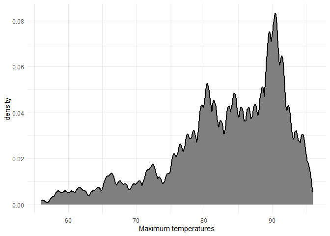
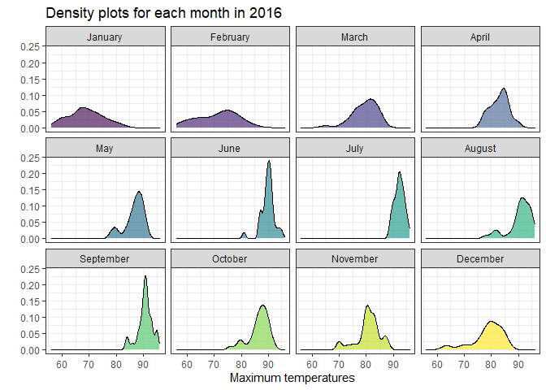
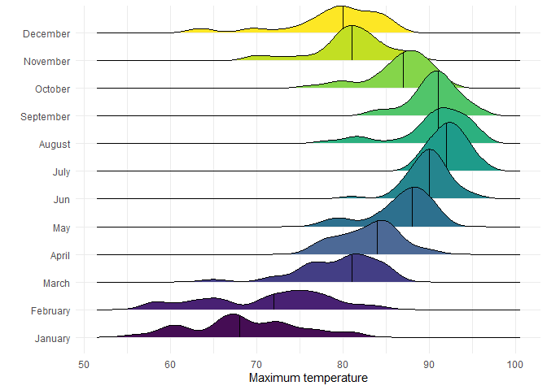
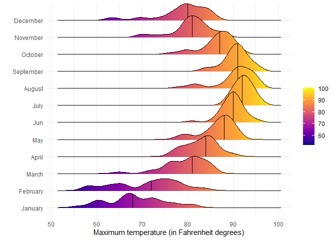

# Data Visualization Project 03

In this exercise you will explore methods to visualize text data and practice how to recreate charts that show the distributions of a continuous variable. 


## Part 1: Density Plots

Using the dataset obtained from FSU's [Florida Climate Center](https://climatecenter.fsu.edu/climate-data-access-tools/downloadable-data), for a station at Tampa International Airport (TPA) from 2016 to 2017, attempt to recreate the charts shown below


```r
library(tidyverse)
weather_tpa <- read_csv("https://github.com/reisanar/datasets/raw/master/tpa_weather_16_17.csv")
# random sample 
sample_n(weather_tpa, 4)
```

```
## # A tibble: 4 x 6
##    year month   day precipitation max_temp min_temp
##   <dbl> <dbl> <dbl>         <dbl>    <dbl>    <dbl>
## 1  2016     4     9             0       77       58
## 2  2016     4    19             0       84       62
## 3  2016     5    22             0       87       75
## 4  2016    10    24             0       80       61
```

See https://www.reisanar.com/slides/relationships-models#10 for a reminder on how to use this dataset with the `lubridate` package for dates and times.


(a) Recreate the plot below:


Hint: the option `binwidth = 3` was used with the `geom_histogram()` function.


```r
# Graph (a) recreation

month_names <- c(
                  '1' = "January",
                  '2' = "February",
                  '3' = "March",
                  '4' = "April",
                  '5' = "May",
                  '6' = "June",
                  '7' = "July",
                  '8' = "August",
                  '9' = "September",
                  '10' = "October",
                  '11' = "November",
                  '12' = "December"
)


ggplot(weather_tpa, mapping = aes(x = max_temp, fill = as.factor(month))) +
  geom_histogram(color = "white", binwidth = 3) +
  facet_wrap(~month, labeller = as_labeller(month_names)) +
  theme_bw() +
  labs(x = "Maximum temperatures", y = "Number of Days") +
  theme(legend.position = "none") +
  scale_fill_manual(values = c("#450D54", "#482173", "#433E85", "#4C6996", "#2D708E", "#25858E", "#1E9B8A", "#2CB07F", "#51C56A", "#85D54A", "#C2DF23", "#FDE725"))
```


(b) Recreate the plot below:


Hint: check the `kernel` parameter of the `geom_density()` function, and use `bw = 0.5`.


```r
# Graph (b) recreation

ggplot() +
  geom_density(data = weather_tpa, mapping = aes(x = max_temp),  fill = "#7F7F7F", bw = 0.5, kernel = "epanechnikov", size = 1) +
  labs(x = "Maximum temperatures") +
  theme_minimal()
```

<!-- -->


(c) Recreate the chart below:


Hint: default options for `geom_density()` were used. 


```r
month_names <- c(
                  '1' = "January",
                  '2' = "February",
                  '3' = "March",
                  '4' = "April",
                  '5' = "May",
                  '6' = "June",
                  '7' = "July",
                  '8' = "August",
                  '9' = "September",
                  '10' = "October",
                  '11' = "November",
                  '12' = "December"
)

ggplot() +
  geom_density(data = weather_tpa, mapping = aes(x = max_temp, fill = as.factor(month)), alpha = 0.66) +
  facet_wrap(~month, labeller = as_labeller(month_names)) +
  labs(title = "Density plots for each month in 2016", x = "Maximum temperatures", y = "") +
  theme_bw() +
  theme(legend.position = "none") +
  scale_fill_manual(values = c("#450D54", "#482173", "#433E85", "#4C6996", "#2D708E", "#25858E", "#1E9B8A", "#2CB07F", "#51C56A", "#85D54A", "#C2DF23", "#FDE725"))
```

<!-- -->


(d) Recreate the chart below:


Hint: default options for `geom_density()` were used. 


```r
library(ggridges)
```

```
## Warning: package 'ggridges' was built under R version 4.0.3
```

```r
weather_tpa$month <- factor(weather_tpa$month, levels = c("1","2","3","4","5","6","7","8","9","10","11","12"))

weather_tpa <- weather_tpa[order(weather_tpa$month),]

ordered_months <- c("January",
                    "February",
                    "March", 
                    "April",
              "May",
              "Jun", 
              "July",
              "August",
              "September", 
              "October",
              "November",
              "December")

weather_tpa$Months <- ordered_months[ weather_tpa$month ]

weather_tpa$Months <- factor(weather_tpa$Months,
                             levels = c("January","February","March", "April",
              "May","Jun", "July","August","September", 
              "October","November","December"))

weather_tpa<-weather_tpa[order(weather_tpa$Months),]

ggplot(data = weather_tpa, mapping = aes(x = max_temp, y = Months, fill = Months)) + 
  stat_density_ridges(quantile_lines = TRUE, quantiles = 0.5, show.legend = FALSE) +
   labs(x = "Maximum temperature", y = "") +
  theme_minimal() +
  scale_fill_manual(values = c("#450D54", "#482173", "#433E85", "#4C6996", "#2D708E", "#25858E", "#1E9B8A", "#2CB07F", "#51C56A", "#85D54A", "#C2DF23", "#FDE725"))
```

```
## Picking joint bandwidth of 1.49
```

<!-- -->


(e) Recreate the plot below:


Hint: use the`ggridges` package, and the `geom_density_ridges()` function paying close attention to the `quantile_lines` and `quantiles` parameters.


```r
ggplot(data = weather_tpa, mapping = aes(x = max_temp, y = Months, fill = Months)) + 
  geom_density_ridges(show.legend = FALSE) + 
  stat_density_ridges(quantile_lines = TRUE, quantiles = 0.5, show.legend = FALSE) +
   labs(x = "Maximum temperature", y = "") +
  theme_minimal() +
  scale_fill_manual(values = c("#450D54", "#482173", "#433E85", "#4C6996", "#2D708E", "#25858E", "#1E9B8A", "#2CB07F", "#51C56A", "#85D54A", "#C2DF23", "#FDE725"))
```

```
## Picking joint bandwidth of 1.49
## Picking joint bandwidth of 1.49
```

<!-- -->


(f) Recreate the chart below:


Hint: this uses the `plasma` option (color scale) for the _viridis_ palette.


```r
library(viridis)
```

```
## Warning: package 'viridis' was built under R version 4.0.3
```

```
## Loading required package: viridisLite
```

```r
ggplot(data = weather_tpa, mapping = aes(x = max_temp, y = Months, fill = stat(x))) + 
  geom_density_ridges_gradient(quantile_lines = TRUE, quantiles = 0.5) +
   labs(x = "Maximum temperature (in Fahrenheit degrees)", y = "", fill = "") +
  theme_minimal() +
  scale_fill_viridis(option = "C")
```

```
## Picking joint bandwidth of 1.49
```

<!-- -->


## Part 2: Visualizing Text Data

Review the set of slides (and additional resources linked in it) for visualizing text data: https://www.reisanar.com/slides/text-viz#1

Choose any dataset with text data, and create at least one visualization with it. For example, you can create a frequency count of most used bigrams, a sentiment analysis of the text data, a network visualization of terms commonly used together, and/or a visualization of a topic modeling approach to the problem of identifying words/documents associated to different topics in the text data you decide to use. 

Make sure to include a copy of the dataset in the `data/` folder, and reference your sources if different from the ones listed below:

- [Billboard Top 100 Lyrics](https://github.com/reisanar/datasets/blob/master/BB_top100_2015.csv)

- [RateMyProfessors comments](https://github.com/reisanar/datasets/blob/master/rmp_wit_comments.csv)

- [FL Poly News 2020](https://github.com/reisanar/datasets/blob/master/poly_news_FL20.csv)

- [FL Poly News 2019](https://github.com/reisanar/datasets/blob/master/poly_news_FL19.csv)

(to get the "raw" data from any of the links listed above, simply click on the `raw` button of the GitHub page and copy the URL to be able to read it in your computer using the `read_csv()` function)
